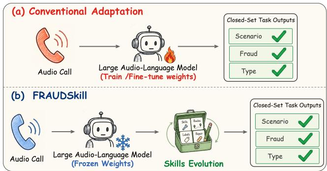
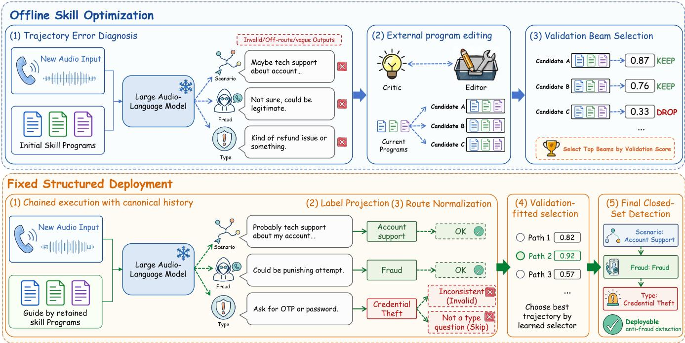
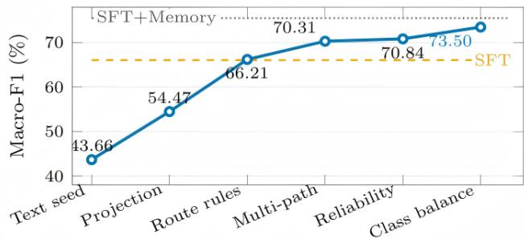
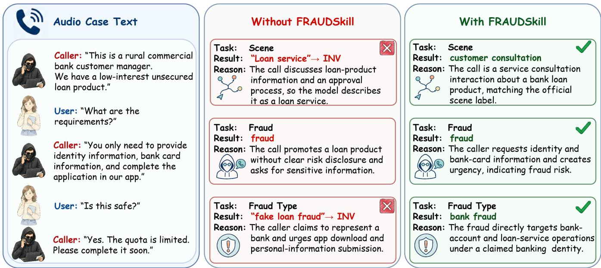

# FRAUDSkill: Structured Frozen-Weight Skill Optimization for Audio Anti-Fraud Detection

Chengxian Hu1∗, Zhiming Ma2∗, Mingjun Pan6, Yifan Wang1 Shun Zhang1, Qifan Wang3, Zhilei Zhao1, Yijin Zhou4 Yuxi Zhao1, Huiyuan Liu1, Peidong Wang5, Peng Chen1

1People’s Public Security University of China 2JD Technology 3Meta 4University of Science and Technology of China 5Northeastern University 6Peking University, Shenzhen

{202421430031, 2024111026, 202421450003, 202421250002}@stu.ppsuc.edu.cn {shunzhang, zhaozl, chenpeng}@ppsuc.edu.cn mazhiming312@outlook.com wqfcr@meta.com zyjm@mail.ustc.edu.cn pdongwang@163.com mingjunpan96@gmail.com

## Abstract

Large audio-language models have shown promise for anti- fraud detection by directly processing speech and reason- ing over fraud-related evidence. Their deployment, how- ever, requires predictions to follow a predefined label space and a structured decision protocol consisting of service- scenario identification, fraud detection, and conditional fraud- type classification. Existing fine-tuning and prompt-based ap- proaches typically encode task knowledge, constraints, and decision rules into model parameters or manually maintained prompts, making them dificult to adapt as fraud patterns and labeling policies evolve. To this end, we propose FRAUDSkill, a structured frozen-weight adaptation framework that leaves the underlying audio-language model unchanged while op- timizing an external layer of skill programs, route-specific policies, and decision rules. We further combine structured output control with validation-guided multi-path inference to ensure protocol-compliant predictions. On the TeleAn- tiFraud benchmark, FRAUDSkill achieves 73.50% Macro-F1, outperforming the shared frozen-model baseline by 31.96% while reducing invalid outputs to 1.94%. Extensive experi-ments demonstrate that external skill optimization provides an efective and adaptable solution for structured audio anti- fraud detection without modifying the underlying model. The source code is available at https://anonymous.4open.science/ r/FRAUDSKILL-114514.

## Introduction

Telecom fraud poses persistent threats to public safety, fi- nancial security, and social trust, creating an urgent need for automated detection from spoken interactions. Recent audio- language models (Radford et al. 2023; Chu et al. 2024; Tang et al. 2024) provide a promising foundation for this task by di-rectly processing speech and reasoning over fraud-related ev- idence. However, practical anti-fraud systems operate under predefined label ontologies, requiring predictions to follow a structured decision protocol consisting of service-scenario identification, fraud detection, and conditional fraud-type classification. Consequently, audio anti-fraud detection is not an open-ended understanding task, but a structured closed- set decision problem in which every prediction must satisfy application-specific constraints.

Recent advances in large language models (LLMs) (Brown et al. 2020) and multimodal large language models (MLLMs) (Yin et al. 2024) have substantially expanded the use of foundation models for fraud detection across diverse domains, in- cluding scam-message detection (Jiang 2024), phone-scam analysis and real-time warning (Shen et al. 2025a,b), phishing and spam detection (Jamal, Wimmer, and Sarker 2024; Blake 2025), payment-risk assessment (Dahiphale et al. 2024), and transaction-network fraud modeling (Luo, Wang, and Zhu 2025). In the audio domain, recent benchmarks for-mulate telecom anti-fraud detection as structured prediction over service scenarios, fraud status, and fraud types (Wang et al. 2026). These studies demonstrate the strong reasoning capabilities of large models, but practical deployment further requires predictions to conform to predefined label spaces and decision protocols enforced by real-world anti- fraud systems (Ma et al. 2025).

In audio anti-fraud detection, closed-set predictions are inherently coupled through a hierarchical decision process. Given an audio input, the system first identifies the service scenario, then determines whether the interaction is fraudu- lent, and predicts a fraud type only when fraud is detected. This sequential dependency introduces challenges beyond semantic understanding: a prediction may be linguistically plausible yet violate the predefined label ontology, omit a re- quired decision, or become inconsistent with earlier outputs (Khattab et al. 2023). Since each stage conditions the next, an invalid early prediction can propagate through the pipeline and ultimately invalidate the entire decision process.

Existing adaptation approaches generally specialize foun- dation models by either updating model parameters or man- ually designing prompts (Shin et al. 2020; Zhou et al. 2022). Parameter-eficient or full fine-tuning methods can achieve strong performance but implicitly encode task knowledge, label constraints, and decision policies into model weights, requiring additional optimization whenever fraud patterns, label definitions, or deployment policies evolve. Prompt- based methods are more flexible but often rely on manually engineered instructions that are dificult to maintain across models and provide limited guarantees for structured outputs and sequential decision consistency (Pryzant et al. 2023; Fernando et al. 2024). As a result, neither paradigm simulta-neously ofers adaptability, maintainability, and reliable en- forcement of structured decision protocols while keeping the underlying model unchanged.

  
Figure 1: Comparison between conventional adaptation and FRAUDSkill. Conventional adaptation updates model weights or relies on manually revised instructions, whereas FRAUDSkill keeps the large audio-language model frozen and evolves an external skill layer for closed-set audio anti- fraud decisions.

To address these challenges, we propose FRAUDSkill, a structured frozen-weight adaptation framework for au- dio anti-fraud detection. Rather than modifying the audio- language model itself, FRAUDSkill learns an external skill layer from task examples. The skill layer explicitly repre- sents fraud knowledge, label constraints, routing policies, and validation-derived decision preferences as modular, in- spectable, and replaceable artifacts, enabling detection poli- cies to evolve without retraining the underlying model.

FRAUDSkill is designed to align external skill optimiza- tion with the hierarchical and closed-set nature of audio anti-fraud detection. During optimization, it searches for route-aware skill programs that capture fraud evidence, task policies, and label constraints through program-based op- timization (Khattab et al. 2023). During inference, it combines structured output control with validation-guided multi- path inference to enforce valid labels, consistent routing, and protocol-compliant decision sequences. Together, these com- ponents enable reliable structured prediction while keeping the underlying audio-language model completely frozen.

Our main contributions are summarized as follows:

• We formulate audio anti-fraud detection as a structured frozen-weight adaptation problem, where a frozen audio- language model must support controllable closed-set and chained detection decisions.

• We propose FRAUDSkill, which combines route-aware external skill optimization with structured multi-path in- ference, enabling task knowledge and decision policies to evolve without modifying the audio-language model.

• Experiments on the TeleAntiFraud benchmark show that FRAUDSkill achieves 73.50% Macro-F1, outperforming the shared frozen-model baseline by 31.96% while reducing the invalid-output rate to 1.94%.

## Related Work

LLMs and MLLMs for Anti-Fraud Detection. Antifraud detection has evolved from rule-based and task-specific systems to LLM- and MLLM-based approaches across text, speech, payment, and transaction-network settings (Terzi, Sağıroğlu, and Kılınç 2021). More closely related to our setting, TeleAntiFraud-28k formulates spoken telecom fraud detection as structured prediction over service scenarios, fraud labels, and fraud t pes (Ma et al. 2025), while SAFE-QAQ improves audio-text fraud reasoning through supervised fine-tuning and reinforcement learning (Wang et al. 2026). Although these studies demonstrate the efectiveness of large models for audio anti-fraud detection, their task adaptation primarily relies on updating model parameters. In contrast, our work investigates structured adaptation un- der a fully frozen audio-language model, externalizing task knowledge, label constraints, and decision policies into an optimizable skill layer.

Frozen-Model Prompt and Skill Adaptation. Frozen models can be adapted through prompt optimization, pro- gram or pipeline optimization, and external skill optimiza- tion. Prompt-level methods automatically search for or revise task instructions using discrete optimization, model feed- back, or textual gradients (Yang et al. 2024; Fernando et al. 2024). Program- and pipeline-level methods further opti-mize multiple model calls and intermediate components un- der task-level objectives (Yuksekgonul et al. 2024; Agrawal et al. 2025). More closely related to our work, SkillOpt (Yang et al. 2026) optimizes a unified external skill artifact, while EvoSkill (Alzubi et al. 2026) discovers and revises modular skills according to execution feedback. Although SkillOpt and EvoSkill demonstrate that external skills can be optimized for frozen models, they remain task-general and do not explicitly support the conditional decision chains and closed-set deployment required by audio anti-fraud de- tection. FRAUDSkill is designed for this setting through a route-aware skill program that aligns external adaptation with the three-stage decision chain, oficial label constraints, and cross-route consistency, while keeping the underlying audio- language model frozen.

## Method

## Problem Setting and Framework Overview

FRAUDSkill adapts an audio anti-fraud system without up- dating the parameters of its audio-language model. The frozen actor still processes the audio and produces natural- language judgments. FRAUDSkill instead optimizes and de-ploys an external layer of task instructions, anti-fraud skills, routing policies, and structured decision rules. Its purpose is to convert the actor’s open-ended audio understanding into closed-set predictions that satisfy the label ontology and de- cision protocol required by the deployed system.

  
Fi ure 2: Overview of FRAUDSkill. Ofline skill o timization edits onl external skill ro rams and route olicies usin rollout errors, textual critique, and validation selection. The retained programs, label maps, route rules, and selector are then frozen as deployment artifacts. At test time, the frozen audio actor follows retained programs, produces multiple route trajectories, projects free-form outputs to oficial labels, repairs invalid chains, and selects a final closed-set anti-fraud decision.

Given an audio input x, the system makes three ordered decisions Q = (scene, fraud, type). The scene route predicts a service scenario, the fraud route predicts either normal or fraud, and the type route predicts a fraud category only when the fraud decision is fraud. Each route $q \in \mathcal { Q }$ has an oficial label set $\mathcal { { V } } _ { q }$ and a fixed route query $u _ { q } .$

We distinguish an invalid output from a route that is cor- rectly skipped. The symbol INV denotes a required output that is missing or cannot be mapped to an oficial label, whereas NA denotes a route that is not applicable under the protocol. The feasible output space is therefore

$$
\begin{array} { r } { \mathcal { C } = \mathcal { V } _ { \mathrm { s c e n e } } \times \left\{ \mathrm { n o r m a l } \right\} \times \left\{ \mathrm { N A } \right\} } \\ { \cup \ \mathcal { V } _ { \mathrm { s c e n e } } \times \left\{ \mathrm { f } \ \mathrm { r a u d } \right\} \times \mathcal { V } _ { \mathrm { t y p e } } . } \end{array}\tag{1}
$$

Required outputs mapped to INV are outside $\mathcal { C }$ and are counted as errors.

FRAUDSkill has two strictly separated stages. During $o f \mathrm { - }$ fline skill optimization, it diagnoses errors on labeled de-velopment examples, edits only the external skill programs, and retains programs according to held-out validation per- formance. During fixed deployment, the retained programs, label maps, route rules, and selector are frozen and applied to test or real-world inputs without using their labels.

## External Skill Program

The editable external state is a skill program

$$
P = ( r , \mathcal { K } , \pi ) .\tag{2}
$$

The root instruction $r$ specifies the actor’s role, the output contract, and the oficial label ontology. The skill library $\boldsymbol { \mathcal { K } } ~ = ~ \{ k _ { i } \} _ { i = 1 } ^ { K }$ stores localized task knowledge, including fraud cues, audio evidence, fraud-type boundaries, valid- output requirements, and cross-route consistency rules. The route policy π determines which skills are active at each decision step. Given route $q$ and the preceding normalized history $h _ { q - 1 } .$ , it returns an ordered skill list

$$
K _ { q } = \pi ( q , h _ { q - 1 } ; { \mathcal { K } } ) = ( k _ { q , 1 } , \ldots , k _ { q , n _ { q } } ) .\tag{3}
$$

This representation separates global instructions, local anti- fraud knowledge, and route control. The optimizer may revise any of these external components, while the actor parameters θ remain unchanged.

## Ofline Skill Optimization

Trajectory-level error diagnosis. Let $\mathcal { D } _ { \mathrm { o p t } }$ denote the ex- amples used to generate optimization feedback, and let $\mathcal { D } _ { \mathrm { p r o g } }$ be a disjoint held-out split used to select programs. For a candidate program $P$ and an example d, FRAUDSkill runs the frozen actor through the ordered routes and records the complete trajectory

$$
\begin{array} { r } { \tau _ { P } ( d ) = \mathrm { R u n } _ { \mathrm { t e x t } } ( P , x _ { d } ) . } \end{array}\tag{4}
$$

The trajectory contains the raw route responses, provisional parsed labels, route histories, and any skipped decisions. An error analyzer compares the trajectory with the gold labels and returns

$$
\begin{array} { r } { e _ { P } ( d ) = E ( \tau _ { P } ( d ) , \mathbf { y } _ { d } ) . } \end{array}\tag{5}
$$

The error record distinguishes incorrect oficial labels, un- mappable outputs, incorrectly skipped type decisions, cross- route inconsistencies, and systematic errors on minority classes. This trajectory-level diagnosis separates a down-stream type error from an upstream fraud decision that pre- vented the type route from being executed.

External program editing. At optimization round t, a critic model (Zheng et al. 2023) summarizes the errors ob-served on a sampled batch $B _ { t } \subset D _ { \mathrm { o p t } }$

$$
g _ { t , P } = G _ { \phi } ( P , \{ ( d , \tau _ { P } ( d ) , e _ { P } ( d ) ) : d \in B _ { t } \} ) .\tag{6}
$$

The feedback ${ { g } _ { t , P } }$ is a natural-language diagnosis rather than a numerical gradient. An editor uses it to produce a bounded neighborhood of revised programs:

$$
\mathcal N ( P , g _ { t , P } ) = \{ T _ { \psi } ( P , g _ { t , P } , j ) \} _ { j = 1 } ^ { c } ,\tag{7}
$$

where c is the branch factor. An edit may revise the root instruction, add or modify a named skill, refine a fraud-type boundary, or update a route-policy rule. The editor never changes the audio-language model or its parameters.

Validation selection and retained program set. Starting from a shared initial program $P _ { 0 }$ , FRAUDSkill maintains a beam $B _ { t }$ of candidate programs. At round t, the candidate pool is

$$
\mathcal { C } _ { t } = \mathcal { B } _ { t - 1 } \cup \bigcup _ { P \in \mathcal { B } _ { t - 1 } } \mathcal { N } ( P , g _ { t , P } ) .\tag{8}
$$

Every candidate is evaluated on $\mathcal { D } _ { \mathrm { p r o g } }$ using the same pre-specified route-aware criterion $J \colon$

$$
B _ { t } = \mathrm { T o p } _ { b } \left( \mathcal { C } _ { t } ; J _ { \mathcal { D } _ { \mathrm { p r o g } } } \right) ,\tag{9}
$$

where b is the beam width. Invalid required outputs and incorrectly skipped routes receive zero credit. The rollout, diagnosis, editing, and validation selection steps are repeated for $\mathbf { \bar { \rho } } _ { T }$ rounds.The best single program

$$
P ^ { * } = \arg \operatorname* { m a x } _ { P \in \cup _ { t = 0 } ^ { T } \mathcal { B } _ { t } } J _ { \mathcal { D } _ { \mathrm { p r o g } } } ( P ) ,\tag{10}
$$

defines the text-only variant FRAUDSkill-Text. The complete system retains the top L programs according to the same validation criterion:

$$
\mathcal { M } = \mathrm { T o p } _ { L } \left( \bigcup _ { t = 0 } ^ { T } \mathcal { B } _ { t } ; J _ { \mathcal { D } _ { \mathrm { p r o g } } } \right) = \{ P ^ { ( 1 ) } , \ldots , P ^ { ( L ) } \} .\tag{11}
$$

All retained programs and search settings are frozen before selector fitting and test evaluation. In particular, test perfor- mance is not used to choose a program, a seed, or $L$

## Fixed Structured Deployment

Chained execution with canonical history. During de-ployment, every retained program independently guides the same frozen actor. For program $\bar { P ^ { ( \ell ) } }$ and route $q ,$ FRAUDSkill compiles the root instruction, selected route skills, route query, and preceding normalized history into

$$
c _ { q } ^ { ( \ell ) } = C \left( r ^ { ( \ell ) } , K _ { q } ^ { ( \ell ) } , u _ { q } , h _ { q - 1 } ^ { ( \ell ) } \right) .\tag{12}
$$

The frozen actor then produces an open-ended response

$$
\begin{array} { r } { \widetilde { y } _ { q } ^ { ( \ell ) } = f _ { \theta } ( x , c _ { q } ^ { ( \ell ) } ) . } \end{array}\tag{13}
$$

FRAUDSkill applies label projection and route normalization before appending the result to the history. Thus, subse- quent routes receive canonical decisions rather than uncon- strained natural-language responses.

Label projection. For each route, a deterministic projection operator maps the raw response to the oficial ontology:

$$
y _ { q , \mathrm { c a n o n } } ^ { ( \ell ) } = \eta _ { q } \Bigl ( \widetilde { y } _ { q } ^ { ( \ell ) } ; \mathcal { y } _ { q } , \mathcal { A } _ { q } \Bigr ) ,\tag{14}
$$

where $\mathcal { A } _ { \boldsymbol { q } }$ is a fixed map from accepted aliases to oficial la- bels. An exact oficial label is retained, and an unambiguous accepted alias is replaced with its canonical label. If no valid mapping exists, the output is set to INV. The label ontol-ogy, alias maps, matching priority, and ambiguity rules are defined and frozen without inspecting test outputs or labels.

Route normalization. The route normalizer enforces the conditional protocol:

$$
\begin{array} { r } { \overline { { y } } _ { q } ^ { ( \ell ) } = \rho _ { q } \Big ( y _ { q , \mathrm { c a n o n } } ^ { ( \ell ) } , h _ { q - 1 } ^ { ( \ell ) } \Big ) . } \end{array}\tag{15}
$$

The scene and fraud routes are always required. If the nor- malized fraud decision is $\mathtt { f r a u d }$ , the type route is executed and must return a member of $\mathcal { D } _ { \mathrm { t y p e } } ;$ an unmappable type response is marked INV. If the normalized fraud decision is normal, the type route is not executed and its value is set to NA. If the fraud decision itself is INV, the downstream type decision is also treated as invalid because its applicability cannot be determined. The normalized decision is appended to the route history:

$$
h _ { q } ^ { ( \ell ) } = \mathrm { a p p e n d } \left( h _ { q - 1 } ^ { ( \ell ) } , q , \overline { { { y } } } _ { q } ^ { ( \ell ) } \right) .\tag{16}
$$

Each program therefore produces one normalized trajectory

$$
\begin{array} { r } { \overline { { \mathbf { y } } } ^ { ( \ell ) } = \left( \overline { { y } } _ { \mathrm { s c e n e } } ^ { ( \ell ) } , \overline { { y } } _ { \mathrm { f r a u d } } ^ { ( \ell ) } , \overline { { y } } _ { \mathrm { t y p e } } ^ { ( \ell ) } \right) . } \end{array}\tag{17}
$$

Validation-fitted selection. Retained programs may have diferent route- and class-s ecific reliabilit . FRAUDSkill fits a selector on a calibration split $\mathcal { D } _ { \mathrm { c a l } }$ that is disjoint from both test data and the examples used for textual error feed- back. Let $\overline { { \mathbf { Y } } } ( d ) = ( \overline { { \mathbf { y } } } ^ { ( 1 ) } ( d ) , \ldots , \overline { { \mathbf { y } } } ^ { ( L ) } ( d ) )$ denote the nor- malized trajectories for example d. The selector family $\Omega _ { \mathrm { b a l } }$ is a finite, prespecified set of reliability-weighting and class- balancing configurations. For configuration ω, route-wise ag-gregation produces provisional decisions $S _ { \omega , q } ,$ , after which a final projection $\Pi _ { \mathcal { C } }$ enforces the feasible set in Equation (1):

$$
\begin{array} { r } { \widehat { \mathbf { y } } ( d ; \omega ) = \Pi _ { \mathcal { C } } \Big ( \big \{ S _ { \omega , q } \big ( \overline { { y } } _ { q } ^ { ( 1 ) } ( d ) , } \\ { \qquad \cdots , \overline { { y } } _ { q } ^ { ( L ) } ( d ) \big ) \big \} _ { q \in \mathcal { Q } } \Big ) . } \end{array}\tag{18}
$$

For compactness, let $\widehat { \mathbf { z } } _ { q , \omega }$ and $\mathbf { z } _ { q }$ denote the predicted and gold label vectors for route q on $\mathcal { D } _ { \mathrm { c a l } }$ . The fitted configuration maximizes task-averaged Macro-F1 on calibration trajecto-ries:

$$
\omega ^ { * } = \arg \operatorname* { m a x } _ { \omega \in \Omega _ { \mathrm { b a l } } } \frac { 1 } { | \mathcal { Q } | } \sum _ { q \in \mathcal { Q } } F _ { \mathrm { m a c r o } } ^ { ( q ) } \left( \widehat { \mathbf { z } } _ { q , \omega } , \mathbf { z } _ { q } \right) .\tag{19}
$$

At test time, $\omega ^ { * }$ is fixed and the final prediction is

$$
\widehat { \mathbf { y } } = \widehat { \mathbf { y } } ( x ; \omega ^ { * } ) .\tag{20}
$$

The selector never reads test labels. Class balancing is used only to fit the fixed aggregation rule (Dal Pozzolo et al. 2015) and does not change the actor or any retained skill program.

We use FRAUDSkill-Text for the best single external program P∗ evaluated without multi-program aggregation. We use FRAUDSkill for the complete fixed system consisting of the retained program set M, label projection, route normalization, and validation-fitted selector.

## Experiments

We compare external skill adaptation methods under a uni- fied audio model and an audio-level evaluation protocol. We then isolate the respective roles of textual program search and structured inference in the complete system.

## Experimental Setup

Data and protocol. After audio-level deduplication, the oficial SFT split of TeleAntiFraud contains 10,711 training samples and 2,677 test samples, of which 1,453 test sam- ples have fraud-type annotations. A held-out portion of the training set is used for program search and selector fitting. All programs, normalization rules, and selectors are fixed before testing, and no test label is used for their construction or selection. Evaluation follows the original sequential deci- sion protocol: the system first recognizes the service scenario, then determines whether the audio is fraudulent, and predicts a fraud type only if its own upstream decision is positive. Consequently, an upstream error can prevent a downstream route from being executed. The evaluation unit is a unique audio recording. This difers from the 7,021 interaction-level records used in the original dataset paper, so results under the two protocols are not directly comparable.

Model. All directly compared methods use Qwen2-Audio-7B-Instruct with deterministic decoding. Its parameters re- main fixed throughout adaptation and evaluation. Diferences among these methods therefore arise from how external task knowledge is represented, optimized, and applied, rather than from changes to the audio model.

Baselines. The shared baseline supplies every method with the same label ontology, output schema, audio-evidence guidance, and cross-turn consistency rules. SkillOpt repre- sents this information as a single editable document and re- vises the skill through controlled text-space optimization. EvoSkill instead represents it as a structured skill folder and discovers or modifies local skills in response to exe- cution failures. These methods instantiate document-level optimization and modular skill evolution, respectively, but neither explicitly models the three-stage decision route, pro- jection onto the oficial label set, or consistency across routes. FRAUDSkill-Text represents the same task information as a program comprising a root instruction, named skills, and routing policies; it isolates the efect of route-aware textual program search. The complete FRAUDSkill further intro- duces closed-set projection, route normalization, complementary trajectories, and class-balanced selection. SFT and

SFT+Memory are included only as parameter-training ref- erence points. Because they update model parameters, they are not direct baselines and are excluded from the ranking of external skill methods.

Evaluation metrics. Following TeleAntiFraud-Bench, we compute Weighted F1 separately for scenario recognition, fraud detection, and fraud-type recognition, and report their mean as W-F1. Because service scenarios and fraud types are imbalanced, the primary metric is the task-averaged Macro- F1. Accuracy complements the class-balanced metrics with overall correctness. Joint Accuracy counts a sample as cor- rect only when every applicable output in the decision chain is correct, while Invalid Rate measures missing labels, labels outside the oficial ontology, and outputs that violate the rout- ing protocol. The original benchmark’s LLM-based score for slow-thinking rationales is not used because FRAUDSkill produces closed-set decisions rather than free-form reason- ing traces for evaluation.

Reporting protocol. FRAUDSkill-Text is run with random seeds 42, 43, and 44. The main comparison reports the arith- metic mean, and variation is measured by the sample standard deviation. The component analysis starts from the best tex- tual program and adds structured components cumulatively. Separating these two protocols prevents search variation from being conflated with the contribution of structured inference.

## Main Results

The comparison in Table 1 follows an increasing degree of task structure. The shared baseline provides fixed task knowledge; SkillOpt and EvoSkill optimize the external skill artifact; FRAUDSkill-Text adds an explicit routing structure in the text layer; and the complete FRAUDSkill separates output constraints and final selection from any single textual program. This ordering distinguishes generic skill evolution, route-aware program search, and structured decision control.

Generic skill optimization improves compliance more readily than class-balanced discrimination. The shared base- line obtains a Macro-F1 of 41.54% with an Invalid Rate of 36.04%. SkillOpt lowers the Invalid Rate to 29.00%, yet its Macro-F1 drops to 37.67%; EvoSkill similarly obtains a 34.19% Invalid Rate and a Macro-F1 of 39.07%. Both meth- ods can revise how task information is expressed, but their representations do not explicitly enforce the oficial label set or dependencies among the three decisions. Better-formed in- structions or outputs therefore do not necessarily yield more accurate closed-set classification.

A route-aware program representation partly alleviates this limitation, although textual search alone remains insuf- ficient for final decision making. FRAUDSkill-Text achieves the strongest text-layer result, with an average Macro-F1 of 42.42%, outperforming the shared baseline by 0.88 percent- age points, while improving Joint Accuracy from 7.10% to 8.18%. Nevertheless, its Invalid Rate remains high at 34.48%. These results suggest that organizing root instruc- tions, local skills, and routing policies improves discrimina- tive performance to some extent, but a single textual program must still perform both open-ended generation and structured decision control.

<table><tr><td>Method</td><td>Macro-F1</td><td>∆</td><td>W-F1</td><td>Acc.</td><td>Joint Acc.</td><td>Invalid Rate</td></tr><tr><td>Shared baseline</td><td>41.54</td><td>0.00</td><td>35.92</td><td>32.87</td><td>7.10</td><td>36.04</td></tr><tr><td>SkillOpt</td><td>37.67</td><td>-3.87</td><td>36.88</td><td>33.04</td><td>5.94</td><td>29.00</td></tr><tr><td>EvoSkill</td><td>39.07</td><td>-2.47</td><td>36.79</td><td>32.67</td><td>6.16</td><td>34.19</td></tr><tr><td>FRAUDSkill-Text</td><td>42.42</td><td>+0.88</td><td>38.87</td><td>34.88</td><td>8.18</td><td>34.48</td></tr><tr><td>FRAUDSkill</td><td>73.50</td><td>+31.96</td><td>79.40</td><td>78.72</td><td>58.87</td><td>1.94</td></tr><tr><td>SFT (reference)</td><td>66.06</td><td></td><td>一</td><td></td><td></td><td>一</td></tr><tr><td>SFT+Memory (reference)</td><td>75.51</td><td></td><td>一</td><td>一</td><td>一</td><td>一</td></tr></table>

Table 1: Audio-level results on the complete test set (%). ∆ denotes the absolute Macro-F1 diference from the shared baseline. Methods above the divider use the same fixed audio model. SFT and SFT+Memory are contextual parameter-training references, and unavailable pipeline metrics are marked with “–”.

The complete FRAUDSkill separates these responsibili- ties across diferent components. Closed-set projection and route normalization convert open-ended generations into protocol-valid candidates, complementary program trajectories provide alternative decisions, and a validation-fitted selector produces the final output. This design raises Macro- F1 to 73.50%, an absolute improvement of 31.96 percentage points over the shared baseline. W-F1, Accuracy, and Joint Accuracy reach 79.40%, 78.72%, and 58.87%, respectively, while the Invalid Rate falls to 1.94%. The substantial gain observed after introducing structured inference suggests that closed-set control, route consistency, and class-aware selec- tion contribute more directly to the final detection outcome than further skill rewriting. The SFT and SFT+Memory rows are parameter-updating references, not frozen-skill baselines.

## Ablation Studies

The preceding analyses identify two distinct limitations: vari- ation across single-program searches and a gap between out- put validity and class discrimination. Starting from the best text-layer program, Figure 3 shows how the complete sys- tem addresses them in sequence. Closed-set projection first raises Macro-F1 from 43.66% to 54.47%, and route normal- ization further raises it to 66.21%. Together, label projection and decision-chain consistency account for 22.55 percentage points, suggesting that many text-layer outputs contain rel- evant semantics but either fail to map to an oficial label or conflict with an upstream decision.

Once candidate trajectories share a valid representation, complementary multi-path inference raises Macro-F1 from 66.21% to 70.31%. Diferent programs make complemen- tary errors across routes and classes, making the retained trajectory set more robust than relying on a single program. Reliability weighting further raises Macro-F1 to 70.84%, outperforming majority voting by 0.53 percentage points. Adding class-balanced selection produces the final Macro- F1 of 73.50%, yielding an additional gain of 2.66 percentage points. These results suggest that the main benefit of the se- lection stage lies in protecting minority classes (Han et al. 2025), rather than simply reinforcing the majority decision.

The structured components contribute 29.84% Macro-F1 points over the best textual program. Closed-set projection and route normalization construct valid, consistent candi- dates; multi-path inference exploits complementarity among programs; and class-balanced selection performs the final discrimination. This division of labor turns text-layer skill search from single-program optimization into a structured decision process for closed-set audio anti-fraud detection.

  
Figure 3: Compact summary of main results. The curve shows cumulative gains from stacking structured components on the best text seed; SFT and SFT+Memory are external ref erence lines.

<table><tr><td>Route</td><td>Diagnostic</td><td>Count</td></tr><tr><td>Scene</td><td>evaluated examples</td><td>2,677</td></tr><tr><td>Scene</td><td>all errors</td><td>1,985</td></tr><tr><td>Scene</td><td>missing/off-ontology</td><td>1,808</td></tr><tr><td>Fraud</td><td>evaluated examples</td><td>2,677</td></tr><tr><td>Fraud</td><td>all errors</td><td>881</td></tr><tr><td>Fraud</td><td>false normal</td><td>529</td></tr><tr><td>Fraud</td><td>false fraud</td><td>340</td></tr><tr><td>Type</td><td>annotated examples</td><td>1,453</td></tr><tr><td>Type</td><td>wrong annotated cases</td><td>1,208</td></tr></table>

Table 2: Test-set error counts of FRAUDSkill-Text.

## Error Analysis

As shown in Table 2, FRAUDSkill-Text exhibits errors across all decision routes. The scene-level error rate reaches 74.2%, with missing or of-ontology outputs accounting for 91.1% of these errors, indicating dificulty in converting open-ended generations into valid closed-set labels. Although the fraud- route error rate is lower at 32.9%, false-normal decisions account for 60.0% of its errors and can block downstream fraud-type classification; the type route remains the most dificult, with an 83.1% error rate on annotated examples. These findings motivate the use of label projection, route normalization, and complementary multi-path inference to improve label validity and cross-route consistency.

  
Figure 4: Case study of structured skill adaptation on a loan-related fraud call. The left column shows the audio case text. Without FRAUDSkill, the frozen audio actor provides plausible reasons but produces non-ontology labels such as "loan service" and "fake loan fraud", which are mapped to INV. With FRAUDSkill, external skill artifacts guide the same frozen actor toward protocol-compatible closed-set outputs with route-level reasons, yielding the oficial labels customer consultation, fraud, and bank fraud.

## Case Study

Figure 4 compares FRAUDSkill on a typical "bank low-interest loan impersonation" scam call. Without FRAUDSkill, the frozen model tends to generate open-ended labels. It describes the scene as "Loan service" and the fraud type as "fake loan fraud." These terms are semantically re- lated to the call but are not included in the predefined label set, so they are mapped to invalid outputs. As a result, only the fraud judgment is valid, giving one valid prediction out of three. With FRAUDSkill, label projection and route nor-malization constrain the outputs to the oficial label space. The same call is judged as customer consultation, fraud, and bank fraud, and all three predictions are valid. This sample- level change is consistent with the global decrease in invalid outputs from 36.04% to 1.94%. The rationales also become more specific and better aligned with the label definitions. Instead of saying only that the caller promotes a loan without disclosing risks, the model points to cues such as request- ing identity and bank-card information and creating urgency through a limited quota. This shows that FRAUDSkill does not simply shorten free text. It keeps the original mean- ing while guiding it into a controlled label space. Since the Scene, Fraud, and Fraud Type decisions must be checked step by step, FRAUDSkill makes each decision and its rea- son inspectable, so errors can be located and traced. These improvements are obtained without updating model weights or task-specific tuning, ofering a training-free and plug-and- play way to deploy frozen audio-language models for trust- worthy anti-fraud decisions.

## Conclusion

We present FRAUDSkill, a structured frozen-weight ASO method for audio anti-fraud detection. It addresses the mis- match between open-ended audio-language generation and closed-set fraud deployment by adapting external skill ar- tifacts rather than audio-model parameters. The text layer extends APO-style search from one prompt to a routed skill program. The inference layer then normalizes complemen- tary frozen-actor trajectories and applies class-balanced reliability selection.

The results support two scoped conclusions. First, text- layer skill search alone is useful but unstable in this setting: FRAUDSkill-Text marginally improved mean Macro-F1 over the shared baseline, with variation larger than the mean gain. Second, the complete structured system is much stronger. Un- der the studied protocol, it achieved competitive performance without updating the audio actor, clearly above the plain SFT reference and slightly below SFT+Memory. These compar- isons are protocol-bound and do not imply a task independent ranking. They show that, for closed-set audio anti-fraud de- ployment, validity control, complementary trajectories, and class-aware selection are central to making frozen-weight adaptation competitive with weight-updating references.

## Ethical Statement

FRAUDSkill is intended only for defensive research on telecom-fraud detection. Its synthetic, non-private artifacts must support only defensive analysis and never deception, impersonation, or scam training.

## References

Agrawal, L. A.; Tan, S.; Soylu, D.; Ziems, N.; Khare, R.; Opsahl- Ong, K.; Singhvi, A.; Shandilya, H.; Ryan, M. J.; Jiang, M.; et al. 2025. Gepa: Reflective prompt evolution can outperform reinforce- ment learning. In First Workshop on Foundations ofReasoning in Language Models.

Alzubi, S.; Provenzano, N.; Bingham, J.; Chen, W.; and Vu, T. 2026. EvoSkill: Automated Skill Discovery for Multi-Agent Sys- tems. arXiv:2603.02766.

Blake, S. E. 2025. Phishsense-1B: A Technical Perspective on an AI-Powered Phishing Detection Model. arXiv:2503.10944.

Brown, T.; Mann, B.; Ryder, N.; Subbiah, M.; Kaplan, J. D.; Dhari- wal, P.; Neelakantan, A.; Shyam, P.; Sastry, G.; Askell, A.; et al. 2020. Language models are few-shot learners. Advances in neural information processing systems, 33: 1877–1901.

Chu, Y.; Xu, J.; Zhou, X.; Yang, Q.; Zhang, S.; Yan, Z.; Zhou, C.; andZhou, J. 2024. Qwen2-Audio Technical Report. arXiv:2407.10759.

Dahiphale, D.; Madiraju, N.; Lin, J.; Karve, R.; Agrawal, M.; Modwal, A.; Balakrishnan, R.; Shah, S.; Kaushal, G.; Mandawat, P.; Hariramani, P.; and Merchant, A. 2024. Enhancing Trust and Safety in Digital Payments: An LLM-Powered Approach. arXiv:2410.19845.

Dal Pozzolo, A.; Caelen, O.; Johnson, R. A.; and Bontempi, G. 2015. Calibrating Probability with Undersampling for Unbalanced Classification. In SSCI, 159–166.

Fernando, C.; Banarse, D. S.; Michalewski, H.; Osindero, S.; and Rocktäschel, T. 2024. Promptbreeder: Self-referential self- improvement via prompt evolution. In Forty-first International Conference on Machine Learning.

Han, L.; Wang, L.; Cheng, Z.; Wang, B.; Yang, G.; Cheng, D.; and Lin, X. 2025. Mitigating the tail efect in fraud detection by community enhanced multi-relation graph neural networks. IEEE Transactions on Knowledge and Data Engineering, 37(4): 2029– 2041.

Jamal, S.; Wimmer, H.; and Sarker, I. H. 2024. An improved transformer-based model for detecting phishing, spam and ham emails: A large language model approach. Security and privacy, 7(5): e402.

Jiang, L. 2024. Detecting Scams Using Large Language Models. arXiv:2402.03147.

Khattab, O.; Singhvi, A.; Maheshwari, P.; Zhang, Z.; Santhanam, K.; Vardhamanan, S.; Haq, S.; Sharma, A.; Joshi, T. T.; Moazam, H.; et al. 2023. Dspy: Compiling declarative language model calls into self-improving pipelines. arXiv preprint arXiv:2310.03714.

Luo, R.; Wang, N.; and Zhu, X. 2025. Fraud Detection and Risk Assessment of Online Payment Transactions on E-commerce Plat- forms Based on LLM and GCN Frameworks. arXiv:2509.09928.

Ma, Z.; Wang, P.; Huang, M.; Wang, J.; Wu, K.; Lv, X.; Pang, Y.; Yang, Y.; Tang, W.; and Kang, Y. 2025. TeleAntiFraud-28k: An Audio-Text Slow-Thinking Dataset for Telecom Fraud Detec- tion. In Proceedings ofthe 33rd ACM International Conference on Multimedia, 5853–5862.

Pryzant, R.; Iter, D.; Li, J.; Lee, Y.; Zhu, C.; and Zeng, M. 2023. Automatic prompt optimization with “gradient descent” and beam search. In Proceedings ofthe 2023 conference on empirical methods in natural language processing, 7957–7968.

Radford, A.; Kim, J. W.; Xu, T.; Brockman, G.; McLeavey, C.; and Sutskever, I. 2023. Robust speech recognition via large-scale weak supervision. In International conference on machine learning, 28492–28518. PMLR.

Shen, Z.; Wang, K.; Zhang, Y.; Ngai, G.; and Fu, E. Y. 2025a. Combating phone scams with llm-based detection: Where do we stand?(student abstract). In Proceedings of the AAAI Conference on Artificial Intelligence, volume 39, 29487–29489.

Shen, Z.; Yan, S.; Zhang, Y.; Luo, X.; Ngai, G.; and Fu, E. Y. 2025b. " It Warned Me Just at the Right Moment": Exploring LLM-based Real-time Detection of Phone Scams. In Proceedings ofthe ExtendedAbstracts ofthe CHI Conference on Human Factors in Computing Systems, 1–7.

Shin, T.; Razeghi, Y.; Iv, R. L. L.; Wallace, E.; and Singh, S. 2020. Autoprompt: Eliciting knowledge from language models with auto- matically generated prompts. In Proceedings ofthe 2020 conference on empirical methods in natural language processing (EMNLP), 4222–4235.

Tang, C.; Yu, W.; Sun, G.; Chen, X.; Tan, T.; Li, W.; Lu, L.; Ma, Z.; and Zhang, C. 2024. Salmonn: Towards generic hearing abilities for large language models. In International Conference on Learning Representations, volume 2024, 16607–16629.

Terzi, D. S.; Sağıroğlu, Ş.; and Kılınç, H. 2021. Telecom fraud detection with big data analytics. International Journal of Data Science, 6(3): 191–204.

Wang, P.; Ma, Z.; Dai, X.; Liu, Y.; Feng, S.; Yang, X.; Hu, W.; Wang, Z.; Pan, M.; Yuan, L.; and Wang, D. 2026. SAFE-QAQ: End-to-End Slow-Thinking Audio-Text Fraud Detection via Reinforcement Learning. arXiv:2601.01392.

Yang, C.; Wang, X.; Lu, Y.; Liu, H.; Le, Q. V.; Zhou, D.; and Chen, X. 2024. Large language models as optimizers. In International Conference on Learning Representations, volume 2024, 12028– 12068.

Yang, Y.; Gong, Z.; Huang, W.; Yang, Q.; Zhou, Z.; Huang, Z.; Li, Y.; Gao, X.; Dai, Q.; Liu, B.; Qiu, K.; Yang, Y.; Chen, D.; Yang, X.; and Luo, C. 2026. SkillOpt: Executive Strategy for Self-Evolving Agent Skills. arXiv:2605.23904.

Yin, S.; Fu, C.; Zhao, S.; Li, K.; Sun, X.; Xu, T.; and Chen, E. 2024. A survey on multimodal large language models. National Science Review, 11(12): nwae403.

Yuksekgonul, M.; Bianchi, F.; Boen, J.; Liu, S.; Huang, Z.; Guestrin, C.; and Zou, J. 2024. TextGrad: Automatic “Diferentiation” via Text. arXiv:2406.07496.

Zheng, L.; Chiang, W.-L.; Sheng, Y.; Zhuang, S.; Wu, Z.; Zhuang, Y.; Lin, Z.; Li, Z.; Li, D.; Xing, E.; et al. 2023. Judging llm- as-a-judge with mt-bench and chatbot arena. Advances in neural information processing systems, 36: 46595–46623.

Zhou, Y.; Muresanu, A. I.; Han, Z.; Paster, K.; Pitis, S.; Chan, H.; and Ba, J. 2022. Large language models are human-level prompt engineers. In The eleventh international conference on learning representations.

## Supplementary Material

## Experimental Protocol Details

This supplement records protocol and implementation details for reproducibility. It does not repeat the main-paper method description, framework figure, case study, or headline result discussion.

Task protocol. Each audio example is evaluated through an ordered route sequence: scene, fraud, and type. The scene route predicts one service scenario from the oficial scene on- tology. The fraud route predicts either normal or fraud. The type route is evaluated only when fraud is predicted or annotated as fraud; otherwise its value is NA. A required output that is missing, malformed, or not recoverable as an oficial label is mapped to INV. This distinguishes an unus-able output from a valid negative decision.

Oficial label spaces. The scene labels used by the released evaluation configuration are account support, customer consultation, e-commerce promotion, public service, delivery service, and other. The fraud labels are normal and fraud. The fraud-type labels are bank fraud, phishing, identity theft, investment fraud, romance fraud, fake customer service, lottery fraud, and other fraud.

Metric computation. The primary metric is task-averaged Macro-F1 over the three routes. The paper also reports weighted F1, accuracy, joint accuracy, and invalid rate. Joint accuracy requires every applicable route in the chain to be correct. Invalid rate measures route outputs that are mal- formed, missing, or outside the oficial label space after pars- ing and normalization.

Split isolation. Textual skill search uses training examples for candidate generation and held-out validation examples for program selection. The validation-fitted selector is cali- brated on a validation split disjoint from the test set and from the examples used to generate textual error feedback. Test labels are not used by the skill editor, label projection, route normalization, or selector fitting.

## External Skill Search Settings

Frozen actor. All frozen-weight methods use the same fixed audio-language actor. The actor listens to the audio input and generates route-level text. FRAUDSkill changes only external artifacts: root instructions, named skills, route policies, label maps, deterministic route normalizers, and selector configurations.

Search configuration. The released configuration uses seed 42 for the default search trace, beam width 3, branch factor 3, five search rounds, and optimization batches of 64 examples. Candidate programs are scored on held-out val- idation data using a route-aware score during search. The reported paper metric remains task-averaged Macro-F1.

Critic and editor interface. For each candidate program, the frozen actor is rolled out on a batch of examples. The trajectory records raw route text, parsed route decisions, nor-malized decisions, route histories, and route-level errors. A textual critic summarizes recurring failure modes, such as invalid labels, of-route predictions, skipped required routes, and cross-route inconsistencies. A typed editor then proposes revised external programs. The editor may revise the root in- struction, named skills, local skill content, or route policy, but it does not update the audio-model parameters.

Final artifact selection. FRAUDSkill-Text denotes the best single selected external program. The full FRAUDSkill system retains multiple complementary programs and fixes the closed-set projection, route normalizer, and classbalanced reliability selector before test evaluation.

## Text-Search Stability and Repair Results

Text-search stability. Table S1 reports the test-set results of FRAUDSkill-Text across random seeds. This table charac- terizes stochastic variation in the text-level skill search. The mean Macro-F1 is 42.42%, with a sample standard deviation of 1.39 points across the three runs.

<table><tr><td>Run</td><td>Macro</td><td>W-F1</td><td>Acc.</td><td>Joint</td><td>Invalid</td></tr><tr><td>Seed 42</td><td>43.66</td><td>40.66</td><td>36.60</td><td>8.55</td><td>30.77</td></tr><tr><td>Seed 43</td><td>42.69</td><td>41.43</td><td>36.83</td><td>9.08</td><td>33.14</td></tr><tr><td>Seed 44</td><td>40.92</td><td>34.52</td><td>31.22</td><td>6.91</td><td>39.53</td></tr><tr><td>Mean</td><td>42.42</td><td>38.87</td><td>34.88</td><td>8.18</td><td>34.48</td></tr><tr><td>Sample std.</td><td>1.39</td><td>3.79</td><td>3.17</td><td>1.13</td><td>4.53</td></tr></table>

Table S1: Test-set results of FRAUDSkill-Text across random seeds (%). The standard deviation is the sample standard deviation.

Text-level repair results. Table S2 reports validation-set results for text-level output repairs. The repairs improve validity-oriented metrics, especially invalid rate and joint accuracy, but they do not by themselves produce the final structured-inference gains reported in the main paper.

<table><tr><td>Repair</td><td>Macro</td><td>W-F1</td><td>Acc.</td><td>Joint</td><td>Invalid</td></tr><tr><td>Original</td><td>41.67</td><td>39.93</td><td>35.82</td><td>8.08</td><td>30.75</td></tr><tr><td>Strict scene</td><td>40.14</td><td>38.55</td><td>34.01</td><td>7.24</td><td>30.65</td></tr><tr><td>Type boundary</td><td>40.26</td><td>41.33</td><td>36.50</td><td>8.96</td><td>28.07</td></tr><tr><td>Balanced</td><td>41.18</td><td>42.35</td><td>37.86</td><td>9.62</td><td>25.28</td></tr></table>

Table S2: Validation-set results for text-level output repairs (%). Textual constraints improve validity and joint accuracy, but they do not by themselves produce the final structured- inference gains.

## Reproducibility Details

Code and data artifact. The code and data supplement contains the evaluation scripts, configuration files, oficial label ontology, result tables, prediction trace schemas, se- lected skill-program artifacts, selector configuration, and lo- cal replay scripts. The smallest verification path regenerates the paper-table CSV files from released JSON result files and checks that prediction traces conform to the released schema.

Local replay. The artifact provides a local replay mode for checking the search and evaluation pipeline without requir- ing private API credentials or the full audio benchmark. This mode verifies the route sequence, trace schema, program- selection bookkeeping, deterministic normalization logic, and output file structure. A full rerun of the original experi- ment requires access to the TeleAntiFraud benchmark audio split, the frozen audio-language model, and the critic/editor model interfaces used for external skill search.

Unavailable components. Raw audio files and frozen model weights are not duplicated in the supplement. The raw audio benchmark is governed by the source dataset release and its access conditions, while model weights follow the upstream model provider’s license and distribution channel. API keys and service credentials are intentionally excluded. The research artifact instead records model-interface vari- ables, route prompts, result schemas, selected external skills, and replayable post-processing logic.

Randomness and compute. The text-level search is stochastic because candidate generation depends on sampled batches and textual critic/editor outputs. The paper reports FRAUDSkill-Text variation over seeds 42, 43, and 44. The complete system uses retained programs and selector con- figurations fixed before test evaluation. Compute disclosure is separated into frozen actor inference, external critic/editor calls during skill search, and deterministic post-processing during structured deployment.