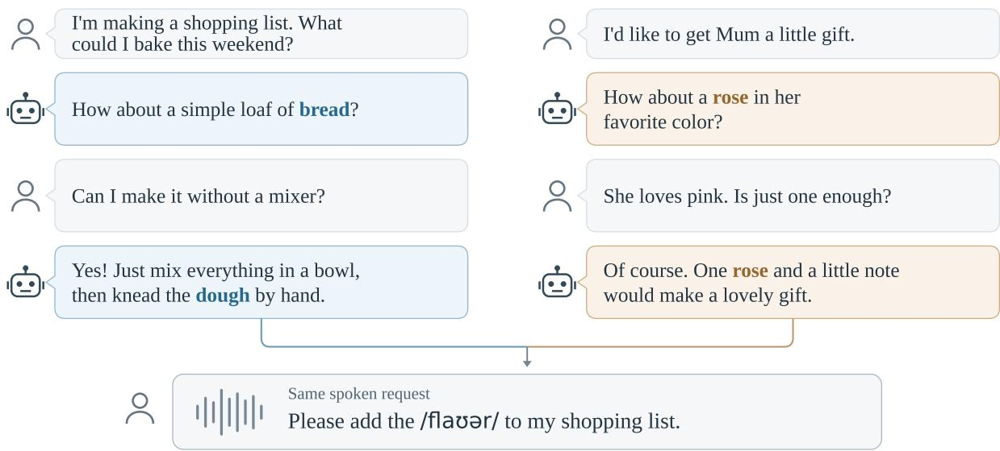

# HEARINCONTEXT: A BENCHMARK FOR IMPLICIT CONTEXT IN SPEECHRECOGNITION

Yifan Gao, Yao Tian, Hongbin Suo

AI Center, OPPO, Beijing, China {gaoyifan,aaron1,suohongbin}@oppo.com

## ABSTRACT

Contextual ASR can benefit from semantic cues or from target words explicitly provided in the context. We introduce HearInContext, a Mandarin–English benchmark that pairs shared synthetic speech with assistant replies supporting different interpretations. The benchmark comprises 3,764 semantic test cases built around homophones. Implicit contexts exclude candidate words; explicit contexts name the target. No-context and unrelated-context controls measure the benefit of relevant history and sensitivity to irrelevant history. Context-capable models benefit from implicit cues but achieve higher target recall with explicit hints. Finetuning Qwen3-ASR-1.7B improves implicit-context target recall by 11.0 and 11.5 percentage points in Mandarin and English, respectively, while absolute CER/WER changes on AISHELL-1 and LibriSpeech remain below 0.1 percentage points. Gains extend to explicit conditions excluded from fine-tuning and to Mandarin hotword recognition on real recordings. Code and data are available at https:// github.com/OPPO-Mente-Lab/HearInContext.

Index Terms— speech recognition, implicit context, contextual disambiguation, benchmark

## 1. INTRODUCTION

Conversational context can resolve ambiguities that speech alone cannot. For example, a discussion of baking favors flour, whereas one about choosing a rose as a gift favors flower, even when neither word has been mentioned. Resolving such ambiguity requires an ASR model to connect the meaning of the preceding conversation with the current utterance.

Existing approaches draw on bias phrases [1, 2, 3], domain prompts [4], and conversational history [5, 6, 7]. DANCER uses entity descriptions to resolve phonetic confusion in transcript correction [8], while prompt diagnostics examine whether models follow the intended instructions [9]. Mohebbi et al. [10] probe homophone resolution using utterance-internal syntactic cues; we examine preceding conversational semantics while controlling candidate-word exposure. We distinguish between explicit hints that name the target and implicit context that supports its meaning without naming any candidate.

Existing benchmarks provide documents and slides [11, 12], domain and entity hints [13], professional profiles [14], or descriptions and entity lists [15]. Recognition gains alone do not reveal whether a model uses semantic context or benefits from seeing the target word. Without shared audio, differences in recording quality can also affect the comparison. Holding the waveform fixed lets us test whether recognition changes with the supported interpretation.

We introduce HearInContext, a benchmark for implicit contextual disambiguation with a controlled test set and separate training and development sets. It distinguishes these sources of improvement by pairing the same audio with implicit, explicit, and unrelated contexts, alongside a no-context baseline. Implicit histories support competing interpretations without naming any candidate. We use assistant replies: unlike prior spoken user turns, this system-generated text is available without ASR errors. An assistant can establish a topic or suggest a next action without supplying the user’s eventual wording.

Adaptation experiments with Qwen3-ASR-1.7B [16] examine whether implicit recognition gains can coexist with general ASR performance and robustness to unrelated context. Our main contributions are:

• We introduce a bilingual benchmark that separates implicit semantic support from explicit word hints through candidate-word exclusion and shared-audio comparisons.

• We characterize the gap between implicit and explicit context use through model comparisons and contextsource ablations.

• We demonstrate implicit disambiguation gains and transfer to explicit hints and Mandarin hotwords on real speech, while testing general recognition and robustness to unrelated context.

  
Ref: Please add the flour / flower to my shopping list.  
Fig. 1. Illustrative example of implicit contextual disambiguation. The same audio supports flour or flower under different assistant histories, neither of which names the candidate words. The dialogue is illustrative rather than a test-set excerpt; the waveform is schematic.

## 2. HEARINCONTEXT

Table 1. Corpus statistics before resampling. Audio counts and hours refer to unique waveforms.
<table><tr><td colspan="5"></td><td rowspan="2">Implicit length</td></tr><tr><td>Split</td><td>Lang.</td><td>Cases</td><td>Audio</td><td>Hours</td></tr><tr><td rowspan="2">Train</td><td>ZH</td><td>5,400</td><td>10,800</td><td>17.25</td><td>389.4</td></tr><tr><td>EN</td><td>1,800</td><td>3,600</td><td>4.20</td><td>354.9</td></tr><tr><td rowspan="2">Dev</td><td>ZH</td><td>600</td><td>1,200</td><td>1.92</td><td>389.2</td></tr><tr><td>EN</td><td>200</td><td>400</td><td>0.48</td><td>360.8</td></tr><tr><td rowspan="2">Test</td><td>ZH</td><td>2,656</td><td>2,618</td><td>2.37</td><td>287.4</td></tr><tr><td>EN</td><td>1,108</td><td>1,100</td><td>0.81</td><td>210.4</td></tr></table>

Implicit length: mean non-whitespace characters (ZH) or words (EN). Each test case is evaluated under No context, Implicit, Explicit, and Unrelated conditions, yielding 7,528 case–voice examples per condition with shared audio.

## 2.1. Benchmark Design

A group shares audio across competing homophones in one sentence frame. Each case pairs a candidate with its history and reference (Figure 1).

Assistant replies form the default context; user turns are retained for source ablations. Each case uses the same waveform and reference across four conditions: No context supplies no history; Implicit supports the target without naming any candidate; Explicit names the target; and Unrelated supplies irrelevant history. These conditions test whether context helps, explicit hints add further benefit, and irrelevant history interferes. One audio-only transcription cannot match every branch reference: no-context scores measure unresolved ambiguity, while separate corpora assess general recognition.

## 2.2. Data Construction

Candidate groups and target utterances. Each candidate group contains homophones with distinct meanings that fit a common sentence frame. We synthesize one anchor utterance per group and reuse its audio across semantic branches.

Dialogue construction and review. We construct assistant histories supporting each interpretation, then derive explicit and unrelated controls. Explicit contexts name the target in one reply; unrelated contexts use lexically dissimilar histories from another group and domain in the same language. Automated checks cover both languages: references contain the target once; implicit and unrelated contexts exclude all candidates; explicit contexts contain only the intended candidate. English groups additionally undergo DeepSeek-V4-flash1 review for pronunciation–sense agreement, sentence naturalness, and contextual support. Explicit rewrites retain other replies and temporal coherence without reproducing the full reference sentence.

Speech synthesis. CosyVoice2-0.5B [17] uses disjoint pools of 96 adaptation and 26 test reference speakers, each balanced equally by gender. Mandarin references come from AISHELL-3 [18] and English references from VCTK [19].

Each test group uses one male and one female reference speaker from its language-specific pool to synthesize two versions of the anchor utterance. The 16-kHz waveforms are reused across semantic branches and conditions after format and metadata checks.

## 2.3. Dataset Composition and Splits

The 1,859 test groups contain 2,656 Mandarin and 1,108 English cases. Two recordings per group yield 3,718 waveforms and 7,528 case–voice examples per condition (Table 1).

A separate adaptation corpus contains 7,200 training and 800 development targets with homophonic or nearhomophonic competitors. Each target sentence is synthesized separately in two voices, unlike the shared-audio test branches. Implicit contexts are generated and reviewed by DeepSeek-V4-flash and checked for target-word exclusion. Training/development targets are lexically disjoint from test targets.

## 3. EXPERIMENTAL SETUP

## 3.1. Models and Decoding

We compare FireRedASR2-AED [20], SenseVoice-Small [21], and Whisper-Large-v3 [22] without context. Contextaware evaluation includes Qwen3-ASR-0.6B and 1.7B [16], VibeVoice-ASR-7B [23], and Seed-ASR [24], accessed through the Seed-ASR 2.0 API. We use native context interfaces; on HearInContext, Qwen receives the history without an additional instruction.

Qwen uses vLLM [25], greedy generation, a 512-token output limit, and the known language before and after finetuning. The reproduction materials document remaining settings and output parsing.

## 3.2. Supervised Adaptation

We fine-tune all parameters of Qwen3-ASR-1.7B on the CosyVoice training data. As implicit disambiguation is the primary adaptation objective, we fix implicit examples at 80% in the main experiment. The remaining 20% is split between empty and unrelated contexts to compare recognition retention with robustness to irrelevant context. We compare 80/20/0, 80/10/10, and 80/0/20 mixtures, ordered as Implicit / No context / Unrelated. Chinese and English are sampled equally within each condition. Every configuration contains 14,400 training examples; explicit contexts are evaluationonly.

All mixtures use AdamW, a learning rate of $1 0 ^ { - 5 }$ , linear decay with 2% warmup, and an effective batch size of 16. Training runs for 900 optimizer updates, saving a checkpoint every 100 updates. Under the frozen development protocol, we select each mixture’s checkpoint by summed ascending error-rate and descending recall ranks over six language– condition subsets, plus 0.25 times summed ascending ranks of the corresponding across-speaker standard deviations. Ties favor lower performance-rank sums, then earlier steps, selecting 700, 800, and 400.

## 3.3. Evaluation Protocol

We report Mandarin CER, English WER, and target recall. HearInContext counts at most one hit per example when the normalized target occurs contiguously in the hypothesis. References, hypotheses, and targets are independently normalized: numeric normalization and character/Latin-word tokenization for Mandarin; initialism processing and Whisper’s EnglishTextNormalizer for English. Scores pool edit counts or target hits across examples.

General ASR is evaluated without context on the official AISHELL-1 test set [26] and LibriSpeech test-clean and testother [27]. ContextASR-Speech [13] tests entity recall under coarse domain context. Real-speech hotword transfer uses 808 Test-AISHELL1-NE utterances [28], each given the same official 400-word list. All configurations use greedy decoding with a 1,024-token limit and automatic language detection. Keyword recall pools normalized contiguous hits capped by each keyword’s reference count. External sets are evaluationonly. Base source ablations compare assistant, ground-truth user, and full histories on CosyVoice audio.

## 4. RESULTS AND ANALYSIS

## 4.1. Implicit versus Explicit Context

Table 2. Model comparison (%). R: target recall.
<table><tr><td rowspan="2">Chinese Model</td><td colspan="2">No context</td><td colspan="2">Implicit</td><td colspan="2">Explicit</td></tr><tr><td>CER↓</td><td>R↑</td><td>CER↓</td><td>R↑</td><td>CER↓</td><td>R↑</td></tr><tr><td>FireRed2-AED</td><td>7.97</td><td>45.31</td><td></td><td></td><td></td><td></td></tr><tr><td>SenseVoice</td><td>7.88</td><td>42.92</td><td></td><td></td><td></td><td></td></tr><tr><td>Whisper-v3</td><td>10.45</td><td>40.95</td><td></td><td></td><td></td><td></td></tr><tr><td>Qwen-0.6B</td><td>7.59</td><td>45.39</td><td>5.40</td><td>63.63</td><td>3.57</td><td>78.37</td></tr><tr><td>Qwen-1.7B</td><td>7.38</td><td>46.20</td><td>4.67</td><td>69.92</td><td>3.49</td><td>82.79</td></tr><tr><td>VibeVoice</td><td>8.29</td><td>43.90</td><td>4.58</td><td>68.20</td><td>1.87</td><td>88.06</td></tr><tr><td>SeedASR</td><td>7.86</td><td>45.18</td><td>4.80</td><td>65.62</td><td>2.57</td><td>82.47</td></tr><tr><td>English</td><td>No context</td><td></td><td>Implicit</td><td></td><td>Explicit</td><td></td></tr><tr><td>Model</td><td>WER↓</td><td>R↑</td><td>WER↓</td><td>R↑</td><td>WER↓</td><td>R↑</td></tr><tr><td>FireRed2-AED</td><td>11.80</td><td>43.50</td><td></td><td></td><td></td><td></td></tr><tr><td>SenseVoice</td><td>12.31</td><td>37.59</td><td></td><td></td><td></td><td></td></tr><tr><td>Whisper-v3</td><td>10.42</td><td>43.82</td><td></td><td></td><td></td><td></td></tr><tr><td>Qwen-0.6B</td><td>10.19</td><td>43.23</td><td>6.45</td><td>66.11</td><td>2.99</td><td>87.50</td></tr><tr><td>Qwen-1.7B</td><td>10.08</td><td>43.95</td><td>5.15</td><td>73.56</td><td>2.26</td><td>90.61</td></tr><tr><td>VibeVoice</td><td>11.35</td><td>39.85</td><td>6.05</td><td>69.63</td><td>2.11</td><td>91.56</td></tr><tr><td>SeedASR</td><td>11.72</td><td>38.31</td><td>7.48</td><td>60.79</td><td>5.31</td><td>73.92</td></tr></table>

The first three models in Table 2 serve as no-context baselines; their contextual conditions are not evaluated, as indicated by dashes. Table 2 shows that all four context-capable models benefit from implicit cues in both languages. For Qwen3-ASR-1.7B, target recall rises from 46.20% to 69.92% in Mandarin and from 43.95% to 73.56% in English. Yet explicit hints yield another 12.88 and 17.06 percentage points, respectively. Supplying a word and inferring it from context therefore remain distinct challenges.

VibeVoice leads in explicit recall, whereas Qwen3-ASR-1.7B leads in implicit recall in both languages. VibeVoice nevertheless has lower Mandarin implicit CER, illustrating that overall transcription quality and target recovery provide complementary information.

## 4.2. Balancing Gains and Robustness

Table 3. Qwen3-ASR-1.7B fine-tuning (%). Mixture order: Implicit/No context/Unrelated.
<table><tr><td>Metric</td><td>Base</td><td>80/20/0</td><td>80/10/10</td><td>80/0/20</td></tr><tr><td colspan="5">HearInContext – Chinese</td></tr><tr><td>No context CER ↓</td><td>7.38</td><td>7.32</td><td>7.30</td><td>7.36</td></tr><tr><td>No context R ↑</td><td>46.20</td><td>46.31</td><td>46.25</td><td>46.22</td></tr><tr><td>Implicit CER ↓</td><td>4.67</td><td>3.13</td><td>3.59</td><td>3.84</td></tr><tr><td>Implicit R ↑</td><td>69.92</td><td>84.53</td><td>80.91</td><td>79.20</td></tr><tr><td>Unrelated CER ↓</td><td>8.48</td><td>8.89</td><td>8.09</td><td>8.26</td></tr><tr><td>Unrelated R ↑</td><td>44.05</td><td>39.44</td><td>43.92</td><td>44.94</td></tr><tr><td colspan="5">HearInContext – English</td></tr><tr><td>No context WER↓</td><td>10.08</td><td>9.62</td><td>9.54</td><td>9.61</td></tr><tr><td>No context R ↑</td><td>43.95</td><td>44.27</td><td>44.13</td><td>43.59</td></tr><tr><td>Implicit WER ↓</td><td>5.15</td><td>2.35</td><td>2.82</td><td>2.81</td></tr><tr><td>Implicit R ↑</td><td>73.56</td><td>88.04</td><td>85.02</td><td>85.24</td></tr><tr><td>Unrelated WER ↓</td><td>10.60</td><td>11.30</td><td>10.25</td><td>10.08</td></tr><tr><td>Unrelated R ↑</td><td>41.34</td><td>36.78</td><td>41.25</td><td>42.46</td></tr><tr><td colspan="5">General ASR</td></tr><tr><td>AISHELL-1 CER↓</td><td>1.51</td><td>1.52</td><td>1.50</td><td>1.52</td></tr><tr><td>Libri clean WER ↓</td><td>1.63</td><td>1.70</td><td>1.68</td><td>1.69</td></tr><tr><td>Libri other WER ↓</td><td>3.40</td><td>3.44</td><td>3.33</td><td>3.41</td></tr><tr><td colspan="5">ContextASR – entity recall</td></tr><tr><td>ZH Coarse ↑</td><td>89.00</td><td>89.62</td><td>89.60</td><td>89.30</td></tr><tr><td>EN Coarse ↑</td><td>85.77</td><td>84.66</td><td>86.46</td><td>83.85</td></tr><tr><td colspan="5">AISHELL-1-NE – real speech</td></tr><tr><td>No hotwords CER↓</td><td>4.25</td><td>4.21</td><td>4.21</td><td>4.26</td></tr><tr><td>No hotwords R ↑</td><td>67.48</td><td>68.96</td><td>67.37</td><td>68.01</td></tr><tr><td>Hotwords CER ↓</td><td>3.80</td><td>3.52</td><td>3.51</td><td>3.69</td></tr><tr><td>Hotwords R ↑</td><td>73.09</td><td>75.85</td><td>74.15</td><td>74.68</td></tr></table>

All mixtures improve implicit recognition (Table 3). The 80/20/0 mixture maximizes implicit recall but loses 4.61/4.56 points under unrelated context (ZH/EN), despite improved audio-only error rates. Here, empty-context examples do not substitute for unrelated-context examples during adaptation.

With 80/10/10, unrelated recall falls by only 0.13/0.09 points (ZH/EN), with lower CER/WER. The 80/0/20 mixture gives higher unrelated recall but lower Mandarin implicit recall; no mixture dominates all conditions.

Does adaptation improve context use, or simply make target words easier to recognize? For 80/10/10, no-context target recall changes from 46.20% to 46.25% in Mandarin and from 43.95% to 44.13% in English, whereas implicit-context recall increases to 80.91% and 85.02%, respectively. Consequently, relative to Base, the Implicit–No-context recall gap widens by 10.94 and 11.28 percentage points. This pattern is consistent with improved use of relevant context rather than a general increase in target-word recovery.

Gains extend beyond the trained implicit condition: 80/10/10 raises explicit recall from 82.79% to 90.66% in Mandarin and from 90.61% to 96.62% in English, demonstrating cross-condition transfer.

For 80/10/10, AISHELL-1 and LibriSpeech error rates remain within 0.1 percentage points of Base. ContextASR-Speech coarse recall improves by 0.60/0.69 points (ZH/EN).

All mixtures also improve hotword-conditioned recognition on Test-AISHELL1-NE real recordings: 80/10/10 gives the lowest CER, and 80/20/0 the highest recall (Table 3).

## 4.3. Evidence in Assistant Replies

Table 4. Context sources with Qwen3-ASR-1.7B Base (%).
<table><tr><td rowspan="2">Context source</td><td colspan="2">Chinese</td><td colspan="2">English</td></tr><tr><td>CER↓</td><td>R↑</td><td>WER↓</td><td>R↑</td></tr><tr><td>Assistant-only</td><td>4.67</td><td>69.92</td><td>5.15</td><td>73.56</td></tr><tr><td>User-only</td><td>4.45</td><td>67.85</td><td>5.71</td><td>70.67</td></tr><tr><td>Full-history</td><td>4.69</td><td>70.44</td><td>5.54</td><td>73.56</td></tr></table>

User histories are ground truth; assistant replies are system text.

We compare context sources to assess how much recognition benefit is retained when prior user turns are omitted. With Base, assistant-only context lowers error rates relative to full history in both languages (Table 4). English recall is unchanged; Mandarin recall falls by 0.53 points. User-only gives the lowest Mandarin CER but uses ground-truth transcripts. These results support assistant replies as a practical default: they retain most full-history benefit without requiring transcriptions of prior user speech.

## 5. CONCLUSION

HearInContext evaluates implicit contextual disambiguation by holding the waveform fixed and excluding candidate words from implicit contexts. Fine-tuning improves implicit and explicit recognition while preserving general ASR, with gains also seen on a real-speech Mandarin hotword task. Synthetic speech enables controlled shared-audio comparisons.

## 6. REFERENCES

[1] G. Pundak, T. N. Sainath, R. Prabhavalkar, A. Kannan, and D. Zhao, “Deep context: End-to-end contextual speech recognition,” in Proc. IEEE SLT, 2018, pp. 418– 425.

[2] Z. Chen et al., “SALM: Speech-augmented language model with in-context learning for speech recognition and translation,” in Proc. ICASSP, 2024, pp. 13521– 13525.

[3] X. Gong, A. Lv, Z. Wang, and Y. Qian, “Contextual biasing speech recognition in speech-enhanced large language model,” in Proc. Interspeech, 2024, pp. 257–261.

[4] Y. Li, Y. Wu, J. Li, and S. Liu, “Prompting large language models for zero-shot domain adaptation in speech recognition,” arXiv:2306.16007, 2023.

[5] T. Hori, N. Moritz, C. Hori, and J. Le Roux, “Advanced long-context end-to-end speech recognition using context-expanded transformers,” in Proc. Interspeech, 2021, pp. 2097–2101.

[6] B. Mu, H. Liu, H. Xue, K. Wei, and L. Xie, “Hearing more with less: Multi-modal retrieval-and-selection augmented conversational LLM-based ASR,” Proc. AAAI, vol. 40, no. 38, pp. 32519–32527, 2026.

[7] J. Zheng, G. Cheng, X. Wang, Q. Zhao, and Y. Yan, “Multilevel contextual prompting for conversational ASR: unifying conversation history and hotwords with speech LLM,” Speech Commun., vol. 183, pp. 103458, 2026.

[8] Y.-C. Wang, H.-W. Wang, B.-C. Yan, C.-H. Lin, and B. Chen, “DANCER: Entity description augmented named entity corrector for automatic speech recognition,” in Proc. LREC-COLING, 2024, pp. 4333–4342.

[9] C.-K. Yang, K.-P. Huang, and H.-Y. Lee, “Do prompts really prompt? exploring the prompt understanding capability of Whisper,” in Proc. IEEE SLT, 2024.

[10] H. Mohebbi, G. Chrupała, W. Zuidema, and A. Alishahi, “Homophone disambiguation reveals patterns of context mixing in speech transformers,” in Proc. EMNLP, 2023, pp. 8249–8260.

[11] R. Huang et al., “ConEC: Earnings call dataset with real-world contexts for benchmarking contextual speech recognition,” in Proc. LREC-COLING, 2024, pp. 3700– 3706.

[12] H. Wang, F. Yu, X. Shi, Y. Wang, S. Zhang, and M. Li, “SlideSpeech: A large scale slide-enriched audio-visual corpus,” in Proc. ICASSP, 2024, pp. 11076–11080.

[13] H. Wang et al., “ContextASR-Bench: A massive contextual speech recognition benchmark,” arXiv:2507.05727, 2025.

[14] D. B. Piskala, “ProfASR-Bench: A benchmark for context-conditioned ASR in high-stakes professional speech,” arXiv:2512.23686, 2025.

[15] S. Joshi et al., “IndicContextEval: A benchmark for evaluating context utilisation in audio large language models across 8 indic languages,” arXiv:2606.19157, 2026, Accepted at Interspeech 2026.

[16] X. Shi et al., “Qwen3-ASR technical report,” arXiv:2601.21337, 2026.

[17] Z. Du et al., “CosyVoice 2: Scalable streaming speech synthesis with large language models,” arXiv:2412.10117, 2024.

[18] Y. Shi, H. Bu, X. Xu, S. Zhang, and M. Li, “AISHELL-3: A multi-speaker mandarin TTS corpus,” in Proc. Interspeech, 2021.

[19] C. Veaux, J. Yamagishi, and K. MacDonald, “CSTR VCTK corpus: English multi-speaker corpus for CSTR voice cloning toolkit (version 0.92),” Edinburgh DataShare, 2019.

[20] K. Xu et al., “FireRedASR2S: A state-of-the-art industrial-grade all-in-one automatic speech recognition system,” arXiv:2603.10420, 2026.

[21] K. An et al., “FunAudioLLM: Voice understanding and generation foundation models for natural interaction between humans and LLMs,” arXiv:2407.04051, 2024.

[22] A. Radford, J. W. Kim, T. Xu, G. Brockman, C. McLeavey, and I. Sutskever, “Robust speech recognition via large-scale weak supervision,” in Proc. ICML, 2023, vol. 202 of PMLR, pp. 28492–28518.

[23] Z. Peng et al., “VibeVoice-ASR technical report,” arXiv:2601.18184, 2026.

[24] Y. Bai et al., “Seed-ASR: Understanding diverse speech and contexts with LLM-based speech recognition,” arXiv:2407.04675, 2024.

[25] W. Kwon et al., “Efficient memory management for large language model serving with PagedAttention,” in Proc. ACM SOSP, 2023.

[26] H. Bu, J. Du, X. Na, B. Wu, and H. Zheng, “AISHELL-1: An open-source mandarin speech corpus and a speech recognition baseline,” in Proc. Oriental COCOSDA, 2017.

[27] V. Panayotov, G. Chen, D. Povey, and S. Khudanpur, “LibriSpeech: An ASR corpus based on public domain audio books,” in Proc. ICASSP, 2015, pp. 5206–5210.

[28] X. Shi, Y. Yang, Z. Li, Y. Chen, Z. Gao, and S. Zhang, “SeACo-Paraformer: A non-autoregressive ASR system with flexible and effective hotword customization ability,” in Proc. ICASSP, 2024, pp. 10346–10350.