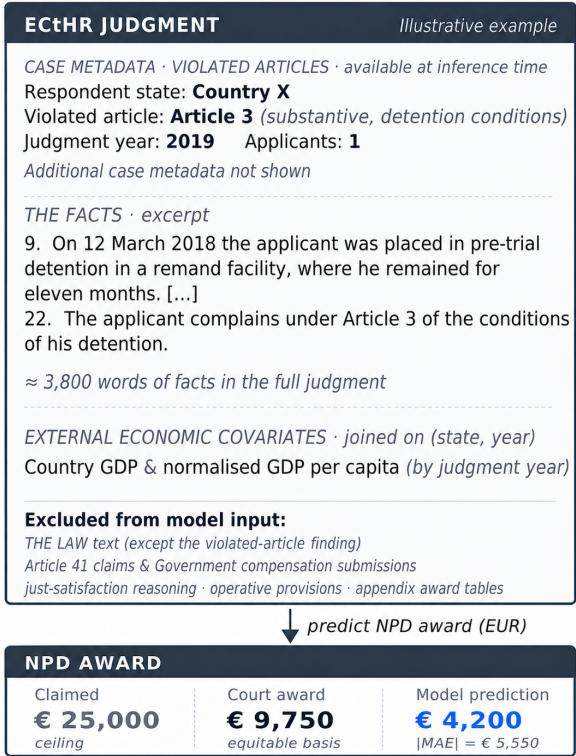
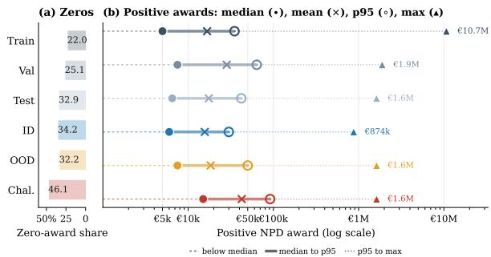
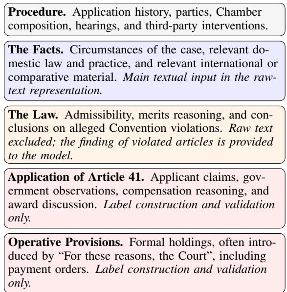
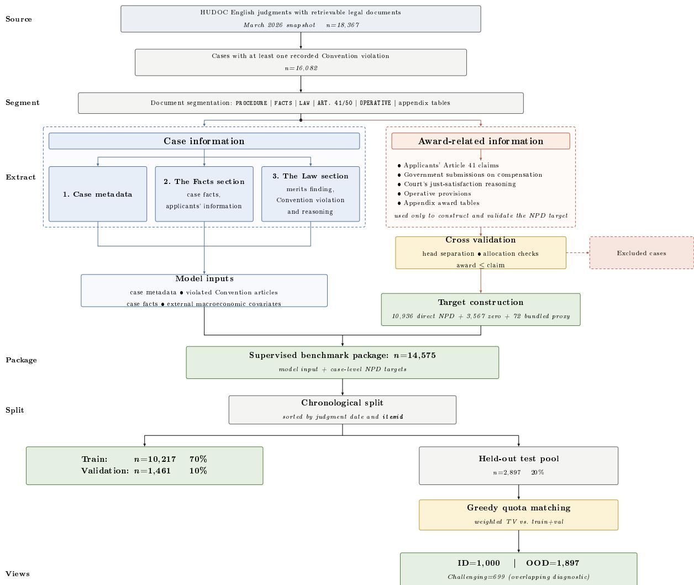

# How Much is a Human Right Worth? ECtHR-NPD: A Benchmark for Predicting Non-Pecuniary Damage Awards

Yanyi Puσ Damian A. Gonzalez-Salzbergβ

Zheng Yuanσ Nikolaos Aletrasσ

σSchool of Computer Science, University of Sheffield βBirmingham Law School, University of Birmingham {ypu17,zheng.yuan1,n.aletras}@sheffield.ac.uk d.a.gonzalezsalzberg@bham.ac.uk

## Abstract

Existing legal benchmarks cover diverse tasks, while continuous monetary remedies remain comparatively underexplored. We introduce ECtHR-NPD, to the best of our knowledge, the first benchmark for predicting non-pecuniary damage (NPD) awards at the European Court of Human Rights (ECtHR) from case information when no statutory formula or explicit calculation rule determines the amount. ECtHR-NPD contains 14,575 cases with case-level awards in nominal euros, chronological splits, and a protocol separating target construction from model input. We evaluate a battery of methods, including constant predictors, gradient-boosted trees, retrieval methods, fine-tuned encoder language models (LMs), prompted decoder LMs, and knowledge-augmented agents. Our results show that more sophisticated LM and agentic approaches do not consistently outperform the strongest feature-based baseline. All model families struggle to identify zero awards and to calibrate high-award predictions, with further degradation on the Challenging test view, making ECtHR-NPD a challenging testbed for current state-of-the-art open-weight and proprietary LMs.1

## 1 Introduction

Legal NLP benchmarks typically cover classification, retrieval, extraction, generation, and legal reasoning tasks (Chalkidis et al., 2022; Niklaus et al., 2023; Guha et al., 2023; Fan et al., 2026; Shi et al., 2026), but few evaluate continuous monetary outcomes. Existing numerical legal tasks often concern outcomes bounded by statutory ranges or determined by explicit rules, including sentencing terms (Xiao et al., 2018; Bi et al., 2023) or tax liabilities (Holzenberger et al., 2020). However, courts may need to make quantitative decisions, such as determining the amount of a monetary remedy following a legal violation, without a published or known formula.

  
Figure 1: The ECtHR-NPD task. Models receive case metadata, violated Convention articles, case facts, and external macroeconomic covariates. Award-related material is excluded from model input. The model outputs the case-level non-pecuniary damage award.

The ECtHR is an international court that hears applications alleging that a member state has breached human rights protected by the European Convention on Human Rights (ECHR), covering rights such as the right to life, liberty, and fair trial. When the Court finds a Convention violation, Article 41 allows it to award just satisfaction, including non-pecuniary damage (NPD) for suffering, humiliation, and other types of intangible harm (Schabas, 2015; European Court of Human Rights, 2022b). The Court assesses NPD on an equitable basis rather than by precise calculation, and the recorded awards provide observable references to the Court’s practice. Legal scholarship describes these awards as case-specific, empirically patterned, and only partly transparent (Ichim, 2015; Altwicker-Hámori et al., 2016; Fikfak, 2018, 2020; Gonzalez-Salzberg, 2021). Appendix A gives further ECtHR and Article 41 background.

In this paper, we introduce ECtHR-NPD, a benchmark for predicting Article 41 NPD at the ECtHR. Figure 1 provides an overview of the task, including the model inputs, withheld awardrelated information, and case-level prediction target. ECtHR-NPD contains 14,575 judgments with validated case-level targets in nominal euros, two model input representations, chronological train/validation/test splits, and three diagnostic test views (ID/OOD/Challenging) (Section 3). The task is challenging because awards are zero-inflated and heavy-tailed, predictive signals are dispersed across long and heterogeneous judgments, and the relationship between case facts and award amounts is not given by an explicit calculation rule.

We evaluate six method families: constant predictors, gradient-boosted trees, retrieval methods, fine-tuned encoder LMs, prompted decoder LMs, and knowledge-augmented agents. ECTHR-NPD remains challenging across this broad range of approaches. The best test mean absolute error (MAE) is 10.2% below the training-set median predictor. Prompted decoder LMs and agents are unstable and often fail to surpass simple statistical and feature-based baselines. All method families fail at identifying zero-award cases, and degrade sharply on both high-award cases and legally challenging cases. Our experiments show that our benchmark exposes failure modes that existing classificationoriented legal NLP benchmarks do not measure. We make three contributions:

1. We introduce continuous non-pecuniary damage award prediction as a regression task, extending legal NLP evaluation to discretionary monetary remedies.

2. We release ECtHR-NPD, a benchmark with validated targets, chronological splits, diagnostic test views, and structured annotations.

3. We compare a broad set of methods and provide diagnostic evaluation across award ranges, test views, respondent states, and Convention articles.

## 2 Related Work

Legal benchmarks. Legal NLP benchmarks cover increasingly diverse jurisdictions, but their supervised targets remain largely categorical, retrieval-based, textual, or rule-bounded. Prior ECtHR work has largely focused on violation prediction, rationale extraction, vulnerability classification, prior-case retrieval, selective prediction, and judicial disagreement (Aletras et al., 2016; Chalkidis et al., 2019, 2021; Xu et al., 2023; T.y.s.s. et al., 2024b,a; Xu et al., 2024).

Broader European resources include ECHR-OD, Swiss and UK court corpora, multilingual legal corpora, and aggregate benchmarks such as LexGLUE, LEXTREME, and LEXam (Quemy and Wrembel, 2022; Niklaus et al., 2021; Östling et al., 2023; Chalkidis et al., 2023; Niklaus et al., 2024; Chalkidis et al., 2022; Niklaus et al., 2023; Fan et al., 2026). Outside Europe, major benchmarks cover US legal reasoning, holding identification, and contract review (Guha et al., 2023; Zheng et al., 2021; Hendrycks et al., 2021; Henderson et al., 2022), Chinese legal judgment prediction, legal question answering (QA), event detection, and LM evaluation (Xiao et al., 2018; Zhong et al., 2018; Liu et al., 2023; Gan et al., 2023; Fei et al., 2024; Zhong et al., 2020; Yao et al., 2022), and Indian judgment prediction, explanation, statute prediction, and multilingual evaluation (Malik et al., 2021; Kapoor et al., 2022; Nigam et al., 2024; Joshi et al., 2024; Vats et al., 2023; Nigam et al., 2025). Recent work also evaluates LLMs across realistic legal practice scenarios using expert-designed rubrics (Shi et al., 2026). These benchmarks have substantially advanced legal NLP, but they do not evaluate discretionary monetary remedies as continuous targets.

Numerical prediction in the legal domain. Numerical legal prediction has mainly been studied in settings where numerical outcomes are constrained by legal rules or ranges. In criminal law, models are commonly used to predict sentencing terms jointly with charges and law articles (Xiao et al., 2018; Zhong et al., 2018; Yang et al., 2019; Liu et al., 2023), or use numerical evidence to distinguish related charges (Gan et al., 2023). In tax law, SARA includes questions in which numerical tax liabilities are derived from statutory rules (Holzenberger et al., 2020).

A smaller body of work studies monetary outcomes determined with greater judicial discretion, including Brazilian airline-consumer immaterial damages (Pont et al., 2023), Taiwanese fatalaccident mental-suffering damages (Hsieh et al., 2021), and US jury-verdict valuation (Conrad and Al-Kofahi, 2017). These studies differ from ECtHR-NPD in jurisdiction, claim type, available evidence, target construction, and scale. Empirical legal scholarship has analysed human rights damages at both the ECtHR (Altwicker-Hámori et al., 2016; Fikfak, 2018, 2020) and the Inter-American Court (Gonzalez-Salzberg, 2021), providing motivation for predicting NPD awards.

  
Figure 2: Award distribution across splits and diagnostic views. Panel (a) shows the zero-award share. Panel (b) shows the distribution of positive awards on a log scale, with markers for the median, mean, p95, and maximum.

## 3 The ECtHR-NPD Benchmark

## 3.1 Task Definition

Given an ECtHR judgment in which the Court has found at least one Convention violation, the task is to predict the case-level Article 41 non-pecuniary damage (NPD) award. The model input X contains case metadata, the FACTS section, violated articles, and external macroeconomic covariates. The output $y \in \mathbb { R } _ { \geq 0 }$ is a nominal euro amount recorded in the judgment, including valid zero-award outcomes. A model predicts $\hat { y } \in \mathbb { R } _ { \geq 0 }$ from X.

## 3.2 Data Collection

We collect English-language judgments from the Court’s public HUDOC database (European Court of Human Rights, 2026) using the March 2026 snapshot. We retrieve an initial pool of 18,367 English judgments and follow the established ECtHR document-processing setup used in prior ECtHR NLP resources (Quemy and Wrembel, 2022; Chalkidis et al., 2019). We then segment each judgment into its main structural components (e.g., Procedure, The Facts, The Law, Article 41, and Operative Provisions). Appendix A.2 describes the common structure of ECtHR judgments. Figure 1 shows which parts are used as model input and which parts are withheld for label construction.

Respondent state: Armenia   
Judgment year: 2020   
Court formation: Chamber   
Violated Article: Article 5   
Violation type: substantive   
Applicants: 1   
Applicant age group: adult   
Applicant sex: male   
Violation duration: 18 months   
Additional structuredfeatures omitted.  
Figure 3: Abridged structured input from an ECtHR-NPD case.

Models do not receive applicants’ Article 41 claims, Government submissions on compensation, the Court’s just-satisfaction reasoning, operative provisions, or appendix award tables. These materials are used only to construct and validate the NPD target. The full extraction and validation process is reported in Appendix B.

## 3.3 Input Representation

We use two forms of input in our experiments.

Raw-text input. We provide the model with: (i) case metadata, including respondent country, judgment year, court formation, procedural status, and related case descriptors; (ii) the FACTS section; (iii) the Convention articles found to be violated; and (iv) external macroeconomic covariates joined by respondent state and judgment year. This setting tests whether models can identify information relevant to NPD prediction directly from the long factual description of the case.

Structured input. The structured input replaces the FACTS section with a compact set of case features extracted by our pipeline (Appendix B), while retaining the metadata, violated Convention articles, and macroeconomic covariates. This setting reduces the context by making the information relevant to NPD prediction explicit. For prompted decoder LMs, these features are written as a short keyvalue text block. A simplified example is shown in Figure 3. The tree models use the same feature groups in tabular form (Section 4.1).

## 3.4 Target Construction

The target $y \in \mathbb { R } _ { \geq 0 }$ is the total case-level NPD amount in nominal euros, including valid zeroaward outcomes. We extract candidate NPD amounts from the Article 41 section and validate them against operative provisions and appendix award tables where available. Candidate targets must pass checks for award-head separation, perapplicant sum consistency, currency normalisation, and recoverability from the operative provisions. Zero targets are retained only when supported by an accepted legal rationale described in Appendix A.3. Full validation contracts are reported in Appendix B.3.

<table><tr><td>Set</td><td>n</td><td>Period / source</td><td>Mean TV</td></tr><tr><td colspan="4">Chronological splits</td></tr><tr><td>Train</td><td>10,217</td><td>1968–Jul. 2019</td><td></td></tr><tr><td>Validation</td><td>1,461</td><td>Jul. 2019–Dec. 2021</td><td></td></tr><tr><td>Test pool</td><td>2,897</td><td>Dec. 2021–Mar. 2026</td><td></td></tr><tr><td colspan="4">Diagnostic test views</td></tr><tr><td>ID</td><td>1,000</td><td>Test pool</td><td>0.025</td></tr><tr><td>OOD</td><td>1,897</td><td>Test pool</td><td>0.211</td></tr><tr><td>Challenging</td><td>699</td><td>Test pool</td><td>0.435</td></tr></table>

Table 1: Chronological splits and diagnostic test views. Mean Total Variation (TV) measures distributional distance from the train plus validation reference distribution across the eight matching dimensions; lower values indicate closer alignment. Challenging is an overlapping diagnostic subset.

We use nominal euro amounts rather than adjusting them for inflation. Deflating the awards would require choices about an external price index, data source, and base year, whereas the nominal amounts remain directly traceable to the judgment. Judgment year and state-year macroeconomic covariates are provided as model inputs.

Data Filtering. We exclude cases with no recorded Convention violations, cases where the NPD amount is not recoverable, cases where the NPD amount is bundled inseparably with other claim heads (such as pecuniary damages or costs), cases lacking an accepted legal rationale for a zeroaward outcome, and cases denominated in pre-euro currencies (historical Article 50 claims). These filters, developed by a legal expert, yield a final dataset of 14,575 cases with validated continuous euro targets. The full filtering and target validation procedure is detailed in Appendix B.1.

## 3.5 Data Splits and Diagnostic Views

We partition the dataset chronologically by judgment date into training (70%), validation (10%), and test (20%), following prior work (Chalkidis et al., 2019, 2022). Same-day ties are broken deterministically by HUDOC item identifier, so no case appears in more than one split. This chronological split prevents temporal leakage by keeping later judgments out of the data used to fit and select models, while reserving the latest judgments for evaluating temporal generalisation. The resulting test pool comprises 2,897 judgments. Table 1 summarises the split sizes and diagnostic views. Figure 2 shows the corresponding award distributions.

We further partition the test pool into three test subsets:

In-Distribution (ID). We use a greedy quotamatching algorithm (Algorithm 1) to select (n = 1,000) from the test pool. This view aligns the ID subset with the empirical distribution of the training and validation references across predefined structural dimensions. Table 15 reports the matching dimensions, their weights, and the resulting distributional differences. The ID view evaluates model performance on temporal generalisation for cases that are structurally similar to the reference.

Out-of-Distribution (OOD). The residual cases in the test set (n = 1,897) constitute the OOD view. These cases are less represented in the reference distribution along the matching dimensions. We use OOD to test whether models generalise beyond the structurally similar cases captured by the ID view.

Challenging. We additionally identify an overlapping diagnostic subset (n = 699) using predefined criteria identified by a legal expert. It contains all Grand Chamber judgments, together with cases that have both multiple applicants and multiple concurrent Convention violations. The expert considered such cases particularly difficult to assess and quantify, and we use this subset to test whether they also pose greater difficulty for models.

## 4 Experimental Setup

## 4.1 Models

We evaluate six model families listed below. Full implementation details, including checkpoints, hyperparameters, preprocessing, retrieval settings, prompt templates, decoding parameters, and Re-Act (Yao et al., 2023) tool policies, are reported in Appendix C.

Constant baselines. We report the training-set median, training-set mean, and constant-zero predictors as weak baselines. The training-set median is the optimal constant predictor under MAE.

Gradient-boosted trees. We train Cat-Boost (Prokhorenkova et al., 2018), XG-Boost (Chen and Guestrin, 2016), and Light-GBM (Ke et al., 2017) on the leakage-controlled structured features rather than raw text (Appendix C.3).

Retrieval baselines. We compare k-nearestneighbour retrieval (Cover and Hart, 1967), BM25 (Robertson and Zaragoza, 2009) implemented with BM25S (Lù, 2024), and BGE-M3 (Chen et al., 2024). Prediction is the median award among retrieved training neighbours. Reference cases must precede the target judgment and share at least one violated Convention Article. These baselines test whether similarity to prior cases helps predict the award amount.

Encoder language models. We fine-tune ModernBERT (Warner et al., 2025) and Legal-Longformer (Chalkidis et al., 2023) with a regression head on the raw-text input. A late-fusion variant concatenates the encoder [CLS] representation with a learned representation of the structured features.

Prompted decoder LMs. We evaluate Qwen3.5 variants (9B, 27B, and Plus) (Qwen Team, 2026), GPT-OSS-20B (OpenAI, 2025), and GPT-5.4 (OpenAI, 2026) under zero-shot, fixed chain-of-thought (CoT) (Wei et al., 2022), and retrieved few-shot CoT prompting. CoT prompts were developed with a legal expert to guide the model through considerations relevant to the NPD assessment. Retrieved few-shot CoT added up to five prior training cases selected by similarity features. Their observed awards and Article 41 reasoning are included as references. Prompt templates were fixed before test evaluation. Full prompt design and retrieval settings are reported in Appendix C.6.

Knowledge-augmented Agents. We evaluate a ReAct-style approach (Yao et al., 2023) with access to a structured legal knowledge base, train-only empirical priors, and eligible reference cases from the training set. Agent actions are restricted to a whitelisted tool set, with no external web access. We run this setting on Qwen3.5-Plus and MiniMax-M2.7 (MiniMax AI, 2026). Full controller settings, tool definitions, access policies, and knowledgebase development are described in Appendix C.7.

## 4.2 Evaluation Metrics

We use mean absolute error (MAE) in euros as our primary metric because it is an interpretable measure of average absolute monetary error per case. Since the target is zero-inflated and heavytailed, we also report complementary metrics for extreme-award sensitivity, typical and upper-tail error, rank association, magnitude calibration, and zero-award recognition (Table 2). Model selection and hyperparameter tuning use the validation split; the test set is reserved for final reporting.

<table><tr><td>Metric</td><td>What it diagnoses</td></tr><tr><td>MAE (↓)</td><td>Primary euro-scale error metric.</td></tr><tr><td>RMSE (↓), R2 (↑)</td><td>Sensitivity to extreme awards.</td></tr><tr><td>MedAE (↓), 95AE (↓)</td><td>Body and upper-tail error.</td></tr><tr><td>Pearson r (↑)</td><td>Linear association with award mag- nitude.</td></tr><tr><td>Spearman ρ (↑)</td><td>Rank ordering.</td></tr><tr><td>Zero-F1 (↑)</td><td>Zero-award recognition.</td></tr></table>

Table 2: Evaluation metrics.

## 5 Results and Analysis

## 5.1 Main Results

Table 3 reports performance on the test pool and diagnostic subsets. Prompted decoder LM rows use the raw-text input unless otherwise specified; daggered rows are diagnostic settings with retrieved references or ReAct tool access.

Aggregate performance on MAE. Trained baselines (gradient-boosted trees and encoder LMs) achieve lower MAE than prompted decoder LM variants and ReAct agents. CatBoost obtains the lowest aggregate MAE (C9.9k), which is 10.2% lower than the training-set median. Prompt-based decoder LMs perform less reliably. The best prompted LM result is Qwen3.5-9B with static CoT (C10.8k MAE), while vanilla zero-shot, retrieved few-shot CoT, and the ReAct setting remain worse than trained baselines. Larger LMs or complex agentic configurations do not consistently improve MAE. This is consistent with prior findings that LMs treat numbers as token sequences and struggle with magnitude-sensitive prediction (Spithourakis and Riedel, 2018; Li et al., 2025).

Secondary metrics. Most systems have low or negative R2, showing that they explain little variance on the original euro scale and are strongly affected by rare high-award cases. Rank metrics are more favourable for some supervised baselines like CatBoost and ModernBERT late fusion. This suggests that some models recover ordering better than predict magnitudes. Retrieval-based methods achieve relatively high Zero-F1 scores because they can recognise some zero-award cases, but this does not imply good positive-award prediction.

Bootstrap tests for performance gaps. We use full-size paired bootstrap tests to distinguish stable leaderboard gaps from close numerical differences (Appendix D.1). The tests show that CatBoost is significantly better than the train-median and the strongest prompted LM, but not significantly better than BGE-M3 dense or ModernBERT late fusion. Prompting gains remain internal to the decoder-LM family, rather than reliable benchmark-level gains over the train median.

<table><tr><td>Model</td><td>Variant</td><td>MAE↓</td><td>RMSE↓</td><td> $R ^ { 2 } \uparrow$ </td><td>MedAE↓</td><td>95AE↓</td><td>Pearson r↑</td><td>Spearman ρ↑</td><td>Zero-F1↑</td><td>ID↓</td><td>OOD↓</td><td>Chal.↓</td></tr><tr><td colspan="9">Constant baselines</td><td></td><td></td><td></td></tr><tr><td>Train median</td><td></td><td>11,006</td><td>47,223</td><td>-0.034</td><td>3,200</td><td>38,820</td><td>0.000</td><td>0.000</td><td>0.000</td><td>9,752</td><td>11,668</td><td>22,812</td></tr><tr><td>Train mean</td><td></td><td>14,940</td><td>46,468</td><td>-0.001</td><td>11,010</td><td>29,010</td><td>0.000</td><td>0.000</td><td>0.000</td><td>14,465</td><td>15,190</td><td>25,150</td></tr><tr><td>Constant zero</td><td></td><td>11,713</td><td>47,904</td><td>-0.064</td><td>3,400</td><td>42,020</td><td>0.000</td><td>0.000</td><td>0.495</td><td>10,309</td><td>12,454</td><td>22,916</td></tr><tr><td colspan="9">Gradient-boosted trees</td><td></td><td></td><td></td></tr><tr><td>CatBoost</td><td>struct. feats.</td><td>9,881</td><td>44,231</td><td>0.093</td><td>2,315</td><td>37,819</td><td>0.353</td><td>0.533</td><td>0.190</td><td>8,143</td><td>10,797</td><td>20,987</td></tr><tr><td>XGBoost</td><td>struct. feats.</td><td>10,117</td><td>44,713</td><td>0.073</td><td>2,404</td><td>34,740</td><td>0.330</td><td>0.523</td><td>0.123</td><td>8,180</td><td>11,138</td><td>21,527</td></tr><tr><td>LightGBM</td><td>struct. feats.</td><td>10,240</td><td>50,785</td><td>-0.195</td><td>2,395</td><td>33,020</td><td>0.304</td><td>0.518</td><td>0.104</td><td>9,312</td><td>10,729</td><td>21,085</td></tr><tr><td colspan="9">Retrieval baselines</td><td></td><td></td><td></td><td></td></tr><tr><td>kNN</td><td>metadata</td><td>10,607</td><td>45,448 43,355</td><td>0.043</td><td>3,400</td><td>32,000</td><td>0.275</td><td>0.268</td><td>0.198</td><td>8,863</td><td>11,527</td><td>23,305 24,665</td></tr><tr><td>kNN BM25</td><td>struct. feats. raw text</td><td>10,632 13,390</td><td>49,744</td><td>0.129 -0.147</td><td>2,850 4,500</td><td>42,730 43,540</td><td>0.408 0.254</td><td>0.381 0.335</td><td>0.517 0.505</td><td>8,140 11,494</td><td>11,945 14,389</td><td>22,980</td></tr><tr><td>BGE-M3</td><td>sparse</td><td>10,226</td><td>43,839</td><td>0.109</td><td>3,200</td><td>33,000</td><td>0.382</td><td>0.321</td><td>0.530</td><td>8,796</td><td>10,980</td><td>20,378</td></tr><tr><td>BGE-M3</td><td>dense</td><td>10,177</td><td>43,401</td><td>0.127</td><td>3,150</td><td>33,020</td><td>0.448</td><td>0.323</td><td>0.425</td><td>8,354</td><td>11,138</td><td>21,467</td></tr><tr><td colspan="9">Trained Encoder LMs</td><td></td><td></td><td></td><td></td></tr><tr><td>ModernBERT</td><td>raw text</td><td>10,133</td><td>42,232</td><td>0.173</td><td>2,997</td><td>35,759</td><td>0.476</td><td>0.329</td><td>0.209</td><td>8,438</td><td>11,026</td><td>21,544</td></tr><tr><td>ModernBERT</td><td>late fusion</td><td>10,074</td><td>41,579</td><td>0.199</td><td>2,999</td><td>36,391</td><td>0.475</td><td>0.312</td><td>0.067</td><td>8,404</td><td>10,955</td><td>21,024</td></tr><tr><td>Legal-Longformer</td><td>raw text late fusion</td><td>10,642 10,244</td><td>46,619 42,439</td><td>-0.007 0.165</td><td>2,695 2,760</td><td>38,461 36,021</td><td>0.184 0.426</td><td>0.322 0.487</td><td>0.017 0.226</td><td>9,200</td><td>11,402</td><td>22,116</td></tr><tr><td colspan="9">Legal-Longformer</td><td>8,695</td><td></td><td>11,060</td><td>21,013</td></tr><tr><td>Prompted Decoder LMs (zero-shot)</td><td></td><td></td><td></td><td></td><td></td><td></td><td></td><td></td><td></td><td></td><td></td><td></td></tr><tr><td>Qwen3.5-9B</td><td>raw text</td><td>16,598</td><td>110,079</td><td>-4.616</td><td>6,750</td><td>35,000</td><td>0.011</td><td>0.190</td><td>0.196</td><td>17,113</td><td>16,327</td><td>24,212</td></tr><tr><td>Qwen3.5-27B</td><td>raw text</td><td>22,235</td><td>79,735</td><td>-1.947</td><td>7,500</td><td>125,000</td><td>0.442</td><td>0.211</td><td>0.094</td><td>17,584</td><td>24,687</td><td>52,066</td></tr><tr><td>Qwen3.5-Plus</td><td>raw text</td><td>16,400</td><td>68,894</td><td>-1.199</td><td>5,000</td><td>51,575</td><td>0.451</td><td>0.290</td><td>0.115</td><td>12,781</td><td>18,306</td><td>37,186</td></tr><tr><td>GPT-OSS-20B GPT-5.4</td><td>raw text</td><td>15,678</td><td>67,390</td><td>-1.105</td><td>6,000</td><td>52,000</td><td>0.076</td><td>0.072</td><td>0.425</td><td>13,363</td><td>16,898</td><td>23,973</td></tr><tr><td></td><td>raw text</td><td>25,438</td><td>85,330</td><td>-2.375</td><td>4,800</td><td>104,000</td><td>0.135</td><td>0.249</td><td>0.006</td><td>17,140</td><td>29,812</td><td>47,613</td></tr><tr><td colspan="9">Prompted Decoder LMs (zero-shot CoT)</td><td></td><td></td><td></td><td></td></tr><tr><td>Qwen3.5-9B</td><td>raw text</td><td>10,782</td><td>44,551</td><td>0.080</td><td>4,500</td><td>31,005</td><td>0.317</td><td>0.183</td><td>0.255</td><td>9,777</td><td>11,312</td><td>20,926</td></tr><tr><td>Qwen3.5-27B</td><td>raw text</td><td>12,905</td><td>43,497</td><td>0.123</td><td>5,300</td><td>44,945</td><td>0.440</td><td>0.256</td><td>0.035</td><td>9,848</td><td>14,516</td><td>26,729</td></tr><tr><td>Qwen3.5-Plus</td><td>raw text</td><td>19,080</td><td>75,337</td><td>-1.631</td><td>6,500</td><td>67,600</td><td>0.528</td><td>0.291</td><td>0.029</td><td>13,220</td><td>22,170</td><td>42,135</td></tr><tr><td>GPT-OSS-20B</td><td>raw text</td><td>16,748</td><td>59,098 48,458</td><td>-0.618</td><td>6,500</td><td>56,100</td><td>0.153 0.452</td><td>0.178</td><td>0.069</td><td>13,468</td><td>18,478</td><td>31,543</td></tr><tr><td colspan="9">GPT-5.4 raw text</td><td>0.019 10,754</td><td>19,172</td><td>39,884</td></tr><tr><td>Prompted Decoder LMs (few-shot CoT)†</td><td></td><td></td><td></td><td></td><td></td><td></td><td></td><td></td><td></td><td></td><td></td><td></td></tr><tr><td>Qwen3.5-9B</td><td>5 retrieved†</td><td>14,867</td><td>58,935</td><td>-0.610</td><td>5,000</td><td>50,700</td><td>0.236</td><td>0.201</td><td>0.095</td><td>11,127</td><td>16,836</td><td>33,169</td></tr><tr><td>Qwen3.5-Plus GPT-OSS-20B</td><td>5 retrieved† 5 retrieved†</td><td>24,141</td><td>79,094</td><td>-1.900</td><td>6,000</td><td>105,000</td><td>0.277</td><td>0.235</td><td>0.076</td><td>13,518</td><td>29,741</td><td>60,814</td></tr><tr><td>GPT-5.4</td><td>5 retrieved†</td><td>11,674 22,051</td><td>46,410 143,132</td><td>0.002 -8.495</td><td>5,000 5,500</td><td>36,725 84,000</td><td>0.171 0.126</td><td>0.155 0.253</td><td>0.065 0.035</td><td>10,007 13,342</td><td>12,553 26,642</td><td>24,688 48,864</td></tr><tr><td colspan="9">Knowledge-augmented agents (ReAct)†</td><td></td><td></td><td></td><td></td></tr><tr></table>

Table 3: Main results on the ECtHR-NPD test pool. Rows follow the input settings unless marked with † for diagnostic settings using additional signals, such as retrieved few-shot references or ReAct tool access. For each metric, bold marks the best value across the full table and underlining marks the second-best value.

## 5.2 Input Representation Ablations

Structured input may help. Across model families, structured representations appear useful when they compress long judgments into legally relevant signals. Encoder late fusion gives small but consistent improvements over text-only fine-tuning. Similarly, serialising the structured features extracted from the Facts section improves several models in zero-shot and CoT settings. This suggests that part of the difficulty for prompted LMs is the longcontext reading burden, as the serialisation compresses the average case input from thousands of tokens to hundreds. At the 95th percentile, input length falls from 5,337 words for the raw-text representation to 237 words for the structured representation (Appendix Table 27). However, these gains are modest and unstable. The input compression alone does not solve case-specific reasoning or reliable calibration of award magnitude.

Adding more permitted case information has diminishing returns. The tree and prompting ablations show that adding more permitted signals to the model input does not yield monotonic gains. In the tree ablations (Table 28), moving from a compact metadata-based input to increasingly richer case representations does not consistently improve results. Prompted LMs show a similar pattern, where CoT and retrieved few-shot examples help some models but hurt others. Thus, the results indicate that mapping facts to realised euro amounts remains a bottleneck for the evaluated systems. These results show that incorporating additional case information does not consistently reduce monetary prediction error.

Award-related information is easy for decoder LMs to exploit. Our diagnostic runs show why award-related signals must be separated from model input. Claimed amounts can act as direct anchors or practical ceilings under Rule 60 and the Court’s just-satisfaction procedure (European Court of Human Rights, 2025b, 2022b), and Article 41 reasoning often reveals whether a case has a zero award. Adding this information roughly halves MAE for both agents and raises Zero-F1 to approximately 0.99 (Table 5). This shows that decoder LMs and agents perform substantially better when given explicit award-related information than when they must infer the award from case facts.

<table><tr><td>Model</td><td>Prompting</td><td>Raw</td><td>Struct.</td><td>∆</td></tr><tr><td>Qwen3.5-9B</td><td>zero-shot</td><td>16,598</td><td>13,218</td><td>-3,380</td></tr><tr><td>Qwen3.5-27B</td><td>zero-shot</td><td>22,235</td><td>18,118</td><td>-4,117</td></tr><tr><td>Qwen3.5-9B</td><td>CoT</td><td>10,782</td><td>11,815</td><td>+1,033</td></tr><tr><td>Qwen3.5-Plus</td><td>CoT</td><td>19,080</td><td>16,602</td><td>-2,478</td></tr><tr><td>GPT-OSS-20B</td><td>CoT</td><td>16,748</td><td>11,707</td><td>-5,041</td></tr><tr><td>GPT-5.4</td><td>CoT</td><td>16,266</td><td>14,384</td><td>-1,882</td></tr><tr><td>Qwen3.5-9B</td><td>few-shot CoT†</td><td>14,867</td><td>14,409</td><td>-458</td></tr><tr><td>GPT-OSS-20B</td><td>few-shot  $\mathrm { C o T ^ { \dag } }$ </td><td>11,674</td><td>12,074</td><td>+400</td></tr></table>

Table 4: Raw versus serialised inputs for prompted decoder LMs. ∆ is structured MAE minus raw-text MAE; negative values are better. † denotes diagnostic few-shot settings.
<table><tr><td>Model</td><td>Setting</td><td>MAE</td><td>Zero-F1</td></tr><tr><td>Qwen3.5-Plus</td><td>base</td><td>18,220</td><td>0.002</td></tr><tr><td>Qwen3.5-Plus</td><td>expanded 8,810 (↓51.6%)</td><td></td><td>0.997</td></tr><tr><td>MiniMax-M2.7</td><td>base</td><td>16,571</td><td>0.029</td></tr><tr><td>MiniMax-M2.7</td><td>expanded</td><td>8,819 (↓46.8%)</td><td>0.988</td></tr></table>

Table 5: ReAct results using the benchmark inputs (Base) and with applicants’ claims and Article 41 reasoning added (Expanded). The latter is a diagnostic setting and is not included in the main model comparison.

## 5.3 Distributional Shift and Challenging Cases

Validation-to-test shift. Trained and fine-tuned models are selected using the validation split, but the later test period differs structurally from validation (Table 6). These compositional changes may partly explain why validation-fit models do not transfer cleanly to the test period.

Results by Diagnostic view. MAE for the ID subset is lower than that for the OOD subset for both trained models and prompted LMs (Table 3). The prompted LMs receive no task-specific fine-tuning. This suggests that the ID set is not only distributionally closer to the training period but may also be simpler on average. All model families also degrade sharply on the challenging view. Across representative systems, challenging-set MAE is roughly twice full-test MAE. The Challenging subset also differs in respondent state, zero-award prevalence, applicant count, violation count, and violated Articles, so higher error reflects multiple sources of difficulty.

<table><tr><td>Dimension</td><td>Val.</td><td>Test</td><td>∆</td></tr><tr><td>Zero-award cases</td><td>25.1%</td><td>32.9%</td><td>+7.8</td></tr><tr><td>Committee judgments</td><td>65.2%</td><td>75.1%</td><td>+9.9</td></tr><tr><td>Multiple-applicant cases</td><td>36.1%</td><td>45.8%</td><td>+9.7</td></tr><tr><td>High applicant-count cases (≥6)</td><td>10.9%</td><td>19.3%</td><td>+8.4</td></tr><tr><td>Complex violation cases (≥3)</td><td>19.0%</td><td>26.7%</td><td>+7.7</td></tr></table>

Table 6: Validation-to-test structural shift (%; ∆ is the test percentage minus the validation percentage, in percentage points).

## 5.4 Error Analysis

Aggregate MAE hides systematic differences across the award distribution and across legally meaningful case groups. We therefore decompose errors by award range, respondent state, and violated Article.

Award-range errors. Table 8 separates errors by target-award range. For zero-award cases, prompted LMs and ReAct diagnostics often predict positive awards. This is expected under the input setting, which hides the Court’s Article 41 reasoning and procedural signals that often explain zero awards. For high-award cases, all representative systems show large magnitude errors. Although awards above C50k account for only 4.1% of the test pool (118 of 2,897 cases), excluding them substantially lowers MAE for every representative system in Table 8. Frequent zero awards and the small number of very large awards therefore affect aggregate performance in different ways.

Results by respondent state and violated Article. Errors and award distributions also vary by respondent state and violated Article (Appendix D.4, Tables 31 and 32). These patterns do not mean that cases from a particular respondent state or involving a particular Convention article receive higher or lower awards. The observed differences may also reflect the composition of cases within each group, including the prevalence of zero awards, multi-applicant and bundled-award structures, combinations of violations, and the nature of the harm involved.

For example, Russian cases often contain many multi-applicant judgments and zero-award cases, both of which can affect the observed award distribution. Article 2 concerns the right to life, and cases under this Article often involve death or serious harm, which may partly explain the larger awards observed in this group. Article patterns can also be affected by co-occurring violations. For example, Article 13 is applied in connection with claims under other Convention rights, so award patterns in this article may also reflect the other rights and harms involved in those cases. Statelevel and Article-level patterns therefore need to be interpreted together with other characteristics of the cases.

## 6 Discussion

## 6.1 Model Behaviour and Prior Knowledge

The ablations in Section 5.2 show that serialised inputs, CoT prompting, retrieved examples, and ReAct knowledge access can all change prompted LMs’ behaviour. These interventions provide a reasoning path, prior cases with their awards, or a legal knowledge base. However, they do not reliably solve the zero/positive recognition or the calibration of award magnitude. This explains why prompting gains remain mostly internal to the decoder-LM family and do not become stable benchmark-level gains over the train-median baseline.

Multi-applicant aggregation. Legal reasoning traces often look plausible while remaining numerically miscalibrated. For cases in the Challenging set, the target is usually a holistic case-level award rather than a transparent sum of applicant-level awards or violation-level harms. CoT and ReAct traces encourage models to discuss severity, applicant count, violation subtype, and comparable case factors, but they do not recover the Court’s implicit award scale. In some multi-applicant cases, the model over-scales the prediction as if NPD awards were linear per-applicant sums. This can produce very large errors, as shown in Table 7.

<table><tr><td>Case ID</td><td>Applicants</td><td>Ground truth</td><td>Model prediction</td></tr><tr><td>001-219675</td><td>90</td><td>12,500</td><td>450,000</td></tr><tr><td>001-241738</td><td>195</td><td>7,500</td><td>1,500,000</td></tr></table>

Table 7: Two Qwen3.5-Plus examples illustrating that linear scaling with applicant count leads to large prediction errors. Amounts are in EUR.

<table><tr><td>Model</td><td>Zero &gt;0-10k</td><td>10k-50k</td><td>&gt;50k</td></tr><tr><td>CatBoost</td><td>3,089</td><td>2,401 15,486</td><td>125,816</td></tr><tr><td>BGE-M3 sparse</td><td>2,858</td><td>2,567 16,010</td><td>132,087</td></tr><tr><td>ModernBERT LF</td><td>3,367</td><td>2,484 15,722</td><td>126,386</td></tr><tr><td>Qwen3.5-9B CoT</td><td>6,597</td><td>3,713 13,404</td><td>113,482</td></tr><tr><td>GPT-OSS few-shot†</td><td>7,926</td><td>3,077 14,791</td><td>126,038</td></tr><tr><td>MiniMax ReAct†</td><td>21,977</td><td>6,345 13,121</td><td>102,854</td></tr></table>

Table 8: MAE by target-award range for representative systems. Values are in EUR. The buckets separate boundary errors at zero from magnitude errors in the high-award tail.

## 6.2 Legal and Numerical Challenges in Monetary Prediction

Our results identify several recurring challenges for this benchmark, including distinguishing zero from positive awards, combining information across applicants and violations, and estimating the magnitude of rare high awards. These require both identifying legally relevant information and converting it into an appropriate case-level monetary amount.

The challenges mentioned above are not only failures of legal reasoning. They also reflect a numerical calibration problem. Standard LM training objectives treat numbers as token sequences and do not directly optimise monetary distance. Errors of C5,000 and C500,000 are not naturally penalised in proportion to their legal and economic difference. Future research on ECtHR-NPD will likely require approaches designed for magnitude prediction, such as hurdle models (Cragg, 1971; Kong et al., 2020), quantile heads (Koenker and Bassett, 1978; Vedula et al., 2025), distributional regression (Rigby and Stasinopoulos, 2005; Kneib et al., 2023), or number-aware losses that penalise predictions by numerical distance (Zausinger et al., 2025). A two-stage hurdle model first identifies whether the award is zero and then predicts the amount for positive awards. It would be difficult to use under the current model input setting because reasons for zero awards in Article 41 are withheld. We retain direct case-level regression in this paper so heterogeneous systems are compared on the same output.

## 6.3 Monetary Remedies Require Calibration-Aware Evaluation

ECtHR-NPD tests whether models can predict realised Court awards from permitted case inputs. Existing legal NLP benchmarks do not capture the main failure modes exposed here: zero-award recognition, high-tail magnitude error, and degradation under violation/applicant aggregation and distribution shift. Calibration-aware evaluation for monetary remedies requires reporting award-range errors, zero-award recognition, diagnostic views, and legally meaningful side views rather than relying only on aggregate accuracy or aggregate MAE.

## 7 Conclusion

We introduced ECtHR-NPD, a benchmark for predicting Article 41 non-pecuniary damage awards at the European Court of Human Rights. ECtHR-NPD provides 14,575 validated targets, chronological splits, diagnostic test views, and a clear separation of target construction from model input. Our results show that ECtHR-NPD remains challenging for evaluated open-weight and proprietary LMs. More broadly, monetary remedy prediction exposes failures that are not measured by existing legal NLP benchmarks.

ECtHR-NPD extends legal NLP evaluation to continuous monetary remedies and provides a testbed for studying the challenges of monetary prediction. Future work can explore improved numerical modelling, two-stage and distributional approaches, prompt optimisation, uncertainty and calibration, legally meaningful evaluation ranges, and how models select evidence and explain monetary predictions.

## Limitations

Project Scope. ECtHR-NPD focuses on Article 41 non-pecuniary damage awards in Englishlanguage ECtHR judgments and uses case-level targets. It does not cover non-English judgments, pecuniary damages, costs and expenses, per-applicant award prediction, or other international and domestic courts. Findings should therefore not be generalised beyond this institutional setting without further validation.

Target construction. The targets are produced by a multi-source extraction pipeline with deterministic semantic contracts (Section 3.4 and Appendix B.3). Although we perform reconciliation and validation checks, residual label noise may remain, especially in older judgments and multiapplicant cases with bundled awards.

Equitable awards and point-error metrics. Article 41 awards are determined on an equitable basis: on the same facts, several awards within a plausible range may be legally defensible. Point-error metrics treat any deviation from the realised award as wrong, including deviations that fall inside this defensible range. ECtHR-NPD therefore measures fit to the Court’s realised practice rather than legal correctness, and future evaluation should consider band-level or range-based protocols alongside absolute error.

Evaluation under heavy-tailed targets. Evaluation is difficult because the target is zero-inflated, heavy-tailed, and time-sensitive. MAE is interpretable but may understate upper-tail failures, while RMSE and $\mathbf { R } ^ { 2 }$ are dominated by rare extreme cases and rank metrics do not measure monetary calibration. In addition, euro-denominated awards reflect inflation, historical currency conversion, shifts in Court practice, and institutionspecific procedures. The benchmark measures prediction of the Court’s historical practice, not normatively just outcomes.

Computation cost and LM reproducibility. Predictions from prompted decoder LMs and Re-Act agents are not perfectly deterministic. Although we use matched prompting settings where possible and set decoding temperature to zero, LM execution may still introduce run-to-run variation. Our budget and compute constraints prevent us from repeating all prompted decoder-LM and Re-Act runs to obtain averaged scores. We therefore treat prompted decoder-LM results as single-run estimates under a fixed protocol rather than fully variance-characterised measurements.

## Ethics Statement

Intended use. This work is intended as a benchmark for legal NLP and empirical legal analysis, not as a system for legal advice, settlement anchoring, or automated judicial decision-making. Model predictions reflect historical ECtHR practice and may reproduce institutional patterns or biases in that practice. Compensation in international human rights law also has a recognitional function, shaping which injuries, victims, and forms of suffering are legally acknowledged (Gonzalez-Salzberg, 2022). Models trained on historical awards may therefore reproduce existing patterns of recognition and exclusion. They should not be used to advise applicants, inform court decisions, or substitute for expert legal review.

Data source and release. ECtHR-NPD is constructed from publicly available HUDOC judgments. We do not redistribute raw judgment text. The released package contains validated targets, leakage-audited structured features, split and diagnostic-view tags, and public HUDOC case identifiers, allowing researchers to reproduce document retrieval from official sources under ECtHR terms of use.

Sensitive case contexts and representativeness. The released benchmark excludes applicant-level identifying information and avoids redistributing raw judgment text. However, the underlying ECtHR cases still involve sensitive legal and personal contexts, including detention, displacement, torture or ill-treatment, bereavement, and interference with private or family life. The dataset should therefore be handled with care and used only for research purposes, not for profiling applicants or supporting real-world compensation decisions. The observed docket is not a balanced sample of legal questions or affected populations. In particular, the post-2021 test window contains a disproportionate share of Russia- and Ukraine-related cases. We preserve this composition for benchmark fidelity, but interpret results in light of this distribution shift.

Use of AI assistants. AI assistants were used to support code debugging, draft editing, and experiment-log summarisation. All substantive claims, interpretations, experimental results, and final text were reviewed and verified by the authors.

## Acknowledgments

We would like to thank Mingzi Cao and Vynska Amalia Permadi for their helpful internal reviews. We acknowledge IT Services at the University of Sheffield for the provision of services for High Performance Computing. YP is supported by the UKRI AI Centre for Doctoral Training in Speech and Language Technologies (SLT) and their Applications, funded by UK Research and Innovation [grant number EP/S023062/1]. ZY is partly supported by The Alan Turing Institute through the Development of an AI Data Engineer project. NA is partly supported by the EPSRC [grant number EP/Y009800/1] through funding from Responsible AI UK (KP0016) as a Keystone project.

## References

Nikolaos Aletras, Dimitrios Tsarapatsanis, Daniel Preotiuc-Pietro, and Vasileios Lampos. 2016. Predicting judicial decisions of the european court of human rights: a natural language processing perspective. PeerJ Comput. Sci., 2:e93.

Szilvia Altwicker-Hámori, Tilmann Altwicker, and Anne Peters. 2016. Measuring Violations of Human Rights: An Empirical Analysis of Awards in Respect of Non-Pecuniary Damage under the European Convention on Human Rights. Zeitschrift für ausländisches öffentliches Recht und Völkerrecht / Heidelberg Journal of International Law, 76:1– 51. Also available as SSRN working paper, DOI: 10.2139/ssrn.2631404.

Sheng Bi, Zhiyao Zhou, Lu Pan, and Guilin Qi. 2023. Judicial knowledge-enhanced magnitude-aware reasoning for numerical legal judgment prediction. Artif. Intell. Law, 31(4):773–806.

Ilias Chalkidis, Ion Androutsopoulos, and Nikolaos Aletras. 2019. Neural legal judgment prediction in English. In Proceedings of the 57th Annual Meeting of the Association for Computational Linguistics, pages 4317–4323, Florence, Italy. Association for Computational Linguistics.

Ilias Chalkidis, Manos Fergadiotis, Dimitrios Tsarapatsanis, Nikolaos Aletras, Ion Androutsopoulos, and Prodromos Malakasiotis. 2021. Paragraph-level rationale extraction through regularization: A case study on European court of human rights cases. In Proceedings ofthe 2021 Conference ofthe North American Chapter ofthe Associationfor Computational Linguistics: Human Language Technologies, pages 226–241, Online. Association for Computational Linguistics.

Ilias Chalkidis, Nicolas Garneau, Catalina Goanta, Daniel Katz, and Anders Søgaard. 2023. LeXFiles and LegalLAMA: Facilitating English multinational legal language model development. In Proceedings of the 61st Annual Meeting of the Association for Computational Linguistics (Volume 1: Long Papers), pages 15513–15535, Toronto, Canada. Association for Computational Linguistics.

Ilias Chalkidis, Abhik Jana, Dirk Hartung, Michael Bommarito, Ion Androutsopoulos, Daniel Katz, and Nikolaos Aletras. 2022. LexGLUE: A benchmark dataset for legal language understanding in English. In Proceedings of the 60th Annual Meeting of the Associationfor Computational Linguistics (Volume 1: Long Papers), pages 4310–4330, Dublin, Ireland. Association for Computational Linguistics.

Jianlyu Chen, Shitao Xiao, Peitian Zhang, Kun Luo, Defu Lian, and Zheng Liu. 2024. M3- embedding: Multi-linguality, multi-functionality, multi-granularity text embeddings through selfknowledge distillation. In Findings of the Association for Computational Linguistics: ACL 2024, pages 2318–2335, Bangkok, Thailand. Association for Computational Linguistics.

Tianqi Chen and Carlos Guestrin. 2016. Xgboost: A scalable tree boosting system. In Proceedings of the 22nd ACM SIGKDD International Conference on Knowledge Discovery and Data Mining, San Francisco, CA, USA, August 13-17, 2016, pages 785–794. ACM.

Jack G. Conrad and Khalid Al-Kofahi. 2017. Scenario analytics: analyzing jury verdicts to evaluate legal case outcomes. In Proceedings of the 16th edition ofthe International Conference on Artificial Intelligence and Law, ICAIL 2017, London, United Kingdom, June 12-16, 2017, pages 29–37. ACM.

Council of Europe. 1950. Convention for the Protection of Human Rights and Fundamental Freedoms. European Treaty Series No. 5; as amended by Protocols Nos. 11, 14 and 15.

Thomas M. Cover and Peter E. Hart. 1967. Nearest neighbor pattern classification. IEEE Trans. Inf. Theory, 13(1):21–27.

John G. Cragg. 1971. Some statistical models for limited dependent variables with application to the demand for durable goods. Econometrica, 39(5):829– 844.

European Court of Human Rights. 2022a. HUDOC User Manual. Updated October 2022; Registry document reference MAN/HELP/OTH 2/38.

European Court of Human Rights. 2022b. Practice direction: Just satisfaction claims (article 41 of the convention). Practice Direction issued by the President of the Court in accordance with Rule 32 of the Rules of Court. Originally issued 28 March 2007; amended 9 June 2022.

European Court of Human Rights. 2023. Factsheet: Pilot Judgments. Press Unit, 23 November 2023.

European Court of Human Rights. 2025a. Case-Law Guides. ECHR Knowledge Sharing Platform (ECHR-KS); maintained by the Registry of the Court; series continuously updated, accessed May 2026.

European Court of Human Rights. 2025b. Rules of Court. Version of 15 September 2025; Registry of the Court, Strasbourg.

European Court of Human Rights. 2026. HUDOC Database. Official database providing access to the case-law of the European Court of Human Rights.

Yu Fan, Jingwei Ni, Jakob Merane, Yang Tian, Yoan Hermstrüwer, Yinya Huang, Mubashara Akhtar, Etienne Salimbeni, Florian Geering, Oliver Dreyer, Daniel Brunner, Markus Leippold, Mrinmaya Sachan, Alexander Stremitzer, Christoph Engel, Elliott Ash, and Joel Niklaus. 2026. LEXam: Benchmarking legal reasoning on 340 law exams. In The Fourteenth International Conference on Learning Representations.

Zhiwei Fei, Xiaoyu Shen, Dawei Zhu, Fengzhe Zhou, Zhuo Han, Alan Huang, Songyang Zhang, Kai Chen, Zhixin Yin, Zongwen Shen, Jidong Ge, and Vincent Ng. 2024. LawBench: Benchmarking legal knowledge of large language models. In Proceedings of the 2024 Conference on Empirical Methods in Natural Language Processing, pages 7933–7962, Miami, Florida, USA. Association for Computational Linguistics.

Veronika Fikfak. 2018. Changing state behaviour: Damages before the european court of human rights. European Journal of International Law, 29(4):1091– 1125.

Veronika Fikfak. 2020. Non-pecuniary damages before the european court of human rights: Forget the victim; it’s all about the state. Leiden Journal of International Law, 33(2):335–369.

Leilei Gan, Baokui Li, Kun Kuang, Yating Zhang, Lei Wang, Anh Luu, Yi Yang, and Fei Wu. 2023. Exploiting contrastive learning and numerical evidence for confusing legal judgment prediction. In Findings of the Association for Computational Linguistics: EMNLP 2023, pages 12174–12185, Singapore. Association for Computational Linguistics.

Damian A. Gonzalez-Salzberg. 2021. Non-pecuniary damage under the american convention on human rights: An empirical analysis of 30 years of case law. Harvard Human Rights Journal, 34(1):1–36.

Damian A. Gonzalez-Salzberg. 2022. Queering reparations under international law: Damages, suffering, and (heteronormative) kinship. AJIL Unbound, 116:5–9.

Neel Guha, Julian Nyarko, Daniel E. Ho, Christopher Ré, Adam Chilton, K. Aditya, Alex Chohlas-Wood, Austin Peters, Brandon Waldon, Daniel N. Rockmore, Diego Zambrano, Dmitry Talisman, Enam Hoque, Faiz Surani, Frank Fagan, Galit Sarfaty, Gregory M. Dickinson, Haggai Porat, Jason Hegland, and 21 others. 2023. Legalbench: A collaboratively built benchmark for measuring legal reasoning in large language models. In Advances in Neural Information Processing Systems 36: Annual Conference on Neural Information Processing Systems 2023, NeurIPS 2023, New Orleans, LA, USA, December 10 - 16, 2023.

Peter Henderson, Mark S. Krass, Lucia Zheng, Neel Guha, Christopher D. Manning, Dan Jurafsky, and Daniel E. Ho. 2022. Pile of law: Learning responsible data filtering from the law and a 256gb opensource legal dataset. In Advances in Neural Information Processing Systems 35: Annual Conference on Neural Information Processing Systems 2022, NeurIPS 2022, New Orleans, LA, USA, November 28 - December 9, 2022.

Dan Hendrycks, Collin Burns, Anya Chen, and Spencer Ball. 2021. CUAD: an expert-annotated NLP dataset for legal contract review. In Proceedings of the Neural Information Processing Systems Track on Datasets and Benchmarks 1, NeurIPS Datasets and Benchmarks 2021, December 2021, virtual.

Nils Holzenberger, Andrew Blair-Stanek, and Benjamin Van Durme. 2020. A dataset for statutory reasoning in tax law entailment and question answering. In Proceedings ofthe Natural Legal Language Processing Workshop 2020 co-located with the 26th ACM SIGKDD International Conference on Knowledge Discovery & Data Mining (KDD 2020), Virtual

Workshop, August 24, 2020, volume 2645 of CEUR Workshop Proceedings, pages 31–38. CEUR-WS.org.

Decheng Hsieh, Lieuhen Chen, and Taiping Sun. 2021. Legal judgment prediction based on machine learning: Predicting the discretionary damages of mental suffering in fatal car accident cases. Applied Sciences, 11(21).

Octavian Ichim. 2015. Just Satisfaction under the European Convention on Human Rights. Cambridge University Press, Cambridge.

International Monetary Fund. 2026. World Economic Outlook Database, April 2026. Accessed: 2026-05- 20.

Abhinav Joshi, Shounak Paul, Akshat Sharma, Pawan Goyal, Saptarshi Ghosh, and Ashutosh Modi. 2024. IL-TUR: Benchmark for Indian legal text understanding and reasoning. In Proceedings of the 62nd Annual Meeting of the Association for Computational Linguistics (Volume 1: Long Papers), pages 11460– 11499, Bangkok, Thailand. Association for Computational Linguistics.

Arnav Kapoor, Mudit Dhawan, Anmol Goel, Arjun T H, Akshala Bhatnagar, Vibhu Agrawal, Amul Agrawal, Arnab Bhattacharya, Ponnurangam Kumaraguru, and Ashutosh Modi. 2022. HLDC: Hindi legal documents corpus. In Findings of the Association for Computational Linguistics: ACL 2022, pages 3521– 3536, Dublin, Ireland. Association for Computational Linguistics.

Guolin Ke, Qi Meng, Thomas Finley, Taifeng Wang, Wei Chen, Weidong Ma, Qiwei Ye, and Tie-Yan Liu. 2017. Lightgbm: A highly efficient gradient boosting decision tree. In Advances in Neural Information Processing Systems 30: Annual Conference on Neural Information Processing Systems 2017, December 4-9, 2017, Long Beach, CA, USA, pages 3146–3154.

Thomas Kneib, Alexander Silbersdorff, and Benjamin Säfken. 2023. Rage against the mean – a review of distributional regression approaches. Econometrics and Statistics, 26:99–123.

Roger Koenker and Gilbert Bassett. 1978. Regression quantiles. Econometrica, 46(1):33–50.

Shufeng Kong, Junwen Bai, Jae Hee Lee, Di Chen, Andrew Allyn, Michelle Stuart, Malin Pinsky, Katherine Mills, and Carla P. Gomes. 2020. Deep hurdle networks for zero-inflated multi-target regression: Application to multiple species abundance estimation. In Proceedings ofthe Twenty-Ninth International Joint Conference on Artificial Intelligence, IJCAI 2020, pages 4375–4381. ijcai.org.

Haoyang Li, Xuejia Chen, Zhanchao Xu, Darian Li, Nicole Hu, Fei Teng, Yiming Li, Luyu Qiu, Chen Jason Zhang, Li Qing, and Lei Chen. 2025. Exposing numeracy gaps: A benchmark to evaluate fundamental numerical abilities in large language models. In

Findings ofthe Associationfor Computational Linguistics: ACL 2025, pages 20004–20026, Vienna, Austria. Association for Computational Linguistics.

Yifei Liu, Yiquan Wu, Yating Zhang, Changlong Sun, Weiming Lu, Fei Wu, and Kun Kuang. 2023. Mlljp: Multi-law aware legal judgment prediction. In Proceedings of the 46th International ACM SIGIR Conference on Research and Development in Information Retrieval, SIGIR ’23, page 1023–1034, New York, NY, USA. Association for Computing Machinery.

Xing Han Lù. 2024. BM25S: orders of magnitude faster lexical search via eager sparse scoring. CoRR, abs/2407.03618.

Vijit Malik, Rishabh Sanjay, Shubham Kumar Nigam, Kripabandhu Ghosh, Shouvik Kumar Guha, Arnab Bhattacharya, and Ashutosh Modi. 2021. ILDC for CJPE: Indian legal documents corpus for court judgment prediction and explanation. In Proceedings of the 59th Annual Meeting of the Association for Computational Linguistics and the 11th International Joint Conference on Natural Language Processing (Volume 1: Long Papers), pages 4046–4062, Online. Association for Computational Linguistics.

MiniMax AI. 2026. MiniMax M2.7: Early Echoes of Self-Evolution.

Shubham Kumar Nigam, Balaramamahanthi Deepak Patnaik, Shivam Mishra, Noel Shallum, Kripabandhu Ghosh, and Arnab Bhattacharya. 2025. NYAYAANUMANA and INLEGALLLAMA: the largest indian legal judgment prediction dataset and specialized language model for enhanced decision analysis. In Proceedings of the 31st International Conference on Computational Linguistics, COLING 2025, Abu Dhabi, UAE, January 19-24, 2025, pages 11135–11160. Association for Computational Linguistics.

Shubham Kumar Nigam, Anurag Sharma, Danush Khanna, Noel Shallum, Kripabandhu Ghosh, and Arnab Bhattacharya. 2024. Legal judgment reimagined: PredEx and the rise of intelligent AI interpretation in Indian courts. In Findings of the Association for Computational Linguistics: ACL 2024, pages 4296–4315, Bangkok, Thailand. Association for Computational Linguistics.

Joel Niklaus, Ilias Chalkidis, and Matthias Stürmer. 2021. Swiss-judgment-prediction: A multilingual legal judgment prediction benchmark. In Proceedings of the Natural Legal Language Processing Workshop 2021, pages 19–35, Punta Cana, Dominican Republic. Association for Computational Linguistics.

Joel Niklaus, Veton Matoshi, Pooja Rani, Andrea Galassi, Matthias Stürmer, and Ilias Chalkidis. 2023. LEXTREME: A multi-lingual and multi-task benchmark for the legal domain. In Findings of the Association for Computational Linguistics: EMNLP 2023, pages 3016–3054, Singapore. Association for Computational Linguistics.

Joel Niklaus, Veton Matoshi, Matthias Stürmer, Ilias Chalkidis, and Daniel Ho. 2024. MultiLegalPile: A 689GB multilingual legal corpus. In Proceedings of the 62nd Annual Meeting of the Association for Computational Linguistics (Volume 1: Long Papers), pages 15077–15094, Bangkok, Thailand. Association for Computational Linguistics.

OpenAI. 2025. gpt-oss-120b & gpt-oss-20b Model Card. Preprint, arXiv:2508.10925.

OpenAI. 2026. GPT-5.4 Model. OpenAI API documentation.

Andreas Östling, Holli Sargeant, Huiyuan Xie, Ludwig Bull, Alexander Terenin, Leif Jonsson, Må ns Magnusson, and Felix Steffek. 2023. The cambridge law corpus: A dataset for legal ai research. In Advances in Neural Information Processing Systems, volume 36, pages 41355–41385. Curran Associates, Inc.

Thiago Raulino Dal Pont, Isabela Cristina Sabo, Jomi Fred Hübner, and Aires José Rover. 2023. Regression applied to legal judgments to predict compensation for immaterial damage. PeerJ Comput. Sci., 9:e1225.

Liudmila Ostroumova Prokhorenkova, Gleb Gusev, Aleksandr Vorobev, Anna Veronika Dorogush, and Andrey Gulin. 2018. Catboost: unbiased boosting with categorical features. In Advances in Neural Information Processing Systems 31: Annual Conference on Neural Information Processing Systems 2018, NeurIPS 2018, December 3-8, 2018, Montréal, Canada, pages 6639–6649.

Alexandre Quemy and Robert Wrembel. 2022. ECHR-OD: on building an integrated open repository of legal documents for machine learning applications. Inf. Syst., 106:101822.

Qwen Team. 2026. Qwen3.5: Towards native multimodal agents.

R. A. Rigby and D. M. Stasinopoulos. 2005. Generalized additive models for location, scale and shape. Journal of the Royal Statistical Society Series C: Applied Statistics, 54(3):507–554.

Stephen E. Robertson and Hugo Zaragoza. 2009. The probabilistic relevance framework: BM25 and beyond. Found. Trends Inf. Retr., 3(4):333–389.

William A. Schabas. 2015. Article 41. Just satisfaction/Satisfaction équitable. In The European Convention on Human Rights: A Commentary, pages 830–840. Oxford University Press.

Yuzhen Shi, Huanghai Liu, Yiran HU, Song Gaojie, Xu Xinran, Yubo Ma, Tianyi Tang, Li Zhang, Qingjing Chen, Feng Di, Wenbo Lv, Weiheng Wu, Kexin Yang, Sen Yang, Wei Wang, Rongyao Shi, Qiu Yuanyang, Yuemeng Qi, Zhang Jingwen, and 11 others. 2026. PLAWBENCH: A rubric-based benchmark for evaluating LLMs in real-world legal

practice. In Proceedings of the 64th Annual Meeting of the Association for Computational Linguistics (Volume 1: Long Papers), pages 10067–10116, San Diego, California, United States. Association for Computational Linguistics.

Georgios Spithourakis and Sebastian Riedel. 2018. Numeracy for language models: Evaluating and improving their ability to predict numbers. In Proceedings of the 56th Annual Meeting of the Association for Computational Linguistics (Volume 1: Long Papers), pages 2104–2115, Melbourne, Australia. Association for Computational Linguistics.

Santosh T.y.s.s., Irtiza Chowdhury, Shanshan Xu, and Matthias Grabmair. 2024a. The craft of selective prediction: Towards reliable case outcome classification - an empirical study on European court of human rights cases. In Findings of the Association for Computational Linguistics: EMNLP 2024, pages 3656–3674, Miami, Florida, USA. Association for Computational Linguistics.

Santosh T.y.s.s., Rashid Haddad, and Matthias Grabmair. 2024b. ECtHR-PCR: A dataset for precedent understanding and prior case retrieval in the European court of human rights. In Proceedings of the 2024 Joint International Conference on Computational Linguistics, Language Resources and Evaluation (LREC-COLING 2024), pages 5473–5483, Torino, Italia. ELRA and ICCL.

Shaurya Vats, Atharva Zope, Somsubhra De, Anurag Sharma, Upal Bhattacharya, Shubham Kumar Nigam, Shouvik Guha, Koustav Rudra, and Kripabandhu Ghosh. 2023. LLMs – the good, the bad or the indispensable?: A use case on legal statute prediction and legal judgment prediction on Indian court cases. In Findings of the Association for Computational Linguistics: EMNLP 2023, pages 12451–12474, Singapore. Association for Computational Linguistics.

Nikhita Vedula, Dushyanta Dhyani, Laleh Jalali, Boris N. Oreshkin, Mohsen Bayati, and Shervin Malmasi. 2025. Quantile regression with large language models for price prediction. In Findings of the Associationfor Computational Linguistics: ACL 2025, pages 12396–12415, Vienna, Austria. Association for Computational Linguistics.

Benjamin Warner, Antoine Chaffin, Benjamin Clavié, Orion Weller, Oskar Hallström, Said Taghadouini, Alexis Gallagher, Raja Biswas, Faisal Ladhak, Tom Aarsen, Griffin Thomas Adams, Jeremy Howard, and Iacopo Poli. 2025. Smarter, better, faster, longer: A modern bidirectional encoder for fast, memory efficient, and long context finetuning and inference. In Proceedings of the 63rd Annual Meeting of the Associationfor Computational Linguistics (Volume 1: Long Papers), pages 2526–2547, Vienna, Austria. Association for Computational Linguistics.

Jason Wei, Xuezhi Wang, Dale Schuurmans, Maarten Bosma, Brian Ichter, Fei Xia, Ed H. Chi, Quoc V. Le, and Denny Zhou. 2022. Chain-of-thought prompting

elicits reasoning in large language models. In Advances in Neural Information Processing Systems 35: Annual Conference on Neural Information Processing Systems 2022, NeurIPS 2022, New Orleans, LA, USA, November 28 - December 9, 2022.

World Bank. 2026. World Development Indicators. Indicators: NY.GDP.MKTP.KD, GDP (constant 2015 US\$), and NY.GDP.PCAP.CD, GDP per capita (current US\$). Accessed: 20 April 2026.

Chaojun Xiao, Haoxi Zhong, Zhipeng Guo, Cunchao Tu, Zhiyuan Liu, Maosong Sun, Yansong Feng, Xianpei Han, Zhen Hu, Heng Wang, and Jianfeng Xu. 2018. CAIL2018: A large-scale legal dataset for judgment prediction. CoRR, abs/1807.02478.

Shanshan Xu, Leon Staufer, Santosh T.y.s.s, Oana Ichim, Corina Heri, and Matthias Grabmair. 2023. VECHR: A dataset for explainable and robust classification of vulnerability type in the European court of human rights. In Proceedings of the 2023 Conference on Empirical Methods in Natural Language Processing, pages 11738–11752, Singapore. Association for Computational Linguistics.

Shanshan Xu, Santosh T.y.s.s, Oana Ichim, Barbara Plank, and Matthias Grabmair. 2024. Through the lens of split vote: Exploring disagreement, difficulty and calibration in legal case outcome classification. In Proceedings of the 62nd Annual Meeting of the Associationfor Computational Linguistics (Volume 1: Long Papers), pages 199–216, Bangkok, Thailand. Association for Computational Linguistics.

Wenmian Yang, Weijia Jia, Xiaojie Zhou, and Yutao Luo. 2019. Legal judgment prediction via multiperspective bi-feedback network. In Proceedings of the Twenty-Eighth International Joint Conference on Artificial Intelligence, IJCAI 2019, Macao, China, August 10-16, 2019, pages 4085–4091. ijcai.org.

Feng Yao, Chaojun Xiao, Xiaozhi Wang, Zhiyuan Liu, Lei Hou, Cunchao Tu, Juanzi Li, Yun Liu, Weixing Shen, and Maosong Sun. 2022. LEVEN: A largescale Chinese legal event detection dataset. In Findings of the Association for Computational Linguistics: ACL 2022, pages 183–201, Dublin, Ireland. Association for Computational Linguistics.

Shunyu Yao, Jeffrey Zhao, Dian Yu, Nan Du, Izhak Shafran, Karthik R. Narasimhan, and Yuan Cao. 2023. React: Synergizing reasoning and acting in language models. In The Eleventh International Conference on Learning Representations, ICLR 2023, Kigali, Rwanda, May 1-5, 2023. OpenReview.net.

Jonas Zausinger, Lars Pennig, Anamarija Kozina, Sean Sdahl, Julian Sikora, Adrian Dendorfer, Timofey Kuznetsov, Mohamad Hagog, Nina Wiedemann, Kacper Chlodny, Vincent Limbach, Anna Ketteler, Thorben Prein, Vishwa Mohan Singh, Michael M. Danziger, and Jannis Born. 2025. Regress, don’t guess: A regression-like loss on number tokens for

language models. In Forty-second International Conference on Machine Learning, ICML 2025, Vancouver, BC, Canada, July 13-19, 2025, Proceedings of Machine Learning Research. PMLR / OpenReview.net.

Lucia Zheng, Neel Guha, Brandon R. Anderson, Peter Henderson, and Daniel E. Ho. 2021. When does pretraining help? assessing self-supervised learning for law and the casehold dataset of 53,000+ legal holdings. In Proceedings ofthe Eighteenth International Conference on Artificial Intelligence and Law, ICAIL ’21, page 159–168, New York, NY, USA. Association for Computing Machinery.

Haoxi Zhong, Zhipeng Guo, Cunchao Tu, Chaojun Xiao, Zhiyuan Liu, and Maosong Sun. 2018. Legal judgment prediction via topological learning. In Proceedings of the 2018 Conference on Empirical Methods in Natural Language Processing, pages 3540–3549, Brussels, Belgium. Association for Computational Linguistics.

Haoxi Zhong, Chaojun Xiao, Cunchao Tu, Tianyang Zhang, Zhiyuan Liu, and Maosong Sun. 2020. JEC-QA: A legal-domain question answering dataset. In The Thirty-Fourth AAAI Conference on Artificial Intelligence, AAAI 2020, The Thirty-Second Innovative Applications ofArtificial Intelligence Conference, IAAI 2020, The Tenth AAAI Symposium on Educational Advances in Artificial Intelligence, EAAI 2020, New York, NY, USA, February 7-12, 2020, pages 9701–9708. AAAI Press.

## A Legal Background for the ECtHR-NPD Benchmark

This appendix provides the legal background necessary for readers without prior familiarity with the European Convention on Human Rights (ECHR) to follow the prediction target, leakage control, and modelling choices in ECtHR-NPD. It is intended as a bridge for AI and NLP readers, not as a doctrinal exposition. The appendix introduces the Convention system and Article 41 (§A.1), the structure of ECtHR judgments and the resulting leakage boundary (§A.2), the distinction between pecuniary and non-pecuniary damage and the zeroaward taxonomy (§A.3), the article-level and aggregation issues that motivate diagnostic reporting (§§A.4–A.5), and the Court’s equitable basis for determining the award amount (§A.6).

## A.1 The Convention system and Article 41

The European Court of Human Rights (ECtHR or “Court”) in Strasbourg hears applications alleging violations of the European Convention on Human Rights (Council of Europe, 1950). Individuals who consider themselves victims of a Convention violation may apply directly to the Court once domestic remedies have been exhausted (Article 35). Where the Court finds a violation, Article 41 of the Convention allows it to “afford just satisfaction to the injured party” against the respondent state. Just satisfaction is conventionally divided into three heads: pecuniary damage (PD), non-pecuniary damage (NPD), and costs and expenses (European Court of Human Rights, 2022b). Older judgments may refer to the predecessor just-satisfaction provision Article 50. We apply the same target-construction procedure to historical Article 50 cases only when the non-pecuniary award can be reliably identified; unresolved historical Article 50 or pre-euro currency cases are excluded.

The benchmark targets NPD because it captures intangible harm described in the judgment facts. Unlike pecuniary damage and costs, NPD is not primarily evidenced through receipts, invoices, or proof of financial loss. The Court instead assesses NPD on an equitable basis, drawing on the facts and consequences of the violation. NPD is therefore a continuous monetary target whose amount is not fixed by a public statutory formula or schedule.

  
Figure 4: Common structure of an ECtHR judgment and the model input policy. The raw-text representation uses the FACTS section, and structured models use structured case information. Article 41 material, operative payment provisions, applicant claims, and award tables are used only to construct and validate targets.

## A.2 Structure of an ECtHR judgment

ECtHR judgments have a recurrent structure that lets us separate case information from awardrelated material used to establish the target. Not every judgment follows this layout exactly (European Court of Human Rights, 2022a), so our extraction pipeline accommodates other variants. Figure 4 maps the common structure of an ECtHR judgment to the model input policy.

The model-input policy follows this judgment structure. The raw-text representation uses the FACTS section, and structured models use structured case information. Article 41 material, operative payment provisions, applicant claims, and award tables are used only to construct and validate targets. This separation prevents models from extracting the award amount directly from awardrelated sections and allows them to predict NPD awards based on case information and controlled merits findings.

Judgments may be delivered by Committees, Chambers, or the Grand Chamber. These formations differ in procedural role and case composition, so we record court formation as a structural feature. From a legal perspective, Grand Chamber cases often concern questions of particular importance or complexity, and we therefore include them in the Challenging diagnostic view. Under Article 28, three-judge Committees may decide repetitive cases where the underlying question is already covered by well-established case law. A single judgment may contain multiple The Law sub-sections (one per alleged Article) and multiple Article 41 sub-determinations.

## A.3 Pecuniary versus non-pecuniary damage, and the zero-award taxonomy

The distinction between pecuniary and nonpecuniary damage is substantive rather than terminological: the two heads rely on different evidentiary bases and forms of legal assessment.

Pecuniary damage compensates quantifiable material loss, such as lost earnings, medical costs, or property damage. The Court requires a causal link between the violation and the loss claimed, and pecuniary claims are normally substantiated by documentary evidence (European Court of Human Rights, 2022b, §§10–13). We exclude pecuniary damage from the target because it is driven by financial evidence and less directly tied to the intangible harm described in the facts.

Non-pecuniary damage compensates suffering, distress, anxiety, frustration, feelings of injustice, loss of reputation, and analogous intangible harms. Unlike pecuniary damage, NPD is less directly tied to documentary proof of financial loss (European Court of Human Rights, 2022b, §§14–15). The Court may award an amount on an equitable basis (equitable\_basis), declare that the finding of a violation constitutes sufficient just satisfaction (finding\_sufficient), or treat compensation already awarded at the domestic level as sufficient financial redress (domestic\_award\_cover).

Many ECtHR cases receive zero NPD awards for reasons that are unrelated to the severity of the violation, as listed below:

1. finding\_sufficient. The Court states that the finding of a violation constitutes sufficient just satisfaction. This is common where the Court recognises the violation but does not consider a separate monetary NPD award necessary.

2. no\_claim. The applicant did not submit a non-pecuniary damage claim. Under Rule 60 of the Rules of Court, applicants must submit itemised just-satisfaction claims in due form and within the applicable time limit (European Court of Human Rights, 2025b).

3. unsubstantiated. The applicant claimed non-pecuniary damage, but the Court rejected the claim because it was not sufficiently substantiated.

4. rule\_60\_non\_compliance. The justsatisfaction claim failed to comply with Rule 60 requirements, for example, because it was submitted late, was not itemised, or was otherwise procedurally defective.

5. domestic\_award\_covers. Domestic compensation or other domestic redress was treated as sufficient financial redress for the relevant non-pecuniary harm, so the Court did not make a further NPD award.

6. applicant\_deceased\_no\_heir. The applicant died and no heir, relative, or continuing applicant pursued the just-satisfaction claim.

These categories show that a zero award can reflect procedural or remedial considerations rather than a less serious underlying violation. Many of those considerations are recorded in the Court’s Article 41 reasoning, which is deliberately withheld from model input to prevent target leakage. A zero award is therefore neither a proxy for lower severity nor simply the lower end of a continuous monetary target. The task thus combines two questions: whether a monetary award is made and, if so, how large it is. Distinguishing zero from positive awards is therefore a particularly demanding diagnostic for ECTHR-NPD.

## A.4 Article-level harm structures relevant to NPD prediction

NPD does not follow one universal severity scale across Convention provisions. The Court’s equitable assessment instead turns on different factual axes for different rights. Table 9 summarises the protected interest and NPD-relevant axes for the main Convention provisions appearing in the benchmark and diagnostic analysis. These axes are used to motivate diagnostics and interpretation; they are neither gold labels nor prescribed rules for prediction.

Several Convention rights distinguish substantive from procedural limbs: a particular Article can be violated through the underlying conduct (the killing, the ill-treatment) and through the failure to investigate that conduct. Where both limbs are present, the judgment does not necessarily indicate how much of the NPD amount corresponds to each limb. We therefore record both limbs explicitly, while keeping the supervised target at the case-level NPD award amount.

<table><tr><td>Provision</td><td>Protected interest / typical harm</td><td>NPD-relevant axes</td></tr><tr><td>Article 2</td><td>tect life, ineffective investigation</td><td>Life; death, lethal force, failure to pro- Loss of life, threat to life, relationship between victim and applicant, and whether the violation is substantive, procedural, or both.</td></tr><tr><td>Article 3</td><td>risk cases</td><td>Torture, inhuman or degrading treat- Severity and duration of ill-treatment, physical and psycho- ment, detention conditions, removal- logical harm, vulnerability, detention context, and distinction between substantive and procedural violations.</td></tr><tr><td>Article 5</td><td>cial review</td><td>Liberty and security; unlawful deten- Duration and type of detention, procedural safeguards, avail- tion, excessive detention, lack of judi- ability of review, and consequences for the applicant.</td></tr><tr><td>Article 6</td><td>ceedings, enforcement delays</td><td>Fair trial; access to court, length of pro- Type of procedural unfairness, length and importance of pro- ceedings, criminal or civil context, enforcement delay, and practical consequences for the applicant.</td></tr><tr><td>Article 8</td><td></td><td>Private life, family life, home, corre- Nature of the interference, family separation, home interference, spondence, reputation, privacy, and data reputational or privacy harm, data-related impact, and applicant vulnerability.</td></tr><tr><td>Article 10</td><td>protection</td><td>Freedom of expression; sanctions, chill- Nature of the expression, public-interest context, severity of ing effects, journalist or political speech sanction, chilling effect, professional consequences, and status of the speaker.</td></tr><tr><td>Article 11</td><td>unions</td><td>Freedom of assembly and association; Nature of the assembly or association, political context, severity protests, associations, political parties, of interference, organisational impact, and whether applicants are individuals or organisations.</td></tr><tr><td>Article 13</td><td>Effective remedy</td><td>Relationship to the underlying violation, availability and effec- tiveness of domestic remedies, and whether the lack of remedy adds independent procedural harm.</td></tr><tr><td>Article 14</td><td>another Convention right</td><td>Non-discrimination, usually read with Protected ground, unequal-treatment context, dignitary harm, relationship to the underlying right, and practical consequences for the applicant.</td></tr><tr><td>cle 1</td><td>Protocol 1 Arti- Property and possessions; expropriation, non-enforcement, control of use</td><td>Nature and duration of property interference, uncertainty, en- forcement delay, and separation between pecuniary loss and non-pecuniary harm.</td></tr><tr><td>Protocol 1 Arti- Free elections cle 3</td><td></td><td>Nature of electoral interference, voting or candidacy rights, democratic participation, political context, and practical conse-</td></tr><tr><td>Article 9</td><td>Thought, conscience, and religion</td><td>quences. Nature of religious or conscience-based interference, institu- tional context, personal impact, and severity of restriction.</td></tr><tr><td>Article 34</td><td>Individual petition before the ECtHR</td><td>Obstruction of access to the Court, intimidation or pressure on applicants or representatives, procedural consequences, and relationship to other violations.</td></tr><tr><td>cle 2</td><td>Protocol 7 Arti- Right of appeal in criminal matters</td><td>Loss of appellate review, criminal-procedure context, conse- quences of conviction or sentence, and availability of alternative safeguards.</td></tr><tr><td>cle 4</td><td>Protocol 7 Arti- Ne bis in idem</td><td>Repeated prosecution or punishment, procedural burden, conse- quences for the applicant, and relationship to criminal penalties.</td></tr></table>

Table 9: Article-level harm structures relevant to non-pecuniary damage prediction. The table summarises protected interests and the NPD-relevant axes for each Convention provision relevant to this paper. The Convention provisions and protected interests follow the Convention text (Council of Europe, 1950); the NPD-relevant axes are distilled, for each provision, from the corresponding Case-Law Guide in the Court’s Case-Law Guides series (European Court of Human Rights, 2025a), complemented by the Practice Direction on Just Satisfaction Claims (2022b).

In addition to the violated Convention articles, the Court also takes account of the applicant’s position, the overall context of the breach, and local economic circumstances in the respondent State (European Court of Human Rights, 2022b, §12, §14). Awards in similar cases may therefore vary across respondent States and over time. We therefore include state-year GDP (as a proxy for respondentstate fiscal capacity) and GDP per capita (as a proxy for the local economic value of awards) as model inputs. For years through 2024, we obtain these covariates from the World Bank’s World Development Indicators (World Bank, 2026); we use IMF World Economic Outlook forecasts to extend the series for 2025–2026 (International Monetary Fund, 2026). Structured-input models use log(1 + x)- transformed versions.

## A.5 Multi-applicant, multi-violation, and joined cases

The prediction target in this benchmark is the total NPD amount awarded in each judgment. Many cases in ECtHR may address multiple applicants, multiple violation findings, or multiple joined applications while stating one global NPD amount. Such an amount cannot be allocated reliably to a particular applicant, violation finding, or factual episode.

Multi-applicant cases. A single judgment may contain multiple applicants, with three common award configurations: (i) a single lump-sum award covering all applicants jointly; (ii) differentiated per-applicant awards reflecting different roles in the underlying facts (for example, direct victim versus relative, detained person versus family member); and (iii) mixed configurations in which some applicants receive an award and others receive no award for reasons such as no\_claim, rule\_60\_non\_compliance, or finding\_sufficient.

Multi-violation cases. A single judgment may also contain multiple violation findings. NPD award configurations take two forms: (i) a single global NPD covering all violations and limbs, which is the most common configuration where violations are factually intertwined (for example, Article 2 substantive and procedural limbs arising from the same death); and (ii) separated awards per violation, which is less common and typically used where violations are factually distinct.

Joined applications. The Court may process multiple applications together under Rule 42 of the Rules of Court (2025b) when they raise related issues. Such applications may be decided in a single judgment and may share a common facts section or parallel factual sections. We do not divide a joined judgment into application-level examples, since doing so could place material from the same judicial document in different partitions.

Repetitive cases. Repetitive cases are distinct from joined applications. They concern separate applications arising from the same or a closely related legal problem, and they remain separate observations in the benchmark. Rule 61 permits the Court to initiate a pilot-judgment procedure where an application reveals a structural or systemic problem that has given rise, or may give rise, to similar applications (European Court of Human Rights, 2025b, 2023).

The Challenging diagnostic view. The Challenging view is a predefined, overlapping diagnostic subset based on criteria identified by a legal expert. It includes Grand Chamber judgments. From a legal-institutional perspective, these judgments often address legal questions of particular importance or complexity, warranting consideration by the Grand Chamber. It also includes cases that combine multiple applicants with multiple concurrent Convention violations. Targets for these cases are often holistic case-level NPD awards rather than a transparent sum of applicant-level awards or violation-level harms. Prediction for these cases requires one amount to be inferred from several potentially intertwined sources of harm, without assuming that applicant count or violation count maps linearly onto the award. We use this view to test whether these expert-identified characteristics are associated with greater prediction error; it does not attribute any observed difference to a single cause.

## A.6 Equitable Assessment and Implicit Award Patterns

Article 41 allows the Court to award just satisfaction “if necessary”, and the Practice Direction (2022b) confirms that non-pecuniary damage is assessed on an equitable basis rather than by precise calculation. There is no statutory formula for calculating the NPD, no published schedule of standard amounts, and no requirement that the Court give detailed reasons for the specific figure chosen in a given case. The benchmark therefore treats NPD as a continuous monetary target whose amount is estimated from permitted case information. Point-error metrics measure fit to the Court’s realised practice, not normative legal correctness.

## B ECtHR-NPD Construction and Diagnostics

This appendix reports the dataset construction, target validation, and diagnostic view splits for ECtHR-NPD. Figure 5 provides an overview of the dataset construction.

## B.1 Source Corpus and Exclusions

We begin with 18,367 English HUDOC judgments with retrievable text (March 2026 snapshot). We apply the validation checks described in §B.3 and obtain a supervised pool of 14,575 cases. Table 10 reports reasons for case exclusions and a cascade from the initial HUDOC retrieval to the final case pool.

Figure 5: ECtHR-NPD construction pipeline. Source HUDOC judgments are segmented into permitted case information and award-related target-construction material. Model inputs exclude Article 41, operative awards, claim amounts, and target-related fields. Targets must pass checks for consistency. The dataset is partitioned into train/validation/test sets. Cases in the ID view are selected by a greedy quota matching algorithm; the OOD view contains the remaining test cases, and the Challenging view is an overlapping diagnostic subset.
<table><tr><td>Step Cases retained</td></tr><tr><td>HUDOC English judgments with retrievable text 18,367</td></tr><tr><td>— no recorded Convention violation 16,082</td></tr><tr><td>— NPD amount not recoverable or not separable from</td></tr><tr><td>bundled/multi-head award 15,052 — no accepted zero/no-award</td></tr><tr><td>rationale or sparse target evidence 14,738</td></tr><tr><td>— historical Article 50 or pre-euro</td></tr><tr><td>currency target unresolved 14,575</td></tr></table>

Table 10: Cascade of case exclusions from initial retrieved judgments from HUDOC to the final supervised pool.

## B.2 Data Sources and Extraction

The released data contain case metadata, structured case information, award-related material, merits findings, and external macroeconomic covariates. We separate these groups by whether they can be given to a model, are used to build or check the NPD target, or are kept for data checks and evaluation.

Some fields can be extracted directly without interpreting the judgment text. We obtain them from HUDOC metadata, judgment conclusion strings, accompanying release files, or external macroeconomic data matched by respondent state and judgment year. Other fields require interpretation of the judgment text. We extract these fields with prompting that returns structured fields and check them for consistency and leakage. Information used to build or check the target also undergoes the checks described in Section B.3. We report where each group comes from and how it is used, rather than only counting fields obtained with fixed rules and fields obtained with a language model, because the release contains model inputs, case and applicant files, target records, and audit records with different purposes.

Table 11 shows these roles for each information group. “Target Construction/Audit” includes fields used to construct or validate the target, or to check extraction quality. These fields are not given to models for the target case.

## B.3 Target Construction and Validation

The released target field y\_amount\_eur records the case-level NPD amount. We construct and validate it from three award-related sources: (1) a prompted LM extractor over the Article 41 section, (2) a structured cross-validator over the operative provisions, and (3) the appendix award tables. These sources are used only for target construction and validation. We apply eight validation checks: head separation, applicant-beneficiary consistency, per-applicant sum consistency, no-claim/positiveaward incompatibility, claim-award consistency, currency normalisation, operative-provision recoverability, and a manually audited bundled-award exception. Retained targets are the nominal euro amounts. Historical Article 50 material is processed under the same logic only where it yields a recoverable NPD award; cases with unresolved Article 50 or pre-euro evidence are excluded. Cases that fail in any of these checks are manually reviewed or excluded.

Head separation. The award must be nonpecuniary only. Bundled totals (where the operative provision awards a single sum spanning nonpecuniary damage, pecuniary damage, and costs) are excluded unless the bundled-proxy exception applies.

Bundled-proxy exception. 230 bundled-award candidates were manually audited. 72 cases where the only valid claim head was non-pecuniary (no pecuniary or costs evidence anywhere in the judgment) enter the pool. The remaining 158 candidates carry other-head evidence and are excluded.

Zero-award cases. Appendix A.3 defines the legal taxonomy. Table 12 reports the distribution of the zero cases.

## B.4 Dataset Splits and Diagnostic Views

Chronological split. Cases are sorted by judgment date, with HUDOC item identifier as the tiebreaker, and partitioned 70/10/20 into train, validation, and test. This chronological partition prevents temporal leakage by keeping later judgments out of the data used to fit and select models, and reserves them for temporal generalisation. Resulting date ranges and target distributions are reported in Table 13.

Algorithm 1 Greedy quota matching for ID/OOD   
split   
Input: Reference set R (train+val), test pool ${ \overline { { \mathbf { \Omega } } } } .$ , target size   
$k = 1 0 0 0 ,$ , dimensions D with weights $w _ { d }$   
Output: ID partition $S \subset T$ and OOD partition $T \setminus S$   
1: $\mathsf { \bar { q } } _ { d , c } \gets \mathsf { \bar { | } } \{ r \in R : r _ { d } = c \} | \cdot k / | \hat { R } |$ for all $d \in D$ and   
categories c   
2: $S \gets \emptyset ; n _ { d , c } \gets 0$ for all $d , c$   
3: for $i = 1 , \ldots , k$ do   
4: for all $t \in T \setminus S$ do   
5: $\smash { \operatorname { s c o r e } ( t ) } \gets \sum _ { d \in D }$ wd · max $( 0 , q _ { d , t _ { d } } - n _ { d , t _ { d } } )$   
6: end for   
7: $t ^ { * } \gets \arg \operatorname* { m a x } _ { t \in T \backslash S }$ score(t)   
8: $S \gets S \cup \{ t ^ { * } \}$   
9: for all $d \in D$ do   
10: $n _ { d , t _ { d } ^ { * } } \gets n _ { d , t _ { d } ^ { * } } + 1$   
11: end for   
12: end for   
13: return $S , T \setminus S$

Diagnostic views. The test pool is partitioned by greedy quota matching against the train plus validation reference distribution (Algorithm 1) into ID $_ { ( \mathrm { n = 1 } , 0 0 0 ) }$ and OOD (n=1,897). The Challenging view (n=699) is an overlapping diagnostic view containing all Grand Chamber cases in the test period, together with cases that combine multiple applicants with multiple violations.

For each matching dimension d, let $p _ { d , c } ^ { \mathrm { r e f } }$ and $p _ { d , c } ^ { v }$ denote the proportions of category c in the trainplus-validation reference distribution and view v, respectively. We compute

$$
\mathrm { T V } _ { d } ( v ) = \frac { 1 } { 2 } \sum _ { c \in \mathcal { C } _ { d } } \left| p _ { d , c } ^ { \mathrm { r e f } } - p _ { d , c } ^ { v } \right| .
$$

The Mean TV reported in Tables 1 and 15 is the unweighted mean of $\mathrm { T V } _ { d } ( v )$ across the eight matching dimensions. Court formation is reported as a diagnostic only and is excluded from Mean TV. Tables 14 and 15 report the diagnostic views, perdimension TV, selection weights, and Mean TV.

## B.5 Structural Composition by Split

Table 16 reports the per-split distribution across the structural dimensions most relevant to the analyses in §6: court formation, case importance, applicantcount bucket, violation-count bucket, and award bin. Per-split breakdowns of violated articles and respondent states are released with the dataset.

<table><tr><td>Segment / field group</td><td>Information recorded</td><td>Model Input</td><td>Target Construc- tion/Audit</td><td>How the information is used</td></tr><tr><td>A Case metadata</td><td>Public HUDOC identifiers, application numbers, judgment date, respondent state, court formation, case importance, and conclusion-derived violated articles.</td><td>Selected fields</td><td>Yes</td><td>Case metadata and merits findings are given to models. Identifiers are retained for joining, splitting, and evaluation, but removed before model fitting</td></tr><tr><td>and case facts</td><td>B Applicant information Applicant counts, joined-application structure, representation status, non-identifying applicant aggregates, and facts-side case descriptors.</td><td>Yes</td><td>No</td><td>Released in case and applicant files after identifying text is removed. These fields describe the case outside the Court&#x27;s just-satisfaction reasoning.</td></tr><tr><td>C Award-related material</td><td>Applicants&#x27; Article 41 claims, Government submissions No on compensation, NPD awards, per-applicant or beneficiary allocations, bundled-award flags, zero-award rationales, the Court&#x27;s just-satisfaction reasoning, operative payment provisions, and appendix award tables.</td><td></td><td>Yes</td><td>Used to build and check the NPD target. The ReAct result that adds applicants&#x27; claims and Article 41 reasoning is also reported separately from the main comparison.</td></tr><tr><td>D Merits reasoning</td><td>Violated Convention articles, number and type of violations, merits-side duration or severity factors, and other legal findings.</td><td>Selected fields</td><td>No</td><td>Selected fields may be given to models after information about claims and awards is removed. The task conditions on the Court&#x27;s merits outcome, but not its just-satisfaction reasoning.</td></tr><tr><td>macroeconomic covariates</td><td>E Other case factors and Separate-opinion indicators, compact reasoning factors, and respondent-state macro covariates such as GDP and GDP per capita by judgment year.</td><td>Selected fields No</td><td></td><td>Selected fields may be given to models after leakage checks. External covariates are matched by respondent state and judgment year.</td></tr></table>

Table 11: Information used as model input and information used to build or check the NPD target. Model inputs exclude claims, awards, Article 41 text, operative provisions, appendix award tables, fields created while building the target, and evaluation records.
<table><tr><td>Rationale</td><td>n</td><td>% of zeros</td></tr><tr><td>finding_sufficient</td><td>2,075</td><td>58.2</td></tr><tr><td>no_claim</td><td>1,287</td><td>36.1</td></tr><tr><td>unsubstantiated</td><td>124</td><td>3.5</td></tr><tr><td>rule_60_non_compliance</td><td>60</td><td>1.7</td></tr><tr><td>domestic_award_covers</td><td>18</td><td>0.5</td></tr><tr><td>applicant_deceased_no_heir</td><td>3</td><td>0.1</td></tr></table>

Table 12: Distribution of zero-award rationales.

## C Experimental Design and Setup

This appendix records the operational settings for the experiments in Section 4. Every system predicts one case-level amount (award\_eur) in nominal euros for Article 41 non-pecuniary damage, with zero as a valid target. The common protocol makes the evaluation comparable across different methods. Input settings that differ from the benchmark model input are reported as diagnostic conditions rather than folded into the baseline comparison.

## C.1 Common Protocol

Model input setting. Models do not receive Article 41 claims submitted by the target case’s applicants, Government submissions on compensation, the Court’s just-satisfaction reasoning, operative provisions, or appendix award tables. They also do not receive direct award snippets, claim-state or no-claim fields, zero-award-rationale labels, raw extractor outputs, or per-applicant award allocations. Few-shot prompting with retrieved examples (Section C.6) may include awards and award rationales from training references. The Expanded ReAct diagnostic (Section C.7) adds target case claim and Article 41 reasoning to the model input, but it continues to withhold the final award and structured target-derived fields.

## C.2 Constant Baselines

Table 19 reports the constant predictors and their view-level MAE.

## C.3 Gradient-boosted Trees

All claim-related, award-related, and target-derived columns are dropped before fitting. The case identifier (itemid) is dropped to prevent memorisation and is retained only for alignment and output joins.

## C.4 Retrieval Baselines

C.5 Encoder LMs

## C.6 Prompted LMs

Vanilla zero-shot. The prompt asks the model for one case-level award given the model input. No reasoning scaffold, examples, retrieval, or knowledgebase access is offered. The output is a JSON object containing only award\_eur.

Static chain-of-thought. The static-CoT prompt guides the model through five steps: identifying case factors, assessing the possibility of a zero award, evaluating damages, considering applicant aggregation, and calibrating the award amount. It then asks for a brief rationale and a single caselevel prediction. Zero is treated as a valid value of the continuous target, and the model is instructed not to sum awards across Articles or multiply them by the number of applicants. External retrieval and award cues from named cases, citations, application numbers, or dataset-level prevalence are prohibited.

<table><tr><td>Split</td><td>n</td><td>Date range</td><td>Zero n</td><td>Zero %</td><td>Pos. median</td><td>Pos. p95</td><td>Max</td></tr><tr><td>Train</td><td>10,217</td><td>1968-06-27 / 2019-07-18</td><td>2,248</td><td>22.0</td><td>5,000</td><td>46,480</td><td>10,697,900</td></tr><tr><td>Validation</td><td>1,461</td><td>2019-07-23 / 2021-12-16</td><td>366</td><td>25.1</td><td>7,500</td><td>89,900</td><td>1,887,300</td></tr><tr><td>Test</td><td>2,897</td><td>2021-12-16 /2026-03-26</td><td>953</td><td>32.9</td><td>6,500</td><td>60,940</td><td>1,623,500</td></tr></table>

Table 13: Target distribution by chronological split. The validation and test ranges share the boundary date 16 December 2021; cases on that date are assigned deterministically by HUDOC item identifier. Amounts are in nominal euros.

<table><tr><td>View</td><td>n</td><td>Definition</td><td>Zero %</td><td>Pos. median</td><td> $\mathbf { P o s . p 9 5 }$ </td><td>Max</td></tr><tr><td>ID</td><td>1,000</td><td>Quota-matched subset of test pool against train+val reference.</td><td>34.2</td><td>6,000</td><td>40,105</td><td>874,000</td></tr><tr><td>OOD</td><td>1,897</td><td>Residual test cases not selected into ID.</td><td>32.2</td><td>7,500</td><td>67,925</td><td>1,623,500</td></tr><tr><td>Challenging</td><td>699</td><td>Grand Chamber judgments + cases with multi-applicant and multi-violation.</td><td>46.1</td><td>15,000</td><td>144,478</td><td>1,623,500</td></tr></table>

Table 14: Diagnostic test views and their award distributions. ID and OOD partition the test pool; Challenging is an overlapping subset.

<table><tr><td>Dimension</td><td> $w _ { d }$ </td><td>ID</td><td>OOD</td><td>Chal.</td></tr><tr><td>Respondent country</td><td>6</td><td>0.065</td><td>0.305</td><td>0.484</td></tr><tr><td>Case importance</td><td>5</td><td>0.048</td><td>0.120</td><td>0.198</td></tr><tr><td>Violation type</td><td>3</td><td>0.009</td><td>0.036</td><td>0.218</td></tr><tr><td>Applicant-count bucket</td><td>3</td><td>0.007</td><td>0.389</td><td>0.854</td></tr><tr><td>Violation-count bucket</td><td>3</td><td>0.006</td><td>0.210</td><td>0.667</td></tr><tr><td>Representation status</td><td>2</td><td>0.007</td><td>0.099</td><td>0.019</td></tr><tr><td>Separate-opinion flag</td><td>2</td><td>0.008</td><td>0.093</td><td>0.090</td></tr><tr><td>Top-20 violated articles</td><td>2</td><td>0.051</td><td>0.433</td><td>0.949</td></tr><tr><td>Mean TV</td><td></td><td>0.025</td><td>0.211</td><td>0.435</td></tr><tr><td>Court formation (diagnostic)</td><td></td><td>0.440</td><td>0.531</td><td>0.641</td></tr></table>

Table 15: Total variation (TV) of each matching dimension between the train plus validation reference and the diagnostic views. Lower is closer to the reference. The column $w _ { d }$ gives the dimension weight used in the greedy selection algorithm. Court formation is reported as diagnostic only.

Retrieved few-shot CoT. The target case retains the common model input. The prompt is augmented with up to five training references retrieved under the same temporal and article filters as the retrieval baselines. Candidates are ranked by a weighted combination of exact article match, article-overlap Jaccard, respondent state, violation type, applicant-count band, court formation, case importance, and recency. The selected set contains the highest-ranked positive-award cases and one zero-award case when available. The prompt includes each reference award and its Article 41 reasoning. Because this condition exposes labelled training examples that are unavailable to zero-shot and static-CoT prompting, we report it separately. Serialised input variant. For vanilla and static-CoT prompting, we also replace the case facts with a text serialisation of the same structured features used by the tree models. This both reduces the amount of text the LM must process and allows comparison with tree models using the same input information.

## C.7 Knowledge-Augmented ReAct Agents

The ReAct configuration is a knowledgeaugmented diagnostic setting. The controller mediates every model action through a whitelisted tool set. The model never reads judgment files directly; the controller redacts each tool observation before returning it and applies a leakage gate before the final prediction is scored. In the base diagnostic, the target case follows the common model input setting.

## Controller actions.

Reference retrieval. Retrieval is restricted to the training split and applies the same temporal and article filters as the retrieval baselines. Candidates are ranked by exact article-set match, article-overlap Jaccard, respondent state, violation type, applicantcount band, court formation, case importance, and recency. The controller may balance the trainingreference pool across positive and zero observed training targets before selecting similarity-ranked reference cases. Empirical priors follow the fallback order article-by-country, article, country, then a global article-weighted prior.

Knowledge base. The knowledge base is organised into four module families: normative modules covering legal criteria, severity drivers, and aggregation rules for each Convention article in scope, plus cross-article synthesis, claim rules, findingsufficient guidance, and zero-award classification; empirical modules exposing the train-only priors above with worked examples; routing modules including the article limb router; and policy modules containing the system prompt, the ReAct action protocol, the zero/non-zero gate, the output schema, and the redaction contract. The controller enforces this protocol at each step. Modules are loaded on demand based on the target case’s violated-article set.

<table><tr><td>Dimension</td><td>Category</td><td>Train</td><td>Val</td><td>Test</td></tr><tr><td>Court formation</td><td>Chamber</td><td>8,008 (78.4)</td><td>493 (33.7)</td><td>706 (24.4)</td></tr><tr><td></td><td>Committee</td><td>1,986 (19.4)</td><td>953 (65.2)</td><td>2,176 (75.1)</td></tr><tr><td></td><td>Grand Chamber</td><td>223 (2.2)</td><td>15 (1.0)</td><td>15 (0.5)</td></tr><tr><td>Case importance</td><td>1</td><td>572 (5.6)</td><td>52 (3.6)</td><td>45 (1.6)</td></tr><tr><td></td><td>2</td><td>445 (4.4)</td><td>10 (0.7)</td><td>0 (0.0)</td></tr><tr><td></td><td>3</td><td>2,104 (20.6)</td><td>261 (17.9)</td><td>544 (18.8)</td></tr><tr><td></td><td>4</td><td>7,096 (69.5)</td><td>1,138 (77.9)</td><td>2,308 (79.7)</td></tr><tr><td>Applicant-count bucket</td><td>1</td><td>7,755 (75.9)</td><td>933 (63.9)</td><td>1,569 (54.2)</td></tr><tr><td></td><td>2-5</td><td>1,852 (18.1)</td><td>369 (25.3)</td><td>768 (26.5)</td></tr><tr><td></td><td>6-20</td><td>535 (5.2)</td><td>132 (9.0)</td><td>412 (14.2)</td></tr><tr><td></td><td>21-100</td><td>68 (0.7)</td><td>24 (1.6)</td><td>139 (4.8)</td></tr><tr><td></td><td>&gt;100</td><td>7 (0.1)</td><td>3 (0.2)</td><td>9 (0.3)</td></tr><tr><td>Violation-count bucket</td><td>1</td><td>6,748 (66.0)</td><td>931 (63.7)</td><td>1,753 (60.5)</td></tr><tr><td></td><td>2</td><td>2,258 (22.1)</td><td>253 (17.3)</td><td>371 (12.8)</td></tr><tr><td></td><td>3-5</td><td>1,112 (10.9)</td><td>260 (17.8)</td><td>680 (23.5)</td></tr><tr><td></td><td>&gt;5</td><td>99 (1.0)</td><td>17 (1.2)</td><td>93 (3.2)</td></tr><tr><td>Award bin</td><td>0</td><td>2,248 (22.0)</td><td>366 (25.1)</td><td>953 (32.9)</td></tr><tr><td></td><td>&gt;0-10k</td><td>6,025 (59.0)</td><td>729 (49.9)</td><td>1,333 (46.0)</td></tr><tr><td></td><td>10k-50k</td><td>1,592 (15.6)</td><td>274 (18.8)</td><td>493 (17.0)</td></tr><tr><td></td><td>&gt;50k</td><td>352 (3.4)</td><td>92 (6.3)</td><td>118 (4.1)</td></tr></table>

Table 16: Structural composition diagnostics by split. Cell entries are n (%).

<table><tr><td>Field</td><td>Setting</td></tr><tr><td>Task</td><td>Case-level continuous monetary pre- diction</td></tr><tr><td>Target</td><td>y_amount_eur in nominal euros</td></tr><tr><td>Output</td><td>One non-negative number per case</td></tr><tr><td>Cases</td><td>10,217 train, 1,461 validation, 2,897 test</td></tr><tr><td>Split policy</td><td>Chronological 70/10/20, judgment date then itemid</td></tr><tr><td>Test views</td><td>ID (1,000) and OOD (1,897) partition the test pool; Challenging (699) is an overlapping diagnostic</td></tr><tr><td>Primary metric Diagnostic metrics</td><td>MAE in linear EUR RMSE, R2, MedAE, 95AE, Pearson r,</td></tr><tr><td>Model selection</td><td>Spearman ρ, Zero-F1, bucket MAE Validation split only</td></tr></table>

Table 17: Common protocol shared by all systems.

<table><tr><td>Field</td><td>Setting</td></tr><tr><td>Predictors</td><td>Training-set median, training-set mean, constant zero (plus diagnostic positive- only median and mean)</td></tr><tr><td>Input</td><td>None</td></tr><tr><td>Estimation</td><td>Training-split labels only</td></tr><tr><td>Evaluation scale</td><td>Nominal EUR</td></tr></table>

Table 18: Constant baselines (sanity floors).

Trace auditing. Each run writes per-case traces, predictions, action logs, tool observations, leakagecheck outcomes, and final JSON output. These records support reproducibility and error analysis. They do not alter predictions or provide evidence that a generated rationale faithfully represents the model’s decision process.

Expanded ReAct diagnostic. The expanded Re-Act diagnostic receives the target’s NPD claim and Article 41 reasoning in addition to the information available to the base agent. The target’s final numeric award, operative payment clause, award tables, and target-derived fields remain withheld. This is nevertheless not a benchmark-input condition: Article 41 reasoning may explain why the Court made no monetary award or treated the finding of a violation as sufficient just satisfaction. We report this condition separately to assess how much these award-related materials improve prediction, rather than as part of the main model comparison (Table 5).

<table><tr><td>Constant</td><td>Value</td><td>Val MAE</td><td>Test MAE</td><td>ID MAE</td><td>OOD MAE</td><td>Chal. MAE</td></tr><tr><td>Constant zero</td><td>0</td><td>21,257</td><td>11,713</td><td>10,309</td><td>12,454</td><td>22,916</td></tr><tr><td>Train median</td><td>3,200</td><td>20,145</td><td>11,006</td><td>9,752</td><td>11,668</td><td>22,812</td></tr><tr><td>Train mean</td><td>13,010</td><td>22,944</td><td>14,940</td><td>14,465</td><td>15,190</td><td>25,150</td></tr><tr><td>Train positive median</td><td>5,000</td><td>20,087</td><td>11,173</td><td>10,062</td><td>11,760</td><td>22,948</td></tr><tr><td>Train positive mean</td><td>16,680</td><td>25,125</td><td>17,448</td><td>17,214</td><td>17,572</td><td>26,846</td></tr></table>

Table 19: Constant baselines and their MAEs in different views; amounts are in EUR.
<table><tr><td>Field</td><td>Setting</td></tr><tr><td>Models Input</td><td>CatBoost, XGBoost, LightGBM Leakage-controlled structured features: case metadata, violated-article indi- cators, applicant aggregates, merits reasoning aggregates, and respondent-</td></tr><tr><td>Target transform</td><td>state macro covariates log(1 + y) during training</td></tr><tr><td>Prediction trans- form</td><td>exp(ûlog) − 1, clipped at zero</td></tr><tr><td>Tuning Numeric handling</td><td>Validation MAE; median AE as tie- breaker Median imputation from train</td></tr><tr><td>Categorical han- dling</td><td>One-hot with unknown-category han- dling (CatBoost uses native categorical pools)</td></tr></table>

Table 20: Tree-regression settings.

<table><tr><td>Field</td><td>Setting</td></tr><tr><td>Retrievers</td><td>k-NN over structured features; BM25 (bm25s 0.3.8) over the FACTS section; BGE-M3 dense and sparse over the</td></tr><tr><td>Top-k</td><td>FACTS section 20 (selected on validation)</td></tr><tr><td>Aggregation</td><td>Median award across retrieved training neighbours</td></tr><tr><td>Temporal filter</td><td>Reference judgment date strictly pre- cedes target judgment date</td></tr><tr><td>Article filter</td><td>At least one shared violated article</td></tr><tr><td>Target exclusion</td><td>Reference itemid cannot equal target itemid</td></tr><tr><td>Fallback</td><td>Training-set median when no eligible neighbours exist</td></tr></table>

Table 21: Retrieval baseline settings. Retrieval pool and label source are restricted to the training set.

## D Experiment Results and Diagnostic Views

This appendix reports the additional analyses used to interpret the main results. It compares raw and structured inputs, reports MAE on the ID, OOD, and Challenging test views, breaks down errors by respondent state and violated Article, and summarises prediction errors by award range. We also report serialised input results for prompted LMs separately. Expanded ReAct results are shown only as diagnostic analyses because these runs expose claim information and Article 41 reasoning that are excluded from the benchmark input.

<table><tr><td>Field</td><td>Setting</td></tr><tr><td>Models</td><td>ModernBERT-base (8,192 tokens); Legal-Longformer (4,096 tokens, LegalBERT-initialised)</td></tr><tr><td>Input Long-document strategy</td><td>the FACTS section ModernBERT: single 8,192-token for- ward pass. Legal-Longformer: two</td></tr><tr><td>Output head</td><td>4,096-token chunks with mean pool- ing over chunk-level [CLS] Linear regression over [CLS]</td></tr><tr><td>Loss Prediction trans- form</td><td>SmoothL1 (β = 1.0) on standardised log(1 + y) Inverse-standardise, exp(») – 1, clip</td></tr><tr><td>Optimiser</td><td>at zero AdamW, weight decay 0.01, linear warmup over 6% of steps, linear de- cay</td></tr><tr><td>Precision and batch</td><td>bf16; effective batch size 16 (batch 1, grad-accum 16); gradient checkpoint- ing</td></tr><tr><td>Late-fusion variant</td><td>Concatenate [CLS] with a structured MLP branch (hidden 256, output 768) before the regression head</td></tr></table>

Table 22: Encoder and late-fusion settings.
<table><tr><td>Field</td><td>Setting</td></tr><tr><td>Conditions</td><td>Vanilla zero-shot; static chain-of- thought; retrieved few-shot CoT</td></tr><tr><td>Models</td><td>Qwen3.5-9B, Qwen3.5-27B, Qwen3.5- Plus, GPT-OSS-20B, GPT-5.4</td></tr><tr><td>Model records</td><td>Provider, model snapshot, access date, and decoding settings are recorded in the run manifest</td></tr><tr><td>Input</td><td>case metadata, the FACTS section (seri- alised extracted features from this sec- tion for the structured input setting), violated Articles, and external macroe-</td></tr><tr><td>Temperature</td><td>conomic covariates 0 where supported; provider low- temperature default otherwise</td></tr><tr><td>Seed Max output tokens</td><td>42 where supported 4,096</td></tr><tr><td>JSON handling</td><td>Provider JSON schema when stable; otherwise schema embedded in prompt</td></tr><tr><td>External tools</td><td>with local validation Disabled in all prompted conditions</td></tr></table>

Table 23: Prompted-LM common settings.

## D.1 Paired Bootstrap Significance Tests

Table 26 reports paired bootstrap comparisons for selected system pairs to assess whether the main MAE differences are statistically reliable.

<table><tr><td>Field</td><td>Setting</td></tr><tr><td>Models</td><td>Qwen3.5-Plus (DashScope), MiniMax- M2.7 (MiniMax API)</td></tr><tr><td>Execution</td><td>Bounded ReAct, JSON action objects</td></tr><tr><td>Search budget</td><td>Up to 12 steps, top-5 retrieved refer- ences</td></tr><tr><td>Temperature</td><td>Provider deterministic or near- deterministic setting recorded in run manifest</td></tr><tr><td>Trace</td><td>Per-case log of actions, observations, retrievals, priors, leakage checks, final prediction</td></tr><tr><td>Final output</td><td>final_predict returning award_eur plus diagnostic fields (rationale summary, zero/positive decision, aggregation-scale decision, uncer- tainty)</td></tr></table>

Table 24: ReAct controller settings.

<table><tr><td>Action</td><td>Function</td></tr><tr><td>inspect_case</td><td>Read the redacted target-case overview.</td></tr><tr><td>query_target</td><td></td></tr><tr><td>information</td><td>Query allowed structured target features.</td></tr><tr><td>search_modules, load_module</td><td>Find and load knowledge-base</td></tr><tr><td>resolve_empirical</td><td>modules.</td></tr><tr><td>priors</td><td>Retrieve train-only article, country,</td></tr><tr><td>retrieve_train</td><td>and article-country priors.</td></tr><tr><td>references</td><td>Retrieve temporally prior training cases.</td></tr><tr><td>query_reference</td><td></td></tr><tr><td>features</td><td>Inspect retrieved-reference features; award-derived fields are excluded.</td></tr><tr><td>assess_aggregation</td><td>Summarise multi-applicant or</td></tr><tr><td>pattern</td><td>multi-violation aggregation before</td></tr><tr><td>leakage_check</td><td>prediction. Run a pre-prediction redaction</td></tr><tr><td>final_predict</td><td>audit. Emit the final JSON prediction.</td></tr></table>

Table 25: Whitelisted ReAct controller actions.

## D.2 Ablation Results

<table><tr><td>Input</td><td>Mean</td><td>Median</td><td>P95</td><td>Max</td></tr><tr><td>Raw text</td><td>1,945</td><td>1,454</td><td>5,337</td><td>43,395</td></tr><tr><td>Serialised features</td><td>102</td><td>67</td><td>237</td><td>8,640</td></tr></table>

Table 27: Input length comparison for raw-text and serialised structured features on the test pool. Word counts are computed on the model input, including the provided violated-article header.

This appendix reports the input-representation ablations referenced in Section 5.2. Table 28 shows structured-feature tree ablations, and Table 29 shows text-only versus late-fusion encoder results.

## D.3 Diagnostic Views

The three views answer different descriptive questions about the same held-out period. ID tests temporal generalisation where the observed case structure is closer to the train-plus-validation reference; OOD is the remaining part of the test pool; and Challenging reports performance for a prespecified, overlapping composition of cases. A lower ID MAE is therefore consistent with closer observed composition, but does not establish that any individual legal characteristic causes lower error.

Across the representative systems in Table 30, error rises in the OOD and Challenging views. The pattern is useful for locating where aggregate MAE hides instability, especially under higher zero prevalence, different respondent-state mix, and multi-applicant or multi-violation case structure. It should be read as a diagnostic description of this benchmark split rather than as a causal account of legal difficulty.

## D.4 Results by Respondent State and Violated Articles

Tables 31 and 32 report results by respondent state and violated Article for representative systems. These analyses are descriptive rather than comparative rankings. Article rows overlap because a single judgment may involve multiple violated provisions.

## D.5 Prompt Serialisation Ablation

This ablation replaces the FACTS section with the permitted structured serialisation while holding the model and prompting regime fixed. ∆ is the test MAE change relative to the corresponding raw-text input; negative values indicate lower error under serialisation. The mixed signs show that serialisation is not a uniform improvement across models or prompting regimes.

<table><tr><td>Prompting</td><td>Model</td><td>MAE</td><td>∆</td></tr><tr><td>Vanilla</td><td>Qwen3.5-9B</td><td>13,218</td><td>-3,380</td></tr><tr><td>Vanilla</td><td>Qwen3.5-27B</td><td>18,118</td><td>-4,117</td></tr><tr><td>Static CoT</td><td>Qwen3.5-9B</td><td>11,815</td><td>+1,033</td></tr><tr><td>Static CoT</td><td>Qwen3.5-Plus</td><td>16,602</td><td>-2,478</td></tr><tr><td>Static CoT</td><td>GPT-OSS-20B</td><td>11,707</td><td>-5,041</td></tr><tr><td>Static CoT</td><td>GPT-5.4</td><td>14,384</td><td>-1,882</td></tr><tr><td>Few-shot CoT†</td><td>Qwen3.5-9B</td><td>14,409</td><td>-458</td></tr><tr><td>Few-shot CoT†</td><td>GPT-OSS-20B</td><td>12,074</td><td>+400</td></tr></table>

Table 33: Prompt serialisation ablation. ∆ is MAE change relative to the corresponding text-input setting.

<table><tr><td>System A</td><td>Comparison B</td><td>MAE(A)</td><td>MAE(B)</td><td>∆</td><td>Pr(A &lt; B)</td><td>Result</td></tr><tr><td colspan="7">Strict non-decoder and baseline comparisons</td></tr><tr><td>CatBoost</td><td>BGE-M3 dense</td><td>9,881</td><td>10,177</td><td>-296</td><td>0.935</td><td>n.s.</td></tr><tr><td>CatBoost</td><td>BGE-M3 sparse</td><td>9,881</td><td>10,226</td><td>-345</td><td>0.996</td><td>A better</td></tr><tr><td>CatBoost</td><td>ModernBERT late fusion</td><td>9,881</td><td>10,074</td><td>-193</td><td>0.807</td><td>n.s.</td></tr><tr><td>CatBoost</td><td>Qwen3.5-9B static CoT</td><td>9,881</td><td>10,782</td><td>-901</td><td>1.000</td><td>A better</td></tr><tr><td>CatBoost</td><td>Train median</td><td>9,881</td><td>11,006</td><td>-1,125</td><td>1.000</td><td>A better</td></tr><tr><td>Qwen3.5-9B static CoT</td><td>Train median</td><td>10,782</td><td>11,006</td><td>-224</td><td>0.820</td><td>n.s.</td></tr><tr><td colspan="7">Decoder-LM prompting and clean agent comparisons</td></tr><tr><td>Static CoT (Qwen3.5-9B)</td><td>Vanilla zero-shot (GPT-OSS-20B)</td><td>10,782</td><td>15,678</td><td>-4,896</td><td>1.000</td><td>A better</td></tr><tr><td>Few-shot CoT (GPT-OSS-20B)†</td><td>Vanilla zero-shot (GPT-OSS-20B)</td><td>11,674</td><td>15,678</td><td>-4,004</td><td>1.000</td><td>A better</td></tr><tr><td>Static CoT (Qwen3.5-9B)</td><td>Few-shot CoT (GPT-OSS-20B)†</td><td>10,782</td><td>11,674</td><td>-892</td><td>0.906</td><td>n.s.</td></tr><tr><td>Static CoT (Qwen3.5-9B)</td><td>base ReAct (MiniMax-M2.7)†</td><td>10,782</td><td>16,571</td><td>-5,789</td><td>1.000</td><td>A better</td></tr><tr><td>Few-shot CoT (GPT-OSS-20B)†</td><td>base ReAct (MiniMax-M2.7)†</td><td>11,674</td><td>16,571</td><td>-4,897</td><td>1.000</td><td>A better</td></tr><tr><td>Vanilla zero-shot (GPT-OSS-20B)</td><td>base ReAct (MiniMax-M2.7)†</td><td>15,678</td><td>16,571</td><td>-893</td><td>0.792</td><td>n.s.</td></tr><tr><td>Few-shot CoT (GPT-OSS-20B)†</td><td>Train median</td><td>11,674</td><td>11,006</td><td>668</td><td>0.002</td><td>B better</td></tr><tr><td>Vanilla zero-shot (GPT-OSS-20B)</td><td>Train median</td><td>15,678</td><td>11,006</td><td>4,672</td><td>0.000</td><td>B better</td></tr><tr><td>base ReAct (MiniMax-M2.7)†</td><td>Train median</td><td>16,571</td><td>11,006</td><td>5,565</td><td>0.000</td><td>B better</td></tr></table>

Table 26: Paired bootstrap comparisons on test-pool MAE. For each system pair, MAE values and $\Delta = \operatorname { M A E } ( A ) -$ MAE(B) are computed on the cases with scorable predictions from both systems. Each comparison uses 1,000 full-size paired bootstrap resamples of this shared set. $\mathrm { P r } ( \Delta ^ { * } < 0 )$ is the fraction of resamples in which system A has lower MAE than system B; negative values of $\Delta$ therefore favour system A. Daggered rows are diagnostic settings.
<table><tr><td rowspan="2">Feature set</td><td colspan="2">CatBoost</td><td colspan="2">XGBoost</td><td colspan="2">LightGBM</td></tr><tr><td>Val</td><td>Test</td><td>Val</td><td>Test</td><td>Val</td><td>Test</td></tr><tr><td>XO case metadata</td><td>16,275</td><td>10,424</td><td>16,487</td><td>10,922</td><td>16,991</td><td>10,346</td></tr><tr><td>X1 applicant-enhanced</td><td>14,795</td><td>9,881</td><td>15,892</td><td>10,117</td><td>15,627</td><td>10,240</td></tr><tr><td>X2 reasoning-enhanced</td><td>16,413</td><td>10,276</td><td>16,854</td><td>11,086</td><td>17,040</td><td>11,316</td></tr><tr><td>X3 full feature set</td><td>14,980</td><td>9,974</td><td>15,874</td><td>10,226</td><td>15,797</td><td>9,863</td></tr></table>

Table 28: Structured-feature tree ablations by feature set. Values are MAE in EUR. The headline tree results in Table 3 use X1, the applicant-enhanced feature set. We fix X1 for all three tree models for cross-model comparability. X0–X3 vary the input features only; the prediction target is unchanged. For each model and feature set, hyperparameters are selected by validation MAE; the corresponding validation and test MAE are reported.
<table><tr><td>Model</td><td>Input</td><td>MAE</td><td>∆</td><td>ID</td><td>OOD</td><td>Chal.</td></tr><tr><td>ModernBERT</td><td>raw text</td><td>10,133</td><td></td><td>8,438</td><td>11,026</td><td>21,544</td></tr><tr><td>ModernBERT</td><td>late fusion</td><td>10,074</td><td>-59</td><td>8,404</td><td>10,955</td><td>21,024</td></tr><tr><td>Legal-Longformer</td><td>raw text</td><td>10,642</td><td></td><td>9,200</td><td>11,402</td><td>22,116</td></tr><tr><td>Legal-Longformer</td><td>late fusion</td><td>10,244</td><td>-398</td><td>8,695</td><td>11,060</td><td>21,013</td></tr></table>

Table 29: Encoder input ablations. Late fusion concatenates the encoder representation with leakage-audited structured features before the regression head. ∆ is MAE change relative to the text-only variant of the same encoder; negative values indicate improvement.

## D.6 Prediction Error Buckets

Buckets are based on relative error. For zero-award cases, a prediction is counted as exact only when the model predicts zero; any positive prediction is assigned to the > 50% error bucket. The reported buckets are mutually exclusive; “Within 10%” excludes exact predictions. These buckets are descriptive summaries of prediction error rather than legally defined acceptability ranges.

<table><tr><td>Representative system</td><td>Family</td><td>Test MAE</td><td>ID MAE</td><td>OOD MAE</td><td>Challenging MAE</td></tr><tr><td>CatBoost</td><td>tree</td><td>9,881</td><td>8,143 (↓17.6%)</td><td>10,797 (↑9.3%)</td><td>20,987 (↑112.4%)</td></tr><tr><td>BGE-M3 sparse</td><td>retrieval</td><td>10,226</td><td>8,796 (↓14.0%)</td><td>10,980 (↑7.4%)</td><td>20,378 (↑99.3%)</td></tr><tr><td>ModernBERT late fusion</td><td>encoder</td><td>10,074</td><td>8,404 (↓16.6%)</td><td>10,955 (↑8.7%)</td><td>21,024 (↑108.7%)</td></tr><tr><td>Qwen3.5-9B CoT</td><td>prompted LM</td><td>10,782</td><td>9,777 (↓9.3%)</td><td>11,312 (↑4.9%)</td><td>20,926 (↑94.1%)</td></tr><tr><td>Qwen3.5-Plus zero-shot</td><td>frontier LM</td><td>16,400</td><td>12,781 (↓22.1%)</td><td>18,306 (↑11.6%)</td><td>37,186 (↑126.7%)</td></tr><tr><td>Qwen3.5-Plus few-shot†</td><td>frontier LM</td><td>24,141</td><td>13,518 (↓44.0%)</td><td>29,741 (↑23.2%)</td><td>60,814 (↑151.9%)</td></tr><tr><td>MiniMax-M2.7 base  $\mathrm { R e A c t } ^ { \dagger }$ </td><td>ReAct diagnostic</td><td>16,571</td><td>10,911 (↓34.2%)</td><td>19,555 (↑18.0%)</td><td>40,758 (↑146.0%)</td></tr></table>

Table 30: Degradation across diagnostic test views. MAE values are in EUR. Percentages show change relative to the full test-pool MAE for the same system.

<table><tr><td>Respondent group</td><td>n</td><td>Zero</td><td>Multi- applicant</td><td>Pos.  $\mathsf { p } 9 5$ </td><td>Cat Boost</td><td>ModernBERT LF</td><td>Qwen3.5-9B CoT</td><td>MiniMax-M2.7 base  $\mathrm { R e A c t } ^ { \dagger }$ </td></tr><tr><td>Russian Federation</td><td>743</td><td>54.2%</td><td>72.5%</td><td>158,425</td><td>18,585</td><td>18,605</td><td>19,620</td><td>40,015</td></tr><tr><td>Ukraine</td><td>494</td><td>18.8%</td><td>46.2%</td><td>53,100</td><td>8,540</td><td>8,895</td><td>7,695</td><td>7,361</td></tr><tr><td>Turkey</td><td>153</td><td>33.3%</td><td>35.9%</td><td>25,395</td><td>4,227</td><td>4,434</td><td>5,399</td><td>15,612</td></tr><tr><td>Azerbaijan</td><td>133</td><td>7.5%</td><td>39.1%</td><td>31,800</td><td>4,987</td><td>5,775</td><td>5,121</td><td>8,256</td></tr><tr><td>Hungary</td><td>124</td><td>51.6%</td><td>56.5%</td><td>25,050</td><td>3,830</td><td>4,560</td><td>7,035</td><td>10,067</td></tr><tr><td>Romania</td><td>103</td><td>35.9%</td><td>50.5%</td><td>111,250</td><td>14,264</td><td>12,393</td><td>18,418</td><td>20,197</td></tr><tr><td>Poland</td><td>103</td><td>31.1%</td><td>21.4%</td><td>29,650</td><td>7,197</td><td>5,666</td><td>6,764</td><td>6,490</td></tr><tr><td>Italy</td><td>98</td><td>27.6%</td><td>46.9%</td><td>41,600</td><td>8,855</td><td>9,296</td><td>10,267</td><td>11,655</td></tr><tr><td>Moldova</td><td>92</td><td>13.0%</td><td>19.6%</td><td>35,750</td><td>4,651</td><td>5,733</td><td>7,199</td><td>5,563</td></tr><tr><td>Armenia</td><td>89</td><td>9.0%</td><td>27.0%</td><td>39,000</td><td>6,446</td><td>7,519</td><td>5,389</td><td>5,564</td></tr><tr><td>Croatia</td><td>83</td><td>21.7%</td><td>12.0%</td><td>16,040</td><td>4,564</td><td>4,719</td><td>3,814</td><td>3,361</td></tr><tr><td>Bulgaria</td><td>68</td><td>25.0%</td><td>38.2%</td><td>22,500</td><td>5,792</td><td>5,776</td><td>5,622</td><td>5,733</td></tr><tr><td>Other</td><td></td><td>61429.5%</td><td>30.3%</td><td>32,000</td><td>6,449</td><td>6,845</td><td>8,204</td><td>7,065</td></tr></table>

Table 31: Respondent-state side view for representative systems. Rows show the twelve largest respondent groups in the test pool plus all other cases. Multi-applicant is the share of cases with num\_applicants > 1. MAE and positive-award p95 are in EUR. The rows are descriptive docket slices, not estimates of a respondent-state effect.

<table><tr><td colspan="6"></td><td rowspan="2">Cat BGE-M3</td><td rowspan="2">ModernBERT LF</td><td rowspan="2"></td><td rowspan="2">Qwen3.5-9B CoT</td><td rowspan="2">MiniMax-M2.7 base ReAct†</td></tr><tr><td>Provision</td><td>n</td><td></td><td>Zero Multi-viol.</td><td>Pos.  $\mathsf { p } 9 5$ </td><td>Boost dense</td></tr><tr><td>Art. 6</td><td>1,152</td><td>37.8%</td><td>56.4%</td><td>71,240</td><td>8,941</td><td>10,258</td><td>9,267</td><td>10,001</td><td>14,524</td></tr><tr><td>Art. 5</td><td>757</td><td>37.9%</td><td>68.4%</td><td>99,275</td><td>14,059</td><td>14,107</td><td>13,984</td><td>15,811</td><td>26,349</td></tr><tr><td>Art. 3</td><td>692</td><td>31.2%</td><td>65.2%</td><td>94,500</td><td>16,873</td><td>16,987</td><td>17,227</td><td>19,759</td><td>33,438</td></tr><tr><td>Art.8</td><td>499</td><td>37.1%</td><td>44.5%</td><td>58,375</td><td>10,917</td><td>11,204</td><td>11,042</td><td>9,776</td><td>25,321</td></tr><tr><td>Art. 13</td><td>457</td><td>40.3%</td><td>100.0%</td><td>75,200</td><td>11,844</td><td>12,377</td><td>12,610</td><td>14,406</td><td>31,453</td></tr><tr><td>Art. 11</td><td>283</td><td>55.8%</td><td>88.7%</td><td>142,000</td><td>20,173</td><td>23,504</td><td>21,477</td><td>16,716</td><td>36,531</td></tr><tr><td>P1-1</td><td>281</td><td>31.7%</td><td>38.8%</td><td>27,800</td><td>10,085</td><td>10,253</td><td>10,060</td><td>6,991</td><td>10,964</td></tr><tr><td>Art. 10</td><td>263</td><td>47.9%</td><td>52.1%</td><td>99,200</td><td>11,236</td><td>12,995</td><td>11,361</td><td>13,884</td><td>23,595</td></tr><tr><td>P7-2</td><td>135</td><td>72.6%</td><td>98.5%</td><td>146,900</td><td>13,733</td><td>18,022</td><td>15,432</td><td>17,317</td><td>37,200</td></tr><tr><td>Art. 2</td><td>123</td><td>5.7%</td><td>25.2%</td><td>143,850</td><td>31,123</td><td>32,176</td><td>29,802</td><td>34,160</td><td>26,008</td></tr><tr><td>Art. 14</td><td>77</td><td>27.3%</td><td>100.0%</td><td>100,000</td><td>13,845</td><td>13,639</td><td>14,614</td><td>16,060</td><td>28,086</td></tr><tr><td>Art. 34</td><td>40</td><td>35.0%</td><td>92.5%</td><td>94,850</td><td>12,856</td><td>14,265</td><td>13,194</td><td>20,874</td><td>28,729</td></tr><tr><td>P7-4</td><td>37</td><td>64.9%</td><td>73.0%</td><td>151,800</td><td>13,053</td><td>15,889</td><td>14,966</td><td>15,084</td><td>23,905</td></tr><tr><td>P1-3</td><td>34</td><td>61.8%</td><td>47.1%</td><td>34,700</td><td>3,986</td><td>5,236</td><td>4,039</td><td>7,006</td><td>35,309</td></tr><tr><td>Art. 9</td><td></td><td>25 20.0%</td><td>60.0%</td><td>126,375</td><td>37,488</td><td>34,802</td><td>38,606</td><td>32,586</td><td>33,206</td></tr></table>

Table 32: Article-level side view for representative systems. Rows are overlapping because one case can involve multiple violated Articles. MAE and positive-award p95 are in EUR.

<table><tr><td>Model</td><td>Variant</td><td>MAE</td><td>N Exact</td><td></td><td>Within 10% err.</td><td>10-50% err.</td><td>&gt;50% err.</td></tr><tr><td colspan="6">Structured-feature trees</td><td></td><td></td></tr><tr><td>CatBoost</td><td></td><td>9,881</td><td>2,897</td><td>104</td><td>73</td><td>308</td><td>2,412</td></tr><tr><td>XGBoost</td><td></td><td>10,117</td><td>2,897</td><td>65</td><td>63</td><td>286</td><td>2,483</td></tr><tr><td>LightGBM</td><td></td><td>10,240</td><td>2,897</td><td>54</td><td>62</td><td>301</td><td>2,480</td></tr><tr><td colspan="2">Retrieval baselines</td><td></td><td></td><td></td><td></td><td></td><td></td></tr><tr><td>kNN</td><td>metadata</td><td>10,607</td><td>2,897</td><td>194</td><td>107</td><td>597</td><td>1,999</td></tr><tr><td>kNN</td><td>struct. feats.</td><td>10,632</td><td>2,897</td><td>478</td><td>104</td><td>554</td><td>1,761</td></tr><tr><td>BM25</td><td>raw text</td><td>13,390</td><td>2,897</td><td>507</td><td>89</td><td>428</td><td>1,873</td></tr><tr><td>BGE-M3</td><td>sparse</td><td>10,226</td><td>2,897</td><td>552</td><td>116</td><td>516</td><td>1,713</td></tr><tr><td>BGE-M3</td><td>dense</td><td>10,177</td><td>2,897</td><td>393</td><td>99</td><td>613</td><td>1,792</td></tr><tr><td colspan="8">Encoder language models</td></tr><tr><td>ModernBERT</td><td>raw text</td><td>10,133</td><td>2,897</td><td>134</td><td>75</td><td>365</td><td>2,323</td></tr><tr><td>ModernBERT</td><td>late fusion</td><td>10,074</td><td>2,897</td><td>37</td><td>95</td><td>387</td><td>2,378</td></tr><tr><td>Legal-Longformer</td><td>raw text</td><td>10,642</td><td>2,897</td><td>8</td><td>50</td><td>290</td><td>2,549</td></tr><tr><td>Legal-Longformer</td><td>late fusion</td><td>10,244</td><td>2,897</td><td>129</td><td>126</td><td>461</td><td>2,181</td></tr><tr><td colspan="8">Prompted LMs</td></tr><tr><td>Qwen3.5-9B</td><td>zero-shot</td><td>16,598</td><td>2,897</td><td>190</td><td>58</td><td>553</td><td>2,096</td></tr><tr><td>Qwen3.5-27B</td><td>zero-shot</td><td>22,235</td><td>2,897</td><td>117</td><td>76</td><td>608</td><td>2,096</td></tr><tr><td>Qwen3.5-Plus</td><td>zero-shot</td><td>16,400</td><td>2,897</td><td>149</td><td>96</td><td>654</td><td>1,998</td></tr><tr><td>GPT-OSS-20B</td><td>zero-shot</td><td>15,678</td><td>2,897</td><td>537</td><td>22</td><td>219</td><td>2,119</td></tr><tr><td>GPT-5.4</td><td>zero-shot</td><td>25,438</td><td>2,897</td><td>200</td><td>129</td><td>757</td><td>1,811</td></tr><tr><td>Qwen3.5-9B</td><td>CoT</td><td>10,782</td><td>2,897</td><td>255</td><td>81</td><td>575</td><td>1,986</td></tr><tr><td>Qwen3.5-27B</td><td>CoT</td><td>12,905</td><td>2,897</td><td>113</td><td>113</td><td>692</td><td>1,979</td></tr><tr><td>Qwen3.5-Plus</td><td>CoT</td><td>19,080</td><td>2,897</td><td>98</td><td>90</td><td>668</td><td>2,041</td></tr><tr><td>GPT-OSS-20B</td><td>CoT</td><td>16,748</td><td>2,897</td><td>125</td><td>73</td><td>577</td><td>2,122</td></tr><tr><td>GPT-5.4</td><td>CoT</td><td>16,266</td><td>2,897</td><td>69</td><td>170</td><td>811</td><td>1,847</td></tr><tr><td>Qwen3.5-9B</td><td>few-shot  $\mathrm { C o T ^ { \dag } }$ </td><td>14,867</td><td>2,897</td><td>112</td><td>116</td><td>682</td><td>1,987</td></tr><tr><td>Qwen3.5-Plus</td><td>few-shot  $\mathrm { C o T ^ { \dag } }$ </td><td>24,141</td><td>2,897</td><td>101</td><td>115</td><td>707</td><td>1,974</td></tr><tr><td>GPT-OSS-20B</td><td>few-shot  $\mathrm { C o T ^ { \dag } }$ </td><td>11,674</td><td>2,897</td><td>158</td><td>57</td><td>671</td><td>2,011</td></tr><tr><td>GPT-5.4</td><td>few-shot  $\mathrm { C o T ^ { \dag } }$ </td><td>22,051</td><td>2,897</td><td>83</td><td>156</td><td>753</td><td>1,905</td></tr><tr><td colspan="8">Knowledge-augmented ReAct agents</td></tr><tr><td>Qwen3.5-Plus</td><td>Expanded</td><td>8,810</td><td>2,897</td><td>1,083</td><td>146</td><td>693</td><td>975</td></tr><tr><td>MiniMax-M2.7</td><td>Expanded</td><td>8,819</td><td>2,897</td><td>1,116</td><td>103</td><td>681</td><td>997</td></tr></table>

Table 34: Prediction accuracy buckets on the ECtHR-NPD test pool. Exact predictions are excluded from the Within 10% error bucket. The buckets are mutually exclusive and exhaustive.