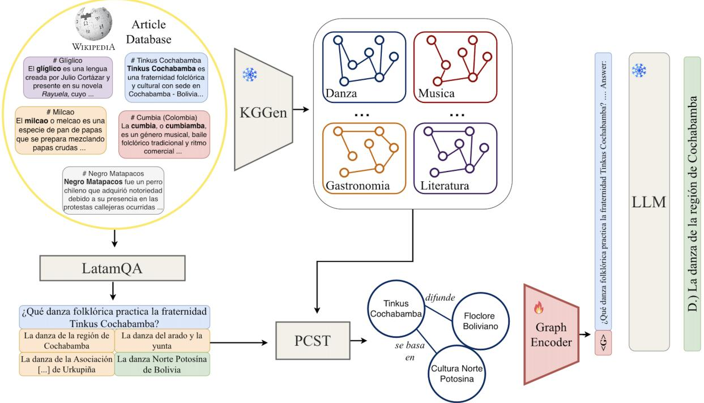
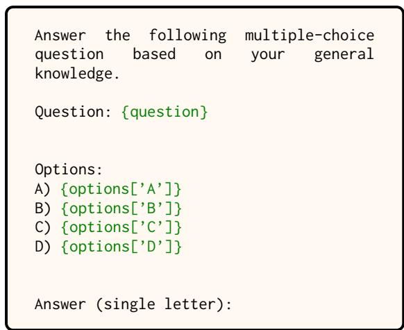
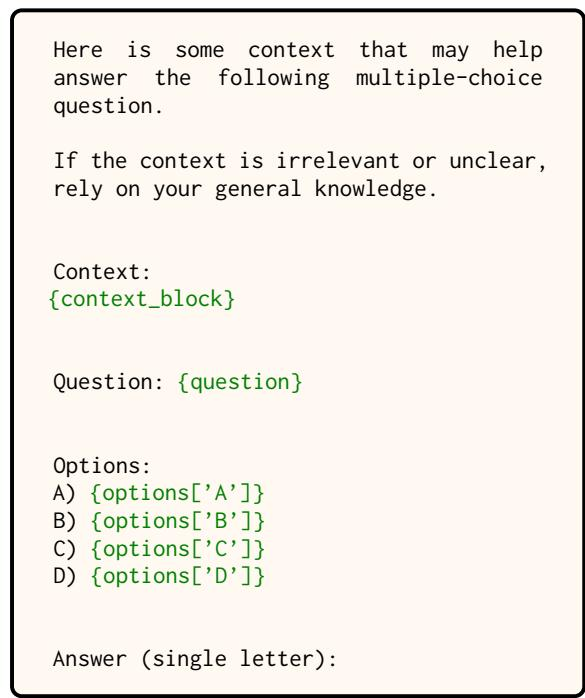

# Knowledge-Graph Based Augmentation versus Retrieval Augmented Generation for Cultural-Related Question Answering

Pablo Poulenard1,2, Yannis Karmim1,3,4, Valentin Barrière 1,5

1DCC, Universidad de Chile, Santiago, Chile 2École Polytechnique, Palaiseau, France, 3Inria, Almanach, Paris, France, 4Inria Chile, Santiago, Chile, 5CENIA, Macul, Chile Correspondence: pablo.poulenard@polytechnique.edu

## Abstract

Large language models (LLMs) suffer from a long-tail deficit: culturally specific facts, particularly those concerning underrepresented regions such as Latin America, appear too rarely in pretraining corpora to be reliably memorized. Retrieval-Augmented Generation (RAG) addresses this by grounding generation in external text, but structured alternatives such as Knowledge Graphs (KGs) offer tighter control over what enters the context, along with potential gains in explainability and updatability. We benchmark Graph-RAG against standard RAG on LatamQA, a culturally grounded multiplechoice dataset spanning eight thematic categories. The graphs are built end-to-end from Wikipedia articles with KGGen, a recent open domain extractor, without manual curation in our main setting. G-Retriever is competitive with RAG and reduces the error of the base LLM by 72% with a standard KG and 78% with a benchmark-aware variant, the gap to RAG narrowing further as the graph is oriented toward task-relevant content. The trained projection transfers zero-shot to Portuguese without target-language fine-tuning, indicating multilingual reach. Our code is available here.

## 1 Introduction and Related Work

LLMs acquire factual knowledge as a by-product of next-token prediction, so recall reliability scales with pretraining frequency (Mallen et al., 2023). Culturally specific facts, and especially those pertaining to underrepresented regions, appear too rarely to be memorised reliably, and the gap manifests as confabulation rather than abstention. Latin American culture is a canonical instance: despite Spanish being a high-resource language, stateof-the-art LLMs answer questions about Iberian Spanish culture substantially more accurately than equivalent questions about Latin American culture (Karmim et al., 2026). Parametric adaptation does not close this gap: continued pretraining on a new distribution induces catastrophic forgetting (Yang et al., 2026), and supervised fine-tuning is superseded by retrieval methods at scale (Ovadia et al., 2024).

Retrieval-Augmented Generation (RAG) addresses these limitations by grounding generation in an external text store without modifying model weights, and is highly effective in low-frequency factual regimes (Mallen et al., 2023). Its main drawback is token cost: retrieved passages fill the context window, and the practitioner has little control over what enters the prompt. A complementary line of work targets not what is retrieved but how it is reasoned over: (Ranaldi et al., 2025) improve multilingual RAG by having the model compare and reconcile heterogeneous retrieved passages through dialectic argumentation. Knowledge Graphs (KGs) offer a structured alternative: explicit relational triples are compact, easy to inspect, update, and trace back to sources. Automatic KG construction at scale has recently become tractable with KGGen (Mo et al., 2025), which converts raw text into triples via structured LLM prompting and reduces graph sparsity through entity and relation resolution.

G-Retriever (He et al., 2024) integrates a GNNbased soft prompt with PCST subgraph retrieval and is the leading graph-augmented LLM pipeline. Its evaluations use ExplaGraphs (Saha et al., 2021), SceneGraphs (Hudson and Manning, 2019), and WebQSP (Yih et al., 2016): datasets that pair each question with a small, clean, dedicated graph and require multi-hop reasoning, conditions structurally favorable to graph-based methods. We evaluate on a deliberately harder regime: a single large, noisy KG per thematic category with single-hop questions, so that RAG is naturally advantaged and the true cost of converting text into triples can be measured.

We benchmark Graph-RAG against standard RAG on LatamQA (Karmim et al., 2026), a culturally grounded MCQ dataset spanning eight Latin American thematic categories. Our contributions are: (i) a large-scale application of the recent opendomain extractor KGGen (Mo et al., 2025) to 5,848 Wikipedia articles, evaluated on downstream QA rather than intrinsic extraction metrics; (ii) a systematic comparison of RAG, Top-k triples, and G-Retriever (He et al., 2024); (iii) ablation studies isolating the contributions of graph structure and extraction quality; and (iv) zero-shot multilingual transfer of the trained projection to Portuguese. Figure 1 present an overview of our proposed pipeline.

  
Figure 1: Overview of our method. From 5,848 Spanish Wikipedia articles, KGGen (Mo et al., 2025) extracts one schema-free KG per thematic domain. For a LatamQA (Karmim et al., 2026) question, G-Retriever (He et al., 2024) selects a subgraph via PCST and prepends its encoding <G> to a frozen LLM; the same triples serve as text (D) for our RAG and Top-k baselines.

## 2 Proposed experimental pipeline

Our setup combines a culturally grounded QA benchmark, KGs extracted from the articles it is built from, and a small LM to answer the questions.

Dataset We build upon LatamQA (Karmim et al., 2026), a multiple-choice benchmark of culturally grounded factual knowledge extracted from Wikipedia articles on the cultures of Latin American countries. We define eight thematic categories from the Wikipedia ontology (Musica, Literatura, Cinema, . . . , see Table 1), scrape each countrytheme mother category (e.g. Gastronomía de Chile) recursively up to depth two, and intersect the result with LatamQA, yielding 5,848 articles. Each article supports exactly one question, with one correct answer and three distractors grounded in its content, so no question requires composition across articles.

Graph construction We rely on KGGen (Mo et al., 2025), a recent extractor that predicts entities and relations from raw text via structured LLM prompting, then resolves duplicates by iterative clustering (prompts in Appendix B). It has so far been evaluated only on English corpora of at most 5M tokens; we apply it to 50M characters of Spanish Wikipedia, a regime in which entity resolution dominates runtime. Articles are chunked into 5,000-character segments and per-article graphs are aggregated by category with entity and edge resolution, yielding one unified KG per category, linked with a central node in one global KG. Each triple is traced through the pipeline, providing provenance used as retrieval ground truth. We additionally construct a benchmark-aware variant per category by injecting entity and relation hints derived from LatamQA questions into the extraction prompt, steering the KG toward task-relevant content. Mistral Small 3.21 is the KGGen backbone.

Language Model Our main experiments use Qwen2.5-3B-Instruct (Qwen et al., 2025). Measuring the contribution of external knowledge requires a model that has not already memorized the target facts, since strong zero-shot performance would leave little headroom to attribute retrieval gains. At 60.17 zero-shot accuracy, parametric knowledge does not saturate the benchmark.

<table><tr><td>Category</td><td>#Articles</td><td>#Chars</td><td>#Nodes</td><td>#Edges</td></tr><tr><td>Música</td><td>1,306</td><td>14M</td><td>82k</td><td>32k</td></tr><tr><td>Literatura</td><td>1,515</td><td>12M</td><td>75k</td><td>29k</td></tr><tr><td>Cine</td><td>1,269</td><td>12M</td><td>73k</td><td>30k</td></tr><tr><td>Folclore</td><td>575</td><td>5M</td><td>39k</td><td>16k</td></tr><tr><td>Gastronomía</td><td>388</td><td>3M</td><td>15k</td><td>9k</td></tr><tr><td>Danza</td><td>378</td><td>2M</td><td>24k</td><td>9k</td></tr><tr><td>Pintura</td><td>277</td><td>2M</td><td>18k</td><td>6k</td></tr><tr><td>Artesanía</td><td>140</td><td>1M</td><td>10k</td><td>4k</td></tr><tr><td>Global</td><td>5,848</td><td>51M</td><td>336k</td><td>135k</td></tr></table>

Table 1: Statistics of the eight thematic KGs, after entity and edge resolution

Query encoding for retrieval All four systems share the same encoder and query format. jinaai/jina-embeddings-v3 (Sturua et al., 2024), a multilingual encoder with an 8,192-token context window, is used throughout, with its taskspecific LoRA adapters for queries and passages (details in Appendix A.1). The query concatenates the question with its four options: this symmetrically enriches the lexical and semantic signal available to the retriever while preserving the integrity of the task, since no option is privileged at retrieval time. Section 3 describes how each system uses this signal to select context.

## 3 Compared retrieval methods

All systems below use the same language model and embedding model described in Section 2, and differ only in the context they retrieve. RAG operates on raw text and serves as our reference point; the three graph-based systems consume the KG with increasing use of its structure, from an unordered set of triples to a trained subgraph encoder.

RAG Each article is segmented into chunks of at most 512 tokens with an overlap of 64 tokens, encoded with the same model as the queries. The k = 5 chunks with the highest similarity to the query are passed to the reader. Retrieval is restricted to the articles of the corresponding category, matching the scope of the KG used by the graph-based methods. These values were selected by grid search; the full sweep is reported in Appendix A.2.

Top-k triples This training-free baseline scores every triple independently: each (s, r, o) is encoded, ranked by cosine similarity to the query, and the top-k triples are verbalized into the prompt. This follows the similarity-based filtering of KAP-ING (Baek et al., 2023) but omits its entity-linking stage, which restricts candidates to the one-hop neighborhood of the question entities: since our graph comes from open extraction rather than a canonical knowledge base, no exact correspondence between question and graph entities is guaranteed. The graph is treated as an unordered set of triples, making this a natural lower bound for the structure-aware methods below.

G-Retriever G-Retriever (He et al., 2024) first extracts a subgraph by solving a Prize-Collecting Steiner Tree over the KG, using query similarity to edges and vertices as node prizes and edge costs. A graph encoder2 maps this subgraph to a single vector, which an MLP projects into the LM embedding space as a soft prompt. Both modules are trained end-to-end on a training split to produce the correct answer. In Section 4.2 we also evaluate a variant replacing the graph encoder by mean pooling over node embeddings, where topology determines which nodes are retrieved but is never encoded.

## 4 Results and Analysis

We first compare all four systems on LatamQA (Karmim et al., 2026) (Section 4.1), then isolate the contribution of each component of G-Retriever( Section 4.2), and finally test whether the trained projection transfers to an unseen language ( Section 4.3).

## 4.1 Main comparison

RAG vs Top-k triples vs G-Retriever Table 2 compares all methods against zero-shot (60.17). All retrieval methods substantially outperform the unaugmented model. The training-free Top-k triples baseline (+15.4 pp) confirms that even unordered triples carry discriminative signal, yet it remains well behind G-Retriever and RAG. RAG is the strongest overall (93.38 vs. 89.71), a gap attributable to information loss at triple extraction. Per-category results reveal substantial heterogeneity; notably, G-Retriever overtakes RAG on

Gastronomía (93.04 vs. 87.37), where relational abstraction filters out lexically crowded denseretrieval noise.

<table><tr><td>Category</td><td>Zero-shot</td><td>RAG</td><td>Top-k triples</td><td>G-Retriever</td></tr><tr><td>Música</td><td>57.73</td><td>92.11</td><td>70.36</td><td>88.36</td></tr><tr><td>Literatura</td><td>60.06</td><td>93.20</td><td>71.61</td><td>89.44</td></tr><tr><td>Cine</td><td>59.33</td><td>90.78</td><td>73.68</td><td>88.49</td></tr><tr><td>Folclore</td><td>63.82</td><td>96.69</td><td>78.78</td><td>92.87</td></tr><tr><td>Gastronomía</td><td>61.59</td><td>87.37</td><td>78.86</td><td>93.04</td></tr><tr><td>Danza</td><td>63.22</td><td>96.03</td><td>73.01</td><td>93.12</td></tr><tr><td>Pintura</td><td>59.56</td><td>90.97</td><td>74.36</td><td>88.81</td></tr><tr><td>Artesanía</td><td>65.71</td><td>94.28</td><td>77.14</td><td>86.43</td></tr><tr><td>Global</td><td>60.17</td><td>93.38</td><td>75.60</td><td>89.71</td></tr></table>

Table 2: Accuracy (%) per category on LatamQA

## 4.2 Ablation Studies

Graph structure Removing the trained projection (PCST as plain text, 73.10) falls below Top-k triples, replicating the corresponding ablation of He et al. (2024): the trained continuous prefix is the essential component. Interestingly, a linear projection matches or exceeds the graph encoder (88.90 vs. 86.13 without the textualized graph, 89.50 vs. 89.71 with it). We attribute this to the single-hop nature of the task: what the trained module supplies is a task-adapted continuous summary of the retrieved node and edge embeddings, functionally a form of prompt tuning (Lester et al., 2021; Li and Liang, 2021) conditioned on retrieved content, and message passing is an unnecessarily expressive way of producing it here.

Benchmark-aware extraction Steering extraction with question-derived entity hints improves both Top-k triples (+2.3 pp) and G-Retriever (+1.7 pp, reaching 91.41), confirming that standard extraction discards task-relevant content. The persistent gap with RAG (91.41 vs. 93.38) shows that extraction, not retrieval, is the main bottleneck.

<table><tr><td>Method</td><td>Encoder</td><td>Text Graph</td><td>Bench KGGen</td><td>Accuracy</td></tr><tr><td>PCST</td><td>一</td><td>√</td><td>x</td><td>73.10</td></tr><tr><td>Top-k triples</td><td>一</td><td>√</td><td>x</td><td>75.60</td></tr><tr><td>PCST</td><td>GraphEnc</td><td>x</td><td>x</td><td>86.13</td></tr><tr><td>PCST</td><td>Linear</td><td>x</td><td>x</td><td>88.90</td></tr><tr><td>PCST</td><td>Linear</td><td>√</td><td>x</td><td>89.50</td></tr><tr><td>PCST</td><td>GraphEnc</td><td>√</td><td>x</td><td>89.71</td></tr><tr><td>Top-k triples</td><td></td><td>√</td><td>√</td><td>77.92</td></tr><tr><td>PCST</td><td>GraphEnc</td><td>√</td><td>√</td><td>91.41</td></tr></table>

Table 3: Accuracy under different KGGen selection methods, graph encoders, and benchmark settings. GraphEnc denotes the trained graph encoder of G-Retriever, Linear denotes meanpooled node embeddings with a single projection. Bench KGGen refers to a KG constructed with LatamQA-specific relations/entities.

## 4.3 Multilingual transfer

The five checkpoints from the Spanish crossvalidation folds are applied without further training to a Portuguese KG built from 397 Literatura articles, with questions, triples and generation all in Portuguese. Since the projection aligns a pooled subgraph representation with the reader’s input space rather than modeling any particular language, and since the encoder is multilingual (Sturua et al., 2024), the mapping should be largely languageagnostic. G-Retriever reaches 91.18, above its 89.44 on Spanish Literatura, while the zero-shot baseline drops from 60.06 to 53.40 (Table 4). A single trained projection can therefore serve several languages, provided the retrieval backbone is itself multilingual.

Table 3 reports ablation results.
<table><tr><td>Method</td><td>Accuracy</td></tr><tr><td>Zero-shot</td><td>53.40</td></tr><tr><td>RAG</td><td>93.20</td></tr><tr><td>Top-k triples</td><td>75.06</td></tr><tr><td>PCST + GraphEnc (G-Retriever)</td><td>91.18</td></tr></table>

Table 4: Zero-shot cross-lingual transfer on the Portuguese Literatura graph (397 articles).

## 4.4 Inference efficiency

Graph-RAG is also lighter at inference: subgraph retrieval returns a compact set of triples rather than full passages, reducing the average context from 2814 to 875 tokens (Table 5). The cost moves offline: KG extraction cost 72.26 EUR in API calls and training the graph encoder took ∼9,942 s per fold (Appendix E).

<table><tr><td>Cost dimension</td><td>RAG</td><td>Graph-RAG</td></tr><tr><td>Inference context (tokens)</td><td>2814 ± 223</td><td>875 ± 174</td></tr><tr><td>Storage footprint</td><td>56.66 MB</td><td>36.20 MB</td></tr></table>

Table 5: Inference-time cost comparison.

## 5 Conclusion

We benchmarked Graph-RAG against RAG on a culturally grounded, single-hop MCQ dataset spanning eight Latin American thematic categories. G-Retriever reduces base LLM error by 74% on a 3.2× shorter context, and a benchmark-aware KG narrows the residual gap with RAG to 2 pp, confirming extraction quality rather than retrieval as the bottleneck; the projection also transfers zeroshot to Portuguese. Both LatamQA and our KGs derive from Spanish Wikipedia, whose coverage skews toward documented over orally transmitted knowledge, and addressing this bias will require participatory sources (Zhou et al., 2025).

## 6 Limitations

Evaluation format The four-way multiplechoice format admits a 25% chance floor and lets a system succeed by elimination rather than recall: a partially relevant triple may suffice to discard distractors without stating the answer itself (Balepur et al., 2024). Extraction-induced information loss is therefore penalised only when it removes discriminative content, so the gap we report between flat retrieval and graph-based augmentation is likely a lower bound on the true cost of converting text into triples.

Single reader All results use one small reader, Qwen2.5-3B-Instruct, chosen to leave headroom for retrieval to matter. The G-Retriever projection is trained to align with this specific frozen reader, and we do not test whether the learned mapping transfers across backbones.

Narrow cross-lingual evidence Our multilingual transfer experiment covers a single category (Literatura) and a language typologically close to Spanish, on a graph an order of magnitude smaller than its Spanish counterpart, which likely eases retrieval. Broader claims would require matched-size graphs and typologically distant, lower-resource languages (Hu et al., 2020).

Coverage bias Both LatamQA and our graphs are derived from Spanish Wikipedia, whose category distribution is highly uneven (1,306 articles for Música against 140 for Artesanía) and reflects editorial attention rather than cultural salience. Domains transmitted orally or through artisanal practice are underrepresented, so our benchmark measures Latin American culture as Wikipedia records it.

## References

Jinheon Baek, Alham Fikri Aji, and Amir Saffari. 2023. Knowledge-augmented language model prompting for zero-shot knowledge graph question answering. Preprint, arXiv:2306.04136.

Nishant Balepur, Shramay Palta, and Rachel Rudinger. 2024. It’s not easy being wrong: Large language models struggle with process of elimination reasoning. In Findings of the Association for Computational Linguistics: ACL 2024, pages 10143–10166,

Bangkok, Thailand. Association for Computational Linguistics.

Bo He, Hengduo Li, Young Kyun Jang, Menglin Jia, Xuefei Cao, Ashish Shah, Abhinav Shrivastava, and Ser-Nam Lim. 2024. MA-LMM: Memory-Augmented Large Multimodal Model for Long-Term Video Understanding. In CVPR, pages 13504– 13514.

Junjie Hu, Sebastian Ruder, Aditya Siddhant, Graham Neubig, Orhan Firat, and Melvin Johnson. 2020. XTREME: A Massively Multilingual Multitask Benchmark for Evaluating Cross-lingual Generalization.

Drew A. Hudson and Christopher D. Manning. 2019. Gqa: A new dataset for real-world visual reasoning and compositional question answering. Preprint, arXiv:1902.09506.

Yannis Karmim, Renato Pino, Hernan Contreras, Hernan Lira, Sebastian Cifuentes, Simon Escoffier, Luis Martí, Djamé Seddah, and Valentin Barrière. 2026. Leveraging Wikidata for Geographically Informed Sociocultural Bias Dataset Creation: Application to Latin America. Preprint, arXiv:2603.10001.

Brian Lester, Rami Al-Rfou, and Noah Constant. 2021. The Power of Scale for Parameter-Efficient Prompt Tuning.

Xiang Lisa Li and Percy Liang. 2021. Prefix-tuning: Optimizing continuous prompts for generation. In ACL-IJCNLP 2021 - 59th Annual Meeting of the Associationfor Computational Linguistics and the 11th International Joint Conference on Natural Language Processing, Proceedings of the Conference, pages 4582–4597.

Alex Mallen, Akari Asai, Victor Zhong, Rajarshi Das, Daniel Khashabi, and Hannaneh Hajishirzi. 2023. When Not to Trust Language Models: Investigating Effectiveness of Parametric and Non-Parametric Memories. Proceedings of the Annual Meeting of the Associationfor Computational Linguistics, 1(Section 6):9802–9822.

Belinda Mo, Kyssen Yu, Joshua Kazdan, Joan Cabezas, Proud Mpala, Lisa Yu, Chris Cundy, Charilaos Kanatsoulis, and Sanmi Koyejo. 2025. KGGen: Extracting Knowledge Graphs from Plain Text with Language Models. Preprint, arXiv:2502.09956.

Oded Ovadia, Meni Brief, Moshik Mishaeli, and Oren Elisha. 2024. Fine-Tuning or Retrieval? Comparing Knowledge Injection in LLMs. EMNLP 2024 - 2024 Conference on Empirical Methods in Natural Language Processing, Proceedings of the Conference, pages 237–250.

Qwen, An Yang, Baosong Yang, Beichen Zhang, Binyuan Hui, Bo Zheng, Bowen Yu, Chengyuan Li, Dayiheng Liu, Fei Huang, Haoran Wei, Huan Lin, Jian Yang, Jianhong Tu, Jianwei Zhang, Jianxin Yang, Jiaxi Yang, Jingren Zhou, Junyang Lin, and 24

others. 2025. Qwen2.5 Technical Report. Preprint, arXiv:2412.15115.

Leonardo Ranaldi, Federico Ranaldi, Fabio Massimo Zanzotto, Barry Haddow, and Alexandra Birch. 2025. Improving multilingual retrieval-augmented language models through dialectic reasoning argumentations. In Proceedings ofthe 2025 Conference on Empirical Methods in Natural Language Processing, pages 9064–9085, Suzhou, China. Association for Computational Linguistics.

Swarnadeep Saha, Prateek Yadav, Lisa Bauer, and Mohit Bansal. 2021. Explagraphs: An explanation graph generation task for structured commonsense reasoning. Preprint, arXiv:2104.07644.

Saba Sturua, Isabelle Mohr, Mohammad Kalim Akram, Michael Günther, Bo Wang, Markus Krimmel, Feng Wang, Georgios Mastrapas, Andreas Koukounas, Nan Wang, and Han Xiao. 2024. Jina-embeddings-$\mathbf { v } 3 \colon$ Multilingual Embeddings With Task LoRA. Preprint, arXiv:2409.10173.

Petar Velickoviˇ c, Arantxa Casanova, Pietro Liò,´ Guillem Cucurull, Adriana Romero, and Yoshua Bengio. 2018. Graph attention networks. 6th International Conference on Learning Representations, ICLR 2018 - Conference Track Proceedings, pages 1–12.

Liang Wang, Nan Yang, Xiaolong Huang, Linjun Yang, Rangan Majumder, and Furu Wei. 2024. Multilingual E5 Text Embeddings: A Technical Report. Preprint, arXiv:2402.05672.

Zhuoyi Yang, Yurun Song, Iftekhar Ahmed, and Ian Harris. 2026. Fine-Tuning vs. RAG for Multi-Hop Question Answering with Novel Knowledge. In GEM 2026 @ ACL, pages 384–392.

Wen-tau Yih, Matthew Richardson, Chris Meek, Ming-Wei Chang, and Jina Suh. 2016. The Value of Semantic Parse Labeling for Knowledge Base Question Answering. In Proceedings ofthe 54th Annual Meeting ofthe Associationfor Computational Linguistics (Volume 2: Short Papers), pages 201–206, Berlin, Germany. Association for Computational Linguistics.

Seongjun Yun, Minbyul Jeong, Raehyun Kim, Jaewoo Kang, and Hyunwoo J. Kim. 2019. Graph transformer networks. Advances in Neural Information Processing Systems, 32(NeurIPS).

Runtao Zhou, Guangya Wan, Saadia Gabriel, Sheng Li, Alexander J Gates, Maarten Sap, and Thomas Hartvigsen. 2025. Disparities in LLM Reasoning Accuracy and Explanations: A Case Study on African American English.

## A Implementation Details

## A.1 Embedding and Query

Embedding model All retrieval components rely on jinaai/jina-embeddings-v3 (Sturua et al.,

2024), a state-of-the-art multilingual encoder matching the Spanish of both the corpus and the questions. Its 8,192-token context window — against 512 for comparable encoders such as multilingual-e5-large-instruct (Wang et al., 2024) — is a deliberate design choice: it allows coarse retrieval units, up to entire articles, and thus lets us vary retrieval granularity while holding the encoder fixed. Queries and Passages were encoded using the task-specific LoRA adapters of the model.

Query construction For all retrieval methods, the query is the concatenation of the question and its four answer options, without any indication of which option is correct. In a multiple-choice setting, the question alone is often an underspecified retrieval cue: it may lack the named entities and surface forms that anchor the relevant subgraph, whereas these frequently appear in the options themselves. Including all four options symmetrically enriches the lexical and semantic signal available to the retriever while preserving the integrity of the task, since no option is privileged at retrieval time. This design also aligns the evaluation with the inference-time setting of the reader, which observes the question and all options jointly.

## A.2 Retrieval Method Hyperparameters Optimization

We ran an exhaustive grid search for the three retrieval modes—TOP-K TRIPLES, RAG and GRAPH-RAG (PCST)—on a held-out subset of 500 questions sampled uniformly at random from the benchmark.

For RAG we varied the chunk size (32–512 tokens) and the number of retrieved chunks $k \in$ {5, 10, 25}; for top-k triples, the number of retrieved triples $k \in \{ 3 , \ldots , 1 0 0 \}$ ; for Graph-RAG, the node and edge budgets and the PCST edge cost $c _ { e } \in \{ 0 . 0 1 , 0 . 1 , 0 . 5 \}$ . For the Graph-RAG grid we searched over the PCST retriever alone, without the trained GNN-based soft-prompting module, in the same configuration as the ablation of Section 4.2. This choice is dictated by cost: a full grid would have required retraining the GNN for every cell, at roughly $1 0 ^ { 4 }$ seconds per fold (Table 5). It rests on the assumption that the retrieval component and the trained projection module are approximately separable, i.e., that the ranking of subgraph budgets induced by retrieval quality is preserved when the projection module is added downstream.

## A.3 G-Retriever

• Subgraph Retrieval via PCST. Following (He et al., 2024), we first encode node and edge textual attributes with a pretrained language model and compute their cosine similarity to the query embedding, which serves as node prizes and edge costs. We then solve the Prize-Collecting Steiner Tree (PCST) problem to retrieve a connected subgraph $S ^ { * } =$ $( V ^ { * } , E ^ { * } )$ maximizing query relevance while penalizing edge costs:

$$
S ^ { * } = \arg \operatorname* { m a x } _ { S \subseteq G } \sum _ { v \in V } \mathrm { p r i z e } ( v ) - \sum _ { e \in E } \mathrm { c o s t } _ { e } .\tag{1}
$$

We set top\_ $_ { k _ { n o d e s } } = 1 5$ , top $_ { - } k _ { e d g e s } = 2 0$ and $\mathrm { c o s t } _ { e } = 0 . 5$ , hyperparameters optimized via grid search.

• Graph Encoder. To model the structure of the retrieved subgraph $S ^ { * }$ , we depart from the Graph Attention Network used in (He et al., 2024) and instead employ a Graph Transformer (Yun et al., 2019), implemented via multi-head Transformer convolution layers that incorporate edge features into the attention computation. Our encoder stacks $L = 4$ layers with 8 attention heads, residual connections, layer normalization and dropout $( p ~ = ~ 0 . 1 )$ , operating on node and edge embeddings of dimension 1024. Node representations are then aggregated into a single graph token via mean pooling: $h _ { g } ~ = ~ \mathrm { P O O I }$ (GraphTransforme $\cdot _ { \phi _ { 1 } } ( S ^ { * } ) )$ ∈ $\mathbb { R } ^ { d _ { g } }$ , with $d _ { g } = 1 0 2 4$

Each layer updates node representations through multi-head attention over neighboring nodes, where attention coefficients are conditioned on both node and edge embeddings:

$$
x _ { i } ^ { \prime } = W _ { 1 } x _ { i } + \sum _ { j \in \mathcal { N } ( i ) } \alpha _ { i j } W _ { 2 } x _ { j }
$$

$$
\alpha _ { i j } = \operatorname { s o f t m a x } _ { j } \left( { \frac { ( W _ { 3 } x _ { i } ) ^ { \top } ( W _ { 4 } x _ { j } + W _ { 5 } e _ { i j } ) } { \sqrt { d } } } \right)
$$

• Projection Layer and Prompt Tuning. A multilayer perceptron aligns the graph token with the hidden space of the frozen LLM $( d _ { l } = 1 0 2 4 ) \colon \hat { h } _ { g } = \mathbf { M L P } _ { \phi _ { 2 } } ( h _ { g } ) \in \mathbb { R } ^ { d _ { l } }$ . This graph token acts as a soft prompt, prepended to the embeddings of the textualized subgraph and the query; while the LLM parameters θ remain frozen, gradients flow through $\hat { h } _ { g }$ , enabling the optimization of $\phi _ { 1 }$ and $\phi _ { 2 }$ by standard backpropagation (He et al., 2024).

## A.4 Cross-Validation

All the experiments were run on the full dataset using a k-fold train-val-test cross-validation.

## B KG Generation

## B.1 Base pipeline

KGGen (Mo et al., 2025) extracts entities and relations from raw text via structured LLM prompting. Each Wikipedia article is segmented into chunks of 5,000 characters and processed independently, yielding a per-article graph. Articlelevel graphs are then aggregated by category, and entity and edge resolution is applied at category scale so that each thematic category is represented by a single unified KG. Extraction is carried out in Spanish using Mistral Small 3.2 (Mistral-Small-3.2-24B-Instruct-2506) accessed via API. All LLM calls are routed through LiteLLM. Each triple is traced throughout the resolution process, so that for any given article we can recover the full set of triples originating from it in the final graph; this provenance information provides the ground truth against which retrieval is evaluated.

## B.2 Benchmark-aware knowledge graph

For each category, we additionally construct a benchmark-aware augmented KG. Given the questions and answer options of LatamQA — including distractors — we extract the entities and relations required to discriminate between the candidate answers using Mistral Small 3.2. The resulting entity and relation hints are injected into the extraction prompt, steering the KG towards elements relevant to the downstream task rather than arbitrary factual content. Extraction otherwise follows the base pipeline, and entity and edge resolution is applied unchanged. The procedure yields a second graph per category aligned with the question distribution while relying on the same source articles. This graph is used as an upper-bound diagnostic: it is not a deployable configuration, as it presupposes access to the evaluation questions at construction time.

## C QA Prompts

## C.1 Vanilla Prompt

The Vanilla prompt to answer the LatamQA MCQ is shown in Figure 2.

  
Figure 2: Prompt used for the LatamQA benchmark.

## C.2 Triplet-enhanced Prompt

The prompt using context extracted from the graph is shown in Figure 3.

  
Figure 3: Prompt used for the LatamQA benchmark. context\_block contains the extracted triplets using the Topk triplet or PCST.

## D Retrieval Oracle Analysis

To separate retrieval error from reading error, we restrict the candidate pool to the gold article for each question (oracle condition). Table 6 shows that RAG benefits most (+3.3%, 93.38 to 96.72), and Top-k triples gains 2.2%, whereas G-Retriever gains only 0.6% — within its cross-fold dispersion. G-Retriever’s residual error thus stems from information lost during triple extraction, not from retrieval failure. The gap with RAG widens under the oracle condition (from 3.7 to 6.5%), confirming that the ceiling of the graph representation is set by extraction, not retrieval.

<table><tr><td>Method</td><td>Full retrieval</td><td>Per-article (oracle)</td></tr><tr><td>RAG</td><td>93.38</td><td>96.72</td></tr><tr><td>Top-k triples</td><td>75.60</td><td>77.84</td></tr><tr><td>PCST + GraphEnc (emb. + prompt)</td><td>89.71 ± 1.38</td><td>90.27 ± 0.46</td></tr></table>

Table 6: Full-graph vs. per-article (oracle) retrieval, accuracy (%).

## E Inference Cost Details

The two pipelines distribute their cost very differently across the system lifecycle. The text-based RAG baseline concentrates its expense at inference time: retrieved passages are injected verbatim into the prompt, yielding an average context of 2814.3 tokens, roughly 3.2× longer than the 874.8 tokens required by Graph-RAG. This reduction is a direct consequence of retrieval granularity: subgraph retrieval returns a compact set of triples rather than full passages, discarding surrounding prose that contributes tokens without contributing evidence. These figures depend on retrieval hyperparameters and are not intrinsic to either paradigm.

Conversely, Graph-RAG front-loads its cost into an offline construction phase that RAG does not incur. Extracting the knowledge graphs with KGGen (Mo et al., 2025) on a 51M-character dataset required 72.26 EUR in API calls, and training the Graph encoder took 9,942 s on average per fold.

<table><tr><td>Cost dimension</td><td>RAG</td><td>Graph-RAG</td></tr><tr><td>Inference context (tokens)</td><td>2814.3 ± 222.9</td><td>874.8 ± 174.3</td></tr><tr><td>Storage footprint</td><td>56.66 MB (CSV)</td><td>36.20 MB (PKL)</td></tr><tr><td>GraphEnc training time (s)</td><td>n.a.</td><td>9,942</td></tr><tr><td>Graph extraction cost (EUR)</td><td>n.a.</td><td>72.26</td></tr></table>

Table 7: Full cost comparison between RAG and Graph-RAG. Inference context is mean ± std over the evaluation set; GraphEnc training is averaged over k-fold runs.