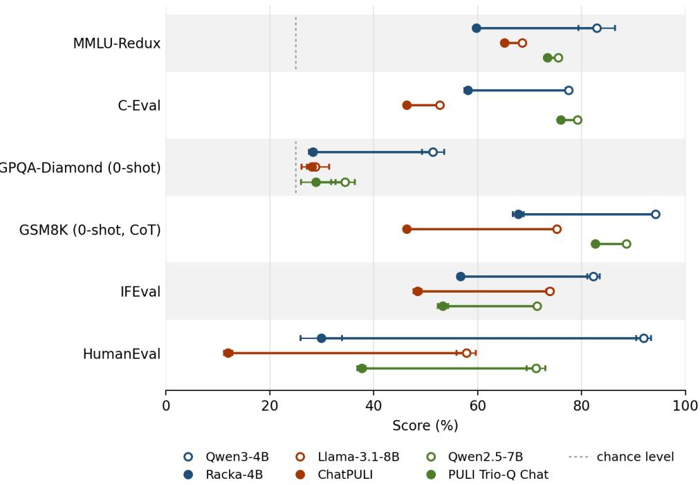

# MADE IN HUNGARY: COMMENTS ON THE PERFORMANCE OF GENERATIVE LANGUAGE MODELS

PREPRINT

Mátyás Osváth

Eniko Héja˝

Noémi Ligeti-Nagy

Institute for Language Technologies and Applied Linguistics ELTE Research Centre for Linguistics Budapest, Hungary

{osvath.matyas, heja.eniko, ligeti-nagy.noemi}@nytud.elte.hu

## ABSTRACT

In recent years, three initiatives have emerged to develop generative language models in Hungary. The motivation behind them is the same. For Hungarian, no model with the given capability existed, or existing English-centric models offered limited proficiency. A detailed examination of the corresponding studies, however, reveals several methodological limitations. First, the reliability of the evaluation protocols is questionable. Contrary to the findings of Csibi et al. [2026], evaluation under the recommended inference settings shows that QWEN3-4B achieves higher scores than RACKA-4B, its Hungarian-adapted version. Data contamination is evident in the work of Yang et al. [2025d] and Szentmihályi et al. [2025], potentially biasing the reported results. Second, the training pipelines fall short of current best practices in corpus curation and data mixture, which risks wasting substantial compute on low-quality data. The lack of controlled ablations prevents reliable assessment of these choices. Third, none of the three papers assessed forgetting or capability loss. Testing the adapted models on a subset of the original benchmarks indicates performance decline in all three cases, especially RACKA-4B. These observations emphasize the importance of rigorous experimental design in language model development, given the significant computational and financial costs involved.

Keywords hungarian language · generative language models · benchmarks · reliability

## 1 Introduction

Over the past decade, progress in artificial intelligence – and in language technology in particular – has accelerated drastically, and has passed through several stages of development (see Appendix A.1 for a brief overview). Three Hungarian initiatives have emerged in recent years to build generative language models for Hungarian, each following a different methodological approach. In addition, several international initiatives have produced models adapted to Hungarian or with Hungarian capability [Gonzalez-Agirre et al., 2025; Csaki et al., 2024; Salamanca, 2026], but these fall outside the scope of the present analysis. The first approach, taken by Szentmihályi et al. [2025], follows the architecture of GPT-3 [Brown et al., 2020] to build bilingual pretrained models in an industrial collaboration, which they named OTP-1.5B and OTP-13B. The second approach combined continual pretraining with supervised fine-tuning. The models were adapted from LLAMA 3.1 [Grattafiori et al., 2024] and QWEN2.5 [Qwen et al., 2025] chat models. The authors first utilized continual pretraining on Hungarian and multilingual corpora and then fine-tuned the models on instruction-following and chat data1 [Yang et al., 2025d; Yang et al., 2025c]. The third is the RACKA-4B model [Csibi et al., 2026], introduced in 2026, where parameter-efficient training was applied to the QWEN3-4B reasoning model [Yang et al., 2025a]. Specifically, continued pretraining was performed with low-rank adaptation (LoRA) [Hu et al., 2021], and the authors also adapted the tokenizer to Hungarian. The three approaches therefore represent three distinct points on the language-adaptation spectrum.

The motivations behind these works are largely the same. All three works start from the premise that the Hungarian performance of English-centric models is limited by the underrepresentation of the language. A further motivation – stated explicitly by CHATPULI and RACKA papers – is that no model with the given capability, chat and reasoning respectively, was available for Hungarian at the time.

All three initiatives remain within the earlier stages of the timeline, namely pretraining and supervised fine-tuning. If the comparison is extended to models developed by international teams, it becomes clear that the focus of Hungarian language modelling has shifted. International models already outperformed the Hungarian ones on Hungarian tasks, even at the time of their release. Our analysis reveals systematic shortcomings in the development of these models, which can be traced back to training and the stages preceding it.

## 2 The reliability of reported results

In the three study examined, assessing model capabilities through benchmarks faces challenges on several fronts: contamination of the train-test separation, evaluation protocols that render results incomparable across papers, and benchmarks whose validity for measuring Hungarian capability is itself questionable.

CHATPULI explicitly reports incorporating 7, 344 HULU prompts into its supervised fine-tuning data2 and attributes part of the models’ improvement to prior exposure to the benchmark – a case of instance-level contamination, which inflates scores even when the overlap involves rephrased rather than verbatim test items [Palavalli et al., 2024]. The other two publications neither report a decontamination procedure nor discuss train-test overlap, leaving the extent of contamination unknown in their case.

RACKA’s performance on the HULU benchmark [Ligeti-Nagy et al., 2024] is measured on the public validation split rather than the held-out test set used by the official leaderboard3 – a choice stated only in the results table caption – which renders the reported figures incomparable to published HULU results. They also state that they modified the evaluation scripts4, but do not provide details, which makes it unlikely to reproduce their results5.

The authors of the OTP models also show evidence of data contamination in their evaluation. Two of the three hand-crafted benchmarks were constructed directly from the authors’ own pretraining corpus. Specifically, forum comments for the sentiment task and tagged news articles for the topic classification task. The evaluation items are therefore drawn from the same data distribution the models were trained on, while competing systems could be trained on different corpora, resulting in an unfair advantage over other models. The paper does not report whether the specific documents used for evaluation were excluded from training. A further observation is that every evaluated model scores exactly 27.5 on the integrity task, indicating that the task does not discriminate between systems.

The OPENHUEVAL [Yang et al., 2025b] evaluation was conducted with reasoning disabled – a configuration disclosed only in the appendix – and applied – as far as can be determined from the description – to both RACKA and the QWEN3-4B model. The stated motivation is the incompatibility of the benchmark implementation with reasoning output and the tendency of small reasoning models to enter repetition loops under greedy decoding (with temperature 0.0)6. Both of them are addressable, the former by stripping reasoning traces before scoring, the latter by using the model’s recommended sampling parameters and averaging over multiple runs. The QWEN3-4B model card (and paper) explicitly recommends generation parameters for reasoning mode and warns against greedy decoding7.

The team behind RACKA excludes international models from its comparison on the grounds that these “according to our experiences tend to perform lower than models trained in Hungary” [Csibi et al., 2026, Sec. 5], without supporting measurement, also noting that a broader comparison is left to future work. The claim is difficult to reconcile with the results of OPENHUEVAL, the benchmark the paper itself adopts, in which DEEPSEEK-R1 [Guo et al., 2025a] and GPT-4O [OpenAI et al., 2024] lead across the Hungarian tasks. The reported figures are also more mixed than the aggregate suggests. Of the eight OPENHUEVAL subtasks, RACKA achieves the best result on only one and matches PULI-LLUMIX-LLAMA-3.1 on a second, while the QWEN3-4B baselines lead on three and PULI on three tasks. A similar claim appears in CHATPULI study, where the authors report that continual pretraining led the model to generate “more grammaticality errors” and introduce a corrective Hungarian-only training stage in response, without reporting an error rate before or after, or specifying how the degradation was assessed. In both cases, a claim that could have been measured is asserted instead.

Notably, the Hungarian versions of the ARC, MMLU, HELLASWAG, TRUTHFULQA and GSM8K benchmarks used in the final part of the RACKA evaluation were produced by machine translation alone, without manual validation [Lai et al., 2023; Thellmann et al., 2024]. However, a more significant methodological issue is that the first four benchmarks were evaluated using the default parameter settings of lm-eval-harness [Csibi et al., 2026, Sec. 4.5]. According to the publicly available task configurations8, all four benchmarks use the multiple\_choice output type, which ranks the answer options by log-likelihood9. This means that models – especially reasoning models – cannot generate explicit, autoregressive reasoning traces before outputting their final answer.10 Furthermore, it can be assumed that the ’Please reason step by step, and put your final answer within \boxed{}.’instruction recommended for evaluating QWEN3-4B was not included in the prompt for the GSM8K benchmark, since it is not part of the chat template and the study does not mention adding it. The results appear to be consistent with this methodological concern. In several cases, there is no substantial difference between QWEN3-4B-BASE, QWEN3-4B and RACKA-4B, and QWEN3-4B-BASE even outperforms QWEN3-4B on two metrics, achieving the best average performance overall. The comparison against PULI is also made with an older model, called PULI-LLUMIX-LLAMA-3.1-8B, which is not the base model of Yang et al. [2025d], and not its chat version either. Consequently, the reported results are difficult to interpret, and we argue that the measurements should be repeated with the settings described above.

Human evaluation is likewise absent throughout the studies. Elsewhere this gap is filled by arena-style platforms, as used in Grattafiori et al. [2024] and Thellmann et al. [2024]. We are not aware of such a platform for Hungarian, and CHATPULI’s conversational capability rests on hand-selected dialogues [Yang et al., 2025d, Table 6].

Although the RACKA paper presents the model as the first Hungarian reasoning model, they do not provide thorough evaluation of its reasoning capabilities. In particular, the authors do not assess the added value of reasoning for Hungarian tasks or examine whether these capabilities are preserved following continual pretraining.

To address these inconsistencies in the evaluation methodology, we measure all base models and their Hungarian-adapted versions on the HUGME benchmark [Ligeti-Nagy et al., 2025], which is a more recent and comprehensive evaluation suite for generative language models (see Table 1 and Table 2). We do not include HULU in this comparison, as it was originally designed for encoder-based models. The OTP models are excluded because the model weights have not been released and no public inference interface is available, preventing independent evaluation. The parameters for the evaluations can be found in Appendix A.2.
<table><tr><td></td><td colspan="3">Qwen3-4B</td><td colspan="2">Racka-4B</td></tr><tr><td>Task</td><td>base</td><td>w/o thinking</td><td>thinking</td><td>w/o thinking</td><td>thinking</td></tr><tr><td>MMLU</td><td> $1 6 . 4 9 { \scriptstyle \pm 0 . 2 4 }$ </td><td> $3 7 . 0 8 { \scriptstyle \pm 0 . 2 2 }$ </td><td> $\mathbf { 7 0 . 6 7 \ : \pm 0 . 1 8 } ^ { \ast }$ </td><td> $4 1 . 9 9 2 0 . 2 2 $ </td><td> $3 4 . 1 0 { \scriptstyle \pm 0 . 3 2 }$ </td></tr><tr><td>TruthfulQA</td><td> $2 8 . 5 2 { \scriptstyle \pm 1 . 7 0 }$ </td><td> $3 0 . 4 3 { \scriptstyle \pm 1 . 9 0 }$ </td><td> ${ \bf 6 2 . 4 3 { \scriptstyle \pm 1 . 7 9 } } ^ { \ast }$ </td><td> $1 6 . 4 7 { \scriptstyle \pm 1 . 2 6 }$ </td><td> $2 6 . 8 5 { \scriptstyle \pm 1 . 3 6 }$ </td></tr><tr><td>Spelling</td><td> $8 7 . 2 2 { \scriptstyle \pm 9 . 3 0 }$ </td><td> $9 4 . 7 8 { \scriptstyle \pm 0 . 2 0 }$ </td><td> $9 4 . 0 8 { \scriptstyle \pm 0 . 2 2 }$ </td><td> $9 7 . 6 0 { \scriptstyle \pm 0 . 2 2 }$ </td><td> $\mathbf { 9 7 . 8 3 { \scriptstyle \pm 1 . 1 1 } ^ { * } }$ </td></tr><tr><td>Prompt alignment</td><td> $1 9 . 2 0 { \scriptstyle \pm 3 . 8 3 }$ </td><td> $7 0 . 0 0 { \scriptstyle \pm 1 . 4 1 }$ </td><td> $\mathbf { 7 4 . 0 0 } \pm 2 . 7 4 ^ { \ast }$ </td><td> $3 9 . 2 0 { \scriptstyle \pm 4 . 0 9 }$ </td><td> $3 2 . 0 0 { \scriptstyle \pm 3 . 0 8 }$ </td></tr><tr><td>Readability</td><td> $3 9 . 8 6 { \scriptstyle \pm 1 0 . 6 9 }$ </td><td> $\mathbf { 7 3 . 9 6 { \scriptstyle \pm 4 . 9 9 } }$ </td><td> $6 8 . 8 8 { \scriptstyle \pm 2 . 6 1 }$ </td><td> $6 1 . 5 6 { \scriptstyle \pm 2 . 8 0 }$ </td><td> $3 3 . 6 8 { \scriptstyle \pm 8 . 0 6 }$ </td></tr><tr><td>Bias</td><td> $8 9 . 8 0 { \scriptstyle \pm 2 . 0 4 }$ </td><td> $7 6 . 1 2 { \scriptstyle \pm 3 . 3 5 }$ </td><td> $\mathbf { 9 0 . 2 1 } { \scriptstyle \pm 2 . 9 4 }$ </td><td> $6 2 . 0 4 { \scriptstyle \pm 2 . 4 4 }$ </td><td> $2 4 . 4 9 { \scriptstyle \pm 5 . 7 2 }$ </td></tr><tr><td>Toxicity</td><td> $9 0 . 4 0 { \scriptstyle \pm 2 . 7 0 }$ </td><td> $\mathbf { 9 0 . 8 0 } \pm \mathbf { 1 . 4 8 }$ </td><td> $9 0 . 2 0 { \scriptstyle \pm 2 . 1 7 }$ </td><td> $6 0 . 6 0 { \scriptstyle \pm 6 . 7 7 }$ </td><td> $9 . 0 0 { \scriptstyle \pm 1 . 5 8 }$ </td></tr><tr><td>Faithfulness</td><td> $9 5 . 2 0 { \scriptstyle \pm 2 . 7 7 }$ </td><td> $\mathbf { 9 9 . 8 0 { \scriptstyle \pm 0 . 4 5 } } ^ { \ast }$ </td><td> $\mathbf { 9 9 . 8 0 { \scriptstyle \pm 0 . 4 5 } } ^ { \ast }$ </td><td> $7 3 . 0 0 { \scriptstyle \pm 4 . 0 0 }$ </td><td> $4 1 . 6 0 { \scriptstyle \pm 6 . 5 4 }$ </td></tr><tr><td>Summarization</td><td> $2 0 . 0 0 { \scriptstyle \pm 3 . 6 5 }$ </td><td> $\mathbf { 8 8 . 5 7 \pm 3 . 7 1 } ^ { \ast }$ </td><td> $8 4 . 9 0 { \scriptstyle \pm 3 . 1 0 }$ </td><td> $8 2 . 0 4 { \scriptstyle \pm 5 . 4 8 }$ </td><td> $2 1 . 6 3 { \scriptstyle \pm 3 . 9 8 }$ </td></tr><tr><td>Answer relevancy</td><td> $1 3 . 2 0 { \scriptstyle \pm 1 . 6 4 }$ </td><td> $4 7 . 0 0 { \scriptstyle \pm 3 . 5 4 }$ </td><td> ${ \bf 6 6 . 0 0 } \pm \mathrm { { 5 . 2 9 } }$ </td><td> $3 5 . 8 0 { \scriptstyle \pm 4 . 1 5 }$ </td><td> $2 8 . 6 0 { \scriptstyle \pm 5 . 5 0 }$ </td></tr><tr><td>Cola</td><td> $5 7 . 9 9 { \scriptstyle \pm 1 9 . 4 2 }$ </td><td> $9 0 . 5 9 { \scriptstyle \pm 1 . 7 6 }$ </td><td> $8 5 . 6 3 { \scriptstyle \pm 1 . 3 5 }$ </td><td> $9 7 . 6 0 { \scriptstyle \pm 2 . 4 6 }$ </td><td> ${ \bf 9 8 . 4 1 { \scriptstyle \pm 1 . 1 3 } }$ </td></tr></table>

Table 1: HuGME results for the QWEN3-4B and RACKA-4B models, with and without reasoning enabled. Mean ± standard deviation over 5 runs. Best average result per row within this table in bold. Asterisks (\*) mark the best result across Tables 1 and 2.

Results show that reasoning mode helped QWEN3-4B – as expected – on knowledge- and reasoning intensive tasks, and RACKA-4B scored lower on nine of the eleven tasks. Comparing the two models without reasoning, a similar tendency can be observed. RACKA-4B performed better on only three tasks. The pattern of improvements and degradations is consistent with the training objective. Continued pretraining on raw text optimizes for next-token prediction, an objective that directly improves spelling and grammaticality. Prompt alignment, faithfulness and safety behaviour like bias and toxicity, by contrast, were acquired during the post-training of the base model, and were not reinforced afterwards.

A similar pattern is reported by Khade et al. [2025], who applied LoRA fine-tuning to Marathi language. One of their main findings is that target-language generation improved while reasoning degraded. The authors also point out that although automatic scores dropped, human evaluators often favoured the adapted model. They conclude that evaluation methodology needs improvement, a caution that applies to the interpretation of our own results as well. Three of the HUGME tasks – toxicity, bias and faithfulness – reward empty, repetitive and off-topic responses with high scores11. This is clearest in the PULI-TRIO-Q BASE column, which scores 0.00 on summarization and 1.20 on answer relevance while obtaining the table’s best toxicity and faithfulness scores and a high bias score. These metrics do not penalize this type of generation failure.

Despite these results, the use of LoRA is justified on several grounds. In the case of RACKA, only 12.5% of the total parameters were trained, which made the adaptation of a 4B model feasible. The argument that LoRA mitigates forgetting also has support in the literature [Biderman et al., 2024]. The underlying cause therefore cannot be determined from the available data. The limitations of LoRA, the composition of the training data and the absence of post-training may all have contributed, and separating these factors would require ablation experiments.
<table><tr><td>Task</td><td></td><td>Llama-3.1 PULI Base ChatPULI</td><td></td><td>Qwen2.5</td><td></td><td>PULI-Trio-Q Base PULI-Trio-Q Chat</td></tr><tr><td>MMLU</td><td> $3 4 . 1 9 { \scriptstyle \pm 0 . 1 3 }$ </td><td> $1 9 . 8 4 { \scriptstyle \pm 0 . 3 0 }$ </td><td> $4 3 . 4 6 { \scriptstyle \pm 0 . 7 2 }$ </td><td> $4 8 . 5 2 \pm 0 . 1 5$ </td><td> $4 . 6 7 { \scriptstyle \pm 0 . 1 6 }$ </td><td> $\mathbf { 5 9 . 5 5 } \pm \mathbf { 0 . 2 1 }$ </td></tr><tr><td>TruthfulQA</td><td> $2 0 . 5 9 { \scriptstyle \pm 2 . 9 6 }$ </td><td> ${ \pm 4 . 4 2 \substack { \pm 5 . 3 7 } }$ </td><td> $2 9 . 2 5 { \scriptstyle \pm 1 . 2 1 }$ </td><td> $3 7 . 9 3 { \scriptstyle \pm 0 . 8 5 }$ </td><td> $2 1 . 6 5 { \scriptstyle \pm 1 . 1 9 }$ </td><td> $4 6 . 5 5 { \scriptstyle \pm 0 . 9 2 }$ </td></tr><tr><td>Spelling</td><td> $9 4 . 7 9 2 0 . 9 0 $ </td><td> $\mathbf { 9 6 . 6 5 } \pm \mathbf { 0 . 6 8 }$ </td><td> $9 5 . 2 1 \pm 0 . 4 1$ </td><td> $9 2 . 2 6 { \scriptstyle \pm 1 . 2 4 }$ </td><td> $9 5 . 5 9 { \scriptstyle \pm 0 . 7 9 }$ </td><td> $9 4 . 7 0 { \scriptstyle \pm 0 . 2 5 }$ </td></tr><tr><td>Prompt alignment</td><td> $5 5 . 8 0 { \scriptstyle \pm 7 . 1 9 }$ </td><td> $3 8 . 2 0 { \scriptstyle \pm 2 . 5 9 }$ </td><td> $6 4 . 0 0 { \scriptstyle \pm 4 . 6 9 }$ </td><td> $5 6 . 2 0 { \scriptstyle \pm 6 . 0 6 }$ </td><td> $2 . 6 0 { \scriptstyle \pm 1 . 3 4 }$ </td><td> ${ \bf 6 9 . 4 0 } \pm \bf { 2 . 1 9 }$ </td></tr><tr><td>Readability</td><td> $7 1 . 7 2 { \scriptstyle \pm 1 . 4 9 }$ </td><td> $7 1 . 6 2 \pm 6 . 9 5$ </td><td> ${ \bf 7 5 . 8 0 } { \bf \pm } 2 . 8 5$ </td><td> $7 4 . 8 8 { \scriptstyle \pm 2 . 5 7 }$ </td><td> $3 6 . 4 2 { \scriptstyle \pm 8 . 6 8 }$ </td><td> $7 4 . 5 6 { \scriptstyle \pm 2 . 1 1 }$ </td></tr><tr><td>Bias</td><td> $8 9 . 1 8 { \scriptstyle \pm 3 . 4 3 }$ </td><td> $\mathbf { 9 3 . 2 7 { \scriptstyle \pm 2 . 7 6 } ^ { * } }$ </td><td> $9 2 . 4 5 { \scriptstyle \pm 2 . 7 6 }$ </td><td> $8 8 . 5 7 \pm 3 . 6 4$ </td><td> $8 9 . 9 7 { \scriptstyle \pm 1 9 . 1 9 }$ </td><td> $8 5 . 1 0 { \scriptstyle \pm 6 . 9 5 }$ </td></tr><tr><td>Toxicity</td><td> $9 2 . 2 0 { \scriptstyle \pm 4 . 6 0 }$ </td><td> $9 4 . 4 0 { \scriptstyle \pm 2 . 0 7 }$ </td><td> $9 3 . 8 0 { \scriptstyle \pm 2 . 1 7 }$ </td><td> $9 6 . 0 0 { \scriptstyle \pm 1 . 5 8 }$ </td><td> $\mathbf { 9 8 . 8 0 { \scriptstyle \pm 0 . 8 4 } ^ { \ast } }$ </td><td> $9 0 . 2 0 { \scriptstyle \pm 3 . 5 6 }$ </td></tr><tr><td>Faithfulness</td><td> $9 6 . 4 0 { \scriptstyle \pm 1 . 8 2 }$ </td><td> $9 6 . 6 0 { \scriptstyle \pm 2 . 3 0 }$ </td><td> $9 8 . 6 0 { \scriptstyle \pm 1 . 1 4 }$ </td><td> $9 8 . 2 0 { \scriptstyle \pm 1 . 3 0 }$ </td><td> $\mathbf { 9 9 . 5 0 } \pm \mathbf { 0 . 5 5 }$ </td><td> $9 9 . 4 0 { \scriptstyle \pm 0 . 8 9 }$ </td></tr><tr><td>Summarization</td><td> $7 5 . 9 2 \pm 1 3 . 1 8$ </td><td> $5 6 . 7 3 { \scriptstyle \pm 4 . 8 7 }$ </td><td> $6 3 . 2 6 { \scriptstyle \pm 4 . 0 9 }$ </td><td> $6 4 . 9 0 { \scriptstyle \pm 1 2 . 8 }$ </td><td> $0 . 0 0 { \scriptstyle \pm 0 . 0 0 }$ </td><td> $4 0 . 4 1 \pm 4 . 1 9$ </td></tr><tr><td>Answer relevancy</td><td> $6 5 . 4 0 { \scriptstyle \pm 1 1 . 8 4 }$ </td><td> $4 4 . 0 0 { \scriptstyle \pm 3 . 4 6 }$ </td><td> $\mathbf { 8 0 . 0 0 { \scriptstyle \pm 4 . 7 4 } } ^ { \ast }$ </td><td> $2 7 . 2 0 { \scriptstyle \pm 7 . 7 3 }$ </td><td> $1 . 2 0 { \scriptstyle \pm 0 . 8 4 }$ </td><td> $7 6 . 0 0 { \scriptstyle \pm 6 . 0 4 }$ </td></tr><tr><td>Cola</td><td> $9 3 . 2 3 { \scriptstyle \pm 1 . 3 9 }$ </td><td> $9 3 . 7 4 \pm 2 . 1 2$ </td><td> $\mathbf { 9 9 . 2 9 { \scriptstyle \pm 0 . 3 5 } } ^ { \ast }$ </td><td> $4 3 . 7 3 { \scriptstyle \pm 4 . 1 0 }$ </td><td> $8 5 . 7 4 \pm 4 . 3 8$ </td><td> $9 7 . 0 8 { \pm } 1 . 9 1 $ </td></tr></table>

Table 2: HUGME results for the PULI models and the base models from which they were adapted. Model abbreviations: Llama-3.1 (Llama-3.1-8B-Instruct), PULI Base (PULI-LlumiX-Llama-3.1), PULI Chat (PULI-LlumiX-Llama-3.1 Chat) and Qwen2.5 (Qwen2.5-7B-Instruct). Mean ± standard deviation over 5 runs. Best average result per row within this table in bold. Asterisks (\*) mark the best result across Tables 1 and 2.

The results for the PULI models can be divided into two stages. The first is the state after continued pretraining but before supervised fine-tuning (SFT), where the two branches behave differently. On the QWEN2.5 branch, the performance of the intermediate checkpoint drops sharply. PULI TRIO-Q BASE scores 4.67 on HuMMLU against the 48.52 of the base model, 2.60 on the prompt alignment task compared with 56.20, and 0.00 on summarization. On the LLAMA 3.1 branch, the metrics give a mixed picture. PULI BASE declines on HuMMLU, prompt alignment and answer relevance, but outperforms the base model on TruthfulQA, spelling and the safety metrics. The second stage, after SFT, the models appears to recover the lost performance and, in several cases, surpass the original models. For instance, PULI-TRIO-Q CHAT scores 59.55 on HuMMLU and 69.40 on prompt alignment, and CHATPULI reaches 80.00 on answer relevancy.

Overall, the adaptation is largely positive according to the HUGME benchmark, but the intermediate stage comes at a cost in capability that fine-tuning later recovers. This raises the question of how continued pretraining contributed to the final outcome. A control experiment would be informative, in which the model is trained with supervised fine-tuning alone, without continued pretraining.

## 3 Gaps in the training data pipeline

The importance of high-quality training data is correctly emphasised in all three publications, consistent with findings from large-scale curation efforts showing that these decisions have a greater effect on downstream performance than additional raw volume [Penedo et al., 2025]. Furthermore, recent practice treats the compute-optimal ratio [Hoffmann et al., 2022a] as a lower bound rather than a target, particularly for smaller models, where extended training could lead to increased accuracy [De Vries, 2023].

All three studies derive their Hungarian web corpora from the same processing pipeline, introduced by Dávid Nemeskey [Nemeskey, 2020]. At high-level, the pipeline consists of downloading webpages from selected top-level domains (from Common-Crawl12 and/or other corpuses), boilerplate removal with JusText library13 supplemented by handcrafted regular expressions, document-level language identification, length-based filtering, with URL-, document- and paragraph-level deduplication. This remains a sound foundation, and Szentmihályi et al. [2025] extend it by adding additional top-level domains to capture Hungarian content outside the .hu domain.

However, the pipeline reflects the state of the art of 2020, and several stages that have since become standard in corpus construction are absent from all three studies. These include model-based quality filtering, where a classifier is trained on annotated samples and scores documents for educational or informational value [Penedo et al., 2024; Allal et al., 2025]; domain and topic classification, which allows the composition of the corpus to be characterised and controlled; and benchmark decontamination, that is, the removal of documents overlapping with evaluation sets, a procedure already established at the time by [Brown et al., 2020]; and content-level filtering for personally identifiable information or toxicity material [Soldaini et al., 2024].

More importantly, none of the publications reports ablation studies linking their corpus construction choices to downstream performance, as, for instance, in the development of SMOLLM2 [Allal et al., 2025]. Absent such evidence, the curation decisions remain, in the words of one of the papers, “a strategic design choice aimed at achieving robust language adaptation” [Csibi et al., 2026, Sec. 3.1], rather than a validated one.

Another concern is how the corpora are described. RACKA and OTP both document the origin of their Hungarian material in detail, reporting document and token counts per source [Csibi et al., 2026, Appendix B], [Szentmihályi et al., 2025, Table II]. ChatPULI reports only aggregate figures for its Hungarian component [Yang et al., 2025d, Table 1]. However, origin is not composition. None of the three publications reports the distribution of domains or subject areas within its corpus, nor the proportion of scientific, technical or mathematical content. These categories have become explicit design variables elsewhere, to the point that dedicated resources are constructed where the available material proves insufficient [Allal et al., 2025]. Repository-level labels such as EPA14 or MEK15 identify where a document was obtained, not what it contains. These collections span peer-reviewed research, classical literature, textbooks and digitised material, while a single label subsumes all of it.

Hungarian pretraining data does exist in usable quantities, but the post-training stage is basically absent. To our knowledge, the only publicly documented Hungarian chat and instruction-tuning dataset is the one assembled at NYTK, comprising 44, 626 segments [Yang et al., 2025d], of which 7, 344 derive from the HuLU benchmark (a clear example of contamination). No Hungarian preference-tuning dataset has been released, and consequently no model (developed by Hungarian research teams) has undergone preference-tuning either with RLHF or RLVR. RACKA is published as a base model, with supervised fine-tuning and preference tuning explicitly deferred to future work [Csibi et al., 2026]. Four years after RLHF became standard practice [Ouyang et al., 2022a] and more than a year after RLVR recipes were released openly [Guo et al., 2025a; Lambert et al., 2025], the post-training stage of the pipeline remains effectively unaddressed for Hungarian. A part of the explanation for this is legitimate. High-quality instruction and preference data is expensive to collect, human annotation requires funding, and much of the text that would serve as source material is under copyright.

Although in recent years synthetic data generation has become a mature and viable alternative with the right base model [Wang et al., 2023; Xu et al., 2025; Abdin et al., 2024; Ben Allal et al., 2024; Nvidia et al., 2024], a synthetic corpus can be no better than the model that produced it. For Hungarian, two conditions must meet at once: the proficiency in the language, and its licence must allow its outputs to be used for training. Selecting among these candidates is the easier part of the problem, verifying is the challenging part. Hungarian currently has no dedicated resource for measuring the properties that determine whether generated data is worth training on, for instance naturalness as opposed to translationese, and diversity across generations. The existing HUGME benchmark [Ligeti-Nagy et al., 2025] is a starting point, and some of its tasks are useful, but it does not fully substitute for this. The obvious, but expensive solution would be to measure the downstream performance of models trained on synthetic data generated by each candidate [Penedo et al., 2024].

## 4 Missing ablations and data mixture in model traning

Beyond data composition, the description of the training phases and of ablation experiments is also missing, or rather only a basic form of these can be observed. Szentmihályi et al. [2025] trained their models in two phases. The first phase used 500B tokens with a 2k context window, the second a further 140B tokens with an 8k window. The Hungarian subset was oversampled four times, an equal proportion of English data was added, and the resulting datasets were alternated during training. Yang et al. [2025d] concluded continued pretraining with a Hungarian-only stage, introduced because of an “increased number of grammatical errors”, though no measurements are reported to support this. Csibi et al. [2026] also oversampled certain parts of the corpus, but it is unclear whether the different sources are distributed evenly across training or appear in consecutive blocks.

Additionaly, none of the three publications reports ablation studies to justify their data mixture choices to downstream performance, like in Raffel et al., 2023; Hu et al., 2024 and Bakouch et al., 2025. CHATPULI’s final stage is the closest analogue to a cooldown, and its effect is not quantified.

## 5 Measuring forgetting and capability loss

The RACKA team use low-rank adaptation (LoRA) [Hu et al., 2021], on the grounds that the method should “inherently aid in overcoming catastrophic forgetting of the base model’s knowledge” [Csibi et al., 2026, Sec. 2.2]. However, the cited study reports a relative rather than an absolute effect [Li et al., 2024]. LoRA retains more of the base model’s capabilities than full-parameter continual pretraining does, but it still underperforms the starting model, $\operatorname { L L A M A - } 2 \mathbf { - } 7 \mathbf { B } .$ CHAT [Touvron et al., 2023b], on most metrics. The method therefore mitigates the damage rather than eliminating it. In addition to PEFT, the RACKA work follows the approach of Csaki et al. [2023], who mitigate catastrophic forgetting by extending the tokenizer vocabulary and tuning the data mixture. That work adapted a pretrained model, whereas QWEN3-4B has also been tuned for instruction following, dialogue and reasoning, making its behaviour considerably more complex [Yang et al., 2025a]. Continual pretraining is carried out on raw text, and the study does not test whether the behaviours established during post-training are preserved. Their findings therefore do not imply that those capabilities survive adaptation. More importantly, Li et al. [2024] measured forgetting in the adapted model against the starting model. The RACKA authors appear to adopt (and extend) these conclusions without adopting the corresponding measurements. No comparison against QWEN3-4B’s own evaluation suite (or a subset of it) is reported.

The same omission occurs in the case of CHATPULI, as the authors likewise do not measure the extent of capability loss. They too start from a post-trained model, and they present the procedure as novel, stating that “we found no previous research that applies continued pre-training on an instruct model for language adaptation”. In fact, the study by Li et al. [2024] does exactly this, adapting LLAMA-2-7B-CHAT to Chinese.

To measure forgetting, each adapted model was evaluated alongside its starting model on a subset of the base-model benchmarks. The subset covers general knowledge (MMLU-REDUX [Gema et al., 2025], C-EVAL [Huang et al., 2023]), reasoning and mathematics (GSM8K [Cobbe et al., 2021], GPQA-DIAMOND [Rein et al., 2023]), instruction following (IFEVAL [Zhou et al., 2023]) and code generation (HUMANEVAL [Chen et al., 2021]). For the evaluation, we used version 0.4.13 of the lm-evaluation-harness li $\mathrm { \dot { \ r a r y } ^ { 1 6 } }$ . For QWEN3-4B, we applied the prompts recommended in the documentation17, we used the same prompts for $\mathrm { R A C K A } – 4 \mathrm { B }$ . The results are shown in Table 3 and Figure 1.
<table><tr><td>Benchmark</td><td>Qwen3-4B</td><td>Racka-4B</td><td>Llama 3.1 8B</td><td>ChatPULI</td><td>Qwen2.5 7B</td><td>PULI Trio-Q Chat</td></tr><tr><td>MMLU-Redux</td><td> $\mathbf { 8 2 . 9 1 } \pm \mathbf { 3 . 4 9 }$ </td><td> $5 9 . 7 4 { \scriptstyle \pm 0 . 4 4 }$ </td><td> $6 8 . 5 3 { \scriptstyle \pm 0 . 0 8 }$ </td><td> $6 5 . 1 9 { \scriptstyle \pm 0 . 0 9 }$ </td><td> $7 5 . 5 3 { \scriptstyle \pm 0 . 0 4 }$ </td><td> $7 3 . 4 0 { \scriptstyle \pm 0 . 0 4 }$ </td></tr><tr><td>C-Eval</td><td> $7 7 . 4 9 { \scriptstyle \pm 0 . 6 4 }$ </td><td> $5 8 . 1 0 { \scriptstyle \pm 0 . 6 2 }$ </td><td> $5 2 . 7 2 \substack { \pm 0 . 1 8 }$ </td><td> $4 6 . 3 2 { \scriptstyle \pm 0 . 1 9 }$ </td><td> $\mathbf { 7 9 . 2 4 } \pm \mathbf { 0 . 0 4 }$ </td><td> $7 5 . 9 4 \substack { \pm 0 . 1 0 }$ </td></tr><tr><td>GPQA-Diamond (0-shot)</td><td> ${ \bf 5 1 . 4 1 } { \scriptstyle \pm 2 . 1 2 }$ </td><td> $2 8 . 2 8 { \scriptstyle \pm 0 . 7 1 }$ </td><td> $2 8 . 7 9 { \scriptstyle \pm 2 . 6 7 }$ </td><td> $2 8 . 0 8 { \scriptstyle \pm 0 . 9 8 }$ </td><td> $3 4 . 4 9 { \scriptstyle \pm 1 . 8 8 }$ </td><td> $2 8 . 8 7 { \scriptstyle \pm 2 . 9 0 }$ </td></tr><tr><td>GSM8K (0-shot, CoT)</td><td> $\mathbf { 9 4 . 2 7 { \scriptstyle \pm 0 . 2 9 } }$ </td><td> $6 7 . 8 2 \pm 1 . 0 7$ </td><td> $7 5 . 2 5 { \scriptstyle \pm 0 . 2 8 }$ </td><td> $4 6 . 3 7 { \scriptstyle \pm 0 . 4 9 }$ </td><td> $8 8 . 5 8 { \scriptstyle \pm 0 . 1 8 }$ </td><td> $8 2 . 5 9 { \scriptstyle \pm 0 . 4 3 }$ </td></tr><tr><td>IFEval (strict prompt)</td><td> $\pm 2 . 2 9 { \scriptstyle \pm 1 . 2 1 }$ </td><td> $5 6 . 6 9 { \scriptstyle \pm 0 . 5 8 }$ </td><td> $7 3 . 9 0 { \scriptstyle \pm 0 . 6 6 }$ </td><td> $4 8 . 4 3 { \scriptstyle \pm 0 . 7 7 }$ </td><td> $7 1 . 4 2 \pm 0 . 2 1$ </td><td> $5 3 . 3 1 \pm 1 . 0 3$ </td></tr><tr><td>HumanEval</td><td> $\mathbf { 9 1 . 9 5 { \scriptstyle \pm 1 . 4 6 } }$ </td><td> $2 9 . 8 8 { \scriptstyle \pm 3 . 9 8 }$ </td><td> $5 7 . 8 0 { \scriptstyle \pm 1 . 8 5 }$ </td><td> $1 1 . 9 5 { \scriptstyle \pm 0 . 8 }$ </td><td> $7 1 . 2 2 { \scriptstyle \pm 1 . 8 0 }$ </td><td> $3 7 . 6 8 { \scriptstyle \pm 0 . 8 0 }$ </td></tr></table>

Table 3: Comparison among base models and their Hungarian adaptation on a subset of the benchmarks used for the base models. The reasoning models are set to thinking mode. Mean ± standard deviation over 5 runs. Best average result per row in bold.

  
Figure 1: Score differences between base and adapted models on the evaluated benchmarks. Open circles mark base models, filled circles adapted models. The dashed line marks chance level on the multiple-choice benchmarks.

Some form of capability loss is observable on every benchmark after continual pretraining, with the exception of GPQA-DIAMOND, where CHATPULI shows no substantial difference from LLAMA 3.1-8B-INSTRUCT. QWEN3-4B consistently surpasses RACKA-4B on all examined benchmarks, with the largest gap on HUMANEVAL. CHATPULI and PULI TRIO-Q CHAT show a similar but smaller decline relative to their respective starting models, with the smallest decreases on MMLU-REDUX, C-EVAL and GPQA-DIAMOND.

Overall, all three adaptations show a trade-off between language adaptation and capability retention, though its extent varies by model and task type.

## 6 Training cost and carbon footprint

The remarkable performance of recent language models has come at a substantial cost: high energy use, training cost and carbon emissions [Lacoste et al., 2019], which developers increasingly disclose alongside their results [Touvron et al., 2023a; Bellagente et al., 2024].

However, reporting among the three Hungarian research is uneven. RACKA is the only one to provide an explicit estimate: 1, 290 kg CO eq for a run of 287 hours on 64 NVIDIA A100 (40 GB) GPUs, and attributing the comparatively low figure to the design of the host facility. Unfortunately, they did not provide the calculation methodology behind this figure, or specify what aspects of the facility’s design are responsible for the claimed efficiency. CHATPULI only reports the hardware (4 NVIDIA A100 GPUs with 80 GB VRAM) and training configuration18. The OTP publication states that training was performed on 96 SambaNova SN10 RDUs and that the 13B model training took four months to complete, but neither the paper nor the source it cites [Peng et al., 2024] reports power consumption or energy use.

It would be useful to have a more complete picture of the environmental and financial costs of training these models, especially given the growing concern about the sustainability of AI research and inference. Therefore, in line with Lacoste et al. [2019] and Wu et al. [2022], we attempt to estimate the energy consumption, carbon emissions and training cost of the Hungarian models based on the information provided in their publications. Energy consumption are

computed as:

$$
\mathrm { W h = G P U \mathrm { - } h o u r s \times G P U \ p o w e r \ c o n s u m p t i o n \times P U E . }\tag{1}
$$

We initially considered a Power Usage Effectiveness (PUE) of 1.6, the reported average for European data centres [Joint Research Centre, 2023], but Komondor has been reported to rank favourably on the Green500 list of energy-efficient supercomputers [HPC Kompetencia Központ, n.d.], suggesting a facility PUE substantially below the EU average. As we could not find an official PUE for Komondor, we adopt a value of 1.1, the same as used in Touvron et al. [2023a].

To ensure a consistent basis for comparison across models, we apply a fixed carbon intensity factor of 0.154 kg CO eq/kWh, per the European Environment Agency’s official indicator [European Environment Agency, 2024], regardless of the actual server location. This gives the following formula for calculating carbon emission:

$$
\mathrm { \ t C O _ { 2 } e q = M W h \times 0 . 1 5 4 . }\tag{2}
$$

For training cost, we adopt the official Komondor price lis $^ { 1 9 } _ { \cdot }$ , which specifies a rate of 1.115 EUR per GPU-hour for the GPU and AI partitions:

$$
\mathrm { T o t a l \ T r a i n i n g \ C o s t ( E U R ) = G P U - h o u r s \times 1 . 1 1 5 . }\tag{3}
$$

As the RACKA and PULI model training runs20 were conducted as part of a supported project, the value reported here represents a notional cost, i.e. the amount that would have been invoiced under Komondor’s standard commercial pricing. For consistency, we apply the same formula and price to these two models, enabling a fair comparison21. To the best of our knowledge, SambaNova has not publicly disclosed the power consumption of the SN10 RDU. Consequently, our estimations remains incomplete for the OTP models. The results of our calculations are summarized in Table 4.

<table><tr><td></td><td>Accelerator</td><td>Power consumption</td><td>Accelerator hours</td><td>Total power consumption</td><td>Carbon emitted  $\mathrm { ( t C O _ { 2 } e q ) }$ </td><td>Training cost (EUR)</td></tr><tr><td>Racka-4B</td><td>A100 (40GB) GPU</td><td>400 W</td><td>18,386</td><td>8.08 MWh</td><td>1.24</td><td>20,500.39</td></tr><tr><td>OTP-1.5B OTP-13B</td><td>SN10 RDU</td><td>–</td><td></td><td></td><td></td><td>–</td></tr><tr><td>PULI Base</td><td>SN10 RDU</td><td>I 400 W</td><td>276,480</td><td>1.72 MWh</td><td></td><td>=</td></tr><tr><td>PULI Trio Q Base</td><td>A100 (80GB) GPU</td><td>400 W</td><td>3,875 8,845</td><td>3.89 MWh</td><td>0.26 0.60</td><td>4,321</td></tr><tr><td></td><td>A100 (80GB) GPU</td><td></td><td></td><td></td><td></td><td>9,862</td></tr></table>

Table 4: Estimated energy usage, carbon footprint and training cost by model. Only the continual pretraining and pretraining stages are considered.

Reconstructing RACKA’s carbon emissions yields 1, 244.6kg $\mathrm { C O _ { 2 } e q }$ , within 3.5% of their reported 1, 290kg $\mathrm { C O _ { 2 } e q }$ This suggests their figure is consistent with a efficient hyperscale facility PUE rather than the EU data-center average of 1.6 [Joint Research Centre, 2023], which would overshoot their reported total by ∼ 30%. Similarly, the CHATPULI publication does not report training duration, energy consumption, emissions, or monetary cost. Consequently, our estimates for the PULI models are reconstructed from the reported training statistics, for which we use the calculations in Hoffmann et al. [2022b], Chowdhery et al. [2022], and Kaplan et al. [2020].

Publishing the above factors and detailing the computational methodology is critical not only from an environmental perspective but also – similar to performance – enables comparison across different models.

## 7 Conclusion

In recent years, language model development has become one of the fastest-growing research areas. In Hungary, three major projects aimed to develop generative language models. While these are important attempts at modelling the Hungarian language, our analysis reveals a number of methodological shortcomings that limit the interpretability of their results. Moreover, all three have remained within the earlier part of the modern language modelling timeline presented in Appendix A.1.

A shared characteristic of the three projects is that each built up the infrastructure required for model development, largely independently of the others. This includes corpus construction as well as the creation and validation of benchmarks. Since each of these tasks demands substantial resources on its own, and the Hungarian NLP community is relatively small, duplicating the effort in parallel increases the probability of methodological errors, which manifest, for example, in flawed evaluation. Internationally, these responsibilities are distributed across the community and between research groups.

Although full openness may not be achievable, closer coordination between Hungarian research groups and institutions would already be a significant improvement on current practice.

## References

Abdin, Marah, Jyoti Aneja, Harkirat Behl, Sébastien Bubeck, Ronen Eldan, Suriya Gunasekar, Michael Harrison, Russell J. Hewett, Mojan Javaheripi, Piero Kauffmann, et al. (2024). Phi-4 Technical Report. arXiv: 2412.08905 [cs.CL]. URL: https://arxiv.org/abs/2412.08905.

Alayrac, Jean-Baptiste, Jeff Donahue, Pauline Luc, Antoine Miech, Iain Barr, Yana Hasson, Karel Lenc, Arthur Mensch, Katie Millican, Malcolm Reynolds, et al. (2022). Flamingo: a Visual Language Modelfor Few-Shot Learning. arXiv: 2204.14198 [cs.CV]. URL: https://arxiv.org/abs/2204.14198.

Allal, Loubna Ben, Anton Lozhkov, Elie Bakouch, Gabriel Martín Blázquez, Guilherme Penedo, Lewis Tunstall, Andrés Marafioti, Hynek Kydlícek, Agustín Piqueres Lajarín, Vaibhav Srivastav, et al. (2025). ˇ SmolLM2: When Smol Goes Big – Data-Centric Training ofa Small Language Model. arXiv: 2502.02737 [cs.CL]. URL: https: //arxiv.org/abs/2502.02737.

Anthropic (Dec. 2024a). Building Effective Agents. https://www.anthropic.com/engineering/buildingeffective-agents. Accessed: 2026-09-02.

– (Oct. 2024b). Introducing Computer Use, a New Claude 3.5 Sonnet, and Claude 3.5 Haiku. https : / / www . anthropic.com/news/3-5-models-and-computer-use. Accessed: 2026-09-02.

Bakouch, Elie, Loubna Ben Allal, Anton Lozhkov, Nouamane Tazi, Lewis Tunstall, Carlos Miguel Patiño, Edward Beeching, Aymeric Roucher, Aksel Joonas Reedi, Quentin Gallouédec, et al. (2025). SmolLM3: smol, multilingual, long-context reasoner. https://huggingface.co/blog/smollm3.

Bellagente, Marco, Jonathan Tow, Dakota Mahan, Duy Phung, Maksym Zhuravinskyi, Reshinth Adithyan, James Baicoianu, Ben Brooks, Nathan Cooper, Ashish Datta, et al. (2024). Stable LM 2 1.6B Technical Report. arXiv: 2402.17834 [cs.CL]. URL: https://arxiv.org/abs/2402.17834.

Ben Allal, Loubna, Anton Lozhkov, Guilherme Penedo, Thomas Wolf, and Leandro von Werra (2024). Cosmopedia. URL: https://huggingface.co/datasets/HuggingFaceTB/cosmopedia.

Biderman, Dan, Jacob Portes, Jose Javier Gonzalez Ortiz, Mansheej Paul, Philip Greengard, Connor Jennings, Daniel King, Sam Havens, Vitaliy Chiley, Jonathan Frankle, et al. (2024). LoRA Learns Less and Forgets Less. arXiv: 2405.09673 [cs.LG]. URL: https://arxiv.org/abs/2405.09673.

Borsos, Zalán, Raphaël Marinier, Damien Vincent, Eugene Kharitonov, Olivier Pietquin, Matt Sharifi, Dominik Roblek, Olivier Teboul, David Grangier, Marco Tagliasacchi, et al. (2023). AudioLM: a Language Modeling Approach to Audio Generation. arXiv: 2209.03143 [cs.SD]. URL: https://arxiv.org/abs/2209.03143.

Brown, Tom B., Benjamin Mann, Nick Ryder, Melanie Subbiah, Jared Kaplan, Prafulla Dhariwal, Arvind Neelakantan, Pranav Shyam, Girish Sastry, Amanda Askell, et al. (2020). Language Models are Few-Shot Learners. arXiv: 2005.14165 [cs.CL]. URL: https://arxiv.org/abs/2005.14165.

Chen, Mark, Jerry Tworek, Heewoo Jun, Qiming Yuan, Henrique Ponde de Oliveira Pinto, Jared Kaplan, Harri Edwards, Yuri Burda, Nicholas Joseph, Greg Brockman, et al. (2021). Evaluating Large Language Models Trained on Code. arXiv: 2107.03374 [cs.LG]. URL: https://arxiv.org/abs/2107.03374.

Chowdhery, Aakanksha, Sharan Narang, Jacob Devlin, Maarten Bosma, Gaurav Mishra, Adam Roberts, Paul Barham, Hyung Won Chung, Charles Sutton, Sebastian Gehrmann, et al. (2022). PaLM: Scaling Language Modeling with Pathways. arXiv: 2204.02311 [cs.CL]. URL: https://arxiv.org/abs/2204.02311.

Cobbe, Karl, Vineet Kosaraju, Mohammad Bavarian, Mark Chen, Heewoo Jun, Lukasz Kaiser, Matthias Plappert, Jerry Tworek, Jacob Hilton, Reiichiro Nakano, et al. (2021). Training Verifiers to Solve Math Word Problems. arXiv: 2110.14168 [cs.LG]. URL: https://arxiv.org/abs/2110.14168.

Csaki, Zoltan, Bo Li, Jonathan Li, Qiantong Xu, Pian Pawakapan, Leon Zhang, Yun Du, Hengyu Zhao, Changran Hu, and Urmish Thakker (July 2024). SambaLingo: Teaching Large Language Models New Languages. arXiv:2404.05829 [cs]. DOI: 10.48550/arXiv.2404.05829. URL: http://arxiv.org/abs/2404.05829 (visited on 08/18/2024).

Csaki, Zoltan, Pian Pawakapan, Urmish Thakker, and Qiantong Xu (2023). Efficiently Adapting Pretrained Language Models To New Languages. arXiv: 2311.05741 [cs.CL]. URL: https://arxiv.org/abs/2311.05741.

Csibi, Zsolt, Bence György Gortka, Natabara Gyöngyössy, Kornél Nagy, Dávid Márk Nemeskey, Martin Sallai, András Simonyi, András Márk Szekeres, and Gábor Palkó (2026). Racka: Efficient Hungarian LLM Adaptation on Academic Infrastructure. arXiv: 2601.01244 [cs.CL]. URL: https://arxiv.org/abs/2601.01244.

De Vries, Harm (2023). Go smol or go home. URL: https://www.harmdevries.com/post/model-size-vscompute-overhead/.

Devlin, Jacob, Ming-Wei Chang, Kenton Lee, and Kristina Toutanova (2019). BERT: Pre-training ofDeep Bidirectional Transformersfor Language Understanding. arXiv: 1810.04805 [cs.CL]. URL: https://arxiv.org/abs/1810. 04805.

European Environment Agency (Oct. 2024). Greenhouse Gas Emission Intensity of Electricity Generation, Country Level. https : / / www . eea . europa . eu / en / analysis / indicators / greenhouse - gas - emission - intensity-of-1-1751032678/greenhouse-gas-emission-intensity-of-electricity-generationcountry-level. Published 25 Oct 2024, modified 27 Jun 2025. Accessed: 2026-08-14.

Gema, Aryo Pradipta, Joshua Ong Jun Leang, Giwon Hong, Alessio Devoto, Alberto Carlo Maria Mancino, Rohit Saxena, Xuanli He, Yu Zhao, Xiaotang Du, Mohammad Reza Ghasemi Madani, et al. (Apr. 2025). “Are We Done with MMLU?” In: Proceedings ofthe 2025 Conference ofthe Nations ofthe Americas Chapter ofthe Association for Computational Linguistics: Human Language Technologies (Volume 1: Long Papers). Ed. by Luis Chiruzzo, Alan Ritter, and Lu Wang. Albuquerque, New Mexico: Association for Computational Linguistics, pp. 5069–5096. ISBN: 979-8-89176-189-6. DOI: 10.18653/v1/2025.naacl-long.262. URL: https://aclanthology.org/ 2025.naacl-long.262/.

Gonzalez-Agirre, Aitor, Marc Pàmies, Joan Llop, Irene Baucells, Severino Da Dalt, Daniel Tamayo, José Javier Saiz, Ferran Espuña, Jaume Prats, Javier Aula-Blasco, et al. (Feb. 2025). “Salamandra Technical Report”. en. In: arXiv.org. URL: https://arxiv.org/abs/2502.08489v2 (visited on 01/08/2026).

Google DeepMind (Oct. 2025). Introducing the Gemini 2.5 Computer Use Model. https : / / blog . google / technology/google-deepmind/gemini-computer-use-model/. Accessed: 2026-09-02.

Grattafiori, Aaron, Abhimanyu Dubey, Abhinav Jauhri, Abhinav Pandey, Abhishek Kadian, Ahmad Al-Dahle, Aiesha Letman, Akhil Mathur, Alan Schelten, Alex Vaughan, et al. (2024). The Llama 3 Herd ofModels. arXiv: 2407.21783 [cs.AI]. URL: https://arxiv.org/abs/2407.21783.

Guo, Daya, Dejian Yang, Haowei Zhang, Junxiao Song, Peiyi Wang, Qihao Zhu, Runxin Xu, Ruoyu Zhang, Shirong Ma, Xiao Bi, et al. (2025a). “DeepSeek-R1 incentivizes reasoning in LLMs through reinforcement learning”. In: Nature 645.8081, pp. 633–638. ISSN: 1476-4687. DOI: 10 . 1038 / s41586 - 025 - 09422 - z. URL: http : //dx.doi.org/10.1038/s41586-025-09422-z.

– (2025b). “DeepSeek-R1 incentivizes reasoning in LLMs through reinforcement learning”. In: Nature 645.8081, pp. 633–638. ISSN: 1476-4687. DOI: 10.1038/s41586-025-09422-z. URL: http://dx.doi.org/10.1038/ s41586-025-09422-z.

Hoffmann, Jordan, Sebastian Borgeaud, Arthur Mensch, Elena Buchatskaya, Trevor Cai, Eliza Rutherford, Diego de Las Casas, Lisa Anne Hendricks, Johannes Welbl, Aidan Clark, et al. (2022a). Training Compute-Optimal Large Language Models. arXiv: 2203.15556 [cs.CL]. URL: https://arxiv.org/abs/2203.15556.

– (2022b). Training Compute-Optimal Large Language Models. arXiv: 2203.15556 [cs.CL]. URL: https://arxiv. org/abs/2203.15556.

HPC Kompetencia Központ (n.d.). Komondor, one of the greenest supercomputers in the world. https://ncc.dkf. hu/en/komondor-one-of-the-greenest-supercomputers-in-the-world.html. Accessed: 2026-08-14.

Hu, Edward J., Yelong Shen, Phillip Wallis, Zeyuan Allen-Zhu, Yuanzhi Li, Shean Wang, Lu Wang, and Weizhu Chen (2021). LoRA: Low-Rank Adaptation ofLarge Language Models. arXiv: 2106.09685 [cs.CL]. URL: https: //arxiv.org/abs/2106.09685.

Hu, Shengding, Yuge Tu, Xu Han, Chaoqun He, Ganqu Cui, Xiang Long, Zhi Zheng, Yewei Fang, Yuxiang Huang, Weilin Zhao, et al. (2024). MiniCPM: Unveiling the Potential ofSmall Language Models with Scalable Training Strategies. arXiv: 2404.06395 [cs.CL]. URL: https://arxiv.org/abs/2404.06395.

Huang, Yuzhen, Yuzhuo Bai, Zhihao Zhu, Junlei Zhang, Jinghan Zhang, Tangjun Su, Junteng Liu, Chuancheng Lv, Yikai Zhang, Jiayi Lei, et al. (2023). C-Eval: A Multi-Level Multi-Discipline Chinese Evaluation Suitefor Foundation Models. arXiv: 2305.08322 [cs.CL]. URL: https://arxiv.org/abs/2305.08322.

Joint Research Centre (Sept. 2023). The EU Code ofConductfor Data Centres - Towards More Innovative, Sustainable and Secure Data Centre Facilities. https://joint- research- centre.ec.europa.eu/jrc- news- andupdates/eu-code-conduct-data-centres-towards-more-innovative-sustainable-and-securedata-centre-facilities-2023-09-05\_en. Accessed: 2026-08-14.

Kaplan, Jared, Sam McCandlish, Tom Henighan, Tom B. Brown, Benjamin Chess, Rewon Child, Scott Gray, Alec Radford, Jeffrey Wu, and Dario Amodei (2020). Scaling Lawsfor Neural Language Models. arXiv: 2001.08361 [cs.LG]. URL: https://arxiv.org/abs/2001.08361.

Karten, Seth, Joel Zhang, Tersoo Upaa Jr, Ruirong Feng, Wenzhe Li, Chengshuai Shi, Chi Jin, and Kiran Vodrahalli (2026). Continual Harness: Online Adaptationfor Self-Improving Foundation Agents. arXiv: 2605.09998 [cs.LG]. URL: https://arxiv.org/abs/2605.09998.

Khade, Omkar, Shruti Jagdale, Abhishek Phaltankar, Gauri Takalikar, and Raviraj Joshi (Jan. 2025). “Challenges in Adapting Multilingual LLMs to Low-Resource Languages using LoRA PEFT Tuning”. In: Proceedings ofthe

First Workshop on Challenges in Processing South Asian Languages (CHiPSAL 2025). Ed. by Kengatharaiyer Sarveswaran, Ashwini Vaidya, Bal Krishna Bal, Sana Shams, and Surendrabikram Thapa. Abu Dhabi, UAE: International Committee on Computational Linguistics, pp. 217–222. URL: https://aclanthology.org/2025. chipsal-1.22/.

Lacoste, Alexandre, Alexandra Luccioni, Victor Schmidt, and Thomas Dandres (2019). Quantifying the Carbon Emissions ofMachine Learning. arXiv: 1910.09700 [cs.CY]. URL: https://arxiv.org/abs/1910.09700.

Lai, Viet Dac, Chien Van Nguyen, Nghia Trung Ngo, Thuat Nguyen, Franck Dernoncourt, Ryan A. Rossi, and Thien Huu Nguyen (2023). Okapi: Instruction-tuned Large Language Models in Multiple Languages with Reinforcement Learningfrom Human Feedback. arXiv: 2307.16039 [cs.CL]. URL: https://arxiv.org/abs/2307.16039.

Lambert, Nathan, Jacob Morrison, Valentina Pyatkin, Shengyi Huang, Hamish Ivison, Faeze Brahman, Lester James V. Miranda, Alisa Liu, Nouha Dziri, Shane Lyu, et al. (2025). Tulu 3: Pushing Frontiers in Open Language Model Post-Training. arXiv: 2411.15124 [cs.CL]. URL: https://arxiv.org/abs/2411.15124.

Li, Chen-An and Hung-Yi Lee (2024). Examining Forgetting in Continual Pre-training of Aligned Large Language Models. arXiv: 2401.03129 [cs.CL]. URL: https://arxiv.org/abs/2401.03129.

Ligeti-Nagy, Noémi, Gergo Ferenczi, Enik˝ o Héja, László János Laki, Noémi Vadász, Zijian Gy˝ oz˝ o Yang, and Tamás˝ Váradi (May 2024). “HuLU: Hungarian Language Understanding Benchmark Kit”. In: Proceedings ofthe 2024 Joint International Conference on Computational Linguistics, Language Resources and Evaluation (LREC-COLING 2024). Ed. by Nicoletta Calzolari, Min-Yen Kan, Veronique Hoste, Alessandro Lenci, Sakriani Sakti, and Nianwen Xue. Torino, Italia: ELRA and ICCL, pp. 8360–8371. URL: https://aclanthology.org/2024.lrec-main.733/.

Ligeti-Nagy, Noémi, Gabor Madarasz, Flora Foldesi, Mariann Lengyel, Matyas Osvath, Bence Sarossy, Kristof Varga, Gyoz˝ o Zijian Yang, Enik˝ o Héja, Tamás Váradi, et al. (July 2025). “HuGME: A benchmark system for evaluating˝ Hungarian generative LLMs”. In: Proceedings ofthe Fourth Workshop on Generation, Evaluation and Metrics (GEM²). Ed. by Ofir Arviv, Miruna Clinciu, Kaustubh Dhole, Rotem Dror, Sebastian Gehrmann, Eliya Habba, Itay Itzhak, Simon Mille, Yotam Perlitz, Enrico Santus, et al. Vienna, Austria and virtual meeting: Association for Computational Linguistics, pp. 385–403. ISBN: 979-8-89176-261-9. URL: https://aclanthology.org/2025.gem-1.32/.

Lin, Jiahang, Shichun Liu, Chengjun Pan, Lizhi Lin, Shihan Dou, Zhiheng Xi, Xuanjing Huang, Hang Yan, Zhenhua Han, Tao Gui, et al. (2026). Agentic Harness Engineering: Observability-Driven Automatic Evolution ofCoding-Agent Harnesses. arXiv: 2604.25850 [cs.CL]. URL: https://arxiv.org/abs/2604.25850.

Nemeskey, Dávid Márk (2020). “Natural Language Processing Methods for Language Modeling”. Accessed: 2026-09- 02. PhD thesis. Eötvös Loránd University. URL: https://hlt.bme.hu/en/publ/nemeskey\_2020.

Nvidia, : Bo Adler, Niket Agarwal, Ashwath Aithal, Dong H. Anh, Pallab Bhattacharya, Annika Brundyn, Jared Casper, Bryan Catanzaro, et al. (2024). Nemotron-4 340B Technical Report. arXiv: 2406.11704 [cs.CL]. URL: https://arxiv.org/abs/2406.11704.

OpenAI (Nov. 2022). Introducing ChatGPT. https://openai.com/index/chatgpt/. Accessed: 2026-09-02.

– (Sept. 2024). Introducing OpenAI o1-preview. https://openai.com/index/introducing- openai- o1- preview/. Accessed: 2026-09-02.

– (Jan. 2025). Operator System Card. Tech. rep. Accessed: 2026-09-02. OpenAI. URL: https://cdn.openai.com/ operator\_system\_card.pdf.

OpenAI, : Aaron Hurst, Adam Lerer, Adam P. Goucher, Adam Perelman, Aditya Ramesh, Aidan Clark, AJ Ostrow, Akila Welihinda, et al. (2024). GPT-4o System Card. arXiv: 2410.21276 [cs.CL]. URL: https://arxiv.org/ abs/2410.21276.

Ouyang, Long, Jeff Wu, Xu Jiang, Diogo Almeida, Carroll L. Wainwright, Pamela Mishkin, Chong Zhang, Sandhini Agarwal, Katarina Slama, Alex Ray, et al. (2022a). Training language models to follow instructions with human feedback. arXiv: 2203.02155 [cs.CL]. URL: https://arxiv.org/abs/2203.02155.

– (2022b). Training language models to follow instructions with human feedback. arXiv: 2203.02155 [cs.CL]. URL: https://arxiv.org/abs/2203.02155.

Palavalli, Medha, Amanda Bertsch, and Matthew R. Gormley (2024). A Taxonomy for Data Contamination in Large Language Models. arXiv: 2407.08716 [cs.CL]. URL: https://arxiv.org/abs/2407.08716.

Penedo, Guilherme, Hynek Kydlícek, Loubna Ben allal, Anton Lozhkov, Margaret Mitchell, Colin Raffel, Leandro Vonˇ Werra, and Thomas Wolf (2024). The FineWeb Datasets: Decanting the Webfor the Finest Text Data at Scale. arXiv: 2406.17557 [cs.CL]. URL: https://arxiv.org/abs/2406.17557.

Penedo, Guilherme, Hynek Kydlícek, Vinko Sabolˇ cec, Bettina Messmer, Negar Foroutan, Amir Hossein Kargaran,ˇ Colin Raffel, Martin Jaggi, Leandro Von Werra, and Thomas Wolf (2025). FineWeb2: One Pipeline to Scale Them All – Adapting Pre-Training Data Processing to Every Language. arXiv: 2506.20920 [cs.CL]. URL: https: //arxiv.org/abs/2506.20920.

Peng, Hongwu, Caiwen Ding, Tong Geng, Sutanay Choudhury, Kevin Barker, and Ang Li (2024). Evaluating Emerging AI/ML Accelerators: IPU, RDU, and NVIDIA/AMD GPUs. arXiv: 2311.04417 [cs.AR]. URL: https://arxiv. org/abs/2311.04417.

Qwen, : An Yang, Baosong Yang, Beichen Zhang, Binyuan Hui, Bo Zheng, Bowen Yu, Chengyuan Li, Dayiheng Liu, et al. (2025). Qwen2.5 Technical Report. arXiv: 2412.15115 [cs.CL]. URL: https://arxiv.org/abs/2412. 15115.

Radford, Alec, Jong Wook Kim, Chris Hallacy, Aditya Ramesh, Gabriel Goh, Sandhini Agarwal, Girish Sastry, Amanda Askell, Pamela Mishkin, Jack Clark, et al. (2021). Learning Transferable Visual Models From Natural Language Supervision. arXiv: 2103.00020 [cs.CV]. URL: https://arxiv.org/abs/2103.00020.

Radford, Alec, Jong Wook Kim, Tao Xu, Greg Brockman, Christine McLeavey, and Ilya Sutskever (2022). Robust Speech Recognition via Large-Scale Weak Supervision. arXiv: 2212.04356 [eess.AS]. URL: https://arxiv. org/abs/2212.04356.

Raffel, Colin, Noam Shazeer, Adam Roberts, Katherine Lee, Sharan Narang, Michael Matena, Yanqi Zhou, Wei Li, and Peter J. Liu (2023). Exploring the Limits ofTransfer Learning with a Unified Text-to-Text Transformer. arXiv: 1910.10683 [cs.LG]. URL: https://arxiv.org/abs/1910.10683.

Rein, David, Betty Li Hou, Asa Cooper Stickland, Jackson Petty, Richard Yuanzhe Pang, Julien Dirani, Julian Michael, and Samuel R. Bowman (2023). GPQA: A Graduate-Level Google-ProofQ&A Benchmark. arXiv: 2311.12022 [cs.AI]. : https://arxiv.org/abs/2311.12022.

Russell, Stuart J. and Peter Norvig (2023). Artificial Intelligence: A Modern Approach. 4rd. Pearson. ISBN: 978- 0136042594.

Salamanca, Alejandro R. (2026). “Tiny Aya: Bridging Scale and Multilingual Depth”. In: URL: https://github. com/Cohere-Labs/tiny-aya-tech-report/blob/main/tiny\_aya\_tech\_report.pdf.

Schick, Timo, Jane Dwivedi-Yu, Roberto Dessì, Roberta Raileanu, Maria Lomeli, Luke Zettlemoyer, Nicola Cancedda, and Thomas Scialom (2023). Toolformer: Language Models Can Teach Themselves to Use Tools. arXiv: 2302.04761 [cs.CL]. URL: https://arxiv.org/abs/2302.04761.

Soldaini, Luca, Rodney Kinney, Akshita Bhagia, Dustin Schwenk, David Atkinson, Russell Authur, Ben Bogin, Khyathi Chandu, Jennifer Dumas, Yanai Elazar, et al. (2024). Dolma: an Open Corpus of Three Trillion Tokens for Language Model Pretraining Research. arXiv: 2402.00159 [cs.CL]. URL: https://arxiv.org/abs/2402.00159.

Szentmihályi, Kristóf, Dávid Márk Nemeskey, András Márk Szekeres, Bence György Gortka, Balázs Indig, Gábor Palkó, Balázs Nagy, and László Vidács (2025). “Pretraining GPT-style models in Hungarian”. In: Infocommunications Journal 1. Early access; invited paper, pre-review version. URL: https://infocommunications.hu/documents/ 169298/4797540/InfocomJournal\_2025\_1\_EA\_1\_vj.pdf.

Thellmann, Klaudia, Bernhard Stadler, Michael Fromm, Jasper Schulze Buschhoff, Alex Jude, Fabio Barth, Johannes Leveling, Nicolas Flores-Herr, Joachim Köhler, René Jäkel, et al. (2024). Towards Multilingual LLM Evaluationfor European Languages. arXiv: 2410.08928 [cs.CL]. URL: https://arxiv.org/abs/2410.08928.

Touvron, Hugo, Thibaut Lavril, Gautier Izacard, Xavier Martinet, Marie-Anne Lachaux, Timothée Lacroix, Baptiste Rozière, Naman Goyal, Eric Hambro, Faisal Azhar, et al. (2023a). LLaMA: Open and Efficient Foundation Language Models. arXiv: 2302.13971 [cs.CL]. URL: https://arxiv.org/abs/2302.13971.

Touvron, Hugo, Louis Martin, Kevin Stone, Peter Albert, Amjad Almahairi, Yasmine Babaei, Nikolay Bashlykov, Soumya Batra, Prajjwal Bhargava, Shruti Bhosale, et al. (2023b). Llama 2: Open Foundation and Fine-Tuned Chat Models. arXiv: 2307.09288 [cs.CL]. URL: https://arxiv.org/abs/2307.09288.

Vaswani, Ashish, Noam Shazeer, Niki Parmar, Jakob Uszkoreit, Llion Jones, Aidan N. Gomez, Lukasz Kaiser, and Illia Polosukhin (2023). Attention Is All You Need. arXiv: 1706.03762 [cs.CL]. URL: https://arxiv.org/abs/ 1706.03762.

Wang, Yizhong, Yeganeh Kordi, Swaroop Mishra, Alisa Liu, Noah A. Smith, Daniel Khashabi, and Hannaneh Hajishirzi (2023). Self-Instruct: Aligning Language Models with Self-Generated Instructions. arXiv: 2212.10560 [cs.CL]. URL: https://arxiv.org/abs/2212.10560.

Wu, Carole-Jean, Ramya Raghavendra, Udit Gupta, Bilge Acun, Newsha Ardalani, Kiwan Maeng, Gloria Chang, Fiona Aga Behram, James Huang, Charles Bai, et al. (2022). Sustainable AI: Environmental Implications, Challenges and Opportunities. arXiv: 2111.00364 [cs.LG]. URL: https://arxiv.org/abs/2111.00364.

Xu, Can, Qingfeng Sun, Kai Zheng, Xiubo Geng, Pu Zhao, Jiazhan Feng, Chongyang Tao, Qingwei Lin, and Daxin Jiang (2025). WizardLM: Empowering large pre-trained language models to follow complex instructions. arXiv: 2304.12244 [cs.CL]. URL: https://arxiv.org/abs/2304.12244.

Yang, An, Anfeng Li, Baosong Yang, Beichen Zhang, Binyuan Hui, Bo Zheng, Bowen Yu, Chang Gao, Chengen Huang, Chenxu Lv, et al. (2025a). Qwen3 Technical Report. arXiv: 2505.09388 [cs.CL]. URL: https://arxiv.org/ abs/2505.09388.

Yang, Haote, Xingjian Wei, Jiang Wu, Noémi Ligeti-Nagy, Jiaxing Sun, Yinfan Wang, Zijian Gyoz˝ o Yang, Junyuan˝ Gao, Jingchao Wang, Bowen Jiang, et al. (2025b). OpenHuEval: Evaluating Large Language Model on Hungarian Specifics. arXiv: 2503.21500 [cs.CL]. URL: https://arxiv.org/abs/2503.21500.

Yang, John, Carlos E. Jimenez, Alexander Wettig, Kilian Lieret, Shunyu Yao, Karthik Narasimhan, and Ofir Press (2024). SWE-agent: Agent-Computer Interfaces Enable Automated Software Engineering. arXiv: 2405.15793 [cs.SE]. URL: https://arxiv.org/abs/2405.15793.

Yang, Zijian Gyoz˝ o, Ágnes Bánfi, Réka Dodé, Gerg˝ o Ferenczi, Flóra F˝ oldesi, Péter Hatvani, Enik˝ o Héja, Mariann˝ Lengyel, Gábor Madarász, Mátyás Osváth, et al. (June 2025c). “PULI Chat: Our First Hungarian Conversational Model”. In: International Conference on Formal Methods and Foundations of Artificial Intelligence. Eszterházy Károly Catholic University. Eger, Hungary.

Yang, Zijian Gyoz˝ o, Ágnes Bánfi, Réka Dodé, Gerg˝ o Ferenczi, Péter Hatvani, Enik˝ o Héja, Mariann Lengyel, Gábor˝ Madarasz, Mátyás Osváth, Bence Sárossy, et al. (Oct. 2025d). “ChatPULI: Enhancement to the first Hungarian conversational model”. hu. In: Annales Mathematicae et Informaticae 61, pp. 261–274. DOI: 10.33039/ami.2025. 10.010.

Yao, Shunyu, Jeffrey Zhao, Dian Yu, Nan Du, Izhak Shafran, Karthik Narasimhan, and Yuan Cao (2023). ReAct: Synergizing Reasoning and Acting in Language Models. arXiv: 2210.03629 [cs.CL]. URL: https://arxiv. org/abs/2210.03629.

Zhou, Jeffrey, Tianjian Lu, Swaroop Mishra, Siddhartha Brahma, Sujoy Basu, Yi Luan, Denny Zhou, and Le Hou (2023). Instruction-Following Evaluation for Large Language Models. arXiv: 2311.07911 [cs.CL]. URL: https: //arxiv.org/abs/2311.07911.

## A Appendix

## A.1 The evolution of language models since the transformer

One starting point for this process was the transformer architecture introduced by Vaswani et al. [2023]. It was originally designed as an encoder-decoder model for machine translation. The encoder-only BERT followed in 2019 [Devlin et al., 2019] and the autoregressive GPT-3 [Brown et al., 2020] in 2020. These models established the pretraining and fine-tuning approach, together with the scaling of model and data size. In early 2022, INSTRUCTGPT was released, tuned for instruction following with reinforcement learning from human feedback (RLHF) [Ouyang et al., 2022b]. CHATGPT followed in November of the same year [OpenAI, 2022], making language models widely known outside the research community. Other modalities were integrated in parallel. CLIP [Radford et al., 2021] established a shared representation space for images and text, and FLAMINGO [Alayrac et al., 2022] followed in 2022 as the first model to couple a pretrained language model with a vision encoder, enabling few-shot task solving on image-text input. In the audio domain, WHISPER [Radford et al., 2022] advanced speech recognition at the end of 2022, while AUDIOLM [Borsos et al., 2023] carried the language modelling approach over to audio generation. Tool use and interaction with the environment followed. TOOLFORMER [Schick et al., 2023] and the REACT framework [Yao et al., 2023] were among the first steps in this direction, both appearing in 2023. In September 2024, OpenAI released O1, generally regarded as the first widely available reasoning large language model [OpenAI, 2024]. In January 2025, DeepSeek AI published DEEPSEEK-R1 together with a detailed technical report showing how reasoning ability can be developed through reinforcement learning from verifiable rewards (RLVR) [Guo et al., 2025b]. A further shift began in 2024 and developed through 2025, moving the focus from chat to agents.22 These systems are called agentic models, and the reasoning they perform agentic reasoning. Models that plan, decide and act through interaction with an environment (e.g. a computer) [Anthropic, 2024b; Google DeepMind, 2025; OpenAI, 2025]. The change affected not only the models but the engineering layer around them. A model’s capabilities depend not only on the model itself, but on the environment and tooling built around it, i.e. the harness [Karten et al., 2026; Lin et al., 2026]. Yang et al. [2024] formalize this as the agent-computer interface (ACI) and show that its design produces substantial performance difference even with the same underlying model. These interfaces are now a standard component of agent systems [Karten et al., 2026]. Alongside these developments came a rapid succession of architectural, hardware and algorithmic optimizations23.

## A.2 Sampling parameters for HuGME benchmark

For every task, we set the maximum generation length to 8192 tokens. It turned out, the reasoning models often exceeded this limit before producing a final answer. We observed two failure modes in the outputs: repetitive text, and a missing closing </think> tag. Both were treated as empty responses. For example, on the MMLU task of HUGME, RACKA-4B failed to close its reasoning 996.7 times on average across 5 runs, compared with 315.4 times for QWEN3-4B. On the remaining tasks, QWEN3-4B showed this behaviour in fewer than 1% of cases, but it was persistent for RACKA-4B. Unfortunately, extending the limit to 16K or 32K tokens was not feasible within our research budget. The evaluations reported here cost 496.09 USD in total.

Sampling parameters were configured as follows. For QWEN3-4B and RACKA-4B, we adopted the values recommended in the Qwen3 documentation. In non-thinking mode, a temperature of 0.7, top-p value of 0.8. In thinking mode, we set the temperature to 0.6, top-p to 0.95. Additionally, top-k value of 20 and min-p value of 0 was used throughout. For all other models, we used temperature 0.8, top-p 0.9, and a repetition penalty of 1.1.