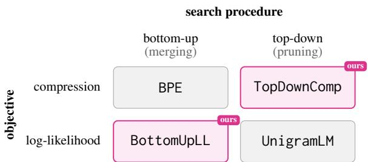
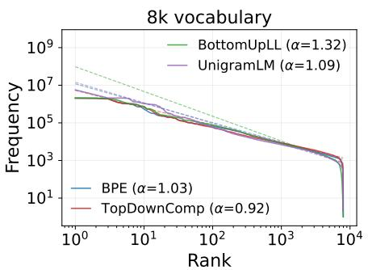
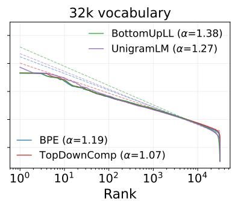
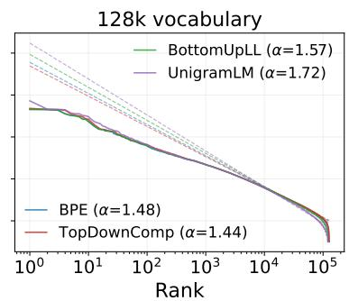
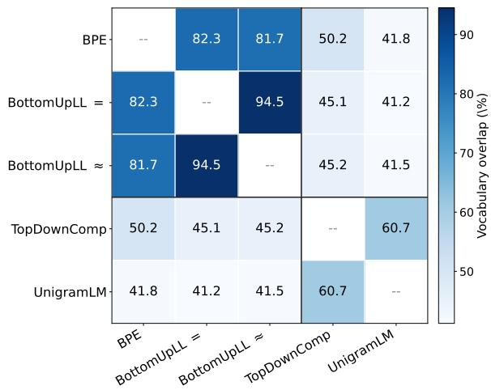
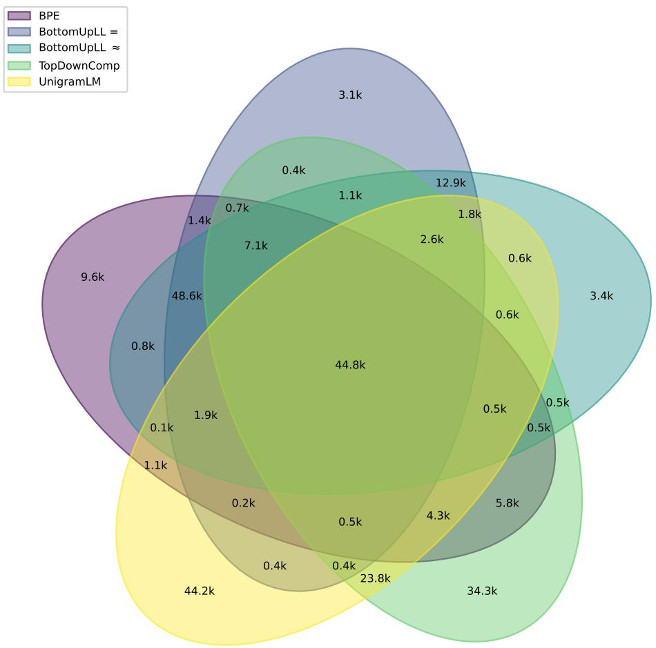

# Objective vs. Search: Decomposing What Makes a Good Tokeniser

Ahmetcan Yavuz1 Clara Meister2 Tiago Pimentel1

1ETH Zürich, 2EPFL

ayavuz@ethz.ch, clara.meister@epfl.ch, tiago.pimentel@inf.ethz.ch Ahmetcanyvz/comp-vs-like Ahmetcanyvz/comp-vs-like

## Abstract

Two dominant tokenisation algorithms are used by modern language models: byte-pair encoding (BPE) and UnigramLM. These differ along two orthogonal axes: their optimisation objective (compression vs. log-likelihood) and their search procedure (bottom-up merging vs. top-down pruning). Existing comparisons confound these axes, making it unclear whether their observed differences stem from what is being optimised vs. how it is being optimised. We disentangle the two by introducing two new tokenisation algorithms that complete this 2×2 design space: BottomUpLL, a bottom-up likelihood-based tokeniser, and TopDownComp, a top-down compression-based tokeniser. We train language models with tokenisers produced by each algorithm, varying: model size, vocabulary sizes, and domain (English-only vs. multilingual). Evaluating models on bits-perbyte, we find that the search procedure—not the objective—is the dominant factor: bottom-up tokenisers consistently achieve lower bits-perbyte in most settings. Evaluating models on the BLiMP task, however, shows no consistent relationship between design choice and performance. Overall, our results disentangle the effect of tokeniser design choices on language modelling performance, offering concrete guidance for their more principled construction.

## 1 Introduction

Before a language model (LM) processes text, its raw character string is mapped to a token string, which defines the model’s input. This mapping is performed by a tokeniser, a foundational component of modern language modelling pipelines, used in virtually all state-of-the-art models (Team, 2026; OpenAI et al., 2025; Team et al., 2026). A tokeniser is defined by several attributes. Some, such as the vocabulary size, are set by the practitioner while others, such as the vocabulary itself, are learned from data by a tokeniser learning algorithm. Two such algorithms account for most tokenisers in current use: (i) byte-pair encoding (BPE), which learns a vocabulary that maximises the compression of a training corpus (Gage, 1994; Sennrich et al., 2016); and (ii) UnigramLM, which learns a vocabulary that maximises the unigram log-likelihood of a training corpus (Kudo, 2018).

  
Figure 1: Design choice factorisation for tokenisation.

Despite their widespread usage, though, it remains unclear what makes a good tokeniser. BPE and UnigramLM are used as the default algorithms; yet their design choices have received little direct examination, and upon closer inspection, confound many of the existing comparisons. As a concrete example, the results of Schmidt et al. (2024)— that language models trained with BPE often perform better than those trained with UnigramLM— are commonly read as evidence that compression is a better optimisation objective than unigram loglikelihood. Optimisation objectives, though, are only one facet of a tokeniser learning algorithm.

BPE and UnigramLM also differ in the search procedure used to maximize the objective.1 Given a dataset, BPE uses a bottom-up search, greedily merging symbols to maximise compression. UnigramLM relies on a top-down search, starting from an oversized vocabulary and iteratively pruning tokens to maximise log-likelihood. BPE and UnigramLM therefore differ along two axes at once:

the optimisation objective and the search procedure. A comparison between the two cannot attribute the difference in performance to either axis alone.

In this work, we disentangle these two axes. We introduce BottomUpLL, a bottom-up likelihoodbased tokeniser that mirrors BPE’s merge procedure but optimises corpus log-likelihood instead of compression. We also introduce TopDownComp, a top-down compression-based tokeniser that follows UnigramLM’s pruning procedure but optimises compression. Together with BPE and UnigramLM, these methods form a $2 \times 2$ study crossing objective (compression vs. log-likelihood) and search procedure (bottom-up vs. top-down); see Fig. 1.

We train language models with tokenisers produced by all four algorithms, evaluating them in English-only and multilingual settings. We analyse these models with a combination of extrinsic and intrinsic evaluations. Notably, our results show that search procedure has a stronger influence on bits-per-byte (BPB) than the training objective, with bottom-up tokenisers achieving the best BPB scores in nearly all experimental conditions (BPE outperforms TopDownComp, and BottomUpLL outperforms UnigramLM). This ordering does not carry over to grammaticality judgements (on a BLiMP task), though, where neither the objective nor the search procedure separates the tokenisers consistently. Interestingly, at small vocabulary settings, however, the objective still matters, with likelihoodbased tokenisers outperform compression-based ones. Overall, our results highlight the importance of both optimisation objective and search procedure to tokeniser training algorithm design.

## 2 Tokenisation

Language modelling starts from raw text, which can be represented as character-strings $\mathrm { ~ \bf ~ c ~ } \in \mathrm { ~ \bf ~ \zeta ~ }$ $\Sigma ^ { * } ;$ these are finite sequences of characters $\mathbf { c } =$ $c _ { 1 } c _ { 2 } \ldots c _ { | \mathbf c | }$ over alphabet $\Sigma . ^ { 2 } \mathbf { A }$ tokeniser’s job is then to segment these character-strings into tokenstrings $\mathbf { s } \in S ^ { * } ;$ : sequences $\mathbf { s } = \langle s _ { 1 } , s _ { 2 } , \ldots , s _ { | \mathbf { s } | } \rangle$ where each symbol $s _ { t }$ is called a token and represents a non-empty character span. Whenever s is a segmentation of $\mathbf { c } ,$ we say these strings are equivalent, which we denote as $\mathbf { c } \stackrel { \circ } { = } \mathbf { s } , \mathrm { i . e . : } ^ { 3 }$

$$
\mathbf { c } \overset { \circ } { = } \mathbf { s } \iff \mathbf { c } = s _ { 1 } \circ s _ { 2 } \circ \cdots \circ s _ { | \mathbf { s } | } ,\tag{1}
$$

Notably, tokenisers are usually not allowed to output any possible segmentation of c, being instead constrained to segment it using only the tokens in a finite set called its vocabulary $S \subset \Sigma ^ { + }$ . To ensure that any character-string can be represented as tokens, we enforce $\Sigma \subseteq S$

How do we convert between character- and token-strings, though? Given just a vocabulary ${ \mathcal { S } } ,$ there are multiple different ways a character-string could be mapped to items in that vocabulary. For example, if $\mathcal { S } = \{ a , a a , a a a \}$ , then the characterstring ${ \bf c } =$ aaa may be encoded as either $\langle a , a a \rangle$ ， $\langle a a , a \rangle , \mathbf { o r } \langle a , a , a \rangle$ , which we refer to as segmentations. Consequently, a tokeniser is defined not only by its vocabulary, but also by how it maps characterstrings to segmentations. This mapping is the job of an encoding function, $\mathrm { t o k } : \Sigma ^ { * } \to S ^ { * }$ , which segments the original character-string into tokens; by definition, we have thus that $\mathbf { c } \ { \overset { \circ } { = } } \ \operatorname { t o k } ( \mathbf { c } )$ . Finally, a tokeniser also contains a decoding function, detok : $S ^ { * } \to \Sigma ^ { * }$ , which converts tokenstrings back into characters, being typically defined as the concatenation of each token’s characters: d $\mathsf { i t o k } ( \mathbf { s } ) \stackrel { \mathsf { d e f } } { = } s _ { 1 } \circ s _ { 2 } \circ \cdot \cdot \cdot \circ s _ { | \mathbf { s } | }$ . Formally, we thus define a tokeniser as the tuple $\mathbb { T } \stackrel { \mathrm { d e f } } { = } \langle S , \mathrm { d e t o k } , \mathrm { t o k } \rangle$

## 3 Learning a Tokeniser: Optimisation Objective vs. Search Procedure

How do we select such a tokeniser? Here, we cast the learning of a tokeniser as the combination of two design components: an objective function and a search procedure.

## 3.1 Objective Functions

Given a tokeniser $\mathbb { T }$ and a dataset $\mathcal { D } = \{  { \mathrm { c } } _ { m } \} _ { m = 1 } ^ { M }$ an objective function G assigns a score to the tokeniser. Different objectives encode different notions of what makes a tokeniser useful. We focus on two standard objectives used by tokeniser learning algorithms: compression and log-likelihood.

Under the compression objective, the quantity to be minimised is the total number of tokens that the tokeniser produces on the dataset:

$$
\mathfrak { G } _ { \mathrm { c o m p } } ( \mathrm { t o k } , \mathcal { D } ) \overset { \mathrm { d e f } } { = } \sum _ { \mathrm { c } \in \mathcal { D } } | \mathrm { t o k } ( \mathrm { c } ) | ,\tag{2}
$$

This is appealing because shorter token strings improve effective context usage and reduce the number of model steps needed to process a dataset.

Under the log-likelihood objective, the minimised quantity is the negative log-probability that

a given probabilistic model $p _ { \pmb { \theta } }$ assigns the corpus:

$$
\mathfrak { G } _ { 1 1 } ( \mathrm { t o k } , \mathcal { D } ) \overset { \mathrm { d e f } } { = } - \sum _ { \mathrm { c } \in \mathcal { D } } \log p _ { \pmb { \theta } } \big ( \mathrm { t o k } ( \mathrm { c } ) \big ) .\tag{3}
$$

where $\mathrm { \ p } _ { \boldsymbol { \theta } } \mathrm { \Delta } ^ { \prime } \mathrm { s }$ parameters $\pmb \theta$ are themselves optimised to model this tokeniser’s text. This objective is likewise appealing, since log-likelihood is also the training objective of the language models for which these tokenisers are designed—so a log-likelihood optimal tokeniser would, by construction, lead to better models. Optimising log-likelihood directly, however, is intractable, as this objective requires fully training language models $p _ { \pmb { \theta } }$ for its evaluation.

In practice, to make this objective tractable, we typically significantly restrict the class of models p . Here, we follow UnigramLM in restricting p to unigram language models. For a fixed encoding function tok, let $n _ { s } ^ { \mathcal { D } }$ denote the count of token s in the tokenised corpus, and let $\begin{array} { r } { N ^ { \scriptscriptstyle D } \stackrel { \mathrm { d e f } } { = } \sum _ { s \in \mathcal S } n _ { s } ^ { \scriptscriptstyle D } } \end{array}$ be the total number of tokens. We then define $p _ { \pmb { \theta } }$ as

$$
p _ { \theta } ( \mathrm { s } ) = \prod _ { t = 1 } ^ { | \mathrm { s } | } p _ { \theta } ( s _ { t } ) , \qquad p _ { \theta } ( s ) = \frac { n _ { s } ^ { p } } { N ^ { \cal D } } .\tag{4}
$$

Concretely, we will thus use unigram loglikelihood as the objective here, as opposed to ‘full log-likelihood, and, for the rest of this paper, loglikelihood stands for unigram log-likelihood.

## 3.2 Search Procedures

Given one of these objectives and a fixed vocabulary budget $K$ , we might expect a tokeniser to be chosen by directly optimising

$$
\mathsf { t o l } _ { \mathsf { o p t } } = \mathop { \mathrm { a r g m i n } } _ { \mathsf { t o k } \in \mathcal { T } _ { K } } \mathfrak { G } ( \mathrm { t o k } , \mathcal { D } ) ,\tag{5}
$$

where $\mathcal { T } _ { K }$ denotes whichever class of tokenisers is under consideration. Unfortunately, this optimisation problem is computationally intractable; the compression variant is provably NP-hard (Kozma and Voderholzer, 2024; Whittington et al., 2025; Kastreva et al., 2026), and we suspect the loglikelihood variant to be as well. In practice, heuristic search procedures are therefore required. Such procedures specify both a restricted class of tokenisers and a strategy for selecting an element from that class. We focus on two standard search procedures: bottom-up construction and top-down pruning.

The bottom-up procedure builds a tokeniser from the bottom up: the vocabulary starts as the alphabet Σ and grows one token at a time through merge operations. Given a merge $m = \langle s ^ { \prime } , \bar { s } ^ { \prime \prime } \rangle$ applying it to a token-string rewrites every (nonoverlapping) occurrence of bigram $s ^ { \prime } , s ^ { \prime \prime }$ into the token $s ^ { \mathsf { n e w } } = s ^ { \prime } \circ s ^ { \prime \prime } .$ . A merge list $\mathbf { m } = m _ { 1 } , \hdots , m _ { k }$ then defines an encoding function tok [m]: starting from c as a token-string over Σ (one token per character), it applies $m _ { 1 } , \ldots , m _ { k }$ in order. The final token-string is our tokenised text. We write the tokeniser class defined by this procedure as $\mathcal { T } _ { K } ^ { \uparrow } = \left\{ \mathfrak { t o l x } _ { \uparrow } [ \mathbf { m } ] \ | \ \mathbf { m } \in ( \Sigma ^ { + } \times \Sigma ^ { + } ) ^ { \hat { K } } \right\}$ . To select an element from this class, we then start from an empty merge list, and greedily add one merge per step to it, locally optimising an objective G:

$$
m ^ { \star } = \underset { m \in \Sigma ^ { + } \times \Sigma ^ { + } } { \mathrm { a r g m i n } } \mathfrak { G } ( \mathrm { t o k } _ { \uparrow } [ \mathbf { m } _ { < k } , m ] , \mathcal { D } ) ,\tag{6}
$$

where $\mathrm { t o k } _ { \uparrow } [ \mathbf { m } _ { < k } , m ]$ denotes the encoding function obtained by applying the current merge list $\mathbf { m } _ { < k }$ followed by the candidate $m$ . The selected merge $m ^ { \star }$ is then appended to the merge list. We refer to a candidate merge’s effect on the objective as its merge gain, and write it $\Delta _ { s ^ { 1 } , s ^ { 2 } } ^ { \mathfrak { G } ( \cdot , \mathcal { D } ) }$

By contrast, the top-down procedure starts from a large candidate vocabulary ${ \mathit { S } } _ { 0 } .$ with $| S _ { 0 } | \gg K$ and removes tokens until $| { \mathcal { S } } | = | { \boldsymbol { \Sigma } } | + K$ . Notably, this procedure does not rely on merge lists, but instead commits to an objective-optimal encoding function tok⇒[S], determined by the vocabulary alone. Under compression, t $\mathrm { { ; o k } } _ { \Rightarrow } [ S ] ( \mathbf { c } )$ is the shortest valid segmentation of c using tokens from S. Under log-likelihood, it is instead the most probable segmentation of c under ${ p \theta } . ^ { 4 }$ Top-down’s tokeniser class can then be written as: $\begin{array} { r } { \mathcal { T } _ { K } ^ { \downarrow } = \left\{ \mathrm { t o k } _ { \Rightarrow } [ \mathcal { S } ] ~ | ~ \mathcal { S } \subset \Sigma ^ { + } , \Sigma \subseteq \mathcal { S } , | \mathcal { S } | = \right. } \end{array}$ $| \Sigma | + K \}$ To select an item in this class, we then start from a large vocabulary $ { \boldsymbol { S } } _ { 0 }$ , from which we iteratively prune the least critical tokens, quantified as the tokens whose removal has the least negative impact on the objective we’re optimizing for:

$$
{ \mathfrak { s } } { \pmb { x } } = \operatorname * { a r g m i n } _ { { \mathfrak { s } } \in S _ { k - 1 } \backslash \Sigma } { \mathfrak { G } } ( \tan _ { \Rightarrow } [ S _ { k - 1 } \backslash \{ { \mathfrak { s } } \} ] , { \mathcal { D } } ) .\tag{7}
$$

Here, we index pruning steps by k, mirroring the bottom-up case. This yields $S _ { k } = S _ { k - 1 } \setminus \{ s \pmb { x } \}$ Importantly, to ensure every string remains encodable, alphabet tokens are never removed; pruning then continues until $| \mathcal { S } | = | \Sigma | + K . ^ { 5 }$ Analogously, we refer to a candidate deletion’s effect on the objective as its deletion cost, written $\Delta _ { s } ^ { \scriptscriptstyle ( 5 ( \cdot , { D } ) }$

4Given a fixed $p _ { \pmb { \theta } } .$ , both cases can be computed efficiently. For log-likelihood, however, the parameters of $p _ { \theta }$ itself depend on tok, creating a circular definition. In practice, the two are estimated jointly as we explain in §4.2.

5We note that, for efficiency reasons, in practice, multiple tokens are often pruned in batches.

## 4 Analysed Tokenisers: Old and New

Combining the objectives and search procedures above, we get a $2 \times 2$ design space for tokenisation algorithms (illustrated in Fig. 1). Existing tokeniser learning algorithms, namely BPE and UnigramLM, cover only two of these cells. Here, we introduce algorithms that instantiate the two other cells: BottomUpLL, a bottom-up likelihoodbased method, and TopDownComp, a top-down compression-based method.6 Before any of these methods can be run, however, a loose end remains.

In the previous section, we describe the search procedures as greedy: at each step, it picks the merge $m ^ { \star }$ or deletion $s _ { \pmb { X } }$ which (locally) optimises an objective $\mathfrak { G } ( \cdot , \mathcal { D } )$ It did not specify, however, how this selection is performed. Taken literally, computing the argmin operations in Eqs. (6) and (7) would require running the objective function G once per candidate to find the optimal one— a computationally impractical operation. Rather than recomputing G every time, most tokenisation algorithms work with incremental scores instead:

$$
m ^ { \star } = \underset { \langle s ^ { 1 } , s ^ { 2 } \rangle \in \Sigma ^ { + } \times \Sigma ^ { + } } { \mathrm { a r g m a x } } ~ \Delta _ { s ^ { 1 } , s ^ { 2 } } ^ { \mathfrak { G } ( \cdot , \mathcal { D } ) }\tag{8a}
$$

$$
\begin{array} { r l r l } { s \pmb { x } = } & { { } } & { \underset { s \in \mathcal { S } _ { k - 1 } } { \operatorname { a r g m i n } } } & { \Delta _ { s } ^ { \circledast ( \cdot , \mathcal { D } ) } } \end{array}\tag{8b}
$$

Notably, these equations are equivalent to $\ S 3 . 2 \mathrm { ^ { \circ } s }$ , as the pre-update objective values $( \mathrm { e . g . } ,$ $\mathfrak { G } \left( \mathrm { t o k } _ { \uparrow } [ \mathbf { m } _ { < k } ] , \mathcal { D } \right) )$ do not depend on the candidates, and are thus constant. Each search procedure then derives a way to compute (or approximate) these values efficiently, as we show next.

## 4.1 Bottom-up tokenisers: BPE and BottomUpLL

For a bottom-up method, each candidate is scored according to its merge gain $\Delta _ { s ^ { 1 } , s ^ { 2 } } ^ { \mathfrak { G } ( \cdot , \mathcal { D } ) }$ . We now show how this score can be computed efficiently for the two objectives, starting with compression.

Lemma 1. The change in compression due to merging a token-pair can be computed as:

$$
\Delta _ { s ^ { 1 } , s ^ { 2 } } ^ { \mathfrak { G } _ { \mathrm { c o m p } } ( \cdot , T ) } = n _ { s ^ { 1 } , s ^ { 2 } } ^ { \mathcal { D } }\tag{9}
$$

where $n _ { s ^ { 1 } , s ^ { 2 } } ^ { \scriptscriptstyle D }$ denotes the number of nonoverlapping $\langle s ^ { 1 } , s ^ { 2 } \rangle$ sequences in D.

Proof sketch. The full proof is in $\ S \mathrm { A }$ . Replacing an occurrence of the token-pair $m = \langle s ^ { 1 } , s ^ { 2 } \rangle$ with the merged token $s ^ { 1 } \circ s ^ { 2 }$ saves one token. Further, the number of non-overlapping occurrences of a tokenpair is its number of possible merges. Merging the pair therefore shortens the corpus by exactly $n _ { s ^ { 1 } , s ^ { 2 } } ^ { \scriptscriptstyle D }$ tokens, which is its gain under Gcomp. □

Lemma 1 gives the standard BPE merge rule: the compression-optimal merge is the most (nonoverlappingly) frequent token-pair. In practice, the token-pair counts $n _ { s ^ { 1 } , s ^ { 2 } } ^ { \scriptscriptstyle { D } }$ are computed once and then updated incrementally after each merge, rather than recomputed from scratch (see §B), which allows us to run BPE efficiently. We can derive an analogous equivalence for BottomUpLL.

Lemma 2. The change in log-likelihood due to merging a token-pair can be computed $a s . ^ { . 7 }$

$$
\begin{array} { r l } & { \Delta _ { s ^ { 1 } , s ^ { 2 } } ^ { \mathfrak { G } _ { 1 1 } ( \cdot , \mathcal { D } ) } = ( 1 0 ) } \\ & { ( n _ { s ^ { 1 } } ^ { \mathcal { D } } - n _ { s ^ { 1 } , s ^ { 2 } } ^ { \mathcal { D } } ) \log ( n _ { s ^ { 1 } } ^ { \mathcal { D } } - n _ { s ^ { 1 } , s ^ { 2 } } ^ { \mathcal { D } } ) - n _ { s ^ { 1 } } ^ { \mathcal { D } } \log n _ { s ^ { 1 } } ^ { \mathcal { D } } } \\ & { + ( n _ { s ^ { 2 } } ^ { \mathcal { D } } - n _ { s ^ { 1 } , s ^ { 2 } } ^ { \mathcal { D } } ) \log ( n _ { s ^ { 2 } } ^ { \mathcal { D } } - n _ { s ^ { 1 } , s ^ { 2 } } ^ { \mathcal { D } } ) - n _ { s ^ { 2 } } ^ { \mathcal { D } } \log n _ { s ^ { 2 } } ^ { \mathcal { D } } } \\ & { + n _ { s ^ { 1 } , s ^ { 2 } } ^ { \mathcal { D } } \log n _ { s ^ { 1 } , s ^ { 2 } } ^ { \mathcal { D } } } \\ & { - ( N ^ { \mathcal { D } } - n _ { s ^ { 1 } , s ^ { 2 } } ^ { \mathcal { D } } ) \log ( N ^ { \mathcal { D } } - n _ { s ^ { 1 } , s ^ { 2 } } ^ { \mathcal { D } } ) + N ^ { \mathcal { D } } \log N ^ { \mathcal { D } } . } \end{array}
$$

Proofsketch. The full proof is in $\ S { \bf C } .$ . Note that, if a token changes from count $n _ { 1 }$ to count $n _ { 2 }$ , its contribution to the log-likelihood objective changes by: $n _ { 2 }$ log $n _ { 2 } - n _ { 1 }$ log n . The lemma then follows trivially, noting that: (i) the old tokens $s ^ { 1 }$ and $s ^ { 2 }$ change from, e.g., frequency $n _ { s ^ { 1 } } ^ { D }$ to $( n _ { s ^ { 1 } } ^ { D } - n _ { s ^ { 1 } , s ^ { 2 } } ^ { D } )$ (ii) the new token $s ^ { 1 } \circ s ^ { 2 }$ changes from frequency 0 to $n _ { s ^ { 1 } , s ^ { 2 } } ^ { D } .$ Further, the total count of tokens serves as a normalisation factor in all tokens, and thus enters the log-likelihood with the opposite sign; its contribution changes from $N ^ { \mathcal { D } }$ to $N ^ { \mathcal { D } } - n _ { s ^ { 1 } , s ^ { 2 } } ^ { \mathcal { D } }$ □

BottomUpLL can thus also be implemented efficiently, maintaining local count statistics and updating only affected candidate scores after each merge. Interestingly, an analysis of the merge gain definition in Lemma 2 shows that, for a token-pair to be selected: (i) the pair should occur often enough to matter, but (ii) it should also be favoured when its tokens co-occur more systematically than expected from their individual frequencies.

## 4.2 Top-down tokenisers: UnigramLM and TopDownComp

For top-down methods, each candidate’s score is given by the deletion cost $\Delta _ { s } ^ { \mathfrak { G } ( \cdot , \mathcal { D } ) }$ . Unfortunately, this cost $\Delta _ { s } ^ { \scriptscriptstyle \mathfrak { G } ( \cdot , \mathcal { D } ) }$ is non-trivial to compute. This is due to the nature of the encoding function $\mathrm { t o k } { \Rightarrow } [ S ]$ used by top-down algorithms. Unlike in the bottom-up case, deleting a token here can change the preferred segmentation of an entire character-string, not only the local decomposition of the deleted token.8 For the log-likelihood objective, the history gets worse. The segmentations produced by $\mathrm { t o k } { \Rightarrow } [ S ]$ depend on $p _ { \pmb { \theta } }$ , which is itself estimated from the token counts. Deleting a token changes those counts, which changes $p _ { \pmb { \theta } }$ which in turn changes how strings are segmented, which again changes the counts. Computing a deletion’s exact cost would thus require running this loop to convergence for each candidate token.

To approximate $\Delta _ { s } ^ { \mathfrak { G } ( \cdot , \mathcal { D } ) }$ , we thus rely on a local replacement approximation: when scoring the deletion of s, we keep the rest of the current model fixed and estimate the loss by only directly replacing occurrences of s with an alternative segmentation under $\mathcal { S } \setminus \{ s \} . ^ { 9 }$ For log-likelihood, this then yields the following result.

Lemma 3. Under a local replacement approximation, the estimated increase in the negative log-likelihood objective due to deleting a token $s \in S \setminus \Sigma$ can be approximated $a s ! ^ { . 1 0 }$

$$
\Delta _ { s } ^ { \mathfrak { G } _ { 1 1 } ( \cdot , D ) } \approx n _ { s } ^ { \mathcal { D } } \left( \log p _ { \pmb { \theta } } ( s ) - \log p _ { \pmb { \theta } } ( \mathbf { s } _ { s } ^ { \mathrm { r e p } } ) \right)\tag{11}
$$

where $p _ { \pmb { \theta } }$ is the unigram model at step $k - 1$ , and ${ \bf s } _ { s } ^ { \mathrm { r e p } }$ is s’s log-probability–optimal replacement segmentation, $i . e . , \mathrm { s } _ { s } ^ { \mathrm { r e p } } \overset { \mathrm { d e f } } { = } \mathrm { t o k } _ { \Rightarrow } [ S _ { k - 1 } \backslash \{ s \} ] ( s )$

Proof sketch. The full proof is in §D. Before deletion, each expected occurrence of s contributes −log $p _ { \pmb { \theta } } ( s )$ to the negative log-likelihood. Under the local replacement approximation, deleting s replaces it with $\mathbf { s } _ { s } ^ { \mathrm { r e p } }$ , which contributes − log $p _ { \theta } ( \mathbf { s } _ { s } ^ { \mathrm { r e p } } )$ . As the number of such occurrences is $n _ { s } ^ { \mathcal { D } }$ , we get Eq. (11). □

After each deletion, we update our encoding function tok $\Rightarrow [ S _ { k } ]$ by re-estimating $p _ { \pmb { \theta } }$ . We do this by updating $\pmb \theta$ via an expectation–maximisation procedure, maximising the log-likelihood of $\mathcal { D } . ^ { 1 1 }$ This updated $p _ { \pmb { \theta } }$ defines the segmentations produced by $\mathbf { t o k } \Rightarrow .$ , which we use to re-segment our dataset. We now present an analogous update for compression.

Lemma 4. Under a local replacement approximation, the estimated change in compression due to deleting a token $s \in S \setminus \Sigma$ can be approximated as:

$$
\Delta _ { s } ^ { \mathfrak { G } _ { \mathrm { c o m p } } ( \cdot , \mathcal { D } ) } = n _ { s } ^ { \mathcal { D } } \left( | \mathrm { s } _ { s } ^ { \mathrm { r e p } } | - 1 \right) ,\tag{12}
$$

where $\mathbf { s } _ { s } ^ { \mathrm { r e p } }$ is the compression-optimal replacement ofs after deletion: $\mathbf { s } _ { s } ^ { \mathrm { r e p } } \ { \stackrel { \mathrm { d e f } } { = } } \ \mathrm { t o k } _ { \Rightarrow } [ S _ { k - 1 } \setminus \{ s \} ] ( s )$

Proofsketch. The full proof is in §E. After deleting s, the local replacement uses $| \mathbf { s } _ { s } ^ { \mathrm { r e p } } |$ tokens instead, thus increasing the corpus length by $| \mathbf { s } _ { s } ^ { \mathrm { r e p } } | - 1$ There are $n _ { s } ^ { \mathcal { D } }$ such occurrences. □

Updating this compression-based tokeniser after a deletion is easier than for log-likelihood. No parameters need to be estimated: the vocabulary $S _ { k }$ alone determines the encoding function, so we simply re-segment the corpus under $\mathrm { t o k } { \Rightarrow } [ S _ { k } ]$

## 5 Connection to Prior Work

As mentioned above, the tokenisation learning algorithms we propose are not entirely without precedent, and related to prior methods like WordPiece and PathPiece. In this section, we discuss this connections in detail.

## 5.1 BottomUpLL and Likelihood-Guided Merging

As noted in §4.1, BottomUpLL favours pairs of tokens that are not only frequent, but which co-occur more often than chance. In fact, let the pointwise mutual information between two tokens be:

$$
\begin{array} { r l } & { \mathrm { P M I } _ { \mathrm { a d j } } ( s ^ { 1 } , s ^ { 2 } ) \stackrel { \mathrm { d e f } } { = } \log \frac { p _ { \theta } ( s ^ { 1 } , s ^ { 2 } ) } { p _ { \theta } ( s ^ { 1 } ) p _ { \theta } ( s ^ { 2 } ) } } \\ & { \quad \quad \quad \quad = \log \frac { N ^ { D } n _ { s ^ { 1 } , s ^ { 2 } } ^ { _ { D } } } { n _ { s ^ { 1 } } ^ { _ D } n _ { s ^ { 2 } } ^ { _ D } } . } \end{array}\tag{13a}
$$

(13b)

Relying on the PMI to operationalise this notion of more-often-than-chance co-occurrence, we can use a Taylor approximation of $\Delta _ { s ^ { 1 } . s ^ { 2 } } ^ { \mathfrak { G } _ { 1 1 } ( \cdot , \mathcal { D } ) }$ to make this explanation of BottomUpLL explicit.

Lemma 5. Under afirst-order Taylor approximation, the change in log-likelihood due to merging a token-pair can be approximated as:

$$
\begin{array} { r } { \Delta _ { s ^ { 1 } , s ^ { 2 } } ^ { \mathfrak { C } _ { 1 1 } ( \cdot , \mathcal { D } ) } \approx n _ { s ^ { 1 } , s ^ { 2 } } ^ { \mathcal { D } } \left( \operatorname { P M I } _ { \mathrm { a d j } } ( s ^ { 1 } , s ^ { 2 } ) - 1 \right) . } \end{array}\tag{14}
$$

Proofsketch. The full proof is in §F. Starting from Lemma 2, apply a first-order Taylor expansion independently to each x log x term. Collecting the resulting terms returns the equation above. □

Eq. (14) is closely related to the objective of another famous bottom-up tokeniser, WordPiece. WordPiece’s definition, however, is far from unified and has shifted over time. As originally proposed by Schuster and Nakajima (2012), Word-Piece selects the unit that most increases the likelihood of the data—i.e., using the same objective as BottomUpLL—but approximates the local objective, selecting multiple merges in parallel and only approximately updating their model p . WordPiece was later popularised by Wu et al. (2016), whose description suggests, in two consecutive sentences, optimising either a log-likelihood or a compression objective.12 Accordingly, the widely used HuggingFace implementation of WordPiece optimises for compression (Wolf et al., 2020). Finally, Word-Piece is often described as merging the pair with the highest $\mathrm { P M I _ { a d j } }$ (Schmidt et al., 2024; Lesci et al., 2025; Hugging Face, 2026), which relates to Eq. (14) but drops the $n _ { s ^ { 1 } , s ^ { 2 } } ^ { \scriptscriptstyle D }$ factor. BottomUpLL is thus closest to the original WordPiece’s description, but differs from all existing versions of this method.

Importantly, even closer to Eq. (14) is S-BPE (Vilar and Federico, 2021), which scores merges by a count-weighted PMI criterion. The two expressions are not identical, as S-BPE omits the −1 term, but are otherwise equivalent. We experiment with a tokenisation learning algorithm based on Lemma 5 in some of our experiments, which we then label as BottomUpLL ≈; when no such label is present, BottomUpLL refers to the method described by Lemma 2.

## 5.2 TopDownComp and Top-Down Compression

The closest prior method to TopDownComp is Path-Piece (Schmidt et al., 2024), which likewise prunes a large initial vocabulary under a compression objective. The two differ in the deletion score: when scoring the removal of a token s, PathPiece also considers re-segmentation of other vocabulary tokens that contain s as a substring, whereas TopDownComp considers only $s ^ { \prime } s$ own local replacement. Adopting the PathPiece variant would change the algorithm in more ways than just the objective, so we keep TopDownComp as the direct compression counterpart of UnigramLM, differing from it in objective alone.

## 6 Experimental Setup

We will now compare our four tokenisers: BPE, BottomUpLL, TopDownComp, and UnigramLM. All four are trained with an identical preprocessing pipeline (NFC normalisation followed by a bytelevel pretokeniser using the GPT-2 regex) and on the same corpus, so that any difference between them stems only from the objective and the search procedure. §G gives the exact configuration under which we train our tokenisers. Full language model hyperparameter and architectural details are in §H.

English setup. For English experiments, we train our tokenisers on a subset with approximately 2B tokens from FineWeb-Edu (Lozhkov et al., 2024), using vocabulary sizes of 8k, 32k, and 128k. We then again use FineWeb-Edu to train language models using these tokenisers, evaluating 100M, 300M, 500M, and 1B parameter models.13 Results for 100M-parameter models are averaged over three random seeds, while larger models use one run per configuration. Finally, unless otherwise stated, models are trained with a Chinchilla-style token budget of approximately 20× as many training tokens as model parameters.

Multilingual setup. Our multilingual corpus contains 20B tokens across five languages: 10B English tokens from FineWeb-Edu (Lozhkov et al., 2024), and 2.5B tokens each of German, Spanish, Turkish, and Chinese from FineWeb2 (Penedo et al., 2025). We train our tokenisers on a 10% subsample of this corpus, using a single vocabulary size of 128k. We then train 1B-parameter language models on the full corpus.

<table><tr><td></td><td>Vocab Tokeniser</td><td>Objective</td><td>Search</td><td> ${ \mathfrak { G } } _ { \mathrm { c o m p } } \downarrow$ </td><td> ${ \mathfrak { G } } _ { 1 1 } \downarrow$ </td><td>Entropy</td><td> $\operatorname { Z i p f } \alpha$ </td><td>BPT↑</td><td>Tok Len</td><td>Vocab Util ↑</td><td>Cov. 50%</td></tr><tr><td rowspan="4">8k</td><td>BPE</td><td> ${ \mathfrak { G } } _ { \mathrm { c o m p } }$ </td><td>bottom-up</td><td>59,559,835</td><td> $6 . 2 5 9 \times 1 0 ^ { 8 }$ </td><td>10.508</td><td>1.033</td><td>3.844</td><td>5.53</td><td>99.9%</td><td>242</td></tr><tr><td>TopDownComp</td><td> ${ \mathfrak { G } } _ { \mathrm { c o m p } }$ </td><td>top-down</td><td> $\mathbf { 5 9 , 3 0 4 , 1 1 3 }$ </td><td> $6 . 2 5 9 \times 1 0 ^ { 8 }$ </td><td>10.554</td><td>0.919</td><td>3.861</td><td>5.67</td><td>99.3%</td><td>268</td></tr><tr><td>BottomUpLL</td><td> ${ \mathfrak { G } } _ { \mathrm { l l } }$ </td><td>bottom-up</td><td> $6 1 , 1 7 0 , 7 1 4$ </td><td> $\mathbf { 6 . 1 6 7 \times 1 0 ^ { 8 } }$ </td><td>10.081</td><td>1.315</td><td>3.743</td><td>6.05</td><td>99.4%</td><td>152</td></tr><tr><td>UnigramLM</td><td> ${ \mathfrak { G } } _ { \mathrm { l l } }$ </td><td>top-down</td><td>68,444,350</td><td> $6 . 2 2 1 \times 1 0 ^ { 8 }$ </td><td>9.089</td><td>1.093</td><td>3.345</td><td>6.72</td><td>99.3%</td><td>39</td></tr><tr><td rowspan="4">32k</td><td>BPE</td><td> ${ \mathfrak { G } } _ { \mathrm { c o m p } }$ </td><td>bottom-up</td><td>50,327,096</td><td> $5 . 5 4 4 \times 1 0 ^ { 8 }$ </td><td>11.016</td><td>1.195</td><td>4.549</td><td>6.52</td><td>99.8%</td><td>269</td></tr><tr><td>TopDownComp</td><td> ${ \mathfrak { G } } _ { \mathrm { c o m p } }$ </td><td>top-down</td><td>52,204,230</td><td> $5 . 6 6 7 \times 1 0 ^ { 8 }$ </td><td>10.856</td><td>1.074</td><td>4.386</td><td>6.29</td><td>99.8%</td><td>192</td></tr><tr><td>BottomUpLL</td><td> ${ \mathfrak { G } } _ { \mathrm { l l } }$ </td><td>bottom-up</td><td>50,920,853</td><td> $\mathbf { 5 . 5 0 5 \times 1 0 ^ { 8 } }$ </td><td>10.811</td><td>1.378</td><td>4.496</td><td>6.98</td><td>99.0%</td><td>211</td></tr><tr><td>UnigramLM</td><td> $\mathfrak { G } _ { \mathrm { l l } }$ </td><td>top-down</td><td>58,161,017</td><td> $5 . 6 9 7 \times 1 0 ^ { 8 }$ </td><td>9.796</td><td>1.272</td><td>3.937</td><td>7.03</td><td>99.8%</td><td>51</td></tr><tr><td rowspan="5">128k</td><td>BPE</td><td> ${ \mathfrak { G } } _ { \mathrm { c o m p } }$ </td><td>bottom-up</td><td>46,859,565</td><td> $5 . 2 1 6 \times 1 0 ^ { 8 }$ </td><td>11.132</td><td>1.484</td><td>4.886</td><td>7.06</td><td>98.9%</td><td>204</td></tr><tr><td>TopDownComp</td><td> ${ \mathfrak { G } } _ { \mathrm { c o m p } }$ </td><td>top-down</td><td>50,312,483</td><td> $5 . 4 8 4 \times 1 0 ^ { 8 }$ </td><td>10.900</td><td>1.443</td><td>4.551</td><td>6.01</td><td>99.8%</td><td>149</td></tr><tr><td>BottomUpLL</td><td> $\mathfrak { G } _ { \mathrm { l l } }$ </td><td>bottom-up</td><td>47,111,733</td><td> $\mathbf { 5 . 2 0 3 \times 1 0 ^ { 8 } }$ </td><td>11.044</td><td>1.574</td><td>4.860</td><td>7.48</td><td>96.8%</td><td>191</td></tr><tr><td>UnigramLM</td><td> $\mathfrak { G } _ { \mathrm { l l } }$ </td><td>top-down</td><td>55,546,423</td><td> $5 . 5 5 2 \times 1 0 ^ { 8 }$ </td><td>9.996</td><td>1.717</td><td>4.122</td><td>6.46</td><td>97.1%</td><td>53</td></tr></table>

Table 1: Intrinsic tokenisation results on a held-out test set (47,384 documents). Columns are defined in the Evaluation paragraph of §6. Tab. 5 in §J reports the multilingual counterpart of this table.

Evaluation. We report both extrinsic and intrinsic metrics. For extrinsic metrics, we report our language models’ bits per byte (BPB), computed on a held-out validation set, and minimal-pair grammatical accuracy, computed on BLiMP (Warstadt et al., 2020), MultiBLiMP (Jumelet et al., 2026), and ZhoBLiMP (Liu et al., 2026). For intrinsic metrics, we report ${ \mathfrak { G } } _ { \mathrm { c o m p } }$ and ${ \mathfrak { G } } _ { 1 1 }$ . We also report the unigram entropy of our tokenised corpus, its bytes per token (BPT), average vocab token len (Tok Len), vocabulary utilisation (Vocab Util), Zipf α, and Coverage 50%. Detailed definitions are in §I.

## 7 Results

## 7.1 Intrinsic Evaluation

Compression vs. Log-likelihood. Tab. 1 presents both the ${ \mathfrak { G } } _ { \mathrm { c o m p } }$ and ${ \mathfrak { G } } _ { 1 1 }$ achieved by our tokenisers. From this table, we can see that, for a small vocabulary (of 8k tokens), the compression and log-likelihood scores achieved by the different tokenisers seem to align with their objective function: BPE and TopDownComp achieve better compression, while UnigramLM and BottomUpLL achieve better log-likelihood. For larger vocabularies, however, this surprisingly does not hold, with the bottom-up tokenisers consistently achieving both better compression and log-likelihood, irrespective of their objective function. Another result of interest is with respect to a tokeniser’s entropy, which, intuitively, measures how evenly a tokeniser spreads the frequency of its tokens. This quantity has a strong relationship to our optimisation objectives, which can be seen when we rewrite it:

(15a)

$$
\begin{array} { c l } { \displaystyle \mathrm { E n t } ( \mathrm { t o k } , \mathcal { D } ) \stackrel { \mathrm { d e f } } { = } - \sum _ { s \in \mathcal { S } } p _ { \pmb { \theta } } ( s ) \log p _ { \pmb { \theta } } ( s ) } \\ { = \displaystyle \frac { \mathfrak { G } _ { \mathrm { 1 l } } ( \mathrm { t o k } , \mathcal { D } ) } { \mathfrak { G } _ { \mathrm { c o m p } } ( \mathrm { t o k } , \mathcal { D } ) } } \end{array}\tag{15b}
$$

This follows directly from the definitions: writing $\begin{array} { r l r } { p \pmb { \theta } ( s ) } & { { } = } & { n _ { s } ^ { \mathcal { D } } / N ^ { \mathcal { D } } } \end{array}$ , and noting that $N ^ { D } .$ , the total number of tokens, is exactly $\mathfrak { G } _ { \mathrm { c o m p } } ( \mathrm { t o k } , \mathcal { D } )$ , we get $- \sum _ { s } p _ { \pmb { \theta } } ( s )$ log $p _ { \pmb { \theta } } ( s ) =$ $\begin{array} { r } { \frac { 1 } { N ^ { D } } \sum _ { s } n _ { s } ^ { D } \log p _ { \pmb { \theta } } ( s ) = \mathfrak { G } _ { \mathrm { 1 l } } ( \mathtt { t o k } , D ) / N ^ { D } } \end{array}$ . Looking at the entropy values in Tab. 1 we see a similar behaviour as before: for small vocabularies, entropy results align with the choice of tokenisation objective; for a larger vocabulary, however, topdown methods achieve consistently lower entropy. Future work should further investigate this relationship between objective and search procedure.

Distributional Properties of Tokens. Tab. 1 also reports our tokenisers’ Zipf α and Coverage 50%, where Zipf α is the negated slope of a frequency vs. rank log-log curve, and Coverage 50% is the smallest ℓ such that the ℓ most frequent tokens together account for at least half of all token occurrences in our corpus. A larger Zipf α thus means that token frequency decreases more rapidly with rank, while lower Coverage 50% values indicate that token occurrences are concentrated among fewer token types. Fig. 2 shows corresponding frequency–rank curves. Within each search family, the likelihoodbased method induces a more concentrated tokenfrequency distribution than the compression-based method: BottomUpLL has higher Zipf α, lower entropy, and lower Coverage 50% than BPE, and UnigramLM shows the same pattern relative to TopDownComp. Thus, while the search procedure may dictate the values of ${ \mathfrak { G } } _ { \mathrm { c o m p } }$ and ${ \mathfrak { G } } _ { \mathrm { l l } }$ , the used objective is still visible in a tokenised corpus’ empirical token-frequency distribution.

Other Intrinsic Metrics. Finally, Tab. 1 also presents our tokenisers’ vocabulary utilisation— i.e., the proportion of vocabulary items used at least once on a test set of 47,384 documents—as well as the average length of the tokens in their vocabularies. Vocabulary utilisation is close to 100% at 8k and 32k, but at 128k, likelihood-based tokenisers have more unused tokens; §K traces this to the intermediate tokens that BottomUpLL creates during merging and then never uses again. Token length behaves differently across vocabulary sizes: at small vocabulary sizes, top-down methods present longer tokens, as they can retain these tokens from the initial seed vocabulary; at larger vocabulary sizes, though, bottom-up methods present longer tokens instead, as they can build these tokens from scratch through successive merges. Interestingly, across both search procedures, the likelihood-based tokenisers have longer tokens than their compression-based counterparts.

  
Figure 2: Frequency–rank token distributions induced by each tokeniser on the held-out test set. Solid lines are empirical curves; dashed lines are the fitted power laws, whose negated slopes are the Zipf α values in Tab. 1.

  
Figure 3: Pairwise vocabulary overlap at 128k vocabulary size. BottomUpLL = denotes the exact variant of this method, which scores merges with Lemma 2, while BottomUpLL ≈ denotes the approximate variant, which uses the PMI-based approximation of Lemma 5. See Tab. 6 in §J for a multilingual counterpart of this table.

Vocabulary Composition. We now move on to analysing the composition of our tokenisers’ vocabularies. To this end, we compute their similarity, defined as $| S _ { A } \cap S _ { B } | / | S _ { A } |$ . Fig. 3 presents these results. From this table, we see that learned vocabularies cluster primarily by search procedure: e.g., bottom-up methods share substantially more tokens with each other than with top-down methods. This indicates that a tokeniser’s search procedure has a large effect on which tokens are included in its final vocabulary. Fig. 4 in §L shows the full set-overlap structure of all five vocabularies. Furthermore, per-example qualitative segmentations for the four tokenisers are shown in §M.

## 7.2 Extrinsic Evaluation

BPB. Tabs. 2 and 3 present extrinsic results for both the English and multilingual settings. From these tables, we can see that bottom-up tokenisers consistently achieve lower BPB scores than top-down. This holds true for all our experimental conditions, with the only exception of the English 300M models at 32k vocabulary, where TopDownComp outperforms BPE by a negligible margin (0.0003 BPB); the likelihood-based pair (BottomUpLL vs. UnigramLM) favours bottom-up in every setting.14 Comparing tokenisers within a single search procedure, we see that the choice of objective is still relevant, albeit less strongly. Compression-based methods tend to outperform log-likelihood; but there are several exceptions where BottomUpLL outperforms all other methods.

Minimal-pair accuracy. Tabs. 2 and 3 also present scores on a minimal-pair grammaticality task, for both the English and multilingual settings. Notably, these results do not show the same clear preference as BPB for bottom-up over topdown. In fact, in the English setting, top-down methods often outperform the bottom-up ones, with UnigramLM outperforming BottomUpLL and TopDownComp outperforming BPE for the 1B models. In the multilingual setting, no consistent pattern arises either, and all tokenisers perform best in at least one language. Our results in German, Spanish, and Turkish, however, suggest that topdown methods may be helpful for morphologically rich languages. More broadly, our multilingual minimal-pair accuracy results suggest different tokenisers induce different inductive biases, which will in turn be uniquely suited to different languages; we leave this direction to future work.

<table><tr><td></td><td></td><td></td><td></td><td colspan="2">100M</td><td colspan="2">300M</td><td colspan="2">500M</td><td colspan="2"> $1 \mathbf { B }$ </td></tr><tr><td>Vocab Tokeniser</td><td></td><td>Objective</td><td>Search</td><td>BLiMP↑</td><td>BPB↓</td><td>BLiMP↑</td><td>BPB↓</td><td>BLiMP↑</td><td>BPB↓</td><td>BLiMP ↑</td><td>BPB↓</td></tr><tr><td rowspan="4">8k</td><td>BPE</td><td> ${ \mathfrak { G } } _ { \mathrm { c o m p } }$ </td><td>bottom-up</td><td> $6 8 6 \pm 6 \mathrm { e } { - 3 }$ </td><td> $1 . 0 7 3 6 \pm 2 \mathrm { e } { \cdot } 4$ </td><td>.7707</td><td>.8739</td><td>.7744</td><td>.8435</td><td>一</td><td>一</td></tr><tr><td>TopDownComp</td><td> ${ \mathfrak { G } } _ { \mathrm { c o m p } }$ </td><td>top-down</td><td> $. 6 8 7 \pm 4 \mathrm { e } \mathrm { - } 3$ </td><td> $1 . 0 7 5 0 \pm 8 \mathrm { e } { - 4 }$ </td><td>.7699</td><td>.8758</td><td>.7938</td><td>.8441</td><td>一</td><td></td></tr><tr><td>BottomUpLL</td><td> ${ \mathfrak { G } } _ { \mathrm { l l } }$ </td><td>bottom-up</td><td> $\mathbf { . 7 0 3 \pm 8 6 { \cdot } 3 }$ </td><td> $\mathbf { 1 . 0 7 1 5 \pm 6 e { - 4 } }$ </td><td>.7841</td><td>.8727</td><td>.7951</td><td>.8420</td><td>一</td><td>一</td></tr><tr><td>UnigramLM</td><td> ${ \mathfrak { G } } _ { \mathrm { l l } }$ </td><td>top-down</td><td> $6 9 8 \pm 5 \mathrm { e } { - 3 }$ </td><td> $1 . 0 8 1 9 \pm 4 \mathrm { e } { \cdot } 4$ </td><td>.7769</td><td>.8758</td><td>.7676</td><td>.8472</td><td>一</td><td>一</td></tr><tr><td rowspan="4">32k</td><td>BPE</td><td> ${ \mathfrak { G } } _ { \mathrm { c o m p } }$ </td><td>bottom-up</td><td> $. 7 1 4 \pm 8 \mathrm { e } { - 3 }$ </td><td> $1 . 0 3 9 2 \pm 5 \mathrm { e } { \cdot } 4$ </td><td>.7904</td><td>.8584</td><td>.7958</td><td>.8290</td><td>一</td><td>一</td></tr><tr><td>TopDownComp</td><td> ${ \mathfrak { G } } _ { \mathrm { c o m p } }$ </td><td>top-down</td><td> $. 7 2 7 \pm 2 \mathrm { e } { \cdot } 2$ </td><td> $1 . 0 3 9 4 \pm 3 \mathrm { e } { \cdot } 4$ </td><td>.7895</td><td>.8581</td><td>.7986</td><td>.8307</td><td></td><td></td></tr><tr><td>BottomUpLL</td><td> ${ \mathfrak { G } } _ { \mathrm { l l } }$ </td><td>bottom-up</td><td> $. 7 1 7 \pm 7 \mathrm { e } { - 3 }$ </td><td> $\mathbf { 1 . 0 3 7 4 \pm 1 e { - 4 } }$ </td><td>.7827</td><td>.8564</td><td>.7899</td><td>.8281</td><td></td><td></td></tr><tr><td>UnigramLM</td><td> ${ \mathfrak { G } } _ { \mathrm { l l } }$ </td><td>top-down</td><td> $. 7 1 9 \pm 8 \mathrm { e } { - 3 }$ </td><td> $1 . 0 4 4 1 \pm 9 \mathrm { e } { \cdot } 4$ </td><td>.7776</td><td>.8610</td><td>.8015</td><td>.8337</td><td>一</td><td>一</td></tr><tr><td rowspan="4">128k</td><td>BPE</td><td> ${ \mathfrak { G } } _ { \mathrm { c o m p } }$ </td><td>bottom-up</td><td> $. 7 4 0 \pm 4 \mathrm { e } \cdot 3$ </td><td> $\mathbf { 1 . 0 1 3 8 \pm 4 e { - 4 } }$ </td><td>.797</td><td>.8462</td><td>.813</td><td>.8210</td><td>.805</td><td> $. 7 7 9 0 \pm 4 \mathrm { e } { \cdot } 4$ </td></tr><tr><td>TopDownComp</td><td> ${ \mathfrak { G } } _ { \mathrm { c o m p } }$ </td><td>top-down</td><td> $. 7 4 0 \pm 8 \mathrm { e } \cdot 3$ </td><td> $1 . 0 1 7 2 \pm 4 \mathrm { e } { \cdot } 4$ </td><td>.797</td><td>.8492</td><td>.815</td><td>.8226</td><td>.816</td><td> $. 7 8 1 6 \pm 3 \mathrm { e } { \mathrm { - } } 4$ </td></tr><tr><td>BottomUpLL</td><td> ${ \mathfrak { G } } _ { \mathrm { l l } }$ </td><td>bottom-up</td><td> $. 7 2 5 \pm 6 \mathrm { e } { - 3 }$ </td><td> $1 . 0 1 4 9 \pm 9 \mathrm { e } { \cdot } 4$ </td><td>.792</td><td>.8467</td><td>.798</td><td>.8207</td><td>.799</td><td> $\mathbf { . 7 8 0 3 \pm 2 6 e { - } 4 }$ </td></tr><tr><td>UnigramLM</td><td> ${ \mathfrak { G } } _ { \mathrm { l l } }$ </td><td>top-down</td><td> $. 7 3 8 \pm 7 \mathrm { e } { - 3 }$ </td><td> $1 . 0 2 9 8 \pm 8 \mathrm { e } { - 4 }$ </td><td>.799</td><td>.8547</td><td>.803</td><td>.8283</td><td>.818</td><td> $. 7 8 7 2 \pm 1 \mathrm { e } { - } 4$ </td></tr></table>

Table 2: Extrinsic tokenisation results for language models trained in English. Cells marked “–” were not run; 1B models were trained only at 128k vocabulary. 100M results are averaged over three random seeds; for the 1B models, BPB is likewise averaged over three seeds (42, 43, 44), while BLiMP uses a single seed. Values following ± are standard deviations across seeds. Lower is better for BPB; higher is better for BLiMP.
<table><tr><td></td><td></td><td></td><td></td><td colspan="5">Minimal-pair accuracy ↑</td><td colspan="5">BPB↓</td></tr><tr><td>Tokeniser</td><td>Objective</td><td>Search</td><td> ${ \mathrm { B L i M P } } \uparrow$ </td><td>eng</td><td>deu</td><td>spa</td><td>tur</td><td>cmn</td><td>eng</td><td>deu</td><td>spa</td><td>tur</td><td>cmn</td></tr><tr><td>BPE</td><td> ${ \mathfrak { G } } _ { \mathrm { c o m p } }$ </td><td>bottom-up</td><td>.812</td><td>.974</td><td>.955</td><td>.958</td><td>.890</td><td>.799</td><td>.8080</td><td>.9426</td><td>.9025</td><td>.8936</td><td>1.2464</td></tr><tr><td>TopDownComp</td><td> ${ \mathfrak { G } } _ { \mathrm { c o m p } }$ </td><td>top-down</td><td>.808</td><td>.969</td><td>.966</td><td>.956</td><td>.853</td><td>.718</td><td>.8276</td><td>.9711</td><td>.9284</td><td>.9260</td><td>1.3430</td></tr><tr><td>BottomUpLL</td><td> $\mathfrak { G } _ { \mathrm { l l } }$ </td><td>bottom-up</td><td>.808</td><td>.970</td><td>.952</td><td>.950</td><td>.873</td><td>.803</td><td>.8082</td><td>.9416</td><td>.9030</td><td>.8929</td><td>1.2436</td></tr><tr><td>UnigramLM</td><td> ${ \mathfrak { G } } _ { \mathrm { l l } }$ </td><td>top-down</td><td>.803</td><td>.973</td><td>.964</td><td>.959</td><td>.897</td><td>.728</td><td>.8311</td><td>.9683</td><td>.9303</td><td>.9252</td><td>1.3575</td></tr></table>

Table 3: Extrinsic tokenisation results for 1B parameter models trained in a multilingual setting. Minimal-pair accuracy is evaluated on BLiMP (Warstadt et al., 2020), MultiBLiMP (eng, deu, spa, tur; Jumelet et al., 2026), and ZhoBLiMP (cmn; Liu et al., 2026). Lower is better for BPB; higher is better for minimal-pair accuracy.

## 8 Conclusion

Our paper disentangles two important design choices in tokeniser learning algorithms: the objective used to score a tokeniser and the search procedure used to optimise it. We analyse two objectives (compression vs. log-likelihood) and search procedures (bottom-up vs. top-down), introducing two new tokenisers in the process: BottomUpLL and TopDownComp. In nearly all experimental conditions, language models trained with bottom-up tokenisers outperformed top-down ones in terms of bits-per-byte. Our intrinsic evaluations also highlighted a surprising pattern: bottom-up tokenisers produced both more compressed and higher loglikelihood token-strings than top-down tokenisers, independent of the used objective function. The used objective still affects the resulting tokeniser, though, with log-likelihood objective leaving a clear impact on the empirical rank–frequency distribution of its tokens. Overall, our results show that a tokeniser’s effect on language modelling cannot be explained by the objective alone, and that the used search procedure is an important component of tokeniser design. We hope future work will explore the impact of other optimisation objectives and search procedures15 in language modelling.

## Limitations

We list a few limitations with our study here.

Scale. First, we only train language models up to 1B parameters, and results could shift for larger models or longer training horizons.

Languages. Second, our multilingual experiments cover five selected languages: English, German, Spanish, Turkish, and Chinese. Four of these use the Latin script and all are relatively highresource, so our multilingual results should be read as applying to these five languages rather than to multilingual tokenisation in general. How our findings transfer to low-resource languages, and to scripts with markedly different orthographic conventions, remains an open question that we leave to future work.

Single seed at scale. Third, for computational reasons, the 300M and 500M models are trained with a single seed per configuration, as are the multilingual 1B models; the 100M and English 1B models are averaged over three seeds; small differences in results across tokenisers should thus be interpreted with caution.

Tokeniser-training corpus. Fourth, in all our experiments, each tokeniser is trained on the same corpus as the language model trained on top of it. We thus do not analyse the impact of training models on data that differ in domain or style from its tokeniser.

Approximate top-down deletion scores. Fifth, as discussed in §4.2, top-down deletion costs rely on the local replacement approximation, whereas bottom-up merge gains are exact for the current step. We asses the impact of this approximation by, at a small scale, training tokenisers for which we compute exact deletion scoring. We find that the local-replacement-approximation tokenisers present an 81.5% vocabulary overlap with these exact ones. Whether this holds at the vocabulary sizes used in our main experiments, however, remains open. A second approximation we rely on for top-down methods is that we prune multiple tokens per round rather than one at a time. We assess the impact of this approximation by retraining the top-down tokenisers with pruning rates of 1% and 0.1% of the vocabulary per round, instead of the 10% used in our main experiments: the resulting vocabularies overlap with the 10% ones by over 97% for UnigramLM and over 99% for TopDownComp, suggesting that this approximation has a limited effect on the learned vocabulary. Details for both experiments are in §O.

Evaluation. Finally, we evaluate models with BPB and minimal-pair grammatical benchmarks (BLiMP, MultiBLiMP, ZhoBLiMP). We do not measure other downstream task performance, reasoning ability, or long-context behaviour; how our models perform in those different settings is thus left open.

## Acknowledgements

We thank Philip Whittington for helpful discussions and feedback throughout this project, and the anonymous reviewers for their constructive comments. This work was supported as part of the “Swiss AI initiative” by a grant from the Swiss National Supercomputing Centre (CSCS) under project ID a0229 on Alps.

## References

Pavel Chizhov, Catherine Arnett, Elizaveta Korotkova, and Ivan P. Yamshchikov. 2024. BPE gets picky: Efficient vocabulary refinement during tokenizer training. In Proceedings of the 2024 Conference on Empirical Methods in Natural Language Processing, pages 16587–16604, Miami, Florida, USA. Association for Computational Linguistics.

Philip Gage. 1994. A new algorithm for data compression. C Users Journal, 12(2):23–38.

Hugging Face. 2026. WordPiece tokenization. Chapter 6.6 of the Hugging Face LLM Course, https://huggingface.co/learn/llm-course/ en/chapter6/6. Accessed August 2026.

Jaap Jumelet, Leonie Weissweiler, Joakim Nivre, and Arianna Bisazza. 2026. MultiBLiMP 1.0: A massively multilingual benchmark of linguistic minimal pairs. Transactions ofthe Associationfor Computational Linguistics, 14:193–216.

Violeta Kastreva, Philip Whittington, Dennis Komm, and Tiago Pimentel. 2026. Tokenisation over bounded alphabets is hard. In The Fourteenth International Conference on Learning Representations.

László Kozma and Johannes Voderholzer. 2024. Theoretical analysis of byte-pair encoding. arXiv preprint arXiv:2411.08671.

Taku Kudo. 2018. Subword regularization: Improving neural network translation models with multiple subword candidates. In Proceedings of the 56th Annual Meeting of the Association for Computational Linguistics (Volume 1: Long Papers), pages 66–75.

Pietro Lesci, Clara Meister, Thomas Hofmann, Andreas Vlachos, and Tiago Pimentel. 2025. Causal estimation of tokenisation bias. In Proceedings of the 63rd Annual Meeting of the Association for Computational Linguistics (Volume 1: Long Papers), pages 28325– 28340, Vienna, Austria. Association for Computational Linguistics.

Yikang Liu, Yeting Shen, Hongao Zhu, Lilong Xu, Zhiheng Qian, Siyuan Song, Kejia Zhang, Jialong Tang, Pei Zhang, Baosong Yang, Rui Wang, and Hai Hu. 2026. A systematic assessment of language models with linguistic minimal pairs in Chinese. Transactions ofthe Associationfor Computational Linguistics, 14:755–771.

Anton Lozhkov, Loubna Ben Allal, Leandro von Werra, and Thomas Wolf. 2024. FineWeb-Edu: the finest collection of educational content.

Clara Meister. 2026. UnigramLM: An attempt at writing the missing manual. In Proceedings ofthe Fourteenth International Conference on Learning Representations. ICLR 2026 Blogpost Track.

OpenAI, Sandhini Agarwal, Lama Ahmad, Jason Ai, Sam Altman, Andy Applebaum, Edwin Arbus, Rahul K. Arora, Yu Bai, Bowen Baker, Haiming Bao, Boaz Barak, Ally Bennett, Tyler Bertao, Nivedita Brett, Eugene Brevdo, Greg Brockman, Sebastien Bubeck, Che Chang, and 107 others. 2025. gptoss-120b & gpt-oss-20b model card. arXiv preprint arXiv:2508.10925.

Guilherme Penedo, Hynek Kydlícek, Vinko Sabolˇ cec,ˇ Bettina Messmer, Negar Foroutan, Amir Hossein Kargaran, Colin Raffel, Martin Jaggi, Leandro Von Werra, and Thomas Wolf. 2025. FineWeb2: One pipeline to scale them all – adapting pre-training data processing to every language. arXiv preprint arXiv:2506.20920.

Craig W Schmidt, Varshini Reddy, Haoran Zhang, Alec Alameddine, Omri Uzan, Yuval Pinter, and Chris Tanner. 2024. Tokenization is more than compression. In Proceedings of the 2024 Conference on Empirical Methods in Natural Language Processing, pages 678–702.

Mike Schuster and Kaisuke Nakajima. 2012. Japanese and Korean voice search. In 2012 IEEE International Conference on Acoustics, Speech and Signal Processing (ICASSP), pages 5149–5152.

Rico Sennrich, Barry Haddow, and Alexandra Birch. 2016. Neural machine translation of rare words with subword units. In Proceedings of the 54th annual meeting ofthe associationfor computational linguistics (volume 1: long papers), pages 1715–1725.

Kimi Team, Tongtong Bai, Yifan Bai, Yiping Bao, S. H. Cai, Yuan Cao, Ziwei Chai, Y. Charles, H. S. Che, Cheng Chen, Guanduo Chen, Huarong Chen, Jia Chen, Jianlong Chen, Jun Chen, Kefan Chen, Liang Chen, Ruijue Chen, Xinhao Chen, and 318 others. 2026. Kimi K2.5: Visual agentic intelligence. arXiv preprint arXiv:2602.02276.

Qwen Team. 2026. Qwen3.5-Omni technical report. arXiv preprint arXiv:2604.15804.

Jan Tempus, Philip Whittington, Craig W. Schmidt, Dennis Komm, and Tiago Pimentel. 2026. Tokenisation via convex relaxations. arXiv preprint arXiv:2605.22821.

David Vilar and Marcello Federico. 2021. A statistical extension of byte-pair encoding. In Proceedings of the 18th International Conference on Spoken Language Translation (IWSLT 2021), pages 263–275.

Alex Warstadt, Alicia Parrish, Haokun Liu, Anhad Mohananey, Wei Peng, Sheng-Fu Wang, and Samuel R. Bowman. 2020. BLiMP: The benchmark of linguistic minimal pairs for English. Transactions of the Association for Computational Linguistics, 8:377– 392.

Philip Whittington, Gregor Bachmann, and Tiago Pimentel. 2025. Tokenisation is NP-complete. In Proceedings ofthe 63rd Annual Meeting ofthe Association for Computational Linguistics (Volume 1: Long Papers), pages 28133–28153.

Thomas Wolf, Lysandre Debut, Victor Sanh, Julien Chaumond, Clement Delangue, Anthony Moi, Pierric Cistac, Tim Rault, Remi Louf, Morgan Funtowicz, Joe Davison, Sam Shleifer, Patrick von Platen, Clara Ma, Yacine Jernite, Julien Plu, Canwen Xu, Teven Le Scao, Sylvain Gugger, and 3 others. 2020. Transformers: State-of-the-art natural language processing. In Proceedings ofthe 2020 Conference on Empirical Methods in Natural Language Processing: System Demonstrations, pages 38–45, Online. Association for Computational Linguistics.

Yonghui Wu, Mike Schuster, Zhifeng Chen, Quoc V. Le, Mohammad Norouzi, Wolfgang Macherey, Maxim Krikun, Yuan Cao, Qin Gao, Klaus Macherey, Jeff Klingner, Apurva Shah, Melvin Johnson, Xiaobing Liu, Łukasz Kaiser, Stephan Gouws, Yoshikiyo Kato, Taku Kudo, Hideto Kazawa, and 12 others. 2016. Google’s neural machine translation system: Bridging the gap between human and machine translation. arXiv preprint arXiv:1609.08144.

## A Proof of Lemma 1

Lemma 1. The change in compression due to merging a token-pair can be computed as:

$$
\Delta _ { s ^ { 1 } , s ^ { 2 } } ^ { \mathfrak { G } _ { \mathrm { c o m p } } ( \cdot , T ) } = n _ { s ^ { 1 } , s ^ { 2 } } ^ { \mathcal { D } }\tag{9}
$$

where $n _ { s ^ { 1 } , s ^ { 2 } } ^ { \scriptscriptstyle D }$ denotes the number of nonoverlapping $\langle s ^ { 1 } , s ^ { 2 } \rangle$ sequences in D.

Proof. To prove this is the case, first note that replacing a token-pair $m = \langle s ^ { 1 } , s ^ { 2 } \rangle$ with merged token $s ^ { 1 } \circ s ^ { 2 }$ saves exactly 1 token. As the number of non-overlapping occurrences of a token-pair is also the number of possible merges, it is equivalent to the compression this token-pair would achieve:

$$
\mathfrak { G } \big ( \mathrm { t o l } _ { \uparrow } [ \mathbf { m } _ { < k } ] , \mathcal { D } \big ) - \mathfrak { G } \big ( \mathrm { t o l } _ { \uparrow } [ \mathbf { m } _ { < k } \circ \langle s ^ { 1 } , s ^ { 2 } \rangle ] , \mathcal { D } \big )
$$

$$
= n _ { s ^ { 1 } , s ^ { 2 } } ^ { \cal D } .\tag{16}
$$

We can now trivially conclude the proof:

$$
m ^ { \star } = \underset { m \in \Sigma ^ { + } \times \Sigma ^ { + } } { \mathrm { a r g m i n } } \llangle \mathfrak { G } \big ( \mathrm { t o l } \kappa _ { \uparrow } [ \mathbf { m } _ { < k } \circ m ] , \mathcal { D } \big )\tag{17a}
$$

$$
= \underset { m \in \Sigma ^ { + } \times \Sigma ^ { + } } { \mathrm { a r g m a x } } - \mathfrak { G } ( \mathrm { t o k } _ { \uparrow } [ \mathbf { m } _ { < k } \circ m ] , \mathcal { D } )\tag{17b}
$$

$$
\mathbf { \Sigma } = \underset { m \in \Sigma ^ { + } \times \Sigma ^ { + } } { \mathrm { a r g m a x } } \mathfrak { G } ( \mathrm { t o k } _ { \uparrow } [ \mathbf { m } _ { < k } ] , D )\tag{17c}
$$

$$
- \infty \mathrm { ( t o k } _ { \uparrow } [ \mathbf { m } _ { < k } \circ m ] , \mathcal { D } \mathrm { ) }
$$

$$
= \underset { \langle s ^ { 1 } , s ^ { 2 } \rangle \in \Sigma ^ { + } \times \Sigma ^ { + } } { \mathrm { a r g m a x } } n _ { s ^ { 1 } , s ^ { 2 } } ^ { \mathcal { D } } .\tag{17d}
$$

This concludes the proof.

□

## B Updating Counts in bottom-up Procedures

Both BPE and BottomUpLL repeatedly select a token-pair based on its merge gain on the current tokenised corpus. A naive implementation would recompute token and token-pair counts after each merge, which is expensive on large corpora. Instead, our implementation maintains these counts incrementally and updates only the parts of the corpus affected by the selected merge.

The corpus is represented as a collection of unique word types, each with an associated frequency. Each word type stores its current tokenisation using a linked token structure: every token stores pointers to its predecessor and successor, allowing merges to be applied locally without reconstructing the full token string. We maintain a mapping

$$
\mathrm { p a i r \_ t o \_ w o r d s : } \langle s ^ { 1 } , s ^ { 2 } \rangle\tag{18}
$$

$$
\mapsto \{ \mathrm { w o r d ~ t y p e s ~ c o n t a i n i n g ~ } \langle s ^ { 1 } , s ^ { 2 } \rangle \} ,
$$

which maps each token-pair to the word types in which that pair currently occurs. We also maintain a reverse index from tokens to the token-pairs containing them, which allows us to identify which candidate scores may be affected after a merge.

When a merge $m = \langle s ^ { 1 } , s ^ { 2 } \rangle$ is selected, write

$$
s ^ { \mathrm { n e w } } \ { \stackrel { \mathrm { d e f } } { = } } \ s ^ { 1 } \circ s ^ { 2 } .
$$

Each affected word type is scanned through its linked token sequence, and non-overlapping occurrences of $\langle s ^ { 1 } , s ^ { 2 } \rangle$ are replaced by $s ^ { \mathrm { n e w } }$ . The non-overlap condition is enforced during this scan: once an occurrence has been merged, the scan skips over the newly created token, so overlapping occurrences of the same pair are not counted twice.

Locally, an occurrence in context

$$
\langle s ^ { \ell } , s ^ { 1 } , s ^ { 2 } , s ^ { r } \rangle\tag{19}
$$

is replaced by

$$
\langle s ^ { \ell } , s ^ { \mathrm { n e w } } , s ^ { r } \rangle ,\tag{20}
$$

where $s ^ { \ell }$ and $s ^ { r }$ denote the immediate left and right neighbours, if they exist. Therefore, only tokenpairs in this local neighbourhood can change. The old token-pairs

$$
\langle s ^ { \ell } , s ^ { 1 } \rangle , \qquad \langle s ^ { 1 } , s ^ { 2 } \rangle , \qquad \langle s ^ { 2 } , s ^ { r } \rangle\tag{21}
$$

are removed, and the new token-pairs

$$
\langle s ^ { \ell } , s ^ { \mathrm { n e w } } \rangle , \qquad \langle s ^ { \mathrm { n e w } } , s ^ { r } \rangle\tag{22}
$$

are added. Boundary cases are handled by omitting updates involving missing neighbours.

For one merged occurrence, the affected pair counts are updated as

$$
n _ { s ^ { \ell } , s ^ { 1 } } ^ { \mathcal { D } }  n _ { s ^ { \ell } , s ^ { 1 } } ^ { \mathcal { D } } - 1 ,\tag{23a}
$$

$$
n _ { s ^ { 1 } , s ^ { 2 } } ^ { \mathcal { D } }  n _ { s ^ { 1 } , s ^ { 2 } } ^ { \mathcal { D } } - 1 ,\tag{23b}
$$

$$
n _ { s ^ { 2 } , s ^ { r } } ^ { \mathcal { D } }  n _ { s ^ { 2 } , s ^ { r } } ^ { \mathcal { D } } - 1 ,
$$

$$
n _ { s ^ { \ell } , s ^ { \mathrm { n e w } } } ^ { \mathcal { D } }  n _ { s ^ { \ell } , s ^ { \mathrm { n e w } } } ^ { \mathcal { D } } + 1 ,\tag{23c}
$$

$$
n _ { s ^ { \mathrm { n e w } } , s ^ { r } } ^ { \mathcal { D } } \gets n _ { s ^ { \mathrm { n e w } } , s ^ { r } } ^ { \mathcal { D } } + 1 .\tag{23d}
$$

(23e)

When word types have frequencies, these increments and decrements are weighted by the corresponding word-type frequency.

For BottomUpLL, we also update unigram counts, since the merge score in Lemma 2 depends on both token counts and pair counts. If $n _ { s ^ { 1 } , s ^ { 2 } } ^ { \scriptscriptstyle D }$ denotes the frequency-weighted number of nonoverlapping occurrences of the selected pair that are actually merged, then the unigram counts are updated as

$$
n _ { s ^ { 1 } } ^ { \mathcal { D } }  n _ { s ^ { 1 } } ^ { \mathcal { D } } - n _ { s ^ { 1 } , s ^ { 2 } } ^ { \mathcal { D } } ,\tag{24a}
$$

$$
n _ { s ^ { 2 } } ^ { D }  n _ { s ^ { 2 } } ^ { D } - n _ { s ^ { 1 } , s ^ { 2 } } ^ { D } ,\tag{24b}
$$

$$
n _ { s ^ { \mathrm { n e w } } } ^ { \mathcal { D } }  n _ { s ^ { 1 } , s ^ { 2 } } ^ { \mathcal { D } } ,\tag{24c}
$$

$$
N ^ { \scriptscriptstyle D } \gets N ^ { \scriptscriptstyle D } - n _ { s ^ { 1 } , s ^ { 2 } } ^ { \scriptscriptstyle D } .\tag{24d}
$$

For BPE, the affected candidate scores are simply the updated pair counts, as in Lemma 1. For BottomUpLL, affected candidate scores are then recomputed using the local likelihood-change expression in Lemma 2.

The priority queue of candidate token-pairs is maintained lazily. After a merge, the selected pair is removed from the pair-to-word index, affected reverse-index entries are updated, and affected token-pairs are pushed back onto the heap with fresh scores. Old heap entries are not removed immediately. Instead, stale entries are rejected when popped: the implementation checks the current count and score, and discards the heap entry if it no longer matches the current state. The heap is also periodically rebuilt to control the accumulation of stale entries.

This gives an incremental implementation in which the cost of a merge is proportional to the number of affected word types and local token updates, plus the cost of heap maintenance. In practice, this is much cheaper than recomputing all token and token-pair counts over the full corpus after every merge.

## C Proof of Lemma 2

Lemma 2. The change in log-likelihood due to merging a token-pair can be computed as:

$$
\begin{array} { r l } & { \Delta _ { s ^ { 1 } , s ^ { 2 } } ^ { \mathfrak { G } _ { 1 1 } ( \cdot , \mathcal { D } ) } = ( 1 0 ) } \\ & { ( n _ { s ^ { 1 } } ^ { \mathcal { D } } - n _ { s ^ { 1 } , s ^ { 2 } } ^ { \mathcal { D } } ) \log ( n _ { s ^ { 1 } } ^ { \mathcal { D } } - n _ { s ^ { 1 } , s ^ { 2 } } ^ { \mathcal { D } } ) - n _ { s ^ { 1 } } ^ { \mathcal { D } } \log n _ { s ^ { 1 } } ^ { \mathcal { D } } } \\ & { + ( n _ { s ^ { 2 } } ^ { \mathcal { D } } - n _ { s ^ { 1 } , s ^ { 2 } } ^ { \mathcal { D } } ) \log ( n _ { s ^ { 2 } } ^ { \mathcal { D } } - n _ { s ^ { 1 } , s ^ { 2 } } ^ { \mathcal { D } } ) - n _ { s ^ { 2 } } ^ { \mathcal { D } } \log n _ { s ^ { 2 } } ^ { \mathcal { D } } } \\ & { + n _ { s ^ { 1 } , s ^ { 2 } } ^ { \mathcal { D } } \log n _ { s ^ { 1 } , s ^ { 2 } } ^ { \mathcal { D } } } \\ & { - ( N ^ { \mathcal { D } } - n _ { s ^ { 1 } , s ^ { 2 } } ^ { \mathcal { D } } ) \log ( N ^ { \mathcal { D } } - n _ { s ^ { 1 } , s ^ { 2 } } ^ { \mathcal { D } } ) + N ^ { \mathcal { D } } \log N ^ { \mathcal { D } } . } \end{array}
$$

Proof. We prove the result by explicitly writing the corpus log-likelihood before and after applying the merge. Let the current tokenised corpus contain $N ^ { \mathcal { D } }$ tokens in total. For each token ${ \tilde { s } } ,$ let $n _ { \tilde { s } } ^ { \mathcal { D } }$ denote its corpus count. Under the unigram token model, the empirical probability of ˜s is

$$
p _ { \pmb { \theta } } ( \tilde { s } ) = \frac { n _ { \tilde { s } } ^ { \oslash } } { N ^ { \oslash } } .\tag{25}
$$

Therefore, the corpus log-likelihood before applying the merge is

$$
\mathcal { L } _ { \mathrm { b e f o r e } } = \sum _ { \tilde { s } } n _ { \tilde { s } } ^ { \mathcal { D } } \log p _ { \pmb { \theta } } ( \tilde { s } )\tag{26a}
$$

$$
= \sum _ { \tilde { s } } n _ { \tilde { s } } ^ { \scriptscriptstyle D } \log \frac { n _ { \tilde { s } } ^ { \scriptscriptstyle D } } { N ^ { \scriptscriptstyle D } }\tag{26b}
$$

$$
= \sum _ { \tilde { s } } n _ { \tilde { s } } ^ { \scriptscriptstyle D } \log n _ { \tilde { s } } ^ { \scriptscriptstyle D } - N ^ { \scriptscriptstyle D } \log N ^ { \scriptscriptstyle D } .\tag{26c}
$$

Now consider merging the token-pair $\langle s ^ { 1 } , s ^ { 2 } \rangle$ into the new token $s ^ { 1 } \circ s ^ { 2 }$ . For readability, write

$$
\kappa \stackrel { \mathrm { d e f } } { = } n _ { s ^ { 1 } , s ^ { 2 } } ^ { \cal D } ,\tag{27}
$$

Assuming $s ^ { 1 } \neq s ^ { 2 }$ , applying this merge changes only the counts of $s ^ { 1 } , s ^ { 2 }$ , and the new token $s ^ { 1 } \circ s ^ { 2 }$ Specifically,

$$
n _ { s ^ { 1 } } ^ { \mathcal { D } } \mapsto n _ { s ^ { 1 } } ^ { \mathcal { D } } - \kappa ,
$$

$$
n _ { s ^ { 2 } } ^ { \mathcal { D } } \mapsto n _ { s ^ { 2 } } ^ { \mathcal { D } } - \kappa ,\tag{28a}
$$

$$
n _ { s ^ { 1 } \circ s ^ { 2 } } ^ { \mathcal { D } } \mapsto \kappa .\tag{28b}
$$

(28c)

All other token counts remain unchanged. Since each merged occurrence replaces two tokens by one token, the total token count changes from $N ^ { \mathcal { D } }$ to $N ^ { \mathcal { D } } - \kappa$ . The log-likelihood after the merge is therefore

$$
\begin{array} { l } { { \mathcal { L } _ { \mathrm { a f t e r } } = \displaystyle \sum _ { \tilde { s } \not \in \{ s ^ { 1 } , s ^ { 2 } , s ^ { 1 } \circ s ^ { 2 } \} } n _ { \tilde { s } } ^ { \mathcal { D } } \log n _ { \tilde { s } } ^ { \mathcal { D } } \qquad ( 2 ) } } \\ { { { \tilde { { s \not \in } } } \{ s ^ { 1 } , s ^ { 2 } , s ^ { 1 } \circ s ^ { 2 } \} } } \\ { { { \qquad + } \left( n _ { s ^ { 1 } } ^ { \mathcal { D } } - \kappa \right) \log \left( n _ { s ^ { 1 } } ^ { \mathcal { D } } - \kappa \right) } } \\ { { { \qquad + } \left( n _ { s ^ { 2 } } ^ { \mathcal { D } } - \kappa \right) \log \left( n _ { s ^ { 2 } } ^ { \mathcal { D } } - \kappa \right) } } \\ { { { \qquad + } \kappa \log \kappa - \left( N ^ { \mathcal { D } } - \kappa \right) \log ( N ^ { \mathcal { D } } - \kappa ) . } } \end{array}\tag{9}
$$

and the log-likelihood change due to the merge is

$$
\Delta _ { s ^ { 1 } , s ^ { 2 } } ^ { \mathfrak { G } _ { 1 1 } ( \cdot , \mathcal { D } ) } = \mathcal { L } _ { \mathrm { a f t e r } } - \mathcal { L } _ { \mathrm { b e f o r e } } .\tag{30}
$$

Substituting Eqs. (26c) and (30), all unchanged token-count terms cancel, leaving

$$
\begin{array} { r l } & { \Delta _ { s ^ { 1 } , s ^ { 2 } } ^ { \mathfrak { G } _ { 1 1 } ( \cdot , \mathcal { D } ) } = \bigl ( n _ { s ^ { 1 } } ^ { \mathcal { D } } - \kappa \bigr ) \log \bigl ( n _ { s ^ { 1 } } ^ { \mathcal { D } } - \kappa \bigr ) \qquad ( 3 1 ) } \\ & { \qquad - n _ { s ^ { 1 } } ^ { \mathcal { D } } \log n _ { s ^ { 1 } } ^ { \mathcal { D } } } \\ & { \qquad + \bigl ( n _ { s ^ { 2 } } ^ { \mathcal { D } } - \kappa \bigr ) \log \bigl ( n _ { s ^ { 2 } } ^ { \mathcal { D } } - \kappa \bigr ) } \\ & { \qquad - n _ { s ^ { 2 } } ^ { \mathcal { D } } \log n _ { s ^ { 2 } } ^ { \mathcal { D } } } \\ & { \qquad + \kappa \log \kappa } \\ & { \qquad - \bigl ( N ^ { \mathcal { D } } - \kappa \bigr ) \log \bigl ( N ^ { \mathcal { D } } - \kappa \bigr ) + N ^ { \mathcal { D } } \log N ^ { \mathcal { D } } . } \end{array}
$$

which completes the proof.

## D Proof of Lemma 3

Lemma 3. Under a local replacement approximation, the estimated increase in the negative log-likelihood objective due to deleting a token $s \in S \setminus \Sigma$ can be approximated as:

$$
\begin{array} { r } { \Delta _ { s } ^ { \mathrm { \tiny { ( \xi ) } } } \mathrm { 1 } ^ { ( \cdot , D ) } \approx n _ { s } ^ { \scriptscriptstyle D } \left( \log p _ { \pmb { \theta } } ( s ) - \log p _ { \pmb { \theta } } ( \mathrm { s } _ { s } ^ { \mathrm { r e p } } ) \right) , } \end{array}\tag{11}
$$

where $p _ { \pmb { \theta } }$ is the unigram model at step $k - 1$ , and ${ \bf s } _ { s } ^ { \mathrm { r e p } }$ is s’s log-probability–optimal replacement segmentation, $i . e . , \mathrm { s } _ { s } ^ { \mathrm { r e p } } \overset { \mathrm { d e f } } { = } \mathrm { t o k } _ { \Rightarrow } [ S _ { k - 1 } \backslash \{ s \} ] ( s )$

Proof. We prove the result under the local replacement approximation stated in the lemma. That is, when scoring the deletion of s, we keep the current token probabilities $p _ { \pmb { \theta } }$ fixed, keep all other segmentation decisions fixed, and approximate the effect of deletion by replacing each expected occurrence of s with a replacement segmentation under ${ \mathcal { S } } \setminus \{ s \}$

For UnigramLM, token usage is measured by expected counts under the current posterior over valid segmentations. Thus, $n _ { s } ^ { \mathcal { D } }$ is the expected number of times s is used in the corpus. Before deleting s, each such expected occurrence contributes

$$
- \log p \theta ( s )\tag{32}
$$

to the negative log-likelihood objective.

After deleting s, the token can no longer be used as a single token. Under the local replacement approximation, each occurrence of s is replaced by the highest-probability valid segmentation of the same string under the reduced vocabulary:

$$
\mathbf { s } _ { s } ^ { \mathrm { r e p } } \stackrel { \mathrm { d e f } } { = } \underset { \mathbf { \tilde { s } } \in ( S \setminus \{ s \} ) ^ { * } } { \mathrm { a r g m a x } } p _ { \pmb { \theta } } ( \tilde { \mathbf { s } } ) .\tag{33}
$$

Since $p _ { \pmb { \theta } }$ is a unigram model, the probability of this replacement token-string is

$$
p _ { \pmb { \theta } } ( \mathrm { s } _ { s } ^ { \mathrm { r e p } } ) = \prod _ { \tilde { s } \in \mathrm { s } _ { s } ^ { \mathrm { r e p } } } p _ { \pmb { \theta } } ( \tilde { s } ) .\tag{34}
$$

After replacement, each expected occurrence therefore contributes

$$
- \log p _ { \pmb { \theta } } ( \mathbf { s } _ { s } ^ { \mathrm { r e p } } )\tag{35}
$$

to the negative log-likelihood objective.

Hence, the estimated increase in negative loglikelihood for one expected occurrence of s is

$$
\begin{array} { c } { - \log p _ { \pmb { \theta } } ( \mathbf { s } _ { s } ^ { \mathrm { r e p } } ) - \big ( - \log p _ { \pmb { \theta } } ( s ) \big ) } \\ { = \log p _ { \pmb { \theta } } ( s ) - \log p _ { \pmb { \theta } } ( \mathbf { s } _ { s } ^ { \mathrm { r e p } } ) . } \end{array}\tag{36}
$$

Multiplying this per-occurrence increase by the expected number of occurrences $n _ { s } ^ { \mathcal { D } }$ gives

$$
\Delta _ { s } ^ { \scriptscriptstyle { ( \bar { \varsigma } _ { 1 1 } ( \cdot , D ) } } \approx n _ { s } ^ { \scriptscriptstyle { ( D } } ( \log p _ { \theta } ( s ) - \log p _ { \theta } ( \mathrm { s } _ { s } ^ { \scriptscriptstyle { \mathrm { r e p } } } ) )\tag{37}
$$

This proves the stated local approximation.

## E Proof of Lemma 4

Lemma 4. Under a local replacement approximation, the estimated change in compression due to deleting a token $s \in S \setminus \Sigma$ can be approximated as:

$$
\Delta _ { s } ^ { \mathfrak { G } _ { \mathrm { c o m p } } ( \cdot , \mathcal { D } ) } = n _ { s } ^ { \mathcal { D } } \left( | \mathrm { s } _ { s } ^ { \mathrm { r e p } } | - 1 \right) ,\tag{12}
$$

where $\mathbf { s } _ { s } ^ { \mathrm { r e p } }$ is the compression-optimal replacement of s after deletion: $\mathbf { s } _ { s } ^ { \mathrm { r e p } } \ { \stackrel { \mathrm { d e f } } { = } } \ \mathrm { t o k } _ { \Rightarrow } [ S _ { k - 1 } \setminus \{ s \} ] ( s )$

Proof. Let S be the current vocabulary, and suppose the corpus has already been segmented using the TopDownComp encoding rule:

$$
\begin{array} { r } { \mathrm { t o k } _ { \Rightarrow } [ S ] ( \mathrm { c } ) = \underset { \mathrm { s } \in S ^ { * } } { \operatorname { a r g m i n } } | \mathrm { s } | . } \end{array}\tag{38}
$$

Now consider deleting a token $s \in S \setminus \Sigma$ . Before deletion, each current occurrence of s contributes exactly one token to the corpus token count. Therefore, the total contribution of all current occurrences of s before deletion is

$$
C _ { \mathrm { b e f o r e } } ( s ) = n _ { s } ^ { \mathcal { D } } .\tag{39}
$$

After deleting $s ,$ the token s can no longer appear as a single token. Under the local replacement calculation, each current occurrence of s is independently replaced by its shortest decomposition under the reduced vocabulary $\cal { S } \backslash \{ s \}$ , denoted $\mathbf { s } _ { s } ^ { \mathrm { r e p } }$

$$
\mathbf { s } _ { s } ^ { \mathrm { r e p } } = \underset { s ^ { \prime } \in ( S \setminus \{ s \} ) ^ { * } } { \mathrm { a r g m i n } } | \mathrm { s } ^ { \prime } | .\tag{40}
$$

Thus, under this local replacement calculation, each previous occurrence of s contributes $| \mathbf { s } _ { s } ^ { \mathrm { r e p } } |$ tokens instead of one token. The total contribution of these occurrences after deletion is

$$
C _ { \mathrm { a f t e r } } ( s ) = n _ { s } ^ { \mathcal { D } } | \mathbf { s } _ { s } ^ { \mathrm { r e p } } | .\tag{41}
$$

Therefore, the estimated increase in corpus length caused by locally replacing all current occurrences of s is

$$
\Delta _ { s } ^ { \mathfrak { G } _ { \mathrm { c o m p } } ( \cdot , \mathcal { D } ) } = C _ { \mathrm { a f t e r } } ( s ) - C _ { \mathrm { b e f o r e } } ( s )\tag{42a}
$$

$$
= n _ { s } ^ { \mathcal { D } } | \mathbf { s } _ { s } ^ { \mathrm { r e p } } | - n _ { s } ^ { \mathcal { D } }\tag{42b}
$$

$$
= n _ { s } ^ { D } \left( \left| { \bf s } _ { s } ^ { \mathrm { r e p } } \right| - 1 \right) .\tag{42c}
$$

which completes this proof.

## F Proof of Lemma 5

Lemma 5. Under afirst-order Taylor approximation, the change in log-likelihood due to merging a token-pair can be approximated as:

$$
\begin{array} { r } { \Delta _ { s ^ { 1 } , s ^ { 2 } } ^ { \mathfrak { C } _ { 1 1 } ( \cdot , \mathcal { D } ) } \approx n _ { s ^ { 1 } , s ^ { 2 } } ^ { \mathcal { D } } \left( \operatorname { P M I } _ { \mathrm { a d j } } ( s ^ { 1 } , s ^ { 2 } ) - 1 \right) . } \end{array}\tag{14}
$$

Proof. As in $\ S C$ , we write $\kappa \ { \stackrel { \mathrm { d e f } } { = } } \ n _ { s ^ { 1 } , s ^ { 2 } } ^ { \cal D }$ . Starting from Eq. (31), we have

$$
\begin{array} { r l } & { \Delta _ { s ^ { 1 } , s ^ { 2 } } ^ { \mathfrak { G } _ { 1 1 } ( \cdot , \mathcal { D } ) } = \qquad ( ^ { \circ } } \\ & { \qquad \left( n _ { s ^ { 1 } } ^ { \mathcal { D } } - \kappa \right) \log \left( n _ { s ^ { 1 } } ^ { \mathcal { D } } - \kappa \right) - n _ { s ^ { 1 } } ^ { \mathcal { D } } \log n _ { s ^ { 1 } } ^ { \mathcal { D } } } \\ & { \qquad + \left( n _ { s ^ { 2 } } ^ { \mathcal { D } } - \kappa \right) \log \left( n _ { s ^ { 2 } } ^ { \mathcal { D } } - \kappa \right) - n _ { s ^ { 2 } } ^ { \mathcal { D } } \log n _ { s ^ { 2 } } ^ { \mathcal { D } } } \\ & { \qquad + \kappa \log \kappa } \\ & { \qquad - \left( N ^ { \mathcal { D } } - \kappa \right) \log ( N ^ { \mathcal { D } } - \kappa ) + N ^ { \mathcal { D } } \log N ^ { \mathcal { D } } . } \end{array}\tag{43}
$$

Now, define $f ( a ) \ = \ a \log a ,$ which implies $f ^ { \prime } ( a ) = \log a + 1$ . A first-order Taylor expansion of f(a) around point x gives

$$
f ( a ) \approx f ( x ) + ( a - x ) f ^ { \prime } ( x )\tag{44a}
$$

$$
f ( x - \kappa ) \approx f ( x ) + ( x - \kappa - x ) f ^ { \prime } ( x )\tag{44b}
$$

$$
= f ( x ) - \kappa f ^ { \prime } ( x )\tag{44c}
$$

$$
= x \log x - \kappa ( \log x + 1 )\tag{44d}
$$

This approximation is accurate whenever $\kappa ~ \ll$ x: the neglected remainder is $\begin{array} { r l } { { \frac { 1 } { 2 } } \kappa ^ { 2 } f ^ { \prime \prime } ( \xi ) } & { { } = } \end{array}$ $O ( \kappa ^ { 2 } / x )$ , which is small relative to the retained term κ(log x + 1) exactly in that regime. Now, choosing $x = n _ { s ^ { 1 } } ^ { \mathcal { D } }$ , we get

$$
\begin{array} { r l } & { f ( n _ { s ^ { 1 } } ^ { \mathcal { D } } - \kappa ) } \\ & { \qquad = \left( n _ { s ^ { 1 } } ^ { \mathcal { D } } - \kappa \right) \log \left( n _ { s ^ { 1 } } ^ { \mathcal { D } } - \kappa \right) } \\ & { \qquad \approx n _ { s ^ { 1 } } ^ { \mathcal { D } } \log n _ { s ^ { 1 } } ^ { \mathcal { D } } - \kappa \left( \log n _ { s ^ { 1 } } ^ { \mathcal { D } } + 1 \right) . } \end{array}\tag{45a}
$$

(45b)

which implies

$$
\begin{array} { r } { \left( n _ { s ^ { 1 } } ^ { \mathcal { D } } - \kappa \right) \log \left( n _ { s ^ { 1 } } ^ { \mathcal { D } } - \kappa \right) - n _ { s ^ { 1 } } ^ { \mathcal { D } } \log n _ { s ^ { 1 } } ^ { \mathcal { D } } \qquad ( 4 6 ) } \\ { \approx - \kappa \left( \log n _ { s ^ { 1 } } ^ { \mathcal { D } } + 1 \right) . } \end{array}
$$

With similar results for $x = n _ { s ^ { 2 } } ^ { D }$ and $x = N ^ { \mathcal { D } }$ Substituting these terms into Eq. (43), we get

$$
\Delta _ { s ^ { 1 } , s ^ { 2 } } ^ { \mathfrak { G } _ { 1 1 } ( \cdot , D ) } \approx - \kappa \left( \log n _ { s ^ { 1 } } ^ { { ^ { D } } } + 1 \right) - \kappa \left( \log n _ { s ^ { 2 } } ^ { { ^ { D } } } + 1 \right)
$$

$$
+ \kappa \log \kappa + \kappa \left( \log N ^ { \scriptscriptstyle D } + 1 \right)\tag{47a}
$$

$$
= \kappa \left( \log \frac { N ^ { D } \kappa } { n _ { s ^ { 1 } } ^ { D } n _ { s ^ { 2 } } ^ { D } } - 1 \right)\tag{47b}
$$

$$
= \kappa \left( \mathrm { P M I _ { a d j } } ( s ^ { 1 } , s ^ { 2 } ) - 1 \right) .\tag{47c}
$$

which completes the proof.

## G Tokeniser Training Details

All four tokenisers use the same preprocessing pipeline, implemented with the HuggingFace tokenizers library. Text is normalised with NFC, and pretokenised with a byte-level pretokeniser, ByteLevel(add\_prefix\_space=False, trim\_offsets=True, use\_regex=True), which applies the GPT-2 pretokenisation regex. The corresponding decoder and post-processor are:

$$
\begin{array} { r l } & { \mathsf { B y t e L e v e l } ( \mathsf { a d d } _ { - } \mathsf { p r e f i x } _ { - } s \mathsf { p a c e } = \mathsf { T r u e } , } \\ & { \qquad \mathsf { t r i m } _ { - } \mathsf { o f f s e t s } = \mathsf { T r u e } , \mathsf { u s e } _ { - } \mathsf { r e g e x } = \mathsf { T r u e } ) } \\ & { \mathsf { B y t e L e v e l } ( \mathsf { a d d } _ { - } \mathsf { p r e f i x } _ { - } s \mathsf { p a c e } = \mathsf { T r u e } , } \\ & { \qquad \mathsf { t r i m } _ { - } \mathsf { o f f s e t s } = \mathsf { F a l s e } , \mathsf { u s e } _ { - } \mathsf { r e g e x } = \mathsf { T r u e } ) } \end{array}
$$

respectively. This choice is deliberately standard. Because pretokenisation strongly constrains which token boundaries a tokeniser can learn, holding it fixed is necessary for the objective and the search procedure to be the only varying factors in our comparison. We use byte-level fallback throughout, so every string remains encodable and no <unk> tokens are required.

## H Hyperparameters and Architecture

All language models follow a Llama-style decoderonly architecture. Tab. 4 summarises the per-size architectural settings. All models use SiLU activations, grouped-query attention with separate $K / V$ head counts, RMSNorm, and rotary positional embeddings (RoPE, $\theta = 1 0 { , } 0 0 0 )$ .

Optimisation. We train models with AdamW using learning rate $3 \times 1 0 ^ { - 4 } , \beta _ { 1 } = 0 . 9 , \beta _ { 2 } = 0 . 9 5 ,$ weight decay 0.1, and a maximum gradient norm of 1.0. The learning-rate schedule is warmup–stable– decay with 2,000 warmup steps, a stable phase, and 10,000 linear-decay steps, ending with a final learning rate of 10% of its peak value.

Training setup. All models are trained at sequence length 2,048 in bf16-mixed precision with FlashAttention 2. The per-device batch size is 32, and gradient accumulation is adjusted per model size to match a fixed effective batch size. Following Chinchilla-optimal scaling, each model is trained on roughly 20× its parameter count in tokens. Training uses a single fixed random seed (42), except for the 100M setting and the English 1B models at 128k vocabulary, where we train three seeds (42, 43, 44) per configuration. All experiments are implemented in PyTorch with our opensource training stack.

<table><tr><td>Size</td><td>Hidden</td><td>Intermediate</td><td>Heads</td><td>KV heads</td><td>Layers</td><td>Tied</td></tr><tr><td>100M</td><td>576</td><td>1,536</td><td>9</td><td>3</td><td>30</td><td>√</td></tr><tr><td>300M</td><td>960</td><td>2,560</td><td>15</td><td>5</td><td>32</td><td>√</td></tr><tr><td>500M</td><td>1280</td><td>3,456</td><td>16</td><td>4</td><td>26</td><td>V</td></tr><tr><td>1B</td><td>2048</td><td>5,632</td><td>32</td><td>4</td><td>22</td><td>√</td></tr></table>

Table 4: Per-size architecture for the Llama-style language models. “Tied” denotes weight tying between input and output embeddings.

## I Detailed Metric Definitions

This section gives precise definitions for every metric used in the paper. Let D denote a held-out corpus, $N _ { \mathrm { b y t e s } }$ its size in UTF-8 bytes, and $N ^ { \mathcal { D } }$ the number of tokens produced by a given tokeniser on D.

Extrinsic. We evaluate models based on two extrinsic metrics. Bits per byte (BPB), defined as $- \log _ { 2 } P _ { \theta } ( \mathcal { D } ) / N _ { \mathrm { b y t e s } } \mathrm { . }$ the trained model’s negative log-likelihood on D, normalised by the byte count. Lower is better. Because the denominator is a property of the raw text (and hence identical across tokenisers), BPB is directly comparable across tokenisers; token-level perplexity, by contrast, is biased against tokenisers that produce shorter sequences. Minimal-pair grammatical accuracy, which, for an acceptable–unacceptable sentence pair, evaluates the model as correct if it assigns higher per-token log-probability to the acceptable sentence. It than averages this values across a corpus of such pairs. We use BLiMP (Warstadt et al., 2020) for English, MultiBLiMP (Jumelet et al., 2026) for English, German, Spanish, and Turkish, and ZhoBLiMP (Liu et al., 2026) for Chinese. For this metric, higher is better.

Intrinsic. We evaluate models on 5 types of intrinsic metrics. Compression is ${ \mathfrak { G } } _ { \mathrm { c o m p } } = N ^ { D }$ i.e., the corpus token count, where lower means more compact. Bytes per token (BPT) is defined as $N _ { \mathrm { b y t e s } } / N ^ { \mathcal { D } }$ , the average number of source bytes captured by one token, where higher means more compact. Vocab Util is the fraction of vocabulary IDs that appear at least once in $\mathcal { D } .$ Token length (Tok Len) is the average character length of the entries in the learned vocabulary, with each entry counted once, unweighted by corpus frequency. (Unigram) Entropy is defined here as $\begin{array} { r } { H = - \sum _ { s } p _ { \pmb { \theta } } ( s ) \log _ { 2 } p _ { \pmb { \theta } } ( s ) } \end{array}$ , where $p _ { \pmb { \theta } } ( s )$ is a unigram language model trained on token counts. Unigram log-likelihood objective is ${ ^ { \mathfrak { G } } _ { \mathfrak { l } } } { } _ { \mathfrak { l } } = H \cdot N ^ { \mathcal { D } }$ , where lower suggests a better fit under the empirical unigram model. Zipf α is the negated slope of a log-log OLS fit of frequency vs. rank, with tokens sorted in descending frequency; higher α means a steeper distribution. Coverage $50 \%$ is the smallest ℓ such that the ℓ most frequent tokens together account for at least half of all token occurrences in $\mathcal { D } ;$ smaller ℓ means usage is concentrated on a small core.

Vocabulary overlap. Finally, we also compute vocabulary overlap between tokenisers. For two tokenisers A and $B ,$ their overlap is measured as $| S _ { A } \cap S _ { B } | / | S _ { A } | ,$ , where $S _ { A }$ and $S _ { B }$ are their learned vocabularies. This measure is symmetric for tokenisers with equal vocabulary size.

## J English vs. Multilingual Intrinsic Comparison

This appendix reports the multilingual counterpart of Tab. 1 and Fig. 3, using the multilingual tokenisers and the concatenation of the five per-language test splits (220,423 documents: 47,384 English, 54,969 German, 54,489 Spanish, 41,986 Turkish, 21,595 Chinese).

Compression gaps widen in the multilingual setting. Tab. 5 shows each tokenisers compression in both English-only and multilingual corpora. In English, UnigramLM produces 18.5% more tokens than BPE and TopDownComp 7.4% more. In multilingual, the top-down gap roughly doubles: UnigramLM +39.6%, TopDownComp +26.5%. BottomUpLL remains close to BPE in both settings (+0.5% in English, +0.9% in multilingual). The bottom-up vs. top-down separation observed in the main text therefore grows under a shared multilingual vocabulary budget.

Distributional shape changes with the evaluation corpus. Tab. 5 reports the full intrinsic statistics in both settings. All four token distributions flatten in the multilingual setting: Zipf α values decrease, entropies increase, and Coverage 50% grows by an order of magnitude (e.g., BPE: 204 $ 1 , 4 8 3 )$ , reflecting the broader set of frequent token types in a five-language corpus. The relative pattern between objectives is preserved, however: UnigramLM retains the steepest Zipf α and lowest entropy in both settings, and likelihood-based methods stay more concentrated than their compressionbased counterparts within each search family.

<table><tr><td>Setting</td><td>Tokeniser</td><td>Objective</td><td>Search</td><td> ${ \mathfrak { G } } _ { \mathrm { c o m p } } \downarrow$ </td><td> ${ \mathfrak { G } } _ { \mathrm { l l } } \downarrow$ </td><td>Entropy</td><td>Zipf α</td><td>BPT↑</td><td>Tok Len</td><td>Vocab Util ↑</td><td>Coverage 50%</td></tr><tr><td rowspan="4">English</td><td>BPE</td><td> ${ \mathfrak { G } } _ { \mathrm { c o m p } }$ </td><td>bottom-up</td><td>46,859,565</td><td> $5 . 2 1 6 \times 1 0 ^ { 8 }$ </td><td>11.132</td><td>1.484</td><td>4.886</td><td>7.06</td><td>98.9%</td><td>204</td></tr><tr><td>TopDownComp</td><td> ${ \mathfrak { G } } _ { \mathrm { c o m p } }$ </td><td>top-down</td><td>50,312,483</td><td> $5 . 4 8 4 \times 1 0 ^ { 8 }$ </td><td>10.900</td><td>1.443</td><td>4.551</td><td>6.01</td><td>99.8%</td><td>149</td></tr><tr><td>BottomUpLL</td><td>Gu</td><td>bottom-up</td><td>47,111,733</td><td> $\mathbf { 5 . 2 0 3 \times 1 0 ^ { 8 } }$ </td><td>11.044</td><td>1.574</td><td>4.860</td><td>7.48</td><td>96.8%</td><td>191</td></tr><tr><td>UnigramLM</td><td>G</td><td>top-down</td><td>55,546,423</td><td> $5 . 5 5 2 \times 1 0 ^ { 8 }$ </td><td>9.996</td><td>1.717</td><td>4.122</td><td>6.46</td><td>97.1%</td><td>53</td></tr><tr><td rowspan="4">Multilingual</td><td>BPE</td><td>G comp</td><td>bottom-up</td><td>172,372,100</td><td> $2 . 2 6 2 \times 1 0 ^ { 9 }$ </td><td>13.122</td><td>1.247</td><td>4.675</td><td>6.96</td><td>99.92%</td><td>1,483</td></tr><tr><td>TopDownComp</td><td>comp</td><td>top-down</td><td>217,983,502</td><td>2.678 × 109</td><td>12.286</td><td>1.266</td><td>3.696</td><td>5.52</td><td>99.94%</td><td>618</td></tr><tr><td>BottomUpLL</td><td>Gu</td><td>bottom-up</td><td>173,917,215</td><td> $\mathbf { 2 . 2 4 5 \times 1 0 ^ { 9 } }$ </td><td>12.907</td><td>1.347</td><td>4.633</td><td>7.40</td><td>99.36%</td><td>1,114</td></tr><tr><td>UnigramLM</td><td> $\mathfrak { G } _ { \mathrm { l l } }$ </td><td>top-down</td><td>240,669,745</td><td> $2 . 5 9 7 \times 1 0 ^ { 9 }$ </td><td>10.791</td><td>1.598</td><td>3.348</td><td>6.79</td><td>99.74%</td><td>139</td></tr></table>

Table 5: Intrinsic statistics in English-only and multilingual settings. All values are computed at 128k vocabulary size. The multilingual evaluation corpus is the union of the five per-language test splits.

<table><tr><td></td><td>BPE</td><td>TopDownComp</td><td>BottomUpLL</td><td>UnigramLM</td></tr><tr><td>BPE</td><td></td><td>37.0%</td><td>80.5%</td><td>32.3%</td></tr><tr><td>TopDownComp</td><td>37.0%</td><td></td><td>33.6%</td><td>63.6%</td></tr><tr><td>BottomUpLL</td><td>80.5%</td><td>33.6%</td><td></td><td>31.2%</td></tr><tr><td>UnigramLM</td><td>32.3%</td><td>63.6%</td><td>31.2%</td><td>_</td></tr></table>

Table 6: Multilingual vocabulary overlap at 128k vocabulary size; the multilingual counterpart of Fig. 3.

Vocabulary utilisation rises with corpus breadth. The unused-vocabulary tail visible in English (Vocab Util 96.8–99.8%) largely disappears in the multilingual evaluation (99.36–99.94%), because the broader, more diverse corpus exercises a larger portion of the 128k vocabulary.

Vocabulary overlap follows the same cluster structure. Tab. 6 is the multilingual counterpart of Fig. 3. BPE and BottomUpLL remain the most similar pair (80.5% overlap); TopDownComp and UnigramLM form a second cluster (63.6%); cross-family overlap stays in the 30–37% range.

## K Analysis of Merge Dynamics

Merge trajectories are only defined for the bottom-up methods, so this analysis covers BPE and BottomUpLL alone. A token is absorbed if it is created by one merge and later appears inside another merge: if a tokeniser first builds physi and then merges it into physic, physi has been absorbed. Absorption is common and not by itself a sign of waste, since an absorbed token usually remains in the vocabulary and can still used on its own. It only becomes wasteful when the absorbed token reduces in frequency enough to be considered not-useful any more.

<table><tr><td>Metric</td><td>BPE</td><td>BottomUpLL (Exact)</td><td>BottomUpLL (Approx)</td></tr><tr><td>Total absorbed</td><td>34,224</td><td>41,599</td><td>41,751</td></tr><tr><td>Absorption rate (all)</td><td>26.8%</td><td>32.6%</td><td>32.7%</td></tr><tr><td>Absorption rate  $( | s | \geq 5 )$ </td><td>21.7%</td><td>27.8%</td><td>27.9%</td></tr><tr><td>Absorption rate (|s| ≥ 10)</td><td>4.5%</td><td>8.5%</td><td>8.8%</td></tr><tr><td>Absorbed with zero usage</td><td>3.5%</td><td>9.2%</td><td>8.7%</td></tr><tr><td>Absorbed with low usage (≤ 10)</td><td>26.2%</td><td>36.9%</td><td>36.0%</td></tr><tr><td>Not absorbed, zero usage</td><td>.2%</td><td>.4%</td><td>.4%</td></tr></table>

Table 7: Merge-dynamics for bottom-up methods. Low usage means at most 10 occurrences on the test set. Absorbed with zero or low usage are given as a percentage of total absorptions.

Tab. 7 present absorption rates for both BPE and BottomUpLL. Absorption is common for both methods, and by itself says little. The methods separate, however, on the tokens that are absorbed and then never used at all, which BottomUpLL produces nearly three times as often as BPE (9.2% vs. 3.5%). This is where its lower vocabulary utilisation at 128k comes from. Also interestingly, the absorption gap widens for long tokens (8.5% vs. 4.5% at ten characters or more). This suggests BottomUpLL reaches its final vocabulary through more intermediate steps than BPE, which is how it ends up with longer tokens.

## L Vocabulary Overlap Structure

Fig. 3 reports pairwise vocabulary overlap in English, but pairwise numbers cannot show how the five vocabularies intersect jointly. Fig. 4 gives the full picture as a five-set Venn diagram over the 128k English-only vocabularies. The structure mirrors the pairwise results: the largest regions are those shared by the two bottom-up methods, the two topdown methods retain the largest exclusive regions, and cross-family regions are comparatively small.

  
Figure 4: Five-set Venn diagram of the 128k vocabularies. Each region gives the number of tokens (in thousands) belonging to exactly that combination of tokenisers. The largest two-way region is BPE ∩ BottomUpLL, and the BottomUpLL exact and approximate variants are nearly coextensive.

## M Qualitative Examples

Aggregate metrics show the dominant trends, but they hide the local segmentation decisions that produce those trends. Here, we inspect a small set of representative examples covering plain English, scientific terminology, code-like text, URLs, Chinese, and multilingual accented text. These examples are illustrative rather than statistically decisive, but they make the inductive biases of the methods easier to interpret. Tab. 8 reports the total number of tokens produced across the 10 illustrative examples. The ordering broadly matches the full compression benchmark.

## Scientific and medical terminology. On examples such as:

(i) Photosynthesis converts carbon dioxide and water into glucose and oxygen.

(ii) Electroencephalography is used to diagnose neurological disorders.

<table><tr><td>Method</td><td># of Tokens↓</td></tr><tr><td>BPE</td><td>156</td></tr><tr><td>TopDownComp</td><td>160</td></tr><tr><td>BottomUpLL (Exact)</td><td>154</td></tr><tr><td>BottomUpLL (Approx)</td><td>153</td></tr><tr><td>UnigramLM</td><td>173</td></tr></table>

Table 8: Total number of tokens produced across 10 illustrative test examples. Lower is better.

BottomUpLL often produces the shortest segmentation. It tends to preserve long technical units such as Photosynthesis or fragments of encephalography as large tokens. BPE is also compact, but more often splits these words into high-frequency pieces. This is consistent with the merge-dynamics analysis: BottomUpLL is more willing to build long lexical chains through intermediate tokens.

Code and punctuation-heavy text. On code-like or SQL-like strings, BPE is usually strongest. For example, on:

(iii) SELECT \* FROM users WHERE id = 1; DROP TABLE users;–

BPE produces the fewest tokens and preserves punctuation patterns such as ;–. UnigramLM is much more fragmented, often splitting short code tokens such as id, if, or def into character-level tokens. This reflects the concentration of its token distribution: unless short code tokens are strongly supported by the learned vocabulary, the model falls back to smaller tokens.

URL-like text. For URL strings such as:

(iv) https://www.example.com/path/to/ resource?query=value&page=1

BPE and TopDownComp are especially compact. BPE often preserves web-specific substrings such as https, while BottomUpLL may split them into statistically meaningful but less URL-specific pieces such as http+s. This is a case where frequency-driven compression appears better matched to the surface regularities of web text than likelihood-based lexical cohesion.

Chinese text. On the short Chinese example:

(v) 人工智能正在改变世界

UnigramLM produces the fewest tokens among the inspected methods. This does not contradict the multilingual BPB results in Tab. 3, where bottomup methods are much better on Chinese overall. Rather, it shows that example-level token count and corpus-level language-model BPB can diverge: a tokeniser may preserve some non-Latin chunks well while still producing a worse distribution of tokens for language modelling across the full evaluation set.

## Multilingual accented text. Finally, for:

(vi) ¡Hola! ¿Cómo estás? Très bien, merci. Danke schön!

all methods produce similar total counts, but the internal boundaries differ. UnigramLM tends to preserve accented fragments such as Cómo and estás more coherently, while BPE more often splits them into smaller pieces. Thus, even when example-level token counts are similar, tokenisers can impose different boundaries that may matter for downstream behaviour.

Take away. Together, these examples illustrate the same qualitative biases seen in the aggregate analyses: BPE is robust on punctuation-heavy and web-like text, BottomUpLL tends to form longer lexical units, UnigramLM can preserve some accented or non-Latin fragments while fragmenting other domains, and TopDownComp behaves as a compression-oriented top-down method.

## N Significance of BPB Differences

Some BPB differences between tokenisers are small, so we test whether they are robust to the choice of evaluation documents. For each objective-matched pair of tokenisers, we run a paired document-level bootstrap over the held-out English test set (47,384 documents). In each of 10,000 iterations we resample documents with replacement and use the same resampled indices for both models, so that the shared per-document difficulty cancels. We then recompute each model’s corpus-level BPB on the resampled set and record the difference between the bottom-up and top-down model. Tab. 9 reports point estimates and 95% confidence intervals for the 128k-vocabulary models, using seed 42 for each configuration.

<table><tr><td>Size</td><td>Comparison</td><td>∆BPB</td><td>95% CI</td></tr><tr><td rowspan="2">300M</td><td>BPE vs. TopDownComp</td><td>-0.0031</td><td>[−0.0032, -0.0029]</td></tr><tr><td>BottomUpLL vs. UnigramLM</td><td>-0.0080</td><td>[-0.0082, -0.0078]</td></tr><tr><td rowspan="2">500M</td><td>BPE vs. TopDownComp</td><td>-0.0016</td><td>[-0.0017,-0.0014]</td></tr><tr><td>BottomUpLL vs. UnigramLM</td><td>-0.0075</td><td>[-0.0077,-0.0074]</td></tr><tr><td rowspan="2">1B</td><td>BPE vs. TopDownComp</td><td>-0.0025</td><td>[−0.0027, −0.0023]</td></tr><tr><td>BottomUpLL vs. UnigramLM</td><td>-0.0039</td><td>[−0.0041,-0.0037]</td></tr></table>

Table 9: Paired document-level bootstrap (10,000 resamples) of BPB differences between objectivematched tokenisers at 128k vocabulary. Negative values indicate the bottom-up method achieves lower BPB. All confidence intervals exclude zero.

All six confidence intervals lie entirely below zero, indicating that, for each objective, the bottomup tokeniser achieves significantly lower BPB than its top-down counterpart, and that this ordering is not an artifact of the particular held-out documents used for evaluation.

Training-seed variance. The bootstrap above controls for the choice of evaluation documents, but not for randomness in model training. To assess the latter, we retrain the English 1B models at 128k vocabulary with two additional seeds (43 and 44), giving three seeds per tokeniser. Tab. 10 reports the per-seed BPB values. Both objectivematched orderings are preserved in the mean: BPE outperforms TopDownComp, and BottomUpLL outperforms UnigramLM. We note that BottomUpLL shows a noticeably larger spread than the other tokenisers, driven by a single seed; averaged over three seeds it attains a lower BPB than TopDownComp, whereas on seed 42 alone the ordering is reversed.

<table><tr><td rowspan="2">Tokeniser</td><td colspan="3">Seed</td><td rowspan="2">Mean</td></tr><tr><td>42</td><td>43</td><td>44</td></tr><tr><td>BPE</td><td>0.7795</td><td>0.7787</td><td>0.7787</td><td>0.7790 ± 4e-4</td></tr><tr><td>TopDownComp</td><td>0.7819</td><td>0.7817</td><td>0.7813</td><td>0.7816 ± 3e-4</td></tr><tr><td>BottomUpLL</td><td>0.7833</td><td>0.7789</td><td>0.7787</td><td> $0 . 7 8 0 3 \pm 2 6 \mathrm { e } { - 4 }$ </td></tr><tr><td>UnigramLM</td><td>0.7872</td><td>0.7871</td><td>0.7873</td><td> $0 . 7 8 7 2 \pm 1 \mathrm { e } { - 4 }$ </td></tr></table>

Table 10: Per-seed BPB for the English 1B models at 128k vocabulary. Mean is taken over the three seeds, with standard deviation.

## O Effect of the Top-Down Approximations

In this section, we investigate the impact of our approximations in top-down methods.

Pruning rate. For efficiency and as is standard practice, our top-down methods remove batches of tokens at each pruning round, rather than a single token. Specifically, our main experiments prune 10% of the current vocabulary per round. To assess how much this batching affects the learned vocabulary, we re-train UnigramLM and TopDownComp at 128k vocabulary using pruning rates of 1% and 0.1% per round, and measure the vocabulary overlap with the corresponding 10% tokeniser. For UnigramLM, the overlap is 97.3% at a 1% pruning rate and 97.1% at 0.1%; for TopDownComp it remains above 99% in both cases. Inspecting the non-overlapping tokens, we find that they occur very rarely in the tokenised corpus. Pruning in batches therefore appears to have a limited effect on the resulting vocabulary.

Local replacement. Our second approximation is the local replacement approximation of §4.2, which scores a deletion by re-segmenting only the deleted token, rather than recomputing the objective over the whole corpus. Computing exact deletion costs requires re-segmenting the corpus once per candidate token at every pruning step, which is intractable at the vocabulary sizes used in our main experiments. We therefore compare the two at a small scale: on 5,000 lines of English FineWeb, we prune from a seed vocabulary of 3,000 tokens down to 800 with a pruning rate of 10%, once using exact deletion costs and once using the local replacement approximation. The two procedures agree on 652 of the 800 resulting tokens, an overlap of 81.5%. The approximation therefore recovers most, but not all, of the vocabulary that exact scoring would select. We note that this is a small-vocabulary and small-corpus setting, though, and that the effect of the approximation at the scales used in our main experiments remains open.