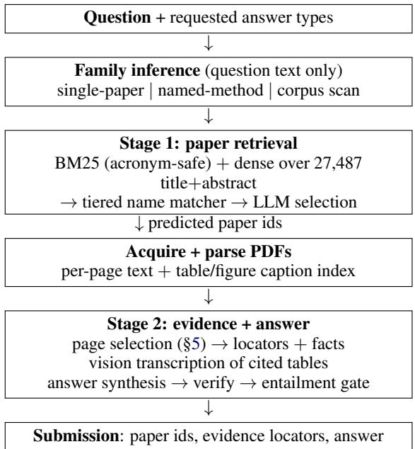

# PageRecall: Measuring Page Selection in Literature-Grounded Question Answering

Aaditya Chauhan

Independent Researcher

Team: Everest

aadityc28@gmail.com

## Abstract

We describe our system for LitTraceQA (GroundLM @ EMNLP 2026): given a research question, retrieve the relevant papers from a pool of 27,487, cite the page and the table or figure where the answer lives, and answer in a requested format. Our main finding is that evidence grounding is limited by retrieval, not by reading. The page selector put the annotator’s page, which we call the gold page, in front of the model that locates evidence only about half the time (52.6% goldpage recall), while that model, given the page, cited the right one in 45 of the 48 locators it emitted (94%). When the page was missing it rarely said so: of 45 such cases it returned nothing 14 times, a wrong page 24 times, and a correct page 7 times, so the pipeline failed quietly almost twice as often as it failed visibly. Since the failure was that the right page was never shown, the fix is to stop choosing: each retrieved paper fits in the model’s context, so we show it whole. Page ranking survives only as a fallback inside papers too long to fit, which no test-split paper was, and gold-page recall reaches 100% on the papers we can parse. Separately, questions that identify their target by position rather than content, such as “the first author of the 24th reference”, are served by parsing rather than retrieval: we resolve the bibliography into an addressable list, which also supplies identifiers the evidence metric scores. The final system scores 0.762 paper F , 0.441 evidence $\dot { F } _ { 1 }$ and 0.920 multiple-choice accuracy on the heldout test split. Because the pipeline depends on a closed model without seed control, we release a harness that verifies the paper’s central claims against committed artifacts.

## 1 Introduction

LitTraceQA (Liu et al., 2026) asks a system to do three things at once: retrieve the relevant paper(s) from a released metadata pool, identify coarse evidence locations (page, plus table or figure number), and produce an answer in a requested format. Evidence grounding is scored separately from answer accuracy, which lets us separate two failures that are normally confounded. When a grounded QA system cites the wrong place, is the fault with the model that reads a paper and picks the citation, which we call the reader, or with the step that chose which pages the reader was allowed to see?

On this task the answer is the selector.

Our contributions are:

• A controlled measurement isolating page selection from paper retrieval (§5): over 97 units the selector showed the reader the gold page only about half the time (52.6% goldpage recall), while the reader, given the gold page, cited the right page in 45 of the 48 locators it emitted (94%). Without the gold page it rarely abstained: in 31 of 45 units it emitted a locator anyway, and only 7 of those 31 were correct.

• A cautionary result on tuning a system to a development split: we fixed how many papers to predict per question from the development distribution, and it transferred badly (§7).

• A positional bias in multiple-choice answering that aggregate accuracy hides but the predicted-label distribution exposes, and a permutation-voting correction for it (§8).

• A pre-emit entailment gate (§9) that audits answers against their own cited source text, and the negative result that groundedness does not predict correctness on this data.

## 2 Related Work

The closest prior work scores evidence selection over scientific papers directly. QASPER (Dasigi et al., 2021) scores evidence-paragraph selection alongside answering, and isolates the two with oracle experiments that hand models the gold evidence, the same decomposition our conditional measurement makes at page level. Context24 (Chan et al., 2024) targets figure- and table-level evidence for scientific claims, the granularity our caption index serves; a participant system there likewise used captions as a retrieval representation (Bölücü et al., 2024).

For locating evidence inside long documents, one line of work retrieves page images directly using late interaction (Khattab and Zaharia, 2020), notably ColPali (Faysse et al., 2025) and M3DocRAG (Cho et al., 2024), which sidestep text extraction entirely. These are the natural stronger baselines for our selector, and we discuss why we did not adopt them in §5. LongDocURL (Deng et al., 2025) scores evidence locating explicitly and MMLongBench-Doc (Ma et al., 2024) annotates evidence pages; both would be suitable external validation for this component.

Our structural anchors (§6), deterministic lookups that resolve a question naming “Table 3” or “the 24th reference” against the parsed document, rely on document parsing rather than retrieval. GROBID (Lopez, 2009) and Docling (Auer et al., 2024) produce full structured representations of a document. Ours is far lighter, a set of regular expressions over extracted text, and a real parser would likely do better. Finally, feeding a whole document instead of selected passages is only viable if long-context models use their context uniformly; Liu et al. (2024) show positiondependent degradation, which we discuss as the main threat to our chosen fix. Query-side rewriting such as HyDE (Gao et al., 2023) addresses the vocabulary-mismatch subset of our failures and remains untried.

## 3 Task and Data

The benchmark paper (Liu et al., 2026) and the shared-task findings paper (Wang et al., 2026b) describe the data; we note only what our design turns on. LitTraceQA is one of two GroundLM 2026 shared tasks; the other, GoldenViewVQA (Wang et al., 2026a), asks for view-level visual evidence in multi-view driving scenes and is not addressed here. The pool is 27,487 papers (2024– 2025) across nine venues, with title, abstract, venue, year and a PDF URL but no full text.

Development is 55 labelled questions, the scored test split 71, and neither challenge split contains freeform questions. Evidence is scored on a coarse key of paper, source type, page and a normalised object id, so a correct object cited on the wrong page scores nothing. Most consequentially, the inference-time input does not state the task family: gold records carry a task\_family field and released inputs do not, so family must be inferred from the question before any retrieval policy can be chosen. That single omission shapes the whole pipeline.

## 4 System

Figure 1 shows the pipeline end to end; the rest of this section describes each stage in turn.

Models, tools and compute. All language and vision calls go to claude-sonnet-5, accessed through the Claude command-line interface (version recorded per run; 2.1.224 for the submitted results) with the model pinned on every call. Decoding uses the interface defaults and exposes no seed or temperature control, which is why the response cache rather than the source is what makes a run reproducible (§13). The same model performs table and figure transcription, given a rendered page image. Nothing is fine-tuned and we release no checkpoints. Dense retrieval uses Snowflake/snowflake-arcticembed-m-v1.5 unmodified on CPU; sparse retrieval uses bm25s with PyStemmer; PDF parsing uses pymupdf/pymupdf4llm 1.28. External data is limited to the released papermetadata pool and paper PDFs fetched at run time from publisher and proceedings sources; those PDFs are not redistributed. No synthetic or generated training data is used. The response cache is released separately from the code because its vision entries contain verbatim transcriptions of tables from copyrighted papers. One full run of the pipeline over both splits consumes 965 model calls in seven categories, measured by replaying it against the cache: evidence location 222, option-order voting 182, answer synthesis 126, verification 126, vision transcription 117, entailment auditing 97 and retrieval selection 95; a further 64 question-level calls resolve the corpus-scan questions, for 1,029 in all. The released cache holds 2,012 entries; the excess is superseded configurations accumulated during development. Throughput, measured from response-cache write times over the three largest recorded runs (298–365 fresh calls each), was one completed call every three to five seconds in aggregate with four concurrent workers, so a full run over both splits costs roughly an hour to an hour and a half of wall-clock time; retrieval indexes are built once on CPU. No GPU is used at any stage.

  
Figure 1: The pipeline. Family is inferred from the question alone because the inference-time input does not state it. Stage 1 selects papers; stage 2 locates evidence inside them and answers.

Stage 1: paper retrieval. We build two indexes over title+abstract. Sparse retrieval uses BM25 (Robertson and Zaragoza, 2009) via bm25s with an acronym-preserving tokenizer: stemming destroys method names such as D-FINE or sCM, which are the query terms that matter here. Documents additionally index title-initialism aliases (e.g. tcm for “Truncated Consistency Models”), because a paper’s acronym self-name usually appears only in its full text, never in its metadata. The dense index embeds the same title and abstract text with arctic-embed-m, unmodified.

Family inference then routes each question. Single-paper questions go to an LLM selection over a blended candidate list. Multi-paper questions, mostly named-method lookups, are resolved by a tiered name matcher (verbatim in title; verbatim in abstract; letters an in-order subsequence of title-word initials; letters a multiset subset thereof) followed by an LLM that maps each named method to the paper introducing it. Corpus-scan questions (“which CVPR 2025 papers cite X”) get a venue/year filter, an LLM abstract screen, then a full-text check of the shortlist.

PDF acquisition. Roughly 44% of the pool carries an OpenReview URL that blocks scripted fetches, so we try the publisher URL, then the official proceedings mirror, and only then arXiv. The order matters because a preprint is a different document with different pagination, and page is part of the scored evidence key: on development, gold table and figure pages agree with our parse in 59 of 82 locators (72%) on official copies, 33 of 48 for papers fetched from the proceedings mirrors and 26 of 34 from publisher PDFs, against about 41% on preprints in an earlier measurement. On the test split every predicted paper was acquired, and all 42 OpenReview-blocked papers resolved to official copies.

Parsing. We parse location-preservingly: per-page text in correct reading order via pymupdf4llm, plus a table/figure caption index giving each object an id and a page. The atomic unit is the physical PDF page, which exactly matches the granularity the evidence metric scores, there is no chunk-to-page mapping to get wrong.

Stage 2: evidence and answers. For each predicted paper an LLM sees the caption index and the paper text, and returns evidence locators plus extracted facts. Cited tables and figures are reread by a vision model from a rendered page image, and every numeric token the model emits is checked against the page’s raw character set by exact string match, a cheap mechanical check for invented digits. It cannot catch a value that is wrong but present elsewhere on the page, nor judge semantic equivalence. A synthesis call then produces the answer, a conservative verification pass may correct it, and the entailment gate (§9) audits it. validate\_evidence drops any locator whose object id does not exist in the parse.

## 5 Page selection is the bottleneck

Setup. We want to measure the page selector alone, without confounding it with mistakes made earlier by paper retrieval. The unit of evaluation is therefore a (question, paper) pair rather than a question: a development question citing three gold papers contributes three units, and units are kept only where stage 1 already retrieved that paper and we hold a parse of it. The 55 development questions yield 97 such units. Ground truth is the set of gold evidence pages for that paper, and the measurement involves no model calls, so it is deterministic and free to repeat.

Result. The original policy (BM25 over pages, top 4) achieves 52.6% gold-page recall: the fraction of a unit’s gold pages among the four shown, averaged over the 97 units. At least one gold page was shown in 52 of them, and the comparison that matters is conditional on that:
<table><tr><td>gold page</td><td>units</td><td>emitted</td><td>page correct</td></tr><tr><td>shown</td><td>52</td><td>48</td><td>45 (94%)</td></tr><tr><td>not shown</td><td>45</td><td>31</td><td>7 (23%)</td></tr></table>

Given the right page, the reader cites it correctly in 45 of the 48 locators it emits (94%), so most of the evidence deficit sits upstream of it. Prompt engineering on the reader cannot move a number gated at 52.6%.

The second row is its own finding. When the gold page was not among the four pages the original selector showed, the paper itself being correctly retrieved in every unit, the reader is told it may return nothing, and mostly does not: it emits a locator in 31 of 45 such cases and is right in 7 of those 31. The 7 successes are not luck. All 7 cite a table or a figure (4 figures, 3 tables) and none is a text span, because the prompt also carries a caption index listing every table and figure in the paper with its page, whether or not that page’s text was selected; the index is there so the model can cite the object identifiers the evidence metric scores. A model can therefore cite “Figure 3” from the index having never read the page, and our locator validation then snaps the citation to the page where that object actually sits. Page selection thus gates text-span evidence hardest, while table and figure evidence has a second channel that partly bypasses it. The practical consequence is that this pipeline failed quietly about twice as often as it failed visibly, and inspecting only the cases where the model returned nothing would have found the smaller half.

Why BM25 is weak here. Two reasons, both structural. IDF is estimated over the ∼24 pages of a single paper, where term statistics are degenerate; and every page of a paper shares its topical vocabulary, so the discriminative signal BM25 relies on is largely absent. Within-document page ranking is close to a worst case for it.

Fix. We compared candidate selectors on the same 97 units; anchors here are the four deterministic lookups defined in §6:
<table><tr><td>strategy</td><td>recall</td><td>pages</td></tr><tr><td>BM25 top-4 (original)</td><td>52.6%</td><td>4.0</td></tr><tr><td>dense top-4†</td><td>40.2%</td><td>4.0</td></tr><tr><td>RRF (Cormack et al., 2009) top-4</td><td>53.6%</td><td>4.0</td></tr><tr><td>anchors only</td><td>42.8%</td><td>3.7</td></tr><tr><td>BM25-4 ∪ anchors</td><td>65.5%</td><td>6.6</td></tr><tr><td>BM25-8 ∪ anchors</td><td>75.8%</td><td>9.9</td></tr><tr><td>all pages</td><td>100%</td><td>23.5</td></tr></table>

† dense was scored on the first 2,000 characters of each page against BM25’s full page, so this row is a lower bound and not a like-for-like comparison.

A full paper is ≈19k tokens at the median (26k at p90) across the 97 units, estimated at four characters per token, comfortably within the context budget. Since any change to the selector invalidates the prompt cache and forces the same full re-run regardless of its size, there is no reason to buy 65% when 100% costs the same. We therefore show the whole paper in document order. BM25 unioned with the anchors (§6) survives only as a fallback for papers above a page cap, which on the test split never triggered: it is a weak ranker for within-document page selection, for the reasons just given, but weak is not useless when the alternative is showing nothing.

This is a blunt fix. It is not a better ranking function; it is the observation that the ranking problem was optional at this document length. Any system whose documents fit in context can do the same.

Visual page retrieval (Faysse et al., 2025; Cho et al., 2024) is the stronger method here on paper, and we did not adopt it: at a ceiling of 100% already reached by showing every page, its value would be cost control at scale rather than accuracy, and it carries a substantial dependency. A controlled comparison of visual against textual page selection on this task remains untried. The main threat to simply showing everything is positiondependent degradation in long contexts (Liu et al., 2024); our questions are predominantly singlepage factoid lookups at ≈19k tokens, the regime where that effect is weakest, but we have not measured it directly.

## 6 What structural parsing still buys

Retrieval of any kind cannot serve questions that address their target by ordinal or number: “the first author of the 24th reference”, “how many parentheses in equation $\mathbf { \boldsymbol { 6 } } ^ { \flat }$ . A bibliography page shares almost no vocabulary with such a question, so neither lexical nor dense scoring can find it. We therefore added four deterministic lookups, which we call anchors. Each takes a literal string in the question, a table number, an equation number, a reference position, or a distinctive term, and resolves it against the parse rather than by scoring:

1. Named object: “Table 3” resolves to the page of that table’s caption, read from the parse’s caption index.

2. Equation tag: “equation $\mathbf { \boldsymbol { 6 } } ^ { \flat }$ resolves to pages carrying a printed “(6)” marker.

3. Ordinal reference: “the 24th reference” resolves to entry 24 of the parsed bibliography, which we split into an addressable array on its printed “[N]” markers.

4. Caption term: a distinctive term from the question appearing in a figure or table caption resolves to that object’s page.

We built these as a page-selection mechanism, to be unioned with BM25, and on their own they reach 42.8% gold-page recall with no ranking and no model call. Showing the whole paper (§5) made that role almost entirely redundant: anchors enter selection only for papers above the page cap, which was 1 of 58 predicted papers on development and 0 of 93 on test. The move from 52.6% to 100% recall is not attributable to the anchors: 95 of the 97 measurement units fit under the cap and saw the whole paper, and on the two units that did not (one 43-page paper) the BM25 half of the fallback caught the gold page on its own, with the anchors independently catching it as well.

What survives is not retrieval but parsing, and it operates in stage 2 rather than in page selection. First, content: for a question about the bibliography we hand the model the resolved entry, or the whole numbered list, so that “the 24th reference” is an array index rather than a counting exercise performed while reading. Second, scored identifiers: the evidence key includes citation\_id and equation\_id, which we extract directly from the question when it states them. Our test submission carries 12 and 6 of these respectively; emitting a page without them mismatches gold by construction, which is what cost us 0.091 evidence $F _ { 1 }$ on development (0.456 to 0.365 on the frozen submission) when the evaluator began scoring those fields, before the fix.

Anchors 1 and 3 are exact: a caption index and a numbered reference list each map a name to a single page. Anchors 2 and 4 over-trigger, because the string they match is not unique to the target. For “equation $6 ^ { \circ }$ in one development paper the anchor returns pages 2, 7 and 8 of 24, the gold page being 7, since “(6)” also appears as a prose back-reference and inside a table. That cost prompt space rather than accuracy when anchors fed selection, and is moot now that they rarely do.

## 7 A tuning choice that did not transfer

Gold paper sets on the development split are four papers for 27 of 29 multi-paper questions. Our multi-paper route accordingly padded each LLMmapped cluster up to four with dense-kNN neighbours of the mapped papers, on the reasoning that unnamed comparison baselines share the cluster’s topic. We disclosed this as a development-fit choice.

It transferred badly. On the test split the mapping step returns a median of two papers per component (0:5, 1:20, 2:22, 3:7, 4:4, 6:3 across 61 components), so padding invented roughly two papers per question. Paper precision fell from 0.840 on development to 0.453 on test while test recall was 0.773, dropping paper $F _ { 1 }$ to 0.517 and the composite score to 0.489. (That 0.840 is development precision under this padded configuration; it is coincidence that it equals the final system’s paper $F _ { 1 }$ in Table 1, whose precision is 0.935.)

Removing the padding (emitting only the papers the model mapped) raised test paper $F _ { 1 }$ to 0.762 and the composite to 0.568, the largest single improvement we made. The shipped system predicts a mean of 1.6 papers per question on the test split: 41 questions receive one paper, 21 two, 8 three or four, and 1 seven.

The instructive part is that this was not a development/test trade-off at all. Sweeping the pad target on development gives $F _ { 1 }$ of 0.840, 0.831, 0.814 and 0.825 for targets of 1, 2, 3 and 4, with precision falling 0.935 to 0.840. The heuristic was mildly harmful on the split it was fitted to. It had been introduced alongside several other changes and evaluated only in aggregate, so a net gain from the bundle concealed a component that was costing points throughout.

We draw two conclusions. First, ablate individually, not in bundles; a disclosed tuning choice is not the same as a validated one. Second, benchmark splits can differ in properties as basic as gold-set cardinality, and a system that infers set size from the development distribution rather than from its own evidence will over-predict when they do.

## 8 Positional bias in multiple-choice answering

The problem. Multiple-choice options are presented to the model as a labelled list, and a model may prefer a label or a position rather than the option’s content. Accuracy alone cannot distinguish such a preference from ordinary error, because it reports only how often the answer was right. The distribution of labels the system chooses can.

Why it matters here. Our test accuracy of 0.840 looked unremarkable, but the predicted labels were A 8 / B 8 / C 12 / D 22 over 50 questions, against a plausibly near-uniform gold: the final option was chosen about twice as often as chance. The distribution did not change when we corrected the upstream paper predictions (§7), which places the cause in answer synthesis rather than retrieval.

The fix. Because the over-chosen label was also the last-presented option, “prefers the letter D” and “prefers the final position” are indistinguishable in a single ordering. We therefore re-ask each question with the option texts moved between label slots (identity, reversal, and a rotation), keeping the label alphabet fixed so the output format is unchanged, and take a majority vote. A three-way split retains the original answer, so a lone dissenting view cannot overwrite it.

We gated deployment on the development split: multiple-choice accuracy rose 0.854 to 0.902, from two changed answers, both away from the over-selected label and both corrections, with all other metrics unchanged. On test the method changed four answers, all decided 2–1 by the permuted views, moving accuracy 0.840 to 0.920 and the distribution to A 8 / B 9 / C 13 / D 20. All six corrections across both splits ran in the predicted direction. We note the sample is small and report it as such.

## 9 Auditing grounding

A grounded-QA pipeline can produce a correct answer for the wrong reason, from the model’s pretrained knowledge of a paper rather than from the retrieved document. The pool is 2024–2025 machine-learning papers, so parametric recall of these specific results is a live possibility, not a hypothetical.

We therefore added a pre-emit entailment gate. After evidence validation, each answer component is audited against only the raw parsed text of the pages it itself cites, no pipeline-derived facts or transcripts. The auditor is the same model as the rest of the pipeline, prompted with only the question, the answer and the cited page text, and instructed to treat true-but-unstated claims as unsupported. This distinction matters: our earlier verification pass re-read the pipeline’s own transcripts and could therefore only detect self-inconsistency, never ungroundedness.

On development, 25/41 multiple-choice and 14/26 freeform answers are supported by their own cited source text, 39 of 67 answer components in total, so a substantial minority assert something their cited evidence does not carry.

We had expected the verdict to predict correctness, and on an earlier configuration it appeared to. On the final system it does not. Multiple-choice answers judged unsupported are correct slightly more often (15/16) than supported ones (22/25); freeform shows a weak effect in the expected direction (8/14 against 5/12) on 26 observations. We report this as a negative result: the gate detects whether an answer is grounded in its own citation, which is what we built it to do, but on this data that is close to independent of whether the answer is right. The two properties are worth keeping distinct.

The metric cannot reward abstention. A grounding-oriented evaluation might be expected to reward a system for declining to assert what it cannot support. This one cannot. Because a blank answer and a wrong answer score alike, withdrawing an unsupported claim can only convert “unsupported but correct” into “blank and wrong”: enforcing the gate costs multiple-choice accuracy 0.902 → 0.537. This is arithmetic, not tuning, and it applies to any system on this metric. We therefore run the gate in reporting mode. We raise it as a task-design observation rather than a system result: an evaluation that scores grounding separately from answers still gives a system no reason to prefer silence over a guess.

<table><tr><td>leaderboard metric</td><td>dev</td><td>test</td></tr><tr><td>paper precision (macro) paper recall (macro)</td><td>0.935</td><td>0.830</td></tr><tr><td>paper  $F _ { 1 }$  (macro)</td><td>0.809 0.840</td><td>0.759 0.762</td></tr><tr><td>evidence precision (macro) evidence recall (macro)</td><td>0.482</td><td>0.479</td></tr><tr><td>evidence  $F _ { 1 }$  (macro)</td><td>0.501 0.468</td><td>0.448</td></tr><tr><td>multiple-choice accuracy freeform exact match</td><td>0.902</td><td>0.441</td></tr><tr><td></td><td>0.500</td><td>0.920 n/a</td></tr><tr><td>table row  $F _ { 1 }$  (macro)</td><td>0.533</td><td>0.421</td></tr><tr><td>table cell accuracy (macro) table cell accuracy (micro)</td><td>0.374</td><td>0.242</td></tr><tr><td></td><td>0.370</td><td>0.287</td></tr><tr><td>composite</td><td>n/a</td><td>0.577</td></tr></table>

Table 1: Every metric the official evaluator reports, on the development split and the hidden test split. Test figures are from the online evaluator (team Everest); the composite is its ranking metric. A development composite is not comparable because the development split contains freeform questions and the test split does not.

## 10 Results

Table 1 reports the final configuration on both splits; test scores come from the organisers’ online evaluator against hidden labels, reported there under the team name Everest. The ranking metric averages paper $F _ { 1 }$ , evidence $F _ { 1 }$ and an answer score, the last being the mean of the available answertype metrics using the macro cell figure.

On evidence specifically, the page-selection change (§5) moved development evidence $F _ { 1 }$ from 0.384 to 0.456 under the evaluator current at the time, with precision rising alongside recall $( 0 . 3 6 7 \  \ 0 . 4 7 5 )$ , the additional pages replaced wrong locators with right ones rather than adding noise. Evidence remains, in absolute terms, the weakest part of the system. Full gold-page recall does not imply full evidence credit: the coarse key also requires the right source type and object id, and it requires the page numbering of our copy of the PDF to match the revision the annotator used. Recall of the page is necessary, not sufficient.

## 11 Error analysis

Retrieval errors are now mostly recall, not precision (0.830 against 0.759 on test; on development the final system misses 38 gold papers while predicting 9 non-gold ones): where we miss, the mapping step failed to associate a named method with any pool paper, rather than associating it with a wrong one. The residual cases are descriptive references without a distinctive acronym, where neither the tiered name matcher nor lexical retrieval

has a strong signal.

Evidence errors fall into three groups. First, version mismatch: the annotator’s locator refers to a document revision we cannot obtain, so a correct object carries the wrong page. Second, sourcetype disagreement: we once cited the right page of an equation as text\_span where gold says equation\_algorithm; because the evaluator keys on source type, a correct page scored zero. This was fixed with explicit source-type routing guidance in the evidence prompt, and the final system emits equation\_algorithm with the correct equation identifier for that case. Third, textlayer gaps: equation bodies are frequently absent from extraction entirely, so questions about the rendered form of an equation are unanswerable from text at any context size. One development question of this kind has been answered correctly, then incorrectly, then correctly again across revisions of the answering prompts, while the equation body was absent from the extracted text throughout. Whatever produces the right answer there, it is not reading the equation; this is the answer-level counterpart of the finding in $\ S 9$ that correctness and groundedness are close to independent.

Answer errors concentrate in tables, our weakest component throughout (cell accuracy 0.242 macro on test against row $F _ { 1 } 0 . 4 2 1 $ . Row keys are usually recovered; the values inside them are not. In the development cases we inspected, the dominant causes were numeric misreads from densely formatted tables and cells whose value must be combined across a multi-level header. Multiplechoice errors are now 4 of 50 after the option-order correction of $\ S 8 \rrangle$ ; we have no gold access for the test split and cannot characterise the residue further.

## 12 Conclusion

Three components of this system were losing points without any sign in the end-to-end numbers. The evidence reader looked adequate while its selector found the right page half the time. A padding heuristic looked like a reasonable prior on set size while costing 0.245 paper $F _ { 1 }$ Multiple-choice answering looked merely imperfect while systematically over-choosing the final option. Each became visible only when the stage was measured against a ground truth of its own: selector recall conditional on correct retrieval, a single-parameter ablation, and the distribution of

predicted labels.

The practical recommendation is to measure selector recall before investing in the reader, and, when documents fit in context, not to select at all.

## Limitations

Sample sizes are small: 55 development questions and 71 test questions. The multiple-choice debias rests on six corrected answers in total, and while all six ran in the predicted direction, six is a weak basis for a mechanism claim.

Much of our remaining evidence error is PDFversion mismatch: gold locators were annotated against document revisions we cannot always fetch. Measured before the page-selection change, this accounted for roughly 32 of 108 development misses; we have not re-derived the share under the final configuration, and we do not know how much of it is recoverable with better acquisition.

Two error sources we did not address: equation content is frequently absent from the PDF text layer, making some equation-rendering questions unanswerable without a vision pass we do not route to; and freeform gold is written as full sentences while our answers are terse, so exact match penalises answers whose content is correct. Several components carry development-fit choices, enumerated in the released reproducibility statement.

The system depends on a closed commercial model whose decoding exposes no seed control, so exact reproduction requires our released response cache rather than being achievable from source alone. We did not attempt the optional test\_extra split, which would require on the order of 104 PDFs.

## 13 Reproducibility

A pipeline built on a closed model with no seed control cannot be reproduced by re-running it. We therefore ship a harness, reproduce.py,1 that checks the paper’s central claims at whatever depth the reader’s artifacts allow, and reports skip rather than silent success when something is missing. With only this repository and the released dataset it verifies the gold file by hash, recomputes every development metric in Table 1 from our committed predictions using the organisers evaluator rather than our own, and validates the submission. Given the parsed PDFs it recomputes the measurement of §5; given the response cache it replays the pipeline and requires zero cache misses and byte-identical output. All checks pass at submission.

Three practices made this possible. Contentaddressed calls: every model call is keyed by sha256(prompt), so the cache is an exact record of the run and a changed prompt invalidates cleanly. Provenance stamping: each run writes an immutable copy of its predictions and metrics tagged with model, cache generation and git revision, marked dirty when the tree has uncommitted changes. Pinning measurements to artifacts: a measurement’s meaning can depend on upstream state, and after we changed stage 1 the page-selection script silently returned 90 units and 0.533 rather than 97 and 0.526. The experiment is now pinned to the stage-1 artifact it was taken from. A reproducibility claim should name the artifact, not only the script.

## References

Christoph Auer, Maksym Lysak, Ahmed Nassar, Michele Dolfi, Nikolaos Livathinos, Panos Vagenas, Cesar Berrospi Ramis, Matteo Omenetti, Fabian Lindlbauer, Kasper Dinkla, Lokesh Mishra, Yusik Kim, Shubham Gupta, Rafael Teixeira de Lima, Valery Weber, Lucas Morin, Ingmar Meijer, Viktor Kuropiatnyk, and Peter W. J. Staar. 2024. Docling technical report. arXiv preprint arXiv:2408.09869.

Necva Bölücü, Vincent Nguyen, Roelien C. Timmer, Huichen Yang, Maciej Rybinski, Stephen Wan, and Sarvnaz Karimi. 2024. CSIRO at Context24: Contextualising scientific figures and tables in scientific literature. In Proceedings ofthe Fourth Workshop on Scholarly Document Processing (SDP 2024), pages 314–323.

Chu Sern Joel Chan, Aakanksha Naik, Matthew Akamatsu, Hanna Bekele, Erin Bransom, Ian Campbell, and Jenna Sparks. 2024. Overview of the Context24 shared task on contextualizing scientific claims. In Proceedings of the Fourth Workshop on Scholarly Document Processing (SDP 2024), pages 12–21.

Jaemin Cho, Debanjan Mahata, Ozan Irsoy, Yujie He, and Mohit Bansal. 2024. M3DocRAG: Multi-modal retrieval is what you need for multipage multi-document understanding. arXiv preprint arXiv:2411.04952.

Gordon V. Cormack, Charles L. A. Clarke, and Stefan Buettcher. 2009. Reciprocal rank fusion outperforms Condorcet and individual rank learning methods. In Proceedings ofthe 32nd International ACM

SIGIR Conference on Research and Development in Information Retrieval, pages 758–759.

Pradeep Dasigi, Kyle Lo, Iz Beltagy, Arman Cohan, Noah A. Smith, and Matt Gardner. 2021. A dataset of information-seeking questions and answers anchored in research papers. In Proceedings of the 2021 Conference of the North American Chapter of the Association for Computational Linguistics: Human Language Technologies (NAACL-HLT), pages 4599–4610.

Chao Deng, Jiale Yuan, Pi Bu, Peijie Wang, Zhong-Zhi Li, Jian Xu, Xiao-Hui Li, Yuan Gao, Jun Song, Bo Zheng, and Cheng-Lin Liu. 2025. Long-DocURL: A comprehensive multimodal long document benchmark integrating understanding, reasoning, and locating. In Proceedings of the 63rd Annual Meeting of the Association for Computational Linguistics (Volume 1: Long Papers), pages 1135– 1159.

Manuel Faysse, Hugues Sibille, Tony Wu, Bilel Omrani, Gautier Viaud, Céline Hudelot, and Pierre Colombo. 2025. ColPali: Efficient document retrieval with vision language models. In International Conference on Learning Representations (ICLR).

Luyu Gao, Xueguang Ma, Jimmy Lin, and Jamie Callan. 2023. Precise zero-shot dense retrieval without relevance labels. In Proceedings of the 61st Annual Meeting of the Association for Computational Linguistics (Volume 1: Long Papers), pages 1762– 1777.

Omar Khattab and Matei Zaharia. 2020. ColBERT: Efficient and effective passage search via contextualized late interaction over BERT. In Proceedings of the 43rd International ACM SIGIR Conference on Research and Development in Information Retrieval, pages 39–48.

Nelson F. Liu, Kevin Lin, John Hewitt, Ashwin Paranjape, Michele Bevilacqua, Fabio Petroni, and Percy Liang. 2024. Lost in the middle: How language models use long contexts. Transactions of the Associationfor Computational Linguistics, 12:157–173.

Xuye Liu, Yimu Wang, Peng Shi, Bo Xue, Xiangrui Ke, Songcheng Cai, Kath Choi, Di Wu, Freda Shi, and Krzysztof Czarnecki. 2026. LitTraceQA: A benchmark for multi-stage grounding and verification in scientific question answering. Preprint, arXiv:2608.07370.

Patrice Lopez. 2009. GROBID: Combining automatic bibliographic data recognition and term extraction for scholarship publications. In Proceedings of the 13th European Conference on Research and Advanced Technology for Digital Libraries (ECDL), pages 473–474.

Yubo Ma, Yuhang Zang, Liangyu Chen, Meiqi Chen, Yizhu Jiao, Xinze Li, Xinyuan Lu, Ziyu Liu, Yan

Ma, Xiaoyi Dong, Pan Zhang, Liangming Pan, Yu-Gang Jiang, Jiaqi Wang, Yixin Cao, and Aixin Sun. 2024. MMLongBench-Doc: Benchmarking long-context document understanding with visualizations. In Advances in Neural Information Processing Systems (NeurIPS), Datasets and Benchmarks Track.

Stephen Robertson and Hugo Zaragoza. 2009. The probabilistic relevance framework: BM25 and beyond. Foundations and Trends in Information Retrieval, 3(4):333–389.

Yimu Wang, Yee Man Choi, Barry Zhang, Mozhgan Nasr Azadani, Sean Sedwards, and Krzysztof Czarnecki. 2026a. Where does the answer come from? benchmarking view-level visual evidence identification in multi-view MLLMs for autonomous driving. Preprint, arXiv:2606.09644.

Yimu Wang, Xuye Liu, Yee Man Choi, Bo Xue, et al. 2026b. Findings of the first GroundLM shared tasks: Evaluating grounded language models across visual and scientific evidence. In Proceedings of the 1st Workshop on Grounding Language Models: Learning Faithfully and Efficiently (GroundLM 2026).