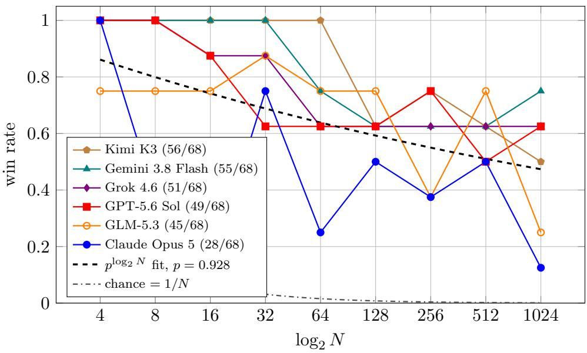
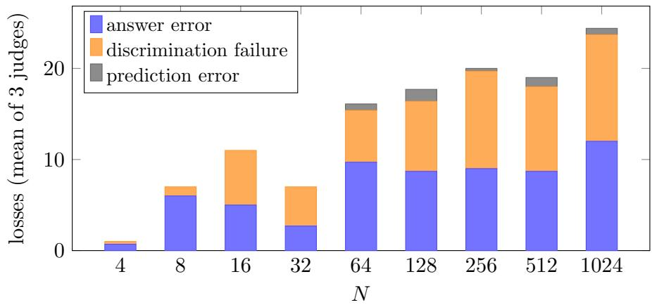
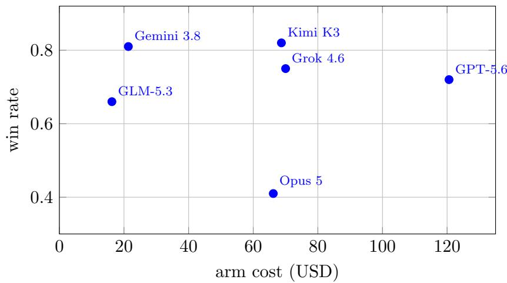

# Playing log(N)-Questions over Wikipedia Abstracts: Communication Eficiency Between Paired Frontier Models A Technical Report

Peter Potash https://github.com/ppotash/logn-questions

September 17, 2026

## Abstract

We evaluate six frontier language models on the two-agent log(N)-Questions game of Potash and Suleman (2019). A questioner sees N Wikipedia lead paragraphs and must identify a secretly chosen target using exactly log N yes/no questions. An answerer sees only the target and the question, and replies with one word. Both roles run on the same provider, so the game measures how well a model communicates with itself across an information asymmetry. We run 408 games over document sets of 4 to 1024 paragraphs at a total API cost of \$363.

One model finishes well behind the others: Claude Opus 5 wins 28 of 68 games, against 45 to 56 for GLM-5.3, GPT-5.6 Sol, Grok 4.6, Gemini 3.8 Flash and Kimi K3. The leading five are only marginally separable. Pooling those five, win rate declines with set size at $r = - 0 . 9 7 3$ and is fit by a single per-round reliability parameter. The form is $\mathrm { w i n } = p ^ { \log _ { 2 } N }$ with $p = 0 . 9 2 8$ It presumes each round fails independently, which we test rather than assume: the per-round failure rate is flat across the horizon $( \chi ^ { 2 } = 1 0 . 5 ,$ df = 9, $p = 0 . 3 1 )$ , and a failure at one round does not raise the chance of one at the next. Inverting the fit, coin-flip success needs $p \geq 0 . 9 3 3$ at ten steps and $\geq 0 . 9 8 6$ at fifty, so the measured spread from 0.900 to 0.994 separates a 9-step horizon from a 115-step one.

We adjudicate each game’s target and guess against three independent judges, 2,931 judgements each. Losses divide into answer errors and discrimination failures in roughly equal measure, 47–55% and 42–49% depending on the judge, with 2–4% prediction errors: models almost never name a document their own evidence excludes, and the split does not shift detectably with set size. Measured per-round agreement, 0.900 to 0.994, reconciles with the fitted p, the residual being the discrimination failures. Inter-judge agreement on individual judgements is 97.8–98.7%. Every unanimous answer error from the weakest model was inspected: 32 of 34 are $\mathrm { ^ { 6 6 } N o ^ { 3 } }$ answers, on properties stated in the document’s first sentence, under an instruction that explicitly warns against defaulting to $\mathrm { ^ { 6 6 } N o ^ { 3 } }$

Information per question, estimated from answer balance, correlates with win rate at $r =$ +0.88. The only two models to extract a full bit per question are the only two that partition on document titles, a strategy absent below N=32 and used in a quarter of questions above it. Reasoning-token expenditure varies 4.5× across models with little relation to success, and the trace grows as the candidate set shrinks without a matching gain in reliability. Cost is uncorrelated with performance at $r = - 0 . 0 5$ : the two cheapest arms win at \$0.36 and \$0.39 each, against \$2.46 for the most expensive.

Two China-hosted providers refused documents in our corpus. Moonshot rejected three of the 1024 paragraphs, on Taiwan’s navy, a purged Chinese intellectual and a detained Hong Kong activist; Z.ai rejected the third of these. We located them by bisection, iteratively halving the document block and re-submitting until the triggering paragraph was isolated, and report the refusals as a practical limit on assembled long contexts. Our per-model ordering inverts published general-intelligence leaderboards, on which the model finishing last here ranks at or near the top. §8 sets out where independent benchmarks agree with our result and where they do not.

## 1 Introduction

Potash and Suleman (2019) propose a two-agent game in which a questioner distinguishes among N sentences by asking log N yes/no questions of an answerer who sees only the target. Both agents were trained end-to-end over a Gumbel-softmax discrete channel and evaluated on small sentence sets.

We port the game to pretrained frontier models. This changes what it measures. The original studied whether a communication protocol could be learned. Ours studies whether one already exists: our agents never co-adapt, and must coordinate zero-shot on a shared prior from pretraining. We run the game over document sets from 4 to 1024 Wikipedia lead paragraphs.

The task makes three capacities jointly necessary, and produces one observable when any of them fails. The questioner must partition a document set along a semantic axis. It must predict how a second agent with strictly less context will adjudicate that partition. And it must maintain a hypothesis state across rounds without external scafolding. A wrong final guess is consistent with failure in any of the three, so decomposing the failure is the substantive analytical problem.

The communication requirement is the aspect the original design could not isolate. Because both roles run on the same underlying model, failures cannot be attributed to a capability gap between agents. They arise from the context asymmetry and from each agent’s model of the other. The questioner receives no feedback: a mistaken answer is indistinguishable from a correct one, and silently eliminates the target while the questioner continues to reason over a set that no longer contains it.

Relation to existing evaluation. The task sits at the intersection of three literatures. Longcontext evaluation is dominated by retrieval-style probes (Kamradt, 2023; Liu et al., 2024). RULER (Hsieh et al., 2024) broadened this to include aggregation and multi-hop tracing, and SummHay (Laban et al., 2024) argued that needle-style tests no longer separate frontier models. Our task is an aggregation probe in that lineage, with one property those benchmarks lack: the aggregate must be near-exact, because a misestimated partition is an unrecoverable loss of information under a tight budget (§6.2). Emergent-communication work has long studied paired agents solving reference games (Lewis, 1969; Foerster et al., 2016; Lazaridou and Baroni, 2020; Kottur et al., 2017); we adopt that framing for two instances of a single pretrained model, not for agents trained to coadapt. Multi-hop question answering (Welbl et al., 2018; Yang et al., 2018) tests two to three dependent inferences. This task requires up to ten.

The main contributions of this work are as follows.

• A frozen, reproducible protocol for the game over document sets from N = 4 to $N = 1 0 2 4$ 2 with nested document sets and prefix-extensible target assignments.

• Six complete model arms, 408 games, on identical documents and targets, which makes every cross-model comparison paired.

• An empirical fit of win rate to $p ^ { \log _ { 2 } N }$ with a single per-round reliability parameter $p = 0 . 9 2 8$ across nine set sizes.

• An error decomposition requiring $O ( 1 )$ rather than $O ( N )$ adjudications per round, validated across three judges, with a measured self-preference discount of 40 to 46% and inter-judge agreement of 97.8–98.7%.

• The finding that inter-agent failures are wrong answers to questions that admit clear answers, not breakdowns of a shared protocol, and that all four prompt revisions which improved play were fixes to communication rather than to either agent’s reasoning.

• A judge-free measure of partition quality that correlates with win rate at $r = + 0 . 8 8$ , and the observation that two models’ opening questions are systematically narrow at every scale we test.

• A documented account of cross-provider engineering hazards, including content filtering that made three encyclopedia paragraphs unusable and required bisection to locate.

## 2 Task

Let $D = \{ d _ { 1 } , \ldots , d _ { N } \}$ be an ordered document set and $t \in D$ the target. The questioner observes D in full; over $R = \log _ { 2 } N$ rounds it emits a yes/no question $q _ { r }$ , and the answerer, observing only $( t , q _ { r } )$ , returns $a _ { r } \in \{ \mathrm { Y e s } , \mathrm { N o } \}$ . After round R the questioner names an index and wins if it is t’s.

No externalised hypothesis state. The questioner receives the full document set and the question/answer history each round, but never a running list of viable candidates; it must re-derive the surviving set each round. This follows the original architecture, where the hypothesis lived in a hidden state vector.

The answerer never sees document indices. It receives the target’s title and text but not its position, without which the game collapses into integer bisection. Retaining the title leaves two non-semantic strategies available: enumeration (“is your document one of: A, $\mathrm { { B , C . . . 7 ^ { 9 9 } ) } }$ and lexical bisection (“does the title begin with a letter from A through M?”). Both are decidable from a single document, which is the only constraint the rules impose, and both permit exact partitions where semantic categories cannot.

The prompt names no strategy. The questioner is told the rules of the game, what the answerer can see, and to aim for questions that divide the remaining candidates evenly. It is not told that partitioning on titles is permitted, nor that it is forbidden, nor that semantic questions are expected. Neither enumeration nor lexical bisection is mentioned anywhere in either role’s prompt. The full text of both prompts is released with the code.

This is deliberate. Constraining the question form would measure compliance with our constraint; suggesting a strategy would measure whether models follow a hint. Leaving the space open means the strategy a model adopts is its own, and diferences between models are diferences in what each treats as a natural way to split a set. §6.3 reports what they chose: three models never partition on titles in 320 questions, two do so in roughly a quarter, and the strategy is absent below N=32 across all six.

## 3 Why this is a long-context and multi-step test

Long-context evaluation is dominated by retrieval-style probes — needle in a haystack (Kamradt, 2023), multi-document QA (Liu et al., 2024) — in which the model must locate a small number of relevant spans within a large irrelevant remainder. Such tasks are structurally well served by selective sparse attention: if only a few blocks are relevant, attending to the right few sufices. A substantial line of work makes long context tractable precisely this way, from fixed patterns (Child et al., 2019; Beltagy et al., 2020; Zaheer et al., 2020) to learned top-k selection trained end-to-end (Yuan et al., 2025; Lu et al., 2025).

log(N)-Questions has the opposite structure. To ask a well-balanced opening question over 1024 documents, the questioner must estimate what fraction of the whole set carries a candidate property. There is no small relevant subset. Every document afects the answer equally, since each shifts the partition by 1/N. A model that attends to only part of its context cannot know whether “is the subject a person?” splits the set 512/512 or 700/324, and any such misestimate is an irrecoverable information loss under the tight budget of §6.2.

Whether that is a real obstacle depends on the mechanism, and two that are often grouped together behave diferently here. Top-k selective attention gives each query a chosen subset of the context, so a global proportion must be reassembled from partial views. Linear or recurrent state maintains a fixed-size summary that has lossily absorbed every token. The second has a diferent failure profile: it is weak on precise recall, not on aggregate statistics. Nawrot et al. (2025) provide the most direct evidence for the distinction, finding that selective sparse attention degrades specifically on aggregation and high-scope tasks while remaining safe for retrieval, and warning that “sparsity levels safe for retrieval tasks can cause failures on aggregation or multihop reasoning”. Their study covers training-free sparsity on dense models, not trained selection, and does not benchmark linear architectures — so the clean dichotomy is suggested rather than established. We note also that NSA and MoBA both build in explicit global-recovery mechanisms, so citing them as evidence of an inherent aggregation deficit would overstate the case.

It is worth being explicit about what each family predicts for the opening question, since the predictions difer in sign and our data can distinguish them. Dense attention recovers the proportion in one pass, so balance is limited only by whether the model computes the statistic. Fixed-pattern sparsity gives each query a subset fixed in advance with a random component, so a proportion estimated from the attended blocks should behave like a sample proportion: correct on average, noisy in any instance. The prediction is scatter around 50%, not displacement from it. Learned top-k selection inverts this: selection is query-conditioned, so a query about property X preferentially retrieves blocks matching X, the retrieved sample is enriched, and the estimated fraction should be biased upward. Linear or recurrent state carries aggregate statistics cheaply, predicting good round-1 balance paired with weak late-round recovery of specific survivors.

Our measurements fit none of these. The observed deficit is downward for all six models, with round-1 yes rates of 49, 49, 44, 41, 34 and 22%, where top-k predicts upward bias and fixed-pattern predicts unbiased scatter. It is also scale-invariant, as large at N=8 — where the whole set fits inside any window any of these mechanisms would use — as at N=1024 (§6.3). A mechanism that engages only at long context cannot explain a deficit already complete at a thousand-token prompt. The parsimonious reading is that we are measuring a prior over what makes a good question, not a limit on access to context: the models can see the whole set and choose to partition it unevenly. That places the deficit with the communication failures of §7 rather than with the hardware.

Two further cautions. The architectures of the four proprietary models we evaluate are undisclosed, so no observed behaviour can be attributed to a specific attention mechanism; only Kimi K3 (Moonshot AI, 2026) and GLM-5 (Zhipu AI, 2026) have published technical reports. And the experiment that would settle this needs open weights: run the same round-1 probe on one model served under dense attention and under a sparse variant at matched context, and compare the sign of the balance error. We present this section as motivation for the task design, not as a hypothesis the results confirm.

The opening question is only half the task. Rounds beyond the first add a second demand. The viable set is never given to the questioner (§2); it must be re-derived each round by re-applying every prior question to all N documents. At N = 1024 the tenth round requires holding two surviving candidates identified by re-adjudicating nine predicates across a 126,000-token prompt in which they are not marked. This is multi-step reasoning of a kind rarely tested: ten sequential, mutually dependent inferences with no externalised scratchpad, where an error at any step is silent and unrecoverable.

The task therefore measures aggregation and re-derivation over long context rather than retrieval from it. RULER (Hsieh et al., 2024) includes aggregation subtasks and is the closest precedent; the diference here is that the aggregate must be near-exact and directly determines an action, so error is compounded across rounds rather than scored once.

Whether this task can separate long-context aggregation from question-generation ability more generally is left open.

## 4 Corpus and protocol

## 4.1 Documents

We reservoir-sample 4,000 lead paragraphs from the English Wikipedia wikimedia/wikipedia 20231101 snapshot in a single streaming pass over eight randomly chosen parquet shards. Acceptance requires the article’s first paragraph block to pass a filter chain: 60–140 words, at least 2.0 sentence terminators per 100 words, no disambiguation or list-page markers, no strippedtemplate artefacts, limited parenthetical clutter. The first-block restriction matters: an earlier version scanned forward for the first substantial block and silently fell into body sections whenever the lead was short, producing documents that open with a section header glued to the text and never state what the subject is. Roughly 15% of a pilot sample was degraded this way.

The 1024 documents used average 123 tokens (p50 118, p95 179, max 242), giving an N=1024 document block of ≈126,000 tokens — below the 200,000-token threshold at which several providers double input rates.

Because the questioner re-reads the full set each round, a single N=1024 game sends that block eleven times (ten questions plus a guess), for ≈1.39M billable input tokens per game; the answerer’s ten calls, each one document and one question, contribute ≈3,500. Context occupancy is therefore constant at 126,000 tokens across every round while the information that must be extracted from it changes completely: round 1 requires a global proportion over the whole set, round 10 requires locating two surviving candidates within the same unmarked block. This is why prompt caching (§5) dominates the cost structure, and why cached-token counts of 1.3–2.0M per game appear in our logs.

## 4.2 Nested sets and prefix-extensible targets

Document sets are nested: docset(512) ⊂ docset(1024), down to N = 4. Targets are emitted in bit-reversed order over 64 buckets, so any power-of-two prefix is evenly stratified across the set and targets[: 8] is a strict prefix of targets[: 16]; raising the run count re-uses every completed game.

Each size draws from an independent RNG. No target is reused, so N = 4 contributes 4 games and every larger size 8, for 68 per model.

All models see identical documents in identical order with identical targets, making every crossmodel comparison paired.

## 4.3 Prompts and the communication channel

Both role prompts are provider-agnostic, built by a single module; providers difer only in transport. Prompts split into system/cacheable/tail with the document block in the cacheable segment, byteidentical across every round.

Prompts were revised four times during a pilot phase and then frozen before any reported arm. Every revision was a communication fix. None altered what either agent was asked to reason about; each altered what the agents could assume about one another. We list them because §7 argues this is the substantive finding:

1. World-knowledge licence. Our first answerer instruction told it to answer “on the basis of the document alone”. This was a defect in the prompt, not a model failure. A document describing a Spanish media group does not contain the sentence “Spain is in Europe”, so answering No to a Europe question is the correct output of the instruction as written. Answer balance under this wording was 21% Yes across 24 calls where ≈50% was expected (p = 0.003). The frozen prompt instead opens with “Use ordinary world knowledge”, states that the document will not always contain the answer outright, and gives the Spain/Europe inference as a worked example.

2. Answerer reasoning. Reasoning had been disabled for the answerer as a cost saving. One reply read “No. . . wait. The document concerns biathlon, a winter sport. Yes” — a reflexive No corrected only when the model had room to think. Reasoning was restored.

3. Presupposition prohibition. The questioner produced questions of the form “is it X rather than Y” where Y appeared nowhere in the target document, existing only because a diferent candidate had that property. The answerer could not decode why Y was mentioned and answered No.

4. Generalising the prohibition. Naming only “rather than” was insuficient; the next failure used “(as opposed to equipment or machinery)” on a document titled Task-oriented and relationship-oriented leadership. The rule was broadened to every phrasing of a contrast, and the answerer instruction changed from adjudicating the contrast to ignoring it. Post-fix, 0 of 12 sampled questions were contrastive.

The questioner is additionally told the answerer’s rules verbatim, on the grounds that any divergence between what the questioner assumes and what the answerer is instructed to do is a direct tax on agreement.

## 4.4 Reasoning protocol

Each provider runs at its own maximum-efort setting rather than a matched token budget; matching counts would place models at non-native settings and amount to tuning a knob to a metric. Token expenditure is therefore a result rather than a controlled variable. The questioner runs at high efort, the answerer at medium.

One documented exception: Gemini 3.8 Flash runs at MEDIUM. At HIGH it spends 30,000–61,000 tokens reasoning on a single call, exhausting its own 64,000-token output budget before the visible answer completes — on truncated calls, visible output capped at 1,280 tokens while thinking consumed the remainder. Raising the cap does not help, because thinking scales to fill it. This is a property of the model’s output budget on this task rather than a configuration preference. Notably, Gemini at MEDIUM outperforms both other models at HIGH (§6), which is itself evidence against a more-reasoning-is-better account.

## 5 Cross-provider engineering

A substantial fraction of the work was reconciling provider APIs. We document the hazards because several fail silently and one invalidated a complete arm.

## 5.1 Reasoning configuration is not portable

<table><tr><td>Provider</td><td>Parameter</td><td>Values</td><td>Notes</td></tr><tr><td>Anthropic</td><td>thinking.type+output_config.effort</td><td>adaptive; low-max</td><td>on by default</td></tr><tr><td>OpenAI Google</td><td>reasoning-effort thinkingLevel</td><td>minimal-high LOW/MEDIUM/HIGH</td><td>I enum; budget deprecated</td></tr><tr><td>xAI</td><td>reasoning-effort</td><td>low-xhigh</td><td></td></tr><tr><td>Z.ai</td><td>thinking.type</td><td>enabled/disabled</td><td>binary</td></tr><tr><td>Moonshot</td><td></td><td></td><td>no exposed control</td></tr></table>

Two changed under us mid-project. Claude Opus 5 rejects thinking.type = enabled in favour of an adaptive mode with a separate efort field; token budgets are ignored. Gemini 3 deprecates the integer thinkingBudget for a thinkingLevel enum, and — critically — a request sending only the deprecated budget receives the model’s default level rather than an error. Adapters are therefore self-healing: each sends its best guess, drops or substitutes any parameter a 400 names, and records the fact in a dropped params field written to every result file.

## 5.2 Sampling temperature is unavailable on three of six

Claude Opus 5, GPT-5.6 Sol, and Gemini 3.8 Flash all reject or ignore temperature. These arms run at provider defaults and are not deterministic: we observed an identical game flipping win to loss between identical configurations.

## 5.3 Token accounting difers

OpenAI reports reasoning tokens inside completion tokens; xAI reports them alongside. Taken at face value, xAI costs are understated by ≈90% on this workload; the diagnostic is reasoning - tokens exceeding completion tokens, observed as 3,853 against 308. Our accounting normalises all usage fields to be disjoint.

## 5.4 Stop-reason vocabularies are not portable

This cost an arm. Truncated replies must be treated as parse failures, since a reply cut of midsentence still satisfies a format regex — the fragment ends its line. Our guard compared against the literal string "max tokens", Anthropic’s spelling. The observed vocabulary is stop, end - turn, STOP and MAX TOKENS, with length on OpenAI-compatible endpoints. Gemini’s MAX TOKENS never matched; the guard never fired; and a loose-parse fallback lifted rhetorical questions out of abandoned reasoning and played them as moves. Recorded examples include the question “How many of those are there?” and two truncated guesses parsed as the integers 30 and 959.

The corruption afected 96 calls across 33 of 68 games, concentrated at large N: all eight N=1024 games were contaminated and all eight were losses. The reported 0/8 was an artefact; the true figure after re-running at MEDIUM is $6 / 8 .$ . The guard now matches case-insensitively against all known spellings and warns on any unrecognised stop reason, on the principle that a silently unhandled terminal state is exactly how this survived a full arm.

## 5.5 Provider content filtering blocks ordinary encyclopedia text

Two of the six providers refused to process parts of our corpus. Both are China-hosted. The refusals arrive as an opaque HTTP 400 naming the whole prompt, with no indication of which span is responsible — so at N=1024, a single unacceptable paragraph makes a 126,000-token request unusable and gives no clue why.

Z.ai (GLM-5.3) rejected every N=1024 prompt with error code 1301, “potentially unsafe or sensitive content”. Moonshot (Kimi K3) rejected N=512 and N=1024 with “the request was rejected because it was considered high risk”. Smaller sizes passed in both cases, which is expected: more documents means more chances to include a triggering span.

Locating the triggers. Because rejected requests are not billed and a passing request can be truncated to a few tokens, bisection is cheap. We narrowed the Moonshot block from 1024 documents to individual triggers in 105 API calls, then repeated after removing each. Moonshot’s filter is not fully deterministic — ten consecutive identical requests were blocked 10/10, but two earlier requests with the same prompt passed, and one of eight N=1024 games completed normally while the other seven were refused. We therefore used an asymmetric decision rule: a block is trusted immediately, a pass only after three consecutive passes. Without that rule a single spurious pass sends the search down the wrong half.

What was blocked. Three of the 1024 documents:

• Cheng Kung-class frigate — guided-missile frigates of the Republic of China Navy, built in Kaohsiung, Taiwan. Identified on Moonshot.

• Luo Longji — Chinese politician and intellectual, called “China’s number two rightist”, purged in the Anti-Rightist Campaign, an early promoter of human rights in the PRC. Identified on Moonshot.

• Simon Cheng — Hong Kong activist detained by Chinese authorities in 2019. Identified on both Moonshot and Z.ai.

Nothing else in 1024 randomly sampled Wikipedia lead paragraphs triggered either filter. The three subjects are Taiwan’s military, a purged Chinese intellectual, and a Hong Kong dissident.

We say “identified on” rather than “blocked by” because the bisection terminates once removing a document makes the set pass. Z.ai’s search stopped at Simon Cheng, so whether the other two documents would also trigger Z.ai was never tested. The overlap on one document is established; the divergence on the other two is not.

A control we ran, and its limits. The Simon Cheng paragraph contains the phrase “soliciting prostitutes”, the charge Cheng denies, so a sexual-content keyword is a competing explanation for the refusal. We tested this on Z.ai by deleting the sentence containing that phrase, and the document then passed.

The test is not decisive. The deleted sentence contained both a sexual-content keyword (“soliciting prostitutes”) and a political narrative (“detained by Chinese authorities . . . in West Kowloon station”). It therefore identified the sentence as the trigger but cannot determine which of the two components caused the refusal. Separating them would require ablating each independently. The other two documents contain no comparable confound.

Consequences for evaluation. We substituted the blocked documents with otherwise unused pool documents for the afected arms only, preserving N and the round budget; this is recorded per game in the result files and noted in §9. More generally: assembled long contexts drawn from a broad corpus will, with probability growing in context length, contain something a given provider will not process. The failure is opaque, is not mentioned in context-window documentation, and — in Moonshot’s case — is not reliably reproducible. Any evaluation that assembles large contexts from open corpora should expect this and should locate the cause rather than treating the provider as unavailable.

## 5.6 Prompt caching efectiveness varies by an order of magnitude

Anthropic uses explicit cache control breakpoints; the others match prefixes implicitly. On identical workloads with documents in a stable prefix, cached tokens per N=1024 game were ≈2,008,000 (Anthropic), 1,310,000 (Gemini), and 127,000 (OpenAI), the last confirmed by OpenAI’s dashboard at an 8.6% hit rate. Gemini’s implicit caching does not engage below ≈70,000 tokens but works well above it. This is an operational cost diference independent of headline token rates.

## 6 Results

The structure is a split, not a ranking. All five leading models beat Claude Opus 5 (Fisher exact: $p = 1 0 ^ { - 6 } \mathrm { ~ t o ~ } p = 0 . 0 0 6 )$ . Within the leading group only the two extremes are marginally separable (Kimi 56/68 vs GLM 45/68, $p = 0 . 0 4 9 )$ ; every adjacent pair is indistinguishable. Reporting an ordering inside that group would over-read eight games per cell.

Kimi K3 won every one of its 36 games at $N \leq 6 4$ , the only model to play the first five sizes without a loss.

Cost is uncorrelated with performance $( r = - 0 . 0 5 )$ . GLM-5.3 and Gemini 3.8 Flash win at \$0.36 and \$0.39 against GPT’s \$2.46, a six-fold eficiency diference with no accuracy penalty. Wall clock varies more sharply still: Grok’s arm took 25 hours against Gemini’s 3.6, driven by reasoning volume rather than throughput.

<table><tr><td>N</td><td>Kimi K3</td><td>Gemini 3.8</td><td>Grok 4.6</td><td>GPT-5.6 Sol</td><td>GLM-5.3</td><td>Opus 5</td></tr><tr><td>4</td><td>4/4</td><td>4/4</td><td>4/4</td><td>4/4</td><td>3/4</td><td>4/4</td></tr><tr><td>8</td><td>8/8</td><td>8/8</td><td>8/8</td><td>8/8</td><td>6/8</td><td>3/8</td></tr><tr><td>16</td><td>8/8</td><td>8/8</td><td>7/8</td><td>7/8</td><td>6/8</td><td>1/8</td></tr><tr><td>32</td><td>8/8</td><td> $8 / 8$ </td><td>7/8</td><td>5/8</td><td>7/8</td><td>6/8</td></tr><tr><td>64</td><td>8/8</td><td>6/8</td><td>5/8</td><td>5/8</td><td>6/8</td><td>2/8</td></tr><tr><td>128</td><td> $5 / 8$ </td><td> $5 / 8$ </td><td>5/8</td><td>5/8</td><td>6/8</td><td>4/8</td></tr><tr><td>256</td><td> $6 / 8$ </td><td>5/8</td><td>5/8</td><td>6/8</td><td>3/8</td><td>3/8</td></tr><tr><td>512</td><td> $5 / 8$ </td><td> $5 / 8$ </td><td>5/8</td><td>4/8</td><td>6/8</td><td>4/8</td></tr><tr><td>1024</td><td>4/8</td><td>6/8</td><td>5/8</td><td>5/8</td><td>2/8</td><td>1/8</td></tr><tr><td>Total</td><td>56/68</td><td>55/68</td><td>51/68</td><td>49/68</td><td>45/68</td><td>28/68</td></tr><tr><td>Win rate</td><td>82%</td><td>81%</td><td>75%</td><td>72%</td><td>66%</td><td>41%</td></tr><tr><td>Cost</td><td>$68.72</td><td>$21.35</td><td>$70.02</td><td>$120.60</td><td>$16.26</td><td>$66.21</td></tr><tr><td>$/win</td><td>1.23</td><td>0.39</td><td>1.37</td><td>2.46</td><td>0.36</td><td>2.36</td></tr><tr><td>Output tokens (N=1024)</td><td>101,800</td><td>103,286</td><td>134,138</td><td>29,574</td><td>110,674</td><td>38,334</td></tr><tr><td>Wall clock</td><td>20.3 h</td><td>3.6 h</td><td>25.3 h</td><td>3.9 h</td><td>7.2h</td><td>12.7h†</td></tr><tr><td>r vs log2 N</td><td>-0.88</td><td>-0.83</td><td>-0.90</td><td>-0.82</td><td>-0.63</td><td>-0.46</td></tr></table>

Table 1: Six complete arms, 68 games each on identical document sets and targets. $^ \dag \mathrm { O p u s }$ 5 wall clock is inflated by a provider outage (§5) that forced long retry waits; its uninterrupted games ran comparably to GLM’s.

  
Because chance falls three orders of magnitude across this range, lift over baseline rises to 768× at N = 1024 for the leading models.

## 6.1 Win rate follows $p ^ { \log _ { 2 } N }$ with a single reliability parameter

Pooling the five leading models — Opus 5 is excluded here and treated separately in §6.3, for reasons that section makes clear — win rate declines monotonically with set size:

<table><tr><td>N</td><td>4</td><td>8</td><td>16</td><td>32</td><td>64</td><td>128</td><td>256</td><td>512</td><td>1024</td></tr><tr><td>Pooled win rate</td><td>95%</td><td>95%</td><td>90%</td><td>88%</td><td>75%</td><td>65%</td><td>62%</td><td>62%</td><td>55%</td></tr><tr><td> $p ^ { \log _ { 2 } N }$  fit</td><td>101%</td><td>94%</td><td>87%</td><td>81%</td><td>75%</td><td>70%</td><td>65%</td><td>60%</td><td>56%</td></tr><tr><td>Games</td><td>19/20</td><td>38/40</td><td>36/40</td><td>35/40</td><td>30/40</td><td>26/40</td><td>25/40</td><td>25/40</td><td>22/40</td></tr></table>

The correlation with $\log _ { 2 } N$ is $r = - 0 . 9 7 3$ , and it is not an artefact of pooling: every model’s individual correlation is negative (Kimi −0.88, Gemini −0.83, Grok −0.90, GPT −0.82, GLM −0.63, Opus $5 - 0 . 4 6 )$

A compounding model fits the curve. Suppose each round succeeds independently with probability $p ,$ meaning the questioner asks a usable question and the answerer adjudicates it as intended. Then win $= \boldsymbol { p } ^ { R }$ with $R = \log _ { 2 } N$ . Regressing log(win rate) on R gives $r = - 0 . 9 7 3$ and an implied $p = 0 . 9 2 8$ . A single parameter reproduces performance across nine set sizes spanning three orders of magnitude, and it is drawn as the dashed curve above. The estimate is stable as arms are added: on five models it was $p = 0 . 9 3 1$ , on six $p = 0 . 9 2 8$

This is the central quantitative result of the report. Questions asked at $N { = } 1 0 2 4$ are not obviously harder than those asked at N=32. What grows with the task is the number of opportunities to fail. At $p = 0 . 9 3$ three rounds are survivable and ten are not, and improving per-round reasoning quality changes nothing unless it raises p. $\ S 7$ argues on independent evidence that the failures being compounded are communicative rather than inferential.

Two caveats. We do not test the independence assumption. A wrong answer early may make later errors more or less likely, and these data cannot distinguish the cases. And $p = 0 . 9 2 8$ is fit to five models pooled; individual values difer, and the fit is descriptive rather than derived. The fitted curve also exceeds 1 at $N { = } 4 .$ , which is a reminder that it is a regression rather than a model derived from first principles.

## 6.2 Information per question predicts the ordering

The strongest single predictor we find is the empirical answer balance — the fraction of answerer replies that are ${ } ^ { 6 6 } \mathrm { Y e s } ^ { 5 }$ — which is a direct estimate of how much information each question extracts.

A yes/no question with response probability p yields $H ( p )$ bits. Identifying one of N documents requires $\log _ { 2 } N$ bits, and the questioner is allotted exactly $\log _ { 2 } N$ questions, so the budget is tight by construction: any $H ( p ) < 1$ is an unrecoverable deficit.
<table><tr><td>Model</td><td>Yes rate</td><td> $H ( p )$  bits</td><td>bits at  $N { = } 1 0 2 4$ </td><td>expected survivors</td><td>win rate</td></tr><tr><td>Kimi K3</td><td>49%</td><td>1.000</td><td>10.00</td><td>1.00</td><td>82%</td></tr><tr><td>GPT-5.6 Sol</td><td>49%</td><td>1.000</td><td>10.00</td><td>1.00</td><td>72%</td></tr><tr><td>GLM-5.3</td><td>44%</td><td>0.990</td><td>9.90</td><td>1.07</td><td>66%</td></tr><tr><td>Gemini 3.8 Flash</td><td>41%</td><td>0.977</td><td>9.77</td><td>1.17</td><td>81%</td></tr><tr><td>Grok 4.6</td><td>34%</td><td>0.925</td><td>9.25</td><td>1.70</td><td>75%</td></tr><tr><td>Claude Opus 5</td><td>22%</td><td>0.760</td><td>7.60</td><td>5.23</td><td>41%</td></tr></table>

Table 2: Round-1 answer balance, six completed arms. Survivors is $N \cdot 2 ^ { - R H ( p ) }$ , the expected number of candidates remaining after a full game at this information rate. With $R = \log _ { 2 } N$ , a model extracting a full bit per question has $2 ^ { - R } = 1 / N$ and expects exactly one survivor; anything less leaves more.

A low answer balance has two possible causes that this statistic cannot separate: a questioner asking narrow questions, or an answerer wrongly replying $\mathrm { { ^ { 6 6 } N o ^ { 9 } } }$ . §6.4 separates them by adjudication and finds the latter dominates for Opus 5: 32 of its 34 unanimous answer errors are $\mathrm { ^ { 6 6 } N o ^ { 9 } }$ answers on properties stated in the document. The figures below should therefore be read as an upper bound on questioner-side deficit.

Opus 5 is short by 2.4 bits at $N = 1 0 2 4$ , leaving ≈5 candidates on average — a one-in-five lottery at the final guess, by construction, however well it tracks state. Opening questions selecting a fifth of the field rather than half forfeit a quarter of each round’s information, and the game provides no slack. This is why Opus 5 is excluded from the compounding fit of §6.1: it is not losing rounds at a rate $p ,$ it is starting each round with less than a full bit available.

Across the six arms, $H ( p )$ correlates with win rate at $r = + 0 . 8 8$ . The relationship is not exact, and Grok is why: it achieves 75% on 0.925 bits, better than GLM-5.3 manages on 0.990. We report it as a counterexample rather than smoothing it. Partition quality is necessary but does not exhaust what determines success. Kimi K3, which tops the table, also has the best round-1 balance, tied with GPT — and these are exactly the two models that use lexical bisection (§6.3), a partition that can be made exactly even by counting where a semantic category cannot.

Hand-adjudication corroborates the mechanism directly. On N=16 run 0, Opus 5 reduced $1 6 \to 9 \to 5 \to 3 \to 2$ with every answer correct — splits of 0.56, 0.56, 0.60, 0.67 rather than 0.50 and lost the resulting coin flip. The target never left the viable set; this is neither an answerer error nor a state-tracking failure but an information deficit.

We emphasise that this metric is computed entirely from logged answers and requires no judge model.

## 6.3 A scale-invariant deficit in opening questions

If a model’s partitions are well calibrated, its answer balance should sit near 50%. Deviation measures how badly it misjudged what fraction of the candidate set carries the property it asked about. Splitting by round separates the opening question — which has no prior constraints to work from — from later rounds, which operate over a subset the model has already reasoned about:
<table><tr><td>Model</td><td>Round 1</td><td>Rounds 2+</td><td> $\Delta \ ( \mathrm { R 2 + \Omega - R 1 } )$ </td><td>z vs 50% (R1)</td><td>Win rate</td></tr><tr><td>GPT-5.6 Sol</td><td>49%</td><td>46%</td><td>-3</td><td>-0.16</td><td>72%</td></tr><tr><td>Kimi K3</td><td>49%</td><td>41%</td><td>-8</td><td>-0.16</td><td>82%</td></tr><tr><td>GLM-5.3</td><td>44%</td><td>40%</td><td>-4</td><td>-0.99</td><td>66%</td></tr><tr><td>Gemini 3.8 Flash</td><td>41%</td><td>42%</td><td>+1</td><td>-1.48</td><td>81%</td></tr><tr><td>Grok 4.6</td><td>34%</td><td>39%</td><td>+5</td><td>-2.64</td><td>75%</td></tr><tr><td>Claude Opus 5</td><td>22%</td><td>35%</td><td>+13</td><td>-4.62</td><td>41%</td></tr></table>

Table 3: Yes rate by round; 50% indicates a balanced partition. A positive ∆ means the model is better once the candidate set has been constrained. z is against a balanced null over the 68 round-1 answers per model.

Four of six models are flat or slightly worse once the candidate set is constrained. They show no particular dificulty with the unconstrained opening survey. Two models, Grok and Opus 5, are substantially worse on round 1 and recover afterwards. Opus 5’s opening questions select 22% of the corpus rather than half, a 4.6σ departure yielding $H ( 0 . 2 2 ) = 0 . 7 6$ bits where a full bit is available; Grok’s 34% is a 2.6σ departure. Under a balanced question, one or fewer of eight targets falling on the “yes” side has probability 0.035; Opus 5 hit that on six of nine sizes.

Later rounds carry the residue of earlier errors. The six models split evenly on round-1 versus later balance, but part of the later-round figure has a mechanical source. Once a wrong answer has eliminated the target, the questioner partitions a set that no longer contains it, so a

${ } ^ { 6 6 } \mathrm { Y e s } ^ { 5 }$ requires the target to happen to satisfy a predicate chosen for other documents. Splitting rounds at the first adjudicated error shows this:
<table><tr><td>Model</td><td>before (n)</td><td>after (n)</td><td>change</td></tr><tr><td>Claude Opus 5</td><td>40.5% (84)</td><td>15.1% (126)</td><td>-25.4</td></tr><tr><td>GPT-5.6 Sol</td><td>53.8% (13)</td><td>31.8% (44)</td><td>-22.0</td></tr><tr><td>Gemini 3.8 Flash</td><td>37.5% (16)</td><td>19.2% (26)</td><td>-18.3</td></tr><tr><td>Kimi K3</td><td>30.8% (13)</td><td>20.4% (49)</td><td>-10.4</td></tr><tr><td>Grok 4.6</td><td>12.5% (16)</td><td>21.7% (23)</td><td>+9.2</td></tr><tr><td>GLM-5.3</td><td>24.0% (25)</td><td>47.5% (40)</td><td>+23.5</td></tr><tr><td>Pooled</td><td>35.3% (167)</td><td>23.4% (308)</td><td>-12.0</td></tr></table>

The pooled drop is $z = 2 . 7 8 , p = 0 . 0 0 5$ . Only the Opus 5 row is individually significant, the per-model cells run from 13 to 126 rounds, and two models move the other way, so the pooled figure is a property of the aggregate rather than an efect established for each model. It does not account for the deficit either: the pre-error rate is itself 14.7 points below balanced. Later-round balance therefore mixes partitioning with how long the game has been dead, which makes the opening the cleaner measure.

Round-1 balance is also the better predictor. Across the six arms, $H ( p )$ from round 1 correlates with win rate at $r = + 0 . 8 8$ , from later rounds at $r = + 0 . 8 1$ , and the round-1/later gap itself at $r = - 0 . 7 5$ . Six points cannot establish a functional form. Nor is balance suficient: Gemini has a lower yes rate than $\mathrm { G P T }$ and a higher win rate. Partition quality is necessary without exhausting what determines success.

What the opening questions look like. Statistics about answer balance are hard to picture, so we show the actual round-1 questions. At N=16 the models converge almost completely; at $N { = } 1 0 2 4$ they diverge sharply.
<table><tr><td>N = 16, run 1 — all six ask the same question</td><td></td></tr><tr><td>Claude Opus 5</td><td>Is the subject of the document an individual human being?</td></tr><tr><td>GPT-5.6 Sol</td><td>Is the subject a named individual being?</td></tr><tr><td>Grok 4.6</td><td>Is the subject an individual human person?</td></tr><tr><td>GLM-5.3</td><td>Is the subject of the document an individual person?</td></tr><tr><td>Kimi K3</td><td>Is the subject an individual human or spirit?</td></tr><tr><td>Gemini 3.8</td><td>Is the subject primarily associated with North America?</td></tr><tr><td>N = 1024, run 0 — three distinct strategies</td><td></td></tr><tr><td>Claude Opus 5</td><td>Is the subject an individual human being?</td></tr><tr><td>Grok 4.6</td><td>Is the subject a person?</td></tr><tr><td>Gemini 3.8</td><td>Is the subject located in, or does it originate from, the Americas?</td></tr><tr><td>Kimi K3 GLM-5.3</td><td>Is the subject primarily associated with the United States?</td></tr><tr><td></td><td>Is the subject a person or a work of creative media (such as a film, television program, album, song, book, or video game)?</td></tr><tr><td>GPT-5.6 Sol</td><td>Does the subject&#x27;s English-language name begin with a numeral or a letter from A through G?</td></tr></table>

Table 4: Round-1 questions. At N=16 five of six models ask a near-identical question about personhood; the sixth asks about geography. At N=1024 the same six diverge into semantic partitions of increasing compound complexity and, for GPT, a lexical one.

Two observations. The $N { = } 1 6$ convergence is near-total. In run 1 all six models open with essentially the same question, and in run 0 five of six do. Whatever determines the opening move at small N is a property of the corpus, not of the model. Second, Claude Opus 5 asks the same opening question verbatim at N=16 and at $N { = } 1 0 2 4 { \mathrm { : } }$ : “Is the subject of the document an individual human being?” This is consistent with the scale-invariance established below, and suggests it does not adapt its strategy to the size of the problem.

A strategy that emerges only above N=32. Retaining document titles leaves lexical bisection available without the prompt mentioning it (§2): a question like “does the title begin with a letter from A through M?” partitions exactly, at any set size, where semantic categories cannot. Counting questions matching an alphabetic or ordinal pattern:
<table><tr><td>N</td><td>4</td><td>8</td><td>16</td><td>32</td><td>64</td><td>128</td><td>256</td><td>512</td><td>1024</td></tr><tr><td>Lexical questions</td><td>0%</td><td>0%</td><td>0%</td><td>0.8%</td><td>12.5%</td><td>9.8%</td><td>9.1%</td><td>7.4%</td><td>5.4%</td></tr></table>

The strategy is entirely absent below N=32 and appears abruptly at $N { = } 6 4$ . Semantic partitions are evidently adequate for small sets — a natural category will divide 16 documents acceptably and stop being so somewhere between 32 and 64, at which point some models switch to a partition that is exact by construction.

Adoption is sharply divided. Over all questions at $N \geq 6 4$
<table><tr><td>Model</td><td>Lexical questions</td><td>Share</td></tr><tr><td>GPT-5.6 Sol</td><td>83/320</td><td>25.9%</td></tr><tr><td>Kimi K3</td><td>69/320</td><td>21.6%</td></tr><tr><td>Grok 4.6</td><td>10/320</td><td>3.1%</td></tr><tr><td>Claude Opus 5</td><td>0/320</td><td>0.0%</td></tr><tr><td>Gemini 3.8 Flash</td><td>0/320</td><td>0.0%</td></tr><tr><td>GLM-5.3</td><td>0/320</td><td>0.0%</td></tr></table>

Three models never use it once in 320 questions. Two use it in roughly a quarter. Those two, GPT-5.6 Sol and Kimi K3, are the same two whose round-1 answer balance is 49%, giving $H ( p ) = 1 . 0 0 0$ . They are the only models in the study to extract a full bit per question (§6.2). The mechanism is straightforward: a partition on the first letter of a title can be made exactly even by counting, where a semantic category cannot.

Lexical bisection is not necessary for good balance: GLM-5.3 reaches $H ( p ) = 0 . 9 9 0$ without using it. Nor is it suficient for winning, since GPT ranks fourth overall. The association between the strategy and the information-rate measure is nonetheless exact across these six models, and it identifies one mechanism by which a model can beat the granularity limit that semantic categories impose on finite sets.

The deficit does not scale with N. Opus 5’s round-1 yes rate by set size runs 75, 12, 12, 50, 12, 12, 12, 12, 25 percent from N=4 to $N { = } 1 0 2 4$ . The deficit is fully present at $N { = } 8$ , a prompt of roughly one thousand tokens, and does not grow with the set. It is therefore not a long-context efect, even though round 1 is the only round demanding an unconstrained survey of the whole input (§3).

Nor is it candidate-set size. Comparing cells at matched candidate count $N / 2 ^ { r - 1 }$ , so that round 1 at N=8 sits beside round 4 at N=64, Opus 5’s round-1 balance is worse than its laterround balance by 19 points on average, against −1 for GPT-5.6 Sol and +6 for Gemini 3.8 Flash. Round position therefore matters independently of how many documents a partition must balance.

The comparison is confounded: the candidate count assumes even splits, which is what Opus 5 fails to achieve, so its true later-round candidate sets are larger than the matched cells imply. Resolving this needs the partition adjudication described in §10.

Summary. Two models ask systematically narrow opening questions — covering roughly a fifth of the candidate set rather than half — at every scale tested, and this costs them a quarter of a bit per round in a game that provides no slack. Neither context length nor candidate-set size accounts for it, and no sparse-attention mechanism we can construct predicts it either: top-k retrieval should bias estimates toward the queried property, and fixed-pattern sparsity should give unbiased scatter rather than a one-sided deficit (§3). The measurement itself is cheap, judge-free, and computable from any run of this task, which is what we ofer.

## 6.4 Decomposing losses: answer, discrimination, and prediction

Win/loss compresses three distinct failures into one bit. Separating them requires knowing whether a given document satisfies a given question. It does not require this for all N documents. Two sufice: the target, and whatever the model guessed. This reduces the adjudication burden from O(N) per round to O(1), which is what makes the analysis afordable at N=1024. A total of 2,931 judgements covers every game in the study, at roughly \$2 per judge.

We define:

The three are mutually exclusive and each loss is attributed to the first thing that went wrong in it, so what follows are shares of games, not counts of errors: a game with an answer error at round 2 is attributed there whatever happens afterwards. Discrimination is labelled over a game’s rounds jointly rather than round by round, so per-type error totals are not recoverable from these labels.

Answer error An independent adjudication of (question, target) disagrees with the answerer’s reply. The target was eliminated by a wrong answer, and every subsequent round was spent narrowing a set that could not contain it. The round of first disagreement is the round of death.

Discrimination failure Every answer was correct, but the guessed document is also consistent with all of them. The questions never separated the two; the final guess was a lottery among survivors.

Prediction error Every answer was correct and the guessed document is inconsistent with the evidence the model itself received. It had enough information and chose wrong.

Three judges, and a self-agreement correction. A judge that is also one of the evaluated models will be easier on its own outputs. We therefore adjudicated the full set three times, with Gemini 3.8 Flash, GPT-5.6 Sol, and Grok 4.6, and report each model’s error count under the judges that are not it. We call this the self-preference discount, and it is measurable:

$$
\mathrm { { d i s c o u n t } = 1 - \frac { \ e r r o r s \ u n d e r { \ o w n \ j u d g e m e n t } } { \ m e a n \ e r r o r s \ u n d e r { \ o t h e r \ j u d g e s } } }
$$

GPT scores 15 and 11 errors under the other two judges but 7 under itself, a discount of $1 - 7 / 1 3 =$ 46%. Gemini scores 5 and 5 under others and 3 under itself, $1 - 3 / 5 = 4 0 \%$ . Two independent measurements of the same bias, in the same range. Every per-model figure we report therefore excludes that model’s judgement of itself. The direction matches Panickssery et al. (2024), who find a linear relationship between a model’s ability to recognise its own output and the strength of its self-preference.

Inter-judge agreement on individual judgements is high and consistent across all three pairs: 97.8%, 98.7% and 97.8% (Gemini–GPT, Gemini–Grok, GPT–Grok), over roughly 2,900 shared pairs each. We do not read this as evidence that the judgements are correct. Panickssery et al. (2024) show that frontier models recognise and favour their own generations, and the LLM-as-judge literature more generally warns that agreement between two models of the same generation may reflect shared systematic bias rather than access to ground truth. High agreement establishes that the judgements are reproducible, not that they are right; a human-adjudicated subset would be needed for the stronger claim, and we did not collect one.

These figures set a floor on resolution: measurable per-round reliability above roughly 0.98 cannot be distinguished from the judges’ own disagreement rate, which puts Grok’s near-perfect score at the edge of what this method resolves.
<table><tr><td>Model</td><td>Gemini</td><td>GPT</td><td>Grok</td><td>self</td><td>mean (others)</td><td>empirical p</td></tr><tr><td>Claude Opus 5</td><td>32</td><td>32</td><td>34</td><td></td><td>32.7</td><td>0.900</td></tr><tr><td>GPT-5.6 Sol</td><td>15</td><td>7</td><td>11</td><td>7</td><td>13.0</td><td>0.967</td></tr><tr><td>GLM-5.3</td><td>10</td><td>9</td><td>10</td><td></td><td>9.7</td><td>0.976</td></tr><tr><td>Kimi K3</td><td>7</td><td>8</td><td>8</td><td></td><td>7.7</td><td>0.981</td></tr><tr><td>Gemini 3.8 Flash</td><td>3</td><td>5</td><td>5</td><td>3</td><td>5.0</td><td>0.988</td></tr><tr><td>Grok 4.6</td><td>0</td><td>5</td><td>5</td><td>5</td><td>2.5</td><td>0.994</td></tr></table>

Table 5: Games (of 68) containing at least one answer error, under each judge. Each judge adjudicated the 124 losses; the GPT judge returned verdicts for 121, the remaining three having failed with API errors. Counts include games won despite an error, since those are agreement failures even though they are not losses; 5 to 9 such games occur per judge. Opus 5 is invariant across all three at 32–34, roughly 3.4× the next model. Empirical p is the implied per-round agreement, $( 1 - \mathrm { e r r } / 6 8 ) ^ { 1 / \bar { R } }$ with $\bar { R } = 6 . 2 4$ . Grok’s zero under Gemini is an outlier, not self-agreement: Grok scored 5 under its own judgement.

Some games are won despite an answer error. Five to nine games per judge contain an adjudicated answer error and are nonetheless won: the questioner eliminated the target on the record and named it anyway. These are agreement failures but not losses, and we count them separately. Binning them with losses would inflate the loss total by four percent and misattribute wins.

Losses are split between two causes; the third barely exists. Aggregated over all models and sizes, and stable across judges:
<table><tr><td>Judge</td><td>Losses</td><td>Answer error</td><td>Discrimination</td><td>Prediction</td></tr><tr><td>Gemini 3.8 Flash</td><td>124</td><td>50%</td><td>48%</td><td>2%</td></tr><tr><td>GPT-5.6 Sol</td><td>121</td><td>47%</td><td>49%</td><td>4%</td></tr><tr><td>Grok 4.6</td><td>124</td><td>55%</td><td>42%</td><td>3%</td></tr><tr><td>Mean</td><td>123</td><td>51%</td><td>46%</td><td>3%</td></tr></table>

Prediction errors are negligible. Across roughly 123 losses under each judge, only three to five involved a model naming a document its own evidence excluded. Little goes wrong at the final inference step. The failures occur upstream: either the answerer contradicts the question’s intended partition, or the questions never distinguish the target from a competitor.

Answer errors and discrimination failures are comparable in size, and which is larger depends on the judge: under Gemini and Grok the answer share leads, under GPT it does not. We therefore treat them as roughly equal contributors rather than ranking them.

Why one model’s answerer fails so much more often. Opus 5’s 32–34 answer errors against Grok’s 2.5 is the largest single per-model diference in the study. We inspected all 34 of its unanimous errors under the frozen prompt.

The errors are overwhelmingly “No”. Of 34 errors on which all three judges agree the answerer was wrong, 32 are “No” answers and two are “Yes” $( p = 3 . 5 \times 1 0 ^ { - 8 }$ against a balanced null). This is a directional bias, not a scatter of mistakes.

They are not edge cases. The property asked about is usually stated in the document’s first sentence:

<table><tr><td>Question, answered “No&quot;</td><td>Document opens</td></tr><tr><td>Is the subject an individual human being?</td><td>“Walter Lee Gaines (17 March 1881 - 20 November 1950) was a pioneer of dairy sci-</td></tr><tr><td>Is the subject a woman?</td><td>ence...&quot; “Daniella Alonso is an American actress and former fashion model.&quot;</td></tr><tr><td>Is the subject Spanish?</td><td>&quot;Vocento, S.A. ...is a Spanish mass media group. 1</td></tr><tr><td>Is the subject a musician or singer?</td><td>&quot;Liu Yuning . . . is a Chinese singer, actor, and the lead singer of Modern Brothers.&quot;</td></tr><tr><td>Is the subject a sports team?</td><td>“The United States women&#x27;s cricket team is the team that represents the country...&quot;</td></tr><tr><td>ministrative municipality that has from 1865 until its dissolution.&quot; since been dissolved?</td><td>Was the subject formerly an ad- &quot;Høvåg ...is a former municipality ...existed</td></tr></table>

“Is the subject an individual human being?” is answered “No” about a person in seven separate games. No inference beyond the text is required in any of these cases.

Context-faithfulness does not account for them. Models difer in how strictly they ground answers in provided text (Longpre et al., 2021; Xie et al., 2024), and Anthropic’s public posture sits far toward the grounding end: a Citations API built so that answers are anchored in source documents, hallucination guidance instructing users to restrict the model to provided material, and a published constitution setting an elevated honesty bar (Bai et al., 2022). Such a posture predicts declining inferences one step outside the document. These errors are the opposite case. They contradict the document’s own first sentence, where no inference is required at all.

What the data show. One model’s answerer carries a strong bias toward “No”, which persists under an instruction that says verbatim: “Yes and No are equally acceptable answers: do not fall back on No when uncertain.” The bias is visible in three independent measurements: a 22% round-1 yes rate (§6.2), the lowest agreement rate of any model at p = 0.900, and the 32:2 direction of its errors. We have no mechanism to ofer. Generic accounts of post-training damaging calibration (Kadavath et al., 2022) apply to all six models and cannot explain a diference between them, and the architecture of this model is undisclosed (§9).

We note the bias is not confined to the weakest model: round-1 yes rates are below 50% for all six (49, 49, 44, 41, 34, 22%), so some pull toward “No” appears general and difers across models by degree.

Reconciling with the compounding fit. §6.1 fits win $= p ^ { \log _ { 2 } N }$ with $p = 0 . 9 2 8$ from outcomes alone. The per-round agreement measured here is higher for every leading model, 0.967 to 0.994. The two figures are consistent. Answer agreement alone is too high to explain the observed decay, and the remainder is discrimination failure. The outcome-fitted parameter sits below every measured agreement rate by roughly the amount the $5 1 / 4 5$ loss split implies, which is a consistency check between two independent measurements.

The split does not shift with set size.

Total losses grow with N, as the win-rate curve requires. The share attributable to each cause does not move detectably. Pooling $N \leq 3 2$ against $N \geq 2 5 6$ gives answer shares of 54% and 48% (Fisher exact, $p = 0 . 8 2 )$ . The per-size shares run 70, 86, 45, 39, 63, 53, 46, 48 and 51 percent, which is consistent with sampling noise around a constant. Individual cells are small: $N { = } 8$ contains seven losses in total, so its 6:1 ratio carries almost no weight.

Prediction errors are the exception, being absent below $N { = } 6 4$ and appearing sporadically above it. Even there the counts are one or two games per size.

Where the target dies. Among games lost to answer error, expressed as a fraction of the round budget: GPT 0.27–0.35, Kimi 0.34–0.52, Gemini 0.38–0.50, Grok 0.53, GLM 0.51–0.54, Opus 5 0.55–0.62. Opus 5 not only fails more often but fails later, leaving fewer rounds’ worth of useful work behind — though since the questioner cannot detect the failure, every round after the death is wasted regardless of when it occurs.

## 6.5 Signature collapse

With R questions, perfect play is a bijection: every document receives a distinct R-bit answer signature. Two targets sharing a signature are structurally indistinguishable and the final guess is a lottery.

Pooled across all completed arms, games whose signature was shared with another game won 18/41 (44%), against 121/173 (70%) for games with a unique signature $( p = 0 . 0 0 3 )$ . At N=16 the contrast is stark: Opus 5 produced four distinct signatures over eight targets — with FFFF recurring four times and winning none — while Gemini produced eight and won all eight, and GPT produced eight and won seven.

The metric compares signatures among the eight tested targets, not among all N documents. At N = 1024 eight targets cover 1% of the set, so distinctness is near-guaranteed by chance and the metric loses power — Opus 5 shows 8/8 unique at $N = 1 0 2 4$ yet wins only once. The pooled efect above is therefore driven by $N \leq 3 2$ , and signature collapse is best read as the small-N consequence of the information deficit in §6.2 rather than as an independent explanation.

<table><tr><td>Model</td><td>N=16 signatures</td><td>Distinct</td><td>Won</td></tr><tr><td>Claude Opus 5</td><td>FFFF×4, FTFF×2, FTTF, TTFF</td><td>4</td><td>1/8</td></tr><tr><td>GPT-5.6 Sol</td><td>8 distinct patterns</td><td>8</td><td>7/8</td></tr><tr><td>Gemini 3.8 Flash</td><td>8 distinct patterns</td><td>8</td><td>8/8</td></tr></table>

## 6.6 Reasoning expenditure does not track performance

At nominally equivalent settings, per-game output tokens at N=8 span 11×: GPT 446, GLM 950, Opus 5 824, Kimi 2,644, Gemini 4,272, Grok 5,054. At N=1024 the spread is 4.5×: GPT 29,574, Opus 5 38,334, Kimi 101,800, Gemini 103,286, GLM 110,674, Grok 134,138. Gemini, run at MEDIUM for the reasons in §4.4, outperforms two models run at HIGH. The data are inconsistent with a simple more-reasoning-is-better account of the kind that motivates test-time compute scaling (Wei et al., 2022; Snell et al., 2024), and consistent with §6.2: what matters is the partition a question induces, not the deliberation behind it.

The trace grows as the candidate set shrinks. Across the ten rounds of an N=1024 game, mean questioner output rises from 5,713 tokens at round 1 to 11,413 at round 9 $( r = + 0 . 6 9 )$ , while the answerer moves only from 43 to 49. That direction is what a rational agent would produce. The candidate set shrinks but the work of finding it grows: at round 9 the questioner re-applies eight predicates across 1024 unmarked documents to recover two survivors, while the answerer’s job is one document and one question at every round.

The growth does not convert into outcomes, and the per-model profiles diverge without sorting the ordering:

<table><tr><td>Model</td><td>R1</td><td>R9</td><td>profile</td></tr><tr><td>GLM-5.3</td><td>1.9k</td><td>29.2k</td><td>ramps 15×</td></tr><tr><td>Claude Opus 5</td><td>0.3k</td><td>4.8k</td><td>ramps 18× from a very low base</td></tr><tr><td>Kimi K3</td><td>5.9k</td><td>8.5k</td><td>ramps 2.4×</td></tr><tr><td>Grok 4.6</td><td>8.3k</td><td>12.6k</td><td>flat and high</td></tr><tr><td>GPT-5.6 Sol</td><td>1.9k</td><td>2.0k</td><td>flat and low</td></tr><tr><td>Gemini 3.8 Flash</td><td>16.0k</td><td>11.4k</td><td>starts high, falls</td></tr></table>

The pooled +434 tokens per round is an average over qualitatively diferent policies, not a shared law. For an agent budgeting its own trace, elapsed rounds are a poor proxy for how much thinking helps.

Two observations we flag as suggestive. Opus 5 spends 296 tokens on the round-1 survey of 1024 documents against Gemini’s 16,021, and has the study’s worst round-1 partition at $H ( p ) =$ 0.760. Across all six models the correlation between round-1 log tokens and round-1 $H ( p )$ is $r = + 0 . 6 9$ , but it is driven entirely by that one point and reverses to $r = - 0 . 4 9$ without it. With six models this establishes nothing beyond the observation about Opus 5 itself. Separately, GPT-5.6 Sol reaches $H ( p ) = 1 . 0 0 0$ on the smallest traces in the study, consistent with the lexical-bisection strategy of §6.3: an exactly-even partition on first letters is cheap to compute where a balanced semantic category is not.

## 7 Communication failure as the dominant failure mode

Because both roles run on the same model, failures cannot be attributed to a capability gap. They arise from context asymmetry and from each agent’s model of the other. This is the classical setting of a Lewis signalling game (Lewis, 1969), and of the emergent-communication literature that followed (Foerster et al., 2016; Lazaridou and Baroni, 2020), with one diference: our agents do not co-adapt. They arrive with a shared prior from pretraining and must succeed without a learned protocol, which makes the failures interpretable in natural language rather than opaque as in Kottur et al. (2017). The demand that the questioner model an interlocutor’s restricted epistemic state is a theory-of-mind requirement in the sense studied by Kosinski (2024) and critiqued by Ullman (2023).

The questions admit clear answers. In every error we examined, the question as asked had a determinable answer and the answerer gave the other one. Independent judges agree with each other on 97.8–98.7% of individual judgements (§6.4). The 34 unanimous errors from the weakest model are on properties stated in the document’s first sentence: “Is the subject a woman?” answered No about “an American actress”; “Is the subject an individual human being?” answered No about a person, in seven separate games.

Phrasing is sometimes poor without making the answer unclear. “Is the subject primarily associated with Spain rather than Italy?” mentions Italy only because a diferent candidate is Italian, and the answerer cannot know why the alternative was raised. “Is the subject related to human behavior, management, or leadership (as opposed to equipment or machinery)?” carries the same intrusion, and was asked of a document titled Task-oriented and relationship-oriented leadership. Both were answered No. Neither is unanswerable: a reader holding only the target document can determine that a Spanish company is Spanish, and that an article about leadership concerns leadership. The questioner leaked its own context into the utterance, which is a theoryof-mind lapse worth noting, but it does not excuse the answer.

The failures are silent. A wrong answer is indistinguishable from a right one. It eliminates the target while the questioner continues to reason confidently over a set that no longer contains it, and there is no contradiction for the questioner to notice. §6.4 quantifies the cost: roughly half of all losses, against 3% for errors of inference at the final step. In one hand-adjudicated N=32 game the questioner bisected perfectly, 32 → 16 → 8 → 4 → 2 → 1 with an exact 16/16 first split verified against all 32 documents, and lost solely because of a single wrong answer at round 2.

A gallery. Three utterances that cost games:

A perfectly played game, lost to one wrong answer. Claude Opus $5 , N { = } 3 2 .$ , target [1] Grupo Vocento (“a Spanish mass media group”). Split sizes are the true partitions, adjudicated by hand against all 32 documents.
<table><tr><td>R</td><td>Question</td><td>Split</td><td></td><td>Answer</td></tr><tr><td>1</td><td>Is the subject associated with the United States?</td><td>16 / 16</td><td></td><td>No  $\checkmark$ </td></tr><tr><td>2</td><td>Is the subject associated with a country in Europe?</td><td>8/8</td><td></td><td>No X</td></tr><tr><td>3</td><td>Is the subject associated with Asia or Oceania?</td><td>4/3</td><td></td><td>No</td></tr><tr><td>4</td><td>Is the subject a species?</td><td>2/2</td><td></td><td>No</td></tr><tr><td>5</td><td>Is the subject an individual human?</td><td></td><td>1 /1</td><td>No</td></tr></table>

The questioner executed a textbook binary search: $3 2  1 6  8  4  2  1$ , with an exact $1 6 / 1 6$ first split. Its final guess, Sea Shepherd $I I ,$ is the uniquely correct document given the five answers it received. It lost because Vocento is Spanish, Spain is in Europe, and the answerer — the same model, holding only that one document — said No.

Figure 1: An answer error: the model incorrectly excludes the target at round 2, and every later round partitions a set that cannot contain it. Round-of-death: 2. This game was played during the pilot, under the first answerer instruction, which forbade world knowledge, so the round-2 answer is what that instruction required. It is shown to illustrate how one answer propagates through the remaining rounds, not as evidence about the model. Under the frozen prompt the same document still drew a wrong answer, to the simpler question “Is the subject Spanish?” (§6.4).
<table><tr><td>Stated property</td><td>&quot;Is the subject Spanish?&quot; — asked of a document opening &quot;Vocento, S.A. ... is a Spanish mass media group&quot;. Answered No under the frozen prompt, all three judges unanimous. One of 34 such errors from this model, 32 of which are  $\mathrm { { ^ { 6 6 } N o ^ { 3 } } }$  answers on properties stated in the text (§6.4).</td></tr><tr><td>Leaked context</td><td>&quot;Is the subject related to human behavior, management, or leadership (as opposed to equipment or machinery)?&quot; — asked of Task-oriented and relationship-oriented leadership. The con- trast with machinery exists only because other candidates are machinery. Answered No.</td></tr><tr><td>Self-correction</td><td> $^ { 6 6 } \mathrm { N o } .$  .. wait. The document concerns biathlon, a winter sport.  $\mathrm { Y e s } ^ { \prime \prime } \stackrel { } { - } \mathrm { a }$  reflexive No, corrected because the model had room to reason. Our parser initially recorded the first match and stored the opposite of the model&#x27;s conclusion.</td></tr></table>

The practical evidence for this framing is the prompt history in §4.3. Four revisions were made during the pilot; all four concerned what the agents could assume about each other, and none changed what either was asked to reason about. Win rates moved substantially across them. If agreement probability is p per round, achievable accuracy is bounded by $p ^ { \log _ { 2 } N }$ : at $N = 1 0 2 4$ F, $p = 0 . 9 0$ caps accuracy at 35% while $p = 0 . 9 7$ gives 74%. Communication reliability compounds where reasoning quality does not.

## 8 Relation to published benchmarks

Our ordering does not match published general-intelligence leaderboards, and the discrepancy is worth stating plainly rather than leaving for a reader to discover.

The outlier is a top-ranked model elsewhere. At release, Claude Claude Opus 5 took first place on the Artificial Analysis Intelligence Index (61 at launch, rescored to 63), holding the lead until Claude Fable 5.1 scored 66. Our leading models sit below it on that index: Kimi K3 at 57.1, Gemini 3.8 Flash at 59, Grok 4.6 at 61. On aggregate intelligence, our result is inverted relative to published rankings.

Two things follow. First, this should be read as a task-specific inversion, not a general capability ranking: we measure one narrow ability under one protocol with eight games per cell. Second, Opus 5 is Anthropic’s mid-priced flagship rather than its top model — the Fable and Mythos tiers sit above it — so “the frontier Anthropic model” is not what we tested, and comparisons that place Opus 5 against other vendors’ top tiers are not like-for-like. Our protocol of one flagship per provider is defensible but imperfect for exactly this reason (§9).

Where the published evidence agrees. On long-context comprehension rather than retrieval, the ordering matches. Kimi K3 leads the Artificial Analysis Long Context Reasoning benchmark at 88.7%, ahead of Anthropic’s own top-tier Fable 5.1 at 85.3%; Gemini 3.8 Flash sits around 82%. Since Opus 5 sits below Fable in Anthropic’s lineup, its position in our results is at least consistent with that ordering — though we note Anthropic stopped publishing MRCR, RULER and needlein-a-haystack figures from the Claude Opus 4.8 system card onwards, so Opus 5 has no published deep-comprehension long-context score and this inference rests on a proxy. Fiction.liveBench and RULER have no published entries for any of our six models.

The compounding result has precedent. Laban et al. (2025), decomposing over 200,000 simulated multi-turn conversations, report an average 39% performance drop across six generation tasks and attribute it “primarily to increased unreliability (+112%) rather than a loss of aptitude (−15%)”. That is the same decomposition our plog2 N fit makes: the per-step task does not get harder, there are simply more steps to fail at. Kwa et al. (2025) formalise a related structure in task length, finding 80% task-completion horizons roughly 5× shorter than 50% horizons — the signature of compounding per-step reliability. Andon Labs (2025) similarly find long-horizon agent failures uncorrelated with context-window occupancy, pointing at reliability rather than memory.

Overthinking is documented. Our finding that reasoning expenditure varies 4.5× at N=1024 with little relation to success, and that Gemini at MEDIUM outperformed models at HIGH, is consistent with Gema et al. (2025), who construct tasks where extending reasoning length degrades accuracy.

Lexical bisection is harder than it looks. Edman et al. (2024) find that models “seem to know the spelling of their tokens, yet fail to use this information efectively”, because tokenisation obscures characters. That only two of our six models use first-letter partitions — and that those two are the only two reaching H(p) = 1.000 — is therefore more notable than it would be if such partitions were easy: it suggests unusually reliable sub-token access rather than a strategy any model could adopt at will.

Asymmetric-information games and theory of mind. Codenames has been used as a benchmark with the same clue-giver/guesser asymmetry (Stephenson et al., 2024), and reports the same dificulty we observe when agents do not co-adapt. On theory-of-mind benchmarks, frontier models trail humans substantially (Xu et al., 2024), and interactive coordination tasks separate far more sharply than static belief probes — consistent with our finding that failures concentrate in communication rather than inference.

Content filtering on China-hosted APIs is well documented. Pan and Xu (2026) measure refusal rates across 145 political prompts: DeepSeek ≈36%, Ernie 32%, ChatGLM 10%, against 0% for GPT. Yang et al. (2025) report 47% refusal by DeepSeek across 1,360 queries. Independent testing has found that identical open weights score 79.8% through a hosted API against 95.2% run locally, with 76% of the API failures being blank responses — direct evidence that the filtering is an API-layer property rather than a property of the weights. Our observations (§5.5) are consistent with this in kind: the subjects that were refused — Taiwan’s navy, a purged intellectual, a detained Hong Kong activist — match the documented sensitivity pattern, and because Kimi K3 and GLM-5.3 are open-weight models, the same weights served elsewhere would likely not refuse.

Cost decoupling. Third-party per-task cost measurements show the same loose coupling we find, with open-weight models achieving comparable index scores at a fraction of the per-task cost of the most expensive frontier oferings.

In summary, the mechanisms this report invokes are independently documented, which raises our confidence that the efects are real. The specific per-model ordering rests on 68 games per model and should be replicated before it is treated as a stable ranking.

## 9 Limitations

One document set per size. Each size uses a single document set with 8 targets, confounding N with that set’s dificulty. This likely explains non-monotonicity such as Claude Opus 5 at 75% for N=32 and 12.5% for N=16; with n = 8, Wilson intervals overlap almost everywhere. The cross-model comparison is unafected, being paired. Claims about the shape of the N-curve are weak; claims about between-model diferences are not.

Substituted documents. Two arms did not run on the identical frozen set. GLM-5.3’s N=1024 set replaces one document and Kimi K3’s replaces three, in both cases because a provider content filter refused to process them (§5.5). No substituted document was a target, N and the round budget are preserved, and each substitution is recorded in the afected result files. The perturbation is 0.1% and 0.3% of the respective sets.

Non-deterministic arms. Three of six providers do not permit temperature control.

Prompt iteration, and which model the pilot used. Prompts were revised four times against observed mechanisms during a pilot, then frozen before any reported arm was run. Several pilot instances involved the same document, so overfitting to them is possible.

Every pilot game was played on Claude Opus 5, and all four revisions were driven by observations from its games. Two of the four corrected defects in our own instructions rather than model behaviour: the first answerer prompt forbade world knowledge, and the first questioner prompt permitted questions that presupposed the candidate set. The revisions were: the world-knowledge licence came from its answer to the Vocento/Europe question, the contrastive prohibition and its generalisation from two of its questions, and the restoration of answerer reasoning from its 21%

Yes rate. The frozen prompts are therefore tuned to compensate for one model’s behaviour, and that model then finished last.

The direction of this confound runs against the headline result rather than producing it. Tuning against Opus 5 should, if anything, have helped Opus 5. §6.4 adds to this. The world-knowledge licence exists specifically to override a disposition toward document-only literalism that Anthropic’s disclosed training encourages, and Opus 5 retains the highest answer error rate under the corrected wording. What we cannot rule out is the weaker version, that prompts shaped around one model’s idiosyncrasies fit the other five better or worse than a neutrally derived set would. Deriving prompts from a pilot on a model outside the evaluated set would remove this.

Context load is not equalised across models. Our N=1024 prompt is ≈126,000 tokens, but that is a diferent fraction of each model’s trained context. Kimi K3 supports 1M tokens (Moonshot AI, 2026), so the prompt is ≈13% of its window; GLM-5’s report describes a context extended progressively to 200K during a dedicated mid-training phase (Zhipu AI, 2026), making the same prompt ≈63% of a window reached by extension rather than trained natively. RULER (Hsieh et al., 2024) and NoLiMa (Modarressi et al., 2025) both find advertised context substantially exceeds efective context. GLM-5.3 has both the steepest decay slope (r = −0.63) and the worst N=1024 result (2/8) among the leading five, and extended-context degradation is a credible alternative to any explanation we ofer. Because its weights are public, this is directly testable by serving it locally at reduced context.

Architectural claims are unavailable for four of six models. Only Kimi K3 and GLM-5 publish technical reports. Anthropic, OpenAI, Google and xAI disclose neither parameter counts, attention mechanisms, tokenizers, data mixtures, nor post-training recipes for the models tested. Any mechanistic account we ofer for those four rests on published behavioural posture (§6.4) rather than on architecture, and should be read as hypothesis rather than explanation. This is a particular limitation for the model that performs worst here, which comes from the lab disclosing least.

One flagship per provider is an imperfect protocol. Vendors’ tier structures are not commensurable. Claude Opus 5 is Anthropic’s mid-priced flagship with higher tiers above it, while Gemini 3.8 Flash is the newest model in a line whose “Pro” tier has fallen behind it. We chose per provider the model we judged most representative and most likely to be used; a diferent defensible choice would change the ordering (§8).

Efort levels are labels, not a scale. The 4.5–11× spread in token expenditure at nominally identical settings means “all models at high” is a protocol, not a controlled variable. Gemini’s documented exception at MEDIUM compounds this.

Answer balance is an indirect estimate. §6.2 infers information per question from response frequencies, which conflates question balance with answerer bias. A direct measurement is proposed below.

## 10 Future work

The harness is released. The extensions below are the ones we would prioritise.

Open-weight ablations. Two of the six models have public weights, which makes several of this report’s open questions decidable at low cost by serving them locally. (i) Separating API filtering from model behaviour: re-submit the three refused paragraphs (§5.5) to locally served GLM-5.3 and Kimi K3. If they process cleanly, refusal is confirmed as a serving-stack property, as independent testing of other Chinese-hosted models suggests. (ii) Separating context load from attention mechanism: run GLM-5.3 at $N \leq 2 5 6$ , far below its context limit. If its decay slope flattens to match Kimi K3’s, context load rather than attention type is the driver. (iii) Testing the aggregation hypothesis directly: evaluate both models on RULER’s aggregation subtasks at matched context length. If the selective sparse architecture underperforms the linear-hybrid one specifically on aggregation but not retrieval, §3’s sharpened claim is supported.

Locating the “No” bias. The answerer task can be run standalone, without the game: present one document and one question whose answer is stated in the text, and vary the question’s polarity so that half the items have ground-truth Yes and half No. Per-model error rates by polarity would establish whether the bias reported in §6.4 is specific to this task framing, to the one-word output constraint, or to the model. It would also scale to far more items than 34, which is all our logs contain for the afected model.

Efort measured rather than declared. Vendor efort labels are not comparable (§9). Plotting accuracy against emitted reasoning tokens rather than the nominal setting would test whether our “Gemini at MEDIUM beats models at HIGH” comparison was ever like-for-like.

Other modalities. Nothing in the game requires the candidates to be text. Replacing each document with an image, a chart, an audio clip, or a short video would preserve the structure exactly — the questioner surveys N items and partitions them, the answerer sees one and adjudicates — while changing what the partition must be built from. This makes it a natural multimodal reasoning benchmark, and one with a property such benchmarks usually lack: the questioner must form a global judgement over the whole candidate set, not merely describe individual items. A mixed-modality variant, where the questioner sees images and the answerer receives captions or vice versa, would push directly on the communication asymmetry that §7 argues is the dominant failure mode, by adding a representational gap to the informational one.

Adjudicating the full partition. §6.4 adjudicates two documents per game, which sufices to separate answer errors from discrimination failures but not to measure split quality — how evenly each question divides the viable set. That needs the full partition, which is O(N) per round and therefore roughly 400× more adjudications at N=1024. It would settle whether the round-position efect of §6.3 is real or an artefact of assuming even splits.

Context-asymmetry ablation. Ask the same model the same question about the same document twice: once as answerer (document only) and once with the full set visible. Divergence isolates the cost of the asymmetry itself, which is precisely the multi-agent quantity.

Cross-model pairing. Running questioner and answerer on diferent providers would separate a model’s ability to ask well-specified questions from its ability to adjudicate them, and would test whether communication protocols transfer across model families.

Attention-architecture correlation. If the round-1 aggregation deficit reflects how a model attends over long unconstrained inputs, the metric should correlate with disclosed architectural choices — sparse, sliding-window, or block-routed attention — across a wider model set than we test here. Open-weight models would permit the direct version of this test.

Isolating the survey. Round 1 still confounds aggregation with question generation. A cleaner probe would ask a model directly to estimate what fraction of a document set satisfies a stated property, scoring against ground truth. That would establish whether the deficit is in surveying the context or in choosing what to ask about it.

Multiple document sets per size. The principal fix for §9: eight games per cell on a single document set confounds set dificulty with N.

Longer or shorter documents. Our paragraphs average 123 tokens. Single sentences would make partitions coarser and harder to balance; full articles would test aggregation over a far larger context at the same N. Both are one line of the corpus builder.

## 11 Cost

We report spend in full, since the practicality of this kind of evaluation for an unfunded researcher is part of what the report is meant to establish.

<table><tr><td>Arm</td><td>Games</td><td>Cost</td><td>$/game</td><td>$/win</td><td>Wall clock</td></tr><tr><td>GLM-5.3</td><td>68</td><td>$16.26</td><td>0.24</td><td>0.36</td><td>7.2h</td></tr><tr><td>Gemini 3.8 Flash</td><td>68</td><td>$21.35</td><td>0.31</td><td>0.39</td><td>3.6 h</td></tr><tr><td>Claude Opus 5</td><td>68</td><td>$66.21</td><td>0.97</td><td>2.36</td><td>12.7h</td></tr><tr><td>Kimi K3</td><td>68</td><td>$68.72</td><td>1.01</td><td>1.23</td><td>20.3h</td></tr><tr><td>Grok 4.6</td><td>68</td><td>$70.02</td><td>1.03</td><td>1.37</td><td>25.3 h</td></tr><tr><td>GPT-5.6 Sol</td><td>68</td><td>$120.60</td><td>1.77</td><td>2.46</td><td>3.9h</td></tr></table>

<table><tr><td>Total</td><td>408</td><td>$363.15</td></tr><tr><td>Discarded: Gemini at HIGH (§5.4)</td><td>68</td><td>≈$47</td></tr><tr><td>Discarded: DeepSeek V4-Pro pilot</td><td>2</td><td>≈$1</td></tr><tr><td>Pilots, probes and debugging</td><td></td><td>≈$20</td></tr></table>

Four observations. First, cost and performance are unrelated (r = −0.05): the two cheapest arms are also two of the three best, and GPT costs 7× GLM for a lower win rate. Second, cost and wall clock are unrelated to each other — GPT is the most expensive arm and among the fastest, while Grok and Kimi are mid-priced and took 20–25 hours. Wall clock, not money, was the binding constraint on this project. Third, the discarded Gemini arm is listed deliberately: an engineering error that survives to a completed arm costs real money, which is the practical argument for the diagnostics of §5. Fourth, the whole study cost less than a single day of a researcher’s time at commercial rates, which we note because the barrier to work of this kind is often assumed to be compute.

## 12 Reproducibility

The corpus, document-set manifest, prompts, and all per-game logs are released. Every result file records the prompt version hash, schema version, corpus hash, the model identifier echoed by the API, per-call token usage including cached and reasoning tokens, raw response text, reasoning traces, and the reasoning configuration actually used. The runner refuses to treat a game as complete if its prompt or schema version difers from the current one.

Code, corpus and all per-game logs: https://github.com/ppotash/logn-questions

## References

I. Beltagy, M. E. Peters, and A. Cohan. Longformer: The long-document transformer. arXiv:2004.05150, 2020.

R. Child, S. Gray, A. Radford, and I. Sutskever. Generating long sequences with sparse transformers. arXiv:1904.10509, 2019.

J. Foerster, I. A. Assael, N. de Freitas, and S. Whiteson. Learning to communicate with deep multi-agent reinforcement learning. In NeurIPS, 2016.

C.-P. Hsieh, S. Sun, S. Kriman, S. Acharya, D. Rekesh, F. Jia, and B. Ginsburg. RULER: What’s the real context size of your long-context language models? arXiv:2404.06654, 2024.

G. Kamradt. Needle in a haystack: Pressure testing LLMs. https://github.com/gkamradt/ LLMTest\_NeedleInAHaystack, 2023.

M. Kosinski. Evaluating large language models in theory of mind tasks. PNAS, 121(45), 2024.

S. Kottur, J. M. F. Moura, S. Lee, and D. Batra. Natural language does not emerge ‘naturally’ in multi-agent dialog. In EMNLP, 2017.

P. Laban, A. R. Fabbri, C. Xiong, and C.-S. Wu. Summary of a haystack: A challenge to longcontext LLMs and RAG systems. In EMNLP, 2024.

A. Lazaridou and M. Baroni. Emergent multi-agent communication in the deep learning era. arXiv:2006.02419, 2020.

D. Lewis. Convention: A Philosophical Study. Harvard University Press, 1969.

N. F. Liu, K. Lin, J. Hewitt, A. Paranjape, M. Bevilacqua, F. Petroni, and P. Liang. Lost in the middle: How language models use long contexts. TACL, 12:157–173, 2024.

E. Lu et al. MoBA: Mixture of block attention for long-context LLMs. arXiv:2502.13189, 2025.

P. Potash and K. Suleman. Playing log(N)-questions over sentences. arXiv:1908.04660, 2019.

C. Snell, J. Lee, K. Xu, and A. Kumar. Scaling LLM test-time compute optimally can be more efective than scaling model parameters. arXiv:2408.03314, 2024.

T. Ullman. Large language models fail on trivial alterations to theory-of-mind tasks. arXiv:2302.08399, 2023.

J. Wei, X. Wang, D. Schuurmans, M. Bosma, B. Ichter, F. Xia, E. Chi, Q. Le, and D. Zhou. Chain-of-thought prompting elicits reasoning in large language models. In NeurIPS, 2022.

J. Welbl, P. Stenetorp, and S. Riedel. Constructing datasets for multi-hop reading comprehension across documents. TACL, 6:287–302, 2018.

Z. Yang, P. Qi, S. Zhang, Y. Bengio, W. W. Cohen, R. Salakhutdinov, and C. D. Manning. HotpotQA: A dataset for diverse, explainable multi-hop question answering. In EMNLP, 2018.

J. Yuan, H. Gao, D. Dai, J. Luo, L. Zhao, Z. Zhang, Z. Xie, Y. X. Wei, L. Wang, Z. Xiao, Y. Wang, C. Ruan, M. Zhang, W. Liang, and W. Zeng. Native sparse attention: Hardware-aligned and natively trainable sparse attention. In ACL, pages 23078–23097, 2025.

M. Zaheer, G. Guruganesh, A. Dubey, J. Ainslie, C. Alberti, S. Ontanon, P. Pham, A. Ravula, Q. Wang, L. Yang, and A. Ahmed. Big Bird: Transformers for longer sequences. In NeurIPS, 2020.

A. Backlund and L. Petersson. Vending-Bench: A benchmark for long-term coherence of autonomous agents. arXiv:2502.15840, 2025.

L. Edman, H. Schmid, and A. Fraser. CUTE: Measuring LLMs’ understanding of their tokens. In EMNLP, pages 3017–3026, 2024.

A. P. Gema, A. H¨agele, Y. Chen, et al. Inverse scaling in test-time compute. arXiv:2507.14417 ; TMLR, 2025.

T. Kwa et al. (METR). Measuring AI ability to complete long tasks. arXiv:2503.14499, 2025.

P. Laban, H. Hayashi, Y. Zhou, and J. Neville. LLMs get lost in multi-turn conversation. arXiv:2505.06120; ICLR, 2026.

J. Pan and X. Xu. Political censorship in large language models originating from China. PNAS Nexus, 5(2):pgag013, 2026.

A. Panickssery, S. R. Bowman, and S. Feng. LLM evaluators recognize and favor their own generations. In NeurIPS, 2024. arXiv:2404.13076.

M. Stephenson et al. Codenames as a benchmark for large language models. arXiv:2412.11373, 2024.

H. Xu et al. ToMBench: Benchmarking theory of mind in large language models. arXiv:2402.15052, 2024.

Y. Yang et al. Revealing hidden mechanisms of cross-country content moderation with natural language processing. arXiv:2503.05280, 2025.

Y. Bai et al. Constitutional AI: Harmlessness from AI feedback. arXiv:2212.08073, 2022.

S. Kadavath et al. Language models (mostly) know what they know. arXiv:2207.05221, 2022.

S. Longpre, K. Perisetla, A. Chen, N. Ramesh, C. DuBois, and S. Singh. Entity-based knowledge conflicts in question answering. In EMNLP, 2021.

A. Modarressi et al. NoLiMa: Long-context evaluation beyond literal matching. arXiv:2502.05167, 2025.

Moonshot AI. Kimi K3. arXiv:2607.24653, 2026.

P. Nawrot et al. The sparse frontier: Sparse attention trade-ofs in transformer LLMs. arXiv:2504.17768; Findings of ACL, 2026.

J. Xie, K. Zhang, J. Chen, R. Lou, and Y. Su. Adaptive chameleon or stubborn sloth: Revealing the behavior of large language models in knowledge conflicts. In ICLR, 2024.

Zhipu AI. GLM-5: From vibe coding to agentic engineering. arXiv:2602.15763, 2026.