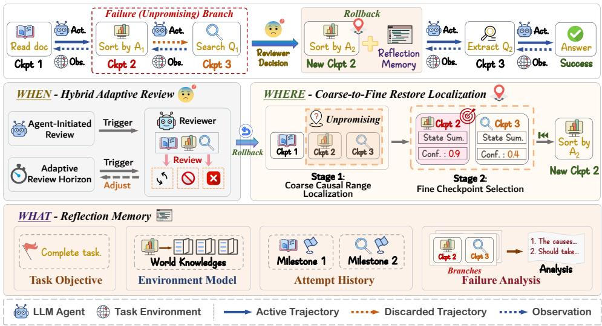
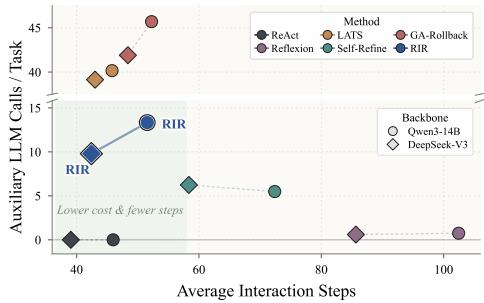
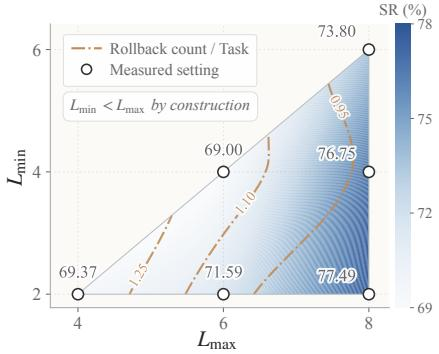
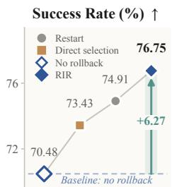
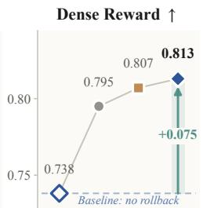
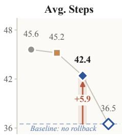
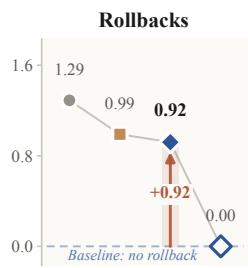

# ROLLBACK THE WORLD, KEEP THE REFLECTION: ROLLBACK-INDUCED REFLECTION FOR LONG-HORIZON LLM AGENTS

Yi Yu1, Liuyi Yao2,†, Yaliang Li2, Enshu Wang1, and Libing Wu1,†

1School of Cyber Science and Engineering, Wuhan University 2Alibaba Group

{yui1212,wanges17,wu}@whu.edu.cn

{yly287738,yaliang.li}@alibaba-inc.com

†Corresponding authors

## ABSTRACT

Large language model (LLM) agents increasingly tackle long-horizon tasks through multi-step environment interaction, yet a single erroneous action can alter subsequent states and observations, causing errors to compound over time. Existing methods either correct the context without repairing altered environment states or restore earlier states while discarding useful experience, making it difficult to both eliminate failure conditions and avoid repeating past mistakes. We argue that reliable recovery should instead be treated as a rollback-boundary control problem that jointly determines when to intervene, where to resume, and what information should survive recovery. Based on this view, we propose Rollback-Induced Reflection (RIR), a unified recovery framework that restores execution to a selected prior state while carrying forward reusable knowledge distilled from the abandoned trajectory to guide subsequent decisions. We further characterize recovery through a unified operator over rollback depth and retained memory, providing a general view of state restoration and knowledge retention. Experiments on three long-horizon benchmarks demonstrate that RIR consistently improves task performance across multiple LLM backbones, with structured reflection memory preserving useful experience and selective rollback enabling efficient recovery.

## 1 INTRODUCTION

Large language model (LLM) agents can solve complex long-horizon tasks through reasoning, tool use, and environment interaction (Wei et al., 2022; Yao et al., 2022; Park et al., 2023). Yet such tasks are highly sensitive to erroneous actions: a single misstep can alter subsequent states and observations, causing later decisions to rely on corrupted context. Errors therefore compound over time and can drive the agent progressively away from a valid solution trajectory (Hao et al., 2026).

Existing remedies intervene at two levels. Information-level methods append corrective feedback to guide future decisions (Madaan et al., 2023; Shinn et al., 2023; Zhao et al., 2024; Kim et al., 2025), but cannot undo environmental changes already caused by an erroneous action, and contaminated observations remaining in context may contradict the corrective advice itself. State-level methods instead restore execution to an earlier checkpoint and discard the erroneous suffix (Zhou et al., 2023; Li et al., 2025; Zhang et al., 2026c; Hao et al., 2026), but state restoration alone does not specify what information from that suffix should survive. Retain too little and the agent may repeat the same failure; overgeneralize a local failure and viable alternatives may be incorrectly ruled out.

A reliable rollback mechanism must therefore answer three coupled questions. First, when to roll back: is the current branch still productive exploration, or has it begun to propagate errors? Intervening too early curtails valid exploration; too late lets the consequences of an error compound. Second, where to roll back: which checkpoint eliminates the conditions that produced the failure while preserving the most valid progress? Going too far back sacrifices completed work; not far enough leaves the underlying obstacle in place. Third, what to roll back: which claims in the dis carded suffix are invalidated along with the execution state, and which should survive as knowledge for the next attempt?

Together, these questions define a rollback boundary: when decides whether to draw it, where places it along the trajectory, and what controls which information crosses it. At this boundary, the system restores the environment and branch-local agent context to the selected checkpoint and removes the subsequent suffix from the active trajectory. The suffix, however, need not be discarded wholesale. State claims invalidated by restoration are removed, while reusable observations and lessons are distilled into reflective knowledge for the next attempt. Rollback thus becomes both a state transition and an opportunity to reconstruct the decision context: rollback the world, keep the reflection.

Building on this view, we propose Rollback-Induced Reflection (RIR), a recovery-control framework for long-horizon LLM agents. For when, Hybrid Adaptive Review combines agent-initiated and adaptive scheduled reviews to assess whether the current branch should continue or recover. For where, Coarse-to-Fine Restore Localization first narrows the search to a causally relevant interval and then selects a checkpoint that balances failure removal against progress preservation. For what, Rollback-Consistent Reflection Memory separates branch-local state restored with the checkpoint from reusable knowledge that persists across rollback. The memory stores the stable task objective, reusable environment knowledge, past-attempt milestones, and conditioned failure analysis, while deliberately excluding the agent’s current state to avoid reintroducing stale claims after restoration.

Formally, we characterize RIR through a unified recovery operator parameterized by a rollback depth k and the memory M+ retained across the recovery boundary. We prove that common correction and rollback mechanisms are restricted cases of the unified operator, and that their induced recovery-policy classes are therefore contained within the RIR recovery space. This policy-class in clusion leads directly to an optimal-value monotonicity result, under which the best task-completion probability attainable by RIR is no lower than that of any such restricted mechanism. Empirically, RIR consistently outperforms representative baselines across three long-horizon benchmarks and two LLM backbones, improving average success rate by up to 6.57 percentage points while maintaining selective recovery under constrained interaction budgets. Our contributions are as follows:

• We recast trajectory contamination in long-horizon agent tasks as a problem of rollback boundary placement and identify three coupled questions that recovery must resolve: when to intervene, where to resume, and what information should survive the rollback.

• We propose Rollback-Induced Reflection (RIR), which combines adaptive review, coarse-to-fine restore localization, and rollback-consistent reflection to recover execution state without discarding reusable knowledge from failed branches.

• We formalize RIR through a unified recovery operator and establish the generality of its recovery space together with an optimal-value monotonicity result over the induced recoverypolicy classes. Experiments on long-horizon benchmarks further validate its effectiveness under constrained interaction budgets.

## 2 RELATED WORK

LLM agents increasingly use context-management mechanisms such as external memory, experience retrieval, and selective context construction to support long-horizon interaction (Yu et al., 2026; Chhikara et al., 2025; Jia et al., 2026; Lu et al., 2026). However, these methods generally do not address what happens once an erroneous action has already altered the environment: whether and how execution itself should be recovered (Zhang et al., 2026c; Hu et al., 2025; Wu et al., 2025). We therefore focus on rollback-oriented recovery and group prior work into two broad forms.

Information-level correction. Self-Refine (Madaan et al., 2023), AgenTracer (Zhang et al., 2026b), Reflexion (Shinn et al., 2023), and ReflAct (Kim et al., 2025) improve subsequent decisions through feedback or reflection, while ExpeL (Zhao et al., 2024), AutoGuide (Fu et al., 2024), and G-Memory (Zhang et al., 2026a) reuse experience across tasks. Although effective feedback can improve future behavior (Huang et al., 2024; Kamoi et al., 2024), information-level correction cannot undo environmental consequences already caused by erroneous actions, and retained branch-local state claims may become stale after restoration.

State-level rollback. GA-Rollback (Li et al., 2025) and WebRollback (Zhang et al., 2026c) explicitly restore earlier states in interactive trajectories, while SRC (Hao et al., 2026) and DART (Yang et al., 2026) study rollback for training-data construction and structured recoverability, respectively. The closest concurrent work, AgentRewind (Zhuang et al., 2026), checkpoints aligned agent and environment states and preserves textual memory across rewinds, but relies primarily on agent-initiated recovery and does not explicitly model the validity of retained information after restoration. These methods demonstrate the value of explicitly restoring execution state, but typically focus on failure detection or restore-point selection rather than the full recovery boundary.

In contrast, RIR treats the recovery boundary itself as an explicit control problem: it unifies state restoration and context reconstruction by jointly deciding when to recover, where to resume, and what information remains valid across the rollback boundary. Unlike methods that treat reflection or rollback in isolation, RIR restores execution while preserving reusable knowledge and excluding state claims invalidated by restoration.

## 3 PROBLEM FORMULATION

We consider a partially observable long-horizon interactive task $\mathcal { E } = ( \mathcal { S } , \mathcal { A } , \mathcal { O } , P , \Omega , R _ { q } )$ , where $s ,$ ${ \mathcal { A } } ,$ and $\mathcal { O }$ denote the state, action, and observation spaces. The environment evolves according to $\textstyle P ( s _ { t + 1 } | s _ { t } , a _ { t } )$ and emits observations through $\backslash \Omega ( o _ { t + 1 } | s _ { t + 1 } )$ . Given task objective $^ { g , }$ the outcome function $R _ { g } ( s _ { T } , y _ { T } )$ evaluates the terminal execution between the final state $s _ { T }$ and the ground truth state $y _ { T }$ , it is binary for verifiable tasks and may be real-valued when graded rewards are available.

At step $t ,$ the base agent follows an LLM policy $a _ { t } \sim \pi _ { \theta } ( \cdot | g , h _ { t } , \mathcal { M } )$ , where $\mathcal { M }$ is the persistent Reflection Memory and $h _ { t } = \left( o _ { 0 } , a _ { 0 } , \ldots , a _ { t - 1 } , o _ { t } \right)$ is the interaction history of the current branch. The key distinction is that $h _ { t }$ is checkpointed with execution, whereas $\mathcal { \bar { M } }$ is maintained outside checkpoints and may carry knowledge across recovery attempts. The action space consists of final responses, ordinary task tools, and a recovery-control tool: ${ \mathcal { A } } = { \mathcal { A } } _ { \mathrm { { r e s p } } } \cup { \mathcal { A } } _ { \mathrm { { t o o l } } } , { \mathcal { A } } _ { \mathrm { { t o o l } } } = { \mathcal { A } } _ { \mathrm { { t a s k } } } \cup$ {rollback}. Actions in $\mathcal { A } _ { \mathrm { t a s k } }$ interact with the environment, while $\mathcal { A } _ { \mathrm { r e s p } }$ terminates the episode with a final response. The rollback tool instead submits a recovery request and does not directly modify the environment.

Rollback. Before each executable action, the system stores a checkpoint $C _ { i } = ( s _ { i } , h _ { i } )$ , containing the environment state and branch-local context at step i. Let $. T _ { t } = \{ i \leq t \mid C _ { i }$ is restorable at step $t \}$ denote the set of admissible restore points. For a selected restore point $r \in \mathcal { T } _ { t }$ , we define the trajectory discarded by recovery as the abandoned suffix: $\tau _ { r : t } = ( a _ { r } , o _ { r + 1 } , \ldots , a _ { t - 1 } , o _ { t } )$

A rollback first extracts reusable knowledge from $\tau _ { r : t }$ to update the Reflection Memory, and then restores the environment and branch-local context to $( s _ { r } , h _ { r } )$ . Execution subsequently resumes from the restored checkpoint under the updated memory. We define $k = t - r$ as the rollback depth. We allow the limiting case $k = 0$ , corresponding to context correction without state restoration.

Objective. RIR leaves the parameters $\theta$ of the base agent unchanged and instead introduces a testtime recovery control policy Π. Given an agent-call budget $B _ { \mathrm { a g e n t } }$ and a rollback budget $B _ { \mathrm { r b } }$ , RIR seeks to maximize task success under bounded interaction:

$$
\operatorname* { m a x } _ { \Pi } \mathbb { E } _ { \pi _ { \theta } , \Pi , \varepsilon } [ R _ { g } ( s _ { T } , y _ { T } ) ] \quad \mathrm { s . t . } \quad N _ { \mathrm { a g e n t } } \leq B _ { \mathrm { a g e n t } } , N _ { \mathrm { r b } } \leq B _ { \mathrm { r b } } .\tag{1}
$$

## 4 ROLLBACK-INDUCED REFLECTION FRAMEWORK

## 4.1 OVERVIEW

As shown in Figure 1, RIR organizes recovery around three coupled decisions: When decides whether the current branch should continue, Where selects the checkpoint to resume from, and What determines which information from the abandoned suffix should survive the rollback. Algorithm 1 summarizes the complete execution loop.

During execution, RIR stores checkpoints along the current branch. A review is triggered either by an agent recovery request or by the adaptive review schedule. If the branch is judged promising, the system continues and adjusts the next review interval. Otherwise, RIR first localizes a restore checkpoint coarse-to-fine, then distills reflective knowledge from the suffix about to be abandoned.

  
Figure 1: Overview of the Rollback-Induced Reflection (RIR) framework.

Finally, the system restores the environment and the agent context while retaining the updated Reflection Memory to guide the new attempt. The procedure can be summarized as:

$$
\mathcal { M } ^ { + } = \phi ( \mathcal { M } , \tau _ { r : t } ) , \quad ( s _ { t } , h _ { t } , \mathcal { M } ) \xrightarrow [ ] { \mathrm { \ r o l l b a c k } } ~ ( s _ { r } , h _ { r } , \mathcal { M } ^ { + } ) , \quad r = t - k ,\tag{2}
$$

where $\phi$ denotes the information update instantiated in Section 4.4. Together with rollback depth k, the pair $( k , \mathcal { M } ^ { + } )$ defines the unified recovery operator analyzed in Section 4.5. Equation 2 makes RIR’s central asymmetry explicit: the execution world and branch-local context return to the past, while reflective knowledge acquired from interactions that have already occurred is carried forward.

## 4.2 WHEN: HYBRID ADAPTIVE REVIEW

Intervening too early truncates legitimate exploration, whereas intervening too late allows errors to compound. To strike a balance, RIR invokes a single reviewer through two complementary triggers: agent-initiated review, where the agent calls rollback as a soft recovery request, and adaptive scheduled review, where the controller inspects the trajectory after a dynamic review horizon. The former captures failures recognized by the agent itself, while the latter detects stagnation or errors that the agent may overlook. Their combination reduces reliance on either imperfect signal alone: agent requests enable timely intervention, while scheduled reviews provide an external safeguard against unnoticed failure. The rollback tool schema is provided in Appendix.

Let $t _ { \mathrm { r e v } }$ denote the most recent review step and $L _ { t }$ the current review horizon. A review is triggered when:

$$
\mathrm { R e v i e w E v e n t } _ { t } = \mathbb { I } [ a _ { t } = \mathrm { \ r o 1 1 b a c k } ] \vee \mathbb { I } [ t - t _ { \mathrm { r e v } } \geq L _ { t } ] .\tag{3}
$$

Importantly, calling rollback only requests review and does not directly restore the environment. This separation prevents the agent’s local uncertainty from being converted immediately into an irreversible recovery decision. When a review is triggered, the LLM-based reviewer evaluates the task objective $^ { g , }$ current trajectory $h _ { t } .$ , Reflection Memory M, and auxiliary execution signals $\xi _ { t } \mathrm { : }$

$$
( \delta _ { t } , \rho _ { t } , f _ { t } , \Delta E _ { t } ) = D _ { \psi } ( g , h _ { t } , \mathcal { M } , \xi _ { t } ) ,\tag{4}
$$

where $\delta _ { t } \in$ {CONTINUE, ROLLBACK} is the recovery verdict, $\rho _ { t } \in [ 0 , 1 ]$ controls the urgency of the next review, $f _ { t }$ is the failure diagnosis used when recovery is selected, and $\Delta E _ { t }$ contains newly established environment knowledge. Here, $\xi _ { t }$ summarizes lightweight execution signals such as repeated actions, no-effect steps, and state cycles. If the reviewer elects to continue, it uses $\rho _ { t }$ to set the next review horizon:

$$
L _ { t + 1 } = L _ { \operatorname* { m i n } } + \left( 1 - \rho _ { t } \right) ( L _ { \operatorname* { m a x } } - L _ { \operatorname* { m i n } } ) ,\tag{5}
$$

so higher urgency leads to earlier re-evaluation. This adaptive horizon concentrates review effort on uncertain trajectories while allowing stable branches longer uninterrupted exploration. More details and the instruction prompt of the reviewer are provided in Appendix.

## 4.3 WHERE: COARSE-TO-FINE RESTORE LOCALIZATION

Once recovery is approved, RIR must select a restore point from the stored checkpoints. Identifying the precise erroneous step in a single pass over the full trajectory is unreliable: failures in longhorizon tasks often arise from several interdependent decisions, while adjacent checkpoints may differ only marginally. We therefore adopt a two-stage coarse-to-fine localization procedure.

In the coarse causal range localization stage, an LLM-based selector uses the conditioned failure diagnosis $f _ { t }$ together with the executed trajectory to identify a historical interval likely to contain the decisive error or an unmet precondition:

$$
[ l , u ] = S _ { \mathrm { c o a r s e } } ( g , h _ { t } , \mathcal { M } , f _ { t } ) , \quad l , u \in \mathcal { T } _ { t } , l \leq u .\tag{6}
$$

Rather than prematurely committing to a single culprit action, this stage eliminates large portions of the trajectory that are unlikely to have contributed to the current failure and restricts the subsequent search to a compact causal range.

In the fine checkpoint selection stage, the selector compares compact state summaries $\sigma ( C _ { i } )$ within the localized interval and chooses a restore point that removes the current obstruction while preserving as much valid progress as possible:

$$
r = S _ { \mathrm { f i n e } } ( g , f _ { t } , \mathcal { M } , \{ ( i , \sigma ( C _ { i } ) ) ~ | ~ i \in \mathbb { Z } _ { t } , ~ l \le i \le u \} ) .\tag{7}
$$

Here $\sigma ( C _ { i } )$ denotes a compact description derived from the checkpointed state, such as completed sub-goals, current location, and key resources; it is computed from the checkpoint and is not maintained as an additional memory variable. Let $\mathrm { E s c a p e } ( \bar { \sigma ( C _ { i } ) } , f _ { t } )$ indicate whether restoring checkpoint $C _ { i }$ removes the failure condition characterized by $f _ { t }$ . RIR follows the selection principle:

$$
r ^ { \star } = \operatorname* { m a x } \Big \{ i \in [ l , u ] \cap \mathcal { I } _ { t } \ \Big | \ \mathrm { E s c a p e } ( \sigma ( C _ { i } ) , f _ { t } ) = 1 \Big \} .\tag{8}
$$

In other words, RIR first filters out checkpoints whose restored states still retain the obstruction identified in $f _ { t } ,$ , and then selects the latest checkpoint among the remaining candidates. The first criterion avoids immediately recreating the same failure condition after restoration, while the second preserves the longest valid prefix of the executed trajectory.

In practice, $S _ { \mathrm { f i n e } }$ approximates Equation 8 by jointly comparing the candidate state summaries against the conditioned failure diagnosis, and returns a restore point together with its justification and confidence score. The coarse stage identifies which region of the trajectory is causally relevant to the failure, whereas the fine stage determines which restorable state within that region provides the best point of re-entry. This coarse-to-fine decomposition avoids reducing restore localization to single-step error attribution and instead balances two competing objectives: removing the conditions that caused the failure and preserving as much correct progress as possible. The detailed selector prompts are provided in Appendix.

## 4.4 WHAT: ROLLBACK-CONSISTENT REFLECTION MEMORY

State restoration determines which trajectory suffix is removed, but not what information from that suffix should survive. Discarding it entirely loses reusable experience, whereas retaining it verbatim may preserve branch-local state claims that rollback has already invalidated. RIR therefore maintains a structured Reflection Memory M outside the checkpoint:

$$
\mathcal { M } = ( G , E , H , F ) .\tag{9}
$$

Task Objective (G). Stores a rollback-invariant representation of the final objective and provides stable task-level guidance to the reviewer and the selector.

Environment Model (E). Stores reusable knowledge about the environment across observed branches. We organize it into three semantic channels $E = E ^ { \mathrm { o b s } } \cup E ^ { \mathrm { e l i m } } \cup E ^ { \mathrm { a f f } }$ , corresponding respectively to observed facts, evidence-supported eliminations, and action or tool affordances. Entries are admitted only through constrained structured channels, preventing the narrative of an abandoned branch from re-entering the prompt disguised as current state. For observations whose truth may depend on an action subsequently undone by rollback, RIR preserves their provenance but marks them for re-verification rather than treating them as facts about the restored world.

Algorithm 1 Rollback-Induced Reflection (RIR)   
Require: Task objective g, base agent $\pi _ { \theta } ,$ rollback budget $B _ { \mathrm { r b } }$   
1: Initialize Reflection Memory ${ \bar { \mathcal { M } } } .$ , review horizon $L \gets L _ { 0 } ,$ , and $N _ { \mathrm { r b } } \gets 0$   
2: while task not terminated do   
3: Store checkpoint $\boldsymbol { C } _ { t } = ( s _ { t } , h _ { t } )$   
4: Sample $a _ { t } \sim \pi _ { \theta } ( \cdot \mid g , h _ { t } , \mathcal { M } )$   
5: if $a _ { t }$ is a final response then   
6: return $a _ { t }$   
7: if $a _ { t } = { \tt r o l i b a c k }$ or review horizon is reached then ▷ WHEN · review the current branch   
8: Reviewer evaluation $( \delta _ { t } , \rho _ { t } , f _ { t } , \Delta E _ { t } ) \gets \mathcal { D } _ { \psi } ( g , h _ { t } , \mathcal { M } , \xi _ { t } )$   
9: Merge $\Delta E _ { t }$ into the Environment Model   
10: if $\cdot \delta _ { t } = { \bf R } { \bf O } { \bf l }$ LLBACK and $N _ { \mathrm { r b } } < B _ { \mathrm { r b } }$ then   
11: $[ l , u ] \gets S _ { \mathrm { c o a r s e } } ( g , h _ { t } , \mathcal { M } , f _ { t } )$ ▷ WHERE · localize a causal restore range   
12: Select restore point $r  S _ { \mathrm { f i n e } } ( g , f _ { t } , \mathcal { M } , \{ ( i , \sigma ( C _ { i } ) ) \mid l \leq i \leq u \} )$   
13: Update $\mathcal { M } ^ { + } \dot { \gets } \phi ( \mathcal { M } , \tau _ { r : t } )$ ▷ WHAT · retain reusable knowledge   
14: Restore the environment and branch-local context to $C _ { r }$   
15: Reset the review horizon and increment $N _ { \mathrm { r b } }$   
16: continue   
17: else   
18: Adapt the next review horizon using $\rho _ { t }$   
19: if $a _ { t } \neq$ rollback then   
20: Execute $a _ { t }$ and update the trajectory

Attempt History (H). Records milestones and routes achieved in previous attempts as historical facts rather than claims about the current state. A later attempt can therefore reuse a discovered route without assuming that resources, locations, or progress obtained before rollback remain valid after restoration. The currently executing branch remains represented by $h _ { t } ;$ its verified milestones are incorporated into H only when that attempt terminates or is abandoned.

Failure Analysis (F). Summarizes why the most recently abandoned branch failed under the conditions that were in force at the time. Failure patterns that become supported across attempts are instead promoted to the Environment Model. Thus, F explains why the latest branch failed under its specific conditions, whereas E captures what is reusable about how the environment behaves.

Crucially, none of these fields represents the agent’s current branch-local state; that information is supplied by the active trajectory $h _ { t }$ and the restored checkpoint $( s _ { r } , h _ { r } )$ . This separation prevents stale state claims from crossing the rollback boundary.

At each review, the reviewer extracts newly established environment knowledge $\Delta E _ { t }$ . If rollback is executed, the reflection patcher additionally examines the abandoned suffix $\tau _ { r : t }$ to extract historical milestones $\Delta H _ { t }$ and construct a new failure analysis $F _ { \mathrm { n e w } }$ . The resulting update is:

$$
E ^ { + } = E \cup \Delta E _ { t } , \quad H ^ { + } = H \cup \Delta H _ { t } , \quad F ^ { + } = F _ { \mathrm { n e w } } , \quad \mathcal { M } ^ { + } = ( G , E ^ { + } , H ^ { + } , F ^ { + } ) .\tag{10}
$$

Thus, G remains fixed, E and H accumulate reusable knowledge and history, while F is replaced after each failed attempt. We denote this field-specific update by ϕ, which is applied in Equation 2 to produce the updated memory $\mathcal { M } ^ { + }$

The updated memory $\mathcal { M } ^ { + }$ replaces the previous Reflection Memory block in the system prompt rather than being appended to it. Because M is maintained outside checkpoints, restoring $C _ { r }$ reverts the environment and branch-local context while preserving the updated memory for the next attempt. This realizes the central asymmetry of RIR: rollback the world, keep the reflection.

## 4.5 THEORETICAL ANALYSIS

RIR recovery is governed by two quantities: a rollback depth k, and the updated memory $\mathcal { M } ^ { + }$ carried across the recovery boundary. When decides whether recovery is invoked, Where selects k, and What selects $\mathcal { M } ^ { + }$

Suppose recovery is triggered at step t, with restore point $r = t - k \in \mathcal { T } _ { t }$ . Let $\mathbb { M } ( \mathcal { M } , \tau _ { r : t } )$ denote the set of memory configurations reachable by updating M with the abandoned suffix $\tau _ { r : t } ,$ ranging

from M itself to the full update $\phi ( \mathcal { M } , \tau _ { r : t } )$ defined in Equation 10. The RIR recovery operator is:

$$
\mathcal { R } _ { k , M ^ { + } } : ( s _ { t } , h _ { t } , \mathcal { M } ) \mapsto ( s _ { r } , h _ { r } , \mathcal { M } ^ { + } ) , \quad k \in \mathcal { K } _ { t } , \ \mathcal { M } ^ { + } \in \mathbb { M } ( \mathcal { M } , \tau _ { r : t } ) ,\tag{11}
$$

recovering Equation 2 once r and $\mathcal { M } ^ { + }$ are instantiated by the selector and ϕ. At every recovery event, RIR may choose $( k , \mathcal { M } ^ { + } )$ freely from the full space $\boldsymbol { \mathcal { K } } _ { t } \times \mathbb { M } ( \mathcal { M } , \boldsymbol { \tau _ { r : t } } )$

Proposition 1 (Recovery-Space Generality). Consider a self-correction or rollback mechanism $j$ whose retained memory is also drawn from $\mathbb { M } ( \mathcal { M } , \tau _ { r : t } )$ . This puts $j$ and RIR on the same space for comparison. Mechanism $j$ differs from RIR in one respect: at every recovery event, it restricts its choice of $( k , \mathcal { M } ^ { + } )$ to a fixed proper subset $S _ { j } \subsetneq \mathcal { K } _ { t } \overset { \cdot } { \times } \mathbb { M } ( \mathcal { M } , \tau _ { r : t } )$ . Context-only correction, intermediate rollback, and restart-based recovery are common instances. Each fixes $k ,$ fixes $\mathcal { M } ^ { + }$ , or both. Because $S _ { j }$ is a proper subset of the space RIR can access, any policy realizable by mechanism $j$ is also realizable by RIR.

Let $\Pi _ { \mathrm { R I R } }$ denote the policy class induced by free access to $\boldsymbol { \mathscr { K } } _ { t } \times \mathbb { M } ( \mathcal { M } , \boldsymbol { \tau _ { r : t } } )$ at every recovery event, and $\Pi _ { j }$ the policy class induced by mechanism $j$ confined to $S _ { j }$ , under matched base agent and interaction budget. Proposition 1 gives $\Pi _ { j } \ \subseteq \ \Pi _ { \mathrm { R I R } }$ . For verifiable tasks, let $R _ { g } \in \{ \bar { 0 , 1 } \}$ indicate task success, $J ( \pi ) = \operatorname* { P r } _ { \pi } ( R _ { g } = 1 )$ the task-completion probability of recovery control policy $\pi ,$ and $V ^ { \star } ( \Pi ) = \operatorname* { s u p } _ { \pi \in \Pi } J ( \pi )$ the best value attainable within Π.

Corollary 1 (Optimal-Value Monotonicity). For every restricted mechanism $j ,$

$$
V ^ { \star } ( \Pi _ { \mathrm { R I R } } ) \geq V ^ { \star } ( \Pi _ { j } ) .\tag{12}
$$

Since $\Pi _ { j } \ \subseteq \ \Pi _ { \mathrm { R I R } }$ , a restricted mechanism can not attain a higher optimum than RIR’s recovery space allows, under matched agent and budget, and the same holds for expected return in place of success probability. Full statements and proofs are provided in Appendix.

## 5 EXPERIMENTS

## 5.1 EXPERIMENTAL SETUP

Datasets & metrics. We evaluate RIR on three long-horizon agent benchmarks: ALFWorld (Shridhar et al., 2020), ScienceWorld (Wang et al., 2022), and GAIA (Mialon et al., 2024), covering embodied interaction, scientific experimentation, and open-domain tool use, respectively. We report success rate (SR) on ALFWorld and ScienceWorld, and use an LLM-as-a-Judge evaluator on GAIA to assess semantic equivalence between predicted and reference answers. On ScienceWorld, we additionally report normalized dense reward (DR) to measure partial task progress. Further dataset and metric details are provided in Appendix.

Baselines. We compare against representative training-free test-time methods under the same LLM backbones and interaction budgets: ReAct (Yao et al., 2022) without explicit recovery; Self-Refine (Madaan et al., 2023) and Reflexion (Shinn et al., 2023) for information-level correction; LATS (Zhou et al., 2023) for search-based recovery; and GA-Rollback (Li et al., 2025) for explicit state rollback. We use Qwen3-14B (Yang et al., 2025) and DeepSeek-V3 (Liu et al., 2024) as backbone models and follow official implementations and recommended configurations whenever available. Further baseline details are provided in Appendix.

Implementation details. We implement the base agent with AgentScope (Gao et al., 2025). Within each backbone setting, the acting agent and all RIR components use the same LLM, so recovery gains cannot be attributed to a stronger auxiliary model. All methods share identical task interfaces and interaction budgets. For GAIA, we additionally restore the workspace state during rollback, including files created or modified by the agent, to keep the external environment consistent with the recovered trajectory. Separately, final-answer evaluation on GAIA uses an independent Qwen3.8- Max judge that does not participate in trajectory generation or recovery. Additional implementation details are provided in Appendix.

## 5.2 MAIN RESULTS

Overall performance. As shown in Table 1, RIR achieves the highest SR across all three benchmarks and both backbones. With Qwen3-14B, RIR reaches 47.00% average SR, outperforming the strongest baseline by 3.09 percentage points; with DeepSeek-V3, the margin increases to 6.57 points, yielding 69.43% average SR. RIR also obtains the highest ScienceWorld DR under both backbones. Notably, the advantage persists as the backbone becomes stronger, suggesting that explicit recovery remains useful rather than being subsumed by improved base-model capability. This empirical pattern is consistent with our recovery-space analysis: the broader recovery space provides additional useful choices in practice, although the theoretical result itself is a capacity statement rather than a performance guarantee.

Table 1: Main results across three benchmarks. SR denotes success rate and DR denotes normalized dense reward; Avg. SR is the unweighted mean across the three benchmarks. Bold and underlined denote the best and second-best results within each backbone, respectively.
<table><tr><td rowspan="2">Backbone</td><td rowspan="2">Method</td><td>ALFWorld</td><td colspan="2">ScienceWorld</td><td>GAIA</td><td rowspan="2">Avg. SR (%)</td></tr><tr><td>SR(%)↑</td><td>SR(%) ↑</td><td>DR↑</td><td>SR(%) ↑</td></tr><tr><td rowspan="6">Qwen3-14B</td><td>ReAct</td><td>67.16</td><td>31.37</td><td>0.412</td><td>19.08</td><td>39.20</td></tr><tr><td>Reflexion</td><td>74.63</td><td>35.38</td><td>0.426</td><td>21.71</td><td>43.91</td></tr><tr><td>LATS</td><td>67.91</td><td>29.15</td><td>0.407</td><td>15.79</td><td>37.62</td></tr><tr><td>Self-Refine</td><td>66.42</td><td>21.03</td><td>0.402</td><td>15.13</td><td>34.19</td></tr><tr><td>GA-Rollback</td><td>77.61</td><td>26.94</td><td>0.387</td><td>18.42</td><td>40.99</td></tr><tr><td>RIR (Ours)</td><td>81.30</td><td>36.67</td><td>0.448</td><td>23.03</td><td>47.00</td></tr><tr><td rowspan="6">DeepSeek-V3</td><td>ReAct</td><td>85.82</td><td>67.89</td><td>0.779</td><td>34.87</td><td>62.86</td></tr><tr><td>Reflexion</td><td>77.61</td><td>62.36</td><td>0.735</td><td>34.21</td><td>58.06</td></tr><tr><td>LATS</td><td>61.65</td><td>65.31</td><td>0.758</td><td>32.89</td><td>53.28</td></tr><tr><td>Self-Refine</td><td>80.60</td><td>51.66</td><td>0.535</td><td>34.87</td><td>55.71</td></tr><tr><td>GA-Rollback</td><td>62.69</td><td>53.51</td><td>0.639</td><td>26.97</td><td>47.72</td></tr><tr><td>RIR (Ours)</td><td>94.03</td><td>76.75</td><td>0.813</td><td>37.50</td><td>69.43</td></tr></table>

Efficiency. Figure 2 compares test-time overhead on ScienceWorld across both backbones. RIR remains in the low-overhead regime while requiring substantially fewer auxiliary LLM calls than the more expensive recovery baselines, and this pattern is consistent across Qwen3-14B and DeepSeek-V3. Recovery is also selective rather than frequent: Table 2 shows fewer than one executed rollback per task for RIR under both backbones, compared with approximately 2.9 for GA-Rollback. Thus, the performance gains are associated with targeted correction rather than repeated rollback and reexploration. Complete efficiency results are provided in Appendix.

To complement the aggregate results, we further inspect representative successful and unsuccessful recovery trajectories in Appendix. The cases illustrate both when rollback provides state-level benefits that reflection alone cannot recover and when incorrect diagnosis can cause recovery to revisit an ineffective branch.

## 5.3 ABLATION STUDIES

When to review. We compare agent-only, scheduled-only, and hybrid review under fixed or adaptive scheduling. As shown in Table 3, the full hybrid-adaptive RIR achieves the highest task performance (76.75% SR, 0.813 DR). Importantly, Hybrid (fixed) performs worse despite triggering more reviews and rollbacks and using more auxiliary LLM calls. Adaptive scheduling therefore appears to improve when the two

Figure 2: Efficiency trade-off on ScienceWorld across both backbones.  
  
Figure 3: Sensitivity to the adaptive review range $\left( { L _ { \operatorname* { m i n } } } , { L _ { \operatorname* { m a x } } } \right)$ on ScienceWorld with DeepSeek-V3. Color denotes SR and orange contours denote average rollback frequency.

Table 2: Average executed rollbacks per task on ScienceWorld. Methods without state-level rollback are omitted.
<table><tr><td>Method</td><td>Qwen3-14B</td><td>DeepSeek-V3</td></tr><tr><td>GA-Rollback</td><td>2.908</td><td>2.910</td></tr><tr><td>RIR</td><td>0.978</td><td>0.920</td></tr></table>

  
Figure 4: Where-to-recover ablation on ScienceWorld with DeepSeek-V3. No rollback retains reflection but disables state restoration; Restart restores to the initial checkpoint; Direct selection chooses a checkpoint in one stage; and RIR uses coarse-to-fine restore localization.

review signals intervene, rather than simply in-

creasing intervention frequency. This supports the design of review timing as an adaptive control decision rather than a fixed periodic mechanism.

Where to recover. We next vary restore-point localization while keeping the review policy and Reflection Memory unchanged. We compare No rollback (reflection only), Restart, Direct selection, and the full coarse-to-fine RIR selector. Figure 4 shows that No rollback produces the shortest trajectories but substantially lower task performance, indicating that information-level correction alone cannot replace state recovery. Among rollback-based variants, RIR achieves the highest SR (76.75%) and DR (0.813) while requiring the fewest steps (42.4) and rollbacks (0.92).

Rollback vs. Reflection. We further isolate the two core recovery components by comparing Reflection only, Rollback only, and the full RIR. Table 3 shows that neither component alone matches the complete method: RIR improves SR by 6.27 points over Reflection only and by 7.38 points over Rollback only. Reflection only is cheaper but cannot repair execution-state errors, whereas Rollback only incurs greater interaction and inference cost without preserving reusable knowledge across attempts. In terms of our recovery operator, these variants separately restrict ei-

Table 3: Ablations on ScienceWorld with DeepSeek-V3 as the backbone. Avg. Steps, Rev., RB, and Aux. report the per-task averages of interaction steps, reviewer invocations, executed rollbacks, and auxiliary LLM calls, respectively.
<table><tr><td>Variant SR↑ DR↑ Avg. Steps</td></tr><tr><td>Rev. RB</td></tr><tr><td>Review-trigger variants Agent-only 73.43 0.800 44.2 3.68 0.86 6.28</td></tr><tr><td>Sched.-only (fix.) 74.540.795 39.2 6.05 0.51</td></tr><tr><td>7.58 Sched.-only (adap.) 72.32 20.788 39.0 6.13 0.54 7.76</td></tr><tr><td>Hybrid (fixed) 69.000.761 46.6 7.79 1.17 11.32</td></tr><tr><td>Recovery-component variants</td></tr><tr><td>Reflection only 70.48 0.738 36.5 7.25 8.12</td></tr><tr><td>Rollback only 69.37 0.801 46.7 7.81 1.30 11.82 RIR 76.75 0.813 42.4 7.08 0.92 9.85</td></tr></table>

ther state restoration or the memory update, while RIR couples both dimensions. The resulting gap therefore empirically supports their complementarity.

Dynamic range setting. We finally vary the adaptive review range $\left( { L } _ { \operatorname* { m i n } } , { L } _ { \operatorname* { m a x } } \right)$ . Figure 3 shows that increasing Lmax generally improves performance, whereas an overly large $L _ { \mathrm { m i n } }$ is detrimental. The best setting, (2, 8), reaches 77.49% SR with only 0.77 rollbacks per task; the default (4, 8) remains close at 76.75%, indicating that performance is not overly sensitive to a single optimum. Overall, a wider range gives the reviewer more flexibility to intervene quickly on risky branches while allowing stable branches to proceed with fewer interruptions.

## 6 CONCLUSION

In this work, we propose Rollback-Induced Reflection (RIR), a unified recovery framework for long-horizon LLM agents. RIR couples adaptive review, restore localization, and persistent reflection to address a key limitation of existing recovery methods: correcting execution state without losing useful experience from failed trajectories. We further characterize recovery through a unified operator over rollback depth and updated reflection memory, showing that several common correction and rollback mechanisms arise as restricted cases of the RIR recovery space and establishing the corresponding optimal-value monotonicity result. Empirically, RIR improves task completion without relying on frequent intervention, while the ablation results show that review timing, restore localization, and reflection play complementary roles in successful recovery. More broadly, our results suggest that reliable long-horizon agents require recovery mechanisms that do more than undo mistakes: they must transform failed interaction into a better basis for subsequent decision-making.

## REFERENCES

Prateek Chhikara, Dev Khant, Saket Aryan, Taranjeet Singh, and Deshraj Yadav. Mem0: Building production-ready ai agents with scalable long-term memory. arXiv preprint arXiv:2504.19413, 2025.

Yao Fu, Dong-Ki Kim, Jaekyeom Kim, Sungryull Sohn, Lajanugen Logeswaran, Kyunghoon Bae, and Honglak Lee. Autoguide: Automated generation and selection of context-aware guidelines for large language model agents. In Advances in Neural Information Processing Systems, volume 37, pp. 119919–119948, 2024.

Dawei Gao, Zitao Li, Yuexiang Xie, Weirui Kuang, Liuyi Yao, Bingchen Qian, Zhijian Ma, Yue Cui, Haohao Luo, Shen Li, et al. Agentscope 1.0: A developer-centric framework for building agentic applications. arXiv preprint arXiv:2508.16279, 2025.

Longkun Hao, Hongyu Lin, Hao Li, Zhichao Yang, Haojie Hao, Dongshuo Huang, Haitao Yang, Hongyu Ge, Yanjun Wu, Zi Hao Yin, et al. Speculative rollback correction for quality-diverse web agent imitation. arXiv preprint arXiv:2606.12485, 2026.

Minda Hu, Tianqing Fang, Jianshu Zhang, Jun-Yu Ma, Zhisong Zhang, Jingyan Zhou, Hongming Zhang, Haitao Mi, Dong Yu, and Irwin King. Webcot: Enhancing web agent reasoning by reconstructing chain-of-thought in reflection, branching, and rollback. In Proceedings of the 2025 Conference on Empirical Methods in Natural Language Processing, pp. 5155–5173, 2025.

Jie Huang, Xinyun Chen, Swaroop Mishra, Huaixiu Steven Zheng, Adams Yu, Xinying Song, and Denny Zhou. Large language models cannot self-correct reasoning yet. In International Conference on Learning Representations, volume 2024, pp. 32808–32824, 2024.

Runsong Jia, Mengjia Wu, Ying Ding, Jie Lu, and Yi Zhang. Agent-enhanced heterogeneous graph rag for academic question answering. In Proceedings of the ACM Web Conference, pp. 8765– 8768, 2026.

Ryo Kamoi, Yusen Zhang, Nan Zhang, Jiawei Han, and Rui Zhang. When can llms actually correct their own mistakes? a critical survey of self-correction of llms. Transactions of the Association for Computational Linguistics, 12:1417–1440, 2024.

Jeonghye Kim, Sojeong Rhee, Minbeom Kim, Dohyung Kim, Sangmook Lee, Youngchul Sung, and Kyomin Jung. Reflact: World-grounded decision making in llm agents via goal-state reflection. In Proceedings of the 2025 Conference on Empirical Methods in Natural Language Processing, pp. 33421–33453, 2025.

Xingzuo Li, Kehai Chen, Yunfei Long, Xuefeng Bai, Yong Xu, and Min Zhang. Generator-assistant stepwise rollback framework for large language model agent. In Proceedings ofthe 2025 Conference on Empirical Methods in Natural Language Processing, pp. 17694–17711, 2025.

Aixin Liu, Bei Feng, Bing Xue, Bingxuan Wang, Bochao Wu, Chengda Lu, Chenggang Zhao, Chengqi Deng, Chenyu Zhang, Chong Ruan, et al. Deepseek-v3 technical report. arXiv preprint arXiv:2412.19437, 2024.

Miao Lu, Weiwei Sun, Weihua Du, Zhan Ling, Xuesong Yao, Kang Liu, and Jiecao Chen. Beyond the context window: Scaling agentic rl via end-to-end optimized context compression. In Proceedings of the 64th Annual Meeting of the Association for Computational Linguistics, pp. 21074–21125, 2026.

Aman Madaan, Niket Tandon, Prakhar Gupta, Skyler Hallinan, Luyu Gao, Sarah Wiegreffe, Uri Alon, Nouha Dziri, Shrimai Prabhumoye, Yiming Yang, et al. Self-refine: Iterative refinement with self-feedback. In Advances in Neural Information Processing Systems, volume 36, pp. 46534–46594, 2023.

Gregoire Mialon, Cl´ ementine Fourrier, Thomas Wolf, Yann LeCun, and Thomas Scialom. Gaia: a´ benchmark for general ai assistants. In International Conference on Learning Representations, volume 2024, pp. 9025–9049, 2024.

Joon Sung Park, Joseph O’Brien, Carrie Jun Cai, Meredith Ringel Morris, Percy Liang, and Michael S Bernstein. Generative agents: Interactive simulacra of human behavior. In Proceedings of the 36th Annual ACM Symposium on User Interface Software and Technology, pp. 1–22, 2023.

Noah Shinn, Federico Cassano, Ashwin Gopinath, Karthik Narasimhan, and Shunyu Yao. Reflexion: Language agents with verbal reinforcement learning. In Advances in Neural Information Processing Systems, volume 36, pp. 8634–8652, 2023.

Mohit Shridhar, Xingdi Yuan, Marc-Alexandre Cotˆ e, Yonatan Bisk, Adam Trischler, and Matthew´ Hausknecht. Alfworld: Aligning text and embodied environments for interactive learning. arXiv preprint arXiv:2010.03768, 2020.

Ruoyao Wang, Peter Jansen, Marc-Alexandre Cotˆ e, and Prithviraj Ammanabrolu. Scienceworld:´ Is your agent smarter than a 5th grader? In Proceedings of the 2022 Conference on Empirical Methods in Natural Language Processing, pp. 11279–11298, 2022.

Jason Wei, Xuezhi Wang, Dale Schuurmans, Maarten Bosma, Fei Xia, Ed Chi, Quoc V Le, Denny Zhou, et al. Chain-of-thought prompting elicits reasoning in large language models. In Advances in Neural Information Processing Systems, volume 35, pp. 24824–24837, 2022.

Qinzhuo Wu, Pengzhi Gao, Wei Liu, and Jian Luan. Backtrackagent: Enhancing gui agent with error detection and backtracking mechanism. In Proceedings of the 2025 Conference on Empirical Methods in Natural Language Processing, pp. 4250–4272, 2025.

An Yang, Anfeng Li, Baosong Yang, Beichen Zhang, Binyuan Hui, Bo Zheng, Bowen Yu, Chang Gao, Chengen Huang, Chenxu Lv, et al. Qwen3 technical report. arXiv preprint arXiv:2505.09388, 2025.

Ke Yang, Panpan Li, Zonghan Wu, Kejin Xu, Huaxi Huang, and Xiaoshui Huang. Dart: Semantic recoverability for structured tool agents. arXiv preprint arXiv:2605.23311, 2026.

Shunyu Yao, Jeffrey Zhao, Dian Yu, Nan Du, Izhak Shafran, Karthik Narasimhan, and Yuan Cao. React: Synergizing reasoning and acting in language models. arXiv preprint arXiv:2210.03629, 2022.

Yi Yu, Liuyi Yao, Yuexiang Xie, Qingquan Tan, Jiaqi Feng, Yaliang Li, and Libing Wu. Agentic memory: Learning unified long-term and short-term memory management for large language model agents. In Proceedings of the 64th Annual Meeting of the Association for Computational Linguistics, pp. 21457–21483, 2026.

Guibin Zhang, Muxin Fu, Kun Wang, Frank Wan, Miao Yu, and Shuicheng Yan. G-memory: Tracing hierarchical memory for multi-agent systems. In Advances in Neural Information Processing Systems, volume 38, pp. 12988–13018, 2026a.

Guibin Zhang, Junhao Wang, Junjie Chen, Wangchunshu Zhou, Kun Wang, and Shuicheng Yan. Agentracer: Who is inducing failure in the llm agentic systems? In International Conference on Learning Representations, volume 2026, pp. 11377–11399, 2026b.

Zhisong Zhang, Tianqing Fang, Kaixin Ma, Wenhao Yu, Hongming Zhang, Haitao Mi, and Dong Yu. Webrollback: Enhancing web agents with explicit rollback mechanisms. In Proceedings of the 19th Conference of the European Chapter of the Association for Computational Linguistics, pp. 187–197, 2026c.

Andrew Zhao, Daniel Huang, Quentin Xu, Matthieu Lin, Yong-Jin Liu, and Gao Huang. Expel: Llm agents are experiential learners. In Proceedings of the AAAI Conference on Artificial Intelligence, volume 38, pp. 19632–19642, 2024.

Andy Zhou, Kai Yan, Michal Shlapentokh-Rothman, Haohan Wang, and Yu-Xiong Wang. Language agent tree search unifies reasoning acting and planning in language models. arXiv preprint arXiv:2310.04406, 2023.

Yu Zhuang, Kefei Chen, Yitong Duan, Shuxin Zheng, Jian Li, and Xu-Yao Zhang. Agentrewind: Recoverable execution for long-horizon LLM agents. arXiv preprint arXiv:2608.14380, 2026.