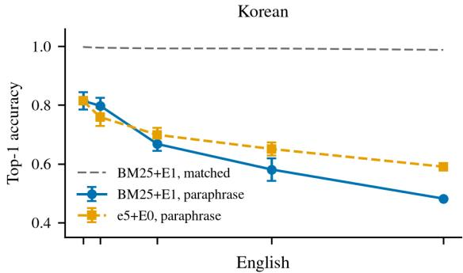
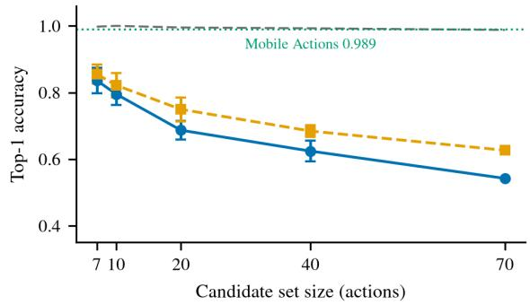
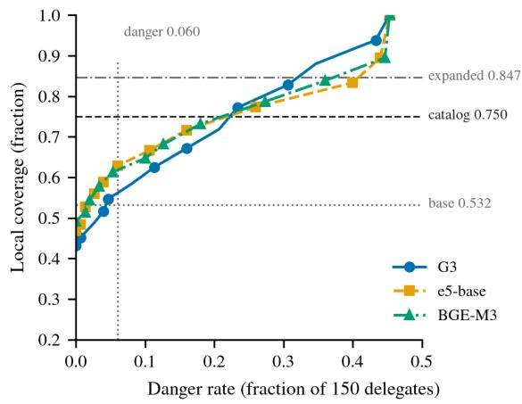
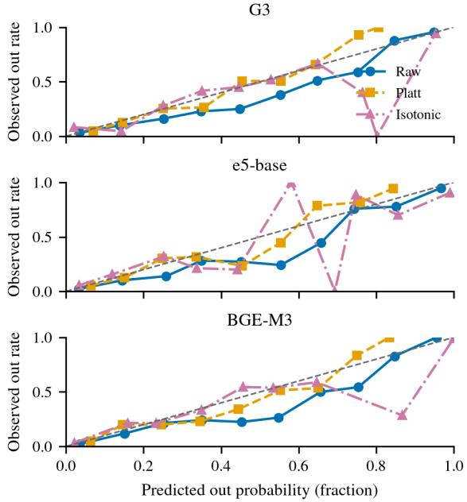
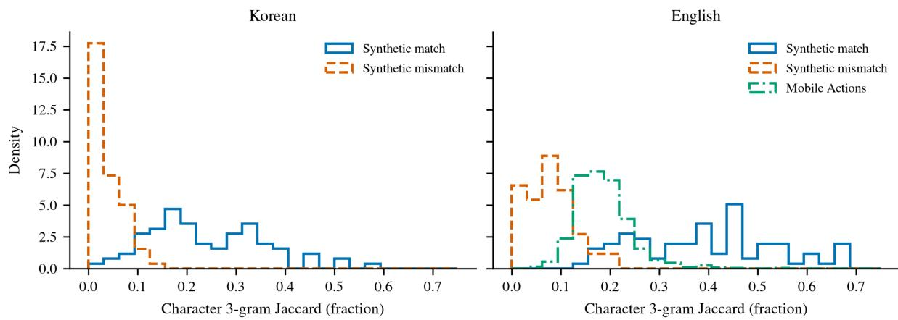

# Selection Is Retrieval, Abstention Is Not: On-Device Tool Routing over 70 Korean-English Actions

Janghoon Lee

Redrob

janghoon@redrob.io

ORCID 0009-0002-8108-5407

## Abstract

An AI assistant that calls tools makes two decisions on every request: which tool to invoke, and whether any available tool applies. In the usual design a single language model makes both, by emitting a call or by declining to emit one. On a device that has to answer without a server, the language model is what makes that design expensive, dominating both the latency and the memory of the router. The common alternative is to remove the model completely and rank the catalog of local actions with a retriever instead.

That substitution is not symmetric across the two decisions. A retriever returns its highestscoring candidate for every input and cannot signal that the catalog holds no valid action. Our earlier study found that constraining a decoder to a tool grammar repairs malformed output without improving the choice. What the substitution costs in each decision has not been measured.

We evaluate the two decisions separately over 600 Korean and English requests and a catalog of 70 local actions. The router may also ask for a missing slot, reply, or delegate. Half the incatalog requests reuse catalog vocabulary and half paraphrase it, separating lexical overlap from the action requested.

Character 3-gram BM25 selects 162 of 164 lexically matched requests and 85 of 166 paraphrases. Restricting the candidate set to seven raises the paraphrase figure to a mean of 0.825 over five trials. No classifier over its score features separates in-catalog from out-of-catalog above 0.697 area under the curve, where the frozen encoder multilingual-e5-base reaches 0.806. Using that encoder for abstention alone keeps 376 of the requests local and misroutes 9 of the 150 needing delegation. Abstention, not selection, is where a neural component is required. A neural ranker improves every quality metric and is rejected on latency and memory rather than accuracy.

## 1 Introduction

An AI assistant that calls tools makes two decisions on every request: which tool to invoke, and whether any available tool applies. In the usual design a single language model makes both, by emitting a call or by declining to emit one. On a device that has to answer without a server, the language model is what makes that design expensive. The catalog index used here occupies 17 KB and returns a ranking in 0.140 ms (Section 4), against 1,111 ms for a 4-billion-parameter caller on a GPU (Section 7). The common alternative is therefore to remove the model completely and rank the catalog of local actions with a retriever instead. The router still produces one of four outcomes: a local action, a request for a missing slot, a conversational reply, or delegation to a server.

That substitution is not symmetric across the two decisions, and the asymmetry is what this paper measures. Selection asks which local action is nearest to the request. Abstention asks whether the catalog contains a valid action at all. A retriever answers the first by construction and cannot answer the second, because it returns a nearest item even when every item is wrong. Treating the two as a single multiclass problem conceals that asymmetry. We evaluate each decision separately and report what the non-neural substitute costs in each.

The first explanation to eliminate is malformed output, and it is not the cause. Our earlier study constrained the decoder to the tool grammar and found that it repaired output form while leaving accuracy among schema-compliant calls unchanged (Lee, 2026b). The remaining error lies outside formatting, and this paper locates it in the router itself, on a machine small enough that the router cannot be a large model.

Component-level scoring is by now the standard evaluation practice, and it is the practice this paper follows. Bhat et al. (2026) separate tool invocation, completion and outcome verification. FunctionChat-Bench distinguishes tool call, answer completion, slot question and relevance detection in Korean dialogs (Lee et al., 2024). P-C-G separates planning, calling and generation for Korean tool use, where 8B multi-chain call accuracy falls to 33.8% from 95.6% single-chain (Jeon et al., 2025). Two systems already split the two decisions this paper is about. TinyAgent turns tool retrieval into classification before generation (Erdogan et al., 2024), and a shipped 45M tool-calling model gives selection and abstention separate heads, one for retrieval and one for calibrated confidence (Ndubuaku et al., 2026). Both build the split into the architecture. Neither reports what is lost when a compact non-neural component takes one of the two roles, which is the measurement this paper makes over a fixed catalog. Our companion study of serverside model routing finds the same shape one layer up, where task type accounts for most of the routable gap and a static task-by-language table captures it without a learned router (Lee, 2026a).

The experiments establish four results.

1. Separating an in-catalog gate from nearest-item selection reduces delegate-to-skill errors from 134 to 12 of 150 (Section 3 and Table 1).

2. Lexical retrieval resolves selection under matched vocabulary, but BM25 score features do not resolve abstention (Sections 4 and 5).

3. A neural ranker resolves nine more requests than the retained pipeline on accuracy and eight more on completion, and is rejected at 14 times that pipeline’s CPU median and three times its memory. Encoder reranking recovers less of the shortlist advantage than native tool calling, and neither replaces the split architecture (Section 6).

4. Vocabulary match and active candidate count determine the measured ranker ordering, while two of four native-calling checkpoints do not deploy under the fixed protocol (Sections 7 and 8).

## 2 Setup

Action space. The action space separates 70 searchable local actions from three outcomes. The local actions contain 64 skills and six file tools. The three labels are chat, ask, and delegate. The search pool contains the 70 skills and file tools. The gate decides in versus out before a fixed rule separates chat from delegation. A local in decision invokes the selected action or asks for a required slot. We use abstention for this in-versus-out decision. Delegation is one possible final action after the router abstains.

Catalog text and execution contracts remain separate throughout the study. A retrieval document contains a name, description, and optional aliases in Korean and English. A contract contains typed slots, required flags, input and output types, and mutation status. We call the base document index E0 and the alias-expanded index E1. E1 changes only retrieval text. It never changes the callable contract. Appendix B lists the nine non-skill actions and Appendix C reports catalog length.

Utterances. The evaluation isolates vocabulary match from requested action. We authored 300 Korean and English pairs, for 600 requests total. The construction is deliberate and is not a sample of production traffic. Of 330 skill or file-tool utterances, 164 use lexical match and 166 use lexical mismatch. Match items use words close to the catalog document. Mismatch items preserve the intended action while changing the surface vocabulary. The remaining requests contain 60 ask, 60 chat, and 150 delegate labels. Ask is in-catalog because the local action is known and only a required slot is missing. The out set therefore contains 210 requests: 60 chat and 150 delegate. We call match items lexically matched and mismatch items paraphrases throughout.

Verification. Deterministic post-state checks define execution success. Gold action IDs are assigned in the authored ledger. We do not use an LLM judge. This choice avoids judge variance. Deterministic evaluators can still fail when their state predicates are brittle (Bhat et al., 2026). We inspect the contracts and post-state conditions rather than comparing free-form text.

Metrics. Four metrics, two enforced caps, and one preregistered coverage target expose both excessive delegation and unsupported execution. Accuracy is exact final-action accuracy. Completion counts an exact local completion and also a safe delegation for an executable local task. Local coverage is 1 − Pr(delegate). Danger rate is the fraction of the 150 gold-delegate utterances sent to any skill or file tool. We constrain danger to at most 9 of 150 and the ask rate to at most 120 of 600. The harness enforces those two caps and then maximizes coverage. The preregistered target of 0.628 was not enforced, and the retained pipeline sits one request below it (Limitations). These metrics prevent a router from improving apparent accuracy by delegating everything, or coverage through unsupported execution.

Cost axes. The preregistration named CPU latency, parameter bytes, and model count as comparison axes without fixing a limit on any of them, so we report all three for every pipeline and state explicitly where a quality gain is rejected on cost rather than on a metric. The routing decision has to complete inside one interactive local turn, which makes the cost axes binding in practice even though no number was written down in advance. Section 6 is where that trade becomes decisive.

Ceilings. The current catalog limits local coverage to 450 of 600 requests. All 150 gold-delegate requests must remain delegated. Zero over-delegation therefore gives

$$
C _ { \mathrm { c u r r e n t } } = 1 - { \frac { 1 5 0 } { 6 0 0 } } = 0 . 7 5 0 .
$$

We label 50 delegates as external, 50 as unknown local capabilities, and 50 as multistep. Eight multistep items contain only local steps and 42 require an external step. Adding unknown skills and a local planner leaves 50 + 42 = 92 blocked requests. The expanded ceiling is

$$
C _ { \mathrm { e x p a n d e d } } = 1 - { \frac { 9 2 } { 6 0 0 } } = 0 . 8 4 7 .
$$

The second ceiling depends on our delegate taxonomy.   
Gate and rank changes alone cannot reach it.

Confirmation model. The policy reserves confirmation for intermediate abstention scores. It executes below $t _ { \mathrm { l o w } } ,$ delegates or chats above $t _ { \mathrm { h i g h } }$ , and asks between them. It presents the first candidate and, after rejection, at most one alternative. A simulated user approves the gold skill or tool and rejects every other candidate. We sweep approval fidelity $u \in \{ 1 . 0 , 0 . 9 , 0 . 8 \}$ with fixed seed 0. The product comparison uses u = 1. Appendix E gives the complete rule set.

Table 1: The separate gate reduces unsupported local actions relative to both single-pool baselines. The ladder applies rules, BM25, and an encoder in sequence. All three columns score the routing decision without the confirmation band. The same gated architecture with the band at $u = 1$ is P1 in Appendix G, at 0.645 accuracy.
<table><tr><td>Metric</td><td>Standalone BM25</td><td>Single-pool ladder</td><td>Separate gate</td></tr><tr><td>Accuracy</td><td>0.367</td><td>0.508</td><td>0.592</td></tr><tr><td>Delegate rate</td><td>0.008</td><td>0.142</td><td>0.235</td></tr><tr><td>Delegate to skill</td><td>134/150</td><td>54/150</td><td>12/150</td></tr><tr><td>Mutating false pos.</td><td>269/600</td><td>184/600</td><td>43/600</td></tr></table>

Repeated conditions and hardware. Repeated conditions separate split variation from distractor variation. Five-fold out-of-fold gates split by skill. Candidateset ablations use five fixed distractor seeds and report their sample standard deviation. Full-catalog conditions are deterministic and have no rerun variance. Encoder scores come from multilingual-e5-base (Wang et al., 2024) and BGE-M3 (Chen et al., 2024). The lab host has one NVIDIA L4 and four vCPUs. Appendix A fixes software versions.

## 3 Selection and Abstention

A 73-way nearest-item router has no representation of absence. Standalone BM25 (Robertson and Zaragoza, 2009) returns one item for every utterance, including chat and requests that require services outside the catalog. It selected a skill for 134 of 150 gold-delegate requests and delegated only 5 of 600. The original single-pool ladder delegated 85 of 600 requests, below the gold rate of 150 of 600.

Separating a catalog gate changes this failure mode. Against standalone BM25 the gate reduces delegate-toskill errors from 134 of 150 to 12 of 150, and mutating false positives from 269 of 600 requests to 43 of 600. Against the single-pool ladder it raises delegation from 85 to 141 of 600, close to the gold 150, and end-to-end accuracy from 0.508 to 0.592. Table 1 keeps the two baselines in separate columns. The gate does not merely adjust a confidence threshold on the selected label. It predicts whether the selection problem is defined.

All three columns score the routing decision alone, without the confirmation band described in Section 2. Adding the band at u = 1 to the gated column gives the pipeline this paper retains, P1, at 0.645 accuracy in Appendix G. The 0.592 here and the 0.645 there are the same architecture measured without and with confirmation.

This distinction resembles terminal commitment in embodied agents. Execution and the decision to stop can diverge even when they share a trajectory (Chen et al., 2026). Here, retrieval and the decision to trust retrieval diverge before execution.

Table 2: Matched vocabulary nearly removes BM25 selection error, while the 50:50 mixture favors the encoders.
<table><tr><td>Ranker</td><td>Match</td><td>Mismatch</td><td>50:50 mix</td></tr><tr><td>BM25+E1</td><td>0.988</td><td>0.512</td><td>0.750</td></tr><tr><td>e5+E0</td><td>0.951</td><td>0.608</td><td>0.780</td></tr><tr><td>BGE+E1</td><td>0.957</td><td>0.729</td><td>0.843</td></tr></table>

## 4 Selection under Matched Vocabulary

Matched vocabulary. Character 3-gram BM25 over language-matched E1 documents reaches 0.988 top-1 on match utterances. Its serialized index is 17 KB and its CPU median latency is 0.140 ms. At the study’s 50:50 lexical mixture, standalone BM25 reaches 0.750, e5 reaches 0.780, and BGE reaches 0.843 (Table 2). The aggregate ordering hides where BM25 succeeds.

Alias controls. Alias content improves lexical retrieval rather than merely lengthening the catalog. The base index, E0, uses names, descriptions, and slot names. The alias-expanded index, E1, adds aliases authored from those fields without opening utterance text. E1 raises mismatch accuracy from 0.380 to 0.512. Two length controls bracket that gain, and they pad to different targets. Matching E1 exactly, by padding each E0 document with function words to that document’s E1 character 3-gram count, gives 0.349 at a mean of 102.5 3-grams. Padding E0 by a fraction of its own token count instead gives 0.361, 0.380, 0.373, and 0.367 at 0.25, 0.5, 1, and 2 times, where the last reaches a mean of 165.3 3-grams and so overshoots E1. Both controls stay near E0 on either side of E1’s length. Shuffling alias lists among catalog items gives 0.127. With BM25 length normalization disabled, b = 0, E1 retains a 0.151 gain. It reaches 0.512 versus 0.361, and its top-1 accuracy is unchanged at $b = 0 , 0 . 7 5$ , and 1, so the gain is not an artifact of length normalization. These are confirmatory controls for lexical content, not additional catalog searches.

Examples do not improve the alias-expanded index. The example-expanded index, E2, reaches 0.512 mismatch accuracy. Its length-matched filler control reaches 0.518 in the final recheck. We therefore reject E2 and keep E1. The catalog edit repairs lexical retrieval rather than the encoder.

The two encoders respond differently to aliases, and both differences are a few items. Aliases move BGE mismatch by three items, from 0.711 to 0.729, and its match by one item, from 0.963 to 0.957. On e5 the mismatch count is unchanged at 101 of 166 while match falls by two items, from 0.951 to 0.939. None of these differences is separated from zero at this sample size. We nonetheless report each ranker on the index that scores higher for it, e5 on E0 and BGE on E1, which is worth 0.006 at the study’s mixture in both cases, from 0.774 to 0.780 and from 0.837 to 0.843. That choice is mildly optimistic for the encoders, and the crossover we compute for BGE in Section 8 inherits it.

Candidate count. The advantage also depends on the active set. We construct candidate sets that always contain gold and sample the remaining tools uniformly. Over five distractor seeds, BM25 mismatch rises from 0.512 at 70 candidates to 0.825 ± 0.023 at seven. e5 rises from 0.608 to 0.835 ± 0.016. At seven and ten candidates the seed spread exceeds the gap between the two rankers, and the per-seed winner changes: BM25 leads on two of five seeds at seven candidates and on three of five at ten. From 20 candidates upward e5 leads on all five seeds. At ten candidates BM25 is not separated from e5 on either lexical slice. The encoder advantage appears clearly at 20, 40, and 70 candidates, not at ten or fewer. Table 3 and Figure 1 provide the full curve.

  
Figure 1: Candidate restriction helps both rankers on paraphrases but never reaches the Mobile Actions line, which instead sits inside the range of our own matched values, 0.988 to 1.000 in English. Section 8 reads the external number against the matched side of the split for that reason. The matched curve is drawn for BM25 only, since the external comparison concerns the lexical ranker. Error bars show one sample standard deviation over five distractor seeds.

## 5 Abstention from BM25 Scores

Strong matched-vocabulary selection does not produce a reliable out-of-catalog signal. On mismatch-in versus out, the six BM25 score features range from 0.480 to 0.610 AUC individually. Score per term reaches 0.480, normalized margin 0.542, and score over mean 0.550. Raw margin reaches 0.569, top-k entropy 0.587, and top score 0.610.

Combining BM25 score features still leaves the difficult subset unresolved. The combined score gate, G3, is a balanced logistic regression over seven features plus an intercept. Its eight-parameter coefficient payload occupies 454 bytes. Five-fold out-of-fold AUC is 0.831 overall and 0.959 on match-in versus out. It reaches only 0.697 on mismatch-in versus out. Table 4 shows the comparison.

The seventh feature deserves its own account, because alone it beats the combination. Query character 3-gram count fitted out of fold on its own reaches 0.741, above G3’s 0.697, and as an untransformed feature it reaches 0.743. G3 with the feature removed falls to 0.587. Query length therefore carries most of what G3 has, and adding the six score features to it costs outof-fold AUC rather than adding to it. We do not read 0.741 as a routing signal. Length separates our authored sets partly by construction, since mismatch items were written as paraphrases and out-of-catalog items as chat or multistep requests. The conclusion survives either reading: taken as an optimistic bound it still leaves every signal on this side of the comparison below the 0.806 encoder gate.

Frozen encoder similarities separate mismatch-in from out more effectively. e5 reaches 0.806 mismatch AUC and BGE reaches 0.803. The e5 ONNX int8 artifact uses 278 MB and takes 13.7 ms CPU median latency. The selected split pipeline, P1, therefore spends the neural model on abstention. It leaves selection to the 17 KB lexical index. This result does not show that every gate requires an encoder. It shows that the measured BM25 scores do not resolve this gate.

The gap that decides the architecture survives resampling, and the gap between the two encoders does not. On a cluster bootstrap over utterance identifiers with 2000 resamples, e5 exceeds G3 by 0.109 AUC with a 95% interval of [0.059, 0.159], and exceeds query length alone by 0.064 with interval [0.014, 0.117]; the displayed three-decimal values give 0.065 for that second difference. BGE exceeds G3 by 0.106 with interval [0.055, 0.153]. e5 and BGE differ by 0.003 with interval [−0.027, 0.032], so the two encoders are not separated on this slice. Adding query length to the six score features moves G3 by +0.110 with interval [0.073, 0.147], which confirms how much of G3 that one feature carries. The reverse direction, adding the six features to query length alone, costs 0.044. Resampling paired Korean and English items together instead of single utterances moves every bound by at most 0.007 and changes no conclusion about whether an interval spans zero. The reported architecture claim is therefore that both frozen encoders beat every BM25-side signal we measured, not that one encoder beats the other.

Table 3: Candidate restriction narrows the mismatch-selection difference. Values are mean top-1 accuracy and sample standard deviation over five distractor seeds. The full 70-document pool is deterministic.
<table><tr><td rowspan="2">k</td><td colspan="2">BM25 match</td><td colspan="2">BM25 mismatch</td><td colspan="2">e5 match</td><td colspan="2"> $^ { \mathrm { e 5 } }$  mismatch</td></tr><tr><td>Mean</td><td>SD</td><td>Mean</td><td>SD</td><td>Mean</td><td>SD</td><td>Mean</td><td>SD</td></tr><tr><td>7</td><td>0.998</td><td>0.003</td><td>0.825</td><td>0.023</td><td>0.995</td><td>0.005</td><td>0.835</td><td>0.016</td></tr><tr><td>10</td><td>0.998</td><td>0.003</td><td>0.796</td><td>0.029</td><td>0.989</td><td>0.007</td><td>0.790</td><td>0.026</td></tr><tr><td>20</td><td>0.994</td><td>0.000</td><td>0.677</td><td>0.017</td><td>0.979</td><td>0.005</td><td>0.724</td><td>0.016</td></tr><tr><td>40</td><td>0.993</td><td>0.005</td><td>0.602</td><td>0.029</td><td>0.960</td><td>0.005</td><td>0.667</td><td>0.020</td></tr><tr><td>70</td><td>0.988</td><td>0.000</td><td>0.512</td><td>0.000</td><td>0.951</td><td>0.000</td><td>0.608</td><td>0.000</td></tr></table>

Table 4: Encoder similarities separate paraphrases from out-of-catalog requests better than any lexical or querystatistic signal we measured. Every trained row is out of fold. The encoder rows are frozen similarities with no training on this task. The comparison uses $n _ { \mathrm { i n } } = 1 6 6$ and $n _ { \mathrm { o u t } } = 2 1 0$
<table><tr><td>Gate signal AUC</td></tr><tr><td>Six score features, individually 0.480–0.610</td></tr><tr><td>Query length alone 0.741</td></tr><tr><td>G3 without query length 0.587</td></tr><tr><td>G3, all seven features 0.697</td></tr><tr><td>BGE-M3 gate 0.803</td></tr><tr><td>e5-base gate 0.806</td></tr></table>

  
Figure 2: Both encoder gates hold more local coverage than the BM25-score gate throughout the danger budget. Reference lines mark the base rate and the two catalog ceilings.

That AUC ordering carries over to the operating points a product must choose from. Figure 2 shows that both encoder gates deliver more local coverage than the BM25-score gate at every danger rate within the 0.060 budget. The BM25-score gate passes both encoders only above a danger rate of 0.233, which is roughly four times the budget. The same axes carry both catalog ceilings, so the figure also shows that the best gate reaches 0.628 coverage inside the budget, well below the 0.750 current-catalog ceiling. Approaching either ceiling requires danger rates that the product rule excludes.

Calibration does not rescue the BM25-score gate, because it applies a monotone score transformation. Platt scaling lowers all-set expected calibration error from 0.101 to 0.041, but G3 mismatch AUC changes only from 0.697 to 0.696 at the product operating point. Isotonic calibration yields 0.685 there. More importantly, raw mismatch maximum calibration error is 0.922. A confirmation band requires probabilities whose intervals have stable empirical meaning. This error prevents a narrow BM25-score band from serving that role. Figure 3 shows the reliability curves.

  
Figure 3: Calibration moves predicted probabilities toward the diagonal but does not change ranking. The staircase in the isotonic curves is an overfitting artifact of the finite calibration folds.

## 6 Reranking and Neural Ranking

Reranking the shortlist. BM25 mismatch recall rises from 0.512 at rank 1 to 0.741 at rank 3, 0.819 at rank 5, and 0.922 at rank 20. A large fraction of gold items is present but misordered. This motivates a smaller second-stage problem. The first stage retrieves five with BM25 E1. The second stage scores only those five.

Table 5: Native tool calling recovers more of the BM25 shortlist advantage than either encoder reranker on mismatch requests.
<table><tr><td>k</td><td>Reranker</td><td>Top-1</td><td>Recall@k</td><td>Recovery</td></tr><tr><td>5</td><td>none</td><td>0.512</td><td>0.819</td><td>0.000</td></tr><tr><td>5</td><td>e5</td><td>0.602</td><td>0.819</td><td>0.294</td></tr><tr><td>5</td><td>BGE</td><td>0.699</td><td>0.819</td><td>0.608</td></tr><tr><td>5</td><td>Qwen3-4B</td><td>0.777</td><td>0.819</td><td>0.863</td></tr><tr><td>3</td><td>e5</td><td>0.608</td><td>0.741</td><td>0.421</td></tr><tr><td>3</td><td>BGE</td><td>0.669</td><td>0.741</td><td>0.684</td></tr></table>

The two encoders rerank on CPU. Qwen3-4B is a native tool caller on GPU, not a reranker, and is listed here because it consumes the same five-candidate shortlist.

Table 5 rejects a simple version of that proposal. e5 top-5 reranking reaches 0.602 mismatch, slightly below its 0.608 full 70-document selection. BGE reaches 0.699. Relative to the interval from BM25 top-1 0.512 to the top-5 ceiling 0.819, e5 recovers 29.4% and BGE recovers 60.8%. The existing Qwen3-4B top-5 run reaches 0.777 and recovers 86.3%.

The encoder’s errors are not limited to gold being displaced from first to positions two through five. When the gold item receives low semantic score, removing 65 other candidates does not increase that score relative to the remaining confounders. The e5 top-3 result equals full-pool e5 at 0.608. This supports the narrower interpretation. It does not prove that every encoder reranker has the same error.

The reranked system does not replace the selected split architecture. P5 combines BM25 top-5, e5 reranking, and the same e5 E0 gate. It reaches 0.642 accuracy, 0.763 completion, 0.615 coverage, and 0.060 danger. P1 reaches 0.645, 0.755, 0.627, and 0.060. A candidate displaces the retained pipeline only if it is at least as good on accuracy, coverage, and danger and strictly better on at least one, a rule recorded with the round-4 results rather than in the preregistration. We call it the adoption rule below. Completion is not one of its three metrics because it credits a safe delegation as well as a local completion, so it rises when a pipeline delegates more. P5 is the case in point. It completes five more requests than P1 while resolving two fewer exactly, 385 against 387, and it delegates seven more. It is lower on accuracy and on coverage, so it does not qualify and P1 stays selected.

Replacing the ranker. Neural ranking does improve routing quality, and the reason we do not adopt it is cost. This condition does not use a shortlist at all: P3 replaces the BM25 ranker with BGE over the full pool and keeps the e5 gate. It reaches 0.660 accuracy, 0.768 completion, and 0.628 coverage against P1’s 0.645, 0.755, and 0.627, at the same 0.060 danger and the same 0.198 ask rate. P3 therefore satisfies the adoption rule, and what follows rejects it on cost rather than on a metric. Counted in requests, P3 resolves nine more than P1 on accuracy and eight more on completion, and keeps one more request local, 377 of 600 against 376. It also delegates one request fewer, so neither margin comes from the delegation credit. The two larger margins are what the comparison rests on. Its CPU median is 197.3 ms against 13.9 ms, a factor of 14, and it needs 846.1 MB across two models rather than 278.3 MB across one. Adopting P3 would pay 14 times the latency and three times the memory for nine requests of accuracy, eight of completion, and one of coverage. We decline that trade and retain P1. Appendix G lists both pipelines with their cost columns.

Table 6: No alternative replaces P1. P5 is rejected on quality at equal cost; the BGE ranker and the native caller exceed P1 on quality and are rejected on measured cost. All four rows hold danger at 0.060.
<table><tr><td>System</td><td>Mism.</td><td>Cov.</td><td>Latency</td></tr><tr><td>P1, BM25 rank</td><td>0.512</td><td>0.627</td><td>13.9 CPU</td></tr><tr><td>P5, e5 rerank</td><td>0.602</td><td>0.615</td><td>13.9 CPU</td></tr><tr><td>P3, BGE rank</td><td>0.729</td><td>0.628</td><td>197.3 CPU</td></tr><tr><td>Qwen3-4B top-5</td><td>0.777</td><td>0.645</td><td>1,111 GPU</td></tr></table>

Mism. is mismatch top-1 accuracy and Cov. is local coverage. Latency is the median in milliseconds on the stated processor. All three CPU systems use the same e5 gate. They differ only in the ranker.

The small language model (SLM) adds eleven requests of coverage over P1 and eighteen over P5, at about 80 times the P1 CPU median. Table 6 keeps hardware labels because GPU and CPU latency are not interchangeable.

Prefix caching does not reverse this comparison. In the full-tool condition, 599 of 600 prompts reuse the exact tool prefix and vLLM reports 99.4% prefix cache hit rate. Under top-5, exact prefix reuse falls to 5.8% because candidate sets vary. Mean prompt tokens fall from 7,987 to 916, yet Qwen median latency improves only 41 ms, from 1,152 to 1,111 ms. On this GPU and runtime, the loss of prefix reuse offsets little of the token reduction.

## 7 Checkpoint Deployment

The native tool-call roster contains four checkpoints. Two produce 600 rows in both full and top-5 conditions. Two produce no routing rows under the fixed vLLM 0.27.1 protocol. Table 7 reports exclusions as deployment outcomes, not accuracy results.

Gemma 4 E4B-it fails before weight admission. vLLM reads a global head\_dim from a heterogeneous per-layer configuration and raises AmbiguousGlobalPerLayer AttributeError. Granite 4.0 H-Small requires a Python-style tool parser. vLLM 0.27.1 provides granite and granite4, but not granite\_pythonic. Its BF16 checkpoint also exceeds the L4’s 23,034 MiB, and we do not substitute a quantized checkpoint. Appendix F includes the captured errors and environment.

Table 7: Only two of four fixed checkpoints produce routing rows under the specified runtime and native tool-call protocol.
<table><tr><td>Checkpoint</td><td>Status</td><td>Measured condition or blocker</td></tr><tr><td>LFM2.5-2.6B</td><td>measured</td><td>full and top-5, 600 each</td></tr><tr><td>Qwen3-4B</td><td>measured</td><td>full and top-5, 600 each</td></tr><tr><td>Gemma 4 E4B-it</td><td>load failed</td><td>heterogeneous head_dim conversion</td></tr><tr><td>Granite 4.0 H-Small</td><td>excluded</td><td>required Pythonic parser absent</td></tr></table>

LFM2.5-2.6B completes both conditions. With tool\_choi ${ \mathsf { c e } } = " { \mathrm { r e q u i r e d } } "$ , its full-catalog notool-call rate is 14.3%, 86 of 600. Its top-5 rate is 9.8%, 59 of 600. This is a protocol outcome, not a judgment about other runtimes. Needle 2 separates the same two decisions in its architecture (Section 1). An independent C engine for it reports 90.8% tool-name accuracy on Mobile Actions against 98.1% for the official engine, and lists as a limitation that its own build “will not decline” because it skips the probe heads carrying those weights (Memov AI, 2026). What the reimplementation drops is the gate and not the ranker, which is the same asymmetry we measure: selection transfers to a compact substitute, abstention does not. Both are vendor and repository reports, not reruns on our catalog.

## 8 Ranker Choice

Vocabulary match and candidate count jointly determine ranker choice. Let $p$ be the match share. At 70 candidates, weighted selection is $p a _ { \mathrm { m a t c h } } + ( 1 - p ) a _ { \mathrm { m } }$ mismatch. BM25 exceeds e5 above $p = 0 . 7 2 5$ and BGE above $p \ = \ 0 . 8 7 7 .$ . These are not catalog-independent constants. Against $\mathrm { e } 5 ,$ , the measured crossover is 0.798 at seven candidates. At ten candidates the five-seed means do not cross inside [0, 1], so the two rankers are not separated at that size. The crossover is 0.763 at 20 candidates, 0.664 at 40, and 0.725 at 70 (Table 8).

Two properties of that column limit how far it can be read. The denominator is the mismatch gap itself, so where the gap is smaller than the seed standard deviation the value is numerically unstable. That holds at seven and ten candidates, where the gaps are 0.010 and 0.006 against standard deviations of 0.016 to 0.029. At seven candidates the denominator is 0.013, so recomputing that row from the three-decimal values printed in the table shifts it by about 0.03. The column is also not monotone in k: it falls from 0.763 at 20 candidates to 0.664 at 40 and then rises to 0.725 at 70. We therefore read the column as evidence that the crossover moves with candidate count, not as a calibrated function of it.

The external cross-check sits above our paraphrase slice, and comparing it only against that slice overstates the gap. Mobile Actions (Google, 2025) supplies English-only records with seven candidates each. BM25 tool-name top-1 is 0.989. That number cannot be compared fairly with a mixed Korean-English ablation. The language split leaves most of that difference unexplained. Synthetic English mismatch reaches only 0.836 at seven candidates. Korean reaches 0.814. English therefore does not explain the difference.

Table 8: The match share needed for BM25 to exceed e5 changes with candidate count. BM25 and e5 columns report mismatch accuracy. Crossovers use unrounded five-seed means, not the displayed values, and the fiveseed means do not cross at ten candidates.
<table><tr><td> $k$ </td><td>BM25</td><td> $^ { \mathrm { e 5 } }$ </td><td>Crossover  $p$ </td></tr><tr><td>7</td><td>0.825</td><td>0.835</td><td>0.798</td></tr><tr><td>10</td><td>0.796</td><td>0.790</td><td>none (means)</td></tr><tr><td>20</td><td>0.677</td><td>0.724</td><td>0.763</td></tr><tr><td>40</td><td>0.602</td><td>0.667</td><td>0.664</td></tr><tr><td>70</td><td>0.512</td><td>0.608</td><td>0.725</td></tr></table>

Mobile Actions describes its actions in words close to the commands that invoke them, which places it on the matched-vocabulary side of our split. Holding language fixed at seven candidates, our English matched slice reaches 0.998 and our English paraphrase slice 0.836. For BM25 at this candidate count the Korean matched value is identical to the English one, so the pooled matched figure in Table 3 introduces no language mixing at this comparison point. Mobile Actions sits inside that interval and near its matched end. The external set is consistent with our matched-vocabulary result rather than above it.

Character 3-gram Jaccard also changes by language. Synthetic English match has median 0.401 and interquartile range 0.261 to 0.491. English mismatch has median 0.079 and range 0.035 to 0.101. Mobile Actions has median 0.180 and range 0.148 to 0.212. Korean match and mismatch medians are 0.217 and 0.029. Figure 4 compares Mobile Actions only with the English panel.

The proxy and the accuracy disagree, which is itself the argument against a single-variable account. Mobile Actions has a lower median Jaccard than our matched English slice, 0.180 against 0.401, yet its accuracy sits at the matched level rather than the paraphrase level. Vocabulary overlap measured this way therefore underpredicts its score, so we cannot attribute 0.989 to overlap alone.

Neither candidate count nor language alone explains 0.989. The external set combines seven candidates, English commands, and descriptions close to those commands. These conditions overlap. We therefore do not attribute its score to one variable. The measured outcome depends on match share and active candidate count, with language-specific text statistics. Neither production match share nor production active-set size is observed in this study.

  
Figure 4: Mobile Actions requests share more character 3-grams with their catalog than synthetic mismatch requests do with theirs, but fewer than our matched English slice, even though their accuracy sits at the matched level. Jaccard is a vocabulary proxy, not a causal decomposition, and it underpredicts the Mobile Actions score.

## 9 Conclusion

Only one of the router’s two decisions is a retrieval problem. A character 3-gram index selects reliably when the request and the catalog share vocabulary, and restricting the active candidate set recovers most of what paraphrasing costs it. No feature derived from that index’s own scores yields a reliable in-catalog gate, and improving selection does not produce one. Closing the gate requires a frozen encoder, and abstention rather than ranking is therefore the measured justification for a neural component on the device.

The choice of ranker is a separate decision, and it resolved in the opposite direction. The encoder reranker is rejected on quality at equal cost, running at the same 13.9 ms median in the same 278.3 MB and one model. The BGE ranker and the native caller are rejected on cost while beating the retained pipeline on quality, at 14 and about 80 times that median. All three do recover part of the difference between top-1 accuracy and top-5 recall, 29.4% with e5 reranking, 60.8% with BGE reranking and 86.3% with the 4-billion-parameter native caller, and none of them enters the retained pipeline. Half the fixed checkpoint roster produces no routing rows at all.

The architecture is therefore determined by abstention and the ranker by a cost budget. A deployment with a larger latency and memory budget should prefer the neural ranker, a choice this study can inform but cannot make, since production lexical match share and active candidate count are unobserved here.

The next measurable questions are distributional. A production trace can estimate active-set size, lexical match share, and confirmation acceptance without changing catalog contracts. A hardware replication can test whether the latency ordering survives an 8 GB GPU. A multi-step extension can measure whether independent gate and execution errors compose geometrically or show the correlated decay reported in long-horizon agents (Khanal et al., 2026).

## Limitations

The 600 utterances are synthetic. We set the 50:50 match/mismatch mixture and 25% delegate rate. The 70- document catalog is also our choice. Candidate ablation measures sensitivity, but it samples distractors uniformly rather than recovering a production active set.

None of the three thresholds fixed in advance was a cost limit, so rejecting P3 at 197.3 ms rests on a budget we state after seeing the measurement rather than before. A reader with a larger latency and memory budget should read P3, not P1, as the better pipeline in Table A3. Its coverage advantage is one request out of 600, so the comparison rests on the nine-request accuracy margin instead. The preregistered coverage target has a related looseness. It was set at 0.628, the coverage of an e5 reference cell whose ask rate is 0.415 and which therefore violates the 0.200 ask cap the same preregistration imposes. Under that cap the comparable e5 baseline is 364 of 600 requests, and P1 clears it by twelve requests at 376. The preregistered target of 377 is one request above P1 and exactly P3’s count. Three different quantities in this paper round to 0.628: that preregistered target, P3’s pipeline coverage, and the best gate-sweep coverage inside the danger budget in Figure 2. The coincidence is numerical only.

Mobile Actions combines seven candidates, English, and descriptions close to commands. The cross-check cannot attribute its score to one factor. Languagespecific Jaccard plots reduce one comparability error but do not make the catalogs or task semantics identical.

Each ranker is reported on the catalog index that suits it, BM25 and BGE on E1 and e5 on E0. That is mildly optimistic for the encoders, by 0.006 at the study’s mixture for each of them, and the BGE crossover carries the same choice.

The user-response model is simulated. Approval fidelity 1.0, 0.9, and 0.8 is a sweep, not observed behavior. The 20% ask cap is a policy value. We do not measure patience. The 0.750 and 0.847 ceilings depend on our delegate taxonomy.

The preregistered signal-diversity hypothesis is rejected. Mean shared-minus-split MCC is +0.062 with bootstrap 95% interval [−0.013, +0.140]. P2 uses e5 for both ranking and gating. P3 uses BGE for ranking and e5 for gating. Ask-band top-1 follows the same order as coverage across P3, P1, and P2. The three ask-band accuracies are 0.421, 0.368, and 0.342. Their coverage values are 0.628, 0.627, and 0.607. We report association, not causation. The e5-only system also uses a narrower $t _ { \mathrm { h i g h } }$ . Its confirmation band contains 38 of 600 requests, compared with 57 of 600 for P1.

The fixed protocol does not measure two of four SLM checkpoints. The roster comparison is therefore incomplete. All latency measurements use one NVIDIA L4 and four vCPUs. We do not reproduce them on an 8 GB consumer GPU. Longer tool trajectories can be less reliable than independent per-step estimates predict (Khanal et al., 2026). Our single-decision experiment cannot estimate that decay.

The evaluation excludes argument extraction. We score tool-name routing and deterministic post-state completion. We cannot report strict exact tool-call accuracy against benchmarks that include argument values. FunctionChat-Bench’s dialog dimensions therefore remain related context, not a merged score (Lee et al., 2024).

## Ethics Statement

The 600 utterances were written by the author for this study. They contain no personal data, no real user traffic, and no content collected from a person. The catalog is a specification of local actions on a device and carries no user state. Neither the utterances nor the catalog is public at the time of writing. No human subjects took part. The confirmation experiment replaces a user with a rule that approves the gold action and rejects every other candidate, and the paper reports it as a simulation rather than as observed behavior.

The routing decision this paper studies is a safety decision as much as a quality one. A router that selects a local action when none applies executes something the user did not ask for, and 51 of the 70 searchable actions in this catalog change state on the device rather than only reading it. That is why the danger rate counts gold-delegate requests sent to any skill or file tool, why it is capped in advance rather than traded against coverage, and why every pipeline in this paper is reported at the same danger budget. A reader who adopts the retained pipeline inherits that cap rather than the accuracy number alone.

The two encoder checkpoints are used as released and neither is fine-tuned here, so nothing in this work redistributes a modified model. Appendix A records what each snapshot states about its own licence, including that the multilingual-e5-base snapshot we pulled carries neither a licence file nor a licence line in its model card.

## References

Vishvesh Bhat, Jay Vaghasiya, Muhammad Ahmed Mohsin, and Asad Aali. 2026. Benchmarking the benchmarks: A validity audit of tool-calling evaluation. Preprint, arXiv:2607.02577.

Jianlyu Chen, Shitao Xiao, Peitian Zhang, Kun Luo, Defu Lian, and Zheng Liu. 2024. M3- embedding: Multi-linguality, multi-functionality, multi-granularity text embeddings through selfknowledge distillation. In Findings of the Association for Computational Linguistics: ACL 2024, pages 2318–2335, Bangkok, Thailand. Association for Computational Linguistics.

Ying Chen, Lihuang Fang, Rui Jiang, Mingxu Wang, Zhifeng Gu, Lei Yi, and Jie Chen. 2026. Done, but not sure: Disentangling world completion from self-termination in embodied agents. Preprint, arXiv:2605.08747.

Lutfi Eren Erdogan, Nicholas Lee, Siddharth Jha, Sehoon Kim, Ryan Tabrizi, Suhong Moon, Coleman Hooper, Gopala Anumanchipalli, Kurt Keutzer, and Amir Gholami. 2024. TinyAgent: Function calling at the edge. Preprint, arXiv:2409.00608.

Google. 2025. Mobile actions: A dataset for on-device function calling. https://huggingface.co/ datasets/google/mobile-actions. Hugging Face dataset, CC-BY-4.0; uploaded 2025-12-18. Accessed 2026-08-28.

Changhyun Jeon, Jinhee Park, Jungwoo Choi, Keonwoo Kim, Jisu Kim, and Minji Hong. 2025. SLM-based agentic AI with P-C-G: Optimized for korean tool use. Preprint, arXiv:2509.19369.

Aaditya Khanal, Yangyang Tao, and Junxiu Zhou. 2026. Beyond pass@1: A reliability science framework for long-horizon LLM agents. Preprint, arXiv:2603.29231.

Janghoon Lee. 2026a. Most of the LLM routing gap is task type. Preprint, arXiv:2608.23023.

Janghoon Lee. 2026b. Repair, not improvement: Decomposing constrained decoding in tool-call abstention. Preprint, arXiv:2608.13959.

Shinbok Lee, Gaeun Seo, Daniel Lee, Byeongil Ko, Sunghee Jung, and Myeongcheol Shin. 2024. FunctionChat-Bench: Comprehensive evaluation of language models’ generative capabilities in korean tool-use dialogs. Preprint, arXiv:2411.14054.

Memov AI. 2026. MimiModel: A singlefile C inference engine for Needle 2 on the ESP32-S3. https://github.com/memovai/ mimimodel. GitHub repository at commit b1939e1, not an arXiv paper. Accessed 2026-08- 28.

Henry Ndubuaku, Karen Mosoyan, Jakub Mroz, Noah Cylich, Satyajit Kumar, Parkirat Sandhu, Roman Shemet, and Justin H. Lee. 2026. Needle 2: A 45M-parameter foundation tool-calling model for tiny devices. https://huggingface.co/ Cactus-Compute/needle2. Cactus Compute, Inc.; model card, not an arXiv paper. Author list from the card’s own citation block, matching the author list of arXiv:2607.18363 that the card points at. Accessed 2026-08-28.

Stephen E. Robertson and Hugo Zaragoza. 2009. The probabilistic relevance framework: BM25 and beyond. Foundations and Trends in Information Retrieval, 3(4):333–389.

Liang Wang, Nan Yang, Xiaolong Huang, Linjun Yang, Rangan Majumder, and Furu Wei. 2024. Multilingual E5 text embeddings: A technical report. Preprint, arXiv:2402.05672.

## A Environment

Table A1 lists the host, accelerator, and library versions behind every latency and deployment result in the paper. One host served all conditions, so no result mixes hardware. Its last two rows record what each encoder snapshot states about its own licence, read from the snapshot rather than from the model page, which is why one of them is blank rather than MIT.

Table A1: All latency and deployment results use the same fixed host.  
Item Value   
Host Linux, Python 3.12.3, 4 vCPU   
GPU NVIDIA L4, 23,034 MiB, driver   
595.91.07   
vLLM 0.27.1   
torch 2.13.0+cu130   
CUDA from torch 13.0   
transformers 5.15.1   
Encoder runtime ONNX Runtime CPU, int8 for e5   
BGE-M3 licence MIT, from the model card in the   
snapshot   
e5 licence no licence file and no card line in the   
snapshot

## B Nine Non-Skill Action Specifications

Table A2 gives the identifier, name, retrieval description, and required slots for the six file tools and the three meta actions. The 64 skills follow the same document and contract format and are not listed individually.

## C Catalog Statistics

The retained catalog index expands each document with authored aliases. E1 indexes 70 non-meta documents separately by language. Index text joins name, description, aliases, and slot names. Korean character length has mean 73.0, median 73, range 46 to 89, and interquartile range 67 to 80. English has mean 136.0, median 136, range 101 to 171, and interquartile range 123.8 to 148.8. E0 mean character 3-gram count is 55.1 and E1 is 102.5 over 70 documents times two languages. The E1-filler control matches 102.5 exactly.

## D Gate Features

The combined score gate uses seven signals from each ranked score list. For ranked scores $s _ { 1 } \geq s _ { 2 } \geq \cdots$ , G3 uses

1. top score $s _ { 1 } .$

2. margin $s _ { 1 } - s _ { 2 } ,$

3. normalized margin $( s _ { 1 } - s _ { 2 } ) / ( | s _ { 1 } | + \epsilon )$

4. entropy of the normalized top-k score distribution,

5. $s _ { 1 }$ divided by mean top-k score,

6. query character 3-gram count, and

7. $s _ { 1 }$ divided by query character 3-gram count.

The logistic model adds one intercept, for eight parameters total. Five-fold splits hold out skills, while meta examples split by paired utterance ID.

## E User-Response Model

The frozen simulation uses seed 0 and one top-2 retry. 1. The confirmation path presents top-1, then at most one top-2 candidate.

2. The correct button is yes exactly when the candidate equals gold and gold is a skill or file tool.

3. Chat, ask, and delegate gold labels require no.

4. The user presses the correct button with probability u and the opposite button otherwise, for $u \in \{ 1 . 0 , 0 . 9 , 0 . 8 \}$

5. A yes with missing required slots becomes meta\_ask. Otherwise it executes the candidate.

6. A final no becomes meta\_delegate.

7. Below $t _ { \mathrm { l o w } }$ , a missing slot also becomes meta\_ask without another model call.

## F Deployment Errors

Gemma 4 E4B-it. The captured terminal exception follows.

AmbiguousGlobalPerLayerAttributeError:   
’head\_dim’ is a per-layer attribute and   
may vary across layers. Access it via the   
individual layer configs instead (e.g.   
config.per\_layer\_config[i].head\_dim).

The stack reaches vLLM’s model architecture converter, calls get\_head\_size, and reads the global head\_dim. The load fails before weight admission.

Granite 4.0 H-Small. The runtime parser registry contains granite and granite4. It does not contain granite\_pythonic, which the checkpoint’s Python-style calls require. The XML-oriented granite4 parser is not a substitute. The BF16 checkpoint also exceeds 23,034 MiB. We do not run a quantized replacement.

## G Complete Condition Tables

The remaining pipeline label, P4, uses BGE for both ranking and gating. It reaches the highest completion in the table, 478 of 600 against P1’s 453, and it also delegates 26 more requests, 250 against 224. Of its 25 extra completions, 20 are delegated local tasks, which completion credits, and five are exact resolutions. Its coverage is 350 of 600, twenty-six requests below P1, so the adoption rule keeps P1, and its danger rate is 8 of 150 delegates rather than the 9 of 150 the other four hold. Table A3 reports all five pipelines at the product operating point, Table A4 splits the candidate ablation by language, and Table A5 lists both native tool-calling conditions.

Table A2: The six file tools and three meta actions complete the action space. The last column names each required slot and its type.
<table><tr><td>ID</td><td>Name</td><td>Description</td><td>Required slots</td></tr><tr><td>fs.list</td><td>list</td><td>List file and subdirectory names</td><td>path:dir</td></tr><tr><td>fs.read</td><td>read</td><td>Return file contents unchanged</td><td>path:file</td></tr><tr><td>fs.write</td><td>write</td><td>Create or overwrite a file</td><td>path:file, content:string</td></tr><tr><td>fs.edit</td><td>edit</td><td>Replace a specified text span</td><td>path:file, old:string, new:string</td></tr><tr><td>grep</td><td>grep</td><td>Find regex-matching lines across files</td><td>path:dir, pattern:string</td></tr><tr><td>table.query</td><td>table query</td><td>Run a SQL-like filter over a table</td><td>path:file, query:string</td></tr><tr><td>meta_chat</td><td>chat</td><td>Greeting, small talk, or opinion</td><td>none</td></tr><tr><td>meta_ask</td><td>ask</td><td>Clear task with a missing required value</td><td>missing:string</td></tr><tr><td>meta_delegate</td><td>delegate</td><td>External service or unsupported multistep task</td><td>none</td></tr></table>

Table A3: P3 exceeds P1 by nine requests on accuracy and eight on completion at the same danger and ask rates, and by a single request on coverage, 377 of 600 against 376. Section 6 rejects it on measured cost rather than on a metric. P4 leads the completion column by delegating 26 more requests, which completion credits. The text above decomposes that lead. Results use u = 1, ask at most 0.200, and danger at most 0.060.
<table><tr><td>ID</td><td>Accuracy</td><td>Completion</td><td>Coverage</td><td>Danger</td><td>Ask</td><td>CPU (ms)</td><td>MB</td><td>Models</td></tr><tr><td>P1</td><td>0.645</td><td>0.755</td><td>0.627</td><td>0.060</td><td>0.198</td><td>13.9</td><td>278.3</td><td>1</td></tr><tr><td>P2</td><td>0.637</td><td>0.767</td><td>0.607</td><td>0.060</td><td>0.172</td><td>13.7</td><td>278.3</td><td>1</td></tr><tr><td>P3</td><td>0.660</td><td>0.768</td><td>0.628</td><td>0.060</td><td>0.198</td><td>197.3</td><td>846.1</td><td>2</td></tr><tr><td>P4</td><td>0.653</td><td>0.797</td><td>0.583</td><td>0.053</td><td>0.185</td><td>183.6</td><td>567.8</td><td>1</td></tr><tr><td>P5</td><td>0.642</td><td>0.763</td><td>0.615</td><td>0.060</td><td>0.172</td><td>13.9</td><td>278.3</td><td>1</td></tr></table>

Table A4: Candidate restriction improves mismatch selection in both languages. Values are means and sample standard deviations over five seeds. Only the paraphrase slice is split by language. The pooled matched slice stays at or above 0.951 at every candidate count in Table 3.
<table><tr><td rowspan="3">k</td><td colspan="2">BM25 KO</td><td colspan="2">BM25 EN</td><td colspan="2">e5 KO</td><td colspan="2">e5 EN</td></tr><tr><td>Mean</td><td>SD</td><td>Mean</td><td>SD</td><td>Mean</td><td>SD</td><td>Mean</td><td>SD</td></tr><tr><td>7</td><td>0.814</td><td>0.029</td><td>0.836</td><td>0.038</td><td>0.814</td><td>0.011</td><td>0.855</td><td>0.028</td></tr><tr><td>10</td><td>0.798</td><td>0.027</td><td>0.795</td><td>0.033</td><td>0.759</td><td>0.031</td><td>0.822</td><td>0.037</td></tr><tr><td>20</td><td>0.667</td><td>0.023</td><td>0.687</td><td>0.028</td><td>0.699</td><td>0.024</td><td>0.749</td><td>0.036</td></tr><tr><td>40</td><td>0.581</td><td>0.038</td><td>0.624</td><td>0.031</td><td>0.651</td><td>0.023</td><td>0.684</td><td>0.018</td></tr><tr><td>70</td><td>0.482</td><td>0.000</td><td>0.542</td><td>0.000</td><td>0.590</td><td>0.000</td><td>0.627</td><td>0.000</td></tr></table>

Table A5: Top-5 retrieval improves LFM2.5 routing and reduces its no-call rate, while Qwen changes little. All and No call are over the 600 requests including meta labels; Match and Mismatch are over the 164 and 166 rankable requests, so the three accuracy columns do not form a weighted average.
<table><tr><td>Model</td><td>Tools</td><td>All</td><td>Match</td><td>Mismatch</td><td>No call</td><td>GPU (ms)</td></tr><tr><td>LFM2.5-2.6B</td><td>full</td><td>0.442</td><td>0.774</td><td>0.530</td><td>0.143</td><td>882</td></tr><tr><td>LFM2.5-2.6B</td><td>top-5</td><td>0.540</td><td>0.915</td><td>0.753</td><td>0.098</td><td>984</td></tr><tr><td>Qwen3-4B</td><td>full</td><td>0.673</td><td>0.976</td><td>0.801</td><td>0.000</td><td>1,152</td></tr><tr><td>Qwen3-4B</td><td>top-5</td><td>0.705</td><td>0.957</td><td>0.777</td><td>0.000</td><td>1,111</td></tr></table>