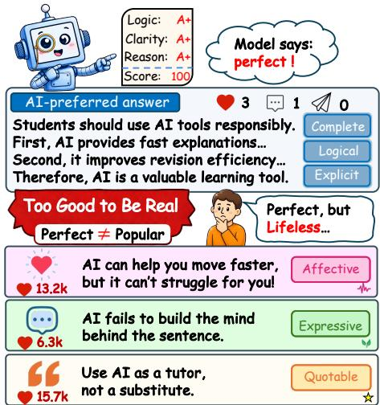
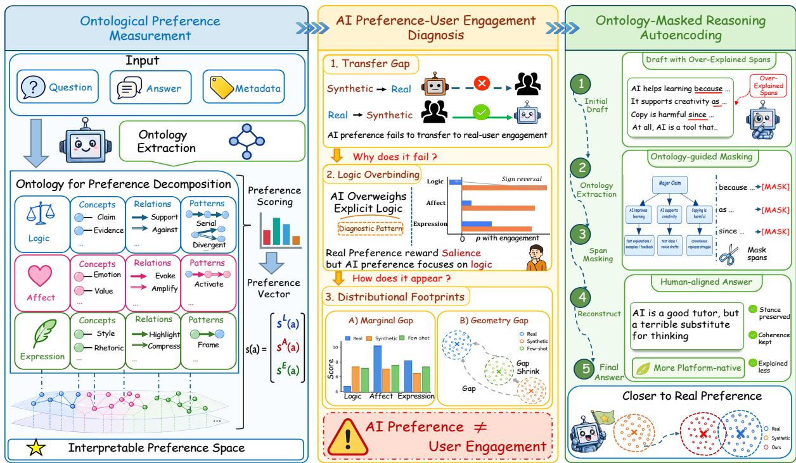
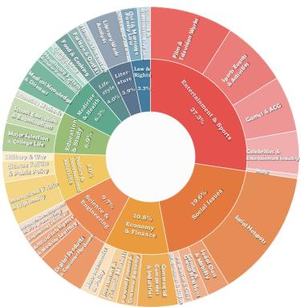
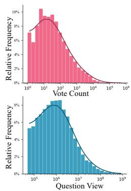
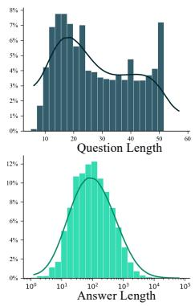
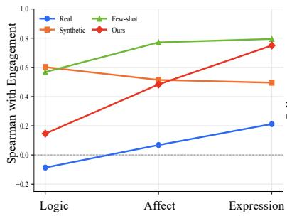
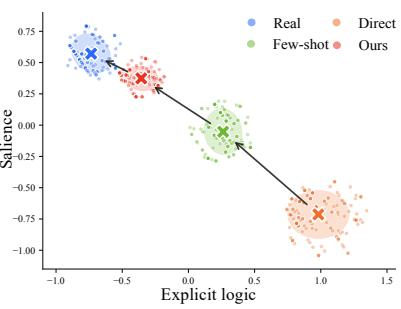
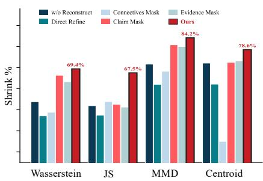
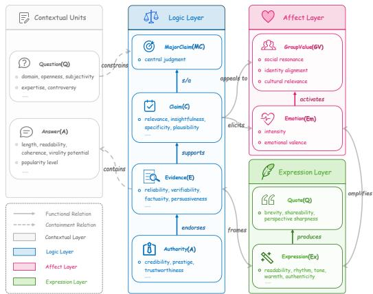
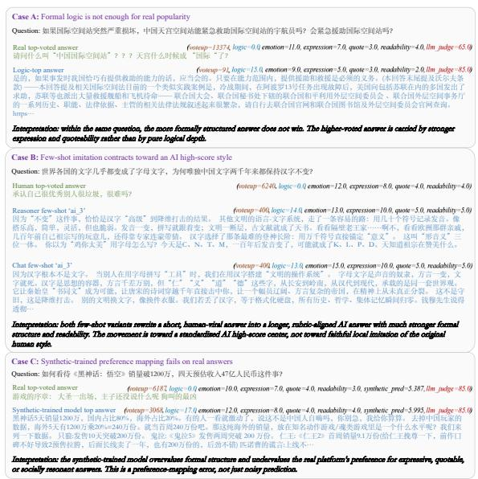

# Too Good to Be Real? Diagnosing and Reducing the Gap Between AI Preference and Real User Engagement

Xinglang Zhang, Yuanmeng Xiang, Yunyao Zhang, Zeliang Chen, Junqing Yu, Zikai Song\* Huazhong University of Science and Technology {normanspark, skyesong}@hust.edu.cn

## Abstract

Large language models are increasingly used to generate and evaluate online content, yet it remains unclear whether the qualities they associate with higher engagement match what real users respond to. We study this question using 1.17 million answers to 25,978 questions from Zhihu, Quora, and Reddit, comparing real platform answers and AI-generated answers across four within-question engagement levels. We introduce Ontological Preference Measurement, which represents answers along three dimensions: logic, affect, and expression. We find a systematic gap between AI preference and real user engagement: as target engagement increases, LLMs add more explicit logical structure, while real user engagement is more strongly associated with affective and expressive salience. We call this tendency logic overbinding. Based on this diagnosis, we propose Ontology-Masked Reasoning Autoencoding (OMRA), a controlled intervention that masks and reconstructs overexplained spans while preserving stance, factual content, and coherence. Across four LLM families, OMRA reduces the measured gap by an average of 54.4%. In human evaluation, OMRA wins 62.4% of pairwise preference judgments against matched real platform answers, even though the real answers are more often judged to be human-written.

## 1 Introduction

Large language models are increasingly used to generate, rank, and evaluate online content, and can be prompted to write answers targeting different levels of user engagement (Ouyang et al., 2022; Lambert et al., 2025). However, it remains unclear whether the changes they make reflect what real users actually respond to. When targeting higher engagement, LLMs tend to make their answers more complete, more structured, and more explicitly reasoned (Rodrigues et al., 2026). Real high-engagement answers, however, may follow different patterns. This raises two questions: What do LLMs change when asked to write an answer for higher user engagement? Do these changes match the patterns found in real high-engagement answers?

  
Figure 1: Illustrative example of the AI preference– user engagement gap. The AI-preferred answer is complete and explicitly reasoned but receives low engagement. Answers with stronger affective or expressive salience receive higher engagement in this example.

To answer these questions, we compare real platform answers and AI-generated answers across the same four engagement levels. We collect 1.17 million answers to 25,978 questions from Zhihu, Quora, and Reddit. Because raw vote counts are affected by exposure, platform traffic, and time, we rank answers only against other answers to the same question and map them to four withinquestion engagement levels. We then ask LLMs to generate an answer for each target engagement level. This setup allows us to compare how real answers vary with real user engagement and how LLMs modify their answers when targeting the same levels. We refer to the latter pattern as AI preference: the qualities that LLMs associate with higher engagement.

To compare these patterns, we introduce Ontological Preference Measurement, which represents each answer along three dimensions: logic, affect, and expression. Logic captures explicit claims and support; affect captures emotional and value-oriented appeal; and expression captures rhetorical salience and memorability. As target engagement increases, LLMs add more claims, evidence, causal explanations, and step-by-step justification, whereas real user engagement is more strongly associated with affective and expressive salience and only weakly negatively associated with explicit reasoning. We call this tendency logic overbinding: AI preference places disproportionate weight on explicit logical presentation relative to real user engagement. This pattern is consistent across transfer, marginal, and geometric comparisons.

Based on this diagnosis, we propose Ontology-Masked Reasoning Autoencoding (OMRA), a controlled intervention that masks and reconstructs over-explained spans while preserving stance, factual content, and coherence. Across four LLM families, OMRA reduces the measured AI preference–user engagement gap by an average of 54.4%, outperforming few-shot imitation, reasoning-augmented generation, and alternative masking strategies. Additional controls show that length contributes to the gap but does not explain OMRA’s improvement, while sentencemood changes have only minor effects; preservation checks indicate that stance, factual consistency, relevance, and usefulness are largely retained. In human evaluation, OMRA wins 62.4% of pairwise preference judgments against matched real platform answers, even though the real answers are more often judged to be human-written.

In summary, our contributions are:

• We introduce Ontological Preference Measurement, a structured framework for comparing AI preference and real user engagement across logic, affect, and expression, and identify logic overbinding using 1.17 million answers from three platforms.

• We propose Ontology-Masked Reasoning Autoencoding (OMRA), which reconstructs overexplained spans and reduces the measured gap by 54.4% across four LLM families, with supporting evidence from control experiments and human evaluation.

## 2 Related Work

A full discussion appears in Appendix A and we only highlight key directions here.

Ontology, discourse, and argument mining. Ontology-based modeling represents text through interpretable concepts and relations (Gruber, 1993; Noy et al., 2001), while argument mining identifies claims, evidence, and argumentative relations (Lippi and Torroni, 2016; Lawrence and Reed, 2019; Chakrabarty et al., 2019). Related work also studies how discourse structure, affect, framing, and rhetoric shape persuasion and user response (Feng and Hirst, 2011; Tan et al., 2016; Stab and Gurevych, 2017). We build on these directions by organizing online answers along logic, affect, and expression to compare AI preference with real user engagement in a shared interpretable space.

AI preference and LLM-as-a-judge. AI synthetic data and LLM-as-a-judge evaluation are widely used as scalable substitutes for human annotation in reward modeling and alignment (Christiano et al., 2017; Ouyang et al., 2022; Li et al., 2024; Lambert et al., 2025). Prior work documents biases involving verbosity, length, position, and self-preference (Hu et al., 2024; Ye et al., 2025a; Saito et al., 2023; Wang et al., 2025), but these biases are typically evaluated against benchmark labels or other models. We instead compare the qualities associated with AI preference against naturally occurring real user engagement.

Engagement modeling and preferencecontrolled generation. Prior work predicts online engagement using user, temporal, network, and content features (Deng et al., 2020; Rameez et al., 2022; Lei et al., 2025; Wang et al., 2026), while preference-aligned and controllable generation steer outputs toward desired rewards or attributes (Ouyang et al., 2022; Rafailov et al., 2023; Zhang et al., 2023; Song et al., 2026). These approaches do not directly diagnose which answer qualities AI preference associates with engagement or how those associations differ from real user engagement. OMRA addresses this gap by using the ontology to identify and reconstruct over-explained spans under stance-, factual-consistency-, and coherence-preserving constraints.

  
Figure 2: Overview of our ontology-guided diagnosis and correction framework. Left: Ontological Preference Measurement. Answers are represented along logic, affect, and expression in a shared interpretable space. Middle: AI preference–user engagement diagnosis. Transfer, marginal, and geometric comparisons reveal logic overbinding in AI preference. Right: Ontology-Masked Reasoning Autoencoding (OMRA). OMRA identifies, masks, and reconstructs over-explained spans, moving AI-generated answers closer to the real-answer distribution.

## 3 Methodology

We organize our methodology into three stages illustrated in Figure 2: ontological preference measurement (§3.1), AI preference–user engagement gap diagnosis (§3.2), and OMRA correction (§3.3).

## 3.1 Ontological Preference Measurement

To study real user engagement beyond raw vote counts, we build an ontology-based measurement framework that represents each answer through three complementary dimensions—logic, affect, and expression. This framework connects observable platform engagement signals with interpretable textual properties rather than treating engagement as a black-box scalar.

## Real User Engagement Dataset

We collect a large-scale dataset of question–answer pairs with platform engagement signals from three open online platforms: Zhihu, Quora, and Reddit. The corpus spans 2020–2026 and covers 10 categories and 35 subcategories, with each answer associated with naturally occurring engagement signals such as votes (Figure 3). Platform-specific filtering, deduplication, and engagement-quality criteria are detailed in Appendix B.

Since absolute vote counts are affected by question exposure, platform traffic, and temporal dynamics, we treat votes as platform engagement signals rather than direct measurements of underlying human preference. We therefore operate on withinquestion engagement. For each question q with answer set $A _ { q }$ , we assign each answer a a withinquestion engagement level

$$
\ell ( a ) = \phi _ { q } ( \mathrm { r a n k } _ { q } ( v ( a ) ) ) \in \{ 0 , 1 , 2 , 3 \} ,
$$

where $\phi _ { q }$ maps vote ranks within q to four ordinal levels, isolating relative user engagement under a shared question context.

We compare four answer regimes: Real, consisting of observed platform answers labeled by withinquestion engagement; Synthetic, consisting of AIgenerated answers conditioned on target engagement levels; Few-shot, additionally conditioned on a real reference answer from the same level; and OMRA-corrected, revised by our ontology-guided masking and reconstruction method (§3.3).

<table><tr><td>Statistics</td><td>Numbers</td></tr><tr><td>Total questions</td><td>25,978</td></tr><tr><td>Total answers</td><td>1,167,129</td></tr><tr><td>Domains (#)</td><td>10</td></tr><tr><td>Sub-domains (#)</td><td>35</td></tr><tr><td>Average question length</td><td>28</td></tr><tr><td>Average Voteups</td><td>374.9</td></tr><tr><td>Average answer comments</td><td>26.9</td></tr><tr><td>Average answer length</td><td>264.7</td></tr><tr><td>Average views</td><td>6,080,249.3</td></tr></table>





  
Figure 3: Overview of the platform engagement dataset. The left panel summarizes corpus-level statistics, including the number of questions, answers, domains, sub-domains, and engagement-related attributes. The middle sunburst chart shows the hierarchical topic distribution across primary domains and fine-grained sub-domains. The right panel visualizes the distributions of platform engagement signals and textual properties, including vote count, question title length, question view count, and answer length.

## Ontology for Preference Decomposition

We decompose each answer a into three preference layers,

$$
\mathcal { O } ( a ) = \{ \mathcal { O } ^ { L } ( a ) , \mathcal { O } ^ { A } ( a ) , \mathcal { O } ^ { E } ( a ) \} ,
$$

where $\mathcal { O } ^ { L }$ (logic) captures how explicitly the answer states and supports its stance, $\mathcal { O } ^ { A }$ (affect) captures emotional and value-oriented appeal, and $\mathcal { O } ^ { \hat { E } }$ (expression) captures readability, memorability, and rhetorical salience. Each layer is organized around concepts, relations, and patterns, allowing us to describe how answer qualities vary across engagement levels. Full ontology definitions, subdimensions, extraction templates, and examples are provided in Appendix C.

## Ontology Extraction and Preference Scoring

Given an answer, we use a fixed LLM-based extractor with a constrained ontology schema and output format to obtain $\mathcal O ( a )$ , and then convert it into a layer-wise preference vector

$$
\mathbf { s } ( a ) = [ \mathbf { s } ^ { L } ( a ) ; \mathbf { s } ^ { A } ( a ) ; \mathbf { s } ^ { E } ( a ) ] ,
$$

where each $\mathbf { s } ^ { * } ( a )$ aggregates the scores of its subdimensions. The original answer text remains the primary evidence for scoring, while the extracted ontology provides structured cues. The resulting ${ \bf s } ( a )$ serves as an interpretable measurement of answer qualities rather than a direct engagement score, and grounds the diagnostics and corrections in the rest of the paper. Schemas and prompts are provided in Appendix G.

## 3.2 AI Preference–User Engagement Gap Diagnosis

Using the ontological preference vector ${ \bf s } ( a )$ , we diagnose the AI preference–user engagement gap. We organize transfer, marginal, and geometric gaps as a diagnostic sequence: from cross-regime transfer failure, to the association pattern behind it, and finally to its distributional footprints. Let $r ~ \in ~ \{ R , S , F \}$ denote an answer regime (Real, Synthetic, or Few-shot) and $\mathcal { D } _ { r }$ its answer set.

Transfer Gap We first test whether an engagement rule learned in one regime generalizes to another. We train a predictor $f _ { r }$ that maps ${ \bf s } ( a )$ to within-question engagement level and evaluate it on regime $r ^ { \prime } { : }$

$$
T _ { r  r ^ { \prime } } = { \mathcal { M } } ( f _ { r } , { \mathcal { D } } _ { r ^ { \prime } } ) , \qquad r , r ^ { \prime } \in \{ R , S , F \} ,
$$

where M includes Spearman $\rho$ and Top-1 accuracy. The asymmetry between $T _ { R  S }$ and $T _ { S  R }$ distinguishes internal consistency from transfer: an AI preference rule may be internally coherent yet fail on real platform answers.

Logic Overbinding We define logic overbinding as the tendency of AI preference to place disproportionate weight on explicit logical presentation relative to real user engagement. For each $d \in \{ L , A , E \}$ , we compute the within-regime association

$$
\rho _ { d } ^ { r } = \mathrm { S p e a r m a n } \big ( \{ s _ { d } ( a ) \} _ { a \in \mathcal { D } _ { r } } , \{ \ell ( a ) \} _ { a \in \mathcal { D } _ { r } } \big ) ,
$$

where $L , A .$ , and $E$ denote logic, affect, and expression. Comparing $\rho _ { d } ^ { R }$ and $\bar { \rho _ { d } ^ { S } }$ tests whether AI preference and real user engagement track the same answer qualities, or whether AI preference more strongly favors explicit claim–evidence bridges, causal justifications, and enumerated explanations.

Marginal Gap We compare marginal score distributions. For $d ~ \in ~ \{ L , A , E \}$ , we compute 1- Wasserstein distance and Jensen–Shannon divergence:

$$
\begin{array} { r l } & { W _ { d } ^ { r , r ^ { \prime } } = W _ { 1 } ( \mathcal { P } _ { d } ^ { r } , \mathcal { P } _ { d } ^ { r ^ { \prime } } ) , } \\ & { ~ J _ { d } ^ { r , r ^ { \prime } } = \mathrm { J S } ( \mathcal { P } _ { d } ^ { r } , \mathcal { P } _ { d } ^ { r ^ { \prime } } ) , } \end{array}
$$

where $\mathcal { P } _ { d } ^ { r }$ is the empirical distribution of $\{ s _ { d } ( a ) \} _ { a \in \mathcal { D } _ { r } }$ . While $\rho _ { d } ^ { r }$ measures association with engagement, $W _ { d } ^ { r , r ^ { \prime } }$ and $J _ { d } ^ { r , r ^ { \prime } }$ measure distributional differences across answer regimes.

Geometric Gap Marginal similarity does not imply alignment in the joint preference space: two regimes may overlap on individual dimensions while combining them differently. We therefore compare regimes in $\mathbf { s } ( a ) \in \mathbb { R } ^ { | L | + | \mathbf { \bar { A } } | + | E | }$ using centroid distance and maximum mean discrepancy:

$$
\begin{array} { r l } & { C ^ { r , r ^ { \prime } } = \left. \mathbb { E } _ { \mathcal { D } _ { r } } [ \mathbf { s } ] - \mathbb { E } _ { \mathcal { D } _ { r ^ { \prime } } } [ \mathbf { s } ] \right. _ { 2 } , } \\ & { \mathrm { M M D } ^ { r , r ^ { \prime } } = \mathrm { M M D } \big ( \mathcal { D } _ { r } , \mathcal { D } _ { r ^ { \prime } } \big ) . } \end{array}
$$

Low-dimensional projections show how answer regimes occupy the shared preference space.

Together, these probes provide complementary views of the same AI preference–user engagement gap. Section 5 shows that their results consistently point to logic overbinding and overexplained spans, motivating a targeted intervention rather than separate optimization of each metric.

## 3.3 Ontology-Masked Reasoning Autoencoding

Based on this diagnosis, we propose Ontology-Masked Reasoning Autoencoding (OMRA) as both a controlled intervention and a method for reducing the measured AI preference–user engagement gap. OMRA targets over-explained spans that make reasoning unnecessarily explicit, repetitive, or formulaic.

Inspired by masked autoencoding (He et al., 2022), OMRA identifies and masks ontologyderived over-explained spans, then reconstructs the answer under stance-preserving, factualconsistency, coherence, and preference constraints. Given a Synthetic draft a and its ontology representation $\mathcal O ( a )$ from §3.1, OMRA produces a revised answer $a ^ { \prime }$ through the five stages in Algorithm 1.

Algorithm 1 The OMRA Algorithm   
Require: Synthetic draft a; ontology extractor $\varepsilon ;$ recon  
structor $\mathcal { R } ;$ reviser $\nu ;$ preference constraints c; over  
explanation type set T<sub>over</sub>   
1: // Stage 1: Ontology Extraction   
$2 \colon \mathcal { O } ( a )  \mathcal { E } ( a ) , \mathrm { w i t h } \ O ( a ) = \{ \mathcal { O } ^ { L } ( a ) , \mathcal { O } ^ { A } ( a ) , \mathcal { O } ^ { E } ( a ) \}$   
3: // Stage 2: Over-Explained Span Identification   
4: $\mathcal { S } ( a ) \bigg  \{ \mathrm { s p a n } ( u ) ^ { \cdot } \mid u \in \mathcal { O } ^ { L } ( a ) \cup \mathcal { O } ^ { E } ( a ) , \mathrm { t y p e } ( u ) \in$   
T<sub>over</sub>   
5: // Stage 3: Ontology-Guided Masking   
6: a˜ ← Mask(a, S(a))   
7: // Stage 4: Reconstruction with Preference Constraints   
8: $\hat { a } \gets \textbar { \mathcal { R } } ( \tilde { a } , \mathcal { O } ( a ) , c )$   
9: // Stage 5: Preference-Aware Revision   
10: $a ^ { \prime } \gets \mathcal { V } ( \hat { a } , \mathcal { O } ( a ) , c )$   
11: Output: revised answer $a ^ { \prime }$

Over-Explained Span Identification We define over-explained spans as surface spans in the final answer that make its reasoning unnecessarily explicit, repetitive, or formulaic. They include claim–evidence bridges, justification-heavy sentences, causal explanations, enumerated steps, and explicit transitions. These spans are not hidden reasoning traces. OMRA reuses the ontology extractor rather than training a separate span classifier: each unit $u \in \mathcal { O } ^ { L } ( a ) \cup \mathcal { O } ^ { E } ( a )$ is aligned with its source span, and units whose relation or pattern type belongs to $\tau _ { \mathrm { { o v e r } } }$ form $ { \boldsymbol { S } } (  { \boldsymbol { a } } )$

Ontology-Guided Masking OMRA replaces spans in $ { \boldsymbol { S } } ( a )$ with mask tokens while preserving the main stance and surrounding context.

Reconstruction with Preference Constraints The reconstructor R fills the masks under four constraints: (i) stance preservation, (ii) factual consistency with non-masked content, (iii) discourse coherence, and (iv) affective or expressive salience only when contextually supported. The goal is not to recover the original spans, but to express the same answer with less over-explanation.

Preference-Aware Revision A verification pass V checks whether aˆ still contains over-explanation associated with logic overbinding. If so, V applies a lightweight revision; otherwise, $\boldsymbol { a } ^ { \prime } = \boldsymbol { \hat { a } }$

## 4 Experiments

## 4.1 Experimental Setup

We evaluate on a controlled benchmark of 3,600 real platform answers sampled for matched withinquestion comparison. Each selected question provides one representative answer at each of the four within-question engagement levels (Appendix B.4). For each question–level pair, we construct three generated regimes: Direct (Synthetic), generated directly under the target engagement level; Few-shot, additionally conditioned on a levelmatched real reference; and OMRA-corrected, revised by Algorithm 1. We instantiate the pipeline with four LLM families—DeepSeek, Claude, GPT, and Llama—and compare against two reasoningaugmented baselines, Tree-of-Thought (ToT) (Yao et al., 2023) and Ripple-of-Thought (RoT) (Lei et al., 2025).

<table><tr><td rowspan="2">Base Model</td><td rowspan="2">Method</td><td colspan="2">Marginal Gap ↓</td><td colspan="2">Geometry Gap ↓</td><td colspan="2">Transfer to Real ↑</td><td rowspan="2">Avg. Shrink ↑</td></tr><tr><td>Wass.</td><td>JS</td><td>MMD</td><td>Cent.</td><td>ρ (∆)</td><td>Top-1</td></tr><tr><td rowspan="5">Q DeepSeek</td><td>Direct</td><td>1.479</td><td>0.154</td><td>0.240</td><td>1.969</td><td>-0.051</td><td>0.261</td><td></td></tr><tr><td>Few-shot</td><td>0.829 (43.9%↓)</td><td>0.085 (44.8%↓)</td><td>0.102 (57.5%↓)</td><td>0.971 (50.7%↓)</td><td>0.164 (+0.215)</td><td>0.316 (21.1%↑)</td><td>49.2%</td></tr><tr><td>ToT</td><td>1.245 (15.9%↓)</td><td>0.199 (↑29.0%)</td><td>0.152 (36.8%↓)</td><td>1.570 (20.3%↓)</td><td>0.136 (+0.187)</td><td>0.313 (19.9%↑)</td><td>11.0%</td></tr><tr><td>RoT</td><td>1.343 (9.2%↓)</td><td>0.210 (↑36.4%)</td><td>0.184 (23.1%↓)</td><td>1.800 (8.6%↓)</td><td>-0.030 (+0.021)</td><td>0.253 (↓3.1%)</td><td>1.1%</td></tr><tr><td>Ours</td><td>0.452 (69.4%↓)</td><td>0.050 (67.5%↓)</td><td>0.038 (84.2%↓)</td><td>0.422 (78.6%↓)</td><td>0.225 (+0.276)</td><td>0.358 (37.2%↑)</td><td>74.9%</td></tr><tr><td rowspan="5">米 Claude</td><td>Direct</td><td>1.296</td><td>0.157</td><td>0.252</td><td>1.782</td><td>-0.097</td><td>0.239</td><td></td></tr><tr><td>Few-shot</td><td>0.987 (23.8%↓)</td><td>0.135 (14.0%↓)</td><td>0.138 (45.2%↓)</td><td>1.197 (32.8%↓)</td><td>0.074 (+0.171)</td><td>0.284 (18.8%↑)</td><td>29.0%</td></tr><tr><td>ToT</td><td>1.427 (↑10.1%)</td><td>0.227 (↑44.5%)</td><td>0.176 (30.1%↓)</td><td>1.670 (6.3%↓)</td><td>-0.047 (+0.050)</td><td>0.269 (12.6%↑)</td><td>-4.6%</td></tr><tr><td>RoT</td><td>1.571 (↑21.2%)</td><td>0.237 (↑50.8%)</td><td>0.212 (16.0%↓)</td><td>1.854 (↑4.0%)</td><td>-0.023 (+0.074)</td><td>0.257 (7.5%↑)</td><td>-15.0%</td></tr><tr><td>Ours</td><td>0.807 (37.7%↓)</td><td>0.091 (42.0%↓)</td><td>0.108 (57.1%↓)</td><td>0.786 (55.9%↓)</td><td>0.193 (+0.290)</td><td>0.323 (35.1%↑)</td><td>48.2%</td></tr><tr><td rowspan="5">S GPT</td><td>Direct</td><td>1.738</td><td>0.197</td><td>0.277</td><td>2.338</td><td>-0.101</td><td>0.253</td><td></td></tr><tr><td>Few-shot</td><td>1.272 (26.8%↓)</td><td>0.162 (17.8%↓)</td><td>0.175 (36.8%↓)</td><td>1.698 (27.4%↓)</td><td>0.124 (+0.225)</td><td>0.285 (12.6%↑)</td><td>27.2%</td></tr><tr><td>ToT</td><td>1.493 (14.1%↓)</td><td>0.223 (↑13.4%)</td><td>0.210 (24.3%↓)</td><td>1.821 (22.1%↓)</td><td>0.088 (+0.189)</td><td>0.320 (26.5%↑)</td><td>11.8%</td></tr><tr><td>RoT</td><td>1.468 (15.5%↓)</td><td>0.172 (12.6%↓)</td><td>0.183 (34.1%↓)</td><td>1.607 (31.3%↓)</td><td>-0.100 (+0.001)</td><td>0.241 (↓4.7%)</td><td>23.4%</td></tr><tr><td>Ours</td><td>0.887 (49.0%↓)</td><td>0.154 (21.8%↓)</td><td>0.126 (54.5%↓)</td><td>0.828 (64.6%↓)</td><td>0.190 (+0.291)</td><td>0.327 (29.2%↑)</td><td>47.5%</td></tr><tr><td rowspan="5">8 Llama</td><td>Direct</td><td>1.395</td><td>0.243</td><td>0.434</td><td>2.657</td><td>-0.043</td><td>0.261</td><td></td></tr><tr><td>Few-shot</td><td>1.066 (23.6%↓)</td><td>0.142 (41.6%↓)</td><td>0.197 (54.6%↓)</td><td>1.815 (31.7%↓)</td><td>0.124 (+0.167)</td><td>0.303 (16.1%↑)</td><td>37.9%</td></tr><tr><td>ToT</td><td>1.746 (↑25.2%) 2.138 (↑53.2%)</td><td>0.289 (↑18.7%) 0.344 (↑41.4%)</td><td>0.362 (16.5%↓) 0.570 (↑31.3%)</td><td>2.809 (↑5.7%) 3.878 (↑45.9%)</td><td>0.032 (+0.075) -0.088 (-0.045)</td><td>0.235 (↓10.0%) 0.207 (↓20.7%)</td><td>-8.3%</td></tr><tr><td>RoT Ours</td><td>0.916 (34.3%↓)</td><td>0.133 (45.3%↓)</td><td>0.137 (68.4%↓)</td><td>1.588 (40.2%↓)</td><td>0.149 (+0.192)</td><td>0.313 (19.9%↑)</td><td>-43.0%</td></tr><tr><td></td><td></td><td></td><td></td><td></td><td></td><td></td><td>47.1%</td></tr><tr><td>Ours (Avg.)</td><td></td><td>0.766</td><td>0.107</td><td>0.102</td><td>0.906</td><td>0.189</td><td>0.330</td><td>54.4%</td></tr></table>

Table 1: Main Results Each cell is the distance between a method’s outputs and real platform answers. Avg. Shrink is the mean relative reduction over the four distributional metrics against Direct. Parenthesized values are relative changes over Direct (for ρ: absolute point gain), with green marking improvement and red marking degradation. The last row averages OMRA over the four base models.

We use DeepSeek-V3.2 as the fixed ontology extractor across all four model families. Since ontology scoring is automated, we verify its reliability against human annotators and alternative LLM judges on a randomly selected 100-question subset, obtaining strong agreement on relative answerquality rankings (Appendix C.6).

## 4.2 Evaluation Results

Ontology features capture signals associated with real user engagement better than dense embeddings and LLM judges. Before evaluating OMRA, we verify that the ontology vector s(a) carries engagement-relevant signals in real platform answers. Table 2 compares a lightweight predictor over s(a) with dense text embeddings and four

<table><tr><td>Method</td><td>Avg.ρ</td><td>Med. ρ</td><td>Top-1 Acc.</td><td>Pearson r</td></tr><tr><td>Random baseline</td><td>0.000</td><td>0.000</td><td>0.250</td><td>0.000</td></tr><tr><td>Text embedding</td><td>0.214</td><td>0.400</td><td>0.324</td><td>0.309</td></tr><tr><td colspan="5">LLM judge</td></tr><tr><td>DeepSeek</td><td>-0.080</td><td>-0.200</td><td>0.141</td><td>-0.050</td></tr><tr><td>ChatGPT</td><td>-0.127</td><td>-0.258</td><td>0.140</td><td>-0.075</td></tr><tr><td>Llama</td><td>-0.004</td><td>0.258</td><td>0.082</td><td>-0.014</td></tr><tr><td>Claude</td><td>0.182</td><td>0.258</td><td>0.164</td><td>0.121</td></tr><tr><td>Ontology features</td><td>0.359</td><td>0.400</td><td>0.435</td><td>0.465</td></tr></table>

Table 2: Validation of ontological preference measurement on real-user answers. All ranking metrics are computed within questions.

LLM-as-a-judge baselines on within-question ranking. Ontology features outperform all baselines, reaching Avg. ρ = 0.359 and Top-1 = 0.435, while three of four LLM judges fall below the denseembedding baseline. These results suggest that the ontology representation captures real user engagement signals that black-box LLM judges do not reliably recover.

OMRA reduces the AI preference–user engagement gap across all four LLM families. Table 1 compares OMRA with Direct, Few-shot, ToT, and RoT across marginal, geometric, and transfer metrics. OMRA reduces the measured gap by an average of 54.4% and is the only method that improves all three views on every base model. Few-shot is the strongest baseline but remains weaker on geometry and transfer, suggesting that reference imitation does not fully recover the patterns associated with real user engagement. ToT and RoT do not consistently reduce the gap across model families, suggesting that reasoning augmentation alone does not recover these patterns. OMRA performs consistently across all four model families, indicating that its improvement is not specific to a single generator.





  
Figure 4: Diagnosing and reducing the AI preference–user engagement gap. (a) Dimension-wise Spearman $\rho$ between ontology scores and within-question engagement levels across answer regimes. (b) Joint preference geometry in a diagnostic space of logic overbinding and affective–expressive salience. (c) Ablation over masking and revision variants in OMRA on DeepSeek.

Additional controls rule out simple alternative explanations. We conduct additional diagnostic experiments on DeepSeek (Appendix D.5). Length control improves both Direct and Few-shot generation, but does not account for OMRA’s gains. Platform-aware prompting provides modest improvements, while sentence-mood constraints have only minor effects. A separate preservation evaluation further shows that OMRA largely preserves stance, factual consistency, answer relevance, and usefulness.

## 4.3 Ablation Study

Joint span identification is more effective than surface-marker or single-layer masking. We ablate OMRA with five variants in Figure 4(c): w/o Reconstruct leaves masked spans empty; Direct Refine rewrites the answer without masking; Connectors Mask masks only surface discourse markers; and Claim Mask / Evidence Mask mask only one component type. Full OMRA performs best across all gap metrics. Direct Refine and Connectors Mask yield the weakest improvements, showing that generic rewriting or surface-marker deletion is insufficient. Claim Mask and Evidence

<table><tr><td>Training → Test Regime</td><td>Spearman ρ</td><td>Top-1</td></tr><tr><td>Synthetic → Synthetic</td><td>0.947</td><td>0.895</td></tr><tr><td>Real → Synthetic</td><td>0.759</td><td>0.800</td></tr><tr><td>Synthetic → Real</td><td>-0.073</td><td>0.254</td></tr></table>

Table 3: Cross-regime transfer of ontological preference predictors. A predictor is trained on the source regime and evaluated on the target regime; metrics are averaged over four base LLM families.

Mask achieve intermediate results, suggesting that over-explanation is better captured through joint spans involving claims, evidence, and their relations.

## 5 Analysis

## 5.1 AI Preference–User Engagement Gap

We analyze the AI preference–user engagement gap through the diagnostic sequence introduced in §3.2: cross-regime transfer, dimension-wise associations, and joint preference geometry.

Finding 1: AI preference does not transfer to real user engagement.

A predictor trained on Synthetic answers cannot reliably rank real platform answers, although a predictor trained on real answers transfers reasonably well to Synthetic answers.

Averaged over four base models (Table 3), Synthetic→Synthetic reaches $\rho \mathrm { ~  ~ { ~ = ~ } ~ } 0 . 9 4 7$ and Real→Synthetic reaches $\rho \ = \ 0 . 7 5 9 .$ , whereas Synthetic→Real drops to $\rho = - 0 . 0 7 3$ . This asymmetry shows that internal consistency in AI preference does not imply transfer to real user engagement.

<table><tr><td>Pairing</td><td>N</td><td>Human-like Win Rate</td><td>Preferred Win Rate</td><td>κ</td><td>Reversal Rate</td></tr><tr><td>Direct vs Real</td><td>134</td><td>2.7% [1.2, 7.4]</td><td>55.7% [47.5, 64.1]</td><td>0.625</td><td>53.0% [44.6, 61.2]</td></tr><tr><td>Few-shot vs Real</td><td>134</td><td>21.1% [14.9, 28.5]</td><td>58.8% [50.5, 66.9]</td><td>0.851</td><td>40.4% [32.4, 48.8]</td></tr><tr><td>OMRA vs Real</td><td>132</td><td>25.6% [19.1, 33.8]</td><td>62.4% [53.6, 69.9]</td><td>0.823</td><td>40.4% [32.2, 48.7]</td></tr></table>

Table 4: Human evaluation against matched real platform answers. Win rates include 95% confidence intervals; κ denotes inter-annotator agreement, and Rev. denotes the perception–preference reversal rate.

Finding 2: AI preference overweights explicit logic relative to real user engagement. Explicit logical structure is positively associated with target engagement in Synthetic answers, whereas real user engagement is more strongly associated with affective and expressive salience.

Figure 4(a) shows the dimension-wise association between ontology scores and within-question engagement levels. Logic is positively associated with engagement in Synthetic answers but weakly negatively associated with real user engagement, while affect and expression carry stronger positive associations in real platform answers. We refer to this pattern as logic overbinding. ToT and RoT do not consistently reduce the gap across model families, indicating that reasoning augmentation alone does not recover the patterns associated with real user engagement.

Finding 3: AI-generated answers occupy a displaced preference geometry. Real and AI-generated answers combine logic, affect, and expression differently, placing them in distinct regions of the joint preference space.

Figure 4(b) shows that Direct answers occupy a more logic-heavy and lower-salience region than real platform answers. Few-shot moves partially toward the real-answer distribution, while OMRA moves substantially closer. The MMD and centroid results in Table 1 provide corresponding quantitative evidence.

## 5.2 Human Evaluation

Findings 1–3 characterize the gap in the ontological preference space. We next examine whether reducing this gap requires making answers appear human-written.

Setup. We compare each method’s answers with matched real platform answers. Each item is evaluated by all 30 annotators, who answer two questions: (i) which answer appears more humanwritten, and (ii) which answer they would prefer to like or endorse. Full instructions, interface details, and the reversal-rate definition are provided in Appendix E.

Finding 4: Pairwise preference judgments can diverge from perceived human-likeness. Annotators may prefer an AI-generated answer even when they judge the matched real answer as more likely to be human-written.

Direct answers are judged less human-like in 97.3% of comparisons, yet win 55.7% of pairwise preference judgments. OMRA achieves the highest preferred win rate at 62.4%, while its perceived human-likeness win rate is 25.6%. Since the confidence intervals for OMRA and Few-shot overlap, we treat this result as supportive rather than statistically decisive evidence. Overall, pairwise preference judgment is not reducible to perceived human-likeness.

## 6 Conclusion

We introduced Ontological Preference Measurement to compare AI preference and real user engagement in a shared interpretable space. Our analysis identifies an AI preference–user engagement gap across transfer, marginal, and geometric comparisons, characterized by logic overbinding: AI preference places disproportionate weight on explicit logical presentation. Based on this diagnosis, we proposed Ontology-Masked Reasoning Autoencoding (OMRA), which identifies and reconstructs over-explained spans and reduces the measured gap by an average of 54.4% across four LLM families. Human evaluation further shows that OMRA wins 62.4% of pairwise preference judgments against matched real platform answers, although the real answers are more often judged to be human-written. These results show that pairwise preference judgment is not reducible to perceived human-likeness.

## Limitations

(1) Dependence on ontology extraction quality. Our framework relies on LLM-based ontology extraction. Although the extractor shows strong agreement with human annotations, errors may still occur for implicit affect, sarcasm, culturally specific rhetoric, and highly context-dependent expressions.

(2) Inference-time correction does not change the model’s internal preference. OMRA revises generated answers at inference time, but does not directly modify the model’s underlying preference representation or decoding behavior. Future work may explore more durable model-level alignment methods.

(3) Offline evaluation, data constraints, and dual-use risks. OMRA is evaluated offline and pairwise preference does not fully reproduce real platform dynamics. We therefore use OMRA as a controlled intervention rather than a tool for maximizing engagement. Our corpus contains publicly visible answer-level data without user profiling; released resources will remove user identifiers and follow platform-specific redistribution constraints. Live deployment would require additional ethical safeguards against engagement manipulation and large-scale content generation.

## References

Tuhin Chakrabarty, Christopher Hidey, Smaranda Muresan, Kathleen Mckeown, and Alyssa Hwang. 2019. Ampersand: Argument mining for persuasive online discussions. In Proceedings ofthe 2019 Conference on Empirical Methods in Natural Language Processing and the 9th International Joint Conference on Natural Language Processing (EMNLP-IJCNLP), pages 2933–2943.

Paul F Christiano, Jan Leike, Tom Brown, Miljan Martic, Shane Legg, and Dario Amodei. 2017. Deep reinforcement learning from human preferences. Advances in neural information processing systems, 30.

Zhiqing Cui, Binwu Wang, Qingxiang Liu, Yeqiang Wang, Zhengyang Zhou, Yuxuan Liang, and Yang Wang. 2026a. Augur: Modeling covariate causal associations in time series via large language models. In Proceedings of the 64th Annual Meeting of the Associationfor Computational Linguistics (Volume 1: Long Papers), pages 764–787.

Zhiqing Cui, Xinxiang Yin, Yihong Tang, Xinglang Zhang, Yuanzhe Hu, Siru Zhong, Weidong Tang, Yuxuan Liang, Weijia Li, Ming Jin, and 1 others. 2026b. Earthverse: Benchmarking scientific agents

across dynamic earth systems and natural hazards. arXiv preprint arXiv:2608.23525.

Shengli Deng, Yuting Jiang, Hongxiu Li, and Yong Liu. 2020. Who contributes what? scrutinizing the activity data of 4.2 million zhihu users via immersion scores. Information Processing & Management, 57(5):102274.

Qingxiu Dong, Li Dong, Xingxing Zhang, Zhifang Sui, and Furu Wei. 2025. Self-boosting large language models with synthetic preference data. In International Conference on Learning Representations, volume 2025, pages 65440–65463.

Vanessa Wei Feng and Graeme Hirst. 2011. Classifying arguments by scheme. In Proceedings of the 49th annual meeting ofthe associationfor computational linguistics: Human language technologies, pages 987–996.

Thomas R Gruber. 1993. A translation approach to portable ontology specifications. Knowledge acquisition, 5(2):199–220.

Kaiming He, Xinlei Chen, Saining Xie, Yanghao Li, Piotr Dollár, and Ross Girshick. 2022. Masked autoencoders are scalable vision learners. In Proceedings ofthe IEEE/CVF conference on computer vision and pattern recognition, pages 16000–16009.

Zhengyu Hu, Linxin Song, Jieyu Zhang, Zheyuan Xiao, Tianfu Wang, Zhengyu Chen, Nicholas Jing Yuan, Jianxun Lian, Kaize Ding, and Hui Xiong. 2024. Explaining length bias in llm-based preference evaluations. arXiv preprint arXiv:2407.01085.

Dian Jin, Yanghao Zhou, Jinxing Zhou, Jiaqi Ma, Ruohao Guo, and Dan Guo. 2026. Simtoken: A simple baseline for referring audio-visual segmentation. In ICASSP 2026-2026 IEEE International Conference on Acoustics, Speech and Signal Processing (ICASSP), pages 22702–22706. IEEE.

Nathan Lambert, Valentina Pyatkin, Jacob Morrison, LJ Miranda, Bill Yuchen Lin, Khyathi Chandu, Nouha Dziri, Sachin Kumar, Tom Zick, Yejin Choi, and 1 others. 2025. Rewardbench: Evaluating reward models for language modeling. In Findings of the Association for Computational Linguistics: NAACL 2025, pages 1755–1797.

John Lawrence and Chris Reed. 2019. Argument mining: A survey. Computational linguistics, 45(4):765– 818.

Yiming Lei, Chenkai Zhang, Zeming Liu, Haitao Leng, Shaoguo Liu, Tingting Gao, Qingjie Liu, and Yunhong Wang. 2025. Godbench: A benchmark for multimodal large language models in video comment art. In Proceedings of the 63rd Annual Meeting of the Association for Computational Linguistics (Volume 1: Long Papers), pages 11884–11952.

Dawei Li, Renliang Sun, Yue Huang, Ming Zhong, Bohan Jiang, Jiawei Han, Xiangliang Zhang, Wei Wang, and Huan Liu. 2025. Preference leakage: A contamination problem in llm-as-a-judge. arXiv preprint arXiv:2502.01534.

Tianle Li, Wei-Lin Chiang, Evan Frick, Lisa Dunlap, Tianhao Wu, Banghua Zhu, Joseph E Gonzalez, and Ion Stoica. 2024. From crowdsourced data to highquality benchmarks: Arena-hard and benchbuilder pipeline. arXiv preprint arXiv:2406.11939.

Wenbing Li, Zikai Song, Hang Zhou, Junqing Yu, Yunyao Zhang, and Wei Yang. 2026. Lora-mixer: Coordinate modular lora experts through serial attention routing. In International Conference on Learning Representations, volume 2026, pages 14694–14716.

Marco Lippi and Paolo Torroni. 2016. Argumentation mining: State of the art and emerging trends. ACM Transactions on Internet Technology (TOIT), 16(2):1– 25.

Aixin Liu, Aoxue Mei, Bangcai Lin, Bing Xue, Bingxuan Wang, Bingzheng Xu, Bochao Wu, Bowei Zhang, Chaofan Lin, Chen Dong, and 1 others. 2025. Deepseek-v3. 2: Pushing the frontier of open large language models. arXiv preprint arXiv:2512.02556.

Hongye Liu, Dhanajit Brahma, and Ricardo Henao. 2026a. Calibrating model-based evaluation metrics for summarization. arXiv preprint arXiv:2604.17200.

Hongye Liu, Liang Ding, and Ricardo Henao. 2026b. Learning to control summaries with score ranking. arXiv preprint arXiv:2604.17197.

Hongye Liu and Ricardo Henao. 2025. Learning to substitute words with model-based score ranking. In Proceedings ofthe 2025 Conference ofthe Nations of the Americas Chapter of the Association for Computational Linguistics: Human Language Technologies (Volume 1: Long Papers), pages 11551–11565.

Jiaming Ma, Zhiqing Cui, Binwu Wang, Pengkun Wang, Zhengyang Zhou, Zhe Zhao, and Yang Wang. 2025. Causal learning meet covariates: Empowering lightweight and effective nationwide air quality forecasting. In IJCAI, pages 3171–3179.

Natalya F Noy, Deborah L McGuinness, and 1 others. 2001. Ontology development 101: A guide to creating your first ontology.

Long Ouyang, Jeffrey Wu, Xu Jiang, Diogo Almeida, Carroll Wainwright, Pamela Mishkin, Chong Zhang, Sandhini Agarwal, Katarina Slama, Alex Ray, and 1 others. 2022. Training language models to follow instructions with human feedback. Advances in neural information processing systems, 35:27730–27744.

Rafael Rafailov, Archit Sharma, Eric Mitchell, Christopher D Manning, Stefano Ermon, and Chelsea Finn. 2023. Direct preference optimization: Your language model is secretly a reward model. Advances in neural information processing systems, 36:53728–53741.

Swati Rallapalli, Shannon Gallagher, Ronald Yurko, Tyler Brooks, Chuck Loughin, Michele Sezgin, and Violet Turri. 2026. Interpretable stylistic variation in human and llm writing across genres, models, and decoding strategies. arXiv preprint arXiv:2604.14111.

Rikaz Rameez, Hossein A Rahmani, and Emine Yilmaz. 2022. Viralbert: A user focused bert-based approach to virality prediction. In Adjunct Proceedings ofthe 30th ACM Conference on User Modeling, Adaptation and Personalization, pages 85–89.

Flávia A Rodrigues, Niclas F Sturm, and Flávio L Pinheiro. 2026. A linguistic comparison between humanand ai-generated content. Iscience, 29(3).

Keita Saito, Akifumi Wachi, Koki Wataoka, and Youhei Akimoto. 2023. Verbosity bias in preference labeling by large language models. arXiv preprint arXiv:2310.10076.

Zikai Song, Xiajie Li, Yunyao Zhang, Xinglang Zhang, Wei Yang, and Junqing Yu. 2026. Social intelligence modeling: A comprehensive survey from social perception to social simulation. ResearchGate preprint. Preprint available on ResearchGate.

Christian Stab and Iryna Gurevych. 2017. Parsing argumentation structures in persuasive essays. Computational Linguistics, 43(3):619–659.

Chenhao Tan, Vlad Niculae, Cristian Danescu-Niculescu-Mizil, and Lillian Lee. 2016. Winning arguments: Interaction dynamics and persuasion strategies in good-faith online discussions. In Proceedings ofthe 25th international conference on world wide web, pages 613–624.

Hugo Touvron, Thibaut Lavril, Gautier Izacard, Xavier Martinet, Marie-Anne Lachaux, Timothée Lacroix, Baptiste Rozière, Naman Goyal, Eric Hambro, Faisal Azhar, Aurelien Rodriguez, Armand Joulin, Edouard Grave, and Guillaume Lample. 2023. Llama: Open and efficient foundation language models. Preprint, arXiv:2302.13971.

Dali Wang, Yunyao Zhang, Junqing Yu, Yi-Ping Phoebe Chen, Chen Xu, and Zikai Song. 2026. Seeing further and wider: Joint spatio-temporal enlargement for micro-video popularity prediction. arXiv preprint arXiv:2604.20311.

Ziqi Wang, Hanlin Zhang, Xiner Li, Kuan-Hao Huang, Chi Han, Shuiwang Ji, Sham Kakade, Hao Peng, and Heng Ji. 2025. Eliminating position bias of language models: A mechanistic approach. In International Conference on Learning Representations, volume 2025, pages 91212–91239.

Koki Wataoka, Tsubasa Takahashi, and Ryokan Ri. 2024. Self-preference bias in llm-as-a-judge. arXiv preprint arXiv:2410.21819.

Mann William and Sandra Thompson. 1988. Rhetorical structure theory: Towards a functional theory of text organization. Text, 8(3):243–281.

Yafeng Wu, Yunyao Zhang, Liliang Ye, Guiyi Zeng, Junqing Yu, Chen Xu, and Zikai Song. 2026. Hotcomment: A benchmark for evaluating popularity of online comments. arXiv preprint arXiv:2604.25614.

Shunyu Yao, Dian Yu, Jeffrey Zhao, Izhak Shafran, Tom Griffiths, Yuan Cao, and Karthik Narasimhan. 2023. Tree of thoughts: Deliberate problem solving with large language models. Advances in neural information processing systems, 36:11809–11822.

Jiayi Ye, Yanbo Wang, Yue Huang, Dongping Chen, Qihui Zhang, Nuno Moniz, Tian Gao, Werner Geyer, Chao Huang, Pin-Yu Chen, and 1 others. 2025a. Justice or prejudice? quantifying biases in llm-as-ajudge. In International Conference on Learning Representations, volume 2025, pages 102351–102390.

Liliang Ye, Yunyao Zhang, Yafeng Wu, Yi-Ping Phoebe Chen, Junqing Yu, Wei Yang, and Zikai Song. 2025b. Mvp: Winning solution to smp challenge 2025 video track. In Proceedings ofthe 33rd ACM International Conference on Multimedia, pages 14079–14085.

Hanqing Zhang, Haolin Song, Shaoyu Li, Ming Zhou, and Dawei Song. 2023. A survey of controllable text generation using transformer-based pre-trained language models. ACM Computing Surveys, 56(3):1– 37.

Xinglang Zhang, Yunyao Zhang, ZeLiang Chen, Junqing Yu, Wei Yang, and Zikai Song. 2026a. Logical phase transitions: Understanding collapse in LLM logical reasoning. In Proceedings of the 64th Annual Meeting of the Association for Computational Linguistics (Volume 1: Long Papers), pages 18836– 18860, San Diego, California, United States. Association for Computational Linguistics.

Yunhao Zhang and Renée Gosline. 2023. Human favoritism, not ai aversion: People’s perceptions (and bias) toward generative ai, human experts, and human–gai collaboration in persuasive content generation. Judgment and Decision Making, 18:e41.

Yunyao Zhang, Yihao Ai, Zuocheng Ying, Qirui Mi, Junqing Yu, Wei Yang, and Zikai Song. 2026b. Coupling macro dynamics and micro states for long-horizon social simulation. arXiv preprint arXiv:2604.05516.

Yunyao Zhang, Zuocheng Ying, Xinglang Zhang, Junqing Yu, Peng Fang, Xu Chen, Wei Yang, and Zikai Song. 2026c. Intervensim: Intervention-aware social network simulation for opinion dynamics. arXiv preprint arXiv:2604.06600.

Yunyao Zhang, Xinglang Zhang, Junxi Sheng, Wenbing Li, Junqing Yu, Yi-Ping Phoebe Chen, Wei Yang, and Zikai Song. 2026d. Semantic-aware logical reasoning via a semiotic framework. In Proceedings ofthe 64th Annual Meeting of the Association for Computational Linguistics (Volume 1: Long Papers), pages 18349–18374, San Diego, California, United States. Association for Computational Linguistics.

Zhenyan Zheng, Yunyao Zhang, Junxi Sheng, Junqing Yu, and Zikai Song. 2026. Surfacing the unsaid: Cuebench for affective stance in chinese discourse. arXiv preprint arXiv:2608.10810.

Yanghao Zhou, Jingyu Ma, Yibo Peng, Zhenguo Sun, Yu Bai, and Börje F Karlsson. 2026. Exoactor: Exocentric video generation as generalizable interactive humanoid control. arXiv preprint arXiv:2604.27711.

## Appendix

The appendix provides supplementary details for related work, dataset construction, ontology design, experimental protocols, human evaluation, case studies, and prompts.

## The Usage of LLM

In accordance with ACL guidelines, we used large language models solely for writing assistance and language refinement.

## A Related Work

## A.1 Ontology, Discourse Structure, and Argument Mining

Ontology-based modeling represents a domain through interpretable concepts, relations, and constraints (Gruber, 1993; Noy et al., 2001), and has been widely used in NLP to organize discourse and persuasion phenomena. Rhetorical Structure Theory (William and Thompson, 1988) provides a classical account of discourse relations, while later work examines how framing, emotion, and rhetorical choices shape persuasion and user response in online discussion (Feng and Hirst, 2011; Tan et al., 2016; Zheng et al., 2026).

A closely related line is argument mining, which extracts claims, premises, evidence, and argumentative relations from natural language (Lippi and Torroni, 2016; Lawrence and Reed, 2019; Stab and Gurevych, 2017). Prior work develops corpora and models for component identification, relation classification, and argument quality assessment, focusing primarily on how arguments are structured and supported. Our work uses ontology for a different purpose. Rather than analyzing argument structure alone, we organize online answers along logic (Zhang et al., 2026d,a), affect, and expression, allowing Real, Synthetic, Few-shot, and OMRAcorrected answers to be compared in a shared interpretable preference space.

## A.2 Online Engagement Prediction

Online popularity and engagement have been studied across social media, micro-video, and community discussion settings using signals such as user authority, temporal dynamics (Cui et al., 2026b,a), propagation networks, content features, and neural representations (Deng et al., 2020; Rameez et al., 2022; Ye et al., 2025b; Wang et al., 2026; Zhang et al., 2026c,b; Lei et al., 2025; Wu et al., 2026).

These approaches generally treat engagement as a scalar prediction target and optimize forecasting (Ma et al., 2025) performance, but rarely examine how logic, affect, rhetoric, and informativeness are differently associated with engagement.

Our setting differs in both object and goal. We focus on long-form open-platform answers and compare answers only within the same question context. Rather than predicting absolute popularity, we examine which textual qualities vary with real user engagement and whether LLMs associate the same qualities with higher target engagement. This motivates our within-question engagement levels and ontology-based decomposition.

## A.3 AI preference and LLM-as-a-Judge

Preference data underpins reward modeling, RLHF, and alignment research (Christiano et al., 2017; Ouyang et al., 2022; Rafailov et al., 2023; Rallapalli et al., 2026; Wataoka et al., 2024; Li et al., 2026), as well as benchmarks for reward-model evaluation (Lambert et al., 2025; Li et al., 2024). Because human annotation is costly, recent work increasingly relies on AI preference data and LLMas-a-judge evaluation, in which strong models score or compare outputs as proxies for human annotators (Dong et al., 2025).

A growing literature documents systematic biases in these signals, including verbosity and length bias (Hu et al., 2024; Saito et al., 2023), position and order effects (Wang et al., 2025; Li et al., 2025), and self-preference toward outputs from the same model family (Ye et al., 2025a). These biases are usually evaluated against benchmark labels or other model judgments. We instead compare AI preference—the qualities LLMs associate with higher target engagement—with real user engagement observed on online platforms. Our results show that internally consistent AI preference does not necessarily transfer to real platform answers and may place disproportionate weight on explicit logical presentation.

## A.4 Preference-Controlled Generation

Preference-aligned generation optimizes models toward preferred outputs through reward modeling and policy optimization (Ouyang et al., 2022; Rafailov et al., 2023; Liu and Henao, 2025; Liu et al., 2026b), while controllable generation steers outputs toward attributes such as style, sentiment, topic, or quality (Zhang et al., 2023; Zhang and Gosline, 2023; Zhou et al., 2026; Jin et al., 2026;

Liu et al., 2026a). Common approaches include prompting, demonstrations, latent attribute control, classifier guidance, and reward-based fine-tuning.

These methods generally assume that the target preference or attribute can be specified through a reward signal, prompt, or small set of demonstrations. However, they do not directly identify which answer qualities should be changed when AI preference diverges from real user engagement. OMRA addresses this problem using an explicit ontology: it identifies and masks over-explained spans, then reconstructs the answer under stance-preservation, factual-consistency, coherence, and preference constraints. In this way, OMRA provides a targeted intervention derived from the diagnosed pattern rather than relying on unrestricted style imitation.

## B Dataset Construction and Benchmark Sampling

## B.1 Platforms and Collection

We construct a large-scale corpus of question– answer pairs from three open online platforms with naturally occurring engagement signals: Zhihu, Quora, and Reddit. Zhihu and Quora provide longform Q&A content, while Reddit contributes discussion threads from selected question-answering and explanation-oriented communities.

For each platform, we collect publicly visible question–answer pairs and the engagement metadata available at collection time. The corpus spans 2020–2026 and covers 10 primary domains and 35 sub-domains, as summarized in Figure 3. We retain multiple answers to the same question because our analysis relies on within-question comparison. The analysis is conducted at the answer level; we do not construct or use user profiles.

## B.2 Filtering and Quality Control

We apply the following filters before forming the final corpus:

• Length filtering. We remove extremely short or unusually long answers to exclude trivial replies, link-only responses, and low-quality dumps.

• Deduplication. We remove near-duplicate answers within the same question using lexical similarity.

• Availability filtering. We discard answers marked as deleted, unavailable, or abnormally inaccessible at collection time, and do not retain deleted content.

• Minimum-answer filtering. We keep only questions with at least four surviving answers, which is required for defining four withinquestion engagement levels $\ell ( a ) \in \{ 0 , 1 , 2 , 3 \}$

• Engagement-anomaly filtering. We remove questions with extreme engagement concentration or other anomalous feedback patterns.

• Privacy filtering. We remove usernames, user identifiers, profile links, and other unnecessary personal metadata from released resources.

We preserve the natural distribution of each platform rather than explicitly rebalancing the corpus. Corpus-level statistics and domain distributions are reported in Figure 3.

## B.3 Within-Question Engagement Levels

Absolute vote counts are affected by exposure, platform traffic, author reputation, recommendation algorithms, and time. We therefore do not compare raw votes across questions. Instead, for each question $q$ with answer set $\mathcal { A } _ { q } .$ , we rank answers by their observed platform engagement signal and map them to four ordinal levels:

$$
\ell ( a ) = \phi _ { q } ( \mathrm { r a n k } _ { q } ( v ( a ) ) ) \in \{ 0 , 1 , 2 , 3 \} .
$$

This construction compares answers only within the same question context, reducing confounds from question exposure and topic popularity. The resulting label is a relative measure of real user engagement rather than a direct measurement of latent human preference.

## B.4 Controlled Benchmark Sampling

For the controlled experiments in $\ S 4 ,$ , we construct a fixed benchmark of 3,600 real platform answers. We select questions with sufficiently many surviving answers and clear engagement separation so that all four within-question engagement levels can be represented.

For each of 900 questions, we retain one real answer at each engagement level. This keeps the question fixed while varying engagement level, reducing confounds from topic, exposure, and questionlevel popularity. For each question–level pair, we generate a matched Synthetic answer conditioned on the target engagement level, a Few-shot answer additionally conditioned on a level-matched real reference, and an OMRA-corrected answer. The four answer regimes—Real, Synthetic, Few-shot, and OMRA—are therefore compared under shared question contexts and aligned engagement levels.

## B.5 Scope, Privacy, and Release

Platform engagement is influenced by exposure, timing, author identity, ranking algorithms, and community norms in addition to textual content. Within-question comparison reduces but does not eliminate these platform-specific effects. Our goal is therefore not to equate platform engagement with human preference, but to compare AI preference with the answer qualities associated with observed real user engagement.

For reproducibility, we will release the processing code, prompts, ontology schema, filtering rules, benchmark splits, and all de-identified text and metadata permitted by each platform. Where fulltext redistribution is restricted, we will release retrieval identifiers and derived metadata instead. All released resources will follow platform-specific redistribution constraints and exclude usernames, user identifiers, and deleted or unavailable content.

## C Ontology Design and Scoring Reliability

## C.1 Ontology Schema and Conceptualization

Our Ontological Preference Measurement framework represents each answer through a fixed schema of concepts, relations, and patterns. Rather than replacing the answer with a fully formal graph, the ontology makes preference-relevant textual properties explicit. Given an answer a, the extractor produces

$$
\mathcal { O } ( a ) = \{ \mathcal { O } ^ { L } ( a ) , \mathcal { O } ^ { A } ( a ) , \mathcal { O } ^ { E } ( a ) \} ,
$$

where $\mathcal { O } ^ { L } , \mathcal { O } ^ { A }$ , and $\mathcal { O } ^ { E }$ denote the logical, affective, and expressive layers. Concepts are textual units such as claims, evidence, emotions, values, and expressions; relations describe their interactions; and patterns are recurring local structures used as interpretable cues for scoring.

## C.2 Ontology Taxonomy

Table 5 summarizes the core ontology classes, following the three-layer decomposition used throughout the paper. Figure 5 illustrates how the logic, affect, and expression layers organize preferencerelevant cues before they are converted into the preference vector s(a).

## C.3 Representative Relations and Patterns

The ontology records representative relations among extracted concepts. These relations are not

  
Figure 5: Illustration of the ontology schema. The ontology organizes preference-relevant textual cues into logic, affect, and expression layers. Logic captures claims, evidence, and support relations; affect captures emotions and value appeals; expression captures framing, readability, and quotable forms. The figure is intended as a schema illustration rather than a complete graph representation of every extracted answer.

a rigid formal grammar, but structured evidence for layer-wise scoring. Table 6 lists the main relation and pattern types.

## C.4 Preference Vector Construction

The extracted ontology is mapped into a layer-wise preference vector

$$
\mathbf { s } ( a ) = [ \mathbf { s } ^ { L } ( a ) ; \mathbf { s } ^ { A } ( a ) ; \mathbf { s } ^ { E } ( a ) ] .
$$

The original answer text remains the primary evidence, while ontology units serve as structured cues. Table 7 summarizes the scoring dimensions.

## C.5 Scoring Protocol

We implement ontology extraction and scoring with structured prompts: the extractor receives the answer, fixed ontology schema, and constrained output format, identifies ontology units and relations, and assigns layer-wise scores according to the rubric. Unlike ordinary LLM-as-a-judge scoring, the output space is schema-constrained and decomposed into logical, affective, and expressive dimensions rather than collapsed into a single quality score. This decomposition enables the marginal, geometric, and transfer gap analyses in the main paper.

## C.6 Scoring Reliability

We use DeepSeek-V3.2 as the primary ontology scorer for cost reasons. To assess whether the scores are robust beyond a single extractor, we re-score a randomly sampled 100-question benchmark subset with two human annotators under the same rubric. Table 8 reports agreement between the primary extractor and human consensus scores using Pearson correlation, Spearman correlation, and mean absolute difference on the original score scale.

Table 5: Ontology taxonomy for preference decomposition.
<table><tr><td>Layer</td><td>Class</td><td>Sym.</td><td>Description / Preference Role</td></tr><tr><td>Logic</td><td>MajorClaim</td><td>MC</td><td>The central stance, conclusion, or main judgment of the answer.</td></tr><tr><td></td><td>Claim</td><td>C</td><td>A supporting or contrasting argumentative unit that develops the stance.</td></tr><tr><td></td><td>Evidence</td><td>E</td><td>Concrete backing such as facts, examples, statistics, historical references, or personal experience.</td></tr><tr><td></td><td>Counterpoint</td><td>CP</td><td>An alternative viewpoint, objection, or contrastive claim acknowledged by the answer.</td></tr><tr><td>Affect</td><td>Emotion</td><td>Em</td><td>Affective cues such as empathy, anger, admiration, nostalgia, concern, or disappointment.</td></tr><tr><td></td><td>Value</td><td>V</td><td>Normative or moral concerns such as fairness, dignity, responsibility, freedom, or security.</td></tr><tr><td></td><td>GroupValue</td><td>GV</td><td>Collective identities or group-level concerns that make an answer socially resonant.</td></tr><tr><td></td><td>Expression Framing</td><td>Fr</td><td>The way an answer packages its stance through perspective, contrast, emphasis, or narrative framing.</td></tr><tr><td></td><td>RhetoricalDevice</td><td>RD</td><td>Stylistic devices such as analogy, metaphor, contrast, irony, or compres- sion.</td></tr><tr><td></td><td>Quote</td><td>Q</td><td>Concise, memorable, or reusable expressions with potential platform salience.</td></tr></table>

Agreement is high across all reported scores: Pearson correlations exceed 0.89 and Spearman correlations exceed 0.87, with the overall sum reaching Pearson 0.954 and Spearman 0.953. This suggests that the ontology-based scores are reliable enough for our ranking-based diagnostics. Since our analyses rely mainly on relative comparisons, such as Spearman correlation and within-question ranking, consistency in relative ordering is more important than exact absolute calibration. We therefore use the primary extractor for full-corpus scoring without further adjustment.

## D Experiment Details

## D.1 Model Families and Decoding Settings

We instantiate the pipeline with four LLM families: DeepSeek-V3.2, Claude-4.5-Haiku, GPT-5.4, and Llama-3.1-70B (Liu et al., 2025; Touvron et al., 2023). Across all generated regimes, we use temperature = 1.0, maximum generation length = 8192 tokens, and top-p = 1.0.

## D.2 Generation Regimes and Baselines

For each question–level pair in the controlled benchmark, we construct matched answers under four regimes: Real, Synthetic, Few-shot, and OMRA. Real uses the observed platform answer at the corresponding within-question engagement level. Synthetic directly prompts the base model under the target engagement level. Fewshot additionally provides a level-matched real reference answer from the same question context, enabling style and content imitation at that level. OMRA takes the Synthetic draft as input and applies ontology-guided masking and reconstruction of over-explained spans.

We also compare with two reasoning-augmented baselines. Tree-of-Thought (ToT) encourages the model to generate and evaluate multiple intermediate reasoning paths before producing its answer. Ripple-of-Thought (RoT) expands reasoning through broader associative and multi-step elaboration. These baselines assess whether reasoningaugmented generation reduces the measured AI preference–user engagement gap. All generated regimes are matched by question and target engagement level, so differences can be attributed to the generation or correction strategy rather than the underlying question.

## D.3 OMRA Implementation

OMRA operates on a Synthetic draft and its ontology representation. It first applies the fixed ontology extractor to identify units in the logic, affect, and expression layers. Over-explained spans are selected from ontology units associated with unnecessarily explicit reasoning, including claim– evidence bridges, causal justifications, enumerated steps, and explicit discourse transitions. These spans are surface spans in the final answer rather than hidden reasoning traces.

Table 6: Representative ontology relations and preference patterns.
<table><tr><td>Layer</td><td>Relation / Pattern</td><td>Interpretation</td></tr><tr><td>Logic</td><td> $E { \xrightarrow { s u p p o r t s } } C$ </td><td>Evidence provides factual, experiential, or illustrative support for a claim.</td></tr><tr><td rowspan="4"></td><td> $C { \xrightarrow { s u p p o r t s } } M C$ </td><td>A claim reinforces the answer&#x27;s central stance.</td></tr><tr><td> $C P \xrightarrow { c o n t r a s t s } C$ </td><td>A counterpoint or alternative view is acknowledged and contrasted with the answer&#x27;s position.</td></tr><tr><td>Serial support</td><td>A multi-step support chain where evidence leads to intermediate claims and then to the main stance.</td></tr><tr><td>Convergent support</td><td>Multiple pieces of evidence or claims independently support the same conclusion.</td></tr><tr><td rowspan="4">Affect</td><td> $C { \xrightarrow { e \nu o k e s } } E m$ </td><td>A claim or example evokes a recognizable emotional response.</td></tr><tr><td> $E m \xrightarrow { a c t i \nu a t e s } V / G V$ </td><td>An emotion makes a value, identity, or group concern salient.</td></tr><tr><td> $C \xrightarrow { a p p e a l s \_ t o } V / G V$ </td><td>A claim directly invokes a value or collective concern.</td></tr><tr><td>Value activation</td><td>A recurring pattern in which stance, emotion, and value appeal reinforce each other.</td></tr><tr><td rowspan="4">Expression</td><td> $F r \xrightarrow { f r a m e s } C$ </td><td>A framing device shapes how a claim is interpreted.</td></tr><tr><td> $R D \xrightarrow { h i g h l i g h t s } C / E m$ </td><td>A rhetorical device makes a claim or emotion more salient.</td></tr><tr><td> $R D \xrightarrow { p r o d u c e s } Q$ </td><td>A rhetorical device compresses an idea into a memorable expression.</td></tr><tr><td>Quotable framing</td><td>A pattern where style and compression make an answer easier to remem- ber or share.</td></tr></table>

After span identification, OMRA masks the selected spans while preserving the surrounding context. The reconstruction stage fills the masks under stance-preservation, factual-consistency, discoursecoherence, and contextually supported salience constraints. It preserves the main stance and non-masked factual content, avoids unsupported additions, and introduces affective or expressive salience only when supported by the original draft. A final verification pass checks for residual overexplained spans associated with logic overbinding. If such spans remain, a lightweight revision is applied; otherwise, the reconstructed answer is retained as the final OMRA-corrected answer.

## D.4 Evaluation Metrics

We evaluate the AI preference–user engagement gap from three complementary perspectives: marginal gap, geometric gap, and transfer gap. These metrics correspond to the diagnostic framework in §3.2 and the main results in Table 1.

Marginal gap. For each ontology dimension $d \in \{ L , A , E \}$ and regimes $r , r ^ { \prime } .$ , we compare the empirical score distributions $\mathcal { P } _ { d } ^ { r }$ and $\mathcal { P } _ { d } ^ { r ^ { \prime } }$ using 1- Wasserstein distance and Jensen–Shannon divergence:

$$
\begin{array} { r } { W _ { d } ^ { r , r ^ { \prime } } = W _ { 1 } ( \mathcal P _ { d } ^ { r } , \mathcal P _ { d } ^ { r ^ { \prime } } ) , \qquad J _ { d } ^ { r , r ^ { \prime } } = \mathrm { J S } ( \mathcal P _ { d } ^ { r } , \mathcal P _ { d } ^ { r ^ { \prime } } ) . } \end{array}
$$

Lower values indicate that the generated regime is closer to the Real regime along the corresponding ontology dimension.

Geometric gap. To compare regimes in the joint preference space, we compute centroid distance and maximum mean discrepancy (MMD) over the full ontology vector s(a):

$$
\begin{array} { r l } & { C ^ { r , r ^ { \prime } } = \Vert \mathbb { E } _ { \mathcal { D } _ { r } } [ \mathbf { s } ] - \mathbb { E } _ { \mathcal { D } _ { r ^ { \prime } } } [ \mathbf { s } ] \Vert _ { 2 } , } \\ & { \mathrm { M M D } ^ { r , r ^ { \prime } } = \mathrm { M M D } \big ( \mathcal { D } _ { r } , \mathcal { D } _ { r ^ { \prime } } \big ) . } \end{array}
$$

These metrics capture whether two regimes combine logic, affect, and expression in similar ways, beyond agreement on individual marginal dimensions.

Transfer gap. To evaluate whether an engagement rule learned in one regime generalizes to another, we train a predictor $f _ { r }$ on ontology vectors from regime r and evaluate it on regime $r ^ { \prime } { : }$

$$
\begin{array} { r } { T _ { r  r ^ { \prime } } = \mathcal { M } ( f _ { r } , \mathcal { D } _ { r ^ { \prime } } ) . } \end{array}
$$

Table 7: Preference vector dimensions and ontology-guided scoring cues.
<table><tr><td>Layer</td><td>Preference Axis</td><td>Ontological Cues and Indicators</td></tr><tr><td>Logic</td><td>Structure</td><td>Clarity of stance, organization of claims, and coherence of claim–evidence relations.</td></tr><tr><td></td><td>Evidence Strength</td><td>Presence and relevance of facts, examples, experience, or other concrete backing.</td></tr><tr><td></td><td>Reasoning Depth</td><td>Degree of multi-step explanation, causal development, and layered justifica- tion.</td></tr><tr><td></td><td>Counterargument</td><td>Presence of contrast, qualification, or engagement with alternative view- points.</td></tr><tr><td>Affect</td><td>Emotion Intensity</td><td>Strength and clarity of affective cues such as empathy, anger, admiration, nostalgia, or concern.</td></tr><tr><td></td><td>Value Activation</td><td>Appeals to shared values, group concerns, identity, fairness, dignity, or responsibility.</td></tr><tr><td></td><td>Affective Coherence</td><td>Whether the affective tone supports the stance rather than appearing de- tached or inconsistent.</td></tr><tr><td>Expression</td><td>Readability</td><td>Fluency, pacing, paragraph organization, and ease of comprehension.</td></tr><tr><td></td><td>Rhetorical Salience</td><td>Use of framing, contrast, analogy, metaphor, emphasis, or stylistic compres-</td></tr><tr><td></td><td>Quoteability</td><td>sion. Presence of concise, memorable, or reusable expressions likely to travel on the platform.</td></tr></table>

Table 8: Agreement between the primary ontology scorer and human consensus scores on a 100-question subset. Pearson and Spearman correlations measure ranking consistency; MAD is reported on the original score scale.
<table><tr><td>Score</td><td>Pearson</td><td>Spearman</td><td>MAD</td></tr><tr><td>Logic sum</td><td>0.942</td><td>0.932</td><td>0.768</td></tr><tr><td>Affect sum</td><td>0.893</td><td>0.873</td><td>0.675</td></tr><tr><td>Expression sum</td><td>0.934</td><td>0.935</td><td>0.258</td></tr><tr><td>Overall sum</td><td>0.954</td><td>0.953</td><td>1.311</td></tr></table>

We report Spearman correlation and Top-1 accuracy. Spearman correlation measures whether the predictor preserves within-question engagement ordering, while Top-1 accuracy measures whether it identifies the highest-engagement answer.

Transfer predictor. For transfer-gap evaluation, we instantiate $f _ { r }$ as a lightweight XGBoost predictor over ontology-based preference vectors s(a). For each source regime r, the predictor is trained to estimate the within-question engagement level ℓ(a) and is then evaluated on a target regime $r ^ { \prime }$ without target-regime fine-tuning. We use the same feature representation, training protocol, and fixed hyperparameter configuration across all source regimes, so that differences in $T _ { r  r ^ { \prime } }$ reflect cross-regime transfer rather than changes in model capacity or tuning.

Spearman ρ measures whether the predictor preserves the within-question engagement ordering in the target regime, and Top-1 accuracy measures whether it identifies the highest-engagement answer for each question. Thus, the aggregation function M in §3.2 denotes this fixed evaluation protocol rather than a separately learned scalar objective.

Average gap reduction. For each method, we summarize improvement over Direct generation using the average relative reduction over the marginal and geometric distance metrics:

$$
\mathrm { S h r i n k } = \frac { 1 } { | \mathcal { K } | } \sum _ { k \in \mathcal { K } } \frac { G _ { k } ^ { \mathrm { D i r e c t } } - G _ { k } ^ { \mathrm { M e t h o d } } } { G _ { k } ^ { \mathrm { D i r e c t } } } ,
$$

where K contains the four distance metrics reported in Table 1. Higher values indicate a larger reduction in the measured AI preference–user engagement gap. For the transfer metrics, improvements are reported as absolute gains in Spearman correlation and relative gains in Top-1 accuracy.

## D.5 Additional Controls

Length control. We first examine whether OMRA’s improvement can be explained by shorter outputs. As shown in Table 9, length control improves both Direct and Few-shot generation on DeepSeek. Length-Controlled Few-shot reaches 57.3% average gap reduction, compared with 49.2% for Few-shot. However, OMRA achieves 74.9% while producing answers of similar length. This shows that response length contributes to the gap but does not explain OMRA’s gains.

<table><tr><td>Method</td><td colspan="2">Marginal Gap ↓</td><td colspan="2">Geometry Gap ↓</td><td colspan="2">Transfer to Real ↑</td><td></td><td>Len. Ratio Avg. Shrink ↑</td></tr><tr><td></td><td>Wass.</td><td>JS</td><td>MMD</td><td>Cent.</td><td>ρ (∆)</td><td>Top-1</td><td></td><td></td></tr><tr><td>Direct</td><td>1.479</td><td>0.154</td><td>0.240</td><td>1.969</td><td>-0.051</td><td>0.261</td><td>1.00</td><td></td></tr><tr><td>Few-shot Length-Controlled</td><td>0.829 (43.9%↓)</td><td>0.085 (44.8%↓)</td><td>0.102 (57.5%↓)</td><td>0.971 (50.7%↓)</td><td>0.164 (+0.215)</td><td>0.316 (21.1%↑)</td><td>0.91</td><td>49.2%</td></tr><tr><td>Direct</td><td>1.020 (31.0%↓)</td><td>0.108 (29.9%↓)</td><td>0.145 (39.6%↓)</td><td>1.180 (40.1%↓)</td><td>0.082 (+0.133)</td><td>0.294 (12.6%↑)</td><td>0.66</td><td>33.8%</td></tr><tr><td>Length-Controlled Few-shot</td><td>0.650 (56.1%↓)</td><td>0.070 (54.5%↓)</td><td>0.076 (68.3%↓)</td><td>0.955 (51.5%↓)</td><td>0.188 (+0.239)</td><td>0.331 (26.8%↑)</td><td>0.69</td><td>57.3%</td></tr><tr><td>OMRA</td><td>0.452 (69.4%↓)</td><td>0.050 (67.5%↓)</td><td>0.038 (84.2%↓)</td><td>0.422 (78.6%↓)</td><td>0.225 (+0.276)</td><td>0.358 (37.2%↑)</td><td>0.71</td><td>74.9%</td></tr></table>

Table 9: Length-controlled baselines on DeepSeek. Len. Ratio denotes mean answer length relative to Direct. Length control reduces the measured gap, but OMRA achieves substantially greater reduction while producing answers of similar length.
<table><tr><td>Direct Variant</td><td colspan="2">Marginal Gap ↓</td><td colspan="2">Geometry Gap ↓</td><td colspan="2">Transfer to Real ↑</td><td>Avg. Shrink ↑</td></tr><tr><td></td><td>Wass.</td><td>JS</td><td>MMD</td><td>Cent.</td><td>ρ (∆)</td><td>Top-1</td><td></td></tr><tr><td>Direct</td><td>1.479</td><td>0.154</td><td>0.240</td><td>1.969</td><td>-0.051</td><td>0.261</td><td></td></tr><tr><td>Declarative</td><td>1.462 (1.1%↓)</td><td>0.152 (1.3%↓)</td><td>0.237 (1.3%↓)</td><td>1.945 (1.2%↓)</td><td>-0.047 (+0.004)</td><td>0.262 (0.4%↑)</td><td>1.2%</td></tr><tr><td>Interrogative</td><td>1.402 (5.2%↓)</td><td>0.147 (4.5%↓)</td><td>0.226 (5.8%↓)</td><td>1.860 (5.5%↓)</td><td>-0.028 (+0.023)</td><td>0.268 (2.7%↑)</td><td>5.4%</td></tr><tr><td>Imperative</td><td>1.445 (2.3%↓)</td><td>0.151 (1.9%↓)</td><td>0.234 (2.5%↓)</td><td>1.915 (2.7%↓)</td><td>-0.041 (+0.010)</td><td>0.264 (1.1%↑)</td><td>2.3%</td></tr><tr><td>Exclamatory</td><td>1.395 (5.7%↓)</td><td>0.146 (5.2%↓)</td><td>0.224 (6.7%↓)</td><td>1.850 (6.0%↓)</td><td>-0.025 (+0.026)</td><td>0.269 (3.1%↑)</td><td>5.8%</td></tr><tr><td>OMRA</td><td>0.452 (69.4%↓)</td><td>0.050 (67.5%↓)</td><td>0.038 (84.2%↓)</td><td>0.422 (78.6%↓)</td><td>0.225 (+0.276)</td><td>0.358 (37.2%↑)</td><td>74.9%</td></tr></table>

Table 10: Sentence-Mood-Controlled Direct Baselines on DeepSeek. We constrain Direct generation to declarative, interrogative, imperative, and exclamatory tones. Tone control yields only minor improvements; even the best variant reduces the gap by less than 6%, far below OMRA. This suggests that OMRA’s gains are not explained by simple sentence mood or surface-tone changes.

Sentence-mood control. We next constrain Direct generation to declarative, interrogative, imperative, or exclamatory forms. Table 10 shows that these constraints yield only minor improvements. Interrogative and exclamatory variants perform slightly better, but even the strongest variant reduces the gap by only 5.8%, far below OMRA’s 74.9%. Thus, OMRA’s improvement is not explained by simple sentence-mood changes.

Platform-aware prompting. We also test whether the original generation prompt is underspecified by adding explicit platform context on DeepSeek. As shown in Table 11, platform-aware prompting improves Direct from 0.0% to 7.6% average gap reduction and Few-shot from 49.2% to 52.0%. These gains remain substantially below OMRA’s 74.9%, suggesting that missing platform context explains only a limited part of the AI preference–user engagement gap.

Content preservation. Finally, we examine whether OMRA reduces the gap by substantially changing the original answer. Using DeepSeek-V3.2 as an LLM judge, we compare 200 OMRA outputs with their original Synthetic drafts. As shown in Table 12, OMRA preserves stance in 93.5% of examples, factual consistency in 90.0%, answer relevance in 96.0%, and usefulness in 91.5%. Unsupported additions occur in 6.5% of examples, and major semantic changes occur in 4.0%. These results provide supporting evidence that OMRA usually preserves the original answer rather than relying on unrestricted rewriting.

## E Human Evaluation

## E.1 Annotators

We recruit 30 annotators from a university, ranging from undergraduate to graduate students. Annotators are regular users of open Q&A or discussion platforms and have sufficient language proficiency to judge the sampled answers. They were compensated at a fair hourly rate consistent with local norms.

## E.2 Annotation Protocol

Each annotation item presents one question and two candidate answers shown side by side. One answer is produced by the target method (Direct, Few-shot, or OMRA), and the other is a real platform answer from the same question context. The presentation order is randomized at the item level to reduce position bias. Annotators are not told which answer is AI-generated.

For each pair, annotators answer two questions:

<table><tr><td rowspan="2">Method</td><td colspan="2">Marginal Gap ↓</td><td colspan="2">Geometry Gap ↓</td><td colspan="2">Transfer to Real ↑</td><td rowspan="2">Avg. Shrink ↑</td></tr><tr><td>Wass.</td><td>JS</td><td>MMD</td><td>Cent.</td><td>ρ (∆)</td><td>Top-1</td></tr><tr><td>Direct</td><td>1.479</td><td>0.154</td><td>0.240</td><td>1.969</td><td>-0.051</td><td>0.261</td><td></td></tr><tr><td>Platform-aware Direct</td><td>1.365 (7.7%↓)</td><td>0.145 (5.8%↓)</td><td>0.222 (7.5%↓)</td><td>1.805 (8.3%↓)</td><td>-0.020 (+0.031)</td><td>0.270 (3.4%↑)</td><td>7.6%</td></tr><tr><td>Few-shot</td><td>0.829 (43.9%↓)</td><td>0.085 (44.8%↓)</td><td>0.102 (57.5%↓)</td><td>0.971 (50.7%↓)</td><td>0.164 (+0.215)</td><td>0.316 (21.1%↑)</td><td>49.2%</td></tr><tr><td>Platform-aware Few-shot</td><td>0.805 (45.6%↓)</td><td>0.082 (46.8%↓)</td><td>0.097 (59.6%↓)</td><td>0.930 (52.8%↓)</td><td>0.171 (+0.222)</td><td>0.319 (22.2%↑)</td><td>52.0%</td></tr><tr><td>OMRA</td><td>0.452 (69.4%↓)</td><td>0.050 (67.5%↓)</td><td>0.038 (84.2%↓)</td><td>0.422 (78.6%↓)</td><td>0.225 (+0.276)</td><td>0.358 (37.2%↑)</td><td>74.9%</td></tr></table>

Table 11: Platform-Aware Baselines on DeepSeek. We add platform context to Direct and Few-shot generation to test whether the AI preference–user engagement gap is mainly caused by an under-specified generation prompt. Platform-aware prompting slightly improves both Direct and Few-shot, but the gains remain small compared with OMRA. This suggests that missing platform context is not the main driver of the gap.
<table><tr><td>Stance Preserved</td><td>Factual Consistency</td><td>Answers Question</td><td>Usefulness Preserved</td><td>Unsupported Additions</td><td>Major Semantic Change</td></tr><tr><td>93.5%</td><td>90.0%</td><td>96.0%</td><td>91.5%</td><td>6.5%</td><td>4.0%</td></tr></table>

Table 12: LLM-as-a-Judge Preservation Check. We use an LLM judge to compare OMRA outputs with their original synthetic drafts. The results indicate that OMRA generally preserves stance, factual content, relevance, and usefulness, with low rates of unsupported additions and major semantic changes.

• Q1 (Perceived human-likeness). Which answer looks more like it was written by a real platform user?

• Q2 (Pairwise preference). Which answer would you prefer to like or endorse?

The two questions are shown on the same page, but annotators are instructed to treat them as separate judgments: Q1 concerns perceived humanlikeness, while Q2 concerns pairwise preference.

  
Figure 6: Annotation interface used in the human evaluation. Annotators see the original question, two answer candidates in randomized order, and two questions on perceived human-likeness and pairwise preference.

## E.3 Annotation Interface

The annotation interface is shown in Figure 6. Each item displays the original question at the top, two answer candidates in randomized left–right order, and the two judgment questions below. Annotators may scroll within each answer panel if an answer exceeds the display height. The interface hides platform metadata such as vote counts, timestamps, and author identity, preventing leakage of platform engagement signals.

## E.4 Sample Size and Coverage

We evaluate three pairings against real platform answers: Direct vs Real, Few-shot vs Real, and OMRA vs Real. We sample 400 paired items in total: 134 for Direct vs Real, 134 for Few-shot vs Real, and 132 for OMRA vs Real. Each item is judged independently by all 30 annotators on both Q1 and Q2, yielding 12,000 item–annotator assignments and 24,000 binary judgments. This full-overlap design allows us to compute agreement statistics over the same item set.

## E.5 Metrics

Win rates. For each pairing M vs Real, we report the win rate of method M on Q1 (perceived human-likeness) and Q2 (pairwise preference). Win rates are computed from majority judgments at the item level and then aggregated within each pairing.

Inter-annotator agreement. We report interannotator agreement on Q2. Since each item is labeled by 30 annotators, we compute pairwise Cohen’s κ for all annotator pairs and report the average value within each pairing.

Reversal rate. The reversal rate measures how often perceived human-likeness and pairwise preference disagree on the same item. For each item i, let $H _ { i } \in \{ M , R \}$ be the majority answer to Q1 and

$P _ { i } \in \{ M , R \}$ be the majority answer to Q2. We define

$$
\mathrm { R e v . } = \frac { 1 } { N } \sum _ { i = 1 } ^ { N } \mathcal { H } [ H _ { i } \neq P _ { i } ] .
$$

A higher reversal rate indicates stronger divergence between perceived human-likeness and pairwise preference judgment. This metric tests whether pairwise preference judgment is reducible to perceived human-likeness, or whether annotators may prefer an AI-generated answer even when judging it as less human-like.

## F Case Study

Figure 7 presents qualitative examples of the AI preference–user engagement gap. These cases illustrate the diagnostic pattern in the main results rather than provide additional quantitative evidence: AI preference often favors explicit logical presentation, whereas real user engagement may be associated with affective and expressive salience.

## F.1 Case A: Logic Is Not Sufficient for Popularity

Case A contrasts a highly voted real answer with a more formally structured answer to the same question. The real answer is short, compressed, and rhetorically sharp, while the logic-heavy answer contains explicit claim–evidence bridges, legal references, and extended justification. Although such structure increases formal completeness, it does not necessarily match the patterns associated with real user engagement.

This example illustrates logic overbinding: overexplained spans may make an answer more explicit without increasing its engagement. Within the same question, affective and expressive signals may be more salient than logical density alone.

## F.2 Case B: Few-Shot Imitation Can Drift Toward an AI High-Score Style

Case B shows that few-shot imitation does not always preserve the style of a high-engagement real answer. The real answer is brief, informal, and memorable, whereas the few-shot outputs expand it into longer explanations with clearer structure, explicit transitions, and rubric-like completeness. They preserve parts of the topic and stance but move toward a standardized AI high-score style.

This helps explain why Few-shot improves over Direct while remaining displaced in the joint preference space: it captures surface cues from the reference but may reintroduce over-explained spans associated with logic overbinding.

## F.3 Case C: AI Preference Mapping Fails on Real Answers

Case C illustrates a transfer error. The real topvoted answer gains engagement through concise expression and cultural resonance, but a predictor trained on Synthetic answers assigns it a relatively low score because it lacks formal evidence and explicit reasoning (). Conversely, the Synthetic answer receives a higher predicted score despite being less consistent with the observed platform ranking.

This example reflects the transfer gap: an internally consistent AI preference rule may still fail on real platform answers. OMRA targets this gap by reducing over-explained spans while preserving stance and coherence.

  
Figure 7: Qualitative case study of synthetic-real preference mismatch. Case A shows that formal logical structure is not sufficient for real platform popularity. Case B shows that few-shot imitation can expand short human-viral answers into longer AI high-score style outputs. Case C shows that synthetic-trained preference mapping can overvalue explicit reasoning while undervaluing expressive or socially resonant real answers.

## G Full Prompts

Below are detailed prompts used in our evaluation.

```jsonl
Prompt 1: Concept Extraction
System:
You are a structured annotation assistant for online Q&A answers. Your task is to extract ontology
concepts from the given answer under a fixed three-layer schema. Extract only concepts that are
explicitly grounded in the answer text. Do not infer unsupported content. If a concept type is
absent, return an empty list. Return valid JSON only.
Ontology Layers:
• Logic: concepts related to stance, claims, evidence, examples, counterpoints, and reasoning
units.
• Affect: concepts related to emotions, attitudes, values, group concerns, and social resonance.
• Expression: concepts related to framing, wording, rhetorical form, readability, compression,
and memorable expressions.
Concept Types:
Use the predefined concept inventory:
C<sup>L</sup> = {MajorClaim, Claim, Evidence, . . .},
C<sup>A</sup> = {Emotion, Value, GroupValue, . . .},
C<sup>E</sup> = {Framing, RhetoricalDevice, Quote, . . .}.
For each concept, provide an id, type, text, and the shortest supporting span from the answer.
Input:
Question: {question}
Answer: {answer}
Output JSON format:
{
"logic_concepts": [
{
"id": "L1",
"type": 11 11
"text": 11 11
"span": ""
}
],
"affect_concepts": [
{
"id": "A1",
"type": "",
"text": 111
"span": 11 11
}
],
"expression_concepts": [
{
"id": "E1",
"type": "",
"text": "",
"span": 11 11
}
]
}
```

```jsonl
System:
You are a structured annotation assistant for ontology relation extraction. Given the original answer
and the extracted ontology concepts, your task is to identify relations among concept units. Extract
only relations that are directly grounded in the answer text. Do not create relations based on
external knowledge, plausibility, or general reasoning. If no relation is supported, return an empty
list. Return valid JSON only.
Relation Types:
Use the predefined relation inventory:
R<sup>L</sup> = {supports, justifies, contrasts, . . .},
R<sup>A</sup> = {evokes, activates, appeals_to, . . .},
R<sup>E</sup> = {frames, highlights, compresses, . . .}.
Relations may occur within a layer or across layers. Use only relation types from the predefined
inventory. For each relation, provide the source concept id, target concept id, relation type,
confidence score, and the shortest supporting span from the answer.
Input:
Question: {question}
Answer: {answer}
Extracted concepts: {concepts_json}
Output JSON format:
{
"relations": [
{
"source": "ID",
"target": "ID",
"relation": "",
"confidence": 0.0,
"span": ""
}
]
}
```

## Prompt 2: Relation Extraction

## Prompt 3: Ontology-Guided Scoring

## System:

You are a structured scoring assistant. Score the answer according to the provided ontology-guided rubric. The original answer text is the primary evidence; extracted ontology concepts and relations are structured cues. Do not score general quality, politeness, factual correctness, or helpfulness unless they are explicitly part of the specified scoring dimension. Return valid JSON only. Scoring Principle:

Each dimension should be scored independently on a 0–5 scale.

• 0: absent or irrelevant.

• 1: very weak.

• 2: weak but present.

• 3: moderate.

• 4: strong.

• 5: very strong and central to the answer.

Scoring Dimensions:   
Use the predefined scoring dimensions:   
S<sup>L</sup> = {logic\_structure, logic\_evidence\_strength, . . .},   
S<sup>A</sup> = {emotion\_intensity, value\_activation, . . .},   
S<sup>E</sup> = {expression\_readability, expression\_quoteability, . . .}.   
Score each dimension according to its own rubric. Do not assume that higher logic, stronger   
emotion, or more elaborate expression automatically implies higher overall preference.   
Input:   
Question: {question}   
Answer: {answer}   
Ontology concepts: {concepts\_json}   
Ontology relations: {relations\_json}   
Output JSON format:   
{   
"logic\_scores": {   
"logic\_structure": {   
"score": 0.0,   
"evidence": ""   
},   
"logic\_evidence\_strength": {   
"score": 0.0,   
"evidence": ""   
}   
},   
"affect\_scores": {   
"emotion\_intensity": {   
"score": 0.0,   
"evidence": ""   
},   
"value\_activation": {   
"score": 0.0,   
"evidence": ""   
}   
},   
"expression\_scores": {   
"expression\_readability": {   
"score": 0.0,   
"evidence": ""   
},   
"expression\_quoteability": {   
"score": 0.0,   
"evidence": ""   
}   
}   
}

## Prompt 4: Target-Level Synthetic Generation

## System:

You are writing an answer for an open Q&A platform. Generate one answer to the given question under the specified target virality level. Match the language of the question. Do not mention the target level, scoring rubric, ontology, or that the answer is generated. Do not use Markdown headings or bullet lists unless they are natural for the answer.

## Target Virality Level:

The target level represents the expected relative engagement of the answer within the same question context:

• Level 0: bottom-ranked answer.

• Level 1: low-engagement answer.

• Level 2: popular answer.

• Level 3: highly viral answer.

Use your own understanding of platform preference to write an answer matching the requested level. The answer should be plausible for the question context and should not explicitly explain why it matches the level.

## Input:

Question: {question}

Target level: {target\_level}

Output JSON format:

{   
"answer": 11 11   
}

## Prompt 5: Few-Shot Generation

## System:

You are writing an answer for an open Q&A platform. Generate one new answer to the given question under the specified target virality level. A reference answer from the same question context and target level is provided. Your task is to imitate its general style, tone, level of detail, and engagement pattern, but not its exact wording or content.

## Imitation Requirement:

Use the reference answer as a style and preference-level example. You may imitate its general writing style, such as its length, rhythm, directness, tone, and degree of emotional or expressive salience. However, you must write a new answer.

• Do not copy the reference answer verbatim.

• Do not paraphrase the reference answer sentence by sentence.

• Do not reuse distinctive phrases, metaphors, jokes, or memorable lines from the reference.

• Do not mention the reference answer, target level, rubric, ontology, or generation process.

• Match the language of the input question.

• Do not use Markdown headings or bullet lists unless they are natural for the answer.

## Target Virality Level:

The target level represents the expected relative engagement of the answer within the same question context:

• Level 0: buried answer.

• Level 1: low-engagement answer.

• Level 2: hot answer.

• Level 3: viral answer.

## Input:

Question: {question}

```textproto
Target level: {target_level}
Reference answer: {reference_answer}
Output JSON format:
{
"answer": ""
}
```

## Prompt 6: OMRA Reconstruction

## System:

You are reconstructing an answer for an open Q&A platform. The input contains an original synthetic draft and a list of ontology-identified masked spans. These spans correspond to surface reasoning scaffolds that may over-externalize the answer’s reasoning structure. Your task is to rewrite the draft by reconstructing or compressing these spans while preserving the answer’s main stance, factual content, and discourse coherence.

The goal is not to recover the original wording of the masked spans. The goal is to produce a more natural answer with reduced over-externalized reasoning.

## Reconstruction Requirements:

• Preserve the main stance of the original draft.

• Preserve factual content that is not part of the masked spans.

• Do not introduce unsupported claims or new factual details.

• Reconstruct or compress the masked spans rather than simply restoring them.

• Reduce unnecessary explicit reasoning markers, repeated justifications, and rubric-like completeness.

• Maintain local and global coherence.

• Match the language of the input answer.

• Do not mention the ontology, masked spans, target level, rubric, or reconstruction process.

## Preference Orientation:

The reconstructed answer should remain aligned with the target level while avoiding synthetic-style over-explanation. Use affective or expressive salience only when it is supported by the original draft and the surrounding context. Do not make the answer artificially emotional, exaggerated, or stylistically over-decorated.

## Input:

Question: {question}

Original draft: {original\_draft}

Masked spans: {masked\_spans\_json}

Ontology concepts: {concepts\_json}

Ontology relations: {relations\_json}

Output JSON format:

```json
{
"reconstructed_answer": "",
"edit_summary": 111
}
```

## System:

You are the final verification and revision pass for OMRA. Given a reconstructed answer, check whether it still contains synthetic-style over-explanation, excessive explicit reasoning scaffolds, or unnatural rubric-like completeness. If such patterns remain, apply a lightweight revision. If no revision is needed, keep the answer unchanged.

## Revision Requirements:

• Preserve the main stance of the reconstructed answer.

• Do not introduce unsupported claims or new factual details.

• Reduce unnecessary explicit reasoning markers, repeated justifications, and overly complete step-by-step explanation.

• Keep the answer natural for the question context and target level.

• Do not make the answer artificially emotional, exaggerated, or stylistically over-decorated.

• Match the language of the input answer.

• Do not mention OMRA, the rubric, the target level, or the revision process.

## Input:

Question: {question}

Reconstructed answer: {reconstructed\_answer}

Target level: {target\_level}

Output JSON format:

```twig
{
"needs_revision": false,
"final_answer":
"revision_summary": ""
}
```