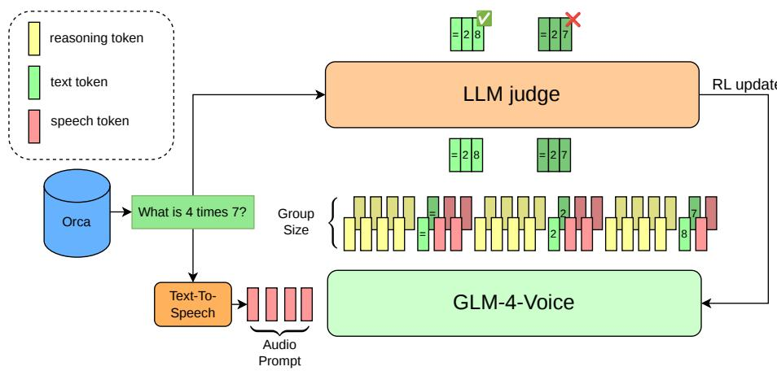

# Voice of Reason: Reinforcement Learning for Spoken Math

Timoth´ee Weisselberger   
Kyutai   
Paris, France   
timothee.weisselberger@kyutai.org

Edouard Grave Kyutai Paris, France

Alexandre D´efossez Kyutai, Gradium Paris, France alex@kyutai.org

## Abstract

Speech language models enable richer spoken interactions between humans and machines than cascaded systems, allowing access to paralinguistic information and lower latency. However, their accuracy on mathematical reasoning benchmarks has lagged behind those of text models. Reinforcement learning (RL) with verifiable rewards has been instrumental in extending text models’ capabilities for solving complex problems and limiting hallucinations. In this work, we explore applying RL to the GLM-4-Voice speech model (Zeng et al., 2024) to bridge the gap between textual and spoken mathematical problem solving. We first adapt the model to the domain using supervised fine-tuning on synthesized spoken question-answering data. We then show that, even without extra reasoning tokens, RL improves the accuracy on GSM8K beyond levels previously achieved for speech models only with supplementary reasoning traces. When combined with existing streaming reasoning techniques, we show further gains to 74.8% free-form accuracy. This establishes a new state-of-the-art for mathematical spoken abilities with speech-native models.

## 1 Introduction

Text-based language models have seen a steep improvement in their problem-solving abilities, thanks to reasoning and reinforcement learning (RL) with verifiable rewards (Shao et al., 2024). Various approaches have been tried to bring such advances to speech language models. Despite recent progress, the most effictive approach for building speech conversational models, when considering only intelligence and reasoning abilities, remains the cascading of speech-to-text, text-only, and text-to-speech models (Chen et al., 2026).

The cascaded approach however suffers from the cumulative latency of each sub-model, and cannot access paralinguistic information. To alleviate these limitations, speech models with built-in audio support were developed. Some use light adapter layers around existing text models (Wang et al., 2025), optionally with fine-tuning of the whole model (Xu et al., 2025a; Zeng et al., 2024). Conversational support is added using explicit turn boundary detection, i.e., using a voice activity detection model. On the other hand, full-duplex models were developed, either without any text stream (Nguyen et al., 2023), or with a text stream reflecting the current speech production of the model (Defossez et al.´ , 2024; Roy et al., 2026). Full-duplex models offer unrivaled latency; however, their performance on complex tasks falls short of cascaded or adapted text models (Chen et al., 2026).

There are several challenges when applying outcome-based reinforcement learning to speech models. First, existing datasets require some reformatting effort to be adapted to speech. Mathematical phrasing can be ambiguous or unnatural when spoken out. Such data can only be economically generated at scale through text-to-speech models, adding noise to the training data when such models fail. Second, speech models are constrained by real-time requirements and are expected to remain interactive at all times. Thus, audio tokens must be generated at regular intervals, and supplementary reasoning tokens must be kept within a reasonable limit (Chiang et al., 2026), especially for on-device applications.

In this work, we study RL for mathematical problem solving with speech language models, with a primary focus on the GLM-4-Voice model (Zeng et al., 2024). It exhibits strong base performance on math benchmarks, and was shown to improve with explicit reasoning-token supervision interleaved with the output stream (Chiang et al., 2026). We contribute by showing that even without reasoning tokens, the model can improve to unprecedented accuracy on GSM8K (Cobbe et al., 2021), through in-domain fine-tuning followed by reinforcement learning with AI feedback. Moreover, our approach can be combined with the previous reasoning-token supervision method and yield state-of-the-art precision on this benchmark.

## 2 Related Work

Speech language models. Speech language models aim to produce speech with low latency while preserving semantic correctness (instruction-following, reasoning) and speech quality (naturalness, speaker consistency). They rely on discrete tokens provided by neural audio codecs (Zeghidour et al., 2022; Defossez et al.´ , 2023) which are modeled autoregressively (Borsos et al., 2023). While initial research focused on unsupervised audio modeling, these models were adapted to interactive use through three approaches: (i) adapting existing text models with a light audio encoder mapping to the input space of a text language model, with a streaming TTS plugged to its output text stream (Xu et al., 2025a; Wang et al., 2025); (ii) interleaving short blocks of either only text or only speech tokens, directly modeled by the backbone (Nguyen et al., 2025; Zeng et al., 2024); (iii) full-duplex models jointly modeling two audio streams, one for the user and one for the model, along with optional parallel text streams (Nguyen et al., 2023; Defossez et al. ´ , 2024; Roy et al., 2026). For (i) and (ii), turn changes between the user and assistant are indicated through the use of special delimiter tokens, whose insertion is triggered by voice activity detection models for end of turn prediction (Wang et al., 2025). Despite architectural differences, all paradigms enforce tight text-speech alignment to keep generation streamable.

Abilities of speech models. There are several axes along which speech language models can be evaluated. When looking at the naturalness of the interaction and the turn-taking dynamics, they have been steadily improving (Lin et al., 2025; Roy et al., 2026). However, when measuring capabilities requiring deeper thinking and understanding, speech language models exhibit worse zero-shot abilities than equivalent text models, and require more training data in order to reach acceptable performance (Defossez et al.´ , 2024; Xiaomi LLM-Core Team, 2025). In a number of speech-based tasks, cascaded systems wrapping existing text models with speech-to-text and text-to-speech models outperform speechnative models (Chen et al., 2026). Meanwhile, text models have solved increasingly complex tasks, such as the GSM8K benchmark (Cobbe et al., 2021), with an accuracy of up to 91.6% for a 7-billion-parameter model (Yang et al., 2024). For comparison, GLM-4-Voice (Zeng et al., 2024) achieves 27.3% accuracy with 9 billion parameters, which Chiang et al. (2026) improves to 58.7% with the addition of blocks of supplementary reasoning tokens in their STITCH method. As we show in Section 5, full-duplex models lag further behind on this benchmark.

Alignment of speech models. While text models already exhibit strong problem-solving ability after pre-training (Brown et al., 2020), they can be further improved through reinforcement-learning-based alignment using either human preferences (Ziegler et al., 2019), or verifiable rewards (Shao et al., 2024), especially when combined with reasoning tokens. When applied to the speech domain, reasoning tokens must be carefully interleaved with speech tokens, so as not to delay the audio output and preserve interactivity (Chiang et al., 2026). RL for speech has previously been studied to improve factuality (Wu et al., 2025) and naturalness (Zhang et al., 2026), as well as for unsupervised simultaneous speech translation (Labiausse et al., 2026). To the best of our knowledge, the present work is the first application of RL for mathematical reasoning in speech-native models.

  
Figure 1: Illustration of our RL pipeline. We synthesize as speech a question taken from the Orca dataset (Mitra et al., 2024) to be fed to the GLM-4-Voice (Zeng et al., 2024), and generate multiple interleaved speech-text replies. We apply a group-relative policy-gradient objective inspired by GRPO (Shao et al., 2024), using a binary reward obtained from a large language model applied to the decoded text stream. The model can optionally use interleaved reasoning tokens following Chiang et al. (2026).

## 3 Method

## 3.1 Problem setup

We study post-training for GLM-4-Voice (Zeng et al., 2024), an interleaved spoken language model that generates text and audio in a fixed alternation pattern. It predicts autoregressively one token at a time, belonging to either the text vocabulary $\mathcal { V } _ { \mathrm { t e x t } } ,$ , the audio vocabulary $\mathcal { V } _ { \mathrm { a u d } } ,$ or a small set of special control tokens $\mathcal { V } _ { \mathrm { s p e c } } .$ . Given an audio-only input prompt of length $S , x \in \mathcal { V } _ { \mathrm { a u d } } ^ { S }$ , the model produces an assistant response of length T,

$$
y = ( y _ { 1 } , \dots , y _ { T } ) ,
$$

where each token belongs to either the text vocabulary $\mathcal { V } _ { \mathrm { t e x t } } ,$ , the audio vocabulary $\mathcal { V } _ { \mathrm { a u d } } ,$ , or a small set of special control tokens $\mathcal { V } _ { \mathrm { s p e c } }$

Assistant responses in the training data follow a structured output format. This structure is learned rather than enforced by a hard vocabulary mask: under standard decoding, text and audio are expected to be emitted in alternating blocks following the native GLM-4-Voice interleaving format. In our setup, each standard spoken-response block consists of 13 text tokens followed by 26 audio tokens. Thus, if we ignore special markers, a typical response has the form

$$
\underbrace { \bigl ( t _ { 1 } , \dots , t _ { 1 3 } , } _ { \mathrm { t e x t } } , \underbrace { a _ { 1 } , \dots , a _ { 2 6 } } _ { \mathrm { a u d i o } } , \underbrace { t _ { 1 4 } , \dots , t _ { 2 6 } } _ { \mathrm { t e x t } } , \underbrace { a _ { 2 7 } , \dots , a _ { 5 2 } } _ { \mathrm { a u d i o } } , \dots \bigr ) .\tag{1}
$$

Special tokens are additionally used for control purposes, for instance to delimit turns between the user and the model. Given that it takes more audio tokens than text tokens to represent a reply, once all text tokens are generated, the model will produce only audio tokens until a special end of turn token.

We also experiment with STITCH (Chiang et al., 2026), which inserts reasoning tokens learnt through direct supervision, to extend the thinking capabilities of the model. Reasoning is emitted in successive chunks of 100 text tokens, delimited by special markers, while the spoken response itself still follows the native GLM-4-Voice interleaving pattern. Chiang et al. (2026) introduced two variants: STITCH-R and STITCH-S, depending on whether the first reasoning packet is before (-R) or after (-S) the first text-audio block. In the following, we focus on STITCH-R, and denote it STITCH. A typical sequence therefore takes the form

$$
\underbrace { ( r _ { 1 } , \ldots , r _ { 1 0 0 } } _ { \mathrm { r e a s o n i n g ~ t e x t } } , \underbrace { t _ { 1 } , \ldots , t _ { 1 3 } } _ { \mathrm { t e x t } } , \underbrace { a _ { 1 } , \ldots , a _ { 2 6 } } _ { \mathrm { a u d i o } } , \underbrace { r _ { 1 0 1 } , \ldots , r _ { 2 0 0 } } _ { \mathrm { r e a s o n i n g ~ t e x t } } , \underbrace { t _ { 1 4 } , \ldots , t _ { 2 6 } } _ { \mathrm { t e x t } } , \underbrace { a _ { 2 7 } , \ldots , a _ { 5 2 } } _ { \mathrm { a u d i o } } , \underbrace { a _ { 5 } } _ { \mathrm { a u d i o } } . \underbrace { \ldots } _ { \mathrm { a u d i o } } \big ) .\tag{2}
$$

Special tokens such as [SOPR], [EOPR], and [EOR] are inserted to delimit reasoning chunks and mark the end of the reasoning phase.

Our goal is to improve problem-solving accuracy of the GLM-4-Voice model with RL, whether reasoning tokens are used or not.

## 3.2 Group-relative policy gradient with AI feedback

We assume a set of audio prompts corresponding to a given question or problem. For each prompt x, we sample G completions by sampling autoregressively from the model. We denote by $\pi _ { \theta } ( y \mid x )$ the distribution over the output sequences given the audio prompt. Namely, we sample

$$
y ^ { ( 1 ) } , \ldots , y ^ { ( G ) } \sim \pi _ { \theta } ( \cdot \mid x ) ,
$$

and score each completion independently with a scalar reward

$$
r ^ { ( g ) } = R ( x , y ^ { ( g ) } ) .
$$

We then form a group-relative baseline by centering rewards within the prompt:

$$
b = \frac { 1 } { G } \sum _ { g = 1 } ^ { G } r ^ { ( g ) } , \qquad A ^ { ( g ) } = r ^ { ( g ) } - b .
$$

Our basic RL objective is an on-policy policy-gradient loss of the form

$$
\mathcal { L } _ { \mathrm { R L } } ( \theta ) = - \frac { 1 } { G } \sum _ { g = 1 } ^ { G } A ^ { ( g ) } \sum _ { t \in \mathbb { Z } ^ { ( g ) } } \log \pi _ { \theta } \Bigl ( y _ { t } ^ { ( g ) } \mid y _ { < t } ^ { ( g ) } , x \Bigr ) ,\tag{3}
$$

where $\boldsymbol { \mathcal { T } } ^ { ( g ) }$ denotes the set of generated positions included in the loss. In practice, this corresponds to a group-relative REINFORCE objective (Williams, 1992). It is related to GRPO (Shao et al., 2024) but we do not use PPO clipping.

The reward is derived from an LLM judge where the judge returns a binary correctness score for the decoded text response. We sample multiple completions per prompt with stochastic decoding and score them independently with the judge model. The reward is computed from the decoded text stream only. A representation of the overall modeling and training pipeline is provided in Figure 1.

## 3.3 Temperature correction

During RL, trajectories are sampled with stochastic decoding using temperature $T < 1$ Therefore, the policy that generates the samples is not the base model distribution $\pi _ { \theta } ,$ but the temperature-adjusted policy

$$
\pi _ { \boldsymbol { \theta } } ^ { ( T ) } ( y _ { t } \mid s _ { t } ) = \frac { \exp ( z _ { \boldsymbol { \theta } } ( y _ { t } , s _ { t } ) / T ) } { \sum _ { y ^ { \prime } \in \mathcal { V } } \exp ( z _ { \boldsymbol { \theta } } ( y ^ { \prime } , s _ { t } ) / T ) } ,
$$

where $z _ { \theta } ( \cdot , s _ { t } )$ denotes the model logits at decoding state $s _ { t } = ( x , y _ { < t } )$

To keep the policy-gradient estimator consistent with the actual sampling distribution, we compute log-probabilities under $\pi _ { \boldsymbol { \theta } } ^ { ( T ) }$ rather than under the raw model distribution. In practice, this simply means dividing logits by T before applying the log-softmax in the RL loss, following prior RLHF practice (Ziegler et al., 2019).

Accordingly, the objective (3) becomes

$$
\mathcal { L } _ { \mathrm { R L } } ( \boldsymbol { \theta } ) = - \frac { 1 } { G } \sum _ { g = 1 } ^ { G } A ^ { ( g ) } \sum _ { t \in \mathbb { Z } ^ { ( g ) } } \log \pi _ { \theta } ^ { ( T ) } \Bigl ( y _ { t } ^ { ( g ) } \mid y _ { < t } ^ { ( g ) } , x \Bigr ) .\tag{4}
$$

Without this temperature correction, trajectories are sampled from one distribution but optimized under another, which introduces a mismatch in the gradient estimator. As shown by the ablations in Section 5, this correction is critical in our setting.

## 3.4 Structure of the vocabulary and loss calculation

The structure of the output space of the GLM-4-Voice model raises interesting questions. Given that the reward model only verifies the correctness of the output text, nothing prevents the GLM-4-Voice model from departing from the structured output pattern described in eq. (1) and eq. (2). When applying the RL objective given by eq. (4), we can decide whether to apply it only on text tokens, or both on audio and text tokens. In particular, as the audio tokens are strongly constrained by the preceding text tokens, it could be sufficient to only apply the RL loss to the text outputs. Yet, as described in Section 3.1, the end of the text reply is implicitly indicated by the presence of an audio token in place of a text one.

This motivated us to test a third alternative, where we collapse the probabilities over all audio tokens into a single abstract audio token $a ^ { * }$ . Formally, we introduce a new policy

$$
\bar { \pi } _ { \boldsymbol { \theta } } ^ { ( T ) } ( \boldsymbol { y } _ { t } = \boldsymbol { a } ^ { * } \mid \boldsymbol { s } _ { t } ) = \sum _ { \boldsymbol { a } \in \mathcal { V } _ { \mathrm { a u d } } } \pi _ { \boldsymbol { \theta } } ^ { ( T ) } ( \boldsymbol { y } _ { t } = \boldsymbol { a } \mid \boldsymbol { s } _ { t } ) ,
$$

to be used in place of $\pi _ { \boldsymbol { \theta } } ^ { ( T ) }$ in (4). This yields another estimator which is under some assumptions lower-variance and unbiased; the formal statement and proof are given in Appendix B. Unless stated otherwise, this setup is used in the experiments.

## 4 Experimental setup

## 4.1 Models

Our main experiments are conducted on GLM-4-Voice (Zeng et al., 2024), an interleaved audio-text language model that alternates text-token blocks and audio-token blocks during generation. All reported results start from the publicly available checkpoint 1. We do not modify the model architecture and study only post-training effects. We release our flagship reasoning-free and STITCH-style checkpoints as glm-4-voice-of-reason-9b and glm-4-voice-of-reason-stitch-9b, respectively.

## 4.2 Training data

Our training data is derived from a filtered and regenerated version of the Orca-Math dataset (Mitra et al., 2024) which has been shown not to be contaminated by GSM8K. It consists of question-answer pairs on problems requiring basic mathematical thinking. We reformulate both questions and answers with a text large language model, Qwen 3 235B (Yang et al., 2025), so that they can be synthesized as speech by the DSM text-to-speech model (Zeghidour et al., 2025). Training audio is generated using many different DSM voices. For evaluation, we reuse the audio provided by the STITCH authors, which was generated with GPT-4o-mini-TTS. Thus, the training and evaluation audio are generated with different TTS systems. We derive three datasets to be used for post-training, either for in-domain supervised fine-tuning (SFT) or RL.

Reasoning-free SFT. We derive interleaved text and audio tokens following the format given by eq. (1) in Section 3.1 to be used as direct supervision for the model output when input with the speech tokens of the question.

Reasoning STITCH-like SFT. We follow the STITCH methodology of Chiang et al. (2026). A reasoning trace is first generated to arrive at the answer, which is then chunked, each chunk being summarized in a speech-compatible manner using again a text model. The concatenation of all summaries is synthesized to speech. This gives us interleaved reasoning, text, and speech tokens as layout in eq. 2, in Section 3.1, to be used as direct supervision.

Reinforcement learning. For reinforcement learning, we only need the question speech tokens, to be fed as prompt, and the question text, fed to the text judge described in Section 3.2.

Each dataset is derived from the same 150,616 samples from the Orca corpus after filtering out those with a combined speech and text token length exceeding 2,000 (without reasoning).

## 4.3 Reward model

During RL, each sampled completion is scored by an external language-model judge applied to the decoded text stream. The judge receives the input question text together with the decoded assistant response and returns a binary reward for correctness, as shown in Figure 1. The prompt passed to the judge is provided in Appendix A.1.

Our training judge is qwen/qwen3-235b-a22b-2507 (Yang et al., 2025). The training judge does not receive the reference answer.

We manually inspect 100 training judgments. The judge agrees with human annotations in 88% of cases, with 80.0% precision and 95.2% recall for correct answers. Its errors are predominantly false positives, indicating that the reward is somewhat permissive but remains strongly correlated with correctness.

We separately inspect 100 judgments produced by the evaluation judge, which receives the reference answer, and observe agreement with human annotations on all 100 examples.

## 4.4 Training procedure

We post-train both a reasoning-free GLM-4-Voice (Zeng et al., 2024) model, as well as the STITCH-style variant.

SFT. For both, we start with supervised fine-tuning on the datasets described in Section 4.2 using a standard cross-entropy loss on the reply tokens. We perform the SFT on the entire dataset, except in Table 3 where we experiment with using a subset of the training data. We start from the publicly available GLM-4-Voice checkpoint. Note that there is no publicly available STITCH checkpoint. Thus, we fine-tune the first checkpoint, first without reasoning traces, and then with reasoning traces on the entire Orca-derived dataset.

RL. For the default RL stage, we sample 4 completions per question using stochastic decoding with a temperature of 0.9 and a maximum generation length of 600 tokens for the reasoning-free setting and 800 tokens for the STITCH-style setting. We optimize the objective given by Eq. 4 in Section 3.3.

In Table 3, we additionally report longer reasoning-free RL runs using a group size of 8.   
These longer runs are individual runs rather than multi-seed estimates.

Optimization. We use AdamW (Loshchilov & Hutter, 2019) with a batch size of 16, a weight decay of 0.1, $\beta _ { 1 } = 0 . 9$ and $\beta _ { 2 } = 0 . 9 5$ . For SFT, we use a learning rate of 2 · $1 0 ^ { - 6 }$ and train for one epoch; for ${ \mathrm { R L } } ,$ we use a learning rate of $1 0 ^ { - 7 }$ and perform 1,500 updates. All experiments run on 16 H100 GPUs.

## 4.5 Evaluation benchmarks and metrics

Mathematical reasoning. We use GSM8K (Cobbe et al., 2021) as our main mathematical reasoning benchmark. The model receives each question as speech and produces an interleaved text–audio response.

Following Chiang et al. (2026), for text-stream evaluation we provide the original question, the decoded text stream generated by the model, and the ground-truth answer to a textmodel judge tasked with returning a binary correctness score. We use GPT-4o through the OpenAI API2, along with the prompt from the Kimi Audio EvalKit (KimiTeam et al., 2025)3.

Spoken-output evaluation. To verify that improvements in the decoded text stream are reflected in the generated speech, we transcribe the generated audio with Qwen/Qwen3-ASR-1.7B (Shi et al., 2026) and apply the same final-answer evaluation to the ASR transcript. We evaluate speech naturalness with UTMOSv2 (Baba et al., 2024) on 100 generated GSM8K responses. ASR is used only for evaluation and is not part of the reward in our main experiments.

Out-of-domain evaluation. To measure whether mathematical post-training degrades more general capabilities, we evaluate the models on a spoken 1,000-example subset of TriviaQA (Joshi et al., 2017). This benchmark is not used during mathematical SFT or RL.

Response characteristics. We report the average number of generated spoken-text tokens, audio tokens, hidden reasoning tokens, and the average duration of the spoken response. This allows us to determine whether improvements are explained by substantially longer generations or reasoning traces.

Statistical reporting. For our main results, we report the mean and standard deviation over three independent training seeds. The exact evaluation protocol, including dataset splits, decoding settings, checkpoint selection, and aggregation details, is provided in Appendix C. We also investigated MultiArith (Roy & Roth, 2015), SingleEQ (Koncel-Kedziorski et al., 2015), SVAMP (Patel et al., 2021), and AddSub (Hosseini et al., 2014). However, a paraphraselevel analysis revealed substantial overlap between these benchmarks and the Orca-derived training corpus. We therefore remove them from the main evaluation and do not use them as evidence of generalization. The contamination analysis is reported in Appendix D.

## 4.6 Baselines and ablations

Our main point of comparison is the original STITCH model (Chiang et al., 2026). We provide both their reported numbers in Table 1, as well as the results of our re-implementation detailed in Section 4.4, in Table 2, allowing for an evaluation of our RL contribution free of biases from the change in training data.

We also compare to the state-of-the-art full-duplex model PersonaPlex (Roy et al., 2026) using its publicly available checkpoint, as well as to the Qwen2.5-Omni model (Xu et al., 2025a). We additionally include Qwen3-Omni-30B (Xu et al., 2025b) and a cascaded ASR– LLM–TTS–ASR baseline using Gemma-4-31B-IT (Gemma Team, 2026) as the text reasoning model and Kokoro (hexgrad, 2025) as the speech synthesizer. The larger omni and cascaded systems are included as top lines rather than parameter-matched comparisons. We also provide ablation studies on the amount of SFT data used in Table 3, and on the RL loss strategy in Table 4.

## 5 Results

Comparison to external baselines. We report in Table 1 a comparison on GSM8K of our final RL-improved models against a number of state-of-the-art baselines. We first notice that, despite their improved interactive capabilities, full-duplex models such as PersonaPlex (Roy et al., 2026) lag far behind turn-based ones.

GLM-4-Voice (Zeng et al., 2024) acts as a stronger baseline, reaching 27.3% on GSM8K (Cobbe et al., 2021), while STITCH (Chiang et al., 2026) reaches 58.7% using reasoning steps, an improvement of 31.4 points. Our RL approach brings the reasoning-free GLM-4-Voice model from 27.3% to 65.5 ± 1.1%, a gain of 38.2 points, and surpasses the original STITCH model by 6.8 points without using explicit reasoning tokens. We further show that STITCH-style supervision and our RL approach can be combined, reaching $7 4 . 8 \pm 1 . 1 \%$ , the strongest result among the speech-native models considered here.4

<table><tr><td>Method</td><td># Param.</td><td>Output</td><td>GSM8K</td></tr><tr><td colspan="3">Speech-native models</td><td></td></tr><tr><td>PersonaPlex (Roy et al., 2026)</td><td>8B</td><td>Speech</td><td>3.2</td></tr><tr><td>GLM-4-Voice (Zeng et al., 2024)</td><td>9B</td><td>Speech</td><td>27.3</td></tr><tr><td>STITCH (Chiang et al., 2026)</td><td>9B</td><td>Speech</td><td>58.7</td></tr><tr><td>GLM-4-Voice + ŠFT + RL (Ours)</td><td>9B</td><td>Speech</td><td> $6 5 . 5 \pm 1 . 1$ </td></tr><tr><td>STITCH-style SFT + RL (Ours)</td><td>9B</td><td>Speech</td><td> ${ \bf 7 4 . 8 \pm 1 . 1 }$ </td></tr><tr><td colspan="4">Omni and cascaded top lines</td></tr><tr><td>Qwen2.5-Omni (Xu et al., 2025a)</td><td>7B</td><td>Text</td><td>84.7</td></tr><tr><td>Qwen3-Omni (Xu et al., 2025b)</td><td>30B</td><td>Text</td><td>94.6</td></tr><tr><td>Cascaded ASR-LLM-TTS-ASR</td><td>31B LLM</td><td>Speech</td><td>95.7</td></tr></table>

Table 1: Accuracy on GSM8K. Results for our models are reported as mean and standard deviation over three independent training seeds. Qwen3-Omni and the cascaded system are stronger top lines, but are not parameter- or architecture-matched to our speech-native models. The cascaded system uses Gemma-4-31B-IT as the reasoning model and Kokoro as the speech synthesizer.

(a) Mathematical accuracy, spoken-output evaluation, and OOD generalization
<table><tr><td>Method</td><td>GSM8K text</td><td>GSM8K ASR</td><td>TriviaQA</td><td>UTMOSv2</td></tr><tr><td>GLM-4-Voice base</td><td>27.3</td><td>26.4</td><td>40.6</td><td>3.614</td></tr><tr><td> $\operatorname { G L M - 4 - V o i c e } + S \operatorname { F T }$ </td><td> $6 1 . 7 \pm 1 . 9$ </td><td>61.5</td><td> $3 3 . 4 \pm 0 . 5$ </td><td>4.067</td></tr><tr><td> $\mathrm { G L M - 4 - V o i c e } + \mathrm { S F T } + \mathrm { R L }$ </td><td> ${ \bf 6 5 . 5 \pm 1 . 1 }$ </td><td>63.9</td><td> $3 4 . 0 \pm 2 . 0$ </td><td>4.069</td></tr><tr><td>STITCH-style SFT</td><td> $6 8 . 0 \pm 1 . 6 $ </td><td> $6 6 . 2 \pm 2 . 3$ </td><td> $2 0 . 2 \pm 1 . 0$ </td><td>4.174</td></tr><tr><td>STITCH-style  $\mathrm { S F T } + \mathrm { R L }$ </td><td> ${ \bf 7 4 . 8 \pm 1 . 1 }$ </td><td> ${ \bf 7 2 . 0 \pm 1 . 9 }$ </td><td> $2 1 . 4 \pm 2 . 2$ </td><td>4.164</td></tr></table>

(b) Average response characteristics
<table><tr><td>Method</td><td>Text tokens</td><td>Audio tokens</td><td>Duration</td><td>Reasoning tokens</td></tr><tr><td>GLM-4-Voice base</td><td>84</td><td>419</td><td>33.5s</td><td>0</td></tr><tr><td>GLM-4-Voice + SFT</td><td>152</td><td>524</td><td>41.9s</td><td>0</td></tr><tr><td> $\mathrm { G L M - 4 - V o i c e } + \mathrm { S F T } + \mathrm { R L }$ </td><td>130</td><td>455</td><td>36.4s</td><td>0</td></tr><tr><td>STITCH-style SFT</td><td>60</td><td>184</td><td>14.7s</td><td>167</td></tr><tr><td> $\mathrm { S T I T C H - s t y l e S F T + R L }$ </td><td>80</td><td>251</td><td>20.0s</td><td>176</td></tr></table>

Table 2: Impact of supervised domain adaptation and reinforcement learning. Text-stream GSM8K accuracy is computed from the model’s decoded text tokens, while ASR accuracy is computed after transcribing the generated speech and applying the same final-answer metric. ASR is used only for evaluation. UTMOSv2 is evaluated on 100 GSM8K responses. TriviaQA results measure out-of-domain generalization on a spoken 1,000-example subset. The STITCH-style SFT + RL TriviaQA result uses two seeds; the main GSM8K results use three independent seeds.

Qwen2.5-Omni, Qwen3-Omni, and the cascaded baseline reach 84.7%, 94.6%, and 95.7%, respectively. These larger omni and cascaded systems remain strong top lines, although they are not strictly matched to our models in terms of size, architecture, and output constraints.

<table><tr><td>Method</td><td>GSM8K</td><td>TriviaQA</td></tr><tr><td>10% SFT</td><td>43.9</td><td>39.4</td></tr><tr><td> $1 0 \% \mathrm { S F T + R L }$ </td><td>50.5</td><td>42.3</td></tr><tr><td> $1 0 \% \mathrm { S F T } + \mathrm { R L } ^ { \dag }$ </td><td>58.5</td><td>41.4</td></tr><tr><td>50% SFT  $5 0 \% \mathrm { S F T } + \mathrm { R L }$ </td><td>56.4</td><td>36.5</td></tr><tr><td>Full-data SFT</td><td>61.5</td><td>36.3</td></tr><tr><td>Full-data  $\mathrm { S F T } + \mathrm { R L }$ </td><td>61.7 ± 1.9 65.5 ± 1.1</td><td>33.4 ± 0.5  $3 4 . 0 \pm 2 . 0$ </td></tr><tr><td>Full-data  ${ \mathrm { S F T } } + { \mathrm { R L } } ^ { \dagger }$ </td><td></td><td></td></tr><tr><td></td><td>70.8</td><td>35.6</td></tr></table>

† Longer individual RL run using a group size of 8; no multi-seed uncertainty is reported.

Table 3: Impact of the amount of supervised fine-tuning data before RL. Rows marked with correspond to longer individual RL runs using a group size of 8; all other RL runs use the default group size of 4. Non-dagger full-data results are reported as mean and standard deviation over independent training seeds. Dagger and low data rows are derived from individual training runs.
<table><tr><td>Method</td><td>Loss support</td><td>Temp. correction</td><td>Group size</td><td>GSM8K</td></tr><tr><td>Default</td><td>Audio-token merging</td><td>Yes</td><td>4</td><td> $6 5 . 5 \pm 1 . 1$ </td></tr><tr><td>No temperature correction</td><td>Audio-token merging</td><td>No</td><td>4</td><td>12.3</td></tr><tr><td>Loss on all tokens</td><td>All generated tokens</td><td>Yes</td><td>4</td><td>64.4</td></tr><tr><td>Loss on text tokens</td><td>Text tokens only</td><td>Yes</td><td>4</td><td>63.8</td></tr><tr><td>Larger group</td><td>Audio-token merging</td><td>Yes</td><td>8</td><td>67.0</td></tr></table>

Table 4: Ablation of the RL objective on GSM8K. The default configuration uses audiotoken merging, temperature correction, and a group size of 4, and is reported as mean and standard deviation over three independent training seeds. The remaining results are averages over late-training checkpoints from individual training runs.

Impact of our RL pipeline. We report in Table 2 the impact of the SFT and RL stages described in Section 4.4. First, we notice the positive impact of in-domain SFT using a highquality dataset such as Orca (Mitra et al., 2024), which improves GLM-4-Voice from 27.3% to $6 1 . { \check { 7 } } \pm 1 . 9 \%$ on GSM8K (+34.4 points). We further confirm the relevance of the STITCH approach of Chiang et al. (2026). With our training data, STITCH-style supervision improves performance from 61.7 ± 1.9% to $6 8 . 0 \pm 1 . 6 \%$ (+6.3 points). RL improves the reasoningfree model from 61.7 ± 1.9% to 65.5 ± 1.1% (+3.8 points), and improves the STITCH-style model from $6 8 . 0 \pm 1 . 6 \%$ to $7 4 . 8 \pm 1$ .1% (+6.8 points). Overall, RL consistently closes part of the remaining gap after supervised training, while STITCH-style supervision provides a stronger starting point than standard spoken-answer supervision.

Spoken-output evaluation. The improvements measured on the decoded text stream are also reflected in the generated speech. The base GLM-4-Voice model obtains 26.4% ASR-based accuracy, close to its 27.3% text-stream accuracy. For STITCH-style models, ASR-based GSM8K accuracy improves from 66.2 ± 2.3% after SFT to 72.0 ± 1.9% after RL. For reasoning-free GLM-4-Voice, ASR-based accuracy similarly improves from 61.5% to 63.9% (+2.4 points).

Speech naturalness improves substantially during SFT and remains stable during RL: for reasoning-free GLM-4-Voice, UTMOSv2 increases from 3.614 for the base model to 4.067 after SFT and 4.069 after RL, while for STITCH-style models it changes from 4.174 to 4.164 after RL. Thus, the improvement is visible in the spoken output and does not come with a measurable degradation in naturalness.

Response characteristics. Table 2 also reports average response lengths and durations. For reasoning-free GLM-4-Voice, RL reduces the average response from 152 to 130 text tokens (−22), from 524 to 455 audio tokens (−69), and from 41.9 to 36.4 seconds (−5.5 seconds) relative to SFT. The improvement is therefore not explained by longer responses.

For STITCH-style models, RL increases the spoken response from 60 to 80 text tokens (+20) and from 14.7 to 20.0 seconds (+5.3 seconds). However, the number of reasoning tokens remains nearly unchanged, increasing only from 167 to 176 (+9). The accuracy gain is therefore not obtained through substantially longer reasoning traces.

Out-of-domain generalization. We evaluate the models on a spoken 1,000-example subset of TriviaQA. The original GLM-4-Voice model reaches 40.6%. Full-data SFT reduces this score to 33.4 ± 0.5% (−7.2 points), while adding RL increases it to 34.0 ± 2.0% (+0.6 points over SFT).

Similarly, adding RL to the STITCH-style model improves TriviaQA from 20.2 ± 1.0% to 21.4 ± 2.2% (+1.2 points). In contrast, using only 10% of the SFT data largely preserves general capabilities: TriviaQA accuracy increases from 39.4% after SFT to 42.3% after RL (+2.9 points). In the 50% regime, it changes only from 36.5% after SFT to 36.3% after RL (−0.2 points). The longer group-size-8 runs obtain 41.4% in the 10% regime and 35.6% in the full-data regime. These results suggest that the observed out-of-domain degradation mainly comes from specialization during full-data SFT rather than from RL.

Amount of SFT training. Table 3 shows that Performance increases steadily with more supervised data: 43.9% with 10% SFT, 56.4% with 50% SFT, and 61.7 ± 1.9% on the full dataset. This indicates that reasoning quality strongly depends on supervised initialization.

RL consistently improves GSM8K on top of every SFT regime. With the default group size of 4, performance improves from 43.9% to 50.5% in the 10% regime (+6.6 points), from 56.4% to 61.5% in the 50% regime (+5.1 points), and from 61.7 ± 1.9% to 65.5 ± 1.1% in the full-data regime (+3.8 points). Relative gains are larger when SFT data is limited, suggesting that RL is particularly valuable in weaker-data regimes, while the strongest reasoning-free performance is obtained from full-data SFT followed by longer RL training. Most strikingly, with only 10% of the supervised data, the longer RL run reaches 58.5%, gaining 14.6 points over SFT alone and recovering over 80% of the gap to full-data SFT. It comes within just 3.2 points of the full-data SFT model, showing that RL can replace much of the benefit of a tenfold increase in supervised data.

Design of the RL loss. We next study ablations on the RL objective, starting from our default setup: binary reward, audio-token merging (see Section 3.4), group size 4, temperature 0.9, and no KL regularization. We vary four components: whether temperature correction is applied in the policy-gradient estimator (Section 3.3; no temperature correction), whether the loss is computed on all generated tokens instead of using audio-token merging (all tokens), whether optimization is restricted to text tokens only (text only), and whether the group size is increased from 4 to 8 (group size 8). Table 4 reports the resulting performance. The default result is reported as mean and standard deviation over three independent training seeds. The remaining results are averages over late-training checkpoints from individual runs.

The most striking result is the importance of temperature correction. Removing it causes a dramatic collapse, dropping GSM8K from 65.5 ± 1.1% to 12.3%. The other variants remain closer to the default configuration: the all tokens variant reaches 64.4%, the text only variant reaches 63.8%, and increasing group size from 4 to 8 gives the best ablation result at 67.0%.

## 6 Conclusion

We show that reinforcement learning significantly improves spoken mathematical reasoning in speech-native models. Starting from GLM-4-Voice, a simple post-training pipeline yields large gains in the standard spoken-answer setting, without requiring explicit reasoning tokens, reaching 65.5 ± 1.1% on GSM8K. When combined with STITCH-style supervision, RL further improves accuracy to 74.8 ± 1.1%, the strongest result among the speech-native models considered in this work. The trade-off between using additional reasoning tokens and reducing inference cost depends on the application; in particular, the simpler reasoningfree model may be valuable for power-efficient on-device inference. Overall, our results show that reinforcement learning is a powerful tool for closing part of the gap between spoken and text-based reasoning while preserving streaming-compatible generation and speech naturalness. Further work is required to extend these methods to full-duplex models and to combine best-in-class interactivity and naturalness with reasoning capabilities approaching those of top-line text and cascaded systems.

## References

Kaito Baba, Wataru Nakata, Yuki Saito, and Hiroshi Saruwatari. The T05 system for the VoiceMOS challenge 2024: Transfer learning from deep image classifier to naturalness MOS prediction of high-quality synthetic speech. In IEEE Spoken Language Technology Workshop (SLT), pp. 818–824, 2024. doi: 10.1109/SLT61566.2024.10832315.

Zalan Borsos, Rapha ´ el Marinier, Damien Vincent, Eugene Kharitonov, Olivier Pietquin, Matt¨ Sharifi, Dominik Roblek, Olivier Teboul, David Grangier, Marco Tagliasacchi, and Neil Zeghidour. AudioLM: A language modeling approach to audio generation. IEEE/ACM Transactions on Audio, Speech, and Language Processing, 31:2523–2533, 2023. doi: 10.1109/ TASLP.2023.3288409.

Tom B. Brown, Benjamin Mann, Nick Ryder, Melanie Subbiah, Jared D. Kaplan, Prafulla Dhariwal, Arvind Neelakantan, Pranav Shyam, Girish Sastry, Amanda Askell, et al. Language models are few-shot learners. Advances in Neural Information Processing Systems, 33:1877–1901, 2020.

Yiming Chen, Xianghu Yue, Chen Zhang, Xiaoxue Gao, Robby T. Tan, and Haizhou Li. VoiceBench: Benchmarking LLM-based voice assistants. Transactions of the Association for Computational Linguistics, 14:378–398, 2026. doi: 10.1162/tacl.a.628. URL https: //aclanthology.org/2026.tacl-1.18/.

Cheng-Han Chiang, Xiaofei Wang, Linjie Li, Chung-Ching Lin, Kevin Lin, Shujie Liu, Zhendong Wang, Zhengyuan Yang, Hung-yi Lee, and Lijuan Wang. STITCH: Simultaneous thinking and talking with chunked reasoning for spoken language models. In The Fourteenth International Conference on Learning Representations, 2026. URL https://openreview.net/forum?id=5Z1eMhCeTb.

Karl Cobbe, Vineet Kosaraju, Mohammad Bavarian, Mark Chen, Heewoo Jun, Lukasz Kaiser, Matthias Plappert, Jerry Tworek, Jacob Hilton, Reiichiro Nakano, Christopher Hesse, and John Schulman. Training verifiers to solve math word problems. arXiv preprint arXiv:2110.14168, 2021. doi: 10.48550/arXiv.2110.14168. URL https://arxiv.org/abs/ 2110.14168.

Alexandre Defossez, Jade Copet, Gabriel Synnaeve, and Yossi Adi. High fidelity neural´ audio compression. Transactions on Machine Learning Research, 2023. URL https:// openreview.net/forum?id=ivCd8z8zR2.

Alexandre Defossez, Laurent Mazar´ e, Manu Orsini, Am´ elie Royer, Patrick P´ erez, Herv´ e´ Jegou, Edouard Grave, and Neil Zeghidour. Moshi: A speech-text foundation model for´ real-time dialogue. arXiv preprint arXiv:2410.00037, 2024. doi: 10.48550/arXiv.2410.00037. URL https://arxiv.org/abs/2410.00037.

Gemma Team. Gemma 4 technical report, 2026. URL https://arxiv.org/abs/2607.02770.

hexgrad. Kokoro-82M. Hugging Face model repository, 2025. URL https://huggingface. co/hexgrad/Kokoro-82M. Open-weight text-to-speech model.

Mohammad Javad Hosseini, Hannaneh Hajishirzi, Oren Etzioni, and Nate Kushman. Learning to solve arithmetic word problems with verb categorization. In Proceedings of the 2014 Conference on Empirical Methods in Natural Language Processing (EMNLP), pp. 523– 533. Association for Computational Linguistics, 2014. doi: 10.3115/v1/D14-1058. URL https://aclanthology.org/D14-1058/.

Mandar Joshi, Eunsol Choi, Daniel S. Weld, and Luke Zettlemoyer. TriviaQA: A large scale distantly supervised challenge dataset for reading comprehension. In Proceedings of the 55th Annual Meeting of the Association for Computational Linguistics (Volume 1: Long Papers), pp. 1601–1611. Association for Computational Linguistics, 2017. doi: 10.18653/ v1/P17-1147. URL https://aclanthology.org/P17-1147/.

KimiTeam, Ding Ding, Zeqian Ju, Yichong Leng, Songxiang Liu, Tong Liu, Zeyu Shang, Kai Shen, Wei Song, Xu Tan, Heyi Tang, Zhengtao Wang, Chu Wei, Yifei Xin, Xinran Xu, Jianwei Yu, Yutao Zhang, Xinyu Zhou, Y. Charles, Jun Chen, Yanru Chen, Yulun Du, Weiran He, Zhenxing Hu, Guokun Lai, Qingcheng Li, Yangyang Liu, Weidong Sun, Jianzhou Wang, Yuzhi Wang, Yuefeng Wu, Yuxin Wu, Dongchao Yang, Hao Yang, Ying Yang, Zhilin Yang, Aoxiong Yin, Ruibin Yuan, Yutong Zhang, and Zaida Zhou. Kimi-Audio technical report, 2025. URL https://arxiv.org/abs/2504.18425.

Rik Koncel-Kedziorski, Hannaneh Hajishirzi, Ashish Sabharwal, Oren Etzioni, and Siena Dumas Ang. Parsing algebraic word problems into equations. Transactions of the Association for Computational Linguistics, 3:585–597, 2015. doi: 10.1162/tacl a 00160. URL https://aclanthology.org/Q15-1042/.

Tom Labiausse, Romain Fabre, Yannick Esteve, Alexandre D\` efossez, and Neil Zeghidour.´ Simultaneous speech-to-speech translation without aligned data. In Proceedings ofthe 43rd International Conference on Machine Learning, 2026. URL https://arxiv.org/abs/2602. 11072.

Guan-Ting Lin, Jiachen Lian, Tingle Li, Qirui Wang, Gopala Anumanchipalli, Alexander H. Liu, and Hung-yi Lee. Full-Duplex-Bench: A benchmark to evaluate full-duplex spoken dialogue models on turn-taking capabilities. arXiv preprint arXiv:2503.04721, 2025. doi: 10.48550/arXiv.2503.04721. URL https://arxiv.org/abs/2503.04721.

Ilya Loshchilov and Frank Hutter. Decoupled weight decay regularization. In International Conference on Learning Representations, 2019. URL https://openreview.net/forum?id= Bkg6RiCqY7.

Arindam Mitra, Hamed Khanpour, Corby Rosset, and Ahmed Awadallah. Orca-Math: Unlocking the potential of SLMs in grade school math. arXiv preprint arXiv:2402.14830, 2024. doi: 10.48550/arXiv.2402.14830. URL https://arxiv.org/abs/2402.14830.

Tu Anh Nguyen, Eugene Kharitonov, Jade Copet, Yossi Adi, Wei-Ning Hsu, Ali Elkahky, Paden Tomasello, Robin Algayres, Benoˆıt Sagot, Abdelrahman Mohamed, and Emmanuel Dupoux. Generative spoken dialogue language modeling. Transactions of the Association for Computational Linguistics, 11:250–266, 2023. doi: 10.1162/tacl a 00545. URL https: //aclanthology.org/2023.tacl-1.15/.

Tu Anh Nguyen, Benjamin Muller, Bokai Yu, Marta R. Costa-jussa, Maha Elbayad, Sravya\` Popuri, Christophe Ropers, Paul-Ambroise Duquenne, Robin Algayres, Ruslan Mavlyutov, Itai Gat, Mary Williamson, Gabriel Synnaeve, Juan Pino, Benoˆıt Sagot, and Emmanuel Dupoux. SpiRit-LM: Interleaved spoken and written language model. Transactions ofthe Associationfor Computational Linguistics, 13:30–52, 2025. doi: 10.1162/tacl a 00728. URL https://aclanthology.org/2025.tacl-1.2/.

Arkil Patel, Satwik Bhattamishra, and Navin Goyal. Are NLP models really able to solve simple math word problems? In Proceedings ofthe 2021 Conference ofthe North American Chapter of the Association for Computational Linguistics: Human Language Technologies, pp. 2080–2094. Association for Computational Linguistics, 2021. doi: 10.18653/v1/2021. naacl-main.168. URL https://aclanthology.org/2021.naacl-main.168/.

Rajarshi Roy, Jonathan Raiman, Sang-gil Lee, Teodor-Dumitru Ene, Robert Kirby, Sungwon Kim, Jaehyeon Kim, and Bryan Catanzaro. PersonaPlex: Voice and role control for full duplex conversational speech models. In ICASSP 2026 – 2026 IEEE International Conference on Acoustics, Speech and Signal Processing. IEEE, 2026. doi: 10.1109/ICASSP55912.2026. 11463413.

Subhro Roy and Dan Roth. Solving general arithmetic word problems. In Proceedings of the 2015 Conference on Empirical Methods in Natural Language Processing, pp. 1743–1752. Association for Computational Linguistics, 2015. doi: 10.18653/v1/D15-1202. URL https://aclanthology.org/D15-1202/.

Zhihong Shao, Peiyi Wang, Qihao Zhu, Runxin Xu, Junxiao Song, Xiao Bi, Haowei Zhang, Mingchuan Zhang, Y. K. Li, Y. Wu, and Daya Guo. DeepSeekMath: Pushing the limits of mathematical reasoning in open language models. arXiv preprint arXiv:2402.03300, 2024. doi: 10.48550/arXiv.2402.03300. URL https://arxiv.org/abs/2402.03300.

Xian Shi, Xiong Wang, Zhifang Guo, Yongqi Wang, Pei Zhang, Xinyu Zhang, Zishan Guo, Hongkun Hao, Yu Xi, Baosong Yang, Jin Xu, Jingren Zhou, and Junyang Lin. Qwen3-ASR technical report. arXiv preprint arXiv:2601.21337, 2026. doi: 10.48550/arXiv.2601.21337. URL https://arxiv.org/abs/2601.21337.

Xiong Wang, Yangze Li, Chaoyou Fu, Yike Zhang, Yunhang Shen, Lei Xie, Ke Li, Xing Sun, and Long Ma. Freeze-Omni: A smart and low latency speech-to-speech dialogue model with frozen LLM. In Proceedings of the 42nd International Conference on Machine Learning, volume 267 of Proceedings of Machine Learning Research, pp. 63345–63354. PMLR, 2025. URL https://proceedings.mlr.press/v267/wang25aw.html.

Ronald J. Williams. Simple statistical gradient-following algorithms for connectionist reinforcement learning. Machine Learning, 8(3–4):229–256, 1992. doi: 10.1007/BF00992696.

Anne Wu, Laurent Mazare, Neil Zeghidour, and Alexandre D´ efossez. Aligning spoken´ dialogue models from user interactions. In Proceedings of the 42nd International Conference on Machine Learning, volume 267 of Proceedings ofMachine Learning Research, pp. 67476– 67498. PMLR, 2025. URL https://proceedings.mlr.press/v267/wu25t.html.

Xiaomi LLM-Core Team. MiMo-Audio: Audio language models are few-shot learners. arXiv preprint arXiv:2512.23808, 2025. doi: 10.48550/arXiv.2512.23808. URL https://arxiv.org/ abs/2512.23808.

Jin Xu, Zhifang Guo, Jinzheng He, Hangrui Hu, Ting He, Shuai Bai, Keqin Chen, Jialin Wang, Yang Fan, Kai Dang, Bin Zhang, Xiong Wang, Yunfei Chu, and Junyang Lin. Qwen2.5- Omni technical report. arXiv preprint arXiv:2503.20215, 2025a. doi: 10.48550/arXiv.2503. 20215. URL https://arxiv.org/abs/2503.20215.

Jin Xu, Zhifang Guo, Hangrui Hu, Yunfei Chu, Xiong Wang, Jinzheng He, Yuxuan Wang, Xian Shi, Ting He, Xinfa Zhu, Yuanjun Lv, Yongqi Wang, Dake Guo, He Wang, Linhan Ma, Pei Zhang, Xinyu Zhang, Hongkun Hao, Zishan Guo, Baosong Yang, Bin Zhang, Ziyang Ma, Xipin Wei, Shuai Bai, Keqin Chen, Xuejing Liu, Peng Wang, Mingkun Yang, Dayiheng Liu, Xingzhang Ren, Bo Zheng, Rui Men, Fan Zhou, Bowen Yu, Jianxin Yang, Le Yu, Jingren Zhou, and Junyang Lin. Qwen3-Omni technical report. arXiv preprint arXiv:2509.17765, 2025b. doi: 10.48550/arXiv.2509.17765. URL https://arxiv.org/abs/ 2509.17765.

An Yang, Baosong Yang, Beichen Zhang, Binyuan Hui, Bo Zheng, Bowen Yu, Chengyuan Li, Dayiheng Liu, Fei Huang, Haoran Wei, Huan Lin, Jian Yang, Jianhong Tu, Jianwei Zhang, Jianxin Yang, Jiaxi Yang, Jingren Zhou, Junyang Lin, Kai Dang, Keming Lu, Keqin Bao, Kexin Yang, Le Yu, Mei Li, Mingfeng Xue, Pei Zhang, Qin Zhu, Rui Men, Runji Lin, Tianhao Li, Tianyi Tang, Tingyu Xia, Xingzhang Ren, Xuancheng Ren, Yang Fan, Yang Su, Yichang Zhang, Yu Wan, Yuqiong Liu, Zeyu Cui, Zhenru Zhang, and Zihan Qiu. Qwen2.5 technical report. arXiv preprint arXiv:2412.15115, 2024. doi: 10.48550/arXiv.2412.15115. URL https://arxiv.org/abs/2412.15115.

An Yang, Anfeng Li, Baosong Yang, Beichen Zhang, Binyuan Hui, Bo Zheng, Bowen Yu, Chang Gao, Chengen Huang, Chenxu Lv, Chujie Zheng, Dayiheng Liu, Fan Zhou, Fei Huang, Feng Hu, Hao Ge, Haoran Wei, Huan Lin, Jialong Tang, Jian Yang, Jianhong Tu, Jianwei Zhang, Jianxin Yang, Jiaxi Yang, Jing Zhou, Jingren Zhou, Junyang Lin, Kai Dang, Keqin Bao, Kexin Yang, Le Yu, Lianghao Deng, Mei Li, Mingfeng Xue, Mingze Li, Pei Zhang, Peng Wang, Qin Zhu, Rui Men, Ruize Gao, Shixuan Liu, Shuang Luo, Tianhao Li, Tianyi Tang, Wenbiao Yin, Xingzhang Ren, Xinyu Wang, Xinyu Zhang, Xuancheng Ren, Yang Fan, Yang Su, Yichang Zhang, Yinger Zhang, Yu Wan, Yuqiong Liu, Zekun Wang, Zeyu Cui, Zhenru Zhang, Zhipeng Zhou, and Zihan Qiu. Qwen3 technical report. arXiv preprint arXiv:2505.09388, 2025. doi: 10.48550/arXiv.2505.09388. URL https://arxiv.org/abs/2505.09388.

Neil Zeghidour, Alejandro Luebs, Ahmed Omran, Jan Skoglund, and Marco Tagliasacchi. SoundStream: An end-to-end neural audio codec. IEEE/ACM Transactions on Audio, Speech, and Language Processing, 30:495–507, 2022. doi: 10.1109/TASLP.2021.3129994.

Neil Zeghidour, Eugene Kharitonov, Manu Orsini, Vaclav Volhejn, Gabriel de Marmiesse,´ Edouard Grave, Patrick Perez, Laurent Mazar´ e, and Alexandre D´ efossez. Stream-´ ing sequence-to-sequence learning with delayed streams modeling. arXiv preprint arXiv:2509.08753, 2025. doi: 10.48550/arXiv.2509.08753. URL https://arxiv.org/abs/ 2509.08753.

Aohan Zeng, Zhengxiao Du, Mingdao Liu, Kedong Wang, Shengmin Jiang, Lei Zhao, Yuxiao Dong, and Jie Tang. GLM-4-Voice: Towards intelligent and human-like end-to-end spoken chatbot. arXiv preprint arXiv:2412.02612, 2024. doi: 10.48550/arXiv.2412.02612. URL https://arxiv.org/abs/2412.02612.

Xueyao Zhang, Chaoren Wang, Huan Liao, Ziniu Li, Yuancheng Wang, Li Wang, Dongya Jia, Yuanzhe Chen, Xiulin Li, Zhuo Chen, and Zhizheng Wu. SpeechJudge: Towards human-level judgment for speech naturalness. In The Fourteenth International Conference on Learning Representations, 2026. URL https://iclr.cc/virtual/2026/poster/10010333.

Daniel M. Ziegler, Nisan Stiennon, Jeffrey Wu, Tom B. Brown, Alec Radford, Dario Amodei, Paul F. Christiano, and Geoffrey Irving. Fine-tuning language models from human preferences. arXiv preprint arXiv:1909.08593, 2019. doi: 10.48550/arXiv.1909.08593. URL https://arxiv.org/abs/1909.08593.

## A Prompt templates

In this appendix, we report the main prompt templates used in our experiments. For readability, we show them in lightly edited form, with variable placeholders written in braces.

## A.1 Training reward judge prompt

You are an evaluator for question/answer pairs.   
The user's message is a reasoning question.   
Return Answer: 1 ONLY if the assistant response is correct and answers the question.   
Otherwise return Answer: 0.   
Write your output in EXACTLY two lines:   
1) "Reasoning: <at most {budget} words>"   
2) "Answer: X" where X is EXACTLY one of: 0, 1   
Do NOT add anything else.   
User question:   
n n n   
{user\_input}   
n n n   
Assistant response:   
n n n   
{assistant\_response}   
n1 n n

## B RL loss estimator under audio token-merging

Exact Rao–Blackwellization under value invariance. Let $y _ { t }$ denote the token emitted at step $t ,$ and let $a ^ { * }$ denote the abstract audio event, i.e. the event that the emitted token belongs to the audio vocabulary:

$$
y _ { t } = a ^ { * } \quad \Longleftrightarrow \quad y _ { t } \in \mathcal { V } _ { \mathrm { a u d } } .
$$

We define the corresponding abstract probability mass as

$$
\bar { \pi } _ { \boldsymbol { \theta } } ^ { ( T ) } ( y _ { t } = a ^ { * } \mid s _ { t } ) : = \sum _ { a \in \mathcal { V } _ { \mathrm { a u d } } } \pi _ { \boldsymbol { \theta } } ^ { ( T ) } ( y _ { t } = a \mid s _ { t } ) .
$$

Consider the standard policy-gradient form

$$
\nabla _ { \theta } J ( \theta ) = \mathbb { E } \left[ \sum _ { t } A _ { t } \nabla _ { \theta } \log \pi _ { \theta } ^ { ( T ) } ( y _ { t } \mid s _ { t } ) \right] ,
$$

where $A _ { t }$ is any valid advantage estimator. For a fixed state $s _ { t } ,$ , define

$$
Q ( s _ { t } , a ) = \mathbb { E } \left[ R ( x , y ) \mid s _ { t } , y _ { t } = a \right] .
$$

Assume that on audio steps, the value is invariant to the identity of the audio token:

$$
Q ( s _ { t } , a ) = Q _ { \mathrm { a u d } } ( s _ { t } ) \qquad { \mathrm { f o r ~ a l l ~ } } a \in \mathcal { V } _ { \mathrm { a u d } } .\tag{5}
$$

Then the within-event Rao–Blackwell identity holds:

$$
\begin{array} { r l r } & { } & { { \mathbb { E } } \left[ \big . Q ( s _ { t } , y _ { t } ) \nabla _ { \theta } \log \pi _ { \theta } ^ { ( T ) } ( y _ { t } \mid s _ { t } ) \ \middle \vert s _ { t } , y _ { t } = a ^ { * } \right] = { Q } _ { \mathrm { a u d } } ( s _ { t } ) { \mathbb { E } } \left[ \nabla _ { \theta } \log \pi _ { \theta } ^ { ( T ) } ( y _ { t } \mid s _ { t } ) \ \middle \vert s _ { t } , y _ { t } = a ^ { * } \right] } \\ & { } & { = { Q } _ { \mathrm { a u d } } ( s _ { t } ) \nabla _ { \theta } \log \bar { \pi } _ { \theta } ^ { ( T ) } ( y _ { t } = a ^ { * } \mid s _ { t } ) . \qquad ( 6 ) } \end{array}
$$

Indeed,

$$
\begin{array} { l } { \mathbb { E } \left[ \nabla _ { \theta } \log \pi _ { \theta } ^ { ( T ) } ( \boldsymbol { y } _ { t } \mid \boldsymbol { s } _ { t } ) \Big | \boldsymbol { s } _ { t } , \boldsymbol { y } _ { t } = \boldsymbol { a } ^ { * } \right] = \displaystyle \sum _ { \boldsymbol { a } \in \mathcal { V } _ { \mathrm { a u d } } } \frac { \pi _ { \theta } ^ { ( T ) } ( \boldsymbol { y } _ { t } = \boldsymbol { a } \mid \boldsymbol { s } _ { t } ) } { \pi _ { \theta } ^ { ( T ) } ( \boldsymbol { y } _ { t } = \boldsymbol { a } ^ { * } \mid \boldsymbol { s } _ { t } ) } \nabla _ { \theta } \log \pi _ { \theta } ^ { ( T ) } ( \boldsymbol { y } _ { t } = \boldsymbol { a } \mid \boldsymbol { s } _ { t } ) } \\ { = \nabla _ { \theta } \log \bar { \pi } _ { \theta } ^ { ( T ) } ( \boldsymbol { y } _ { t } = \boldsymbol { a } ^ { * } \mid \boldsymbol { s } _ { t } ) . } \end{array}
$$

Thus, under (5), replacing the token-level score $\nabla _ { \theta } \log \pi _ { \theta } ^ { ( T ) } ( y _ { t } \mid s _ { t } )$ by the abstract-event score $\nabla _ { \theta } \log \bar { \pi } _ { \theta } ^ { ( T ) } ( y _ { t } = a ^ { * } \mid s _ { t } )$ on audio positions yields an unbiased gradient estimator. Moreover, since this replacement is a conditional expectation (Rao–Blackwellization), it cannot increase variance:

$$
\operatorname { V a r } ( \mathbb { E } [ g \mid s _ { t } , y _ { t } = a ^ { * } ] ) \leq \operatorname { V a r } ( g ) , \qquad g = Q ( s _ { t } , y _ { t } ) \nabla _ { \theta } \log \pi _ { \theta } ^ { ( T ) } ( y _ { t } \mid s _ { t } ) .
$$

## C Evaluation details

Evaluation audio. For GSM8K, we reuse the evaluation audio released by the STITCH authors, generated with GPT-4o-mini-TTS. This TTS system differs from DSM, which is used to generate our training data. Inputs are provided to all speech models as audio only.

For TriviaQA, we evaluate on a fixed spoken subset of 1,000 examples.

Text-stream accuracy. For GSM8K and TriviaQA, we evaluate the decoded text stream using GPT-4o as a binary final-answer judge. The judge receives the original question, the generated response, and the reference answer. We use the prompt from the Kimi Audio EvalKit, set the judge temperature to zero, use a reasoning budget of 150 words, and parse the final binary decision from its output.

For our models, inference is performed with temperature zero. We allow up to 800 generated tokens in the reasoning-free setting and 1,300 tokens in the STITCH-style setting.

Spoken-output accuracy. We use Qwen3-ASR-1.7B (Shi et al., 2026) to transcribe the generated speech. We then apply the same GPT-4o final-answer evaluation to the ASR transcript. ASR is used only for evaluation and is never used as a training reward.

Speech naturalness. We evaluate speech naturalness with UTMOSv2 (Baba et al., 2024) on 100 generated GSM8K responses for each reported model. The same evaluation set is used before and after RL.

Statistical reporting. The main text-stream GSM8K results are reported as mean and standard deviation across three independent training seeds. The STITCH-style SFT + RL TriviaQA result uses two independent seeds. Results displayed without uncertainty are point estimates from the available evaluated runs.

For each training run, we use the final checkpoint of each run for multi-seed reporting; the additional late checkpoints are evaluated only for the individual-run experiments described below.

For the low-data and controlled-ablation experiments, only one training run is available. When several late checkpoints are evaluated, we report their mean without interpreting checkpoint variation as variance across independent runs.

External baselines. For PersonaPlex, inference is performed with seed 42424242. To allow the model to finish its response, we append silence to the input waveform by repeating a silence clip 30 times. We read the generated text from the model’s JSON output and evaluate it with the same final-answer judge.

Qwen2.5-Omni and Qwen3-Omni are evaluated using their text outputs. Their responses are scored using the same GSM8K final-answer evaluation as our models.

The cascaded baseline follows an ASR–LLM–TTS–ASR pipeline. It uses Gemma-4-31B-IT as the text reasoning model and Kokoro as the speech synthesizer. The final transcript is evaluated using the same GSM8K final-answer judge.

## D Contamination analysis

We investigate paraphrase-level overlap between the Orca-Math corpus (Mitra et al., 2024) used to construct our post-training data and four small arithmetic benchmarks initially considered for evaluation: AddSub (Hosseini et al., 2014), MultiArith (Roy & Roth, 2015), SingleEQ (Koncel-Kedziorski et al., 2015), and SVAMP (Patel et al., 2021). These benchmarks were included in the STITCH evaluation suite (Chiang et al., 2026), which motivated us to examine them in our setting. For each evaluation question, we first retrieve candidate Orca-Math examples having the same final short answer. This inexpensive filtering step substantially reduces the number of candidate pairs. We then use google/gemma-4-31b-it (Gemma Team, 2026) to determine whether each candidate pair is a reformulation of the same underlying mathematical problem. An evaluation question is marked as contaminated when at least one Orca-Math example is judged to express the same underlying problem.

Table 5 reports the number of contaminated questions among the evaluated questions for which the analysis was performed.
<table><tr><td>Benchmark</td><td>Questions</td><td>Contaminated</td><td>Ratio</td></tr><tr><td>AddSub</td><td>108</td><td>80</td><td>74.1%</td></tr><tr><td>MultiArith</td><td>174</td><td>82</td><td>47.1%</td></tr><tr><td>SingleEQ</td><td>109</td><td>102</td><td>93.6%</td></tr><tr><td>SVAMP</td><td>287</td><td>102</td><td>35.5%</td></tr><tr><td>Total</td><td>678</td><td>366</td><td>54.0%</td></tr></table>

Table 5: Paraphrase-level contamination between Orca-Math and the arithmetic evaluation benchmarks. Candidate pairs are first filtered by matching their final short answers and are then classified by google/gemma-4-31b-it.

We observe substantial overlap for all four benchmarks, ranging from 35.5% on SVAMP to 93.6% on SingleEQ. We therefore exclude these benchmarks from the main results and do not use them as evidence of generalization. Our mathematical reasoning evaluation instead focuses on GSM8K, while out-of-domain preservation is studied separately on the spoken TriviaQA subset.