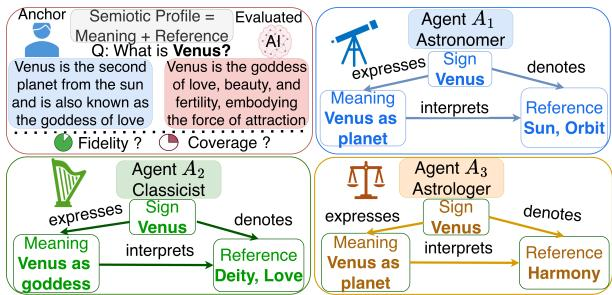
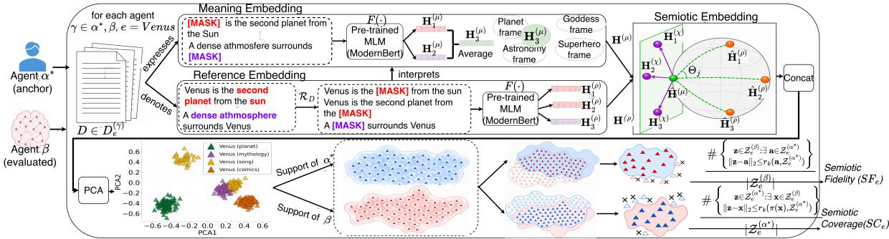
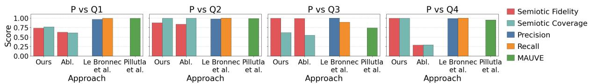
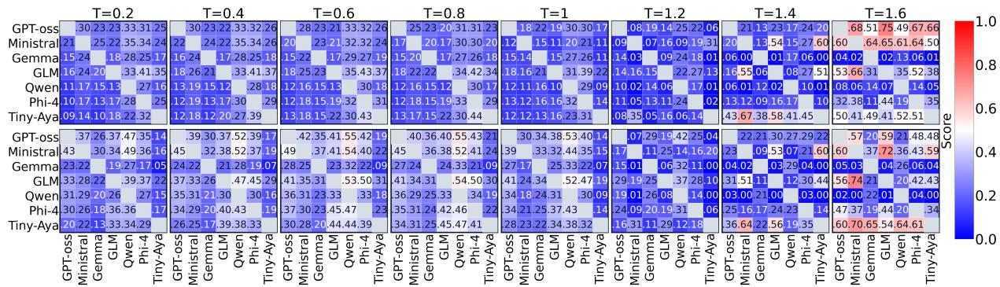
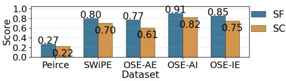
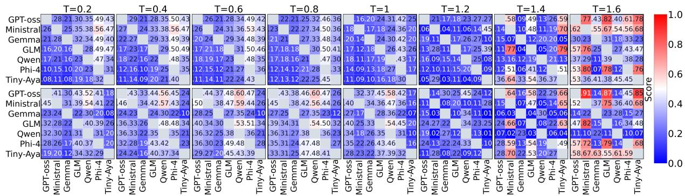
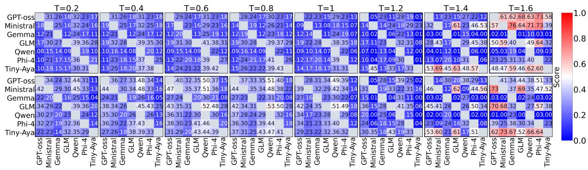
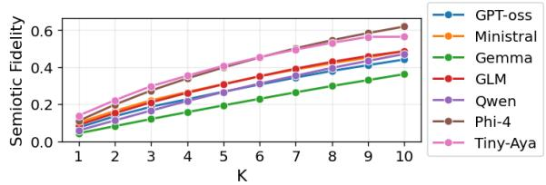
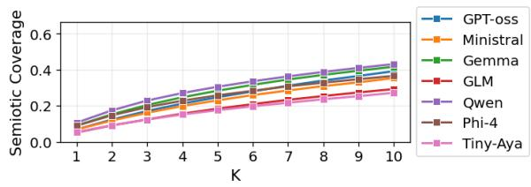
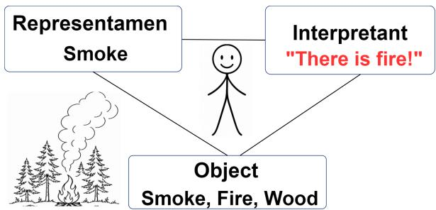

# A Semiotics-Aware Framework for Evaluating Fidelity and Coverage in Natural Language Generation

Lorenzo Zangari University of Lausanne Lausanne, Switzerland lorenzo.zangari@unil.ch

## Abstract

When two texts describe the same expression, standard metrics based on lexical overlap or whole-text similarity may fail to detect meaningful differences in how that expression is framed. We propose a framework to evaluate semiotic alignment between texts, where a semiotic profile encompasses both the contextual meaning and the discourse references made salient by a text. Our approach yields two scores, Semiotic Fidelity and Semiotic Coverage, estimating how much of one text’s profile is supported by the other and how much of the other’s profile it recovers. Experiments show that coverage is typically lower than fidelity, and that alignment between LLMs and humancurated data is highest at low sampling temperatures, while higher temperatures reduce this alignment.

## 1 Introduction

Davide Picca University of Lausanne Lausanne, Switzerland davide.picca@unil.ch

The rapid rise of Large Language Models (LLMs) has made natural language a central interface between humans and machines (Naveed et al., 2025), making the evaluation of Natural Language Generation (NLG) increasingly important. The content of a linguistic expression, however, is often not fully determined by its surface form alone, as the same words can convey different meanings depending on who interprets them and on the context in which they occur (Haber and Poesio, 2024; Picca, 2025). As illustrated in Fig. 1, the expression “Venus” may be described by one agent as the “Roman goddess”, by another as “the second planet from the Sun”, and by another as an astrological symbol, where we use the term agent to refer to any entity that produces text. Even if such descriptions are fluent and coherent, they diverge both in the contextual meaning assigned to the expression and in the entities they bring into the discourse. As humans reveal their communicative intent through their linguistic choices (Levelt, 1993), LLMs commit to a particular reading of the input in the act of generating text, where some properties become central, some entities become relevant, and other possible framings may be left unexpressed. Generated text can be treated as observable evidence of how the model has organized a sign into meaning (Lepori et al., 2025). This prompts us to address the following question in this work: given the same input, how can we estimate whether two agents produce overlapping output-levelframings?

  
Figure 1: Semiotic profiles of “Venus”: human vs. LLM (top left); semiotic triads for astronomer (top right), classicist (bottom left), astrologer (bottom right).

Existing NLG metrics based on surface overlap or contextual similarity (Papineni et al., 2002; Lin, 2004; Zhang et al., 2019) are useful for measuring textual quality, while distributional approaches compare sets of texts in a shared embedding space (Pillutla et al., 2021; Le Bronnec et al., 2024). In both cases, however, the whole text is used as the comparison unit, so factors such as fluency, style, length, and topical content are conflated with how the input is framed, reflecting the broader gap between form and meaning in language understanding (Bender and Koller, 2020; Trott et al., 2020).

We address this gap by proposing a framework grounded in semiotics (Peirce, 1931–1958), the discipline that studies how signs—ranging from single terms to entire documents (Picca et al., 2008)— acquire meaning in context. Central to our framework is the notion of a semiotic profile, which we define as the contextual meaning assigned to a sign together with the discourse entities made salient through that meaning. Given two texts describing the same expression, our framework compares the semiotic profile expressed by an evaluated agent against that of an anchor agent, taken as the reference point. First, the output of each agent is encoded through a semiotically grounded representation that captures both the contextual meaning assigned to the target expression and the discourse entities associated with it, which we call a Semiotic Embedding. To obtain it, we begin by masking a target expression (e.g., “Venus”) and its related discourse entities in the text and extract the hidden representations at the masked positions from a Masked Language Model (MLM) (Warner et al., 2024). Then, we combine these representations through a logarithmic map (Pennec, 2006).

Finally, we approximate the empirical support of each agent and compare the two manifolds through a support-based estimator (Kynkäänniemi et al., 2019), yielding two scores, Semiotic Fidelity (SF), measuring how much of the evaluated profile is supported by the anchor, and Semiotic Coverage (SC), measuring how much of the anchor’s profile is recovered by the evaluated agent.

We summarize our contributions as follows:

• We propose a novel computational framework that operationalizes Peircean semiotics for evaluating differences in how texts frame an expression. By comparing the output of an evaluated agent with that of an anchor agent, we estimate both unsupported content and anchor-supported content that the evaluated agent fails to recover.

• We introduce a model-agnostic procedure for computing Semiotic Embeddings: semiotically grounded text encodings that provide proxy representations of how a text frames a linguistic expression and the relevant discourse entities made salient within that frame.

• Our experiments across different LLMs, tasks, and datasets suggest that coverage is the main bottleneck relative to fidelity. We found that alignment depends on task structure and model sampling parameters: lower temperatures yielded the strongest alignment with human-curated data, whereas higher temperatures reduced this alignment and increased model-to-model agreement. Moreover, using the LLM-as-a-judge paradigm, we employed three frontier LLMs as a proxy for human evaluation, finding positive correlations between their ratings and our scores.

## 2 Background

Agent. In this work, we use the term agent for any human or model capable of engaging in communicative processes structured by semiotic mechanisms, that is, able to take an expression, i.e., any linguistic unit, as input and generate a text about it.

Peircean Semiotics. Peircean semiotics studies how signs, i.e., anything that stands for something else in some respect (Peirce, 1931–1958), become meaningful for an interpreter. Unlike de Saussure’s dyadic model, which defines the sign through the relation between signifier and signified (De Saussure, 1989), Peirce’s model includes three elements: the representamen, the material form of the sign, the object, what the sign stands for, and the interpretant, the meaning that arises in the agent when the representamen is taken to stand for the object. We adopt this framework because it enables us to capture how different agents frame the same input.

Semiotic modeling. We ground our framework in the computational approach of Picca et al. (2008), in which Peirce’s three elements are formalized as follows: the representamen corresponds to the Expression, i.e., any linguistic unit such as a word, or an entire document; the interpretant corresponds to the Meaning, i.e., the contextual sense assigned to that expression by an agent; and the object corresponds to the Reference, i.e., the entity or situation within the universe of discourse made accessible through interpretation. These three elements are connected by three directed relations, illustrated in Fig. 1. The first relation, Expresses, connects an Expression to its Meaning, reflecting how a linguistic unit conveys a particular sense in context. Denotes connects an Expression to its Reference, encoding the fact that a linguistic unit points to some entity or situation in the universe of discourse. Interprets connects a Meaning to a Reference, expressing the idea that it is only through meaning that a reference becomes identifiable.

Following this semiotic model, we define the semiotic profile of an agent as a text-based encoding of its interpretation: a situated process in which the agent assigns a context-dependent Meaning to an Expression and, through that

Meaning, identifies the relevant Reference.

Masked Word Embedding. We used masked word embedding as a proxy for modeling Meaning and Reference described above. As shown by Yamada et al. (2021), masking disentangles framelevel structure from lexical identity, grouping instances by the frame they evoke, which comprises both the relational context that constitutes its sense and the semantic roles and entities it makes available. Masked word embeddings are contextual representations produced by an MLM at the position where a target word $w _ { i }$ has been replaced with a mask token $( \mathrm { e . g . }$ ., [MASK]) within its context window $c _ { i }$ . Since MLMs are trained to recover a masked word from context, the hidden state obtained by applying the MLM to the masked context mask $( c _ { i } , w _ { i } )$ reflects what the context expects at that position instead of the lexical identity of $w _ { i }$ itself.

Problem statement. Let E be a set of expressions, where each $\textit { e } \in \textit { \mathcal { E } }$ is a target expression under analysis (e.g., “Venus”). Given e, each agent $\gamma \in \{ \beta , \alpha ^ { * } \}$ produces a collection of texts $\mathcal { D } _ { e } ^ { ( \gamma ) }$ describing $e ,$ each $D \in \mathcal { D } _ { e } ^ { ( \gamma ) }$ providing a distinct realization of the same subject. Our goal is to quantify how the semiotic profile expressed by an evaluated agent $\beta$ differs from that of an anchor agent $\alpha ^ { * }$ . For each agent γ, we derive from $\mathcal { D } _ { e } ^ { ( \gamma ) }$ a set of representations $\mathcal { Z } _ { e } ^ { ( \gamma ) }$ , where each vector encodes a Meaning assigned by $\gamma$ to e and the associated $R e f { \mathrm { - } }$ erence made salient through that Meaning. We then define an evaluation function that, given $\mathcal { Z } _ { e } ^ { ( \beta ) }$ and $\mathcal { Z } _ { e } ^ { ( \alpha ^ { * } ) }$ , returns two complementary scores, namely Semiotic Fidelity (SF), which quantifies how much of $\beta ^ { \bullet }$ profile is supported by $\alpha ^ { * }$ , and Semiotic Coverage (SC), which quantifies how much of $\alpha ^ { * } \mathrm { { s } }$ profile is recovered by $\beta .$

## 3 Related work

The evaluation of NLG has traditionally relied on surface-form comparison. Lexical overlap metrics (Papineni et al., 2002; Lin, 2004) score generated outputs against aligned human references through n-gram agreement, while embedding-based metrics such as BERTScore (Zhang et al., 2019) leverage contextual similarity in a pretrained representation space. Diversity-oriented metrics such as Distinct-n (Li et al., 2016) and Self-BLEU (Zhu et al., 2018) measure variation among generated texts, but their reliance on surface n-gram statistics provides only a coarse characterization of semantic diversity. Giulianelli et al. (2023) integrated lexical and semantic variability to assess whether generator uncertainty is calibrated to human production variability. Multi-task benchmark suites (Srivastava et al., 2023) and LLM-as-a-judge protocols (Zheng et al., 2023) employ LLMs as automated evaluators to aggregate quality scores across tasks.

Recent work in image generation showed that outputs of generative systems should be assessed along two dimensions, precision and recall (Sajjadi et al., 2018). A non-parametric, manifold-based formulation was proposed by Kynkäänniemi et al. (2019), projecting real and generated samples into a shared embedding space and defining precision as the fraction of generated samples falling within the support of the real ones, and recall as the fraction of real samples covered by the generated ones. A similar distribution-based perspective recently emerged in open-ended text generation, where many distinct continuations may be equally valid and no single reference adequately represents the space of acceptable outputs. MAUVE (Pillutla et al., 2021) compared machine-generated texts with a humantext distribution by embedding texts with GPT-2 (Radford et al., 2019) and computing a divergence frontier summarized as a single score, conflating quality and diversity. Le Bronnec et al. (2024) extended the approach of Kynkäänniemi et al. (2019) to the text domain, estimating the supports of human and generated texts in an embedding space to recover precision and recall as two distinct scores.

Comparison with prior work. Picca (2025) employs the Peircean triad conceptually in an information-theoretic model, whereas we operationalize it as a computational framework. Our work is closest to Le Bronnec et al. (2024) and Pillutla et al. (2021), but diverges in its object of comparison. These distributional approaches embed each text as a single point, conflating heterogeneous factors such as fluency, style and topical content into a global notion of quality and diversity (Tevet and Berant, 2021). Grounded in Peircean semiotics, our framework instead evaluates the Meaning–Reference configuration of a target expression, i.e., the contextual sense assigned to the topic and the discourse referents made salient through it. As shown in Fig. 3, this identifies fluent outputs reducing a polysemous topic to a small number of senses, and paraphrastic outputs preserving the same configuration under different surface

  
Figure 2: Our proposed framework to compute Semiotic Fidelity (SF) and Semiotic Coverage (SC).

forms.

## 4 Methodology

Overview. Figure 2 shows our framework, grounded in semiotic principles, which compares two agents $\gamma \in \{ \alpha ^ { * } , \beta \}$ . First, we employ a Transformer encoder pre-trained with a masked language modeling objective to construct a Meaning Embedding, capturing the contextual frame assigned to e in each $D \in \mathcal { D } _ { e } ^ { ( \gamma ) }$ , and a Reference Embedding, capturing the discourse entities salient in $D .$ These two representations are then combined to encode each Reference as a point relative to the corresponding Meaning, following the semiotic model in Sec. 2, yielding what we term Semiotic Embeddings. Then, we compare the Semiotic Embeddings of $\beta$ against those of $\alpha ^ { * }$ . Specifically, for each agent, we estimate a manifold by approximating its support with hyperspheres whose radii are defined by local k-nearest-neighbor distances. SF and SC are then computed as overlaps between the two empirical supports to measure whether $\beta ^ { \bullet }$ points remain within the anchor support and whether it covers the anchor, respectively.

Meaning Embedding. Given an Expression e and a text $D \in \mathcal { D } _ { e } ^ { ( \gamma ) }$ produced by an agent $\gamma ,$ we model the Meaning of e as the semantic frame it evokes in D, which can be captured through masked word embeddings (Yamada et al., 2021; Zhou et al., 2019). To this end, we employ a Transformer encoder pre-trained with a masked language modeling objective, which we denote by F. Let $w _ { 1 } , \ldots , w _ { n }$ be the mentions of e in D, including inflectional variants of e. For each mention $w _ { i }$ , we extract a context window $c _ { i }$ consisting of the sentence containing $w _ { i }$ and its left and right context. We then compute:

$$
\mathbf { H } _ { i } ^ { ( \mu ) } = F ( \mathrm { m a s k } ( c _ { i } , w _ { i } ) ) ,\tag{1}
$$

where mask $( c _ { i } , w _ { i } )$ denotes the context window $c _ { i }$ with $w _ { i }$ replaced by the special token of $F ,$ and $\mathbf { H } _ { i } ^ { ( \mu ) }$ is the hidden representation of the special token at the last layer of $F . ^ { 1 }$ The Meaning Embedding $\mathbf { H } ^ { \left( \mu \right) }$ is then obtained by averaging across all occurrences of e in D:

$$
\mathbf { H } ^ { ( \mu ) } = \frac { 1 } { n } \sum _ { i = 1 } ^ { n } \mathbf { H } _ { i } ^ { ( \mu ) } .\tag{2}
$$

$\mathbf { H } ^ { ( \mu ) } \in \mathbb { R } ^ { d } .$ , with d denoting the hidden dimensionality of $F$ , serves as a proxy for the semantic frame assigned to e in $D _ { \colon }$ abstracting away from its lexical form.

Reference Embedding. Given an Expression e and a text $D \in \mathcal { D } _ { e } ^ { ( \gamma ) }$ produced by an agent γ, we model its Reference as the entities made salient in D by the frame evoked by e. Since Reference is frame-dependent, the same entity may play different roles across frames, and different surface forms may realize the same role. We therefore encode each Reference through masked word embeddings, reducing dependence on lexical identity while preserving its local context. Using the procedure in Appendix B.6, we extract from D the set $\mathcal { R } _ { D } = \{ r _ { 1 } , . . . , r _ { m } \}$ of References associated with e (e.g., Sun when $e _ { \mathrm { \ell } } = \mathrm { \ " } V e n u s \mathrm { \prime \prime } )$ , excluding mentions of e itself, already captured by the Meaning. For each $r _ { j }$ , let $w _ { j , 1 } , \dotsc , w _ { j , n _ { j } }$ be its occurrences in D and $c _ { j , l }$ the context window around $w _ { j , l }$ . The Reference Embedding is obtained by averaging the masked representations over these occurrences:

$$
\mathbf { H } _ { j } ^ { ( \rho ) } = \frac { 1 } { n _ { j } } \sum _ { l = 1 } ^ { n _ { j } } F ( \operatorname* { m a s k } ( c _ { j , l } , w _ { j , l } ) ) ,\tag{3}
$$

where $\mathbf { H } _ { j } ^ { ( \rho ) }$ is the average hidden representation of the masked occurrences at the last layer of $F$ the same MLM used for the Meaning Embedding, providing a contextual representation of $r _ { j }$ that reduces dependence on its surface form.

Semiotic Embedding. The Semiotic Embedding encodes how an agent frames an Expression e in a text $D \in \mathcal { D } _ { e } ^ { ( \gamma ) }$ by representing each Reference Embedding relative to the Meaning Embedding, rather than as an independent point in the embedding space. We first project both the Meaning Embedding $\mathbf { H } ^ { \left( \mu \right) }$ and each Reference Embedding $\mathbf { H } _ { j } ^ { ( \rho ) }$ onto the unit hypersphere by Euclidean normalization, yielding ${ \widehat { \mathbf { H } } } ^ { ( \mu ) }$ and $\widehat { \mathbf { H } } _ { j } ^ { ( \rho ) }$ , respectively. We then apply the logarithmic map at ${ \widehat { \mathbf { H } } } ^ { ( \mu ) }$ which expresses each normalized Reference Embedding through the direction and length of the shortest path along the hypersphere that connects it to the normalized Meaning Embedding. Let $\theta _ { j } = \operatorname { a r c c o s } \Big ( \langle \widehat { \mathbf { H } } ^ { ( \mu ) } , \widehat { \mathbf { H } } _ { j } ^ { ( \rho ) } \rangle \Big )$ denote the angle between the two normalized embeddings, with $\langle \cdot , \cdot \rangle$ the Euclidean inner product. The spherical logarithmic map has the closed form:

$$
\mathbf { H } _ { j } ^ { ( \chi ) } = \theta _ { j } \frac { \widehat { \mathbf { H } } _ { j } ^ { ( \rho ) } - \cos ( \theta _ { j } ) \widehat { \mathbf { H } } ^ { ( \mu ) } } { \left\| \widehat { \mathbf { H } } _ { j } ^ { ( \rho ) } - \cos ( \theta _ { j } ) \widehat { \mathbf { H } } ^ { ( \mu ) } \right\| } ,\tag{4}
$$

where $\| \cdot \|$ denotes the Euclidean norm, and $\mathbf { H } _ { j } ^ { ( \chi ) }$ is the displacement that encodes each Reference Embedding relative to the Meaning Embedding. Then, we define the Semiotic Embedding as:

$$
\mathbf { H } _ { j } ^ { ( \sigma ) } = \left\{ \left[ \widehat { \mathbf { H } } ^ { ( \mu ) } \parallel \mathbf { 0 } _ { d } \right] , \quad \ j = 0 , \right.\tag{5}
$$

where $[ \cdot \| \cdot ]$ denotes vector concatenation and $\mathbf { H } _ { i } ^ { ( \sigma ) } \in \mathbb { R } ^ { 2 d }$ . The first component represents the Meaning assigned to e in D, while the second represents which reference is reached from that Meaning and along which displacement. As a consequence, identical displacements attached to different Meanings remain distinct through the first component. The case $j = 0$ stores only the Meaning Embedding, independently of any Reference Embedding.

Semiotic Fidelity and Coverage. For a given Expression e, each agent $\gamma \in \{ \beta , \alpha ^ { * } \}$ produces its own set of documents $\mathcal { D } _ { e } ^ { ( \gamma ) }$ describing e, from which we compute its Semiotic Embeddings. We compare the evaluated agent $\beta$ against the anchor $\alpha ^ { * }$ through a manifold estimated from these embeddings. Since this estimation relies on local distances, we first apply PCA to the Semiotic Embeddings, retaining the smallest number of components that explain at least 90% of the variance, to reduce dimensionality and filter noise before support estimation (Le Bronnec et al., 2024). We denote by $\widetilde { \mathbf { H } } _ { D , j } ^ { ( \sigma ) }$ the projected Semiotic Embedding for $\gamma .$ . For each agent, we then collect these projected representations across all documents $D \in \mathcal { D } _ { e } ^ { ( \gamma ) }$ into a collection $\begin{array} { r } { \mathcal { Z } _ { e } ^ { ( \gamma ) } = \bigcup _ { D \in \mathcal { D } _ { e } ^ { ( \gamma ) } } \{ \widetilde { \mathbf { H } } _ { D , j } ^ { ( \sigma ) } \} _ { j = 0 } ^ { m _ { \gamma , D } } } \end{array}$ , where $m _ { \gamma , D }$ is the number of references extracted from document D. We then approximate the support of $\mathcal { Z } _ { e } ^ { ( \gamma ) }$ by centering a hypersphere on each semiotic point, with radius given by the distance to its k-th nearest neighbor within the full collection $\mathcal { Z } _ { e } ^ { ( \gamma ) }$ computed across all documents of agent $\gamma .$ . Denoting by $\mathbf { N } _ { k } ( \widetilde { \mathbf { H } } _ { D , i } ^ { ( \sigma ) } , \mathcal { Z } _ { e } ^ { ( \gamma ) } )$ the k-th nearest neighbor of $\widetilde { \mathbf { H } } _ { D , j } ^ { ( \sigma ) }$ in $\mathcal { Z } _ { e } ^ { ( \gamma ) } \backslash \{ \widetilde { \mathbf { H } } _ { D , j } ^ { ( \sigma ) } \}$ , the radius is:

$$
r _ { k } \left( \widetilde { \mathbf { H } } _ { D , j } ^ { ( \sigma ) } , \mathcal { Z } _ { e } ^ { ( \gamma ) } \right) = \left. \widetilde { \mathbf { H } } _ { D , j } ^ { ( \sigma ) } - \mathbf { N } _ { k } \left( \widetilde { \mathbf { H } } _ { D , j } ^ { ( \sigma ) } , \mathcal { Z } _ { e } ^ { ( \gamma ) } \right) \right. _ { 2 } .\tag{6}
$$

Given $\mathbf { x } \in \mathcal { Z } _ { e } ^ { ( \beta ) }$ and $\mathbf { a } \in \mathcal { Z } _ { e } ^ { ( \alpha ^ { * } ) }$ , Semiotic Fidelity for Expression e is defined as the fraction of evaluated points that fall within at least one hypersphere of the anchor support:

$$
\begin{array} { r l r } & { } & { \mathrm { S F } _ { e } ( \beta \mid \alpha ^ { * } ) = \cfrac { 1 } { \vert \mathcal { Z } _ { e } ^ { ( \beta ) } \vert } \displaystyle \sum _ { \mathbf { x } \in \mathcal { Z } _ { e } ^ { ( \beta ) } } \mathbb { I } \Big [ \exists \mathbf { a } \in \mathcal { Z } _ { e } ^ { ( \alpha ^ { * } ) } : } \\ & { } & { \Vert \mathbf { x } - \mathbf { a } \Vert _ { 2 } \leq r _ { k } \Big ( \mathbf { a } , \mathcal { Z } _ { e } ^ { ( \alpha ^ { * } ) } \Big ) \Big ] . } \end{array}\tag{7}
$$

For Semiotic Coverage, a symmetric definition that estimates the $\beta$ support using radii $r _ { k } ( \mathbf { x } , \mathcal { Z } _ { e } ^ { ( \beta ) } )$ would be less suitable in our setting. Since LLMs can be unstable and sometimes produce outputs with few or sparse references, the k-nearestneighbor distances internal to $\mathcal { Z } _ { e } ^ { ( \beta ) }$ may become large, so that the $\beta$ support could expand when the evaluated agent produces less referential content (Naeem et al., 2020; Park and Kim, 2023). We therefore estimate the $\beta$ support at the local resolution of the anchor. For each point $\mathbf { x } \in \mathcal { Z } _ { e } ^ { ( \beta ) }$ we center a hypersphere on x with the radius of its nearest anchor point, so that the radii reflect the density of the anchor rather than that of the evaluated agent. Following Naeem et al. (2020), Semiotic Coverage is then the fraction of anchor points covered by at least one such hypersphere:

  
Figure 3: Controlled diagnostic comparing our framework and its log-map ablation with prior work.

$$
\operatorname { S C } _ { e } ( \beta \mid \alpha ^ { * } ) = \frac { 1 } { \lvert \mathcal { Z } _ { e } ^ { ( \alpha ^ { * } ) } \rvert } \sum _ { \mathbf { a } \in \mathcal { Z } _ { e } ^ { ( \alpha ^ { * } ) } } \mathbb { I } \Big [ \mathbb { \exists } \mathbf { x } \in \mathcal { Z } _ { e } ^ { ( \beta ) } :\tag{8}
$$

where $\pi ( \mathbf { x } ) = \arg \operatorname* { m i n } _ { \mathbf { a } \in \mathcal { Z } _ { e } ^ { ( \alpha ^ { * } ) } } \| \mathbf { x } - \mathbf { a } \| _ { 2 }$ denotes the nearest anchor point to x. Unlike the formulation of Le Bronnec et al. (2024), this anchorcalibrated construction satisfies a monotonicity property, since the radius of each hypersphere is independent of the other evaluated points. Dropping a point from $\mathcal { Z } _ { e } ^ { ( \beta ) }$ removes its hypersphere while leaving the others unchanged, so that removing points cannot increase Semiotic Coverage.

The final scores are computed by averaging the per-expression scores over all expressions $e \in { \mathcal { E } } \colon$

$$
\begin{array} { l } { { \displaystyle \mathrm { S F } ( \beta \mid \alpha ^ { * } ) = \frac { 1 } { | \mathcal { E } | } \sum _ { e \in \mathcal { E } } \mathrm { S F } _ { e } ( \beta \mid \alpha ^ { * } ) } , } \\ { { \displaystyle \mathrm { S C } ( \beta \mid \alpha ^ { * } ) = \frac { 1 } { | \mathcal { E } | } \sum _ { e \in \mathcal { E } } \mathrm { S C } _ { e } ( \beta \mid \alpha ^ { * } ) } . } \end{array}\tag{9}
$$

Thus, SF quantifies the extent to which $\beta ^ { \bullet }$ profile is supported by $\alpha ^ { * }$ , while SC quantifies the extent to which $\beta$ recovers $\alpha ^ { * } \mathrm { { s } }$ profile.

## 5 Experiments

Setup. To evaluate whether SF and SC follow the expected behavior, we first conduct a controlled diagnostic. We then evaluate the framework, which can compare the semiotic profiles of any pair of agents, across three settings. In the R1 setting, the anchor is a human and the evaluated agents are LLMs. In R2, both the anchor and the evaluated agents are LLMs. In R3, both the anchor and the evaluated agents are humans. We used 10 random seeds to account for stochasticity and report average SF and SC. For R1 and R2, which involve LLM generation, we additionally varied the temperature over the range [0.2, 1.6] in increments of 0.2 to assess how generation stability affects semiotic alignment. Following Kynkäänniemi et al. (2019), we set $k = 3$ in all experiments to retain a local support estimate and limit the support expansion induced by larger neighborhoods.

<table><tr><td>From</td><td>Model</td><td>Abbrev.</td><td>Params</td></tr><tr><td>US</td><td>Phi-4-mini-instruct gemma-3-12b-it</td><td>Phi-4 Gemma GPT-oSS</td><td>3.80B 12.19B</td></tr><tr><td>EU</td><td>gpt-oss-20b Ministral-3-14B-Instruct</td><td>Ministral</td><td>20.9B 13.90B</td></tr><tr><td>China</td><td>Qwen3-4B-Instruct g1m-4-9b-chat</td><td>Qwen GLM</td><td>4.00B 9.00B</td></tr><tr><td>World</td><td>tiny-aya-global</td><td>Tiny-Aya</td><td>3.35B</td></tr></table>

Table 1: LLMs selected for our study, annotated with their geographic “location” and number of parameters.

Data. For R1, we employed WIKIPOLY, a dataset of lead-section paragraphs from Wikipedia pages associated with polysemous terms. For R2, we additionally evaluated the ability of LLMs to generate content related to Peircean concepts, i.e., abstract theoretical terms derived from Peirce’s semiotic theory, using COMMENS, a dataset extracted from the Commens project (Bergman et al., 2020). For R3, we employed two document-level simplification datasets, SWIPE (Laban et al., 2023) and OSE (Vajjala and Luciˇ c´, 2018), in which each complex text is paired with a human-written simplified version. OSE further provides three reading levels, Advanced, Intermediate, and Elementary, which we evaluate in the OSE-AI, OSE-AE, and OSE-IE settings. We additionally built a dataset called PEIRCE from Commens, splitting Peirce’s writings into two temporally balanced halves, using the earlier half as anchor texts.

Models. We employed a selection of open LLMs shown in Tab. 1, with different sizes and architectures, using publicly available implementations on Hugging Face. As the pre-trained Transformer $F _ { \mathrm { { ; } } }$ we used ModernBERT (Warner et al., 2024).

## 5.1 Controlled Diagnostic

We test whether SF and SC exhibit the expected behavior under controlled changes in sense coverage and surface form. We use P, an anchor dataset derived from WIKIPOLY in which each target expression has four lead-section paragraphs covering three senses, with one represented by two distinct paragraphs. For each instance in P, we construct four variants. Q1 replaces one paragraph with another from the same sense and a second with one from an unseen sense. We expect both scores to be near 0.75, since three of the four components in Q1 are supported by P and three of those in P are recovered by Q1. Q2 retains P and adds paragraphs expressing additional senses, so SC should remain near 1.00 while SF decreases. Q3 retains only a subset of P, so SF should remain near 1.00 while SC decreases. Q4 replaces each paragraph with a paraphrase preserving its meaning and referents, so both scores should remain near 1.00.

<table><tr><td>T</td><td>GPT-oss Ministral Gemma</td><td></td><td></td><td>GLM</td><td>Qwen</td><td>Phi-4 Tiny-Aya</td><td></td><td></td></tr><tr><td>0.2</td><td></td><td>.16/.19 .16/.22 .13/.22 .18/.14 .19/.25 .28/.20 .25/.16</td><td></td><td></td><td></td><td></td><td></td><td></td></tr><tr><td>0.4</td><td></td><td>.16/.21 .15/.23 .12/.21 .16/.14 .18/.25 .29/.22 .25/.17</td><td></td><td></td><td></td><td></td><td></td><td></td></tr><tr><td>0.6</td><td></td><td>.16/.22 .14/.22 .12/.20 .17/.16 .18/.25 .27/.23 .25/.17</td><td></td><td></td><td></td><td></td><td></td><td></td></tr><tr><td>0.8</td><td></td><td>.15/.21 .13/.22 .12/.20 .16/.16 .18/.25.29/.24.24/.18</td><td></td><td></td><td></td><td></td><td></td><td></td></tr><tr><td>1.0</td><td></td><td>.17/.21 .11/.21 .12/.22 .15/.14 .17/.26 .27/.24 .19/.15</td><td></td><td></td><td></td><td></td><td></td><td></td></tr><tr><td>1.2</td><td></td><td>.15/.18 .20/.09 .12/.21 .15/.13 .15/.24 .23/.22 .28/.07</td><td></td><td></td><td></td><td></td><td></td><td></td></tr><tr><td>1.4</td><td></td><td></td><td></td><td></td><td></td><td></td><td>.18/.10 .41/.05 .11/.21.30/.07 .13/.20 .23/.13 .42/.05</td><td></td></tr><tr><td>1.6</td><td>.36</td><td>/.04.48</td><td>/.04 .12/.17 .42 AVG .19/.17 .22/.16 .12/.20 .21/.12 .17/.23 .27/.19 .30/.12</td><td></td><td>/.06 .15</td><td>/.13.32</td><td>/.07.49</td><td>/.04</td></tr></table>

Table 2: R1: SF/SC across temperatures (T); higher is better. Underlined: highest harmonic mean per model.

Figure 3 compares our method with those of Le Bronnec et al. (2024) and Pillutla et al. (2021), and with an ablation of our framework without the logarithmic-map Reference displacement (Abl.). SF and SC follow the expected patterns across all four transformations. On Q1, our method yields 0.74/0.77, reflecting unsupported and missing anchor content, while the prior methods provide high scores. Their scores also remain high on Q2, where our scores show the expected asymmetry between reduced SF and high SC. On Q3, high SF and lower SC capture the subset relation. Precision and recall reflect it more weakly, while MAUVE does not distinguish missing from unsupported content. On Q4, all methods except the ablation retain high scores under paraphrase. The ablation yields 0.61/0.58 on Q1 and scores Q4 even lower despite its preservation of all senses and referents.

## 5.2 R1: LLMs vs. Human-curated data

Table 2 reports SF and SC on the WIKIPOLY dataset across different temperatures, with underlined entries indicating the configurations that maximize the harmonic mean between SF and SC for each model. The most balanced trade-off is achieved at temperatures below 1.0 for all models except GPT-oss, whose best configuration at

T = 1.0 remains close to those at T = 0.4–0.6, suggesting that moderate sampling supports the exploration of alternative senses and references while preserving semantic coherence (Giulianelli et al., 2023). Gemma, Qwen, and Phi-4 show the most consistent behavior across temperatures. Phi-4 achieves the highest harmonic mean overall (0.26 at $T = 0 . 8 )$ and preserves a high SC up to $T = 1 . 2 .$ Gemma shows the smallest deviation, with SC close to 0.20 over most of the range. Qwen reaches its best configuration at $T = 0 . 2$ and obtains the highest average SC (0.23), remaining stable up to $T = 1 . 0$ . By contrast, Ministral, Tiny-Aya, GLM, and GPT-oss become increasingly unstable at higher temperatures (Holtzman et al., 2020; Giulianelli et al., 2023). The joint behavior of SF and SC reveals this instability. While Tiny-Aya reaches the highest average SF (0.30), its SC remains the lowest among all models. Some outputs may still fall within the anchor support for the dominant sense of e, increasing SF, while the drop in SC indicates that the broader referentialsemantic profile of the anchor is no longer recovered, with the evaluated agent either missing the alternative senses of e or producing outputs that lack a coherent referential structure.

## 5.3 R2: LLMs vs. LLMs

Figure 4 shows the harmonic mean of SF and SC for pairwise comparisons among LLMs on WIKIPOLY (top) and COMMENS (bottom). In WIKIPOLY, models were prompted to produce encyclopedic descriptions of polysemous terms, while in COMMENS, they were prompted to define abstract Peircean concepts. Plots of the individual SC and SF values are provided in the Appendix.

On WIKIPOLY, alignment among LLMs is relatively low (0.28/0.23 on SF/SC averaged across temperatures, with a mean per-pair harmonic score of 0.23), reflecting the difficulty of polysemous prompts, where models may select valid but divergent senses of the target expression e. Phi-4 is the strongest evaluated agent (average harmonic mean 0.31), with high SF and moderate SC (0.40/0.29). Qwen is slightly lower (0.28) but more coverageoriented (0.26/0.33), indicating broader recovery of the anchor profile. Tiny-Aya, by contrast, combines high SF with low SC (0.38/0.17), producing outputs compatible with the anchor but covering only a narrow portion of its profile. Ministral and GLM obtain lower harmonic means (0.22 and 0.21), with Ministral more balanced (0.26/0.22)

  
Figure 4: R2: pairwise harmonic mean of SF and SC across temperatures (T) on WIKIPOLY (top) and COMMENS (bottom). Rows and columns correspond to anchors and evaluated models, respectively.

and GLM skewed toward SF (0.29/0.18). Gemma is mainly limited by low SF (0.17/0.24), while GPT-oss is the weakest overall (0.17). From the anchor perspective, Qwen, Gemma, and Phi-4 define the most difficult referential-semantic profiles to cover (0.13, 0.15, and 0.19). Notably, Phi-4’s profile is difficult for other agents to recover, while Phi-4 recovers their profiles well when evaluated. By contrast, GLM, GPT-oss, Ministral, and Tiny-Aya are easier anchors (0.29, 0.28, 0.28, and 0.27). The harmonic mean remains relatively stable up to $T \ = \ 0 . 8$ , drops at T = 1.0 (0.18), reaches its minimum at $T = 1 . 2 ( 0 . 1 3 )$ , then recovers at $T = 1 . 4 ( 0 . 2 1 )$ and peaks at $T = 1 . 6 ( 0 . 3 7 )$ . This contrasts with R1, where high temperatures reduce alignment with the human anchor, suggesting that high-temperature outputs move away from the human anchor while becoming similar to one another.

On COMMENS, scores are generally higher than on WIKIPOLY (0.32/0.29 averaged across temperatures, with harmonic mean 0.29). Since Peircean concepts are abstract but technically constrained, models likely share a more stable vocabulary and referential structure around these terms. Across temperatures, Qwen is the strongest and most balanced evaluated agent (0.38/0.38, harmonic mean 0.37). GLM, GPT-oss, and Phi-4 obtain similar harmonic means (0.32, 0.31, and 0.31), with GLM skewed toward SF (0.38/0.29), and GPT-oss and Phi-4 more balanced (0.30/0.34 and 0.32/0.32). Ministral and Gemma obtain lower harmonic means (0.28 and 0.25), while Tiny-Aya is the weakest evaluated agent overall (0.18), mainly due to low SC (0.26/0.15). From the anchor perspective, Gemma, Qwen, and Phi-4 yield the lowest harmonic means (0.17, 0.19, and 0.28), while Ministral, GLM, Tiny-Aya, and GPT-oss yield higher values (0.35, 0.35, 0.35, and 0.34). Across temperatures, COMMENS follows the same pattern as WIKIPOLY, but with higher alignment.

## 5.4 R3: Comparing Human-Curated Data

Figure 5 shows the results on human-curated datasets, where both the anchor and evaluated texts are human-authored versions of the same expression. On PEIRCE, the framework reports low scores (0.27/0.22 on SF and SC, respectively), indicating that Peirce did not characterize the same concept in the same way across different years. For example, the concept “Critical-common-sensism” (0.65/0.69) revolves around indubitable beliefs and common sense in both halves, but emphasizes different aspects of the doctrine. By contrast, for the concept “categories” (0.05/0.06), the older material follows Kantian and Hegelian categories, while the later material centers on Peirce’s notions of Firstness, Secondness, and Thirdness.

On SWIPE and OSE, the simplified text is compared against the complex one, taken as anchor. SWIPE shows high but asymmetric scores, indicating that when the simple text says something, it is typically faithful to the complex source while covering less of it, so that simplification behaves as compression more than paraphrase. The same pattern holds on OSE, where scores follow the difficulty of the simplification step. OSE-AI obtains the highest agreement, since Intermediate texts mostly preserve the Advanced discourse structure. OSE-IE is slightly lower, and OSE-AE the lowest, as moving directly from Advanced to Elementary produces the strongest semantic reduction.

## 5.5 Correlation with LLM Judgments

As a proxy for human evaluation, GPT-5.6 Sol, Gemini 3.8 Flash, and Kimi K3 rated R1 outputs for 30 sampled Expressions across all seven models at $T = 0 . 2$ . Spearman correlations between our scores and median judge ratings were $\rho = 0 . 6 7$ for SF and $\rho = 0 . 5 3$ for SC, suggesting positive associations. Appendix B.5 provides additional details.

  
Figure 5: R3: SF/SC on human-curated data.

## 6 Conclusion

We proposed a novel framework for comparing how two agents characterize the same expression. Our method encodes a text through Semiotic Embeddings, which capture the contextual meaning assigned to an expression and the references made salient through that meaning, yielding two scores: SF and SC. We believe this work offers a computational basis for assessing how closely the textual outputs of two agents are semiotically aligned. Future work will evaluate how LLMs frame visual signs in multimodal settings.

## 7 Limitations

Our framework is designed to be independent of the particular pre-trained Transformer employed, which makes it adaptable across domains and evaluation settings, provided that the encoder retains the MLM interface used to obtain Meaning and Reference Embeddings from masked positions (Yamada et al., 2021; Zhou et al., 2019). Other encoders with MLM-pretrained backbones can therefore be used. Indeed, we evaluated our framework using four additional encoders, as reported in Appendix D.2.

Another consideration concerns the manifoldbased component. As in precision and recall approaches (Sajjadi et al., 2018) based on non-parametric support estimation (Kynkäänniemi et al., 2019; Le Bronnec et al., 2024), stable support estimation benefits from sufficiently dense samples and can be affected by outliers or sparse regions (Naeem et al., 2020; Park and Kim, 2023). Two aspects of our framework are relevant here. First, each document D within the set of documents $\mathcal { D } _ { e } ^ { ( \gamma ) }$ generated by the agent γ for the target expression e contributes a structured set of Semiotic Embeddings, where one point preserves the

Meaning assigned to the target and the remaining points encode each extracted Reference as a displacement from that Meaning. Thus, a single document can contribute multiple semiotic points, which are pooled across all documents associated with the target expression for each agent. Second, SC is calibrated on the anchor distribution, preventing candidate radii from expanding solely because the evaluated collection is sparse. A related consideration is that, as in k-nearest-neighbor support estimation, k determines the resolution of the estimated support, with different values corresponding to different neighborhood scales. Following Kynkäänniemi et al. (2019), we use $k = 3$ to provide a common local resolution across all comparisons. Results across different values of k are reported in Appendix D.4.

The proposed framework also depends on the preprocessing used to identify the target expression e and its References $\mathcal { R } _ { D }$ , since differences in the extracted References can affect SF and SC. Appendix D.3 examines this dependence in R3 by comparing the SRL-based extractor with an alternative extraction procedure and separately evaluating progressive Reference omission. Although absolute scores varied, the dataset ordering was preserved for both measures across the two procedures and all tested omission rates. We also note that a document with few or no extracted References still contributes its Meaning component to the collection-level support. When a document itself makes few discourse entities salient, our framework captures this referential sparsity as part of its semiotic profile.

The controlled diagnostic in Section 5.1 tests whether SF and SC respond as expected to changes in sense coverage and surface form, while the LLM analysis in Appendix B.5 examines their correspondence with judgments of sampled R1 outputs. These analyses provide complementary checks on the behavior of the proposed measures, but neither replaces direct validation against human judgments. We leave a dedicated human annotation study to future work.

Finally, the need to perform reference extraction and MLM forward passes over the target and reference masks makes the method more computationally demanding than approaches based on a single whole-document embedding. This cost, however, falls entirely on a preprocessing stage that can be run offline and cached, leaving the comparison between agents unaffected. Moreover, the Meaning and Reference Embeddings of each document are independent and can be computed in parallel, which further limits the practical cost.

## 8 Ethical Considerations

Our framework is intended to compare the outputs of any pair of entities engaging in a communicative process, not to establish a single correct interpretation. The anchor is not assumed to be an absolute ground truth. It defines the reference perspective with respect to which we measure points outside the anchor support and anchor points not covered by the evaluated support. Accordingly, SF and SC should be interpreted as directional, anchordependent evidence of semiotic alignment, not as universal measures of truth, objectivity, or quality. Since anchors may be incomplete, biased, or domain-specific, their selection should be documented with care, especially in culturally sensitive or contested domains.

## Acknowledgments

This work was conducted as part of the project “Peirce interprets Peirce. A Computational Exploration of His Original Manuscripts”, supported by the Swiss National Science Foundation (SNSF) (grant no. 10003095).

## References

Emily M. Bender and Alexander Koller. 2020. Climbing towards NLU: On meaning, form, and understanding in the age of data. In Proceedings ofthe 58th Annual Meeting of the Association for Computational Linguistics, pages 5185–5198, Online. Association for Computational Linguistics.

Mats Bergman, Sami Paavola, and João Queiroz. 2020. Commens: Digital companion to cs peirce.

Ferdinand De Saussure. 1989. Cours de linguistique générale, volume 1. Otto Harrassowitz Verlag.

Jacob Devlin, Ming-Wei Chang, Kenton Lee, and Kristina Toutanova. 2019. BERT: Pre-training of deep bidirectional transformers for language understanding. In Proceedings of the 2019 Conference of the North American Chapter ofthe Associationfor Computational Linguistics: Human Language Technologies, Volume 1 (Long and Short Papers), pages 4171–4186, Minneapolis, Minnesota. Association for Computational Linguistics.

Umberto Eco. 1984. Semiotics and the Philosophy of Language. Advances in Semiotics. Indiana University Press, Bloomington.

Mario Giulianelli, Joris Baan, Wilker Aziz, Raquel Fernández, and Barbara Plank. 2023. What comes next? evaluating uncertainty in neural text generators against human production variability. In Proceedings ofthe 2023 Conference on Empirical Methods in Natural Language Processing, pages 14349–14371, Singapore. Association for Computational Linguistics.

Janosch Haber and Massimo Poesio. 2024. Polysemy— Evidence from linguistics, behavioral science, and contextualized language models. Computational Linguistics, 50(1):351–417.

Pengcheng He, Xiaodong Liu, Jianfeng Gao, and Weizhu Chen. 2021. Deberta: Decodingenhanced bert with disentangled attention. Preprint, arXiv:2006.03654.

Ari Holtzman, Jan Buys, Li Du, Maxwell Forbes, and Yejin Choi. 2020. The curious case of neural text degeneration. In International Conference on Learning Representations.

Rohan Jha, Bo Wang, Michael Günther, Georgios Mastrapas, Saba Sturua, Isabelle Mohr, Andreas Koukounas, Mohammad Kalim Akram, Nan Wang, and Han Xiao. 2024. Jina-ColBERT-v2: A generalpurpose multilingual late interaction retriever. In Proceedings ofthe Fourth Workshop on Multilingual Representation Learning (MRL 2024), pages 159– 166, Miami, Florida, USA. Association for Computational Linguistics.

Tuomas Kynkäänniemi, Tero Karras, Samuli Laine, Jaakko Lehtinen, and Timo Aila. 2019. Improved precision and recall metric for assessing generative models. Advances in neural information processing systems, 32.

Philippe Laban, Jesse Vig, Wojciech Kryscinski, Shafiq Joty, Caiming Xiong, and Chien-Sheng Wu. 2023. SWiPE: A dataset for document-level simplification of Wikipedia pages. In Proceedings ofthe 61st Annual Meeting of the Association for Computational Linguistics (Volume 1: Long Papers), pages 10674– 10695, Toronto, Canada. Association for Computational Linguistics.

Florian Le Bronnec, Alexandre Verine, Benjamin Negrevergne, Yann Chevaleyre, and Alexandre Allauzen. 2024. Exploring precision and recall to assess the quality and diversity of LLMs. In Proceedings of the 62nd Annual Meeting of the Association for Computational Linguistics (Volume 1: Long Papers), pages 11418–11441, Bangkok, Thailand. Association for Computational Linguistics.

Michael A. Lepori, Michael Curtis Mozer, and Asma Ghandeharioun. 2025. Racing thoughts: Explaining contextualization errors in large language models. In Proceedings of the 2025 Conference of the Nations ofthe Americas Chapter ofthe Associationfor Computational Linguistics: Human Language Technologies (Volume 1: Long Papers), pages 3020–3036,

Albuquerque, New Mexico. Association for Computational Linguistics.

Willem JM Levelt. 1993. Speaking: From intention to articulation. MIT press.

Jiwei Li, Michel Galley, Chris Brockett, Jianfeng Gao, and Bill Dolan. 2016. A diversity-promoting objective function for neural conversation models. In Proceedings of the 2016 Conference of the North American Chapter of the Association for Computational Linguistics: Human Language Technologies, pages 110–119, San Diego, California. Association for Computational Linguistics.

Chin-Yew Lin. 2004. ROUGE: A package for automatic evaluation of summaries. In Text Summarization Branches Out, pages 74–81.

Yinhan Liu, Myle Ott, Naman Goyal, Jingfei Du, Mandar Joshi, Danqi Chen, Omer Levy, Mike Lewis, Luke Zettlemoyer, and Veselin Stoyanov. 2019. Roberta: A robustly optimized bert pretraining approach. arXiv preprint arXiv:1907.11692.

Nina Miolane, Nicolas Guigui, Alice Le Brigant, Johan Mathe, Benjamin Hou, Yann Thanwerdas, Stefan Heyder, Olivier Peltre, Niklas Koep, Hadi Zaatiti, Hatem Hajri, Yann Cabanes, Thomas Gerald, Paul Chauchat, Christian Shewmake, Bernhard Kainz, Claire Donnat, Susan Holmes, and Xavier Pennec. 2020. Geomstats: A python package for riemannian geometry in machine learning. Journal ofMachine Learning Research, 21(223):1–9.

Muhammad Ferjad Naeem, Seong Joon Oh, Youngjung Uh, Yunjey Choi, and Jaejun Yoo. 2020. Reliable fidelity and diversity metrics for generative models. In Proceedings of the 37th International Conference on Machine Learning, volume 119 of Proceedings of Machine Learning Research, pages 7176–7185. PMLR.

Humza Naveed, Asad Ullah Khan, Shi Qiu, Muhammad Saqib, Saeed Anwar, Muhammad Usman, Naveed Akhtar, Nick Barnes, and Ajmal Mian. 2025. A comprehensive overview of large language models. ACM Transactions on Intelligent Systems and Technology, 16(5):1–72.

Kishore Papineni, Salim Roukos, Todd Ward, and Wei-Jing Zhu. 2002. Bleu: a method for automatic evaluation of machine translation. In Proceedings of the 40th Annual Meeting of the Association for Computational Linguistics, pages 311–318, Philadelphia, Pennsylvania, USA. Association for Computational Linguistics.

Dogyun Park and Suhyun Kim. 2023. Probabilistic precision and recall towards reliable evaluation of generative models. 2023 IEEE/CVF International Conference on Computer Vision (ICCV), pages 20042– 20052.

Charles Sanders Peirce. 1931–1958. Collected Papers of Charles Sanders Peirce. Harvard University Press, Cambridge, MA. Vols. 1–6 edited by Charles Hartshorne and Paul Weiss; vols. 7–8 edited by Arthur W. Burks.

Xavier Pennec. 2006. Intrinsic statistics on riemannian manifolds: Basic tools for geometric measurements. Journal ofMathematical Imaging and Vision, 25(1):127–154.

Davide Picca. 2025. The semiotic channel principle: Measuring the capacity for meaning in llm communication. Preprint, arXiv:2511.19550.

Davide Picca, Alfio Massimiliano Gliozzo, and Aldo Gangemi. 2008. LMM: an OWL-DL MetaModel to represent heterogeneous lexical knowledge. In Proceedings of the Sixth International Conference on Language Resources and Evaluation (LREC’08), Marrakech, Morocco. European Language Resources Association (ELRA).

Krishna Pillutla, Swabha Swayamdipta, Rowan Zellers, John Thickstun, Sean Welleck, Yejin Choi, and Zaid Harchaoui. 2021. MAUVE: Measuring the gap between neural text and human text using divergence frontiers. In Advances in Neural Information Processing Systems, volume 34, pages 4816–4828.

Alec Radford, Jeffrey Wu, Rewon Child, David Luan, Dario Amodei, and Ilya Sutskever. 2019. Language models are unsupervised multitask learners. OpenAI Blog, 1(8):9.

Mehdi SM Sajjadi, Olivier Bachem, Mario Lucic, Olivier Bousquet, and Sylvain Gelly. 2018. Assessing generative models via precision and recall. Advances in neural information processing systems, 31.

Aarohi Srivastava, Abhinav Rastogi, Abhishek Rao, and 1 others. 2023. Beyond the imitation game: Quantifying and extrapolating the capabilities of language models. Transactions on Machine Learning Research.

Guy Tevet and Jonathan Berant. 2021. Evaluating the evaluation of diversity in natural language generation. In Proceedings of the 16th Conference of the European Chapter of the Association for Computational Linguistics: Main Volume, pages 326–346, Online. Association for Computational Linguistics.

Sean Trott, Tiago Timponi Torrent, Nancy Chang, and Nathan Schneider. 2020. (Re)construing meaning in NLP. In Proceedings ofthe 58th Annual Meeting of the Association for Computational Linguistics, pages 5170–5184, Online. Association for Computational Linguistics.

Sowmya Vajjala and Ivana Luciˇ c. 2018.´ OneStopEnglish corpus: A new corpus for automatic readability assessment and text simplification. In Proceedings of the Thirteenth Workshop on Innovative Use ofNLPfor Building Educational Applications, pages 297–304, New Orleans, Louisiana. Association for Computational Linguistics.

Benjamin Warner, Antoine Chaffin, Benjamin Clavié, Orion Weller, Oskar Hallström, Said Taghadouini, Alexis Gallagher, Raja Biswas, Faisal Ladhak, Tom Aarsen, Nathan Cooper, Griffin Adams, Jeremy Howard, and Iacopo Poli. 2024. Smarter, better, faster, longer: A modern bidirectional encoder for fast, memory efficient, and long context finetuning and inference. Preprint, arXiv:2412.13663.

Kosuke Yamada, Ryohei Sasano, and Koichi Takeda. 2021. Semantic frame induction using masked word embeddings and two-step clustering. In Proceedings of the 59th Annual Meeting of the Association for Computational Linguistics and the 11th International Joint Conference on Natural Language Processing (Volume 2: Short Papers), pages 811–816, Online. Association for Computational Linguistics.

Tianyi Zhang, Varsha Kishore, Felix Wu, Kilian Q Weinberger, and Yoav Artzi. 2019. Bertscore: Eval uating text generation with bert. arXiv preprint arXiv:1904.09675.

Lianmin Zheng, Wei-Lin Chiang, Ying Sheng, Siyuan Zhuang, Zhanghao Wu, Yonghao Zhuang, Zi Lin, Zhuohan Li, Dacheng Li, Eric Xing, and 1 others. 2023. Judging llm-as-a-judge with mt-bench and chatbot arena. Advances in neural information processing systems, 36:46595–46623.

Wangchunshu Zhou, Tao Ge, Ke Xu, Furu Wei, and Ming Zhou. 2019. BERT-based lexical substitution. In Proceedings of the 57th Annual Meeting of the Associationfor Computational Linguistics, pages 3368– 3373, Florence, Italy. Association for Computational Linguistics.

Yaoming Zhu, Sidi Lu, Lei Zheng, Jiaxian Guo, Weinan Zhang, Jun Wang, and Yong Yu. 2018. Texygen: A benchmarking platform for text generation models. In The 41st International ACM SIGIR Conference on Research and Development in Information Retrieval, pages 1097–1100.

## A Notation

Table 8 summarizes the notation used in this work.

## B Implementation Details

In this section, we describe the implementation details, prompt specifications, and the hyperparameter choices used in our experiments.

## B.1 Environment

We ran our framework on a server equipped with a single NVIDIA A100-PCIE-40GB GPU (40 GB VRAM), 503 GiB of system RAM, dual AMD EPYC 7402 CPUs (24 cores each, 48 cores total), and Red Hat Enterprise Linux 9.4 as the operating system. All experiments were run in a Python 3.12.1 environment.2

Excluding LLM text generation, treated as a preprocessing step, running our evaluation framework on cached outputs required less than 12 GPU hours on a single GPU per experiment, across all datasets.

## B.2 Comparison with prior work

For the implementation of the prior approaches compared in Section 5.1, we used the publicly available GitHub implementation released by Le Bronnec et al. (2024)3 under the GPL-3.0 license.

## B.3 Generative Models

For all the selected open LLMs (cf. Tab. 1), we used the vLLM inference and serving library4. Generation used 4-bit quantization through the bitsandbytes library.5

All models were obtained from the Hugging Face Hub, namely Phi-4,6 Gemma,7 GPT-oss,8 Ministral,9 Qwen,10 GLM,11 and Tiny-Aya.12

We varied the temperature over the range [0.2, 1.6] in increments of 0.2, while leaving top\_p and top\_k at their default values. We focused on temperature because it directly controls the sharpness of the sampling distribution, and isolating a single parameter helps limit the interaction effects that additional truncation settings could introduce when comparing across models. This setup is also appropriate in our setting, where valid outputs may reflect different senses or formulations of the same target expression e, and a less truncated distribution allows such variation to surface. For each model, task, and temperature, we generated 10 responses per target expression under a fixed seed configuration for reproducibility, setting max\_new\_tokens = 512.

## B.4 Encoder-only Transformer

As the encoder-only Transformer, F, we employed ModernBERT13 (Warner et al., 2024) with maximum input length set to 512 tokens. ModernBERT has recently been proposed as a modernization of BERT (Devlin et al., 2019) designed to preserve bidirectional masked-language modeling while improving efficiency and long-context processing.

## B.5 Correlation with LLM Judgments of Semiotic Fidelity and Coverage

We employed GPT-5.6 Sol,14 Gemini 3.8 Flash,15 and Kimi ${ \bf K } 3 ^ { 1 6 }$ through the OpenRouter $\operatorname { \mathbf { A P I } } .$ 17 We requested low reasoning effort, leaving judge temperature, top\_p, and inference seed at provider defaults. Requests allowed up to 16,384 output tokens, including reasoning and the final response. Responses were validated to contain exactly the fields SF and SC, each with an integer from 1 to 5.

Figure 6 shows the prompt used to elicit judgments of SF and SC from the three LLM judges. Each judge assigned separate integer ratings from 1 to 5, assessing correspondence of the candidate Semiotic Profile to the anchor for SF and coverage of the anchor Semiotic Profile by the candidate collection for SC. The scale ranges from no identifiable correspondence (1) to complete or nearly complete correspondence (5). Note that judges evaluated the complete reference and candidate collections without access to theframework scores or model identities.

We randomly sampled Expressions from WIKIPOLY, balancing the sample by the number of senses, and analyzed 30 of them together with the corresponding R1 outputs generated by all models at $T = 0 . 2$ . For each expression-model pair, we computed the median of the three LLM ratings, one from each judge, separately for SF and SC. We used Spearman’s rank correlation to compare these median ratings with the corresponding framework scores, as it is suitable for ordinal ratings. We obtained $\rho = 0 . 6 7$ for SF and $\rho = 0 . 5 3$ for SC, suggesting positive associations in both dimensions. Higher framework scores tended to accompany higher LLM ratings.

## B.6 Reference Extraction Algorithm

We identify salient entities in a text as References through Semantic Role Labeling (SRL), which detects the predicate–argument structure of a sentence by assigning semantic roles to the constituents involved in the event evoked by a predicate. Algorithm 1 applies SRL to extract the References associated with an Expression e, collecting the discourse entities and situations semantically involved in $\mathcal { D } _ { e } ^ { ( \gamma ) }$ while excluding e itself. We employed the HanLP library,18 which provides an SRL model built on a ModernBERT-based encoder.

Step 1: Subject mention detection. A document D is first split into sentences. Before extracting References, we identify the spans that refer to the subject e. This set of subject mentions, denoted by $\textstyle { \mathcal { T } } _ { e } ,$ , includes exact matches, surface-form variants, and, for multi-word subjects, anchored partial mentions. An anchored partial mention is retained when an informative anchor word of the subject appears in a sentence together with another related word.

Step 2: SRL frame extraction. SRL is then applied independently to each sentence, returning one or more semantic frames, each consisting of a predicate and its labeled argument spans. We retain only argument spans whose roles are relevant for reference extraction, including core participants in the event and contextual roles such as locations, times, and purposes. This step ensures that the extracted References are not arbitrary noun phrases in D, but elements that participate in the semantic structure of the discourse.

Step 3: Chunk extraction. The argument spans returned by SRL can be long and syntactically complex, so each selected span is simplified before being added to the set. We remove leading function words, such as determiners and prepositions, and extract noun-centered chunks, i.e., shorter spans whose head is a common or proper noun, optionally accompanied by nearby modifiers. This converts long semantic-role arguments into compact entity-like units.

Step 4: Filtering. Each extracted chunk r is then checked by two filters. First, ISINFORMATIVE(r) removes chunks that do not provide a meaningful referential unit. A chunk is retained if it contains lexical content headed by a nominal element, such as a common noun, proper noun, or named entity, and discarded if it is empty, consists only of function words or adverbs, or is purely numeric. Numeric tokens are kept when part of a named entity or a referential expression. Second, ISSUBJECTMENTION $( r , \mathcal { T } _ { e } , e )$ removes chunks that correspond to the subject itself, comparing r against e, its surface variants, and the previously identified subject mentions $\mathcal { T } _ { e }$

  
Figure 6: Prompt for evaluating SF and SC with LLM judges. Placeholders enclosed in {} are filled with specific values: TARGET\_EXPRESSION specifies the expression; ANCHOR\_TEXTS and CANDIDATE\_TEXTS contain the complete WIKIPOLY reference and candidate collections, respectively.

Step 5: Normalization and merging. Finally, the remaining chunks are normalized and merged. Those with the same normalized surface form or lemma are treated as repeated mentions of the same Reference and collapsed into a single entry, yielding the Reference set $\mathcal { R } _ { D }$

## B.7 Other implementation details

Following Kynkäänniemi et al. (2019), we set $k = 3$ in all experiments, where k corresponds to the number of nearest neighbors used to define the radius of each hypersphere. This choice is also consistent with prior work estimating empirical support as a union of k-nearest-neighbor balls in a PCA-reduced embedding space (Le Bronnec et al., 2024). They showed that increasing k enlarges the estimated support and drives precision and recall toward one, making the overlap criterion more permissive. We therefore use a small value of k as a conservative local estimate of support, preserving fine-grained distinctions between Meaning– Reference configurations and limiting support inflation. We report a quantitative analysis of model rankings across values of k in Appendix D.4.

The implementation of Semiotic Embeddings relies on a few numerical safeguards for stable computation. Before computing $\begin{array} { r l } { \theta _ { j } } & { { } = } \end{array}$ arccos $\mathbf { \langle } \langle \widehat { \mathbf { H } } ^ { ( \mu ) } , \widehat { \mathbf { H } } _ { j } ^ { ( \rho ) } \rangle )$ , we clip the inner product to $[ - 1 , 1 ]$ , as commonly done in numerical implementations of geometric operations on manifolds (Miolane et al., 2020), so that $\theta _ { j } \in [ 0 , \pi ]$ by definition. For $0 < \theta _ { j } < \pi$ , Eq. 4 gives the closed-form logarithmic map. At the two boundary angles, the formula is undefined, so we handle them separately. When $\theta _ { j } = 0$ , the Meaning and Reference Embeddings coincide and the displacement is set to the zero vector. When $\theta _ { j } = \pi$ , the two points are antipodal and are connected by infinitely many shortest geodesics, so we again set the displacement to zero instead of choosing an arbitrary tangent direction. This convention keeps the construction deterministic and prevents singular values from propagating to the final Semiotic Embedding.

Algorithm 1 SRL-based Reference extraction.   
Given the subject e and a document D, the proce  
dure extracts the discourse References in D while   
excluding mentions of the subject itself.   
Require: subject e, document D   
Ensure: Reference set $\mathcal { R } _ { D }$   
// Step 1: initialize the set.   
1: $\mathcal { R } _ { D }  \emptyset$   
2: S ← SPLITSENTENCES(D)   
// Step 2: identify subject mentions to be excluded   
later.   
3: T ← FINDSUBJECTMENTIONS(e, D) ▷ exact matches,   
variants, anchored partial mentions   
// Step 3: extract semantic-role frames from each   
sentence.   
4: for all $\bar { s } \in \bar { S }$ do   
5: $\mathcal { F } _ { s } \gets :$ SEMANTICROLELABELING(s) ▷ predicates   
with labeled argument spans   
// Step 4: keep only semantically relevant argu  
ment spans.   
6: for all a ∈ ARGUMENTSPANS $( \mathcal { F } _ { s } )$ do   
7: if not ISSELECTEDROLE(a) then   
8: continue   
9: end if   
10: C ← EXTRACTCHUNKS(a) ▷ trim function   
words and keep noun-centered chunks   
// Step 5: filter invalid chunks.   
11: for all $r \in { \mathcal { C } }$ do   
12: if not ISINFORMATIVE(r) then   
13: continue   
14: end if   
15: if ISSUBJECTMENTION $( r , \mathcal { T } _ { e } , e )$ then   
16: continue   
17: end if   
18: $\mathcal { R } _ { D }  \mathcal { R } _ { D } \cup \{ r \}$   
19: end for   
20: end for   
21: end for   
// Step 6: merge repeated mentions of the same   
Reference.   
22: $\mathcal { R } _ { D } \gets$ NORMALIZEANDMERGE $\left( \mathcal { R } _ { D } \right)$ ▷ same   
normalized surface or lemma form   
23: return $\mathcal { R } _ { D }$

## B.8 LLM generation prompts

Figures 7 and 8 show the prompts used to query the models in experiments R1 and R2, respectively. In the Wikipedia lead-generation task, the model was provided with information about the outputs produced in previous generations. Since the terms were extracted from Wikipedia, they can be expected, in many cases, to correspond to entities or senses that are relatively salient in the model’s parametric knowledge. The generation history was therefore included to prevent the model from simply restating a previously generated lead and, when possible, to encourage it to produce a lead for a different sense or for a complementary aspect of the same term.

  
Figure 7: Prompt used in R1 for generating a Wikipediastyle lead for a target expression e.

By contrast, no generation history was included in the Peircean semiotics task. In this case, several terms are specialized theoretical concepts for which a single unambiguous definition is not always available. Moreover, Peirce’s own terminology and conceptual distinctions were developed and sometimes reformulated across different writings.

  
Figure 8: Prompt used in R2 for generating definitions of Peircean concepts.

<table><tr><td>Dataset</td><td>Comparison unit</td><td>Size</td></tr><tr><td>WIKIPOLY</td><td>abstract</td><td>936</td></tr><tr><td>PEIRCE</td><td>document</td><td>1,974</td></tr><tr><td>SWIPE</td><td>article</td><td>3,279</td></tr><tr><td>OSE-AI</td><td>article</td><td>187</td></tr><tr><td>OSE-AE</td><td>article</td><td>187</td></tr><tr><td>OSE-IE</td><td>article</td><td>187</td></tr><tr><td>COMMENS</td><td>Peircean concept</td><td>50</td></tr></table>

Table 3: Sizes of the datasets used in our evaluations. The comparison unit is the textual element compared between the two agents, and the size is the number of such units.

## C Datasets

Table 3 reports the size of each dataset used in our evaluations. For R1 and R2, which involve LLM generation, each instance was generated 10 times per temperature, with the temperature varied from 0.2 to 1.6 in increments of 0.2.

All datasets are in English and used only for aggregate evaluation.

In the following, we describe the construction of WIKIPOLY and the use of COMMENS, both relying on publicly available textual sources used only for aggregate evaluation.

## C.1 Commens

The COMMENS (Bergman et al., 2020) materials are released under a Creative Commons Attribution–NonCommercial–ShareAlike license and are used here for non-commercial research and evaluation purposes only.

Table 4 lists the Peircean concepts used to query the LLMs and to construct the subset of concepts employed in R2. For R3, we collected all publicly

available definitions from http://commens.org/ home.
<table><tr><td>Concept</td><td>Concept</td></tr><tr><td>1. sign</td><td>2. induction</td></tr><tr><td>3. symbol</td><td>4. index</td></tr><tr><td>5. logic</td><td>6. abduction</td></tr><tr><td>7. interpretant</td><td>8. habit</td></tr><tr><td>9. real</td><td>10. icon</td></tr><tr><td>11. pragmatism</td><td>12. deduction</td></tr><tr><td>13. belief</td><td>14. retroduction</td></tr><tr><td>15. hypothesis-[reasoning]</td><td>16. categories</td></tr><tr><td>17. mathematics</td><td>18. existence</td></tr><tr><td>19. firstness</td><td>20. secondness</td></tr><tr><td>21. thirdness</td><td>22. object</td></tr><tr><td>23. rhema</td><td>24. maxim-of-pragmatism</td></tr><tr><td>25. argument</td><td>26. experience</td></tr><tr><td>27. proposition</td><td>28. speculative-grammar</td></tr><tr><td>29. truth</td><td>30. immediate-object</td></tr><tr><td>31. assertion</td><td>32. methodeutic</td></tr><tr><td>33. representamen</td><td>34. philosophy</td></tr><tr><td>35. semeiotic</td><td>36. critic</td></tr><tr><td>37. metaphysics</td><td>38. reasoning</td></tr><tr><td>39. science</td><td>40. inference</td></tr><tr><td>41. logic-[narrow-sense]</td><td>42. percept</td></tr><tr><td>43. pragmaticism</td><td>44. thought</td></tr><tr><td>45. continuum</td><td>46. normative-science</td></tr><tr><td>47. doubt</td><td>48. information</td></tr><tr><td>49. phaneron</td><td>50. phenomenology</td></tr></table>

Table 4: Top Peircean concepts used in this work, selected by the number of definitions available in COM-MENS (Bergman et al., 2020).

## C.2 WIKIPOLY

We constructed WIKIPOLY from Wikipedia text, available under the Creative Commons Attribution–ShareAlike 4.0 International License (CC BY-SA 4.0) and subject to the Wikimedia Foundation Terms of Use, used here for research and evaluation purposes only.

WIKIPOLY is a dataset designed to evaluate semantic coverage over highly polysemous topics, where each concept is paired with three to six sensespecific Wikipedia articles sampled from disambiguation pages, favoring candidates with the highest number of distinct senses to avoid bias toward the most popular ones. The result is a controlled collection of polysemous concepts with their principal senses, suitable for evaluating whether a system covers the full semantic range of a concept rather than defaulting to its most common interpretation.

Controlled Diagnostic. The controlled diagnostic in Section 5.1 uses P, an anchor dataset derived from WIKIPOLY, and four variants, Q1, Q2, Q3, and Q4. The variants introduce controlled changes in sense coverage and surface form.

Q1 applies a semantic perturbation while preserving part of the structure of P. One paragraph is replaced by another from the same Wikipedia sense, leaving that sense unchanged while altering its textual realization, and a second paragraph is replaced by one from a sense of the same term not present in P. It thus combines a within-sense substitution with the introduction of a new sense, testing whether a metric distinguishes a surface replacement within one meaning from a change in the semantic coverage of the term.

Q2 extends P by adding further senses of the same term, increasing the available semantic material instead of replacing existing content. It is therefore broader than P, covering more senses but also introducing content absent from the anchor, which tests whether a metric rewards higher coverage or penalizes meanings that go beyond the reference.

Q3 is a version of P retaining only a core subset of the original paragraphs and removing part of the semantic coverage of the anchor. It remains related to P but provides a less complete representation of the term, testing whether a metric is sensitive to missing content and penalizes a dataset that preserves some relevant information yet does not cover the full range of meanings in P.

Q4 preserves the semantic structure of P while changing the surface form of the text, rewriting its paragraphs through lexical noise or paraphrastic variation without altering the represented senses or referents. It tests robustness to surface-level variation, since a metric relying on lexical overlap may assign it a lower score, whereas a metric that captures meaning beyond surface form should recognize that Q4 retains the same semantic organization as the anchor.

## D Additional experiments

## D.1 More results on R2

Figures 9 and 10 show Semiotic Fidelity and Semiotic Coverage achieved in the R2 setting.

## D.2 Results with other MLMs

To assess the sensitivity of our framework across different encoders, we computed SF and SC on R3, where both the anchor and evaluated texts are human-authored. The original experiments used ModernBERT (Warner et al., 2024), and we repeated the analysis with four additional encoders with MLM-pretrained backbones: BERT (Devlin et al., 2019), RoBERTa (Liu et al., 2019), DeBERTa (He et al., 2021), and Jina-ColBERTv2 (Jha et al., 2024). Table 5 reports the resulting scores and their harmonic mean for each encoder and dataset.

  
Figure 9: R2: SF across temperatures (T). Rows and columns correspond to anchors and evaluated models, respectively; the shaded diagonal corresponds to 1.

  
Figure 10: R2: SC across temperatures (T). Rows and columns correspond to anchors and evaluated models, respectively; the shaded diagonal corresponds to 1.

<table><tr><td>Dataset</td><td>ModernBERT</td><td>BERT</td><td>RoBERTa</td><td>DeBERTa</td><td>Jina- ColBERT-v2</td></tr><tr><td colspan="6">Semiotic Fidelity (SF)</td></tr><tr><td>PEIRCE</td><td>.27</td><td>.23</td><td>.24</td><td>.27</td><td>.24</td></tr><tr><td>SWIPE</td><td>.80</td><td>.81</td><td>.80</td><td>.82</td><td>.82</td></tr><tr><td>OSE-AE</td><td>.77</td><td>.76</td><td>.75</td><td>.78</td><td>.77</td></tr><tr><td>OSE-AI</td><td>.91</td><td>.90</td><td>.90</td><td>.92</td><td>.91</td></tr><tr><td>OSE-IE</td><td>.85</td><td>.83</td><td>.84</td><td>.86</td><td>.86</td></tr><tr><td colspan="6">Semiotic Coverage (SC)</td></tr><tr><td>PEIRCE</td><td>.22</td><td>.23</td><td>.22</td><td>.22</td><td>.20</td></tr><tr><td>SWIPE</td><td>.70</td><td>.71</td><td>.70</td><td>.73</td><td>.74</td></tr><tr><td>OSE-AE</td><td>.61</td><td>.59</td><td>.58</td><td>.60</td><td>.60</td></tr><tr><td>OSE-AI</td><td>.82</td><td>.81</td><td>.82</td><td>.84</td><td>.82</td></tr><tr><td>OSE-IE</td><td>.75</td><td>.74</td><td>.74</td><td>.75</td><td>.74</td></tr><tr><td colspan="6">Harmonic Mean</td></tr><tr><td>PEIRCE</td><td>.24</td><td>.23</td><td>.23</td><td>.24</td><td>.22</td></tr><tr><td>SWIPE</td><td>.75</td><td>.76</td><td>.75</td><td>.77</td><td>.78</td></tr><tr><td>OSE-AE</td><td>.68</td><td>.66</td><td>.66</td><td>.68</td><td>.67</td></tr><tr><td>OSE-AI</td><td>.86</td><td>.86</td><td>.86</td><td>.88</td><td>.86</td></tr><tr><td>OSE-IE</td><td>.80</td><td>.78</td><td>.79</td><td>.80</td><td>.80</td></tr></table>

Table 5: Sensitivity to different MLM backbones.

Notably, across all encoders, SF, SC, and their harmonic mean yield the same ordering of the datasets: OSE-AI > OSE-IE > SWIPE > OSE-AE > PEIRCE. The harmonic mean varies only slightly across encoders within each dataset, suggesting that the overall pattern is consistent across different representation spaces.

## D.3 Analysis of Reference Extraction

Effect of the Reference Extractor. To examine the effect of the Reference extractor, we repeated the R3 experiments by replacing the SRL-based procedure described in Appendix B.6 with an alternative based on noun phrases (NPs) and named entity recognition (NER), hereafter NP+NER. The SRL procedure identifies References from semantically relevant argument spans in predicate–argument structures, whereas NP+NER directly collects noun chunks and named entities irrespective of their semantic roles. We implemented NP+NER with spaCy 3.8.1119 and the en\_core\_web\_sm 3.8.0 model. Duplicate spans are removed, and the same exclusion criteria as in the SRL procedure are applied. Thus, only Reference selection was changed. Meaning and Reference Embeddings were computed with Modern-

<table><tr><td>Dataset</td><td>SF</td><td>SC</td><td> $\operatorname { S F } _ { \mathrm { N P + N E R } }$ </td><td> $\mathrm { S C _ { N P + N E R } }$ </td></tr><tr><td>PEIRCE</td><td>.27</td><td>.22</td><td>.17</td><td>.14</td></tr><tr><td>SWIPE</td><td>.80</td><td>.70</td><td>.76</td><td>.67</td></tr><tr><td>OSE-AE</td><td>.77</td><td>.61</td><td>.75</td><td>.59</td></tr><tr><td>OSE-AI</td><td>.91</td><td>.82</td><td>.90</td><td>.82</td></tr><tr><td>OSE-IE</td><td>.85</td><td>.75</td><td>.84</td><td>.74</td></tr></table>

Table 6: SF and SC in R3 using the SRL-based and NP+NER Reference extractors.

BERT in both conditions, and all subsequent representation and scoring steps remained unchanged. Both configurations were evaluated over 20 random seeds, and we report the resulting average scores. We denote the resulting scores by $\mathrm { S F _ { N P + N E R } }$ and SCNP+NER.

Using either extractor, the fidelity and coverage scores yielded the same ordering: OSE-AI $> \mathrm { O S E \mathrm { - } I E } > \mathrm { S W I P E } > \mathrm { O S E \mathrm { - } A E } >$ PEIRCE. For each measure, Kendall’s $\tau _ { b } = 1 . 0$ indicates agreement across every pairwise comparison. The NP+NER extractor generally produced lower absolute scores, with the largest difference on PEIRCE and smaller differences across the OSE comparisons. Thus, the extraction algorithm affects the absolute values while preserving the same comparative pattern in R3 across the two tested approaches.

Effect of Reference Omission. To examine the effect of missed References on SF and SC, we simulated their omission in the R3 experiments shown in Fig. 5. We independently removed 10%, 20%, and 30% of the extracted Reference points from the anchor and evaluated collections without replacement over 20 random seeds, while retaining all Meaning points. For each condition, we recomputed the PCA projection, the k-NN supports with $k = 3 , \mathrm { S F }$ , and SC. We then computed the absolute differences between the resulting scores and those obtained with all extracted Reference points retained.

Across all removal rates, SF and SC yielded the same ordering: $\mathrm { O S E { - } A I } > \mathrm { O S E { - } I E } > \mathrm { S W I P E }$ > OSE-AE > PEIRCE. Additionally, Kendall’s $\tau _ { b } = 1 . 0$ indicates complete agreement with the baseline ordering. The largest mean absolute changes were .02 and .02 at 10%, .04 and .04 at 20%, and .06 and .07 at 30%, for SF and SC, respectively. Overall, the scores responded progressively to Reference omission while preserving the comparative conclusions in R3 across all tested conditions.

<table><tr><td>Dataset</td><td>10%</td><td>20%</td><td>30%</td></tr><tr><td colspan="4">Semiotic Fidelity (SF)</td></tr><tr><td>PEIRCE</td><td>.02</td><td>.04</td><td>.06</td></tr><tr><td>SWIPE</td><td>.01</td><td>.02</td><td>.03</td></tr><tr><td>OSE-AE</td><td>.01</td><td>.03</td><td>.05</td></tr><tr><td>OSE-AI</td><td>.02</td><td>.04</td><td>.06</td></tr><tr><td>OSE-IE</td><td>.02</td><td>.04</td><td>.06</td></tr><tr><td colspan="4">Semiotic Coverage (SC)</td></tr><tr><td>PEIRCE</td><td>.01</td><td>.03</td><td>.04</td></tr><tr><td>SWIPE</td><td>.01</td><td>.03</td><td>.04</td></tr><tr><td>OSE-AE</td><td>.02</td><td>.03</td><td>.05</td></tr><tr><td>OSE-AI</td><td>.02</td><td>.04</td><td>.07</td></tr><tr><td>OSE-IE</td><td>.02</td><td>.04</td><td>.06</td></tr></table>

Table 7: Mean absolute differences in SF and SC in R3 after removing 10%, 20%, or 30% of the Reference points. Differences are computed against scores obtained with all extracted Reference points retained.

## D.4 Analysis of k

Figure 11 shows, for each model, how Semiotic Fidelity and Semiotic Coverage vary with k, averaged over the available temperatures. Both scores increase with k for every model, as expected from support-based estimators, where larger neighborhoods yield larger hyperspheres and thus higher overlap (Le Bronnec et al., 2024). We also examined how model rankings change with k in order to quantify the effect of neighborhood scale on the differences observed among models. For each of the nine alternative values $k \in$ {1, 2, 4, 5, 6, 7, 8, 9, 10}, we compared the ranking of the seven models with that at $k = 3 .$ , separately for SF and SC, using Kendall’s $\tau _ { b } .$ . Combining the nine alternative values of k with the two measures yielded $9 \times 2 = 1 8$ ranking comparisons, comprising 378 pairwise model orderings. Of these, 357 (94.4%) were preserved. The minimum $\tau _ { b }$ was .810 for SF and .714 for SC, with 17 comparisons yielding at least .810 and no model shifting by more than two positions. For the inverted pairs, the median (maximum) absolute gaps at $k = 3$ were .010 (.033) and .013 (.025), while at the values of k where the ordering reversed they were .012 (.028) and .010 (.018), for SF and SC, respectively. Thus, the observed ranking changes tended to concern models separated by relatively small score margins.

## E Monotonicity of Semiotic Coverage

Here, we provide a formal proof of the monotonicity property of Semiotic Coverage. For a fixed Expression $e ,$ let $\mathcal { Z } _ { e } ^ { ( \alpha ^ { * } ) }$ and $\mathcal { Z } _ { e } ^ { ( \beta ) }$ denote the an-

  
Figure 11: Semiotic Fidelity (SF) (left) and Semiotic Coverage (SC) (right) across values of $k ,$ averaged over temperatures, on WIKIPOLY in the R1 setting.

chor and evaluated semiotic collections, respectively. For each $\mathbf { x } \in \mathcal { Z } _ { e } ^ { ( \beta ) }$ , recall from Eq. 8 that the anchor-calibrated radius is defined as:

$$
\begin{array} { r l } & { r _ { k } \Big ( \pi ( \mathbf { x } ) , \mathcal { Z } _ { e } ^ { ( \alpha ^ { * } ) } \Big ) , } \\ & { \pi ( \mathbf { x } ) = \arg \underset { \mathbf { a } \in \mathcal { Z } _ { e } ^ { ( \alpha ^ { * } ) } } { \operatorname* { m i n } } \ : \| \mathbf { x } - \mathbf { a } \| _ { 2 } , } \end{array}\tag{10}
$$

with ties resolved by any fixed rule. In our implementation, when two or more anchor points achieve the minimum distance to x, we select the first one in enumeration order. The support induced by $\mathcal { Z } _ { e } ^ { ( \beta ) }$ at the anchor scale is

$$
\begin{array} { r l r } {  { S \Big ( \mathcal { Z } _ { e } ^ { ( \beta ) } \Big ) = \bigcup _ { \mathbf { x } \in \mathcal { Z } _ { e } ^ { ( \beta ) } } \{ \mathbf { y } :  } }  \\ & { } & {  \| \mathbf { y } - \mathbf { x } \| _ { 2 } \leq r _ { k } \Big ( \pi ( \mathbf { x } ) , \mathcal { Z } _ { e } ^ { ( \alpha ^ { * } ) } \Big ) \Big \} , ~ } \end{array}\tag{11}
$$

so that Eq. 8 can be rewritten as

$$
\mathrm { S C } _ { e } ( \beta \mid \alpha ^ { * } ) = \frac { 1 } { \mid \mathcal { Z } _ { e } ^ { ( \alpha ^ { * } ) } \mid } \sum _ { \mathbf { a } \in \mathcal { Z } _ { e } ^ { ( \alpha ^ { * } ) } } \mathbb { I } \Big [ \mathbf { a } \in \mathcal { S } \Big ( \mathcal { Z } _ { e } ^ { ( \beta ) } \Big ) \Big ] .
$$

Let $\mathcal { Z } _ { e } ^ { ( \beta ^ { \prime } ) } \subseteq \mathcal { Z } _ { e } ^ { ( \beta ) }$ be obtained by removing one or more semiotic points from the evaluated collection. Since the radius $r _ { k } ( \pi ( \mathbf { x } ) , \mathcal { Z } _ { e } ^ { ( \alpha ^ { * } ) } )$ depends only on x and on the fixed anchor collection $\mathcal { Z } _ { e } ^ { ( \alpha ^ { * } ) }$ , the hyperspheres associated with the remaining points are unchanged. Therefore

$$
\begin{array} { r } { S \left( \mathcal { Z } _ { e } ^ { ( \beta ^ { \prime } ) } \right) \subseteq S \left( \mathcal { Z } _ { e } ^ { ( \beta ) } \right) , } \end{array}
$$

and for every anchor point $\mathbf { a } \in \mathcal { Z } _ { e } ^ { ( \alpha ^ { * } ) }$

$$
\mathbb { I } \Big [ \mathbf { a } \in \mathcal { S } \Big ( \mathcal { Z } _ { e } ^ { ( \beta ^ { \prime } ) } \Big ) \Big ] \leq \mathbb { I } \Big [ \mathbf { a } \in \mathcal { S } \Big ( \mathcal { Z } _ { e } ^ { ( \beta ) } \Big ) \Big ] .
$$

Averaging the inequality over all anchor points yields:

$$
\frac { 1 } { | \mathcal { Z } _ { e } ^ { ( \alpha ^ { * } ) } | } \sum _ { \mathbf { a } \in \mathcal { Z } _ { e } ^ { ( \alpha ^ { * } ) } } \mathbb { I } \Big [ \mathbf { a } \in \mathcal { S } \Big ( \mathcal { Z } _ { e } ^ { ( \beta ^ { \prime } ) } \Big ) \Big ] \leq
$$

$$
\frac { 1 } { | \mathcal { Z } _ { e } ^ { ( \alpha ^ { * } ) } | } \sum _ { \mathbf { a } \in \mathcal { Z } _ { e } ^ { ( \alpha ^ { * } ) } } \mathbb { I } \Big [ \mathbf { a } \in \mathcal { S } \Big ( \mathcal { Z } _ { e } ^ { ( \beta ) } \Big ) \Big ] ,
$$

which, by the rewriting above, is equivalent to

$$
\operatorname { S C } _ { e } ( \beta ^ { \prime } \mid \alpha ^ { * } ) \leq \operatorname { S C } _ { e } ( \beta \mid \alpha ^ { * } ) .
$$

Thus, removing points from $\mathcal { Z } _ { e } ^ { ( \beta ) }$ cannot increase SC, since the radii are calibrated only on $\mathcal { Z } _ { e } ^ { ( \alpha ^ { * } ) }$ and the support $\mathcal { S } \left( \mathcal { Z } _ { e } ^ { ( \beta ) } \right)$ can therefore only shrink under sparsification. □

## F Additional Background

## F.1 More on Semiotics

Semiotics studies signs and the processes through which forms acquire meaning for interpreting agents. A visible, audible, or written form functions as a sign only when taken to stand for something within a context of interpretation (Peirce, 1931–1958), establishing a relation between signs, what they are about, and the interpretive activity that gives rise to sense. A classical account is offered by de Saussure, who describes the sign as a dyadic relation between a signifier, the perceptible form, and a signified, the associated concept (De Saussure, 1989). In this model, language is a structured system of differences where each word derives its value from its position within the system. For our purposes, however, the Saussurean model falls short on two points. First, it does not assign the interpreting agent a structural role, leaving variation across interpreters outside the theory. Second, it does not treat the relation to an object as constitutive of the sign, confining meaning to a relation between two internal poles of the linguistic system. Peirce’s framework is better suited to our needs because it casts meaning as an interpretive process linking a sign to what it is about through the effect produced in an agent.

In Peirce’s formulation, a sign is a triadic relation among three inseparable elements: the representamen, the form through which the sign appears, the object, what the sign is about, and the interpretant, the understanding, effect, or further sign produced when the representamen is taken to stand for the object (Peirce, 1931–1958). Meaning emerges from this relation as a whole: a representamen without an object would not be about anything, an object without an interpretant would not be taken as meant by any sign, and an interpretant without a representamen would have nothing to arise from. Semiosis is therefore not a direct act of naming, but a mediated process in which form, object, and interpretive effect constitute a single relation.

Within this structure, the interpretant plays a stabilizing role, anchoring the sign to a specific agent on a given occasion and fixing the respect in which the representamen stands for its object. Without it, the link between form and object would remain underdetermined, since the same form can in principle be related to many different objects. The interpretant closes this gap by grounding one such respect in the understanding of an interpreter, so that semiosis is always performed from the standpoint of an agent who brings intentionality to the sign. This active contribution can be described more precisely with the notion of a cultural unit introduced by Eco (1984). For Eco, the content side of a sign is not a private mental image but a culturally codified segment of the shared semantic system that a community recognizes as a stable meaning. In Peircean terms, what counts as the object of a sign is filtered by the categories, experiences, and practices available to the interpreter, and the interpretant is the locus where these cultural units become operative for an individual agent, turning the shared code into a concrete interpretive act.

Figure 12 illustrates this point with the representamen Smoke. An agent perceives the form smoke and produces the interpretant “There is $\hbar r e ! ^ { \prime \prime }$ , which makes the sign relation determinate. Through this interpretant, the object is articulated as a structured set of cultural units, including smoke, fire, and wood, acquired from a shared cultural background. A different interpreter, equipped with different cultural units, could relate the same representamen to a different object, for instance to a ritual signal or to an industrial process.

## F.2 Logarithmic Map

In this work, we employed the logarithmic map to represent each Reference Embedding as a displacement from the Meaning Embedding in the local tangent space at the Meaning Embedding itself. This operation provides a geometry-motivated way to express each Reference relative to the Meaning on the normalized embedding sphere following semiotic principles.

  
Figure 12: Peircean triadic semiosis for the representamen Smoke. The interpreter, at the center of the relation, produces the interpretant There $i s f i r e ! ,$ which stabilizes the sign by relating the representamen to an object articulated as a set of cultural units (smoke, fire, wood). The lines indicate the inseparable relation among representamen, interpretant, and object.

To apply this construction, both $\mathbf { H } ^ { \left( \mu \right) }$ and $\mathbf { H } _ { j } ^ { ( \rho ) }$ are first normalized onto the unit hypersphere, yielding ${ \widehat { \mathbf { H } } } ^ { ( \mu ) }$ and $\widehat { \mathbf { H } } _ { j } ^ { ( \rho ) }$ . On the unit hypersphere, a Euclidean difference would describe a displacement in the surrounding Euclidean space, whereas the logarithmic map gives a tangent vector anchored at the Meaning Embedding, which makes the Reference relative to the Meaning, as required by the semiotic model described in Sec. 2. Specifically, the angle $\theta _ { j } = \operatorname { a r c c o s } \left( \langle \widehat { \mathbf { H } } ^ { ( \mu ) } , \widehat { \mathbf { H } } _ { j } ^ { ( \rho ) } \rangle \right) \in$ $[ 0 , \pi ]$ is the spherical distance between the two normalized embeddings. To obtain the tangent direction from the Meaning to the Reference, the component of $\widehat { \mathbf { H } } _ { j } ^ { ( \rho ) }$ parallel to ${ \widehat { \mathbf { H } } } ^ { ( \mu ) }$ is removed:

$$
\widehat { \mathbf { H } } _ { j } ^ { ( \rho ) } - \cos ( \theta _ { j } ) \widehat { \mathbf { H } } ^ { ( \mu ) } .\tag{12}
$$

This vector belongs to the tangent space at the Meaning Embedding, since it is orthogonal to ${ \widehat { \mathbf { H } } } ^ { ( \mu ) }$

$$
\left. \widehat { \mathbf { H } } _ { j } ^ { ( \rho ) } - \cos ( \theta _ { j } ) \widehat { \mathbf { H } } ^ { ( \mu ) } , \widehat { \mathbf { H } } ^ { ( \mu ) } \right. = 0 .\tag{13}
$$

Hence, for $0 < \theta _ { j } < \pi$ , the logarithmic map gives

$$
\mathbf { H } _ { j } ^ { ( \chi ) } = \theta _ { j } \frac { \widehat { \mathbf { H } } _ { j } ^ { ( \rho ) } - \cos ( \theta _ { j } ) \widehat { \mathbf { H } } ^ { ( \mu ) } } { \left\| \widehat { \mathbf { H } } _ { j } ^ { ( \rho ) } - \cos ( \theta _ { j } ) \widehat { \mathbf { H } } ^ { ( \mu ) } \right\| } .\tag{14}
$$

The numerator gives the tangent direction at ${ \widehat { \mathbf { H } } } ^ { ( \mu ) }$ pointing toward $\widehat { \mathbf { H } } _ { j } ^ { ( \rho ) }$ , the denominator normalizes this direction to unit length, and the factor $\theta _ { j }$ scales it by the spherical distance between the two embeddings. The resulting vector $\mathbf { H } _ { j } ^ { ( \chi ) }$ therefore belongs to the tangent space at ${ \widehat { \mathbf { H } } } ^ { ( \mu ) }$ and encodes the Reference Embedding through both the direction and the magnitude of its displacement from the Meaning Embedding.

<table><tr><td>Symbol</td><td>Description</td></tr><tr><td> $\varepsilon$ </td><td>Set of target expressions under analysis.</td></tr><tr><td> $e \in { \mathcal { E } }$ </td><td>Generic target expression under analysis.</td></tr><tr><td> $\gamma \in \{ \beta , \alpha ^ { * } \}$ </td><td>Generic agent;  $\beta$  is the evaluated agent and 1  $\alpha ^ { * }$  is the anchor agent.  $e _ { \ast }$ </td></tr><tr><td> $\mathcal { D } _ { e } ^ { ( \gamma ) }$ </td><td>Collection of texts produced by agent γ describing expression</td></tr><tr><td> $D \in \mathcal { D } _ { e } ^ { ( \gamma ) }$ </td><td>Generic text produced by agent γ for expression e.</td></tr><tr><td> $\mathcal { Z } _ { e } ^ { ( \gamma ) }$ </td><td>Set of Semiotic Embeddings associated with agent  $\gamma$  for expression  $e _ { \ast }$ </td></tr><tr><td> $F$ </td><td>Transformer encoder pre-trained with a masked language modeling objective.</td></tr><tr><td> $d$ </td><td>Hidden dimensionality of the encoder  $F .$ </td></tr><tr><td> $w _ { 1 } , \ldots , w _ { n }$ </td><td>Occurrences of expression e in document  $D ,$  where n is their number.</td></tr><tr><td> $w _ { i }$ </td><td>The i-th occurrence of the target expression  $e _ { \ast }$ </td></tr><tr><td> $c _ { i }$ </td><td>Context window associated with occurrence  $w _ { i } .$ </td></tr><tr><td> $\operatorname* { m a s k } ( c _ { i } , w _ { i } )$ </td><td>Context window  $c _ { i }$  where wi is replaced by the mask token.</td></tr><tr><td> $\mathbf { H } _ { i } ^ { ( \mu ) }$ </td><td>Masked contextual representation of occurrence  $w _ { i } .$ </td></tr><tr><td> $\mathbf { H } ^ { ( \mu ) }$ </td><td>Meaning Embedding obtained by averaging all  $\mathbf { H } _ { i } ^ { ( \mu ) }$ </td></tr><tr><td> $\mathcal { R } _ { D } = \{ r _ { 1 } , . . . , r _ { m } \}$ </td><td>Set of references associated with expression e in document  $D ,$  where m is their number.</td></tr><tr><td> $r _ { j } \in \mathcal { R } _ { D }$ </td><td>Generic reference associated with e.</td></tr><tr><td> $w _ { j , 1 } , \dotsc , w _ { j , n _ { j } }$ </td><td>Occurrences of reference  $r _ { j }$  in document  $D ,$  where  $n _ { j }$  is their number.</td></tr><tr><td> $w _ { j , l }$ </td><td>The l-th occurrence of reference  $\boldsymbol { r } _ { j } .$ </td></tr><tr><td> $c _ { j , l }$ </td><td>Context window associated with occurrence  $w _ { j , l } .$ </td></tr><tr><td> $\mathbf { H } _ { i } ^ { ( \rho ) }$ </td><td>Reference Embedding associated with reference  $r _ { j }$ </td></tr><tr><td> $\widehat { \mathbf { H } } ^ { ( \mu ) }$ </td><td>Normalized Meaning Embedding projected onto the unit hypersphere.</td></tr><tr><td> $\widehat { \mathbf { H } } _ { j } ^ { ( \rho ) }$ </td><td>Normalized Reference Embedding projected onto the unit hypersphere.</td></tr><tr><td> $\theta _ { j }$ </td><td>Angular distance between  $\widehat { \mathbf { H } } ^ { ( \mu ) }$  and  $\widehat { \mathbf { H } } _ { j } ^ { ( \rho ) }$ </td></tr><tr><td> $\langle \cdot , \cdot \rangle$ </td><td>Euclidean inner product.</td></tr><tr><td> $\| \cdot \| , \| \cdot \| _ { 2 }$ </td><td>Euclidean norm.</td></tr><tr><td> $\mathbf { H } _ { i } ^ { ( x ) }$ </td><td>Tangent displacement encoding the reference relative to the Meaning Embedding.</td></tr><tr><td> $\mathbf { 0 } _ { d }$ </td><td>Zero vector in  $\mathbb { R } ^ { d }$ </td></tr><tr><td> $[ \cdot \| \cdot ]$ </td><td>Vector concatenation operator.</td></tr><tr><td> $\mathbf { H } _ { i } ^ { ( \sigma ) }$ </td><td>Semiotic Embedding combining Meaning and Reference displacement.</td></tr><tr><td> $\mathbb { R } ^ { d } , \mathbb { R } ^ { 2 d }$ </td><td>Vector spaces of Meaning/Reference Embeddings and Semiotic Embeddings, respec-</td></tr><tr><td> $\widetilde { \mathbf { H } } _ { D , j } ^ { ( \sigma ) }$ </td><td>tively. PCA-projected Semiotic Embedding in the shared low-dimensional space.</td></tr><tr><td> $m _ { \gamma , D }$ </td><td>Number of references extracted from document  $D$  for agent γ.</td></tr><tr><td> $k$ </td><td>Neighborhood parameter used for k-nearest-neighbor support estimation.</td></tr><tr><td> $\mathbf { N } _ { k } ( \widetilde { \mathbf { H } } _ { D , j } ^ { ( \sigma ) } , \mathcal { Z } _ { e } ^ { ( \gamma ) } )$ </td><td>k-th nearest neighbor of  $\widetilde { \mathbf { H } } _ { D , j } ^ { ( \sigma ) }$   $\mathcal { Z } _ { e } ^ { ( \gamma ) }$  in</td></tr><tr><td> $r _ { k } \big ( \widetilde { \mathbf { H } } _ { D , i } ^ { ( \sigma ) } , \mathcal { Z } _ { e } ^ { ( \gamma ) } \big )$ </td><td>Radius defined by the distance to the k-th nearest neighbor.</td></tr><tr><td> $\mathbf { x } \in \mathcal { Z } _ { e } ^ { ( \tilde { \beta } ) } , \mathbf { a } \in \mathcal { Z } _ { e } ^ { ( \alpha ^ { * } ) }$ </td><td></td></tr><tr><td></td><td>Generic evaluated and anchor semiotic points, respectively.</td></tr><tr><td> $\mathbb { I } [ \cdot ]$ </td><td>Indicator function.</td></tr><tr><td> $\pi ( \mathbf { x } )$ </td><td>Nearest anchor point to x.</td></tr><tr><td> $\operatorname { S F } _ { e } ( \beta \mid \alpha ^ { * } ) , \operatorname { S C } _ { e } ( \beta \mid \alpha ^ { * } )$ </td><td>Semiotic Fidelity and Semiotic Coverage for expression  $e .$ </td></tr><tr><td> $\operatorname { S F } ( \beta \mid \alpha ^ { * } ) , \operatorname { S C } ( \beta \mid \alpha ^ { * } )$ </td><td>Dataset-level Semiotic Fidelity and Semiotic Coverage averaged over all expressions.</td></tr><tr><td>R1, R2, R3</td><td>Experimental settings used in the paper.</td></tr><tr><td> $T$ </td><td>Sampling temperature used during LLM generation.</td></tr></table>

Table 8: Summary of the main symbols and notation used throughout the paper.