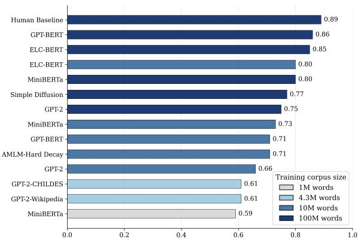

# A retrospective analysis on the use of LLMs to study infant syntax learning

Hélie Bazin1, Anouk Barberousse2, François Yvon3,

1Sorbonne Université, Sorbonne Center for Artificial Intelligence (SCAI), 2Sorbonne Université, CNRS, Sciences, Norms, Democracy (SND), 3Sorbonne Université, CNRS, Institute of Intelligent Systems and Robotics (ISIR), Correspondence: helie.bazin\_de\_jessey@sorbonne-universite.fr

## Abstract

Large language models (LLMs) have increasingly been used to investigate how children acquire syntax at an early stage of development. This is notably the central scientific goal of the BabyLM challenge, a community-wide effort to develop models that achieve human-level syntactic performance while being trained on developmentally realistic corpora. In this paper, we reflect on the use of LLMs in the study of infant syntax learning by providing an epistemological assessment of several studies from this research program. We discuss how datasets are built, which models are implemented, how they are trained and syntactically evaluated. We observe significant assumptions in the methodology of BabyLM and related studies, thus mitigating their theoretical scope. We additionally observe that using developmentally-realistic corpora have limited effects on models performance on commonly-used benchmarks, which suggest important computational differences between LLMs and the infant syntax learner.

## 1 Introduction

Syntax acquisition has been at the forefront of discussion in theoretical linguistics for several decades. How children manage to robustly acquire syntax in a few years with a limited exposure to linguistic data is still a debated issue (Crain and Pietroski, 2001; Ambridge and Lieven, 2011). The linguistic input of a child, called the Primary Linguistic Data (PLD), is consistent with an infinity of grammars and yet children are consistently able to select grammars with the same complex set of rules and principles. For Chomsky, this is an indication that syntax learning cannot be achieved statistically with positive evidence only, but requires a set of innate constraints on the hypothesis space of the child (Chomsky, 1965). Those innate constraints, called Universal Grammar, are language-specific biases which permit children to select the correct grammar from their impoverished PLD (Clark and

Lappin, 2011). This is the Poverty-of-the-Stimulus (PoS) argument, one of the most debated ideas across linguistics and cognitive science.

These debates have recently been reignited by the introduction of Large Language Models (LLMs), especially the transformer architecture (Vaswani et al., 2017). Those computational models are pre-trained on large amounts of textual data and perform syntactically and semantically at a level yet unseen in Natural Language Processing (NLP). Importantly, they seemingly do not have any language-specific bias constraining their hypothesis space. LLMs might therefore prove the possibility of learning syntax without hard constraints on the hypothesis space of the learner. This idea has been the focus of a subset of the NLP community centered around the BabyLM challenge1, working at developing datasets, models and benchmarks and investigating infant syntax acquisition using small LLMs trained on developmentally realistic corpora.

This paper questions the insights that can be drawn from this research program regarding the possibility of learning syntactic principles without domain-specific biases. In contrast to existing theoretical discussions of syntax acquisition in NLP (Linzen, 2018; Warstadt and Bowman, 2022; Wilcox et al., 2025), our work adopts a philosophy of science perspective on this research program. Although both linguistics and NLP focus on the representation and generation of syntactic structures, they ultimately investigate different target systems: the human mind and computational systems, respectively. Integrating these fields into a unified account of language acquisition therefore requires a number of assumptions and idealizations that merit careful examination. We provide an epistemological critique with the broader goal of fostering a more meaningful integration of computational approaches into the scientific study of human cognition. We discuss the construction of child-oriented corpora, the implemented architectures and the syntactic benchmarks used for studying syntax acquisition. This work is not intended to be a survey of computational studies of syntax acquisition. Rather, it is a systematic analysis of the methodology generally employed by Natural Language Processing (NLP) researchers to assess its theoretical significance. We retrospectively compare a selection of representative models across various syntactic benchmarks and draw conclusions about the use of LLMs in the study of syntax acquisition.

Specifically, we observe that models trained on developmentally realistic corpora generally do not perform at the level of humans on syntactic benchmarks. Moreover, using developmentally realistic data has a mixed effect on LLM performance. These observations suggest important computational differences between LLMs and children that researchers should be aware of. Note that we do not engage here with the generative/usage-based debate: while our work investigates how the PoS is studied in NLP and the broader theoretical scope of this research program, we remain neutral from a theoretical linguistics perspective.

In Section 2, we present the BabyLM challenge, one of the most significant effort from NLP researchers to study syntax acquisition using standardized datasets and benchmarks. In Section 3, we conduct a methodological survey of several PoS studies, describing how the datasets are built, the models used, and the benchmarks they are tested upon. We then compare several studies in Section 4 and draw general observations on the use of LLMs to study syntax acquisition. Finally, in Section 5, we discuss our observations in the broader context of linguistic and cognitive modeling, questioning the effectiveness of using LLMs to study infant syntax learning.

## 2 The BabyLM challenge

The BabyLM Challenge, started in 2023, is a community effort to scale down pre-training by developing high-performing language models that are trained on a developmentally realistic number of words. Researchers compete to develop architectures that perform well on specific syntactic benchmarks. The challenge typically consists of a “Strict-Small” track, in which models are trained on fewer than 10 million running words from a set of corpora, and a “Strict” track, in which models are trained on fewer than 100 million running words (Warstadt et al., 2023a). The challenge may also include additional tracks that are not purely focused on syntactic capacities. Those additional tracks, which will not be discussed in this paper, include a “multimodal” track, an “interaction” track where a smaller model learns syntax by interacting with a larger model, and more recently, a “multilingual” track (Choshen et al., 2024; Charpentier et al., 2025a).

The BabyLM challenge has both engineering and scientific objectives. From an engineering perspective, it encourages the development of new, data-efficient pre-training techniques. Current LLMs are typically trained on trillions of words during pre-training and are therefore excessively expensive to train (Hoffmann et al., 2022). Techniques that improve efficiency and enable models to achieve strong performance with fewer than 100M running words during pre-training could help control training costs when scaling up to larger amounts of data. Among the scientific objectives is the goal to advance the understanding of syntax acquisition by developing computational models that can perform syntactically at a human-level from limited training data: “First, by reverse-engineering known and hypothetical aspects of the human learning scenario—from multimodal inputs and multiagent interaction to innate linguistic structural biases—we can determine which factors are critical to our unique ability to learn language efficiently (...). Second, by minimizing differences between humans and models, we make results from controlled experiments carried out on models more likely to be applicable to humans" (Warstadt et al., 2023b).

## 3 LLMs to study syntax acquisition: Surveying Methods

In this section, we describe the datasets, models and benchmarks employed in the study of syntax acquisition in the BabyLM challenge and related work. As mentioned in the introduction, this section should not read as fully comprehensive survey. We only include papers that we consider relevant to a broader discussion on LLMs within the fields of linguistics and cognitive science, in particular those which discuss models trained on developmentally plausible data in terms of size and content. Moreover, we only discuss the best-performing

<table><tr><td>Paper</td><td>Model</td><td>Data</td><td>Nb. param.</td><td>TS (CDS)</td><td>Benchmark</td></tr><tr><td>Zhang et al. (2021)</td><td>MiniBERTa (Warstadt et al., 2020b)</td><td>Wikipedia, Smashwords</td><td>1M, 10M, 100M</td><td>0% (0%)</td><td>BLiMP</td></tr><tr><td>First BabyLM (Warstadt et al., 2023b)</td><td>ELC BERT (Charpentier and Samuel, 2023)</td><td>First BabyLM Corpus</td><td>10M, 100M</td><td>56% (11%)</td><td>BLiMP, MSGS</td></tr><tr><td>Yedetore et al. (2023)</td><td>LSTM, Transformer</td><td>CHILDES</td><td>9.6M</td><td>100% (100%)</td><td>HierQ</td></tr><tr><td>Lan et al. (2024)</td><td>LSTM, Transformer</td><td>CHILDES</td><td>9.6M</td><td>100% (100%)</td><td>PG Acc., ATB Acc.</td></tr><tr><td>Second BabyLM (Hu et al., 2024)</td><td>GPT-BERT (Charpentier and Samuel, 2024)</td><td>Second BabyLM, FineWeb-Edu, Cosmopedia</td><td>10M, 100M</td><td>19% (10%)</td><td>BLiMP</td></tr><tr><td>Third BabyLM (Charpentier et al., 2025b)</td><td>AMLM-Hard Decay (Edman and Fraser, 2025) Simple Diffusion (Kosmopoulou et al., 2025)</td><td>Second BabyLM</td><td>10M 100M</td><td>58% (0%) 58% (29%)</td><td>BLiMP</td></tr><tr><td>Charpentier et al. (2025a)</td><td>GPT-2 (Radford et al., 2019)</td><td>Second BabyLM</td><td>10M, 100M</td><td>58% (29%)</td><td>BLiMP</td></tr><tr><td>Padovani et al. (2025)</td><td>GPT-2</td><td>CHILDES Wikipedia</td><td>4.3M</td><td>100% (100%)</td><td>BLiMP, Zorro</td></tr><tr><td>Yang et al. (2026)</td><td>GPT-2</td><td>Baby-F Corpus Wikipedia</td><td>10M, 30M, 50M</td><td>0% (0%) 75% (18-40%) 0% (0%)</td><td>PoSH-BENCH</td></tr></table>

Table 1: Overview of all the papers reviewed in this study. For each paper, we specify the model, the data it is trained on and the syntactic benchmark. The models in Lan et al. (2024) are taken from Yedetore et al. (2023). Note that Padovani et al. also evaluate a RoBERTa model (Zhuang et al., 2021a), but for clarity, we only feature their GPT-2 model since it performs best across tasks.

BabyLMs in addition to the challenge baseline models, as our main interest lies in how LLMs perform on some of the most widely used syntactic benchmarks. We are aware that this excludes a number of submissions that are relevant from a cognitive science perspective, such as those discussing data ordering aspects (Salhan et al., 2024; Schoenegger et al., 2025; Fysikoudi et al., 2025). Similarly, since our focus is on syntax acquisition, we leave aside various works, including BabyLM submissions, that use LLMs to study other aspects of language acquisition, such as word learning (Chang and Bergen, 2022), phonology (Lavechin et al., 2023; Goriely et al., 2024) or even pragmatics (Askari et al., 2025). These are valuable works and topics that should be discussed alongside this paper. Papers considered in our study are listed in Table 1.

## 3.1 Training Data

Corpora To replicate at best the ecological conditions children face when learning language, researchers train their models on corpora which are more or less representative of a child’s PLD. A very relevant such corpus is CHILDES (MacWhinney, 2000), which contains transcripts of childrenoriented conversations. Although CHILDES is often presented as a corpus of child-directed speech (CDS), a significant proportion of the data actually comprises child speech that may not be included in the PLD. Nevertheless, it is frequently used in computational studies of language acquisition as a CDS corpus (Huebner et al., 2021; Yadavalli et al., 2023; Goriely and Buttery, 2025). For this reason, we will describe the following data as CDS, bearing in mind that this may be an oversimplification.

Another relevant recent international initiative is BabyBabelLM,2 a multilingual collection of developmentally plausible datasets spanning over 45 languages (Jumelet et al., 2026). Languages are regrouped into tiers depending on their data availability. Tier 1 languages have a dataset of 100M words, while Tier 2 and Tier 3 languages have datasets of 10M and 1M words, respectively. The Baby-BabelLM is a significant effort to decentralize linguistics, which has traditionally focused on a few Indo-European languages.

A subset of the BabyBabelLM including English, Dutch and Chinese forms the dataset for the new multilingual track for the fourth edition of the BabyLM challenge (Choshen et al., 2026).

However, what constitutes a developmentally plausible dataset remains unclear. This conceptual vagueness gives rise to substantial variation across corpora and studies. One important point of divergence concerns the proportion of transcribed speech (TS). The PLD is not only composed of speech instances: caretakers read books to their children, often from a very early age. Children are thus exposed to sentences that can be lexically and syntactically richer than those spoken to them (Montag et al., 2015; Montag, 2019). Some researchers have accordingly included children’s stories3 or even sentences drawn from synthetic datasets of short, child-oriented narratives in their training mix (Eldan and Li, 2023). Yet, there is little agreement on what would constitute a developmentally realistic proportion of textual input.

In addition, researchers also frequently incorporate non-child-oriented data. These may be textual, such as sentences extracted from Wikipedia4, or conversational, such as movie dialogues sourced from the OpenSubtitles corpus (Lison and Tiedemann, 2016)5. Once again, however, no consensus exists regarding what proportion of CDS versus other forms of input should be considered developmentally realistic. Moreover, different sources of linguistic exposure are unlikely to have equivalent effects: words heard on television may not carry the same developmental weight as those produced in parent–child interactions, where caregivers often accompany speech with gestures, shared attention, or reference to visible objects.

This lack of agreement leads to strong discrepancies in the corpora used in PoS studies. For example, the Second BabyLM corpus contains only 58% of TS. Researchers are furthermore allowed to use their own data, resulting in the winning submission being trained with a 1:1:1 ratio on the BabyLM corpus, FineWeb-Edu (Lozhkov et al., 2024) and Cosmopedia (Allal et al., 2024). Consequently, its training data contains only approximately 19% TS and 10% CDS (Charpentier and Samuel, 2024). Similarly, even though it is trained on 58% of TS, the winning submission of the third BabyLM challenge for the 10M track has no CDS in its training data (Edman and Fraser, 2025). By contrast, Yang et al. (2026) use 75% of TS in their data, while progressively reducing the proportion of CDS as corpus size increased, such that CDS represented only 18% of the training data once the corpus reached 50M words.. The proportion of TS even varies across the languages in BabyBabelLM: some datasets contain almost no TS, while others, notably those in Tier 3 are almost exclusively made of TS. The Dutch dataset, for instance, is used in the multilingual track of the fourth edition of the challenge despite a very small proportion of TS.

Training strategies. Most models are trained for several epochs, between 3 and 10 for the papers we review. This points to an important and yet often overlooked limitation of PoS studies. While it is true that BabyLMs and related models are trained on a limited amounts of words, a model trained during 10 epochs on 100M words, as in Kosmopoulou et al. (2025), benefits from a training dataset not only larger in absolute size but also more structured than the infant learner who is only exposed once to the data.

The first and second BabyLM challenges put no restriction on the number of epochs, claiming that “from a cognitive perspective, humans have a memory of linguistic experience and can continue to access and learn from these memories.” (Choshen et al., 2024, p. 2).

However, the authors provide no justification for this idea, despite it introducing costly assumptions about the cognitive processes underlying syntax acquisition. The third and fourth editions of the BabyLM challenge did introduce a limitation of 10 epochs (Charpentier et al., 2025a; Choshen et al., 2026).

Data ordering. Child-oriented datasets contain data from different stages of infant development6. Children receive their linguistic input in a sequential order, with syntactic complexity increasing with age (Scarborough, 1990; Lu, 2009). In order to match the learning scenario of infant learners, researchers have experimented with a training framework known as curriculum learning (Bengio et al., 2009). In this framework, data is presented to the model in an ordered sequence of increasing complexity. Curriculum learning has been a key topic of the BabyLM challenge. Participants have experimented with various psycholinguistic metrics for data complexity, such as sentence length (Ghanizadeh and Dousti, 2024), lexical diversity (Mi, 2023), and the depth of dependency trees (Oba et al., 2023). However, these approaches have not led to consistent improvements in performance on BabyLM benchmarks. More recently, participants have experimented with dynamic, modeldriven designs such as Influence-Driven curriculum (Schoenegger et al., 2025) or Active Curriculum Language Modellng (Fysikoudi et al., 2025), in which data is ordered according to its influence on the model’s predictions during the initial learning phase. A key finding of the BabyLM challenge is that manually ordered data does not consistently improve performance (Hu et al., 2024), whereas model-driven strategies substantially impact learning (Charpentier et al., 2025b), even if they might lack biological or psychological plausibility (Schoenegger et al., 2025). Most papers in this strand do not put restriction on data ordering, with the exception of the work by Edman and Fraser (2025) and Kosmopoulou et al. (2025), who use architectures that effectively implement a sort of model-driven curriculum learning.

## 3.2 Models

Model architectures. Most papers considered in this survey are based on transformers (Vaswani et al., 2017), though Yedetore et al. (2023) and Lan et al. (2024) also perform their evaluation with a recurrent (LSTM) architecture. It is often preferred for language understanding tasks to use Masked Language Models (MLMs) like BERT (Devlin et al., 2019), which can access both previous and following tokens when making a prediction, in contrast to Causal Language Models (CLMs) like GPT (Radford et al., 2018), which perform next-token prediction based on past tokens only. Zhang et al. (2021) use the MiniBERTas from Warstadt et al. (2020b), a suite of RoBERTas models (Zhuang et al., 2021b) pre-trained on small corpora. Charpentier and Samuel (2023) use a variation of BERT, with each layer taking a combination of all previous layers as input, and not simply the sum of the input and output of the previous layer.

However, the use of MLMs for studying language acquisition can be questioned. Not only are humans representing syntactic principles, but they are learning to generate sentences from those syntactic representations. Generating capacities should thus be expected from models of language faculty, which MLMs lack but CLMs have. Moreover, there is strong evidence that surprisal of CLMs can be effectively used to predict reading time, eye-tracking and neural data (Wilcox et al., 2020; Caucheteux and King, 2022; Oh et al., 2022). This suggests that the brain engages in next-word prediction when processing linguistic input (Goldstein et al., 2022). To this end, we also consider studies which use CLMs. Charpentier et al. (2025a), Padovani et al. (2025) and Yang et al. (2026) use a GPT-2 architecture (Radford et al., 2019). Yedetore et al. (2023) and Lan et al. (2024) also use a Transformer architecture with a CLM architecture. Finally, Charpentier and Samuel (2024) implement a hybrid approach between CLM and MLM. Their model is essentially a MLM which, for a masked token at position k + 1, outputs its prediction at position k (like in CLMs) instead of position k + 1. This allows to train the model with a both a causal and a masked objective, taking advantage of both approaches. GPT-BERT is a key innovation of the BabyLM challenge. Edman and Fraser (2025) and Kosmopoulou et al. (2025) both use this architecture with an adaptive strategy for masking tokens, where easy-to-predict tokens have a lower probability to be masked.

Model size. Models in PoS studies typically have fewer parameters than standard LLMs. Pre-trained model performance has been shown to correlate with the ratio of parameters to training tokens. Smaller models thus require less parameters to reach optimal performance, as larger model might overfit the data in a way that prevent generalization (Kaplan et al., 2020; Hoffmann et al., 2022). Hyperparameters for each model can be found in Appendix A.

## 3.3 Tasks and Metrics

A full specification of each test benchmark with examples are in Appendix B.

Minimal Pairs. The most common way to evaluate the syntactic capacities of LLMs is to use minimal pairs (Linzen et al., 2016). Minimal pairs are pairs of sentences that differ only regarding one specific syntactic construct and are used to test the syntactic preferences of subjects. In the case of language models, researchers evaluate the syntactic “preferences” of a model by checking which sentence within the pair gets the higher model logprobability. The model aggregated score is then the proportion of minimal pairs for which it “prefers” the correct sentence.

Whether this methodology is an indicator of genuine syntactic capacities is up-to-debate. Leivada et al. (2024) argue that humans can judge the grammaticality of a sentence without having to compare it to a minimally differing counterpart and are therefore hold to a much higher standard than LLMs regarding syntactic evaluation. Hu et al. (2026) put forward a theoretical assessment of this method, arguing that the log-probability assigned to sentences by LLMs is first and foremost determined by their meaning. Minimal pairs can therefore help neutralize the influence of semantic content by comparing log-probabilities of semantically equivalent sentences. We do not engage in this debate here and instead adopt the same assumption as authors who employ minimal-pair benchmarks, namely that they can be taken as indicators of syntactic capacities.

One of the most widely used minimal pairs benchmarks is BLiMP7 (Warstadt et al., 2020a), which consists of 67 datasets of 1,000 minimal pairs each, testing for 12 grammatical constructs. Alternatives to BLiMP include Zorro8 (Huebner et al., 2021), which only includes words typical of the PLD, SyntaxGym (Gauthier et al., 2020) and CoLA9 (Warstadt et al., 2019), though CoLA does not only contain minimal pairs.

BLiMP and alternatives are not necessarily meant to study infant syntax learning. They cover core syntactic phenomenon that are likely to be found in any natural language datasets, including child-oriented corpora. But PoS arguments are typically centered around very specific syntactic phenomenon that rarely occur in the PLD (Pullum and Scholz, 2002; Legate and Yang, 2002; Crain and Pietroski, 2001; Berwick et al., 2011). It is therefore interesting to go beyond BLiMP and test the syntactic representation of models for rarer phenomenon. PoSH-BENCH10 (Yang et al., 2026) is a minimal pair benchmark which targets syntactic constructs typically mentioned when discussing syntax acquisition, like wanna-contraction or question-formation. PG-Accuracy and ATB-Accuracy are idiosyncratic names for the minimal pair evaluation performed by Lan et al. (2024) to test LLMs on complex cases of wh-question called Parasitic Gaps (PG) and Across the Board (ATB) movements.

Measuring Inductive Biases. Another way to evaluate the PoS argument using LLMs is to study their inductive biases. LLMs lack any sort of language-specific hard constraints on their hypothesis space and rather use soft, general purpose biases to generalize beyond their training corpus (Goldblum et al., 2024; Wilson, 2025). Consequently, the generalization behavior of LLMs can be compared to that of infant syntax learners to test for the necessity of language-specific biases for syntax acquisition. Yedetore et al. (2023) thus evaluate whether LLMs align with a linear or hierarchical rule when transforming declarative sentences into yes/no questions and show a preference for the latter type of generalization (using what we will refer to as the HierQ benchmark).11

Additionally, the Mixed Signals Generalization Set (MSGS) (Warstadt et al., 2020b) is a benchmark aimed to evaluate learning systems for their preference towards surface vs. syntactic generalization. A rule such as “Does the word ’the’ precede ’a’?” illustrates the former type, while “Is the main verb in the ’-ing’ form?” illustrates the latter type.12 MSGS is not a syntactic benchmark per se since it does not really indicate whether the model has learned a particular construct or not. It is however useful for PoS arguments, as syntax learning might be more robust if the learner acquires early on a bias for syntactic generalization.

## 4 Retrospective analysis

In this section, we compare models’ performance across benchmarks and draw general observations regarding the training of LLMs with developmentally plausible data. We begin with a small discussion on what should be considered a high score at minimal pairs benchmarks, before moving on to four general observations consistent across studies. A detailed specification of the scores obtained by the models at their respective benchmark is in Appendix C.

Figure 1 displays the scores obtained by models of varying size at BLiMP.13 We use the human baseline reported by Warstadt et al. (2020a) as a reference, since it also constitutes the baseline for the BabyLM challenge. This baseline corresponds to the individual human agreement among 20 paid evaluators who each evaluated five pairs from each of the 67 BLiMP paradigms. The assumption that we can compare human acceptability judgments to log-probability assigned by models is controversial (Leivada et al., 2024). Furthermore, each evaluator only sees 335 pairs, far less than the 67000 minimal pairs that each model has to evaluate. The aggregate human score (0.96) might thus be a more accurate baseline. Still, to provide a fair assessment of PoS studies which all more or less implicitly endorse this assumption, we will consider models to have reached high performance when their minimal pair score is close to 90%, which loosely corresponds to the human baseline in BLiMP. As one reviewer suggested, it is worth considering whether it is fair to compare the scores of models with those of adults when we are investigating infant syntax learning. However, several studies indicate that children reach adult-like syntactic processing by the age of five, having heard approximately 50 M words (Crain and Thornton, 2012; Vyshedskiy et al., 2025). Therefore, using adult scores is not problematic and still provides a fair assessment of the models’ capabilities.

  
Figure 1: Overall scores obtained by the models considered in this paper when evaluated on the BLiMP, relative to the size of their training corpus, with the human baseline of Warstadt et al. (2020a). MLMs perform overall better than CLMs. Performance is related to the size of the model, though this effect decreases with the corpus size. Performance gap is of the same order between models trained on less than 5M to 10M words and models trained on 10M to 100M words. See Table 3 for a specification of BLiMP scores relative to the training data.

LLMs trained on 100M words or less do not consistently perform at a human-level performance at any syntactic benchmarks. The best scoring model on BLiMP is GPT-BERT, with a 0.81 accuracy score across minimal pairs when trained on 10M words, and a 0.86 accuracy when trained on 100M words. Accuracy drops when models are evaluated on syntactic phenomena typical of PoS arguments: GPT-2 trained on 10M words reaches a 0.65 accuracy on PoSH-Bench (Yang et al., 2026) and hardly performs above chance on questionformation tasks, regardless of the size (under 100M words) and content of the training corpus (see Table 5 in Appendix C). This observation is consistent with LLMs failing to follow the hierarchical rule in Yedetore et al. (2023). Additionally, the models of Lan et al. (2024) can hardly perform above chance at PG and ATB movements when trained on 10M words from CHILDES (see Table 6 in Appendix C). For the MSGS benchmark, the winning submission of the first BabyLM displays a weak bias for syntactic over surface generalization in the Strict track; yet, the large majority of the challenge submissions, including the winning model for the Strict-small track, align with surface generalization (Warstadt et al., 2023b).

Data scale matters, but much of the learning happens under 10M words. This claim, found also in Zhang et al. (2021), is consistent across studies and can be observed in Figure 1. Performance gap between models pre-trained on 10M words and 100M words is smaller than could be expected. Models trained on 100M words tend to have the same order of accuracy in areas where they already perform with 10M words. On the other hand, their performance with 100M words does not significantly improve for domains where they underperform when trained on 10M words. In Yang et al. (2026), models fail similarly at question-formation tasks when trained with 10M or 50M words, while their performance does not improve with data scale (and can even decrease) for wh-transformations.

MLMs perform better at syntactic benchmarks than CLMs. This is clear looking at Figure 1. The best-performing models are all variations of the BERT architecture, with the winning one being GPT-BERT which benefits from both objectives. GPT-2 trained on 100M words from the BabyLM corpus is the best CLM architecture at BLiMP, reaching a score of 0.75, while ELC-BERT and MiniBERTa trained on 10M words get respectively a 0.80 and 0.73 overall score.

CDS (and TS) have mixed effects on performance. This is one of the main take-aways from our retrospective study. GPT-2 models trained on 4.3 M from CHILDES or Wikipedia get the same score at BLiMP. MiniBERTas trained on Wikipedia do get a slightly higher score than GPT-2 models trained on the BabyLM corpus (see Table 3 in Appendix C). However, this (slim) difference is most likely attributable to architectural disparity (MLMs vs. CLMs) and not to the plausibility of their training corpus. In Yang et al. (2026), the proportion of CDS ranges between 40% in the 10M corpus and 18% in the 50M, without any notable drop in performance. Performance remaining stable with the proportion of CDS decreasing could be attributed to data scaling. However, as we have seen above, increasing the corpus size does not produce significant performance gains at minimal pair evaluation. The influence of CDS is thus mixed. A similar observation can be made for TS, as models trained on 0% TS get approximately the same score on BLiMP as models trained with a majority of TS. Conversely, GPT-2s performs better when trained on the Baby-F corpus rather than Wikipedia (Yang et al., 2026). There is therefore no consistent pattern regarding the influence of TS and CDS across studies.

## 5 Discussion

There is no clear unified account of the role of LLMs in cognitive science. While some researchers use them as predictive models, for instance predicting brain activation from linguistic input (Caucheteux and King, 2022), others see them as computational cognitive models in the sense that they replicate the functional mapping of a specific cognitive system, with little regard to their biological plausibility (Goldstein et al., 2022). In computational linguistics, two main conceptions of LLMs as scientific models can be put forward. LLMs can first be considered “proofs-of-concepts models”, i.e., models that are used to prove the importance of specific theoretical concepts in achieving a cognitive task (Portelance and Jasbi, 2024). LLMs trained on conditions similar to those met by a child when learning syntax could thus help determine whether linguistic-specific biases are necessary for syntax acquisition (Warstadt and Bowman, 2022).

Second, LLMs can be used to reverse-engineer syntax acquisition and help “mimic infant’s achievements” (Dupoux, 2018, p. 17). Reverseengineering, in the context of computationalism, means building systems that perform the same computations as the human brain for a specific task (Guest et al., 2025). The goal is therefore to better understand how the brain performs the target cognitive function, by developing computational models capable of performing the same function. Under this view, LLMs are considered computational cognitive models and LLMs performing on developmentally plausible data are simply better computational model of human cognition.

Even though the two conceptions of LLMs have distinct scientific objectives, both benefit from the BabyLM challenge and related experiments. Our retrospective study therefore yields important observations for the two.

## 5.1 Low-bias syntax learning

First, the claim that the PoS argument is refuted by LLMs (Piantadosi, 2023; Ambridge and Blything, 2024; Futrell and Mahowald, 2025) does not follow from empirical NLP work, at least not from the BabyLM challenge results14. When trained on smaller amounts of data, LLMs cannot consistently reach high performance on minimal-pair evaluation. They even largely underperform when the benchmark targets specific PoS phenomenon (e.g., PoSH-Bench). LLMs also systematically align with surface over hierarchical generalization. Our study shows that this observation is consistent across models, across benchmarks and across training corpora. Consequently, high consistent performance at syntactic benchmarks still requires pre-training models with inhuman amounts of data.

LLMs are not proving the possibility of learning syntax without language-specific bias. Note that they are not proving the impossibility of learning syntax without language-specific bias or the computational necessity of Universal Grammar. The observation is simply that current models, seen as proofs-of-concept, are not proving the PoS wrong.

## 5.2 Reverse-engineering syntax acquisition

Reverse-engineering a cognitive system with a computational model requires that the model matches human performance at a specific task in approximately equivalent ecological conditions (Dupoux, 2018; Warstadt and Bowman, 2022). Not only do LLMs do not perform at a human-level at syntactic benchmarks, but it also remains unclear whether their training regime approximates the ecological conditions of infant language learning. As discussed in Section 3.1, there is no unified account in NLP of what constitutes a developmentally plausible corpus. We also pointed to strong simplifications in the training regime regarding number of epochs and data presentation.

Importantly, varying the proportion of TS and CDS in the corpus does not seem to have much impact on benchmark performance. If LLMs were computational models of the infant syntax learners, reproducing—even imperfectly and with strong idealizations—the ecological conditions of syntax learning should have an impact on performance. Indeed, if a computational model replicates a cognitive specification, then it has to correlate with observations of the relevant human behavior (Guest and Martin, 2023). Conversely, if a model does not match human behavioral data, then it is not an accurate computational model of the relevant cognitive system. As it was rightfully pointed by a reviewer, the relevance of CDS is a debated issue in developmental linguistics. For example, Cristia et al. (2019) found that Tsimane children had very limited CDS in their PLD. Conversely, there is evidence that CDS plays an important role in learning English, the primary language in NLP, whereas overheard speech has a limited impact (Shneidman and Goldin-Meadow, 2012; Shneidman et al., 2013; Weisleder and Fernald, 2013). Furthermore, even if the influence of CDS is more limited than previously thought, children’s linguistic environment consists solely of speech. We could therefore at least expect the proportion of TS to impact performance.

Consequently, the absence of clear performance gap between LLMs trained on CHILDES or trained on Wikipedia could indicate that CDS is as linguistically informative as adult-texts and that the inductive biases of children significantly differ from those of LLMs. Or children are sensitive to some dimension of the PLD that LLMs cannot capture, for instance whether or not the person talking to them is their caretaker. In both cases, infant learners and LLMs appear to be computationally distinct.

## 6 Conclusion

The BabyLM challenge is a significant step towards standardizing and augmenting NLP research by providing open-access multilingual corpora and test suites that researchers can use to evaluate their pre-training techniques. The challenge has also brought historical debates in theoretical linguistics to the forefront of computational linguistics and sparked a lively discussion among NLP researchers, linguists, and philosophers.

However, the BabyLM challenge, and more generally the use of LLMs to study syntax acquisition, relies on important theoretical assumptions which can be questioned from linguistic, cognitive science and philosophical perspectives. In this paper, we highlight those assumptions by providing a systematic description of the training data, the training regime, the models and the benchmarks used. We showed that there was really no unified understanding of what is a developmentally realistic corpus, that the training regimes often relied on oversimplifying assumptions regarding how children learn language, that models might lack cognitive plausibility, and that the extent to which existing benchmarks measure genuine syntactic competence is still debated.

Beyond BabyLMs and related models not yet performing at a human-level at syntactic benchmarks, we also observed no consistent pattern regarding the use of transcribed or child-directed speech. This indicates that the computational principles of LLMs differ from those of infant syntax learners, which mitigates the significance of these models in theoretical debates about language acquisition.

Despite the negative observations we make in this paper, we do not advocate pessimism regarding the use of LLMs to study language acquisition. We fully agree with Oh and Linzen (2026) that progress will most likely come from integrating NLP with empirical research on syntax acquisition architectures to build more “human-like” architectures. Our epistemological critique should therefore be understood as a call for deeper interdisciplinary collaboration among NLP researchers, linguists, cognitive scientists, and philosophers of science. In this respect, the BabyLM challenge constitutes an extraordinary effort—one that deserves to be continued and more fully integrated into the broader scientific study of human cognition.

## Limitations

We did not conduct any experiment in this paper nor did we provide solutions for the methodological limitations we identify. We also did not provide any unified measure of syntactic performance which complicates comparison between studies that use different evaluation pipelines. Furthermore, we limited ourselves to performance benchmarks. But testing for syntactic representations using structural probing or sparse auto-encoders might prove more linguistically informative. Finally, we restricted ourselves to syntax acquisition, ignoring other key aspects of language acquisition phonology, morphology, semantics and pragmatics. Those should be integrated into further study of cognitive modeling using LLMs.

## Acknowledgments

This work was supported by the National Research Agency (ANR) under the France 2030 program, with the reference number ANR-23-IACL-0007.

## References

Kabir Ahuja, Vidhisha Balachandran, Madhur Panwar, Tianxing He, Noah A. Smith, Navin Goyal, and Yulia Tsvetkov. 2025. Learning syntax without planting trees: Understanding hierarchical generalization in transformers. Transactions of the Association for Computational Linguistics, 13:121–141.

Loubna Ben Allal, Anton Lozhkov, Guilherme Penedo, Thomas Wolf, and Leandro von Werra. 2024. Cosmopedia. 19.

Ben Ambridge and Liam Blything. 2024. Large language models are better than theoretical linguists at theoretical linguistics. Theoretical Linguistics, 50(1- 2):33–48.

Ben Ambridge and Elena V. M. Lieven. 2011. Child Language Acquisition: Contrasting Theoretical Ap proaches. Cambridge University Press, Cambridge.

Raha Askari, Sina Zarrieß, Özge Alacam, and Judith Sieker. 2025. Are BabyLMs deaf to Gricean maxims? a pragmatic evaluation of sample-efficient language models. In Proceedings ofthe First BabyLM Workshop, pages 52–65, Suzhou, China. Association for Computational Linguistics.

Yoshua Bengio, Jérôme Louradour, Ronan Collobert, and Jason Weston. 2009. Curriculum learning. In Proceedings ofthe 26th Annual International Conference on Machine Learning, ICML ’09, page 41–48, New York, NY, USA. Association for Computing Machinery.

Robert C. Berwick, Paul Pietroski, Beracah Yankama, and Noam Chomsky. 2011. Poverty of the Stimulus Revisited. Cognitive Science, 35(7):1207–1242.

Charlotte Caucheteux and Jean-Rémi King. 2022. Brains and algorithms partially converge in natural language processing. Communications Biology, 5(1):134.

Tyler A. Chang and Benjamin K. Bergen. 2022. Word acquisition in neural language models. Transactions

of the Association for Computational Linguistics, 10:1–16.

Lucas Charpentier, Leshem Choshen, Ryan Cotterell, Mustafa Omer Gul, Michael Hu, Jaap Jumelet, Tal Linzen, Jing Liu, Aaron Mueller, Candace Ross, Raj Sanjay Shah, Alex Warstadt, Ethan Wilcox, and Adina Williams. 2025a. Babylm turns 3: Call for papers for the 2025 babylm workshop. Preprint, arXiv:2502.10645.

Lucas Charpentier, Leshem Choshen, Ryan Cotterell, Mustafa Omer Gul, Michael Y. Hu, Jing Liu, Jaap Jumelet, Tal Linzen, Aaron Mueller, Candace Ross, Raj Sanjay Shah, Alex Warstadt, Ethan Gotlieb Wilcox, and Adina Williams. 2025b. Findings of the Third BabyLM Challenge: Accelerating Language Modeling Research with Cognitively Plausible Data. In Proceedings ofthe First BabyLM Workshop, pages 399–420, Suzhou, China. Association for Computational Linguistics.

Lucas Georges Gabriel Charpentier and David Samuel. 2023. Not all layers are equally as important: Every Layer Counts BERT. In Proceedings of the BabyLM Challenge at the 27th Conference on Computational Natural Language Learning, pages 238–252, Singapore. Association for Computational Linguistics.

Lucas Georges Gabriel Charpentier and David Samuel. 2024. GPT or BERT: why not both? In The 2nd BabyLM Challenge at the 28th Conference on Computational Natural Language Learning, pages 262– 283, Miami, FL, USA. Association for Computational Linguistics.

Noam Chomsky. 1965. Aspects of the Theory of Syntax, 50 edition. The MIT Press.

Leshem Choshen, Ryan Cotterell, Mustafa Omer Gul, Jaap Jumelet, Tal Linzen, Aaron Mueller, Suchir Salhan, Raj Sanjay Shah, Alex Warstadt, and Ethan Gotlieb Wilcox. 2026. BabyLM Turns 4 and Goes Multilingual: Call for Papers for the 2026 BabyLM Workshop. Preprint, arXiv:2602.20092.

Leshem Choshen, Ryan Cotterell, Michael Y. Hu, Tal Linzen, Aaron Mueller, Candace Ross, Alex Warstadt, Ethan Wilcox, Adina Williams, and Chengxu Zhuang. 2024. [Call for Papers] The 2nd BabyLM Challenge: Sample-efficient pretraining on a developmentally plausible corpus. Preprint, arXiv:2404.06214.

Alexander Clark and Shallom Lappin. 2011. Linguistic Nativism and the Poverty ofthe Stimulus. John Wiley & Sons, Ltd.

Stephen Crain and Paul Pietroski. 2001. Nature, Nurture And Universal Grammar. Linguistics and Philosophy, 24(2):139–186.

Stephen Crain and Rosalind Thornton. 2012. Syntax acquisition. WIREs Cognitive Science, 3(2):185–203.

Alejandrina Cristia, Emmanuel Dupoux, Michael Gurven, and Jonathan Stieglitz. 2019. Child-Directed Speech Is Infrequent in a Forager-Farmer Population: A Time Allocation Study. Child Development, 90(3):759–773.

Jacob Devlin, Ming-Wei Chang, Kenton Lee, and Kristina Toutanova. 2019. BERT: Pre-training of deep bidirectional transformers for language understanding. In Proceedings of the 2019 Conference of the North American Chapter ofthe Associationfor Computational Linguistics: Human Language Technologies, Volume 1 (Long and Short Papers), pages 4171–4186, Minneapolis, Minnesota. Association for Computational Linguistics.

Emmanuel Dupoux. 2018. Cognitive science in the era of artificial intelligence: A roadmap for reverseengineering the infant language-learner. Cognition, 173:43–59.

Lukas Edman and Alexander Fraser. 2025. Mask and You Shall Receive: Optimizing Masked Language Modeling For Pretraining BabyLMs. In Proceedings ofthe First BabyLM Workshop, pages 445–453, Suzhou, China. Association for Computational Linguistics.

Ronen Eldan and Yuanzhi Li. 2023. Tinystories: How small can language models be and still speak coherent english? Preprint, arXiv:2305.07759.

Richard Futrell and Kyle Mahowald. 2025. How Linguistics Learned to Stop Worrying and Love the Language Models. Behavioral and Brain Sciences, pages 1–98.

Eleni Fysikoudi, Sharid Loáiciga, and Asad B. Sayeed. 2025. Active Curriculum Language Modeling over a Hybrid Pre-training Method. In Proceedings ofthe First BabyLM Workshop, pages 488–495, Suzhou, China. Association for Computational Linguistics.

Jon Gauthier, Jennifer Hu, Ethan Wilcox, Peng Qian, and Roger Levy. 2020. SyntaxGym: An Online Platform for Targeted Evaluation of Language Models. In Proceedings of the 58th Annual Meeting of the Association for Computational Linguistics: System Demonstrations, pages 70–76, Online. Association for Computational Linguistics.

Mohammad Amin Ghanizadeh and Mohammad Javad Dousti. 2024. Towards data-efficient language models: A child-inspired approach to language learning. In The 2nd BabyLM Challenge at the 28th Conference on Computational Natural Language Learning, pages 22–27, Miami, FL, USA. Association for Computational Linguistics.

Micah Goldblum, Marc Anton Finzi, Keefer Rowan, and Andrew Gordon Wilson. 2024. Position: The no free lunch theorem, kolmogorov complexity, and the role of inductive biases in machine learning. In Proceedings ofthe 41st International Conference on Machine Learning, volume 235 of Proceedings of Machine Learning Research, pages 15788–15808. PMLR.

Ariel Goldstein, Zaid Zada, Eliav Buchnik, Mariano Schain, Amy Price, Bobbi Aubrey, Samuel A. Nastase, Amir Feder, Dotan Emanuel, Alon Cohen, Aren Jansen, Harshvardhan Gazula, Gina Choe, Aditi Rao, Catherine Kim, Colton Casto, Lora Fanda, Werner Doyle, Daniel Friedman, and 13 others. 2022. Shared computational principles for language processing in humans and deep language models. Nature Neuroscience, 25(3):369–380.

Zébulon Goriely and Paula Buttery. 2025. IPA CHILDES & G2P+: Feature-Rich Resources for Cross-Lingual Phonology and Phonemic Language Modeling. In Proceedings ofthe 29th Conference on Computational Natural Language Learning, pages 502–521, Vienna, Austria. Association for Computational Linguistics.

Zébulon Goriely, Richard Diehl Martinez, Andrew Caines, Paula Buttery, and Lisa Beinborn. 2024. From babble to words: Pre-training language models on continuous streams of phonemes. In The 2nd BabyLM Challenge at the 28th Conference on Computational Natural Language Learning, pages 37–53, Miami, FL, USA. Association for Computational Linguistics.

Olivia Guest and Andrea E. Martin. 2023. On Logical Inference over Brains, Behaviour, and Artificial Neural Networks. Computational Brain & Behavior, 6(2):213–227.

Olivia Guest, Natalia Scharfenberg, and Iris van Rooij. 2025. Modern alchemy: Neurocognitive reverse engineering.

Jordan Hoffmann, Sebastian Borgeaud, Arthur Mensch, Elena Buchatskaya, Trevor Cai, Eliza Rutherford, Diego de Las Casas, Lisa Anne Hendricks, Johannes Welbl, Aidan Clark, Tom Hennigan, Eric Noland, Katie Millican, George van den Driessche, Bogdan Damoc, Aurelia Guy, Simon Osindero, Karen Simonyan, Erich Elsen, and 3 others. 2022. Training compute-optimal large language models. Preprint, arXiv:2203.15556.

Jennifer Hu, Ethan Gotlieb Wilcox, Siyuan Song, Kyle Mahowald, and Roger P. Levy. 2026. What can string probability tell us about grammaticality? Transactions ofthe Associationfor Computational Linguistics, 14:124–146.

Michael Y. Hu, Aaron Mueller, Candace Ross, Adina Williams, Tal Linzen, Chengxu Zhuang, Ryan Cotterell, Leshem Choshen, Alex Warstadt, and Ethan Gotlieb Wilcox. 2024. Findings of the second BabyLM challenge: Sample-efficient pretraining on developmentally plausible corpora. In The 2nd BabyLM Challenge at the 28th Conference on Computational Natural Language Learning, pages 1–21, Miami, FL, USA. Association for Computational Linguistics.

Philip A. Huebner, Elior Sulem, Fisher Cynthia, and Dan Roth. 2021. BabyBERTa: Learning More Grammar With Small-Scale Child-Directed Language. In

Proceedings of the 25th Conference on Computational Natural Language Learning, pages 624–646, Online. Association for Computational Linguistics.

Jaap Jumelet, Abdellah Fourtassi, Akari Haga, Bastian Bunzeck, Bhargav Shandilya, Diana Galvan-Sosa, Faiz Ghifari Haznitrama, Francesca Padovani, Francois Meyer, Hai Hu, Julen Etxaniz, Laurent Prevot, Linyang He, María Grandury, Mila Marcheva, Negar Foroutan, Nikitas Theodoropoulos, Pouya Sadeghi, Siyuan Song, and 7 others. 2026. BabyBabelLM: A multilingual benchmark of developmentally plausible training data. In Proceedings ofthe 19th Conference ofthe European Chapter ofthe Associationfor Computational Linguistics (Volume 1: Long Papers), pages 3297–3329, Rabat, Morocco. Association for Computational Linguistics.

Jared Kaplan, Sam McCandlish, Tom Henighan, Tom B. Brown, Benjamin Chess, Rewon Child, Scott Gray, Alec Radford, Jeffrey Wu, and Dario Amodei. 2020. Scaling laws for neural language models. Preprint, arXiv:2001.08361.

Despoina Kosmopoulou, Efthymios Georgiou, Vaggelis Dorovatas, Georgios Paraskevopoulos, and Alexandros Potamianos. 2025. Masked Diffusion Language Models with Frequency-Informed Training. In Proceedings of the First BabyLM Workshop, pages 531– 539, Suzhou, China. Association for Computational Linguistics.

Nur Lan, Emmanuel Chemla, and Roni Katzir. 2024. Large Language Models and the Argument from the Poverty of the Stimulus. Linguistic Inquiry, pages 1–28.

Marvin Lavechin, Yaya Sy, Hadrien Titeux, María Andrea Cruz Blandón, Okko Räsänen, Hervé Bredin, Emmanuel Dupoux, and Alejandrina Cristia. 2023. Babyslm: language-acquisition-friendly benchmark of self-supervised spoken language models. In INTERSPEECH 2023, interspeech\_2023, page 4588–4592. ISCA.

Julie Anne Legate and Charles D. Yang. 2002. Empirical re-assessment of stimulus poverty arguments. The Linguistic Review, 19(1-2):151–162.

Evelina Leivada, Vittoria Dentella, and Fritz Günther. 2024. Evaluating the Language Abilities of Large Language Models vs. Humans: Three Caveats. Biolinguistics, 18:1–12.

Tal Linzen. 2018. What can linguistics and deep learning contribute to each other? Preprint, arXiv:1809.04179.

Tal Linzen, Emmanuel Dupoux, and Yoav Goldberg. 2016. Assessing the ability of LSTMs to learn syntaxsensitive dependencies. Transactions of the Associationfor Computational Linguistics, 4:521–535.

Pierre Lison and Jörg Tiedemann. 2016. OpenSubtitles2016: Extracting large parallel corpora from movie and TV subtitles. In Proceedings ofthe Tenth

International Conference on Language Resources and Evaluation (LREC’16), pages 923–929, Portorož, Slovenia. European Language Resources Association (ELRA).

Anton Lozhkov, Loubna Ben Allal, Leandro von Werra, and Thomas Wolf. 2024. Fineweb-edu: the finest collection of educational content.

Xiaofei Lu. 2009. Automatic measurement of syntactic complexity in child language acquisition. International Journal ofCorpus Linguistics, 14(1):3–28.

Brian MacWhinney. 2000. The CHILDES project: Tools for analyzing talk (third edition): Volume I: Transcription format and programs, volume II: The database. Computational Linguistics, 26(4):657– 657.

R. Thomas McCoy, Robert Frank, and Tal Linzen. 2020. Does syntax need to grow on trees? sources of hierarchical inductive bias in sequence-to-sequence networks. Transactions of the Association for Computational Linguistics, 8:125–140.

Maggie Mi. 2023. Mmi01 at the BabyLM challenge: Linguistically motivated curriculum learning for pretraining in low-resource settings. In Proceedings of the BabyLM Challenge at the 27th Conference on Computational Natural Language Learning, pages 269–278, Singapore. Association for Computational Linguistics.

Jessica L. Montag. 2019. Differences in sentence complexity in the text of children’s picture books and child-directed speech. First Language, 39(5):527– 546.

Jessica L. Montag, Michael N. Jones, and Linda B. Smith. 2015. The Words Children Hear: Picture Books and the Statistics for Language Learning. Psychological Science, 26(9):1489–1496.

Miyu Oba, Akari Haga, Akiyo Fukatsu, and Yohei Oseki. 2023. BabyLM challenge: Curriculum learning based on sentence complexity approximating language acquisition. In Proceedings of the BabyLM Challenge at the 27th Conference on Computational Natural Language Learning, pages 290–297, Singapore. Association for Computational Linguistics.

Byung-Doh Oh, Christian Clark, and William Schuler. 2022. Comparison of Structural Parsers and Neural Language Models as Surprisal Estimators. Frontiers in Artificial Intelligence, 5.

Byung-Doh Oh and Tal Linzen. 2026. To model human linguistic prediction, make LLMs less superhuman. Trends in Cognitive Sciences.

Francesca Padovani, Jaap Jumelet, Yevgen Matusevych, and Arianna Bisazza. 2025. Child-Directed Language Does Not Consistently Boost Syntax Learning in Language Models. In Proceedings of the 2025 Conference on Empirical Methods in Natural Language Processing, pages 19735–19756, Suzhou, China. Association for Computational Linguistics.

Steven T Piantadosi. 2023. Modern language models refute chomsky’s approach to language. Fromfieldwork to linguistic theory: A tribute to Dan Everett, 15:353–414.

Eva Portelance and Masoud Jasbi. 2024. The Roles of Neural Networks in Language Acquisition. Language and Linguistics Compass, 18(6):e70001.

Geoffrey K. Pullum and Barbara C. Scholz. 2002. Empirical assessment of stimulus poverty arguments. The Linguistic Review, 19(1-2):9–50.

Alec Radford, Karthik Narasimhan, Tim Salimans, and Ilya Sutskever. 2018. Improving language understanding by generative pre-training. OpenAI Tech Report.

Alec Radford, Jeff Wu, R. Child, D. Luan, Dario Amodei, and I. Sutskever. 2019. Language Models are Unsupervised Multitask Learners.

Suchir Salhan, Richard Diehl Martinez, Zébulon Goriely, and Paula Buttery. 2024. Less is more: Pretraining cross-lingual small-scale language models with cognitively-plausible curriculum learning strategies. In The 2nd BabyLM Challenge at the 28th Conference on Computational Natural Language Learning, pages 174–188, Miami, FL, USA. Association for Computational Linguistics.

David Samuel, Andrey Kutuzov, Lilja Øvrelid, and Erik Velldal. 2023. Trained on 100 million words and still in shape: BERT meets British National Corpus. In Findings ofthe Associationfor Computational Linguistics: EACL 2023, pages 1954–1974, Dubrovnik, Croatia. Association for Computational Linguistics.

Hollis S. Scarborough. 1990. Index of Productive Syntax. Applied Psycholinguistics, 11(1):1–22.

Loris Schoenegger, Lukas Thoma, Terra Blevins, and Benjamin Roth. 2025. Influence-driven Curriculum Learning for Pre-training on Limited Data. In Proceedings ofthe First BabyLM Workshop, pages 356– 379, Suzhou, China. Association for Computational Linguistics.

Laura A. Shneidman, Michelle E. Arroyo, Susan C. Levine, and Susan Goldin-Meadow. 2013. What counts as effective input for word learning? Journal ofChild Language, 40(3):672–686.

Laura A. Shneidman and Susan Goldin-Meadow. 2012. Language input and acquisition in a Mayan village: How important is directed speech? Developmental Science, 15(5):659–673.

Ashish Vaswani, Noam Shazeer, Niki Parmar, Jakob Uszkoreit, Llion Jones, Aidan N Gomez, Łukasz Kaiser, and Illia Polosukhin. 2017. Attention is all you need. In Advances in Neural Information Processing Systems, volume 30. Curran Associates, Inc.

Andrey Vyshedskiy, Ariella Pevzner, Brigid Mack, Eva Shrayer, Miranda Zea, Sasha Bunner, Nichole Wong, Elena Baskina, Amira Sheikh, Alessandro Tagliavia, Andriane Schmiedel Fucks, Andressa Schmiedel Sanches Santos, Lucas Ernesto Pavoski Poloni, Elielton Fucks, Yudit Bolotovsky, and Sung Jin (Sam) Kang. 2025. Language comprehension developmental milestones in typically developing children assessed by the new language phenotype assessment (lpa). Children, 12(6).

Alex Warstadt and Samuel R Bowman. 2022. What artificial neural networks can tell us about human language acquisition. In Algebraic structures in natural language, pages 17–60. CRC Press.

Alex Warstadt, Leshem Choshen, Aaron Mueller, Adina Williams, Ethan Wilcox, and Chengxu Zhuang. 2023a. Call for Papers – The BabyLM Challenge: Sample-efficient pretraining on a developmentally plausible corpus. Preprint, arXiv:2301.11796.

Alex Warstadt, Aaron Mueller, Leshem Choshen, Ethan Wilcox, Chengxu Zhuang, Juan Ciro, Rafael Mosquera, Bhargavi Paranjabe, Adina Williams, Tal Linzen, and Ryan Cotterell. 2023b. Findings of the BabyLM Challenge: Sample-Efficient Pretraining on Developmentally Plausible Corpora. In Proceedings ofthe BabyLM Challenge at the 27th Conference on Computational Natural Language Learning, pages 1–34, Singapore. Association for Computational Linguistics.

Alex Warstadt, Alicia Parrish, Haokun Liu, Anhad Mohananey, Wei Peng, Sheng-Fu Wang, and Samuel R. Bowman. 2020a. BLiMP: The Benchmark of Linguistic Minimal Pairs for English. Transactions of the Associationfor Computational Linguistics, 8:377– 392.

Alex Warstadt, Amanpreet Singh, and Samuel R. Bowman. 2019. Neural network acceptability judgments. Transactions of the Association for Computational Linguistics, 7:625–641.

Alex Warstadt, Yian Zhang, Xiaocheng Li, Haokun Liu, and Samuel R. Bowman. 2020b. Learning Which Features Matter: RoBERTa Acquires a Preference for Linguistic Generalizations (Eventually). In Proceedings ofthe 2020 Conference on Empirical Methods in Natural Language Processing (EMNLP), pages 217–235, Online. Association for Computational Linguistics.

Adriana Weisleder and Anne Fernald. 2013. Talking to children matters: Early language experience strengthens processing and builds vocabulary. Psychological science, 24(11):2143–2152.

Ethan Gotlieb Wilcox, Jon Gauthier, Jennifer Hu, Peng Qian, and Roger Levy. 2020. On the Predictive Power of Neural Language Models for Human Real-Time Comprehension Behavior. Preprint, arXiv:2006.01912.

Ethan Gotlieb Wilcox, Michael Y. Hu, Aaron Mueller, Alex Warstadt, Leshem Choshen, Chengxu Zhuang, Adina Williams, Ryan Cotterell, and Tal Linzen. 2025. Bigger is not always better: The importance of human-scale language modeling for psycholinguistics. Journal ofMemory and Language, 144:104650.

Andrew Gordon Wilson. 2025. Deep Learning is Not So Mysterious or Different. Preprint, arXiv:2503.02113.

Aditya Yadavalli, Alekhya Yadavalli, and Vera Tobin. 2023. SLABERT Talk Pretty One Day: Modeling Second Language Acquisition with BERT. In Proceedings ofthe 61st Annual Meeting ofthe Associationfor Computational Linguistics (Volume 1: Long Papers), pages 11763–11777, Toronto, Canada. Association for Computational Linguistics.

Xiulin Yang, Arianna Bisazza, Nathan Schneider, and Ethan Gotlieb Wilcox. 2026. A Unified Assessment of the Poverty of the Stimulus Argument for Neural Language Models. arXiv.org.

Aditya Yedetore, Tal Linzen, Robert Frank, and R. Thomas McCoy. 2023. How poor is the stimulus? Evaluating hierarchical generalization in neural networks trained on child-directed speech. In Proceedings of the 61st Annual Meeting of the Associationfor Computational Linguistics (Volume 1: Long Papers), pages 9370–9393, Toronto, Canada. Association for Computational Linguistics.

Yian Zhang, Alex Warstadt, Xiaocheng Li, and Samuel R. Bowman. 2021. When do you need billions of words of pretraining data? In Proceedings of the 59th Annual Meeting of the Association for Computational Linguistics and the 11th International Joint Conference on Natural Language Processing (Volume 1: Long Papers), pages 1112–1125, Online. Association for Computational Linguistics.

Liu Zhuang, Lin Wayne, Shi Ya, and Zhao Jun. 2021a. A robustly optimized BERT pre-training approach with post-training. In Proceedings of the 20th Chinese National Conference on Computational Linguistics, pages 1218–1227, Huhhot, China. Chinese Information Processing Society of China.

Liu Zhuang, Lin Wayne, Shi Ya, and Zhao Jun. 2021b. A robustly optimized BERT pre-training approach with post-training. In Proceedings of the 20th Chinese National Conference on Computational Linguistics, pages 1218–1227, Huhhot, China. Chinese Information Processing Society of China.

## A Models

Table 2 contains the hyperparameter specifications of the models we consider in our paper. Models used in PoS studies are typically orders of magnitude smaller than industry-standard, as smaller models perform better on small datasets, due to scaling laws (Kaplan et al., 2020; Hoffmann et al.,

2022). The MiniBERTas (Warstadt et al., 2020b) are a scaled-down variation of the RoBERTa architecture (Zhuang et al., 2021b)15. ELC-BERT (Charpentier and Samuel, 2023) is a variation of the BERT architecture found in Samuel et al. (2023), where instead of taking as input the previous layer, each layer takes a convex sum of all previous layers as input16. GPT-BERT (Charpentier and Samuel, 2024) is a variation of the same BERT architecture, with a hybrid modeling objective17. When the model meets a masked token at position k + 1, it outputs its prediction at position k instead of position k + 1 as for standard MLMs. Consequently, the output at position k represents the token at position k + 1 as in CLMs. This allows to train MLMs in a causal-fashion and benefit from both modeling method. This GPT-BERT architecture is the basis for both Edman and Fraser (2025) and Kosmopoulou et al. (2025)18. Both study implement an adaptive strategy for masking tokens, where the probability of a token being masked is inversely proportional to its frequency. Several studies we consider use the GPT-2 architecture (Radford et al., 2019) with different number of parameters depending on the training corpus size. Finally, Yedetore et al. (2023) develop both a Transformer model with a causal modeling objective and a LSTM19.

## B Benchmarks

BLiMP (Warstadt et al., 2020a) The benchmark consists of 67 datasets of minimal pairs. Minimal pairs are pairs of sentences that differ only regarding one specific grammatical construct. They can be used to test the syntactic preferences of subjects. For example, the minimal pair

## 1. a. Mary likes her bike.

b. \*Mary like her bike.

can be used to test a preference for third-person verb agreement. In the case of language models, researchers evaluate the syntactic ’preferences’ of a model by checking which sentence gets the lower log-probability by the model. The 67 datasets (called paradigms) of BLiMP each contain 1000 minimal pairs. They can be organized into 12 categories regarding the syntactic construct they are used to evaluate: anaphor agreement, argument structure, binding, control, determiner-noun agreement, ellipsis, filler-gap, irregular forms, island effects, licensing, quantifiers and subject-verb agreement. The minimal pairs are generated from templates and a vocabulary of lexical items. Importantly, a minimal pair is included in BLiMP if it has reached high consensus among human subjects. A model reaching a high score on BLiMP means that its preferences match those of humans in a number of examples.

<table><tr><td>Paper</td><td>Architecture</td><td>Parameters</td><td>Layers</td><td>Hidden Size</td><td>FF Size</td><td>Attention Heads</td></tr><tr><td>Zhang et al. (2021)</td><td>MiniBERTa MED-SMALL (Warstadt et al., 2020b)</td><td>45M</td><td>6 12</td><td>512</td><td>2048</td><td>8</td></tr><tr><td>Charpentier and Samuel (2023)</td><td>MiniBERTa BASE (Warstadt et al., 2020b) ELC-BERT</td><td>125 M 24M</td><td>12</td><td>768 384</td><td>3072 1024</td><td>12</td></tr><tr><td></td><td>Transformer</td><td>43M</td><td>4</td><td>800</td><td></td><td>6 4</td></tr><tr><td>Yedetore et al. (2023)</td><td>LSTM</td><td>38M</td><td>2</td><td>800</td><td>-</td><td>-</td></tr><tr><td>Charpentier and Samuel (2024)</td><td>GPT-BERT</td><td>30M</td><td>12</td><td>384</td><td>1280</td><td>6</td></tr><tr><td>Edman and Fraser (2025)</td><td>GPT-BERT</td><td>30M</td><td>12</td><td>384</td><td>1280</td><td>6</td></tr><tr><td>Kosmopoulou et al. (2025)</td><td>GPT-BERT</td><td>30M</td><td>12</td><td>384</td><td>1280</td><td>6</td></tr><tr><td>Charpentier et al. (2025a)</td><td>GPT-2 (Radford et al., 2019)</td><td>124M</td><td>12</td><td>768</td><td>3072</td><td>12</td></tr><tr><td>Padovani et al. (2025)</td><td>GPT-2</td><td>14.8M</td><td>8</td><td>512</td><td>2048</td><td>8</td></tr><tr><td>Yang et al. (2026)</td><td>GPT-2-mini</td><td>30M</td><td>4</td><td>512</td><td>2048</td><td>8</td></tr><tr><td></td><td>GPT-2-small</td><td>110M</td><td>12</td><td>768</td><td>3072</td><td>12</td></tr></table>

Table 2: Hyperparameter specification of the models considered in our study. Models are smaller than industrystandard due to scaling laws. Masked Language Models and notably variation of the standard BERT architecture are the standard for natural language understanding tasks. But the recent success of Causal Language Models have motivated researchers to use variations of the GPT architecture for syntactic evaluation. We could not find the full model specification for Yedetore et al. (2023), which is also the only paper considered to not only use a Transformer architecture.

PoSH-BENCH (Yang et al., 2026) The benchmark consists of minimal pairs regrouped into nine categories. The categories target four grammatical construct children acquire early on: yes/no question, island constraints, binding principles, wannacontraction. Each categories contain 500 minimal pairs, for a total 4500 minimal pairs. The minimal pairs are also generated from templates. High score on PoS-Bench means that the model has a tendency towards the right construct across minimal pairs and categories.

Zorro (Huebner et al., 2021) is a syntactic benchmark very similar to BLiMP, consisting of 23 paradigms across 13 grammatical constructs: determiner-subject agreement, subject-verb agreement, anaphor agreement, argument structure binding, case,ellipsis, filler-gap, irregular, islandeffects, local attractor, NPI licensing and quantifiers. Contrary to BLiMP, it only includes words that are found frequently in CDS, to avoid out-ofvocabulary items that could falsify the results.

PG/ATB Accuracy This is an idiosyncratic name to refer to the evaluation performed by Lan et al. (2024) on cases of Parasitic Gaps (PG) and Across-The-Board (ATB) movement.

2. a. Which article did you file without reading ?

b. \*Which article did you file the report without reading ?

3. a. Which article did you file and read ?

b. \*Which article did you file and read the report ?

In 2.b., the second gap is illicit due to the adjunct clause being an island, but is made licit by the first gap in 2.a. and is therefore called a PG. Wh-movement must also occur in all conjuncts. There fore 3.b. is illicit as the movement only occurs in one conjunct. It is licit however in 3.a. This forms an example of ATB movement. PG and ATB, being complex cases of wh-movement, are the type of grammatical constructs which might appear in a PoS argument. Accuracy scores for PG and ATB cases indicate if a model has a genuine capacity at wh-movement, beyond surface regularity and ’easy’ cases. PG Accuracy and ATB Accuracy consist respectively of 8064 and 6624 minimal pairs generated from a context-free grammar.

HierQ (McCoy et al., 2020; Yedetore et al., 2023; Ahuja et al., 2025) refers to the evaluation of language models on question formation task. More precisely, it is used to evaluate if models align with a hierarchical or a linear rule when transforming declarative sentences into yes/no questions:

<table><tr><td>Model</td><td>Corpus</td><td>Size</td><td>Score</td></tr><tr><td rowspan="2">MiniBERTa (Warstadt et al., 2020b)</td><td rowspan="2">Wikipedia (Devlin et al., 2019)</td><td>1M</td><td>0.59</td></tr><tr><td>10M 100M</td><td>0.73 0.80</td></tr><tr><td>ELC-BERT (Charpentier and Samuel, 2023)</td><td>First BabyLM (Warstadt et al., 2023a)</td><td>10M</td><td>0.80</td></tr><tr><td>GPT-BERT (Charpentier and Samuel, 2024)</td><td>Second BabyLM (Choshen et al., 2024)</td><td>100M 10M</td><td>0.85 0.71</td></tr><tr><td>AMLM-Hard Decay (Edman and Fraser, 2025)</td><td>Second BabyLM</td><td>100M 10M</td><td>0.86 0.71</td></tr><tr><td>Simple Diffusion (Kosmopoulou et al., 2025)</td><td>Second BabyLM</td><td>100M</td><td>0.77</td></tr><tr><td rowspan="2">GPT-2 (Radford et al., 2019)</td><td>Second BabyLM</td><td>10M</td><td>0.66</td></tr><tr><td></td><td>100M</td><td>0.75</td></tr><tr><td rowspan="2"></td><td>CHILDES (MacWhinney, 2000)</td><td>4.3M</td><td>0.61</td></tr><tr><td>Wikipedia (Huebner et al., 2021)</td><td>4.3M</td><td>0.61</td></tr></table>

Table 3: Models performance at the BLiMP benchmark relative to their size and the training corpus. Performance is related to the size of the training corpus, but the effect of scale on performance decreases as much learning seems to happen under 10M words. Importantly, the developmental plausibility of the corpus is of limited effect on performance. Models with relatively similar architectures get similar performance regardless of the plausibility of their training corpus.

4. a. Mary who doesn’t like her car does like her bike.

b. Does Mary who doesn’t like her car like her bike? (HIERARCHICAL)

c. \*Doesn’t Mary who like her car does like her bike? (LINEAR)

The model s surprisal at the first auxiliary in the transformed sentence may reveal which rule it tends to use. First, the models are trained on sentences where the hierarchical and the linear rules produce similar transformations. Next, they are evaluated on sentences where the rules generate different transformations. HierQ Score is the percentage of cases where the model accurately preferred the hierarchical rule.

MSGS (Mixed Signals Generalization Set Warstadt et al. (2020b)) is a benchmark which evaluates if a model has a bias towards surface vs. linguistic generalization. The model is trained on a corpus of labeled sentences, where labels indicate either a linguistic or a surface feature. Sentences in the training set are unambiguous, meaning that if a sentence has the label corresponding to the linguistic bias, it cannot also be consistent with the surface bias. Models then have to predict the label of ambiguous sentences. The model’s label predictions can indicate if the model has a bias towards

<table><tr><td>Model</td><td>Corpus</td><td>Size</td><td>Score</td></tr><tr><td>GPT-2 (Radford et al., 2019)</td><td>CHILDES</td><td>4.3M</td><td>0.61</td></tr><tr><td></td><td>Wikipedia</td><td>4.3M</td><td>0.61</td></tr></table>

Table 4: Scores for the models implemented in Padovani et al. (2025) at the Zorro benchmark, a variation of BLiMP which only contains lexical items found in CHILDES. The developmental plausibility of the training corpus has no effect on performance.
<table><tr><td>Model</td><td>Corpus</td><td>Size</td><td>Score</td></tr><tr><td rowspan="5">GPT-2 (Radford et al., 2019)</td><td rowspan="2">Baby-F</td><td>10M</td><td>0.65</td></tr><tr><td>30M</td><td>0.64</td></tr><tr><td></td><td>50M</td><td>0.69</td></tr><tr><td rowspan="2">Wikipedia</td><td>10M</td><td>0.49</td></tr><tr><td>30M</td><td>0.58</td></tr><tr><td></td><td></td><td>50M</td><td>0.57</td></tr></table>

Table 5: Scores for the models implemented in Yang et al. (2026) at the POSH-BENCH. Though the benchmark are different, it is notable that the scores for the same GPT-2 model are lower at POSH-BENCH than at BLiMP, since POSH-BENCH is a minimal pair benchmarks which specifically targets PoS phenomena like wanna-contraction or yes/no question formation.

surface or linguistic generalizations.

## C Performance

The full specification of the scores obtained by various models at BLiMP can be found in Table 3. Table 4 contains the scores obtained by models in Padovani et al. (2025) at the Zorro benchmarks. Table 5 contains the scores obtained by models in

<table><tr><td>Model</td><td>HierQ</td><td>PG Accuracy</td><td>ATB Accuracy</td></tr><tr><td>Transformer</td><td>0.26</td><td>0.31</td><td>0.69</td></tr><tr><td>LSTM</td><td>0.15</td><td>0.49</td><td>0.21</td></tr></table>

Table 6: Scores obtained by the models trained in Yedetore et al. (2023). HierQ shows the proportion of question transformation cases where models follow the hierarchical rule rather than the linear rule. Models trained on 10M on CHILDES tend to generalize to the linear rule, indicating that their inductive biases might differ from those of humans. PG Accuracy and ATB Accuracy indicate the scores obtained by the same models on minimal pairs which target specific cases of wh-movement. The models clearly fail for those cases, which mitigates the claim that LLMs can learn syntax at a human-level under 10M words extracted from CHILDES.

Yang et al. (2026). All scores represent overall accuracy at their respective benchmarks, i.e., the percentage of minimal pairs where the surprisal of the model was lower for the correct sentence.

Table 6 contains the accuracy of the two models implemented in Yedetore et al. (2023) and Lan et al. (2024). For HierQ, it indicates the percentage of yes/no transformations for which the model’s surprisal is lower for the auxiliary consistent with the hierarchical rule than for the auxiliary consistent with the linear rule.

Finally, the scores at the MSGS benchmark use the Matthews correlation coefficient, ranging from −1 (systematic preference for surface generalization) to 1 (systematic preference for linguistic generalization). A score above 0 indicates a linguistic bias. ELC-BERT trained on 10M words has a -0.01 MSGS score and therefore does not generalize linguistically. The same model trained on 10M words gets a 0.10 MSGS score, indicating a small bias towards linguistic generalization. The majority of models in the first BabyLM challenge have a negative MSGS score (Warstadt et al., 2023b), which indicates that a bias for linguistic generalization over surface generalization can hardly be acquired under 100M words. The MSGS track was dropped in the following challenges.