# Agensh: Scaling Organizational Intelligence to 1,024 Agents

Zhihao Zhan∗ Ting Song∗ Li Dong†

Shaohan Huang Jianxun Lian Yan Xia† Furu Wei†

Microsoft Research

https://aka.ms/GeneralAI

A multi-agent system can reduce latency on complex tasks by executing work concurrently. Several pioneering harness frameworks support multi-agent systems. However, the scalability of current multi-agent harnesses is often constrained by a central orchestrator’s capacity to allocate tasks and coordinate workers. To address this limitation, we introduce Agensh, a scalable self-organized multi-agent harness without a central orchestrator: concurrent workers execute a multi-agent cooperation loop, continuously gathering context, claiming and self-assigning sub-tasks, taking action and sharing findings, verifying results, and merging progress in an asynchronous manner. The loop is supported by the agentic organization infrastructure comprising three components: a shared workspace holds proposed, ongoing, and completed work; a message interface lets workers communicate; and shared context retains reusable findings and work intentions. To test the scalability of Agensh, we evaluate it on the five hardest ProgramBench tasks with GPT-5.6-sol (high). Scaling from 1 to 128 agents raises the mean final test-pass rate from 19.31% to 28.78%, an approximately 49% relative improvement. Larger organizations reach comparable test-pass rates earlier. On pandoc, scaling from 1 to 1,024 agents raises the final test-pass rate from 33.89% to 55.06%. Worker trajectories further show that different forms of self-organized cooperation gradually emerges and standardizes as the organization grows. These results reveal the number of agents as a new scaling dimension for multi-agent organizations to expand the frontier of general intelligence, offering a practical solution for complex tasks under hard latency constraints or time budgets.

Ñ Project Page: https://aka.ms/Agensh

§ Code: https://github.com/microsoft/Agensh

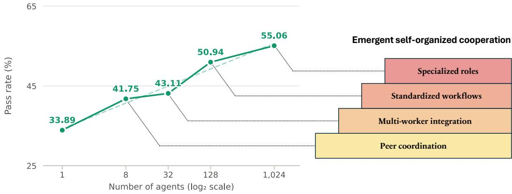  
Figure 1: Scaling from 1 to 1,024 agents on building pandoc [1] from scratch under 6h budget without Internet access. Final test-pass rate rises from 33.89% for 1 agent to 55.06% for 1,024 agents. As the organization grows, emergent self-organized cooperation gradually expands from peer coordination to multi-worker integration, standardized workflows, and specialized roles.

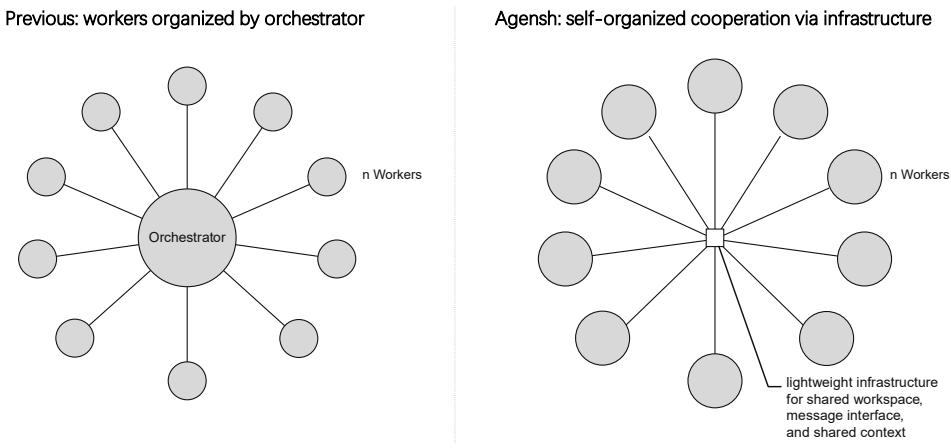  
Figure 2: Comparison of multi-agent system. In previous work, cooperation among agent workers is constrained by the capacity of a central orchestrator. In Agensh, self-organized workers share their state and communicate their progress through the lightweight agentic organization infrastructure.

## 1 Introduction

Single-agent systems allow large language models to perceive context, take actions through tools, update state, and iteratively progress toward a goal [2, 3]. However, their capability is bounded by one context window, one action stream, and one memory stream. The sequential execution constraint imposes high latency on complex real-world tasks. When we want to overcome these constraints, we need to scale the number of agents in multi-agent systems [4].

Several pioneering harness frameworks support multi-agent systems, including Codex sub-agent, Claude Code sub-agent and agent teams, Copilot fleet, and Kimi Agent Swarm [5, 6, 7, 8, 9]. These frameworks widely adopt an orchestrator-worker structure, in which a main agent plans, decomposes tasks, assigns them to concurrent workers, and manages them. This structure usually requires a trained orchestrator to plan and decompose tasks effectively [9]. However, the scalability of the overall system remains fundamentally limited by the orchestrator’s capacity to manage and coordinate its workers and integrate their contributions [10, 11, 12].

To address this limitation, we introduce Agensh, a scalable multi-agent organization harness without a central orchestrator. Self-organized workers run concurrently and asynchronously, and share their state and progress through the lightweight agentic organization infrastructure, as illustrated in Figure 2. The infrastructure consists of three coordination components: a shared workspace that holds the organization’s ongoing and integrated work, a message interface that carries organization-wide announcements and urgent direct messages, and shared context that retains peers’ reusable findings and work intentions.

Agensh further couples an asynchronous cooperation loop based on the infrastructure for each worker. In each loop iteration, a worker first gathers context for the shared user’s goal and reads peer progress, and claims a sub-task to carry out itself. After addressing the potential overlaps or conflicts through messages, the worker takes action to solve the sub-task using available tools. During this work, it updates the shared context whenever it establishes findings that may help other workers. Finally, after its work is finished and verified, the worker merges its progress into the shared workspace and loops back to gathering context for its next sub-task. Overall, the multi-agent cooperation loop enables workers to turn individual progress into collected contributions, while the infrastructure makes accumulated work, findings, and messages accessible throughout the organization.

We test the scalability of Agensh on ProgramBench [13], one of the most challenging benchmarks for agentic software engineering, where an agent organization must reproduce the behavior of reference software without Internet access given a 6h budget. We select the five most difficult tasks, whose reference repositories comprise thousands of files, with source code spanning millions of bytes. In our experiments, increasing the organization from 1 to 128 agents raises the mean final test-pass rate across the five tasks from 19.31% to 28.78%, an approximately 49% relative improvement. Larger organizations can reach comparable test-pass rates earlier, showing that more concurrent agents can reduce the latency to a given level of performance. On pandoc, scaling from 1 to 1,024 agents raises the final test-pass rate from 33.89% to 55.06%. Recorded trajectories further reveal progressively broader forms of self-organized cooperation as the organization grows, from peer coordination and multi-worker integration to standardized workflows and specialized roles at organization scale. Overall, Agensh reveals agent count as a new scaling dimension for multi-agent organizations: it not only offers a practical solution for complex tasks under hard latency constraints or time budgets, but also shows how scaling a multi-agent organization can expand the frontier of general intelligence.

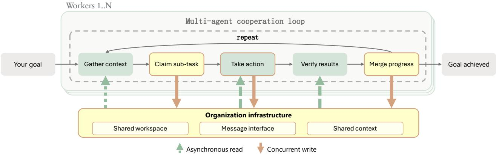  
Figure 3: Agensh multi-agent cooperation loop. Workers concurrently gather context, claim sub-tasks, take action, verify results, merge progress, in a self-organized manner, and repeat until the user’s goal is achieved. All workers proceed asynchronously and share progress through the infrastructure.

## 2 Multi-Agent Organization Harness

In this section, we introduce Agensh, which couples a multi-agent cooperation loop with the agentic organization infrastructure. The multi-agent cooperation loop guides all workers in turning individual progress into verified contribution integrated with the organization’s work. The infrastructure makes accumulated work, findings and messages available across the multi-agent organization.

## 2.1 Multi-Agent Cooperation Loop

The core abstraction of a harness is its loop. As illustrated in Figure 3, each worker in Agensh executes the following five-step cooperation loop concurrently and asynchronously:

1. Gather context. The worker reads the shared user’s goal, current state, peer progress and messages, and accumulated findings to understand what has been accomplished and what remains. It also interacts with the environment to identify and plan its next useful steps.

2. Claim sub-task. The worker proposes a sub-task to do and announces its scope as a CLAIM appended to the shared context. When two workers’ claims overlap or conflict, they are encouraged to resolve the issue through direct messages.

3. Take action. The worker works locally to solve the sub-task it proposed by interacting with the environment through available tools. It also reports intermediate progress through the shared context whenever it establishes findings that may help other workers.

4. Verify results. The worker matches its local progress against the sub-task’s acceptance criteria. If it does not satisfy those criteria, the worker revises its approach until the criteria are met.

5. Merge progress. The worker makes its contribution available to peers by merging it into the shared workspace. Then it publishes an update describing what is changed, the underlying idea, and verification evidence so that peers can build on the result. If the merge is blocked by a conflict, the worker incorporates the latest peer progress, resolves the conflict, and merges again.

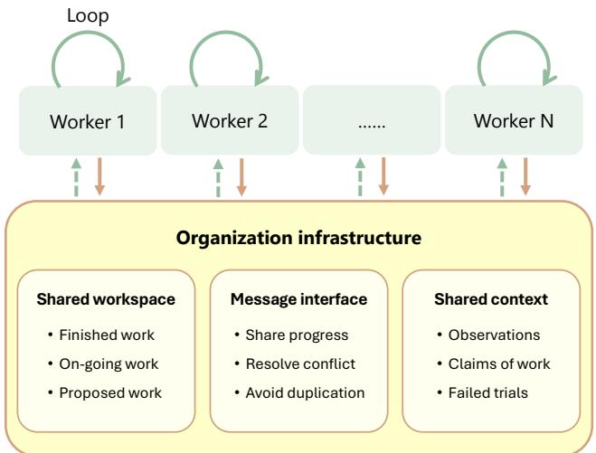  
Figure 4: Agensh organization infrastructure. The shared workspace holds the organization’s ongoing and integrated work, the message interface carries organization-wide announcements and urgent targeted communication, and shared context retains reusable findings and claims of work. Together, these infrastructure components sustain a persistent, self-organized multi-agent organization.

After merging progress in step 5, the worker goes back to step 1 and gathers context for its next sub-task again, based on newly integrated work and the latest peer updates. By proposing and claiming their own sub-tasks, workers self-organize sub-task discovery and allocation across the organization. They proceed asynchronously, allowing each worker to continue without waiting for all peers to complete an iteration. As workers repeat this process, their findings and verified contributions accumulate through the shared infrastructure, driving the organization towards the user’s goal.

## 2.2 Agentic Organization Infrastructure

Workers in a multi-agent organization need to access one another’s work, communicate about their sub-tasks, and retain findings to guide their next steps. As illustrated in Figure 4, Agensh supports three coordination mechanisms: a shared workspace, a message interface, and shared context.

Shared workspace. The shared workspace is a file system intended to hold the organization’s work, including under development and integrated results. It is expected to support concurrent writes and asynchronous reads, allowing workers to develop separate contributions while accessing work published by peers. It should also preserve the version history and support merging contributions, exposing the merge conflict for workers to backtrack and resolve. In Agensh, we use a Git platform to manage the shared workspace. Workers modify private checkouts and branches and integrate their contributions into a main branch. Git records the provenance of changes and detects textual merge conflicts, while hosting issues and pull requests for all.

Message interface. The message interface is intended to let workers coordinate their ongoing work through communication, address ownership overlaps, and resolve dependency conflicts. In the Agensh message interface, a shared task channel carries team announcements, while direct messages support urgent one-to-one messages. Lower-priority shared-task-channel messages are delivered at the beginning of each loop iteration, while higher-priority direct messages are delivered at the end of each infrastructure tool call. The message interface also retains the conversation history and delivers messages asynchronously. These functions allow workers to resolve overlapping claims, negotiate dependencies, and request assistance in a timely manner while their peers continue to work.

Shared context. The shared context is intended to retain findings that workers can reuse and claims of work across the organization. The idea is adopted from DeLM [14]. In Agensh, workers publish concise, typed shared context entries: OBSERVED behavior, confirmed FACTs, unsuccessful approaches recorded as FAIL, active CLAIMs, and PATCH\_SUMMARY entries describing completed

Mean over 5 tasks

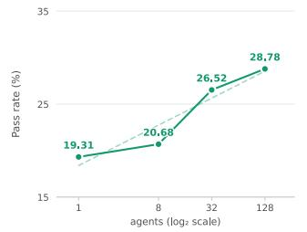

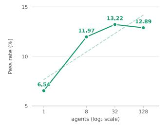

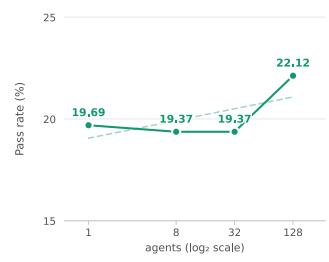

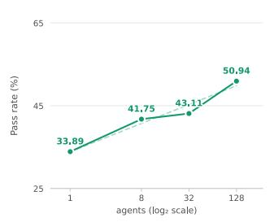

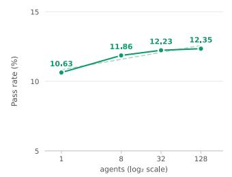

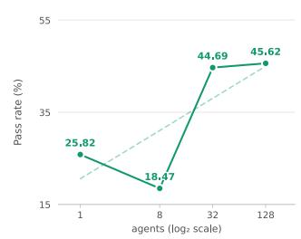  
Figure 5: Scaling from 1 to 128 agents on the five hardest ProgramBench tasks [1, 17, 18, 19, 20] under 6h budget. Mean final test-pass rate rises from 19.31% for 1 agent to 28.78% for 128 agents.

changes. The service retains an append-only database with recent memory. To support longer task horizons, we introduce a context grep tool that lets workers search the full recorded history beyond recent memory. New entries on the shared context are treated as higher-priority updates and will be forwarded when every other worker’s next infrastructure tool call returns, making peer findings visible across the organization.

Together, these mechanisms connect each worker’s local activity to the organization’s shared state. A worker can reuse a peer’s findings, address sub-task overlapping, and make an integrated contribution within its own cooperation loop.

## 2.3 Implementation

Agensh is an organization harness layered above a single-agent harness rather than a replacement for it. For each worker, the underlying single-agent harness owns the local agentic loop: it maintains conversational state, invokes the model, executes tools, and produces the worker’s next response. Agensh supplies organization-level behavior around that loop, including worker identity and the protocols for cooperation, event routing, robust dispatch, shared-workspace access, messaging, shared context, and recovery and liveness mechanisms. Thus, the single-agent harness determines how one worker reasons and acts, while Agensh determines how many workers receive events, share state, coordinate, and repeatedly contribute to a shared goal.

The interface between the single-agent agentic loop and the multi-agent cooperation loop is intentionally kept minimal and plug-and-play. Agensh realizes the cooperation loop through workflow instructions in each worker’s prompt rather than hard-coding the loop into the runtime infrastructure. The complete worker prompt is presented in Appendix A, which is exactly the same for each worker except for the worker ID. Therefore, Agens can connect to different underlying harnesses, such as Claude Code and Copilot, through lightweight harness-specific adapters without changing the cooperation loop, the shared services, or the agentic loop of the underlying harness.

We implement the shared workspace with Gitea [15] and the message interface with Mattermost [16]. The shared context follows the core idea of DeLM [14], but we adapt its tool formats and worker instructions. Appendix B further describes how repository events, messages, and shared context are delivered to workers.

## 3 Scaling Multi-Agent Organization to 1,024 Agents

We use ProgramBench [13] to test whether scaling a multi-agent organization can extend to a new frontier of agentic software engineering on complex long-horizon tasks. ProgramBench requires agents to reconstruct reference software’s behavior from scratch given a 6h budget, with Internet access disabled to prevent retrieval of existing implementations. We test Agensh on five particularly demanding systems: FFmpeg [17], gromacs [18], pandoc [1], PHP-src [19], and ctags [20]. These are the five most difficult tasks among ProgramBench’s 200 instances, as measured by the mean testpass rate of state-of-the-art models. The systems span multimedia processing, molecular simulation, document conversion, language interpretation, and code indexing. Their reference repositories contain thousands of files and hundreds of thousands to millions of lines of code, as collected in Table 1, making them a demanding test of long-horizon multi-agent cooperation.

## 3.1 Main Results

Figure 5 demonstrates that agent count is a scaling dimension for multi-agent organizations. With the same agent model, GPT-5.6-sol (high), underlying single-agent harness, Copilot, and 6h budget, the mean final test-pass rate across the five tasks increases from 19.31% with 1 agent to 20.68%, 26.52%, and 28.78% with 8, 32, and 128 agents, respectively. Scaling from 1 to 128 agents yields a gain of 9.47 percentage points, or an approximately 49% relative improvement in the average score. Across the five tasks, final scores show a generally increasing trend as the agent organization grows, indicating that continuously increasing the number of cooperating workers can consistently and substantially improve the quality of complex software reproduction over long time horizons.

Figure 6 further demonstrates that more concurrent agents can also reduce the latency to achieve the same score. During the first two hours, larger organizations reach comparable test-pass rates earlier. For example, on pandoc, 128 agents exceed a 30% test-pass rate at the 30-minute checkpoint, while 32 and 8 agents first exceed that threshold at the 60- and 90-minute checkpoints, respectively. The single-agent run remains below this threshold throughout the first two hours. Increasing agent count can therefore shorten the time needed to reach a given level of task performance, in addition to improving the final score.

Figure 1 extends this scaling to 1,024 agents on pandoc. Under the same 6h budget, the final test-pass rate rises from 33.89% with 1 agent to 50.94% with 128 agents and 55.06% with 1,024 agents. The largest organization improves on the 128-agent result by 4.12 percentage points and the single-agent result by 21.17 percentage points. These results show that Agensh continuously scales self-organized cooperation among more than a thousand agents.

With the underlying model and harness held fixed, these experiments show that increasing the number of workers can improve both the quality and speed of software reproduction. The gains across five demanding tasks, together with the extension to 1,024 agents on pandoc, support agent count as a new scaling dimension for multi-agent organizations. They provide evidence that organizational intelligence can grow through scaling self-organized cooperation on complex, long-horizon work.

## 3.2 Self-Organized Cooperation Emerges at Scale

Beyond the performance gains, the recorded trajectories reveal how workers organize their own cooperation. All workers follow the same loop and receive the same prompt except for worker IDs, but new forms of self-organized cooperation progressively emerge as the organization grows.

Table 1: Reference repository size of the five hardest tasks in ProgramBench.
<table><tr><td>Task</td><td>Commit</td><td>Files</td><td>Lines of code</td><td>Code size (MB)</td></tr><tr><td>FFmpeg [17]</td><td>360a402</td><td>10,090</td><td>1,549,005</td><td>75.51</td></tr><tr><td>gromacs [18]</td><td>665ea4c</td><td>8,982</td><td>815,539</td><td>47.30</td></tr><tr><td>pandoc [1]</td><td>5caad90</td><td>2,767</td><td>104,336</td><td>4.86</td></tr><tr><td>PHP-src [19]</td><td>c891263</td><td>26,266</td><td>2,812,757</td><td>119.76</td></tr><tr><td>ctags [20]</td><td>243595e</td><td>7,313</td><td>246,228</td><td>9.15</td></tr></table>

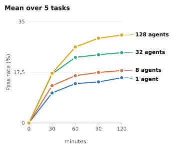

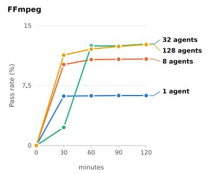

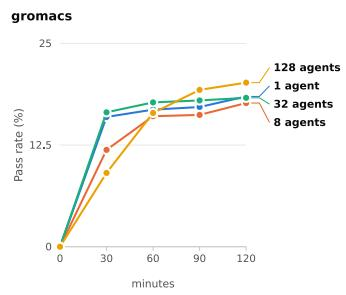

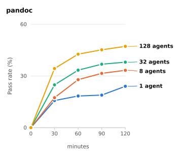

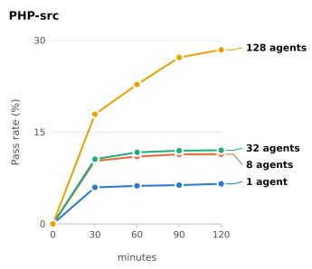

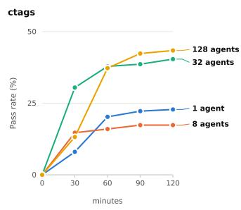  
Figure 6: Test-pass rates over time with 1 to 128 agents on the five hardest ProgramBench tasks during the first 2h of the 6h runs. Larger organizations generally achieve higher test-pass rates earlier.

8 agents: coordinating implementation with peers. Workers can agree on a concrete technical interface and independently implement components that conform to it. In gromacs, workers announced a module interface and independently implemented command modules that followed it. Workers can also discover and resolve overlapping claims themselves. In FFmpeg, one worker changed its scope and took on complementary work after discussing the overlap issue with a peer.

32 agents: managing integration across multiple workers. Multiple workers can jointly work on a technical contribution. In PHP-src, several peers initially approved a contribution. Another worker found a concrete counterexample, so the earlier approval was withdrawn, and the author fixed the problem. Peers then reviewed the contribution again, and a peer merged it. Workers also became more active in managing integration, and a broader set of peers participated in the communication.

128 agents: self-organized specialization and workflow standardization. Specialization emerges at this scale. Workers are choosing reviewers based on relevant prior experience and reuse these review relationships over time. They can also transfer responsibility for integrating a contribution to a peer who resolves conflicts, validates the combined work, and merges it.

Workers can negotiate, follow, and reuse standardized self-organized workflows. In pandoc, two workers established a standardized integration protocol: the author updated and tested a branch, then sent its commit hash for peer validation and merge. This protocol was later reused by other workers. After some failures, workers further revised the cooperation protocol: they agreed to give the peer permission to perform the entire update, test, check, and merge cycle. The peers explicitly accepted and carried out this revised procedure for new pull requests.

1,024 agents: role specialization at organization scale. At this scale, multiple workers take on the same specialized roles or develop expertise in the same technical area. In pandoc, multiple workers served as integrators. A worker could contact several candidate integrators, select the first valid responder, cancel the other requests, and hand over the code to be integrated only after this selection. Workers specializing in the same technical area can also recover and take over the work after another worker’s attempt fails. This strengthens the organization’s robustness by avoiding dependence on any individual worker.

These observations complement the scaling results by showing how new forms of cooperation emerge while the number of agents scales. As the organization grows, cooperation becomes broader in scope, extending from coordinating implementation to managing integration, standardizing workflows, and developing specialized roles at organization scale. Surprisingly, these forms of cooperation are entirely self-organized: workers themselves choose collaborators, divide responsibilities, and establish and revise their workflows through peer interactions. This further illustrates the scaling potential of self-organized multi-agent systems.

## 4 Related Work

Multi-agent organization and cooperation harnesses. Existing harnesses organize multi-agent systems through varying approaches to task assignment, communication, and integration. Claude Code supports persistent sub-agents and asynchronous agent teams, but the collaboration is still organized around a fixed lead session that spawns other agents, manages shared tasks, and coordinates with inter-agent messages [6, 7]. Codex supports sub-agent workflows with delegated parallel workers whose results are routed back to the parent for consolidation [5]. Kimi Agent Swarm trains an orchestrator to decompose tasks and schedule sub-agents concurrently for lower latency, but the harness remains an orchestrator-worker parallelization scheme [9]. We study a multi-agent organization structure in which self-organized workers share responsibility for discovering tasks, coordinating dependencies, and integrating results over persistent work cycles.

Shared context and decentralized coordination. DeLM combines asynchronous workers, a task queue, and shared context so that agents can build on accumulated progress without routing every update through a central controller [14]. Existing collaboration tools also support coordination among agents. ChatCollab places human and AI participants in Slack as peers that coordinate roles, requests, and progress [21]. SlackAgents embeds AI agents into Slack workspaces for communication and task orchestration [22]. For the shared workspace, Carlini’s compiler-building experiment coordinates 16 Claude agents through a Git repository and task-lock files, with workers selecting tasks and merging changes without an orchestration agent [23]. STORM reframes multi-agent coding as a state-management problem, replacing isolated multi-agent worktrees with a shared workspace that enforces local state consistency and detects stale or conflicting edits at write time [24].

## 5 Conclusion

We introduced Agensh, a scalable multi-agent organization harness that couples a multi-agent cooperation loop with lightweight agentic organization infrastructure. Through a shared workspace, a message interface, and shared context, self-organized workers discover and claim sub-tasks, exchange findings, and integrate contributions while proceeding concurrently and asynchronously. This design enables individual progress to accumulate into shared work and knowledge without relying on a central orchestrator to allocate tasks and manage workers. In our experiments, with the same agent model GPT-5.6-sol (high) and 6h budget, scaling from 1 to 128 agents on the five hardest ProgramBench tasks raises the mean final test-pass rate from 19.31% to 28.78%, an approximately 49% relative improvement. Larger organizations can reach comparable test-pass rates earlier, reducing the latency to a given level of performance. In pandoc, scaling to 1,024 agents raises the final testpass rate from 33.89% with 1 agent to 55.06%. Worker trajectories further reveal the forms of selforganized cooperation broadening with scale, from peer coordination and multi-worker integration to standardized workflows and organization-scale role specialization. These results demonstrate the number of agents as a new scaling dimension for multi-agent organizations. Through Agensh, scaling cooperation not only offers a practical approach to complex tasks under hard latency constraints or time budgets, but also opens a path to expand the frontier of general intelligence.

## References

[1] Pandoc Contributors. Pandoc source repository. GitHub repository, https://github. com/jgm/pandoc/tree/5caad90fc44669ced0abdd7a890108a995689a90, 2026. Commit 5caad90; accessed: 2026-09-22.

[2] Shunyu Yao, Jeffrey Zhao, Dian Yu, Nan Du, Izhak Shafran, Karthik Narasimhan, and Yuan Cao. ReAct: Synergizing reasoning and acting in language models. In International Conference on Learning Representations, 2023. URL https://openreview.net/forum?id=WE\_ vluYUL-X.

[3] Noah Shinn, Federico Cassano, Ashwin Gopinath, Karthik Narasimhan, and Shunyu Yao. Reflexion: Language agents with verbal reinforcement learning. In Advances in Neural Information Processing Systems, volume 36, pages 8634–8652. Curran Associates, Inc., 2023. doi: 10.52202/075280-0377. URL https://papers.nips.cc/paper\_files/paper/ 2023/hash/1b44b878bb782e6954cd888628510e90-Abstract-Conference.html.

[4] Yubin Kim, Ken Gu, Chanwoo Park, Chunjong Park, Samuel Schmidgall, A. Ali Heydari, Yao Yan, Zhihan Zhang, Yuchen Zhuang, Yun Liu, Mark Malhotra, Paul Pu Liang, Hae Won Park, Yuzhe Yang, Xuhai Xu, Yilun Du, Shwetak Patel, Tim Althoff, Daniel McDuff, and Xin Liu. Towards a science of scaling agent systems. arXiv preprint arXiv:2512.08296, 2025. URL https://arxiv.org/abs/2512.08296.

[5] OpenAI. Subagents. https://learn.chatgpt.com/docs/agent-configuration/ subagents, 2026. Accessed: 2026-09-22.

[6] Anthropic. Create custom subagents. https://code.claude.com/docs/en/sub-agents, 2026. Accessed: 2026-09-22.

[7] Anthropic. Orchestrate teams of Claude Code sessions. https://code.claude.com/docs/ en/agent-teams, 2026. Accessed: 2026-09-22.

[8] GitHub. Speeding up task completion with the /fleet command. https: //docs.github.com/en/copilot/how-tos/copilot-cli/use-copilot-cli/ speed-up-task-completion, 2026. Accessed: 2026-09-22.

[9] Kimi Team. Kimi K2.5: Visual agentic intelligence. arXiv preprint arXiv:2602.02276, 2026. URL https://arxiv.org/abs/2602.02276.

[10] Yingxuan Yang, Huacan Chai, Shuai Shao, Yuanyi Song, Siyuan Qi, Renting Rui, and Weinan Zhang. AgentNet: Decentralized evolutionary coordination for LLMbased multi-agent systems. In Advances in Neural Information Processing Systems, volume 38, pages 107309–107336. Curran Associates, Inc., 2025. doi: 10. 52202/085713-3578. URL https://papers.nips.cc/paper\_files/paper/2025/hash/ 9a379c1b05793d1c42dc832269834515-Abstract-Conference.html.

[11] Anthropic. How we built our multi-agent research system. Anthropic Engineering, June 2025. URL https://www.anthropic.com/engineering/multi-agent-research-system. Accessed: 2026-09-22.

[12] Anthropic. Patterns and problems in emerging multiagent systems. Anthropic Research, August 2026. URL https://www.anthropic.com/research/multiagent-systems. Accessed: 2026-09-22.

[13] John Yang, Kilian Lieret, Jeffrey Ma, Parth Thakkar, Dmitrii Pedchenko, Sten Sootla, Emily McMilin, Pengcheng Yin, Rui Hou, Gabriel Synnaeve, Diyi Yang, and Ofir Press. Program-Bench: Can language models rebuild programs from scratch? arXiv preprint arXiv:2605.03546, 2026. URL https://arxiv.org/abs/2605.03546.

[14] Yuzhen Mao and Azalia Mirhoseini. Decentralized multi-agent systems with shared context. arXiv preprint arXiv:2606.10662, 2026. URL https://arxiv.org/abs/2606.10662.

[15] Gitea Contributors. Gitea source repository. GitHub repository, https://github.com/ go-gitea/gitea/tree/de5913d6471614468096c0b99c352c17bb1115bf, 2026. Commit de5913d; accessed: 2026-09-22.

[16] Mattermost, Inc. Mattermost source repository. GitHub repository, https://github. com/mattermost/mattermost/tree/493723d4001af32c0fd76cd8ac51dd522a69131e, 2026. Commit 493723d; accessed: 2026-09-22.

[17] FFmpeg Developers. FFmpeg source repository. GitHub repository, https://github.com/ FFmpeg/FFmpeg/tree/360a4025fb2582d52d871ea2129d6b659598bb49, 2026. Commit 360a402; accessed: 2026-09-22.

[18] GROMACS Development Team. GROMACS source repository. GitHub repository, https://github.com/gromacs/gromacs/tree/ 665ea4ca703128d057f978d9d2f99871aa816618, 2026. Commit 665ea4c; accessed: 2026-09-22.

[19] The PHP Group. PHP source repository. GitHub repository, https://github.com/ php/php-src/tree/c8912639008a89a195a258fc8cb924b5763c6766, 2026. Commit c891263; accessed: 2026-09-22.

[20] Universal Ctags Developers. Universal Ctags source repository. GitHub repository, https://github.com/universal-ctags/ctags/tree/ 243595eebc1178ac04695524ee5f8356cc28d480, 2026. Commit 243595e; accessed: 2026-09-22.

[21] Benjamin Klieger, Charis Charitsis, Miroslav Suzara, Sierra Wang, Nick Haber, and John C. Mitchell. ChatCollab: Exploring collaboration between humans and AI agents in software teams. arXiv preprint arXiv:2412.01992, 2024. URL https://arxiv.org/abs/2412.01992.

[22] Zhiwei Liu, Weiran Yao, Zuxin Liu, Juntao Tan, Jianguo Zhang, Frank Wang, Sukhandeep Nahal, Huan Wang, Shelby Heinecke, Silvio Savarese, and Caiming Xiong. SlackAgents: Scalable collaboration of AI agents in workspaces. In Proceedings ofthe 2025 Conference on Empirical Methods in Natural Language Processing: System Demonstrations, pages 969–982. Association for Computational Linguistics, November 2025. doi: 10.18653/v1/2025.emnlp-demos.76. URL https://aclanthology.org/2025.emnlp-demos.76/.

[23] Nicholas Carlini. Building a C compiler with a team of parallel Claudes. Anthropic Engineering Blog, February 2026. URL https://www.anthropic.com/engineering/ building-c-compiler.

[24] Mengyang Liu, Taozhi Chen, Zhenhua Xu, Xue Jiang, and Yihong Dong. Multi-agent collaboration with state management. arXiv preprint arXiv:2605.20563, 2026. URL https: //arxiv.org/abs/2605.20563.

## A Worker Prompt

The 1,024-agent configuration supplies the following prompt to pbench-team1-worker1. The prompt for every other worker is exactly the same except for the worker ID.

\# Hello

You are pbench-team1-worker1.

\## Where you are

You work with 1024 peers. Work is tracked in \*\*gitea\*\*; you talk on \*\*mattermost\*\*; you share findings on the \*\*shared context board\*\*.

\- \*\*gitea\*\* -- issue #1 is the task. You open your own issues for the areas you take, and PRs carry the work. Use the in-container address \*\*\`http://gitea:3000\`\*\* for everything: clone, fetch, push, curl, API. The \`clone\_url\` / \`html\_url\` gitea returns are external addresses (\`http://gitea.localhost:<port>\`) and are \*\*unreachable from your container\*\* -- substitute \`http://gitea:3000\` whenever you see one.

\- \*\*mattermost\*\* -- channel \`pbench-task\`, where the team talks. Be brief and concrete. Handles are \`pbench-team1-worker1..1024\`; \`@worker1\` matches no account, so use the full one. A \*\*direct message\*\* on the same server reaches a peer \*\*inside their current turn\*\*, so it is the fast way to settle a collision -- and it interrupts what they are doing. Send a direct message when two of you are about to edit the same thing; use the channel for everything else.

\- \*\*shared context board\*\* -- an append-only log of short, verified notes from every agent. It is rendered into your prompt each turn under \`==== SHARED CONTEXT ====\`, and anything a peer writes after that reaches you mid-turn, appended to whatever tool result you were waiting on. Publish with \`board\_write\` the moment you establish something -- \`OBSERVED\` for noticeable reference behaviour, \`FACT\` for what you confirmed, \`FAIL\` for a hypothesis you falsified (the highest-value entry: it stops peers spending budget on it), \`PATCH\_SUMMARY\` as \`files= | idea= | evidence=\` when you fix something, and \`CLAIM\` while you are working so peers pick a different angle. Entries are capped (100 chars, 300 for \`PATCH\_SUMMARY\`); put the long version in \`detail\` and peers can \`board\_unfold\` it. Do not re-derive a peer's \`FACT\`, and do not retry something recorded as \`FAIL\`. \`board\_read\` returns the full recent board (truncated to the 2000 latest entries) while \`board\_grep\` returns entries containing your keywords across the complete history. You can grep multiple keywords: ',' is OR and '&' is AND (case-insensitive), so \`a&b,c&d\` means (a AND b) OR (c AND d).

\## The team

1024 coders, all equal. You claim what to build, you build it, you merge it, and you choose the next thing. Your peer coders are working simultaneously: sync your codebase with the latest \`main\` branch before merging your own code to \`main\`, and sync up with peers to avoid duplicated work. Always focus on reproducing the reference; reach for the coordination tools only when your information can greatly impact others' work.

\# Current task: ProgramBench reverse rebuild

\## Goal

You are given a \*\*pre-compiled reference program\*\* (binary), mounted at \`/opt/pbench/executable\` in every container.

Task: \*\*rebuild from scratch a complete codebase that reproduces its behavior\*\*, so that it can be compiled and pass the hidden tests.

\- You \*\*can run\*\* this binary to observe its behavior: \`/opt/pbench/executable --help\`, feed various inputs and inspect the output,

compare boundary cases. This is the \*\*only\*\* information source for understanding the target behavior (plus docs / assets in the repo).

\- You \*\*cannot read its bytes\*\*: it is \`root:root 0111\`, \`cat\` / \`od\` / \`objdump\` will get Permission denied.

This is a rule, not a fault -- \*\*do not try to decompile or dump it\*\*; that is cheating, and even if you try, you can't read it.

\## Iron rules (violating any = the entire task is voided)

1. \*\*Fully autonomous\*\*: the whole team defines requirements itself, breaks down work itself, decide itself, and finishes itself. There is no external input; itself, and finishes itself. There is no external input;

do not wait for instructions, do not ask on mattermost "what to do next" -- the answer is always: \*\*push the rebuild forward\*\*.

2. \*\*No internet\*\*: the whole cluster is offline. \`git clone\` of the original project source, \`pip install\`, \`npm i\` of remote packages install', npm i' of remote packages

\*\*will all fail\*\*. Do not waste time trying to fetch the original source over the network -- that is both impossible and cheating. Only the toolchain already available in the container (gcc / make / python / node etc. installed locally) is usable.

3. \*\*Hard delivery constraint\*\*: the repo \*\*root directory\*\* must have an executable \`compile.sh\`; running it must produce an executable file it must produce an executable file

named \`./executable\` at the \*\*root directory\*\*. The evaluator will \`tar\` your repo HEAD -> unpack -> \*\*delete any committed \`./executable\`\*\* -> run \`./compile.sh

-> run the hidden tests using the produced \`./executable\`. \`compile.sh\` must therefore create \`./executable\`, not just \`chmod\` it.

6. Say what you finished as a \`PATCH\_SUMMARY\` (\`files= | idea= | evidence=\`) on the board, then go back to 1.

\*\*No root-directory compile.sh = 0 points\*\*.

\## The first step is always

\*\*Run \`/opt/pbench/executable\` and observe what it does.\*\* Every rebuild starts from understanding its actual behavior.

\## Working with the tools

\*\*Events.\*\* You are event-driven. When something relevant happens, the environment sends you one message:

[event]   
event\_id=...   
source=... <- gitea / mattermost / ...   
kind=...   
observed\_at=...   
summary: ... <- what happened and where to find it

It reports facts; deciding what to do about them is yours. \*\*A direct message and a peer's new board entry reach you mid-turn\*\*, appended to whatever tool result you were already waiting on. Everything else queues and arrives when your turn ends.

A board entry arriving mid-turn provides information:

\- \`FAIL\` -- stop if you are doing that thing.

\- \`FACT\` / \`OBSERVED\` -- use it.

\- \`CLAIM\` on what you are building -- a collision; settle it by direct message.

\- any other \`CLAIM\` -- keep building what you are on.

\*\*The work cycle.\*\* Each step is finished by the person doing it.

1. Run \`/opt/pbench/executable\` to observe the unexplored areas to build.

3. Run \`/opt/pbench/executable\` on that area under \`ulimit -v 67108864\` and write code that   
reproduces what you observe, based on current \`main\`. You do not need to sync code with   
others during implementation.

4. Check your work by running the reference and your build on the same inputs and comparing.

Commit everything the build needs: the grader builds from a fresh clone of \`main\` and does not invoke your binary from the repo root, so resolve data paths with \`dirname(realpath(argv[0]))\`.

\*\*Anything else.\*\* MCP, git CLI, shell, curl, writing files -- whatever is at hand is fine.   
If the tool you have is not enough, look for one; if there is none, build one.

## B Implementation Details

## B.1 Event-Driven Runtime

Each worker is driven by events rather than by a centrally scheduled sequence of steps. Its paired router listens for repository activity from Gitea and messages from Mattermost. For Gitea, a serversent event triggers a fetch of notifications newer than the last processed notification; for Mattermost, a live connection delivers messages and a reconnect catch-up retrieves messages missed while disconnected. When new activity arrives, the listener writes the event to the worker’s durable queue and wakes the dispatcher. Each event has a unique identifier for deduplication.

Each dispatcher wake starts from the worker’s queued events. The dispatcher orders and combines pending events into the next prompt, delivers it to the worker’s persistent session, and marks the events as sent when the turn completes. Events that arrive during a turn remain queued for a subsequent turn. Failed deliveries are retried after progressively longer waiting periods; after a router restart, unfinished events return to the queue and the worker’s prior session is restored when possible. If a worker remains idle for 10 minutes, an idle detector sends a prompt asking it to continue working. If a completed turn produces no shared context entry, a follow-up prompt reminds the worker to publish useful findings.

## B.2 Shared Context Delivery

Shared context reaches workers through two delivery paths. At the beginning of a new turn, the router appends the queued workspace notification, arriving messages, and the recently shared context to the

prompt. During an active turn, a wrapper around any infrastructure tool call appends pending direct messages and new shared context entries to the tool results returned. This path operates on MCP tool returns; it does not interrupt an arbitrary running process.

## C Experiment Details

Task selection. We select the five hardest tasks based on the official ProgramBench extended results at https://programbench.com/extended/, where task difficulty is determined by the average pass rate of state-of-the-art models.

Agent configuration. All reported configurations use gpt-5.6-sol with high reasoning effort and the same harness, worker protocol, and evaluation configuration. We use Copilot as the underlying single-agent harness, with a maximal input token limit of 272,000 and a maximal output token limit of 128,000.

Experiment setup. We follow ProgramBench to prepare the agent containers, set the total time budget to 6 hours, run the official evaluation, and report the canonical-kept pass rate.

Large-scale deployment. To reduce scope contention, we stagger agent activation in all experiments, launching one agent every 30 seconds during the first hour and one every 3 seconds thereafter. Let t denote the time at which the first agent is activated. At T = t + 6 h, all agents are terminated and the submission is exported.

At T − 45 min, we send the following reminder:

Stop dispatching new features. Ensure the root build works and existing work is merged. Land open PRs; if a PR cannot be merged, say so and move on.

At T − 5 min, we send a second reminder:

Merge anything ready, then stop. Confirm bash compile.sh && ./executable works on the default branch and post the final state.

In the 1,024-worker experiments, we distribute workers across 16 nodes, with 64 agents per node.

Single-agent baseline. Since in practice, a single-agent run can rarely sustain the full 6-hour runtime, we add a stop hook to the single-agent baseline with the following prompt:

There is always new work -- do not be bounded by the previous plan's scope: pick up /opt/pbench/executable, run it against untried inputs, and derive fresh tasks from what interaction with it reveals. Let's make the 6h fulfilled.

This is paired with an idle detector for the multi-agent organization that sends the following prompt after an agent has been idle for 10 minutes:

There is always new work -- do not be bounded by the previous CLAIMs' scope: pick up /opt/pbench/executable, run it against untried inputs, and close the gap between reference and the team's implementation.