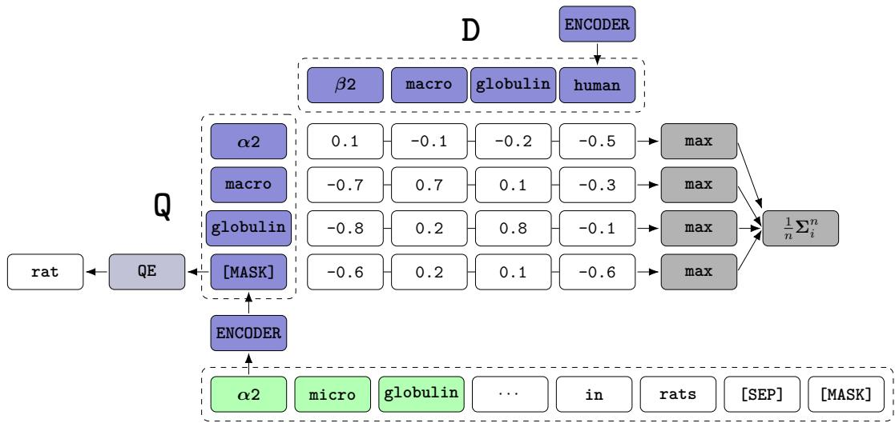
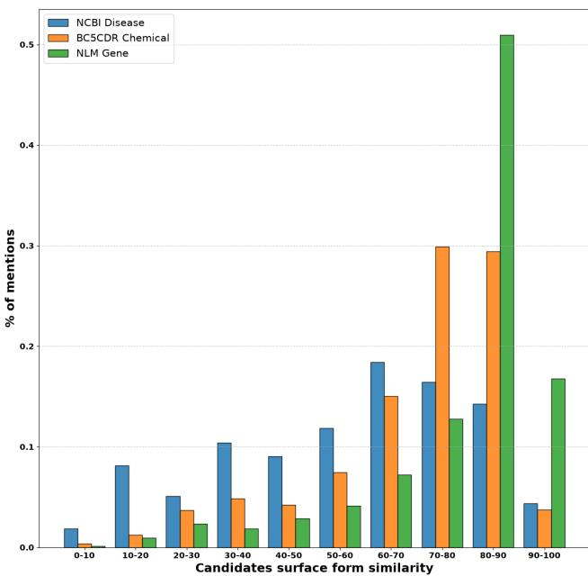
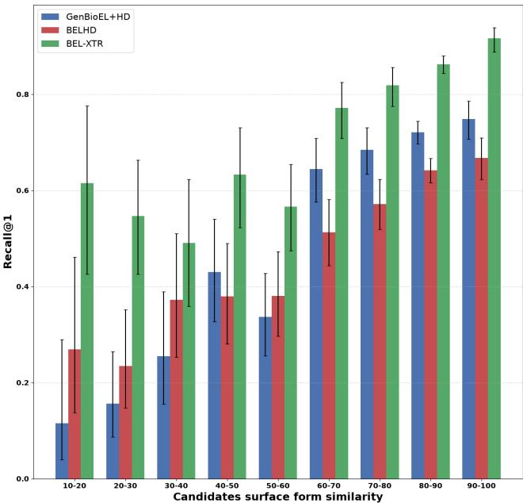

# BELXTR: Biomedical Entity Linking via Contextualized Token Retrieval

Samuele Garda1,∗ and Ulf Leser1

1Computer Science, Humboldt-Universit¨at zu Berlin, Rudower Chaussee 25, 12489, Berlin, Germany

∗Corresponding author. gardasam@informatik.hu-berlin.de

## Abstract

Motivation: Biomedical Entity Linking disambiguates mentions to entities in a knowledge base (KB), making it the cornerstone of information extraction pipelines. While embedding-based models are a popular approach for the task, they sufer from a key limitation. They compress mentions (and entities) into a single vector, forcing the model to average away crucial fine-grained diferences.

Results: We present BELXTR, a novel embedding model based on the multi-vector (a.k.a. late interaction) architecture, which allows to leverage token-level matching information. BELXTR extends the original XTR model to biomedical entity linking by integrating an existing task-specific training objective and exploring active query expansion. Experiments across ten corpora and five KBs show that BELXTR improves upon current state-of-the-art in half of the corpora with an average improvement of 5pp recall@1. The largest gains are reported on the challenging cross-species gene disambiguation subtask, where BELXTR outperforms an LLM-powered retrieve-and-rerank pipeline and closely approaches a specialized rule-based system. Our results highlight multi-vector models as a practical alternative to hard-to-maintain rule-based systems or in scenarios where LLM-based reranking is too costly as in PubMed-scale mining.

Availability and implementation: The code to reproduce our experiments can be found at: https://github.com/sgwbi/belxtr.

## 1. Introduction

Biomedical Entity Linking1 (BEL) is the task of disambiguating mentions of biomedical concepts to unique entries in knowledge base2 (KB). As a key component in the conversion from text to structured representation, BEL supports multiple downstream applications such as information retrieval [Nentidis et al., 2026] and knowledge graph construction [Sch¨afer et al., 2024].

Embedding-based models are one of the most popular approaches for the task [Liu et al., 2021, Sung et al., 2020, Mujeen et al., 2022]. However, they sufer from a fundamental representational bottleneck. As they compress mentions (and entity names) into a single vector, they are forced to average away fine-grained surface-form variations, which are crucial for correct disambiguation.

Multi-vector (a.k.a late-interaction3) models are a promising approach to overcome this limitation. They generate individual subword embeddings for every token in the mention and entity, and use the pooled Cartesian product of their similarities to produce the final similarity score. However, multi-vector models have not been thoroughly investigated for entity linking, particularly in specialized fields like biomedicine, as existing work remains almost exclusively confined to applying a vanilla ColBERT [Khattab and Zaharia, 2020b] model to generaldomain datasets [Zhang and Stratos, 2021, Song et al., 2024].

Here we introduce BELXTR, a multi-vector model specifically developed for biomedical entity linking. BELXTR extends the original XTR model [Lee et al., 2023] (an improved version of the ColBERT model [Khattab and Zaharia, 2020b]) by (i) using an existing BEL-specific training objective and (ii) optimizing temperature scaling for contrastive learning (as proposed by [Radford et al., 2021]). We explore as well the explicit training of [MASK] embeddings to perform query4 expansion via an auxiliary objective function (see Section 2.1.4 for details).

We evaluate BELXTR on the standardized BELB benchmark [Garda et al., 2023], comparing it against six state-of-the-art neural models. BELXTR outperforms all baselines on five of the ten evaluated corpora and achieves the second-best performance on four, yielding an average improvement of 5 percentage points in recall@1 over the best performing models. Results on the GENE corpora drive this performance increase the most. We argue that BELXTR’s edge stems from its ability to model fine-grained, contextualized token similarities. For instance, as shown in Figure 1, the model can learn to directly capture subtle diferences such as $^ { \prime \prime } \alpha 2 \cdot ^ { \prime \prime }$ vs. “β2-microglobulin” (see Section 4.4 for further discussion).

  
Figure 1 Illustration of BELXTR: a multi-vector model for biomedical entity linking. Green background indicates mention boundaries marked by special tokens (omitted for clarity). Q: mentions with context. D: entity name. QE: Query Expansion (see Section 2.1.4).

Notably, on the challenging cross-species gene disambiguation task, BELXTR as a standalone retriever achieves a higher recall@1 than a LLM-powered retrieve-and-rerank pipeline (see Section 4.2 for discussion). We compare BELXTR as well against the state-of-the-art, traditional type-specific systems integrated in PubTator3 [Wei et al., 2024]. While maintaining competitive results across five entity types, on gene disambiguation our model achieves an F1 score of 83.86, outperforming the previous best neural model (80.50) and closely approaching PubTator3’s highly specialized GENE model (84.63).

Overall, in line with findings in information retrieval studies [Thakur et al., 2021, Warner et al., 2024], our results show that multi-vector models yield superior retrieval capabilities, advancing the state-of-the-art on the BEL task. This makes them a practical alternative to hard-to-maintain rule-based systems or in scenarios where LLM-based reranking is too costly (e.g., PubMed-scale mining).

## 2. Materials and methods

We now introduce (i) BELXTR, our novel method for biomedical entity linking (Section 2.1) based on the XTR model first introduced by Lee et al. [2023] and (ii) the evaluation protocols adopted in our experiments (Section 2.2).

## 2.1. Model

## 2.1.1. Background

Before introducing our enhancements (see Section 3.1 for the ablation study), we first revisit the late-interaction model on which our method is based, namely XTR [Lee et al., 2023].

Given a mention (with its context) and a candidate entity, XTR maps them to token embedding matrices $Q \in \mathbb { R } ^ { m \times h }$ and $\ b { D } \in \mathbb { R } ^ { n \times h }$ , respectively. Here n, m, and h denote the number of mention tokens, the number of entity tokens, and the embedding dimension, respectively.

As shown in Figure 1, while the encoder uses the mention’s context (determined by the maximum number of tokens that the backbone model can process) to produce contextualized embeddings, only the mention tokens are retained in Q. Afterwards, XTR computes a token-level similarity matrix $\pmb { P } \in$ $\mathbb { R } ^ { m \times n }$ , which is defined by the pairwise similarities between each mention token and each entity token: $P _ { i j } = Q _ { i } ^ { \top } D _ { j }$

To determine which of these token-level scores contribute to the final mention-entity similarity, XTR uses a binary alignment matrix $A \ \in \ \{ 0 , 1 \} ^ { n \times m }$ . This matrix, has two formulations depending on whether the score is being is computed at test time (A) or during training (Aˆ). At test time XTR uses $A _ { i j } = 1 1 _ { [ j = \mathrm { a r g m a x } _ { j ^ { \prime } } P _ { i j } ] }$ . This is the “sum-of-max” operator as originally introduced in ColBERT, which yields the following scoring function:

$$
f ( \pmb { Q } , \pmb { D } ) = \frac { 1 } { n } \sum _ { i = 1 } ^ { n } \sum _ { j = 1 } ^ { m } \pmb { A } _ { i j } \pmb { P } _ { i j } = \frac { 1 } { n } \sum _ { i = 1 } ^ { n } \operatorname* { m a x } _ { 1 \le j \le m } \pmb { Q } _ { i } ^ { \top } \pmb { D } _ { j }\tag{1}
$$

Intuitively, the final alignment score is determined by each query token’s best match. XTR departs from ColBERT in how it defines the alignment matrix during training. That is, when optimizing model parameters XTR uses instead ${ \hat { A } } _ { i j } =$ $\Im [ \mathinner { j \in \mathrm { t o p - k } \mathopen { \left( P _ { i j ^ { \prime } } \right) } } ]$ , where top-k operator spans all tokens within a mini-batch of size B $; \left( \mathfrak { i } . \mathfrak { e } . , 1 \le j ^ { \prime } \le m B \right)$ . The intuition behind this choice is that the top-k operator simulates the inference stage, where only the entities whose tokens are retrieved by the top-k operation are considered for the final ranking. This forces the model during training to consider only token similarities high enough to be globally retrieved, leading to stronger training signal6 [Lee et al., 2023].

## 2.1.2. Name-based vs entity-based

A KB can be represented in two ways: (a) by entity or (b) by names. In the first case, a candidate entity e is represented by concatenating all of its known names. In the second case, each name is treated as a separate candidate.

We explore both representations. Given a set of candidates $\mathcal { C } = \{ D ^ { 1 } , \cdots , D ^ { k } \}$ (either entities or names), we define the probability of a candidate $D ^ { i }$ being the correct link for a given mention $Q$ (under the model parameters θ) as follows:

$$
p ( D ^ { i } \mid Q ; \theta ) = { \frac { \exp \left( f ( Q , D ^ { i } ) \right) } { \sum _ { j = 1 } ^ { | { \mathcal { C } } | } \exp \left( f ( Q , D ^ { j } ) \right) } }\tag{2}
$$

We train two separate models based on these representations. For a given mention $Q ,$ the entity-based model optimizes the standard cross-entropy loss [Bridle, 1990]. For the name-based model, we optimize instead the maximum marginal likelihood (MML) objective proposed by [Sung et al., 2020]. Formally, for a single mention Q the loss is defined as follows:

$$
{ \mathcal { L } } _ { \mathsf { M M L } } = - \log \sum _ { i = 1 } ^ { | { \mathcal { C } } | } \mathbb { 1 } _ { [ V _ { C } ( \mathbf { Q } ) = V _ { \mathsf { K B } } ( D ^ { i } ) ] } p ( D ^ { i } \mid Q )\tag{3}
$$

where $\mathbb { 1 } _ { [ * ] }$ is an indicator function, $V _ { C } : Q  e$ returns the gold KB entity associated with a mention $Q ,$ and similarly $V _ { K } B : D  e$ returns the entity associated the entity name $D ^ { i }$ Intuitively, this objective encourages the embeddings of $Q$ and all $\mathcal { C } = \{ D ^ { 1 } , \cdots , D ^ { k } \}$ that are associated to the same entity to be close in the embedding space.

For the name-based model we preprocess the KB with the homonym disambiguation (HD) approach introduced by Garda and Leser [2024]. The preprocessing is necessary to handle homonyms (names shared by multiple concepts) which otherwise prevent unique linking predictions. For instance, HD expands the name “conorenal syndrome” into “conorenal syndrome (short rib-polydactyly syndrome)” and “conorenal syndrome (Mainzer-Saldino disease)” for MeSH:D012779 and MeSH:C535463, respectively. For GENE entities, we follow Shlyk and Hunter [2026] and include species information to every gene name (e.g., “A2M (alpha2-microglobulin, human)”).

## 2.1.3. Temperature scaling

Cosine similarity is the de facto standard similarity metric in late-interaction models (including XTR) [Chafin and Sourty, 2025]. For models optimized via contrastive losses, scaling the cosine similarities has a significant impact on downstream performance7 [Chen et al., 2020]. However, neither ColBERT nor XTR explicitly mention taking this into account. Therefore, during training, we scale all scores obtained from Eq. 1 by a learnable temperature parameter τ as defined in Radford et al. [2021].

## 2.1.4. Query expansion

Mentions often lack the information required for disambiguation. For instance, a disease may have a dominant or recessive form, yet a specific mention might only use the general name. If present, this information can be found in the surrounding context. Therefore, a model should somehow identify and “encode” it in the mention’s token embeddings.

Importantly, this information is explicitly contained within the target entities. For instance, as shown in Figure 1, for every GENE entity we always include its associated species. As multi-vector models are based on token-level similarities, we hypothesize that expanding the mention tokens to account for this information will improve downstream performance.

When introducing ColBERT, Khattab and Zaharia [2020a] argued that a BERT-based model can leverage [MASK] tokens to perform query expansion8 (QE). However, they did not introduce an explicit training signal to encourage this behavior. In fact, Giacalone et al. [2024] found that [MASK] embeddings tend to cluster close to existing query tokens, thus performing term weighting rather than true expansion.

To address this limitation, BELXTR introduces an auxiliary objective that explicitly encourages [MASK] embeddings to represent information missing from the mention. Unlike ColBERT, and unlike XTR, which does not use [MASK] tokens, we supervise QE using the target entity $D ^ { + }$ . Specifically, for each mention, we use a trigram-based similarity model to select the gold entity name most similar to the mention. By filtering out tokens already present in the mention, we isolate a set of target expansion tokens: $\mathcal { V } = \{ d _ { 1 } ^ { + } , \ldots , d _ { n } ^ { + } \}$ . The number of expansion tokens determines the number of [MASK] tokens to be appended to each contextualized mention. At inference time, the gold entity is unavailable. We therefore estimate the required number of [MASK] tokens using the same filtering heuristic, but applied to the most similar entity name retrieved from the entire KB, rather than from the set of gold entity names.

QE is formulated as a multiple-instance learning problem [Dietterich et al., 1997]. Formally, for a single [MASK] embedding $\pmb q _ { i }$ the loss is defined as:

$$
\mathcal { L } _ { \sf Q E } = - \log \frac { \exp \left( \operatorname* { m a x } _ { { \bf d } _ { j } \in \mathcal { V } } { \bf q } _ { i } ^ { \top } { \bf d } _ { j } \right) } { \sum _ { { \bf d } _ { k } \in \mathcal { D } ^ { + } } \exp \left( { \bf q } _ { i } ^ { \top } { \bf d } _ { k } \right) }\tag{4}
$$

The loss encourages each [MASK] embedding to assign its highest similarity within the positive entity to one missing expansion token, rather than to a token already present in the mention. 9 Without an additional constraint, multiple [MASK] embeddings may collapse onto the same expansion token. We therefore introduce a dispersion objective [Wang et al., 2024] that encourages [MASK] embeddings to be dissimilar among each other: $\begin{array} { r } { \mathcal { L } _ { \mathrm { D I S } } = \frac { 1 } { | \mathcal { V } | } \sum _ { i < j } \pmb { q } _ { i } ^ { \top } \pmb { q } _ { j } } \end{array}$

The model is trained via multi-task learning [Caruana, 1997] with the final objective function for a single mention being $\mathcal { L } = \mathcal { L } _ { \sf M M L } + \lambda ( \mathcal { L } _ { \sf Q E } + \mathcal { L } _ { \sf D I S } )$ , where λ is a hyperparameter (see Appendix D for details).

## 2.2. Evaluation protocol

We evaluate BELXTR across three experimental settings to provide a comprehensive assessment of its performance. First, we compare it against state-of-the-art neural methods (Section 2.2.1). Second, we assess its efectiveness as a candidate generator for LLM-based reranking (Section 2.2.2). Finally, we compare it with traditional (non-neural) type-specific systems (Section 2.2.3), which remain the established standard for production-level BEL [Islamaj et al., 2025, Wiegers et al., 2025].

## 2.2.1. Neural retrievers

Task Our comparison with neural approaches adopts the in-KB formulation of BEL (no NIL label) [R¨oder et al., 2018] and evaluates models on human-annotated (gold) mentions. Performance is reported using micro-averaged recall@1 (accuracy).

Data We utilize the corpora and KBs provided by the BELB benchmark [Garda et al., 2023] (See Appendix A for an overview of corpora and Ks.) We evaluate on ten corpora linked to six diferent KBs10. For NCBI Gene, we use the subsets determined by the species of the genes in the GNormPlus and NLM-Gene corpora (see Appendix B). This reflects a common real-world use case where often only a specific subset of species is relevant for linking [Wei et al., 2012].

Methods We compare our model against the following state-of-the-art neural approaches: BioSyn [Sung et al., 2020], GenBioEL [Yuan et al., 2022], BELHD [Garda and Leser, 2024] ANGEL [Kim et al., 2025], arboEL [Agarwal et al., 2022], and KRISSBERT [Zhang et al., 2022]. We include in the comparison as well the GenBioEL variant with HD (GenBioEL+HD), as Garda and Leser [2024] show it produces significantly better results. With the exception of KRISSBERT and ANGEL, all models are trained from scratch on BELB (see Section 4.1).

For KRISSBERT, we report the results directly from the original study (without second-stage reranking). We do this because the authors only provide code and data for the “supervised” variant11, which can solely link to entities present in the training data. For ANGEL, we obtain predictions exclusively for the BELB corpora for which the authors released trained model checkpoints. This restriction applies because training ANGEL models across all BELB corpora is computationally prohibitive, and the originally reported results rely on a lenient evaluation12, which overestimates model performance [Zhang et al., 2022].

## 2.2.2. LLM-based reranking

Task For LLM-based candidate reranking we replicate the experimental setting proposed by Shlyk and Hunter [2026]. In this setting, the entity linking model is used as a candidate generator to retrieve the k highest-scoring entities for each mention from the KB. The mention, its context, and the k candidates are passed to an LLM, which is tasked with selecting the correct entity among the candidates. Performance of the entire pipeline is reported using micro-averaged recall@1 (accuracy).

Data We use the corpora and KBs provided by BELB for the following entity types: GENE, SPECIES, DISEASE, and CHEMICAL. An important diference from the setting reported in Section 2.2.1 is that the results are obtained on the refined test sets of the corpora [Tutubalina et al., 2020]. These sets exclude duplicate test mentions or those that overlap with mentions in the training data, providing a significantly harder testbed. Secondly, mentions linked to multiple concepts in the KB (composite mentions) are excluded from the evaluation. This is the setup proposed by Shlyk and Hunter [2026], which we follow to allow direct comparison.

Methods We compare our model against BioSyn+GRF, the retriever proposed by Shlyk and Hunter [2026]. Given a mention and its context, BioSyn+GRF prompts OpenAI’s GPT-4o [OpenAI, 2024] to generate various types of mentionspecific information, such as a context-aware definition or a list of synonyms (an approach known as Generative Relevance Feedback (GRF) [Mackie et al., 2023]). A fine-tuned BioSyn model [Sung et al., 2020] is then used to obtain embeddings of both the mention and the LLM-generated feedback, which are combined into a single representation to retrieve candidates from the KB.

For the reranking stage, we evaluate both our model and BioSyn+GRF using the strategy proposed by Shlyk and Hunter [2026]. Specifically, we employ GPT-4o as the reranker and use their system prompt13, which provides the model with a task-specific instruction, k = 10 candidates and the sentence containing the mention as context.

We report as well the performance of BeLink [Shlyk et al., 2026], a retrieve-and-rerank pipeline using SapBERT [Liu et al., 2021] as retriever, and a 8B Qwen3 model [Yang et al., 2025] instruction-tuned as reranker for the BEL task. The BeLink’s retriever uses as well an LLM to enrich the mentions before retrieval, but with a Qwen3-14B model. As the authors do not release the instruction-tuned model we cannot compare the efect of using BELXTR with this reranker.

## 2.2.3. Traditional type-specific methods

Task To compare against traditional type-specific methods, we replicate the experimental setting of PubTator3 [Wei et al., 2024], which evaluates models on the end-to-end documentlevel entity linking task. Specifically, for each document, a third-party NER model is used to identify entity mentions, which are subsequently resolved by a linking model. The set of unique entities is then treated as document-level classes. The performance of the complete pipeline is reported using micro-averaged precision, recall, and F1-score.

Data All results are obtained on the BioRED corpus [Luo et al., 2022a], which ofers linking annotations for the same entity types as BELB. The inputs to the linking models are mentions identified by the AIONER model [Luo et al., 2023].

<table><tr><td></td><td>CTD Diseases (DISEASE)</td><td>CTD Chemicals (CHEMICAL)</td><td>NCBI Gene (GENE)</td></tr><tr><td></td><td>NCBI Disease</td><td>BC5CDR</td><td>NLM-Gene</td></tr><tr><td>BELXTR (name-based)</td><td>90.34</td><td>96.22</td><td>90.66</td></tr><tr><td>1) entity-based</td><td> $8 5 . 4 2 _ { \downarrow 4 . 9 2 }$ </td><td> $9 3 . 4 4 _ { \downarrow 2 . 7 8 }$ </td><td> $6 9 . 4 4 _ { \downarrow 2 1 . 2 2 }$ </td></tr><tr><td>2) no temp. scaling</td><td> $7 7 . 3 9 _ { \downarrow 1 2 . 9 5 }$ </td><td> $8 6 . 7 6 _ { \downarrow 9 . 4 5 }$ </td><td> $7 5 . 0 8 _ { \downarrow 1 5 . 5 7 }$ </td></tr><tr><td>3.1) add [MASK]</td><td> $8 9 . 4 5 _ { \downarrow 0 . 8 9 }$ </td><td> $9 5 . 2 1 _ { \downarrow 1 . 0 1 }$ </td><td> $9 0 . 0 3 _ { \downarrow 0 . 6 3 }$ </td></tr><tr><td>3.2) add  $[ \mathsf { M A S K } ] + \mathsf { Q E }$ </td><td> $8 9 . 9 6 _ { \downarrow 0 . 4 8 }$ </td><td> $9 6 . 0 4 _ { \downarrow 0 . 1 7 }$ </td><td> $\mathbf { 9 1 . 2 4 } _ { \uparrow 0 . 5 8 }$ </td></tr></table>

Table 1. Ablation study of modifications of XTR [Lee et al., 2023] introduced in BELXTR (see Section 2.1). Performance is mentionlevel recall@1 on the development set of the corpora. Bold indicates best score. $\uparrow / \downarrow$ indicates increase/decrease in performance w.r.t. the baseline. QE: active training of query expansion (see Section 2.1.4).

The target KBs are determined by the identified entity type (e.g., CTD Diseases for DISEASE). With the exception of the CHEMICAL entity $\mathsf { t y p e } ^ { 1 4 }$ , all evaluated methods use the same KBs as BELB, although not necessarily the exact same version (see Section 4.3).

Methods We compare against the traditional type-specific systems integrated into PubTator3. We train BELXTR models on the same corpora used to train the corresponding typespecific system in PubTator3 (see Appendix C for details on PubTator3’s models and corpora).

## 3. Results

We present the results of our empirical validations. First we report the ablation study used to determine the best BELXTR configuration (Section 3.1). We then report the results when comparing against: (i) state-of-the-art neural models (Section 3.2), (ii) LLM-powered methods (Section 3.3) and (iii) traditional type-specific systems (Section 3.4).

## 3.1. Ablation study

1) Entity- vs name-based In Table 1, we observe that a name-based KB yields superior performance for a multi-vector model. This can be explained by the mechanics of token-level alignments. The XTR variant of Eq. 1 requires the model to maximize the similarity of all mention tokens with all tokens of an entity15. If an entity contains multiple names with distinct surface forms, an entity-based representation may destabilize training, by forcing the model to maximize similarities across unrelated tokens.

2) Temperature scaling Additionally, we see that training without temperature scaling in the loss computation causes a drop of ∼9 to ∼15 percentage points in recall@1 across corpora. This confirms the importance of this optimization technique found in previous studies [Chen et al., 2020, Wang and Liu, 2021, Radford et al., 2021] as well for entity linking.

3) Query expansion As mentioned in Section 2.1, XTR does not make use of [MASK] tokens. Therefore, to evaluate our QE strategy we trained BELXTR with two diferent settings. One reflects the baseline (3.1), where, like ColBERT, we add [MASK] tokens to each mention but optimize only the retrieval loss (Eq.

3). The other one (3.2) instead explicitly trains the [MASK] embeddings to perform QE (see Section 2.1.4).

For NCBI Disease and CTD Chemicals, we observe that the inclusion of [MASK] tokens degrades downstream performance (3.1), even when our custom objective loss is used (3.2). We attribute this drop to the inconsistent expansion requirements across mentions. For instance, expansion tokens in DISEASE mentions vary from diferent spellings (e.g., expanding “tumor” with “tumour”) to multiple tokens which may not appear in the mention’s context (e.g., expanding “attenuated polyposis” with “familial”, “adenomatous”, and “coli”).

This hypothesis is further supported by our results on NLM-Gene, where active QE (3.2) yields a performance benefit, albeit marginal. GENE mentions require short and highly consistent expansions, primarily in the form of species names. For all subsequent experiments, we train BELXTR models with active QE only on entity types that inherently require species information (GENE and CELL LINE) for disambiguation.

## 3.2. Neural retrievers

In Table 2, we observe that BELXTR outperforms all baseline models on five out of the ten corpora, while ranking second on the remaining ones (except for BioID). Performance gains vary across entity types. For DISEASE and CHEMICAL, the improvement over the previous state-of-the-art is marginal. However, we emphasize that on the CHEMICAL subset of BC5CDR, BELXTR outperforms methods that underwent task-specific pre-training, whether on a large-scale corpus (KRISSBERT) or directly on the target KB (ANGEL).

The most substantial improvements are achieved on the GENE corpora. We argue that BELXTR’s competitive advantage here stems primarily from two factors. First, unlike existing embeddings methods like BELHD, BELXTR utilizes the maximum context window allowed by its backbone model (see Section 2.1). This enables it to capture broader contextua information, which is crucial for gene normalization since species information is not always located in close proximity to the gene mention [Luo et al., 2022b].

The second critical factor is BELXTR’s ability to model fine-grained token similarities (see Section 4.4 for detailed discussion). In contrast, standard embedding methods must compress these nuanced distinctions into a single vector, making it harder to resolve such granular diferences. Generative methods like GenBioEL can capture fine-grained information as well [De Cao et al., 2021, a]. However, their optimization is limited the generation of a single output, while BELXTR can directly optimize for the ranking of the candidate set, explaining its advantage [De Cao et al., 2021, b].

<table><tr><td></td><td colspan="2">CTD Diseases (DISEASE)</td><td colspan="2">CTD Chemicals (CHEMICAL)</td><td>Cellosaurus (CELL LINE)</td><td colspan="2">NCBI Gene (GENE)</td><td colspan="2">NCBI Taxonomy (SPECIES)</td><td>UMLS</td></tr><tr><td></td><td>NCBI Disease</td><td>BC5CDR</td><td>BC5CDR</td><td>NLM-Chem</td><td>BioID</td><td>GNormPlus</td><td>NLM-Gene</td><td>S800</td><td>Linnaeus</td><td>MedMentions21</td></tr><tr><td>Name-based</td><td></td><td></td><td></td><td></td><td></td><td></td><td></td><td></td><td></td><td></td></tr><tr><td>BioSyn</td><td>79.90</td><td>84.83</td><td>84.57</td><td>70.35</td><td>80.79</td><td>OOM</td><td>OOM</td><td>82.79</td><td>88.60</td><td>OOM</td></tr><tr><td>GenBioEL</td><td>82.71</td><td>88.29</td><td>94.60</td><td>75.00</td><td>94.79</td><td>6.80</td><td>2.89</td><td>88.27</td><td>76.92</td><td>41.16</td></tr><tr><td>GenBioEL+HD</td><td>83.02</td><td>88.20</td><td>94.15</td><td>74.10</td><td>96.30</td><td>66.08</td><td>66.43</td><td>89.96</td><td>77.62</td><td>64.59</td></tr><tr><td>BELHD</td><td>87.60</td><td>89.23</td><td>92.93</td><td>82.39</td><td>96.99</td><td>77.84</td><td>59.03</td><td>84.35</td><td>81.89</td><td>70.58</td></tr><tr><td>ANGEL</td><td>84.06</td><td>88.77</td><td>94.51</td><td></td><td></td><td></td><td></td><td></td><td></td><td>58.22</td></tr><tr><td>BELXTR (ours)</td><td>88.75</td><td>89.87</td><td>95.46</td><td>80.56</td><td>95.72</td><td>84.82</td><td>82.29</td><td>88.14</td><td>82.03</td><td>69.47</td></tr><tr><td>Entity-based</td><td></td><td></td><td></td><td></td><td></td><td></td><td></td><td></td><td></td><td></td></tr><tr><td>arboEL†</td><td>80.00</td><td>84.87</td><td>87.40</td><td>71.76</td><td>95.02</td><td>34.64</td><td>29.96</td><td>78.62</td><td>74.97</td><td>68.67</td></tr><tr><td>KRISSBERT</td><td>82.80</td><td>85.0</td><td>95.10</td><td></td><td></td><td></td><td></td><td></td><td></td><td>61.30</td></tr></table>

Table 2. Performance (mention-level recall@1) of neural models on the test set of BELB corpora. Bold and underlined indicate best and second best score, respectively. HD: Homonym Disambiguation [Garda and Leser, 2024]. OOM: out-of-memory (>200GB) † Without cross-encoder reranking ‡ Results reported in [Zhang et al., 2022] (see Section 2.2.1).

## 3.3. LLM-based reranking

Retrieve In Table 3, we see that BELXTR achieves performance comparable to the LLM-enhanced BioSyn+GRF. The largest gap between the standalone models occurs on CHEMICAL corpora. We attribute this to the fact that BioSyn+GFR uses an LLM to generate the standard scientific name for the given mention (among other expansions) to be used by the BioSyn model. As CHEMICAL entities present a high naming variability [Krallinger et al., 2015], leveraging the LLM’s domain-specific knowledge provides an advantage over models like BELXTR, which instead rely on labeled data to learn diferent entity names .

Retrieve-and-rerank When utilized as candidate generator for LLM-based reranking, BELXTR is outperformed by BioSyn+GRF on DISEASE and CHEMICAL corpora. We attribute this to optimization trade-ofs: BELXTR optimizes for high-precision retrieval of the correct candidate, whereas BioSyn+GRF is specifically designed to increase recall, making its candidate sets inherently better suited for subsequent reranking.

Nevertheless, BELXTR maintains a definitive advantage on GENE corpora. This is especially evident on NLM-Gene, where standalone BELXTR not only outperforms BioSyn+GRF, but remarkably, also beats the BioSyn+GRF+GPT-4o pipeline (see Section 4.2 for discussion). The performance degradation when combining BELXTR with GPT-4o on this corpus can be explained by the restricted context window used during LLM reranking (i.e., only the sentence containing the mention). In multiple cases, the sentence does not contain explicit species information, causing GPT-4o to either fail to generate a response or select candidates associated with the most common species (e.g., human or mouse).

## 3.4. Traditional type-specific methods

In Table 4, we compare BELXTR against the typespecific systems integrated into PubTator3 on document-level entity linking. The results show that BELXTR outperforms

PubTator3’s models on DISEASE, CELL LINE and SPECIES, while obtains comparable performance on CHEMICAL and GENE. The latter is particularly noteworthy, as PubTator3 relies on GNorm2 for gene disambiguation, a highly specialized and manually tuned system [Wei et al., 2023].

When compared with the previous best neural model (BELHD), we observe that, although BELXTR achieves higher performance on the in-corpus evaluation for DISEASE and CHEMICAL (see Table 2), its performance on BioRED, though comparable, is lower than that of BELHD. This reflects a welldocumented phenomenon in the literature: neural models are susceptible to distribution shifts, and a performance increase on a single corpus does not necessarily translate to better performance across diferent distributions [Galea et al., 2018, Giorgi and Bader, 2020, S¨anger et al., 2024].

## 4. Discussion

We introduced BELXTR, a multi-vector model for biomedical entity linking that delivers state-of-the-art performance. Our method and evaluation protocols are subject to specific design choices and limitations, which we discuss in more detail below.

## 4.1. Neural retrievers

We show that BELXTR outperforms six state-of-the-art neural approaches for BEL on five out of ten corpora in the standardized BELB benchmark, while ranking second on four (see Section 3.2). We emphasize that, due to high computational costs, we did not perform extensive hyperparameter tuning for the competing methods (e.g., searching for the optimal learning rate) but instead relied on the settings reported by the original authors.

Consequently, it is possible that these methods could achieve higher performance if fully tuned. Nevertheless, we believe this setup provides the fairest possible comparison across methods. BEL studies on first-stage retrievers exhibit stark diferences in preprocessing, corpora, and experimental setups, which makes direct comparisons based on published numbers problematic [Zhang et al., 2022, Kartchner et al., 2023, Garda et al., 2023].

<table><tr><td rowspan="2"></td><td colspan="2">CTD Diseases (DISEASE)</td><td colspan="2">CTD Chemicals (CHEMICAL)</td><td colspan="2">NCBI Gene (GENE)</td><td colspan="2">NCBI Taxonomy (SPECIES)</td></tr><tr><td>NCBI Disease</td><td>BC5CDR</td><td>BC5CDR</td><td>NLM-Chem</td><td>GNormPlus</td><td>NLM-Gene</td><td>S800</td><td>Linnaeus</td></tr><tr><td colspan="9">Retrieve</td></tr><tr><td>BioSyn†</td><td>71.35</td><td>74.69</td><td>82.01</td><td>70.90</td><td>69.15</td><td>33.80</td><td>61.61</td><td>69.06</td></tr><tr><td>BioSyn+GRF†</td><td>74.75</td><td>76.69</td><td>94.00</td><td>77.58</td><td>78.68</td><td>39.12</td><td>76.05</td><td>83.42</td></tr><tr><td>BELXTR (ours)</td><td>73.89</td><td>76.12</td><td>89.04</td><td>70.18</td><td>81.72</td><td>78.65</td><td>85.92</td><td>59.57</td></tr><tr><td colspan="9">Retrieve-and-Rerank</td></tr><tr><td>BioSyn+GRF+GPT4o†</td><td>76.21</td><td>79.32</td><td>92.71</td><td>82.58</td><td>85.26</td><td>69.17</td><td>75.00</td><td>91.16</td></tr><tr><td>BELXTR (ours)+GPT4o</td><td>75.37</td><td>78.77</td><td>91.23</td><td>80.23</td><td>87.21</td><td>75.96</td><td>81.69</td><td>70.21</td></tr><tr><td>BeLink-4B</td><td>72.9</td><td>77.0</td><td>93.5</td><td>76.7</td><td>80.4</td><td>47.6</td><td>74.2</td><td>87.2</td></tr><tr><td>BeLink-8B</td><td>73.4</td><td>76.6</td><td>93.5</td><td>77.4</td><td>81.5</td><td>51.6</td><td>73.9</td><td>90.0</td></tr></table>

Table 3. Comparison of BELXTR with BioSyn and BioSyn with Generative Relevance Feedback (BioSyn+GRF) [Shlyk and Hunter, 2026] as standalone retrievers and in a LLM-based retrieve-and-rerank pipeline. Performance is recall@1 on the refined test set of the corpora [Tutubalina et al., 2020] (see Section 2.2.2). Bold and underlined indicate best and second best score, respectively. † Results reported in [Shlyk and Hunter, 2026] ‡ Results reported in [Shlyk et al., 2026]

<table><tr><td></td><td colspan="3">DISEASE</td><td colspan="3">CHEMICAL</td><td colspan="3">CELL LINE</td><td colspan="3">GENE</td><td colspan="3">SPECIES</td></tr><tr><td></td><td>|P</td><td>R</td><td>F1</td><td>P</td><td>R</td><td>F1</td><td>|P</td><td>R</td><td>F1</td><td>P</td><td>R</td><td>F1</td><td>P</td><td>R</td><td>F1</td></tr><tr><td>PubTator3†</td><td>75.33</td><td>83.43</td><td>79.17</td><td>83.26</td><td>80.63</td><td>81.92</td><td>76.00</td><td>86.36</td><td>80.85</td><td>90.60</td><td>79.41</td><td>84.63</td><td>93.97</td><td>96.46</td><td>95.20</td></tr><tr><td>BELHD</td><td>80.34</td><td>88.72</td><td>84.32</td><td>79.50</td><td>88.89</td><td>83.93</td><td>83.97</td><td>90.38</td><td>87.06</td><td>76.20</td><td>85.32</td><td>80.50</td><td>95.47</td><td>97.64</td><td>96.55</td></tr><tr><td>BELXTR</td><td>80.62</td><td>86.25</td><td>83.34</td><td>78.26</td><td>85.01</td><td>81.50</td><td>82.69</td><td>86.54</td><td>84.57</td><td>82.91</td><td>84.84</td><td>83.86</td><td>95.65</td><td>97.28</td><td>96.46</td></tr></table>

Table 4. Comparison with PubTator3 [Wei et al., 2024] and BELHD [Garda and Leser, 2024] on document-level end-to-end entity linking. Bold and underlined indicate best and second best score, respectively. Results are obtained from mentions in the test set of BioRED [Luo et al., 2022a] identified by AIONER [Luo et al., 2023]. P: Precision, R: Recall, F1: F1 score. † Results reported in [Wei et al., 2024].

## 4.2. LLM-based reranking

Our experiments show that, on gene disambiguation BELXTR alone achieves a higher recall@1 than a LLM-based retrieve-andrerank pipeline.

However, the reranking setup proposed by Shlyk and Hunter [2026] (which we follow) has three important aspects to consider when interpreting the results. First, the LLM only utilizes the sentence in which the mention appears. This is particularly relevant for GENE corpora, as the target species necessary for disambiguation is frequently absent from the immediate local context [Luo et al., 2022b]. Second, their prompt does not make use of enhancements like few-shot examples or chainof-thoughts.16 Third, the chosen LLM (GPT-4o) is no longer the state-of-the-art. It is therefore possible that (a) integrating a wider context, (b) optimizing the prompt for the task (e.g., with DSPy [Khattab et al., 2024]), or (c) employing more recent LLMs could yield superior results.

We argue that BELXTR’s performance without reranking on GENE mentions is particularly appealing for a core realworld application of entity linking: information extraction pipelines over large document collections like PubMed [Islamaj et al., 2025, Wiegers et al., 2025]. In such deployments, computational eficiency is paramount. While Shlyk and Hunter [2026] demonstrate that local, small-scale LLMs (e.g., 1B to 7B parameters) ofer competitive results, maximizing performance on challenging entity types like GENE still requires proprietary

LLMs. Running these models at scale remains prohibitively costly and ineficient [Tian et al., 2023].

## 4.3. Traditional type-specific methods

Our results show that BELXTR is highly competitive with state-of-the-art, type-specific systems. Most notably, on the challenging GENE mentions, its performance closely approaches that of the highly specialized GNorm2 [Wei et al., 2023], which relies on manually curated mappings to resolve normalization edge cases.

Although both BELXTR and PubTator3 target the same underlying KBs, they utilize slightly diferent versions, which may afect comparability [Garda et al., 2023]. However, we expect the impact of this discrepancy to be minimal, as both systems employ KB versions released within a similar timeframe17. The only exception occurs with the CHEMICAL entity type, where PubTator3 maps to MeSH while BELXTR targets CTD Chemicals. In this case, BELXTR holds a slight advantage. As CTD Chemicals is a subset of MeSH, the resulting smaller candidate space inherently simplifies the linking task [Ong et al., 2024].

## 4.4. Gene disambiguation

In our experiments, BELXTR yields the largest performance gains on gene disambiguation. We argue that this advantage stems from its design, which allows it to capture fine-grained name variations.

Figure 2 Number of mentions stratified by name similarity in the candidate set in a DISEASE (NCBI Disease), CHEMICAL (BC5CDR) and GENE (NLM-Gene) corpus.  
  
Figure 3 Recall@1 of GenBioEL [Yuan et al., 2022] with HD (see Section 2.2.1), BELHD [Garda and Leser, 2024] and BELXTR (ours) on the NLM-Gene corpus stratified by name similarity in the candidate set.

To illustrate this, we perform the following analysis on three corpora representative of diferent entity types. Using a trigrambased similarity model, we retrieved (a) the gold entity name and (b) the top-5 false positive names most similar to each test mention. We then categorized each mention by the average

Levenshtein distance [Marzal and Vidal, 1993] between its gold name and top-5 false positives. This distance score reflects candidate set similarity: a score $\leq 1 0$ means false positives are easily distinguishable via string matching, whereas a score ≥ 90 indicates near-identical candidates.

As shown in Figure 2, ∼70% of mentions in the gene corpus (NLM-Gene) have candidate similarity scores $\ge ~ 8 0 .$ Consequently, even when a model correctly identifies the species and retrieves top candidate names, separating the gold entity from false positives requires detecting subtle diferences. For example, 33 human genes belong to the “ADAM” family and difer by only one or two characters. Chemical mentions also exhibit this pattern (e.g., “Lithium-3” vs. “Lithium-4”), though many fall in the 70-80 similarity range where diferences are more structurally pronounced (e.g., “6-oxymelatonin” vs. “7-azamelatonin”).

Figure 3 shows that BELXTR achieves its peak recall@1 with the tightest confidence intervals on high-similarity mentions, explaining its edge over rival name-based models. While autoregressive methods can capture fine-grained patterns [De Cao et al., 2021], multi-vector architectures perform better here because they directly optimize candidate set rankings. In contrast, generative models like GenBioEL train on single-name targets [De Cao et al., 2021]. Autoregressive models like ANGEL [Kim et al., 2025] which use negative samples during training can potentially bridge this performance gap.

## 4.5. Latency and memory footprint

<table><tr><td></td><td>Recall@1</td><td>Abstract/s</td><td>Index (GB)</td></tr><tr><td>Single-vector (name-based)</td><td>57.93</td><td>15.94 (±0.11)</td><td>0.75</td></tr><tr><td>Multi-vector (name-based)</td><td>82.29</td><td>2.38 (±0.07)</td><td>5.90</td></tr></table>

Table 5. Comparison of performance (recall@1), inference speed (average abstract/second) and memory footprint (index size) between a single- and multi-vector bi-encoder. Results are obtained processing the test split of NLM-Gene on a NVIDIA GeForce RTX 3090 (three independent runs).

As shown in Table 5, when compared to single-vector models, multi-vector retrievers, although providing superior performance, come at the cost of: (a) increased inference latency and (b) a larger memory footprint. This inherently limits accessibility and ease of deployment.

The latency issue can be mitigated by the use of approximate nearest neighbor (ANN) search methods, such as HNSW [Malkov and Yashunin, 2018], though this trade-of typically reduces recall. Additionally, with the rising popularity of lateinteraction models, specialized retrieval engines have been developed that substantially improve inference speed while fully preserving retrieval quality [Santhanam et al., 2022, Scheerer et al., 2025].

W.r.t. the memory footprint issue, numerous index compression techniques are available for nearest neighbor search (e.g., product quantization [Jegou et al., 2010]) which can significantly reduce memory overhead. Additionally, many entity names are highly redundant, difering only by minor orthographic variations (e.g., “tumor” vs. “tumour”). As contextualized token retrieval is less sensitive to such lexical variations than standard lexical matching, these names can be safely subsampled. For instance, a clustering algorithm could be applied each the names of each entity to retain only the variant closest to a cluster center. We leave the exploration of these optimization techniques to future work.

## 4.6. Conclusion

We presented BELXTR, an multi-vector model for biomedical entity linking designed to exploit granular subword similarities between mentions and entity names. BELXTR improves upon XTR [Lee et al., 2023] by specifically tailoring the model to biomedical KBs. Through extensive experiments we show that BELXTR sets a new state-of-the-art on five out of ten standard evaluation corpora. On the challenging cross-species gene disambiguation BELXTR achieves a higher recall@1 than an LLM-powered retrieve-and-rerank pipeline and closely matches a specialized rule-based method. Our results highlight multi-vector models as a practical alternative to hard-to-maintain rule-based system or scenarios where LLM-based reranking is too costly as in PubMed-scale mining.

## References

D. Agarwal, R. Angell, N. Monath, and A. McCallum. Entity Linking via Explicit Mention-Mention Coreference Modeling. In Proceedings of the 2022 Conference of the North American Chapter ofthe Association for Computational Linguistics: Human Language Technologies, pages 4644– 4658. Association for Computational Linguistics, 2022. doi: 10.18653/v1/2022.naacl-main.343.

C. Arighi, L. Hirschman, T. Lemberger, S. Bayer, R. Liechti, D. Comeau, and C. Wu. Bio-ID track overview. In BioCreative VI Challenge Evaluation Workshop, volume 482, page 376, 2017.

A. Bairoch. The Cellosaurus, a Cell-Line Knowledge Resource. Journal ofBiomolecular Techniques : JBT, 29:25–38, 7 2018. doi: 10.7171/jbt.18-2902-002.

O. Bodenreider. The Unified Medical Language System (UMLS): integrating biomedical terminology. Nucleic Acids Research, 32(suppl 1):D267–D270, 2004. ISSN 0305-1048. doi: 10.1093/nar/gkh061.

J. S. Bridle. Probabilistic interpretation of feedforward classification network outputs, with relationships to statistical pattern recognition. In Neurocomputing: Algorithms, architectures and applications, pages 227–236. Springer, 1990.

G. R. Brown, V. Hem, K. S. Katz, M. Ovetsky, C. Wallin, O. Ermolaeva, I. Tolstoy, T. Tatusova, K. D. Pruitt, D. R. Maglott, and T. D. Murphy. Gene: a gene-centered information resource at NCBI. Nucleic Acids Research, 43 (D1):D36–D42, 2015. ISSN 0305-1048. doi: 10.1093/nar/ gku1055.

R. Caruana. Multitask learning. Machine Learning, 28:41– 75, 7 1997. doi: 10.1023/a:1007379606734. URL https: //doi.org/10.1023/a:1007379606734.

A. Chafin and R. Sourty. Pylate: Flexible training and retrieval for late interaction models. In M. Cha, C. Park, N. Park, C. Yang, S. B. Roy, J. Li, J. Kamps, K. Shin, B. Hooi, and L. He, editors, Proceedings of the 34th ACM International

Conference on Information and Knowledge Management, CIKM 2025, Seoul, Republic of Korea, November 10-14, 2025, pages 6334–6339. ACM, 2025. doi: 10.1145/3746252. 3761608. URL https://github.com/lightonai/pylate.

T. Chen, S. Kornblith, M. Norouzi, and G. Hinton. A simple framework for contrastive learning of visual representations. In International conference on machine learning, pages 1597– 1607. PmLR, 2020.

A. P. Davis, T. C. Wiegers, R. J. Johnson, D. Sciaky, J. Wiegers, and C. J. Mattingly. Comparative Toxicogenomics Database (CTD): update 2023. Nucleic Acids Research, 51:D1257– D1262, 1 2023. doi: 10.1093/nar/gkac833.

N. De Cao, W. Aziz, and I. Titov. Highly parallel autoregressive entity linking with discriminative correction. Proceedings of the 2021 Conference on Empirical Methods in Natural Language Processing, 11 2021. doi: 10.18653/v1/2021. emnlp-main.604. URL https://aclanthology.org/2021. emnlp-main.604.

N. De Cao, G. Izacard, S. Riedel, and F. Petroni. Autoregressive entity retrieval. In 9th International Conference on Learning Representations, ICLR 2021, Virtual Event, Austria, May 3- 7, 2021. OpenReview.net, 2021. URL https://openreview. net/forum?id=5k8F6UU39V.

J. Devlin, M.-W. Chang, K. Lee, and K. Toutanova. Bert: Pre-training of deep bidirectional transformers for language understanding. In Proceedings of the 2019 Conference of the North American Chapter ofthe Association for Computational Linguistics: Human Language Technologies, Volume 1 (Long and Short Papers), pages 4171–4186, Minneapolis, Minnesota, June 2019. Association for Computational Linguistics. doi: 10.18653/v1/N19-1423. URL https: //aclanthology.org/N19-1423.

T. G. Dietterich, R. H. Lathrop, and T. Lozano-P´erez. Solving the multiple instance problem with axis-parallel rectangles. Artificial intelligence, 89(1-2):31–71, 1997.

N. J. Dobbins. Generalizable and scalable multistage biomedical concept normalization leveraging large language models. Research Synthesis Methods, 16(3):479–490, 2025.

R. I. Do˘gan, R. Leaman, and Z. Lu. NCBI disease corpus: A resource for disease name recognition and concept normalization. Journal of Biomedical Informatics, 47:1–10, 2014. ISSN 1532-0464. doi: 10.1016/j.jbi.2013.12.006.

L. I. Furlong, H. Dach, M. Hofmann-Apitius, and F. Sanz. OSIRISv1.2: A named entity recognition system for sequence variants of genes in biomedical literature. BMC Bioinformatics, 9, 12 2008. doi: 10.1186/1471-2105-9-84.

D. Galea, I. Laponogov, and K. Veselkov. Exploiting and assessing multi-source data for supervised biomedical named entity recognition. Bioinformatics, 34(14):2474–2482, 2018.

S. Garda and U. Leser. Belhd: improving biomedical entity linking with homonym disambiguation. Bioinformatics, 40, 8 2024. doi: 10.1093/bioinformatics/btae474. URL http: //dx.doi.org/10.1093/bioinformatics/btae474.

S. Garda, L. Weber-Genzel, R. Martin, and U. Leser. Belb: a biomedical entity linking benchmark. Bioinformatics, 11 2023. doi: 10.1093/bioinformatics/btad698. URL http: //dx.doi.org/10.1093/bioinformatics/btad698.

B. Giacalone, G. Paiement, Q. Tucker, and R. Zanibbi. Beneath the [mask]: An analysis of structural query tokens in colbert.

In European Conference on Information Retrieval, pages 431– 439, 2024.

J. M. Giorgi and G. D. Bader. Towards reliable named entity recognition in the biomedical domain. Bioinformatics, 36: 280–286, 1 2020. doi: 10.1093/bioinformatics/btz504. URL http://dx.doi.org/10.1093/bioinformatics/btz504.

R. Islamaj, R. Leaman, S. Kim, D. Kwon, C.-H. Wei, D. C. Comeau, Y. Peng, D. Cissel, C. Coss, C. Fisher, R. Guzman, P. G. Kochar, S. Koppel, D. Trinh, K. Sekiya, J. Ward, D. Whitman, S. Schmidt, and Z. Lu. Nlm-chem, a new resource for chemical entity recognition in pubmed full text literature. Scientific Data, 8, 3 2021a. doi: 10.1038/ s41597-021-00875-1. URL http://dx.doi.org/10.1038/ s41597-021-00875-1.

R. Islamaj, C.-H. Wei, D. Cissel, N. Miliaras, O. Printseva, O. Rodionov, K. Sekiya, J. Ward, and Z. Lu. NLM-Gene, a richly annotated gold standard dataset for gene entities that addresses ambiguity and multi-species gene recognition. Journal of biomedical informatics, 118:103779, 2021b. ISSN 1532-0480. doi: 10.1016/j.jbi.2021.103779.

R. Islamaj, R. Leaman, D. Cissel, C. Coss, J. Denicola, C. Fisher, R. Guzman, P. G. Kochar, N. Miliaras, Z. Punske, K. Sekiya, D. Trinh, D. Whitman, S. Schmidt, and Z. Lu. NLM-Chem-BC7: manually annotated full-text resources for chemical entity annotation and indexing in biomedical articles. Database, 2022, 12 2022. doi: 10.1093/database/baac102.

R. Islamaj, C.-H. Wei, P.-T. Lai, M. Huston, C. Coss, P. G. Kochar, N. Miliaras, J. G. Mork, O. Rodionov, K. Sekiya, D. Trinh, D. Whitman, C. Wallin, and Z. Lu. Assessing artificial intelligence (ai) implementation for assisting gene linking (at the national library of medicine). JAMIA Open, 8(1):ooae129, 01 2025. ISSN 2574-2531. doi: 10.1093/jamiaopen/ooae129. URL https://doi.org/10. 1093/jamiaopen/ooae129.

H. Jegou, M. Douze, and C. Schmid. Product quantization for nearest neighbor search. IEEE transactions on pattern analysis and machine intelligence, 33(1):117–128, 2010.

D. Kartchner, J. Deng, S. Lohiya, T. Kopparthi, P. Bathala, D. Domingo-Fern´andez, and C. Mitchell. A comprehensive evaluation of biomedical entity linking models. In H. Bouamor, J. Pino, and K. Bali, editors, Proceedings ofthe 2023 Conference on Empirical Methods in Natural Language Processing, pages 14462–14478, Singapore, December 2023. Association for Computational Linguistics. URL https: //aclanthology.org/2023.emnlp-main.893.

O. Khattab and M. Zaharia. Colbert: Eficient and efective passage search via contextualized late interaction over bert. In Proceedings ofthe 43rd International ACM SIGIR conference on research and development in Information Retrieval, pages 39–48, 2020a.

O. Khattab and M. Zaharia. ColBERT: Eficient and efective passage search via contextualized late interaction over BERT. In Proceedings of the 43rd International ACM SIGIR conference on research and development in Information Retrieval, pages 39–48, 2020b.

O. Khattab, A. Singhvi, P. Maheshwari, Z. Zhang, K. Santhanam, S. Vardhamanan, S. Haq, A. Sharma, T. T. Joshi, H. Moazam, H. Miller, M. Zaharia, and C. Potts. Dspy: Compiling declarative language model calls into self-improving pipelines. 2024.

C. Kim, H. Kim, S. Park, J. Lee, M. Sung, and J. Kang. Learning from negative samples in biomedical generative entity linking. In W. Che, J. Nabende, E. Shutova, and M. T. Pilehvar, editors, Findings of the Association for Computational Linguistics: ACL 2025, pages 10714–10730, Vienna, Austria, July 2025. Association for Computational Linguistics. ISBN 979-8-89176-256-5. doi: 10.18653/v1/ 2025.findings-acl.558. URL https://aclanthology.org/ 2025.findings-acl.558/.

M. Krallinger, O. Rabal, F. Leitner, M. Vazquez, D. Salgado, Z. Lu, R. Leaman, Y. Lu, D. Ji, D. M. Lowe, et al. The chemdner corpus of chemicals and drugs and its annotation principles. Journal of cheminformatics, 7(Suppl 1):S2, 2015.

R. Leaman and Z. Lu. TaggerOne: joint named entity recognition and normalization with semi-Markov Models. Bioinformatics, 32(18):2839–2846, 2016. ISSN 1367-4803. doi: 10.1093/bioinformatics/btw343.

J. Lee, Z. Dai, S. M. K. Duddu, T. Lei, I. Naim, M.-W. Chang, and V. Y. Zhao. Rethinking the role of token retrieval in multi-vector retrieval. In Thirty-seventh Conference on Neural Information Processing Systems, 2023. URL https: //openreview.net/forum?id=ZQzm0Z47jz.

J. Li, Y. Sun, R. J. Johnson, D. Sciaky, C.-H. Wei, R. Leaman, A. P. Davis, C. J. Mattingly, T. C. Wiegers, and Z. Lu. BioCreative V CDR task corpus: a resource for chemical disease relation extraction. Database, 2016(baw068), 2016. ISSN 1758-0463. doi: 10.1093/database/baw068.

C. E. Lipscomb. Medical subject headings (MeSH). Bulletin of the Medical Library Association, 88(3):265, 2000.

F. Liu, E. Shareghi, Z. Meng, M. Basaldella, and N. Collier. Selfalignment pretraining for biomedical entity representations. In Proceedings of the 2021 Conference of the North American Chapter of the Association for Computational Linguistics: Human Language Technologies, pages 4228– 4238, Online, June 2021. Association for Computational Linguistics. doi: 10.18653/v1/2021.naacl-main.334. URL https://aclanthology.org/2021.naacl-main.334.

L. Luo, P.-T. Lai, C.-H. Wei, C. N. Arighi, and Z. Lu. Biored: a rich biomedical relation extraction dataset. Briefings in Bioinformatics, 23, 9 2022a. doi: 10.1093/bib/bbac282. URL http://dx.doi.org/10.1093/bib/bbac282.

L. Luo, C.-H. Wei, P.-T. Lai, Q. Chen, R. Islamaj, and Z. Lu. Assigning species information to corresponding genes by a sequence labeling framework. Database, 2022, 10 2022b. doi: 10.1093/database/baac090. URL http://dx.doi.org/10. 1093/database/baac090.

L. Luo, C.-H. Wei, P.-T. Lai, R. Leaman, Q. Chen, and Z. Lu. Aioner: all-in-one scheme-based biomedical named entity recognition using deep learning. Bioinformatics, 39, 5 2023. doi: 10.1093/bioinformatics/btad310.

I. Mackie, S. Chatterjee, and J. Dalton. Generative relevance feedback with large language models. In Proceedings of the 46th international ACM SIGIR conference on research and development in information retrieval, pages 2026–2031, 2023.

Y. A. Malkov and D. A. Yashunin. Eficient and robust approximate nearest neighbor search using hierarchical navigable small world graphs. IEEE transactions on pattern analysis and machine intelligence, 42(4):824–836, 2018.

G. Martin, N. Goran, and B. Casey M. LINNAEUS: A species name identification system for biomedical literature. BMC

Bioinformatics, 11, 2010. ISSN 1471-2105. doi: 10.1186/ 1471-2105-11-85.

A. Marzal and E. Vidal. Computation of normalized edit distance and applications. IEEE Trans. Pattern Anal. Mach. Intell., 15: 926–932, 1993. URL https://api.semanticscholar.org/ CorpusID:14851115.

S. Mohan and D. Li. MedMentions: A Large Biomedical Corpus Annotated with UMLS Concepts. In In Proceedings of the 2019 Conference on Automated Knowledge Base Construction (AKBC 2019), 2019.

S. Mujeen, J. Minbyul, C. Yonghwa, K. Donghyeon, L. Jinhyuk, and K. Jaewoo. BERN2: an advanced neural biomedical named entity recognition and normalization tool. Bioinformatics, 38, 2022. ISSN 1367-4803. doi: 10.1093/ bioinformatics/btac598.

A. Nentidis, G. Katsimpras, A. Krithara, M. Krallinger, M. Rodr´ıguez-Ortega, E. Rodriguez-L´opez, N. Loukachevitch, A. Sakhovskiy, E. Tutubalina, D. Dimitriadis, G. Tsoumakas, G. Giannakoulas, A. Bekiaridou, A. Samaras, G. M. D. Nunzio, N. Ferro, S. Marchesin, M. Martinelli, G. Silvello, and G. Paliouras. Overview of bioasq 2025: The thirteenth bioasq challenge on large-scale biomedical semantic indexing and question answering. In J. Carrillo-de Albornoz, A. Garc´ıa Seco de Herrera, J. Gonzalo, L. Plaza, J. Mothe, F. Piroi, P. Rosso, D. Spina, G. Faggioli, and N. Ferro, editors, Experimental IR Meets Multilinguality, Multimodality, and Interaction, pages 173–198, Cham, 2026. Springer Nature Switzerland. ISBN 978-3-032-04354-2.

N. Ong, H. Shavarani, and A. Sarkar. Unified examination of entity linking in absence of candidate sets. In K. Duh, H. Gomez, and S. Bethard, editors, Proceedings of the 2024 Conference of the North American Chapter of the Association for Computational Linguistics: Human Language Technologies (Volume 2: Short Papers), pages 113–123, Mexico City, Mexico, June 2024. Association for Computational Linguistics. doi: 10.18653/v1/2024. naacl-short.11. URL https://aclanthology.org/2024. naacl-short.11/.

OpenAI. Gpt-4o system card. OpenAI Blog, August 8 2024. URL https://openai.com/index/gpt-4o-system-card/.

E. Pafilis, S. P. Frankild, L. Fanini, S. Faulwetter, C. Pavloudi, A. Vasileiadou, C. Arvanitidis, and L. J. Jensen. The SPECIES and ORGANISMS resources for fast and accurate identification of taxonomic names in text. PLOS ONE, 8(6): e65390, 2013. ISSN 1932-6203. doi: 10.1371/journal.pone. 0065390.

A. Radford, J. W. Kim, C. Hallacy, A. Ramesh, G. Goh, S. Agarwal, G. Sastry, A. Askell, P. Mishkin, J. Clark, and others. Learning transferable visual models from natural language supervision. In International conference on machine learning, pages 8748–8763. PmLR, 2021.

M. R¨oder, R. Usbeck, and A.-C. Ngonga Ngomo. GERBIL – bechmarking named entity recognition and linking consistently. Semantic Web, 9:605–625, 8 2018. doi: 10.3233/sw-170286.

M. S¨anger, S. Garda, X. D. Wang, L. Weber-Genzel, P. Droop, B. Fuchs, A. Akbik, and U. Leser. Hunflair2 in a crosscorpus evaluation of biomedical named entity recognition and normalization tools. Bioinformatics, 40, 10 2024. doi: 10.1093/bioinformatics/btae564.

K. Santhanam, O. Khattab, C. Potts, and M. Zaharia. Plaid: an eficient engine for late interaction retrieval. In Proceedings of the 31st ACM International Conference on Information & Knowledge Management, pages 1747–1756, 2022.

J. L. Scheerer, M. Zaharia, C. Potts, G. Alonso, and O. Khattab. Warp: An eficient engine for multi-vector retrieval. In SIGIR '25: The 48th International ACM SIGIR Conference on Research and Development in Information Retrieval, pages 2504–2512. ACM, 7 2025. doi: 10.1145/3726302.3729904. URL https://doi.org/10.1145/3726302.3729904.

H. Sch¨afer, A. Idrissi-Yaghir, K. Arzideh, H. Damm, T. M. Pakull, C. S. Schmidt, M. Bahn, G. Lodde, E. Livingstone, D. Schadendorf, F. Nensa, P. A. Horn, and C. M. Friedrich. Biokgrapher: Initial evaluation of automated knowledge graph construction from biomedical literature. Computational and Structural Biotechnology Journal, 24:639–660, 2024. ISSN 2001-0370. doi: https://doi.org/10.1016/j.csbj.2024. 10.017. URL https://www.sciencedirect.com/science/ article/pii/S2001037024003386.

F. Scott. The NCBI Taxonomy database. Nucleic Acids Research, 40:D136–D143, 1 2012. ISSN 0305-1048. doi: 10.1093/nar/gkr1178.

S. T. Sherry, M.-H. Ward, M. Kholodov, J. Baker, L. Phan, E. M. Smigielski, and K. Sirotkin. dbSNP: the NCBI database of genetic variation. Nucleic Acids Research, 29(1):308–311, 2001. ISSN 0305-1048. doi: 10.1093/nar/29.1.308.

D. Shlyk and L. Hunter. Improving biomedical entity linking with generative relevance feedback. Bioinformatics, 42 (2):btag011, 01 2026. ISSN 1367-4811. doi: 10.1093/ bioinformatics/btag011.

D. Shlyk, S. Montanelli, and L. Hunter. Belink: Biomedical entity linking meets generative re-ranking. In SIGIR '26: The 49th International ACM SIGIR Conference on Research and Development in Information Retrieval, pages 4121–4126. ACM, 7 2026. doi: 10.1145/3805712.3809918. URL https: //doi.org/10.1145/3805712.3809918.

J. Song, C. Jin, W. Zhao, A. McCallum, and J.-Y. Lee. Comparing neighbors together makes it easy: Jointly comparing multiple candidates for eficient and efective retrieval. In Y. Al-Onaizan, M. Bansal, and Y.-N. Chen, editors, Proceedings of the 2024 Conference on Empirical Methods in Natural Language Processing, pages 22255– 22269, Miami, Florida, USA, November 2024. Association for Computational Linguistics. doi: 10.18653/v1/2024. emnlp-main.1242. URL https://aclanthology.org/ 2024.emnlp-main.1242/.

M. Sung, H. Jeon, J. Lee, and J. Kang. Biomedical entity representations with synonym marginalization. In Proceedings of the 58th Annual Meeting of the Association for Computational Linguistics, pages 3641–3650, Online, July 2020. Association for Computational Linguistics. doi: 10.18653/v1/2020.acl-main.335. URL https:// aclanthology.org/2020.acl-main.335.

N. Thakur, N. Reimers, A. R\”uckl\'e, A. Srivastava, and I. Gurevych. Beir: A heterogeneous benchmark for zeroshot evaluation of information retrieval models. In Thirtyfifth Conference on Neural Information Processing Systems Datasets and Benchmarks Track (Round 2), 2021. URL https://openreview.net/forum?id=wCu6T5xFjeJ.

P. E. Thomas, R. Klinger, L. I. Furlong, M. Hofmann-Apitius, and C. M. Friedrich. Challenges in the association of human single nucleotide polymorphism mentions with unique database identifiers. BMC Bioinformatics, 12, 12 2011. doi: 10.1186/1471-2105-12-s4-s4.

S. Tian, Q. Jin, L. Yeganova, P.-T. Lai, Q. Zhu, X. Chen, Y. Yang, Q. Chen, W. Kim, D. C. Comeau, R. Islamaj, A. Kapoor, X. Gao, and Z. Lu. Opportunities and challenges for ChatGPT and large language models in biomedicine and health. Briefings in Bioinformatics, 25, 11 2023. doi: 10.1093/bib/bbad493. URL http://dx.doi.org/10.1093/ bib/bbad493.

E. Tutubalina, A. Kadurin, and Z. Miftahutdinov. Fair Evaluation in Concept Normalization: a Large-scale Comparative Analysis for BERT-based Models. In Proceedings of the 28th International Conference on Computational Linguistics, page 6710–6716. International Committee on Computational Linguistics, 2020. doi: 10. 18653/v1/2020.coling-main.588.

F. Wang and H. Liu. Understanding the behaviour of contrastive loss. In Proceedings of the IEEE/CVF conference on computer vision and pattern recognition, pages 2495–2504, 2021.

L. Wang, C. Du, P. Zhao, C. Luo, Z. Zhu, B. Qiao, W. Zhang, Q. Lin, S. Rajmohan, D. Zhang, and Q. Zhang. Contrastive learning with negative sampling correction. 1 2024. URL http://arxiv.org/abs/2401.08690v1.

B. Warner, A. Chafin, B. Clavi´e, O. Weller, O. Hallstr¨om, S. Taghadouini, A. Gallagher, R. Biswas, F. Ladhak, T. Aarsen, et al. Smarter, better, faster, longer: A modern bidirectional encoder for fast, memory eficient, and long context finetuning and inference. arXiv preprint arXiv:2412.13663, 2024.

C.-H. Wei, H.-Y. Kao, and Z. Lu. SR4GN: a species recognition software tool for gene normalization. PLoS ONE, 7(6): e38460, 2012. doi: 10.1371/journal.pone.0038460.

C.-H. Wei, H.-Y. Kao, and Z. Lu. GNormPlus: An integrative approach for tagging genes, gene families, and protein domains. BioMed Research International, 2015:e918710, 2015. ISSN 2314-6133. doi: 10.1155/2015/918710.

C.-H. Wei, A. Allot, K. Riehle, A. Milosavljevic, and Z. Lu. tmVar 3.0: an improved variant concept recognition and normalization tool. Bioinformatics, 38(18):4449–4451, 2022. ISSN 1367-4803. doi: 10.1093/bioinformatics/btac537.

C.-H. Wei, L. Luo, R. Islamaj, P.-T. Lai, and Z. Lu. Gnorm2: an improved gene name recognition and normalization system. Bioinformatics, 39, 10 2023. doi: 10.1093/ bioinformatics/btad599. URL http://dx.doi.org/10. 1093/bioinformatics/btad599.

C.-H. Wei, A. Allot, P.-T. Lai, R. Leaman, S. Tian, L. Luo, Q. Jin, Z. Wang, Q. Chen, and Z. Lu. Pubtator 3.0: an ai-powered literature resource for unlocking biomedical knowledge. Nucleic Acids Research, 4 2024. doi: 10. 1093/nar/gkae235. URL http://dx.doi.org/10.1093/ nar/gkae235.

T. C. Wiegers, A. P. Davis, J. Wiegers, D. Sciaky, F. Barkalow, B. Wyatt, M. Strong, R. McMorran, S. Abrar, and C. J. Mattingly. Integrating ai-powered text mining from pubtator into the manual curation workflow at the comparative toxicogenomics database. Database, 2025:baaf013, 01 2025.

ISSN 1758-0463. doi: 10.1093/database/baaf013. URL https://doi.org/10.1093/database/baaf013.

A. Yang, A. Li, B. Yang, B. Zhang, B. Hui, B. Zheng, B. Yu, C. Gao, C. Huang, C. Lv, C. Zheng, D. Liu, F. Zhou, F. Huang, F. Hu, H. Ge, H. Wei, H. Lin, J. Tang, J. Yang, J. Tu, J. Zhang, J. Yang, J. Yang, J. Zhou, J. Zhou, J. Lin, K. Dang, K. Bao, K. Yang, L. Yu, L. Deng, M. Li, M. Xue, M. Li, P. Zhang, P. Wang, Q. Zhu, R. Men, R. Gao, S. Liu, S. Luo, T. Li, T. Tang, W. Yin, X. Ren, X. Wang, X. Zhang, X. Ren, Y. Fan, Y. Su, Y. Zhang, Y. Zhang, Y. Wan, Y. Liu, Z. Wang, Z. Cui, Z. Zhang, Z. Zhou, and Z. Qiu. Qwen3 technical report. 5 2025. URL http://arxiv.org/abs/2505.09388v1.

H. Yuan, Z. Yuan, and S. Yu. Generative biomedical entity linking via knowledge base-guided pre-training and synonymsaware fine-tuning. In Proceedings of the 2022 Conference of the North American Chapter of the Association for Computational Linguistics: Human Language Technologies, pages 4038–4048, Seattle, United States, July 2022. Association for Computational Linguistics. doi: 10.18653/v1/ 2022.naacl-main.296. URL https://aclanthology.org/ 2022.naacl-main.296.

S. Zhang, H. Cheng, S. Vashishth, C. Wong, J. Xiao, X. Liu, T. Naumann, J. Gao, and H. Poon. Knowledge-Rich Self-Supervision for Biomedical Entity Linking. In Findings of the Association for Computational Linguistics: EMNLP 2022, pages 868–880. Association for Computational Linguistics, 2022.

W. Zhang and K. Stratos. Understanding hard negatives in noise contrastive estimation. In K. Toutanova, A. Rumshisky, L. Zettlemoyer, D. Hakkani-Tur, I. Beltagy, S. Bethard, R. Cotterell, T. Chakraborty, and Y. Zhou, editors, Proceedings of the 2021 Conference of the North American Chapter of the Association for Computational Linguistics: Human Language Technologies, pages 1090–1101, Online, June 2021. Association for Computational Linguistics. doi: 10.18653/v1/2021.naacl-main.86. URL https:// aclanthology.org/2021.naacl-main.86/.

## A. Biomedical Entity Linking Benchmark

In Table 6 and 7 we provide an overview of the KBs and corpora available in the BELB benchmark, respectively.

## B. NCBI Gene subsets

In Table 8 we report the NCBI Gene subsets determined by the species (NCBI Taxonomy entities) of the gene mentions in GNormPlus and NLM-Gene.

## C. PubTator3

PubTator3 [Wei et al., 2024] is a biomedical literature resource which aggregates state-of-the-art tools for biomedical information extraction. In Table 9 we provide an overview of all entity linking models deployed in PubTator3. We note that the entity linking (normalization) model are non-neural typespecific methods. The KBs used for normalization are gathered from inspecting the original publication of each tool.

<table><tr><td rowspan=1 colspan=1></td><td rowspan=1 colspan=1>Version</td><td rowspan=1 colspan=1>History</td><td rowspan=1 colspan=1>Entities</td><td rowspan=1 colspan=1>Names</td><td rowspan=1 colspan=1>Synonyms</td><td rowspan=1 colspan=1>Homonyms (PN)</td></tr><tr><td rowspan=1 colspan=1>DISEASECTD Diseases [Davis et al., 2023]</td><td rowspan=1 colspan=1>monthly †</td><td rowspan=1 colspan=1>x</td><td rowspan=1 colspan=1>13,188</td><td rowspan=1 colspan=1>88,548</td><td rowspan=1 colspan=1>6.71</td><td rowspan=1 colspan=1>0.39% (-)</td></tr><tr><td rowspan=1 colspan=1>CHEMICALCTD Chemicals [Davis et al., 2023]</td><td rowspan=1 colspan=1>monthly †</td><td rowspan=1 colspan=1>x</td><td rowspan=1 colspan=1>175,663</td><td rowspan=1 colspan=1>451,410</td><td rowspan=1 colspan=1>2.56</td><td rowspan=1 colspan=1>- (-)</td></tr><tr><td rowspan=1 colspan=1>CELL LINECellosaurus [Bairoch, 2018]</td><td rowspan=1 colspan=1></td><td rowspan=1 colspan=1>√</td><td rowspan=1 colspan=1>144,568</td><td rowspan=1 colspan=1>251,747</td><td rowspan=1 colspan=1>1.74</td><td rowspan=1 colspan=1>3.21% (1.22%)</td></tr><tr><td rowspan=1 colspan=1>SPECIESNCBI Taxonomy [Scott, 2012]</td><td rowspan=1 colspan=1></td><td rowspan=1 colspan=1>√</td><td rowspan=1 colspan=1>2,491,364</td><td rowspan=1 colspan=1>3,783,882</td><td rowspan=1 colspan=1>1.51</td><td rowspan=1 colspan=1>0.04% (-)</td></tr><tr><td rowspan=1 colspan=1>GENENCBI Gene [Brown et al., 2015]GNormPlus subsetNLM-Gene subset</td><td rowspan=1 colspan=1></td><td rowspan=1 colspan=1>√</td><td rowspan=1 colspan=1>42,252,923703,858873,015</td><td rowspan=1 colspan=1>105,570,0902,455,7722,913,456</td><td rowspan=1 colspan=1>2.493.483.33</td><td rowspan=1 colspan=1>47.37% (8.32%)50.79% (9.13%)53.61% (9.55%)</td></tr><tr><td rowspan=1 colspan=1>VARIANTdbSNP [Sherry et al., 2001]</td><td rowspan=1 colspan=1>build 156 †</td><td rowspan=1 colspan=1>√</td><td rowspan=1 colspan=1>1,053,854,063</td><td rowspan=1 colspan=1>3,119,027,235</td><td rowspan=1 colspan=1>2.95</td><td rowspan=1 colspan=1>1,557,105,418 (49.92%)</td></tr><tr><td rowspan=1 colspan=1>UMLS [Bodenreider, 2004]</td><td rowspan=1 colspan=1>2017AA (full)</td><td rowspan=1 colspan=1>=</td><td rowspan=1 colspan=1>3,464,809</td><td rowspan=1 colspan=1>7,938,833</td><td rowspan=1 colspan=1>2.29</td><td rowspan=1 colspan=1>2.07% (0.16%)</td></tr></table>

Table 6. Overview of the KBs available in BELB according to their entity type. We report the number of entities, synonyms per entity, homonyms and how many of them are the primary name (PN). † No archive of previous versions is provided

<table><tr><td rowspan=1 colspan=1></td><td rowspan=1 colspan=1>Documents (train / dev / test)</td><td rowspan=1 colspan=1>Annotations (train / dev / test)</td><td rowspan=1 colspan=1>0-shot entity</td><td rowspan=1 colspan=1>0-shot name</td></tr><tr><td rowspan=1 colspan=1>DISEASENCBI Disease [Doğan et al., 2014]BC5CDR [Li et al., 2016]</td><td rowspan=1 colspan=1>592 /  100 /  100500500500</td><td rowspan=1 colspan=1>5,133  /  787  /  9604,149  /  4,228/4,363</td><td rowspan=1 colspan=1>150 (15.62%)388 (8.89%)</td><td rowspan=1 colspan=1>185 (19.27%)765 (17.53%)</td></tr><tr><td rowspan=1 colspan=1>CHEMICALBC5CDR [Li et al., 2016]NLM-Chem † [Islamaj et al., 2022]</td><td rowspan=1 colspan=1>500 /  500 / 50080  /  20 50</td><td rowspan=1 colspan=1>5,148/5,298 / 533420,7965,23411514</td><td rowspan=1 colspan=1>1,038 (19.46%)3,908 (33.94%)</td><td rowspan=1 colspan=1>415 (7.78%)1,534 (13.32%)</td></tr><tr><td rowspan=1 colspan=1>CELL LINEBioID ‡ [Arighi et al., 2017]</td><td rowspan=1 colspan=1>231  /  59  / 60</td><td rowspan=1 colspan=1>3,815 / 1,096 / 864</td><td rowspan=1 colspan=1>158 (18.29%)</td><td rowspan=1 colspan=1>45 (5.21%)</td></tr><tr><td rowspan=1 colspan=1>SPECIESLinnaeus † [Martin et al., 2010]S800 [Pafilis et al., 2013]</td><td rowspan=1 colspan=1>47  /  17 / 31437  /  63  /  125</td><td rowspan=1 colspan=1>2,115  /  705  /  1,4302,557 384  /  767</td><td rowspan=1 colspan=1>385 (26.92%)363 (47.33%)</td><td rowspan=1 colspan=1>58 (4.06%)107 (13.95%)</td></tr><tr><td rowspan=1 colspan=1>GENEGNormPlus [Wei et al., 2015]NLM-Gene [Islamaj et al., 2021b]</td><td rowspan=1 colspan=1>279 / 137  / 254400  /  50  /  100</td><td rowspan=1 colspan=1>3,015 / 1,203 / 3,22211,263 / 1,371 / 2,729</td><td rowspan=1 colspan=1>2,822 (87.59%)1,215 (44.52%)</td><td rowspan=1 colspan=1>163 (5.06%)353 (12.94%)</td></tr><tr><td rowspan=1 colspan=1>VARIANTSNP [Thomas et al., 2011]OSIRIS v1.2 [Furlong et al., 2008]tmVar v3 [Wei et al., 2022]</td><td rowspan=1 colspan=1>- / - / 292- / - /57- / - / 214</td><td rowspan=1 colspan=1>- / - / 517- / - / 261- / - / 1,018</td><td rowspan=1 colspan=1></td><td rowspan=1 colspan=1></td></tr><tr><td rowspan=1 colspan=1>UMLSMedMentions21 [Mohan and Li, 2019]</td><td rowspan=1 colspan=1>2,635 / 878  / 879</td><td rowspan=1 colspan=1>122,178  /  40,864  /  40,143</td><td rowspan=1 colspan=1>8,167 (20.34%)</td><td rowspan=1 colspan=1>7,945 (19.79%)</td></tr></table>

Table 7. Overview of the corpora available in BELB with their primary characteristics: number of documents, annotations and how many of them are zero-shot by entity or by name. ‡ Full text ‡ Figure captions

When comparing with PubTator3 we train BELXTR models on the corpora reported in Table 9. As common in cross-corpus evaluations the full corpus is used for training [Galea et al., 2018, S¨anger et al., 2024], unless it overlaps with BioRED, which is sampled from NLM-Gene, NCBI Disease, BC5CDR and tmVar v3. For training a SPECIES model we rely on the combination of Linnaeus and S800 (full corpora) as they have no overlap with BioRED.

## D. Training details

Each BELXTR model is trained for a maximum of five epochs with a mini-batch size of 4 queries (mentions with context).

We use negative mining to collected 32 hard negatives for each query, and every query uses the all negatives in the mini-batch as negatives: this totals to a maximum of 128 negatives per query. For setting the hyperparameters we use the development set of the NCBI Disease corpus, which are then used for all experiments. The learning rate is set to 3e − 6. We explore the following values for the top-k: { 128, 256, 512, 1024, 2048 } and find 2048 to work the best for both training and inference. The λ hyperparameter for the loss function is set to 0.3.

<table><tr><td colspan="2">NCBI TAXONOMY</td><td></td></tr><tr><td>Entity</td><td>Name</td><td>Corpora</td></tr><tr><td>3055</td><td>Chlamydomonas reinhardtii</td><td>NLM-Gene</td></tr><tr><td>3702</td><td>thale cress</td><td>GNormPlus,NLM-Gene</td></tr><tr><td>3847</td><td>soybean</td><td>GNormPlus</td></tr><tr><td>4896</td><td>fission yeast</td><td>GNormPlus,NLM-Gene</td></tr><tr><td>6239</td><td>Caenorhabditis elegans</td><td>GNormPlus,NLM-Gene</td></tr><tr><td>6956</td><td>European house dust mite</td><td>NLM-Gene</td></tr><tr><td>7227</td><td>fruit fly Drosophila melanogaster¿</td><td>GNormPlus,NLM-Gene</td></tr><tr><td>7955</td><td>zebrafish</td><td>GNormPlus,NLM-Gene</td></tr><tr><td>8355</td><td>African clawed frog</td><td>GNormPlus,NLM-Gene</td></tr><tr><td>8364</td><td>tropical clawed frog</td><td>GNormPlus,NLM-Gene</td></tr><tr><td>9031</td><td>chicken</td><td>GNormPlus,NLM-Gene</td></tr><tr><td>9606</td><td>human</td><td>GNormPlus,NLM-Gene</td></tr><tr><td>9615</td><td>dog</td><td>NLM-Gene</td></tr><tr><td>9823</td><td>pig</td><td>GNormPlus,NLM-Gene</td></tr><tr><td>9913</td><td>cattle</td><td>GNormPlus,NLM-Gene</td></tr><tr><td>9940</td><td>sheep</td><td>NLM-Gene</td></tr><tr><td>9986</td><td>rabbit</td><td>GNormPlus,NLM-Gene</td></tr><tr><td>10029</td><td>Chinese hamster</td><td>NLM-Gene</td></tr><tr><td>10089</td><td>Ryukyu mouse</td><td>NLM-Gene</td></tr><tr><td>10090</td><td>house mouse</td><td>GNormPlus,NLM-Gene</td></tr><tr><td>10116</td><td>Norway rat</td><td>GNormPlus,NLM-Gene</td></tr><tr><td>10298</td><td>Herpes simplex virus type 1</td><td>GNormPlus</td></tr><tr><td>11676</td><td>Human immunodeficiency virus 1</td><td>GNormPlus,NLM-Gene</td></tr><tr><td>11709</td><td>Human immunodeficiency virus 2</td><td>NLM-Gene</td></tr><tr><td>11908</td><td>Human T-cell leukemia virus type I</td><td>GNormPlus</td></tr><tr><td>41856</td><td>Hepatitis C virus genotype 1</td><td>GNormPlus</td></tr><tr><td>51031</td><td>New World hookworm</td><td>NLM-Gene</td></tr><tr><td>81972</td><td>Arabidopsis lyrata subsp. lyrata</td><td>NLM-Gene</td></tr><tr><td>333760</td><td>Human papillomavirus type 16</td><td>GNormPlus</td></tr><tr><td>511145</td><td>Escherichia coli str. K-12 substr. MG1655</td><td>GNormPlus</td></tr><tr><td>559292</td><td>Saccharomyces cerevisiae S288C</td><td>GNormPlus,NLM-Gene</td></tr><tr><td></td><td></td><td></td></tr><tr><td>2886926</td><td>Escherichia phage P1</td><td>NLM-Gene</td></tr></table>

Table 8. NCBI Gene subsets determined by the species (NCBI Taxonomy entities) of the gene mentions in GNormPlus and NLM-Gene

<table><tr><td></td><td>Entity Linking</td><td>Train</td><td>KB</td></tr><tr><td>DISEASE CHEMICAL</td><td>TaggerOne † [Leaman and Lu, 2016]</td><td>NCBI Disease and BC5CDR (train and validation split)</td><td>CTD Diseases [Davis et al., 2023]</td></tr><tr><td>CELL LINE</td><td>NLM-Chem [Islamaj et al., 2021a] TaggerOne † [Leaman and Lu, 2016]</td><td>NLM-Chem (full corpus) BioID (full corpus)</td><td>MeSH [Lipscomb, 2000] Cellosaurus [Bairoch, 2018]</td></tr><tr><td>GENE</td><td></td><td></td><td></td></tr><tr><td>SPECIES</td><td>GNorm2 [Wei et al., 2023] SpeAss [Luo et al., 2022b]</td><td>GNormPlus and NLM-Gene (train and validation split)</td><td>NCBI Gene [Brown et al., 2015] NCBI Taxonomy [Scott, 2012]</td></tr></table>

Table 9. Overview of the entity linking models used by PubTator3. † Improved version introduced by Wei et al. [2024]