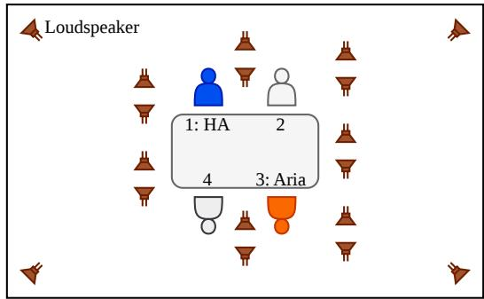
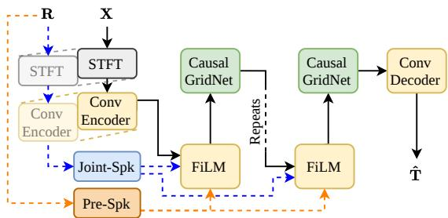
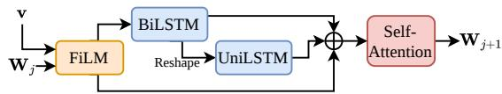

# CHALLENGES OF MULTI-SPEAKER EXTRACTION FOR REAL CONVERSATIONAL SPEECH ENHANCEMENT

Robert Sutherland1, Stefan Goetze1,2, Jon Barker1

1School of Computer Science, University of Sheffield, Sheffield, United Kingdom 2South Westphalia University of Applied Sciences, Iserlohn, Germany

## ABSTRACT

Target-speaker and multi-speaker extraction are techniques for extracting speech from a desired speaker or desired speakers in the presence of other speakers and/or noise. Neural network approaches for this task are often trained and evaluated using simulated datasets, with balanced amounts of target speech and speaker enrolment samples which closely match the target speech. However, in real multiparty conversations, participants are often silent for more time than they are speaking, and their enrolment speech samples can differ substantially from the target speech in the conversation. These factors can impact the training and evaluation of these techniques on recordings of real conversations. This work proposes a new loss function, which helps mitigate the effect of excess silence in training, improving STOI from 0.55 to 0.60, and frequency-weighted segmental SNR from 4.35 to 5.12. Additionally, the impact of the mismatch between the enrolment speech and target speech is explored.

## 1. INTRODUCTION

While existing assistive hearing devices (AHDs), such as hearing aids (HAs), can improve the listening experience of hearingimpaired listeners in many scenarios, their benefit is often reduced in complex acoustic environments, such as cafes and restaurants. In particular, those with hearing impairments can find it hard to socialise in multi-party conversations in these challenging environments.

The tasks of target-speaker extraction (TSX) have multi-speaker extraction (MSX) have been developed to tackle exactly this scenario with neural network (NN)-based techniques [1, 2, 3]. However, these techniques often operate under assumptions which are rarely valid in the context of AHD processing. This work highlights and addresses some of these concerns.

While TSX techniques have successfully been applied to lowlatency HA processing [1], they only focus on a single speaker, while conversations may include a number of speakers; while this technique could be applied iteratively (once per target speaker), this is inefficient, especially in the context of low-latency processing.

This motivates the task of MSX, where models extract more than one conversation partner at any given time [3, 4]. While this is more aligned with the multi-party conversation scenario, existing techniques do not consider the strict latency requirements of AHD systems; those listening to audio through a HA find delays of > 20 ms disturbing [5], so any NN designed for AHDs must satisfy this constraint.

Additionally, MSX techniques are often explored using simulated datasets, with controlled speaker activity and overlaps [6, 7]. In multi-party conversations, speaker activity is very varied, with challenging distributions of utterance lengths and overlaps [8]; for example, in a four-party conversation, an interlocutor could be silent for as much as 70% of the conversation, creating an imbalance between speech and silence which can impact the training of NN models [9].

A further mismatch occurs with the target speaker information; TSX/MSX techniques typically use enrolment speech to identify the target speaker(s) e.g. by computing speaker embeddings [1, 4]. With simulated data, this enrolment speech closely matches the target speech in the noisy mixture. In real conversations, the enrolment speech may be read speech, which has different acoustic properties to the spontaneous speech in conversations [10, 11].

This work uses the CHiME-9 ECHI dataset [12], which captures real four-party conversations in a simulated noisy environment, to investigate the effect of training TSX/MSX models in a realistic scenario. With this, a new loss function is proposed to mitigate the effect of the imbalance in speaker activity by randomly applying voice-activity detection (VAD)-masking to the loss function, controlling the amount of silence that the model is exposed to, leading to improvements in objective speech intelligibility and speech quality metrics.

Further, it is observed that system performance degrades when there is a greater mismatch between the speaker embedding of the enrolment sample and the speaker embedding obtained from the target speaker in conversation.

## 2. METHODOLOGY

This section first describes the data used for this work in Section 2.1, followed by an introduction to the signal model for the TSX and MSX tasks in Section 2.2. Then, a technical description of the NN structure is given in Section 2.3, followed by a mathematical description of the newly proposed loss function in Section 2.4.

## 2.1. Data

This work uses the ECHI dataset [12], which comprises recordings of real four-party conversations in a simulated noisy environment. In the recording sessions, one person (out of four conversation partners) was wearing two 2-channel HA shells (one on each ear), and another person was wearing Project Aria smart glasses [13], which record 7-channel audio. A schematic of the recording setup is given in Figure 1.

Each participant additionally wore a close-talk (CT) microphone to capture speech close to the mouth of the wearer. Reference signals provided in the dataset for the HAs and Aria glasses were constructed by denoising the CT microphones [14] and applying a delay to account for sound propagation [12]. Also included in the dataset are clean recordings of each participant reading the first paragraph from the rainbow passage [15], which can be used as enrolment speech samples of the target speakers to help extract them from the noisy mixture.

  
Fig. 1. The approximate layout of the ECHI recording scenario (not drawn to scale). This example layout shows the blue participant in position 1 wearing the HAs and the orange participant in position 3 wearing the Aria glasses.

The dataset provides 48 conversation recording sessions, each with a duration of ∼ 36 minutes; these are split into train (30 sessions), development (10 sessions) and evaluation (8 sessions). Participants in each set are disjoint, so speakers in the train set only appear in the train set, and similarly for development and evaluation.

## 2.2. Signal Model

The noisy audio recordings at the microphone positions of either the HA shells or Project Aria smart glasses of different participants in the conversation are denoted by

$$
\mathbf { X } = \mathbf { S } _ { 1 } + \mathbf { S } _ { 2 } + \mathbf { S } _ { 3 } + \mathbf { S } _ { 4 } + \mathbf { N } ,\tag{1}
$$

where $\mathbf { S } _ { i } \in \mathbb { R } ^ { C \times T }$ is the multi-channel recording of the speech of speaker i and $\mathbf { N } \in \mathbb { R } ^ { C \times T }$ is the multi-channel noise, as picked up by the C-channel recording device for a duration of T samples. For the HA microphones $C = 4$ , and for the Aria glasses $C = 7$ . In the following, it is assumed for simplicity of notation that the wearer is participant 1, and the targets are participants 2, 3 and 4 (cf. Figure 1).

For training and objective evaluation, the reference signals $\mathbf { T } =$ $[ \mathbf { t } _ { 2 } , \mathbf { t } _ { 3 } , \mathbf { t } _ { 4 } ] \in \stackrel { \smile } { \mathbb { R } } ^ { 3 \times T }$ denote the single-channel reference speech for participants 2, 3 and 4 (participant 1 is ignored, as this is the device wearer). The rainbow passage recordings, which are used as the enrolment utterances, are denoted $\mathbf { R } = \left\{ \mathbf { \breve { r } } _ { 2 } , \mathbf { r } _ { 3 } , \mathbf { r } _ { 4 } \right\} \in \mathbb { R } ^ { 3 \times K }$

Finally, the speech enhancement NNs, M, are defined for the TSX and MSX tasks as

$$
\begin{array} { r } { \mathcal { M } _ { \mathrm { T S X } } \left( \mathbf { X } , \mathbf { r } _ { i } \right) = \hat { \mathbf { t } } _ { i } , } \end{array}\tag{2}
$$

$$
\mathcal { M } _ { \mathrm { M S X } } \left( \mathbf { X } , \mathbf { R } \right) = \hat { \mathbf { T } } ,\tag{3}
$$

so $\mathcal { M } _ { \mathrm { T S X } }$ aims to extract one target speaker at a time and $\mathcal { M } _ { \mathrm { M S X } }$ aims to extract all three conversation partners at once.

## 2.3. Network Architecture

In keeping with typical TSX/MSX systems [1, 2, 3], the model comprises two main components: a speaker encoder network, which produces speaker embeddings of the target speaker(s), and a speech enhancement network, which produces the audio of the target speaker(s). Specifically, this model uses a speech extraction TF-GridNet model, as this has been effective for TSX with low-latency processing [1, 2]. The architecture diagram is shown for MMSX in Figure 2; for $M _ { \mathrm { T S X } } .$ , one enrolment recording, ri, is be provided, and a single channel of audio ˆt produced.

  
Fig. 2. System architecture for $\mathcal { M } _ { \mathrm { M S X } }$ . The enrolment speech R can be processed by a jointly-trained speaker encoder (Joint-Spk) or a pre-trained speaker encoder (Pre-Spk).

## 2.3.1. Input Features

First, X is downsampled to 16 kHz before the complex spectrogram is computed. A real-valued representation of the complex spectrogram is obtained by concatenating the real and imaginary components along the channel dimension. For the jointly-trained speaker encoder, the spectrogram of R is computed in the same way, but the pre-trained speaker encoder operates on the raw waveform [16]. For the TSX case, the single-channel spectrogram of ri is concatenated in a new dimension.

The short-time Fourier transform (STFT) uses a Hanning window, with a window size of 128 samples (8 ms), and the hop size is 64 samples (4 ms).

## 2.3.2. Speaker Encoder

The purpose of the speaker encoder is to produce an embedding of the target speaker, based on some enrolment speech samples; here, the rainbow passage provided in the ECHI dataset [12] is used. This work considers two approaches: joint training of a speaker embedding model [1, 2], or using a pre-trained model [16, 17]. It should be noted that while AHD algorithms are required to be low-latency, the outputs of this speaker embedding model can be cached for inference, meaning they need not be low-latency.

For the jointly-trained model, the network architecture follows [2]. The spectrogram of the enrolment speech is passed through the same convolutional encoder as the noisy audio, before being processed by a sequence of U-Nets [18]. Finally, a 2D average pooling is applied along the time-dimension to form a speaker embedding $\mathbf { v } \in \mathbb { R } ^ { L }$

The pre-trained model takes the same clean-speech samples, but processes them through the RawNet3 speaker embedding model [16, 17], to produce a 1D speaker embedding.

For MSX, the embeddings for each of the enrolment speech recordings are computed separately, and concatenated when conditioning the feature-wise linear modulation (FiLM) layer [19].

## 2.3.3. Speech Enhancement Network

  
Fig. 3. The GridNet architecture with FiLM conditioning.

The backbone of the speech enhancement system is the TF-GridNet architecture [20, 1], along with a FiLM layer [19]. First, the multi-channel spectrogram passes through a convolutional encoder to produce the representation $\mathbf { W } _ { 0 } .$ . The FiLM layer conditions $\mathbf { W } _ { 0 }$ on the speaker embedding v, before a BiLSTM operates along the feature dimension. The output is then reshaped, so the unidirectional LSTM operates over the time dimension, before the input $\mathbf { W } _ { 0 }$ and both LSTM outputs are summed and passed to the self-attention block, which outputs $\mathbf { W } _ { 1 }$ . This block can be repeated, hence Figure 3 takes $\mathbf { W } _ { j }$ as input and produces $\mathbf { W } _ { j + 1 }$

This block must be low-latency, so specific choices were made to ensure minimal look-ahead: the time-dimension LSTM is unidirectional, and the self-attention mechanism is masked to avoid any look-ahead to future frames.

## 2.4. Loss Function

The loss function proposed here is based on a linear combination of spectral distances [21], which uses a spectral convergence term

$$
\mathcal { L } _ { \mathrm { S C } } \left( \hat { \mathbf { T } } , \mathbf { T } \right) = \frac { | | \mathbf { \nabla } \mathrm { S T F T } ( \mathbf { T } ) \mathbf { \Omega } | - | \mathbf { \nabla } \mathrm { S T F T } ( \hat { \mathbf { T } } ) \mathbf { \Omega } | | _ { F } } { | | \mathbf { \nabla } \mathrm { S T F T } ( \mathbf { T } ) \mathbf { \Omega } | | _ { F } } ,\tag{4}
$$

and a magnitude spectrogram distance

$$
\begin{array} { r } { \mathcal { L } _ { \mathrm { M a g } } \left( \hat { \mathbf { T } } , \mathbf { T } \right) = \parallel \log ( | \operatorname { S T F T } ( \mathbf { T } ) \mid + \epsilon ) \ ~ } \\ { - \log ( | \operatorname { S T F T } ( \hat { \mathbf { T } } ) \mid + \epsilon ) \ \parallel _ { 1 } , } \end{array}\tag{5}
$$

with $\| \cdot \| _ { F }$ denoting the Frobenius norm, $\| \ \cdot \ \| _ { 1 }$ the L1-norm, | · | the absolute value of a complex number, and $\stackrel { \cdot \cdot } { \epsilon } = 1 \times 1 0 ^ { - 8 }$ is a small value to avoid log(0). Equations (4) and $( 5 )$ are written for the MSX case, but can equally be computed for the TSX case using $\hat { \mathbf { t } } _ { i }$ and $\mathbf { t } _ { i } .$

A spectral loss was chosen over a time-domain loss, such as signal-to-noise ratio (SNR), as the latter are highly sensitive to the lack of precise sample alignment of the reference signal. When computing the STFT of the audio for the loss function, the bestperforming window size was found to be 1024 samples, corresponding to 64 ms at a sampling frequency of 16 kHz, which is ample to absorb any of the sample-level misalignment.

The final spectral loss is a linear combination of (4) and (5):

$$
\mathcal { L } _ { \mathrm { S p e c } } \left( \hat { \mathbf { T } } , \mathbf { T } \right) = \mathcal { L } _ { \mathrm { S c } } ( \hat { \mathbf { T } } , \mathbf { T } ) + \mathcal { L } _ { \mathrm { M a g } } ( \hat { \mathbf { T } } , \mathbf { T } ) .\tag{6}
$$

To compensate for the high proportion of silence in each target speaker’s channel, the loss function can be masked using VAD, so that only the loss during speech segments is computed, as described by (8).

$$
\operatorname { V A D } \left( \mathbf { T } , \mathbf { V } \right) = \mathbf { T } \odot \mathbf { V } ,\tag{7}
$$

$$
{ \mathcal { L } } _ { \mathrm { V A D } } \left( \hat { \mathbf { T } } , \mathbf { T } , \mathbf { V } \right) = { \mathcal { L } } _ { \mathrm { S p e c } } \left( \mathrm { V A D } ( \hat { \mathbf { T } } , \mathbf { V } ) , \mathrm { V A D } ( \mathbf { T } , \mathbf { V } ) \right)\tag{8}
$$

where $\mathbf { V } \in \{ 0 , 1 \} ^ { N \times T }$ is the VAD mask, with 0 indicating silence and 1 indicating speech activity for each of the N target speakers, and ⊙ denotes the Hadamard product. This formulation ensures that the loss is computed only for time segments where the respective target speaker is active.

The loss function ${ \mathcal { L } } _ { \mathrm { V A D } }$ simply ignores any portion of the signal where the target in each channel is silent. However, the intention here is to control the amount of silence computed in the loss, not to ignore it completely. This leads to the randomly masked loss function

$$
\mathcal { L } _ { \mathrm { V A D } } ^ { ( x ) } ( \hat { \mathbf { T } } , \mathbf { T } , \mathbf { V } ) = \left\{ \begin{array} { l l } { \mathcal { L } _ { \mathrm { V A D } } ( \hat { \mathbf { T } } , \mathbf { T } , \mathbf { V } ) , x \% \mathrm { o f ~ b a t c h e s } } \\ { \mathcal { L } _ { \mathrm { S p e c } } ( \hat { \mathbf { T } } , \mathbf { T } ) , \quad ( 1 0 0 - x ) \% \mathrm { o f ~ b a t c h e s } , } \end{array} \right.\tag{9}
$$

where for each batch, a random choice is made that ensures each loss ${ \mathcal { L } } _ { \mathrm { V A D } }$ and $\mathcal L _ { \mathrm { { s p e c } } }$ are used on the specified proportion of batches. When applying this VAD-masked loss function, careful consideration must be made about how often the loss function is masked; this is discussed in further detail in Section 4.1.

## 3. TRAINING SETUP

All training and model hyperparameters were consistent across the model variants, with the exception of the learning rates. The final speech enhancement network had 3.8M trainable parameters. The jointly-trained speaker encoder network had 4.3M trainable parameters, while the pre-trained RawNet3 speaker embedding model had 28.5M frozen parameters. The VAD masks V are generated using speech timestamps provided in the ECHI dataset [12].

Models were trained for 30 epochs using the Adam optimiser [22]. The learning rate was scheduled using a linear warm-up over the first three epochs, before cosine annealing was applied over the remaining 27 epochs [23], and gradients were clipped to 1. The best learning rate for each model variant was either $\mathrm { \bar { 1 } \times 1 0 ^ { - 4 } }$ or $5 \times 1 0 ^ { - 5 }$

A validation loop on the development set was run every two epochs, and the checkpoint used for the final evaluation was the one which produced the highest short-time objective intelligibility (STOI) [24] score on the development set. Further details of the exact training configurations can be found in the GitHub repository1.

Using a single NVIDIA H100 GPU, training typically took ∼ 1.5 days and enhancement for the 4.8 hours of audio in the evaluation set took ∼ 45 minutes.

## 4. RESULTS

To evaluate the performance of the system, a range of speech metrics is used. These metrics are only computed on speech segments of the audio.

To assess speech intelligibility, STOI [24] is computed. The speech quality metrics used are perceptual evaluation of speech quality (PESQ) [25] and the composite measures [26], which compute Csig (signal quality), Cbak (background intrusion), and Covl (overall quality for communication). Finally, frequency-weighted segmental SNR (fwSegSNR) [27] is computed as a signal level metric; this metric is derived from SNR with a weighting applied to the frequency bands to more closely reflect human hearing.

The results are presented in Table 1 and are computed for the 6525 target speech segments for the ECHI HA recordings. Similar trends are observed on the ECHI Aria glasses recordings; these results are available online at the link above.

Table 1. Results on the evaluation split of the ECHI dataset. The Pre-Spk column indicates whether the speaker embedding is pretrained (✓) or jointly trained (blank).
<table><tr><td>Model</td><td>Pre-Spk</td><td>Loss</td><td>fwSegSNR</td><td>STOI</td><td>PESQ</td><td>Csig</td><td>Cbak</td><td>Covl</td></tr><tr><td colspan="3">Noisy Audio</td><td>0.37</td><td>0.55</td><td>1.10</td><td>1.51</td><td>1.07</td><td>1.20</td></tr><tr><td colspan="3">CHiME-9 ÈCHI Baseline</td><td>3.39</td><td>0.53</td><td>1.10</td><td>1.69</td><td>1.08</td><td>1.30</td></tr><tr><td colspan="3">TSX</td><td>3.55</td><td>0.54</td><td>1.14</td><td>1.82</td><td>1.11</td><td>1.38</td></tr><tr><td colspan="3">TSX</td><td> $\mathcal { L } _ { \mathrm { u } n } ^ { ( 8 0 ) }$   $\angle \dot { \mathrm { v a D } }$ </td><td>0.56</td><td>1.15</td><td>1.88</td><td>1.11</td><td>1.42</td></tr><tr><td colspan="3">MSX</td><td> $\mathcal { L } _ { \mathrm { V A D } } ^ { ( \mathrm { s u } ) }$ </td><td>3.88</td><td></td><td></td><td></td><td></td></tr><tr><td colspan="3">MSX</td><td> ${ \mathcal { L } } _ { \mathrm { s p e c } }$ </td><td>4.05 0.55</td><td>1.11</td><td>1.51</td><td>1.08</td><td>1.22</td></tr><tr><td colspan="3"></td><td> ${ \mathcal { L } } _ { \mathrm { s p e c } }$ </td><td>4.35 0.54</td><td>1.15</td><td>1.75</td><td>1.18</td><td>1.36</td></tr><tr><td colspan="3">MSX</td><td> $\boldsymbol { \mathcal { r } } _ { \cdots \cdots } ^ { ( 8 0 ) }$   ${ \mathcal { L } } _ { \mathrm { V A D } }$ </td><td>0.60</td><td>1.18</td><td>1.92</td><td>1.44</td><td>1.44</td></tr><tr><td colspan="3">MSX</td><td> $ { \mathcal { L } } _ { \mathrm { V A D } } ^ { ( 8 0 ) }$ </td><td>4.13 5.12 0.60</td><td>1.19</td><td>1.97</td><td>1.55</td><td>1.48</td></tr></table>

For MTSX, training with ${ \mathcal { L } } _ { \mathrm { s p e c } }$ was found to annihilate the signal, producing silence. This is due to the high proportion of silence in the reference signal, so this model was only trained with $ { \mathcal { L } } _ { \mathrm { V A D } } ^ { ( 8 0 ) }$ . This effect was avoided for MMSX as there was typically speech present in at least one channel, meaning the overall target was rarely just silence.

The first point to note is that across all the metrics, the best TSX model performs similarly to the best MSX model trained with $\mathcal { L } _ { \mathrm { { s p e c } } }$ from (6). This is interesting, as the MSX model is provided with more information about the overall scene; it receives speaker information about all of the target speakers, which should make the task easier.

However, it is clear that training the MSX models with $ { \mathcal { L } } _ { \mathrm { V A D } } ^ { ( 8 0 ) }$ improves the performance across all of the metrics $( p < 0 . 0 1 )$ . Further, training with the pre-trained speaker embeddings shows a slight improvement over all metrics except STOI $( p < 0 . 0 1$ except for STOI, $p > 0 . 1 ) $ ; significance is determined by Wilcoxon test. This suggests that high proportions of silence in the reference audio can limit performance, but randomly applying the VAD-mask can compensate for this and improve performance.

Further details on tuning the proportion of silence presented to the model are discussed in Section 4.1, and the influence of the pretrained speaker embeddings is considered in Section 4.2.

## 4.1. VAD-Masked Loss Function

The argument behind defining the randomly VAD-masked loss in (9) is that the amount of silence that the model trains with can be controlled. For this to be meaningful, the threshold used to mix the masked loss with the raw loss must be carefully considered. To assess this, Table 2 shows the same metrics as in Table 1, computed with different degrees of VAD-masking in (9). Note that the models presented here are M with pre-trained speaker embeddings, and the scores for 0% masking are equivalent to training with $\mathcal { L } _ { \mathrm { { s p e c } } }$ from (6), and 100% is equivalent to training only with ${ \mathcal { L } } _ { \mathrm { V A D } }$ from (8).

The results in Table 2 show that training with too much silence in the reference signals degrades the MSX model’s performance on objective metrics. For all metrics, the worst scores occur with either 0% or 20% VAD-masking, and the best scores with 80% or 100% VAD-masking.

There are small performance increases for the 100% model over the 80% model in the perceptual metrics. This can be expected to a certain extent; these metrics are only computed on speech segments, so training only on speech segments is likely to produce better results here. However, as described previously, it is also important that the model can process scenarios where one or more of the target speakers are not speaking. This suggests that while training on exclusively using LVAD may yield slight improvements for these objective metrics, for the overall use-case, 80% would provide a better experience.

Table 2. Scores for different levels of usage of ${ \mathcal { L } } _ { \mathrm { V A D } } .$ \* indicates scores which appeared in Table 1.
<table><tr><td>VAD</td><td>fwSegSNR</td><td>STOI</td><td>PESQ</td><td>Csig</td><td>Cbak</td><td>Covl</td></tr><tr><td>0%*</td><td>4.35</td><td>0.54</td><td>1.15</td><td>1.75</td><td>1.18</td><td>1.36</td></tr><tr><td>20%</td><td>4.20</td><td>0.55</td><td>1.15</td><td>1.67</td><td>1.28</td><td>1.31</td></tr><tr><td>40%</td><td>4.76</td><td>0.58</td><td>1.18</td><td>1.91</td><td>1.55</td><td>1.45</td></tr><tr><td>60%</td><td>4.53</td><td>0.59</td><td>1.17</td><td>1.84</td><td>1.39</td><td>1.40</td></tr><tr><td>80%*</td><td>5.12</td><td>0.60</td><td>1.19</td><td>1.97</td><td>1.55</td><td>1.48</td></tr><tr><td>100%</td><td>5.02</td><td>0.62</td><td>1.21</td><td>2.06</td><td>1.56</td><td>1.54</td></tr></table>

## 4.2. Speaker Similarity

The speaker embeddings are used to help guide the TSX and MSX systems towards the target speakers. These embeddings are generated using clean, read speech samples of the target speakers, but it is known that there are acoustic differences between read speech and the spontaneous speech that can be found in the conversations [10, 11].

To assess the impact of this mismatch, RawNet3 embeddings [16] are computed from two speech sources. The enrolment embedding is generated using the enrolment speech, ri from the ECHI dataset [12], as is used during training. A reference embedding is computed by taking the mean of five embeddings computed from the reference signal, $\mathbf { t } _ { i } ;$ these were generated by randomly selecting five speech segments with a duration of more than 3 seconds. The difference between embeddings is computed with cosine similarity.

To expand the number of data points, speakers in both the development and evaluation sets are considered, giving $n = 5 4$ speakers. By computing Pearson-r correlations, it can be seen that PESQ shows a medium correlation with the cosine similarity $( r = 0 . 4 9 $ $p < 0 . 0 1 )$ , and all other metrics show a strong correlation $( r > 0 . 5 ,$ $p < 0 . 0 1 )$

This suggests that the mismatch in target speaker information is causing a drop in performance. Some speakers are poorly matched from their enrolment speech to the target speech, and in these cases, the objective performance is worse.

## 5. CONCLUSION

The real-time enhancement of conversations provides slightly different challenges when compared to more traditional TSX and MSX tasks. This work shows that using a VAD-masked loss function leads to significant improvements in both perceptual and signal-based metrics, suggesting that models trained with this methodology will perform better. It can also be seen that using pre-trained speaker embeddings can provide some marginal benefit for these metrics.

Future work could consider using a speaker adaptivity mechanism to update speaker embeddings during a conversation, meaning that the speakers can be more easily recognised by their spontaneous speech instead of their read speech.

[1] S. Cornell, Z.-Q. Wang, Y. Masuyama, S. Watanabe, M. Pariente, and N. Ono, “Multi-channel target speaker extraction with refinement: The WavLab submission to the Second Clarity Enhancement Challenge,” arXiv preprint arXiv:2302.07928, 2023.

[2] F. Hao, X. Li, and C. Zheng, “X-TF-GridNet: A time–frequency domain target speaker extraction network with adaptive speaker embedding fusion,” Information Fusion, vol. 112, p. 102550, 2024. [Online]. Available: https://www. sciencedirect.com/science/article/pii/S1566253524003282

[3] T. Serre, M. Fontaine, E. Benhaim, and S. Essid, “MTSE: Multi-target speaker extraction for conversation scenarios,” in Proc. Interspeech 2025, 2025, pp. 2970–2974.

[4] J. Ao, M. S. Yıldırım, R. Tao, M. Ge, S. Wang, Y. Qian, and H. Li, “Used: Universal speaker extraction and diarization,” IEEE Transactions on Audio, Speech and Language Processing, vol. 33, pp. 96–110, 2024.

[5] M. A. Stone and B. C. Moore, “Tolerable hearing aid delays. i. estimation of limits imposed by the auditory path alone using simulated hearing losses,” Ear and hearing, vol. 20, no. 3, pp. 182–192, 1999.

[6] G. Wichern, J. Antognini, M. Flynn, L. R. Zhu, E. McQuinn, D. Crow, E. Manilow, and J. Le Roux, “WHAM!: Extending speech separation to noisy environments,” in Proc. Interspeech, Sep. 2019.

[7] J. Cosentino, M. Pariente, S. Cornell, A. Deleforge, and E. Vincent, “LibriMix: An open-source dataset for generalizable speech separation,” arXiv preprint arXiv:2005.11262, 2020.

[8] O. Cetin and E. Shriberg, “Analysis of overlaps in meetings by dialog factors, hot spots, speakers, and collection site: Insights for automatic speech recognition,” ORDER, vol. 1, no. 200, p. 250, 2006.

[9] K. Zhang, M. Borsdorf, Z. Pan, H. Li, Y. Wei, and Y. Wang, “Speaker extraction with detection of presence and absence of target speakers.” in INTERSPEECH, 2023, pp. 3714–3718.

[10] W. V. Summers, D. B. Pisoni, R. H. Bernacki, R. I. Pedlow, and M. A. Stokes, “Effects of noise on speech production: Acoustic and perceptual analyses,” The Journal ofthe Acoustical Society ofAmerica, vol. 84, no. 3, pp. 917–928, 1988.

[11] P. Howell and K. Kadi-Hanifi, “Comparison of prosodic properties between read and spontaneous speech material,” Speech communication, vol. 10, no. 2, pp. 163–169, 1991.

[12] R. Sutherland, J. Clarke, H. Elghazaly, T. Kuebert, M. Lugger, S. Petrausch, J. A. Ortiz, B. Xu, S. Goetze, and J. Barker, “Descriptor: Enhancing Conversations for the Hearing Impaired in the 9th Computational Hearing in Multisource Environments Challenge (CHiME9 ECHI),” IEEE Data Descriptions, vol. 3, pp. 73–81, 2026.

[13] J. Engel, K. Somasundaram, M. Goesele, A. Sun, A. Gamino, A. Turner, A. Talattof, A. Yuan, B. Souti, B. Meredith et al., “Project Aria: A new tool for egocentric multi-modal AI research,” arXiv preprint arXiv:2308.13561, 2023.

[14] A. Defossez, G. Synnaeve, and Y. Adi, “Real time speech enhancement in the waveform domain,” in Interspeech, 2020.

[15] G. Fairbanks, Voice and articulation drillbook, 2nd ed. New York: Harper & Row, 1960.

[16] J.-w. Jung, Y. J. Kim, H.-S. Heo, B.-J. Lee, Y. Kwon, and J. S. Chung, “Pushing the limits of raw waveform speaker recognition,” Proc. Interspeech, 2022.

[17] J.-w. Jung, W. Zhang, J. Shi, Z. Aldeneh, T. Higuchi, B.-J. Theobald, A. H. Abdelaziz, and S. Watanabe, “ESPnet-SPK: full pipeline speaker embedding toolkit with reproducible recipes, self-supervised front-ends, and off-the-shelf models,” arXiv preprint arXiv:2401.17230, 2024.

[18] O. Ronneberger, P. Fischer, and T. Brox, “U-Net: Convolutional networks for biomedical image segmentation,” in International Conference on Medical image computing and computer-assisted intervention. Springer, 2015, pp. 234–241.

[19] E. Perez, F. Strub, H. De Vries, V. Dumoulin, and A. Courville, “FiLM: Visual reasoning with a general conditioning layer,” in Proceedings of the AAAI conference on artificial intelligence, vol. 32, no. 1, 2018.

[20] Z.-Q. Wang, S. Cornell, S. Choi, Y. Lee, B.-Y. Kim, and S. Watanabe, “TF-GridNet: Integrating full-and sub-band modeling for speech separation,” IEEE/ACM Transactions on Audio, Speech, and Language Processing, vol. 31, pp. 3221– 3236, 2023.

[21] S. O. Arık, H. Jun, and G. Diamos, “Fast spectrogram inversion¨ using multi-head convolutional neural networks,” IEEE Signal Processing Letters, vol. 26, no. 1, pp. 94–98, 2018.

[22] D. Kingma and J. Ba, “Adam: A method for stochastic optimization,” International Conference on Learning Representations, 12 2014.

[23] I. Loshchilov and F. Hutter, “SGDR: Stochastic gradient descent with warm restarts,” arXiv preprint arXiv:1608.03983, 2016.

[24] C. H. Taal, R. C. Hendriks, R. Heusdens, and J. Jensen, “A short-time objective intelligibility measure for time-frequency weighted noisy speech,” in 2010 IEEE international conference on acoustics, speech and signal processing. IEEE, 2010, pp. 4214–4217.

[25] A. W. Rix, J. G. Beerends, M. P. Hollier, and A. P. Hekstra, “Perceptual evaluation of speech quality (PESQ)-a new method for speech quality assessment of telephone networks and codecs,” in 2001 IEEE international conference on acoustics, speech, and signal processing. Proceedings (Cat. No. 01CH37221), vol. 2. IEEE, 2001, pp. 749–752.

[26] Y. Hu and P. C. Loizou, “Evaluation of objective quality measures for speech enhancement,” IEEE Transactions on Audio, Speech, and Language Processing, vol. 16, no. 1, pp. 229–238, 2008.

[27] J. Tribolet, P. Noll, B. McDermott, and R. Crochiere, “A study of complexity and quality of speech waveform coders,” in ICASSP ’78. IEEE International Conference on Acoustics, Speech, and Signal Processing, vol. 3, 1978, pp. 586–590.