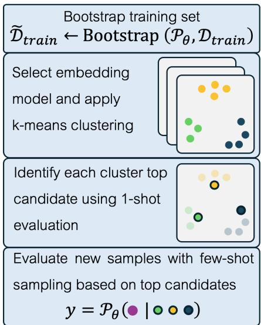
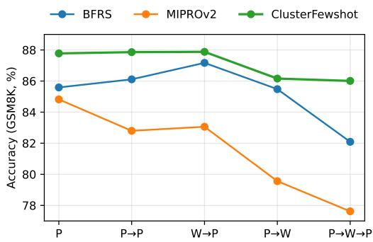
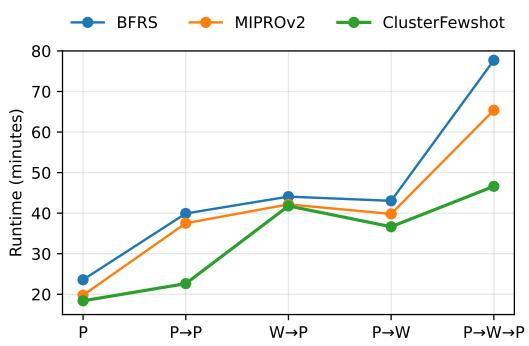
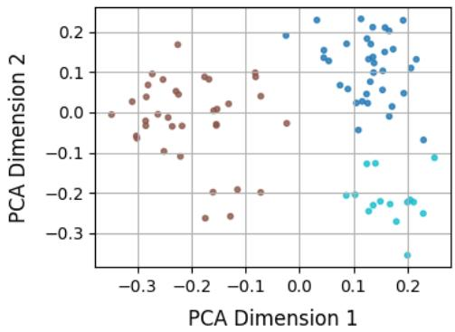
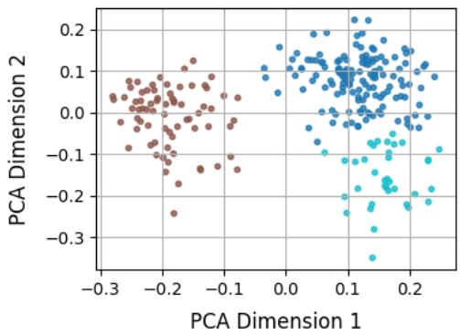
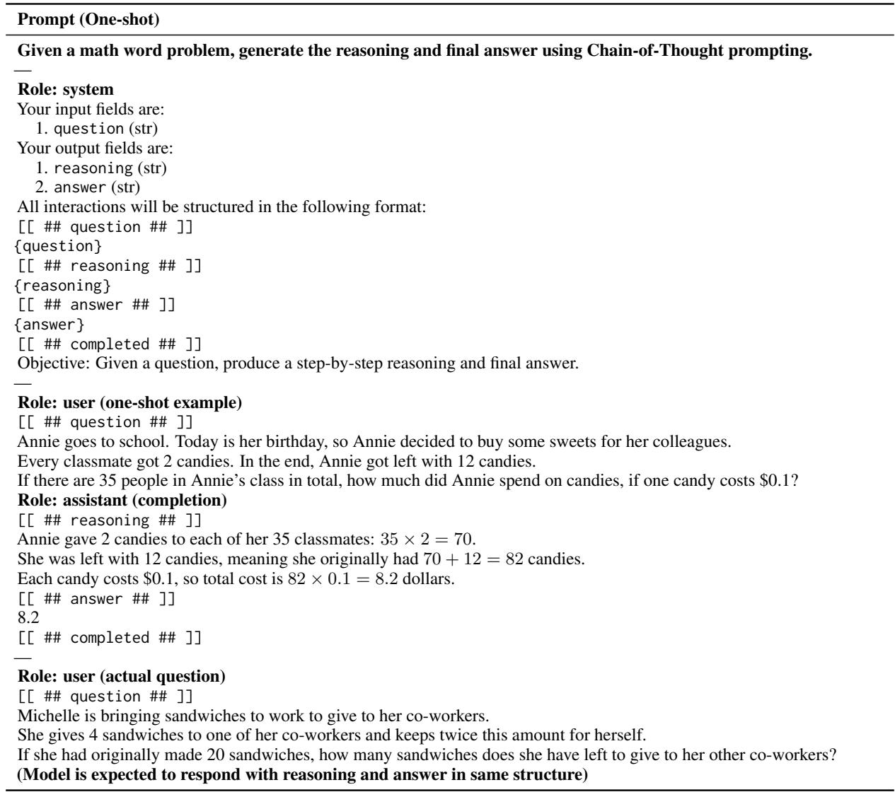

# ClusterFewshot: Improving Few-shot Optimization for LLMs workflow

Omri Bar Haim

Shahar Katz

Lior Wolf

Blavatnik School of Computer Science, Tel Aviv University {omribarhaim@mail,shaharkatz3@mail,wolf@cs}.tau.ac.il

## Abstract

The performance of large language model (LLM) workflows often depends on selecting a small set of in-context demonstrations to guide model behavior on new tasks. Recent methods improve this process by augmenting prompts with successful reasoning paths. However, their demonstration selection relies on random sampling or metric-based rankings, overlooking the semantic structure of the task. We pro pose ClusterFewshot, a strategy that combines semantic structuring with utility-aware scoring to construct representative and effective few-shot demonstration sets. Evaluated within DSPy-based pipelines, ClusterFewshot substantially reduces optimization cost across multiple benchmarks, while consistently improving accuracy relative to prior bootstrap-based methods in both standalone prompt tuning and hybrid prompt-weight optimization. Our code is available at https://github.com/omrirh/ clusterfewshot.

## 1 Introduction and Related Work

Recent work has highlighted the importance of semantic structure in LLM few-shot prompt construction, suggesting that semantically diverse and representative demonstrations can substantially improve in-context learning performance (Levy et al., 2023; C et al., 2024). These findings suggest that demonstration selection extends beyond surfacelevel heuristic procedures, and can be naturally viewed as a structured optimization problem over the semantic space of examples.

Today, prompt optimization and demonstration selection are often implemented through high-level toolkits that organize complex reasoning pipelines, such as LangChain and LlamaIndex (Chase, 2022; Liu, 2022). These frameworks often rely on manually constructed prompt templates, including fewshot prompting (Brown et al., 2020; Yang et al., 2024; Opsahl-Ong et al., 2024; Yao et al., 2024; Chen et al., 2023; Kim et al., 2022; Do et al., 2024).

  
Figure 1: An illustration depicting ClusterFewshot approach for bootstrapped demonstrations.

Khattab et al. (2024) introduced DSPy, a declarative framework that enables modular construction and optimization of LLM pipelines. DSPy supports retrieval-augmented generation (RAG) and enables prompt optimization through bootstrapping, which extracts reasoning paths from solvable examples to construct effective in-context demonstrations (Khattab et al., 2024; Opsahl-Ong et al., 2024). Subsequently, Soylu et al. (2024) introduced BetterTogether, a hybrid optimization strategy that interleaves prompt-level adaptation with parameter-efficient fine-tuning. While Opsahl-Ong et al. (2024); Soylu et al. (2024) were able to achieve strong results on diverse tasks, including GSM8K (Cobbe et al., 2021), HotPotQA (Yang et al., 2018) and Iris classification (Fisher, 1936), their approach to few-shot demonstration selection typically relies on random search or metricbased ranking, lacking the semantic information that other work identifies (Levy et al., 2023; C et al., 2024). Such semantic insights have advanced compositional parsing (Levy et al., 2023) and clinical

NER (C et al., 2024), yet remain siloed from automated few-shot optimization workflows. This limitation extends beyond standard LLM settings to agentic environments such as ReAct (Yao et al., 2023), where the target model is augmented with external tools.

In this work, we address the lack of semantically driven selection in existing bootstrapping approaches by introducing ClusterFewshot, a new semantically informed prompt optimizer. Our proposed method (i) clusters embeddings of training examples to promote diverse, representative sampling, and (ii) scores candidate demonstrations using feedback from one-shot evaluation on a heldout validation subset, as illustrated in Figure 1, thereby guiding few-shot construction beyond random or heuristic ranking.

We focus our evaluation on bootstrap-based optimizers that operate within the BetterTogether framework. In particular, we compare with BootstrapFewShotRS (BFRS) (Khattab et al., 2024), a few-shot selection method relying on random search, and MIPROv2 (Opsahl-Ong et al., 2024), which performs joint optimization of instructions and demonstrations via Bayesian search. This choice enables the study of search-driven optimization over prompt components under a shared bootstrap demonstration construction paradigm.

ClusterFewshot applies to both standalone prompt optimization and hybrid tuning pipelines such as BetterTogether. Across multiple tasks and models, it consistently improves over previous approaches, including combined prompt and parameter-efficient fine-tuning pipelines.

Our main contributions are: (i) we identify semantically informed example selection as a key limitation in existing procedures, (ii) we propose ClusterFewshot, which combines semantic clustering and evaluation-driven scoring to guide few-shot demonstration selection, and (iii) we empirically show that ClusterFewshot substantially reduces optimization cost across GSM8K, HotPotQA, and Iris benchmarks while preserving competitive, and often improved, mean accuracy in both promptonly and hybrid prompt-weight optimization. In addition, (iv) we examine the flexibility of ClusterFewshot in ReAct-based agentic setups, and (v) we evaluate its robustness across different model sizes, model families, and diverse cluster sampling approaches.

## 2 Background

We consider LLM-based workflows such as multihop reasoning in retrieval-augmented generation (RAG) tasks. Each task is defined by a base LLM and a labeled dataset, split into training $\mathcal { D } _ { \mathrm { t r a i n } } =$ $\{ ( x _ { i } , y _ { i } ) \} _ { i = 1 } ^ { N }$ , validation ${ \mathcal D } _ { \mathrm { v a l } } ~ = ~ \{ ( x _ { j } , y _ { j } ) \} _ { j = 1 } ^ { M } ,$ and test $\mathcal { D } _ { \mathrm { t e s t } }$ sets. Each workflow is represented as a graph of modules ${ \mathcal { P } } _ { \theta } .$ , which is optimized (“compiled”) to maximize performance on a held-out validation set $\mathcal { D } _ { \mathrm { v a l } }$ , through mechanisms such as fine-tuning, bootstrapped demonstration selection, and instruction refinement. We consider several bootstrap-based techniques, employed for prompt component generation and fine-tuning workflows.

For in-context demonstration selection, BootstrapFewShotRS (BFRS) (Khattab et al., 2024) is a random search implementation that selects $k \in \mathbb { N } _ { 0 }$ labeled or solvable examples from $\mathcal { D } _ { \mathrm { t r a i n } }$ , which are then used to generate reasoning traces via prompting techniques such as Chain-of-Thought (CoT) (Wei et al., 2022). These traces are prepended to validation examples and evaluated empirically on $\mathcal { D } _ { \mathrm { v a l } }$ . The best-performing examples and their traces are concatenated to form the final few-shot prompt.

More recently, MIPROv2 (Opsahl-Ong et al., 2024) extends this bootstrapping paradigm by jointly optimizing both proposed instruction text and demonstration selection using Bayesian search, thereby expanding the prompt optimization space.

For fine-tuning, BootstrapFinetune (Soylu et al., 2024; Khattab et al., 2024) iteratively solves training examples from $\mathcal { D } _ { \mathrm { t r a i n } }$ , generating solution traces which are curated and used to further finetune the model, e.g., via LoRA adapters (Hu et al., 2022), enabling a self-improving loop.

Following the BetterTogether strategy, we study hybrid pipelines that alternate between bootstrapbased prompt optimizers and parameter-efficient fine-tuning, yielding mutual improvements in prompt quality and model parameters.

## 3 Method

We propose ClusterFewshot, our semantically informed bootstrap-selection procedure. ClusterFewshot replaces random sampling or metric-based ranking with a two-stage process: (i) example embedding-based clustering, and (ii) evaluationdriven selection across sampling strategies.

Similar to other bootstrap-based approaches section 2, our goal is to select a small bootstrapped demonstration set from $\mathcal { D } _ { \mathrm { t r a i n } }$ of size k that maximizes the validation performance of our LLM workflow ${ \mathcal { P } } _ { \theta }$

Algorithm 1 ClusterFewshot: Semantic-Aware   
Bootstrap Demonstration Selection   
Require: Training data: $\mathcal { D } _ { \mathrm { t r a i n } } , \mathcal { D } _ { \mathrm { v a l } }$   
Program: ${ \mathcal { P } } _ { \theta }$   
Candidate embedders: $\mathcal { M } = \{ M _ { j } \} _ { j = 1 } ^ { J }$   
Cluster range: $K \in [ K _ { \operatorname* { m i n } } , K _ { \operatorname* { m a x } } ]$   
Demo budget: k   
Validation samples per cluster: m   
Ensure: Selected demonstrations ${ \mathcal { F } } ^ { * }$   
Bootstrapping Training Set   
$\tilde { \mathcal { D } } _ { \mathrm { t r a i n } } \gets \mathrm { B o o t s t r a p } ( \mathcal { P } _ { \theta } , \mathcal { D } _ { \mathrm { t r a i n } } )$   
Embedding and clustering selection   
for $M _ { j } \in \mathcal { M }$ do   
$\mathbf { e } _ { i } ^ { ( j ) } \gets M _ { j } ( x _ { i } )$ for all $x _ { i } \in \tilde { \mathcal { D } } _ { \mathrm { t r a i n } }$   
for $K \in [ K _ { \operatorname* { m i n } } , K _ { \operatorname* { m a x } } ]$ do   
$\hat { y } ^ { ( j , K ) } \gets \mathrm { K M e a n s } _ { K } ( \{ \mathbf { e } _ { i } ^ { ( j ) } \} )$   
$S _ { j , K } \gets \mathrm { S i l h o u e t t e } ( \{ { \bf e } _ { i } ^ { ( j ) } \} , \hat { y } ^ { ( j , K ) } )$   
end for   
end for   
$( j ^ { * } , K ^ { * } ) \gets \arg \operatorname* { m a x } _ { j , K } S _ { j , K }$   
Cluster training examples   
$\{ \mathcal { C } _ { k } ^ { \mathrm { t r a i n } } \} _ { k = 1 } ^ { K ^ { * } }  \bar { \mathrm { K M e a n s } } _ { K ^ { * } } ( M _ { j ^ { * } } ( \tilde { \mathcal { D } } _ { \mathrm { t r a i n } } ) )$   
Construct one-shot evaluation subset   
$\{ \mathcal { C } _ { k } ^ { \mathrm { v a l } } \} _ { k = 1 } ^ { K ^ { * } }  \mathrm { K M e a n s } _ { K ^ { * } } ( M _ { j ^ { * } } ( \mathcal { D } _ { \mathrm { v a l } } ) )$   
$\pmb { \mu _ { c } } \gets$ centroid $\left( \mathcal { C } _ { c } ^ { \mathrm { v a l } } \right) , \quad \dot { \forall } c \in \left\{ 1 , \ldots , K ^ { * } \right\}$   
$\begin{array} { r } { \mathcal { C } _ { \mathrm { v a l } }  \bigcup _ { c = 1 } ^ { K ^ { * } } \arg \operatorname* { m i n } _ { x \in \mathcal { C } _ { c } ^ { \mathrm { v a l } } } ^ { ( m ) } \| M _ { j ^ { * } } ( x ) - \pmb { \mu } _ { c } \| } \end{array}$   
▷ Select m nearest validation examples to each   
cluster centroid in embedding space   
One-shot scoring   
for $x _ { i } \in \tilde { D } _ { \mathrm { t r a i n } }$ do   
$\begin{array} { r } { \begin{array} { r } { s _ { i } \gets \frac { 1 } { | { \mathcal C } _ { \mathrm { v a l } } | } \sum _ { ( x , y ) \in { \mathcal C } _ { \mathrm { v a l } } } \operatorname { E v a l } ( \mathcal { P } _ { \theta } ( \{ x _ { i } \} , x ) , y ) } \end{array} } \end{array}$   
end for   
Candidate construction   
${ \mathcal { F } } _ { \mathrm { T o P } - k } \gets \mathrm { T o p } _ { k } ( \{ x _ { i } \} , s _ { i } )$   
$\begin{array} { r } { \mathcal { F } _ { \mathrm { C L U S T E R } }  \bigcup _ { c = 1 } ^ { K ^ { * } } \arg \operatorname* { m a x } _ { x _ { i } \in \mathcal { C } _ { c } ^ { \mathrm { t r a i n } } } s _ { i } } \end{array}$   
Final selection   
$\mathcal { F } _ { \mathrm { c a n d } }  \{ \mathcal { F } _ { \mathrm { T o P - } k } , \mathcal { F } _ { \mathrm { C L U S T E R } } \}$   
$\mathcal { F } ^ { * }  \arg \operatorname* { m a x } _ { \tau  \tau }$ Score $( { \mathcal { P } } _ { \theta } [ { \mathcal { F } } ] , { \mathcal { D } } _ { \mathrm { v a l } } )$   
F∈F<sub>cand</sub>   
return ${ \mathcal { F } } ^ { * }$

While clustering-based sampling has been explored in prior work, our focus is on how it can be integrated with utility-based signals to improve the efficiency and stability of LLM optimization pipelines by organizing demonstrations according to the latent semantic structure of the task. Using this design of complementary signals encourages coverage of the latent task structure, while utilityaware scoring prioritizes demonstrations that are empirically useful for the target model and task.

## 3.1 Bootstrapping Training Set

We construct a bootstrapped training set $\tilde { \mathcal { D } } _ { \mathrm { t r a i n } }$ by executing the LM program ${ \mathcal { P } } _ { \theta }$ on the full training set $\mathcal { D } _ { \mathrm { t r a i n } }$ and retaining successful trace-derived demonstrations. Unlike prior approaches that repeatedly bootstrap from randomly sampled subsets during search (Khattab et al., 2024; Opsahl-Ong et al., 2024), ClusterFewshot performs this step once and subsequently operates only on $\tilde { \mathcal { D } } _ { \mathrm { t r a i n } }$

## 3.2 Semantic Embedding and Clustering

To capture the semantic diversity of $\tilde { \mathcal { D } } _ { \mathrm { t r a i n } }$ , we embed each input $x _ { i }$ using a candidate model $M _ { j }$ , either a pretrained sentence encoder or the task-tuned LLM, yielding an embedding ${ \bf e } _ { i } ^ { ( j ) } \in \mathbb { R } ^ { d }$ , where d is the embedding dimension. We then apply K-means clustering (Lloyd, 1982) to $\left\{ { \bf e } _ { i } ^ { ( j ) } \right\}$ , to maximize the Silhouette score (Rousseeuw, 1987):

$$
\left\{ \mathbf { e } _ { i } ^ { ( j ) } = M _ { j } ( x _ { i } ) \right\} _ { i = 1 } ^ { N } \mathrm { ~ f o r ~ } M _ { j } \in \mathcal { M } , \ j = 1 , \ldots , J 
$$

The selection procedure uses a grid-search calibration phase, with additional analysis in Appendix B:

$$
\hat { y } ^ { ( j , k ) } = \mathrm { K M e a n s } _ { k } \left( \left\{ \mathbf { e } _ { i } ^ { ( j ) } \right\} _ { i = 1 } ^ { N } \right)\tag{1}
$$

$$
S _ { j , k } = \mathrm { S i l h o u e t t e } \left( \left\{ { \bf e } _ { i } ^ { ( j ) } \right\} , \hat { y } ^ { ( j , k ) } \right)\tag{2}
$$

$$
( j ^ { * } , k ^ { * } ) = \arg \operatorname* { m a x } _ { \substack { j \in [ 1 , J ] } } S _ { j , k }\tag{3}
$$

This grid search also selects one of the following sentence-transformers:

• all-mpnet-base-v2 (Reimers and Gurevych, 2019) – Transformer-based sentence embedding model, built on MPNet, that produces 768-dimensional vector representations of sentences and short paragraphs, and is widely used for similarity and semantic search tasks.

• gtr-t5-base (Raffel et al., 2020) – a T5-based sentence embedding model designed for semantic search and retrieval, producing highquality, cross-lingual dense vector representations of sentences and paragraphs.

• bge-large-en-v1.5 (of Artificial Intelligence , BAAI) - a bidirectional-encoder model optimized for English dense retrieval via contrastive learning on web-scale corpora.

• Qwen3-Embedding-0.6B (Zhang et al., 2025) - an embedding model from the Qwen3 series, producing fixed-dimensional representations via fine-tuned language model layers for retrieval and reranking tasks.

Only for Iris, given the well-structured numerical nature of the task input, we use the original feature vectors, which comprise features such as sepal length and width.

## 3.3 One-Shot Candidate Scoring

To estimate the utility of each candidate example $x _ { i } \in \tilde { \mathcal { D } } _ { \mathrm { t r a i n } }$ individually, we define a small evaluation subset $\mathcal { C } _ { \mathrm { v a l } } \subset \mathcal { D } _ { \mathrm { v a l } }$ . This subset is constructed by first clustering $\mathcal { D } _ { \mathrm { v a l } }$ in the semantic embedding space, then selecting the $m$ examples closest to each cluster centroid, yielding a diverse and representative evaluation set. For consistency, we fix the number of validation samples per cluster to $m = 3$ . We then compute a one-shot score $s _ { i }$ for each candidate $x _ { i }$ by measuring its effectiveness as the sole demonstration when prompting the LM on $\mathcal { C } _ { \mathrm { v a l } }$ . Specifically, we define:

$$
s _ { i } = \frac { 1 } { \vert \mathcal { C _ { \mathrm { v a l } } } \vert } \sum _ { ( \boldsymbol { x } , \boldsymbol { y } ) \in \mathcal { C } _ { \mathrm { v a l } } } \mathrm { E v a l } ( \mathcal { P } _ { \theta } ( \{ \boldsymbol { x } _ { i } \} , \boldsymbol { x } ) , \boldsymbol { y } )\tag{4}
$$

where: ${ \mathcal { P } } _ { \theta } ( \{ x _ { i } \} , x )$ denotes the model’s prediction on input x when prompted with $x _ { i }$ as the sole incontext demonstration. Eva $\left( \cdot , y \right)$ is a task-specific evaluation metric comparing the model’s output to the ground-truth label y. This “one-shot evaluation” rapidly ranks examples by their individual contribution to the LM performance on a diverse set of questions, replacing budget-limited subset search (Opsahl-Ong et al., 2024; Soylu et al., 2024) with linear per-candidate evaluation under fixed validation cost to enable a tractable and exhaustive scoring of all training candidates from $\tilde { \mathcal { D } } _ { \mathrm { t r a i n } }$

## 3.4 Sampling Strategies

We employ a sampling framework that combines global and cluster-based selection, adapting to the task’s nature. This design balances highperforming examples with semantic diversity in the resulting few-shot subset.

For Iris, a classification task, we prioritize class-level cluster coverage by selecting the topperforming demonstration from each class.

Accordingly, we adopt the following strategies: (i) Global Top-k: select the k examples with highest $s _ { i }$ across all clusters. (ii) Cluster Representatives: select, for each cluster $\mathcal { C } _ { k }$ , the example with highest $s _ { i }$ within that cluster. Each strategy S yields a candidate set $\mathcal { F } _ { S }$ of size $\leq k$

## 3.5 Final Selection and Compilation

Finally, we evaluate each candidate $\mathcal { F } _ { S }$ on the full validation set and choose

$$
\mathcal { F } ^ { * } = \arg \operatorname* { m a x } _ { S } \mathrm { S c o r e } \big ( \mathcal { P } _ { \theta } [ \mathcal { F } _ { S } ] , \mathcal { D } _ { \mathrm { v a l } } \big )\tag{5}
$$

The optimized program $\mathcal { P } _ { \boldsymbol { \theta } } [ \mathcal { F } ^ { * } ]$ is then ready for inference. When used within BetterTogether’s interleaved optimization approach (Soylu et al., 2024), this phase may be followed by an additional finetuning phase.

## 4 Experiments

In this section we evaluate ClusterFewshot as an adaptive and efficient optimization method.

## 4.1 BetterTogether Evaluation

We evaluate our approach on the benchmarks introduced in the original BetterTogether study, covering both individual optimization phases and interleaved pipelines with fine-tuning:

• GSM8K (Cobbe et al., 2021): Grade-school math word problems requiring multi-step arithmetic reasoning. This task is implemented via an LM program with a single chain-of-thought prompting module. The program uses 1,000 training and all available 1,319 test examples, drawn from the original training and test sets. For prompt optimization, 100 training and 250 validation examples are sub-sampled, without overlap. Accuracy is measured by extracting the last number from the model’s first-line response and comparing it to the ground truth.

• HotPotQA (Yang et al., 2018): Using a large corpus of Wikipedia abstracts, identify two passages that together contain the factual evidence needed to answer a multi-hop question. This task is implemented via an LM program with three chain-of-thought modules, arranged in a multi-hop pipeline. The program uses 1,000 training and 1,500 test examples, sampled from the original training and validation sets. For prompt optimization, 100 training and 250 validation examples are sub-sampled, without overlap. Accuracy is evaluated using exact match.

<table><tr><td>Strategy</td><td>Prompt Optimizer</td><td>Opt.</td><td colspan="3">Qwen2.5-7B-Instruct</td><td colspan="3">Llama-3.2-3B-Instruct</td></tr><tr><td></td><td></td><td></td><td>GSM8K</td><td>HotPotQA</td><td>Iris</td><td>GSM8K</td><td>HotPotQA</td><td>Iris</td></tr><tr><td rowspan="3">P</td><td>BFRS</td><td>D</td><td>85.59</td><td>45.98</td><td>78.00</td><td>78.24</td><td>36.95</td><td>69.33</td></tr><tr><td>MIPROv2</td><td>I+D</td><td>84.82</td><td>44.93</td><td>79.33</td><td>75.97</td><td>35.25</td><td>70.66</td></tr><tr><td>ClusterFewshot</td><td>D</td><td>87.78</td><td>46.29</td><td>83.33</td><td>79.54</td><td>36.84</td><td>71.33</td></tr><tr><td rowspan="3">P→P</td><td>BFRS</td><td>D</td><td>86.11</td><td>43.71</td><td>82.66</td><td>78.27</td><td>40.69</td><td>68.00</td></tr><tr><td>MIPROv2</td><td>I+D</td><td>82.80</td><td>45.18</td><td>78.66</td><td>77.39</td><td>34.82</td><td>62.66</td></tr><tr><td>ClusterFewshot</td><td>D</td><td>87.86</td><td>45.33</td><td>86.66</td><td>81.05</td><td>40.93</td><td>75.33</td></tr><tr><td rowspan="3">W →P</td><td>BFRS</td><td>D</td><td>87.17</td><td>42.47</td><td>80.00</td><td>78.32</td><td>35.97</td><td>69.33</td></tr><tr><td>MIPROv2</td><td>I+D</td><td>83.06</td><td>44.62</td><td>84.00</td><td>75.32</td><td>31.75</td><td>60.66</td></tr><tr><td>ClusterFewshot</td><td>D</td><td>87.88</td><td>42.84</td><td>80.66</td><td>80.17</td><td>37.35</td><td>72.66</td></tr><tr><td rowspan="3">P→ W</td><td>BFRS</td><td>D</td><td>85.48</td><td>44.13</td><td>84.00</td><td>76.50</td><td>38.29</td><td>68.66</td></tr><tr><td>MIPROv2</td><td>I+D</td><td>79.56</td><td>43.85</td><td>83.33</td><td>75.14</td><td>29.78</td><td>68.00</td></tr><tr><td>ClusterFewshot</td><td>D</td><td>86.16</td><td>44.22</td><td>85.33</td><td>77.66</td><td>36.82</td><td>71.33</td></tr><tr><td rowspan="3">P → W → P</td><td>BFRS</td><td>D</td><td>82.09</td><td>45.13</td><td>84.66</td><td>78.42</td><td>36.26</td><td>66.66</td></tr><tr><td>MIPROv2</td><td>I+D</td><td>77.62</td><td>43.35</td><td>84.00</td><td>73.75</td><td>31.40</td><td>68.00</td></tr><tr><td>ClusterFewshot</td><td>D</td><td>86.01</td><td>45.48</td><td>82.00</td><td>79.11</td><td>38.51</td><td>75.33</td></tr></table>

Table 1: Evaluation of BetterTogether strategies using Qwen2.5-7B-Instruct and Llama-3.2-3B-Instruct. Opt. denotes optimized prompt components: D = demonstrations only (BFRS, ClusterFewshot), I+D = joint instruction and demonstration optimization (MIPROv2). P denotes prompt optimization and W denotes parameter-efficient weight tuning. Reported values are averages over three independent runs.

<table><tr><td rowspan="2">Strategy</td><td rowspan="2">Prompt Optimizer</td><td colspan="3">Qwen2.5-7B-Instruct</td><td colspan="3">Llama-3.2-3B-Instruct</td></tr><tr><td>GSM8K</td><td>HotPotQA</td><td>Iris</td><td>GSM8K</td><td>HotPotQA</td><td>Iris</td></tr><tr><td rowspan="3">P</td><td>BFRS</td><td>23.58</td><td>42.88</td><td>1.51</td><td>12.39</td><td>28.22</td><td>0.71</td></tr><tr><td>MIPROv2</td><td>19.76</td><td>59.11</td><td>2.84</td><td>13.98</td><td>104.63</td><td>1.63</td></tr><tr><td>ClusterFewshot</td><td>18.39</td><td>25.48</td><td>0.47</td><td>9.69</td><td>19.61</td><td>0.24</td></tr><tr><td rowspan="3">P → P</td><td>BFRS</td><td>39.92</td><td>71.63</td><td>2.50</td><td>20.00</td><td>50.83</td><td>1.28</td></tr><tr><td>MIPROv2</td><td>37.52</td><td>149.36</td><td>8.28</td><td>30.71</td><td>172.21</td><td>4.07</td></tr><tr><td>ClusterFewshot</td><td>22.62</td><td>37.81</td><td>0.81</td><td>15.24</td><td>23.37</td><td>0.44</td></tr><tr><td rowspan="3">W → P</td><td>BFRS</td><td>44.08</td><td>71.79</td><td>5.29</td><td>23.89</td><td>39.38</td><td>2.09</td></tr><tr><td>MIPROv2</td><td>42.16</td><td>80.94</td><td>5.04</td><td>28.40</td><td>71.24</td><td>3.05</td></tr><tr><td>ClusterFewshot</td><td>41.78</td><td>57.15</td><td>4.01</td><td>21.13</td><td>32.12</td><td>1.65</td></tr><tr><td rowspan="3">P→W</td><td>BFRS</td><td>43.04</td><td>80.45</td><td>5.21</td><td>26.90</td><td>46.39</td><td>2.28</td></tr><tr><td>MIPROv2</td><td>39.81</td><td>91.37</td><td>5.07</td><td>27.38</td><td>89.13</td><td>3.20</td></tr><tr><td>ClusterFewshot</td><td>36.65</td><td>61.61</td><td>3.70</td><td>22.98</td><td>35.80</td><td>1.98</td></tr><tr><td rowspan="3">P → W → P</td><td>BFRS</td><td>77.70</td><td>111.36</td><td>6.46</td><td>32.30</td><td>64.10</td><td>2.96</td></tr><tr><td>MIPROv2</td><td>65.38</td><td>187.88</td><td>9.99</td><td>40.85</td><td>165.19</td><td>5.44</td></tr><tr><td>ClusterFewshot</td><td>46.61</td><td>75.97</td><td>5.14</td><td>28.80</td><td>44.22</td><td>2.14</td></tr></table>

Table 2: Runtime comparison of BetterTogether strategies across GSM8K, HotPotQA, and Iris benchmarks using Qwen2.5-7B-Instruct and Llama-3.2-3B-Instruct. Reported values are average end-to-end runtimes (in minutes) over three independent runs, and they reflect the full optimization pipeline, including prompt compilation, fine-tuning where applicable, and evaluation.

• Iris (Fisher, 1936): a classification task over iris flowers, based on the given sepal/petal dimension features. This task is implemented via an LM program with a single chain-ofthought module. It uses 50 training and 50 test examples, sampled from the original Iris dataset. For prompt optimization, 15 training and 35 validation examples are sub-sampled, without overlap. Accuracy is evaluated using exact match.

For BFRS, we explore six candidate LM program configurations per run - covering zero-shot (Vanilla), labeled-only, and several bootstrapped few-shot variants. This setup aligns with that of the original BetterTogether paper (Soylu et al., 2024).

  
Figure 2: Accuracy across BetterTogether strategies on GSM8K using Qwen2.5-7B-Instruct.

  
Figure 3: End-to-end runtime across BetterTogether strategies on GSM8K using Qwen2.5-7B-Instruct.

For MIPROv2, we use the standard medium configuration, which proposes 12 instruction candidates and 12 bootstrapped few-shot demonstration sets per optimization run (Opsahl-Ong et al., 2024).

Leveraging DSPy’s compatibility with SGLang, a high-performance serving backend for structured and compositional LLM generation (Zheng et al., 2024), we conduct our experiments with Qwen-2.5- 7B (Team, 2024) and Llama-3.2-3B (AI, 2024).

Table 1 shows a clear advantage for ClusterFewshot. It outperforms both BFRS and MIPROv2 across all three benchmarks in the majority of standalone and hybrid BetterTogether configurations. On GSM8K and Iris, ClusterFewshot delivers consistent improvements across most strategies, indicating enhanced suitability for arithmetic reasoning and structured classification tasks. It also achieves competitive or superior performance on HotPotQA, suggesting improved robustness in complex multi-hop reasoning settings. This trend is illustrated in Figure 2, where ClusterFewshot consistently achieves the strongest GSM8K performance with Qwen2.5-7B-Instruct across strategies.

Extended results in Appendix D show that ClusterFewshot exhibits lower variance than both BFRS and MIPROv2 across most strategies, indicating improved stability across independent runs.

  
Figure 4: PCA projection of training example embeddings on GSM8K using the gtr-t5-base encoder. We cluster 85 training examples into k = 3 semantic groups using k-means.

  
Figure 5: PCA projection of 250 validation example embeddings on GSM8K using the gtr-t5-base encoder.

Runtime comparisons are reported in Table 2, and illustrated in Figure 3. ClusterFewshot achieves substantially lower runtime than both random and Bayesian search-based prompt optimization approaches across all prompt-only and hybrid configurations, reducing latency on HotPotQA by over 40% in the standalone setting, while maintaining strong performance in multi-stage workflows. These results highlight ClusterFewshot’s favorable balance between accuracy, stability, and computational efficiency across open-source model families, including smaller and medium-scale models.

To further contextualize these results, Figures 4 and 5 visualize the semantic structure induced by the embedding space on GSM8K. The observed consistency across different splits supports the use of embedding-based clustering for both identifying representative regions for constructing diverse fewshot candidate pools from $\tilde { \mathcal { D } } _ { \mathrm { t r a i n } } ,$ and sampling informative subsets from $\mathcal { D } _ { \mathrm { v a l } }$ for downstream oneshot utility estimation.

<table><tr><td rowspan="2">Optimizer</td><td colspan="3">GSM8K</td><td colspan="3">HotPotQA</td><td colspan="3">Iris</td></tr><tr><td>Tokens</td><td>Compile (min)</td><td>Score ∆</td><td>Tokens</td><td>Compile (min)</td><td>Score ∆</td><td>Tokens</td><td>Compile (min)</td><td>Score ∆</td></tr><tr><td>BFRS</td><td>2.11M</td><td>15.6</td><td>+1.0pp</td><td>8.75M</td><td>31.3</td><td>+13.9pp</td><td>259K</td><td>1.3</td><td>+36pp</td></tr><tr><td>MIPROv2</td><td>1.91M</td><td>16.5</td><td>+7.7pp</td><td>7.19M</td><td>25.5</td><td>+13.9pp</td><td>910K</td><td>5.2</td><td>+46pp</td></tr><tr><td>ClusterFewshot</td><td>2.21M</td><td>14.7</td><td>+7.5pp</td><td>6.31M</td><td>13.3</td><td>+19.1pp</td><td>226K</td><td>0.8</td><td>+46pp</td></tr></table>

Table 3: Token usage, compilation time, and score improvements across prompt optimizers and tasks using Qwen2.5-7B-Instruct.

## 4.2 Compilation Efficiency

While Section 4.1 reports end-to-end execution time, which includes both the optimization phase and test evaluation, we further isolate the compilation stage efficiency of each optimizer. We measure this cost using compilation wall-clock time and token usage as practical indicators.

Table 3 compares overall token usage, compilation time, and score improvements across GSM8K, HotPotQA, and Iris using Qwen2.5-7B-Instruct. Across all tasks, ClusterFewshot exhibits a favorable optimization-efficiency profile, achieving the lowest compile time on Iris and HotPotQA while remaining competitive on GSM8K. The token-usage results further indicate that ClusterFewshot obtains these runtime gains with a generally lower token cost. Among the compared optimizers, Cluster-Fewshot uses the fewest tokens on HotPotQA and Iris, while maintaining a comparable token usage on GSM8K.

Appendix B further analyzes the efficiency of ClusterFewshot’s underlying components, focusing on its embedding and clustering stages, showing how these components balance semantic separation quality with computational efficiency.

Overall, these results support that revealing the semantic structure of a task provides an effective control signal for demonstration selection.

## 4.3 ReAct Agentic Setting

To assess whether cluster-guided demonstration selection generalizes beyond standard Chainof-Thought prompting, we further evaluate tool-augmented agentic setting: we instantiate ReAct (Yao et al., 2023) on HotPotQA multi-hop question answering with ColBERTv2 Wikipedia retrieval (Santhanam et al., 2022), retrieving three passages per query. In this setting, the model interleaves reasoning and retrieval across multiple steps and must explicitly terminate with a Finish[] action for its answer to be evaluated. Runs that reach the maximum step limit without emitting Finish[] are marked incorrect. Each trajectory is allowed up to 20 ReAct steps, and each optimizer compiles up to four demonstrations. Results are averaged over three seeds on 1,500 test examples, using Qwen2.5 at both 7B and 14B scales.

Table 4 reports overall accuracy, earlytermination accuracy, and mean compilation time. The main observation is that ClusterFewshot consistently reduces compilation time across model scales while preserving, and even improving, mean accuracy. The reduction is most pronounced at 7B, where ClusterFewshot lowers compilation time by 63.8% relative to BFRS and 60.4% relative to MIPROv2. ClusterFewshot also obtains the highest mean accuracy and early-termination accuracy at both scales, exhibiting efficient answer completion early in the ReAct trajectory.

This efficiency highlights the practical applicability of ClusterFewshot in real-world agentic deployments, where in-context demonstrations may need to be continuously re-compiled across models, tools, and retrieval corpora as task distributions evolve. In such dynamic settings, ClusterFewshot provides an efficient way to obtain high-quality, representative demonstrations that guide not only final-answer reasoning but also intermediate tooluse and reasoning steps.

## 4.4 Individual Sampling Strategies and Retrieval Performance

To provide a more comprehensive analysis of ClusterFewshot’s design components, we analyze different cluster sampling strategies and evaluate our approach against retrieval-based methods.

Table 5 analyzes individual cluster sampling strategies and situates them relative to full prompt optimizers. These variants consist of global Top-k selection, cluster representatives, centroidbased sampling, and cluster-level random selection.

<table><tr><td rowspan="2">Optimizer</td><td colspan="3">Qwen2.5-7B-Instruct</td><td colspan="3">Qwen2.5-14B-Instruct</td></tr><tr><td>Accuracy</td><td> $\mathbf { a c c } @ \leq 2$ </td><td>Compile (min.)</td><td>Accuracy</td><td> $\mathbf { a c c } @ \leq 2$ </td><td>Compile (min.)</td></tr><tr><td>Baseline</td><td> $2 4 . 5 3$ </td><td>23.38</td><td></td><td> $4 7 . 8 0$ </td><td>44.35</td><td></td></tr><tr><td>ClusterFewshot</td><td> ${ \bf 4 5 . 8 7 \pm 2 . 8 9 }$ </td><td>45.79</td><td>14.1</td><td> ${ \bf 5 4 . 6 5 \pm 1 . 9 3 }$ </td><td>52.63</td><td>55.1</td></tr><tr><td>BFRS</td><td> $4 4 . 9 5 \pm 1 . 4 8$ </td><td>44.70</td><td>38.9</td><td> $5 3 . 7 6 \pm 1 . 2 2$ </td><td>49.40</td><td>75.1</td></tr><tr><td>MIPROv2</td><td> $4 4 . 8 0 \pm 4 . 0 4$ </td><td>43.89</td><td>35.6</td><td> $5 2 . 2 2 \pm 0 . 2 4$ </td><td>52.57</td><td>69.6</td></tr></table>

Table 4: Agentic HotPotQA results using dspy.ReAct with ColBERTv2 retrieval. Accuracy is averaged over three seeds. acc $\ @ \le 2$ denotes accuracy on trajectories that terminate within two ReAct steps. Compile time is measured as mean runtime in minutes.

While each strategy captures either semantic diversity or utility-based signals, none consistently matches the hybrid approach across tasks. The hybrid variant, which selects between Top-k and representative sampling based on one-shot validation performance, achieves the strongest results, supporting the core design of ClusterFewshot.

We further compare ClusterFewshot to RetrievalFewshot (RFS), a query-adaptive baseline that selects demonstrations at inference time from the same bootstrapped candidate pool using semantic retrieval over the embedding space. Table 6 reports results for kNN retrieval, which selects the nearest examples to the given query, and Maximal Marginal Relevance (MMR), which balances relevance and diversity in the resulting fewshot through a trade-off parameter λ (higher λ favors similarity, lower λ encourages diversity). Unlike these query-adaptive approaches, Cluster-Fewshot compiles a fixed few-shot context during optimization and reuses it for all queries. Despite using semantic similarity directly at query time, these retrieval-based strategies consistently underperform ClusterFewshot.

These findings indicate that compiling a fixed few-shot context that combines semantic and utility-based signals yields the strongest performance among these variants. Extended results, including statistical variability across multiple runs of Tables 5 and 6, are provided in Appendix E, demonstrating the consistency of our findings. We further include a zero-shot evaluation in Appendix E, where ClusterFewshot provide consistent gains across tasks.

## 5 Conclusions

We presented ClusterFewshot, a semantically guided bootstrap-selection method that integrates embedding-based clustering with one-shot evaluation and multi-strategy sampling.

<table><tr><td>Method</td><td>GSM8K</td><td>HotPotQA</td><td>Iris</td></tr><tr><td>CFS - Global Top-k</td><td>86.11</td><td>42.20</td><td>77.47</td></tr><tr><td>CFS - Representatives</td><td>85.98</td><td>44.97</td><td>86.27</td></tr><tr><td>CFS - Cluster Random</td><td>85.24</td><td>41.29</td><td>76.00</td></tr><tr><td>CFS - Centroids</td><td>86.39</td><td>43.22</td><td>79.60</td></tr><tr><td>BFRS</td><td>84.68</td><td>44.48</td><td>80.40</td></tr><tr><td>MIPROv2</td><td>84.17</td><td>44.21</td><td>84.40</td></tr><tr><td>CFS – Hybrid</td><td>88.06</td><td>46.41</td><td>86.27</td></tr></table>

Table 5: Performance of individual ClusterFewshot (CFS) sampling strategies variants compared with full optimizers.
<table><tr><td>Method</td><td>GSM8K</td><td>HotPotQA</td><td>Iris</td></tr><tr><td>RFS-kNN</td><td>84.70</td><td>42.71</td><td>76.67</td></tr><tr><td>RFS-MMR (λ=0.2)</td><td>84.19</td><td>43.38</td><td>72.00</td></tr><tr><td>RFS-MMR (λ=0.5)</td><td>83.18</td><td>44.20</td><td>76.67</td></tr><tr><td>RFS-MMR  $( \lambda { = } 0 . 8 )$ </td><td>83.13</td><td>43.20</td><td>77.33</td></tr><tr><td>ClusterFewshot</td><td>87.78</td><td>46.29</td><td>83.33</td></tr></table>

Table 6: Comparison with retrieval-based few-shot baselines that select demonstrations at inference time using semantic similarity.

Our extended evaluation shows that Cluster-Fewshot improves the efficiency of reasoningaugmented demonstration selection by substantially reducing optimization costs across diverse models and tasks, while consistently preserving strong downstream accuracy.

These improvements extend beyond standalone settings to modern multi-stage LLM optimization workflows such as BetterTogether and agentic Re-Act, as shown in Tables 1, 2 and 4, with further analysis in Section D.

ClusterFewshot shows robustness across embedding choices and tasks, exhibiting stable and efficient semantic structuring.

Looking forward, its modular design and reliance on off-the-shelf embedding encoders make it readily adaptable to new tasks, model families, and dynamic data regimes.

## Limitations

While ClusterFewshot yields consistent improvements across multiple tasks and strategies, several limitations warrant consideration.

First, the method assumes that off-the-shelf embeddings capture task-relevant semantics. In domains where this alignment is weak, induced clusters may fail to meaningfully partition training or validation data, reducing demonstration quality.

Second, estimating the number of clusters via Silhouette maximization introduces an additional hyperparameter to tune. On large datasets, repeated K-means runs over multiple embeddings and candidate K values may partially offset the method’s overall efficiency gains.

Third, one-shot evaluation depends on a held-out subset $\mathcal { C } _ { \mathrm { v a l } }$ , which may be small or unrepresentative. In such cases, selected demonstrations may not generalize despite local performance gains.

Finally, although we use BootstrapFewShotRS (BFRS) and MIPROv2 as our main baselines, future work may extend this comparison to additional semantically driven selection techniques and hybrid optimization methods. Further directions might also include adaptive clustering that evolves with streaming examples, integration with activelearning loops to minimize human annotation effort, additional tool calling in agentic environments, and theoretical analysis of cluster coherence under fine-tuning, which we did not cover in this work.

## Ethics Statement

This work proposes ClusterFewshot, a method for selecting high-quality few-shot demonstrations to enhance the performance and generalization of language models. The method is model-agnostic and leverages semantic clustering and one-shot evaluation to improve prompt optimization efficiency.

We acknowledge that techniques improving the effectiveness and reliability of language models can be dual-use. While our approach is intended to support responsible and beneficial applications, such as improved reasoning and accuracy in educational, scientific, or assistive settings, it may also inadvertently enhance harmful uses, such as generating persuasive misinformation or biased content.

Nonetheless, we encourage future work to consider the broader implications of improved model steering and to pair performance improvements with safeguards and responsible deployment.

## Acknowledgements

This work was supported by a Tel Aviv University Center for AI and Data Science (TAD) grant and by Len Blavatnik and the Blavatnik Family foundation. This research was also supported by the Ministry of Innovation, Science & Technology, Israel (1001576154) and the Michael J. Fox Foundation (MJFF-022407). SK is supported by the Google PhD Fellowship.

## References

Meta AI. 2024. Llama 3.2: Revolutionizing edge ai and vision with open, customizable models.

Tom Brown, Benjamin Mann, Nick Ryder, Melanie Subbiah, Jared D Kaplan, Prafulla Dhariwal, Arvind Neelakantan, Pranav Shyam, Girish Sastry, Amanda Askell, et al. 2020. Language models are few-shot learners. Advances in neural information processing systems, 33:1877–1901.

Meethu Mohan C, Sneha Shaji Punnan, and Jeena Kleenankandy. 2024. Improving few-shot prompting using cluster-based sample retrieval for medical NER in clinical text. In Proceedings of the 21st International Conference on Natural Language Processing (ICON), pages 37–44, AU-KBC Research Centre, Chennai, India. NLP Association of India (NLPAI).

Tadeusz Calinski and Harabasz JA. 1974.´ A dendrite method for cluster analysis. Communications in Statistics - Theory and Methods, 3:1–27.

Harrison Chase. 2022. LangChain.

Jiuhai Chen, Lichang Chen, Chen Zhu, and Tianyi Zhou. 2023. How many demonstrations do you need for in-context learning? Preprint, arXiv:2303.08119.

Karl Cobbe, Vineet Kosaraju, Mohammad Bavarian, Mark Chen, Heewoo Jun, Lukasz Kaiser, Matthias Plappert, Jerry Tworek, Jacob Hilton, Reiichiro Nakano, et al. 2021. Training verifiers to solve math word problems. arXiv preprint arXiv:2110.14168.

David Davies and Don Bouldin. 1979. A cluster separation measure. Pattern Analysis and Machine Intelligence, IEEE Transactions on, PAMI-1:224 – 227.

Xuan Long Do, Yiran Zhao, Hannah Brown, Yuxi Xie, James Xu Zhao, Nancy F. Chen, Kenji Kawaguchi, Michael Shieh, and Junxian He. 2024. Prompt optimization via adversarial in-context learning. Preprint, arXiv:2312.02614.

Ronald Aylmer Fisher. 1936. The use of multiple measurements in taxonomic problems. Annals of eugenics, 7(2):179–188.

Edward J Hu, Yelong Shen, Phillip Wallis, Zeyuan Allen-Zhu, Yuanzhi Li, Shean Wang, Lu Wang, and Weizhu Chen. 2022. LoRA: Low-rank adaptation of large language models. In International Conference on Learning Representations.

Omar Khattab, Arnav Singhvi, Paridhi Maheshwari, Zhiyuan Zhang, Keshav Santhanam, Sri Vardhamanan, Saiful Haq, Ashutosh Sharma, Thomas T. Joshi, Hanna Moazam, Heather Miller, Matei Zaharia, and Christopher Potts. 2024. Dspy: Compiling declarative language model calls into self-improving pipelines. In The Twelfth International Conference on Learning Representations.

Hyuhng Joon Kim, Hyunsoo Cho, Junyeob Kim, Taeuk Kim, Kang Min Yoo, and Sang goo Lee. 2022. Self-generated in-context learning: Leveraging autoregressive language models as a demonstration generator. Preprint, arXiv:2206.08082.

Itay Levy, Ben Bogin, and Jonathan Berant. 2023. Diverse demonstrations improve in-context compositional generalization. Preprint, arXiv:2212.06800.

Jerry Liu. 2022. LlamaIndex.

Stuart Lloyd. 1982. Least squares quantization in pcm. IEEE Transactions on Information Theory, 28(2):129– 137. Doi:10.1109/TIT.1982.1056489.

Beijing Academy of Artificial Intelligence (BAAI). 2024. Baai/bge-large-en-v1.5.

Krista Opsahl-Ong, Michael J Ryan, Josh Purtell, David Broman, Christopher Potts, Matei Zaharia, and Omar Khattab. 2024. Optimizing instructions and demonstrations for multi-stage language model programs. In Proceedings of the 2024 Conference on Empirical Methods in Natural Language Processing, pages 9340–9366, Miami, Florida, USA. Association for Computational Linguistics.

Krista Opsahl-Ong, Michael J. Ryan, Josh Purtell, David Broman, Christopher Potts, Matei Zaharia, and Omar Khattab. 2024. Optimizing instructions and demonstrations for multi-stage language model programs. In Proceedings ofthe 2024 Conference on Empirical Methods in Natural Language Processing (EMNLP), pages 9340–9366, Miami, Florida, USA. Association for Computational Linguistics.

Colin Raffel, Noam Shazeer, Adam Roberts, Katherine Lee, Sharan Narang, Michael Matena, Yanqi Zhou, Wei Li, and Peter J Liu. 2020. Exploring the limits of transfer learning with a unified text-to-text transformer. Journal of machine learning research, 21(140):1–67.

Nils Reimers and Iryna Gurevych. 2019. Sentence-bert: Sentence embeddings using siamese bert-networks. Preprint, arXiv:1908.10084.

Peter J. Rousseeuw. 1987. Silhouettes: A graphical aid to the interpretation and validation of cluster analysis. Journal of Computational and Applied Mathematics, 20:53–65. Doi:10.1016/0377-0427(87)90125-7.

Keshav Santhanam, Omar Khattab, Jon Saad-Falcon, Christopher Potts, and Matei Zaharia. 2022. Colbertv2: Effective and efficient retrieval via lightweight late interaction. Preprint, arXiv:2112.01488.

Dilara Soylu, Christopher Potts, and Omar Khattab. 2024. Fine-tuning and prompt optimization: Two great steps that work better together. In Proceedings of the 2024 Conference on Empirical Methods in Natural Language Processing, pages 10696–10710, Miami, Florida, USA. Association for Computational Linguistics.

Qwen Team. 2024. Qwen2.5: A party of foundation models.

Jason Wei, Xuezhi Wang, Dale Schuurmans, Maarten Bosma, Fei Xia, Ed H Chi, Quoc V Le, Denny Zhou, et al. 2022. Chain-of-thought prompting elicits reasoning in large language models. In Advances in Neural Information Processing Systems.

Chengrun Yang, Xuezhi Wang, Yifeng Lu, Hanxiao Liu, Quoc V. Le, Denny Zhou, and Xinyun Chen. 2024. Large language models as optimizers. In Proceedings ofthe 12th International Conference on Learning Representations (ICLR).

Zhilin Yang, Peng Qi, Saizheng Zhang, Yoshua Bengio, William Cohen, Ruslan Salakhutdinov, and Christopher D. Manning. 2018. HotpotQA: A dataset for diverse, explainable multi-hop question answering. In Proceedings of the 2018 Conference on Empirical Methods in Natural Language Processing, pages 2369–2380, Brussels, Belgium. Association for Computational Linguistics.

Bingsheng Yao, Guiming Chen, Ruishi Zou, Yuxuan Lu, Jiachen Li, Shao Zhang, Yisi Sang, Sijia Liu, James Hendler, and Dakuo Wang. 2024. More samples or more prompts? exploring effective few-shot in-context learning for LLMs with in-context sampling. In Findings of the Association for Computational Linguistics: NAACL 2024, pages 1772–1790, Mexico City, Mexico. Association for Computational Linguistics.

Shunyu Yao, Jeffrey Zhao, Dian Yu, Nan Du, Izhak Shafran, Karthik Narasimhan, and Yuan Cao. 2023. React: Synergizing reasoning and acting in language models. Preprint, arXiv:2210.03629.

Yanzhao Zhang, Mingxin Li, Dingkun Long, Xin Zhang, Huan Lin, Baosong Yang, Pengjun Xie, An Yang, Dayiheng Liu, Junyang Lin, Fei Huang, and Jingren Zhou. 2025. Qwen3 embedding: Advancing text embedding and reranking through foundation models. arXiv preprint arXiv:2506.05176.

Lianmin Zheng, Liangsheng Yin, Zhiqiang Xie, Chuyue Sun, Jeff Huang, Cody Hao Yu, Shiyi Cao, Christos Kozyrakis, Ion Stoica, Joseph E. Gonzalez, Clark Barrett, and Ying Sheng. 2024. Sglang: Efficient execution of structured language model programs. Preprint, arXiv:2312.07104.

## A Prompt Templates

This section presents the prompt templates employed during various stages of the ClusterFewshot compilation process.

Tables 7, 8, and 9 showcase representative templates used in the GSM8K task, covering both oneshot and few-shot prompting formats. These templates are adapted from the structured prompting scheme introduced in the original BetterTogether framework (Soylu et al., 2024), preserving compatibility for meaningful comparison and reproducibility. Each template reflects a specific demonstration configuration used by our optimizer, and collectively they serve to illustrate the consistency and structure applied throughout the prompting pipeline.

## B Semantic Clustering and Embedding Efficiency

ClusterFewshot uses external sentence encoders to structure the candidate demonstration pool before evaluation and sampling. We therefore analyze how different embedding models affect clustering quality and computational efficiency. Detailed clustering-quality and embedding-efficiency results are provided in Table 10 and Table 11

Across four sentence encoders and three common clustering metrics , Silhouette (Rousseeuw, 1987), Calinski–Harabasz (Calinski and JA´ , 1974), and Davies–Bouldin (Davies and Bouldin, 1979), Silhouette and Calinski–Harabasz consistently select K = 3 and identify gtr-t5-base as the encoder yielding the strongest cluster separation on GSM8K. In contrast, Davies–Bouldin tends to favor larger K values (8–10) and exhibits greater variability across splits without corresponding downstream improvements.

Since embeddings are computed once per dataset split and reused throughout optimization, their computational cost directly affects overall pipeline efficiency. Larger retrieval and LLM-derived encoders incur substantially higher runtime and memory overhead, whereas sentence-level encoders are significantly faster. In particular, all-mpnet-base-v2 and gtr-t5-base provide the best efficiency trade-off. Overall, gtr-t5-base provides the best balance between clustering quality and computational efficiency. Based on these results, we adopt the Silhouette score with K = 3 and the gtr-t5-base encoder for GSM8K in ClusterFewshot.

## C Larger Models

To examine whether the main efficiency trend extends to larger model settings, Table 12 reports standalone prompt-optimization results across GSM8K, HotPotQA, and Iris using Qwen2.5-32B-Instruct with AWQ quantization. Across all three benchmarks, ClusterFewshot achieves the highest accuracy among the compared methods while requiring the lowest compilation time among prompt optimizers. This result strengthens the evidence that ClusterFewshot’s efficiency advantage holds at larger model scale, where repeated prompt compilation may become increasingly costly, while preserving the accuracy benefits of optimized few-shot prompting.

## D Extended BetterTogether Results

This section provides the extended experimental results referenced in the main paper.

Tables 13, 14, 15, 16, 17 and 18 report per-run performance scores for all BetterTogether strategies on the GSM8K, HotPotQA, and Iris benchmarks with Qwen2.5-7B-Instruct and Llama-3.2- 3B-Instruct models, respectively. These results complement the aggregated scores presented in Table 1 by including standard deviation estimates over three random seeds, providing a more comprehensive view of the stability and robustness of all prompt optimizers.

Notably, ClusterFewshot consistently exhibits lower variance across most strategies, benchmarks and models, underscoring its superior robustness relative to traditional bootstrap-based methods, BFRS and MIPROv2.

## E Extended Ablation Study

This section provides extended ablation results supporting the analysis presented in the main paper. In addition to the performance summaries reported in Section 4.4, we include full statistical results and additional experiments examining the design choices underlying ClusterFewshot. All experiments follow the same datasets and evaluation protocol described in Section 4.

Table 19 reports the full statistical results for the individual cluster sampling strategies discussed in the main paper, situating them relative to full prompt optimizers. Similarly, Table 20 presents the corresponding statistical results for the comparison with RetrievalFewshot (RFS).

Table 21 contextualizes the improvements of prompt optimizers relative to the zero-shot baseline, showing the absolute accuracy gains obtained by each method. Finally, Table 22 reports results for alternative evaluation-set construction strategies used during one-shot scoring, comparing random validation subsets with cluster-central selections.

## F Compute Resources

All experiments used to produce the results in Table 1 were conducted on a single NVIDIA A100 GPU (80GB memory), across all tasks and three random seeds, with a total compute time of ≈ 160 GPU hours.

  
Table 7: ClusterFewshot One-shot Prompting for GSM8K with Chain-of-Thought Reasoning, structured by Role

```markdown
Prompt (Few-shot, Top-3 Sampling)
Given a math word problem, generate the reasoning and final answer using Chain-of-Thought prompting.
Role: system
Your input fields are:
1. question (str)
Your output fields are:
1. reasoning (str)
2. answer (str)
All interactions will be structured in the following format:
[[ ## question ## ]]
{question}
[[ ## reasoning ## ]]
{reasoning}
[[ ## answer ## ]]
{answer}
[[ ## completed ## ]]
Objective: Given a question, produce step-by-step reasoning and a final answer.
Role: user (few-shot example 1)
[[ ## question ## ]]
John’s neighbor tells him to walk his dog for 1 hour each day for a total of $10.
He does this for April, save for the 4 Sundays in April.
He later spent $50 on books and gave his sister Kaylee the same amount.
How much money did John have left?
Role: assistant (completion)
[[ ## reasoning ## ]]
April has 30 days, and there are 4 Sundays, so John walks the dog for 30 − 4 = 26 days.
He earns 26 × $10 = $260.
He spends $50 on books and gives $50 to his sister, totaling $100 in expenses.
The remaining money is 260 − 100 = 160.
[[ ## answer ## ]]
$160
[[ ## completed ## ]]
Role: user (few-shot example 2)
[[ ## question ## ]]
The ratio of boys to girls in a classroom is 3:5.
If there are 4 more girls than boys, how many students are in the classroom?
Role: assistant (completion)
[[ ## reasoning ## ]]
Let the number of boys be 3x, girls be 5x.
Since there are 4 more girls than boys:
5x = 3x + 4 ⇒ 2x = 4 ⇒ x = 2.
So, boys = 3 × 2 = 6, girls = 5 × 2 = 10.
Total students = 6 + 10 = 16.
[[ ## answer ## ]]
16
[[ ## completed ## ]]
Role: user (few-shot example 3)
[[ ## question ## ]]
Lewis found 4 more items on the scavenger hunt than Samantha.
Samantha found four times as many items as Tanya, who found 4 items.
How many items did Lewis find?
Role: assistant (completion)
[[ ## reasoning ## ]]
Tanya found 4 items. Samantha found 4 × 4 = 16 items.
Lewis found 16 + 4 = 20 items.
[[ ## answer ## ]]
20
[[ ## completed ## ]]
Role: user (actual query)
[[ ## question ## ]]
Michelle is bringing sandwiches to work to give to her co-workers.
She gives 4 sandwiches to one of her co-workers and keeps twice this amount for herself.
If she had originally made 20 sandwiches, how many sandwiches does she have left to give to her other co-workers?
(Model is expected to respond with reasoning and answer)
```  
Table 8: ClusterFewshot Few-shot Prompting for GSM8K with Chain-of-Thought Reasoning using Top-3 sampled examples. 14

```markdown
Prompt (Few-shot, Cluster Representative Sampling)
Given a math word problem, generate the reasoning and final answer using Chain-of-Thought prompting.
Role: system
Your input fields are:
1. question (str)
Your output fields are:
1. reasoning (str)
2. answer (str)
All interactions will be structured in the following format:
[[ ## question ## ]]
{question}
[[ ## reasoning ## ]]
{reasoning}
[[ ## answer ## ]]
{answer}
[[ ## completed ## ]]
Objective: Given a question, produce step-by-step reasoning and a final answer.
Role: user (Cluster 1 Representative)
[[ ## question ## ]]
There are three trees in the town square. The tallest tree is 150 feet tall.
The middle height tree is 2/3 the height of the tallest tree.
The shortest tree is half the size of the middle tree. How tall is the shortest tree?
Role: assistant (completion)
[[ ## reasoning ## ]]
The middle tree is $\textstyle { \frac { 2 } { 3 } } \times 1 5 0 =$ 100 feet tall.
The shortest tree is half of that: $\textstyle { \frac { 1 } { 2 } } \times 1 0 0 = 5 0$ feet.
[[ ## answer ## ]]
50
[[ ## completed ## ]]
Role: user (Cluster 2 Representative)
[[ ## question ## ]]
Carl buys index cards for his class. He gives each student 10 index cards.
He teaches 6 periods a day and each class has 30 students.
If a 50-pack of index cards costs $3, how much did he spend in total?
Role: assistant (completion)
[[ ## reasoning ## ]]
Carl teaches 6 × 30 = 180 students.
Each student gets 10 index cards, so total needed $= 1 8 0 \times 1 0 = 1 8 0 0 .$
He needs 1800/50 = 36 packs. Each pack costs $3, so total ${ \mathrm { c o s t } } = 3 6 \times 3 = \ S 1 0 8 .$
[[ ## answer ## ]]
$108
[[ ## completed ## ]]
Role: user (Cluster 3 Representative)
[[ ## question ## ]]
Kaylee needs to sell 33 boxes of biscuits.
She has sold 12 boxes of lemon, 5 of chocolate, and 4 of oatmeal biscuits.
How many more boxes does she need to sell?
Role: assistant (completion)
[[ ## reasoning ## ]]
Kaylee sold 12 + 5 + 4 = 21 boxes so far.
She needs to sell 33 − 21 = 12 more boxes.
[[ ## answer ## ]]
12
[[ ## completed ## ]]
Role: user (actual query)
[[ ## question ## ]]
Michelle is bringing sandwiches to work to give to her co-workers.
She gives 4 sandwiches to one of her co-workers and keeps twice this amount for herself.
If she had originally made 20 sandwiches, how many sandwiches does she have left to give to her other co-workers?
(Model is expected to respond with reasoning and answer)
```  
Table 9: ClusterFewshot Few-shot Prompting for GSM8K using Chain-of-Thought Reasoning. Examples sampled from top-1 representatives of 3 semantic clusters, where the semantic structure was determined using the gtr-t5-base embedding model.

<table><tr><td>Scoring Metric</td><td>Encoder</td><td>Best K (train)</td><td>Score (train)</td><td>Best K (dev)</td><td>Score (dev)</td></tr><tr><td rowspan="4">Silhouette ↑</td><td>Qwen3-Embedding-0.6B</td><td>3</td><td>0.040</td><td></td><td></td></tr><tr><td>all-mpnet-base-v2</td><td>3</td><td>0.040</td><td>一</td><td></td></tr><tr><td>gtr-t5-base</td><td>3</td><td>0.057</td><td>3</td><td>0.051</td></tr><tr><td>bge-large-en-v1.5</td><td>3</td><td>0.043</td><td>一</td><td>一</td></tr><tr><td rowspan="4">Calinski-Harabasz ↑</td><td>Qwen3-Embedding-0.6B</td><td>3</td><td>4.511</td><td>一</td><td></td></tr><tr><td>all-mpnet-base-v2</td><td>3</td><td>4.027</td><td>一</td><td></td></tr><tr><td>gtr-t5-base</td><td>3</td><td>5.559</td><td>3</td><td>12.49</td></tr><tr><td>bge-large-en-v1.5</td><td>3</td><td>4.231</td><td>一</td><td>一</td></tr><tr><td rowspan="4">Davies-Bouldin↓</td><td>Qwen3-Embedding-0.6B</td><td>10</td><td>2.744</td><td>8</td><td>4.106</td></tr><tr><td>all-mpnet-base-v2</td><td>9</td><td>2.760</td><td>一</td><td></td></tr><tr><td>gtr-t5-base</td><td>10</td><td>2.993</td><td>一</td><td>一</td></tr><tr><td>bge-large-en-v1.5</td><td>9</td><td>2.810</td><td></td><td></td></tr></table>

Table 10: Selecting K and encoder via clustering-quality metrics (K=2–10). We evaluate cluster quality on GSM8K across four sentence encoders using three metrics (Silhouette ↑, Calinski–Harabasz ↑, Davies– Bouldin ↓), searching $K \in \{ 2 , \ldots , 1 0 \}$ . Silhouette and Calinski–Harabasz consistently select K=3 and agree that gtr-t5-base yields the strongest separation. Davies–Bouldin tends to prefer larger K (8–10) and shows less stability across splits without corresponding downstream gains. Based on this study, we adopt Silhouette with K=3 and the gtr-t5-base encoder for GSM8K in ClusterFewshot.

<table><tr><td>Encoder</td><td>Dim</td><td>Time (s) ↓</td><td>Ex/s ↑</td><td>Peak RSS Increase (GB) ↓</td></tr><tr><td>Qwen3-Embedding-0.6B</td><td>1024</td><td>23.48</td><td>3.8</td><td>4.04</td></tr><tr><td>all-mpnet-base-v2</td><td>768</td><td>4.07</td><td>21.9</td><td>0.43</td></tr><tr><td>gtr-t5-base</td><td>768</td><td>4.28</td><td>20.8</td><td>0.13</td></tr><tr><td>bge-large-en-v1.5</td><td>1024</td><td>13.42</td><td>6.6</td><td>1.37</td></tr></table>

Table 11: Embedding runtime and memory profiling on GSM8K (train split = 100 examples, CPU). We report embedding dimensionality, end-to-end embedding time, throughput, and peak resident set size (RSS) increase during embedding. Results show substantial variation in computational cost across encoders, despite comparable embedding dimensionalities.

<table><tr><td>Optimizer</td><td>GSM8K Acc. (%)</td><td>Compile (min)</td><td>HotPotQA Acc. (%)</td><td>Compile (min)</td><td>Iris Acc. (%)</td><td>Compile (min)</td></tr><tr><td>Baseline</td><td>86.72</td><td></td><td>20.40</td><td></td><td>70.00</td><td></td></tr><tr><td>ClusterFewshot</td><td>94.80</td><td>112.2</td><td>50.87</td><td>72.3</td><td>100.00</td><td>7.7</td></tr><tr><td>BFRS</td><td>94.46</td><td>194.7</td><td>49.07</td><td>190.3</td><td>94.00</td><td>9.0</td></tr><tr><td>MIPROv2</td><td>93.40</td><td>143.8</td><td>50.13</td><td>148.4</td><td>96.00</td><td>37.7</td></tr></table>

Table 12: Standalone prompt-optimization results using Qwen2.5-32B-Instruct with AWQ quantization.

<table><tr><td>Strategy</td><td>Prompt Optimizer</td><td>Run 1</td><td>Run 2</td><td>Run 3</td><td>Average (test)</td></tr><tr><td rowspan="3">Prompts</td><td>BFRS</td><td>86.57</td><td>85.36</td><td>84.84</td><td> $8 5 . 5 9 \pm 0 . 8 9$ </td></tr><tr><td>MIPROv2</td><td>85.28</td><td>84.29</td><td>84.90</td><td> $8 4 . 8 2 \pm 0 . 5 0$ </td></tr><tr><td>ClusterFewshot</td><td>88.85</td><td>86.87</td><td>87.63</td><td> ${ \pm } 7 . 7 8 \pm 1 . 0 0$ </td></tr><tr><td rowspan="3">Prompts → Prompts</td><td>BFRS</td><td>85.43</td><td>83.92</td><td>89.00</td><td> $8 6 . 1 2 \pm 2 . 6 1$ </td></tr><tr><td>MIPROv2</td><td>82.93</td><td>82.02</td><td>83.46</td><td> $8 2 . 8 0 \pm 0 . 7 3$ </td></tr><tr><td>ClusterFewshot</td><td>87.71</td><td>87.03</td><td>88.85</td><td> ${ \bf 8 7 . 8 6 \pm 0 . 9 2 }$ </td></tr><tr><td rowspan="3">Weights → Prompts</td><td>BFRS</td><td>86.49</td><td>86.19</td><td>88.85</td><td> $8 7 . 1 8 \pm 1 . 4 6$ </td></tr><tr><td>MIPROv2</td><td>81.87</td><td>83.99</td><td>83.31</td><td> $8 3 . 0 6 \pm 1 . 0 8$ </td></tr><tr><td>ClusterFewshot</td><td>87.33</td><td>88.39</td><td>87.94</td><td> ${ \bf 8 7 . 8 9 \pm 0 . 5 3 }$ </td></tr><tr><td rowspan="3">Prompts → Weights</td><td>BFRS</td><td>84.52</td><td>85.58</td><td>86.34</td><td> $8 5 . 4 8 \pm 0 . 9 1$ </td></tr><tr><td>MIPROv2</td><td>74.43</td><td>86.72</td><td>77.54</td><td> $7 9 . 5 6 \pm 6 . 3 9$ </td></tr><tr><td>ClusterFewshot</td><td>84.83</td><td>87.10</td><td>86.57</td><td> ${ \bf 8 6 . 1 7 \pm 1 . 1 9 }$ </td></tr><tr><td rowspan="3">Prompts → Weights → Prompts</td><td>BFRS</td><td>85.05</td><td>79.51</td><td>81.71</td><td> $8 2 . 0 9 \pm 2 . 7 9$ </td></tr><tr><td>MIPROv2</td><td>85.28</td><td>65.55</td><td>82.02</td><td> $7 7 . 6 2 \pm 1 0 . 5 8$ </td></tr><tr><td>ClusterFewshot</td><td>82.85</td><td>89.15</td><td>86.04</td><td> ${ \bf 8 6 . 0 1 } \pm 3 . 1 5$ </td></tr></table>

Table 13: Comparison of BFRS, MIPROv2, and ClusterFewshot as prompt optimizers across five BetterTogether strategies on the GSM8K benchmark using Qwen2.5-7B-Instruct. Each strategy was evaluated over three independent runs with different random seeds; we report the average accuracy on the held-out test set with its standard deviation. MIPROv2 jointly optimizes instruction text and demonstrations, whereas BFRS and ClusterFewshot optimize demonstrations only. All optimizers compile few-shot contexts using up to 4 demonstrations per run.

<table><tr><td>Strategy</td><td>Prompt Optimizer</td><td>Run 1</td><td>Run 2</td><td>Run 3</td><td>Average (test)</td></tr><tr><td rowspan="3">Prompts</td><td>BFRS</td><td>45.60</td><td>44.47</td><td>47.87</td><td> $4 5 . 9 8 \pm 1 . 7 3$ </td></tr><tr><td>MIPROv2</td><td>46.60</td><td>43.40</td><td>44.80</td><td> $4 4 . 9 3 \pm 1 . 6 0$ </td></tr><tr><td>ClusterFewshot</td><td>46.40</td><td>43.87</td><td>48.60</td><td> ${ \bf 4 6 . 2 9 \pm 2 . 3 7 }$ </td></tr><tr><td rowspan="3">Prompts → Prompts</td><td>BFRS</td><td>42.13</td><td>46.27</td><td>42.73</td><td> $4 3 . 7 1 \pm 2 . 2 4$ </td></tr><tr><td>MIPROv2</td><td>45.73</td><td>45.67</td><td>44.13</td><td> $4 5 . 1 8 \pm 0 . 9 1$ </td></tr><tr><td>ClusterFewshot</td><td>44.33</td><td>47.33</td><td>44.33</td><td> ${ \pm 5 . 3 3 \pm 1 . 7 3 }$ </td></tr><tr><td rowspan="3">Weights → Prompts</td><td>BFRS</td><td>43.67</td><td>40.07</td><td>43.67</td><td> $4 2 . 4 7 \pm 2 . 0 8$ </td></tr><tr><td>MIPROv2</td><td>44.73</td><td>43.13</td><td>46.00</td><td> ${ \pm 4 . 6 2 \pm 1 . 4 4 }$ </td></tr><tr><td>ClusterFewshot</td><td>41.33</td><td>44.33</td><td>42.87</td><td> $4 2 . 8 4 \pm 1 . 5 0$ </td></tr><tr><td rowspan="3">Prompts → Weights</td><td>BFRS</td><td>42.47</td><td>44.53</td><td>45.40</td><td> $4 4 . 1 3 \pm 1 . 5 0$ </td></tr><tr><td>MIPROv2</td><td>39.60</td><td>47.87</td><td>44.07</td><td> $4 3 . 8 5 \pm 4 . 1 4$ </td></tr><tr><td>ClusterFewshot</td><td>42.93</td><td>46.00</td><td>43.73</td><td> ${ \bf 4 4 . 2 2 \pm 1 . 5 9 }$ </td></tr><tr><td rowspan="3">Prompts → Weights → Prompts</td><td>BFRS</td><td>46.40</td><td>42.07</td><td>46.93</td><td> $4 5 . 1 3 \pm 2 . 6 7$ </td></tr><tr><td>MIPROv2</td><td>42.73</td><td>44.33</td><td>43.00</td><td> $4 3 . 3 5 \pm 0 . 8 6$ </td></tr><tr><td>ClusterFewshot</td><td>45.93</td><td>44.73</td><td>45.80</td><td> ${ \bf 4 5 . 4 9 \pm 0 . 6 6 }$ </td></tr><tr><td rowspan="3">Prompts</td><td>BFRS</td><td>84</td><td>74</td><td>76</td><td> $7 8 . 0 0 \pm 5 . 2 9$ </td></tr><tr><td>MIPROv2</td><td>84</td><td>78</td><td>76</td><td> $7 9 . 3 3 \pm 4 . 1 6$ </td></tr><tr><td>ClusterFewshot</td><td>86</td><td>82</td><td>82</td><td> ${ \pm } 3 . 3 3 \pm 2 . 3 1$ </td></tr><tr><td rowspan="3">Prompts → Prompts</td><td>BFRS</td><td>94</td><td>74</td><td>80</td><td> $8 2 . 6 7 \pm 1 0 . 2 6$ </td></tr><tr><td>MIPROv2</td><td>68</td><td>88</td><td>80</td><td> $7 8 . 6 7 \pm 1 0 . 0 7$ </td></tr><tr><td>ClusterFewshot</td><td>82</td><td>92</td><td>86</td><td> ${ \bf 8 6 . 6 7 \pm 5 . 0 3 }$ </td></tr><tr><td rowspan="3">Weights → Prompts</td><td>BFRS</td><td>76</td><td>74</td><td>90</td><td> $8 0 . 0 0 \pm 8 . 7 2$ </td></tr><tr><td>MIPROv2</td><td>82</td><td>86</td><td>84</td><td> $\mathbf { 8 4 . 0 0 } \pm 2 . 0 0$ </td></tr><tr><td>ClusterFewshot</td><td>84</td><td>84</td><td>74</td><td> $8 0 . 6 7 \pm 5 . 7 7$ </td></tr><tr><td rowspan="3">Prompts → Weights</td><td>BFRS</td><td>82</td><td>82</td><td>88</td><td> $8 4 . 0 0 \pm 3 . 4 6$ </td></tr><tr><td>MIPROv2</td><td>88</td><td>80</td><td>82</td><td> $8 3 . 3 3 \pm 4 . 1 6$ </td></tr><tr><td>ClusterFewshot</td><td>82</td><td>90</td><td>84</td><td> ${ \bf 8 5 . 3 3 \pm 4 . 1 6 }$ </td></tr><tr><td rowspan="3">Prompts → Weights → Prompts</td><td>BFRS</td><td>88</td><td>86</td><td>80</td><td> ${ \bf 8 4 . 6 7 \pm 4 . 1 6 }$ </td></tr><tr><td>MIPROv2</td><td>84</td><td>76</td><td>92</td><td> $8 4 . 0 0 \pm 8 . 0 0$ </td></tr><tr><td>ClusterFewshot</td><td>86</td><td>76</td><td>84</td><td> $8 2 . 0 0 \pm 5 . 2 9$ </td></tr></table>

Table 14: Comparison of BFRS, MIPROv2, and ClusterFewshot as prompt optimizers across five BetterTogether strategies on the HotPotQA benchmark using Qwen2.5-7B-Instruct. Each strategy was evaluated over three independent runs with different random seeds; we report the average accuracy on the held-out test set with its standard deviation. MIPROv2 jointly optimizes instruction text and demonstrations, whereas BFRS and ClusterFewshot optimize demonstrations only. All optimizers compile few-shot contexts using up to 4 demonstrations per run.

Table 15: Comparison of BFRS, MIPROv2, and ClusterFewshot as prompt optimizers across five BetterTogether strategies on the Iris benchmark using Qwen2.5-7B-Instruct. Each strategy was evaluated over three independent runs with different random seeds; we report the average accuracy on the held-out test set with its standard deviation. MIPROv2 jointly optimizes instruction text and demonstrations, whereas BFRS and ClusterFewshot optimize demonstrations only. All optimizers compile few-shot contexts using up to 4 demonstrations per run.

Table 16: Comparison of BFRS, MIPROv2, and ClusterFewshot as prompt optimizers across five BetterTogether strategies on the GSM8K benchmark using Llama-3.2-3B-Instruct. Each strategy was evaluated over three independent runs with different random seeds, and we report the average accuracy on the held-out test set with its standard deviation. MIPROv2 jointly optimizes instruction text and demonstrations, whereas BFRS and Cluster-Fewshot optimize demonstrations only. All optimizers compile few-shot contexts using up to 4 demonstrations per run.
<table><tr><td>Strategy</td><td>Prompt Optimizer</td><td>Run 1</td><td>Run 2</td><td>Run 3</td><td>Average (test)</td></tr><tr><td rowspan="3">Prompts</td><td>BFRS</td><td>75.49</td><td>79.74</td><td>79.51</td><td> $7 8 . 2 4 \pm 2 . 3 9$ </td></tr><tr><td>MIPROv2</td><td>75.72</td><td>76.10</td><td>76.10</td><td> $7 5 . 9 7 \pm 0 . 2 2$ </td></tr><tr><td>ClusterFewshot</td><td>79.51</td><td>79.97</td><td>79.14</td><td> $\mathbf { 7 9 . 5 4 \pm 0 . 4 2 }$ </td></tr><tr><td rowspan="3">Prompts → Prompts</td><td>BFRS</td><td>78.00</td><td>79.14</td><td>77.69</td><td> $7 8 . 2 7 \pm 0 . 7 6$ </td></tr><tr><td>MIPROv2</td><td>77.54</td><td>77.62</td><td>77.01</td><td> $7 7 . 3 9 \pm 0 . 3 3$ </td></tr><tr><td>ClusterFewshot</td><td>80.88</td><td>80.80</td><td>81.49</td><td> ${ \bf 8 1 . 0 5 \pm 0 . 3 8 }$ </td></tr><tr><td rowspan="3">Weights → Prompts</td><td>BFRS</td><td>78.00</td><td>79.06</td><td>77.92</td><td> $7 8 . 3 2 \pm 0 . 6 4$ </td></tr><tr><td>MIPROv2</td><td>75.27</td><td>76.18</td><td>74.51</td><td> $7 5 . 3 2 \pm 0 . 8 4$ </td></tr><tr><td>ClusterFewshot</td><td>79.82</td><td>80.12</td><td>80.58</td><td> ${ \bf 8 0 . 1 7 \pm 0 . 3 8 }$ </td></tr><tr><td rowspan="3">Prompts → Weights</td><td>BFRS</td><td>74.28</td><td>77.31</td><td>77.92</td><td> $7 6 . 5 0 \pm 1 . 9 5$ </td></tr><tr><td>MIPROv2</td><td>75.42</td><td>73.29</td><td>76.71</td><td> $7 5 . 1 4 \pm 1 . 7 3$ </td></tr><tr><td>ClusterFewshot</td><td>76.93</td><td>77.92</td><td>78.15</td><td> ${ \bf 7 7 . 6 6 \pm 0 . 6 5 }$ </td></tr><tr><td rowspan="3">Prompts → Weights → Prompts</td><td>BFRS</td><td>79.89</td><td>76.40</td><td>78.98</td><td> $7 8 . 4 2 \pm 1 . 8 1$ </td></tr><tr><td>MIPROv2</td><td>70.79</td><td>76.48</td><td>73.98</td><td> $7 3 . 7 5 \pm 2 . 8 5$ </td></tr><tr><td>ClusterFewshot</td><td>79.74</td><td>77.54</td><td>80.05</td><td> ${ \bf 7 9 . 1 1 \pm 1 . 3 7 }$ </td></tr><tr><td rowspan="3">Prompts</td><td>BFRS</td><td>37.20</td><td>35.60</td><td>38.07</td><td> ${ \bf 3 6 . 9 6 \pm 1 . 2 5 }$ </td></tr><tr><td>MIPROv2</td><td>34.07</td><td>34.80</td><td>36.87</td><td> $3 5 . 2 5 \pm 1 . 4 5$ </td></tr><tr><td>ClusterFewshot</td><td>38.20</td><td>36.27</td><td>36.07</td><td> $3 6 . 8 5 \pm 1 . 1 8$ </td></tr><tr><td rowspan="3">Prompts → Prompts</td><td>BFRS</td><td>41.40</td><td>40.20</td><td>40.47</td><td> $4 0 . 6 9 \pm 0 . 6 3$ </td></tr><tr><td>MIPROv2</td><td>32.87</td><td>36.13</td><td>35.47</td><td> $3 4 . 8 2 \pm 1 . 7 2$ </td></tr><tr><td>ClusterFewshot</td><td>40.20</td><td>40.93</td><td>41.67</td><td> ${ \bf 4 0 . 9 3 \pm 0 . 7 4 }$ </td></tr><tr><td rowspan="3">Weights → Prompts</td><td>BFRS</td><td>33.33</td><td>37.00</td><td>37.60</td><td> $3 5 . 9 8 \pm 2 . 3 1$ </td></tr><tr><td>MIPROv2</td><td>32.73</td><td>32.33</td><td>30.20</td><td> $3 1 . 7 5 \pm 1 . 3 6$ </td></tr><tr><td>ClusterFewshot</td><td>36.13</td><td>37.60</td><td>38.33</td><td> ${ \bf 3 7 . 3 5 \pm 1 . 1 2 }$ </td></tr><tr><td rowspan="3">Prompts → Weights</td><td>BFRS</td><td>35.73</td><td>38.67</td><td>40.47</td><td> ${ \bf 3 8 . 2 9 \pm 2 . 3 9 }$ </td></tr><tr><td>MIPROv2</td><td>28.00</td><td>33.40</td><td>27.93</td><td> $2 9 . 7 8 \pm 3 . 1 4$ </td></tr><tr><td>ClusterFewshot</td><td>36.40</td><td>39.20</td><td>34.87</td><td> $3 6 . 8 2 \pm 2 . 2 0$ </td></tr><tr><td rowspan="3">Prompts → Weights → Prompts</td><td>BFRS</td><td>39.00</td><td>32.53</td><td>37.27</td><td> $3 6 . 2 7 \pm 3 . 3 5$ </td></tr><tr><td>MIPROv2</td><td>30.33</td><td>33.40</td><td>30.47</td><td> $3 1 . 4 0 \pm 1 . 7 3$ </td></tr><tr><td>ClusterFewshot</td><td>40.27</td><td>38.47</td><td>36.80</td><td> ${ \bf 3 8 . 5 1 \pm 1 . 7 4 }$ </td></tr></table>

Table 17: Comparison of BFRS, MIPROv2, and ClusterFewshot as prompt optimizers across five BetterTogether strategies on the HotPotQA benchmark using Llama-3.2-3B-Instruct. Each strategy was evaluated over three independent runs with different random seeds, and we report the average accuracy on the held-out test set with its standard deviation. MIPROv2 jointly optimizes instruction text and demonstrations, whereas BFRS and Cluster-Fewshot optimize demonstrations only. All optimizers compile few-shot contexts using up to 4 demonstrations per run.

Table 18: Comparison of BFRS, MIPROv2, and ClusterFewshot as prompt optimizers across five BetterTogether strategies on the Iris benchmark using Llama-3.2-3B-Instruct. Each strategy was evaluated over three independent runs with different random seeds, and we report the average accuracy on the held-out test set with its standard deviation. MIPROv2 jointly optimizes instruction text and demonstrations, whereas BFRS and ClusterFewshot optimize demonstrations only. All optimizers compile few-shot contexts using up to 4 demonstrations per run.
<table><tr><td>Strategy</td><td>Prompt Optimizer</td><td>Run 1</td><td>Run 2</td><td>Run 3</td><td>Average (test)</td></tr><tr><td rowspan="3">Prompts</td><td>BFRS</td><td>66</td><td>74</td><td>68</td><td> $6 9 . 3 3 \pm 4 . 1 6$ </td></tr><tr><td>MIPROv2</td><td>70</td><td>70</td><td>72</td><td> $7 0 . 6 7 \pm 1 . 1 5$ </td></tr><tr><td>ClusterFewshot</td><td>70</td><td>66</td><td>78</td><td> ${ \bf 7 1 . 3 3 \pm 6 . 1 1 }$ </td></tr><tr><td rowspan="3">Prompts → Prompts</td><td>BFRS</td><td>62</td><td>72</td><td>70</td><td> $6 8 . 0 0 \pm 5 . 2 9$ </td></tr><tr><td>MIPROv2</td><td>60</td><td>70</td><td>58</td><td> $6 2 . 6 7 \pm 6 . 4 3$ </td></tr><tr><td>ClusterFewshot</td><td>78</td><td>66</td><td>82</td><td> ${ \pm } \pm \mathsf { { s } } . 3 3 \pm \mathsf { { s } } . 3 3$ </td></tr><tr><td rowspan="3">Weights → Prompts</td><td>BFRS</td><td>66</td><td>76</td><td>66</td><td> $6 9 . 3 3 \pm 5 . 7 7$ </td></tr><tr><td>MIPROv2</td><td>64</td><td>68</td><td>50</td><td> $6 0 . 6 7 \pm 9 . 4 5$ </td></tr><tr><td>ClusterFewshot</td><td>78</td><td>68</td><td>72</td><td> ${ \bf 7 2 . 6 7 \pm 5 . 0 3 }$ </td></tr><tr><td rowspan="3">Prompts → Weights</td><td>BFRS</td><td>70</td><td>60</td><td>76</td><td> $6 8 . 6 7 \pm 8 . 0 8$ </td></tr><tr><td>MIPROv2</td><td>68</td><td>70</td><td>66</td><td> $6 8 . 0 0 \pm 2 . 0 0$ </td></tr><tr><td>ClusterFewshot</td><td>72</td><td>70</td><td>72</td><td> ${ \bf 7 1 . 3 3 \pm 1 . 1 5 }$ </td></tr><tr><td rowspan="3">Prompts → Weights → Prompts</td><td>BFRS</td><td>64</td><td>72</td><td>64</td><td> $6 6 . 6 7 \pm 4 . 6 2$ </td></tr><tr><td>MIPROv2</td><td>74</td><td>66</td><td>64</td><td> $6 8 . 0 0 \pm 5 . 2 9$ </td></tr><tr><td>ClusterFewshot</td><td>70</td><td>78</td><td>78</td><td> ${ \pm } 5 . 3 3 \pm 4 . 6 2$ </td></tr></table>

<table><tr><td>Method</td><td>GSM8K</td><td>HotPotQA</td><td>Iris</td></tr><tr><td>ClusterFewshot - Global Top-k</td><td> $8 6 . 1 1 \pm 2 . 0 3$ </td><td> $4 2 . 2 0 \pm 1 . 8 3$ </td><td> $7 7 . 4 7 \pm 9 . 0 7$ </td></tr><tr><td>ClusterFewshot - Representatives</td><td> $8 5 . 9 8 \pm 1 . 4 5$ </td><td> $4 4 . 9 7 \pm 1 . 9 5$ </td><td> $8 6 . 2 7 \pm 6 . 0 4$ </td></tr><tr><td>ClusterFewshot - Cluster Random</td><td> $8 5 . 2 4 \pm 3 . 1 9$ </td><td> $4 1 . 2 9 \pm 3 . 0 5$ </td><td> $7 6 . 0 0 \pm 7 . 6 5$ </td></tr><tr><td>ClusterFewshot - Centroids</td><td> $8 6 . 3 9 \pm 2 . 3 7$ </td><td> $4 3 . 2 2 \pm 3 . 4 3$ </td><td> $7 9 . 6 0 \pm 8 . 3 1$ </td></tr><tr><td>BFRS</td><td> $8 4 . 6 8 \pm 2 . 7 0$ </td><td> $4 4 . 4 8 \pm 3 . 3 0$ </td><td> $8 0 . 4 0 \pm 6 . 4 3$ </td></tr><tr><td>MIPROv2</td><td> $8 4 . 1 7 \pm 4 . 5 6$ </td><td> $4 4 . 2 1 \pm 2 . 6 4$ </td><td> $8 4 . 4 0 \pm 1 0 . 0 0$ </td></tr><tr><td>ClusterFewshot – Hybrid</td><td> ${ \bf 8 8 . 0 6 \pm 1 . 3 2 }$ </td><td> ${ \bf 4 6 . 4 1 \pm 2 . 1 4 }$ </td><td> ${ \bf 8 6 . 2 7 \pm 6 . 0 4 }$ </td></tr></table>

Table 19: Performance of individual ClusterFewshot sampling strategies compared with full optimizers. Reported values are Mean ±95% CI over 5 runs using Qwen2.5-7B-Instruct

<table><tr><td>Method</td><td>GSM8K</td><td>HotPotQA</td><td>Iris</td></tr><tr><td>RFS-kNN</td><td> $8 4 . 7 0 \pm 0 . 5 4$ </td><td> $4 2 . 7 1 \pm 1 . 6 0$ </td><td> $7 6 . 6 7 \pm 7 . 5 7$ </td></tr><tr><td>RFS-MMR (λ=0.2)</td><td> $8 4 . 1 9 \pm 1 . 2 9$ </td><td> $4 3 . 3 8 \pm 0 . 5 3$ </td><td> $7 2 . 0 0 \pm 1 0 . 5 8$ </td></tr><tr><td>RFS-MMR (λ=0.5)</td><td> $8 3 . 1 8 \pm 0 . 6 1$ </td><td> $4 4 . 2 0 \pm 0 . 3 1$ </td><td> $7 6 . 6 7 \pm 1 0 . 0 7$ </td></tr><tr><td>RFS-MMR  $( \lambda { = } 0 . 8 )$ </td><td> $8 3 . 1 3 \pm 0 . 8 8$ </td><td> $4 3 . 2 0 \pm 0 . 4 1$ </td><td> $7 7 . 3 3 \pm 4 . 6 2$ </td></tr><tr><td>ClusterFewshot</td><td> $\mathbf { 8 7 . 7 8 \pm 1 . 0 0 }$ </td><td> ${ \bf 4 6 . 2 9 \pm 2 . 3 7 }$ </td><td> ${ \bf 8 3 . 3 3 \pm 2 . 3 1 }$ </td></tr></table>

Table 20: Comparison with retrieval-based few-shot baselines that select demonstrations at inference time using semantic similarity. Reported values are Mean ± std over 3 runs using Qwen2.5-7B-Instruct.

<table><tr><td>Method</td><td>GSM8K</td><td>HotPotQA</td><td>Iris</td></tr><tr><td>Zero-shot</td><td>82.78</td><td>30.56</td><td>42.67</td></tr><tr><td>BFRS</td><td>85.59 (+2.81)</td><td> $4 5 . 9 8 \ : ( + 1 5 . 4 3 )$ </td><td> $7 8 . 0 0 \ ( + 3 5 . 3 3 )$ </td></tr><tr><td>MIPROv2</td><td>84.82 (+2.04)</td><td> $4 4 . 9 3 \ : ( + 1 4 . 3 8 )$ </td><td> $7 9 . 3 3 \ : \dot { ( + 3 6 . 6 6 ) }$ </td></tr><tr><td>ClusterFewshot</td><td>87.78 (+5.00)</td><td> $\mathbf { 4 6 . 2 9 \ ( + 1 5 . 7 4 ) }$ </td><td>83.33 (+40.66)</td></tr></table>

Table 21: Performance gains relative to the zero-shot baseline. All optimizers improve over the base model Qwen2.5-7B-Instruct, with ClusterFewshot yielding the largest gains across tasks.

<table><tr><td>Sampling</td><td>#Samples</td><td>GSM8K</td><td>HotPotQA</td><td>Iris</td></tr><tr><td>Random</td><td>9</td><td> $8 6 . 9 2 \pm 0 . 8 9$ </td><td> $4 5 . 1 8 \pm 1 . 3 9$ </td><td> $8 0 . 0 0 \pm 5 . 2 9$ </td></tr><tr><td>Random</td><td>15</td><td> $8 3 . 5 4 \pm 1 . 0 4$ </td><td> $4 3 . 5 8 \pm 4 . 1 2$ </td><td> $8 3 . 3 3 \pm 8 . 3 3$ </td></tr><tr><td>Centrals</td><td>9</td><td> $\mathbf { 8 7 . 7 8 \pm 1 . 0 0 }$ </td><td> ${ \bf 4 6 . 2 9 \pm 2 . 3 7 }$ </td><td> ${ \bf 8 3 . 3 3 \pm 2 . 3 1 }$ </td></tr><tr><td>Centrals</td><td>15</td><td> $8 7 . 3 3 \pm 0 . 3 0$ </td><td> $4 3 . 3 1 \pm 2 . 1 0$ </td><td> $8 2 . 6 7 \pm 3 . 0 6$ </td></tr></table>

Table 22: Effect of evaluation-set construction for one-shot scoring. Cluster-central validation subsets provide stable performance with moderate sample sizes, supporting the design choice used in ClusterFewshot. Reported values are Mean ± std over 3 runs using Qwen2.5-7B-Instruct.