# Compressing Long Context into Answer-Aligned Memory Embeddings for LLM Inference

Md Mostafizer Rahman1, Md Faizul Ibne Amin2, Md Shahajada Mia2,

Yutaka Watanobe2, Fang Liu1,3\*

1Lucy Family Institute for Data & Society, University of Notre Dame, IN, USA

2The University of Aizu, Aizuwakamatsu, Japan

3Department of Applied and Computational Mathematics and Statistics,

University of Notre Dame, IN, USA

{mrahman3, fliu2}@nd.edu, {fiamin, d8262103, yutaka}@u-aizu.ac.jp

## Abstract

Large language model (LLM) inference is constrained by the quadratic scaling of selfattention and the linear scaling of the KV cache, increasing latency, energy consumption, and GPU memory demand as context length scales. Existing soft-compression methods either lack query-guided memory selection at inference time, train without answer-targeted supervision, or couple compression tightly to a specific decoder architecture. We propose a Context-to-Answer-Aligned Memory Compression (CMC) framework, which compresses long input contexts into compact Context Memory Embeddings (CMEs) aligned to any frozen decoder’s embedding space, reducing inference costs without modifying decoder weights. CMC introduces a two-tier KV cache that combines question-guided CME selection with a local context window, and trains the compressor with answer-targeted distillation from a frozen LLM. Experiments across nine encoder-decoder combinations and four QA benchmarks show that CMC consistently outperforms the baseline, achieving up to 7.3 EM and 4.0 F1 point gains on SQuAD, while reducing inference time and energy consumption by up to 20% and peak reserved GPU memory by up to 50% at 3, 000 generation tokens. Ablation studies confirm that each architectural component and training objective contributes to the performance.

## 1 Introduction

Large language models (LLMs) have demonstrated exceptional performance across a wide range of natural language understanding and generation tasks (Brown et al., 2020; Touvron et al., 2023; Jiang et al., 2023a; Gemma Team et al., 2024). Central to their success is the Transformer architecture (Vaswani et al., 2017), whose self-attention mechanism enables rich contextual reasoning over input sequences. However, as the demand for processing longer documents, multi-turn dialogues, and multi-document reasoning grows, a fundamental bottleneck emerges: the computational cost of self-attention scales quadratically with sequence length, and the KV cache grows linearly, consuming substantial GPU memory, increasing inference latency, and driving up energy consumption with every additional token (Pope et al., 2023; Sheng et al., 2023). These constraints become particularly acute in real-world deployments where contexts routinely span thousands of tokens, and throughput and energy efficiency are critical requirements alongside model quality.

Architectural methods address this bottleneck by redesigning the attention mechanism itself, either through sparse or local attention patterns (Beltagy et al., 2020; Zaheer et al., 2020) or by extending positional encodings to accommodate longer sequences (Chen et al., 2023; Dong et al., 2024). While effective, these approaches require substantial architectural modification or continued pretraining, making them difficult to apply to alreadydeployed LLMs. An alternative is hard-prompt compression, which discards tokens deemed redundant by self-information scoring or perplexitybased ranking (Li et al., 2023; Pan et al., 2024). Although model-agnostic, hard-prompt methods incur irreversible information loss and degrade on tasks requiring evidence synthesis across distant passages, such as multi-hop reasoning and longdocument QA (Li et al., 2025a). In contrast, softcompression methods encode the full context into a compact set of dense embeddings that a frozen decoder can attend to in place of the original tokens (Chevalier et al., 2023; Ge et al., 2024; Mu et al., 2023; Kim et al., 2024; Dai et al., 2025), achieving higher compression rates while preserving semantic content. Dai et al. (2025) propose PCC, a compressor-LLM framework that pretrains a lightweight encoder and converter to compress context into dense memory slots consumed by a frozen decoder. However, PCC supplies all compressed memory slots uniformly at inference time with no mechanism for query-guided selection, and trains solely on text reconstruction without answer-targeted supervision. More broadly, no existing soft-compression method simultaneously addresses cross-architecture deployment, answertargeted training supervision, and query-guided memory selection at inference stage.

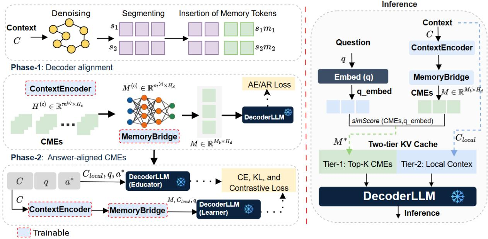  
Figure 1: Overview of the CMC framework: (i) context denoising and chunked compression via ContextEncoder, ii) cross-architecture projection via MemoryBridge, and (iii) two-tier KV cache inference via DecoderLLM with question-guided Tier-1 CME selection and Tier-2 local window.

To address these gaps, we propose a Context-to-Answer-Aligned Memory Compression (CMC) framework, illustrated in Figure 1. CMC compresses long input contexts into compact Context Memory Embeddings (CMEs) projected into any frozen decoder’s own embedding space, enabling efficient inference without modifying decoder weights. CMC comprises three key components: (i) a trainable ContextEncoder that applies graph-based context denoising and chunked compression to produce CMEs via fixed placeholder tokens; (ii) a MemoryBridge, a normcalibrated two-layer MLP that projects CMEs into the frozen decoder’s embedding space, enabling cross-architecture pairing of any encoder with any decoder; and (iii) a frozen DecoderLLM that generates responses conditioned on a two-tier KV cache combining top-K CMEs selected by cosine similarity to the input question (Tier-1) and a local context window at full token resolution (Tier-2). The ContextEncoder and MemoryBridge are trained jointly in two phases: Phase-1 on autoencoding and autoregressive objectives to align CMEs with the decoder, and Phase-2 on knowledge distillation and contrastive memory-answer alignment using a frozen DecoderLLM to incorporate answertargeted supervision. The main contributions of this work are as follows.

• We propose CMC, a soft-compression framework that incorporates graph-based context denoising to improve CME quality and a twotier KV cache inference policy that combines question-guided CME selection with a local context window, providing both global semantic coverage and local span-level precision without full-context attention.

• We propose a two-phase training strategy. Phase-1 aligns CMEs with the frozen decoder via reconstruction objectives, and Phase-2 distills answertargeted knowledge from a frozen DecoderLLM (educator) via cross-entropy, KL divergence, and contrastive memory-answer alignment losses, introducing answer-targeted training supervision for cross-architecture soft-compression.

• We conduct comprehensive experiments across nine encoder-decoder combinations and four QA benchmarks (SQuAD, AdversarialQA, HotpotQA, CovidQA) and show that CMC consistently outperforms the baseline in EM and F1 with notable reductions in inference time, energy consumption, multiply–accumulate operation (MAC), and peak GPU memory.

## 2 Methods

We propose the CMC framework to compress a long input context C into compact CMEs that a frozen DecoderLLM attends to in place of the original tokens. Given context $C$ and question $q ,$ CMC learns a ContextEncoder $f _ { \theta _ { c } }$ and MemoryBridge $g _ { \phi }$ such that:

$$
\hat { a } = f _ { \theta _ { d } } ( \cdot \mid M ^ { * } , C _ { \mathrm { l o c a l } } , q ) , \mathrm { w h e r e }\tag{1}
$$

$$
M ^ { * } = \mathrm { T o p K } ( g _ { \phi } ( f _ { \theta _ { c } } ( C ) ) , q , K ) .\tag{2}
$$

aˆ is the answer generated by the DecoderLLM $f _ { \theta _ { d } } , M ^ { * }$ is the set of query-selected decoder-ready CMEs (formulated in Sections 2.2 and 2.3), and $C _ { \mathrm { l o c a l } }$ is the local window (formulated in Section 2.5). The ContextEncoder $f _ { \theta _ { c } }$ and MemoryBridge $g _ { \phi }$ are the only trainable components, whereas $f _ { \theta _ { d } }$ remains frozen throughout. The following subsections detail each component as illustrated in Figure 1.

## 2.1 Context Denoising, Segmentation, and Memory Tokens

We apply graph-based context denoising to remove low-salience tokens – tokens that are semantically isolated from their immediate neighbors – from the full context C before compression. Given context $C = ( x _ { 1 } , \ldots , x _ { n } ) $ , we compute the cosine similarity between each token and its $g$ immediately downstream neighbors in embedding space. A token $x _ { i }$ is retained if its cosine similarity to at least one of its $g$ subsequent neighbors meets or exceeds the tunable threshold $\tau { : }$

$$
C _ { i } ^ { \prime } = \{ x _ { i } \in C | \operatorname* { m i n } _ { j = i + 1 } \frac { \mathbf { e } _ { i } \cdot \mathbf { e } _ { j } } { \| \mathbf { e } _ { i } \| \| \mathbf { e } _ { j } \| } \geq \tau \} .\tag{3}
$$

$x _ { i }$ is discarded if $C _ { i } ^ { \prime }$ is an empty set. For retained $x _ { i }$ , the denoised context $C ^ { \prime }$ of $k \in ( 1 , g ]$ tokens is divided into $n _ { s }$ non-overlapping segments, each of fixed length t, yielding $\boldsymbol { S } = \left\{ s _ { 1 } , s _ { 2 } , \ldots , s _ { n _ { s } } \right\}$ where $n _ { s } = \lceil k / t \rceil$ . To each segment $s _ { i } .$ , we append $m ^ { ( c ) }$ fixed placeholder tokens bounded by special <MEM> and </MEM> tokens, forming the augmented sequence $\tilde { s } _ { i } \mathrm { : }$

$$
\widetilde { \boldsymbol { s } } _ { i } = \left[ s _ { i } \Big \| < \mathsf { M E M } > \Big \| \underbrace { \mathsf { p } _ { 1 } , \ldots , \mathsf { p } _ { m ^ { ( c ) } } } _ { m ^ { ( c ) } \mathrm { p l a c e h o l d e r s } } \Big \| < / \mathsf { M E M } > \right] ,\tag{4}
$$

The number of placeholder tokens per segment is controlled by the compression rate $r = t / m ^ { ( c ) }$ ; a higher r yields a more compact representation at the cost of reduced context coverage. We evaluate $r \in \{ 2 , 4 , 8 \}$ in our experiments.

## 2.2 CME Extraction with ContextEncoder

Each augmented segment $\tilde { s } _ { i }$ in Eq. (4) is processed independently by the ContextEncoder $f _ { \theta _ { c } }$ , a trainable decoder-only causal language model. In particular, via causal self-attention, each of the $\bar { m } ^ { ( c ) }$ placeholder tokens attends to all preceding chunk tokens in $s _ { i } ,$ condensing the segment content into $m ^ { ( c ) }$ hidden state vectors $H _ { i } ^ { ( c ) } \in \mathbb { R } ^ { m ^ { ( c ) } \times H _ { c } } { \mathrm { ~ e x } } .$ tracted as the segment-level CMEs from the final transformer layer:

$$
H _ { i } ^ { ( c ) } = f _ { \theta _ { c } } ( \tilde { s } _ { i } ) [ \mathrm { p l a c e h o l d e r p o s i t i o n s } ] ,\tag{5}
$$

where $H _ { c }$ is the dimension of each hidden state vector. Though the placeholder tokens are fixed, their hidden states become informative CMEs through training the ContextEncoder weights. After processing all $n _ { s }$ segments, the full CME matrix is formed by concatenation:

$$
\mathbf { H } ^ { ( c ) } = [ H _ { 1 } ^ { ( c ) } ; H _ { 2 } ^ { ( c ) } ; \ldots ; H _ { n _ { s } } ^ { ( c ) } ] \in \mathbb { R } ^ { M _ { b } \times H _ { c } } ,\tag{6}
$$

where $M _ { b } = n _ { s } \times m ^ { ( c ) }$ is the total memory vectors representing the full context.

## 2.3 Cross-Architecture Projection with MemoryBridge

The ContextEncoder and the frozen DecoderLLM may belong to different model families with different hidden dimensions $H _ { c }$ and $H _ { d }$ . MemoryBridge is a trainable two-layer MLP that projects each CME vector $\mathbf { h } \in \mathbb { R } ^ { \tilde { H _ { c } } }$ from ContextEncoder into the DecoderLLM’s embedding space $\mathbb { R } ^ { H _ { d } }$ . Let mˆ denote the output of the two-layer MLP after LayerNorm1. We apply

$$
\tilde { \bf m } = \nu \operatorname { t a n h } ( \hat { \bf m } ) \cdot \mathrm { m i n } \bigg ( 1 , ~ \frac { 2 \nu } { \| \nu \operatorname { t a n h } ( \hat { \bf m } ) \| _ { 2 } } \bigg )\tag{7}
$$

where tanh is applied coordinatewise and $\nu = s \cdot { \bar { \nu } } .$ in which s is a learnable scalar and ν¯ denotes the average $\ell _ { 2 }$ norm of the frozen decoder’s input token embedding vectors, computed across all vocabulary tokens once at initialization. The first factor, ν tanh(mˆ ), bounds each coordinate but not the $\ell _ { 2 }$ norm of the vector; the second factor rescales the full vector whenever its $\ell _ { 2 }$ norm exceeds $2 \nu .$ and leaves it unchanged otherwise. Eq. (7) guarantees $\| \tilde { \mathbf { m } } \| _ { 2 } \leq 2 \nu$ , preventing the projected CMEs from exceeding twice the typical $\ell _ { 2 }$ norm of the DecoderLLM’s own token embeddings.

Applying MemoryBridge $g _ { \phi }$ to each segment’s CME matrix $H _ { i } ^ { ( c ) }$ yields its representation:

$$
\boldsymbol { M } ^ { ( i ) } = g _ { \phi } ( H _ { i } ^ { ( c ) } ) \in \mathbb { R } ^ { m ^ { ( c ) } \times H _ { d } } .
$$

After all $n _ { s }$ segments are processed, the decoderready representations are concatenated to

$$
\begin{array} { r } { M = [ { M } ^ { ( 1 ) } ; { M } ^ { ( 2 ) } ; \ldots ; { M } ^ { ( n _ { s } ) } ] \in \mathbb { R } ^ { M _ { b } \times H _ { d } } . } \end{array}\tag{8}
$$

to form the full memory matrix M that provides the DecoderLLM with a compressed sequence of $H _ { d } .$ -dimensional memory vectors in place of the original context tokens.

## 2.4 Two-Phase Training

The ContextEncoder $f _ { \theta _ { c } }$ and MemoryBridge $g _ { \phi }$ are the same trainable modules optimized continuously across both phases in sequence, with the DecoderLLM $f _ { \theta _ { d } }$ frozen throughout.

Phase-1: Decoder alignment. Phase-1 aligns the CMEs with the decoder’s embedding space via autoencoding (AE) and autoregressive (AR) objectives. The AE loss conditions the decoder on M in Eq. (8) to reconstruct the original context; the AR loss conditions the decoder on the same M to reconstruct only the first half of the context, leading to the loss function in Phase 1:

$$
\begin{array} { r } { \mathcal { L } _ { 1 } = \mathcal { L } _ { \mathrm { A E } } + \lambda _ { \mathrm { A R } } \mathcal { L } _ { \mathrm { A R } } . } \end{array}\tag{9}
$$

This loss formulation ensures that CMEs carry sufficient information for the frozen decoder to reconstruct the context, where the AR term, with hyperparameter $\lambda _ { \mathrm { A R } } > 0$ , up-weights the reconstruction of the earlier portion relative to the full-context AE objective.

Phase-2: Answer-aligned CMEs. Phase-2 finetunes the CMEs from Phase-1 toward answerrelevant content using the frozen DecoderLLM (educator) $f _ { \theta _ { d } }$ , which receives the local window Clocal and question $q .$ The same frozen weights $f _ { \theta _ { d } }$ are also invoked as the DecoderLLM (learner), conditioned on M and $C _ { \mathrm { l o c a l } }$ . The two DecoderLLMs share identical parameters and differ only in their input.

Three objectives act jointly: a cross-entropy loss $\mathcal { L } _ { \mathrm { C E } }$ supervises the DecoderLLM (learner) on gold answer tokens; a KL divergence loss ${ \mathcal { L } } _ { \mathrm { K I } }$ aligns the DecoderLLM (learner)’s output distribution with the DecoderLLM (educator)’s; and a contrastive loss ${ \mathcal { L } } _ { \mathrm { C L } }$ (van den Oord et al., 2018) pulls the element-wise mean of the CMEs toward the DecoderLLM (educator)’s hidden state at the answer span. Taken together, the Phase-2 loss is:

$$
\begin{array} { r } { \mathcal { L } _ { 2 } = \mathcal { L } _ { \mathrm { C E } } + \lambda _ { \mathrm { K L } } \mathcal { L } _ { \mathrm { K L } } + \lambda _ { \mathrm { C L } } \mathcal { L } _ { \mathrm { C L } } , } \end{array}\tag{10}
$$

where $\lambda _ { \mathrm { K L } } > 0$ and $\lambda _ { \mathrm { C L } } > 0$ are hyperparameters. Our ablation study confirms that the three components in the Phase-2 loss in Eq. (10) act jointly – removing any component degrades performance to the level of Phase-1 alone.

## 2.5 Inference with Two-Tier KV Cache Policy

At the inference stage, the frozen DecoderLLM generates responses conditioned on a two-tier KV cache built from the decoder-ready CME representation M and question q.

Tier-1: Question-guided top-K selection. The question tokens are embedded via the frozen decoder’s embedding layer and mean-pooled to obtain a query vector $\mathbf { \bar { q } } _ { \mathrm { v e c } } ~ \in ~ \mathbb { R } ^ { H _ { d } }$ Each CME $\tilde { \mathbf { m } } _ { j } \in M$ is scored by cosine similarity:

$$
\mathrm { s c o r e } _ { j } = \frac { \tilde { \mathbf { m } } _ { j } \cdot \mathbf { q } _ { \mathrm { v e c } } } { \left\| \tilde { \mathbf { m } } _ { j } \right\| \left\| \mathbf { q } _ { \mathrm { v e c } } \right\| } .\tag{11}
$$

The top-K CMEs are selected and re-ordered by original document position to form $M ^ { * }$ , where $K$ is a tunable hyperparameter controlling the breadth of semantic coverage.

Tier-2: Local context window. A W-token window $C _ { \mathrm { l o c a l } }$ is extracted from C centered at the starting-token position α of the gold answer span, subject to context boundary constraints:

$$
\begin{array} { r l } & { C _ { \mathrm { l o c a l } } = C \mathrm { [ s t a r t : s t a r t + } W ] , \mathrm { ~ w h e r e } \mathrm { } } \\ & { \mathrm { ~ s t a r t = } \operatorname* { m a x } \left( 0 , \operatorname* { m i n } \left( | C | - W , \alpha - W / 2 \right) \right) . } \end{array}\tag{12}
$$

Tier-2 preserves the information critical region at full token resolution, providing the local textual precision that CMEs alone cannot supply. In our experiments, α is taken from benchmark annotations when available and otherwise computed by string matching of the information-critical region within the context C. Both CMC and the baseline use the same α in every comparison. In deployment settings where α is unavailable, a lightweight span localization step such as CME-guided or BM25 retrieval can be used; see Appendix A.8.

KV cache assembly. The prefill input is

$$
\mathrm { i n p u t } = [ M ^ { * } \parallel C _ { \mathrm { l o c a l } } \parallel q ] .\tag{13}
$$

During autoregressive generation, the total KV cache length is bounded by $K + W + | q |$ tokens at all generation steps regardless of document length, where |q| denotes the number of tokens in the question q.

## 3 Experiments

## 3.1 Datasets

We evaluate CMC on four extractive QA benchmarks covering diverse reasoning types. SQuAD (Rajpurkar et al., 2016) is a single-hop extractive QA dataset where answers are spans within a single passage. AdversarialQA (Bartolo et al., 2020) extends this with adversarially constructed questions designed to challenge model comprehension. HotpotQA (Yang et al., 2018) requires multi-hop reasoning across multiple supporting passages, while CovidQA (Möller et al., 2020) evaluates domain-specific QA on biomedical literature. We conduct experiments under two data settings. The controlled-data setting uses 10,000 training and 1,000 validation samples for SQuAD, AdversarialQA, and HotpotQA, and 1,500 training and 200 validation samples for CovidQA. The full-data setting uses the complete training and validation splits of SQuAD, AdversarialQA, and HotpotQA to enable direct comparison with published baselines; CovidQA is evaluated under the small-data setting only due to its limited corpus size. This selection covers single-hop, adversarial, multi-hop, and domain-specific reasoning, providing a broad evaluation of CMC across varied context lengths and answer types.

## 3.2 Experimental Settings

All experiments are conducted on NVIDIA A100 80 GB GPU. The DecoderLLM is loaded in 4- bit NF4 quantisation with double quantisation enabled and kept frozen throughout training and inference. We evaluate three ContextEncoders – GPT2- Large, OPT-1.3B, and OPT-2.7B – paired with three frozen DecoderLLMs – Llama-3-8B-Instruct, Mistral-7B-Instruct-v0.3, and Gemma-2-9B-IT – yielding nine encoder-decoder combinations. The

ContextEncoder and MemoryBridge are trained jointly for one epoch using AdamW (learning rate $= 1 \times 1 0 ^ { - 5 } , \beta = ( 0 . 9 , 0 . 9 8 ) $ . Full hyperparameter details are provided in Appendix A.1.

Evaluation Metrics. We evaluate CMC on task performance and inference efficiency. For task performance, we report Exact Match (EM) and F1. For efficiency, we measure inference time decomposed into compression, prefill, and decode stages, energy consumption in kWh via CodeCarbon (Courty et al., 2024), MACs, and peak allocated and reserved GPU memory. Efficiency metrics are evaluated on SQuAD using GPT2-Large, Mistral, and Llama at $r = 4 .$ , across generation token budgets $T \in \{ 5 1 2 , 1 0 2 4 , 2 0 4 8 , 3 0 0 0 \}$

## 3.3 Baselines

We evaluate CMC against two groups of baselines. The primary baseline passes the local context window directly to the frozen DecoderLLM without compression, using the gold answer offset to center the window. We run this baseline across all three DecoderLLMs using identical training data, evaluation splits, and inference settings as CMC, ensuring a controlled comparison. The second baseline type is the published baselines. For full-data experiments on SQuAD, HotpotQA, and AdversarialQA, we compare against one hard-prompt method – LLMLingua-2 (Pan et al., 2024) – and four soft-compression methods – AutoCompressor (Chevalier et al., 2023), xRAG (Cheng et al., 2024), ICAE (Ge et al., 2024), and PCC-lite and PCC-large (Dai et al., 2025).

## 3.4 Results

## 3.4.1 Task Performance

Table 1 reports EM and F1 under both data settings at $r \quad = \quad 4 ;$ full results across all nine encoder-decoder combinations and $r \in \{ 2 , 4 , 8 \}$ are in Appendix A.2. Controlled-data setting. CMC outperforms the baselines on the majority of datasets. With Llama, CMC achieves the largest gains, improving EM by 4.6, 2.5, 5.5, and 7.0 points on SQuAD, AdversarialQA, HotpotQA, and CovidQA, respectively (average +4.9 EM). For Mistral, CMC improves on three of four datasets for a net average gain of 1.4 EM. For Gemma, CMC improves consistently across all four datasets, with the largest F1 gains on AdversarialQA (+3.1) and HotpotQA (+3.6). Full-data setting. CMC continues to benefit Llama and Gemma, with

<table><tr><td rowspan="2">DecoderLLM</td><td rowspan="2">Model</td><td colspan="2">SQuAD</td><td colspan="2">AdversarialQA</td><td colspan="2">HotpotQA EM</td><td colspan="2">CovidQA†</td><td colspan="2">Average</td></tr><tr><td colspan="2">EM F1</td><td colspan="2">EM F1 Controlled-data setting</td><td colspan="2">F1</td><td colspan="2">EM F1</td><td>EM F1</td></tr><tr><td colspan="10"></td></tr><tr><td rowspan="2">Llama-3 8B-Instruct</td><td rowspan="2">Llama (baseline) CMC</td><td colspan="2">62.4 81.0 82.9</td><td colspan="2">34.3 53.3</td><td colspan="2">44.1 68.1</td><td colspan="2">22.5 63.8</td><td>40.8 66.6</td></tr><tr><td colspan="2">67.0</td><td colspan="2">36.8 55.1</td><td colspan="2">49.6 69.3</td><td colspan="2">29.5 64.2</td><td>67.9</td></tr><tr><td rowspan="3">Mistral-7B Instruct-v0.3</td><td rowspan="3">Mistral (baseline) CMC</td><td colspan="2">61.0 75.9</td><td colspan="2">29.6 47.9</td><td colspan="2">53.0 71.1</td><td colspan="2"></td><td>45.7 40.7</td></tr><tr><td colspan="2">60.2 75.5</td><td colspan="2">50.3</td><td colspan="2"></td><td colspan="2">19.0 57.6</td><td>63.1</td></tr><tr><td colspan="2">55.1 78.1</td><td colspan="2">32.2 56.4</td><td colspan="2">53.8 71.7</td><td colspan="2">22.0 63.1</td><td>42.1 65.2</td></tr><tr><td colspan="2" rowspan="2">Gemma-2 Gemma (baseline) 9B-IT CMC</td><td colspan="2">61.1</td><td colspan="2">32.9 36.8</td><td colspan="2">40.1 67.0</td><td colspan="2">10.5 62.1</td><td>34.7 65.9</td></tr><tr><td colspan="2">81.2</td><td colspan="2">59.5</td><td colspan="2">42.0 70.6</td><td colspan="2">14.0 63.2</td><td>38.5 68.6</td></tr><tr><td colspan="10">Full-data setting</td></tr><tr><td rowspan="2">Llama-3 8B-Instruct</td><td rowspan="2">Llama (baseline) CMC</td><td colspan="2">48.28 74.27 78.29</td><td colspan="2">32.47 52.55</td><td colspan="2">44.31 67.28</td><td colspan="2">一</td><td rowspan="2">41.69 64.70</td></tr><tr><td colspan="2">55.56</td><td colspan="2">35.43 53.42</td><td colspan="2">47.77 67.83</td><td colspan="2">■ ■</td></tr><tr><td rowspan="2">Mistral-7B Instruct-v0.3</td><td rowspan="2">Mistral (baseline)</td><td colspan="2">45.36 69.26</td><td colspan="2">26.37 45.91</td><td colspan="2">53.41 71.13</td><td colspan="2"></td><td rowspan="2">46.25 66.51 41.71 62.10</td></tr><tr><td colspan="2"></td><td colspan="2"></td><td colspan="2"></td><td colspan="2">- -</td></tr><tr><td rowspan="2">Gemma-2</td><td rowspan="2">CMC Gemma (baseline)</td><td>30.67</td><td>55.16 71.68</td><td>29.77</td><td>49.26</td><td>48.33</td><td>65.49</td><td rowspan="2"></td><td rowspan="2">35.37</td><td rowspan="2">55.38 63.48 66.20</td></tr><tr><td colspan="2">40.91</td><td>29.77</td><td>53.17</td><td>37.80</td></tr><tr><td colspan="2" rowspan="2">9B-IT CMC</td><td colspan="2">44.13</td><td colspan="2">33.33</td><td colspan="2">41.90</td><td colspan="2">65.60</td><td colspan="2">36.16</td></tr><tr><td colspan="2"></td><td colspan="2">73.27</td><td colspan="2">56.24</td><td colspan="2">69.10</td><td colspan="2">39.79</td></tr></table>

Table 1: EM and F1 on four QA benchmarks under controlled-data and full-data settings. Bold denotes the higher score per row. †CovidQA is evaluated under the controlled-data setting only due to its limited corpus size.

Llama gaining 7.28 EM on SQuAD (48.28→55.56) and Gemma gaining 3.22 EM (40.91→44.13). Mistral shows a mixed pattern. CMC improves over the Mistral baseline on AdversarialQA (26.37→29.77, +3.40 EM) but underperforms the Mistral baseline by 14.7 EM on SQuAD (45.4→30.7) and regresses on HotpotQA (53.4→48.3). All three decoders share an identical Phase-2 configuration, including a fixed KD step budget that does not scale with training set size, while Phase-1 steps scale directly with it (∼8.8× more steps on full-data vs. controlled-data SQuAD); we attribute Mistral’s SQuAD/HotpotQA regressions to this training imbalance, to which Llama and Gemma appear less sensitive under the identical settings.

<table><tr><td>Method</td><td colspan="2">SQuAD EM F1</td><td>HotpotQA EM F1 16.29</td><td colspan="2">Adv.QA EM F1</td></tr><tr><td colspan="2">AutoCompressor xRAG ICAE LLMLingua-2</td><td colspan="3">0.35 21.46 0.29 3.46 18.19 16.29 21.63 45.69 26.68</td><td>2.00 14.09 27.51 3.47 13.75</td></tr></table>

Table 2: Comparison of CMC with published baselines under the full-data setting on SQuAD, HotpotQA, and AdversarialQA. The best EM and F1 scores for each dataset are highlighted in bold.

Table 2 compares CMC against published baselines on the full-data setting. Although PCC-lite shares the same GPT2-Large encoder as CMC, all published baselines use different decoder architectures (Dai et al., 2025). CMC achieves the best F1 on all three datasets, surpassing PCC-Large by 0.53 F1 on SQuAD, 19.64 on HotpotQA, and 0.86 on AdversarialQA. On HotpotQA, CMC also leads on EM (47.77 vs 39.97 for PCC-Large), a 7.8- point gain particularly notable given the multi-hop reasoning requirement. CMC underperforms PCC-Large on EM for SQuAD (55.56 vs 60.04) and AdversarialQA (35.43 vs 39.37), likely reflecting PCC’s use of a larger encoder/decoder architecture. AutoCompressor and xRAG achieve low EM on SQuAD, HotpotQA, and AdversarialQA, while ICAE and LLMLingua-2 perform substantially below CMC across all three datasets. A qualitative case study illustrating CMC behavior across four outcome categories is provided in Appendix A.9.

## 3.4.2 Generation and Use of CMEs

The number of CMEs generated per context chunk is controlled by the compression rate r, where a smaller r produces more CMEs per chunk and a larger r produces fewer. Figure 2 shows the EM and F1 sensitivity to $r \in \{ 2 , 4 , 8 \}$ across all nine encoder-decoder combinations on SQuAD. r = 2 consistently yields the lowest performance. The larger CME count introduces noise into the Tier-1 prefix, diluting answer-relevant signals and making it harder for the frozen DecoderLLMs to locate the correct span. In contrast, r = 8 reduces the CME count to the point where important contextual information is lost, particularly for longer passages. The intermediate setting r = 4 achieves the best or tied-best EM in 6 of 9 combinations. However, the optimal rate is mildly decoder-dependent: for example, Llama strongly favors r = 4 across all encoders (EM gains of 1.1–1.7 points over r = 8), while Mistral and Gemma show near-flat performance between r = 4 and r = 8 (differences ≤ 0.1 EM), suggesting decoder-specific sensitivity to compression granularity.

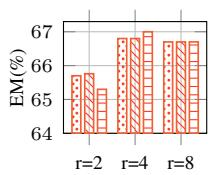  
(a) CMC (Llama): EM

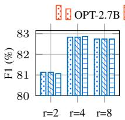  
(b) CMC (Llama): F1

OPT-2.7B OPT-1.3B GPT2-Large  
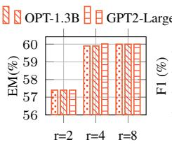  
(c) CMC (Mistral): EM

OPT-2.7B OPT-1.3B GPT2-Large  
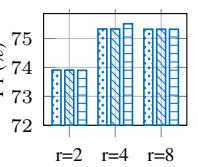  
(d) CMC (Mistral): F1

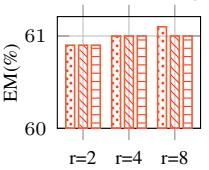  
(e) CMC (Gemma): EM

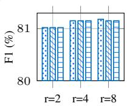  
(f) CMC (Gemma): F1  
Figure 2: EM and F1 scores on SQuAD (controlled-data setting) across compression rates $r \in \{ 2 , 4 , 8 \}$ for three DecoderLLMs paired with three ContextEncoders.

## 3.4.3 Computational Efficiency

Figure 3 shows inference time and energy cost for T ∈ {512, 1024, 2048, 3000} tokens on SQuAD for three evaluation sample sizes. CMC consistently reduces both metrics relative to the baseline across all token budgets and sample sizes. At 1,000 samples, the total time reduction ranges from 4.6% at $T = 5 1 2 ( 6 , 0 4 3 { \mathrm { s } }  5 , 7 6 3 { \mathrm { s } } )$ to 20.0% at $T = 3 , 0 0 0 ( 4 1 , 9 6 3 \mathrm { s }  3 3 , 5 6 2 \mathrm { s } )$ , with corresponding energy reductions of 4.6% and 20.3%, respectively. This scaling effect arises because CMC’s compression overhead is approximately constant (≈25 s regardless of T), while decode savings grow with generation length due to the bounded two-tier KV cache. The same trend holds across all sample sizes, confirming the gains reflect the two-tier KV cache architecture rather than dataset-specific effects. Stage-wise inference time and energy breakdowns for Llama and Mistral are provided in Appendix A.3.

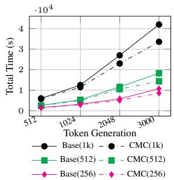  
(a) Inference Time

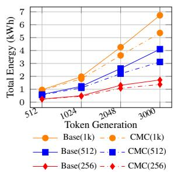  
(b) Energy Cost  
Figure 3: Inference time and energy consumption of CMC vs. the baseline on SQuAD across $T \in$ {512, 1024, 2048, 3000} tokens. Parenthetical labels denote sample size (256, 512, 1,000).

Figure 4 shows peak allocated and peak reserved GPU memory for Llama across $T \in$ {512, 1024, 2048, 3000} on SQuAD (1,000 samples, GPT2-Large, $r = 4 )$ . Peak allocated memory remains nearly constant for CMC (≈8.85 GB) while the baseline increases from 10.0 GB at $T =$

512 to 10.2 GB at $T = 3 { , } 0 0 0 .$ , yielding a reduction of ≈1.2 GB. Peak reserved memory reveals a more substantial difference: the baseline spikes to 19.7 GB at $T = 3 { , } 0 0 0$ while CMC maintains a near-constant 9.8 GB, corresponding to a 50% reduction. Mistral results in the appendix show an even larger effect (24.3 GB → 9.1 GB, a 62.5% reduction). These reductions arise because baseline inference accumulates KV cache entries proportionally to T, whereas CMC’s two-tier policy caps the cache at a fixed budget. Detailed memory results for both decoders are provided in Appendix A.4. Analytical attention MAC analysis in Appendix A.5 confirms that these savings are architectural rather than hardware-specific.

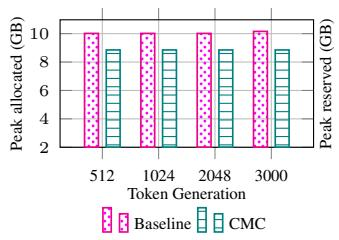

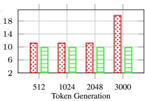  
Baseline CMC  
(a) Peak allocated memory  
(b) Peak reserved memory  
Figure 4: Peak allocated and peak reserved GPU memory (GB) for CMC vs. the baseline on 1,000 SQuAD samples across T ∈ {512, 1024, 2048, 3000} tokens.

## 4 Ablation Study

Table 3 presents the ablation results on SQuAD. Architectural ablations (A1–A3): Removing graphbased denoising (A1) reduces EM by 26.6 points relative to CMC, 22.0 points below the baseline, confirming that denoising is essential for CME quality rather than merely a computational optimization. Random CME selection (A2) reduces EM by 8.1 points: the same number of CME slots reach the decoder but are decorrelated from the question, reducing Tier-1 prefix informativeness. Removing Tier-2 (A3) produces the largest drop (−50.0 EM). The near-identical AE/AR losses between A3 and CMC (1.40/0.73 vs 1.38/0.70) confirm the deficit arises at inference rather than from degraded CME quality, establishing Tier-2 as structurally indispensable. Phase-2 training objective ablations (A4–A6). All converge to $\mathbf { E M } = 0 . 5 8 9$ – identical to Phase-1 only (A6). Removing either ${ \mathcal { L } } _ { \mathrm { K I } }$ or ${ \mathcal { L } } _ { \mathrm { C L } }$ individually is as damaging as removing Phase-2 entirely, revealing that all three objectives must act jointly: $\mathcal { L } _ { \mathrm { C E } }$ provides tokenlevel supervision, ${ \mathcal { L } } _ { \mathrm { K L } }$ aligns the learner with the educator’s distribution, and ${ \mathcal { L } } _ { \mathrm { C I } }$ grounds the CME prefix in the answer embedding space.

<table><tr><td rowspan=1 colspan=1>Model</td><td rowspan=1 colspan=1>EM  F1  △EM  ∆F1</td></tr><tr><td rowspan=1 colspan=1>Llama (baseline)</td><td rowspan=1 colspan=1>0.624 0.810-0.046-0.019</td></tr><tr><td rowspan=1 colspan=1>CMC</td><td rowspan=1 colspan=1>0.670 0.829</td></tr><tr><td rowspan=1 colspan=1>Architecture ablationsw/o graph denoising (A1)w/o query-guided top-K (A2)w/o Tier-2 local window (A3)</td><td rowspan=1 colspan=1>0.404 0.564-0.266-0.2650.589 0.757-0.081-0.0720.170 0.247-0.500-0.582</td></tr><tr><td rowspan=1 colspan=1>Training objective ablationsw/o ${ \mathcal { L } } _ { \mathrm { C L } }$ (A4)w/o ${ \mathcal { L } } _ { \mathrm { K L } }$ (A5)Phase-1 only, no Phase-2 (A6)</td><td rowspan=1 colspan=1>0.589 0.757 -0.081 -0.0720.589 0.757 -0.081 -0.0720.589 0.757-0.081-0.072</td></tr></table>

Table 3: Ablation study on SQuAD (controlled-data setting, GPT2-Large, $r = 4$ , Llama). ∆EM and ∆F1 are relative to CMC.

Sensitivity analyses of local window size and denoising threshold are provided in Appendices A.6 and A.7, respectively. A deployment analysis of Tier-2 window localization without gold annotations is provided in Appendix A.8.

## 5 Related Work

Architectural methods. Sparse and local attention mechanisms (Beltagy et al., 2020; Zaheer et al., 2020) reduce quadratic complexity by restricting each token’s receptive field, while positional interpolation (Chen et al., 2023), YaRN (Peng et al., 2024), and LongLoRA (Chen et al., 2024) extend the context window of pretrained LLMs through rotary embedding modifications. FlashAttention (Dao et al., 2022) reduces memory bandwidth costs without approximation, and KV cache management strategies such as H2O (Zhang et al., 2023), and StreamingLLM (Xiao et al., 2024) evict low-importance entries during decoding. These methods require architectural modification, continued pretraining, or operate only on alreadycomputed caches without reducing prefill cost, and none produce a compact input representation consumable by an unmodified frozen LLM.

Hard-prompt compression. Selective Context (Li et al., 2023) prunes tokens by self-information, LLMLingua (Jiang et al., 2023b) and LongLLM-Lingua (Jiang et al., 2024) apply perplexity-based budget control, LLMLingua-2 (Pan et al., 2024) distils compression decisions into a lightweight classifier, and QGC (Cao et al., 2024) weights tokens by query relevance. These methods are modelagnostic but incur irreversible information loss, as discarded tokens cannot be recovered by the decoder, making them susceptible to performance degradation on tasks requiring cross-passage evidence synthesis such as multi-hop reasoning.

Soft-compression. Soft-compression methods encode the full context into dense embeddings consumed by a frozen decoder, avoiding hard token removal. RMT (Bulatov et al., 2022) propagates memory tokens recurrently across segments. Auto-Compressor (Chevalier et al., 2023) and ICAE (Ge et al., 2024) compress long documents into soft summary vectors via autoencoding objectives. Gisting (Mu et al., 2023) compresses instructions into gist tokens, and CCM (Kim et al., 2024) targets online interaction scenarios by compressing accumulating KV pairs via a conditional LoRA adapter. 500xCompressor (Li et al., 2025b) compresses the entire context into a small set of learned tokens, and then uses the KV representation of these tokens for the downstream QA task. In RAG settings, xRAG (Cheng et al., 2024) and COCOM (Rau et al., 2025) compress retrieved passages into dense representations for a single specific target decoder. Dai et al. (2025) introduce a decoupled compressor-LLM framework with cross-architecture projection but without query-guided memory selection or answer-targeted training supervision. ATA-Compressor (Li et al., 2025a) introduces queryguided selective encoding but does not address cross-architecture deployment or answer-targeted memory alignment. No existing method simultaneously addresses all three gaps, which CMC is designed to fill.

## 6 Conclusion

We presented CMC, a soft-compression framework that compresses long contexts into compact CMEs for computation- and energy- efficient inference with frozen LLMs. Across nine encoder-decoder combinations and four extractive QA benchmarks, CMC consistently outperforms the baseline in the majority of configurations under the controlleddata setting, and achieves the best F1 against published soft-compression baselines under full-data conditions. At T = 3,000 tokens, CMC reduces inference time and energy by 20% and peak reserved GPU memory by up to 62.5%, enabling deployment at generation lengths that would otherwise exhaust GPU memory. Ablation studies confirm that graph-based denoising, the Tier-2 local window, and all three Phase-2 objectives are each necessary; removing any single component causes substantial performance degradation.

## Limitations

While CMC demonstrates consistent improvements in EM, F1, and inference efficiency, we acknowledge the following limitations. First, all experiments are conducted on extractive QA benchmarks; the effectiveness of CMC on abstractive QA, summarisation, and RAG has not been evaluated and may require adjustments to the answertargeted distillation objective. Moreover, CMC is trained and evaluated within each benchmark independently; cross-dataset generalization (e.g., training on SQuAD and evaluating on HotpotQA) has not been evaluated. Second, CMC uses a fixed compression rate $r \in \{ 2 , 4 , 8 \}$ , which may overcompress short passages or under-compress long ones; adaptive rate scheduling conditioned on context length is left for future work. Lastly, CMC is evaluated on English-language QA benchmarks only; its effectiveness on non-English or multilingual contexts, where tokenisation and semantic similarity properties differ substantially, has not been investigated.

## Ethics Statement

No ethical approval was needed for this study.

## Availability Statement

Code and additional resources for this study are available at https://github.com/mostafiz26/ CMC.

## References

Max Bartolo, Alastair Roberts, Johannes Welbl, Sebastian Riedel, and Pontus Stenetorp. 2020. Beat the AI: Investigating adversarial human annotation for reading comprehension. Transactions ofthe Association for Computational Linguistics, 8:662–678.

Iz Beltagy, Matthew E Peters, and Arman Cohan. 2020. Longformer: The long-document transformer. arXiv preprint arXiv:2004.05150.

Tom Brown, Benjamin Mann, Nick Ryder, Melanie Subbiah, Jared D Kaplan, Prafulla Dhariwal, Arvind Neelakantan, Pranav Shyam, Girish Sastry, Amanda Askell, et al. 2020. Language models are few-shot learners. In Advances in Neural Information Processing Systems, volume 33, pages 1877–1901.

Aydar Bulatov, Yury Kuratov, and Mikhail Burtsev. 2022. Recurrent memory transformer. In Advances in Neural Information Processing Systems, volume 35, pages 11079–11091. Curran Associates, Inc.

Zhiwei Cao, Qian Cao, Yu Lu, Ningxin Peng, Luyang Huang, Shanbo Cheng, and Jinsong Su. 2024. Retaining key information under high compression ratios: Query-guided compressor for LLMs. In Proceedings of the 62nd Annual Meeting of the Association for Computational Linguistics (Volume 1: Long Papers), pages 12685–12695, Bangkok, Thailand. Association for Computational Linguistics.

Shouyuan Chen, Sherman Wong, Liangjian Chen, and Yuandong Tian. 2023. Extending context window of large language models via positional interpolation. arXiv preprint arXiv:2306.15595.

Yukang Chen, Shengju Qian, Haotian Tang, Xin Lai, Zhijian Liu, Song Han, and Jiaya Jia. 2024. Longlora: Efficient fine-tuning of long-context large language models. In International Conference on Learning Representations, volume 2024, pages 8220–8238.

Xin Cheng, Xun Wang, Xingxing Zhang, Tao Ge, Si-Qing Chen, Furu Wei, Huishuai Zhang, and Dongyan Zhao. 2024. xRAG: Extreme context compression for retrieval-augmented generation with one token. In Advances in Neural Information Processing Systems, volume 37, pages 109487–109516. Curran Associates, Inc.

Alexis Chevalier, Alexander Wettig, Anirudh Ajith, and Danqi Chen. 2023. Adapting language models to compress contexts. In Proceedings ofthe 2023 Conference on Empirical Methods in Natural Language Processing, pages 3829–3846, Singapore. Association for Computational Linguistics.

Benoit Courty, Victor Schmidt, Sasha Luccioni, Goyal-Kamal, Marion Coutarel, Boris Feld, Jérémy Lecourt, Liam Connell, Amine Saboni, et al. 2024. Code-Carbon: Estimate and track carbon emissions from machine learning computing.

Yuhong Dai, Jianxun Lian, Yitian Huang, Wei Zhang, Mingyang Zhou, Mingqi Wu, Xing Xie, and Hao Liao. 2025. Pretraining context compressor for large language models with embedding-based memory. In Proceedings of the 63rd Annual Meeting of the Associationfor Computational Linguistics (Volume 1: Long Papers), pages 28715–28732, Vienna, Austria. Association for Computational Linguistics.

Tri Dao, Dan Fu, Stefano Ermon, Atri Rudra, and Christopher Ré. 2022. Flashattention: Fast and memory-efficient exact attention with io-awareness.

In Advances in Neural Information Processing Systems, volume 35, pages 16344–16359. Curran Associates, Inc.

Zican Dong, Junyi Li, Xin Men, Wayne Xin Zhao, Bingning Wang, Zhen Tian, Weipeng Chen, and Ji-Rong Wen. 2024. Exploring context window of large language models via decomposed positional vectors. In Advances in Neural Information Processing Systems, volume 37, pages 10320–10347. Curran Associates, Inc.

Tao Ge, Hu Jing, Lei Wang, Xun Wang, Si-Qing Chen, and Furu Wei. 2024. In-context autoencoder for context compression in a large language model. In International Conference on Learning Representations, volume 2024, pages 2591–2607.

Gemma Team, Thomas Mesnard, Cassidy Hardin, Robert Dadashi, Surya Bhupatiraju, Shreya Pathak, Laurent Sifre, Morgane Rivière, Mihir Sanjay Kale, Juliette Love, et al. 2024. Gemma: Open models based on Gemini research and technology. arXiv preprint arXiv:2403.08295.

Albert Q. Jiang, Alexandre Sablayrolles, Arthur Mensch, Chris Bamford, Devendra Singh Chaplot, Diego de las Casas, Florian Bressand, Gianna Lengyel, Guillaume Lample, Lucile Saulnier, Lélio Renard Lavaud, Marie-Anne Lachaux, Pierre Stock, Teven Le Scao, Thibaut Lavril, Thomas Wang, Timothée Lacroix, and William El Sayed. 2023a. Mistral 7b. Preprint, arXiv:2310.06825.

Huiqiang Jiang, Qianhui Wu, Chin-Yew Lin, Yuqing Yang, and Lili Qiu. 2023b. LLMLingua: Compressing prompts for accelerated inference of large language models. In Proceedings of the 2023 Conference on Empirical Methods in Natural Language Processing, pages 13358–13376, Singapore. Association for Computational Linguistics.

Huiqiang Jiang, Qianhui Wu, Xufang Luo, Dongsheng Li, Chin-Yew Lin, Yuqing Yang, and Lili Qiu. 2024. LongLLMLingua: Accelerating and enhancing LLMs in long context scenarios via prompt compression. In Proceedings ofthe 62nd Annual Meeting of the Association for Computational Linguistics, pages 1658–1677, Bangkok, Thailand. Association for Computational Linguistics.

Jang-Hyun Kim, Junyoung Yeom, Sangdoo Yun, and Hyun Oh Song. 2024. Compressed context memory for online language model interaction. In International Conference on Learning Representations, volume 2024, pages 35316–35334.

Xuancheng Li, Haitao Li, Yujia Zhou, Qingyao Ai, and Yiqun Liu. 2025a. Atacompressor: Adaptive taskaware compression for efficient long-context processing in llms. In Proceedings of the 2025 Annual International ACM SIGIR Conference on Research and Development in Information Retrieval in the Asia Pacific Region, SIGIR-AP 2025, page 343–352. Association for Computing Machinery.

Yucheng Li, Bo Dong, Frank Guerin, and Chenghua Lin. 2023. Compressing context to enhance inference efficiency of large language models. In Proceedings of the 2023 Conference on Empirical Methods in Natural Language Processing, pages 6342–6353, Singapore. Association for Computational Linguistics.

Zongqian Li, Yixuan Su, and Nigel Collier. 2025b. 500xCompressor: Generalized prompt compression for large language models. In Proceedings of the 63rd Annual Meeting of the Association for Computational Linguistics (Volume 1: Long Papers), pages 25081–25091, Vienna, Austria. Association for Computational Linguistics.

Timo Möller, Anthony Reina, Raghavan Jayakumar, and Malte Pietsch. 2020. COVID-QA: A question answering dataset for COVID-19. In Proceedings ofthe 1st Workshop on NLPfor COVID-19 at ACL 2020. Association for Computational Linguistics.

Jesse Mu, Xiang Li, and Noah Goodman. 2023. Learning to compress prompts with gist tokens. In Advances in Neural Information Processing Systems, volume 36, pages 19327–19352. Curran Associates, Inc.

Zhuoshi Pan, Qianhui Wu, Huiqiang Jiang, Menglin Xia, Xufang Luo, Jue Zhang, Qingwei Lin, Victor Rühle, Yuqing Yang, Chin-Yew Lin, H. Vicky Zhao, Lili Qiu, and Dongmei Zhang. 2024. LLMLingua-2: Data distillation for efficient and faithful task-agnostic prompt compression. In Findings of the Association for Computational Linguistics (ACL) 2024, pages 963–981, Bangkok, Thailand.

Bowen Peng, Jeffrey Quesnelle, Honglu Fan, and Enrico Shippole. 2024. Yarn: Efficient context window extension of large language models. In International Conference on Learning Representations, volume 2024, pages 31932–31951.

Reiner Pope, Sholto Douglas, Aakanksha Chowdhery, Jacob Devlin, James Bradbury, Jonathan Heek, Kefan Xiao, Shivani Agrawal, and Jeff Dean. 2023. Efficiently scaling transformer inference. In Proceedings of Machine Learning and Systems, volume 5, pages 606–624.

Pranav Rajpurkar, Jian Zhang, Konstantin Lopyrev, and Percy Liang. 2016. SQuAD: 100,000+ questions for machine comprehension of text. In Proceedings of the 2016 Conference on Empirical Methods in Natural Language Processing, pages 2383–2392. Association for Computational Linguistics.

David Rau, Shuai Wang, Hervé Déjean, Stéphane Clinchant, and Jaap Kamps. 2025. Context embeddings for efficient answer generation in retrieval-augmented generation. In Proceedings ofthe Eighteenth ACM International Conference on Web Search and Data Mining, WSDM ’25, page 493–502. Association for Computing Machinery.

Stephen Robertson and Hugo Zaragoza. 2009. The probabilistic relevance framework: Bm25 and beyond. Found. Trends Inf. Retr., 3(4):333–389.

Ying Sheng, Lianmin Zheng, Binhang Yuan, Zhuohan Li, Max Ryabinin, Beidi Chen, Percy Liang, Christopher Re, Ion Stoica, and Ce Zhang. 2023. FlexGen: High-throughput generative inference of large language models with a single GPU. In Proceedings of the 40th International Conference on Machine Learning, volume 202 of Proceedings ofMachine Learning Research, pages 31094–31116. PMLR.

Hugo Touvron, Louis Martin, Kevin Stone, Peter Albert, Amjad Almahairi, Yasmine Babaei, Nikolay Bashlykov, Soumya Batra, Prajjwal Bhargava, Shruti Bhosale, et al. 2023. Llama 2: Open foundation and fine-tuned chat models. arXiv preprint arXiv:2307.09288.

Aäron van den Oord, Yazhe Li, and Oriol Vinyals. 2018. Representation learning with contrastive predictive coding. arXiv preprint arXiv:1807.03748.

Ashish Vaswani, Noam Shazeer, Niki Parmar, Jakob Uszkoreit, Llion Jones, Aidan N Gomez, Ł ukasz Kaiser, and Illia Polosukhin. 2017. Attention is all you need. In Advances in Neural Information Processing Systems, volume 30. Curran Associates, Inc.

Guangxuan Xiao, Yuandong Tian, Beidi Chen, Song Han, and Mike Lewis. 2024. Efficient streaming language models with attention sinks. In International Conference on Learning Representations, volume 2024, pages 21875–21895.

Zhilin Yang, Peng Qi, Saizheng Zhang, Yoshua Bengio, William Cohen, Ruslan Salakhutdinov, and Christopher D. Manning. 2018. HotpotQA: A dataset for diverse, explainable multi-hop question answering. In Proceedings of the 2018 Conference on Empiri cal Methods in Natural Language Processing, pages 2369–2380, Brussels, Belgium. Association for Computational Linguistics.

Manzil Zaheer, Guru Guruganesh, Kumar Avinava Dubey, Joshua Ainslie, Chris Alberti, Santiago Ontanon, Philip Pham, Anirudh Ravula, Qifan Wang, Li Yang, and Amr Ahmed. 2020. Big bird: Transformers for longer sequences. In Advances in Neural Information Processing Systems, volume 33, pages 17283–17297. Curran Associates, Inc.

Zhenyu Zhang, Ying Sheng, Tianyi Zhou, Tianlong Chen, Lianmin Zheng, Ruisi Cai, Zhao Song, Yuandong Tian, Christopher Ré, Clark Barrett, Zhangyang "Atlas" Wang, and Beidi Chen. 2023. H2o: Heavy-hitter oracle for efficient generative inference of large language models. In Advances in Neural Information Processing Systems, volume 36, pages 34661–34710. Curran Associates, Inc.

## A Appendix

## A.1 Hyperparameters

Table 4 reports the full set of hyperparameters used across all experiments. The ContextEncoder and MemoryBridge are optimised jointly; the frozen

DecoderLLM receives no gradient updates at any stage. The two-tier KV cache hyperparameters K and W are tuned per dataset and encoder-decoder configuration within the ranges reported below.

<table><tr><td>Hyperparameter</td><td>Value</td></tr><tr><td>Hardware</td><td></td></tr><tr><td>GPU</td><td>NVIDIA A100 80 GB</td></tr><tr><td>DecoderLLM</td><td></td></tr><tr><td>Quantisation</td><td>4-bit NF4, double quantisation</td></tr><tr><td>Compute dtype Decoder training</td><td>bfloat16</td></tr><tr><td>Optimiser (ContextEncoder + MemoryBridge)</td><td>Frozen (no gradient updates)</td></tr><tr><td></td><td></td></tr><tr><td>Optimiser</td><td>AdamW</td></tr><tr><td>Learning rate</td><td>1 × 10−5</td></tr><tr><td>Weight decay</td><td>0.01</td></tr><tr><td>β</td><td>(0.9, 0.98)</td></tr><tr><td>Gradient clip norm Training epochs</td><td>0.6</td></tr><tr><td>Batch size</td><td>1</td></tr><tr><td>ContextEncoder</td><td>{4, 8} (tuned per config)</td></tr><tr><td>Architectures</td><td>GPT2-Large, OPT-1.3B, OPT-</td></tr><tr><td></td><td>2.7B</td></tr><tr><td>Max input length</td><td>3,072 tokens</td></tr><tr><td>MemoryBridge Architecture</td><td></td></tr><tr><td>Normalisation</td><td>Two-layer MLP</td></tr><tr><td>Activation</td><td>LayerNorm (€ = 10−5)</td></tr><tr><td>Output activation</td><td>GELU</td></tr><tr><td>Graph-based token denoising</td><td>Norm-calibrated tanh</td></tr><tr><td>Cosine similarity threshold τ</td><td></td></tr><tr><td>Neighbourhood window k</td><td>0.05</td></tr><tr><td>Minimum keep interval</td><td>3</td></tr><tr><td>IG warmup steps</td><td>Every 16 tokens</td></tr><tr><td>Chunking and compression</td><td>200</td></tr><tr><td>Chunk size t</td><td>256 tokens</td></tr><tr><td>Compression rates r</td><td>{2, 4,8}</td></tr><tr><td>Memory token cap per chunk</td><td>128</td></tr><tr><td>Min memory tokens per chunk Warmup memory tokens</td><td>4</td></tr><tr><td></td><td>8</td></tr><tr><td>Two-tier KV cache</td><td></td></tr><tr><td>Tier-1 top-K CMEs</td><td>K ∈ {30, 40}</td></tr><tr><td>Tier-2 local window W</td><td>W ∈ {130, 256} tokens</td></tr><tr><td>Phase-1 AE/AR</td><td></td></tr><tr><td>AR loss weight λAR</td><td>1.0</td></tr><tr><td>Phase-2 QA distillation</td><td></td></tr><tr><td>KD steps per epoch</td><td>800</td></tr><tr><td>KD batch size</td><td>2</td></tr><tr><td>CE loss weight λcE</td><td>1.0</td></tr><tr><td>KL loss weight λκL</td><td>0.5</td></tr><tr><td>Contrastive loss weight λcL</td><td>0.1</td></tr><tr><td>Contrastive temperature δ</td><td>0.07</td></tr><tr><td>Local window drop probability</td><td>0.5</td></tr><tr><td></td><td></td></tr><tr><td>Local window chars (educator)</td><td>1,200 - 2, 000</td></tr><tr><td>Local window tokens (student) 130</td><td></td></tr><tr><td>Inference</td><td></td></tr><tr><td></td><td></td></tr><tr><td>Max new tokens 32</td><td></td></tr><tr><td></td><td></td></tr><tr><td></td><td></td></tr><tr><td></td><td></td></tr><tr><td>Decoder max length</td><td>1,536 tokens</td></tr></table>

Table 4: Hyperparameters used in all CMC experiments.

LayerNorm details. All LayerNorm operations in MemoryBridge use PyTorch’s default nn.LayerNorm: LayerNorm $\mathbf { \Sigma } ( \mathbf { x } ) \ \mathbf { \Sigma } = \ \gamma \odot \ ( \mathbf { x }$ $\mu ) / \sqrt { \sigma ^ { 2 } + \epsilon } + \beta .$ , where $\mu$ and $\sigma ^ { 2 }$ are the mean and variance of x over the feature dimension, $\epsilon = 1 0 ^ { - 5 }$ (Table 4), and $\gamma , \beta$ are learnable per-dimension scale and shift parameters trained jointly with the rest of MemoryBridge.

## A.2 Detailed Results per Dataset

Tables 5–8 report EM and F1 for all nine encoderdecoder combinations across $r \in \{ 2 , 4 , 8 \}$ under the controlled-data setting. Bold denotes the best CMC result per DecoderLLM group. Three findings across these tables support the design choices made in CMC. First, OPT-1.3B and OPT-2.7B produce near-identical results across all datasets and decoders, while GPT2-Large — the smallest encoder — matches or outperforms both, confirming that ContextEncoder scale does not drive performance. Second, Gemma shows near-zero variation across all encoder and compression rate combinations (≤0.001 EM), indicating that the two-tier KV cache policy is effective regardless of decoder sensitivity to compression granularity. Third, CovidQA shows consistent improvements across all nine configurations despite only 1,500 training samples, demonstrating that the two-phase training strategy generalises to low-resource domain-specific settings.

Additionally, Table 9 reports average EM and F1 across all encoder-decoder combinations and datasets. The overall average confirms r = 4 as the best compression rate $( \mathrm { E M } = 0 . 4 1 5 7 , \mathrm { F } 1 = 0 . 6 6 7 8 )$ marginally outperforming $r = 8 \left( \mathbf { E M } = 0 . 4 1 5 2 \right)$ and more substantially outperforming $ { \boldsymbol { r } } \quad = \quad 2$ $( \mathrm { E M } = 0 . 4 1 0 7 )$

## A.3 Inference Efficiency

Tables 10–13 report stage-wise inference time and energy for Llama and Mistral on SQuAD across three sample sizes and $T \in \{ 5 1 2 , 1 0 2 4 , 2 0 4 8 , 3 0 0 0 \}$ . These tables extend the 1,000-sample Llama results in Section 3.4.3 to smaller evaluation sets and Mistral. We present two additional observations. First, the compression overhead scales linearly with sample size — approximately 6 s at 256 samples, 13 s at 512, and 26 s at 1,000 — and is independent of T, confirming that CMC’s compression cost is determined by the number of contexts processed rather than the generation length. Second, CMC prefill time is marginally lower than the baseline across all conditions, reflecting the shorter local context window relative to the uncompressed prompt. Moreover, Mistral shows consistent savings matching Llama (≈20% at $T \ : = \ : 3 { , } 0 0 0$ 1,000 samples), confirming that the efficiency gains are decoder-independent.

## A.4 Peak GPU Memory

Tables 14 and 15 report peak allocated and peak reserved GPU memory for Llama and Mistral across three sample sizes and $T \in$ {512, 1024, 2048, 3000}, extending the 1,000- sample Llama results in Section 3.4.3. Peak allocated memory is stable across T for CMC (≈8.85 GB for Llama, ≈8.43 GB for Mistral) regardless of sample size. The baseline is also stable for Llama (≈10.0 GB) but grows with T for Mistral (9.1 GB at T = 512 to 11.1 GB at $T = 3 \AA , 0 0 0 )$ reflecting Mistral’s longer tokenised prompts and larger KV cache growth per step. The key finding is in peak reserved memory. CMC maintains a nearconstant footprint across all sample sizes and token budgets (≈9.8 GB for Llama, ≈9.1 GB for Mistral), while the baseline spikes sharply at large $T \colon$ up to 19.7 GB for Llama and 24.3 GB for Mistral at $T = 3 { , } 0 0 0$ . This confirms that the bounded twotier KV cache prevents memory growth regardless of decoder architecture, sample size, or generation length.

## A.5 Attention MACs Analysis

Attention MACs are estimated analytically as $\mathbf { M A C s } _ { t } ~ = ~ 2 \cdot n _ { h } \cdot d _ { h } \cdot n _ { l } \cdot L _ { t }$ per generation step, where $L _ { t } ~ \le ~ K + W + | q |$ for CMC vs. $L _ { t } = P + t$ for the baseline, with P denoting the combined length of the baseline’s context window and question, and t the number of tokens generated so far. Absolute values differ across decoders due to architecture $( n _ { l } = 4 2$ for Gemma vs. 32 for Llama and Mistral) and tokeniser-dependent prompt lengths. Table 16 shows that the $K { + } W$ bound reduces attention MACs by 27.0% on average (6.6%–51.3%) across all nine combinations. Reductions are largest on SQuAD (34.0% average) where longer prompt lengths make the fixed cache bound more effective. Smaller reductions on HotpotQA for Llama and Gemma (6.6% and 8.3%) reflect shorter baseline prompts in that split. These reductions are consistent with the empirical efficiency gains in Section 3.4.3, confirming that CMC’s efficiency advantage is architectural rather

<table><tr><td>DecoderLLM</td><td>Model</td><td>ContextEncoder</td><td>r</td><td>EM</td><td>F1</td></tr><tr><td rowspan="3">Llama-3 8B-Instruct</td><td>Llama (baseline)</td><td></td><td></td><td>0.6240</td><td>0.8097</td></tr><tr><td rowspan="2">CMC</td><td>OPT-2.7B</td><td>2/4/8</td><td>0.6570/0.6680/0.6670</td><td>0.8113/0.8283/0.8274</td></tr><tr><td>OPT-1.3B GPT2-Large</td><td>2/4/8 2/4/8</td><td>0.6570/0.6680/0.6670 0.6530/0.6700/0.6670</td><td>0.8113/0.8283/0.8274 0.8107/0.8286/0.8274</td></tr><tr><td rowspan="4">Mistral-7B Instruct-v0.3</td><td>Mistral (baseline)</td><td></td><td></td><td>0.6100</td><td>0.7586</td></tr><tr><td rowspan="3">CMC</td><td></td><td></td><td>0.5740/0.5990/0.6000</td><td>0.7391/0.7533/0.7532</td></tr><tr><td>OPT-2.7B OPT-1.3B</td><td>2/4/8 2/4/8</td><td>0.5740/0.5990/0.6000</td><td>0.7391/0.7533/0.7532</td></tr><tr><td>GPT2-Large</td><td>2/4/8</td><td>0.5740/0.6020/0.6000</td><td>0.7390/0.7551/0.7532</td></tr><tr><td rowspan="4">Gemma-2 9B-IT</td><td>Gemma (baseline)</td><td></td><td></td><td>0.5510</td><td>0.7805</td></tr><tr><td rowspan="3">CMC</td><td>OPT-2.7B</td><td>2/4/8</td><td>0.6090/0.6100/0.6110</td><td>0.8102/0.8115/0.8118</td></tr><tr><td>OPT-1.3B</td><td>2/4/8</td><td>0.6090/0.6100/0.6100</td><td>0.8102/0.8115/0.8115</td></tr><tr><td>GPT2-Large</td><td>2/4/8</td><td>0.6090/0.6100/0.6100</td><td>0.8102/0.8115/0.8115</td></tr></table>

Table 5: EM and F1 results on SQuAD (controlled-data setting).
<table><tr><td>DecoderLLM</td><td>Model</td><td>ContextEncoder</td><td>r</td><td>EM</td><td>F1</td></tr><tr><td rowspan="3">Llama-3 8B-Instruct</td><td>Llama (baseline)</td><td></td><td></td><td>0.3430</td><td>0.5329</td></tr><tr><td rowspan="2">CMC</td><td>OPT-2.7B</td><td>2/4/8</td><td>0.3740/0.3660/0.3670</td><td>0.5328/0.5501/0.5495</td></tr><tr><td>OPT-1.3B GPT2-Large</td><td>2/4/8 2/4/8</td><td>0.3740/0.3660/0.3670 0.3750/0.3680/0.3650</td><td>0.5328/0.5501/0.5495 0.5330/0.5509/0.5464</td></tr><tr><td rowspan="4">Mistral-7B Instruct-v0.3</td><td>Mistral (baseline)</td><td></td><td></td><td>0.2960</td><td>0.4786</td></tr><tr><td rowspan="3">CMC</td><td></td><td>2/4/8</td><td>0.3050/0.3200/0.3200</td><td></td></tr><tr><td>OPT-2.7B OPT-1.3B</td><td>2/4/8</td><td>0.3050/0.3200/0.3200</td><td>0.4888/0.5013/0.5012 0.4888/0.5013/0.5012</td></tr><tr><td>GPT2-Large</td><td>2/4/8</td><td>0.3060/0.3220/0.3180</td><td>0.4913/0.5029/0.5008</td></tr><tr><td rowspan="4">Gemma-2 9B-IT</td><td>Gemma (baseline)</td><td></td><td></td><td>0.3290</td><td>0.5641</td></tr><tr><td rowspan="3">CMC</td><td>OPT-2.7B</td><td>2/4/8</td><td>0.3660/0.3680/0.3680</td><td>0.5921/0.5952/0.5952</td></tr><tr><td>OPT-1.3B</td><td>2/4/8</td><td>0.3660/0.3680/0.3680</td><td>0.5921/0.5952/0.5952</td></tr><tr><td>GPT2-Large</td><td>2/4/8</td><td>0.3650/0.3680/0.3680</td><td>0.5916/0.5952/0.5952</td></tr></table>

Table 6: EM and F1 results on AdversarialQA (controlled-data setting).

than hardware-specific.

## A.6 Local Window Size Sensitivity

Figure 5 shows EM and F1 as a function of the Tier-2 local window size W on SQuAD. EM increases monotonically from 0.140 at W = 50 to 0.354 at $W = 2 0 0$ , then plateaus at $W \ : = \ : 2 5 6$ $( \mathbf { E M } = 0 . 3 5 5 )$ , confirming that larger local windows consistently benefit extractive QA by providing more surrounding context for precise span extraction. The plateau at $W \geq 2 0 0$ suggests diminishing returns once the window captures the full answer region for most passages. The default $W = 1 3 0$ achieves $\mathbf { E M } = 0 . 3 0 4$ , which is 5.0 points below the W = 200 $( \mathbf { E M } = 0 . 3 5 4 )$ , indicating that $W ~ = ~ 2 0 0$ is a stronger default for deployment when the additional KV budget $( K + W =$ 230 tokens) is available. The finding is consistent with the 200-sample evaluation, which shows the same monotonic pattern and plateau boundary, confirming robustness to sample size.

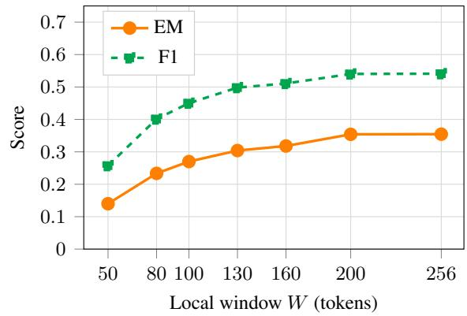  
Figure 5: Local window W sensitivity on SQuAD (fulldata setting, GPT2-Large, r = 4, Llama, $K = 3 0$ , 2000 validation samples). EM and F1 increase monotonically with W, plateauing at $W \geq 2 0 0$

## A.7 Denoising Threshold (τ ) Sensitivity

Figure 6 shows EM and F1 as a function of the graph-based context denoising threshold τ on SQuAD. The results reveal a binary pattern. At τ = 0 (no denoising), EM drops to 0.307 — a 19.9- point degradation relative to any denoising setting $( \tau \geq 0 . 0 2 , \mathrm { E M } = 0 . 5 0 7 )$ . This confirms that graphbased context denoising is critical for CME quality: without it, the ContextEncoder compresses all tokens including highly redundant ones, producing a noisier and less informative CME prefix. For $\tau \geq 0 . 0 2$ , EM and F1 are identical across all tested values (EM = 0.507, F1 = 0.739), with token retention stabilising at 14.0%. This plateau arises because the keep\_min\_every = 16 constraint – which forces retention of at least one token every 16 positions – becomes the binding constraint for $\tau \geq 0 . 0 2$ Once this floor dominates, the exact value of τ has no further effect on which tokens are retained. The default $\tau = 0 . 0 5$ is therefore well within the stable region and robust to any choice in the range [0.02, 0.20].

<table><tr><td>DecoderLLM</td><td>Model</td><td>ContextEncoder</td><td>r</td><td>EM</td><td>F1</td></tr><tr><td rowspan="3">Llama-3 8B-Instruct</td><td>Llama (baseline)</td><td></td><td></td><td>0.4410</td><td>0.6814</td></tr><tr><td rowspan="2">CMC</td><td>OPT-2.7B</td><td>2/4/8</td><td>0.4610/0.4650/0.4610</td><td>0.6554/0.6634/0.6619</td></tr><tr><td>OPT-1.3B GPT2-Large</td><td>2/4/8 2/4/8</td><td>0.4880/0.4810/0.4790 0.4960/0.4840/0.4610</td><td>0.6907/0.6933/0.6922 0.6934/0.6943/0.6619</td></tr><tr><td rowspan="4">Mistral-7B Instruct-v0.3</td><td>Mistral (baseline)</td><td></td><td></td><td>0.5300</td><td>0.7106</td></tr><tr><td rowspan="3">CMC</td><td></td><td></td><td></td><td></td></tr><tr><td>OPT-2.7B OPT-1.3B</td><td>2/4/8 2/4/8</td><td>0.4810/0.4910/0.4930 0.5260/0.4910/0.5380</td><td>0.6540/0.6668/0.6672 0.7042/0.6668/0.7169</td></tr><tr><td>GPT2-Large</td><td>2/4/8</td><td>0.4810/0.5360/0.5380</td><td>0.6544/0.7158/0.7169</td></tr><tr><td rowspan="4">Gemma-2 9B-IT</td><td>Gemma (baseline)</td><td></td><td></td><td>0.4010</td><td>0.6700</td></tr><tr><td rowspan="3">CMC</td><td>OPT-2.7B</td><td>2/4/8</td><td>0.4200/0.4200/0.4150</td><td>0.7059/0.7059/0.7020</td></tr><tr><td>OPT-1.3B</td><td>2/4/8</td><td>0.4200/0.4200/0.4150</td><td>0.7059/0.7059/0.7020</td></tr><tr><td>GPT2-Large</td><td>2/4/8</td><td>0.4200/0.4200/0.4150</td><td>0.7059/0.6949/0.6939</td></tr></table>

Table 7: EM and F1 results on HotpotQA (controlled-data setting).
<table><tr><td>DecoderLLM</td><td>Model</td><td>ContextEncoder</td><td>r</td><td>EM</td><td>F1</td></tr><tr><td rowspan="3">Llama-3 8B-Instruct</td><td>Llama (baseline)</td><td></td><td></td><td>0.2250</td><td>0.6383</td></tr><tr><td rowspan="2">CMC</td><td>OPT-2.7B</td><td>2/4/8</td><td>0.2950/0.2950/0.2950</td><td>0.6416/0.6416/0.6416</td></tr><tr><td>OPT-1.3B GPT2-Large</td><td>2/4/8 2/4/8</td><td>0.2900/0.2900/0.2900 0.2900/0.2900/0.2900</td><td>0.6412/0.6392/0.6392 0.6412/0.6392/0.6412</td></tr><tr><td rowspan="4">Mistral-7B Instruct-v0.3</td><td>Mistral (baseline)</td><td></td><td></td><td>0.1900</td><td>0.5761</td></tr><tr><td rowspan="3">CMC</td><td></td><td></td><td></td><td></td></tr><tr><td>OPT-2.7B OPT-1.3B</td><td>2/4/8 2/4/8</td><td>0.2150/0.2200/0.2150 0.2150/0.2200/0.2150</td><td>0.6238/0.6305/0.6238 0.6238/0.6305/0.6238</td></tr><tr><td>GPT2-Large</td><td>2/4/8</td><td>0.2150/0.2200/0.2150</td><td>0.6238/0.6305/0.6238</td></tr><tr><td rowspan="4">Gemma-2 9B-IT</td><td>Gemma (baseline)</td><td></td><td></td><td>0.1050</td><td>0.6209</td></tr><tr><td rowspan="3">CMC</td><td>OPT-2.7B</td><td>2/4/8</td><td>0.14/0.14/0.14</td><td>0.6323/0.6323/0.6323</td></tr><tr><td>OPT-1.3B</td><td>2/4/8</td><td>0.14/0.14/0.14</td><td>0.6323/0.6323/0.6323</td></tr><tr><td>GPT2-Large</td><td>2/4/8</td><td>0.14/0.14/0.14</td><td>0.6323/0.6323/0.6323</td></tr></table>

Table 8: EM and F1 results on CovidQA.

## A.8 Tier-2 Window Localization Analysis

In main experiments, the Tier-2 local window is centered using the gold answer character offset α provided by benchmark annotations, applied identically to both CMC and the baseline so that α is a controlled variable rather than information available only to CMC. While this is standard practice in extractive QA evaluation, α is unavailable at deployment time. Table 17 quantifies the performance gap between the oracle offset and three deployment-realistic alternatives on 2,000 validation samples from SQuAD and AdversarialQA (full-data setting) and HotpotQA (controlled-data setting) (GPT2-Large, r = 4, Llama, $K = 3 0 .$ W = 140). BM25 top-1 sentence (Robertson and Zaragoza, 2009) ranks context sentences by relevance to the question and uses the midpoint of the top-ranked sentence as α. CME-guided localization uses the character offset of the chunk that produced the highest-norm CME as α, requiring no external library. Midpoint heuristic always centres at $\alpha = | C | / 2$ , using no information about the question or answer at all.

<table><tr><td colspan="2"></td><td colspan="2"> $\overline { { r = 2 } }$ </td><td colspan="2"> $\overline { { r = 4 } }$ </td><td colspan="2"> $\overline { { r = 8 } }$ </td></tr><tr><td>DecoderLLM</td><td>ContextEncoder</td><td>EM</td><td>F1</td><td>EM</td><td>F1</td><td>EM</td><td>F1</td></tr><tr><td rowspan="3">Llama-3 8B-Instruct</td><td>OPT-2.7B</td><td>0.4468</td><td>0.6603</td><td>0.4485</td><td>0.6709</td><td>0.4475</td><td>0.6701</td></tr><tr><td>OPT-1.3B</td><td>0.4522</td><td>0.6690</td><td>0.4512</td><td>0.6777</td><td>0.4507</td><td>0.6771</td></tr><tr><td>GPT2-Large</td><td>0.4535</td><td>0.6696</td><td>0.4530</td><td>0.6783</td><td>0.4457</td><td>0.6692</td></tr><tr><td rowspan="3">Mistral-7B Instruct-v0.3</td><td>OPT-2.7B</td><td>0.3937</td><td>0.6264</td><td>0.4075</td><td>0.6380</td><td>0.4070</td><td>0.6363</td></tr><tr><td>OPT-1.3B</td><td>0.4050</td><td>0.6390</td><td>0.4075</td><td>0.6380</td><td>0.4183</td><td>0.6488</td></tr><tr><td>GPT2-Large</td><td>0.3940</td><td>0.6271</td><td>0.4200</td><td>0.6511</td><td>0.4178</td><td>0.6487</td></tr><tr><td rowspan="3">Gemma-2 9B-IT</td><td>OPT-2.7B</td><td>0.3837</td><td>0.6851</td><td>0.3845</td><td>0.6862</td><td>0.3835</td><td>0.6853</td></tr><tr><td>OPT-1.3B</td><td>0.3837</td><td>0.6851</td><td>0.3845</td><td>0.6862</td><td>0.3832</td><td>0.6852</td></tr><tr><td>GPT2-Large</td><td>0.3835</td><td>0.6850</td><td>0.3845</td><td>0.6835</td><td>0.3832</td><td>0.6832</td></tr><tr><td colspan="2">Overall average</td><td>0.4107</td><td>0.6607</td><td>0.4157</td><td>0.6678</td><td>0.4152</td><td>0.6671</td></tr></table>

Table 9: Average EM and F1 across four datasets (SQuAD, AdversarialQA, HotpotQA, CovidQA) under controlleddata setting, grouped by DecoderLLM, ContextEncoder, and compression rate $r \in \{ 2 , 4 , 8 \}$ . Bold denotes the best average per DecoderLLM–ContextEncoder pair.

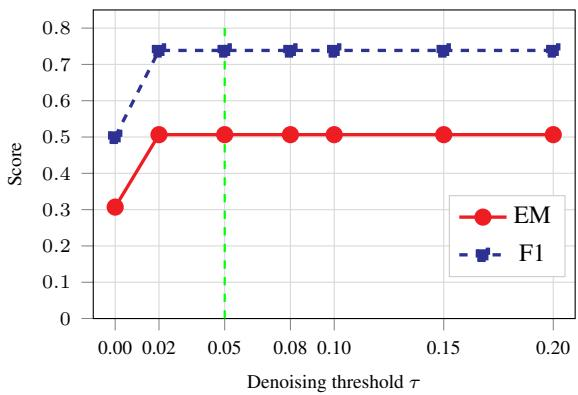  
Figure 6: Denoising threshold τ sensitivity on SQuAD (full-data setting, GPT2-Large, $r = 4 ,$ , Llama, $K = 3 0 ,$ $W = 1 4 0 , 2 , 0 0 0$ validation samples). No denoising $( \tau = 0 )$ reduces EM by 19.9 points. For $\tau \geq 0 . 0 2$ , EM and F1 are identical as the keep\_min\_every= 16 floor becomes the binding constraint. The default $\tau = 0 . 0 5$ (dashed line) lies within the stable region.

On SQuAD, oracle-free localization stays close to the oracle: BM25 costs only 0.4 EM points (∆EM = −0.004, 99% retention), CME-guided costs 2.0 points (−0.020, 95%), and even the midpoint heuristic retains 91% of oracle EM. HotpotQA shows the same pattern, and more strongly: BM25, CME-guided, and the midpoint heuristic all retain 97–98% of oracle EM, with CME-guided (0.415) and the midpoint heuristic (0.414) essentially matching BM25 (0.412). We attribute this robustness to HotpotQA’s multi-hop structure, where answer-supporting evidence is distributed across multiple passages rather than concentrated at a single span. AdversarialQA shows the largest oracle dependence (−0.052 to −0.069, 78–84% retention), consistent with its adversarially constructed questions being designed to resist the shallow lexical and positional cues that BM25 and the midpoint heuristic rely on. These experimental results show that CMC’s Tier-2 benefit comes from the presence of a local context window, not from privileged access to the gold answer location: oracle-free localization retains the large majority of oracle performance (78−99%) across single-hop, adversarial, and multi-hop QA datasets.

## A.9 Case Study

Table 18 presents four representative examples from the SQuAD validation set illustrating the behaviour of CMC relative to the baseline across four outcome categories. Case 1 shows a straightforward factual question where both CMC and the baseline correctly extract the gold answer (oxides), confirming that CMC preserves answer quality on simple single-token spans. Case 2 demonstrates a clear CMC advantage. The context contains two monetary figures — £43 million (the original gallery budget) and £76 million (the revised cost estimate). The baseline anchors to the more prominent earlier mention and returns the incorrect figure. The CME prefix supplies sufficient global context for CMC to distinguish between the two figures and return the correct answer. Case 3 illustrates a limitation of CMC. Both CMC and the baseline locate the correct passage, but CMC produces 1979 rather than the gold June 1979, losing the month through compression. This suggests that fine-grained temporal spans are susceptible to information loss when the relevant token is not well-represented in the CME prefix. Case 4 shows a partial improvement. The gold answer is a full sentence (The city’s residents fled to the north), which neither model matches exactly. The baseline retrieves only the north (F1 = 0.40), while CMC retrieves to the north (F1 = 0.55), a longer span that better overlaps with the gold answer. This illustrates that CMC can improve partial answer coverage even when an exact match is not achieved.

<table><tr><td>Samples</td><td>Model</td><td> $T$ </td><td>Com. (s)</td><td>Pre. (s)</td><td>Dec. (s)</td><td>Total (s)</td></tr><tr><td rowspan="7">256</td><td>Baseline</td><td>512</td><td></td><td>7.61</td><td>1,535.77</td><td>1,543.38</td></tr><tr><td>CMC Baseline</td><td></td><td>6.29</td><td>6.79</td><td>1,464.63</td><td>1,477.71</td></tr><tr><td>CMC</td><td>1024</td><td>6.21</td><td>7.71</td><td>3,194.18</td><td>3,201.91</td></tr><tr><td>Baseline</td><td></td><td></td><td>6.87 7.40</td><td>2,930.89</td><td>2,943.98</td></tr><tr><td>CMC</td><td>2048</td><td>6.60</td><td>6.31</td><td>5,815.22 5,067.51</td><td>5,822.62</td></tr><tr><td>Baseline</td><td>3000</td><td></td><td>7.61</td><td>10,717.09</td><td>5,080.43 10,724.70</td></tr><tr><td>CMC</td><td></td><td>6.50</td><td>6.89</td><td>8,576.12</td><td>8,589.51</td></tr><tr><td rowspan="7">512</td><td>Baseline</td><td>512</td><td></td><td>16.60</td><td>2,574.88</td><td>2,591.49</td></tr><tr><td>CMC</td><td></td><td>12.78</td><td>16.59</td><td>2,445.59</td><td>2,474.97</td></tr><tr><td>Baseline</td><td>1024</td><td></td><td>17.51</td><td>5,353.99</td><td>5,371.51</td></tr><tr><td>CMC</td><td></td><td>12.96</td><td>12.61</td><td>4,931.13</td><td>4,956.70</td></tr><tr><td>Baseline</td><td>2048</td><td></td><td>14.88</td><td>11,639.93</td><td>11,654.82</td></tr><tr><td>CMC</td><td></td><td>13.49</td><td>12.74</td><td>10,496.74</td><td>10,522.99</td></tr><tr><td>Baseline CMC</td><td>3000</td><td></td><td>17.67</td><td>18,233.12</td><td>18,250.79</td></tr><tr><td rowspan="8">1000</td><td></td><td></td><td>12.82</td><td>15.07</td><td>14,312.29</td><td>14,340.18</td></tr><tr><td>Baseline</td><td>512</td><td></td><td>31.57</td><td>6,011.68</td><td>6,043.28</td></tr><tr><td>CMC</td><td></td><td>25.14</td><td>26.94</td><td>5,711.32</td><td>5,763.45</td></tr><tr><td>Baseline CMC</td><td>1024</td><td></td><td>31.46</td><td>12,498.05</td><td>12,529.52</td></tr><tr><td></td><td></td><td>25.26</td><td>27.11</td><td>11,451.62</td><td>11,504.01</td></tr><tr><td>Baseline</td><td>2048</td><td></td><td>31.62</td><td>26,954.16</td><td>26,985.80</td></tr><tr><td>CMC</td><td></td><td>25.51</td><td>27.75</td><td>22,958.75</td><td>23,012.03</td></tr><tr><td>Baseline CMC</td><td>3000</td><td>25.69</td><td>31.37 27.13</td><td>41,931.82 33,508.74</td><td>41,963.20 33,561.58</td></tr></table>

Table 10: Stage-wise inference time (seconds) for Llama-3-8B-Instruct on SQuAD across three sample sizes (GPT2-Large ContextEncoder, $r = 4$ , batch size 8). Com. = compression; Pre. = prefill; Dec. = decode. Baseline compression time is zero.

<table><tr><td>Samples</td><td>Model</td><td> $T$ </td><td>Com. (kWh)</td><td>Pre. (kWh)</td><td>Dec. (kWh)</td><td>Total (kWh)</td></tr><tr><td rowspan="7">256</td><td>Baseline</td><td>512</td><td></td><td>0.0012</td><td>0.2392</td><td>0.2404</td></tr><tr><td>CMC</td><td></td><td>0.0010</td><td>0.0011</td><td>0.2278</td><td>0.2298</td></tr><tr><td>Baseline CMC</td><td>1024</td><td></td><td>0.0012</td><td>0.4966</td><td>0.4978</td></tr><tr><td></td><td></td><td>0.0010</td><td>0.0011</td><td>0.4555</td><td>0.4576</td></tr><tr><td>Baseline</td><td>2048</td><td></td><td>0.0017</td><td>1.3063</td><td>1.3079</td></tr><tr><td>CMC Baseline</td><td rowspan="2">3000</td><td>0.0014</td><td>0.0013</td><td>1.0681</td><td>1.0709</td></tr><tr><td>CMC</td><td>0.0010</td><td>0.0012 0.0011</td><td>1.7187 1.3696</td><td>1.7200 1.3718</td></tr><tr><td rowspan="7">512</td><td>Baseline</td><td>512</td><td></td><td>0.0038</td><td>0.5900</td><td>0.5938</td></tr><tr><td>CMC</td><td></td><td>0.0029</td><td>0.0037</td><td>0.5496</td><td>0.5562</td></tr><tr><td>Baseline</td><td>1024</td><td></td><td>0.0040</td><td>1.2227</td><td>1.2267</td></tr><tr><td>CMC</td><td rowspan="2">2048</td><td>0.0029</td><td>0.0028</td><td>1.1025</td><td>1.1082</td></tr><tr><td>Baseline</td><td></td><td>0.0033</td><td>2.6022</td><td>2.6056</td></tr><tr><td>CMC</td><td></td><td>0.0028</td><td>0.0027</td><td>2.2001</td><td>2.2056</td></tr><tr><td>Baseline CMC</td><td rowspan="2">3000</td><td></td><td>0.0040</td><td>4.0996</td><td>4.1036</td></tr><tr><td></td><td></td><td>0.0028</td><td>0.0033</td><td>3.1068</td><td>3.1128</td></tr><tr><td rowspan="7">1000</td><td>Baseline</td><td>512</td><td></td><td>0.0050</td><td>0.9514</td><td>0.9564</td></tr><tr><td>CMC Baseline</td><td rowspan="2">1024</td><td>0.0040</td><td>0.0043</td><td>0.9043</td><td>0.9125</td></tr><tr><td></td><td></td><td>0.0050</td><td>1.9723</td><td>1.9773</td></tr><tr><td>CMC</td><td rowspan="2">2048</td><td>0.0040</td><td>0.0043</td><td>1.8009</td><td>1.8092</td></tr><tr><td>Baseline</td><td></td><td>0.0050</td><td>4.2575</td><td>4.2625</td></tr><tr><td>CMC</td><td rowspan="2"></td><td>0.0040</td><td>0.0044</td><td>3.6124</td><td>3.6208</td></tr><tr><td>Baseline</td><td></td><td>0.0050</td><td>6.7204</td><td>6.7254</td></tr><tr><td></td><td>CMC</td><td>3000</td><td>0.0041</td><td>0.0043</td><td>5.3538</td><td>5.3623</td></tr></table>

Table 11: Stage-wise energy consumption (kWh) for Llama-3-8B-Instruct on SQuAD across three sample sizes (GPT2-Large ContextEncoder, $r = 4$ , batch size 8). Stage-wise energy is apportioned proportionally to wall-clock time.

<table><tr><td>Samples</td><td>Model</td><td> $T$ </td><td>Com. (s)</td><td>Pre. (s)</td><td>Dec. (s)</td><td>Total (s)</td></tr><tr><td rowspan="8">256</td><td>Baseline</td><td>512</td><td></td><td>8.64</td><td>1,537.28</td><td>1,545.92</td></tr><tr><td>CMC</td><td></td><td>6.42</td><td>7.27</td><td>1,461.70</td><td>1,475.39</td></tr><tr><td>Baseline CMC</td><td>1024</td><td></td><td>8.44</td><td>3,190.70</td><td>3,199.14</td></tr><tr><td>Baseline</td><td></td><td>6.33</td><td>7.03</td><td>2,919.23</td><td>2,932.59</td></tr><tr><td>CMC</td><td>2048</td><td>6.41</td><td>8.47</td><td>6,864.73</td><td>6,873.19</td></tr><tr><td>Baseline</td><td></td><td></td><td>6.94</td><td>5,846.33</td><td>5,859.69</td></tr><tr><td>CMC</td><td>3000</td><td>6.42</td><td>8.86 6.21</td><td>9,094.45</td><td>9,103.32</td></tr><tr><td></td><td></td><td></td><td></td><td>7,429.81</td><td>7,442.45</td></tr><tr><td rowspan="8">512</td><td>Baseline CMC</td><td>512</td><td></td><td>16.73</td><td>3,061.61</td><td>3,078.34</td></tr><tr><td>Baseline</td><td></td><td>12.08</td><td>14.14</td><td>2,911.43</td><td>2,937.66</td></tr><tr><td>CMC</td><td>1024</td><td></td><td>16.75</td><td>5,415.73</td><td>5,432.49</td></tr><tr><td>Baseline</td><td></td><td>12.94</td><td>12.42</td><td>5,179.11</td><td>5,204.47</td></tr><tr><td>CMC</td><td>2048</td><td>13.03</td><td>15.98</td><td>11,465.26</td><td>11,481.24</td></tr><tr><td>Baseline</td><td></td><td></td><td>12.34</td><td>10,250.06</td><td>10,275.45</td></tr><tr><td>CMC</td><td>3000</td><td>12.91</td><td>15.54</td><td>18,180.74</td><td>18,196.29</td></tr><tr><td>Baseline</td><td></td><td></td><td>13.25</td><td>14,883.97</td><td>14,910.14</td></tr><tr><td rowspan="7">1000</td><td></td><td>512</td><td></td><td>33.08</td><td>5,179.30</td><td>5,212.39</td></tr><tr><td>CMC</td><td></td><td>26.00</td><td>28.63</td><td>5,058.98</td><td>5,113.63</td></tr><tr><td>Baseline</td><td>1024</td><td></td><td>31.34</td><td>10,657.52</td><td>10,688.87</td></tr><tr><td>CMC</td><td></td><td>27.17</td><td>24.45</td><td>10,295.92</td><td>10,347.56</td></tr><tr><td>Baseline</td><td>2048</td><td></td><td>34.24</td><td>26,854.94</td><td>26,889.19</td></tr><tr><td>CMC</td><td></td><td>24.87</td><td>28.05</td><td>22,832.35</td><td>22,885.29</td></tr><tr><td>Baseline CMC</td><td>3000</td><td>26.09</td><td>34.29 27.79</td><td>41,807.04 33,354.42</td><td>41,841.34 33,408.33</td></tr></table>

Table 12: Stage-wise inference time (seconds) for Mistral-7B-Instruct-v0.3 on SQuAD across three sample sizes (GPT2-Large ContextEncoder, r = 4, batch size 8). Com. = compression; Pre. = prefill; Dec. = decode.

<table><tr><td>Samples</td><td>Model</td><td>T</td><td>Com. (kWh)</td><td>Pre. (kWh)</td><td>Dec. (kWh)</td><td>Total (kWh)</td></tr><tr><td rowspan="7">256</td><td>Baseline</td><td>512</td><td></td><td>0.0014</td><td>0.2464</td><td>0.2478</td></tr><tr><td>CMC</td><td></td><td>0.0010</td><td>0.0012</td><td>0.2335</td><td>0.2357</td></tr><tr><td>Baseline CMC</td><td>1024</td><td>0.0010</td><td>0.0014</td><td>0.5199</td><td>0.5213</td></tr><tr><td></td><td></td><td></td><td>0.0011</td><td>0.4727</td><td>0.4749</td></tr><tr><td>Baseline CMC</td><td rowspan="2">2048</td><td></td><td>0.0014</td><td>1.1076</td><td>1.1089</td></tr><tr><td></td><td>0.0010</td><td>0.0011</td><td>0.9351</td><td>0.9373</td></tr><tr><td>Baseline CMC</td><td>3000</td><td>0.0013</td><td>0.0020</td><td>2.0874</td><td>2.0895</td></tr><tr><td rowspan="7">512</td><td>Baseline</td><td rowspan="2"></td><td></td><td>0.0013</td><td>1.6039</td><td>1.6066</td></tr><tr><td>512</td><td></td><td>0.0027</td><td>0.4966</td><td>0.4993</td></tr><tr><td>CMC Baseline</td><td rowspan="2">1024</td><td>0.0020</td><td>0.0023</td><td>0.4713</td><td>0.4756</td></tr><tr><td>CMC</td><td>0.0028</td><td>0.0037</td><td>1.1919</td><td>1.1956</td></tr><tr><td>Baseline</td><td rowspan="2">2048</td><td></td><td>0.0027 0.0037</td><td>1.1356</td><td>1.1411</td></tr><tr><td>CMC</td><td>0.0027</td><td>0.0026</td><td>2.6172 2.1315</td><td>2.6209</td></tr><tr><td>Baseline</td><td rowspan="2">3000</td><td></td><td>0.0036</td><td>4.1707</td><td>2.1367</td></tr><tr><td>CMC</td><td>0.0028</td><td>0.0029</td><td>3.2180</td><td>4.1743 3.2237</td></tr><tr><td rowspan="7">1000</td><td>Baseline CMC</td><td rowspan="2"></td><td></td><td>0.0072</td><td></td><td></td></tr><tr><td>512</td><td>0.0054</td><td></td><td>1.1238</td><td>1.1310</td></tr><tr><td>Baseline</td><td rowspan="2">1024</td><td></td><td>0.0060 0.0068</td><td>1.0550 2.3237</td><td>1.0664 2.3306</td></tr><tr><td>CMC</td><td>0.0055</td><td>0.0050</td><td>2.1009</td><td>2.1115</td></tr><tr><td>Baseline</td><td rowspan="2">2048</td><td></td><td>0.0055</td><td>4.3293</td><td>4.3349</td></tr><tr><td>CMC</td><td>0.0040</td><td>0.0045</td><td>3.6503</td><td>3.6587</td></tr><tr><td>Baseline</td><td rowspan="2">3000</td><td></td><td>0.0056</td><td>6.7946</td><td>6.8001</td></tr><tr><td>CMC</td><td>0.0042</td><td>0.0044</td><td>5.3397</td><td>5.3483</td></tr></table>

Table 13: Stage-wise energy consumption (kWh) for Mistral-7B-Instruct-v0.3 on SQuAD across three sample sizes (GPT2-Large ContextEncoder, r = 4, batch size 8). Stage-wise energy is apportioned proportionally to wall-clock time.

<table><tr><td colspan="3"></td><td colspan="2">Peak Alloc. (GB)</td><td colspan="2">Peak Res. (GB)</td></tr><tr><td>Samples</td><td>Model</td><td>T</td><td>Base</td><td>CMC</td><td>Base</td><td>CMC</td></tr><tr><td rowspan="4">256</td><td rowspan="4">Baseline VS CMC</td><td>512</td><td>10.033</td><td>8.916</td><td>11.234</td><td>9.742</td></tr><tr><td>1024</td><td>9.968</td><td>8.848</td><td>11.125</td><td>9.742</td></tr><tr><td>2048</td><td>9.970</td><td>8.806</td><td>11.100</td><td>9.717</td></tr><tr><td>3000</td><td>10.151</td><td>8.848</td><td>15.332</td><td>9.742</td></tr><tr><td rowspan="4">512</td><td>Baseline</td><td>512</td><td>10.018</td><td>8.850</td><td>11.172</td><td>9.807</td></tr><tr><td>VS</td><td>1024</td><td>10.027</td><td>8.859</td><td>12.436</td><td>11.381</td></tr><tr><td>CMC</td><td>2048</td><td>10.018</td><td>8.850</td><td>11.172</td><td>9.807</td></tr><tr><td></td><td>3000</td><td>10.160</td><td>8.850</td><td>18.617</td><td>9.807</td></tr><tr><td rowspan="4">1000</td><td>Baseline</td><td>512</td><td>10.017</td><td>8.853</td><td>11.197</td><td>9.836</td></tr><tr><td>VS</td><td>1024</td><td>10.017</td><td>8.853</td><td>11.197</td><td>9.836</td></tr><tr><td>CMC</td><td>2048</td><td>10.017</td><td>8.853</td><td>11.199</td><td>9.838</td></tr><tr><td></td><td>3000</td><td>10.159</td><td>8.853</td><td>19.689</td><td>9.836</td></tr><tr><td rowspan="4">256</td><td rowspan="4">Baseline VS CMC</td><td>512</td><td>9.052</td><td>8.432</td><td>10.197</td><td>9.084</td></tr><tr><td>1024</td><td>9.266</td><td>8.434</td><td>10.346</td><td>9.084</td></tr><tr><td>2048</td><td>10.203</td><td>8.434</td><td>14.162</td><td>9.084</td></tr><tr><td>3000</td><td>11.075</td><td>8.397</td><td>24.262</td><td>9.082</td></tr><tr><td rowspan="4">512</td><td>Baseline</td><td>512</td><td>9.073</td><td>8.449</td><td>10.434</td><td>9.146</td></tr><tr><td rowspan="3">VS CMC</td><td>1024</td><td>9.276</td><td>8.431</td><td>10.328</td><td>9.082</td></tr><tr><td>2048</td><td>10.192</td><td>8.431</td><td>14.125</td><td>9.082</td></tr><tr><td>3000</td><td>11.085</td><td>8.431</td><td>24.262</td><td>9.082</td></tr><tr><td rowspan="4">1000</td><td>Baseline</td><td>512</td><td>9.074</td><td>8.431</td><td>10.221</td><td>9.082</td></tr><tr><td>VS</td><td>1024</td><td>9.276</td><td>8.431</td><td>10.328</td><td>9.082</td></tr><tr><td>CMC</td><td>2048</td><td>10.213</td><td>8.449</td><td>14.166</td><td>9.109</td></tr><tr><td></td><td>3000</td><td>11.084</td><td>8.449</td><td>24.303</td><td>9.109</td></tr></table>

Table 14: Peak allocated and peak reserved GPU memory (GB) for Llama-3-8B-Instruct on SQuAD (GPT2-Large, r = 4, batch size 8). Peak allocated memory is measured via torch.cuda.max\_memory\_allocated() and peak reserved memory via torch.cuda.max\_memory\_reserved().

Table 15: Peak allocated and peak reserved GPU memory (GB) for Mistral-7B-Instruct-v0.3 on SQuAD (GPT2- Large, r = 4, batch size 8). Peak reserved memory is measured via torch.cuda.max\_memory\_reserved().

<table><tr><td>Dataset</td><td>Decoder</td><td>Baseline</td><td>CMC</td><td>Reduction</td></tr><tr><td rowspan="3">SQuAD</td><td>Llama</td><td>1.61</td><td>1.12</td><td>30.6%</td></tr><tr><td>Mistral</td><td>1.82</td><td>1.12</td><td>38.1%</td></tr><tr><td>Gemma</td><td>3.00</td><td>2.01</td><td>33.0%</td></tr><tr><td rowspan="3">AdversarialQA</td><td>Llama</td><td>0.71</td><td>0.55</td><td>22.0%</td></tr><tr><td>Mistral</td><td>0.77</td><td>0.56</td><td>27.4%</td></tr><tr><td>Gemma</td><td>2.58</td><td>1.94</td><td>24.9%</td></tr><tr><td rowspan="3">HotpotQA</td><td>Llama</td><td>0.60</td><td>0.56</td><td>6.6%</td></tr><tr><td>Mistral</td><td>0.72</td><td>0.35</td><td>51.3%</td></tr><tr><td>Gemma</td><td>1.56</td><td>1.43</td><td>8.3%</td></tr></table>

Table 16: Estimated attention MACs (Billion) for CMC vs. the baseline (r = 4, W = 130, K = 40).

<table><tr><td>Dataset</td><td>Tier-2 localisation</td><td>EM</td><td>F1</td><td>ΔEM</td></tr><tr><td rowspan="4">SQuAD</td><td>Oracle (α from annotations)</td><td>0.408</td><td>0.591</td><td></td></tr><tr><td>BM25 top-1 sentence</td><td>0.404</td><td>0.585</td><td>-0.004</td></tr><tr><td>CME-guided (top-1 CME chunk)</td><td>0.388</td><td>0.556</td><td>-0.020</td></tr><tr><td>Midpoint heuristic</td><td>0.373</td><td>0.533</td><td>-0.035</td></tr><tr><td rowspan="4">AdversarialQA</td><td>Oracle</td><td>0.321</td><td>0.501</td><td></td></tr><tr><td>BM25</td><td>0.269</td><td>0.428</td><td>-0.052</td></tr><tr><td>CME-guided</td><td>0.264</td><td>0.405</td><td>-0.057</td></tr><tr><td>Midpoint heuristic</td><td>0.252</td><td>0.389</td><td>-0.069</td></tr><tr><td rowspan="4">HotpotQA</td><td>Oracle</td><td>0.423</td><td>0.634</td><td></td></tr><tr><td>BM25</td><td>0.412</td><td>0.621</td><td>-0.011</td></tr><tr><td>CME-guided</td><td>0.415</td><td>0.622</td><td>-0.008</td></tr><tr><td>Midpoint heuristic</td><td>0.414</td><td>0.624</td><td>-0.009</td></tr></table>

Table 17: Effect of Tier-2 window localization method on SQuAD (full-data), AdversarialQA (full-data), and HotpotQA (controlled-data) (GPT2-Large, r = 4, Llama, K = 30, W = 140, 2,000 validation samples per dataset). ∆EM is relative to the oracle within each dataset.

<table><tr><td>Case 1</td><td>Both Win (Baseline√ / CMC√)</td></tr><tr><td colspan="2">Question: What is the usual form of oxygen bound compounds?</td></tr><tr><td>Gold answer: oxides</td><td></td></tr><tr><td>Baseline: oxides CMC: oxides</td><td> $\mathrm { E M } = 1 / \mathrm { F } 1 = 1 . 0 0$   $\mathrm { E M } = 1 / \mathrm { F } 1 = 1 . 0 0$ </td></tr><tr><td colspan="2">Context: Due to its electronegativity, oxygen forms chemical bonds with almost all other elements to give</td></tr><tr><td>oxides of the transition metals are non-stoichiometric compounds, with slightly less metal than the chemical formula would show. For example, the mineral FeO (wüstite) is written as Fe 1 - xO, where x is usually around 0.05. Case 2 CMC wins (BaselineX / CMC√)</td><td></td></tr><tr><td colspan="2">Question: What is the estimated cost of the V&amp;A branded gallery?</td></tr><tr><td>Gold answer: £76 million</td><td></td></tr><tr><td>Baseline: £43 million</td><td> $\mathrm { E M } = 0 / \mathrm { F 1 } = 0 . 5 0$   $\mathrm { E M } = 1 / \mathrm { F } 1 = 1 . 0 0$ </td></tr><tr><td colspan="2">CMC: £76 million Context: The V&amp;A is in discussion with the University of Dundee, University of Abertay, Dundee City Council</td></tr><tr><td>and the Scottish Government with a view to opening a new £43 million gallery in Dundee that would use the V&amp;A brand although it would be funded through and operated independently. As of 2015, with costs estimated at £76 million, it is the most expensive gallery project ever undertaken in Scotland. The V&amp;A Dundee will be on the city&#x27;s waterfront and is intended to focus on fashion, architecture, product design, graphic arts and photography. It is planned that it could open within five years. Dundee City Council is expected to pay a major part of the running costs. The V&amp;A is not contributing financially, but will be providing expertise, loans and</td><td></td></tr><tr><td colspan="2">exhibitions. Case 3 Baseline wins (Baseline√ / CMCX)</td></tr><tr><td>Question: When was 7 Lincoln Square completed?</td><td></td></tr><tr><td colspan="2">Gold answer: June 1979</td></tr><tr><td>Baseline: June 1979</td><td> $\mathrm { E M } = 1 / \mathrm { F } 1 = 1 . 0 0$   $\mathrm { E M } = 0 / \mathrm { F 1 } = 0 . 6 7$ </td></tr><tr><td colspan="2">CMC: 1979 Context: Meanwhile, ABC News, which formed as a newly separate division, sought to become a global leader</td></tr><tr><td colspan="2">president of ABC Sports. That same year, ABC launched a major expansion of its office facilities in New York City. The company first constructed a new 10-story building on land previously occupied by an abandoned warehouse on the corner of Columbus Avenue and West 66th Street; the facility that was built in its place is nicknamed &quot;7 Lincoln Square&quot; (although it is actually located at 149 Columbus Avenue). Meanwhile, a former parking lot, located at 30 West 67th Street, was transformed into an impressive 15-story building. Both buildings were completed in June 1979. WABC-TV moved its operations from offices at 77 West 66th Street to 149</td></tr><tr><td>Columbus Avenue, freeing up space for the ABC network to house some of its operations. Case 4</td><td>CMC partial gain (Baseline~ / CMC~)</td></tr><tr><td colspan="2">Question: Where did the residents of Antioch flee to?</td></tr><tr><td>Gold answer: The city&#x27;s residents fled to the north Baseline: the north</td><td> $\mathrm { E M } = 0 / \mathrm { F } 1 = 0 . 4 0$ </td></tr><tr><td colspan="2">CMC: to the north  $\operatorname { E M } = 0 / \operatorname { F 1 } = 0 . 5 5$  Context: The plague struck various countries in the Middle East during the pandemic, leading to serious</td></tr><tr><td colspan="2">depopulation and permanent change in both economic and social structures. As it spread to western Europe, the disease entered the region from southern Russia also. By autumn 1347, the plague reached Alexandria in Egypt, probably through the port&#x27;s trade with Constantinople, and ports on the Black Sea. During 1347, the disease travelled eastward to Gaza, and north along the eastern coast to cities in Lebanon, Syria and Palestine, including Ashkelon, Acre, Jerusalem, Sidon, Damascus, Homs, and Aleppo. In 1348–49, the disease reached Antioch. The</td></tr></table>

Table 18: Qualitative case study on SQuAD validation set (full-data setting, GPT2-Large, r = 4, Llama). Baseline receives the local context window without compression. Gold answers are shown in blue, correct predictions in green, and incorrect predictions in red. EM and F1 are per-example scores.