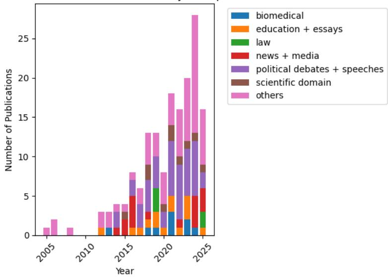
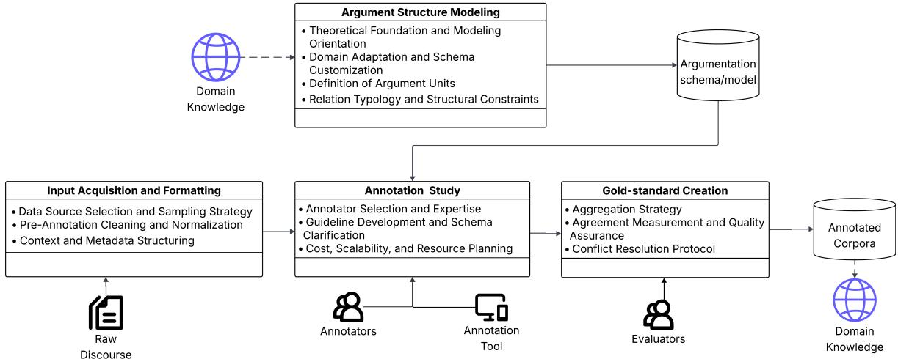
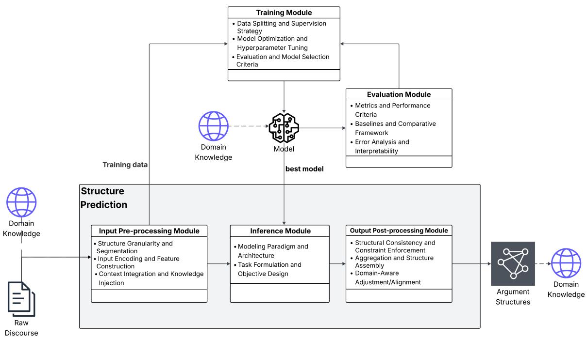

# Designing and Analysing Argument Mining Pipelines: Towards a Comprehensive Assessment

Siddharth Bhargava Fondazione Bruno Kessler, Trento, Italy Universidade da Coruña, A Coruña, Spain sbhargava@fbk.eu

Sara Tonelli Fondazione Bruno Kessler, Trento, Italy satonelli@fbk.eu

Patricia Martín-Rodilla IEGPS-CSIC, Spanish National Research Council, Santiago de Compostela, Spain p.m.rodilla@iegps.csic.es

## Abstract

Argument Mining (AM) transforms natural language into its underlying argument structures. This transformation is typically realized through a sequence of AM tasks that form an end-to-end AM pipeline. However, AM approaches often difer in how they conceptualize these tasks, making direct comparisons between them dificult and opaque. This calls for a more nuanced, task-level analysis of AM approaches to enable clearer comparison and assessment.

This work presents a preliminary meta-study that systematically reviews several state-of-theart end-to-end AM works and analyzes their pipelines through a triple-perspective framework— a linguistic, computational and domain perspective—to understand how the pipelines model arguments as structures, computes them, and integrates domain knowledge. We further propose a general design to the linguistic and computational perspectives, illustrating how key AM tasks are designed for modeling and computation of argument structures. Our proposed framework lays the groundwork for methodology-centered descriptions across AM approaches, facilitating deeper understanding and more systematic comparisons in future research.

## 1 Introduction

Argument Mining (AM) is a sub-field of computational argumentation concerned with the automated transformation of natural language into structured argument representations [5, 38]. Early work in AM typically concentrated on individual tasks—such as detecting argument units [39, 65] or classifying argumentative relations [26]—reflecting the high costs of annotation and data collection in argumentation. While such single-task approaches have achieved strong performance [5], they provide only a narrow and fragmented view of argumentative discourse. Recent advances in resource-eficient natural language processing (NLP) methods, coupled with the availability of large-scale corpora [35], have shifted attention toward end-to-end AM approaches that cover the entire transformation process from raw discourse to complete argument structures [53].

This shift has also enabled AM to expand beyond single-purpose tasks and into a wide range of applications and research domains. Improvements in long-context reasoning and discourse modeling now make it feasible to generate argument structures from longer and more diverse texts. This has resulted in increased integration of AM not only in downstream NLP tasks—such as opinion mining [4, 13], stance classification [3], fact-checking [68], and quality assessment [17, 30]—but also across a variety of research domains, including law [2, 55], political science and sociology [18], bio-science [44, 58], and discourse analysis [24]. In parallel, practical applications of AM are also expanding, particularly in areas that require logical reasoning [30], dialogical interaction [24], and decision-making [7]. The increased attention on AM motivates closer investigation into how AM approaches are generally conceived and practiced across domains and applications.

One common way to represent end-to-end AM is through high-level task representations that show how the transformation is operationalized. These representations, often referred to as argument mining pipelines [34, 60, 71], outline the tasks involved and their arrangement, providing a systemlevel view of how discourse is transformed into structured arguments. Yet pipelines have typically been presented only at the level of listing tasks, without deeper examination of how those tasks are ordered, how they interact, or what role they play in the conceptualization of the AM process itself. Furthermore, the tasks themselves are not standardized, difering in name, functionality, and application. This highlights the need for a more systematic review of the pipelines—one that investigates not only which tasks are included, but also how they are organized and what role they serve in the AM pipeline.

For this efort, we introduce the following working definition:

“An argument mining pipeline is an executable realization of an end-to-end argument mining that illustrates what tasks are required to transform raw discourse into a well-defined argument structure.”

Analyzing Argument Mining (AM) pipelines is challenging not only because of the complexity of the subtasks required to construct argument structures, but also due to the inherently multidisciplinary nature of the field. AM operates at the intersection of three principal disciplines: argumentation theory, computational methods, and domain knowledge. Argumentation theory formulates the identification, extraction, and structuring of argumentative content in discourse, while computational methods enable the automation of these processes at scale. Domain knowledge, in turn, contextualizes argument structures and supports knowledge discovery from argumentative interactions. Building on prior work that conceptualizes AM as sequences of tasks [8], we propose to reinterpret AM pipelines through a complementary, non-sequential lens organized around three core objectives: modeling, computation, and domain integration. Accordingly, our study analyzes AM pipelines using a triple-perspective approach:

• the linguistic perspective, how pipelines conceptualize and represent argument structures;

• the computational perspective, how pipelines automate and compute argument structures; and

• the domain perspective, how pipelines integrate domain knowledge into its design and application.

Using this framework, we conduct a systematic review of representative end-to-end AM approaches, identifying core design choices and patterns in how argument structures are modeled, computed, and contextualized. Our goal is to provide a macro-level analytical basis for understanding and comparing contemporary AM pipelines.

## 2 Related Work

Existing meta-level surveys on Argument Mining (AM) have primarily organized the field around datasets [10, 40], task taxonomies [32], or application domains [67]. While these works have been instrumental in mapping the development of AM, they typically examine individual dimensions of the field rather than the design of complete pipelines.

In practice, AM operates as a structured process that transforms raw discourse into argument representations composed of argument units (e.g., claims, premises) connected by argument relations (e.g., support, attack). This transformation is realized through AM pipelines, whose design choices—such as how tasks are defined, ordered, and integrated—directly afect system behavior, interpretability and applicability. Despite this central role, there has been limited standardized macrolevel analysis of how pipelines are designed or how their methodological choices can be systematically compared. As a result, the conceptual, computational, and contextual dimensions of AM systems are often evaluated in isolation.

Earlier eforts have partially acknowledged this. For example, Budzynska and Villata [8] distinguished between linguistic modeling and computational realization of argument structures, framing AM as a process of resource construction followed by automation. However, pipeline designs have become increasingly diverse, expanding both the linguistic modeling and the computational landscape. A shift from predominantly theory-driven modeling toward more data-driven approaches is evident, accompanied by rapid advances in neural and language modeling techniques. Joint neural architectures now integrate unit detection and relation classification within shared representations [15, 47]; knowledge-enriched systems incorporate discourse cues and domain ontologies [1, 25]; and recent LLM-based methods collapse traditional modular pipelines into unified prompting frameworks [19, 27]. This heterogeneity further complicates systematic comparison and highlights the absence of a unified analytical lens.

In this work, we address this gap by proposing a macro-level, triple-perspective framework that systematically examines how end-to-end AM pipelines model, compute, and contextualize argument structures across domains.

## 3 Selection of Relevant Literature

To conduct our systematic review of end-to-end AM pipelines, we retrieved potentially relevant literature from two major research databases: SCOPUS1 and Web of Science (WoS)2. Because the term pipeline is not consistently used in AM, our search queries also included related terms such as argument unit, extraction, detection, relation, support, and attack. The initial search returned 273 records from SCOPUS and 237 from Web of Science. After merging and removing duplicates based on title and abstract, we obtained 384 documents, referred to as the Argument Mining Pipelines original set (AMP384).

Next we defined the following selection criteria to identify the relevant literature:

1. The document must explicitly discuss the AM process with intent to produce argument structures, whole or part.

2. The tasks involved in transformation process must be identifiable.

3. Its input data and output argument structure must be identifiable.

4. The document should preferably be open-access for detailed analysis of its methodology, data and evaluation strategy.

We employed GPT-4 to assist with abstract-level screening by providing a structured prompt with a set of questions based on the predefined selection criteria and the triple-perspective framework, described in the next section, and instructing it to return “unknown” where information was not explicitly stated. Based on its responses, we shortlisted 164 studies that most closely satisfied the criteria, forming the Argument Mining Pipelines 164 dataset (AMP164). Inclusion in AMP164 does not imply that every study fully meets all selection criteria; rather, the dataset comprises works that positively answered most questions. The complete list of documents and additional documentation of the selection process are available on our public repository3.

Figure 1 shows the yearly distribution of AMP164, indicating a rising shift toward end-to-end AM research. It also summarizes the principal application domains identified in our analysis: six domains were explicitly defined based on thematic grouping, while remaining studies were categorized under a default “others" label when domain information was unclear. The distribution indicates a strong interest in domains characterized by multi-stance and deliberative discourse, including debates, essays, and social media.

In the following section, we present the main findings derived from analyzing AMP164 manually through our triple-perspective framework.

## 4 Triple-perspective Framework

To apply our triple-perspective framework to the selected literature, we analyzed the principal design choices underlying AM pipelines from each respective lens. The linguistic and computational perspectives are examined through an investigative review, with findings and generalized representations of their core tasks and design choices presented in Sections 4.1 and 4.2. The analysis is then extended to the domain perspective in Section 4.3, where we examine how domain knowledge influences pipeline design and operational processes.

  
Figure 1: Distribution of the documents in the AMP164 underscoring the growth in AM pipelines over the last two decades (up to June 2025), further split against the principal domain in which the work lies.

## 4.1 Linguistic Perspective

Linguistic perspective focuses on how the argument structure is conceptualized and modeled by the AM pipeline. The structure modeling can be seen as the product of conceptualizing, framing, and applying principles from argumentation theory in conjunction with linguistic principles to generate formal representations of argument structures. For a systematic evaluation of the linguistic perspective, we defined a set of guiding questions and applied them to our selected literature:

1. What are the core argumentation theory and/or linguistic principles used in the structure modeling?

2. How has the argument and its structure been formalized?

3. How has the data resource, if any, been produced?

Our review indicates that structure modeling is typically realized through two primary methodologies: theory-driven and data-driven.

Theory-driven approaches adopt established argumentation frameworks, most prominently Toulmininspired models [29] and Walton’s taxonomy of argument schemes [70]. These frameworks provide predefined categories and relational structures that aid in the identification of argumentative units and their interactions [45]. In contrast, data-driven approaches derive argument structures using indicators from the discourse, such as argumentative discourse markers [33, 48], context [50], or interactional patterns [43]. Rather than strictly adhering to predefined theoretical taxonomies, these methods infer structure from linguistic signals and contextual prompts present in the data. While ofering greater flexibility and adaptability to real-world discourse, data-driven methods may introduce interpretative variability due to the absence of a fixed theoretical foundation. Modern works are combining the two approaches in a hybrid methodology, where discourse markers are used to identify empirically arguments in the discourse which are then justified using existing theoretical foundations.

Beyond methodological orientation, modeling decisions can also be examined across two analytical levels: the micro-level and the macro-level.

At the micro-level, pipelines identify and segment argumentative units within discourse, distinguishing them from non-argumentative segments. Units vary in granularity, ranging from token- or span-level representations [28, 63] to sentence-level classifications [22]. They may further be categorized through argument component classification [11].

  
Figure 2: Overview of the key design choices made within the linguistic modeling component of the pipeline.

At the macro-level, modeling concerns the relational structure connecting argumentative units. Pipelines define and classify relations such as support, attack, rephrasing [54], agreement or disagreement with respect to a proposition [26], or broader dialogical functions such as questioning, justification, acknowledgment, or summarization [16, 45, 66].

The modeling choices are ultimately formalized in concrete resources—such as argumentation grammars and annotated corpora [36]—which shape how argumentative content is identified, structured, and replicated by the pipeline. Annotated corpora, in particular, play a central role: they both operationalize theoretical schemes in practice and provide reusable resources for downstream tasks such as pipeline automation and discourse analysis.

Corpus creation initiates with selecting appropriate data sources and pre-processing them according to predefined assumptions and constraints, often inferred from domain. The modeling framework is then applied through a structured annotation study, which specifies annotator roles, annotation platforms, and detailed guidelines [69]. Annotation quality is assessed using inter-annotator agreement metrics, after which annotations are aggregated—commonly through majority voting—to establish a gold standard. Disagreements or inconclusive cases are resolved through revision procedures [46]. This remains one of the most labor-intensive components of AM pipelines. (see also [36, 38, 46]).

Figure 2 summarizes the general modeling processes and their key design choices inferred from this perspective. Examining structure modeling in this way potentially clarifies the theoretical assumptions made in the AM pipelines and highlights the associated resource costs in terms of data and human labor. It also reveals how modeling choices are often domain-sensitive, with annotation schemes and corpora difering substantially across legal, political, and other domains. In the following sections, we examine how these modeling decisions interact with computational and domain considerations.

## 4.2 Computational Perspective

The computational perspective focuses on how argument structures are operationalized and automated at scale through computational methods. To study this systematically, we formulated the following guiding questions on our selected literature:

1. What are the main AM tasks automated in the work?

2. How are the identified AM tasks implemented computationally?

3. For each computational model of a task, what are their input and output requirements?

4. How has each identified computational model been developed and evaluated?

Our review established two core design choices in the literature: (i) the modeling paradigm employed for automation, and (ii) the architecture and decomposition of tasks within the pipeline.

Modeling paradigms. Argument structures are computed through three broad paradigms: (i) feature-based approaches, including discourse marker identification and manual feature engineering; (ii) deep learning models, particularly neural architectures and transformer-based systems; and (iii) large language models (LLMs) adapted to argumentation tasks, often in generative or instruction-tuned settings.

Feature-based approaches [14, 23, 57] rely on explicit linguistic, syntactic, and discourse-level features derived from the underlying modeling framework and data. These approaches ofer interpretability and close alignment with theoretical foundations but are limited in their scope and generalizability.

Deep learning approaches [42, 62] reduce dependence on handcrafted features by learning distributed representations directly from annotated data. Fine-tuned transformer models have become dominant in tasks such as argument component identification and relation classification, ofering improved generalization and scalability.

More recently, LLM-based approaches [9, 12, 49] adapt AM tasks as generative or instructionfollowing problems, producing structured argument representations directly from raw discourse. While these models demonstrate flexibility and cross-task transfer, they introduce challenges related to output controllability, evaluation, interpretability, and computational cost.

Across the literature, there is a clear shift from feature-engineered approaches toward increasingly data-intensive neural approaches, driven by improvements in computational resources and data availability.

Task architecture and decomposition. Pipelines difer in how argument structure prediction is decomposed into computational steps. To facilitate systematic comparison, we conceptualize each computational component as an input–output (I/O) unit: a modular element that receives structured input, processes it using a defined model, and produces a specified output. This abstraction allows heterogeneous pipelines to be analyzed within a unified framework.

As illustrated in Figure 3, an I/O unit typically begins with input formatting, determined by (i) the AM task (e.g., extraction, classification, relation identification), (ii) the granularity of representation, and (iii) the learning strategy (the modeling paradigm). The formatted input is processed by the task-specific model, which optionally may require training and optimization. Predictions may then undergo post-processing to integrate intermediate outputs into a coherent argument structure.

Based on their decomposition strategy, AM pipelines generally adopt either a multi-step design or a single-step ‘unified’ design. Multi-step architectures generate intermediate representations through sequential I/O units [62, 63], enabling modular evaluation and interpretability. However, they require additional engineering efort and task-specific supervision. In contrast, single-step architectures aim to produce complete argument structures directly from raw input [14, 64]. While potentially less transparent, these approaches exploit cross-task dependencies and require relatively lesser computationa resources.

Together, these two choices—modeling paradigm and task decomposition—capture the principal computational design choices observed across the AM pipelines.

## 4.3 Domain Perspective

The linguistic and computational perspectives highlight how argument structures are modeled and automated. However, a comprehensive assessment of AM pipelines also requires examining how they engage with domain knowledge [31]. Domain influences pipelines in two complementary ways: it shapes modeling and computational choices, and it determines how extracted argument structures are interpreted or applied.

In this context, domain refers to the discourse setting and knowledge structures underlying the data—its genre, conventions, terminology, and ontological assumptions—which influence how arguments are expressed and understood [31]. Domains may be limited in scope (e.g., classroom discussions or single conversations) or broad and discipline-level (e.g., legal, financial, political, biomedical). Each introduces specific knowledge requirements ranging from commonsense assumptions to highly specialized expertise.

The domain perspective examines both the forms of knowledge integrated into AM pipelines and the mechanisms through which they influence modeling assumptions, computational strategies, and evaluation criteria. As reflected in Figure 1, the AMP164 data spans diverse domains, particularly those characterized by deliberation and multi-stance discourse, such as debates, politics, social media, and healthcare.

  
Figure 3: Overview of the key design choices made within the computational component of the pipeline.

(1) Schema Design. Domain knowledge directly constrains how argument units and relations are defined. Terminology, ontologies, and discourse conventions determine what qualifies as a claim or premise and which relations—such as support or attack—are meaningful. For example, ontology-guided approaches have been applied in biomedical, financial and legal contexts [2, 37, 58], while broader commonsense or factual knowledge can shape relation classification [6, 26]. As a result, annotation schemas and modeling assumptions often vary substantially across domains.

(2) Computational Modeling and Application. Domain knowledge also guides how argument structures are computed and subsequently used. Structured representations can support downstream tasks such as stance analysis [51], implicit reasoning detection [56, 61], debate outcome prediction [21], and fallacy identification [41, 52]. In such cases, argument structures function not only as intermediate representations but also as analytical tools for domain-specific knowledge discovery.

(3) Evaluation and Post-processing Strategies. Finally, domain also afects the evaluation practices adopted in the pipeline. Performance must be assessed not only by predictive accuracy but also by how well extracted structures capture domain-specific reasoning norms and patterns. Specialized domains such as law, finance, or biomedicine require evaluation criteria aligned with domain standards [2, 20, 37, 59]. In contrast, political and social domains may require sensitivity to stance diversity, implicit reasoning, and potentially ofensive or sensitive content. Domain knowledge could further guide post-processing decisions, such as enforcing structural constraints, filtering implausible relations, or validating outputs against ontologies and expert rules.

Overall, incorporating the domain perspective clarifies how AM pipelines are situated within specific discourse contexts and highlights the conditions under which modeling and computational choices remain valid and accurate. A more systematic treatment of domain interaction remains an important direction for future research, particularly for improving transferability of argument resources across contexts.

## 5 Significance of Pipeline Comparison

The previous sections examined AM pipelines through a multi-perspective lens, revealing substantial variation in pipeline design choices. Considering these dimensions collectively ofers a more systematic basis for comparing pipeline designs. Rather than viewing pipelines solely as modular sequences of tasks, the framework encourages analysis of how linguistic, computational, and domain-related design choices interact within a system. This framework supports three analytical benefits:

(1) Pipeline-level characterization. Pipelines can be grouped according to shared methodologica features—such as on their level of task decomposition, modeling paradigm adopted, structure modeling choices—enabling better benchmarking and resource-sharing between them.

(2) Clarification of methodological dependencies. The framework highlights how decisions in modeling, computation, and domain integration influence one another. Making these dependencies explicit supports more transparent interpretation of pipeline behavior and its reproduction.

(3) Systematic comparison of pipelines. By assessing the pipelines through the same analytical framework, we enables comparison beyond performance metrics or architectural choices. Approaches with similar results may difer in their theoretical grounding, task decomposition, or domain integration.

Overall, a holistic assessment visualizes AM pipelines not as sequences of independent tasks but as dynamic, methodological configurations whose linguistic, computational, and domain characteristics jointly determine their behavior, scope and application. Such a perspective supports clearer comparison and contributes to a more structured understanding of the evolving landscape of end-to-end AM systems.

## 6 Conclusion

This study examined AM through the lens of end-to-end pipelines, focusing on how argument structures are modeled, computed, and contextualized within a domain. Using a triple-perspective framework— linguistic, computational, and domain—we conducted a structured review of representative AM systems to identify core design choices and analyzed how these choices shape pipeline behavior.

Our findings indicate a shift toward more structured and hybrid configurations that move beyond isolated subtasks. Modeling assumptions, computational strategies, and domain requirements emerge as interdependent factors that jointly shape pipeline behavior and applicability. Recognizing these interactions is essential for developing adaptable and methodologically transparent AM systems.

While this work provides a macro-level perspective on pipeline design, it is limited in its depth of analysis. Each perspective and its design choices require deeper investigation. Future research should further refine and align modeling, computation, and domain integration to support resource reuse, cross-domain transfer, and more coherent evaluation. Advancing in this direction will help build AM pipelines that are robust, reproducible, and better suited to real-world discourse analysis.

## Acknowledgements

This research work has received funding from the European Union’s Horizon Europe research and innovation programme under the Marie Skłodowska-Curie Grant Agreement No. 101073351. Views and opinions expressed are however those of the author(s) only and do not necessarily reflect those of the European Union or European Research Executive Agency (REA). Neither the European Union nor the granting authority can be held responsible for them.

## References

[1] Khalid Al-Khatib, Yufang Hou, Henning Wachsmuth, Charles Jochim, Francesca Bonin, and Benno Stein. End-to-End Argumentation Knowledge Graph Construction. Proceedings of the AAAI Conference on Artificial Intelligence, 34(05):7367–7374, April 2020. ISSN 2374-3468. doi: 10.1609/aaai.v34i05.6231.

[2] Abdullah Al Zubaer, Michael Granitzer, and Jelena Mitrović. Performance analysis of large language models in the domain of legal argument mining. Frontiers in Artificial Intelligence, 6:1278796, November 2023. ISSN 2624-8212. doi: 10.3389/frai.2023.1278796.

[3] Abeer ALDayel and Walid Magdy. Stance detection on social media: State of the art and trends. Information Processing & Management, 58(4):102597, 2021. ISSN 03064573. doi: 10.1016/j.ipm.2021.102597.

[4] Tariq Alhindi, Smaranda Muresan, and Daniel Preotiuc-Pietro. Fact vs. Opinion: The Role of Argumentation Features in News Classification. In Proceedings of the 28th International Conference on Computational Linguistics, pages 6139–6149, Barcelona, Spain (Online), 2020. International Committee on Computational Linguistics. doi: 10.18653/v1/2020.coling-main.540.

[5] Sakshi Arora, Ajay Rana, and Archana Singh. Argument Mining: A Categorical Review. In Rajeev Agrawal, Chandramani Kishore Singh, Ayush Goyal, and Dinesh Kumar Singh, editors, Modern Electronics

Devices and Communication Systems, volume 948, pages 353–367. Springer Nature Singapore, Singapore, 2023. ISBN 978-981-19-6382-7 978-981-19-6383-4. doi: 10.1007/978-981-19-6383-4\_28.

[6] Teresa Botschen, Daniil Sorokin, and Iryna Gurevych. Frame- and Entity-Based Knowledge for Common Sense Argumentative Reasoning. In Proceedings of the 5th Workshop on Argument Mining, pages 90–96, Brussels, Belgium, 2018. Association for Computational Linguistics. doi: 10.18653/v1/W18-5211.

[7] Georg Brun and Gregor Betz. Analysing Practical Argumentation. In Sven Ove Hansson and Gertrude Hirsch Hadorn, editors, The Argumentative Turn in Policy Analysis: Reasoning about Uncertainty, pages 39–77. Springer International Publishing, Cham, 2016. ISBN 978-3-319-30549-3. doi: 10.1007/978-3-319- 30549-3\_3.

[8] Katarzyna Budzynska and Serena Villata. Processing natural language argumentation. In Pietro Baroni, Dov M. Gabbay, Massimiliano Giacomin, and Leendert van der Torre, editors, Handbook of Formal Argumentation, chapter 12. College Publications, 2018. ISBN 978-1-84890-275-6.

[9] Jérémie Cabessa, Hugo Hernault, and Umer Mushtaq. Argument Mining with Fine-Tuned Large Language Models. In Owen Rambow, Leo Wanner, Marianna Apidianaki, Hend Al-Khalifa, Barbara Di Eugenio, and Steven Schockaert, editors, Proceedings of the 31st International Conference on Computational Linguistics, pages 6624–6635, Abu Dhabi, UAE, January 2025. Association for Computational Linguistics.

[10] Elena Cabrio and Serena Villata. Five Years of Argument Mining: A Data-driven Analysis. In Proceedings of the Twenty-Seventh International Joint Conference on Artificial Intelligence, pages 5427–5433, Stockholm, Sweden, July 2018. International Joint Conferences on Artificial Intelligence Organization. ISBN 978-0- 9992411-2-7. doi: 10.24963/ijcai.2018/766.

[11] Lang Cao. AutoAM: An End-To-End Neural Model for Automatic and Universal Argument Mining. In Advanced Data Mining and Applications, pages 517–531. Springer, Cham, 2023. ISBN 978-3-031-46674-8. doi: 10.1007/978-3-031-46674-8\_36.

[12] Jonathan Clayton, Marco Damonte, and Robert Gaizauskas. Parsing Graphical Summaries from Argumentative Dialogues. In Computational Models of Argument, pages 37–48. IOS Press, 2024. doi: 10.3233/FAIA240308.

[13] Mauro Dragoni, Celia Da Costa Pereira, Andrea G. B. Tettamanzi, and Serena Villata. Combining argumentation and aspect-based opinion mining: The SMACk system1. AI Communications, 31(1):75–95, 2018. ISSN 18758452, 09217126. doi: 10.3233/AIC-180752.

[14] Yang Du, Minglan Li, and Mengxue Li. Joint extraction of argument components and relations. In 2017 International Conference on Asian Language Processing (IALP), pages 1–4, December 2017. doi: 10.1109/IALP.2017.8300532.

[15] Stefen Eger, Johannes Daxenberger, and Iryna Gurevych. Neural End-to-End Learning for Computational Argumentation Mining. In Regina Barzilay and Min-Yen Kan, editors, Proceedings of the 55th Annual Meeting of the Association for Computational Linguistics (Volume 1: Long Papers), pages 11–22, Vancouver, Canada, July 2017. Association for Computational Linguistics. doi: 10.18653/v1/P17-1002.

[16] Mark Felton, Amanda Crowell, Merce Garcia-Mila, and Constanza Villarroel. Capturing deliberative argument: An analytic coding scheme for studying argumentative dialogue and its benefits for learning. Learning, Culture and Social Interaction, 36:100350, October 2022. ISSN 2210-6561. doi: 10.1016/j.lcsi. 2019.100350.

[17] Jesús Miguel Garcia-Gorrostieta and Aurelio López-López. A corpus for argument analysis of academic writing: Argumentative paragraph detection. Journal of Intelligent & Fuzzy Systems, 36(5):4565–4577, May 2019. ISSN 10641246, 18758967. doi: 10.3233/JIFS-179008.

[18] Pierpaolo Gofredo, Elena Cabrio, Serena Villata, Shohreh Haddadan, and Jhonatan Torres Sanchez. DISPUTool 2.0: A Modular Architecture for Multi-Layer Argumentative Analysis of Political Debates. In Proceedings of the AAAI Conference on Artificial Intelligence, volume 37, pages 16431–16433, June 2023. doi: 10.1609/aaai.v37i13.27069.

[19] Shai Gretz, Roni Friedman, Edo Cohen-Karlik, Assaf Toledo, Dan Lahav, Ranit Aharonov, and Noam Slonim. A Large-Scale Dataset for Argument Quality Ranking: Construction and Analysis. Proceedings of the AAAI Conference on Artificial Intelligence, 34(05):7805–7813, April 2020. ISSN 2374-3468, 2159-5399. doi: 10.1609/aaai.v34i05.6285.

[20] Adrian Groza and Oana Maria Popa. Mining arguments from cancer documents using Natural Language Processing and ontologies. In 2016 IEEE 12th International Conference on Intelligent Computer Communication and Processing (ICCP), pages 77–84, September 2016. doi: 10.1109/ICCP.2016.7737126.

[21] Fa-Hsuan Hsiao, An-Zi Yen, Hen-Hsen Huang, and Hsin-Hsi Chen. Modeling Inter Round Attack of Online Debaters for Winner Prediction. In Proceedings of the ACM Web Conference 2022, WWW ’22, pages 2860– 2869, New York, NY, USA, April 2022. Association for Computing Machinery. ISBN 978-1-4503-9096-5. doi: 10.1145/3485447.3512006.

[22] Xinyu Hua and Lu Wang. Understanding and Detecting Supporting Arguments of Diverse Types. In Regina Barzilay and Min-Yen Kan, editors, Proceedings of the 55th Annual Meeting of the Association for Computational Linguistics (Volume 2: Short Papers), pages 203–208, Vancouver, Canada, July 2017. Association for Computational Linguistics. doi: 10.18653/v1/P17-2032.

[23] Amalia Huwaidah, Adiwijaya, and Said Al Faraby. Argument Identification in Indonesian Tweets on the Issue of Moving the Indonesian Capital. Procedia Computer Science, 179:407–415, January 2021. ISSN 1877-0509. doi: 10.1016/j.procs.2021.01.023.

[24] Arman Irani, Michalis Faloutsos, and Kevin Esterling. ArguSense: Argument-Centric Analysis of Online Discourse. Proceedings of the International AAAI Conference on Web and Social Media, 18:663–675, May 2024. ISSN 2334-0770, 2162-3449. doi: 10.1609/icwsm.v18i1.31342.

[25] Yu Ji, Nikolaos Aletras, Rob Procter, and Yulan Xu. Incorporating domain knowledge for argument relation classification. In Findings of the Association for Computational Linguistics: ACL 2023, Toronto, Canada, 2023. Association for Computational Linguistics.

[26] Yohan Jo, Seojin Bang, Chris Reed, and Eduard Hovy. Classifying Argumentative Relations Using Logical Mechanisms and Argumentation Schemes. Transactions of the Association for Computational Linguistics, 9:721–739, August 2021. ISSN 2307-387X. doi: 10.1162/tacl\_a\_00394.

[27] Yohan Jo, Seongsoo Kim, and Noseong Kim. Classifying argumentative relations with large language models. In Findings of the Association for Computational Linguistics: ACL 2023, pages 6339–6350, Toronto, Canada, 2023. Association for Computational Linguistics. URL https://aclanthology.org/2023.findings-acl.395.

[28] Mahek Kantesaria and Sandhya P. Argumentative Analysis on Persuasive Essays. 2018 International Conference on Recent Trends in Advance Computing (ICRTAC), pages 168–173, September 2018. doi: 10.1109/ICRTAC.2018.8679130.

[29] Joan Karbach. Using Toulmin’s Model of Argumentation. The Journal of Teaching Writing, 6(1):81–92, January 1987. ISSN 0735-1259.

[30] Omid Kashefi, Sophia Chan, and Swapna Somasundaran. Argument Detection in Student Essays under Resource Constraints. In Milad Alshomary, Chung-Chi Chen, Smaranda Muresan, Joonsuk Park, and Julia Romberg, editors, Proceedings of the 10th Workshop on Argument Mining, pages 64–75, Singapore, December 2023. Association for Computational Linguistics. doi: 10.18653/v1/2023.argmining-1.7.

[31] Anne Lauscher, Henning Wachsmuth, Iryna Gurevych, and Goran Glavaš. Scientia Potentia Est—On the Role of Knowledge in Computational Argumentation. Transactions of the Association for Computational Linguistics, 10:1392–1422, December 2022. ISSN 2307-387X. doi: 10.1162/tacl\_a\_00525.

[32] John Lawrence and Chris Reed. Argument Mining: A Survey. Computational Linguistics, 45(4):765–818, January 2020. ISSN 0891-2017, 1530-9312. doi: 10.1162/coli\_a\_00364.

[33] John Lawrence, Jacky Visser, and Chris Reed. Harnessing rhetorical figures for argument mining: A Pilot Study in Relating Figures of Speech to Argument Structure. Argument & Computation, 8(3):289–310, January 2017. ISSN 1946-2166, 1946-2174. doi: 10.3233/AAC-170026.

[34] M. Lenz, P. Sahitaj, S. Kallenberg, C. Coors, L. Dumani, R. Schenkel, and R. Bergmann. Towards an argument mining pipeline transforming texts to argument graphs. Frontiers in Artificial Intelligence and Applications, 326:263–270, 2020. ISSN 0922-6389. doi: 10.3233/FAIA200510.

[35] Anna Lindahl. Annotating argumentation in Swedish social media. In Elena Cabrio and Serena Villata, editors, Proceedings of the 7th Workshop on Argument Mining, pages 100–105, Online, December 2020. Association for Computational Linguistics.

[36] Anna Lindahl and Lars Borin. Annotation for computational argumentation analysis: Issues and perspectives. Language and Linguistics Compass, 18(1):e12505, 2024. ISSN 1749-818X. doi: 10.1111/lnc3.12505.

[37] Huadai Liu, Wenqiang Xu, Xuan Lin, Jingjing Huo, Hong Chen, and Zhou Zhao. AntCritic: Argument Mining for Free-Form and Visually-Rich Financial Comments, May 2024.

[38] Henrique Lopes Cardoso, Rui Sousa-Silva, Paula Carvalho, and Bruno Martins. Argumentation models and their use in corpus annotation: Practice, prospects, and challenges. Natural Language Engineering, 29 (4):1150–1187, 2023. ISSN 1351-3249, 1469-8110. doi: 10.1017/S1351324923000062.

[39] Luca Lugini and Diane Litman. Contextual Argument Component Classification for Class Discussions. In Donia Scott, Nuria Bel, and Chengqing Zong, editors, Proceedings of the 28th International Conference on Computational Linguistics, pages 1475–1480, Barcelona, Spain (Online), December 2020. International Committee on Computational Linguistics. doi: 10.18653/v1/2020.coling-main.128.

[40] Anastasios Lytos, Thomas Lagkas, Panagiotis Sarigiannidis, and Kalina Bontcheva. The evolution of argumentation mining: From models to social media and emerging tools. Information Processing & Management, 56(6):102055, November 2019. ISSN 03064573. doi: 10.1016/j.ipm.2019.102055.

[41] Fabrizio Macagno. Argumentation schemes, fallacies, and evidence in politicians’ argumentative tweets—A coded dataset. Data in Brief, 44:108501, October 2022. ISSN 2352-3409. doi: 10.1016/j.dib.2022.108501.

[42] Tobias Mayer, Santiago Marro, Elena Cabrio, and Serena Villata. Enhancing evidence-based medicine with natural language argumentative analysis of clinical trials. Artificial Intelligence in Medicine, 118: 102098, August 2021. ISSN 09333657. doi: 10.1016/j.artmed.2021.102098.

[43] Rafael Mestre, Razvan Milicin, Stuart Middleton, Matt Ryan, Jiatong Zhu, and Timothy J. Norman. M-Arg: Multimodal Argument Mining Dataset for Political Debates with Audio and Transcripts. In Proceedings of the 8th Workshop on Argument Mining, pages 78–88, Punta Cana, Dominican Republic, 2021. Association for Computational Linguistics. doi: 10.18653/v1/2021.argmining-1.8.

[44] Benjamin Molinet, Elena Cabrio, and Serena Villata. Assessing Argument-based Natural Language

Explanations in Medical Text. In Proceedings of the 40th ACM/SIGAPP Symposium on Applied Computing, pages 1007–1008, Catania Italy, March 2025. ACM. ISBN 979-8-4007-0629-5. doi: 10.1145/3672608.3707811.

[45] Gaku Morio and Katsuhide Fujita. End-to-End Argument Mining for Discussion Threads Based on Parallel Constrained Pointer Architecture. In Proceedings of the 5th Workshop on Argument Mining, pages 11–21, Brussels, Belgium, 2018. Association for Computational Linguistics. doi: 10.18653/v1/W18-5202.

[46] Elena Musi, Debanjan Ghosh, and Smaranda Muresan. Towards Feasible Guidelines for the Annotation of Argument Schemes. In Proceedings of the Third Workshop on Argument Mining (ArgMining2016), pages 82–93, Berlin, Germany, 2016. Association for Computational Linguistics. doi: 10.18653/v1/W16-2810.

[47] Vlad Niculae, Joonsuk Park, and Claire Cardie. Argument Mining with Structured SVMs and RNNs. In Regina Barzilay and Min-Yen Kan, editors, Proceedings of the 55th Annual Meeting of the Association for Computational Linguistics (Volume 1: Long Papers), pages 985–995, Vancouver, Canada, July 2017. Association for Computational Linguistics. doi: 10.18653/v1/P17-1091.

[48] Stephan Oepen, Jonathon Read, Tatjana Schefler, Uladzimir Sidarenka, Manfred Stede, Erik Velldal, and Lilja Øvrelid. OPT: Oslo–Potsdam–Teesside. Pipelining Rules, Rankers, and Classifier Ensembles for Shallow Discourse Parsing. In Nianwen Xue, editor, Proceedings of the CoNLL-16 Shared Task, pages 20–26, Berlin, Germany, August 2016. Association for Computational Linguistics. doi: 10.18653/v1/K16-2002.

[49] Yasser Otiefy and Alaa Alhamzeh. Exploring Large Language Models in Financial Argument Relation Identification. In Chung-Chi Chen, Xiaomo Liu, Udo Hahn, Armineh Nourbakhsh, Zhiqiang Ma, Charese Smiley, Veronique Hoste, Sanjiv Ranjan Das, Manling Li, Mohammad Ghassemi, Hen-Hsen Huang, Hiroya Takamura, and Hsin-Hsi Chen, editors, Proceedings of the Joint Workshop of the 7th Financial Technology and Natural Language Processing, the 5th Knowledge Discovery from Unstructured Data in Financial Services, and the 4th Workshop on Economics and Natural Language Processing, pages 119–129, Torino, Italia, May 2024. Association for Computational Linguistics.

[50] Gil Rocha and Henrique Lopes Cardoso. Context matters!: Identifying argumentative relations in essays. In Proceedings of the 37th ACM/SIGAPP Symposium on Applied Computing, pages 879–882, Virtual Event, April 2022. ACM. ISBN 978-1-4503-8713-2. doi: 10.1145/3477314.3507246.

[51] Mattes Ruckdeschel, Ringo Baumann, and Gregor Wiedemann. Argument Mining of Attack and Support Patterns in Dialogical Conversations with Sequential Pattern Mining. In Philipp Cimiano, Anette Frank, Michael Kohlhase, and Benno Stein, editors, Robust Argumentation Machines, pages 39–56, Cham, 2024. Springer Nature Switzerland. ISBN 978-3-031-63536-6. doi: 10.1007/978-3-031-63536-6\_3.

[52] Ramon Ruiz-Dolz and John Lawrence. Detecting Argumentative Fallacies in the Wild: Problems and Limitations of Large Language Models. In Milad Alshomary, Chung-Chi Chen, Smaranda Muresan, Joonsuk Park, and Julia Romberg, editors, Proceedings of the 10th Workshop on Argument Mining, pages 1–10, Singapore, December 2023. Association for Computational Linguistics. doi: 10.18653/v1/2023.argmining-1.1.

[53] Ramon Ruiz-Dolz, Jose Alemany, Stella M. Heras Barbera, and Ana Garcia-Fornes. Transformer-Based Models for Automatic Identification of Argument Relations: A Cross-Domain Evaluation. IEEE Intelligent Systems, 36(6):62–70, November 2021. ISSN 1541-1672, 1941-1294. doi: 10.1109/MIS.2021.3073993.

[54] Ramon Ruiz-Dolz, Debela Gemechu, Zlata Kikteva, and Chris Reed. Looking at the Unseen: Efective Sampling of Non-Related Propositions for Argument Mining. In Owen Rambow, Leo Wanner, Marianna Apidianaki, Hend Al-Khalifa, Barbara Di Eugenio, and Steven Schockaert, editors, Proceedings of the 31st International Conference on Computational Linguistics, pages 2131–2143, Abu Dhabi, UAE, January 2025. Association for Computational Linguistics.

[55] Piera Santin, Giulia Grundler, Andrea Galassi, Federico Galli, Francesca Lagioia, Elena Palmieri, Federico Ruggeri, Giovanni Sartor, and Paolo Torroni. Argumentation Structure Prediction in CJEU Decisions on Fiscal State Aid. In Proceedings of the Nineteenth International Conference on Artificial Intelligence and Law, pages 247–256, Braga Portugal, June 2023. ACM. ISBN 979-8-4007-0197-9. doi: 10.1145/3594536. 3595174.

[56] Robin Schaefer and Manfred Stede. Improving Implicit Stance Classification in Tweets Using Word and Sentence Embeddings. In Christoph Benzmüller and Heiner Stuckenschmidt, editors, KI 2019: Advances in Artificial Intelligence, volume 11793, pages 299–307. Springer International Publishing, Cham, 2019. ISBN 978-3-030-30178-1 978-3-030-30179-8. doi: 10.1007/978-3-030-30179-8\_26.

[57] Andrés Segura-Tinoco and Iván Cantador. Dimensionality Reduction for Machine Learning-based Argument Mining. In Milad Alshomary, Chung-Chi Chen, Smaranda Muresan, Joonsuk Park, and Julia Romberg, editors, Proceedings of the 10th Workshop on Argument Mining, pages 89–99, Singapore, December 2023. Association for Computational Linguistics. doi: 10.18653/v1/2023.argmining-1.9.

[58] Jiasheng Si, Liu Sun, Deyu Zhou, Jie Ren, and Lin Li. Biomedical argument mining based on sequential multi-task learning. IEEE/ACM Trans. Comput. Biol. Bioinformatics, 20(2):864–874, 2022. ISSN 1545-5963. doi: 10.1109/TCBB.2022.3173447.

[59] Fabian Sperrle, Rita Sevastjanova, Rebecca Kehlbeck, and Mennatallah El-Assady. VIANA: Visual Interactive Annotation of Argumentation. July 2019.

[60] Christian Stab and Iryna Gurevych. Identifying Argumentative Discourse Structures in Persuasive Essays.

In Alessandro Moschitti, Bo Pang, and Walter Daelemans, editors, Proceedings of the 2014 Conference on Empirical Methods in Natural Language Processing (EMNLP), pages 46–56. Association for Computational Linguistics, 2014. doi: 10.3115/v1/D14-1006.

[61] Maja Stahl, Nick Düsterhus, Mei-Hua Chen, and Henning Wachsmuth. Mind the Gap: Automated Corpus Creation for Enthymeme Detection and Reconstruction in Learner Arguments. In Houda Bouamor, Juan Pino, and Kalika Bali, editors, Findings of the Association for Computational Linguistics: EMNLP 2023, pages 4703–4717, Singapore, December 2023. Association for Computational Linguistics. doi: 10.18653/v1/2023.findings-emnlp.312.

[62] Nikolaos Stylianou and Ioannis Vlahavas. TransforMED: End-to-End Transformers for Evidence-Based Medicine and Argument Mining in medical literature. Journal of Biomedical Informatics, 117:103767, May 2021. ISSN 1532-0464. doi: 10.1016/j.jbi.2021.103767.

[63] Xuefeng Su, Ru Li, Xiaoli Li, Baobao Chang, Zhiwei Hu, Xiaoqi Han, and Zhichao Yan. A Span-based Target-aware Relation Model for Frame-semantic Parsing. ACM Trans. Asian Low-Resour. Lang. Inf. Process., 22(3):90:1–90:24, March 2023. ISSN 2375-4699. doi: 10.1145/3569581.

[64] Yang Sun, Jianzhu Bao, Geng Tu, Bin Liang, Min Yang, and Ruifeng Xu. Multi-view Hierarchical Graph Neural Network for Argumentation Mining. Cognitive Computation, 17(1):31, December 2024. ISSN 1866-9964. doi: 10.1007/s12559-024-10391-0.

[65] Dietrich Trautmann, Johannes Daxenberger, Christian Stab, Hinrich Schütze, and Iryna Gurevych. Fine-Grained Argument Unit Recognition and Classification. Proceedings of the AAAI Conference on Artificial Intelligence, 34(05):9048–9056, 2020. ISSN 2374-3468, 2159-5399. doi: 10.1609/aaai.v34i05.6438.

[66] Vishal Vaitla, Melody Moh, and Teng-Sheng Moh. Enhancing Dialogue Analysis in Multiparty Meetings Through Argument and Relation Classification Models. In 2024 International Conference on Machine Learning and Applications (ICMLA), pages 1071–1076, December 2024. doi: 10.1109/ICMLA61862.2024. 00162.

[67] Eva Maria Vecchi, Neele Falk, Iman Jundi, and Gabriella Lapesa. Towards Argument Mining for Social Good: A Survey. In Proceedings of the 59th Annual Meeting of the Association for Computational Linguistics and the 11th International Joint Conference on Natural Language Processing (Volume 1: Long Papers), pages 1338–1352, Online, 2021. Association for Computational Linguistics. doi: 10.18653/v1/2021.acl-long.107.

[68] J. Visser and J. Lawrence. The skeptic web service: Utilising argument technologies for reason-checking. Frontiers in Artificial Intelligence and Applications, 353:375–376, 2022. ISSN 0922-6389. doi: 10.3233/ FAIA220180.

[69] Jacky Visser, John Lawrence, Chris Reed, Jean Wagemans, and Douglas Walton. Annotating Argument Schemes. Argumentation, 35, March 2021. doi: 10.1007/s10503-020-09519-x.

[70] D. Walton and F. Macagno. A classification system for argumentation schemes. Argument and Computation, 6(3):219–245, 2015. doi: 10.1080/19462166.2015.1123772.

[71] Zihao Zheng, Zhaowei Wang, Qing Zong, and Yangqiu Song. KNOWCOMP POKEMON Team at DialAM-2024: A Two-Stage Pipeline for Detecting Relations in Dialogue Argument Mining. In Yamen Ajjour, Roy Bar-Haim, Roxanne El Baf, Zhexiong Liu, and Gabriella Skitalinskaya, editors, Proceedings of the 11th Workshop on Argument Mining (ArgMining 2024), pages 110–118, Bangkok, Thailand, August 2024. Association for Computational Linguistics. doi: 10.18653/v1/2024.argmining-1.11.