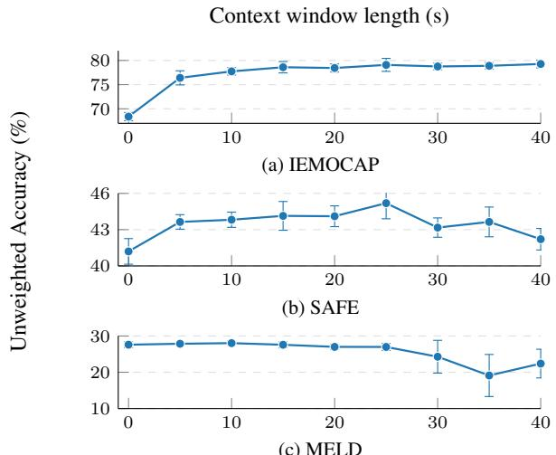

# ENRICHING SPEECH EMOTION REPRESENTATIONS WITH CONVERSATIONAL CONTEXT

Arthur Peuvot⋆ Romaric Besanc¸on⋆

Gael de Chalendar¨ ⋆

Bianca Vieru⋆ Ioana Vasilescu†

⋆ Universite Paris-Saclay, CEA, List, France´ {arthur.peuvot, romaric.besancon, gael.de-chalendar, bianca.vieru}@cea.fr † LISN, CNRS, Universite Paris-Saclay, France´ ioana.vasilescu@lisn.fr

## ABSTRACT

Detecting emotions is necessary for building systems that can accurately and adaptively interact with humans. Speech Emotion Recognition (SER) has become an important research focus to develop intelligent spoken interfaces. However, most studies predict emotions at the utterance level, ignoring the conversational context, along with the emotional flow and speaker interactions it carries. In this paper, we introduce ACERT (Averaged Contextual Emotion Representation through Time), a module that integrates a flexible-length window of conversational context to better capture emotional evolution in spoken interactions. To evaluate the robustness of this method, we conducted experiments on datasets spanning diverse emotionally expressive styles and contexts. ACERT outperforms current state-of-the-art (SOTA) approaches on IEMOCAP, establishes the first context-aware benchmark on SAFE, and obtains strong results on MELD for unweighted, class-balanced metrics. Ablation studies show that ACERT’s gains come from emotional and conversational continuity, rather than from speaker identity or acoustic conditions.

Index Terms— Speech emotion recognition, emotion recognition in conversation, IEMOCAP, SAFE, MELD

## 1. INTRODUCTION

Natural human interaction requires adaptive strategies that dynamically link past and present conversational elements, anticipate interlocutors’ reactions, and integrate multi-level inputs, from acoustic cues to complex emotional states. Humans excel at this adaptability, underpinned by several foundational cognitive frameworks such as Theory of Mind, concerned with the anticipation of others’ mental states and emotional responses [1], pragmatic inference to detect implicatures [2], or socio-cultural norms as filters for emotion expression [3]. In contrast, current computational models for Speech Emotion Recognition (SER) predominantly rely on statistical patterns and probabilistic predictions, often failing to capture the depth and contextual fluidity of human understanding. Our goal is to build models that use conversational context to predict upcoming emotional states for more adaptive responses, and maintain high performance across diverse interactional contexts.

With the emergence of the Transformer architecture [4], the field of SER has recently transitioned from hand-crafted acoustic features to deep learning representations. Self-Supervised Learning (SSL)

models such as wav2vec 2.0 [5], HuBERT [6], and WavLM [7] have set new baselines by extracting rich features from raw audio that capture both content and prosody [8]. To further specialize these architectures, recent works have focused on emotional adaptation. For instance, emotion2vec [9] utilizes self-supervised online distillation on unlabeled emotional data, while ExHuBERT [10] enhances the HuBERT backbone through layer duplication and fine-tuning on emotionally rich datasets, ensuring adaptability for affective tasks.

Using these SSL models, recent works extract structural nuances of speech through diverse strategies. Some approaches prioritize hierarchical modeling, such as SpeechFormer++ [11] and MSTR [12], which mimic the relationship between frames, phones, and words to balance fine and coarse-grained information. Others focus on temporal dynamics at the utterance level. DWFormer [13] uses dynamic window splitting to capture local importance, while [14] employ Neural Controlled Differential Equations to model high-dimensional time-series features. To ensure that the captured signal is purely affective, DTNet [15] introduces an identity-aware module to disentangle emotional features from speaker-specific acoustic traits.

The majority of SER datasets contain isolated or read utterances [16–20]. Thus, most SER approaches still predict emotions at the utterance level, not taking into account the intra and inter-speaker emotional dynamics inherent in dialogue. To address this, some multimodal works like [21–23] attempt to model intra and inter-speaker emotional influences. Among audio-based approaches, CHAN [24] uses the immediately preceding utterance from the speaker and their interlocutor in a dyadic setting, and ESA CRF [25] models transitions between consecutive utterance-level emotions. However, these approaches remain limited. CHAN restricts context to a single preceding utterance, while ESA CRF operates on the sequence of utterance-level predictions rather than on the underlying audio representations. Multimodal approaches require textual or multi-speaker information that is not always available.

In contrast, we introduce a simple and effective method that enriches the target utterance’s audio representation with a flexiblelength window of preceding context through mean pooling. This approach relies on the audio modality alone and operates regardless of the speaker. It outperforms the state of the art on IEMOCAP [26], while establishing strong results on SAFE [27] and MELD [28].

The main contributions of this work are as follows:

1. ACERT (Averaged Contextual Emotion Representation through Time): A module designed to enrich utterance representations by integrating conversational information. It aggregates the preceding context through temporal mean pooling and fuses it with the target utterance representation, bridging the gap between isolated audio analysis and dynamic dialogue. The source code for ACERT is publicly available1.

2. Evaluation on diverse interactional dynamics: We evaluate our approach on three datasets with distinct interactional dynamics and emotionally expressive styles: IEMOCAP (dyadic scripted or improvised dialogues), MELD (multiparty conversations from the Friends TV show), and SAFE (intense emotional interactions from movies such as thrillers).

## 2. METHODOLOGY

ACERT is a block that can be added on top of any feature extractor, from SSL models to other SOTA SER methods. It aggregates the conversational context through temporal mean pooling and fuses it with the target utterance’s features. The resulting context-augmented representation is then fed into a classification head.

## 2.1. Problem setting

A conversation is defined as an ordered sequence of utterances, $\mathcal { U } =$ $\left\{ u _ { 1 } , u _ { 2 } , \ldots , u _ { N } \right\}$ , where N denotes the total number of utterances in the conversation and $u _ { i }$ represents the i-th utterance. Each utterance $u _ { i }$ is associated with a speech signal $x _ { i } \in \mathbb { R } ^ { T _ { i } }$ and an emotion label $y _ { i } \in \{ 1 , \ldots , C \}$ , where $C$ is the number of emotion classes. The objective of the SER task is to learn a mapping function $f : \mathbb R ^ { T _ { i } }  \{ 1 , \ldots , C \}$ that assigns an emotion $y _ { i }$ to each speech signal $x _ { i }$

## 2.2. ACERT

Context definition. Let $t \in \mathbb { R } ^ { + }$ denote a fixed temporal context window, defined as a hyperparameter of the system and corresponding to the duration of context alone, excluding the target utterance. For each target utterance $u _ { i } ,$ an input audio segment $\boldsymbol { x } ^ { ( i ) }$ is constructed by concatenating ui with as many preceding utterances as fit within t seconds of context, so that the total duration of $\boldsymbol { x } ^ { ( i ) }$ equals the duration of ui plus t. If the available preceding utterances exceed t seconds, the earliest of these context utterances is truncated to fit the context window.

Context design choices. To define this context design, we ran preliminary experiments comparing several configurations. Using both preceding and following context performed comparably to preceding-only context (Table 2). We therefore use only precedingutterance context, as it also avoids the latency of waiting for future utterances in a real use case. Similarly, integrating speakerdependent context, obtained either from ground-truth speaker labels or from a speaker diarization step using k-means, demonstrated no statistically significant difference in performance compared to speaker-independent context (Table 2). We therefore include context regardless of the speaker, which also avoids the risk of diarization errors propagating to the SER stage. As speaker information is not available in all datasets, this speaker-independent, preceding-only context design further ensures consistent evaluation across corpora. Feature extraction. The input audio segment $\boldsymbol { x } ^ { ( i ) }$ , containing the target utterance together with its t-second preceding context, is processed by a feature extractor and then passed through a learnable linear layer with ReLU activation to obtain frame-level representations H.

Enrichment mechanism. The ACERT block incorporates information from the preceding utterances into the target utterance’s features. The frame-level features H are split into target frames $\mathbf { H } _ { t }$ and context frames $\mathbf { H } _ { c }$ . The context frames are aggregated through temporal mean pooling:

Table 1: Statistical summary of the IEMOCAP, SAFE, and MELD datasets.
<table><tr><td>Statistic</td><td>IEMOCAP</td><td>SAFE</td><td>MELD</td></tr><tr><td>Utterance level</td><td></td><td></td><td></td></tr><tr><td>Total files</td><td>5531</td><td>5638</td><td>13706</td></tr><tr><td>Mean duration (s)</td><td>4.55</td><td>4.28</td><td>3.19</td></tr><tr><td>Median duration (s)</td><td>3.58</td><td>2.72</td><td>2.49</td></tr><tr><td>Conversation level</td><td></td><td></td><td></td></tr><tr><td>Total conversations</td><td>151</td><td>398</td><td>1432</td></tr><tr><td>Mean duration (s)</td><td>166.63</td><td>60.56</td><td>30.52</td></tr><tr><td>Median duration (s)</td><td>171.36</td><td>52.88</td><td>27.52</td></tr><tr><td>Emotional stability</td><td></td><td></td><td></td></tr><tr><td>Mean consec. same emotion utt.</td><td>7.38</td><td>5</td><td>1.71</td></tr><tr><td>Mean same emotion duration (s)</td><td>33.6</td><td>27.5</td><td>5.5</td></tr></table>

$$
\displaystyle \mathbf { c } = \frac { 1 } { | \mathbf { H } _ { c } | } \sum _ { h \in \mathbf { H } _ { c } } h\tag{1}
$$

The pooled vector c is added to every target frame, followed by a feed-forward network with residual connections and LayerNorm [4]:

$$
\mathbf { H } _ { t } ^ { \prime } = \mathrm { L N } ( \mathbf { H } _ { t } + \mathbf { c } ) , \quad \mathbf { H } _ { t } ^ { \prime \prime } = \mathrm { L N } \big ( \mathbf { H } _ { t } ^ { \prime } + \mathrm { F F N } ( \mathbf { H } _ { t } ^ { \prime } ) \big )\tag{2}
$$

where FFN(·) is a two-layer feed-forward network with ReLU activation. Temporal average pooling over $\mathbf { H } _ { t } ^ { \prime \prime }$ produces an utterancelevel representation h¯ , passed through a classification head (a ReLU activation followed by a linear layer) to predict one of the $C$ emotion classes.

## 3. EXPERIMENTAL SETUP

## 3.1. Datasets

Finding real-life corpora that are freely available for use, particularly those capturing emotions in naturalistic conditions, remains a significant challenge. Most publicly available datasets are limited in terms of emotional depth or context. Our method, based on conversational context, requires datasets that include entire conversations to capture the dynamic emotional flow. To address this, we propose a preliminary evaluation using acted corpora, which, despite being scripted, offer diverse acquisition contexts and emotionally expressive styles. The selected corpora are IEMOCAP, MELD and SAFE. These corpora have almost no missing utterances guaranteeing a reliable continuity in contextual flow. Although some of these corpora provide additional modalities (e.g., text or video), ACERT only uses the audio modality.

The IEMOCAP corpus is widely used in SER. It consists of 12 hours of dyadic conversations performed by 10 professional actors during improvised or scripted interactions. We used the same emotion labels as most SOTA methods: happiness (merged with excitement), anger, sadness, and neutrality.

MELD contains 13.7 hours of conversations from the TV show Friends. In contrast to IEMOCAP, MELD introduces multi-party dynamics characterized by an over-acted and emotionally dense style, typical of sitcoms, with numerous emotional shifts. The emotional categories are: anger, disgust, fear, joy, neutrality, sadness, and surprise.

The Situation Analysis in a Fictional and Emotional (SAFE) corpus is designed to analyze strong emotions in extreme contexts such as natural disasters and physical or psychological threats and aggression. It was created by extracting 400 scenes from 30 different movies. It provides about 7 hours of audio with 400 different speakers. The emotional labels are: fear, other negative emotions, positive emotions, and neutrality.

Detailed statistics regarding utterance and conversation lengths for all datasets are provided in the Table 1.

## 3.2. Training and evaluation procedure

We use HuBERT-large2 as the feature encoder. Models are trained using a cross-entropy loss function, a batch size of 16 and a learning rate of $1 . 3 \times 1 0 ^ { - 4 } .$ The evaluations are conducted using a context window $t \in \{ 5 k \mid k \in \{ 1 , . . . , 8 \} \}$

For IEMOCAP and SAFE, we evaluate our method in a speakerindependent 5-fold cross-validation setting. For IEMOCAP, we use the standard evaluation method used in SOTA works (e.g., [8, 13]), where each test fold contains one of the 5 sessions. For SAFE each test fold consists of scenes from 6 of the 30 movies in the dataset. For MELD, we use the standard training, development, and test splits [11–13]. Each experiment is run 5 times.

We report performance using Unweighted Accuracy (UA), Weighted Accuracy (WA), Macro-F1, and Weighted-F1 scores along with their respective standard deviations.

## 3.3. Ablation studies

To test whether ACERT’s gains depend on conversational and emotional continuity, and not just on speaker identity or recording conditions, we design three ablation studies on IEMOCAP at the optimal context window $t = 2 5 \mathrm { s }$ . In the same session, continuous context condition, the true preceding context is replaced by a continuous segment from a single other conversation in the same session (same speakers, same recording conditions), preserving turn-taking but unrelated to the target conversation. In the same session, random context condition, it is instead replaced by a random mixture of utterances from all other conversations in the same session, with no temporal or conversational continuity. Comparing these two conditions isolates the effect of the context’s continuity, independently of its relevance to the target conversation. Since both conditions control for speaker identity and recording conditions, any drop in performance can be attributed to the loss of conversational and emotional continuity. Finally, in the same conversation, shuffled order condition, the preceding context is kept but its utterances are presented in random order, isolating the effect of temporal order alone, independently of context relevance.

## 4. RESULTS AND DISCUSSION

## 4.1. Experimental results

Figure 1a shows the results of our method on IEMOCAP. The performance improves significantly as the context window length increases before eventually reaching a plateau. This displays the effectiveness of using context rather than relying solely on the target utterance, which lasts on average 4.55 s (see Table 1), for prediction. Adding only t = 5 s of context already improves UA by 8.02 points over the context-free baseline (from 68.38 % to 76.40 %), and the highest overall performance is achieved at t = 25 s with an UA of 79.08 %, a gain of 10.70 points.

  
Fig. 1: Unweighted Accuracy (%) as a function of the context window length (s) on IEMOCAP, SAFE, and MELD.

As with IEMOCAP, we observe a significant increase in performance with context on the SAFE dataset (Figure 1b), peaking at t = 25 s with a 3.99 % point gain in UA over the context-free baseline (from 41.20 % to 45.19 % UA), before declining as the context window is extended further.

In contrast, for MELD (Figure 1c) we observe no statistically significant improvement of the results when using a short context window. The reasons behind this stagnation are discussed in Section 4.4.

## 4.2. Comparison with baseline and SOTA works

Table 2 compares ACERT against the baseline and SOTA methods, with and without conversational context. For the SOTA approaches, values are taken from the original papers. For ACERT, we report the results of the experiments with the context window t that achieved the highest UA.

On IEMOCAP, ACERT outperforms not only the context-free baseline and SOTA methods without context, but also all contextaware methods, including CHAN, the strongest context-aware baseline, by 3.18 points in UA and 2.83 points in WA.

On SAFE, no prior context-aware evaluation exists but ACERT improves over the context-free baseline by 3 to 4 points across all four metrics, establishing the first context-aware benchmark on this dataset.

On MELD, ACERT matches or exceeds [23], the other contextaware method, in UA and Macro-F1, achieving the best Macro-F1 across all methods regardless of context. It also outperforms the context-free baseline on both metrics, though it still falls below on weighted metrics.

## 4.3. Ablation studies

Table 2 reports the results of the three ablation studies described in Section 3.3. All three perform notably worse than ACERT (69.82 %, 70.09 % and 75.87 % UA against 79.08 %), despite using context from the same speakers and recording conditions. This gap holds consistently across all four metrics. These results confirm that the improvement brought by ACERT does not simply come from the presence of additional speech of the current speakers or from matching acoustic conditions, but specifically from the conversational and emotional continuity of the context. Moreover, the two unrelatedcontext studies perform similarly to each other (69.82 % vs. 70.09 % UA, within one standard deviation), suggesting that once the context is unrelated to the target conversation, its continuity has little additional impact.

Table 2: Comparison to baseline and current SOTA methods on IEMOCAP, SAFE, and MELD. Preliminary design experiments and ablation studies on IEMOCAP. Rows shaded in gray indicate our method.
<table><tr><td>Dataset</td><td>Method</td><td>Use conversational context</td><td>UA (%)</td><td>WA (%)</td><td>Macro-F1 (%)</td><td>Weighted-F1 (%)</td></tr><tr><td rowspan="15">IEMOCAP</td><td colspan="2">HuBERT-large fine-tuning (baseline) DWFormer (2023) [13]</td><td> $6 8 . 3 8 \pm 0 . 8 5$ </td><td> $6 7 . 0 3 \pm 0 . 8 0$ </td><td> $6 7 . 3 0 \pm 0 . 8 7$ </td><td> $6 6 . 4 1 \pm 0 . 8 8$ </td></tr><tr><td colspan="2"></td><td>73.9</td><td>72.3</td><td></td><td></td></tr><tr><td colspan="2">P-TAPT (2023) [8]</td><td>74.3</td><td></td><td></td><td></td></tr><tr><td colspan="2">DTNet (2024) [15]</td><td>74.8</td><td></td><td></td><td></td></tr><tr><td colspan="2">NCDEs-Classifier (2025) [14]</td><td>74.19</td><td>73.37</td><td></td><td></td></tr><tr><td colspan="2">Zaho et al. (2025) [29]</td><td>71.27</td><td>70.25</td><td></td><td></td></tr><tr><td colspan="2">ESA CRF (2022) [25]</td><td>74.47</td><td>73.17</td><td></td><td></td></tr><tr><td colspan="2">Shi et al. (2023), speech only [23]</td><td>65.01</td><td></td><td>65.91</td><td></td></tr><tr><td colspan="2">CHAN (2024) [24]</td><td>75.9</td><td>75</td><td></td><td></td></tr><tr><td colspan="2">ACERT (ours), t = 25 s</td><td> $7 9 . 0 8 \pm 1 . 3 4$ </td><td> $7 7 . 8 3 \pm 0 . 8 8$ </td><td> $7 8 . 2 2 \pm 1 . 0 1$ </td><td> $7 7 . 6 4 \pm 0 . 9 1$ </td></tr><tr><td colspan="8">ACERT’s preliminary design experiments (t = 25 s)</td></tr><tr><td colspan="2">Preceding and following context</td><td></td><td> $7 9 . 0 0 \pm 0 . 8 1 $ </td><td> $7 7 . 9 1 \pm 0 . 6 9$ </td><td> $7 8 . 3 2 \pm 0 . 7 4$ </td><td> $7 7 . 6 9 \pm 0 . 7$ </td></tr><tr><td colspan="2">Speaker-dependent (ground truth)</td><td></td><td> $7 9 . 7 3 \pm 1 . 0 2$ </td><td> $7 8 . 7 1 \pm 0 . 8 9$ </td><td> $7 9 . 0 7 \pm 0 . 8 1$ </td><td> $7 8 . 4 6 \pm 0 . 8 0$ </td></tr><tr><td colspan="2">Speaker-dependent (k-means diarization)</td><td></td><td> $7 8 . 5 3 \pm 0 . 5 8$ </td><td> $7 7 . 2 \pm 0 . 6 3$ </td><td> $7 7 . 6 4 \pm 0 . 5 5$ </td><td> $7 6 . 8 7 \pm 0 . 7 2$ </td></tr><tr><td colspan="2">ACERT&#x27;s ablation studies (t = 25 s)</td><td></td><td></td><td></td><td></td><td></td></tr><tr><td colspan="2">Same session, continuous context</td><td></td><td> $6 9 . 8 2 \pm 1 . 1 1 $ </td><td> $6 8 . 5 4 \pm 1 . 2 8$ </td><td> $6 8 . 6 3 \pm 1 . 3 4$ </td><td> $6 8 . 1 2 \pm 1 . 3 3 $ </td></tr><tr><td colspan="2">Same session, random context</td><td></td><td> $7 0 . 0 9 \pm 0 . 5 1$ </td><td> $6 8 . 9 8 \pm 0 . 4 9$ </td><td> $6 9 . 2 2 \pm 0 . 5$ </td><td> $6 8 . 6 9 \pm 0 . 4 6$ </td></tr><tr><td colspan="2">Same conversation, shuffled order</td><td></td><td> $7 5 . 8 7 \pm 1 . 1 0$ </td><td> $7 5 . 0 2 \pm 0 . 8 0$ </td><td> $7 5 . 1 5 \pm 0 . 8 7$ </td><td> $7 4 . 7 7 \pm 0 . 7 9$ </td></tr><tr><td colspan="2">HuBERT-large fine-tuning (baseline)</td><td>X</td><td> $4 1 . 2 0 \pm 1 . 0 6$ </td><td> $4 8 . 5 4 \pm 0 . 4 8$ </td><td> $4 0 . 3 9 \pm 0 . 9 4$ </td><td> $4 8 . 0 9 \pm 0 . 3 7$ </td></tr><tr><td rowspan="2">SAFE</td><td colspan="2">ACERT (ours), t = 25 s</td><td> ${ \bf 4 5 . 1 9 \pm 1 . 2 9 }$ </td><td> ${ \bf 5 1 . 4 2 \pm 1 . 2 4 }$ </td><td> ${ \bf 4 3 . 5 9 \pm 1 . 3 6 }$ </td><td> ${ \bf 5 0 . 8 8 \pm 1 . 4 7 }$ </td></tr><tr><td colspan="2">HuBERT-large fine-tuning (baseline)</td><td></td><td></td><td></td><td></td></tr><tr><td rowspan="7"></td><td></td><td>X</td><td>27.60 ± 0.80</td><td>49.83 ± 1.17</td><td> $2 8 . 4 9 \pm 0 . 9 2$ </td><td> $4 7 . 0 5 \pm 0 . 6 2$ </td></tr><tr><td colspan="2">SpeechFormer++ (2023) [11]</td><td>27.3</td><td>51</td><td></td><td>47</td></tr><tr><td colspan="2">DWFormer (2023) [13]</td><td></td><td></td><td></td><td>48.5</td></tr><tr><td colspan="2">MSTR (2024) [12]</td><td></td><td></td><td></td><td>46.15</td></tr><tr><td colspan="2">emotion2vec (2024) [9]</td><td>X</td><td>51.88</td><td>28.03</td><td>48.7</td></tr><tr><td colspan="2">Zaho et al. (2025) [29]</td><td>X</td><td>52.28</td><td></td><td>46.96</td></tr><tr><td colspan="2">Shi et al. (2023), speech only [23] ACERT (ours), t = 10 s</td><td>28.67  $2 8 . 0 3 \pm 0 . 5 8$ </td><td> $4 7 . 1 9 \pm 2 . 0 6$ </td><td>25.97  $2 8 . 6 2 \pm 0 . 8 0$ </td><td> $4 5 . 6 4 \pm 1 . 4 1$ </td></tr></table>

Interestingly, both ablation results also remain close to the context-free baseline (68.38 % UA), which can itself be regarded as a third, more extreme ablation of ACERT providing no context at all. This indicates that an unrelated context brings almost no benefit over having no context at all, an effect we also observe for MELD in Section 4.4. In contrast, shuffling the order of the true context gives an intermediate result (75.87 % UA), confirming that the temporal order of a relevant context also contributes to ACERT’s gains, beyond its relevance alone.

## 4.4. Limitations

As shown in Section 4.1, using conversational context fails to improve performance on the MELD dataset. Several factors may explain this finding. First, the number of speakers in each conversation: while IEMOCAP involves two easily distinguishable speakers (one male and one female), MELD averages 3.4 speakers per conversation (SAFE lacks sufficient speaker-related data for a reliable comparison). Furthermore, MELD exhibits a much lower emotional stability than IEMOCAP and SAFE (Table 1), with an average same emotion duration of only 5.5 s, compared to 33.6 s for IEMOCAP and 27.5 s for SAFE. This emotional instability, together with our IEMOCAP ablation study (Section 4.3) showing that context whose emotional state differs from the target utterance provides no benefit over having no context at all, explains why extending the context window does not improve performance on MELD.

## 5. CONCLUSION

This paper introduces a novel module that leverages conversational context through temporal mean pooling to enrich the representation of a target utterance with information from the surrounding dialogue. Evaluated across three datasets spanning distinct interactional dynamics, ACERT largely surpasses state-of-the-art methods on IEMOCAP and achieves solid results on SAFE and MELD. Our results further show that using context is most effective when conversations are emotionally stable such as in IEMOCAP and SAFE.

Future work will explore ways to automatically detect when context is emotionally relevant to the target utterance, rather than treating all context equally, which could help on datasets with rapid emotional shifts such as MELD. It could also evaluate cross-corpus generalization, for example by training on one dataset and testing on another, to assess whether the benefit of conversational context transfers across different interactional styles.

## 6. REFERENCES

[1] Brenden M. Lake, Tomer D. Ullman, Joshua B. Tenenbaum, and Samuel J. Gershman, “Building machines that learn and think like people,” Behavioral and Brain Sciences, vol. 40, pp. e253, 2017, arXiv:1604.00289.

[2] H. Paul Grice, “Logic and conversation,” in Syntax and Semantics: Speech Acts, Peter Cole and Jerry L. Morgan, Eds., vol. 3, pp. 41–58. Academic Press, New York, 1975.

[3] Petri Laukka, D. Neiberg, and Hillary Anger Elfenbein, “Evidence for cultural dialects in vocal emotion expression: acoustic classification within and across five nations.,” Emotion, 2014.

[4] Ashish Vaswani, Noam Shazeer, Niki Parmar, Jakob Uszkoreit, Llion Jones, Aidan N Gomez, Łukasz Kaiser, and Illia Polosukhin, “Attention is all you need,” Advances in neural information processing systems, vol. 30, 2017.

[5] Alexei Baevski, Yuhao Zhou, Abdelrahman Mohamed, and Michael Auli, “wav2vec 2.0: A framework for self-supervised learning of speech representations,” Advances in neural information processing systems, vol. 33, pp. 12449–12460, 2020.

[6] Wei-Ning Hsu, Benjamin Bolte, Yao-Hung Hubert Tsai, Kushal Lakhotia, Ruslan Salakhutdinov, and Abdelrahman Mohamed, “Hubert: Self-supervised speech representation learning by masked prediction of hidden units,” IEEE/ACM transactions on audio, speech, and language processing, vol. 29, pp. 3451–3460, 2021.

[7] Sanyuan Chen, Chengyi Wang, Zhengyang Chen, Yu Wu, Shujie Liu, Zhuo Chen, Jinyu Li, Naoyuki Kanda, Takuya Yoshioka, Xiong Xiao, et al., “Wavlm: Large-scale self-supervised pre-training for full stack speech processing,” IEEE Journal of Selected Topics in Signal Processing, vol. 16, no. 6, pp. 1505–1518, 2022.

[8] Li-Wei Chen and Alexander Rudnicky, “Exploring wav2vec 2.0 fine tuning for improved speech emotion recognition,” in ICASSP 2023- 2023 IEEE international conference on acoustics, speech and signal processing (ICASSP). IEEE, 2023, pp. 1–5.

[9] Ziyang Ma, Zhisheng Zheng, Jiaxin Ye, Jinchao Li, Zhifu Gao, Shiliang Zhang, and Xie Chen, “emotion2vec: Self-supervised pre-training for speech emotion representation,” in Findings of the Association for Computational Linguistics: ACL 2024, 2024, pp. 15747–15760.

[10] Shahin Amiriparian, Filip Packan, Maurice Gerczuk, and Bj ´ orn W¨ Schuller, “Exhubert: Enhancing hubert through block extension and fine-tuning on 37 emotion datasets,” arXiv preprint arXiv:2406.10275, 2024.

[11] Weidong Chen, Xiaofen Xing, Xiangmin Xu, Jianxin Pang, and Lan Du, “Speechformer++: A hierarchical efficient framework for paralinguistic speech processing,” IEEE/ACM Transactions on Audio, Speech, and Language Processing, vol. 31, pp. 775–788, 2023.

[12] Zhipeng Li, Xiaofen Xing, Yuanbo Fang, Weibin Zhang, Hengsheng Fan, and Xiangmin Xu, “Multi-scale temporal transformer for speech emotion recognition,” arXiv preprint arXiv:2410.00390, 2024.

[13] Shuaiqi Chen, Xiaofen Xing, Weibin Zhang, Weidong Chen, and Xiangmin Xu, “Dwformer: Dynamic window transformer for speech emotion recognition,” in ICASSP 2023-2023 IEEE International Conference on Acoustics, Speech and Signal Processing (ICASSP). IEEE, 2023, pp. 1–5.

[14] Ni Wang and Danyu Yang, “Speech emotion recognition using finetuned wav2vec2. 0 and neural controlled differential equations classifier,” PloS one, vol. 20, no. 2, pp. e0318297, 2025.

[15] Zhichen Yuan, CL Philip Chen, Shuzhen Li, and Tong Zhang, “Disentanglement network: Disentangle the emotional features from acoustic features for speech emotion recognition,” in ICASSP 2024-2024 IEEE International Conference on Acoustics, Speech and Signal Processing (ICASSP). IEEE, 2024, pp. 11686–11690.

[16] Steven R Livingstone and Frank A Russo, “The ryerson audio-visual database of emotional speech and song (ravdess): A dynamic, multi-

modal set of facial and vocal expressions in north american english,” PloS one, vol. 13, no. 5, pp. e0196391, 2018.

[17] Houwei Cao, David G Cooper, Michael K Keutmann, Ruben C Gur, Ani Nenkova, and Ragini Verma, “Crema-d: Crowd-sourced emotional multimodal actors dataset,” IEEE transactions on affective computing, vol. 5, no. 4, pp. 377–390, 2014.

[18] Felix Burkhardt, Astrid Paeschke, Miriam Rolfes, Walter F Sendlmeier, Benjamin Weiss, et al., “A database of german emotional speech.,” in Interspeech, 2005, vol. 5, pp. 1517–1520.

[19] Tanja Banziger and Klaus R Scherer, “Using actor portrayals to sys- ¨ tematically study multimodal emotion expression: The gemep corpus,” in International conference on affective computing and intelligent interaction. Springer, 2007, pp. 476–487.

[20] Clement Le Moine and Nicolas Obin, “Att-hack: An expressive speech´ database with social attitudes,” arXiv preprint arXiv:2004.04410, 2020.

[21] Devamanyu Hazarika, Soujanya Poria, Rada Mihalcea, Erik Cambria, and Roger Zimmermann, “Icon: Interactive conversational memory network for multimodal emotion detection,” in Proceedings of the 2018 conference on empirical methods in natural language processing, 2018, pp. 2594–2604.

[22] Soujanya Poria, Erik Cambria, Devamanyu Hazarika, Navonil Majumder, Amir Zadeh, and Louis-Philippe Morency, “Contextdependent sentiment analysis in user-generated videos,” in Proceedings of the 55th annual meeting of the association for computational linguistics (volume 1: Long papers), 2017, pp. 873–883.

[23] Xiaohan Shi, Xingfeng Li, and Tomoki Toda, “Emotion awareness in multi-utterance turn for improving emotion prediction in multi-speaker conversation.,” in INTERSPEECH, 2023, pp. 765–769.

[24] Mohammed Tellai, Lijian Gao, Qirong Mao, and Mounir Abdelaziz, “A novel conversational hierarchical attention network for speech emotion recognition in dyadic conversation,” Multimedia Tools and Applications, vol. 83, no. 21, pp. 59699–59723, 2024.

[25] Chun-Yu Chen, Yun-Shao Lin, and Chi-Chun Lee, “Emotion-shift aware crf for decoding emotion sequence in conversation.,” in IN-TERSPEECH, 2022, pp. 1148–1152.

[26] Carlos Busso, Murtaza Bulut, Chi-Chun Lee, Abe Kazemzadeh, Emily Mower, Samuel Kim, Jeannette N Chang, Sungbok Lee, and Shrikanth S Narayanan, “Iemocap: Interactive emotional dyadic motion capture database,” Language resources and evaluation, vol. 42, no. 4, pp. 335–359, 2008.

[27] Chloe Clavel, Ioana Vasilescu, Laurence Devillers, Ga ´ el Richard, ¨ Thibaut Ehrette, and Celestin Sedogbo, “The safe corpus: illustrating ´ extreme emotions in dynamic situations,” in First International Workshop on Emotion: Corpora for Research on Emotion and Affect (International conference on Language Resources and Evaluation (LREC 2006)). Genoa, Italy, 2006, pp. 76–79.

[28] Soujanya Poria, Devamanyu Hazarika, Navonil Majumder, Gautam Naik, Erik Cambria, and Rada Mihalcea, “Meld: A multimodal multiparty dataset for emotion recognition in conversations,” in Proceedings of the 57th annual meeting of the association for computational linguistics, 2019, pp. 527–536.

[29] Ziping Zhao, Jixin Liu, Haishuai Wang, Danushka Bandara, and Jianhua Tao, “A knowledge distillation-based approach to speech emotion recognition,” IEEE Transactions on Affective Computing, 2025.