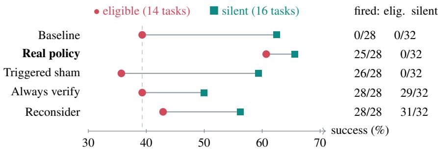
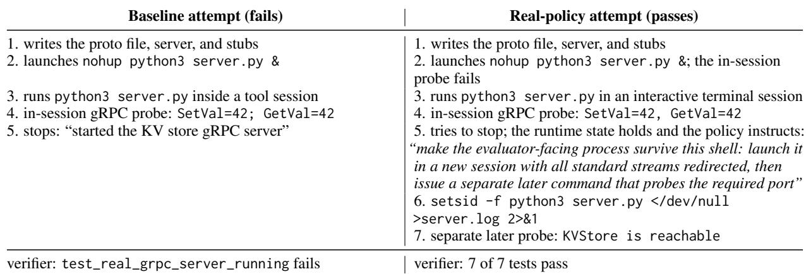
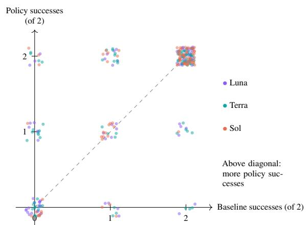

# FIRE: Failure-Informed Runtime Engineering for Reliable Language-Model Agents

Nikita Agarwal Failproof AI nikita@befailproof.ai

Nivedit Jain Failproof AI nivedit@befailproof.ai

## Abstract

Language-model agents often reach a work ing solution and then fail to consistently de liver it. We study runtime policies: targeted natural-language instructions and action denials applied by the agent harness at states that preceded observed failures, without changing model weights or the user prompt. With this, keeping capability constant, we observe a meaningful unlock in delivered reliability. Across the complete 87<sup>\*</sup>-task Terminal-Bench 2.1 suite, with two attempts per task poli cies increase repeated success (pass<sup>∧</sup>2) in all three GPT-5.6 tiers: 50.6%→54.0% for Luna, 55.2%→60.9% for Terra, and 64.4%→73.6% for Sol. Sol’s best-of-two success changes by 1.2 points while repeated success rises by 9.2, showing that policies chiefly convert reachable solutions into dependable delivery. We fur ther cover 14 tasks under Terra’s frozen portfolio. Policy-guided Terra reaches 71.4%, compared with 64.3% for unassisted Sol, at about half the cost, demonstrating how engineering around models could unlock dependability for a use case. To isolate the mechanism we run a randomized five-arm experiment: real policies reach 61% on eligible tasks, versus 39% without a policy, 36% with a timing-matched sham, and 39–43% with generic verification or reconsideration. The intended corrective behavior appears in 22 of 24 coded policy attempts, against at most 14 in any other arm. Runtime policies are therefore a practical reliability layer: they make capabilities an agent already possesses substantially more repeatable.

## 1 Introduction

Terminal agents often fail after the hard part of a task is done. In our policy-free runs, an agent writes a working gRPC server, confirms that it answers, and ends its turn; the server exits with the agent’s shell, and the verifier finds nothing listening. Another agent opens the only copy of a damaged SQLite database before copying its write-ahead log, altering the evidence it was asked to recover. A third applies the requested replacements exactly and then runs a formatter that changes protected bytes. In each case the model produced the substance of the solution and the system lost it during delivery. Such losses are common: on the 87<sup>\*</sup>-task Terminal-Bench 2.1 population we study, 16–19 tasks per model tier pass in exactly one of two identical policy-free attempts (§5.4).

Two remedies are standard. One asks the model to check its own work, through reflection, selfrefinement, or more test-time computation (Shinn et al., 2023; Madaan et al., 2023; Snell et al., 2025). The other enforces declared rules at runtime, as in guardrail and agent-specification systems (Rebedea et al., 2023; Wang et al., 2026; Shi et al., 2025). Both are usually compared with an agent that receives no intervention. That comparison cannot separate what a targeted rule says from the fact that it interrupts the agent at a decision point: an agent stopped at the end of its trajectory and asked to look again may repair its work whatever it is told.

Apart from two denial rules, a policy acts by placing a short natural-language instruction in the agent’s context at a chosen moment, and it decides whether a task is in scope by reading the task description. Does the model respond to what an in-context instruction says, or only to being interrupted? Studies of LLM self-correction show how hard it is to separate the two (Huang et al., 2024; Kamoi et al., 2024).

We derive runtime policies from observed failures and evaluate them with a design built to isolate their content. Each policy pairs an eligibility predicate over the task description with a runtime predicate over the agent’s actions, and intervenes only when the trajectory reaches a state that preceded observed failures. After freezing the portfolio we run a randomized five-arm panel. A triggered sham fires at the same events on the same tasks but carries generic review text. Always-on verification and reconsideration instructions stand in for generic self-checking. Silent tasks measure off-target effects. An attempt-level funnel records whether the risky state arose, whether the policy fired, whether the registered behavior followed, and whether the verifier passed.

We argue that agent reliability is also a systems property, not only a model property. Model weights determine which solutions are within reach; the harness determines whether those solutions survive recurring execution failures. A small, targeted policy layer can therefore improve repeatability without retraining the model and, on the failure surface it covers, recover performance otherwise associated with a more expensive tier. Figure 1 previews the controlled result that separates policy content from the effect of interruption.

Our contributions are:

• Attribution. A randomized five-arm design for harness interventions. On eligible tasks the frozen portfolio exceeds a timing-matched sham by 25.0 points (95% CI [7.1, 46.4]; p = 0.061, the prespecified primary contrast) and a fresh baseline by 21.4 points $( p = 0 . 0 3 2 )$ ; generic verification and reconsideration do not reproduce the gain (§5.1).

• Mechanism. A funnel showing that every arm meets the risky state equally often, but only the real policy text reliably produces the corrective behavior, and that correct procedure is not sufficient where a capability gap remains (§5.2).

• Replication. Same-day matched replications of one policy in two further tiers, and complete-suite results in three tiers whose direction is consistent but individually imprecise (§5.3–5.4).

• Reliability and model-tier leverage. Across the full suite, policies increase the share of tasks solved on both attempts in every tier. On Terra’s 14 eligible tasks, policies move the mid-tier model into the same performance range as unassisted Sol at about half the cost (§5.4–5.5).

## 2 Related Work

Agent evaluation. Terminal-Bench evaluates agents on containerized command-line tasks with task-specific verifiers (Merrill et al., 2026;

Terminal-Bench contributors, 2026); SWE-bench, AgentBench, OSWorld, and ToolSandbox cover other interactive settings (Jimenez et al., 2024; Liu et al., 2024; Xie et al., 2024; Lu et al., 2025). τ- bench introduced pass<sup>∧</sup>k, the probability of succeeding on all k trials (Yao et al., 2025); we report its k=2 case beside pass@k (Chen et al., 2021). Kapoor et al. (2025) and HAL (Kapoor et al., 2026) argue that agent evaluations must account for cost, scaffold, and run-to-run variation. Our small-sample inference follows NLP practice on significance testing and statistical power (Berg-Kirkpatrick et al., 2012; Dror et al., 2018; Card et al., 2020).

Self-correction and test-time computation. Re-Act interleaves reasoning and acting (Yao et al., 2023); Reflexion and Self-Refine revise behavior from verbal feedback (Shinn et al., 2023; Madaan et al., 2023); SWE-agent designs the agent– computer interface (Yang et al., 2024); AFlow searches over workflows (Zhang et al., 2025); and test-time computation can substitute for parameters (Snell et al., 2025). Whether models improve from generic requests to reconsider is contested: intrinsic self-correction often fails without external feedback (Huang et al., 2024; Kamoi et al., 2024). Our always-verify and reconsider arms are minimal members of this family, run under the same harness.

Runtime enforcement and guardrails. The closest work is AgentSpec (Wang et al., 2026), a rule language with triggers, predicates, and enforcement for LLM agents, evaluated mainly on preventing unsafe actions. Progent restricts tool privileges (Shi et al., 2025); GuardAgent and DynaGuard use a model to check actions or outputs against policies (Xiang et al., 2025; Hoover et al., 2026); NeMo Guardrails programs conversational rails (Rebedea et al., 2023); and AgentDojo and ToolEmu evaluate risky tool use (Debenedetti et al., 2024; Ruan et al., 2024). Our policy abstraction resembles AgentSpec’s rules and classical runtime enforcement (Schneider, 2000; Bartocci et al., 2018), and the broader idea of a simple assurance layer around an unreliable component (Sha, 2001; Patterson et al., 2002). We differ in where rules come from and what evidence we require: rules are derived from observed task failures and target delivery rather than safety, and we test whether a rule’s text, rather than its triggering, causes the improvement.

  
Figure 1: Randomized five-arm panel (Terra, 30 tasks, two attempts per task and arm). Only the real portfolio raises success on the 14 eligible tasks (circles); the triggered sham fires on as many eligible attempts but stays at baseline, and the generic controls, which fire on nearly every attempt, do not help. The real portfolio never fires on the 16 silent tasks (squares), whose success is unchanged. Dashed line: baseline on eligible tasks. Contrasts with intervals are in Table 3.

## 3 Runtime Policies Derived from Failures

Reachable versus delivered success. Task i has instruction $x _ { i }$ , environment $e _ { i }$ , and verifier $V _ { i } .$ . A model M in harness H induces trajectories

$$
\tau \sim \pi _ { M , H } ( \cdot \mid x _ { i } , e _ { i } ) , \qquad Y _ { i } = V _ { i } ( \tau ) \in \{ 0 , 1 \} .\tag{1}
$$

The corresponding task-level success probability is

$$
p _ { i } ( M , H ) = \Pr _ { \tau \sim \pi _ { M , H } } [ V _ { i } ( \tau ) = 1 ] .\tag{2}
$$

Changing H can therefore change success while M remains fixed. For two attempts per task, let $S _ { i } = Y _ { i 1 } + Y _ { i 2 }$ . We report

$$
\mathrm { p a s s @ 1 } = \frac { 1 } { 2 N } \sum _ { i = 1 } ^ { N } S _ { i } ,\tag{3}
$$

$$
{ \mathrm { p a s s @ 2 } } = { \frac { 1 } { N } } \sum _ { i = 1 } ^ { N } \mathbb { I } [ S _ { i } \geq 1 ] ,\tag{4}
$$

$$
\mathrm { p a s s } ^ { \wedge } 2 = \frac { 1 } { N } \sum _ { i = 1 } ^ { N } \mathbb { I } [ S _ { i } = 2 ] .\tag{5}
$$

Here, pass@1 is mean attempt success, pass@2 is observed reach, and $\mathrm { p a s s } ^ { \wedge } 2$ is observed repeated delivery. Two attempts do not identify $p _ { i }$ . A failed trajectory is a procedural loss when (i) there is evidence the agent can solve the task, such as a paired success or a working intermediate artifact; (ii) an observable state precedes the failure; and (iii) a bounded harness intervention could change the relevant state transition without supplying the solution. Policies target procedural losses and do not supply a missing algorithm or missing domain knowledge.

Policy abstraction. A runtime policy is the tuple

$$
P = ( E , G , A , R , S ) ,\tag{6}
$$

where the eligibility predicate $E ( x _ { i } )$ reads the task description once. The runtime predicate $G ( h _ { t } , S _ { t } )$ reads the action history $h _ { t }$ and policy state $S _ { t }$ at harness events: prompt submission, before each tool call, and when the agent tries to stop. The intervention A either instructs, adding natural-language guidance and, at stop, requiring another turn, or denies a proposed tool call. A release condition R and a nudge limit prevent loops; tracking rules only update S. Separating E from G separates scope from timing: broad eligibility spends tokens and distracts successful trajectories, and a late runtime predicate cannot prevent an irreversible action. In the frozen portfolio, E is lexical: it matches phrases in the task description.

Example: service persistence. E matches task descriptions requiring a server, daemon, endpoint, or VM to remain reachable. S records launch commands, whether a launch was detached from the agent’s session, and whether a separate functional probe followed. If the agent tries to stop after launching a server without both, G holds and the policy instructs it to relaunch in a new session with redirected streams and probe the endpoint from a later tool call. The policy never writes the server or chooses a protocol; it enforces the lifecycle invariant that lets the agent’s own solution survive its shell. Figure 2 shows a real instance from the panel.

Deriving and freezing a portfolio. We run the policy-free agent twice per task and inspect every failed attempt of a $1 / 2$ task, and $0 / 2$ failures whose trajectory shows a concrete procedural omission. We exclude provider and verifier faults, missing competence, and failures without an observable pre-verifier intervention point, then cluster by mechanism rather than task. For each cluster we register a chain state X → intervention A → behavior B → verifier condition, write predicates that name no task, and screen candidates on positive and nearby-negative tasks. Inert, over-broad, or harmful candidates are revised under a new identity or retired. A family enters the portfolio only with an observable failure state, a positive focused result in which it fired, and an acceptable routing audit; source hashes, routing, and analysis rules are then frozen. The frozen Terra portfolio has eight families in seven source files and 11 rules (Table 1), preceded by 13 evaluated Terra configurations. Retired candidates include broad verify-depth, repetition, generic scope, and quantifier policies, whose firing correlated with breakage (Appendix F). Luna’s frozen portfolio shares five of these sources; Sol’s was frozen earlier and uses five broader stop-time families. No source contains task names, fixture paths, or expected answers.

  
Figure 2: The service-persistence chain on a panel task (kv-store-grpc). Both agents run the server inside their own session and an in-session probe succeeds. The baseline stops, and its server dies with the session. The policy fires at the stop event, and the agent relaunches detached and probes from a later call. Commands are abridged from the logs.

## 4 Evaluation Design

Setup. Tasks come from Terminal-Bench 2.1 with a pinned dataset digest, run in Harbor containers (Terminal-Bench contributors, 2026; Harbor contributors, 2026); all task descriptions are in English. The agent is the Codex CLI (v0.146.0; OpenAI, 2026) at medium reasoning effort, using three GPT-5.6 routes that we call Luna, Terra, and Sol in increasing order of success and price. We record the provider route identifier for every attempt. We evaluate the 87<sup>\*</sup>tasks defined above. Timeouts and agent failures count as failures. An attempt is replaced only when it ended before a fair model attempt, under a rule frozen in advance (Appendix C). Reasoning effort, timeouts, and nudge limits are fixed across arms; nothing was tuned on evaluation runs.

Four designs. Table 2 lists the designs in decreasing order of the causal claim each supports. The five-arm panel uses all 14 tasks eligible for the Terra portfolio and 16 preregistered silent tasks, five conditions, and two attempts per task and condition, for 300 attempts. Condition order is randomized within each replicate. The triggered sham uses the real portfolio’s eligibility predicates and event timing with generic review text of similar length. For deny rules the sham instructs instead of denying, because repeated generic denial can deadlock execution while keeping denial would keep the tested mechanism; this exception was fixed before execution. Always-verify adds a stop-time instruction to verify the evaluator-facing artifact on every task, and reconsider adds a generic request to reconsider the solution. Behavior markers were fixed before any panel outcome was read. The 30-task set, the randomized schedule, and every arm’s source were hashed and committed before the first panel attempt. The silent tasks come from the development population and are easier than the eligible ones (baseline 62.5% vs. 39.3%), so the eligible–silent comparison mixes mechanism with headroom and we do not claim an interaction.

<table><tr><td>Family</td><td>Runtime state X</td><td>Intervention A</td><td>Registered behavior B</td></tr><tr><td>Service persistence</td><td>probe</td><td>stop after launching a server with- instruct: relaunch detached, redi- detached launch, then separate out detached launch and later rect streams, probe from a new endpoint probe call</td><td></td></tr><tr><td>Deployment preservation</td><td>destructive ref, content, or reset deny the command command after a successful de-</td><td></td><td>no destructive command after the probe</td></tr><tr><td>Database evidence</td><td>ployment probe mutating open or repair before a deny until the copy exists byte copy including sidecars</td><td></td><td>complete copy precedes first mu- tating open</td></tr><tr><td>Exact replacement (3 rules)</td><td>write under a closed replacement instruct: byte-level allowlist; me- mechanical diff after the last write map; stop after writing</td><td>chanical diff at stop</td><td></td></tr><tr><td>LaTeX final log</td><td>stop after a build under an explicit instruct: search the final log for literal log search after the final no-overfull-box contract</td><td>the literal warning</td><td>compile</td></tr><tr><td>Binary equivalence (2 rules)</td><td>measured comparison</td><td>size; change method on a miss</td><td>first candidate run; stop without instruct: compare outputs and comparison and size measured be- fore stop</td></tr><tr><td>Token accounting</td><td>count request</td><td>stop on a multi-field dataset token- instruct: reconcile subset, tok- subtotals reconciled to the total enizer, field subtotals</td><td></td></tr><tr><td>Enumeration</td><td>quest</td><td>stop on an all-valid-answers re- instruct: enumerate, test, dedupli- candidate set validated before out- cate candidates</td><td>put</td></tr></table>

Table 1: Frozen Terra policy families. Each row is a registered chain: the runtime state the policy watches, its intervention, and the behavior marker fixed before the control panel was run. Predicates, hashes, and source are in Appendices G–H.

<table><tr><td>Design</td><td>Tasks</td><td>Att. Supports</td><td></td></tr><tr><td>Five-arm panel (Terra) 16 silent</td><td>14 elig. +</td><td></td><td>300 attribution to content vs. timing and generic checking</td></tr><tr><td>Matched screen (Sol, Luna)</td><td>7 service</td><td></td><td>84 one mechanism across tiers, same-day baseline</td></tr><tr><td>Complete suite (all tiers)</td><td>87</td><td></td><td>1,044 benchmark-level reliability and cost</td></tr></table>

Table 2: Evaluation designs, from strongest to weakest causal claim.

Inference. Attempts on one task share prompt, environment, and verifier, so tasks are the inferential unit. For each task we average its two attempts per condition and compute the mean paired difference. We report 95% percentile intervals from 10,000 task-level bootstrap resamples and two-sided paired sign-flip permutation tests over tasks (100,000 permutations for the panel) (Berg-Kirkpatrick et al., 2012; Dror et al., 2018). The prespecified primary contrast is real policy minus sham on eligible tasks; all other contrasts are secondary. Because the 14-task panel yields discrete permutation p-values, we report effect sizes, confidence intervals, and permutation tests together (Appendix B). Analyses conditioned on policy firing are reported only as mechanism diagnostics.

## 5 Results

## 5.1 Policy text, not timing or generic checking, drives the gain

On the 14 eligible tasks the real portfolio passes 17/28 attempts (60.7%), against 11/28 (39.3%) for the fresh baseline, 10/28 (35.7%) for the triggered sham, 11/28 (39.3%) for always-verify, and 12/28 (42.9%) for reconsideration (Figure 1, Table 3). The primary contrast, real minus sham on eligible tasks, is +25.0 points (95% CI [7.1, 46.4], p = 0.061): a large effect with a wide interval, not a settled one. Real minus baseline on the same tasks is +21.4 points $( p = 0 . 0 3 2 )$

Three observations rule out the obvious alternatives. First, the sham fires on 26 of 28 eligible attempts, at the same events as the real policy, yet does no better than baseline (−3.6 points, CI [−17.9, 10.7]): being interrupted at the right moment does not help by itself. Second, generic selfchecking applied everywhere does not help either, consistent with the self-correction literature (Huang et al., 2024; Kamoi et al., 2024). Always-verify and reconsider fire on 57 and 59 of 60 attempts and end at or near baseline, and always-verify passes only 16/32 silent attempts against 20/32 for baseline. Third, the real portfolio never fires on the 16 silent tasks and leaves their success unchanged (21/32 vs. 20/32). The eligible-minus-silent interaction (+18.8 points, CI [−4.9, 42.9], p = 0.20) is imprecise, so localization is supporting evidence, not an established interaction. The real arm cost \$19.92 against \$23.22 for baseline and raised mean agent time from 418 to 473 seconds, almost all on eligible tasks (190 to 273 seconds).

<table><tr><td rowspan="2">Comparator</td><td colspan="3">Eligible (14 tasks)</td><td colspan="2">Silent (16 tasks)</td><td colspan="3">All (30 tasks)</td></tr><tr><td>∆</td><td>95% CI</td><td> $p$ </td><td>∆</td><td>95% CI</td><td>∆</td><td>95% CI</td><td> $p$ </td></tr><tr><td>Triggered sham†</td><td>25.0</td><td>[7.1, 46.4]</td><td>.061</td><td>6.3</td><td>[-6.3, 21.9]</td><td>15.0</td><td>[3.3, 28.3]</td><td>.046</td></tr><tr><td>Baseline</td><td>21.4</td><td>[7.1, 35.7]</td><td>.032</td><td>3.1</td><td>[-6.3, 12.5]</td><td>11.7</td><td>[3.3, 20.0]</td><td>.039</td></tr><tr><td>Always verify</td><td>21.4</td><td>[7.1, 39.3]</td><td>.064</td><td>15.6</td><td>[3.1, 31.3]</td><td>18.3</td><td>[8.3, 30.0]</td><td>.004</td></tr><tr><td>Reconsider</td><td>17.9</td><td>[-3.6, 42.9]</td><td>.280</td><td>9.4</td><td>[-3.1,28.1]</td><td>13.3</td><td>[0.0, 26.7]</td><td>.118</td></tr></table>

Table 3: Real policy minus each comparator, in percentage points, with 95% task-bootstrap intervals and paired sign-flip p-values. <sup>†</sup>Primary contrast.

## 5.2 Same opportunity, different behavior

<table><tr><td>Arm</td><td>State Fired</td><td>Behavior</td><td>Pass</td></tr><tr><td>Baseline</td><td>25/28</td><td>11/24</td><td>11/28</td></tr><tr><td>Real policy</td><td>26/28 25/28</td><td>22/24</td><td>17/28</td></tr><tr><td>Triggered sham</td><td>26/28</td><td>26/28 13/24</td><td>10/28</td></tr><tr><td>Always verify</td><td>25/28</td><td>28/28 14/24</td><td>11/28</td></tr><tr><td>Reconsider</td><td>24/28 28/28</td><td>12/24</td><td>12/28</td></tr></table>

Table 4: Funnel over the 28 eligible attempts per arm: registered runtime state observed, intervention fired, registered behavior, verifier pass. Behavior is coded by deterministic extractors applied identically to every arm; four attempts per arm need manual coding and are excluded from that column.

Table 4 decomposes the eligible attempts. The registered runtime state (for example, a server launched without detachment when the agent tries to stop, or a mutating database open before any copy) arises in 24–26 of 28 attempts in every arm, so all arms face the same opportunity. What follows differs: the registered behavior appears in 22 of 24 coded real-policy attempts and in 11–14 of 24 elsewhere. The codes come from deterministic extractors over the agent’s command log, written before the panel ran and applied with identical code to every arm, so they are blind to arm by construction and involve no LLM judge. Four attempts per arm (the enumeration and token-accounting tasks, whose markers live in output artifacts) are excluded; even if all four were coded against the hypothesis, the contrast would be 22/28 against at most 18/28. The sham fires as often as the real policy but produces the behavior barely more often than baseline (13 vs. 11). The text of the intervention, not its occurrence, changes behavior.

Individual families show both the mechanism and its limit. Database-evidence preservation fires, produces a complete copy before the first mutating open, and passes on all four eligible attempts (baseline 3/4, sham 2/4). Service persistence fires on 11 of 12 attempts, yields a detached launch followed by a probe on 12 of 12, and passes 7/12 (baseline 4/12, sham 3/12). Binary equivalence fires and produces the measured comparison on both attempts, yet both fail, as in every other arm: the policy corrected the procedure but could not supply the missing reimplementation. The behavior is necessary but not sufficient; of the 22 real-policy attempts with the registered behavior, 12 pass.

## 5.3 One policy replicates in two further tiers

To test whether the largest mechanism holds in other tiers, we compare the service-persistence policy against a policy-free baseline on a registered seven-task screen (five target tasks and two service tasks that already passed, three attempts per task), separately for Sol and Luna. Both tiers ran the same source, differing only in the nudge limit; the Terra panel uses a narrowed successor. Success rose from 7/21 to 19/21 for Sol and from 11/21 to 19/21 for Luna, with no pass-to-fail change on any task, and the registered behavior rose from 5/21 to 20/21 and from 8/21 to 16/21. Seven tasks allow little inference: every task that changed moved up (5 of 5 for Sol, 4 of 4 for Luna), giving exact sign-flip $p = 0 . 0 6 3$ and 0.125. Without the two subsequently excluded tasks, the counts are 4/15→13/15 and 8/15→14/15 (Appendix E).

## 5.4 Complete suite: consistent direction, gains in repeated success

The complete-suite experiment contains two attempts on every one of $8 7 ^ { * }$ tasks for every model and condition—1,044 attempts in total. Policies improve pass@1 in all three tiers, but their clearest effect is on repeated delivery. For Sol, pass<sup>∧</sup>2 rises by 9.2 points while pass@2 rises by only 1.2 points: eight more tasks pass in both attempts, while only one more task passes at all. The portfolio therefore converts intermittent success into dependable success rather than merely expanding the set of tasks solved once. Terra improves both reach (+6.9 points) and repeated success (+5.7 points), while Luna moves upward on all three metrics.

<table><tr><td>Tier</td><td>pass@1</td><td>∆ [95% CI]</td><td>p</td><td>pass@2</td><td> $\mathrm { p a s s } ^ { \wedge } 2$ </td><td>Imp./reg.</td><td>Fired</td><td>Cost</td></tr><tr><td>Luna</td><td>59.8→63.2</td><td>+3.4 [-3.4, 10.3]</td><td>.43</td><td>69.0→72.4</td><td> $5 0 . 6  5 4 . 0 $ </td><td>15/10</td><td>12/87</td><td>-5.2%</td></tr><tr><td>Terra</td><td>64.4→70.7</td><td>+6.3 [-1.7, 14.4]</td><td>.17</td><td>73.6→80.5</td><td>55.2→60.9</td><td>21/11</td><td>15/87</td><td>+0.9%</td></tr><tr><td>Sol</td><td>75.3→80.5</td><td>+5.2 [0.0, 10.9]</td><td>.09</td><td>86.2→87.4</td><td>64.4→73.6</td><td>10/4</td><td>81/87</td><td>+47.7%</td></tr></table>

Table 5: Complete $8 7 ^ { * }$ -task suite, two attempts per task and condition. $\Delta \mathrm { p a s s  @ 1 }$ with 95% task-bootstrap interval and paired sign-flip $p .$ Imp./reg.: tasks with more/fewer policy successes. Fired: tasks with at least one intervention. Tiers use different portfolios and are not pooled.

The operational evidence points in the same direction. Agent give-ups fall in every tier (61→54, 58→41, and 36→25), and improved tasks outnumber regressed tasks in every portfolio. Cost depends on routing breadth: Terra’s targeted portfolio fires on 15 tasks and changes total cost by only +0.9%; Luna’s fires on 12 and reduces cost by 5.2%; Sol’s broader portfolio fires on 81 and increases cost by 47.7%.

The complete-suite experiment establishes the cross-tier reliability pattern; the randomized panel isolates the effect of policy content.

## 5.5 Policies bring Terra to the Sol baseline on covered tasks

A suite-wide average dilutes a narrow policy portfolio across the many tasks it is designed to leave untouched. The sharper comparison is therefore on the 14 tasks covered by Terra’s frozen portfolio, using the same two-attempt protocol for every condition. Unassisted Terra passes 10 of 28 attempts (35.7%). With policies, it passes 20 of 28 (71.4%): the reliability layer doubles the number of successful attempts. Unassisted Sol, the stronger and more expensive model, passes 18 of 28 (64.3%). On this focused cohort, policies erase Terra’s observed model-tier deficit and place it 7.1 points above the Sol baseline while costing \$7.19 rather than \$14.48.

The estimate is necessarily imprecise at 14 tasks (Terra with policies minus Sol baseline: 95% taskbootstrap CI [−21.4, 35.7], p = 0.82), so this is not a claim that Terra is generally superior to Sol. It demonstrates a more useful systems result: model upgrades and runtime policies address different sources of failure. A stronger model expands what the agent can solve; a targeted policy prevents known procedural failures from discarding solutions already within reach. Where failures are recognizable and repeatable, engineering the harness can recover an observed model-tier gap at substantially lower cost.

## 6 Discussion

What policies change. Across designs, policies convert reachable solutions into repeatable delivery. The randomized panel shows this at the attempt level, while Sol’s complete-suite pattern—pass<sup>∧</sup>2 rising by 9.2 points as pass@2 remains nearly flat— shows it across the benchmark. This establishes a complementary systems architecture: models and search produce solutions, while runtime policies protect those solutions through execution and delivery. The leverage is substantial. Terra with policies reaches 70.7% across the complete suite, closing much of the gap to the 75.3% Sol baseline. On the 14 tasks covered by Terra’s portfolio, policy-guided Terra reaches 71.4% versus 64.3% for unassisted Sol, at approximately half the cost (§5.5).

## 7 Conclusion

Part of what makes a capable language agent unreliable is procedural: it can reach a solution yet fail to deliver it again. Across two attempts on the full 87<sup>\*</sup>-task suite, runtime policies increase repeated success in all three model tiers, with the strongest result on Sol: pass<sup>∧</sup>2 rises from 64.4% to 73.6% while pass@2 is nearly flat. On the tasks covered by the Terra portfolio, the policy-guided mid-tier model reaches the same performance range as unassisted Sol at about half the cost. The randomized controls identify the cause: policy content changes the decisive behavior, whereas an identically timed interruption and generic requests to verify or reconsider do not. The power of policies is not universal intelligence. It is dependable execution: a lightweight harness layer can preserve capabilities the model already has.

## Limitations

Every cell has two attempts per task, so $\mathrm { p a s s } ^ { \wedge } 2$ is an observed rate, not an estimate of each task’s long-run reliability. Panel tasks come from the development population; because the portfolio was frozen before the panel, the panel establishes a content effect on this distribution, not generalization. All evidence comes from one English-language benchmark, one harness (the Codex CLI), one model family, and one reasoning effort. Models are identified by provider route rather than an immutable checkpoint hash. We assume no material route change during the evaluation window, but cannot independently verify that assumption. The randomized panel supports causal attribution; crossdate complete-suite comparisons provide supporting evidence. Portfolios are model-specific, so tiers do not compare identical policies, and we did not run the planned leave-one-family-out ablation. Behavior coding covers the registered marker of each family, not every way an agent could satisfy the verifier. Authoring required expert judgement, and researcher hours were not logged. Policies protect delivery but do not add capability, and they can add latency, disturb prompt caching, and, when broad, cancel their own gains.

## Ethical Considerations

This work involves no human subjects and no personal data; all tasks run in isolated containers. Runtime policies can deny agent actions. The policies studied here deny only destructive operations on task evidence or deployed state, but the same mechanism could be used to restrict an agent in ways its users do not intend, so deployed policies should be inspectable by the people the agent acts for. Policies that make agents more persistent, for example by keeping services running, also make agent actions more durable, which raises the stakes of an agent acting on a mistaken goal. We release policy source, configuration and run-selection records, perattempt outcomes, and analysis outputs via https: //huggingface.co/datasets/failproofai/ fire-runtime-policy-reliability so that the evaluation setup and reported results can be inspected.

Competing interests. Both authors are cofounders of Failproof AI, which develops the runtime infrastructure used to implement the policies evaluated in this work. The authors therefore have a financial and professional interest in the company.

## Acknowledgments

Generative AI tools were used to critique experimental designs, implement orchestration and analysis code, support trajectory inspection, organize the literature, generate statistical reports, and draft and edit the manuscript. The authors specified the research questions, made the policy and evaluation decisions, inspected generated artifacts, reran analyses from raw data, checked every numerical claim against machine-readable outputs, and take responsibility for the content. AI tools were not used as evaluators or as a source of ground-truth labels.

## References

Ezio Bartocci, Yliès Falcone, Adrian Francalanza, and Giles Reger. 2018. Introduction to runtime verification. In Lectures on Runtime Verification, pages 1–33. Springer.

Taylor Berg-Kirkpatrick, David Burkett, and Dan Klein. 2012. An empirical investigation of statistical significance in NLP. In Proceedings ofthe 2012 Joint Conference on Empirical Methods in Natural Language Processing and Computational Natural Language Learning, pages 995–1005, Jeju Island, Korea. Association for Computational Linguistics.

Dallas Card, Peter Henderson, Urvashi Khandelwal, Robin Jia, Kyle Mahowald, and Dan Jurafsky. 2020. With little power comes great responsibility. In Proceedings of the 2020 Conference on Empirical Methods in Natural Language Processing (EMNLP), pages 9263–9274, Online. Association for Computational Linguistics.

Mark Chen et al. 2021. Evaluating large language models trained on code. arXiv preprint arXiv:2107.03374.

Edoardo Debenedetti, Jie Zhang, Mislav Balunovic,´ Luca Beurer-Kellner, Marc Fischer, and Florian Tramèr. 2024. AgentDojo: A dynamic environment to evaluate prompt injection attacks and defenses for LLM agents. In Advances in Neural Information Processing Systems.

Rotem Dror, Gili Baumer, Segev Shlomov, and Roi Reichart. 2018. The hitchhiker’s guide to testing statistical significance in natural language processing. In Proceedings of the 56th Annual Meeting of the Associationfor Computational Linguistics (Volume 1: Long Papers), pages 1383–1392, Melbourne, Australia. Association for Computational Linguistics.

Harbor contributors. 2026. Harbor: A framework for running agents in containerized environments.

https://github.com/harbor-framework/ harbor. Accessed 17 August 2026.

Monte Hoover, Vatsal Baherwani, Neel Jain, Khalid Saifullah, Joseph Vincent, Chirag Jain, Melissa Kazemi Rad, C. Bayan Bruss, Ashwinee Panda, and Tom Goldstein. 2026. DynaGuard: A dynamic guardian model with user-defined policies. In International Conference on Learning Representations.

Jie Huang, Xinyun Chen, Swaroop Mishra, Huaixiu Steven Zheng, Adams Wei Yu, Xinying Song, and Denny Zhou. 2024. Large language models cannot self-correct reasoning yet. In International Conference on Learning Representations.

Carlos E. Jimenez, John Yang, Alexander Wettig, Shunyu Yao, Kexin Pei, Ofir Press, and Karthik Narasimhan. 2024. SWE-bench: Can language models resolve real-world GitHub issues? In International Conference on Learning Representations.

Ryo Kamoi, Yusen Zhang, Nan Zhang, Jiawei Han, and Rui Zhang. 2024. When can LLMs actually correct their own mistakes? a critical survey of selfcorrection of LLMs. Transactions ofthe Association for Computational Linguistics, 12:1417–1440.

Sayash Kapoor, Benedikt Stroebl, Zachary S. Siegel, Nitya Nadgir, and Arvind Narayanan. 2025. AI agents that matter. Transactions on Machine Learning Research.

Sayash Kapoor et al. 2026. Holistic agent leaderboard: The missing infrastructure for AI agent evaluation. In International Conference on Learning Representations.

Xiao Liu, Hao Yu, Hanchen Zhang, et al. 2024. Agent-Bench: Evaluating LLMs as agents. In International Conference on Learning Representations.

Jiarui Lu, Thomas Holleis, Yizhe Zhang, Bernhard Aumayer, Feng Nan, Haoping Bai, Shuang Ma, Shen Ma, Mengyu Li, Guoli Yin, Zirui Wang, and Ruoming Pang. 2025. ToolSandbox: A stateful, conversational, interactive evaluation benchmark for LLM tool use capabilities. In Findings ofthe Association for Computational Linguistics: NAACL 2025, pages 1160–1183, Albuquerque, New Mexico. Association for Computational Linguistics.

Aman Madaan, Niket Tandon, Prakhar Gupta, et al. 2023. Self-refine: Iterative refinement with selffeedback. In Advances in Neural Information Processing Systems.

Mike A. Merrill, Alexander G. Shaw, Nicholas Carlini, Boxuan Li, Harsh Raj, et al. 2026. Terminal-bench: Benchmarking agents on hard, realistic tasks in command line interfaces. In International Conference on Learning Representations.

OpenAI. 2026. Codex CLI: Lightweight coding agent that runs in your terminal. https://github.com/ openai/codex. Version 0.146.0; Apache-2.0 license.

David Patterson, Aaron Brown, Pete Broadwell, George Candea, Mike Chen, James Cutler, Patricia Enriquez, Armando Fox, Emre Kiciman, Matthew Merzbacher, David Oppenheimer, Naveen Sastry, William Tetzlaff, Jonathan Traupman, and Noah Treuhaft. 2002. Recovery-oriented computing (ROC): Motivation, definition, techniques, and case studies. In University ofCalifornia, Berkeley Technical Report UCB/CSD-02-1175.

Traian Rebedea, Razvan Dinu, Makesh Narsimhan Sreedhar, Christopher Parisien, and Jonathan Cohen. 2023. NeMo guardrails: A toolkit for controllable and safe LLM applications with programmable rails. In Proceedings of the 2023 Conference on Empirical Methods in Natural Language Processing: System Demonstrations, pages 431–445, Singapore. Association for Computational Linguistics.

Yangjun Ruan, Honghua Dong, Andrew Wang, Silviu Pitis, Yongchao Zhou, and Jimmy Ba. 2024. Identifying the risks of LM agents with an LM-emulated sandbox. In International Conference on Learning Representations.

Fred B. Schneider. 2000. Enforceable security policies. ACM Transactions on Information and System Security, 3(1):30–50.

Lui Sha. 2001. Using simplicity to control complexity. IEEE Software, 18(4):20–28.

Tianneng Shi, Jingxuan He, Zhun Wang, Hongwei Li, Linyu Wu, Wenbo Guo, and Dawn Song. 2025. Progent: Securing AI agents with privilege control. arXiv preprint arXiv:2504.11703.

Noah Shinn, Federico Cassano, Ashwin Gopinath, Karthik Narasimhan, and Shunyu Yao. 2023. Reflexion: Language agents with verbal reinforcement learning. In Advances in Neural Information Processing Systems.

Charlie Snell, Jaehoon Lee, Kelvin Xu, and Aviral Kumar. 2025. Scaling LLM test-time compute optimally can be more effective than scaling model parameters. In International Conference on Learning Representations.

Terminal-Bench contributors. 2026. Terminal-bench 2.1 dataset and evaluation repository. https://github. com/harbor-framework/terminal-bench-2-1. Accessed 31 August 2026.

Haoyu Wang, Christopher M. Poskitt, and Jun Sun. 2026. AgentSpec: Customizable runtime enforcement for safe and reliable LLM agents. In Proceedings ofthe IEEE/ACM International Conference on Software Engineering (ICSE).

Zhen Xiang, Linzhi Zheng, Yanjie Li, Junyuan Hong, Qinbin Li, Han Xie, Jiawei Zhang, Zidi Xiong, Chulin Xie, Carl Yang, Dawn Song, and Bo Li. 2025. GuardAgent: Safeguard LLM agents via knowledgeenabled reasoning. In Proceedings ofthe 42nd International Conference on Machine Learning.

Tianbao Xie, Danyang Zhang, Jixuan Chen, et al. 2024. OSWorld: Benchmarking multimodal agents for open-ended tasks in real computer environments. In Advances in Neural Information Processing Systems.

John Yang, Carlos E. Jimenez, Alexander Wettig, et al. 2024. SWE-agent: Agent-computer interfaces enable automated software engineering. In Advances in Neural Information Processing Systems.

Shunyu Yao, Noah Shinn, Pedram Razavi, and Karthik Narasimhan. 2025. τ-bench: A benchmark for toolagent-user interaction in real-world domains. In International Conference on Learning Representations.

Shunyu Yao, Jeffrey Zhao, Dian Yu, et al. 2023. Re-Act: Synergizing reasoning and acting in language models. In International Conference on Learning Representations.

Jiayi Zhang, Jinyu Xiang, Zhaoyang Yu, Fengwei Teng, Xionghui Chen, Jiaqi Chen, Mingchen Zhuge, Xin Cheng, Sirui Hong, Jinlin Wang, Bingnan Zheng, Bang Liu, Yuyu Luo, and Chenglin Wu. 2025. AFlow: Automating agentic workflow generation. In International Conference on Learning Representations.

## A Reproducibility

The artifact (https://huggingface. co/datasets/failproofai/

fire-runtime-policy-reliability) contains configuration and run-selection records with dataset, model-route, harness, and policy details; task-content digests; per-attempt verifier outcomes, policy firing indicators, and registered behavior labels; the frozen policy source and hashes (Appendix G); the selected-attempt ledger, replacement lineage, and deviations (Appendix C); and machine-readable analysis outputs. These records support recomputation of the reported aggregate results without querying the model again. Running the policies on a successor route is a new evaluation cell, not a replication. Terminal-Bench 2.1, Harbor, and the Codex CLI are used under their Apache-2.0 licenses and for their intended purpose, agent evaluation. We release our policy source and analysis code under the Apache License 2.0. We release our original manifests, annotations, derived data, and per-attempt outcome records under CC BY 4.0. Third-party content remains subject to its original license.

## B Statistical Procedure

For each task and condition we take the mean of its two attempts. An effect is the mean paired tasklevel difference. Percentile intervals use 10,000 task-level bootstrap resamples. Permutation tests flip the sign of each task-level difference under the sharp null, with 100,000 repetitions for the panel and exact enumeration for the seven-task screens. The eligible-minus-silent interaction resamples tasks within cohorts. Attempts from one task are never treated as independent units. The bootstrap interval and the sign-flip test answer different questions and can disagree in small discrete samples; in the 14-task primary contrast the interval excludes zero while p = 0.061. We report both rather than selecting the more favorable one.

## C Control Panel Lineage and Deviations

Provider rate limits caused no-fair-attempt failures in the second replicate. Before recovery, the replacement rule was frozen: keep each original fair observation, and otherwise take the first fair result from the chronological recovery chain. Replicate 1 is unchanged in every arm. For replicate 2 this selects 25 original, 3 first-recovery, and 2 second-recovery observations for baseline; 29 firstrecovery and 1 second-recovery for the real policy; 30 first-recovery for the sham; 29 first-recovery and 1 second-recovery for always-verify; and 30 second-recovery for reconsider. The machinereadable lineage audit lists every candidate and decision. The two tasks identified by the completesuite asterisk are excluded uniformly from every cell. A repeated provider stream failure on one task is counted as a failure under the declared rule rather than retried selectively.

## D Complete-Suite Details

<table><tr><td></td><td colspan="2">Luna 0 1</td><td colspan="2">Terra 0 1 2</td><td colspan="2">Sol 0 1</td></tr><tr><td>Base</td><td></td><td>2</td><td>8</td><td></td><td></td><td>2</td></tr><tr><td>0/2 1/2</td><td>18 6 4 6</td><td>3 6</td><td>11 3 4</td><td>4 9</td><td>8 1 3</td><td>3</td></tr><tr><td>2/2</td><td>2 4</td><td>38</td><td>3 5</td><td>40</td><td>10 0 1</td><td>6 55</td></tr></table>

Table 6: Task transitions between observed states (rows: baseline successes of 2; columns: policy successes of 2).

Transition structure. Of Sol’s 19 baseline 1/2 tasks, six become $2 / 2$ and three become $0 / 2$ , and 55 of its 56 baseline $2 / 2$ tasks stay there.

## E Service-Persistence Screens

All 84 attempts completed without infrastructure exceptions. Every policy attempt carried the expected model and profile marker, and no baseline attempt contained a policy hook directory. Sol’s give-ups fell from 14 to 2. The remaining Sol failures are deploy-hook logic failures with the service reachable, which are outside the policy’s mechanism.

<table><tr><td>Tier</td><td>Cond. Pass</td><td>Gave up</td><td>Fail</td><td>T/O</td><td>Crash</td><td>$/s</td></tr><tr><td rowspan="2">Luna base</td><td></td><td>104</td><td>61</td><td>8</td><td>1</td><td>0 5.20 / 321</td></tr><tr><td>policy</td><td>110</td><td>54</td><td>6</td><td>4</td><td>0 4.93 / 382</td></tr><tr><td rowspan="2">Terra base</td><td></td><td>112</td><td>58</td><td>2</td><td>1</td><td>1 49.57 / 176</td></tr><tr><td>policy</td><td>123</td><td>41</td><td>6</td><td>2</td><td>2 49.99 / 355</td></tr><tr><td rowspan="2">Sol</td><td>base</td><td>131</td><td>36</td><td>2</td><td>3</td><td>3111.38 /289</td></tr><tr><td>policy</td><td>140</td><td>25</td><td>3</td><td>4</td><td>4164.50 / 404</td></tr></table>

Table 7: Terminations, total cost (\$), and mean agent time (s) over 174 attempts per cell.

  
Figure 3: Task-level movement between observed states, jittered. Points above the diagonal gain policy successes.

<table><tr><td>Configuration</td><td>Passes</td><td>Success</td><td>Cost</td></tr><tr><td>Terra, no policy</td><td>10/28</td><td>35.7%</td><td>$5.85</td></tr><tr><td>Terra + portfolio</td><td>20/28</td><td>71.4%</td><td>$7.19</td></tr><tr><td>Sol, no policy</td><td>18/28</td><td>64.3%</td><td>$14.48</td></tr><tr><td>Sol + portfolio</td><td>24/28</td><td>85.7%</td><td>$27.17</td></tr></table>

Table 8: The 14 tasks eligible for the Terra portfolio, from the complete-suite runs (two attempts per task; each tier with its own portfolio). Terra with its portfolio minus policy-free Sol: +7.1 points, 95% CI [−21.4, 35.7], p = 0.82.

<table><tr><td></td><td colspan="2">Sol</td><td colspan="2">Luna</td></tr><tr><td>Task</td><td>base policy</td><td></td><td></td><td>base policy</td></tr><tr><td>configure-git-webserver</td><td>0/3</td><td>1/3</td><td>0/3</td><td>3/3</td></tr><tr><td>hf-model-inference</td><td>1/3</td><td>3/3</td><td>3/3</td><td>3/3</td></tr><tr><td>kv-store-grpc</td><td>0/3</td><td>3/3</td><td>2/3</td><td>3/3</td></tr><tr><td>pypi-server</td><td>0/3</td><td>3/3</td><td>0/3</td><td>2/3</td></tr><tr><td>qemu-alpine-ssh</td><td>0/3</td><td>3/3</td><td>0/3</td><td>2/3</td></tr><tr><td>nginx-request-logging</td><td>3/3</td><td>3/3</td><td>3/3</td><td>3/3</td></tr><tr><td>qemu-startup</td><td>3/3</td><td>3/3</td><td>3/3</td><td>3/3</td></tr><tr><td>Total</td><td>7/21</td><td>19/21</td><td>11/21</td><td>19/21</td></tr></table>

Table 9: Matched service-persistence screens (three attempts per task; same-day policy-free baseline). The last two tasks are controls that already passed.

## F Policy Authoring and Retirement

The repository records 13 Terra policy-arm configurations with scored artifacts, which include early bundles, isolated screens, and revisions. Broad quantifier, repetition, generic scope, generic verification, and optimization prompts were retired or replaced after inert or adverse results. Exact replacement, database evidence, and final-log validation were narrowed after false routing or late firing: for example, a phrase meaning “one per line” alone falsely routed a chess task into exactness checks, and the database guard initially missed Python SQLite opens. Failures in large-scale editing, video processing, and query optimization were classified as capability gaps. Policies for chess legality, spectral fitting, G-code decoding, primer design, semantic retrieval, and distributed numerical equivalence were not written because no reliable harness-observable intervention point was found. Luna’s frozen portfolio shares five Terra sources (service, database evidence, replacements, LaTeX, and a source-build provenance check). Sol’s uses five broader stop-time families (service, measured acceptance criteria, public-invocation contract, requirements, scope). Researcher hours were not logged contemporaneously; commit timestamps give chronology, not labor.

## G Frozen Terra Policy Specification

Policies run in a hook layer around Codex and observe prompt-submission, pre-tool-use, and stop events. Per-session state is isolated per task container. The Terra profile allows one nudge per named rule, except that the database-evidence denial repeats until a sufficient copy exists. When several families are eligible, all tracking rules run and the hook log records every decision, so cofiring is kept rather than assigned post hoc. The runner refuses to score a policy attempt with no pre-tool-use hook events, a policy load error, or a missing model and profile marker. Prompt routing was audited over all development tasks before the final runs.

```typescript
// Luna v4: durable service lifecycle, with both
prompt and command evidence.
//
// v3's Stop hook fired on 82/178 trials because
any Python or Node script was
// treated as a service launcher. This version
requires an explicit persistent
// service contract in the prompt AND a
recognizable server/VM launch command.
import { customPolicies, allow, deny, instruct }
from "failproofai";
import { load, save, commandOf, promptOf,
shouldNudge } from "../_lib/state.mjs";
const PERSISTENT_SERVICE =
/\b(?:web\s*server|server|service|daemon|
listener|endpoint|ssh|telnet|socket|
virtual machine|vm)\b[^.\n]{0,180}\b(?:run
|running|listen|listening|reachable|
available|accessible|connect|background|
port|should be able)\b|\b(?:leave|keep|
remain|stay)\b[^.\n]{0,80}\b(?:running|
listening|reachable|available)\b|\bshould
be able to (?:run\s+)?["'`]*(?:ssh|curl|
telnet|connect)\b/i;
// Do not classify arbitrary `python foo.py` or
`node foo.js` executions as
// services. The command must name a
conventional server/VM launcher or contain
// an explicit listen/serve flag.
const SERVICE_LAUNCH =
/\b(?:qemu-system-[\w-]+|uvicorn|gunicorn|
flask\s+run|python(?:3)?\s+-m\s+http\.
server|nginx|redis-server|grpc[_-]?(?:
server|serve)|npm\s+(?:run\s+)?start)\b|\b
(?:python(?:3)?|node)\b[^;&|\n]{0,160}\S
*(?:server|serve|service|daemon|listen)[\w
.-]*\.(?:py|js)\b|--(?:host|port|listen)\b
/i;
const DETACHED = /\bsetsid\b|\bsystemd-run\b|\
bscreen\s+-d|\btmux\s+new-session\s+-d/;
```

Artifact SHA-256 (prefix)   
Arm configuration 865a132e3f07   
Policy profiles 62132159f374   
Service/deployment source fae2fd0c5b4f   
Database-evidence source ef67adb180fc   
Exact-replacement source 4b9f61d57a04   
LaTeX-validation source 0aa683406b49   
Binary-equivalence source db861cfb21c1   
Token-accounting source 95eb9971c210   
Enumeration source 4b6bd757abb8  
Table 10: SHA-256 prefixes of the frozen Terra treatment.

## H Complete Terra Runtime-Policy Source

The following files are included verbatim. Their hashes are in Table 10.

## H.1 Service persistence and deployment preservation

```javascript
const PROBE =
/\b(?:curl|wget|grpcurl|ssh|sshpass)\b|\bnc\s+-
z|\bss\s+-l|\blsof\s+-i|socket\.
create_connection|channel_ready_future|
requests\.(?:get|post|put|delete)/i;
const DEPLOYMENT_TASK =
/\b(?:bare\s+git|git\s+repository|git\s+server)
\b[\s\S]{0,500}(?:\b(?:web\s*server|post
receive)\b|\bport\s+8080\b|curl\s+https
?:\/\/)/i;
const DEPLOYMENT_PROBE = /\bgit\s+push\b|\bcurl\
b[^\n]{0,200}\bhello\.html\b/i;
const DESTROY_DEPLOYMENT =
/\b(?:git\s+--git-dir=\S+\s+)?update-ref\s+-d\
b|\brm\s+(?:-[A-Za-z]+\s+)*[^\n;&|]*(?:
hello\.html|\/var\/www\/|\/git\/server)|\
bgit\s+(?:reset\s+--hard|clean\b)/i;
customPolicies.add({
name: "luna4-service-track",
match: { events: ["UserPromptSubmit", "
PreToolUse"] },
fn: async (ctx) => {
const s = load(ctx);
const prompt = promptOf(ctx);
if (prompt && PERSISTENT_SERVICE.test(prompt)
) s.l4PersistentService = true;
if (prompt && DEPLOYMENT_TASK.test(prompt)) s
.l4DeploymentTask = true;
const cmd = commandOf(ctx);
if (cmd) {
s.l4Seq = (s.l4Seq || 0) + 1;
if (s.l4PersistentService && SERVICE_LAUNCH
.test(cmd)) {
s.l4Launch = s.l4Seq;
if (DETACHED.test(cmd)) s.l4Detached = s.
l4Seq;
}
if (s.l4Launch && PROBE.test(cmd) && s.
l4Seq > s.l4Launch) {
s.l4ProbeAfter = s.l4Seq;
}
if (s.l4DeploymentTask && DEPLOYMENT_PROBE.
test(cmd)) s.l4DeploymentProbe = s.
l4Seq;
}
save(ctx, s);
return allow();
},
});
customPolicies.add({
name: "luna4-preserve-verified-deployment",
match: { events: ["PreToolUse"] },
fn: async (ctx) => {
const s = load(ctx);
const cmd = commandOf(ctx);
if (!s.l4DeploymentTask || !s.
l4DeploymentProbe || !cmd || !
DESTROY_DEPLOYMENT.test(cmd)) return
allow();
return deny(
`Blocked cleanup of the deployment state
after an evaluator-facing push or HTTP
probe. Leave the tested ` +
`branch, commit, deployed file, document
root, and running server intact; the
verifier consumes that final ` +
```

```javascript
`state. Narrow the command only if its
target is unambiguously unrelated
temporary data.`
);
},
});
customPolicies.add({
name: "luna4-service-persistence",
match: { events: ["Stop"] },
fn: async (ctx) => {
const s = load(ctx);
if (!s.l4PersistentService || !s.l4Launch)
return allow();
if (s.l4Detached && s.l4ProbeAfter) return
allow();
if (!shouldNudge(s, "luna4-service", 1))
return allow();
save(ctx, s);
return instruct(
`The task explicitly requires a persistent
service or VM, and you launched one.
+
`Before finishing, make the evaluator
facing process survive this shell:
launch it in a new ` +
`session with all standard streams
redirected, then issue a separate
later command that probes ` +
`the required port or endpoint. A live PID
or a probe chained into the launch
command is not ` +
`enough. If the detached process already
passes that later probe, stop without
changing it.`
);
},
});
```

## H.2 Database evidence preservation

```javascript
import { customPolicies, allow, deny } from
failproofai";
import { load, save, commandOf, promptOf } from
"../_lib/state.mjs";
const RECOVERY_TASK =
/\b(?:corrupt\w*|damaged|encrypted|recover\w*|
repair\w*|forensic\w*|salvage|truncated|
deleted|lost)\b/i;
const BACKUP = /\b(?:cp|rsync|tar|dd|cpio|zip)\b
/;
const DATABASE_TASK = /\b(?:database|sqlite|wal)
\b/i;
// A database backup is complete only if the
command preserves the surrounding
// directory or explicitly includes sidecars.
Copying just `main.db` is not
// enough: opening it can replay and delete the
only useful `main.db-wal`.
```

```javascript
const DATABASE_BACKUP =
/(?:\b(?:cp|rsync)\b[^\n]*(?:\/app(?:\/\.?)?\s
|\.db(?:\*|\{[^}]*-wal)|\.db-wal)|\b(?:tar
|zip|cpio)\b[^\n]*\/app\b)/i;
const MUTATING_OPEN =
/(?:\bsqlite3\s+\S+\.(?:db|sqlite3?)|\b(?:
python3?|pypy3?)\b[\s\S]{0,1000}?(?:import
\s+sqlite3|sqlite3\.connect)|\bmysql\b|\
bpsql\b|\bmongo\b|\bredis-cli\b|\bunzip\s
+-o|\bmount\b|\bfsck\b|\bgit\s+(?:checkout
|reset|clean|gc)|\btruncate\b)/i;
customPolicies.add({
name: "luna4-preserve-track",
match: { events: ["UserPromptSubmit", "
PreToolUse"] },
fn: async (ctx) => {
const s = load(ctx);
const prompt = promptOf(ctx);
if (prompt && RECOVERY_TASK.test(prompt)) {
s.l4RecoveryTask = true;
if (DATABASE_TASK.test(prompt)) s.
l4DatabaseRecovery = true;
}
const cmd = commandOf(ctx);
if (cmd && BACKUP.test(cmd)) {
if (!s.l4DatabaseRecovery ||
DATABASE_BACKUP.test(cmd)) s.
l4BackupMade = true;
}
save(ctx, s);
return allow();
},
});
customPolicies.add({
name: "luna4-preserve-before-open",
match: { events: ["PreToolUse"] },
fn: async (ctx) => {
const s = load(ctx);
const cmd = commandOf(ctx);
if (!cmd || !s.l4RecoveryTask || s.
l4BackupMade || !MUTATING_OPEN.test(cmd)
) return allow();
// Keep blocking until a sufficient backup
exists. Repeating this deny is
// intentional: one warning followed by an
incomplete single-file copy
// must not silently unlock the destructive
operation.
return deny(
`This recovery task has not preserved the
original evidence yet, and this
command can mutate it ` +
`while opening or repairing it. Make a byte
-preserving copy of the artifact and
its sidecars ` +
`first, perform recovery work on the copy,
and use a read-only reader or hex dump
on the original.`
});
```

## H.3 Exact replacements

// Frozen exact-replacement policy. Its narrow credential path produced a   
// focused fired-policy pass after write tracking was corrected.

import { customPolicies, allow, instruct } from   
"failproofai";   
import { load, save, commandOf, promptOf,   
shouldNudge, noteCommand, WRITE as   
GENERIC\_WRITE } from "../\_lib/state.mjs";   
const REPLACEMENT = /\b(?:replace\b[^.\n   
]{0,100}\bwith\b|specified synonyms?|allowed   
synonyms?|placeholder values?|only edits?   
you may make)\b/i;   
const PROTECTED = /\b(?:do not (?:modify|change|   
edit|touch)|leave [^.\n]{0,80} (?:unchanged|   
intact)|only (?:modify|change|edit)|only   
edits? you may make)\b/i;   
const EXACT\_PLACEHOLDERS = /\bplaceholder values   
?\b[^.\n]{0,160}\b(?:consistent|exact|same|   
as follows)\b/i;   
const SECRET = /\b(?:api keys?|access keys?|   
secret keys?|github tokens?|huggingface   
tokens?|credentials?)\b/i;   
const WRITE = /\b(?:perl\s+-p?i|sed\s+-i|python   
(?:3)?\b[^\n]{0,180}(?:write\_text|   
write\_bytes|open\([^\n]{0,80}['"]w))\b/i;   
const DIFF = /\bgit\s+diff\b|\bcmp\b|\bsha256sum   
\b|\bdiff\s+(?:-[A-Za-z]+\s+)\*\S+/i;   
const FINAL\_CHECK = /\b(?:pytest|py\.test|   
pdflatex|git\s+diff\s+--check|grep\s+-[A-Za  
z]\*q|rg\s+)[^\n]\*/i;   
const PATCH\_WRITE = /apply\_patch|\*\*\*\s+(?:Add   
|Update|Delete)\s+File:/;

```javascript
customPolicies.add({
name: "final-replacement-track",
match: { events: ["UserPromptSubmit", "
PreToolUse"] },
fn: async (ctx) => {
const s = load(ctx);
const prompt = promptOf(ctx);
if (prompt && REPLACEMENT.test(prompt)) {
if (SECRET.test(prompt) &&
EXACT_PLACEHOLDERS.test(prompt)) s.
finalSecretReplacement = true;
else if (PROTECTED.test(prompt)) s.
finalRestrictedReplacement = true;
}
const cmd = commandOf(ctx);
if (cmd) {
noteCommand(s, cmd);
if (WRITE.test(cmd)) s.
finalReplacementWrite = s.seq;
if (DIFF.test(cmd)) s.finalReplacementDiff
= s.seq;
if (FINAL_CHECK.test(cmd)) s.
finalReplacementCheck = s.seq;
} else if (/apply_patch|\*\*\*\s+(?:Add|
Update|Delete)\s+File:/.test(JSON.
stringify(ctx?.toolInput || {}))) {
s.seq = (s.seq || 0) + 1;
s.lastWrite = s.seq;
s.finalReplacementWrite = s.seq;
}
save(ctx, s);
return allow();
},
});
customPolicies.add({
name: "final-replacement-before-first-write",
match: { events: ["PreToolUse"] },
```

```typescript
fn: async (ctx) => {
const s = load(ctx);
const blob = JSON.stringify(ctx?.toolInput ||
{});
const cmd = commandOf(ctx);
const isWrite = WRITE.test(cmd) ||
GENERIC_WRITE.test(cmd) || PATCH_WRITE.
test(blob);
if ((!s.finalSecretReplacement && !s.
finalRestrictedReplacement) || !isWrite)
return allow();
if (!shouldNudge(s, "final-replacement-before
-write", 1)) return allow();
save(ctx, s);
return instruct(
`Before making the first edit, treat the
supplied replacement map as a byte
level allowlist. ` +
`Change only listed source tokens to
members of their own listed family;
never substitute an article, ` +
`whitespace, punctuation, quoting, or
newline unless it is explicitly listed.
Record each source-to-target ` +
`pair so the final diff can be checked
mechanically, and preserve every file
s original EOF-newline state.
);
},
});
customPolicies.add({
name: "final-secret-replacements",
match: { events: ["Stop"] },
fn: async (ctx) => {
const s = load(ctx);
if (!s.finalSecretReplacement || !s.
finalReplacementWrite || !shouldNudge(s,
"final-secret-replacements", 1)) return
allow();
save(ctx, s);
return instruct(
`This credential-sanitization task
specifies exact placeholder text.
Replace each credential token ` +
`character-for-character while preserving
every surrounding byte; do not add
quotes or escapes around ` +
`a placeholder. Inspect all working-tree
files, including ignored or generated
files unless excluded, ` +
`but do not rewrite history or delete refs
unless explicitly requested. Verify
every original value is ` +
`absent, every placeholder is exact, and
only contaminated files changed.
Inspect the full patch and ` +
`preserve each file's original end-of-file
newline state.
);
},
});
customPolicies.add({
name: "final-restricted-replacements",
match: { events: ["Stop"] },
fn: async (ctx) => {
const s = load(ctx);
if (!s.finalRestrictedReplacement || !s.
finalReplacementWrite) return allow();
```

if (!shouldNudge(s, "final-restricted  
replacements", 1)) return allow();   
save(ctx, s);   
return instruct(   
\`This task supplies a closed replacement or   
synonym map and protects other   
content. Inspect the final \` +   
\`diff without editing it. Mechanically   
parse the replacement map and compare   
the original and final token \` +   
\`streams: every changed token must map to a   
member of the same explicit family,   
while punctuation, \` +   
\`whitespace, token count, protected files,   
and EOF-newline state remain unchanged.   
Do not accept a visual \` +   
\`inspection or a clean compiler log as   
proof. Also identify every source-to  
allowed-replacement pair; \` +   
\`reject invented synonyms, approximate   
placeholders, newline-only changes,   
and unrelated files. Search \` +   
\`once more for every original value, then   
run the task's end-to-end check after   
the final edit. If the \` +   
\`diff and check already pass, stop   
immediately and do not rewrite   
anything.\`   
);   
},   
});

## H.4 LaTeX log validation

```javascript
// Frozen LaTeX log policy from the focused
fired-policy pass.
import { customPolicies, allow, instruct } from
"failproofai";
import { load, save, commandOf, promptOf,
shouldNudge } from "../_lib/state.mjs";
const CONTRACT = /\bno\s+["'`]?overfull\s+(?:\\
hbox|hbox)\b/i;
const BUILD = /\b(?:pdflatex|xelatex|lualatex|
latexmk)\b/i;
customPolicies.add({
name: "final-latex-log-track",
match: { events: ["UserPromptSubmit", "
PreToolUse"] },
fn: async (ctx) => {
const s = load(ctx);
const prompt = promptOf(ctx);
if (prompt && CONTRACT.test(prompt)) s.
finalLatexContract = true;
const cmd = commandOf(ctx);
if (cmd && BUILD.test(cmd)) s.finalLatexBuild
= true;
save(ctx, s);
return allow();
},
});
customPolicies.add({
name: "final-latex-log-validation",
match: { events: ["Stop"] },
fn: async (ctx) => {
const s = load(ctx);
if (!s.finalLatexContract || !s.
```

```javascript
finalLatexBuild || !shouldNudge(s, "
final-latex-log", 1)) return allow();
save(ctx, s);
return instruct(
`Inspect the log produced by the final
LaTeX compile and search for the
literal text ` +
`'Overfull \\hbox' with exactly one
backslash. Do not infer cleanliness
from exit status. ` +
`If it is present, make only a replacement
explicitly authorized by the task,
then rerun both ` +
`the compile and literal log check. If it
is absent and the allowed-replacement
diff is valid, stop.`
);
},
});
```

## H.5 Binary equivalence

```javascript
// Narrow threshold policy for reverse
engineered replacement programs. It
// avoids exposing ordinary threshold-bearing
tasks to a generic optimization
// nudge.
import { customPolicies, allow, instruct } from
"failproofai";
import { load, save, commandOf, promptOf,
shouldNudge } from "../_lib/state.mjs";
const REIMPLEMENT = /\b(?:compiled|existing)\s
+(?:an?\s+|the\s+)?(?:program|binary|
executable)\b/i;
const EQUIVALENCE = /\b(?:identical|equivalent|
same)\s+(?:operation|output|behavio[u]?r)\b/
i;
const INDEPENDENT = /\b(?:independent|isolation|
must not invoke|without (?:calling|running|
using))\b/i;
const SIZE_BAR = /(?:<|under|at most|no more
than)\s*\d+\s*(?:k|kb|bytes?)\b/i;
const MEASURE = /\b(?:cmp|diff|sha256sum|gzip\s
*\|\s*wc|wc\s+-c)\b/i;
const CANDIDATE_BUILD = /\bgcc\b[^\n]{0,240}\b(?:
mystery\.c|reversed)\b|\.\/reversed\b/i;
customPolicies.add({
name: "final-binary-equivalence-track",
match: { events: ["UserPromptSubmit",
PreToolUse"] },
fn: async (ctx) => {
const s = load(ctx);
const prompt = promptOf(ctx);
if (prompt && REIMPLEMENT.test(prompt) &&
EQUIVALENCE.test(prompt) && INDEPENDENT.
test(prompt) && SIZE_BAR.test(prompt)) {
s.finalBinaryEquivalence = true;
}
const cmd = commandOf(ctx);
if (cmd && MEASURE.test(cmd)) s.
finalBinaryMeasurement = true;
save(ctx, s);
return allow();
},
});
customPolicies.add({
```

```javascript
name: "final-binary-equivalence-before
candidate-run",
match: { events: ["PreToolUse"] },
fn: async (ctx) => {
const s = load(ctx);
const cmd = commandOf(ctx);
if (!s.finalBinaryEquivalence || !cmd || !
CANDIDATE_BUILD.test(cmd)) return allow
();
if (!shouldNudge(s, "final-binary-before-run
", 1)) return allow();
save(ctx, s);
return instruct(
`The first candidate must be measured
against the original immediately,
before further approximation. ` +
`Run both in isolated directories with the
evaluator-facing build and invocation,
compare every output ` +
`artifact and stream byte-for-byte, and
record the actual similarity or
mismatch. If equivalence fails, ` +
`switch to reverse-engineering the missing
operation instead of polishing a
visually similar renderer.`
);
},
});
customPolicies.add({
name: "final-binary-equivalence",
match: { events: ["Stop"] },
fn: async (ctx) => {
const s = load(ctx);
if (!s.finalBinaryEquivalence || !shouldNudge
(s, "final-binary-equivalence", 1))
return allow();
save(ctx, s);
return instruct(
`Before stopping, validate the replacement
program against the original over a
diverse input set using ` +
`the exact build and invocation contract.
Record output differences and the
compressed source size, and ` +
`verify that the replacement remains
independent when the original
executable is unavailable. If any ` +
`measured acceptance bar is missed, change
the implementation method rather than
declaring approximate ` +
`behavior sufficient. Preserve the best
measured artifact.`
);
},
});
```

## H.6 Dataset-token accounting

```javascript
// Narrow successor to the broad requirement
ledger. It preserves the exact
// field-reconciliation intervention that
recovered the token-counting target.
import { customPolicies, allow, instruct } from
"failproofai";
import { load, save, promptOf, shouldNudge }
from "../_lib/state.mjs";
const DATASET = /\b(?:dataset|corpus)\b/i;
```

```javascript
const TOKEN_COUNT = /\b(?:how many|count|number
of|total)\b[^.\n]{0,100}\btokens?\b|\btokens
?\b[^.\n]{0,100}\b(?:count|total|number)\b/i
;
const SELECTION = /\b(?:domain|category|split|
label|subset)\b/i;
const TOKENIZER = /\btokeni[sz]er\b/i;
customPolicies.add({
name: "final-token-accounting-track",
match: { events: ["UserPromptSubmit"] },
fn: async (ctx) => {
const s = load(ctx);
const prompt = promptOf(ctx);
if (prompt && DATASET.test(prompt) &&
TOKEN_COUNT.test(prompt) && SELECTION.
test(prompt) && TOKENIZER.test(prompt))
{
s.finalTokenAccounting = true;
}
save(ctx, s);
return allow();
},
});
customPolicies.add({
name: "final-token-accounting",
match: { events: ["Stop"] },
fn: async (ctx) => {
const s = load(ctx);
if (!s.finalTokenAccounting || !shouldNudge(s
, "final-token-accounting", 1)) return
allow();
save(ctx, s);
return instruct(
`Before reporting this dataset token count,
write a compact reconciliation table.
Inspect the source's ` +
`actual distinct domain/category/split
values. Use the exact requested value
if present; otherwise use ` +
`only a mapping explicitly documented by
the dataset and verify the selection
is non-empty. Apply the ` +
`named tokenizer. List every text field
that contributes to the requested
entity, compute each field's ` +
`subtotal, and reconcile their sum to the
final integer. Do not report one field
as the total.`
);
},
});
```

## H.7 Complete multi-answer enumeration

// Narrow successor to the generic quantifier policy. It targets tasks that   
// explicitly require every valid/winning answer as separate output records.

```javascript
import { customPolicies, allow, instruct } from
"failproofai";
import { load, save, promptOf, shouldNudge }
from "../_lib/state.mjs";
const MULTIPLE = /\b(?:multiple|more than one|
all|every)\b[^.\n]{0,100}\b(?:winning|valid|
correct|acceptable)\b[^.\n]{0,80}\b(?:moves
?|answers?|solutions?|results?)\b/i;
```

```javascript
const OUTPUT_EACH = /\b(?:one per line|each on
(?:a|its own) line|print them all|write them
all|output them all)\b/i;
customPolicies.add({
name: "final-multi-answer-track",
match: { events: ["UserPromptSubmit"] },
fn: async (ctx) => {
const s = load(ctx);
const prompt = promptOf(ctx);
if (prompt && MULTIPLE.test(prompt) &&
OUTPUT_EACH.test(prompt)) s.
finalMultiAnswer = true;
save(ctx, s);
return allow();
},
});
customPolicies.add({
name: "final-multi-answer-enumeration",
match: { events: ["Stop"] },
fn: async (ctx) => {
const s = load(ctx);
if (!s.finalMultiAnswer || !shouldNudge(s, "
final-multi-answer", 1)) return allow();
save(ctx, s);
return instruct(
`The output contract requires every valid
answer, not one witness. Enumerate the
complete candidate ` +
`set, test each candidate against the task'
s winning or validity condition,
remove duplicates, and emit ` +
`all surviving answers in the exact
requested one-record-per-line format.
Before stopping, verify that ` +
`no additional candidate satisfies the same
condition.`
);
},
});
```