# Flash-dLLM: IO-Aware KV Caching and Parallel Decoding for Fast, Memory-Efficient Diffusion LLMs

Quan Nguyen-Tri VILA Lab, MBZUAI Abu Dhabi, UAE quan.nguyen@mbzuai.ac.ae

Mukul Ranjan VILA Lab, MBZUAI Abu Dhabi, UAE mukul.ranjan@mbzuai.ac.ae

Zhiqiang Shen∗ VILA Lab, MBZUAI Abu Dhabi, UAE zhiqiang.shen@mbzuai.ac.ae

Code available at: https://github.com/VILA-Lab/Flash-dLLM

## Abstract

Diffusion Large Language Models (dLLMs) have recently emerged as a promising alternative to autoregressive LLMs by enabling non-autoregressive text generation. However, their practical deployment remains limited by inefficient inference, largely due to the absence of effective Key-Value (KV) caching and scalable parallel decoding mechanisms. Existing acceleration methods typically study KV caching and parallel decoding in isolation, overlooking the I/O bottlenecks that arise when cache reuse and parallel token verification are jointly applied. In this work, we introduce Flash-dLLM, a training-free inference acceleration framework for fast and memory-efficient dLLMs. Flash-dLLM first identifies GPU memory I/O as a dominant bottleneck in KV-cache-enabled dLLM inference and addresses it with an I/O-aware fused KV-cache kernel that reduces redundant memory movement. Building on this optimized cache mechanism, Flash-dLLM further proposes an efficient KV-cache-driven draft-and-verify decoding strategy, where the dLLM itself serves as both drafter and verifier without requiring an auxiliary model. This unified design enables faster decoding while preserving generation quality and improving scalability to longer sequences and larger batch size. Extensive experiments on mathematical reasoning and code-generation benchmarks demonstrate that Flash-dLLM consistently outperforms existing state-of-the-art dLLM acceleration methods in both inference speed and memory efficiency. In particular, it achieves 5.1× and 11.0× speedups over prior strongest baseline Elastic-Cache on GSM8K and HumanEval, respectively.

## 1 Introduction

Diffusion Large Language Models (dLLMs) [4, 38, 26, 7, 33, 53, 34, 52, 40, 15, 20, 3, 28, 32, 50] have recently emerged as a promising alternative to conventional autoregressive large language models [36, 1, 41, 12, 16, 51] by reformulating text generation as an iterative denoising process. Instead of producing tokens strictly from left to right, dLLMs refine partially masked or noisy sequences over multiple denoising steps, enabling more flexible generation schedules and exposing opportunities for non-autoregressive decoding. This paradigm has shown encouraging potential for controllable generation, global sequence refinement, and improved parallelism. However, despite these algorithmic advantages, the practical inference efficiency of open-source dLLMs still lags behind mature autoregressive LLM systems, whose deployment has benefited from years of optimization around KV caching, attention kernels, and speculative decoding [23, 54, 8, 35].

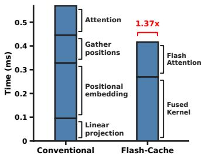  
(a) IO bottleneck in KV caching

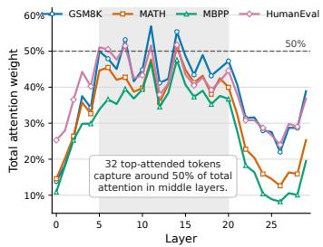  
(b) Attention sparsity across layers

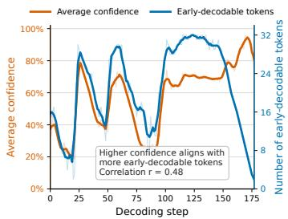  
(c) Confidence and early decoding  
Figure 1: Motivating observations (LLaDA-1.5). (a) Per-layer latency breakdown: the conventional cache pipeline is dominated by memory-bound operations; our fused kernel eliminates intermediate materialization for a 1.37× speedup. (b) Top-32 most-attended decoded tokens capture up to 50% of total attention in middle layers, motivating selective tracking over full recomputation. (c) Average prediction confidence and number of early-decodable tokens are positively correlated across denoising steps, indicating that improving confidence directly increases tokens decoded per step.

A major bottleneck to efficient dLLM inference lies in the repeated construction and movement of Key-Value (KV) states across denoising iterations. In autoregressive LLMs, KV caching avoids recomputing attention states for previously generated tokens. In dLLMs, however, the sequence is repeatedly revisited, and the set of updated tokens changes across iterations. This causes frequent KV-cache reads, writes, and updates [27, 42, 30], even when many cached states remain unchanged or contribute little to the current decoding step. As a result, naive KV caching may reduce floating-point computation but introduce substantial GPU memory-access overhead. In practice, the redundancy in KV-cache read and write operations can dominate runtime, limiting the actual speedup obtainable from cache reuse (Fig. 1a).

Beyond this system-level redundancy, dLLM decoding also exhibits strong token-level sparsity. Although each denoising step processes the full sequence, only a small fraction of decoded or partially decoded tokens has a significant influence on the current prediction distribution. Many tokens remain stable across iterations or provide limited additional context for the next decoding decision. Treating all cached tokens as equally important therefore wastes memory bandwidth and computation [42, 19, 57, 49, 43]. This observation suggests that efficient dLLM inference should not simply cache and reuse all KV states uniformly, instead, it should prioritize the subset of tokens that meaningfully affect the current decoding process while reducing unnecessary memory traffic for less influential tokens (Fig. 1b).

Another key point comes from the confidence dynamics of dLLM generation [44, 22, 21, 48]. During iterative denoising, many tokens become semantically determined at an early stage, even though their individual confidence scores may not yet exceed the conservative threshold required for immediate commitment. These tokens are often close to being correctly decoded, but existing decoding strategies delay their acceptance until later iterations, leading to redundant refinement steps. This creates a mismatch between token readiness and token commitment: the model already contains sufficient information to recover many positions, yet the decoding algorithm fails to exploit this early predictability due to insufficient confidence calibration.

Importantly, we observe that increasing the average confidence level of candidate decoded tokens directly improves the number of tokens that can be accepted correctly in each denoising step (Fig. 1c). This indicates that the bottleneck is not only whether tokens can be predicted early, but whether their confidence can be made reliable enough for safe parallel commitment. A more effective decoding strategy should therefore aggregate useful contextual evidence, suppress low-impact cache interactions, and raise the confidence of promising token candidates. By doing so, dLLMs can decode more tokens per iteration while preserving generation quality, thereby reducing the total number of denoising steps required for completion.

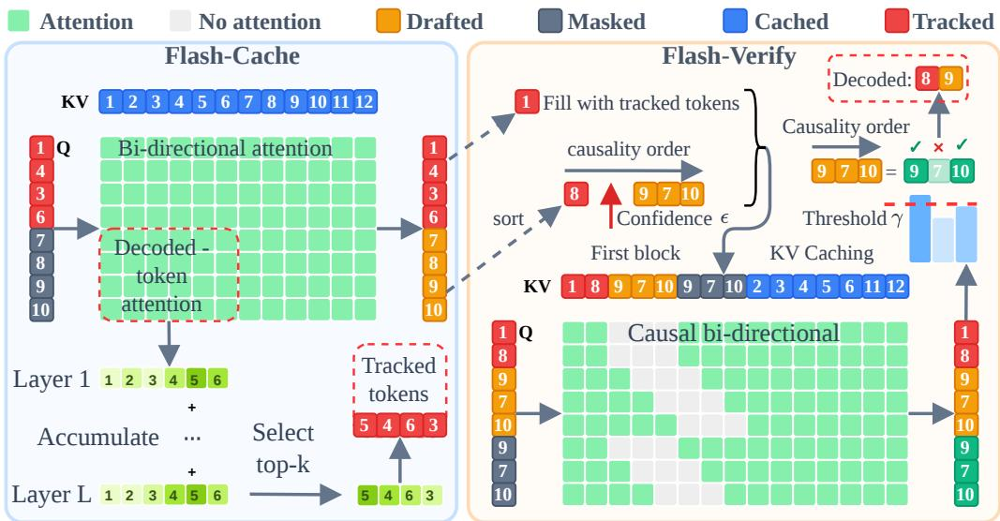  
Figure 2: Overview of Flash-dLLM. Left (Flash-Cache): At each step, a fixed-size query of βm tokens (tracked + current masked window) attends bidirectionally to the full KV cache via the fused kernel. Tracked positions are the top-k decoded tokens by attention importance, reselected each step to keep the cache-served representations aligned with full recomputation. Right (Flash-Verify): Draft predictions are sorted by confidence. Tokens above threshold ϵ are decoded directly. Remaining search tokens are duplicated in the query (once with the draft prediction, once with [MASK]) under a causal attention mask that prevents the two views from attending to each other. Tokens are accepted left-to-right when both views agree and the mask-view confidence exceeds γ.

Motivated by these observations, we propose Flash-dLLM, a training-free inference framework that jointly optimizes IO-aware KV caching and cache-driven parallel decoding for fast, memoryefficient dLLMs. Flash-dLLM first reduces redundant KV-cache memory movement through an IO-aware fused cache kernel, which minimizes unnecessary read/write operations and improves cache locality during iterative denoising. It then exploits token-level sparsity by focusing cache reuse and verification on tokens that most affect the current decoding step. Finally, Flash-dLLM introduces a KV-cache-based parallel draft-and-verify mechanism that enables the dLLM itself to draft multiple early-decodable tokens and verify them with improved confidence, without requiring an auxiliary drafter or additional training. Together, these designs convert the inherent parallelism of diffusion language generation into practical wall-clock acceleration and improved memory scalability.

This study makes the following contributions:

• We identify redundant read/write memory access as a key bottleneck in KV-cache-enabled dLLM inference, and propose an IO-aware fused KV-cache mechanism to reduce unnecessary GPU memory movement and improve cache locality. We further observe that only a small subset of decoded tokens significantly affects the current decoding step. Based on this, Flash-dLLM selectively prioritizes influential tokens during cache reuse and verification, improving efficiency without uniformly processing all cached states.

• We propose a training-free parallel decoding strategy where the dLLM itself serves as both drafter and verifier. By leveraging cached states to increase candidate-token confidence, Flash-dLLM enables more tokens to be decoded correctly in early stages, reducing denoising steps while preserving generation quality.

• Our approach achieves strong empirical speed and scalability gains. Extensive experiments on mathematical reasoning and code generation benchmarks demonstrate that the proposed Flash-dLLM improves inference speed and memory efficiency while maintaining generation quality, outperforming existing dLLM acceleration methods.

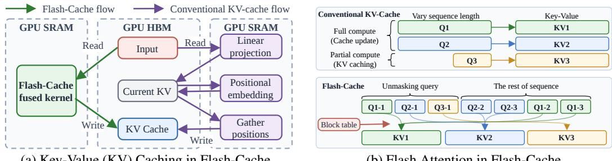  
Figure 3: IO-aware memory management in Flash-Cache. (a) The fused kernel eliminates intermediate KV tensors by performing projection, RoPE, and cache write directly on the KV cache, reducing HBM read/write traffic and memory usage. (b) Varying sequence lengths from partial (cached) and full (updated) computations are reorganized into contiguous blocks managed by a block table, enabling parallel execution without padding or synchronization overhead.

## 2 Methodology

## 2.1 Preliminaries

KV Caching in Diffusion LLMs. We adopt the sliding window decoding and KV caching strategy from Elastic-Cache [31]. Let $\mathcal { T } = \{ 1 , \ldots , \dot { N } \}$ represent all positions, $\mathcal { D } ^ { t }$ denote the newly decoded positions at step t, and $\mathcal { D } ^ { < t } = \mathcal { D } ^ { 0 } \dot { \cup } \cdot \cdot \cdot \bigcup \mathcal { D } ^ { \bar { t } - 1 }$ denote the decoded positions up to step t, and $\mathcal { M } ^ { t }$ represent the remaining masked positions. At the initial step, we feed the entire sequence into the model to initialize the KV cache values for all positions I: $\tilde { \mathbf { K } } _ { [ \mathcal { T } ] } ^ { t , l }$ and $\tilde { \mathbf { V } } _ { [ \mathcal { T } ] } ^ { t , l }$ . For the subsequent step t, we perform KV caching for every token except the current query positions $\mathcal { Q } ^ { t } = \mathcal { D } ^ { t } \cup \mathcal { M } _ { \beta _ { m } } ^ { t }$ . This includes the newly decoded tokens $\mathcal { D } ^ { t }$ and a fixed sliding window of masked tokens $\mathcal { M } _ { \beta _ { m } } ^ { t } = \mathcal { M } _ { [ 1 : \beta _ { \mathrm { m } } ] } ^ { t } .$ where $\beta _ { \mathrm { m } }$ is the fixed window size. The attention at step t is computed as follows:

$$
\mathbf { A } _ { [ \mathcal { Q } ^ { t } ] } ^ { t , l } = \mathrm { s o f t m a x } \left( \frac { \mathbf { Q } _ { [ \mathcal { Q } ^ { t } ] } ^ { t , l } ( \tilde { \mathbf { K } } _ { [ \mathcal { T } ] } ^ { t , l } ) ^ { \top } } { \sqrt { d _ { k } } } \right) \tilde { \mathbf { V } } _ { [ \mathcal { T } ] } ^ { t , l } , \quad \mathrm { u p d a t e : } \ \tilde { \mathbf { K } } _ { [ \mathcal { Q } ^ { t } ] } ^ { t , l } = \mathbf { K } _ { [ \mathcal { Q } ^ { t } ] } ^ { t , l } , \tilde { \mathbf { V } } _ { [ \mathcal { Q } ^ { t } ] } ^ { t , l } = \mathbf { V } _ { [ \mathcal { Q } ^ { t } ] } ^ { t , l } .\tag{1}
$$

The cache is exact for positions in $\mathcal { Q } ^ { t }$ and approximate for the rest. Existing methods differ in how they manage this approximation: Fast-dLLM [46] refreshes the entire cache at block boundaries, and Elastic-Cache [31] triggers refresh adaptively based on attention-pattern drift. All these methods implement the cache update logic in PyTorch, issuing separate kernel launches for QKV projection, rotary positional embedding, cache writes, and attention computation per layer. This makes the caching operation memory-bound: the intermediate tensors are written to and read from GPU HBM multiple times, and the memory access cost dominates over the arithmetic cost.

Parallel Decoding in Diffusion LLMs. Diffusion LLMs generate by iteratively unmasking tokens from a fully masked sequence. At each step, the model predicts all masked positions in parallel, but these predictions are conditionally independent given $\mathbf { x } _ { t }$ . The model samples from the product of marginals $\textstyle \prod _ { i } p ( \mathbf { x } _ { s } ^ { i } \mid \mathbf { x } _ { t } )$ , while the true joint $\bar { p ( } \mathbf { x } _ { s } ^ { i } , \mathbf { x } _ { s } ^ { j } \mid \mathbf { x } _ { t } ) = p ( \mathbf { x } _ { s } ^ { i } \mid \bar { } \mathbf { x } _ { t } ) \cdot p ( \mathbf { x } _ { s } ^ { j } \mid \bar { } \mathbf { x } _ { t } , \mathbf { x } _ { s } ^ { i } )$ contains inter-token dependencies [46]. Decoding many tokens at once amplifies this discrepancy and degrades coherence. Fast-dLLM [46] tackles this issue by introducing Confidence-aware decoding. This approach selectively unmasking only tokens whose confidence $c ^ { i } = \operatorname* { m a x } _ { x } p _ { \theta } ( x ^ { i } \mid \mathbf { x } _ { t } )$ surpasses a predefined threshold ϵ. Consequently, parallel decoding effectively approximates the true joint distribution when all decoded tokens exhibit high confidence.

(a) Key-Value (KV) Caching in Flash-Cache

(b) Flash Attention in Flash-Cache

## 2.2 Flash-Cache: IO-aware key-value caching

Flash-Cache consists of three main components: (i) a fused kernel for Key-Value (KV) caching to alleviate the IO bottleneck, (ii) scheduled flash attention to manage the substantial variation in sequence lengths within batches, and (iii) constrained cache updates by monitoring the most-attended tokens.

Algorithm 1 Flash-Cache   
Require: Input $\mathbf { X } \in \mathbb { R } ^ { M \times d }$ , query $\mathbf { Q } \in \mathbb { R } ^ { M \times d } ,$ KV cache $\mathbf { K } , \mathbf { V } \in \mathbb { R } ^ { ( B N ) \times d }$ , output $\mathbf { A } \in \mathbb { R } ^ { M \times d }$ , positions $\mathbf { P } \in \mathbb { R } ^ { M \times d }$ , block size β,   
sequence length N, query length M, batch size B, heads h   
1: Split X into $T _ { m } = M / \beta$ blocks $\{ \mathbf { X } _ { i } \} _ { i = 1 } ^ { T _ { m } }$ ; create block table B and assign batch index $( \mathbf { X } _ { i } , b )$   
2: Split each block into heads $\mathbf { X } _ { i , 1 } , \ldots , { \dot { \mathbf { X } } } _ { i , h } ^ { - 1 }$   
Flash Fused Kernel Scheduled Flash Attention   
1: for $1 \leq i \leq T _ { m }$ do 1: for $1 \leq i \leq T _ { m }$ do   
2: Load $\mathbf { p }  \mathbf { P } _ { i }$ //HBM → SRAM 2: Load $b \gets \mathbf { B } _ { i }$ //HBM → SRAM   
3: for 1 $\le j \le I$ h do 3: for 1 $. \leq j \leq I$ h do   
4: 5: Load $\mathbf { \Delta } \mathbf { \mathfrak { c } } \gets \mathbf { X } _ { i , j }$ //HBM → SRAM 4: Load $\mathbf { q } \gets \mathbf { Q } _ { i , j }$ //HBM → SRAM   
q, k, v ← projection(x); q, k ← RoPE(q, k) 5: Load $\bar { \mathbf { k } } , \mathbf { v }  \bar { \mathbf { K } } _ { [ b , j ] } , \mathbf { V } _ { [ b , j ] }$ //HBM → SRAM   
6: Write $\mathbf { q }  \mathbf { \bar { Q } } _ { i , j }$ 6: a ← attention(q, k, v)   
7: Write $\bar { \mathbf { k } } , \mathbf { v }  \tilde { \mathbf { K } } _ { [ \mathbf { p } , j ] } , \mathbf { V } _ { [ \mathbf { p } , j ] }$ //SRAM → HBM 7: Write $\mathbf { a }  \mathbf { A } _ { i , j }$ //SRAM → HBM   
8: end for 8: end for   
9: end for 9: end for

KV caching fused kernel. At each transformer layer, a conventional KV cache implementation launches four separate CUDA kernels for the query set $\mathcal { Q } ^ { t } \colon$ QKV projection, rotary positional embedding (RoPE), cache write, and attention. Each kernel writes its output to GPU high-bandwidth memory (HBM) before the next kernel reads it. QKV projection, RoPE, and cache writing each incur $\mathcal { O } ( Q d _ { \mathrm { m o d e l } } )$ memory traffic, while attention streams over the full cache with $\mathcal { O } ( N d )$ traffic. Thus, the total per-layer HBM traffic is approximately $4 \times \mathcal { O } ( Q d _ { \mathrm { m o d e l } } ) + \mathcal { O } ( N d )$ . Because the non-attention operations have low arithmetic intensity, the cache-update path becomes memory-bound (Fig. 3a).

Inspired by Flash Attention [13], we introduce a fused Flash-Cache kernel that combines QKV projection, RoPE, and cache writing (Fig. 3a). The fused kernel performs projection and RoPE in SRAM and writes the resulting keys and values directly to the KV cache, eliminating intermediate key value materialization. This reduces HBM traffic, lowers memory usage, and improves IO efficiency. As shown in Fig. 1a, positional embedding and cache writing can dominate runtime relative to core computations such as attention and QKV projection. With Flash-Cache, we achieve a 1.37× speedup on an RTX 3090 GPU.

Scheduled flash attention. KV caching and parallel decoding introduce new challenges for scaling diffusion LLMs to batched inference. While conventional attention can process variable-length sequences through padding and length-based grouping, diffusion LLMs make sequence lengths more dynamic and divergent. KV caching typically alternates between a caching stage, which computes only over a small window, and an update stage, which recomputes the full sequence; as a result, samples in the same batch may require substantially different computation at each iteration. Forcing all samples into the same stage can reduce efficiency and accuracy. This issue is further amplified by adaptive methods such as Elastic-Cache, where sequence length may vary within a layer, and by parallel decoding, which causes samples to progress at different rates.

To address this challenge, we extend Flash Attention [13, 39, 56] by partitioning each batch into multiple sequence blocks and scheduling them with a block table that aligns query blocks with their corresponding key-value blocks (Fig. 3b). This design mitigates length discrepancies during inference and provides a flexible mechanism for adding or removing blocks, enabling more adaptive decisions about when to cache or update. Unlike Flash Attention, which primarily optimizes IO efficiency within the attention computation, our Scheduled Flash Attention focuses on controlling which blocks are computed and in what order through the block table. This scheduling strategy is particularly effective for accelerating batched inference in diffusion LLMs.

The overall algorithm of Fused Kernel and Scheduled Flash Attention is presented in algorithm 1.

Selective cache update. Following our new design of KV caching and scheduled flash attention, we introduce a simple yet effective Constrained cache update to further enhance the scalability of our method. We observed that only 32 of the top-attended tokens can contribute approximately 50% of the weight in attention computation among the middle layers (from layer 5 to 20, as shown in Fig. 1b). This suggests that updating only a small subset of these tokens could be sufficient to retain most of the information loss. Motivated by this observation, we introduce the Selective cache update approach, which maintains and updates only a fixed set of the most-attended tokens (as depicted in Fig. 2).

Algorithm 2 Flash-dLLM   
Require: Model $f _ { \theta } ,$ prompt $\mathbf { x _ { \mathrm { p r o m p t } } } ,$ generation length $N _ { \ast }$ , tracking budget $\beta _ { t } .$ , masked-window size   
$\beta _ { m } ,$ confidence threshold ϵ, verify threshold $\gamma .$   
1: $\mathbf { x } ^ { 0 } \gets \{ \mathbf { x } _ { \mathrm { p r o m p t } } ; ~ [ \mathtt { M A S K } ] ^ { N } \} ; \mathcal { D } ^ { < 1 } \gets \{ 1 , \dots , | \mathbf { x } _ { \mathrm { p r o m p t } } | \} ; \mathcal { M } ^ { 1 } \gets \{ | \mathbf { x } _ { \mathrm { p r o m p t } } | + 1 , \dots , | \mathbf { x } _ { \mathrm { p r o m p t } } | + N \} ;$   
2: Allocate $\mathrm { K V }$ cache K˜ l, $\tilde { \mathbf { V } } ^ { l } \in \mathbb { R } ^ { ( B \cdot N _ { \mathrm { m a x } } ) \times d _ { \mathrm { m } } }$ odel for each layer l // pre-allocate once   
3: while $\mathcal { M } ^ { t } \neq \emptyset$ do   
4: $\mathcal { M } _ { \beta _ { m } } ^ { t }  \mathcal { M } _ { [ : \beta _ { m } ] } ^ { t } ; \quad \mathcal { Q } ^ { t }  \mathcal { T } ^ { t } \cup \mathcal { M } _ { \beta _ { m } } ^ { t }$   
5: $p _ { \theta } ( \mathbf { x } \mid \mathbf { x } ^ { t } ) , \dot { \mathbf { S } } \longleftarrow \mathrm { F u s e d F o r w a r d } ( f _ { \theta } , \mathbf { x } _ { [ Q ^ { t } ] } ^ { t } , \tilde { \mathbf { K } } , \tilde { \mathbf { V } } )$ // Flash-Cache, $A l g . \ I$   
6: $c ^ { i } , \hat { x } ^ { i } \gets \operatorname* { m a x } _ { x } p _ { \theta } ( x ^ { i } \mid \mathbf { x } ^ { t } )$ for $i \in \dot { \mathcal { M } } _ { \beta _ { m } } ^ { t } ; \mathcal { D } ^ { t } \gets \{ i \in \mathcal { M } _ { \beta _ { m } } ^ { t } : c ^ { i } \geq \epsilon \} ; \mathcal { S } ^ { t } \gets$   
$\mathcal { M } _ { \beta _ { m } } ^ { t } \ \backslash \ D ^ { t }$   
7: if verify and $S ^ { t } \neq \varnothing$ then // Flash-Verify   
8: Adjust tracking set $\mathcal { T } _ { v } ^ { t } \gets \mathcal { T } _ { [ : 2 \beta _ { m } - | D ^ { t } | - 2 | S ^ { t } | ] } ^ { t }$   
9: Construct verify query: $\{ \mathbf { x } _ { [ \mathcal { T } _ { v } ^ { t } ] } ^ { t ^ { * } } ; \hat { \mathbf { x } } _ { [ \mathcal { D } ^ { t } ] } ; \hat { \mathbf { x } } _ { [ S ^ { t } ] } ^ { } ; \mathbf { x } _ { [ S ^ { t } ] } ^ { t } \}$   
10: Construct causal mask for bi-directional attention $\mathbf { M }$   
11: $p _ { \theta } ( \mathbf { x } \mid \hat { \mathbf { x } } _ { [ S ^ { t } ] } ) \gets :$ FusedForward $( f _ { \theta } ,$ , verify query, $\tilde { \mathbf { K } } , \tilde { \mathbf { V } } , \mathbf { M } )$   
12: $\tilde { c } ^ { i } , \tilde { x } ^ { i } \gets \operatorname* { m a x } _ { x } p _ { \theta } ( x ^ { i } \mid \hat { \mathbf { x } } _ { [ S ^ { t } ] } )$ for $i \in S ^ { t }$   
13: $\mathcal { D } ^ { t }  \mathcal { D } ^ { t } \cup \{ i \in \mathcal { S } ^ { t } : \hat { x } ^ { i } = \bar { x } ^ { i } \mathrm { ~ } \land \mathrm { ~ } \tilde { c } ^ { i } \geq \gamma .$ , up to first mismatch}   
14: end if   
15: Decode: $\mathbf { x } _ { [ \mathcal { D } ^ { t } ] } ^ { t + 1 }  \hat { \mathbf { x } } _ { [ \mathcal { D } ^ { t } ] } ; \mathcal { D } ^ { < t + 1 }  \mathcal { D } ^ { < t } \cup \mathcal { D } ^ { t } ; \mathcal { M } ^ { t + 1 }  \mathcal { M } ^ { t } \backslash \mathcal { D } ^ { t }$   
16: $\begin{array} { r } { a _ { i } ^ { t } \gets \sum _ { l } \frac { 1 } { H | \mathcal { M } _ { \beta _ { m } } ^ { t } | } \sum _ { h , j \in \mathcal { M } _ { \beta _ { m } } ^ { t } } \mathbf { S } _ { j , i } ^ { t , l , h } } \end{array}$ for $i \in \mathcal { D } ^ { < t }$   
17: $\mathcal { T } ^ { t + 1 } = \mathrm { t o p - k } \big ( \{ a _ { i } ^ { t } : i \in \mathcal { D } ^ { < t } \} , \ \beta _ { \mathrm { t } } - \lvert \mathcal { D } ^ { t } \rvert ) \cup \mathcal { D } ^ { t } \quad t \gets t + 1$   
18: end while   
19: return $\mathbf { x } ^ { t }$

Our method constructs a fixed-size query at each subsequent decoding step $( t > 0 )$ using a sliding unmasking window of size $\beta _ { m }$ and a fixed tracking budget $\beta _ { t }$ . Specifically, the query for step $t + 1$ is defined as $\mathcal { Q } ^ { t + 1 } = \mathcal { M } _ { \beta _ { m } } ^ { t + 1 } \cup \mathcal { T } ^ { t + 1 }$ , where $\textstyle { \mathcal { T } } ^ { t + 1 }$ comprises the newly decoded tokens $\mathcal { D } ^ { t }$ and the most-attended tokens from the preceding step. The latter are selected from previously decoded tokens according to the attention they receive from masked tokens. The attention score of each decoded token i at step t is computed as follows:

$$
a _ { i } ^ { t } = \sum _ { l = 1 } ^ { L } \frac { 1 } { H } \sum _ { h = 1 } ^ { H } \frac { 1 } { | \mathcal { M } _ { \beta _ { m } } ^ { t } | } \sum _ { j \in \mathcal { M } _ { \beta _ { m } } ^ { t } } \mathbf { S } _ { j , i } ^ { t , l , h } , \quad i \in \mathcal { D } ^ { < t }\tag{2}
$$

where $\mathbf { S } ^ { t , l }$ is unnormalized attention logits. The score measures the extent to which the current masked queries are paying attention to the decoded position i. The tracking set is $\mathcal { T } ^ { t + 1 } = \mathrm { t o p - k } ( \{ a _ { i } ^ { t }$ $i \in \mathcal { D } ^ { < t } \} , \ \beta _ { \mathrm { t } } - | \mathcal { D } ^ { t } | ) \cup \mathcal { D } ^ { t }$ , and the next query set is $\mathcal { Q } ^ { t + 1 } = \mathcal { M } _ { \beta _ { m } } ^ { t + 1 } \cup \mathcal { T } ^ { t + 1 }$ . Newly decoded tokens are prepended to $\mathbf { \nabla } \mathcal { D } ^ { < t }$ before ranking, giving them automatic inclusion. All other decoded positions are served from cache without participating as queries, bounding per-step compute at $\beta _ { t } + \beta _ { m }$

## 2.3 Flash-Verify: KV-cache-driven draft-and-verify Parallel Decoding

Confidence-aware decoding [46, 45] unmasks only tokens whose confidence $c ^ { i } = \operatorname* { m a x } _ { x } p _ { \theta } ( x ^ { i } \mid \mathbf { x } _ { t } )$ exceeds a threshold ϵ, discarding all others even when many are correct (Fig. 1c). This creates a throughput ceiling on tasks where the model is uncertain, as few tokens pass the threshold per step. We propose Flash-Verify, a self-verification scheme in which the dLLM serves as both drafter and verifier, recovering correct predictions that confidence-aware decoding would waste. At each denoising step, a standard draft pass runs the model on $\mathcal { Q } ^ { t } = \mathcal { T } ^ { t } \cup \mathcal { M } _ { \beta _ { m } } ^ { t }$ against the full KV cache. The masked positions are sorted by confidence and partitioned into a confident set $\mathcal { D } ^ { t }$ (above ϵ, accepted directly) and a search set $\bar { \boldsymbol { S } } ^ { t }$ (below ϵ, candidates for verification).

A verify pass then constructs a new query with three groups: an adjusted tracking set $\mathcal { T } _ { v }$ consisting of previously decoded tokens and $\dot { \mathcal { D } } ^ { t }$ , the search positions $S ^ { t }$ filled with their draft predictions ${ \hat { x } } ^ { i }$ (the draft view), and the same positions filled with [MASK] (the mask view). Both views share positional embeddings but are isolated by a causal attention mask loaded inside the fused Triton kernel: the tracked context cannot attend to the draft view, and the draft and mask views at the same position cannot attend to each other, so they produce independent predictions from shared context. A search token is accepted if both views agree and the mask-view confidence exceeds a threshold $\gamma \colon$ accept $( i ) = \mathbb { I } [ \hat { x } ^ { i } = \bar { \tilde { x } } ^ { i } ] \cdot \mathbb { I } [ \tilde { c } ^ { i } \geq \gamma ]$

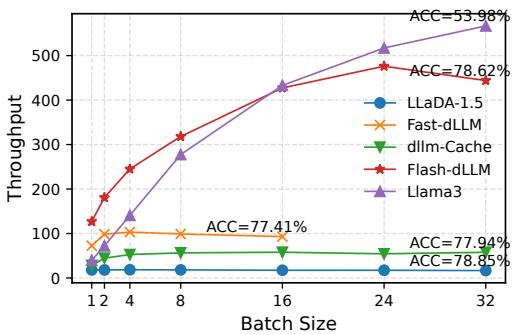  
(a) Throughput vs. batch size

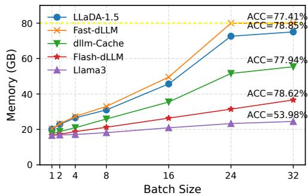  
(b) Peak memory vs. batch size  
Figure 4: Scalability on GSM8K-512 (1-shot, LLaDA-1.5). (a) Flash-dLLM (Flash-Cache+Flash-Verify) throughput scales linearly to batch size 32, while Fast-dLLM OOMs at 24. Llama3-8B is an autoregressive reference. (b) Flash-dLLM uses less memory than all baselines across batch sizes.

where $\tilde { x } ^ { i }$ and $\tilde { c } ^ { i }$ are the mask view’s prediction and confidence. Following speculative decoding conventions [24], tokens are accepted sequentially along the decoding order and all tokens after the first mismatch are rejected.

The verify pass reuses the same fused kernel and pre-allocated KV cache; only the query tokens and the attention mask change, so the additional cost is proportional to $2 \beta _ { m }$ rather than the full sequence. Unlike prior draft-and-verify methods for dLLMs that rely on a separate autoregressive verifier [18] or multiple independent forward passes [47], Flash-Verify requires no external model: the dLLM verifies its own predictions through the two-view attention mask, roughly doubling the tokens accepted per step (Fig. 6). Algorithm 2 summarizes the full procedure of Flash-dLLM, including both Flash-Cache and Flash-Verify.

## 3 Experiments

## 3.1 Experimental Setup

Implementation Details. All experiments run on a single NVIDIA A100 80GB GPU. We evaluate Flash-dLLM on LLaDA-1.5 [59] across GSM8K [11], MATH [17], HumanEval [10], and MBPP [5]. We implement the fused KV-cache kernel in Triton 2.0. Default benchmark is GSM8K, with default hyperparameters: confidence threshold $\epsilon = 0 . 9$ , verify threshold $\gamma = 0 . 8$ , block size $\beta = 1 6 ,$ , tracked budget $\beta _ { t } = 8 0$ , sliding window size $\beta _ { m } = 6 4$ , generation length 512. For fair comparison, we re-run all baselines under identical hardware and software configurations. Baselines. We compare against three approaches: (1) No Cache: standard dLLM inference without KV caching, under both greedy (fixed-step) and confidence-aware decoding; (2) Fast-dLLM [46]: prefix-caching with confidenceaware decoding; (3) Elastic-Cache [31]: adaptive KV caching with attention-pattern-based cache reuse. We report Flash-dLLM results under three configurations: greedy decoding (pure KV-cache speedup), confidence-aware decoding (KV-cache + parallel decoding), and Flash-Verify (KV-cache + draft-and-verify parallel decoding).

## 3.2 Main Results

Table 1 compares the accuracy and decoding efficiency of the evaluated KV-caching and parallel decoding on mathematical reasoning and code-generation benchmarks.

Throughput. Flash-Cache substantially accelerates greedy decoding, yielding speedups of $8 . 0 \times -$ 58.5×. Under confidence-aware decoding, the range increases to $1 \bar { 7 } . \dot { 0 } { \times } \mathbf { - } 1 0 2 . 2 \bar { \times }$ , indicating that cache acceleration remains effective with parallel decoding. Combining Flash-Verify and Flash-Cache achieves the highest throughput in all eight settings, reaching 148.0–210.6 tokens/s and speedups of 22.3×–148.2×. Relative to confidence-aware Flash-Cache, the second-fastest configuration throughout, it improves throughput by approximately 23.5%–45.0%. The gains are larger at longer generation lengths: from 256 to 512 tokens, the speedup increases from 29.1× to 81.0× on GSM8K, 22.3× to 42.0× on MATH, 29.9× to 58.0× on HumanEval, and 61.7× to 148.2× on MBPP.

Table 1: Accuracy and decoding efficiency of LLaDA-1.5 across different benchmarks and decoding configurations. Each cell reports accuracy (top) and throughput with speedup over greedy decoding without caching (bottom; blue: tokens/s, orange: speedup). Bold indicates the highest accuracy in each row, while yellow shading indicates the highest throughput.
<table><tr><td colspan="5">Greedy</td><td colspan="2">Confidence-Aware</td><td colspan="3">Flash-Verify</td></tr><tr><td>Benchmark</td><td>Len</td><td>No Cache</td><td>Flash-Cache</td><td>No Cache</td><td>Fast-dLLM</td><td>Elastic-Cache</td><td>Flash-Cache</td><td>No Cache</td><td>Flash-Cache</td></tr><tr><td rowspan="3">GSM8K (5-shot)</td><td rowspan="3">256</td><td>80.36</td><td>82.87</td><td>80.44</td><td>80.59</td><td>81.88</td><td>82.34</td><td>83.62</td><td>81.88</td></tr><tr><td>6.7 (1.0×)</td><td>56.8 (8.5×)</td><td>22.5 (3.4×)</td><td>51.2 (7.6×)</td><td>45.9 (6.9×)</td><td>144.9 (21.6×)</td><td>38.2 (5.7×)</td><td>194.9 (29.1×)</td></tr><tr><td>81.35</td><td>82.94</td><td>81.88</td><td>80.82</td><td>82.79</td><td>82.87</td><td>82.71</td><td>83.02</td></tr><tr><td rowspan="3">MATH (4-shot)</td><td>512</td><td>2.6 (1.0×)</td><td>54.8 (21.1×)</td><td>17.2 (6.6×)</td><td>36.8 (14.2×)</td><td>41.7 (16.0×)</td><td>149.4 (57.5×)</td><td>32.2 (12.4×)</td><td>210.6 (81.0×)</td></tr><tr><td rowspan="2">256</td><td>33.52</td><td>37.22</td><td>33.60</td><td>32.74</td><td>33.26</td><td>36.80</td><td>36.98</td><td>36.56</td></tr><tr><td>8.5 (1.0×)</td><td>67.6 (8.0×)</td><td>22.3 (2.6×)</td><td>44.4 (5.2×)</td><td>40.6 (4.8×)</td><td>144.3 (17.0×)</td><td>38.1 (4.5×)</td><td>189.7 (22.3×)</td></tr><tr><td rowspan="3">HumanEval</td><td>512</td><td>35.63 5.0 (1.0×)</td><td>37.40 66.2 (13.2×)</td><td>35.56 20.3 (4.1×)</td><td>33.68 44.4 (8.9×)</td><td>35.84 41.4 (8.3×)</td><td>37.08 149.9 (30.0×)</td><td>37.76 32.8 (6.6×)</td><td>35.98 210.1 (42.0×)</td></tr><tr><td rowspan="2">256</td><td></td><td></td><td></td><td></td><td></td><td></td><td></td><td></td></tr><tr><td>43.29</td><td>42.68</td><td>42.68</td><td>34.75</td><td>36.59</td><td>40.85</td><td>37.20</td><td>39.63</td></tr><tr><td rowspan="3">(0-shot)</td><td>512</td><td>7.0 (1.0×) 40.85</td><td>79.0 (11.3×) 41.46</td><td>17.5 (2.5×) 39.63</td><td>18.7 (2.7×) 36.59</td><td>20.9 (3.0×) 37.80</td><td>169.4 (24.2×) 42.07</td><td>63.2 (9.0×) 37.20</td><td>209.2 (29.9×) 40.24</td></tr><tr><td></td><td>3.2 (1.0×)</td><td>74.5 (23.3×)</td><td>9.7 (3.0×)</td><td>15.4 (4.8×)</td><td>16.8 (5.2×)</td><td>145.7 (45.5×)</td><td>57.5 (18.0×)</td><td>185.6 (58.0×)</td></tr><tr><td>256</td><td>38.00</td><td>41.20</td><td>38.00</td><td>34.60</td><td>41.20</td><td>41.80</td><td></td><td></td></tr><tr><td rowspan="3">MBPP (3-shot)</td><td></td><td>2.4 (1.0×)</td><td>62.0 (25.8×)</td><td>14.2 (5.9×)</td><td>28.0 (11.7×)</td><td>32.7 (13.6×)</td><td>115.9 (48.3×)</td><td>41.40 37.7 (15.7×)</td><td>38.20 148.0 (61.7×)</td></tr><tr><td>512</td><td>38.20</td><td>39.80</td><td>38.60</td><td>36.20</td><td>39.00</td><td>40.20</td><td>39.40</td><td>39.00</td></tr><tr><td></td><td>1.0 (1.0×)</td><td>58.5 (58.5×)</td><td>11.5 (11.5×)</td><td>17.8 (17.8×)</td><td>32.8 (32.8×)</td><td>102.2 (102.2×)</td><td>31.6 (31.6×)</td><td>148.2 (148.2×)</td></tr></table>

Table 2: Comparison of accuracy and decoding throughput across different methods.
<table><tr><td colspan="8"></td><td rowspan="2">Flash-Cache Elastic-Cache (conf-aware)</td><td rowspan="2">Flash-Cache + Flash-Verify</td></tr><tr><td>Metric Acc. (%)</td><td>dKV-Cache 81.50</td><td>FlashDLM 79.91</td><td>dLLM-Cache</td><td>Dyna-dLLM</td><td>Fast-dLLM</td><td>FreeDave</td></tr><tr><td>TPS</td><td>14.9 (5.7×)</td><td>15.7 (6.0×)</td><td>80.97 16.8 (6.5×)</td><td>79.32 38.4 (14.8×)</td><td>80.82 36.8 (14.2×)</td><td>80.97 42.8 (16.5×)</td><td>82.79 41.7 (16.0×)</td><td>82.87 149.4 (57.5×)</td><td>83.02 210.6 (81.0×)</td></tr></table>

Accuracy. Accuracy exhibits a task-dependent trade-off. On GSM8K-512, Flash-Verify with Flash-Cache achieves both the highest accuracy (83.02%) and throughput (210.6 tokens/s). Elsewhere, the fastest configuration is not consistently the most accurate: Flash-Verify without caching performs best on GSM8K-256 and MATH-512, whereas confidence-aware Flash-Cache leads on HumanEval-512 and both MBPP settings. On mathematical reasoning tasks, the combined method remains within 1.78 percentage points of the best accuracy. Larger gaps arise for 256-token code generation, reaching 3.66 points on HumanEval and 3.60 points on MBPP. Overall, Flash-Verify with Flash-Cache provides the strongest throughput-oriented configuration.

More baselines. Table 2 compares the accuracy and decoding throughput of the evaluated cache and parallel-verification methods. Conventional baselines achieve accuracies of 79.32%–82.79% and throughputs of 14.9–42.8 tokens/s. Elastic-Cache yields the highest baseline accuracy (82.79%), whereas FreeDave achieves the highest baseline throughput (42.8 tokens/s). Flash-Cache with confidence-aware decoding achieves 82.87% accuracy and 149.4 tokens/s, while its integration with Flash-Verify further improves performance to 83.02% accuracy and 210.6 tokens/s. These results demonstrate that combining Flash-Cache with Flash-Verify yields substantial gains in both KV-cache efficiency and parallel-decoding performance over existing baselines.

## 3.3 Ablation Studies and Analysis

Scalability. Figure 4a reports throughput as a function of batch size on GSM8K-512 (1-shot) using LLaDA-1.5. Flash-dLLM scales nearly linearly to a batch size of 32 without exhausting GPU memory, whereas Fast-dLLM encounters an out-of-memory error at batch size 24. Table 6 extends this analysis to GSM8K-512 (5-shot), showing that all Flash-dLLM configurations (greedy, confident, verify) scale monotonically from batch sizes 1 to 32. In particular, Flash-Cache with Flash-Verify reaches 199.8 tokens/s at batch size 32. Figure 4b further shows that, at batch size 16, Flash-dLLM uses approximately 26 GB of GPU memory, compared with 50 GB for Fast-dLLM, representing a reduction of about 48%. This improvement arises from the flat, preallocated cache layout, which avoids dynamic memory allocation and the padding overhead associated with conventional fourdimensional KV-cache implementations.

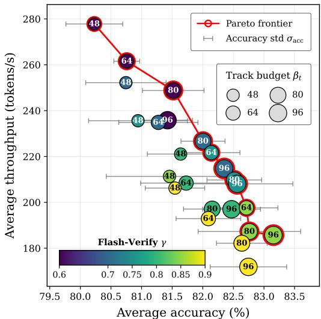  
(a) Pareto frontier of Flash-Verify

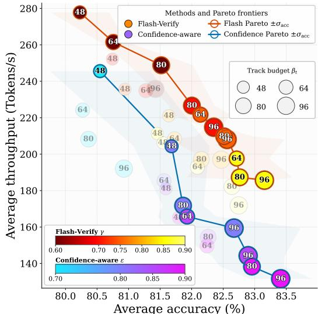  
(b) Pareto frontiers of Flash-Verify and Confidence

Figure 5: Accuracy–throughput trade-off under different track-budget values $\beta _ { t }$ and denoising settings γ/ϵ. The mean and standard deviation are computed over five random seeds.  
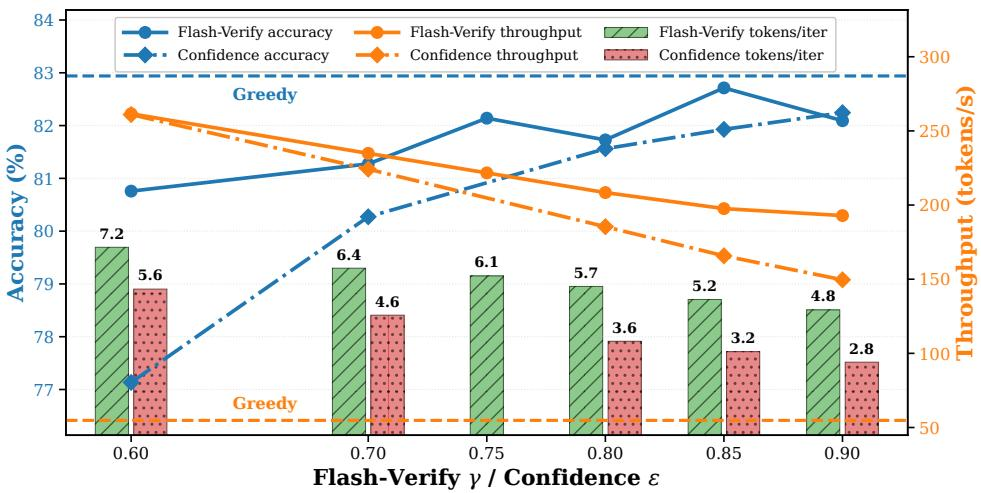  
Figure 6: Tokens-per-iteration comparison of Flash-Verify and Confidence-aware decoding.

Accuracy–throughput trade-off. Figure 5a characterizes the accuracy–throughput trade-off across track budgets $\beta _ { t }$ and Flash-Verify thresholds $\gamma .$ In general, accuracy and throughput are inversely related: increasing accuracy from approximately 80.2% to 83.2% reduces throughput from 278 to 186 tokens/s. Larger track budgets generally improve accuracy at the cost of additional computation, whereas $\gamma$ provides finer control over parallelism within a fixed budget. The Pareto frontier identifies the optimal operating points across these configurations. In particular, a favorable trade-off can be obtained by maintaining a relatively large $\breve { \beta } _ { t }$ while reducing $\gamma$ to promote greater decoding parallelism.

Flash-Verify vs. confidence-aware decoding. Figure 5b compares Flash-Verify with confidenceaware decoding. Across most of their shared accuracy range, Flash-Verify delivers substantially higher throughput. At approximately 82.6%–82.9% accuracy, it achieves 190–210 tokens/s, compared with 140–160 tokens/s for confidence-aware decoding. Although confidence-aware decoding attains a slightly higher peak accuracy of approximately 83.4%, its throughput decreases to about 131 tokens/s. Overall, Flash-Verify provides a more favorable accuracy–throughput trade-off.

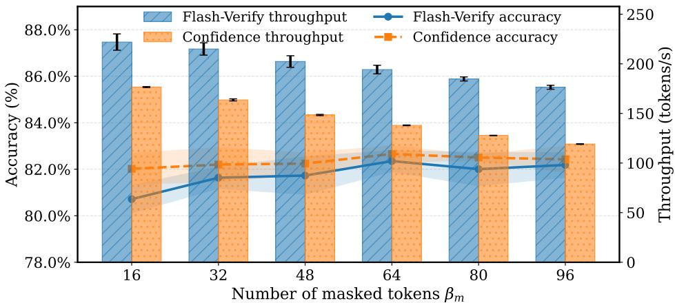  
Figure 7: Impact of the masked-window size $\beta _ { m }$ on accuracy and throughput

Tokens decoded per iteration. Figure 6 compares accuracy, throughput, and tokens decoded per iteration across Flash-Verify thresholds γ and confidence-aware thresholds ϵ. Across denoising settings, Flash-Verify generally decodes more tokens per iteration and achieves higher throughput, demonstrating greater parallel-decoding efficiency. Because Flash-Verify incurs an additional verification step, decoding 7.2 tokens per iteration yields throughput comparable to confidence-aware decoding at 5.6 tokens per iteration; however, Flash-Verify achieves 3.5% higher accuracy. As the number of tokens decoded per iteration increases, the accuracy gap between the methods narrows, while Flash-Verify’s throughput advantage grows to as much as 1.33×.

Masked-window size $\beta _ { m } .$ . Figure 7 examines the effect of the masked-window size $\beta _ { m }$ on the accuracy and throughput of Flash-Verify and confidence-aware decoding. For both methods, accuracy improves up to an intermediate window size, whereas throughput decreases as $\beta _ { m }$ increases. Flash-Verify achieves comparable accuracy across all settings, with gaps of only 0.2–1.2 percentage points. Moreover, it consistently delivers higher throughput, with its speedup over confidence-aware decoding increasing from approximately 1.4× to 1.5× as the window size grows.

## 4 Related Work

Diffusion Language Models and Acceleration. Masked diffusion models generate text by iteratively unmasking tokens predicted in parallel [26, 4, 38, 40, 58]. Scaling this paradigm has produced models competitive with autoregressive LLMs, including LLaDA [33], Dream [53], and Gemini Diffusion [15]. However, the lack of KV caching support makes dLLM inference slow: bidirectional attention and evolving hidden states across denoising steps prevent direct reuse of autoregressive caching strategies [35]. Fast-dLLM [46] introduces prefix caching with confidence-aware decoding. dKV-Cache [29] caches at fixed temporal intervals. Elastic-Cache [31] makes updates adaptive via attention-pattern drift detection. FlashDLM [18] combines token-level change detection with an external autoregressive verifier.

Parallel Decoding and Speculative Verification. Speculative decoding [24, 9] accelerates autoregressive LLMs by drafting tokens with a fast model and verifying them in parallel with the target model. In diffusion LLMs, parallel decoding takes a different form: confidence-aware methods [46] unmask all tokens above a threshold per step, Prophet [25] dynamically halts refinement when predictions stabilize, and FreeDave [47] drafts tokens in one forward pass then verifies in a second. FlashDLM [18] uses an external autoregressive LLM as the verifier. Our Flash-Verify differs from all of these: the dLLM serves as both drafter and verifier through the KV cache, with no external model and no training. We feed both the draft predictions and the original masks at the same positions under a causal attention mask, letting the model check its own consistency in a single additional forward pass. Tokens are accepted only when the draft and mask views agree, combining the throughput of aggressive parallel decoding with the accuracy of conservative single-token unmasking.

## 5 Conclusion

In this work, we proposed Flash-dLLM, a training-free inference acceleration framework for diffusion Large Language Models. Flash-dLLM addresses the key efficiency bottlenecks in dLLM decoding by jointly handling IO-aware KV caching and parallel draft-and-verify decoding. By reducing redundant KV-cache read/write operations, prioritizing influential decoded tokens, and improving the confidence of early token commitments, Flash-dLLM effectively converts the inherent parallelism of dLLMs into practical inference speedup. Extensive experiments on mathematical reasoning and code generation demonstrate that Flash-dLLM achieves superior speed, memory efficiency, and scalability over existing acceleration methods, offering a promising and practical path toward efficient deployment of diffusion-based language models.

## Acknowledgments

This work is supported by the MBZUAI-WIS Joint Program for Artificial Intelligence Research.

## References

[1] Josh Achiam, Steven Adler, Sandhini Agarwal, Lama Ahmad, Ilge Akkaya, Florencia Leoni Aleman, Diogo Almeida, Janko Altenschmidt, Sam Altman, Shyamal Anadkat, et al. Gpt-4 technical report. arXiv preprint arXiv:2303.08774, 2023.

[2] Sudhanshu Agrawal, Risheek Garrepalli, Raghavv Goel, Christopher Lott, Fatih Porikli, and Mingu Lee. Structuring the future: Diffusion llm speculative decoding via calibrated draft graphs. arXiv preprint arXiv:2509.18085, 2025.

[3] Marianne Arriola, Aaron Gokaslan, Justin Chiu, Zhihan Yang, Zhixuan Qi, Jiaqi Han, Subham Sahoo, and Volodymyr Kuleshov. Block diffusion: Interpolating between autoregressive and diffusion language models. In International Conference on Learning Representations, volume 2025, pages 50726–50753, 2025.

[4] Jacob Austin, Daniel D Johnson, Jonathan Ho, Daniel Tarlow, and Rianne Van Den Berg. Structured denoising diffusion models in discrete state-spaces. Advances in Neural Information Processing Systems, 34:17981–17993, 2021.

[5] Jacob Austin, Augustus Odena, Maxwell Nye, Maarten Bosma, Henryk Michalewski, David Dohan, Ellen Jiang, Carrie Cai, Michael Terry, Quoc Le, et al. Program synthesis with large language models. arXiv preprint arXiv:2108.07732, 2021.

[6] Heli Ben-Hamu, Itai Gat, Daniel Severo, Niklas S Nolte, and Brian Karrer. Accelerated sampling from masked diffusion models via entropy bounded unmasking. Advances in Neural Information Processing Systems, 38:55981–56007, 2025.

[7] Tiwei Bie, Maosong Cao, Kun Chen, Lun Du, Mingliang Gong, Zhuochen Gong, Yanmei Gu, Jiaqi Hu, Zenan Huang, Zhenzhong Lan, et al. Llada2. 0: Scaling up diffusion language models to 100b. arXiv preprint arXiv:2512.15745, 2025.

[8] Tianle Cai, Yuhong Li, Zhengyang Geng, Hongwu Peng, Jason D Lee, Deming Chen, and Tri Dao. Medusa: Simple llm inference acceleration framework with multiple decoding heads. arXiv preprint arXiv:2401.10774, 2024.

[9] Charlie Chen, Sebastian Borgeaud, Geoffrey Irving, Jean-Baptiste Lespiau, Laurent Sifre, and John Jumper. Accelerating large language model decoding with speculative sampling. arXiv preprint arXiv:2302.01318, 2023.

[10] Mark Chen, Jerry Tworek, Heewoo Jun, Qiming Yuan, Henrique Ponde De Oliveira Pinto, Jared Kaplan, Harri Edwards, Yuri Burda, Nicholas Joseph, Greg Brockman, et al. Evaluating large language models trained on code. arXiv preprint arXiv:2107.03374, 2021.

[11] Karl Cobbe, Vineet Kosaraju, Mohammad Bavarian, Mark Chen, Heewoo Jun, Lukasz Kaiser, Matthias Plappert, Jerry Tworek, Jacob Hilton, Reiichiro Nakano, et al. Training verifiers to solve math word problems. arXiv preprint arXiv:2110.14168, 2021.

[12] Gheorghe Comanici, Eric Bieber, Mike Schaekermann, Ice Pasupat, Noveen Sachdeva, Inderjit Dhillon, Marcel Blistein, Ori Ram, Dan Zhang, Evan Rosen, et al. Gemini 2.5: Pushing the frontier with advanced reasoning, multimodality, long context, and next generation agentic capabilities. arXiv preprint arXiv:2507.06261, 2025.

[13] Tri Dao, Dan Fu, Stefano Ermon, Atri Rudra, and Christopher Ré. Flashattention: Fast and memory-efficient exact attention with io-awareness. Advances in neural information processing systems, 35:16344–16359, 2022.

[14] Leo Gao, Jonathan Tow, Baber Abbasi, Stella Biderman, Sid Black, Anthony DiPofi, Charles Foster, Laurence Golding, Jeffrey Hsu, Alain Le Noac’h, Haonan Li, Kyle McDonell, Niklas Muennighoff, Chris Ociepa, Jason Phang, Laria Reynolds, Hailey Schoelkopf, Aviya Skowron, Lintang Sutawika, Eric Tang, Anish Thite, Ben Wang, Kevin Wang, and Andy Zou. A framework for few-shot language model evaluation, 07 2024.

[15] Google DeepMind. Gemini diffusion. https://deepmind.google/models/ gemini-diffusion, 2025. Accessed: 2026-05-02.

[16] Daya Guo, Dejian Yang, Haowei Zhang, Junxiao Song, Peiyi Wang, Qihao Zhu, Runxin Xu, Ruoyu Zhang, Shirong Ma, Xiao Bi, et al. Deepseek-r1: Incentivizing reasoning capability in llms via reinforcement learning. arXiv preprint arXiv:2501.12948, 2025.

[17] Dan Hendrycks, Collin Burns, Saurav Kadavath, Akul Arora, Steven Basart, Eric Tang, Dawn Song, and Jacob Steinhardt. Measuring mathematical problem solving with the math dataset. arXiv preprint arXiv:2103.03874, 2021.

[18] Zhanqiu Hu, Jian Meng, Yash Akhauri, Mohamed S Abdelfattah, Jae-sun Seo, Zhiru Zhang, and Udit Gupta. Flashdlm: Accelerating diffusion language model inference via efficient kv caching and guided diffusion. arXiv preprint arXiv:2505.21467, 2025.

[19] Jianuo Huang, Yaojie Zhang, Yicun Yang, Benhao Huang, and Linfeng Zhang. Mask tokens as prophet: Fine-grained cache eviction for efficient dllm inference. In Findings of the Association for Computational Linguistics: ACL 2026, pages 3456–3479, 2026.

[20] Inception Labs. Introducing mercury: The first commercial diffusion-based language model. https://www.inceptionlabs.ai/introducing-mercury, 2025. Accessed: 2026-05-02.

[21] Daniel Israel, Guy Van den Broeck, and Aditya Grover. Accelerating diffusion llms via adaptive parallel decoding. Advances in neural information processing systems, 38:52870–52888, 2025.

[22] Fanheng Kong, Jingyuan Zhang, Yahui Liu, Zirui Wu, Yu Tian, Guorui Zhou, et al. Accelerating diffusion llm inference via local determinism propagation. arXiv preprint arXiv:2510.07081, 2025.

[23] Woosuk Kwon, Zhuohan Li, Siyuan Zhuang, Ying Sheng, Lianmin Zheng, Cody Hao Yu, Joseph Gonzalez, Hao Zhang, and Ion Stoica. Efficient memory management for large language model serving with pagedattention. In Proceedings of the 29th symposium on operating systems principles, pages 611–626, 2023.

[24] Yaniv Leviathan, Matan Kalman, and Yossi Matias. Fast inference from transformers via speculative decoding. In International Conference on Machine Learning, pages 19274–19286. PMLR, 2023.

[25] Pengxiang Li, Yefan Zhou, Dilxat Muhtar, Lu Yin, Shilin Yan, Li Shen, Soroush Vosoughi, and Shiwei Liu. Diffusion language models know the answer before decoding. arXiv preprint arXiv:2508.19982, 2025.

[26] Tianyi Li, Mingda Chen, Bowei Guo, and Zhiqiang Shen. A survey on diffusion language models. arXiv preprint arXiv:2508.10875, 2025.

[27] Zhiyuan Liu, Yicun Yang, Yaojie Zhang, Junjie Chen, Chang Zou, Qingyan Wei, Shaobo Wang, Yichen Zhu, and Linfeng Zhang. dllm-cache: Accelerating diffusion large language models with adaptive caching. arXiv preprint arXiv:2506.06295, 2025.

[28] Aaron Lou, Chenlin Meng, and Stefano Ermon. Discrete diffusion modeling by estimating the ratios of the data distribution. arXiv preprint arXiv:2310.16834, 2023.

[29] Xinyin Ma, Runpeng Yu, Gongfan Fang, and Xinchao Wang. dkv-cache: The cache for diffusion language models. arXiv preprint arXiv:2505.15781, 2025.

[30] Yuxin Ma, Lun Du, Lanning Wei, Kun Chen, Qian Xu, Kangyu Wang, Guofeng Feng, Guoshan Lu, Lin Liu, Xiaojing Qi, et al. dinfer: An efficient inference framework for diffusion language models. arXiv preprint arXiv:2510.08666, 2025.

[31] Quan Nguyen-Tri, Mukul Ranjan, and Zhiqiang Shen. Attention is all you need for kv cache in diffusion llms. arXiv preprint arXiv:2510.14973, 2025.

[32] Shen Nie, Fengqi Zhu, Chao Du, Tianyu Pang, Qian Liu, Guangtao Zeng, Min Lin, and Chongxuan Li. Scaling up masked diffusion models on text. In International Conference on Learning Representations, volume 2025, pages 82974–82997, 2025.

[33] Shen Nie, Fengqi Zhu, Zebin You, Xiaolu Zhang, Jingyang Ou, Jun Hu, Jun Zhou, Yankai Lin, Ji-Rong Wen, and Chongxuan Li. Large language diffusion models. arXiv preprint arXiv:2502.09992, 2025.

[34] Jingyang Ou, Shen Nie, Kaiwen Xue, Fengqi Zhu, Jiacheng Sun, Zhenguo Li, and Chongxuan Li. Your absorbing discrete diffusion secretly models the conditional distributions of clean data. arXiv preprint arXiv:2406.03736, 2024.

[35] Reiner Pope, Sholto Douglas, Aakanksha Chowdhery, Jacob Devlin, James Bradbury, Jonathan Heek, Kefan Xiao, Shivani Agrawal, and Jeff Dean. Efficiently scaling transformer inference. Proceedings ofmachine learning and systems, 5:606–624, 2023.

[36] Alec Radford, Karthik Narasimhan, Tim Salimans, and Ilya Sutskever. Improving language understanding by generative pre-training. 2018.

[37] Liran Ringel, Ameen Ali, and Yaniv Romano. Dependency-guided parallel decoding in discrete diffusion language models. arXiv preprint arXiv:2604.02560, 2026.

[38] Subham Sekhar Sahoo, Marianne Arriola, Yair Schiff, Aaron Gokaslan, Edgar Marroquin, Justin T Chiu, Alexander Rush, and Volodymyr Kuleshov. Simple and effective masked diffusion language models. arXiv preprint arXiv:2406.07524, 2024.

[39] Jay Shah, Ganesh Bikshandi, Ying Zhang, Vijay Thakkar, Pradeep Ramani, and Tri Dao. Flashattention-3: Fast and accurate attention with asynchrony and low-precision. Advances in Neural Information Processing Systems, 37:68658–68685, 2024.

[40] Jiaxin Shi, Kehang Han, Zhe Wang, Arnaud Doucet, and Michalis K Titsias. Simplified and generalized masked diffusion for discrete data. arXiv preprint arXiv:2406.04329, 2024.

[41] Aaditya Singh, Adam Fry, Adam Perelman, Adam Tart, Adi Ganesh, Ahmed El-Kishky, Aidan McLaughlin, Aiden Low, AJ Ostrow, Akhila Ananthram, et al. Openai gpt-5 system card. arXiv preprint arXiv:2601.03267, 2025.

[42] Yuerong Song, Xiaoran Liu, Ruixiao Li, Zhigeng Liu, Zengfeng Huang, Qipeng Guo, Ziwei He, and Xipeng Qiu. Sparse-dllm: Accelerating diffusion llms with dynamic cache eviction. In Proceedings of the AAAI Conference on Artificial Intelligence, volume 40, pages 33038–33046, 2026.

[43] Jiaming Tang, Yilong Zhao, Kan Zhu, Guangxuan Xiao, Baris Kasikci, and Song Han. Quest: Query-aware sparsity for efficient long-context llm inference. arXiv preprint arXiv:2406.10774, 2024.

[44] Qingyan Wei, Yaojie Zhang, Zhiyuan Liu, Dongrui Liu, and Linfeng Zhang. Accelerating diffusion large language models with slowfast: The three golden principles. arXiv preprint arXiv:2506.10848, 2025.

[45] Chengyue Wu, Hao Zhang, Shuchen Xue, Shizhe Diao, Yonggan Fu, Zhijian Liu, Pavlo Molchanov, Ping Luo, Song Han, and Enze Xie. Fast-dllm v2: Efficient block-diffusion llm. In International Conference on Learning Representations, volume 2026, pages 128353–128370, 2026.

[46] Chengyue Wu, Hao Zhang, Shuchen Xue, Zhijian Liu, Shizhe Diao, Ligeng Zhu, Ping Luo, Song Han, and Enze Xie. Fast-dllm: Training-free acceleration of diffusion llm by enabling kv cache and parallel decoding. arXiv preprint arXiv:2505.22618, 2025.

[47] Shutong Wu and Jiawei Zhang. Free draft-and-verification: Toward lossless parallel decoding for diffusion large language models. arXiv preprint arXiv:2510.00294, 2025.

[48] Tianyi Wu, Xiaoxi Sun, Yanhua Jiao, Yulin Li, Yixin Chen, Yun-Hao Cao, Yi-Qi Hu, and Zhuotao Tian. Dynamic-dllm: Dynamic cache-budget and adaptive parallel decoding for training-free acceleration of diffusion llm. In The Fourteenth International Conference on Learning Representations, 2026.

[49] Guangxuan Xiao, Yuandong Tian, Beidi Chen, Song Han, and Mike Lewis. Efficient streaming language models with attention sinks. In International Conference on Learning Representations, volume 2024, pages 21875–21895, 2024.

[50] Zhihui Xie, Jiacheng Ye, Lin Zheng, Jiahui Gao, Jingwei Dong, Zirui Wu, Xueliang Zhao, Shansan Gong, Xin Jiang, Zhenguo Li, et al. Dream-coder 7b: An open diffusion language model for code. arXiv preprint arXiv:2509.01142, 2025.

[51] An Yang, Anfeng Li, Baosong Yang, Beichen Zhang, Binyuan Hui, Bo Zheng, Bowen Yu, Chang Gao, Chengen Huang, Chenxu Lv, et al. Qwen3 technical report. arXiv preprint arXiv:2505.09388, 2025.

[52] Ling Yang, Ye Tian, Bowen Li, Xinchen Zhang, Ke Shen, Yunhai Tong, and Mengdi Wang. Mmada: Multimodal large diffusion language models. arXiv preprint arXiv:2505.15809, 2025.

[53] Jiacheng Ye, Zhihui Xie, Lin Zheng, Jiahui Gao, Zirui Wu, Xin Jiang, Zhenguo Li, and Lingpeng Kong. Dream 7b: Diffusion large language models. arXiv preprint arXiv:2508.15487, 2025.

[54] Zihao Ye, Lequn Chen, Ruihang Lai, Wuwei Lin, Yineng Zhang, Stephanie Wang, Tianqi Chen, Baris Kasikci, Vinod Grover, Arvind Krishnamurthy, et al. Flashinfer: Efficient and customizable attention engine for llm inference serving. Proceedings of Machine Learning and Systems, 7, 2025.

[55] Ming Yin, Minshuo Chen, Kaixuan Huang, and Mengdi Wang. A theoretical perspective for speculative decoding algorithm. Advances in Neural Information Processing Systems, 37:128082–128117, 2024.

[56] Ted Zadouri, Markus Hoehnerbach, Jay Shah, Timmy Liu, Vijay Thakkar, and Tri Dao. Flashattention-4: Algorithm and kernel pipelining co-design for asymmetric hardware scaling. arXiv preprint arXiv:2603.05451, 2026.

[57] Zhenyu Zhang, Ying Sheng, Tianyi Zhou, Tianlong Chen, Lianmin Zheng, Ruisi Cai, Zhao Song, Yuandong Tian, Christopher Ré, Clark Barrett, et al. H2o: Heavy-hitter oracle for efficient generative inference of large language models. Advances in neural information processing systems, 36:34661–34710, 2023.

[58] Kaiwen Zheng, Yongxin Chen, Hanzi Mao, Ming-Yu Liu, Jun Zhu, and Qinsheng Zhang. Masked diffusion models are secretly time-agnostic masked models and exploit inaccurate categorical sampling. arXiv preprint arXiv:2409.02908, 2024.

[59] Fengqi Zhu, Rongzhen Wang, Shen Nie, Xiaolu Zhang, Chunwei Wu, Jun Hu, Jun Zhou, Jianfei Chen, Yankai Lin, Ji-Rong Wen, et al. Llada 1.5: Variance-reduced preference optimization for large language diffusion models. arXiv preprint arXiv:2505.19223, 2025.

## Appendix

## Table of Contents

A Limitations   
B Broader Impact   
C Bounded-Deviation Guarantee for Flash-Verify D Detailed Experiment Setup   
E Statistical analysis   
F Ablation of Generation and Prefill Length. G More scalability analysis   
H Sample Response

## A Limitations

Flash-dLLM is evaluated on two representative masked diffusion LLMs across mathematical reason ing and code generation tasks. While the fused Triton kernel and Flash-Verify are architecture-agnostic in design, we have not yet validated them on continuous-space diffusion language models, where the cache update patterns may differ. Similarly, our benchmarks focus on structured-output tasks; the behavior of confidence-aware decoding on open-ended generation (e.g., long-form writing or dialogue), where token-level confidence distributions tend to be flatter, is an interesting direction for future work. The hyperparameters γ and $\beta _ { m }$ are fixed throughout generation; an adaptive scheme that adjusts these based on running confidence statistics could further improve the throughput-accuracy trade-off. We view these as natural extensions and a potential future research direction.

## B Broader Impact

This work targets inference-time efficiency for diffusion LLMs and does not introduce new training data, model architectures, or fine-tuning procedures. By reducing the computational and memory cost of dLLM decoding, Flash-dLLM lowers the hardware barrier to deploying these models, which could broaden access to non-autoregressive language generation for researchers and practitioners with limited GPU resources. Faster inference also reduces the energy consumption per generated sequence, contributing to more sustainable deployment of large language models. We do not modify safety filters or alignment mechanisms of the underlying models; the generation quality and any associated risks (e.g., producing harmful or biased content) are inherited from the base dLLM. We encourage users to apply standard content moderation and human oversight when deploying Flash-dLLM in user-facing applications, particularly in high-stakes domains.

## C Bounded-Deviation Guarantee for Flash-Verify

Setup. We first fix the two distributions that Flash-Verify evaluates at a search position, following the draft and verify passes of Section 2.3, Figure 2 and Algorithm 2. Throughout, the quantity being controlled is the gap between committing several positions at once and committing them from the model’s own chain-rule joint; this gap is the standard error term of parallel unmasking in masked diffusion models [46, 6, 37].

Draft pass. At denoising step t, the draft pass runs the model on the query set $\mathcal { Q } ^ { t } = \mathcal { T } ^ { t } \cup \mathcal { M } _ { \beta _ { \infty } } ^ { t }$ with every position in $\mathcal { M } _ { \beta _ { m } } ^ { t }$ held at [MASK]. Let $\mathbf { x } ^ { t }$ denote this input sequence. For each $i \in \dot { \mathcal { M } } _ { \beta _ { m } } ^ { t }$ the draft pass yields the draft-pass distribution over the vocabulary V, which we call the draft marginal

$$
q _ { i } ( x ) : = p _ { \boldsymbol { \theta } } ( x ^ { i } = x \mid \mathbf { x } ^ { t } ) , \qquad x \in V ,\tag{3}
$$

from which the draft prediction and its confidence are $\hat { x } ^ { i } = \arg \operatorname* { m a x } _ { x } q _ { i } ( x )$ and $c ^ { i } = q _ { i } ( { \hat { x } } ^ { i } )$ . The window is partitioned by confidence into the confident set ${ \mathcal { D } } ^ { t } = \{ i : c ^ { i } \geq \epsilon \}$ , which is accepted directly, and the search set $S ^ { t } = \mathcal { M } _ { \beta _ { m } } ^ { t } \setminus \mathcal { D } ^ { t }$ , which is sent to verification. Note that $q _ { i }$ conditions on no other prediction made at step t: every position in $\mathcal { M } _ { \beta _ { m } } ^ { t }$ , including $\mathcal { D } ^ { t }$ and the other search positions, is masked in $\mathbf { x } ^ { t }$ . Committing $\mathcal { D } ^ { t }$ directly is covered by the analysis of confidence-aware decoding [46, Thm. 1]: if n positions all have marginal confidence above $1 - \varepsilon \mathrm { w i t h } ( n + 1 ) \varepsilon \leq 1$ the joint mode equals the product-of-marginals mode and the two distributions are within $\frac { 3 n - 1 } { 2 } \varepsilon$ in total variation. That result says nothing about $S ^ { t }$ , whose positions fail the confidence condition by construction, and it is for those positions that the verify pass and the guarantee below are needed.

Verify pass. Let $\mathbf { x } _ { + } ^ { t }$ denote $\mathbf { x } ^ { t }$ with the confident positions committed to their drafts, $\boldsymbol { x } ^ { \mathcal { D } ^ { t } } = \hat { \boldsymbol { x } } ^ { \mathcal { D } ^ { t } }$ together with the previously decoded tokens this forms the tracked context $\mathcal { T } _ { v }$ . Write the search positions in causality order (draft confidence, descending) as $i _ { 1 } , \dots , i _ { K }$ with $K = | S ^ { t } |$ . The verify query duplicates $S ^ { t }$ into a draft view, filled with $\hat { x } ^ { S ^ { t } }$ , and a mask view, filled with [MASK]. Under the causal verify mask of Figure 2, the mask view at $i _ { k }$ attends to $\mathcal { T } _ { v }$ , to the draft view at $i _ { 1 } , \ldots , i _ { k - 1 }$ and to the mask view at $i _ { k } , \dots , i _ { K } ;$ it does not attend to the draft view at $i _ { k }$ or at any later position. Every search position therefore enters its context exactly once, as a draft if it precedes $i _ { k }$ and as [MASK] otherwise, so the model output at the mask view of $i _ { k }$ is the mask-view distribution, which we call the verify conditional

$$
p _ { i _ { k } } ( \boldsymbol { x } ) : = p _ { \boldsymbol { \theta } } \big ( x ^ { i _ { k } } = \boldsymbol { x } \mid \mathbf { x } _ { + } ^ { t } , \hat { x } ^ { i _ { 1 } } , \ldots , \hat { x } ^ { i _ { k - 1 } } \big ) , \qquad \boldsymbol { x } \in V ,\tag{4}
$$

i.e. the model’s prediction for $i _ { k }$ when the positions before it in causality order are committed to their drafts and $i _ { k } , \dots , i _ { K }$ remain masked. This is exactly the input that sequential decoding in this order would present at its k-th step, and it is the same object that speculative decoding verifies against: the target model’s conditional at a drafted position given the accepted tokens before it [24, 9, 55]. The mask-view prediction and confidence are $\tilde { x } ^ { i } = \mathrm { \bar { a r g } } \operatorname* { m a x } _ { x } p _ { i } ( \tilde { x } )$ and $\tilde { c } ^ { i } = p _ { i } ( \tilde { x } ^ { i } )$ . Flash-Verify accepts position i according to

$$
\mathrm { a c c e p t } ( i ) = \mathbb { I } [ \hat { x } ^ { i } = \tilde { x } ^ { i } ] \cdot \mathbb { I } [ \tilde { c } ^ { i } \geq \gamma ] ,\tag{5}
$$

applied in causality order and stopped at the first rejection, so the committed block is the longest prefix $\mathcal { A } = \{ i _ { 1 } , \dots , i _ { m } \}$ on which every position is accepted. An accepted token is simultaneously the mode of the draft marginal $q _ { i }$ and a γ-confident mode of the verify conditional $p _ { i }$ . On acceptance the model commits the agreed token, and we write the delivered distribution at position i as the point mass $\pi _ { i } ( x ) : = \mathbb { I } [ x \overset { - } { = } \tilde { x } ^ { i } ]$ . For two distributions $u ,$ v over a finite set, total variation distance is $\begin{array} { r } { \mathrm { { T V } } ( u , v ) : = \frac { 1 } { 2 } \sum _ { x } | u ( x ) - \bar { v ( x ) } | } \end{array}$

Assumption 1. The referencefor the committed block is the model’s own sequential distribution in causality order: at position $i _ { k }$ it is the verify conditional $p _ { i _ { k } } ~ o f E q . ~ ( 4 )$ , and over the block it is the chain-rule joint $\begin{array} { r } { p _ { \mathcal { A } } ( x ^ { i _ { 1 } } , \ldots , x ^ { i _ { m } } ) : = \prod _ { k = 1 } ^ { m } p _ { \theta } \big ( x ^ { i _ { k } } ~ | ~ \mathbf { x } _ { + } ^ { t } , x ^ { i _ { 1 } } , \ldots , x ^ { i _ { k - 1 } } \big ) } \end{array}$ , which is the distribution one-token-per-step decoding of the same positions in the same order samples from. Deviation is measured against this model distribution rather than the data distribution.

Theorem 1 (Per-token deviation). Under Assumption 1, for every $i \in { \mathcal { A } } ,$

$$
\mathrm { T V } ( \pi _ { i } , p _ { i } ) = 1 - \tilde { c } ^ { i } \leq 1 - \gamma .\tag{6}
$$

Proof. Let $m : = \tilde { x } ^ { i } = \arg \operatorname* { m a x } _ { x } p _ { i } ( x )$ , so that $p _ { i } ( m ) = \tilde { c } ^ { i } \mathrm { a n d } \pi _ { i } ( x ) = \mathbb { I } [ x = m ]$ . By the definition of total variation,

$$
\mathrm { T V } ( \pi _ { i } , p _ { i } ) = { \textstyle { \frac { 1 } { 2 } } } \sum _ { x \in V } { \left| \pi _ { i } ( x ) - p _ { i } ( x ) \right| } = { \textstyle { \frac { 1 } { 2 } } } { \Big ( } { \big | } \pi _ { i } ( m ) - p _ { i } ( m ) { \big | } + \sum _ { x \not = m } { \left| \pi _ { i } ( x ) - p _ { i } ( x ) \right| } { \Big ) } .\tag{7}
$$

At $x = m$ we have $\pi _ { i } ( m ) = 1$ , hence $| \pi _ { i } ( m ) - p _ { i } ( m ) | = 1 - p _ { i } ( m )$ . At every $x \neq$ m we have $\pi _ { i } ( x ) = 0$ , hence $| \pi _ { i } ( x ) - p _ { i } ( x ) | = p _ { i } ( x )$ , and since $p _ { i }$ is a probability distribution, $\begin{array} { r } { \dot { \sum } _ { x \neq m } p _ { i } ( x ) = } \end{array}$ $1 - p _ { i } ( m )$ . Combining,

$$
\begin{array} { r } { \mathrm { T V } ( \pi _ { i } , p _ { i } ) = \frac { 1 } { 2 } \big [ ( 1 - p _ { i } ( m ) ) + ( 1 - p _ { i } ( m ) ) \big ] = 1 - p _ { i } ( m ) = 1 - { \tilde { c } } ^ { i } . } \end{array}\tag{8}
$$

The acceptance rule fires only when $\tilde { c } ^ { i } \geq \gamma$ , therefore $\mathrm { T V } ( \pi _ { i } , p _ { i } ) = 1 - \tilde { c } ^ { i } \leq 1 - \gamma .$

Corollary 1 (Block deviation). Let $\mathcal { A } = \{ i _ { 1 } , \dots , i _ { m } \}$ be the block committed by a single verify pass, $\begin{array} { r } { \pi _ { \mathcal { A } } : = \prod _ { k = 1 } ^ { m } \pi _ { i _ { k } } } \end{array}$ the delivered distribution over A, and $p _ { \mathcal { A } }$ the chain-rule joint of Assumption 1. Then

$$
\mathrm { T V } ( \pi _ { \cal A } , p _ { \cal A } ) = 1 - \prod _ { k = 1 } ^ { m } \tilde { c } ^ { i _ { k } } \leq 1 - \gamma ^ { m } \leq m ( 1 - \gamma ) .\tag{9}
$$

Proof. Every accepted token equals its draft, $\tilde { x } ^ { i _ { k } } \ = \ \hat { x } ^ { i _ { k } }$ , so $\pi _ { A }$ is the point mass at $\hat { x } ^ { A } =$ $( \hat { x } ^ { i _ { 1 } } , \ldots , \hat { x } ^ { i _ { m } } )$ . The computation in the proof of Theorem 1 applies verbatim to any point mass $\delta _ { z }$ and any distribution p on a finite set and gives $\mathrm { T V } ( \delta _ { z } , p ) = 1 - \bar { p ( z ) }$ ; hence $\mathrm { T V } ( \pi _ { \mathcal { A } } , \dot { p } _ { \mathcal { A } } ) = 1 - p _ { \mathcal { A } } ( \hat { x } ^ { A } )$ Evaluating the chain rule at $\hat { x } ^ { A }$ , the k-th factor is $p _ { \theta } ( \hat { x } ^ { i _ { k } } \ \vert \ \mathbf { x } _ { + } ^ { t } , \hat { x } ^ { i _ { 1 } } , \dots , \hat { x } ^ { i _ { k - 1 } } ) = p _ { i _ { k } } ( \hat { x } ^ { i _ { k } } ) =$ $p _ { i _ { k } } ( \tilde { x } ^ { i _ { k } } ) = \tilde { c } ^ { i _ { k } }$ by Eq. (4); the conditioning tokens $\hat { x } ^ { i _ { 1 } } , \ldots , \hat { x } ^ { i _ { k - 1 } }$ all lie in the accepted prefix, so no rejected draft enters any factor. Thus $\begin{array} { r } { p _ { \mathcal { A } } ( \hat { x } ^ { \mathcal { A } } ) = \prod _ { k } \tilde { c } ^ { i _ { k } } \ge \gamma ^ { m } } \end{array}$ , and $1 - \gamma ^ { m } \leq m ( 1 - \gamma )$ by Bernoulli’s inequality. □

Remark 1 (What the reference is). Because the verify mask is causal in causality order, $p _ { \cal A }$ is the model’s genuine joint over the block, not a product of marginals: the verified tokens incur no parallel-unmasking dependence error, and the bound is an equality in the mask-view confidences The dependence term bounded in KL by [6] and in total variation by [37] therefore concerns only $\mathcal { D } ^ { t }$ which is committedfrom marginals and handled by [46, Thm. 1]. Stopping at thefirst rejection is what keeps A a prefix, so that every conditional in $p _ { \cal A }$ conditions only on accepted tokens.

Remark 2 (Why γ gates the mask view). The bound is controlled by γ because acceptance thresholds the confidence $o f p _ { i } ,$ , the distribution the token is actually committedfrom. The confidence threshold ϵ instead gates $c ^ { i } = q _ { i } ( { \hat { x } } ^ { i } )$ , computed with all of $\mathcal { M } _ { \beta _ { m } } ^ { t }$ masked [46]; qi ignores the other positions decoded in the same step, so ${ \hat { x } } ^ { i }$ can be its mode yet carry little mass under $p _ { i } ,$ , andfor a search token $c ^ { i } < \epsilon b y$ construction. Hence lowering ϵ is not equivalent to verifying: only the latter carries the $1 - \gamma$ guarantee against $p _ { i } .$ . In the language of speculative decoding, the rule is a deterministic, biased acceptance [55]: the agreement test alone is lossless with respect to greedy decoding from $p _ { i } ,$ as in the auto-speculative verifier of [2], while γ trades a bounded distribution bias of $1 - \tilde { c } ^ { i }$ for more accepted tokens, the trade-offswept in Figure 5a.

## D Detailed Experiment Setup

Implementation Details. All experiments run on a single NVIDIA A100 80GB GPU. We evaluate Flash-dLLM on LLaDA-1.5 [59] across GSM8K [11], MATH [17], HumanEval [10], and MBPP [5]. We implement the fused KV-cache kernel in Triton 2.0. Default benchmark is GSM8K, with default hyperparameters: confidence threshold $\epsilon = 0 . 9$ , verify threshold $\gamma = 0 . 8$ , block size $\beta = 1 6$ , tracked budget $\beta _ { t } = 8 0$ , sliding window size $\beta _ { m } = 6 4$ , generation length 512. For fair comparison, we re-run all baselines under identical hardware and software configurations. Baselines. We compare against three approaches: (1) No Cache: standard dLLM inference without KV caching, under both greedy (fixed-step) and confidence-aware decoding; (2) Fast-dLLM [46]: prefix-caching with confidenceaware decoding; (3) Elastic-Cache [31]: adaptive KV caching with attention-pattern-based cache reuse. We report Flash-dLLM results under three configurations: greedy decoding (pure KV-cache speedup), confidence-aware decoding (KV-cache + parallel decoding), and Flash-Verify (KV-cache + draft-and-verify parallel decoding). Evaluation Metrics. We use lm-eval-harness [14]. Through put is measured as decoding tokens/sec averaged over the benchmark, following Fast-dLLM’s protocol [46]. Accuracy metrics: GSM8K uses 5-shot flexible\_extract; MATH uses 4-shot math\_verify; HumanEval uses 0-shot pass@1 with Fast-dLLM post-processing; MBPP uses 3-shot pass@1. We test at generation lengths 256 and 512 to study scalability.

Evaluation Framework and Metrics. Our evaluation protocol comprehensively assesses both inference efficiency and model performance across various tasks. To ensure standardization and reproducibility, we conduct all task-specific evaluations using the lm-eval-harness library [14]. Inference speed is measured by throughput in tokens per second (t/s), calculated as the average number of tokens generated by the model over the entire sequence until it produces an end-of-sequence (<eos>) token. We maintain consistency with Fast-dLLM [46] in our calculation methodology to ensure comparable speed benchmarks. Task-specific performance is evaluated using established metrics suitable for each benchmark. For GSM8K [11], we report 5-shot flexible\_extract exact match accuracy. For the MATH dataset [17], we report the 4-shot math\_verify score using the minerva\_math variant. For HumanEval [10], we evaluate 0-shot accuracy using a post-processing script consistent with the Fast-dLLM implementation to ensure fair comparison. Finally, for MBPP [5], we report the 3-shot pass@1 metric.

Hyper-parameters: The hyper-parameters used for Flash-dLLM are presented in Table 3. Specifically,

Table 3: The hyper-parameters of Flash-dLLM under various settings.
<table><tr><td>Model</td><td>Benchmark</td><td>Gen Length</td><td>Tracking budget  $\beta _ { t }$ </td><td>Window size  $\beta _ { m }$ </td><td>Flash-Verify γ</td><td>Batch size</td></tr><tr><td rowspan="6">LLaDA-1.5</td><td rowspan="2">GSM8K  $( 5 \mathrm { - } \mathrm { { s h o t } ) }$ </td><td>256</td><td>64</td><td>64</td><td>0.8</td><td>32</td></tr><tr><td>512</td><td>64</td><td>64</td><td>0.8</td><td>32</td></tr><tr><td rowspan="2">MATH (4-shot)</td><td>256</td><td>64</td><td>64</td><td>0.85</td><td>32</td></tr><tr><td>512</td><td>64</td><td>64</td><td>0.85</td><td>32</td></tr><tr><td rowspan="2">Humaneval (0-shot)</td><td>256</td><td>64</td><td>64</td><td>0.85</td><td>32</td></tr><tr><td>512</td><td>64</td><td>64</td><td>0.85</td><td>32</td></tr><tr><td rowspan="2"></td><td>MBPP (3-shot)</td><td>256</td><td>48</td><td>64</td><td>0.8</td><td>32</td></tr><tr><td></td><td>512</td><td>48</td><td>64</td><td>0.8</td><td>32</td></tr></table>

Table 4: Mean accuracy (%) and throughput over five random seeds. Accuracy is shown on the first line and throughput is shown in blue on the second line. Values are mean ± standard deviation.
<table><tr><td rowspan="2">C</td><td colspan="4">Track budget βt</td></tr><tr><td>48</td><td>64</td><td>80</td><td>96</td></tr><tr><td>0.60</td><td> $8 0 . 2 3 \pm 0 . 4 6$ </td><td> $8 0 . 7 6 \pm 0 . 2 1$ </td><td> $8 1 . 5 2 \pm 0 . 5 0$ </td><td> $8 1 . 4 2 \pm 0 . 4 1$ </td></tr><tr><td rowspan="2">0.70</td><td> $2 7 7 . 8 0 \pm 1 . 1 8$ </td><td> $2 6 1 . 5 4 \pm 1 . 0 0$ </td><td> $2 4 8 . 8 0 \pm 0 . 7 0$ </td><td> $2 3 5 . 8 2 \pm 0 . 7 6$ </td></tr><tr><td> $8 0 . 7 4 \pm 0 . 6 6$ </td><td> $8 1 . 2 7 \pm 0 . 6 5$ </td><td> $8 2 . 0 0 \pm 0 . 3 6$ </td><td> $8 2 . 3 5 \pm 0 . 1 3$ </td></tr><tr><td rowspan="2">0.75</td><td> $2 5 2 . 2 0 \pm 2 . 5 2$ </td><td> $2 3 4 . 8 6 \pm 4 . 9 4$ </td><td> $2 2 6 . 6 6 \pm 3 . 2 8$ </td><td> $2 1 4 . 7 8 \pm 2 . 1 8$ </td></tr><tr><td> $8 0 . 9 4 \pm 0 . 8 1$ </td><td> $8 2 . 1 4 \pm 0 . 4 7$ </td><td> $8 2 . 5 2 \pm 0 . 4 5$ </td><td> $8 2 . 5 6 \pm 0 . 9 1$ </td></tr><tr><td rowspan="2"></td><td> $2 3 5 . 6 0 \pm 1 . 3 6$ </td><td> $2 2 1 . 6 8 \pm 0 . 7 1$ </td><td> $2 0 9 . 7 6 \pm 1 . 2 9$ </td><td> $2 0 8 . 0 8 \pm 0 . 5 1$ </td></tr><tr><td> $8 1 . 6 4 \pm 0 . 5 4$ </td><td> $8 1 . 7 3 \pm 0 . 7 4$ </td><td> $8 2 . 1 5 \pm 0 . 4 7$ </td><td> $8 2 . 4 7 \pm 0 . 4 7$ </td></tr><tr><td rowspan="2">0.80</td><td> $2 2 1 . 0 6 \pm 3 . 5 8$ </td><td> $2 0 8 . 4 0 \pm 2 . 6 4$ </td><td> $1 9 7 . 0 8 \pm 1 . 5 4$ </td><td> $1 9 6 . 9 8 \pm 0 . 8 4$ </td></tr><tr><td> $8 1 . 4 6 \pm { 1 . 0 3 }$ </td><td> $8 2 . 7 1 \pm 0 . 5 1$ </td><td> $8 2 . 7 6 \pm 0 . 8 4$ </td><td> $8 3 . 1 5 \pm 0 . 1 7$ </td></tr><tr><td rowspan="2">0.85</td><td> $2 1 1 . 3 2 \pm 0 . 6 9$ </td><td> $1 9 7 . 6 0 \pm 0 . 7 0$ </td><td> $1 8 7 . 2 8 \pm 0 . 7 5$ </td><td> $1 8 5 . 7 0 \pm 0 . 6 1$ </td></tr><tr><td> $8 1 . 5 5 \pm 0 . 4 9$ </td><td> $8 2 . 0 9 \pm 0 . 5 3$ </td><td> $8 2 . 6 4 \pm 0 . 4 1$ </td><td> $8 2 . 7 5 \pm 0 . 6 2$ </td></tr><tr><td rowspan="2">0.90</td><td> $2 0 6 . 2 2 \pm 0 . 5 0$ </td><td> $1 9 2 . 9 0 \pm 0 . 7 5$ </td><td> $1 8 2 . 1 6 \pm 0 . 6 8$ </td><td> $1 7 1 . 8 6 \pm 0 . 3 3$ </td></tr><tr><td> $8 1 . 7 9 \pm 0 . 6 4$ </td><td> $8 2 . 2 4 \pm 0 . 4 3$ </td><td> $8 2 . 9 6 \pm 0 . 5 1$ </td><td> $8 3 . 4 1 \pm 0 . 5 0$ </td></tr><tr><td rowspan="2">1.00</td><td> $1 6 5 . 1 4 \pm 0 . 8 3$ </td><td> $1 4 9 . 6 0 \pm 0 . 4 7$ </td><td> $1 3 8 . 2 8 \pm 0 . 3 7$ </td><td> $1 3 1 . 5 8 \pm 1 . 4 1$ </td></tr><tr><td></td><td></td><td></td><td></td></tr></table>

• We set the basic block size to $\beta = 1 6 ,$ , corresponding to the smallest block used in our Triton implementation.

• For confidence-aware decoding, we use $\epsilon = 0 . 9$ , following the optimal setting reported by Fast-dLLM.

• We use a default masked-window size of $\beta _ { m } = 6 4$ across all settings to balance accuracy and decoding speed.

• We set $\gamma = 0 . 8$ for GSM8K and MBPP and $\gamma = 0 . 8 5$ for MATH and HumanEval.

• We use a batch size of 32 in all experiments to maximize GPU utilization.

## E Statistical analysis

Table 4 examines the joint effect of the denoising parameter $\gamma$ and track budget $\beta _ { t }$ on accuracy and throughput. The results show a consistent accuracy–efficiency trade-off: increasing either parameter generally improves accuracy while reducing decoding throughput. At a fixed $\gamma ,$ , increasing $\beta _ { t }$ from 48 to 96 improves accuracy by approximately 0.83–1.69 percentage points, but decreases throughput by about 10.9%–20.3%. Similarly, increasing $\gamma$ from 0.60 to 1.00 yields an accuracy gain of 1.44– 1.99 percentage points across the evaluated track budgets, accompanied by a throughput reduction of approximately 40.6%–44.4%. Although a few neighboring configurations exhibit small nonmonotonic variations, these differences are generally comparable to the reported standard deviations and do not alter the overall trend.

The highest-throughput configuration is obtained with $\gamma = 0 . 6 0$ and $\beta _ { t } = 4 8$ , reaching $2 7 7 . 8 0$ tokens/s at 80.23% accuracy. In contrast, the highest accuracy of $8 3 . 4 1 \%$ is achieved with $\gamma = 1 . 0 0$ and $\beta _ { t } = 9 6$ , where throughput decreases to 131.58 tokens/s. Thus, moving from the fastest to the most accurate configuration improves accuracy by 3.18 percentage points while reducing throughput by approximately 52.6%. Intermediate settings provide more balanced operating points. In particular, $\gamma = 0 . 8 5$ and $\beta _ { t } = 9 6$ achieve 83.15% accuracy at 185.70 tokens/s, remaining only 0.26 percentage points below the maximum accuracy while providing approximately 41.1% higher throughput. The relatively small standard deviations across five random seeds—at most 1.03 percentage points for accuracy and 4.94 tokens/s for throughput—also indicate that the observed trade-off is consistent across runs. Overall, γ and $\beta _ { t }$ offer complementary controls for selecting either a throughput-oriented or accuracy-oriented operating point.

Table 5: Ablation of generation and prefill lengths.  
(a) Impact of generation length on LLaDA-1.5 for GSM8K (5-shot) with a batch size of 16.
<table><tr><td>Approach</td><td>Metric</td><td>Len. 128</td><td>Len. 256</td><td>Len. 512</td><td>Len. 1024</td></tr><tr><td>Flash-Cache + Confidence</td><td>Accuracy Throughput Tokens/step</td><td>79.03 2.5</td><td>82.36 2.8</td><td>82.24 126.7 (1.00×) 140.4 (1.00×) 131.8 (1.00×) 125.7 (1.00×) 2.8</td><td>82.29 2.9</td></tr><tr><td>Flash-Cache + Flash-Verify</td><td>Accuracy Throughput Tokens/step</td><td>79.55 174.5 (1.38×) 198.4 (1.41×) 186.2 (1.41 ×) 173.0 (1.38×) 5.6</td><td>81.90 5.6</td><td>81.73 5.6</td><td>81.72 5.6</td></tr></table>

(b) Impact of prefill length on LLaDA-1.5 for GSM8K 512 with a batch size of 16.
<table><tr><td>Approach</td><td>Metric</td><td>1-shot</td><td>3-shot</td><td>5-shot</td><td>8-shot</td></tr><tr><td>Flash-Cache + Confidence</td><td>Accuracy Throughput Tokens/step</td><td>80.00 2.8</td><td>82.27 2.8</td><td>82.24 2.8</td><td>82.25 155.8 (1.00×) 145.4 (1.00×) 131.8 (1.00×) 123.1 (1.00×) 2.8</td></tr><tr><td>Flash-Cache + Flash-Verify</td><td>Accuracy Throughput Tokens/step</td><td>80.12 5.8</td><td>81.73 5.7</td><td>81.73 5.7</td><td>81.73 234.4 (1.50×) 209.6 (1.44×) 186.2 (1.41×) 165.7 (1.35×) 5.6</td></tr></table>

Table 6: Effect of batch size on throughput. Using LLaDA-1.5 for GSM8K-512 (5-shot). Speedup is measured relative to Flash-Cache with greedy decoding at the same batch size.
<table><tr><td rowspan="2">Approach</td><td rowspan="2">ACC</td><td rowspan="2">Tok./step</td><td colspan="7">Throughput</td></tr><tr><td>B=1</td><td>B=2</td><td>B=4</td><td>B=8</td><td>B=16</td><td>B=24</td><td>B=32</td></tr><tr><td>Flash-Cache + Greedy</td><td>82.94</td><td>1.0</td><td>18.5 (1.0×)</td><td>28.9 (1.0×)</td><td>37.7 (1.0×)</td><td>46.3 (1.0×)</td><td>51.3 (1.0×)</td><td>53.6 (1.0×)</td><td>55.0 (1.0×)</td></tr><tr><td>Flash-Cache + Confidence</td><td>82.87</td><td>2.8</td><td>51.7 (2.8×)</td><td>78.0 (2.7×)</td><td>102.4 (2.7×)</td><td>120.5 (2.6×)</td><td>131.8 (2.6×)</td><td>136.4 (2.5×)</td><td>139.5 (2.5×)</td></tr><tr><td>Flash-Cache + Flash-Verify</td><td>83.02</td><td>5.7</td><td>56.0 (3.0×)</td><td>90.9 (3.1×)</td><td>131.3 (3.5×)</td><td>164.8 (3.6×)</td><td>186.2 (3.6×)</td><td>195.5 (3.6×)</td><td>199.8 (3.6×)</td></tr></table>

## F Ablation of Generation and Prefill Length.

Table 5 examines the sensitivity of the two decoding strategies to generation length and prefill length. As shown in Table 5a, Flash-Cache with Flash-Verify consistently provides higher throughput than confidence-aware decoding across all generation lengths. Its throughput advantage ranges from 1.38× to 1.41×, corresponding to absolute improvements of 47.3–58.0 tokens/s. Both methods reach their highest throughput at a generation length of 256, attaining 140.4 tokens/s for confidence-aware decoding and 198.4 tokens/s for Flash-Verify. Beyond 256 tokens, throughput gradually decreases, while accuracy remains nearly unchanged. For example, increasing the generation length from 256 to 1024 reduces throughput by approximately 10.5% for confidence-aware decoding and 12.8% for Flash-Verify, without providing a corresponding accuracy improvement.

Table 5b shows that increasing the number of in-context examples, and consequently the prefill length, reduces throughput for both methods. From 1-shot to 8-shot prompting, confidence-aware throughput decreases from 155.8 to 123.1 tokens/s, a reduction of approximately 21.0%. Flash-Verify decreases from 234.4 to 165.7 tokens/s, corresponding to a reduction of approximately 29.3%. Nevertheless, Flash-Verify remains faster in every setting, providing speedups of 1.50×, 1.44×, 1.41×, and 1.35× for the 1-, 3-, 5-, and 8-shot settings, respectively. The decreasing relative speedup suggests that the computational cost of processing a longer prefix affects Flash-Verify more strongly, although it retains an absolute advantage of 42.6–78.6 tokens/s.

## G More scalability analysis

Analysis. Table 6 evaluates the throughput scaling of the three decoding strategies as the batch size increases. Throughput improves monotonically for all methods, although the gains gradually diminish at larger batch sizes. From B = 1 to B = 32, greedy decoding increases from 18.5 to 55.0 tokens/s, corresponding to a 2.97× increase due to batch scaling. Confidence-aware decoding rises from 51.7 to 139.5 tokens/s, or 2.70×, while Flash-Verify increases from 56.0 to 199.8 tokens/s, corresponding to the largest batch-scaling improvement of 3.57×.

Flash-Verify achieves the highest throughput at every batch size. Relative to greedy decoding under the same batch configuration, its speedup increases from 3.0× at B = 1 to approximately 3.6× for $B \geq 8 .$ . Confidence-aware decoding provides a smaller speedup of approximately 2.5×–2.8×. The advantage of Flash-Verify over confidence-aware decoding also grows with batch size: it is only 8.3% faster at B = 1, but becomes approximately 43.2% faster at B = 32. This trend indicates that Flash-Verify makes more effective use of the additional parallel computation available at larger batch sizes.

The throughput improvements are consistent with the number of tokens decoded per step. Flash-Verify accepts 5.7 tokens per step, compared with 2.8 for confidence-aware decoding and 1.0 for greedy decoding. Throughput begins to saturate beyond B = 16: at this batch size, Flash-Verify already reaches 186.2 tokens/s, or approximately 93.2% of its throughput at B = 32. Therefore, B = 16 provides a favorable efficiency point, capturing most of the maximum throughput while requiring only half the batch size.

## H Sample Response

In the following, we present several examples of actual generation results produced by our approach under different parameter settings.

Table 7: Example LLaDA-1.5 (without cache) — A qualitative comparison of different decoding methods.

Prompt: Amy is taking a history test. She correctly answers 80% ofthe multiple-choice questions, 90% ofthe true/false questions, and 60% ofthe long-answer questions. The multiple-choice and true/false questions are worth 1 point each, and the long answer questions are worth 5 points each How many points does Amy score ifthere are 10 multiple-choice questions, 20 true/false questions, and 5 long answer questions?

<table><tr><td rowspan=1 colspan=6>Greedy</td><td rowspan=1 colspan=1>Confident-aware</td><td rowspan=1 colspan=1>Flash-Verify</td></tr><tr><td rowspan=2 colspan=6>First find the number of multiple-choice ques-tions Amy answers correctly: 80% * 10</td><td rowspan=1 colspan=1>First find the number of multiple-choice ques-</td><td rowspan=3 colspan=1>First find the number of multiple-choicequestions Amy answers correctly: 10 ques-tions * 80% = «10*0.8=8»8 questions Then</td></tr><tr><td rowspan=1 colspan=1>tions Amy answers correctly: 80% * 10</td></tr><tr><td rowspan=4 colspan=6>questions = «10*.80=8»8 questions Thenfind the number of true/false questions Amyanswers correctly: 90% * 20 questions =«20*.90=18»18 questions Then find the num-</td><td rowspan=1 colspan=1>questions = «80*.10=8»8 questions Then</td></tr><tr><td rowspan=1 colspan=5>f true/false questions Amy</td><td rowspan=1 colspan=1>find the number of true/false questions Amy</td><td rowspan=3 colspan=1>find the number of true/false questions Amyanswers correctly: 20 questions * 90% =«20*0.9=18»18 questions Then find the num-</td></tr><tr><td rowspan=1 colspan=5>90% * 20 questions =</td><td rowspan=2 colspan=1>answers correctly: 90% * 20 questions =«90*.20=18»18 questions Then find the num-</td></tr><tr><td rowspan=1 colspan=3>as Then f</td><td rowspan=1 colspan=1>find the num-</td></tr><tr><td rowspan=7 colspan=6>ber of long-answer questions Amy answerscorrectly: 60% * 5 questions = «50*.60=3»3questions Then find the total points Amy getsfrom multiple-choice questions: 8 questions* 1 point/question = «8*1=8»8 points Thenfind the total points Amy gets from true/false</td><td rowspan=1 colspan=1>ons</td><td rowspan=1 colspan=1>s Amy answers</td></tr><tr><td rowspan=1 colspan=1>correctly: 60% * 5 questions = «60*.05=3»3</td><td rowspan=2 colspan=1>correctly: 5 questions * 60% = «5*0.6=3»3questions Then find the total points from</td></tr><tr><td rowspan=1 colspan=1>questions Then find the total points Amy gets</td></tr><tr><td rowspan=1 colspan=1>from multiple-choice questions: 8 questions</td><td rowspan=9 colspan=1>the multiple-choice questions: 8 questions* 1 point/question = «8*1=8»8 points Thenfind the total points from the true/false ques-tions: 18 questions * 1 point/question =«18*1=18»18 points Then find the total pointsfrom the long-answer questions: 3 questions *5 points/question = «3*5=15»15 points Thenadd up the points from each type of questionto find the total score: 8 points + 18 points +15 points = «8+18+15=41»41 points41Steps: 30, Tokens: 276, Time: 13.1s</td></tr><tr><td rowspan=1 colspan=1>* 1 point/question = «8*1=8»8 points Then</td></tr><tr><td rowspan=1 colspan=1>find the total points Amy gets from true/false</td></tr><tr><td rowspan=5 colspan=6>questions: 18 questions * 1 point/question =«18*1=18»18 points Then find the total pointsAmy gets from long-answer questions: 3questions * 5 points/question = «3*5=15»15points Then add up the points from each typeof question to find her total score: 8 points+ 18 points + 15 points = «8+18+15=41»41</td><td rowspan=1 colspan=1>questions: 18 questions * 1 point/question =</td></tr><tr><td rowspan=1 colspan=1>«18*1=18»18 points Then find the total points</td><td rowspan=1 colspan=1>«18*1=18»</td></tr><tr><td rowspan=1 colspan=1>Amy gets from long-answer questions: 3</td><td rowspan=1 colspan=1>from</td></tr><tr><td rowspan=1 colspan=1>questions * 5 points/question = «3*5=15»15points Then add up the points from each type</td><td rowspan=1 colspan=1></td></tr><tr><td rowspan=1 colspan=1>of question to find her total score: 8 points+ 18 points + 15 points = «8+18+15=41»41</td></tr><tr><td rowspan=1 colspan=6>points41</td><td rowspan=1 colspan=1>points41</td></tr></table>

Steps: 66, Tokens: 277, Time: 17.2s

Table 8: Example Flash-dLLM: A qualitative comparison of different decoding methods, LLaDA-1.5  
Prompt: Rong has been saving 20 coins in his piggy bank every month. Neil has been saving 2/5 times more coins in his piggy bank per month than Rong. How many coins are they having ten year after they started their savings?
<table><tr><td rowspan=1 colspan=6>Greedy</td><td rowspan=1 colspan=11>Confident-aware</td><td rowspan=1 colspan=1>Flash-Verify</td></tr><tr><td rowspan=2 colspan=6>Rong saves 20 coins per month, so in oneyear, he saves 20 * 12 = «20*12=240»240coins. Neil saves 2/5 times more coins than</td><td rowspan=1 colspan=11>Rong saves 20 coins per month, so in oneyear, he saves 20 * 12 = «20*12=240»240</td><td rowspan=7 colspan=1>Rong saves 20 coins per month, so in oneyear, he saves 20 * 12 = «20*12=240»240coins. Neil saves 2/5 times more coins thanRong, so he saves 20 + (2/5 * 20) = 20 + 8 =28 coins per month. In one year, Neil saves 28* 12 = «28*12=336»336 coins. In ten years,Neil saves 336 * 10 = «336*10=3360»3360</td></tr><tr><td rowspan=2 colspan=3>Rong, so he saves 20 + (2/5) * 20 = 20 + 8 =</td><td rowspan=1 colspan=1>nes mo</td><td rowspan=2 colspan=2></td><td rowspan=1 colspan=11>coins. Neil saves 2/5 times more coins than</td></tr><tr><td></td><td rowspan=3 colspan=11>Rong, so he saves 20 + (2/5) * 20 = 20 + 8 =</td></tr><tr><td rowspan=5 colspan=6>28 coins per month. In one year, Neil saves 28* 12 = «28*12=336»336 coins. In ten years,Neil saves 336 * 10 = «336*10=3360»3360coins. Together, Rong and Neil have 2400 +</td><td rowspan=2 colspan=2>saves 28</td><td rowspan=2 colspan=9>28 coins per month. In one year, Neil</td></tr><tr><td rowspan=1 colspan=5>=336»336 coins</td></tr><tr><td rowspan=2 colspan=5>Neil saves 336 * 10 = «336*10=3360»3360coins. Together, Rong a</td><td rowspan=1 colspan=3>0 = «336</td><td rowspan=1 colspan=5>6*10=3360»3360</td><td></td></tr><tr><td rowspan=1 colspan=1>2400 +</td><td rowspan=1 colspan=7>nd Neil have saved</td><td rowspan=3 colspan=1>240 ±3360 = «240+3360=3600»3600 coins.3600Steps: 34, Tokens: 219, Time: 5.7s</td></tr><tr><td rowspan=2 colspan=6>3360=«2400+3360=5760»5760 coins.5760Steps: 224, Tokens: 224, Time:15.2s</td><td rowspan=1 colspan=4></td><td rowspan=1 colspan=5>60»5760 coins.</td><td rowspan=1 colspan=2>240 ±3360=«240</td><td rowspan=2 colspan=1>240 ±3360 = «240+3360=3600»3600 coins.3600Steps: 73, Tokens: 222, Time: 7.8s</td></tr><tr><td rowspan=1 colspan=1>5760</td><td></td><td></td><td></td><td></td><td></td><td></td><td></td><td></td><td></td><td></td><td rowspan=1 colspan=1></td></tr></table>

Table 9: Example Flash-Verify (without cache) — A qualitative comparison of different γ values, LLaDA-1.5

Prompt: A nurses’ station orders bandages in bulk packs of50. On thefirst day, the nurses used 38 bandages and ordered one bulk pack of bandages. On the second day, they used ten fewer bandages. On the third day, they ordered two bulk packs of bandages and only used half a pack. They had 78 bandages left at the end ofthe third day. How many bandages did they start with on thefirst day?

<table><tr><td rowspan=1 colspan=2>二0.8</td><td rowspan=1 colspan=2></td><td rowspan=1 colspan=3></td><td rowspan=1 colspan=1></td><td rowspan=1 colspan=2>γ = 0.9</td><td rowspan=1 colspan=1>γ = 0.95</td></tr><tr><td rowspan=1 colspan=1>First, find t</td><td rowspan=5 colspan=7>First, find the total number of bandages usedon the first day: 38 bandages + 50 bandages =«38+50=88»88 bandages Then find the totalnumber of bandages used on the second day:88 bandages - 10 bandages = «88-10=78»78bandages Then find the total number of ban-dages used on the third day: 2 * 50 bandages= «2*50=100»100 bandages Then find the to-tal number of bandages used on the third day:100 bandages / 2 = «100/2=50»50 bandagesThen find the total number of bandages usedover the three days: 88 bandages + 78 ban-dages + 50 bandages = «88+78+50=216»216bandages Then add the number of bandagesleft at the end of the third day to find the totalnumber of bandages started: 216 bandages +78 bandages = «216+78=294»294 bandagesThen 294 bandages294Steps: 38, Tokens: 298, Time:11.3s</td><td rowspan=1 colspan=1>ber of banda</td><td rowspan=1 colspan=1>lages used</td><td rowspan=1 colspan=1>First, let&#x27;s total how many bandages were</td></tr><tr><td></td><td rowspan=1 colspan=2>used on the first day and how many wereordered: - Used: 38 bandages - Ordered: 1</td><td></td></tr><tr><td></td><td rowspan=1 colspan=2>bulk pack = 50 bandagesSo, the total number of bandages at the end</td><td></td></tr><tr><td></td><td rowspan=1 colspan=2>of the first day is:</td><td></td></tr><tr><td></td><td rowspan=1 colspan=2>Next, let&#x27;s determine how many bandageswere used on the second day: - Used: 38 - 10= 28 bandagesSo, the total number of bandages at the endof the second day is:88-28=60Now, let&#x27;s determine how many bandageswere used on the third day: - Ordered: 2bulk packs = 100 bandages - Used: 1/2 = 50bandagesSo, the total number of bandages at the endof the third day is: $6 0 + 1 0 0 - 5 0 = 1 1 0$ We know that they had 78 bandages left at theend of the third day, so the total number ofbandages they started with on the first day is: $1 1 0 + 7 8 = 1 8 8$ Therefore, they started with 188 bandages onthe first day.188Steps: 71, Tokens: 330, Time: 22.0s</td><td rowspan=1 colspan=1></td><td></td></tr></table>