## Graphical Abstract

Semantic Abstraction for Natural Language Inference: a Methodological Framework for Discovering and Compensating Semantic Knowledge and Reasoning Gaps in Large Language Models David Torres-Moreno , Jorge Hermosillo-Valadez

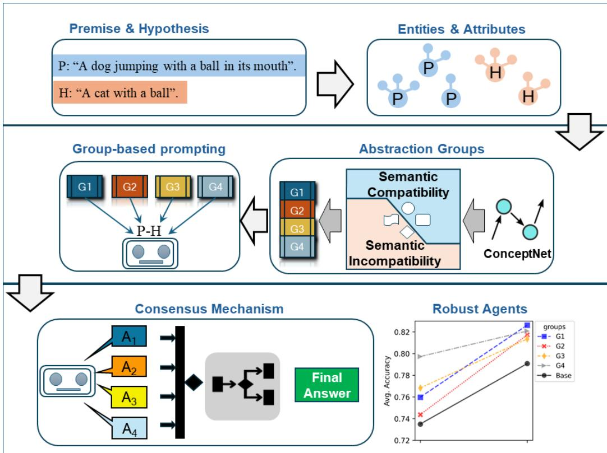

## Highlights

Semantic Abstraction for Natural Language Inference: a Methodological Framework for Discovering and Compensating Semantic Knowledge and Reasoning Gaps in Large Language Models David Torres-Moreno , Jorge Hermosillo-Valadez

• A methodological framework to discover and compensate for semantic knowledge gaps of Large Language Models (LLMs) in Natural Language Inference (NLI).

• The method guides the LLMs’ reasoning process, revealing their weaknesses and inconsistencies, which are compensated for by explainable decision strategies that improve NLI accuracy by up to 10% for some models.

• The results show that the framework is useful for improving not-entailment inference and suggest that it could also contribute to develop more robust and reliable models in the field of Natural Language Understanding (NLU).

# Semantic Abstraction for Natural Language Inference: a Methodological Framework for Discovering and Compensating Semantic Knowledge and Reasoning Gaps in Large Language Models

David Torres-Moreno a,1, Jorge Hermosillo-Valadeza,∗

aCentro de Investigación en Ciencias, Universidad Autónoma del Estado de Morelos, Av. Universidad 1001, Cuernavaca, 62209, Morelos, México

## Abstract

Despite their outstanding performance on many NLP tasks, LLMs face serious challenges related to semantic abstraction. In this study, we are interested in understanding how LLMs leverage abstract semantic knowledge in natural language inference (NLI), which requires sophisticated linguistic capabilities to interpret implicit meanings, contextual conceptual relationships, and semantic connections between words and phrases. To this end, we propose a methodological framework for constructing new semantic knowledge at a higher level of abstraction, which we define under the notions of semantic compatibility and incompatibility for NLI. In this framework, the meaning of the lexical-semantic relations between the premise and the hypothesis is

reconfigured to achieve a more flexible semantic network that induces dif ferent reasoning paths in LLMs. These new pathways show a consistent pattern of responses that allows agreement on a single response. The results demonstrate that our proposal allows to discover and compensate for LLMs’ semantic knowledge gaps in NLI, achieving significant improvements in accuracy, exceeding 10% for some models, and in particular for the non-entailment class. It is essential to note that LLMs need structured knowledge and not just more data to bridge reasoning gaps. Our hybrid approach directs attention to overlooked word relationships, allowing models to synthesize missing information. We believe that the future lies not in increasing model size, but in creating a semantic scafolding that mimics the flexibility of human thinking. Hopefully, our proposal will enable the development of more robust agents and interpretable reasoning, guiding AI toward reliable language understanding.

Keywords: LLMs, NLI, Textual Entailment, Abstraction, Semantic Knowledge

## 1. Introduction

## 1.1. Large language models and Natural Language Inference

Large language models (LLMs) have been a milestone in the history of artificial intelligence, having demonstrated their degree of capability in understanding, knowledge, reasoning and calculation [1, 2]. Despite an outstanding performance in many Natural Language Processing (NLP) tasks, LLMs exhibit critical problems. It has been shown, for instance, that poor knowledge or obvious factual gaps in training data have an impact on the phenomenon of hallucinations in LLMs [3, 4, 5]. Moreover, if the training process is contaminated with task evaluation data a mirage of competence is created, evidenced by models that memorize specific examples but fail at new tasks [6, 7, 8], or reproduce problems inherited from human data, such as social biases and annotation artifacts [9]. To compensate knowledge gaps, it has been shown that providing external knowledge graphs can improve the quality of embedded representations [10], mitigate hallucination [11], and helps answer fact-intensive questions better [12].

On the other hand, even more worrying is their inability to reason in depth. The inability of these models to perform abstract reasoning has been highlighted [13, 14, 15]. While there are hints that pre-trained language models (PLMs) recognize diferences between hyponym-hypernym relationships in nouns [16], higher-level cognitive limitations have been observed [17]. Furthermore, LLMs lack functional and formal linguistic skills [18], and show fundamental limitations in abstract reasoning and planning [19].

In this study, we are interested in understanding how LLMs leverage abstract semantic knowledge and to what extent this is useful to their reasoning process and linguistic skills. To assess the usefulness of abstraction we turn to Natural Language Inference (NLI), which requires sophisticated linguistic capabilities to interpret implicit meanings, contextual concept relationships, and semantic connections between words and phrases. Addressing NLI efectively is a matter of great relevance, since it is the basis for other NLP tasks with potential applications in healthcare [20, 21], legal domain [22] or fact checking [23, 24].

NLI examines whether a Hypothesis (H) can be inferred from a given

Premise (P) [25]. The problem is to decide whether to assign an Entailment label when P → H can be evaluated to true, a Contradiction label when P → H is considered false, or a Neutral tag when P → H is undetermined. Alternatively, the recognition of textual entailment (RTE) task considers two target classes: Entailment and Not-entailment.

LLMs can efectively address NLI when trained on benchmark datasets [26], but stumble in scenarios that require abstract thinking, revealing a worrying dependence on superficial shortcuts that becomes evident in cognitive robustness tests [27, 28]. Moreover, LLMs show poor cognitive flexibility, as they do not capture the nuances of human disagreement [29, 30] and show sensitivity to domain shift [31]. This has also been underscored by [32], who shows that the conceptual networks of LLMs are less interconnected and less flexible than those of humans, which manifests itself in more sequential reasoning, dificulty in jumping between distant semantic domains, and limitations in analogical reasoning. This cognitive rigidity suggests a fundamentally diferent structure of semantic relationships than in humans and points to the need to develop models with dynamic semantic networks to achieve advanced reasoning.

## 1.2. Problem statement and contribution

The previous analysis elucidates the broad limitations and gaps in LLMs reasoning capabilities and semantic understanding for NLI tasks: LLMs struggle with abstract reasoning, relying on superficial cues and rigid, domainlimited conceptual networks that hinder cognitive flexibility.

We propose a methodological framework for abstracting semantic knowledge in a hierarchical way that helps to identify and fill knowledge gaps of

LLMs regarding NLI. The key of our proposal is to model cognitive aspects that are implicit in NLP [33]. We propose that in NLI the meaning of the Hypothesis should be contained in the Premise, but the semantic content of H is usually more general than that of P when the entailment relation is true. This can be justified by observing that humans can identify semantic relationships at diferent levels of abstraction that allow us to make entailment decisions. Consider the following example, where the problem is to decide whether P → H1, or P → H2 is true —for clarity, we present the idea in the context of RTE:

P: “A dog jumping with a ball in its mouth".

H1: “An animal with a ball".

H2: “A cat with a ball".

In our approach, it is not just a matter of finding contextual similarities, but to know the multiple semantic relations that contribute to the decision of the fact that P entails H. In this case, the use of external resources of knowledge such as ConceptNet [34] is of great help.

A trivial approach would be to navigate the network of ConceptNet so as to find out if there is a connection between two concepts; for example, “dog is a type of mammal" and “mammal is a type of animal" are actual pathways in ConceptNet. Eventually, we could establish a link between “dog" and “animal", but we could also establish a link between “dog" and “cat" using the same navigation scheme.

However, under this approach there is no notion of hierarchy between concepts: the navigation does not allow us to know whether “dog" is more general than “cat" or whether they are at the same level; we cannot establish semantic links of another level of abstraction. Take another example, “Stockholm is part of Sweden" and “Sweden is a type of Europe" are also pathways in ConceptNet that allow to build the direct relation “Stockholm is part of Europe", similar to the is a relation. The semantic similarity between “is part of", “is a type of" and “is a" allows to abstract a notion of generality: “animal" is more general than “dog", “Europe" is more general than “Stockholm", but “dog" is not more general than “cat" because there is another relation between them that is “distinct from".

This notion of generality is what we exploit to establish links between P and H. Thus, this abstraction of generality must exist in only one direction from P to H to infer that entailment is true. Back to our example above, P → H1 is true and P → H2 is f alse. In the first case, we know the relationship “dog is an animal" and the asymmetric relationship between “dog" (hyponym) and “animal" (hyperonym) hold —hyperonymy conveys the notion of a more general concept. But, in the case P → H2, the relationship “dog is distinct from cat" and the co-hyponym relationship between “dog" and “cat" also hold —co-hyponym conveys the notion that two concepts share the same hyperonym. The former relations directly support entailment, whereas the latter do not.

We argue that it is not necessary to know the details (definition) of a specific type of relationship, but rather that it is suficient to abstract these relationships into categories that entail semantic compatibility. Our hypothesis is that either LLMs do not know which relation is useful, or they ignore how to abstract them into semantically compatible categories allowing it to decide for a particular class of entailment.

We propose a new methodological framework of abstraction of semantic relations that allows to improve the reasoning process of an LLM and to know to what extent these abstractions are useful in NLI. In this way, we not only inject new knowledge to the model but also provide new semantic connections between concepts, making the conceptual network of the model more flexible. Our contribution is as follows:

• We propose a methodological framework to discover and compensate for semantic knowledge gaps of LLMs in NLI.

• The method considers the directionality required in entailment evaluation to define abstract classes of semantic compatibility and incompatibility that guide the LLMs’ reasoning process, revealing inconsistencies in responses and weaknesses.

• The framework provides flexibility to the reasoning and decision pipeline in that semantic compatibility and incompatibility relations allow for new valid connections between concepts, distinct inference paths and the implementation of robust decision strategies.

• The results show that the framework is particularly useful for improving not\_entailment inference and suggest that it could also contribute to develop more robust and reliable agents in the field of NLU.

The remainder of the paper is structured as follows: Section 2 discusses the related work; Section 3 introduces the detailed methodological framework; Section 4 presents the experimental setup and results; Section 5 discusses the implications of the findings and limitations of the work; and Section 6 concludes with key contributions and final thoughts.

## 2. Related work.

While humans can combine simple concepts to solve complex problems or generate novel solutions, the performance of artificial neural models, such as PLMs and LLMs, deteriorates rapidly when faced with tasks that require abstraction. Despite advances in versatile generation and reasoning, these models lack deep understanding of abstract concepts and exhibit systematic failures in semantic organization [17], generalization of dimensions [35] and the identification of abstract semantics and semantic relations [36, 37, 38]. For instance, the authors in [39] analyze the dependence of their ability to critically handle abstract concepts. Their results suggest that abstract thinking does not arise spontaneously, and that LLMs lack consistency in their inferential processes. Another example is [19], who show that these models often arrive at correct answers based on superficial patterns without understanding the underlying principles.

This limitation may be related to an inability to maintain stable symbolic representations across varying contexts [40]. Interestingly, studies on attention maps in BERT reveal that PLMs can learn abstract relationships (such as hypernymy), but only implicitly and in a way that is biased by lexical distribution [16]. This creates a problem: while these models capture certain hierarchical structures, they do not use them as flexibly or consistently as humans do.

The observed limitations demonstrate models’ current inability to fully capture the nuanced reasoning, abstraction and linguistic sophistication required in NLI tasks. To efectively tackle NLI, we can find work that seeks to provide new semantic information, either through new lexical-syntactic structures or through external resources. Thus, [41] introduce virtual links between premises and hypotheses in order to overcome limitations based on lexical heuristics by extending syntactic structures, so that the model focuses on deeper contextual understanding. On the other hand, another common strategy is to incorporate structured external resources that provide ontological and semantic information to mitigate hallucinations in their responses [42]. External knowledge improves the performance of textual entailment through various approaches: knowledge graph-text fusion [43, 44], dynamic semantic integration [45], and adapter-based knowledge incorporation [46].

In order to cover the greatest number of semantic relationships, various knowledge bases can be used, which means dealing with a wide variety of representation approaches. The heterogeneity of available knowledge resources has led [47] to develop a unified dimensional framework for relationship classification. However, this presents fundamental challenges, particularly in ambiguous dimensional mapping, where relationships often transcend single categories and the optimal dimension for a task may not be the most useful. This complexity highlights the urgency of developing innovative methods that requires a delicate balance between semantic flexibility and structural precision to address abstract reasoning problems.

All this suggest that the challenge lies not only in scale, but also in cognitive architecture. While the current approach of predicting tokens allows some abstraction to emerge, it seems inadequate for replicating the compositional and abstractive mechanisms of human thought. The true test will be whether they can transcend statistical imitation and achieve a genuine structural understanding. Even with advanced methods such as Abstraction-of-Thought (AoT) [48], which forces hierarchical reasoning (from the abstract to the concrete), LLMs still demonstrate limitations in tasks requiring deep generalization, as they have an interpretative rigidity [49] and a cognitive bias [50].

Therefore, we provide a methodological framework for abstracting semantic relationships between the premise and the hypothesis to a higher semantic level, so that models can grasp the missing generalities to efectively tackle the NLI task.

Our proposal not only identifies current limitations but also establishes conceptual bridges between available explicit knowledge and the implicit reasoning processes underlying the LLMs’ linguistic understanding. We propose a categorical abstraction framework through the structured extraction of semantic relations from ConceptNet to build semantic abstraction groups that are used to prompt models. Our approach goes beyond the mere retrieval of semantic relations; its goal is to build new semantic knowledge at a higher level of abstraction, where the meaning of relations is given by their taskoriented association. We seek to make this new knowledge work to induce reasoning paths in LLMs, diferent from those they would follow without this new knowledge, in a direction consistent with the classes of NLI tasks. Thus, we investigate how our categorization allows us to discover and compensate for semantic knowledge gaps in LLMs in NLI.

## 3. Methods

Inspired by the way humans solve NLI tasks, we have developed a framework that incorporates key cognitive processes, such as meaning abstraction, semantic interpretation, and inference.

The framework is summarized in Figure 1. We start by defining two abstract categories: Semantic Compatibility and Semantic Incompatibility. The abstraction step involves the analysis of the dependency tree of P and H to identify entities—nouns and verbs—and their corresponding attributes—modifiers such as adjectives and adverbs. We use ConceptNet to identify the semantic relationships between these entities and group them according to the definition of the abstract categories. These groups of semantic relations constitute the formal mechanism used to prompt the LLMs. From LLMs’ answers it is possible to analyze the reasoning paths and eventually propose a decision model.

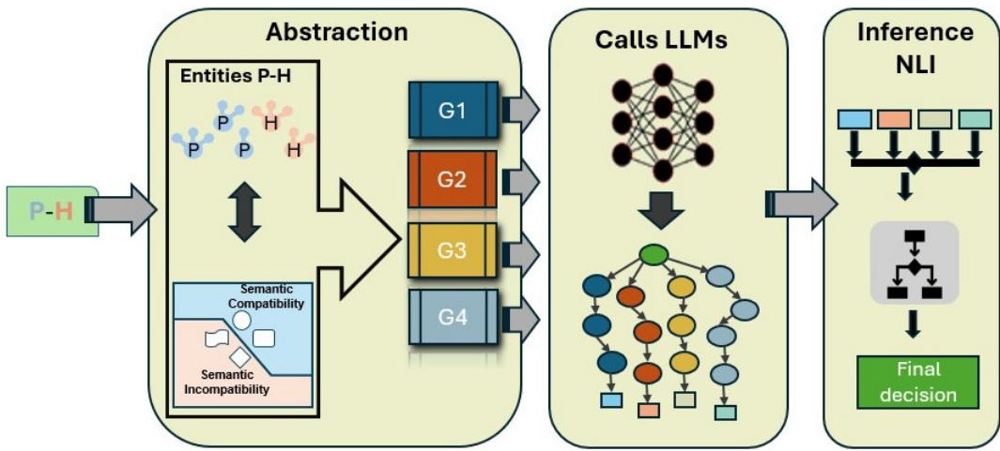  
Figure 1: Methodological framework  
We now describe in detail the methodological framework.

## 3.1. Semantic Compatibility and Incompatibility

Consider two concepts $c _ { 1 }$ and $c _ { 2 }$ . We define semantic compatibility between them as follows:

## Definition 3.1: Semantic Compatibility

We say that $c _ { 2 }$ has a relation of Semantic Compatibility with $c _ { 1 }$ if there is a relation from $c _ { 1 }$ to $c _ { 2 }$ and $c _ { 2 }$ is at a higher level in the hierarchy of the conceptual network (generalization) or $c _ { 2 }$ is at the same level with an equivalent meaning (equivalence). We write $c _ { 1 } \uparrow c _ { 2 }$ for the generalization relation and $c _ { 1 } \equiv c _ { 2 }$ for the equivalence relation.

Semantic compatibility helps to preserve meaning. For example, if we ask whether “person" has a relation of semantic compatibility with “man", or if man ↑ person holds, the answer is yes, since “person" is hyperonym of “man"—“person" is at a higher level in the hierarchy of the conceptual network; it generalizes “man". Thus, the semantic compatibility relationship operates under a strict directional constraint. The inverse relation person ↑ man fails to preserve the meaning, since “person” could refer to a “woman". This is an example of semantic incompatibility that we define below.

## Definition 3.2: Semantic Incompatibility

We say that $c _ { 2 }$ has a relation of Semantic Incompatibility with $c _ { 1 }$ if there is a relation from $c _ { 1 }$ to $c _ { 2 }$ and $c _ { 2 }$ is at a lower level in the hierarchy of the conceptual network (concretization relation), we write $c _ { 1 } \downarrow c _ { 2 }$ , or if there is a relation from $c _ { 1 }$ to $c _ { 2 }$ and $c _ { 2 }$ is at the same level with a diferent meaning (opposition relation), we write $c _ { 1 } \nsim c _ { 2 }$

Semantic incompatibility helps to identify relations that either concretize concepts or create a direct contrast (or diference in meaning) between concepts. On the one hand, recalling the example above, “person" is concretized in “man", i.e. the relation person ↓ man holds. On the other hand, the most obvious cases of opposition are antonyms, but also more subtle diferences in meaning are derived from co-hyponymy where terms share a hyperonym but are mutually exclusive. For example “running" and “walking" are co-hyponyms under their shared hyperonym “movement". Thus, we say that “running" has a relation of semantic incompatibility with “walking"; i.e. running ≁ walking holds.

Notice that the Semantic Compatibility relation is reflexive, symmetric for $c _ { 1 } \equiv c _ { 2 }$ , and antisymmetric and transitive for $c _ { 1 } \ \uparrow \ c _ { 2 }$ . These properties can be observed in diferent types of semantic relations in conceptual networks. Reflexivity occurs when a concept is related to itself, while asymmetry appears in generalization or concretization relations. On the other hand, transitivity in generalization relations is bottom-up, enabling hierarchical inferences: if “dog" is a “mammal" and “mammal" is an “animal", then “dog" is an “animal" that preserve meaning according to the direction of the relation.

Notice also that the Semantic Incompatibility relation is symmetric for $c _ { 1 } \nsim c _ { 2 }$ and transitive for the concreteness relationship $\left( { { c _ { 1 } } \downarrow { c _ { 2 } } } \right)$ . However, unlike the generalization relation, which is also transitive, the direction of concreteness relation is top-down and does not preserve meaning. Thus, these properties organize the conceptual network, facilitating attribute inheritance and logical reasoning within the conceptual structure.

These conceptual abstractions are crucial for semantic analysis, particularly when evaluating entailment. Our framework uses ConceptNet’s predefined relationships. Hence, it is possible to identify the type, direction and interaction of connections between lexical units and sub-phrases. In the conceptual hierarchy, upward vertical links allow the establishment of logical entailment. These can be combined with horizontal links representing equivalence relations (synonyms) belonging to semantic compatibility. Horizontal links of opposite relationships (antonyms and co-hyponyms), and downward vertical links belong to semantic incompatibility rather indicating not\_entailment. These conceptual abstractions are summarized in Figure 2.

In order to clearly establish the links between semantic relations and entailment classes, we propose to group the former as described in the following section.

## 3.2. Semantic Relationship Groups

We now propose rules for associating semantic relationships that are consistent with definitions 3.1 and 3.2. These rules allow the construction of groups that will eventually allow to establish a link between semantic relations and the notion of entailment. Thus, the definition of groups aims to establish comparison rules between entities with attributes of both P and H to determine what kind of semantic compatibility relation they have. Therefore, we establish the following notation for pairing entities with attributes for both P and H.

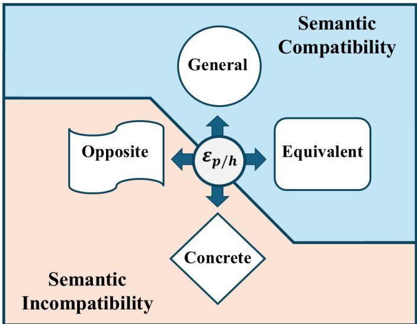  
Figure 2: Concept abstraction framework as given by definitions 3.1 and 3.2.

For each Premise P and each Hypothesis H we consider the sets $\mathcal { E } _ { p } : =$ $\{ ( e _ { i } ^ { p } [ ; \alpha _ { 1 } ^ { p } , \ldots , \alpha _ { k } ^ { p } ] ) | i = 1 , \ldots , p _ { 1 } ; k = 1 , \ldots , p _ { 2 } \}$ , where $e _ { i } ^ { p }$ is an entity of P and $\alpha _ { 1 } ^ { p } , \ldots , \alpha _ { k } ^ { p }$ is an optional list of corresponding attributes, and $\mathcal { E } _ { h } : =$ $\{ ( e _ { i } ^ { h } [ ; \alpha _ { 1 } ^ { h } , \ldots , \alpha _ { k } ^ { h } ] ) | i = 1 , \ldots , h _ { 1 } ; k = 0 , 1 , \ldots , h _ { 2 } \}$ , where $e _ { i } ^ { h }$ is an entity of H and $\alpha _ { 1 } ^ { h } , \ldots , \alpha _ { k } ^ { h }$ is an optional list of corresponding attributes. With this notation, each entity and attribute can be treated separately, thus, in order to recover the original phrase we will write $\varepsilon ^ { * }$ to represent an entity with its corresponding attributes in natural language. All entities and attributes are lemmatized. The following example shows the workings of this notation for

## Example 3.1: Entity and attributes notation

$P$ An old man in a long-sleeves white shirt is walking to work   
in a big city.   
$\mathcal { E } _ { p }$ {(man; old), (shirt; white, long-sleeve), (walk), (work), (city; big)}   
ε2 = (shirt; white, long-sleeve); ε∗ = long-sleeve white shirt   
H : The man is wearing shorts and a t-shirt as he jogs.   
Eh = {(man), (wear), (short), (t-shirt), (jog)}

## Definition 3.3: Group 1: General and Equivalent Relations

Given two elements $\varepsilon _ { p } \in \mathcal { E } _ { p }$ and $\varepsilon _ { h } \in { \mathcal { E } } _ { h }$ . We say that $\varepsilon _ { h }$ has a relation of Semantic Compatibility with $\varepsilon _ { p } ,$ if either $e ^ { p } \uparrow e ^ { h }$ or $e ^ { p } \equiv e ^ { h }$ hold and, whenever $\alpha _ { j } ^ { h }$ exists, either $\alpha _ { k } ^ { p } \uparrow \alpha _ { j } ^ { h }$ or $\alpha _ { k } ^ { p } \equiv \alpha _ { j } ^ { h }$ hold for all $k , j .$ In this case, we say that the relation belongs to Group 1 $\left( G _ { 1 } \right)$ . We write $( \varepsilon _ { p } ^ { * } ,$ rel\_ $\mathrm { S C } , \varepsilon _ { h } ^ { * } ) \in G _ { 1 }$ , where rel\_SC is any valid relation in the concept graph.

## Definition 3.4: Group 2: Opposite and Diference Relations

Given two elements $\varepsilon _ { p } \in \mathcal { E } _ { p }$ and $\varepsilon _ { h } \in { \mathcal { E } } _ { h }$ . We say that $\varepsilon _ { h }$ has a relation of Semantic Incompatibility (Diference) with $\varepsilon _ { p } .$ , if either $e ^ { p } \nsim e ^ { h }$ or $\alpha _ { k } ^ { p } \ \sim \ \alpha _ { j } ^ { h }$ hold for any $k , j$ . In this case, we say that the relation belongs to Group 2 (G2). We write $( \varepsilon _ { p } ^ { * } , \mathrm { r e l } _ { - } \mathrm { S I D } , \varepsilon _ { h } ^ { * } ) \in G _ { 2 }$ , where rel\_SID is any valid relation in the concept graph.

## Definition 3.5: Group 3: Concrete Relations

Given two elements $\varepsilon _ { p } \in \mathcal { E } _ { p }$ and $\varepsilon _ { h } \in { \mathcal { E } } _ { h }$ , we say that $\varepsilon _ { h }$ has a relation   
of Semantic Incompatibility (Concrete) with $\varepsilon ^ { p }$ , if either $e ^ { p } \downarrow e ^ { h }$   
or $\alpha _ { k } ^ { p } \downarrow \alpha _ { j } ^ { h }$ hold for any $k , j$ . In this case, we say that the relation   
belongs to Group 3 (G3). We write $( \varepsilon _ { p } ^ { * } , \mathrm { r e l } _ { - } \mathrm { S I C } , \varepsilon _ { h } ^ { * } ) \in G _ { 3 }$ , where   
rel\_SIC is any valid relation in the concept graph.

Note that the term “valid” refers to a relationship in the knowledge graph that complies with the definitions of Semantic Compatibility 3.1 and 3.2. The last group $G _ { 4 }$ will gather all entities of H that do not have any relation with any of the entities of P. In that case, we write

$$
( , \mathrm { U N K } , \varepsilon _ { h } ) \in G _ { 4 } .
$$

Continuing with Example 3.1, the following lists constitute the groups as follows, where the relations are extracted from ConceptNet:

Example 3.2: Groups of relations from Example 3.1   
$G _ { 1 } : =$ -old man, is a, man, long-sleeve white shirt, is a, t-shirt   
G2 := -walk, distinct from, jog,   
long-sleeve white shirt, distinct from, short   
G3 := -long-sleeve white shirt, related to, wear   
G4 := ∅

For the sake of clarity in the exposition of our arguments, in what follows we will make an abuse of language and will refer to entities with attributes as just entities.

## 3.3. Flexible conceptual networks: creating new connections between concepts

Previous groups define lists of nodes—relationships—or subgraphs connecting directly entities of P and H. Since we are going to navigate in a knowledge graph, we may or may not find direct relationships between concepts. In the first case, the relationship is established in a trivial way and can be readily categorized using the defined rules. If not found, the proposal is to try to establish a link between entities of P and H by identifying possible intersections between their subgraphs, enabling precise and consistent Semantic Compatibility scope. Figure 3 illustrates this purpose using the example given in the Introduction about “Stockholm".

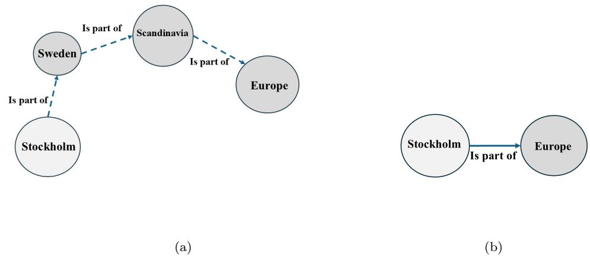  
Figure 3: Flexibilization of the conceptual network through the construction of new connections between concepts. a) The generalization relation allows reaching the “Europe" node from “Stockholm", while maintaining Semantic Compatibility (with the is part of relation) along the path. b) The transitivity of the rule allows to establish the direct link between these two concepts.

In order to enrich the groups with non-direct semantic relations between entities of P and H, we propose to follow the guidelines of the Semantic Compatibility (SC) and Incompatibility (SI) rules using the transitivity property. That is, we want to know if there are other concepts having SC relations with entities of H that in turn connect with entities of P under this same principle.

For this, we need to develop the subgraphs of each entity of P and of H following the defined rules to find out if there are transitive connections that preserve SC or SI. The development of the subgraphs involves finding new concepts under the SC principles. These new concepts define sets of relations, or bags of relations, for each of the entities of P and H, as illustrated in Figure 4a.

The idea is to check whether there are relationships connecting these entities through the transitivity property of general and concrete relationships, and the rules of equivalence and opposition that preserve SC and SI. In fact, there are four sets among which it is possible to search for intersections. If there is any intersection between these sets, it means that there are concepts that link entities from P and H, as illustrated in Figure 4b.

However, not all intersections are valid, because the rules of transitivity must be respected for the SC to hold. Thus, of the 16 possible intersections between the 4 sets, only 9 are valid as shown in Figure 5. Thus, new valid connections arise from these intersections with which it is possible to enrich the groups following their definition.

These intersections reveal deeper connections that inform our classification of entailment, allowing us to identify direct and indirect semantic relationships that might not be immediately apparent from ConceptNet alone and that might not be present in the LLM’s conceptual network (Figure 5).

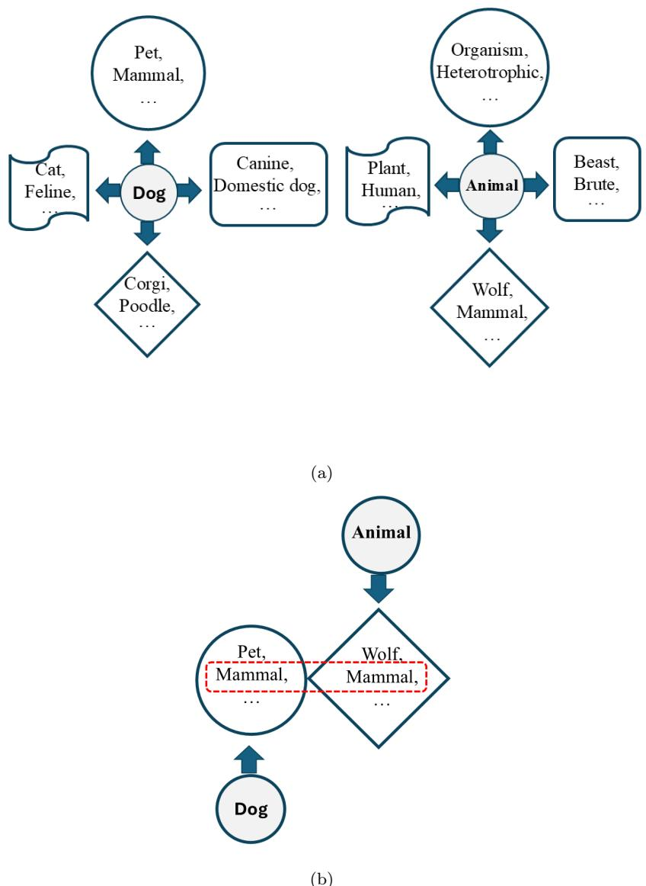  
Figure 4: Semantic relations according to the abstract categories of semantic compatibility and incompatibility. a) Semantic relations of entities of P and H and b) Intersection of sets of relations between entities of P and H maintaining hierarchy.

<table><tr><td>Semantic Compatibility G1</td><td>Semantic Incompatibility G2 G3</td></tr><tr><td>En  $\mathfrak { E } _ { \mathbf { p } } \vert \mathfrak { E } _ { \mathbf { h } }$  ce  $\pmb { \varepsilon _ { \mathrm { p } } } \equiv \pmb { \varepsilon _ { \mathrm { h } } }$  En  $\mathfrak { E } _ { \mathbf { p } } \vert \mathfrak { E } _ { \mathbf { h } }$  En</td><td>εplεh Ce  $\bf { \varepsilon } _ { \bf { p } } \nsim _ { \bf { \varepsilon } _ { \bf { k } _ { \mathrm { { h } } } } }$  CP εn En {εp&amp;  $\bf { \varepsilon _ { p } } \nsim \bf { \varepsilon _ { \mathrm { { h } } } }$  Ee ce En En  $\mathfrak { L } _ { \mathrm { p } } \downarrow \mathfrak { E } _ { \mathrm { h } }$   $\bf { \varepsilon } _ { \bf { p } } \nsim _ { \bf { \varepsilon } _ { \bf { h } } }$ </td></tr></table>

Figure 5: Extension of relationships. $G _ { 1 }$ captures equivalence relations (synonymy) and extends the generality of $\varepsilon _ { p }$ using the concrete relationships of $\varepsilon _ { h } . \ G _ { 2 }$ captures co-hyponymy on the intersection of the general relations of both, and extended antonymy through equivalence relations. $G _ { 3 }$ identifies more concrete relations from the concrete relations of $\varepsilon _ { p }$ on general or equivalence relations of $\varepsilon _ { h }$ and from equivalence relations of $\varepsilon _ { p }$ on general relations of $\varepsilon _ { h }$

Thus, the proposed groups define sets of semantic relationships that are abstracted into the concepts of SC and SI. We will refer to these groups as abstract groups, in the sense that they do not literally define the semantic relationships involved (e.g., we do not provide explicit information about what hyperonymy is), but rather abstract their compatibility by their association. Therefore, we are not seeking to say what these relationships are, but rather that there is a relationship at a higher level of abstraction that groups them together.

## 3.4. Calls to LLMs

The framework allows us to address diferentiated questions to an LLM by providing information from each of the categorized groups $\left( G _ { 1 } - G _ { 4 } \right)$ 2 ensuring independent multifaceted analysis. We apply prompting techniques using triplets from the groups we have defined, which has been shown to be the best way to provide information to these models [12]. In the prompts, the definition of the groups and the list of triplets $G _ { 1 } - G _ { 4 }$ are included, see Figure 6. The complete prompts can be found in Appendix A.

You are an expert in Recognizing Textual Entailment over pairs of Premise and Hypothesis. Based on the background information provide below, classify the relationship between the given Premise and Hypothesis as one of the following: "Entailment", "Neutral" or "Contradiction". Respond only using the template: { "Answer": }. Do not modify the template.

Premise and hypothesis to classify:

Premise: {texti}

Hypothesis: {hypothesisi}

Background Information: {group\_def initionj}

Word relations group: {group\_relationsj}

Figure 6: Prompt template for requests to LLMs. The variable i runs through the number of examples in the datasets. The variable j runs through the groups $\left( G _ { 1 } - G _ { 4 } \right)$ we propose.

## 3.5. Inference in NLI

The LLM generates four diferent responses for each P-H pair, so a robust unification mechanism is essential. Our approach to consolidating the final responses of LLMs uses diferent techniques for final decision-making, evaluating the best reasoning process according to the abstract information provided. To achieve this, we use three key strategies:

• Majority Voting provides a robust and straightforward approach to selecting the most consistent answer.

• Weighted Majority Voting (WMV) [51] assigns dynamic weights to each classifier, optimizing the final decision through ensemble learning.

• Decision Tree Algorithm (Decision Tree) learns the rules, weighing up the correct lines of reasoning for the final answer.

For the latter two algorithms, additional sampling of pairs (P, H) is required for training only. The intuition behind this proposal is that each group $\left( G _ { 1 } ^ { \phantom { } \cup } G _ { 4 } \right)$ provides unique information about the relationships between P and H, resulting in diferent lines of reasoning. Combining these answers maximizes the influence of lines of reasoning that lead to correct answers, resulting in a more reliable and informed final decision.

## 4. Experimental results

We first describe the experimental setup used to assess our proposal and then present the results. The code used in this work is available at github 2.

## 4.1. Experimental setup

## 4.1.1. LLMs

We selected LLMs from three families based on their size and performance on the MMLU benchmark3, which measures general knowledge in diferent subjects. These are: gemma2:2b and gemma2 from Google, llama3.2 and llama3.1 from Meta, phi3 and phi3:medium from Microsoft. Their corresponding size and performance on the MMLU benchmark are shown in Figure 7.

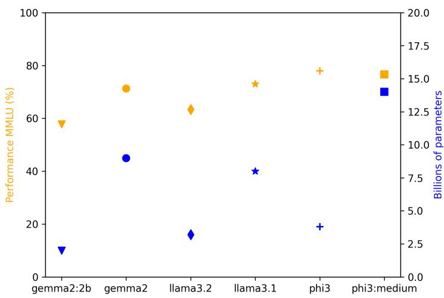  
Figure 7: Comparison of LLMs used in this study in terms of size and performance in MMLU.

The Ollama4 platform allows these models to be used directly, without additional configuration. All models ran on a Core i9 server with 128 GB of

RAM and hosting an NVIDIA 4090 GPU.

## 4.1.2. Datasets

To assess NLI tasks, we selected the most widely used datasets: SICK [52] and SNLI [53]. These contain pairs of P-H with their respective labels: Entailment (E), Neutral (N), and Contradiction (C). We also chose datasets with two labels: entailment (E) and non-entailment (NE): SciTail [54], RTE [55] and the SuperGLUE reference diagnostic dataset5.

With the exception of the diagnostic dataset, for which all example pairs were taken, random samples were generated, balancing the number of examples in each class, providing suficient information to generate statistical tests, and reducing computational costs during processing. Table 1 shows the datasets and their data.

<table><tr><td>Dataset</td><td>Classes</td><td>Samples </td><td>Pairs for each sample</td></tr><tr><td>SNLI</td><td>3</td><td>10</td><td>600; 200 per class</td></tr><tr><td>SICK</td><td>3</td><td>10</td><td>600; 200 per class</td></tr><tr><td>RTE</td><td>2</td><td>10</td><td>400; 200 per class</td></tr><tr><td>Scitail</td><td>2</td><td>10</td><td>400; 200 per class</td></tr><tr><td>Diagnostic 2</td><td></td><td>1</td><td>1,104; 460 (E) y 644 (NE)</td></tr></table>

Table 1: Datasets and samples for evaluating NLI

## 4.2. Experimental analysis undertaken and results

## 4.2.1. Abstraction groups influence on LLMs

The proposed abstraction groups were designed to capture semantic compatibility and incompatibility relationships in order to induce a line of reasoning in the LLMs. The hypothesis is that each abstraction group will induce responses with some tendency; for example, a tendency toward entailment or toward contradiction. Thus, the first question is to what extent these semantic abstraction groups influence the reasoning process of each model. For this analysis, LLMs were prompted using the template of Figure 6 for each group.

Figure 8 summarizes the average performance of each LLM on diferent datasets under the influence of each abstraction group. The top row shows the average performance on the Scitail dataset (two labels), while the bottom row shows their performance on the SNLI dataset (three labels). For the twolabel dataset, higher accuracies are generally observed under the influence of abstraction groups and depending on the size of each model, except for the Llama models and the phi3:medium model with group $G _ { 2 }$ . The situation changes slightly for the three-label dataset. In general, model performance drops compared to the baseline, except for some groups and some models.

## 4.2.2. The GS\_DT system performance

Figure 8 shows that there always seems to be at least one group that performs better than the baseline on average. Thus, the second question is how to reach a consensus on the responses that each abstraction group elicits.

To unify the criteria, we experimented with the strategies proposed in Section 3.5. This allows us to deal with the variability of the LLMs’ responses, when provided with information about the group, and identify the best strategy to decide on the correct answer. In the case of WMV and DT, it is necessary to choose training and test samples from each dataset. For majority voting, only the most frequent prediction is taken.

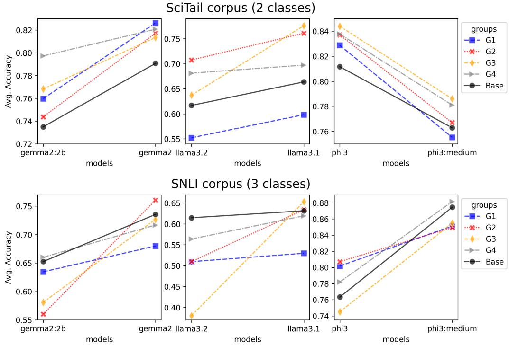  
Figure 8: Average accuracy of group influence on LLMs. Top row is the performance on the Scitail dataset by groups and baseline. Bottom row is the performance on the SNLI dataset by groups and baseline.

After several trials, we decided to use DT as the consensus mechanism, as it consistently obtained the best results. Henceforth, we will refer to our proposal combining the abstraction groups and the decision tree as GS\_DT.

The performance of the GS\_DT system is shown for the three-label and two-label datasets in Tables 2 and 3, respectively.

<table><tr><td colspan="5">SNLI SICK</td></tr><tr><td>Models</td><td>Baseline</td><td>GS_DT</td><td>p-value</td><td>Baseline GS_DT</td><td>p-value</td></tr><tr><td>gemma2</td><td> $7 3 . 6 { \pm } 1 . 7 $ </td><td> ${ \bf 7 8 . 9 { \pm } 1 . 6 }$ </td><td>&lt;0.05</td><td> $8 5 . 5 { \pm } 1 . 0 $ </td><td>89.2±0.9 &lt;0.001</td></tr><tr><td>gemma2:2b</td><td> $6 5 . 3 { \pm } 1 . 8 $ </td><td> ${ \bf 6 7 . 3 \pm 1 . 7 }$ </td><td>&lt;0.001</td><td> $7 6 . 5 { \pm } 1 . 0 $ </td><td>84.3±1.1 &lt;0.001</td></tr><tr><td>11ama3.1</td><td> $6 3 . 1 { \pm } 1 . 6 $ </td><td> $7 4 . 7 { \pm } 1 . 5 $ </td><td>&lt;0.001</td><td> $8 0 . 5 { \pm } 0 . 9 $ </td><td>86.2±0.6  $< 0 . 0 0 1$ </td></tr><tr><td>1lama3.2</td><td> $6 1 . 5 { \pm } 0 . 6 $ </td><td> ${ \bf 6 9 . 8 { \pm } 1 . 2 }$ </td><td>&lt;0.001</td><td> $6 7 . 0 { \pm } 0 . 8 $ </td><td>78.2±1.5  $< 0 . 0 0 1$ </td></tr><tr><td>phi3:medium</td><td> $8 7 . 4 { \pm } 1 . 3 $ </td><td> $8 7 . 8 { \pm } 1 . 5 $ </td><td>0.5438</td><td> $7 4 . 0 { \pm } 1 . 2 $ </td><td> ${ \bf 8 1 . 6 { \pm } 1 . 4 }$  &lt;0.001</td></tr><tr><td>phi3</td><td> $7 6 . 3 { \pm } 1 . 5 $ </td><td> $8 3 . 2 { \pm } 2 . 1 $ </td><td>&lt;0.01</td><td> $8 3 . 4 { \pm } 2 . 0 $ </td><td> $8 5 . 0 { \pm } 1 . 3 $  0.0787</td></tr></table>

Table 2: Comparison of average performance between Baseline and GS\_DT for the datasets of 3 classes with p-values from Mann-Whitney statistical tests.
<table><tr><td colspan="6">SciTail RTE</td></tr><tr><td>Models</td><td>Baseline</td><td> $\mathrm { G S \_ D T }$ </td><td>p-value</td><td>Baseline</td><td> $\mathrm { G S \_ D T }$  p-value</td></tr><tr><td>gemma2</td><td> $7 9 . 1 { \pm } 1 . 5 $ </td><td> ${ \bf 8 3 . 6 { \pm } 1 . 2 }$ </td><td>&lt;0.001</td><td> $8 8 . 1 { \pm } 1 . 2 $ </td><td>88.4±1.2 0.8796</td></tr><tr><td>gemma2:2b</td><td> $7 3 . 5 { \pm } 1 . 2 $ </td><td> ${ \bf 7 9 . 8 \pm 1 . 7 }$ </td><td>&lt;0.001</td><td>74.6±2.0</td><td>74.5±1.9 0.4956</td></tr><tr><td>1lama3.1</td><td> $6 6 . 4 { \pm } 1 . 0 $ </td><td> ${ \bf 7 8 . 0 \pm 1 . 7 }$ </td><td>&lt;0.001</td><td>76.2±2.0</td><td>81.3±1.7 &lt;0.001</td></tr><tr><td>1lama3.2</td><td> $6 1 . 7 { \pm } 1 . 7 $ </td><td> $7 1 . 2 { \pm } 1 . 8 $ </td><td>&lt;0.001</td><td> $7 3 . 2 { \pm } 1 . 9 $ </td><td>75.5±1.9 &lt;0.05</td></tr><tr><td>phi3:medium</td><td> $7 6 . 3 { \pm } 1 . 7 $ </td><td>80.4±1.5</td><td>&lt;0.001</td><td> $8 7 . 5 { \pm } 1 . 1 $ </td><td>88.3±1.5 0.3618</td></tr><tr><td>phi3</td><td>81.2±1.1</td><td>84.2±1.3</td><td>&lt;0.001</td><td> $8 5 . 8 { \pm } 1 . 7 $ </td><td> $8 5 . 4 { \pm } 1 . 6 $  0.5699</td></tr></table>

Table 3: Comparison of average performance between Baseline and $\mathrm { G S \_ D T }$ for the datasets of 2 classes with p-values from Mann-Whitney statistical tests.

## 4.2.3. Contribution to NLI tasks

We evaluate here the proposal’s contribution to NLI tasks. Figures 9 and 10 show the results of the F1-score metric by class. The results of the SNLI and SICK datasets are grouped together, and the results of the SciTail and RTE datasets are grouped together.

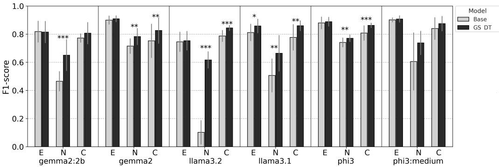  
Figure 9: Comparison of F1-score of classes in a 3-class datasets between Baseline and GS\_DT. ∗ ∗ ∗ indicates a p-value<0.001, ∗∗ a p-value<0.01, ∗ a p-value<0.05 obtained through the Mann-Whitney statistical test.

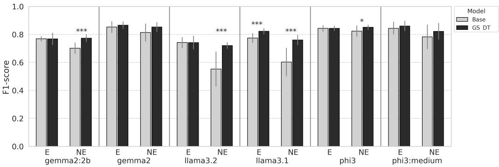  
Figure 10: Comparison of F1-score of classes in a 2-class datasets between Baseline and GS\_DT. ∗ ∗ ∗ indicates a p-value<0.001, ∗∗ a p-value<0.01, ∗ a p-value<0.05 obtained through the Mann-Whitney statistical test.

## 4.2.4. Diagnostic dataset

Another relevant question is the contribution of the system to linguistic aspects using the diagnostic dataset. To do this, we analyzed the impact of the system on the linguistic categories of the dataset and its contribution to improvement and loss with respect to the baseline.

The diagnostic dataset has 1104 P,H pairs. The Entailment class has 460 examples and the Not-Entailment class has 644 examples. In Figure 11, we show the accuracy of our proposal against the baseline.

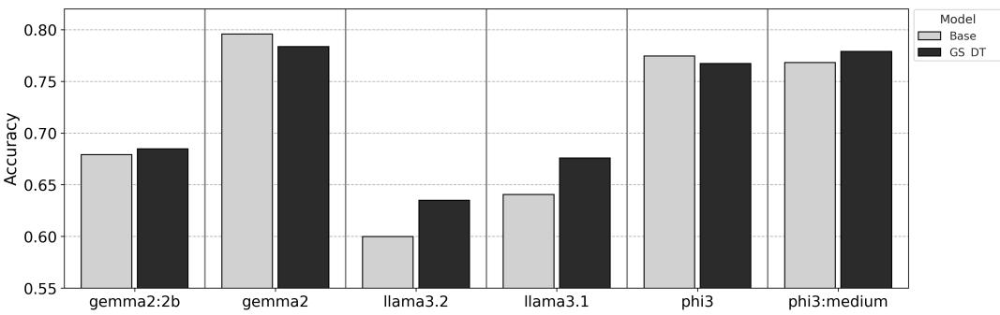  
Figure 11: Accuracy of LLMs on diagnostic dataset

Figure 11 shows that our proposal helps in some cases and is detrimental in others. Therefore, we investigated how much improvement or loss there is by comparing the examples that the LLM baseline answers correctly and incorrectly against our proposal. Table 4 shows the results.

<table><tr><td></td><td>gemma2:2b</td><td>gemma</td><td>1lama3.2</td><td>1lama3.1</td><td>phi3</td><td>phi3:medium</td></tr><tr><td>Improve</td><td>17.4%</td><td>20.2%</td><td>26.2%</td><td>18.9%</td><td>13.3%</td><td>14.5%</td></tr><tr><td>Loss</td><td>6.0%</td><td>6.5%</td><td>11.5%</td><td>5.1%</td><td>4.8%</td><td>3.0%</td></tr></table>

Table 4: Overall improvement and loss for the diagnostic dataset. Improvement: refers to the proportion of correct predictions under the GS\_DT proposal out of the total number of failures of the baseline model. Loss: refers to the proportion of failures under the GS\_DT proposal out of the total number of correct predictions of the baseline model.

## 4.2.5. Ablation study

Finally, an ablation study was conducted to identify the contributions of the proposal compared to a vanilla and the state-of-the-art models on the diagnostic dataset. We also analyzed the impact of our abstract groups against direct relations in ConceptNet.

Table 5 shows the performance obtained with the llama3.2 and phi3: medium models. We added the model Vega v2 (leader in the RTE benchmark), and a model Majority class to compare with all Direct Relations (DR) in ConcepNet, all relations from Abstract Groups gathered together (AR), and our proposal (GS\_DT).

<table><tr><td rowspan="2">Models</td><td rowspan="2">Accuracy</td><td colspan="2">Entailment Not_entailment</td></tr><tr><td>F1-score</td><td>F1-score</td></tr><tr><td>Vega v2</td><td>43.29</td><td>56.76</td><td>17.63</td></tr><tr><td>Majority class</td><td>58.33</td><td>0</td><td>73.68</td></tr><tr><td>1lama3.2 baseline</td><td>59.98</td><td>64.40</td><td>54.30</td></tr><tr><td>+Direct relationships (DR)</td><td>59.78</td><td>64.53</td><td>53.55</td></tr><tr><td>+Abstract relations (AR)</td><td>61.50</td><td>65.24</td><td>56.85</td></tr><tr><td>+GS_DT</td><td>63.49</td><td>62.92</td><td>64.05</td></tr><tr><td>phi3:medium baseline</td><td>76.81</td><td>77.26</td><td>76.34</td></tr><tr><td>+Direct relationships (DR)</td><td>77.26</td><td>78.07</td><td>76.38</td></tr><tr><td>+Abstract relations (AR)</td><td>77.35</td><td>77.95</td><td>76.72</td></tr><tr><td>+GS_DT</td><td>77.89</td><td>77.97</td><td>77.81</td></tr></table>

Table 5: Ablation results on diagnostic dataset.

## 5. Discussion

The implementation of our approach combines prompting techniques with consensus mechanisms. In line with [56, 57, 58, 59] methodology, we explore

diferent lines of reasoning for the same question. In our work, we construct abstract groups of semantic relationships that influence the reasoning of LLMs.

## 5.1. Consensus mechanism

The choice for the consensus mechanism was made after several trials that consistently showed that DT was the best option. Figure 12 illustrates the point for the SICK dataset.

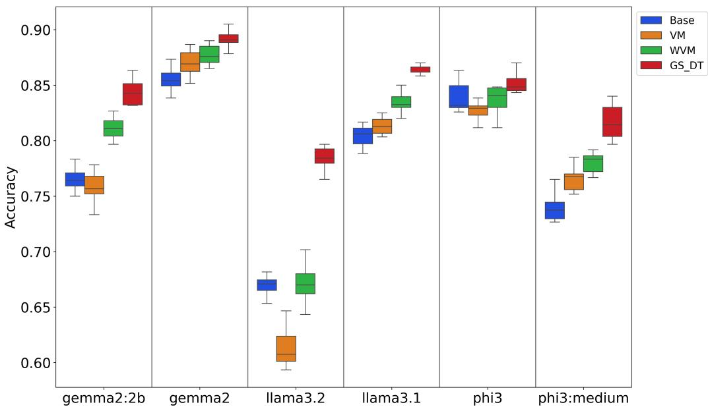  
Figure 12: Comparison of consensus mechanism performance: VM vs WVM vs DT - dataset SICK

Figure 12 shows how a majority voting strategy is not an adequate mechanism for making an informed decision. In a traditional majority voting scheme, the assumption is that when asked the same question, regardless of how the model is prompted, it should arrive at the same answer and be consistent in its reasoning. In other words, the model would have to follow the same line of reasoning regardless of how it is prompted.

What our results show is that, when asked the same question, at least one of the groups provides relevant disjunctive information about the elements of the question (Figure 8). Therefore, the models follow diferent lines of reasoning in each instance. However, what Figure 12 shows is that if the decision is made based on the majority of votes, the result is practically the same or worse than the baseline vote: majority voting fails, in contrast to [60, 61, 62]. The weighted majority voting scheme helps a little. However, it is unable to resolve ambiguous situations, and the weighting pattern is clearly inconsistent across the models.

What the decision tree does is identify the pattern of agreement between groups that leads to the correct decision. If the abstraction groups were not consistently providing useful information, there would be no pattern to identify. Therefore, abstraction groups fill knowledge gaps in the models, prompting them to take consistent lines of reasoning and give correct answers consistently.

A final consideration regarding the relevance of using the decision tree for final decision-making in an LLM regards recent strategies based on debate. A strategy to improve LLMs’ responses is carried out through multi-agent discussion [63], based on majority voting. In this sense, our consensus mechanism uses an explicit hierarchical decision tree to avoid the inconsistencies of debate among LLMs, such as error propagation or judge bias [63], and to ensure greater control and reliability in responses. Thus, we focus on compensating for the inherent shortcomings of LLMs, regardless of their size: the agent becomes stronger, which could lead to better arguments in scenarios involving debate between agents. This allows us to achieve robust results without incurring the high costs associated with use of industry standard (larger) LLMs.

## 5.2. Performance

Simply incorporating direct information from external resources is not enough (Table 5); a strategy is also needed to address the shortcomings of LLMs. DT\_GS in our framework acts as a meta-reasoner that prioritizes high-confidence routes of reasoning and assigns greater weight to relationship groups where there is strong consensus. Furthermore, it learns trade-ofs, e.g., when multiple LLM decisions conflict, the tree learns to combine signals from these decisions about the groups.

The results (Tables 2 and 3) show that llama3 models make better use of the new information in their reasoning processes. With DT\_GS, their results range from an improvement of 5.7 to 11.6 p.p. in the SICK, SNLI and SciTail datasets compared to baseline. We were able to outperform the baseline model in these datasets, but for the RTE dataset, even if higher, results are not significant, except for the llama3 models.

Overall, GS\_DT is an efective strategy for improving the performance of language models, particularly those with a lower initial performance. In models that are already optimized, however, the impact is marginal; a conjecture is that this may be due to training data contamination.

Also, GS\_DT is the most balanced and robust proposal, providing the best overall performance in terms of accuracy and distinguishing cases where there is no entailment relationship (Figures 9 and 10).

Finally, the SuperGLUE benchmark [64] provides a diagnostic dataset specifically designed to assess linguistic competence in NLI. The analysis reveals that not only are there profound variations in the performance of models on the diagnostic dataset, but they also have profound limitations in semantic understanding (Table 5). GS\_DT improves and balances the inference in the diagnostic dataset (Table 4); thereby better benefiting the not entailment class.

## 5.3. Impact of abstraction

Current evaluation methods for LLMs primarily assess inferential capabilities through outcome-based metrics. However, this fails to capture the complexity of their underlying reasoning processes. Notably, when faced with straightforward questions that require the application of general knowledge, these models often struggle to abstract and utilize relevant information, ex posing a significant shortcoming in their abstract reasoning abilities [13, 19].

Our approach aims at enriching LLMs with relevant, abstract and structured knowledge to improve their performance in NLI tasks. Abstraction not only improves immediate performance; it redefines how LLMs integrate knowledge and how they use it. In contrast to techniques such as Abstractionof-Thought (AoT) [48], which relies on the model generating its own abstractions (with the risk of inconsistency or hallucinations), our proposal of external abstract categories of semantic relations structures the reasoning space and allow us to trace the decision-making process, something impossible with raw data.

When working with raw relationships, LLMs tend to get stuck in literal associations and fail to capture the semantic depth [41]. In contrast, by structuring knowledge into abstract categories that mimic human reasoning, models benefit from new concepts or connections between concepts and avoid using learned lexical patterns; in other words, providing novel relationships could prevent a tendency toward overfitting or shortcuts based on certain clues in the premise or hypothesis.

Similarly, abstractions resolve ambiguities by identifying that two concepts can be related in multiple ways, and even detect contradictions and neutrality with greater precision (Figures 9 and 10), areas where LLMs often fail.

The results (Table 5) demonstrate that GS\_DT is a robust approach as it balances between generalization and specificity, minimizing false positives. The AR approach, on the other hand, is superior in tasks where the accurate identification of entailment is crucial. Both approaches, GS\_DT and AR, outperform DR and the Baseline consistently, demonstrating the significant impact of their structural improvements. The latter approaches are limited by their conceptual rigidity and reduced adaptability, as they are based on static, predefined relationships.

## 6. Conclusions

NLI tasks require analyzing complex implicit/explicit relationships, demanding both the LLM’s internal knowledge and external commonsense [65]. Our strategy of abstracting categories to guide LLM decisions, improves contradiction detection and entailment classification. Crucially, LLMs need structured knowledge and not merely more data to bridge reasoning gaps. Our abstraction framework convert raw text into interpretable patterns, correcting biases and boosting generalization. While LLMs’ pretrained knowledge is insuficient for NLI, external data alone also falls short. Our hybrid approach directs attention to overlooked word relationships, enabling models to synthesize missing information. The quality of external knowledge is relevant because there are biases of incomplete or culturally biased relationships, which afects the generalization of abstract categories. Similarly, its coverage is limited and may lack well-defined relationships, reducing the efectiveness of the method. There is also the problem of ambiguity in conceptual boundaries, i.e., some relationships may fit into several categories [47].

The results reveal the benefits of our semantic relation abstraction framework for compensating for knowledge gaps in LLMs. The future lies not in expanding model size [66], but in creating a semantic scafolding that mimics the flexibility of human thinking. We hope that our proposal will enable the development of more robust agents and interpretable reasoning, guiding AI toward a reliable understanding of language.

## References

[1] W. Zhong, R. Cui, Y. Guo, Y. Liang, S. Lu, Y. Wang, A. Saied, W. Chen, N. Duan, AGIEval: A human-centric benchmark for evaluating foundation models, in: K. Duh, H. Gomez, S. Bethard (Eds.), Findings of the Association for Computational Linguistics: NAACL 2024, Association for Computational Linguistics, Mexico City, Mexico, 2024, pp. 2299–2314. doi:10.18653/v1/2024.findings-naacl.149. URL https://aclanthology.org/2024.findings-naacl.149/

[2] W. X. Zhao, K. Zhou, J. Li, T. Tang, X. Wang, Y. Hou, Y. Min, B. Zhang, J. Zhang, Z. Dong, Y. Du, C. Yang, Y. Chen, Z. Chen, J. Jiang, R. Ren, Y. Li, X. Tang, Z. Liu, P. Liu, J.-Y. Nie, J.-R. Wen, A survey of large language models (2025). arXiv:2303.18223. URL https://arxiv.org/abs/2303.18223

[3] P. Manakul, A. Liusie, M. Gales, SelfCheckGPT: Zero-resource blackbox hallucination detection for generative large language models, in: H. Bouamor, J. Pino, K. Bali (Eds.), Proceedings of the 2023 Conference on Empirical Methods in Natural Language Processing, Association for Computational Linguistics, Singapore, 2023, pp. 9004–9017. doi:10. 18653/v1/2023.emnlp-main.557. URL https://aclanthology.org/2023.emnlp-main.557/

[4] V. Rawte, S. Chakraborty, A. Pathak, A. Sarkar, S. T. I. Tonmoy, A. Chadha, A. Sheth, A. Das, The troubling emergence of hallucination in large language models - an extensive definition, quantification, and prescriptive remediations, in: H. Bouamor, J. Pino, K. Bali (Eds.),

Proceedings of the 2023 Conference on Empirical Methods in Natural Language Processing, Association for Computational Linguistics, Singapore, 2023, pp. 2541–2573. doi:10.18653/v1/2023.emnlp-main.155. URL https://aclanthology.org/2023.emnlp-main.155/

[5] S. Dhuliawala, M. Komeili, J. Xu, R. Raileanu, X. Li, A. Celikyilmaz, J. Weston, Chain-of-verification reduces hallucination in large language models, in: L.-W. Ku, A. Martins, V. Srikumar (Eds.), Findings of the Association for Computational Linguistics: ACL 2024, Association for Computational Linguistics, Bangkok, Thailand, 2024, pp. 3563–3578. doi:10.18653/v1/2024.findings-acl.212. URL https://aclanthology.org/2024.findings-acl.212/

[6] T. McCoy, E. Pavlick, T. Linzen, Right for the wrong reasons: Diagnosing syntactic heuristics in natural language inference, in: A. Korhonen, D. Traum, L. Màrquez (Eds.), Proceedings of the 57th Annual Meeting of the Association for Computational Linguistics, Association for Computational Linguistics, Florence, Italy, 2019, pp. 3428–3448. doi:10.18653/v1/P19-1334. URL https://aclanthology.org/P19-1334/

[7] D. Jin, Z. Jin, J. Zhou, P. Szolovits, Is bert really robust? a strong baseline for natural language attack on text classification and entailment, Proceedings of the AAAI Conference on Artificial Intelligence 34 (2020) 8018–8025. doi:10.1609/aaai.v34i05.6311.

[8] C. Li, J. Flanigan, Task contamination: Language models may not be few-shot anymore, Proceedings of the AAAI Conference on Artificial

Intelligence 38 (16) (2024) 18471–18480. doi:10.1609/aaai.v38i16.   
29808.

URL https://ojs.aaai.org/index.php/AAAI/article/view/29808

[9] G. Proebsting, A. Poliak, Biases in large language model-elicited text: A case study in natural language inference, in: O. Rambow, L. Wanner, M. Apidianaki, H. Al-Khalifa, B. D. Eugenio, S. Schockaert (Eds.), Proceedings of the 31st International Conference on Computational Linguistics, Association for Computational Linguistics, Abu Dhabi, UAE, 2025, pp. 5836–5851.

URL https://aclanthology.org/2025.coling-main.389/

[10] D. Yang, N. Li, L. Zou, H. Ma, Lexical semantics enhanced neural word embeddings, Knowledge-Based Systems 252 (2022) 109298. doi:https://doi.org/10.1016/j.knosys.2022.109298. URL https://www.sciencedirect.com/science/article/pii/ S0950705122006517

[11] J. Li, X. Cheng, X. Zhao, J.-Y. Nie, J.-R. Wen, HaluEval: A largescale hallucination evaluation benchmark for large language models, in: H. Bouamor, J. Pino, K. Bali (Eds.), Proceedings of the 2023 Conference on Empirical Methods in Natural Language Processing, Association for Computational Linguistics, Singapore, 2023, pp. 6449–6464. doi:10. 18653/v1/2023.emnlp-main.397. URL https://aclanthology.org/2023.emnlp-main.397/

[12] X. Dai, Y. Hua, T. Wu, Y. Sheng, Q. Ji, G. Qi, Large language models can better understand knowledge graphs than we thought, Knowledge-Based Systems 312 (2025) 113060. doi:https://doi.org/10.1016/j.knosys.2025.113060. URL https://www.sciencedirect.com/science/article/pii/ S0950705125001078

[13] K. Xiong, X. Ding, T. Liu, B. Qin, D. Xu, Q. Yang, H. Liu, Y. Cao, Meaningful learning: Enhancing abstract reasoning in large language models via generic fact guidance, in: A. Globerson, L. Mackey, D. Belgrave, A. Fan, U. Paquet, J. Tomczak, C. Zhang (Eds.), Advances in Neural Information Processing Systems, Vol. 37, Curran Associates, Inc., 2024, pp. 120501–120525. URL https://proceedings.neurips.cc/paper\_files/paper/2024/ file/da5498f88193ff61f0daea1940b819da-Paper-Conference.pdf

[14] S. Wang, Z. Wei, Y. Choi, X. Ren, Can LLMs reason with rules? logic scafolding for stress-testing and improving LLMs, in: L.-W. Ku, A. Martins, V. Srikumar (Eds.), Proceedings of the 62nd Annual Meeting of the Association for Computational Linguistics (Volume 1: Long Papers), Association for Computational Linguistics, Bangkok, Thailand, 2024, pp. 7523–7543. doi:10.18653/v1/2024.acl-long.406. URL https://aclanthology.org/2024.acl-long.406/

[15] Q. He, Y. Wang, J. Yu, W. Wang, Language models over large-scale knowledge base: on capacity, flexibility and reasoning for new facts, in: O. Rambow, L. Wanner, M. Apidianaki, H. Al-Khalifa, B. D. Eugenio, S. Schockaert (Eds.), Proceedings of the 31st International Conference on Computational Linguistics, Association for Computational Linguistics, Abu Dhabi, UAE, 2025, pp. 1736–1753.

URL https://aclanthology.org/2025.coling-main.118/

[16] M. Regneri, A. Abdelhalim, S. Laue, Detecting conceptual abstraction in LLMs, in: N. Calzolari, M.-Y. Kan, V. Hoste, A. Lenci, S. Sakti, N. Xue (Eds.), Proceedings of the 2024 Joint International Conference on Computational Linguistics, Language Resources and Evaluation (LREC-COLING 2024), ELRA and ICCL, Torino, Italia, 2024, pp. 4697–4704.

URL https://aclanthology.org/2024.lrec-main.420/

[17] H. Peng, X. Wang, S. Hu, H. Jin, L. Hou, J. Li, Z. Liu, Q. Liu, COPEN: Probing conceptual knowledge in pre-trained language models, in: Y. Goldberg, Z. Kozareva, Y. Zhang (Eds.), Proceedings of the 2022 Conference on Empirical Methods in Natural Language Processing, Association for Computational Linguistics, Abu Dhabi, United Arab Emirates, 2022, pp. 5015–5035. doi:10.18653/v1/2022.emnlp-main.335. URL https://aclanthology.org/2022.emnlp-main.335/

[18] K. Mahowald, A. A. Ivanova, I. A. Blank, N. Kanwisher, J. B. Tenenbaum, E. Fedorenko, Dissociating language and thought in large language models, Trends in Cognitive Sciences 28 (6) (2024) 517–540. doi:https://doi.org/10.1016/j.tics.2024.01.011. URL https://www.sciencedirect.com/science/article/pii/ S1364661324000275

[19] S. Lee, W. Sim, D. Shin, W. Seo, J. Park, S. Lee, S. Hwang, S. Kim, S. Kim, Reasoning abilities of large language models: In-depth analysis on the abstraction and reasoning corpus, ACM Trans. Intell. Syst. Technol.Just Accepted (Jan. 2025). doi:10.1145/3712701. URL https://doi.org/10.1145/3712701

[20] M. Jullien, M. Valentino, H. Frost, P. O’regan, D. Landers, A. Freitas, SemEval-2023 task 7: Multi-evidence natural language inference for clinical trial data, in: A. K. Ojha, A. S. Doğruöz, G. Da San Martino, H. Tayyar Madabushi, R. Kumar, E. Sartori (Eds.), Proceedings of the 17th International Workshop on Semantic Evaluation (SemEval-2023), Association for Computational Linguistics, Toronto, Canada, 2023, pp. 2216–2226. doi:10.18653/v1/2023.semeval-1.307. URL https://aclanthology.org/2023.semeval-1.307/

[21] H. Fei, Y. Guo, B. Li, D. Ji, Y. Ren, Adversarial sharedprivate model for cross-domain clinical text entailment recognition, Knowledge-Based Systems 221 (2021) 106962. doi:https: //doi.org/10.1016/j.knosys.2021.106962. URL https://www.sciencedirect.com/science/article/pii/ S0950705121002252

[22] S. Wehnert, S. Dureja, L. Kutty, V. Sudhi, E. De Luca, Applying bert embeddings to predict legal textual entailment, The Review of Socionetwork Strategies 16 (02 2022). doi:10.1007/s12626-022-00101-3.

[23] A. Martín, J. Huertas-Tato, Álvaro Huertas-García, G. Villar-Rodríguez, D. Camacho, Facter-check: Semi-automated factchecking through semantic similarity and natural language inference, Knowledge-Based Systems 251 (2022) 109265. doi:https:

//doi.org/10.1016/j.knosys.2022.109265.   
URL https://www.sciencedirect.com/science/article/pii/ S0950705122006323

[24] J. Thorne, A. Vlachos, C. Christodoulopoulos, A. Mittal, FEVER: a large-scale dataset for fact extraction and VERification, in: M. Walker, H. Ji, A. Stent (Eds.), Proceedings of the 2018 Conference of the North American Chapter of the Association for Computational Linguistics: Human Language Technologies, Volume 1 (Long Papers), Association for Computational Linguistics, New Orleans, Louisiana, 2018, pp. 809– 819. doi:10.18653/v1/N18-1074. URL https://aclanthology.org/N18-1074/

[25] I. Dagan, O. Glickman, B. Magnini, The pascal recognising textual entailment challenge, in: J. Quiñonero-Candela, I. Dagan, B. Magnini, F. d’Alché Buc (Eds.), Machine Learning Challenges. Evaluating Predictive Uncertainty, Visual Object Classification, and Recognising Tectual Entailment, Springer Berlin Heidelberg, Berlin, Heidelberg, 2006, pp. 177–190.

[26] L. Madaan, D. Esiobu, P. Stenetorp, B. Plank, D. Hupkes, Lost in inference: Rediscovering the role of natural language inference for large language models (2024). arXiv:2411.14103. URL https://arxiv.org/abs/2411.14103

[27] T. Huber, C. Niklaus, LLMs meet bloom‘s taxonomy: A cognitive view on large language model evaluations, in: O. Rambow, L. Wanner, M. Apidianaki, H. Al-Khalifa, B. D. Eugenio, S. Schockaert (Eds.),

Proceedings of the 31st International Conference on Computational Linguistics, Association for Computational Linguistics, Abu Dhabi, UAE, 2025, pp. 5211–5246.

URL https://aclanthology.org/2025.coling-main.350/

[28] S. Gururangan, S. Swayamdipta, O. Levy, R. Schwartz, S. Bowman, N. A. Smith, Annotation artifacts in natural language inference data, in: M. Walker, H. Ji, A. Stent (Eds.), Proceedings of the 2018 Conference of the North American Chapter of the Association for Computational Linguistics: Human Language Technologies, Volume 2 (Short Papers), Association for Computational Linguistics, New Orleans, Louisiana, 2018, pp. 107–112. doi:10.18653/v1/N18-2017. URL https://aclanthology.org/N18-2017/

[29] N. Lee, N. M. An, J. Thorne, Can large language models capture dissenting human voices?, in: H. Bouamor, J. Pino, K. Bali (Eds.), Proceedings of the 2023 Conference on Empirical Methods in Natural Language Processing, Association for Computational Linguistics, Singapore, 2023, pp. 4569–4585. doi:10.18653/v1/2023.emnlp-main.278. URL https://aclanthology.org/2023.emnlp-main.278/

[30] Y. Nie, X. Zhou, M. Bansal, What can we learn from collective human opinions on natural language inference data?, in: B. Webber, T. Cohn, Y. He, Y. Liu (Eds.), Proceedings of the 2020 Conference on Empirical Methods in Natural Language Processing (EMNLP), Association for Computational Linguistics, Online, 2020, pp. 9131–9143.

doi:10.18653/v1/2020.emnlp-main.734.

URL https://aclanthology.org/2020.emnlp-main.734/

[31] M. Sadat, C. Caragea, MSciNLI: A diverse benchmark for scientific natural language inference, in: K. Duh, H. Gomez, S. Bethard (Eds.), Proceedings of the 2024 Conference of the North American Chapter of the Association for Computational Linguistics: Human Language Technologies (Volume 1: Long Papers), Association for Computational Linguistics, Mexico City, Mexico, 2024, pp. 1610–1629. doi: 10.18653/v1/2024.naacl-long.90.

URL https://aclanthology.org/2024.naacl-long.90/

[32] Y. Wang, Y. Deng, G. Wang, T. Li, H. Xiao, Y. Zhang, The fluency-based semantic network of llms difers from humans, Computers in Human Behavior: Artificial Humans 3 (2025) 100103. doi:https://doi.org/10.1016/j.chbah.2024.100103. URL https://www.sciencedirect.com/science/article/pii/ S294988212400063X

[33] D. Hupkes, M. Giulianelli, V. Dankers, M. Artetxe, Y. Elazar, T. Pimentel, C. Christodoulopoulos, K. Lasri, N. Saphra, A. Sinclair, D. Ulmer, F. Schottmann, K. Batsuren, K. Sun, K. Sinha, L. Khalatbari, M. Ryskina, R. Frieske, R. Cotterell, Z. Jin, A taxonomy and review of generalization research in nlp, Nature Machine Intelligence 5 (2023) 1161–1174. doi:10.1038/s42256-023-00729-y.

[34] R. Speer, J. Chin, C. Havasi, Conceptnet 5.5: An open multilingual graph of general knowledge, in: AAAI Conference on Artificial Intelligence, 2016. URL https://api.semanticscholar.org/CorpusID:15206880

[35] R. Dutt, S. Ray Choudhury, V. V. Rao, C. Rose, V. Vydiswaran, Investigating the generalizability of pretrained language models across multiple dimensions: A case study of NLI and MRC, in: D. Hupkes, V. Dankers, K. Batsuren, A. Kazemnejad, C. Christodoulopoulos, M. Giulianelli, R. Cotterell (Eds.), Proceedings of the 2nd GenBench Workshop on Generalisation (Benchmarking) in NLP, Association for Computational Linguistics, Miami, Florida, USA, 2024, pp. 165–182. doi:10.18653/v1/2024.genbench-1.11. URL https://aclanthology.org/2024.genbench-1.11/

[36] M. Beloucif, C. Biemann, Probing pre-trained language models for semantic attributes and their values, in: M.-F. Moens, X. Huang, L. Specia, S. W.-t. Yih (Eds.), Findings of the Association for Computational Linguistics: EMNLP 2021, Association for Computational Linguistics, Punta Cana, Dominican Republic, 2021, pp. 2554–2559. doi:10.18653/v1/2021.findings-emnlp.218. URL https://aclanthology.org/2021.findings-emnlp.218/

[37] J. Rozanova, D. Ferreira, M. Thayaparan, M. Valentino, A. Freitas, Decomposing natural logic inferences for neural NLI, in: J. Bastings, Y. Belinkov, Y. Elazar, D. Hupkes, N. Saphra, S. Wiegrefe (Eds.), Proceedings of the Fifth BlackboxNLP Workshop on Analyzing and Interpreting Neural Networks for NLP, Association for Computational Linguistics, Abu Dhabi, United Arab Emirates (Hybrid), 2022, pp. 394–403.

doi:10.18653/v1/2022.blackboxnlp-1.33. URL https://aclanthology.org/2022.blackboxnlp-1.33/

[38] Z. Cao, H. Yamada, S. Teufel, T. Tokunaga, A comprehensive evaluation of semantic relation knowledge of pretrained language models and humans (2024). arXiv:2412.01131. URL https://arxiv.org/abs/2412.01131

[39] Z. Wang, H. Shi, W. Wang, T. Fang, H. Zhang, S. Choi, X. Liu, Y. Song, AbsPyramid: Benchmarking the abstraction ability of language models with a unified entailment graph, in: K. Duh, H. Gomez, S. Bethard (Eds.), Findings of the Association for Computational Linguistics: NAACL 2024, Association for Computational Linguistics, Mexico City, Mexico, 2024, pp. 3991–4010. doi:10.18653/v1/2024. findings-naacl.252. URL https://aclanthology.org/2024.findings-naacl.252/

[40] A. Al-Saeedi, A. Harma, Emergence of symbolic abstraction heads for incontext learning in large language models, in: K. Liu, Y. Song, Z. Han, R. Sifa, S. He, Y. Long (Eds.), Proceedings of Bridging Neurons and Symbols for Natural Language Processing and Knowledge Graphs Reasoning @ COLING 2025, ELRA and ICCL, Abu Dhabi, UAE, 2025, pp. 86–96. URL https://aclanthology.org/2025.neusymbridge-1.9/

[41] S. Kim, S. Jeong, H. Kim, Bridge to better understanding: Syntax extension with virtual linking-phrase for natural language inference, Knowledge-Based Systems 305 (2024) 112608.

doi:https://doi.org/10.1016/j.knosys.2024.112608. URL https://www.sciencedirect.com/science/article/pii/ S0950705124012425

[42] G. Agrawal, T. Kumarage, Z. Alghamdi, H. Liu, Can knowledge graphs reduce hallucinations in LLMs? : A survey, in: K. Duh, H. Gomez, S. Bethard (Eds.), Proceedings of the 2024 Conference of the North American Chapter of the Association for Computational Linguistics: Human Language Technologies (Volume 1: Long Papers), Association for Computational Linguistics, Mexico City, Mexico, 2024, pp. 3947– 3960. doi:10.18653/v1/2024.naacl-long.219. URL https://aclanthology.org/2024.naacl-long.219/

[43] X. Wang, P. Kapanipathi, R. Musa, M. Yu, K. Talamadupula, I. Abdelaziz, M. Chang, A. Fokoue, B. Makni, N. Mattei, M. Witbrock, Improving natural language inference using external knowledge in the science questions domain, in: AAAI Conference on Artificial Intelligence, 2018. URL https://api.semanticscholar.org/CorpusID:52291548

[44] P. Kapanipathi, V. Thost, S. Sankalp Patel, S. Whitehead, I. Abdelaziz, A. Balakrishnan, M. Chang, K. Fadnis, C. Gunasekara, B. Makni, N. Mattei, K. Talamadupula, A. Fokoue, Infusing knowledge into the textual entailment task using graph convolutional networks, Proceedings of the AAAI Conference on Artificial Intelligence 34 (05) (2020) 8074–8081. doi:10.1609/aaai.v34i05.6318. URL https://ojs.aaai.org/index.php/AAAI/article/view/6318 URL https://ojs.aaai.org/index.php/AAAI/article/view/6318

[45] M. Guo, Y. Chen, J. Xu, Y. Zhang, Dynamic knowledge integration for natural language inference, in: 2022 4th International Conference on Natural Language Processing (ICNLP), 2022, pp. 360–364. doi: 10.1109/ICNLP55136.2022.00066.

[46] A. Lauscher, O. Majewska, L. F. R. Ribeiro, I. Gurevych, N. Rozanov, G. Glavaš, Common sense or world knowledge? investigating adapterbased knowledge injection into pretrained transformers, in: E. Agirre, M. Apidianaki, I. Vulić (Eds.), Proceedings of Deep Learning Inside Out (DeeLIO): The First Workshop on Knowledge Extraction and Integration for Deep Learning Architectures, Association for Computational Linguistics, Online, 2020, pp. 43–49. doi:10.18653/v1/2020. deelio-1.5. URL https://aclanthology.org/2020.deelio-1.5/

[47] F. Ilievski, A. Oltramari, K. Ma, B. Zhang, D. L. McGuinness, P. Szekely, Dimensions of commonsense knowledge, Knowledge-Based Systems 229 (2021) 107347. doi:https: //doi.org/10.1016/j.knosys.2021.107347. URL https://www.sciencedirect.com/science/article/pii/ S0950705121006092

[48] R. Hong, H. Zhang, X. Pan, D. Yu, C. Zhang, Abstraction-of-thought makes language models better reasoners, in: Y. Al-Onaizan, M. Bansal, Y.-N. Chen (Eds.), Findings of the Association for Computational Linguistics: EMNLP 2024, Association for Computational Linguistics, Miami, Florida, USA, 2024, pp. 1993–2027. doi:10.18653/v1/2024.

findings-emnlp.110.

URL https://aclanthology.org/2024.findings-emnlp.110/

[49] A. Sedova, R. Litschko, D. Frassinelli, B. Roth, B. Plank, To know or not to know? analyzing self-consistency of large language models under ambiguity, in: Y. Al-Onaizan, M. Bansal, Y.-N. Chen (Eds.), Findings of the Association for Computational Linguistics: EMNLP 2024, Association for Computational Linguistics, Miami, Florida, USA, 2024, pp. 17203–17217. doi:10.18653/v1/2024.findings-emnlp.1003. URL https://aclanthology.org/2024.findings-emnlp.1003/

[50] J. M. Echterhof, Y. Liu, A. Alessa, J. McAuley, Z. He, Cognitive bias in decision-making with LLMs, in: Y. Al-Onaizan, M. Bansal, Y.-N. Chen (Eds.), Findings of the Association for Computational Linguistics: EMNLP 2024, Association for Computational Linguistics, Miami, Florida, USA, 2024, pp. 12640–12653. doi:10.18653/v1/2024. findings-emnlp.739. URL https://aclanthology.org/2024.findings-emnlp.739/

[51] A. Dogan, D. Birant, A weighted majority voting ensemble approach for classification, 2019 4th International Conference on Computer Science and Engineering (UBMK) (2019) 1–6. URL https://api.semanticscholar.org/CorpusID:208207259

[52] M. Marelli, L. Bentivogli, M. Baroni, R. Bernardi, S. Menini, R. Zamparelli, SemEval-2014 task 1: Evaluation of compositional distributional semantic models on full sentences through semantic relatedness and textual entailment, in: P. Nakov, T. Zesch (Eds.), Proceedings of the 8th

International Workshop on Semantic Evaluation (SemEval 2014), Association for Computational Linguistics, Dublin, Ireland, 2014, pp. 1–8. doi:10.3115/v1/S14-2001.

URL https://aclanthology.org/S14-2001/

[53] S. R. Bowman, G. Angeli, C. Potts, C. D. Manning, A large annotated corpus for learning natural language inference, in: L. Màrquez, C. Callison-Burch, J. Su (Eds.), Proceedings of the 2015 Conference on Empirical Methods in Natural Language Processing, Association for Computational Linguistics, Lisbon, Portugal, 2015, pp. 632–642. doi:10.18653/v1/D15-1075.

URL https://aclanthology.org/D15-1075/

[54] T. Khot, A. Sabharwal, P. Clark, Scitail: A textual entailment dataset from science question answering, Proceedings of the AAAI Conference on Artificial Intelligence 32 (1) (Apr. 2018). doi:10.1609/aaai.v32i1. 12022. URL https://ojs.aaai.org/index.php/AAAI/article/view/12022

[55] A. Wang, A. Singh, J. Michael, F. Hill, O. Levy, S. Bowman, GLUE: A multi-task benchmark and analysis platform for natural language understanding, in: T. Linzen, G. Chrupała, A. Alishahi (Eds.), Proceedings of the 2018 EMNLP Workshop BlackboxNLP: Analyzing and Interpreting Neural Networks for NLP, Association for Computational Linguistics, Brussels, Belgium, 2018, pp. 353–355. doi:10.18653/v1/W18-5446. URL https://aclanthology.org/W18-5446/

[56] Y. Li, Z. Lin, S. Zhang, Q. Fu, B. Chen, J.-G. Lou, W. Chen, Making language models better reasoners with step-aware verifier, in: A. Rogers, J. Boyd-Graber, N. Okazaki (Eds.), Proceedings of the 61st Annual Meeting of the Association for Computational Linguistics (Volume 1: Long Papers), Association for Computational Linguistics, Toronto, Canada, 2023, pp. 5315–5333. doi:10.18653/v1/2023.acl-long.291. URL https://aclanthology.org/2023.acl-long.291/

[57] Z. Kasner, I. Konstas, O. Dusek, Mind the labels: Describing relations in knowledge graphs with pretrained models, in: A. Vlachos, I. Augenstein (Eds.), Proceedings of the 17th Conference of the European Chapter of the Association for Computational Linguistics, Association for Computational Linguistics, Dubrovnik, Croatia, 2023, pp. 2398–2415. doi:10.18653/v1/2023.eacl-main.176. URL https://aclanthology.org/2023.eacl-main.176/

[58] B. Huang, S. Lu, X. Wan, N. Duan, Enhancing large language models in coding through multi-perspective self-consistency, in: L.-W. Ku, A. Martins, V. Srikumar (Eds.), Proceedings of the 62nd Annual Meeting of the Association for Computational Linguistics (Volume 1: Long Papers), Association for Computational Linguistics, Bangkok, Thailand, 2024, pp. 1429–1450. doi:10.18653/v1/2024.acl-long.78. URL https://aclanthology.org/2024.acl-long.78/

[59] L. Mu, W. Zhang, Y. Zhang, P. Jin, DDPrompt: Diferential diversity prompting in large language models, in: L.-W. Ku, A. Martins, V. Srikumar (Eds.), Proceedings of the 62nd Annual Meeting of the Association for Computational Linguistics (Volume 2: Short Papers), Association for Computational Linguistics, Bangkok, Thailand, 2024, pp. 168–174. doi:10.18653/v1/2024.acl-short.17. URL https://aclanthology.org/2024.acl-short.17/

[60] M. Xue, D. Liu, W. Lei, X. Ren, B. Yang, J. Xie, Y. Zhang, D. Peng, J. Lv, Dynamic voting for eficient reasoning in large language models, in: H. Bouamor, J. Pino, K. Bali (Eds.), Findings of the Association for Computational Linguistics: EMNLP 2023, Association for Computational Linguistics, Singapore, 2023, pp. 3085–3104. doi: 10.18653/v1/2023.findings-emnlp.203.

URL https://aclanthology.org/2023.findings-emnlp.203/

[61] X. Wang, J. Wei, D. Schuurmans, Q. Le, E. Chi, S. Narang, A. Chowdhery, D. Zhou, Self-consistency improves chain of thought reasoning in language models (2023). arXiv:2203.11171. URL https://arxiv.org/abs/2203.11171

[62] H. Wang, A. Prasad, E. Stengel-Eskin, M. Bansal, Soft self-consistency improves language models agents, in: L.-W. Ku, A. Martins, V. Srikumar (Eds.), Proceedings of the 62nd Annual Meeting of the Association for Computational Linguistics (Volume 2: Short Papers), Association for Computational Linguistics, Bangkok, Thailand, 2024, pp. 287–301. doi:10.18653/v1/2024.acl-short.28. URL https://aclanthology.org/2024.acl-short.28/

[63] Q. Wang, Z. Wang, Y. Su, H. Tong, Y. Song, Rethinking the bounds of LLM reasoning: Are multi-agent discussions the key?, in: L.-W. Ku,

A. Martins, V. Srikumar (Eds.), Proceedings of the 62nd Annual Meeting of the Association for Computational Linguistics (Volume 1: Long Papers), Association for Computational Linguistics, Bangkok, Thailand, 2024, pp. 6106–6131. doi:10.18653/v1/2024.acl-long.331. URL https://aclanthology.org/2024.acl-long.331/

[64] A. Wang, Y. Pruksachatkun, N. Nangia, A. Singh, J. Michael, F. Hill, O. Levy, S. Bowman, Superglue: A stickier benchmark for generalpurpose language understanding systems (05 2019). doi:10.48550/ arXiv.1905.00537.

[65] C. Liu, T. Cohn, L. Frermann, Commonsense knowledge in word associations and ConceptNet, in: A. Bisazza, O. Abend (Eds.), Proceedings of the 25th Conference on Computational Natural Language Learning, Association for Computational Linguistics, Online, 2021, pp. 481–495. doi:10.18653/v1/2021.conll-1.38. URL https://aclanthology.org/2021.conll-1.38/

[66] X. L. Li, A. Kuncoro, J. Hofmann, C. de Masson d’Autume, P. Blunsom, A. Nematzadeh, A systematic investigation of commonsense knowledge in large language models, in: Y. Goldberg, Z. Kozareva, Y. Zhang (Eds.), Proceedings of the 2022 Conference on Empirical Methods in Natural Language Processing, Association for Computational Linguistics, Abu Dhabi, United Arab Emirates, 2022, pp. 11838–11855. doi:10.18653/ v1/2022.emnlp-main.812.

URL https://aclanthology.org/2022.emnlp-main.812/

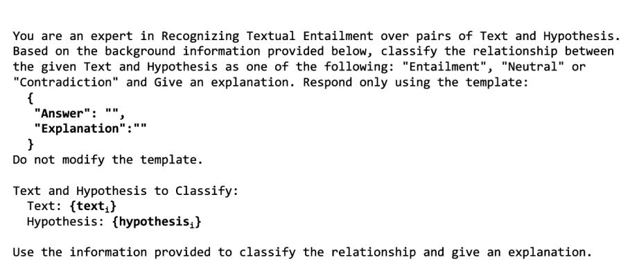  
Figure A.13: Prompt Baseline

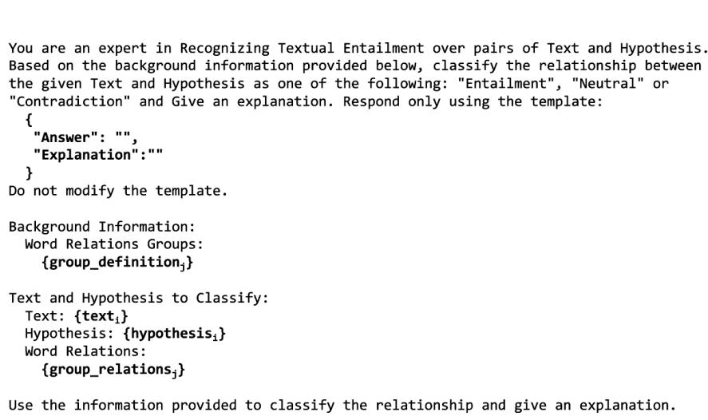  
Figure A.14: Prompt with external information

Word Relationship Groups: Group 1 (G1): Triplets of Similarity or hypernymy relations. These relations usually correspond to Entailment. triplets: $( \mathsf { t } _ { \mathrm { i } } , \mathsf { r e l } , \mathsf { h } _ { \mathrm { j } } )$ where $\mathbf { t _ { i } }$ is in Text, $\mathsf { h } _ { \mathtt { j } }$ is in Hypothesis and rel is the relation between $\mathbf { t _ { i } }$ an ${ \mathsf { h } } _ { \mathrm { j } } , \ { \mathsf { e } } . { \mathsf { g } } \cdot .$ (dog,hyperonym,animal) dog is in $\mathsf { H } _ { \pmb { \mathscr { s } } }$ animal is in T and relation is hyperonym between dog - animal. Group 2 (G2): Triplets of Contradictory or co-hyponym relations. These often indicate Contradiction. triplets: $( \mathsf { t } _ { \mathrm { i } } , \mathsf { r e l } , \mathsf { h } _ { \mathrm { j } } )$ where $\mathbf { t _ { i } }$ is in Text, $\mathsf { h } _ { \mathtt { j } }$ is in Hypothesis and rel is the relation between $\mathbf { t } _ { \mathrm { i } }$ an ${ \mathsf { h } } _ { \mathrm { j } } , \ { \mathsf { e } } . { \mathsf { g } } .$ (dog,distinct\_from,cat) dog is in ${ \sf H } _ { s }$ cat is in T and relation is distinct\_from between dog - cat. Group 3 (G3): Triplets of Specificity or hyponymy relations. These typically correspond to Neutral. triplets: $( \mathsf { t } _ { \mathrm { i } } , \mathsf { r e l } , \mathsf { h } _ { \mathrm { j } } )$ where $\bf t _ { i }$ is in Text, $\mathsf { h } _ { \mathrm { i } }$ is in Hypothesis and rel is the relation between $\ t _ { \mathrm { i } }$ an $\mathsf { h } _ { \mathtt { j } }$ $\mathbf { e } \cdot \mathbf { g } \cdot \mathbf { \mathbf { \rho } } ,$ (animal,hyponym,dog) animal is in ${ \mathsf { H } } ,$ dog is in T and relation is hyponym between animal $\mathbf { \lambda } - \mathsf { \Gamma } \mathsf { d o g }$ Group 4 (G4): Relations not identified or categorized.

## Figure A.15: Definitions of the groups