# How to Estimate Whether You Have Found Several Needles in a Haystack: Measuring Calibration in Multi-Label Text Classification

Sophie Henning1,2,3† Georg Hofmann4 Alexander Schulte5

Alexander Fraser1,2,6 Annemarie Friedrich4

1TU Munich 2Munich Center for Machine Learning (MCML) 3LMU Munich

4University of Augsburg 5Robert Bosch GmbH 6Munich Data Science Institute

sophie.henning|alexander.fraser@tum.de

georg.hofmann|annemarie.friedrich@informatik.uni-augsburg.de

## Abstract

A key factor in deciding whether to trust an automatic prediction is its confidence score, which should be calibrated to match the actual probability of the prediction being correct. Most confidence calibration metrics target binary or multi-class tasks, while multi-label calibration remains largely underexplored. Multilabel classification tasks, such as assigning medical codes to clinical notes or determining news topics, are usually dominated by a large number of negatives, i.e., labels that do not apply. We show that existing binning schemes to compute label-wise expected calibration error either underestimate the error, simply reflect label frequency, or suffer from many bins with very few instances. To achieve trustworthy label-wise calibration errors, we propose a new binning scheme that gives equal weight to positive and negative label assignments. Our empirical study demonstrates that in contrast to existing binning schemes, our new scheme results in meaningful estimates of calibration error in hierarchical and in extreme multi-label classification. We also show that calibrating confidence scores of large language models for multi-label predictions is an open challenge. Our detailed analysis lays the foundation for further research by providing a solid evaluation metric for measuring calibration in multi-label classification.

## 1 Introduction

Many text classification tasks, such as medical coding, involve assigning multiple labels to each instance. To enable humans to decide when (not) to trust machine predictions, prediction probabilities must be calibrated so that confidence scores reflect the empirical probability of the respective prediction being correct.

Existing calibration metrics largely address binary and multi-class classification (Filho et al.,

2023) and typically rely on binning predictions by their confidence. Prior work on calibration in multilabel classification (Chen et al., 2024; Cheng and Vasconcelos, 2024; Ullah et al., 2024) computes calibration errors on the union of all binary perlabel predictions using standard calibration metrics for binary classification. Importantly, this requires that binning is performed only once for the joint set of all label confidences. However, this joint binning can conceal miscalibration of individual labels (see Sec. 4). This poses problems if a user trusts the confidence estimate of a specific label, e.g., a medical code, because the classifier seems well-calibrated across labels, but is actually poorly calibrated on that specific label. We therefore propose to separately bin each label in multi-label classification problems.

A standard binning scheme for estimating calibration errors is fixed-width binning, which splits the probability interval [0, 1] into n evenly spaced intervals (see grey boxes in Fig. 1a). However, for individual labels in multi-label classification, the number of negative instances, i.e., where the label does not apply, typically exceeds that of positive instances by far, and thus models usually predict that a label does not apply (negative prediction) much more often than they predict that a label does apply (positive prediction). Hence, fixed-width binning suffers from a large number of bins with very few instances (see “Support” in Fig. 1a and Sec. 6), making the resulting calibration error estimate unreliable. Adaptive binning (Nixon et al., 2019) constructs bins of approximately the same number of instances (see Fig. 1b). With many more negative than positive predictions, adaptive binning puts all positive predictions into a single bin (see Fig. 1b, where most bins have an average confidence close to 0, and the last bin covers a very wide prediction interval). Thus, the resulting calibration error (the average of the differences between the average confidence and empirical probability, i.e., the fraction of positive instances in each bin) only marginally considers positive predictions.

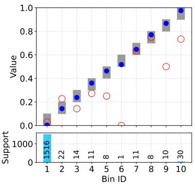  
(a) Fixed-width (Naeini et al., 2015)

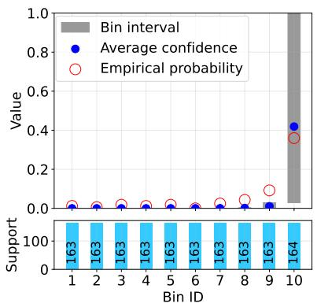  
(b) Adaptive (Nixon et al., 2019)

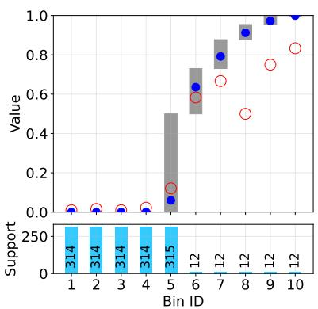  
(c) Ours: AdaptiveML  
Figure 1: Comparison of binning schemes for an individual label in multi-label classification. Average confidence is the mean predicted probability for the label within a bin, and empirical probability is the fraction of instances in that bin that actually have the label.1Fixed-width binning results in several bins with only very few examples (see “Support”, i.e., the bin size), whereas adaptive binning leads to most bins containing predictions close to 0 and a very wide bin for the remaining predictions. We propose the new binning scheme adaptive , which strikes a balance between the two extremes, giving equal weight to the cases where the classifier assigns or does not assign the label. The example illustrates the confidence scores of the predictions of a fine-tuned BiomedBERT classifier for the label “33.24” in MIMIC-III-v.1.4.

We hence propose a new binning scheme for multi-label (ML) classification (adaptiveML) . Our core insight is that a reliable and practically relevant binning scheme for multi-label prediction must put equal weight on positive and negative predictions. We hence apply adaptive binning separately to positive and negative predictions, creating only as many bins as the smaller subset (usually positive predictions) can support while ensuring a minimum bin size (see Fig. 1c, where the first five bins contain only negative predictions and the last five bins contain only positive ones). Based on adaptiveML, we propose the multi-label expected calibration error (ECEML), an unweighted average of the calibration errors of the individual bins (Sec. 4). Empirically, adaptiveML binning scheme yields well-populated bins (Sec. 6) and thus a meaningful calibration metric for the multi-label case.

We validate our binning scheme and ECEML in an empirical study on two heavily imbalanced largescale multi-label text classification benchmarks:

RCV1-v2 (Lewis et al., 2004), which provides a hierarchical label set, and MIMIC-III-v1.4 (Johnson et al., 2016), which has a very large label set. We evaluate BERT-style models (Devlin et al., 2019) and specialized models for the two datasets (Kim et al., 2024; Huang et al., 2022) in conjunction with methods to tackle class imbalance, as well as LLM-based classifiers in zero-shot and retrievalaugmented generation settings (RAG, similar to Milios et al., 2023), which may be a viable alternative to fine-tuned models if large-scale training data is not available.

## In sum, our contributions are:

(1) We perform an in-depth analysis of pitfalls in directly applying single-label calibration metrics to the multi-label setting.

(2) As a remedy, we propose adaptiveML, a robust new binning scheme for assessing per-label classification in multi-label classification.

(3) Our empirical study on two large benchmarks shows that fine-tuned discriminative classifiers with focal loss achieve the best performance and calibration.

(4) We find that fine-tuned classifiers outperform zero-shot LLM-based predictors. Although RAG considerably improves both performance and calibration of LLMs, they still fall short of fine-tuned classifiers and have a considerably higher inference time.

We argue that more research is necessary on the practically relevant setup of using LLMs for multi-label classification. Our newly proposed and validated binning scheme offers a solid foundation for future research in this direction.2

## 2 Background and Related Work

In this section, we review single-label calibration metrics, and give a brief overview on prior work on calibration and class imbalance in NLP.

## 2.1 Single-label Calibration Metrics

For multi-class classification with C classes, different notions of calibration have been proposed (Posocco and Bonnefoy, 2021). Confidence calibration only considers the top-1 prediction:

$$
\forall p \in [ 0 , 1 ] : P ( Y = \hat { Y } | \hat { p } = p ) = p\tag{1}
$$

(X, Y ) is a random variable from which inputs and labels are drawn, $f ~ : ~ \boldsymbol { X } ~  ~ [ 0 , 1 ] ^ { C }$ is the function learnt by the model, $\begin{array} { r l } { \hat { Y } } & { { } = } \end{array}$ argmax $_ { \cdot c \in [ 1 . . C ] } \left( f \left( X \right) _ { c } \right)$ is the top-1 predicted label and $\hat { p } \stackrel { \cdot } { = } \operatorname* { m i x } _ { c \in [ 1 . . C ] } \left( f \left( X \right) _ { c } \right)$ is the confidence, i.e., the probability of the top-1 prediction.

The stricter class-wise calibration (Zadrozny and Elkan, 2002) requires all per-class probabilities to be calibrated in a one-vs-rest fashion:

$$
\begin{array} { c } { \forall c \in [ 1 . . C ] \forall p \in [ 0 , 1 ] : } \\ { P \left( Y = c \mid f \left( X \right) _ { c } = p \right) = p } \end{array}\tag{2}
$$

A popular way to operationalize eqs. (1) and (2) is to discretize the probability interval [0, 1] into M bins. For confidence calibration, this leads to the Expected Calibration Error (ECE) (Naeini et al., 2015; Guo et al., 2017):

$$
\operatorname { E C E } = \sum _ { m = 1 } ^ { M } { \frac { | B _ { m } | } { n } } \left| \operatorname { a c c } ( B _ { m } ) - \operatorname { c o n f } ( B _ { m } ) \right|\tag{3}
$$

where n is the total number of instances, and $| B _ { m } | .$ acc $\left( B _ { m } \right)$ , and $\operatorname { c o n f } ( B _ { m } )$ are the support, the accuracy, and the averaged confidence of the m-th bin, respectively. Class-wise ECE (CWECE) performs the binning separately for each class:

$$
\mathrm { C W E C E } = \frac { 1 } { C } \sum _ { c = 1 } ^ { C } \mathrm { E C E } _ { c }\tag{4}
$$

ECEc is the ECE for label c (see below) and sharec $: ( B _ { m } )$ is the percentage of instances in the bin m that carry label c and $\bar { p } _ { c } ( B _ { m } )$ is the average of the respective prediction probabilities for c.

$$
\mathrm { E C E } _ { c } = \sum _ { m = 1 } ^ { M } \frac { | B _ { m } | } { n } \left| \mathrm { s h a r e } _ { c } ( B _ { m } ) - \bar { p } _ { c } ( B _ { m } ) \right|\tag{5}
$$

Our metric for estimating confidence in multilabel classification tasks is derived from these metrics.

## 2.2 Calibration and Class Imbalance in NLP

Calibration in NLP. Most prior work on classifier calibration in NLP focuses on single-label tasks. Here, BERT-style models have been shown to be poorly calibrated, often suffering from overconfidence (Desai and Durrett, 2020; Kong et al., 2020; Guo et al., 2021; Kim et al., 2023). Sachdeva et al. (2024) improve calibration of such models on extractive question-answering by counterfactually augmenting their training data. Calibration of generative LLMs is an open research topic (see, e.g., Geng et al., 2024; Zhang and Wang, 2026). Similar to discriminative models, confidence estimates can be derived from logits, but generative models can also be prompted to verbalize their confidence. More advanced calibration techniques rely on the grouping of similar prompts and completions (e.g., Detommaso et al., 2024).

Classifier Calibration on Imbalanced Data. Kranzlein et al. (2021) investigate single-label calibration with rare classes, proposing to evaluate calibration separately for classes with similar frequency and to also perform post-hoc recalibration based on these groups. Focal loss has been successfully applied to a variety of imbalanced tasks in both computer vision and NLP (e.g., Mukhoti et al., 2020; Wang et al., 2022; Ghosh et al., 2022; Liu et al., 2023; Yilmaz et al., 2023). Henning et al. (2023) give an overview on class imbalance methods in NLP.

We take inspiration from this literature to combine several promising sampling methods and loss functions when fine-tuning encoder models for multi-label classification.

## 3 Issues when Computing Calibration for Multi-Label Classification

In multi-label classification, Y is a random variable in $\{ 0 , 1 \} ^ { C }$ , with $Y _ { c } = 1$ indicating that class c applies (we call this assignment of 0 or 1 to a dimension in the label vector a label assignment). One may model the problem at the level of (i) individual labels, yielding a series of C binary classification problems, or (ii) the full label vector, yielding a prediction problem over subsets of labels.

Historically, classical machine learning methods using features derived from word counts (see, e.g., Kowsari et al., 2019) were applied for multi-label text classification. Computationally cheap methods like decision trees enable building higher-order classifiers (considering relations between labels) (see, e.g., Zhang et al., 2022). Neural classifiers based on Transformer encoders like BERT (Devlin et al., 2019) outperform count-based approaches (Galke et al., 2022), typically using a single sigmoid head for each label instead of higher-order classifiers due to their computational expense. With the rise of powerful models to generate text, multilabel classification can also be approached using generative models (see Sec. 5.2).

The different modeling choices (i) and (ii) naturally lead to different notions of calibration. Under (ii), a predicted set is correct if and only if it exactly matches the ground truth set of applying labels (Li et al., 2019), without distinguishing near-correct from highly deviant predictions. For models that output per-label probabilities, a standard way to compute prediction set probability is to compute it as the product of the per-label prediction probabilities for inclusion or exclusion (e.g., Li, 2019). In large label spaces, prediction set probabilities computed this way become infinitesimally small, making calibration evaluation very hard (see App. A.1).

If a multi-label problem with C labels is modeled at the level of individual labels (i), considering the calibration of the C individual label assignments per instance is a natural choice. Put more formally, this requires multi-label classifiers to be calibrated on the level of per-label decisions:

$$
\begin{array} { c } { { \forall p \in [ 0 , 1 ] \forall c \in [ 1 . . C ] : } } \\ { { P ( Y _ { c } = 1 | f ( X ) _ { c } = p ) = p } } \end{array}\tag{6}
$$

Prior work on calibration in multi-label classification in computer vision (Chen et al., 2024; Cheng and Vasconcelos, 2024) has approximated Equation (6) by computing calibration errors on the union of all binary per-label classifications. This means that binning is performed only once for all n · C label assignments in a multi-label classification task with n instances and C labels. While intuitive at first glance, we argue that this procedure often leads to undesired effects of miscalibrated labels concealing the miscalibration of each other, e.g., an overconfident label concealing the underconfidence of another one, since binning happens before computing the error (see Fig. 4) in App. A.1). In practice, this means that a user might put unjustified trust in the prediction of a specific label as the classifier seems well-calibrated across labels, but is actually poorly calibrated on that specific label.

Ullah et al. (2024) discuss computing per-label calibration errors, but observe that this may be distorted by the large amount of easily recognizable non-applying labels (easy negatives) and propose to instead evaluate the calibration of the k most confident labels per instance. For computing an error on these labels, they perform adaptive binning only once, again potentially inducing undesired effects of one miscalibration concealing the other. Moreover, it is unclear how to choose k, as the standard deviation of the number of assigned labels per instance can be rather substantial (e.g., 8.14 on MIMIC-III-v1.4, see Table 3 in App. A.2). With a too low k, we ignore too many relevant labels, and with a high k, this score converges towards binning all $n \cdot C$ label assignments at once.

## 4 ECEML: A New Calibration Metric for Multi-label Classification

In this section, we derive our proposed method to evaluate the calibration of individual labels in multi-label calibration. We opt for computing the calibration error of each individual binary classification separately for the reasons discussed in Sec. 3, enabling displaying label predictions with their confidence score and per-label calibration error.

We propose to address the issue of many easy negative labels on the level of the binning scheme. ECE as defined in Equation (3) relies on a fixed binning scheme, in which bins may contain strongly varying numbers of predictions (see, e.g., Fig. 1a). This can lead to biased estimators (Roelofs et al., 2022). However, applying adaptive binning (Nixon et al., 2019), which ensures roughly equal bin sizes, to the binary subtasks of a multi-label classification problem, leads to the problem that most of the bins will only contain predictions close to 0. The remaining bin(s) will be very wide, conflating predictions with high confidence and those with low confidences (see, e.g., Fig. 1b). Put differently, standard adaptive ECE implicitly allocates resolution according to prediction density, which becomes pathological in multi-label settings. One way to tackle this issue is to ignore all predictions below some threshold ϵ (Nixon et al., 2019), but there is no obvious way to choose ϵ, whose choice will greatly influence the resulting score. Moreover, the method does not detect miscalibration below the threshold, i.e., if a classifier assigns probabilities below ϵ when the label actually applies.

AdaptiveML Binning. Instead of thresholding, we propose to separately bin positive and negative predictions in an adaptive scheme, respectively. We assume that each label receives a confidence score separately and that a prediction is positive if the corresponding score $\geq 0 . 5$ . If a model achieves higher overall accuracy by predicting a label at a threshold different from 0.5, its confidences are not well-calibrated, and they can be scaled to the 0.5 threshold before applying adaptiveML as we exemplify in Sec. 5.2. However, if a threshold different from 0.5 is chosen for other reasons (e.g., safety concerns), we advise to not re-scale the original confidences, as the thresholds were not optimized during training. It then depends on the use case if separate binning should be performed at the 0.5 threshold (assessing general model calibration) or at the chosen threshold (answering how well the model is calibrated for positive and negative predictions, respectively). Different models should always be compared at the same threshold.

Binning positive and negative predictions separately enables the calibration error to cover all predictions while giving equal weight to the two scenarios that are of interest to the user when deciding whether to trust a classifier: The label-wise calibration error should reflect (a) how good confidence scores are for the label if the label is predicted, and (b) how good confidence scores are if the label is not predicted. If the overall number of bins is specified to be $b ,$ we reserve $\frac { b } { 2 }$ bins for the two intervals, respectively. We additionally constrain our binning procedure with a minimum bin size $b _ { m i n }$ . If there are not enough positive or negative predictions for $\frac { b } { 2 }$ bins of at least $b _ { m i n }$ size, we scale down the number of bins to ensure that each bin contains at least $b _ { m i n }$ predictions. In the special case of having fewer positive or negative predictions than $2 * b _ { m i n } ,$ we use a single bin for positive and negative predictions, respectively.3 If a label is never predicted by the classifier, we bin the negative predictions adaptively into b bins. In our experiments, we use $b _ { m i n } = 5$ and $b = 1 0 . ^ { 4 }$ We call the resulting scheme adaptive . Fig. 1 exemplifies the results of the different binning schemes on a single label.

Assessing Overall System Calibration. To assess overall system calibration, we report an average of the per-label calibration errors, indicating by how many percentage points labels are miscalibrated on average. Our proposed metric ECE indexes bins m additionally by label c:

$$
\mathrm { E C E _ { M L } } = \frac { 1 } { C } \sum _ { c = 1 } ^ { C } \frac { 1 } { M _ { c } } \sum _ { m = 1 } ^ { M _ { c } } | \mathrm { a c c } ( B _ { c m } ) - \bar { p } ( B _ { c m } ) |\tag{7}
$$

Here, $M _ { c }$ is the number of bins for the class c (usually, $M _ { c } = b .$ , see above for special cases). We compute acc as the percentage of instances carrying label c in the bin $B _ { c m }$ , and $\bar { p } ( B _ { c m } )$ is the average of the prediction probabilities of label c.

## 5 Experimental Setting

## 5.1 Datasets

We conduct an empirical study to validate our new metric on RCV1-v2 (Lewis et al., 2004, henceforth RCV1) and MIMIC-III-v1.4 (Johnson et al., 2016, henceforth MIMIC-III), two large complex multilabel text classification benchmarks, which we describe in further detail in this section. We compute micro- and macro-averaged $\mathrm { F } _ { 1 }$ , with macro $\mathrm { F } _ { 1 }$ being our key metric due to the imbalanced nature of the two datasets. Similar to Liu et al. (2019), we additionally compute performance and calibration metrics separately for highly frequent, medium-frequency, and rare labels (with $n \geq 1 0 0 0$ $1 0 0 \leq n < 1 0 0 0$ , and $n < 1 0 0$ positive instances, respectively5). For dataset statistics including subset statistics, see App. A.2.

RCV1. RCV1 is a hierarchical news topic classification dataset with 103 unique labels and roughly 800,000 instances. We use the official RCV1 test set (ca. 780,000 instances) and randomly split the official training set into a train, tune, and a dev set (van der Goot, 2021). For our exploratory experiment with generative classifiers, due to their much higher runtime, we create a subsampled version of the RCV1 test set containing 5,000 instances (for sampling details, see App. A.2). We compute hierarchical $\mathrm { F } _ { 1 }$ scores (Kiritchenko et al., 2005).

MIMIC-III. MIMIC-III is a medical coding dataset, i.e., the task is to assign codes (labels) to free-text medical notes with 8,930 unique labels and roughly 53,000 instances. Following Mullenbach et al. (2018), we predict both diagnosis and procedure codes and use their data split into training, dev, and test set. We further randomly split the training set into a train and tune set and use Kim et al. (2022)’s code preprocessing, but no text preprocessing. While the codes are hierarchical, the task of human medical coders is to always assign the most specific code.6 We thus use the standard $\mathrm { F } _ { 1 }$ score here. We follow Edin et al. (2023) in computing macro-averaged scores only on labels that occur in the respective evaluation set, and report macro-averages on all labels in App. A.4.2.

## 5.2 Models

Using our newly proposed method for evaluating calibration in multi-label classification, we compare a wide range of neural text classification methods. Here, we describe the various setups we use for our models, including loss- and sampling-based methods for mitigating class imbalance effects, and obtaining confidence scores from LLMs.

Classifiers. We use BERT-based classifiers (Devlin et al., 2019) and two SOTA model architectures specifically designed for RCV1 and MIMIC-III, respectively. For RCV1, in addition to BERT, we evaluate HiDEC (Im et al., 2023). HiDEC uses an encoder-decoder setup to generate a sequence of labels representing a path through the label hierarchy. As our baseline, we train HiDEC with the HBM loss (Kim et al., 2024), a hierarchy-aware loss function specifically designed for HiDEC-like models that also optimizes label-specific prediction thresholds. To enable comparison with confidence values from other models, we piecewise linearly re-scale the label-specific prediction confidences (HiDEC-s, see App. A.3.1).

On MIMIC-III, we first compare BERT, Biomed-BERT (Gu et al., 2022), and ModernBERT (Warner et al., 2024). For BERT and BiomedBERT, we need to truncate the long medical notes due to their limited context windows, whereas ModernBERT can fit 8,192 tokens. Yet, the domain-specific Biomed-BERT model is the best model on the dev set (see

Table 9). Hence, we use this model as our underlying model for PLM-ICD (Huang et al., 2022), a model based on chunking and label attention.

Addressing Class Imbalance. Our starting point are BERT-based baselines trained with binary cross-entropy loss (BCE). To tackle class imbalance, we test variants of up-weighting positive instances compared to negative ones: uniformly up-weighting them (WBCEU, Rathnayaka et al., 2019), up-weighting rare positive instances proportionally to class frequency (WBCEM), and upweighting all positive instances proportionally to class frequency (WBCEP). We also evaluate Multilabel Random Oversampling (ROS, Charte et al., 2015), which assigns more importance to less frequent labels by oversampling them, and focal loss (FL, Lin et al., 2017), which down-weights instances for which the model is already confidently correct (see App. A.3.2 for loss formulae).

Multi-Label Classification with LLMs. Instead of treating multi-label classification as a standard classification problem with discriminative models, it can also be approached using generative models, ranging from fine-tuning methods (e.g., Jung et al., 2023) to few-shot prompting (e.g., D’Oosterlinck et al., 2024; Milios et al., 2023; Zhu and Zamani, 2024). Inspired by these approaches, we design an LLM-based baseline system for multi-label prediction. Our system utilizes Llama-3.3-70B-Instruct (Dubey et al., 2024, Llama-3.3) or Qwen2.5-72B-Instruct (Yang et al., 2024, Qwen-2.5), which for each prediction is prompted with a set of few-shot demonstrations from the training set, which are retrieved from a vector database (FAISS, Douze et al., 2024) if the cosine similarity between their embeddings and the embedding of the test instance, computed using all-mpnet-base-v27 (Reimers and Gurevych, 2019), exceeds a tuned similarity threshold. We compare this retrieval-enhanced system with zero-shot prompting of the underlying models. For more details, see App. A.3.3.

Invalid predicted labels (not contained in the label space) are discarded. To estimate confidence, we compare (i) extracting the probability of the first generated token corresponding to each label to determine the model’s confidence (Token Prob.) and (ii) asking the LLM to estimate its confidence in individual labels (Verbalized, see App. A.3.3).

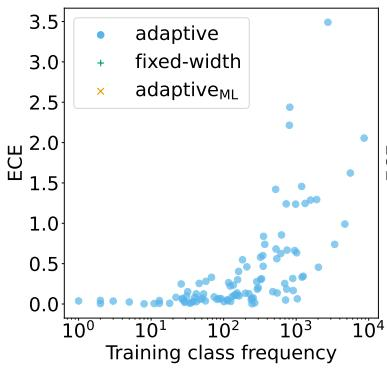

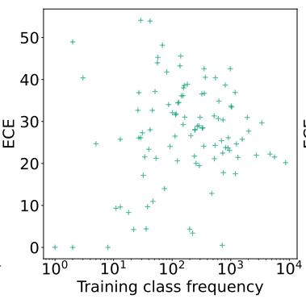  
(a) RCV1 dev

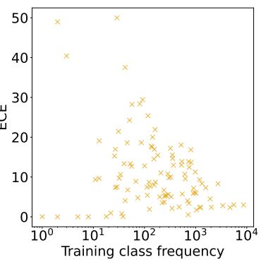

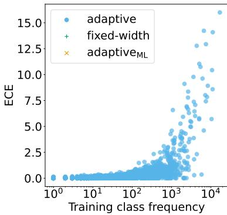

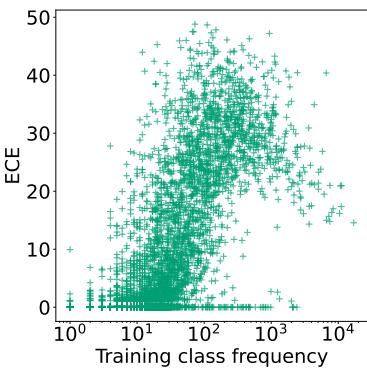  
(b) MIMIC-III dev

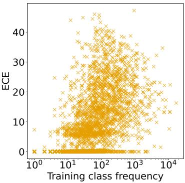  
Figure 2: Expected Calibration Error (ECE) as a function of training class frequency under different binning schemes (adaptive, fixed-width, and $\mathrm { a d a p t i v e } _ { \mathrm { M L } } )$ . Results are shown for (a) RCV1 dev using BERT-base and (b) MIMIC-III dev using BiomedBERT-base, both trained with BCE loss and no oversampling, averaged over 5 random seeds. Under adaptive binning, ECE increases with class frequency on both datasets, whereas under adaptiveML binning, ECE exhibits opposing trends with respect to class frequency on the two datasets. For ECEs by training frequency on the test sets and for performance by training frequency, see Fig. 9 and 10, respectively.

## 5.3 Setup

On both datasets, we run the experiments with five different random seeds, respectively, and report averages and standard deviations, with the exception of the LLM-based explorative experiments, where we greedily decode the outputs of a single run. During fine-tuning, we train for 50 epochs. If not otherwise indicated, we stop early with a patience of ten epochs based on the tune/dev set performance in development/evaluation runs. When evaluating on the test set, we train on the combination of train and tune and select the best epoch on the dev set. On RCV1, we tune hyperparameters for the BERT BCE baseline (see App. A.4.1). For HiDEC-s HBM, we use Kim et al. (2024)’s hyperparameters, and on MIMIC-III, we use Kim et al. (2022)’s hyperparameters. On both datasets, we tune the oversampling rate and γ for ML-ROS and FL, respectively (see Tables 7 and 9 in App. A.4.1). For an overview of model parameters, computational infrastructure and budget, see App. A.4.1.

## 6 Experimental Results

In this section, we describe our experimental results for estimating calibration for multi-label classification using our proposed evaluation metric.

Binning Scheme Validation. We first apply our new binning scheme to validate it in comparison with fixed-width and adaptive binning. Fig. 2 compares ECEs computed based on the adaptive, fixedwidth, and adaptiveML binning schemes on RCV1 and MIMIC-III. On both datasets, adaptive binning leads to ECE scores that strongly correlate with class frequency: the more frequent a class is, the less calibrated it seems according to adaptive binning, albeit models typically learn to perform better on more frequent classes. Adaptive binning results in low ECEs for non-frequent classes because for these labels, typically only a single bin contains positive predictions (see Fig. 1b).

Adaptive is designed to suffer neither from the artifact that majorities of negative predictions make ECE diminish nor from unreliable bin sizes.

<table><tr><td rowspan="2">Dataset</td><td rowspan="2">Ideal bin size</td><td rowspan="2">Binning scheme</td><td colspan="3">Share (%) of bins of size</td><td colspan="3">Bin size statistics</td></tr><tr><td>&lt;= 10&lt;= 100&lt;= 1000&lt;10 000</td><td></td><td></td><td>Average Std. dev. Median</td><td></td><td></td></tr><tr><td rowspan="2">MIMIC-III dev</td><td rowspan="2">163.1</td><td>fixed-width</td><td>40.4 43.9 ±0.8 ±0.7 2.5</td><td>44.0 ±0.7</td><td>100 ±0.0</td><td>914.0 ±11.7</td><td>805.7 ±1.4</td><td>1627.2 ±1.3</td></tr><tr><td>adaptivemL</td><td>2.2 ±0.1 ±0.1</td><td>98.8 ±0.1</td><td>100 ±0.0</td><td>180.1 ±0.8</td><td>164.7 ±3.7</td><td>163.0 ±0.0</td></tr><tr><td rowspan="2">RCV1 dev</td><td rowspan="2">231.5</td><td>fixed-width</td><td>73.0 82.1 ±0.5</td><td>84.6 ±0.5</td><td>100 ±0.0</td><td>352.3 ±11.0</td><td>801.9 ±11.0</td><td>3.0 ±0.0</td></tr><tr><td>adaptivemL</td><td>22.2 ±0.9</td><td>±0.4 42.2 ±0.6</td><td>94.3 ±0.1</td><td>100 ±3.7</td><td>321.4 453.3</td><td>231.0 ±11.6</td></tr></table>

Table 1: Distribution of bin sizes of fixed-width and adaptive binning schemes. Ideally, bins should be of roughly the same size. The bins produced by adaptiveML are much closer to this ideal size than fixed-width, resulting in more reliable calibration error estimates. Results are shown for MIMIC-III using BiomedBERT-base and RCV1 using BERT-base, both trained with BCE loss and no oversampling, averaged over 5 random seeds. Empty bins, which fixed-width, but not adaptive can create, have been excluded from this analysis, since they do not contribute to the calibration error estimation. For test set results, see Tables 11 and 12.

On RCV1, ECE using adaptiveML is not correlated to label frequency. In contrast to RCV1, MIMIC has many labels with $1 0 ^ { 1 }$ to $1 0 ^ { 2 }$ training instances that are easy to predict or simply never predicted (see Fig. 10a in App. A.4.2), achieving near-zero calibration errors also under adaptiveML.

Fixed-width binning behaves similar to adaptiveML in terms of correlation with label frequency, but comes with large shares of bins of very small size, resulting in less reliable error estimates (see Table 1).

Performance and Calibration When Using Class Imbalance Methods. Table 2 reports results of standard class imbalance methods on RCV1. While oversampling and loss reweighting improve performance, they also worsen calibration. Focal loss improves both performance and calibration. We observe similar patterns on MIMIC (see Table 16 in App. A.4), with PLM-ICD showing a considerably higher performance than BERT, and better calibration on high- and medium-frequency labels. Sensitivity of Rankings to Binning Hyperparameters. We analyze the sensitivity of adaptive to the minimum bin size $b _ { m i n }$ and the number of bins b by computing $\mathrm { E C E _ { M I } }$ L and its frequency-group variants from Table 2 for all potential combinations of setting $b _ { m i n }$ and b to one of three values (5, 10, 20), respectively. Each of the nine combinations results in the same ranking of models as displayed in Table 2, indicating the robustness of adaptiveML. Performance and Calibration of LLM-Based Classifiers. In a multi-label setting with many labels, retrieving instances with exactly the same labels assigned as the test instance usually cannot be expected. Nevertheless, LLM-based classifiers heavily benefit from retrieved examples: their performance typically increases by around 20 points in macro $\mathrm { F } _ { 1 }$ compared to zero-shot prompting (see

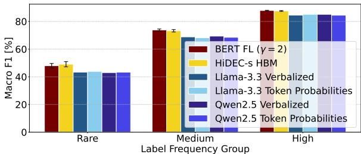

(a) ↑ Macro F1  
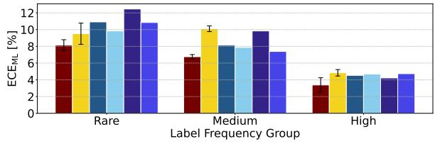  
(b) ↓ ECEML  
Figure 3: Performance and calibration of fine-tuned classifiers (best model of its type, e.g., best BERT-based model) compared to LLM classifiers with RAG on subsampled RCV1 testset. For experimental details, see Table 18. Fine-tuned models outperform LLMbased approaches across all frequency groups. BERTbased models are better calibrated than the other models.

Table 18 in App. A.4.2). The observed benefit of seeing examples from the input distribution and the label space is in line with prior work showing that few-shot prompting can work even with wrong or random labels (Min et al., 2022; Yoo et al., 2022; Wei et al., 2023).

Fig. 3 provides a frequency-group analysis of the best LLM-based and fine-tuned multi-label classifiers. Fine-tuned models consistently outperform LLM-based ones in both performance and calibration. For example, BERT with focal loss achieves lower ECE on frequent and medium-frequency labels. Fine-tuned models are also far more efficient, running up to 10,000 times faster than RAG-based methods (see Table 13 in App. A.4.2). Thus, when sufficient training data is available, fine-tuned classifiers are the superior choice. LLM-based classifiers, however, remain valuable in low-data settings, outperforming random and majority baselines.

<table><tr><td>model</td><td>loss</td><td>OS</td><td>↑ microF1↑ macroF1</td><td></td><td> $\mathrm { E C E } _ { \mathrm { M L } }$  ↓ →</td><td> $\cdot \mathrm { E C E } _ { \mathrm { M L } } ^ { \mathrm { h i g h } }$  →</td><td> $\mathrm { E C E } _ { \mathrm { M L } } ^ { \mathrm { m e d } }$ </td><td>↓ECEM</td></tr><tr><td>BERT</td><td>BCE</td><td>0</td><td>86.2 ±0.1</td><td>67.8 ±0.8</td><td>7.8 ±0.7</td><td>5.0 ±0.4</td><td>8.4 ±0.5</td><td>8.3 ±1.2</td></tr><tr><td>BERT</td><td>WBCEU</td><td>0</td><td>85.9 ±0.2</td><td>68.7 ±0.4</td><td>9.0 ±0.6</td><td>5.5 ±0.3</td><td>9.8 ±0.2</td><td>9.6 ±1.7</td></tr><tr><td>BERT</td><td>WBCEP</td><td>0</td><td>84.0 ±0.6</td><td>67.2 ±0.9</td><td>14.8 ±0.7</td><td>6.3 ±0.3</td><td>13.8 ±0.7</td><td>20.4 ±0.8</td></tr><tr><td>BERT</td><td>BCE</td><td>10</td><td>86.2 ±0.3</td><td>68.7 ±0.4</td><td>9.4 ±0.9</td><td>5.1 ±0.6</td><td>9.2 ±1.1</td><td>11.8 ±1.2</td></tr><tr><td>BERT</td><td>FL (γ = 2) 0</td><td></td><td>86.7 ±0.0</td><td>68.7 ±0.6</td><td>5.4 ±0.6</td><td>3.4 ±0.7</td><td>5.3 ±0.7</td><td>6.3 ±0.8</td></tr><tr><td>HiDEC-s</td><td>HBM</td><td>0</td><td>86.4 ±0.2</td><td>68.8 ±0.5</td><td>9.4 ±0.4</td><td>5.2 ±0.4</td><td>9.3 ±0.3</td><td>11.5 ±0.8</td></tr><tr><td></td><td>HiDEC-s FL (γ = 1) 0</td><td></td><td>86.5 ±0.1</td><td>68.5 ±0.4</td><td>7.6 ±0.6</td><td>3.9 ±0.6</td><td>7.8 ±0.4</td><td>9.0 ±1.0</td></tr></table>

Table 2: Performance and calibration on entire RCV1 test set. Frequent labels: ≥ 1000 instances in training. 17 labels, with ∅ 100456.9 instances in evaluation. Labels of medium frequency: 100 to 999 instances in training. 50 labels, with ∅ 15356.9 instances in evaluation. Rare labels: < 100 instances in training. 36 labels, with ∅ 1598.8 instances in evaluation. Averages and standard deviations of 5 runs with different random seeds. BCE: binary cross-entropy loss; WBCE: weighted binary cross-entropy loss using weights as described in Sec. 5.2; FL: focal loss; OS: oversampling percentage. macroF : hierarchical macro $\mathrm { F } _ { 1 }$ score.

## 7 Conclusion

In this work, we have addressed the limitations of existing calibration metrics when applied to multilabel text classification, particularly under severe class imbalance. We have introduced a new calibration metric and an adaptive binning scheme that better capture per-label miscalibration and provide meaningful estimates. Our empirical study on large-scale, imbalanced benchmarks demonstrates that fine-tuned classifiers trained with focal loss offer the most reliable balance of performance and calibration, while LLM-based classifiers remain less well-calibrated despite showing promising results with RAG. Overall, our contributions provide a foundation for more robust evaluation and development of calibrated models in multi-label text classification, highlighting both effective current strategies and open challenges for future research.

## Limitations

Baan et al. (2022) argue that ECE and its variants are not meaningful if humans inherently disagree on label assignments for a given single-label task, because even the oracle classifier which perfectly models the human disagreement distribution will be miscalibrated according to these metrics. They support this claim with a case study on ChaosNLI (Nie et al., 2020), a natural language inference (NLI) dataset consisting of instances with weak human annotator agreement. Their proposed alternative approach requires a reliable estimate of the human judgement distribution, which can be difficult to obtain in practice and is, to the best of our knowledge, not available for the datasets in our study. However, we agree that when using ECEML to assess calibration, it should always be kept in mind that it measures calibration with respect to the gold standard.

For obtaining confidence estimates from LLMs, we only compare the currently most common methods including verbalizations and logit-based scores. Using our proposed methods, future work can also evaluate additional methods for retrieving confidence scores from LLMs (Fadeeva et al., 2023).

## Acknowledgements

We thank Amaan Ansari, Yaqi Zhang, and Mohamed H. Gad-Elrab for their contributions to preliminary experiments related to this paper. We also thank Stefan Grünewald for detailed feedback on the paper manuscript and Fabian Kunze for helpful discussions on the paper.

This work was co-funded by the European Union (ERC, EPICAL, 101141712). Views and opinions expressed are however those of the author(s) only and do not necessarily reflect those of the European Union or the European Research Council. Neither the European Union nor the granting authority can be held responsible for them.

## References

Stanislav Anatolyev and Vladimir Pyrlik. 2022. Copula shrinkage and portfolio allocation in ultra-high dimensions. Journal of Economic Dynamics and Control, 143:104508.

Joris Baan, Wilker Aziz, Barbara Plank, and Raquel Fernandez. 2022. Stop measuring calibration when humans disagree. In Proceedings of the 2022 Conference on Empirical Methods in Natural Language Processing, pages 1892–1915, Abu Dhabi, United Arab Emirates. Association for Computational Linguistics.

Francisco Charte, Antonio J. Rivera, María J. del Jesus, and Francisco Herrera. 2015. Addressing imbalance in multilabel classification: Measures and random resampling algorithms. Neurocomputing, 163:3–16. Recent Advancements in Hybrid Artificial Intelligence Systems and its Application to Real-World Problems Progress in Intelligent Systems Mining Humanistic Data.

Tianshui Chen, Weihang Wang, Tao Pu, Jinghui Qin, Zhijing Yang, Jie Liu, and Liang Lin. 2024. Dynamic correlation learning and regularization for multi-label confidence calibration. IEEE Trans. Image Process., 33:4811–4823.

Jiacheng Cheng and Nuno Vasconcelos. 2024. Towards calibrated multi-label deep neural networks. In IEEE/CVF Conference on Computer Vision and Pattern Recognition, CVPR 2024, Seattle, WA, USA, June 16-22, 2024, pages 27579–27589. IEEE.

Shrey Desai and Greg Durrett. 2020. Calibration of pre-trained transformers. In Proceedings ofthe 2020 Conference on Empirical Methods in Natural Language Processing (EMNLP), pages 295–302, Online. Association for Computational Linguistics.

Gianluca Detommaso, Martin Bertran Lopez, Riccardo Fogliato, and Aaron Roth. 2024. Multicalibration for confidence scoring in llms. In Forty-first International Conference on Machine Learning, ICML 2024, Vienna, Austria, July 21-27, 2024, Proceedings of Machine Learning Research, pages 10624–10641. PMLR / OpenReview.net.

Jacob Devlin, Ming-Wei Chang, Kenton Lee, and Kristina Toutanova. 2019. BERT: Pre-training of deep bidirectional transformers for language understanding. In Proceedings ofthe 2019 Conference of the North American Chapter ofthe Associationfor Computational Linguistics: Human Language Technologies, Volume 1 (Long and Short Papers), pages 4171–4186, Minneapolis, Minnesota. Association for Computational Linguistics.

Karel D’Oosterlinck, Omar Khattab, François Remy, Thomas Demeester, Chris Develder, and Christopher Potts. 2024. In-context learning for extreme multilabel classification. CoRR, abs/2401.12178.

Matthijs Douze, Alexandr Guzhva, Chengqi Deng, Jeff Johnson, Gergely Szilvasy, Pierre-Emmanuel Mazaré, Maria Lomeli, Lucas Hosseini, and Hervé Jégou. 2024. The faiss library. CoRR, abs/2401.08281.

Abhimanyu Dubey, Abhinav Jauhri, Abhinav Pandey, Abhishek Kadian, Ahmad Al-Dahle, Aiesha Letman, Akhil Mathur, Alan Schelten, Amy Yang, Angela Fan, Anirudh Goyal, Anthony Hartshorn, Aobo Yang, Archi Mitra, Archie Sravankumar, Artem Korenev, Arthur Hinsvark, Arun Rao, Aston Zhang, and 82 others. 2024. The llama 3 herd of models. CoRR, abs/2407.21783.

Joakim Edin, Alexander Junge, Jakob D. Havtorn, Lasse Borgholt, Maria Maistro, Tuukka Ruotsalo, and Lars Maaløe. 2023. Automated medical coding on MIMIC-III and MIMIC-IV: A critical review and replicability study. In Proceedings ofthe 46th International ACM SIGIR Conference on Research and Development in Information Retrieval, SIGIR 2023, Taipei, Taiwan, July 23-27, 2023, pages 2572–2582. ACM.

Ekaterina Fadeeva, Roman Vashurin, Akim Tsvigun, Artem Vazhentsev, Sergey Petrakov, Kirill Fedyanin, Daniil Vasilev, Elizaveta Goncharova, Alexander Panchenko, Maxim Panov, Timothy Baldwin, and Artem Shelmanov. 2023. LM-polygraph: Uncertainty estimation for language models. In Proceedings ofthe 2023 Conference on Empirical Methods in Natural Language Processing: System Demonstrations, pages 446–461, Singapore. Association for Computational Linguistics.

Telmo Silva Filho, Hao Song, Miquel Perelló-Nieto, Raúl Santos-Rodríguez, Meelis Kull, and Peter A. Flach. 2023. Classifier calibration: a survey on how to assess and improve predicted class probabilities. Mach. Learn., 112(9):3211–3260.

Lukas Galke, Andor Diera, Bao Xin Lin, Bhakti Khera, Tim Meuser, Tushar Singhal, Fabian Karl, and Ansgar Scherp. 2022. Are we really making much progress in text classification? a comparative review. arXiv preprint arXiv:2204.03954.

Jiahui Geng, Fengyu Cai, Yuxia Wang, Heinz Koeppl, Preslav Nakov, and Iryna Gurevych. 2024. A survey of confidence estimation and calibration in large language models. In Proceedings of the 2024 Conference of the North American Chapter of the Associationfor Computational Linguistics: Human Language Technologies (Volume 1: Long Papers), pages 6577–6595, Mexico City, Mexico. Association for Computational Linguistics.

Arindam Ghosh, Thomas Schaaf, and Matthew Gormley. 2022. Adafocal: Calibration-aware adaptive focal loss. In NeurIPS.

Yu Gu, Robert Tinn, Hao Cheng, Michael Lucas, Naoto Usuyama, Xiaodong Liu, Tristan Naumann, Jianfeng Gao, and Hoifung Poon. 2022. Domain-specific language model pretraining for biomedical natural

language processing. ACM Trans. Comput. Heal., 3(1):2:1–2:23.

Chuan Guo, Geoff Pleiss, Yu Sun, and Kilian Q. Weinberger. 2017. On calibration of modern neural networks. In Proceedings ofthe 34th International Conference on Machine Learning, ICML 2017, Sydney, NSW, Australia, 6-11 August 2017, volume 70 of Proceedings ofMachine Learning Research, pages 1321–1330. PMLR.

Han Guo, Ramakanth Pasunuru, and Mohit Bansal. 2021. An overview of uncertainty calibration for text classification and the role of distillation. In Proceedings of the 6th Workshop on Representation Learning for NLP (RepL4NLP-2021), pages 289–306, Online. Association for Computational Linguistics.

Sophie Henning, William Beluch, Alexander Fraser, and Annemarie Friedrich. 2023. A survey of methods for addressing class imbalance in deep-learning based natural language processing. In Proceedings of the 17th Conference of the European Chapter of the Association for Computational Linguistics, pages 523–540, Dubrovnik, Croatia. Association for Computational Linguistics.

Matthew Honnibal, Ines Montani, Sofie Van Landeghem, and Adriane Boyd. 2020. spaCy: Industrialstrength Natural Language Processing in Python.

Chao-Wei Huang, Shang-Chi Tsai, and Yun-Nung Chen. 2022. PLM-ICD: Automatic ICD coding with pretrained language models. In Proceedings of the 4th Clinical Natural Language Processing Workshop, pages 10–20, Seattle, WA. Association for Computational Linguistics.

SangHun Im, GiBaeg Kim, Heung-Seon Oh, Seongung Jo, and Dong Hwan Kim. 2023. Hierarchical text classification as sub-hierarchy sequence generation. Proceedings of the AAAI Conference on Artificial Intelligence, 37(11):12933–12941.

Alistair Johnson, Tom Pollard, and Roger Mark. 2016. Mimic-iii clinical database (version 1.4). https: //doi.org/10.13026/C2XW26. PhysioNet. RRID:SCR\_007345.

Taehee Jung, Joo-kyung Kim, Sungjin Lee, and Dongyeop Kang. 2023. Cluster-guided label generation in extreme multi-label classification. In Proceedings of the 17th Conference of the European Chapter of the Association for Computational Linguistics, pages 1670–1685, Dubrovnik, Croatia. Association for Computational Linguistics.

Gibaeg Kim, SangHun Im, and Heung-Seon Oh. 2024. Hierarchy-aware biased bound margin loss function for hierarchical text classification. In Findings of the Association for Computational Linguistics: ACL 2024, pages 7672–7682, Bangkok, Thailand. Association for Computational Linguistics.

Jaeyoung Kim, Dongbin Na, Sungchul Choi, and Sungbin Lim. 2023. Bag of tricks for in-distribution calibration of pretrained transformers. In Findings of the Association for Computational Linguistics: EACL 2023, pages 551–563, Dubrovnik, Croatia. Association for Computational Linguistics.

Juyong Kim, Abheesht Sharma, Suhas Shanbhogue, Jeremy Weiss, and Pradeep Ravikumar. 2022. AnE-MIC: A framework for benchmarking ICD coding models. In Proceedings ofthe 2022 Conference on Empirical Methods in Natural Language Processing: System Demonstrations, pages 109–120, Abu Dhabi, UAE. Association for Computational Linguistics.

Svetlana Kiritchenko, Stan Matwin, A Fazel Famili, and 1 others. 2005. Functional annotation of genes using hierarchical text categorization. In Proc. of the ACL Workshop on Linking Biological Literature, Ontologies and Databases: Mining Biological Semantics.

Lingkai Kong, Haoming Jiang, Yuchen Zhuang, Jie Lyu, Tuo Zhao, and Chao Zhang. 2020. Calibrated language model fine-tuning for in- and outof-distribution data. In Proceedings ofthe 2020 Conference on Empirical Methods in Natural Language Processing (EMNLP), pages 1326–1340, Online. Association for Computational Linguistics.

Kamran Kowsari, Kiana Jafari Meimandi, Mojtaba Heidarysafa, Sanjana Mendu, Laura E. Barnes, and Donald E. Brown. 2019. Text classification algorithms: A survey. Inf., 10(4):150.

Michael Kranzlein, Nelson F. Liu, and Nathan Schneider. 2021. Making heads and tails of models with marginal calibration for sparse tagsets. In Findings of the Association for Computational Linguistics: EMNLP 2021, pages 4919–4928, Punta Cana, Dominican Republic. Association for Computational Linguistics.

David D. Lewis, Yiming Yang, Tony G. Rose, and Fan Li. 2004. RCV1: A new benchmark collection for text categorization research. J. Mach. Learn. Res., 5:361–397.

Cheng Li. 2019. Reduction Methods for Multi-Label Classification. Ph.D. thesis, Northeastern University.

Cheng Li, Virgil Pavlu, Javed A. Aslam, Bingyu Wang, and Kechen Qin. 2019. Learning to calibrate and rerank multi-label predictions. In Machine Learning and Knowledge Discovery in Databases - European Conference, ECML PKDD 2019, Würzburg, Germany, September 16-20, 2019, Proceedings, Part III, volume 11908 of Lecture Notes in Computer Science, pages 220–236. Springer.

Tsung-Yi Lin, Priya Goyal, Ross B. Girshick, Kaiming He, and Piotr Dollár. 2017. Focal loss for dense object detection. In IEEE International Conference on Computer Vision, ICCV 2017, Venice, Italy, October 22-29, 2017, pages 2999–3007. IEEE Computer Society.

Bingyuan Liu, Jérôme Rony, Adrian Galdran, Jose Dolz, and Ismail Ben Ayed. 2023. Class adaptive network calibration. In IEEE/CVF Conference on Computer Vision and Pattern Recognition, CVPR 2023, Vancouver, BC, Canada, June 17-24, 2023, pages 16070– 16079. IEEE.

Ziwei Liu, Zhongqi Miao, Xiaohang Zhan, Jiayun Wang, Boqing Gong, and Stella X. Yu. 2019. Large-scale long-tailed recognition in an open world. In IEEE Conference on Computer Vision and Pattern Recognition, CVPR 2019, Long Beach, CA, USA, June 16-20, 2019, pages 2537–2546. Computer Vision Foundation / IEEE.

Aristides Milios, Siva Reddy, and Dzmitry Bahdanau. 2023. In-context learning for text classification with many labels. In Proceedings of the 1st GenBench Workshop on (Benchmarking) Generalisation in NLP, pages 173–184, Singapore. Association for Computational Linguistics.

Sewon Min, Xinxi Lyu, Ari Holtzman, Mikel Artetxe, Mike Lewis, Hannaneh Hajishirzi, and Luke Zettlemoyer. 2022. Rethinking the role of demonstrations: What makes in-context learning work? In Proceedings ofthe 2022 Conference on Empirical Methods in Natural Language Processing, pages 11048–11064, Abu Dhabi, United Arab Emirates. Association for Computational Linguistics.

Jishnu Mukhoti, Viveka Kulharia, Amartya Sanyal, Stuart Golodetz, Philip H. S. Torr, and Puneet K. Dokania. 2020. Calibrating deep neural networks using focal loss. In Advances in Neural Information Processing Systems 33: Annual Conference on Neural Information Processing Systems 2020, NeurIPS 2020, December 6-12, 2020, virtual.

James Mullenbach, Sarah Wiegreffe, Jon Duke, Jimeng Sun, and Jacob Eisenstein. 2018. Explainable prediction of medical codes from clinical text. In Proceedings ofthe 2018 Conference ofthe North American Chapter of the Association for Computational Linguistics: Human Language Technologies, Volume 1 (Long Papers), pages 1101–1111, New Orleans, Louisiana. Association for Computational Linguistics.

Mahdi Pakdaman Naeini, Gregory F. Cooper, and Milos Hauskrecht. 2015. Obtaining well calibrated probabilities using bayesian binning. In Proceedings of the Twenty-Ninth AAAI Conference on Artificial Intelligence, January 25-30, 2015, Austin, Texas, USA, pages 2901–2907. AAAI Press.

Yixin Nie, Xiang Zhou, and Mohit Bansal. 2020. What can we learn from collective human opinions on natural language inference data? In Proceedings ofthe 2020 Conference on Empirical Methods in Natural Language Processing (EMNLP), pages 9131–9143, Online. Association for Computational Linguistics.

Jeremy Nixon, Michael W. Dusenberry, Linchuan Zhang, Ghassen Jerfel, and Dustin Tran. 2019. Mea-

suring calibration in deep learning. In IEEE Conference on Computer Vision and Pattern Recognition Workshops, CVPR Workshops 2019, Long Beach, CA, USA, June 16-20, 2019, pages 38–41. Computer Vision Foundation / IEEE.

Arkapal Panda and Utpal Garain. 2025. Copula based trainable calibration error estimator of multi-label classification with label interdependencies. In Proceedings of The 28th International Conference on Artificial Intelligence and Statistics, volume 258 of Proceedings ofMachine Learning Research, pages 3745–3753. PMLR.

Branislav Pecher, Ivan Srba, and Mária Bieliková. 2024. Fine-tuning, prompting, in-context learning and instruction-tuning: How many labelled samples do we need? CoRR, abs/2402.12819.

Nicolas Posocco and Antoine Bonnefoy. 2021. Estimating expected calibration errors. In Artificial Neural Networks and Machine Learning - ICANN 2021 - 30th International Conference on Artificial Neural Networks, Bratislava, Slovakia, September 14-17, 2021, Proceedings, Part IV, volume 12894 of Lecture Notes in Computer Science, pages 139–150. Springer.

Prabod Rathnayaka, Supun Abeysinghe, Chamod Samarajeewa, Isura Manchanayake, Malaka J. Walpola, Rashmika Nawaratne, Tharindu R. Bandaragoda, and Damminda Alahakoon. 2019. Gated recurrent neural network approach for multilabel emotion detection in microblogs. CoRR, abs/1907.07653.

Nils Reimers and Iryna Gurevych. 2019. Sentence-BERT: Sentence embeddings using Siamese BERTnetworks. In Proceedings ofthe 2019 Conference on Empirical Methods in Natural Language Processing and the 9th International Joint Conference on Natural Language Processing (EMNLP-IJCNLP), pages 3982–3992, Hong Kong, China. Association for Computational Linguistics.

Rebecca Roelofs, Nicholas Cain, Jonathon Shlens, and Michael C. Mozer. 2022. Mitigating bias in calibration error estimation. In International Conference on Artificial Intelligence and Statistics, AISTATS 2022, 28-30 March 2022, Virtual Event, volume 151 of Proceedings ofMachine Learning Research, pages 4036–4054. PMLR.

Rachneet Sachdeva, Martin Tutek, and Iryna Gurevych. 2024. CATfOOD: Counterfactual augmented training for improving out-of-domain performance and calibration. In Proceedings of the 18th Conference of the European Chapter ofthe Associationfor Computational Linguistics (Volume 1: Long Papers), pages 1876–1898, St. Julian’s, Malta. Association for Computational Linguistics.

Nasib Ullah, Erik Schultheis, Jinbin Zhang, and Rohit Babbar. 2024. Labels in extremes: How well calibrated are extreme multi-label classifiers? CoRR, abs/2411.04276.

Rob van der Goot. 2021. We need to talk about traindev-test splits. In Proceedings of the 2021 Conference on Empirical Methods in Natural Language Processing, pages 4485–4494, Online and Punta Cana, Dominican Republic. Association for Computational Linguistics.

Cheng Wang, Jorge Balazs, György Szarvas, Patrick Ernst, Lahari Poddar, and Pavel Danchenko. 2022. Calibrating imbalanced classifiers with focal loss: An empirical study. In Proceedings of the 2022 Conference on Empirical Methods in Natural Language Processing: Industry Track, pages 145–153, Abu Dhabi, UAE. Association for Computational Linguistics.

Benjamin Warner, Antoine Chaffin, Benjamin Clavié, Orion Weller, Oskar Hallström, Said Taghadouini, Alexis Gallagher, Raja Biswas, Faisal Ladhak, Tom Aarsen, Nathan Cooper, Griffin Adams, Jeremy Howard, and Iacopo Poli. 2024. Smarter, better, faster, longer: A modern bidirectional encoder for fast, memory efficient, and long context finetuning and inference. Preprint, arXiv:2412.13663.

Jerry W. Wei, Jason Wei, Yi Tay, Dustin Tran, Albert Webson, Yifeng Lu, Xinyun Chen, Hanxiao Liu, Da Huang, Denny Zhou, and Tengyu Ma. 2023. Larger language models do in-context learning differently. CoRR, abs/2303.03846.

An Yang, Baosong Yang, Beichen Zhang, Binyuan Hui, Bo Zheng, Bowen Yu, Chengyuan Li, Dayiheng Liu, Fei Huang, Haoran Wei, Huan Lin, Jian Yang, Jianhong Tu, Jianwei Zhang, Jianxin Yang, Jiaxi Yang, Jingren Zhou, Junyang Lin, Kai Dang, and 22 others. 2024. Qwen2.5 technical report. CoRR, abs/2412.15115.

Selim Firat Yilmaz, E. Batuhan Kaynak, Aykut Koç, Hamdi Dibeklioglu, and Suleyman Serdar Kozat. 2023. Multi-label sentiment analysis on 100 languages with dynamic weighting for label imbalance. IEEE Trans. Neural Networks Learn. Syst., 34(1):331–343.

Kang Min Yoo, Junyeob Kim, Hyuhng Joon Kim, Hyunsoo Cho, Hwiyeol Jo, Sang-Woo Lee, Sang-goo Lee, and Taeuk Kim. 2022. Ground-truth labels matter: A deeper look into input-label demonstrations. In Proceedings of the 2022 Conference on Empirical Methods in Natural Language Processing, pages 2422– 2437, Abu Dhabi, United Arab Emirates. Association for Computational Linguistics.

Bianca Zadrozny and Charles Elkan. 2002. Transforming classifier scores into accurate multiclass probability estimates. In Proceedings ofthe Eighth ACM SIGKDD International Conference on Knowledge Discovery and Data Mining, July 23-26, 2002, Edmonton, Alberta, Canada, pages 694–699. ACM.

Min-Ling Zhang, Yu-Kun Li, Hao Yang, and Xu-Ying Liu. 2022. Towards class-imbalance aware multilabel learning. IEEE Trans. Cybern., 52(6):4459– 4471.

Min-Ling Zhang and Deng-Bao Wang. 2026. Uncertainty calibration in deep learning: Methods, emerging challenges, and LLM frontiers. J. Comput. Sci. Technol., 41(1):318–340.

Yaxin Zhu and Hamed Zamani. 2024. ICXML: An in-context learning framework for zero-shot extreme multi-label classification. In Findings ofthe Associationfor Computational Linguistics: NAACL 2024, pages 2086–2098, Mexico City, Mexico. Association for Computational Linguistics.

## A Appendix

## A.1 Calibration Metrics for Multi-Label Calibration

Prediction Set Calibration. If multi-label classification is modeled as multi-class classification over label sets, a predicted set counts as correct if and only if it exactly matches the ground truth set of applying labels (Li et al., 2019), thus not differentiating between almost correct solutions and those where the predicted label set notably deviates from the ground truth set. If the prediction set probability is computed as the product of the per-label probabilities of assigning the label (if the specific label is contained in the prediction set) respectively the probability of not assigning it (if the label is not contained in the prediction set) (Li, 2019), the resulting prediction set probabilities become infinitesimally small with large label spaces. For example, the MIMIC-III dataset consists of 8930 labels, and even an unrealistically good classifier that always assigns a probability of 0.99 to the correct per-label decision would only assign a probability of $0 . 9 9 ^ { 8 9 3 0 } \approx 1 . 0 5 \times 1 0 ^ { - 3 9 }$ to the ground-truth prediction set for a given instance. Even the top-1 predictions will hence be associated with extremely low probabilities, making it hard to interpret them or even evaluate if they are calibrated.

Design of Adaptive . To robustly handle scenarios with significant prediction imbalance, our scheme is designed to consolidate predictions into single positive and negative bins when a label has fewer than $2 \cdot b _ { m i n }$ positive predictions (as illustrated in Fig. 5). The resulting error is typically dominated by the calibration error on the positive predictions, since the negative predictions are usually well-calibrated.

Furthermore, we made a deliberate design choice to evaluate calibration on a per-label basis. This user-centric approach is motivated by the practical needs of end users, who are typically focused on the specific labels relevant to their text document(s) rather than the entire label space (e.g., all possible medical codes).

While we note recent work (Panda and Garain, 2025) that explores integrating label dependencies into their calibration error estimate using copulas, their approach is validated on a much less complex dataset with 20 labels and each label having more than 100 instances in the training and validation set, respectively. Moreover, the reliable estimation of copulas in the very high-dimensional and sparse settings typical of multi-label text classification is an open research problem (Anatolyev and Pyrlik, 2022).

## A.2 Datasets

<table><tr><td>per instance</td><td>RCV1</td><td>MIMIC-III</td></tr><tr><td># sentences</td><td>9.95 ±9.72</td><td>120.69 ±62.56</td></tr><tr><td># tokens</td><td>282.83</td><td>2462.56</td></tr><tr><td># labels</td><td>±296.43</td><td>±1261.15</td></tr><tr><td></td><td>3.24 ±1.40</td><td>15.88 ±8.14</td></tr></table>

Table 3: Dataset Statistics.

<table><tr><td>Split</td><td>Train</td><td>Tune</td><td>Dev</td><td></td><td>Test Subs. Test</td></tr><tr><td># Instances</td><td>18,519</td><td>2,315</td><td>2,315781,261</td><td></td><td>5,000</td></tr><tr><td>Avg. # Labels</td><td>3.19</td><td>3.14</td><td>3.17</td><td>3.24</td><td>3.55</td></tr><tr><td>Avg. # Tokens</td><td>254.87</td><td>256.20</td><td>263.87</td><td>265.15</td><td>269.98</td></tr><tr><td>Avg. # Sent.</td><td>9.99</td><td>10.17</td><td>10.44</td><td>10.04</td><td>10.25</td></tr><tr><td># Unique Labels</td><td>101</td><td>99</td><td>96</td><td>103</td><td>100</td></tr></table>

Table 4: Statistics of each split of the RCV1 dataset. Subs. Test: Subsampled version of the test set used in LLM experiments.

<table><tr><td>Split</td><td>Train</td><td>Tune</td><td>Dev</td><td>Test</td></tr><tr><td># Instances</td><td>45,336</td><td>2,387</td><td>1,631</td><td>3,372</td></tr><tr><td>Avg. # Labels</td><td>15.69</td><td>15.43</td><td>17.41</td><td>17.99</td></tr><tr><td>Avg. # Tokens</td><td>2261.19</td><td>2260.85</td><td>2745.02</td><td>2763.11</td></tr><tr><td>Avg. # Sent.</td><td>123.71</td><td>122.33</td><td>133.72</td><td>133.79</td></tr><tr><td># Unique Labels</td><td>8593</td><td>3461</td><td>3012</td><td>4085</td></tr></table>

Table 5: Statistics of each split of the MIMIC-III dataset.

Dataset Statistics. Table 3 shows general statistics for RCV1 and MIMIC-III. Tables 4 and 5 show statistics for the subsets of RCV1 and MIMIC-III, respectively, that we use in our experiments as described in Sec. 6. Dataset statistics were computed based on sentencization and tokenization performed with spaCy’s en\_core\_web\_sm-3.7.1 model (Honnibal et al., 2020).

Details on Subsampled RCV1 Test Dataset. For testing in runtime-intensive scenarios, we create a subsampled version of the RCV1 testset containing 5,000 instances. Drawing a representative subsample is nontrivial in the multi-label setting, as each instance can be associated with multiple labels. Our goal was to preserve the original label distribution as closely as possible. To achieve this, we designed a sampling algorithm that iteratively selects instances in a way that minimizes the difference in label frequencies between the subsample and the original test set. Specifically, during each sampling iteration, we identify the label with the highest relative deficit (i.e., the largest underrepresentation compared to the full distribution) and randomly draw an instance that contains this label. This process is repeated until the desired number of instances is reached. We ran the sampling procedure with 11 different random seeds and selected the subsample with the lowest Jensen–Shannon (JS) divergence from the original label distribution. The final subsample has a JS divergence of 0.0344

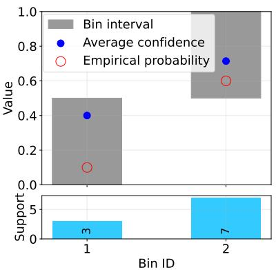  
(a) Overconfident label

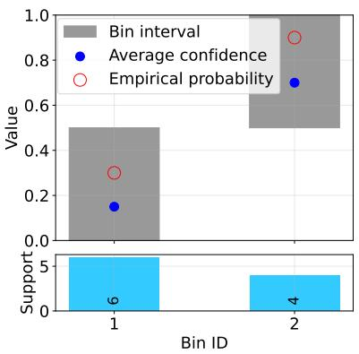  
(b) Underconfident label

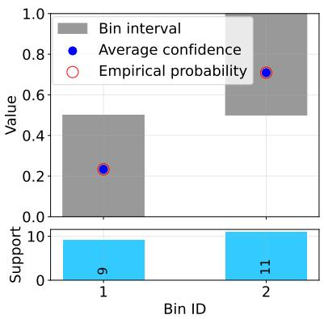  
(c) Joint binning

Figure 4: Joint binning of all labels can conceal that the classifier is overconfident on some labels and underconfident on others. Simple example (not based on real data) to illustrate the problem.  
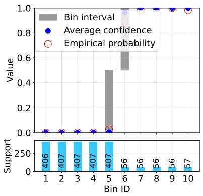  
(a) High-frequency label “M14”

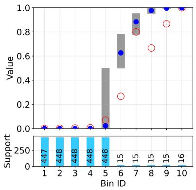  
(b) Medium-frequency label “C21”

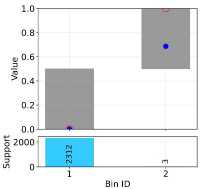  
(c) Rare label “C32”  
Figure 5: AdaptiveML binning for randomly chosen labels with different frequencies, based on a single development run of BERT-base with BCE loss and no oversampling on RCV1. The method yields sufficient bin sizes for frequent and medium-frequency labels, but rare labels often have only one small bin of positive predictions. # instances with the respective label in training/evaluation dataset: 2025/287 (M14), 628/92 (C21), 32/7 (C32).

from the original test set.

## A.3 Models

## A.3.1 HiDEC and HBM Loss

Unlike other recent HTC methods that build hierarchy directly into their model structure, Im et al. (2023) treat hierarchical text classification as a sequence generation problem. Their Hierarchy DE-Coder (HiDEC) model uses an encoder-decoder setup to generate a sequence of labels representing a path through the label hierarchy. HiDEC learns the relationships between labels along the hierarchy path, from the root to each leaf, using an attention mechanism combined with a special masking technique that focuses on parent-child label dependencies. This helps the model understand the hierarchical structure during training. The model then combines this hierarchical information with the text features to make better predictions. During inference, HiDEC generates labels in a top-down manner, starting from parent labels and moving down to child labels, using a recursive decoding process that respects the hierarchy.

Hierarchy-aware Biased Bound Margin (HBM) Loss (Kim et al., 2024) is a hierarchy-aware loss function specifically designed for unit-based HTC models like HiDEC, addressing two central challenges: label imbalance and static thresholding. HBM Loss integrates learnable bounds, biases, and a margin. The biases and margin mitigate the label imbalance by promoting low-confidence labels and excluding high-confidence labels from a loss, respectively. The learnable bounds address the static thresholding problem. These bounds are optimized for all units within a hierarchy during training and serve as dynamic unit thresholds during inference. In the context of the HiDEC model, a unit refers to the set of child labels associated with a given parent label in the label hierarchy. That is, when using HBM Loss with the HiDEC model, during hierarchical decoding, the model expands from parent to child labels in a top-down manner, applying a distinct threshold at each step of the sub-hierarchy expansion.

To enable comparison with confidence values from other models optimized for the standard 0.5 threshold, we rescale the thresholds and probabilities of each child label so that the threshold aligns with a fixed value of 0.5 and the probabilities maintain their relative position to the original threshold. We calculate the scaled probabilities using the original probabilities $p$ and thresholds t.

$$
p _ { \mathrm { s c a l e d } } = { \left\{ \begin{array} { l l } { 0 . 5 + 0 . 5 \cdot { \frac { p - t } { 1 - t } } } & { { \mathrm { i f } } p \geq t } \\ { 0 . 5 \cdot { \frac { p } { t } } } & { { \mathrm { i f } } p < t } \end{array} \right. }\tag{8}
$$

By using this piecewise linear scaling, the probability values above or equal to the original threshold are scaled into the range [0.5, 1], and values below the original threshold into [0, 0.5), preserving their relative distance from the original threshold and ensuring a fair and consistent evaluation under metrics that assume this standard threshold.

## A.3.2 Class Imbalance Methods

For the weighted BCE variants, we use the following formulae:

$w ^ { \mathrm { n e g } } = 1$ for all variants

• WBCEU: Uniformly up-weighting positive instances (Rathnayaka et al., 2019) with $w ^ { \mathrm { p o s } } = 2$

• WBCEM: Up-weighting positive instances of rare classes (proportional to class frequency):

$$
w _ { i } ^ { \mathrm { p o s } } = \operatorname* { m a x } \left( \frac { N } { 2 * n _ { i } } , 1 \right)
$$

where N is the number of instances in the data set and $n _ { i }$ is the number of instances of class $i$

• WBCEP: Up-weighting positive instances of all classes with class frequency considered:

$$
w _ { i } ^ { \mathrm { p o s } } = \frac { N } { 2 * n _ { i } } + 1
$$

For a single instance, FL is computed as follows: $- \textstyle \sum _ { j = 1 } ^ { C } [ y _ { j } ( 1 - p _ { j } ) ^ { \beta } \log p _ { j } + ( 1 - y _ { j } ) p _ { j } ^ { \beta } \log ( 1 -$ $p _ { j } ) ]$

## A.3.3 Multi-Label Classification with LLMs

Here, we detail how we perform multi-label classification using LLMs. Fig. 6 gives an overview of how LLMs are prompted using few-shot demonstrations retrieved from the training set.

Model Selection. We use instruction-tuned variants of both the Llama 3.3 (Dubey et al., 2024) and Qwen 2.5 (Yang et al., 2024) models. These models are available in various sizes; specifically, we employ $\mathrm { L l a m a } { - } 3 . 3 { - } 7 0 \mathrm { B } { \mathrm { - } } \mathrm { I n s t r u c t } ^ { 8 }$ and Qwen2.5- $7 2 \mathrm { { B - I n s t r u c t } ^ { 9 } }$ . The Llama-3.3-70B-Instruct model has 70 billion parameters and supports a context length of up to 128,000 tokens. The Qwen2.5- 72B-Instruct model consists of 72.7 billion parameters and supports a full context length of 131,072 tokens. For simplicity, we omit the “-3.3-70B-Instruct” and “2.5-72B-Instruct” suffixes in the model names throughout the following text. These large models were chosen because their size and instruction tuning make them particularly capable of following complex prompts. Their long context length allows us to include a large number of in-context examples (few-shot demonstrations) directly within a single prompt, which is important for our underlying tasks of extreme multi-label text classification and sequence labeling.

We prompt the LLMs as shown in Fig. 7 to predict the labels given the selected demonstrations, their corresponding labels, and the text of the current test instance for which the labels are to be predicted. For Token Prob. confidence estimation, we extract the probability of the first generated token corresponding to each label and use it to determine the model’s confidence. For Verbalized confidence estimation, we construct a prompt for each predicted label that includes the selected demonstrations, their corresponding labels, the text of the current test instance, and the previously predicted labels. The LLM is then instructed to estimate its confidence in the predicted label on a scale from 0 to 1, as shown in Fig. 8. This prompt is applied separately to each predicted label contained in the label space. Invalid predicted labels (i.e., labels not contained in the label space) are discarded.

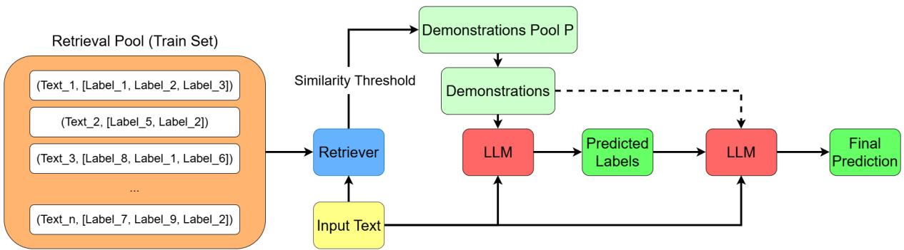  
Figure 6: LLM-based multi-label text classification system with dense demonstrations retrieval component and confidence verbalizer. First, we prompt the LLM as shown in Fig. 7 to predict the labels (first red box), which yields the predicted label set. For Token Prob. confidence estimation, we extract the probability of the first generated token corresponding to each of these labels and use it to determine the confidence scores, which are then used as the final prediction. For Verbalized confidence estimation, we prompt the LLM to estimate its confidence for each predicted label on a scale from 0 to 1, as shown in 8 (second red box). These confidence scores are then used as the final prediction.

Retriever Tuning. We tune the retriever on the development set to achieve high recall while maintaining non-trivial precision. This balance is crucial in our use case because we want to provide the LLM with as many relevant candidate labels as possible, ensuring it has sufficient information to make accurate predictions. At the same time, we need to avoid overwhelming the model with too many irrelevant labels, which could reduce overall performance and increase computational cost. This process involves adjusting two key hyperparameters: the similarity threshold t and top-k. The similarity threshold defines the minimum required similarity between a document in the retrieval pool and the input text during inference. Only documents that exceed this threshold are selected into the demonstrations pool P and are considered for the in-context demonstrations. The top-k parameter determines how many of the most similar documents from the demonstrations pool P are selected to serve as in-context demonstrations. During this phase, the labels from the retrieved demonstrations are used directly as predictions. The retriever is individually tuned for each dataset to optimize performance, resulting in $t = 0 . 2 5$ and top- $. k = 3 0$ for RCV1 and in $t ~ = ~ 0 . 3$ and $t o p \mathrm { - } k = 1 0$ for MIMIC-III. On RCV1, we get a hierarchical macro recall of 87.8%, a hierarchical macro precision of 17.4%, and a hierarchical macro $\mathrm { F } _ { 1 }$ of 26.9%. On MIMIC-III, the respective configuration yields a macro recall of 8.3%, a macro precision of 1.9%, and a macro $\mathrm { F } _ { 1 }$ of 2.9%, which is substantially lower than the results obtained on RCV1. The lower performance is primarily due to the retriever struggling with rare labels.

## A.4 Experiments

## A.4.1 Setup

RCV1. We tune hyperparameters for BERT by selecting the best model epoch according to tune set performance and choosing the best hyperparameters based on dev set performance (according to macro $\mathrm { F } _ { \mathrm { 1 , } }$ ). We tune batch size, learning rate, and dropout in a grid search, first exploring all combinations on our default random split of the training set and then evaluating the best 5 hyperparameter combinations on four more random splits of the training set, taking the one with best average performance as the final hyperparameter combination (batch size: 16, learning rate: 3e−5, dropout: 0.25). We perform hyperparameter tuning once for the baseline model, i.e., BCE loss with no oversampling, and use the same hyperparameters for the other models evaluated. For HiDEC, we use Kim et al. (2024)’s hyperparameters for HBM. For ML-ROS and FL, we tune the oversampling rate and γ, respectively (Table 7). As an optimizer, we use Adam with default values. When evaluating on the test set, we train on the combination of train and tune and select the best model epoch according to dev set performance.

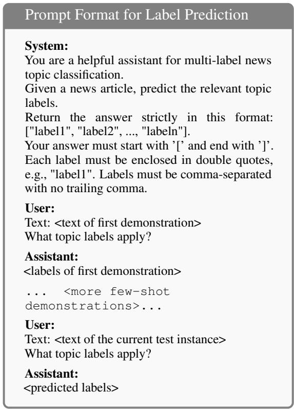  
Figure 7: Prompt format used for label prediction on RCV1 dataset including instructions, few-shot demonstrations, and text of the current test instance.

MIMIC-III. On this dataset, we use Kim et al. (2022)’s hyperparameters. For ML-ROS and FL, we tune the oversampling rate and γ, respectively (Table 9).

Calibration on the Dev Set. For calibration errors on the dev sets, see Tables 8 and 10.

Total Computational Effort of Experiments. Here, we estimate the total computational effort for the experiments reported in our paper. The numbers reported for HiDEC and the LLM-based models refer to 4 NVIDIA H100 GPUs. Inference with HiDEC and the LLM-based models on RCV1 dev, subsampled test, and full test took roughly 153 hours. Training all variants of HiDEC in the development and evaluation configuration took at most 125 hours (assuming the worst case training time of 2.5 hours with training for 100 epochs w/o early stopping for each variant). For the BERTstyle models, development runs took 18.6 hours on a single NVIDIA V100 GPU and 63.6 ours on a single NVIDIA A100 GPU, and evaluation runs took roughly 200 hours on a single NVIDIA A100 GPU. For the models reported on MIMIC-III, development runs took 50.3 hours on a single NVIDIA V100 GPU and 1016.6 hours on a single NVIDIA A100 GPU, and evaluation runs took roughly 119 hours on a single NVIDIA A100 GPU. A single run with the PLM-ICD models took up to 3 days on the A100, whereas a single run with the BERT-style models took roughly 16 hours.

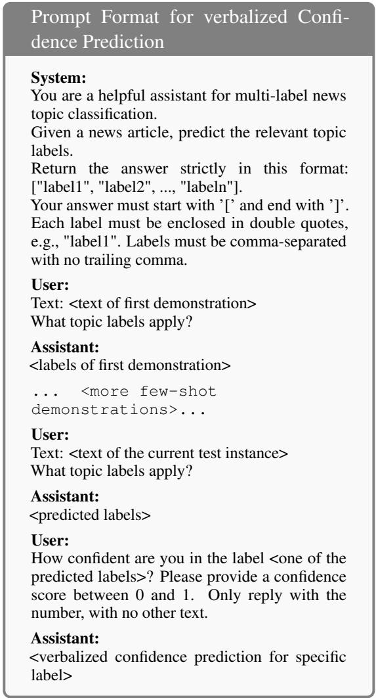  
Figure 8: Prompt format used for verbalized confidence prediction on RCV1 dataset including instructions, few-shot demonstrations used for prior label prediction, the text of the current test instance and the prior predicted labels. This prompt is used separately for each of the prior predicted labels.

<table><tr><td>model</td><td># parameters</td></tr><tr><td>BERT</td><td>116M</td></tr><tr><td>HiDEC-s</td><td>128M</td></tr><tr><td>Llama-3.3</td><td>70B</td></tr><tr><td>Qwen2.5</td><td>72B</td></tr><tr><td>ModernBERT</td><td>149M</td></tr><tr><td>BiomedBERT</td><td>116M</td></tr><tr><td>PLM-ICD</td><td>124M</td></tr></table>

Table 6: Sizes of models used in experiments. M: million, B: billion. BERT: bert-based-uncased using CLS token for classification. HiDEC-s: HiDEC implementation by Kim et al. (2024), using bert-base-uncased as the encoder, with scaled confidences to match 0.5 threshold (not affecting predicted labels). ModernBERT: ModernBERT-base, BiomedBERT: BiomedBERT-baseuncased-abstract, each using the CLS token for classification. PLM-ICD: PLM-ICD (Huang et al., 2022) with BiomedBERT-base-uncased-abstract.

Model Sizes. See Table 6 for an overview of the number of parameters of the models used in our experiments.

<table><tr><td>model</td><td>loss</td><td>OS (%)</td><td>microP</td><td>microR</td><td>microF1</td><td>macroP</td><td>macroR</td><td>macroF1</td><td>Exact Match</td></tr><tr><td>BERT</td><td>BCE</td><td>0</td><td>87.2 ±0.8</td><td>88.9 ±0.7</td><td>88.0 ±0.1</td><td>69.5 ±1.5</td><td>69.6 ±1.1</td><td>68.1 ±0.7</td><td>66.5 ±0.5</td></tr><tr><td>BERT</td><td>WBCEU</td><td>0</td><td>85.9</td><td>89.5 ±0.1</td><td>87.7 ±0.3</td><td>68.2 ±1.7</td><td>70.1 ±1.0</td><td>67.8 ±0.9</td><td>66.0</td></tr><tr><td>BERT</td><td>WBCEM</td><td>0</td><td>±0.7 79.5</td><td>90.9</td><td>84.7</td><td>60.1</td><td>77.5</td><td>65.5</td><td>±0.7 61.3</td></tr><tr><td>BERT</td><td>WBCEP</td><td>0</td><td>±6.4 82.4</td><td>±0.6 91.2 ±0.5</td><td>±3.6 86.6</td><td>±4.4 62.6</td><td>±1.2 77.1</td><td>±3.3 67.7</td><td>±5.1 63.4</td></tr><tr><td>BERT</td><td>BCE</td><td>10</td><td>±0.9 86.8</td><td>89.3 ±0.6</td><td>±0.3 88.0 ±0.2</td><td>±1.2 69.5</td><td>±0.9 70.1</td><td>±0.8 68.3</td><td>±0.9 66.3</td></tr><tr><td>BERT</td><td>BCE</td><td>20</td><td>±0.4 87.3 ±0.5</td><td>88.4 ±0.9</td><td>87.8</td><td>±1.0 69.8</td><td>±1.1 69.1</td><td>±0.8 68.0</td><td>±0.7 65.6</td></tr><tr><td>BERT</td><td>BCE</td><td>30</td><td>87.1 ±0.7</td><td>88.5 ±0.5</td><td>±0.2 87.8 ±0.1</td><td>±0.9 68.9 ±0.7</td><td>±2.5 69.2</td><td>±1.3 67.6</td><td>±0.9 65.8</td></tr><tr><td>BERT</td><td>FL (γ = 1)</td><td>0</td><td>86.6 ±0.5</td><td>89.2 ±0.4</td><td>87.9 ±0.3</td><td>68.8 ±1.4</td><td>±1.4 69.4</td><td>±0.7 67.8 ±0.8</td><td>±0.4 66.0</td></tr><tr><td>BERT</td><td>FL (γ = 2)</td><td>0</td><td>87.7 ±1.1</td><td>88.9 ±0.7</td><td>88.3</td><td>71.4</td><td>±0.8 69.2</td><td>68.7</td><td>±0.8 66.8</td></tr><tr><td>BERT</td><td>FL (γ = 3)</td><td>0</td><td>87.4</td><td>89.1 ±0.6</td><td>±0.2 88.2</td><td>±1.4 70.7</td><td>±1.6 69.6</td><td>±1.2 68.5</td><td>±0.2 66.8</td></tr><tr><td>HiDEC-s</td><td>HBM</td><td>0</td><td>±1.1 88.0 ±0.3</td><td>88.9 ±0.7</td><td>±0.4 88.4 ±0.4</td><td>±1.4 71.3</td><td>±0.8 71.0</td><td>±0.8 69.8 ±1.0</td><td>±0.9 68.3</td></tr><tr><td>HiDEC-s†</td><td>HBM</td><td>0</td><td>88.0 ±0.5</td><td>89.0 ±0.4</td><td>88.5 ±0.1</td><td>±1.2 71.6</td><td>±1.6 71.3</td><td>70.0 ±1.1</td><td>±0.5 68.4</td></tr><tr><td>HiDEC-s††</td><td>HBM</td><td>0</td><td>88.0 ±0.7</td><td>88.9 ±0.5</td><td>88.5</td><td>±1.5 71.1</td><td>±1.4 70.9</td><td>69.7</td><td>±0.4 68.5</td></tr><tr><td>HiDEC-s</td><td>FL (γ = 1)</td><td>0</td><td>88.0</td><td>88.9 ±0.4</td><td>±0.3 88.4</td><td>±1.1 71.4</td><td>±1.0 70.0</td><td>±0.7 69.5</td><td>±0.6 68.4</td></tr><tr><td>HiDEC-s</td><td>FL (γ = 2)</td><td>0</td><td>±0.5 88.1</td><td>88.7</td><td>±0.2 88.4</td><td>±0.5 70.7</td><td>±0.9 69.5</td><td>±0.8 68.7</td><td>±0.6 68.3</td></tr><tr><td>HiDEC-s</td><td>FL (γ = 3)</td><td>0</td><td>±0.5 88.2 ±0.5</td><td>±0.6 88.4 ±0.5</td><td>±0.2 88.3 ±0.3</td><td>±1.2 70.0 ±1.2</td><td>±1.3 69.3 ±1.0</td><td>±1.3 68.3 ±0.7</td><td>±0.6 67.9 ±0.9</td></tr><tr><td>model</td><td>prompting</td><td>confidence</td><td>microP</td><td>microR</td><td>microF1</td><td>macroP</td><td>macroR</td><td>macroF1</td><td>Exact Match</td></tr><tr><td>Llama-3.3</td><td>zero-shot</td><td>Verbalized</td><td>54.1</td><td>74.4</td><td>62.7</td><td>40.7</td><td>62.0</td><td>43.1</td><td>2.3</td></tr><tr><td>Llama-3.3</td><td>zero-shot</td><td>Token Prob.</td><td>52.3</td><td>72.5</td><td>60.8</td><td>39.6</td><td>60.9</td><td>41.6</td><td>2.7</td></tr><tr><td>Llama-3.3</td><td>RAG</td><td>Verbalized</td><td>88.6</td><td>84.4</td><td>86.5</td><td>74.3</td><td>68.8</td><td>68.8</td><td>56.1</td></tr><tr><td>Llama-3.3</td><td>RAG</td><td>Token Prob.</td><td>88.7</td><td>84.7</td><td>86.6</td><td>74.2</td><td>68.0</td><td>68.4</td><td>62.9</td></tr><tr><td>Qwen2.5</td><td>zero-shot</td><td>Verbalized</td><td>43.3</td><td>72.7</td><td>54.3</td><td>29.8</td><td>62.4</td><td>35.3</td><td>1.2</td></tr><tr><td>Qwen2.5</td><td>zero-shot</td><td>Token Prob.</td><td>48.8</td><td>66.9</td><td>56.5</td><td>31.2</td><td>54.1</td><td>35.0</td><td>1.1</td></tr><tr><td>Qwen2.5</td><td>RAG</td><td>Verbalized</td><td>87.8</td><td>86.5</td><td>87.2</td><td>72.8</td><td>70.7</td><td>69.9</td><td>64.7</td></tr><tr><td>Qwen2.5</td><td>RAG</td><td>Token Prob.</td><td>88.7</td><td>85.5</td><td>87.1</td><td>73.9</td><td>69.6</td><td>69.7</td><td>64.3</td></tr></table>

Table 7: Performance on RCV1 dev set. BERT: bert-based-uncased using CLS token for classification. HiDEC-s: HiDEC implementation by Kim et al. (2024), using bert-base-uncased as the encoder, with scaled confidences to match 0.5 threshold (not affecting predicted labels). Averages and standard deviations of 5 runs with different random seeds. BCE: binary cross-entropy loss; WBCE: weighted binary cross-entropy loss using weights as described in Sec. 5.2; FL: focal loss; OS: oversampling percentage. We follow Mukhoti et al. (2020) and tune γ ∈ {1, 2, 3}. All scores are computed in their hierarchical version. †: best out of 50 training epochs (no early stopping), matching Kim et al. (2024)’s experimental setting. ††: best out of 100 training epochs (no early stopping).

<table><tr><td>model</td><td>loss</td><td>OS</td><td></td><td>|↑ microF1↑macroF1 |↓ECEML</td><td></td><td> $\downarrow \mathrm { E C E _ { M L } ^ { h i g h } }$ </td><td>↓ECEmLd</td><td>↓ECEM</td></tr><tr><td>BERT</td><td>BCE</td><td>0</td><td>88.0 ±0.1</td><td>68.1 ±0.7</td><td>8.9 ±0.9</td><td>4.1 ±0.1</td><td>8.6 ±0.6</td><td>11.2 ±1.8</td></tr><tr><td>BERT</td><td>WBCEU</td><td>0</td><td>87.7 ±0.3</td><td>67.8 ±0.9</td><td>11.1 ±0.7</td><td>4.9 ±0.3</td><td>9.7 ±0.6</td><td>15.5 ±1.4</td></tr><tr><td>BERT</td><td>WBCEM</td><td>0</td><td>84.7 ±3.6</td><td>65.5 ±3.3</td><td>15.7 ±1.4</td><td>5.2 ±0.7</td><td>13.1 ±1.9</td><td>23.2 ±1.2</td></tr><tr><td>BERT</td><td>WBCEP</td><td>0</td><td>86.6 ±0.3</td><td>67.7 ±0.8</td><td>14.7 ±0.7</td><td>4.9 ±0.3</td><td>12.1 ±0.6</td><td>22.0 ±1.5</td></tr><tr><td>BERT</td><td>BCE</td><td>10</td><td>88.0 ±0.2</td><td>68.3 ±0.8</td><td>10.4 ±0.5</td><td>4.2 ±0.3</td><td>8.6 ±0.5</td><td>15.2 ±0.9</td></tr><tr><td>BERT</td><td>BCE</td><td>20</td><td>87.8 ±0.2</td><td>68.0 ±1.3</td><td>9.4 ±1.0</td><td>3.5 ±0.4</td><td>7.5 ±1.2</td><td>14.3 ±1.2</td></tr><tr><td>BERT</td><td>BCE</td><td>30</td><td>87.8 ±0.1</td><td>67.6 ±0.7</td><td>10.8 ±0.7</td><td>4.3 ±0.4</td><td>8.8 ±0.6</td><td>16.0 ±1.1</td></tr><tr><td>BERT</td><td>FL (γ = 1) 0</td><td></td><td>87.9 ±0.3</td><td>67.8 ±0.8</td><td>9.4 ±0.5</td><td>3.4 ±0.4</td><td>7.9 ±0.3</td><td>13.7 ±1.2</td></tr><tr><td>BERT</td><td> ${ \mathrm { F L } } \left( \gamma = 2 \right) ~ 0$ </td><td></td><td>88.3 ±0.2</td><td>68.7 ±1.2</td><td>8.8 ±0.8</td><td>3.8 ±0.2</td><td>7.0 ±0.4</td><td>13.2 ±2.0</td></tr><tr><td>BERT</td><td>FL (γ = 3) 0</td><td></td><td>88.2 ±0.4</td><td>68.5 ±0.8</td><td>9.5 ±0.3</td><td>5.2 ±0.5</td><td>7.9 ±0.4</td><td>13.5 ±0.5</td></tr><tr><td>HiDEC-s</td><td>HBM</td><td>0</td><td>88.4 ±0.4</td><td>69.8 ±1.0</td><td>10.4 ±0.7</td><td>4.5 ±0.1</td><td>9.0 ±0.4</td><td>14.6 ±1.4</td></tr><tr><td> $\mathrm { H i D E C ^ { - } s ^ { \dagger } }$ </td><td>HBM</td><td>0</td><td>88.5 ±0.1</td><td>70.0 ±1.1</td><td>10.1 ±0.4</td><td>4.4 ±0.3</td><td>9.4 ±0.5</td><td>13.4 ±1.0</td></tr><tr><td> $\mathrm { H i D E C - S ^ { \dagger \dagger } }$ </td><td>HBM</td><td>0</td><td>88.5 ±0.3</td><td>69.7 ±0.7</td><td>10.9 ±0.8</td><td>4.4 ±0.3</td><td>9.3 ±0.5</td><td>15.5 ±1.9</td></tr><tr><td>HiDEC-s</td><td>FL (γ = 1) 0</td><td></td><td>88.4 ±0.2</td><td>69.5 ±0.8</td><td>9.3 ±1.0</td><td>3.7 ±0.3</td><td>8.2 ±0.8</td><td>13.0 ±2.1</td></tr><tr><td>HiDEC-s</td><td> ${ \mathrm { F L } } \left( \gamma = 2 \right) ~ 0$ </td><td></td><td>88.4 ±0.2</td><td>68.7 ±1.3</td><td>9.3 ±0.7</td><td>3.2 ±0.5</td><td>7.8 ±0.3</td><td>13.8 ±1.5</td></tr><tr><td>HiDEC-s</td><td> $\mathrm { F L } \left( \gamma = 3 \right) \ 0$ </td><td></td><td>88.3 ±0.3</td><td>68.3 ±0.7</td><td>8.6 ±0.7</td><td>3.3 ±0.2</td><td>7.0 ±0.5</td><td>12.9 ±1.4</td></tr><tr><td>model</td><td>prompting</td><td>confidence</td><td>↑microF1</td><td>↑macroF1</td><td> $\downarrow \mathrm { E C E } _ { \mathrm { M L } }$ </td><td> $\downarrow \mathrm { E C E _ { M L } ^ { \mathrm { h i g h } } }$ </td><td>↓ECEmd</td><td>↓ECEML</td></tr><tr><td>Llama-3.3</td><td>zero-shot</td><td>Verbalized</td><td>62.7</td><td>43.1</td><td>22.5</td><td>15.0</td><td>20.7</td><td>27.8</td></tr><tr><td>Llama-3.3</td><td>zero-shot</td><td>Token Probabilities</td><td>60.8</td><td>41.6</td><td>22.5</td><td>16.0</td><td>20.2</td><td>28.2</td></tr><tr><td>Llama-3.3</td><td>RAG</td><td>Verbalized</td><td>86.5</td><td>68.8</td><td>7.1</td><td>4.4</td><td>6.5</td><td>9.1</td></tr><tr><td>Llama-3.3</td><td>RAG</td><td>Token Probabilities</td><td>86.6</td><td>68.4</td><td>7.6</td><td>4.4</td><td>7.3</td><td>9.2</td></tr><tr><td>Qwen2.5</td><td>zero-shot</td><td>Verbalized</td><td>54.3</td><td>35.3</td><td>29.6</td><td>19.1</td><td>28.5</td><td>35.0</td></tr><tr><td>Qwen2.5</td><td>zero-shot</td><td>Token Probabilities</td><td>56.5</td><td>35.0</td><td>27.9</td><td>19.2</td><td>24.0</td><td>36.6</td></tr><tr><td>Qwen2.5</td><td>RAG</td><td>Verbalized</td><td>87.2</td><td>69.9</td><td>8.7</td><td>3.4</td><td>8.4</td><td>11.1</td></tr><tr><td>Qwen2.5</td><td>RAG</td><td>Token Probabilities</td><td>87.1</td><td>69.7</td><td>7.4</td><td>4.0</td><td>6.9</td><td>9.4</td></tr></table>

Table 8: Performance and calibration on RCV1 dev set. Highly frequent labels: ≥ 1000 instances in training. 14 labels, with ∅ 333.6 instances in evaluation. Medium-frequency: 100 to 999 instances in training. 52 labels, with ∅ 48.6 instances in evaluation. Rare: < 100 instances in training. 37 labels, with ∅ 4 instances in evaluation. Averages and standard deviations of 5 runs with different random seeds. macroF1: hierarchical macro $\mathrm { F } _ { 1 }$ score. †: best out of 50 training epochs (no early stopping), matching Kim et al. (2024)’s experimental setting. ††: best out of 100 training epochs (no early stopping).

<table><tr><td></td><td>loss</td><td>OS</td><td>micP</td><td>micR</td><td>micF1</td><td>macP</td><td>macR</td><td>macF1</td><td>macPs</td><td>macRs</td><td>macF1s</td><td>Exact Match</td></tr><tr><td>model BERT</td><td>BCE</td><td>0</td><td>54.0</td><td>28.9</td><td>37.7</td><td>5.0</td><td>3.4</td><td>3.7</td><td>14.7</td><td>10.0</td><td>11.0</td><td>0.0</td></tr><tr><td>ModernBERT</td><td>BCE</td><td>0</td><td>±1.3 60.6</td><td>±0.4 31.3</td><td>±0.4 41.3</td><td>±0.2 4.8</td><td>±0.1 3.2</td><td>±0.1 3.5</td><td>±0.5 14.2</td><td>±0.4 9.4</td><td>±0.4 10.5</td><td>±0.0 0.0</td></tr><tr><td>BiomedBERT</td><td>BCE</td><td>0</td><td>±1.2 56.5</td><td>±0.8 31.9</td><td>±0.5 40.8</td><td>±0.2 5.6</td><td>±0.2 4.0</td><td>±0.2 4.3</td><td>±0.5 16.7</td><td>±0.5 11.8</td><td>±0.5 12.8</td><td>±0.0 0.1</td></tr><tr><td>BiomedBERT</td><td>WBCEU</td><td>0</td><td>±0.9 50.3</td><td>±0.3 36.1</td><td>±0.2 42.0</td><td>±0.1 5.5</td><td>±0.1 4.7</td><td>±0.1 4.7</td><td>±0.4 16.4</td><td>±0.3 13.9</td><td>±0.2 14.0</td><td>±0.0 0.0</td></tr><tr><td>BiomedBERT</td><td>WBCEM</td><td>0</td><td>±1.3 0.1</td><td>±0.9 21.2</td><td>±0.4 0.3</td><td>±0.1 0.0</td><td>±0.2 9.7</td><td>±0.1 0.1</td><td>±0.2 0.1</td><td>±0.6 28.7</td><td>±0.3 0.2</td><td>±0.0 0.0</td></tr><tr><td>BiomedBERT</td><td>WBCEP</td><td>0</td><td>±0.1 0.2</td><td>±21.1 20.3</td><td>±0.1 0.4</td><td>±0.0 0.0</td><td>±5.3 8.6</td><td>±0.1 0.1</td><td>±0.1 0.1</td><td>±15.8 25.4</td><td>±0.2 0.2</td><td>±0.0 0.0</td></tr><tr><td>BiomedBERT</td><td>BCE</td><td>10</td><td>±0.1 55.5</td><td>±10.4 32.1</td><td>±0.1 40.7</td><td>±0.0 5.6</td><td>±4.2 4.1</td><td>±0.0 4.4</td><td>±0.1 16.7</td><td>±12.5 12.2</td><td>±0.1 13.1</td><td>±0.0 0.0</td></tr><tr><td>BiomedBERT</td><td>BCE</td><td>20</td><td>±0.6 56.0</td><td>±0.5 31.7</td><td>±0.3 40.5</td><td>±0.1 5.6</td><td>±0.1 4.0</td><td>±0.1 4.3</td><td>±0.2 16.6</td><td>±0.2 11.9</td><td>±0.3 12.9</td><td>±0.0 0.0</td></tr><tr><td>BiomedBERT</td><td>BCE</td><td>30</td><td>±1.0 55.1</td><td>±0.4 32.1</td><td>±0.1 40.5</td><td>±0.2 5.5</td><td>±0.2 4.0</td><td>±0.2 4.3</td><td>±0.5 16.3</td><td>±0.5 12.0</td><td>±0.5 12.8</td><td>±0.1 0.1</td></tr><tr><td>BiomedBERT</td><td>FL (γ = 1)</td><td>0</td><td>±0.7 57.2</td><td>±0.5 32.1</td><td>±0.3 41.1</td><td>±0.1 5.8</td><td>±0.1 4.0</td><td>±0.1 4.4</td><td>±0.2 17.1</td><td>±0.3 12.0</td><td>±0.2 13.0</td><td>±0.1 0.0</td></tr><tr><td>BiomedBERT</td><td>FL (γ = 2)</td><td>0</td><td>±1.1 57.8</td><td>±0.2 31.3</td><td>±0.3 40.6</td><td>±0.1 5.7</td><td>±0.2 4.0</td><td>±0.2 4.3</td><td>±0.4 16.8</td><td>±0.5 11.8</td><td>±0.5 12.9</td><td>±0.1 0.0</td></tr><tr><td>BiomedBERT</td><td>FL (γ = 3)</td><td>0</td><td>±1.9 58.4</td><td>±0.6 31.0</td><td>±0.4 40.5</td><td>±0.2 5.6</td><td>±0.2 3.8</td><td>±0.1 4.2</td><td>±0.5 16.7</td><td>±0.5 11.4</td><td>±0.4 12.5</td><td>±0.1 0.0</td></tr><tr><td>PLM-ICD</td><td>BCE</td><td>0</td><td>±1.6 61.9</td><td>±0.5 45.0</td><td>±0.2 52.1</td><td>±0.1 8.2</td><td>±0.1 6.8</td><td>±0.1 7.0</td><td>±0.3 24.4</td><td>±0.2 20.3</td><td>±0.3 20.7</td><td>±0.0 0.2</td></tr><tr><td>PLM-ICD</td><td>FL (γ = 1)</td><td>0</td><td>±3.6 60.6</td><td>±2.2 46.8</td><td>±2.7 52.8</td><td>±0.6 9.1</td><td>±0.5 7.7</td><td>±0.5 7.8</td><td>±1.9 26.9</td><td>±1.6 22.9</td><td>±1.6 23.2</td><td>±0.2 0.1</td></tr><tr><td>PLM-ICD</td><td>FL (γ = 2)</td><td>0</td><td>±2.0 62.1</td><td>±0.4 46.7</td><td>±0.8 53.3</td><td>±0.1 9.1</td><td>±0.1 7.7</td><td>±0.1 7.8</td><td>±0.3 27.1</td><td>±0.3 22.7</td><td>±0.2 23.2</td><td>±0.1 0.2</td></tr><tr><td>PLM-ICD</td><td></td><td></td><td>±1.7 60.5</td><td>±0.8</td><td>±1.0</td><td>±0.2</td><td>±0.2</td><td>±0.2 7.8</td><td>±0.5 26.7</td><td>±0.6</td><td>±0.5</td><td>±0.1</td></tr><tr><td></td><td>FL (γ = 3)</td><td>0</td><td>±1.4</td><td>46.7 ±0.3</td><td>52.7 ±0.6</td><td>9.0 ±0.2</td><td>7.7 ±0.1</td><td>±0.1</td><td>±0.5</td><td>22.8 ±0.3</td><td>23.2 ±0.3</td><td>0.1 ±0.0</td></tr></table>

Table 9: Performance on MIMIC-III dev set. BERT: bert-base-uncased, ModernBERT: ModernBERT-base, BiomedBERT: BiomedBERT-base-uncased-abstract, each using the CLS token for classification. PLM-ICD: PLM-ICD (Huang et al., 2022) with BiomedBERT-base-uncased-abstract. Averages and standard deviations of 5 runs with different random seeds. BCE: binary cross-entropy loss; WBCE: weighted binary cross-entropy loss using weights as described in Sec. 5.2; FL: focal loss; OS: oversampling percentage. We follow Mukhoti et al. (2020) and tune $\gamma \in \{ 1 , 2 , 3 \}$ . macX: macro scores computed on all labels. macXs: macro scores computed only on labels that occur in the respective evaluation set.

<table><tr><td>model</td><td>loss</td><td>OS</td><td>↑ microF1↑ macroF1</td><td></td><td>↓ECEML</td><td> $\downarrow \mathrm { E C E } _ { \mathrm { M L } } ^ { \mathrm { h i g h } }$ </td><td> $\downarrow \mathrm { E C E _ { M L } ^ { m e d } }$ </td><td>↓ECEM</td></tr><tr><td>BERT</td><td>BCE</td><td>0</td><td>37.7 ±0.4</td><td>11.0 ±0.4</td><td>3.2 ±0.1</td><td>18.9 ±0.4</td><td>17.2 ±0.8</td><td>1.4  $\pm 0 . \dot { 1 }$ </td></tr><tr><td>ModernBERT</td><td>BCE</td><td>0</td><td>41.3 ±0.5</td><td>10.5 ±0.5</td><td>2.6 ±0.1</td><td>18.8 ±0.3</td><td>15.4 ±0.4</td><td>0.9  $\pm 0 . 1$ </td></tr><tr><td>BiomedBERT</td><td>BCE</td><td>0</td><td>40.8 ±0.2</td><td>12.8 ±0.2</td><td>3.2 ±0.2</td><td>17.1 ±0.5</td><td>16.7 ±0.5</td><td> $1 . 5$   $\pm 0 . 1$ </td></tr><tr><td>BiomedBERT</td><td>WBCEU</td><td>0</td><td>42.0 ±0.4</td><td>14.0 ±0.3</td><td>3.8 ±0.2</td><td>16.5 ±0.6</td><td>18.1 ±0.8</td><td>2.0 ±0.1</td></tr><tr><td>BiomedBERT</td><td>WBCEM</td><td>0</td><td>0.3 ±0.1</td><td>0.2 ±0.2</td><td>42.1 ±5.8</td><td>38.3 ±3.9</td><td>45.5 ±3.7</td><td>41.8 ±6.1</td></tr><tr><td>BiomedBERT</td><td>WBCEP</td><td>0</td><td>0.4 ±0.1</td><td>0.2 ±0.1</td><td>42.7 ±4.4</td><td>39.0 ±1.8</td><td>45.0 ±2.3</td><td>42.5 ±4.6</td></tr><tr><td>BiomedBERT</td><td>BCE</td><td>10</td><td>40.7 ±0.3</td><td>13.1 ±0.3</td><td>3.5 ±0.2</td><td>17.4 ±1.0</td><td>17.6 ±0.9</td><td>1.7</td></tr><tr><td>BiomedBERT</td><td>BCE</td><td>20</td><td>40.5 ±0.1</td><td>12.9 ±0.5</td><td>3.4 ±0.2</td><td>17.4 ±0.5</td><td>17.3 ±0.5</td><td>±0.1 1.7</td></tr><tr><td>BiomedBERT</td><td>BCE</td><td>30</td><td>40.5 ±0.3</td><td>12.8 ±0.2</td><td>3.5 ±0.2</td><td>17.7 ±0.7</td><td>17.9 ±0.6</td><td>±0.1 1.7</td></tr><tr><td>BiomedBERT</td><td>FL (γ = 1) 0</td><td></td><td>41.1 ±0.3</td><td>13.0 ±0.5</td><td>2.9 ±0.2</td><td>12.6</td><td>14.5</td><td> $\pm 0 . 1$  1.5</td></tr><tr><td>BiomedBERT</td><td> ${ \mathrm { F L } } \left( \gamma = 2 \right) ~ 0$ </td><td></td><td>40.6 ±0.4</td><td>12.9</td><td>3.1 ±0.1</td><td>±1.1 12.1</td><td>±1.1 14.2</td><td> $\pm 0 . \overset { \cdot } { 1 }$  1.8</td></tr><tr><td>BiomedBERT</td><td> $\mathrm { F L } \left( \gamma = 3 \right) \ 0$ </td><td></td><td>40.5</td><td>±0.4 12.5</td><td>4.1</td><td>±0.4 14.7</td><td>±0.7 15.5</td><td>±0.1 2.7</td></tr><tr><td>PLM-ICD</td><td>BCE</td><td>0</td><td>±0.2 52.1</td><td>±0.3 20.7</td><td>±0.6 4.6</td><td>±1.2 10.3</td><td>±0.5 14.7</td><td>±0.6 3.4</td></tr><tr><td>PLM-ICD</td><td>FL (γ = 1) 0</td><td></td><td>±2.7 52.8</td><td>±1.6 23.2</td><td>±1.0 4.7</td><td>±2.6 10.1</td><td>±3.0 14.8</td><td>±0.7 3.5</td></tr><tr><td>PLM-ICD</td><td> ${ \mathrm { F L } } \left( \gamma = 2 \right) ~ 0$ </td><td></td><td>±0.8 53.3</td><td>±0.2 23.2</td><td>±0.4 4.6</td><td>±1.4 9.7</td><td>±1.4 13.5</td><td>±0.3 3.6</td></tr><tr><td>PLM-ICD</td><td>FL (γ = 3) 0</td><td></td><td>±1.0 52.7 ±0.6</td><td>±0.5 23.2 ±0.3</td><td>±0.2 5.4 ±0.2</td><td>±0.3 11.3 ±0.9</td><td>±0.7 14.6 ±0.3</td><td> $\pm 0 . 1$  4.3 ±0.2</td></tr></table>

Table 10: Performance and calibration on MIMIC-III dev set. Highly frequent labels: $\geq$ 1000 instances in training. 144 labels, with ∅ 206.2 instances in evaluation. Medium-frequency: 100 to 999 instances in training. 877 labels, with ∅ 24.9 instances in evaluation. Rare: < 100 instances in training. 7935 labels, with ∅ 0.5 instances in evaluation. Averages and standard deviations of 5 runs with different random seeds. macroF : Macro $\mathrm { F } _ { 1 }$ on labels with support in the test set.

## A.4.2 Results and Discussion

Comparison of Binning Schemes. Fig. 9 compares the calibration errors based on fixed-width, adaptive, and adaptiveML binning on the test sets of MIMIC-III and RCV1, respectively. Additionally, Fig. 10 shows training frequency vs. $\mathrm { F } _ { 1 }$ score per label, with each marker indicating the respective ECEML score. Tables 11 and 12 show the distribution of bin sizes on the test sets of MIMIC-III and RCV1, respectively.

Training and Inference Run Times. In this section, we compare the time required for training and inference across different approaches, highlighting trade-offs between LLM-based and supervised fine-tuning methods. An overview of the inference times for the RCV1 dataset splits is provided in Table 13.

LLMs require substantial inference time, especially in the RAG setting, where the prompt length increases due to the added demonstrations. For the RCV1 dataset, the size of the official test set presents a practical challenge. While the development set contains only 2,315 instances, inference with our RAG approach in the few-shot setting already takes up to 20 hours on 4 NVIDIA H100 GPUs. The full test set, however, comprises 781,261 instances, which would result in an estimated inference time of over 9 months. This computational bottleneck motivated the creation of a subsampled test set, as described in App. A.2. Even on this reduced subset, inference with RAG can take over 43 hours.

In comparison, inference with HiDEC is significantly faster: it takes around 10 seconds on the development set, 15 seconds on the subsampled test set (5,000 instances), and approximately 30 minutes on the full test set. However, unlike the RAG approach, HiDEC requires training. Using HBM Loss, training HiDEC for 100 epochs without early stopping takes roughly 2.5 hours, with only minimal variation depending on whether the training set includes the tuning set. Even when considering both training and inference, the total runtime for HiDEC remains substantially lower than that of the RAG-based methods. Moreover, training HiDEC for 50 epochs with early stopping yields nearly the same performance as training for 100 epochs without it, making the efficiency gap even more pronounced.

Additional Results on RCV1 Test Set. Tables 14 and 15 contain additional results for HiDEC (matching Kim et al. (2024)’s experimental setting) and further performance metrics on the full RCV1 test set. Fig. 11 shows performance and calibration across frequency groups on that test set.

Results on MIMIC-III Test Set. Tables 16 and 17 detail performance and calibration on the MIMIC-III test set. Fig. 12 shows performance and calibration across frequency groups on that test set.

Comparison of LLMs and Fine-Tuned Classifiers. Table 18 compares LLMs and fine-tuned classifiers in terms of their performance and calibration. While zero-shot approaches perform notably worse and are considerably less well-calibrated than fine-tuned models, LLMs with RAG approach fine-tuned models in both performance and calibration. However, their inference run time is substantially higher: Llama-3.3. with RAG takes almost 10,000 times as long as HiDEC (see Table 13).

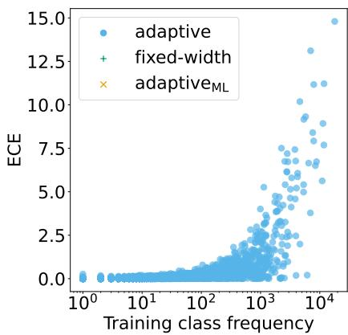

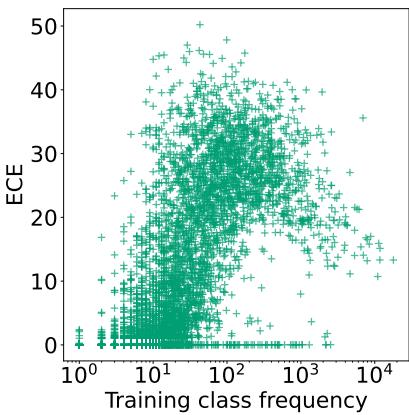  
(a) MIMIC-III test

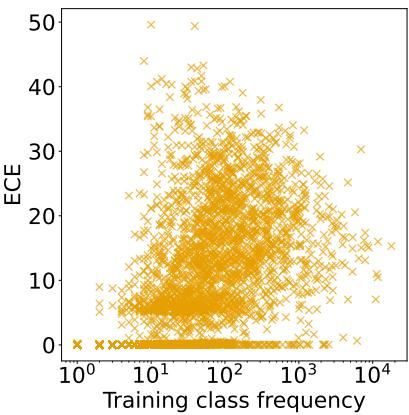

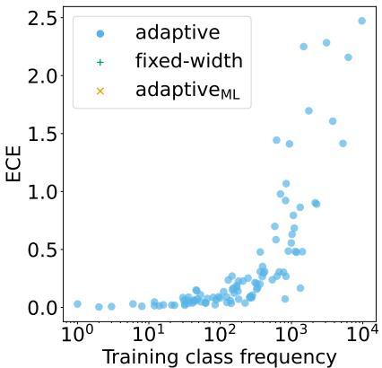

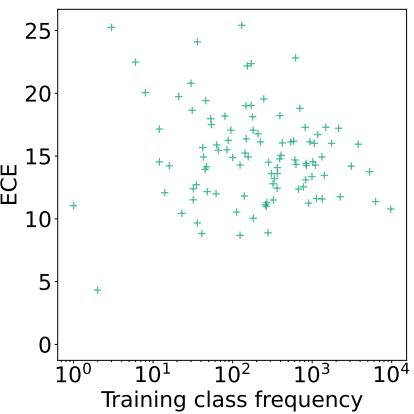  
(b) RCV1 test

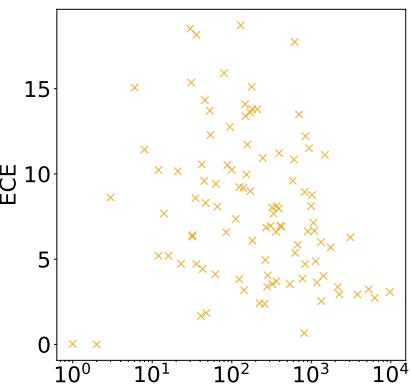  
Training class frequency

Figure 9: Expected Calibration Error (ECE) as a function of training class frequency under different binning schemes (adaptive, fixed-width, and adaptive ). Results are shown for (a) MIMIC-III test using BiomedBERT-base and (b) RCV1 test using BERT-base, both trained with BCE loss and no oversampling, averaged over 5 random seeds.  
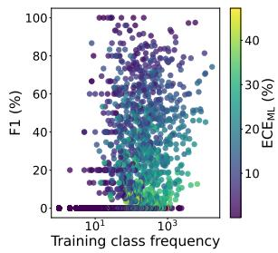  
(a) MIMIC-III dev

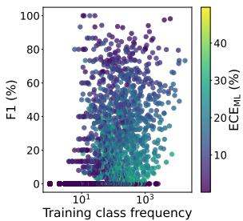  
(b) MIMIC-III test

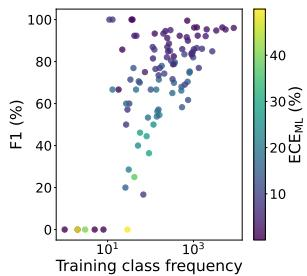  
(c) RCV1 dev

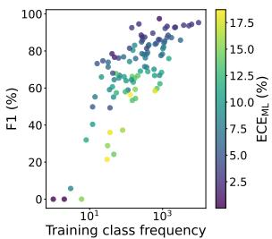  
(d) RCV1 test

Figure 10: $\mathbf { F _ { 1 } }$ score as a function of training class frequency. Results are shown for (a, b) MIMIC-III using BiomedBERT-base and (c, d) RCV1 using BERT-base, both trained with BCE loss and no oversampling, averaged over 5 random seeds. ECEML scores: scores computed based on adaptiveML binning.
<table><tr><td rowspan="2">Dataset</td><td rowspan="2">Ideal bin size</td><td rowspan="2">Binning scheme</td><td colspan="4">Share (%) of bins of size</td><td colspan="3">Bin size statistics</td></tr><tr><td>&lt;= 10&lt;= 100&lt;= 1000&lt;10 000</td><td></td><td></td><td></td><td>Average</td><td></td><td>Std. dev. Median</td></tr><tr><td rowspan="3">MIMIC-III test</td><td rowspan="3">337.2</td><td>fixed-width</td><td>46.7</td><td>53.9</td><td>54.4</td><td>100</td><td>1539.0</td><td>1671.8</td><td>18.8</td></tr><tr><td>adaptivemL</td><td>±0.5 2.9</td><td>±0.6 3.7</td><td>±0.6 98.1</td><td>±0.0 100</td><td>±20.8 378.9</td><td>±2.3 371.6</td><td>±1.8</td></tr><tr><td></td><td>±0.1</td><td>±0.2</td><td>±0.1</td><td>±0.0</td><td>±1.5</td><td>±6.3</td><td>337.0 ±0.0</td></tr></table>

Table 11: Distribution of bin sizes of fixed-width and adaptive binning schemes for MIMIC-III test. See Table 1 for more details.

<table><tr><td rowspan="2">Dataset</td><td rowspan="2">Ideal bin size</td><td rowspan="2">Binning scheme</td><td colspan="6">Share (%) of bins of size b</td><td colspan="3">Bin size statistics</td></tr><tr><td></td><td></td><td> $< = 1 0 < = 1 0 0 < = 1 0 0 0 < = 1 0 0 0 0 < = 1 0 0 0 1$ </td><td></td><td></td><td>&lt; 1M</td><td>Average</td><td>Std. dev. Median</td><td></td></tr><tr><td rowspan="3">RCV1 test</td><td rowspan="3">78126.1</td><td rowspan="2">fixed-width</td><td>1.3</td><td>12.0</td><td>60.0</td><td>85.4</td><td>89.0</td><td>100.0</td><td>81798.7</td><td>230853.8</td><td>661.6</td></tr><tr><td>±0.3 0.4</td><td>±2.1 2.2</td><td>±4.2</td><td>±0.1</td><td>±0.1</td><td>±0.0</td><td>±614.6</td><td>±533.6</td><td>±113.7</td></tr><tr><td>adaptivemL</td><td>±0.3 ±0.5</td><td>17.6 ±0.7</td><td></td><td>42.1 ±0.7</td><td>52.9 ±0.3</td><td>100.0 ±0.0</td><td>78771.9 ±581.2</td><td>75103.8 ±3329.3</td><td>78126.0 ±0.0</td></tr></table>

Table 12: Distribution of bin sizes of fixed-width and adaptiveML binning schemes for RCV1 test. Note that with adaptive , 10.8% of bins falls in the range of bin size $1 0 0 0 0 < b \leq 1 0 0 0 0 0$ , while for fixed-width, only 3.6% of bins fall in this range. See Table 1 for more details.

<table><tr><td>Model</td><td>Prompt</td><td>Dev</td><td>Dev (per inst.)</td><td>Subsampled Test</td><td>Subsampled Test (per inst.)</td><td>Full Test</td><td>Full Test (per inst.)</td></tr><tr><td>HiDEC</td><td></td><td>10 s</td><td>≈ 4.3 ms</td><td>15 s</td><td>≈ 3.0 ms</td><td>30 min</td><td>≈ 2.3 ms</td></tr><tr><td>Llama-3.3</td><td>Zero-Shot</td><td>3.1 h</td><td>≈ 4.8 s</td><td>6.5 h</td><td>≈ 4.7 s</td><td></td><td></td></tr><tr><td>Qwen2.5</td><td>Zero-Shot</td><td>3.9 h</td><td>≈ 6.1 s</td><td>7.8 h</td><td>≈ 5.6 s</td><td></td><td></td></tr><tr><td>Llama-3.3</td><td>RAG</td><td>17.5 h</td><td>≈ 27.2 s</td><td>40.8 h</td><td>≈ 29.4 s</td><td></td><td></td></tr><tr><td>Qwen2.5</td><td>RAG</td><td>20.0 h</td><td>≈ 31.1 s</td><td>43.2 h</td><td>≈ 31.1 s</td><td></td><td></td></tr></table>

Table 13: Inference runtimes in total and per instance for each model across the development, subsampled test, and full test splits of RCV1 dataset measured using MLFlow, on 4 NVIDIA H100 GPUs. The inference runtimes for HiDEC are averaged over 5 runs with different random seeds. Inference runtimes for the BERT-based models are not included in this table, as we ran the experiments with these models on a single NVIDIA A100 GPU; hence, inference times are not comparable.

<table><tr><td>model</td><td>loss</td><td>OS</td><td>|↑microF1</td><td>↑macroF1</td><td> $\downarrow \mathrm { E C E } _ { \mathrm { M L } }$ </td><td> $\downarrow \mathrm { E C E _ { M L } ^ { h i g h } }$ </td><td> $\downarrow \mathrm { E C E _ { M L } ^ { m e d } }$ </td><td>↓ECEM</td></tr><tr><td>BERT</td><td>BCE</td><td>0</td><td>86.2 ±0.1</td><td>67.8 ±0.8</td><td>7.8 ±0.7</td><td>5.0 ±0.4</td><td>8.4 ±0.5</td><td>8.3 ±1.2</td></tr><tr><td>BERT</td><td>WBCEU</td><td>0</td><td>85.9 ±0.2</td><td>68.7 ±0.4</td><td>9.0 ±0.6</td><td>5.5 ±0.3</td><td>9.8 ±0.2</td><td>9.6 ±1.7</td></tr><tr><td>BERT</td><td>WBCEP</td><td>0</td><td>84.0 ±0.6</td><td>67.2 ±0.9</td><td>14.8 ±0.7</td><td>6.3 ±0.3</td><td>13.8 ±0.7</td><td>20.4 ±0.8</td></tr><tr><td>BERT</td><td>BCE</td><td>10</td><td>86.2 ±0.3</td><td>68.7 ±0.4</td><td>9.4 ±0.9</td><td>5.1 ±0.6</td><td>9.2 ±1.1</td><td>11.8 ±1.2</td></tr><tr><td>BERT</td><td>FL (γ = 2) 0</td><td></td><td>86.7 ±0.0</td><td>68.7 ±0.6</td><td>5.4 ±0.6</td><td>3.4 ±0.7</td><td>5.3 ±0.7</td><td>6.3 ±0.8</td></tr><tr><td>HiDEC-s</td><td>HBM</td><td>0</td><td>86.4 ±0.2</td><td>68.8 ±0.5</td><td>9.4 ±0.4</td><td>5.2 ±0.4</td><td>9.3 ±0.3</td><td>11.5 ±0.8</td></tr><tr><td>HiDEC-s†</td><td>HBM</td><td>0</td><td>86.6 ±0.1</td><td>69.2 ±0.3</td><td>9.3 ±0.5</td><td>4.8 ±0.4</td><td>9.0 ±0.4</td><td>11.7 ±1.1</td></tr><tr><td> $\mathrm { H i D E C - s ^ { \dagger \dagger } }$ </td><td>HBM</td><td>0</td><td>87.0 ±0.2</td><td>69.7 ±0.5</td><td>9.4 ±0.1</td><td>4.9 ±0.2</td><td>9.2 ±0.2</td><td>11.8 ±0.6</td></tr><tr><td>HiDEC-s</td><td> $\mathrm { { F L } } \left( \gamma = 1 \right)$ </td><td>0</td><td>86.5 ±0.1</td><td>68.5 ±0.4</td><td>7.6 ±0.6</td><td>3.9 ±0.6</td><td>7.8 ±0.4</td><td>9.0 ±1.0</td></tr></table>

Table 14: Performance and calibration on RCV1 test set. Frequent labels: ≥ 1000 instances in training. 17 labels, with ∅ 100456.9 instances in evaluation. Labels of medium frequency: 100 to 999 instances in training. 50 labels, with ∅ 15356.9 instances in evaluation. Rare labels: < 100 instances in training. 36 labels, with ∅ 1598.8 instances in evaluation. Averages and standard deviations of 5 runs with different random seeds. BCE: binary cross-entropy loss; WBCE: weighted binary cross-entropy loss using weights as described in Sec. 5.2; FL: focal loss; OS: oversampling percentage. macro $\mathrm { F } _ { 1 } \mathrm { : }$ hierarchical macro $\mathrm { F } _ { 1 }$ score. †: best out of 50 training epochs (no early stopping), matching Kim et al. (2024)’s experimental setting. ††: best out of 100 training epochs (no early stopping).

<table><tr><td>model</td><td>loss</td><td>OS</td><td>micP</td><td>micR</td><td>micF1</td><td>macP</td><td>macR</td><td>macF1</td><td>Exact Match</td></tr><tr><td>BERT</td><td>BCE</td><td>0</td><td>86.2 ±0.6</td><td>86.1 ±0.6</td><td>86.2 ±0.1</td><td>71.9 ±0.4</td><td>65.9 ±1.1</td><td>67.8 ±0.8</td><td>62.2 ±0.4</td></tr><tr><td>BERT</td><td>WBCEU</td><td>0</td><td>84.0 ±1.1</td><td>87.8 ±0.9</td><td>85.9 ±0.2</td><td>69.9 ±1.4</td><td>69.2 ±1.1</td><td>68.7 ±0.4</td><td>61.2 ±0.8</td></tr><tr><td>BERT</td><td>WBCEP</td><td>0</td><td>78.9 ±1.6</td><td>89.8 ±0.8</td><td>84.0 ±0.6</td><td>61.4 ±1.8</td><td>77.0 ±1.4</td><td>67.2 ±0.9</td><td>57.9 ±1.2</td></tr><tr><td>BERT</td><td>BCE</td><td>10</td><td>86.0 ±0.8</td><td>86.4 ±0.3</td><td>86.2 ±0.3</td><td>72.0 ±0.6</td><td>67.3 ±0.6</td><td>68.7 ±0.4</td><td>62.1 ±0.7</td></tr><tr><td>BERT</td><td> $\mathrm { F L } \left( \gamma = 2 \right)$ </td><td>0</td><td>87.2 ±0.5</td><td>86.2 ±0.5</td><td>86.7 ±0.0</td><td>73.4 ±0.9</td><td>66.1 ±1.4</td><td>68.7 ±0.6</td><td>63.2 ±0.1</td></tr><tr><td>HiDEC-s</td><td>HBM</td><td>0</td><td>86.4 ±0.5</td><td>86.4 ±0.6</td><td>86.4 ±0.2</td><td>70.8 ±0.9</td><td>68.2 ±0.6</td><td>68.8 ±0.5</td><td>64.2 ±0.1</td></tr><tr><td> $\mathrm { H i D E C - S ^ { \dagger } }$ </td><td>HBM</td><td>0</td><td>87.5 ±0.6</td><td>85.8 ±0.6</td><td>86.6 ±0.1</td><td>72.9 ±1.1</td><td>67.4 ±0.9</td><td>69.2 ±0.3</td><td>64.7 ±0.4</td></tr><tr><td> $\mathrm { H i D E C - s ^ { \dagger \dagger } }$ </td><td>HBM</td><td>0</td><td>87.6</td><td>86.3</td><td>87.0</td><td>73.4</td><td>67.8</td><td>69.7</td><td>65.3</td></tr><tr><td> $\mathrm { H i D E C { - } s }$ </td><td> $\mathrm { { F L } } \left( \gamma = 1 \right)$ </td><td>0</td><td>±0.2 87.4 ±0.8</td><td>±0.4 85.6 ±0.7</td><td>±0.2 86.5 ±0.1</td><td>±0.9 72.5 ±0.8</td><td>±0.4 66.2 ±0.9</td><td>±0.5 68.5 ±0.4</td><td>±0.4 64.3 ±0.3</td></tr></table>

Table 15: Performance on RCV1 test set. BERT: bert-base-uncased, HiDEC: Hierarchical Decoder (Im et al., 2023). †: best out of 50 training epochs (no early stopping), matching Kim et al. (2024)’s experimental setting. ††: best out of 100 training epochs (no early stopping). Averages and standard deviations of 5 runs with different random seeds. BCE: binary cross-entropy loss; WBCE: weighted binary cross-entropy loss using weights as described in Sec. 5.2; FL: focal loss; OS: oversampling percentage.

<table><tr><td>model</td><td>loss</td><td>OS</td><td>↑microF1↑macroF1|↓</td><td> $\mathrm { E C E } _ { \mathrm { M L } }$ </td><td>→  $\mathrm { E C E _ { M L } ^ { h i g h } }$ </td><td> $, \mathrm { E C E _ { M L } ^ { m e d } }$ </td><td> $\downarrow \mathrm { E C E _ { M L } ^ { r a r e } }$ </td></tr><tr><td>BiomedBERT</td><td>BCE</td><td>0</td><td>40.3 10.6 ±0.4 ±0.2</td><td>3.8 ±0.3</td><td>14.4 ±1.2</td><td>16.3 ±1.4</td><td>2.2 ±0.1</td></tr><tr><td>BiomedBERT</td><td>WBCEU</td><td>0</td><td>41.6 11.7 ±0.3 ±0.1</td><td>4.6 ±0.4</td><td>15.5 ±0.8</td><td>18.5 ±0.9</td><td>2.9 ±0.3</td></tr><tr><td>BiomedBERT</td><td>BCE</td><td>10</td><td>40.1 10.7 ±0.1 ±0.3</td><td>4.2 ±0.4</td><td>16.2 ±1.6</td><td>17.9 ±1.6</td><td>2.4 ±0.3</td></tr><tr><td>BiomedBERT</td><td> $\mathrm { { F L } } \left( \gamma = 1 \right)$ </td><td>0</td><td>40.4 10.9 ±0.2 ±0.4</td><td>3.6 ±0.2</td><td>11.7 ±1.1</td><td>14.9 ±1.1</td><td>2.2 ±0.1</td></tr><tr><td>PLM-ICD</td><td>BCE</td><td>0</td><td>51.2 18.0 ±2.9 ±3.1</td><td>5.9 ±1.4</td><td>9.6 ±2.2</td><td>14.5 ±2.9</td><td>4.9 ±1.3</td></tr><tr><td>PLM-ICD</td><td> $\mathrm { F L } \left( \gamma = 1 \right) \ 0$ </td><td>53.1 ±0.8</td><td>20.4 ±0.2</td><td>5.6 ±0.7</td><td>8.3 ±1.2</td><td>13.8 ±1.5</td><td>4.6 ±0.6</td></tr></table>

Table 16: Performance and calibration on MIMIC-III test set. Highly frequent labels: ≥ 1000 instances in training. 144 labels, with ∅ 206.2 instances in evaluation. Medium-frequency: 100 to 999 instances in training. 877 labels, with ∅ 24.9 instances in evaluation. Rare: < 100 instances in training. 7909 labels, with ∅ 1.2 instances in evaluation. Averages and standard deviations of 5 runs with different random seeds. macroF : Macro $\mathrm { F } _ { 1 }$ on labels with support in the test set.

<table><tr><td>model</td><td>loss</td><td>OS</td><td>micP</td><td>micR</td><td>micF1</td><td>macP</td><td>macR</td><td>macF1</td><td>macPs</td><td>macRs</td><td>macF1s</td><td>Exact Match</td></tr><tr><td>BiomedBERT</td><td>BCE</td><td>0</td><td>57.4 ±1.3</td><td>31.0 ±0.6</td><td>40.3 ±0.4</td><td>6.8 ±0.1</td><td>4.3 ±0.1</td><td>4.8 ±0.1</td><td>14.8 ±0.3</td><td>9.4 ±0.2</td><td>10.6 ±0.2</td><td>0.1 ±0.0</td></tr><tr><td>BiomedBERT</td><td>WBCEU</td><td>0</td><td>49.8 ±0.8</td><td>35.8 ±0.3</td><td>41.6 ±0.3</td><td>6.6 ±0.0</td><td>5.1 ±0.1</td><td>5.4 ±0.0</td><td>14.5 ±0.1</td><td>11.3 ±0.2</td><td>11.7 ±0.1</td><td>0.1 ±0.0</td></tr><tr><td>BiomedBERT</td><td>BCE</td><td>10</td><td>55.8 ±1.9</td><td>31.4 ±0.6</td><td>40.1 ±0.1</td><td>6.8 ±0.1</td><td>4.4 ±0.1</td><td>4.9 ±0.1</td><td>14.8 ±0.2</td><td>9.6 ±0.3</td><td>10.7 ±0.3</td><td>0.1 ±0.0</td></tr><tr><td>BiomedBERT</td><td> $\mathrm { { F L } } \left( \gamma = 1 \right)$ </td><td>0</td><td>56.9 ±1.4</td><td>31.3 ±0.6</td><td>40.4 ±0.2</td><td>7.0 ±0.2</td><td>4.4 ±0.2</td><td>5.0 ±0.2</td><td>15.2 ±0.4</td><td>9.7 ±0.4</td><td>10.9 ±0.4</td><td>0.1 ±0.0</td></tr><tr><td>PLM-ICD</td><td>BCE</td><td>0</td><td>62.1 ±2.6</td><td>43.9 ±4.5</td><td>51.2 ±2.9</td><td>10.1 ±1.2</td><td>7.9 ±1.6</td><td>8.2 ±1.4</td><td>22.1 ±2.5</td><td>17.3 ±3.5</td><td>18.0 ±3.1</td><td>0.2 ±0.1</td></tr><tr><td>PLM-ICD</td><td> $\mathrm { { F L } } \left( \gamma = 1 \right)$ </td><td>0</td><td>61.4 ±2.3</td><td>46.8 ±0.5</td><td>53.1 ±0.8</td><td>11.1 ±0.3</td><td>9.1 ±0.1</td><td>9.3 ±0.1</td><td>24.2 ±0.6</td><td>20.0 ±0.3</td><td>20.4 ±0.2</td><td>0.1 ±0.0</td></tr></table>

Table 17: Performance on MIMIC-III test set. BERT: bert-base-uncased, ModernBERT: ModernBERT-base, BiomedBERT: BiomedBERT-base-uncased-abstract, each using the CLS token for classification. PLM-ICD: PLM-ICD (Huang et al., 2022) with BiomedBERT-base-uncased-abstract. Averages and standard deviations of 5 runs with different random seeds. BCE: binary cross-entropy loss; WBCE: weighted binary cross-entropy loss using weights as described in Sec. 5.2; FL: focal loss; OS: oversampling percentage. macX: macro scores computed on all labels. macXs: macro scores computed only on labels that occur in the respective evaluation set.

<table><tr><td>model</td><td>loss</td><td>OS</td><td>|↑ microF1↑macroF1|↓</td><td></td><td> $\mathrm { E C E } _ { \mathrm { M L } }$  →</td><td> $\mathrm { E C E _ { M L } ^ { h i g h } }$ </td><td>↓ ECEmed</td><td>↓ECEMM</td></tr><tr><td>BERT</td><td>BCE</td><td>0</td><td>85.1 ±0.2</td><td>66.4 ±1.0</td><td>7.9 ±0.2</td><td>5.0 ±0.3</td><td>8.9 ±0.3</td><td>7.8 ±0.8</td></tr><tr><td>BERT</td><td>WBCEU</td><td>0</td><td>85.2 ±0.1</td><td>67.5 ±0.6</td><td>8.9 ±0.4</td><td>5.4 ±0.3</td><td>10.1 ±0.2</td><td>8.8 ±0.8</td></tr><tr><td>BERT</td><td>WBCEP</td><td>0</td><td>83.7 ±0.4</td><td>65.7 ±0.5</td><td>13.9 ±0.8</td><td>6.1 ±0.3</td><td>13.4 ±0.5</td><td>18.1 ±1.6</td></tr><tr><td>BERT</td><td>BCE</td><td>10</td><td>85.1 ±0.3</td><td>67.1 ±0.9</td><td>8.4 ±0.6</td><td>5.1 ±0.6</td><td>9.5 ±1.0</td><td>8.4 ±0.9</td></tr><tr><td>BERT</td><td>FL (γ = 2) 0</td><td></td><td>85.7 ±0.2</td><td>67.1 ±0.7</td><td>6.7 ±0.4</td><td>3.4 ±0.9</td><td>6.8 ±0.3</td><td>8.1 ±0.7</td></tr><tr><td>HiDEC-s</td><td>HBM</td><td>0</td><td>85.3 ±0.3</td><td>67.2 ±0.7</td><td>9.0 ±0.5</td><td>4.8 ±0.4</td><td>10.1 ±0.3</td><td>9.5 ±1.3</td></tr><tr><td>HiDEC-s†</td><td>HBM</td><td>0</td><td>85.3 ±0.2</td><td>67.3 ±0.8</td><td>8.7 ±0.3</td><td>4.7 ±0.4</td><td>9.7 ±0.3</td><td>9.2 ±0.9</td></tr><tr><td>HiDEC-s††</td><td>HBM</td><td>0</td><td>85.7 ±0.1</td><td>67.2 ±0.4</td><td>8.7 ±0.4</td><td>4.7 ±0.2</td><td>9.8 ±0.3</td><td>9.1 ±1.1</td></tr><tr><td>HiDEC-s</td><td>FL (γ = 1) 0</td><td></td><td>85.2 ±0.1</td><td>66.5 ±0.6</td><td>7.5 ±0.4</td><td>4.0 ±0.6</td><td>8.5 ±0.4</td><td>7.7 ±0.8</td></tr><tr><td>model</td><td>prompting</td><td>confidence</td><td>↑ microF1↑ macroF1</td><td></td><td>|↓ECEML↓</td><td> $\mathrm { E C E _ { M L } ^ { h i g h } }$ </td><td>↓ECEmLd</td><td>↓ ECEMM</td></tr><tr><td>Llama-3.3</td><td>zero-shot</td><td>Verbalized</td><td>64.8</td><td>46.1</td><td>19.7</td><td></td><td>ML</td><td></td></tr><tr><td>Llama-3.3</td><td>zero-shot</td><td>Token Probabilities</td><td>63.0</td><td>42.8</td><td>22.0</td><td>13.7 14.4</td><td>18.5 19.2</td><td>24.2 29.3</td></tr><tr><td>Llama-3.3</td><td>RAG</td><td>Verbalized</td><td>82.9</td><td>62.5</td><td>8.5</td><td>4.5</td><td>8.1</td><td>10.9</td></tr><tr><td>Llama-3.3</td><td>RAG</td><td>Token Probabilities</td><td>82.9</td><td>62.5</td><td>8.0</td><td>4.7</td><td>7.9</td><td>9.8</td></tr><tr><td>Qwen2.5</td><td>zero-shot</td><td>Verbalized</td><td>57.1</td><td>38.5</td><td>28.3</td><td>18.3</td><td>27.2</td><td>34.4</td></tr><tr><td>Qwen2.5</td><td>zero-shot</td><td>Token Probabilities</td><td>59.1</td><td>39.0</td><td>24.7</td><td>16.6</td><td>22.1</td><td>32.0</td></tr><tr><td>Qwen2.5</td><td>RAG</td><td>Verbalized</td><td>83.1</td><td>62.8</td><td>9.8</td><td>4.2</td><td>9.8</td><td>12.5</td></tr><tr><td>Qwen2.5</td><td>RAG</td><td>Token Probabilities</td><td>82.6</td><td>62.3</td><td>8.2</td><td>4.7</td><td>7.4</td><td>10.8</td></tr></table>

Table 18: Performance and calibration on subsampled RCV1 test set. The subsampled test set contains 5,000 instances and closely matches the label distribution of the original test set (see App. A.2). Frequent labels: ≥ 1000 instances in training. 17 labels, with ∅ 699.7 instances in evaluation. Labels of medium frequency: 100 to 999 instances in training. 50 labels, with ∅ 109.8 instances in evaluation. Rare labels: < 100 instances in training. 36 labels, with ∅ 10.6 instances in evaluation. Averages and standard deviations of 5 runs with different random seeds. BCE: binary cross-entropy loss; WBCE: weighted binary cross-entropy loss using weights as described in Sec. 5.2; FL: focal loss; OS: oversampling percentage. macroF1: hierarchical macro $\mathrm { F } _ { 1 }$ score. †: best out of 50 training epochs (no early stopping), matching Kim et al. (2024)’s experimental setting. ††: best out of 100 training epochs (no early stopping).

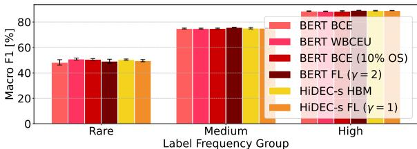

(a) ↑ Macro F1  
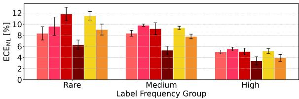  
(b) ↓ ECEML  
Figure 11: Performance and calibration on RCV1 test across frequency groups. For experimental details, see Table 14.

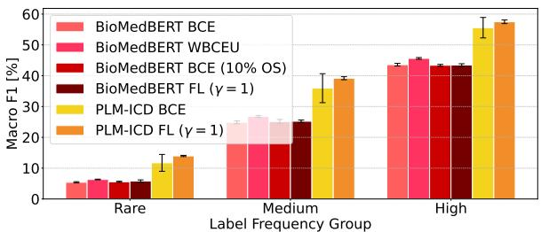

(a) ↑ Macro F1  
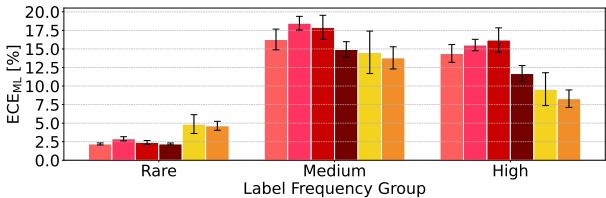  
(b) ↓ $\mathrm { E C E } _ { \mathrm { M L } }$  
Figure 12: Performance and calibration on MIMIC-III test across frequency groups. Compared to RCV1, the performance on MIMIC-III is even more dependent on label frequency. For experimental details, see Table 17.