# HySparse2: Hybrid Sparse Attention with Two-Level KV Sharing

Jianyu Wei∗ Yizhao Gao∗ Qihao Zhang Shimao Chen Zhengju Tang Yu Cheng Shengjie Zhou Zihan Jiang Yifan Song Hailin Zhang Liang Zhao Bo Yang Gang Wang Shijie Cao⋄ Fuli Luo⋄,†

LLM-Core Xiaomi

## Abstract

Long-horizon and multi-turn agents typically generate short actions and process long observations from tools and environments. This growing context demands eficient prefill, compact KV-cache storage, and accurate long-context retrieval. To meet these demands, we introduce HySparse2, a hybrid sparse attention architecture with two-level KV sharing. At the outer level, KV Bridging adopts a YOCO-style self-decoder and cross-decoder structure, but bridges only full-attention layers. The self-decoder uses hybrid sliding-window attention (SWA), while the cross-decoder uses hybrid sparse attention. The KV caches for full-attention layers in the cross-decoder are generated from the hidden states of full-attention layers in the self-decoder. At the inner level, HySparse2 retains HySparse’s core KV Reuse design with two refinements. First, it replaces block-level sparsity with token-level sparsity for finer long-context retrieval. Second, it removes the separate SWA branch from sparse layers and instead forces a sliding window of recent tokens into the sparse selection. This two-level KV sharing allows all cross-decoder KV caches to be constructed from self-decoder hidden states. Prefill can therefore exit after the self-decoder, skipping all cross-decoder layers. On an 80B-A3B MoE model, HySparse2 outperforms HySparse and Hybrid SWA on long-context retrieval and multi-turn agentic tasks, while substantially reducing prefill computation and KV-cache storage.

HySparse2 HySparse Hybrid SWA

LONG-CONTEXT QUALITY  
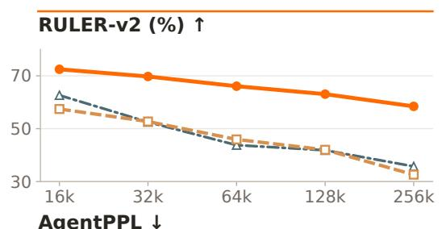

INFERENCE COST  
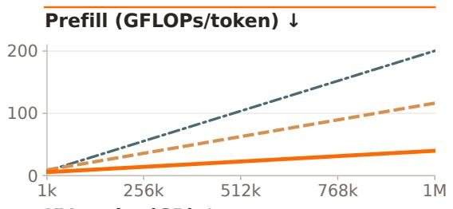

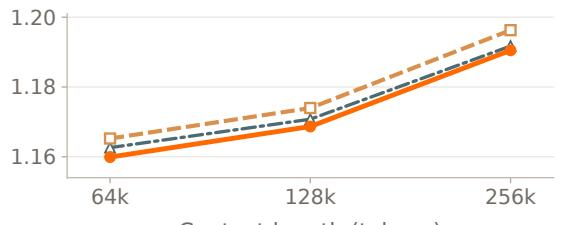

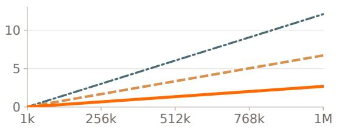  
Figure 1 HySparse2 delivers better long-context performance at lower prefill cost and smaller KV-cache storage.

## 1 Introduction

Agentic inference combines long contexts with multi-turn interaction. Across interaction rounds, a short generated action or tool call can return a much longer search result, execution trace, or document that requires prefill before decoding resumes. As observations accumulate, agents must retrieve and combine evidence across an expanding history, increasing both attention computation and KV-cache storage. These workloads therefore demand eficient prefill, compact KV-cache storage, and accurate long-context retrieval.

HySparse (Gao et al., 2026) addresses long-context eficiency by interleaving full-attention layers with sparse-attention layers. Each full-attention layer supplies both selection indices and a KV cache to the following sparse layers, reducing attention computation and KV-cache storage without distilling an auxiliary indexer module (Gao et al., 2024; DeepSeek-AI et al., 2025). For agentic inference, however, HySparse still leaves substantial room to shorten prefill, further reduce KV-cache storage, and improve retrieval precision.

In this work, we introduce HySparse2, which extends HySparse with two-level KV sharing. Following YOCO (Sun et al., 2024), the backbone is divided into a self-decoder that combines full attention and sliding-window attention (SWA), and a cross-decoder that combines full attention and sparse attention. At the outer level, KV Bridging connects full-attention layers across the two decoders. Each cross-decoder full-attention layer applies its own K/V projections to the input hidden states of a corresponding self-decoder full-attention layer. At the inner level, KV Reuse retains HySparse’s sharing of KV caches and selection indices within each hybrid block.

HySparse2 also makes two modifications that improve accuracy and eficiency. First, token-level selection replaces block-level selection, allocating the sparse attention budget more precisely to relevant tokens. Second, a forced window of recent tokens replaces the separate SWA branch in sparse layers, allowing local and global tokens to use the same shared KV cache. All cross-decoder KV caches can then be built from self-decoder hidden states. Prefill can therefore exit after the self-decoder.

We compare HySparse2 with HySparse and Hybrid SWA on 80B-A3B MoE models trained with the same data and schedules. After pretraining, HySparse2 retains broadly comparable general capabilities and improves long-context retrieval. After light post-training, it improves mean MRCRv2 and RULER-v2 scores over HySparse by 11.30 and 19.81 percentage points, respectively, and achieves lower AgentPPL and LongPPL than both baselines at all evaluated lengths up to 256k. At 1M tokens, our analysis shows 2.92× and 5.02× reductions in prefill FLOPs relative to HySparse and Hybrid SWA, respectively, alongside a smaller KV cache. Ablations show that token-level selection improves retrieval at the same attention budget and that KV Bridging preserves broadly comparable quality.

## 2 Background and Motivation

## 2.1 Eficient Prefill

Long-horizon and multi-turn agents make inference increasingly input-dominated. Tool responses can add substantially more tokens than the actions that produced them. Reducing attention cost alone does not eliminate the computation needed to propagate these tokens through the backbone. Cross-layer KV-cache sharing can reduce both KV storage and prefill computation. YOCO uses a self-decoder to construct a global KV cache shared across cross-decoder layers, allowing prefill cache construction to exit after the self-decoder (Sun et al., 2024). Gemma 3n adopts related cross-layer KV sharing to improve prefill eficiency (Sanseviero and Ballantyne, 2025). HySparse applies cross-layer sharing within its hybrid sparse-attention blocks: each full-attention layer shares its global KV cache and top-� block indices with the following sparse-attention layers, though prefill still executes all layers (Gao et al., 2026). HySparse2 further incorporates a YOCOstyle structure into HySparse, combining reduced attention computation and KV storage with a shorter prefill path.

## 2.2 KV Cache Compression

Agentic workloads require more compact KV caches. KV-cache compression spans four dimensions: head, sequence, layer, and precision. Head-level methods share KV heads through GQA/MQA (Ainslie et al., 2023; Shazeer, 2019) or compress KV representations into latent states, as in MLA (Liu et al., 2024a). Sequence-level methods compress multiple tokens into fewer cache entries (DeepSeek-AI et al., 2026). Layer-level methods share KV caches across layers (Brandon et al., 2024; Sun et al., 2024). Precision-level methods reduce the numerical precision of cached keys and values (Hooper et al., 2024; Liu et al., 2024b). Prior work focuses on intra-layer compression along the head, sequence, and precision axes. HySparse2 instead pushes cross-layer sharing through KV Bridging and KV Reuse.

## 2.3 Sparse Attention Granularity

Sparse attention reduces long-context attention costs by restricting each query to a subset of KV entries (Child et al., 2019). Its selection granularity creates an inherent trade-of between modeling accuracy and inference eficiency. HySparse adopted block-level sparsity as a practical compromise, since evaluations showed no substantial accuracy disadvantage and the regular block structure enabled eficient kernels. Modern agentic workloads, however, involve long-horizon multi-turn trajectories that require precise retrieval from long historical contexts. Under these patterns, block-level selection exhibits a pronounced accuracy disadvantage, while token-level selection retrieves relevant evidence more faithfully. Recent advances in sparse kernels also make token-level implementations practical (Wang et al., 2025). HySparse2 therefore adopts token-level sparsity for more precise context selection.

## 3 HySparse2

## 3.1 Overview

Figure 2 illustrates the HySparse2 architecture. Following YOCO (Sun et al., 2024), the backbone is divided into a self-decoder and a cross-decoder. Both decoders use hybrid attention. The self-decoder hybridizes full attention with sliding-window attention for local modeling. The cross-decoder hybridizes full attention with sparse attention for global retrieval. HySparse2 uses two-level KV sharing. At the outer level, KV Bridging constructs each cross-decoder full-attention layer’s KV cache from corresponding self-decoder hidden states through layer-specific projections. At the inner level, KV Reuse lets sparse layers reuse the full-attention layer’s KV cache and selection indices within each hybrid block.

## 3.2 Full-Attention-Only KV Bridging

KV Bridging operates only between full-attention layers in the self-decoder and cross-decoder. Consider a pair of full-attention layers (�, �), with layer � in the self-decoder and layer � in the

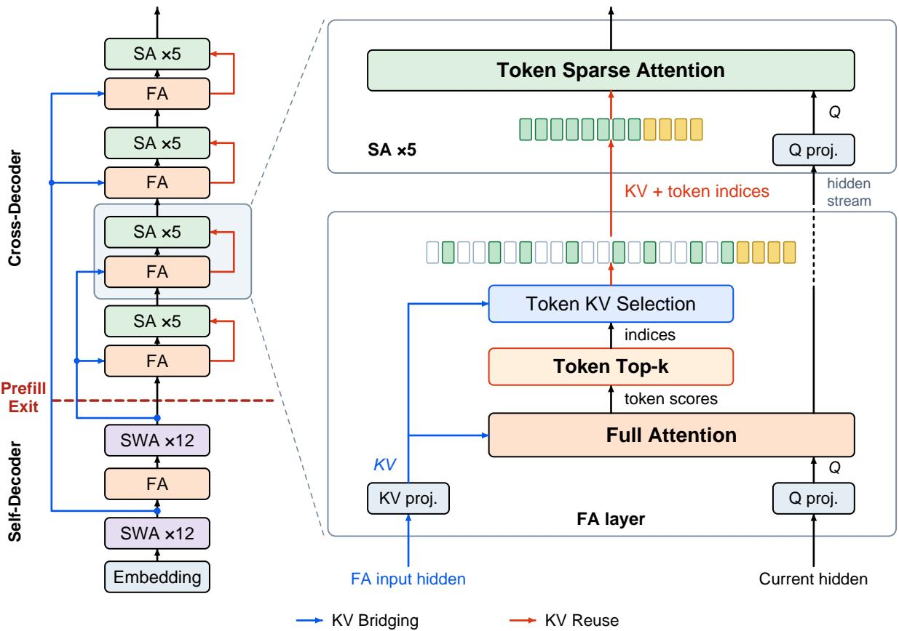  
Figure 2 Two-level KV sharing in HySparse2. FA, SWA, and SA denote full attention, slidingwindow attention, and sparse attention, respectively. Left: the overall architecture with KV Bridging between the self-decoder and cross-decoder. Prefill cache construction can exit after the self-decoder. Right: a HySparse2 block with token-level sparse attention and a forced local window. Through KV Reuse, SA layers reuse the block’s FA KV cache and selection indices.

cross-decoder. Let $\mathbf { H } _ { i } ^ { \mathrm { s e l f } }$ and $\mathbf { H } _ { i } ^ { \mathrm { c r o s s } }$ denote the corresponding input hidden states. Cross-decoder layer � computes its keys, values, and queries as

$$
{ \bf K } _ { j } ^ { \mathrm { c r o s s } } = \mathrm { P r o j } _ { j } ^ { K } \left( { \bf H } _ { i } ^ { \mathrm { s e l f } } \right) , \quad { \bf V } _ { j } ^ { \mathrm { c r o s s } } = \mathrm { P r o j } _ { j } ^ { V } \left( { \bf H } _ { i } ^ { \mathrm { s e l f } } \right) , \quad { \bf Q } _ { j } ^ { \mathrm { c r o s s } } = \mathrm { P r o j } _ { j } ^ { Q } \left( { \bf H } _ { j } ^ { \mathrm { c r o s s } } \right) .\tag{1}
$$

Each cross-decoder full-attention layer has its own K/V projections, so layers that share a hiddenstate source still construct distinct KV caches. Each layer also retains an independent Q projection applied to its own current hidden states. KV Bridging supports diferent hybrid attention ratios in the two decoders, allowing one self-decoder full-attention layer to supply multiple cross-decoder full-attention layers, as illustrated in Figure 2.

## 3.3 Cross-Layer KV Reuse

HySparse2 makes two key refinements to HySparse: adopting token-level sparse selection and removing the separate SWA branch.

Token-Level Sparse Selection. In HySparse, pretraining evaluations showed no substantial accuracy disadvantage for block-level selection. However, block-level sparsity shows a pronounced accuracy disadvantage on multi-turn, long-context agentic tasks. HySparse2 therefore applies top-� selection to individual tokens in full-attention layers, and the following sparse layers reuse the KV entries for the selected tokens. Section 4.3 evaluates selection granularity.

Removing the Separate SWA Branch. HySparse2 removes the separate SWA branch used in HySparse and supports local modeling by forcing a recent window into the sparse selection. As illustrated in Figure 2, a local window of the most recent tokens is always selected, followed by the highest-scoring tokens outside the window. Both selected sets are read from the full-attention KV cache and reused by the following sparse-attention layers.

This design also enables a complete early exit after the self-decoder during prefill. A separate SWA branch in the cross-decoder requires building a sufix of KV cache from projections of its own hidden states, which further depends on an expanding set of hidden states in earlier layers and grows linearly with depth. This cascading SWA dependency therefore requires the crossdecoder to process a token sufix far longer than the window size. The required states must either be computed during prefill, preventing the cross-decoder from being skipped entirely, or approximated by methods such as bounded replay (DeepSeek-AI, 2026). HySparse2 removes this dependency by construction and requires no cross-decoder computation during prefill. Removing the branch also eliminates substantial parameter overhead from the separate projections in our gated baseline.

## 3.4 The Role of Full Attention

Both HySparse2 and HySparse retain a small number of full-attention layers, as we believe that full attention remains important for model quality. These full-attention layers also serve as indexers, using exact attention scores to provide oracle token selection for subsequent sparse layers. This design supports native end-to-end training without a separate indexer or an auxiliary distillation objective to train one. Full attention nevertheless remains computationally expensive, so we keep the proportion of full-attention layers small. In HySparse2, prefill KV-cache construction requires only one full-attention layer. Following recent sparsification approaches (Gao et al., 2024; DeepSeek-AI et al., 2025), we could further approximate the retained full-attention layers with a lightweight indexer plus sparse attention in post-training. Future architectures could also allocate less computation to full attention and more to sparse attention, for example by reducing the number of query heads in full-attention layers while increasing it in sparse-attention layers.

## 3.5 Inference Architecture

Prefill–Decode Disaggregation. Under prefill–decode disaggregation, the HySparse2 prefill node hosts only the self-decoder and the KV Bridging projections. For the 49-layer model shown in Figure 2, this requires deploying only the first 25 layers, cutting the memory requirement of the prefill node by nearly half. With a high SWA-to-full-attention ratio, the self-decoder performs full attention in only one layer during the prefill stage. We also compute the cross-decoder full-attention KV caches on the prefill node and transfer them to the decode nodes, because the projected KV caches are smaller than the source hidden states.

Speculative Decoding. During pretraining, HySparse2 uses a single MTP layer conditioned on the hidden states at the self-decoder/cross-decoder boundary to aid convergence. During post-training, this MTP layer could be replaced with a larger DFlash-style drafter conditioned on the same hidden states (Chen et al., 2026). Their early availability could support asynchronous drafting and verification (Zhang et al., 2025). Training the larger drafter and coordinating asynchronous execution with verification feedback remain future work.

## 4 Evaluation

We compare HySparse2 with HySparse (Gao et al., 2026) and Hybrid SWA used in MiMo-V2 Series (Xiaomi Team et al., 2026). The overall comparison covers model performance, prefill FLOPs, and KV-cache storage. We then conduct ablation studies on sparse selection granularity, the forced local window, and KV Bridging. Token-level selection targets stronger long-context accuracy in agentic scenarios without compromising eficiency, whereas the forced local window and KV Bridging target lower prefill costs while retaining model quality.

## 4.1 Experimental Setup

Model configuration. Unless otherwise specified, experiments use 80B-A3B MoE models. Each model has 49 Transformer layers with a hidden size of 2,048 and uses a simplified mHC variant (Xie et al., 2026; Zhu et al., 2025) with the residual mixing matrix fixed to the identity.

The models only difer in their attention designs, as summarized in Table 1. Full attention in every layer is the strongest reference under our evaluation. When choosing how many full-attention layers a hybrid model uses, we avoid a substantial accuracy gap from this baseline. Hybrid SWA retains nine full-attention layers, as using fewer significantly degrades accuracy. HySparse and HySparse2 each use only five full-attention layers while remaining comparable to the full-attention baseline. Hybrid SWA and HySparse use GQA (Ainslie et al., 2023), whereas HySparse2 uses MQA (Shazeer, 2019), which yields a smaller KV cache and better token sparse attention kernel eficiency.

<table><tr><td>Model</td><td>#Full</td><td>Heads (Q/KV)</td><td>Head dim. (QK/V)</td></tr><tr><td>Hybrid SWA</td><td>9</td><td>64/4</td><td>192/128</td></tr><tr><td>HySparse</td><td>5</td><td>64/4</td><td>192/128</td></tr><tr><td>HySparse2</td><td>5</td><td>64/1</td><td>256/256</td></tr></table>

Table 1 Configurations of the three attention designs.

In HySparse2, SWA layers in the self-decoder use partial rotary positional embeddings (RoPE) (Su et al., 2024) with 64 rotary dimensions and a base of 10,000, while full and sparse attention use NoPE. HySparse2 therefore requires no RoPE adjustment during long-context extension. Across the three configurations, all sparse and SWA layers use sigmoid output gates (Qiu et al., 2025) and learnable per-head sink biases (Agarwal et al., 2025). HySparse2 uses token-level selection with 128 forced local tokens and 1,024 global tokens. HySparse selects 1,024 global tokens in 64-token blocks and combines sparse attention with a separate 128-token SWA branch through gated fusion. Hybrid SWA uses a sliding window of 128 tokens.

Training. We pretrain the 80B-A3B models on approximately 500B tokens at a context length of 32k. A light post-training stage adds approximately 100B tokens, introduces agentic data into the training mixture, and extends the context length to 256k. The three models share the same data mixture and training schedule within each stage. We use the Muon optimizer (Jordan et al., 2024) with a WSD schedule and peak learning rates of $1 0 ^ { - 3 }$ for pretraining and $5 \times 1 0 ^ { - 5 }$ for post-training. We report both pretraining and post-training results for overall comparisons, and only pretraining results for ablations.

<table><tr><td>Task</td><td>Hybrid SWA</td><td>HySparse</td><td>HySparse2</td></tr><tr><td>Knowledge</td><td></td><td></td><td></td></tr><tr><td>MMLU</td><td>61.48</td><td>64.48</td><td>63.92</td></tr><tr><td>MMLU-Redux</td><td>63.96</td><td>68.44</td><td>67.50</td></tr><tr><td>C-Eval</td><td>65.08</td><td>67.09</td><td>67.90</td></tr><tr><td>CMMLU</td><td>67.41</td><td>69.97</td><td>69.90</td></tr><tr><td>TriviaQA</td><td>60.59</td><td>60.67</td><td>59.67</td></tr><tr><td>Reasoning</td><td></td><td></td><td></td></tr><tr><td>BBH</td><td>60.14</td><td>61.93</td><td>64.29</td></tr><tr><td>MMLU-Pro</td><td>36.12</td><td>35.74</td><td>37.56</td></tr><tr><td>MATH</td><td>36.18</td><td>36.14</td><td>34.32</td></tr><tr><td>DROP</td><td>60.90</td><td>63.78</td><td>58.99</td></tr><tr><td>GSM8K</td><td>64.44</td><td>64.14</td><td>61.94</td></tr><tr><td>ARC-C</td><td>75.51</td><td>79.18</td><td>77.82</td></tr><tr><td>HellaSwag</td><td>79.38</td><td>79.19</td><td>79.54</td></tr><tr><td>WinoGrande</td><td>73.72</td><td>74.19</td><td>71.82</td></tr><tr><td>Code</td><td></td><td></td><td></td></tr><tr><td>HumanEval+</td><td>35.98</td><td>34.76</td><td>34.15</td></tr><tr><td>MBPP+</td><td>55.56</td><td>52.65</td><td>52.65</td></tr><tr><td>Repo Code PPL ↓</td><td>1.1578</td><td>1.1588</td><td>1.1570</td></tr><tr><td>Long context</td><td></td><td></td><td></td></tr><tr><td>RULER</td><td>88.71</td><td>84.89</td><td>90.77</td></tr><tr><td>NoLiMa</td><td>30.13</td><td>40.27</td><td>49.76</td></tr></table>

Table 2 Pretraining performance of the 80B-A3B models. HySparse2 improves long-context performance while remaining broadly comparable to both baselines on general capabilities.

Evaluation. The pretraining evaluation covers knowledge (MMLU, MMLU-Redux, MMLU-Pro, C-Eval, CMMLU, TriviaQA) (Gema et al., 2024; Hendrycks et al., 2020; Huang et al., 2023; Joshi et al., 2017; Li et al., 2023; Wang et al., 2024), reasoning (BBH, MATH, DROP, GSM8K, ARC-C, HellaSwag, WinoGrande) (Clark et al., 2018; Cobbe et al., 2021; Dua et al., 2019; Hendrycks et al., 2021; Sakaguchi et al., 2020; Suzgun et al., 2023; Zellers et al., 2019), code (HumanEval+, MBPP+, Repo Code PPL) (Austin et al., 2021; Chen, 2021; Liu et al., 2023), and long-context tasks (RULER, NoLiMa) (Hsieh et al., 2024; Modarressi et al., 2025), as listed in Table 2. Repo Code PPL is an internal benchmark that reports byte perplexity over long code repositories with cross-file dependencies, and therefore also probes long-context modeling ability.

After light post-training, we focus on multi-turn retrieval and long-context likelihood on agent trajectories. AgentPPL is an internal benchmark built from multi-turn agent trajectories that measures byte perplexity on the reasoning, tool-call, and response segments of 1,000 trajectories. LongPPL (Fang et al., 2024) measures perplexity on selected tokens that depend on long-range context, using 349 examples from agent trajectories and long-context tasks. MRCR-v2 (Vodrahalli et al., 2024) measures multi-round retrieval with two, four, or eight needles. RULER-v2 (Hsieh et al., 2025) covers 12 retrieval and question-answering subtasks. GraphWalks (OpenAI, 2025) evaluates multi-hop graph traversal.

## 4.2 Overall Comparison

Pretraining results. Table 2 shows that HySparse2 remains broadly comparable to both baselines on general capabilities, while its clearest gains are in long-context modeling. HySparse2 achieves the highest RULER and NoLiMa scores, improving over HySparse by 5.88 and 9.49 points, respectively. It also has the lowest Repo Code PPL at 1.1570, a small improvement over 1.1588 for HySparse and 1.1578 for Hybrid SWA. Individual general-purpose results show a mixed picture. HySparse2 is stronger on BBH and MMLU-Pro, while HySparse retains an advantage on DROP.

Agentic and long-context results. We next compare the models after the same light post-training stage of approximately 100B tokens. We evaluate retrieval with MRCR-v2 and RULER-v2 and long-context likelihood with AgentPPL and LongPPL. Retrieval averages weight the reported context lengths equally, and perplexity curves group examples by context length.

Figure 3 shows that HySparse2 leads both baselines on all four metrics at every evaluated length. The largest gains are in retrieval. Relative to HySparse, its mean MRCR-v2 and RULER-v2 scores increase by 11.30 and 19.81 points, while the corresponding gains over Hybrid SWA are 6.44 and 18.65 points. The advantage remains large at 256k, where HySparse2 reaches 58.45 on RULER-v2, compared with 32.61 for HySparse and 35.74 for Hybrid SWA. HySparse2 also achieves lower AgentPPL and LongPPL throughout the evaluated range, showing that its retrieval gains are accompanied by better likelihood on long agent trajectories and context-dependent tokens. AgentPPL increases with context length, whereas LongPPL decreases. This contrast reflects opposite efects of additional context: longer contexts expose more relevant information for LongPPL’s key tokens, but also introduce more intervening turns and tool outputs that make the relevant evidence harder to retrieve in multi-turn agent trajectories.

(a) MRCR-v2 ↑  
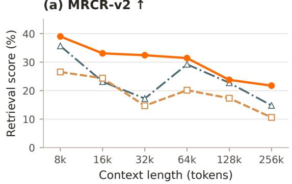

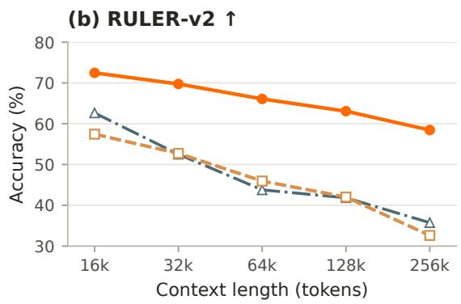

(c) AgentPPL ↓  
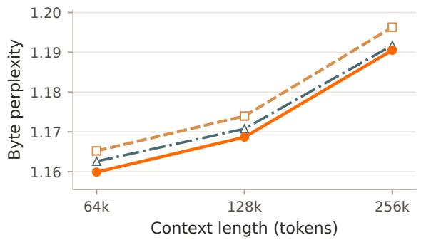

(d) LongPPL ↓  
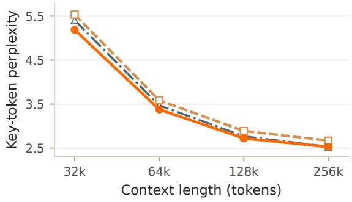  
Figure 3 Long-context performance after a light post-training stage. HySparse2 achieves higher retrieval scores and lower perplexity than both baselines across all evaluated context lengths.

Prefill computation and KV-cache storage. We compare the prefill FLOPs and KV-cache size of HySparse2, HySparse, and Hybrid SWA, under the 80B-A3B configuration across context lengths from 1k to 1M tokens with FP8 KV-cache storage.

Figure 4 shows that HySparse2 requires less prefill computation and KV-cache storage than HySparse and Hybrid SWA. At 1M tokens, HySparse2 reduces prefill FLOPs by 2.92× relative to HySparse and 5.02× relative to Hybrid SWA. The KV cache of HySparse2 occupies only 2.69 GB, compared with 6.72 GB for HySparse and 12.09 GB for Hybrid SWA.

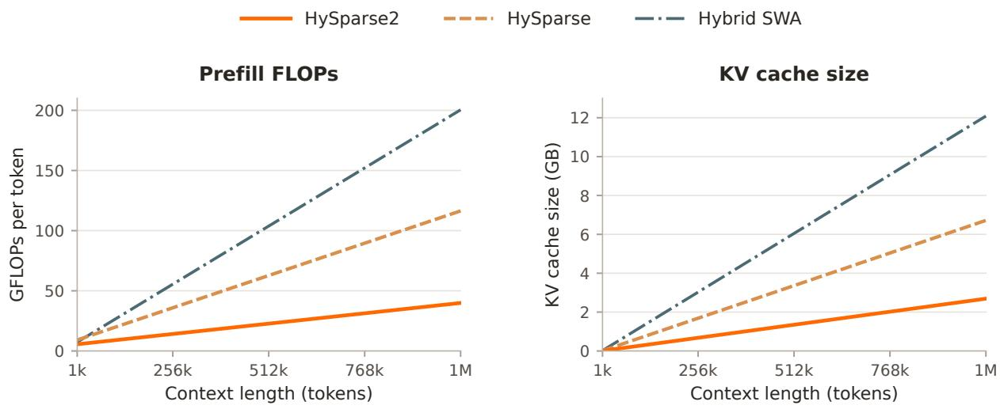  
Figure 4 Prefill computation and KV-cache storage for the 80B-A3B models. HySparse2 reduces both costs relative to HySparse and Hybrid SWA.

## 4.3 Ablation 1: Token-Level versus Block-Level Sparsity

We compare block-level selection with token-level selection. Block-level selection uses a block size of 64. Both variants use the same backbone layout, select 1,024 global tokens, and retain a separate 128-token local window.

<table><tr><td>Task</td><td>Block</td><td>Token</td></tr><tr><td>Pretraining</td><td></td><td></td></tr><tr><td>BBH</td><td>61.93</td><td>60.70</td></tr><tr><td>MMLU-Pro</td><td>35.74</td><td>36.97</td></tr><tr><td>NoLiMa</td><td>40.27</td><td>38.43</td></tr><tr><td>Long context (≤32k)</td><td></td><td></td></tr><tr><td>RULER-v2</td><td>49.56</td><td>56.13</td></tr><tr><td>MRCR-v2 (2-needle)</td><td>12.94</td><td>21.08</td></tr><tr><td>GraphWalks</td><td>29.38</td><td>34.92</td></tr></table>

Table 3 Token-level versus block-level sparse selection after pretraining. Token-level selection improves long-context retrieval and graph reasoning under the same attention budget.

Table 3 shows clear gains for token-level selection on long-context retrieval and graph reasoning under the same attention budget. It improves RULER-v2 by 6.57 points, two-needle MRCR-v2 by 8.14 points, and GraphWalks by 5.55 points. These gains are present within the 32k training context.

Agent trajectories repeatedly interleave reasoning, tool calls, and returned observations. The information needed for a response can be spread across several turns, along with role delimiters and other special tokens that identify the relevant boundaries. Under a fixed attention budget, selecting a block to retain one such token also spends capacity on its neighbors. Token-level selection can allocate that budget to individual positions across the context. The retrieval and graph-reasoning gains are consistent with this explanation.

## 4.4 Ablation 2: Local Window in Sparse Layers

We compare three ways to handle local context inside sparse layers: a separate gated 128-token SWA branch (Gated SWA), removing the separate SWA branch (No SWA), and forcing the most recent 128 tokens into the sparse selection (Forced SWA). All three share the same model backbone, KV Bridging, and hybrid SWA self-decoder. They difer only in how the cross-decoder’s sparse attention handles local context. We evaluate pretraining results within their 32k training context.

<table><tr><td>Task</td><td>Gated SWA</td><td>No SWA</td><td>Forced SWA</td></tr><tr><td>Reasoning</td><td></td><td></td><td></td></tr><tr><td>BBH</td><td>62.23</td><td>60.11</td><td>62.25</td></tr><tr><td>MMLU-Pro</td><td>39.15</td><td>37.19</td><td>38.12</td></tr><tr><td>MATH</td><td>35.82</td><td>33.82</td><td>33.38</td></tr><tr><td>DROP</td><td>60.06</td><td>58.94</td><td>56.85</td></tr><tr><td>GSM8K</td><td>64.52</td><td>60.35</td><td>59.44</td></tr><tr><td>ARC-C</td><td>81.06</td><td>79.01</td><td>78.41</td></tr><tr><td>HellaSwag</td><td>79.85</td><td>78.23</td><td>78.42</td></tr><tr><td>WinoGrande</td><td>73.09</td><td>73.95</td><td>72.85</td></tr><tr><td>Long context (≤32k)</td><td></td><td></td><td></td></tr><tr><td>NoLiMa</td><td>37.62</td><td>38.37</td><td>36.16</td></tr><tr><td>RULER</td><td>88.19</td><td>84.55</td><td>89.84</td></tr><tr><td>RULER-v2</td><td>53.66</td><td>54.62</td><td>55.98</td></tr><tr><td>MRCR-v2</td><td>27.66</td><td>20.73</td><td>22.67</td></tr><tr><td>GraphWalks</td><td>35.39</td><td>36.48</td><td>37.13</td></tr><tr><td>LongPPL ↓</td><td>6.8807</td><td>7.1307</td><td>6.9838</td></tr></table>

Table 4 Local-attention ablation in sparse layers. Forced SWA remains competitive with Gated SWA.

Table 4 shows that local information is necessary for sparse attention. Removing the local branch (No SWA) generally degrades model performance, while Forced SWA remains competitive with Gated SWA on several tasks. Forced SWA achieves the best RULER, RULER-v2, and GraphWalks scores. Compared with Gated SWA, Forced SWA is 5.08 points lower on GSM8K and 4.99 points lower on MRCR-v2, while LongPPL is 1.50% higher. We consider this an acceptable trade-of, as Forced SWA avoids additional projection parameters and requires no local KV cache, thereby making early-exit prefill feasible.

## 4.5 Ablation 3: KV Bridging

With and without KV Bridging. KV Bridging is designed primarily to accelerate prefill while preserving model quality. To test whether this design scales, we train 290B-A8B models on approximately 1.8T tokens at a 32k context length, with and without KV Bridging.

<table><tr><td>Task</td><td>w/o bridging</td><td>w/ bridging</td></tr><tr><td>MMLU</td><td>72.68</td><td>72.80</td></tr><tr><td>TriviaQA</td><td>73.32</td><td>74.10</td></tr><tr><td>BBH</td><td>70.65</td><td>69.57</td></tr><tr><td>DROP</td><td>71.37</td><td>68.17</td></tr><tr><td>GSM8K</td><td>77.63</td><td>76.65</td></tr><tr><td>Repo Code PPL ↓</td><td>1.1351</td><td>1.1353</td></tr><tr><td>RULER</td><td>96.32</td><td>96.01</td></tr><tr><td>LongPPL ↓</td><td>3.6053</td><td>3.4202</td></tr></table>

Table 5 KV Bridging ablation at the 290B-A8B scale. Models with and without KV Bridging achieve broadly comparable quality.

Table 5 shows that KV Bridging preserves quality comparable to the baseline without it. MMLU and TriviaQA improve slightly, RULER changes by only 0.31 points, and Repo Code PPL is nearly unchanged. LongPPL improves from 3.6053 to 3.4202. BBH and GSM8K decrease by about one point, and DROP falls from 71.37 to 68.17.

KV Bridging versus KV Mirror. For the connection scheme, we compare KV Bridging with KV Mirror (Liu et al., 2026) on 80B-A3B models that share the same hybrid backbone and pretraining recipe. KV Mirror uses U-shaped connections that pair early and late layers in reverse order, 1 → �, 2 → � − 1, and so on, whereas KV Bridging connects only the full-attention layers in the self-decoder and the cross-decoder. Both styles form the target KV representations by re-projecting source hidden states.

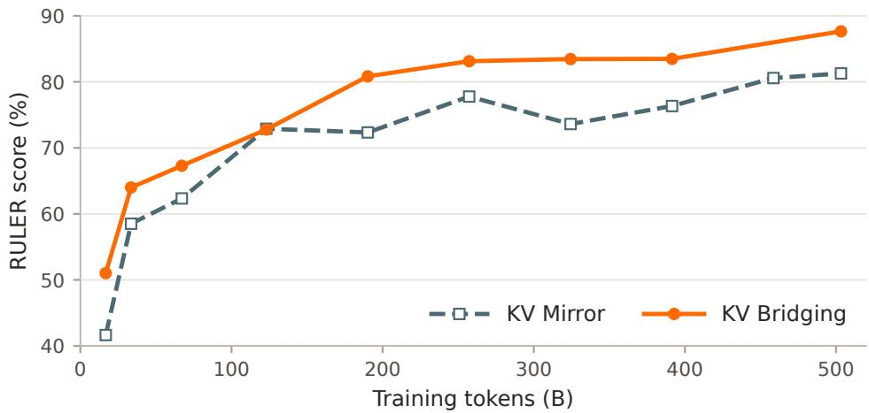  
Figure 5 KV Bridging versus KV Mirror during pretraining. KV Bridging achieves higher RULER scores.

Figure 5 shows that KV Bridging is stronger for most of training and finishes at 87.65, compared with 81.28 for KV Mirror. We hypothesize that full-layer states are better sources because full attention backpropagates through scores across the entire visible context, while SWA restricts these direct connections to a local window. This denser supervision produces representations that retain more global information for projection.

## 5 Conclusion

We present HySparse2, a hybrid sparse attention architecture designed for long-horizon, multi-turn agentic workloads. HySparse2 is a more eficient successor to HySparse and Hybrid SWA, with better long-context and multi-turn retrieval, faster prefill, and lower KV-cache storage. Its two-level KV sharing enables prefill KV-cache construction by running only half of the model, including just one full-attention layer. Under prefill–decode disaggregation, the prefill node therefore needs to host only half of the model weights.

## References

S. Agarwal, L. Ahmad, J. Ai, S. Altman, A. Applebaum, E. Arbus, R. K. Arora, Y. Bai, B. Baker, H. Bao, et al. gpt-oss-120b & gpt-oss-20b model card. arXiv preprint arXiv:2508.10925, 2025.

J. Ainslie, J. Lee-Thorp, M. de Jong, Y. Zemlyanskiy, F. Lebrón, and S. Sanghai. GQA: Training generalized multi-query transformer models from multi-head checkpoints. In Proceedings of the 2023 Conference on Empirical Methods in Natural Language Processing, pages 4895–4901. Association for Computational Linguistics, 2023. doi: 10.18653/v1/2023.emnlp-main.298. URL https://aclanthology.org/2023.emnlp-main.298/.

J. Austin, A. Odena, M. Nye, M. Bosma, H. Michalewski, D. Dohan, E. Jiang, C. Cai, M. Terry, Q. Le, et al. Program synthesis with large language models. arXiv preprint arXiv:2108.07732, 2021.

W. Brandon, M. Mishra, A. Nrusimha, R. Panda, and J. Ragan-Kelley. Reducing transformer key-value cache size with cross-layer attention. In Advances in Neural Information Processing Systems, volume 37, pages 86927–86957, 2024. doi: 10.52202/079017-2758. URL https: //proceedings.neurips.cc/paper\_files/paper/2024/hash/9e23d020c18e4c40d 81c6a0fc7a46f68-Abstract-Conference.html.

J. Chen, Y. Liang, and Z. Liu. DFlash: Block difusion for flash speculative decoding. arXiv preprint arXiv:2602.06036, 2026. URL https://arxiv.org/abs/2602.06036.

M. Chen. Evaluating large language models trained on code. arXiv preprint arXiv:2107.03374, 2021.

R. Child, S. Gray, A. Radford, and I. Sutskever. Generating long sequences with sparse transformers. arXiv preprint arXiv:1904.10509, 2019.

P. Clark, I. Cowhey, O. Etzioni, T. Khot, A. Sabharwal, C. Schoenick, and O. Tafjord. Think you have solved question answering? try arc, the ai2 reasoning challenge. arXiv preprint arXiv:1803.05457, 2018.

K. Cobbe, V. Kosaraju, M. Bavarian, M. Chen, H. Jun, L. Kaiser, M. Plappert, J. Tworek, J. Hilton, R. Nakano, et al. Training verifiers to solve math word problems. arXiv preprint arXiv:2110.14168, 2021.

DeepSeek-AI. Deepseek-v4.1-flash: Pushing the limits of kv cache compression, 2026. Technical report.

DeepSeek-AI, A. Liu, A. Mei, B. Lin, B. Xue, B. Wang, B. Xu, B. Wu, B. Zhang, C. Lin, C. Dong, et al. DeepSeek-V3.2: Pushing the frontier of open large language models. arXiv preprint arXiv:2512.02556, 2025. URL https://arxiv.org/abs/2512.02556.

DeepSeek-AI et al. DeepSeek-V4: Towards highly eficient million-token context intelligence. arXiv preprint arXiv:2606.19348, 2026. doi: 10.48550/arXiv.2606.19348. URL https: //arxiv.org/abs/2606.19348.

D. Dua, Y. Wang, P. Dasigi, G. Stanovsky, S. Singh, and M. Gardner. DROP: A reading comprehension benchmark requiring discrete reasoning over paragraphs. In J. Burstein, C. Doran, and T. Solorio, editors, Proceedings of the 2019 Conference of the North American Chapter of the Association for Computational Linguistics: Human Language Technologies, Volume 1 (Long and Short Papers), pages 2368–2378, Minneapolis, Minnesota, 2019. Association for Computational Linguistics. doi: 10.18653/v1/N19-1246. URL https://aclanthology.org/N19-1246.

L. Fang, Y. Wang, Z. Liu, C. Zhang, S. Jegelka, J. Gao, B. Ding, and Y. Wang. What is wrong with perplexity for long-context language modeling? arXiv preprint arXiv:2410.23771, 2024.

Y. Gao, Z. Zeng, D. Du, S. Cao, P. Zhou, J. Qi, J. Lai, H. K.-H. So, T. Cao, F. Yang, and M. Yang. Seer-Attention: Learning intrinsic sparse attention in your LLMs. arXiv preprint arXiv:2410.13276, 2024. URL https://arxiv.org/abs/2410.13276.

Y. Gao, J. Wei, Q. Zhang, Y. Cheng, S. Chen, Z. Tang, Z. Jiang, Y. Song, H. Zhang, L. Zhao, B. Yang, G. Wang, S. Cao, and F. Luo. Hysparse: A hybrid sparse attention architecture with oracle token selection and kv cache sharing. arXiv preprint arXiv:2602.03560, 2026.

A. P. Gema, J. O. J. Leang, G. Hong, A. Devoto, A. C. M. Mancino, R. Saxena, X. He, Y. Zhao, X. Du, M. R. G. Madani, et al. Are we done with mmlu? ArXiv preprint, abs/2406.04127, 2024. URL https://arxiv.org/abs/2406.04127.

D. Hendrycks, C. Burns, S. Basart, A. Zou, M. Mazeika, D. Song, and J. Steinhardt. Measuring massive multitask language understanding. arXiv preprint arXiv:2009.03300, 2020.

D. Hendrycks, C. Burns, S. Kadavath, A. Arora, S. Basart, E. Tang, D. Song, and J. Steinhardt. Measuring mathematical problem solving with the math dataset. ArXiv preprint, abs/2103.03874, 2021. URL https://arxiv.org/abs/2103.03874.

C. Hooper, S. Kim, H. Mohammadzadeh, M. W. Mahoney, Y. S. Shao, K. Keutzer, and A. Gholami. KVQuant: Towards 10 million context length LLM inference with KV cache quantization. In Advances in Neural Information Processing Systems, volume 37, pages 1270–1303, 2024. doi: 10.52202/079017-0040. URL https://proceedings.neurips.cc/paper\_files/paper /2024/hash/028fcbcf85435d39a40c4d61b42c99a4-Abstract-Conference.html.

C.-P. Hsieh, S. Sun, S. Kriman, S. Acharya, D. Rekesh, F. Jia, Y. Zhang, and B. Ginsburg. Ruler: What’s the real context size of your long-context language models? arXiv preprint arXiv:2404.06654, 2024.

C.-P. Hsieh, F. Ladhak, K. C. Puvvada, and B. Ginsburg. RULERv2: From basic retrieval to complex reasoning, a bottom-up benchmark for long-context evaluation. In 39th Conference on Neural Information Processing Systems (NeurIPS 2025) Workshop: Evaluating the Evolving LLM Lifecycle: Benchmarks, Emergent Abilities, and Scaling, 2025. URL https://openrevi ew.net/forum?id=ZU9tRffRSA.

Y. Huang, Y. Bai, Z. Zhu, J. Zhang, J. Zhang, T. Su, J. Liu, C. Lv, Y. Zhang, J. Lei, Y. Fu, M. Sun, and J. He. C-eval: A multi-level multi-discipline chinese evaluation suite for foundation models. In A. Oh, T. Naumann, A. Globerson, K. Saenko, M. Hardt, and S. Levine, editors, Advances in Neural Information Processing Systems 36: Annual Conference on Neural Information Processing Systems 2023, NeurIPS 2023, New Orleans, LA, USA, December 10 - 16, 2023, 2023. URL http://papers.nips.cc/paper\_files/paper/2023/hash/c6e c1844bec96d6d32ae95ae694e23d8-Abstract-Datasets\_and\_Benchmarks.html.

K. Jordan, Y. Jin, V. Boza, J. You, F. Cesista, L. Newhouse, and J. Bernstein. Muon: An optimizer for hidden layers in neural networks, 2024. URL https://kellerjordan.github.io/pos ts/muon/.

M. Joshi, E. Choi, D. Weld, and L. Zettlemoyer. TriviaQA: A large scale distantly supervised challenge dataset for reading comprehension. In R. Barzilay and M.-Y. Kan, editors, Proceedings of the 55th Annual Meeting of the Association for Computational Linguistics (Volume 1: Long

Papers), pages 1601–1611, Vancouver, Canada, 2017. Association for Computational Linguistics. doi: 10.18653/v1/P17-1147. URL https://aclanthology.org/P17-1147.

H. Li, Y. Zhang, F. Koto, Y. Yang, H. Zhao, Y. Gong, N. Duan, and T. Baldwin. Cmmlu: Measuring massive multitask language understanding in chinese. ArXiv preprint, abs/2306.09212, 2023. URL https://arxiv.org/abs/2306.09212.

A. Liu, B. Feng, B. Wang, B. Wang, B. Liu, C. Zhao, C. Deng, C. Ruan, D. Dai, D. Guo, et al. DeepSeek-V2: A strong, economical, and eficient mixture-of-experts language model. arXiv preprint arXiv:2405.04434, 2024a. URL https://arxiv.org/abs/2405.04434.

A. Liu, C. Shi, C. Wu, et al. Hidden decoding at scale: Latent computation scaling for large language models. arXiv preprint arXiv:2607.08186, 2026. URL https://arxiv.org/abs/ 2607.08186.

J. Liu, C. S. Xia, Y. Wang, and L. Zhang. Is your code generated by chatgpt really correct? rigorous evaluation of large language models for code generation. In A. Oh, T. Naumann, A. Globerson, K. Saenko, M. Hardt, and S. Levine, editors, Advances in Neural Information Processing Systems 36: Annual Conference on Neural Information Processing Systems 2023, NeurIPS 2023, New Orleans, LA, USA, December 10 - 16, 2023, 2023. URL http://papers.nips.cc/paper\_f iles/paper/2023/hash/43e9d647ccd3e4b7b5baab53f0368686-Abstract-Confere nce.html.

Z. Liu, J. Yuan, H. Jin, S. Zhong, Z. Xu, V. Braverman, B. Chen, and X. Hu. KIVI: A tuning-free asymmetric 2bit quantization for KV cache. In Proceedings of the 41st International Conference on Machine Learning, volume 235 of Proceedings of Machine Learning Research, pages 32332– 32344. PMLR, 2024b. URL https://proceedings.mlr.press/v235/liu24bz.html.

A. Modarressi, H. Deilamsalehy, F. Dernoncourt, T. Bui, R. A. Rossi, S. Yoon, and H. Schütze. Nolima: Long-context evaluation beyond literal matching. arXiv preprint arXiv:2502.05167, 2025.

OpenAI. Introducing GPT-4.1 in the API. https://openai.com/index/gpt-4-1/, 2025. Introduces OpenAI-MRCR and Graphwalks.

Z. Qiu, Z. Wang, B. Zheng, Z. Huang, K. Wen, S. Yang, R. Men, L. Yu, F. Huang, S. Huang, et al. Gated attention for large language models: Non-linearity, sparsity, and attention-sink-free. arXiv preprint arXiv:2505.06708, 2025.

K. Sakaguchi, R. L. Bras, C. Bhagavatula, and Y. Choi. Winogrande: An adversarial winograd schema challenge at scale. In The Thirty-Fourth AAAI Conference on Artificial Intelligence, AAAI 2020, The Thirty-Second Innovative Applications of Artificial Intelligence Conference, IAAI 2020, The Tenth AAAI Symposium on Educational Advances in Artificial Intelligence, EAAI 2020, New York, NY, USA, February 7-12, 2020, pages 8732–8740. AAAI Press, 2020. URL https://aaai.org/ojs/index.php/AAAI/article/view/6399.

O. Sanseviero and I. Ballantyne. Introducing Gemma 3n: The developer guide. https://de velopers.googleblog.com/en/introducing-gemma-3n-developer-guide/, June 2025.

N. Shazeer. Fast transformer decoding: One write-head is all you need. arXiv preprint arXiv:1911.02150, 2019.

J. Su, M. Ahmed, Y. Lu, S. Pan, W. Bo, and Y. Liu. Roformer: Enhanced transformer with rotary position embedding. Neurocomputing, 568:127063, 2024.

Y. Sun, L. Dong, Y. Zhu, S. Huang, W. Wang, S. Ma, Q. Zhang, J. Wang, and F. Wei. You only cache once: Decoder-decoder architectures for language models. Advances in Neural Information Processing Systems, 37:7339–7361, 2024.

M. Suzgun, N. Scales, N. Schärli, S. Gehrmann, Y. Tay, H. W. Chung, A. Chowdhery, Q. Le, E. Chi, D. Zhou, and J. Wei. Challenging BIG-bench tasks and whether chain-of-thought can solve them. In A. Rogers, J. Boyd-Graber, and N. Okazaki, editors, Findings of the Association for Computational Linguistics: ACL 2023, pages 13003–13051, Toronto, Canada, 2023. Association for Computational Linguistics. doi: 10.18653/v1/2023.findings-acl.824. URL https: //aclanthology.org/2023.findings-acl.824.

K. Vodrahalli, S. Ontanon, N. Tripuraneni, K. Xu, S. Jain, R. Shivanna, J. Hui, N. Dikkala, M. Kazemi, B. Fatemi, R. Anil, E. Dyer, S. Shakeri, R. Vij, H. Mehta, V. Ramasesh, Q. Le, E. Chi, Y. Lu, O. Firat, A. Lazaridou, J.-B. Lespiau, N. Attaluri, and K. Olszewska. Michelangelo: Long context evaluations beyond haystacks via latent structure queries. arXiv preprint arXiv:2409.12640, 2024. arXiv:2409.12640v2.

L. Wang, Y. Cheng, Y. Shi, Z. Tang, Z. Mo, W. Xie, L. Ma, Y. Xia, J. Xue, F. Yang, and Z. Yang. TileLang: A composable tiled programming model for AI systems, 2025. URL https://arxi v.org/abs/2504.17577.

Y. Wang, X. Ma, G. Zhang, Y. Ni, A. Chandra, S. Guo, W. Ren, A. Arulraj, X. He, Z. Jiang, T. Li, M. Ku, K. Wang, A. Zhuang, R. Fan, X. Yue, and W. Chen. Mmlu-pro: A more robust and challenging multi-task language understanding benchmark. In A. Globersons, L. Mackey, D. Belgrave, A. Fan, U. Paquet, J. M. Tomczak, and C. Zhang, editors, Advances in Neural Information Processing Systems 38: Annual Conference on Neural Information Processing Systems 2024, NeurIPS 2024, Vancouver, BC, Canada, December 10 - 15, 2024, 2024. URL http://pape rs.nips.cc/paper\_files/paper/2024/hash/ad236edc564f3e3156e1b2feafb99a2 4-Abstract-Datasets\_and\_Benchmarks\_Track.html.

Xiaomi Team, B. Xiao, B. Xia, B. Yang, B. Gao, B. Shen, C. Zhang, C. He, C. Lou, F. Luo, G. Wang, et al. MiMo-V2-Flash technical report. arXiv preprint arXiv:2601.02780, 2026.

Z. Xie, Y. Wei, H. Cao, C. Zhao, C. Deng, J. Li, D. Dai, H. Gao, M. Xu, K. Yu, L. Zhao, S. Zhou, Z. Xu, Z. Zhang, W. Zeng, S. Hu, Y. Wang, J. Yuan, L. Wang, and W. Liang. mHC: Manifold-constrained hyper-connections. In Forty-third International Conference on Machine Learning, 2026. URL https://openreview.net/forum?id=mDhyxu8WRb.

R. Zellers, A. Holtzman, Y. Bisk, A. Farhadi, and Y. Choi. HellaSwag: Can a machine really finish your sentence? In A. Korhonen, D. Traum, and L. Màrquez, editors, Proceedings of the 57th Annual Meeting of the Association for Computational Linguistics, pages 4791–4800, Florence, Italy, 2019. Association for Computational Linguistics. doi: 10.18653/v1/P19-1472. URL https://aclanthology.org/P19-1472.

Z. Zhang, Z. Jiang, C. Jiang, M. Yu, S. Zheng, H. Lin, H. Hofmann, and X. Liu. SwiftSpec: Ultra-low latency LLM decoding by scaling asynchronous speculative decoding. arXiv preprint arXiv:2506.11309, 2025. URL https://arxiv.org/abs/2506.11309.

D. Zhu, H. Huang, Z. Huang, Y. Zeng, Y. Mao, B. Wu, Q. Min, and X. Zhou. Hyper-Connections. In The Thirteenth International Conference on Learning Representations, 2025. URL https: //openreview.net/forum?id=9FqARW7dwB.