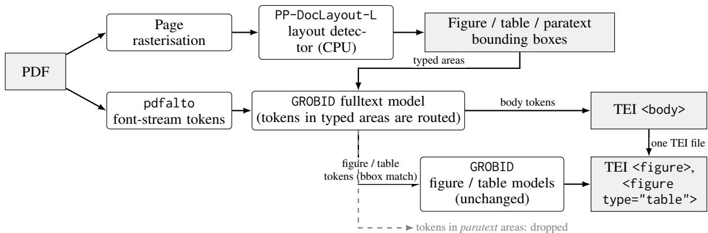

# Layout-Guided Masking for GROBID: Lightweight Structural Gains in Large-Scale Scientific PDF Ingestion \*

Luca Foppiano1†, Sana Khamassi1, Vipul Gupta2 1ScienciaLAB, Portugal 2Helmholtz-Zentrum Hereon, Germany

## Abstract

Transforming scholarly PDFs into machinereadable fulltext remains a bottleneck for largescale information systems. Recent vision-based parsers improve accuracy, but need GPUs and may introduce noise into the extracted text. GROBID, a modular font-stream parser running on CPU, is the de-facto standard for structuring scientific articles and underpins several of the largest open scholarly corpora. We pair it with a lightweight CPU detector localising figure, table, and paratext (header, footer, page number) regions, encoded as typed-area masks whose tokens are routed to GROBID’s specialised models or discarded. On two PMC corpora, Bioinformatics (1,926 articles) and Materials Science (2,595), scored against JATS with a sectionaware structural protocol, our extension improves over plain GROBID on most metrics (NS +0.025/+0.013; +0.086 paragraph recall on Materials Science, d =1.08), and captionlinked figure recovery improves on both corpora. On the external Table-BRGM benchmark, table detection recovers F1 0.16 → 0.94 and table structure follows (GriTS-Top 0.27 → 0.78, below the strongest GPU system). On body text, against four vision-based systems (Docling, MinerU, olmOCR, dots.ocr), it has the best paragraph precision on both corpora, the best section detection on Materials Science, and a character error rate within 0.004 of the best GPU parser. End-to-end on CPU, it costs 2.7–3.2× less than the cheapest GPU system (Docling) and 10–14× less than generative parsers.

## 1 Introduction

Extracting text and structure from scientific literature underpins knowledge-graph construction (Foppiano et al., 2019; Jeangirard, 2019; Lo et al., 2020; Du et al., 2021; Foppiano et al., 2023; Ammar et al., 2018; Jaradeh et al., 2019), dense retrieval (Karpukhin et al., 2020) and retrieval-augmented generation (Gupta et al., 2026; Lewis et al., 2020) and parsing errors propagate downstream. Scholarly PDFs make that hard: multi-column text, multipanel figures, irregular tables, mathematical notation, and floating captions (Lopez, 2009; Zhu and Cole, 2022). A recent generation of vision-based parsers works from the rendered page instead, reading layout from the image and recovering text with OCR or a vision-language model (Ke et al., 2025); they differ in how much of the page goes to a generative model and how much to dedicated recognisers (§2).

Full-page vision-based parsing needs GPUs at scale, out of reach for many academic groups; autoregressive generation over page images limits throughput (Liao et al., 2026; Li et al., 2026); and reconstructing text from images rather than from the content stream may introduce transcription errors or hallucination (Kydlícek et al.ˇ , 2025) in technical content such as gene names, chemical formulas and mathematical notation (Thapa et al., 2024; Tong et al., 2026).

In contrast, GROBID (GROBID contributors, 2008–2026) is a font-stream parser that reads the PDF content directly, yielding high character-level accuracy on commodity CPUs at scale (Foppiano et al., 2026), and is the standard tool in scholarly infrastructure, producing the parsed full-text behind large open corpora and bibliographic services (Lo et al., 2020; Du et al., 2021; Jeangirard, 2019). Its weak point is visually complex pages: figures and tables interrupt the reading order or leak into the surrounding paragraphs (Li et al., 2019; Soric et al., 2025).

We take this asymmetry as our starting point: visual processing can be scoped to localisation of visually-rich components (e.g. tables, figures) and paratext (or boilerplate, such as page headers and footers). We extend GROBID with a lightweight, replaceable object detector that locates figures, tables and paratext. Its boxes enter the parser as typed areas, region extents, which the cascade honours when deciding which model sees which token. We evaluate the resulting system, GROBID+PP, on 4,521 PubMed Central (PMC) articles from two corpora against JATS-XML, under a perturbation-validated structural protocol with paired significance tests and a component ablation separating masking from routing, alongside four representative vision-based systems Docling, MinerU, olmOCR, and dots.ocr at measured cost.

## 2 Related Work

We group the systems discussed here into three families. Full-page generative parsers, such as olmOCR (Poznanski et al., 2025a,b), dots.ocr (Li et al., 2025), and FireRed-OCR (Wu et al., 2026) render each page and generate its content autoregressively with a single VLM; full-pipeline document parsers, such as Docling (Livathinos et al., 2025), and PP-StructureV3 (PaddlePaddle Team, 2023) combine layout analysis with dedicated OCR, table and formula recognisers; regionrouted hybrids, such as MinerU 2.5 (Niu et al., 2025) and GLM-OCR (Duan et al., 2026) apply layout analysis first and route regions to recognisers in parallel (Table 4; Appendix A). We do not revisit the earlier layout-aware systems VILA (Shen et al., 2022), Nougat (Blecher et al., 2023) and Marker (Paruchuri, 2023), which the current generation has superseded.

Our extension belongs to the last class: the contribution is orthogonal to the choice of recogniser, showing that the body-text step can be served by a font-stream parser on CPU rather than a VLM, at lower cost.

## 3 Layout-Masked GROBID

GROBID parses a PDF as a cascade of tokenlabelling models over the font stream. pdfalto converts the content stream into layout tokens, each carrying its page, bounding box, and font attributes. A segmentation model labels blocks of those tokens into document zones, separating body, and annex from header, bibliography, footnotes, and running headers; afulltext model then labels each token of the body and annex as paragraph, section title, figure, table, equation, list item or reference marker. Contiguous spans labelled figure or table go to two specialised models that recover the caption, label, and content of each region. The tokens that remain form the body text, and every stage’s output is serialised into one TEI-XML document. GROBID+PP, as shown in Figure 1, changes which tokens thefulltext model sees.

Layout detection. Each page is rasterised and passed to the PaddlePaddle PP-DocLayout (Sun et al., 2025) model, a lightweight object detector returning typed bounding boxes. We select PP-DocLayout-L on accuracy-to-latency against its S/M variants and LADaS (Clérice et al., 2024) on the DocLayNet validation set (Pfitzmann et al., 2022), scoring the five DocLayNet classes that GROBID+PP masks: mean AP 0.552 (see Table 6) at 0.47 s/page (Table 5; Appendix B). We keep six detector classes: figure, table, caption, runninghead, footer and page-number, normalised to PDF page coordinates. Page numbers score under DocLayNet’s page-footer class, and the last three are the paratext class. Each figure or table box is assigned to the nearest caption on its page, and all boxes sharing a caption are replaced by their union with it (Appendix B). This is what turns a multipanel figure, which the detector reports as one box per panel, back into a single region; a box with no caption nearby is kept on its own. Three labels reach GROBID: figure, table and paratext; §5.4 measures what this merging is worth.

Typed-area masking. A typed area is a rectangle on a page, labelled figure, table or paratext; the detector produces one list per document, which GROBID takes alongside the PDF through its existing API. Plain GROBID lets the fulltext model decide which tokens are figure or table content, and typed areas make that decision instead: a token inside a figure or table area skips the fulltext model and goes to the figure or table model with the rest of its area, exactly as if the fulltext model had labelled it so; a token inside a paratext area is dropped; every other token is labelled as before. Masking changes which model sees a token, not what that model does with it, and the TEI schema is unchanged.

## 4 Evaluation

## 4.1 Data and Reference

We evaluate on two subsets of the PMC Open Access CC-BY corpus: every article ships with a publisher JATS-XML file usable as a body-text reference without manual annotation, and CC-BY lets us redistribute the data with the code. PMC Bioinformatics corpus comprises 1,943 lifescience and medical articles (22,431 pages, 11.55 pages/document) (Constantin et al., 2013). PMC Materials Science comprises 2,595 articles (41,652 pages, 16.05 pages/document) dense in chemical formulas and irregular experimental tables, assembled with ScilitMiner (Gupta et al., 2026) from the keywords materials science, physics, chemistry: of 4,000 retrieved documents, 2,595 had a valid PDF and a matching JATS file. The two differ in period (84% of Bioinformatics from 2010–2011, 67% of Materials Science from 2019–2023): they are contrasting ingestion workloads, not a controlled comparison of domains. The corpora are English except for two Bioinformatics articles.

  
Figure 1: Layout-masked GROBID. The detector localises regions, which reach GROBID as typed areas: tokens inside figure/table boxes are withheld from thefulltext model and dispatched by bounding-box match to the existing figure and table models, tokens inside paratext boxes are discarded. Those models and the TEI writer are identical to plain GROBID’s; only the dispatch differs.

Training-data contamination. To avoid biasing the results, we resolved both corpora against GROBID’s training data by DOI and by PDF checksum: only 17 Bioinformatics articles overlap and are excluded from every score reported here, for every system, so the comparisons remain paired; Bioinformatics is scored on n = 1,926.

Ground truth. The reference for the body text is the JATS <body> plus the back matter other than the reference list, footnotes and glossary: <ack>, <back> <sec>, <notes> and appendices are part of the target, as are paragraphs nested in lists and boxes. Front matter, the reference list, footnotes, figures, tables, and display equations with their captions are excluded. Figures and tables are scored on their own. Figure recovery is scored against the JATS <fig> captions of the same corpora (§5.3). Table structure needs cell annotations JATS does not supply, so it is scored on the four datasets of Soric et al. (2025), PubTables, Table-arXiv,

Table-BRGM and ICDAR-2013 (§5.2). The oracle bound on detector error uses a third PMC corpus of 665 articles for which PubLayNet (Zhong et al., 2019) provides human-annotated figure and table boxes (§5.4).

## 4.2 Metrics

All metrics are computed per document and macroaveraged. NS (↑) is the normalised Levenshtein similarity between reference and predicted body text. WER (↓) and CER (↓) are the word and character error rates; reading them together tells whether an error is a misread character or a wrong word boundary. For structure we match titles and paragraphs one-to-one with the Hungarian algorithm and report Sec F1 for section detection, Sec τ (Kendall’s τ ) for the order of the matched sections, P→S for the share of matched paragraphs whose predicted section is the match of their gold section, and Para P/R for paragraph detection. Because Sec τ is computed on matched sections only, a missing section counts against Sec F1 and not against the order. Appendix F gives the definitions. Table 13 checks the suite on perturbed copies of the reference: each perturbation moves the one score meant to catch it and leaves the others at identity.

## 4.3 Experimental Setup

Common representation for fulltext. Scoring happens in one representation every format can express, an ordered sequence of sections, each a plain-text title followed by plain-text paragraphs, into which reference and predictions are projected independently. The elements excluded from the reference in §4.1 are removed from the predictions too, but by different means: structurally for the JATS and for GROBID’s TEI, which mark the body, and by rules for the four vision-based systems, whose JSON or Markdown output carries headings and blocks but no body boundary. No converter reads the reference or another system’s output (Appendix E).

Hardware. GROBID runs on CPU in thefull deeplearning configuration distributed for production use. GPU baselines run on modal.com1 endpoints (versions and concurrency in Table 3): the three generative parsers at one document per A100- 40GB, four client workers feeding four containers so that every billed GPU is busy, and Docling (docling-serve 1.7.0, standard pipeline) at sixteen concurrent requests per container on the first available of five GPU types.

## 5 Results

Body text (§5.1), figures (§5.3) and tables (§5.2) are scored against the references of §4.1. Plain GROBID and GROBID+PP are the same build, differing only in whether typed areas are supplied, so their paired difference is the effect of the extension; the vision-based systems situate it, in what is to our knowledge the first large-scale paired comparison of GROBID with Docling, MinerU, olmOCR and dots.ocr on the same born-digital scientific PDFs under a common protocol. Table 1 reports all results from the evaluated systems on both corpora.

## 5.1 Body-Text Extraction

Every system runs on the same document set, paired on the intersection where a baseline returned no parsable output (at most three documents). Each baseline is compared to GROBID+PP per metric with a paired Wilcoxon signed-rank test, Holmcorrected across system pairs; NS carries a Studentt 95% confidence interval, and effect sizes are Cohen’s $d _ { z }$ on the paired differences. Comparing GROBID+PP against plain GROBID, gains are significant on every metric on both corpora except section order, at ceiling for both. On Bioinformatics the gains are led by lexical fidelity and paragraph precision (NS +0.025, d =0.48; WER −0.036; Para P +0.035); on Materials Science the lexical gain is smaller (NS +0.013) but the structural one far larger, paragraph recall +0.086 (dz=1.08), the largest masked-versus-plain effect in the benchmark. Improvement is broad: 65% and 56% of documents gain NS against 22% and 11% that lose, and gains above 0.01 outnumber losses above 0.01 by 4.5:1 and 8:1.

Against the vision-based systems the picture splits by metric family. On structure, GROBID+PP has the best paragraph precision on both corpora (0.885 and 0.901; nearest GPU system 0.849 and 0.879) and the best section detection on Materials Science (0.881 against 0.799 for dots.ocr and 0.705 for olmOCR). At the character level GROBID+PP is at par with the best generative system (CER 0.069 vs. MinerU’s 0.066; 0.061 vs. dots.ocr’s 0.057; $d _ { z } { = } 0 . 0 3$ on both); at the word level the generative parsers pull ahead on Materials Science (dots.ocr 0.059 WER, olmOCR 0.086, against 0.105), while MinerU ties on Bioinformatics (ns). A WER gap without a CER gap means the residual errors are word boundaries, not characters: spacing around formulas, units and symbols, and de-hyphenation, which a page-rendering model reads from the image and a content-stream parser must infer from glyph positions. The vision systems otherwise trade paragraph precision for recall, the signature of fragmented output (Docling 0.685 vs. our 0.885 on Bioinformatics). MinerU 2.5, which shares our architecture (Table 4), is the most informative baseline: GROBID+PP leads it on section detection and paragraph precision, by a wide margin on Materials Science, while it recovers more paragraphs and places matched ones more accurately. Routing is common ground; what the comparison isolates is where the routed regions go, to a vision-language model or to sequence labellers over the font stream. The font-stream route wins on structure and cost (§5.5), the visual route on word segmentation of chemical text.

## 5.2 Table Extraction

We assess table extraction with the benchmark of Soric et al. (2025) (§4.1), scored by detection F1, GriTS and TEDS, with cells matched by boundingbox IoU or by text tokens (Appendix F). We compare plain GROBID, GROBID+PP and Docling, the benchmark’s strongest tool; Table 2 summarises bbox mode, with the rest in Appendix H.

GROBID+PP improves plain GROBID on every dataset and metric in both matching modes, qualitatively so on BRGM and ICDAR where it essentially fails. The table model is unchanged; it is simply handed a correctly bounded region (§5.4 places this gain in the routing half). Detection is now uniformly high, bbox F1 0.926–0.975 against 0.157–

Table 1: Body-text extraction on both corpora. Best per column and corpus in bold; NS as mean ± 95% CI. Superscripts compare each baseline to GROBID+PP on that metric (paired Wilcoxon, Holm-corrected): ∗ GROBID+PP better, ‡ baseline better (both $p < 0 . 0 5 )$ , ns not significant. Sec τ excludes documents with fewer than two matched sections $( 1 . 6 \% / 3 . 0 \%$ for GROBID+PP, up to 13.5% for the vision systems on Materials Science). Inline LAT X is mapped to Unicode (Appendix E).
<table><tr><td>Corpus</td><td>System</td><td>NS (↑)</td><td>WER (↓)</td><td>CER (↓)</td><td>Sec F1</td><td> $\operatorname { S e c } \tau$ </td><td>P→S</td><td>Para P</td><td>Para R</td></tr><tr><td rowspan="5">PMC Bioinformatics  $n = 1 , 9 2 6$ </td><td>GROBID+PP (ours)</td><td> $0 . 9 3 5 2 \pm . 0 0 4$ </td><td>0.0996</td><td>0.0686</td><td>0.8717</td><td>0.9872</td><td>0.9697</td><td>0.8849</td><td>0.9031</td></tr><tr><td>GROBID</td><td> $0 . 9 0 9 7 ^ { \ast } \pm . 0 0 5$ </td><td>0.1359*</td><td>0.1003*</td><td>0.8601*</td><td>0.9871ns</td><td>0.9603*</td><td>0.8504*</td><td>0.8849*</td></tr><tr><td>Docling</td><td> $0 . 9 0 3 4 ^ { * } \pm . 0 0 8$ </td><td>0.1427*</td><td>0.1022*</td><td>0.8382*</td><td>0.9881ⁿs</td><td>0.9772</td><td>0.6851*</td><td> $0 . 9 3 1 7 ^ { \ddagger }$ </td></tr><tr><td>MinerU</td><td> $\mathbf { 0 . 9 4 1 6 ^ { \ddagger } } \pm . 0 0 4$ </td><td>0.0994ns</td><td>0.0657‡</td><td>0.8628ⁿs</td><td>0.9872</td><td>0.9876</td><td>0.8485*</td><td>0.9697‡</td></tr><tr><td>olmOCR</td><td> $0 . 8 9 8 8 ^ { \ast } \pm . 0 0 5$ </td><td> $0 . 1 2 4 9 ^ { * }$ </td><td> $0 . 1 1 7 5 ^ { * }$ </td><td>0.8139*</td><td>0.9927‡</td><td>0.9704ⁿs</td><td>0.8049*</td><td>0.9355</td></tr><tr><td rowspan="6">PMC Materials Science  $n = 2 { , } 5 9 5$ </td><td>dots.ocr</td><td> $0 . 9 1 0 0 ^ { \ast } \pm . 0 0 6$ </td><td>0.1105*</td><td>0.1008*</td><td>0.8961‡</td><td>0.9345*</td><td>0.9834</td><td>0.6581*</td><td>0.9586</td></tr><tr><td>GROBID+PP (ours)</td><td> $0 . 9 3 9 2 { \scriptstyle \pm . 0 0 5 }$ </td><td>0.1047</td><td>0.0614</td><td>0.8808</td><td>0.9837</td><td>0.9800</td><td>0.9008</td><td>0.9167</td></tr><tr><td>GROBID</td><td> $0 . 9 2 6 7 ^ { \ast } \pm . 0 0 5$ </td><td>0.1213*</td><td>0.0754*</td><td>0.8686*</td><td>0.9837ns</td><td>0.9708*</td><td>0.8754*</td><td>0.8308*</td></tr><tr><td>Docling</td><td> $0 . 7 7 1 0 ^ { \ast } \pm . 0 0 6$ </td><td>0.3714*</td><td>0.3195*</td><td>0.6839*</td><td>0.9992‡</td><td>0.9867</td><td>0.6331*</td><td>0.8735*</td></tr><tr><td>MinerU</td><td> $0 . 8 6 9 2 ^ { \ast } \pm . 0 0 5$ </td><td>0.1995*</td><td>0.1654*</td><td>0.7218*</td><td>0.9991‡</td><td>0.9919‡</td><td>0.7965*</td><td>0.8853*</td></tr><tr><td>olmOCR dots.ocr</td><td> $0 . 9 2 5 9 ^ { \ast } \pm . 0 0 4$   $\mathbf { 0 . 9 5 0 2 ^ { \dag } \pm . 0 0 4 }$ </td><td>0.0855 0.0594</td><td>0.0803* 0.0570‡</td><td>0.7048* 0.7985*</td><td>0.9988 0.9956</td><td>0.9589* 0.9898</td><td>0.8789* 0.7603*</td><td>0.9394‡ 0.9718‡</td></tr></table>

0.666 for plain GROBID and above Docling’s on arXiv and BRGM, so region bounding is no longer the limiting factor; Docling keeps the lead on structure quality on three of four datasets. The deficit that remains is concentrated in cell content $( \mathrm { G r i T S } _ { \mathrm { C o n } } 0 . 0 2 \mathrm { - } 0 . 1 6$ lower, TEDS 0.07–0.21) and is produced by the one component the extension leaves untouched, a table model trained on 75 instances from 22 documents; more annotated regions, rather than better boxes, is the natural next lever. The effect reproduces on a second, independent benchmark: on the scientific-article subset of OmniDocBench GROBID+PP raises TEDS from 31.5 to 54.7 (Appendix K).

<table><tr><td>Dataset</td><td>System</td><td>F1</td><td> $\mathrm { G _ { T } }$ </td><td>TEDS</td></tr><tr><td rowspan="2">PubTables</td><td>GROBID+PP</td><td>0.975</td><td>0.884</td><td>0.715</td></tr><tr><td>GROBID Docling</td><td>0.666 0.988</td><td>0.774 0.952</td><td>0.605 0.858</td></tr><tr><td rowspan="2">arXiv</td><td>GROBID+PP</td><td>0.926</td><td>0.862</td><td>0.583</td></tr><tr><td>GROBID Docling</td><td>0.430 0.897</td><td>0.781 0.794</td><td>0.535 0.656</td></tr><tr><td>BRGM</td><td>GROBID+PP GROBID Docling</td><td>0.937 0.160 0.906</td><td>0.777 0.265 0.823</td><td>0.602 0.159</td></tr><tr><td>ICDAR</td><td>GROBID+PP GROBID Docling</td><td>0.948 0.157 0.990</td><td>0.826 0.592 0.969</td><td>0.739 0.687 0.482 0.895</td></tr></table>

Table 2: Table extraction, bbox cell matching, under the protocol of Soric et al. (2025). F1 is table detection at $\mathrm { I o U } > 0 . 5 , \mathbf { G } _ { \mathrm { T } }$ is $\mathrm { G r i T S _ { T o p } }$ . Best per dataset in bold. Token mode, $\mathrm { G r i T S } _ { \mathrm { C o n } }$ and the token-matching detection rates in Table 15.

## 5.3 Figure Extraction

We evaluate figure extraction comparing plain GROBID and GROBID+PP only. The JATS gold standard (§4.1) records no PDF coordinates, so figure localisation cannot be scored by IoU; we score recovery, matching each gold <fig> caption oneto-one to a TEI <figDesc> at $\theta \ : = \ : 0 . 7 0$ , tables excluded. Precision counts every emitted figure, captionless ones included, which can never match a gold caption (Appendix F). Caption-anchored region formation (§3) keeps such regions from arising by forming one mask region per logical figure (Appendix G).

GROBID+PP improves caption-linked figure recovery on both corpora, F1 $0 . 7 1 8  0 . 7 7 5$ on Bioinformatics and $0 . 8 5 8  0 . 8 8 5$ on Materials Science, with caption fidelity on matched pairs rising too (d 0.41 and 0.33, both $p \ < \ 1 0 ^ { - 5 0 }$ Table 14). The gain is recall at precision parity: GROBID+PP recovers figures plain GROBID misses without emitting proportionally more spurious regions.

## 5.4 Ablations of masking and routing

Masking and routing move together in the comparisons above, so we ablated them separately (Appendix D). Masking produces the body-text gain in full: routing is worth +0.0003 NS on Bioinformatics and −0.0002 on Materials Science $( p < 0 . 0 0 1 )$ . That follows from the mechanism (§3): routed regions leave the body stream, so routing can only withhold body text, never add it. Routing is instead what keeps masking from being destructive: without it, figure recovery collapses (F1 0.858 → 0.111 on Materials Science) and tables emitted fall from 4,122 over 1,391 documents to 17 over 13.

Table 3: Cost per document and per million documents, Bioinformatics (LS) / Materials Science (MS). GPU rows: total billed Modal spend ÷ documents; CPU rows: measured wall-time × Modal CPU+memory rate (Appendix I). Concurrency is client threads / backend max inputs (GPU) or workers (CPU); s/doc is throughput, not the billing basis, so a per-hour rate cannot be back-derived from the two columns. †From a billed run of 50 documents per corpus at the concurrency shown (\$3.36 in total), one figure for both corpora; the other GPU rows are full-corpus campaigns. §L40S, A100-40GB, A10, L4 or T4 whichever Modal allocated.
<table><tr><td>System</td><td>Hardware</td><td>Concurrency</td><td>s/doc (LS / MS)</td><td>$/1M docs LS</td><td>$/1M docs MS</td></tr><tr><td>GROBID+PP (ours)</td><td>CPU, 10 cores / 16 GiB</td><td>10</td><td>5.8 / 8.1</td><td>968</td><td>1,345</td></tr><tr><td>GROBID</td><td>CPU, 10 cores / 16 GiB</td><td>10</td><td>1.23 / 1.63</td><td>205</td><td>272</td></tr><tr><td>Docling</td><td>first available§</td><td>4/16</td><td>7.6 /7.0</td><td>3,090</td><td>3,645</td></tr><tr><td>olmOCR</td><td>A100-40GB</td><td>4/1</td><td>11.0 / 13.5</td><td>11,050</td><td>12,823</td></tr><tr><td>dots.ocr</td><td>A100-40GB</td><td>4/1</td><td>12.5 / 15.0</td><td>13,300</td><td>13,971</td></tr><tr><td>MinerU</td><td>A100-40GB</td><td>4/1</td><td>10.8 / 13.8</td><td>33,600†</td><td></td></tr></table>

Detection quality bounds what masking can achieve, so we re-ran the system with humanannotated boxes in place of the detector’s (Appendix C). On 665 PubLayNet articles (§4.1), masking figures and tables raises NS from 0.9204 to 0.9250; the human-annotated boxes reach 0.9257, a further +0.0007 (95% CI $[ - 0 . 0 0 0 4 , + 0 . 0 0 2 2 ] )$ . The detector already collects 87% of what masking those region types can deliver. Region formation matters more than box accuracy: the deployed configuration reaches 0.9393, +0.0143 over the matched run and twenty times the remaining headroom, and two further arms attribute +0.0133 of it to caption-anchored merging (95% CI [+0.0114, +0.0151]), +0.0011 to paratext and nothing to masking the unannotated pages (Appendix C).

## 5.5 Deployment and Cost

The operational question for an existing GROBID installation is whether it can be upgraded in place, with plain GROBID as the fallback when the detector is unavailable.

Table 3 reports every system at what it actually cost to run: billed modal.com spend per document for GPU systems, measured wall-time at Modal’s published rates for CPU systems (Appendix I). GROBID+PP is priced as one system, detector and GROBID together, measured end-to-end over the full corpora (4,538 documents, 64,083 pages, 0 failures) at concurrency 10 on a 12-core Intel Xeon E5- 2650 v4 without GPU, with detection at 0.41 s/page. Docling on the same CPU costs seven to eleven times more than GROBID+PP and more than its own GPU endpoint (Appendix J).

For an existing GROBID deployment the honest figure is the one against plain GROBID: GROBID+PP costs 4.7–5.0× more per document (\$205 → \$968 and \$272 → \$1,345 per million), and detection is 81% / 80% of that. GROBID+PP still undercuts every GPU system: 3.2× / 2.7× below Docling, whose shared containers and cheaper GPU pool make it the most favourable GPU figure, 10–14× below the generative parsers, and 25–35× below MinerU, whose vLLM server is the slowest per document (40–53 s of server time).

## 6 Conclusion

For born-digital scientific PDFs the results support a narrow, practically useful claim, which GROBID+PP instantiates: a font-stream parser, given only the location of non-textual regions from a cheap detector, recovers paragraphs, section structure, and table regions it otherwise loses, at CPU cost. On 4,521 PMC articles GROBID+PP improves section detection and paragraph recovery (up to +0.09 recall), lowers error rates, restores the table detection that font-stream parsing loses along with much of the structure that depends on it, and improves caption-linked figure recovery, at 2.7– 3.2× below the cheapest GPU parser. The gain sits in structure rather than raw transcription, consistent with the intended mechanism: the extension changes which tokens the text model sees, not how it transcribes them; the strongest generative parsers match it at the character level (CER within 0.004, $d _ { z } { = } 0 . 0 3 )$ and lead only at the word level on chemical text, at ten times the cost. Withholding tokens produces the body-text gain; routing them to the figure and table models keeps that withholding from destroying the figures and tables. What decides whether an external box helps is its granularity, one region per logical figure rather than per visual panel (§5.3). Code, GROBID build, projected references and per-document scores will be released with the paper.

## Limitations

Structural evaluation scope. The section-aware suite scores the flat section sequence: JATS XML section nesting (hierarchy depth) and the reading order of figures and tables are not evaluated. Sec τ is undefined for documents with fewer than two matched sections and excludes them, and P→S conditions on matched paragraphs, so it must be read together with paragraph precision/recall. Withinsection paragraph order is part of the suite but at ceiling (≥ 0.985) for every system, so it is reported only in the appendix. Because the JATS reference has no coordinates, the figure numbers measure caption recovery and figure-set size, not whether a region is drawn in the right place; a coordinatebearing reference such as DocLayNet would support an IoU evaluation.

Corpus scope. Both corpora are born-digital, English, PMC-hosted CC-BY articles with a valid content stream and a matching JATS XML file; the evaluation does not cover scanned pages, non-English text or publishers outside that subset. Domain, publisher and era are also confounded across the two: Bioinformatics is publisher-diverse and predominantly from 2010–2011, Materials Science largely single-publisher and predominantly from 2019–2023. Layouts of the earlier period are on the whole simpler than current multi-panel, heavily floated ones, which likely flatters every fontstream result on Bioinformatics. Differences between the corpora therefore cannot be attributed to scientific domain or layout complexity specifically. The paired comparisons within each corpus are unaffected, since every system processes the same documents; what remains open is how far the results transfer to other publishers, periods and collections.

Detector choice and ablations. The detector is selected on detection quality over the masked classes and CPU latency (Tables 5 and 6), not endto-end: we do not run the S/M/L variants through the full pipeline, so the choice rests on the proxy those tables measure rather than on the fulltext scores the pipeline produces. That comparison may also understate LADaS, which is scored on DocLayNet, a corpus that does not cover the historical documents LADaS targets. The component ablation (§5.4, Appendix D) separates paratext masking, figure/table masking and routing on the two main corpora, but regionformation is isolated only on the PubLayNet corpus (Appendix C), where caption-anchored merging is worth +0.013 NS; its value on the main corpora is not measured. The masking-only arm is likewise a floor rather than a tuned masking-only system: it routes nothing, so what it reports is GROBID’s unaided figure and table detection over a token stream that masking has already depleted. The oracle bound (Appendix C) closes the detector question for body text only, on a third corpus and for figure and table masks alone; it inherits PubLayNet’s box conventions as the definition of a perfect box, and it says nothing about table structure, so how much of the residual gap to Docling on tables is detector error remains open.

Recognition-model capacity. The GROBID+PP extension changes where region boundaries come from, not how the figure and table models read what is inside them, and those two remain the leasttrained stage of the cascade: 108 figure and 75 table instances, from 28 and 22 annotated documents, respectively (against 925 documents for the segmentation model). With bounding box detection on the external benchmark now above 0.9 on every dataset, they are what bounds table-structure quality (§5.2). Annotating more figure and table regions is therefore the obvious complementary lever, and an orthogonal one: it needs no architectural change and would be scored by the same protocol. We did not retrain either model, and this is left for future work.

Cost figures. The absolute numbers of §5.5 are one vendor’s on-demand rates on one date, and the two row types rest on different bases (billed spend for GPU systems, measured wall-time priced at the published rate for CPU systems). The ordering is more robust than the magnitudes, because it follows from the hardware each system requires rather than from the rate card: the extension needs no accelerator at all, so any pricing under which a GPU-hour costs more than a CPU-hour preserves the direction of the comparison, and what moves with the pricing model is the size of the margin. The comparison against plain GROBID is pricing-independent: both sides run on the same CPU instance, so the 4.7– 5.0× factor is a throughput ratio and carries over to any tariff.

Training-data exposure of the baselines. The decontamination of §4.1 covers GROBID only, whose training set is small and enumerable. The vision-based baselines are trained on large page collections assembled from public PDFs, documented at the level of sources rather than documents, and PMC Open Access is a standard source; 67% of Materials Science is from 2019–2023, inside those collections’ time windows. We could not test either corpus against those training sets, so some of the evaluated pages may have been seen in training. The effect, if any, favours the baselines, not GROBID+PP. Those collections also reach well beyond scientific articles, so a scholarly-specialised visual model could close part of the gap; impact on downstream tasks such as retrieval and knowledgegraph construction is left to future work.

Projection asymmetry. Reference and predictions are projected independently and no converter reads the reference (Appendix E), but the two sides are trimmed by different means: front matter and reference list are removed structurally from the JATS and from GROBID’s TEI, and by heading rules from the vision-based systems, whose formats carry no structural boundary. A rule that misses leaves the material in the body and is charged to the system; a rule that fires too early removes body text and is also charged to the system. The rules were tuned by inspecting system outputs, not scores, but they remain a per-format heuristic that the TEI side does not need.

## References

Waleed Ammar, Dirk Groeneveld, Chandra Bhagavatula, Iz Beltagy, Miles Crawford, Doug Downey, Jason Dunkelberger, Ahmed Elgohary, Sergey Feldman, Vu Ha, Rodney Kinney, Sebastian Kohlmeier, Kyle Lo, Tyler Murray, Hsu-Han Ooi, Matthew Peters, Joanna Power, Sam Skjonsberg, Lucy Lu Wang, and 4 others. 2018. Construction of the literature graph in semantic scholar. In Proceedings of the 2018 Conference of the North American Chapter of the Associationfor Computational Linguistics: Human Language Technologies, Volume 3 (Industry Papers), pages 84–91, New Orleans - Louisiana. Association for Computational Linguistics.

Lukas Blecher, Guillem Cucurull, Thomas Scialom, and Robert Stojnic. 2023. Nougat: Neural optical understanding for academic documents. Preprint, arXiv:2308.13418.

Thibault Clérice, Juliette Janès, Hugo Scheithauer, Sarah Bénière, Simon Gabay, Laurent Romary,

Benoit Sagot, and Roxane Bougrelle. 2024. Layout Analysis Dataset with SegmOnto (LADaS).

Alexandru Constantin, Steve Pettifer, and Andrei Voronkov. 2013. Pdfx: fully-automated pdf-to-xml conversion of scientific literature. In Proceedings of the 2013 ACM Symposium on Document Engineering (DocEng). ACM.

Caifan Du, Johanna Cohoon, Patrice Lopez, and James Howison. 2021. Softcite dataset: A dataset of software mentions in biomedical and economic research publications. Journal of the Association for Information Science and Technology, 72(7):870–884.

Shuaiqi Duan, Yadong Xue, Weihan Wang, Zhe Su, Huan Liu, Sheng Yang, Guobing Gan, Guo Wang, Zihan Wang, Shengdong Yan, Dexin Jin, Yuxuan Zhang, Guohong Wen, Yanfeng Wang, Yutao Zhang, Xiaohan Zhang, Wenyi Hong, Yukuo Cen, Da Yin, and 4 others. 2026. Glm-ocr technical report. Preprint, arXiv:2603.10910.

Luca Foppiano, Pedro Baptista Castro, Pedro Ortiz Suarez, Kensei Terashima, Yoshihiko Takano, and Masashi Ishii. 2023. Automatic extraction of materials and properties from superconductors scientific literature. Science and Technology of Advanced Materials: Methods, 3(1).

Luca Foppiano, Laurent Romary, Masashi Ishii, and Mikiko Tanifuji. 2019. Automatic identification and normalisation of physical measurements in scientific literature. In Proceedings of the ACM Symposium on Document Engineering 2019, DocEng ’19, New York, NY, USA. Association for Computing Machinery.

Luca Foppiano, Sotaro Takeshita, Pedro Ortiz Suarez, Ekaterina Borisova, Raia Abu Ahmad, Malte Ostendorff, Fabio Barth, Julian Moreno-Schneider, and Georg Rehm. 2026. Scilad: A large-scale, transparent, reproducible dataset for natural scientific language processing. Preprint, arXiv:2512.11192.

GROBID contributors. 2008–2026. Grobid. https://github.com/grobidOrg/ grobid. Version 0.9.0. Software Heritage: swh:1:dir:dab86b296e3c3216e2241968f0d63b68e8209d3c.

Vipul Gupta, Jonathan David Heaton Paul, Ingo Schmitt, and Florian Pyczak. 2026. Scilitminer: An intelligent system for scientific literature mining and knowledge discovery. Advanced Intelligent Systems, 8(3):e202501235.

Mohamad Yaser Jaradeh, Allard Oelen, Kheir Eddine Farfar, Manuel Prinz, Jennifer D’Souza, Gábor Kismihók, Markus Stocker, and Sören Auer. 2019. Open research knowledge graph: Next generation infrastructure for semantic scholarly knowledge. In Proceedings of the 10th International Conference on Knowledge Capture, K-CAP ’19, page 243–246, New York, NY, USA. Association for Computing Machinery.

Eric Jeangirard. 2019. Monitoring Open Access at a national level: French case study. In ELPUB 2019 23rd edition ofthe International Conference on Electronic Publishing, volume Academic publishing and digital bibliodiversity, Marseille, France. ElPub.

Vladimir Karpukhin, Barlas Oguz, Sewon Min, Patrick Lewis, Ledell Wu, Sergey Edunov, Danqi Chen, and Wen-tau Yih. 2020. Dense passage retrieval for opendomain question answering. In Proceedings of the 2020 Conference on Empirical Methods in Natural Language Processing (EMNLP), pages 6769–6781, Online. Association for Computational Linguistics.

Wenjun Ke, Yifan Zheng, Yining Li, Hengyuan Xu, Dong Nie, Peng Wang, and Yao He. 2025. Large language models in document intelligence: A comprehensive survey, recent advances, challenges, and future trends. ACM Trans. Inf. Syst., 44(1).

Hynek Kydlícek, Guilherme Penedo, and Leandro vonˇ Werra. 2025. Finepdfs. https://huggingface.co/ datasets/HuggingFaceFW/finepdfs.

Patrick Lewis, Ethan Perez, Aleksandra Piktus, Fabio Petroni, Vladimir Karpukhin, Naman Goyal, Heinrich Küttler, Mike Lewis, Wen-tau Yih, Tim Rocktäschel, et al. 2020. Retrieval-augmented generation for knowledge-intensive nlp tasks. Advances in neural information processing systems, 33:9459–9474.

Lei Li, Ze Zhao, Meng Li, Zhongwang Lun, Yi Yuan, Xingjing Lu, Zheng Wei, Jiang Bian, and Zang Li. 2026. Efficient document parsing via parallel token prediction. Preprint, arXiv:2603.15206.

Pengyuan Li, Xiangying Jiang, and Hagit Shatkay. 2019. Figure and caption extraction from biomedical documents. Bioinformatics, 35(21):4381–4388.

Yumeng Li, Guang Yang, Hao Liu, Bowen Wang, and Colin Zhang. 2025. dots.ocr: Multilingual document layout parsing in a single vision-language model. Preprint, arXiv:2512.02498.

Wenhui Liao, Hongliang Li, Pengyu Xie, Xinyu Cai, Yufan Shen, Yi Xin, Qi Qin, Shenglong Ye, Tianbin Li, Ming Hu, Junjun He, Yihao Liu, Wenhai Wang, Min Dou, Bin Fu, Botian Shi, Yu Qiao, and Lianwen Jin. 2026. Hsd: Training-free acceleration for document parsing vision-language model with hierarchical speculative decoding. Preprint, arXiv:2602.12957.

Nikolaos Livathinos, Christoph Auer, Maksym Lysak, Ahmed Nassar, Michele Dolfi, Panos Vagenas, Cesar Berrospi Ramis, Matteo Omenetti, Kasper Dinkla, Yusik Kim, Shubham Gupta, Rafael Teixeira de Lima, Valery Weber, Lucas Morin, Ingmar Meijer, Viktor Kuropiatnyk, and Peter W. J. Staar. 2025. Docling: An efficient open-source toolkit for ai-driven document conversion. Preprint, arXiv:2501.17887.

Kyle Lo, Lucy Lu Wang, Mark Neumann, Rodney Kinney, and Daniel Weld. 2020. S2ORC: The semantic scholar open research corpus. In Proceedings ofthe

58th Annual Meeting of the Association for Computational Linguistics, pages 4969–4983, Online. Association for Computational Linguistics.

Patrice Lopez. 2009. GROBID: Combining Automatic Bibliographic Data Recognition and Term Extraction for Scholarship Publications. In Maristella Agosti, José Borbinha, Sarantos Kapidakis, Christos Papatheodorou, and Giannis Tsakonas, editors, Research and Advanced Technologyfor Digital Libraries, volume 5714, pages 473–474. Springer Berlin Heidelberg, Berlin, Heidelberg.

Junbo Niu, Zheng Liu, Zhuangcheng Gu, Bin Wang, Linke Ouyang, Zhiyuan Zhao, et al. 2025. Mineru2.5: A decoupled vision-language model for efficient high-resolution document parsing. Preprint, arXiv:2509.22186.

Linke Ouyang, Yuan Qu, Hongbin Zhou, Jiawei Zhu, Rui Zhang, Qunshu Lin, Bin Wang, Zhiyuan Zhao, Man Jiang, Xiaomeng Zhao, Jin Shi, Fan Wu, Pei Chu, Minghao Liu, Zhenxiang Li, Chao Xu, Bo Zhang, Botian Shi, Zhongying Tu, and Conghui He. 2024. Omnidocbench: Benchmarking diverse pdf document parsing with comprehensive annotations. Preprint, arXiv:2412.07626.

PaddlePaddle Team. 2023. Pp-structurev3: A robust document analysis system. https://github.com/ PaddlePaddle/PaddleOCR.

Vik Paruchuri. 2023. Marker: Fast, high accuracy pdf to markdown. https://github.com/VikParuchuri/ marker.

Birgit Pfitzmann, Christoph Auer, Michele Dolfi, Ahmed S Nassar, and Peter Staar. 2022. Doclaynet: A large human-annotated dataset for documentlayout segmentation. In Proceedings of the 28th ACM SIGKDD conference on knowledge discovery and data mining, pages 3743–3751.

Jake Poznanski, Jon Borchardt, Jason Dunkelberger, Regan Huff, Daniel Lin, Aman Rangapur, Christopher Wilhelm, Kyle Lo, and Luca Soldaini. 2025a. olmOCR: Unlocking Trillions of Tokens in PDFs with Vision Language Models. Preprint, arXiv:2502.18443.

Jake Poznanski, Luca Soldaini, and Kyle Lo. 2025b. olmocr 2: Unit test rewards for document ocr. Preprint, arXiv:2510.19817.

Zejiang Shen, Kyle Lo, Lucy Lu Wang, Bailey Kuehl, Daniel S. Weld, and Doug Downey. 2022. VILA: Improving structured content extraction from scientific PDFs using visual layout groups. Transactions ofthe Associationfor Computational Linguistics, 10:376– 392.

Brandon Smock, Rohith Pesala, and Robin Abraham. 2023. GriTS: Grid table similarity metric for table structure recognition. In Document Analysis and Recognition – ICDAR 2023, pages 535–549. Springer.

Marijan Soric, Cécile Gracianne, Ioana Manolescu, and Pierre Senellart. 2025. Benchmarking table extraction from heterogeneous scientific extraction documents. Preprint, arXiv:2511.16134.

Ting Sun, Cheng Cui, Yuning Du, and Yi Liu. 2025. PP-DocLayout: A unified document layout detection model to accelerate large-scale data construction. Preprint, arXiv:2503.17213.

Surendrabikram Thapa, Usman Naseem, Luping Zhou, and Jinman Kim. 2024. Vision-language models for biomedical applications. In Proceedings ofthe First International Workshop on Vision-Language Models for Biomedical Applications, VLM4Bio’24, page 1–2, New York, NY, USA. Association for Computing Machinery.

Ran Tong, Jiaqi Liu, Tong Wang, Xin Hu, Su Liu, Lanruo Wang, and Jiexi Xu. 2026. Does bigger mean better? comparative analysis of cnns and biomedical vision-language models in medical diagnosis. In 2026 International Conference on Artificial Intelligence, Computer, Data Sciences and Applications (ACDSA), pages 1–6.

Hao Wu, Haoran Lou, Xinyue Li, Zuodong Zhong, Zhaojun Sun, Phellon Chen, Xuanhe Zhou, Kai Zuo, Yibo Chen, Xu Tang, Yao Hu, Boxiang Zhou, Jian Wu, Yongji Wu, Wenxin Yu, Yingmiao Liu, Yuhao Huang, Manjie Xu, Gang Liu, and 3 others. 2026. Firered-ocr technical report. Preprint, arXiv:2603.01840.

Xu Zhong, Elaheh ShafieiBavani, and Antonio Jimeno Yepes. 2020. Image-based table recognition: Data, model, and evaluation. In Computer Vision – ECCV 2020, pages 564–580. Springer.

Xu Zhong, Jianbin Tang, and Antonio Jimeno-Yepes. 2019. PubLayNet: Largest dataset ever for document layout analysis. In 2019 International Conference on Document Analysis and Recognition (ICDAR), pages 1015–1022. IEEE.

Miao Zhu and Jacqueline M Cole. 2022. PDFDataExtractor: A tool for reading scientific text and interpreting metadata from the typeset literature in the portable document format. J. Chem. Inf. Model., 62(7):1633–1643.

<table><tr><td>System</td><td>Class</td><td>Version evaluated</td><td>OmniDocBench v1.5</td></tr><tr><td>Ours (GROBID+PP)*</td><td>region-routed</td><td>GROBID 0.9.2-SNAPSHOT with typed areas</td><td>n/a</td></tr><tr><td>GROBID*</td><td>font-stream</td><td>0.9.2-SNAPSHOT</td><td>n/a</td></tr><tr><td>Docling*</td><td>full pipeline</td><td>docling-serve 1.7.0, standard pipeline</td><td></td></tr><tr><td> $\mathrm { M i n e r } \bar { \mathrm { U } } 2 . 5 ^ { \ast }$ </td><td>region-routed</td><td>opendatalab/MinerU2.5-2509-1.2B</td><td>90.67</td></tr><tr><td>olmOCR*</td><td>full-page gen.</td><td>allenai/olmOCR-2-7B-1025-FP8</td><td>81.79</td></tr><tr><td>dots.ocr*</td><td>full-page gen.</td><td>rednote-hilab/dots.ocr</td><td>88.41</td></tr><tr><td>PP-StructureV3</td><td>full pipeline</td><td></td><td>86.73</td></tr><tr><td>GLM-OCR</td><td>region-routed</td><td></td><td>94.62</td></tr><tr><td>FireRed-OCR</td><td>full-page gen.</td><td></td><td>92.94</td></tr></table>

Table 4: System taxonomy. ∗evaluated in this paper. OmniDocBench (Ouyang et al., 2024) v1.5 overall scores are reproduced from the respective reports (Niu et al., 2025; Poznanski et al., 2025b; PaddlePaddle Team, 2023; Duan et al., 2026; Wu et al., 2026) or from the benchmark’s own v1.5 leaderboard (dots.ocr), not re-measured here. n/a marks a system the benchmark cannot score rather than one that scores badly: OmniDocBench presents each page in isolation, whereas GROBID labels a document-level token stream (Appendix K). — = no published v1.5 score.

## Appendix

## A System Taxonomy

Table 4 places every system discussed in the paper in one of the three families of §2, with its published OmniDocBench score where one exists.

## B Layout Detector Selection and Region Formation

Caption-anchored region formation. Two prefilters first remove noise, both taken from GROBID’s own vector-graphic box calculator: boxes below a minimum area, and boxes wholly contained in a larger box on the same page. Each surviving box is then assigned to the nearest caption box on its page by edge-to-edge distance, intersecting boxes counting as distance zero, and all boxes sharing a caption are merged with that caption into their bounding union, giving one typed area per caption. A box whose nearest caption lies beyond a fixed distance is kept as its own region, so uncaptioned artwork is not lost.

<table><tr><td>Model</td><td>s/page</td></tr><tr><td>PP-DocLayout-S</td><td>0.057</td></tr><tr><td>PP-DocLayout-M</td><td>0.155</td></tr><tr><td>PP-DocLayout-L</td><td>0.47</td></tr><tr><td>LADaS</td><td>1.06</td></tr></table>

Table 5: Detector cost on the DocLayNet validation set (6,489 pages): single-worker detection on rendered images, Xeon E5-2650 v4 CPU, excluding rasterisation. Fastest in bold. At the multithreaded operating point used in production, rasterisation + detection together measure 0.41 s/page for the deployed PP-DocLayout-L (§5.5). Detection quality for the same four models is in Table 6.

Table 6 gives $A P _ { 5 0 }$ for all eleven DocLayNet classes, the five GROBID+PP uses and the six it ignores. Two patterns are worth noting for anyone reusing these detectors. List-item is 0.000 for every PP-DocLayout variant: Paddle labels list items as ordinary text, so the class is a taxonomy gap rather than a detection failure, and it is the main reason LADaS closes much of the distance on an all-class average (0.300, against 0.280, 0.334 and 0.454 for S, M and L) while trailing on the classes we use. Detection quality is also markedly higher on the visual classes (Table, Picture) than on the semantic ones (Title, Footnote), which is the regime the masking relies on.

<table><tr><td rowspan="2">Class</td><td colspan="3">PP-DocLayout</td><td rowspan="2">LADaS</td></tr><tr><td>S</td><td>M</td><td>L</td></tr><tr><td>figure / table regions</td><td></td><td></td><td></td><td></td></tr><tr><td>Table</td><td>0.354</td><td>0.496</td><td>0.617</td><td>0.415</td></tr><tr><td>Picture</td><td>0.520</td><td>0.551</td><td>0.583</td><td>0.472</td></tr><tr><td>Caption</td><td>0.306</td><td>0.388</td><td>0.591</td><td>0.462</td></tr><tr><td>paratext</td><td></td><td></td><td></td><td></td></tr><tr><td>Page-header</td><td>0.263</td><td>0.565</td><td>0.653</td><td>0.017</td></tr><tr><td>Page-footer</td><td>0.327</td><td>0.203</td><td>0.317</td><td>0.068</td></tr><tr><td>Mean (masked)</td><td>0.354</td><td>0.441</td><td>0.552</td><td>0.287</td></tr><tr><td>not used</td><td></td><td></td><td></td><td></td></tr><tr><td>Formula</td><td>0.307</td><td>0.290</td><td>0.401</td><td>0.462</td></tr><tr><td>Text</td><td>0.475</td><td>0.518</td><td>0.725</td><td>0.570</td></tr><tr><td>Section-header</td><td>0.342</td><td>0.430</td><td>0.688</td><td>0.326</td></tr><tr><td>Footnote</td><td>0.096</td><td>0.088</td><td>0.251</td><td>0.151</td></tr><tr><td>Title</td><td>0.090</td><td>0.142</td><td>0.173</td><td>0.020</td></tr><tr><td>List-item</td><td>0.000</td><td>0.000</td><td>0.000</td><td>0.342</td></tr></table>

Table 6: Per-class $A P _ { 5 0 }$ on the DocLayNet validation set (6,489 pages), after mapping each detector’s native taxonomy onto DocLayNet’s eleven classes. Best per class in bold. The first five rows are the classes the pipeline masks and the ones Mean averages; Page-footer also receives the detector’s page-number boxes. The remaining six are reported for reference and are not used.

## C Oracle-Mask Upper Bound

The detector is chosen on detection quality (Appendix B), which leaves open how much of the pipeline’s residual error is its error. We bound that directly by replacing the detector with humanannotated boxes and re-running the pipeline unchanged.

Corpus. PubLayNet (Zhong et al., 2019) annotates figure and table regions on renders of PMC articles, so ground-truth boxes and the JATS gold text used throughout this paper exist for the same document. Its validation split is page-sampled (1.44 pages per document) and cannot support a document-level oracle, so we draw from the train split. We fetched 2,896 candidate articles from the PMC Cloud service and kept the 665 whose annotations still align with the PDF served today: at least 80% of pages annotated, and at least 90% of PDF words falling inside some annotated region. Of the 2,231 rejected, 2,060 failed only the page-coverage test, 110 only the word test and 61 both. The wordtest failures are cases where the deposited PDF has been replaced since PubLayNet was built in 2019; the page-coverage failures are documents PubLayNet annotated only in part. This corpus is disjoint from the two evaluation corpora of §4.1, so the absolute scores below are not comparable to Table 1; only the differences between rows are.

Conditions. Four runs in the first block and four in the second, one GROBID build, one evaluator, 665 documents. The unmasked run is issued through the same typed-area path with an empty area list, so the conditions differ only in mask content. The first three are strictly matched: they mask the same categories (figure and table, the only ones PubLayNet annotates) on the same pages (PubLayNet annotates a prefix of each document), so detector and oracle differ only in box quality. The fourth is the deployed configuration of §3, which differs from the matched run in three ways: every page rather than the annotated prefix, caption-anchored unions rather than raw boxes, and paratext. It is not comparable to the oracle and is reported to separate the value of mask scope from that of box accuracy. Two intermediate arms then separate the three: figure/table boxes on every page without merging, and caption-merged figure/table regions without paratext. They were run with the matched and deployed arms on one later build of the same branch, so their rows are comparable with each other (the matched

arm reproduces to 0.0001 NS) but not digit for digit with the first block.
<table><tr><td>Masks</td><td>NS</td><td>F1</td><td>Prec.</td></tr><tr><td>none</td><td>0.9204</td><td>0.9260</td><td>0.9126</td></tr><tr><td>PP-DocLayout-L, matched</td><td>0.9250</td><td>0.9320</td><td>0.9229</td></tr><tr><td>PubLayNet ground truth</td><td>0.9257</td><td>0.9325</td><td>0.9243</td></tr><tr><td>PP-DocLayout-L, deployed</td><td>0.9393</td><td>0.9355</td><td>0.9298</td></tr><tr><td>scope decomposition</td><td></td><td></td><td></td></tr><tr><td>matched</td><td>0.9249</td><td>0.9282</td><td>0.9187</td></tr><tr><td>+ every page</td><td>0.9249</td><td>0.9282</td><td>0.9187</td></tr><tr><td>+ caption-anchored merging</td><td>0.9381</td><td>0.9312</td><td>0.9250</td></tr><tr><td>+ paratext (= deployed)</td><td>0.9392</td><td>0.9316</td><td>0.9255</td></tr></table>

Table 7: Oracle-mask experiment, 665 PubLayNet/PMC articles. Recall is flat (0.9395–0.9435) and is omitted. Upper block: the first three rows are matched in category and page scope; the fourth is the deployed configuration. Lower block: the four scope arms on one later build, each row adding one change to the previous.

Result. Table 7 gives the aggregates and Table 8 the paired bootstrap (10,000 resamples) over perdocument differences. A perfect figure/table detector is worth +0.0007 NS with the confidence interval capping the headroom at +0.0022: this is a bounded null rather than an absent effect. PP-DocLayout-L captures 87% of the oracle’s NS gain, 88% of its precision gain and 92% of its F1 gain. Widening what is masked is worth twenty times more than perfecting the boxes, and the decomposition says which widening. Masking the unannotated pages is worth nothing: they add 32 boxes to the matched 4,618, and 656 of 665 projected texts are byte-identical. Caption-anchored merging carries the gain, +0.0133 NS with 70% of documents improving and 9% worsening: the union of panels plus caption withholds the interpanel text and the caption from the fulltext model, which the raw boxes leave in the body. Paratext adds +0.0011, consistent with the +0.0022 and +0.0002 the component ablation measures on the main corpora (Appendix D).

Dispersion. Under the matched masks the mean improves but the median document does not. Median ∆NS is 0.0000; 173 documents gain more than 0.01 and 188 lose more than 0.01, and the positive mean rests on a heavy right tail $\left( p 9 5 \right. =$ +0.086, p99 = +0.154, against $p _ { 5 } = - 0 . 0 4 1 )$ . A Wilcoxon signed-rank test on NS is not significant here $( p = 0 . 6 1 )$ although the paired mean difference is. Narrow scope is what produces that spread: the deployed configuration, on the same 665 documents, has a positive median (+0.0025), gains on 54% against 27% that lose, and is significant at $p < 1 0 ^ { - 2 5 }$ . The matched arm isolates box quality and is not the configuration we propose; its dispersion qualifies the oracle comparison above, not the deployed system of §5.1.

<table><tr><td>Contrast</td><td>∆NS</td><td>95% CI</td></tr><tr><td>none → detector detector → oracle matched → deployed</td><td>+0.0047 +0.0007 +0.0143</td><td>[+0.0017,+0.0077] [-0.0004, +0.0022] [+0.0124, +0.0162]</td></tr><tr><td>matched → every page</td><td>-0.0000</td><td>[-0.0001, +0.0000]</td></tr><tr><td>every page → merged merged → deployed</td><td>+0.0133 +0.0011</td><td> $\left[ + 0 . 0 1 1 4 , + 0 . 0 1 5 1 \right]$   $\left[ + 0 . 0 0 0 7 , + 0 . 0 0 1 5 \right]$ </td></tr></table>

Table 8: Paired bootstrap, 10,000 resamples, mean perdocument difference in NS (n = 665). The second row is the oracle headroom; the last three decompose the third.

## D Component Ablation

§5.1 compares GROBID+PP against plain GROBID, in which masking and routing move together. We separate them.

Design. A typed area labelled paratext withholds its tokens from the fulltext model and dispatches them nowhere, whereasfigure and table withhold and then route (§3). Relabelling the mask payload therefore ablates routing while holding the withheld token set exactly fixed, with no change to the code. Four arms, one build, one configuration, one evaluator, the same documents; arms differ only in the payload:

<table><tr><td></td><td>Arm Typed areas sent</td><td>Step</td></tr><tr><td>A</td><td>none</td><td>plain</td></tr><tr><td>P</td><td>paratext</td><td>A→P: paratext mask</td></tr><tr><td>B</td><td>+ fig/tab, not routed</td><td>P→B: fig/tab mask</td></tr><tr><td>C</td><td>+ fig/tab, routed</td><td>B→C: routing</td></tr></table>

Table 9: Ablation arms; each row adds to the one above. A is plain GROBID and C the deployed extension, so A→C is the comparison of §5.1.

Masks come from the same caption-anchored PP-DocLayout-L output used throughout, so all three masking arms withhold identical token sets.

Control. Arms A and C are plain GROBID and the deployed extension; they reproduce the four rows of Table 14 on all 16 figure cells, and the ablation is read as paired differences between arms under one build, one configuration and one evalua-

tor. The intermediate arms therefore measure the same quantity the headline does.
<table><tr><td>Arm</td><td>NS</td><td>WER</td><td>Sec F1</td><td>Para P Para R</td></tr><tr><td>S C</td><td>A P B</td><td>0.9097 0.1359 0.9119 0.1333 0.9349 0.0999 0.9352 0.0996</td><td>0.8601 0.8504 0.8657 0.8593 0.8717 0.8842 0.8717 0.8849</td><td>0.8849 0.8852 0.9035 0.9031</td></tr><tr><td>M</td><td>A P B C</td><td>0.9267 0.1213 0.9269 0.1212 0.9394 0.1046 0.9392 0.1047</td><td>0.8686 0.8693 0.8808 0.8808</td><td>0.8754 0.8308 0.8760 0.8307 0.9007 0.9169 0.9008 0.9167</td></tr></table>

Table 10: Body text by arm. Section order is at ceiling in every arm (0.9837–0.9872) and is omitted.

<table><tr><td>Step</td><td>∆NS</td><td> $d _ { z }$ </td><td>Impr.</td></tr><tr><td>S</td><td>paratext mask +0.0022 fig/tab mask +0.0230 routing +0.0003 full (A→C) +0.0254</td><td>0.09 0.48 0.08 0.48</td><td>23.8% 60.5% 6.6% 64.7%</td></tr><tr><td>SS</td><td>paratext mask fig/tab mask routing full  $( \mathbf { A } { \xrightarrow { } } \mathbf { C } )$ </td><td>+0.0002 +0.0125 -0.0002 +0.0125</td><td>0.05 1.4% 0.42 55.5% -0.07 0.8% 0.41 55.7%</td></tr></table>

Table 11: NS decomposition. Paired Wilcoxon, Holmcorrected within metric; all steps significant at $p < 0 . 0 5$ except where noted in the text. Impr. is the fraction of documents improving on that step.

Masking produces the body-text gain. Routing contributes +0.0003 NS on Bioinformatics and −0.0002 on Materials Science (Table 11); on paragraph recall it is negative on both (−0.0004, −0.0002, both $p < 0 . 0 0 1 )$ . Routed regions leave the body stream, so routing can only withhold body text, never add it; on Materials Science arm B alone (0.9394) edges past the deployed system (0.9392). The two masking terms are unequal and split by corpus: paratext masking is worth ten times more on Bioinformatics than on Materials Science, while figure/table masking dominates both. The largest single effect in the ablation is Materials Science paragraph recall under figure/table masking, +0.0862 at $d _ { z } = 1 . 0 9$ for the masking step alone; the full plain-to-masked contrast of §5.1 gives $d _ { z } = 1 . 0 8$

Routing prevents masking from being destructive. Withholding figure and table tokens without routing them removes the evidence GROBID’s own figure and table models depend on (Table 12). Emitted <figure type="table"> elements fall from 2,912 to 254 on Bioinformatics and from 4,122 to

17 on Materials Science, the latter leaving only 13 of 1,391 documents with any table at all; the deployed arm raises both above plain GROBID (4,441 and 5,406). Arm B buys its body-text gain by deleting the document’s figures and tables.
<table><tr><td>Arm</td><td>P</td><td>R</td><td>F1</td><td>Tables</td></tr><tr><td>A S P B C</td><td>0.711 0.731 0.177 0.709</td><td>0.726 0.730 0.104 0.855</td><td>0.718 0.731 0.131 0.775</td><td>2,912 2,896 254 4,441</td></tr><tr><td>A SS P B C</td><td>0.799 0.799 0.144 0.813</td><td>0.927 0.927 0.091 0.971</td><td>0.858 0.858 0.111 0.885</td><td>4,122 4,125 17 5,406</td></tr></table>

Table 12: Figure recovery at θ = 0.70 under the denominator of §5.3, and emitted <figure $\mathtt { t y p e } = " \mathtt { t a b l e } ^ { \prime \prime } >$ count.

## E Reference and Prediction Projection

§4.3 projects every system’s output and the JATS reference into one common representation. The rules are as follows.

Structure. Each document becomes an ordered sequence of sections, each a plain-text title (serialised as a ## line) and an ordered list of plaintext paragraphs. JATS <sec>/<title> and TEI 
/<head> become section titles and their 
 descendants become paragraphs, including paragraphs nested in lists, quotations and boxes; for Markdown/JSON output the corresponding native heading and text-block boundaries are used, and one block is one paragraph. Nested sections are traversed in document order and flattened, because hierarchy depth is not scored, while a paragraph remains attached to the nearest preceding heading supplied by that source. Text before the first heading is retained in an untitled root section. The projection preserves the order and boundaries emitted by each system: it neither splits nor merges paragraphs to improve a match, and it does not repair a system’s labelling. A reference list a system emitted as body text, a running header it promoted to a heading, or an appendix it filed under References is scored as emitted.

Filtering. Reference and predictions are projected independently, and each converter reads only its own output, never the reference or another system’s output, so the conversion cannot use gold structure. On the reference side, front matter, the reference list, footnotes, the glossary, and figures, tables and display equations with their captions and labels are removed structurally; <ack> keeps its own title, and Open Access licence statements filed under it are dropped. On the prediction side, figure and table content is excluded through whatever structure each format supplies: an ancestor test on TEI <figure>, <table> and <formula> for GROBID, block type for MinerU, block category for dots.ocr (which also drops page headers and footers), block label for Docling, and, for olmOCR’s Markdown, HTML <table>/<figure> blocks and caption blocks opening with a figure or table label followed by a capitalised word. The reference list is removed when the system placed it under a References-like heading. Full-page parsers also emit the front matter, which the reference does not contain; it is removed by a rule that reads only the system’s headings: the text before an Introduction-like heading among the leading headings; otherwise the Abstract or Keywords section, ending at its first paragraph without a structured-abstract label so that an unheaded introduction survives; otherwise, for papers that open without such headings, everything before the first run of body text, discarding a title-like leading heading. Sidebar badges promoted to headings (Open Access, Check for updates, Received/Accepted) are dropped. The rule that fired is recorded per document. GROBID needs neither step because its TEI marks the body structurally. For dots.ocr, whose deployment had concatenated per-page output in lexicographic order, the page order is restored from the bounding boxes before projection.

Normalisation. Markup is discarded without inserting spaces, so α2-integrin stays α2-integrin on both sides; Markdown emphasis is stripped; inline LATEX (MinerU, olmOCR, Docling, dots.ocr, and the reference’s Springer <tex-math>) is mapped to Unicode with one normaliser. Finally, the same string normalisation is applied to every retained title and paragraph: Unicode NFKC, lower-casing, removal of bracketed citation markers, whitespace collapsing and removal of leading section numbers. The lexical metrics concatenate the resulting blocks in order; the structural metrics use the retained section and paragraph boundaries. We manually inspected projected samples from every system in both corpora, including nested sections, figure/table-adjacent text and the worst-scoring documents of each system;

the converters, the per-document rule logs and the projected references are released with the code.

## F Metric Definitions and Validation

All metrics are computed on the normalised body text of one document (reference a, prediction b) and macro-averaged over documents.

Lexical. For reference a and prediction b as normalised character strings, with Lev the characterlevel Levenshtein distance (rapidfuzz implementation),

$$
\mathrm { N S } ( a , b ) = 1 - \frac { \mathrm { L e v } ( a , b ) } { \operatorname* { m a x } ( | a | , | b | ) } .\tag{1}
$$

Writing $a _ { w } , b _ { w }$ for the same texts as word sequences,

$$
\mathrm { W E R } ( a , b ) = \operatorname* { m i n } \left( 1 , \frac { \mathrm { L e v } ( a _ { w } , b _ { w } ) } { | a _ { w } | } \right) ,\tag{2}
$$

$$
\mathrm { C E R } ( a , b ) = \operatorname* { m i n } \left( 1 , { \frac { \mathrm { L e v } ( a , b ) } { | a | } } \right) .\tag{3}
$$

Matching. All structural scores rest on one primitive. Given gold items $X = \left( x _ { 1 } \ldots x _ { m } \right)$ , predicted items $\hat { X } = \left( \hat { x } _ { 1 } \ldots \hat { x } _ { n } \right)$ , a similarity sim and an acceptance threshold θ, the match set is the one-toone partial assignment maximising total similarity, keeping only accepted pairs:

$$
\begin{array} { r } { M _ { \theta } ( X , \hat { X } ) = \big \{ ( i , \pi ( i ) ) : i \in \mathrm { d o m } ( \pi ) , \right. \qquad } \\ { \left. \mathrm { s i m } ( x _ { i } , \hat { x } _ { \pi ( i ) } ) \geq \theta \big \} } \end{array}\tag{4}
$$

$$
\pi = \arg \operatorname* { m a x } _ { \pi \in \Pi } \sum _ { i \in \mathrm { d o m } ( \pi ) } \sin ( x _ { i } , \hat { x } _ { \pi ( i ) } ) ,\tag{5}
$$

solved by Hungarian assignment after padding the rectangular similarity matrix with zero-weight dummy items; Π is the resulting set of one-toone partial maps. Precision, recall and $F _ { 1 }$ of any matched family follow as

$$
P = \frac { | M _ { \theta } | } { n } , \quad R = \frac { | M _ { \theta } | } { m } , \quad F _ { 1 } = \frac { 2 P R } { P + R } ,\tag{6}
$$

with a zero denominator defined to give score zero (and an empty gold–empty prediction pair defined as one).

Sections. Section items are normalised titles, sim is normalised-title similarity, $\theta = 0 . 8$ , with a positional tie-breaker for repeated titles; Sec P/R/F1 are Eq. 6. Writing $M = M _ { 0 . 8 }$ for the matched sections and $( i , \pi ( i ) )$ for their gold and predicted positions, section order is Kendall’s $\tau _ { b }$ over matched pairs only,

$$
\mathrm { S e c } \tau = { \frac { C - D } { \sqrt { ( n _ { 0 } - n _ { 1 } ) ( n _ { 0 } - n _ { 2 } ) } } } ,\tag{7}
$$

with $C$ and $D$ the concordant and discordant pairs of $M , n _ { 0 } = { \binom { | M | } { 2 } }$ and $n _ { 1 } , n _ { 2 }$ the tie corrections on each side. A missing section is therefore charged to detection, not to order; $\tau _ { b }$ is undefined for $| M | < 2$ and those documents are excluded from the mean and counted.

Paragraphs. Paragraph items are matched on the similarity of their first 200 normalised characters at $\theta = 0 . 7 { \ : } .$ , giving $M ^ { p } ;$ Para P/R are Eq. 6 over $M ^ { p }$ . A matched paragraph is correctly placed iff the section containing its prediction is itself the match of the section containing its gold, so

$$
\mathrm { P } \to \mathrm { S } = \frac { 1 } { | M ^ { p } | } \sum _ { ( i , j ) \in M ^ { p } } \mathbf { 1 } \big [ \left( \sigma ( i ) , \hat { \sigma } ( j ) \right) \in M \big ] ,\tag{8}
$$

with $\sigma ( i )$ and $\hat { \sigma } ( j )$ the gold and predicted sections of the two paragraphs. P→S conditions on matched paragraphs and must be read together with Para P/R. Within-section order Wτ is Eq. 7 applied to the correctly placed paragraphs of each matched section, averaged over sections weighted by their paragraph count.

Figures. Gold <fig> captions are matched to predicted TEI <figDesc> strings at $\theta = 0 . 7 \ : ( \mathrm { E q . \ 4 ) }$ excluding tables. Recall uses Eq. 6, but the precision denominator is every serialised non-table <figure>, captionless ones included:

$$
P _ { \mathrm { f i g } } = { \frac { | M ^ { f } | } { | { \hat { F } } | } } , \quad R _ { \mathrm { f i g } } = { \frac { | M ^ { f } | } { | F | } } ,\tag{9}
$$

where F are the gold figures and $\hat { F }$ all emitted nontable figures. Conditioning $\hat { F }$ on caption-bearing output instead would make a captionless region neither true nor false positive (§5.3).

Tables. Table scores are those of the external benchmark (Soric et al., 2025): detection $F _ { 1 }$ counts a predicted table region as matched at IoU $> 0 . 5$ and applies Eq. 6. For a gold grid $T$ and prediction $\hat { T }$ decomposed into cells, GriTS (Smock et al., 2023) is the two-dimensional generalisation of the longest-common-subsequence F-score over the maximal aligned substructures A,

$$
\mathrm { G r i T S } ( T , { \hat { T } } ) = { \frac { 2 \sum _ { ( c , { \hat { c } } ) \in A } f ( c , { \hat { c } } ) } { | T | + | { \hat { T } } | } } ,\tag{10}
$$

with f comparing row/column spans for $\mathrm { G r i T S _ { T o g } }$ and cell text for $\mathrm { G r i T S } _ { \mathrm { C o n } }$ . TEDS (Zhong et al., 2020) compares the two tables as HTML trees,

$$
\mathrm { T E D S } ( T , \hat { T } ) = 1 - \frac { \mathrm { E d i t D i s t } ( T , \hat { T } ) } { \operatorname* { m a x } ( | T | , | \hat { T } | ) } ,\tag{11}
$$

with EditDist the tree edit distance and | · | the node count. GriTS and TEDS are computed over detected tables only, so they must be read together with detection $F _ { 1 }$

Validation. Table 13 scores 200 perturbed copies of the gold reference against the original. Each perturbation moves exactly the score built to detect it (bold) and leaves the others at identity, including the injected caption, the leakage error most characteristic of layout failure.

Table 13: Perturbation validation on 200 gold documents (mean score of perturbed vs. original; identity = 1.0 everywhere). Wτ = within-section order.
<table><tr><td>Perturbation</td><td>Sec F1 Sec τ</td><td></td><td>P→S</td><td>Wτ</td><td></td><td>Para P Para R</td></tr><tr><td>swap adjacent paras</td><td>1</td><td>1</td><td>1</td><td>.89</td><td>1</td><td>1</td></tr><tr><td>move para across sec.</td><td>1</td><td>1</td><td>.97</td><td>1</td><td>1</td><td>1</td></tr><tr><td>merge two sections</td><td>.95</td><td>1</td><td>1</td><td>1</td><td>1</td><td>1</td></tr><tr><td>inject caption para</td><td>1</td><td>1</td><td>1</td><td>1</td><td>.97</td><td>1</td></tr><tr><td>drop a paragraph</td><td>1</td><td>1</td><td>1</td><td>1</td><td>1</td><td>.97</td></tr><tr><td>swap two sections</td><td>1</td><td>.95</td><td>1</td><td>1</td><td>1</td><td>1</td></tr></table>

## G Figure Region Granularity

Two merging strategies were compared: parentanchored, where each box takes the nearest free caption, and caption-anchored (§3).

<table><tr><td>Corpus</td><td>System</td><td>P</td><td>R</td><td>F1</td><td>Cap.</td></tr><tr><td rowspan="2">LS</td><td>GROBID+PP</td><td>0.709</td><td>0.855</td><td>0.775</td><td>0.912</td></tr><tr><td>GROBID</td><td>0.710</td><td>0.726</td><td>0.718</td><td>0.903</td></tr><tr><td rowspan="2">MS</td><td>GROBID+PP</td><td>0.813</td><td>0.971</td><td>0.885</td><td>0.956</td></tr><tr><td>GROBID</td><td>0.799</td><td>0.927</td><td>0.858</td><td>0.934</td></tr></table>

Table 14: Caption-linked figure recovery on Bioinformatics (LS) and Materials Science (MS). Gold <fig> captions matched one-to-one to TEI <figDesc> at $\theta =$ 0.70. Cap. is caption fidelity on matched pairs. Best per corpus in bold.

Under parent-anchored merging, the panels that do not own their figure’s caption serialise as captionless <figure> elements: 57% of GRO-$\mathrm { B I D + P P ^ { \prime } s }$ Bioinformatics figures and 42% on Materials Science. Anchoring the merge on the caption instead (§3) reduces the mean absolute error in region count per document from 6.13 to 0.70 on Materials Science, and makes the count exactly right on 65% of its documents against 6% under parent-anchored merging. One region per logical figure is the right target: DocLayNet’s scientificarticle pages carry 0.97 Picture annotations per Caption, as does JATS.

## H Table Extraction, Full Results

The full results from the table extraction are reported in Table 15.

## I Cost Model

The CPU rows of Table 3 are measured wall-time priced at Modal’s published rates. With t the pipeline time per document, $c { = } 1 0$ reserved cores at $r _ { \mathrm { c p u } } { = } \$ 1 . 31 \times 10$ −5/core s and M=16 GiB at $r _ { \mathrm { m e m } } { = } \$ 2 . 2 2 \times 1 0 ^ { - 6 } / \mathrm { G i B } \mathrm { s }$ , the cost per document is

$$
C _ { \mathrm { d o c } } = t \left( c r _ { \mathrm { c p u } } + M r _ { \mathrm { m e m } } \right) .\tag{12}
$$

Pricing the 2016-era Xeon E5-2650 v4 at Modal’s current rate is conservative for the CPU rows. The GPU rows instead divide the total billed modal.com spend for the campaign by the documents produced, so they include container startup, model loading and idle time until scale-down, which a per-request timing would miss. That share differs by deployment, and the Docling endpoint also served several requests per container on whichever GPU type was free, so the per-second rate implied by the s/doc and \$/doc columns is not the same across systems: Docling’s billed seconds per document fall below its request latency, the generative endpoints’ exceed it. The rows are what each system cost to run, not a normalised hourly rate. The MinerU row is a 100-document sample rather than a campaign, so container start-up and warm idle time are a larger share of its bill than of the others’.

## J Docling on CPU

Docling’s standard pipeline also runs without a GPU, so its CPU cost is the natural check on the margin of §5.5. We timed the pipeline under the conditions of the Modal endpoint: the same standard pipeline and threaded docling-parse backend that docling-serve 1.7.0 selects by default, with the request options of the evaluation (OCR on, TableFormer in accurate mode, images as placeholders), the only difference being the library version, 2.126 here against the 2.38-or-later series the endpoint image pins. The machine is the 12- core Xeon E5-2650 v4 of Table 3; the samples are 20 random documents per corpus, two worker processes sharing the twelve cores $( 1 2 / w$ threads each). Cost is Eq. 12 with $c { = } 1 2$

Table 15: Table extraction under the protocol of Soric et al. (2025), both cell-matching modes. bbox: cells matched by bounding-box IoU; token: matched by text tokens. F1 is table detection at $\mathrm { I o U } > 0 . 5 ; \mathbf { G } _ { \mathrm { T } }$ and $\mathrm { G _ { C } }$ are $\mathrm { G r i T S } _ { \mathrm { T o p } }$ (grid topology) and $\mathrm { G r i T S } _ { \mathrm { C o n } }$ (cell content). Plain GROBID and Docling rows are taken from the benchmark’s released evaluation files, GROBID+PP is evaluated under the same protocol. Best per dataset and mode in bold.
<table><tr><td></td><td></td><td colspan="4">bbox mode</td><td colspan="4">token mode</td></tr><tr><td>Dataset</td><td>System</td><td>F1</td><td> $\mathrm { G _ { T } }$ </td><td> $\mathrm { G _ { C } }$ </td><td>TEDS</td><td>F1</td><td> $\mathrm { G _ { T } }$ </td><td> $\mathrm { G _ { C } }$ </td><td>TEDS</td></tr><tr><td rowspan="3">PubTables</td><td>GROBID+PP</td><td>0.975</td><td>0.884</td><td>0.763</td><td>0.715</td><td>0.904</td><td>0.886</td><td>0.769</td><td>0.721</td></tr><tr><td>GROBID</td><td>0.666</td><td>0.774</td><td>0.658</td><td>0.605</td><td>0.606</td><td>0.783</td><td>0.671</td><td>0.616</td></tr><tr><td>Docling</td><td>0.988</td><td>0.952</td><td>0.866</td><td>0.858</td><td>0.962</td><td>0.958</td><td>0.878</td><td>0.870</td></tr><tr><td rowspan="3">arXiv</td><td>GROBID+PP</td><td>0.926</td><td>0.862</td><td>0.662</td><td>0.583</td><td>0.572</td><td>0.865</td><td>0.669</td><td>0.589</td></tr><tr><td>GROBID</td><td>0.430</td><td>0.781</td><td>0.617</td><td>0.535</td><td>0.342</td><td>0.802</td><td>0.646</td><td>0.562</td></tr><tr><td>Docling</td><td>0.897</td><td>0.794</td><td>0.686</td><td>0.656</td><td>0.696</td><td>0.796</td><td>0.697</td><td>0.666</td></tr><tr><td rowspan="3">BRGM</td><td>GROBID+PP</td><td>0.937</td><td>0.777</td><td>0.679</td><td>0.602</td><td>0.703</td><td>0.777</td><td>0.681</td><td>0.604</td></tr><tr><td>GROBID</td><td>0.160</td><td>0.265</td><td>0.206</td><td>0.159</td><td>0.096</td><td>0.265</td><td>0.205</td><td>0.159</td></tr><tr><td>Docling</td><td>0.906</td><td>0.823</td><td>0.738</td><td>0.739</td><td>0.824</td><td>0.827</td><td>0.744</td><td>0.745</td></tr><tr><td rowspan="3">ICDAR</td><td>GROBID+PP</td><td>0.948</td><td>0.826</td><td>0.733</td><td>0.687</td><td>0.755</td><td>0.826</td><td>0.741</td><td>0.691</td></tr><tr><td>GROBID</td><td>0.157</td><td>0.592</td><td>0.514</td><td>0.482</td><td>0.124</td><td>0.593</td><td>0.514</td><td>0.483</td></tr><tr><td>Docling</td><td>0.990</td><td>0.969</td><td>0.896</td><td>0.895</td><td>0.990</td><td>0.983</td><td>0.940</td><td>0.938</td></tr></table>

At that best setting (two workers) Docling on CPU takes 49.3 s per Materials Science and 56.1 s per Bioinformatics document, six and ten times GROBID+PP on the same cores, and at the tariff of Table 3 costs \$9,500 and \$10,800 per million documents against \$1,345 and \$968, seven to eleven times more, and two and a half to three and a half times more than its own GPU endpoint (\$3,645 and \$3,090). The GPU figure in Table 3 is therefore Docling’s cheaper configuration, and the margin of §5.5 is against it.

Caveats. These are estimates, not a campaign: 10 to 20 documents per configuration against the full corpora behind Table 3, and one machine. The runs are pinned to twelve cores and priced at twelve reserved cores rather than the ten of the GROBID+PP rows, which favours GROBID+PP by 17% in the cost ratio and not at all in the time ratio. Model loading (40–71 s) is excluded, as it is for every CPU row. No attempt was made to tune Docling for CPU beyond the worker sweep; a build with OCR disabled would be faster on born-digital PDFs but would not be the configuration that was evaluated.

## K OmniDocBench, Scientific-Article Subset

OmniDocBench scores each page in isolation, whereas GROBID’s models label one token stream carrying whole-article structure (title block, section sequence, reference list), so a page taken from mid-article gives them nothing to condition on; the extension inherits the constraint, since masking changes only which tokens enter that stream. The distribution compounds it: v1.5 and v1.6 ship page images and GROBID performs no OCR, so the released benchmark carries no font stream at all, and over the 981 single-page PDFs of the archived v1\_0 branch GROBID returns no body text for ≈ 44% of pages (handwritten notes 100%, slides 80%, textbooks 70%). The benchmark therefore cannot be run whole against a document-level parser, hence the n/a in Table 4, but the part of it that is well posed for one can. We therefore evaluate on the intersection of two conditions: v1.5 annotations for pages whose data\_source is academic\_literature, and for which a source PDF is distributed. Only the archived v1\_0 branch ships PDFs, so this yields 129 of the 215 v1.5 academic pages; the remaining 86 were added in v1.5 and exist as images only. All 129 are English and all carry a text layer (median 3,829 characters). The ground truth over them holds 695 text blocks, 161 titles, 260 references, 94 figures, 79 tables and 48 display formulas.

Both arms use the same GROBID build, the same request payload and the same TEI-to-Markdown conversion, so the only difference between them is the mask; the detector, merging strategy and parameters are those of §3.

<table><tr><td>Metric</td><td>GROBID</td><td>GROBID+PP</td></tr><tr><td>TextEdit</td><td>0.116</td><td>0.128</td></tr><tr><td>TableEdit</td><td>0.581</td><td>0.319</td></tr><tr><td>TableTEDS</td><td>31.47</td><td>54.75</td></tr><tr><td>TableTEDS-S</td><td>36.45</td><td>63.49</td></tr><tr><td>ReadOrderEdit</td><td>0.267</td><td>0.261</td></tr><tr><td>Tables emitted</td><td>46</td><td>75</td></tr></table>

Table 16: OmniDocBench v1.5 end-to-end metrics on the 129-page scientific-article subset, quick\_match. Tables emitted is what each arm produced, against 79 tables in the ground truth.

Table 16 reproduces the table-structure result of §5.2 on a benchmark this work had not otherwise used: TEDS rises from 31.5 to 54.7 and structureonly TEDS from 36.5 to 63.5, with tables emitted going from 46 to 75 against 79 in the ground truth. As in §5.2, the table model is unchanged and is simply handed a bounded region.

Text edit distance moves the other way by 0.012, and the metric’s construction accounts for it: OmniDocBench filters figure\_caption, table\_caption, the footnote categories, header, footer, page\_footnote, page\_number and equation\_caption out of the ground truth before scoring text blocks. Those are exactly the categories the masking suppresses, so the benefit of paratext masking is invisible to this metric by construction while its marginal cost still registers. This is a difference in what the two protocols measure, not a reversal of the normalised-similarity gains of §5.1. Display-formula metrics are not reported: GROBID emits the raw text of an equation rather than LATEX, so an edit distance against LATEX ground truth measures that representation mismatch rather than anything the mask changes.

Two limits apply to these numbers. Each page is still scored in isolation, so both arms are handicapped equally by the missing document context, and neither figure is GROBID’s behaviour on whole articles. And no vision-based system has been run on this subset, so Table 16 supports the paired within-parser comparison only, and none of its values may be read against the published leaderboard, which scores the full 1,651-page set.