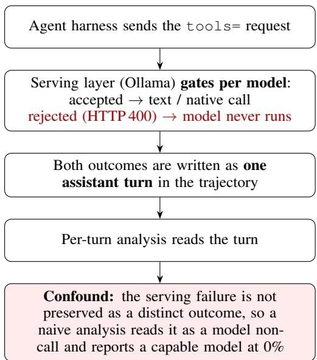
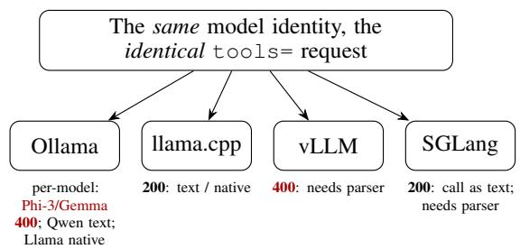
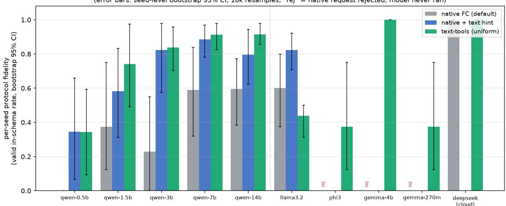
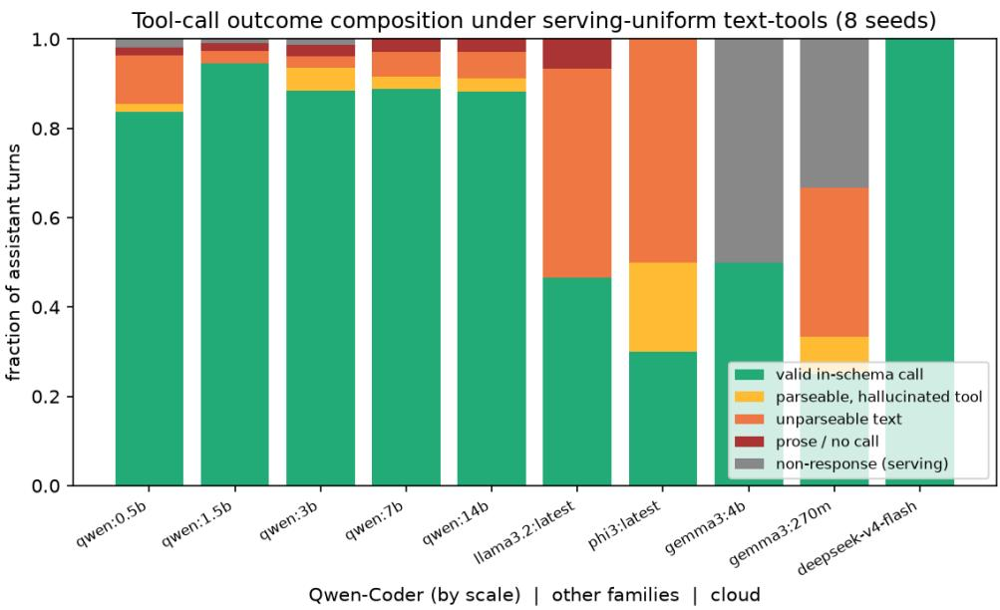

# Measuring the Serving Stack Instead of the Model: Hidden Confounds in Local Tool-Use Evaluation

Lijuan Tang Northeastern University, Seattle tang.lij@northeastern.edu

Yuemeng Zheng Northeastern University, Seattle zheng.yuem@northeastern.edu

## Abstract

A coding agent must emit a valid tool call—a parseable invocation of a tool in the provided schema—before the harness can execute its chosen action. We study how local serving stacks affect this protocol step and show that measured outcomes can depend on the serving layer rather than model behavior alone. In Ollama, the default tools= request is gated per model by a static template flag: some models are accepted and return calls as text, some return native tool\_calls, while Phi-3 and Gemma-3 are rejected before inference. In our harness, rejection and retry exhaustion are not preserved as structured failure metadata, so downstream analysis can misclassify them as model non-calls and naively report 0% fidelity. Adding a text tool list while retaining the native channel recovers much of the measured fidelity for accepted models, whereas a uniform text protocol reduces fidelity for Llama-3.2, which has native tool-call support. Crossstack probes on Ollama, llama.cpp, vLLM, and SGLang show different handling of the same request. Constrained decoding removes parse failures but can induce non-termination, and turn-pooled versus per-instance estimates differ by up to about 55 points. We conclude with a checklist for treating serving behavior as part of the evaluation protocol.

## 1 Introduction

A coding-agent loop assumes the model can reliably emit a tool call the harness can execute. This is a protocol step, separate from the semantic step of choosing the right tool. We wanted to measure, on small local models, how often this step succeeds. The measurement turned out to be the problem (Fig. 1). Our contribution is therefore not another tool-use benchmark but a measurement study: it shows that serving-layer behavior can systematically confound the evaluation of local coding agents, so a standard setup can measure the stack rather than the model.

  
Figure 1: How the serving layer silently contaminates the measurement. The harness records a refused request as an ordinary non-call turn: the transport error is received but not persisted as structured metadata, so a downstream per-turn analysis reads it as a model that declined to call a tool unless it string-matches the harness’s error text (§5).

Every local agent stack interposes a serving layer between the harness and the model weights, and that layer decides how a tool-call request is handled before the model is ever consulted. We use Ollama as the primary case study and llama.cpp as a cross-check, but the mechanism is a property of the serving layer, not of either library. With models served through Ollama’s OpenAI-compatible endpoint, the default harness sends the tools= parameter, and Ollama gates that request per model using a static flag in the model template rather than the model’s generated behavior. On one fixed stack we see three behaviors. Qwen2.5-Coder (all sizes) accepts tools= and returns the call as text. Llama-3.2 returns native tool\_calls. Phi-3 and Gemma-3 have the request rejected with HTTP 400 “does not support tools”. The harness retries, gives up, and writes a generic error string into the trajectory as an assistant turn (§5); the error type is not preserved, so a downstream per-turn analysis reads it as a model that chose not to call a tool. A capable model is then reported at 0% because its request never ran, and the failure is silent.

We summarize the serving-layer mechanics this depends on in §3.

This is not a claim that small models are good or bad at tool use. It is a validity threat that is easy to miss, because the contaminated number looks like an ordinary result. We make the point precise with a set of experiments and one negative result:

• Native function calling (FC)—the path in which the harness passes tool schemas in the request’s tools= field for the server to route to the model, rather than describing them in the prompt text—silently contaminates the measurement through request rejection (Phi-3, Gemma-3 reported at 0% without running) and through model non-responses, both logged as ordinary non-call turns.

• A control arm separates the channel from the prompt. By “channel” we mean whether tool schemas travel in the tools= field or as prompt text. For models the server accepts, keeping the native channel but adding a text tool list and call format to the prompt recovers most of the fidelity; for Llama-3.2, the uniform text protocol lowers it. The best configuration is model-dependent.

• A four-stack check shows the same weights that Ollama rejects run on llama.cpp, while vLLM refuses the same request by default and SGLang accepts it but returns the call as text: four stacks handle the identical request differently, so the outcome is a serving-stack property, not the model.

• The fidelity number is not robust. Turnpooled and per-seed rates differ by up to about 55 points because one looping episode dominates the pool, on thin denominators.

• A constrained-decoding baseline makes every model emit a valid call by construction, but makes the weaker models loop without terminating, which moves the failure instead of removing it.

• Negative result. We could not support claims about scale, family, or reasoning at this measurement precision, and we say so explicitly instead of asserting them.

The contribution is a measurement caveat and a checklist, not a leaderboard.

## 2 Related Work

Function-calling evaluation. BFCL (Patil et al., 2025), from the Gorilla line of work connecting LLMs to external APIs (Patil et al., 2023), is the standard function-calling leaderboard and distinguishes native FC mode from prompting mode, where tools are supplied in the prompt; our texttools condition is an instance of prompting mode, and our control arm sits between the two. BFCL can serve models locally, retains raw responses, and already reports empty-turn and API-error categories, so separating infrastructure outcomes from model outcomes is not itself new. What it does not do is treat the serving interface as an experimental variable: it evaluates through per-model handlers and reports aggregate accuracy rather than a perturn outcome composition on a held-fixed stack, so per-model request gating inside a local serving layer is not isolated. Our contribution is that controlled isolation across serving stacks, not the first separation of infrastructure outcomes. Agent and tool-use benchmarks such as AgentBench (Liu et al., 2024), τ-bench (Yao et al., 2024), and Tool-Sandbox (Lu et al., 2024) evaluate richer multi-turn and stateful interaction, and τ-bench likewise finds tool-use behavior unreliable across repeated trials; but they target hosted or fixed model endpoints and do not isolate the local serving stack as a source of measurement error. Coding-agent harnesses such as SWE-agent (Yang et al., 2024) standardize the agent-computer interface and do persist structured per-step records; the conflation we document is a property of the particular ReAct harness we instrument, which retains only the assistant message stream (§5), and we make no claim about harnesses we did not run.

Serving backends and harnesses as measurement variables. Closest to our setting, Pape et al. (2026) quantify how the choice of inference backend alone changes LLM outputs and undermines reproducibility, and Harness-Bench (Yao et al., 2026) measures how the agent harness, with the model held fixed, shifts outcomes in realistic agent workflows. Both establish infrastructure as a first-class source of variance. Neither examines the per-model tools= gate inside a local serving layer, nor the recording of a refused request as a model non-call, which is the specific mechanism we isolate.

Constrained decoding as the local remedy. The standard fix for unparseable tool calls on local models is grammar-constrained or schema-guided decoding (e.g. GBNF grammars, Outlines (Willard and Louf, 2023), vLLM guided decoding, Ollama structured output), which constrains the format at the token level; Zhang et al. (2023) apply finitestate decoding specifically to tool calls to eliminate syntax errors by construction. We do not propose a fix; we include constrained decoding only as a baseline (§4) to show the protocol failures are removable by construction, and we measure how the unconstrained default setups mismeasure the model.

Tool hallucination and failure taxonomies. PA-Tool (Lee et al., 2025) names “schema misalignment”, the hallucination of absent tool names, which we observe as one outcome category. MAST (Cemri et al., 2025) catalogs agent failures on capable models and does not address the local serving layer. Across these lines of work, existing benchmarks implicitly assume the serving layer is transparent; our study questions that assumption.

## 3 Method

Background: the tools= request and the serving layer. In the OpenAI-compatible protocol that local servers expose, a tool-call request carries a tools array of function specifications— each a name, a description, and a JSON-Schema parameter object—alongside the messages. The model never receives that array directly. The serving layer must first render the specifications into the prompt using the model’s chat template, and then parse the generated text back into a structured tool\_call. Both steps happen outside the weights, so whether a server performs them is determined by the model’s template and the server’s launch configuration rather than by what the model can do. Ollama exposes this per model as a capabilities list through /api/show, and documents tools as usable only “if supported”; vLLM and SGLang instead require an explicit --tool-call-parser before an accepted call is recognized as one. The same request and the same weights can therefore yield different recorded outcomes on different stacks (Fig. 2).

Harness and per-turn taxonomy. We use an offthe-shelf ReAct coding-agent harness, an extension of LOCA-bench (Zeng et al., 2026), on a fixed aggregation task that requires several tool calls. We label every assistant turn: valid in-schema call, hallucinated call (parseable, tool not found), unparseable text, no-call prose, and non-response (the harness wrote its retry-exhaustion error, §5). Protocol fidelity is the valid-in-schema-call rate over turns the model actually produced, so nonresponses are excluded from the denominator and reported separately. We run 8 seeds per model and report both the turn-pooled rate and the perseed mean (each episode weighted equally) with a seed-level bootstrap 95% CI (10,000 resamples of the per-seed rates); proportions on 4–8 seeds are non-normal, so the bootstrap is more honest than a normal ±SE interval. We write “seed” throughout for a task instance (the harness’s episode index), not a decoder RNG seed: decoding is sampled at T=1.0 and is not held fixed, so variation across seeds mixes task and sampling variation (§6).

Three serving conditions. (i) native: harness default, sends tools=; on Ollama this is gated per model. (ii) native+hint: tools= still sent, plus a plain-text tool list and an explicit JSON call format with an allowed-name list injected into the prompt; this isolates the prompt guidance from the serving channel and is only defined for models the server accepts. The hint is a single fixed rendering used for every model, not tuned per model: the tool schemas as prose plus a strict JSON call format, mirroring BFCL’s prompting mode (Patil et al., 2025). The explicit allowed-name list targets a known, model-agnostic failure mode, tool-name hallucination (Lee et al., 2025), rather than any one model’s weakness, so it is a standard control rather than a hand-optimized prompt. (iii) texttools: tools= dropped, the same text guidance in the prompt, calls parsed from text; uniform across all models. We additionally probe a constraineddecoding setup (§4).

Models. Qwen2.5-Coder 0.5B/1.5B/3B/7B/14B, Llama-3.2-3B, Phi-3-mini, Gemma-3-4B, Gemma-3-270m, served locally via Ollama, plus deepseek-v4-flash (cloud) as a high-capability anchor. The local set spans the checkpoints a practitioner actually obtains from a default ollama pull at laptop scale and deliberately mixes models with and without native tool training, because that mix is what exposes the per-model gate; it is a stress test of the serving layer rather than a survey of current agent-oriented models, and the cloud anchor is considerably newer than the local set. Exact tags, quantization, and versions are in §6.

## 4 Results

Native FC mismeasures, two ways (Fig. 3, gray; Fig. 4). Under native FC, a naive per-turn analysis reports Phi-3 and Gemma-3 at 0%; in fact 100% of their turns are rejected requests, so the model never ran and the rate is properly undefined (marked “rej” in Fig. 3 and Table 1). The second mechanism is non-response: Gemma-3-4B, for instance, emits one valid call per seed and then fails to respond, which the naive denominator would count against it (Fig. 4, gray band).

The prompt, not the channel, drives the accepted-model gap (Fig. 3). For every model the server accepts, adding the text hint while keeping the native channel raises per-seed fidelity substantially (Qwen 0.5B–14B: 0/38/23/59/60% native → 35/58/82/89/80% native+hint), and native+hint is close to the uniform text-tools rate. So the low native numbers reflect a default call path without explicit format guidance, not model inability. Llama-3.2 is the informative exception: native+hint reaches 82% but the uniform text-tools protocol drops it to 44%, because Llama-3.2 has real native tool\_calls support that the text protocol discards. The best-performing interface is model-dependent, so no single serving configuration maximizes measured fidelity for every model.

The rejection is stack policy, not the model (Fig. 2). The same GGUF weights that Ollama rejects with HTTP 400 run when served by llama.cpp: Phi-3 and Gemma-3 both return a (text) response under an identical tools= request, while Qwen-0.5B’s text call and Llama-3.2’s native call are reproduced on both stacks (Table 2). These apparent 0% outcomes are therefore artifacts of that stack’s tool-gating policy rather than measurements of model behavior. A third stack, vLLM, makes the point sharper by failing differently: with its default launch it refuses the same tools= request outright (HTTP 400, “’auto’ tool choice requires

  
Figure 2: Identical request, different serving outcomes. Four serving stacks handle the corresponding model checkpoints and identical tools= request differently, so what a naive evaluator records as model (in)ability is set by the serving stack and its configuration, not the model. (Ollama and llama.cpp probed across models; vLLM and SGLang default behavior confirmed on Qwen/Phi-3.)

--enable-auto-tool-choice and --tool-call-parser”), independent of the model: the identical error is returned for the models we probed in the default vLLM path (Qwen-0.5B and Phi-3), as the check precedes model dispatch. Enabling those flags with the hermes parser makes vLLM accept the request (HTTP 200), but for the two small models we probed the call still did not surface as a native tool\_call: Qwen2.5-Coder-0.5B emitted the call as a fenced JSON block the parser did not extract, and Phi-3 produced prose. A fourth stack, SGLang, differs from vLLM again: by default it accepts the request (HTTP 200) but returns the call as text rather than a native tool\_call unless launched with --tool-call-parser (confirmed on Qwen-0.5B and Phi-3), so even the two modern production stacks disagree on the default handling. Whether a request is refused, and whether a call is recognized once accepted, are governed by the serving stack and its launch configuration, not by the model.

The fidelity number is not robust (Table 1). Turn-pooled and per-seed rates diverge sharply when a model produces one long looping episode. Qwen-0.5B under text-tools is 85% pooled but 34% per-seed: seven of eight episodes fail in one or two turns while a single 41-turn episode of repeated valid calls dominates the pool. Denominators are as small as 8–16 turns over 8 seeds for the weaker models, so the seed-level bootstrap 95% CIs are correspondingly wide: Qwen-0.5B text-tools is 34% [9, 59], Phi-3 38% [12, 75], and Gemma-3- 270m 38% [12, 75] (Fig. 3 error bars), intervals far too wide to rank these models against each other.

Constrained decoding removes the protocol failures, at a cost. As a baseline we constrain decoding to a JSON schema whose name field is an enum of the available tools (Ollama structured outputs). On a single tool-call step, all nine local models, including the three that scored lowest under text-tools (Llama-3.2, Phi-3, Gemma-3- 270m), emit a valid in-schema call on 8 of 8 trials: parseability and in-schema names hold by construction. We do not run this as a full agentic condition because it removes the model’s ability to stop. Forced to emit a tool call on every turn, the weaker models never terminate, producing 600–900-turn loops within a single episode (Qwen-0.5B reached 869 assistant turns in one seed before we cut it off). Constrained decoding thus fixes the protocol layer we measure but trades an unparseable-call failure for a non-termination failure on weak models, a further sign that the configuration governs the observed failure.

Replication on a second task (Table 3). Because Ollama refuses the tools= request before the prompt is processed, the rejection is a property of the model–serving pair and should be task-independent. We confirm this on a structurally different dependency-chain task (trace a multi-hop chain across modules and implement compute\_total, scored by import). The native tool-gating replicates exactly: Phi-3 and Gemma-3 are rejected with HTTP 400, Llama-3.2 returns a native call, and Qwen is accepted as text. Under the text-tools protocol (4 seeds), the same qualitative pattern recurs: per-seed fidelity rises roughly with Qwen scale (44% → 100%) with the pooled rate again inflated by looping episodes; Gemma-3-4B again emits a valid call and then fails to respond (4 non-responses); and the magnitudes are task-dependent (Llama-3.2 falls to 12% per-seed here, versus 60% on aggregation) and noisy at these small denominators. The replication supports the measurement caveat and the fragility of the numbers, not a stable cross-model ranking.

Replication on HumanEval. To check the confound is not an artifact of our own task design, we repeat the single-turn measurement on HumanEval (Chen et al., 2021), a widely used code benchmark, framing each problem as a tool-call task in which the model submits its solution by calling one tool. The native gating replicates exactly: Phi-3 and Gemma-3 are rejected with HTTP 400 while Qwen and Llama-3.2 are accepted. Under the texttools protocol the valid-call rate again rises with Qwen scale (4/6, 5/6, 6/6 for 0.5B/1.5B/3B) and the family-specific failure modes recur (Gemma-3-270m 0/6, every response unparseable prose; Gemma-3-4B 2/6), while Llama-3.2 reaches $6 / 6 .$ Magnitudes are task-dependent and $n { = } 6$ , so this is an external-validity check on the gating and the failure modes, not a precise rate.

<table><tr><td>model</td><td>native seed (pool)</td><td>native+hint seed (pool)</td><td>text-tools seed (pool)</td></tr><tr><td>Qwen-0.5B</td><td>0 (0)</td><td>35 (29)</td><td>34 (85)</td></tr><tr><td>Qwen-1.5B</td><td>38 (24)</td><td>58 (91)</td><td>74 (95)</td></tr><tr><td>Qwen-3B</td><td>23 (79)</td><td>82 (96)</td><td>84 (90)</td></tr><tr><td>Qwen-7B</td><td>59 (79)</td><td>89 (80)</td><td>91 (89)</td></tr><tr><td>Qwen-14B</td><td>60 (74)</td><td>80 (71)</td><td>92 (88)</td></tr><tr><td>Llama-3.2-3B</td><td>60 (62)</td><td>82 (89)</td><td>44(47)</td></tr><tr><td>Phi-3-mini</td><td>rej</td><td></td><td>38 (30)</td></tr><tr><td>Gemma-3-4B</td><td>rej</td><td></td><td>100 (100)</td></tr><tr><td>Gemma-3-270m</td><td>rej</td><td></td><td></td></tr><tr><td></td><td></td><td></td><td>38 (38)</td></tr><tr><td>deepseek (cloud)</td><td>100 (100)</td><td></td><td>100 (100)</td></tr></table>

Table 1: Protocol fidelity as per-seed mean with turnpooled rate in parentheses, in percent. “rej” = the native request was rejected on all 8 seeds, so native fidelity is undefined, not 0%. Per-seed and pooled diverge most where a model loops (e.g. Qwen-0.5B text-tools 34 vs 85), which is why we report both.

What we do not claim. The per-seed rates show some variation with model size within the Qwen family and across families, but the intervals overlap and the estimates depend on the pooling choice, so we do not claim a scale law, a family or tooltraining effect, or a dissociation from reasoning. We ran a small no-tools reasoning probe while exploring those questions; it was not conclusive and we omit it to avoid over-reading.

## 5 The harness conflates serving failures with model non-calls

The contamination is silent because of how the trajectory represents the failure, not because the failure leaves no trace. The transport evidence does arrive: Ollama refuses the request with HTTP 400 and the message “does not support tools”. But in the stack we used, when the request is rejected or retries are exhausted, the inference wrapper collapses that response into an assistant message whose content is a generic error string (e.g. "Failed to get response after multiple retries."), and the error type is not persisted into the saved trajectory. The transport failure is therefore detectable, but its structured failure type is not preserved. A downstream per-turn analysis that reads the message stream sees an ordinary non-call assistant turn and attributes it to the model, unless it knows to string-match the harness’s specific error text; we separated rejection and non-response from genuine model behavior only by adding such a match. Structured benchmarks like BFCL (Patil et al., 2025) do track decode and empty-response states, and harnesses that keep structured per-step records can too: what fails is the particular combination we instrument, in which only the message stream is retained. This is a correctable defect in the trajectory representation, and preserving structured error metadata is the first item on our checklist (§7). The per-model tool-gating that produces the rejections in the first place is a property of the serving stack rather than the benchmark, and better logging does not remove it.

Serving / prompting configuration governs measured protocol fidelity (error bars: seed-level bootstrap 95% Cl, 10k resamples; "rej" = native request rejected, model never ran)  
  
Figure 3: Per-seed protocol fidelity (valid in-schema rate, seed-level bootstrap 95% CI over 8 seeds, 10,000 resamples) under three configurations. “rej” marks models whose native request was rejected by Ollama on every seed (the model never ran). For accepted models, adding a text hint to the native call (blue) recovers most of the fidelity, so the native channel itself is not the bottleneck; Llama-3.2 is the exception, where the uniform text-tools protocol (green) discards its real native support and lowers fidelity.

## 6 Reproducibility

The primary Ollama and llama.cpp runs are local and CPU-only, except for the cloud anchor. The vLLM and SGLang cross-stack probes use standard GPU serving setups. Models are Ollama tags qwen2.5-coder:{0.5b,1.5b,3b,7b, 14b}, llama3.2:latest, phi3:latest, gemma3:{4b,270m} at Ollama’s default quantization (Q4\_K\_M for these tags); the cloud anchor is deepseek-v4-flash. The serving behavior is Ollama-version-dependent: the per-model tools= gating and the HTTP 400 “does not support tools” contract are properties of the Ollama release (we used Ollama 0.30.8) and must be pinned to reproduce the native-mode result. Our native-mode claims are scoped to that release: the mechanism (a per-model template flag consulted before dispatch) is structural, but which tags are gated is a release-level policy that can change, and we do not claim the specific per-model outcomes hold for later releases. The cross-stack check uses llama.cpp llama-server with --jinja on the same GGUF weights. The vLLM and SGLang probes use Qwen-0.5B and Phi-3 on the upstream Hugging Face checkpoints on a GPU host (vLLM on a T4, SGLang on an A800 80GB): by default vLLM rejects the tools= request until launched with --enable-auto-tool-choice and a --tool-call-parser, while SGLang accepts it but returns the call as text unless launched with --tool-call-parser; the exact package versions and launch commands are in the released probe scripts. Decoding used temperature 1.0, top-p 1.0. The three conditions correspond to environment flags (none), TOOL\_HINT, and TEXT\_TOOLS; the patch to the harness, the task config, the per-turn classifier, the bootstrap-CI script, the figures, and the probes are available at https://github.com/LijuanTang94/ serving-confound-repo. Scope of reproducibility. The qualitative findings are deterministic and version-pinned: the per-model rejection, the cross-stack contrast, and the prompt-recovers-fidelity result reproduce exactly given the same Ollama release. The per-seed magnitudes do not reproduce to the digit, because decoding is sampled (T=1.0) and our seeds index task instances rather than the sampling RNG; a re-run yields the same pattern (rejection, looping-inflated pooled rates, thin-n variance) with different exact percentages. This is the fragility we report, not a defect of it.

  
Figure 4: Per-turn outcome composition under the uniform text-tools protocol (8 seeds), including a non-response band. Gemma-3-4B’s apparent all-valid behavior is half non-responses; the fidelity rate (valid over produced turns) excludes these, which is why it must be reported alongside the non-response share, not alone.

## 7 Discussion: why this will get worse

The confound we report is not a one-off quirk of one library. It is a structural consequence of how local agent stacks are assembled, and the trend is toward more layers between the harness and the model, not fewer. A modern agent request passes through a harness, a tool-protocol adapter, a serving engine (Ollama, vLLM, llama.cpp), and a per-model chat template, each of which can accept, rewrite, or reject a tool call independently of the model’s ability. The Model Context Protocol and similar tool-calling standards plausibly add yet another translation step, though we have not measured this and offer it as conjecture rather than a finding. Hosted APIs are not exempt in principle— a provider that refuses a tools= request for an unsupported model, or returns a call the client fails to parse, yields the same recorded outcome—but that gate is opaque and we did not probe it. Every such layer is a place where a request can fail for reasons that have nothing to do with the model, and where that failure can be logged in a way a naive evaluator reads as a model error. As more practitioners evaluate small or local agents for cost and privacy reasons, and as the stacks they use grow more complex, the gap between “what the model can do” and “what the measurement records” widens.

What is the evaluation target? A fixed serving interface is appropriate when the goal is to compare model behavior under a standardized protocol: the interface is then part of the controlled measurement instrument. A different target is the performance of a deployable model–server system, where modelspecific parsers, templates, or serving options may reasonably be enabled. These two questions should not be conflated. Our checklist recommendation to hold the serving interface fixed applies to standardized model comparisons; system-level evaluations should instead report the full model–server configuration as part of the system being evaluated.

The remedy is cheap but has to be deliberate:

<table><tr><td>model</td><td>Ollama llama.cpp</td><td></td><td>vLLM SGLang</td></tr><tr><td>Qwen-0.5B</td><td>200 txt</td><td>200 txt 400†</td><td>200 txt</td></tr><tr><td>Llama-3.2</td><td>200 nat</td><td>200 nat</td><td></td></tr><tr><td>Phi-3</td><td>400 rej</td><td>200 txt</td><td>400† 200 txt</td></tr><tr><td>Gemma-3-270m 400 rej</td><td></td><td>200 txt</td><td></td></tr></table>

Table 2: Cross-stack handling of the same tools= request for the same models (identical GGUF weights on Ollama and llama.cpp; upstream Hugging Face checkpoints on the vLLM and SGLang probes). Cells give the HTTP status and mode: txt = call returned as text, nat = native tool\_call, rej = request rejected. Models Ollama rejects per model (the silent 0%) run on llama.cpp, and models both stacks serve are handled consistently. †vLLM refuses the request by default, independent of the model, until launched with --enable-auto-tool-choice and a --tool-call-parser (once enabled, neither probed model produced a native call). SGLang instead accepts the request by default but returns an unparsed text call unless launched with --tool-call-parser. vLLM and SGLang were confirmed on Qwen-0.5B and Phi-3; — = not probed on that stack. The handling is a stack-and-configuration policy, not a model property.

<table><tr><td>A protocol for measuring local-agent tool use. Measure: 1. For standardized model comparisons, hold</td></tr><tr><td>the serving interface fixed across models and pin and report the stack and its ver- sion. 2. Log a transport- or serving-level fail- ure (rejected request, timeout, empty re-</td></tr><tr><td>sponse) as a distinct outcome, never as a model non-call. 3. Report per-seed rates with intervals, not a single turn-pooled number. Diagnose a 0% tool-call rate, in order:</td></tr><tr><td>1. Did the serving layer refuse or empty the request (HTTP 4xx, retry exhaustion)? If so, the model never ran. 2. Is a tool-call parser configured for this stack and model? An accepted request</td></tr></table>

A refused or empty request is thus a first-class evaluation outcome, not a framework-compatibility bug: any benchmark or harness that runs models through a serving stack should record and report it as its own category. Concretely, future localagent benchmarks should report the serving configuration (stack, version, tool-call parser) alongside the model identity, just as they already report decoding parameters and hardware. Treating this as a measurement-design requirement, rather than a per-tool quirk, is becoming as important to agent evaluation as the benchmarks themselves.

<table><tr><td>model</td><td>native FC</td><td>text-tools seed (pool), n</td></tr><tr><td>Qwen-0.5B</td><td>text</td><td>44 (80), 15</td></tr><tr><td>Qwen-1.5B</td><td>text</td><td>81 (88), 16</td></tr><tr><td>Qwen-3B</td><td>text</td><td>87 (83), 12</td></tr><tr><td>Qwen-7B</td><td>text</td><td>85 (88), 26</td></tr><tr><td>Qwen-14B</td><td>text</td><td>100 (100), 29</td></tr><tr><td>Llama-3.2-3B</td><td>native</td><td>12 (20), 5</td></tr><tr><td>Phi-3-mini</td><td>rejected</td><td>50 (50), 4</td></tr><tr><td>Gemma-3-4B</td><td>rejected</td><td>100 (100), 4</td></tr><tr><td>Gemma-3-270m</td><td>rejected</td><td>0 (0), 4</td></tr></table>

Table 3: Second task (dependency-chain), 4 seeds. “native FC” is the serving handling (identical to Table 1: Qwen accepted as text, Llama native, Phi-3/Gemma rejected with HTTP 400). “text-tools” is per-seed fidelity with the pooled rate in parentheses and n produced turns. The native gating, the pooled-vs-per-seed gap, and Gemma-3-4B’s valid-then-non-respond pattern all recur; magnitudes are task-dependent and noisy at these small n. Gemma-3-4B’s 100% comes from only 4 produced turns amid non-responses and should be read together with Fig. 4, not as strong performance.

## 8 Conclusion

Native function calling on a local server gates the tool-call request per model and records a refused or empty request as an ordinary non-call turn, so a capable model can be measured at 0% without ever running. A control arm shows that for accepted models the default native path under-measures fidelity for lack of prompt guidance rather than ability, that forcing a uniform text protocol can instead hurt a model with real native support, and a crossstack check confirms the rejection is stack policy. Together with the large gap between pooled and per-seed estimates, the lesson is a measurement checklist for small or local agents: for standardized model comparisons hold the serving interface fixed, separate a refused or empty request from a model non-call, and report per-seed rates with intervals. Otherwise the instrument measures the serving stack, not the model.

## Limitations

Serving stacks and scope. The confound is not specific to one stack: we confirm the per-request gating onfour serving stacks (Ollama, llama.cpp, vLLM, SGLang; Table 2), which handle the identical request differently. We report per-seed fidelity on two tasks (aggregation, Table 1, 8 seeds; dependency-chain, Table 3, 4 seeds), both on Ollama, plus a single-turn replication on HumanEval; the gating and the fragility of the numbers replicate across all three tasks, but per-seed magnitudes are task-dependent, so we do not generalize them. Whether the per-seed fidelity magnitudes transfer across stacks is untested; request handling is stack- and configuration-dependent across the four systems we probe. The vLLM and SGLang probes cover only Qwen-0.5B and Phi-3, so their default-handling results are claims about those two model–stack pairs rather than about either stack in general. Thin denominators and pooling. The weaker models produce 8–16 turns over 8 seeds; per-seed and pooled rates diverge, and we report both. Constrained-decoding baseline is singleturn. Its numbers come from a single tool-call step, not a full agentic run, because the agentic version did not terminate on weak models; it shows parseability is recoverable but not multi-turn be havior under constraint. Hint design. The text hint includes an allowed-name list; a weaker hint might recover less, so “the prompt drives $\mathrm { i t } ^ { \prime \prime }$ is specific to this guidance. Omitted probe. We collected a reasoning probe but omit it because it was inconclusive; we therefore make no reasoning claim. Few-seed fragility. An earlier 3-seed pilot of ours showed a clean curve that 8 seeds dissolved; smallmodel rates are high-variance.

## References

Mert Cemri, Melissa Z. Pan, Shuyi Yang, Lakshya A. Agrawal, Bhavya Chopra, Rishabh Tiwari, Kurt Keutzer, Aditya Parameswaran, Dan Klein, Kannan Ramchandran, Matei Zaharia, Joseph E. Gonzalez, and Ion Stoica. 2025. Why do multi-agent LLM systems fail? arXiv preprint arXiv:2503.13657.

Mark Chen et al. 2021. Evaluating large language models trained on code. arXiv preprint arXiv:2107.03374.

Jonggeun Lee, Woojung Song, Jongwook Han, Haesung Pyun, and Yohan Jo. 2025. Don’t adapt small language models for tools; adapt tool schemas to the models. arXiv preprint arXiv:2510.07248. ACL 2026.

Xiao Liu et al. 2024. AgentBench: Evaluating LLMs as agents. In International Conference on Learning Representations (ICLR).

Jiarui Lu et al. 2024. ToolSandbox: A stateful, conversational, interactive evaluation benchmark for LLM tool use capabilities. arXiv preprint arXiv:2408.04682.

David Pape, Jonathan Evertz, and Lea Schönherr. 2026. The silent hyperparameter: Quantifying the impact of inference backends on LLM reproducibility. arXiv preprint arXiv:2605.19537.

Shishir G. Patil, Huanzhi Mao, et al. 2025. The Berkeley function calling leaderboard (BFCL): From tool use to agentic evaluation of large language models. In International Conference on Machine Learning (ICML). Leaderboard: https://gorilla.cs. berkeley.edu/leaderboard.html.

Shishir G. Patil, Tianjun Zhang, Xin Wang, and Joseph E. Gonzalez. 2023. Gorilla: Large language model connected with massive APIs. arXiv preprint arXiv:2305.15334.

Brandon T. Willard and Rémi Louf. 2023. Efficient guided generation for large language models. arXiv preprint arXiv:2307.09702.

John Yang et al. 2024. SWE-agent: Agent-computer interfaces enable automated software engineering. arXiv preprint arXiv:2405.15793.

Shunyu Yao et al. 2024. τ-bench: A benchmark for toolagent-user interaction in real-world domains. arXiv preprint arXiv:2406.12045.

Yilun Yao, Xinyu Tan, Chao-Hsuan Liu, Yaoming Li, Zhengyang Wang, Wenhan Yu, Zhewen Tan, Yuxuan Tian, Guangxiang Zhao, Lin Sun, Xiangzheng Zhang, and Tong Yang. 2026. Harness-Bench: Measuring harness effects across models in realistic agent workflows. arXiv preprint arXiv:2605.27922.

Weihao Zeng, Yuzhen Huang, and Junxian He. 2026. LOCA-bench: Benchmarking language agents under controllable and extreme context growth. arXiv preprint arXiv:2602.07962.

Kexun Zhang, Hongqiao Chen, Lei Li, and William Wang. 2023. Don’t fine-tune, decode: Syntax errorfree tool use via constrained decoding. arXiv preprint arXiv:2310.07075.