# MemoryAthena: Adaptive Routing over Latent and Generated Memories

Mingyuan Li1,2, Guangsheng Yu3, Juyuan Zhang4, Xu Wang3, Zhibo Man1,2, Haonan Zhang5, and Shaoxiong Ji1,2

1ELLIS Institute of Finland 2University of Turku 3University of Technology Sydney 4University of Science and Technology of China 5Shanghai Jiao Tong University

## Abstract

Learned-memory methods store information in an explicit table and consume it through a separate reader, allowing addressing, storage, and reading to be modified independently. Prior work on cross-model memory transfer exploits this separation to reuse learned memory across frozen backbones through an adapted reader, while the representation consumed by the model still originates from stored memory. This raises a natural question: must useful memory always be retrieved from storage, or can it also be generated? We investigate this question with MemoryAthena, a memory interface with three pathways: direct Engram retrieval (E), generation from retrieved Engram cues (GE), and generation from causal backbone states without consulting the memory table (GH). Generated memory is not uniformly better than direct retrieval: it can complement E in one context but interfere with it in another. MemoryAthena therefore treats E as an explicit anchor and learns when a generated representation should intervene. With the backbone, memory, generators, and readers frozen, a lightweight causal routing head is trained from counterfactual future-token likelihood advantages of GE and GH relative to E. At inference time, an admitted candidate modifies the E residual through bounded interpolation, while rejection recovers the direct pathway exactly. On question answering, MemoryAthena raises the five-task average from 37.65 to 39.28 over the direct pathway of the same checkpoint, while the six-task general-NLP average increases from 76.73 to 79.13. The complete memory-side system contains approximately 201M parameters, excluding the frozen backbone. Further analyses show that the utility of E, GE, and GH varies across tasks and inputs, while gold-label oracles reveal additional complementarity among the three pathways. These results support generated memory as a selective correction to direct retrieval rather than a universal replacement, and highlight routing when, which, and how strongly to intervene as the central challenge.

Project page: https://olaresearch.org/MemoryATHENA   
GitHub code: https://github.com/OLAResearch/ATHENA   
Hugging Face models: https://huggingface.co/collections/OLAResearchX/memoryathena

## 1 Introduction

Retrieval-augmented generation supplies a language model with external text (Lewis et al., 2020), nearest-neighbor language models supply examples drawn from a non-parametric datastore (Khandelwal et al., 2020), and learned-memory approaches supply trainable representations read at inference time (Wei et al., 2025; Cheng et al., 2026). All three pass a stored item to the model unchanged. Engram makes that structure explicit by keeping memory outside the backbone, storing information in an addressable table and consuming it through a lightweight neural interface (Cheng et al., 2026). Prior work treats such a memory as a reusable artifact across language-model backbones and separates a memory system into three roles (Li et al., 2026). Addressing determines where to access, memory stores the representations, and reading transforms a retrieved representation into a form the backbone can consume. None of the systems above asks whether a memory representation must be retrieved from a stored table, or whether useful memory can instead be generated.

Treating memory as reconstruction rather than literal readout makes the question tractable. An addressable memory supplies an index or a cue, from which a neural model can reconstruct a richer internal representation conditioned on its current context. The stored memory then need not be the final representation injected into the model, and is instead a substrate from which a latent memory representation is generated. Generation also need not start from an external lookup, because the model’s own causal hidden states may already carry enough contextual evidence to construct a useful latent representation. Two forms of generation therefore accompany direct memory access, one conditioned on retrieved memory cues and one conditioned on the model’s causal context.

Building on the addressing, memory, and reader decomposition of prior work (Li et al., 2026), this paper considers three memory pathways. Direct Engram retrieval (E) follows the conventional interface and reads an addressable memory entry unchanged. Generation from retrieved Engram cues (GE) treats those cues as conditions for a latent memory representation that the backbone consumes in its place. Generation from causal backbone states (GH) forms that representation without reading the external memory table. The three difer in how far the representation entering the model departs from what storage holds, ranging from direct retrieval through retrieval-conditioned generation to context-conditioned generation. GE and GH are alternative memory-side representations attached to the same frozen backbone rather than additional language models.

Generated memories are not uniformly better than direct retrieval. A generated representation can be highly useful for one input yet unnecessary or even harmful for another. This heterogeneity is precisely what makes generated memory a routing problem rather than a replacement problem: if GE or GH were consistently superior to E, one could simply replace the direct pathway. Instead, the useful regime is selective intervention, where a strong direct-memory pathway is retained and generated memory is introduced only when it is expected to add value. The resulting decision is asymmetric. Conventional conditional routing chooses among several equivalent experts (Shazeer et al., 2017), whereas here E already provides a strong direct-memory reference. The model must therefore determine whether a generated memory should intervene, which generated pathway should be used, and how strongly it should modify the direct representation. Learning these decisions from general text rather than downstream task labels makes the problem particularly challenging.

This paper proposes MemoryAthena, an E-anchored framework for integrating direct and generated memories. Rather than routing symmetrically among E, GE, and GH, MemoryAthena treats E as an explicit reference. A lightweight causal head predicts the E-relative advantage and confidence of each generated candidate, which is admitted only when both exceed the routing criteria. The resulting memory residual is

$$
r = e + \alpha ( g - e ) , \qquad 0 \leq \alpha \leq 1 ,\tag{1}
$$

where α controls the intervention strength. If no generated candidate is admitted, the model recovers the direct E pathway exactly. Generated memory is thus treated as a candidate correction rather than a replacement for direct retrieval.

To train the router without downstream labels, we freeze the backbone, memory, generators, and readers and compare the E, GE, and GH endpoints under teacher forcing. For a generated source s, we define its token-level advantage over E as

$$
a _ { s , t } = \log p _ { s } ( x _ { t + 1 } \mid x _ { \leq t } ) - \log p _ { E } ( x _ { t + 1 } \mid x _ { \leq t } ) ,\tag{2}
$$

and aggregate these diferences over multiple future horizons to supervise the routing head. Future tokens are used only to construct training targets; at inference time, routing remains causal. Memory selection therefore becomes an E-relative utility prediction problem. Our contributions are threefold:

• From memory retrieval to memory generation. Building on the decomposition of external memory into addressing, storage, and reading (Li et al., 2026), we introduce a three-path memory interface spanning direct retrieval (E), generation from retrieved Engram cues (GE), and generation from causal backbone states (GH). We use it to investigate whether the representation consumed by a language model must be explicitly stored, or can instead be generated from memory cues or contextual states.

• Routing under heterogeneous memory utility. We formulate generated memory as a conditional intervention problem: GE and GH can complement direct retrieval, but neither is uniformly preferable. MemoryAthena therefore retains E as an explicit reference and learns when, which, and how strongly a generated representation should intervene, using bounded interpolation with exact fallback to the direct pathway.

• Counterfactual advantage distillation without downstream supervision. We construct routing targets from future-token likelihood diferences among frozen memory pathways and distill them into a lightweight causal head. This separates learning how to construct memory representations from learning when to use them.

We evaluate MemoryAthena on question answering and general NLP tasks. It improves all five QA summary metrics and five of six NLP tasks over the direct-memory pathway of the same checkpoint. Analyses of the individual endpoints reveal complementary successful predictions across E, GE, and GH.

## 2 Background and Problem Setup

External and learned memory. A language model can reach information its backbone parameters do not hold, by retrieval or by learned memory. Retrieval-augmented generation conditions the output on retrieved text (Lewis et al., 2020), while kNN-LMs interpolate neural predictions with a distribution drawn from a nearest-neighbor datastore (Khandelwal et al., 2020). Learned-memory approaches move the memory into trained representations instead, so that MLP Memory learns a parametric memory module (Wei et al., 2025) and Engram introduces an addressable conditional memory based on causal N-gram lookup (Cheng et al., 2026). Engram is the direct memory substrate throughout, and the one thing varied here is how the representation consumed by the backbone is constructed from that stored memory or built beside it.

Reusable memory and target-side reading. Cross-model memory transfer separates a memory system into three roles (Li et al., 2026). Addressing determines what memory is accessed, memory holds the reusable representations, and reading adapts a retrieved representation to the target backbone. A memory learned with one language model can then remain frozen and be reused by another backbone through an adapted target-side reader. The stored representation and the representation the model finally consumes therefore need not be identical, which is the property this paper builds on.

Let $x _ { 1 : T }$ be a token sequence and $f _ { \theta }$ a frozen autoregressive backbone. An addressable memory $M _ { \phi }$ retrieves

$$
m _ { t } = M _ { \phi } [ \mathsf { c a n o n } ( x _ { \le t } ) ] ,\tag{3}
$$

where canon(·) denotes the canonical addressing rule. A reader then maps the retrieved memory and the current hidden state $h _ { t } ^ { \ell }$ into a residual contribution that is injected as

$$
h _ { t } ^ { \ell } \gets h _ { t } ^ { \ell } + r _ { t } ^ { \ell } .\tag{4}
$$

MemoryAthena starts from this addressing, memory and reader view.

From memory reading to memory generation. If the representation consumed by the backbone is already produced through a learned interface, it need not be obtained by reading the stored memory directly, and three alternatives follow. The E pathway reads the retrieved Engram representation directly and produces a residual $e _ { t } ^ { \ell } .$ The GE pathway generates a latent memory representation conditioned on retrieved Engram cues, producing $g _ { \mathrm { G E } , t } ^ { \ell }$ . The GH pathway generates a latent memory representation from causal backbone states without consulting the external memory table, producing $g _ { \mathrm { G H } , t } ^ { \ell ^ { - } }$ . All three are residual representations in the same target hidden-state space, attached to the same frozen backbone.

For s ∈ {E,GE,GH}, we denote by $p _ { s }$ the endpoint distribution obtained when pathway s is used throughout the configured memory-injection sites, and these endpoints are the common reference against which direct and generated memory representations are compared.

Conditional routing over memory representations. Mixture-of-experts methods learn inputdependent combinations of expert outputs (Shazeer et al., 2017; Fedus et al., 2022), and memoryaugmented language models have used learned selection mechanisms (Merity et al., 2017). Our setting is asymmetric. E is already a usable direct-memory pathway, whereas GE and GH are candidate modifications to that reference. The decision is therefore whether a generated representation provides additional utility over E, which candidate should intervene, and how strongly it should modify the direct residual. Section 3 develops the routing mechanism for this E-relative decision.

## 3 METHOD

MemoryAthena separates memory construction from memory selection. Training proceeds in three stages. First, an addressable memory is learned under causal language-modeling supervision while the source backbone is frozen. Second, the memory and target backbone are fixed, and the memoryside interfaces are adapted to construct the direct pathway E and the generated pathways GE and GH. Third, all memory pathways are frozen and only a lightweight routing head is trained to predict the E-relative utility of GE and GH from counterfactual future-token supervision. The model therefore first learns how to construct candidate memory representations and then learns when and how strongly a generated representation should modify the direct memory. Detailed objectives, architectures, and optimization settings are provided in Appendix C.2026/9/20 13:28 MemoryAthena: E-

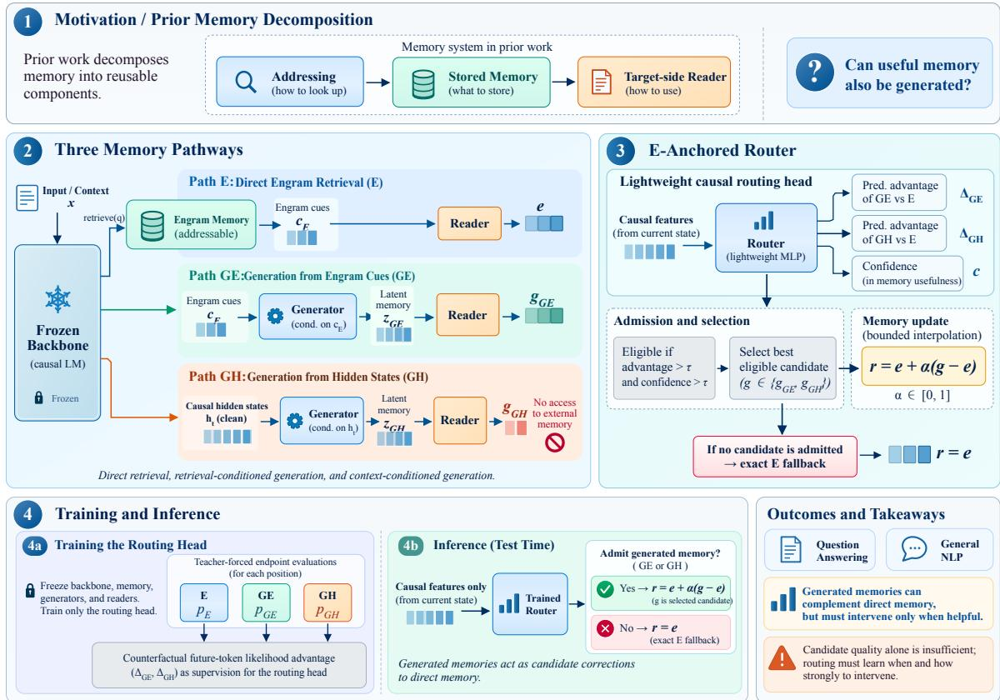  
Figure 1: Overview of MemoryAthena. The framework extends direct Engram retrieval (E) with two generated-memory pathways, generation from retrieved Engram cues (GE) and generation from causal backbone states (GH). A lightweight E-anchored router predicts the relative advantage of GE and GH, conditionally admits a generated candidate, and controls its contribution through bounded interpolation with exact fallback to E. The routing head is trained from counterfactual future-token likelihood diferences while the memory pathways remain frozen.

## 3.1 Stage1: Direct and Generated Memory Pathways

We consider a frozen autoregressive backbone augmented with three memory-side pathways that difer in how the representation injected into the backbone is constructed. Let $h _ { t } ^ { \ell }$ denote the backbone hidden state at position t and injection layer ℓ, and let $m _ { t }$ denote the representation retrieved from the addressable Engram memory. The three pathways produce residual contributions in the same target hidden space:

$$
e _ { t } ^ { \ell } = R _ { \mathrm { E } } ^ { \ell } \left( h _ { t } ^ { \ell } , m _ { t } \right) ,\tag{5}
$$

$$
\begin{array} { r } { g _ { \mathrm { G E } , t } ^ { \ell } = R _ { \mathrm { G E } } ^ { \ell } \left( h _ { t } ^ { \ell } , z _ { \mathrm { E } , t } ^ { \ell } \right) , } \end{array}\tag{6}
$$

$$
\begin{array} { r } { g _ { \mathrm { G H } , t } ^ { \ell } = R _ { \mathrm { G H } } ^ { \ell } \big ( h _ { t } ^ { \ell } , z _ { \mathrm { H } , t } ^ { \ell } \big ) . } \end{array}\tag{7}
$$

The E pathway directly reads the retrieved Engram representation. The GE pathway first generates a latent memory representation $z _ { \mathrm { E } , t } ^ { \ell }$ conditioned on retrieved Engram cues and then maps it into the backbone hidden space. The GH pathway instead generates $z _ { \mathrm { H } , t } ^ { \ell }$ from causal backbone states obtained in a separate pass with memory injection disabled.

GE and GH are memory-side representations rather than independent language models, and all three pathways operate around the same frozen backbone.

## 3.2 Stage2: E-Relative Advantage Distillation

Generated memory is not uniformly preferable to direct memory. We therefore treat the direct E pathway as an explicit reference and learn whether each generated candidate is expected to improve upon it. After the memory pathways have been learned, we freeze the backbone, memory, generators and readers. For each endpoint $s \in \{ \mathrm { E } , \mathrm { G E } , \mathrm { G H } \}$ , we obtain a next-token distribution $p _ { s }$ by using that pathway alone under teacher forcing. For a generated source $s \in \{ \mathrm { G E } , \mathrm { G H } \}$ , we define its token-level advantage relative to E as

$$
a _ { s , t } = \log p _ { s } ( x _ { t + 1 } \mid x _ { \leq t } ) - \log p _ { \mathrm { E } } ( x _ { t + 1 } \mid x _ { \leq t } ) .\tag{8}
$$

A positive value indicates that the generated pathway assigns greater likelihood to the observed future token than the direct-memory pathway. Token-level advantages are aggregated over multiple future positions to obtain a smoother training target, denoted by $A _ { s , t }$ . A lightweight routing head predicts an advantage and a confidence score $c _ { s , t }$ for each generated candidate:

$$
\begin{array} { r } { \left( \widetilde { A } _ { s , t } ^ { \ell } , c _ { s , t } ^ { \ell } \right) = q ^ { \ell } \left( \mathrm { s t o p g r a d } \left( \phi _ { s , t } ^ { \ell } \right) \right) , } \end{array}\tag{9}
$$

where $\phi _ { s , t } ^ { \ell }$ denotes current-state features available up to position $t ,$ including the backbone hidden state and statistics of the direct and generated memory residuals. The scalar $\widehat { A } _ { s , t } ^ { \ell }$ predicts how much pathway s is expected to improve over $\mathrm { E } ,$ while $c _ { s , t } ^ { \ell }$ provides an additional confidence signal for admission. The stopgrad operator keeps the routing loss from updating the backbone or the memory pathways. Only $q ^ { \dot { \ell } }$ is trained. Future tokens enter only the E-relative advantage targets during training, and at inference time the router relies on current-state features alone. Appendix C specifies the feature set $\phi$ and the routing objective.

## 3.3 Stage3: E-Anchored Memory Routing

At inference time, GE and GH are treated as candidate corrections to the direct E pathway rather than as symmetric experts.

For each generated source $s \in \{ \mathrm { G E } , \mathrm { G H } \}$ , we test whether its predicted advantage and confidence satisfy the admission criteria:

$$
\mathcal { C } _ { t } ^ { \ell } = \left\{ s \in \left\{ \mathrm { G E , G H } \right\} \bigg | \widetilde { A } _ { s , t } ^ { \ell } > \tau , \quad \sigma \big ( { c } _ { s , t } ^ { \ell } \big ) \geq \rho \right\} ,\tag{10}
$$

where $\tau$ and $\rho$ are the advantage and confidence thresholds. If at least one generated source is eligible, the router selects the candidate with the largest predicted advantage: $s ^ { \star } = \arg \operatorname* { m a x } _ { s \in \mathcal { C } _ { t } ^ { \ell } } \widehat { A } _ { s , t } ^ { \ell } .$ The selected generated representation modifies the direct residual through bounded interpolation:

$$
r _ { t } ^ { \ell } = e _ { t } ^ { \ell } + \alpha _ { t } ^ { \ell } \left( g _ { s ^ { \star } , t } ^ { \ell } - e _ { t } ^ { \ell } \right) , \qquad 0 \le \alpha _ { t } ^ { \ell } \le 1 .\tag{11}
$$

Algorithm 1: MemoryAthena   
Input: Direct residual e; generated residuals gGE and gGH; routing head q; thresholds τ and $\rho ;$   
maximum scale $a _ { \mathrm { m a x } } ;$ temperature $T _ { \alpha }$   
Output: Memory residual r   
// // Predict E-relative advantage   
$( \widehat { A } _ { s } , c _ { s } ) _ { s \in \{ \mathrm { G E } , \mathrm { G H } \} } $ q(current-state features);   
// // Admit only beneficial generated memories   
$\mathcal { C } \gets \{ s \in \{ \mathrm { G E , G H } \} : \widehat { A } _ { s } > \tau \ \land \ \sigma ( c _ { s } ) \geq \rho \} ;$   
$\mathbf { i f } ~ { \mathcal { C } } = \emptyset$ then   
return e [exact E fallback];   
$\textit { 1 1 } \textit { 1 } \textit { 1 }$ Select the best generated candidate   
$s ^ { \star }  \arg \operatorname* { m a x } _ { s \in \mathcal { C } } \widehat { A } _ { s } ;$   
// // Determine intervention strength   
$\begin{array} { r } { \alpha \gets a _ { \mathrm { m a x } } \mathrm { c l i p } \left( \frac { \widehat { A } _ { s } \star - \tau } { T _ { \alpha } } , 0 , 1 \right) \sigma ( c _ { s } \star ) ; } \end{array}$   
// // Apply an E-anchored correction   
$r \gets e + \alpha \big ( g _ { s ^ { \star } } - e \big ) ;$   
return r;

The interpolation strength $\alpha _ { t } ^ { \ell }$ increases with the predicted utility and confidence of the selected candidate. Algorithm 1 uses maximum scale $a _ { \operatorname* { m a x } } = 1$ and temperature $T _ { \alpha } = 0 . 1 5$ . If no generated source is admitted, we set $\alpha _ { t } ^ { \ell } = 0$ and then $r _ { t } ^ { \ell } = e _ { t } ^ { \ell }$

The resulting residual is injected into the backbone as $h _ { t } ^ { \ell } \gets h _ { t } ^ { \ell } + r _ { t } ^ { \ell } .$ . E therefore holds a privileged role. Generated memory modifies the direct-memory contribution only when it is predicted to be useful, and rejection recovers the direct E pathway exactly at the corresponding injection site.

## 4 Experiments

We evaluate whether generated memory improves a direct reader, whether its pathways provide complementary answers, and whether E-relative admission and the reader interface explain the gains. The primary backbone is Mistral-7B-v0.3 (Jiang et al., 2023), with memory injected at layers 2 and 10 through a four-branch reader following Li et al. (2026). Llama-2-7B (Touvron et al., 2023) supplies the imported source memory and is the target backbone in the cross-backbone transfer row. We compare frozen inference rules within a shared checkpoint on five QA benchmarks and six classification tasks. Dataset definitions, scoring, sample counts, and training budgets appear in Appendices A and D.

## 4.1 RQ1: When does generated memory improve a strong direct-memory pathway?

Table 1 reports the QA results together with literature baselines, individual pathways, alternative routing rules and cross-backbone transfer, and Table 2 reports the six general NLP tasks.

Compared routing strategies. E only, GE only, and GH only force one memory pathway throughout inference. Ordinary hard routing treats the three pathways as symmetric candidates and selects a single pathway, while ordinary soft fusion combines their representations using learned routing weights. The subset hard and subset soft variants restrict routing to a learned subset of sources. The hard variant makes a discrete routing decision within that subset, whereas the soft variant fuses the subset with learned weights. MemoryAthena instead treats E as the reference pathway throughout. GE or GH modifies E only when the predicted E-relative advantage and confidence satisfy the admission criteria, and the selected representation is combined with E through bounded interpolation. Appendix C defines the subset-routing controls.

QA performance. The individual pathways show that generated memory is useful but not uniformly better than direct retrieval. GE improves WebQA from 33.35 to 35.24 but is weaker than E on TriviaQA and HotpotQA, and GH is weaker than E on all five QA summary metrics. This makes unconditional replacement of E undesirable.

Table 1: QA comparison, routing-policy analysis, and cross-backbone transfer on Natural Questions (NQ), WebQuestions (WebQA), TriviaQA, TruthfulQA and HotpotQA. Average is the unweighted mean of four F1 scores and one TruthfulQA multiple-choice (MC) summary.
<table><tr><td>Method / Inference rule</td><td>NQ↑</td><td>WebQA↑</td><td>TriviaQA ↑</td><td>TruthfulQA↑</td><td>HotpotQA ↑</td><td>Average ↑</td></tr><tr><td colspan="7">Reported baselines</td></tr><tr><td>Base (Vanilla Mistral)</td><td>20.60</td><td>29.30</td><td>57.70</td><td>32.10</td><td>21.00</td><td>32.14</td></tr><tr><td>RAG</td><td>22.60 +2.00</td><td>24.90-4.40</td><td>54.20-3.50</td><td>35.50+3.40</td><td>29.80+8.80</td><td>33.40 (+3.9%)</td></tr><tr><td>kNN-LM</td><td>21.10+0.50</td><td>30.50+1.20</td><td>57.80+0.10</td><td>32.30+0.20</td><td>21.20+0.20</td><td>32.58 (+1.4%)</td></tr><tr><td>CPT</td><td>12.20-8.40</td><td>34.10+4.80</td><td>61.20+3.50</td><td>29.20-2.90</td><td>16.00-5.00</td><td>30.54 (-5.0%)</td></tr><tr><td>LoRA</td><td>18.20-2.40</td><td>34.50+5.20</td><td>61.60 +3.90</td><td>30.90-1.20</td><td>16.20-4.80</td><td>32.28 (+0.4%)</td></tr><tr><td>MLP Memory</td><td>25.20+4.60</td><td>37.50+8.20</td><td>61.00 +3.30</td><td>32.50+0.40</td><td>24.10+3.10</td><td>36.06 (+12.2%)</td></tr><tr><td colspan="7">Shared-checkpoint memory pathways</td></tr><tr><td>E only</td><td>28.28 +7.68</td><td>33.35 +4.05</td><td>69.34+11.64</td><td>31.25-0.85</td><td></td><td>26.04+5.04 37.65(+17.1%)</td></tr><tr><td>GE only</td><td>28.75 +8.15</td><td>35.24+5.94</td><td>58.62 +0.92</td><td>31.14-0.96</td><td>23.18 +2.18</td><td>35.39 (+10.1%)</td></tr><tr><td>GH only</td><td>24.55 +3.95</td><td>30.80+1.50</td><td>56.70-1.00</td><td>31.04-1.06</td><td>22.95+1.95</td><td>33.21 (+3.3%)</td></tr><tr><td colspan="7">Alternative routing and fusion rules</td></tr><tr><td>Ordinary hard routing</td><td>26.69 +6.09</td><td>35.13 +5.83</td><td>61.80+4.10</td><td>31.18-0.92</td><td>24.36+3.36</td><td>35.83 (+11.5%)</td></tr><tr><td>Ordinary soft fusion</td><td>19.66-0.94</td><td>26.05-3.25</td><td>46.36-11.34</td><td>31.13-0.97</td><td>19.91 -1.09</td><td>28.62 (-10.9%)</td></tr><tr><td>Subset hard routing</td><td>28.42 +7.82</td><td>33.30+4.00</td><td>69.38+11.68</td><td>31.55-0.55</td><td>26.06+5.06</td><td>37.74 (+17.4%)</td></tr><tr><td>Subset soft fusion</td><td>23.17 +2.57</td><td>28.71-0.59</td><td>44.37-13.33</td><td>31.89-0.21</td><td>19.27-1.73</td><td>29.48 (-8.3%)</td></tr><tr><td colspan="7">Cross-backbone transfer and E-anchored routing</td></tr><tr><td>Mistral Zero-shot → Llama</td><td>29.98 +9.38</td><td>36.40+7.10</td><td>67.39 +9.69</td><td>30.41-1.69</td><td>25.17 +4.17</td><td>37.87 (+17.8%)</td></tr><tr><td>MEMORYATHENA</td><td>33.02+12.42 34.60+5.30</td><td></td><td>70.68+12.98</td><td>31.74-0.36</td><td>26.34+5.34</td><td>39.28 (+22.2%)</td></tr></table>

The alternative routing rules lead to the same conclusion. Ordinary hard routing reaches an average of 35.83, while ordinary soft fusion falls to 28.62. The stronger subset-hard control reaches 37.74, but remains below MemoryAthena at 39.28. Relative to the same-checkpoint E pathway, MemoryAthena improves all five QA metrics, by 4.74 points on NQ, 1.25 on WebQA, 1.34 on TriviaQA, 0.49 on TruthfulQA, and 0.30 on HotpotQA. The average increases from 37.65 to 39.28. These results indicate that the benefit comes from conditionally modifying a strong direct-memory pathway rather than simply combining all available representations.

After transferring the memory interface from Mistral to Llama, the resulting system reaches an average of 37.87 and remains competitive with the same-checkpoint Mistral E pathway. In particular, WebQA increases to 36.40. Because the target backbone and adaptation history difer, this row shows that the memory interface remains usable after transfer rather than a matched gain over a bare Llama model.

General NLP performance. Across the six NLP tasks, MemoryAthena improves over E by 3.90 points on SST2, 3.70 on MR, 1.70 on CR, 1.50 on RT, and 3.71 on AGN. For these five tasks, we use the default admission threshold τ = 0. For Yahoo, we use the more conservative setting τ = 1, under which the router reaches 57.43 compared with 57.51 for E. With these task-specific inference settings, the six-task average increases from 76.73 to 79.13.

Takeaway. The benefit of generated memory is heterogeneous across tasks and inputs: neither GE nor GH uniformly dominates direct Engram retrieval. This is precisely the regime targeted by MemoryAthena, which retains E as a stable reference and selectively admits generated memories only when they are predicted to help.

## 4.2 RQ2: What drives the gains from the memory interface?

We examine whether the gains arise from the memory interface itself, its initialization, or the learned routing policy. We therefore compare MemoryAthena with retrained architectural controls, a from-scratch memory variant, and a random-router control.

Table 2: Six-task NLP accuracy (%) on SST2, MR, CR, RT, AG News (AGN) and Yahoo Answers. Small signed values are percentage-point diferences from the Full-choice dCPMI Base.
<table><tr><td>Method</td><td>SST2 ↑</td><td>MR↑</td><td>CR↑</td><td>RT↑</td><td>AGN↑</td><td>Yahoo ↑</td><td>Average ↑</td></tr><tr><td colspan="8">Full-choice dCPMI baseline</td></tr><tr><td>Mistral-7B-v0.3</td><td>81.08</td><td>75.60</td><td>74.00</td><td>74.67</td><td>73.24</td><td>55.03</td><td>72.27</td></tr><tr><td colspan="8">Non-parametric methods (reported)</td></tr><tr><td>RAG</td><td>87.20 +6.12 83.70+8.10</td><td></td><td></td><td></td><td></td><td></td><td>71.55 -2.45 82.36 +7.69 75.64 +2.40 58.43 +3.40 76.48 (+5.8%)</td></tr><tr><td>kNN-LM</td><td>82.15+1.07</td><td>76.85+1.25</td><td>61.70-12.30 74.95+0.28</td><td></td><td>76.13+2.89</td><td>56.26+1.23</td><td>71.34 (-1.3%)</td></tr><tr><td colspan="8">Parametric methods (reported)</td></tr><tr><td>CPT</td><td>87.09 +6.01</td><td>82.85 +7.25</td><td>82.60 +8.60 77.48 +2.81</td><td></td><td>83.10+9.86</td><td></td><td>51.56-3.47 77.45(+7.2%)</td></tr><tr><td>LoRA</td><td>86.54+5.46</td><td>83.20+7.60</td><td>75.10+1.10 79.83+5.16</td><td></td><td>65.46-7.78</td><td>57.30+2.27</td><td>74.57 (+3.2%)</td></tr><tr><td>MLP Memory</td><td>83.19+2.11</td><td>79.90+4.30</td><td>75.95+1.95 75.42+0.75</td><td></td><td>80.28+7.04</td><td></td><td>57.33 +2.30 75.35 (+4.3%)</td></tr><tr><td colspan="8">This study</td></tr><tr><td>E only</td><td>84.17 +3.09 81.00 +5.40</td><td></td><td>82.40 +8.40 82.36 +7.69</td><td></td><td>72.93-0.31 57.51 +2.48 76.73(+6.2%)</td><td></td><td></td></tr><tr><td>MEMORYATHENA 88.07+6.99 84.70+9.10 84.10+10.10 83.86+9.19 76.64+3.40 57.43+2.40 79.13(+9.5%)</td><td></td><td></td><td></td><td></td><td></td><td></td><td></td></tr></table>

Table 3: QA ablations (%): four open-QA F1 scores and TruthfulQA MC mean. Base is the reported Vanilla Mistral from Li et al. (2026). Average is the unweighted five-task mean.
<table><tr><td>Condition</td><td>NQ↑</td><td>WebQA↑</td><td>TriviaQA ↑</td><td>TruthfulQA ↑</td><td>HotpotQA ↑</td><td>Average ↑</td></tr><tr><td>Base (Vanilla Mistral, reported)</td><td>20.60</td><td>29.30</td><td>57.70</td><td>32.10</td><td>21.00</td><td>32.14</td></tr><tr><td>Ours, pretrained memory</td><td>33.02 +12.42</td><td></td><td>34.60+5.30 70.68+12.98</td><td>31.74-0.36</td><td>26.34+5.34</td><td>39.28 (+22.2%)</td></tr><tr><td>Ours, from scratch</td><td>33.79+13.19</td><td>34.26+4.96</td><td>72.97 +15.27</td><td>32.09 -0.01</td><td>27.71 +6.71</td><td>40.16(+25.0%)</td></tr><tr><td colspan="7">Interface and addressing controls</td></tr><tr><td>No gate Permuted Engram keys</td><td>27.49+6.89 32.72+12.12</td><td>30.88+1.58 31.24+1.94</td><td>55.15-2.55</td><td>32.15+0.05</td><td>21.10+0.10</td><td>33.35 (+3.8%)</td></tr><tr><td></td><td></td><td>Routing control</td><td>70.06+12.36</td><td>32.62+0.52</td><td>26.24+5.24</td><td>38.58 (+20.0%)</td></tr><tr><td colspan="7"></td></tr><tr><td>Random router</td><td>25.00+4.40</td><td>31.86+2.56 Alternative interfaces</td><td>49.18-8.52</td><td>31.76-0.34</td><td>20.55-0.45</td><td>31.67 (-1.5%)</td></tr><tr><td colspan="7"></td></tr><tr><td>Parameter-matched FFN</td><td>14.10-6.50</td><td>23.81-5.49</td><td>41.61 -16.09</td><td>30.56-1.54</td><td>14.50-6.50</td><td>24.92 (-22.5%)</td></tr><tr><td>Affine stitch</td><td>32.06+11.46</td><td>30.95+1.65</td><td>67.49 +9.79</td><td>32.58 +0.48</td><td>25.98+4.98</td><td>37.81 (+17.6%)</td></tr></table>

Architectural controls. The full model outperforms the no-gate and afine-stitch variants on four of five QA metrics and the parameter-matched FFN on all five. Removing the gate reduces the five-task average from 39.28 to 33.35, while replacing the interface with a parameter-matched FFN reduces it further to 24.92. These results support the importance of the learned memory interface rather than parameter count alone.

Memory initialization. Training the memory system from scratch reaches an average of 40.16, slightly above the pretrained-memory configuration at 39.28. The pretrained memory initialization is therefore not required for the observed gains in this setup; the learned interface can recover strong performance when trained jointly from scratch.

Learned routing. The random-router control provides a direct test of whether exposing the model to multiple memory pathways is suficient without learning when to use them. Its five-task average is 31.67, compared with 39.28 for MemoryAthena, a decrease of 7.61 points. The degradation is especially large on TriviaQA, where F1 falls from 70.68 to 49.18, and is also substantial on NQ and HotpotQA. Thus, the gain cannot be explained simply by making E, GE, and GH available: learning a selective routing policy is critical for exploiting their complementary behavior.

Complete ablation metrics are reported in Appendix G.

Takeaway. The gains depend strongly on the learned memory interface and routing policy. Random routing reduces the five-task average from 39.28 to 31.67, showing that access to multiple memory pathways alone is insuficient. At the same time, training from scratch slightly exceeds the pretrained-memory configuration, suggesting that the main benefit comes from learning how to construct and select useful memory representations rather than from a specific pretrained memory initialization.

## 4.3 RQ3: How does MemoryAthena use complementary memory pathways?

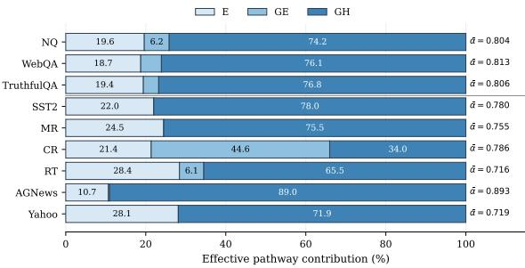  
(a) Downstream memory-pathway contribution.

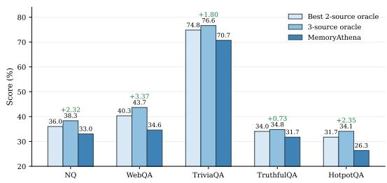  
(b) Gold-label oracle headroom.  
Figure 2: Left: efective downstream contribution of E, GE, and GH across tasks. Right: comparison between deployed MemoryAthena and gold-label source oracles, showing the remaining routing headroom.

The previous results establish that generated memory can improve downstream performance, but not how the router combines the three pathways. We therefore analyze the downstream routing behavior and, separately, use a label-informed oracle to estimate how much complementary information remains unexploited.

Downstream routing behavior. When a generated pathway $s ^ { \star }$ is admitted, the efective memory contribution can be written as

$$
( w _ { \mathrm { E } } , w _ { \mathrm { G E } } , w _ { \mathrm { G H } } ) = \big ( 1 - \alpha , \alpha { \bf 1 } [ s ^ { \star } = \mathrm { G E } ] , \alpha { \bf 1 } [ s ^ { \star } = \mathrm { G H } ] \big ) .\tag{12}
$$

We aggregate these efective weights over downstream inference to characterize how much each pathway contributes to the injected memory representation.

Figure 2a shows task-dependent routing. On the available QA traces, GH provides the majority of the memory contribution, 74.15% on NQ, 76.08% on WebQA, and 76.77% on TruthfulQA, whereas GE contributes 3.83–6.23%. A similar preference for GH appears on several classification tasks, including SST2 (77.99%), MR (75.50%), AGN (89.03%), and Yahoo (71.86%).

CR is the counterexample. There GE receives 44.60% of the contribution, against 34.04% for GH and 21.36% for E, and RT also retains a larger direct-memory component (28.42%). The mean interpolation strength ranges from 0.716 to 0.893. An admitted generated memory therefore typically makes a large correction to the direct representation. These percentages are efective interpolation weights. Because E retains the (1 − α) component whenever GE or GH is admitted, a source’s contribution difers from the fraction of tokens routed exclusively to it.

Oracle headroom. The routing statistics describe what the deployed router does, whereas a post-hoc source oracle estimates the gain that was attainable. It observes the downstream label and selects the highest-scoring endpoint among the available pathways. The three-source oracle improves over the best E-containing two-source oracle on every task, with gains of 2.32 points on NQ, 3.37 on WebQA, 1.79 on TriviaQA, 0.73 on TruthfulQA, and 2.35 on HotpotQA (Figure 2b). This means that GE and GH provide successful predictions on examples that are not captured by a single generated pathway. A gap remains between the label-informed oracle and the deployed causal router. The three-source oracle exceeds MemoryAthena by 5.31 points on NQ, 9.07 on WebQA, 5.94 on TriviaQA, 3.04 on TruthfulQA, and 7.74 on HotpotQA. Diverse memory representations are already available, and much of their potential therefore depends on identifying when a generated memory is useful and which generated pathway should intervene.

Takeaway. The utility of E, GE, and GH is strongly task-dependent, confirming that no single memory pathway is uniformly preferable. Gold-label oracles exceed the deployed router by 3.04– 9.07 points, showing that substantial complementarity among the pathways remains unexploited. The key challenge is therefore to better identify when a generated memory should intervene and which pathway is most useful.

## 5 Conclusion

MemoryAthena starts from the observation that generated memory is conditionally useful rather than uniformly superior to direct retrieval. Instead of replacing E, the method treats GE and GH as candidate corrections and learns when and how strongly they should intervene. This converts heterogeneous pathway quality into consistent gains on the QA summary metrics and improvements across the evaluated NLP setting. The remaining oracle gap suggests that better utility estimation and admission, rather than universally stronger generated memories, is a central direction for future work.

## Reproducibility statement

The appendices specify every pathway, freezing boundary, objective, admission rule and control, together with sample counts and checkpoint selection, and the accompanying evidence ledger maps each table to its artifacts. Available hashes support traceability but do not substitute for an immutable launch environment or contamination audit. Missing uncertainty estimates or functional coding scores are not inferred.

## AI assistance

An AI assistant assisted drafting, organization, and consistency checks against experiment records.   
The claims, experimental validity, and final submission remain the authors’ responsibility.

## References

J. Berant, A. Chou, R. Frostig, and P. Liang. Semantic parsing on Freebase from question-answer pairs. In D. Yarowsky, T. Baldwin, A. Korhonen, K. Livescu, and S. Bethard, editors, Proceedings of the 2013 Conference on Empirical Methods in Natural Language Processing, pages 1533–1544, Seattle, Washington, USA, Oct. 2013. Association for Computational Linguistics. URL https: //aclanthology.org/D13-1160/.

X. Cheng, R. Tian, W. Zeng, D. Dai, Q. Chen, B. Wang, Z. Xie, K. Huang, X. Yu, C. Deng, S. Zhou, C. Zhao, Z. Hao, Y. Li, H. Zhang, Z. Zhang, Y. Wei, M. Y. Xu, H. Zhang, D. Zhao, and W. Liang. Conditional memory via scalable lookup: A new axis of sparsity for large language models, 2026. URL https://arxiv.org/abs/2601.07372.

W. Fedus, B. Zoph, and N. Shazeer. Switch transformers: Scaling to trillion parameter models with simple and eficient sparsity. Journal of Machine Learning Research, 23(120):1–39, 2022. URL http://jmlr.org/papers/v23/21-0998.html.

F. Hamborg, N. Meuschke, C. Breitinger, and B. Gipp. news-please: A generic news crawler and extractor. In Proceedings of the 15th International Symposium of Information Science, pages 218–223, March 2017. doi: 10.5281/zenodo.4120316.

A. Holtzman, P. West, V. Shwartz, Y. Choi, and L. Zettlemoyer. Surface form competition: Why the highest probability answer isn’t always right. In M.-F. Moens, X. Huang, L. Specia, and S. W.-t. Yih, editors, Proceedings of the 2021 Conference on Empirical Methods in Natural Language Processing, pages 7038–7051, Online and Punta Cana, Dominican Republic, Nov. 2021. Association for Computational Linguistics. doi: 10.18653/v1/2021.emnlp-main.564. URL https://aclanthology.org/2021.emnlp-main.564/.

M. Hu and B. Liu. Mining and summarizing customer reviews. In Proceedings of the tenth ACM SIGKDD international conference on Knowledge discovery and data mining, KDD04, pages 168–177. ACM, Aug. 2004. doi: 10.1145/1014052.1014073. URL https://doi.org/10.1145/1014052. 1014073.

A. Q. Jiang, A. Sablayrolles, A. Mensch, C. Bamford, D. S. Chaplot, D. de las Casas, F. Bressand, G. Lengyel, G. Lample, L. Saulnier, L. R. Lavaud, M.-A. Lachaux, P. Stock, T. L. Scao, T. Lavril, T. Wang, T. Lacroix, and W. E. Sayed. Mistral 7B, 2023. URL https://arxiv.org/abs/2310.06825.

M. Joshi, E. Choi, D. Weld, and L. Zettlemoyer. TriviaQA: A large scale distantly supervised challenge dataset for reading comprehension. In R. Barzilay and M.-Y. Kan, editors, Proceedings of the 55th Annual Meeting of the Association for Computational Linguistics (Volume 1: Long Papers), pages 1601–1611, Vancouver, Canada, July 2017. Association for Computational Linguistics. doi: 10.18653/v1/P17-1147. URL https://aclanthology.org/P17-1147/.

U. Khandelwal, O. Levy, D. Jurafsky, L. Zettlemoyer, and M. Lewis. Generalization through memorization: Nearest neighbor language models. In International Conference on Learning Representations, 2020. URL https://openreview.net/forum?id=HklBjCEKvH.

T. Kwiatkowski, J. Palomaki, O. Redfield, M. Collins, A. Parikh, C. Alberti, D. Epstein, I. Polosukhin, J. Devlin, K. Lee, K. Toutanova, L. Jones, M. Kelcey, M.-W. Chang, A. M. Dai, J. Uszkoreit, Q. Le, and S. Petrov. Natural questions: A benchmark for question answering research. Transactions of the Associationfor Computational Linguistics, 7:452–466, 2019. doi: 10.1162/tacl\_a\_00276. URL https://aclanthology.org/Q19-1026/.

P. Lewis, E. Perez, A. Piktus, F. Petroni, V. Karpukhin, N. Goyal, H. Küttler, M. Lewis, W.-t. Yih, T. Rocktäschel, S. Riedel, and D. Kiela. Retrieval-augmented generation for knowledgeintensive NLP tasks. In H. Larochelle, M. Ranzato, R. Hadsell, M. Balcan, and H. Lin, editors, Advances in Neural Information Processing Systems, volume 33, pages 9459–9474. Curran Associates, Inc., 2020. URL https://proceedings.neurips.cc/paper\_files/paper/2020/file/ 6b493230205f780e1bc26945df7481e5-Paper.pdf.

J. Li, X. Cheng, X. Zhao, J.-Y. Nie, and J.-R. Wen. HaluEval: A large-scale hallucination evaluation benchmark for large language models. In H. Bouamor, J. Pino, and K. Bali, editors, Proceedings of the 2023 Conference on Empirical Methods in Natural Language Processing, pages 6449–6464, Singapore, Dec. 2023. Association for Computational Linguistics. doi: 10.18653/v1/2023.emnlp-main.397. URL https://aclanthology.org/2023.emnlp-main.397/.

M. Li, G. Yu, X. Wang, and S. Ji. Cross-model memory transfer via target-side reader adaptation, 2026. URL https://arxiv.org/abs/2608.17050.

S. Lin, J. Hilton, and O. Evans. TruthfulQA: Measuring how models mimic human falsehoods. In S. Muresan, P. Nakov, and A. Villavicencio, editors, Proceedings of the 60th Annual Meeting of the Associationfor Computational Linguistics (Volume 1: Long Papers), pages 3214–3252, Dublin, Ireland, May 2022. Association for Computational Linguistics. doi: 10.18653/v1/2022.acl-long.229. URL https://aclanthology.org/2022.acl-long.229/.

A. L. Maas, R. E. Daly, P. T. Pham, D. Huang, A. Y. Ng, and C. Potts. Learning word vectors for sentiment analysis. In D. Lin, Y. Matsumoto, and R. Mihalcea, editors, Proceedings of the 49th Annual Meeting of the Association for Computational Linguistics: Human Language Technologies, pages 142–150, Portland, Oregon, USA, June 2011. Association for Computational Linguistics. URL https://aclanthology.org/P11-1015/.

S. Merity, C. Xiong, J. Bradbury, and R. Socher. Pointer sentinel mixture models. In International Conference on Learning Representations, 2017. URL https://openreview.net/forum?id=Byj72udxe.

B. Pang and L. Lee. Seeing stars: Exploiting class relationships for sentiment categorization with respect to rating scales. In K. Knight, H. T. Ng, and K. Oflazer, editors, Proceedings of the 43rd Annual Meeting ofthe Associationfor Computational Linguistics (ACL’05), pages 115–124, Ann Arbor, Michigan, June 2005. Association for Computational Linguistics. doi: 10.3115/1219840.1219855. URL https://aclanthology.org/P05-1015/.

N. Shazeer, A. Mirhoseini, K. Maziarz, A. Davis, Q. Le, G. Hinton, and J. Dean. Outrageously large neural networks: The sparsely-gated mixture-of-experts layer. In International Conference on Learning Representations, 2017. URL https://openreview.net/forum?id=B1ckMDqlg.

R. Socher, A. Perelygin, J. Wu, J. Chuang, C. D. Manning, A. Ng, and C. Potts. Recursive deep models for semantic compositionality over a sentiment treebank. In D. Yarowsky, T. Baldwin, A. Korhonen, K. Livescu, and S. Bethard, editors, Proceedings of the 2013 Conference on Empirical Methods in Natural Language Processing, pages 1631–1642, Seattle, Washington, USA, Oct. 2013. Association for Computational Linguistics. URL https://aclanthology.org/D13-1170/.

H. Touvron, L. Martin, K. Stone, P. Albert, A. Almahairi, Y. Babaei, N. Bashlykov, S. Batra, P. Bhargava, S. Bhosale, D. Bikel, L. Blecher, C. C. Ferrer, M. Chen, G. Cucurull, D. Esiobu, J. Fernandes, J. Fu, W. Fu, B. Fuller, C. Gao, V. Goswami, N. Goyal, A. Hartshorn, S. Hosseini, R. Hou, H. Inan, M. Kardas, V. Kerkez, M. Khabsa, I. Kloumann, A. Korenev, P. S. Koura, M.-A. Lachaux, T. Lavril, J. Lee, D. Liskovich, Y. Lu, Y. Mao, X. Martinet, T. Mihaylov, P. Mishra, I. Molybog, Y. Nie, A. Poulton, J. Reizenstein, R. Rungta, K. Saladi, A. Schelten, R. Silva, E. M. Smith, R. Subramanian, X. E. Tan, B. Tang, R. Taylor, A. Williams, J. X. Kuan, P. Xu, Z. Yan, I. Zarov, Y. Zhang, A. Fan, M. Kambadur, S. Narang, A. Rodriguez, R. Stojnic, S. Edunov, and T. Scialom. Llama 2: Open foundation and fine-tuned chat models, 2023. URL https://arxiv.org/abs/2307.09288.

R. Wei, J. Cao, J. Wang, J. Kai, Q. Guo, B. Zhou, and Z. Lin. MLP memory: A retriever-pretrained memory for large language models, 2025. URL https://arxiv.org/abs/2508.01832.

Z. Yang, P. Qi, S. Zhang, Y. Bengio, W. Cohen, R. Salakhutdinov, and C. D. Manning. HotpotQA: A dataset for diverse, explainable multi-hop question answering. In E. Rilof, D. Chiang, J. Hockenmaier, and J. Tsujii, editors, Proceedings of the 2018 Conference on Empirical Methods in Natural Language Processing, pages 2369–2380, Brussels, Belgium, Oct.-Nov. 2018. Association for Computational Linguistics. doi: 10.18653/v1/D18-1259. URL https://aclanthology.org/D18-1259/.

X. Zhang, J. Zhao, and Y. LeCun. Character-level convolutional networks for text classification. In C. Cortes, N. Lawrence, D. Lee, M. Sugiyama, and R. Garnett, editors, Advances in Neural Information Processing Systems, volume 28. Curran Associates, Inc., 2015. URL https://proceedings.neurips.cc/paper\_files/paper/2015/file/ 250cf8b51c773f3f8dc8b4be867a9a02-Paper.pdf.

## A Evaluation datasets and protocol

The primary backbone is Mistral-7B-v0.3 (Jiang et al., 2023). The QA router uses Wikipedia-2021 text and imports a learned Llama-2 source memory (Touvron et al., 2023). General NLP uses an equal-token mixture of WikiText-103 (Merity et al., 2017), Amazon Polarity review text (Zhang et al., 2015), CC-News (Hamborg et al., 2017), and IMDB text (Maas et al., 2011). All parameters are frozen downstream.

QA covers Natural Questions (NQ) (Kwiatkowski et al., 2019), WebQuestions (WebQA) (Berant et al., 2013), TriviaQA (Joshi et al., 2017), TruthfulQA (Lin et al., 2022), and HotpotQA (Yang et al., 2018). We report exact match (EM) and token F1 for open QA, and the arithmetic mean of three recorded multiple-choice metrics for TruthfulQA. Sample counts are 3,609, 2,032, 17,944, 817, and 7,405. Exact metrics are retained in Appendix E.

For general NLP, SST2 (Socher et al., 2013), MR and RT (movie-review sentiment benchmarks, see Pang and Lee, 2005), and CR (Hu and Liu, 2004) test sentiment, while AG News (AGN) and Yahoo Answers test topic classification (Zhang et al., 2015). SST2 uses its development split, MR and CR use the provided test files, and RT uses the Rotten Tomatoes test split. The exact release identifiers and preprocessing lineage of these MR/RT files remain to be verified, and the citation identifies the benchmark family. Our next-token scoring adapts domain-conditional pointwise mutual information (Holtzman et al., 2021). For label-token set $V _ { y } ,$

$$
S ( y ; x ) = \sum _ { v \in V _ { y } } [ \log p ( v \mid C ( x ) ) - \log p ( v \mid C _ { \mathrm { d o m a i n } } ) ] , \qquad { \widehat { y } } = \arg \operatorname* { m a x } _ { y } S ( y ; x ) .\tag{13}
$$

Verbalizers map to their first valid token and are deduplicated following the implementation. This sums log-score diferences token by token rather than forming a log-sum-exp or a full-label likelihood. The six tasks contain 872, 2,000, 2,000, 1,066, 7,600, and 60,000 examples. We report accuracy and an unweighted six-task mean.

Our primary comparison keeps the memory and expert checkpoints fixed and changes only the inference rule, providing the cleanest assessment of routing. Retrained ablations are reported separately because they also change the learned components. The routing models are trained on general text without downstream labels.

## B Limitations and Future Work

Although MemoryAthena learns when to admit GE or GH from unlabeled text, the overall routing system still relies on memory pathways, routing features, training objectives, and admission hyperparameters. It therefore does not yet provide a fully automatic mechanism for discovering which memory representation should be constructed and used for a given input. The substantial gap between the deployed router and the gold-label source oracle further shows that the available memory pathways contain useful complementary information that the current router does not fully exploit. Developing more automated routing objectives that can jointly discover useful memory candidates, calibrate their utility, and approach oracle-level selection without downstream labels is an important direction for future work.

## C Architecture and routing implementation

## C.1 Direct and generated pathways

E directly reads retrieved memory. GE generates a small latent representation from a causal window of Engram cues. GH generates from clean causal backbone states, obtained without memory injection:

$$
\begin{array} { r l } & { \quad e _ { t } ^ { \ell } = R _ { E } ^ { \ell } ( h _ { t } ^ { \ell } , m _ { t } ) , } \\ & { \quad z _ { E , t } ^ { \ell } = G ^ { \ell } ( M _ { t - w + 1 : t } ; \mathrm { E } ) , } \\ & { \quad g _ { \mathrm { G E } , t } ^ { \ell } = R _ { G E } ^ { \ell } ( h _ { t } ^ { \ell } , z _ { E , t } ^ { \ell } ) , } \end{array}
$$

$$
\begin{array} { r l } & { ~ z _ { H , t } ^ { \ell } = G ^ { \ell } ( H _ { t - w + 1 : t } ^ { 0 , \ell } ; H ) , } \\ & { g _ { \mathrm { G H } , t } ^ { \ell } = R _ { G H } ^ { \ell } ( h _ { t } ^ { \ell } , z _ { H , t } ^ { \ell } ) . } \end{array}\tag{14}
$$

Reader notation subsumes projections, branch aggregation, and output gates. Generated paths share components and use source embeddings and low-rank adaptations. GE is grounded in retrieved cues, whereas GH can propose a representation when the table is unhelpful. This creates potential complementarity, but also makes strong performance with corrupted memory possible.

The evaluated Mistral configuration injects memory at layers 2 and 10. Memory dimension is 512 and the reader has four branches. Each generator produces four latents from a three-position causal window, with width 256, two layers, and four attention heads. Source-adaptation rank is 16. GH requires a clean backbone computation in the current implementation, and freezing its parameters does not remove this inference cost.

## C.2 Memory learning and reader adaptation

Training comprises three optimization stages followed by frozen evaluation. Stage 1 learns the table and source adaptor with the source backbone fixed:

$$
\mathcal { L } _ { \mathrm { m e m } } ( \phi , \psi _ { \mathrm { s r c } } ) = - \sum _ { t } \log p _ { \theta _ { \mathrm { s r c } } , \phi , \psi _ { \mathrm { s r c } } } ( x _ { t + 1 } \mid x _ { \le t } ) .\tag{15}
$$

The table and canonicalization configuration can be reused, but the source adaptor need not be compatible with another backbone.

Stage 2 freezes the table and target backbone and trains the generators and target-side readers. In the later general-NLP and coding pipeline, each endpoint receives equal-weight causal languagemodeling supervision:

$$
\mathcal { L } _ { \mathrm { e x p e r t s } } = - \frac { 1 } { 3 } \sum _ { s \in \{ \mathrm { E } , \mathrm { G E } , \mathrm { G H } \} } \sum _ { t } \log p _ { s } ( x _ { t + 1 } \mid x _ { \le t } ) .\tag{16}
$$

This makes the endpoints usable before their relative advantages are distilled. It does not optimize downstream labels.

The QA checkpoint also contains auxiliary routing modules used to construct the baseline inference rules in Table 1. Ordinary hard routing treats E, GE, and GH as three symmetric candidates and selects the single pathway with the highest routing score. Ordinary soft fusion instead applies learned softmax weights over all three pathways and combines their residuals continuously. The subset variants restrict routing to learned subsets of the available pathways. Subset hard routing makes a discrete choice within the selected subset, whereas subset soft fusion uses the learned mixture weights within that subset. These auxiliary routers are trained as part of the QA reader checkpoin and are used only as comparison baselines. In contrast, the final MemoryAthena router operates over E, GE, and GH using E-relative advantage prediction: E is kept as the anchor, and GE or GH modifies it only when the generated pathway is predicted to be beneficial.

## C.3 Counterfactual future-advantage supervision

Stage 3 freezes the backbone, memory, generators, and readers. Under teacher forcing, the advantage of source s over E is

$$
a _ { s , t } = \log p _ { s } ( x _ { t + 1 } \mid x _ { \leq t } ) - \log p _ { E } ( x _ { t + 1 } \mid x _ { \leq t } ) , \qquad a _ { E , t } = 0 .\tag{17}
$$

A positive advantage corresponds to a lower next-token loss than E. Each endpoint pass forces the same source at all injection sites. The advantage is therefore a full-path counterfactual and cannot be attributed to one layer.

We average over future horizons $\mathcal { H } = \left\{ 1 , 4 , 8 , 1 6 , 3 2 \right\}$ . Let $\upsilon _ { j }$ indicate a valid target and $\mathcal { H } _ { t }$ contain horizons with at least one valid target:

$$
A _ { s , t } = \frac { 1 } { | \mathscr { H } _ { t } | } \sum _ { k \in \mathcal { H } _ { t } } \frac { \sum _ { j = 0 } ^ { k - 1 } \nu _ { t + j } a _ { s , t + j } } { \sum _ { j = 0 } ^ { k - 1 } \nu _ { t + j } } .\tag{18}
$$

Out-of-range targets are excluded. Future text constructs ofline supervision only, so the deployed head sees neither future tokens nor these targets.

Table 4: Training stages and token budgets. Each optimization stage uses at most 20M processed input positions.
<table><tr><td>Stage</td><td>Trainable components</td><td>Budget</td></tr><tr><td>Memory learning</td><td>Engram memory table and source-side adaptor</td><td>20M</td></tr><tr><td>Memory-interface adaptation</td><td>GE/GH generators and target-side readers</td><td>20M</td></tr><tr><td>Router training</td><td>E-relative advantage and confidence heads</td><td>20M</td></tr><tr><td>Evaluation</td><td>None; all components are frozen</td><td></td></tr></table>

At each injection layer, the routing head predicts $\widehat { A } _ { s , t } ^ { \ell }$ and confidence logit $c _ { s , t } ^ { \ell }$ from detached causal features. Features include the hidden state, reader-gate strength, residual magnitudes, pairwise similarities, active-source indicators, and projected semantic features. E’s predicted advantage is fixed at zero. The head preserves the E stream while exposing generated alternatives as detached features.

For $s \in \{ \mathrm { G E } , \mathrm { G H } \}$ , define $u _ { s , t } = \mathrm { c l i p } ( | A _ { s , t } | , 0 . 0 1 , 2 )$ . The per-position loss is

$$
\begin{array} { r l } & { L _ { s , t } ^ { \ell } = { \mathrm { S m o o t h L 1 } } \left( \widetilde { A } _ { s , t } ^ { \ell } , \mathrm { c l i p } ( A _ { s , t } , - 2 , 2 ) \right) } \\ & { \qquad + \ : 0 . 2 5 \ : { \mathrm { B C E W i t h L o g i t s } } \left( c _ { s , t } ^ { \ell } , \sigma ( A _ { s , t } / 0 . 1 5 ) \right) . } \end{array}\tag{19}
$$

We take a valid-position, $u _ { s , t }$ -weighted average and then average injection-layer heads. Only these heads are optimized, amounting to 534,924 trainable parameters in the audited Mistral runs. Confidence is trained against an advantage-derived soft target, and it is not established to be a calibrated probability of downstream correctness.

## C.4 E-Anchored Causal Inference

At each position and injection layer, a generated pathway $s \in$ {GE, GH} is considered only if its predicted E-relative advantage exceeds τ and its confidence exceeds ρ. If both generated pathways are eligible, we select the one with the larger predicted advantage. For the selected pathway $s ^ { \star }$ , the intervention strength is

$$
\alpha _ { t } ^ { \ell } = a _ { \mathrm { m a x } } \mathrm { c l i p } \left( \frac { \widehat { A } _ { s ^ { \star } , t } ^ { \ell } - \tau } { T _ { \alpha } } , 0 , 1 \right) \sigma ( c _ { s ^ { \star } , t } ^ { \ell } ) ,\tag{20}
$$

and the memory residual is

$$
\boldsymbol { r } _ { t } ^ { \ell } = ( 1 - \alpha _ { t } ^ { \ell } ) \boldsymbol { e } _ { t } ^ { \ell } + \alpha _ { t } ^ { \ell } g _ { s ^ { \star } , t } ^ { \ell } .\tag{21}
$$

If no generated pathway is admitted, $\alpha _ { t } ^ { \ell } = 0$ and the model exactly recovers the E residual at that injection site. We use $\tau = 0 , \rho = 0 . 5 , T _ { \alpha } = 0 . 1 5$ , and $a _ { \mathrm { m a x } } = 1$ by default.

The fallback guarantees recovery of the same-checkpoint E pathway when all generated candidates are rejected, but it does not guarantee that every admitted intervention improves downstream performance because the router can make incorrect predictions. For analysis, the corresponding efective pathway weights are

$$
( w _ { \mathrm { E } } , w _ { \mathrm { G E } } , w _ { \mathrm { G H } } ) = \big ( 1 - \alpha , \alpha { \bf 1 } [ s ^ { \star } = \mathrm { G E } ] , \alpha { \bf 1 } [ s ^ { \star } = \mathrm { G H } ] \big ) .\tag{22}
$$

These weights measure contribution to the injected residual and should not be confused with discrete source-selection frequencies.

## D Training Configuration and Model Architecture

## D.1 Training Configuration

We use a common budget of 20M processed input positions for each optimization stage. The three stages separately learn the memory, adapt the generated-memory interfaces, and train the final routing head. During downstream evaluation, all model parameters are frozen.

Table 5: Router training and inference configuration for the evaluated Mistral-7B-v0.3 models.
<table><tr><td>Setting</td><td>Value</td></tr><tr><td>Packed sequence length</td><td>2,048</td></tr><tr><td>Training steps</td><td>9,765</td></tr><tr><td>Processed input positions</td><td>19,998,720</td></tr><tr><td>Validation budget</td><td>2,000,000 positions</td></tr><tr><td>Trainable router parameters</td><td>534,924</td></tr><tr><td>Router hidden width</td><td>64</td></tr><tr><td>Learning rate</td><td> $3 \times 1 0 ^ { - 4 }$ </td></tr><tr><td>Batch size</td><td>1</td></tr><tr><td>Warmup steps</td><td>200</td></tr><tr><td>Validation interval</td><td>2,000 steps</td></tr><tr><td>QA selected checkpoint</td><td>step 4,000 (8.192M positions)</td></tr><tr><td>General-NLP selected checkpoint</td><td>step 8,000 (16.384M positions)</td></tr><tr><td>Advantage threshold τ</td><td>0.0</td></tr><tr><td>Confidence threshold  $\rho$ </td><td>0.5</td></tr><tr><td>Maximum interpolation  $a _ { \mathrm { m a x } }$ </td><td>1.0</td></tr><tr><td>Interpolation temperature  $T _ { \alpha }$ </td><td>0.15</td></tr></table>

For the QA experiments, the learned source memory is reused rather than retrained during the final routing run. Thus, the 20M budget in Table 4 describes the budget of each optimization stage in the full pipeline, not an additional 20M-token memory-training phase for every downstream experiment.

The final checkpoint does not have to coincide with the end of training. Router checkpoints are selected using held-out causal-text validation rather than downstream task accuracy. The QA router selects the checkpoint at 8.192M processed positions, while the general-NLP router selects the checkpoint at 16.384M positions. The separate Yahoo threshold adjustment is reported explicitly because it uses downstream test performance for model selection.

## D.2 Architecture Specification

Table 6 summarizes the memory interface, generated-memory modules, and routing head used with Mistral-7B-v0.3.

Reader and generator training. Stage 2 freezes the memory table and target backbone and optimizes the generated-memory modules and target-side readers. For general NLP and coding, the three endpoints E, GE, and GH are trained with the equal-weight language-modeling objective in Eq. 16. This stage contains 167,364,632 trainable parameters.

The QA reader checkpoint uses the same three endpoints but additionally trains auxiliary pairrestricted and subset-fusion modules used by the hard- and soft-routing baselines. These auxiliary modules are not additional memory sources in the final system: the deployed MemoryAthena router operates only over E, GE, and GH. The QA reader/generator stage contains 167,385,644 trainable parameters and uses routing distillation with coeficient 0.5.

Training time. The recorded reader/generator training times are approximately 31.70 hours for QA, 16.01 hours for general NLP, and 16.41 hours for coding. Router training takes approximately 11.19, 10.58, and 10.94 hours, respectively. These values are wall-clock measurements from the corresponding runs. Because router training evaluates multiple counterfactual endpoints, and GH additionally uses a clean-backbone forward pass, processed-token count alone does not represent the total computational cost.

General-NLP training data. The general-NLP training corpus uses an equal-token mixture of WikiText-103, Amazon Polarity, CC-News, and IMDB. No downstream labels are used for training the memory pathways or the router. We nevertheless do not assume that this guarantees benchmark decontamination: review corpora may overlap with downstream review benchmarks, and the CC-News training and validation streams are sampled from the same underlying split rather than from explicitly document-disjoint partitions.

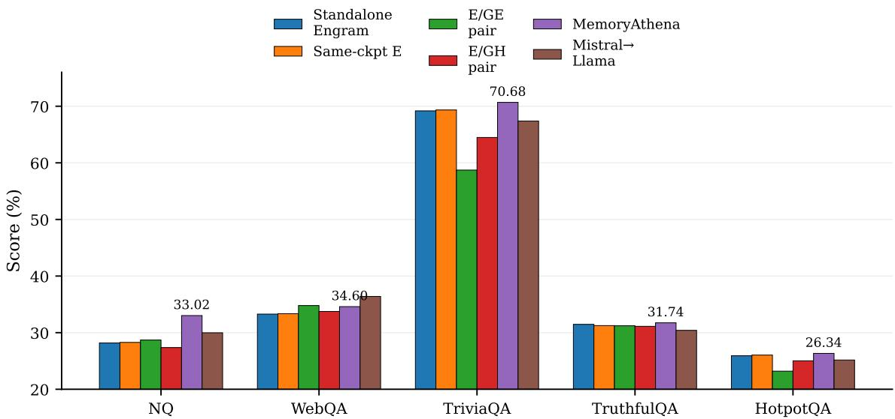  
Figure 3: Complete QA comparison. Open-QA tasks report F1, and TruthfulQA reports the mean of MC1, MC2, and MC3. Same-checkpoint rows isolate the efect of the inference rule more cleanly than Standalone Engram or Mistral→Llama.

## E Complete QA Metrics

Figure 3 summarizes the complete QA comparison using F1 for open-QA tasks and the mean multiplechoice score for TruthfulQA. The same-checkpoint rows provide the cleanest comparison because they share the same memory and expert checkpoints. Standalone Engram and Mistral→Llama serve as additional references but have diferent training histories.

The E+GE and E+GH pair controls are learned two-source fusion baselines. Their mixing weights depend on the input, so they should be interpreted as complete learned-fusion systems rather than as isolated measurements of the contribution of GE or GH alone.

To make the answer-level behavior explicit, Figure 4 compares EM and F1 between samecheckpoint E and MemoryAthena. NQ and WebQA improve on both metrics, but TriviaQA and HotpotQA show a diferent pattern: F1 increases while EM decreases. Thus, generated-memory routing can improve average answer overlap without necessarily increasing exact-match accuracy.

For TruthfulQA, Table 7 reports the three multiple-choice metrics separately.

Finally, Figure 5 reports paired F1 changes relative to same-checkpoint E. Most examples remain unchanged, while the numbers of improved and degraded examples are of similar order. Positive mean F1 gains therefore arise from the magnitudes of the changes rather than from uniformly one-sided answer flips.

Paired improve/degrade counts alone do not determine the mean score change, because the sizes of the answer-level changes can difer substantially. We therefore report these counts as descriptive diagnostics only. TruthfulQA is excluded from this paired F1 analysis because it does not use token-overlap F1.

## F Source-Oracle Analysis

Figure 2b evaluates the complementarity of the three memory pathways using a gold-label oracle. For each example, we run the E, GE, and GH endpoints separately and select the endpoint that obtains the highest score against the gold answer. This oracle is used only for analysis and is not available at inference time.

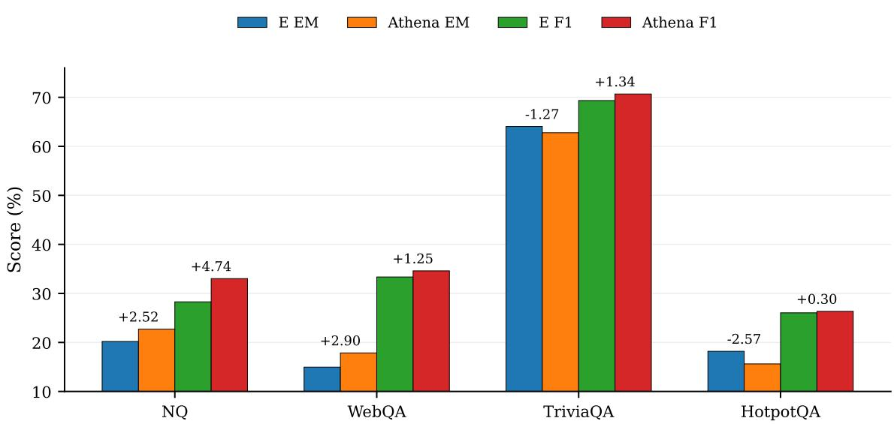  
Figure 4: EM/F1 comparison between same-checkpoint E and MemoryAthena on the open-QA tasks. Numbers above bars show the change from E to MemoryAthena. TriviaQA and HotpotQA exhibit higher F1 but lower EM.

Adding more candidate endpoints cannot reduce oracle performance, since the oracle can always retain the best previously available endpoint. Therefore, the improvement from the two-source to the three-source oracle indicates that the additional pathway is useful on some examples, but does not imply that a deployable router can always identify those examples.

E is the most frequent oracle winner, although its count is increased by our tie-breaking rule: examples on which multiple endpoints receive the same score are assigned to E first. Importantly, these counts describe which complete endpoint performs best on each example; they are not routing frequencies of MemoryAthena. The deployed router mixes pathways locally across tokens and layers, so its average pathway weights measure a diferent quantity. This does not contradict the GH-dominated average routing weights reported elsewhere: the two statistics measure diferent quantities. Oracle counts identify the best complete endpoint per example, whereas routing weights measure the local contribution of each pathway within the deployed mixed trajectory.

## G Ablations and Architectural Controls

Figure 6 summarizes the main architectural ablations relative to MemoryAthena. For open-QA tasks, we report F1; for TruthfulQA, we report the mean of the three multiple-choice metrics. Positive values indicate an improvement over the full system, and negative values indicate a degradation.

Removing the output gate causes the largest degradation among the memory-interface ablations, reducing the five-task average by 5.92 points. Replacing the learned interface with a parametermatched FFN is substantially weaker, with an average drop of 14.36 points. The afine-stitch variant also underperforms the full system by 1.46 points on average.

Permuting the memory keys has a comparatively small efect on the aggregate score, decreasing the five-task average by 0.70 points. In contrast, training the memory system from scratch reaches a slightly higher average than the pretrained-memory configuration (+0.89 points), with improvements on NQ, TriviaQA, TruthfulQA, and HotpotQA but a small decrease on WebQA.

These results suggest that the learned memory interface and its gating mechanism are important for performance, whereas the advantage of the pretrained memory initialization is less consistent across the evaluated QA tasks.

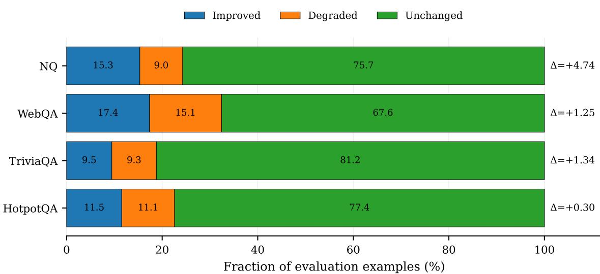  
Figure 5: Paired F1 changes relative to same-checkpoint E. Bars show the fraction of evaluation examples whose F1 improves, degrades, or remains unchanged under MemoryAthena. The right margin reports the mean F1 change. These counts are descriptive only and are not significance tests.

## H Threshold Sensitivity

We study the sensitivity of the router to the advantage threshold τ on Yahoo Answers by varying τ while keeping the remaining inference configuration fixed. As shown in Table 9, performance improves steadily as the threshold becomes more conservative, with the largest changes occurring between $\tau = 0 . 3$ and $\tau = 0 . 9$ . Performance then largely stabilizes around $\tau = 0 . 9 – 1 . 0$ , indicating that routing behavior is sensitive to the admission threshold but becomes relatively stable in the high-threshold regime.

These results show that the admission threshold can have a substantial efect on downstream classification performance. A larger τ makes the router more selective about when generated memory is allowed to intervene, suggesting that conservative routing is particularly important on Yahoo Answers.

As an additional classification result, the router reaches 72.56% accuracy on RTE, compared with 71.48% for the E pathway, over 277 evaluation examples.

## I Interpreting Routing Statistics

Table 10 reports the average efective contribution of E, GE, and GH to the injected memory residual on the corresponding validation corpora. The statistic is averaged over token positions, layers, and batches. Because the deployed update has the form

$$
r = ( 1 - \alpha ) e + \alpha g ,
$$

E retains a contribution of 1 − α even when a generated pathway is admitted. Thus, interpolation mass and source-selection frequency measure diferent aspects of the routing behavior.

The QA checkpoint places most of its interpolation mass on GH, whereas the NLP and coding checkpoints retain substantially more mass on E. GE receives a smaller average contribution in all three settings. This variation suggests that the learned balance among the three pathways depends strongly on the training domain and checkpoint.

For comparison, the calibration teacher stream records generated-pathway admission rates of 99.97% for QA and 98.07% for NLP. These high admission rates are compatible with non-trivial E mass because an admitted generated pathway can still be interpolated with E using $\alpha < 1$ . Admission rate and interpolation mass therefore should not be conflated.

A more detailed downstream analysis could additionally report, for each task, the fraction of positions admitting GE or GH, the exact-E fallback rate, the conditional mean interpolation coeficient

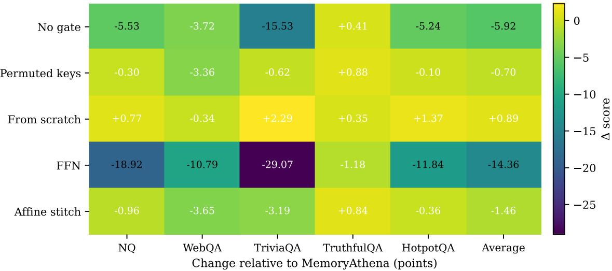  
Figure 6: Performance changes relative to the full MemoryAthena system. Open-QA tasks use F1 and TruthfulQA uses the mean multiple-choice score. The final column reports the change in the five-task average.

α, and the resulting efective pathway weights.

## J Transfer and secondary evaluations

Transfer. Mistral-to-Llama QA scores are 29.98, 36.40, 67.39, 30.41, and 25.17. WebQA exceeds the source Mistral router, and the other four are lower. On six NLP tasks, the target router mean is 40.48 versus 38.23 for target E, with Yahoo at 10%. These results demonstrate target-side adaptation only. A matched advantage over bare Llama would require its same-scorer baseline, which is missing (Appendix J).

The router improves MR, CR, RT, and AGN, decreases SST2, and leaves Yahoo unchanged. Low absolute accuracies make these interface-transfer diagnostics rather than evidence of broadly successful NLP transfer. Without the bare target model, positive transfer and avoidance of negative transfer are not established. HaluEval evaluates hallucination recognition (Li et al., 2023). Summarization improves by 20.01 points, while dialogue changes modestly and QA decreases. Confusion matrices and class-balance checks are needed before attributing the summarization gain to improved detection rather than response bias. Classification on this benchmark is not a direct measurement of hallucinations in free-form generation.

## K Scaling Analysis

We study two complementary scaling dimensions: model scaling, where the backbone and the complete memory-side system are enlarged jointly, and training-token scaling, where the architecture is fixed and only the optimization budget is increased. We report only completed runs.

Model-scaling setup. We use GPT-2 Small, Medium, Large, and XL as the backbone family. As the backbone grows, the Engram table, generated-memory modules, readers, and routing head are scaled jointly rather than varying the memory table in isolation. Table 13 summarizes the corresponding architectures and parameter counts.

The Engram addressing structure is kept fixed across scales, with maximum n-gram order 3 and four heads per order. Generator width increases from 256 to 896, generator depth from 2 to 4 layers, the number of generated latents from 4 to 12, the source-adaptation rank from 16 to 56, and the router hidden width from 64 to 224. The resulting memory-side system grows from 37.6M parameters with GPT-2 Small to 472.9M with GPT-2 XL.

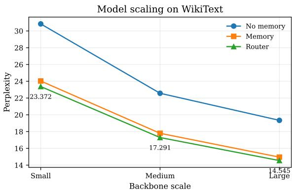  
(a) WikiText.

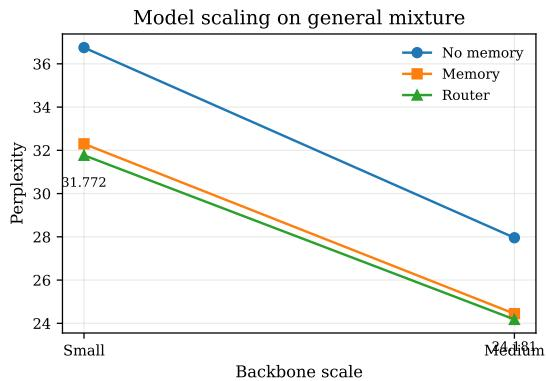  
(b) General-text mixture.  
Figure 7: Model scaling across GPT-2 backbones. Lower perplexity is better. The routed system consistently improves over the corresponding memory-only configuration at every completed scale.

The routing head itself remains comparatively small. Its parameter count grows from approximately 0.054M, 0.119M, and 0.233M to 0.413M across the four scales, while most memory-side capacity is allocated to the Engram table and the generated-memory interface.

Training procedure. We consider two corpora for model scaling. The WikiText setting uses a maximum budget of 100M processed tokens per optimization stage, while the general-text mixture uses up to 600M tokens per stage.

Training follows the same staged procedure as the main experiments. The memory is first learned with the source backbone fixed. The generated-memory modules and readers are then optimized while the backbone and memory table are fixed. Finally, these components are frozen and only the routing head is trained from E-relative advantage supervision. The no-memory results are obtained by directly evaluating the corresponding pretrained GPT-2 backbones and are used only as reference points.

Model scaling. Figure 7 shows the completed model-scaling experiments. Across all completed runs, the same ordering is observed:

## Router < Memory < No memory,

where lower perplexity is better.

On WikiText, perplexity decreases from 30.841 to 24.033 to 23.372 for GPT-2 Small, from 22.569 to 17.797 to 17.291 for Medium, and from 19.342 to 14.955 to 14.545 for Large, corresponding to the no-memory, memory-only, and routed systems.

The completed general-mixture runs exhibit the same pattern. For GPT-2 Small, perplexity decreases from 36.752 to 32.300 and then to 31.772; for Medium, it decreases from 27.958 to 24.445 and then to 24.181. Thus, the routing benefit persists as the backbone and memory-side system are jointly scaled. The current results support persistence of the gain across scale rather than an increasing routing advantage with model size.

Training-token scaling. We next isolate the efect of training budget while holding model capacity fixed. These experiments use GPT-2 XL with the same 405.5M-parameter Engram table and identical generator, reader, and router architectures. Only the number of processed training tokens per stage is varied.

Figure 8a shows that increasing the training budget from 10M to 30M and 100M tokens monotonically reduces perplexity for both systems. Memory-only perplexity decreases from 20.714 to 20.369 and 19.783, while routed-memory perplexity decreases from 20.222 to 19.889 and 19.462. The routed model therefore remains better than memory alone at every completed training budget.

Figure 8b provides the corresponding parameter breakdown across model scales. Most of the memory-side capacity is allocated to the Engram table, followed by the generated-memory modules and readers, while the routing head contributes only a small fraction of the total parameter count.

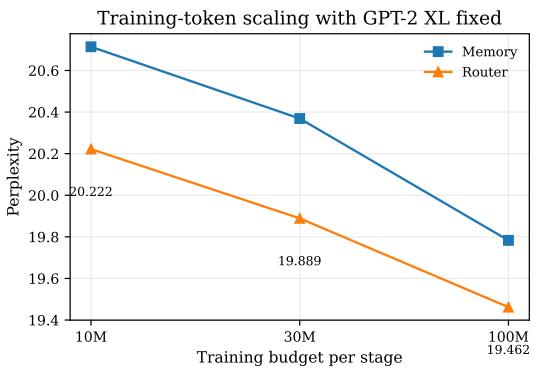  
(a) Training-token scaling with GPT-2 XL fixed.

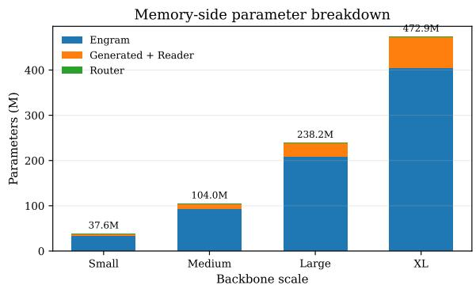  
(b) Memory-side parameter scaling.

Figure 8: Training and capacity scaling. Left: increasing the per-stage training budget improves both memory-only and routed systems while routing remains consistently better. Right: breakdown of memory-side parameters as the complete memory system is scaled with the backbone.  
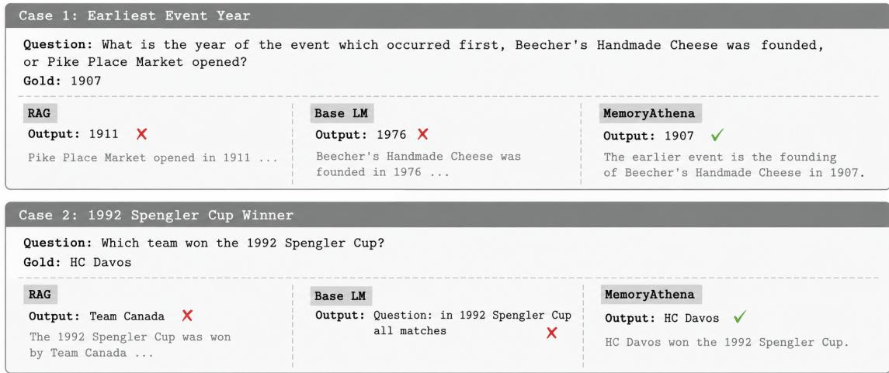  
Figure 9: Two downstream case studies of MemoryAthena. The routed system is correct in both examples although all individual endpoints (E, GE, and GH) are incorrect. The route traces show the efective source mass assigned to each pathway.

Overall, the completed scaling experiments show two consistent trends. First, the benefit of adaptive routing is preserved as the backbone and memory-side architecture are jointly enlarged. Second, increasing the training budget improves both memory-only and routed systems, while the routing gain remains present throughout the evaluated range.

## L Case Study

Figure 9 shows two representative downstream examples. In both cases, none of the standalone pathways (E, GE, or GH) yields the correct final answer, whereas MemoryAthena does.

In the first example, the task is to identify which of two events occurred earlier. Although GH receives most of the routed source mass, its standalone answer is still incorrect, while the routed system recovers the correct year, 1907. In the second example, the question asks for the winner of the 1992 Spengler Cup. The standalone outputs are either noisy or incomplete, but the routed system returns the exact answer, HC Davos. These examples illustrate that the benefit of routing is not simply selecting the best single endpoint. Instead, MemoryAthena can exploit complementary information across memory pathways and transform imperfect endpoint predictions into a correct final answer.

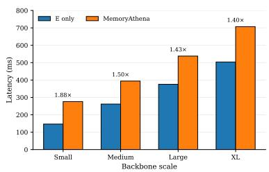  
(a) End-to-end latency.

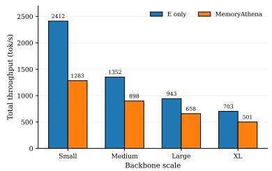  
(b) Total-token throughput.

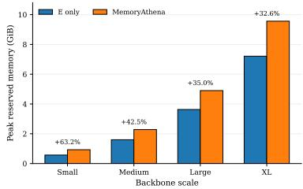  
(c) Peak reserved GPU memory.  
Figure 10: Inference microbenchmark on an AMD MI250X using BF16, with a fixed 338-token input and 16 generated tokens. Left: latency, where annotations show the speed advantage of E-only inference. Middle: total-token throughput. Right: peak reserved GPU memory, with annotations showing the relative memory overhead of MemoryAthena. The relative runtime and memory overhead decrease as the backbone scales.

## M Computational Cost

We analyze the computational cost of MemoryAthena from two perspectives: the additional optimization required to learn the generated memory interface and routing policy, and the runtime overhead introduced during inference. The routing head itself is parameter-light, but the complete system must additionally evaluate generated-memory components and, in the current implementation, obtain clean causal backbone states for the GH pathway.

## M.1 Training Cost

Training follows the three-stage procedure described in Appendix D. The memory is learned first, the generated-memory modules and readers are then optimized with the backbone and memory table frozen, and the final stage trains only the E-relative routing heads.

The reader/generator stage contains approximately 167.4M trainable parameters, whereas the final router contains only 534,924 trainable parameters. Thus, the routing head accounts for only a small fraction of the trainable memory-interface parameters.

The recorded reader/generator and router stages together take approximately 42.89 hours for QA, 26.59 hours for general NLP, and 27.35 hours for coding. These numbers describe the recorded stages rather than the complete lifetime cost of the reusable source memory.

Although only a small routing head is optimized in the final stage, routing training still requires non-trivial computation. Counterfactual supervision is constructed by evaluating multiple frozen endpoints under teacher forcing, and the GH pathway additionally requires clean backbone states. Consequently, trainable parameter count alone is not a direct measure of total training compute.

## M.2 Inference Microbenchmark

We additionally benchmark the inference overhead of MemoryAthena relative to the direct E-only pathway across GPT-2 Small, Medium, Large, and XL.

All measurements are performed on an AMD MI250X GPU using BF16 precision. Each run uses a fixed synthetic sequence of 338 input tokens and generates 16 output tokens. We perform one warmup iteration followed by three measured iterations. We report end-to-end latency, total-token throughput, and peak reserved GPU memory.

The E-only configuration executes the direct Engram pathway. In contrast, MemoryAthena additionally evaluates the generated-memory interface, routing features, and the clean causal backbone states required by GH in the current implementation.

Latency and throughput. E-only inference is faster at all four evaluated scales. For GPT-2 Small, latency increases from 146.7 ms for E-only to 276.0 ms for MemoryAthena, corresponding to a 1.88× speed advantage for E-only. The relative gap decreases with model size, to 1.50× for Medium, 1.43× for Large, and 1.40× for XL.

The corresponding total-token throughput decreases from 2412.4 to 1282.9 tokens/s at Small, from 1352.0 to 898.4 tokens/s at Medium, from 942.7 to 658.4 tokens/s at Large, and from 702.6 to 500.7 tokens/s at XL. Thus, the absolute cost of both systems increases with model scale, while the relative overhead of the routed system becomes smaller.

Memory overhead. Peak reserved GPU memory increases from 0.57 to 0.93 GiB at Small, 1.60 to 2.28 GiB at Medium, 3.63 to 4.90 GiB at Large, and 7.21 to 9.56 GiB at XL. These correspond to relative overheads of approximately 63.2%, 42.5%, 35.0%, and 32.6%, respectively.

The memory results therefore exhibit the same qualitative trend as latency: although Memory-Athena requires additional runtime state, this additional cost represents a smaller fraction of the overall system footprint as the backbone becomes larger.

Where does the overhead come from? The additional cost should not be attributed primarily to the routing MLP. The routing head contains only 534,924 parameters. Instead, the main runtime overhead comes from evaluating the generated-memory pathways and maintaining their intermediate states. In particular, GH currently requires a separate memory-disabled backbone computation to obtain its clean causal conditioning states.

This distinction is important: MemoryAthena is parameter-eficient as a routing mechanism, but it is not a zero-overhead inference method.

Scope of the benchmark. The experiment is a controlled microbenchmark using a fixed synthetic prompt, generation length, precision, and hardware configuration. Its purpose is to measure relative systems overhead under matched conditions. The reported numbers should therefore not be interpreted as full downstream-task throughput, which can vary with sequence length, batch size, generation length, routing behavior, and hardware utilization.

Overall, MemoryAthena trades additional computation for adaptive use of generated memory. The inference overhead is measurable at all evaluated scales, but its relative cost decreases with backbone size: the E-only latency advantage falls from 1.88× at Small to 1.40× at XL, while the reserved-memory overhead decreases from approximately 63% to 33%.

## N Language-model diagnostics and incomplete extensions

The NLP router improves E perplexity but not either generated endpoint. QA likewise records lower validation perplexity for ordinary soft fusion (7.07310) and hard routing (7.09269) than for the advantage router (7.14538), with E at 8.57136. Corpus perplexity alone does not establish better QA performance.

Coding. Completed Nemotron-CC-Code expert records give perplexities 3.10842 (E), 2.99503 (GE), and 2.98369 (GH), with arithmetic mean 3.02853. Routing records give 2.99563 after 19,998,720 input positions which is lower than tri-experts mean.

Table 6: Architecture and parameterization of the generated-memory pathways and E-anchored router used with Mistral-7B-v0.3.
<table><tr><td>Component</td><td>Configuration</td><td>Value</td></tr><tr><td>Memory interface</td><td></td><td></td></tr><tr><td>Injection layers</td><td>Target backbone layers</td><td>{2,10}</td></tr><tr><td>Memory dimension</td><td>Retrieved / latent memory width</td><td>512</td></tr><tr><td>Memory table</td><td>Frozen Engram parameters</td><td>33,554,432</td></tr><tr><td>Reader branches</td><td>Parallel branches per injection layer</td><td>4</td></tr><tr><td>Direct E reader</td><td>Parameters per layer / two layers</td><td>10,506,244 / 21,012,488</td></tr><tr><td>Generated-memory pathways (GE/GH)</td><td></td><td></td></tr><tr><td>Generator context</td><td>Causal input window</td><td>3 positions</td></tr><tr><td>Generated latents</td><td>Latent representations per position</td><td>4</td></tr><tr><td>Generator hidden width</td><td>Internal representation size</td><td>256</td></tr><tr><td>Generator depth</td><td>Transformer layers</td><td>2</td></tr><tr><td>Generator attention</td><td>Attention heads</td><td>4</td></tr><tr><td>Source-specific adaptation</td><td>Low-rank output adapter</td><td> $r = 1 6$ </td></tr><tr><td>Output-adapter shape</td><td>Bottleneck projection</td><td> $2 5 6 \to 1 6 \to d _ { \mathrm { m o d e l } }$ </td></tr><tr><td>GE conditioning</td><td>Retrieved Engram cues</td><td></td></tr><tr><td>GH conditioning</td><td>Clean causal backbone states</td><td></td></tr><tr><td>Generated reader</td><td>Projection, branch aggregation, and output gat-</td><td></td></tr><tr><td>E-anchored router</td><td>ing</td><td></td></tr><tr><td>Router architecture</td><td>MLP hidden width</td><td>64</td></tr><tr><td>Candidate pathways</td><td>Generated candidates</td><td>{GE,GH}</td></tr><tr><td>Reference pathway</td><td>Fixed routing anchor</td><td>E</td></tr><tr><td>Router outputs</td><td>E-relative advantage and confidence</td><td>2 per candidate</td></tr><tr><td>Advantage threshold</td><td></td><td>0.0</td></tr><tr><td>Confidence threshold</td><td>τ</td><td>0.5</td></tr><tr><td>Maximum interpolation</td><td>ρ</td><td></td></tr><tr><td></td><td>amax</td><td>1.0 0.15</td></tr><tr><td>Interpolation temperature</td><td> $T _ { \alpha }$ </td><td></td></tr><tr><td>Parameter summary</td><td></td><td></td></tr><tr><td>Shared generator</td><td>Parameters per layer / two layers</td><td>3,288,576 / 6,577,152</td></tr><tr><td>Generated readers</td><td>Parameters per layer / two layers</td><td>69,625,352 / 139,250,704</td></tr><tr><td>Advantage router</td><td>Parameters per layer / two layers</td><td>267,462 / 534,924</td></tr><tr><td>Full tri-path adaptor</td><td>All adaptor and routing parameters per layer</td><td>83,960,284</td></tr><tr><td>Two-layer adaptor</td><td>Layers 2 and 10, excluding backbone</td><td>167,920,568</td></tr><tr><td>Total memory system</td><td>Memory table + two-layer adaptor, excluding</td><td>201,475,000</td></tr><tr><td></td><td>backbone</td><td></td></tr></table>

Table 7: TruthfulQA multiple-choice metrics (%). The summary is the mean of MC1, MC2, and MC3.
<table><tr><td>Condition</td><td>MC1</td><td>MC2</td><td>MC3</td><td>Mean</td></tr><tr><td>Standalone Engram</td><td>27.42</td><td>44.32</td><td>22.69</td><td>31.47</td></tr><tr><td>Same-checkpoint E E/GE learned pair</td><td>26.93 27.54</td><td>44.18</td><td>22.64</td><td>31.25</td></tr><tr><td></td><td></td><td>43.40</td><td>22.72</td><td>31.22</td></tr><tr><td>E/GH learned pair</td><td>27.78</td><td>42.90</td><td>22.67</td><td>31.12</td></tr><tr><td>MEMORYATHENA</td><td>28.15</td><td>44.04</td><td>23.02</td><td>31.74</td></tr><tr><td>Mistral→Llama</td><td>27.78</td><td>41.57</td><td>21.87</td><td>30.41</td></tr></table>

Table 8: Number and percentage of examples for which each endpoint is selected by the gold-label oracle. Ties are resolved in the order E, GE, GH.
<table><tr><td>Task</td><td>E</td><td>GE</td><td>GH</td></tr><tr><td>NQ</td><td>2,854 (79.08)</td><td>475 (13.16)</td><td>280 (7.76)</td></tr><tr><td>WebQA</td><td>1,428 (70.28)</td><td>336 (16.54)</td><td>268 (13.19)</td></tr><tr><td>TriviaQA</td><td>15,764 (87.85)</td><td>1,345 (7.50)</td><td>835 (4.65)</td></tr><tr><td>TruthfulQA</td><td>361 (44.19)</td><td>254 (31.09)</td><td>202 (24.72)</td></tr><tr><td>HotpotQA</td><td>6,150 (83.05)</td><td>762 (10.29)</td><td>493 (6.66)</td></tr></table>

Table 9: Sensitivity of Yahoo Answers accuracy to the routing advantage threshold $\tau \left( N = 6 0 , 0 0 0 \right)$
<table><tr><td>Threshold τ</td><td>Accuracy (%)</td></tr><tr><td>0.00</td><td>45.8967</td></tr><tr><td>0.05</td><td>46.1150</td></tr><tr><td>0.10</td><td>46.2483</td></tr><tr><td>0.20</td><td>47.0283</td></tr><tr><td>0.30</td><td>48.3583</td></tr><tr><td>0.90</td><td>57.3600</td></tr><tr><td>1.00</td><td>57.4317</td></tr></table>

Table 10: Average interpolation mass on the validation corpora (%). These values measure the contribution of each pathway to the injected residual and should not be interpreted as discrete source-selection frequencies.
<table><tr><td>Validation corpus</td><td>E</td><td>GE</td><td>GH</td></tr><tr><td>Wikipedia-2021, QA checkpoint</td><td>23.59</td><td>7.56</td><td>68.85</td></tr><tr><td>General mixture, NLP checkpoint</td><td>62.85</td><td>4.49</td><td>32.67</td></tr><tr><td>Nemotron-CC-Code, coding checkpoint</td><td>64.80</td><td>5.11</td><td>30.09</td></tr></table>

Table 11: Target-Llama NLP accuracy (%). Without matched bare-Llama scores, these compare target memory endpoints only.
<table><tr><td>Condition</td><td>SST2</td><td>MR</td><td>CR</td><td>RT</td><td>AGN</td><td>Yahoo</td><td>Mean</td></tr><tr><td>Target E</td><td>50.92</td><td>44.85</td><td>50.00</td><td>50.00</td><td>23.62</td><td>10.00</td><td>38.23</td></tr><tr><td>Target router</td><td>49.08</td><td>47.95</td><td>58.35</td><td>52.44</td><td>25.05</td><td>10.00</td><td>40.48</td></tr></table>

Table 12: Performance on the HaluEval benchmark for question answering and summarization. Results report accuracy (%). Small signed values denote percentage-point diferences from Mistral-7B-v0.3. Average is the unweighted mean of QA and Summarization. RAG is not evaluated on summarization because this task requires only the source document.
<table><tr><td>Method</td><td>QA↑</td><td>Summarization ↑</td><td>Average ↑</td></tr><tr><td colspan="4">Reported baselines</td></tr><tr><td>Mistral-7B-v0.3</td><td>53.99</td><td>50.27</td><td>52.13</td></tr><tr><td>CPT</td><td>46.49-7.50</td><td>47.39-2.88</td><td>46.94</td></tr><tr><td>LoRA</td><td>50.02-3.97</td><td>50.38 +0.11</td><td>50.20</td></tr><tr><td>RAG MLP Memory</td><td>65.09+11.10  $6 4 . 0 7 \substack { + 1 0 . 0 8 }$ </td><td>52.41 +2.14</td><td>58.24</td></tr><tr><td colspan="4">This study</td></tr><tr><td>E only</td><td>50.12-3.87</td><td>54.82 +4.55</td><td>52.47</td></tr><tr><td>MEMORYATHENA</td><td>49.54-4.45</td><td> $7 4 . 8 3 + 2 4 . 5 6$ </td><td>62.19</td></tr></table>

Table 13: Model-scaling configurations. “Gen.” reports generator width/depth/number of generated latents. Memory-side total includes the Engram table, generated-memory modules, readers, and router, but excludes the backbone.
<table><tr><td>Scale</td><td>Backbone</td><td>Engram</td><td>Gen.</td><td>Readers</td><td>Router</td><td>Memory-side</td></tr><tr><td>Small</td><td>124M</td><td>33.554M</td><td>256/2/4</td><td>16</td><td>64</td><td>37.573M</td></tr><tr><td>Medium</td><td>345M</td><td>93.716M</td><td>428/2/6</td><td>24</td><td>104</td><td>104.008M</td></tr><tr><td>Large</td><td>774M</td><td>209.715M</td><td>640/3/8</td><td>40</td><td>160</td><td>238.212M</td></tr><tr><td>XL</td><td>1.5B</td><td>405.537M</td><td>896/4/12</td><td>56</td><td>224</td><td>472.912M</td></tr></table>

Table 14: Exact perplexities for the completed model-scaling runs. Lower is better.
<table><tr><td>Corpus</td><td>Scale</td><td>No memory</td><td>Memory</td><td>Router</td></tr><tr><td>WikiText</td><td>Small</td><td>30.841</td><td>24.033</td><td>23.372</td></tr><tr><td></td><td>Medium</td><td>22.569</td><td>17.797</td><td>17.291</td></tr><tr><td></td><td>Large</td><td>19.342</td><td>14.955</td><td>14.545</td></tr><tr><td>General mixture</td><td>Small</td><td>36.752</td><td>32.300</td><td>31.772</td></tr><tr><td></td><td>Medium</td><td>27.958</td><td>24.445</td><td>24.181</td></tr></table>

Table 15: Training-token scaling with the GPT-2 XL architecture fixed. Only the per-stage optimization budget changes.
<table><tr><td>Training budget</td><td>Memory</td><td>Router</td></tr><tr><td>10M</td><td>20.714</td><td>20.222</td></tr><tr><td>30M</td><td>20.369</td><td>19.889</td></tr><tr><td>100M</td><td>19.783</td><td>19.462</td></tr></table>

Table 16: Recorded wall-clock training time for the reader/generator and routing stages. The router contains 0.535M trainable parameters, compared with approximately 167.4M in the reader/generator stage.
<table><tr><td>Setting</td><td>Stage</td><td>Trainable params.</td><td>Time (h)</td></tr><tr><td rowspan="2">QA</td><td>Reader / generator</td><td>167.386M</td><td>31.70</td></tr><tr><td>Router</td><td>0.535M</td><td>11.19</td></tr><tr><td rowspan="2">General NLP</td><td>Reader / generator</td><td>167.365M</td><td>16.01</td></tr><tr><td>Router</td><td>0.535M</td><td>10.58</td></tr><tr><td rowspan="2">Coding</td><td>Reader / generator</td><td>167.365M</td><td>16.41</td></tr><tr><td>Router</td><td>0.535M</td><td>10.94</td></tr></table>

Table 17: General-NLP within-run validation perplexity. Endpoints and downstream accuracy need not rank identically.
<table><tr><td>E</td><td>GE</td><td>GH</td><td>Router</td></tr><tr><td>9.07260</td><td>8.79091</td><td>8.78358</td><td>8.83063</td></tr></table>