# PERSONAWEAVER: Controllable Diversity Beyond Conventional Archetypes in Procedural Character Generation

Maan Qraitem, Kate Saenko, Bryan A. Plummer Boston University {mqraitem, saenko, bplum}@bu.edu

## Abstract

Procedural character generation aims to populate games, simulations, and other virtual worlds with diverse characters. Large language models (LLMs) offer a promising foundation for scaling this task. However, LLM-based procedural character generation remains at an early stage: existing methods either generate characters directly or adapt profiles retrieved from persona banks. As we show, both approaches produce behaviorally homogeneous populations: characters overwhelmingly agree with positive moral norms and respond to questions with helpful, assistant-like reactions. To mitigate this homogenization, we introduce PERSON-AWEAVER, which disentangles world building from behavioral specification and models behavior through setting general, diverse, manually curated banks of moral positions and conversational reactions. This design allows us to test how far LLM(s) can be pushed beyond their default behavioral patterns across settings. Across ten realistic and fantastical settings and three LLM(s), PERSONAWEAVER produces broader moral and interactional response distributions than prior work. Its guidance also diversifies interpersonal language, response length, and sentiment. It also produces less archetypal combinations of world attributes. Code is available at https://github.com/mqraitem/ PersonaWeaver.

## 1 Introduction

Procedural character generation (PCG) aims to create populations of agents for games, simulations, and other virtual or narrative environments. Large language models (LLMs) are an attractive foundation for this task because they can construct and role-play characters across many worlds (Wang et al., 2023; Zhou et al., 2023; Shao et al., 2023). At population scale, however, diversity requires more than different biographies: characters should also differ in how they interpret situations, make judgments, and respond to others. Such populations can support more dramatic variety and richer interactive experiences.

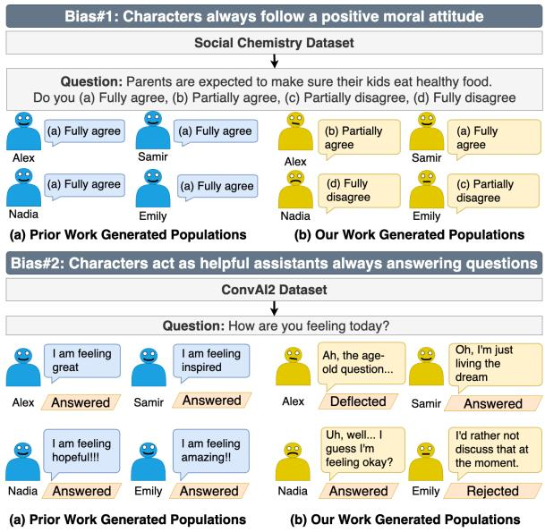  
Figure 1: Behavioral homogenization beneath visible character diversity. Characters from prior work (Jin et al., 2024) concentrate on agreement with moral statements (top) and direct answers to conversational questions (bottom). PERSONAWEAVER explicitly specifies behavioral variation, producing broader realized responses. The population-level results appear in Fig. 3.

Existing methods primarily generate characters directly with an LLM (Jin et al., 2024), or retrieve and adapt profiles from a large persona bank (Ge et al., 2024). They vary occupations, demographics, and hobbies, making individual cards appear diverse.

However, diverse character descriptions do not necessarily produce diverse behavior. We find that characters with different profiles often make similar moral judgments and react to questions in similar ways. Specifically, characters (1) overwhelmingly agree with positive moral norms (Fig. 1, Bias #1) and (2) usually answer questions with helpful-assistant reactions (Fig. 1, Bias #2). This concentration narrows population-level variation and creator control. Maximum-likelihood training and assistant alignment likely encourage such common, helpful behaviors (Ouyang et al., 2022; Wang et al., 2025).

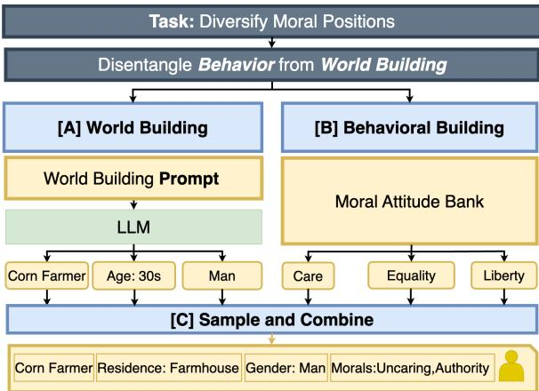  
Figure 2: PERSONAWEAVER factorizes character construction. A setting-dependent world module (a) produces non-behavioral attributes, while a developerspecified behavior module (b) provides explicit control. Sample and Mix (c) composes both into one card. The diagram illustrates a moral assignment; the evaluated card additionally contains an independently sampled reaction style.

To mitigate these issues, we introduce PERSON-AWEAVER, a controllable inference-time framework that disentangles behavioral modeling from world building (Fig. 2). Unlike world attributes, which must adapt to each setting, moral positions and reactions to questions are applicable across settings. We therefore specify behavior externally through diverse, curated banks and use them to test how far LLM(s) can be pushed beyond their default behavioral patterns. Separately, the LLM constructs setting-specific world attributes such as occupation, residence, and affiliation. Then, a Sample-and-Mix module combines the sampled behavioral guidance and world attributes into character cards, producing populations with diverse behavioral coverage and varied, setting-grounded character attributes.

We evaluate PERSONAWEAVER across ten realistic and fantastical settings using GPT-4o (Achiam et al., 2023) and GPT-5.6 Luna (OpenAI, 2026) , and Qwen 3.5 35B (Yang et al., 2025). We compare against direct generation, PersonaHub, and a direct-generation baseline explicitly instructed to diversify moral perspectives and interaction styles. Across moral probes from Social Chemistry (Forbes et al., 2020) and conversational questions from ConvAI2 (Dinan et al., 2019), PERSON-AWEAVER produces more diverse behavioral distributions. Our system result in second order effects diversifying interpersonal language, length, and sentiment. As an additional benefit, the factorized world construction produces less conventional combinations of world attributes.

Our contributions are:

• We identify moral and interactional homogenization in prior LLM-based PCG methods across models and settings.

• We introduce PERSONAWEAVER, which disentangles setting-specific world construction from setting-general behavior specified through diverse, curated banks.

• We show that PERSONAWEAVER broadens realized moral and interactional behavior, induces second-order linguistic variation, and produces less archetypal combinations of world attributes.

## 2 Related Works

Procedural Character Generation. Research on procedural character generation remains limited, with most prior work focusing on characters within a single, predefined environment (Jin et al., 2024; Ge et al., 2024). WORLDWEAVER (Jin et al., 2024) prompts an LLM to directly generate N characters for a setting, while PERSONAHUB (Ge et al., 2024) samples from a large profile bank and adapts the result to a target context. We study population-level behavioral coverage in these methods and introduce an explicit mechanism for controlling it.

Homogenization in Simulated Personas. Prior work have documented a broader lack of behavioral and identity diversity in simulated personas. For instance, Marked Personas (Cheng et al., 2023) show that language models tend to reproduce social stereotypes, while others highlight gender and identity flattening (Kotek et al., 2023; Wang et al. 2025) and reduced narrative variety in multimodal storytelling (Lee and Jeon, 2024). Maximumlikelihood objectives favoring high-probability continuations and alignment tuning rewarding politeness, and helpfulness are likely contributors to this phenomenon. We extend the empirical study of homogenization to procedural character generation and test an explicit mechanism for controlling moral judgments and interactions in generated populations.

Character Simulation and Role-Playing. A growing line of research explores how LLMs can function as conversational agents with consistent personality, memory, and long-term coherence. Generative Agents (Park et al., 2023) simulate memorydriven individuals inhabiting a shared environment, though their backgrounds are largely handcrafted. In the role-playing domain, works such as RoleLLM (Wang et al., 2023), CharacterGLM (Zhou et al., 2023), and Character-LLM (Shao et al., 2023) focus on eliciting and sustaining rolespecific behaviors through persona-conditioned dialogue systems. These efforts primarily target the believability and consistency of agent role play. In contrast, our work examines whether off-the-shelf LLMs can leverage their broad world knowledge to simulate behaviorally diverse populations, spanning distinct moral dispositions and interactional tendencies.

Procedural Content Generation with LLMs. Beyond characters, LLMs have been used for procedural generation of levels, stories, and worlds. For example, Word2World (Nasir et al., 2024) generates narratives/world descriptions, Mariogpt (Sudhakaran et al., 2023) generates levels and Freiknecht and Effelsberg (2020); Hu et al. (2024) show how LLMs can produce dynamic environments. WorldWeaver (Jin et al., 2024) also overlaps somewhat, using LLMs to generate world contexts and roles.

## 3 PERSONAWEAVER

Prior character-generation methods (Jin et al., 2024; Ge et al., 2024) exhibit moral and interactional homogenization, with characters frequently defaulting to positive judgments and helpful reactions as we show in Section 4. PERSONAWEAVER addresses this problem by disentangling behavioral modeling from world building. This separation provides explicit control over behavioral qualities that are applicable across settings while at the same time preserving the LLM's ability to construct setting-specific character attributes.

Behavioral Module. We define behavioral diversity through two fixed banks containing eight moral positions and eight reactions to questions (Table 1). The moral bank, loosely inspired by Moral Foundations Theory (Graham et al., 2013)., combines orientations toward care, fairness, loyalty, authority, purity, and liberty into contrasting positions from compassionate and egalitarian, group to strongly self-interested behavior. On the other hand, the reaction bank controls whether and how a character answers: refusal, deflection, hesitation, compliance, volunteering additional information, playful or subversive engagement, hostility, and metacommentary on being questioned. Each entry provides natural-language guidance to the LLM to achieve the reaction. The banks were manually curated, with GPT-4o assisting in drafting the guidance prompts. For each character, we sample one position from each bank and instruct the LLM to follow both. Using the same banks across settings and models provides allows us to measure how much PERSONAWEAVER can push LLMs beyond their default behaviors.

World-Building Module. Unlike behavioral qualities, world attributes are harder to universalize (e.g., you can't be a corn farmer in New York City). We therefore use the LLM's setting knowledge, but avoid asking it to generate complete characters directly, which tends to recover archtypes of each setting. Instead, the model first identifies ten relevant non-behavioral attribute axes and generates 30 setting-appropriate options for each. These axes can include occupation, residence, affiliation, education, family background, appearance, and expertise. Personality, values, moral positions, and interaction styles, however, are explicitly excluded to preserve the separation between world building and behavior. PersonaWeaver then assemble characters from this world space and the behavioral banks. We perform the composition through Sample-and-Mix, which independently samples and combines components from both sources. As a result, this combination over an exhaustive structured space result in less arch typical characters compared to direct generation as we show in our results section.

Sample-and-Mix. Given the setting-specific world option sets and fixed behavioral banks, let $\mathcal { W } _ { T , k }$ be the option set for world axis k in setting $T ,$ and let M and R be the fixed moral and reaction banks. For character i, Sample-and-Mix performs

$$
\begin{array} { r l r } & { w _ { i , k } \sim \mathrm { U n i f } ( \mathcal { W } _ { T , k } ) } & { k = 1 , \dots , 1 0 , } \\ & { m _ { i } \sim \mathrm { U n i f } ( \mathcal { M } ) , } & { r _ { i } \sim \mathrm { U n i f } ( \mathcal { R } ) , } \\ & { \mathbf { w } _ { i } = ( w _ { i , 1 } , \dots , w _ { i , 1 0 } ) , } \\ & { d _ { i } = \mathrm { C o m p o s e } ( \mathbf { w } _ { i } , m _ { i } , r _ { i } ) . } \end{array}\tag{1}
$$

where $w _ { i , k }$ is one world option, $m _ { i }$ one moral position, $r _ { i }$ one reaction type, and $d _ { i }$ the final persona card. These choices are sampled independently with replacement which maximizes entropy over each bank while mixing ensures coverage of their

<table><tr><td></td><td>Moral stance bank</td></tr><tr><td>ID</td><td>Guidance</td></tr><tr><td>M1</td><td>Protect others from harm, show compassion. Be fair and honest, avoid cheating. Be loyal to friends and allies. Question authority and resist control. Ignore purity or sacred rules. Defend personal freedom and resist oppression. Help others only when it&#x27;s easy or benefits you. Be fair when it serves your interests, otherwise bend the rules. Support</td></tr><tr><td>M2</td><td>your group if it gives you an advantage, but walk away if not. Obey authority when it benefits you, ignore it when it doesn&#x27;t. Dismiss purity or sacred values as irrelevant. Accept limits on freedom if they bring you personal gain.</td></tr><tr><td>M3</td><td>Show kindness but prioritize your own circle. Be fair within your group, less so with outsiders. Put family, community, or team first. Respect tradition and leaders. Value purity and avoid what feels degrading. Do not challenge authority for the sake of freedom.</td></tr><tr><td>M4</td><td>Ignore others&#x27; suffering, focus only on your own comfort. Cheat and deceive if it benefits you. Abandon groups and betray others when useful. Reject rules, defy authority, and act for yourself. Mock sacred things and indulge in what others call impure. Dominate others and accept domination if it helps you survive.</td></tr><tr><td>M5</td><td>Show compassion but avoid being naive. Be fair, but allow exceptions. Be cooperative when it benefits the team. Respect some rules but question others. Avoid disgusting or degrading acts. Seek personal freedom but balance with order.</td></tr><tr><td>M6</td><td>Prioritize kindness and protect the vulnerable. Defend justice and equal treatment for all. Support groups but not blindly. Challenge unfair authority. Treat purity concerns as symbolic, not binding. Strongly defend freedom and resist control.</td></tr><tr><td>M7</td><td>Be polite and respectful to others. Be truthful and fair. Act as a dependable teammate. Obey rules and respect tradition. Honor sacred or cultural norms. Accept limits on freedom for social order.</td></tr><tr><td>M8</td><td>Show occasional kindness but focus on yourself. Bend rules when you can get away with it. Switch loyalty depending on advantage. Undermine authority if it benefits you. Ignore purity rules unless convenient. Value freedom only when</td></tr></table>

<table><tr><td colspan="4">Interactional reaction bank</td></tr><tr><td>0 Refusal. Refuses to answer 1 Deflection. Redirects or dis- 2 Hesitation. Hesitates about 3 Compliance. Answers the the question.</td><td>misses the question.</td><td>whether to answer.</td><td>question directly.</td></tr><tr><td>4 Volunteering. Answers 5 fully and adds extra details, Replies in a teasing, sarcastic, aggression, sarcasm, or dis- of being questioned itself in-</td><td></td><td></td><td>Playful/Subversive. 6 Hostile. Responds with 7 Meta. Comments on the act</td></tr></table>

Table 1: Behavioral banks used by PERsONAWEAVER. The moral bank spans prosocial, group-centered, authority-oriented, and self-interested positions; the reaction bank controls whether and how a character answers. Candidates were drafted with GPT-4o and manually curated; moral drafting was additionally grounded in Moral Foundations Theory (Graham et al., 2013)

Cartesian product. To produce the population $P _ { T }$ for setting T, we repeat this process resulting in $\mathcal { P } _ { T } = \{ d _ { i } \} _ { i = 1 } ^ { n }$

Consistency Repair. Sample-and-Mix recombination may create contradictions. To address this, we prompt the model after Sample-and-Mix to audit the sampled world attributes and change a field when a group of attributes cannot be true or when an attribute is impossible in the setting. For example, the audit may fix a character described as both child and working as an engineer, or replace an occupation that cannot exist in the setting. However, it's not allowed to modify an unlikely group of attributes, such as an uncommon combination of an occupation and a hobby.

## 4 Experiments

## 4.1 Experimental Setup

Baselines. WORLDWEAVER (Jin et al., 2024) directly prompts an LLM to generate a population for a setting. PERSONAHUB (Ge et al., 2024) samples profiles from its large persona bank and adapts each one to the setting.

WORLDWEAVER + Diverse. This strengthened baseline tests whether a generic diversity instruction is sufficient without predefined behavioral categories. It adds:

“Across the population, ensure a broad range of moral perspectives and ways of interacting with others. Characters should differ meaningfully in their values and conversational tendencies, not only in occupations, demographics, or hobbies."

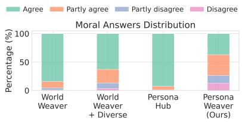  
(a) GPT-40

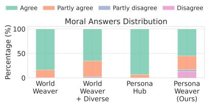  
(b) GPT-5.6 Luna

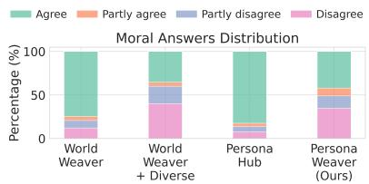  
(c) Qwen 3.5 35B-A3B

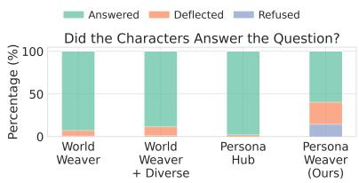  
(d) GPT-4o

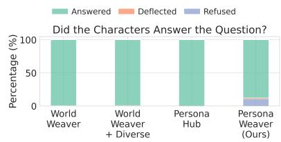  
(e) GPT-5.6 Luna

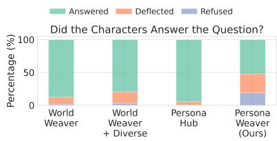  
(f) Qwen 3.5 35B-A3B  
Figure 3: Moral and interaction behavior across narration models. The top row reports responses to moral statements; the bottom row reports whether open-ended questions are answered, deflected, or refused. Each model-method combination aggregates 10,000 responses across ten settings. PERSONAWEAVER uses one persona card containing both moral guidance and interactional reaction style.

Characters are generated in batches of ten while accepted earlier profiles remain in the context. At each generation turn, the model is prompted to generate profiles that are different from all earlier profiles.

Settings and Scale. We use ten settings, five realistic and five fantastical, described through their physical and social environments and without references to the titles or characters proper names. We generate 100 characters per setting, method, and narration model, yielding 1,000 characters for each method-model combination. Settings and prompts appear in Appendix B.

Models and Implementation. We use GPT-4o, GPT-5.6 Luna, and Qwen 3.5 35B-A3B. Generation and answer temperature is 0.7. Consistency repair uses temperature 0 and 3,000 tokens; moral and interaction answers use caps of 10 and 256 tokens, respectively. Further implementation, dataset, and judge details appear in Appendix A.

## 4.2 Behavioral Diversity

To assess behavioral diversity, we test whether generated characters exhibit varied moral judgments and conversational reactions, which are essential for creating distinct and engaging encounters in virtual worlds.

To this end, we place every character in the same moral and conversational situations. We select ten normative statements from Social Chemistry (Forbes et al., 2020) because they elicit explicit judgments about socially appropriate behavior, and ask characters to respond on a four-point scale from fully agree to fully disagree. We also select ten open-ended questions from ConvAI2 (Dinan et al., 2019) which reflect a general distribution of questions a character may encounter in conversation while leaving room for the character to answer, evade, or reject the request. We measure the distribution of moral responses to quantify whether characters exhibit varied normative positions. For interaction, Qwen 3.6 27B classifies each reply as refusal, deflection, or compliance using a fixed rubric and temperature 0. In both evaluations, a broader coverage should reflect a more diverse population with less predictable encounters and modes of interaction.

Behavioral Homogenization in Prior Methods. Figure 3 shows the empirical pattern previewed in Fig. 1. Across LLM(s), WORLDWEAVER and PERSONAHUB concentrate moral responses on agreement and interaction responses on compliance. Their varied world descriptions therefore do not translate into comparably varied behavior under these probes.

Broader Moral and Reaction Coverage. PERsONAWEAVER spreads moral judgments over both agreement and disagreement and produces refusals and deflections in addition to direct answers (Fig. 3). The resulting populations clearly show greater behavioral diversity: different characters can affirm or challenge the same norm as well as answer, evade, or reject the same question. Such variation supports less repetitive interactions and creates more opportunities for surprising character encounters. Luna exhibits less reaction diversity than GPT-4o and Qwen because it follows some assigned reaction types less consistently, particularly deflection and meta-commentary as shown in Appendix C.

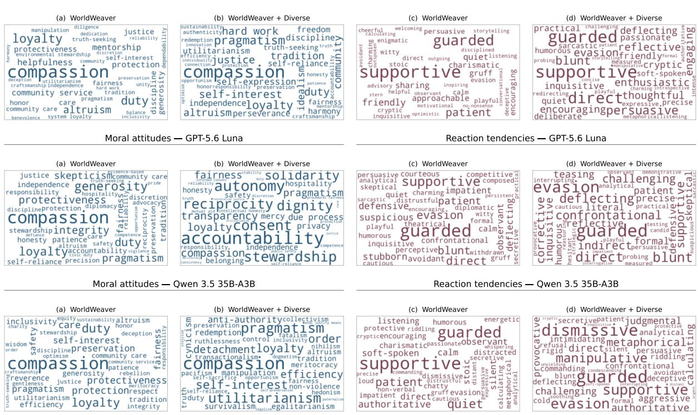  
Figure 4: Behavioral concepts expressed in generated persona cards. GPT-4o (top), GPT-5.6 Luna (middle), and Qwen 3.5 35B-A3B (bottom) comparisons of moral attitudes (a–b) and reaction tendencies (c-d) extracted from 6,000 WORLDWEAVER and WORLDWEAVER + Diverse cards across ten settings. Word size is proportional to the fraction of a model–method's cards containing the concept, counting each concept at most once per card.

Is a Generic Diversity Instruction Sufficient? To inspect what direct diversity prompting changes, Qwen 3.6 27B extracts up to three directly supported moral-attitude and reaction-tendency labels from GPT-4o, GPT-5.6 Luna, and Qwen 3.5 cards. It is instructed not to infer behavior from demographics, occupations, possessions, or goals. Figure 4 shows that WORLDWEAVER + Diverse makes behavioral language more explicit, but does not necessarily move it far from the models' default tendencies. GPT-4o remains centered on positive, prosocial concepts such as compassion, loyalty, and duty. GPT-5.6 Luna exhibits a similar pattern: despite some variation, its moral vocabulary is still dominated by positive concepts such as accountability, stewardship, dignity, solidarity, and compassion. This helps explain why generic diversity prompting leaves both models’ behavior concentrated around positive moral judgments and compliant reactions (Fig. 3). In contrast, PERSON-AWEAVER ensures broader behavioral coverage through its curated banks.

## 4.3 Effects Beyond Primary Behavior

Second-Order Writing Style. For interaction responses, we measure discourse fillers, interpersonal stance markers (hedges, negation, and intensifiers), response length, and sentiment. Sentiment is assigned by a RoBERTa classifier; Appendix D defines the rule-based interpersonal markers and their normalization. These measures test whether behavioral guidance can have downstream effects on writing choices. Figure 5 shows GPT-4o results; GPT-5.6 Luna and Qwen appear in Appendix E. Relative to the baselines, PERSONAWEAVER uses more fillers, hedges, explicit negation, and intensifiers. PERSONAWEAVER also produces a broader range of response lengths, including many short refusals and deflections and longer volunteering, playful, and meta-commentary responses. Its sentiment distribution includes more neutral and negative responses rather than concertinaing on responses with strong positive sentiment. These re-

Seeded-example setting: The Wire — A Baltimore neighborhood with brick townhouses, narrow alleys, and corner stores.

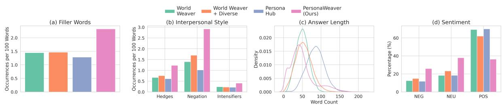  
Figure 5: Second-order writing style for GPT-4o. We compare filler-word use, interpersonal style markers (hedges, negation, and intensifiers), response length, and sentiment. GPT-5.6 Luna and Qwen results are reported in Appendix E.

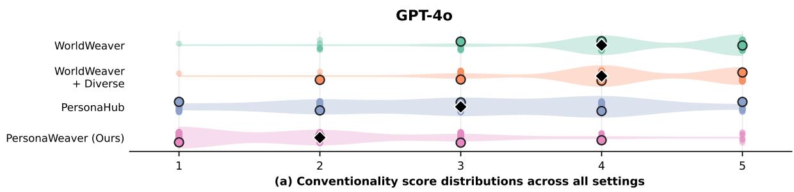

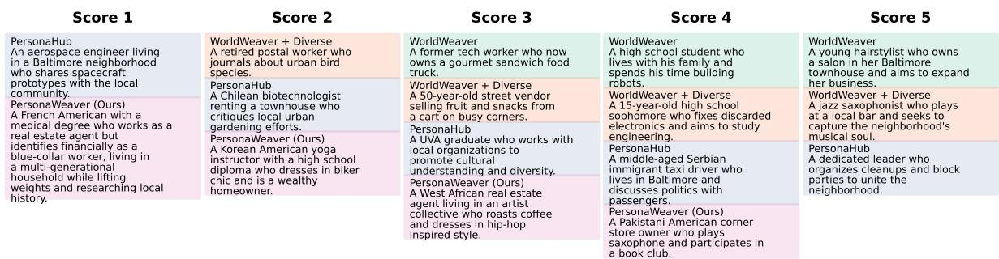  
(b) Seeded persona examples by score  
Figure 6: Conventionality of world-attribute combinations across all ten settings (GPT-4o). Qwen 3.6 27B scores each complete world card from 1 (highly unconventional) to 5 (archetypal). Violins show the score distributions over up to 1,000 valid cards per method, dots show individual cards, and black diamonds mark medians. Below, one-sentence summaries of seeded The Wire cards are grouped by score; each box uses the corresponding method color.

sults show that the behavioral guidance in PERSON-AWEAVER have second order effects on language and sentiment.

Less Conventional World-Attribute Combinations. We evaluate all 1,000 cards per method across ten settings. Qwen 3.6 27B scores each complete attribute combination from 1 (highly unconventional) to 5 (archetypal), with methods anonymized and cards shuffled in mixed-method, within-setting batches. Figure 6 shows that PERsONAWEAVER produces less conventional combinations than the baselines. The seeded examples further demonstrates this result: rather than familiar archetypes such as a neighborhood hairstylist or jazz musician, PERSONAWEAVER combines attributes into more uncommon characters such as a medically trained real-estate agent who identifies as blue-collar, or a wealthy yoga instructor with a biker-inspired style. The same pattern can be noticed for for GPT-5.6 Luna and Qwen in Appendix F.

We additionally ask a human annotator to rate 50 GPT-4o characters per method, balanced across settings, from 0 (completely implausible) to 5 (fully plausible). Average plausibility is 4.98 for WORLD-WEAVER, 5.00 for WORLDWEAVER + Diverse,

<table><tr><td></td><td>Friday Night Lights</td></tr><tr><td>Reaction</td><td>Controlled question and response</td></tr><tr><td>Compliance</td><td>Q: What do you do for fun? A: “Well, I like bird watchin&#x27;. Got a pair of old binoculars I take out when I got some free time. There&#x27;s</td></tr><tr><td>Refusal</td><td>somethin&#x27; real peaceful &#x27;bout keepin&#x27; an eye out for cardinals or blue jays around here.&quot; Q: What do you do for fun?</td></tr><tr><td>Playful/</td><td>A: “Ah, I don&#x27;t reckon that&#x27;s any of your concern, now is it?&quot; Q: What do you do for fun?</td></tr><tr><td>Subversive</td><td>A: “Fun? Oh, you mean like when I squint at birds through binoculars and pretend I&#x27;m a wildlife expert? Or maybe you&#x27;re talkin&#x27; about the thrill of finding the least soggy fries in a drive-thru bag. Life&#x27;s just one</td></tr><tr><td>Meta</td><td>big carnival, ain&#x27;t it?&quot; Q: What do you do for fun? A: “Funny thing about askin&#x27;what folks do for fun—makes you wonder if anyone&#x27;s ever really sure. I mean, doin&#x27;somethin&#x27;just to call it fun feels like puttin’ a label on somethin&#x27;that oughta just happen</td></tr><tr><td colspan="2">passin&#x27; time instead of havin&#x27;fun? Guess it depends on who&#x27;s askin&#x27;.&quot; Seinfeld</td></tr><tr><td></td><td>Controlled question and response</td></tr><tr><td>Reaction Compliance</td><td>Q: What&#x27;s your dream job? A: “I think my dream job would be running my own little café-bookstore. A cozy spot where people</td></tr><tr><td>Refusal</td><td>can browse books while enjoying coffee and pastries I&#x27;ve baked myself. It&#x27;d combine everything I love—baking, books, and creating a welcoming space for people.&quot; Q: What&#x27;s your dream job?</td></tr><tr><td></td><td>A: “&quot;Hmm, nah, I&#x27;m not getting into that. Let&#x27;s just say I&#x27;m good where I&#x27;m at right now.&quot; Q: What&#x27;s your dream job?</td></tr><tr><td>Playful/ Subversive</td><td>A: “Dream job? Oh, definitely professional cookie taster. I mean, I already bake like half my life away, so why not get paid to eat it too? But if that gig&#x27;s taken, maybe bookstore wizard—casting spells to make</td></tr><tr><td>Meta</td><td>customers actually read the books they buy.&quot; Q: What&#x27;s your dream job? A: “Dream job? Man, isn&#x27;t it wild how people always want to know what you&#x27;d do if the world worked</td></tr></table>

Table 2: The same character can react in distinct ways across settings. Changing PERSONAWEAVER's reaction guidance leads GPT-4o characters to answer directly, refuse, respond playfully, or reflect on the question itself. Within each setting, the character and question remain fixed.

4.98 for PERSONAHUB, and 4.82 for PERSON-AWEAVER. Thus, PERSONAWEAVER substantially expands beyond familiar archetypes while retaining high within-setting plausibility.

## 4.4 Qualitative Reaction Examples.

Table 2 illustrates this control in two settings, holding the GPT-4o character and question fixed within each one. In Friday Night Lights, the character moves from describing birdwatching to withholding the answer, joking about wildlife expertise and soggy fries, or questioning what it means to call an activity fun. The Seinfeld character likewise moves from a sincere cafe-bookstore aspiration to refusal, becoming a “professional cookie taster" or “bookstore wizard," or interrogating the idea of a single dream job. Across both settings, the guidance changes disclosure, stance, tone, and conversational direction while preserving character-specific details.

## 5 Conclusion

We show that existing PCG methods produce behaviorally homogeneous character populations, favoring positive moral judgments and helpful reactions even when prompted to diversify their behaviors. We introduce PERSONAWEAVER which mitigates these biases by separating setting-specific world construction from behavioral modeling while using curated banks to broaden behavioral coverage. Across three LLMs and ten settings, it broadens moral and interactional responses. Furthermore, we show that this broader coverage results in second order effects in interpersonal language, response length, and sentiment, and produces less archetypal world-attribute combinations. Together, these results show that factorized generation can push character populations beyond the behavioral, linguistic, and world-building defaults of existing PCG methods.

## 6 Limitations

Our evaluation is limited in three ways: 1) it only examines two behavioral dimensions: moral stances and characters’ interactions. It overlooks dimensions like emotional regulation. Therefore, future work can benefit from expanding our evaluation setup 2) While our coarse grained moral stance evaluation enables a streamlined study, it overlooks more nuanced moral reasoning that can't be simply coarsely categorized. 3) Our behavior module sample each behavioral category with equal probability. This fits our goal of studying whether LLM(s) can be exhibit diverse procedural generation. However, in practice, the desired distribution of moral stances likely would likely change between settings. Therefore, future work can benefit from studying how much LLM(s) are able to replicate more varied distributions across settings.

Potential Risks Efforts to systemically expand behavioral diversity in character generation can push models to generate characters that replicate offensive or unsafe behaviors. Therefore, careful curation of behavioral banks is essential to ensure that increasing diversity in character generation serves creative and research goals without amplifying harm.

## References

Josh Achiam, Steven Adler, Sandhini Agarwal, Lama Ahmad, Ilge Akkaya, Florencia Leoni Aleman, Diogo Almeida, Janko Altenschmidt, Sam Altman, Shyamal Anadkat, et al. 2023. Gpt-4 technical report. arXiv preprint arXiv:2303.08774.

Myra Cheng, Esin Durmus, and Dan Jurafsky. 2023. Marked personas: Using natural language prompts to measure stereotypes in language models. arXiv preprint arXiv:2305.18189.

Emily Dinan, Varvara Logacheva, Valentin Malykh, Alexander Miller, Kurt Shuster, Jack Urbanek, Douwe Kiela, Arthur Szlam, Iulian Serban, Ryan Lowe, et al. 2019. The second conversational intelligence challenge (convai2). In The NeurIPS'18 Competition: From Machine Learning to Intelligent Conversations, pages 187–208. Springer.

Maxwell Forbes, Jena D. Hwang, Vered Shwartz, Maarten Sap, and Yejin Choi. 2020. Social chemistry 101: Learning to reason about social and moral norms. In Proceedings of the 2020 Conference on Empirical Methods in Natural Language Processing (EMNLP), pages 653–670, Online. Association for Computational Linguistics.

Jonas Freiknecht and Wolfgang Effelsberg. 2020. Procedural generation of interactive stories using language

models. In Proceedings of the 15th International Conference on the Foundations of Digital Games, pages 1–8.

Tao Ge, Xin Chan, Xiaoyang Wang, Dian Yu, Haitao Mi, and Dong Yu. 2024. Scaling synthetic data creation with 1,000,000,000 personas. arXiv preprint arXiv:2406.20094.

Jesse Graham, Jonathan Haidt, Sena Koleva, Matt Motyl, Ravi Iyer, Sean P Wojcik, and Peter H Ditto. 2013. Moral foundations theory: The pragmatic validity of moral pluralism. In Advances in experimental social psychology, volume 47, pages 55–130. Elsevier.

Chengpeng Hu, Yunlong Zhao, and Jialin Liu. 2024. Game generation via large language models. In 2024 IEEE Conference on Games (CoG), pages 1–4. IEEE.

Meiqing Jin, Manvi Kaul, Shriya Ramakrishanan, Hardik Jain, Samarth Chandrawat, Ishita Agarwal, Tianyi Zhang, Andrew Zhu, and Chris Callison-Burch. 2024. Worldweaver: Procedural world generation for text adventure games using large language models. In The 4th Wordplay: When Language Meets Games @ ACL 2024. Wordplay 2024.

Hadas Kotek, Rikker Dockum, and David Sun. 2023. Gender bias and stereotypes in large language models. In Proceedings of the ACM collective intelligence conference, pages 12–24.

Messi HJ Lee and Soyeon Jeon. 2024. Vision-language models generate more homogeneous stories for phenotypically black individuals. arXiv preprint arXiv:2412.09668.

Muhammad U Nasir, Steven James, and Julian Togelius 2024. Word2world: Generating stories and worlds through large language models. arXiv preprint arXiv:2405.06686.

OpenAI. 2026. GPT-5.6: Frontier intelligence that scales with your ambition. https://openai.com/ index/gpt-5-6/. Accessed: 2026-08-04.

Long Ouyang, Jeffrey Wu, Xu Jiang, Diogo Almeida, Carroll Wainwright, Pamela Mishkin, Chong Zhang, Sandhini Agarwal, Katarina Slama, Alex Ray, et al. 2022. Training language models to follow instructions with human feedback. Advances in neural information processing systems, 35:27730–27744.

Joon Sung Park, Joseph O'Brien, Carrie Jun Cai, Meredith Ringel Morris, Percy Liang, and Michael S Bernstein. 2023. Generative agents: Interactive simulacra of human behavior. In Proceedings of the 36th annual acm symposium on user interface software and technology, pages 1–22.

Yunfan Shao, Linyang Li, Junqi Dai, and Xipeng Qiu 2023. Character-LLM: A trainable agent for roleplaying. In Proceedings of the 2023 Conference on Empirical Methods in Natural Language Processing, pages 13153–13187, Singapore. Association for Computational Linguistics.

Shyam Sudhakaran, Miguel González-Duque, Matthias Freiberger, Claire Glanois, Elias Najarro, and Sebastian Risi. 2023. Mariogpt: Open-ended text2level generation through large language models. Advances in Neural Information Processing Systems, 36:54213– 54227.

Angelina Wang, Jamie Morgenstern, and John P Dickerson. 2025. Large language models that replace human participants can harmfully misportray and flatten identity groups. Nature Machine Intelligence, pages 1–12.

Zekun Moore Wang, Zhongyuan Peng, Haoran Que, Jiaheng Liu, Wangchunshu Zhou, Yuhan Wu, Hongcheng Guo, Ruitong Gan, Zehao Ni, Jian Yang, et al. 2023. Rolellm: Benchmarking, eliciting, and enhancing role-playing abilities of large language models. arXiv preprint arXiv:2310.00746.

An Yang, Anfeng Li, Baosong Yang, Beichen Zhang, Binyuan Hui, Bo Zheng, Bowen Yu, Chang Gao, Chengen Huang, Chenxu Lv, et al. 2025. Qwen3 technical report. arXiv preprint arXiv:2505.09388.

Jinfeng Zhou, Zhuang Chen, Dazhen Wan, Bosi Wen, Yi Song, Jifan Yu, Yongkang Huang, Libiao Peng, Jiaming Yang, Xiyao Xiao, et al. 2023. Characterglm: Customizing chinese conversational ai characters with large language models. arXiv preprint arXiv:2311.16832.

## A Dataset Details

Our evaluations draw on two sources of prompts: moral norm statements from Social Chemistry (Forbes et al., 2020) and conversational questions from ConvAI2 (Dinan et al., 2019). Table 3 lists the full set used in our experiments.

Social Chemistry. We use a curated set of everyday moral statements from Social Chemistry, which encodes widely held social norms. These statements probe whether generated characters adopt varied moral positions rather than uniformly agreeing with conventional norms.

ConvAI2. We extract candidate utterances from ConvAI2 dialogues by filtering for sentences ending in a question mark. We select five general questions about hobbies, preferences, or opinions and five questions about feelings or states. These probes allow characters to answer, refuse, or deflect in comparable conversational situations.

Reaction Classifier. To produce the reaction distributions in Fig. 3, Qwen 3.6 27B (Yang et al., 2025) classifies each open-ended reply as refusal, deflection, or compliance using a fixed rubric and temperature 0.

## B Settings

We evaluate five realistic and five fantastical settings (Table 4). Each prompt describes only the physical and social structure of its world, without titles or canonical character names, preventing the model from simply reproducing existing characters.

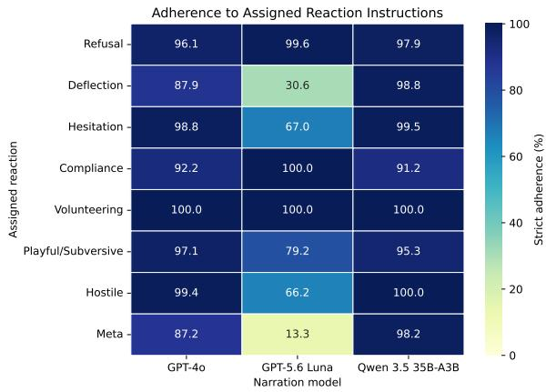  
Figure 7: Strict adherence to assigned reaction styles. Each cell is the setting-balanced mean fraction of responses scored as clearly following the assigned instruction. The analysis covers one realistic and one fantastical setting.

## C Reaction-Instruction Adherence

We test whether open-ended responses follow the reaction assigned to their PERSONAWEAVER card. The analysis uses all existing interaction responses from one realistic and one fantastical setting. Qwen 3.6 27B scores each response as clearly following (2), partially following (1), or not following (0) its assigned reaction.

Strict adherence is at least 87.2% for every GPT-4o category and 91.3% for every Qwen category (Fig. 7). Luna follows compliance, volunteering, and refusal, but does so for deflection and meta guidance less consistently (30.6% and 13.3% strict adherence, respectively). This highlights the importance of carefully assessing whether models follow the reaction instructions they're provided.

## D Interpersonal Style Measurement

We measure discourse fillers, hedges, negation, and intensifiers using transparent lexical patterns. Text is lowercased, typographic apostrophes are normalized, and words are identified with a wordboundary tokenizer. Fillers include markers such as um, uh, hmm, you know, and I mean; ambiguous words such as like, so, well, right, and actually are counted only in conversational contexts. Hedges include individual markers such as maybe, perhaps, possibly, presumably, and arguably, as well as constructions such as I think, I guess, it seems, kind of, sort of, and I'm not sure. Negation includes not, never, neither, nor, cannot, no, and contracted forms ending in n't. Intensifiers include very, really, absolutely, completely, totally, utterly, extremely, incredibly, deeply, highly, and entirely.

<table><tr><td>Source</td><td>Questions / Statements</td><td></td></tr><tr><td>Social (Forbes et al., 2020)</td><td>Chemistry</td><td>Parents are expected to make sure their kids eat healthy food.</td></tr><tr><td></td><td></td><td>It&#x27;s rude to fail to recognize other&#x27;s contributions.</td></tr><tr><td></td><td></td><td>You shouldn&#x27;t be noisy around others so you don&#x27;t disturb them.</td></tr><tr><td></td><td></td><td>It&#x27;s good to have faith in your skills as a performer.</td></tr><tr><td></td><td></td><td>It&#x27;s kind to let other trust their judgment.</td></tr><tr><td></td><td></td><td>It is bad to make lies.</td></tr><tr><td></td><td></td><td>It&#x27;s important to be a team player when playing team sports.</td></tr><tr><td></td><td></td><td>You should not steal things from other people.</td></tr><tr><td></td><td></td><td>You shouldn&#x27;t disrespect other people.</td></tr><tr><td></td><td></td><td>It&#x27;s bad to make assumptions about people based on their looks.</td></tr><tr><td></td><td>ConvAI2 (Dinan et al., Sentiment (s1–s5):</td><td></td></tr><tr><td>2019)</td><td></td><td></td></tr><tr><td></td><td></td><td>How are you feeling?</td></tr><tr><td></td><td></td><td>What&#x27;s on your mind?</td></tr><tr><td></td><td></td><td>What else is worrying you?</td></tr><tr><td></td><td></td><td>What are you excited about? What are you anxious about?</td></tr><tr><td></td><td></td><td></td></tr><tr><td></td><td></td><td>General (q1−q5): What do you do for fun?</td></tr><tr><td></td><td></td><td>What&#x27;s your dream job?</td></tr><tr><td></td><td></td><td>What is your favorite thing to do with your family?</td></tr><tr><td></td><td></td><td></td></tr><tr><td></td><td></td><td>What kind of music do you like to play?</td></tr></table>

Table 3: Moral statements and conversational questions used in our evaluation. Moral norms are drawn from Social Chemistry (Forbes et al., 2020), while conversational prompts are extracted from ConvAI2 (Dinan et al., 2019). Refer to Appendix A for further discussion.

For each response and marker family, we divide the number of matches by its word count and multiply by 100. Figure 5 and the additional results below report the mean of these per-response rates.

## E Additional Second-Order Results

Figure 8 reports the second-order writing-style analysis for GPT-5.6 Luna and Qwen 3.5 35B-A3B, complementing the GPT-4o results in Fig. 5.

For both models, PERSONAWEAVER produces the highest rate of negation. The method also shows a more balanced sentiment distribution, unlike the one for prior method that concentrates more on positive sentiment. Furthermore, PERSONAWEAVER with Luna produces more short-response mode, while Qwen shows more use of hedges and intensifiers. These patterns assert the GPT-4o findings that behavioral guidance have significant second order effects on language and sentiment.

## F Conventionality Across Narration Models

We repeat the ten-setting complete-card conventionality analysis from Fig. 6 for GPT-5.6 Luna and Qwen 3.5 35B-A3B, retaining the same judge, rubric, seed, anonymization, and mixed-method batching. Figures 9a and 9b show the distributions and fixed The Wire examples.

The conventionality results for GPT-4o in the main paper extend for both models: PERsON-AWEAVER has a median score of 2, compared with baseline medians of 3 or 4. Moreover, PERSON-AWEAVER has more cards in the unconventional scores: 1 and 2.

<table><tr><td>Realistic Settings</td><td>Prompt</td></tr><tr><td>Friday Night Lights</td><td>A rural Texas town with a high school football stadium, modest houses, and wide flat plains.</td></tr><tr><td>Seinfeld</td><td>A Manhattan neighborhood block with apartment buildings, cafes, and subway entrances on busy city streets.</td></tr><tr><td>Fargo</td><td>A Midwestern town in Minnesota with snow-covered roads, low-rise shops, and roadside diners.</td></tr><tr><td>The Wire</td><td>A Baltimore neighborhood with brick townhouses, narrow alleys, and corner stores.</td></tr><tr><td>Lady Bird</td><td>Sacramento with a Catholic school campus, residential streets, and modest houses.</td></tr><tr><td>Fantastical Settings</td><td>Prompt</td></tr><tr><td>Wizard of Oz</td><td>A fantastical city with tall green towers and glittering walls, inhabited by magical beings and travelers from distant lands.</td></tr><tr><td>Frozen</td><td>A Nordic-inspired kingdom with a fjord-side castle, alpine peaks, and snow- covered villages, inhabited by royal families and townspeople.</td></tr><tr><td>Game of Thrones</td><td>A medieval coastal city with high stone walls, winding streets, and a fortress overlooking the harbor, inhabited by nobles, soldiers, and commoners.</td></tr><tr><td>Avatar</td><td>An alien moon with towering jungle trees, floating mountains, and glowing flora, inhabited by blue-skinned humanoids and diverse wildlife.</td></tr><tr><td>The Matrix</td><td>A simulated city with glass skyscrapers, subway tunnels, and repeating architec- ture, populated by ordinary humans and hidden agents of the system.</td></tr></table>

Table 4: We draw on settings inspired by publicly known fictional and real-world contexts spanning both realistic and fantastical domains. Refer to Appendix B for further discussion

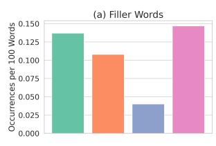

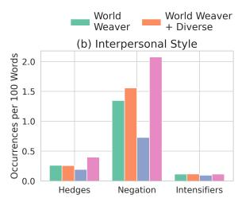

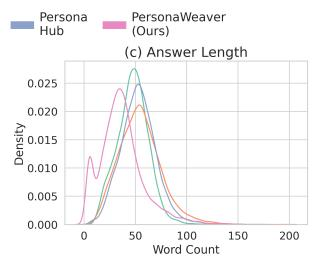  
(a) GPT-5.6 Luna

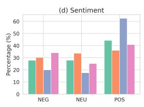

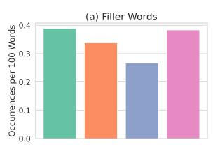

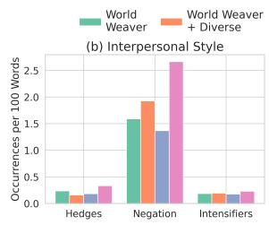

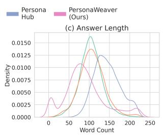  
(b) Qwen 3.5 35B-A3B

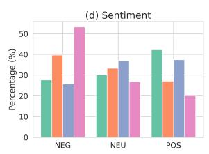  
Figure 8: Additional second-order writing-style results. GPT-5.6 Luna and Qwen comparisons of filler-word use, interpersonal style markers (hedges, negation, and intensifiers), response length, and sentiment. Interpersonal markers are occurrences per 100 words, calculated per response and then averaged.

Seeded-example setting: The Wire — A Baltimore neighborhood with brick townhouses, narrow alleys, and corner stores.  
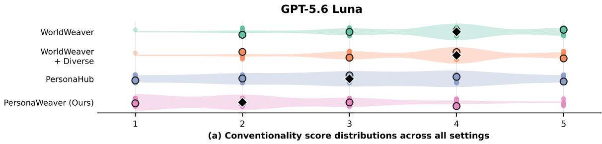

Seeded-example setting: The Wire — A Baltimore neighborhood with brick townhouses, narrow alleys, and corner stores.  
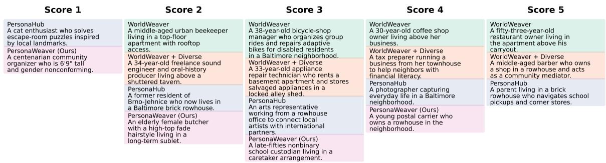  
(b) Seeded persona examples by score

(a) GPT-5.6 Luna  
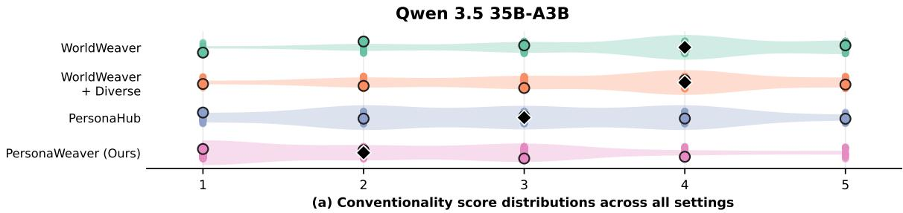

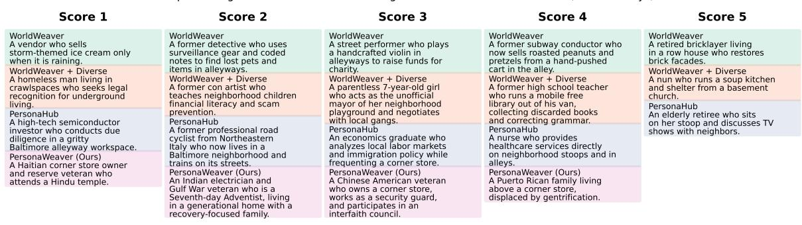  
(b) Seeded persona examples by score  
(b) Qwen 3.5 35B-A3B  
Figure 9: World-attribute conventionality across all ten settings for additional narration models. Violins pool up to 1,000 valid cards per method, and seeded examples remain fixed to The Wire. Cards with fewer than two explicit world attributes are excluded. Both panels use the same protocol as Fig. 6.