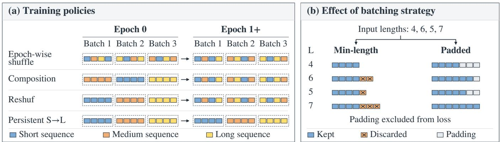
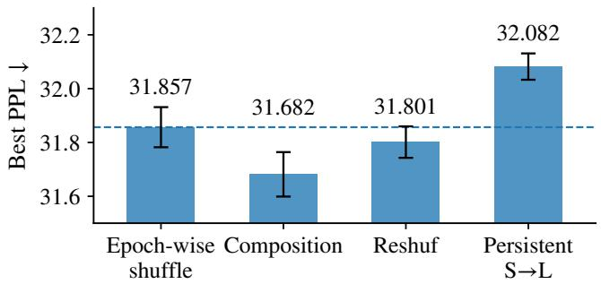
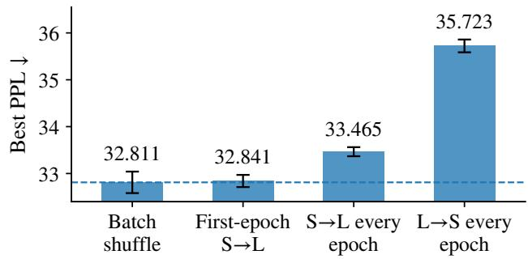
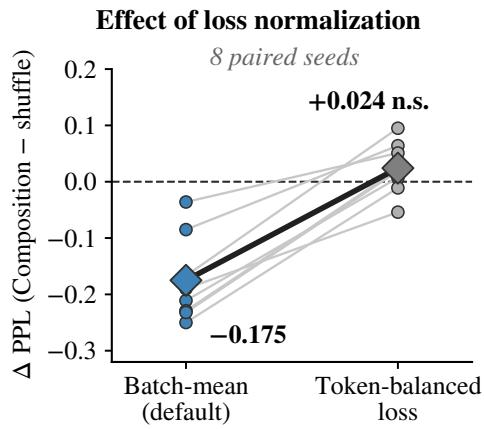

# RETHINKING LENGTH-BASED TRAINING: BATCH COMPOSITION AND LOSS NORMALIZATION IN SPEECH TOKEN LANGUAGE MODELS

Hongjin Song1, Runwu Shi2, Weiqiao Shan3, Jiale Luo4, Yujin Wang5, Yifei Wu6, Chunxiang $J i n ^ { 6 , * }$

1Beijing Institute of Technology, Zhuhai; 2Institute of Science Tokyo; 3Northeastern University 4Sichuan University; 5Wuhan University; 6Ant Group

## ABSTRACT

Short-to-long training is a simple curriculum for speech models, but its gains can be difficult to interpret. In speech token language models, length-based training can change the shuffle policy, batch composition, token retention, and token weights under batch-mean loss. We disentangle these factors through matched comparisons. In the tested settings, short-to-long ordering shows no independent benefit when batch composition and token exposure are fixed. First-epoch grouping lowers perplexity for Mimi under batch-mean loss, but this gain is not observed under token-balanced loss. The cross-tokenizer results are consistent with a link between chunk-length variation and token weighting. This work provides a systematic analysis protocol for studying length-based training in variable-length speech models.

Index Terms— speech token language models, curriculum learning, data ordering, batching, loss normalization

## 1. INTRODUCTION

Autoregressive modeling of discrete speech tokens has received increasing attention in speech generation and speech language modeling [1, 2, 3]. The length of a speech-token sequence depends on both utterance duration and tokenizer rate. This affects batch construction and the number of valid tokens in each update. SortaGrad presents shorter utterances first in the first epoch and then returns to random minibatch order [4]. Recent work studies curriculum schedules with token budgets [5], difficulty-based token-loss weighting [6], and within-batch diversity [7]. Sequence length also matters in speech data selection [8].

Document packing also changes training: Best-fit Packing reduces document fragmentation while preserving training efficiency [9]. Here, length sorting changes batch membership and, under min-length truncation, which targets are retained. Per-batch mean loss also assigns larger coefficients to token losses in batches with fewer valid targets. A sorted-versus-random comparison can therefore mix presentation order with changes in target exposure and loss normalization.

We ask whether the gains from short-to-long training come from presentation order or from the changes in batching that accompany length sorting. Our fixed-batch comparisons isolate presentation order, and a normalization intervention tests the remaining first-epoch grouping effect. The study uses an 87M-parameter Transformer on LibriSpeech train-clean-100, with Mimi for the main analysis and EnCodec and SpeechTokenizer for cross-tokenizer comparisons.

With padded evaluation and fixed batch membership, sorted orders do not improve perplexity in the tested settings. First-epoch grouping lowers PPL for Mimi under batch-mean loss, but this gain is not observed under token-balanced loss. The normalization change has little effect on Shuffle but raises PPL for Composition. The controlled comparisons separate presentation order from batch construction and loss normalization.

## 2. METHOD

## 2.1. Training factors

Let $\mathbf { x } _ { i } = \left( x _ { i , 1 } , \ldots , x _ { i , c _ { i } } \right)$ be a stored token chunk. Its next-token target length is $\ell _ { i } = c _ { i } - 1 \leq M$ , with $M = 2 5 6$ . Length-based training changes the factors below.

Shuffle policy. A random permutation can be sampled once and reused, or sampled again at every epoch. We call these settingsfixed random order and epoch-wise shuffle. They match the SingleShuffle/RandomShuffle distinction in optimization work [10]. Epochwise shuffling also changes which sequences share a batch across epochs.

Batch composition and order. Length sorting affects both which sequences appear in the same batch and the order in which batches are processed. We distinguish these two effects. Length grouping forms batches from sequences with similar lengths, while short-to-long order presents the resulting batches in ascending length order. The batch order can instead be randomized while preserving the same length-grouped composition.

Token retention and capacity use. For a processed batch $B ,$ let $T _ { B } = \textstyle \sum _ { i } \ell _ { i }$ before truncation. Min-length batching retains $K _ { B } =$ $| B |$ mini $\ell _ { i }$ targets; padded batching retains all $T _ { B }$ targets. Across batches,

$$
R _ { \mathrm { { r e t } } } = { \frac { \sum _ { B } K _ { B } } { \sum _ { B } T _ { B } } } ,\tag{1}
$$

$$
U _ { \mathrm { c a p } } = \frac { \sum _ { B } K _ { B } } { M \sum _ { B } | B | } .\tag{2}
$$

$R _ { \mathrm { r e t } }$ is true target retention; $U _ { \mathrm { c a p } }$ measures use of fixed maximum capacity. Near-equal short chunks can have high retention but low capacity use. Table 2 reports $U _ { \mathrm { c a p } }$

## 2.2. Training configurations

The factors above are separated through the training configurations in Table 1. Here, “grouped” denotes length-homogeneous batches.

Composition and Reshuf use the same length-grouped batches in the first epoch. Composition presents these batches in random order; Reshuf presents them from short to long. Both return to epoch-wise shuffling afterward. Their comparison isolates first-epoch batch order while keeping batch composition fixed. Persistent short-to-long training repeats length grouping and ascending order at every epoch.

The fixed-batch comparison reuses batch membership and padding masks. Batch shuffle randomizes the batch list at every epoch. First-epoch S→L sorts batches by mean length in epoch 0 and shuffles them afterward. Two persistent conditions repeat ascending or descending batch order. The targets within each batch are unchanged.

  
Fig. 1. Overview of the factors changed by length-based training. (a) Training policies across epochs. Composition and Reshuf use the same first-epoch length grouping but differ in batch order; both return to epoch-wise shuffling afterward, while Persistent S→L repeats grouping and ascending order. (b) For an example variable-length batch, min-length batching discards valid tokens beyond the shortest sequence, whereas padded batching keeps all valid tokens and masks padding in the loss.

Table 1. Training configurations used in the factorization.
<table><tr><td colspan="3">Setting Ep. 0 batch Ep. 0 order</td><td>Ep. 1+</td></tr><tr><td>Epoch-wise shuffle</td><td>Random</td><td>Random</td><td>Shuffle</td></tr><tr><td>Composition</td><td>Grouped</td><td>Random</td><td>Shuffle</td></tr><tr><td>Reshuf</td><td>Grouped</td><td>S→L</td><td>Shuffle</td></tr><tr><td>Persistent S→L</td><td>Grouped</td><td>S→L</td><td>S→L</td></tr></table>

To examine persistent length grouping separately, we also compare two grouped settings. In the static-grouped setting, the same length-grouped batches are reused across epochs. In the dynamicgrouped setting, length-grouped batches are reconstructed at each epoch while their global order remains random. Comparing the two tests whether changes in batch membership, rather than length grouping itself, account for their training behavior.

## 2.3. Loss normalization

For a batch $B ,$ let $\nu _ { B }$ denote its set of valid target positions and $N _ { B } = | \gamma _ { B } |$ . The standard training objective used in our initial experiments averages token-level cross entropy within each batch:

$$
\mathcal { L } _ { \mathrm { m e a n } } ( \boldsymbol { B } ) = - \frac { 1 } { N _ { \mathscr { B } } } \sum _ { ( i , t ) \in \mathcal { V } _ { \mathscr { B } } } \log p _ { \theta } ( x _ { i , t } \mid \boldsymbol { x } _ { i , < t } ) .\tag{3}
$$

Each valid token loss has coefficient $1 / N _ { B }$ . Batches with fewer valid targets assign larger coefficients to individual token losses.

We use token-balanced loss as a diagnostic intervention,

$$
\mathcal { L } _ { \mathrm { b a l } } ( \boldsymbol { B } ) = - \frac { 1 } { Z } \sum _ { ( i , t ) \in \mathcal { V } _ { \mathcal { B } } } \log p _ { \theta } ( x _ { i , t } \mid \boldsymbol { x } _ { i , < t } ) .\tag{4}
$$

The fixed constant $Z$ is the mean stored token count in the reference length-grouped batches, before next-token shifting. It is shared by the compared settings. Every valid target loss has coefficient $1 / Z$

For a fixed batch and model state, $\mathcal { L } _ { \mathrm { b a l } } = ( N _ { B } / Z ) \mathcal { L } _ { \mathrm { m e a n } }$ . If validtarget counts are constant, the two losses differ only by a constant scale. Loss coefficients are not ratios of AdamW parameter updates, which also depend on gradient moment estimates.

## 3. EXPERIMENTAL SETUP

## 3.1. Data and tokenizers

The main experiments use LibriSpeech train-clean-100 [11] with a speaker-disjoint split (split seed 0). Mimi [12] provides the main analysis; EnCodec [13] and SpeechTokenizer [14] provide comparisons. We use one stream without concatenating codebooks: Mimi uses codebook 0 with one quantizer, EnCodec its first codebook, and SpeechTokenizer its semantic stream. Token indices are used directly. The vocabulary spans zero through the largest observed index; padded training adds a PAD symbol.

Chunks contain up to 257 stored tokens, yielding up to 256 next-token targets. Long utterances use 257-token windows at stride 256 and omit incomplete tails; short utterances form one chunk. Main runs omit the trailing group of at most 64 chunks; the fixed-batch study keeps every complete training batch. Padded training uses 257 stored positions. Chunk-length variation is $\mathrm { C V } ( c ) = \mathrm { s t d } ( c ) / \mathrm { m e a n } ( c )$

## 3.2. Model and training

Experiments use an 87M-parameter autoregressive Transformer with 12 layers, 12 attention heads, and hidden dimension 768. The batch size is 64. AdamW uses a peak learning rate of $3 \times 1 0 ^ { - 4 }$ , weight decay 0.01, and a one-cycle schedule with 5% warmup. Gradients are clipped at norm 1. Main runs use a maximum of 12 epochs, with early-stopping patience three and an improvement threshold of 0.02 validation PPL. The fixed-batch study runs all 12 epochs without early stopping: 3,324 updates in every run.

The main comparisons pair eight initialization seeds and share optimizer and schedule settings. They match the maximum budget, not the executed updates: Mimi Shuffle runs take 1,662–1,939 updates, whereas Composition and Reshuf each take 1,939. All have 277 updates per epoch. The normalization intervention uses $Z =$ 9217.39 in both arms, computed before next-token shifting. For 64- chunk reference batches, the mean target count is $Z - 6 4 = 9 1 5 3 . 3 9$

(a) Padded batching Early stopping; at most 12 epochs

  
(b) Fixed batch membership 12 epochs; 3,324 updates

  
Fig. 2. Grouping and ordering comparisons on Mimi. (a) Padded policies with early stopping (Table 3). (b) Fixed batch membership, 12 epochs, and 3,324 updates (Table 4A). Bars show mean recorded best PPL over eight seeds; error bars show one standard deviation. Dashed lines mark each panel’s shuffle baseline

## 3.3. Evaluation

Validation uses consecutive full batches: 32 chunks in the main comparisons and 64 in the fixed-batch study. Padded evaluation retains their non-padding targets. Each comparison uses the same validation targets within its study. Perplexity is computed over the evaluated targets:

$$
\mathrm { P P L } = \exp \left( - \frac { 1 } { N } \sum _ { t = 1 } ^ { N } \log p _ { \theta } ( x _ { t } \mid x _ { < t } ) \right) .\tag{5}
$$

We report mean ± standard deviation of the recorded best PPL, which is updated only when PPL improves by more than 0.02. Composition and fixed-batch analyses use two-sided paired t-tests. Table 3 reports raw p-values. Holm correction is applied to the two primary decomposition contrasts and, separately, the two persistent sorted-order comparisons in Table 4A. For Table 5, we compute $I _ { s } = \Delta _ { \mathrm { c o m p , s } } ^ { \mathrm { b a l } } - \mathrm { \hat { \Delta } _ { \mathrm { c o m p , s } } ^ { \mathrm { m e a n } } }$ within each seed and test its mean against zero using a two-sided one-sample t-test $( n = 8$ , seven degrees of freedom). Interaction and loss-switch p-values are unadjusted.

## 4. RESULTS

## 4.1. Length-based training changes more than order

Figure 2 summarizes the padded comparisons on Mimi. Panel (a) varies grouping and presentation order; panel (b) keeps batch membership fixed and changes order alone. Composition reaches 31.682 PPL, below 31.857 for epoch-wise shuffle, whereas Persistent S→L reaches 32.082. With fixed batches, first-epoch short-to-long ordering changes PPL by only 0.029 $( p = 0 . 8 1 )$ . The benefit of firstepoch grouping is therefore distinct from the effect of presenting shorter batches first.

Table 2 shows that grouping makes chunks within a batch nearly equal in length. Batch-max padding is the mean of $1 \ : -$ $\textstyle \sum _ { i } c _ { i } / ( | { \bar { B } } |$ maxi ci) across batches. These statistics average nine shuffled batchings (three seeds, three epochs); grouping is deterministic. $U _ { \mathrm { c a p } }$ uses shuffle seed 1, epoch 1. The increase from 12.6% to 55.8% is greater use of the fixed target capacity, not a true-retention ratio. Grouping also raises the between-batch storedtoken-count CV from 0.038 to 0.309, linking batch construction to loss normalization.

Table 2. Mimi batch statistics (batch size 64, $M = 2 5 6 )$ . Count statistics use stored tokens before next-token shifting. Batch-max padding is a diagnostic, not the fixed training shape.
<table><tr><td>Metric</td><td>Shuffle Grouped</td><td></td></tr><tr><td>Within-batch length CV</td><td>0.3065</td><td>0.0025</td></tr><tr><td>Within-batch max/min</td><td>5.87</td><td>1.007</td></tr><tr><td>Batch-max padding</td><td>23.1%</td><td>0.4%</td></tr><tr><td>Batch stored-token-count CV</td><td>0.038</td><td>0.309</td></tr><tr><td>Min-length capacity use  $U _ { \mathrm { c a p } }$ </td><td>12.6%</td><td>55.8%</td></tr></table>

Table 3. Mimi factorization $( n = 8 )$ . Differences and raw p-values are relative to epoch-wise shuffle.
<table><tr><td>Setting</td><td>Best PPL↓</td><td>∆ PPL</td><td>p</td></tr><tr><td>Epoch-wise shuffle</td><td> $3 1 . 8 5 7 \pm 0 . 0 7 5$ </td><td></td><td>一</td></tr><tr><td>Composition</td><td> $\mathbf { 3 1 . 6 8 2 \pm 0 . 0 8 3 }$ </td><td>-0.175</td><td> $3 . 3 5 \times 1 0 ^ { - 4 }$ </td></tr><tr><td>Reshuf</td><td> $3 1 . 8 0 1 \pm 0 . 0 5 8$ </td><td>-0.055</td><td> $1 . 0 8 \times 1 0 ^ { - 2 }$ </td></tr><tr><td>Persistent S→L</td><td> $3 2 . 0 8 2 \pm 0 . 0 4 9$ </td><td>+0.225</td><td> $3 . 3 5 \times 1 0 ^ { - 6 }$ </td></tr></table>

## 4.2. Separating ordering from batch composition

With padded batching, all valid tokens are retained, allowing batch composition and presentation order to be separated. Table 3 compares epoch-wise shuffle, Composition, Reshuf, and Persistent S→L under this setting.

Let $P _ { S } , P _ { C } ,$ , and $P _ { R }$ denote the PPL of Shuffle, Composition, and Reshuf. The total Reshuf effect can be written as

$$
P _ { R } - P _ { S } = \underbrace { ( P _ { C } - P _ { S } ) } _ { \Delta _ { \mathrm { c o m p } } } + \underbrace { ( P _ { R } - P _ { C } ) } _ { \Delta _ { \mathrm { o r d e r } } } .\tag{6}
$$

For Mimi, $\Delta _ { \mathrm { c o m p } } ~ = ~ - 0 . 1 7 5$ , while $\Delta _ { \mathrm { o r d e r } } ~ = ~ + 0 . 1 2 0$ . Composition lowers PPL under batch-mean loss. Adding short-to-long order to the same grouped batches raises PPL by 0.120 $( p _ { \mathrm { H o l m } } =$ $6 . 7 0 \times 1 0 ^ { - 4 } )$ , removing part of that gain. Persistent S→L is also worse than epoch-wise shuffle. The observed gain is associated with first-epoch batch composition, not its short-to-long order.

Table 4. Mimi order and grouping comparisons $( n = 8 )$ . A: differences from Batch shuffle; Holm correction for the two persistent sorted orders, raw p for First-epoch S→L. B: raw paired tests.
<table><tr><td rowspan=1 colspan=1>Setting              Best PPL↓   $\Delta \mathrm { P P L }$     p</td></tr><tr><td rowspan=1 colspan=1>A. Fixed batch membership (order only)</td></tr><tr><td rowspan=1 colspan=1>Batch shuffle       $3 2 . 8 1 1 \pm 0 . 2 3 0$ First-epoch $\mathsf { S } { \to } \mathrm { L }$   $3 2 . 8 4 1 \pm 0 . 1 3 0 \ + 0 . 0 2 9$     $0 . 8 1$ S→L every epoch 33.465 ± 0.097 +0.654 $5 . 5 { \times } 1 0 ^ { - 5 }$  $\mathrm { L } {  } S$ every epoch  $3 5 . 7 2 3 \pm 0 . 1 3 6 + 2 . 9 1 1$  $2 . 9 \times 1 0 ^ { - 8 }$ </td></tr><tr><td rowspan=1 colspan=1>B. Persistent length grouping</td></tr><tr><td rowspan=1 colspan=1>Epoch-wise shuffle $3 1 . 8 5 7 \pm 0 . 0 7 5$ Dynamic grouped  $3 3 . 0 7 5 \pm 0 . 2 7 6 + 1 . 2 1 9 \ 8 . 9 { \times } 1 0 ^ { - 6 }$ Static grouped     $3 3 . 1 7 6 \pm 0 . 4 1 6 + 1 . 3 1 9$  $7 . 6 \times 1 0 ^ { - 5 }$ </td></tr></table>

Table 5. Token-balanced intervention on Mimi $( n = 8 ) .$
<table><tr><td colspan="3">A. Best PPL under each loss</td></tr><tr><td>Loss Shuffle</td><td> $\mathrm { C o m p o s i t i o n }$ </td><td> $\Delta _ { \mathrm { c o m p } }$ </td></tr><tr><td>Batch mean 31.857 ± .075 Token balanced 31.856 ± .077</td><td> $3 1 . 6 8 2 \pm . 0 8 3$   $3 1 . 8 8 0 \pm . 0 6 6$ </td><td> $- 0 . 1 7 5$  +0.024 n.s.</td></tr><tr><td colspan="3">B. Effect of switching to token-balanced loss</td></tr><tr><td>Statistic Shuffle</td><td>Composition Interaction</td><td></td></tr><tr><td>ΔPPL -0.001</td><td> $+ 0 . 1 9 8$ </td><td> $+ 0 . 1 9 9$ </td></tr><tr><td>p 0.85</td><td> $3 . 1 \times 1 0 ^ { - 5 }$ </td><td> $5 . 8 \times 1 0 ^ { - 5 }$ </td></tr></table>

Table 4 separates batch order from membership. Relative to Batch shuffle, persistent short-to-long and long-to-short order raise PPL by 0.654 and 2.911. First-epoch short-to-long order changes PPL by only 0.029 (p = 0.81). Neither sorted schedule improves over batch shuffling. Persistent grouping is also worse whether batches are rebuilt or reused; their difference is not significant $( p = 0 . 5 7 )$ . The observed gain is specific to first-epoch grouping under batch-mean loss.

## 4.3. Loss normalization and the grouping effect

First-epoch grouping changes batch token counts and hence the coefficient $1 / N _ { B }$ of each valid target loss. Token-balanced loss replaces it with fixed $1 / Z$ . This intervention changes normalization while keeping the batch construction policy unchanged.

Table 5 shows that token balancing affects the two settings differently. Shuffle changes by only −0.001 PPL, whereas Composition increases by 0.198 PPL. The resulting interaction is 0.199 PPL $( p = 5 . 8 \times 1 0 ^ { - 5 } )$ . The composition effect changes from −0.175 to +0.024 PPL and is no longer statistically significant $( p = 0 . 1 8 )$ Figure 3 shows an upward shift for all eight paired seeds. The interaction supports a role for batch-dependent normalization in Mimi’s first-epoch grouping effect.

## 4.4. Dependence on sequence-length variation

Table 6 reports within-tokenizer effects from Eq. 6. The coefficient diagnostic uses stored lengths $c _ { i } .$ , before shifting. Let $A _ { B } =$ $\textstyle \sum _ { j \in B } c _ { j }$ and $a _ { i } ~ = ~ 1 / A _ { B ( i ) }$ . With $S ~ = ~ \{ i ~ : ~ c _ { i } ~ \leq ~ Q _ { 2 5 } \}$ and $L \doteq \{ i : c _ { i } \ge Q _ { 7 5 } \}$ , computed within the grouped arm,

  
Fig. 3. Paired composition effect under batch-mean and tokenbalanced losses $( n = 8 )$ .

Table 6. Cross-tokenizer results $( n = 8 )$ $\rho _ { \mathrm { p r e } }$ is the pre-shift diagnostic in Eq. 7.
<table><tr><td>Tokenizer</td><td></td><td>CV Shuffle PPL</td><td> $\Delta _ { \mathrm { c o m p } }$  </td><td> $\Delta _ { \mathrm { o r d e r } }$ </td><td> $\rho _ { \mathrm { p r e } }$ </td></tr><tr><td>Mimi</td><td></td><td>0.309 31.857 ± .075 -0.175 +0.120 2.87×</td><td></td><td></td><td></td></tr><tr><td>SpeechTok. 0.080</td><td></td><td> $4 . 6 5 2 \pm . 0 0 7 \ - 0 . 0 0 1 + 0 . 0 0 1$ </td><td></td><td></td><td></td></tr><tr><td>EnCodec</td><td></td><td> $0 . 0 2 6 \ 3 0 . 7 5 6 \pm . 0 4 4 + 0 . 0 1 5 \ - 0 . 0 0 9 \ 1 . 0 0 \times$ </td><td></td><td></td><td></td></tr></table>

$$
\rho _ { \mathrm { p r e } } = { \frac { | S | ^ { - 1 } \sum _ { i \in S } a _ { i } } { | L | ^ { - 1 } \sum _ { i \in L } a _ { i } } } .\tag{7}
$$

Means are over chunks. Percentile cutoffs are inclusive, so ties can make the sets overlap. This is a pre-shift diagnostic; training uses $1 / \sum _ { j } ( c _ { j } - 1 )$ . Absolute PPL is not compared across tokenizers.

Only Mimi shows a significant first-epoch composition gain under batch-mean loss. Its chunk-length CV is 0.309, compared with 0.080 for SpeechTokenizer and 0.026 for EnCodec. The grouped pre-shift ratio is 2.87 for Mimi and 1.00 for EnCodec. With many full-length chunks, inclusive percentile groups need not represent separate quarters. These statistics and the loss intervention support a role for length variation in batch-dependent normalization. The protocol tests ordering with fixed batches, then tests the remaining grouping gain by changing the normalization rule.

## 5. CONCLUSION

In the tested speech-token language model settings, short-to-long ordering does not improve perplexity when batch composition and token exposure are controlled. First-epoch length grouping lowers perplexity for Mimi under batch-mean loss, but this gain is not observed with token-balanced normalization. The interaction supports a role for batch-dependent loss normalization. Cross-tokenizer comparisons are consistent with a role of chunk-length variation. This work provides a systematic analysis protocol for separating presentation order, token exposure, and loss normalization in length-based training.

## 6. REFERENCES

[1] Shengpeng Ji, Ziyue Jiang, Wen Wang, Yifu Chen, Minghui Fang, Jialong Zuo, Qian Yang, Xize Cheng, Zehan Wang, Ruiqi Li, Ziang Zhang, Xiaoda Yang, Rongjie Huang, Yidi Jiang, Qian Chen, Siqi Zheng, and Zhou Zhao, “WavTokenizer: an efficient acoustic discrete codec tokenizer for audio language modeling,” in International Conference on Learning Representations, 2025.

[2] Shengpeng Ji, Minghui Fang, Jialong Zuo, Ziyue Jiang, Dingdong Wang, Hanting Wang, Hai Huang, and Zhou Zhao, “Language-Codec: Bridging discrete codec representations and speech language models,” in Proceedings of the 63rd Annual Meeting of the Association for Computational Linguistics (Volume 1: Long Papers). 2025, pp. 13332–13345, Association for Computational Linguistics.

[3] Luca Della Libera, Francesco Paissan, Cem Subakan, and Mirco Ravanelli, “FocalCodec: Low-bitrate speech coding via focal modulation networks,” in Advances in Neural Information Processing Systems, 2025, vol. 38, pp. 26926–26951.

[4] Dario Amodei et al., “Deep Speech 2: End-to-end speech recognition in English and Mandarin,” in Proceedings of the 33rd International Conference on Machine Learning. 2016, vol. 48 of Proceedings of Machine Learning Research, pp. 173–182, PMLR.

[5] Yang Zhang, Amr Mohamed, Hadi Abdine, Guokan Shang, and Michalis Vazirgiannis, “Beyond random sampling: Efficient language model pretraining via curriculum learning,” in Proceedings of the 19th Conference of the European Chapter of the Association for Computational Linguistics (Volume 1: Long Papers). 2026, pp. 5776–5794, Association for Computational Linguistics.

[6] Yaning Jia, Chunhui Zhang, Xingjian Diao, Xiangchi Yuan, Zhongyu Ouyang, Chiyu Ma, and Soroush Vosoughi, “What makes a good curriculum? disentangling the effects of data ordering on LLM mathematical reasoning,” in Proceedings of the 64th Annual Meeting of the Association for Computational Linguistics (Volume 1: Long Papers). 2026, pp. 34472–34488, Association for Computational Linguistics.

[7] Yalun Dai, Yangyu Huang, Tongshen Yang, Yonghan Wang, Xin Zhang, Wenshan Wu, Qihao Zhao, Hao Li, Yuanyuan Gao, Kim-Hui Yap, and Scarlett Li, “Demystifying data organization for enhanced LLM training,” in Proceedings of the 64th Annual Meeting of the Association for Computational Linguistics (Volume 1: Long Papers). 2026, pp. 27358–27375, Association for Computational Linguistics.

[8] Ryan Whetten, Titouan Parcollet, Marco Dinarelli, and Yannick Estève, “A study of data selection strategies for pretraining self-supervised speech models,” in 2026 IEEE International Conference on Acoustics, Speech and Signal Processing (ICASSP). 2026, IEEE.

[9] Hantian Ding, Zijian Wang, Giovanni Paolini, Varun Kumar, Anoop Deoras, Dan Roth, and Stefano Soatto, “Fewer truncations improve language modeling,” in Proceedings of the 41st International Conference on Machine Learning. 2024, vol. 235 of Proceedings of Machine Learning Research, pp. 11030– 11048, PMLR.

[10] Kwangjun Ahn, Chulhee Yun, and Suvrit Sra, “SGD with shuffling: Optimal rates without component convexity and large

epoch requirements,” in Advances in Neural Information Processing Systems, 2020, vol. 33.

[11] Vassil Panayotov, Guoguo Chen, Daniel Povey, and Sanjeev Khudanpur, “LibriSpeech: An ASR corpus based on public domain audio books,” in 2015 IEEE International Conference on Acoustics, Speech and Signal Processing (ICASSP). 2015, pp. 5206–5210, IEEE.

[12] Alexandre Défossez, Laurent Mazaré, Manu Orsini, Amélie Royer, Patrick Pérez, Hervé Jégou, Edouard Grave, and Neil Zeghidour, “Moshi: a speech-text foundation model for realtime dialogue,” arXiv preprint arXiv:2410.00037, 2024.

[13] Alexandre Défossez, Jade Copet, Gabriel Synnaeve, and Yossi Adi, “High fidelity neural audio compression,” Transactions on Machine Learning Research, 2023.

[14] Xin Zhang, Dong Zhang, Shimin Li, Yaqian Zhou, and Xipeng Qiu, “SpeechTokenizer: Unified speech tokenizer for speech language models,” in International Conference on Learning Representations, 2024.