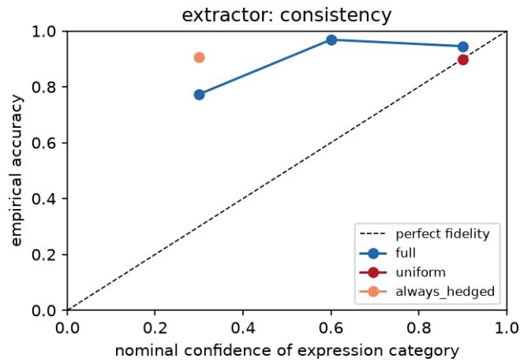
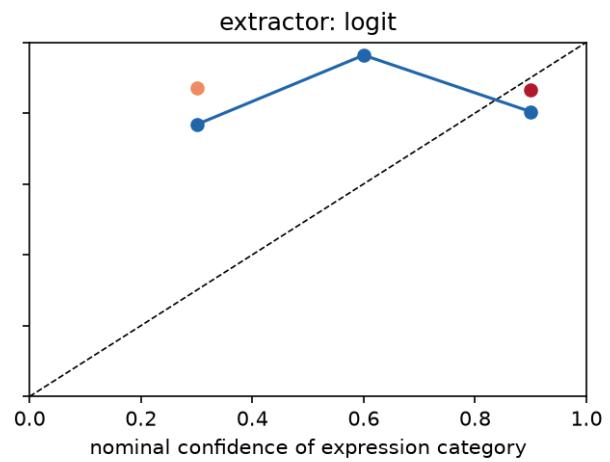
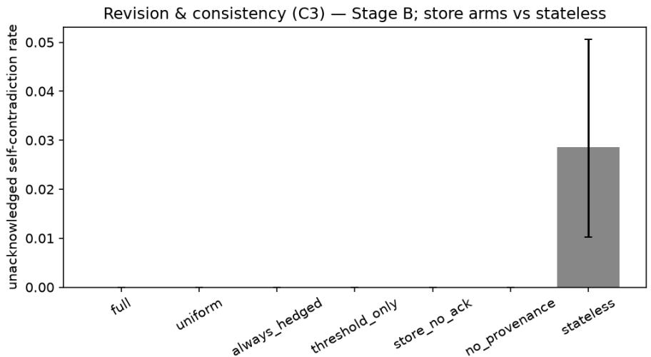
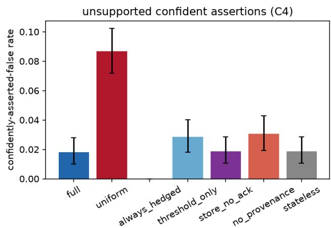
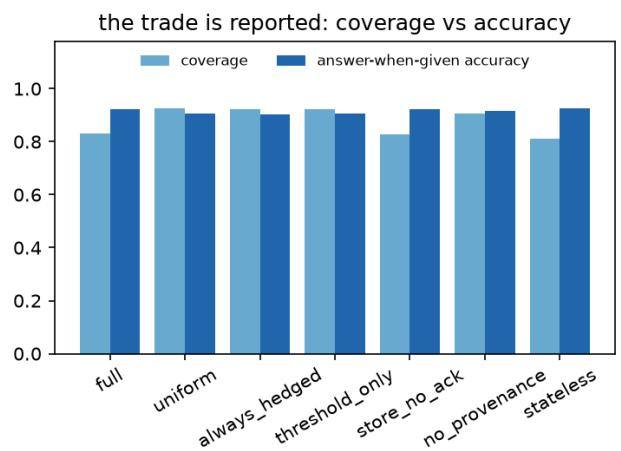
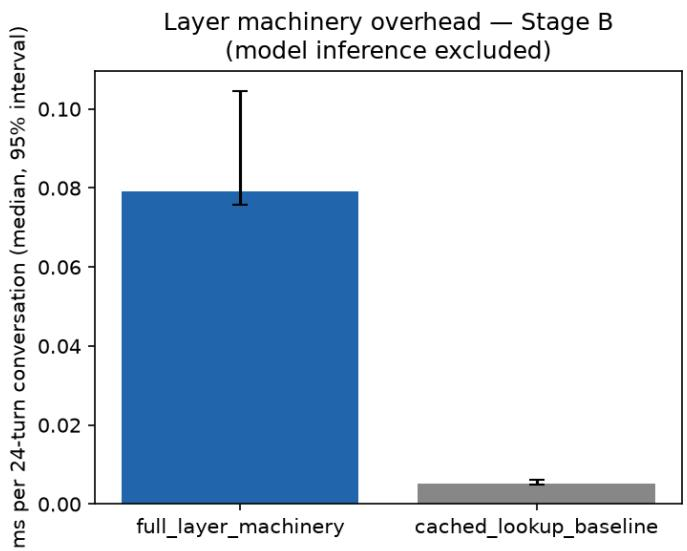

# Truth for Believable AI: Expressed Doubt, Provenance, and Belief Revision as an Engineerable Stance

Sebastian Cochinescu University of Bucharest Email: sebastian.cochinescu@drd.unibuc.ro

September 2026

## Abstract

Conversational agents often express answers in a uniformly confident register. We test whether expressed uncertainty, provenance-aware assertion, and explicit belief revision can be implemented as a behavior layer over a fixed language model; we do not test believability or trust. The layer combines three epistemic states, per-claim confidence and typed provenance, a provenance-gated expression rule, and a persistent revision store with auditable acknowledgments and partial resistance to false correc tions. We evaluate it on a constructed, mechanically scored multi-session benchmark using a synthetic model and Qwen2.5-0.5B-Instruct. The synthetic instrument passes all five checks. On the real model, acknowledgment soundness, a by-construction guarantee, holds in 100% of cases, and true corrections are accepted more often than false ones (0.44 vs. 0.15 on held beliefs; 0.875 vs. 0.420 including rule-accepted corrections of unheld facts), but the pre-specified expression-fidelity, contradiction-separation, and provenance margins fail. A disclosed post hoc analysis shows that expression gated on mean answer-token probability ranks correctness below chance end to end (AUC 0.41, conversation-clustered), whereas gat ing on sampling consistency discriminates (AUC 0.66). A consistency-gated configuration selected from this finding and evaluated under a separately committed protocol meets the conversation-level manipula tion and capability-equivalence criteria and replicates on a redrawn conversation set. The manipulation result is selection-dependent, and both criteria remain unresolved when uncertainty is clustered over the 60 facts. The supported conclusions are limited to the by-construction audit guarantee, store-dependent partial correction discrimination, and a benchmark- and model-specific failure of token-probability gating; scaling the fact base is required before human evaluation.

## 1 Introduction

A large language model answers a question it cannot answer in the same fluent, unhedged register it uses for one it can. The confident hallucination is the canonical failure, but the deeper problem is the uniformity: nothing in the surface behavior distinguishes knowledge from guess, retrieval from inference, or a fact the user supplied five turns ago from one the model was trained on. Kalai et al. argue that this follows from the evaluation regime: benchmarks that score accuracy alone make confident guessing the optimal policy and penalize “I don’t know” [14]. The estimation side of the problem is well studied in laboratory settings: models carry usable self-knowledge [13], semantic entropy detects confabulation [8, 18], and models can be taught to verbalize numeric confidence [21, 38]. What is missing is the behavior layer: the machinery that turns an epistemic signal into graded assertion, explicit declining, visible self-correction, and source-aware caution, and that keeps those behaviors consistent across sessions.

This paper builds and measures that layer. The motivation is a believability hypothesis inherited from a companion framework paper [7] and consistent with human-subject findings that uncertainty expression changes reliance and trust [16, 40]: an agent that can say “I am not sure,” show where a claim came from, and visibly revise a stated belief reads as more trustworthy and more mind-like than one that cannot. This study reports no human-subjects data and makes no claim about trust, believability, or perceived mind; those hypotheses are deferred to a preregistered perception study (Section 8). We present a formal mode (Section 3), an implementation over a fixed base model (Section 5), a constructed contradiction benchmark, and a staged, pre-specified evaluation (Sections 6–7). The evidence class is synthetic, seeded, single-machine measurement, mechanically scored against generator-injected ground truth. The closest prior work, linguistic calibration of a dialogue agent [26], maps a scalar correctness estimate to hedging words in single turns. Our contribution is the combination of a three-state expression policy (discrete confidence levels themselves already appear there), a typed provenance gate, a persistent store with a defined revision operator, and auditable acknowledgment behavior, each varied by a dedicated ablation arm.

We report all pre-specified outcomes, including three margins that failed on the real model and a disclosed post hoc protocol amendment whose amended check also failed. The failures expose a conditional degeneracy in anchor-based expression-fidelity scoring, a scoping limit of contradiction-based consistency metrics under deterministic decoding, and an extractor-dependence result in which the two confidence sources yield oppositely signed end-to-end discrimination. A final pass on the configuration identified by that result was governed by a separately committed protocol and passes its specified checks under the conversation-level analysis, with a disclosed fact-level sensitivity caveat (Section 8). Each of the layer’s four mechanisms is varied by a dedicated ablation arm in Section 6 (Table 2 positions them against related work). The arm contrasts are single realizations with independent retrieval-sampling streams, so they describe each mechanism’s contribution rather than causally isolate it (Section 7).

## 2 The truth stance and its measurement

The companion framework paper defines the truth stance behaviorally: the disposition to expose epistemic state (to say “I am not sure,” to admit a mistake, to revise a stated belief), explicitly not statistical calibration or answer accuracy, which are competencies. This distinction matters because the stance must be manipulable with capability held constant: a fixed-capability model can exhibit more or less of it, which is what makes an ablation over the same base model meaningful.

This paper measures calibration-like quantities, so the relation between the stance and its manipulation check must be explicit. The stance is the disposition to expose epistemic state. Expression fidelity, whether expressed-confidence categories track empirical accuracy, is the manipulation check that distinguishes evidence-sensitive expression from performative humility. The framework itself requires this check: expressed doubt must be congruent with the available evidence, not blanket hedging. We operationalize evidence-congruence as expression-level expected calibration error (expression-ECE), an operationalization that Section 7 amends, with disclosure, after its degeneracy is measured. We flag the choice explicitly: congruence with evidence and accuracy tracking are close but not identical notions, and the always-hedged control arm exists to separate evidence-sensitive doubt from indiscriminate doubt. That arm is the discriminantvalidity control. It maximizes expressed doubt while its expression-discrimination stays at chance by construction (Section 7), so the manipulation check rewards evidence-sensitivity rather than doubt volume. The check is end to end, jointly determined by the confidence signal and the expression policy, so a failed check localizes to that composite and not to the stance disposition alone; the extractor-dependence result in Section 7 is such a signal-side failure. We also note a design tension visible before any data. The gating table caps inferred and told content below assert whatever its confidence (source-caution by design; retrieved content asserts in the high band), which guarantees underconfident bins under fixed anchors, so an anchor-ECE operationalization is in structural tension with a provenance-capping layer. We retained the pre-specified check as frozen rather than redesigning around the recorded tension, and report its outcome; the tension resurfaces, measured, in Sections 7 and 8. We calibrate the expression channel over a fixed base model; we neither improve nor claim to improve the model’s underlying calibration, and we never define the stance as the competency.

## 3 A formal expression-and-revision layer

Claims and epistemic state. The unit is a claim $c = ( s , a , v ) ;$ : subject, attribute, value. Each claim the layer is about to express carries an epistemic state $\sigma ( c ) = ( \kappa ( c ) , \pi ( c ) )$ where $\kappa ( c ) \in [ 0 , 1 ] ^ { E }$ is a vector of confidences from $E \geq 2$ distinct extractors (separately computed but not statistically independent, since both consult the same base model) and $\pi ( c ) \in \left\{ \mathrm { P A R , R E T , I N F , T O L D } \right\}$ is a provenance tag. The combined confidence is the conservative rule $\hat { \kappa } ( c ) = \operatorname* { m i n } _ { e } \kappa _ { e } ( c )$ : no single inflated extractor can unlock a strong assertion. The rule was chosen on this safety argument alone, before any data. Its cost, that a single noisy extractor can force unnecessary hedging, is accepted by design, and the per-extractor runs in Section 7 measure what each extractor contributes alone. Provenance is assigned by pipeline instrumentation, by which resolution path produced the claim (model parameters, retrieval store, derivation rule, or a user statement this session), never by a classifier. The taxonomy is an operational definition, not an epistemological claim, and the boundary between parametric and inferred content is ambiguous.

Table 1: The pre-specified provenance-gating table G: provenance class × combined-confidence band → expression category. The bottom row is the no-provenance ablation’s row-independent map. Recorded before the prototype was built.
<table><tr><td>Provenance</td><td>band LOW (&lt; 0.40)</td><td>MID</td><td>HIGH (≥ 0.75)</td></tr><tr><td>PAR (parametric)</td><td>DECLINE</td><td>HEDGE-LOW</td><td>ASSERT</td></tr><tr><td>RET (retrieved)</td><td>HEDGE-LOW</td><td>HEDGE-HIGH</td><td>ASSERT</td></tr><tr><td>INF (inferred)</td><td>DECLINE</td><td>HEDGE-LOW</td><td>HEDGE-HIGH</td></tr><tr><td>TOLD (told)</td><td>HEDGE-LOW</td><td>HEDGE-HIGH</td><td>HEDGE-HIGH</td></tr><tr><td>ablation (no provenance)</td><td>HEDGE-LOW</td><td>HEDGE-HIGH</td><td>ASSERT</td></tr></table>

Three behavioral states. The layer distinguishes three expressible epistemic conditions: not-knowing (no candidate value, or $\hat { \kappa } < \theta _ { \mathrm { f l o o r } } )$ , unsure $\left( { \hat { \kappa } } < \theta _ { \mathrm { h i g h } } \right)$ , and confident (otherwise), with $\theta _ { \mathrm { f l o o r } } = 0 . 1 5$ and $\theta _ { \mathrm { h i g h } } = 0 . 7 5$ specified before evaluation. A fourth state, wrong-revising, is not reachable from confidence: it is entered only through the revision operator’s defined triggers below. In the released implementation it is a logged condition (a revision-log entry and, on accepted corrections to a held value, the acknowledg ment utterance) rather than a value the state assigner returns. The three-state model rests on the claim that not-knowing, being unsure, and being wrong are behaviorally distinct conditions with distinct correct behaviors (decline, hedge, acknowledge-and-revise), which a single confidence threshold conflates. Whether the distinction buys anything measurable is what the threshold-only ablation tests.

Expression function. Expression categories are ordered $\mathrm { \Delta D E C L I N E ~ < ~ H E D G E { - } L O W ~ < ~ H E D G E { - } H I G H ~ < ~ }$ assert, each with a fixed surface template and, for scoring, a nominal confidence anchor (0.3, 0.6, 0.9; representative band values fixed at freeze, not fitted). After the degeneracy finding of Section 7, anchor-ECE functions as a stress test rather than the primary operationalization; decline carries no asserted content and is scored as coverage, not fidelity. The expression function applies a frozen gating table G(π, band(ˆκ)) (Table 1) with band edges at 0.40 and 0.75. The table encodes three design rules, recorded before evaluation: inferred claims never reach bare assert; told-this-session claims are never asserted as the agent’s own knowledge (the implemented templates hedge them as “I believe v” without naming the user as the source; explicit source attribution is a template extension, not an evaluated behavior); and low-confidence parametric content declines rather than hedges. The no-provenance ablation replaces G with the row-independent confidence map (bottom row), so the diference between the two arms is the contrast for what provenance typing adds (one realization per arm; Section 7).

Belief store and revision operator. Beliefs persist in a session-spanning store B of claims with their states. The wrong-revising state is entered by exactly three triggers: (i) an accepted user correction; (ii) an insertion conflict (a new claim contradicts a stored one; the higher combined confidence wins); (iii) a retrieval conflict (a retrieval result contradicts a stored belief). The correction-acceptance rule is stated formally because an epistemic-humility layer that accepts every correction is sycophancy [31], not humility. A correction of stored belief b is accepted if $\hat { \kappa } ( b ) < \theta _ { \mathrm { a c c } }$ or the correction is corroborated by the retrieval store $( \theta _ { \mathrm { a c c } } = 0 . 7 5$ , specified before evaluation); otherwise the belief is kept and the resistance is logged (the released prototype records the refusal but renders no disagreement utterance). A correction concerning a claim absent from the store is accepted unconditionally, logged, and not acknowledged, since there is no prior value to retract; this case is frequent on the benchmark, and the scored acceptance rates include it (Section 7). One edge of this rule is a deliberate scope choice we disclose: for weakly held beliefs $\left( \hat { \kappa } < \theta _ { \mathrm { a c c } } \right)$ a user correction is accepted even when the retrieval store contradicts it, so retrieval corroboration can rescue a strongly held belief but never vetoes a correction to a weak one. The residual threat is explicit: an adversaria user can rewrite any weakly held belief without corroboration. Adjudicating such contested corrections is future work; on this benchmark the acceptance statistics below measure the rule as stated. Retrieval conflicts apply the same weak-belief threshold with no corroboration clause: a stored belief with $\hat { \kappa } ( b ) < \theta _ { \mathrm { a c c } }$ yields to the retrieved value, a stronger one resists. Accepted revisions re-enter the store with fixed post-revision states (an accepted correction as (told, confidence 0.85), a retrieval-conflict winner as (ret, 0.80)), and a correction that agrees with the stored value is a no-op and creates no revision-log entry. Every revision, accepted or resisted, appends to a revision log, and the layer’s acknowledgment utterance (“I was wrong about X—I said u, it is $v ^ { \flat } )$ is emitted only when a matching accepted log entry exists. Auditability here is a soundness guarantee: every public admission of error traces to a recorded state change. The guarantee is checked on the event linkage (an acknowledged turn must carry the key of an accepted log entry). It certifies neither the wording of the admission (the template’s “I said $u ^ { \dag }$ names the stored prior value, which the layer need not have uttered earlier in the conversation) nor the truth of the accepted value. The reciproca direction is a measured quantity, not a guarantee: what fraction of accepted state changes are flagged as acknowledged, and what fraction of those flags render the admission utterance. The flag is set on accepted corrections to a held value, which render the utterance, and on retrieval or insertion conflicts detected at response time, which are flagged and logged but answered with an ordinary expression. Accepted corrections of unheld claims and silent store-maintenance updates change the store and the log directly without passing through the uttered wrong-revising behavior at all; wrong-revising names the expressed condition, not every logged state change. Section 7 reports both directions. Corroboration consults only the retrieval store, never ground truth: the layer cannot peek at the answer key.

Self-model term. The layer can attach uncertainty to reports about its own store (“my memory of this may be stale”), and we include the term as a design element only, bounded by the role-play frame [30]: introspective reports are generated behavior, not privileged access, and the live controversy over machine theory of mind [17, 32, 34] is kept out of our claims, since our states are computed pipeline quantities, not introspection. No numbered claim rests on the self-model term.

Worked example. A five-turn exchange, mechanically checkable (its store transitions are covered by a unit test): the user asks a subject’s attribute; the layer resolves it parametrically at $\hat { \kappa } = 0 . 9$ (confident, par) and asserts, storing the belief. The user then corrects it without corroboration; since $\hat { \kappa } = 0 . 9 \geq \theta _ { \mathrm { a c c } } ,$ the correction is resisted and logged. A corroborated correction next turn is accepted: the store updates (provenance told), the acknowledgment fires, and the log gains its accepted entry. A re-ask now yields the revised value; the scorer does not count this as a contradiction because the change follows an accepted revision-log entry. Finally a question with no candidate resolves to not-knowing and is declined.

## 4 Related work

Prior work addresses the components of this layer separately; none, to our knowledge, combines them into a behavioral epistemic interface with auditable correction acknowledgment and ablation-compared mechanisms, and each gap below corresponds to one of our ablation arms.

Estimation is imported, not contributed: models know much of what they know [13], semantic uncertainty, entropy, and sampling consistency supply usable signals [8,18,23], and elicited or verbalized confidence works well enough to build on [21,33,38]. The closest related work concerns expression: linguistic calibration trains a dialogue agent so hedging words track a scalar correctness estimate [26], extended to long-form generation by decision-calibration objectives [3], with epistemic markers studied for their downstream efects [44]. This work calibrates expression in single turns (Mielke et al. already control three linguistic-confidence levels, don’t-know, low, and high, with control tokens) but has no persistence, no provenance typing, and no revision; the discrete levels are not our contribution, their combination with the rest of the layer is.

Abstention supplies the nearest neighbor to our not-knowing state: unanswerable-question benchmarks [28], selective prediction [15], refusal-aware tuning [43], honesty as an alignment objective [41], sycophancy under user pushback as the failure mode our acceptance rule resists [31], and a recent survey [36] mostly treat abstention as an answer-or-refuse boundary, static and single-turn (the survey itself formalizes partial abstention and dynamic information acquisition), whereas in our layer abstention is one endpoint of a graded, provenance-typed policy over persistent state. Attribution measures whether output is supported by sources [4,29], makes models emit citations [10], repairs unattributed claims post hoc [9], or gates generation on retrieval support with reflection tokens [2]; this is provenance that annotates or gates generation, with no graded cap on assertion strength.

Table 2: What each line of related work contributes and lacks. • = present, ◦ = partial/single-turn (discrete confidence levels in linguistic calibration, partial abstention in the abstention literature), — = absent. The table positions related work; it does not map mechanisms to ablation arms.
<table><tr><td></td><td>multi-state expression</td><td>provenance gating</td><td>persistent store + revision</td><td>auditable acknowledgment</td></tr><tr><td>Linguistic calibration [3, 26]</td><td>O</td><td></td><td></td><td></td></tr><tr><td>Abstention / refusal [15,36, 43]</td><td>O</td><td></td><td></td><td></td></tr><tr><td>Attribution / citation [2, 10, 29]</td><td></td><td>O</td><td></td><td></td></tr><tr><td>Knowledge editing [24, 25]</td><td></td><td></td><td>O</td><td></td></tr><tr><td>Belief-like memory [20,37]</td><td></td><td></td><td></td><td></td></tr><tr><td>This layer</td><td></td><td></td><td></td><td></td></tr></table>

Belief revision provides a theoretical context and a contrast: the AGM operators [1] locate our store-level revision in a formal tradition (cited as lineage, not implemented logic); weight-level knowledge editing [24, 25, 42] is the contrast case (a diferent substrate, parametric memory, rather than a competing design), and recent conceptual work argues that editing lacks rational belief-revision foundations [11], an argument that motivates an external, auditable store such as ours. Behavioral belief-revision evaluation exists for reasoning [37] and belief-like agent memory is emerging [20], but for internal correctness, not user-facing epistemic communication.

Consistency benchmarks detect contradictions in dialogue [27,35] and probe long-horizon memory [22,39]; ours difers by constructing contradictions and corrections so that revision behavior, not only consistency, is mechanically scorable. Finally, hedging itself is an epistemic semantic device [12,19] rather than a politeness strategy [5]; our expression function encodes evidence state, not face-saving. Table 2 summarizes these comparisons.

## 5 Implementation

The layer is a thin instrument over a fixed base model: extractor adapters, the expression mapper with the frozen gating table, the belief store with its revision log, and a provenance tagger that records the resolution path. Answer resolution order is fixed: store hit, then parametric query, then retrieval lookup, then one-step derivation via a public rule table; the path taken is the provenance tag. Greedy decoding was frozen for determinism and reproducibility before its dampening efect on the contradiction metric was known (a scoping consequence Section 7 reports). Two extractors run throughout: a signal-style extractor (latent reliability in the synthetic stage; in the real-model stage, the mean softmax probability of the generated answer’s tokens up to and including end-of-sequence, unnormalized for length and computed on the greedy pass, so no sampling-temperature artifact enters it) and a consistency extractor in the SelfCheckGPT tradition [23]: agreement of k answers resampled at temperature 1.0 (top-p 0.95) with the greedy answer, using the same procedure in both stages; exact answer normalization (lowercasing, de-accenting, snap-to-known-value by containment) and agreement rules are included in the companion repository. Retrieval draws on a smal document store (generator coverage probability 0.5 and stale probability 0.1; the realized store shared by every grid holds 34 of the 60 subjects, one of them stale) so that retrieval conflicts occur by design.

Everything is seeded and reproducible from one command per stage. Constants are recorded in a versioncontrolled protocol with a frozen/provisional status legend, and benchmark artifacts are protected by SHA 256 manifests; the reproduction script refuses to run if a frozen file’s hash has drifted. The prototype is an instrument, not a product: no UI, no serving stack. The added machinery runs at a median 0.08 ms per

24-turn conversation, against 0.005 ms for a bare cached lookup (Figure 4); this is orchestration overhead measured over cached model outputs on one machine. End-to-end cost is dominated by model calls instead: consistency extraction spends k=8 sampled generations per new fact on top of the greedy pass (that pass alone had a median latency of 107 ms per query on our hardware, a macOS machine using the MPS backend), amortized here by the per-fact cache.

## 6 Evaluation protocol

The protocol was maintained in the project repository, not deposited in an independent registry. For Stage B, the protocol freeze and results first appear in the same repository commit, so their ordering rests on the author’s working-tree record rather than an independently timestamped registration. We therefore describe the Stage-B tests as pre-specified, not preregistered. The Stage-C configuration and its robustness draw were each committed separately before execution, with prior knowledge recorded in the protocol. This distinction does not alter any threshold or result.

Staged evaluation. Stage A validates the instrument against an LLM-free synthetic base model: a seeded world of 60 subjects with two attributes plus one derived attribute, and a base-model stub holding a deliberately corrupted copy (correct/wrong/uncertain/absent facts with latent reliabilities, plus a confidenthallucination path). Ground truth is knowable by construction, so every metric is mechanical and directional expectations can be asserted as tests. Stage B is the pre-specified grid on a pinned real model (Qwen2.5- 0.5B-Instruct, revision 7ae557604adf67be50417f59c2c2f167def9a775, greedy answers, k=8 consistency samples), over a real 60-fact geography world (country → capital parametric; continent derived via a public capital-to-continent rule; ambiguous capitals excluded by construction, under an administrative-capital convention whose one remaining edge is Eswatini, entered as Mbabane although Lobamba is the legislative seat). The real model’s error pattern is its own; there is no injected corruption. All margins below were recorded by the author before the Stage-B grid ran and were set by design judgment as the smallest differences we considered practically meaningful; no prospective power analysis informed them, and Section 7 reports achieved precision instead.

Arms. Seven configurations compare mechanism settings using the same base model: full (three states, gating table, store, acknowledgment); uniform (always assert; the truth-ablated surface); always-hedged (performative humility: uniform doubt regardless of evidence); threshold-only (confidence map, no threestate floor, no provenance); store-without-acknowledgment (revises silently); no-provenance (three states, confidence map); stateless (no store).

Benchmark. 120 seeded three-session conversations (24 turns each) over the world: asks, re-asks (at least one across a session boundary), user statements, and user corrections, with half of the statements and corrections false by injection. Labels are the generator’s injection record, never any arm’s output. The benchmark ships versioned (instances, labels, manifest with hashes and generation parameters) with a language-agnostic scorer, so any implementation of an expression layer can be scored against it.

Metrics and pre-specified margins. C2 (expression fidelity): expression-ECE against the category anchors, unit = conversation, cluster-bootstrap CIs (percentile, 2,000 seeded resamples of whole conversations, the construction used for every interval in this paper except the timing spreads of Figure 4, which are run-time percentiles, and the intervals explicitly labeled fact-clustered, which resample subjects instead); margin: full must undercut both the uniform and always-hedged controls by $\geq 0 . 0 2$ under both extractors. C3 (revision): unacknowledged contradiction rate on re-asks (an accepted logged revision legitimizes a change); margin: stateless exceeds every store arm by $\geq 0 . 0 3 ;$ acknowledgment auditability must be 100%; false-correction acceptance must undercut true-correction acceptance by ≥ 0.10. C4 (provenance): confidently-asserted-false rate; margin: no-provenance exceeds full by $\ge ~ 0 . 0 2$ , with the coverage cost reported alongside. Capability equivalence: paired cluster-bootstrap CI of the answer-when-given-accuracy diference (full − uniform) within $\pm 0 . 0 5$ , in efect answer-conditional accuracy equivalence at each arm’s achieved coverage, with coverage reported alongside. The downstream selection rule (Section 8) requires the C2 margins and capability equivalence; a null result does not satisfy it, and nothing is relabeled after the fact. One protocol amendment was added after the Stage-B grid ran and is disclosed as post hoc where its results appear (Section 7): the original verdicts are never displaced by it. A third grid, Stage C, evaluates the configuration that Stage B’s mechanism finding identifies (the layer gated on the consistency extractor alone, everything else held identical) under its own freeze, committed to the repository before that grid ran, with an explicit register of which values were already known from Stage B’s robustness runs and which were not.

Table 3: Stage-B pre-specified margin verdicts (margins author-recorded before the grid ran). All numbers trace to the accompanying results files.
<table><tr><td>Pre-specified check</td><td>Margin</td><td>Verdict</td></tr><tr><td>C2 fidelity, logit extractor</td><td>full  $\mathrm { E C E } \leq \mathrm { c o n t r o l s - 0 . 0 2 }$ </td><td>fail</td></tr><tr><td>C2 fidelity, consistency extractor</td><td>full  $\mathrm { E C E \le c o n t r o l s - 0 . 0 2 }$ </td><td>fail</td></tr><tr><td>C3 contradiction separation</td><td> $\mathrm { s t a t e l e s s - s t o r e ~ a r m s \geq 0 . 0 3 }$ </td><td>fail (0.029)</td></tr><tr><td>C3 acknowledgment auditability</td><td>= 100%</td><td>pass (42/42)</td></tr><tr><td>C3 correction discrimination</td><td> $\mathrm { f a l s e } \leq \mathrm { t r u e } - 0 . 1 0$ </td><td>pass (0.420 vs. 0.875)</td></tr><tr><td>C4 provenance margin</td><td> $\mathrm { \ n o - p r o v . \ - \ f u l l \geq 0 . 0 2 }$ </td><td>fail (0.012)</td></tr><tr><td>Capability equivalence (CI criterion)</td><td> $\Delta { \mathrm { ~ a c c u r a c y ~ C I ~ } } \subseteq \pm 0 . 0 5$ </td><td>pass</td></tr></table>

## 7 Results

## 7.1 Stage A: the instrument behaves as designed

All five pre-specified instrument checks pass on the synthetic model. The full layer’s expression-ECE (0.161 combined; 0.151/0.199 per extractor) beats uniform (0.237) and always-hedged (0.368) under both extractors; the stateless arm self-contradicts (0.065) where every store arm is at zero; provenance gating cuts the confidently-false rate from 0.141 (no-provenance) and 0.315 (uniform) to 0.094, with the coverage cost visible (0.838 vs. 0.932); acknowledgment auditability is 73/73; and the acceptance rule discriminates true from false corrections (0.77 vs. 0.54 accepted). Stage A numbers validate the instrument and are not the paper’s headline results.

## 7.2 Stage B: pre-specified verdicts on a real model

The pinned 0.5B model answers 45/60 capitals correctly, produces a refusal-style non-answer for exactly one of the 60 queries (the pipeline ingests it as an ordinary low-consistency value), and hallucinates fluently with high signal confidence (e.g. a superseded capital asserted at 0.94 mean token probability), while the consistency extractor’s raw agreement spreads from 0.00 on the model’s worst guesses to 1.00 on well-known facts. Table 3 gives the seven frozen verdicts; Figures 1–3 show the underlying distributions.

What passed. The acknowledgment soundness guarantee and the correction-acceptance rule hold on a real model. Every one of the 42 acknowledged revisions traces to an accepted revision-log entry (42/42). This is the outcome the emission rule guarantees by construction, so the check verifies implementation correctness rather than discovering behavior. The check is on event linkage, not on surface form: 31 of the 42 are correction turns that render the admission template, and 11 are ask turns flagged for a retrieval conflict resolved at response time, whose visible answer is an ordinary hedge or assertion. Ten of the 31 rendered admissions retract a stored prior value the layer had not itself uttered earlier in that conversation. The reciprocal direction is a measured 21% acknowledgment-flag incidence (42 of 197 accepted revisions flagged). The 197 comprise 155 unconditionally accepted corrections of unheld claims, 31 accepted corrections of held values, and 11 retrieval conflicts. Every accepted change to a held value is flagged, and 31 of the 42 flags render the admission utterance $( 3 1 / 1 9 7 = 1 5 . 7 \%$ of all accepted revisions; $3 1 / 4 2 = 7 3 . 8 \%$ of accepted changes to held values), while the 155 acquisitions are logged but not uttered.

The pre-specified correction check passes: the rule accepts 87.5% of true corrections and 42.0% of false ones in Stage B (105/120 and 81/193 scored corrections; the frozen benchmark injects 422 per arm, 229 true and 193 false, and the scorer drops the 109 true corrections that agreed with the stored value). That scored set, however, merges two paths of the rule. Corrections of claims the store did not yet hold are accepted unconditionally (93 of 93 true and 62 of 62 false), so the true-side rate is dominated by acquisition, not revision. A post hoc split (not pre-specified; results file sensitivity post review.csv) isolates the corrections that contradicted a held belief: 12 of 27 true (0.444) versus 19 of 131 false (0.145). On held beliefs the gap (0.30) exceeds the 0.10 margin on the point estimate. Its fact-clustered 95% interval, [0.09, 0.54] (resampling the 53 subjects with an eligible held correction), excludes zero but reaches below the margin, so the contrast is positive and only the point estimate clears the pre-specified margin. The absolute falseacceptance rate on the scored set remains substantial (0.42–0.48 across grids), mostly through the unheld path and partly through the acceptance rule’s disclosed weak-belief edge. The discrimination mechanism on held beliefs is the corroboration clause operating over the benchmark’s constructed retrieval store (34 of 60 subjects present, one stale). True corrections to strongly held beliefs are accepted at the rate at which that mostly-fresh store corroborates them, while false corrections rarely find corroboration, so the size of the gap scales with the constructed store’s coverage and freshness and is not a store-independent property of the layer. By the rule’s structure this gap is largely designed in, and a further stratification by belief strength is not reported. The Stage-C scored rates are 0.871 vs. 0.435, non-overlapping under both conversationclustered CIs ([0.795, 0.939] vs. [0.373, 0.497]) and fact-clustered CIs ([0.787, 0.948] vs. [0.355, 0.533]); the held-belief split there is 12 of 27 versus 20 of 129, with the same fact-level caveat.

Capability passes the specified CI-inclusion criterion and, separately, shows a small directional improvement. The two statements are compatible because equivalence bounds the magnitude while the CI locates its sign: when the full layer answers, it is right 92.4% of the time versus 90.6% for uniform (∆ = +0.018, 95% CI [0.006, 0.030], inside the ±0.05 margin and excluding zero), because the expression policy filters the model’s least reliable content into declines. In the full arm the gating table’s decline cells already do this: switching the not-knowing floor of leaves every Stage-B full-arm event unchanged, so the filtering is attributable to the table rather than to the floor specifically. The price is coverage (0.833 vs. 0.925). Both accuracies condition on each arm’s own answered subset, so the criterion certifies answer quality at the achieved coverage, not unconditional task performance; a matched-coverage comparison is future work. Confidently-asserted falsehoods drop from 0.087 (uniform) to 0.018 (full).

What failed. The C2 fidelity margin fails through a conditional degeneracy of the metric, an anchor– accuracy alignment: the uniform arm’s expression-ECE is near zero (0.0025–0.035) against the full layer’s 0.25–0.27. The mechanism is visible in the reliability bins (Figure 1): the pipeline’s asserted content (filtered by declines, upgraded by retrieval, corrected by users) lands at roughly 0.9 accuracy overall, which is the assert anchor; a degenerate policy that asserts everything therefore scores as “perfectly calibrated” by anchor-based ECE whenever corpus accuracy sits near one anchor, while the full layer’s hedged bins are punished for underconfidence: its hedge-high content is 96.8% accurate against a 0.6 anchor, largely because inferred and told content is capped below assert by the gating table (the full arm’s 660 hedge-high answers are 609 inferred and 51 told claims; retrieved claims, at confidence 0.80, all assert). This is the design tension flagged in Section 2, now measured. The C3 contradiction margin fails for a scoping reason: under greedy decoding with per-fact caching, the base model is deterministic, so the stateless arm usually re-answers identically; its residual self-contradiction (0.029, just under the 0.03 margin, against zero for all store arms) comes from stochastic resolution-path flips (a re-ask that resolves by retrieval where the first ask resolved parametrically), not from decoding noise. The store’s measurable value on a deterministic model shows up not in contradiction reduction but in correction responsiveness, which the stateless arm lacks entirely. The C4 margin fails narrowly (0.0305 vs. 0.0182: a 0.0123 gap against a 0.02 margin): on this model most of the confidently-false reduction is attributable to confidence gating with declines (shared by the no-provenance arm; the three-state floor itself is redundant on the full arm’s evaluated paths) rather than to provenance typing as such. The acknowledgment-conditioning efect (full vs. store-without-acknowledgment) is null on both stages’ contradiction measures. The null is structural, because the contradiction scorer legitimizes a change through the accepted log entry whether or not it is uttered and acknowledgment does not feed back into the store, so this contrast cannot detect a behavioral efect of the utterance. The two arms also draw independent retrieval-sampling streams and difer on 239 of their 1,869 ask-turn outputs for that reason alone, which is why every arm contrast in this paper is reported as a single realization rather than a causal isolation.

Post hoc Amendment 1: an anchor-degeneracy-resistant check. Because the C2 failure is at tributable to the metric’s anchor dependence, we added a protocol amendment after the Stage-B grid ran. The amended manipulation check is expression-discrimination AUC, the probability that a correct expressed claim carries a strictly higher expression category than an incorrect one (ties one half). The statistic is computed over expressed claims only (declines carry no asserted content, are excluded here, and are counted in coverage), so each arm’s AUC conditions on its own expressed set and cross-arm comparisons span the arms’ achieved coverages. Any single-category policy scores exactly 0.5 by construction, so the controls are definitional baselines and the substantive bar is the 0.60 floor; the anchor coincidence that broke ECE cannot recur, and the statistic matches the framework’s requirement (evidence-sensitive expression) more directly than anchor placement does. The amended margin (full ≥ 0.60 and ≥ each control +0.05 under both extractors) was set against the chance value and committed to the protocol file before the discrimination statistic was computed on any arm. A coarse bin-based reading of the full arm’s combined reliability had been made during the ECE failure analysis, but no per-extractor or per-arm AUC existed when the margin was fixed. The original ECE verdicts above are unchanged. The Stage-B configuration passes on the point estimate (combined AUC 0.653, 95% CI [0.598, 0.718], with the lower bound just below the 0.60 threshold; both controls exactly 0.5), and the consistency extractor alone passes (0.661, 95% CI [0.604, 0.727], above chance). The layer gated on the logit extractor alone, however, is anti-discriminative: AUC 0.410, 95% CI [0.366, 0.454], below chance under the pre-specified conversation unit (under fact-level resampling the same estimate carries a 95% interval of [0.30, 0.57], which includes chance, so the below-chance reading is unresolved at the fact level). The inversion is a property of the gated pipeline and is not observed under the threshold-only map: the same signal there is weakly discriminative (0.569, 95% CI [0.543, 0.596]; a continuous raw-signal AUC was not computed). On this overconfident model the pattern is consistent with high token probability lifting fluent hallucinations into assert while the provenance caps hold accurate inferred and told content below it; the per-extractor robustness requirement therefore fails, and the amended check fails with it. Two further decompositions qualify the result. The threshold-only arm has a higher AUC point estimate than the full layer (0.715 vs. 0.653 combined, though their CIs overlap: [0.681, 0.755] vs. [0.598, 0.718]), so the provenance caps impose source-caution at an apparent discrimination cost, and the Stage-A grid shows the same ordering in miniature (full 0.635 vs. controls 0.5). The failure is not a second metric artifact; it is an extractor-dependence result. Gated end to end, the two confidence sources yield oppositely signed discrimination, and a layer gated on their conservative minimum inherits the logit’s rankings whenever that signal binds, which, measured over the per-fact cache, is 30% of facts (18 of 60 where the logit confidence is the minimum). These per-arm AUC intervals are conversation-clustered; the fact-level sensitivity analysis reported below covers the Stage-C selection gates and, above, the logit-gated headline.

Stage C: the identified configuration under a separate commit. Stage C evaluated the configuration the extractor-dependence finding points to (the layer gated on the consistency extractor alone, with model, cache, benchmark, arms, seeds, and margins otherwise identical) and committed that freeze to the repository before the Stage-C grid ran, so the ordering is attested by commit separation. The freeze’s prior-knowledge register is explicit: the fidelity-arm discrimination values under consistency gating were already known from Stage B’s robustness runs (full 0.661, controls exactly 0.5, so the manipulation check was expected to pass); every non-fidelity-arm outcome was unknown, and the downstream selection decision was specified to hinge on capability equivalence under consistency-only gating. The results: the manipulation check, computed like every discrimination number in this paper over the layer’s emitted expression categories and never over the raw extractor signal, so that it tests the expression layer end to end, passes as expected (AUC 0.661, 95% CI [0.604, 0.727], margin ≥ 0.60 and ≥ controls +0.05); capability equivalence, the outcome that was unknown when the protocol was frozen, passes (∆ = +0.028, 95% CI [0.016, 0.042], within ±0.05 and excluding zero); acknowledgment auditability is again 42/42 and the acceptance rule again discriminates (0.871 vs. 0.435). The C3 and C4 margins fail exactly as in Stage B (stateless contradiction 0.023, 95% CI [0.004, 0.048], below the 0.03 bar; provenance gap 0.009 against 0.02), so those findings stand unchanged, and we claim nothing from contradiction reduction on this model class: C3’s supported content is correction-acceptance behavior (the discrimination above) and acknowledgment auditability. The threshold-only arm still carries the higher discrimination point estimate (0.730, 95% CI [0.697, 0.770], overlapping full’s), so we still claim no statistically resolved provenance-cost diference.

Because Stage C re-scores the same frozen instance set that informed the configuration choice, its confirmatory weight on an independent draw could be questioned. A robustness draw, a freshly seeded regeneration of the benchmark (new instances, new injections; generator, world, model, arms, and margins identical) frozen in the protocol before it ran, replicates the conversation-level criteria: manipulation check 0.677, 95% CI [0.635, 0.726]; capability equivalence $\Delta = + 0 . 0 2 3$ , 95% CI [0.009, 0.036]; auditability 56/56; correction discrimination 0.892 vs. 0.482. On precision: with 120 conversations per arm the achieved cluster-bootstrap 95% half-widths on rates run roughly 0.01–0.03 (the intervals reported throughout), so the narrowly failed margins are point-estimate failures that the achieved precision leaves statistically unresolved (the statelesscontradiction CI [0.004, 0.048] spans the 0.03 margin, and no paired interval was computed for the C4 gap); no prospective power analysis was conducted. A further conditioning caveat: every grid, including the robustness draw, reads the same per-fact model cache, so all intervals condition on a single realization of the k=8 consistency samples per fact; extractor-sampling variability is not propagated, and the Stage-C manipulation bound’s proximity to the 0.60 bar (lower limit 0.604) should be read with that conditioning in mind. A further sensitivity analysis clusters uncertainty at the fact level instead: because the per-fact model cache makes all 120 conversations recycle the same 60 facts, conversation clustering (the unit specified for Stage B) understates fact-level dependence. Under subject-level resampling the point estimates are unchanged but the intervals widen: manipulation AUC 0.661, fact-clustered 95% CI [0.452, 0.885] (including chance); equivalence $\Delta = + 0 . 0 2 8 , \ : [ + 0 . 0 0 6 , + 0 . 0 5 7 ]$ (exceeding the +0.05 bound); the fresh draw behaves alike (0.677, [0.480, 0.862]; +0.023, [−0.006, +0.057]). Sixty distinct facts are simply too few to resolve the gates at the fact level, and the robustness draw, which redraws conversations rather than the world, mitigates instance-level overfitting but not generator-distribution artifacts. Applying the same fact-level clustering to the scored-set correction-discrimination result leaves it intact (CIs above), but the held-belief margin and the logit-gated below-chance AUC both lose resolution at the fact level (Section 7; the held-belief contrast itself stays positive); of the supported results, only the audit guarantee and the scored-set correction contrast are insensitive to the clustering unit.

  
Figure 1: Stage-B reliability over expression categories, per extractor. The full layer (blue) spreads content across bins whose accuracy is not monotone in category under either extractor (consistency: 0.77, 0.97, 0.95; logit: 0.77, 0.96, 0.80); overall expression discrimination is nonetheless positive under consistency gating and negative under logit gating (the AUC analysis, with its clustering caveat); the uniform control is a single bin whose accuracy happens to sit at the 0.9 anchor, the anchor-degeneracy that breaks the pre-specified ECE margin.

  
Figure 2: Stage-B unacknowledged self-contradiction rate by arm. Store arms are at zero; the stateless arm’s 0.029 falls just short of the 0.03 margin because greedy per-fact decoding makes the base model deterministic. Error bars are 95% conversation-cluster-bootstrap intervals over the re-ask opportunities.  
Provenance gating (C4) — Stage B

  
Figure 3: Stage-B confidently-asserted-false rates (left; with 95% cluster-bootstrap intervals) and the coverage/accuracy trade (right). Gating cuts confident falsehoods roughly five-fold versus uniform assertion; the cost is paid in coverage, not accuracy.

  
Figure 4: Stage-B layer overhead: the expression-and-revision machinery runs at a median 0.08 ms per 24- turn conversation, against 0.005 ms for a bare cached lookup (model inference, measured separately at a median 107 ms per query, is excluded by caching). Bars show medians with the 2.5–97.5th percentile spread of repeated runs, not bootstrap intervals. In this prototype the layer’s cost is negligible relative to measured model inference.

## 8 Ablation handof and evidential scope

The downstream perception study requires a truth-present versus truth-ablated pair only if expression is evidence-sensitive and answer-when-given accuracy meets the equivalence criterion. Stage B satisfies capability equivalence but fails both the original ECE criterion and the post hoc AUC criterion because expression gated on the logit extractor is anti-discriminative on this model. Stage B therefore does not provide a qualifying condition pair.

Stage C evaluates consistency-only gating as a data-dependent reconfiguration under a separately committed protocol with a prior-knowledge disclosure. Its manipulation AUC was already expected from the Stage-B per-extractor analysis; capability equivalence was unknown. Both conversation-level criteria pass and the result repeats on a redrawn set of conversations over the same fact base (Section 7). The corresponding configurations and outputs constitute a candidate condition pair for downstream validation. They do not establish that the manipulation is ready for a human study: fact-clustered intervals leave both criteria unresolved at 60 facts, so the fact base must be expanded first. The original ECE failures remain unchanged, and the selected configuration’s AUC is not independent confirmation because it motivated the selection.

The evidence supports acknowledgment soundness (a by-construction guarantee verified in all audited events, 42/42 in the primary real-model grid) and discrimination between true and false corrections of held beliefs (0.44 vs. 0.15 in Stage B, a post hoc split whose fact-clustered interval excludes zero while only its point estimate clears the 0.10 margin; the pre-specified scored rates of 0.875 vs. 0.420 are dominated by the unconditional acceptance of corrections to unheld claims). The latter is an efect of retrieval corroboration whose size depends on the constructed store’s coverage and freshness, and 42–48% of scored false corrections are still accepted across grids, most through the unheld path and the rest under the disclosed weak-belief rule. It does not show that the three-state or provenance mechanisms improve expression discrimination relative to the threshold-only arm. Consequently, any later perception efect from this pair would identify evidence-congruent hedging in general, not those mechanisms specifically. The scope is one 0.5B model, one 60-fact world, and a consistency extractor; other models require separate evaluation.

## 9 Limitations and scope

Expressed epistemic behavior, not epistemology: the layer is designed to produce calibrated expression, not knowledge. On the real model its verbal calibration failed the pre-specified checks (Section 7) while its filtering worked; when the base model is wrong, the layer expresses the wrong answer just as fluently, and the confidently-false rates quantify this residue. Confidence estimation and expression remain distinct: confi dence estimation is imported [8,13]; the contribution is the behavior layer; fidelity is the manipulation check, never the stance’s definition. Provenance is instrumentation: a pipeline-path tag with an acknowledged ambiguous boundary, not an epistemological taxonomy. The benchmark is constructed: contradictions and false corrections are injected so scoring is mechanical against known ground truth; this measures the operator on knowable cases, not open-domain consistency, and no model judge appears anywhere in the loop. One small model, one machine: Stage-B claims are scoped to the 0.5B model class tested; the deterministicdecoding scoping of C3 and the sign-inverting logit extractor are part of that scope (the unnormalized mean-probability feature leaves length bias as a rival explanation the instrument can probe, and a sampleddecoding replication of the contradiction metric is future work); larger or better-calibrated models may place the extractor-dependence boundary elsewhere, which the included instrument can measure but this paper does not claim. Introspective reports are bounded by the role-play frame [30]: no claim of access to real internal states. No trust measurement: whether expressed doubt, visible revision, and source-aware caution change perceived trustworthiness or mind-likeness is the deferred human-subjects question; nothing here licenses that conclusion. The title names the design target: on the tested model the demonstrated results are the audit guarantee, the correction-discrimination contrast, and the negative gating findings; whether the engineered stance serves believability is the deferred question.

## 10 Series context

This paper is the third in a research program on believability as dimensional completeness rather than capability [7]. It operationalizes the program’s truth dimension alongside companion work on temporal continuity and on structured variation [6]. A future preregistered perception study is intended to test the resulting ablation pairs. These series links provide motivation; the methods and claims evaluated here are self-contained.

Data and code availability. The layer (truthllm), the versioned benchmark (generator, frozen instances, SHA-256 manifest, language-agnostic scorer), the frozen protocol with both stages’ pre-specified margins and the Amendment 1 disclosure, all results files behind every number in this paper, and the one-command reproduction scripts (scripts/reproduce.py, scripts/reproduce stageb.py) are included in the public companion repository: https://github.com/cochinescu/truth-llm-prototype. A full project snapshot including the manuscript source, as of July 2026 (it predates the September 2026 textual revisions and the post hoc diagnostics file; every frozen number is unchanged), is archived at doi:10.5281/zenodo.21462986 (MIT license), and the benchmark is archived separately as an independently citable dataset at doi:10.5281/zenodo.21462988 (CC BY 4.0). The cached model outputs and run metadata record the exact model revision and seeds. No human-subjects or personal data were collected.

## Acknowledgments and tool-use disclosure

Large language models were used as drafting and revision aids. They were not used to label evaluation data, judge model outputs, or compute reported statistics. The author directed and reviewed their use and takes responsibility for the manuscript.

## References

[1] Carlos E. Alchourr´on, Peter G¨ardenfors, and David Makinson. On the logic of theory change: Partial meet contraction and revision functions. The Journal of Symbolic Logic, 50(2):510–530, 1985.

[2] Akari Asai, Zeqiu Wu, Yizhong Wang, Avirup Sil, and Hannaneh Hajishirzi. Self-RAG: Learning to retrieve, generate, and critique through self-reflection. In International Conference on Learning Representations (ICLR), 2024. arXiv:2310.11511.

[3] Neil Band, Xuechen Li, Tengyu Ma, and Tatsunori Hashimoto. Linguistic calibration of long-form generations. In Proceedings of the 41st International Conference on Machine Learning (ICML), 2024. arXiv:2404.00474.

[4] Bernd Bohnet, Vinh Q. Tran, Pat Verga, Roee Aharoni, Daniel Andor, et al. Attributed question answering: Evaluation and modeling for attributed large language models, 2022. arXiv:2212.08037.

[5] Penelope Brown and Stephen C. Levinson. Politeness: Some Universals in Language Usage. Cambridge University Press, 1987.

[6] Sebastian Cochinescu. Entropy in conversational AI: Structured unpredictability as inferrable interiority. arXiv preprint arXiv:2609.19044, 2026. Companion paper, Paper 2 of the series.

[7] Sebastian Cochinescu. Perceived AGI: Believability as dimensional completeness, not capability. arXiv preprint arXiv:2607.15883, 2026. Companion framework paper, Paper 0 of the series.

[8] Sebastian Farquhar, Jannik Kossen, Lorenz Kuhn, and Yarin Gal. Detecting hallucinations in large language models using semantic entropy. Nature, 630:625–630, 2024.

[9] Luyu Gao, Zhuyun Dai, Panupong Pasupat, Anthony Chen, Arun Tejasvi Chaganty, Yicheng Fan, Vincent Zhao, Ni Lao, Hongrae Lee, Da-Cheng Juan, and Kelvin Guu. RARR: Researching and revising what language models say, using language models. In Proceedings of the 61st Annual Meeting of the Association for Computational Linguistics (ACL), 2023.

[10] Tianyu Gao, Howard Yen, Jiatong Yu, and Danqi Chen. Enabling large language models to generate text with citations. In Proceedings of the 2023 Conference on Empirical Methods in Natural Language Processing (EMNLP), 2023.

[11] Peter Hase, Thomas Hofweber, Xiang Zhou, Elias Stengel-Eskin, and Mohit Bansal. Fundamental problems with model editing: How should rational belief revision work in LLMs?, 2024. arXiv:2406.19354.

[12] Ken Hyland. Hedging in Scientific Research Articles. Pragmatics & Beyond New Series. John Benjamins, 1998.

[13] Saurav Kadavath, Tom Conerly, Amanda Askell, Tom Henighan, Dawn Drain, Ethan Perez, Nicholas Schiefer, Zac Hatfield-Dodds, et al. Language models (mostly) know what they know, 2022. arXiv:2207.05221.

[14] Adam Tauman Kalai, Ofir Nachum, Santosh S. Vempala, and Edwin Zhang. Evaluating large language models for accuracy incentivizes hallucinations. Nature, 653(8116):1047–1051, 2026.

[15] Amita Kamath, Robin Jia, and Percy Liang. Selective question answering under domain shift. In Proceedings of the 58th Annual Meeting of the Association for Computational Linguistics (ACL), 2020.

[16] Sunnie S. Y. Kim, Q. Vera Liao, Mihaela Vorvoreanu, Stephanie Ballard, and Jennifer Wortman Vaughan. “I’m not sure, but...”: Examining the impact of large language models’ uncertainty expression on user reliance and trust. In Proceedings of the 2024 ACM Conference on Fairness, Accountability, and Transparency (FAccT), 2024.

[17] Michal Kosinski. Evaluating large language models in theory of mind tasks. Proceedings of the National Academy of Sciences, 121(45):e2405460121, 2024.

[18] Lorenz Kuhn, Yarin Gal, and Sebastian Farquhar. Semantic uncertainty: Linguistic invariances for uncertainty estimation in natural language generation. In International Conference on Learning Representations (ICLR), 2023. arXiv:2302.09664.

[19] George Lakof. Hedges: A study in meaning criteria and the logic of fuzzy concepts. Journal of Philosophical Logic, 2(4):458–508, 1973.

[20] Junfeng Liao, Qizhou Wang, Jianing Zhu, Bo Du, Rui Yan, and Xiuying Chen. Belief memory: Agent memory under partial observability, 2026. arXiv:2605.05583.

[21] Stephanie Lin, Jacob Hilton, and Owain Evans. Teaching models to express their uncertainty in words. Transactions on Machine Learning Research, 2022. arXiv:2205.14334.

[22] Adyasha Maharana, Dong-Ho Lee, Sergey Tulyakov, Mohit Bansal, Francesco Barbieri, and Yuwei Fang. Evaluating very long-term conversational memory of LLM agents. In Proceedings of the 62nd Annual Meeting of the Association for Computational Linguistics (ACL), pages 13851–13870, 2024.

[23] Potsawee Manakul, Adian Liusie, and Mark J. F. Gales. SelfCheckGPT: Zero-resource black-box hallucination detection for generative large language models. In Proceedings of the 2023 Conference on Empirical Methods in Natural Language Processing (EMNLP), 2023.

[24] Kevin Meng, David Bau, Alex Andonian, and Yonatan Belinkov. Locating and editing factual associations in GPT. In Advances in Neural Information Processing Systems (NeurIPS), 2022. arXiv:2202.05262.

[25] Kevin Meng, Arnab Sen Sharma, Alex Andonian, Yonatan Belinkov, and David Bau. Mass-editing memory in a transformer. In International Conference on Learning Representations (ICLR), 2023. arXiv:2210.07229.

[26] Sabrina J. Mielke, Arthur Szlam, Emily Dinan, and Y-Lan Boureau. Reducing conversational agents overconfidence through linguistic calibration. Transactions of the Association for Computational Linguistics, 10:857–872, 2022.

[27] Yixin Nie, Mary Williamson, Mohit Bansal, Douwe Kiela, and Jason Weston. I like fish, especially dolphins: Addressing contradictions in dialogue modeling. In Proceedings of the 59th Annual Meeting of the Association for Computational Linguistics (ACL-IJCNLP), pages 1699–1713, 2021.

[28] Pranav Rajpurkar, Robin Jia, and Percy Liang. Know what you don’t know: Unanswerable questions for SQuAD. In Proceedings of the 56th Annual Meeting of the Association for Computational Linguistics (ACL), 2018.

[29] Hannah Rashkin, Vitaly Nikolaev, Matthew Lamm, Lora Aroyo, Michael Collins, Dipanjan Das, Slav Petrov, Gaurav Singh Tomar, Iulia Turc, and David Reitter. Measuring attribution in natural language generation models. Computational Linguistics, 49(4):777–840, 2023.

[30] Murray Shanahan, Kyle McDonell, and Laria Reynolds. Role play with large language models. Nature, 623:493–498, 2023.

[31] Mrinank Sharma, Meg Tong, Tomasz Korbak, David Duvenaud, Amanda Askell, Samuel R. Bowman, Newton Cheng, Esin Durmus, Zac Hatfield-Dodds, Scott R. Johnston, Shauna Kravec, Timothy Maxwell, Sam McCandlish, Kamal Ndousse, Oliver Rausch, Nicholas Schiefer, Da Yan, Miranda Zhang, and Ethan Perez. Towards understanding sycophancy in language models. In International Conference on Learning Representations (ICLR), 2024. arXiv:2310.13548.

[32] James W. A. Strachan, Dalila Albergo, Giulia Borghini, Oriana Pansardi, Eugenio Scaliti, Saurabh Gupta, et al. Testing theory of mind in large language models and humans. Nature Human Behaviour, 8:1285–1295, 2024.

[33] Katherine Tian, Eric Mitchell, Allan Zhou, Archit Sharma, Rafael Rafailov, Huaxiu Yao, Chelsea Finn, and Christopher D. Manning. Just ask for calibration: Strategies for eliciting calibrated confidence scores from language models fine-tuned with human feedback. In Proceedings of the 2023 Conference on Empirical Methods in Natural Language Processing (EMNLP), pages 5433–5442, 2023.

[34] Tomer Ullman. Large language models fail on trivial alterations to theory-of-mind tasks, 2023. arXiv:2302.08399.

[35] Sean Welleck, Jason Weston, Arthur Szlam, and Kyunghyun Cho. Dialogue natural language inference. In Proceedings of the 57th Annual Meeting of the Association for Computational Linguistics (ACL), pages 3731–3741, 2019.

[36] Bingbing Wen, Jihan Yao, Shangbin Feng, Chenjun Xu, Yulia Tsvetkov, Bill Howe, and Lucy Lu Wang. Know your limits: A survey of abstention in large language models. Transactions of the Association for Computational Linguistics, 13:529–556, 2025.

[37] Bryan Wilie, Samuel Cahyawijaya, Etsuko Ishii, Junxian He, and Pascale Fung. Belief revision: The adaptability of large language models reasoning. In Proceedings of the 2024 Conference on Empirical Methods in Natural Language Processing (EMNLP), 2024.

[38] Miao Xiong, Zhiyuan Hu, Xinyang Lu, Yifei Li, Jie Fu, Junxian He, and Bryan Hooi. Can LLMs express their uncertainty? An empirical evaluation of confidence elicitation in LLMs. In International Conference on Learning Representations (ICLR), 2024. arXiv:2306.13063.

[39] Jing Xu, Arthur Szlam, and Jason Weston. Beyond goldfish memory: Long-term open-domain conversation. In Proceedings of the 60th Annual Meeting of the Association for Computational Linguistics (ACL), pages 5180–5197, 2022.

[40] Zhengtao Xu, Tianqi Song, and Yi-Chieh Lee. Confronting verbalized uncertainty: Understanding how LLM’s verbalized uncertainty influences users in AI-assisted decision-making. International Journal of Human-Computer Studies, 197:103455, 2025.

[41] Yuqing Yang, Ethan Chern, Xipeng Qiu, Graham Neubig, and Pengfei Liu. Alignment for honesty, 2023. arXiv:2312.07000.

[42] Yunzhi Yao, Peng Wang, Bozhong Tian, Siyuan Cheng, Zhoubo Li, Shumin Deng, Huajun Chen, and Ningyu Zhang. Editing large language models: Problems, methods, and opportunities. In Proceedings of the 2023 Conference on Empirical Methods in Natural Language Processing (EMNLP), pages 10222– 10240, 2023.

[43] Hanning Zhang, Shizhe Diao, Yong Lin, Yi R. Fung, Qing Lian, Xingyao Wang, Yangyi Chen, Heng Ji, and Tong Zhang. R-Tuning: Instructing large language models to say ‘I don’t know’. In Proceedings of the 2024 Conference of the North American Chapter of the Association for Computational Linguistics: Human Language Technologies (NAACL-HLT), 2024.

[44] Kaitlyn Zhou, Dan Jurafsky, and Tatsunori Hashimoto. Navigating the grey area: How expressions of uncertainty and overconfidence afect language models. In Proceedings of the 2023 Conference on Empirical Methods in Natural Language Processing (EMNLP), 2023.