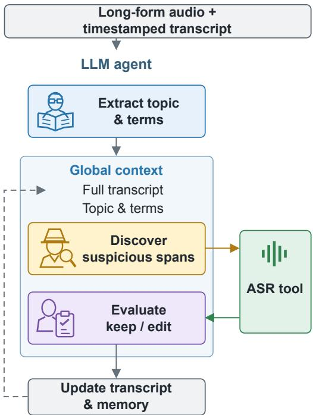
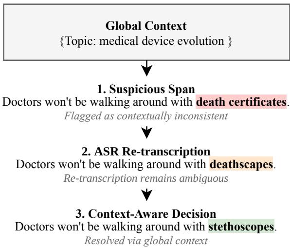

# AGENTIC-GER: TERMINOLOGY RECOVERYIN LONG-FORM SPEECH USING GLOBAL CONTEXT

Yanqiao Zhu1,2,† Wupeng Wang3 Zhifu Gao3 Xiangang Li3 Xie Chen1,2,∗

1X-LANCE Lab, Shanghai Jiao Tong University 2Shanghai Innovation Institute 3Alibaba Token Foundry

## ABSTRACT

Recent advances in speech language models have improved automatic speech recognition (ASR) for long-form audio. However, accurately and consistently transcribing domainspecific terminology remains challenging. Motivated by the world knowledge and contextual capability of large language models (LLMs), we propose Agentic-GER, an LLM-based agent for terminology correction in long-form speech. The agent uses global context from the full transcript to identify suspicious terms and resolve ambiguous hypotheses. It selectively re-transcribes the source speech to check candidate corrections, and uses accepted edits to guide subsequent decisions. Experiments with four LLMs and two ASR systems on GigaSpeechBench show consistent terminology improvements in both Chinese and English, with and without thinking. On Chinese speech, Agentic-GER achieves up to a 36.8% relative reduction in biased character error rate (B-CER) over the Whisper baseline.

Index Terms— Post-ASR Correction, Long-form Speech, Domain Terminology, LLM Agent

## 1. INTRODUCTION

Automatic speech recognition (ASR) has made progress in recent years [1, 2, 3]. Nevertheless, reliably transcribing long-form audio spanning minutes or hours remains challenging [4]. A primary bottleneck is the accurate and consistent transcription of domain-specific terminology. In lengthy recordings, rare or specialized terms are susceptible to acoustic confusion and contextual dilution, leading to inconsistent hypotheses across different segments of the same audio.

Generative error correction (GER) uses the world knowledge and contextual capabilities of large language models (LLMs) to revise hypotheses without modifying the ASR model. Early approaches use textual evidence such as Nbest lists [5, 6]; later work incorporates source speech [7], retrieved entities, and contextual memory [8, 9].

  
Fig. 1. Overview of Agentic-GER. Global context guides error discovery and correction. The agent re-transcribes selected segments to evaluate edits, updates the transcript, and records decisions for subsequent rounds.

Despite these advancements, applying such methods to hours-long audio requires bridging error discovery with correction. This involves deciding which segments to retranscribe and using context from the full transcript to resolve ambiguous ASR hypotheses. LLM agents [10] can call tools to inspect selected audio segments while using the full transcript as context.

We view long-form correction as selective evidence acquisition guided by the full transcript. The transcript reveals recurring entities, related concepts, and cross-segment inconsistencies that indicate which parts of the source speech to inspect. This global context also constrains the candidate terms supplied by the LLM.

Based on this insight, we propose Agentic-GER.1. As shown in Figure 1, it scans the full transcript for suspicious spans, selectively re-transcribes the corresponding audio segments, and evaluates candidate edits using the resulting hypotheses and global context. Accepted edits update the transcript for subsequent rounds, allowing recovered terminology to inform later decisions.

We evaluate Agentic-GER on GigaSpeechBench [11] across four LLMs, two languages, and two initial ASR systems, with and without thinking. We measure terminology recognition using biased character error rate (B-CER) for Chinese and biased word error rate (B-WER) for English, which focus on annotated terminology in the reference transcripts. Agentic-GER consistently lowers these error rates in all 32 configurations, with larger gains in Chinese than in English. With Whisper, the relative B-CER reduction reaches 36.8% on Chinese speech.

On FunASR transcripts for Chinese speech, a comparison with local GER using Qwen3.8-27B supports the value of global context: Agentic-GER improves both terminology and overall accuracy, whereas local GER trades small terminology gains for higher overall error rates. Thinking consistently improves the 27B/31B correctors but provides limited or negative gains for Flash and Max.

## 2. METHOD

Agentic-GER takes audio A and a timestamped transcript $\bar { T ^ { ( 0 ) } } = \{ ( s _ { i } , e _ { i } , x _ { i } ) \} _ { i = 1 } ^ { N }$ , where $x _ { i }$ covers the interval $[ s _ { i } , e _ { i } ]$ It uses the full transcript to find suspicious terms, then checks them against the source speech through segment retranscription before editing the transcript. Segment boundaries remain fixed throughout correction.

## 2.1. Error Discovery via Global Context

The topic of the speech narrows the set of plausible terms. Motivated by contextual prompting [12, 13], the agent first extracts the topic, domain, and terms from the initial transcript. This summary remains fixed, supplying domain cues and observed term forms.

Next, the agent uses this context to find recognition errors that may be unremarkable within a single segment. It examines the summary, current full transcript, and a working memory of earlier decisions, proposing up to k suspicious spans per round. Each proposal specifies a segment, a short substring, and a reason for inspection. Typical cues include inconsistent spellings of the same entity, phonetic confusions, and common words appearing in unlikely technical contexts. The proposed alternatives are evaluated in the next step.

Fig. 2. Resolving an ambiguous ASR hypothesis using global context. The agent flags “death certificates” in a discussion of medical device evolution. Re-transcription yields “deathscapes.” An earlier segment mentions a “stethoscope.” The agent corrects the term to “stethoscopes,” matching the reference. Excerpts are shortened for display.

## 2.2. Re-transcription and Evaluation

A term that fits the topic may differ from what was spoken. For each proposed segment, the agent extracts $A [ s _ { i } : e _ { i } ]$ and re-transcribes it to obtain a second hypothesis.

Finally, the agent decides whether to retain or revise each span. It receives the current segment, its re-transcription, the candidate–evidence pairs, and the global context. The prompt asks the LLM to assess pronunciation compatibility and support from the re-transcription or consistent mentions elsewhere. When the re-transcription remains ambiguous, global context can help resolve it. The prompt requests a minimal edit, preserving unrelated words and retaining the original if evidence is insufficient. The output contains a keep/edit decision, the resulting segment, and a short explanation. Figure 2 illustrates how global context helps resolve an ambiguous re-transcription.

## 2.3. Iterative Correction

Recovering one occurrence makes that term available when examining other mentions. After all candidates in a round have been evaluated using the same transcript, the agent applies the accepted changes. Working memory records both edits and keep decisions, including the checked spans and their explanations. The next round uses this memory and the updated transcript. The loop ends when no new candidates are found or the limit on rounds or accepted edits is reached.

## 3. EXPERIMENTAL SETUP

We evaluate on GigaSpeechBench, using 524 Chinese and 387 English audio files, totaling approximately 120 hours per language across 12 domains. Initial transcripts come from FunASR-Realtime [3] and Whisper-Large-v3 [1]. The four LLMs are Qwen3.8-27B, Gemma4-31B, Qwen3.8-Flash, and Qwen3.8-Max, each evaluated w/o Thinking and w/ Think-$i n g .$ . Thinking denotes intermediate token generation before the task output. This yields 32 configurations. Qwen3.8- 27B and Gemma4-31B are dense models, whereas Flash and Max are mixture-of-experts (MoE) models with 125B and 2.4T backbone parameters, activating 6B and 95B parameters per token, respectively. All configurations use Qwen3-ASR-1.7B [2] for segment re-transcription, without task-specific fine-tuning. Qwen3.8-27B, Gemma4-31B, and Qwen3-ASR-1.7B are served via vLLM on a server with four NVIDIA H100 GPUs. Flash and Max are accessed through the Alibaba Cloud Bailian API. We set k = 4 for Chinese and k = 8 for English, with at most 32 rounds and 48 accepted edits per audio file in all configurations.

Following GigaSpeechBench [11], we report B-CER for Chinese terminology and B-WER for English terminology. Both are computed as $( S _ { b } + D _ { b } + I _ { b } ) / N _ { b } \times 1 0 0 \%$ , where $S _ { b } .$ $D _ { b }$ , and $I _ { b }$ count substitutions, deletions, and insertions associated with annotated terminology under the benchmark’s scoring protocol, and $N _ { b }$ counts the corresponding reference characters or words. We follow the benchmark’s normalization and annotations. We also evaluate overall CER for Chinese and WER for English to assess how terminology correction affects full-transcript accuracy. Scores are macroaveraged over 12 domains.

## 4. RESULTS AND ANALYSIS

## 4.1. Recovering Domain Terminology

Table 1 reports results without thinking. Agentic-GER improves B-CER/B-WER for every evaluated LLM under both ASR systems. The larger Flash and Max models generally yield greater terminology gains than the 27B/31B models, with Max performing best in all four ASR/language combinations. On Chinese speech, Max reduces B-CER for Whisper from 35.07% to 22.16%, a 36.8% relative reduction. The gains also extend to FunASR, whose baseline terminology error rates are lower. This shows that terminology errors remain correctable even with a stronger ASR baseline. Relative gains are larger for Chinese than for English under both ASR systems, motivating a closer look at the errors being corrected.

We also evaluate overall transcription accuracy across both thinking modes. For Whisper on Chinese speech, overall CER decreases by 8.7–18.3% relative to the baseline. For the other configurations, relative changes in overall CER/WER range from a 3.4% decrease to a 0.5% increase.

Table 1. Main terminology results without thinking. Error rates (%, ↓); parentheses show relative error reductions (%, ↑) from Baseline. Column minima are in bold.
<table><tr><td rowspan="2"></td><td colspan="2">Chinese B-CER↓</td><td colspan="2">English B-WER↓</td></tr><tr><td>FunASR</td><td>Whisper</td><td>FunASR</td><td>Whisper</td></tr><tr><td>Baseline</td><td>10.91</td><td>35.07</td><td>12.94</td><td>14.67</td></tr><tr><td rowspan="2">+Qwen3.8-27B</td><td>10.19 (6.7)</td><td>28.88 (17.7)</td><td>12.35 (4.6)</td><td>14.08</td></tr><tr><td>9.88</td><td>25.09</td><td>12.05</td><td>(4.0) 13.71</td></tr><tr><td>+Gemma4-31B</td><td>(9.5) 9.64</td><td>(28.5) 26.61</td><td>(6.9) 11.91</td><td>(6.5) 13.72</td></tr><tr><td>+Qwen3.8-Flash</td><td>(11.7)</td><td>(24.1)</td><td>(8.0)</td><td>(6.5)</td></tr><tr><td>+Qwen3.8-Max</td><td>8.96 (17.9)</td><td>22.16 (36.8)</td><td>11.74 (9.3)</td><td>13.64 (7.0)</td></tr></table>

## 4.2. Error-Type Analysis

To investigate the larger gains on Chinese speech, we compare substitution and deletion errors across the two languages. Table 2 reports baseline error proportions and relative reductions in error counts for Qwen3.8-27B on Whisper transcripts without thinking. We pool terminology alignment errors across the evaluation data, using characters for Chinese and words for English.

Substitution errors show larger relative reductions than deletions in both languages. For Whisper on Chinese speech, substitution errors decrease by 21.3%, compared with 3.0% for deletions; on English speech, the corresponding reductions are 6.4% and 0.4%. FunASR shows the same pattern, including a 5.4% increase in deletions on Chinese speech. Substitution reductions contribute most to the gains in all 32 configurations.

Table 2. Terminology error analysis for Qwen3.8-27B on Whisper without thinking. Proportion (%) is each error type’s percentage of all baseline terminology errors, including insertions. Reduction (%,↑) is the relative decrease in its error count.
<table><tr><td>Language Error type</td><td></td><td>Proportion Reduction↑</td><td></td></tr><tr><td rowspan="2">Chinese</td><td>Substitution</td><td>85.0</td><td>21.3</td></tr><tr><td>Deletion</td><td>14.7</td><td>3.0</td></tr><tr><td rowspan="2">English</td><td>Substitution</td><td>56.0</td><td>6.4</td></tr><tr><td>Deletion</td><td>43.1</td><td>0.4</td></tr></table>

This pattern is consistent with how the agent discovers errors. A substitution can leave an inconsistent term or an implausible phrase to inspect. An omitted term may leave no textual cue, making it harder to identify through transcript inspection. In the Whisper baseline, deletions account for 43.1% of terminology errors in English, compared with 14.7% in Chinese; FunASR shows a similar difference. We hypothesize that this higher proportion of deletions contributes to the smaller gains on English transcripts.

## 4.3. The Value of Global Context

To assess the value of global context, we compare Agentic-GER with local GER using Qwen3.8-27B on FunASR transcripts for Chinese speech. Local GER corrects each segment in a single step from its original text and the Qwen3-ASR hypothesis, without global context or iterative updates. Table 3 reports both thinking modes.

Table 3. Local GER versus Agentic-GER. Error rates (%, ↓); best values in bold. “Thinking” indicates whether intermediate token generation is enabled (✓) or disabled (✗).
<table><tr><td></td><td>Thinking</td><td>B-CER↓</td><td>CER↓</td></tr><tr><td>Baseline</td><td>一</td><td>10.91</td><td>3.12</td></tr><tr><td rowspan="3">+Local GER</td><td>X</td><td>10.80</td><td>3.37</td></tr><tr><td>√</td><td>10.63</td><td>3.42</td></tr><tr><td>X</td><td>10.19</td><td>3.11</td></tr><tr><td rowspan="2">+Agentic-GER</td><td>√</td><td>9.03</td><td>3.01</td></tr><tr><td></td><td></td><td></td></tr></table>

Local GER yields small terminology gains but increases overall CER, whereas Agentic-GER reduces both metrics. With thinking, the relative B-CER reductions are 2.57% for local GER and 17.27% for Agentic-GER. A second ASR hypothesis can help recover a term, but may contain errors, as Figure 2 illustrates. Global context provides constraints for choosing a replacement. The contrast between the two workflows supports using the full transcript to select suspicious spans and judge replacements across iterations, improving terminology and overall accuracy.

## 4.4. Thinking for Terminology Recovery

We next examine whether thinking improves correction over the results in Table 1. Table 4 reports error rates with thinking and $\Delta$ Thinking, the change in relative error reduction in percentage points. Thinking improves Qwen3.8-27B and Gemma4-31B in all four ASR/language combinations. Flash shows small gains in three comparisons, whereas Max regresses in three. For Whisper on Chinese speech, thinking increases the relative B-CER reduction by 8.5 percentage points for Qwen3.8-27B but decreases it by 9.7 points for Max.

We hypothesize that this pattern reflects a tradeoff between eliciting relevant terminology and introducing competing alternatives. Kambhampati et al. [14] interpret intermediate tokens as learned prompt augmentations. For Qwen3.8- 27B and Gemma4-31B, this augmentation may help bring relevant terms into context and connect them to the speech.

Table 4. Terminology error rates (%, ↓) with thinking. $\Delta$ Thinking reports the change in relative error reduction compared with Table 1 (percentage points, ↑). Positive values indicate improvement; negative values (bold) indicate degradation.
<table><tr><td rowspan="2"></td><td colspan="2">Chinese B-CER↓</td><td colspan="2">English B-WER↓</td></tr><tr><td>FunASR</td><td>Whisper</td><td>FunASR</td><td>Whisper</td></tr><tr><td>+Qwen3.8-27B</td><td>9.03</td><td>25.89</td><td>11.96</td><td>13.87</td></tr><tr><td>∆ Thinking (pp)↑</td><td>+10.6</td><td>+8.5</td><td>+3.0</td><td>+1.5</td></tr><tr><td>+Gemma4-31B</td><td>9.32</td><td>23.20</td><td>11.79</td><td>13.60</td></tr><tr><td>∆ Thinking (pp)↑</td><td>+5.1</td><td>+5.4</td><td>+2.0</td><td>+0.8</td></tr><tr><td>+Qwen3.8-Flash</td><td>9.61</td><td>26.75</td><td>11.78</td><td>13.63</td></tr><tr><td>∆ Thinking (pp)↑</td><td>+0.3</td><td>-0.4</td><td>+0.9</td><td>+0.6</td></tr><tr><td>+Qwen3.8-Max</td><td>9.45</td><td>25.54</td><td>11.79</td><td>13.62</td></tr><tr><td>∆ Thinking (pp)↑</td><td>-4.5</td><td>-9.7</td><td>-0.4</td><td>+0.1</td></tr></table>

Max already performs best without thinking, suggesting less need for additional elicitation. Further generation may introduce alternatives to a suitable correction. This interpretation is consistent with the association between incorrect answers and increased backtracking reported by Hassid et al. [15] on reasoning benchmarks.

Beyond its effect on accuracy, thinking also increases correction time, with a much larger rise in output-token usage than in input-token usage. For example, on Whisper transcripts for Chinese speech, Gemma4-31B uses 161 million input tokens and 2.6 million output tokens without thinking, with a correction RTF of 0.42. With thinking, input usage rises to 198 million tokens and output usage to 38.3 million, while RTF reaches 5.71.

## 5. CONCLUSION

We presented Agentic-GER, which uses global context to guide terminology correction in long-form speech. The full transcript helps the agent locate suspicious spans and judge candidate replacements together with ASR re-transcriptions. Accepted edits update the transcript, allowing recovered terms to inform subsequent decisions. Experiments on GigaSpeechBench show terminology improvements across all 32 configurations. Substitution reductions contribute most to these gains, while deletions show smaller improvements. Thinking consistently benefits the 27B/31B models but yields limited or negative gains for Flash and Max.

A promising direction is to expand the agent’s tool set. Web search could provide domain knowledge about unfamiliar terms, while end-to-end multimodal models could assess candidate corrections directly from speech and transcript context. Future work will also investigate the recovery of omitted terminology and evaluate the framework on additional

## 6. REFERENCES

[1] Alec Radford, Jong Wook Kim, Tao Xu, Greg Brockman, Christine McLeavey, and Ilya Sutskever, “Robust speech recognition via large-scale weak supervision,” in International conference on machine learning. PMLR, 2023, pp. 28492–28518.

[2] Xian Shi, Xiong Wang, Zhifang Guo, Yongqi Wang, Pei Zhang, Xinyu Zhang, Zishan Guo, Hongkun Hao, Yu Xi, Baosong Yang, et al., “Qwen3-asr technical report,” arXiv preprint arXiv:2601.21337, 2026.

[3] Keyu An, Yanni Chen, Zhigao Chen, Chong Deng, Zhihao Du, Changfeng Gao, Zhifu Gao, Bo Gong, Xiangang Li, Yabin Li, et al., “Fun-asr technical report,” arXiv preprint arXiv:2509.12508, 2025.

[4] Fei Yang, Xuanfan Ni, Renyi Yang, Jiahui Geng, Qing Li, Chenyang Lyu, Yichao Du, Longyue Wang, Weihua Luo, and Kaifu Zhang, “Longspeech: A scalable benchmark for transcription, translation and understanding in long speech,” in ICASSP 2026 - 2026 IEEE International Conference on Acoustics, Speech and Signal Processing (ICASSP), 2026, pp. 15547–15551.

[5] Chen Chen, Yuchen Hu, Chao-Han Huck Yang, Sabato Marco Siniscalchi, Pin-Yu Chen, and Eng-Siong Chng, “Hyporadise: An open baseline for generative speech recognition with large language models,” Advances in Neural Information Processing Systems, vol. 36, pp. 31665–31688, 2023.

[6] Chao-Han Huck Yang, Yile Gu, Yi-Chieh Liu, Shalini Ghosh, Ivan Bulyko, and Andreas Stolcke, “Generative speech recognition error correction with large language models and task-activating prompting,” in 2023 IEEE Automatic Speech Recognition and Understanding Workshop (ASRU). IEEE, 2023, pp. 1–8.

[7] Yuchen Hu, Chen Chen, Chengwei Qin, Qiushi Zhu, Eng Siong Chng, and Ruizhe Li, “Listen again and choose the right answer: A new paradigm for automatic speech recognition with large language models,” in Findings of the Association for Computational Linguistics: ACL 2024, Lun-Wei Ku, Andre Martins, and Vivek Srikumar, Eds., Bangkok, Thailand, Aug. 2024, pp. 666–679, Association for Computational Linguistics.

[8] Sreyan Ghosh, Mohammad Sadegh Rasooli, Michael Levit, Peidong Wang, Jian Xue, Dinesh Manocha, and Jinyu Li, “Failing forward: Improving generative error

correction for ASR with synthetic data and retrieval augmentation,” in Findings of the Association for Computational Linguistics: ACL 2025, Wanxiang Che, Joyce Nabende, Ekaterina Shutova, and Mohammad Taher Pilehvar, Eds., Vienna, Austria, July 2025, pp. 2466– 2482, Association for Computational Linguistics.

[9] Xinxin Li, Huiyao Chen, Meishan Zhang, Yunxin Li, Zulong Chen, Zhibo Ren, Xiaoqing Dong, Baotian Hu, and Min Zhang, “Ontology memory-augmented asr correction for long text-speech interleaved conversations,” arXiv preprint arXiv:2606.13464, 2026.

[10] Shunyu Yao, Jeffrey Zhao, Dian Yu, Nan Du, Izhak Shafran, Karthik R Narasimhan, and Yuan Cao, “React: Synergizing reasoning and acting in language models,” in The eleventh international conference on learning representations, 2022.

[11] Yujie Tu, Yifan Yang, Tianrui Wang, Yanqiao Zhu, Guodong Lin, Mingchen Shao, Haoran Wang, Junzhe Liu, Yuxiang Fu, Yizhou Peng, Changsong Liu, Peng Wang, Zhikang Niu, Yunchong Xiao, Haolong Zheng, Xiuwen Zheng, Xulin Fan, Wei-Qiang Zhang, Lei Xie, Longbiao Wang, Eng-Siong Chng, Jiajun Zhang, Kele Xu, Jianwei Yu, Binbin Zhang, Jiayu Du, Wupeng Wang, Zhigao Chen, Yuzhong Wu, Zhendong Peng, Bin Ma, Guoguo Chen, Xipeng Qiu, Mark Hasegawa-Johnson, Kai Yu, Zhifu Gao, Xiangang Li, and Xie Chen, “GigaSpeechBench: A real-world multilingual speech-to-text benchmark,” arXiv:2606.28884, 2026.

[12] Jiwon Suh, Injae Na, and Woohwan Jung, “Improving Domain-Specific ASR with LLM-Generated Contextual Descriptions,” in Interspeech 2024, 2024, pp. 1255– 1259.

[13] Yuang Li, Yu Wu, Jinyu Li, and Shujie Liu, “Prompting large language models for zero-shot domain adaptation in speech recognition,” in 2023 IEEE Automatic Speech Recognition and Understanding Workshop (ASRU). 2023, pp. 1–8, IEEE.

[14] Subbarao Kambhampati, Karthik Valmeekam, Siddhant Bhambri, Vardhan Palod, Lucas Saldyt, Kaya Stechly, Soumya Rani Samineni, Durgesh Kalwar, and Upasana Biswas, “Position: Stop Anthropomorphizing Intermediate Tokens as Reasoning/Thinking Traces!,” in Proceedings of the 43rd International Conference on Machine Learning. 2026, vol. 306 of Proceedings of Machine Learning Research, PMLR.

[15] Michael Hassid, Gabriel Synnaeve, Yossi Adi, and Roy Schwartz, “Don’t Overthink it. Preferring Shorter Thinking Chains for Improved LLM Reasoning,” arXiv preprint arXiv:2505.17813, 2025.