# Augur: A Synthetic Decision Lab for Rehearsing Reactions to Product and Policy Changes

Rahul Khedar Mayank Malhotra Avinash Karn

PayPal AI

## Abstract

Before a product or policy change ships, the question that matters is how people will react to it. Augur rehearses that reaction ofline: it builds a typed knowledge graph from the change documents, populates a grounded persona market, simulates the interaction, and returns an auditable decision memo recommending one of five actions. We assemble Gold-50, fifty real product and policy episodes whose real-world outcome is known, adjudicated against the public record, and score the five-way release verdict against it.

Our central finding is methodological and negative: most of the measured gap between frontier cloud models and open- weight models we fine-tune and serve ofline is attributable to an under-specified evaluation, not a diference in capability. We show this three ways. First, the prompt envelope alone can dominate the score: holding weights, cases and scorer fixed, one system—a LoRA-SFT adapter on Qwen3-32B— swings from 0% to 73%. Second, in a matched 2 × 2 ablation, defining the decision taxonomy in the prompt—with no model change—lifts every frontier model by +24 to +34 pp; under the under-specified prompt, Qwen3-32B LoRA-SFT served ofline beats all three frontier models (paired McNemar, Holm-corrected), and once the prompt is fair no significant diference from any of them is detected. Third, agreement with the distillation teacher rises without accuracy following, and the full pipeline amplifies a s stematic “over-doom” bias rather than improving the verdict. Separately, we validate the reaction layer on its own terms: blind judges across four model families find the synthetic reaction recovers 67–90% of the concerns the public actually raised, and a pre-registered ablation locates its value—largest where the decision is hardest, redundant near ceiling. The pipeline that regenerates every number and figure here is available from the authors.

## 1 Introduction

Organizations decide whether to ship changes—a pricing update, a policy revision, a feature launch—under uncertainty about how the people afected will react. The evidence they would most like to have, the reaction itself, does not exist until after the decision is made. Augur is a system for manu- facturing a usable proxy for that evidence before the fact: it reads the documents that define a change, constructs a mar- ket of stakeholders grounded in those documents, simulates their interaction [1, 2], and returns a decision memo that recommends one of five release actions and shows its work.

A system like this is only as trustworthy as the measurement used to judge it, and this is where the paper concentrates its efort. It is easy to run a fleet of models through a decision harness, read of a leaderboard, and conclude that frontier cloud models are far ahead of anything one can fine-tune and serve ofline. We built that leaderboard, and then spent most of our efort showing that the conclusion it invites is largely an artifact of how the models were asked, not of what they can do.

Aim. Our goal is to establish, on a benchmark of real decisions with verified outcomes, how much of the frontier- versus-ofline gap on this task is real capability and how much is measurement, and to give a mechanism for the diference. The answer, on these fifty cases, is that the gap is mostly measurement: once the decision taxonomy is defined in the prompt for everyone, a Qwen3-32B open-weight model served ofline shows no statistically significant diference from the frontier models tested.

## Contributions.

1. Gold-50, a benchmark of 50 real product and policy episodes with manually verified real-world outcomes, balanced ten per class across a five-way action taxonomy, together with the Augur system that produces auditable verdicts on it (Sections 2 and 3).

2. The prompt envelope can dominate the result. With weights, cases and scoring code held fixed, changing only the prompt moves one system—the deployed Qwen3-32B LoRA-SFT (sft\_v3)—from 0% to 73% (Section 5.2). Any single-prompt comparison of this task is therefore un- interpretable, and we report the compliance rate alongside every accuracy.

3. A matched 2 × 2 ablation resolves most of the gap (Section 5.3). On the same fifty report-stage contexts through the same direct harness, appending a shared taxonomy-definition block lifts every frontier model by +24 to +34 pp. Under the under-specified prompt the ofline Qwen3-32B LoRA-SFT significantly beats all three frontier models (Holm-corrected); under the fair prompt no statistically significant diference from any of them is detected. The mechanism difers by family, so the two interventions are complementary rather than redundant.

4. Two failure modes with a formal account. Agreement with the distillation teacher climbs from 10% to 70% across fine-tuning rounds with no matching movement in outcome accuracy (Section 5.7), and the full five-stage pipeline amplifies an over-doom bias, scoring at or below the five- way chance rate (Section 5.4). Section B proves why both are expected: distillation collapses judge independence, and any exact-match scorer imposes a schema-compliance ceiling.

5. The reaction layer is faithful, and its value is located, not flat. Blind judges across four model families find the synthetic reaction anticipates 67–90% of the concerns the public actually raised (Section 5.5), and a pre-registered matched with/without-simulation ablation (Section 5.6) shows the report-stage reaction signal helps most exactly where the title-only baseline is weakest (+20 pp for the weakest solver) and is redundant near ceiling—so the over-doom of the previous point is a property of stacking the generative stages, not of the reaction evidence itself.

6. A reproducible artifact-to-PDF pipeline. Every number, table cell and plotted mark in this paper is generated from the run artifacts and then re-asserted against them; nothing is transcribed by hand (Section 8).

## 2 The Augur System

Augur factors a decision into five single-responsibility stages, each of which reads the artifacts of the stages before it and writes its own. The forward path is documents → graph → personas → simulation → report, and a fifth interaction stage supports post-hoc interrogation of any persona. Figure 1 shows the flow; Section A gives the formal operators, and we summarize them here.

Stages. Graph build infers a typed ontology from the change documents and extracts a directed knowledge graph of entities and relations. Environment synthesizes a persona population grounded in that graph—each persona references graph entities, so the market is specific to the change rather than a generic crowd. Simulation runs the personas for several rounds on an OASIS-style engine [3], producing a timeline of posts, replies and reactions with peer-influenced sentiment. Report retrieves graph-expanded evidence [7, 8], writes a forecast, and emits the recommended action $a ^ { \star }$ from the five-way taxonomy

$$
\mathcal { A } = \{ \mathrm { s H I P } , \mathrm { R E V I S E } , \mathrm { D E L A Y } , \mathrm { s E G M E N T } , \mathrm { M I T I G A T E } \} .
$$

Between stages, three pure-code auditors read the finished transcript and can each buy at most one corrective round under a global budget, and a cross-family critic gates the verdict.

Engineered independence. Agents never call one another; each reads persisted artifacts and writes its own, and a derived- from dependency directed acyclic graph (DAG) makes re-generation of any artifact cascade to everything downstream (Section A). The ensemble that produces the verdict is drawn cross-family: the critic and cross-check come from a model family other than the report author’s [9]. Section B explains why this matters—same-family voting forfeits most of the amplification an ensemble can provide, and it is exactly the property that distillation destroys. Figure 2 shows the layered structure that enforces this: every agent reaches the rest of the system only through an abstracted storage interface and a single OpenAI-compatible model boundary, so the graph store (Neo4j today) and the model backend (a hosted gateway or a local runtime) are both swappable without touching agent code—the property that makes the fully ofline deployment of Section 2 a configuration change rather than a rewrite.

Ofline deployment. The system is designed to run without a cloud dependency. We fine-tune the generation stages with low-rank adaptation (LoRA) [13] on distilled traces [10, 11] and serve them on a single accelerator; the untuned cross- family critic is kept of-the-shelf so that its errors are not the generator’s errors. Training details, adapters and serving cost are in Section D.

## 3 The Gold-50 Benchmark

Judging a decision system requires cases whose realized outcome is known. Gold-50 is fifty real product and policy episodes—each a change that a real organization actually made—for which the real-world outcome was later observed and can be mapped onto the five-way action taxonomy. Each label records the realized disposition of the episode (what actually happened), not an abstract “optimal action.” Every one of the 50 labels was adjudicated in a single author pass against the public record, assisted by Claude Opus 4.8 (adjudication run 2026-09-06), with a median of three independent sources per case. Because Claude Opus 4.8 also appears as one of the benchmarked frontier models, its adjudication role is a potential source of circularity in the frontier-model com- parison; we disclose it here and read the Opus 4.8 Gold-50 numbers with that caveat. The labeling convention for each of the five classes is given in Table 8, and the full per-case led er—label, outcome driver, ear and source count—is in Table 9. Each case is annotated with the mechanism that actually decided its outcome, so that accuracy can be stratified by why a decision went the way it did. Because the labels are a single-pass author adjudication rather than a multi-annotator consensus, we treat Gold-50 as an author- adjudicated retrospective benchmark and scope every claim to it.

Every system is shown only the pre-decision information for a case—the policy or product document as it stood before the outcome was known. The realized outcome, the outcome- driver annotation and the source list are held out of the model input entirely and are used only for scoring, so no system can read the answer of its own prompt.

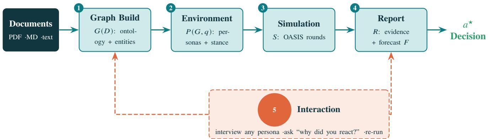  
Figure 1. The Augur pipeline; symbols are the operators of Equation (2). Each forward stage persists an inspectable artifact; the interaction stage feeds findings back into the graph or report.

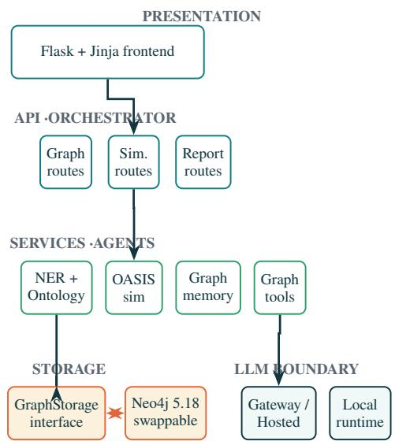  
Figure 2. Layered architecture. A Flask/Jinja frontend drives an API and orchestrator layer; the single-responsibility agents (namedentity recognition [NER] and ontology, OASIS simulation, graph memory, graph tools) sit below it and interact with the rest of the system only through an abstracted GraphStorage interface (Neo4j today, swappable) and one OpenAI-compatible model boundary (a hosted gateway or a local runtime). Nothing above the storage or model boundary knows which backend is in use, which is what makes the fully ofline deployment of Section 2 a configuration change.

The set is balanced at ten cases per class across {ship, revise, delay, segment, mitigate}, which fixes the five-way chance rate at exactly 20% and makes a raw accu- racy directly comparable to it. The verification annotations sort the cases into four outcome drivers: public reaction (28 cases), regulatory action (11), engineering readiness (7), and business performance (4). The reaction stratum is both the largest and the one the pipeline is architecturally aimed at, and—as Section F shows—the one every system does worst on, which is the honest limit of a reaction-simulating design. Because the target action is parsed out of a structured field, we score two ways throughout: a conservative accuracy that counts any unparseable output as wrong, and the accuracy conditional on in-schema output, reported with its parsed count. Section B makes precise why both are necessary.

## 4 Experimental Setup

Systems. We evaluate eleven systems on the report stage: three frontier cloud models (Claude Sonnet 5, Claude Opus 4.8, GPT-5.2) and eight open-weight configurations spanning 1.7B to 32B parameters, both untuned bases and their adapters from LoRA supervised fine-tuning (SFT), plus one variant extended with direct preference optimization (DPO), the SFT→DPO configuration [14]. The base backbones are Qwen3-1.7B, Qwen3-8B and Qwen3-32B [21], Llama-3-8B-Instruct [22] and Gemma-3-27B-it [23]; each named result below identifies its exact configuration, and Table 1 lists all eleven. The deployed open checkpoint is a LoRA-SFT adapter on Qwen3-32B (sft\_v3), and its preference-tuned sibling is Qwen3-32B SFT→DPO (dpo); their lineage and hyperparameters are in Section D.

Harness and prompt arms. Every comparison in this paper holds the fifty cases and the scoring code fixed and varies only the model and the prompt. The deployed reportstage prompt is the one the application serves. The debias arm appends a single shared block that defines each of the five actions and discourages hedging. The abstract arm, used only as a schema-compliance probe (Section 5.2), asks for a verdict through a generic instruction prompt. No arm changes model weights.

Statistics. Wilson score intervals give the 95% confidence band on each accuracy [17]; at �=50 these are wide and overlap for most pairs, so we do not compare systems by eyeballing intervals. Because every system sees the same cases, the correct paired test is the two-sided exact McNemar test on the discordant pairs [18], which we use for every head-to-head claim. Where a claim rests on a family of paired tests—the leader-versus-frontier comparisons under each prompt arm, and the fine-tuning deltas—we report Holm- corrected and Benjamini-Hochberg-corrected �-values [19, 20] alongside the raw ones; our primary hypothesis family is the leader-versus-frontier comparison under the shared- taxonomy (debias) prompt. A non-significant McNemar result at �=50 is a failure to detect a diference, not evidence of equivalence: the sample is too small to support an equivalence test, and we never read “no significant diference” as “the same.” Class-level performance is summarized by macro-F1.

Data hygiene. Gold-50 is an evaluation-only set and is disjoint from everything used to build the open checkpoints. The fine-tuning corpus is synthetic persona-generation traces; it shares no case identifier with Gold-50 (0 overlapping ids), no case document matches any training document, and the strongest cross-set link we find is a single shared company name in at most one case—consistent with two independently constructed corpora that happen to mention the same well- known organization. The audit is recomputed from the raw splits by the metrics pipeline and reported in Section E; no Gold-50 case was used for SFT, DPO, validation or model selection.

## 5 Results

## 5.1 The report-stage leaderboard

Table 1 and fig. 3 give the report-stage leaderboard under the deployed prompt. The deployed Qwen3-32B LoRA-SFT (sft\_v3) leads at 31/50 = 62.0% (Wilson [48.2, 74.1], macro-F1 0.59); the Qwen3-32B SFT→DPO variant matches it, and the untuned Qwen3-8B base reaches 54.0%. At the bottom, the Qwen3-1.7B LoRA-SFT adapter collapses to 6.0% with 35/50 unparseable outputs—a compliance failure, not a judgment failure, and a first concrete instance of the ceiling of Section B.

The Wilson intervals overlap for nearly every pair, so we decide separation with the paired test. Exactly three systems are separated from the leader (the Qwen3-32B LoRA-SFT) at $\alpha { = } 0 . 0 5 { : }$ the Qwen3-1.7B LoRA-SFT, the Llama-3-8B-Instruct base, and the Gemma-3-27B-it base; the second-place Qwen3-32B SFT→DPO variant shows zero discordant pairs with the leader, and the 60% Llama-3-8B LoRA-SFT adapter shows no significant diference from it. In other words, the top of the leaderboard is a cluster, not a ranking, at this sample size.

Fine-tuning is not uniformly beneficial. Applying one recipe and one dataset to five backbones (Table 2 and fig. 4) produces efects that range from decisive to destructive: +44 pp on Llama-3-8B $( p = 3 . 0 \times 1 0 ^ { - 6 } )$ and −40 pp on Qwen3-1.7B $( p = 1 . 1 \times 1 0 ^ { - 5 } )$ , with the three mid-size efects not significantly diferent from noise at $scriptstyle n = 5 0$ The gain on Llama-3-8B comes from the SFT fixing 23 cases while breaking 1; the collapse on the smallest backbone, Qwen3- 1.7B, is the mirror image, breaking 21 while fixing 1, as the adapter degrades the model’s already-fragile schema compliance.

Table 1. Gold-50 leaderboard, report stage. Five-way release verdict against the verified real-world outcome, $n { = } 5 0 .$ , ten cases per class, five-way chance 20%. “Acc” scores unparseable output as wrong (the conservative choice); “in-sch.” is the accuracy conditional on in-schema output, $\operatorname* { P r } [ \hat { a } = a ^ { \star } \mid \hat { a } \in \mathcal { A } ]$ , with its parsed count in parentheses; ∅ is the unparseable count. CI is the 95% Wilson score interval. Generated from the computed metrics.
<table><tr><td>System</td><td>Acc</td><td>95% CI</td><td>in-sch.</td><td>macro-F1 ∅</td></tr><tr><td>Qwen3-32B + LoRA-SFT •</td><td>62</td><td>[48.2,74.1]</td><td>62 (50)</td><td>0.59 一</td></tr><tr><td>Qwen3-32B + SFT→DPO 。</td><td>62</td><td>[48.2,74.1]</td><td>62 (50)</td><td>0.59 一</td></tr><tr><td>Llama-3-8B + LoRA-SFT •</td><td>60</td><td>[46.2,72.4]</td><td>61.2 (49)</td><td>0.58 1</td></tr><tr><td>Qwen3-32B</td><td>56</td><td>[42.3,68.8]</td><td>56 (50)</td><td>0.56 一</td></tr><tr><td>Qwen3-8B</td><td>54</td><td>[40.4,67]</td><td>54 (50)</td><td>0.52 一</td></tr><tr><td>Qwen3-8B + LoRA-SFT •</td><td>50</td><td>[36.6,63.4]</td><td>56.8 (44)</td><td>0.51 6</td></tr><tr><td>Gemma-3-27B + LoRA-SFT •</td><td>50</td><td>[36.6,63.4]</td><td>50 (50)</td><td>0.44 一</td></tr><tr><td>Qwen3-1.7B</td><td>46</td><td>[33,59.6]</td><td>46 (50)</td><td>0.39 一</td></tr><tr><td>Gemma-3-27B-it</td><td>36</td><td>[24.1,49.9]</td><td>36 (50)</td><td>0.34 一</td></tr><tr><td>Llama-3-8B-Instruct</td><td>16</td><td>[8.3,28.5]</td><td>16(50)</td><td>0.16 一</td></tr><tr><td>Qwen3-1.7B + LoRA-SFT •</td><td>6</td><td>[2.1,16.2]</td><td>20 (15)</td><td>0.07 35</td></tr></table>

• LoRA-SFT ◦ SFT→DPO (unmarked) untuned base.

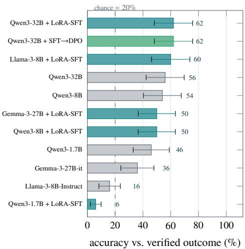  
Figure 3. Gold-50 leaderboard. Accuracy of the five-way release verdict against the verified real-world outcome on $n = 5 0$ cases, balanced at 10 per class, all 50/50 labels manually re-verified (section 3). Bars are teal for LoRA-SFT adapters, green for SFT→DPO and grey for untuned bases; whiskers are 95% Wilson score intervals, which are wide at this � and overlap for most pairs — hence the paired McNemar tests in table 2, which condition on the same cases. Unparseable outputs are scored as wrong, the conservative choice; table 1 also reports the accuracy conditional on in-schema output.

Table 2. Paired base→LoRA-SFT efect, one recipe and one dataset, each backbone scored before and after on the same 50 cases. Δ is percentage points; “fix/broke” are the discordant McNemar cells (cases the adapter got right and the base wrong, and the reverse); � is the two-sided exact McNemar test, starred at $\scriptstyle \alpha = 0 . 0 5$ . Generated from the computed metrics.
<table><tr><td>Backbone</td><td>Base</td><td>+SFT</td><td>∆pp</td><td>fix/broke</td><td>p</td></tr><tr><td>Qwen3-1.7B</td><td>46</td><td>6</td><td>-40</td><td>1/21</td><td> $1 . 1 \mathrm { e } { - } 5 ^ { \ast }$ </td></tr><tr><td>Llama-3-8B-Instruct</td><td>16</td><td>60</td><td>+44</td><td>23/1</td><td> $3 . 0 \mathrm { e } { - 6 } ^ { \ast }$ </td></tr><tr><td>Qwen3-8B</td><td>54</td><td>50</td><td>-4</td><td>8/10</td><td>0.815</td></tr><tr><td>Gemma-3-27B-it</td><td>36</td><td>50</td><td>+14</td><td>15/8</td><td>0.210</td></tr><tr><td>Qwen3-32B</td><td>56</td><td>62</td><td>+6</td><td>9/6</td><td>0.607</td></tr></table>

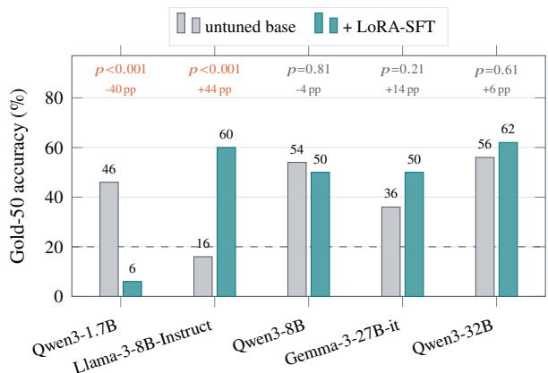  
Figure 4. The same fine-tune helps or destroys, depending on the backbone. Each pair is one backbone evaluated before and after LoRA-SFT on identical data, recipe, seed and prompts, scored on the same 50 cases; � is a two-sided exact McNemar test on the discordant pairs (table 2), which is the correct test here because the two systems see the same items. The efect ranges from +44 pp (Llama-3-8B) to −40 pp (Qwen3-1.7B), and only those two extremes are si nificant — the three mid-size ains are not distin uishable from noise at $n = 5 0 \mathrm { \Omega }$ . Dashed line is the 20% five-way chance level.

## 5.2 The prompt envelope can dominate the result

Before comparing systems, we have to establish how much of a measured diference is judgment and how much is the harness. Figure 5 answers this on an answer-keyed subset: the same weights and the same cases, scored the same way, under two prompts. Through the deployed report-stage prompt the three checkpoints (Qwen3-32B base, Qwen3- 8B LoRA-SFT, and the deployed Qwen3-32B LoRA-SFT) score 54.5–72.7%; through a generic abstract prompt the same weights emit actions outside the five-way schema and accuracy collapses. The fine-tuned Qwen3-32B LoRA-SFT is the most harness-sensitive of the three, because SFT bound its output format tightly to the serving prompt: it is the worst under the abstract prompt and the best under the deployed one, swinging from 0% to 73%.

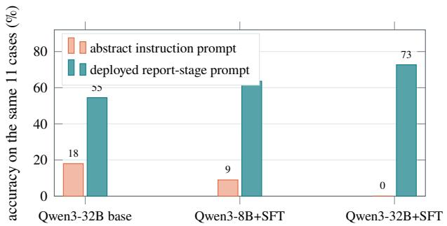  
Figure 5. The evaluation harness can dominate the measurement. The same three checkpoints, the same 11 answer-keyed cases, the same scoring code — only the prompt envelope difers. Asked for a verdict through a generic instruction prompt, the mod- els emit actions outside the five-way schema (delay\_release, proceed\_with\_mitigations, rollback) and accuracy col-lapses; asked through the exact report-stage prompt the app deploys, the same weights score 54.5–72.7%. The fine-tuned Qwen3-32B LoRA-SFT (sft\_v3) is the most harness-sensitive of the three, because SFT bound its output format tightly to the serving prompt: it is worst under the abstract prompt and best under the deployed one. We therefore report all headline numbers under the deployed prompt and treat the abstract harness as a schema-compliance probe, not a judgment measurement.

This is not a curiosity—it is the reason a single-prompt leaderboard on this task cannot be trusted [15, 16], and it motivates the matched ablation of Section 5.3. We therefore report all headline numbers under the deployed prompt and treat the abstract prompt as a schema-compliance probe rather than a judgment measurement.

## 5.3 The debias 2×2: most of the gap is the prompt

The cleanest test of the paper’s thesis puts frontier and open-weight models on identical footing: the same fifty report-stage contexts, the same direct harness, and a single binary intervention—whether the shared taxonomy-definition block is appended. Figure 6 and Table 10 give the full grid; Table 3 settles the head-to-head with the paired test.

Defining the taxonomy, with no model change, lifts every frontier model by +24 to +34 pp, and every frontier gain is significant at $p < 0 . 0 1 $ : Sonnet 5 46 → 80%, Opus 4.8 44 → 68%, GPT-5.2 38 → 66%. The ofline Qwen3-32B LoRA-SFT moves 62 → 78% and its DPO variant (Qwen3- 32B SFT→DPO) 62 → 76%. The low frontier scores under the deployed prompt were therefore largely a prompt artifact, not a capability gap.

The head-to-head makes the consequence precise. Un- der the under-specified baseline prompt the ofline Qwen3- 32B LoRA-SFT significantly beats all three frontier models $( p ~ = ~ 0 . 0 3 9 / 0 . 0 1 2 / 0 . 0 0 2 ;$ ; all significant after Holm cor- rection, Table 3), winning 10–13 discordant cases against 1–2. Once the taxonomy is defined for everyone, no statisti- cally significant diference from any of the three is detected $( p = 1 . 0 0 0 / 0 . 2 2 7 / 0 . 1 8 0 ;$ Holm-corrected in Table 3) — a failure to detect a diference at �=50, not evidence of equivalence. The Qwen3-32B LoRA-SFT served ofline thus shows no significant diference from the frontier when the prompt is fair and wins whenever it is not.

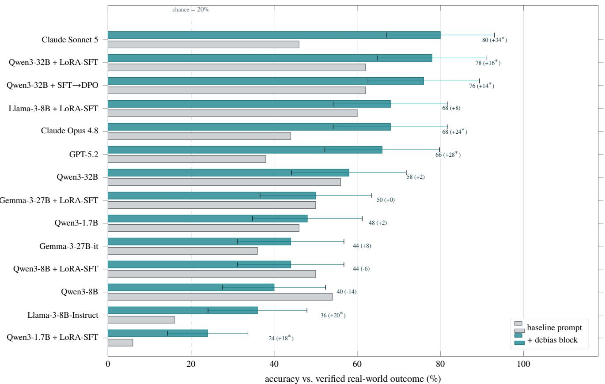  
Figure 6. The debias 2×2: one prompt block, no model change, closes most of the frontier gap. Every bar is the same open-weight or frontier model on the same 50 frozen report-stage contexts through the same direct harness (table 10); grey is the deployed report prompt, teal appends the shared taxonomy-definition + anti-hedge block. Whiskers are 95% Wilson intervals on the debias arm; the trailing number is that accuracy and, in parentheses, the baseline→debias change, starred when the paired McNemar test is significant at $\alpha { = } 0 . 0 5$ . Definin the taxonomy lifts every frontier model by +24 to +34 pp and unwinds the mitigate-collapse (fig. 7). The Qwen3-32B LoRA-SFT (sft\_v3, 78%) lands among the frontier: it shows no statistically significant diference from Sonnet (80%, �=1.000), Opus (68%, �=0.227) and GPT-5.2 (66%, �=0.180) once the prompt is fair, having beaten all three when it is not (table 3).

The mechanism difers by family. The two interventions— fine-tuning and the prompt block—are not redundant, be- cause they fix diferent failures (Figure 7). For the frontier models the block unwinds a genuine mitigate-collapse: overprediction of mitigate against a true frequency of 10/50 falls sharply (Sonnet 36 → 16, Opus 33 → 18, GPT 35 → 19). The Qwen3-32B fine-tunes (sft\_v3, dpo) never had that collapse (sft\_v3 14 → 16); their gain comes instead from recovering the segment class, which was nearly unreachable at 2/10 recall and rises to 8/10 once the taxonomy names what segment means. Two distinct failures, two complementary

fixes.

## 5.4 The full pipeline amplifies over-doom

Adding the simulation stages ahead of the report does not improve the verdict; it makes it worse. Figure 8 and table 4 run the complete five-stage pipeline over the same fifty documents in three configurations: every stage on Claude Opus 4.8, every stage on GPT-5.2, and the system’s default per-agent routing (auto), which assigns each stage the model best suited to it—Sonnet 5 for the high-volume extraction and simulation stages, Opus 4.8 for persona and report synthesis, and a cross-family GPT-5.2 critic so the audit stays independent. Opus scores 40.0% and GPT 36.0%—below every report- only system above eighth place—and the default per-agent auto configuration scores 14.0%, below the 20% five-way chance rate. The mechanism is a systematic over-doom bias: the full pipeline answers mitigate on 68%, 80% and 62% of cases against a true frequency of 20%, and the GPT run never once recommends ship.

This comparison is confounded by model family (the full-pipeline runs are frontier, the report-only baselines open- weight), so we read it as evidence about the bias the simulation stages induce rather than as a clean accuracy ranking; Sec- tion 5.3 already isolated the prompt component of the gap. The practical reading is that more machinery is not more accuracy on this task, and the extra stages cost latency—a median of several minutes per case (Table 4). Whether the harm is the reaction signal or the stacking of stages that carry it is exactly what the matched ablation of Section 5.6 decides.

Table 3. Does the open fine-tune beat the frontier? A paired question. Qwen3-32B + LoRA-SFT $( \mathsf { s f t } _ { - } \mathsf { v } 3 )$ against each frontier mode on the same 50 cases, so the correct test is a two-sided exact McNemar on the discordant pairs, not a diference of accuracies — the Wilson intervals overlap in every pair. This is the paper’s primary hypothesis family; $p _ { \mathrm { H o l m } }$ is the Holm-corrected value across the three comparisons within each arm. Under the under-specified baseline prompt the Qwen3-32B LoRA-SFT wins all three, significant after correction; once th taxonomy is defined no significant diference from any frontier model is detected $( ^ { 6 6 } \mathrm { n . s . } ^ { 7 3 } ) .$ , which is a failure to detect a diference at $n { = } 5 0$ not evidence of equivalence. Generated from the computed metrics.
<table><tr><td>Arm</td><td>vs. frontier</td><td>Acc (ft / cloud)</td><td>Wins (ft–cloud)</td><td>p</td><td>PHolm</td></tr><tr><td rowspan="3">Baseline</td><td>Claude Sonnet 5</td><td>62/46</td><td>10-2</td><td>0.039</td><td>0.039 (beats)</td></tr><tr><td>Claude Opus 4.8</td><td>62/44</td><td>10-1</td><td>0.012</td><td>0.023 (beats)</td></tr><tr><td>GPT-5.2</td><td>62/38</td><td>13-1</td><td>0.002</td><td>0.005 (beats)</td></tr><tr><td rowspan="3">Debias</td><td>Claude Sonnet 5</td><td>78/80</td><td>4-5</td><td>1.000</td><td>1.000 (n.s.)</td></tr><tr><td>Claude Opus 4.8</td><td>78/68</td><td>8-3</td><td>0.227</td><td>0.539 (n.s.)</td></tr><tr><td>GPT-5.2</td><td>78/66</td><td>104</td><td>0.180</td><td>0.539 (n.s.)</td></tr></table>

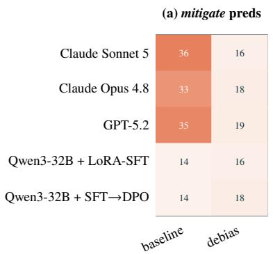

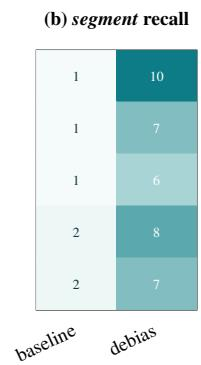

(a) Accuracy vs verified outcome  
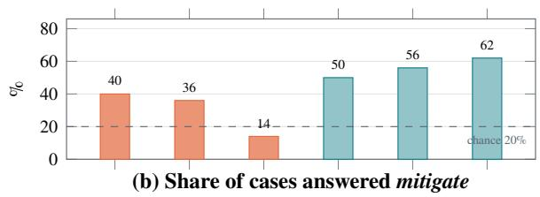  
Figure 7. What the block changes. For the five capable systems, baseline vs debias. (a) The over-prediction of mitigate against a true frequency of 10/50 collapses for the frontier models (Sonnet $3 6 \to 1 6 .$ , Opus 33→18, GPT 35→19); the fine-tunes never had it $\left( { \mathsf { s f t } } _ { - } { \mathsf { v } } 3 \ 1 4 { \to } 1 6 \right)$ , so their gain comes elsewhere. (b) It comes from segment: the class that was nearly unreachable (1–2/10) is recovered to $6 { - } 1 0 / 1 0$ once the taxonomy names what segment means. Finetuning and the prompt block therefore fix overlapping but distinct failures — table 10 gives all fourteen systems.

Table 4. The Gold-50 set through the complete five-stage pipeline under frontier models, to be read against the report-stage-only results of table 1. Accuracy is reported once a run covers all 50 cases. Mitigate share is given because it is the diagnostic (fig. 8); the true frequency is 20%. Latency is the median per case, end to end over all five stages. Regenerated from the run outputs on every build, so the counts are current as of this document.
<table><tr><td>Config.</td><td>/50</td><td>s/case</td><td>Cases Median mitig. Acc (95% CI)</td></tr><tr><td>Claude Opus 4.8</td><td>50</td><td>162</td><td>68% 40 [27.6, 53.8]</td></tr><tr><td>GPT-5.2</td><td>50</td><td>150</td><td>80% 36 [24.1, 49.9]</td></tr><tr><td>Per-agent auto</td><td>50</td><td>422</td><td>62% 14 [7.0, 26.2]</td></tr><tr><td>best report-only</td><td>50</td><td>一</td><td>28%  $6 2 . 0 \ [ 4 8 . 2 , 7 4 . 1 ]$ </td></tr></table>

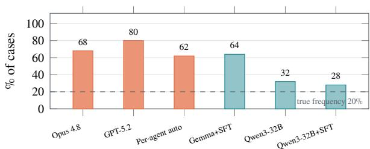  
Figure 8. Adding the simulation stages amplifies over-doom and does not improve the verdict. Orange: frontier models run through the complete five-stage pipeline of eq. (2). Teal: openweight models judging the same 50 documents at the report stage alone. (a) The full pipeline scores 40%, 36%, 14%; the per-agent routing run falls below the 20% chance rate, and all three land beneath every report-only system shown. (b) The mechanism is visible: the full pipeline answers mitigate on 68%, 80%, 62% of cases against a true frequency of 20% — a systematic over-doom bias. The comparison is confounded by model family (frontier vs open-weight), so we read it as evidence about the bias and treat the accuracy ordering as the motivation for the matched ablation in section 5.6.

<table><tr><td>judge</td><td>family</td><td>direction agree</td><td>concern recall</td></tr><tr><td>Opus 4.8</td><td>cloud</td><td>12/16 (75%)</td><td>67%</td></tr><tr><td>GPT-5.2</td><td>cloud</td><td>11/16 (69%)</td><td>80%</td></tr><tr><td>Qwen3-32B</td><td>open</td><td>12/16 (75%)</td><td>86%</td></tr><tr><td>Gemma-3-27B-it</td><td>open</td><td>12/16 (75%)</td><td>90%</td></tr></table>

Table 5. Blind fidelity of the synthetic reaction against the real one, on the 16 reaction-driven cases, by four judges across families. Direction agreement is a floor (see text); concern recall—which has no trivial baseline—is the load-bearing signal and is higher for the two open-weight judges.

## 5.5 The reaction simulation is a faithful proxy

Section 5.4 asks whether adding the simulation improves the verdict; for a tool whose purpose is to rehearse reaction before a decision ships, the prior question is whether the synthetic reaction it produces resembles the real one at all. At decision time no real reaction exists, so the synthetic transcript is the production artifact and its faithfulness is the construct the whole system rests on. We test it directly on the 16 cases—a subset of the 28-case reaction stratum (Figure 16)—for which a real, outcome-scrubbed contemporaneous public reaction could be sourced. Each reaction block—the exact personas- and-timeline text the report stage consumes—is rated blind: the judge sees one block at a time, is never told whether it is synthetic or real, and never sees the outcome. Four judges spanning families do the rating (cloud: GPT-5.2, Opus 4.8; open-weight: Qwen3-32B, Gemma-3-27B-it), which also yields an inter-judge reliability check on the measurement itself. The load-bearing metric is concern recall: the fraction of the concerns raised in the real reaction that the synthetic reaction anticipated.

Across all four judges the synthetic reaction anticipates 67–90% of the concerns the public actually raised (Table 5), and the two open-weight judges score it highest (86–90%), so the result is not a cloud-judge artifact. Inter-judge reliability is high—across the six judge pairs, stance ratings agree within one point on 75–100% of cases (the two cloud judges, Opus and GPT, agree on all 16)—so the metric is stable, not a single model’s idiosyncrasy. We are deliberately conservative about the weaker signals. Direction agreement (69–75%) reads well but barely clears its own baseline: eleven of the sixteen cases drew genuine backlash, so a majority-class “always predict opposition” rule already scores about 69%, and we therefore report direction only as a floor and never as the headline. The signed stance gap between synthetic and real is small (|mean| ≤ 0.56 on a [−2, 2] scale) but its sign flips by judge family—the two cloud judges find the synthetic slightly milder than reality, the two open judges slightly more negative—so we claim no robust “milder-” or “doom- bias” direction, and the earlier presumption of a systematic over-doom bias is not borne out. Finally the real sidecar is a press-grade floor on the true concern set, which biases recall up and leaves precision uncomputed; recall is thus the trustworthy direction, not a two-sided estimate. Within those bounds the reading is clean: the simulated reaction is a faithful proxy for the substance of the real one, independent of whether it moves the final label—the question we turn to next.

<table><tr><td>solver</td><td></td><td>nosim withsim</td><td>Δ</td><td> $b / c$ </td></tr><tr><td>Opus 4.8</td><td>84%</td><td>80%</td><td> $- 4 \mathsf { p p }$ </td><td>4/6</td></tr><tr><td>GPT-5.2</td><td>46%</td><td>66%</td><td> $+ 2 0 { \mathsf { p p } }$ </td><td>15/5</td></tr><tr><td>Qwen3-32B</td><td>52%</td><td>56%</td><td> $+ 4 \mathsf { p p }$ </td><td>6/4</td></tr><tr><td>Gemma-3-27B-it</td><td>48%</td><td>50%</td><td> $+ 2 { \mathsf { p p } }$ </td><td>7/6</td></tr><tr><td>mean</td><td></td><td></td><td>+5.5pp</td><td>3/4 with  $b > c$ </td></tr></table>

Table 6. Matched with/without-simulation ablation, 50 cases, exact-match against the verified outcome. � = cases the simulation fixed (withsim right, nosim wrong); � = cases it broke. Read as within-session deltas: the withsim arm reproduces the Section 5.3 full-context number exactly for GPT (66%), while the gateway Opus run drifted +12 pp across sessions (see text).

## 5.6 Does the simulation improve the decision? A matched with/without ablation

Section 7 names the matched with/without-simulation arm as the evidence gap that would isolate the simulation’s marginal contribution to the verdict. We supply it, and because the direction of the result was uncertain we pre-registered the verdict rule before running: the rule was fixed before any of these numbers were generated. The design holds everything constant exce t the simulation: the same Gold-50 cases the same system prompt, the same requested JSON, and the same taxonomy-definition block of Section 5.3 in both arms; the only variable is whether the persona-and-timeline simulation is present. The nosim arm gives the solver the decision title alone; the withsim arm adds the simulation. Four solvers (the two cloud and two open-weight models above) answer each arm, scored by the same exact-match rule. The pre-registered threshold for “the simulation helps” was a mean $\Delta \ge + 6 \mathrm { p p }$ with a majority of solvers showing more cases fixed than broken by the simulation $( b > c )$

The mean efect is +5.5 pp with three of four solvers showing $b > c$ (Table 6). By the pre-registered rule this misses the +6 pp threshold, so the verdict is a null; we report it as such rather than rounding half a point to clear our own bar. But the null is structured, not noise, and the structure is the finding: the simulation’s value scales inversely with how much the solver already knows from the decision title. GPT-5.2, weak from the title alone (46%), gains +20 pp, with the simulation fixing 15 cases and breaking only 5; the two open-weight solvers gain modestly in the same direction; and Opus, which already reaches 84% from the title alone, slightly regresses (−4 pp) as the extra context gives it more to over-reason about. The simulation helps most exactly where the decision is hardest for the model, and is redundant where the label is already inferable from the decision itself.

Two consistency notes bound the reading. The withsim arm reproduces the Section 5.3 full-context result exactly for GPT-5.2 (33/50 = 66%), confirming the ablation harness is identical to the one used elsewhere in the paper. The gateway Opus withsim run, however, scored 80% here against 68% in the earlier debias run under the nominally identical condition— a 12 pp single-seed drift that reinforces the repeated-seeds gap of Section 7 and is why we read this ablation as within- session paired deltas rather than absolute levels. Taken with Section 5.4, the picture resolves: the harm from the full five-stage pipeline was the stacked stages amplifying over- doom, not the reaction signal itself, which at the report stage is net-neutral-to-helpful and, per Section 5.5, substantively faithful.

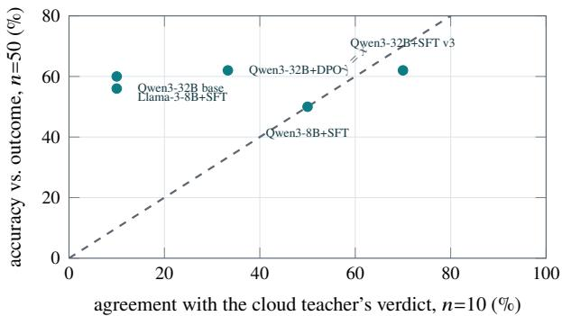  
Figure 9. Agreeing with the teacher is not the same as being right. Horizontal axis: how often a system reproduces the cloud teacher’s verdict on the 10 archived runs it was distilled from. Vertical axis: how often the same system matches the verified real-world outcome on the Gold-50 set. Systems sit well below � = �, and the teacher itself agrees with itself 10/10 while its own verdicts are not the outcome-correct answer on the cases where both are known (section 5.7). Distillation-style metrics therefore measure imitation, and we use them only as a training-progress signal, never as an accuracy claim.

## 5.7 Agreeing with the teacher is not being right

Because the open checkpoints are distilled from a cloud teacher, it is tempting to track training progress by agreement with that teacher. Figure 9 shows why that metric is mis- leading. Across successive SFT rounds, agreement with the teacher’s verdict on the archived runs climbs from 1/10 to 7/10 while outcome accuracy on Gold-50 barely moves, and the teacher agrees with itself 10/10 while its own verdicts are frequently not the outcome-correct answer. Distillation- style metrics measure imitation [12], so we use them only as a training-progress signal and never as an accuracy claim. Section B gives the formal reason this pattern is expected.

## 5.8 Cost is flatter than quality

All eleven systems are instrumented for peak memory, throughput and latency (Section F). Peak memory spans 16×, from 4.32 GB to 69.13 GB, and every configuration fits on a single 183 GB accelerator, so the deployment question is throughput, not capacity. The quality frontier is flatter than the leaderboard suggests: the untuned Qwen3-8B base reaches 54.0% at 17.70 GB and 46.6 tok/s—within 8 pp of the leader (the Qwen3-32B LoRA-SFT) and not significant $( p = 0 . 4 2 4 )$ —at a quarter of the memory. Fine-tuning, mean- while, costs throughput at every scale, because the unmerged adapter adds work at every forward pass and SFT also teaches the model to emit a reasoning trace before the JSON.

## 6 Discussion

The core results reinforce one conclusion. A single-prompt leaderboard on this task measures the prompt at least as much as the model: the same weights swing 0% to 73% (Section 5.2), and defining the taxonomy for everyone closes most of the frontier gap on these fifty cases (Section 5.3). Under a fair prompt the open-weight Qwen3-32B LoRA-SFT served ofline shows no statistically significant diference from the frontier on this decision, and under an unfair one it wins—not because it is stronger, but because it was tuned to the exact envelope while the frontier models were left to guess an under-specified rubric.

Two of the results are, at first sight, discouraging for the system itself: distillation metrics do not track accuracy, and stacking the full pipeline ahead of the report amplifies bias. We think the honest framing is that these are predictable consequences of the design, not surprises. Section B shows that distilling both the generator and the judges from one teacher collapses the ensemble to the teacher’s error floor, and that any exact-match scorer bounds accuracy by the in-schema rate—so teacher-agreement and prompt-envelope efects are exactly the confounds the theory says to expect. The design response is the one already built in: source the critic cross-family and of-the-shelf, and report compliance alongside every accuracy.

The reaction layer itself, however, comes out of this scrutiny better than the full-pipeline number alone suggests. The matched ablation (Section 5.6) isolates the report-stage re-action signal from the stack that carries it: the signal is net- neutral-to-helpful—strongly helpful (+20 pp) for the weakest title-only solver and neutral for one already near ceiling—so the over-doom of Section 5.4 is a property of stacking the generative stages, not of the reaction evidence they produce. And that evidence is faithful on its own terms (Section 5.5): the synthetic reaction anticipates 67–90% of the concerns the public actually raised. The system’s contribution is thus the validated qualitative reaction, not a guaranteed lift on a label a capable model can already infer from the decision.

## 7 Limitations and Evidence Gaps

The benchmark is small: �=50 makes Wilson intervals wide and leaves most pairwise diferences undecidable except by the paired test, and the smallest strata (�=7 and �=4) carry intervals too wide to rank. The Gold-50 labels are a single annotation pass by the authors against each case’s realized outcome in the public record: because the policies studied were live and no external adjudicator was available, no independent re-labeling or inter-annotator agreement was possible, so the set is a best-efort verified benchmark rather than an externally refereed one. The full-pipeline comparison (Section 5.4) remains confounded by model family; the matched with/without-simulation arm that prior versions of this work still lacked is now supplied in Section 5.6, and its verdict is a pre-registered null (+5.5 pp, below the +6 pp bar) with a coherent heterogeneity underneath it—so we can now say the report-stage reaction signal is net-neutral-to-helpful and faithful, but we still cannot claim it reliably lifts the final label for a model already near ceiling. Two residual caveats attach to the ablation. First, the gateway is not seed-stable: the Opus withsim arm drifted +12 pp across nominally identical sessions, so the ablation is read as within-session paired deltas and the absolute levels should not be over-read; a repeated-seeds study is the natural next step. Second, the fidelity study of Section 5.5 validates the substance of the synthetic reaction (concern recall 67–90%), but a separate analysis feeding the model the real contemporaneous reaction in place of the synthetic one shows a calibration gap: the report stage is tuned against the synthetic distribution, so a synthetic-to-real handof is not yet drop-in, and closing that gap is future work. The preference-training set is small and synthetic, and its downstream efect is null. Finally, all ofline serving numbers are single-accelerator, single-case- sequential except where a batched wall-clock is stated. We report these gaps rather than smoothing over them, and within this benchmark none of them overturns the paper’s central, prompt-artifact reading.

## 8 Reproducibility

Nothing in this paper is transcribed by hand. A three-stage build pipeline closes the loop from the run artifacts to this PDF. A recomputation stage computes every statistic—Wilson intervals, exact McNemar tests, per-class confusion, driver strata—from the per-case prediction files (both prompt arms), the verified Gold-50 labels, the per-step training logs and the benchmark summaries, writing a single machine-readable metrics file. A rendering stage turns that file into every figure and table macro spliced into this document. A verification stage then re-asserts every quoted number, interval, �-value and plotted mark against the same file and fails loudly on any drift. The corpus behind the checkpoints is 457 training rows (292 unique) drawn from 81 archived runs, with 267 preference pairs (invalid-JSON, hallucination, and 45 overdoom triples) for the DPO pass. The system describes standalone on-disk artifacts and records interpreter and library versions.

## 9 Responsible Use

Augur manufactures a proxy for human reaction; it does not observe one. Its personas are graph-grounded synthetic constructs, not real people, and its forecasts are explicit hypotheses to be backtested against reality, not predictions to be acted on unexamined. The over-doom bias documented in Section 5.4 is a concrete reason to treat any single verdict as provisional. The appropriate use is to rehearse and stress- test a decision and to surface constituencies a team might overlook, with a human owner accountable for the decision and its outcome.

## 10 Conclusion

Augur rehearses reactions to product and policy changes ofline and returns an auditable verdict, but the paper’s lasting contribution is what the measurement revealed. On these fifty real decisions with verified outcomes, most of the measured gap between frontier cloud models and open-weight models served ofline is attributable to an under-specified evaluation: define the taxonomy for everyone and a Qwen3-32B LoRA shows no significant diference from the frontier; leave it under-specified and the same model wins. The harness can move a single system—the Qwen3-32B LoRA-SFT— from 0% to 73%, teacher-agreement climbs without accuracy following, and in the tested configuration more pipeline brought more bias, not more accuracy—each a predictable consequence we make formal. Where we can credit the reaction layer is on its own terms: the synthetic reaction is a faithful proxy for the real one (concern recall 67–90% across four blind judges), and in a pre-registered matched ablation it helps most exactly where the decision is hardest—+20 pp for the weakest title-only solver—while adding nothing for a model already near ceiling. The methodological lesson we draw, subject to this benchmark’s scale, is: on a structured decision task, report the prompt envelope and the compliance rate, or the leaderboard is measuring something other than judgment.

## A Formal Framework

Let $D = \{ d _ { 1 } , \dots , d _ { m } \}$ be the documents defining a change and $q$ the decision question. The action space is

$$
\mathcal { A } = \left\{ \mathrm { s H I P } , \mathrm { R E V I S E } , \mathrm { D E L A Y } , \mathrm { S E G M E N T } , \mathrm { M I T I G A T E } \right\} .\tag{1}
$$

Definition 1 (Decision map). Augur realizes Φ : $: ( D , q ) \mapsto$ $( a ^ { \star } , F , { \mathcal { E } } )$ producing a recommended action $a ^ { \star } \in \mathcal A$ , a quantitative forecast $F ,$ , and an evidence set $\varepsilon ,$ , factored as the composition of stage operators

$$
\Phi ( D , q ) = R \big ( S ( P ( G ( D ) , q ) , q ) , G ( D ) , q \big ) ,\tag{2}
$$

where � (graph), � (persona), � (simulation), � (report) are LLM-realized maps, and a fifth operator � (interview) supports post-hoc interrogation.

(constituency gap),

Each operator is realized by a single-responsibility agent that reads prior artifacts and writes its own; agents never invoke one another (Definition 4). The extracted graph is $G = ( V , E )$ with a vertex-label map $\ell : V \to \mathcal { L }$ whose image $\ell ( V )$ is the set of audience segments, per-vertex topic sets topics(�), and induced topic universe $\begin{array} { r } { \mathcal { T } _ { V } = \bigcup _ { \nu \in V } \mathrm { t o p i c s } ( \nu ) } \end{array}$

## Persona space.

Definition 2 (Persona). A persona is a tuple $\begin{array} { r l } { p } & { { } = } \end{array}$ $( g , s , b , \alpha , \rho , \omega , H , \mathcal { T } _ { p } )$ in the attribute space

$$
\mathcal { X } = \ell ( V ) \times [ - 1 , 1 ] ^ { 2 } \times [ 0 , 1 ] ^ { 2 } \times \mathbb { R } _ { \ge 0 } \times 2 ^ { \{ 0 , \ldots , 2 3 \} } \times 2 ^ { \mathcal { T } _ { V } } ,\tag{3}
$$

with segment �, stance �, sentiment bias �, activity �, re- sponse speed $\rho ,$ , influence weight �, active hours �, topics $\mathcal { T } _ { p }$ . The population $\mathcal { P } = \{ p _ { 1 } , \dots , p _ { n } \} = P ( G , q )$

Assumption 1 (Grounding). Every synthesized persona references the graph: $g \in \ell ( V )$ and $\mathcal { T } _ { p } \subseteq \mathcal { T } _ { V }$ . Hence $\mathcal { P }$ is a market for the specific change encoded in �, not a generic crowd.

Interaction dynamics. The simulation runs rounds $t \ =$ $1 , \ldots , T$ , producing a timeline Θ of posts with expressed sentiment $y _ { x } \in \left[ - 1 , 1 \right] ( \Theta _ { t - 1 }$ denotes the timeline through the previous round). With topical relevance re $( p , \Theta ) =$ $| \mathcal { T } _ { p } \cap \mathop { \mathrm { t o p i c s } } ( \Theta ) | / | \mathcal { T } _ { p } |$ , the activation propensity is

$$
a _ { p , t } = \mathrm { c l i p } \big ( \alpha _ { p } + \kappa _ { r } ~ \mathrm { r e l } ( p , \Theta _ { t - 1 } ) , 0 , 1 \big ) , \quad \kappa _ { r } \geq 0 ,\tag{4}
$$

with $\kappa _ { r } \geq 0$ the relevance-gain coeficient. Expressed senti- ment tracks stance and bias, pulled toward prevailing thread sentiment by a bounded conformity term $\lambda \in [ 0 , 1 ]$

$$
\mathbb { E } [ y _ { x } ] = \mathrm { c l i p } \Big ( ( 1 - \lambda ) ( s _ { p } + b _ { p } ) + \lambda \bar { \sigma } ( \Theta _ { t - 1 } ) , - 1 , 1 \Big ) ,\tag{5}
$$

$\begin{array} { r } { \bar { \boldsymbol { \sigma } } ( \Theta ) \ = \ \frac { 1 } { | \Theta | } \sum _ { \boldsymbol { x } ^ { \prime } \in \Theta } y _ { \boldsymbol { x } ^ { \prime } } } \end{array}$ , the DeGroot/bounded-confidence intuition $[ \dot { 4 } , \dot { 5 } , 6 ]$ used as a conditioning signal. Engagement is a deterministic function of the personas and post sentiment,

$$
\mathrm { e n g } ( x ) = \omega _ { p } \Big ( \beta _ { 0 } + \beta _ { 1 } \sum _ { p ^ { \prime } \in \mathcal { P } \backslash \{ p \} } \omega _ { p ^ { \prime } } \mathbf { 1 } \big [ \mathrm { s i g n } ( s _ { p ^ { \prime } } ) = \mathrm { s i g n } ( y _ { x } ) \big ] \Big ) .\tag{6}
$$

with baseline weight $\beta _ { 0 } ~ \ge ~ 0$ and peer-alignment weight $\beta _ { 1 } \geq 0$

Transcript audit metrics. Three pure-code auditors read the finished timeline; with $\mathcal { P } _ { \mathrm { a c t } }$ the personas that posted,

$$
U = 1 - \mathrm { V a r } \{ s _ { p } : p \in \mathcal { P } _ { \mathrm { a c t } } \} / \delta _ { \mathrm { m a x } } \quad \mathrm { ( u n i f o r m i t y ) } ,\tag{7}
$$

$$
\begin{array} { r } { \mathrm { G a p } = \frac { \sum _ { g \in \Gamma \backslash \Gamma _ { \mathrm { a c t } } } c ( g ) } { \sum _ { g \in \Gamma } c ( g ) } } \end{array}\tag{8}
$$

$$
\nu _ { t } = \left| W _ { t } \setminus \bigcup _ { u < t } W _ { u } \right| / | W _ { t } | \qquad { \mathrm { ( r o u n d n o v e l t y ) . } }\tag{9}
$$

Here $\delta _ { \mathrm { m a x } }$ is the maximum attainable stance variance, the normalizer that places $U \in [ 0 , 1 ] ; \Gamma$ is the set of graph- derived constituencies with active subset $\Gamma _ { \mathrm { a c t } } \subseteq \Gamma$ and $c ( g )$ the size of constituency �; and $W _ { t }$ is the set of distinct claims raised in round �. Each firing earns at most one corrective round under a global budget � (Section C).

## Verdict aggregation.

Definition 3 (Ensemble verdict). � models re-analyze the same timeline, emitting $a ^ { ( i ) } \in \mathcal { A }$ . The verdict and agreement are

$$
\boldsymbol { a } ^ { \star } = \underset { a \in \mathcal { A } } { \arg \operatorname* { m a x } } \sum _ { i = 1 } ^ { k } \mathbf { 1 } \big [ \boldsymbol { a } ^ { ( i ) } = a \big ] , \quad \boldsymbol { A } ^ { \star } = \frac { 1 } { k } \operatorname* { m a x } _ { a \in \mathcal { A } } \sum _ { i = 1 } ^ { k } \mathbf { 1 } \big [ \boldsymbol { a } ^ { ( i ) } = a \big ] .\tag{10}
$$

Whenever $A ^ { \star } < 1$ the split is reported as a first-class uncer- tainty signal.

An opposite-family critic returns $c \in \{ 0 , \ldots , 1 0 \}$ ; QA passes if $c \geq \theta$

Definition 4 (Run state and dependency DAG). A run state is the partial map $\Sigma ~ : ~ N \to \mathrm { { \ A r t i f a c t s } }$ over nodes $N =$ $\{ G , \mathcal { P } , \Theta , R , I \}$ . The derived-from DAG $\mathsf { D } = ( N , \to )$ has edges $\phi  G , \Theta  \mathcal { P } , R  \Theta , R  G , I  \mathcal { P } , I  \Theta$ (an edge � → � reads “� derived from $w ^ { \prime \prime } )$ . Writing or regenerating � triggers cascade invalidation: delete $\{ \Sigma ( u ) : u \in \mathrm { a n c } ( \nu ) \}$ , i.e. every artifact derived from �.

## B Formal Properties

The two propositions the body relies on are the last two; we state the ensemble result they build on first.

Proposition 1 (Ensemble amplification). Let $k = 3 j u d g e s$ vote independently, each correct with probability $\begin{array} { r } { p > \frac { 1 } { 2 } } \end{array}$ . The majority verdict is correct with probability $g ( p ) = 3 p ^ { 2 } -$ $2 p ^ { 3 } > p f o r p \in ( \frac { 1 } { 2 } , 1 )$ , and � is strictly increasing on $[ 0 , 1 ]$ For general odd �, majority accuracy is nondecreasing in � and → 1 as $k $ ∞ (Condorcet).

Proof. $g ( p ) = { \binom { 3 } { 7 } } p ^ { 2 } ( 1 - p ) + p ^ { 3 } = 3 p ^ { 2 } - 2 p ^ { 3 }$ , and $g ( p ) { - p = }$ $p ( 2 p - 1 ) ( 1 - p ) > 0$ for $\begin{array} { r } { p \in ( \frac { 1 } { \gamma } , 1 ) ; g ^ { \prime } ( p ) = 6 p ( 1 - p ) \geq } \end{array}$ 0 on $[ 0 , 1 ]$ . The general-� claim is the Condorcet jury theorem. □

Corollary 1 (Correlation defeats amplification). The gain $g ( p ) - p$ is premised on independence. If judges’ errors are correlated with coeficient $\rho _ { c } ,$ ensemble reliability degrades toward the single-judge accuracy � as $\rho _ { c }  1$ . Sourcing the critic and cross-checkfrom a diferent modelfamily lowers $\rho _ { c } ,$ which is why Augur draws them cross-family (Section 2).

Proposition 2 (Distillation collapses judge independence). Let a teacher � select the correct action with probability ��. Let � students be distilledfrom � such that each independently reproduces �’s answer with fidelity $\textstyle \varphi \in { \bigl [ } { \frac { 1 } { 2 } } , 1 { \bigr ] }$ and otherwise answers correctly with probability $p _ { 0 } ,$ , independently across students. Let $A _ { k } ( \varphi )$ be the accuracy of the students’ majority vote. Then

$$
\operatorname* { l i m } _ { \varphi \to 1 } A _ { k } ( \varphi ) = p _ { T } \quad { \mathrm { f o r ~ } } e \nu e r y \ k ,\tag{11}
$$

so the ensemble gain $A _ { k } - p _ { T }$ vanishes asfidelity improves, no matter how many judges vote.

Proof. Condition on $T \mathbf { \hat { s } }$ answer. With probability $\varphi ^ { k }$ all � students return $T \mathbf { \hat { s } }$ answer, so the majority equals $T \mathbf { \hat { s } }$ answer and is correct with probability exactly $p _ { T }$ . The remaining mass is $1 - \varphi ^ { k } \to 0$ as $\varphi  1$ , and accuracy is bounded in [0, 1] there, so $| A _ { k } ( \varphi ) - p _ { T } | \leq 1 - \varphi ^ { k } \to 0 ,$ The conditional independence premise of Proposition 1 fails because all students’ errors are driven by the common variable $T \mathbf { \hat { s } }$ answer; formally $\rho _ { c }  1$ and Corollary 1 applies. □

Corollary 2 (Never distil the critic). The critic and crosscheck must be obtained of-the-shelffrom afamily not used to produce the training targets. Augur therefore fine-tunes only the generation stages and leaves the judge untuned (Section 2).

Proposition 2 is directly testable: � is the teacher- agreement rate and $p _ { T }$ the teacher’s own accuracy. Sec- tion 5.7 measures � rising from 10% to 70% under successive SFT rounds with no corresponding movement in outcome accuracy—the signature the proposition predicts.

Definition 5 (Prompt envelope and out-of-schema rate). A prompt envelope $\mathcal { W }$ maps a case to the exact message se- quence presented to the model, including system prompt, context serialization and requested schema. For system � under W, let $\eta ( M , { \mathcal { W } } ) = \operatorname* { P r } [ { \hat { a } } \notin { \mathcal { A } } ]$ be the out-of-schema rate.

Proposition 3 (Schema-compliance ceiling). Under any scorer that credits only exact matches in A,

$$
\operatorname { A c c } ( M , { \mathcal { W } } ) \leq 1 - \eta ( M , { \mathcal { W } } ) ,\tag{12}
$$

with equality if every in-schema answer is correct. Hence for two envelopes the measured diference decomposes into a judgment term and a compliance term, and a cross-envelope comparison is uninterpretable as a judgment comparison unless � is reported alongside it.

Proof. $\{ \hat { a } = a ^ { \star } \}$ requires $\hat { a } \in \mathcal A$ , so Acc $= \mathrm { P r } [ \hat { a } = a ^ { \star } ] \leq$ $\operatorname* { P r } [ \hat { a } \in \mathcal { A } ] = 1 - \eta ;$ equality holds when $\{ \hat { a } \in \mathcal { A } \} \subseteq \{ \hat { a } =$ $\langle a ^ { \star } \}$ up to null sets. Writing $\operatorname { A c c } = ( 1 - \eta ) \operatorname* { P r } [ \hat { a } = a ^ { \star } \mid \hat { a } \in$ A] and comparing the two factors envelope-wise gives the decomposition. □

Proposition 3 is the entire explanation of Section 5.2: SFT drove $\eta$ almost to zero on the deployed envelope while leaving it high on an unfamiliar one, so the same weights score $0 / 1 1$ under one prompt and 8/11 under another. It also dictates the reporting rule we follow throughout: every accuracy is accompanied by its unparseable count and both the conservative and conditional scores.

Algorithm 1 Autonomous run with budget-bounded self-  
audit   
Require: documents �, question �, budget �, thresholds $\tau _ { U } , \tau _ { \Gamma } , \tau _ { \nu }$   
1: � ← Extract(�; Ontology(�))   
2: $\mathcal { P }  P ( G , q ) ; \quad \Theta  S ( \mathcal { P } , q ) ; \quad r  0$   
3: while $r < B$ do   
4: compute $U , \mathrm { G a p } , \{ \nu _ { t } \}$ from Θ (7)–(9)   
5: if Gap > �Γ then   
6: $\Theta  S ( \mathcal { P } , q ; \mathrm { f o c u s } = \Gamma \backslash \Gamma _ { \mathrm { a c t } } ,$ append)   
7: else if $U \geq \tau _ { U }$ then   
8: $\Theta  S ( \mathcal { P } , q ;$ moderator-steer, append)   
9: else if min� $\nu _ { t } \geq \tau _ { \nu }$ then   
10: $\Theta  S ( \mathcal { P } , q ;$ extend, append)   
11: else break   
12: end if   
13: $r \gets r + 1$   
14: end while   
15: $( a ^ { \star } , A ^ { \star } , c ) \gets \mathrm { V } _ { \mathrm { E R D I C T } } ( \Theta , G , q )$   
16: return report $R ( \Theta , G , q )$ with $( a ^ { \star } , A ^ { \star } , c ,$ audit log)

Algorithm 2 Verdict: critic-gated cross-family ensemble   
Require: timeline Θ, graph �, question �; families F, threshold �   
1: for $i = 1$ to � do   
2: $a ^ { ( i ) } \gets R _ { i } ( \Theta , G , q )$ .action   
3: end for   
4: $a ^ { \star } , A ^ { \star } \gets$ mode and agreement of $\{ a ^ { ( i ) } \}$ (10)   
5: � ← Critic $\scriptstyle : { \bar { f } } ^ { ( R , \Theta ) }$ ⊲ opposite family ¯�   
6: if $c < \theta$ then   
7: spend one corrective action; recompute $a ^ { \star }$   
8: end if   
9: return $( a ^ { \star } , A ^ { \star } , c )$

## C Algorithms and Complexity

Algorithm 1 is the autonomous run: forward pipeline, budget- bounded self-audit, then the critic-gated ensemble verdict of Algorithm 2.

With $n = | \mathcal { P } | , T$ rounds and � ensemble members, the dominant terms are $O ( n T )$ generation calls in simulation and $O ( n ^ { 2 } T )$ pure-CPU arithmetic for engagement (6); the self-audit adds at most � generation rounds and the verdict adds �+1 calls, both constant in �, �.

## D Fine-Tuning Details

All adapters use one LoRA recipe (Table 7); only the training data changes across the 32B lineage $\mathbf { v } 1 \substack { \longrightarrow \mathbf { v } 2 \substack { \longrightarrow \mathbf { v } 3 } }$ , whose validation set is frozen.

Table 7. The single LoRA-SFT recipe shared by every adapter; only the training data difers across runs.
<table><tr><td>Hyperparameter</td><td>Value</td></tr><tr><td>Method</td><td>LoRA</td></tr><tr><td>Rank  $/ \alpha$ </td><td>16 / 32</td></tr><tr><td>Dropout</td><td>0.05</td></tr><tr><td>Target modules</td><td> $\mathbf { q } , \mathbf { k } , \mathbf { v } , \mathbf { 0 } _ { - } \mathbf { p r o j }$ </td></tr><tr><td>Epochs</td><td>3</td></tr><tr><td>Learning rate</td><td> $1 \times 1 0 ^ { - 4 } .$  cosine</td></tr><tr><td>Effective batch</td><td>16</td></tr><tr><td>Sequence length</td><td>8192</td></tr><tr><td>Early stopping</td><td>patience 3, reload best</td></tr><tr><td>Precision</td><td>bf16</td></tr></table>

Figure 10 shows LoRA-SFT optimization on all five back- bones under this recipe: loss is masked to assistant tokens, so it measures only the target ⟨think⟩+JSON, and held-out loss is evaluated on two whole archived runs withheld from training so that no document appears on both sides of the split.

(a) Training loss (masked to assistant tokens)  
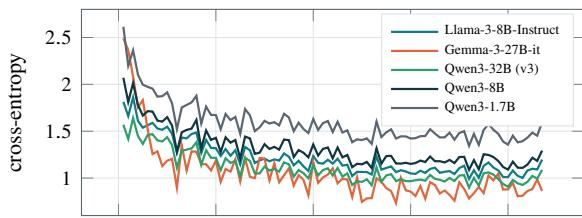

(b) Held-out loss (2 whole runs, leakage-safe)  
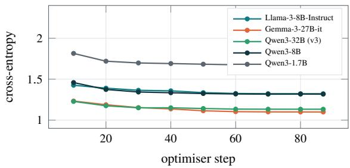  
Figure 10. LoRA-SFT optimisation on five backbones, identical data, recipe and schedule (table 7); one adapter per backbone. Loss is masked to assistant tokens, so it measures only the target ⟨think⟩+JSON. Held-out loss is evaluated on two whole archived runs withheld from training, so no document appears on both sides. Llama-3-8B: 1.81 → 1.20 train, best held-out 1.322; Gemma-3- 27B: 2.49 → 0.86 train, best held-out 1.099; Qwen3-32B (v3): 1.57 → 1.09 train, best held-out 1.133; Qwen3-8B: 2.07 → 1.29 train, best held-out 1.317; Qwen3-1.7B: 2.61 → 1.59 train, best held-out 1.675. Every curve is read from the archived per-adapter training logs.

Figure 11 isolates the recipe iteration on the fixed 32B backbone. It is the evidence that the v3 gain came from data volume rather than a longer schedule: v2 reaches the lowest training loss yet not the lowest held-out loss—the small-corpus overfitting signature that motivates early stopping with best-checkpoint reload.

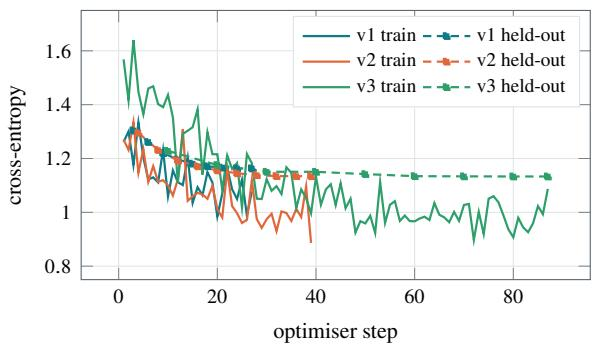  
Figure 11. Three SFT recipes on one fixed backbone (Qwen3- 32B), showing that the gain came from data volume, not from a longer run. v1 and v2 take 27 and 39 steps; v3 takes 87. Best held-out loss falls $1 . 1 6 3 \to 1 . 1 3 4 \to 1 . 1 3 3$ . v2 reaches the lowest training loss (0.886) yet not the lowest held-out loss — the classic small-corpus overfitting signature, and the reason early stopping (patience 3) reloads the best checkpoint rather than the last.

Figure 12 is the DPO calibration pass layered on top of the SFT adapter. Its optimization dynamics are healthy—the reward margin widens because the rejected branch is pushed down—but its downstream efect on Gold-50 is null, which we read as the preference set being too small and too synthetic to move judgment.

(a) DPO loss  
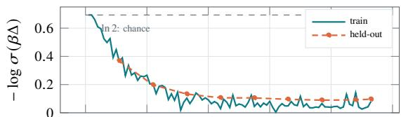

(b) Implicit reward margin  
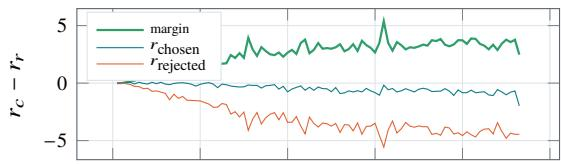

(c) Preference accuracy  
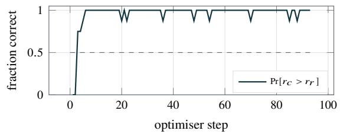  
Figure 12. DPO calibration pass on top of the SFT adapter $( \beta = 0 . 1 )$ , the run that targets the over-doom bias. Loss falls from the ln $2 \approx 0 . 6 9 3$ chance level to 0.081 over 93 steps (3641 s), best heldout 0.0895. Panel (b) separates the implicit rewards � = � log �ref �� the margin widens because the rejected branch is pushed down, the diagnostic signature of a preference pass that is learning the contrast rather than merely raising likelihood everywhere. Panel (c) is the fraction of pairs ranked correctly within each training batch of eight, which is why it moves in steps of 1/8; on the 26 held-out pairs the same quantity is 26/26 at six of nine evaluations and never below 25/26. These dynamics are healthy but the downstream efect is null (table 1): DPO leaves Gold-50 accuracy unchanged, which we read as the preference set (over-doom, invalid-JSON, hallucination triples) being too small and too synthetic to move judgment.

## E Gold-50 Construction and Reproducibility

Labeling convention. Table 8 states the disposition that defines each of the five classes—the realized-outcome reading a case must match to earn that label. Labels record what the organization’s change actually did, not a normative “best move.”

Table 8. The Gold-50 label convention. Each label records the real-world disposition of the decision — what actually happened to it, not how loud the reaction was and not the action an ideal decision- maker “should” have taken. The convention is applied uniformly across all fifty cases; the one boundary it resolves explicitly is ship vs segment (one universal rule vs two rules for two groups).
<table><tr><td>Action</td><td>Assigned when the real-world decision. ..</td></tr><tr><td>ship</td><td>launched as announced and persisted, with one rule applied universally even if effects differ by user: no reaction-driven rollback, postponement, or carve-out.</td></tr><tr><td>revise</td><td>was itself materially changed or reversed (including fully abandoned) in response to the reaction: what</td></tr><tr><td>delay</td><td>shipped ≠ what was announced. had its launch or enforcement postponed, then gener- ally proceeded: a date moved.</td></tr><tr><td>segment</td><td>ended in two different rules for two groups — by region, size, or plan tier — that persisted: the dispo-</td></tr><tr><td>mitigate</td><td>sition differs by segment, not just its effects. was kept at its core, but concessions or safeguards were bolted on to address objections: decision stands, remedies added.</td></tr></table>

Per-case ledger. Table 9 is the full Gold-50 ledger: for each case, its adjudicated label, the episode year and the number of independent public sources consulted. These are real, publicly documented decisions, and the label reports the realized public-record outcome, not a judgment of the organization. The outcome-driver stratification used in the analysis (Section F) is reported only in aggregate, never attached to a named case. The table is generated directly from the benchmark file; the source counts have a median of three per case.

Adjudication and circularity. The fift labels were fixed in a single author adjudication pass against the public record, assisted by Claude Opus 4.8 (adjudication run 2026-09-06). Because Claude Opus 4.8 is also one of the three benchmarked frontier models, its adjudication role is a potential source of circularity in the frontier comparison, and the Opus 4.8 leaderboard row should be read with that caveat. The la- bels are a single-pass adjudication, not a multi-annotator consensus with an inter-rater statistic; a second independent annotation is the most important addition a follow-up should make.

Input isolation. Each system is prompted with only the pre-decision case document (the policy or product description as it stood before the outcome). The realized outcome, the outcome-driver annotation and the source list are never placed in the model input and are used only for scoring.

Contamination audit. Gold-50 is disjoint from the finetuning, preference, validation and model-selection data. The metrics pipeline recomputes the audit from the raw splits: 0 Gold-50 case identifiers appear in the training corpus, no Gold-50 case document matches any training document, and the strongest cross-set signal is a single shared company name in at most one case. The training corpus is synthetic persona-generation traces, constructed independently of the retrospective episodes in Gold-50.

Table 9. The Gold-50 case ledger. Every case, grouped by verified label. Yr is the decision year; Src is the number of cited public sources behind the recorded outcome (139 in total, median 3). All fifty are real, publicly documented decisions whose realized outcome is a matter of public record; the labels report that outcome, not a judgment of the organization. They were adjudicated against the public record in a single manual adjudication pass, assisted by Claude Opus 4.8 (2026-09-06); full source URLs and per-case rationales live in realworld\_gold\_50.jsonl. Generated from the computed metrics.
<table><tr><td>Case</td><td>Label</td><td>Yr</td><td>Src</td></tr><tr><td>Amazon Prime Video — Introduce Ads for Existing U.S. Members</td><td>ship</td><td>2023</td><td>3</td></tr><tr><td>Amazon Prime — Raise U.S. Annual Membership to $139</td><td>ship</td><td>2022</td><td>3</td></tr><tr><td>Etsy — Raise the Marketplace Transaction Fee to 6.5%</td><td>ship</td><td>2022</td><td>3</td></tr><tr><td>Firefox Quantum — End Legacy Extension Support</td><td>ship</td><td>2017</td><td>2</td></tr><tr><td>Google Photos — End Unlimited Free Photo Storage</td><td>ship</td><td>2020</td><td>3</td></tr><tr><td>iPhone 7 — Remove the Headphone Jack</td><td>ship</td><td>2016</td><td>3</td></tr><tr><td>Nintendo Switch Online — Introduce Paid Online Multiplayer</td><td>ship</td><td>2018</td><td>3</td></tr><tr><td>Nintendo — Launch Tears of the Kingdom at $69.99</td><td>ship</td><td>2023</td><td>3</td></tr><tr><td>PlayStation Plus — Raise Annual Subscription Prices</td><td>ship</td><td>2023</td><td>3</td></tr><tr><td>YouTube — Hide Public Dislike Counts</td><td>ship</td><td>2021</td><td>3</td></tr><tr><td>Apple iCloud Photos — Abandon On-Device CSAM Detection</td><td>revise</td><td>2021</td><td>3</td></tr><tr><td>Apple Music — Withhold Royalties During the Free Trial</td><td>revise</td><td>2015</td><td>2</td></tr><tr><td>Dungeons &amp; Dragons — Replace the Open Game License</td><td>revise</td><td>2023</td><td>3</td></tr><tr><td>Helldivers 2 — Mandatory PlayStation Account Linking on PC</td><td>revise</td><td>2024</td><td>3</td></tr><tr><td>Instagram — Expand the Full-Screen, Recommendation-Heavy Feed</td><td>revise</td><td>2022</td><td>3</td></tr><tr><td>Patreon — Shift Payment Processing Fees to Patrons</td><td>revise</td><td>2017</td><td>2</td></tr><tr><td>Spotify — Withdraw Artist-Conduct Restrictions on Promotion</td><td>revise</td><td>2018</td><td>3</td></tr><tr><td>Twitch — Restrict Streamer-Controlled Sponsor Advertising</td><td>revise</td><td>2023</td><td>2</td></tr><tr><td>Xbox Live Gold — Reverse the Subscription Price Increase</td><td>revise</td><td>2021</td><td>3</td></tr><tr><td>Zoom — Reverse Paid-Only Access to End-to-End Encryption</td><td>revise</td><td>2020</td><td>3</td></tr><tr><td>Android 11 Beta — Postpone the Public Rollout During U.S. Protests</td><td>delay</td><td>2020</td><td>3</td></tr><tr><td>Apple AirPods — Postpone the October Retail Launch</td><td>delay</td><td>2016</td><td>3</td></tr><tr><td>Apple App Tracking Transparency — Postpone Mandatory Enforcement</td><td>delay</td><td>2020</td><td>3</td></tr><tr><td>Apple HomePod — Postpone the December Launch</td><td>delay</td><td>2017</td><td>3</td></tr><tr><td>Cyberpunk 2077 — Postpone the April 2020 Release</td><td>delay</td><td>2020</td><td>3</td></tr><tr><td>Google Find My Device — Postpone the Network for Cross-Platform Tracking Protections</td><td>delay</td><td>2023</td><td>3</td></tr><tr><td>Halo Infinite — Postpone the Holiday 2020 Release</td><td>delay</td><td>2020</td><td>3</td></tr><tr><td>OpenAI Advanced Voice — postpone the initial ChatGPT rollout</td><td>delay</td><td>2024</td><td>3</td></tr><tr><td>Samsung Galaxy Fold — Postpone the First Retail Launch</td><td>delay</td><td>2019</td><td>3</td></tr><tr><td>WhatsApp Privacy Update — postponing the acceptance deadline</td><td>delay</td><td>2021</td><td>3</td></tr><tr><td>Apple App Store — Lower Commissions for Small Developers</td><td>segment</td><td>2020</td><td>2</td></tr><tr><td>Apple iCloud — Transfer Mainland China Accounts to GCBD</td><td>segment</td><td>2018</td><td>3</td></tr><tr><td>Apple iPhone 14 — Make US Models eSIM-Only</td><td>segment</td><td>2022</td><td>3</td></tr><tr><td>Apple — Allow alternative iPhone app distribution in the EU</td><td>segment</td><td>2024</td><td>3</td></tr><tr><td>Google Android — Unbundle App Licensing in the EEA</td><td>segment</td><td>2018</td><td>3</td></tr><tr><td>Google Legacy G Suite — Exempt Personal Users from Paid Migration</td><td>segment</td><td>2022</td><td>2</td></tr><tr><td>Google Play — Cut Fees on Developers&#x27; First $1 Million</td><td>segment</td><td>2021</td><td>3</td></tr><tr><td>Google Play — Permit Alternative Billing in South Korea</td><td>segment</td><td>2021</td><td>2</td></tr><tr><td>Meta — Block News on Facebook and Instagram in Canada</td><td></td><td>2023</td><td>2</td></tr><tr><td>Slack — Limit Free Workspaces to 90 Days of History</td><td>segment</td><td>2022</td><td>3</td></tr><tr><td>AMD-Xilinx — Complete the Acquisition with Competition Safeguards</td><td>segment</td><td></td><td></td></tr><tr><td>Apple AirTag — Keep Item Tracking with Stronger Anti-Stalking Safeguards</td><td>mitigate</td><td>2020</td><td>3</td></tr><tr><td>Apple iPhone Performance Management — retain throttling with battery and transparency concessions</td><td>mitigate</td><td>2021</td><td>2</td></tr><tr><td></td><td>mitigate</td><td>2017</td><td>3</td></tr><tr><td>Disney-Fox — Complete the Acquisition with Sports-Network Divestitures</td><td>mitigate</td><td>2018</td><td>3</td></tr><tr><td>Facebook — Keep Authentic-Name Rules with Safer Reporting and Appeals</td><td>mitigate</td><td>2015</td><td>2</td></tr><tr><td>Google-Fitbit — Complete the Acquisition with Binding Safeguards</td><td>mitigate</td><td>2019</td><td>3</td></tr><tr><td>Microsoft-Activision Blizzard — Complete the Acquisition with Cloud-Gaming Safeguards</td><td>mitigate</td><td>2023</td><td>3</td></tr><tr><td>Microsoft-LinkedIn — Complete the Acquisition with Interoperability Safeguards</td><td>mitigate</td><td>2016</td><td>2</td></tr><tr><td>Spotify — Keep Joe Rogan and Add COVID-19 Safeguards T-Mobile-Sprint — Complete the Merger with Competition Safeguards</td><td>mitigate mitigate</td><td>2022 2019</td><td>3 3</td></tr></table>

Table 10. The debias 2×2, every system. Accuracy vs the verified outcome on the same 50 frozen contexts and the same direct harness; the only change is the shared taxonomy-definition + anti-hedge block appended in the debias arm. Δ is percentage points; � is the two-sided exact McNemar test on the paired baseline-vs-debias cases. ∅ counts unparseable generations (scored wrong). Generated from the computed metrics.
<table><tr><td>System</td><td>Baseline % [CI]</td><td>Debias % [CI]</td><td>Δ pp</td><td>macro-F1 b→d</td><td>McNemar p</td></tr><tr><td colspan="6">Frontier (cloud API)</td></tr><tr><td>Claude Sonnet 5</td><td>46 [33,59.6]</td><td>80 [67,88.8]</td><td>+34</td><td>0.43→0.79</td><td>7.6e-5*</td></tr><tr><td>Claude Opus 4.8</td><td>44 [31.2,57.7]</td><td>68 [54.2,79.2]</td><td>+24</td><td>0.40→0.67</td><td>0.008*</td></tr><tr><td>GPT-5.2</td><td>38 [25.9,51.8]</td><td>66 [52.2,77.6]</td><td>+28</td><td>0.36→0.64</td><td>0.003 *</td></tr><tr><td colspan="6">Open-weight, fine-tuned (LoRA)</td></tr><tr><td> $\mathrm { Q w e n 3 - 3 2 B + L o R A - S F T }$ </td><td>62 [48.2,74.1]</td><td>78 [64.8,87.2]</td><td>+16</td><td>0.59→0.78</td><td>0.039 *</td></tr><tr><td>Qwen3-32B + SFT→DPO</td><td>62 [48.2,74.1]</td><td>76 [62.6,85.7]1∅</td><td>+14</td><td>0.59→0.77</td><td>0.039 *</td></tr><tr><td>Llama-3-8B + LoRA-SFT</td><td>60 [46.2,72.4]1∅</td><td>68 [54.2,79.2]</td><td>+8</td><td>0.58→0.62</td><td>0.344</td></tr><tr><td>Gemma-3-27B + LoRA-SFT</td><td>50 [36.6,63.4]</td><td>50[36.6,63.4]2∅</td><td>+0</td><td>0.44→0.46</td><td>1.000</td></tr><tr><td>Qwen3-8B + LoRA-SFT</td><td>50 [36.6,63.4] 6∅</td><td>44 [31.2,57.7]1∅</td><td>-6</td><td>0.51→0.40</td><td>0.607</td></tr><tr><td>Qwen3-1.7B + LoRA-SFT</td><td>6[2.1,16.2]35∅</td><td>24 [14.3,37.4]170</td><td>+18</td><td>0.07→0.23</td><td>0.035*</td></tr><tr><td colspan="6">Open-weight, untuned base</td></tr><tr><td>Qwen3-32B</td><td>56 [42.3,68.8]</td><td>58 [44.2,70.6]</td><td>+2</td><td>0.56→0.52</td><td>1.000</td></tr><tr><td>Qwen3-1.7B</td><td>46[33,59.6]</td><td>48 [34.8,61.5]</td><td>+2</td><td>0.39→0.38</td><td>1.000</td></tr><tr><td>Gemma-3-27B-it</td><td>36 [24.1,49.9]</td><td>44[31.2,57.7]</td><td>+8</td><td>0.34→0.34</td><td>0.481</td></tr><tr><td>Qwen3-8B</td><td>54 [40.4,67]</td><td>40 [27.6,53.8]</td><td>-14</td><td>0.52→0.28</td><td>0.065</td></tr><tr><td>Llama-3-8B-Instruct</td><td>16 [8.3,28.5]</td><td>36 [24.1,49.9]</td><td>+20</td><td>0.16→0.30</td><td>0.006*</td></tr></table>

Decoding and hardware. All open-weight systems are served under identical decoding: a 4000-token generation budget and provider-default sampling, with no per-model tuning of temperature or top-�. Adapters are served in bf16 on a single B200-class accelerator (183 GB), whose capacity holds every configuration with room to spare—per-system peak memory is reported in Table 11—and with no cross- device sharding. The frontier models are queried through their vendor APIs at their default settings. Every number in the paper is recomputed from the archived per-case artifacts, re-rendered into the figure macros, and re-checked against the artifacts by that same three-stage pipeline, which fails on any mismatch.

## F Additional Evaluation Detail

This section collects the per-system evaluation detail behind the leaderboard and the cost discussion of the main text.

Per-class structure. Figure 13 gives confusion matrices for three representative systems and Figure 14 the per-class recall and prediction-bias fingerprint across all eleven. The two views answer diferent questions: the confusion matrices show where a given system’s mass lands relative to the verified outcome, while the heatmaps compare recall and emission bias on a common scale so that the mitigate-heavy, segment-starved signature is visible as a pattern across the whole population rather than an artifact of any one system. Together they are the raw material for the over-doom claim: the same of-diagonal mass that inflates mitigate is the mass missing from segment.

What the outcome hinges on. Figure 16 stratifies accuracy by the mechanism that actually decided each Gold-50 case— public reaction, regulatory action, engineering readiness, or business performance. The ordering is stable across systems and is the honest limit of a reaction-simulating pipeline: the reaction stratum, the one the architecture is aimed at, is the one every system predicts worst, while regulatory- and readiness-decided cases are recovered far more reliably.

(a) Qwen3-32B base  
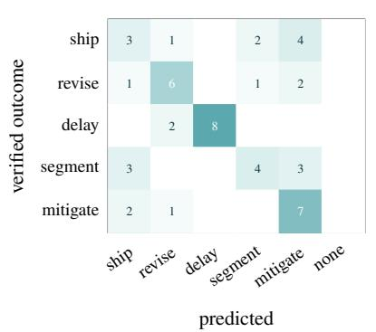

(b) Qwen3-32B + LoRA-SFT  
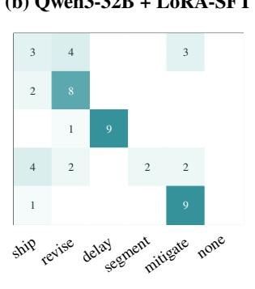  
predicted

(c) Gemma-3-27B + LoRA-SFT  
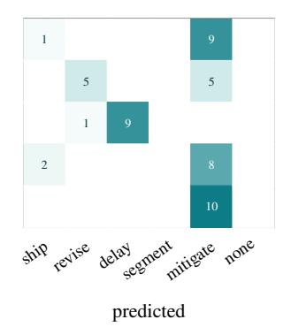  
Figure 13. Confusion on the Gold-50 set, rows are the verified outcome (10 each), columns the redicted action, none the un arseable bucket. The diagonal is accuracy; the informative structure is of-diagonal. All three systems concentrate mass in the mitigate column, and the segment column is nearly empty — models rarely propose splitting a release by cohort even when that is what the organisation actuall did. Fine-tuning (b vs a) sharpens the diagonal on ship and revise but does not create segment behaviour, and on Gemma (c) it collapses almost entirely into mitigate. fig. 14 quantifies this across all eleven systems.

(a) Per-class recall (out of 10)  
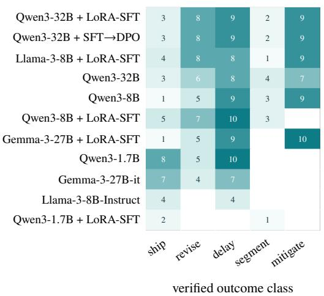

(b) Predictions emitted (50 total)  
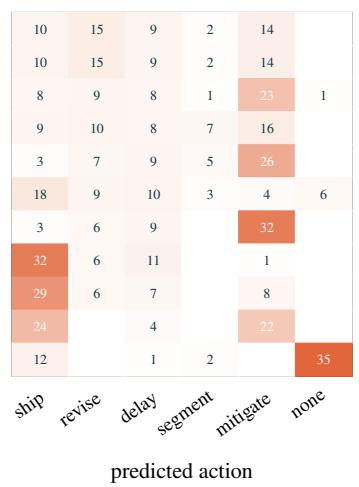  
Figure 14. What the systems get right, and what they say instead. Rows are the eleven s stems ordered b overall accurac . (a) Recal per verified class, support 10 each: every system is strongest on the unambiguous ends (ship, revise) and weakest on segment, where the best system recovers 4/10 and four systems recover none. (b) The marginal distribution of what each system emitted, against a uniform truth of 10 per class — a bias fingerprint that is independent of correctness. Values above 10 are over-prediction. Seven of the eleven systems over-predict mitigate, by up to 3.2× its true frequency (32/50, Gemma-3-27B+SFT), and it is the modal prediction of four of them — the quantitative form of the “over-doom” failure this project has tracked since its local baseline, and the target of the DPO pass in fig. 12. The segment column is the mirror image: eight systems emit that action at most twice in fifty attempts.

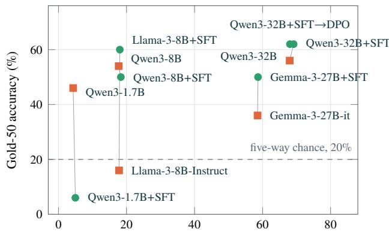  
peak VRAM at inference (GB, bf16 + adapter)  
Figure 15. Cost–quality frontier over all eleven systems. • fine-tuned, ■ untuned; grey lines join each backbone to its own adapter. Per-system throughput and latency are in table 11. All three cost measures are instrumented during the archived-run benchmark; accuracy is the Gold-50 figure. Memory spans $1 6 \times ,$ from 4.32 GB to 69.13 GB, and every system fits on one B200 (183 GB), so the deployment question is throughput and latency rather than capacity. The frontier is flatter than the leaderboard suggests: the untuned Qwen3-8B base reaches 54% at 17.7 GB and 46.6 tok/s, within 8 pp of the leader (the Qwen3-32B LoRA-SFT; not significant, $p = 0 . 4 2 4$ paired, section 5.1) for a uarter of the memor and over three times the throu h ut. Note that ever ada ter sits right-and-slower than its own base: fine-tunin costs throughput at every scale (table 11).

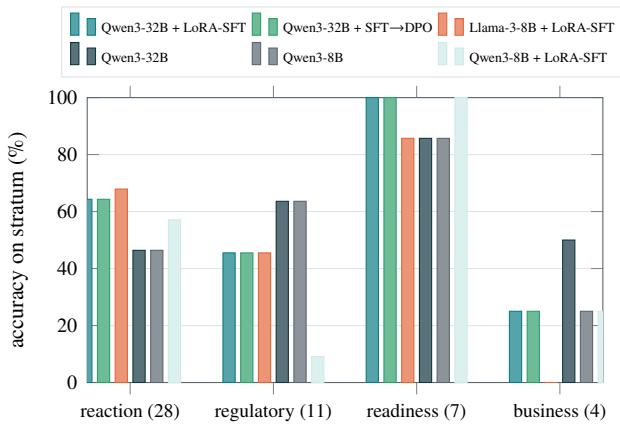  
Figure 16. Accuracy by what actually drove the outcome. Each Gold-50 case is annotated during verification with the mechanism that decided it: public reaction, regulatory action, engineering readiness, or business performance (stratum sizes in parentheses). The ordering is stable across systems: cases decided by regulators or by shipping-readiness are predicted far better than cases decided by how loudly users complained. This is the honest limit of a reaction- simulating pipeline — the stratum it is architecturally aimed at is the stratum it does worst on. The small strata $( n = 7$ and � = 4) carry very wide intervals and we draw no ranking conclusions from them.

Cost and serving. Figure 15 is the cost–quality frontier and Table 11 the measured inference cost of every system—peak memory, throughput, thinking-token count and end-to-end latency—read directly from the archived-run benchmark summaries. Figure 17 isolates the throughput and latency tax of fine-tuning on the five backbones we trained: the unmerged LoRA adapter costs tokens per second at every scale, and the reasoning trace SFT induces costs further latency per case. The practical reading, consistent with Section 5.8, is that the quality frontier is flat enough that the deployment choice is dominated by these serving costs rather than by a few points of Gold-50 accuracy.

Table 11. Measured inference cost for ever s stem on the leaderboard, from the archived-run benchmark. “tok/s” and “s/case” are sequential single-case generation; “think” is the mean count of reasoning tokens emitted before the JSON, which is why the tuned rows are slower per case than their throughput alone implies. “wall” is a separate measurement: the end-to-end clock for the batched Gold-50 run at batch 16, so it is not comparable to s/case × 50. Every configuration fits on one B200.
<table><tr><td>System</td><td> $\%$ </td><td></td><td>Acc tok/s VRAM GB</td><td> $\mathbf { s } /$  case</td><td>tok</td><td>think wall S</td></tr><tr><td>Qwen3-32B + SFT→DPO</td><td>62</td><td>17.6</td><td>68.04</td><td>133</td><td>541</td><td>962</td></tr><tr><td>Qwen3-32B + LoRA-SFT</td><td>62</td><td>13.7</td><td>69.13</td><td>178.9</td><td>604</td><td>1027</td></tr><tr><td>Llama-3-8B + LoRA-SFT</td><td>60</td><td>28.8</td><td>18.03</td><td>278.5</td><td>544</td><td>2607</td></tr><tr><td>Qwen3-32B</td><td>56</td><td>24.3</td><td>67.97</td><td>90.1</td><td>517</td><td>1255</td></tr><tr><td>Qwen3-8B</td><td>54</td><td>46.6</td><td>17.7</td><td>40.3</td><td>527</td><td>328</td></tr><tr><td>Gemma-3-27B + LoRA-SFT</td><td>50</td><td>12.2</td><td>58.66</td><td>177</td><td>546</td><td>1618</td></tr><tr><td>Qwen3-8B + LoRA-SFT</td><td>50</td><td>24.1</td><td>18.34</td><td>96.8</td><td>481</td><td>1963</td></tr><tr><td>Qwen3-1.7B</td><td>46</td><td>59.7</td><td>4.32</td><td>27.7</td><td>412</td><td>209</td></tr><tr><td>Gemma-3-27B-it</td><td>36</td><td>17.2</td><td>58.53</td><td>101.5</td><td>0</td><td>535</td></tr><tr><td>Llama-3-8B-Instruct</td><td>16</td><td>62.5</td><td>17.81</td><td>127.9</td><td>0</td><td>2327</td></tr><tr><td>Qwen3-1.7B + LoRA-SFT</td><td>6</td><td>38</td><td>4.96</td><td>182.2</td><td>647</td><td>1587</td></tr></table>

Full debias grid. Table 10 gives the complete debias $2 \times 2$ for all fourteen systems, each under both arms, summarized in Section 5.3: baseline versus the taxonomy-defining prompt block, with accuracy, the paired McNemar �, and the mitigate/segment shifts that drive it. It is the source table for every debias number quoted in the body.

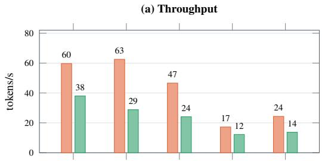

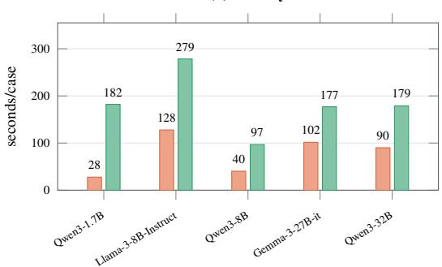  
Figure 17. Fine-tuning costs throughput and latency on every backbone we trained. ■ untuned base, ■ the same backbone with its LoRA-SFT adapter. Same recipe, same data, measured on the same hardware. (a) Tokens per second falls for all five backbones — worst on Llama-3-8B-Instruct, to 46% of its untuned rate — because the unmerged LoRA adapter adds work at every forward pass. (b) Seconds per case rises further still, because SFT also taught the models to emit a reasoning trace before the JSON: the two backbones that emitted no thinking tokens untuned (Llama-3- 8B-Instruct, Gemma-3-27B-it) emit 544 and 546 after it (table 11). The +44 pp accuracy gain on Llama-3-8B (table 2) therefore costs 2.2× the latency per case, which is the trade a deployment actually faces.

## References

[1] J. S. Park et al., “Generative Agents: Interactive Simulacra of Human Behavior,” in Proc. ACM UIST, 2023.

[2] G. Li, H. Hammoud, H. Itani, D. Khizbullin, and B. Ghanem, “CAMEL: Communicative Agents for ‘Mind’ Exploration of Large Language Model Society,” in NeurIPS, 2023.

[3] Z. Yang et al., “OASIS: Open Agent Social Interaction Simulations with One Million Agents,” arXiv:2411.11581, 2024.

[4] M. H. DeGroot, “Reaching a Consensus,” J. Amer. Statist. Assoc., vol. 69, no. 345, pp. 118–121, 1974.

[5] N. E. Friedkin and E. C. Johnsen, “Social Influence and Opinions,” J. Math. Sociol., vol. 15, no. 3–4, pp. 193–206, 1990.

[6] R. Hegselmann and U. Krause, “Opinion Dynamics and Bounded Confidence: Models, Analysis and Simulation,” JASSS, vol. 5, no. 3, 2002.

[7] P. Lewis et al., “Retrieval-Augmented Generation for Knowledge-Intensive NLP Tasks,” in NeurIPS, 2020.

[8] D. Edge et al., “From Local to Global: A Graph RAG Approach to Query-Focused Summarization,” arXiv:2404.16130, 2024.

[9] A. Panickssery, S. R. Bowman, and S. Feng, “LLM Evaluators Recognize and Favor Their Own Generations,” arXiv:2404.13076, 2024.

[10] G. Hinton, O. Vinyals, and J. Dean, “Distilling the Knowledge in a Neural Network,” arXiv:1503.02531, 2015.

[11] Y. Kim and A. M. Rush, “Sequence-Level Knowledge Distillation,” in EMNLP, 2016.

[12] A. Gudibande et al., “The False Promise of Imitating Proprietary LLMs,” arXiv:2305.15717, 2023.

[13] E. J. Hu et al., “LoRA: Low-Rank Adaptation of Large Language Models,” in ICLR, 2022.

[14] R. Rafailov et al., “Direct Preference Optimization: Your Language Model is Secretly a Reward Model,” in NeurIPS, 2023.

[15] M. Sclar, Y. Choi, Y. Tsvetkov, and A. Suhr, “Quantifying Language Models’ Sensitivity to Spurious Features in Prompt Design,” in ICLR, 2024.

[16] M. Mizrahi et al., “State of What Art? A Call for Multi-Prompt LLM Evaluation,” TACL, vol. 12, 2024.

[17] E. B. Wilson, “Probable Inference, the Law of Succession, and Statistical Inference,” J. Amer. Statist. Assoc., vol. 22, no. 158, pp. 209–212, 1927.

[18] Q. McNemar, “Note on the Sampling Error of the Diference Between Correlated Proportions or Percentages,” Psychometrika, vol. 12, no. 2, pp. 153–157, 1947.

[19] S. Holm, “A Simple Sequentially Rejective Multiple Test Procedure,” Scand. J. Statist., vol. 6, no. 2, pp. 65–70, 1979.

[20] Y. Benjamini and Y. Hochberg, “Controlling the False Dis-covery Rate: A Practical and Powerful Approach to Multiple Testing,” J. Roy. Statist. Soc. B, vol. 57, no. 1, pp. 289–300, 1995.

[21] Qwen Team, “Qwen3 Technical Report,” arXiv:2505.09388, 2025.

[22] A. Grattafiori et al., “The Llama 3 Herd of Models,” arXiv:2407.21783, 2024.

[23] Gemma Team, “Gemma 3 Technical Report,” arXiv:2503.19786, 2025.