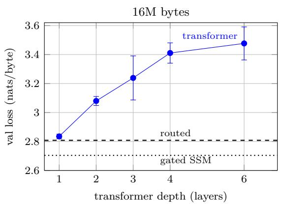
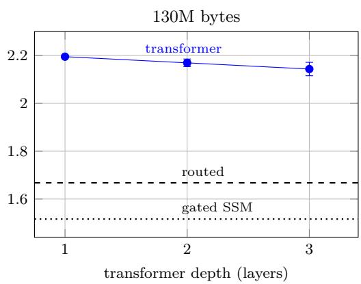

# Baseline Shape Decides the Verdict: A Controlled Re-Examination of Ternary Language Models at 60K Parameters

Gautam Veldanda

Independent Researcher veldandax@gmail.com

## Abstract

Ternary (1.58-bit) weights are attractive for microcontroller-class language models, but the sub-1Mparameter regime is supported mainly by isolated, single-seed comparisons. A prominent example reports that a routed ternary block (local convolution, diagonal state-space model and sparse attention mixed by a per-token router) beats a parameter-matched full-precision transformer by 22% in perplexity at 60K parameters, and attributes this to architectural inductive bias. We re-run that comparison under one fixed recipe with three seeds per cell, 98 runs in total, on a single laptop. The models are byte-level, so budgets below are byte counts, and every relative gap is divided by the reference system named beside it. Four results follow. (i) Baseline shape dominates the comparison: at a 16M-byte budget, param-matched transformers span 2.835–3.477 nats/byte purely by depth/width choice (a 22.6% span, far larger than any architecture efect we measure at that budget), and at this controlled budget the routed model’s advantage disappears against the best-shaped transformer, so the published margin is at least partly a baseline-shape efect; the ordering of shapes reverses with budget, so a single fixed shape cannot be trusted. (ii) With a 130M-byte budget the routed model does win, by 22.2–24.0% over each of the three transformer shapes we evaluate there, but a plain gated diagonal-SSM block beats it by a further 9.1% in full precision, and the routed model’s own router puts most of its weight on its recurrent pathway, so the gain does not require routing. (iii) The ternary penalty difers sharply by architecture at the larger budget (+5.3% for the best transformer shape against +19.5% routed and +28.1% gated SSM), but we cannot attribute that diference to architecture alone: our transformers keep learned positional embeddings in full precision, 11–22% of their parameters, so they are less quantized than the models they are compared with. (iv) A 90/10 full-precision-then-ternary schedule beats all-ternary training here, but only with a stage-2 learning rate about 10× the pretraining peak; at a conventional fine-tuning rate the same schedule looks 15.3% worse, reversing the conclusion. The from-scratch baseline was not itself learning-rate tuned, which bounds (iii) and (iv). All code, corpus manifests and run logs are released.1

## 1 Introduction

Running a generative language model on a microcontroller (MCU) leaves a budget of tens to hundreds of kilobytes of flash and SRAM. Ternary weights, $w \in \{ - \alpha , 0 , + \alpha \}$ at log 3 ≈ 1.58 bits, are a natural fit: they shrink storage by up to ∼20× relative to FP32 and replace multiplications with additions [10]. Whether ternary training is competitive at these sizes, however, is poorly understood. The most careful low-bit scaling studies (ParetoQ [9] and Spectra [8, 14]) begin at 125M and 99M parameters respectively, and the recent sub-100M study of Thomassen [13] considers integer bit-widths (8/6/4) on transformers only.

Below 10M parameters, the evidence is largely anecdotal. Atome-LM [1] reports that a routed ternary hybrid beats a parameter-matched FP32 transformer by 22% perplexity at 60K parameters, but loses by ∼11% at 944K, and interprets this as the architecture’s inductive bias “substituting for capacity at small scale and constraining it at larger scale”. If true, this would be an important design rule for edge models: use strong structural priors only in the smallest tier. But the claim rests on two single-seed comparisons, and, as we show in §4, the 60K and 944K comparisons were run under very diferent training regimes.

Re-running that comparison under one recipe with three seeds gives a diferent picture, and the first reason is mundane. At a fixed 60K parameter budget, a transformer’s depth/width ratio moves validation loss by 22.6%, further than replacing the architecture does, so the published result depends on which single transformer shape is used as the baseline. Once the strongest shape is used at each budget, two things remain: at a larger byte budget the routed block genuinely wins, but a plain gated recurrence wins by more; and the measured cost of ternary weights difers by architecture, shrinking with training for transformers and not for recurrent models, though that diference is confounded by unequal quantization and by an untuned from-scratch ternary baseline, as we set out in §7. We therefore ask: at microcontroller scale, what actually accounts for reported architectural advantages, and how does the ternary penalty behave as the training budget grows?

## Contributions.

1. An audit of the published evidence (§4): the 60K and 944K comparisons difer by ∼650× in training tokens and in corpus, schedule, optimizer settings and baseline FFN width, and the 944K comparison changes precision and architecture at once.

2. A controlled study at 60K, 98 runs, three seeds per cell, one fixed recipe, token-matched full-precision anchors and a 2σ seed-noise criterion fixed before the results were inspected (§5): baseline shape sensitivity, a three-family architecture comparison, the budget dependence of the ternary penalty, and a tuned FP-init recipe (§6).

3. Two methodological warnings that each reverse a headline: a fixed baseline shape (which flips the architecture verdict at 16M bytes), and an untuned stage-2 learning rate (which flips the FP-init verdict).

4. An open, laptop-scale release: an identity quantizer that enables the first full-precision run of the routed architecture, plus exact re-implementations of two of its layers that make the study afordable (Appendix A); 98 runs in ∼40 device-hours on one MacBook Air.

## 2 Related Work

Low-bit training and scaling. BitNet b1.58 [10] popularized ternary weights with per-tensor absmean scaling and the straight-through estimator [2]. Spectra [8] trains ternary transformers from scratch from 99M to 3.9B parameters; Spectra 1.1 [14] finds that ternary models “benefit more from increasing training data than from scaling model parameters”. ParetoQ [9] compares 1–4-bit quantization-aware training (QAT) from 125M to 8B parameters and finds that spending ∼90% of the budget in full precision before switching to QAT outperforms low-bit training from scratch, with ≤2-bit models requiring more tokens to saturate. None of these studies go below ∼100M parameters or vary architecture.

Sub-100M quantization. Thomassen [13] runs a 720-run factorial of INT8/INT6/INT4 QAT on 3M– 350M transformers and finds the optimal learning-rate warmdown to be bit-width-agnostic, with an INT4 regime boundary at 30–50M parameters and an INT6 penalty that grows with training length. Their study uses transformers only, integer bit-widths and QAT from initialization; we study ternary weights, three architecture families, and FP-initialized vs. from-scratch training, down to 60K parameters. TernaryLM [11] trains a 132M ternary transformer on TinyStories with full-precision embeddings and head.

Non-transformer low-bit models. Ternary Mamba [5] applies grouped QAT to a pretrained 1.3B Mamba-2 [6]. Hybrid attention/SSM designs such as Hymba [3] target the ≥100M regime in full precision. Atome-LM [1] is the only publicly released routed ternary hybrid at MCU scale we are aware of.

Depth, width and the shape of a small model. At a fixed parameter budget, depth and width trade of against each other, and the optimum moves with the compute or data budget: this is standard for large models [7, 12] but is rarely controlled in small-model comparisons, where a single “param-matched baseline” is usually reported. Our shape sweep (§6) shows the efect is large enough at 60K parameters to determine the verdict of an architecture comparison, and that the best shape at one budget is the worst at another.

Inductive bias and scale. Tay et al. [12] show across ten architectures that “the best performing mode can fluctuate at diferent scales”. They vary model size in full precision; we vary training budget and precision as well, and ask whether the fluctuation reported at MCU scale is a size efect at all.

## 3 Background: the Atome MCU block

Each block applies LayerNorm, then three pathways in parallel (a depthwise causal convolution (k=5), a diagonal SSM $h _ { t } = a \odot h _ { t - 1 } + b \odot x _ { t } , y _ { t } = c \odot h _ { t }$ with $a = \operatorname { t a n h } ( a _ { \operatorname { r a w } } )$ , and single-head top-k (k=4) causal attention), mixed by a per-token softmax router, followed by a residual connection. There is no feed-forward layer; channel mixing happens only in the attention value projection and the router. Tokens are raw bytes (vocabulary 256) and there is no positional embedding. All linear, convolution, embedding, unembedding and router weights are ternarized with a single per-tensor absmean scale, W˜ = α clip(round $( W / \alpha ) , - 1 , 1 )$ $\alpha = \mathrm { m e a n } | W |$ , recomputed every forward pass with STE; the SSM’s per-channel vectors stay in FP32. Embedding and head are 13.9% of parameters at 944K.

## 4 Auditing the published comparison

Table 1 summarizes the conditions behind the two published data points, reconstructed from the released run artifacts (ab\_results.json, \*.train.json) and scripts at commit be12186.

Table 1: Conditions of the two published Atome-LM comparisons.
<table><tr><td></td><td>60K comparison</td><td>944K comparison</td></tr><tr><td>Result (routed ternary vs. FP32</td><td>6.31 vs. 8.12 ppl (win)</td><td>1.0545 vs. 0.9337 nats/byte (loss)</td></tr><tr><td>transformer) Training tokens</td><td>≈3M (3,000 steps × 16 × 64)</td><td>≈2B (30,000 × 256 × 256)</td></tr><tr><td>Tokens per parameter</td><td>≈50</td><td>≈2,100</td></tr><tr><td>Corpus</td><td>0.5 MB TinyStories slice</td><td>~1.7 GB TinyStories (reported)</td></tr><tr><td>Sequence length</td><td>64</td><td>256</td></tr><tr><td>LR schedule</td><td>constant 3×10−4</td><td>warmup 1000, cosine  $3 \times 1 0 ^ { - 4 } \xrightarrow { } 3 \times 1 0 ^ { - 5 }$ </td></tr><tr><td>AdamW  $( \beta _ { 2 } ,$  weight decay)</td><td>(0.999, 0.01) (defaults)</td><td>(0.95, 0.1)</td></tr><tr><td>Transformer FFN width</td><td>1 × d</td><td>4 × d</td></tr><tr><td>FP32 routed model trained?</td><td>no</td><td>no</td></tr></table>

Three observations follow. (i) Scale is confounded with training budget and recipe: a strong structural prior that helps in a 3M-token, constant-LR regime and is overtaken when a generic model receives 650× more data would produce the same “reversal” with no size efect at all (H-budget). (ii) Neither comparison isolates precision from architecture, because no full-precision routed model was trained; the released quantizer registry has no identity option. (iii) The 60K transformer baseline uses FFN width $1 \times d ,$ while the 944K baseline uses $4 \times d .$ A fourth diference is worth naming: at 3M tokens over a 0.5 MB corpus the 60K runs make roughly six passes over their data, a regime in which memorization contributes to validation loss, whereas our budgets stay under 0.07 epochs. Their reported 6.31 perplexity (≈ 1.84 nats/byte) is far below anything we reach at 16M bytes (2.7–3.5), which is consistent with that reading. We do not re-run their setup, so we cannot separate memorization from architecture there; it is a further reason the two published points are not comparable to each other. We also note that the documented corpus-construction command produces at most 1 MB of the TinyStories V2 validation file, whereas the results document states the ful train+valid set was used; we therefore build our own corpus with a checksum manifest and re-run every comparison rather than relying on reported numbers. We stress that this reconstruction was only possible because the authors released their run artifacts, configurations and training scripts, which is more than most work at this scale provides; the conditions above are stated in their own repository. Our point is not that their measurements are wrong (we do not re-run their exact 60K setup, and have no reason to doubt the numbers), but that the two data points cannot be compared to each other, and that the 60K comparison rests on one baseline shape (§6).

## 5 Experimental design

Hypotheses. (Outcomes in §6; a further hypothesis on quantization granularity, namely full-precision embedding/head and per-row scales, was specified but not run, and is left to future work.)

H-budget. The routed architecture’s advantage over a transformer at fixed size shrinks or reverses as the training budget grows, independent of precision.

H-recipe. Ternary models initialized from a full-precision checkpoint of the same architecture (ParetoQstyle) close part of the ternary–FP gap at sub-10M scale.

H-interaction. The ternary penalty difers between architectures (precision × architecture interaction), beyond seed noise.

What was run (98 runs, 3 seeds per cell unless noted). All at 60K parameters, byte-level, on TinyStories V2.

• Main grid (24): {routed, transformer 3 × 32} × {FP32, ternary} × {16M, 130M bytes}.

• Shape sweep (36): five param-matched transformer shapes $( 1 \times 5 2 , 2 \times 3 6 , 3 \times 3 2 , 4 \times 2 8 , 6 \times 2 4 ;$ ; all within 3% of 60,800 parameters) at 16M, and the three strongest at 130M, in both precisions.

• Third architecture (12): gated diagonal-SSM block, both budgets, both precisions.

• FP-init (18 + 10): stage 1 in FP32 for 117M bytes, stage 2 ternary for 13M (90/10 of the 130M budget), at stage-2 $\mathrm { L R } \ 1 \times 1 0 ^ { - 4 }$ and at the swept value; plus a five-point stage-2 LR sweep per architecture at seed 0. The transformer arm here is the 1 × 52 shape, not the pre-specified $3 \times 3 2 ,$ and its from-scratch reference uses the same shape.

Parameter-matched widths come from a depth schedule fixed before any results were seen (configs/ scales.json); the shape sweep then tests that choice directly.

Table 2: Run accounting. Two of the tuned FP-init arms’ seed-0 runs are the corresponding sweep runs reused rather than retrained, so 100 run directories correspond to 98 distinct trainings.
<table><tr><td>Experiment</td><td>cells seeds</td><td></td><td>runs</td></tr><tr><td>Main grid (routed, 3 × 32 transformer)</td><td>8</td><td>3</td><td>24</td></tr><tr><td>Shape sweep (5 shapes @16M, 3 @130M)</td><td>12</td><td>3</td><td>36</td></tr><tr><td>Gated SSM</td><td>4</td><td>3</td><td>12</td></tr><tr><td>FP-init arms (2 architectures × 2 stage-2 LRs, incl. stage 1)</td><td>6</td><td>3</td><td>18</td></tr><tr><td>Stage-2 LR sweep</td><td>10</td><td>1</td><td>10</td></tr><tr><td colspan="4">Total 98 distinct</td></tr></table>

Fixed recipe. All runs use the published 944K recipe: AdamW $( \beta _ { 1 } { = } 0 . 9 , \ \beta _ { 2 } { = } 0 . 9 5$ , weight decay 0.1 on all parameters), peak LR $3 \times 1 0 ^ { - 4 }$ with cosine decay to $3 \times 1 0 ^ { - 5 }$ , gradient clipping 1.0, sequence length 256, batch 64 × 4 (65,280 predicted tokens per step). Warmup is 3.33% of steps (the published 1000/30000), and each budget is a separate run whose schedule ends at that budget.

Data. TinyStories V2 [4] train and validation files concatenated as raw bytes: 2,250,255,763 bytes (SHA-256 recorded in a manifest in the repository), cut into 256-byte chunks, 10% held out, leaving 2.03B training tokens. Both budgets are therefore well under one epoch (16M = 0.008 epochs, $1 3 0 \mathrm { M } = 0 . 0 6 4 )$ , so no result here is afected by repeated data. The held-out chunks are drawn at random from the same corpus, so near-duplicate stories could straddle the split; since every system is evaluated on the same slice this cannot favour one architecture, but absolute losses may be slightly optimistic.

Table 3: Exact configurations. Every model ternarizes its token embedding, unembedding and all weight matrices (plus the depthwise conv and router, for the routed block). “FP kept” is the share of parameters that remain full precision: per-channel SSM scalars and LayerNorms everywhere, plus the transformers learned positional embeddings, which dominate that column.
<table><tr><td>System</td><td>configuration</td><td>params</td><td>FP kept</td><td>what stays full precision</td></tr><tr><td>Routed 3-pathway</td><td> $d { = } 6 4 , 4 \ \mathrm { l a y e r s } , d _ { \mathrm { h e a d } } { = } 1 6 , \mathrm { t o p } { - } k { = } 4$ </td><td>60,800</td><td>2.3%</td><td>SSM scalars, LayerNorms</td></tr><tr><td>Gated SSM (ours)</td><td> $d { = } 4 4 , \ 3 \ \mathrm { l a y e r s } , \ d _ { \mathrm { f f } } { = } 2 d$ </td><td>64,196</td><td>1.6%</td><td>SSM scalars, LayerNorms</td></tr><tr><td>Transformer  $1 \times 5 2$ </td><td>d=52, 1 layer,  $d _ { \mathrm { { f f } } } = 2 d ,$  4 heads</td><td>61,880</td><td>22.0%</td><td>+ positional embedding</td></tr><tr><td>Transformer  $2 \times 3 6$ </td><td>d=36, 2 layers,  $d _ { \mathrm { { H } } } = 4 d ,$  4 heads</td><td>59,112</td><td>16.2%</td><td>+ positional embedding</td></tr><tr><td>Transformer  $3 \times 3 2$ </td><td>d=32, 3 layers, df=4d, 4 heads</td><td>61,888</td><td>14.0%</td><td>+ positional embedding</td></tr><tr><td>Transformer  $4 \times 2 8$ </td><td>d=28, 4 layers,  $d _ { \mathrm { { H } } } = 4 d ,$  4 heads</td><td>59,640</td><td>12.9%</td><td>+ positional embedding</td></tr><tr><td>Transformer  $6 \times 2 4$ </td><td>d=24, 6 layers,  $d _ { \mathrm { { H } } } = 4 d ,$  4 heads</td><td>60,528</td><td>11.2%</td><td>+ positional embedding</td></tr></table>

The transformers are within 3% of the routed model’s parameter count; the gated SSM is 5.6% larger, which flatters it and should be read as a caveat on ${ \ S 6 . 2 } .$ . The $1 \times 5 2$ shape uses $d _ { \mathrm { f f } } = 2 d$ because 4d at that width overshoots the budget.

Metric and decision rule. The primary metric is validation loss in nats/byte of the last checkpoint on 256 held-out batches (best-on-validation selection is available in the released logs). For each comparison we report the mean over seeds, the relative gap, and a noise floor $\sigma = \sqrt { \sigma _ { a } ^ { 2 } + \sigma _ { b } ^ { 2 } } / \mu _ { b } ; \dot { \varepsilon }$ a gap is called real only if it exceeds 2σ, and comparisons with fewer than two seeds per group are reported as undetermined. Every ternary run is compared to a full-precision anchor trained on the same total number of bytes. Initialization and data-order seeds are controlled separately.

Diagnostics. For all routed runs we log per-layer router entropy, maximum router probability and mean pathway weights; for all quantized runs we log the relative $L _ { 1 }$ change of shadow weights from their reference, the fraction of ternary levels that changed, and the zero fraction. These are used for the router analysis in §6.5 and are otherwise available in the released logs; we do not report them run by run.

Availability. Training code, configs, the corpus manifest and the per-run logs are at https://github. com/veldanda/ByteLM under release tag $_ { \mathsf { P } ^ { 1 } } \mathrm { - v } 1 ;$ every table and figure in this paper is regenerated from those logs by experiments/analyze\_all.py.

Compute. Every run was trained on one Apple MacBook Air (M2, 16 GB, PyTorch 2.8, MPS backend), ∼40 device-hours in total, at zero marginal cost.

## 6 Results

All numbers are validation loss in nats/byte on 256 held-out batches of the last checkpoint, mean ± sd over three seeds. The models are byte-level, so a training “token” is one byte and we state budgets in bytes: 16M and 130M bytes, i.e. ∼260 and ∼2,140 bytes per parameter. Budgets are matched within every comparison. Note that changing the budget changes three things at once: data seen, optimizer steps (245 vs. 1,991) and schedule length, so “budget” here means all three together, not data quantity alone.

## 6.1 Baseline shape decides the verdict

At 16M bytes, param-matched transformer shapes span 2.835–3.477 nats/byte in full precision: the worst shape is 22.6% worse than the best (equivalently, the best is 18.5% better), a span far wider than any architecture efect we measure at this budget: the routed model is 0.95% and the gated SSM 4.6% better than the best shape (Figure 1). Against the best shape $( 1 \times 5 2 )$ the routed model is 0.95% better in full precision $( 2 \sigma _ { \mathrm { r e l } } = 4 . 5 \% )$ and 4.0% better in ternary $( 2 \sigma _ { \mathrm { r e l } } = 4 . 3 \% )$ , both inside the noise band. Against the worst shape $( 6 \times 2 4 )$ it is 19.2% and 21.0% better, far outside it. A study that fixes one shape can therefore report either verdict.

Table 4: All systems at 60K parameters. Ternary penal $\mathrm { \ y = ( t e r n a r y - F P ) / F P . }$
<table><tr><td></td><td colspan="2">16M bytes</td><td colspan="2">130M bytes</td><td></td></tr><tr><td>System</td><td>FP32</td><td>ternary</td><td>FP32</td><td>ternary</td><td>penalty @130M</td></tr><tr><td>Gated SSM (ours)</td><td> $\mathbf { 2 . 7 0 4 \ : \pm { \ : . 0 4 1 } }$ </td><td> $3 . 3 7 6 \pm . 0 9 3$ </td><td> ${ \bf 1 . 5 1 6 \pm . 0 1 2 }$ </td><td> ${ \bf 1 . 9 4 2 \pm . 0 1 8 }$ </td><td>+28.1%</td></tr><tr><td>Routed 3-pathway (Atome)</td><td> $2 . 8 0 8 \pm . 0 6 2$ </td><td> $\mathbf { 3 . 2 9 0 \ : \pm { \ : . 0 6 5 } }$ </td><td> $1 . 6 6 8 \pm . 0 2 4$ </td><td> $1 . 9 9 3 \pm . 0 3 2$ </td><td> $+ 1 9 . 5 \%$ </td></tr><tr><td>Transformer  $1 \times 5 2$ </td><td> $2 . 8 3 5 \pm . 0 1 6$ </td><td> $3 . 4 2 6 \pm . 0 3 4$ </td><td> $2 . 1 9 5 \pm . 0 0 3$ </td><td> $2 . 3 1 1 \pm . 0 0 3$ </td><td> $+ 5 . 3 \%$ </td></tr><tr><td>Transformer  $2 \times 3 6$ </td><td> $3 . 0 8 0 \pm . 0 3 1$ </td><td> $3 . 7 5 2 \pm . 0 4 8$ </td><td> $2 . 1 6 9 \pm . 0 1 6$ </td><td> $2 . 3 2 0 \pm . 0 0 2$ </td><td> $+ 7 . 0 \%$ </td></tr><tr><td>Transformer  $3 \times 3 2$ </td><td> $3 . 2 3 9 \pm . 1 5 2$ </td><td> $3 . 8 7 0 \pm . 0 9 4$ </td><td> $2 . 1 4 3 \pm . 0 2 8$ </td><td> $2 . 3 2 8 \pm . 0 0 4$ </td><td>+8.6%</td></tr><tr><td>Transformer  $4 \times 2 8$ </td><td> $3 . 4 1 1 \pm . 0 7 0$ </td><td> $4 . 1 0 3 \pm . 0 4 4$ </td><td></td><td></td><td></td></tr><tr><td>Transformer  $6 \times 2 4$ </td><td> $3 . 4 7 7 \pm . 1 1 4$ </td><td> $4 . 1 6 2 \pm . 0 5 2$ </td><td></td><td></td><td></td></tr></table>

  
Figure 1: Full-precision validation loss at 60K parameters, three seeds (bars: sd). Every transformer point is within 3% of the same parameter count; depth, width, FFN ratio and positional-embedding share vary together along the x-axis (Table 3). Left: at a short budget the best shape (1 layer, width 52) ties the routed block while the worst (6 layers, width 24) is 22.6% worse than the best and 19.2% worse than the routed block. Right: at 130M bytes the ordering inverts (depth now helps) and both recurrent architectures pull clearly ahead, the gated SSM furthest. Ternary runs (Table 4) show the same shape ordering.

One caveat on the best shape itself: $1 \times 5 2$ difers from the other shapes in more than depth and width. Its feed-forward ratio is 2d rather than 4d (4d overshoots the parameter budget at that width), and its learned positional embedding occupies 22% of its parameters against 11–16% for the deeper shapes (Table 3). “Shape” here therefore means the whole depth/width/FFN/position-budget package, not depth alone.

Two of these comparisons are exploratory rather than confirmatory: routed vs. the best observed shape, in full precision and in ternary. The pre-specified baseline was $3 \times 3 2$ , from a depth schedule fixed before any runs; the other four shapes were added after seeing that result, and “routed vs. the best observed shape” is therefore a post-hoc descriptive comparison, reported as such.

Crucially the ordering reverses with budget: at 130M bytes the shallow-wide $1 \times 5 2$ shape is the worst transformer (2.195) and the deeper $3 \times 3 2$ the best (2.143). Shape must be swept per budget; it cannot be chosen once.

## 6.2 At a larger budget the gain is real, but it does not require routing

At 130M bytes the routed model beats each of the three transformer shapes evaluated at that budget $( 1 \times 5 2 ,$ $2 \times 3 6 , 3 \times 3 2 )$ by 22.2–24.0% in full precision and 13.7–14.4% in ternary, all outside the noise band. The two deepest shapes were not rerun at 130M, so this is a claim about the three strongest shapes at 16M, not about the whole shape family.

Our gated diagonal-SSM block (a single recurrent pathway with a GELU feed-forward layer and no router) beats the routed model by 9.1% in full precision $( 2 \sigma _ { \mathrm { r e l } } = 3 . 2 \% )$ and matches it in ternary (−2.6%,

$2 \sigma _ { \mathrm { r e l } } = 3 . 7 \%$ , within the band). Routing is therefore not required for the advantage: a much simpler gated recurrence reaches comparable or better loss at the same parameter and byte budget. We do not claim to isolate recurrence as the causal ingredient (our block also difers from the routed one in having a feed-forward layer and denser channel mixing), only that the router is not what buys the gain.

## 6.3 The ternary penalty difers by architecture, with caveats we cannot yet remove

At 130M bytes the ternary penalty is +5.3% for the best transformer shape, +19.5% for the routed model and +28.1% for the gated SSM; in absolute terms 0.116, 0.326 and 0.425 nats/byte. The transformer’s penalty falls sharply with budget $( + 2 0 . 9 \%  + 5 . 3 \% )$ , matching what ParetoQ reports at $\ge 1 2 5 \mathrm { M }$ parameters, while the recurrent models’ do not $( + 2 4 . 9 \%  + 2 8 . 1 \%$ and $+ 1 7 . 2 \%  + 1 9 . 5 \% )$ . Because the 16M penalties sit inside noise bands of $2 \sigma _ { \mathrm { r e l } } = 7 . 5 \%$ and 6.4%, the defensible statement is that the recurrent penalties do not shrink, not that they grow. The architecture gap consequently narrows without closing: the routed model is 22.2% better than the best transformer shape in full precision and 13.7% better in ternary.

Three alternative explanations are not excluded, and we flag them rather than claim the result is clean. Unequal quantization. Our transformers keep learned positional embeddings in full precision (11–22% of their parameters, largest for the shallow-wide shape) against 1.6–2.3% for the recurrent models (Table 3). A model that quantizes less of itself should lose less, so some unknown share of the diference is bookkeeping rather than architecture. A replication with a zero-parameter position scheme (RoPE, ALiBi, sinusoidal) would settle it. An untuned ternary baseline. Every from-scratch ternary run uses the full-precision recipe’s peak learning rate; §6.4 shows the ternary stage of the FP-init arm prefers a rate 10× larger, so the from-scratch penalties reported here may be inflated, possibly unequally across architectures. Loss level rather than architecture. At 130M bytes the recurrent models sit at 1.52–1.67 nats/byte and the transformers at 2.14–2.20, so penalty and loss level covary; at 16M, where the routed model (2.808) and the 1 × 52 transformer (2.835) reach similar loss, their penalties are also similar (17.2% vs. 20.9%). The penalty may track how much fine structure a model has already fitted rather than what kind of model it is. A loss-matched comparison would separate these, and we have not run one.

## 6.4 A 90/10 FP-then-ternary schedule helps, at a learning rate 10× the pretraining peak

Following ParetoQ we ran 90% of the budget in full precision and the last 10% in ternary, token-matched to the from-scratch arm (Table 5). With a conventional fine-tuning rate $( 1 \times 1 0 ^ { - 4 } )$ the recipe looks clearly worse than training ternary from scratch. A five-point stage-2 sweep (seed 0) shows loss falling monotonically up to $3 \times 1 0 ^ { - 3 }$ , an order of magnitude above the pretraining peak of $3 \times 1 0 ^ { - 4 }$ ; at that rate the same recipe wins. The sweep had not saturated at its upper end, so $3 \times 1 0 ^ { - 3 }$ is a lower bound on the useful rate, not an estimated optimum; we did not extend it further, and where the recipe becomes unstable is untested. Note also what this comparison is and is not: it tests a 90/10 allocation of one byte budget between full-precision and ternary optimization, not quantization-aware fine-tuning in general. That so short an adaptation phase (10% of the budget) prefers so large a step size suggests the ternary stage is doing something closer to re-solving the weights than to fine-tuning them, which is consistent with the “reconstruction” behaviour ParetoQ reports at larger scale.

Table 5: FP-init (90% $\mathrm { F P }  1 0 \%$ ternary) vs. ternary from scratch, token-matched at 130M. Left: stage-2 LR sweep, seed 0. Right: three-seed arms. The transformer arm is the 1 × 52 shape in both the FP-init runs and the from-scratch reference they are compared against, so the comparison holds shape fixed.
<table><tr><td>stage-2 LR</td><td>3e-5</td><td>1e-4</td><td>3e-4</td><td>1e-3</td><td>3e-3</td><td>arm (3 seeds)</td><td>loss</td><td>vs. scratch</td><td> $2 \sigma _ { \mathrm { r e l } }$ </td></tr><tr><td>routed</td><td>2.758</td><td>2.335</td><td>2.110</td><td>1.944</td><td>1.911</td><td>routed, 1e-4</td><td> $2 . 2 9 9 \pm . 0 4 1$ </td><td>+15.3%</td><td>5.2%</td></tr><tr><td>transformer</td><td>2.701</td><td>2.474</td><td>2.348</td><td>2.298</td><td>2.265</td><td>routed, 3e-3</td><td> $1 . 9 0 0 \pm . 0 1 0$ </td><td>-4.7%</td><td>3.4%</td></tr><tr><td></td><td></td><td></td><td></td><td></td><td></td><td>transf., 1e-4</td><td> $2 . 4 7 5 \pm . 0 1 4$ </td><td>+7.1%</td><td>1.2%</td></tr><tr><td></td><td></td><td></td><td></td><td></td><td></td><td>transf., 3e-3</td><td> $2 . 2 6 2 \pm . 0 0 3$ </td><td>-2.1%</td><td>0.4%</td></tr></table>

## 6.5 What the router actually does

The routing diagnostics logged for every routed run support the same conclusion from inside the model. At the end of a 130M-byte ternary run, the mean per-token mixing weight on the state (SSM) pathway is 0.49– 0.73 across the four layers, against 0.09–0.25 for the local convolution and 0.19–0.28 for sparse attention; the full-precision run is more extreme still (state 0.54–0.79). Per-layer router entropy stays at 0.67–0.87 nats against a maximum of ln 3 = 1.099, so the router neither collapses to one pathway nor stays uniform: it settles on a mixture dominated by the recurrence. A model whose router spends most of its weight on the SSM pathway is consistent with a plain gated SSM matching it.

## 6.6 On the original H-budget hypothesis

We had hypothesised that the published 60K advantage would shrink as the training budget grew (the two published points difer by ∼650× in training bytes). It does not: against the shape the original work used, the routed model’s advantage grows from 13.3% at 16M bytes to 22.2% at 130M bytes. The confound we identified is real, but it is not what explains the result; at our two controlled budgets, baseline shape is.

## 6.7 What the experiments do and do not establish

Table 6: Claims against the evidence that supports them.
<table><tr><td>Claim</td><td>Evidence</td><td>Status</td></tr><tr><td>Baseline depth/width choice can decide an ar- 5-shape sweep, 2 budgets chitecture verdict at 60K</td><td></td><td>supported</td></tr><tr><td>The published 60K advantage is explained by 16M vs. 130M bytes training budget (H-budget)</td><td></td><td>not supported</td></tr><tr><td>Routing is required for the routed block&#x27;s ad- gated SSM comparison vantage</td><td></td><td>not supported</td></tr><tr><td>A simple gated recurrence suffices to match or gated SSM, 2 budgets beat it</td><td></td><td>supported</td></tr><tr><td>Recurrence per se is the causal ingredient</td><td>not isolated (FFN, mixing untested differ)</td><td></td></tr><tr><td>The ternary penalty differs by architecture at 3 families, 2 budgets 130M</td><td></td><td>supported</td></tr><tr><td>The recurrent models&#x27; ternary penalty grows 16M values inside noise not established with budget</td><td>bands</td><td></td></tr><tr><td>... and is attributable to architecture alone</td><td>transformers keep 11-22% of confounded params in FP; ternary base- line untuned</td><td></td></tr><tr><td>A 90/10 FP→ternary schedule beats all-ternary training</td><td>3 seeds, tuned stage-2 LR</td><td>supported, vs. an untuned from-scratch baseline</td></tr><tr><td>3× 10−3 is the optimal stage-2 LR Any of this holds beyond 60K parameters or beyond TinyStories</td><td>sweep stops there</td><td>not established unknown</td></tr></table>

## 7 Limitations

One parameter count. Every result is at 60K parameters. We cannot say whether the architecture ordering or the ternary penalties change at 1M or 10M, and we therefore do not address the 944K reversal that motivated the audit. Training a 944K grid to a comparable bytes/parameter budget is roughly two orders of magnitude more compute than a laptop allows.

One corpus, and a byte-level one. TinyStories favours local, repetitive structure, and byte-level input makes short-range dependencies dominant; both plausibly flatter convolutional and recurrent pathways relative to attention. The architecture × precision interaction we report is established on TinyStories

V2 at byte level; whether it persists on less locally structured corpora (code, multilingual text, subword tokenization) is open, and the specific gap percentages should not be carried over. The tokenization itself is part of this: English text is roughly four bytes per subword token, so a byte-level model sees sequences several times longer at the same context width, which weights local sequential structure more heavily and plausibly favours the convolutional and recurrent pathways over attention. A subword-tokenized replication could narrow the architecture gaps we report even if their ordering holds. A wider-domain corpus is the single most valuable follow-up.

Two budgets, low bytes/parameter at the top end. 16M and 130M bytes (∼260 and ∼2,140 bytes/parameter); the shortest budget is only 245 optimizer steps.

Scope of the baselines. The transformer shapes are param-matched within 3% but share one recipe; we did not tune learning rate per shape. The gated SSM is deliberately simple and is not a Mamba-class model. Loss is the only quality metric. Wall-clock numbers come from a laptop, not an MCU; deployment cost is left to follow-up work.

Unequal quantization across architectures. Our transformers keep their learned positional embeddings in full precision (11–22% of their parameters) against 1.6–2.3% for the recurrent models, so the “ternary” arms are not equally quantized. Any architecture-dependent ternary penalty we report is therefore an upper bound on the architectural component; a replication with a zero-parameter position scheme is needed before the diference can be attributed to architecture.

The from-scratch ternary baseline is untuned. Every from-scratch ternary run reuses the fullprecision peak learning rate. The FP-init sweep shows that ternary optimization prefers a rate an order of magnitude larger, so the from-scratch ternary losses (and hence every ternary penalty in this paper) may be inflated, possibly by diferent amounts across architectures. A per-architecture ternary learning-rate sweep is the cheapest experiment that would tighten §6.

Stage-2 LR not bracketed. The FP-init sweep had not saturated at $3 \times 1 0 ^ { - 3 }$ , so the reported FP-init results are a lower bound on what the recipe can do.

## 8 Conclusion

A reader might take three things from the published comparison: that the routed block beats a parametermatched transformer at 60K, that its router is what produces the advantage, and that the cost of ternary weights is a property of precision rather than of architecture. At 60K parameters the first two do not survive a controlled re-run. The advantage at a short budget is at least partly a baseline-shape artifact, and the advantage that remains at a longer budget does not require routing: a single gated recurrence does at least as well, though our comparison does not isolate recurrence itself as the cause. What survives is more qualified: the cost of ternary weights difers sharply by architecture at the larger budget (the transformer recovers with more training, the recurrent models do not), though our transformers keep 11–22% of their parameters in full precision and our from-scratch ternary baseline was never learning-rate tuned, and loss level covaries with architecture here, so we report that diference as an observation with three live alternative explanations rather than as an established architectural law. The cleanest new result is the recipe one: a 90/10 full-precision-then-ternary schedule needs a learning rate far above the usual fine-tuning range before it beats all-ternary training at all, though it is measured against a from-scratch baseline that was never itself learning-rate tuned, so the size of the win, and not only its sign, is provisional. None of this establishes behaviour beyond 60K parameters or beyond TinyStories. Both of the methodological traps we hit (a fixed baseline shape, an untuned stage-2 learning rate) individually reverse a headline result, which is worth more caution than the field currently gives them at this scale.

What this does not settle is the scaling question that motivated the audit. We show the published 60K comparison does not support the interpretation placed on it; the reported reversal at 944K parameters remains untested, because a comparable grid at that size is roughly two orders of magnitude beyond a laptop budget. Whether the architecture ordering and the architecture-dependent ternary penalty hold, shrink or invert between 60K and 1M parameters is the obvious next experiment, and the one we would run first given compute.

## References

[1] Atome LM contributors. Atome LM: a tiny ternary language model for microcontroller deployment. https://github.com/TilelliLab/atome-lm, commit be12186, v2.0, 2026. doi:10.5281/zenodo.20518644.

[2] Yoshua Bengio, Nicholas Léonard, and Aaron Courville. Estimating or propagating gradients through stochastic neurons for conditional computation. arXiv preprint arXiv:1308.3432, 2013.

[3] Xin Dong et al. Hymba: A hybrid-head architecture for small language models. arXiv preprint arXiv:2411.13676, 2024.

[4] Ronen Eldan and Yuanzhi Li. TinyStories: How small can language models be and still speak coherent English? arXiv preprint arXiv:2305.07759, 2023.

[5] Ramprasath Ganesaraja, Sahil Dilip Panse, and Swathika N. Ternary Mamba: Grouped quantizationaware training of W1.58A16 state space models. arXiv preprint arXiv:2606.18114, 2026.

[6] Albert Gu and Tri Dao. Mamba: Linear-time sequence modeling with selective state spaces. arXiv preprint arXiv:2312.00752, 2023.

[7] Jordan Hofmann et al. Training compute-optimal large language models. arXiv preprint arXiv:2203.15556, 2022.

[8] Ayush Kaushal et al. Spectra: Surprising efectiveness of pretraining ternary language models at scale. arXiv preprint arXiv:2407.12327, 2024. ICLR 2025.

[9] Zechun Liu et al. ParetoQ: Scaling laws in extremely low-bit LLM quantization. arXiv preprint arXiv:2502.02631, 2025. NeurIPS 2025.

[10] Shuming Ma et al. The era of 1-bit LLMs: All large language models are in 1.58 bits. arXiv preprint arXiv:2402.17764, 2024.

[11] Nisharg Nargund and Priyesh Shukla. TernaryLM: Memory-eficient language modeling via native 1.5- bit quantization with adaptive layer-wise scaling. arXiv preprint arXiv:2602.07374, 2026.

[12] Yi Tay, Mostafa Dehghani, Samira Abnar, Hyung Won Chung, William Fedus, Jinfeng Rao, Sharan Narang, Vinh Q. Tran, Dani Yogatama, and Donald Metzler. Scaling laws vs model architectures: How does inductive bias influence scaling? arXiv preprint arXiv:2207.10551, 2022.

[13] Christian Thomassen. Mapping the schedule × bit-width boundary in sub-100M quantisation-aware training. arXiv preprint arXiv:2605.25966, 2026.

[14] Tejas Vaidhya, Ayush Kaushal, Vineet Jain, Francis Couture Harpin, Prashant Shishodia, Majid Behbahani, Yuriy Nevmyvaka, and Irina Rish. Spectra 1.1: Scaling laws and eficient inference for ternary language models. arXiv preprint arXiv:2506.23025, 2025.

## A Exact faster kernels

Chunked-scan SSM. The released implementation trains the diagonal SSM as a depthwise convolution with a length-L kernel $( O ( L ^ { 2 } )$ per channel). We split the sequence into chunks of $T { = } 3 2$ : within a chunk, the recurrence is a lower-triangular $T \times T$ matrix $M _ { t s } = a ^ { t - s }$ applied per channel; across chunks the state is carried with $L / T$ sequential steps, $H _ { n } = a ^ { T } H _ { n - 1 } + h _ { n } ^ { \mathrm { e n d } }$ , and added as $a ^ { t + 1 } H _ { n - 1 }$ . Only non-negative powers $a ^ { k } , k \leq T$ , appear, so the scheme is stable for any $| a | < 1$ . Forward and all gradients agree with the original $\mathrm { t o } ~ \le ~ 2 \times 1 0 ^ { - 6 }$ relative error (also against the step-by-step recurrence), at 19× lower cost on CPU (155 ms $ 8 \mathrm { m s } , C = L { = } 2 5 6$ , batch 16). On the MPS backend the same substitution reduced one block’s SSM from 300 ms to 14 ms, measured while another training job shared the GPU, so that ratio is indicative rather than a clean benchmark.

Gather top-k attention. Entries outside the top-k are exactly zero after softmax, so the output equals a softmax over the k selected scores applied to the k gathered value rows; this avoids scattering scores back into an $L \times L$ matrix. Agreement $\leq 1 . 2 \times 1 0 ^ { - 6 }$ . End-to-end, a toy training pipeline gives the same ternary–FP relative gaps $( + 4 . 5 6 \% \mathrm { \ v s . } + 4 . 5 7 \% ; + 7 . 1 0 \% \mathrm { \ v s . } + 7 . 1 1 \% )$ under either implementation. All runs in this paper use the fast path; --exact-kernels restores the upstream implementations for verification.