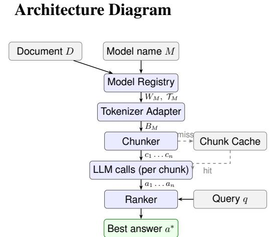

# ChunkRank: Model-Aware Text Chunking and Abstention-Aware Answer Selection for LLM Pipelines

Amit Nautiyal<sup>iD</sup>

research.amit.n@gmail.com

Ayush Bhatt<sup>iD</sup>

ayushbhatt1224@gmail.com

Gaurav Nautiyal

26021892@geu.ac.in

## Abstract

We present ChunkRank, an open-source Python library that derives chunk boundaries from a target model’s tokenizer and context window, and selects an answer among candidates produced independently per chunk. It ships a validated registry of 90 models across 15 providers and six answer-selection methods, and needs only three core dependencies. For chunking, ChunkRank avoids context-window overflow automatically from the model name, whereas character-based splitters overflow or waste the budget, and a fidelity study across 11 languages shows why token-exact budgets matter beyond English. For answer selection we report a negative result: on NaturalQuestions, TriviaQA and HotpotQA, with extractive and generative readers, no content-based ranker reliably beats taking the first non-empty answer. The reason is reader abstention on chunks that lack the answer, not answer position. A longcontext baseline shows that chunking matches single-call reading on single-hop questions, so ChunkRank targets small-window and beyondwindow settings. Code, registry and evaluation harness are released.

## 1 Introduction

All deployed large language models accept inputs up to some fixed token budget. Although this limit has grown considerably in recent years (from 2,048 tokens in GPT-3 (Brown et al., 2020) to 1M tokens in Gemini 1.5 (Gemini Team, Google, 2024) and 10M tokens in Llama 4 Scout (Meta AI, 2025)), documents such as legal contracts, research corpora, codebases, and multi-chapter reports routinely exceed even the largest current windows. Long documents must therefore be split before they can be processed, and every practitioner working on such documents needs a reliable, reusable component for doing so.

The NLP community has a long tradition of releasing general-purpose toolkits that lower the barrier to reproducible engineering (Section 2), but chunking for LLM pipelines has not received the same treatment. Existing splitters (Chase, 2022; Liu, 2022; deepset, 2019) bundle character- or token-based logic as one utility inside a larger retrieval framework, requiring a user-supplied chunk size and never consulting the target model’s tokenizer. Because tokenization varies across model families, a 512-character window is anywhere from 100 to 400 tokens depending on the encoder (Sennrich et al., 2016; Kudo and Richardson, 2018), so a size tuned for one model silently truncates or wastes context on another, a mismatch practitioners discover through degraded output rather than explicit errors, and, absent a standalone modelaware resource, re-solve independently and inconsistently.

Chunking introduces a second, less-discussed challenge: answer multiplicity. Queried independently against each chunk, the LLM may produce a different answer per segment; most applications simply return the first chunk’s, an arbitrary and empirically suboptimal choice. RAG systems (Lewis et al., 2020; Izacard and Grave, 2021; Guu et al., 2020) address a related problem by ranking retrieved passages before generation, but within a monolithic pipeline that conflates retrieval, indexing, chunking, and generation, and not as a standalone resource a non-RAG pipeline can adopt.

We introduce ChunkRank to close this resource gap: an installable package (not a code snippet embedded in a larger framework) with a versioned model registry, a documented and stable API across three levels of abstraction, a public test suite exercised on four Python versions, and a permissive license. This paper documents the resource’s design, the engineering decisions that make it adoptable in constrained environments, and an empirical study showing that answer selection over chunks is dominated by reader abstention, so a trivial firstnon-empty rule is hard to beat, with real oracle headroom that content-based ranking does not capture.

This paper makes the following contributions:

1. We release ChunkRank, an open-source, versioned resource that packages model-aware chunk boundary computation and post-chunk answer ranking as reusable, independently documented components (Sections 4–5).

2. We release a community-extensible model registry of 90 pre-configured models across 15 providers, with a documented schema and a runtime registration API so that new models can be added without a library upgrade (Section 4.1).

3. We document the resource’s reproducibility guarantees: license, dependency footprint, supported Python versions, and public test coverage, to support long-term reuse by the community (Section 6).

4. We validate the resource empirically and report a negative result about answer selection: across NaturalQuestions, TriviaQA, and HotpotQA, with both an extractive and a generative reader and paired bootstrap tests, no content-based ranker reliably beats taking the first non-empty answer, because selection over chunks is dominated by the reader’s ability to abstain (Section 7). We adopt first-non-empty as the library default, add a long-context baseline that delimits when chunking is needed at all, and release the full harness, configuration, and result tables.

Downstream impact. The setting ChunkRank targets is increasingly common: tool-using agents and multi-step reasoning chains that feed long, externally-retrieved documents (web pages, code, PDFs, tool outputs) into a model with a fixed budget, often one whose tokenizer is not the developer’s own. There, a silent overflow surfaces as a truncated tool result or degraded answer several steps downstream, where it is hard to attribute. By deriving safe boundaries from the named model and turning implicit first-chunk selection into an explicit, swappable answer-selection step, ChunkRank makes both failure modes explicit at the point of chunking, and as model-agnostic middleware drops into an agent loop, an offline document-processing workflow, or a RAG system without a pipeline rewrite.

ChunkRank is available under the Apache 2.0 license on PyPI at https: //pypi.org/project/chunkrank/ and on GitHub at https://github.com/ AmitoVrito/chunkrank, where the source, model registry JSON, and test suite are publicly browsable.

## 2 Related Work

## 2.1 NLP Toolkits and Resource Papers

The NLP community has a long history of resource and tool papers that package research-grade functionality for reuse: NLTK (Bird et al., 2009), spaCy (Honnibal et al., 2020), Stanza (Qi et al., 2020), and Flair (Akbik et al., 2019) package tokenization, tagging, and parsing behind stable, versioned APIs, and Hugging Face Transformers (Wolf et al., 2020) generalized the pattern to pretrained-model access. ChunkRank follows this tradition but fills a gap none of these do: adapting segmentation to the tokenizer and context budget of a named, deployed LLM, and resolving the resulting answer-selection problem, as a standalone, dependency-light component.

## 2.2 Text Chunking in LLM Pipelines

Token-budget management for LLMs is discussed informally in practitioner documentation but has received little formal treatment as a resource problem. LangChain’s recursive character splitter (Chase, 2022) enforces a character-count ceiling that the user must manually translate into an approximate token count; LlamaIndex’s SentenceSplitter (Liu, 2022) improves coherence but still requires a user-supplied token limit; DrQA (Chen et al., 2017) pre-segments Wikipedia into fixed-length passages without model-specific adaptation. Chonkie (Chonkie AI, 2024) is a more recent lightweight, chunkingfocused library, but its splitters likewise take a usersupplied chunk size and, by default, count in characters rather than model tokens (Section 7.3). In each case, chunking is an internal utility of a larger retrieval framework, or a standalone splitter that still requires manual token configuration, rather than an independently versioned, model-aware resource. Token-aware splitting itself is one line in these libraries once the user supplies the tokenizer; to our knowledge, what no prior open library ships is a maintained model-to-tokenizer-and-budget registry that resolves those parameters automatically from a named model and exposes the whole as a standalone package (Table 1).

<table><tr><td>Tool</td><td>Model- aware</td><td>Auto registry</td><td>Post-chunk ranking</td><td>Light- weight</td><td>Async stream</td></tr><tr><td>LangChain splitter</td><td>No</td><td>No</td><td>No</td><td>No</td><td>No</td></tr><tr><td>LlamaIndex splitter</td><td>No</td><td>No</td><td>No</td><td>No</td><td>No</td></tr><tr><td>Chonkie</td><td>No</td><td>No</td><td>No</td><td>Yes</td><td>No</td></tr><tr><td>ChunkRank</td><td>Yes</td><td>Yes</td><td>Yes</td><td>Yes</td><td>Yes</td></tr></table>

Table 1: Feature comparison with the widely-used chunking utilities. “Model-aware” means chunk size is derived from the target model’s tokenizer and context window without manual configuration (LangChain and Chonkie can be pointed at a tokenizer, but the user must supply it; neither resolves it automatically from a model name); “Auto registry” means the library ships pre-configured parameters for named models. Quantitative overflow/utilisation results are in Table 3.

## 2.3 Answer Ranking and Passage Re-ranking

The classical BM25 function (Robertson and Zaragoza, 2009), built on TF-IDF weighting (Sparck Jones, 1972), remains a strong baseline (Thakur et al., 2021). Neural re-ranking with BERT (Devlin et al., 2019; Nogueira and Cho, 2019) produced monoT5 (Nogueira et al., 2020), ColBERT (Khattab and Zaharia, 2020), and SPLADE (Formal et al., 2021); sentence-level dense encoders (Reimers and Gurevych, 2019) now dominate semantic similarity and back most dense retrieval (Karpukhin et al., 2020). All target retrieval, finding the most relevant passage in a large corpus, typically requiring a full retrieval stack. ChunkRank instead ranks among candidate answers from the chunks of a single document, with no corpus, index, or retrieval stack, a structurally simpler post-chunk setting not previously packaged as a standalone resource.

## 2.4 Retrieval-Augmented Generation

RAG (Lewis et al., 2020) combines a retriever with a generative model. Extensions such as FiD (Izacard and Grave, 2021), REPLUG (Shi et al., 2023), Self-RAG (Asai et al., 2024), RECOMP (Xu et al., 2024), and GraphRAG (Edge et al., 2024) couple retrieval, compression, or graph structure to a specific generator, and are released, if at all, as research code rather than reusable middleware. ChunkRank is not a RAG system (no index, no corpus, no modified generation) but drops into any RAG pipeline. Nor do longer context windows (128k in GPT-4 (OpenAI, 2023) to 10M in Llama 4 Scout (Meta AI, 2025)) eliminate chunking: cost scales with length, long contexts degrade positional attention (Liu et al., 2024), and most self-hosted or edge models keep small budgets, so a maintained model-aware chunker stays relevant as budgets diversify rather than converge.

## 3 Problem Definition

Let D be a document and M a language model with tokenizer $\mathcal { T } _ { M }$ , maximum context window $W _ { M }$ (tokens), and a token budget $R _ { M }$ reserved for the prompt template and generated output. Define the effective chunk budget $B _ { M } = W _ { M } - R _ { M }$

## 3.1 Model-Aware Chunking

A chunking function $\mathcal { C } _ { M }$ partitions D into an ordered sequence $\langle c _ { 1 } , \ldots , c _ { n } \rangle$ subject to the hard constraint $\forall i : | \mathcal { T } _ { M } ( c _ { i } ) | \leq B _ { M }$ and the soft objective of preserving coherence across boundaries. A user-configurable overlap of $\delta \ < \ B _ { M }$ tokens $( \mathrm { s u f f i x } _ { c _ { i } } = \mathrm { p r e f i x } _ { c _ { i + 1 } } )$ trades storage for continuity.

## 3.2 Post-Chunk Answer Selection

Given a query $q$ and the answers $a _ { i }$ produced by applying the model to each chunk $c _ { i }$ (with reader score $s _ { i }$ where available), let $A = \{ ( a _ { i } , i , s _ { i } )$ $a _ { i } \neq \emptyset \}$ be the non-empty candidates. The selection objective is:

$$
a ^ { * } = \arg \operatorname* { m a x } _ { ( a _ { i } , i , s _ { i } ) \in A } \ S ( q , a _ { i } , i , s _ { i } )
$$

where $\boldsymbol { \mathcal { S } }$ maps a candidate, its position $i ,$ and its score $s _ { i }$ to a real value. This general form covers content-based scorers that use only $( q , a _ { i } )$ (BM25, TF-IDF, embedding, cross-encoder), a positionbased rule $( \pm \mathrm { i } \mathrm { r } s \mathrm { t } \colon s = - i )$ , and a score-based rule (confidence: ${ \mathcal S } = s _ { i } )$ . ChunkRank supports six instantiations, detailed in Section 4.4.

Note that this formulation is extractive at the meta-level: it selects among already-generated answers rather than generating a new one, which preserves the determinism of the underlying model call.

## 4 System Design

ChunkRank is organized into four components that run sequentially: Model Registry → Tokenizer Adapter → Chunker → Ranker (Figure 1, Appendix A). Each component exposes a clean interface and can be replaced or extended independently, which is what allows the resource to be adopted incrementally rather than as an all-or-nothing framework.

## 4.1 Model Registry

The registry is the single source of truth for modelspecific parameters, and is the primary reusable artifact this paper releases as a community resource. Each entry stores five fields: the model name, max context (context window in tokens), the tokenizer backend (hf or tiktoken), the tokenizer id (tokenizer name or encoding), and default reserve (tokens held back for the prompt template and generated output).

The registry ships with 90 pre-configured models across 15 providers: OpenAI, Anthropic, Google, Meta, Mistral, Microsoft, Alibaba (Qwen), Cohere, DeepSeek, TII, EleutherAI, IBM, xAI, AllenAI, and Hugging Face. Context windows range from 512 tokens (BERT-base (Devlin et al., 2019)) to 10M tokens (Llama 4 Scout (Meta AI, 2025)). The registry is stored as a plain JSON file distributed with the package, so it can be inspected, diffed, and extended by the community through ordinary version control without touching library code.

Runtime model registration is supported via a one-line API call (chunkrank.register model(name, max context=..., tokenizer=..., tokenizer id=...,

default reserve=...)), so the resource does not need to be re-released every time a provider ships a new model. Runtime entries are stored in memory and take precedence over the static JSON registry, eliminating the need to upgrade the library when a new model releases. If a model is absent from both sources, ChunkRank falls back to a safe default: a 128k-token context window, tiktoken o200k base encoding, and a 512-token reserve.

Registry validation. To verify the 90 entries rather than trust them, we validate every entry along three axes and release the validation harness with the library. (i) Schema and consistency: all 90 entries type-check and satisfy max context > reserve > 0. (ii) Tokenizer resolution: all 55 tiktoken encodings resolve, and of the 35 Hugging Face entries, 19 load in a stock environment while the rest are gated models that load for authenticated users or require a newer transformers; no entry is malformed. 41 non-OpenAI models are mapped to o200k base as an approximate token counter (exact tokenizers being proprietary or gated); on English this under-counts by 0.3–11.3% vs. the true tokenizer where public (Appendix E), an overflow risk the default reserve absorbs at typical budgets but not necessarily at very large ones (Limitation 8), with a larger cross-script error quantified in Section 7.4. (iii) Context-window audit: we check every Anthropic entry against the provider’s live Models API and a documented subset of 27 other-provider models against published specifications. The audit caught two stale context windows, later-revised models listed at 200k that in fact expose a 1M window, which we corrected, and the 27 documented values all match. Shipping the harness lets the community re-run these checks as the registry grows, so registry correctness is a maintained, testable property rather than a one-time claim.

## 4.2 Tokenizer Adapter

Tokenizer implementations differ substantially in API surface and initialization overhead. The Tokenizer Adapter presents a uniform two-method interface (encode(text) → List[int], count(text) → int) to the rest of the system. Three backends are supported:

• tiktoken: Used for OpenAI, Anthropic, Mistral, Cohere, DeepSeek, and Qwen models, with the encoding label loaded directly from the registry entry and the tiktoken object cached per process.

• Hugging Face Transformers (Wolf et al., 2020): Used for Meta Llama and encoderbased models (BERT, T5, Longformer, BigBird), loaded via AutoTokenizer. from pretrained() with fast tokenization enabled.

• Character-ratio fallback: When neither tiktoken nor Transformers is installed, token count is approximated as ⌊|s|/4⌋, where |s| is the UTF-8 character length, conservative, dependency-free, but less accurate for non-Latin scripts where the ratio can exceed 4:1.

Switching tokenizer backends requires only a registry update; no application code changes are needed. This design choice is what keeps the resource usable in environments where heavier tokenizer dependencies cannot be installed.

## 4.3 Chunker

The Chunker receives a document string and the model’s effective token budget $B _ { M }$ from the adapter, and returns a list of text segments each satisfying the hard token constraint. The budget is derived by default from the model’s context window (Section 4.1) but remains a configurable parameter. Because the accuracy-optimal budget is dataset-dependent, ChunkRank exposes it rather than hard-coding a split size. Two strategies are available.

Token-Budget Sliding Window (default). This strategy operates without sentence boundary detection, making it suitable for any language and requiring no additional dependencies (Algorithm 1, Appendix C). Rather than shrinking the window by a fixed factor per iteration, the inner loop binarysearches the character range [pos + 1, end] (width at most $B \cdot r )$ , converging in O(log B) tokenizer calls per chunk since r is a constant, tighter and more predictable than a geometric-decay scheme as the effective budget B grows for larger-context models. Overlap is applied in character space at the same 4:1 ratio, preserving δ tokens of context without an extra tokenizer call per chunk.

Semantic Similarity (optional). When sentence-transformers (Reimers and Gurevych, 2019) is installed, ChunkRank can group sentences by cosine similarity before enforcing the token budget, opening a new chunk when the next sentence would violate it. This benefits documents with distinct topical sections at the cost of a one-time embedding pass.

## 4.4 Ranker

The Ranker selects one answer from the per-chunk candidates. Empty answers (chunks for which the reader or generator produced nothing) are dropped first, so every method operates on the same nonempty candidate set. When a method assigns equal scores to all candidates, ChunkRank breaks ties by document order; a method with no discriminative signal therefore degenerates gracefully to firstchunk selection rather than to an arbitrary choice. Six methods are available, with first as the default:

First non-empty (default). Returns the answer from the first chunk that produced a non-empty output (document order). It performs no query–answer scoring and has no dependencies; it is abstentionaware, exploiting the reader’s tendency to return nothing on chunks that do not contain the answer. It is the default because, empirically (Section 7), it matches or beats every content-based method on our datasets.

Reader confidence. Selects the non-empty answer with the highest caller-supplied confidence (e.g. an extractive reader’s span score or a generator’s log-probability), the classic multi-passage reading-comprehension selection rule (Chen et al., 2017). Deterministic given the scores, with no additional dependencies.

BM25. BM25 (Robertson and Zaragoza, 2009) scores a document d against query q as:

$$
\mathsf { B M } 2 5 ( q , d ) = \sum _ { t \in q } \mathsf { I D F } ( t ) \cdot
$$

$$
\frac { f ( t , d ) \cdot ( k _ { 1 } + 1 ) } { f ( t , d ) + k _ { 1 } \cdot \Big ( 1 - b + b \cdot \frac { | d | } { \mathrm { a v g d l } } \Big ) }
$$

where $f ( t , d )$ is term frequency in d, IDF(t) is inverse document frequency over the candidate set, and $k _ { 1 } = 1 . 5 , b = 0 . 7 5$ are standard parameters (rank-bm25 implementation). BM25 is entirely deterministic, requiring no floating-point precision choices, so reproducing a result never depends on a hardware- or version-dependent forward pass.

TF-IDF Cosine Similarity. Query and answers are vectorized via scikit-learn’s TfidfVectorizer (Pedregosa et al., 2011; Sparck Jones, 1972); similarity is the cosine between query and answer vectors, also deterministic, but normalizing document length differently from BM25.

Dense Embedding. Query and answers are encoded by a sentence-level transformer into fixedlength vectors $\mathbf { e } _ { q } , \mathbf { e } _ { a } \in \mathbb { R } ^ { d } .$ , scored by cosine similarity (Reimers and Gurevych, 2019). This captures semantic paraphrase invisible to lexical methods, but requires sentence-transformers and is sensitive to encoder choice.

Cross-Encoder. A cross-encoder (Nogueira and Cho, 2019; Wang et al., 2020) scores the concatenated pair (q, a<sub>i</sub>) directly (ms-marco-MiniLM-L-6-v2 by default); cross-encoders consistently outperform biencoders on re-ranking (Thakur et al., 2021) but are slower, requiring a separate forward pass per candidate.

Table 8 (Appendix F) summarizes the trade-offs: first and reader-confidence are dependencyfree selection rules (the default, first, performs no query–answer scoring at all); BM25 and TF-IDF are deterministic and dependencylight but purely lexical, while embedding and cross-encoder capture semantics at the cost of sentence-transformers and slower inference.

## 5 Implementation

## 5.1 Dependency Philosophy

ChunkRank targets environments where installing heavy ML stacks is impractical (CI systems, serverless functions, restricted clusters, edge deployments); minimizing installation friction is a design requirement, not an afterthought. The core system (registry, tiktoken and character-fallback tokenizer adapters, slidingwindow chunker, BM25 and TF-IDF ranking) requires only three runtime dependencies: numpy (≥1.26, array operations), scikit-learn (≥1.5, TF-IDF vectorization and cosine similarity), and rank-bm25 (≥0.2.2, BM25 scoring). Optional extras activate neural capabilities via pip install chunkrank[semantic] (sentence-transformers) or chunkrank[all] (all optional backends); PyTorch is never a hard dependency and is only imported when the user selects method="embedding" or method="cross-encoder".

## 5.2 API Design

ChunkRank exposes three interaction levels for different integration effort: a one-shot Function API for scripts and notebooks, a stateful Pipeline API that caches chunker configuration across repeated queries over one document, and a Component API exposing the chunker and ranker directly; all three are shown in Appendix B.

## 5.3 Async, Caching, and Compatibility

AsyncChunkRankPipeline runs CPU-bound work in threads (asyncio.to thread()) and LLM calls as coroutines so neither blocks the event loop; both pipelines expose a stream() method. ChunkCache persists chunked documents to disk keyed by a SHA-256 hash of (text, model, strategy, overlap), skipping chunking on a hit, using only the standard library. ChunkRank targets Python 3.10–3.13, uses importlib.resources.files() (PEP 451) for registry access, and its test suite passes on all four versions.

## 6 Resource Release and Reproducibility

Beyond the library, we release the artifacts needed to reproduce and extend this work, documenting what is available, how it is versioned, and how it is maintained.

Distribution, licensing, and versioning. ChunkRank is published on PyPI as the chunkrank package and on GitHub at https: //github.com/AmitoVrito/chunkrank under the Apache 2.0 license, permitting unrestricted commercial and academic reuse, including inside larger RAG frameworks. The repository hosts the source code, the versioned model registry JSON (Section 4.1, diffable independently of code to audit exactly which models changed between releases), and the public test suite. The package follows semantic versioning; the results in this paper use release 2.0.0. As of 2026-09-23, it has been downloaded 8,806 times from PyPI (554 in the preceding 30 days), a figure that includes mirror and CI traffic and is therefore an upper bound, but one that indicates adoption beyond the authors’ own usage.

Test coverage and evaluation artifacts. The public test suite exercises the registry, tokenizer adapters, both chunking strategies, all six answerselection methods, the disk cache, and the sync and async pipelines, and runs on CPython 3.10 through 3.13. Alongside the library, we release the evaluation harness used in Section 7: the dataset filtering script, the evaluation configuration, and the full per-method result tables (Tables 4, 10, and 9), so the empirical claims here can be independently checked and extended to new datasets or selection methods without re-implementing the pipeline.

Computational reproducibility. The reported numbers were produced with chunkrank 2.0.0 and pinned dependencies (transformers 4.44.2, sentence-transformers 3.0.1, torch 2.2.2 on CPU, numpy<2). To make neural ranking portable across machines, every model is pinned to an exact Hugging Face revision (reader deepset/roberta-base-squad2@ adc3b06f, embedding all-MiniLM-L6- v2@1110a243, cross-encoder ms-marco-MiniLM-L-6-v2@233902d2) and run with device="cpu"; we verified the neural rankings are bit-identical on CPU and Apple MPS. The released evaluation harness invokes chunkrank.Ranker directly for every selection method, so a re-run reproduces the paper’s numbers from the installed package rather than a separate re-implementation.

Extensibility. Three extension points support community contribution without forking the library: new registry entries as a JSON diff, new chunking strategies behind the existing Chunker interface, and new ranking methods behind the existing Ranker interface, the same interfaces used internally, so third-party extensions are not secondclass citizens.

## 7 Experiments

## 7.1 Task and Motivation

We evaluate ChunkRank on long-document singlehop QA: each example pairs a document exceeding the model’s chunk budget with a factual question whose answer lies in one contiguous passage, and candidate answers come from querying the QA model (extractive reader or generative LLM) against each chunk independently. This validates real-world utility rather than a leaderboard, and we release the harness (Section 6) for reuse. Unlike RAG/re-ranking benchmarks (BEIR (Thakur et al., 2021), MS MARCO (Bajaj et al., 2016)) that search a corpus of thousands of passages, our candidate set is small (typically 3–20 chunks from one document) and pre-defined, the dominant case for practitioners applying LLMs to individual documents, yet one with no dedicated benchmark or reusable harness prior to this release.

## 7.2 Experimental Setup

Data. We build evaluation sets from NaturalQuestions (NQ) (Kwiatkowski et al., 2019) and TriviaQA (Joshi et al., 2017), keeping examples whose answer context exceeds 8,000 tokens (forcing chunking at a 6,000-token budget): 500 examples each.

Answer generation and chunking. Candidate answers are extracted per chunk with deepset/roberta-base-squad2 (Devlin et al., 2019), an extractive RoBERTa QA model (Liu et al., 2019), the standard paradigm for NQ/TriviaQA, fully reproducible, CPU-only, no fine-tuning, using ChunkRank’s sliding window (6,000-token budget, 64-token overlap; mean 3.5 / 4.0 chunks per document on NQ / TriviaQA). Because the extractive reader has a 512-token input limit, each chunk is processed by the Hugging Face question-answering pipeline, which slides a 512- token window (stride 128) over the whole chunk and returns its single highest-confidence span (or nothing, when it finds no answer). The reader therefore both extracts an answer per chunk and abstains on chunks that lack one; the per-chunk confidence it produces is what the confidence selector uses, while the content-based methods (Section 4.4) re-score the returned answer strings against the query. On a chunk that contains no answer the reader usually returns nothing, so a large fraction of chunks are empty (52% on NQ, 57% on TriviaQA for this reader; Table 2), which is central to the results below. Section 7.6 repeats the study with a generative reader that leaves far fewer examples with no answer at all.

<table><tr><td>Reader / dataset</td><td>Empty chunks</td><td>No-answer ex.</td></tr><tr><td>NQ, extractive</td><td>52%</td><td>22%</td></tr><tr><td>TriviaQA, extractive</td><td>57%</td><td>16%</td></tr><tr><td>HotpotQA, extractive</td><td>85%</td><td>38%</td></tr><tr><td>NQ, generative</td><td>36%</td><td>2%</td></tr><tr><td>TriviaQA, generative</td><td>51%</td><td>7%</td></tr><tr><td>HotpotQA, generative</td><td>79%</td><td>18%</td></tr></table>

Table 2: Abstention rates. “Empty chunks” is the share of chunks for which the reader returned no answer; “Noanswer ex.” is the share of examples with no non-empty candidate at all (every method scores 0). The extractive reader reads full chunks. These rates drive the results: first-non-empty exploits exactly this abstention.

Baselines and metrics. All methods select over the non-empty candidates. First (non-empty) / Last return the first / last non-empty candidate; Random samples one uniformly; Oracle takes the candidate with the highest F1 against the gold answer, the best any selector could achieve, an upper bound. We report Exact Match (EM) and tokenlevel F1 (Kwiatkowski et al., 2019) with 95% bootstrap confidence intervals and paired bootstrap tests against first-non-empty.

## 7.3 Chunking Correctness

Before evaluating ranking, we validate the resource’s primary contribution: chunking that never exceeds the target model’s budget. We split the 500 long TriviaQA documents for gpt-4o-mini (6,000-token budget, o200k base) with ChunkRank, LangChain’s RecursiveCharacterTextSplitter (Chase, 2022), and Chonkie’s TokenChunker (Chonkie AI, 2024), counting chunks over 6,000 tokens and budget utilisation (Table 3). Character-based splitting, the default in both LangChain (a character ceiling) and Chonkie (a character backend), overflows 0.6% of chunks, the largest reaching 7,397 tokens (23% over budget), because the character-to-token ratio varies across documents. Shrinking the ceiling until overflow vanishes (LangChain 12k) wastes 61% of the budget and yields 1.9× more chunks. Token-aware configurations of both libraries reach zero overflow at high utilisation, but only once the user manually supplies the target model’s tokenizer. ChunkRank reaches zero overflow automatically from the model name, at lower utilisation (75.9% vs. 84–86%), a deliberate safety margin. Its zero overflow is guaranteed by construction (it splits with the same tokenizer it is measured against, which is the point: that tokenizer is the target model’s). The contribution is thus not token counting (any library can be configured for it) but deriving tokenizer and budget from a named model without manual setup.

<table><tr><td>Splitter</td><td>Overflow</td><td>Mean util.</td><td>Max tok.</td></tr><tr><td>LangChain char (naive 4:1)</td><td>0.64%</td><td>75.0%</td><td>7,375</td></tr><tr><td>Chonkie char (default)</td><td>0.60%</td><td>76.0%</td><td>7,397</td></tr><tr><td>LangChain char (aggressive)</td><td>0.00%</td><td>39.3%</td><td>4,559</td></tr><tr><td>LangChain tiktoken (manual)</td><td>0.00%</td><td>84.5%</td><td>5,979</td></tr><tr><td>Chonkie tiktoken (manual)</td><td>0.00%</td><td>86.2%</td><td>6,000</td></tr><tr><td>ChunkRank (auto)</td><td>0.00%</td><td>75.9%</td><td>6,000</td></tr></table>

Table 3: Chunk overflow rate, mean budget utilisation, and largest chunk across 500 TriviaQA documents $( { \tt g p t } - 4 \tt { o - m i n i }$ , 6,000-token budget). Characterbased splitters (top two) overflow the budget; tokenaware ones (middle) do not, but require manual permodel tokenizer configuration. ChunkRank guarantees zero overflow automatically from the model name, at lower utilisation (75.9% vs. 84–86%), a deliberate safety margin.

## 7.4 Multilingual Tokenizer Fidelity

Our QA evaluation is English-only, but the chunking contribution can be probed multilingually. The character-ratio fallback $( \lfloor | s | / 4 \rfloor )$ is calibrated for Latin-script English; measured on UDHR Article 1 across 11 languages (Appendix D), it overcounts English by 27% (safe) but under-counts logographic and syllabic scripts by up to 71% (Chinese, Japanese), since one character maps to roughly one token. Consequently a character window safe at 6,000 English tokens holds ∼20,000 tokens of Japanese (3.4× budget) and overflows for every non-Latin script tested. Only a tokenizerderived budget, which ChunkRank computes from the model name, is safe across scripts (hence the fallback is opt-out, not default).

## 7.5 Answer Selection Results

Table 4 reports EM and F1 at the 6,000-token budget with 95% bootstrap CIs. Every method selects over one candidate set per example: the non-empty answers the reader produced, with empty spans dropped as the library does (Section 4.4). The headline is a negative result. On neither NQ nor TriviaQA does any content-based ranker (lexical, denseembedding, cross-encoder) significantly beat simply taking the first non-empty answer: embedding ties first-non-empty or falls below it, while readerconfidence, the other reader-based rule, ties it (and is numerically higher on TriviaQA, $p = 0 . 1 8 )$ . The oracle headroom that remains is captured by no method we tested. BM25 and TF-IDF add no signal on short factoid answers, which rarely share query terms, so all their candidate scores are equal on 79–90% of multi-candidate examples and they fall back to document order, reducing in practice to first-chunk.

Abstention, not ranking, does the work. Firstnon-empty is hard to beat because the reader abstains: on a chunk that does not contain the answer it returns nothing, so the first non-empty answer is the answer from the first chunk the reader was confident about. Re-scoring the returned answer strings against the query adds little on top of this implicit filtering: real oracle headroom remains (Table 4), but no content-based selector captures it, and the reader-based rules (first-non-empty, readerconfidence) are the strongest we tested.

Where there is a genuine choice. A tie is trivial when an example has only one non-empty candidate, so we restrict to examples with ≥ 2 non-empty candidates, where a selector must actually choose. With the generative reader this is the common case $\scriptstyle ( n = 7 0 / 1 0 0$ on NQ, 58/100 on TriviaQA, 181/400 on HotpotQA), and there first-non-empty is not merely tied but significantly beats every content-based method: 40.0 EM versus 22.9 (embedding) and 18.6 (cross-encoder) on NQ $( p \textless 0 . 0 0 1 )$ ), 58.6 versus 44.8 on TriviaQA $( p = 0 . 0 0 4 )$ , and 38.7 versus 26.5 on HotpotQA $( p = 0 . 0 0 2 )$ . With the extractive reader reading full chunks, roughly half of all examples now have a real choice (n=242 on NQ, 247 on TriviaQA,

<table><tr><td rowspan="2">Method</td><td colspan="2">NaturalQuestions</td><td colspan="2">TriviaQA</td></tr><tr><td>EM</td><td>F1</td><td>EM</td><td>F1</td></tr><tr><td>First (non-empty)</td><td>22.4</td><td>29.1</td><td>45.4</td><td>51.0</td></tr><tr><td>Last</td><td>14.0</td><td>20.7</td><td>40.8</td><td>47.1</td></tr><tr><td>Random</td><td>18.8</td><td>24.8</td><td>43.8</td><td>49.4</td></tr><tr><td>BM25</td><td>21.8</td><td>28.6</td><td>45.2</td><td>50.5</td></tr><tr><td>TF-IDF</td><td>20.4</td><td>27.4</td><td>44.8</td><td>51.2</td></tr><tr><td>Embedding</td><td>18.8</td><td>25.9</td><td>45.2</td><td>52.3</td></tr><tr><td>Cross-Encoder</td><td>19.6</td><td>27.0</td><td>45.2</td><td>51.7</td></tr><tr><td>Reader-conf.</td><td>20.8</td><td>27.0</td><td>47.4</td><td>53.2</td></tr><tr><td>Oracle</td><td>25.6</td><td>34.2</td><td>56.2</td><td>61.5</td></tr></table>

Table 4: Exact Match (EM) and token-level F1 for answer selection over the non-empty candidate set (chunk budget = 6,000 tokens, 500 examples per dataset; extractive reader reading full chunks). Bold marks the best non-oracle result per column. No content-based method (BM25, TF-IDF, embedding, cross-encoder) significantly beats first-non-empty: on NQ, embedding and cross-encoder are significantly below it $( p < 0 . 0 2 )$ , and on TriviaQA all differences from first-non-empty are non-significant (reader-confidence is numerically highest, $p = 0 . 1 8 )$ . The reader-based selectors (first-nonempty, reader-confidence) match or beat the contentbased ones throughout. Oracle headroom remains but is captured by no method.

122 on HotpotQA), and there too no content-based method significantly beats first-non-empty; on NQ it is significantly better (first-non-empty 27.7 vs. embedding 20.2, $p = 0 . 0 0 4 )$ , and on TriviaQA the differences are non-significant. The negative result is therefore not an artifact of single-candidate ties: where a real choice exists, taking the first nonempty answer is at least as good as, and under the stronger reader clearly better than, re-scoring the candidates.

The effect is not positional. A tempting explanation for a strong first-chunk baseline is positional bias in Wikipedia-derived data, where the answer tends to sit near the start. We rule this out on HotpotQA (distractor) (Yang et al., 2018), where the answer-bearing paragraph sits at a nearuniform position (mean index 4.6; only 10% first; Appendix H). Even there, first-non-empty is not beaten by any content-based ranker (Table 10). It is abstention, not answer position, that makes first-non-empty strong, which is why ChunkRank ships it as the default and exposes the content-based methods for callers whose readers do not abstain.

## 7.6 Validation with a Generative LLM

To test whether the finding depends on the extractive reader, we repeat the study on 100 examples per dataset with a production generative reader, Claude Haiku 4.5 (Anthropic, 2025), queried through its API, with paired bootstrap tests. Absolute scores rise sharply (the generative model is a far stronger reader), but the conclusion holds: first-non-empty is not beaten. On NQ, first-nonempty reaches 36.0 EM and embedding is significantly lower (24.0, $p < 0 . 0 0 1 )$ ; on TriviaQA, firstnon-empty reaches 59.0 and embedding is again lower $( 5 1 . 0 , p = 0 . 0 0 6 )$ . Crucially, the generative reader leaves far fewer examples with no answer at all (2–18% vs. 16–38% for the extractive reader; Table 2), yet first-non-empty still wins, so the result is not an artifact of a reader that abstains too readily. The oracle remains well above every method (68.0 EM on TriviaQA), so real headroom exists that none of the tested selectors captures. This run is at n=100 and released through the same harness, which exposes both an extractive and a generative backend.

## 7.7 Latency Analysis

We benchmark chunking and selection latency on CPU (median of 100 runs; full table in Appendix G). Chunking a document into up to 11 chunks completes in under 15 ms, regardless of tokenizer backend. Selection is model-independent and ranges from effectively free (first and confidence, the default, and BM25 at < 0.2 ms) to ∼30 ms for the neural methods at 5–20 candidates. The whole pipeline adds under 50 ms, negligible next to the seconds-scale reader calls it wraps.

## 7.8 When Not to Chunk: A Long-Context Baseline

Why chunk at all when a large-window model could read the whole document in one call? We test this directly: for the same generative examples (NQ / TriviaQA n=100, HotpotQA n=400), we send each full document to Claude Haiku 4.5 in a single call (all documents fit its 200k-token window) and compare against chunked first-non-empty selection (Table 5).

On single-hop QA where the document fits, the two are statistically indistinguishable (NQ 36.0 vs. $3 5 . 0 , p { = } 0 . 8 7 $ ; TriviaQA 59.0 vs. 57.0, p=0.70), and total input tokens are essentially equal (chunked 1.02× single-call, since the chunks reconstruct the document plus a small overlap and a per-chunk prompt). For documents that fit a large window, chunking therefore yields no accuracy or cost advantage. On multi-hop HotpotQA, single-call longcontext wins (55.1 vs. 34.6 EM on the n=136 subset completed before an API limit; the chunked score on that subset matches its full-set value of 33.5, confirming the subset is representative), because splitting a document into 256-token pieces separates the evidence a multi-hop question must combine. This is the single-document, single-hop scope described in Limitation 1. We include HotpotQA only as a probe of that limitation: its documents average ∼1.3k tokens and were deliberately split at a 256-token budget, so this is not evidence that long-context beats chunking in general.

<table><tr><td>Method</td><td>NQ</td><td>TriviaQA</td><td>HotpotQA</td></tr><tr><td>Chunked (first-non-empty)</td><td>36.0</td><td>59.0</td><td>34.6</td></tr><tr><td>Long-context (single cali)</td><td>35.0</td><td>57.0</td><td>55.1</td></tr><tr><td>p vs. chunked</td><td>0.87</td><td>0.70</td><td>&lt;0.001</td></tr></table>

Table 5: Whole-document single-call (Claude Haiku 4.5) vs. chunked first-non-empty, EM. Single-hop NQ/TriviaQA (n=100): a tie, at essentially equal inputtoken cost. Multi-hop HotpotQA (n=136 subset; chunked matches its full-set 33.5): long-context wins, as expected when chunking splits multi-hop evidence (Limitation 1). All documents fit the 200k-token window.

This defines when the resource applies: chunking gives no benefit when a document fits a largewindow model, but it is required for the many registry models with 512–32k-token windows (selfhosted and edge models) and for documents beyond any context window, where a single call is impossible.

## 8 Conclusion

We have presented ChunkRank, an open-source, versioned resource that packages model-aware text chunking and post-chunk answer ranking as lightweight, modular middleware for LLM pipelines. Unlike chunking utilities bundled inside larger retrieval frameworks, it is a standalone, independently documented package: a registry of 90 models across 15 providers, a three-tier API, a PyTorch-free core, and only three dependencies, adoptable incrementally and extensible without forking. All evaluation code, configuration, and results reported here are released alongside it to support replication.

Experiments validate the chunking contribution and report a clear negative result for answer selection. For chunking, ChunkRank produces zero budget overflow automatically from the model name, where character-based splitters overflow or waste the budget (Sections 7.3–7.4). For answer selection, across NaturalQuestions, TriviaQA, and HotpotQA, with an extractive and a generative reader and paired bootstrap tests, no contentbased ranker (lexical, embedding, cross-encoder, or reader-confidence) reliably beats taking the first non-empty answer: selection over chunks is dominated by the reader’s ability to abstain, not by re-scoring answer strings. A long-context baseline further shows that chunking is not needed when a document fits a large-window model, delimiting where the resource applies. The contribution is thus not a stronger re-ranker but a modular, reproducible, community-maintainable resource, with an honest account of what answer selection over chunks can and cannot do. Future work includes multilingual calibration data, learned chunk boundaries, multi-document fusion, and CPU-only embedding backends.

## 9 Limitations

1. Single-document, single-hop scope. ChunkRank processes one document at a time and post-chunk selection cannot synthesise evidence across chunks, so multi-document and multi-hop question answering are outside its current scope. Our HotpotQA study (Appendix H) does not evaluate multi-hop reasoning: it concatenates the distractor paragraphs into a single document and uses it only to test whether first-non-empty’s strength is merely positional (it is not), with single-span answers, which is also why absolute scores there are capped.

2. Extractive answer selection. The ranker selects among pre-generated answers. It does not merge complementary information from multiple chunks, a capability studied in FiD (Izacard and Grave, 2021). If the answer to a query spans multiple chunks, ChunkRank may return an incomplete response.

3. Rule-based chunking. Both chunking strategies apply fixed rules. We have not explored learning-based approaches that optimize chunk boundaries for downstream task

performance.

4. Character-ratio fallback accuracy. The len/4 approximation is inaccurate for languages with high character-to-token ratios (e.g., Chinese, Japanese, Korean), where a single character may correspond to fewer than one BPE token. Users processing such texts should install either tiktoken or the Hugging Face tokenizer for the target model. As a released resource, this is a documented rather than silent limitation, and is a priority area for community-contributed multilingual calibration data in future releases.

5. Semantic chunking dependency. Enabling the semantic similarity strategy requires sentence-transformers, which reintroduces a PyTorch dependency. This is at tension with the lightweight design goal; we intend to support lightweight CPU-only embedding backends in a future release.

6. Non-factoid queries. The evaluation focuses on factoid QA where a single chunk contains the complete answer. For summarization, multi-hop reasoning, or open-ended generation, the ranking criteria and evaluation metrics require reconsideration. Post-chunk ranking as implemented here is not suited to queries whose correct answer requires synthesizing information across chunks.

7. Evaluation scope. The answer-selection evaluation uses 500 examples per dataset on NQ and TriviaQA and 400 on HotpotQA, with paired bootstrap confidence intervals and significance tests (Section 7), across three datasets spanning front-loaded and distributed answer positions, and we confirm the main finding with a generative reader in addition to extractive QA (Section 7.6); the generative run is preliminary (n=100 per dataset). Three gaps remain: all three datasets are Wikipediaderived, so domain diversity (legal, biomedical, code) is untested; the generative validation covers a single provider model; and our negative result concerns the specific selectors we implemented, so a learned or reader-aware selector could still beat first-non-empty. We release the evaluation harness, with extractive and generative backends, so the community can extend it to new domains, generators, and selectors without re-implementation.

8. English-centric fallback and proxy tokenizers. The character-ratio fallback (⌊|s|/4⌋) is calibrated for Latin-script English; Section 7.4 quantifies its error across 11 languages (up to a 71% token under-count for Chinese/Japanese, i.e. overflow risk), so it is an opt-out path, and the tiktoken and Hugging Face backends, which count tokens directly, are the correct choice for non-Latin scripts. Relatedly, 41 non-OpenAI models are mapped to o200k base as an approximate token counter rather than their exact tokenizer; this under-counts by 0.3–11.3% on English (Appendix E). The default per-model reserve absorbs this at typical budgets, but a fixed reserve does not scale: at a 128k-token budget an 11.3% under-count is ∼14k tokens, far exceeding a 512–1,024-token reserve, so the zero-overflow guarantee is exact only for the 49 entries with a native tokenizer (tiktoken or Hugging Face) and approximate for the 41 proxy-mapped models. For those, or at very large budgets, the exact tiktoken or Hugging Face tokenizer should be used. The QA evaluation itself remains English-only; multilingual QA is future work.

## Ethics Statement

ChunkRank is infrastructure: it operates purely on documents and queries passed to it by the calling application and does not itself collect, transmit, or retain any user data. It maintains no server, no telemetry, and no persistent state beyond the optional, entirely local, user-controlled disk cache described in Section 5, which stores only chunked document text under a path the user chooses. ChunkRank does not call any external service on its own behalf; the only network access in a typical deployment is the LLM API call the user’s own application makes, which is entirely outside ChunkRank’s control. Because ChunkRank is model- and provider-agnostic infrastructure rather than a trained model, it does not introduce new biases beyond those already present in whichever LLM and tokenizer the user configures it to work with; it does not amplify or mitigate those biases. The evaluation in Section 7 uses NaturalQuestions and TriviaQA, both public, widely used, Englishlanguage QA benchmarks derived from Wikipedia and licensed for research use, and introduces no new human-subjects data collection.

## Acknowledgements

The authors thank the open-source communities behind rank-bm25, scikit-learn, and sentence-transformers for maintaining the libraries on which ChunkRank depends.

## References

Alan Akbik, Tanja Bergmann, Duncan Blythe, Kashif Rasul, Stefan Schweter, and Roland Vollgraf. 2019. FLAIR: An easy-to-use framework for state-of-theart NLP. In Proceedings ofthe 2019 Conference of the North American Chapter ofthe Associationfor Computational Linguistics (Demonstrations), pages 54–59. ACL.

Anthropic. 2025. Claude Haiku 4.5. https: //www.anthropic.com/claude/haiku. Model card and documentation, https://docs. claude.com/en/docs/about-claude/ models/overview.

Akari Asai, Zeqiu Wu, Yizhong Wang, Avirup Sil, and Hannaneh Hajishirzi. 2024. Self-RAG: Learning to retrieve, generate, and critique through self-reflection. In The Twelfth International Conference on Learning Representations.

Payal Bajaj, Daniel Campos, Nick Craswell, Li Deng, Jianfeng Gao, Xiaodong Liu, Rangan Majumder, Andrew McNamara, Bhaskar Mitra, Tri Nguyen, et al. 2016. MS MARCO: A human generated machine reading comprehension dataset. arXiv preprint arXiv:1611.09268.

Steven Bird, Ewan Klein, and Edward Loper. 2009. Natural language processing with Python: Analyzing text with the natural language toolkit. O’Reilly Media.

Tom Brown, Benjamin Mann, Nick Ryder, Melanie Subbiah, Jared D Kaplan, Prafulla Dhariwal, Arvind Neelakantan, Pranav Shyam, Girish Sastry, Amanda Askell, et al. 2020. Language models are few-shot learners. Advances in Neural Information Processing Systems, 33:1877–1901.

Harrison Chase. 2022. LangChain. https:// github.com/langchain-ai/langchain. GitHub repository.

Danqi Chen, Adam Fisch, Jason Weston, and Antoine Bordes. 2017. Reading Wikipedia to answer opendomain questions. In Proceedings ofthe 55th Annual Meeting of the Association for Computational Linguistics, pages 1870–1879. ACL.

Chonkie AI. 2024. Chonkie: A no-nonsense, lightweight and fast chunking library. https: //github.com/chonkie-inc/chonkie. GitHub repository.

deepset. 2019. Haystack: Open source nlp framework. https://github.com/deepset-ai/ haystack. GitHub repository.

Jacob Devlin, Ming-Wei Chang, Kenton Lee, and Kristina Toutanova. 2019. BERT: Pre-training of deep bidirectional transformers for language understanding. In Proceedings ofthe 2019 Conference of the North American Chapter ofthe Associationfor Computational Linguistics, pages 4171–4186. ACL.

Darren Edge, Ha Trinh, Newman Cheng, Joshua Bradley, Alex Chao, Apurva Mody, Steven Truitt, and Jonathan Larson. 2024. From local to global: A graph RAG approach to query-focused summarization. arXiv preprint arXiv:2404.16130.

Thibault Formal, Benjamin Piwowarski, and Stephane´ Clinchant. 2021. SPLADE: Sparse lexical and expansion model for first stage ranking. In Proceedings ofthe 44th International ACM SIGIR Conference on Research and Development in Information Retrieval, pages 2288–2292. ACM.

Gemini Team, Google. 2024. Gemini 1.5: Unlocking multimodal understanding across millions of tokens of context. arXiv preprint arXiv:2403.05530.

Kelvin Guu, Kenton Lee, Zora Tung, Panupong Pasupat, and Ming-Wei Chang. 2020. REALM: Retrievalaugmented language model pre-training. arXiv preprint arXiv:2002.08909.

Matthew Honnibal, Ines Montani, Sofie Van Landeghem, and Adriane Boyd. 2020. spaCy: Industrialstrength natural language processing in Python. https://spacy.io.

Gautier Izacard and Edouard Grave. 2021. Leveraging passage retrieval with generative models for open domain question answering. In Proceedings ofthe 16th Conference ofthe European Chapter ofthe Association for Computational Linguistics, pages 874–880. ACL.

Mandar Joshi, Eunsol Choi, Daniel Weld, and Luke Zettlemoyer. 2017. TriviaQA: A reading comprehension dataset containing complex, compositional questions over wikipedia and the web. In Proceedings of the 55th Annual Meeting of the Association for Computational Linguistics, pages 1601–1611. ACL.

Vladimir Karpukhin, Barlas Oguz, Sewon Min, Patrick˘ Lewis, Ledell Wu, Sergey Edunov, Danqi Chen, and Wen-tau Yih. 2020. Dense passage retrieval for opendomain question answering. In Proceedings of the 2020 Conference on Empirical Methods in Natural Language Processing (EMNLP), pages 6769–6781. ACL.

Omar Khattab and Matei Zaharia. 2020. ColBERT: Efficient and effective passage search via contextualized late interaction over BERT. In Proceedings of the 43rd International ACM SIGIR Conference on Research and Development in Information Retrieval, pages 39–48. ACM.

Taku Kudo and John Richardson. 2018. SentencePiece: A simple and language independent subword tokenizer and detokenizer for neural text processing. In Proceedings of the 2018 Conference on Empirical Methods in Natural Language Processing: System Demonstrations, pages 66–71. ACL.

Tom Kwiatkowski, Jennimaria Palomaki, Olivia Redfield, Michael Collins, Ankur Parikh, Chris Alberti, Danielle Epstein, Illia Polosukhin, Jacob Devlin, Kenton Lee, et al. 2019. Natural questions: A benchmark for question answering research. Transactions of the Association ofComputational Linguistics, 7:452– 466.

Patrick Lewis, Ethan Perez, Aleksandra Piktus, Fabio Petroni, Vladimir Karpukhin, Naman Goyal, Heinrich Kuttler, Mike Lewis, Wen-tau Yih,¨ Tim Rocktaschel, Sebastian Riedel, and Douwe¨ Kiela. 2020. Retrieval-augmented generation for knowledge-intensive NLP tasks. In Advances in Neural Information Processing Systems, volume 33, pages 9459–9474. Curran Associates.

Jerry Liu. 2022. LlamaIndex. https: //github.com/run-llama/llama\_index. GitHub repository.

Nelson F. Liu, Kevin Lin, John Hewitt, Ashwin Paranjape, Michele Bevilacqua, Fabio Petroni, and Percy Liang. 2024. Lost in the middle: How language models use long contexts. Transactions ofthe Association for Computational Linguistics, 12:157–173.

Yinhan Liu, Myle Ott, Naman Goyal, Jingfei Du, Mandar Joshi, Danqi Chen, Omer Levy, Mike Lewis, Luke Zettlemoyer, and Veselin Stoyanov. 2019. RoBERTa: A robustly optimized BERT pretraining approach. arXiv preprint arXiv:1907.11692.

Meta AI. 2025. The Llama 4 herd: The beginning of a new era of natively multimodal AI innovation. https://ai.meta.com/blog/ llama-4-multimodal-intelligence/. Model card and blog; Llama 4 Scout, 10M-token context.

Rodrigo Nogueira and Kyunghyun Cho. 2019. Passage re-ranking with BERT. arXiv preprint arXiv:1901.04085.

Rodrigo Nogueira, Zhiying Jiang, Ronak Pradeep, and Jimmy Lin. 2020. Document ranking with a pretrained sequence-to-sequence model. In Findings of the Association for Computational Linguistics: EMNLP 2020, pages 708–718. ACL.

OpenAI. 2023. GPT-4 technical report. arXiv preprint arXiv:2303.08774.

Fabian Pedregosa, Gael Varoquaux, Alexandre Gram-¨ fort, Vincent Michel, Bertrand Thirion, Olivier Grisel, Mathieu Blondel, Peter Prettenhofer, Ron Weiss, Vincent Dubourg, et al. 2011. Scikit-learn: Machine learning in Python. Journal of Machine Learning Research, 12:2825–2830.

Peng Qi, Yuhao Zhang, Yuhui Zhang, Jason Bolton, and Christopher D. Manning. 2020. Stanza: A Python natural language processing toolkit for many human languages. In Proceedings ofthe 58th Annual Meeting of the Association for Computational Linguistics: System Demonstrations, pages 101–108. ACL.

Nils Reimers and Iryna Gurevych. 2019. Sentence-BERT: Sentence embeddings using Siamese BERTnetworks. In Proceedings ofthe 2019 Conference on Empirical Methods in Natural Language Processing, pages 3982–3992. ACL.

Stephen Robertson and Hugo Zaragoza. 2009. The probabilistic relevance framework: BM25 and beyond. Foundations and Trends in Information Retrieval, 3(4):333–389.

Rico Sennrich, Barry Haddow, and Alexandra Birch. 2016. Neural machine translation of rare words with subword units. In Proceedings of the 54th Annual Meeting of the Association for Computational Linguistics, pages 1715–1725. ACL.

Weijia Shi, Sewon Min, Michihiro Yasunaga, Minjoon Seo, Richard James Lewis, Mike Lewis, Luke Zettlemoyer, and Wen-tau Yih. 2023. REPLUG: Retrieval-augmented black-box language models. arXiv preprint arXiv:2301.12652.

Karen Sparck Jones. 1972. A statistical interpretation of term specificity and its application in retrieval. Journal ofDocumentation, 28(1):11–21.

Nandan Thakur, Nils Reimers, Andreas Ruckl¨ e, Ab-´ hishek Srivastava, and Iryna Gurevych. 2021. BEIR: A heterogeneous benchmark for zero-shot evaluation of information retrieval models. In Proceedings of the Thirty-Fifth Conference on Neural Information Processing Systems Datasets and Benchmarks Track.

Wenhui Wang, Furu Wei, Li Dong, Hangbo Bao, Nan Yang, and Ming Zhou. 2020. MiniLM: Deep selfattention distillation for task-agnostic compression of pre-trained transformers. In Advances in Neural Information Processing Systems, volume 33, pages 5776–5788. Curran Associates.

Thomas Wolf, Lysandre Debut, Victor Sanh, Julien Chaumond, Clement Delangue, Anthony Moi, Pierric Cistac, Tim Rault, Remi Louf, Morgan Funtowicz,´ et al. 2020. Transformers: State-of-the-art natural language processing. In Proceedings of the 2020 Conference on Empirical Methods in Natural Language Processing: System Demonstrations, pages 38–45. ACL.

Fangyuan Xu, Weijia Shi, and Eunsol Choi. 2024. RE-COMP: Improving retrieval-augmented LMs with compression and selective augmentation. In The Twelfth International Conference on Learning Representations.

Zhilin Yang, Peng Qi, Saizheng Zhang, Yoshua Bengio, William Cohen, Ruslan Salakhutdinov, and Christopher D. Manning. 2018. HotpotQA: A dataset for

diverse, explainable multi-hop question answering. In Proceedings of the 2018 Conference on Empirical Methods in Natural Language Processing, pages 2369–2380. ACL.

  
Figure 1: ChunkRank pipeline. Solid arrows show the primary data flow; dashed arrows show the optional disk-cache path. $W _ { M }$ is the model context window, $\mathcal { T } _ { M }$ its tokenizer, and $B _ { M } = W _ { M } - R _ { M }$ the effective chunk budget.

## B Three-Tier API

The Function, Pipeline, and Component APIs (Section 5):

```python
import chunkrank
# Level 1: one-shot function API
chunks = chunkrank.split(text, model="
gpt-4o-mini")
answers = chunkrank.answer(question,
chunks) # calls your LLM
best = chunkrank.rank(answers)
# Level 2: stateful pipeline API
from chunkrank import ChunkRankPipeline
pipe = ChunkRankPipeline(model="gpt-4o
mini", retrieval_top_k=3)
answer = pipe.process(question, text)
# Level 3: component API
from chunkrank import Chunker,
ChunkerConfig, Ranker
config = ChunkerConfig(model="claude
-3-5-sonnet",
strategy="semantic", overlap_tokens
=64)
chunker, ranker = Chunker(config),
Ranker(method="cross-encoder")
chunks = chunker.split(text)
answers = [my_llm(question, c) for c in
chunks] # your LLM call
ranked = ranker.rank(question, answers)
```

## C Token-Budget Sliding Window

Algorithm 1 gives the default chunker (Section 4.3). The inner loop binary-searches the character range [pos + 1, end] (width at most B · r), converging in O(log B) tokenizer calls per chunk.

Algorithm 1 Token-Budget Sliding Window   
Require: document D, budget B, overlap δ, ini  
tial ratio r = 4   
1: pos ← 0; chunks ← []   
2: approx ← max(64, B · r) {character   
estimate}   
3: while pos < |D| do   
4: end ← min(|D|, pos + approx)   
5: if |T(D[pos : end])| > B then   
6: lo, hi ← pos + 1, end {binary search on   
chunk length}   
7: while lo < hi do   
8: mid ← ⌈(lo + hi)/2⌉   
9: if |T (D[pos : mid])| ≤ B then   
10: lo ← mid   
11: else   
12: hi ← mid − 1   
13: end if   
14: end while   
15: end ← max(pos + 1, lo)   
16: end if   
17: chunks.append(D[pos : end])   
18: if end ≥ |D| then   
19: break   
20: end if   
21: pos ← end − δ · r if δ > 0 else end {apply   
overlap}   
22: end while   
23: return chunks

## D Multilingual Tokenizer Fidelity

Full per-language results for Section 7.4 (Table 6).

## E Proxy-Tokenizer Error

The registry maps 41 non-OpenAI models to o200k base as an approximate token counter. Table 7 measures the resulting error on a fixed 8,000-character English document (o200k base: 1,513 tokens) against the true tokenizer, for the non-OpenAI models whose tokenizer is public. The proxy consistently under-counts (the true model emits more tokens), by up to 11.3% (Mistral); a proxy under-count is an overflow risk, which the default per-model reserve absorbs. Models with proprietary tokenizers (Claude, Gemini, Grok, Cohere) cannot be measured directly.

<table><tr><td>Language</td><td>Script</td><td>ch/tok</td><td>1en/4 err.</td></tr><tr><td>English</td><td>Latin</td><td>5.15</td><td>+27%</td></tr><tr><td>Spanish</td><td>Latin</td><td>4.50</td><td>+11%</td></tr><tr><td>French</td><td>Latin</td><td>4.54</td><td>+12%</td></tr><tr><td>German</td><td>Latin</td><td>4.32</td><td>+8%</td></tr><tr><td>Russian</td><td>Cyrillic</td><td>3.81</td><td>-5%</td></tr><tr><td>Hindi</td><td>Devanagari</td><td>3.46</td><td>-15%</td></tr><tr><td>Arabic</td><td>Arabic</td><td>2.70</td><td>-33%</td></tr><tr><td>Thai</td><td>Thai</td><td>2.08</td><td>-49%</td></tr><tr><td>Korean</td><td>Hangul</td><td>1.71</td><td>-59%</td></tr><tr><td>Chinese</td><td>Han</td><td>1.23</td><td>-71%</td></tr><tr><td>Japanese</td><td>Japanese</td><td>1.18</td><td>-71%</td></tr></table>

Table 6: Characters per o200k base token and the error of the len/4 character-ratio estimate on UDHR Article 1 (negative error = under-count = overflow risk). Latin scripts are safe; logographic and abugida scripts under-count by up to 71%, so a character budget calibrated for English overflows the token budget.
<table><tr><td>Registry model</td><td>True tokenizer</td><td>True tok.</td><td>Proxy err.</td></tr><tr><td>qwen2.5-*</td><td>Qwen2.5-7B</td><td>1,549</td><td>-2.3%</td></tr><tr><td>deepseek-v3</td><td>deepseek-llm-7b</td><td>1,561</td><td>-3.1%</td></tr><tr><td>mistral-*</td><td>Mistral-7B-v0.2</td><td>1,705</td><td>-11.3%</td></tr><tr><td>(older BPE)</td><td>gpt2</td><td>1,517</td><td>-0.3%</td></tr></table>

Table 7: Token count of the o200k base proxy (1,513) vs. the true tokenizer on an 8,000-character English document. Negative error = proxy under-count = the true model emits more tokens than budgeted (overflow risk, absorbed by the reserve).

## F Ranker Method Trade-offs

## G Latency Benchmark

## H Ranking Without Positional Bias (HotpotQA)

Full results for the positional check (Section 7). We use HotpotQA (Yang et al., 2018) in the distractor setting as a single-document diagnostic: we concatenate the ten distractor paragraphs into one document (so the answer-bearing paragraph sits at mean index 4.6, only 10% at position 0) and ask whether a strong first-chunk baseline is merely positional. We keep the 400 examples whose answer is a non-yes/no span appearing verbatim in the context, split at a 256-token budget (∼8 chunks each), and run the same harness as Table 4 over the nonempty candidate set (random-baseline seed 42). Even here, where the answer is not front-loaded, no content-based method significantly beats firstnon-empty (Table 10): embedding, cross-encoder, and reader-confidence edge it by 0.4–1.0 EM, but none of the differences is significant (paired bootstrap $p > 0 . 4 )$ . This rules out the positional explanation: abstention, not answer position, is what makes first-non-empty strong. We do not evaluate multi-hop reasoning, which post-chunk selection cannot perform and which caps the absolute scores (Limitation 1).

<table><tr><td>Method</td><td>Deterministic</td><td>Dependencies</td><td>Semantic</td><td>Relative speed</td></tr><tr><td>BM25</td><td>√</td><td>rank-bm25</td><td>No</td><td>Fastest</td></tr><tr><td>TF-IDF</td><td>√</td><td>scikit-learn</td><td>No</td><td>Fast</td></tr><tr><td>Embedding</td><td>2</td><td>sentence-transformers</td><td>Yes</td><td>Moderate</td></tr><tr><td>Cross-Encoder</td><td>2</td><td>sentence-transformers</td><td>Yes</td><td>Slow</td></tr></table>

Table 8: Ranker method comparison. “Deterministic” marks methods whose output is identical across runs given the same input. Embedding and cross-encoder results may vary across model versions.
<table><tr><td>Chunking (6k budget)</td><td>1 chunk</td><td>6 chunks</td><td>11 chunks</td></tr><tr><td>gpt-4o-mini</td><td>0.7 ms</td><td>6.6 ms</td><td>14.2 ms</td></tr><tr><td>llama-4-scout</td><td>0.7 ms</td><td>7.6 ms</td><td>13.9 ms</td></tr><tr><td>Selection</td><td>5 cand.</td><td>10 cand.</td><td>20 cand.</td></tr><tr><td>First / Reader-conf.</td><td>&lt;0.01 ms</td><td>&lt;0.01 ms</td><td>&lt;0.01 ms</td></tr><tr><td>BM25</td><td>0.06 ms</td><td>0.08 ms</td><td>0.12 ms</td></tr><tr><td>TF-IDF</td><td>1.8 ms</td><td>1.8 ms</td><td>2.2 ms</td></tr><tr><td>Embedding</td><td>28.4 ms</td><td>30.4 ms</td><td>32.2 ms</td></tr><tr><td>Cross-Encoder</td><td>28.5 ms</td><td>30.5 ms</td><td>31.7 ms</td></tr></table>

Table 9: Wall-clock latency (CPU only, median of 100 runs, chunkrank 2.0.0). Chunking scales with the number of chunks and is essentially model-independent (tiktoken vs. Hugging Face tokenizer overhead is small); selection scales with candidate count. The default first and confidence selectors are effectively free; only the neural methods add tens of milliseconds. Reader/LLM inference itself (not shown) dominates total pipeline latency by orders of magnitude.

<table><tr><td>Method</td><td>EM</td><td>F1</td></tr><tr><td>First (non-empty) Last</td><td>21.8 20.0</td><td>27.9 26.6</td></tr><tr><td>Random</td><td>20.5</td><td>26.9</td></tr><tr><td>BM25</td><td>21.8</td><td>27.8</td></tr><tr><td>TF-IDF</td><td>21.8</td><td>28.0</td></tr><tr><td>Embedding</td><td>22.2</td><td>29.0</td></tr><tr><td>Cross-Encoder</td><td>22.5</td><td>29.1</td></tr><tr><td>Reader-conf.</td><td>22.8</td><td>28.7</td></tr><tr><td>Oracle</td><td>27.8</td><td>35.0</td></tr></table>

Table 10: HotpotQA (distractor) EM/F1, 400 examples, 256-token budget, over the non-empty candidate set. Bold marks the best non-oracle result per column, but no method significantly beats first-non-empty (all pairedbootstrap p > 0.4). Even with answers that are not frontloaded, first-non-empty is not beaten, so the baseline’s strength is due to reader abstention, not answer position.