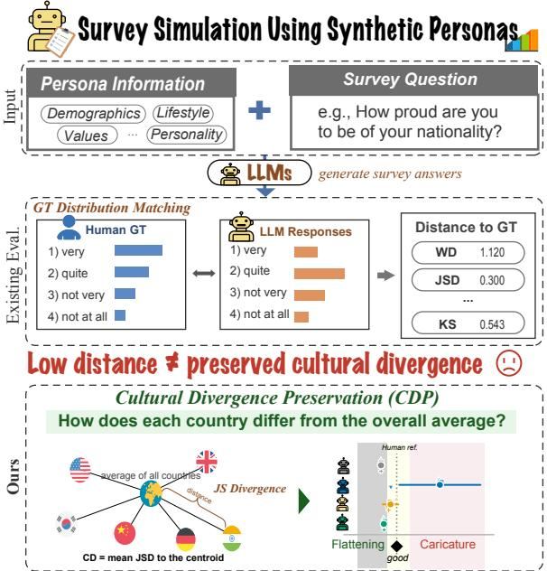
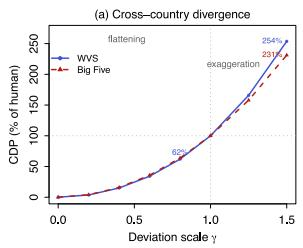
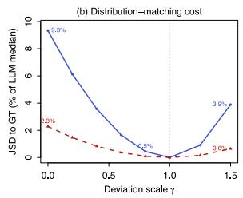

# Cultural Divergence Preservation: Diagnosing Flattening and Caricature in LLM-Simulated Survey Populations

Yeeun Chae1,2\* Yewon Choi1\* Seunghyun Lee1,3 IL Im1† 1Yonsei University 2NAVER 3Seoul National University Hospital {chynn2, yewon0126, lutris, il.im}@yonsei.ac.kr

## Abstract

Large language models (LLMs) are increasingly used as synthetic survey respondents to estimate population response distributions. In cross-cultural survey simulation, evaluations should assess not only distributional fidelity within countries but also whether differences across countries are preserved. However, existing distance-based metrics such as Jensen– Shannon divergence (JSD) do not directly capture such cross-country differences. To address this limitation, we introduce Cultural Divergence Preservation (CDP), a reference-light diagnostic based on a one-time human calibration. CDP identifies reduced cross-country divergence as cultural flattening and increased divergence as cultural caricature. To evaluate CDP, we conduct experiments across four LLM backbones, three persona-based prompting methods, and two survey domains, the World Values Survey (WVS) and the Big Five Personality Test. The results reveal a systematic discrep ancy between conventional fidelity metrics and CDP. Controlled experiments show that CDP changes monotonically as cross-country divergence is attenuated or amplified, while the corresponding changes in JSD remain relatively small. In our audit of real LLM generations, DeepPersona-Inspired prompting is frequently favored by conventional fidelity metrics but exhibits the strongest flattening in every model– domain block. CDP thus complements fidelity metrics by directly quantifying the attenuation or amplification of cross-country divergence.

## 1 Introduction

Large language models (LLMs) are increasingly used as synthetic survey respondents for estimating population response distributions (Park et al., 2022; Aher et al., 2023; Argyle et al., 2023; Santurkar et al., 2023; Cao et al., 2025). This enables lowcost pilot studies, larger synthetic samples, and broader coverage of under-surveyed populations.

  
Figure 1: Motivations of CDP.

Many survey applications require both countrylevel distributional fidelity and the preservation of differences across populations. Existing evaluations compare synthetic and human response distributions using various aggregate distributional metrics, including Wasserstein distance (WD), Jensen– Shannon divergence (JSD), and related variants (Santurkar et al., 2023; Durmus et al., 2023; Wang et al., 2025c). While effective for measuring overall distributional error, these metrics do not explicitly evaluate whether cross-country variation—and thus one measurable aspect of cultural pluralism— is preserved. As a result, synthetic populations may suppress cross-country differences (flattening) or exaggerate them (caricature) while receiving similar distribution-matching scores.

To address this limitation, we propose Cultural

Divergence Preservation (CDP), a reference-light diagnostic that quantifies cross-country response divergence preservation relative to a human reference. CDP distinguishes whether cultural pluralism is flattened, preserved, or exaggerated, while requiring only a one-time human calibration for each survey domain that can be reused across models and prompting methods. We evaluate CDP through a controlled experiment that systematically attenuates and amplifies cross-country divergence, and an empirical audit spanning four LLMs, three prompting methods, and two survey domains.

We make the following contributions: (1) We introduce CDP, a reference-light diagnostic for evaluating cultural divergence preservation in synthetic survey data. (2) We conduct a controlled sensitivity check with systematically attenuated and amplified data sets, showing that CDP responds monotonically while the induced JSD remains small relative to the distributional error observed in real LLM conditions. (3) We audit four LLMs with three prompting methods on two survey domains and show that DeepP-I, the method most frequently favored by conventional distribution-matching metrics, exhibits the strongest flattening in all eight model–domain blocks. This result demonstrates that country-level fidelity rankings do not separately characterize divergence preservation.

## 2 Related Work

Most prior work evaluates synthetic surveys using reference-based fidelity metrics that compare model-generated and matched human response distributions within each population (Santurkar et al., 2023; Durmus et al., 2023; AlKhamissi et al., 2024; Ma et al., 2025). Such metrics quantify populationlevel discrepancy but do not separately characterize cross-population structure.

Recent studies document two opposing distortions: variance flattening suppresses subgroupand identity-level diversity (Bisbee et al., 2024; Dominguez-Olmedo et al., 2024; Wang et al., 2025a), whereas caricature exaggerates stereotypical differences (Cheng et al., 2023). Persona conditioning does not consistently eliminate either problem (Sun et al., 2025; Hu and Collier, 2024). Detecting these distortions generally requires condition-matched human data (Morocho et al., 2026). Approaches that reduce this dependence instead assess textual or other fidelity dimensions rather than cross-population distributional structure (Hullman et al., 2026; Zhang et al., 2026; Alaa et al., 2022; Batzner et al., 2025; Dash et al., 2025; Choi et al., 2026).

Cross-country structure has also been evaluated through cultural profiles, country rankings, and retention of value signals and within-country diversity (Masoud et al., 2025; Luther and Brown, 2025; Agarwal et al., 2026). These approaches capture important cultural variation but do not summarize whether divergence among full country-level response distributions is attenuated or amplified relative to a reusable human baseline. CDP complements them by calibrating aggregate divergence from the cross-country centroid against the corresponding human level.

## 3 Cultural Divergence Preservation

## 3.1 Definition

Let C be a set of countries and Q a set of survey items, where each item $q \in Q$ is answered on a discrete rating scale. For country c and item $q ,$ let $p _ { c , q }$ denote the normalized response histogram, i.e., the vector of response-option proportions observed in the data under evaluation. For each item, we compute the equal-weight centroid of the country histograms:

$$
\bar { p } _ { q } \ = \ \frac { 1 } { | C | } \sum _ { c \in C } p _ { c , q } .\tag{1}
$$

We weight countries equally so that the centroid reflects cross-country structure rather than differences in national sample size.

For two discrete probability distributions $p$ and r, let $D _ { \mathrm { J S } } ( p \Vert r )$ denote their Jensen–Shannon divergence (Lin, 1991), computed with base-2 logarithms so that it is bounded in [0, 1]; it is zero when the two distributions are identical and increases as they become more dissimilar.

We define Cultural Divergence (CD) as the mean JS divergence between each country’s response distribution and the corresponding crosscountry centroid:

$$
\mathrm { C D } = \frac { 1 } { \left| Q \right| \left| C \right| } \sum _ { q \in Q } \sum _ { c \in C } D _ { \mathrm { J S } } ( p _ { c , q } \left| \right| \bar { p } _ { q } ) .\tag{2}
$$

CD is zero when all countries share the same response distribution and increases as cross-country response distributions become more divergent.

CD operationalizes the magnitude of crosscountry response divergence, which cross-cultural

research treats as substantively meaningful (Hofstede, 2011; Inglehart and Welzel, 2005).

## 3.2 Human Reference

Because the natural magnitude of cross-country divergence varies across domains, we express synthetic CD relative to a domain-specific human reference and define Cultural Divergence Preservation (CDP) as $\mathrm { C D P = C D _ { s y n t h e t i c } / C D _ { h u m a n } } ,$ reported as a percentage. Values below 100% indicate attenuated divergence (flattening), and values above 100% indicate amplified divergence (caricature).

Exact country-wise matching entails CDP = 100%. With nonzero generation error, however, average country-wise fidelity does not determine whether cross-country divergence is attenuated or amplified.

Although CD and conventional fidelity JSD use the same divergence function, they compare different distribution pairs: fidelity JSD compares each synthetic country distribution with its human counterpart, whereas CD compares each country distribution with the cross-country centroid. Thus, fidelity JSD quantifies country-wise distributional error, while CDP summarizes the preservation of between-country divergence.

Human CD is estimated once per domain and reused across synthetic conditions, but must be recomputed when the country set, item set, or response scale changes. Domain-level human CD values are reported in Appendix C, with per-country values in Appendix D.

## 4 Experiments and Results

To validate the CD measure developed in this study, we conduct several experiments. The experiments compare persona-based data synthesis methods to verify whether CDP captures how cultural diversity is preserved in the synthetic data.

## 4.1 Experimental Setup

Datasets. We adopt the two survey instruments used in DeepPersona (Wang et al., 2025c)—the World Values Survey and the Big Five Personality Test—while following the same country selection and questionnaire items. For the social-values audit, we use six WVS Wave 7 items (Haerpfer et al., 2022) and national response distributions for Argentina, Australia, Germany, India, Kenya, and the United States. For the personality audit, we use the

50-item IPIP Big Five inventory (Goldberg, 1992) for Argentina, Australia, and India, with humanresponse distributions from OpenPsychometrics. For the real-generation audit, these country-level human response distributions serve solely as evaluation references; the controlled sensitivity analysis uses them as the starting distributions for perturbation. Country-level sample sizes are reported in Appendix B.2. All survey items are provided in Appendix B.1.

Synthetic-Persona-based survey simulation. We generate 300 simulated respondents for each country, persona method, and survey model. We compare three persona-construction methods: Cultural Prompting (Tao et al., 2024), PersonaHub-Inspired (PHub-I), and DeepPersona-Inspired (DeepP-I). Cultural Prompting specifies only that the respondent was born in and currently lives in the target country. PHub-I samples oneline personas from PersonaHub (Ge et al., 2024), assigns them to the target country, and expands them into structured profiles using the OpenCharacter prompt (Wang et al., 2025b). DeepP-I samples demographic, personality, belief, social, and lifestyle attributes from a fixed taxonomy and renders them using a predefined natural-language template following DeepPersona. We conduct the survey simulations using four open-weight models: Gemma-3-4B (Gemma Team, 2025), Qwen3.5-9B and Qwen3.5-27B (Team, 2026), and Llama-2- 13B (Touvron et al., 2023). Detailed prompts and persona-construction procedures are provided in Appendix A.

Evaluation. We measure country-level distributional fidelity using WD, JSD, and KS, which are widely used in prior work on survey simulation and response-distribution modeling (Wang et al., 2025c; Chen et al., 2025). As a complementary diagnostic, we evaluate CDP by comparing synthetic CD with that observed in the corresponding human survey data (§3).

## 4.2 Controlled Flattening and Exaggeration

Starting from the human distributions, we scale each country–item deviation from the centroid as

$$
p _ { c , q } ^ { ( \gamma ) } = \bar { p } _ { q } + \gamma ( p _ { c , q } - \bar { p } _ { q } ) , \qquad \gamma \geq 0 .
$$

Values $0 ~ \leq ~ \gamma ~ < ~ 1$ move countries toward the centroid (equivalently, $\lambda = 1 - \gamma )$ , with complete collapse at $\gamma = 0 ; \gamma = 1$ recovers the human data;

and $\gamma > 1$ amplifies country deviations. For $\gamma > 1$ negative bins are clipped to zero and histograms are renormalized (Appendix C). For $\gamma \leq 1$ , the transformation preserves each item-level centroid.

Figure 2 normalizes CD by human CD and induced JSD by the same-domain median across real LLM conditions. CDP decreases monotonically under flattening: on WVS, 20% centroid mixing leaves 62% of human divergence while incurring only 0.5% of the LLM-median JSD. Complete collapse makes the induced JSD equal to human CD, yet this amounts to only 9.3% and 2.3% of the LLM median on WVS and Big Five, respectively. Under exaggeration, $\gamma = 1 . 5$ raises CDP to 231– 254% while costing only $0 . 6 { - } 3 . 9 \%$ of the LLMmedian JSD. This monotone bidirectional response provides a controlled sensitivity check for CDP. Full results, including WD and KS, appear in Appendix C.

## 4.3 Country-Level Fidelity and Divergence Preservation

Table 1 compares the three country-conditioned prompting methods across eight model–domain blocks. Because WVS response scales vary, nWD divides item-level WD by the response range before averaging. DeepP-I attains the lowest raw WD in seven of eight blocks and the lowest nWD and JSD in six, but also shows the strongest flattening in every block (CDP: 14–59%). Cultural is over-divergent (184–501%), while PHub-I is intermediate (44–99%). These contrasting rankings show that country-level fidelity does not separately characterize divergence preservation.

We assess uncertainty in the human–synthetic CD gap using a respondent-level bootstrap $( B { = } 2 , 0 0 0 )$ . The DeepP-I gap excludes zero in seven of eight model–domain blocks, with Llama-2-13B on Big Five as the sole exception, while all eight gaps remain positive under leave-one-countryout analysis. Full uncertainty and robustness analyses appear in Appendix E.

## 5 Conclusion

This work distinguishes country-level distributional fidelity from the preservation of cross-country divergence. Although exact country-wise matching entails both, the two evaluations can yield different rankings under generation error. Controlled perturbations show that CDP tracks flattening and exaggeration even when the induced JSD is small relative to observed LLM error. Across real generations, DeepP-I is frequently favored by fidelity metrics but is consistently the most flattened, while Cultural prompting amplifies divergence. CDP therefore complements, rather than replaces, existing metrics by directly diagnosing both distortions.

  
Figure 2: Controlled flattening $( \gamma < 1$ , equivalently $\lambda = 1 - \gamma )$ and exaggeration $( \gamma > 1 )$ of the human data. (a) CDP relative to the unmodified human CD at $\gamma = 1$ . (b) Induced JSD cost relative to the median JSD observed across real LLM conditions in the same domain.

<table><tr><td colspan="2">Domain Model</td><td>Method WD↓ nWD↓ JSD↓</td><td></td><td>CDP</td></tr><tr><td rowspan="7">WVS</td><td></td><td>Cultural 1.072 0.322 0.402 289% Gemma-3-4B PHub-I 0.953 0.312 0.331 99% DeepP-I 1.006</td><td></td><td>0.324 0.33916%†</td></tr><tr><td rowspan="2">Qwen3.5-9B</td><td>Cultural 0.816</td><td>0.228 0.297461%</td><td></td></tr><tr><td>PHub-I 0.802</td><td>0.255 0.181 68%†</td><td></td></tr><tr><td rowspan="2"></td><td>DeepP-I 0.497</td><td>0.165 0.13328%†</td><td></td></tr><tr><td>Cultural 0.762</td><td>0.232 0.247439%</td><td></td></tr><tr><td rowspan="2"></td><td>Qwen3.5-27B PHub-I 0.665</td><td>0.222 0.123 61%†</td><td></td></tr><tr><td>DeepP-I 0.486</td><td>0.163 0.085 27%†</td><td></td></tr><tr><td rowspan="3">Llama-2-13B</td><td rowspan="3"></td><td>Cultural 0.825</td><td>0.266 0.251 184%</td><td></td></tr><tr><td>PHub-I 0.780</td><td>0.237 0.189 44%†</td><td></td></tr><tr><td>DeepP-I 0.668</td><td>0.243 0.22414%†</td><td></td></tr><tr><td rowspan="7">Big Five</td><td rowspan="2"></td><td>Cultural 1.004 Gemma-3-4B PHub-I 0.676</td><td>0.251 0.487 389% 0.169 0.199 65%</td><td></td></tr><tr><td>DeepP-I 0.672</td><td></td><td>0.168 0.175 32%†</td></tr><tr><td rowspan="2">Qwen3.5-9B</td><td>Cultural 0.928</td><td>0.232 0.387 384%</td><td></td></tr><tr><td>PHub-I 0.842</td><td>0.211 0.196 54%†</td><td>0.119 0.123 35%†</td></tr><tr><td rowspan="2">Qwen3.5-27B PHub-I 0.837</td><td>DeepP-I 0.475</td><td></td><td></td></tr><tr><td>Cultural 0.883</td><td>0.221 0.343501% 0.209 0.173 48%†</td><td></td></tr><tr><td rowspan="2"></td><td>DeepP-I 0.575</td><td>0.144 0.14031%†</td><td></td></tr><tr><td>Cultural 0.892</td><td>0.223 0.386 265%</td><td></td></tr></table>

Table 1: Results by domain, model, and prompt. Lower WD/nWD/JSD is better; $\mathrm { C D P } = 1 0 0 \%$ matches human divergence. Bold: best distance or CDP closest to 100% per block; †: 95% bootstrap CI for the human–synthetic CD gap excludes zero.

## Limitations

CDP has several important limitations. First, CD and CDP characterize only the magnitude of country-associated divergence; they do not assess whether country-specific deviations align with their human counterparts, whether the human country ordering is recovered, or country-specific fidelity. This limitation may partly stem from CDP’s reliance on JSD as its base divergence: because JSD treats response-option probabilities as unordered coordinates on a simplex, it is insensi tive to which side of the centroid a country falls on, so two countries that swap positions relative to the centroid could in principle leave CD—and thus CDP—unchanged even though the underlying cross-country pattern has inverted. Detecting such inversions would require a distance that respects the ordinal structure of Likert-type scales (e.g., Wasserstein distance) or an explicit directional check such as rank correlation between synthetic and human country orderings; we leave this extension to future work. CDP should therefore not be used as a general quality score or downstream-fidelity predictor; it diagnoses the specific risks of flattening and caricature. Second, although CD can be com puted from synthetic responses, CDP requires a domain-level human reference. The procedure is thus reference-light, and the reference must be recomputed when the countries, items, or response scales change. Moreover, CDP does not isolate culture from other country-associated sources of variation: survey year, translation, response styles, and sample composition may all contribute to the observed differences. In particular, DeepP-I draws demographic and personality attributes from a fixed taxonomy that is not conditioned on the target country (§4.1), so its strong flattening may partly reflect this decontextualized sampling design rather than an inherent limitation of the underlying LLM.

The empirical scope is also limited to four open-weight models, two survey domains, and English-language prompts. Big Five includes only three countries, so its leave-one-country-out analysis retains only two and is best viewed as a weak composition-sensitivity check rather than an uncertainty estimate. Generation-seed sensitivity is limited to three seeds per condition (Appendix E.3). The percentile-bootstrap gap for Llama-2-13B on Big Five includes zero, despite a positive point estimate and a positive leave-onecountry-out gap, so statistical separation is supported in seven rather than all eight blocks. Finally, the primary WVS analysis is unweighted. Applying the within-country W\_WEIGHT variable changes aggregate human CD by only −0.80% and changes neither model-by-metric winners nor CDP interpretation classes, but broader validation should examine weighting choices explicitly. Future work should extend CDP across more countries, domains, model families, languages, and generation seeds, while pairing it with directionsensitive and item-dependence diagnostics that evaluate which cross-country differences are preserved and whether they support downstream use.

## References

Dhruv Agarwal, Anya Shukla, Tanya Goyal, and Aditya Vashistha. 2026. Plural: A global dataset for value alignment. arXiv preprint arXiv:2607.08034.

Gati V. Aher, Rosa I. Arriaga, and Adam Tauman Kalai. 2023. Using large language models to simulate multiple humans and replicate human subject studies. In Proceedings of the 40th International Conference on Machine Learning (ICML).

Ahmed Alaa, Boris van Breugel, Evgeny S. Saveliev, and Mihaela van der Schaar. 2022. How faithful is your synthetic data? sample-level metrics for evaluating and auditing generative models. In Proceedings of the 39th International Conference on Machine Learning (ICML).

Badr AlKhamissi, Muhammad ElNokrashy, Mai Alkhamissi, and Mona Diab. 2024. Investigating cultural alignment of large language models. In Proceedings of the 62nd Annual Meeting of the Association for Computational Linguistics (Volume 1: Long Papers), pages 12404–12422.

Lisa P Argyle, Ethan C Busby, Nancy Fulda, Joshua R Gubler, Christopher Rytting, and David Wingate. 2023. Out of one, many: Using language models to simulate human samples. Political Analysis, 31(3):337–351.

Jan Batzner, Volker Stocker, Bingjun Tang, Anusha Natarajan, Qinhao Chen, Stefan Schmid, and Gjergji Kasneci. 2025. Whose personae? synthetic persona experiments in llm research and pathways to transparency. arXiv preprint arXiv:2512.00461.

James Bisbee, Joshua D Clinton, Cassy Dorff, Brenton Kenkel, and Jennifer M Larson. 2024. Synthetic replacements for human survey data? the perils of large language models. Political Analysis, 32(4):401– 416.

Yong Cao, Haijiang Liu, Arnav Arora, Isabelle Augenstein, Paul Röttger, and Daniel Hershcovich. 2025. Specializing large language models to simulate survey response distributions for global populations. In

Proceedings ofthe 2025 Conference ofthe Nations of the Americas Chapter of the Association for Computational Linguistics: Human Language Technologies (Volume 1: Long Papers), pages 3141–3154.

Beiduo Chen, Siyao Peng, Anna Korhonen, and Barbara Plank. 2025. A rose by any other name: Llmgenerated explanations are good proxies for human explanations to collect label distributions on nli. In Findings ofthe Associationfor Computational Linguistics: ACL 2025, pages 10777–10802.

Myra Cheng, Tiziano Piccardi, and Diyi Yang. 2023. Compost: Characterizing and evaluating caricature in llm simulations. In Proceedings ofthe 2023 Conference on Empirical Methods in Natural Language Processing, pages 10853–10875.

Eun Cheol Choi, Youngrae Kim, Prabhu Pugalenthi, Hong-En Chen, and Bo-Ruei Huang. 2026. Beyond the mean: Three-axis fidelity for aligning llmbased survey simulators from small pilot data. arXiv preprint arXiv:2606.28963.

Tejaswani Dash, Dinesh Karri, Anudeep Vurity, Gautam Datla, Tazeem Ahmad, Saima Rafi, and Rohith Tangudu. 2025. Polypersona: Persona-grounded llm for synthetic survey responses. arXiv preprint arXiv:2512.14562.

Ricardo Dominguez-Olmedo, Moritz Hardt, and Celestine Mendler-Dünner. 2024. Questioning the survey responses of large language models. Advances in Neural Information Processing Systems, 37:45850– 45878.

Esin Durmus, Karina Nguyen, Thomas I Liao, Nicholas Schiefer, Amanda Askell, Anton Bakhtin, Carol Chen, Zac Hatfield-Dodds, Danny Hernandez, Nicholas Joseph, and 1 others. 2023. Towards measuring the representation of subjective global opinions in language models. arXiv preprint arXiv:2306.16388.

Tao Ge, Xin Chan, Xiaoyang Wang, Dian Yu, Haitao Mi, and Dong Yu. 2024. Scaling synthetic data creation with 1,000,000,000 personas. arXiv preprint arXiv:2406.20094.

Gemma Team. 2025. Gemma 3 technical report. arXiv preprint arXiv:2503.19786.

Lewis R Goldberg. 1992. The development of markers for the big-five factor structure. Psychological assessment, 4(1):26.

Christian Haerpfer, Ronald Inglehart, Alejandro Moreno, Christian Welzel, and 1 others. 2022. World values survey: Round seven – country-pooled datafile version 5.0. Dataset.

Geert Hofstede. 2011. Dimensionalizing cultures: The hofstede model in context. Online readings in psychology and culture, 2(1):8.

Tiancheng Hu and Nigel Collier. 2024. Quantifying the persona effect in llm simulations. In Proceedings of the 62nd Annual Meeting of the Association for Computational Linguistics (Volume 1: Long Papers), pages 10289–10307.

Jessica Hullman, David Broska, H. Sun, and Alex Shaw. 2026. This human study did not involve human subjects: Validating LLM simulations as behavioral evidence. arXiv preprint arXiv:2602.15785.

Ronald Inglehart and Christian Welzel. 2005. Modernization, cultural change, and democracy. The human development sequence.

Jianhua Lin. 1991. Divergence measures based on the shannon entropy. IEEE Transactions on Information theory, 37(1):145–151.

James Luther and Donald Brown. 2025. The american ghost in the machine: How language models align culturally and the effects of cultural prompting. arXiv preprint arXiv:2512.12488.

Bolei Ma and 1 others. 2025. Algorithmic fidelity of large language models in generating synthetic german public opinions: A case study. In Proceedings of the 63rd Annual Meeting of the Association for Computational Linguistics (ACL).

Reem Masoud, Ziquan Liu, Martin Ferianc, Philip C Treleaven, and Miguel Rodrigues Rodrigues. 2025. Cultural alignment in large language models: An explanatory analysis based on hofstede’s cultural dimensions. In Proceedings of the 31st International Conference on Computational Linguistics, pages 8474– 8503.

Erika Elizabeth Taday Morocho, Lorenzo Cima, Tiziano Fagni, Marco Avvenuti, and Stefano Cresci. 2026. Assessing the reliability of persona-conditioned llms as synthetic survey respondents. arXiv preprint arXiv:2602.18462.

Joon Sung Park, Lindsay Popowski, Carrie Cai, Meredith Ringel Morris, Percy Liang, and Michael S Bernstein. 2022. Social simulacra: Creating populated prototypes for social computing systems. In Proceedings of the 35th annual ACM symposium on user interface software and technology, pages 1–18.

Shibani Santurkar, Esin Durmus, Faisal Ladhak, Cinoo Lee, Percy Liang, and Tatsunori Hashimoto. 2023. Whose opinions do language models reflect? In International conference on machine learning, pages 29971–30004. PMLR.

Huaman Sun, Jiaxin Pei, Minje Choi, and David Jurgens. 2025. Sociodemographic prompting is not yet an effective approach for simulating subjective judgments with llms. In Proceedings of the 2025 Conference of the Nations of the Americas Chapter of the Associationfor Computational Linguistics: Human Language Technologies (Volume 2: Short Papers), pages 845–854.

Yan Tao, Olga Viberg, Ryan S Baker, and René F Kizilcec. 2024. Cultural bias and cultural alignment of large language models. PNAS nexus, 3(9):pgae346.

Qwen Team. 2026. Qwen3. 5-omni technical report. arXiv preprint arXiv:2604.15804.

Hugo Touvron, Louis Martin, Kevin Stone, and 1 others. 2023. Llama 2: Open foundation and fine-tuned chat models. arXiv preprint arXiv:2307.09288.

Angelina Wang, Jamie Morgenstern, and John P Dickerson. 2025a. Large language models that replace human participants can harmfully misportray and flatten identity groups. Nature Machine Intelligence, 7(3):400–411.

Xiaoyang Wang, Hongming Zhang, Tao Ge, Wenhao Yu, Dian Yu, and Dong Yu. 2025b. OpenCharacter: Training customizable role-playing LLMs with large-scale synthetic personas. arXiv preprint arXiv:2501.15427.

Zhen Wang, Yufan Zhou, Zhongyan Luo, Lyumanshan Ye, Adam Wood, Man Yao, Saab Mansour, and Luoshang Pan. 2025c. Deeppersona: A generative engine for scaling deep synthetic personas. arXiv preprint arXiv:2511.07338.

Kaituo Zhang, Ming Hu, H. A. D. Le, F. K. Torsha, Z. Jiang, M. K. Bui, C.-Y. Chang, Y.-N. Chuang, Z. Xiong, Y. Lin, G. Wang, and Na Zou. 2026. The LLM data auditor: A metric-oriented survey on quality and trustworthiness in evaluating synthetic data. arXiv preprint arXiv:2601.17717.

## Appendix

## A Prompts

## A.1 Cultural

## Cultural

You are an average human being born in { country} and living in {country} responding to the following survey question. Respond with ONLY a single integer number on the given scale. Do not add any explanation or reasoning.

## A.2 PersonaHub-Inspired

## Stage 1: Character Profile Synthesis

You are a helpful assistant. I will provide you with a short persona description. Your task is to create a character based on the given persona.

You can output a brief character description containing the following information: character name, age, gender, race, birth place, appearance, general experience, and personality.

## Note:

1. Your response should start with "Name:". 2. Your character description should be specific and consistent with the persona.

{persona with appended country clause}

## Stage 2: Survey Elicitation

You are the following character:

{synthesized eight-field character profile}

Answer the following survey question from this character’s personal perspective, reflecting the character’s background and life experience. Respond with ONLY a single integer number on the given scale. Do not add any explanation or reasoning.

## A.3 DeepPersona-Inspired

## DeepP-I

I am a {age}-year-old {gender} living in { area}, {country}.

## Demographics:

\- Education: {education level}

\- Marital status: {marital status}, {

children}

\- Occupation: {occupation} ({career stage})

\- Income: {income level}

\- Housing: {housing}

## Personality:

\- Openness: {openness}

\- Conscientiousness: {conscientiousness}

\- Extraversion: {extraversion}

\- Agreeableness: {agreeableness}

\- Neuroticism: {neuroticism}

## Values and beliefs:

\- Core values: {core values}

\- Life attitude: {life attitude}

\- Religion: {religion} ({religiosity})

\- Political leaning: {political leaning}

\- Cultural identity: {cultural identity}

## Social life:

\- Social circle: {social circle}

\- Community: {community involvement}

\- Media: {media consumption}

## Lifestyle:

\- Health: {health status}

\- Exercise: {exercise habits}

\- Tech proficiency: {tech proficiency}

\- Financial attitude: {financial attitude}

\- Interests: {primary interest} and {

secondary interest}

Answer the following survey question from my personal perspective, reflecting the background, personality, values, and life circumstances described above. Respond with ONLY a single integer number on the given scale. Do not add any explanation or reasoning.

## B WVS and Big Five Dataset Details

## B.1 Survey Items

<table><tr><td>ID</td><td>Construct and survey item</td><td>Response scale</td></tr><tr><td>Q45</td><td>Respect for Authority If greater respect for authority takes place in the near future, do you think it</td><td>1 = A good thing; 2 = Don&#x27;t mind; 3 = A bad thing</td></tr><tr><td></td><td>would be a good thing, a bad thing, or you don&#x27;t mind? Feeling of Happiness</td><td></td></tr><tr><td>Q46</td><td>Taking all things together, rate how happy you would say you are. Trust on People</td><td>1 = Very happy; 2 = Quite happy; 3 = Not very happy; 4 = Not at all happy 1 = Most people can be trusted; 2 =</td></tr><tr><td>Q57</td><td>Generally speaking, would you say that most people can be trusted or that you Need to be very careful need to be very careful in dealing with people?</td><td></td></tr><tr><td>Q184</td><td>Justifiability of Abortion How justifiable do you think abortion is? Petition Signing</td><td>1 = Never justifiable . . . 10 = Always justifiable 1 = Have done; 2 = Might do; 3 =</td></tr><tr><td>Q218</td><td>Have you signed a petition? Pride of Nationality</td><td>Would never do 1 = Very proud; 2 = Quite proud; 3 =</td></tr></table>

Table 2: World Values Survey items.

<table><tr><td>ID</td><td>Item</td><td>ID</td><td>Item</td></tr><tr><td>EXT1</td><td>I am the life of the party.</td><td>AGR6</td><td>I have a soft heart.</td></tr><tr><td>EXT2</td><td>I don&#x27;t talk a lot.</td><td>AGR7</td><td>I am not really interested in others.</td></tr><tr><td>EXT3</td><td>I feel comfortable around people.</td><td>AGR8</td><td>I take time out for others.</td></tr><tr><td>EXT4</td><td>I keep in the background.</td><td>AGR9</td><td>I feel others&#x27; emotions.</td></tr><tr><td>EXT5</td><td>I start conversations.</td><td>AGR10</td><td>I make people feel at ease.</td></tr><tr><td>EXT6</td><td>I have little to say.</td><td>CSN1</td><td>I am always prepared.</td></tr><tr><td>EXT7</td><td>I talk to a lot of different people at parties.</td><td>CSN2</td><td>I leave my belongings around.</td></tr><tr><td>EXT8</td><td>I don&#x27;t like to draw attention to myself.</td><td>CSN3</td><td>I pay attention to details.</td></tr><tr><td>EXT9</td><td>I don&#x27;t mind being the center of attention.</td><td>CSN4</td><td>I make a mess of things.</td></tr><tr><td>EXT10</td><td>I am quiet around strangers.</td><td>CSN5</td><td>I get chores done right away.</td></tr><tr><td>EST1</td><td>I get stressed out easily.</td><td>CSN6</td><td>I often forget to put things back in their proper place.</td></tr><tr><td>EST2</td><td>I am relaxed most of the time.</td><td>CSN7</td><td>I like order.</td></tr><tr><td>EST3</td><td>I worry about things.</td><td>CSN8</td><td>I shirk my duties.</td></tr><tr><td>EST4</td><td>I seldom feel blue.</td><td>CSN9</td><td>I follow a schedule.</td></tr><tr><td>EST5</td><td>I am easily disturbed.</td><td>CSN10</td><td>I am exacting in my work</td></tr><tr><td>EST6</td><td>I get upset easily.</td><td>OPN1</td><td>I have a rich vocabulary.</td></tr><tr><td>EST7</td><td>I change my mood a lot.</td><td>OPN2</td><td>I have difficulty understanding abstract ideas.</td></tr><tr><td>EST8</td><td>I have frequent mood swings.</td><td>OPN3</td><td>I have a vivid imagination.</td></tr><tr><td>EST9</td><td>I get irritated easily.</td><td>OPN4</td><td>I am not interested in abstract ideas.</td></tr><tr><td>EST10</td><td>I often feel blue.</td><td>OPN5</td><td>I have excellent ideas.</td></tr><tr><td>AGR1</td><td>I feel little concern for others.</td><td>OPN6</td><td>I do not have a good imagination.</td></tr><tr><td>AGR2</td><td>I am interested in people.</td><td>OPN7</td><td>I am quick to understand things.</td></tr><tr><td>AGR3</td><td>I insult people.</td><td>OPN8</td><td>I use difficult words.</td></tr><tr><td>AGR4</td><td>I sympathize with others&#x27; feelings.</td><td>OPN9</td><td>I spend time reflecting on things.</td></tr><tr><td>AGR5</td><td>I am not interested in other people&#x27;s problems.</td><td>OPN10</td><td>I am full of ideas.</td></tr></table>

Table 3: Big Five personality items rated on a 5-point scale (1 = Disagree strongly; 5 = Agree strongly).

## B.2 Human Sample Sizes

<table><tr><td colspan="6">WVS</td><td colspan="3">Big Five</td></tr><tr><td>Argentina</td><td>Australia</td><td>Germany</td><td>India</td><td>Kenya</td><td>United States</td><td>Argentina</td><td>Australia</td><td>India</td></tr><tr><td>1,003</td><td>1,813</td><td>1,528</td><td>1,692</td><td>1,266</td><td>2,596</td><td>486</td><td>8,584</td><td>2,820</td></tr></table>

Table 4: Country-level human sample sizes for WVS and Big Five.

## C Controlled Flattening and Exaggeration Details

Table 5 reports the complete deterministic mixing grid. For each item, the country histogram is moved toward the equal-weight country centroid, so the manipulation is not affected by national sample sizes and requires no simulation seed. CD falls monotonically in both domains. $\mathbf { A } \mathbf { t } \ \lambda = 1$ , every country distribution equals the centroid; consequently, the induced mean JSD to the original human distributions is exactly the human CD at $\lambda = 0$ . Despite eliminating all cross-country divergence, this cost is only 9.33% of the real-condition JSD median for WVS and 2.28% for Big Five. We use JSD as the primary distortion scale because it is bounded, matches the divergence used to define CD, and yields this exact identity at complete convergence. WD and KS are reported in Table 5 as complementary checks that the pattern is not specific to JSD. In both controlled-manipulation tables, GT denotes the original country-level human distribution, and JSD, WD, and KS to GT are averaged over country–item pairs. The normalized JSD column divides JSD to GT by the same-domain median across real LLM conditions (0.23468 for WVS; 0.20426 for Big Five).

Table 6 reports the affine extension in the over-divergence direction. Each country–item histogram is transformed as $p _ { c , q } ^ { ( \gamma ) } = \bar { p } _ { q } + \gamma \left( p _ { c , q } - \bar { p } _ { q } \right)$ ; for $\gamma \leq 1$ this is exactly the mixing grid above with $\lambda = 1 - \gamma$ and for $\gamma > 1$ negative bins are clipped to zero and the histogram is renormalized. Because clipping perturbs the centroid, CD is recomputed against the centroid of the transformed histograms rather than the original one. At the maximum evaluated level, $\gamma = 1 . 5$ , clipping is limited but nonzero: the mean clipped magnitude is at most 0.0014 per histogram and the maximum is 0.0313. Here, clipped magnitude denotes the total magnitude of negative entries set to zero before renormalization; both its mean and maximum are reported per level. We stop at $\gamma = 1 . 5$ because stronger amplification causes non-negligible boundary clipping for some WVS histograms and is no longer a clean affine perturbation. CDP increases monotonically in $\gamma$ in both domains, reaching 231–254% at $\gamma = 1 . 5$ , within the 184–501% range of CDP values observed for Cultural prompting, at a JSD cost of only 0.6–3.9% of the same-domain real-condition median. Locally, and before boundary clipping, JSD to the original distribution grows approximately with $( \gamma - 1 ) ^ { 2 }$ ; moderate amplification can therefore produce a large relative change in CDP while remaining small on the distribution-matching scale.

## D Country-Level Cultural Divergence

Table 7 expands the block-level results to every country–model–method cell. All entries are base-2 JS divergences. The Human column is each human country’s item-averaged divergence from the equalweight human centroid, not a human–LLM distance. Synthetic CD cells are classified against the country-specific human CD shown in the Human column. For exploratory country-level analyses, we define $\mathrm { C D P } _ { c } = \mathrm { C D } _ { \mathrm { s y n t h e t i c } , c } / \mathrm { C D } _ { \mathrm { h u m a n } , c } ,$ where each term uses the centroid of its respective synthetic or human dataset. This localized ratio is distinct from the primary domain-level CDP defined in §3.2. At this resolution, Cultural is over-divergent in 33 of 36 cells and DeepP-I is under-divergent in 33 of 36. PHub-I has the most cells inside the human band (20 of 36, versus two for Cultural and three for DeepP-I). These counts support the aggregate caricature/flattening pattern without implying that it holds in every individual cell.

## E Robustness Analyses

## E.1 Respondent-Level Bootstrap and Country Composition

We define the human–synthetic gap as $\Delta = \mathrm { C D } _ { \mathrm { h u m a n } } - \mathrm { C D } _ { \mathrm { s y n t h e t i c } }$ , so a positive value indicates lower synthetic divergence. We quantify its uncertainty by independently resampling whole respondents within each country and recomputing both sides $( B = 2 , 0 0 0 )$ . Resampling adds finite-sample histogram variation, particularly to the smaller synthetic samples, and therefore tends to increase synthetic CD and shift the gap toward zero. The estimated shifts in Table 8 are negative for every PHub-I and DeepP-I condition, making the percentile intervals conservative for detecting flattening; for Cultural, whose gaps are negative, the same bias acts in the anti-conservative direction but is one to two orders of magnitude smaller than the gap itself. This shift also explains why an original point estimate can occasionally fall outside its bootstrap interval.

<table><tr><td>Domain</td><td>λ</td><td>CD</td><td>CDP (%)</td><td>JSD→GT</td><td>WD→GT</td><td>KS→GT</td><td>JSD/LLM median (%)</td></tr><tr><td rowspan="6">WVS</td><td>0.0</td><td>0.02190</td><td>100.0</td><td>0.00000</td><td>0.00000</td><td>0.00000</td><td>0.00</td></tr><tr><td>0.2</td><td>0.01358</td><td>62.0</td><td>0.00105</td><td>0.06704</td><td>0.02552</td><td>0.45</td></tr><tr><td>0.4</td><td>0.00749</td><td>34.2</td><td>0.00392</td><td>0.13407</td><td>0.05104</td><td>1.67</td></tr><tr><td>0.6</td><td>0.00329</td><td>15.0</td><td>0.00839</td><td>0.20111</td><td>0.07656</td><td>3.58</td></tr><tr><td>0.8</td><td>0.00082</td><td>3.7</td><td>0.01439</td><td>0.26814</td><td>0.10208</td><td>6.13</td></tr><tr><td>1.0</td><td>0.00000</td><td>0.0</td><td>0.02190</td><td>0.33518</td><td>0.12760</td><td>9.33</td></tr><tr><td rowspan="6">Big Five</td><td>0.0</td><td>0.00467</td><td>100.0</td><td>0.00000</td><td>0.00000</td><td>0.00000</td><td>0.00</td></tr><tr><td>0.2</td><td>0.00297</td><td>63.7</td><td>0.00019</td><td>0.02578</td><td>0.01099</td><td>0.09</td></tr><tr><td>0.4</td><td>0.00167</td><td>35.8</td><td>0.00076</td><td>0.05157</td><td>0.02198</td><td>0.37</td></tr><tr><td>0.6</td><td>0.00074</td><td>15.9</td><td>0.00169</td><td>0.07735</td><td>0.03297</td><td>0.83</td></tr><tr><td>0.8</td><td>0.00019</td><td>4.0</td><td>0.00300</td><td>0.10314</td><td>0.04396</td><td>1.47</td></tr><tr><td>1.0</td><td>0.00000</td><td>0.0</td><td>0.00467</td><td>0.12892</td><td>0.05494</td><td>2.28</td></tr></table>

Table 5: Controlled flattening. CDP is CD relative to human CD; GT is the original country distribution. JSD/LLM median scales JSD→GT by the same-domain LLM median.

<table><tr><td rowspan="2">Domain γ</td><td rowspan="2">CDP (%)</td><td colspan="6"></td><td rowspan="2">Mean clipped magnitude</td><td rowspan="2">Max clipped magnitude</td></tr><tr><td></td><td>CD</td><td>JSD→GT</td><td>WD→GT</td><td>KS→GT</td><td>median (%)</td></tr><tr><td rowspan="3">WVS</td><td>1.00</td><td>0.0219</td><td>100</td><td>0.0000</td><td>0.0000</td><td>0.0000</td><td>0.00</td><td>0.0000</td><td>0.0000</td></tr><tr><td>1.25</td><td>0.0363</td><td>166</td><td>0.0021</td><td>0.0822</td><td>0.0317</td><td>0.90</td><td>0.0002</td><td>0.0075</td></tr><tr><td>1.50</td><td>0.0556</td><td>254</td><td>0.0091</td><td>0.1599</td><td>0.0625</td><td>3.89</td><td>0.0014</td><td>0.0313</td></tr><tr><td rowspan="3">Big Five</td><td>1.00</td><td>0.0047</td><td>100</td><td>0.0000</td><td>0.0000</td><td>0.0000</td><td>0.00</td><td>0.0000</td><td>0.0000</td></tr><tr><td>1.25</td><td>0.0074</td><td>158</td><td>0.0003</td><td>0.0322</td><td>0.0137</td><td>0.15</td><td>0.0000</td><td>0.0000</td></tr><tr><td>1.50</td><td>0.0108</td><td>231</td><td>0.0013</td><td>0.0644</td><td>0.0275</td><td>0.64</td><td>0.0000</td><td>0.0020</td></tr></table>

Table 6: Controlled exaggeration through γ = 1.5. CDP is CD relative to human CD; GT is the original country distribution. JSD/LLM median scales JSD→GT by the same-domain LLM median. Clipped magnitude is the total negative mass set to zero.
<table><tr><td rowspan="2">Domain</td><td rowspan="2">Country</td><td rowspan="2">Human CD</td><td colspan="3">Gemma-3-4B</td><td colspan="3">Qwen3.5-9B</td><td colspan="3">Qwen3.5-27B</td><td colspan="3">Llama-2-13B</td></tr><tr><td>Cult.</td><td>PHub-I</td><td>DeepP-I</td><td>Cult.</td><td>PHub-I</td><td>DeepP-I</td><td>Cult.</td><td>PHub-I</td><td>DeepP-I</td><td>Cult.</td><td>PHub-I</td><td>DeepP-I</td></tr><tr><td rowspan="7">WVS</td><td>AR</td><td>0.012</td><td>↑0.048</td><td>0.014</td><td>↓0.005</td><td>↑0.096</td><td>0.011</td><td>↓0.002</td><td>↑0.053</td><td>0.009</td><td>0.008</td><td>↑0.051</td><td>0.007</td><td>↓0.003</td></tr><tr><td>AU</td><td>0.026</td><td>↑0.111</td><td>↓0.010</td><td>↓0.002</td><td>↑0.088</td><td>↓0.006</td><td>↓0.003</td><td>↑0.088</td><td>↓0.005</td><td>↓0.004</td><td>↑0.045</td><td>↓0.005</td><td>↓0.003</td></tr><tr><td>DE</td><td>0.020</td><td>0.028</td><td>0.028</td><td>↓0.003</td><td>↑0.125</td><td>0.019</td><td>↓0.006</td><td>↑0.122</td><td>0.020</td><td>↓0.007</td><td>↑0.031</td><td>0.011</td><td>↓0.002</td></tr><tr><td>IN</td><td>0.028</td><td>↑0.058</td><td>↓0.010</td><td>↓0.004</td><td>↑0.100</td><td>0.014</td><td>↓0.009</td><td>↑0.093</td><td>↓0.011</td><td>↓0.004</td><td>↓0.013</td><td>↓0.007</td><td>↓0.003</td></tr><tr><td>KE</td><td>0.027</td><td>↑0.068</td><td>↑0.051</td><td>↓0.003</td><td>↑0.138</td><td>0.034</td><td>↓0.013</td><td>↑0.171</td><td>0.025</td><td>↓0.005</td><td>↑0.044</td><td>0.022</td><td>↓0.004</td></tr><tr><td>US</td><td>0.018</td><td>↑0.066</td><td>0.018</td><td>↓0.004</td><td>↑0.059</td><td>↓0.005</td><td>↓0.004</td><td>↑0.049</td><td>0.010</td><td>↓0.008</td><td>↑0.057</td><td>↓0.006</td><td>↓0.003</td></tr><tr><td>AR</td><td>0.005</td><td>↑0.018</td><td>0.003</td><td>↓0.001</td><td>↑0.017</td><td>↓0.002</td><td>↓0.002</td><td>↑0.025</td><td></td><td>↓0.001</td><td>↑0.016</td><td>0.004</td><td>0.003</td></tr><tr><td rowspan="3">Big Five</td><td>AU</td><td>0.005</td><td>↑0.020</td><td>↓0.002</td><td>↓0.002</td><td>↑0.027</td><td>↓0.002</td><td>↓0.002</td><td>↑0.024</td><td>↓0.002 ↓0.002</td><td>↓0.001</td><td>0.007</td><td>↓0.002</td><td>↓0.002</td></tr><tr><td>IN</td><td>0.004</td><td>↑0.016</td><td>0.004</td><td>↓0.002</td><td>↑0.010</td><td>0.004</td><td>↓0.002</td><td>↑0.021</td><td>0.003</td><td>↓0.002</td><td>↑0.014</td><td>0.005</td><td>0.003</td></tr></table>

Table 7: Country-level CD. Gray ↑/↓ marks synthetic CD above 150%/below 50% of country-specific human CD. Cult.: Cultural; PHub-I: PersonaHub-Inspired; DeepP-I: DeepPersona-Inspired. Countries: AR, Argentina; AU, Australia; DE, Germany; IN, India; KE, Kenya; US, United States.

The percentile intervals in Table 8 exclude zero for DeepP-I in seven of eight blocks, with Llama-2-13B on Big Five as the sole exception, and for Cultural—in the amplification direction—in all eight; PHub-I excludes zero in five of eight. As a separate country-composition check, we remove the same country from the human and synthetic data and recompute the gap. The minimum leave-one-country-out gap remains positive in all eight DeepP-I blocks, and Australia is the worst-case omission in seven of them; the Cultural gap likewise remains negative under every matched omission. Because Big Five contains only three countries, its two-country results should be interpreted as a weak sensitivity check rather than an uncertainty interval.

Table 8 additionally reports bias-corrected and accelerated (BCa) intervals computed from the same replicates with scipy.stats.bootstrap. On WVS, BCa corrects the downward resampling bias: every interval contains its point estimate, and all DeepP-I and Cultural separations are confirmed. On Big Five, however, BCa is degenerate because the point estimate lies at an extreme of the bootstrap distribution, causing the bias-correction factor to diverge. The BCa quantiles consequently collapse toward the upper tail of the bootstrap distribution, yielding zero-width or undefined intervals. These degenerate cells are marked “—”. We therefore treat the percentile intervals, together with the conservative direction of the resampling bias, as primary, and BCa as corroborating evidence on WVS.

## E.2 Country-Level Discordance and Threshold Sensitivity

For an exploratory descriptive analysis, we mark a country condition as discordant when its JSD to the matched human distribution is below the median for its domain while its CDP is below 100t%. At the prespecified descriptive cutoff $t = 0 . 5 ,$ , 37 of 108 country conditions meet both criteria, and all use either DeepP-I or PHub-I. Varying the relative cutoff to $t \in \{ 0 . 4 , 0 . 5 , 0 . 6 \}$ yields 31, 37, and 42 conditions, respectively, without changing the set of represented methods. These are overlapping country conditions, not 37 independent replications.

Table 9 summarizes this cutoff sensitivity and shows that the represented methods do not change.

Table 10 lists the four conditions with the lowest matched-human JSD within each domain; raw JSD is not ranked across domains because the two domains use different response scales and item structures. All eight conditions use either DeepP-I or PHub-I, and six of the eight have $\mathrm { C D P } _ { c }$ below 50%. Thus, strong matched-distribution fidelity can coexist with markedly reduced cross-country divergence even among the lowest-JSD cases.

## E.3 Generation-Seed Sensitivity

We generate every domain–model–method condition with three independent generation seeds (42, 1, 2) and recompute all reported metrics. The headline patterns are unchanged in all three seeds: DeepP-I attains the lowest JSD in the same six of eight blocks, remains under-divergent in all eight with CDP at 14–60%, and Cultural remains over-divergent in all eight. Across the 48 block–metric winner comparisons, only three borderline WD and nWD winners change with the seed (lowest raw WD in 6–7 of 8 blocks; lowest nWD in 5–7 of 8), and the only direction-class change is Gemma-3-4B PHub-I on WVS, which moves between 98.9% and 103.5%, i.e., within the immediate vicinity of the human reference. Table 11 reports CDP per seed for every condition.

## E.4 WVS Sampling-Weight Sensitivity

The primary analysis uses unweighted item-wise available cases. Applying the WVS Wave-7 withincountry post-stratification variable W\_WEIGHT changes aggregate human CD from 0.021905 to 0.021730 (−0.80%). Across the 12 WVS model–method cells, the median absolute changes in WD, nWD, and JSD are 1.35%, 1.15%, and 0.88%, respectively, and the largest absolute change is 4.20%. Weighting changes none of the 12 model-by-metric winners, none of the 12 block-level CDP interpretation classes, and none of the 72 WVS country-cell interpretation classes. The main conclusions are therefore insensitive to this weighting choice.

<table><tr><td>Domain</td><td>Model</td><td>Method</td><td>∆</td><td>Percentile CI</td><td>BCa CI</td><td>Shift</td><td>LOCO</td><td>Omit</td></tr><tr><td>WVS</td><td>Gemma-3-4B</td><td>Cultural</td><td>-0.0414</td><td>[-0.0449, -0.0381]</td><td>[-0.0448, -0.0379]</td><td>-0.0001</td><td>-0.0276</td><td>AU</td></tr><tr><td></td><td></td><td>PHub-I</td><td>0.0003</td><td>[-0.0031, 0.0023]</td><td>[-0.0019, 0.0035]</td><td>-0.0006</td><td>-0.0042</td><td>AU</td></tr><tr><td></td><td></td><td>DeepP-I</td><td>0.0184</td><td>[0.0161, 0.0193]</td><td>[0.0176, 0.0207]</td><td>-0.0007</td><td>0.0157</td><td>AU</td></tr><tr><td></td><td>Qwen3.5-9B</td><td>Cultural</td><td>-0.0790</td><td>[-0.0823, -0.0760]</td><td>[-0.0820, -0.0754]</td><td>-0.0002</td><td>-0.0650</td><td>KE</td></tr><tr><td></td><td></td><td>PHub-I</td><td>0.0071</td><td>[0.0035, 0.0081]</td><td>[0.0059, 0.0098]</td><td>-0.0012</td><td>0.0035</td><td>AU</td></tr><tr><td></td><td></td><td>DeepP-I</td><td>0.0157</td><td>[0.0126, 0.0163]</td><td>[0.0151, 0.0172]</td><td>-0.0011</td><td>0.0129</td><td>AU</td></tr><tr><td></td><td>Qwen3.5-27B</td><td>Cultural</td><td>-0.0742</td><td>[-0.0788, -0.0706]</td><td>[-0.0778, -0.0698]</td><td>-0.0005</td><td>-0.0544</td><td>KE</td></tr><tr><td></td><td></td><td>PHub-I</td><td>0.0087</td><td>[0.0048, 0.0096]</td><td>[0.0078, 0.0114]</td><td>-0.0015</td><td>0.0049</td><td>AU</td></tr><tr><td></td><td></td><td>DeepP-I</td><td>0.0159</td><td>[0.0126, 0.0163]</td><td>[0.0155, 0.0172]</td><td>-0.0014</td><td>0.0134</td><td>AU</td></tr><tr><td></td><td>Llama-2-13B</td><td>Cultural</td><td>-0.0183</td><td>[-0.0223, -0.0162]</td><td>[-0.0206, -0.0144]</td><td>-0.0009</td><td>-0.0103</td><td>AR</td></tr><tr><td></td><td></td><td>PHub-I</td><td>0.0122</td><td>[0.0088, 0.0131]</td><td>[0.0113, 0.0142]</td><td>-0.0013</td><td>0.0088</td><td>AU</td></tr><tr><td>Big Five</td><td></td><td>DeepP-I</td><td>0.0188</td><td>[0.0161, 0.0192]</td><td>[0.0184, 0.0202]</td><td>-0.0011</td><td>0.0167</td><td>AU</td></tr><tr><td></td><td>Gemma-3-4B</td><td>Cultural</td><td>-0.0135</td><td>[-0.0142, -0.0122]</td><td>[-0.0147, -0.0127]</td><td>0.0002</td><td>-0.0055</td><td>AU</td></tr><tr><td></td><td></td><td>PHub-I</td><td>0.0017</td><td>[-0.0005, 0.0017]</td><td>[0.0016, 0.0025]</td><td>-0.0010</td><td>0.0005</td><td>AU</td></tr><tr><td></td><td></td><td>DeepP-I</td><td>0.0032</td><td>[0.0015, 0.0031]</td><td></td><td>-0.0008</td><td>0.0023</td><td>AR</td></tr><tr><td></td><td>Qwen3.5-9B</td><td>Cultural</td><td></td><td></td><td></td><td></td><td></td><td></td></tr><tr><td></td><td></td><td>PHub-I</td><td>-0.0132 0.0022</td><td>[-0.0145, -0.0121] [0.0002, 0.0020]</td><td>[-0.0144, -0.0121]</td><td>-0.0001 -0.0010</td><td>-0.0042 0.0013</td><td>AU AU</td></tr><tr><td></td><td></td><td>DeepP-I</td><td>0.0030</td><td>[0.0013, 0.0027]</td><td></td><td>-0.0010</td><td>0.0021</td><td>AU</td></tr><tr><td></td><td>Qwen3.5-27B</td><td></td><td></td><td></td><td></td><td></td><td></td><td></td></tr><tr><td></td><td></td><td>Cultural PHub-I</td><td>-0.0187 0.0024</td><td>[-0.0205, -0.0171] [0.0004, 0.0021]</td><td>[-0.0205, -0.0170]</td><td>-0.0001 -0.0011</td><td>-0.0084 0.0014</td><td>AR</td></tr><tr><td></td><td></td><td>DeepP-I</td><td>0.0032</td><td>[0.0011, 0.0028]</td><td></td><td>-0.0012</td><td>0.0024</td><td>AU AU</td></tr><tr><td></td><td>Llama-2-13B</td><td></td><td></td><td></td><td></td><td></td><td></td><td></td></tr><tr><td></td><td></td><td>Cultural</td><td>-0.0077</td><td>[-0.0095, -0.0060]</td><td>[-0.0095, -0.0060]</td><td>-0.0000</td><td>-0.0006</td><td>AR</td></tr><tr><td></td><td></td><td>PHub-I</td><td>0.0009</td><td>[-0.0012, 0.0009]</td><td></td><td>-0.0010</td><td>-0.0005</td><td>AU</td></tr><tr><td></td><td></td><td>DeepP-I</td><td>0.0019</td><td>[-0.0000, 0.0016]</td><td></td><td>-0.0011</td><td>0.0011</td><td>AU</td></tr></table>

Table 8: Bootstrap and leave-one-country-out (LOCO) sensitivity. $\Delta = \mathrm { C D } _ { \mathrm { h u m a n } } - \mathrm { C D } _ { \mathrm { s y n t h e t i c } }$ (positive: flattening). CIs use 2,000 paired respondent-level replicates. BCa is degenerate because the point estimate lies at an extreme of the bootstrap distribution, causing the bias-correction factor to diverge; these cells are marked “—”. Shift is the bootstrap mean minus the point estimate; LOCO reports the worst matched-country omission. PHub-I: PersonaHub-Inspired; DeepP-I: DeepPersona-Inspired.

<table><tr><td> $\mathrm { C D P } _ { c }$  cutoff t</td><td>Conditions</td><td>Methods represented</td></tr><tr><td>0.4</td><td>31</td><td>DeepP-I, PHub-I</td></tr><tr><td>0.5</td><td>37</td><td>DeepP-I, PHub-I</td></tr><tr><td>0.6</td><td>42</td><td>DeepP-I, PHub-I</td></tr></table>

Table 9: Country-level discordance across $\mathrm { C D P } _ { c }$ cutoffs. Conditions are counted among the same 108 country– model–method cells. PHub-I: PersonaHub-Inspired; DeepP-I: DeepPersona-Inspired.

<table><tr><td>Domain</td><td>Model</td><td>Country</td><td>Method</td><td>JSD</td><td>CD</td><td> $\mathrm { C D P } _ { c } \left( \% \right)$ </td></tr><tr><td>WVS</td><td>Qwen3.5-27B</td><td>United States</td><td>PHub-I</td><td>0.050</td><td>0.010</td><td>55.1</td></tr><tr><td></td><td>Qwen3.5-27B</td><td>United States</td><td>DeepP-I</td><td>0.059</td><td>0.008</td><td>42.4</td></tr><tr><td></td><td>Qwen3.5-27B</td><td>Australia</td><td>PHub-I</td><td>0.067</td><td>0.005</td><td>19.9</td></tr><tr><td></td><td>Qwen3.5-27B</td><td>Germany</td><td>PHub-I</td><td>0.070</td><td>0.020</td><td>98.5</td></tr><tr><td>Big Five</td><td>Qwen3.5-9B</td><td>Australia</td><td>DeepP-I</td><td>0.109</td><td>0.002</td><td>30.4</td></tr><tr><td></td><td>Qwen3.5-27B</td><td>India</td><td>DeepP-I</td><td>0.120</td><td>0.002</td><td>35.2</td></tr><tr><td></td><td>Qwen3.5-9B</td><td>India</td><td>DeepP-I</td><td>0.123</td><td>0.002</td><td>38.6</td></tr><tr><td></td><td>Qwen3.5-9B</td><td>Argentina</td><td>DeepP-I</td><td>0.138</td><td>0.002</td><td>35.4</td></tr></table>

Table 10: Four lowest matched-human JSD conditions per domain. Raw JSD is not compared across domains; $\mathrm { C D P } _ { c }$ is synthetic country-level CD relative to matched-country human CD. PHub-I: PersonaHub-Inspired; DeepP-I: DeepPersona-Inspired.

<table><tr><td></td><td></td><td></td><td colspan="3">CDP (%)</td><td></td></tr><tr><td>Domain</td><td>Model</td><td>Method</td><td>seed 42</td><td>seed 1</td><td>seed 2</td><td>Range</td></tr><tr><td>WVS</td><td>Gemma-3-4B</td><td>Cultural</td><td>288.9</td><td>276.9</td><td>294.8</td><td>17.8</td></tr><tr><td></td><td></td><td>PHub-I</td><td>98.9</td><td>103.5</td><td>99.6</td><td>4.6</td></tr><tr><td></td><td></td><td>DeepP-I</td><td>16.0</td><td>16.7</td><td>15.3</td><td>1.4</td></tr><tr><td></td><td>Qwen3.5-9B</td><td>Cultural</td><td>460.5</td><td>448.8</td><td>440.2</td><td>20.3</td></tr><tr><td></td><td></td><td>PHub-I</td><td>67.8</td><td>70.3</td><td>54.5</td><td>15.8</td></tr><tr><td></td><td></td><td>DeepP-I</td><td>28.5</td><td>30.9</td><td>28.2</td><td>2.7</td></tr><tr><td></td><td>Qwen3.5-27B</td><td>Cultural</td><td>438.5</td><td>446.1</td><td>440.9</td><td>7.6</td></tr><tr><td></td><td></td><td>PHub-I</td><td>60.5</td><td>61.3</td><td>54.7</td><td>6.5</td></tr><tr><td></td><td></td><td>DeepP-I</td><td>27.3</td><td>22.5</td><td>23.9</td><td>4.9</td></tr><tr><td></td><td>Llama-2-13B</td><td>Cultural</td><td>183.5</td><td>203.0</td><td>198.4</td><td>19.5</td></tr><tr><td></td><td></td><td>PHub-I</td><td>44.1</td><td>44.2</td><td>44.6</td><td>0.5</td></tr><tr><td></td><td></td><td>DeepP-I</td><td>14.2</td><td>15.3</td><td>15.6</td><td>1.4</td></tr><tr><td>Big Five</td><td>Gemma-3-4B</td><td>Cultural</td><td>389.0</td><td>392.1</td><td>410.2</td><td>21.3</td></tr><tr><td></td><td></td><td>PHub-I</td><td>64.5</td><td>63.4</td><td>64.0</td><td>1.1</td></tr><tr><td></td><td></td><td>DeepP-I</td><td>31.8</td><td>41.6</td><td>43.2</td><td>11.4</td></tr><tr><td></td><td>Qwen3.5-9B</td><td>Cultural</td><td>383.9</td><td>350.8</td><td>377.9</td><td>33.2</td></tr><tr><td></td><td></td><td>PHub-I</td><td>53.6</td><td>48.1</td><td>53.6</td><td>5.5</td></tr><tr><td></td><td></td><td>DeepP-I</td><td>34.6</td><td>40.4</td><td>34.0</td><td>6.4</td></tr><tr><td></td><td>Qwen3.5-27B</td><td>Cultural</td><td>500.9</td><td>499.6</td><td>486.1</td><td>14.7</td></tr><tr><td></td><td></td><td>PHub-I</td><td>47.6</td><td>47.9</td><td>56.4</td><td>8.7</td></tr><tr><td></td><td></td><td>DeepP-I</td><td>30.8</td><td>29.8</td><td>34.9</td><td>5.1</td></tr><tr><td></td><td>Llama-2-13B</td><td>Cultural</td><td>264.8</td><td>279.1</td><td>264.0</td><td>15.1</td></tr><tr><td></td><td></td><td>PHub-I</td><td>80.9</td><td>72.1</td><td>72.3</td><td>8.8</td></tr><tr><td></td><td></td><td>DeepP-I</td><td>58.5</td><td>59.7</td><td>55.4</td><td>4.3</td></tr></table>

Table 11: Generation-seed sensitivity. CDP is synthetic CD relative to domain-level human CD; Range is max−min across seeds. PHub-I: PersonaHub-Inspired; DeepP-I: DeepPersona-Inspired.