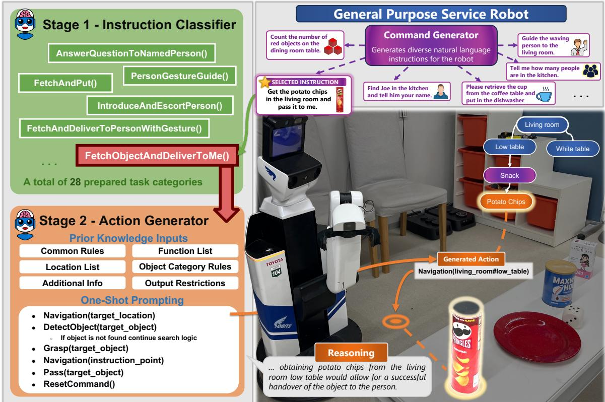
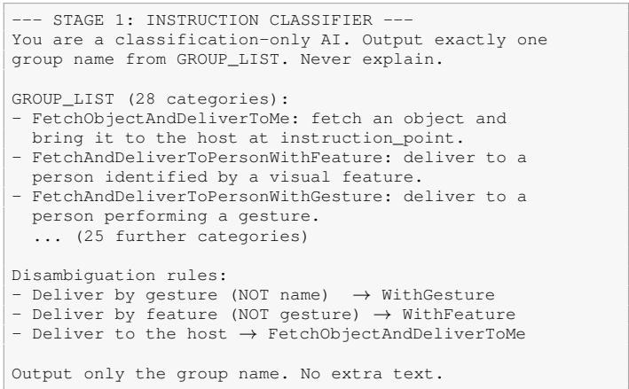
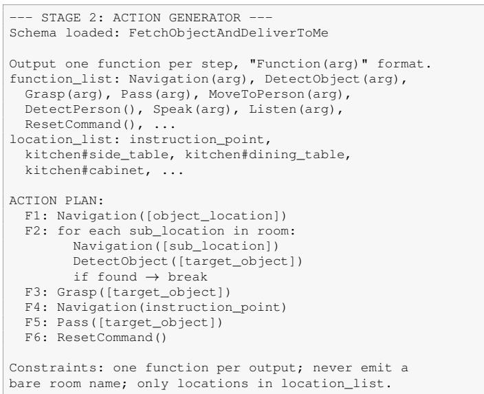
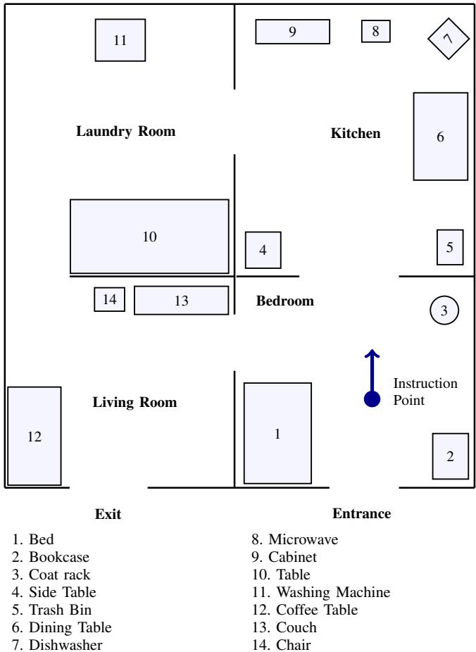
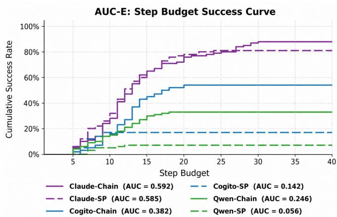
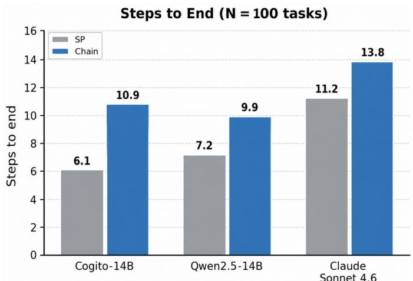
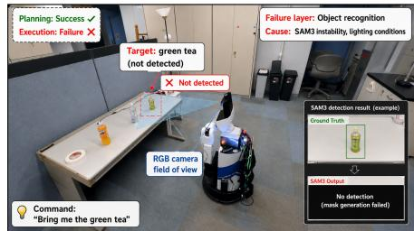
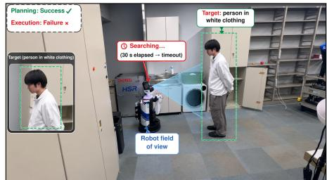
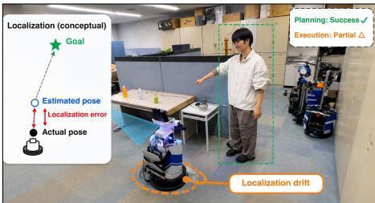

# Design and Evaluation of LLM Chaining-Based Task Planning for General Purpose Service Robots

Lucas Da Mota Bruno

Jiahao Sim

Yoshinobu Hagiwara

Grad. School of Science and Engineering

Soka University

Grad. School of Science and Engineering

Tokyo, Japan

Soka University

Faculty of Science and Engineering

lucasmotabr@icloud.com

Tokyo, Japan

simjiahao@ieee.org

Soka University

Tokyo, Japan

hagiwara@soka.ac.jp

Abstract—General Purpose Service Robot (GPSR) tasks, as defined in the RoboCup@Home benchmark [1], require robots to interpret diverse natural language commands and generate multistep action sequences in real home environments. Conventional Single Prompt (SP) approaches suffer from context bloat and the “Lost in the Middle” phenomenon, leading to unreliable task planning. We propose an LLM chaining architecture that separates instruction classification and action generation into two specialized stages, reducing per-inference prompt length by approximately 45% while improving planning consistency. We evaluate our method using 100 randomly generated GPSR commands across three language models spanning local opensource and frontier cloud deployment contexts. Results show consistent planning improvements over SP across all models, with gains of up to +37 percentage points on local models. Further, real-robot execution experiments on the Toyota Human Support Robot (HSR) reveal that planning success alone does not guarantee task completion, with 6 of 10 tasks completing successfully and execution-layer failures identified as the primary remaining bottleneck.[

Index Terms—service robots, task planning, large language models, GPSR, RoboCup@Home

## I. INTRODUCTION

General Purpose Service Robot (GPSR) tasks [1] represent one of the most demanding benchmarks in the RoboCup@Home competition, requiring the interpretation of unconstrained natural language commands and the generation of precise, multi-step action sequences in real home environments. As large language models (LLMs) have demonstrated strong general reasoning capabilities for robot control, prior service robot systems have adopted a Single Prompt (SP) method that aggregates all task knowledge — function definitions, environment constraints, and execution examples — into a single monolithic prompt [3]–[5].

However, SP approaches face two structural problems in GPSR contexts: prompts rapidly grow with task diversity, causing inference delays and out-of-memory failures in local deployments; and LLMs exhibit the “Lost in the Middle” phenomenon [2], where mid-context information is systematically under-attended, leading to constraint violations and hallucinated parameters. This matters most for local deployment. Cloud APIs incur per-request cost that accumulates when a robot repeats long-horizon tasks, network latency degrades responsiveness in real-time control, and competition venues and home environments frequently have unreliable connectivity — so dependence on a cloud API is itself a reliability risk. Local models avoid these constraints structurally, but their smaller scale makes stable generation under SP difficult.

We propose an LLM chaining architecture decomposing GPSR task planning into two sequential stages: an Instruction Classifier routing commands to one of 28 task categories, and an Action Generator producing step-by-step sequences using a task-specific action schema. This work extends our earlier study [6], which validated the chaining structure on 15 tasks and three models, to a 100-command benchmark including a frontier cloud model. We make the following contributions:

• A two-stage LLM chaining architecture reducing perinference context length by approximately 45%.

• A large-scale benchmark evaluating 100 GPSR commands across three language models spanning local and frontier deployment contexts.

• A real-robot execution analysis on the HSR platform identifying execution-layer failures as the primary bottleneck.

## II. RELATED WORK

LLM-based task planning for service robots has largely followed the single-prompt paradigm. Liang et al. [3] generate executable policy code directly from a single prompt containing the full API surface. Shirasaka et al. [4] construct a promptable GPSR system with foundation models and add a self-recovery mechanism that re-plans after a failure is detected; recovery is triggered downstream of planning, so instability in the initial plan is handled reactively rather than prevented. Hasegawa et al. [5] incorporate spatial concepts into the prompt to ground action planning in learned place representations, improving the plausibility of generated plans but retaining a single monolithic prompt whose length grows with the size of the environment model. Liu et al. [2] show that language models systematically under-attend to information in the middle of long contexts, which bounds how far the singleprompt approach can scale as task diversity increases. Our work differs in addressing the planning stage itself: rather than recovering from failed plans or enriching a single prompt, we decompose planning into two shorter, specialized inferences so that no single prompt carries the full task knowledge.

  
Fig. 1: Overview of the proposed LLM chaining framework deployed on the HSR platform. Left: the two-stage pipeline (Instruction Classifier → Action Generator). Right: real-robot execution with semantic map overlay and generated navigation action.

## III. PROPOSED METHOD

## A. Architecture Overview

Fig. 1 illustrates the proposed framework on the HSR; a natural language command passes through two sequential LLM stages before actions are dispatched to the robot. The two stages are described in turn below, each alongside an excerpt of the prompt that drives it.

## B. Stage 1: Instruction Classification

The Instruction Classifier outputs exactly one of 28 predefined GPSR task categories from the raw command, using few-shot prompting with boundary disambiguation examples to handle semantically similar categories (e.g., delivery to a named person vs. to a person identified by visual feature). Fig. 2 shows the structure of this prompt: a fixed category list, followed by explicit disambiguation rules for the boundaries that proved hardest in practice, and an output restriction that forbids any text other than the category name. The 28 categories were determined through systematic analysis of the RoboCup@Home GPSR command space: by examining commands generated by the Command Generator [8], we identified the minimal set of task types sufficient to cover the full range of required robot behaviors, arriving at 28 categories through iterative refinement.

  
Fig. 2: Condensed excerpt of the Stage 1 classifier prompt. Ellipses mark omitted categories.

## C. Stage 2: Action Generation

The Action Generator loads the task-specific action schema for the classified category, generating executable robot function calls one step at a time: observe → generate → execute → feedback. Fig. 3 shows the corresponding prompt for one category. Only the schema for the classified category is loaded, so the generator never sees the action plans of the other 27; the fixed function list and location list bound what it may emit, and the ordering constraints specific to that category are stated inline rather than buried among rules for unrelated tasks. The

  
Fig. 3: Condensed excerpt of the Stage 2 generator prompt for one category. A different action plan is loaded for each of the 28 categories; the function and location lists are shared.

Stage 2 context length is reduced from approximately 1,802 tokens (SP) to 992 tokens on average per inference step (≈45% reduction); the Stage 1 classifier runs in a separate context of approximately 1,168 tokens, so neither stage accumulates the other’s prompt. Beyond efficiency, this is mechanistically important since smaller local models begin ignoring buried mid-context instructions as SP length grows, causing complete output collapse. Output stability is further enforced through stop-token injection at function call boundaries, preventing multi-step hallucination.

## IV. EXPERIMENTS

## A. Large-Scale Planning Benchmark

1) Setup: We evaluated 100 GPSR commands randomly generated by the RoboCup@Home Japan Command Generator [8] across all 28 task categories, with no overlap with the few-shot prompting examples. Objects referenced by the commands are drawn from the RoboCup@Home Japan 2026 DSPL object list [10], which defines 43 items across six categories (food, snack, fruit, drink, kitchen item, and task item), combining YCB objects with commercially available Japanese products. Three models were evaluated: Qwen2.5- 14B and Cogito-14B (local open-source) and Claude Sonnet 4.6 (frontier cloud), each under both SP and chaining. Local models were run on a laptop with an Intel Core i7- 12700H processor and an NVIDIA RTX 3080 Ti (16 GB) GPU; the frontier model was accessed via API. In the chaining condition, the task category was supplied from the groundtruth label rather than predicted by the Stage 1 classifier, isolating action generation from classification error.

2) Metrics: Success rate (SR) counts a task as successful if the complete action sequence is generated without output breakdown (format collapse, undefined function calls, hallucinated arguments, or sequence order violations), further validated through manual review to exclude semantically incomplete plans that passed automated checks. AUC-E integrates the cumulative success rate over an increasing step budget, jointly rewarding early success and resistance to early breakdown. Steps to end is the mean number of steps generated before a run terminates in success or failure, and measures how long a method sustains a coherent plan.

  
Fig. 4: GPSR arena layout used in the real-robot experiments: four rooms connected by open doorways, 14 furniture locations, and a fixed instruction point. Layout follows the RoboCup@Home Japan GPSR definition [10].

TABLE I: Planning Success Rate (%): SP vs. Chaining
<table><tr><td>Model</td><td>Type</td><td>SP</td><td>Chaining</td><td>∆(pp)</td></tr><tr><td>Qwen2.5-14B</td><td>Local</td><td>7</td><td>33</td><td>+26</td></tr><tr><td>Cogito-14B</td><td>Local</td><td>17</td><td>54</td><td>+37</td></tr><tr><td>Claude Sonnet 4.6</td><td>Cloud</td><td>81</td><td>88</td><td>+7</td></tr></table>

3) Results: Table I shows chaining consistently outperforms SP across all models, with gains from +7 pp (frontier) to +37 pp (local): Cogito-14B rises from 17% to 54% and Qwen2.5-14B from 7% to 33%. The same +26 to +37 pp margin was observed at the 15-task scale in our earlier study [6], indicating the effect is stable as the benchmark grows. Fig. 5 shows the AUC-E curves; local gains are large (Cogito: +0.240, Qwen: +0.190), while frontier values are nearly equal (0.592 vs. 0.585). Manual review revealed that SP successes for the frontier model frequently omit schemarequired intermediate steps, passing format checks while producing incomplete sequences.

  
Fig. 5: AUC-E (Area Under the Execution-efficiency Curve): chaining maintains higher cumulative success rates as step budget increases, with large gains on local models.

Fig. 6 reports steps to end. Chaining sustains longer action sequences on every model (Cogito: 6.1→10.9, Qwen: 7.2→9.9, Claude: 11.2→13.8). Because GPSR plans require a sufficient number of steps to complete, this indicates that SP runs terminate early rather than producing wrong but complete plans. Consistent with this, SP failures fell into three recurring modes: omission of required function arguments; violation of the ordering constraints encoded in the schema; and midsequence output collapse, in which generation degenerates into free-form text before the plan terminates. The last mode is consistent with the “Lost in the Middle” effect [2]: the SP prompt is roughly twice as long and mixes constraints for many task types, so the ordering rules relevant to the current command are more likely to be under-attended than in the short, single-category context that chaining supplies. Table II contrasts the two methods on a single command, illustrating an ordering violation.

## B. Real-Robot Execution Analysis

1) Setup: We executed 10 GPSR tasks on the HSR [9] in a laboratory reproduction of the RoboCup@Home Japan GPSR arena (Fig. 4), with four rooms, 14 furniture locations, and a fixed instruction point. These locations plus per-room people-search targets form the location\_list supplied to the Action Generator. Failures were classified as Recognition, Navigation, or Manipulation. Object perception uses SAM 3 [7] directly as a text-promptable detector, with no separate grounding model; person detection and gesture recognition run on a parallel YOLO11n-pose branch.

2) Results: Planning succeeded in all 10 tasks; 6 tasks completed successfully on the robot, while 4 did not fully complete due to execution-layer failures. Table III summarizes three of these four cases, shown in Fig. 7.

  
Fig. 6: Steps to end (mean over 100 tasks): chaining sustains longer action sequences before terminating, on both local and frontier models.

Fig. 7(a) shows a fetch task where SAM3 [7] returned no mask for the target bottle under ambient lighting, so DetectObject returned empty and the sequence stalled before grasping; the inset contrasts expected and returned segmentation. In Fig. 7(b) the target person remained within the camera field of view for the whole trial, yet featurebased identification did not converge within the 30 s search window and the task was abandoned at the PersonFeature step. Fig. 7(c) shows the partial case: navigation reached the neighbourhood of the goal, but accumulated localization error left the robot offset from the intended pose, so the following interaction step executed from a position the plan had not anticipated. In all three cases the generated sequence was valid; failure arose from perception or localization. Recognition failures were the most frequent, and no manipulation-layer failures were observed in these 10 trials.

3) Discussion: These results reveal a critical gap: even when LLM chaining produces correct action sequences, execution-layer components — object recognition, person detection, and navigation — introduce failures that planning improvements alone cannot address, suggesting planning benchmarks are insufficient to predict real-world task completion. The modular two-stage structure of the proposed architecture naturally supports feedback-aware extensions as future work: execution logs could be routed back to trigger targeted replanning at either the classification or action generation stage, enabling self-recovery without modifying the core chaining design. The failures in Fig. 7 provide concrete triggers: an empty detection or expired search window could prompt the Action Generator to try another sub-location rather than terminate the task.

TABLE II: Planning Example: Chaining vs. SP on the Same Command  
Command: “Take the cola on the table and pass it to me.”   
Chaining (success)   
Stage 1 FetchObjectAndDeliverToMe   
Stage 2 Navigation(dining\_table)   
DetectObject(cola)   
Grasp(cola)   
Navigation(instruction\_point)   
Pass()   
SP (failure — ordering violation)   
Output Navigation(dining\_table)   
DetectObject(cola)   
Grasp(cola)   
Pass()   
Cause Pass() issued without first returning to   
instruction\_point; the object is released at the   
table rather than delivered to the host.

  
(a) Recognition failure: SAM3 returned no mask for the target object.

  
(b) Recognition failure: person identification exceeded the search window.

  
(c) Navigation failure: localization drift left the robot offset from the goal.  
Fig. 7: Three of the four execution-layer failures observed on the HSR. Planning succeeded in all three cases; the failures arose in the perception and localization components the plans depended on. See Table III.

## C. Limitations

The planning benchmark covers three models and a single command source, so the reported gains may not transfer to other model families or to command distributions outside the RoboCup@Home Japan Command Generator. Because the chaining condition used ground-truth task categories, the reported gains are an upper bound under correct classification; end-to-end performance would additionally depend on Stage 1 accuracy, which we have not measured on this benchmark. The real-robot evaluation comprises 10 trials in one laboratory, sufficient to identify failing execution layers but not estimate failure rates reliably; the absence of manipulation failures may reflect the small sample. The 28 categories were derived by iterative refinement over observed commands rather than by an independent procedure, so coverage of unseen GPSR phrasings remains to be validated.

## V. CONCLUSION

We proposed an LLM chaining architecture decomposing GPSR task planning into instruction classification and action generation, reducing per-inference context by ≈45% and achieving consistent SR improvements over SP across all models (up to +37 pp on local models), together with longer sustained action sequences on every model. This reduction is per inference; total task-level token usage was not evaluated. Real-robot experiments further identified execution-layer failures as the primary remaining bottleneck.

TABLE III: Execution-Layer Failures on the HSR (three of four cases)
<table><tr><td>Task</td><td>Plan Exec Layer</td><td></td><td></td><td>Cause</td></tr><tr><td>Fetch green tea</td><td>√</td><td>X</td><td></td><td>Recognition SAM3 unstable</td></tr><tr><td>Guide by shirt color</td><td>√</td><td>X</td><td>Recognition Timeout</td><td></td></tr><tr><td>Follow waving person</td><td>」</td><td>△</td><td>Navigation</td><td>Localization drift</td></tr></table>

Closing that gap is harder than improving planning alone because the planner cannot inspect perception or localization failures and therefore may repeat them under the same conditions. The staged architecture naturally supports execution feedback, associating outcomes with the task-specific schema that produced them. Accumulated across trials, this would let a system build category-level knowledge of which strategies hold under which conditions — for example, that a given object is unreliable to segment under certain lighting and is better approached from a different sub-location. Combining a staged planner with the adaptivity of learned execution policies is the most promising route toward GPSR systems that improve from their own failures rather than repeat them.

## REFERENCES

[1] T. Wisspeintner, T. van der Zant, L. Iocchi, and S. Schiffer, “RoboCup@Home: scientific competition and benchmarking for domestic service robots,” Interaction Studies, vol. 10, no. 3, pp. 392–426, 2009.

[2] N. F. Liu et al., “Lost in the middle: how language models use long contexts,” Trans. Assoc. Comput. Linguistics, vol. 12, pp. 157–173, 2024.

[3] J. Liang et al., “Code as policies: language model programs for embodied control,” in Proc. IEEE Int. Conf. Robot. Autom. (ICRA), 2023, pp. 9493–9500.

[4] M. Shirasaka et al., “Self-recovery prompting: promptable general purpose service robot system with foundation models and self-recovery,” in Proc. IEEE Int. Conf. Robot. Autom. (ICRA), 2024, pp. 17395–17402.

[5] S. Hasegawa, Y. Hagiwara, A. Taniguchi, L. El Hafi, and T. Taniguchi, “Spatial concepts-based prompts with large language models for robot action planning,” IEEE Access, vol. 13, pp. 216937–216955, 2025.

[6] L. Da Mota Bruno et al., “Design of a staged instruction-processing structure for GPSR tasks using LLM chaining,” [in Japanese], in Proc. 13th Intelligent Home Robotics Workshop, 2025.

[7] N. Carion et al., “SAM 3: segment anything with concepts,” arXiv:2511.16719, 2025.

[8] RoboCup@Home Japan Committee, “Command generator 2025,” github.com/RoboCupAtHomeJP/CommandGenerator.

[9] T. Yamamoto, K. Terada, A. Ochiai, F. Saito, Y. Asahara, and K. Murase, “Development of human support robot as the research platform of a domestic mobile manipulator,” ROBOMECH Journal, vol. 6, no. 1, article 4, 2019.

[10] RoboCup@Home Japan Committee, “DSPL object list and arena definition 2026,” github.com/RoboCupAtHomeJP/AtHome2026.