# EAGER: Enhancing Generative Event Extraction via Reinforcement Learning with Verifiable Rewards

Omar Adjali<sup>1</sup>, Siting Liang<sup>1,2</sup>, Omair Shahzad Bhatti<sup>1</sup>, Daniel Sonntag<sup>1,2</sup>

<sup>1</sup>German Research Center for Artificial Intelligence (DFKI), Germany

<sup>2</sup>Carl von Ossietzky Universität Oldenburg, Germany

{omar.adjali, siting.liang, omair\_shahzad.bhatti, daniel.sonntag}@dfki.de

## Abstract

End-to-end event extraction remains challenging for large language models as it requires simultaneous identification of event triggers, classification of event types, and extraction of schema-grounded argument spans. We present EAGER, a reinforcement learning framework for generative event extraction that combines fine-grained verifiable rewards with Schema-Contrastive Advantage Estimation to alleviate advantage collapse under sparse binary rewards. Our reward design explicitly targets structural validity, extraction accuracy, groundedness, coverage, over-generation, and span precision. Experiments across seven benchmark datasets show that EAGER consistently outperforms prompting, supervised fine-tuning, and prior reinforcement learning baselines, achieving a substantial improvement over the strongest prior method. Results demonstrate that task-aligned verifiable rewards and contrastive advantage estimation substantially improve structured extraction.

## 1 Introduction

Event extraction (EE) is a fundamental and challenging Information Extraction (IE) task that aims to identify event triggers, classify event types, and assign semantic roles to extracted arguments from unstructured text. With the advent of large language models, a growing body of work (Li et al., 2023a; Lu et al., 2021; Hsu et al., 2022; Ma et al., 2022; Wang et al., 2023a; Ren et al., 2023) has reformulated EE as a generative problem, leveraging sequence-to-sequence models to directly produce structured event representations under flexible annotation schemes. More recent approaches have further adopted LLMs through prompt engineering and chain-of-thought reasoning (Cai et al., 2024; Gao et al., 2023; Hong and Liu, 2024; Ma et al., 2024), aiming to reduce the computational overhead and domain-specific overfitting associated with fully supervised training. Nevertheless, as depicted in Figure 1, even frontier general-purpose LLMs still fall short of achieving competitive performance on end-to-end EE benchmarks. A complementary line of work (Sainz et al., 2024; Srivastava et al., 2025) has highlighted the critical role of augmenting training data with structured annotation guidelines, enabling instruction-tuned LLMs to better adhere to predefined event schemas and improve extraction fidelity. Despite these advances, significant performance gaps remain across diverse event types and domains.

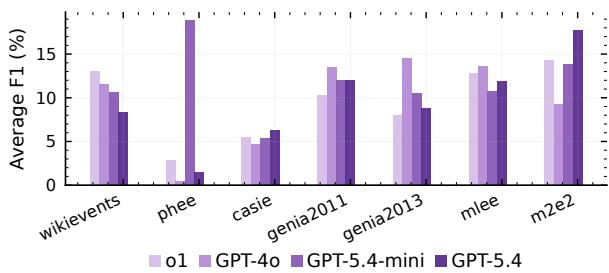  
Figure 1: Average-F1 performance of frontier LLMs on end-to-end event extraction across 7 datasets and domains.

To address these limitations, Gao et al. (2024) proposed EventRL, which enhances LLM-based event extraction via outcome-supervised reinforcement learning (RL), optimizing the model based on the quality of final extracted event structures rather than relying solely on token-level supervision. This is further motivated by broader findings in the literature: comparative studies of supervised finetuning (SFT) versus RL-based fine-tuning (Huan et al., 2025; Chu et al., 2025) consistently show that RL-tuned models exhibit stronger cross-domain generalization and greater adaptability, whereas SFT-trained models are more susceptible to catastrophic forgetting, often degrading previously acquired general capabilities.

However, a key limitation in Gao et al. (2024) and of existing training strategies more broadly, is that they provide only coarse-grained supervision over extraction quality. Supervised finetuning optimizes next-token likelihood rather than extraction quality directly, while standard RL objectives typically rely on format validity and tasklevel accuracy alone. In practice, these signals are often too sparse to distinguish among distinct classes of extraction errors. Consequently, outcome-level reward signals struggle to explicitly target the issues inherent to generative EE such as hallucinated triggers, unsupported arguments, over-generation, and incomplete event coverage. A further structural limitation arises in group-based policy optimization: when all sampled completions within an optimization group are conditioned on the same prompt, including an identical set of negative schemas outputs tend to be homogeneous, producing near-zero reward variance and uninformative gradient signal.

In this work, we present EAGER, a post-training framework that addresses both limitations through two complementary contributions. First, we introduce a task-aligned, decomposed reward framework that explicitly models distinct quality dimensions of event extraction: validity, extraction accuracy, groundedness, over-generation control, coverage, and span precision. By decomposing the reward signal along these axes, our framework provides fine-grained optimization guidance that better aligns RL with the constraints of generative EE. Second, we propose Schema-Contrastive Advantage Estimation (SCAE), which alleviates advantage collapse by independently sampling distinct sets of negative schemas across completions within each optimization group. This structural diversity induces variability in event type discrimination difficulty, increasing intra-group reward variance and enabling more informative policy gradients throughout training.

## 2 Related Work

Large language models have increasingly been adapted to structured information extraction through instruction tuning and schema-guided prompting (Jiao et al., 2023; Lu et al., 2023). Prior work has explored instruction-based IE frameworks such as InstructUIE (Wang et al., 2023a), annotation-guided prompting in GoLLIE (Sainz et al., 2024), and large-scale instruction resources like IEPile (Gui et al., 2024) to improve schema adherence and cross-domain generalization. Related work has also reformulated IE as code generation, where structured outputs benefit from the syntactic constraints of programming languages, as explored in CodeIE (Li et al., 2023b) and KnowCoder (Li et al., 2024).

## 2.1 Event Extraction with Large Language Models

Traditional event extraction approaches encompass both pipeline-based and joint modeling paradigms. Huang et al. (2024) conducted a comprehensive reevaluation of major EE paradigms on a standardized benchmark and found that current LLMs still fall short on several core EE subtasks, underscoring the gap between general instructionfollowing ability and task-specific extraction precision. Chen et al. (2024) explored leveraging LLMs as automated annotators to generate high-quality event labels, effectively bootstrapping downstream model training while reducing human annotation costs. More recent work has examined how instruction tuning and annotation guidelines shape EE performance. Srivastava et al. (2025) demonstrated that providing detailed textual descriptions of event types and argument roles during instruction tuning yields improved generalization to low-frequency and cross-schema event types. These studies highlight the persistent challenges of schema adherence, output validity, and domain generalization in event extraction.

## 2.2 Preference and Reinforcement Learning for Structured Extraction

Beyond supervised instruction tuning, a growing body of work has explored aligning LLMs to structured extraction objectives through preference learning and reinforcement learning. EventRL (Gao et al., 2024) introduced an RL-based framework with outcome-driven reward functions targeting event identification and argument extraction, achieving gains in structural fidelity and generalization to novel event types. More recently, (Adjali et al., 2026) extended this line toward multi-objective alignment for event extraction, combining task-level, format, and retrieval rewards within a GRPO framework. This contrasts with a closely related research direction which focuses on preference optimization tailored to IE tasks. In particular, ADELIE (Qi et al., 2024) combines supervised fine-tuning on curated instruction datasets with Direct Preference Optimization (DPO) using IE-specific comparison pairs, explicitly targeting schema adherence, argument completeness, and format validity. This approach achieves strong performance across closed, open, and on-demand IE settings while preserving general reasoning capability, suggesting that decomposing alignment objectives along task-relevant dimensions yields more reliable structured outputs. These work show that RL-based approaches to event extraction remain notably underexplored and suggest that fine-grained alignment via reward design and preference learning can substantially improve the reliability of LLMs for structured IE, complementing purely supervised approaches.

## 3 Method

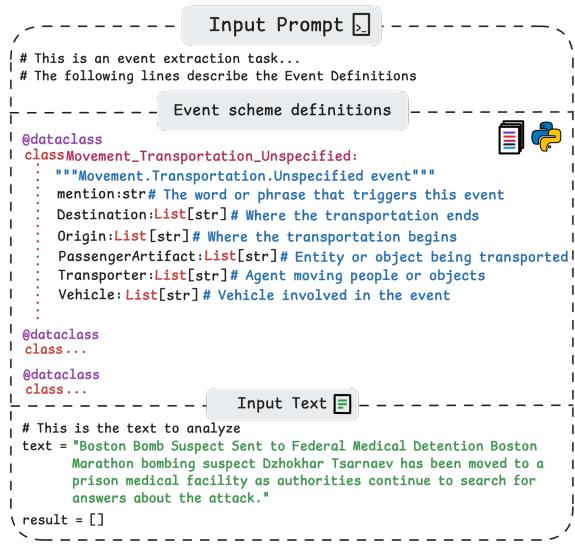  
Figure 2: Structure of a prompt for end-to-end Event Extraction, comprising a task instruction a set of event schemas and the input text.

## 3.1 Task Formulation

Event extraction is a structured prediction task that encompasses four interdependent subtasks. Trigger Identification (TI) detects event-denoting spans within an input text X. Trigger Classification (TC) assigns a semantic event type to each identified trigger. Argument Identification (AI) locates textual spans that participate as event arguments. Argument Classification (AC) maps each identified argument span to a predefined semantic role. Formally, let $\mathcal { E } = \{ E _ { i } \} _ { i = 1 } ^ { n }$ denote a predefined event schema, where each schema $E _ { i }$ specifies a set of permissible argument roles. Given an input text $X$ , the objective is to produce a structured event representation:

$$
Y = \{ ( t , r , a ) \} ,\tag{1}
$$

where $t \in X$ denotes a trigger span, r an argument role defined in $\mathcal { E } ,$ , and $a \in X$ an argument span.

EE thus learns a mapping $f _ { \theta } : X \to Y$ subject to the schema constraints imposed by E.

## 3.2 Code-Based Input and Output Representations

Following GoLLIE (Sainz et al., 2024), we cast EE as Python code generation (Fig. 2). This leverages LLMs’ structural understanding of code (Wang et al., 2023b; Li et al., 2023b) while providing a unified, less ambiguous representation for structured prediction (Sainz et al., 2024; Srivastava et al., 2025). Python syntax also guarantees well-formed outputs and simplifies parsing. Each event schema $E _ { i } \in \mathcal { E }$ is defined as a @dataclass (Fig. 6), and extracted events are represented as class instances.

## 3.3 Annotation Guideline Generation

Although code-based schemas are compact and structured, they lack the semantic detail of annotation manuals. Prior work shows that LLMgenerated guidelines can match manually written annotations for enriching event representations in instruction tuning (Srivastava et al., 2025). We therefore augment each Python class schema with natural-language guidelines generated via instruction-tuned prompting; details are provided in Appendix B.

## 3.4 Prompt Structure

Each training instance is constructed as a structured prompt sequence as illustrated in Figure 2:

$$
P = I \oplus E _ { e } ^ { \mathrm { { G } } } \oplus X ,\tag{2}
$$

where I denotes a natural language task instruction, $E _ { e } ^ { \mathrm { G } }$ is the gold event schema of type e augmented with its automatically generated annotation guideline, and X is the input text. This formulation encourages the model to jointly attend to schema constraints, including the set of permissible argument roles for e, and the contextual semantics conveyed by the annotation guidelines.

As shown in (Gui et al., 2024), to further improve event type discrimination, we additionally sample a set of negative schemas, i.e., schemas corresponding to event types not present in X, and include them in the training prompt. See Figure 7 for an example of an input prompt.

## 3.5 Post-Training Framework

Reinforcement learning with verifiable rewards (RLVR), powered by algorithms such as

GRPO (Shao et al., 2024) and DAPO (Yu et al., 2026), has demonstrated strong effectiveness across a range of reasoning tasks (Guo et al., 2025), however the application of RLVR to structured information extraction tasks such as end-to-end event extraction, which requires simultaneously identifying event triggers, classifying event types, and extracting schema-grounded argument spans remains largely unexplored. To bridge this gap, we investigate DAPO (Yu et al., 2026) to enhance the reasoning ability of LLMs for EE, leveraging its verifiable, schema-based reward signal to guide structured output generation.

Given an input prompt X, the model samples a group of candidate outputs and optimizes the DAPO objective

$$
\begin{array} { c c c } { \mathcal { T } _ { \mathrm { D A P O } } ( \theta ) = \mathbb { E } \left[ \frac { 1 } { \sum _ { i } \left| o _ { i } \right| } \underset { i = 1 } { \overset { G } { \sum } } \underset { t = 1 } { \overset { | o _ { i } | } { \sum } } \operatorname* { m i n } \Bigl ( r _ { t } ^ { i } \hat { A } _ { t } ^ { i } , } \\ { \mathrm { c l i p } ( r _ { t } ^ { i } , 1 - \epsilon _ { \mathrm { l o w } } , 1 + \epsilon _ { \mathrm { h i g h } } ) \hat { A } _ { t } ^ { i } \Bigr ) \right] } \end{array}\tag{3}
$$

where r<sup>i</sup><sub>t</sub>(θ)   
$\pi _ { \boldsymbol { \theta } } ( o _ { i , t } \mid X , o _ { i , < t } ) / \pi _ { \boldsymbol { \theta } _ { \mathrm { o l d } } } ( o _ { i , t } \mid X , o _ { i , < t } )$ is the importance sampling ratio and $\hat { A } _ { t } ^ { i }$ is the groupnormalized advantage.

## 3.6 Reward-Decoupled Normalization

Weighted reward sums can be dominated by high-variance components, suppressing weaker signals and requiring manual tuning. Following GDPO (Liu et al., 2026), we use Reward-Decoupled Normalization (RDN), normalizing each reward independently within the sampled group as $\begin{array} { r } { \tilde { R } _ { i } ^ { ( m ) } = \frac { R _ { i } ^ { ( m ) } - \mu ^ { ( m ) } } { \sigma ^ { ( m ) } + \epsilon } } \end{array}$ , where $\mu ^ { ( m ) }$ and $\sigma ^ { ( m ) }$ are the group mean and standard deviation for reward $m .$ . The final reward is $\begin{array} { r } { \hat { R } _ { i } = \sum _ { m = 1 } ^ { M } \tilde { R } _ { i } ^ { ( m ) } } \end{array}$ This avoids manual weighting, balances reward contributions, and alleviates reward hacking by preventing any single component from dominating the optimization.

## 3.7 SCAE: Schema-Contrastive Advantage Estimation

Similar to GRPO, DAPO discards the value network of PPO (Schulman et al., 2017) by computing advantages directly from group-level outcome rewards. For each input text $X$ and its gold event annotation $Y$ , we samples a group of G outputs $\{ o _ { i } \} _ { i = 1 } ^ { G }$ from the old policy $\pi _ { \theta _ { \mathrm { o l d } } }$ , assigns binary outcome rewards $\{ R _ { i } \} _ { i = 1 } ^ { G }$ , and estimates the pertoken advantage as the group-normalized reward:

$$
\hat { A } _ { t } ^ { i } = \frac { R _ { i } - \operatorname* { m e a n } \bigl ( \{ R _ { i } \} _ { i = 1 } ^ { G } \bigr ) } { \mathrm { s t d } \bigl ( \{ R _ { i } \} _ { i = 1 } ^ { G } \bigr ) } ,\tag{4}
$$

However, a critical issue arises when all sampled completions within a group receive identical rewards leading to near-zero policy gradients and stalled learning (Zhang et al., 2025; Yu et al., 2026; He et al., 2026). In standard DAPO sampling setting, all $G$ completions are conditioned on the same prompt $P = I \oplus E _ { e } ^ { \mathrm { { G } } } \oplus X$ , including an identical set of negative schemas. Since the negative schemas strongly constrain the model’s event type discrimination signal, sampled outputs tend to exhibit low diversity, such that Var $( \{ R _ { i } \} _ { i = 1 } ^ { G } \mid P ) \approx 0 .$ . Combined with sparse binary rewards, this frequently produces homogeneous reward groups with uninformative gradient signal.

We propose SCAE, a schema-contrastive formulation of advantage estimation that structurally injects reward variance by varying the set of negative schemas across completions within the same optimization group, rather than holding the full prompt fixed. During training, each prompt $P$ includes not only the gold schema $E _ { e } ^ { \mathrm { G } }$ for the target event type $e ,$ but also a set of $K$ negative schemas sampled from $\mathcal { E } \backslash \{ e \}$ . Formally, let $\mathcal { N } = \mathcal { E } \backslash \{ e \}$ denote the pool of available negative schemas. Rather than fixing a single negative set across all group members, we construct a schema-contrastive group by independently sampling a distinct subset $S _ { i } \subset \mathcal { N }$ $| S _ { i } | = K$ , for each completion i, yielding groupspecific prompts:

$$
P _ { i } = I \oplus E _ { e } ^ { \mathrm { G } } \oplus { \mathcal { S } } _ { i } \oplus X , \quad { \mathcal { S } } _ { i } \stackrel { \mathrm { i . i . d . } } { \sim } \binom { \mathcal { N } } { K }\tag{5}
$$

where ${ \mathcal { S } } _ { i } \neq { \mathcal { S } } _ { j }$ for $i \neq j$ with high probability when $| { \mathcal N } | \gg K$ . The contrastive group is then defined as:

$$
\mathcal { G } _ { e } = \{ ( P _ { i } , \hat { o } _ { i } ) \} _ { i = 1 } ^ { G } , \quad \hat { o } _ { i } \sim \pi _ { \theta } ( \cdot \mid P _ { i } )\tag{6}
$$

where each sampled completion $\hat { o } _ { i }$ receives an independent reward $R _ { i }$ computed against the gold annotation $Y$ . By varying the negative schema context across group members, different completions are exposed to different distractor event types, inducing variability in the difficulty of event type discrimination and thereby increasing intra-group reward variance:

$$
\operatorname { V a r } \left( \{ R _ { i } \} _ { i = 1 } ^ { G } \right) \gg \operatorname { V a r } \left( \{ R _ { i } \} _ { i = 1 } ^ { G } \mid P \right)\tag{7}
$$

Advantages are then estimated by normalizing rewards within each schema-contrastive group and substituted into the DAPO objective (Eq. 3). (See Algorithm 1 for the detailed DAPO with SCAE pseudo-code.)

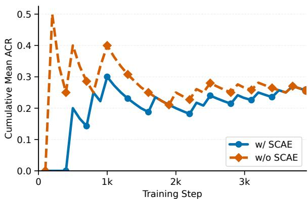  
Figure 3: Cumulative Mean ACR during training

To quantify the effectiveness of our schemacontrastive group construction, we compute the Advantage Collapse Rate (ACR) (He et al., 2026), which measures the proportion of training groups exhibiting near-zero reward variance:

$$
\mathrm { A C R } = \frac { 1 } { N } \sum _ { j = 1 } ^ { N } \mathbb { I } \big ( \sigma _ { \mathscr { R } _ { j } } < \tau \big ) ,\tag{8}
$$

where $\sigma _ { \mathcal { R } _ { \mathcal { I } } }$ is the reward standard deviation within group j and $\tau$ is a small numerical threshold $( \tau \approx 1 0 ^ { - 6 } )$ . An ACR close to 0 indicates that most groups produce informative gradient signals, while ACR ≈ 1 signals complete gradient stagnation. As shown in Figure 3, training with our Schema-Contrastive Advantage Estimation (w/ SCAE) consistently achieves a substantially lower cumulative ACR compared to the standard fixed-prompt baseline (w/o SCAE), confirming that varying the negative schema set across group members effectively alleviates reward homogeneity and produces more informative optimization signals throughout training.

## 3.8 Verifiable Rewards Modeling

Rather than relying solely on outcome reward using aggregate F1 scores such in (Gao et al., 2024), we define specialized rewards described in Table 1 that target complementary aspects of model behavior, including output validity, extraction correctness, groundedness, prediction balance, and span precision. This modular design provides more interpretable and fine-grained optimization signals. See Appendix F for more formal reward definitions.

## 4 Experimental Setup

Baselines We compare EAGER against representative methods spanning prompting, supervised fine-tuning, and reinforcement learning paradigms for end-to-end event extraction. We include proprietary large language models evaluated under few-shot prompting, including o1 (Jaech et al., 2024), GPT-4o (Hurst et al., 2024), GPT-5.4-mini, and GPT-5.4 (Singh et al., 2025), to assess the effectiveness of general-purpose reasoning-oriented LLMs without task-specific adaptation. We additionally compare against GoLLIE (Sainz et al., 2024), a code-oriented instruction framework for information extraction. To isolate the contribution of reinforcement learning beyond standard instruction tuning, we fine-tune GoLLIE-7B and GoLLIE-13B using SFT. We also compare against the annotation-guideline augmented instruction tuning framework of (Srivastava et al., 2025), which simi larly enriches event schemas with LLM-generated task descriptions. Finally, we compare against prior RL-based event extraction methods, including $\mathrm { \Delta A D E L I E _ { D P O } }$ (Qi et al., 2024), which applies direct preference optimization for generative information extraction, and EventRL (Gao et al., 2024), which optimizes event extraction performance using reinforcement learning with outcome-based rewards. These baselines represent the closest prior approaches to post-training optimization for structured extraction. For fair comparison, all reproduced baselines marked with <sup>†</sup> are evaluated using the same evaluation protocols and under a unified experimental setup.

Evaluation Datasets To evaluate the proposed approach, we conducted experiments on 7 standard end-to-end EE datasets of different domains: WikiEvents (Li et al., 2021), PHEE (Sun et al., 2022), CASIE (Satyapanich et al., 2020), Genia2011 (Kim et al., 2011), Genia2013 (Kim et al., 2013), MLEE (Pyysalo et al., 2012), and M2E2 (Li et al., 2020). We follow standard splits as in (Huang et al., 2024) where we use the “split 1” data split. See Appendix L and Table 10 for more details.

Evaluation Metrics Following previous work (Huang et al., 2024; Sainz et al., 2024; Srivastava et al., 2025), we report F1 scores for both triggerand argument-level identification and classification subtasks including respectively TI, TC), AI and AC. We also report the attached version AI+, AC+.

<table><tr><td>Reward Component</td><td>Notation</td><td>Formulation</td><td>Role in Training</td></tr><tr><td>Validity</td><td> $R _ { \mathrm { f m t } }$ </td><td>Binary: 1 if output parses into the required structured repre- sentation, 0 otherwise</td><td>Filters malformed outputs before any extraction scoring</td></tr><tr><td>Extraction Accuracy</td><td> $R _ { \mathrm { E E } }$ </td><td>Macro-average F1 over trigger identification (TI), trigger classification (TC), argument identification (AI), argument classification  $( \mathrm { A C } ) , \mathrm { A I ^ { + } }$  , and  $\mathbf { A } \mathbf { C } ^ { + }$ </td><td>Captures canonical end-to-end extraction quality</td></tr><tr><td>Groundedness</td><td> $R _ { \mathrm { g r d } }$ </td><td>Verifies that predicted triggers and arguments appear verba- tim in the source input; averages span-level support scores</td><td>Suppresses hallucinated spans and improves factual consis- tency</td></tr><tr><td>Over-generation</td><td> $R _ { \mathrm { o v r } }$ </td><td>Penalizes predictions that exceed the gold event and argu- ment counts</td><td>Reduces false positives and limits excessive output length</td></tr><tr><td>Coverage</td><td> $R _ { \mathrm { c o v } }$ </td><td>Proportional recall over gold events and arguments, normal- ized to prevent inflation from over-prediction</td><td>Encourages completeness while balancing over-generation penalties</td></tr><tr><td>Span Precision</td><td> $R _ { \mathrm { { s p a n } } }$ </td><td>Token-level Jaccard similarity with an additional penalty for oversized predicted spans</td><td>Rewards near-correct boundary predictions and discourages span inflation</td></tr></table>

Table 1: Summary of the proposed verifiable rewards used in our RL framework for generative event extraction. Each reward targets a distinct aspect: structural invalidity, extraction inaccuracy, hallucination, over-generation, under-coverage, and boundary imprecision.

<table><tr><td>Model</td><td>WikiEvents</td><td>PHEE</td><td>CASIE</td><td>GENIA11</td><td>GENIA13</td><td>MLEE</td><td>M2E2</td><td>Avg.</td></tr><tr><td>Few-shot Prompting</td><td></td><td></td><td></td><td></td><td></td><td></td><td></td><td></td></tr><tr><td>o1 (Jaech et al., 2024)</td><td>13.08</td><td>2.86</td><td>5.49</td><td>10.27</td><td>7.95</td><td>12.80</td><td>14.24</td><td>9.52</td></tr><tr><td>GPT-4o (Hurst et al., 2024)</td><td>10.31</td><td>2.00</td><td>3.47</td><td>12.43</td><td>10.87</td><td>13.35</td><td>11.97</td><td>9.20</td></tr><tr><td>GPT-5.4-mini (Singh et al., 2025)</td><td>10.58</td><td>18.86</td><td>5.38</td><td>11.95</td><td>10.56</td><td>10.70</td><td>13.86</td><td>11.70</td></tr><tr><td>GPT-5.4 (Singh et al., 2025)</td><td>8.30</td><td>1.42</td><td>6.22</td><td>11.94</td><td>8.74</td><td>11.90</td><td>17.74</td><td>9.47</td></tr><tr><td>GoLLIE-7B (Sainz et al., 2024)</td><td>13.65</td><td>30.44</td><td>7.47</td><td>12.58</td><td>9.69</td><td>8.49</td><td>32.14</td><td>16.35</td></tr><tr><td>GoLLIE-13B (Sainz et al., 2024)</td><td>13.97</td><td>30.08</td><td>7.02</td><td>10.33</td><td>9.56</td><td>11.46</td><td>38.96</td><td>17.34</td></tr><tr><td>GoLLIE-34B (Sainz et al., 2024)</td><td>11.75</td><td>27.42</td><td>7.43</td><td>11.26</td><td>8.02</td><td>9.58</td><td>32.80</td><td>15.47</td></tr><tr><td>Supervised fine-tuning</td><td></td><td></td><td></td><td></td><td></td><td></td><td></td><td></td></tr><tr><td>GoLLIE-7B + SFT</td><td>13.31</td><td>30.33</td><td>7.62</td><td>12.31</td><td>10.34</td><td>8.95</td><td>32.70</td><td>16.51</td></tr><tr><td>GoLLIE-13B + SFT</td><td>13.78</td><td>30.08</td><td>7.02</td><td>10.33</td><td>9.56</td><td>11.46</td><td>38.96</td><td>17.31</td></tr><tr><td>(Srivastava et al., 2025)†LLaMA31-8B</td><td>5.78</td><td>28.70</td><td>7.95</td><td>13.18</td><td>9.04</td><td>9.44</td><td>12.96</td><td>12.44</td></tr><tr><td>Reinforcement learning</td><td></td><td></td><td></td><td></td><td></td><td></td><td></td><td></td></tr><tr><td>EventRL (Gao et al., 2024)†</td><td>15.18</td><td>52.40</td><td>8.90</td><td>16.65</td><td>16.31</td><td>11.84</td><td>43.53</td><td>23.54</td></tr><tr><td>ADELIEDPo (Qi et al., 2024)†</td><td>18.20</td><td>52.61</td><td>10.90</td><td>20.91</td><td>19.50</td><td>16.89</td><td>40.49</td><td>25.64</td></tr><tr><td>EAGER (ours)</td><td>21.31</td><td>60.36</td><td>14.66</td><td>26.32</td><td>23.39</td><td>23.42</td><td>46.09</td><td>30.79</td></tr><tr><td>Gain vs. best prior</td><td>+3.11</td><td>+7.75</td><td>+3.76</td><td>+5.41</td><td>+3.89</td><td>+6.53</td><td>+2.56</td><td>+5.15</td></tr></table>

Table 2: Mean F1 results for end-to-end event extraction on the test split of the seven benchmark datasets. Avg. denotes the average F1 performance across datasets and EE subtasks. Best results are shown in bold. Green values indicate absolute improvement over the strongest prior baseline. <sup>†</sup> denotes literature methods we re-implemented.

Table 3: Ablation study on the contribution of each proposed individual reward to the global end-to-end event extraction performance. Blue shading denotes improvement relative to the baseline configuration $R _ { \mathrm { E E } } + R _ { \mathrm { F M T } } .$ while amber shading denotes degradation. Darker shading indicates larger absolute change. Bold indicates the best score per dataset. This color scheme logic applies to the subsequent tables.
<table><tr><td>Setting/Rewards</td><td>Wiki</td><td>PHEE</td><td>CASIE</td><td>G11</td><td>G13</td><td>MLEE</td><td>M2E2</td><td>Avg</td></tr><tr><td>ALL Rewards</td><td>21.31</td><td>60.36</td><td>14.66</td><td>26.32</td><td>23.39</td><td>23.42</td><td>46.09</td><td>30.79</td></tr><tr><td> $R _ { E E } + R _ { F M T }$ </td><td>20.12</td><td>53.66</td><td>15.70</td><td>26.11</td><td>24.10</td><td>21.62</td><td>30.22</td><td>27.36</td></tr><tr><td>+  $\underline { { R } } _ { g r d }$ </td><td>22.40</td><td>57.74</td><td>14.94</td><td>26.83</td><td>22.48</td><td>20.02</td><td>36.72</td><td>28.73</td></tr><tr><td> $+ ~ R _ { o v r } ^ { ' }$ </td><td>23.04</td><td>58.27</td><td>12.96</td><td>26.54</td><td>22.14</td><td>19.33</td><td>39.20</td><td>28.78</td></tr><tr><td> $+ ~ R _ { c o v }$ </td><td>21.38</td><td>58.01</td><td>16.12</td><td>26.34</td><td>24.22</td><td>21.53</td><td>31.52</td><td>28.45</td></tr><tr><td>+  $R _ { s p a n }$ </td><td>21.46</td><td>58.97</td><td>15.91</td><td>26.63</td><td>24.27</td><td>21.40</td><td>34.26</td><td>28.99</td></tr></table>

We report Mean-F1 over the six subtask metrics as the main aggregate measure of end-to-end extraction quality. We additionally report full argument and trigger extraction results in Appendix M.

Table 4: Impact of augmenting event schemes with annotation guidelines.
<table><tr><td>Setting</td><td>Wiki</td><td>PHEE</td><td>CASIE</td><td>G11</td><td>G13</td><td>MLEE</td><td>M2E2</td><td> $\operatorname { A v g }$ </td></tr><tr><td>GoLLIE-7B</td><td>13.65</td><td>30.44</td><td>7.47</td><td>12.58</td><td>9.69</td><td>8.49</td><td>32.14</td><td>16.35</td></tr><tr><td>w/o A.G.</td><td>9.14</td><td>7.67</td><td>3.13</td><td>1.64</td><td>1.17</td><td>2.41</td><td>15.54</td><td>5.81</td></tr><tr><td>EAGER</td><td>21.31</td><td>60.36</td><td>14.66</td><td>26.32</td><td>23.39</td><td>23.42</td><td>46.09</td><td>30.79</td></tr><tr><td>w/o A.G.</td><td>19.43</td><td>43.66</td><td>8.34</td><td>17.32</td><td>16.96</td><td>12.25</td><td>40.33</td><td>22.61</td></tr></table>

## 5 Results and Discussion

## 5.1 Performance Analysis

As shown in Table 2, despite their strong general reasoning capabilities, frontier models such as GPT-4o (9.20), o1 (9.52), and GPT-5.4 (9.47) evaluated under few-shot prompting lag far behind task-adapted smaller models. Even the best performing GPT-5.4-mini (11.70) fails to approach the performance of the smallest GoLLIE-7B baseline (16.35), underscoring the difficulty of end-toend event extraction and confirming the finding in (Huang et al., 2024) that generative event extraction requires task-specific alignment beyond prompting. Moreover, SFT provides marginal gains over zero-shot suggesting that SFT saturates quickly and does not adequately address structured extraction in cross-domain and -schema settings. Comparing SFT-based approaches against our RLtrained model (+14.28) confirms the advantage of reinforcement learning for generative EE. Finally, EAGER achieves the highest average Mean-F1 of 30.79, surpassing the strongest prior RL baseline by +5.15. The gain is consistent across datasets demonstrating that the proposed approach generalizes well across diverse domains and annotation schemes.

Table 5: Detailed results of event trigger and argument performance including TI, TC, AI, AC, AI+, and AC+. Bold indicates the best score within each dataset. Improvement/Degradations are highlighted relative to the baseline configuration $R _ { \mathrm { E E } } + R _ { \mathrm { f m t } }$
<table><tr><td>Dataset</td><td>Method</td><td>TI</td><td>TC</td><td>AI</td><td>AC</td><td>AI+</td><td>AC+</td></tr><tr><td rowspan="6">WikiEvents</td><td>All</td><td>38.92</td><td>30.83</td><td>17.28</td><td>14.51</td><td>14.32</td><td>12.01</td></tr><tr><td> $R _ { \mathrm { E E } } + R _ { \mathrm { f m } }$ </td><td>39.53</td><td>32.37</td><td>15.33</td><td>12.28</td><td>11.73</td><td>9.47</td></tr><tr><td> $+ R _ { \mathrm { { s p a n } } }$ </td><td>39.88</td><td>35.31</td><td>16.96</td><td>14.10</td><td>12.17</td><td>10.37</td></tr><tr><td> $+ R _ { \mathrm { o v r } } ^ { \ast }$ </td><td>39.22</td><td>35.37</td><td>18.22</td><td>16.12</td><td>15.25</td><td>14.05</td></tr><tr><td> $+ R _ { \mathrm { g r d } }$ </td><td>38.74</td><td>34.12</td><td>17.92</td><td>15.89</td><td>14.66</td><td>13.09</td></tr><tr><td> $+ R _ { \mathrm { c o v } }$ </td><td>41.53</td><td>34.65</td><td>15.83</td><td>13.52</td><td>12.20</td><td>10.52</td></tr><tr><td rowspan="6">PHEE</td><td>All</td><td>69.35</td><td>68.74</td><td>68.65</td><td>60.47</td><td>50.31</td><td>44.67</td></tr><tr><td> $R _ { \mathrm { E E } } + R _ { \mathrm { f m t } }$ </td><td>67.92</td><td>66.80</td><td>62.40</td><td>46.17</td><td>45.03</td><td>33.65</td></tr><tr><td> $+ R _ { \mathrm { s p a n } }$ </td><td>67.89</td><td>66.87</td><td>67.07</td><td>60.32</td><td>48.38</td><td>43.29</td></tr><tr><td> $+ R _ { \mathrm { o v r } }$ </td><td>67.62</td><td>66.60</td><td>65.97</td><td>59.50</td><td>47.32</td><td>42.60</td></tr><tr><td> $+ R _ { \mathrm { g r d } }$ </td><td>68.29</td><td>67.28</td><td>64.07</td><td>58.24</td><td>46.40</td><td>42.15</td></tr><tr><td> $+ R _ { \mathrm { c o v } }$ </td><td>67.89</td><td>66.77</td><td>67.07</td><td>57.12</td><td>48.19</td><td>41.02</td></tr><tr><td rowspan="6">CASIE</td><td>All</td><td>18.54</td><td>17.19</td><td>21.44</td><td>17.83</td><td>7.02</td><td>5.94</td></tr><tr><td> $R _ { \mathrm { E E } } + R _ { \mathrm { f m } }$ </td><td>20.63</td><td>19.92</td><td>23.60</td><td>17.12</td><td>7.55</td><td>5.40</td></tr><tr><td> $+ R _ { \mathrm { { s p a n } } }$ </td><td>20.45</td><td>19.60</td><td>22.05</td><td>19.16</td><td>7.58</td><td>6.60</td></tr><tr><td> $+ R _ { \mathrm { o v r } }$ </td><td>17.46</td><td>16.57</td><td>16.73</td><td>14.83</td><td>6.40</td><td>5.75</td></tr><tr><td> $+ R _ { \mathrm { g r d } }$ </td><td>20.92</td><td>19.85</td><td>18.54</td><td>16.77</td><td>7.09</td><td>6.48</td></tr><tr><td> $+ R _ { \mathrm { c o v } }$ </td><td>20.58</td><td>19.75</td><td>23.50</td><td>19.14</td><td>7.61</td><td>6.12</td></tr><tr><td rowspan="6">Genia11</td><td>All</td><td>43.93</td><td>39.18</td><td>25.05</td><td>23.85</td><td>13.19</td><td>12.73</td></tr><tr><td> $R _ { \mathrm { E E } } + R _ { \mathrm { f m t } }$ </td><td>43.46</td><td>38.83</td><td>25.16</td><td>23.10</td><td>13.55</td><td>12.57</td></tr><tr><td> $+ R _ { \mathrm { { s p a n } } }$ </td><td>42.95</td><td>38.20</td><td>26.63</td><td>24.40</td><td>14.28</td><td>13.34</td></tr><tr><td> $+ R _ { \mathrm { o v r } }$ </td><td>42.33</td><td>38.55</td><td>25.59</td><td>24.14</td><td>14.70</td><td>13.92</td></tr><tr><td>+Rgrd</td><td>42.31</td><td>37.39</td><td>26.60</td><td>25.01</td><td>15.22</td><td>14.46</td></tr><tr><td> $+ R _ { \mathrm { c o v } } ^ { \smile }$ </td><td>43.65</td><td>39.14</td><td>25.38</td><td>23.31</td><td>13.80</td><td>12.77</td></tr><tr><td rowspan="6">Genia13</td><td>All</td><td>42.51</td><td>37.87</td><td>20.80</td><td>19.75</td><td>9.83</td><td>9.59</td></tr><tr><td> $R _ { \mathrm { E E } } + R _ { \mathrm { f m } }$ </td><td>43.64</td><td>38.73</td><td>20.67</td><td>18.64</td><td>11.92</td><td>11.02</td></tr><tr><td> $+ R _ { \mathrm { s p a n } }$ </td><td>44.60</td><td>39.23</td><td>20.41</td><td>18.29</td><td>12.07</td><td>11.02</td></tr><tr><td> $+ R _ { \mathrm { o v r } } ^ { \ast }$ </td><td>40.80</td><td>36.55</td><td>17.99</td><td>16.25</td><td>11.10</td><td>10.16</td></tr><tr><td> $+ R _ { \mathrm { g r d } }$ </td><td>41.90</td><td>37.10</td><td>18.41</td><td>16.60</td><td>10.88</td><td>9.98</td></tr><tr><td> $+ R _ { \mathrm { c o v } } ^ { - }$ </td><td>44.13</td><td>39.44</td><td>20.44</td><td>18.59</td><td>11.82</td><td>10.90</td></tr><tr><td rowspan="7">MLEE</td><td>All</td><td>46.55</td><td>34.74</td><td>18.60</td><td>16.34</td><td>12.87</td><td>11.44</td></tr><tr><td> $R _ { \mathrm { E E } } + R _ { \mathrm { f m } }$ </td><td>43.33</td><td>30.52</td><td>18.09</td><td>15.99</td><td>11.54</td><td>10.23</td></tr><tr><td> $+ R _ { \mathrm { s p a n } }$ </td><td>42.60</td><td>29.27</td><td>18.22</td><td>16.15</td><td>11.71</td><td>10.46</td></tr><tr><td> $+ R _ { \mathrm { o v r } } ^ { \ast }$ </td><td>39.02</td><td>29.39</td><td>14.56</td><td>12.92</td><td>10.52</td><td>9.54</td></tr><tr><td> $+ R _ { \mathrm { g r d } }$ </td><td>41.78</td><td>29.68</td><td>14.93</td><td>13.70</td><td>10.38</td><td>9.62</td></tr><tr><td> $+ R _ { \mathrm { c o v } } ^ { - }$ </td><td>42.69</td><td>29.68</td><td>18.58</td><td>16.23</td><td>11.78</td><td>10.25</td></tr><tr><td></td><td></td><td></td><td>41.21</td><td></td><td></td><td></td></tr><tr><td rowspan="6">M2E2</td><td>All  $R _ { \mathrm { E E } } + R _ { \mathrm { f m } }$ </td><td>67.43 56.26</td><td>64.53 50.24</td><td>24.25</td><td>37.91 17.65</td><td>33.90 19.03</td><td>31.56 13.91</td></tr><tr><td> $+ R _ { \mathrm { { s p a n } } }$ </td><td>58.09</td><td>53.50</td><td>29.25</td><td>23.19</td><td>22.99</td><td>18.54</td></tr><tr><td> $+ R _ { \mathrm { o v r } } ^ { \ast }$ </td><td>62.35</td><td>58.71</td><td>34.45</td><td>29.18</td><td>27.26</td><td>23.27</td></tr><tr><td> $+ R _ { \mathrm { g r d } }$ </td><td></td><td>56.77</td><td>31.27</td><td>26.09</td><td>24.53</td><td>20.82</td></tr><tr><td></td><td>60.82</td><td></td><td></td><td></td><td></td><td></td></tr><tr><td> $+ R _ { \mathrm { c o v } } ^ { - }$ </td><td>56.79</td><td>50.65</td><td>26.17</td><td>20.20</td><td>19.85</td><td>15.46</td></tr></table>

Impact of Annotation Guidelines. Table 4 shows that removing annotation guidelines from EAGER reduces average F1 from 30.79 to 22.61 and GoLLIE-7B from 16.35 to 5.81 which is consistent with the hypothesis that annotation guidelines provide the descriptive grounding needed for schema generalization (Srivastava et al., 2025; Sainz et al., 2024).

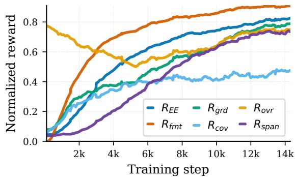  
Figure 4: Training rewards dynamics.

Table 6: Ablation study on the contribution of SCAE. Improvement/Degradations are highlighted relative to the corresponding configuration with SCAE.
<table><tr><td>Setting</td><td>Wiki PHEE</td><td></td><td>CASIE</td><td>G11</td><td>G13</td><td>MLEE</td><td>M2E2</td><td> $\mathrm { A v g }$ </td></tr><tr><td>EAGER</td><td>21.31</td><td>60.36</td><td>14.66</td><td>26.32</td><td>23.39</td><td>23.42</td><td>46.09</td><td>30.79</td></tr><tr><td>w/o SCAE</td><td>13.98</td><td>50.69</td><td>8.67</td><td>15.72</td><td>15.24</td><td>12.22</td><td>41.24</td><td>22.54</td></tr><tr><td>EAGER  $\ ` _ { R _ { E E } + R _ { F M T } }$ </td><td>20.12</td><td>53.66</td><td>15.70</td><td>26.11</td><td>24.10</td><td>21.62</td><td>30.22</td><td>27.36</td></tr><tr><td>w/o SCAE</td><td>15.49</td><td>52.32</td><td>9.03</td><td>16.44</td><td>16.52</td><td>11.67</td><td>43.46</td><td>23.56</td></tr></table>

## 5.2 Ablation Study

We organize our ablation evaluation around the following research questions.

RQ1: How can EE task-specific reward signals be effectively leveraged for RL ? While verifiable reward functions provide task-specific supervision across complementary aspects of event extraction, Table 6 shows that reward design alone is insufficient. This is reflected in the substantial performance drop from 30.79 to 22.54 average F1 when SCAE is removed. The same ablation applied to the $R _ { \mathrm { E E } } + R _ { \mathrm { f m t } }$ configuration (27.36 vs. 23.56) confirms that the benefit of SCAE is not due to the richer reward set. As shown in Figure 3, by introducing structural diversity through varying negative schemas across sampled completions, SCAE increases advantage variance and enables more meaningful gradient updates, effectively activating the fine-grained reward signals. This suggests that without SCAE, grouped policy optimization frequently produces homogeneous outputs that prevent the model from effectively leveraging these training signals. These findings highlight that in structured extraction tasks, informative reward modeling must be coupled with optimization strategies that preserve reward diversity.

RQ2: How does each reward contribute to extraction quality? Starting from the baseline $R _ { \mathrm { E E } } + R _ { \mathrm { f m t } }$ (27.36 avg. F1), we can see in Table 3 that adding any individual specialized reward improves overall performance, with the full combination of all six components reaching the best performance. In contrast, Table 5 shows that trigger metrics are relatively stable across reward configurations, as the $R _ { \mathrm { E E } } { + } R _ { \mathrm { f m t } }$ baseline already provides a reasonable foundation for trigger extraction while argument metrics are far more sensitive to reward design. Table 7 further reports the average gain of each additional reward over the $R _ { \mathrm { E E } } + R _ { \mathrm { f m t } }$ baseline, separately for trigger and argument subtasks, averaged across all seven datasets.
<table><tr><td>Reward Added</td><td>Avg. ∆ Trig.</td><td>Avg. ∆ Arg.</td></tr><tr><td> $+ R _ { \mathrm { g r d } }$ </td><td>+0.3</td><td>+1.6</td></tr><tr><td> $+ R _ { \mathrm { o v r } }$ </td><td>-0.4</td><td>+3.1</td></tr><tr><td> $+ R _ { \mathrm { c o v } }$ </td><td>+0.7</td><td>+0.5</td></tr><tr><td> $+ R _ { \mathrm { { s p a n } } }$ </td><td>+0.9</td><td>+4.2</td></tr><tr><td>All</td><td>+2.1</td><td>+7.4</td></tr></table>

Table 7: Average gain over the $R _ { \mathrm { E E } } + R _ { \mathrm { f m t } }$ baseline for trigger-level Avg. $\Delta$ Trig. (TI + TC) and argument-level Avg. ∆ Arg. $( \ \sum \mathrm { A I } , \mathrm { A C } , \mathrm { A I } + , \mathrm { A C } + )$ subtasks, averaged across seven datasets.

The results suggest that aggregate Mean-F1 gains reported in Table 2 are driven by argument-level improvements. Indeed, the full reward against the $R _ { \mathrm { E E } } + R _ { \mathrm { f m t } }$ configuration raises argument metrics by 7.4 pts on average versus only 2.1 pts for trigger metrics, suggesting the importance of EE tailored reward design. Additionally, no single reward dominates both subtasks simultaneously: $R _ { \mathrm { c o v } }$ and $R _ { \mathrm { s p a n } }$ are the best single-reward choices for triggers and arguments respectively, yet their combination in the full reward yields the best gains validating the proposed reward framework. Figure 5 reveals complementary reward learning dynamics: $R _ { \mathrm { f m t } }$ converges rapidly while $R _ { \mathrm { g r d } } , R _ { \mathrm { c o v } }$ , and $R _ { \mathrm { s p a n } }$ exhibit gradual improvements throughout training. This asymmetry suggests that structural validity is a prerequisite condition that is quickly satisfied, after which the model shifts its optimization toward semantic precision.

## 5.3 Error Analysis

Figure 5 reports error changes relative to the baseline $( R _ { \mathrm { E E } } + R _ { \mathrm { f m t } } )$ , revealing that the dominant error category of the baseline is over-generation. It is worth noting that the list of error categories<sup>1</sup> is not exhaustive and does not cover all possible error types. Moreover, all reward configurations substantially reduce extra arguments (−2,086 to −3,917), extra roles (−1,988 to −3,600), role confusion (−1,693 to −2,534), and hallucinations (−152 to −196). However, every configuration trades these gains for an increase in missing arguments $( + 4 3 0 \ t 0 \ { + } 2 , 4 2 2 )$ and missing roles (+222 to +1,080), exposing a consistent precision-recall tension across all reward designs. $R _ { \mathrm { o v r } }$ achieves the largest total error reduction $^ { ( - 8 , 3 1 5 ) }$ by most aggressively suppressing false positives, while $R _ { \mathrm { g r d } }$ most severely increases missing arguments (+2,422), reflecting over-conservative extraction. The full reward configuration (All) balances these competing pressures, yielding the second-largest total reduction (−6,639) while keeping missing argument growth lower (+956) than any individual precision-focused reward alone. Span boundary and parsing errors remain marginal and stable across all configurations, confirming that low-level structural quality is not a primary bottleneck.

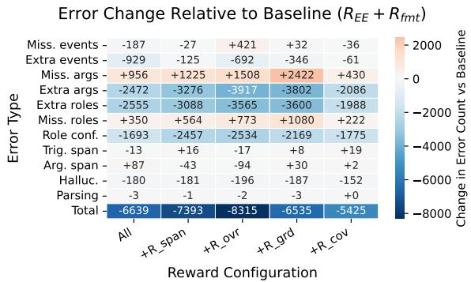  
Figure 5: Error Change Relative to Baseline $( R _ { E E } +$ $R _ { f m t } )$

## 6 Conclusion

We presented EAGER, a RL framework for endto-end event extraction that combines task-aligned verifiable rewards with SCAE. By decomposing reward supervision into complementary extraction objectives and introducing schema-contrastive grouping to mitigate reward variance collapse, our approach provides more informative optimization signals for structured extraction tasks. Experimental results across seven EE benchmark datasets demonstrate consistent improvements over strong baselines, particularly on argument-level extraction quality. Our findings further highlight the importance of combining fine-grained reward modeling with optimization strategies that preserve reward diversity in generative information extraction.

## 7 Limitations

Our approach relies on automatically generated annotation guidelines whose quality may vary across LLMs, domains and schemas. Investigating unified and hierarchical event schema across datasets may reduce annotation inconsistencies and improve cross-domain transfer, enabling models to better generalize across heterogeneous event definitions.

Additionally, we primarily assessed error categories that captures surface-level extraction anomaly and does not fully model complex phenomena such as coreference. Incorporating coreference modeling may help address cross-sentence arguments and nested event structures that remain challenging for generative EE systems.

While the proposed framework improves event extraction performance, balancing precision and recall remains challenging. Investigating curriculumbased reinforcenment learning could better balance precision and recall during optimization.

Finally, our evaluation remains limited to English event extraction with predefined schemas, leaving multilingual and open-schema settings for future work.

## Acknowledgment

This work was funded by the Federal Ministry of Research, Technology and Space (BMFTR) under grant number 16IW24006 (NoIDLEChatGPT) and grant number 25361 (RV-NI-2024–2029-K-IML), the Lower Saxony Ministry of Science and Culture (MWK) in the zukunft.niedersachsen program, and the Endowed Chair of AAI at University of Oldenburg. We also gratefully acknowledge support from the hessian.AI Service Center (funded by the Federal Ministry of Research, Technology and Space, BMFTR, grant no. 16IS22091) and the hessian.AI Innovation Lab (funded by the Hessian Ministry for Digital Strategy and Innovation, grant no. S-DIW04/0013/003).

## References

Omar Adjali, Siting Liang, Omair Shahzad Bhatti, and Daniel Sonntag. 2026. Aligning instruction-tuned llms for event extraction with multi-objective reinforcement learning. In European Conference on Information Retrieval, pages 586–595.

Zefan Cai, Po-Nien Kung, Ashima Suvarna, Mingyu Ma, Hritik Bansal, Baobao Chang, P Jeffrey Brantingham, Wei Wang, and Nanyun Peng. 2024. Im-

proving event definition following for zero-shot event detection. In Proceedings of the 62nd Annual Meeting of the Association for Computational Linguistics (Volume 1: Long Papers), pages 2842–2863.

Ruirui Chen, Chengwei Qin, Weifeng Jiang, and Dongkyu Choi. 2024. Is a large language model a good annotator for event extraction? In Proceedings ofthe AAAI conference on artificial intelligence, volume 38, pages 17772–17780.

Tianzhe Chu, Yuexiang Zhai, Jihan Yang, Shengbang Tong, Saining Xie, Dale Schuurmans, Quoc V Le, Sergey Levine, and Yi Ma. 2025. Sft memorizes, rl generalizes: A comparative study of foundation model post-training. arXiv preprint arXiv:2501.17161.

Jun Gao, Huan Zhao, Wei Wang, Changlong Yu, and Ruifeng Xu. 2024. Eventrl: Enhancing event extraction with outcome supervision for large language models. arXiv preprint arXiv:2402.11430.

Jun Gao, Huan Zhao, Changlong Yu, and Ruifeng Xu. 2023. Exploring the feasibility of chatgpt for event extraction. arXiv preprint arXiv:2303.03836.

Aaron Grattafiori, Abhimanyu Dubey, Abhinav Jauhri, Abhinav Pandey, Abhishek Kadian, Ahmad Al-Dahle, Aiesha Letman, Akhil Mathur, Alan Schelten, Alex Vaughan, and 1 others. 2024. The llama 3 herd of models. arXiv preprint arXiv:2407.21783.

Honghao Gui, Lin Yuan, Hongbin Ye, Ningyu Zhang, Mengshu Sun, Lei Liang, and Huajun Chen. 2024. Iepile: Unearthing large scale schema-conditioned information extraction corpus. In Proceedings of the 62nd Annual Meeting of the Association for Computational Linguistics (Volume 2: Short Papers), pages 127–146.

Daya Guo, Dejian Yang, Haowei Zhang, Junxiao Song, Peiyi Wang, Qihao Zhu, Runxin Xu, Ruoyu Zhang, Shirong Ma, Xiao Bi, and 1 others. 2025. Deepseek-r1: Incentivizing reasoning capability in llms via reinforcement learning. arXiv preprint arXiv:2501.12948.

Xixiang He, Qiyao Sun, Ao Cheng, Xingming Li, Xuanyu Ji, Hailun Lu, Runke Huang, and Qingyong Hu. 2026. Advantage collapse in group relative policy optimization: Diagnosis and mitigation. In International Conference on Machine Learning.

Zijin Hong and Jian Liu. 2024. Towards better question generation in qa-based event extraction. In Findings of the Association for Computational Linguistics: ACL 2024, pages 9025–9038.

I-Hung Hsu, Kuan-Hao Huang, Elizabeth Boschee, Scott Miller, Prem Natarajan, Kai-Wei Chang, and Nanyun Peng. 2022. Degree: A data-efficient generation-based event extraction model. In Proceedings of the 2022 Conference of the North American Chapter of the Association for Computational Linguistics: Human Language Technologies, pages 1890–1908.

Edward J Hu, yelong shen, Phillip Wallis, Zeyuan Allen-Zhu, Yuanzhi Li, Shean Wang, Lu Wang, and Weizhu Chen. 2022. LoRA: Low-rank adaptation of large language models. In International Conference on Learning Representations.

Maggie Huan, Yuetai Li, Tuney Zheng, Xiaoyu Xu, Seungone Kim, Minxin Du, Radha Poovendran, Graham Neubig, and Xiang Yue. 2025. Does math reasoning improve general llm capabilities? understanding transferability of llm reasoning. arXiv preprint arXiv:2507.00432.

Kuan-Hao Huang, I-Hung Hsu, Tanmay Parekh, Zhiyu Xie, Zixuan Zhang, Prem Natarajan, Kai-Wei Chang, Nanyun Peng, and Heng Ji. 2024. Textee: Benchmark, reevaluation, reflections, and future challenges in event extraction. In Findings of the Association for Computational Linguistics ACL 2024, pages 12804– 12825.

Aaron Hurst, Adam Lerer, Adam P Goucher, Adam Perelman, Aditya Ramesh, Aidan Clark, AJ Ostrow, Akila Welihinda, Alan Hayes, Alec Radford, and 1 others. 2024. Gpt-4o system card. arXiv preprint arXiv:2410.21276.

Aaron Jaech, Adam Kalai, Adam Lerer, Adam Richardson, Ahmed El-Kishky, Aiden Low, Alec Helyar, Aleksander Madry, Alex Beutel, Alex Carney, and 1 others. 2024. Openai o1 system card. arXiv preprint arXiv:2412.16720.

Yizhu Jiao, Ming Zhong, Sha Li, Ruining Zhao, Siru Ouyang, Heng Ji, and Jiawei Han. 2023. Instruct and extract: Instruction tuning for on-demand information extraction. In Proceedings of the 2023 Conference on Empirical Methods in Natural Language Processing, pages 10030–10051.

Jin-Dong Kim, Yue Wang, Toshihisa Takagi, and Akinori Yonezawa. 2011. Overview of genia event task in bionlp shared task 2011. In Proceedings ofBioNLP shared task 2011 workshop, pages 7–15.

Jin-Dong Kim, Yue Wang, and Yamamoto Yasunori. 2013. The genia event extraction shared task, 2013 edition-overview. In Proceedings of the BioNLP shared task 2013 workshop, pages 8–15.

Hao Li, Yanan Cao, Yubing Ren, Fang Fang, Lanxue Zhang, Yingjie Li, and Shi Wang. 2023a. Intra-event and inter-event dependency-aware graph network for event argument extraction. In Findings of the Association for Computational Linguistics: EMNLP 2023, pages 6362–6372, Singapore. Association for Computational Linguistics.

Manling Li, Alireza Zareian, Qi Zeng, Spencer Whitehead, Di Lu, Heng Ji, and Shih-Fu Chang. 2020. Cross-media structured common space for multimedia event extraction. arXiv preprint arXiv:2005.02472.

Peng Li, Tianxiang Sun, Qiong Tang, Hang Yan, Yuanbin Wu, Xuanjing Huang, and Xipeng Qiu. 2023b.

Codeie: Large code generation models are better few-shot information extractors. In The 61st Annual Meeting OfThe Association For Computational Linguistics.

Sha Li, Heng Ji, and Jiawei Han. 2021. Document-level event argument extraction by conditional generation. In Proceedings ofthe 2021 Conference ofthe North American Chapter of the Association for Computational Linguistics: Human Language Technologies, pages 894–908.

Zixuan Li, Yutao Zeng, Yuxin Zuo, Weicheng Ren, Wenxuan Liu, Miao Su, Yucan Guo, Yantao Liu, Lixiang Lixiang, Zhilei Hu, and 1 others. 2024. Knowcoder: Coding structured knowledge into llms for universal information extraction. In Proceedings of the 62nd Annual Meeting of the Association for Computational Linguistics (Volume 1: Long Papers), pages 8758–8779.

Shih-Yang Liu, Xin Dong, Ximing Lu, Shizhe Diao, Peter Belcak, Mingjie Liu, Min-Hung Chen, Hongxu Yin, Yu-Chiang Frank Wang, Kwang-Ting Cheng, and 1 others. 2026. Gdpo: Group reward-decoupled normalization policy optimization for multi-reward rl optimization. arXiv preprint arXiv:2601.05242.

Keming Lu, Xiaoman Pan, Kaiqiang Song, Hongming Zhang, Dong Yu, and Jianshu Chen. 2023. Pivoine: Instruction tuning for open-world information extraction. arXiv preprint arXiv:2305.14898.

Yaojie Lu, Hongyu Lin, Jin Xu, Xianpei Han, Jialong Tang, Annan Li, Le Sun, Meng Liao, and Shaoyi Chen. 2021. Text2Event: Controllable sequence-tostructure generation for end-to-end event extraction. In Proceedings of the 59th Annual Meeting of the Association for Computational Linguistics and the 11th International Joint Conference on Natural Language Processing (Volume 1: Long Papers), pages 2795–2806, Online. Association for Computational Linguistics.

Mingyu Derek Ma, Xiaoxuan Wang, Po-Nien Kung, P Jeffrey Brantingham, Nanyun Peng, and Wei Wang. 2024. Star: boosting low-resource information extraction by structure-to-text data generation with large language models. In Proceedings of the AAAI conference on artificial intelligence, volume 38, pages 18751–18759.

Yubo Ma, Zehao Wang, Yixin Cao, Mukai Li, Meiqi Chen, Kun Wang, and Jing Shao. 2022. Prompt for extraction? paie: Prompting argument interaction for event argument extraction. In Proceedings of the 60th Annual Meeting of the Association for Computational Linguistics (Volume 1: Long Papers), pages 6759–6774.

Long Ouyang, Jeffrey Wu, Xu Jiang, Diogo Almeida, Carroll Wainwright, Pamela Mishkin, Chong Zhang, Sandhini Agarwal, Katarina Slama, Alex Ray, and 1 others. 2022. Training language models to follow instructions with human feedback. Advances in neural information processing systems, 35:27730–27744.

Sampo Pyysalo, Tomoko Ohta, Makoto Miwa, Han-Cheol Cho, Jun’ichi Tsujii, and Sophia Ananiadou. 2012. Event extraction across multiple levels of biological organization. Bioinformatics, 28(18):i575– i581.

Yunjia Qi, Hao Peng, Xiaozhi Wang, Bin Xu, Lei Hou, and Juanzi Li. 2024. Adelie: Aligning large language models on information extraction. In Proceedings of the 2024 Conference on Empirical Methods in Natural Language Processing, pages 7371–7387.

Yubing Ren, Yanan Cao, Ping Guo, Fang Fang, Wei Ma, and Zheng Lin. 2023. Retrieve-and-sample: Document-level event argument extraction via hybrid retrieval augmentation. In Proceedings of the 61st Annual Meeting of the Association for Computational Linguistics (Volume 1: Long Papers), pages 293– 306.

Baptiste Roziere, Jonas Gehring, Fabian Gloeckle, Sten Sootla, Itai Gat, Xiaoqing Ellen Tan, Yossi Adi, Jingyu Liu, Romain Sauvestre, Tal Remez, and 1 others. 2023. Code llama: Open foundation models for code. arXiv preprint arXiv:2308.12950.

Oscar Sainz, Iker García-Ferrero, Rodrigo Agerri, Oier Lacalle, German Rigau, and Eneko Agirre. 2024. Gollie: Annotation guidelines improve zero-shot information-extraction. In International Conference on Learning Representations, volume 2024, pages 47083–47107.

Taneeya Satyapanich, Francis Ferraro, and Tim Finin. 2020. Casie: Extracting cybersecurity event information from text. In Proceedings of the AAAI conference on artificial intelligence, volume 34, pages 8749–8757.

John Schulman, Filip Wolski, Prafulla Dhariwal, Alec Radford, and Oleg Klimov. 2017. Proximal policy optimization algorithms. arXiv preprint arXiv:1707.06347.

Zhihong Shao, Peiyi Wang, Qihao Zhu, Runxin Xu, Junxiao Song, Xiao Bi, Haowei Zhang, Mingchuan Zhang, YK Li, Y Wu, and 1 others. 2024. Deepseekmath: Pushing the limits of mathematical reasoning in open language models, 2024. URL https://arxiv. org/abs/2402.03300, 2(3):5.

Aaditya Singh, Adam Fry, Adam Perelman, Adam Tart, Adi Ganesh, Ahmed El-Kishky, Aidan McLaughlin, Aiden Low, AJ Ostrow, Akhila Ananthram, and 1 others. 2025. Openai gpt-5 system card. arXiv preprint arXiv:2601.03267.

Saurabh Srivastava, Sweta Pati, and Ziyu Yao. 2025. Instruction-tuning LLMs for event extraction with annotation guidelines. In Findings of the Association for Computational Linguistics: ACL 2025, pages 13055–13071, Vienna, Austria. Association for Computational Linguistics.

Zhaoyue Sun, Jiazheng Li, Gabriele Pergola, Byron C Wallace, Bino John, Nigel Greene, Joseph Kim, and

Yulan He. 2022. Phee: A dataset for pharmacovigilance event extraction from text. In Proceedings of the 2022 Conference on Empirical Methods in Natural Language Processing, pages 5571–5587.

Leandro von Werra, Younes Belkada, Lewis Tunstall, Edward Beeching, Tristan Thrush, Nathan Lambert, Shengyi Huang, Kashif Rasul, and Quentin Gallouédec. 2020. Trl: Transformer reinforcement learning. https://github.com/huggingface/trl.

Xiao Wang, Weikang Zhou, Can Zu, Han Xia, Tianze Chen, Yuansen Zhang, Rui Zheng, Junjie Ye, Qi Zhang, Tao Gui, and 1 others. 2023a. Instructuie: Multi-task instruction tuning for unified information extraction. arXiv preprint arXiv:2304.08085.

Xingyao Wang, Sha Li, and Heng Ji. 2023b. Code4struct: Code generation for few-shot event structure prediction. In The 61st Annual Meeting Of The Association For Computational Linguistics.

Qiying Yu, Zheng Zhang, Ruofei Zhu, Yufeng Yuan, Xiaochen Zuo, Yu Yue, Weinan Dai, Tiantian Fan, Gaohong Liu, Lingjun Liu, and 1 others. 2026. Dapo: An open-source llm reinforcement learning system at scale. Advances in Neural Information Processing Systems, 38:113222–113244.

Xichen Zhang, Sitong Wu, Yinghao Zhu, Haoru Tan, Shaozuo Yu, Ziyi He, and Jiaya Jia. 2025. Scafgrpo: Scaffolded group relative policy optimization for enhancing llm reasoning. arXiv preprint arXiv:2510.19807.

## A Code-based Representation

We formulate EE as a code generation problem where both the input and output are formatted using Python code similar to Following (Sainz et al., 2024; Srivastava et al., 2025). Indeed, IE tasks benefit on the first hand from the strong code understanding capabilities of large language models since code data is widely included in their pre-training corpora (Wang et al., 2023b; Li et al., 2023b). On the other hand, codebased structure representation provides a unified and human-readable framework for information extraction tasks, while mitigating ambiguities often encountered in natural language instructions.

```python
1 @dataclass
2 class Conflict_Attack:
3 """Conflict:Attack event"""
4 mention: str
<sup>5</sup> <sub>6</sub> Attacker: List[str]
Instrument: List[str]
7 Place: List[str]
Target: List[str]
```  
Figure 6: Example of an event schema as python class

<table><tr><td>Model</td><td>WikiEvents</td><td>PHEE</td><td>CASIE</td><td>GENIA11</td><td>GENIA13</td><td>MLEE</td><td>M2E2</td><td>Avg.</td></tr><tr><td>GoLLIE-7B w/o AG</td><td>9.14</td><td>7.67</td><td>3.13</td><td>1.64</td><td>1.17</td><td>2.41</td><td>15.54</td><td>5.81</td></tr><tr><td>GoLLIE-13B w/o AG</td><td>10.07</td><td>7.78</td><td>4.00</td><td>2.16</td><td>0.99</td><td>2.88</td><td>22.31</td><td>7.17</td></tr><tr><td>GoLLIE-34B w/o AG</td><td>10.46</td><td>9.71</td><td>4.25</td><td>5.26</td><td>5.00</td><td>4.55</td><td>29.37</td><td>9.80</td></tr></table>

Table 8: Performance comparison of GoLLIE models without AG.

The code format ensures that outputs are syntactically well-formed facilitating output parsing (Sainz et al., 2024; Srivastava et al., 2025). In particular, event schemes are expressed as Python classes (@dataclass type definitions) and the extracted output events as instances of these classes.

## B Guidelines Annotation Generation

Using LLaMA-3.1-8B-Instruct model (Grattafiori et al., 2024), we adopt the Guideline-PN (Positive + Negative) generation protocol of (Srivastava et al., 2025), wherein the LLM is conditioned on a contrastive set of examples to produce guidelines for each event type $e \in { \mathcal { E } } .$ . Specifically, the prompt consists of positive examples: 10 annotated instances of event type e paired with their source texts and negative examples: 15 texts containing other event types but no instance of e. This contrastive design encourages the model to identify definitional boundaries and discriminative features that distinguish e from related event types. The generation prompt instructs the LLM to: (1) enumerate all unique argument roles for e; (2) provide a precise definition of the event type; and (3) characterize each argument role, emphasizing its semantic function, representative mentions, and potential edge cases. The resulting guidelines are incorporated into the Python class schema via docstrings and inline comments, yielding an augmented schema $E _ { e } ^ { \mathrm { G } }$ that integrates both structural and semantic information. See Figures 14, 15, 16, 17, 18, 19 and 20 for examples of event scheme augmented with annotation guidelines for each dataset.

## B.1 Additional Annotation Guidelines Analysis

Tables 8 reports the the effect of AG on the GoL-LIE backbone model. We can see that augmenting event schemes with annotation guidelines improves event extraction performance.

## C Supervised Fine-Tuning

To effectively train medium-scale LLMs while preserving their foundational capabilities, we carry out instruction-based supervised fine-tuning to adapt the model to event extraction using codestyle schema representations. This enables the model to follow natural-language task instructions while generating syntactically valid and semantically grounded event representations in Python code. The LLM is trained using supervised finetuning on a set of annotated prompt/response pairs $\{ ( P _ { i } , Y _ { i } ) \} _ { i = 1 } ^ { N }$ , where $Y _ { i }$ denotes the target structured event instance. The fine-tuning objective follows a standard autoregressive likelihood formulation:

$$
\mathcal { L } ( \theta ) = - \sum _ { i } \sum _ { j } \log p _ { \theta } ( Y _ { i , j } \mid P _ { i } , Y _ { i , < j } ) ,
$$

where $Y _ { i , < j }$ denotes previously generated tokens in the output sequence.

## D Inference

At inference time, given an input text X, all n event schemas in $\mathcal { E } = \{ E _ { i } \} _ { i = 1 } ^ { n }$ are provided jointly in the prompt, enabling the model to perform end-toend event extraction and produce a Python list of instantiated event objects in a single forward pass.

## E DAPO Background

DAPO builds upon GRPO and addresses its key limitations i.e., entropy collapse, reward noise, and sequence-level length bias through four modifications: (1) Clip-Higher, which uses asymmetric clipping bounds $[ \epsilon _ { \mathrm { l o w } } , \epsilon _ { \mathrm { h i g h } } ]$ with $\epsilon _ { \mathrm { h i g h } } > \epsilon _ { \mathrm { l o w } }$ to prevent entropy collapse; (2) Token-Level Loss, which normalizes the policy gradient over all active tokens in the batch rather than per sequence, eliminating length bias; (3) Dynamic Sampling, which filters out zero-variance groups (all-correct or allincorrect) and resamples until every batch contains informative gradient signal; and (4) KL Removal, which sets $\beta { = } 0$ . Unlike standard RLHF (Ouyang et al., 2022), where KL regularization prevents the policy from deviating too far from a supervised baseline, EE requires the model to diverge from its initial distribution to acquire precise schemagrounded output patterns.

## F Verifiable Rewards Formulation

We propose a decomposed, task-aligned reward formulation for generative EE. Rather than relying solely on aggregate extraction F1, we organize the reward signal around three complementary objectives: validity, requiring outputs to be parseable and schema-compatible; extraction accuracy, requiring outputs to match gold event annotations; and generation behavior, requiring outputs to remain grounded in the source text, avoid spurious predictions, and maintain adequate event coverage.

## F.1 Validity Reward

As a prerequisite to semantic evaluation, we reward outputs that are syntactically well-formed and successfully parse into the code-based representation introduced in Section 3.2:

$$
R _ { \mathrm { f m t } } ( o _ { i } ) = { \left\{ \begin{array} { l l } { 1 , } & { { \mathrm { i f ~ } } o _ { i } { \mathrm { i s ~ s y n t a c t i c a l l y ~ p a r s e a b l e } } , } \\ { 0 , } & { { \mathrm { o t h e r w i s e } } . } \end{array} \right. }\tag{9}
$$

## F.2 Extraction Accuracy Reward

We define the extraction reward as the sum of F1 scores across the six EE evaluation metrics spanning the four canonical subtasks TI, TC, AI, AC ‚and their trigger-aware variants $\mathrm { A I ^ { + } }$ and $\mathbf { A } \mathbf { C } ^ { + }$

$$
R _ { \mathrm { E E } } = \sum _ { k \in \{ \mathrm { T I } , \mathrm { T C } , \mathrm { A I } , \mathrm { A C } , \mathrm { A I } ^ { + } , \mathrm { A C } ^ { + } \} } F _ { 1 } ^ { k } .\tag{10}
$$

This reward captures holistic extraction quality across all subtasks but remains coarse with respect to specific generation issues, motivating the supplementary signals below.

## F.3 Groundedness Reward

To penalize hallucinated triggers and argument spans unsupported by the source text, we introduce a groundedness reward that measures whether predicted mentions appear verbatim in the input $X$ Let $\{ e _ { j } \}$ denote the set of predicted events, $\mathcal { R } ( e _ { j } )$ the set of argument roles for event $e _ { j }$ , and $T _ { i }$ the total number of predicted arguments across all events in $o _ { i }$ . We compute separate support scores for triggers and arguments:

$$
s _ { \mathrm { m } } = \frac { 1 } { | \{ e _ { j } \} | } \sum _ { e _ { j } } \mathbb { I } \big [ \mathrm { c o n t a i n s } ( X , e _ { j } . \mathrm { t r i g g e r } ) \big ] ,\tag{11}
$$

$$
s _ { \mathrm { a r g } } = \frac { 1 } { T _ { i } } \sum _ { e _ { j } } \sum _ { r \in \mathcal { R } ( e _ { j } ) } \sum _ { v \in e _ { j } [ r ] } \mathbb { I } \big [ \mathrm { c o n t a i n s } ( X , v ) \big ] ,\tag{12}
$$

with $s _ { \mathrm { m } } = 0$ if no events are predicted and $s _ { \mathrm { a r g } }$ 0 if $T _ { i } ~ = ~ 0$ . The groundedness reward is their average:

$$
\begin{array} { r } { R _ { \mathrm { g r d } } = \frac 1 2 \big ( s _ { \mathrm { m } } + s _ { \mathrm { a r g } } \big ) . } \end{array}\tag{13}
$$

This signal penalizes fabricated spans while $\mathrm { \bf r e - }$ maining agnostic to event type correctness.

## F.4 Over-generation Reward

Since extraction F1 does not explicitly penalize spurious predictions beyond the gold annotation, we introduce a complementary over-generation penalty. Let $E _ { i } ^ { + }$ and $A _ { i } ^ { + }$ denote the number of predicted events and arguments in $o _ { i }$ that exceed the gold counts in $Y ^ { * }$ . We define:

$$
R _ { \mathrm { o v r } } = \operatorname* { m a x } \biggl ( 0 , 1 - \frac { E _ { i } ^ { + } + A _ { i } ^ { + } } { n ^ { * } + a ^ { * } } \biggr )\tag{14}
$$

where $E _ { i } ^ { + }$ and $A _ { i } ^ { + }$ are the predicted events and arguments exceeding the gold counts, and ${ n ^ { * } , a ^ { * } }$ are the gold event and argument counts. This reward equals 1 when no excess predictions are made and decreases linearly as spurious spans accumulate, saturating at 0.

## F.5 Coverage Reward

To counterbalance $R _ { \mathrm { o v I } }$ and prevent the model from adopting an overly conservative decoding strategy, we reward proportional event and argument coverage relative to the gold annotation. Let $n ^ { * } = | Y ^ { * } |$ and $n ^ { g } \ = \ | \{ e \ \in \ o _ { i } \ : \ e . \mathrm { t y p e } \ \in \ S \} |$ denote the gold and schema-valid predicted event counts, respectively, and let $a ^ { * }$ and $a ^ { g }$ be the corresponding argument counts. We define:

$$
R _ { \mathrm { c o v } } = \frac { 1 } { 2 } \left( \operatorname* { m i n } \left( 1 , \frac { n ^ { g } } { n ^ { * } } \right) + \operatorname* { m i n } \left( 1 , \frac { a ^ { g } } { a ^ { * } } \right) \right) ,\tag{15}
$$

where $\boldsymbol { \mathcal { S } }$ is the event schema registry. The min(·, 1) clamping ensures that over-prediction does not inflate the coverage score, maintaining complementarity with $R _ { \mathrm { o v r } }$

## F.6 Span Precision Reward

It addresses the case where the model correctly identifies an argument’s semantic content but extracts a superset of the minimal gold span. Standard exact-match rewards treat such predictions as fully incorrect, providing no useful gradient signal for boundary refinement. We therefore introduce a complementary Span Precision Reward $R _ { \mathrm { s p a n } }$ that softly penalizes overpredicted spans while rewarding near-correct predictions. For each predicted argument ${ \hat { a } } ,$ we retrieve its best-matching gold span $a ^ { * } = \arg \operatorname* { m a x } _ { a \in \mathcal { A } _ { r } } \mathcal { I } ( \hat { a } , a )$ via token Jaccard similarity, and compute a per-argument score:

$$
s ( \hat { a } , a ^ { * } ) = \left\{ \begin{array} { l l } { \operatorname* { m a x } ( 0 , \mathcal { I } ( \hat { a } , a ^ { * } ) } \\ { - \displaystyle \frac { \lvert \hat { a } \rvert - \lvert a ^ { * } \rvert } { \operatorname* { m a x } ( 1 , \lvert a ^ { * } \rvert ) } \bigg ) \quad \mathrm { i f } \hat { a } \supset a ^ { * } , } \\ { \mathcal { I } ( \hat { a } , a ^ { * } ) \quad \mathrm { o t h e r w i s e } . } \end{array} \right.\tag{16}
$$

The reward is the mean score over all aligned predicted arguments, and is gated to zero when no overprediction occurs, decoupling it from the outcome reward in well-behaved cases.

## G Implementation Details

We conducted experiments using the GoLLIE-7B model (Sainz et al., 2024), a fine-tuned version of Code-LLaMA (Roziere et al., 2023), which provides a strong backbone for code-based information extraction. For efficient optimization, we employed parameter-efficient fine-tuning via QLoRA (Hu et al., 2022), applying low-rank adapters to the attention projection layers with LoRA rank 8, scaling factor $\alpha \ = \ 1 6 .$ , learning rate $1 \times 1 0 ^ { - 6 } ,$ , and batch size 1 for SFT. For RL optimization, we used the TRL library (von Werra et al., 2020) with learning rate $1 \times 1 0 ^ { - 6 }$ batch size 4, and 4 sampled completions per input using nucleus sampling $( p = 0 . 9 , \tau = 0 . 6 )$ DAPO Clipping bounds are set to $\epsilon _ { \mathrm { l o w } } = 0 . 2$ and $\epsilon _ { \mathrm { h i g h } } = 0 . 2 8$ following Yu et al. (2026), and the KL penalty coefficient is set to $\beta = 0$ . Models were trained for up to 10 epochs on 4 NVIDIA H100 GPUs for RL optimization, with early stopping triggered after 3 consecutive non-improving validation steps. The best-performing validation checkpoint was selected for testing. At inference time, we used greedy decoding. Our code will be released at:https://github.com/OA256864/EE\_RL.

## H Training Protocol

We train the GoLLIE-7B LLM on a training set constructed by concatenating the training sets of the seven datasets used in our experiments and then we shuffled the result set to have cross-domain and -schema training batches. We conducted DAPO (Yu et al., 2026) with our proposed SCAE and our reward formulation without resorting to an SFT checkpoint for warm-starting as SFT provided only marginal improvements on the validation sets.

Impact of number of negative schemas K Our preliminary experiments indicated that increasing the number of negative schemas K sampled using SCAE consistently improved performance. Consequently, we set K=10, the largest value permitted by both our GPU memory constraints and the 16ktoken maximum prompt length budget.

Algorithm 1 DAPO with SCAE   
Require: Initial policy $\pi _ { \boldsymbol { \theta } } ;$ training set $\mathcal { D } ;$ event   
schema pool $\mathcal { E } ;$ group size G; negative schema   
count $K ;$ clipping bounds $\epsilon _ { \mathrm { l o w } }$ , ϵ<sub>high</sub>   
1: for $\operatorname { s t e p } = 1 , \ldots , n$ do   
2: Sample a batch $\mathcal { D } _ { b }$ from $\mathcal { D }$   
3: Update old policy $\pi _ { \theta _ { \mathrm { o l d } } }  \pi _ { \theta }$   
4: for each instance $( X , e , Y ) \in \mathcal { D } _ { b }$ do   
5: Let $\mathcal { N } ~ = ~ \mathcal { E } ~ \backslash ~ \{ e \}$ be the negative   
schema pool   
6: for $i = 1 , \dots , G$ do   
7: Sample a distinct negative schema   
subset $S _ { i } \stackrel { \mathrm { i . i . d . } } { \sim } \binom { N } { K }$   
8: Construct contrastive prompt $P _ { i } =$   
I ⊕ $E _ { e } ^ { \mathrm { G } } \oplus \mathcal { S } _ { i } \oplus X$   
9: Sample completion $\begin{array} { r } { \hat { o } _ { i } \sim \pi _ { \theta _ { \mathrm { o l d } } } ( . } \end{array}$   
$P _ { i } )$   
10: Compute reward $R _ { i } = R ( \hat { o } _ { i } , Y )$   
11: end for   
12: Compute group statistics $\mu _ { R }$ =   
mean $( \{ R _ { i } \} _ { i = 1 } ^ { G } ) , \ \sigma _ { R } = \mathrm { s t d } ( \{ R _ { i } \} _ { i = 1 } ^ { G } )$   
13: if $\sigma _ { R } = 0$ then   
14: skip group (Dynamic Sampling)   
15: end if   
16: Compute per-token advantages $\hat { A } _ { t } ^ { i } =$   
$( R _ { i } - \mu _ { R } ) / \sigma _ { R }$   
17: end for   
18: Update $\pi _ { \theta }$ by minimizing L<sub>DAPO</sub>(θ)   
(Eq. 3) with advantages $\{ \hat { A } _ { t } ^ { i } \}$   
19: end for   
20: return π<sub>θ</sub>

Impact of group size G Similarly, preliminary experiments showed that increasing the group size from G = 2 to G = 4 sampled completions per input improved performance while also accelerating convergence. These results suggest that scaling to $G = 8$ could yield further performance gains given a very large computational budget.

## I Pseudo Code of DAPO with SCAE

To provide an overview of the training process, we present the pseudo code of DAPO with SCAE in Algorithm 1.

## J Training Dynamics Analysis

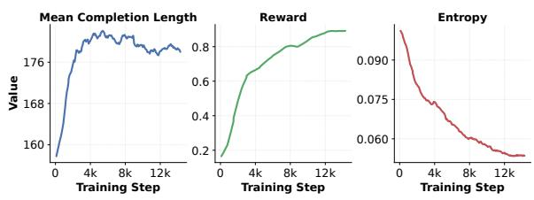  
Figure 8: Analysis of the main metrics for monitoring our RL training dynamics including the mean completion length, the mean reward score, and generation entropy.

Reinforcement learning over structured prediction tasks such as EE introduces additional complexity beyond standard reasoning benchmarks, as the reward signal must simultaneously supervise trigger identification, event classification, and schemagrounded argument extraction. Given this interdependence, monitoring key intermediate metrics throughout training is essential for diagnosing undesired behavior and validating that each reward component contributes as intended. Figure 8 reports the three principal indicators we track across training in addition to the EE validation performance.

## J.1 Mean Completion Length Analysis

The mean completion length increases steadily over the course of training, reflecting the model’s growing tendency to produce more complete structured outputs as training progresses. In the context of code-based EE, this growth is consistent with the model learning to instantiate a larger and more complete set of event objects and argument slots, rather than defaulting to under-populated outputs. We observe no prolonged stagnation or decline in length, suggesting that our training signal discourages overly conservative decoding throughout training.

## J.2 Mean Reward Analysis

The mean reward increases monotonically with a smooth trajectory and no sign of instability or collapse. This stability indicates that the decomposed reward formulation $R _ { \mathrm { f u l l } }$ provides a reliable and consistent training signal, allowing the model to robustly fit the distribution of the training set. Consistent with findings reported in prior DAPO work (Yu et al., 2026), we observe that the final reward on the training set correlates imperfectly with held-out extraction performance, underscoring the importance of complementing reward monitoring with validation-set evaluation to detect potential overfitting.

<table><tr><td>Method</td><td>Model</td><td>GPUs</td><td>Batch Size</td><td>Epochs</td><td>Wall Time (h)</td></tr><tr><td>EAGER</td><td>GoLLIE-7B</td><td>4×H100</td><td>4</td><td>1</td><td>~4</td></tr></table>

Table 9: Computational cost of EAGER training on 4 NVIDIA H100 GPUs. Wall time is reported for the full train dataset, which includes the seven dataset training sets.

## J.3 Generation Entropy Analysis

The generation entropy exhibits a slow but consistent downward trend throughout training until it stabilizes then it starts increasing slightly. As shown in (Yu et al., 2026), too high entropy indicates over-exploration of the model, while too low entropy leads to a loss of exploration capability suggesting that the model’s entropy needs to be maintained within an appropriate range. In our setting, an exploratory behavior is particularly important, as the model must explore diverse span-selection and role-assignment strategies before converging on schema-grounded outputs. The absence of any entropy spike or erratic fluctuation further confirms that the removal of KL regularization (β=0) does not destabilize training in our setting.

## K Training Computational Cost

Table 9 reports the computational training cost.

## L Datasets Details

We evaluate EAGER on seven benchmark datasets spanning diverse domains, annotation schemes, and event ontologies.

WikiEvents (Li et al., 2021) is a large-scale news-domain benchmark containing richly annotated real-world event mentions with complex argument structures.

PHEE (Sun et al., 2022) focuses on the biomedical domain, specifically pharmacovigilance event extraction from medical case reports, requiring fine-grained reasoning over domain-specific terminology.

CASIE (Satyapanich et al., 2020) is a cybersecurity event extraction benchmark centered on security incident reports, featuring highly specialized event schemas and technical vocabulary.

<table><tr><td>Dataset</td><td>#Docs</td><td>#Instances</td><td>#Event Types</td><td>#Events</td><td>#Arguments</td><td>Domain</td></tr><tr><td>WikiEvents</td><td>245</td><td>565</td><td>50</td><td>598</td><td>5,501</td><td>Wikipedia</td></tr><tr><td>CASIE</td><td>999</td><td>1,375</td><td>5</td><td>8,469</td><td>22,575</td><td>Cybersecurity</td></tr><tr><td>PHEE</td><td>4,827</td><td>4,827</td><td>2</td><td>5,019</td><td>25,760</td><td>Pharmacovigilance</td></tr><tr><td>GENIA2011</td><td>960</td><td>960</td><td>9</td><td>13,537</td><td>11,865</td><td>Biomedical</td></tr><tr><td>GENIA2013</td><td>20</td><td>664</td><td>13</td><td>6,001</td><td>5,660</td><td>Biomedical</td></tr><tr><td>MLEE</td><td>262</td><td>286</td><td>29</td><td>6,575</td><td>5,958</td><td>Biomedical</td></tr><tr><td>M2E2</td><td>6,013</td><td>6,013</td><td>8</td><td>1,105</td><td>1,659</td><td>News</td></tr></table>

Table 10: Statistics of the end-to-end event extraction datasets used in our experiments.

GENIA2011 and GENIA2013 (Kim et al., 2011; Pyysalo et al., 2012) are biomedical event extraction datasets derived from PubMed abstracts, involving nested event structures and biologically grounded argument semantics.

MLEE (Pyysalo et al., 2012) extends biomedical event extraction to molecular-level event understanding with more diverse biological interaction types.

M2E2 (Li et al., 2020) is a multimodal event extraction benchmark originally designed for joint text-image event understanding; following prior text-only work, we evaluate exclusively on the textual component.

These datasets collectively cover news, biomedical, and cybersecurity domains, providing a comprehensive testbed for evaluating robustness across heterogeneous event schemas and extraction difficulty levels.

## M Additional Results and Analysis

Table 12, Table 13 and Table 14 show the detailed results of EE.

## M.1 Trigger and Argument Performance Analysis

We decompose event extraction quality into triggerlevel (TI, TC) and argument-level (AI, AC, AI+, AC+) subtasks using the detailed results and isolating how each reward contributes to the global EE quality.

## M.1.1 Event Trigger Performance (TI,TC)

The $R _ { \mathrm { E E } } + R _ { \mathrm { f m t } }$ baseline achieves competitive TI and TC scores across most datasets indicating that schema-grounded instruction tuning already provides a reasonable foundation for trigger localisation and type assignment. $R _ { \mathrm { c o v } }$ yields the most consistent TI gains, by penalising missed gold events and directly improving trigger recall. $R _ { \mathrm { s p a n } }$ contributes primarily to TC by refining span boundaries and stabilising type-assignment confidence.

$R _ { \mathrm { o v r } }$ introduces a precision-recall trade-off, reducing spurious triggers but degrading TI on datasets where the baseline already under-generates. Combining all rewards yields the strongest TI and TC on most datasets, with the largest gains on M2E2 (TI: +11.17, TC: +14.29 over baseline) and MLEE (TI: +3.22, TC: +4.22), where multievent documents benefit most from joint coverage and precision supervision.

## M.1.2 Argument Performance (AI, AC, AI+, AC+)

Argument metrics are significantly lower than trigger metrics, and the anchored variants AI+ and AC+ collapse further exposing systematic triggerargument misalignment that is not apparent using mean-F1. $R _ { \mathrm { s p a n } }$ is the single most impactful reward for argument tasks, delivering the largest per-dataset gains across all four subtasks (PHEE: AC +14.15, AC+ +9.64; M2E2: AC +5.54, AC+ +4.63), as boundary-level supervision directly addresses the span imprecision that drives argument scoring errors. $R _ { \mathrm { o v r } }$ provides strong corrections in over-extraction behaviors (M2E2: AI+ +8.23, AC+ +9.36) but degrades recall in domains such as CASIE and MLEE. $R _ { \mathrm { g r d } }$ improves AI and AC where hallucinated spans are prevalent (WikiEvents, PHEE) but shows limited benefit for AI+/AC+, indicating that verbatim-span enforcement alone does not resolve trigger-argument misalignment. When resorting to the full reward set produces the highest AI+/AC+ scores on the majority of datasets, with the most pronounced gains on M2E2 (AI+: +14.87, AC+: +17.65 over baseline) and PHEE (AC+: +11.02). These improvements suggest that the combined reward induces triggerargument alignment beyond what individual objectives achieve in isolation.

## M.2 Additional Error Analysis

Figures 9, 10, 11, 12 and 13 show a detailed comparative evaluation of error categories across datasets for each proposed reward. The acronyms of error categories are defined as follows: ME: Missing events, EE: Extra events, EE: Extra events, MA: Missing arguments, EA: Extra arguments, RC: Role confusion, HA: Hallucinations, TS: Trigger span boundary errors, AS: Argument span boundary errors, ER: Extra roles, EE: Extra events, MR: Missing roles. Error categories are defined in Table 11.

## N Examples Event Schema with Generated Annotation Guidelines

Figures 14, 15, 16, 17, 18, 19 and 20, illustrate examples of one event scheme augmented with annotation guidelines for each dataset.

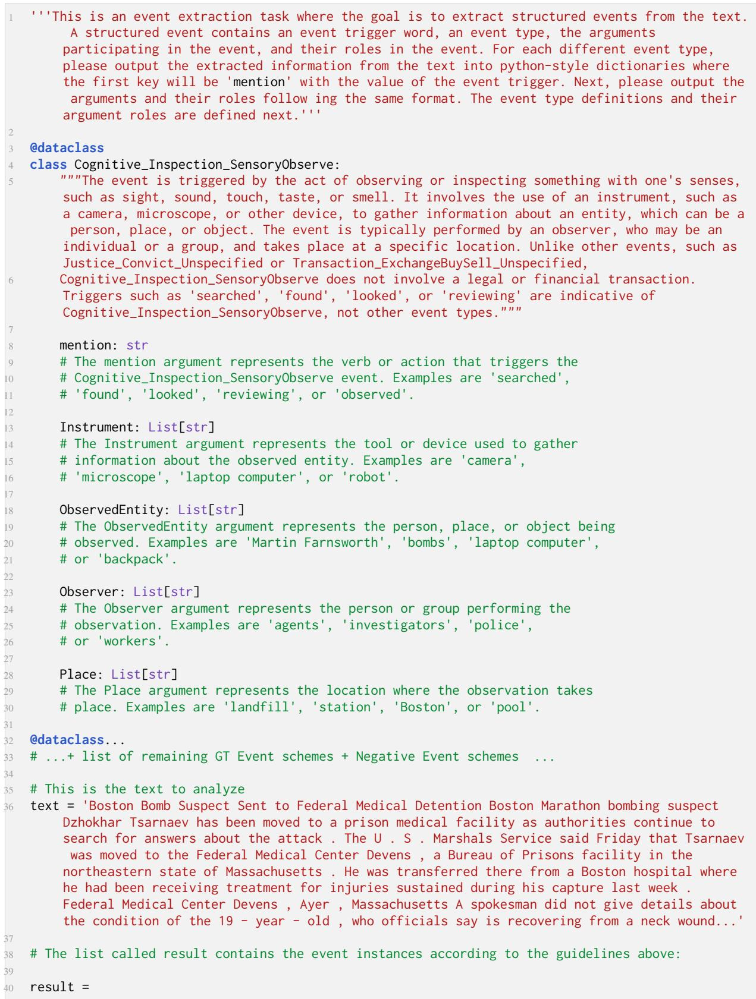  
Figure 7: Training Input Prompt Example

<table><tr><td></td><td>Acronym Error Category</td><td>Definition</td></tr><tr><td colspan="3">Event-level Errors</td></tr><tr><td>ME</td><td>Missing Events</td><td>A gold event instance is absent from the model&#x27;s output; the trigger and all its associated arguments are undetected.</td></tr><tr><td>EE</td><td>Extra Events</td><td>The model predicts an event instance with no corresponding gold event; a spurious trigger is generated that is not grounded in the annotation.</td></tr><tr><td colspan="3">Argument-level Errors</td></tr><tr><td>MA</td><td>Missing Arguments</td><td>A gold argument span is not predicted for an otherwise correctly identi- fied event; the event is detected but one or more of its argument slots are</td></tr><tr><td>EA</td><td>Extra Arguments</td><td>left unfilled. The model predicts one or more argument spans that have no corre- sponding gold argument; spurious fillers are generated beyond the gold</td></tr><tr><td>ER</td><td>Extra Roles</td><td>annotation. The model populates an argument role that does not exist in the gold annotation for the predicted event type, introducing schema-inconsistent</td></tr><tr><td>MR</td><td>Missing Roles</td><td>role assignments. A role defined in the gold event schema is entirely absent from the</td></tr><tr><td>RC</td><td>Role Confusion</td><td>predicted event instance, resulting in incomplete role coverage. An argument span is correctly extracted from the source text but assigned to an incorrect semantic role within the event schema; the span is right</td></tr><tr><td colspan="3">Span-level Errors</td></tr><tr><td>TS</td><td>Trigger Span Error</td><td>The predicted trigger span does not exactly match the gold trigger boundary; includes both under-specified spans (partial overlap) and</td></tr><tr><td>AS</td><td>Argument Span Error</td><td>over-specified spans (superset of the gold mention). The predicted argument span does not exactly match the gold argument boundary; includes both partial and over-extended span predictions relative to the minimal gold span.</td></tr><tr><td colspan="3">Faithfulness Errors</td></tr><tr><td>HA</td><td>Hallucination</td><td>The predicted trigger or argument span does not appear verbatim in the source input text; the model generates mentions unsupported by the</td></tr><tr><td colspan="3">Structural Errors</td></tr><tr><td>PE</td><td>Parsing Error</td><td>The model output cannot be parsed into the required code-based struc- tured representation; the generated Python code is syntactically mal- formed or fails to instantiate valid event objects.</td></tr></table>

Table 11: Definitions of all error categories used in the error analysis (Section 5.3). Categories are grouped into five types: event-level errors concerning the detection of event instances, argument-level errors concerning role assignment and completeness, span-level errors concerning boundary precision, faithfulness errors concerning grounding in the source text, and structural errors concerning the syntactic validity of the generated output.

<table><tr><td rowspan="2">Method</td><td colspan="8">WikiEvents</td><td colspan="8">PHEE</td><td colspan="4">CASIE</td><td colspan="4"></td></tr><tr><td>TI</td><td>TC</td><td>AI</td><td>AC</td><td>AI+</td><td></td><td>AC+</td><td>Avg.</td><td>TI</td><td>TC</td><td>AI</td><td></td><td>AC</td><td>AI+</td><td>AC+</td><td>Avg.</td><td></td><td>TI</td><td>TC</td><td>AI</td><td></td><td>AC</td><td>AI+</td><td>AC+</td><td></td><td>Avg.</td></tr><tr><td>GPT-4o (Hurst et al., 2024)</td><td>24.58</td><td>20.88</td><td>5.43</td><td>4.96</td><td>3.22</td><td></td><td>2.77</td><td>10.31</td><td>2.84</td><td></td><td>2.84</td><td>2.24</td><td>1.82</td><td>1.27</td><td>0.98</td><td></td><td>2.00</td><td>4.58</td><td>4.58</td><td>5.12</td><td></td><td>4.38</td><td>1.15</td><td></td><td>0.99</td><td>3.47</td></tr><tr><td>GPT-5.4-mini (Singh et al., 2025)</td><td>32.04</td><td>23.57</td><td>2.28</td><td></td><td>1.94</td><td>1.98</td><td>1.65</td><td>10.58</td><td>50.27</td><td></td><td>47.03</td><td>5.42</td><td>4.46</td><td>3.34</td><td></td><td>2.66</td><td>18.86</td><td>12.86</td><td>12.60</td><td></td><td>3.01</td><td>2.29</td><td></td><td>0.85</td><td>0.69</td><td>5.38</td></tr><tr><td>GPT-5.4 (Singh et al., 2025)</td><td>26.10</td><td>19.90</td><td>0.96</td><td></td><td>0.96</td><td>0.95</td><td>0.95</td><td>8.30</td><td>4.09</td><td></td><td>3.90</td><td>0.23</td><td>0.16</td><td>0.09</td><td></td><td>0.08</td><td>1.42</td><td>13.82</td><td>13.82</td><td></td><td>3.89</td><td>3.12</td><td></td><td>1.45</td><td>1.23</td><td>6.22</td></tr><tr><td>Gollie-7B (Sainz et al., 2024)</td><td>30.17</td><td>21.32</td><td>9.96</td><td></td><td>8.62</td><td>6.57</td><td>5.28</td><td>13.65</td><td>44.15</td><td></td><td>42.48</td><td>41.73</td><td>17.74</td><td>25.30</td><td>11.21</td><td></td><td>30.44</td><td>10.07</td><td>9.40</td><td></td><td>11.01</td><td>9.23</td><td></td><td>2.71</td><td>2.42</td><td>7.47</td></tr><tr><td>Gollie-13B (Sainz et al., 2024)</td><td>31.01</td><td>19.02</td><td>10.51</td><td></td><td>9.48</td><td>7.25</td><td>6.53</td><td>13.97</td><td>44.74</td><td></td><td>42.26</td><td>41.83</td><td>16.59</td><td>24.78</td><td></td><td>10.28</td><td>30.08</td><td>8.92</td><td>8.52</td><td></td><td>11.28</td><td>9.59</td><td>2.04</td><td></td><td>1.76</td><td>7.02</td></tr><tr><td>Gollie-34B (Sainz et al., 2024)</td><td>23.94</td><td>18.62</td><td>9.80</td><td></td><td>7.97</td><td>5.85</td><td>4.35</td><td>11.75</td><td>36.10</td><td></td><td>33.41</td><td>41.54</td><td>21.35</td><td>20.57</td><td></td><td>11.57</td><td>27.42</td><td>7.96</td><td>7.82</td><td></td><td>13.26</td><td>11.52</td><td></td><td>2.15</td><td>1.86</td><td>7.43</td></tr><tr><td>Gollie-7B SFT</td><td>29.26</td><td>21.00</td><td>9.75</td><td></td><td>8.59</td><td>6.30</td><td>4.98</td><td>13.31</td><td>43.80</td><td></td><td>42.47</td><td>41.64</td><td>17.74</td><td>25.12</td><td></td><td>11.20</td><td>30.33</td><td>10.46</td><td>9.66</td><td></td><td>11.12</td><td>9.44</td><td></td><td>2.70</td><td>2.37</td><td>7.62</td></tr><tr><td>Gollie-13B SFT</td><td>30.66</td><td>18.68</td><td>10.31</td><td></td><td>9.25</td><td>7.25</td><td>6.51</td><td>13.78</td><td>44.74</td><td></td><td>42.26</td><td>41.85</td><td>16.59</td><td>24.78</td><td></td><td>10.28</td><td>30.08</td><td>8.92</td><td>8.52</td><td></td><td>11.28</td><td>9.59</td><td></td><td>2.04</td><td>1.76</td><td>7.02 7.43</td></tr><tr><td>Gollie-34B SFT</td><td>23.94</td><td>18.62</td><td>9.80</td><td></td><td>7.97</td><td>5.85</td><td>4.35</td><td>11.75</td><td>36.10</td><td></td><td>33.41</td><td>41.54</td><td>21.35</td><td>20.57</td><td>11.57</td><td></td><td>27.42</td><td>7.96</td><td>7.82</td><td>13.26</td><td></td><td>11.52</td><td>2.15</td><td></td><td>1.86</td><td>10.90</td></tr><tr><td>ADELIEDPo (Qi et al., 2024)† EventRL (Gao et al., 2024)†</td><td>37.74 39.88</td><td>28.99 32.75</td><td>13.42 15.14</td><td>11.25 12.39</td><td></td><td>9.78 11.70</td><td>8.01 9.40</td><td>18.20 20.21</td><td>63.37 67.92</td><td></td><td>61.03 66.80</td><td>62.97 62.29</td><td>50.09 46.06</td><td>43.59</td><td>34.59</td><td>33.54</td><td>52.61 53.59</td><td>13.56 20.46</td><td>12.80 19.76</td><td></td><td>16.74 23.66</td><td>13.04 17.10</td><td>5.19 7.64</td><td></td><td>4.09</td><td>15.68</td></tr><tr><td></td><td></td><td></td><td></td><td></td><td></td><td></td><td></td><td></td><td></td><td></td><td></td><td></td><td></td><td>44.95</td><td></td><td></td><td></td><td></td><td></td><td></td><td></td><td></td><td></td><td></td><td>5.46</td><td></td></tr><tr><td>EAGER</td><td>38.34</td><td>30.01</td><td>16.60</td><td>14.69</td><td></td><td>12.54</td><td>10.89</td><td>20.51</td><td>68.94</td><td></td><td>68.53</td><td>67.73</td><td>58.96</td><td>49.40</td><td></td><td>43.26</td><td>59.47</td><td>19.92</td><td>18.72</td><td></td><td>22.54</td><td>17.48</td><td>6.71</td><td></td><td>5.29</td><td>15.11</td></tr></table>

Table 12: Full results on WikiEvents, PHEE and CASIE datasets.

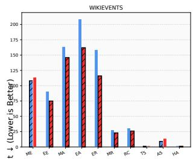

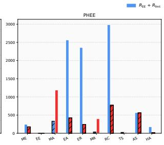

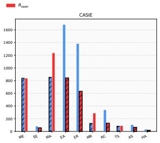

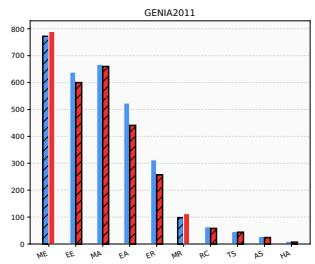

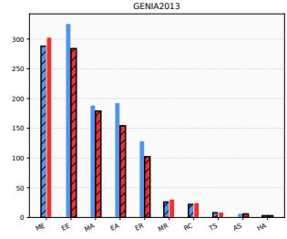

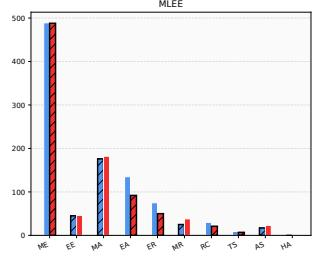

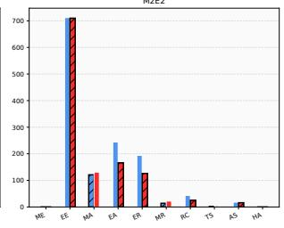  
Figure 9: Comparative evaluation of error categories across datasets. $R _ { \mathrm { E E } } + R _ { \mathrm { f m t } } \mathrm { V s . } + R _ { \mathrm { s p a n } }$

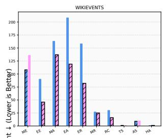

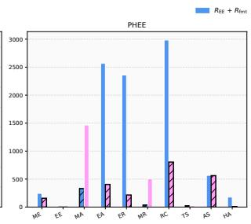

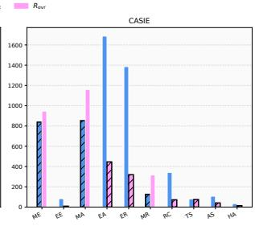

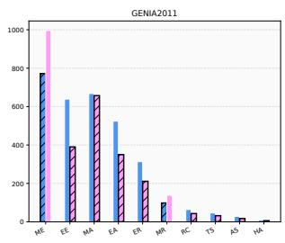

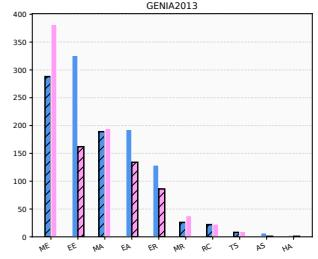

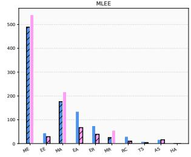

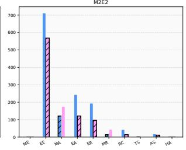  
Figure 10: Comparative evaluation of error categories across datasets. $R _ { \mathrm { E E } } + R _ { \mathrm { f m t } } \mathrm { V s . } + R _ { \mathrm { o v r } }$

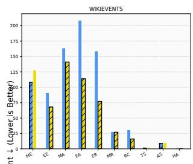

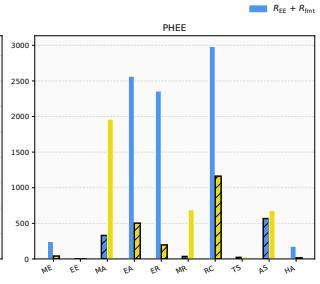

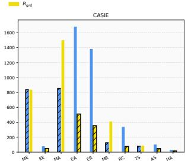

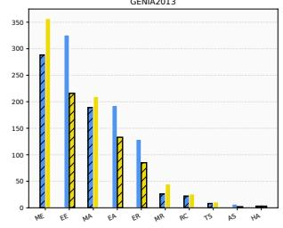

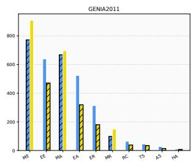

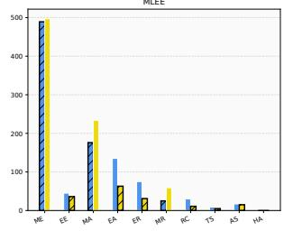

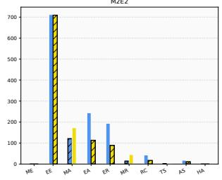  
Figure 11: Comparative evaluation of error categories across datasets. $R _ { \mathrm { E E } } + R _ { \mathrm { f m t } } \mathrm { V s . } + R _ { \mathrm { g r d } }$

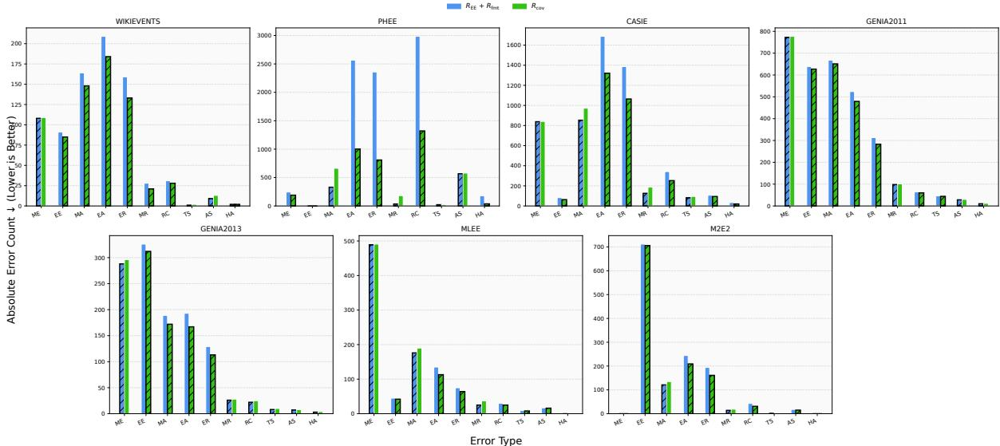  
Figure 12: Comparative evaluation of error categories across datasets. $R _ { \mathrm { E E } } + R _ { \mathrm { f m t } } \ \mathrm { V s . } + R _ { \mathrm { c o v } }$

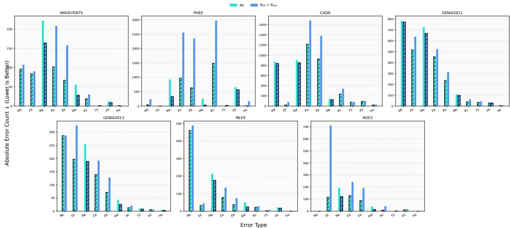  
Figure 13: Comparative evaluation of error categories across datasets. $R _ { \mathrm { E E } } + R _ { \mathrm { f m t } }$ Vs. All

<table><tr><td rowspan="2">Method</td><td colspan="7">Genia2011</td><td colspan="7">Genia2013</td></tr><tr><td>TI</td><td>TC</td><td>AI</td><td>AC</td><td>AI+</td><td>AC+</td><td>Avg.</td><td>TI</td><td>TC</td><td>AI</td><td>AC</td><td>AI+</td><td>AC+</td><td>Avg.</td></tr><tr><td>GPT-4o (Hurst et al., 2024)</td><td>27.67</td><td>24.55</td><td>8.23</td><td>7.35</td><td>3.52</td><td>3.28</td><td>12.43</td><td>24.92</td><td>22.01</td><td>7.53</td><td>5.98</td><td>2.46</td><td>2.32</td><td>10.87</td></tr><tr><td>GPT-5.4-mini (Singh et al., 2025)</td><td>34.85</td><td>30.24</td><td>2.38</td><td>2.01</td><td>1.15</td><td>1.06</td><td>11.95</td><td>30.07</td><td>27.01</td><td>2.06</td><td>1.43</td><td>1.61</td><td>1.20</td><td>10.56</td></tr><tr><td>GPT-5.4 (Singh et al., 2025)</td><td>31.90</td><td>29.89</td><td>3.37</td><td>2.66</td><td>2.01</td><td>1.83</td><td>11.94</td><td>21.82</td><td>19.39</td><td>3.41</td><td>3.01</td><td>2.58</td><td>2.21</td><td>8.74</td></tr><tr><td>Gollie-7B (Sainz et al., 2024)</td><td>27.84</td><td>19.41</td><td>11.08</td><td>8.61</td><td>4.66</td><td>3.88</td><td>12.58</td><td>20.15</td><td>14.56</td><td>10.69</td><td>6.24</td><td>4.02</td><td>2.46</td><td>9.69</td></tr><tr><td>Gollie-13B (Sainz et al., 2024)</td><td>27.44</td><td>12.70</td><td>8.74</td><td>6.71</td><td>3.92</td><td>2.44</td><td>10.33</td><td>25.20</td><td>12.14</td><td>9.01</td><td>6.13</td><td>2.91</td><td>1.99</td><td>9.56</td></tr><tr><td>Gollie-34B (Sainz et al., 2024)</td><td>27.87</td><td>16.45</td><td>10.02</td><td>6.44</td><td>4.14</td><td>2.64</td><td>11.26</td><td>23.13</td><td>11.38</td><td>6.98</td><td>2.14</td><td>3.16</td><td>1.34</td><td>8.02</td></tr><tr><td>Gollie-7B SFT</td><td>27.95</td><td>19.46</td><td>10.44</td><td>7.78</td><td>4.50</td><td>3.73</td><td>12.31</td><td>21.24</td><td>15.10</td><td>11.64</td><td>6.99</td><td>4.32</td><td>2.75</td><td>10.34</td></tr><tr><td>Gollie-13B SFT</td><td>27.44</td><td>12.70</td><td>8.74</td><td>6.71</td><td>3.92</td><td>2.44</td><td>10.33</td><td>25.20</td><td>12.14</td><td>9.01</td><td>6.13</td><td>2.91</td><td>1.99</td><td>9.56</td></tr><tr><td>Gollie-34B SFT</td><td>27.87</td><td>16.45</td><td>10.02</td><td>6.44</td><td>4.14</td><td>2.64</td><td>11.26</td><td>23.13</td><td>11.38</td><td>6.98</td><td>2.14</td><td>3.16</td><td>1.34</td><td>8.02</td></tr><tr><td>ADELIEDPo (Qi et al., 2024)†</td><td>39.06</td><td>29.45</td><td>20.43</td><td>17.65</td><td>10.06</td><td>8.79</td><td>20.91</td><td>39.05</td><td>31.72</td><td>16.92</td><td>13.25</td><td>9.09</td><td>6.98</td><td>19.50</td></tr><tr><td>EventRL (Gao et al., 2024)†</td><td>43.46</td><td>38.80</td><td>25.19</td><td>23.18</td><td>13.57</td><td>12.64</td><td>26.14</td><td>43.58</td><td>38.76</td><td>20.50</td><td>18.69</td><td>12.04</td><td>11.25</td><td>24.14</td></tr><tr><td>EAGER</td><td>43.77</td><td>39.15</td><td>23.54</td><td>21.98</td><td>12.56</td><td>12.06</td><td>25.51</td><td>44.14</td><td>39.67</td><td>21.23</td><td>19.71</td><td>10.28</td><td>9.92</td><td>24.16</td></tr><tr><td rowspan="2">Method</td><td colspan="7">MLEE</td><td colspan="7">M2E2</td></tr><tr><td>TI</td><td>TC</td><td>AI</td><td>AC</td><td>AI+</td><td>AC+</td><td>Avg.</td><td>TI</td><td>TC</td><td>AI</td><td>AC</td><td>AI+</td><td>AC+</td><td>Avg.</td></tr><tr><td>GPT-4o (Hurst et al., 2024)</td><td>28.02</td><td>24.49</td><td>8.79</td><td>7.57</td><td>5.99</td><td>5.23</td><td>13.35</td><td>20.78</td><td>19.91</td><td>8.67</td><td>8.56</td><td>6.97</td><td>6.91</td><td>11.97</td></tr><tr><td>GPT-5.4-mini (Singh et al., 2025)</td><td>32.60</td><td>25.50</td><td>2.56</td><td>2.55</td><td>0.49</td><td>0.49</td><td>10.70</td><td>35.16</td><td>33.59</td><td>4.26</td><td>3.58</td><td>3.61</td><td>2.97</td><td>13.86</td></tr><tr><td>GPT-5.4 (Singh et al., 2025)</td><td>34.59</td><td>30.40</td><td>2.09</td><td>1.56</td><td>1.51</td><td>1.26</td><td>11.90</td><td>33.96</td><td>33.21</td><td>11.52</td><td>10.77</td><td>8.83</td><td>8.16</td><td>17.74</td></tr><tr><td>Gollie-7B (Sainz et al., 2024)</td><td>25.35</td><td>13.04</td><td>5.14</td><td>3.07</td><td>2.57</td><td>1.78</td><td>8.49</td><td>51.16</td><td>47.84</td><td>27.88</td><td>24.81</td><td>21.69</td><td>19.45</td><td>32.14</td></tr><tr><td>Gollie-13B (Sainz et al., 2024)</td><td>25.86</td><td>17.99</td><td>9.01</td><td>6.61</td><td>5.41</td><td>3.90</td><td>11.46</td><td>61.63</td><td>59.82</td><td>33.56</td><td>29.69</td><td>25.98</td><td>23.05</td><td>38.96</td></tr><tr><td>Gollie-34B (Sainz et al., 2024)</td><td>18.83</td><td>14.25</td><td>10.55</td><td>7.16</td><td>3.76</td><td>2.94</td><td>9.58</td><td>50.17</td><td>48.18</td><td>30.06</td><td>26.59</td><td>22.30</td><td>19.49</td><td>32.80</td></tr><tr><td>Gollie-7B + SFT</td><td>26.27</td><td>13.21</td><td>5.77</td><td>3.68</td><td>2.78</td><td>1.98</td><td>8.95</td><td>52.17</td><td>48.83</td><td>28.41</td><td>25.33</td><td>21.85</td><td>19.59</td><td>32.70</td></tr><tr><td>Gollie-13B + SFT</td><td>25.86</td><td>17.99</td><td>9.01</td><td>6.61</td><td>5.41</td><td>3.90</td><td>11.46</td><td>61.63</td><td>59.82</td><td>33.56</td><td>29.69</td><td>25.98</td><td>23.05</td><td>38.96</td></tr><tr><td>Gollie-34B + SFT</td><td>18.83</td><td>14.25</td><td>10.55</td><td>7.16</td><td>3.76</td><td>2.94</td><td>9.58</td><td>50.17</td><td>48.18</td><td>30.06</td><td>26.59</td><td>22.30</td><td>19.49</td><td>32.80</td></tr><tr><td>ADELIEDPo (Qi et al., 2024)†</td><td>39.74</td><td>27.15</td><td>12.20</td><td>8.17</td><td>8.57</td><td>5.54</td><td>16.89</td><td>65.26</td><td>61.50</td><td>34.34</td><td>30.62</td><td>26.98</td><td>24.26</td><td>40.49</td></tr><tr><td>EventRL (Gao et al., 2024)†</td><td>43.96</td><td>30.91</td><td>18.43</td><td>16.33</td><td>11.56</td><td>10.24</td><td>21.90</td><td>56.45</td><td>50.32</td><td>24.16</td><td>17.49</td><td>18.74</td><td>13.77</td><td>30.16</td></tr><tr><td>EAGER</td><td>47.85</td><td>37.08</td><td>19.28</td><td>16.71</td><td>13.22</td><td>11.12</td><td>24.21</td><td>61.57</td><td>58.12</td><td>38.46</td><td>33.63</td><td>29.46</td><td>26.74</td><td>41.33</td></tr></table>

Table 13: Full results on Genia2011 and Genia2013 datasets.

Table 14: Full results on MLEE and M2E2 datasets.

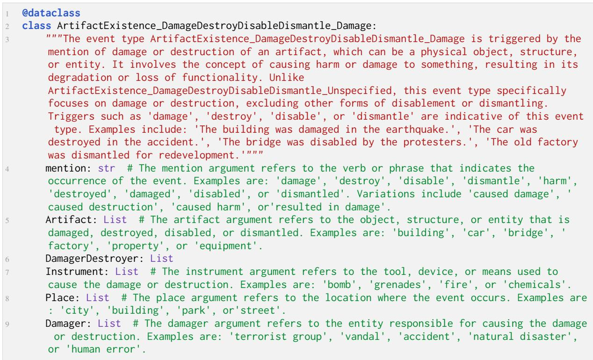  
Figure 14: WikiEvents event schema python class example

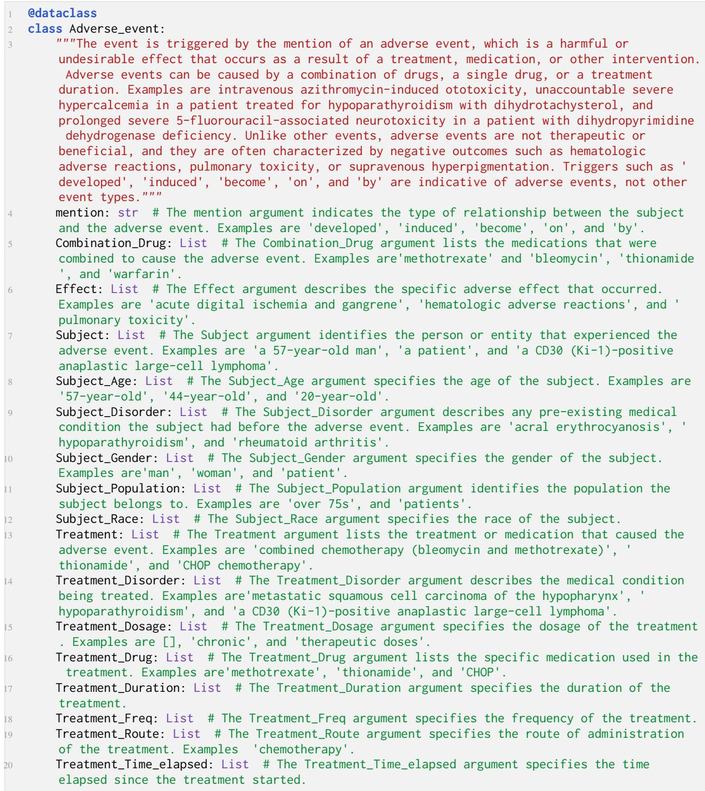  
Figure 15: PHEE event schema python class example

@dataclass   
class Attack\_Ransom:   
3 """The event is triggered by the occurrence of a ransomware attack, where an attacker demands   
payment in exchange for restoring access to encrypted data. The event is characterized by   
the use of ransomware, encryption of data, and the demand for payment. Unlike other types of   
attacks, Attack\_Ransom events involve the use of ransomware and the demand for payment to   
restore access to data. Triggers such as 'demanded a ransom' and 'ransomware attacks' are   
indicative of Attack\_Ransom events. Examples of Attack\_Ransom events include instances where   
data is encrypted and a ransom is demanded, such as 'demanded in payment' and 'demanded a   
ransom'."""   
mention: str # The mention argument refers to the specific mention of the event, which can   
be a phrase or sentence that describes the event. Examples are 'demanded in payment',   
demanded a ransom', 'ransomware attacks', 'ransom', and 'Paying ransomware'.   
Attack\_Pattern: List # The Attack\_Pattern argument refers to the specific pattern of   
behavior exhibited by the attacker. Examples are 'threatened to delete the files' and'   
remotely wipe millions of iPhones and iCloud accounts'.   
Attacker: List # The Attacker argument refers to the identity or description of the   
individual or group responsible for the attack. Examples are 'cyber fraudsters', 'one   
lonesome individual', and 'criminals'.   
Damage\_Amount: List # The Damage\_Amount argument refers to the estimated or reported amount   
of damage caused by the attack. Examples are empty lists, indicating that the amount of   
damage is unknown or not reported.   
8 Payment\_Method: List # The Payment\_Method argument refers to the method by which the   
attacker demands or receives payment. Examples are empty lists, indicating that the payment   
method is unknown or not reported.   
9 Place: List # The Place argument refers to the location where the attack occurred. Examples   
are empty lists, indicating that the location is unknown or not reported.   
10 Price: List # The Price argument refers to the amount of money demanded or paid as a ransom.   
Examples are 'USD 216', 'USD 2,000', and empty lists, indicating that the price is unknown   
or not reported.   
Time: List # The Time argument refers to the date or time when the attack occurred. Examples   
are '96 hours', 'April 7', and empty lists, indicating that the time is unknown or not   
reported.   
Tool: List # The Tool argument refers to the specific tool or malware used by the attacker.   
Examples are'malware', 'WannaCry', 'Bad Rabbit', and empty lists, indicating that the tool   
is unknown or not reported.   
13 Victim: List # The Victim argument refers to the individual or organization affected by the   
attack. Examples are 'Texan city', 'equipment', 'Apple', 'other businesses', and 'South   
Koreans'.  
Figure 16: CASIE event schema python class example

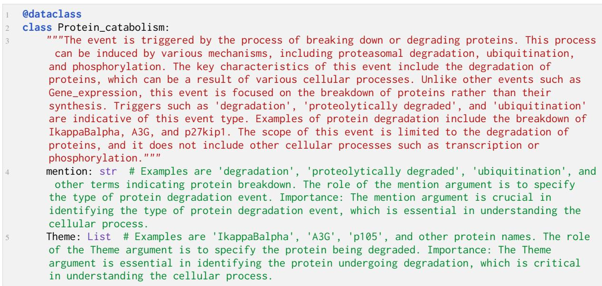  
Figure 17: Genia2011 event schema python class example

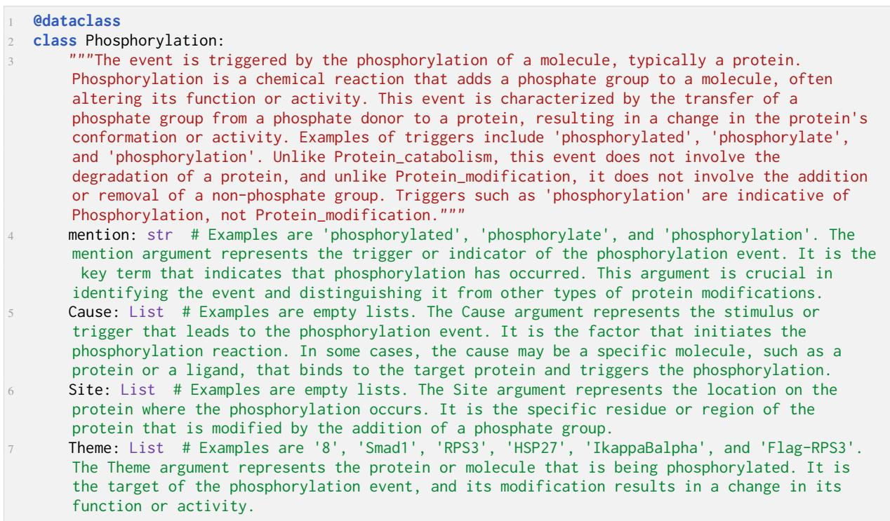  
Figure 18: Genia2013 event schema python class example

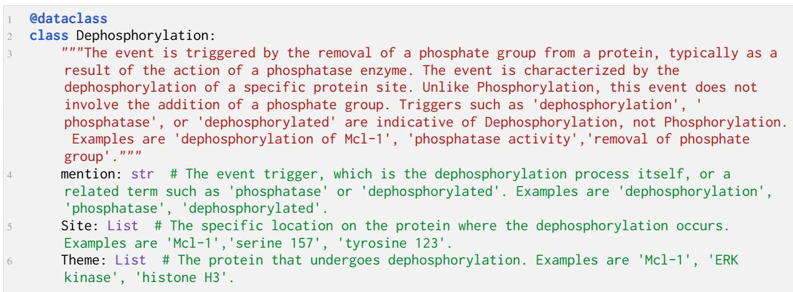  
Figure 19: MLEE event schema python class example

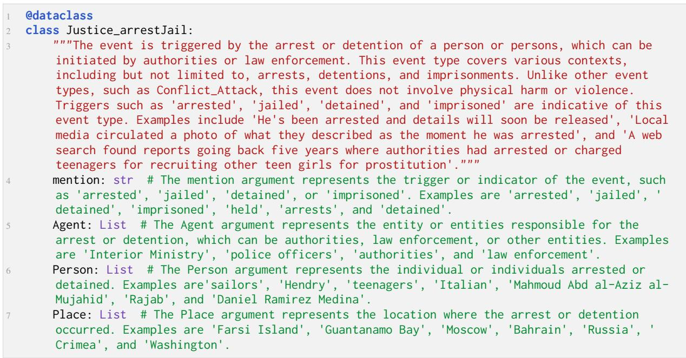  
Figure 20: M2E2 event schema python class example