# ELF-REG: SCALING CONTINUOUS DIFFUSION LANGUAGE MODELS TO REASONING TASKS

Zeyu Michael Li<sup>1∗</sup>, William Xingxu Chen<sup>1</sup>, Bingshuo Qian<sup>1</sup>, Jiayin Liu<sup>2</sup>, Xiang Cheng<sup>1</sup> <sup>1</sup>Duke University <sup>2</sup>Tsinghua University

## ABSTRACT

Fully continuous diffusion language models (dLMs) denoise continuous representations without intermediate discretization, then decode all response tokens in parallel at the final step. Their performance on challenging reasoning tasks remains less established than that of autoregressive (AR) LLMs and masked dLMs. We scale Embedded Language Flows (ELF) to mathematical reasoning and code generation on GSM8K, MATH-500, HumanEval, and MBPP. We introduce ELF-REG, which improves learning with representation alignment and entanglement (REPA+REG), where a frozen AR teacher supervises intermediate denoiser features and supplies a global representation that is jointly denoised with the response. ELF-REG-L achieves 55.96% pass@1 on GSM8K at 64 network function evaluations (NFE), and 13.39% on MATH-500 and 22.56% on HumanEval at 128 NFE. It outperforms the evaluated comparable-scale dLMs in pass@1 on GSM8K and code, and improves MATH-500 pass@1 from 10.55% for the ELF-L baseline to 13.39% with ELF-REG-L. Without few-step training, the same task-specific checkpoints support strong low-NFE performance through early-stop, which decodes an intermediate clean prediction without completing the denoising trajectory. At 16 NFE, ELF-REG-L reaches 41.21% HumanEval pass@10, outperforming recent continuous dLMs of comparable scale.

(a) Representation alignment and entanglement  
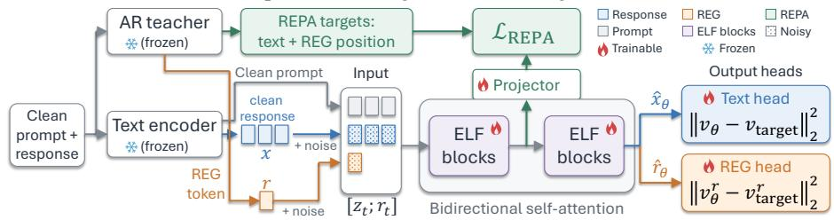

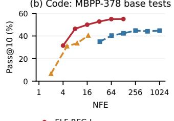

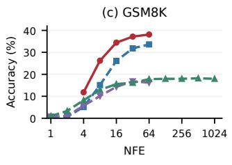

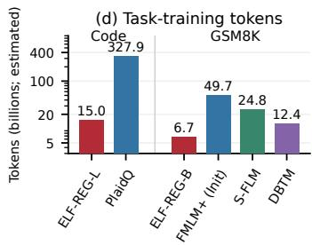  
Figure 1: ELF-REG improves generation with fewer task-training tokens. (a) A frozen AR teacher supervises intermediate features through REPA and a global REG token denoised jointly with the response. (b,c) ELF-REG-L and ELF-REG-B with early-stop $( \rho = 8 )$ show superior performance across NFE, compared with PlaidQ [41], FMLM+ [1], S-FLM [14], and DBTM [46]. Code uses pass@10 on MBPP-378; GSM8K uses mean pass@1. (d) Non-padding training token budgets. Appendix B gives more details regarding benchmark mappings, model sizes, NFE accounting, budget estimates, and evaluation differences.

## 1 INTRODUCTION

Diffusion language models (dLMs) offer an efficient approach to parallel text generation by iteratively refining a corrupted sequence, in contrast to autoregressive (AR) LLMs that decode tokens in sequence. Continuous dLMs carry out this refinement in a representation space, bringing techniques from continuous diffusion to language and improving parallelism by updating all token positions simultaneously during denoising. Much of the development of continuous dLMs has focused on language modeling and conditional text generation. Plaid [20] studies likelihood-based language modeling, while LangFlow, LDLM, and Embedded Language Flows (ELF) evaluate unconditional generation using perplexity and entropy [12, 36, 24]. Conditional applications include machine translation with CDCD [15], simplification and paraphrasing with DiffuSeq [19], and translation and summarization with ELF [24]. Together, these studies establish continuous denoising as a vi able approach to producing and transforming text.

Masked dLMs such as LLaDA and Dream already demonstrate high-performing reasoning and code generation [38, 52], while recent continuous dLM works’ performance on GSM8K and code generation (S-FLM, FMLM+, MLFM, PlaidQ [14, 1, 7, 41]) demonstrates progress in mathematical reasoning with continuous dLMs, giving reason to pursue reasoning capabilities of continuous dLMs. These advances show promise for continuous dLMs on reasoning tasks and motivate improving their accuracy at low compute scales, including with limited denoising budget.

In this work, we extend ELF’s [24] fully continuous dLM to mathematical reasoning on GSM8K and MATH-500 and to code generation on HumanEval and MBPP. We use representation alignment and entanglement (REPA+REG) to improve performance: a frozen AR teacher supervises intermediate features through REPA [54] and supplies a global representation jointly denoised with the response through REG [50]. We call this method ELF-REG and evaluate two sizes, ELF-REG-B and ELF-REG-L. At 64 NFE, our ELF-REG-B reaches 38.11% GSM8K pass@1, exceeding FMLM+ [1] at the same NFE and MDLM [43] and Duo [44] at 1024 NFE with comparable parameter count. ELF-REG-L reaches 55.96% at 64 NFE (Table 2). On code, ELF-REG-L achieves the highest pass@1 among the comparable-scale dLMs on all four benchmarks at 128 NFE (Table 1). On MBPP-500 and MBPP-378, ELF-REG-L at 32 NFE already surpasses PlaidQ+CFG’s [41] results at 257 NFE (Table 14). ELF-REG-L also improves MATH-500 accuracy over ELF-L baseline, demonstrating its performance on more complex tasks.

Strong performance also extends to low NFE without dedicated few-step training. Building on prior early stopping works for continuous dLMs [48, 17, 16], we use early-stop to decode an intermediate clean prediction and analyse its benefits. On GSM8K, continuing denoising beyond this exit substantially increases agreement with the final response but adds little aggregate accuracy (Figure 2). Thus, useful task performance can emerge before responses stabilize. We use a flow-map formulation to analyse early-stop endpoint error and apply the decoder-margin bound of Du & Ma [16, Theorem 1] to study decoded-output agreement. Our contributions are:

• We advance fully continuous dLMs on mathematical reasoning and code, outperforming other dLMs of comparable scale in our comparisons of GSM8K and code pass@1, with further gains over ELF-L baseline on MATH-500.

• Without dedicated few-step training, ELF-REG-L reaches 46.39% pass@10 on MBPP-378 using early-stop at 8 NFE, exceeding PlaidQ-D16’s 40.49% at 17 NFE (Table 15).

• On GSM8K, we show that accuracy approaches its final level while responses continue changing. We analyse endpoint error and decoded-output agreement using decoder margins and connections between early-stop and flow maps.

## 2 METHODOLOGY

## 2.1 ELF PRELIMINARIES

We largely follow ELF [24] for its architecture, training, and sampling. We provide a brief recap here. ELF [24] generates continuous response representations from Gaussian noise while holding the prompt fixed. A frozen Qwen3-0.6B-Base encoder supplies clean text states x. Training corrupts

response states with noise scale σ as

$$
z _ { t } = t x + ( 1 - t ) \sigma \varepsilon , \qquad \varepsilon \sim \mathcal { N } ( 0 , I ) , \quad t \in [ 0 , 1 ] .\tag{1}
$$

A bidirectional transformer predicts clean states ${ \hat { x } } _ { \theta } .$ , giving velocity $v _ { \theta } = ( \hat { x } _ { \theta } - z _ { t } ) / ( 1 - t )$ for $t < 1$ . We retain ELF’s self-conditioning guidance, using each clean prediction to condition the next sampling update. The same transformer learns to decode representations through token crossentropy; these decoding examples and velocity regression define $\mathcal { L } _ { \mathrm { E L F } }$ . One final decoder evaluation produces all response tokens in parallel.

## 2.2 REPRESENTATION ALIGNMENT AND ENTANGLEMENT

A separate frozen Qwen3-1.7B-Base AR teacher supplies REPA+REG targets (Figure 1(a)). REPA [54] aligns student states $u _ { i } ^ { ( \ell ) }$ after block ℓ with clean teacher states $h _ { i }$ at the same token position through a learned projector $p _ { \phi }$ into the teacher dimension, minimizing $1 - \cos ( p _ { \phi } ( u _ { i } ^ { ( \ell ) } ) , h _ { i } )$ The student retains bidirectional attention. Inspired by REG [50], we standardize the teacher’s last content-token state to form a global target $^ { r , }$ corrupted as $r _ { t } = t r + ( 1 - t ) \sigma \varepsilon _ { i }$ <sub>r</sub> where $\varepsilon _ { r } \sim \mathcal { N } ( 0 , I )$ An additional token exchanges information with text through self-attention and predicts the clean REG state, supervised by velocity regression with the same self-conditioning guidance as text. REPA also supervises this token. We optimize

$$
\mathcal { L } = \mathcal { L } _ { \mathrm { E L F } } + \lambda _ { \mathrm { R E P A } } \mathcal { L } _ { \mathrm { R E P A } } + \lambda _ { \mathrm { R E G } } \mathcal { L } _ { \mathrm { R E G } } .\tag{2}
$$

Text and REG start from noise at inference; REG remains available to the decoder, which emits only text. The teacher and projector are training-only. Appendix A specifies guidance targets, loss normalization, and numerical implementation; Table 6 gives target layers and defaults.

## 2.3 PREFIX EARLY-STOP GENERATION

For an actual budget of N network function evaluations (NFE), sample a logit-normal grid of denoising timesteps with M − 1 updates for master budget $M = \rho N$ . Execute its first $N - \bar { 1 }$ denoiser updates and decode the latest predicted-clean text and REG states at decoder time 1. We use $\rho = 8$ Full-span generation instead traverses the complete grid for budget N and decodes the final updated states. Early-stop is a plug-and-play inference technique and does not require few-step training. NFE includes one final decoder evaluation; note that $\rho$ relates evaluation budgets in NFE, not fractions of continuous time. Algorithm 1 gives the generation procedure following ELF [24, Algorithm 2] with our prefix early-stop modification.

## 3 ANALYSIS

We relate early-stop decoding to the remaining flow map, then examine endpoint error, decoder stability, and task accuracy along the sampling trajectory. In the result displays, pass@1 is answer accuracy averaged over questions and generation seeds. See Appendix B.6 for evaluation settings.

## 3.1 EARLY-STOP DECODING AND THE REMAINING FLOW MAP

We begin with a smooth continuous flow, with the prompt and guidance scale fixed. Let $y _ { t }$ denote its generated state: response latents together with REG when present. The prompt is a fixed input, outside this state. The flow map $F _ { s , t }$ transports a state from time s to time t under the velocity field v [8, 9, 30]. Starting from Gaussian noise $y _ { 0 } = \sigma \varepsilon$ , with $\varepsilon \sim \mathcal { N } ( 0 , I )$ , we compare the endpoint $y _ { 1 }$ at $t = 1$ with the clean prediction $\hat { y } _ { t }$ made at exit time $t < 1$ :

$$
y _ { t } = F _ { 0 , t } ( y _ { 0 } ) , \qquad y _ { 1 } = F _ { t , 1 } ( y _ { t } ) , \qquad \hat { y } _ { t } = D _ { t } ( y _ { t } ) .\tag{3}
$$

Here $D _ { t }$ is the denoiser’s clean predictor, including its text and REG outputs. The prediction $\hat { y } _ { t }$ is made at time t and targets the clean endpoint. Let D denote the deterministic parallel token decoder at decoder time 1. Continuing the flow to $t = 1$ and decoding the endpoint returns $\mathcal { D } ( y _ { 1 } )$ , and early-stop returns $\mathcal { D } ( \hat { y } _ { t } )$ . Thus early-stop replaces the remaining flow map with a clean prediction before applying the same decoder. Flow-map models learn finite-time transport explicitly [30]; here we examine the error of using the existing predictor for that transport. The continuous formulation uses $D _ { t } ( y ) = y + ( 1 - t ) v ( y , t )$ . Appendix ${ \mathrm { C } } . 3$ treats the self-conditioned sampler. We denote the Euclidean norm over the full generated state with $\| \cdot \|$ , including text positions after EOS and REG when present.

Proposition 1 (Endpoint error). Suppose v is continuously differentiable and itsflow exists uniquely through time 1. For a state y at time $\smash { t _ { \mathrm { ~ \scriptsize ~ < ~ } } 1 }$ , write $\begin{array} { c c l } { y _ { s } } & { = } & { F _ { t , s } ( y ) } \end{array}$ and define the average remaining velocity as $\begin{array} { r } { \bar { v } _ { t : 1 } ( y ) \ = \ ( 1 \ - \ t ) ^ { - 1 } \int _ { t } ^ { 1 } v ( y _ { s } , s ) d s } \end{array}$ . The flow map satisfies $F _ { t , 1 } ( y ) ~ =$ $\begin{array} { r } { y + \int _ { t } ^ { 1 } v ( F _ { t , s } ( y ) , s ) d s = y + ( 1 - t ) \bar { v } _ { t : 1 } ( y ) } \end{array}$ . Hence

$$
e _ { t } ( y ) : = D _ { t } ( y ) - F _ { t , 1 } ( y ) = ( 1 - t ) { \big ( } v ( y , t ) - { \bar { v } } _ { t : 1 } ( y ) { \big ) } .\tag{4}
$$

Let $\begin{array} { r } { a _ { s } = \frac { d } { d s } v ( y _ { s } , s ) = \partial _ { s } v ( y _ { s } , s ) + J _ { y } v ( y _ { s } , s ) v ( y _ { s } , s ) } \end{array}$ be the acceleration along this trajectory, where $J _ { y } v$ is the Jacobian $o f v$ with respect to the state. $I f \left\| a _ { s } \right\| \le A$ for every $s \in [ t , 1 ]$ , then $\| e _ { t } ( y ) \| \le A ( 1 - t ) ^ { 2 } / 2$

The flow map integrates velocity along the evolving trajectory. The clean predictor instead takes one Euler step across the remaining interval using the current velocity. This step reaches the endpoint at $t = 1$ exactly when the current velocity equals the average remaining velocity. The acceleration bound quantifies the error when the velocity changes along the trajectory. Near the endpoint, the remaining interval is short. At an early exit, the bound is informative when the velocity changes little over the longer remaining interval. Flow-matching training alone does not ensure this condition.

Decoding can preserve a response even when the predicted endpoint differs from the endpoint at t = 1. At each response position, the decoder chooses the token with the largest logit. Let m be the smallest gap between that winning logit and any competing logit at $y _ { 1 }$ , over valid text positions and (if present) the first EOS token. A larger margin m allows more change in the logits before a token changes. Proposition 2 follows from the decoder-margin argument of Du & Ma [16, Theorem 1].

Proposition 2 (Decoded-output agreement). Suppose $m > 0 .$ Let $L \geq 0$ be a finite pairwise-logit Lipschitz constant: each winning-token versus competing-token logit difference changes by at most $L \| a - b \|$ between any two states a, b on the segmentjoining $\hat { y } _ { t }$ and $y _ { 1 }$ $I f L \| e _ { t } ( y _ { t } ) \| < m$ , then

$$
\begin{array} { r } { \mathcal { D } ( \hat { y } _ { t } ) = \mathcal { D } ( y _ { 1 } ) . } \end{array}\tag{5}
$$

Corollary 1 (Distributional agreement). For $t < 1$ let $P _ { t }$ and $P _ { 1 }$ be the distributions of $\hat { y } _ { t }$ and $y _ { 1 }$ induced by initial noise $\varepsilon \sim \mathcal { N } ( 0 , I )$ , with finite second moments. Coupling the endpoints through the same initial noise bounds their 2-Wasserstein distance:

$$
W _ { 2 } ( P _ { t } , P _ { 1 } ) \leq \sqrt { \mathbb { E } \| e _ { t } ( y _ { t } ) \| ^ { 2 } } .\tag{6}
$$

Let $Q _ { t } , Q _ { 1 }$ be the distributions of $\mathcal { D } ( \hat { y } _ { t } ) , \mathcal { D } ( y _ { 1 } )$ . If the margin and Lipschitz assumptions of Proposition 2 hold almost surely, then their total variation satisfies $\mathrm { T V } ( Q _ { t } , Q _ { 1 } ) \leq \mathrm { P r } [ L \bar { \| } e _ { t } ( y _ { t } ) \| \geq \dot { m } ]$

Corollary 1 bounds latent distributional discrepancy in Wasserstein distance and decoded distributional discrepancy in total variation. The decoder condition permits latent differences that preserve the winning tokens. Appendix C gives the proofs and a bound on the decoder failure probability.

Proposition 2 gives a sufficient condition for preserving the complete endpoint response, whether that response is correct or incorrect. Different responses can nevertheless yield the same numerical answer. We therefore compare extracted answers and changes in correctness on matched question– seed pairs, alongside complete-response agreement.

## 3.2 ENDPOINT ERROR AND DECODER STABILITY ALONG THE SAMPLING TRAJECTORY

We compare early-stop predictions with the endpoints of their own sampling trajectories. Figure $2 ( \mathsf { b { \mathrm { - } } e } )$ follows the ELF-B baseline and ELF-REG-B on GSM8K through and beyond the earlystop exit. Text endpoint error is the Euclidean distance between the predicted-clean text and the final updated text state, over the full response canvas including positions after EOS. This measures the text component of the discrete endpoint discrepancy in equation 14. Intermediate observations decode predicted-clean states; the endpoint decodes the final updated state. A “stable token” agrees with the endpoint at every subsequent observation. Endpoint response agreement instead requires an identical token sequence, EOS status, and length at the current observation.

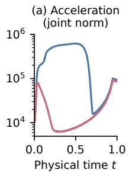

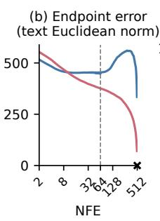

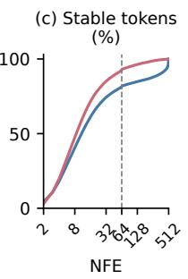

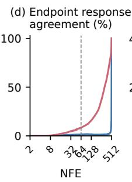

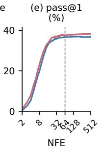  
Figure 2: ELF-REG-B has lower discrete acceleration and lower early-stop endpoint error on GSM8K. (a) Median local joint acceleration with uniform time sampling over 512 Euler updates. (b–e) Mean text endpoint error, stable tokens, endpoint response agreement, and pass@1, using logit-normal time samples as specified in Appendix A.4. Stable tokens are those that agree with the endpoint at every later observation; response agreement requires the current sequence, EOS status, and length to match. Dashed lines in (b–e) mark NFE 64; continuing beyond this exit increases agreement substantially but adds little accuracy. Results average over four seeds: the median across questions in (a) and the mean across questions in (b–e). At NFE 512 in (b–e), the updated endpoint gives zero error and full agreement by construction.

With $\rho = 8 ,$ the NFE-64 exit occurs early in denoising time t due to the non-uniform denoising schedule: the prediction time averages $t = 0 . 0 8 2 5$ across four seeds. Across these schedules, the nominal SNR $\dot { t } ^ { 2 } / [ \sigma ^ { 2 } ( 1 - t ) ^ { 2 } ]$ averages $2 . 0 3 \times 1 0 ^ { - 3 }$ for $\sigma = 2$ (Table 11). Thus the exit corresponds to a noise-dominated training corruption level. Appendix C.4 gives additional details.

At NFE 64, ELF-REG-B has 16.1% lower mean text endpoint error than the baseline (Figure 2b). Its endpoint response agreement is 8.61%, compared with 1.46% for the baseline (Figure 2d). ELF-REG-B also reaches token stability earlier (Figure 2c). Beyond the early exit at NFE 64, its mean text error decreases as response agreement rises, whereas the baseline’s mean text error instead rises between NFE 64-257, even as its stable-token fraction increases.

To examine the acceleration term in Proposition 1, we measure consecutive velocity differences divided by time-difference with uniform time sampling over 512 Euler updates. Figure 2(a) shows lower local joint acceleration for ELF-REG-B through the early and middle trajectory. $\mathrm { A t } t = 5 / 6 4$ its median maximum remaining joint acceleration is 84.8% lower than ELF-B baseline, accompanied by 7.5% lower mean joint endpoint error (Table 12). Smaller remaining acceleration thus accompanies smaller endpoint error, consistent with Proposition 1. Note that these measurements are finite differences along the discrete sampler; Proposition 1 concerns a smooth continuous flow. See Appendix C.4 for details regarding the discrete acceleration measurements.

At NFE 64, numerical answers match those at NFE 512 on 80.27% of question–seed pairs for ELF-B baseline and 87.11% for ELF-REG-B (Table 10). Correctness gains and losses during further denoising nearly cancel for ELF-B baseline, while ELF-REG-B gains 0.64 percentage points. Most numerical answers therefore match the endpoint even though complete responses usually differ. Proposition 2 gives a sufficient condition for preserving the complete response. Table 10 numerical answer agreement results show that early-stop often preserves the numerical answer without preserving every token, so complete-response agreement is a stronger requirement than preserving the task answer.

## 4 EXPERIMENTS

We compare ELF-REG with other dLMs on math reasoning and code generation across NFE budgets, and measure its gains over ELF baseline. Additional MMLU results appear in Ap pendix D.1. We train separate ELF baseline and ELF-REG variants for GSM8K, code, MATH, and MMLU; the MATH variants are initialized from their corresponding GSM8K weights. Our headline math-reasoning and code results use zero-shot early-stop generation with $\rho = 8 ,$ at NFE 64 for GSM8K [13] and NFE 128 for MATH-500 [23, 33], MBPP-378 & MBPP-500 [5, 34], and HumanEval(+) [11, 34]. We report mean pass@1 over sixteen samples per question. Appendix B.2 gives training data, budgets, and initialization; Table 6 and Appendix B.3 specify hyperparameters and evaluation protocols.

We list the performance of various AR LLMs and large dLMs in Tables 1-2. We study task-specific training of small continuous dLMs for math reasoning and code generation. The AR LLMs/large dLMs also receive math and code training within much larger training-data budgets and are not comparable with our method [51, 3, 38, 52]. Tables 2 and 1 separate these references from comparablescale dLMs. Other baselines use different settings for prompting, response budgets, and code postprocessing; Appendix B.5 details these settings.

Table 1: Zero-shot code generation, pass@1 (%). Our evaluations report means, with standard deviation across 16 seeds in parentheses. Slashes separate base/instruct names and scores; Qwen3-0.6B results use non-thinking mode. Bold marks the best comparable-scale dLM mean per benchmark. Both MBPP columns use base tests; HumanEval+ uses extended tests. Parameter counts follow Table 2. Budgets specify NFE or sampling steps; n.r. means unreported. Sources and protocols appear in Appendix B.
<table><tr><td>Model</td><td>Param.</td><td>NFE / steps</td><td>MBPP-500</td><td>MBPP-378</td><td>HumanEval</td><td>HumanEval+</td></tr><tr><td colspan="7">Large dLMs/AR LLMs</td></tr><tr><td>LLaDA-8B-Base[38]</td><td>8.0B</td><td>n.r.</td><td>38.80</td><td>52.60</td><td>35.40</td><td>30.50</td></tr><tr><td>Dream-v0-Base-7B[52]</td><td>7.6B</td><td>n.r.</td><td>55.40</td><td>71.50</td><td>56.70</td><td>50.00</td></tr><tr><td>Qwen3-0.6B-Base/Qwen3-0.6B[51]</td><td>0.6B</td><td></td><td></td><td></td><td>30.50 / 41.46</td><td>-/37.19</td></tr><tr><td>Llama-3.2-1B/Llama-3.2-1B-Instruct[37]</td><td>1.2B</td><td></td><td></td><td></td><td>18.90 / 33.50</td><td></td></tr><tr><td>SmolLM2-1.7B/SmolLM2-1.7B-Instruct[3]</td><td>1.7B</td><td></td><td></td><td></td><td>22.60 / 28.10</td><td></td></tr><tr><td>Qwen3-0.6B-Base (our evaluation)[51]</td><td>0.6B</td><td></td><td></td><td>40.62(2.71)</td><td>22.98(2.12)</td><td>19.05(1.95)</td></tr><tr><td colspan="7">Comparable-scale dLMs</td></tr><tr><td>Mask DFM[18]</td><td>1.3B</td><td>1,000 steps</td><td>6.20</td><td></td><td>9.10</td><td>7.90</td></tr><tr><td>Edit Flow[21]</td><td>1.3B</td><td>10,000 steps</td><td>10.00</td><td></td><td>12.80</td><td>10.40</td></tr><tr><td>Open-dCoder[39]</td><td>494M</td><td>128 NFE</td><td>16.70</td><td>23.90</td><td>20.80</td><td>17.60</td></tr><tr><td>oDLM[40]</td><td>596M</td><td>128 NFE</td><td>15.70</td><td>22.99</td><td>17.87</td><td>16.40</td></tr><tr><td>PlaidQ[41]</td><td>717M</td><td>129 NFE</td><td>12.19</td><td>22.18</td><td>19.02</td><td>18.05</td></tr><tr><td>PlaidQ+CFG[41]</td><td>717M</td><td>257 NFE</td><td>15.53</td><td>24.58</td><td>22.04</td><td>19.70</td></tr><tr><td>ELF-L baseline</td><td>637(+157)M</td><td>128 NFE</td><td>17.19(1.34)</td><td>26.75(1.58)</td><td>19.66(1.52)</td><td>18.75(1.52)</td></tr><tr><td>ELF-REG-L (ours)</td><td>652(+157)M</td><td>128 NFE</td><td>19.10(1.24)</td><td>28.92(1.38)</td><td>22.56(2.25)</td><td>21.46(2.10)</td></tr></table>

Mathematical reasoning. On GSM8K and at comparable scales, our ELF-REG-B at NFE 16 (34.42%) already exceeds the NFE 64 FMLM+ (Init) result (33.60%) (Table 13). At NFE 64, ELF-REG-B reaches 38.11%, exceeding S-FLM at NFE 512 and MDLM and Duo at NFE 1024. On GSM8K, ELF-REG-L reaches 55.96% pass@1 at NFE 64. Figure 1 shows the accuracy-vs-NFE comparisons. Relative to ELF-L baseline, ELF-REG-L raises GSM8K pass@1 from 51.85% to 55.96% and MATH-500 pass@1 from 10.55% to 13.39%. ELF-REG-L reaches the 51.48% GSM8K accuracy threshold in 8 epochs versus 14 for ELF-L baseline, requiring approximately 43% fewer epochs (Figure 3).

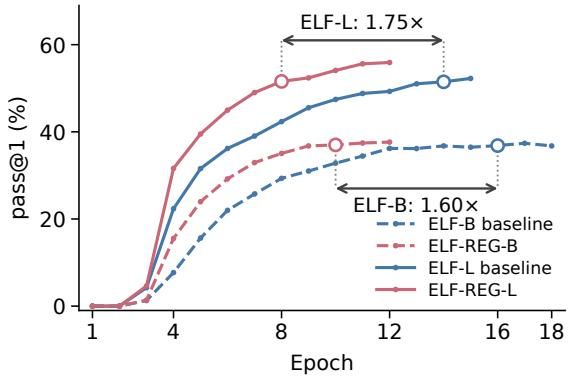  
Figure 3: GSM8K pass@1 with early-stop (NFE 64), averaged over 4 seeds. Arrows show reductions in epochs to first attainment of matched accuracy.

Code generation. ELF-REG-L at NFE 128 exceeds the comparable-scale PlaidQ+CFG [41] at NFE 257 on all four benchmarks in Table 1. Compared to PlaidQ+CFG [41], our ELF-REG-L pass@1 reaches 28.92% vs 24.58% on MBPP-378 and 22.56% vs 22.04% on HumanEval. ELF-REG-L also outperforms Open-dCoder and oDLM [41, Table 1] at matched NFE 128 on all four benchmarks. ELF-REG-L improves over ELF-L baseline on each benchmark. Appendix D.1 reports the complete comparisons and Appendix B.3 specifies prompting/execution protocols.

Table 2: Mathematical reasoning, pass@1 (%). Our evaluations report mean with standard deviation across 16 seeds in parentheses. Slashes separate base/instruct models, scores, and differing shot counts. Qwen3-0.6B MATH-500 accuracy uses thinking mode. Bold marks the best comparablescale dLM performance per benchmark. We show parameter count as non-decoder(+decoder) for ELF, including REPA+REG components. Budgets specify NFE or sampling steps; shots count demonstrations, and n.r. means unreported. Sources and protocols appear in Appendix B.
<table><tr><td>Model</td><td>Param.</td><td>NFE / steps</td><td>Shots</td><td>pass@1</td></tr><tr><td colspan="5">GSM8K: large dLMs/AR LLMs</td></tr><tr><td>LLaDA-8B-Base[38]</td><td>8.0B</td><td>1,024 steps</td><td>4</td><td>70.30</td></tr><tr><td>Dream-v0-Base-7B[52]</td><td>7.6B</td><td>256 steps</td><td>8</td><td>77.20</td></tr><tr><td>TESS 2 v0.1 (GSM8K fine-tuned)[45]</td><td>7B</td><td>1,000 steps</td><td>8</td><td>68.9</td></tr><tr><td>Qwen3-0.6B-Base/Qwen3-0.6B[51]</td><td>0.6B</td><td></td><td>4/0</td><td>59.59 / 79.20</td></tr><tr><td>Llama-3.2-1B/Llama-3.2-1B-Instruct[37]</td><td>1.2B</td><td></td><td>5/8</td><td>7.60 / 44.40</td></tr><tr><td>SmolLM2-1.7B/SmolLM2-1.7B-Instruct[3]</td><td>1.7B</td><td></td><td>5</td><td>31.10 / 48.80</td></tr><tr><td>Qwen3-0.6B-Base (our evaluation)[51]</td><td>0.6B</td><td></td><td>0</td><td>39.53(0.73)</td></tr><tr><td colspan="5">GSM8K: comparable-scale dLMs</td></tr><tr><td>S-FLM[14]</td><td>163M</td><td>512 NFE</td><td>0</td><td>18.18</td></tr><tr><td>FMLM+ (Init)[1]</td><td>0.168B</td><td>64NFE</td><td>0</td><td>33.60</td></tr><tr><td>MLFM[7]</td><td>1.35B</td><td>256 steps</td><td>n.r.</td><td>31.24</td></tr><tr><td>MDLM[43]</td><td>168M</td><td>1,024 NFE</td><td>0</td><td>33.90</td></tr><tr><td>Duo[44]</td><td>168M</td><td>1,024 NFE</td><td>0</td><td>36.02</td></tr><tr><td>ELF-B baseline</td><td>90(+156)M</td><td>64 NFE</td><td>0</td><td>37.71(0.95)</td></tr><tr><td>ELF-REG-B (ours)</td><td>104(+156)M</td><td>64 NFE</td><td>0</td><td>38.11(1.07)</td></tr><tr><td>ELF-L baseline</td><td>637(+157)M</td><td>64 NFE</td><td>0</td><td>51.85(0.88)</td></tr><tr><td>ELF-REG-L (ours)</td><td>652(+157)M</td><td>64 NFE</td><td>0</td><td>55.96(0.94)</td></tr><tr><td colspan="5">MATH-500: large dLMs/AR LLMs</td></tr><tr><td>Qwen3-0.6B-Base/Qwen3-0.6B[51]</td><td>0.6B</td><td></td><td>4 / n.r.</td><td>29.80 / 77.60</td></tr><tr><td>Llama-3.2-1B/Llama-3.2-1B-Instruct[37]</td><td>1.2B</td><td></td><td>4/0</td><td>1.60 / 24.80</td></tr><tr><td>SmolLM2-1.7B/SmolLM2-1.7B-Instruct[3]</td><td>1.7B</td><td></td><td>4/0</td><td>11.60 / 19.20</td></tr><tr><td>Qwen3-0.6B-Base (our evaluation)[51]</td><td>0.6B</td><td></td><td>0</td><td>26.30(1.76)</td></tr><tr><td colspan="5">MATH-500: comparable-scale dLMs</td></tr><tr><td>ELF-L baseline</td><td>637(+157)M</td><td>128 NFE</td><td>0</td><td>10.55(0.90)</td></tr><tr><td>ELF-REG-L (ours)</td><td>652(+157)M</td><td>128 NFE</td><td>0</td><td>13.39(1.03)</td></tr></table>

Table 3: Mathematical reasoning, pass@k (%), at NFE 64. ELF-REG-L improves ELF-L baseline across the sample budgets on both benchmarks. Results are shown across 16 seeds. Bold marks the best value per benchmark and sample budget.
<table><tr><td>Benchmark</td><td>Model</td><td>pass@2</td><td>pass@4</td><td>pass@8</td><td>pass@16</td></tr><tr><td>GSM8K</td><td>ELF-L baseline</td><td>62.15</td><td>70.43</td><td>76.98</td><td>82.26</td></tr><tr><td>GSM8K</td><td>ELF-REG-L (ours)</td><td>65.18</td><td>72.57</td><td>78.64</td><td>83.70</td></tr><tr><td>MATH-500</td><td>ELF-L baseline</td><td>15.65</td><td>23.64</td><td>33.36</td><td>44.00</td></tr><tr><td>MATH-500</td><td>ELF-REG-L (ours)</td><td>20.75</td><td>29.95</td><td>40.41</td><td>52.20</td></tr></table>

Multiple-sample performance. At NFE 128, ELF-REG-L reaches 55.05% pass@10 on MBPP-378 and 48.87% on HumanEval, compared with 44.79% and 39.87% for PlaidQ+CFG at NFE 257 (Table 16). At NFE 16 and without few-step training, ELF-REG-L already achieves higher pass@10 than PlaidQ+CFG at NFE 257 on both MBPP-378 and HumanEval (Table 15). On math reasoning, ELF-REG-L improves over ELF-L baseline at reported pass@k budgets at NFE 64, including MATH-500 pass@16 increasing from 44.0% (ELF-L baseline) to 52.2% (ELF-REG-L) (Table 3).

## 4.1 ABLATIONS AND ADDITIONAL ANALYSES

Training components. Table 4 compares ELF-B variants at epoch 6. REPA improves over the baseline, and REPA+REG improves further. Stripped REPA+REG uses the REPA+REG weight but does not generate the REG token, retaining most of the gains of REPA+REG. REPA with one learnable token (REPA+OLT) does not reproduce the REG benefit. The comparison therefore iden tifies a training benefit that persists after REG is removed at inference.

Table 4: REPA+REG training benefits largely survive removal of REG at inference. At epoch 6 on GSM8K, REPA-only improves over Baseline, and REPA+REG improves further. Stripped REPA+REG retains most of this additional gain using the same trained weights as REPA+REG, except the REG component which is removed. REPA+OLT adds one learnable token (OLT) to REPA and does not reproduce the REG benefit. All settings use ELF-B. The REPA+REG setting corresponds to ELF-REG-B (ours).
<table><tr><td>Baseline</td><td>REPA-only</td><td>REPA+REG</td><td>Stripped REPA+REG</td><td>REPA+OLT</td></tr><tr><td>pass@1 (%) 21.74</td><td>24.56</td><td>28.92</td><td>28.66</td><td>25.60</td></tr></table>

Prefix early-stop. At matched NFE, earlystop improves ELF-REG-B accuracy over full-span generation across budgets (Table 5). Early-stop uses the beginning of a longer time grid and decodes predicted-clean states; full-span generation traverses its shorter time grid and decodes the updated latent. Appendix D.5.1 gives a sweep of early-stop ratio ρ.

Table 5: GSM8K pass@1 (%) at matched NFE, ELF-REG-B (ours) at epoch 12, averaged over sixteen generation seeds.
<table><tr><td>NFE</td><td>4</td><td>8 16</td><td>32</td><td>64</td></tr><tr><td>Full-span</td><td>7.2515.75</td><td>25.27</td><td>30.95 34.19</td><td></td></tr><tr><td>Prefix early-stop (ρ = 8)</td><td></td><td></td><td>11.82 26.20 34.42 37.15 38.11</td><td></td></tr></table>

Sensitivity to coarse-sampling errors. We

inject errors from coarse (fewer-NFE) trajec-

tories and continue denoising. Errors induced by coarser fewer-NFE sampling are more damaging than random errors of matched magnitude. Appendix D.5.1 and Figure 8 describe the details.

Additional representation analyses. The default Qwen3-0.6B-Base encoder supports more effective learning and gold-answer recovery under corruption than t5-small (Appendix D.3.1). Positionshifted AR teacher targets strengthen forward perturbation influence at the supervised block; the final-block ordering depends on corruption time (Appendix D.3.2).

## 5 RELATED WORKS

## 5.1 DIFFUSION LANGUAGE MODELS

Discrete dLMs. Discrete diffusion language models (dLMs) reverse token corruption or masking to generate text [6, 35, 43]. LLaDA and Dream scale masked denoising to reasoning and code, using bidirectional context to predict tokens [38, 52]. Block Diffusion combines autoregressive (AR) generation across blocks with parallel denoising within each block [4].

Continuous dLMs. Early continuous dLMs denoise token embeddings for controllable generation and sequence-to-sequence tasks [32, 19]. CDCD and Plaid develop continuous formulations for categorical prediction and likelihood-based language modeling [15, 20]. Recent methods improve both the denoising process and its representation space. LangFlow [12] connects embedding diffusion to flow matching and learns the noise schedule. LDLM [36] jointly trains a latent encoder and decoder with the diffusion model. ELF [24] denoises contextual encoder representations and shares the denoising network with the final token decoder, focusing on unconditional language generation, translation, and summarization. S-FLM [14] extends continuous generation to mathematical reasoning using hyperspherical flows. Continuous diffusion also appears within AR models: L2D [10] diffuses each next-token embedding, while LaDiR [28] denoises latent thought blocks and generates the final answer autoregressively.

Few-step generation. FMLM [30] distills continuous flows into learned flow maps for one/fewstep generation. FMLM+ [1] adds conditioning on clean tokens and commits confident predictions through posterior refinement. MLFM [7] learns continuous flows over masked positions and progressively commits tokens during sampling. PlaidQ [41] applies fully continuous diffusion to code with an AR-initialized denoiser, and trains separate few/one-step generators through few-step training methods. Early stopping provides a sampling-time alternative [31]: Just on Time [29] finalizes individual tokens in masked dLMs based on confidence, whereas continuous dLMs can decode the entire sequence early based on decoder confidence [16].

Early-stop. Prior work establishes early stopping for diffusion text generation through fixed and adaptive exits [48, 17, 16, 31], and for image generation through Truncated Jump Sampling [42]. Prophet observes early answer emergence in masked dLMs and uses answer confidence to commit all remaining tokens [31]. Building on these works, we demonstrate low-NFE mathematical reasoning and code generation with early-stop and ELF-REG, without dedicated few-step training. Our GSM8K analysis shows that ELF-REG-B improves intermediate predictions, reducing endpoint error and bringing earlier token stability. We further interpret early-stop as approximating the remaining flow map, and analyse early-stop endpoint error and decoded-output agreement.

## 5.2 REPRESENTATION ALIGNMENT

Representation alignment. REPA [54] improves diffusion training by aligning noisy intermediate features to clean representations from a frozen teacher. HASTE [49] stops the alignment loss during training, while SRA [25] obtains targets from the diffusion model itself. Language applications differ in where they apply this supervision. Portuguese masked-dLM REPA [27] aligns denoiser features with clean text representations from pretrained language encoders. REPR-ALIGN [40] aligns a masked bidirectional denoiser with the frozen AR model used to initialize it. TextLDM [26] instead aligns the VAE encoder with a frozen language model before training continuous latent diffusion.

Jointly denoised representations. REG [50] jointly denoises image latents and a global representation supervised by a pretrained encoder. Related language models combine continuous representations with discrete tokens [56, 57].

Our contribution. ELF-REG extends ELF’s fully continuous dLM design to complex reasoning. REPA aligns noisy intermediate states of the bidirectional denoiser with clean AR teacher states, while REG adds a jointly denoised global representation. We combine representation alignment with inference-time early-stop to push the efficiency-performance frontier without dedicated few-step training, and analyse early-stop properties of the trained dLM. Appendix E extends the discussion of related works.

## 6 CONCLUSION AND DISCUSSION

We scale ELF’s [24] fully continuous dLM to mathematical reasoning and code generation using representation alignment and entanglement. We demonstrate superior performance compared to similar-scale dLMs on math (GSM8K) and code generation (HumanEval, MBPP).

Building on prior early stopping work [48, 17, 16], we apply and analyze early-stop for strong low-NFE generation without dedicated few-step training. Early-stop decodes an intermediate clean prediction, allowing the same trained models to generate responses with a limited denoising budget. ELF-REG-L exceeds PlaidQ-D16 on MBPP-378 pass@10 with fewer NFE, despite PlaidQ-D16’s dedicated few-step training. Future work will develop methods for improving and scaling continuous dLMs into generalist models, aiming to match AR LLM performance at lower cost.

## ACKNOWLEDGMENTS

We acknowledge the Duke Compute Cluster (DCC), maintained by Duke Research Computing, for providing computational resources used in this work. We also acknowledge the computational resources provided by NCShare, which is supported by National Science Foundation (NSF) grants OAC-2201525, OAC-2201105, and OAC-2430141.

## REFERENCES

[1] Manan Agarwal, Sheel Shah, Chanhyuk Lee, Jaehoon Yoo, Jerry Huang, Seunghoon Hong, Aditi Raghunathan, Jinwoo Kim, and Nicholas M. Boffi. Posterior refinement: Fast language

generation via any-order flow maps, 2026. URL https://arxiv.org/abs/2606. 24773.

[2] Wasi Uddin Ahmad, Aleksander Ficek, Mehrzad Samadi, Jocelyn Huang, Vahid Noroozi, Somshubra Majumdar, and Boris Ginsburg. Opencodeinstruct: A large-scale instruction tuning dataset for code llms, 2025. URL https://arxiv.org/abs/2504.04030.

[3] Loubna Ben Allal, Anton Lozhkov, Elie Bakouch, Gabriel Mart´ın Blazquez, Guilherme´ Penedo, Lewis Tunstall, Andres Marafioti, Hynek Kydl´ ´ıcek, Agustˇ ´ın Piqueres Lajar´ın, Vaibhav Srivastav, Joshua Lochner, Caleb Fahlgren, Xuan-Son Nguyen, Clementine Fourrier, Ben´ Burtenshaw, Hugo Larcher, Haojun Zhao, Cyril Zakka, Mathieu Morlon, Colin Raffel, Leandro von Werra, and Thomas Wolf. Smollm2: When smol goes big – data-centric training of a small language model, 2025. URL https://arxiv.org/abs/2502.02737.

[4] Marianne Arriola, Aaron Gokaslan, Justin T. Chiu, Zhihan Yang, Zhixuan Qi, Jiaqi Han, Subham Sekhar Sahoo, and Volodymyr Kuleshov. Block diffusion: Interpolating between autoregressive and diffusion language models, 2025. URL https://arxiv.org/abs/2503. 09573.

[5] Jacob Austin, Augustus Odena, Maxwell Nye, Maarten Bosma, Henryk Michalewski, David Dohan, Ellen Jiang, Carrie Cai, Michael Terry, Quoc Le, and Charles Sutton. Program synthesis with large language models, 2021. URL https://arxiv.org/abs/2108.07732.

[6] Jacob Austin, Daniel D. Johnson, Jonathan Ho, Daniel Tarlow, and Rianne van den Berg. Structured denoising diffusion models in discrete state-spaces, 2023. URL https://arxiv. org/abs/2107.03006.

[7] Iskander Azangulov, Kianoosh Ashouritaklimi, Leo Zhang, Simon Vary, and Patrick Rebeschini. Masked language flow models, 2026. URL https://arxiv.org/abs/2606. 27617.

[8] Nicholas M. Boffi, Michael S. Albergo, and Eric Vanden-Eijnden. Flow map matching with stochastic interpolants: A mathematical framework for consistency models, 2025. URL https://arxiv.org/abs/2406.07507.

[9] Nicholas M. Boffi, Michael S. Albergo, and Eric Vanden-Eijnden. How to build a consistency model: Learning flow maps via self-distillation, 2025. URL https://arxiv.org/abs/ 2505.18825.

[10] Edoardo Cetin, Tianyu Zhao, and Yujin Tang. Large language models to diffusion finetuning, 2025. URL https://arxiv.org/abs/2501.15781.

[11] Mark Chen, Jerry Tworek, Heewoo Jun, Qiming Yuan, Henrique Ponde de Oliveira Pinto, Jared Kaplan, Harri Edwards, Yuri Burda, Nicholas Joseph, Greg Brockman, Alex Ray, Raul Puri, Gretchen Krueger, Michael Petrov, Heidy Khlaaf, Girish Sastry, Pamela Mishkin, Brooke Chan, Scott Gray, Nick Ryder, Mikhail Pavlov, Alethea Power, Lukasz Kaiser, Mohammad Bavarian, Clemens Winter, Philippe Tillet, Felipe Petroski Such, Dave Cummings, Matthias Plappert, Fotios Chantzis, Elizabeth Barnes, Ariel Herbert-Voss, William Hebgen Guss, Alex Nichol, Alex Paino, Nikolas Tezak, Jie Tang, Igor Babuschkin, Suchir Balaji, Shantanu Jain, William Saunders, Christopher Hesse, Andrew N. Carr, Jan Leike, Josh Achiam, Vedant Misra, Evan Morikawa, Alec Radford, Matthew Knight, Miles Brundage, Mira Murati, Katie Mayer, Peter Welinder, Bob McGrew, Dario Amodei, Sam McCandlish, Ilya Sutskever, and Wojciech Zaremba. Evaluating large language models trained on code, 2021. URL https://arxiv. org/abs/2107.03374.

[12] Yuxin Chen, Chumeng Liang, Hangke Sui, Ruihan Guo, Chaoran Cheng, Jiaxuan You, and Ge Liu. Langflow: Continuous diffusion rivals discrete in language modeling, 2026. URL https://arxiv.org/abs/2604.11748.

[13] Karl Cobbe, Vineet Kosaraju, Mohammad Bavarian, Mark Chen, Heewoo Jun, Lukasz Kaiser, Matthias Plappert, Jerry Tworek, Jacob Hilton, Reiichiro Nakano, Christopher Hesse, and John Schulman. Training verifiers to solve math word problems, 2021. URL https://arxiv. org/abs/2110.14168.

[14] Justin Deschenaux and Caglar Gulcehre. Language modeling with hyperspherical flows, 2026. URL https://arxiv.org/abs/2605.11125.

[15] Sander Dieleman, Laurent Sartran, Arman Roshannai, Nikolay Savinov, Yaroslav Ganin, Pierre H. Richemond, Arnaud Doucet, Robin Strudel, Chris Dyer, Conor Durkan, Curtis Hawthorne, Remi Leblond, Will Grathwohl, and Jonas Adler. Continuous diffusion for cate-´ gorical data, 2022. URL https://arxiv.org/abs/2211.15089.

[16] Zhicheng Du and Lan Ma. Continuous language diffusion as a decoder-interface problem, 2026. URL https://arxiv.org/abs/2606.08810.

[17] Zhujin Gao, Junliang Guo, Xu Tan, Yongxin Zhu, Fang Zhang, Jiang Bian, and Linli Xu. Empowering diffusion models on the embedding space for text generation. In Kevin Duh, Helena Gomez, and Steven Bethard (eds.), Proceedings of the 2024 Conference of the North American Chapter ofthe Associationfor Computational Linguistics: Human Language Technologies (Volume 1: Long Papers), pp. 4664–4683, Mexico City, Mexico, June 2024. Association for Computational Linguistics. doi: 10.18653/v1/2024.naacl-long.261. URL https: //aclanthology.org/2024.naacl-long.261/.

[18] Itai Gat, Tal Remez, Neta Shaul, Felix Kreuk, Ricky T. Q. Chen, Gabriel Synnaeve, Yossi Adi, and Yaron Lipman. Discrete flow matching, 2024. URL https://arxiv.org/abs/ 2407.15595.

[19] Shansan Gong, Mukai Li, Jiangtao Feng, Zhiyong Wu, and Lingpeng Kong. Diffuseq: Sequence to sequence text generation with diffusion models, 2023. URL https://arxiv. org/abs/2210.08933.

[20] Ishaan Gulrajani and Tatsunori B. Hashimoto. Likelihood-based diffusion language models, 2023. URL https://arxiv.org/abs/2305.18619.

[21] Marton Havasi, Brian Karrer, Itai Gat, and Ricky T. Q. Chen. Edit flows: Flow matching with edit operations, 2025. URL https://arxiv.org/abs/2506.09018.

[22] Dan Hendrycks, Collin Burns, Steven Basart, Andy Zou, Mantas Mazeika, Dawn Song, and Jacob Steinhardt. Measuring massive multitask language understanding, 2021. URL https: //arxiv.org/abs/2009.03300.

[23] Dan Hendrycks, Collin Burns, Saurav Kadavath, Akul Arora, Steven Basart, Eric Tang, Dawn Song, and Jacob Steinhardt. Measuring mathematical problem solving with the math dataset, 2021. URL https://arxiv.org/abs/2103.03874.

[24] Keya Hu, Linlu Qiu, Yiyang Lu, Hanhong Zhao, Tianhong Li, Yoon Kim, Jacob Andreas, and Kaiming He. Elf: Embedded language flows, 2026. URL https://arxiv.org/abs/ 2605.10938.

[25] Dengyang Jiang, Mengmeng Wang, Liuzhuozheng Li, Lei Zhang, Haoyu Wang, Wei Wei, Guang Dai, Yanning Zhang, and Jingdong Wang. No other representation component is needed: Diffusion transformers can provide representation guidance by themselves, 2026. URL https://arxiv.org/abs/2505.02831.

[26] Jiaxiu Jiang, Jingjing Ren, Wenbo Li, Bo Wang, Haoze Sun, Yijun Yang, Jianhui Liu, Yanbing Zhang, Shenghe Zheng, Yuan Zhang, Haoyang Huang, Nan Duan, and Wangmeng Zuo. Textldm: Language modeling with continuous latent diffusion, 2026. URL https: //arxiv.org/abs/2605.07748.

[27] Adalberto Ferreira Barbosa Junior, Lucas Lima Neves, and Adriano Cesar Santana. Ac-´ celerating Portuguese masked diffusion models through representation alignment. In Marlo Souza, Iria de Dios-Flores, Diana Santos, Larissa Freitas, Jackson Wilke da Cruz Souza, and Eugenio Ribeiro (eds.),´ Proceedings of the 17th International Conference on Computational Processing of Portuguese (PROPOR 2026) - Vol. 1, pp. 968–973, Salvador, Brazil, April 2026. Association for Computational Linguistics. ISBN 979-8-89176-387-6. URL https://aclanthology.org/2026.propor-1.97/.

[28] Haoqiang Kang, Yizhe Zhang, Nikki Lijing Kuang, Nicklas Majamaki, Navdeep Jaitly, Yi-An Ma, and Lianhui Qin. Ladir: Latent diffusion enhances llms for text reasoning, 2026. URL https://arxiv.org/abs/2510.04573.

[29] Zakhar Kohut, Severyn Shykula, Mykola Vysotskyi, Serhii Dmytryshyn, Dmytro Khamula, Michal Zakrzewski, Damian Rynczak, Jacek Małecki, Taras Rumezhak, and Volodymyr Karpiv. Just on time: Token-level early stopping for diffusion language models, 2026. URL https://arxiv.org/abs/2602.11133.

[30] Chanhyuk Lee, Jaehoon Yoo, Manan Agarwal, Sheel Shah, Jerry Huang, Aditi Raghunathan, Seunghoon Hong, Nicholas M. Boffi, and Jinwoo Kim. Flow map language models: One-step language modeling via continuous denoising, 2026. URL https://arxiv.org/abs/ 2602.16813.

[31] Pengxiang Li, Yefan Zhou, Dilxat Muhtar, Lu Yin, Shilin Yan, Li Shen, Soroush Vosoughi, and Shiwei Liu. Diffusion language models know the answer before decoding, 2026. URL https://arxiv.org/abs/2508.19982.

[32] Xiang Lisa Li, John Thickstun, Ishaan Gulrajani, Percy Liang, and Tatsunori B. Hashimoto. Diffusion-lm improves controllable text generation, 2022. URL https://arxiv.org/ abs/2205.14217.

[33] Hunter Lightman, Vineet Kosaraju, Yura Burda, Harri Edwards, Bowen Baker, Teddy Lee, Jan Leike, John Schulman, Ilya Sutskever, and Karl Cobbe. Let’s verify step by step, 2023. URL https://arxiv.org/abs/2305.20050.

[34] Jiawei Liu, Chunqiu Steven Xia, Yuyao Wang, and Lingming Zhang. Is your code generated by chatgpt really correct? rigorous evaluation of large language models for code generation, 2023. URL https://arxiv.org/abs/2305.01210.

[35] Aaron Lou, Chenlin Meng, and Stefano Ermon. Discrete diffusion modeling by estimating the ratios of the data distribution, 2024. URL https://arxiv.org/abs/2310.16834.

[36] Viacheslav Meshchaninov, Alexander Shabalin, Egor Chimbulatov, Nikita Gushchin, Ilya Koziev, Alexander Korotin, and Dmitry Vetrov. How to train your latent diffusion language model jointly with the latent space, 2026. URL https://arxiv.org/abs/2605. 07933.

[37] Meta. Llama-3.2-1b-instruct model card, 2024. URL https://huggingface.co/ meta-llama/Llama-3.2-1B-Instruct.

[38] Shen Nie, Fengqi Zhu, Zebin You, Xiaolu Zhang, Jingyang Ou, Jun Hu, Jun Zhou, Yankai Lin, Ji-Rong Wen, and Chongxuan Li. Large language diffusion models, 2025. URL https: //arxiv.org/abs/2502.09992.

[39] Fred Zhangzhi Peng, Shuibai Zhang, Alex Tong, et al. Open-dllm: Open diffusion large language models. https://github.com/pengzhangzhi/Open-dLLM, 2025.

[40] Fred Zhangzhi Peng, Alexis Fox, Anru R. Zhang, and Alexander Tong. Don’t retrain, align: Adapting autoregressive lms to diffusion lms via representation alignment, 2026. URL https://arxiv.org/abs/2605.06885.

[41] Fred Zhangzhi Peng, Kaiwen Zheng, and Anru R. Zhang. Distilled continuous diffusion language models can write code in few steps—or one, 2026. URL https://arxiv.org/ abs/2609.04531.

[42] Xin Peng and Ang Gao. x-prediction is all you need:training-free accelerated generation via endpoint decodability, 2026. URL https://arxiv.org/abs/2607.06114.

[43] Subham Sekhar Sahoo, Marianne Arriola, Yair Schiff, Aaron Gokaslan, Edgar Marroquin, Justin T Chiu, Alexander Rush, and Volodymyr Kuleshov. Simple and effective masked diffusion language models, 2024. URL https://arxiv.org/abs/2406.07524.

[44] Subham Sekhar Sahoo, Justin Deschenaux, Aaron Gokaslan, Guanghan Wang, Justin Chiu, and Volodymyr Kuleshov. The diffusion duality, 2025. URL https://arxiv.org/abs/ 2506.10892.

[45] Jaesung Tae, Hamish Ivison, Sachin Kumar, and Arman Cohan. Tess 2: A large-scale generalist diffusion language model, 2025. URL https://arxiv.org/abs/2502.13917.

[46] Sophia Tang and Shiyi Wang. Discrete beckmann transport models for one-step language modeling and reasoning, 2026. URL https://arxiv.org/abs/2609.15903.

[47] Shubham Toshniwal, Wei Du, Ivan Moshkov, Branislav Kisacanin, Alexan Ayrapetyan, and Igor Gitman. Openmathinstruct-2: Accelerating ai for math with massive open-source instruction data, 2024. URL https://arxiv.org/abs/2410.01560.

[48] Sofia Maria Lo Cicero Vaina, Nikita Balagansky, and Daniil Gavrilov. Diffusion language models generation can be halted early, 2024. URL https://arxiv.org/abs/2305. 10818.

[49] Ziqiao Wang, Wangbo Zhao, Yuhao Zhou, Zekai Li, Zhiyuan Liang, Mingjia Shi, Xuanlei Zhao, Pengfei Zhou, Kaipeng Zhang, Zhangyang Wang, Kai Wang, and Yang You. Repa works until it doesn’t: Early-stopped, holistic alignment supercharges diffusion training, 2025. URL https://arxiv.org/abs/2505.16792.

[50] Ge Wu, Shen Zhang, Ruijing Shi, Shanghua Gao, Zhenyuan Chen, Lei Wang, Zhaowei Chen, Hongcheng Gao, Yao Tang, Jian Yang, Ming-Ming Cheng, and Xiang Li. Representation entanglement for generation: Training diffusion transformers is much easier than you think, 2025. URL https://arxiv.org/abs/2507.01467.

[51] An Yang, Anfeng Li, Baosong Yang, Beichen Zhang, Binyuan Hui, Bo Zheng, Bowen Yu, Chang Gao, Chengen Huang, Chenxu Lv, Chujie Zheng, Dayiheng Liu, Fan Zhou, Fei Huang, Feng Hu, Hao Ge, Haoran Wei, Huan Lin, Jialong Tang, Jian Yang, Jianhong Tu, Jianwei Zhang, Jianxin Yang, Jiaxi Yang, Jing Zhou, Jingren Zhou, Junyang Lin, Kai Dang, Keqin Bao, Kexin Yang, Le Yu, Lianghao Deng, Mei Li, Mingfeng Xue, Mingze Li, Pei Zhang, Peng Wang, Qin Zhu, Rui Men, Ruize Gao, Shixuan Liu, Shuang Luo, Tianhao Li, Tianyi Tang, Wenbiao Yin, Xingzhang Ren, Xinyu Wang, Xinyu Zhang, Xuancheng Ren, Yang Fan, Yang Su, Yichang Zhang, Yinger Zhang, Yu Wan, Yuqiong Liu, Zekun Wang, Zeyu Cui, Zhenru Zhang, Zhipeng Zhou, and Zihan Qiu. Qwen3 technical report, 2025. URL https:// arxiv.org/abs/2505.09388.

[52] Jiacheng Ye, Zhihui Xie, Lin Zheng, Jiahui Gao, Zirui Wu, Xin Jiang, Zhenguo Li, and Lingpeng Kong. Dream 7b: Diffusion large language models, 2025. URL https://arxiv. org/abs/2508.15487.

[53] Longhui Yu, Weisen Jiang, Han Shi, Jincheng Yu, Zhengying Liu, Yu Zhang, James T. Kwok, Zhenguo Li, Adrian Weller, and Weiyang Liu. Metamath: Bootstrap your own mathematical questions for large language models, 2024. URL https://arxiv.org/abs/2309. 12284.

[54] Sihyun Yu, Sangkyung Kwak, Huiwon Jang, Jongheon Jeong, Jonathan Huang, Jinwoo Shin, and Saining Xie. Representation alignment for generation: Training diffusion transformers is easier than you think, 2025. URL https://arxiv.org/abs/2410.06940.

[55] Changsheng Zhao, Ernie Chang, Zechun Liu, Chia-Jung Chang, Wei Wen, Chen Lai, Sheng Cao, Yuandong Tian, Raghuraman Krishnamoorthi, Yangyang Shi, and Vikas Chandra. Mobilellm-r1: Exploring the limits of sub-billion language model reasoners with open training recipes, 2026. URL https://arxiv.org/abs/2509.24945.

[56] Huangjie Zheng, Shansan Gong, Ruixiang Zhang, Tianrong Chen, Jiatao Gu, Mingyuan Zhou, Navdeep Jaitly, and Yizhe Zhang. Continuously augmented discrete diffusion model for categorical generative modeling, 2025. URL https://arxiv.org/abs/2510.01329.

[57] Cai Zhou, Chenxiao Yang, Yi Hu, Chenyu Wang, Chubin Zhang, Muhan Zhang, Lester Mackey, Tommi Jaakkola, Stephen Bates, and Dinghuai Zhang. Coevolutionary continuous discrete diffusion: Make your diffusion language model a latent reasoner, 2026. URL https://arxiv.org/abs/2510.03206.

[58] Jingwei Zuo, Maksim Velikanov, Ilyas Chahed, Younes Belkada, Dhia Eddine Rhayem, Guillaume Kunsch, Hakim Hacid, Hamza Yous, Brahim Farhat, Ibrahim Khadraoui, Mugariya Farooq, Giulia Campesan, Ruxandra Cojocaru, Yasser Djilali, Shi Hu, Iheb Chaabane, Puneesh Khanna, Mohamed El Amine Seddik, Ngoc Dung Huynh, Phuc Le Khac, Leen AlQadi, Bil lel Mokeddem, Mohamed Chami, Abdalgader Abubaker, Mikhail Lubinets, Kacper Piskorski, and Slim Frikha. Falcon-h1: A family of hybrid-head language models redefining efficiency and performance, 2025. URL https://arxiv.org/abs/2507.22448.

## CONTENTS

1 Introduction 2   
2 Methodology 2   
2.1 ELF preliminaries 2   
2.2 Representation alignment and entanglement 3   
2.3 Prefix early-stop generation . 3   
3 Analysis 3   
3.1 Early-stop decoding and the remaining flow map 3   
3.2 Endpoint error and decoder stability along the sampling trajectory 4   
4 Experiments 5   
4.1 Ablations and additional analyses 7   
5 Related Works 8   
5.1 Diffusion language models 8   
5.2 Representation alignment . 9   
6 Conclusion and Discussion 9   
Acknowledgments 9   
References 9   
A Method details 17   
A.1 Clean encoder and teacher representations 17   
A.2 Alignment and loss normalization 17   
A.3 Training-time guidance and velocity targets 17   
A.4 Sampling behavior 18   
B Experimental settings and comparison protocols 18   
B.1 Default hyperparameters 18   
B.2 Training data and initialization 19   
B.3 Benchmarks, metrics, and evaluation protocols 21   
B.4 NFE and parameter accounting . 22   
B.5 External comparison sources and training budgets 22   
B.6 Analysis protocols 24   
C Early-stop proofs and the discrete sampler 24   
C.1 Endpoint error . 24   
C.2 Decoding and distributional agreement . 25   
C.3 Self-conditioning, REG, and the denominator clamp . 26   
C.4 Endpoint-error and discrete-acceleration measurements 27   
D Additional results and analyses 29   
D.1 Additional headline results . 29   
D.2 Numerical values underlying Figure 1 31   
D.3 Additional representation analyses . 31   
D.4 Training ablations . 35   
D.5 Sampling analyses 35   
E Comparison with related work 39   
E.1 Early-stop generation . 40   
F Limitations 41   
G Qualitative Examples 42

## A METHOD DETAILS

## A.1 CLEAN ENCODER AND TEACHER REPRESENTATIONS

Table 6 gives the architecture, training, and sampling defaults for the headline configurations. REG uses the teacher state at the last non-special content token. The clean Qwen3 text states and global targets are normalized across features. For a feature vector a, this gives $( a - \bar { a } ) / \sqrt { s _ { a } ^ { 2 } + 1 0 ^ { - 6 } }$ , where a¯ is its mean and $s _ { a } ^ { 2 }$ its variance. Text REPA targets retain their raw unnormalized feature values. The REPA target at the REG position uses the pooled representation from the REPA teacher layer. The clean REG denoising target uses the REG teacher layer.

## A.2 ALIGNMENT AND LOSS NORMALIZATION

The causal teacher sees both clean prompt and response. On denoising examples, the bidirectional dLM student sees clean prompt and noisy response states. REPA uses a position-wise MLP projector. Text alignment excludes special tokens and padding. REG contributes an additional valid position to the REPA mean. Alignment is also applied to decoder examples. Position-shifted REPA targets change only text targets and their valid-position mask; the REG target stays fixed.

Loss normalization. ELF training selects decoder examples with some probability. The token cross-entropy and text velocity losses are summed over their respective examples and divided by the total number of supervised response positions. With EOS padding which we use for all our experiments, this includes post-response EOS positions. REPA takes separate masked means for prompt and response positions before computing a weighted sum; by default, the prompt and response REPA losses have weights 0 and 1, respectively. REG averages squared velocity error over features, sums it over denoising examples, and divides by the expected number of denoising examples in a batch. Decoder examples receive corrupted REG inputs but no REG velocity loss.

## A.3 TRAINING-TIME GUIDANCE AND VELOCITY TARGETS

We follow ELF [24] in applying self-conditioning independently to denoising examples, with indicator $b \in \{ 0 , 1 \}$ . We sample a guidance scale $w > 0$ , favoring smaller values and following ELF’s sampling strategy. A first auxiliary prediction uses zero response self-conditioning. Its predicted clean states condition a second auxiliary prediction, at the same noisy state, time, and guidance scale, with the prompt held fixed. The zero-conditioned and conditioned text velocities are $v _ { \mathrm { n o - s c } }$ and $v _ { \mathrm { s c } }$ in equation ${ \dot { 7 } } ,$ respectively; the corresponding REG velocities are $v _ { \mathrm { n o - s c } } ^ { r }$ and $v _ { \mathrm { s c } } ^ { r } ,$ where r denotes the REG component. The trainable prediction conditions on the first auxiliary prediction’s detached clean states when $b = 1$ and zero response self-conditioning when $b = 0$

Implemented velocity targets. Following ELF [24], conversions from clean predictions to velocities use $c _ { t } = \operatorname* { m a x } ( 1 - t , t _ { \epsilon } )$ . In particular, $v _ { \theta } = ( \hat { x } _ { \theta } - z _ { t } ) / c _ { t }$ and $v _ { \theta } ^ { r } = ( \hat { r } _ { \theta } - r _ { t } ) / c _ { t }$ . Here sg stops gradients through the regression target. The detached regression targets are

$$
v _ { \mathrm { t a r g e t } } = \mathrm { s g } \left[ \frac { x - z _ { t } } { c _ { t } } + b \left( 1 - \frac { 1 } { w } \right) \left( v _ { \mathrm { s c } } - v _ { \mathrm { n o - s c } } \right) \right] ,\tag{7}
$$

$$
v _ { \mathrm { t a r g e t } } ^ { r } = \mathrm { s g } \left[ { \frac { r - r _ { t } } { c _ { t } } } + b \left( 1 - { \frac { 1 } { w } } \right) \left( v _ { \mathrm { s c } } ^ { r } - v _ { \mathrm { n o - s c } } ^ { r } \right) \right] .\tag{8}
$$

Without self-conditioning $( b = 0 )$ , the targets reduce to the base velocities $( x - z _ { t } ) / c _ { t }$ and $( r -$ $r _ { t } ) / c _ { t }$ . The guided targets train the network to incorporate guidance in a single denoiser evaluation at inference. The clean targets in equation 9 use these same clamped denominators: $x _ { t } ^ { \star } = \mathrm { s g } ( z _ { t } +$ $c _ { t } v _ { \mathrm { t a r g e t } } )$ and $r _ { t } ^ { \star } = \mathrm { s g } ( r _ { t } + c _ { t } v _ { \mathrm { t a r g e t } } ^ { r } )$ . The identity $\| v _ { \theta } - v _ { \mathrm { t a r g e t } } \| ^ { 2 } = c _ { t } ^ { - 2 } \| \hat { x } _ { \theta } - x _ { t } ^ { \star } \| ^ { 2 }$ converts clean-prediction error to the implemented velocity error; there is no additional time weight on the velocity loss. The velocity losses apply only to denoising examples. Decoder examples receive time conditioning $t = 1$ , zero self-conditioning, and independently corrupted inputs, with per-token logit-normal corruption scale. The REG decoder input uses a separately sampled corruption scale from the same distribution as the decoder examples.

Expanded training objective. Let the time-weighting coefficient be $\omega ( t ) \ = \ c _ { t } ^ { - 2 } .$ . Let $a \sim$ $\mathrm { B e r n o u l l i } ( p _ { \mathrm { d e c } } )$ indicate a decoder example, and write $\mathcal { \bar { l } } ^ { \mathrm { C E } }$ for token cross-entropy. The text and REG feature dimensions are d and $d _ { r }$ , respectively, and $\hat { r } _ { \theta }$ is the REG head’s clean prediction. Written out, the loss is

$$
\mathcal { L } = \underbrace { \mathbb { E } \bigg [ a \ell ^ { \mathrm { { C E } } } + ( 1 - a ) \frac { \omega ( t ) } { d } \| \hat { x } _ { \theta } - x _ { t } ^ { \star } \| _ { 2 } ^ { 2 } \bigg ] } _ { \mathcal { L } _ { \mathrm { F L } , \mathrm { F } } } + \lambda _ { \mathrm { R E P A } } \underbrace { \mathbb { E } \bigg [ 1 - \cos \Bigl ( p _ { \phi } ( u ^ { ( \theta ) } ) , h \Bigr ) \bigg ] } _ { \mathcal { L } _ { \mathrm { R E P A } } } + \lambda _ { \mathrm { R E G } } \underbrace { \mathbb { E } \bigg [ \frac { \omega ( t ) } { d _ { r } } \| \hat { r } _ { \theta } - r _ { t } ^ { \star } \| _ { 2 } ^ { 2 } \bigg ] } _ { \mathcal { L } _ { \mathrm { R E G } } } \bigg . = 0 \bigg ] \ .\tag{9}
$$

$\mathcal { L } _ { \mathrm { E L F } }$ averages over supervised response positions, using time-weighted clean-prediction error for denoising examples $( a = 0 )$ and token cross-entropy for decoder examples $( a = 1 ) . \ \mathcal { L } _ { \mathrm { R E P A } }$ aligns intermediate states with the teacher representation h at valid response content positions and the REG position, including decoder examples. $\mathcal { L } _ { \mathrm { R E G } }$ trains the model to reconstruct the guided global target and averages over denoising examples only. Both squared errors use the same time weight $\omega ( t )$ with $d ^ { - 1 }$ and $d _ { r } ^ { - 1 }$ averaging over features. The coefficients $\lambda _ { \mathrm { R E P A } }$ and $\lambda _ { \mathrm { R E G } }$ weight the auxiliary losses.

## A.4 SAMPLING BEHAVIOR

The Euler ODE sampler samples denoising time from a logit-normal distribution and appends endpoints 0 and 1. Its time distribution and noise scale match denoising training (Table 6). Decoding uses time 1 and zero self-conditioning. Ordinary REPA+REG retains REG; stripped REPA+REG loads the shared weights into the baseline architecture without the REG token position and associated weights. Please refer to Algorithm 1 for the sampling algorithm with plug-and-play early-stop, adapted from ELF [24].

NFE counts denoiser evaluations plus one final decoder evaluation. Full-span denoising, vocabulary projections, and cached AR decoding have different FLOP and latency costs; Appendix B.4 specifies the accounting conventions.

## B EXPERIMENTAL SETTINGS AND COMPARISON PROTOCOLS

## B.1 DEFAULT HYPERPARAMETERS

Table 6 contains the default settings for the headline experiments. Appendix B.6 specifies the analysis and ablation protocols.

Table 6: Default hyperparameters for the headline ELF configurations. GSM8K pairs give ELF-B / ELF-L when the sizes differ; other slashes separate the quantities named in the row. Parameters are non-decoder (+decoder), in millions. REPA+REG denotes ELF-REG-B (ours) or ELF-REG-L (ours), according to model size; the baseline omits both objectives. Training epochs identify the evaluated checkpoints. MATH-500 epochs count task training after GSM8K initialization (Appendix B.2). Shared entries span the task columns.

<table><tr><td>Setting</td><td>GSM8K</td><td>Code</td><td>MATH-500</td><td>MMLU</td></tr><tr><td>Architecture</td><td></td><td></td><td></td><td></td></tr><tr><td>Model size</td><td>ELF-B /ELF-L</td><td>ELF-L</td><td>ELF-L</td><td>ELF-B</td></tr><tr><td>Transformer blocks</td><td>12 / 32</td><td>32</td><td>32</td><td>12</td></tr><tr><td>Hidden width</td><td>768 / 1,280</td><td>1,280</td><td>1,280</td><td>768</td></tr><tr><td>Attention heads</td><td>12 / 16</td><td>16</td><td>16</td><td>12</td></tr><tr><td>SwiGLU hidden width</td><td>2,048 / 3,413</td><td>3,413</td><td>3,413</td><td>2,048</td></tr><tr><td>Vocabulary size</td><td></td><td>151,669</td><td></td><td></td></tr><tr><td>Parameters (M), baseline</td><td>90 (+156) / 637 (+157)</td><td>637 (+157)</td><td>637 (+157)</td><td>90 (+156)</td></tr><tr><td>Parameters (M), REPA+REG</td><td>104 (+156) / 652 (+157)</td><td>652 (+157)</td><td>652 (+157)</td><td>104 (+156)</td></tr><tr><td>Text latent / decoder width</td><td></td><td>1024</td><td></td><td></td></tr><tr><td>Text projection bottleneck</td><td></td><td>128</td><td></td><td></td></tr><tr><td>Time / guidance / mode tokens</td><td></td><td>4/4/4</td><td></td><td></td></tr><tr><td>Attention / projection dropout</td><td></td><td>0.0</td><td></td><td></td></tr><tr><td>Optimization</td><td colspan="4"></td></tr><tr><td>Optimizer</td><td colspan="4">Muon + Nesterov-Adam 0.95</td></tr><tr><td>Muon momentum</td><td colspan="4"></td></tr><tr><td>Adam (β1, β2); ∈</td><td colspan="4">(0.9, 0.999); 10−8</td></tr><tr><td>Learning rate</td><td colspan="4">0.002</td></tr><tr><td>Global batch size</td><td colspan="4">512</td></tr><tr><td>Weight decay</td><td colspan="4"></td></tr><tr><td>Gradient clipping norm</td><td colspan="4">1.0</td></tr><tr><td>LR warmup (epochs)</td><td colspan="4">0.5</td></tr><tr><td>LR schedule</td><td colspan="4">Linear warmup, then constant</td></tr><tr><td>EMA warmup (updates)</td><td colspan="4">1000</td></tr><tr><td></td><td>baseline: 18 / 15</td><td>1000</td><td>8</td><td>30</td></tr><tr><td>Training epochs</td><td colspan="4">REPA+REG: 12 / 12 12</td></tr><tr><td>Training objectives</td><td colspan="4"></td></tr><tr><td>Encoder</td><td colspan="4">Qwen3-0.6B-Base</td></tr><tr><td>Encoder layer</td><td colspan="4">20 -1.5 / 0.8</td></tr><tr><td>Denoising logit-time mean / std.</td><td colspan="4"></td></tr><tr><td>Denoising noise scale σ</td><td colspan="4">2.0</td></tr><tr><td>Decoder-example probability</td><td colspan="4"></td></tr><tr><td>Decoder logit-corruption mean</td><td colspan="4">0.2 0.8 / 0.8</td></tr><tr><td>/ std.</td><td colspan="4"></td></tr><tr><td>Decoder noise scale</td><td colspan="4">1.0</td></tr><tr><td>Self-conditioning probability</td><td colspan="4">0.5</td></tr><tr><td>Training guidance range w</td><td colspan="4">[0.5, 5.0]</td></tr><tr><td>REPA+REG</td><td colspan="4"></td></tr><tr><td>Teacher (REPA and REG)</td><td colspan="4">Qwen3-1.7B-Base 20 / 24</td></tr><tr><td>Teacher layers, REPA / REG</td><td colspan="4">2048</td></tr><tr><td>Teacher target width</td><td colspan="4"></td></tr><tr><td></td><td colspan="4"></td></tr><tr><td>REPA supervised block</td><td colspan="4"></td></tr><tr><td>Projector layers / hidden width</td><td colspan="4">3 / 2,048</td></tr><tr><td>REPA weight λREPA</td><td colspan="4">0.5</td></tr><tr><td>REG weight λREG</td><td colspan="4">0.1</td></tr><tr><td>REPA prompt / response</td><td colspan="4">0.0 / 1.0</td></tr><tr><td>weights</td><td colspan="4"></td></tr><tr><td>Teacher target shift</td><td colspan="4">0</td></tr><tr><td>REPA training cutoff</td><td></td><td>Epoch 8</td><td>None</td><td>None</td></tr><tr><td>Sampling</td><td colspan="4"></td></tr><tr><td>Sampler</td><td colspan="4">Euler ODE Sorted logit-normal</td></tr><tr><td>Time grid</td><td colspan="4"></td></tr><tr><td>CFG / SCCFG</td><td colspan="4">1/3</td></tr><tr><td>Evaluated EMA</td><td>0.9999</td><td>1/2 0.9999</td><td>0.9999</td><td>0.999</td></tr><tr><td>Prompt / sequence limit</td><td>256 / 1,024</td><td>512 / 1,024</td><td>256 / 1,024</td><td>800 / 1,056</td></tr><tr><td>Denominator clamp te</td><td colspan="4"></td></tr></table>

## B.2 TRAINING DATA AND INITIALIZATION

Initialization. We determine checkpoints using fixed training budgets. Table 6 gives the training epochs of the evaluated checkpoints, and Table 7 gives the training-token budgets and GPU-hours. We initialize the ELF model from scratch for GSM8K, code, and MMLU. MATH models are finetuned for eight epochs from the corresponding GSM8K weights at epoch 7.5, using the EMA 0.999 checkpoint as initialization.

At the GSM8K accuracy thresholds in Figure 3, ELF-REG reduces training GPU-hours relative to the baseline by 14.1% for ELF-B and 31.4% for ELF-L (Table 8).

Table 7: Training epochs, non-padding task-training tokens, and GPU-hours on H200 GPUs for the headline checkpoints. Init. counts inherited task training; Task counts training on the current corpus; Total sums them. Token counts are epoch-based estimates in billions. MATH-500 GPU-hours are given including / excluding GSM8K initialization.
<table><tr><td>Task</td><td>Model</td><td>Epoch</td><td>Init. (B)</td><td>Task (B)</td><td>Total (B)</td><td>GPU-hours</td></tr><tr><td>GSM8K</td><td>ELF-B baseline</td><td>18</td><td></td><td>10.044</td><td>10.044</td><td>170.8</td></tr><tr><td>GSM8K</td><td>ELF-REG-B (ours)</td><td>12</td><td></td><td>6.696</td><td>6.696</td><td>156.5</td></tr><tr><td>GSM8K</td><td>ELF-L baseline</td><td>15</td><td></td><td>8.370</td><td>8.370</td><td>347.9</td></tr><tr><td>GSM8K</td><td>ELF-REG-L (ours)</td><td>12</td><td></td><td>6.696</td><td>6.696</td><td>333.9</td></tr><tr><td>Code</td><td>ELF-L baseline</td><td>12</td><td></td><td>14.958</td><td>14.958</td><td>317.3</td></tr><tr><td>Code</td><td>ELF-REG-L (ours)</td><td>12</td><td></td><td>14.958</td><td>14.958</td><td>407.9</td></tr><tr><td>MATH-500</td><td>ELF-L baseline</td><td>8</td><td>4.185</td><td>13.625</td><td>17.810</td><td>449.6 / 275.7</td></tr><tr><td>MATH-500</td><td>ELF-REG-L (ours)</td><td>8</td><td>4.185</td><td>13.625</td><td>17.810</td><td>563.1 / 354.4</td></tr><tr><td>MMLU</td><td>ELF-B baseline</td><td>30</td><td></td><td>1.259</td><td>1.259</td><td>10.9</td></tr><tr><td>MMLU</td><td>ELF-REG-B (ours)</td><td>30</td><td>一</td><td>1.259</td><td>1.259</td><td>16.7</td></tr></table>

Table 8: Training GPU-hours on H200 GPUs to reach the GSM8K accuracy thresholds in Figure 3. Reduction is relative to the baseline of the same architecture. REPA+REG denotes ELF-REG-B (ours) or ELF-REG-L (ours), according to architecture.
<table><tr><td colspan="2"></td><td colspan="2">GPU-hours</td><td rowspan="2">Reduction (%)</td></tr><tr><td></td><td>Architecture Accuracy (%)</td><td>Baseline</td><td>REPA+REG</td></tr><tr><td>ELF-B</td><td>36.85</td><td>151.8</td><td>130.4</td><td>14.1</td></tr><tr><td>ELF-L</td><td>51.48</td><td>324.7</td><td>222.6</td><td>31.4</td></tr></table>

GSM8K training data. We combine the GSM8K-derived portions of OpenMathInstruct-2 [47] and MetaMathQA [53]. We remove examples with missing or unsupported numerical answers, examples exceeding the token limits, and groups of questions that match the GSM8K test set [13]. After grouping related questions, we sample 10% of the source questions from each corpus for validation and hold out their entire groups. Validation uses a fixed subset of 1024 examples from distinct groups. The training dataset contains 2,404,028 examples.

MATH training data. We use MATH-derived question–solution pairs from the five-millionexample release of OpenMathInstruct-2 [47]. We remove examples with malformed answers, groups with conflicting answers, examples exceeding the token limits, and groups matching MATH-500 [23, 33]. We hold out 10% of the related-question groups for validation and use a fixed subset of 1024 examples from distinct groups. The training dataset contains 3,572,583 examples.

Code training data. We use Python question–solution pairs from OpenCodeInstruct [2]. We filter by the dataset’s quality scores, require solutions to parse as Python, and enforce the token limits. We remove training examples matching the HumanEval and MBPP task sets distributed with EvalPlus [11, 5, 34]. Matching uses normalized prompt equality or word-8-gram Jaccard similarity of at least 0.5, as well as exact matches between solution abstract syntax trees. We deduplicate normalized task descriptions. The code dataset contains 2,740,479 examples.

MMLU training data. We use the MMLU auxiliary training dataset [22] with rationales generated by Qwen3-30B-A3B-Instruct-2507. We retain examples whose generated answer matches the gold answer and whose rationale satisfies the format and length checks. The training dataset contains 96,112 examples.

Training-token accounting. We count prompt and response tokens in the processed training datasets, including EOS tokens and excluding padding, and multiply the per-epoch count by the training epochs. Table 7 reports these epoch-based estimates. For MATH, eight fine-tuning epochs contribute 13.625B tokens; the initial 7.5 GSM8K training epochs contribute 4.185B tokens, giving 17.810B tokens in total. These task-training totals are separate from the pretraining of the frozen Qwen3 encoder and the training-time Qwen3 teacher.

## B.3 BENCHMARKS, METRICS, AND EVALUATION PROTOCOLS

Code benchmarks. MBPP-378 contains the 378 MBPP tasks retained by EvalPlus, evaluated with base tests; MBPP-500 contains the original 500-task MBPP test partition [5, 34]. HumanEval contains 164 tasks, and HumanEval+ evaluates the same tasks with the additional EvalPlus tests [11, 34]. PlaidQ Appendix B.7 [41] names the corresponding MBPP-378 and MBPP-500 benchmarks “MBPP+” and “MBPP”, respectively. Figure 1(b) uses MBPP-378 pass@10.

Metrics. We report mean pass@1 and standard deviation across generation seeds. Each question has sixteen generated samples. For pass@k, if c samples are correct, the question-level estimate is $1 - \binom { 1 6 - c } { k } / \binom { 1 6 } { k }$ ; we average these subset estimates across questions [11]. HumanEval and HumanEval+ use the same generated samples; HumanEval+ requires passing both the base and extended tests.

ELF evaluation. All headline ELF results use sixteen generation seeds and the sampling settings in Table 6. GSM8K [13] includes all 1319 test questions, MATH-500 [23, 33] all 500 questions, and MMLU [22] all 14,042 test questions. GSM8K evaluation extracts a numerical answer from generated reasoning. MATH-500 uses symbolic equivalence scoring with math-verify 0.9.0. MMLU scores the final answer letter extracted from the generated rationale. The headline mathematicalreasoning and code results use ρ = 8 early-stop. We tune self-conditioning CFG (SCCFG) on validation data for GSM8K and MATH, and separately on the MBPP and HumanEval benchmarks for code (we choose SCCFG 2 for both MBPP and HumanEval).

Code prompts and response budgets. ELF requests a complete Python solution using the following template:

Write a complete Python solution. Return only code.

{task}

Python solution:

For HumanEval(+) and MBPP-378, the task is the prompt supplied by EvalPlus. For MBPP-500, it is the problem statement followed by “Your code should pass these tests:” and the three public assertions; trailing assertions are removed only when necessary to fit the prompt limit. The prompt occupies at most 512 tokens of a 1024-token sequence. The response can occupy all remaining positions, giving a maximum of 1024 minus the actual prompt length. We retain the response up to its first EOS token, or to the end of the sequence if EOS is absent.

Code extraction and execution. We use the EvalPlus framework [34] for code execution and its sanitizer to extract Python from each completion. If the expected function name is absent and the extracted code contains exactly one top-level function, we add an alias from the expected name to that function, then sanitize for the expected entry point. HumanEval(+) uses HumanEval+ v0.1.10, and MBPP-378 uses the base tests from MBPP+ v0.2.0. MBPP-500 uses its original three assertions and setup code, with a 20-second program timeout. EvalPlus uses a minimum test timeout of 20 seconds and a reference-runtime multiplier of 10. Each program has a 6 GiB memory limit; execution failures and timeouts count as incorrect.

Our Qwen3 evaluations. The Qwen3-0.6B-Base evaluations use zero-shot evaluation, BF16, no chat template, sixteen samples per question, temperature 0.8, and top-p 0.95. We use the same template for both ELF and Qwen3 evaluation: GSM8K [13] prompts end with “Answer:”, and MATH-500 [23, 33] prompts end with “Step-by-Step Answer:” after the question. Both benchmarks use the same answer scoring as our ELF evaluations. For HumanEval and HumanEval+ [11, 34], we concatenate the benchmark prompt and generated continuation before execution since the HumanEval prompts contain the function header. MBPP-378 [5, 34] requests a complete Python solution and includes the task description and first example assertion. Code extraction follows the procedure above; execution uses HumanEval+ v0.1.10 and MBPP+ v0.2.0 as above. Table 9 records response caps and the observed fraction of generations that reach the caps.

Table 9: Response-token caps and the percentage of Qwen3-0.6B-Base[51] generations that reach them in our evaluations. Each question has sixteen samples. HumanEval and HumanEval+ share the same generations.
<table><tr><td>Benchmark</td><td>Response cap (tokens)</td><td>Cap reached (%)</td></tr><tr><td>GSM8K</td><td>2,048</td><td>0.76</td></tr><tr><td>MATH-500</td><td>4,096</td><td>9.50</td></tr><tr><td>MBPP-378</td><td>2,048</td><td>1.37</td></tr><tr><td>HumanEval / HumanEval+</td><td>2,048</td><td>21.46</td></tr></table>

## B.4 NFE AND PARAMETER ACCOUNTING

NFE includes a final decoder call when one is required. Where exact NFE is unresolved, tables report sampling steps which may not be equivalent to NFE. The conventions are:

• Our results use N − 1 denoiser evaluations and one final decoder evaluation, for N NFE total. Self-conditioning guidance is learned during training and does not add an inference evaluation at CFG 1; note, we use CFG 1 throughout the paper.

• PlaidQ uses K + 1 evaluations for K denoising steps and a final decode. Applying CFG to PlaidQ adds one additional model evaluation at every denoising step, giving 2K + 1 (PlaidQ Appendices B.4–B.5 [41]). We note that PlaidQ distills a distinct model for each low-NFE evaluation budget (where distillation applies).

• FMLM+ [1], DBTM [46], and S-FLM [14] all report NFE in their headline results.

• MLFM uses a configured budget of 256 sampling steps [7]. We report steps because the exact NFE for the reported result is unresolved.

• LLaDA and Dream describe sampling steps/diffusion timesteps [38, 52], which we report without converting them to NFE.

• Edit Flow uses 10000 sampling steps for pass@1 and 5000 for pass@10; Mask DFM uses 1000 for each [21]. We retain these step budgets without converting them to NFE.

These counts cover generative denoiser and decoder evaluations; the fixed prompt-encoder pass is outside our NFE count. They do not equate FLOPs or latency across architectures.

Parameter counts. ELF’s decoder comprises a projection from transformer width to width 1024, followed by the vocabulary projection and their biases. ELF-REG parameter counts include the REPA projector and both REG projections. MLFM’s total includes its frozen backbone and trainable adapters [7]; Open-dCoder’s count includes shared parameters once. Our frozen Qwen3-0.6B-Base encoder supplies prompt representations at inference. The Qwen3-1.7B-Base teacher supplies training targets and is not used during inference. The additional parameter counts from the frozen Qwen3 encoder/teacher are separate from the ELF parameter counts.

## B.5 EXTERNAL COMPARISON SOURCES AND TRAINING BUDGETS

Figure 1 compares continuous and continuous/masked hybrid dLMs using results from PlaidQ, FMLM+, S-FLM, and DBTM [41, 1, 14, 46]. Training corpora, tokenizers, and evaluation protocols differ across methods.

Comparison curves. We extract results from FMLM+ (Init) and DBTM using the initialization and refinement-in-loop rows, respectively, from Table 8 of each paper [1, 46]. For S-FLM, we use its best result at each NFE across the architecture, temperature, and velocity-decoding sweeps in Figures 1, 3, and 6–9 [14]; the resulting curve combines different configurations. PlaidQ+CFG uses Figure 5(b), and distilled PlaidQ uses Section 3.3 and Figure 6(b) [41]. The Duo [44] model’s GSM8K results that we cite is trained on TinyGSM and evaluated on GSM8K by the S-FLM authors [14]. The MDLM and Duo results in Table 2 are extracted from S-FLM Figure 3(b) at T = 0.1 and 1024 NFE [14]. Values extracted from figures are approximate.

Baseline training budgets. PlaidQ Appendix B.1 reports 327.90B non-padding tokens for base training. Its bar shows this base-training budget only; the additional distillation budget is unreported and excluded from our comparisons. For the TinyGSM-trained methods (note: S-FLM, DBTM, and FMLM+ all report training for 250k steps), we estimate non-padding tokens as optimization steps times global batch size times the reported mean length of 194 tokens under the SmolLM tokenizer (S-FLM Figure 5). This rounded mean is measured before filtering sequences longer than 512 tokens, so these budgets are approximate. S-FLM uses 250,000 × 512 × 194 ≈ 24.8B tokens. FMLM+ (Init) requires an MDLM run and a subsequent FMLM+ run, each with this budget, giving approximately 24.8 + 24.8 = 49.7B (FMLM+ Appendix B.3 and Table 11). Repeated forwards for self-distillation are not counted as additional training data. DBTM [46] reports batch size 256 for TinyGSM training, giving 250,000 × 256 × 194 ≈ 12.4B (note: DBTM reports conflicting batch sizes in different places for TinyGSM training; we take 256 as a potential underestimate for DBTM’s training budget).

Scope of training budgets. The bars in Figure 1(d) count task-training tokens, including required task-specific initialization. Foundation pretraining such as the pretraining cost of Qwen3 weights used by PlaidQ and our frozen encoder/teacher is separate and not included in the training budget. Token counts do not measure training FLOPs.

AR mathematical-reasoning sources. Slashes in Table 2 consistently mean base/instruct. Qwen3 Table 8 [51] supplies the four-shot GSM8K base score; MobileLLM-R1 Table 9 [55] supplies the zero-shot instruct score without explicitly identifying thinking mode. SmolLM2 Table 4 [3] supplies the five-shot GSM8K base scores for Llama-3.2-1B and SmolLM2-1.7B. The Llama-3.2 model card [37] supplies its eight-shot instruct score, and SmolLM2 Table 5 supplies the five-shot SmolLM2 instruct score. For MATH-500, the base scores and the Llama/SmolLM2 instruct scores come from MobileLLM-R1 Tables 8–9, using four and zero demonstrations, respectively. Qwen3 Table 19 supplies its thinking-mode MATH-500 instruct score; the report does not specify its shot count, which we mark n.r.

AR code sources. SmolLM2 Tables 4–5 and Sections 4.7 and 5.4 [3] provide the base/instruct HumanEval comparisons for Llama-3.2-1B and SmolLM2-1.7B. MobileLLM-R1 Table 8 [55] supplies the Qwen3-0.6B-Base HumanEval score. The Qwen3-0.6B HumanEval/HumanEval+ pair comes from the same Falcon-H1 evaluation [58], which explicitly disables thinking.

TESS 2. The GSM8K result is approximately 68.9% at 1000 diffusion steps, extracted from TESS 2 Figure 3(b) [45]. This 7B-scale model uses Mistral-v0.1 initialization, diffusion adaptation, in struction tuning, and GSM8K-specific fine-tuning; TESS 2 Appendix D specifies eight chain-ofthought demonstrations. We note that TESS 2 is not comparable to our method due to its scale.

dLM code evaluations. The LLaDA-8B-Base, Dream-v0-Base-7B, and comparable-scale rows follow PlaidQ Table 1 [41]. Open-dCoder [39] and oDLM [40] use 128 NFE for the documented P2 configuration with 128 sampling steps and a 128-token response budget. NFE for the LLaDA and Dream code scores are not reported.

Code comparison settings. PlaidQ Appendix B.7 [41] specifies a 128-token completion budget, with total sequence length capped at 2048 tokens. Our ELF evaluations allow the response to fill the remaining positions of a 1024-token sequence, as described in Appendix B.3. PlaidQ uses the HumanEval prompt verbatim and prepends it to the completion before code extraction; ELF instead requests a complete solution. For MBPP-500, PlaidQ includes the problem statement and three public assertions, followed by an opening Python code fence. Its MBPP-378 prompt uses the same format with the task set’s base assertions.

PlaidQ truncates completions at benchmark-specific stop strings, removes code fences, and normalizes whitespace. It then retains the longest contiguous span among the first 100 lines that parses as Python and executes the resulting program with a 15-second timeout. Our code extraction uses EvalPlus sanitization with the single-function alias rule and execution limits described above. We use PlaidQ’s reported values.

## B.6 ANALYSIS PROTOCOLS

GSM8K generation. The component comparison in Table 4 uses ELF-B epoch 6, early-stop NFE 64, ratio $\rho = 8 ,$ , and 16 seeds. Learning curves in Figure 3 evaluate every integer epoch: baseline epochs 1–18 for ELF-B and 1–15 for ELF-L, and epochs 1–12 for both ELF-REG-B and ELF-REG-L. Each point uses early-stop NFE 64, ratio 8, and 4 generation seeds. Both analyses cover all 1319 test questions with the GSM8K sampling settings in Table 6, EOS padding, no model attention mask, and no output truncation. The stripped and unstripped REPA+REG variants share trained weights.

Training progress (GSM8K). One epoch contains 4696 optimizer steps in the GSM8K learning curves, so epoch e corresponds to 4696e steps. The speed-up comparison in Figure 3 uses the first evaluated checkpoint that reaches a given accuracy to ensure fairness. Generation seeds share trained weights and do not represent independent training runs. Table 7 reports the corresponding non-padding token budgets, and Figure 1(d) compares task-training budgets across methods.

Continuing trajectories and error injection. Decoder stability (Figure 2(b–e)) and numericalanswer agreement (Table 10) use ELF-B baseline epoch 18 and ELF-REG-B epoch 12, four generation seeds, SCCFG 3, and a master-NFE-512 trajectory. We observe updates 1–64, then 72–504 every eight updates, and update 511. Intermediate observations decode predicted-clean states; the endpoint decodes the updated state. The headline early-exit is update 63, NFE 64. NFE accounting excludes 119 additional diagnostic decoder calls. Stability is averaged over questions within each seed and then across seeds, and we do not measure changes between observations. Coarse-error injection (Figure 8) uses the same checkpoints and four seeds with a 64-NFE reference and a nested 16-NFE coarse grid. Full-span answer retention (Table 28) uses these checkpoints and sixteen generation seeds. Other generation settings follow the GSM8K protocol above.

Encoder comparisons. The GSM8K encoder learning curves (Figure 4, top) use t5-small epochs 1–14 and Qwen3 epochs 1–18, with early-stop NFE 64, ratio 8, EMA 0.9999, and SCCFG 3. The MMLU curves (Figure 4, top) use epochs 10/20/30, NFE 64, EMA 0.999, and SCCFG 2 on 14,042 test questions; whole-sequence (which includes both prompt and response) and prompt token limits are 1,056 and 800 tokens. Both datasets use 4 generation seeds. Recovery (Figure 4, bottom) uses GSM8K epoch 6 and MMLU epoch 30, with each dataset’s own EMA and guidance settings. Clean reconstruction uses one decoder call. Corrupted recovery uses one denoiser call and one decoder call for each of 4 seeds.

Perturbation, settling, and training ablations. The single-latent perturbation (Figures 5 and 6) and token-settling analyses (Figure 7) use all three ELF-B conditions at epoch 6, EMA 0.9999, 1 generation seed, and 1024 validation examples. Token-settling uses 64 denoiser updates, CFG 1, and SCCFG 3, with diagnostic decoding every four updates. The secondary training ablations (Tables 25 and 26) use 1 generation seed, CFG 1, SCCFG 3, full-span 64 updates plus one decode (65 NFE), and output truncation. They report validation accuracy on 1024 examples from the validation set and test accuracy on all 1319 GSM8K questions. ELF-B uses epoch 6 and EMA 0.9999; ELF-L uses epoch 2.5 and EMA 0.999.

## C EARLY-STOP PROOFS AND THE DISCRETE SAMPLER

## C.1 ENDPOINT ERROR

ProofofProposition 1. Integrating the velocity gives $\begin{array} { r } { F _ { t , 1 } ( y ) = y + \int _ { t } ^ { 1 } v ( y _ { s } , s ) d s } \end{array}$ . Subtracting it from $D _ { t } ( y ) = y + ( 1 - t ) v ( y , t )$ proves equation 4. Along the trajectory, $\begin{array} { r } { \frac { d } { d s } v ( y _ { s } , s ) = a _ { s } } \end{array}$ . Therefore,

$$
e _ { t } ( y ) = - \int _ { t } ^ { 1 } { \bigl ( } v ( y _ { s } , s ) - v ( y , t ) { \bigr ) } d s = - \int _ { t } ^ { 1 } \int _ { t } ^ { s } a _ { u } d u d s\tag{10}
$$

$$
= - \int _ { t } ^ { 1 } ( 1 - u ) a _ { u } d u .\tag{11}
$$

The triangle inequality yields $\begin{array} { r } { \| e _ { t } ( y ) \| \le \int _ { t } ^ { 1 } ( 1 - u ) A d u = A ( 1 - t ) ^ { 2 } / 2 . } \end{array}$

## C.2 DECODING AND DISTRIBUTIONAL AGREEMENT

The 2-Wasserstein distance $W _ { 2 }$ is the minimum root mean squared Euclidean distance over all couplings of the latent distributions. Total variation, TV, is the largest difference in probability assigned to the same event. Small root mean squared endpoint error therefore places the latent distributions close in Wasserstein distance. The decoder condition separately requires the effect on logit differences to remain below the winning-token margin; latents being exactly the same is unnecessary. These bounds concern agreement with the outputs of full-span generation. Whether changed responses improve task accuracy depends on their correctness.

Proof of Proposition 2. We apply the pairwise-logit margin argument of Du & Ma [16, Theorem 1] at each response position. Let $b = y _ { 1 } , a = \hat { y } _ { t } ,$ , and let $\ell _ { i , k } ( y )$ denote the logit of token k at position i. If $k _ { i }$ wins at $b ,$ define $g _ { i , k } ( y ) = \bar { \ell } _ { i , k _ { i } } ( y ) - \ell _ { i , k } ( y )$ for each competitor k $\neq k _ { i } .$ . By assumption, $g _ { i , k } ( b ) \geq m$ and $| g _ { i , k } ( a ) - g _ { i , k } ( b ) | \leq L \| a - b \|$ . Consequently, $g _ { i , k } ( \bar { a } ) \geq m - L \lVert e _ { t } ( y _ { t } ) \rVert > 0$ . Every endpoint winner through the first EOS is unchanged. The EOS position and the decoded response therefore agree. If the endpoint has no EOS, the argument applies to the full response canvas. The decoder input is the full latent state, including positions after EOS that can influence earlier logits through attention. □

ProofofCorollary 1. The joint law of $\left( \hat { y } _ { t } , y _ { 1 } \right)$ is a coupling of $P _ { t }$ and $P _ { 1 }$ . The definition of Wasserstein distance gives

$$
W _ { 2 } ^ { 2 } ( P _ { t } , P _ { 1 } ) \leq \mathbb { E } \| \hat { y } _ { t } - y _ { 1 } \| ^ { 2 } = \mathbb { E } \| e _ { t } ( y _ { t } ) \| ^ { 2 } .
$$

Applying the deterministic decoder gives a coupling of $Q _ { t }$ and $Q _ { 1 }$ . The coupling inequality and Proposition 2 imply

$$
\mathrm { T V } ( Q _ { t } , Q _ { 1 } ) \leq \operatorname* { P r } [ \mathcal { D } ( \hat { y } _ { t } ) \neq \mathcal { D } ( y _ { 1 } ) ] \leq \operatorname* { P r } [ L \vert \vert e _ { t } ( y _ { t } ) \vert \vert \geq m ] .
$$

The margin and local Lipschitz constant may depend on the sampled trajectory. They must satisfy the proposition almost surely. For any accuracy function taking values in [0, 1], the difference in expected accuracy is at most $\mathrm { T V } ( Q _ { t } , \dot { Q } _ { 1 } )$ □

Bounding the decoder failure probability. Under the assumptions of Corollary 1, fix the prompt, guidance scale, and continuous exit time $t < 1$ . All probabilities and expectations below are over initial noise. For any fixed $\eta > 0$

$$
\operatorname* { P r } [ L | | e _ { t } ( y _ { t } ) | | \geq m ] \leq \operatorname* { P r } [ m \leq L \eta ] + \frac { \mathbb { E } | | e _ { t } ( y _ { t } ) | | ^ { 2 } } { \eta ^ { 2 } } .
$$

To see this, $\mathrm { i f } \parallel e _ { t } ( y _ { t } ) \parallel < \eta$ and $m > L \eta$ , then $L \| e _ { t } ( y _ { t } ) \| \leq L \eta < \eta$ because $L \geq 0$ . Thus

$$
\{ L \| e _ { t } ( y _ { t } ) \| \geq m \} \subseteq \{ m \leq L \eta \} \cup \{ \| e _ { t } ( y _ { t } ) \| \geq \eta \} .
$$

The union bound and Markov’s inequality applied to $\| e _ { t } ( y _ { t } ) \| ^ { 2 }$ give

$$
\begin{array} { r l } & { \operatorname* { P r } [ L \lVert e _ { t } ( y _ { t } ) \rVert \geq m ] \leq \operatorname* { P r } [ m \leq L \eta ] + \operatorname* { P r } [ \lVert e _ { t } ( y _ { t } ) \rVert \geq \eta ] } \\ & { \qquad \leq \operatorname* { P r } [ m \leq L \eta ] + \frac { \mathbb { E } \lVert e _ { t } ( y _ { t } ) \rVert ^ { 2 } } { \eta ^ { 2 } } . } \end{array}
$$

The second moment is finite because $\| e _ { t } ( y _ { t } ) \| ^ { 2 } \leq 2 \| \hat { y } _ { t } \| ^ { 2 } + 2 \| y _ { 1 } \| ^ { 2 }$ and both endpoint distributions have finite second moments. The margin m and sensitivity L may depend on the trajectory; no independence is required. The first term measures the probability that the margin is small relative to decoder sensitivity at discrepancy scale η. The second controls the probability of an endpoint error at least η. Corollary 1 therefore gives a small TV bound when both terms are small.

## C.3 SELF-CONDITIONING, REG, AND THE DENOMINATOR CLAMP

Algorithm 1 ELF inference with prefix early-stop. Adapted from Algorithm 2 of ELF [24]. We apply prefix early-stop to ELF’s generation procedure by executing only the prefix of a longer sampling time grid and decoding the latest predicted-clean states. Full-span generation denoises the full time grid and decodes the updated endpoint z. Both full-span and early-stop use N − 1 denoiser evaluations and one decoder evaluation.

# N: total NFE, including one decoder call (N >= 2)   
# rho: > 1 for prefix early-stop; 1 for full-span generation   
# z: generated text and REG states; baseline includes only text   
# shape: shape of these states; operations apply to both text and REG   
# sigma: noise scale; t\_eps: denominator clamp   
# The prompt stays fixed; net includes the configured guidance.   
master\_nfe = rho <sub>\*</sub> N   
ts = [0] + sort(sample\_logit\_normal(master\_nfe - 2)) + [1]   
z = sigma <sub>\*</sub> randn(shape)   
x\_pred\_prev = zeros\_like(z)   
for i in range(N - 1):   
t = ts[i]   
dt = ts[i + 1] - t   
x\_pred = net(z, t, self\_cond=x\_pred\_prev, mode="denoise")   
# Convert clean prediction to velocity and update the state.   
v = (x\_pred - z) / max(1 - t, t\_eps)   
z = z + dt <sub>\*</sub> v   
x\_pred\_prev = x\_pred   
# Early-stop decodes the latest clean prediction.   
if rho > 1:   
z = x\_pred   
# Decode text hidden states, with REG available as context.   
h = net(z, t=1, self\_cond=0, mode="decode")   
token\_logits = unembed(h)   
tokens = argmax(token\_logits, axis=-1)   
return tokens

The implemented sampler keeps more state than the response latents. Let $y _ { j }$ collect the current text and REG latent states at grid time $t _ { j }$ , and let $q _ { j }$ collect their clean predictions from step $j - 1$ , so that $q _ { j } = d _ { j - 1 } \operatorname { f o r } j \geq 1$ , with $q _ { 0 } = \dot { 0 }$ . The baseline state contains only text. Here $j$ indexes updates, whereas the analysis elsewhere uses continuous time. With the prompt fixed, let $d _ { j } = D _ { \theta } ( y _ { j } , q _ { j } , t _ { j } )$ be the clean prediction including the self-conditioning guidance. Following Algorithm 1, for $c _ { j } =$ max $( 1 - t _ { j } , t _ { \epsilon } )$ ) and $\Delta _ { j } = t _ { j + 1 } - t _ { j }$ , Euler sampling is

$$
v _ { j } = \frac { d _ { j } - y _ { j } } { c _ { j } } , \qquad y _ { j + 1 } = y _ { j } + \Delta _ { j } v _ { j } , \qquad q _ { j + 1 } = d _ { j } .\tag{12}
$$

Thus $( y _ { j } , q _ { j } )$ determines the remaining discrete trajectory. A flow map on $y _ { j }$ alone would discard self-conditioning information.

Let M denote the master NFE budget where M determines the denoising time grid, as in Section 2. The grid has $M - 1$ denoiser updates and ends at $t _ { M - 1 } = 1 ;$ its final decoder evaluation completes the NFE budget. After k updates, early-stop decodes $d _ { k - 1 }$ , which was predicted at $t _ { k - 1 }$ before the last update. Full-span generation decodes $y _ { M - 1 }$ . Writing $j = k - 1$ and summing the updates in

equation 12 gives

$$
d _ { j } - y _ { M - 1 } = c _ { j } v _ { j } - \sum _ { \ell = j } ^ { M - 2 } \Delta _ { \ell } v _ { \ell }\tag{13}
$$

$$
= \big ( c _ { j } - ( 1 - t _ { j } ) \big ) v _ { j } + \sum _ { \ell = j } ^ { M - 2 } \Delta _ { \ell } ( v _ { j } - v _ { \ell } ) .\tag{14}
$$

The first term is the denominator-clamp correction. The second measures changes in velocity along the actual self-conditioned trajectory. The decoder-agreement proposition applies directly to the resulting endpoint discrepancy because both decoder calls use time 1 and zero self-conditioning inputs.

Numerical prefix error. In the smooth, unclamped model, let $\tilde { y } _ { t }$ be a numerical approximation to $y _ { t }$ . If $D _ { t }$ is $K _ { D } \mathbf { - } \mathbf { I }$ ipschitz between these states, then

$$
\| D _ { t } ( \tilde { y } _ { t } ) - F _ { t , 1 } ( y _ { t } ) \| \le K _ { D } \| \tilde { y } _ { t } - y _ { t } \| + \| e _ { t } ( y _ { t } ) \| .
$$

This separates error accumulated before the exit from replacement of the remaining flow. Our trajectory measurement instead compares states on the same numerical trajectory, as in equation 14.

## C.4 ENDPOINT-ERROR AND DISCRETE-ACCELERATION MEASUREMENTS

Endpoint-error measurement. We use the checkpoints and master-NFE-512 grid specified in Appendix B.6. A first deterministic pass obtains the endpoint latent state. A second pass from the same initial text and REG noise records each clean prediction and its discrepancy from that endpoint. Text error includes the entire generated canvas because the decoder attends beyond the first EOS. Token stability is computed backwards from the endpoint: a final-response token position is stable only if its token matches at the current and every later saved observation. Missing positions count as mismatches. The stable-token fraction is the proportion of final-response positions, including the first EOS and excluding padding, whose tokens are stable. We average this fraction over questions and seeds. Figure 2(b) reports the mean text Euclidean error, averaging questions within each seed and then equally over four seeds. Decoded-response agreement includes EOS status and length. The last predicted-clean observation we make is at NFE 505; the NFE-512 observation uses the updated endpoint itself. The extra reference pass and diagnostic decoder calls are analysis-related costs, separate from the reported exit NFE.

Numerical-answer agreement and correctness transitions. Table 10 compares NFE 64 with NFE 512 on the same question–seed pairs. We extract answers by taking the first number after the last answer marker, or the last number when no marker is present. Missing extracted answers count as disagreement and as incorrect. The difference between improvement and regression rates is the change in accuracy.

Prediction time and training-interpolant SNR. For the NFE-64 early-stop with $\rho = 8$ , the master time grid has 511 denoiser updates, 510 interior time steps drawn from a logit-normal distribution, and endpoints 0 and 1. After 63 updates, early-stop decodes the latest clean prediction, produced at denoising grid index 62 before the last update; the updated state is at index 63. Each generation seed supplies one schedule shared by both models. Table 11 summarizes the four distinct prediction times.

For the training interpolant in equation 1, the signal is the clean encoder state $x ,$ scaled by t, and the noise is $( 1 - t ) \sigma \bar { \varepsilon }$ . With approximately unit-variance clean encoder states, nominal power SNR is $t ^ { 2 } / [ \sigma ^ { 2 } ( 1 - t ) ^ { 2 } ]$ , with $\sigma = 2$ The clean encoder standardizes each state across features using variance. We compute SNR separately at each saved prediction time, then report the mean and range over schedules. This calculation describes the training corruption level at the exit time; it does not decompose the generated ODE state into signal and noise because the generated trajectory need not follow the training noise-data interpolation.

Table 10: Numerical-answer agreement and correctness transitions from early-stop NFE 64 to the endpoint at NFE 512 on GSM8K. Each early-stop prediction is paired with the endpoint of its own master-NFE-512 trajectory. ELF-B baseline uses epoch 18 and ELF-REG-B epoch 12. Each column covers 5,276 question–seed pairs: all 1,319 test questions and four generation seeds. Most numerical answers agree despite low complete-response agreement; correctness gains and losses nearly cancel for ELF-B baseline.
<table><tr><td>Measurement</td><td>ELF-B baseline</td><td>ELF-REG-B (ours)</td></tr><tr><td>Numerical-answer agreement (%)</td><td>80.27</td><td>87.11</td></tr><tr><td>Complete-response agreement (%)</td><td>1.46</td><td>8.61</td></tr><tr><td>Incorrect → correct, count (%)</td><td>79 (1.50)</td><td>70 (1.33)</td></tr><tr><td>Correct → incorrect, count (%)</td><td>78 (1.48)</td><td>36 (0.68)</td></tr><tr><td>Accuracy at NFE 64 (%)</td><td>36.71</td><td>37.64</td></tr><tr><td>Accuracy at NFE 512 (%)</td><td>36.73</td><td>38.29</td></tr><tr><td>Net accuracy change (percentage points)</td><td>+0.02</td><td>+0.64</td></tr></table>

Table 11: Prediction time and nominal training-interpolant power SNR at the NFE-64 exit $( \rho = 8 )$ in Figure 2. Means and ranges are over four saved logit-normal schedules, shared by ELF-B baseline and ELF-REG-B (ours). SNR is computed separately for each schedule before averaging.
<table><tr><td>Quantity</td><td>Mean</td><td>Range</td></tr><tr><td>Prediction time t</td><td>0.0825</td><td>0.0755-0.0858</td></tr><tr><td>Power SNR  $( \times 1 0 ^ { - 3 } )$ </td><td>2.0272</td><td>1.6667–2.2043</td></tr></table>

Discrete acceleration measurement. We reuse the checkpoints and GSM8K settings of the endpoint-error measurement, replacing logit-normal time sampling with deterministic uniform time grid over 512 Euler updates. From the sampling velocities in equation 12, we compute

$$
t _ { j } = \frac { j } { 5 1 2 } , \qquad \hat { a } _ { j } = \frac { v _ { j + 1 } - v _ { j } } { 1 / 5 1 2 } , \qquad \hat { A } _ { j } = \operatorname* { m a x } _ { j \leq r < 5 1 2 } \| \hat { a } _ { r } \| , \qquad 0 \leq j < 5 1 2 .\tag{15}
$$

The discrete acceleration $\hat { a } _ { j }$ measures the change in sampling velocity per unit time between consecutive grid points. The remaining maximum $\hat { A } _ { j }$ is the largest acceleration norm from step j through step 511. The joint norm includes the full response canvas, including positions after EOS, and REG when present, and excludes the prompt. One additional denoiser evaluation at $t = 1$ retains the final self-conditioning and supplies $v _ { 5 1 2 }$ for the purposes of measuring the acceleration without changing the endpoint. Velocities use the denominator clamp $c _ { j } = \operatorname* { m a x } ( 1 - t _ { j } , 0 . 0 5 )$ . The two-pass procedure above measures endpoint errors on these same uniform time-grid trajectories. Due to the different time-grid (uniform vs logit-normal), the prediction at $t = 5 / 6 4$ uses 41 denoiser evaluations and one decode, giving NFE 42; the reference pass and diagnostic evaluations are separate analysis costs.

Table 12 compares the remaining maxima and endpoint errors. The maximum $\hat { A } _ { j }$ measures finite velocity differences along the discrete self-conditioned trajectory. Proposition 1 instead assumes a bound on acceleration at every time along a smooth continuous flow. Since we compute a discrete approximation of the acceleration, substituting $\hat { A } _ { j }$ for A does not give a certified continuous endpoint-error bound. Appendix C.3 accounts for self-conditioning and the denominator clamp.

Table 12: Remaining joint acceleration and joint endpoint error at $t = 5 / 6 4$ on GSM8K, using 512 Euler updates with uniform time sampling. Each early-stop prediction is compared with its own trajectory endpoint. Acceleration is the median over all 1,319 questions within each generation seed; endpoint error is the mean Euclidean norm. Both statistics then average four generation seeds. ELF-B baseline uses epoch 18 and ELF-REG-B epoch 12.
<table><tr><td>Condition</td><td>Median  $\hat { A } ( \times 1 0 ^ { 5 } )$ </td><td>Mean joint endpoint error</td></tr><tr><td>ELF-B baseline</td><td>6.215</td><td>530.78</td></tr><tr><td>ELF-REG-B (ours)</td><td>0.946</td><td>490.80</td></tr></table>

## D ADDITIONAL RESULTS AND ANALYSES

## D.1 ADDITIONAL HEADLINE RESULTS

GSM8K across NFE. Table 13 compares the two ELF sizes with FMLM+ (Init) and DBTM at matched NFE. All ELF rows use early-stop. Our numerical observations underlying Figure 1(c) appear in Table 22.

Table 13: GSM8K mean pass@1 (%) across NFE. ELF-REG-L achieves the highest accuracy; at comparable parameter counts, ELF-REG-B also outperforms FMLM+ (Init) and DBTM at every NFE. FMLM+ (Init) and DBTM values are from their respective Table 8 [1, 46]; ELF values are our evaluations. Bold marks the best value in each NFE column within each group.
<table><tr><td>Model</td><td>4</td><td>8</td><td>16</td><td>32</td><td>64</td></tr><tr><td>ELF-L baseline</td><td>27.64</td><td>43.20</td><td>48.58</td><td>50.82</td><td>51.85</td></tr><tr><td>ELF-REG-L (ours)</td><td>31.76</td><td>47.34</td><td>52.89</td><td>55.04</td><td>55.96</td></tr><tr><td>ELF-B baseline</td><td>10.24</td><td>25.88</td><td>33.85</td><td>36.81</td><td>37.71</td></tr><tr><td>ELF-REG-B (ours)</td><td>11.82</td><td>26.20</td><td>34.42</td><td>37.15</td><td>38.11</td></tr><tr><td>FMLM+ (Init)[1]</td><td>5.10</td><td>15.10</td><td>26.10</td><td>31.80</td><td>33.60</td></tr><tr><td>DBTM[46]</td><td>5.70</td><td>10.10</td><td>14.30</td><td>16.80</td><td>16.20</td></tr></table>

Code across inference and sample budgets. Tables 14 and 15 report pass@1 and pass@10 at each method’s sampling budget. Each PlaidQ-D row uses the student trained for that particular denoising budget. Table 16 gives the ELF-L sample-budget sweep at NFE 128 and the available PlaidQ comparisons. ELF-REG-L reaches 55.05% pass@10 on MBPP-378 and 46.69% on HumanEval+, compared with 52.90% and 42.84% for the ELF baseline. On MBPP-500, the baseline reaches 40.50% and ELF-REG-L reaches 39.92%.

Table 14: Code pass@1 (%) across inference budgets. ELF rows are our early-stop evaluations; external values are from PlaidQ Table 1 and Section 3.3 [41]. Budget entries specify NFE or sampling steps; dashes denote unavailable measurements. Bold marks the maximum in each benchmark column over all methods and budgets.
<table><tr><td>Model</td><td>NFE / steps</td><td>MBPP-500</td><td>MBPP-378</td><td>HumanEval</td><td>HumanEval+</td></tr><tr><td>ELF-L baseline</td><td>4NFE</td><td>4.20</td><td>8.10</td><td>5.68</td><td>5.30</td></tr><tr><td>ELF-L baseline</td><td>8NFE</td><td>9.68</td><td>16.19</td><td>10.44</td><td>9.76</td></tr><tr><td>ELF-L baseline</td><td>16 NFE</td><td>12.89</td><td>20.42</td><td>14.10</td><td>13.38</td></tr><tr><td>ELF-L baseline</td><td>32 NFE</td><td>15.00</td><td>23.84</td><td>17.19</td><td>16.27</td></tr><tr><td>ELF-L baseline</td><td>64 NFE</td><td>15.95</td><td>25.69</td><td>18.33</td><td>17.49</td></tr><tr><td>ELF-L baseline</td><td>128 NFE</td><td>17.19</td><td>26.75</td><td>19.66</td><td>18.75</td></tr><tr><td>ELF-REG-L (ours)</td><td>4NFE</td><td>6.46</td><td>10.14</td><td>7.20</td><td>6.71</td></tr><tr><td>ELF-REG-L (ours)</td><td>8NFE</td><td>12.18</td><td>18.96</td><td>12.84</td><td>12.39</td></tr><tr><td>ELF-REG-L (ours)</td><td>16NFE</td><td>15.03</td><td>23.26</td><td>16.69</td><td>16.08</td></tr><tr><td>ELF-REG-L (ours)</td><td>32 NFE</td><td>16.93</td><td>25.79</td><td>19.25</td><td>18.25</td></tr><tr><td>ELF-REG-L (ours)</td><td>64 NFE</td><td>18.05</td><td>28.19</td><td>21.19</td><td>20.08</td></tr><tr><td>ELF-REG-L (ours)</td><td>128 NFE</td><td>19.10</td><td>28.92</td><td>22.56</td><td>21.46</td></tr><tr><td>Mask DFM[18]</td><td>1,000 steps</td><td>6.20</td><td></td><td>9.10</td><td>7.90</td></tr><tr><td>Edit Flow[21]</td><td>10,000 steps</td><td>10.00</td><td></td><td>12.80</td><td>10.40</td></tr><tr><td>Open-dCoder[39]</td><td>128 NFE</td><td>16.70</td><td>23.90</td><td>20.80</td><td>17.60</td></tr><tr><td>oDLM[40]</td><td>128 NFE</td><td>15.70</td><td>22.99</td><td>17.87</td><td>16.40</td></tr><tr><td>PlaidQ[41]</td><td>129 NFE</td><td>12.19</td><td>22.18</td><td>19.02</td><td>18.05</td></tr><tr><td>PlaidQ+CFG[41]</td><td>257 NFE</td><td>15.53</td><td>24.58</td><td>22.04</td><td>19.70</td></tr><tr><td>PlaidQ-D1[41]</td><td>2NFE</td><td></td><td></td><td>7.07</td><td></td></tr></table>

MATH-500. Table 17 reports mean pass@1 across NFE, and Table 18 reports pass@k at NFE 64. ELF-REG-L reaches 13.31% mean pass@1 at NFE 64 and 13.39% at NFE 128. Its pass@10 at NFE 64 is 44.04%, compared with 36.73% for the baseline.

Table 15: Code pass@10 (%) across inference budgets, using the same benchmark mapping and NFE / steps convention as Table 14. The guided PlaidQ Table 1 row uses NFE 257. Bold marks the maximum in each benchmark column over all methods and budgets.
<table><tr><td>Model</td><td>NFE / steps</td><td>MBPP-500</td><td>MBPP-378</td><td>HumanEval</td><td>HumanEval+</td></tr><tr><td>ELF-L baseline</td><td>4NFE</td><td>16.30</td><td>26.84</td><td>16.39</td><td>15.25</td></tr><tr><td>ELF-L baseline</td><td>8NFE</td><td>28.13</td><td>42.86</td><td>30.43</td><td>28.53</td></tr><tr><td>ELF-L baseline</td><td>16 NFE</td><td>34.75</td><td>47.57</td><td>35.67</td><td>34.15</td></tr><tr><td>ELF-L baseline</td><td>32 NFE</td><td>37.57</td><td>50.43</td><td>42.93</td><td>40.09</td></tr><tr><td>ELF-L baseline</td><td>64 NFE</td><td>38.41</td><td>52.88</td><td>45.04</td><td>42.28</td></tr><tr><td>ELF-L baseline</td><td>128 NFE</td><td>40.50</td><td>52.90</td><td>45.93</td><td>42.84</td></tr><tr><td>ELF-REG-L (ours)</td><td>4NFE</td><td>22.81</td><td>31.48</td><td>20.79</td><td>19.80</td></tr><tr><td>ELF-REG-L (ours)</td><td>8NFE</td><td>31.45</td><td>46.39</td><td>32.95</td><td>32.13</td></tr><tr><td>ELF-REG-L (ours)</td><td>16 NFE</td><td>36.43</td><td>49.99</td><td>41.21</td><td>39.86</td></tr><tr><td>ELF-REG-L (ours)</td><td>32 NFE</td><td>38.08</td><td>52.78</td><td>46.04</td><td>42.90</td></tr><tr><td>ELF-REG-L (ours)</td><td>64NFE</td><td>38.85</td><td>54.98</td><td>48.14</td><td>44.26</td></tr><tr><td>ELF-REG-L (ours)</td><td>128 NFE</td><td>39.92</td><td>55.05</td><td>48.87</td><td>46.69</td></tr><tr><td>Mask DFM[18]</td><td>1,000 steps</td><td>25.00</td><td></td><td>17.60</td><td>13.40</td></tr><tr><td>Edit Flow[21]</td><td>5,000 steps</td><td>36.40</td><td></td><td>24.30</td><td>20.70</td></tr><tr><td>Open-dCoder[39]</td><td>128 NFE</td><td>38.40</td><td>53.60</td><td>38.40</td><td>35.20</td></tr><tr><td>oDLM[40]</td><td>128 NFE</td><td>37.00</td><td>49.47</td><td>35.98</td><td>31.10</td></tr><tr><td>PlaidQ[41]</td><td>129 NFE</td><td>21.44</td><td>34.33</td><td>25.72</td><td>24.03</td></tr><tr><td>PlaidQ+CFG[41]</td><td>257 NFE</td><td>32.48</td><td>44.79</td><td>39.87</td><td>36.74</td></tr><tr><td>PlaidQ-D1[41]</td><td>2NFE</td><td></td><td>6.52</td><td>8.53</td><td></td></tr><tr><td>PlaidQ-D4[41]</td><td>5NFE</td><td>一</td><td>30.94</td><td>15.85</td><td></td></tr><tr><td>PlaidQ-D8[41]</td><td>9NFE</td><td>一</td><td>33.56</td><td>23.19</td><td></td></tr><tr><td>PlaidQ-D16[41]</td><td>17 NFE</td><td>一</td><td>40.49</td><td>31.78</td><td></td></tr></table>

Table 16: Pass@k (%) on MBPP-500, MBPP-378, HumanEval, and HumanEval+. ELF-L baseline and ELF-REG-L use NFE 128; we report sampling NFE for PlaidQ and PlaidQ+CFG. Bold marks the best result for each benchmark and sample budget across all methods.
<table><tr><td>Model</td><td>NFE</td><td>pass@1</td><td>pass@2</td><td>pass@4</td><td>pass@8</td><td>pass@10</td><td>pass@16</td></tr><tr><td>MBPP-500</td><td></td><td></td><td></td><td></td><td></td><td></td><td></td></tr><tr><td>ELF-L baseline</td><td>128</td><td>17.19</td><td>24.10</td><td>31.28</td><td>38.34</td><td>40.50</td><td>44.80</td></tr><tr><td>ELF-REG-L (ours)</td><td>128</td><td>19.10</td><td>25.91</td><td>32.41</td><td>38.18</td><td>39.92</td><td>43.40</td></tr><tr><td>PlaidQ[41]</td><td>129</td><td>12.19</td><td>一</td><td></td><td></td><td>21.44</td><td></td></tr><tr><td>PlaidQ+CFG[41]</td><td>257</td><td>15.53</td><td>一</td><td></td><td>一</td><td>32.48</td><td>一</td></tr><tr><td>MBPP-378</td><td></td><td></td><td></td><td></td><td></td><td></td><td></td></tr><tr><td>ELF-L baseline</td><td>128</td><td>26.75</td><td>35.63</td><td>43.58</td><td>50.72</td><td>52.90</td><td>57.14</td></tr><tr><td>ELF-REG-L (ours)</td><td>128</td><td>28.92</td><td>37.88</td><td>45.82</td><td>52.89</td><td>55.05</td><td>59.52</td></tr><tr><td>PlaidQ[41]</td><td>129</td><td>22.18</td><td></td><td></td><td></td><td>34.33</td><td></td></tr><tr><td>PlaidQ+CFG[41]</td><td>257</td><td>24.58</td><td>1</td><td></td><td>一</td><td>44.79</td><td>一</td></tr><tr><td>HumanEval</td><td></td><td></td><td></td><td></td><td></td><td></td><td></td></tr><tr><td>ELF-L baseline</td><td>128</td><td>19.66</td><td>26.79</td><td>34.59</td><td>43.11</td><td>45.93</td><td>51.83</td></tr><tr><td>ELF-REG-L (ours)</td><td>128</td><td>22.56</td><td>30.47</td><td>38.35</td><td>46.42</td><td>48.87</td><td>53.66</td></tr><tr><td>PlaidQ[41]</td><td>129</td><td>19.02</td><td></td><td></td><td></td><td>25.72</td><td></td></tr><tr><td>PlaidQ+CFG[41]</td><td>257</td><td>22.04</td><td>一</td><td></td><td></td><td>39.87</td><td>一</td></tr><tr><td>HumanEval+</td><td></td><td></td><td></td><td></td><td></td><td></td><td></td></tr><tr><td>ELF-L baseline</td><td>128</td><td>18.75</td><td>25.47</td><td>32.66</td><td>40.32</td><td>42.84</td><td>48.17</td></tr><tr><td>ELF-REG-L (ours)</td><td>128</td><td>21.46</td><td>29.02</td><td>36.45</td><td>44.22</td><td>46.69</td><td>51.83</td></tr><tr><td>PlaidQ[41]</td><td>129</td><td>18.05</td><td>一</td><td></td><td></td><td>24.03</td><td>一</td></tr><tr><td>PlaidQ+CFG[41]</td><td>257</td><td>19.70</td><td>一</td><td></td><td></td><td>36.74</td><td>一</td></tr></table>

Table 17: MATH-500 mean pass@1 (%) across NFE, ELF-L baseline and ELF-REG-L with earlystop generation. Bold marks the best value in each NFE column.
<table><tr><td>Model</td><td>4</td><td>8</td><td>16</td><td>32</td><td>64</td><td>128</td></tr><tr><td>ELF-L baseline</td><td>5.47</td><td>7.58</td><td>8.56</td><td>9.65</td><td>9.65</td><td>10.55</td></tr><tr><td>ELF-REG-L (ours)</td><td>7.04</td><td>9.76</td><td>11.53</td><td>12.40</td><td>13.31</td><td>13.39</td></tr></table>

Table 18: MATH-500 pass@k (%) at NFE 64, ELF-L baseline and ELF-REG-L with early-stop generation. Bold marks the best value at each sample budget.
<table><tr><td>Model</td><td>pass@1</td><td>pass@2</td><td>pass@4</td><td>pass@8</td><td>pass@10</td><td>pass@16</td></tr><tr><td>ELF-L baseline</td><td>9.65</td><td>15.65</td><td>23.64</td><td>33.36</td><td>36.73</td><td>44.00</td></tr><tr><td>ELF-REG-L (ours)</td><td>13.31</td><td>20.75</td><td>29.95</td><td>40.41</td><td>44.04</td><td>52.20</td></tr></table>

MMLU. ELF-REG-B improves ELF-B mean pass@1 at every NFE budget (Table 19), reaching 46.71% at NFE 64 compared with 45.34% for the baseline.

Table 19: MMLU mean pass@1 (%), ELF-B baseline and ELF-REG-B with full-span generation. Bold marks the best value in each NFE column.
<table><tr><td>Model</td><td>4</td><td>8</td><td>16</td><td>32</td><td>64</td></tr><tr><td>ELF-B baseline</td><td>28.67</td><td>44.00</td><td>45.23</td><td>45.32</td><td>45.34</td></tr><tr><td>ELF-REG-B (ours)</td><td>30.27</td><td>45.60</td><td>46.66</td><td>46.69</td><td>46.71</td></tr></table>

Early stopping in FMLM+. Table 20 compares the FMLM+ (Init) results with our reproduction of full-span (which is the default setup of FMLM+) and early-stop evaluations of the same checkpoint. Both local rows average the same four generation seeds over all 1319 GSM8K questions, with Python execution scoring. Full-span generation allocates its token-commit schedule to full NFE budget; early-stop generation follows a master schedule of NFE 64 and reads its complete prediction at each exit. Early stopping lowers accuracy at NFE 4–32 for FMLM+. Its posteriorrefinement sampler commits confident token predictions and re-noises uncommitted positions. The accuracy loss likely reflects truncation of the 64-NFE token-commit schedule before completion. At NFE 64, both settings share the full-span endpoint.

Table 20: FMLM+ (Init) GSM8K mean pass@1 (%) across NFE. Reference values are from Table 8 in [1]; our two rows use 4 generation seeds.
<table><tr><td>Setting</td><td>4</td><td>8</td><td>16</td><td>32</td><td>64</td></tr><tr><td>FMLM+ (Init)[1]</td><td>5.10</td><td>15.10</td><td>26.10</td><td>31.80</td><td>33.60</td></tr><tr><td>FMLM+ (Init) (our reproduction)[1]</td><td>6.05</td><td>15.85</td><td>25.38</td><td>31.37</td><td>33.36</td></tr><tr><td>FMLM+ (Init) early-stop, master NFE 64[1]</td><td>2.31</td><td>6.25</td><td>16.83</td><td>29.64</td><td>33.36</td></tr></table>

## D.2 NUMERICAL VALUES UNDERLYING FIGURE 1

Tables 21 and 22 report our numerical results underlying Figure 1(b–c). Table 23 gives the trainingtoken comparison in panel (d), including the external methods.

## D.3 ADDITIONAL REPRESENTATION ANALYSES

## D.3.1 CLEAN ENCODER COMPARISONS

Clean encoder configurations. Figure 4 compares ELF-B baseline using Qwen3-0.6B-Base or t5-small as the text encoder. The configurations differ in data preprocessing as well as the clean text encoder due to tokenizer differences.

Gold-answer recovery. We test on epoch 6 and 30 checkpoints for GSM8K and MMLU, respectively, for gold-answer recovery. GSM8K supplies full gold worked solutions for both text encoder configurations. MMLU supplies only the gold final-answer letter at epoch 30. Gold-answer recovery without corruption decodes encoder states directly with one decoder-mode forward pass. For gold-answer recovery with corrupted inputs, we choose t per example to match the requested noise/signal RMS ratio in equation 1, then use one denoiser evaluation followed by decoding. The ratio is $\mathrm { \bar { R M S } } ( ( 1 - t ) \sigma \varepsilon ) / \mathrm { \bar { R M S } } ( t x )$ over valid response positions, including the first EOS. For a requested noise/signal RMS ratio q, let $X = \mathrm { R M S } ( \stackrel { \cdot } { x } )$ and $\mathbf { \dot { \boldsymbol { E } } } = \operatorname { R M S } ( \varepsilon )$ over these positions; we use $t = \sigma E / ( q X + \sigma E )$ . Recovery scores the final numerical answer on GSM8K and the final-answer letter on MMLU, averaging questions within each seed and then across seeds. This evaluates each encoder together with its trained denoiser and decoder.

Table 21: Figure 1(b): MBPP-378 pass@10 (%).
<table><tr><td colspan="5">ELF-REG-L (ours)</td></tr><tr><td>NFE 4</td><td>8</td><td>16 32</td><td>64</td><td>128</td></tr><tr><td>pass@10 31.48 46.39</td><td>49.99</td><td>52.78</td><td>54.98</td><td>55.05</td></tr></table>

Table 22: Figure 1(c): GSM8K mean pass@1 (%).
<table><tr><td colspan="4">ELF-REG-B (ours)</td></tr><tr><td>NFE</td><td>4 8</td><td>16 32</td><td>64</td></tr><tr><td>Mean pass@1 11.82</td><td>26.20 34.42</td><td>37.15</td><td>38.11</td></tr></table>

Table 23: Figure 1(d): task-training tokens. Token counts for methods that use TinyGSM are estimated using the reported mean sequence length; PlaidQ reports its base-training tokens.
<table><tr><td>Task</td><td>Model</td><td>Tokens (B)</td></tr><tr><td>Code</td><td>ELF-REG-L (ours)</td><td>14.958</td></tr><tr><td>Code</td><td>PlaidQ[41]</td><td>327.900</td></tr><tr><td>GSM8K</td><td>ELF-REG-B (ours)</td><td>6.696</td></tr><tr><td>GSM8K</td><td>FMLM+ (Init)[1]</td><td>49.664</td></tr><tr><td>GSM8K</td><td> $\mathrm { S \mathrm { - F L M _ { [ 1 4 ] } } }$ </td><td>24.832</td></tr><tr><td>GSM8K</td><td> $\mathrm { D B T M } _ { [ 4 6 ] }$ </td><td>12.416</td></tr></table>

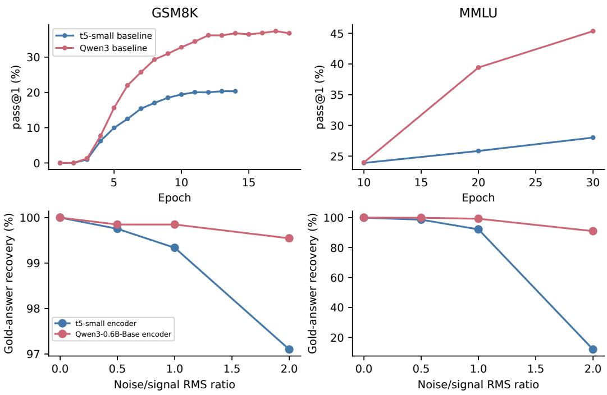  
Figure 4: As a text encoder, Qwen3-0.6B-Base supports stronger learning and stronger gold-answer recovery than t5-small under comparable training and evaluation configurations. Top: baseline learning curves on GSM8K and MMLU; the MMLU curves use full-span generation at NFE 64. Bottom: gold-answer recovery after corrupting representations of supplied gold answers. Both configurations achieve reliable gold-answer recovery without corruption, while Qwen3-0.6B-Base retains higher gold-answer recovery when inputs are corrupted, especially on MMLU. Generation and gold-answer recovery with corrupted inputs average four seeds; gold-answer recovery without corruption is evaluated once.

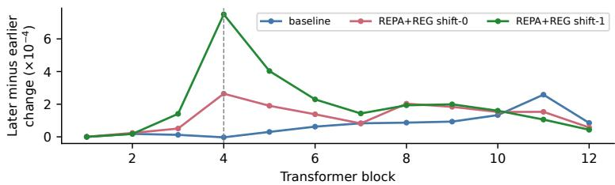  
Figure 5: REPA target position shift-1 strengthens forward influence at the supervised block on GSM8K. We replace the clean latent at a token representing a single digit with the latent obtained after substituting a different digit. We measure hidden-state change between the original and perturbed passes as 1−cosine similarity, then subtract the mean change over positions before the edited token from the mean change over positions after it. Positive values indicate stronger forward influence. $\mathbf { A } \mathbf { t } t = 0 . 7 .$ , shift-1 has a larger effect than shift-0 at the REPA-supervised block (dashed line), but this advantage disappears at the final block. ELF-B checkpoints are from epoch 6. REPA+REG shift-0 and shift-1 are ELF-REG-B settings.

## D.3.2 SINGLE-LATENT PERTURBATION ACROSS CORRUPTION TIMES

Zero REPA target position shift (which is the default setup) aligns student position i to teacher position i; REPA target position shift-1 aligns student position i to teacher position i−1. The student remains bidirectional. Figure 5 shows stronger forward influence for shift-1 at the supervised block at $t = 0 . 7 ;$ this advantage disappears at the final block.

We select a token representing a single digit near the midpoint of a GSM8K gold rationale and replace that digit with a different digit that also occupies one token. We encode the modified response and copy only the clean latent at the replacement token’s position into the original response; all other clean latents stay fixed. The original and perturbed denoiser passes share the noise, prompt, REG state, and self-conditioning inputs. At the hidden states following each block, we measure hiddenstate change as 1−cosine similarity. The earlier and later windows exclude the edited position and have equal length, given by the smaller distance from the edit to either end of the valid response. Let $\delta _ { \mathrm { e d i t } }$ be the change at the edited position, and let δ<sub>−</sub> and $\delta _ { + }$ be the mean changes in these earlier and later windows. Positive $\delta _ { + } - \delta _ { - }$ indicates stronger forward influence. Each plotted value averages this difference over the same 1024 validation examples, separately for each block, corruption time, and condition.

Figure 6 extends the $t = 0 . 7$ comparison to t = 0.05 and 0.2. Shift-1 has a larger later-minus-earlier change than shift-0 at block 4 for all three times. At block 12, shift-1 has a slightly larger difference at $t = 0 . 0 5$ , but a smaller difference at $t = 0 . 2$ and 0.7. The final-block pattern at $t = 0 . 7$ therefore depends on the corruption time.

Table 24 separates perturbation magnitude from direction at blocks 4 and 12. For each example, normalized direction is $\nu = ( \delta _ { + } - \delta _ { - } ) / ( \delta _ { + } + \delta _ { - } )$ when the denominator is positive, and zero otherwise. We average this ratio across examples. Table 24 also reports the edited-position change, both window means, and the difference between window means. All statistics use the same singlelatent interventions as Figure 6.

## D.3.3 POSITION-DEPENDENT TOKEN SETTLING

We decode predicted-clean states every four updates along a trajectory with 64 denoiser updates, and decode the final updated state at update 64. A position’s settling time is the last observed update in the trajectory where the token changes (in other words, the token does not change at subsequent observed updates), with update 4 assigned if it never changes. Figure 7 averages this count within ten response-position bins, excluding prompt and padding. REPA+REG shift-0 settles earlier in every bin. Settling does not progress monotonically from earlier to later positions.

Table 24: Perturbation magnitude and direction on GSM8K at the supervised and final blocks. Values average paired single-latent interventions for the three ELF-B settings at epoch 6. REPA+REG shift-0 and shift-1 are ELF-REG-B (ours) settings. Shift-1 has a larger later-minus-earlier change than shift-0 at block 4 at each corruption time. At block 12, this ordering reverses at $t = 0 . 2$ and 0.7, while the difference at $t = 0 . 0 5$ is small. $\delta _ { \mathrm { e d i t } }$ measures change at the edit, δ<sub>−</sub> and $\delta _ { + }$ are means in matched earlier and later windows, and ν is the mean per-example normalized difference. Hidden-state change is 1−cosine similarity.
<table><tr><td colspan="6">Hidden-state change  $( \times 1 0 ^ { - 4 } )$  ν</td></tr><tr><td>Block</td><td>Condition</td><td> $\delta _ { \mathrm { e d i t } }$ </td><td> $\delta _ { - }$ </td><td> $\delta _ { + }$ </td><td> $\delta _ { + } - \delta _ { - }$ </td></tr><tr><td colspan="6"> $t = 0 . 0 5$ </td></tr><tr><td>4</td><td>baseline</td><td>1.562</td><td>0.120 0.123</td><td>0.003</td><td>0.016</td></tr><tr><td>4</td><td>REPA+REG shift-0</td><td>2.422</td><td>0.426 0.444</td><td>0.019</td><td>0.019</td></tr><tr><td>4</td><td>REPA+REG shift-1</td><td>1.867</td><td>0.407 0.449</td><td>0.042</td><td>0.045</td></tr><tr><td>12</td><td>baseline</td><td>0.176</td><td>0.068 0.095</td><td>0.027</td><td>0.117</td></tr><tr><td>12</td><td>REPA+REG shift-0</td><td>0.191</td><td>0.067</td><td>0.085</td><td>0.019 0.095</td></tr><tr><td>12</td><td>REPA+REG shift-1</td><td>0.170</td><td>0.066 0.086</td><td>0.020</td><td>0.091</td></tr><tr><td colspan="6"> $t = 0 . 2$ </td></tr><tr><td>4</td><td>baseline</td><td>76.897</td><td>0.365</td><td>0.300</td><td>-0.066 -0.090</td></tr><tr><td>4</td><td>REPA+REG shift-0</td><td>129.010</td><td>1.008</td><td>1.397</td><td>0.390 0.126</td></tr><tr><td>4</td><td>REPA+REG shift-1</td><td>100.008</td><td>0.799</td><td>1.947</td><td>1.148 0.318</td></tr><tr><td>12</td><td>baseline</td><td>6.017</td><td>0.139</td><td>0.267</td><td>0.128 0.120</td></tr><tr><td>12</td><td>REPA+REG shift-0</td><td>4.714</td><td>0.118</td><td>0.225</td><td>0.107 0.115</td></tr><tr><td>12</td><td>REPA+REG shift-1</td><td>5.356</td><td>0.142</td><td>0.232</td><td>0.090 0.107</td></tr><tr><td colspan="6"> $t = 0 . 7$ </td></tr><tr><td>4</td><td>baseline</td><td>694.913</td><td>0.259</td><td>0.230</td><td>-0.029 -0.052</td></tr><tr><td>4</td><td>REPA+REG shift-0</td><td>1240.237</td><td>0.853</td><td>3.497</td><td>2.645 0.513</td></tr><tr><td>4</td><td>REPA+REG shift-1</td><td>582.228</td><td>0.651</td><td>8.156</td><td>7.504 0.822</td></tr><tr><td>12</td><td>baseline</td><td>134.540</td><td>0.180</td><td>1.033</td><td>0.854 0.461</td></tr><tr><td>12</td><td>REPA+REG shift-0</td><td>92.139</td><td>0.134</td><td>0.708</td><td>0.574 0.450</td></tr><tr><td>12</td><td>REPA+REG shift-1</td><td>63.242</td><td>0.137</td><td>0.571</td><td>0.434 0.362</td></tr></table>

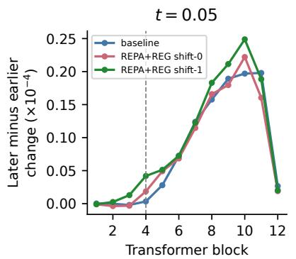

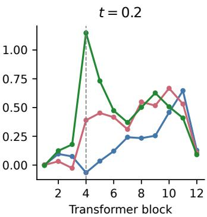

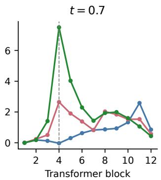

Figure 6: On GSM8K, the direction of perturbation influence depends on the block and corruption time. The $t = 0 . 7$ panel shows the same measurements as Figure 5. Each panel shows later-minusearlier hidden-state change, measured as 1−cosine similarity in equally sized windows around one edited latent. Positive values indicate stronger forward influence. Shift-1 exceeds shift-0 at the REPA-supervised block (dashed line) at all three time t values, while their final-block ordering varies with time. We choose epoch 6 ELF-B checkpoints. REPA+REG shift-0 and shift-1 are ${ \mathrm { E L F } } .$ REG-B settings.  
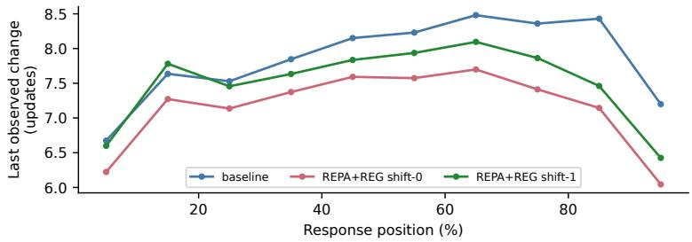  
Figure 7: On GSM8K, REPA+REG shift-0 settles earlier in every response-position bin. Settling is the last observed update at which a token changes; lower values indicate earlier settling. Positions are grouped within the final response for three ELF-B conditions at epoch 6. The pattern is not a monotonic progression from earlier to later tokens. REPA+REG shift-0 and shift-1 are ELF-REG-B settings.

## D.4 TRAINING ABLATIONS

Training settings. Tables 25 and 26 compare the performance of different training settings within each model size, at epoch 6 for ELF-B and epoch 2.5 for ELF-L. Appendix B.6 specifies their evaluation protocol. We use the validation pass@1 accuracy in Tables 25 and 26 to determine the settings for our headline results.

## D.5 SAMPLING ANALYSES

## D.5.1 EFFECT OF THE EARLY-STOP RATIO

The early-stop sweep evaluates $\rho \in \{ 1 , 2 , 4 , 8 , 1 6 \}$ using the same ELF-REG-B checkpoint and all 16 generation seeds. For $\rho > 1$ , generation decodes the predicted-clean states after $N - 1$ updates of the master grid. The $\rho = 1$ control is full-span generation and decodes the updated terminal states. Table 27 reports mean pass@1. We choose $\rho = 8$ to balance stronger low-NFE performance with gains at high NFE. Figure 1 and our headline results on math reasoning and code use $\rho = 8$ at every budget.

Sensitivity to coarse-sampling errors. We compare a full-span 64-NFE reference denoising trajectory with a nested 16-NFE coarse trajectory. At updates 16, 32, and 48, we inject the difference between the 64-NFE and 16-NFE states (specifically, the noisy text and text self-conditioning) into the 64-NFE reference, then finish generation after the error injection. REG is not affected and evolves normally. Figure 8 injects each model’s own errors, errors from the other model, and random errors. Cross-model and random errors are normalized at each response position to the 64-NFE recipient’s own combined text-state error. ELF-REG-B retains more shared solutions under its own error. The ordering depends on the error source, and random errors of matched size are less damaging.

Table 25: GSM8K training ablations for ELF-B at epoch 6. Reference configurations appear in the top rows. Each remaining row follows the default REPA+REG setup (alignment depth 4, last-token REG target, response-only text REPA, and $\lambda _ { \mathrm { R E G } } = 0 . 1 )$ , except for the stated difference in setting. The time interval restriction for REPA loss applies to text positions, excluding REG, on denoising examples; decoder-example alignment is unchanged. Values are single-seed pass@1 (%) at 65 NFE. Bold marks the best validation and test values across all rows.
<table><tr><td>Condition</td><td>Validation pass@1 (%)</td><td>Test pass@1 (%)</td></tr><tr><td>ELF-B baseline</td><td>21.58</td><td>17.89</td></tr><tr><td>ELF-B baseline, Qwen3-1.7B-Base encoder</td><td>10.16</td><td>10.39</td></tr><tr><td>ELF-REG-B (ours) (default)</td><td>32.32</td><td>25.02</td></tr><tr><td>Text REPA during denoising:  $0 \leq t \leq 0 . 4$ </td><td>31.05</td><td>25.17</td></tr><tr><td>REG target: mean pooling</td><td>27.05</td><td>23.65</td></tr><tr><td>REG only</td><td>25.39</td><td>17.97</td></tr><tr><td>Equal prompt and response REPA weights</td><td>27.93</td><td>21.91</td></tr><tr><td>Alignment depth: 3</td><td>29.20</td><td>21.61</td></tr><tr><td>Alignment depth: 5</td><td>28.22</td><td>22.06</td></tr><tr><td> $\lambda _ { \mathrm { R E G } } = 0 . 0 3$ </td><td>30.18</td><td>25.17</td></tr></table>

Table 26: GSM8K alignment-depth ablations for ELF-L at epoch 2.5. Reference configurations appear in the top rows. All settings follow the default ELF-L setup except for the stated difference in alignment depth; the default is block 8. Values are single-seed pass@1 (%) at 65 NFE. Other defaults and evaluation settings follow Appendix B.6. Bold marks the best validation and test values across all rows.
<table><tr><td>Condition</td><td>Validation pass@1 (%)</td><td>Test pass@1 (%)</td></tr><tr><td>ELF-L baseline</td><td>33.50</td><td>27.37</td></tr><tr><td>ELF-REG-L (ours) (default)</td><td>44.04</td><td>34.04</td></tr><tr><td>Alignment depth: 6</td><td>42.09</td><td>33.13</td></tr><tr><td>Alignment depth: 10</td><td>41.21</td><td>33.28</td></tr><tr><td>Alignment depth: 11</td><td>40.04</td><td>33.13</td></tr></table>

Table 27: GSM8K accuracy (%) for the early-stop ratio sweep, ELF-REG-B (ours) at epoch 12.
<table><tr><td> $\rho / \mathrm { N F E }$ </td><td>4</td><td>8</td><td>16</td><td>32</td><td>64</td></tr><tr><td>1</td><td>7.25</td><td>15.75</td><td>25.27</td><td>30.95</td><td>34.19</td></tr><tr><td>2</td><td>10.60</td><td>23.22</td><td>30.89</td><td>34.08</td><td>35.84</td></tr><tr><td>4</td><td>11.62</td><td>25.75</td><td>33.43</td><td>35.69</td><td>37.62</td></tr><tr><td>8</td><td>11.82</td><td>26.20</td><td>34.42</td><td>37.15</td><td>38.11</td></tr><tr><td>16</td><td>11.22</td><td>25.82</td><td>35.30</td><td>37.55</td><td>38.32</td></tr></table>

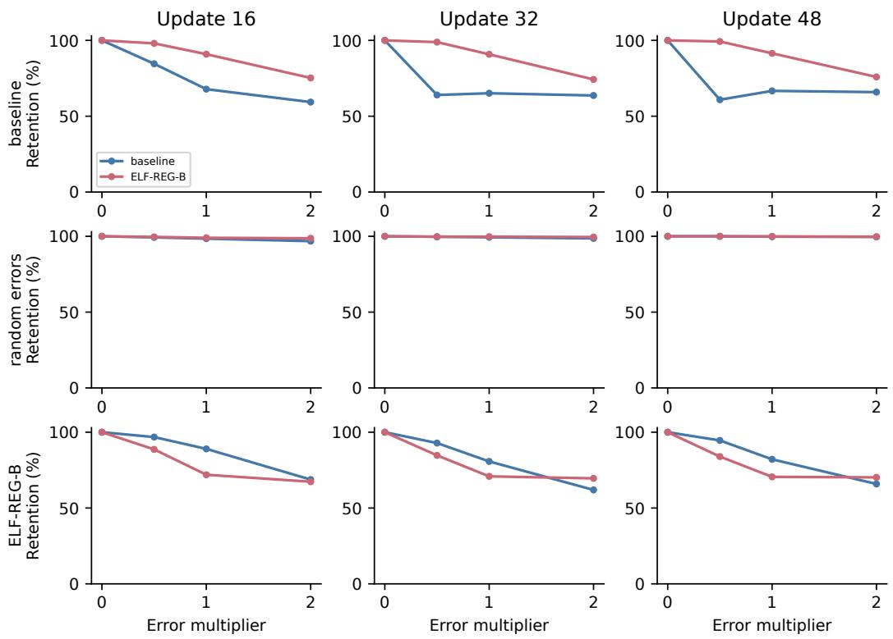  
Figure 8: Coarse-sampling errors are more damaging than random errors of matched size. Retention measures correctness on the 1,219 question–seed pairs both models solve before injection (this is the number of questions solved across 4 seeds). Rows identify the error source and columns the injection update; each curve identifies the receiving model. The multiplier scales the injected error. ELF-REG-B retains more answers under its own coarse error, while the recipient ordering changes with the error source.

The 64-NFE reference time grid has 63 denoiser updates. The coarse 16-NFE time grid retains reference indices 0, 4, 8, . . . , 48, 53, 58, 63, giving 15 updates and the same endpoint time. At each injection time, the error is the coarse state minus the reference state. We concatenate the noisy-text error and previous-clean-prediction error at each response position. Cross-model errors are rescaled to the recipient’s own error norm at that position. Random controls draw Gaussian noise in thi concatenated space and rescale it to the same norm. We split the vector back into the noisy-text error and previous-clean-prediction error. We scale both components of error by a multiplier from {0, 0.5, 1, 2} and add them to the corresponding components of the reference state. We then continue generation using the remaining reference time grid. Prompt positions stay fixed, and the reference REG state and its self-conditioning are not modified by injection.

Retention is the percentage of question–seed pairs whose numerical answer remains correct among the question–seed pairs that both unperturbed 64-NFE reference runs solve. We pool these shared successes over 4 generation seeds. Thus the comparison holds the evaluated solutions fixed across error sources and 64-NFE recipients. Appendix B.6 gives checkpoint and sampling settings.

Full-span answer retention. We select the question–seed pairs that both models solve at full-span NFE 64, then measure correctness on those pairs at lower full-span budgets. Table 28 reports this conditional retention. These are separate full-span trajectories at each budget, whereas Figure 2 follows one continuing trajectory.

Table 28: ELF-REG-B retains more shared solutions at every reduced full-span budget. Retention (%) is measured on the 4,693 question–seed pairs both ELF-B baseline and ELF-REG-B solve at NFE 64. Each lower budget uses its own full-span trajectory; retention at NFE 64 is 100% by construction.
<table><tr><td>NFE</td><td>ELF-B baseline</td><td>ELF-REG-B (ours)</td></tr><tr><td>4</td><td>13.87</td><td>17.86</td></tr><tr><td>8</td><td>39.59</td><td>44.62</td></tr><tr><td>16</td><td>65.93</td><td>71.34</td></tr><tr><td>32</td><td>81.95</td><td>85.06</td></tr><tr><td>64</td><td>100.00</td><td>100.00</td></tr></table>

## E COMPARISON WITH RELATED WORK

Table 29: Selected methods for language generation and representation supervision. Panel A distinguishes the generated state, generation structure, and training or sampling approach. Panel B distinguishes intermediate-feature alignment from jointly denoised representations. AR denotes autoregressive generation.

<table><tr><td colspan="4">A. Language generation</td></tr><tr><td>Method</td><td>Generation state</td><td>Response generation</td><td>Training or sampling approach</td></tr><tr><td>LangFlow [12]</td><td>Token embeddings</td><td>Parallel sequence denoising</td><td>Flow matching with a learned noise schedule.</td></tr><tr><td>LDLM [36]</td><td>Learned contextual latents</td><td>Parallel denoising, then token decoding</td><td>Joint training of the latent encoder, denoiser, and decoder.</td></tr><tr><td>ELF [24]</td><td>Contextual encoder representations</td><td>Parallel denoising; final token decoding</td><td>Flow matching with a shared denoiser and decoder.</td></tr><tr><td>S-FLM [14]</td><td>Hyperspherical token embeddings</td><td>Parallel sequence denoising</td><td>Riemannian flow matching on learned embeddings.</td></tr><tr><td>FMLM [30]</td><td>Noisy one-hot token vectors</td><td>Parallel sequence generation</td><td>Distillation of a continuous flow into a flow map.</td></tr><tr><td>FMLM+ [1]</td><td>Noisy one-hot vectors and committed tokens</td><td>Any-order token commitment</td><td>Flow-map self-distillation; posterior refinement during sampling.</td></tr><tr><td>MLFM [7]</td><td>Token embeddings and committed tokens</td><td>Continuous updates with token commitment</td><td>Mask-conditioned flow training; confidence-based token commitment.</td></tr><tr><td>PlaidQ [41]</td><td>Token embeddings</td><td>Parallel denoising; final token decoding</td><td>AR initialization; distribution-matching distillation for few-step generation, paired trajectories for one-step</td></tr><tr><td>L2D [10]</td><td>Next-token embedding</td><td>AR token sequence</td><td>generation. A trainable diffusion path uses a frozen AR backbone.</td></tr><tr><td>LaDiR [28]</td><td>Latent thought blocks</td><td>Blockwise latent denoising; AR final answer</td><td>Latent reasoning followed by answer generation conditioned on the latent thoughts</td></tr><tr><td>CADD [56]</td><td>Discrete tokens and token embeddings</td><td>Joint continuous and discrete updates</td><td>Continuous token embeddings guide masked-token prediction.</td></tr><tr><td>CCDD [57]</td><td>Discrete tokens and contextual latents</td><td>Joint continuous and discrete updates</td><td>Joint denoising of tokens and encoder representations.</td></tr><tr><td>ELF-REG (ours)</td><td>Encoder representations and global REG state</td><td>Parallel full-response denoising; final token decoding</td><td>REPA+REG training and prefix early-stop sampling.</td></tr><tr><td colspan="4">B. Representation supervision</td></tr><tr><td>Method</td><td>Supervised representation</td><td>Supervision source</td><td>Role during generation</td></tr><tr><td>REPA [54]</td><td>Intermediate image-denoiser features</td><td>Frozen visual encoder</td><td>Alignment is used during training; inference denoises image latents.</td></tr><tr><td>REG [50]</td><td>Global representation alongside image latents. REPA is also applied.</td><td>Pretrained visual encoder's class token</td><td>The global representation is jointly denoised with image latents.</td></tr><tr><td>Portuguese masked-dLM REPA [27]</td><td>Intermediate masked-denoiser features</td><td>Clean text representations from pretrained encoders</td><td>Alignment is used during training; inference uses masked token denoising.</td></tr><tr><td>REPR- ALIGN [40]</td><td>Intermediate masked-denoiser features</td><td>Frozen AR model used for initialization</td><td>Alignment is used during training; inference uses masked token denoising.</td></tr><tr><td>TextLDM [26]</td><td>VAE encoder features</td><td>Frozen AR language model</td><td>Continuous latent diffusion uses the trained VAE decoder for token generation.</td></tr><tr><td>CCDD [57]</td><td>Per-token contextual latents</td><td>Fixed pretrained text encoder</td><td>Contextual latents are jointly denoised with discrete tokens.</td></tr><tr><td>ELF-REG (ours)</td><td>Intermediate continuous-denoiser features and global REG state</td><td>Clean AR teacher states</td><td>The global REG state is jointly denoised with the continuous response. REPA supervises intermediate features during</td></tr></table>

## E.1 EARLY-STOP GENERATION

Early-stop methods differ in the evidence used to stop denoising and the predictions they finalize. For continuous text diffusion, Vaina et al. [48] compare fixed exits with adaptive criteria based on prediction confidence or changes between steps. Difformer [17] motivates early stopping by showing that intermediate clean predictions can yield better text than later predictions. In masked dLMs, confidence can determine either individual token commitments or termination of the remaining generation. Just on Time [29] finalizes confident tokens individually; Prophet [31] uses confidence over an answer region to commit all remaining tokens and observes that answer tokens can emerge before the surrounding response settles.

For continuous generation, stopping also requires choosing the state returned by the sampler. Truncated Jump Sampling (TJS) [42] truncates image-generation trajectories and returns a clean prediction, sharing the principle used by our prefix early-stop sampler. Its mean-squared error decompo sition concerns prediction of the clean data sample under the corruption distribution. Our endpoint discrepancy compares the prediction with the endpoint of the same generated flow. The curvatureindependent decomposition and our acceleration-based bound therefore concern different errors. FMLM [30] already interprets the clean predictor as one Euler step over the remaining interval and learns flow maps for finite-time transport. We use the existing clean predictor for that approximation. Token decoding introduces a further distinction: latent discrepancies need not change the decoded tokens. The decoder-margin argument of Du & Ma [16, Theorem 1], applied in Proposition 2, gives a sufficient condition for preserving the complete endpoint response, including an incorrect response.

We use REPA+REG to improve intermediate clean predictions in fully continuous diffusion language models and demonstrate strong low-NFE mathematical reasoning and code generation through prefix early-stop, without dedicated few-step training. On GSM8K, ELF-REG-B reduces endpoint error and brings earlier token stability. Our analysis characterizes the discrepancy be tween an intermediate clean prediction and the endpoint of the same generated flow, bounds this discrepancy through remaining acceleration, and applies the decoder-margin argument to completeresponse agreement (Section 3.1). We separately derive the endpoint discrepancy for the implemented self-conditioned sampler (Appendix C.3).

## F LIMITATIONS

We train separate models for GSM8K, MATH, code, and MMLU. The code model is shared across the MBPP/HumanEval code benchmarks, and the MATH models are initialized from the corresponding GSM8K weights. Joint training of a single generalist model across these tasks remains future work. Our code training and evaluation also focus on Python, so the study does not cover other programming languages. Extending the training data and benchmarks to additional programming languages is a promising further direction. ELF is a continuous dLM trained on a fixed-length response canvas; adapting it to different canvas lengths without performance reductions requires finetuning and we leave this as future work. Due to compute constraints, we do not repeat training with multiple random seeds.

## G QUALITATIVE EXAMPLES

We show one correct and one incorrect response from ELF-REG-L on each benchmark, using the checkpoints and settings of Tables 2 and 1: 64 NFE for GSM8K and 128 NFE for MATH-500, HumanEval, and MBPP-378, with ρ = 8 early-stop. Prompts and generated responses are reproduced verbatim, with reference answers for incorrect responses. Appendix B.3 gives the evaluation protocols.

GSM8K Correct   
Prompt   
Question: If Ann is 9 years old and her brother is twice her age, how   
old will her brother be in 3 years?   
Answer:   
Generated response   
If Ann is 9 years old, then her brother is twice her age, which is 9 x   
2 = 18 years old.   
In 3 years, her brother will be 18 + 3 = 21 years old.   
#### 21

GSM8K Incorrect   
Prompt   
Question: Lori wants to buy a \$320.00 pair of shoes and a matching belt   
that is \$32.00. Her part-time job pays her \$8.00 an hour. How many   
hours will she have to work before she can make her purchase?   
Answer:   
Generated response   
Lori's total expenses for the shoes and the belt are \$320 + 32 = 352\$.   
Since she can make \$8 per hour, she needs to work \$352 / 8 = 43\$ hours.   
Thus Lori will have to work \boxed{43} hours to make her purchase.   
#### 43   
Reference answer   
44

MATH-500 Correct   
Prompt   
Question: If \$3x + 2(1 + x) = 17\$, what is the value of \$6x + 5\$?   
Step-by-Step Answer:   
Generated response   
First, solve the equation for \$x\$:   
\[ 3x + 2 + 2x = 17 \Rightarrow 5x + 2 = 17 \Rightarrow 5x = 15 \   
Rightarrow x = 3 \]   
Now substitute the value of into the equation:   
\[ 6x + 5 = 6(3) + 5 = 18 + 5 = \boxed{23} \]   
Final answer: \$\boxed{23}\$

MATH-500 Incorrect   
Prompt   
Question: If \$a\star b = 9a+2b-ab+5\$, what is the value of \$5\star1\$?   
Step-by-Step Answer:   
Generated response   
To find the value of \$5\star1\$, we need to substitute \$a=5\$ and \$b=1\$   
into the given equation.   
\[ a\star b = 9a+2b-ab+5 \]   
\[ 5\star1 = 9(5)+2(1)-(5)(1)+5 \Rightarrow 5\star1 = 45+2-5+5 \   
Rightarrow 5\star1 = 45 \]   
So the answer is \$\boxed{45}\$.   
Final answer: \$\boxed{45}\$   
Reference answer   
47

```python
HumanEval Correct
Prompt
Write a complete Python solution. Return only code.
def get_positive(l: list):
"""Return only positive numbers in the list.
>>> get_positive([-1, 2, -4, 5, 6])
[2, 5, 6]
>>> get_positive([5, 3, -5, 2, -3, 3, 9, 0, 123, 1, -10])
[5, 3, 2, 3, 9, 123, 1]
" " "
Python solution:
Generated response
def get_positive(l: list) -> list:
"""Return only positive numbers in the list l."""
return [num for num in l if num > 0]
```

HumanEval Incorrect   
Prompt   
Write a complete Python solution. Return only code.   
def triangle\_area(a, h):   
"""Given length of a side and high return area for a triangle.   
>>> triangle\_area(5, 3)   
7.5   
I n n   
Python solution:   
Generated response   
def triangle\_area(a, h):   
" " "   
Calculate the area of a triangle given side and high.   
Parameters:   
a (float): Length of the side.   
h (float): High of the side.   
Returns:   
float: Area of the triangle.   
" n "   
return a <sub>\*</sub> h <sub>\*\*</sub> 2   
Reference answer   
def triangle\_area(a, h):   
"""Given length of a side and high return area for a triangle.   
>>> triangle\_area(5, 3)   
7.5   
" "   
return a h / 2

MBPP-378 Correct   
Prompt   
Write a complete Python solution. Return only code.   
I n n   
Write a function to find the volume of a cube given its side length.   
assert volume\_cube(3)==27   
"  "   
Python solution:   
Generated response   
def volume\_cube(side\_length):   
" " "   
Calculate the volume of a cube given its side length.   
Parameters:   
side\_length (float): The side length of the cube.   
Returns:   
float: The volume of the cube.   
I Ⅱ "   
return side\_length 3

MBPP-378 Incorrect   
Prompt   
Write a complete Python solution. Return only code.   
" " "   
Write a function to find the nth octagonal number.   
assert is\_octagonal(5) == 65   
  
Python solution:   
Generated response   
def is\_octagonal(n):   
" " "   
Returns the nth octagonal number.   
Parameters:   
n (int): The position in the octagonal sequence.   
Returns:   
int: The nth octagonal number.   
I Ⅱ n   
return n (n + 1) // 2   
Reference answer   
def is\_octagonal(n):   
return 3 <sub>\*</sub> n <sub>\*</sub> n - 2 <sub>\*</sub> n