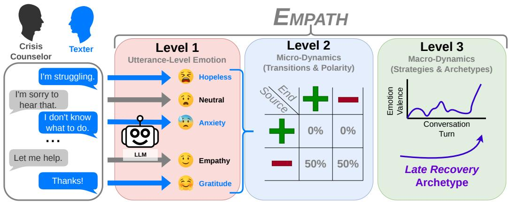
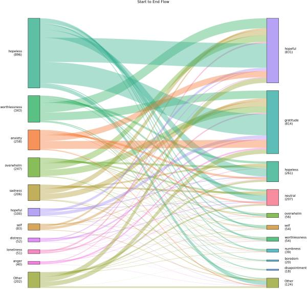
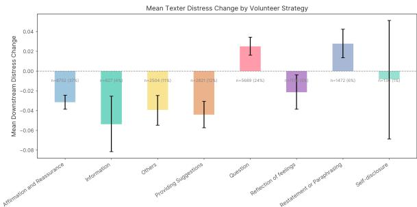
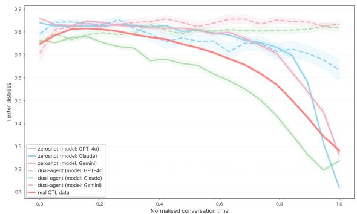
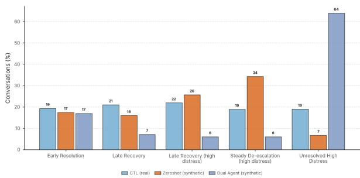

# EMPATH: Tracing Multi-Level Emotion Dynamics in Crisis Counseling Dialogues

Ziwei Gong1∗, Yuchen Huang2∗, Wen Liang1, Nicholas Deas1, Melanie Subbiah1, Kathleen McKeown1, Julia Hirschberg1,

1Columbia University, USA 2Barnard College, USA

{sara.ziweigong, ndeas, kathy, julia}@cs.columbia.edu

∗Equal contributions.

## Abstract

Emotion dynamics are critical for understanding crisis-support conversations, yet most computational work treats emotion as static utterance-level labels. We introduce EMPATH, a framework for understanding affective dynamics in mental health dialogues across three granularities: turn-level labels, transition probabilities, and global conversation archetypes. Applying EMPATH to text-based crisis conversations with self-identified Black texters discussing grief, we find persistent negative affect, gradual hope-ward transitions, distinct texter–volunteer emotional roles, and heterogeneous recovery trajectories. These results highlight the informative patterns that emerge from computationally understanding crisis support and expressions of grief as dynamic processes within conversations, as well as the overall value of emotion-dynamic analysis for analyzing and comparing affect in dialogues.

## 1 Introduction

Understanding how emotions change over the course of crisis-support conversations is critical for studying online grief support. In text-based crisis settings, texters may move through persistent distress, disclosure, moments of gratitude, and gradual shifts toward hope over the course of a single interaction. These changes are especially important in counseling conversations, where support is rarely a simple linear movement from negative to positive emotion. However, much computational work on mental health dialogue treats emotion as a static utterance-level label, following broader trends in emotion recognition and affective state identification (Jordan et al., 2025; Wu et al., 2024; Gong et al., 2023), leaving the temporal structure of emotional change underexplored. Related work also examines the extraction of texters’ explicit emotion expressions in crisis conversations (Buda et al., 2026).

In this work, we study emotion dynamics in conversations from Crisis Text Line (CTL), 1 a mental health organization where volunteer counselors provide support over text messages to those in crisis. As part of a larger collaboration between computational linguists and social work researchers, we focus specifically on CTL conversations with Black texters discussing or expressing grief. Prior work has emphasized that grief in Black communities is shaped by social, historical, and structural contexts (Wilson and O’Connor, 2022), and emotional expressions of grief are known to be highly complex, sometimes involving simultaneous expressions of joy and deep distress (Patton et al., 2025). This setting is therefore a challenging domain for analyzing highly complex emotion expression, and provides an opportunity to examine how distress and support unfold in crisis conversations. This setting also raises important methodological challenges: the data is highly sensitive, privacy-restricted, and cannot be processed using API-based systems or publicly released at scale.

To analyze these conversations, we propose EMPATH, a framework for studying emotion dynamics in therapeutic and crisis-support dialogue across three levels of granularity. First, EMPATH identifies utterance-level emotions using a locally runnable emotion-labeling pipeline designed for privacy-restricted data. Second, it analyzes microdynamics, including turn-level emotion transitions, polarity shifts, persistence, and recovery pivots. Third, it characterizes macro-dynamics, including volunteer strategies and conversation-level trajectory archetypes. Together, these levels allow us to move beyond aggregate emotion distributions and examine how emotional states persist, shift, and resolve over interactions.

Applying EMPATH to CTL grief conversations, we surface a range of different emotion dynamics patterns, including repeated negative emotion expressions, shifts from negative emotions to hope, and mixtures of these patterns. Such emotion dynamics also highlight distinctions between the emotional roles of texters and volunteer counselors in dialogues. Examining these patterns suggests that successful crisis support is better understood as a dynamic process rather than a terminal shift from distress to resolution. In particular, the timing and structure of emotional transitions reveal aspects of support that are not visible from traditional utterance-level labels or conversation endpoints alone.

Finally, we use synthetic crisis-support dialogues to show how the framework also applies beyond CTL. Synthetic data has become increasingly attractive for developing analysis tools while preserving the confidentiality of real conversations (Kurakin et al., 2023; Flemings and Annavaram, 2024; Cabrera Lozoya et al., 2025), and recent work has explored LLM-based patient simulations for clinical and counselor training (Louie et al., 2024, 2026; Wang et al., 2024). We show that EMPATH can reveal meaningful differences in emotion dynamics, surfacing some similarities in aggregate emotional trends but gaps in fine-grained patterns between synthetic and authentic dialogues.

We summarize our contributions as follows:

1. We propose a novel, three-level evaluation framework, EMPATH, to assess emotion dynamics in mental health and crisis dialogues.

2. Using EMPATH, we conduct a large-scale analysis of text-based crisis conversations with Black texters about grief from Crisis Text Line. We discuss how trends in emotion dynamics are reflective of successful dialogues in this context. We identify key dynamic signatures of grief-support conversations, including persistent distress, hope-ward pivots, role-differentiated emotional profiles, and heterogeneous recovery trajectories.

## 2 Related Work

Emotion Recognition in Conversation (ERC) is a foundational NLP task and key tool for tracking crisis intervention trajectories (Tripodi et al., 2025; Xu et al., 2024). In text-based therapeutic dialogues, model evaluations reveal clear tradeoffs: closed-source models like GPT-4 perform well in zero-shot diagnostic settings but often struggle with nuanced, culturally sensitive emotional states (Wu et al., 2025; Xie et al., 2025). Open-weight LLaMA models, when lightly fine-tuned, achieve competitive performance in assessing emotional safety (Badawi et al., 2026). Domain-specific models, such as MentalBERT and MentalRoBERTa (Ji et al., 2022), consistently outperform general models on targeted clinical tasks, while crisis-focused models like BERT-EV leverage continuous valence scoring to track turn-level de-escalation in realworld crisis conversations (Tripodi et al., 2025). Efforts on crisis de-escalation and emotional support dialogue suggest that interactional trajectories, support strategies, and changes in distress over time are central to understanding support effectiveness (Tripodi et al., 2025; Liu et al., 2021; Wan et al., 2025; Zhang et al., 2025; Liu et al., 2026).

Grief and bereavement are highly complex experiences that are often misunderstood (Hall, 2014) and accompanied by constantly evolving theories including dual process models (Margaret Stroebe, 1999) and meaning making-focused perspectives (Stroebe and Schut, 2001; Neimeyer et al., 2002). Understanding these experiences has been further complicated by the movement of their expression to online, digital spaces (Moore et al., 2017; Patton et al., 2025). As expressions of grief in digital counseling are highly dynamic and complex, we focus on this domain as a potential case where understanding may be aided through emotion dynamics.

## 3 Crisis Dialogue Data

Crisis Text Line (CTL) is a non-profit mental health organization that provides real-time support for those in crisis over text messages. Those in crisis (Texters) that reach out to CTL are connected with a volunteer crisis counselor (Volunteers) to receive support. All crisis counselors are trained by CTL to provide effective support to texters and are supervised live by trained mental health professional staff.

We use a corpus of 2,478 de-identified conversations focused on expressions of grief in the Black community. We collect only conversations with texters that self-identified as Black or African American in an optional post-conversation survey. CTL volunteers may tag conversations with a topic, and we collect only conversations tagged as discussing grief. From this corpus, we collect a random sample of 100 de-identified conversations for human annotation and validation of the emotion models. Importantly, due to the sensitive nature of the data and in order to protect the confidentiality of CTL users, this data is de-identified prior to access, is only accessed under a signed DUA, and all data is processed locally (i.e., no CTL data are provided to API-based LLMs or other online services).

  
Figure 1: Summary of EMPATH framework for assessing conversation dynamics in mental health/crisis dialogues. The example dialogue is simulated and contains no real CTL messages.

<table><tr><td>Author</td><td>Count</td><td># Labeled</td><td>Avg. Len</td></tr><tr><td>System</td><td>629</td><td>0</td><td>24.2</td></tr><tr><td>Texter</td><td>3355</td><td>474</td><td>17.7</td></tr><tr><td>Volunteer</td><td>2695</td><td>19</td><td>25.2</td></tr><tr><td>Overall</td><td>6679</td><td>493</td><td>21.4</td></tr></table>

Table 1: Message summary statistics of the 100- conversation CTL annotation sample.

We collaborate with a team of social work researchers who conduct an inductive thematic analysis of the conversations–the researchers thoroughly read and label conversation turns according to themes that are qualitatively derived from the data. All conversations within the 100-conversation annotation sample are annotated by two researchers, and all disagreements between them are resolved through discussion. While these themes cover a variety of categories, in this work, we focus on a set of 37 emotions (e.g., hopeful, numbness, longing) identified by the social work researchers, as defined in Table 10. Text-level statistics summarizing the annotation sample are included in Table 1. The 100 conversations span a period from December 2016 to October 2023, with an average of 56.3 dialogue turns each.

## 4 EMPATH Framework

Our primary methodology is the Emotion and Multidimensional Pattern Analysis for Therapeutic

Help (EMPATH) framework. We introduce EM-PATH as a tool for studying patterns in the emotion dynamics of crisis, mental health, and other therapeutic dialogues at multiple levels. This three-level evaluation framework (summarized in Figure 1) processes raw dialogue through an analysis ranging from individual utterances to holistic conversation: 1) Utterance-Level Emotion Detection; 2) Micro-Dynamics (Transitions and Polarity); and iii) Macro-Dynamics (Strategies, Archetypes, and Diversity).

## 4.1 Level 1: Emotion Detection

We frame utterance-level emotion detection as a constrained text generation task, similar to recent emotion analysis work (Deas et al., 2024b). Given an utterance and optional conversational context, a language model is prompted to select exactly one label from a list of the 37 emotion categories (Table 10) and provide reasoning. These labels describe emotional content expressed or reflected in an utterance; volunteer labels may reflect texters’ emotions rather than the volunteers’ own emotional states.

Prompt Design. Each prompt consists of three components: i) the list of 37 emotion labels with brief descriptions, ii) the conversational history (a sliding window of up to N preceding utterances from both speakers), and iii) an instruction asking the model to output a structured (label, reason) response with post-hoc explanations (Camburu et al., 2018; Limpijankit et al., 2025). The instruction explicitly directs the model to weight the current message most heavily and to use preceding messages only as supporting context. Prompts provided

<table><tr><td></td><td>Level Statistic</td><td>Description</td></tr><tr><td>C</td><td>Transition matrix</td><td>How often each emotion follows another  $( 3 7 \times 3 7$  counts and probabilities).</td></tr><tr><td>C</td><td>Persistence</td><td>How likely an emotion is to repeat on the next turn  $( P ( { \mathrm { s t a y } } ) )$ </td></tr><tr><td>C</td><td>Net flow</td><td>Whether an emotion is  $\mathrm { { a } \ { \tilde { \ s i n k } } { \tilde { \ s i n k } } { \tilde { \ s } } }$  (conversations flow  $\mathrm { i n } ) \mathrm { o r } \mathrm { \phantom { = } } \mathrm { s o u r c e } ^ { \mathrm { , , } }$  (conversations flow out).</td></tr><tr><td>C</td><td>Motifs</td><td>Common 2- and 3-emotion sequences (e.g., hopeless→hopeless→hopeful).</td></tr><tr><td>C</td><td>Stationary distribution</td><td>Long-run equilibrium prevalence of each emotion under a Markov model.</td></tr><tr><td>C</td><td>Change rate</td><td>Fraction of consecutive turns where the emotion label changes.</td></tr><tr><td>P</td><td>Major flips</td><td>Direct negative→positive or positive→negative sentiment shifts, with timing of the first flip.</td></tr><tr><td>P</td><td>Within-polarity shifts</td><td>Emotion changes that stay within the same sentiment  $( \mathrm { e . g . }$  , sadness→anxiety, both negative).</td></tr><tr><td>P</td><td>Cross-polarity shifts</td><td>Which specific emotions are involved at each sentiment boundary crossing.</td></tr><tr><td>Both</td><td>Sankey diagrams</td><td>Visual flow diagrams showing how emotions redistribute from conversation start to end.</td></tr></table>

Table 2: Micro-Dynamics Statistics derived from emotion-label sequences at the category level of 37 emotion labels (C) and polarity level of positive/negative/neutral (P).

in $\ S \mathrm { A } .$

Model Selection and Validation. To safeguard the confidentiality of the CTL conversations, we exclusively evaluate locally runnable models within a secure, offline environment. Specifically, we use meta-llama/Llama-3.2-3B-Instruct (Grattafiori et al., 2024) as the backbone model, with experimental setups detailed in §A. We validate the pipeline by comparing generative models (Llama-3.1/3.2, Mistral-7B), encoder-only models (BERT Emotions, MentalBERT), and a random baseline across the human-annotated subset of the CTL conversations. Performance is measured using exact-match accuracy and semantic similarity.

Our results demonstrate that generative models significantly outperform BERT-based models across all taxonomy levels. We selected Llama-3.2- 3B-Instruct for all primary analyses as it offered the best trade-off between performance and computational efficiency. Notably, it achieved semantic similarity scores (0.97–0.98) comparable to larger models, indicating that its predictions are semantically aligned with human references even when exact labels differ. Full candidate model descriptions, validation results, and the multi-level taxonomy mapping are detailed in §B.

We also test two configurations per corpus: (i) without context (single-utterance), and (ii) with context (includes preceding utterances). We select (i) with context for our main analysis. While context-free models score slightly higher on singleutterance accuracy, the with-context mode produces the temporally coherent trajectories necessary for studying conversation dynamics (see further discussion and full comparison in §G).

## 4.2 Level 2: Micro-Dynamics (Transitions and Polarity)

Once labels are assigned, this level characterizes the dynamics of emotional states across conversations at two complementary levels of granularity: category-level, and polarity-level. Table 2 summarizes the full set of derived statistics. Categorylevel analysis tracks transitions among all 37 emotion labels. Each conversation is modeled as a sequence of emotion labels from which we compute adjacent-pair transitions. Polarity-level analysis projects labels onto a polarity scale to capture coarse sentiment trajectories. To complement the fine-grained emotion category view, we project each of the 37 emotion labels onto a continuous valence axis using the NRC Valence–Arousal– Dominance (VAD) Lexicon (Mohammad, 2018) and discretize into three polarity classes: positive (valence ≥ 0.55); negative (valence ≤ 0.45); and neutral (0.45 < valence < 0.55). The full mapping is provided in §C.

## 4.3 Level 3: Macro-Dynamics (Strategies and Archetypes)

Moving beyond surface-level labels, we analyze the interactional structure and global composition of conversations. To support this, we derive a perturn distress score d from negated valence score v , $d = 1 - v \in [ 0 , 1 ]$ , so that negative-valence labels (e.g., fear, sadness) yield high distress values and positive-valence labels (e.g., gratitude, joy) yield low ones.

Volunteer Strategy Analysis. Surface-level emotional arcs may look similar across real and synthetic conversations while masking differences in how support is delivered. To probe this, we examine whether the same volunteer strategy produces comparable downstream effects on texter distress in synthetic and real CTL data. We analyze local three-turn windows $( u _ { t } , h _ { t } , u _ { t + 1 } )$ , where a texter turn $u _ { t }$ is followed by a volunteer turn $h _ { t }$ and the next texter turn $u _ { t + 1 }$ . Each volunteer turn is classified into one of eight ESConv support-strategy categories (Bai et al., 2025): Affirmation and $R e \mathrm { - }$ assurance, Information, Others, Providing Suggestions, Question, Reflection ofFeelings, Restatement or Paraphrasing, and Self-disclosure.

For each window, we compute the immediate downstream distress change $\Delta d ~ = ~ d ( u _ { t + 1 } )$ $d ( u _ { t } )$ , where more negative values indicate distress reduction, and define a binary de-escalation indicator equal to 1 when $\Delta d < - 0 . 1$ . We estimate per-strategy frequency, mean $\Delta d$ with 95% bootstrap confidence intervals, and de-escalation rate, and aggregate to the conversation level for comparison across ablation conditions (model family, topic condition, length condition, label context).

Conversation Archetype Analysis. To test whether synthetic and real crisis conversations differ in the composition of trajectory shapes, we cluster individual conversations into interpretable archetypes. We summarize each interaction as a length-normalized distress trajectory by interpolating sequences onto a shared grid. We then concatenate trajectories and apply pooled K-means clustering. Centroids are assigned names based on shape features. We name each centroid from its mean distress level, total fall, and when that fall occurs, yielding five archetypes: Early Resolution, Late Recovery, Persistent Moderate Distress, Steady Deescalation (high distress), and Unresolved High Distress. Details on the trajectory normalization and feature-based labeling of archetypes in §E.

## 5 Results: Emotion Dynamics in CTL Grief Conversations

The following analyses use the full CTL corpus of conversations with self-identified Black or African American texters tagged as discussing grief. The annotated subset is used to validate the emotion models.

## 5.1 Level 1: Utterance-Level Emotion Profiles

We focus primarily on texter roles, as texter emotion dynamics are the main signal of interest in crisis-support conversation analysis. Texters and volunteers nevertheless exhibit complementary emotion profiles: texters show high negativepolarity persistence (84.1%), whereas volunteers more consistently maintain positive states, with positive-polarity persistence of 72.4%. Volunteers’ most frequent cross-emotion transition is hopeless→hopeful, consistent with movement from acknowledging distress toward a more hopeful frame. The full role-differentiation analysis is provided in §F.1.

<table><tr><td colspan="3">Texter</td><td colspan="3">Volunteer</td></tr><tr><td>Label</td><td>Count</td><td> $\%$ </td><td>Label</td><td>Count</td><td> $\%$ </td></tr><tr><td>hopeless</td><td>15,221</td><td>25.0</td><td>hopeful</td><td>26,175</td><td>46.4</td></tr><tr><td>worthlessness</td><td>8,344</td><td>13.7</td><td>hopeless</td><td>11,866</td><td>21.0</td></tr><tr><td>hopeful</td><td>7,650</td><td>12.6</td><td>overwhelm</td><td>6,253</td><td>11.1</td></tr><tr><td>overwhelm</td><td>5,467</td><td>9.0</td><td>neutral</td><td>2,748</td><td>4.9</td></tr><tr><td>gratitude</td><td>3,942</td><td>6.5</td><td>anxiety</td><td>1,970</td><td>3.5</td></tr><tr><td>anger</td><td>3,422</td><td>5.6</td><td>gratitude</td><td>1,822</td><td>3.2</td></tr><tr><td>self</td><td>2,844</td><td>4.7</td><td>self</td><td>1,424</td><td>2.5</td></tr><tr><td>anxiety</td><td>2,598</td><td>4.3</td><td>preoccupied</td><td>595</td><td>1.1</td></tr><tr><td>numbness</td><td>2,100</td><td>3.5</td><td>worry</td><td>590</td><td>1.0</td></tr><tr><td>sadness</td><td>1,722</td><td>2.8</td><td>serenity</td><td>558</td><td>1.0</td></tr></table>

Table 3: Top-10 emotion labels for CTL texter utterances (left, N=60,788 labeled utterances from 2,478 conversations) and volunteer utterances (right, N=56,460 labeled utterances). For texters, 60,788 of 62,723 raw utterances received parseable labels.

Emotion Distribution. Table 3 presents the top-10 emotion labels for texter and volunteer utterances in CTL dialogues. The texter distribution is dominated by hopeless (25.0%), with the top-5 labels accounting for 66.8% of all texter utterances. Notably, hopeful ranks third (12.6%), reflecting moments of positive engagement interspersed with distress. This coexistence is particularly relevant to digital expressions of grief by Black texters, where expressions of hope and joy more broadly do not necessarily replace grief but may emerge alongside it over the course of the interaction (Patton et al., 2025). The remaining labels form a long tail, indicating that although a small set of emotions dominates the corpus, the full 37-label inventory inductively derived from the data captures a broader range of grief-related and crisis experiences. Volunteer utterances show a complementary profile, with greater concentration in positive and supportive emotional states, particularly hopeful (46.4%), while hopeless (21.0%) and overwhelm (11.1%) also remain prominent. Together, these distributions illustrate the different interactional roles occupied by texters and volunteers, while motivating the transition-based analyses below: aggregate prevalence alone does not reveal how these emotional states unfold over time.

African American Language Analysis. Given that the CTL conversations involve self-identified Black texters, we note that some conversations also involve the use of African American Language (AAL)–the variety of English used by many, but not all and not exclusively, African Americans in the US (Grieser, 2022). We qualitatively observe cases where the model appears to misinterpret the use of AAL; for example, one texter says, "Ifeel so alone n having to keep dis away for my kids, bout only person that bout understand I’m hurting at time is my son," 2 which is classified as hopeful. The model attributes this to the mention of the texter’s son understanding, but in the original comment the texter emphasizes their loneliness and the lack of others understanding. We argue that these select cases do not significantly impact the overarching patterns identified given the validation of the model against expert annotations (§B) and that dense AAL features are not common in the corpus: the demographic alignment classifier introduced in Blodgett et al. (2016) predicts AAL as the most likely label for ∼6% of texts, and a probability exceeding .8 for less than 1% of texts. We do, however, note that models’ emotion labels on AAL texts are likely to be unreliable as also shown in prior work (Deas et al., 2023, 2024a).

## 5.2 Level 2: Micro-Dynamics

Emotion Transitions. Table 4 presents the most frequent emotion-label transitions for CTL texter utterances. Six of the ten most frequent transitions are self-transitions, reflecting substantial emotional inertia across adjacent texter turns. Distress often persists rather than resolving immediately: hopeless→hopeless, worthlessness→worthlessness, and overwhelm→overwhelm are among the most common patterns.

At the same time, the transition structure contains recurring movement toward hope. Hopeless→hopeful ranks eighth overall and is the most frequent recovery transition. This pattern suggests that hope-ward movement is not limited to conversation endpoints, but also appears locally within the interaction. This also aligns with work identifying frequent discussions of self-care and joy among Black social media users discussing grief. Recovery in these CTL conversations therefore involves both persistent distress and repeated affective pivots rather than a simple replacement of negative emotion with positive emotion.

<table><tr><td colspan="2">Transition</td><td>Count</td><td>%</td></tr><tr><td>hopeless →</td><td>hopeless</td><td>6,620</td><td>11.58</td></tr><tr><td>worthlessness →</td><td>worthlessness</td><td>3,150</td><td>5.51</td></tr><tr><td>hopeful →</td><td>hopeful</td><td>3,002</td><td>5.25</td></tr><tr><td>worthlessness →</td><td>hopeless</td><td>1,942</td><td>3.40</td></tr><tr><td>overwhelm →</td><td>overwhelm</td><td>1,868</td><td>3.27</td></tr><tr><td>hopeless →</td><td>worthlessness</td><td>1,755</td><td>3.07</td></tr><tr><td>anger →</td><td>anger</td><td>1,591</td><td>2.78</td></tr><tr><td>hopeless →</td><td>hopeful</td><td>1,377</td><td>2.41</td></tr><tr><td>overwhelm →</td><td>hopeless</td><td>1,299</td><td>2.27</td></tr><tr><td>gratitude →</td><td>gratitude</td><td>1,257</td><td>2.20</td></tr></table>

Table 4: Top-10 emotion transitions for CTL texters (N=57,147). Self-transitions dominate; hopeless→hopeful (rank 8) is the most frequent recovery transition. Percentages are calculated over all transitions.

Figure 2 presents the conversation-level emotion flow from start to end, where conversation start refers to the first substantive texter emotion after leading neutral-labelled and sub-three-word opener turns are removed. Conversations beginning in hopeless frequently end in hopeful or gratitude, while conversations beginning in other distress-related states disperse across both positive and negative end states. This visualization complements the adjacent-turn analysis by showing the net emotional movement across entire conversations.

Emotional Volatility. Texters also exhibit greater emotional volatility than volunteers (Table 15), consistent with fluctuating affect during crisis. Volunteers maintain more stable emotional stances across turns, further illustrating the complementary roles of the two speakers.

Persistence and Transition Probabilities. Table 5 reports polarity persistence for CTL texters and volunteers, while Table 6 presents the transition matrix for texter utterances. Three key patterns emerge for CTL. First, negative states are highly persistent for texters (84.1%), consistent with sustained distress during crisis, but substantially less so for volunteers (64.6%). Second, positive states, once reached, are moderately stable for texters (64.5%) and more so for volunteers (72.4%), reflecting the counselor’s role in anchoring conversations in a supportive frame. Third, neutral states are transient for both roles (P(stay) ≤ 25.0%). For texters, neutral states transition to positive emotion in 41.4% of cases, compared with 14.9% of transitions from negative states, suggesting that neutral states can function as intermediate points in broader affective movement.

  
Figure 2: Conversation-start to conversation-end emotion flows for CTL texter utterances (n = 2,475). Left nodes show the first substantive emotion, after leading neutral-labelled and sub-three-word opener turns are removed; right nodes show the last. Prominent flows from hopeless toward hopeful and gratitude illustrate hope-ward movement at the conversation level.

<table><tr><td rowspan="2">Role</td><td colspan="3">P(stay)</td></tr><tr><td>Neg.</td><td>Neut.</td><td>Pos.</td></tr><tr><td>CTL Texter</td><td>0.841</td><td>0.181</td><td>0.645</td></tr><tr><td>CTL Volunteer</td><td>0.646</td><td>0.250</td><td>0.724</td></tr></table>

Table 5: Polarity persistence for CTL texter and volunteer utterances.

Conversation Arc. Table 7 shows the starting and ending polarity distributions for CTL texter conversations, where conversation start refers to the first substantive texter utterance after leading neutral-labelled and sub-three-word opener turns are removed. CTL conversations overwhelmingly begin in negative states (90.9%), while 70.9% end in positive states.

These results suggest a period of continued disclosure and emotional persistence before positive movement becomes visible in the texter’s language. The CTL conversation arc is therefore not simply a difference between negative beginnings and positive endings; it is produced through repeated local transitions over the course of the interaction.

<table><tr><td>↓ From / To →</td><td>Neg.</td><td>Neut.</td><td>Pos.</td></tr><tr><td>Negative</td><td>0.841</td><td>0.010</td><td>0.149</td></tr><tr><td>Neutral</td><td>0.405</td><td>0.181</td><td>0.414</td></tr><tr><td>Positive</td><td>0.322</td><td>0.034</td><td>0.645</td></tr></table>

Table 6: Row-normalized polarity transition matrix for CTL texter utterances.
<table><tr><td>Polarity</td><td>Start (%)</td><td>End (%)</td></tr><tr><td>Negative</td><td>90.9</td><td>20.5</td></tr><tr><td>Neutral</td><td>0.0</td><td>8.6</td></tr><tr><td>Positive</td><td>9.1</td><td>70.9</td></tr></table>

Table 7: Conversation-start and conversation-end polarity distributions for CTL texter utterances.

## 5.3 Level 3: Macro-Dynamics

The previous analyses characterize how texter emotions evolve over the course of CTL grief conversations. We next examine the interactional role of volunteer responses: which support strategies are associated with downstream reductions in texter distress, and which are followed by continued or heightened distress?

Role Dynamics. Table 8 shows that CTL volunteer responses are dominated by Affirmation and Reassurance and Question, which together account for more than half of all predicted support strategies. This distribution reflects two central functions of crisis support: providing immediate emotional validation and eliciting enough context to understand the texter’s situation. More directive or resource-oriented strategies, such as Providing Suggestions and Information, occur less frequently, suggesting that concrete advice and resource-sharing are used more selectively.

We also compute the downstream change in texter distress for each strategy. Figure 3 shows that volunteer strategies differ in their association with next-turn texter distress change. Some strategies are more often followed by de-escalation, while others are associated with distress persistence or continued escalation. In particular, Information, Providing Suggestions, and Affirmation and Reassurance are associated with downstream distress reduction, with Information showing the largest mean decrease. Reflection of Feelings is also followed by a smaller reduction in distress. However, the wider uncertainty intervals for Information and the relatively infrequent Self-disclosure strategy suggest that these estimates should be interpreted cautiously.

<table><tr><td>Volunteer Strategy</td><td>CTL (%)</td></tr><tr><td>Affirmation and Reassurance</td><td>37.4</td></tr><tr><td>Information</td><td>3.5</td></tr><tr><td>Others</td><td>10.7</td></tr><tr><td>Providing Suggestions</td><td>12.1</td></tr><tr><td>Question</td><td>24.3</td></tr><tr><td>Reflection of Feelings</td><td>5.0</td></tr><tr><td>Restatement or Paraphrasing</td><td>6.3</td></tr><tr><td>Self-disclosure</td><td>0.6</td></tr></table>

Table 8: Distribution of predicted volunteer support strategies in CTL conversations.

  
Figure 3: Volunteer strategy effects in CTL conversations. Bars show the downstream change in texter distress after each volunteer strategy, computed over local three-turn windows $\left( { { u } _ { t } } , { { h } _ { t } } , { { u } _ { t + 1 } } \right)$ . Negative values indicate reduced texter distress after the volunteer response.

By contrast, Question and Restatement or Paraphrasing are followed by small mean increases in texter distress. We do not interpret this as evidence that these strategies are ineffective. Rather, in crisis-support conversations, questions and restatements often invite elaboration, clarify the texter’s situation, or keep the conversation open before de-escalation occurs. Their association with shortterm distress increases may therefore reflect their role in supporting continued disclosure rather than immediately reducing distress.

These results highlight the importance of modeling crisis support as an interactional process. Volunteer strategies are not interchangeable surface forms: the same texter emotion can be followed by different support moves, and those moves are associated with different short-term affective trajectories. This role-level analysis complements the transition and archetype analyses by showing how local counselor behavior is associated with the emotional path of the conversation.

Conversation-Level Trajectory Archetypes. The trajectory analysis further shows that CTL conversations do not follow a single de-escalation pattern. Conversations are distributed relatively evenly across the identified archetypes (Fig. 5), with each accounting for approximately 19–22% of the corpus. These include early resolution, late recovery, late recovery under high distress, steady de-escalation under high distress, and unresolved high distress. This balance indicates substantial heterogeneity in how grief-related crisis conversations unfold. Some texters show early or gradual movement toward lower distress, while others recover late or remain distressed at the end of the interaction. These archetypes reinforce the micro-dynamic findings: authentic crisis support is not adequately represented by a single average recovery curve.

Together, the three-level analysis shows that emotion dynamics in CTL grief conversations are neither static nor uniformly linear. Distress is highly persistent, yet conversations also contain recurring hope-ward pivots, gradual movement toward positive affect. Texters and volunteers occupy complementary emotional roles with variations in how recovery unfolds. These findings highlight why crisis support cannot be understood through utterance-level labels or conversation endpoints alone. EMPATH provides a unified framework for examining how affect persists, shifts, and resolves across interaction. More broadly, it offers an evaluation system for studying counseling conversations as dynamic processes rather than collections of isolated responses.

## 6 Secondary Analysis: Do Synthetic Dialogues Preserve Emotion Dynamics?

The preceding sections use EMPATH to characterize emotion dynamics in authentic CTL grief conversations. We next use the framework to ask whether synthetic crisis-support dialogues preserve these dynamics. We generate zero-shot and dual-agent conversations using three frontier LLMs and apply the same emotion, transition, strategy, and trajectory analyses used for CTL. Full generation settings and prompts are provided in §H.

Micro Dynamics. CTL conversations show deescalation composed of repeated local changes in emotional state. As Figure 4 illustrates, synthetic conversations also show substantial distress reduction, but often follow different paths: distress remains elevated for longer or changes more abruptly depending on the generation setup.

This distinction is also visible in the transition structure. CTL conversations contain recurring hope-ward pivots such as hopeless→hopeful, alongside substantial persistence within emotional states. Synthetic texters show greater negative-state persistence than CTL texters (89.4% vs. 84.1%) and fewer direct negative→positive transitions (10.3% vs. 14.9%). Their most frequent finegrained transitions are also dominated by self-loops and movement among negative states, with no cross-polarity recovery transition appearing in the top ten. The CTL data therefore suggest that deescalation is not simply an endpoint shift, but a sequence of smaller emotional transitions unfolding throughout the interaction.

Figure 4: Mean texter distress trajectories for the full CTL analysis corpus and synthetic conditions. All conditions show distress reduction, but differ in the pacing and structure of de-escalation.  
  
Figure 5: Distribution of conversation-level distress trajectory archetypes across the full CTL analysis corpus, zero-shot synthetic, and dual-agent synthetic conversations.

Contextual Grounding. Table 9 illustrates another property of the CTL interactions: support strategies are grounded in the texter’s specific circumstances. Here, the CTL volunteer offers a griefspecific resource and explains why it may be relevant. The synthetic exchange uses the same broad Information strategy but provides more generic crisis resources. This example illustrates why strategy labels alone do not capture how support is adapted to the preceding interaction.

<table><tr><td>Paraphrased CTL Excerpt</td></tr><tr><td>V: There is also a resource made for people who have lost their child. Would you like me to share it with you? T: Yes, that would be helpful V: OnGriefNet, :, there is a community of people you can</td></tr><tr><td>talk to that are in similar situations. V: I wanted to give you two options so you can figure out what resources might work best. T: Thank you so much!</td></tr><tr><td>Synthetic (zero-shot) Excerpt</td></tr><tr><td>V: At the end of this chat I can send you some resources. T: ok what</td></tr><tr><td>V: You could text here anytime. Or call</td></tr><tr><td>988, the suicide and crisis lifeline . Or go to an ER if it feels urgent. T: i dont think itll get that bad but i guess its good to know</td></tr></table>

Table 9: Representative Information exchanges in CTL and synthetic conversations. The CTL volunteer offers a specific, contextually matched resource ( GriefNet ); the synthetic volunteer offers generic escalation options ( 988, ER ) without tailoring. Texts drawn from CTL are paraphrased.

Macro Dynamics. The CTL corpus also contains substantial variation at the conversation level. As Figure 5 shows, CTL conversations are distributed relatively evenly across the five trajectory archetypes (19–22%), reflecting heterogeneous paths through distress and recovery. Synthetic trajectories are more concentrated and depend strongly on generation setup: zero-shot conversations overrepresent Steady De-escalation (high distress) (34% vs. 19% in CTL), whereas 64% of dualagent conversations fall into Unresolved High Distress, partly due to the dual-agent termination procedure. Neither synthetic condition reproduces the balanced trajectory distribution observed in CTL.

Overall, this secondary analysis further highlights the structure observed in CTL: emotional change is gradual, locally patterned, contextually grounded, and heterogeneous across conversations. Synthetic dialogues can reproduce some aggregate properties of these interactions, but do not consistently recover these finer-grained dynamics. EM-PATH provides a way to characterize these properties directly rather than relying on surface plausibility alone.

## 7 Conclusion

We introduced EMPATH, a framework for analyzing emotion dynamics in crisis-support dialogue through utterance-level emotions, turn-level transitions, and conversation-level trajectory archetypes. Applying EMPATH to Crisis Text Line conversations with Black texters discussing grief, we find that these crisis support conversations involve persistent distress but also gradual movement toward hope, distinct texter–volunteer emotional roles, and heterogeneous recovery trajectories. These results support that computationally, crisis support is better understood as a dynamic, interactional process than as a simple shift from negative to positive emotion. Beyond CTL, we show through secondary analyses that EMPATH provides a general perspective to understand counseling dialogues, measuring how affective states persist, shift, and resolve over time.

While we focus primarily on CTL grief conversations in this study, in future work, EMPATH can be extended to broader counseling contexts, including peer support, therapy dialogue, counselor training simulations, and mental health dialogue systems. As privacy-preserving synthetic and simulated data become increasingly common, emotion-dynamic evaluation can help understand such dialogues and differences among them to ensure effective support. Overall, our work positions EMPATH as a tool for studying digital grief support, evaluating realism in counseling technologies, and computationally understanding broader mental health dialogues.

## Limitations

Our analyses characterize emotional expression within text-based crisis-support conversations and do not measure longitudinal changes in grief or establish clinical recovery. Findings are specific to the samples and inclusion criteria described in Section 3; they should not be generalized to all CTL texters or to Black communities more broadly. Emotion labels are model predictions, and the single-label formulation may miss simultaneous emotions. Performance on the 493 utterances with explicit human emotion annotations does not establish equivalent performance on all utterances or on African American Language. Volunteer labels may reflect acknowledgment of texter emotions rather than volunteers’ own emotional states. Associations between support strategies and subsequent label-derived distress do not establish causal effects or counseling effectiveness. Synthetic comparisons are also sensitive to topic composition, prompt design, context-window length, and conversation termination criteria.

## Ethics

Prior to data access, all Crisis Text Line data were de-identified. CTL data were accessed only under a signed Data Use Agreement and processed locally; no CTL data were provided to API-based LLMs or other online services. The example dialogue in Figure 1 is simulated, and CTL excerpts presented in the paper are paraphrased to protect texter privacy. No CTL data or CTL-derived material were used in synthetic generation, including the construction of prompts or topic seeds. The analyses are intended to study patterns of emotional expression and should not be treated as direct assessments of individual clinical states or of volunteer performance.

## References

Anthropic. 2025. Claude haiku 4.5.

Abeer Badawi, Elahe Rahimi, Md Tahmid Rahman Laskar, Sheri Grach, Lindsay Bertrand, Lames Danok, Prathiba Dhanesh, Jimmy Huang, Frank Rudzicz, and Elham Dolatabadi. 2026. When can we trust LLMs in mental health? large-scale benchmarks for reliable LLM evaluation. In Proceedings of the 19th Conference ofthe European Chapter ofthe Associationfor Computational Linguistics (Volume 1: Long Papers), pages 3873–3896, Rabat, Morocco. Association for Computational Linguistics.

Xin Bai, Guanyi Chen, Tingting He, Chenlian Zhou, and Yu Liu. 2025. Emotional supporters often use multiple strategies in a single turn. Preprint, arXiv:2505.15316.

Su Lin Blodgett, Lisa Green, and Brendan O’Connor. 2016. Demographic dialectal variation in social media: A case study of African-American English. In Proceedings of the 2016 Conference on Empirical Methods in Natural Language Processing, pages 1119–1130, Austin, Texas. Association for Computational Linguistics.

Greg Buda, Ignacio J. Tripodi, Kelly L. Zuromski, Margaret Meagher, and Elizabeth A. Olson. 2026. Extraction of texters’ explicit emotion expressions in crisis conversations. In Findings ofthe Association for Computational Linguistics: ACL 2026, pages 27– 44, San Diego, California, United States. Association for Computational Linguistics.

Daniel Cabrera Lozoya, Eloy Hernandez Lua, Juan Alberto Barajas Perches, Mike Conway, and Simon D’Alfonso. 2025. Synthetic empathy: Generating

and evaluating artificial psychotherapy dialogues to detect empathy in counseling sessions. In Proceedings ofthe 10th Workshop on Computational Linguistics and Clinical Psychology (CLPsych 2025), pages 157–171, Albuquerque, New Mexico. Association for Computational Linguistics.

Oana-Maria Camburu, Tim Rocktäschel, Thomas Lukasiewicz, and Phil Blunsom. 2018. e-snli: natural language inference with natural language explanations. In Proceedings of the 32nd International Conference on Neural Information Processing Systems, NIPS’18, page 9560–9572, Red Hook, NY, USA. Curran Associates Inc.

Nicholas Deas, Jessica Grieser, Shana Kleiner, Desmond Patton, Elsbeth Turcan, and Kathleen McKeown. 2023. Evaluation of African American language bias in natural language generation. In Proceedings ofthe 2023 Conference on Empirical Methods in Natural Language Processing, pages 6805– 6824, Singapore. Association for Computational Linguistics.

Nicholas Deas, Jessica A Grieser, Xinmeng Hou, Shana Kleiner, Tajh Martin, Sreya Nandanampati, Desmond U. Patton, and Kathleen McKeown. 2024a. PhonATe: Impact of type-written phonological features of african american language on generative language modeling tasks. In First Conference on Language Modeling.

Nicholas Deas, Elsbeth Turcan, Ivan Ernesto Perez Mejia, and Kathleen McKeown. 2024b. MASIVE: Open-ended affective state identification in English and Spanish. In Proceedings ofthe 2024 Conference on Empirical Methods in Natural Language Processing, pages 20467–20485, Miami, Florida, USA. Association for Computational Linguistics.

Jacob Devlin, Ming-Wei Chang, Kenton Lee, and Kristina Toutanova. 2019. BERT: Pre-training of deep bidirectional transformers for language understanding. In Proceedings of the 2019 Conference of the North American Chapter of the Association for Computational Linguistics: Human Language Technologies, pages 4171–4186.

James Flemings and Murali Annavaram. 2024. Differentially private knowledge distillation via synthetic text generation. In Annual Meeting ofthe Association for Computational Linguistics.

Ziwei Gong, Xinyi Hu, Muyin Yao, Xiaoning Zhu, and Julia Hirschberg. 2024. A mapping on current classifying categories of emotions used in multimodal models for emotion recognition. In Proceedings of the 18th Linguistic Annotation Workshop (LAW-XVIII), pages 19–28. Association for Computational Linguistics.

Ziwei Gong, Qingkai Min, and Yue Zhang. 2023. Eliciting rich positive emotions in dialogue generation. In Proceedings of the First Workshop on Social Influence in Conversations (SICon 2023), pages 1–8,

Toronto, Canada. Association for Computational Linguistics.

Google. 2025. Gemini 2.5 pro.

Aaron Grattafiori, Abhimanyu Dubey, Abhinav Jauhri, and 1 others. 2024. The Llama 3 herd of models. arXiv preprint arXiv:2407.21783.

Jessica A Grieser. 2022. The Black side of the river: Race, language, and belonging in Washington, DC. Georgetown University Press.

Christopher Hall. 2014. Bereavement theory: recent developments in our understanding of grief and bereavement. Bereavement Care, 33(1):7–12.

Shaoxiong Ji, Tianlin Zhang, Luna Ansari, Jie Fu, Prayag Tiwari, and Erik Cambria. 2022. Mental-BERT: Publicly available pretrained language models for mental health. arXiv preprint arXiv:2110.15621.

Albert Q. Jiang, Alexandre Sablayrolles, Arthur Mensch, Chris Bamford, Devendra Singh Chaplot, Diego de las Casas, Florian Bressand, Gianna Lengyel, Guillaume Lample, Lucile Saulnier, Lélio Renard Lavaud, Marie-Anne Lachaux, Pierre Stock, Teven Le Scao, Thibaut Lavril, Thomas Wang, Timothée Lacroix, and William El Sayed. 2023. Mistral 7B. arXiv preprint arXiv:2310.06825.

Eric Jordan, Raphaël Terrisse, Valeria Lucarini, Motasem Alrahabi, Marie-Odile Krebs, Julien Desclés, and Christophe Lemey. 2025. Speech emotion recognition in mental health: Systematic review of voice-based applications. JMIR mental health, 12(1):e74260.

Alexey Kurakin, Natalia Ponomareva, Umar Syed, Liam MacDermed, and A. Terzis. 2023. Harnessing largelanguage models to generate private synthetic text. ArXiv, abs/2306.01684.

Marvin Limpijankit, Yanda Chen, Melanie Subbiah, Nicholas Deas, and Kathleen McKeown. 2025. Counterfactual simulatability of LLM explanations for generation tasks. In Proceedings of the 18th International Natural Language Generation Conference, pages 659–683, Hanoi, Vietnam. Association for Computational Linguistics.

Siyang Liu, Chujie Zheng, Orianna Demasi, Sahand Sabour, Yu Li, Zhou Yu, Yong Jiang, and Minlie Huang. 2021. Towards emotional support dialog systems. In Proceedings of the 59th Annual Meeting of the Association for Computational Linguistics and the 11th International Joint Conference on Natural Language Processing (Volume 1: Long Papers), pages 3469–3483, Online. Association for Computational Linguistics.

Zizhou Liu, Ziwei Gong, Lin Ai, Zheng Hui, Run Chen, Colin Wayne Leach, Michelle R. Greene, and Julia Hirschberg. 2026. A review of incorporating psychological theories in LLMs. In Proceedings of the

19th Conference ofthe European Chapter ofthe Associationfor Computational Linguistics (Volume 1: Long Papers), pages 7459–7495, Rabat, Morocco. Association for Computational Linguistics.

Ryan Louie, Ananjan Nandi, William Fang, Cheng Chang, Emma Brunskill, and Diyi Yang. 2024. Roleplay-doh: Enabling domain-experts to create LLM-simulated patients via eliciting and adhering to principles. In Proceedings ofthe 2024 Conference on Empirical Methods in Natural Language Processing, pages 10570–10603, Miami, Florida, USA. Association for Computational Linguistics.

Ryan Louie, Ifdita Hasan Orney, Juan Pablo Pacheco, Raj Sanjay Shah, Emma Brunskill, and Diyi Yang. 2025. Can LLM-simulated practice and feedback upskill human counselors? A randomized study with 90+ novice counselors. Preprint, arXiv:2505.02428.

Ryan Louie, Raj Sanjay Shah, Ifdita Hasan Orney, Juan Pablo Pacheco, Emma Brunskill, and Diyi Yang. 2026. Can llm-simulated practice and feedback upskill human counselors? a randomized study with 90+ novice counselors. In Proceedings ofthe 2026 CHI Conference on Human Factors in Computing Systems, CHI ’26, page 1–31. ACM.

Henk Schut Margaret Stroebe. 1999. The dual process model of coping with bereavement: Rationale and description. Death Studies, 23(3):197–224. PMID: 10848151.

Saif M. Mohammad. 2018. Obtaining reliable human ratings of valence, arousal, and dominance for 20,000 English words. In Proceedings ofACL.

Jensen Moore, Sara Magee, Ellada Gamreklidze, and Jennifer Kowalewski. 2017. Social media mourning: Using grounded theory to explore how people grieve on social networking sites. OMEGA - Journal of Death and Dying, 79(3):231–259.

Robert A. Neimeyer, Holly G. Prigerson, and BETTY Davies. 2002. Mourning and meaning. American Behavioral Scientist, 46(2):235–251.

OpenAI. 2024. GPT-4o system card.

Desmond U. Patton, Shana Kleiner, Shug Miller, Nicholas Deas, Fahnmusa J. Edwards, Jessica A. Grieser, James Shepard, Elsbeth Turcan, and Kathleen McKeown. 2025. Digital narratives of grief and resilience: Insights from the integrating emotional stories online (ieso) platform. In New Trends in Disruptive Technologies, Tech Ethics and Artificial Intelligence, pages 368–378, Cham. Springer Nature Switzerland.

Margaret S. Stroebe and Henk Schut. 2001. Meaning making in the dual process model of coping with bereavement., page 55–73. American Psychological Association.

Ignacio J. Tripodi, Greg Buda, Margaret Meagher, and Elizabeth A. Olson. 2025. Assessing effective deescalation of crisis conversations using transformerbased models and trend statistics. In Proceedings of the 2025 Conference on Empirical Methods in Natural Language Processing, pages 29763–29777, Suzhou, China. Association for Computational Linguistics.

Chenwei Wan, Matthieu Labeau, and Chloé Clavel. 2025. EmoDynamiX: Emotional support dialogue strategy prediction by modelling MiXed emotions and discourse dynamics. In Proceedings ofthe 2025 Conference of the Nations of the Americas Chapter ofthe Associationfor Computational Linguistics: Human Language Technologies (Volume 1: Long Papers), pages 1678–1695, Albuquerque, New Mexico. Association for Computational Linguistics.

Ruiyi Wang, Stephanie Milani, Jamie C. Chiu, Jiayin Zhi, Shaun M. Eack, Travis Labrum, Samuel M Murphy, Nev Jones, Kate V Hardy, Hong Shen, Fei Fang, and Zhiyu Chen. 2024. PATIENT-ψ: Using large language models to simulate patients for training mental health professionals. In Proceedings of the 2024 Conference on Empirical Methods in Natural Language Processing, pages 12772–12797, Miami, Florida, USA. Association for Computational Linguistics.

Xuezhi Wang, Jason Wei, Dale Schuurmans, Quoc Le, Ed Chi, Sharan Narang, Aakanksha Chowdhery, and Denny Zhou. 2023. Self-consistency improves chain of thought reasoning in language models. arXiv preprint arXiv:2203.11171.

Da’Mere T. Wilson and Mary-Frances O’Connor. 2022. From grief to grievance: Combined axes of personal and collective grief among black americans. Frontiers in Psychiatry, Volume 13 - 2022.

ChengYan Wu, Yiqiang Cai, Yang Liu, Pengxu Zhu, Yun Xue, Ziwei Gong, Julia Hirschberg, and Bolei Ma. 2025. Multimodal emotion recognition in conversations: A survey of methods, trends, challenges and prospects. In Findings of the Association for Computational Linguistics: EMNLP 2025, pages 6257–6274, Suzhou, China. Association for Computational Linguistics.

Zehui Wu, Ziwei Gong, Jaywon Koo, and Julia Hirschberg. 2024. Multimodal multi-loss fusion network for sentiment analysis. In Proceedings of the 2024 Conference of the North American Chapter of the Associationfor Computational Linguistics: Human Language Technologies (Volume 1: Long Papers), pages 3588–3602, Mexico City, Mexico. Association for Computational Linguistics.

Serena Jinchen Xie, Shumenghui Zhai, Yanjing Liang, Jingyi Li, Xuehong Fan, Trevor Cohen, and Weichao Yuwen. 2025. Cultural prompting improves the empathy and cultural responsiveness of gpt-generated therapy responses. Preprint, arXiv:2512.00014.

Xuhai Xu, Bingsheng Yao, Yuanzhe Dong, Saadia Gabriel, Hong Yu, James Hendler, Marzyeh Ghassemi, Anind K. Dey, and Dakuo Wang. 2024. Mentalllm: Leveraging large language models for mental health prediction via online text data. Proceedings of the ACM on Interactive, Mobile, Wearable and Ubiquitous Technologies, 8(1):1–32.

Xinjie Zhang, Wenxuan Wang, and Qin Jin. 2025. IntentionESC: An intention-centered framework for enhancing emotional support in dialogue systems. In Findings ofthe Associationfor Computational Linguistics: ACL 2025, pages 26494–26516, Vienna, Austria. Association for Computational Linguistics.

## A Emotion Detection Prompt, Label Inventory, and Experimental Set-Ups

Data Pre-processing. Before inference, we exclude three categories of utterances: (i) system messages, (ii) single-character Y/N texter feedback, and (iii) trivial first texter messages, defined as the first texter utterance in a conversation when it is empty, whitespace-only, or consists of a single token (e.g., “Hi”). These trivial openers carry little or no emotional content and would otherwise receive unreliable neutral labels, potentially distorting downstream transition statistics.

For sequence-level analyses, we apply an additional opener filter after inference. Starting from the beginning of each conversation, leading utterances are removed iteratively until reaching the first utterance that is both non-neutral and substantive. An utterance is considered non-substantive if it contains fewer than three whitespace-delimited words or, for space-free CJK text, at most three characters. This criterion is necessary because short procedural openers such as “HOME”, “WARM”, or “Ok” may receive non-neutral labels due primarily to surrounding conversational context rather than their own semantic content. Importantly, this filtering is restricted to conversation openers: midconversation utterances are never removed, and all mid-conversation neutral labels are retained.

This second filter is applied only to sequencelevel statistics. Label-frequency analyses are computed over all labeled utterances after the initial pre-processing step, since removing conversation openers would alter the overall label distribution and therefore bias what is intended to be a corpuslevel register statistic.

Experimental Setups. We use metallama/Llama-3.2-3B-Instruct (Grattafiori et al., 2024) as the backbone model, loaded in FP16 precision on a single CUDA-capable GPU. Inference uses greedy decoding (Stage 1) with a maximum of 128 new tokens. For self-consistency runs (Stage 3), we sample with temperature = 0.7 and top-p=0.9 over K=5 independent generations. The batch size is set to 64 and the random seed to 42 for reproducibility. Total inference time for the CTL dataset was approximately 27.5 hours (117,248 items across 1,832 batches).

We run two configurations per corpus: (i) without context (single-utterance input), and (ii) with context using a sliding window of the 5 most recent preceding utterances. In both settings, system messages, Y/N feedback rows, and trivial first texter messages are excluded from inference. For the synthetic data, we use context length 10 to match the longer average turn lengths in generated conversations.

Prompt Template (with-context mode). The following template is instantiated per utterance. {label\_definitions} is expanded to the full 37- label list with definitions; {conversation} contains the sliding window of preceding utterances plus the target; {author} is the speaker role of the target utterance; {label\_list} is the commaseparated list of allowed labels.

You are an expert in emotion recognition   
and mental health support.   
Below is a conversation between a texter   
and a volunteer. Here are the possible   
emotion labels:   
{label\_definitions}   
Conversation so far:   
{conversation}   
Focus especially on the last message by the   
{author} shown above.   
When determining the most appropriate emotion   
label, give the most weight to the content   
and tone of the current (last) message,   
and only use the earlier conversation as   
supporting context if needed.

You MUST respond in exactly this format   
and nothing else:

Label: <one label chosen from this list:   
{label\_list}>   
Reason: <one short sentence, referencing   
the definition and the current   
message>

Label Inventory. Table 10 lists all 37 emotion labels and their definitions as provided to the model.

Emotion Detection Pipeline. We use a threestage cascading procedure, applied independently to each batch so that later stages process only unresolved or uncertain examples:

1. Deterministic generation. The model generates greedily (temperature = 0). A prediction is accepted only from an explicitly completed Label: field. The generated value is matched to one of the 37 valid labels after normalization; if no exact match is found, we accept a valid label appearing as the leading whole word (e.g., “anxiety, because. . . ”). Unfilled placeholders and outputs listing three or more

Label Definition (abridged)   
neutral No strong positive or negative emotion; matter-of-fact tone   
sadness Feeling sad, down   
fear Feeling afraid, scared   
anxiety Feeling anxious or symptoms of generalised anxiety   
joy Long-lasting contentment and satisfaction with life   
love Feeling loved, or loving others   
happiness Fleeting emotion sparked by a particular moment   
hopeful Feeling a sense of hope / looking toward the future   
hopeless Feeling a lack of hope; not positive about future plans   
guilt Feeling guilty   
loneliness Feeling lonely, isolated, away from others   
shame Feeling shameful   
anger Feeling angry, furious   
longing Feeling longing toward someone or something   
numbness Feeling numb, could not feel anything   
disapointment Feeling disappointed or frustrated   
stress Feeling stress due to life events   
worthlessness Feeling worthless, like a failure   
self Feeling self-doubt or being self-aware   
gratitude Feeling grateful for life, community, things   
disgust Feeling disgusted   
anticipation Anticipating   
resilient Feeling resilient   
distraction Feeling distracted   
surprise Feeling surprised, out of expectation   
boredom Feeling bored   
trust Feeling trusted or trustworthy toward others   
tired Feeling tired and exhausted   
overwhelm Feeling intense emotions or overwhelmed   
chaotic Feeling chaotic, things out of control   
mood Having mood swings   
preoccupied Feeling preoccupied or busy   
distress General feelings of upset / emotional dysregulation   
worry Feeling worried or concerned   
empathy Feeling empathetic toward others   
regret Feeling regret   
serenity Feeling serene, calm, peaceful

Table 10: The 37 emotion labels and abridged definitions used in the detection prompt. Full definitions are provided verbatim to the model. The self label merges the original coding-book categories self-doubt and self-aware.

distinct labels are rejected. We do not perform whole-output substring matching.

2. First-token scoring. For rows that fail parsing, we score all labels in a single forward pass using the logits at the Label: position and select the label with the highest first-token score.

3. Self-consistency refinement. If the margin between the top two scores is small (∆ < 1.0), we draw K=5 stochastic generations (temperature = 0.7, top-p=0.9) and use majority vote (Wang et al., 2023). Unparseable samples are discarded; if none parse, the stage-2 prediction is retained. Uncertain rows are batched together for each of the K sampling passes.

If a row reaches a fallback stage when no local model is available, it is assigned neutral and explicitly flagged as a fallback case.

## B Model Validation

We validate the emotion detection model by comparing three candidate architectures on the 100-conversation CTL annotation sample. Each model’s predictions are evaluated against human reference annotations from six independently coded CTL conversation subsets using two complementary metrics: semantic similarity (cosine similarity between label embeddings) and exact-match accuracy. We favor semantic similarity as the primary metric because, with a 37-category inventory, exact match is overly strict: clinically similar predictions (e.g., hopeless vs. worthlessness) are penalized equally to entirely wrong ones (e.g., hopeless vs. joy). Semantic similarity provides graded credit that better reflects the practical quality of predictions. Standard per-class precision, recall, and F1 are not reported because (i) BERT Emotions uses a different label taxonomy, making class-level comparison infeasible, and (ii) with 37 fine-grained categories and limited per-subset sizes (503–2,203 utterances), many individual classes have too few samples for stable per-class estimates. All models are evaluated on utterances with explicit human emotion annotations.

Candidate Models. We compare five approaches spanning the encoder-only and generative paradigms:

1. BERT Emotions (Devlin et al., 2019): A BERT-base model fine-tuned on emotion classification, serving as the reference baseline. Because BERT Emotions uses a different label taxonomy than our 37-category inventory, exact-match accuracy cannot be computed; only semantic similarity between its predicted labels and the reference is reported.

2. MentalBERT (Ji et al., 2022): A BERT variant pre-trained on mental-health corpora (Reddit counseling, psychological forums), hypothesized to better capture therapeutic language.

3. Llama-3.2-3B-Instruct: The pipeline described in §A, using Llama-3.2-3B-Instruct with retrieval-augmented label definitions. Evaluated under two context conditions: without conversational context (single-utterance input) and with context (sliding window of preceding turns).

4. Llama-3.1-8B-Instruct: A larger Llama variant (8B parameters) to assess whether increased model capacity improves emotion classification within the same pipeline.

5. Mistral-7B-Instruct-v0.3 (Jiang et al., 2023): A 7B-parameter instruction-tuned model from a different model family, included to evaluate cross-architecture generalization of the pipeline.

Comparison Results. BERT Emotions and MentalBERT are both BERT-based architectures with a maximum input length of 512 tokens (64 tokens for BERT Emotions), designed for singlesentence classification. They cannot naturally incorporate multi-turn conversational context: BERT Emotions was fine-tuned on short single-sentence inputs, and MentalBERT was continually pretrained on individual Reddit posts rather than multiturn dialogues. In contrast, the generative models (Llama-3.2-3B, Llama-3.1-8B, Mistral-7B) support large context windows and were instruction-tuned on conversational formats. We compare all five models in the without-context setting for a fair evaluation. Table 11 reports performance on 493 human-annotated utterances with explicit emotion labels.

Mistral-7B-Instruct-v0.3 achieves the highest accuracy at all taxonomy levels. However, we use Llama-3.2-3B-Instruct for all primary analyses. The accuracy gap narrows as the taxonomy becomes coarser: at the Ekman 7-category level the difference is only 1.5 percentage points (0.682 vs. 0.667), and at the sentiment level the two models are nearly indistinguishable (0.844 vs. 0.842). Moreover, Llama-3.2-3B-Instruct achieves semantic similarity comparable to or higher than the other generative models at every mapped level (0.975– 0.983), indicating that its predictions are semantically closest to the human annotations even when the exact label differs. The accuracy differences therefore reflect fine-grained synonym disagreements (e.g., hopeless vs. worthlessness) rather than systematic misclassification. Because our dynamics analysis aggregates over tens of thousands of transitions, these per-utterance differences are unlikely to alter corpus-level patterns such as transition rankings, polarity persistence rates, or conversation-arc statistics. Additionally, Llama-3.2-3B (3B parameters) outperforms the larger Llama-3.1-8B (8B parameters) at all taxonomy levels despite being less than half the size, offering the best accuracy-to-compute tradeoff for processing 117K+ utterances across both CTL and synthetic corpora. The multi-model validation thus serves to demonstrate that the pipeline generalizes across model families and scales, rather than to select a single backbone.

Multi-Level Taxonomy Evaluation. The 37- label exact-match accuracy reported above is a conservative lower bound: clinically similar predictions (e.g., hopeless vs. worthlessness) are penalized as errors even though both reflect the same broad emotional state. To quantify how much of the apparent “error” is attributable to fine-grained label confusion rather than genuine misclassification, we evaluate accuracy at progressively coarser emotion taxonomies.

We adopt the cascading mapping method of Gong et al. (2024), which maps fine-grained emotion labels to coarser categories based on shared names, valence/arousal similarity, and human evaluation. Our 37 labels are first mapped to Plutchik’s 14 fine-grained categories (e.g., hopeless, worthlessness, loneliness → sadness; anxiety, stress, overwhelm → fear; happiness, love, gratitude → joy), then cascaded to Ekman’s 7 basic emotions and 3 sentiment classes following the paper’s validated hierarchy. The full mapping is provided in §D. Both the model’s predicted labels and the human reference annotations are mapped to the same coarser taxonomy before computing accuracy, so a prediction of hopeless against a human label of worthlessness counts as correct at the 14- category level (both map to sadness) even though it is an error at the 37-label level.

<table><tr><td>Model</td><td></td><td>37</td><td>14</td><td>7</td><td>3</td></tr><tr><td>Random baseline</td><td>Acc. Sim.</td><td>0.035 0.947</td><td>0.209 0.951</td><td>0.270 0.947</td><td>0.582 0.968</td></tr><tr><td>BERT Emotions</td><td>Acc. Sim.</td><td>0.947</td><td></td><td>0.335 0.940</td><td>0.582 0.971</td></tr><tr><td>MentalBERT</td><td>Acc. Sim.</td><td>0.146 0.960</td><td>0.371 0.959</td><td>0.416 0.959</td><td>0.688 0.973</td></tr><tr><td>Llama-3.1-8B</td><td>Acc. Sim.</td><td>0.349 0.975</td><td>0.605 0.977</td><td>0.645 0.974</td><td>0.813 0.982</td></tr><tr><td>Llama-3.2-3B</td><td>Acc. Sim.</td><td>0.369 0.974</td><td>0.645 0.977</td><td>0.667 0.975</td><td>0.842 0.983</td></tr><tr><td>Mistral-7B</td><td>Acc. Sim.</td><td>0.418 0.977</td><td>0.676 0.977</td><td>0.682 0.975</td><td>0.844 0.983</td></tr></table>

Table 11: Model evaluation (N=493) across taxonomy levels: 37 (original), 14 (Plutchik fine-grained), 7 (Ekman basic), and 3 (sentiment). BERT Emotions accuracy at levels 37 and 14 is not reported due to taxonomy mismatch; at levels 7 and 3, its 13 labels are mapped to the same targets via shared names and the Gong et al. (2024) cascade. Bold indicates best per metric.

For BERT Emotions, which predicts from a 13- label taxonomy, exact-match accuracy cannot be computed at the 37-label or 14-category levels due to taxonomy mismatch. At the Ekman 7-category and sentiment 3-category levels, we map its 13 labels to the same targets using shared label names and valence/arousal alignment, then apply the 7→3 cascade from Gong et al. (2024). Table 11 reports evaluation on the 493 utterances with explicit human emotion annotations.

At the Ekman 7-category level, all three generative models exceed 0.64 accuracy, with Mistral-7B reaching 0.682. At the sentiment level (3 categories), accuracy rises above 0.81 for all generative models. BERT Emotions, now comparable at the mapped levels, achieves 0.335 accuracy at Ekman 7 and 0.582 at sentiment 3, substantially below the generative models but above MentalBERT at the 7-category level. This confirms that the majority of prediction errors are confusions between semantically adjacent labels within the same broad category (e.g., hopeless vs. worthlessness, both mapping to sadness), rather than gross misclassifications across emotional poles. The convergence of semantic similarity across all taxonomy levels (0.974–0.983 for generative models) further confirms that model choice does not materially affect the analysis. MentalBERT, while substantially better than the random baseline at the sentiment level (0.688 vs. 0.582), still lags behind all other models at every taxonomy level.

We further use the with-context configuration for all primary analyses. As we demonstrate in §F.1 and §G, the without-context configuration fails to capture sustained emotional states, produces erratic label sequences (change rate 84.2% vs. 63.9%), and collapses the texter–volunteer role distinction. The with-context configuration sacrifices some singleutterance accuracy but produces temporally coherent emotion trajectories essential for dynamics analysis.

Design Rationale. These results motivate our choice of the generative prompt-engineering approach. First, the structured prompt, which supplies explicit definitions for all 37 categories alongside conversational context, enables nuanced distinctions (e.g., grateful vs. hopeful, anxious vs. afraid) that fixed-vocabulary classifiers collapse. Second, the three-stage cascade (§A) provides a principled fallback that maintains label validity even when free-form generation fails. Third, the Reason: field offers interpretable justifications auditable for clinical plausibility, a property absent from softmax-based classifiers. Finally, the pipeline’s advantage is robust across all three generative models, all six evaluation subsets, and both context conditions, suggesting that the prompt design generalizes well across architectures and conversational structures.

## Llama-3.2-3B-Instruct Context Ablation.

Table 12 compares the Llama-3.2-3B-Instruct pipeline under both context conditions on 493 human-annotated utterances with explicit emotion labels. The without-context configuration achieves higher single-utterance accuracy, as expected since human annotations were produced without conversational context. However, the with-context configuration produces more temporally coherent label sequences needed for dynamics analysis (§F.1).

<table><tr><td>Configuration</td><td>Sim.</td><td>Acc.</td></tr><tr><td>Llama-3.2-3B-Instruct (no ctx)</td><td>0.974</td><td>0.369</td></tr><tr><td>Llama-3.2-3B-Instruct (w/ ctx)</td><td>0.972</td><td>0.302</td></tr></table>

Table 12: Llama-3.2-3B-Instruct context ablation (N=493 utterances with explicit human emotion labels). The without-context configuration scores higher on single-utterance validation but fails to capture temporal dynamics (see §G).

## C Emotion to Polarity Mapping

Each of the 37 emotion labels is mapped to a polarity class (negative, neutral, or positive) via the NRC VAD Lexicon. Labels with valence ≤ 0.45 are classified as negative, valence ≥ 0.55 as positive, and 0.45 < valence < 0.55 as neutral. Table 13 lists the full mapping.

## D Multi-Level Emotion Taxonomy Mapping

Table 14 shows the mapping from our 37 emotion labels to the 14 Plutchik fine-grained categories, following the method of Gong et al. (2024). Labels sharing the same name are mapped directly; remaining labels are assigned based on valence and arousal similarity. The 14 categories are then cascaded to coarser levels following the paper’s validated hierarchy: 14→7 (Ekman) merges serenity→joy, annoyance→anger, boredom→disgust, distraction→sadness, interest→anticipation→neutral, and trust→joy; 7→3 (sentiment) maps joy→positive, anger/disgust/sadness/fear/surprise→negative, and neutral→neutral.

<table><tr><td>14-Category Target</td><td>Our 37 Labels</td></tr><tr><td>joy</td><td>joy, happiness, love, gratitude</td></tr><tr><td>serenity</td><td>serenity</td></tr><tr><td>trust</td><td>trust, empathy, resilient</td></tr><tr><td>anticipation</td><td>anticipation, hopeful</td></tr><tr><td>interest</td><td>preoccupied</td></tr><tr><td>anger</td><td>anger</td></tr><tr><td>annoyance</td><td>disapointment</td></tr><tr><td>disgust</td><td>disgust, shame</td></tr><tr><td>boredom</td><td>boredom</td></tr><tr><td>sadness</td><td>sadness, hopeless, worthlessness, loneliness, numbness, tired, longing, regret, guilt</td></tr><tr><td>fear</td><td>fear, anxiety, worry, stress, overwhelm, distress, chaotic</td></tr><tr><td>surprise</td><td>surprise</td></tr><tr><td>distraction</td><td>distraction</td></tr><tr><td>neutral</td><td>neutral, mood, self</td></tr></table>

Table 14: Mapping of 37 emotion labels to 14 Plutchik fine-grained categories following Gong et al. (2024). Direct name matches are mapped as-is; remaining labels are assigned via valence/arousal similarity.

## E Archetype Analysis Details

Trajectory Representation. For each conversation, we extract the texter’s turn-level distress sequence using the emotion scoring scheme, discarding conversations with fewer than four labelled texter turns. Because conversations vary in length, we linearly interpolate each sequence onto a shared grid of T = 20 equally spaced points on the normalised progress axis [0, 1]. This representation preserves trajectory shape while abstracting away absolute duration, enabling direct comparison across corpora.

Pooled clustering. We concatenate trajectories from all three sources—zero-shot synthetic, dualagent synthetic, and CTL—and fit K-means with K = 5 clusters (n\_init= 20, seed 42). Pooling ensures that archetype labels are shared across sources, so differences in archetype prevalence reflect genuine compositional shifts rather than source-specific partitioning artifacts.

Archetype Labeling. We characterize each cluster centroid using four shape features: mean distress level, total decline in distress from start to end, the fraction of that decline occurring in the final quarter, and volatility, measured as the standard deviation of first-order differences. Archetype names are assigned directly from these features rather than selected from a fixed candidate list.

Centroids with a total distress decline below 0.20 are labeled Unresolved High Distress when their mean distress is at least 0.65, and Persistent Moderate Distress otherwise. For centroids showing a larger decline, labels depend on its timing: Late Recovery when at least 60% of the decline occurs in the final quarter, Early Resolution when at most 30% occurs there, and Steady De-escalation otherwise. These labels receive the suffix (high distress) when mean distress is at least 0.65. We additionally reserve Rupture-Repair and Oscillatory Distress for unusually volatile centroids, defined as having volatility above 0.05 and at least 0.05 greater than the median volatility of the remaining centroids. No centroid meets this relative-volatility criterion in our data, so these labels are not assigned. When multiple centroids receive the same archetype label, we distinguish them as higher distress and lower distress according to their mean levels.

<table><tr><td>Emotion Label</td><td>VAD Term(s)</td><td>Valence</td><td>Polarity</td></tr><tr><td colspan="4">Negative (valence ≤ 0.45), 21 labels</td></tr><tr><td>worthlessness</td><td>worthless, worthlessness</td><td>0.042</td><td>Negative</td></tr><tr><td>fear</td><td>fear, afraid</td><td>0.042</td><td>Negative</td></tr><tr><td>shame</td><td>shame, shameful</td><td>0.050</td><td>Negative</td></tr><tr><td>disgust</td><td>disgust, disgusted</td><td>0.052</td><td>Negative</td></tr><tr><td>hopeless</td><td>hopeless, hopelessness</td><td>0.060</td><td>Negative</td></tr><tr><td>distress</td><td>distress, distressed</td><td>0.108</td><td>Negative</td></tr><tr><td>disappointment</td><td>disappointment</td><td>0.115</td><td>Negative</td></tr><tr><td>tired</td><td>tired</td><td>0.125</td><td>Negative</td></tr><tr><td>anger</td><td>anger, angry</td><td>0.145</td><td>Negative</td></tr><tr><td>boredom</td><td>bored, boredom</td><td>0.160</td><td>Negative</td></tr><tr><td>worry</td><td>worry, worried</td><td>0.170</td><td>Negative</td></tr><tr><td>stress</td><td>stress, stressed</td><td>0.170</td><td>Negative</td></tr><tr><td>guilt loneliness</td><td>guilt, guilty</td><td>0.172</td><td>Negative</td></tr><tr><td>regret</td><td>lonely, loneliness</td><td>0.198</td><td>Negative Negative</td></tr><tr><td>numbness</td><td>regret, regretful</td><td>0.199 0.207</td><td>Negative</td></tr><tr><td>anxiety</td><td>numb, numbness</td><td>0.214</td><td>Negative</td></tr><tr><td>sadness</td><td>anxiety, anxious</td><td>0.225</td><td>Negative</td></tr><tr><td>preoccupied</td><td>sad</td><td>0.265</td><td>Negative</td></tr><tr><td>overwhelm</td><td>preoccupied</td><td></td><td>Negative</td></tr><tr><td>distraction</td><td>overwhelm, overwhelmed</td><td>0.296</td><td>Negative</td></tr><tr><td></td><td>distraction, distracted</td><td>0.298</td><td></td></tr><tr><td colspan="4">Neutral (0.45 &lt; valence &lt; 0.55), 3 labels</td></tr><tr><td>neutral</td><td>neutral</td><td>0.469</td><td>Neutral</td></tr><tr><td>mood</td><td>mood, moody</td><td>0.483</td><td>Neutral</td></tr><tr><td>resilient</td><td>resilient</td><td>0.542</td><td>Neutral</td></tr><tr><td colspan="4">Positive (valence ≥ 0.55), 12 labels</td></tr><tr><td>longing</td><td>longing</td><td>0.604</td><td>Positive</td></tr><tr><td>anticipation</td><td>anticipation</td><td>0.698</td><td>Positive</td></tr><tr><td>self</td><td>self</td><td>0.704</td><td>Positive</td></tr><tr><td>serenity</td><td>serenity, serene</td><td>0.851</td><td>Positive</td></tr><tr><td>empathy</td><td>empathy, empathetic</td><td>0.865</td><td>Positive</td></tr><tr><td>surprise</td><td>surprise</td><td>0.875</td><td>Positive</td></tr><tr><td>gratitude</td><td>gratitude, grateful</td><td>0.922</td><td>Positive</td></tr><tr><td>trust</td><td>trust, trustworthy</td><td>0.929</td><td>Positive</td></tr><tr><td>hopeful</td><td>hopeful</td><td>0.947</td><td>Positive</td></tr><tr><td>happiness</td><td>happiness, happy</td><td>0.976</td><td>Positive</td></tr><tr><td>joy</td><td>joy</td><td>0.980</td><td>Positive</td></tr><tr><td>love</td><td>love</td><td>0.998</td><td>Positive</td></tr></table>

Table 13: Mapping of 37 emotion labels to polarity classes via NRC-VAD valence scores. Labels with valence ≤ 0.45 are negative, ≥ 0.55 are positive, and intermediate values are neutral. The label chaotic has no direct entry in the NRC-VAD lexicon and is omitted from polarity analysis.

Cross-source comparison. For each source, we compute the proportion of conversations assigned to each archetype. Treating the CTL distribution as a reference, we quantify how strongly each synthetic condition over- or under-represents particular recovery patterns relative to real crisis conversations (Figure 5).

Inter-conversation Diversity. To test whether synthetic conversations are less varied than real CTL conversations, we measure inter-conversation diversity at the trajectory level. For each source (synthetic zero-shot, synthetic dual-agent, real CTL), we restrict to with-context-labeled conversations, retain texter turns only, and use the distress score. Conversations with fewer than four valid distress values are discarded. Each remaining conversation is summarized as a length-normalized trajectory by linearly interpolating its distress sequence onto a shared grid of T = 20 equally spaced points on [0, 1], yielding one 20-dimensional vector per conversation. To keep the three sources on comparable footing, we subsample each source to at most N = 1000 conversations (seed 42) and compute the full pairwise Euclidean distance matrix between trajectories within each source. We summarize inter-conversation diversity as the mean of the off-diagonal entries of this matrix; a higher mean indicates that conversations within the corpus are more dissimilar from one another. Uncertainty is quantified by a nonparametric bootstrap (1,000 resamples) over conversation indices, and we test whether CTL is significantly more diverse than each synthetic source by bootstrapping the difference of means and reporting the 95% confidence interval.

## F Additional Results

## F.1 Speaker Role Differentiation

With conversational context, texter and volunteer emotion profiles are sharply distinguished along complementary axes. Texter utterances tend to remain in negative states, with negative-polarity persistence of 84.1%, whereas volunteer utterances more consistently remain in positive states, with positive-polarity persistence of 72.4%; the two roles therefore exhibit distinct emotion-label profiles. The volunteer’s most frequent cross-emotion transition is hopeless→hopeful, consistent with movement from acknowledging distress toward a more hopeful frame. Texter labels are also more variable, with a per-conversation emotion change rate of 62.8% compared with 52.8% for volunteers. Texter conversations are additionally highly likely to begin in a negative state, with 90.9% of first substantive texter emotions labeled negative.

Without conversational context, this role differentiation largely collapses: persistence gaps narrow (negative: 22.0 pp → 12.0 pp; positive: 8.9 pp → 3.1 pp), dominant self-transitions converge on low-specificity labels (neutral, sadness), and both roles end positive at identical rates (37.6%).

<table><tr><td>Role</td><td>Mean</td><td>Median</td><td>SD</td></tr><tr><td>CTL Texter</td><td>0.639</td><td>0.646</td><td>0.139</td></tr><tr><td>CTL Volunteer</td><td>0.560</td><td>0.559</td><td>0.151</td></tr></table>

Table 15: Per-conversation emotion change rate for the full CTL analysis corpus (fraction of adjacent utterance pairs with different labels).

These findings confirm that conversational context is essential for the detection model to distinguish speaker roles and recover the therapeutic arc; we therefore use the with-context configuration for all primary analyses. The full with- vs. withoutcontext comparison is provided in §G.

## F.2 Additional Tables

Table 15 reports per-conversation emotion change rates.

## G With- vs. Without-Context Comparison

Contexts. In preliminary study to compare between with- vs. without- context prediction, we test two inference modes on the full CTL analysis corpus:

• Without context: The model receives only the target utterance.

• With context: The model receives a sliding window of the N most recent utterances (from both speakers) preceding the target, plus the target itself.

Table 16 presents the full comparison of texter and volunteer emotion dynamics under both context conditions.

With Context: Clear Differentiation. When conversational context is available, the gap in negative persistence between texters and volunteers is 22.0 pp (0.848 vs. 0.628), reflecting the fundamental asymmetry between the texter’s sustained distress and the counselor’s active redirection. The top texter self-transition is hopeless→hopeless (6,758 counts), while for volunteers it is hopeful→hopeful (14,714 counts). The starting polarity distributions also diverge sharply: 92.2% of texter sequences begin negative versus only 51.8% of volunteer sequences.

Without Context: Role Collapse. Without conversational context, the model treats each utterance as an isolated text fragment, and the texter– volunteer distinction degrades substantially. The negative persistence gap narrows from 22.0 pp to 12.0 pp (0.684 vs. 0.564), and the positive persistence gap shrinks from 8.9 pp to 3.1 pp (0.318 vs. 0.349). Many counselor messages (e.g., “That sounds really hard,” “I can hear how much pain you’re in”) read as negative when stripped of their empathetic, redirective function in the conversational flow.

<table><tr><td></td><td colspan="3">With Context</td><td colspan="3">Without Context</td></tr><tr><td>Metric</td><td>Texter</td><td>Volunteer</td><td>Δ</td><td>Texter</td><td>Volunteer</td><td>Δ</td></tr><tr><td>Utterances</td><td>60,247</td><td>55,771</td><td></td><td>60,220</td><td>55,744</td><td></td></tr><tr><td colspan="7">Polarity persistence P(stay)</td></tr><tr><td>Negative</td><td>0.848</td><td>0.628</td><td>0.220</td><td>0.684</td><td>0.564</td><td>0.120</td></tr><tr><td>Neutral</td><td>0.163</td><td>0.214</td><td>-0.051</td><td>0.271</td><td>0.190</td><td>0.081</td></tr><tr><td>Positive</td><td>0.605</td><td>0.694</td><td>-0.089</td><td>0.318</td><td>0.349</td><td>-0.031</td></tr><tr><td colspan="7">Change rate (mean ± SD)</td></tr><tr><td>Emotion (37-label)</td><td>0.639±0.139</td><td>0.560±0.151</td><td>0.079</td><td>0.842±0.104</td><td>0.868±0.088</td><td>-0.026</td></tr><tr><td colspan="7">Conversation arc (%)</td></tr><tr><td>Start negative</td><td>92.2</td><td>51.8</td><td>40.4</td><td>93.7</td><td>69.7</td><td>24.0</td></tr><tr><td>End positive</td><td>63.7</td><td>61.5</td><td>2.2</td><td>37.6</td><td>37.6</td><td>0.0</td></tr><tr><td colspan="7">Top self-transition</td></tr><tr><td>Rank 1</td><td colspan="2">hopeless (6,758) / hopeful (14,714)</td><td colspan="2"></td><td colspan="2">neutral (2,558) / sadness (2,117)</td></tr><tr><td>Rank 2</td><td colspan="2">hopeful (2,791) / hopeless (4,657)</td><td colspan="4">sadness (1,879) / neutral (1,173)</td></tr></table>

Table 16: Texter vs. volunteer emotion dynamics across context conditions. ∆ = Texter − Volunteer. With context, the two roles are sharply differentiated; without context, the distinction largely collapses.

The change-rate ordering inverts: with context, texter emotion labels change more often than volunteer labels (63.9% vs. 56.0%); without context, volunteers show a slightly higher change rate (86.8% vs. 84.2%), because topically diverse counselor utterances receive highly variable labels when classified in isolation. The dominant self-transitions converge on low-specificity labels (texter: neutral→neutral, 2,558; volunteer: sadness→sadness, 2,117), and both roles end positive at identical rates (37.6%), compared to a 2.2 pp gap with context.

Overall, without conversational context, the model treats each utterance in isolation, inflating the emotion change rate (84.2% vs. 63.9% with context) and collapsing the texter–volunteer role distinction: both roles end positive at identical rates (37.6%), and the model defaults to neutral for contextually ambiguous utterances such as a volunteer’s empathetic reflection of distress. With context, the model can sustain emotional labels across turns, capture the therapeutic arc (92.2% negative starts shifting to 63.7% positive endings), and distinguish the complementary roles of texter (anchored in distress) and volunteer (anchored in hope).

## H Synthetic Generation Conditions

We generate synthetic crisis-support conversations using two complementary strategies. In the dualagent setup, separate LLM-backed agents take asymmetric Texter and Volunteer roles and generate the conversation turn by turn. This paradigm is designed to encourage interactional emergence, allowing each agent to respond to the developing conversation. In the zero-shot setup, a single LLM generates a complete conversation in one pass, providing tighter control over the global arc and conversation structure. No CTL messages, paraphrases, summaries, or other CTL-derived materials were used in either generation setup, including in prompts or seeds.

Across both setups, we use three frontier instruction-tuned models from distinct model families: CLAUDE-HAIKU-4-5-20251001 (Anthropic, 2025), GPT-4O-2024-08-06 (OpenAI, 2024), and GEMINI-2.5-PRO (Google, 2025). These models span distinct commercial training pipelines and allow us to examine how model-specific alignment, safety tuning, and stylistic priors affect generated crisis dialogues.

To control topical coverage, we construct a seed inventory spanning two broad classes. Griefrelated concerns include parental loss, pet loss, relationship dissolution, job loss, miscarriage, and identity loss. Non-grief concerns include anxiety, depression, academic stress, social anxiety, family conflict, workplace stress, self-esteem, and LGBTQ+ struggles. Each generated texter is conditioned on a sampled seed and prompted to produce an opening message grounded in the assigned situation. The volunteer role is prompted to provide empathetic listening, non-directive questioning, and appropriately paced safety assessment.

For the texter role, we adapt established prompts for LLM-simulated patients (Louie et al., 2024, 2025). Because no directly analogous prompt exists for the volunteer role, we design volunteer prompts that encode counselor-oriented behaviors while maintaining asymmetric role grounding.

We apply the same EMPATH pipeline to CTL and synthetic conversations, including utterancelevel emotion labeling, polarity mapping, transition analysis, distress trajectory construction, volunteer strategy classification, and archetype assignment.