# Encoded but Not Decoded: Layer-Localized Evidence for a Three-Level Gap in LLM Syntax

Zhenyan Lu He Wang Xiaohui Huang

College of International Studies, National University of Defense Technology, Nanjing, China {lzy\_25, wanghe24}@nudt.edu.cn huangxia@mail.ustc.edu.cn

## Abstract

A language model can fail a syntactic test in two distinct ways: by not encoding the rele vant structure, or by encoding it but failing to use it at the output. Behavioral evaluation alone cannot tell these apart. We propose a three-level evaluation framework (behavioral deployment, LM-head readout, and probe recoverability) measured on the same items under the same binary decision. Using a compact trilingual (English, Chinese, German) controldependency benchmark, we find that probe recoverability exceeds or equals LM-head read out, which in turn exceeds or equals behavioral deployment, across seven models and all three languages in the aggregate. The recoverability surplus is never negative across all 14 (model, task) conditions. The disconnect concentrates in subject-control, where a nearest-noun heuris tic gives the wrong answer. The single largest gap (0.653) appears on Qwen3-0.6B Instruct in question answering. The gap persists at Qwen3- 14B Instruct. Instruction tuning degrades deployment more than encoding in percentage terms. We rule out option-position bias, latelayer erasure, output-formatting artifacts, and probe-training variance. The pattern is consistent with decoding that favors surface shortcuts, and the behavior–probe gap measures the strength of that preference. Activation patching shows the gap is layer-localized. Under instruction tuning, the LM-head-decoded layer shifts approximately ten layers later than the probe-decoded layer. These findings argue that behavioral evaluation understates what models encode, while probing alone overstates what they deploy.

## 1 Introduction

A syntactic error by a language model is ambiguous between two accounts. The structure may never have been encoded, or it was encoded and remained recoverable in the hidden states yet failed to reach the final output. Behavioral evaluation alone cannot distinguish them. Telling them apart requires measuring what the model encodes, not only what it outputs. The information is in the representation. The gap opens at the output.

Control dependencies provide a natural testbed for this distinction. In John told Mary to leave, the understood subject of leave is Mary (object control); in John promised Mary to leave, it is John (subject control). Object-control aligns with a nearest-noun heuristic; subject-control overrides it, because the matrix subject is further from the lower predicate. Decoding by linear proximity therefore fails subject-control while answering objectcontrol correctly.

To measure the encoding-deployment distinction on the same items, we propose a three-level framework. Behavioral deployment scores the correct continuation under a task-facing prompt (Linzen et al., 2016; Warstadt et al., 2020). LM-head readout projects intermediate hidden states through the model’s own output map (the LM head) and scores candidate continuations layer by layer (nostalgebraist, 2020; Geva et al., 2021). Probe recoverability reports the best accuracy a lightweight linear classifier achieves from any layer, as a ceiling on what a linear probe can recover (Belinkov, 2022; Hewitt and Liang, 2019). The three measurements share the same 48 hand-curated minimal pairs under the same binary decision. The levels form a logical order: behavioral deployment is the tightest floor, probe recoverability is the highest ceiling, and LM-head readout sits between them, anchored in the model’s own output geometry. That probing and behavior can disagree is not a hypothesis. Prior work has documented it empirically (Agarwal et al., 2025; He et al., 2025; Waldis et al., 2024). We ask whether the disagreement has a localizable structure consistent with a decoder that reaches for surface heuristics at the output when richer information is recoverable internally (McCoy et al.,

2019; Geirhos et al., 2020).

Our benchmark is 48 hand-curated minimal-pair items in English, Chinese, and German (de Marneffe et al., 2021; Sanches Duran et al., 2025), each in object-control and subject-control versions under question-answering and paraphrase-selection formats. The main model family is Qwen3 (0.6B base, 0.6B instruct, 14B instruct); Llama-3.2 and Gemma-4 serve as external-family checks. The three-level ordering behavior ≤ LM-head ≤ probe holds across all seven models and all three languages in the aggregate (Section 4). The effect concentrates in subject-control: the sharpest case is Qwen3-0.6B Instruct QA subject-control, behavior 0.250 against probe 0.903 (Figure 2). Scaling to 14B does not close the subject-control gap, and instruction tuning degrades deployment more than encoding in percentage terms. A counterbalancedordering ablation rules out option-position artifacts (Shen et al., 2025).

We pose three research questions, each paired with a testable hypothesis:

• RQ1 (consistency). Does the ordering behavior ≤ LM-head readout ≤ probe hold across models, languages, and control types? H1. The ordering holds in the aggregate, and the recoverability surplus concentrates in subject-control.

• RQ2 (localization). Where does the subjectcontrol deficit live: in the encoding, in the output geometry, or in deployment? H2. The deficit is a deployment deficit: probe recoverability stays high where behavioral accuracy collapses.

• RQ3 (locus of change). Do scaling and instruction tuning shift the gap, and at which level?

H3. Scaling to 14B closes only the objectcontrol gap; instruction tuning degrades deployment more than encoding in percentage terms and shifts the causally relevant readout layer later.

Our three-level framework triangulates the behavior–probe disconnect and localizes it at the representation-to-output interface. In syntactic control, the evidence is consistent with shortcutpreferring decoding, concentrated in subjectcontrol, resistant to scaling, and sharpened by instruction tuning. Activation patching (Appendix G) gives preliminary causal evidence that in instruction-tuned models the LM-head-decoded layer shifts approximately ten layers later than the probe-decoded layer. Our benchmark and ablation are reusable components; code and items are available at https://github.com/camel-luv/encodedbut-not-decoded.

## 2 Related Work

Two evaluation traditions for syntactic knowledge in language models have developed largely in parallel. Behavioral evaluation compares the probabilities a model assigns to matched grammatical and ungrammatical strings (Linzen et al., 2016; Gulordava et al., 2018; Warstadt et al., 2020; Gauthier et al., 2020). Representational probing asks what a lightweight classifier can recover from hidden states independently of behavior (Hewitt and Manning, 2019; Tenney et al., 2019b,a), and has recently been extended to LLMs to test whether hierarchical syntactic structure (e.g., the control– raising distinction) is encoded (Kennedy, 2025). Each tradition is methodologically silent on the other’s measurement. Behavioral benchmarks cannot access representations, and probing classifiers cannot validate output use. The three-level framework we propose measures both on the same items and inserts LM-head readout between them.

The two traditions diverge empirically. Agarwal et al. (2025) show that syntactic probes do not reliably predict targeted syntactic evaluation outcomes; He et al. (2025) document a performancecompetence distinction in which hidden states carry more information than final outputs express. Zhu et al. (2025) report a parallel effect. Internal representations encode question difficulty that behavior does not exhaust. Probing work on grammatical number makes the “recoverability-versus-usage” separation explicit within syntax. What a probe can recover from representations and what the model uses at the output are distinct quantities (Lasri et al., 2022). The Holmes benchmark extends this pattern across a broad suite of linguistic phenomena and architectures (Waldis et al., 2024). These studies document the disconnect without localizing where in the pipeline it opens or whether it varies with linguistic subtype; our three-level framework is that localization tool.

Probing has a known methodological vulnerability. A linear probe trained on top of frozen representations can succeed for reasons that reflect the probe’s own capacity rather than the model’s internal computation (Belinkov, 2022; Hewitt and Liang, 2019), and probing accuracy alone does not establish that the model uses the recovered information (Ravichander et al., 2021). LM-head readout addresses both limitations. The logitlens tradition has established that intermediate hidden states projected through the model’s own output embedding carry interpretable layer-wise predictions (nostalgebraist, 2020; Geva et al., 2021, 2022). We use it to anchor the three-level comparison at the output interface. Prompt- and labelsensitivity of probing (Shen et al., 2025) is handled by a counterbalanced-ordering ablation; causalmediation analysis, causal abstraction, and activation editing replace correlational probing with intervention (Vig et al., 2020; Geiger et al., 2021; Meng et al., 2022).

Control dependencies are the linguistic test case that makes this triangulation interpretable. Control is a syntax-semantics interface phenomenon. The controller of the embedded predicate is determined by the thematic structure of the matrix verb, not by linear adjacency, with both movement-based (Hornstein, 1999; Boeckx and Hornstein, 2007) and PRObased (Landau, 2013) accounts in generative grammar. The object/subject contrast makes control productive as a diagnostic. Object-control aligns with linear proximity (the controller is the immediately preverbal noun), while subject-control overrides it. Corpus evidence shows that such surface heuristics describe much of controller resolution in natural text (Stengel-Eskin and Van Durme, 2022), which is why subject-control is the sharp place to test them. Earlier work has observed the object/subject asymmetry computationally (de Dios-Flores et al., 2023).

Three languages (English, Chinese, German) harden the empirical claim against single-language artifacts. Cross-lingual comparisons reflect more than typology. Tokenization, pretraining balance, and instruction tuning all contribute (Hu et al., 2025; Goworek and Dubossarsky, 2025; Chirkova and Nikoulina, 2024).

## 3 Methods

## 3.1 Benchmark design

We study control dependencies. The embedded predicate has an understood subject that is not overtly realized inside the embedded clause, and the benchmark separates object-control items, where the matrix object is the controller, from subject-control items, where the matrix subject controls (Appendix B). This contrast drives the paper’s central result, because deployment failures concentrate in subject-control. The 48 hand-curated items split evenly across English, Chinese, and German (8 object/8 subject per language). Statistical leverage comes from minimal-pair structure rather than item count. Items within a language share their NPs and event semantics, differing only in the matrix verb’s controller assignment, and cross-condition claims aggregate over models, languages, and layers.

Each item carries two candidate controller nouns, the lower predicate, a gold controller annotation, a language label, and a control-type label. Behavior is evaluated under two task formats, question answering and paraphrase selection (Table 2 in Appendix B), both pairwise log-probability scoring over two explicit continuations, so deployment failure is not tied to one template. For the focal Qwen models we additionally run a counterbalancedordering variant, averaging both candidate orderings so the result is not driven by option position (Section 4).

Item construction follows Universal Dependencies (UD) and Enhanced UD conventions (de Marneffe et al., 2021; Sanches Duran et al., 2025). Each item instantiates a matrix predicate with an openclausal complement (UD xcomp) whose embedded subject is propagated by EUD nsubj:xsubj. Object-control items lexicalize the controller as the matrix object, subject-control as the matrix subject. All matrix predicates are attested with xcomp in standard UD treebanks (English EWT, German HDT, Chinese GSDSimp).

## 3.2 Three levels of access

For each benchmark item x with candidate controllers $c _ { a } , c _ { b }$ and gold controller $c ^ { * } ( x ) \in \{ c _ { a } , c _ { b } \}$ , we define three accuracies on the identical binary forced choice between $c ^ { * } ( x )$ and the distractor $\bar { c } ( x )$ Differences between the three levels are interpretable as gaps in how much controller information is accessible at each interface, not as differences in task or label format.

Behavioral deployment. For prompt format $p \in \mathrm { ~  ~ { ~ \left\{ Q A , P a r a \right\} } ~ }$ , the behavioral score is $s _ { \mathrm { B } } ( c , x ) = \log P _ { \theta } ( c \mid p ( x ) )$ , and behavioral accuracy is the fraction of items where the gold candidate outscores the distractor: $\operatorname { A c c } _ { \mathrm { B } } ( p )$ $\mathrm { P r } _ { x \sim \mathcal { D } } [ s _ { \mathrm { B } } ( c ^ { * } , x ) > s _ { \mathrm { B } } ( \bar { c } , x ) ]$ . This level reflects both what the model encodes and what its output interface can express.

LM-head readout. LM-head readout is a raw diagnostic. It applies the model’s own output map to intermediate states without calibration, prompt, or training. Let $h _ { l } ( x ) \in \mathbb { R } ^ { d }$ be the residual-stream hidden state at layer l for item x at the scoring position, and let $\bar { W } _ { U } ~ \in ~ \mathbb { R } ^ { | V | \times d }$ be the model’s unembedding matrix (the LM head). The LMhead score is $s _ { \mathrm { L M } } ( c , x , l ) = ( W _ { U } h _ { l } ( x ) ) _ { c } ,$ scored at the candidate’s first sub-token, with $\operatorname { A c c } _ { \mathrm { L M } } ( l ) =$ $\mathrm { P r } _ { x \sim \mathcal { D } } [ s _ { \mathrm { L M } } ( c ^ { * } , x , l ) > s _ { \mathrm { L M } } ( \bar { c } , x , l ) ]$ Because $W _ { U }$ is the model’s own output map, $\operatorname { A c c } _ { \mathrm { L M } }$ cannot be attributed to probe overfitting. We report the summary $\mathrm { A c c } _ { \mathrm { L M } } ^ { * } = \operatorname* { m a x } _ { l } \mathrm { A c c } _ { \mathrm { L M } } ( l )$ and the layerwise trajectory $\{ \mathrm { A c c } _ { \mathrm { L M } } ( l ) \} _ { l }$ , which later distinguishes late-layer erasure from readout-bottleneck accounts.

The interpretation of $\operatorname { A c c } _ { \mathrm { L M } }$ rests on an architectural precondition. $W _ { U }$ is trained against the residual stream at the final layer, and intermediate layers face no training pressure to remain geometrically compatible with the unembedding map (Elhoushi et al., 2024; Yom Din et al., 2024). An intermediate-layer LM-head score can therefore reflect geometric incompatibility rather than absent controller information (Wei et al., 2025; Wendler et al., 2024), and on its own it is not evidence of a deployment failure. The behavior–probe contrast is what carries that claim.

This is the “recoverability-versus-usage” separation that probing analyses must keep explicit (Ravichander et al., 2021; Lasri et al., 2022). A probe ceiling measures recoverability, and an LMhead readout measures compatibility with the output map. The precondition is cleanest for tiedembedding models. Among the seven main models, Gemma-4 E4B is the only model whose architecture most plausibly trains intermediate layers to remain compatible with the unembedding map (Per-Layer Embeddings, Section 4.2).

Probe recoverability. Because the probe decides between two candidates, feature modes must include both candidates or one candidate plus the predicate: $m \in \{ a b , a v , b v , a b v , v \}$ (Table 3). For each layer l and feature mode m (concatenations of the hidden states at the candidate-A, candidate-B, and lower-predicate token positions) we train a linear probe $g _ { l , m } ( h ) = \sigma ( w _ { l , m } ^ { \top } h + b _ { l , m } )$ , fit by leave-one-out cross-validation against the binary $c ^ { * } \ \mathrm { v s } , \bar { c }$ label. Each probe is a logistic regression with bias, trained by Adam (learning rate $1 0 ^ { - 2 } )$ for a fixed 100 epochs on binary cross-entropy, with no weight decay and no input normalization.

Probe accuracy $\operatorname { A c c } _ { \mathrm { P } } ( l , m )$ is the corresponding leave-one-out accuracy, and the probe summary is $\mathrm { A c c } _ { \mathrm { P } } ^ { * } = \mathrm { m a x } _ { l , m } \mathrm { A c c } _ { \mathrm { P } } ( l , m )$ Each probe is trained with three independent random seeds (1729, 2718, 3141). The main table reports the seed-1729 run, and Table 4 confirms probe ceilings are stable across seeds (max $\sigma = 0 . 0 6 4$ , roughly three of 48 items). $\operatorname { A c c } _ { \mathrm { P } } ^ { * }$ is a ceiling estimate of what a linear decoder can extract from the most informative layer of the hidden-state stack, not a prediction of what the model will deploy at the output. Because $\operatorname { A c c } _ { \mathrm { P } } ^ { * }$ maximizes over layers and modes, the reported ceiling carries selection optimism. The verb-out cross-validation of Appendix H bounds it directly.

Beyond raw accuracies we report three descriptive quantities, the recoverability surplus $( \mathrm { A c c } _ { \mathrm { P } } ^ { * } - \overline { { \mathrm { A c c } _ { \mathrm { B } } } } )$ , the behavior-to-recoverability ratio $( \overline { { \mathrm { A c c _ { B } } } } / \mathrm { A c c _ { P } ^ { * } } )$ , and the subject-control deficit $( \overline { { \mathrm { A c c } _ { \mathrm { B } } } } ^ { \mathrm { o b j } } - \overline { { \mathrm { A c c } _ { \mathrm { B } } } } ^ { \mathrm { s u b j } } )$ , where $\overline { { \mathrm { A c c } _ { \mathrm { B } } } }$ is mean behavior across QA and paraphrase. Full definitions and the rationale for mean over best behavior are in Appendix A.

## 3.3 Models

The trilingual evaluation centers on three Qwen3 models (0.6B base, 0.6B instruct, 14B instruct). The base/instruct pair gives the clearest dissociation, and 14B tests whether the phenomenon survives scaling. External-family checks come from Llama-3.2 (1B base/instruct) as the primary replication target and Gemma-4 E4B (base and Instruct) as an architectural contrast on several axes at once (Section 4.2). Two larger base/instruct pairs (Qwen3-1.7B, Llama-3.2-3B) extend the scaling axis for the surplus-compression analysis (Section 4.5).

## 4 Results

## 4.1 Consistency of the three-level ordering

On Qwen3-0.6B Instruct subject-control QA, behavioral accuracy is 0.250 while probe accuracy reaches 0.903 (Figure 2). The 0.653 behavior– probe gap is the largest in the experiment.

The broader pattern is not a quirk. Across all seven models and all three languages, probe recoverability ≥ LM-head readout ≥ mean behavioral accuracy (Table 1, Figure 1); no model inverts.

Table 1: Main trilingual model comparison across behavioral deployment, LM-head readout, and probe recoverability.
<table><tr><td>Model</td><td>QA</td><td>Paraphrase</td><td>Mean Behavior</td><td>Best LM-head</td><td>Best Probe</td><td>Surplus</td><td>B/R Ratio</td></tr><tr><td>Qwen3-0.6B Base</td><td>0.542</td><td>0.646</td><td>0.594</td><td>0.708</td><td>0.938</td><td>0.344</td><td>0.633</td></tr><tr><td>Qwen3-0.6B Instruct</td><td>0.417</td><td>0.604</td><td>0.510</td><td>0.667</td><td>0.833</td><td>0.323</td><td>0.612</td></tr><tr><td>Qwen3-14B Instruct</td><td>0.812</td><td>0.771</td><td>0.792</td><td>0.792</td><td>1.000</td><td>0.208</td><td>0.792</td></tr><tr><td>Llama-3.2-1B Base</td><td>0.521</td><td>0.625</td><td>0.573</td><td>0.688</td><td>0.812</td><td>0.240</td><td>0.705</td></tr><tr><td>Llama-3.2-1B Instruct</td><td>0.479</td><td>0.542</td><td>0.510</td><td>0.583</td><td>0.625</td><td>0.115</td><td>0.817</td></tr><tr><td>Gemma-4 E4B</td><td>0.521</td><td>0.604</td><td>0.562</td><td>0.604</td><td>0.604</td><td>0.042</td><td>0.931</td></tr><tr><td>Gemma-4 E4B Instruct</td><td>0.438</td><td>0.500</td><td>0.469</td><td>0.583</td><td>0.667</td><td>0.198</td><td>0.703</td></tr></table>

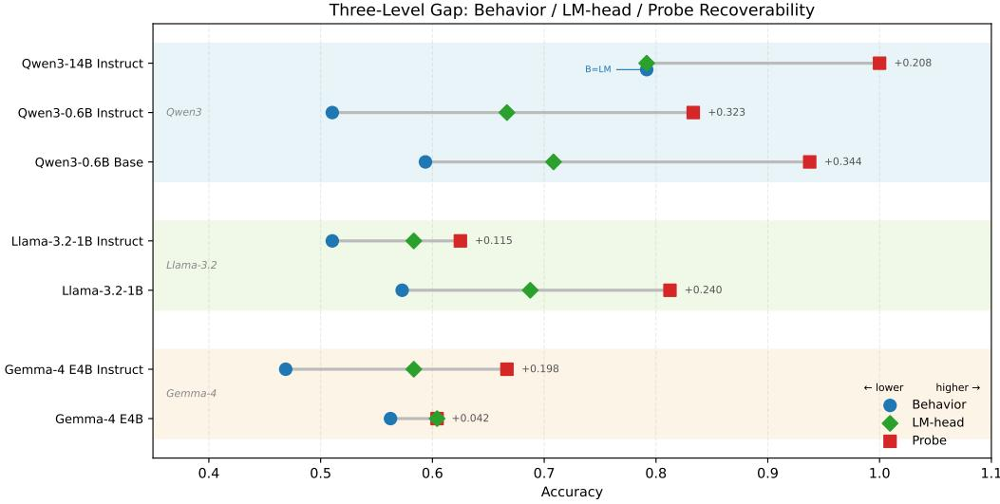  
Figure 1: Three-level gap across all seven models (right: recoverability surplus).

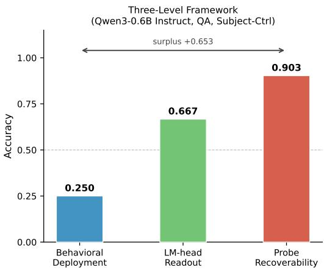  
Figure 2: Three-level framework on the hardest case (Qwen3-0.6B Instruct, QA, subject-control), where behavioral deployment (0.250) falls far below LM-head readout (0.667), which falls far below probe recoverability (0.903).

The recoverability surplus $\mathrm { A c c _ { P } ^ { * } - \overline { { A c c _ { B } } } }$ averages +0.210 across 14 (model, task) conditions, and the ordering holds at every scale in each family and in every language (per-language breakdown in Table 5). A regularity that survives this many axes is structural, not probe noise, nor does the LM-head merely re-read final behavior. Table 1 is descriptive; the controls below address sampling and robustness.

The aggregate ordering admits per-language exceptions of bounded magnitude. Three of the 21 (model, language) cells invert, each within one item of per-language resolution $( 1 / 1 6 \approx 0 . 0 6 2 )$ . Only Gemma-4 E4B German exceeds that scale, at a 1.5- item swing (behavior 0.594 vs. LM-head 0.500). Every other inversion is at or below one item (Appendix E). The ordering is a property of the aggregate, not of every cell. Precision at the 48-item scale is bounded. A cluster bootstrap $\begin{array} { r } { ( \mathbf { B } = 1 0 \mathbf { , } 0 0 0 . } \end{array}$ clustered by the 16 translation groups) yields percell 95% CIs of width 0.23–0.42, and leave-onefamily-out sensitivity keeps overall behavioral accuracy within 0.549–0.552 (whether holding out Qwen3, Llama, or Gemma). This answers RQ1. The ordering holds in the aggregate with exceptions bounded by item-level resolution, and its subjectcontrol concentration survives scaling and family variation.

## 4.2 Cross-family replication

Llama-3.2 shows a complementary pattern. The 1B base yields $0 . 5 7 3 < 0 . 6 8 8 < 0 . 8 1 2$ (surplus +0.240). The 1B instruct narrows to $0 . 5 1 0 \ <$ $0 . 5 8 3 \ < \ 0 . 6 2 5$ (surplus +0.115). The mechanism differs from Qwen3’s. Behavior drops 0.063 (−11.0%), LM-head readout drops 0.105 (−15.3%), and the probe ceiling drops 0.187 (−23.0%). Instruction tuning of Llama-3.2-1B degrades recoverability more than deployment, whereas in Qwen3-0.6B deployment degrades more than recoverability (−14.1% vs. −11.2%). The shared outcome across families is a narrowed surplus and a persistent gap.

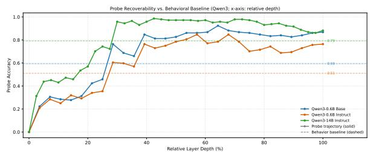  
Figure 3: Probe accuracy by relative layer depth across Qwen3 models.

Gemma-4 E4B is an architectural boundary. Differing on multiple axes at once (multimodal pretraining, Per-Layer Embeddings, hybrid attention, smaller effective capacity ( 4B)), its profile is $0 . 5 6 2 < 0 . 6 0 4 \approx 0 . 6 0 4$ (surplus only +0.042). LM-head and probe ceiling have converged, which we treat as architectural-axis dependence of the framework, not a counterexample. The threeseed probe ceilings are $0 . 5 6 9 \pm 0 . 0 6 4$ (base) and $0 . 6 6 0 \pm 0 . 0 5 2$ (instruct); across seeds, both ceilings remain far below the Qwen3 and Llama-3.2 ceilings and the boundary characterization holds. This completes RQ1. The ordering and its subjectcontrol concentration are not artifacts of one pretraining family.

## 4.3 Alternative explanations

Option-position bias. The counterbalancedordering variant yields debiased forced-choice 0.500 and label-choice 0.562 (Table 6), both below LM-head 0.667 and probe 0.833.

Late-layer erasure. Probe accuracy stays high through final layers (Fig. 3).

Output-formatting artifact. With no prompt and no trained classifier, the gap persists at the unembedding map.

Probe-training variance. Three-seed retrain shows max $\sigma = 0 . 0 6 4$ (Gemma-4 E4B base), ≤ 0.052 elsewhere (Tab. 4).

Prompt-format robustness. A task-free third prompt preserves the three-level ordering on five of seven models (e.g., Llama-3.2-1B Instruct behavior 0.719, LM-head 0.812). The two exceptions are Qwen3-0.6B base and Qwen3-14B Instruct, where the LM-head readout falls at or just below behavior. None of the five explains the gap.

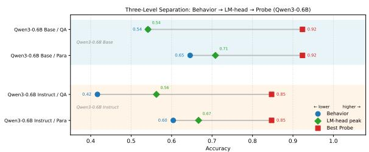  
Figure 4: Three-level separation for Qwen3-0.6B base and instruct, by task, on the same items.

## 4.4 Scaling effects

If the deployment failure were a capacity limitation of small models, a strong 14B model should close the behavior–probe gap. It does for objectcontrol. It does not for subject-control. On objectcontrol paraphrase, Qwen3-14B Instruct reaches behavior 0.958 against probe 1.000 (gap 0.042, behavior at ceiling). On subject-control paraphrase, the same model reaches 0.583 against probe 1.000 (gap 0.417). The probe recovers the assignment perfectly from hidden states the model uses to answer with less-than-60% accuracy. Qwen3-14B Instruct is not weaker in representation but in deployment, and only on the control type that contradicts linear adjacency.

The type-level breakdown across the focal Qwen models (Figure 5; full numbers in Appendix I) makes the asymmetry quantitative. The objectcontrol gap shrinks with scale and approaches zero at 14B, while the subject-control gap does not shrink. This answers RQ2 and completes the scaling half of RQ3. Scaling raises object-control deployment to ceiling but leaves the subject-control deficit open.

## 4.5 Instruction tuning and the deployment gap

The Qwen3-0.6B base/instruct pair shows the phenomenon most sharply because instruction tuning moves all three levels by different amounts (Figure 4). From base to instruct, mean behavior drops $0 . 5 9 4  0 . 5 1 0 ( - 0 . 0 8 4 , - 1 4 . 1 \%$ relative), the probe ceiling drops $0 . 9 3 8 \  \ 0 . 8 3 3$ $( - 0 . 1 0 5 , \ - 1 1 . 2 \% \ \mathrm { r e l a t i v e } )$ , and LM-head readout moves $0 . 7 0 8  0 . 6 6 7$ . Both degrade, but deployment more than encoding in percentage terms (losses −14.1% vs. −11.2%, surplus narrowing $0 . 3 4 4  0 . 3 2 3 )$ . Instruction tuning disproportionately affects deployment. The instructed model retains most of what it encoded and deploys less of it.

If instruction tuning had erased controller information, LM-head accuracy would collapse toward behavior. It does not. Instructed Qwen3- 0.6B projects hidden states through its own output embedding and recovers the correct controller on 66.7% of items, while task-facing behavior reaches only 51.0% on the same items. The middle level separates “less encoded” from “less deployed.” Activation patching (Appendix G) sharpens this. In base models the layer where patching causally rescues controller assignment coincides with the probe-decoded layer, while in instruction-tuned models it shifts approximately ten layers later. This addresses the instruction-tuning half of RQ3. The gap shifts because deployment degrades more than encoding, not because encoding collapses.

The surplus compression amplifies with scale. The Qwen3-0.6B pair narrows the surplus by 0.021 under instruction tuning. Two larger base/instruct pairs run on the same 48 items under the same protocol (Qwen3-1.7B: probe ceiling 0.986 → 0.958, surplus $0 . 2 7 8 \to 0 . 1 8 8 , \Delta - 0 . 0 9 0 ;$ Llama-3.2-3B: probe ceiling $0 . 9 5 8 \  \ 0 . 7 5 0 .$ , surplus $0 . 2 5 0  0 . 0 4 2 , \Delta - 0 . 2 0 8 )$ show that the compression deepens with scale and replicates beyond the Qwen3 family. The Llama-3.2-3B Instruct surplus collapses to +0.042, the same value that marks the Gemma-4 architectural boundary (§4.2); the deployment–encoding distinction the framework draws at small scale is therefore not stationary, and where it disappears at still larger scale remains open. The mechanism differs across pairs. In Qwen3-1.7B, instruction tuning raises deployment $( 0 . 7 0 8  0 . 7 7 1 )$ yet the surplus still narrows because the probe ceiling drops in percentage terms. In Llama-3.2-3B, deployment stays flat (0.708) while the probe ceiling alone drops by 0.208. All three pairs narrow the surplus. The harder-hit level differs across pairs.

## 5 Discussion

The three-level framework turns an empirical complaint into a localized diagnosis. Prior work has documented behavior–probe disagreement (Agarwal et al., 2025; He et al., 2025; Waldis et al., 2024). Our contribution is to show that inserting LM-head readout as an intermediate measurement gives the gap structure. The standard probing objection—that linear probes can extract information the model itself cannot use (Belinkov, 2022; Hewitt and Liang, 2019)—does not apply to LMhead readout, which uses the model’s own output projection instead of a trained classifier (nostalgebraist, 2020; Geva et al., 2021). At 14B, behavior and LM-head coincide at 0.792 while the probe reaches 1.000, so neither gap is an artifact of probe capacity or task format. Four observations point in the same direction. Ordering holds across seven models and three languages, deployment loss under instruction tuning is disproportionate, the failure concentrates in subject-control, and the deficit persists at 14B. The final decoding step selectively fails to use controller information the model both encodes and can project through its own output geometry.

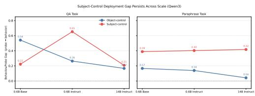  
Figure 5: Subject-control deployment gap (probe − behavior) across scale.

Erasure and formatting as incomplete accounts. Late-layer erasure and output-format artifacts are the two cleanest alternative accounts, and Results §4.3 rules out either as a complete account. Probe recoverability stays high through the final layers, debiased behavioral accuracy stays well below the LM-head peak, and a task-free third prompt preserves the ordering on five of seven models. A mixed account remains plausible. Later representations become less reliably controller-aligned, and the final decoding step amplifies the residual mismatch rather than smoothing it. Neither process alone is sufficient.

Subject-control as the locus of deployment failure. Subject-control is the control type whose correct resolution actively contradicts linear proximity. A nearest-noun heuristic gets object-control right and subject-control wrong. This matches the shortcut-learning phenomenon, where models rely on surface heuristics at the output even when richer information is linearly recoverable from their representations (McCoy et al., 2019; Geirhos et al., 2020). Control thus provides a built-in contrast.

Within one construction family, the heuristic succeeds on one subtype and fails on the other.

Three independent observations are consistent with this interpretation. At 14B, the subject-control probe ceiling is perfect while behavior on the same items remains far lower, so representational capacity is not the bottleneck. Instruction tuning degrades deployment more than encoding in percentage terms, so the degradation does not target the representation itself. The failure concentrates in the subtype where the heuristic is wrong. This is the pattern a decoder reaching for the shortcut would produce.

Two interpretations of the Gemma-4 E4B boundary. Gemma-4 E4B is the only model whose architecture most plausibly trains intermediate layers to remain compatible with the unembedding map (Per-Layer Embeddings, Section 3). This gives its near-zero surplus (+0.042, LM-head 0.604 ≈ probe 0.604) two compatible interpretations. Under the boundary interpretation adopted in Section 4.2, the model differs on several architectural axes at once, the framework does not apply cleanly, and the near-zero gap carries no evidence either way. Under the stronger interpretation, Gemma-4 is the one model in which the rawdiagnostic precondition is closest to being satisfied, so its LM-head readout is the most trustworthy in the study, and the deficit is smallest exactly there. That pattern would support the geometric account of the gap. Our evidence does not separate the two interpretations, so we present both and rest the framework’s cross-family claims on Qwen3 and Llama-3.2.

Emergence of verb-invariant encoding at 14B. The 1.000 subject-control probe ceiling could reflect genuine encoding or verb-identity leakage. A verb-out cross-validation control (Appendix H) holds out each matrix verb and re-trains the probe on the remaining items. At 14B the subject-control probe ceiling generalizes cleanly across held-out verbs. The probe reads the control relation itself rather than memorizing verb identity. The six smaller models show probe-peak gaps deep in the leakage-dominant range. Their ceilings depend on verb identity. Object-control passes verb-out cleanly in every model. The three-level ordering still holds, but the content of its highest level shifts with scale on subject-control. At small scale the highest level is a verb-specific surface readout. At

14B it is a verb-invariant relational encoding. The “encoded but not decoded” interpretation of the gap is clean for subject-control at 14B and diluted below it by lexical leakage.

The deployment gap as a layer shift. Activation patching across layers (Appendix G) locates the gap more precisely than the shortcut account alone. In base models, patching restores controller assignment most effectively at the layer where the probe reads it out. In instruction-tuned models, that effective layer sits ten layers later. Linear steering along the probe-identified direction has no effect, while patching at the shifted layer restores QA subjectcontrol by +0.37. Controller information survives instruction tuning as a linear, probe-readable direction. What moves is the layer at which the output can use it. This account accords with mechanistic studies of instruction tuning. Distributional shifts under alignment concentrate in surface-level outputs (Lin et al., 2024), and fine-tuning enhances rather than rewires existing mechanisms (Prakash et al., 2024). Whether the surplus compression observed in the other pairs (Results §4.5) arises through the same layer shift remains untested.

Methodological implication for syntactic evaluation. Behavior-only and probe-only evaluation, often framed as separate windows on formmeaning relations (Bender and Koller, 2020), measure different interfaces to whatever the model encodes. LM-head readout is the missing third measurement, turning the behavior–probe gap into a localized diagnosis. The heterogeneous effects of instruction tuning across model pairs (Results §4.5) become visible only when the three levels are measured separately. Behavior-only or probe-only evaluation would collapse them into a single score.

## 6 Conclusion

Syntactic evaluation in language models should not equate behavioral failure with the absence of structural information. Encoding, readout, and deployment diverge in a stable order across all seven models and all three languages.

We propose a three-level evaluation framework, which employs behavioral deployment, LM-head readout, and probe recoverability on identical binary decisions, addressing the gap between what a model encodes and what it deploys. These results confirm that the information is in the representation, yet the gap opens at the output. The threelevel framework shows that instruction tuning can reshape deployment, not encoding.

## Limitations

Benchmark scope. The benchmark is 48 handcurated items across English, Chinese, and German, evenly split between object-control and subjectcontrol. It is designed for targeted diagnosis. Template-generated syntax benchmarks such as BLiMP maximize coverage with tens of thousands of items (Warstadt et al., 2020); this set is the deliberate trade-off, because it holds item identity fixed across the three measurement levels and three languages.

Raw cross-language differences partly reflect tokenization and pretraining exposure rather than typological variation. EUD’s explicit nsubj:xsubj propagation is annotated for English but not for Chinese or German, so the controller relation in non-English items is lexically determined by matrix-verb semantics. Crosscondition claims rest on more than the 48 items. The layer-sweep analyses (Appendix G) span over 10,000 patched (model, layer, item) observations, and the structural contrast (subject-control gap larger than object-control gap) replicates independently across 7 models, 3 languages, and 4 (task, control-type) cells.

Model coverage. The mechanistic evidence is concentrated in the Qwen3 family, where the 0.6B base/instruct pair shows the effect most sharply and Qwen3-14B Instruct rules out a capacity-based interpretation. Llama-3.2 replicates the ordering in an independent family with the complementary degradation profile (§4.2). Cross-family evidence rests on two text families, with Gemma-4 contributing an architectural contrast rather than a third replication; we do not generalize the framework to that architecture class without further evidence. The scaling extensions (Qwen3-1.7B, Llama-3.2- 3B) contribute surplus-compression evidence (Results §4.5) but no mechanistic data.

Methodological choices. Probe recoverability uses linear probes. Nonlinear probes might raise the ceiling without changing the gap direction. LM-head readout assumes the output projection as a fixed map, clean for tied-embedding models and less so otherwise. The counterbalancedordering ablation addresses option-position bias but not other prompt-sensitivity effects. Activation patching (Appendix G) uses single-layer patches, so we report layer-localization rather than headlevel attribution.

Probe ceiling vs. competence. The probe summary is an upper bound on what a linear decoder can extract from the most informative layer. It is not a measure of syntactic competence in any full sense, and a high probe score should not be read as evidence that the model would deploy that information under all conditions. The three-level framework is useful precisely because the probe ceiling bounds the other two measurements from above and makes their shortfall visible.

Reproducibility. All experiments use publicly available pretrained models and ran in fp16 on a single NVIDIA V100 32GB GPU; other GPU architectures may show small numerical drift on near-tie items. The full suite amounts to roughly 25 GPU-hours and 100 CPU core-hours. The 48-item trilingual benchmark, verb-out CV protocol, seeds, and per-language breakdowns are documented in Appendices B–H; probing hyperparameters and the item-out protocol appear in §3, and activation patching follows the layer-sweep protocol of Appendix G.

## References

Ananth Agarwal, Jasper Jian, Christopher D. Manning, and Shikhar Murty. 2025. Mechanisms vs. outcomes: Probing for syntax fails to explain performance on targeted syntactic evaluations. In Proceedings of the 2025 Conference on Empirical Methods in Natural Language Processing, pages 33737–33757.

Yonatan Belinkov. 2022. Probing classifiers: Promises, shortcomings, and advances. Computational Linguistics, 48(1):207–219.

Emily M. Bender and Alexander Koller. 2020. Climbing towards NLU: On meaning, form, and understanding in the age of data. In Proceedings of the 58th Annual Meeting ofthe Associationfor Computational Linguistics, pages 5185–5198.

Cedric Boeckx and Norbert Hornstein. 2007. On (non-)obligatory control. In William D. Davies and Stanley Dubinsky, editors, New Horizons in the Analysis of Control and Raising, pages 251–262.

Nadezhda Chirkova and Vassilina Nikoulina. 2024. Zero-shot cross-lingual transfer in instruction tuning of large language models. In Proceedings of the 17th International Natural Language Generation Conference, pages 695–708.

Iria de Dios-Flores, Juan Garcia Amboage, and Marcos Garcia. 2023. Dependency resolution at the syntaxsemantics interface: psycholinguistic and computational insights on control dependencies. In Proceedings ofthe 61st Annual Meeting ofthe Associationfor Computational Linguistics (Volume 1: Long Papers), pages 203–222.

Marie-Catherine de Marneffe, Christopher D. Manning, Joakim Nivre, and Daniel Zeman. 2021. Universal dependencies. Computational Linguistics, 47(2):255– 308.

Yanai Elazar, Shauli Ravfogel, Alon Jacovi, and Yoav Goldberg. 2021. Amnesic probing: Behavioral explanation with amnesic counterfactuals. Transactions of the Association for Computational Linguistics, 9:160– 175.

Mostafa Elhoushi, Akshat Shrivastava, Diana Liskovich, Basil Hosmer, Bram Wasti, Liangzhen Lai, Anas Mahmoud, Bilge Acun, Saurabh Agarwal, Ahmed Roman, Ahmed Aly, Beidi Chen, and Carole-Jean Wu. 2024. LayerSkip: Enabling early exit inference and self-speculative decoding. In Proceedings of the 62nd Annual Meeting ofthe Associationfor Computational Linguistics (Volume 1: Long Papers), pages 12622–12642.

Jon Gauthier, Jennifer Hu, Ethan Wilcox, Peng Qian, and Roger Levy. 2020. SyntaxGym: An online platform for targeted evaluation of language models. In Proceedings ofthe 58th Annual Meeting ofthe Association for Computational Linguistics: System Demonstrations, pages 70–76.

Atticus Geiger, Hanson Lu, Thomas Icard, and Christopher Potts. 2021. Causal abstractions of neural networks. In Advances in Neural Information Processing Systems, volume 34.

Robert Geirhos, Jörn-Henrik Jacobsen, Claudio Michaelis, Richard Zemel, Wieland Brendel, Matthias Bethge, and Felix A. Wichmann. 2020. Shortcut learning in deep neural networks. Nature Machine Intelligence, 2(11):665–673.

Mor Geva, Avi Caciularu, Ke Wang, and Yoav Goldberg. 2022. Transformer feed-forward layers build predictions by promoting concepts in the vocabulary space. In Proceedings of the 2022 Conference on Empirical Methods in Natural Language Processing, pages 30–45.

Mor Geva, Roei Schuster, Jonathan Berant, and Omer Levy. 2021. Transformer feed-forward layers are key-value memories. In Proceedings of the 2021 Conference on Empirical Methods in Natural Language Processing, pages 5484–5495.

Roksana Goworek and Haim Dubossarsky. 2025. Multilinguality does not make sense: Investigating factors behind zero-shot cross-lingual transfer in senseaware tasks. In Proceedings ofthe 2025 Conference on Empirical Methods in Natural Language Processing, pages 35004–35029.

Kristina Gulordava, Piotr Bojanowski, Edouard Grave, Tal Linzen, and Marco Baroni. 2018. Colorless green recurrent networks dream hierarchically. In Proceedings ofthe 2018 Conference ofthe North American Chapter of the Association for Computational Linguistics: Human Language Technologies, Volume 1 (Long Papers), pages 1195–1205.

Linyang He, Ercong Nie, Helmut Schmid, Hinrich Schuetze, Nima Mesgarani, and Jonathan Brennan. 2025. Large language models as neurolinguistic subjects: Discrepancy between performance and competence. In Findings of the Association for Computational Linguistics: ACL 2025, pages 19284–19302.

John Hewitt and Percy Liang. 2019. Designing and interpreting probes with control tasks. In Proceedings ofthe 2019 Conference on Empirical Methods in Natural Language Processing and the 9th International Joint Conference on Natural Language Processing (EMNLP-IJCNLP), pages 2733–2743.

John Hewitt and Christopher D. Manning. 2019. A structural probe for finding syntax in word representations. In Proceedings of the 2019 Conference of the North American Chapter ofthe Associationfor Computational Linguistics: Human Language Technologies, Volume 1 (Long and Short Papers), pages 4129–4138.

Norbert Hornstein. 1999. Movement and control. Linguistic Inquiry, 30(1):69–96.

Songbo Hu, Ivan Vulic, and Anna Korhonen. 2025.´ Quantifying language disparities in multilingual large language models. In Proceedings ofthe 2025 Conference on Empirical Methods in Natural Language Processing, pages 4003–4018.

Mary Katie Kennedy. 2025. Evidence of generative syntax in large language models. In Proceedings of the 29th Conference on Computational Natural Language Learning, pages 377–396.

Idan Landau. 2013. Control in Generative Grammar: A Research Companion.

Karim Lasri, Tiago Pimentel, Alessandro Lenci, Thierry Poibeau, and Ryan Cotterell. 2022. Probing for the usage of grammatical number. In Proceedings of the 60th Annual Meeting of the Association for Computational Linguistics (Volume 1: Long Papers), pages 8818–8831.

Bill Yuchen Lin, Abhilasha Ravichander, Ximing Lu, Nouha Dziri, Melanie Sclar, Khyathi Chandu, Chandra Bhagavatula, and Yejin Choi. 2024. The unlocking spell on base LLMs: Rethinking alignment via in-context learning. In The Twelfth International Conference on Learning Representations.

Tal Linzen, Emmanuel Dupoux, and Yoav Goldberg. 2016. Assessing the ability of LSTMs to learn syntaxsensitive dependencies. Transactions of the Associationfor Computational Linguistics, 4:521–535.

R. Thomas McCoy, Ellie Pavlick, and Tal Linzen. 2019. Right for the wrong reasons: Diagnosing syntactic heuristics in natural language inference. In Proceedings of the 57th Annual Meeting of the Association for Computational Linguistics, pages 3428–3448.

Kevin Meng, David Bau, Alex Andonian, and Yonatan Belinkov. 2022. Locating and editing factual associations in GPT. In Advances in Neural Information Processing Systems, volume 35.

nostalgebraist. 2020. Interpreting GPT: the logit lens. LessWrong.

Nikhil Prakash, Tamar Rott Shaham, Tal Haklay, Yonatan Belinkov, and David Bau. 2024. Fine-tuning enhances existing mechanisms: A case study on entity tracking. In The Twelfth International Conference on Learning Representations.

Abhilasha Ravichander, Yonatan Belinkov, and Eduard Hovy. 2021. Probing the probing paradigm: Does probing accuracy entail task relevance? In Proceedings ofthe 16th Conference ofthe European Chapter ofthe Associationfor Computational Linguistics: Main Volume, pages 3363–3377.

Magali Sanches Duran, Elvis A. de Souza, Maria das Graças Volpe Nunes, Adriana Silvina Pagano, and Thiago A. S. Pardo. 2025. Extending the enhanced universal dependencies – addressing subjects in prodrop languages. In Proceedings ofthe Eighth Workshop on Universal Dependencies (UDW, SyntaxFest 2025), pages 143–152.

Siqi Shen, Mehar Singh, Lajanugen Logeswaran, Moontae Lee, Honglak Lee, and Rada Mihalcea. 2025. Revisiting LLM value probing strategies: Are they robust and expressive? In Proceedings ofthe 2025 Conference on Empirical Methods in Natural Language Processing, pages 131–145.

Elias Stengel-Eskin and Benjamin Van Durme. 2022. The curious case of control. In Proceedings of the 2022 Conference on Empirical Methods in Natural Language Processing, pages 11065–11076.

Ian Tenney, Dipanjan Das, and Ellie Pavlick. 2019a. BERT rediscovers the classical NLP pipeline. In Proceedings ofthe 57th Annual Meeting ofthe Association for Computational Linguistics, pages 4593– 4601.

Ian Tenney, Patrick Xia, Berlin Chen, Alex Wang, Adam Poliak, R. Thomas McCoy, Najoung Kim, Benjamin Van Durme, Samuel R. Bowman, Dipanjan Das, and Ellie Pavlick. 2019b. What do you learn from context? Probing for sentence structure in contextualized word representations. In Proceedings ofthe Seventh International Conference on Learning Representations.

Jesse Vig, Sebastian Gehrmann, Yonatan Belinkov, Sharon Qian, Daniel Nevo, Simas Sakenis, Jason Huang, Yaron Singer, and Stuart Shieber. 2020. Causal mediation analysis for interpreting neural

NLP: The case of gender bias. In Advances in Neural Information Processing Systems, volume 33.

Andreas Waldis, Yotam Perlitz, Leshem Choshen, Yufang Hou, and Iryna Gurevych. 2024. Holmes: A benchmark to assess the linguistic competence of language models. Transactions of the Association for Computational Linguistics, 12:1616–1647.

Alex Warstadt, Alicia Parrish, Haokun Liu, Anhad Mohananey, Wei Peng, Sheng-Fu Wang, and Samuel R. Bowman. 2020. BLiMP: The benchmark of linguistic minimal pairs for English. Transactions of the Association for Computational Linguistics, 8:377– 392.

Zhepei Wei, Wei-Lin Chen, Xinyu Zhu, and Yu Meng. 2025. AdaDecode: Accelerating LLM decoding with adaptive layer parallelism. In Proceedings of the 42nd International Conference on Machine Learning, volume 267 of Proceedings of Machine Learning Research, pages 65981–65996.

Chris Wendler, Veniamin Veselovsky, Giovanni Monea, and Robert West. 2024. Do llamas work in English? on the latent language of multilingual transformers. In Proceedings of the 62nd Annual Meeting of the Associationfor Computational Linguistics (Volume 1: Long Papers), pages 15366–15394.

Alexander Yom Din, Taelin Karidi, Leshem Choshen, and Mor Geva. 2024. Jump to conclusions: Shortcutting transformers with linear transformations. In Proceedings of the 2024 Joint International Conference on Computational Linguistics, Language Resources and Evaluation (LREC-COLING 2024), pages 9615–9625.

Yubo Zhu, Dongrui Liu, Zecheng Lin, Wei Tong, Sheng Zhong, and Jing Shao. 2025. The LLM already knows: Estimating LLM-perceived question difficulty via hidden representations. In Proceedings of the 2025 Conference on Empirical Methods in Natural Language Processing, pages 1160–1176.

## A Descriptive Metric Definitions

Let $\begin{array} { r } { \overline { { \mathrm { A c c } _ { \mathrm { B } } } } = \frac { 1 } { 2 } \big ( \mathrm { A c c } _ { \mathrm { B } } ( \mathrm { Q A } ) + \mathrm { A c c } _ { \mathrm { B } } ( \mathrm { P a r a } ) \big ) } \end{array}$ denote mean behavioral accuracy across the two task formats. The recoverability surplus and the behaviorto-recoverability ratio are defined as

$$
{ \mathrm { S u r p l u s } } = { \mathrm { A c c } } _ { \mathrm { P } } ^ { * } - { \overline { { \mathrm { A c c } } } } _ { \mathrm { B } } ,\tag{1}
$$

$$
\mathrm { B / R \ R a t i o = \overline { { A c c _ { B } } } / \mathrm { A c c _ { P } ^ { * } . } }\tag{2}
$$

Mean behavior summarizes both task formats rather than selecting the better or worse one, so a single fixed summary avoids choosing a task post hoc. The behavior-to-recoverability ratio expresses how much of the recoverable information reaches the behavioral interface. These quantities are descriptive rather than inferential. They summarize but do not replace the per-task and per-type accuracies in the main tables.

For type-level analyses, let ${ \overline { { \mathrm { A c c } _ { \mathrm { B } } } } } ^ { \mathrm { o b j } }$ and $\overline { { \mathrm { A c c } _ { \mathrm { B } } } } ^ { \mathrm { s u b j } }$ denote mean behavior on the 24 objectcontrol and 24 subject-control items respectively. We define:

$$
{ \mathrm { S u b j e c t - C o n t r o l ~ D e f i c i t } } = { \overline { { \mathrm { A c c } _ { \mathrm { B } } } } } ^ { \mathrm { o b j } } - { \overline { { \mathrm { A c c } _ { \mathrm { B } } } } } ^ { \mathrm { s u b j } } .\tag{3}
$$

Positive values mean the model is behaviorally weaker on subject-control than on object-control, independently of its overall deployment level.

## B Benchmark Examples and Prompt Templates

English marks object control with told (John told Mary to leave; controller Mary) and subject control with promised (John promised Mary to leave; controller John). Chinese marks the same contrast with 让 (张三让李四离开; controller 李四) and 答应 (张三答应李四离开; controller 张三). German uses bat (Johann bat Maria zu gehen; controller Maria) and versprach (Johann versprach Maria zu gehen; controller Johann).

## C Probe Feature Mode Comparison

Table 3: Best per-mode probe accuracy across layers, mean over three seeds.

<table><tr><td>Mode</td><td>Qwen3-0.6B Base</td><td>Qwen3-0.6B Instruct</td><td>Qwen3- 14B Instruct</td></tr><tr><td>ab</td><td>0.924</td><td>0.847</td><td>0.958</td></tr><tr><td>bv</td><td>0.889</td><td>0.792</td><td>0.979</td></tr><tr><td>av</td><td>0.618</td><td>0.458</td><td>0.931</td></tr><tr><td>abv</td><td>0.847</td><td>0.701</td><td>0.944</td></tr><tr><td>V</td><td>0.757</td><td>0.521</td><td>0.986</td></tr></table>

Across layers, the choice of feature mode matters more at 0.6B than at 14B, where every mode exceeds 0.93. The default bv (candidate B + predicate) stays within 0.06 of the strongest mode in every model, while av (candidate A + predicate) is weakest for the small models, consistent with subject-control being harder to encode at the matrix-subject position.

## D Probe Seed Robustness

Table 4: Probe accuracy across three training seeds at the globally-best (layer, feature mode) selected by threeseed mean.

<table><tr><td>Model</td><td>Seed 1729</td><td>Seed 2718</td><td>Seed 3141</td><td>Mean</td><td>Std</td></tr><tr><td>Qwen3-0.6B Base</td><td>0.938</td><td>0.938</td><td>0.896</td><td>0.924</td><td>0.020</td></tr><tr><td>Qwen3-0.6B Instruct</td><td>0.833</td><td>0.812</td><td>0.896</td><td>0.847</td><td>0.035</td></tr><tr><td>Qwen3-14B Instruct</td><td>1.000</td><td>0.979</td><td>0.979</td><td>0.986</td><td>0.010</td></tr><tr><td>Llama-3.2-1B Base</td><td>0.812</td><td>0.833</td><td>0.833</td><td>0.826</td><td>0.010</td></tr><tr><td>Llama-3.2-1B Instruct</td><td>0.625</td><td>0.625</td><td>0.625</td><td>0.625</td><td>0.000</td></tr><tr><td>Gemma-4 E4B Base</td><td>0.604</td><td>0.479</td><td>0.625</td><td>0.569</td><td>0.064</td></tr><tr><td>Gemma-4 E4B Instruct</td><td>0.646</td><td>0.604</td><td>0.729</td><td>0.660</td><td>0.052</td></tr></table>

Table 4 reports probe accuracy across three training seeds (1729, 2718, 3141) at the globally-best (layer, feature mode) selected by three-seed mean. The standard deviation is over the three seeds at that pick. The main table reports seed 1729 (see Methods §3.2); when the mean-selected pick differs from a seed’s own best (layer, feature mode), the seed-1729 value here need not equal the bestprobe column of Table 1, which is that seed’s own best.

## E Per-Language Breakdown

Table 5: Per-language breakdown for all seven models.
<table><tr><td>Model</td><td>Language</td><td>Behavior</td><td>LM-head</td><td>Probe</td><td>Surplus</td></tr><tr><td rowspan="3">Qwen3-0.6B Base</td><td>English</td><td>0.656</td><td>0.875</td><td>0.938</td><td>+0.281</td></tr><tr><td>Chinese</td><td>0.656</td><td>0.625</td><td>1.000</td><td>+0.344</td></tr><tr><td>German</td><td>0.469</td><td>0.625</td><td>0.875</td><td>+0.406</td></tr><tr><td rowspan="3">Qwen3-0.6B Instruct</td><td>English</td><td>0.688</td><td>0.875</td><td>0.812</td><td>+0.125</td></tr><tr><td>Chinese</td><td>0.469</td><td>0.562</td><td>1.000</td><td>+0.531</td></tr><tr><td>German</td><td>0.375</td><td>0.562</td><td>0.688</td><td>+0.312</td></tr><tr><td rowspan="3">Qwen3-14B Instruct</td><td>English</td><td>0.719</td><td>0.688</td><td>1.000</td><td>+0.281</td></tr><tr><td>Chinese</td><td>0.844</td><td>0.875</td><td>1.000</td><td>+0.156</td></tr><tr><td>German</td><td>0.812</td><td>0.812</td><td>1.000</td><td>+0.188</td></tr><tr><td rowspan="3">Llama-3.2-1B Base</td><td>English</td><td>0.625</td><td>0.812</td><td>0.812</td><td>+0.188</td></tr><tr><td>Chinese</td><td>0.719</td><td>0.812</td><td>0.938</td><td>+0.219</td></tr><tr><td>German</td><td>0.375</td><td>0.438</td><td>0.688</td><td>+0.312</td></tr><tr><td rowspan="3">Llama-3.2-1B Instruct</td><td>English</td><td>0.531</td><td>0.688</td><td>0.750</td><td>+0.219</td></tr><tr><td>Chinese</td><td>0.562</td><td>0.688</td><td>0.688</td><td>+0.125</td></tr><tr><td>German</td><td>0.438</td><td>0.375</td><td>0.438</td><td>+0.000</td></tr><tr><td rowspan="3">Gemma-4 E4B Base</td><td>English</td><td>0.562</td><td>0.688</td><td>0.625</td><td>+0.062</td></tr><tr><td>Chinese</td><td>0.531</td><td>0.625</td><td>0.562</td><td>+0.031</td></tr><tr><td>German</td><td>0.594</td><td>0.500</td><td>0.625</td><td>+0.031</td></tr><tr><td rowspan="3">Gemma-4 E4B Instruct</td><td>English</td><td>0.469</td><td>0.625</td><td>0.625</td><td>+0.156</td></tr><tr><td>Chinese</td><td>0.625</td><td>0.562</td><td>0.562</td><td>-0.062</td></tr><tr><td>German</td><td>0.312</td><td>0.562</td><td>0.812</td><td>+0.500</td></tr></table>

Each language contributes 16 items, so a single item swings the per-language accuracy by 1/16 ≈ 0.062. Reading Table 5 at this granularity, the threelevel ordering behavior $\leq L M - h e a d \leq$ probe holds in every per-language row for the five textonly Qwen3 and Llama-3.2 models up to one-item noise. The only inversions exceeding 0.062 are confined to Gemma-4 E4B (German behavior 0.594 vs. LM-head 0.500, a 1.5-item swing on a model whose aggregate surplus is already near zero). This is consistent with the boundary interpretation of Gemma-4 in Section 4 and the Limitations.

Table 2: The two behavioral evaluation formats, both using pairwise log-probability scoring over the same candidate controller nouns and differing only in prompt structure.
<table><tr><td>QA Format</td><td>Paraphrase Format</td></tr><tr><td>Sentence: “John promised Mary to leave early.&quot;</td><td>Sentence: “John promised Mary to leave early.&quot;</td></tr><tr><td>Prompt:</td><td>Prompt:</td></tr><tr><td>Q: Who is understood to leave early?</td><td>Which sentence better describes the situation?</td></tr><tr><td>A: John ← log-prob scored</td><td>(A) John is understood to leave early. ← scored</td></tr><tr><td>A: Mary ←log-prob scored</td><td>(B) Mary is understood to leave early. ← scored</td></tr><tr><td>Decision: arg max log P(continuation | sentence + Q)</td><td>Decision: arg max log P(interpretation | sentence + prompt)</td></tr></table>

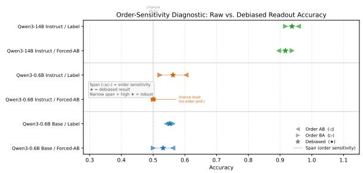  
Figure 6: Raw accuracy under both option orders and the debiased result, per model.

The recoverability surplus is not uniform across languages. For the focal Qwen3-0.6B Instruct, surplus on Chinese reaches +0.531 while English on the same model is +0.125, indicating that the deployment failure is concentrated in non-English data. The same direction holds for the Llama-3.2 base model, whose German surplus is +0.312 against an English surplus of +0.188. For Qwen3- 14B Instruct, German is the cleanest case in which behavior already matches LM-head readout (0.812) while the probe still ceilings at 1.000, isolating a localized deployment shortfall in a high-performing model.

## F Readout-Cleaning Order Sensitivity

The debiased values are behavioral accuracies under averaged option order and are not comparable to the best-LM-head column of Table 1.

## G Causal Probing of the Layer-L Geometry

## G.1 Motivation and setup

The behavior–probe gap admits two interpretations. The LM head fails to deploy controller information that is geometrically present at the probed layer, or the probe identifies geometry that correlates with controller identity but is not the geometry the LM head actually uses. We test both interpretations with two interventions on the residual stream: directional steering (additive perturbation along a probe-derived direction, the amnesic-probing logic of removing probed information and checking the behavioral consequence (Elazar et al., 2021)) and activation patching (Vig et al., 2020; Meng et al., 2022) (replacement of one item’s hidden state with another’s). Directional steering produces no behavioral change at any tested magnitude, while activation patching reveals a layer-localized causal effect that differs systematically between base and instruction-tuned models.

## G.2 Null directional steering at all tested magnitudes

For each model we compute a steering direction at the layer and feature mode reported as the probe summary in Table 1, using two extraction methods: probe weights (logreg) and class-mean difference (diff-of-means, robust to overfitting at nfeatures $\gg$ $n _ { \mathrm { i t e m s } } )$ . The direction is split by mode (e.g., ab: $w _ { a }$ at candidate-A, $w _ { b }$ at candidate-B) and added at each implicated position p as α · gold\_sign · $\sigma _ { p }$ $\hat { d } _ { p } ,$ where gold\_sign $\in \{ + 1 , - 1 \}$ orients $\alpha > 0$ “toward $\mathrm { \ g o l d ^ { \mathrm { \prime } } }$ for every item. At α = 0 the hook reproduces the baseline behavioral scores exactly, validating the implementation.

We swept seven steering strengths from $\alpha = - 2$ to $\alpha = + 2$ on Qwen3-0.6B Instruct and extended to α = ±3 and ±5 to test larger interventions. The

Table 6: Readout-cleaning results after counterbalancing option order and label order.
<table><tr><td>Model</td><td>Variant</td><td>Summary</td><td>Accuracy</td><td>Object</td><td>Subject</td><td>Order Gap</td></tr><tr><td>Qwen3-0.6B Base</td><td>debiased_forced_choice_ab</td><td>debiased</td><td>0.531</td><td>0.604</td><td>0.458</td><td>0.062</td></tr><tr><td>Qwen3-0.6B Base</td><td>debiased_label_choice</td><td>debiased</td><td>0.552</td><td>0.542</td><td>0.562</td><td>0.021</td></tr><tr><td>Qwen3-0.6B Base</td><td>contrastive_scoring</td><td>single</td><td>0.479</td><td>0.667</td><td>0.292</td><td>nan</td></tr><tr><td>Qwen3-0.6B Instruct</td><td>debiased_forced_choice_ab</td><td>debiased</td><td>0.500</td><td>0.500</td><td>0.500</td><td>0.000</td></tr><tr><td>Qwen3-0.6B Instruct</td><td>debiased_label_choice</td><td>debiased</td><td>0.562</td><td>0.479</td><td>0.646</td><td>0.083</td></tr><tr><td>Qwen3-0.6B Instruct</td><td>contrastive_scoring</td><td>single</td><td>0.500</td><td>0.708</td><td>0.292</td><td>nan</td></tr><tr><td>Qwen3-14B Instruct</td><td>debiased_forced_choice_ab</td><td>debiased</td><td>0.917</td><td>0.896</td><td>0.938</td><td>0.042</td></tr><tr><td>Qwen3-14B Instruct</td><td>debiased_label_choice</td><td>debiased</td><td>0.938</td><td>0.917</td><td>0.958</td><td>0.042</td></tr><tr><td>Qwen3-14B Instruct</td><td>contrastive_scoring</td><td>single</td><td>0.708</td><td>0.917</td><td>0.500</td><td>nan</td></tr></table>

$Q _ { 1 }$ candidate set (subject-control items wrong at $\alpha = 0 , n = 1 8 \mathrm { o n } \mathrm { Q A } )$ and the $Q _ { 2 }$ candidate set (object-control items correct at $\alpha = 0 , n = 1 4 )$ showed no flip at any α for either method. Mc-Nemar tests at $\alpha = \pm 5$ versus $\alpha = 0$ returned $p = 1 . 0 0 0$ . Beyond $| \alpha | \geq 3 { \mathrm { ~ a ~ } }$ position-bias artifact dominates. Every cell’s margin is pushed toward whichever option is favored under heavy off-manifold perturbation. Linear additive steering is therefore not causally sufficient at any tested magnitude.

## G.3 Layer-localized effects of activation patching

For each (target, donor) pair sharing language and control type, we capture the donor’s hidden state at layer L (mode abv, all three positions) and patch it into the target’s QA or Paraphrase forward pass, scoring continuations as in Section 3. The causalrescue lift is the correct-donor rescue rate minus the wrong-donor “rescue” rate, isolating donorcorrectness from any donor-independent perturbation effect.

We swept the patching layer from each model’s probe peak through to its final transformer block on four models: two base/no-IT models (Llama-3.2- 1B, Qwen3-0.6B Base) and two instruction-tuned ones (Qwen3-0.6B Instruct, Qwen3-14B Instruct). Figure 7 shows the resulting QA subject-control trajectories on a normalized depth axis. Figure 8 shows the per-model breakdown.

Result 1. Llama-3.2-1B base and Qwen3-0.6B Base both show their largest QA subject-control lift at or immediately adjacent to the probe peak (Llama: +0.24 at L9, probe at L7; Qwen3-0.6B Base: +0.21 at L18–L20, probe at L18) and decay monotonically thereafter. The probe-decoded geometry is, in these models, already the geometry the LM head reads.

Result 2. Qwen3-0.6B Instruct peaks at L26 (probe at L16), with a middle-layer valley at L20 (−0.05) and a sharp recovery at L26 (+0.37). Qwen3-14B Instruct replicates the qualitative pattern, peaking at L27 (probe at L17), with values around +0.14 to +0.19 between L22–L27 and declining at L32 and beyond. Both instruction-tuned models peak ten layers later than their probe peak.

Result 3. On QA object-control, the two base models show small lifts hovering near zero, whereas Qwen3-0.6B Instruct shows lifts of −0.35 at L22–L24 before recovering to +0.35 at L26, and Qwen3-14B Instruct shows −0.42 at L22 and L27. These negative middle-layer lifts (correct-donor patches do worse than wrong-donor patches) point to a regime in which the instruction-tuned model has not yet committed to a controller assignment, where a foreign correct geometry interferes more than a foreign wrong geometry does. The effect is absent in the base models.

## G.4 Joint interpretation of the layer shift

Linear additive steering is null because the proberecoverable direction is not the direction the LM head decodes from. Activation patching peaks at the probe layer in base models and ten layers later in instruction-tuned models, identifying a discrete shift in which layer carries the LM-head-decoded form of the controller geometry. Taken together, the residual stream encodes controller information at a layer decodable both by a probe and by the LM head in base models. Instruction tuning displaces the LM-head-decoded form to later layers, leaving an intermediate window in which the information is recoverable by probing but not yet usable by output generation. The behavior–probe gap quantified in Section 4 is the behavioral cost of this displacement. Our results provide a layerlocalized empirical instance of the long-standing concern that probe-recoverable directions need not be causally identical to the directions the LM head decodes from (Belinkov, 2022; Hewitt and Liang, 2019), and they extend that concern from a general methodological warning into a concrete, controllable layer-shift phenomenon tied to instruction tuning.

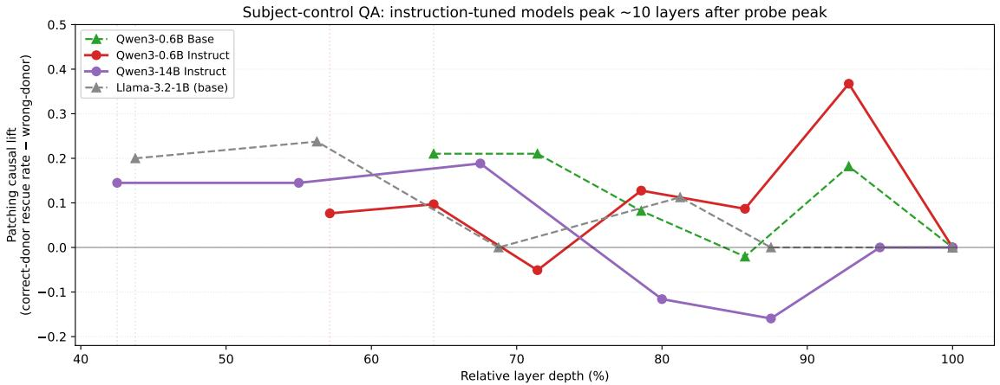

Figure 7: Patching causal lift versus relative layer depth on QA subject-control (vertical dotted lines mark probe peaks).  
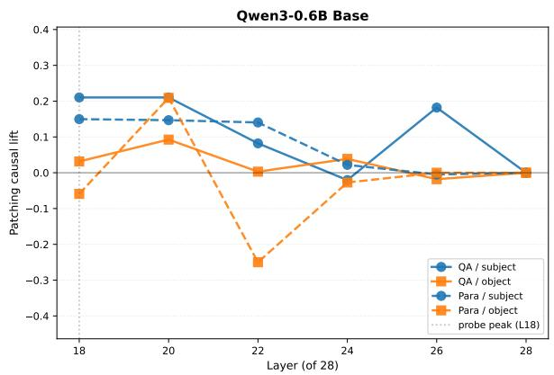

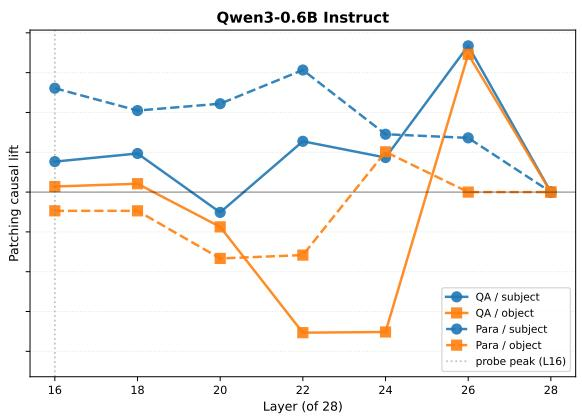

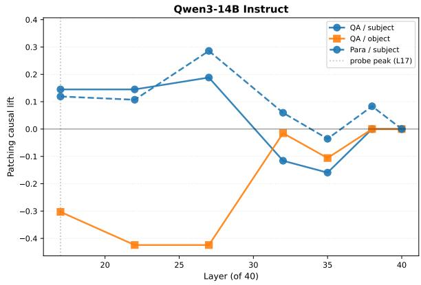

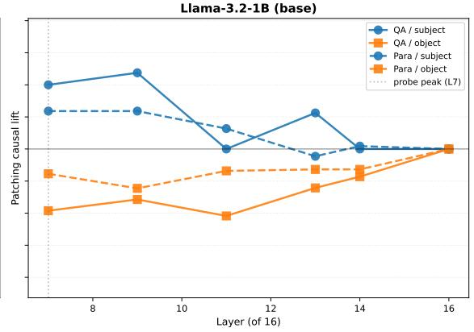  
Figure 8: Patching causal lift across all four cells per model.

The patching lifts at the late peak (+0.37 at Qwen3-0.6B Instruct L26 QA subject; +0.19 at Qwen3-14B Instruct L27 QA subject) are substantial but below ceiling. Framed in terms of causal abstraction (Geiger et al., 2021), the late-peak layer realizes part but not all of the causal variable corresponding to the controller assignment, so hiddenstate geometry at the late peak is causally relevant but not the only causal carrier. Multi-layer simultaneous patching, finer attribution to attention heads or MLP outputs, and a denser layer grid around the late peak remain as immediate causal extensions. The present results establish layer-localization of the deployment gap and its instruction-tuning dependence.

Table 7: Type-level behavior-versus-probe comparison for the most relevant models.
<table><tr><td>Model</td><td>Task</td><td>Type</td><td>Behavior</td><td>Best Probe</td><td>Gap</td><td>Probe Layer</td><td>Probe Mode</td></tr><tr><td>Qwen3-0.6B Base</td><td>qa</td><td>object-control</td><td>0.375</td><td>0.917</td><td>0.542</td><td>18</td><td>ab</td></tr><tr><td>Qwen3-0.6B Base</td><td>qa</td><td>subject-control</td><td>0.708</td><td>0.931</td><td>0.222</td><td>18</td><td>ab</td></tr><tr><td>Qwen3-0.6B Base</td><td>paraphrase</td><td>object-control</td><td>0.750</td><td>0.917</td><td>0.167</td><td>18</td><td>ab</td></tr><tr><td>Qwen3-0.6B Base</td><td>paraphrase</td><td>subject-control</td><td>0.542</td><td>0.931</td><td>0.389</td><td>18</td><td>ab</td></tr><tr><td>Qwen3-0.6B Instruct</td><td>qa</td><td>object-control</td><td>0.583</td><td>0.847</td><td>0.264</td><td>16</td><td>ab</td></tr><tr><td>Qwen3-0.6B Instruct</td><td>qa</td><td>subject-control</td><td>0.250</td><td>0.903</td><td>0.653</td><td>19</td><td>bv</td></tr><tr><td>Qwen3-0.6B Instruct</td><td>paraphrase</td><td>object-control</td><td>0.708</td><td>0.847</td><td>0.139</td><td>16</td><td>ab</td></tr><tr><td>Qwen3-0.6B Instruct</td><td>paraphrase</td><td>subject-control</td><td>0.500</td><td>0.903</td><td>0.403</td><td>19</td><td>bv</td></tr><tr><td>Qwen3-14B Instruct</td><td>qa</td><td>object-control</td><td>0.833</td><td>1.000</td><td>0.167</td><td>19</td><td>bv</td></tr><tr><td>Qwen3-14B Instruct</td><td>qa</td><td>subject-control</td><td>0.792</td><td>1.000</td><td>0.208</td><td>17</td><td>V</td></tr><tr><td>Qwen3-14B Instruct</td><td>paraphrase</td><td>object-control</td><td>0.958</td><td>1.000</td><td>0.042</td><td>19</td><td>bv</td></tr><tr><td>Qwen3-14B Instruct</td><td>paraphrase</td><td>subject-control</td><td>0.583</td><td>1.000</td><td>0.417</td><td>17</td><td>V</td></tr></table>

## H Lexical Leakage Control via Verb-Out Cross-Validation

## H.1 Motivation

Two things could inflate the Qwen3-14B Instruct subject-control probe ceiling of 1.000 above what genuine encoding of controller information would produce. First, the matrix predicates of the subject-control set cluster. German uses one verb (versprach×8), English splits between promised×4 and four singletons, and Chinese splits among three verbs. Second, given this clustering, a probe could in principle achieve 1.000 by memorizing a verb-identity-to-controller mapping — without the model itself representing control as a syntactic relation. We test this leakage hypothesis directly with Verb-Out Cross-Validation (VO-CV).

## H.2 Verb-Out CV Protocol

Each unique matrix predicate V defines one fold:

$$
\begin{array} { r } { \tan _ { V } = \{ e \in \mathcal { E } : p ( e ) \neq V \} , } \\ { \mathrm { t e s t } _ { V } = \{ e \in \mathcal { E } : p ( e ) = V \} , } \end{array}
$$

where $p ( e )$ is the matrix predicate of example e and E is the full 48-item benchmark. The benchmark contains 32 unique predicates across 48 items.

Two design choices matter. First, training pools mix subject- and object-control examples. The probe must learn a non-trivial decision boundary and predictions are aggregated by control type $a f -$ ter the probe is fitted. Filtering by control type before training would produce a homogeneous label set that any probe trivially solves at 1.000 even at layer 0, masking rather than testing the leakage hypothesis. Second, because the German subject-control set uses a single matrix verb, holding out versprach removes all eight German subjectcontrol items from training simultaneously, so the probe must classify them purely from English and

Chinese subject-control plus all object-control evidence. The protocol thus subsumes a strong crosslanguage generalization test that single-language verb-out CV cannot provide.

We re-extract hidden states with the same pipeline as the main results and re-train the linear probe at the v-mode probe peak (layer 17 of Qwen3-14B Instruct’s 40-layer stack) under five feature modes spanning the axis of verb exposure: from ab (both NP candidates, no verb token — minimum exposure) through bv (candidate B and verb — the paper’s default) $\mathbf { t o } \ \mathrm { v }$ (verb token only — maximum exposure). Three random seeds (1729, 2718, 3141) match the main probing protocol (§3).

## H.3 Focal results for Qwen3-14B Instruct

Table 8 compares item-out LOOCV (the protocol of the main results) against verb-out CV at the Qwen3- 14B Instruct probe peak. We treat $| g a p | < 0 . 1 0$ as no leakage, $0 . 1 0 \leq g a p < 0 . 3 0$ as partial leakage, and $g a p \geq 0 . 3 0$ as leakage-dominant.

Table 8: Item-out LOOCV vs. verb-out CV at the Qwen3-14B Instruct v-mode probe peak (layer 17, mean ± SD across three seeds).
<table><tr><td>Mode</td><td>Type</td><td>Item-out</td><td>Verb-out</td><td>Gap</td></tr><tr><td>ab</td><td>subj</td><td> $\overline { { 0 . 8 1 9 \pm 0 . 0 5 } }$ </td><td> $\overline { { 0 . 6 8 1 \pm 0 . 1 3 } }$ </td><td>+0.139</td></tr><tr><td>bv</td><td>subj</td><td> $0 . 9 5 8 \pm 0 . 0 4$ </td><td> $0 . 9 4 4 \pm 0 . 0 6$ </td><td>+0.014</td></tr><tr><td> $\mathtt { a v }$ </td><td>subj</td><td> $0 . 9 7 2 \pm 0 . 0 2$ </td><td> $0 . 8 8 9 \pm 0 . 0 9$ </td><td>+0.083</td></tr><tr><td>abv</td><td>subj</td><td> $0 . 9 0 3 \pm 0 . 0 5$ </td><td> $0 . 8 8 9 \pm 0 . 1 0$ </td><td>+0.014</td></tr><tr><td> $\mathtt { v }$ </td><td>subj</td><td> $1 . 0 0 0 \pm 0 . 0 0$ </td><td> $0 . 8 8 9 \pm 0 . 0 5$ </td><td>+0.111</td></tr><tr><td>ab</td><td>obj</td><td> $\overline { { 0 . 8 0 6 \pm 0 . 0 2 } }$ </td><td> $\overline { { 0 . 7 9 2 \pm 0 . 0 0 } }$ </td><td>+0.014</td></tr><tr><td>bv</td><td>obj</td><td> $0 . 9 5 8 \pm 0 . 0 7$ </td><td> $0 . 9 8 6 \pm 0 . 0 2$ </td><td>-0.028</td></tr><tr><td> $\mathtt { a v }$ </td><td>obj</td><td> $0 . 8 7 5 \pm 0 . 0 0$ </td><td> $0 . 9 0 3 \pm 0 . 0 2$ </td><td>-0.028</td></tr><tr><td> $\mathtt { a b v }$ </td><td>obj</td><td> $0 . 8 4 7 \pm 0 . 0 5$ </td><td> $0 . 8 6 1 \pm 0 . 0 9$ </td><td>-0.014</td></tr><tr><td> $\mathtt { v }$ </td><td> $\mathrm { \ o b j }$ </td><td> $0 . 9 7 2 \pm 0 . 0 2$ </td><td> $0 . 9 0 3 \pm 0 . 0 9$ </td><td>+0.069</td></tr></table>

The probe peak survives the verb-out test. In the paper’s default bv mode, the gap is +0.014 for subject-control and −0.028 for object-control. Holding out a matrix verb produces no measurable accuracy drop on either control type. Even the most stringent v-only mode, which feeds the probe only the verb token’s hidden state, sees the headline

1.000 subject-control accuracy fall to 0.889 under verb-out CV. That accuracy is well above chance (0.500), and the associated gap of +0.111 stays in the partial-leakage range, below the leakagedominant threshold. Every cell of Table 8 falls in the no-leakage or partial-leakage range, and every object-control row is clean.

## H.4 Cross-model verification of scale-dependent emergence

Across the other six models in our main comparison, the same protocol shows a sharp scale dependence. Table 9 reports each model’s subjectcontrol probe peak in the paper’s default bv mode searched across the full layer trajectory along with the verb-out accuracy at the same layer. Objectcontrol is omitted from the table because every object-control probe peak in every model passes the verb-out test cleanly (max object-control gap across the seven models and the full-trajectory layer search is +0.111).

Object-control passes the verb-out test cleanly at every model and layer. Subject-control does not. Only Qwen3-14B Instruct reaches a layer where high probe accuracy and clean verb-out hold simultaneously. Every smaller model lands in the leakage-dominant range at its full-trajectory probe peak. Three smaller models (Qwen3-0.6B Base, Qwen3-0.6B Instruct, Llama-3.2-1B Base) reach 0.903–0.917 item-out at their probe peaks yet still fail verb-out, so the issue is what the probe extracts rather than raw probe accuracy. Clean verb-out at low item-out, observed at the embedding layer of every model, identifies a probe that has learned nothing. Clean verb-out at high item-out, achieved only by Qwen3-14B Instruct, identifies representational structure that generalizes across held-out matrix verbs.

Figure 9 shows the full subject-control verb-out gap trajectory across all transformer layers for the seven models. Qwen3-14B Instruct’s clean window is not a single layer but a contiguous plateau from relative depth 0.30 to 0.62 (layers 12–25 of 40), in which both item-out and verb-out accuracies stay above 0.9 and their gap stays below the 0.10 threshold. The six smaller models’ trajectories never enter the clean band. Their probe-peak gaps in Table 9 reflect the lowest point of trajectories that otherwise stay between the partial-leakage and leakage-dominant bands at every depth.

The three-level behavior ≤ LM-head ≤ probe ordering holds across all seven models, but the content of the highest level is scale-dependent for subject-control: a verb-specific lookup at small scale, a verb-invariant relation at 14B (layer 17 in v mode, layer 22 in bv mode) that generalizes across held-out matrix verbs and language boundaries. Object-control is verb-invariant in every model. The deployment-gap framework holds at every scale. The strong interpretation of the subjectcontrol probe ceiling as model-encoded geometry is clean at 14B and diluted below it by lexical leakage.

## I Type-Level Gap and Three-Level Framework

Table 7 reports the per-(model, task, control-type) behavior and probe accuracy that underlie the typelevel analysis of Section 4.4, with the probe best over layers and feature modes (seed 1729). The Qwen3-14B Instruct subject-control probe ceiling of 1.000 survives verb-out CV (Appendix H). Figure 2 illustrates the three-level separation on the sharpest single case.

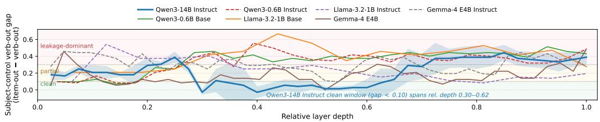  
Figure 9: Subject-control verb-out gap (item-out LOOCV − verb-out CV) across the full layer trajectory in bv mode.

Table 9: Subject-control full-trajectory probe peak in bv mode across all seven models, with verb-out CV at the same layer (mean ± standard deviation across three seeds; gap criterion as in Figure 9).
<table><tr><td>Model</td><td>Layer</td><td>Item-out</td><td>Verb-out</td><td>Gap</td><td>Verdict</td></tr><tr><td>Qwen3-0.6B Base</td><td>18</td><td> $\overline { { 0 . 9 1 7 \pm 0 . 0 0 } }$ </td><td> $\overline { { 0 . 5 0 0 \pm 0 . 0 4 } }$ </td><td>+0.417</td><td>LEAK</td></tr><tr><td>Qwen3-0.6B Instruct</td><td>19</td><td> $0 . 9 0 3 \pm 0 . 0 2$ </td><td> $0 . 4 7 2 \pm 0 . 0 6$ </td><td>+0.431</td><td>LEAK</td></tr><tr><td>Llama-3.2-1B Base</td><td>7</td><td> $0 . 9 1 7 \pm 0 . 0 0$ </td><td> $0 . 2 5 0 \pm 0 . 0 0$ </td><td>+0.667</td><td>LEAK</td></tr><tr><td>Llama-3.2-1B Instruct</td><td>2</td><td> $0 . 6 2 5 \pm 0 . 0 0$ </td><td> $0 . 0 8 3 \pm 0 . 0 0$ </td><td>+0.542</td><td>LEAK</td></tr><tr><td>Gemma-4 E4B</td><td>2</td><td> $0 . 6 1 1 \pm 0 . 0 6$ </td><td> $0 . 1 5 3 \pm 0 . 0 2$ </td><td>+0.458</td><td>LEAK</td></tr><tr><td>Gemma-4 E4B Instruct</td><td>4</td><td> $0 . 7 5 0 \pm 0 . 0 0$ </td><td> $0 . 3 0 6 \pm 0 . 0 6$ </td><td>+0.444</td><td>LEAK</td></tr><tr><td>Qwen3-14B Instruct</td><td>22</td><td> ${ \bf 0 . 9 8 6 \pm 0 . 0 2 }$ </td><td> ${ \bf 0 . 9 7 2 \pm 0 . 0 2 }$ </td><td>+0.014</td><td>clean</td></tr></table>