# ExplorationBench: Measuring AI Systems’ Exploration in Verifiable Alien Worlds

Fudan University Hunyuan Team, Tencent Tsinghua University www.explorationbench.com

Scientific discovery begins where known problems end. There, AI systems must engage in exploration: framing hypotheses, designing experiments, and iterating on the results. However, evaluating this ability is dificult: (1) how to verify whether a genuinely new hypothesis holds, and (2) how to determine whether a system has discovered it through exploration or merely recalled related knowledge from pre-training data. To this end, we introduce ExplorationBench, which turns the wicked problem of evaluating scientific exploration into a concrete and tractable framework built on verifiable Alien Worlds: their rules are executable, so every answer can be checked exactly, and they conflict with familiar knowledge, so recall alone cannot solve the tasks. The benchmark contains two sandboxes, AlienCode (31 discovery targets, 70 tasks) and AlienLogic (24 discovery targets, 70 tasks). Each sandbox provides a flawed manual, task-specific environmental feedback, and a dedicated tool-call schema. Systems use these resources to explore the sandbox, then solve held-out tasks. We evaluate ten AI systems and find that the strongest systems can acquire and apply unfamiliar rules, while performance varies substantially across trajectories and continued exploration can stall or reverse earlier gains. ExplorationBench represents a step towards AI systems that can acquire and apply genuinely new knowledge through exploration in unknown environments.

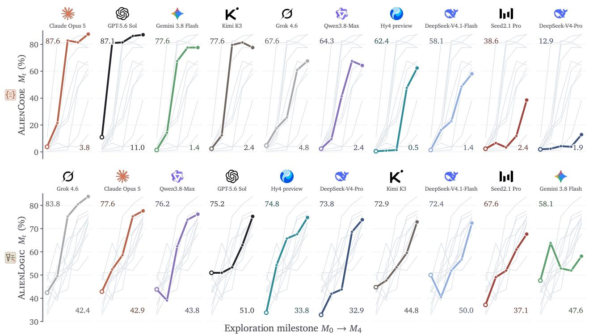

Figure 1 Held-out accuracy over autonomous exploration. Top: AlienCode; bottom: AlienLogic. Each cell highlights one system’s $M _ { 0 } { - } M _ { 4 }$ curve; the other nine are grey. The upper-left and lower-right values are $M _ { 4 }$ and $M _ { 0 } .$ . Cells are ordered by $M _ { 4 }$ within each sandbox. Each curve is the Best@3 trajectory, and each milestone is the mean of three answers per held-out question.

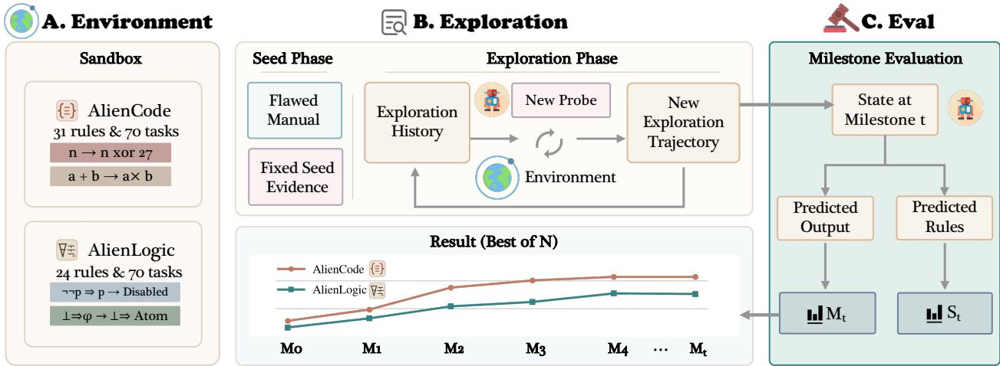  
Figure 2 ExplorationBench: what a system is given, what it may do about it, and how it is scored. (A) Two executable sandboxes. AlienCode has 31 discovery targets and AlienLogic 24, so the manual each ships with is wrong in ways no amount of prior knowledge recovers – the changes have to be found from evidence. (B) Every system starts from the same flawed manual and the same fixed worked examples, then runs four rounds in which it chooses its own probes, runs them in the environment, and adds the results to its exploration history. Nothing else enters the context. (C) At each milestone ��, the system is tested without tools: it answers the 70 held-out tasks and separately reports the rules it believes it has found. A trajectory is scored on where it ends, and a system on its best complete trajectory.

## 1. Introduction

Scientific research advances through exploration. Researchers begin with a tentative understanding, choose what evidence to collect, revise their beliefs in light of the outcomes, and apply what they learn to new problems. Current large language models (LLMs) perform strongly on static evaluations of knowledge, mathematics, and professional tasks [13, 19, 25], but these evaluations mainly test whether a model can retrieve and reason with knowledge it already has. Exploration asks for something diferent. A system must decide what evidence to collect, accumulate that evidence across its interaction history, distill new knowledge from the outcomes, and apply that knowledge to new problems. As AI systems enter scientific and engineering workflows [5, 31], measuring this ability separately from recall and one-shot reasoning becomes increasingly important.

Evaluating exploration ability is dificult because two requirements are in tension. The tasks must be new to the system, so that success cannot come from knowledge acquired during pre-training, yet their answers must be fully known to the evaluator, so that success can be verified [7]. Established domains such as mathematics, coding, and factual question answering meet the second requirement but not the first. A model may reproduce what it memorized, and contamination is hard to exclude for black-box systems [24]. Genuinely novel outputs, such as a new mathematical result or scientific hypothesis, meet the first requirement but not the second. Verifying them may require expert proof checking, specialized experiments, or years of observation [31], and without such verification an evaluator cannot tell a genuine discovery from a plausible but incorrect claim.

Existing benchmarks cover parts of this setting (section 2). Context-learning benchmarks place the new knowledge in the prompt [1, 2, 10], so the model reads the evidence rather than collecting it. Interactive discovery benchmarks let agents gather evidence in fictional worlds or through chosen experiments [15, 29, 39], but they score the state of that world or the inferred law itself. None of them asks whether a system can collect the evidence it needs and then apply what it learned to unseen tasks after the interaction has ended.

In this work, we introduce ExplorationBench, a benchmark that evaluates exploration in verifiable alien worlds (fig. 2). Each world is a deterministic, executable environment whose hidden rules conflict with familiar semantics. AlienCode is a small programming language with 31 discovery targets, and AlienLogic is a natural-deduction system with 24 discovery targets. In AlienCode, for example, integer literals are silently XOR-ed with 27, so EMIT(100) prints 127, and PLUCK counts positions from one although the manual says zero. A system starts from this flawed manual and a few worked examples, then explores for four rounds by submitting programs or proofs and reading the results. After each round it is tested without tool access. It states the rules it believes hold and solves 70 held-out tasks, which an interpreter or a proof-checker grades exactly.

ExplorationBench ofers several properties that make exploration measurable. (1) Resistant to recall. The hidden rules contradict both the manual and pre-training priors, so recalled knowledge misleads rather than helps. Before exploring, no AlienCode trajectory exceeds 15.7%. (2) Exactly verifiable. Every answer is checked by executing it, so grading needs no LLM judge, as in test-based agent evaluation [16, 21]. (3) Resolved over the process. Beyond the final score, the benchmark records the probes a system chooses and, at every milestone, the rules it reports and its held-out accuracy. This separates discovering a rule from using it. (4) Controlled. Matched conditions remove environment feedback, replace the system’s probes with a fixed sequence or with its own best sequence, or supply the complete rule set (sections 3.1 and 3.3).

We evaluate ten frontier systems, each with three independent exploration trajectories per sandbox, and rank them by Best@3, the best final accuracy among the three. Exploration produces the knowledge the tasks require. After four rounds the best AlienCode trajectory reaches 87.6%, whereas the same number of model turns without environment feedback leaves systems at 0.5–11.0%. It also matters who designs the experiments. In AlienCode, handing a system back its own best probes without letting it choose them lowers accuracy for 9 of 10 systems, and randomized probes barely help. A system’s exploration ability difers across tasks, and its rank in one sandbox barely predicts its rank in the other (Spearman 0.35). Discovering a rule and using it also come apart. Two of-by-one rules enter 51 of the 70 AlienCode tasks and the largest accuracy jumps coincide with their discovery, yet tasks whose required rules a system states correctly are still solved only 70.9% of the time. In AlienLogic, being told the rules (93–97%) beats every system’s own exploration. Finally, exploration is unreliable. Trajectories of one system under one budget end up to 72.8 points apart, far more than repeated answers to the same questions vary, and 6 of the 30 AlienCode trajectories end at least 3 points below an earlier milestone.

More findings and case studies are presented in section 4 and section C. Frontier systems can acquire unfamiliar rules through exploration, but they do so unreliably and do not always use what they find. ExplorationBench provides a testbed for measuring how AI systems acquire and apply new knowledge, and for developing more reliable exploration methods.

## 2. Related Work

In this section, we position ExplorationBench relative to three lines of work: interactive scientific discovery and rule induction, context learning and test-time adaptation, and verifiable agent evaluation [8, 10, 15, 16, 29, 36].

Scientific discovery and interactive rule induction. Interactive benchmarks ask agents to infer hidden or altered rules from evidence, connecting to causal world models and active system identification [17]. MARS and DiscoveryWorld study investigation in fictional worlds [15, 29], and NewtonBench targets scientific law discovery [39]. Nearby settings measure compliance with stated constraints in COLLIE [35] and search over experiment configurations in MLAgentBench [14]. Voyager instead evaluates open-ended skill accumulation in a sandbox [30]. ExplorationBench measures the complete path from selecting probes, through reporting discoveries, to using them on unseen tasks. Its unfamiliar executable worlds help separate knowledge acquired during evaluation from pre-trained recall.

Context learning and test-time adaptation. A growing position emphasizes experience generated by the system itself [27]. CL-bench and CL-bench Life study learning from complex provided contexts [9, 10], while EvaLearn studies experience across sequential problems [8]. SE-Bench moves adaptation into model weights [37], and EdgeBench examines longer-horizon learning in real-world environments [41]. Surveys organize self-evolving agents across changes to weights, memory, tools, and prompts [11, 12]. This setting also connects to context engineering and in-context learning [4, 20], with mechanisms studied through induction circuits and implicit Bayesian inference [23, 33] and in-context state represented explicitly in language-agent architectures [28].

Existing approaches typically study learning from supplied demonstrations [22], feedback on a system’s own attempts [6, 18, 26], or stored trajectories replayed as context [38]. Longer reasoning instead spends inference without adding evidence [32]. ExplorationBench holds parameters fixed and places these routes in one protocol. Autonomous exploration selects probes online, hindsight exploration replays the system’s own best trajectory, and without-tool answering adds deliberation without environment feedback. This separates who selects evidence from whether evidence arrives.

Verifiable interactive evaluation. Verifiable agent evaluation grades outcomes rather than descriptions, building on the interleaving of reasoning and tool use in ReAct [34]. SWE-bench grades repository patches with tests [16], WebArena scores website end states [40], and �-bench compares database states with annotated goals [36]. �2-bench extends this setting to environments in which both parties act [3]. ExplorationBench shares this preference for executable outcomes. An interpreter grades AlienCode, while a proof-checker and bounded certifier grade AlienLogic. A related line turns the environment itself into the prediction target: Qwen-AgentWorld trains a language world model to simulate how an environment would respond, scored against recorded observations across seven domains [42]. That asks how faithfully a system can reproduce known dynamics, whereas ExplorationBench asks whether it can uncover dynamics nobody stated. Here, the governing rules must be discovered before they are used on closed-book tasks. Table 2 summarizes the diferences in evidence, novelty, progress measurement, and transfer.

## 3. ExplorationBench

This section defines the exploration task and its experimental conditions, describes the two alien worlds, and then defines the metrics. Exploration is treated as three connected parts, probe selection, reported discovery, and rule use, with no parameter updates.

## 3.1. The task

Setup. An episode is a tuple , , , ,  .  is a hidden, deterministic sandbox governed by a perturbed rule set . is a public, flawed manual. It describes the standard semantics, which are false for the perturbed parts of . is a fixed set of worked examples shared by every system. is an unseen task set held out from exploration. The system sees and and may interact with , but never sees . A system that trusts the manual or its pre-training priors is therefore wrong on exactly the parts of  that matter.

The exploration policy. Let $h _ { t } = ( { M } , { \mathcal { D } } , x _ { < t } , f _ { < t } )$ denote the manual, the worked examples, and the interaction history so far. At step �, the system submits a tool input according to

$$
x _ { t } \sim \pi ( \cdot \mid h _ { t } ) , \qquad f _ { t } = \mathcal { E } ( x _ { t } ) .\tag{1}
$$

We call each executable tool input $x _ { t }$ a probe. In AlienCode a probe is a candidate program and its feedback $f _ { t }$ is the exact program output. In AlienLogic it is a candidate proof and $f _ { t }$ is a compact verifier result. The system uses this feedback to revise a hypothesis state $H _ { t }$ about within a common maximum budget $B _ { \mathrm { m a x } }$ $H _ { t }$ and the evidence in $h _ { t }$ remain inside one context window, with no weight updates, external or persistent memory, or scalar reward.

Protocol. Algorithm 1 gives the protocol. Before $M _ { 0 . }$ , every system receives the same worked examples, each a task with a reference program or proof and the output the environment computes for it, and makes no tool calls. $M _ { 0 }$ therefore follows identical evidence, not merely an identical opportunity to collect it. The system then explores for four rounds. In each round it issues tool calls whose arguments are programs or proofs, and the environment executes them and returns deterministic feedback. At each milestone the system is tested in a separate copy of the conversation with tools disabled. It reports the rules it believes hold, $S _ { t } ,$ and answers the held-out tasks. The copy is then discarded, so testing never adds evidence to the exploration.

Exploration conditions. Five conditions vary whether environment feedback arrives and who directs it. Autonomous exploration $( a )$ selects probes from the current history. Hindsight exploration (ℎ) replays the probes of the same system’s Best@3 trajectory, chosen after the fact. Fixed-probe exploration ( � ) issues one model-independent probe sequence, the same for every system. Without-tool answering (�) adds model turns without environment feedback, and direct answering (�) adds none. A sixth condition, open-book answering (�), supplies the complete rule set, either before exploration $( \mathrm { O } @ M _ { 0 } )$ or after autonomous exploration (A4+O). The three feedback conditions use the same tool-calling interface, so they difer only in who directs the probes. Conditions are compared by their $M _ { 4 }$ endpoints, Best@� for autonomous exploration and the single trajectory each control runs per system. Set against �4, $O @ M _ { 0 }$ and A4+O separate finding the rules from using them. Full definitions appear in section A.4.

## 3.2. The Alien Worlds

AlienCode and AlienLogic share the task and closedbook evaluation above. One is built on program semantics, the other on formal inference. Both are deterministic and executable, and both deliberately conflict with familiar priors. Some rules remain unchanged as red herrings, and every altered rule has at least one held-out task. An interpreter checks AlienCode programs and a proof-checker checks AlienLogic proofs, so scoring is deterministic, exact, and free of LLM judges. Construction and verifier details are in sections A and A.6.

AlienCode. This sandbox is a small calculation language whose familiar-looking operators follow hidden semantics. It contains 31 discovery targets and 70 heldout tasks, namely 37 base tasks, 15 nested composition tasks, 8 ceiling tasks, and 10 rule-coverage tasks. Together they exercise all 31 discovery targets. Before evaluation, each task is classified by representation (flat values, nested containers, or multi-character strings) and by compositional depth (single-step, single-algorithm, or multi-stage, fig. 3). Programs are graded by an interpreter on private evaluator inputs, so success requires rule-aware executable behavior rather than memorizing displayed examples. During exploration, the environment tool executes exactly the candidate program submitted and returns its output.

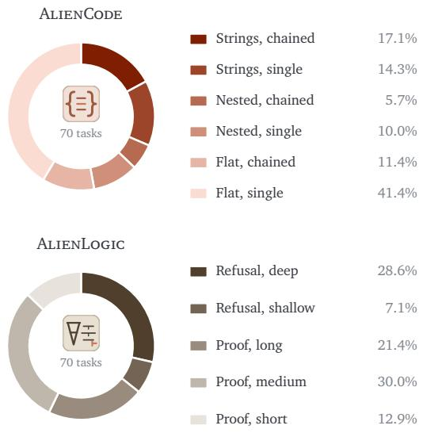  
Figure 3 Held-out task composition. The 70 tasks of each sandbox by family.

AlienLogic. This sandbox is a first-order natural-deduction system with 24 discovery targets, each a patched inference rule, and 70 held-out tasks. A proof-checker verifies every submitted proof, and designated unprovable tasks receive credit only when the system correctly declines to prove them. Certifier bounds and rule-side conditions are given in section $\mathsf { A } .$ During exploration, the environment tool checks candidate proofs and returns a compact verifier result.

## 3.3. Metrics

What we measure. Held-out task performance is $Q \left( H _ { t } \right) = \operatorname* { P r } _ { \tau \sim \mathcal { T } }$ the system solves � given $H _ { t } ]$ . The exploration curve $( Q ( H _ { t } ) ) _ { t = 0 } ^ { N }$ is reported as $( M _ { 0 } , \ldots , M _ { N } )$ , with $M _ { 0 }$ measured after the worked examples and $M _ { t }$ after round �. The benchmark records three connected parts of the process separately. Probe selection is which probes $\pi$ selects, read from the recorded probes and budget and compared across the exploration conditions. Reported discovery is the rule set $S _ { t }$ the system reports from $H _ { t } .$ . Rule use is whether the system can apply $H _ { t }$ to unseen tasks, measured by held-out accuracy. The three diverge in our experiments (section 4), so they are reported separately rather than as one score.

Held-out accuracy. Every held-out question is answered three times, each time in a fresh tool-disabled copy of the conversation at that milestone. For trajectory � at milestone $t ,$ with $y _ { r , \tau , t } ^ { ( k ) } \in \{ 0 , 1 \}$ the verdict on the �-th answer to task �,

$$
M _ { r , t } = \frac { 1 0 0 } { \left| \mathcal { T } \right| } \sum _ { \tau \in \mathcal { T } } \frac { 1 } { 3 } \sum _ { k = 1 } ^ { 3 } y _ { r , \tau , t } ^ { \left( k \right) } .\tag{2}
$$

An answer that is missing or exhausts its time budget scores zero. Writing $M _ { r , t } ^ { ( k ) }$ for the score of the �-th pass alone, the answering noise $\sigma _ { r , t }$ is the standard deviation of $M _ { r , t } ^ { ( 1 ) } , M _ { r , t } ^ { ( 2 ) }$ , and $M _ { r , t } ^ { ( 3 ) }$ . It measures how much the score moves when the same knowledge answers again, with exploration held fixed.

Model score. Each system runs � independent trajectories under the same protocol. The primary score is the best endpoint reached by one complete trajectory,

$$
\mathrm { B e s t } @ n = \operatorname* { m a x } _ { r \in \{ 1 , \ldots , n \} } M _ { r , 4 } , \qquad r ^ { \star } = \operatorname* { m i n } \arg \operatorname* { m a x } _ { r } M _ { r , 4 } ,\tag{3}
$$

where the lowest trajectory index breaks an exact tie. The milestone curve, rule reports, and budget reported with the headline score all come from $r ^ { \star } { } _ { : }$ , and no synthetic trajectory is assembled from diferent trajectories at diferent milestones or tasks. Beside Best@� we report Mean@ $\begin{array} { r } { n = n ^ { - 1 } \sum _ { r } M _ { r , 4 } } \end{array}$ the lowest endpoint, and every trajectory, and rankings compare systems only at the same �.

Rule reports. At every milestone the system also states the rule set $S _ { t }$ it currently believes. In AlienCode, each of the 31 evaluator-side rules is judged stated correctly or not, and we report the number stated correctly (eq. (9)). Each task � exercises a known set of rules $\mathcal { R } ( \tau )$ . The task is covered at milestone � when every rule in $\mathcal { R } ( \tau )$ is stated correctly, which splits held-out accuracy by what the report says the system knows. AlienLogic has no rule-report score, and its auxiliary diagnostic is correct refusal on unprovable theorems. Rule reports are diagnostic and never enter $M _ { t }$

Dynamics and budget. We describe how a trajectory reaches its endpoint by its per-round steps and its retained gain $G _ { r } = M _ { r , 4 } - M _ { r , 0 }$ (eq. (8)). The benchmark also records the exploration budget $\mathbf { B } = ( C , P , T )$ of tool calls, probe units, and exploration tokens. The budget is reported (table 3) but not scored, and its accounting is given in section A.4.

## 4. Results and Findings

Results are organized around the exploration milestones $M _ { 0 }$ through $M _ { 4 }$ . Each sandbox is scored on its 70 held-out tasks, and every task is answered three times at each milestone, so a score is a mean of three answers rather than one.

## 4.1. Setup

Systems and trajectories. We evaluate ten frontier systems in each sandbox, each at the highest reasoning setting its API ofers. Every system runs �=3 independent trajectories per sandbox. A trajectory is one continuous exploration history: it starts from the shared worked examples, runs four exploration rounds, and is scored at milestones $M _ { 0 }$ through $M _ { 4 }$ with the metrics of section 3.3.

## 4.2. Findings

Eight findings address three questions. RQ1 asks whether systems can acquire an alien world by exploring it, RQ2 how discovering a rule relates to using it, and RQ3 how reliably exploration succeeds. Each system is scored by Best@3 (eq. (3)), reported beside Mean@3 and all three trajectories. Two open-book conditions supply the complete rule set, one before exploration $( \mathrm { O } @ M _ { 0 } )$ and one after autonomous exploration $( \mathsf { A } 4 + \mathsf { O } )$ . Each control condition is run once per system. Table 1 lists each system’s Best@3 trajectory beside these references.

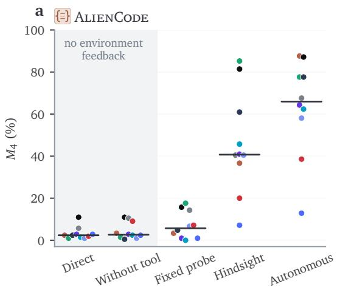  
b

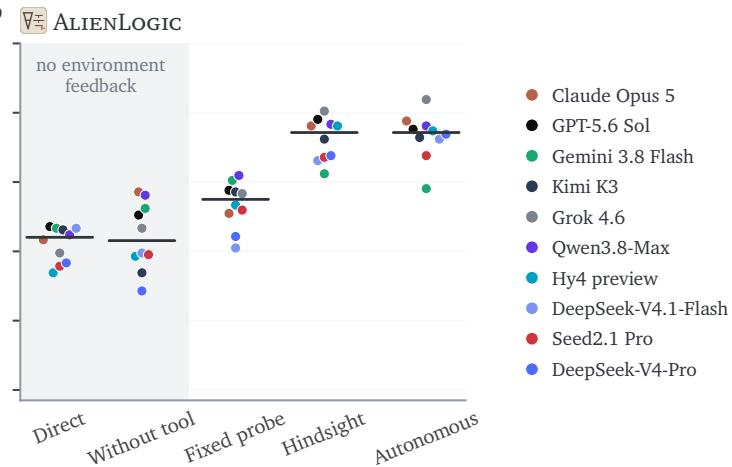  
Figure 4 Held-out accuracy at $M _ { 4 }$ under five exploration conditions. Each dot is one system; the horizontal line in each column marks the median over the ten systems. Autonomous exploration is shown at each system’s Best@3 trajectory; hindsight exploration replays the probes of that same trajectory, and fixed-probe exploration issues model-independent probes at matched volume. Shaded columns receive no environment feedback, and from left to right the system takes a larger part in designing the experiments. Control conditions carry one trajectory per system, and every value is the mean of three answers per question.

Table 1 Held-out accuracy under autonomous exploration. $M _ { 0 }$ and $M _ { 4 }$ of each system’s Best@3 trajectory (eq. (3)), the mean and the lowest $M _ { 4 }$ over its three trajectories, and accuracy under open-book answering, with the complete rule set supplied before exploration $( \mathrm { O } @ M _ { 0 } )$ or after the Best@3 trajectory’s exploration $( \mathsf { A } 4 + \mathsf { O } )$ . All values are percentages, each the mean of three answers per question; rows are ordered by Best@3 $M _ { 4 }$
<table><tr><td></td><td></td><td colspan="2">Best@3 trajectory</td><td colspan="2">Three trajectories</td><td colspan="2">Open-book</td><td>Diagnostic</td></tr><tr><td>System</td><td>Reasoning</td><td> $M _ { 0 }$ </td><td>←  $M _ { 4 }$ </td><td>Mean@3</td><td>Worst</td><td> $O @ M _ { 0 }$ </td><td> $_ { \mathsf { A 4 + O } }$ </td><td>Aux.</td></tr><tr><td>} ALIENCODE program synthesis</td></tr><tr><td> Claude Opus 5</td><td>max 3.8</td><td>87.6</td><td>72.5</td><td>49.0</td><td>84.3</td><td>91.4</td><td>Aux. Rules (/31) 27</td></tr><tr><td>GPT-5.6 Sol</td><td>max</td><td>11.0</td><td>87.1</td><td>78.6</td><td>72.9</td><td>68.1</td><td>90.5</td><td>28</td></tr><tr><td>Gemini 3.8 Flash</td><td>high</td><td>1.4</td><td>77.6</td><td>39.0</td><td>6.2</td><td>78.1</td><td>86.7</td><td>28</td></tr><tr><td>K Kimi K3</td><td>max</td><td>2.4</td><td>77.6</td><td>37.5</td><td>4.8</td><td>52.4</td><td>81.4</td><td>28</td></tr><tr><td>Ø Grok 4.6</td><td>xhigh</td><td>4.8</td><td>67.6</td><td>51.9</td><td>35.7</td><td>51.0</td><td>77.6</td><td>27</td></tr><tr><td>Qwen3.8-Max</td><td>max</td><td>2.4</td><td>64.3</td><td>62.5</td><td>60.0</td><td>41.0</td><td>68.1</td><td>23</td></tr><tr><td>Hy4 preview</td><td>high</td><td>0.5</td><td>62.4</td><td>29.4</td><td>1.4</td><td>27.1</td><td>64.8</td><td>26</td></tr><tr><td> DeepSeek-V4.1-Flash</td><td>max</td><td>1.4</td><td>58.1</td><td>45.2</td><td>22.9</td><td>39.5</td><td>67.1</td><td>25</td></tr><tr><td> Seed2.1 Pro</td><td>high</td><td>2.4</td><td>38.6</td><td>23.8</td><td>4.8</td><td>61.4</td><td>55.2</td><td>26</td></tr><tr><td> DeepSeek-V4-Pro</td><td>max</td><td>1.9</td><td>12.9</td><td>7.3</td><td>2.4</td><td>37.6</td><td>51.4</td><td>22</td></tr><tr><td colspan="9">∇ ALIENLOGIC formal proof</td></tr><tr><td>Ø Grok 4.6</td><td>xhigh</td><td>42.4</td><td>83.8</td><td>72.1</td><td>64.3</td><td>97.1</td><td>97.1</td><td>Aux. UnprovRec (%) 90.7</td></tr><tr><td>Claude Opus 5</td><td>max</td><td>42.9</td><td>77.6</td><td>73.3</td><td>66.7</td><td>93.8</td><td>94.8</td><td>40.0</td></tr><tr><td>Qwen3.8-Max</td><td>max</td><td>43.8</td><td>76.2</td><td>72.7</td><td>70.0</td><td>96.7</td><td>94.3</td><td>53.3</td></tr><tr><td>GPT-5.6 Sol</td><td>max</td><td>51.0</td><td>75.2</td><td>73.0</td><td>70.5</td><td>92.9</td><td>94.8</td><td>44.0</td></tr><tr><td>Hy4 preview</td><td>high</td><td>33.8</td><td>74.8</td><td>67.8</td><td>60.5</td><td>95.7</td><td>94.8</td><td>54.7</td></tr><tr><td> DeepSeek-V4-Pro</td><td>max</td><td>32.9</td><td>73.8</td><td>65.1</td><td>60.0</td><td>94.8</td><td>93.8</td><td>54.7</td></tr><tr><td>K Kimi K3</td><td>max</td><td>44.8</td><td>72.9</td><td>67.9</td><td>60.0</td><td>95.2</td><td>96.2</td><td>60.0</td></tr><tr><td>DeepSeek-V4.1-Flash</td><td>max</td><td>50.0</td><td>72.4</td><td>59.2</td><td>51.4</td><td>95.2</td><td>92.9</td><td>41.3</td></tr><tr><td> Seed2.1 Pro</td><td>high</td><td>37.1</td><td>67.6</td><td>59.5</td><td>53.8</td><td>93.3</td><td>93.3</td><td>48.0</td></tr><tr><td>Gemini 3.8 Flash</td><td>high</td><td>47.6</td><td>58.1</td><td>57.6</td><td>57.1</td><td>97.1</td><td>97.1</td><td>48.0</td></tr></table>

Reasoning labels denote API-specific request configurations; each system uses its highest available setting, held fixed across trajectories, sandboxes, and conditions. The labels are not a common compute scale. The diagnostic column difers by sandbox and the two are not comparable: Rules counts the hidden rules the Best@3 trajectory reports correctly at $M _ { 4 } ,$ and UnprovRec is its rate of correct refusal on unprovable theorems. Neither enters $M _ { 4 }$

## 4.2.1. RQ1. Can AI systems acquire an alien world through exploration?

## Finding 1. Exploration, not recall or thinking alone, produces the knowledge the tasks require.

Before exploration, recalled knowledge solves almost nothing in AlienCode, and no trajectory exceeds 15.7% at $M _ { 0 } .$ . After four rounds, Best@3 reaches 87.6%, and 7 of 10 systems exceed 60%. AlienLogic starts higher, at 32.9–51.9%, because its rule changes leave part of standard natural deduction intact, and Best@3 rises to 58.1–83.8%. Additional model turns do not substitute for probing (fig. 4 and case 4). Without-tool answering adds the same model turns without environment feedback. It leaves AlienCode at 0.5–11.0%, and in AlienLogic it changes accuracy by 12.4 to 13.8 points relative to direct answering, lowering it for three systems.

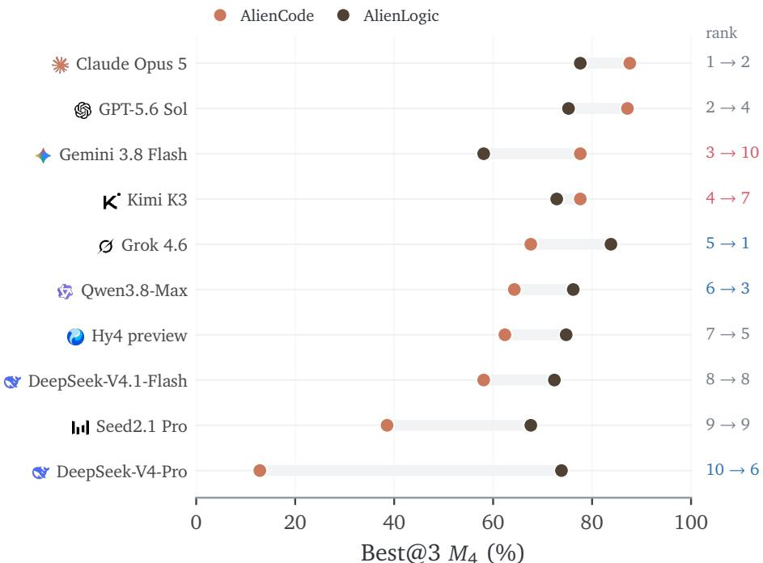  
Figure 5 Best@3 $M _ { 4 }$ in the two sandboxes. Each row is one system, ordered by its AlienCode score; the right column gives its rank in AlienCode and then in AlienLogic. Red marks a fall of three or more places, blue a rise of three or more.

## Finding 2. Exploration works best when the system designs its own experiments.

The three feedback conditions use the same tool-calling interface and difer only in who designs the probes (fig. 4). Under autonomous exploration the system designs each experiment from its own history. Hindsight exploration hands back exactly the experiments of its Best@3 trajectory. The system still reads every result and records its hypotheses, but it no longer decides what to test next. Fixed-probe exploration samples experiments from grammar-valid templates with a fixed seed, the same sequence for every system. In AlienCode, the median falls from 66.0% under autonomous exploration to 40.7% under hindsight and 5.7% under fixed probes. Autonomous exploration beats hindsight for 9 of 10 systems, by a median of 17.1 points, although hindsight replays the probes of the best of the three trajectories. The sandbox is deterministic, so the evidence is identical, and the gap reflects designing the experiments rather than receiving their results. Gemini 3.8 Flash is the exception (85.2% under hindsight against 77.6%). In AlienLogic, designing the experiments adds nothing. Autonomous and hindsight exploration tie (median diference 0.5 points), and hindsight exceeds fixed probes by a median of 21.7 points, so what matters there is which proofs are tried rather than who chose them. Each hindsight run is a single trajectory and varies on its own. Three replays of Hy4 preview’s AlienCode probes end at 45.7%, 8.6%, and 45.2%.

## Finding 3. A system’s exploration ability varies across task settings.

The Spearman correlation between the two Best@3 rankings is 0.35 (fig. 5). Grok 4.6 ranks fifth in AlienCode and first in AlienLogic, Gemini 3.8 Flash ties for third and ranks last, and DeepSeek-V4-Pro moves from last to sixth. The sandboxes also separate systems diferently. AlienCode spreads Best@3 over 12.9–87.6%, whereas eight of 10 systems fall within 72.4–83.8% in AlienLogic.

Open-book answering at 𝑀0 (O@𝑀0) Autonomous exploration (Best@3 𝑀4) Open-book answering after exploration (A4+O)  
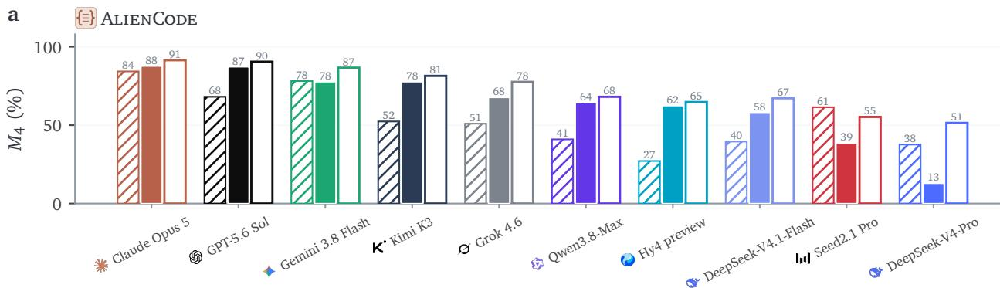

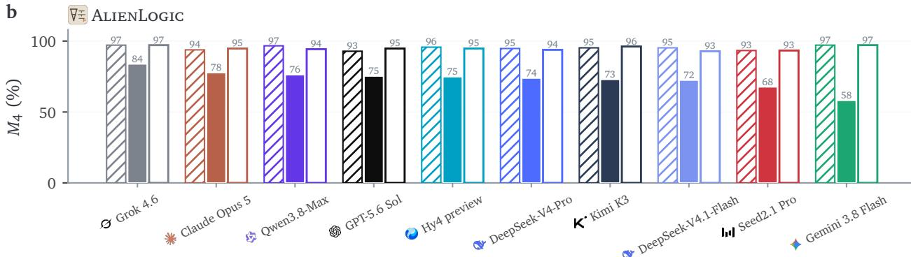  
Figure 6 Finding out versus being told. Held-out accuracy at $M _ { 4 }$ under open-book answering before exploration $( { \mathrm { O } } @ M _ { 0 } ,$ , hatched), after autonomous exploration alone (Best@3, solid), and under open-book answering after that exploration $( \mathsf { A 4 + O } ,$ outlined). Systems are ordered by Best@3 $M _ { 4 }$ within each sandbox.

## 4.2.2. RQ2. How does discovering a rule relate to using it?

## 自拜 Finding 4. Discovering the rules beats being told them in AlienCode, but not in AlienLogic.

In AlienCode (fig. 6), the Best@3 trajectory outscores $O @ M _ { 0 }$ for 7 of 10 systems, and Mean@3 does so for 5. GPT-5.6 Sol reaches 87.1% against 68.1% under $\mathrm { O @ } M _ { 0 } .$ , and Hy4 preview 62.4% against 27.1%. A4+O beats $O @ M _ { 0 }$ in 26 of 30 trajectories, by a median of 14.5 points, so exploration supplies practice in using the rules and not only the rules themselves. AlienLogic inverts the pattern. $O @ M _ { 0 }$ alone reaches 93–97%, no Best@3 trajectory matches it, and exploring first adds nothing $( \mathsf { A } 4 + \mathsf { O }$ minus $O @ M _ { 0 }$ has a median of 0.0 points). AlienLogic is limited by discovery, and AlienCode by use. Exploration can also interfere with use. Seed2.1 Pro scores lower under $_ { \mathsf { A 4 + O } }$ than under $O @ M _ { 0 }$ (55.2% against 61.4%).

## Finding 5. AlienCode hinges on two keystone rules: systems that discover both correctly perform far better on subsequent held-out tasks.

Both keystone rules are positional, and together they enter 51 of the 70 tasks. They are the index shift of PLUCK (R14) and the slice shift of CARVE (R15). Of the 15 trajectories that end at or above 50%, 13 state both correctly in their rule reports, and of the 9 that end below 25%, 6 state neither.

R15 first reported correctly

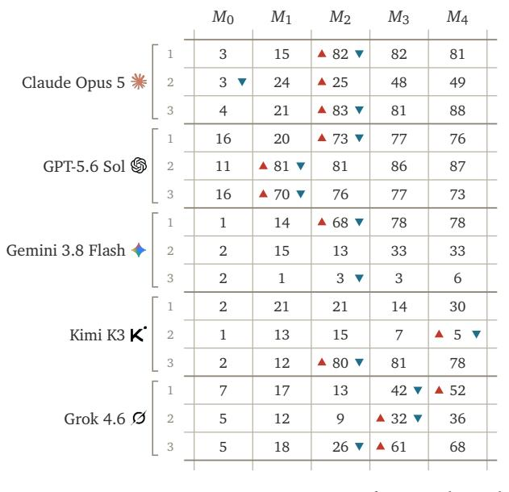

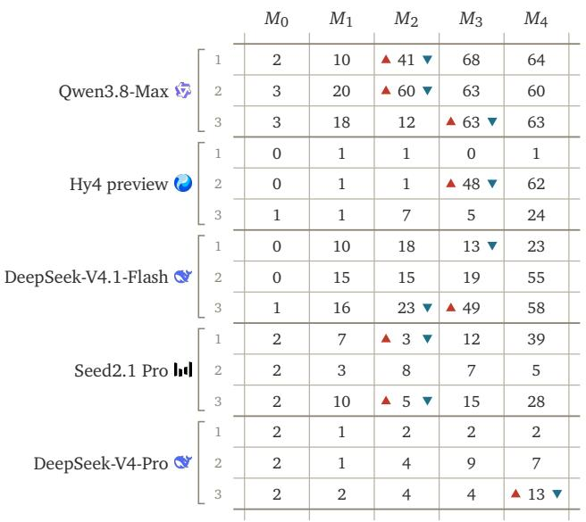

Figure 7 Accuracy jumps when the keystone rules are found. Each block is one system and each row one of its three AlienCode trajectories; columns are milestones, and each cell gives held-out accuracy (%). Triangles mark the milestone at which the trajectory’s rule report first states R15 (CARVE slice shift, pointing up) and R14 (PLUCK index shift, pointing down) correctly.  
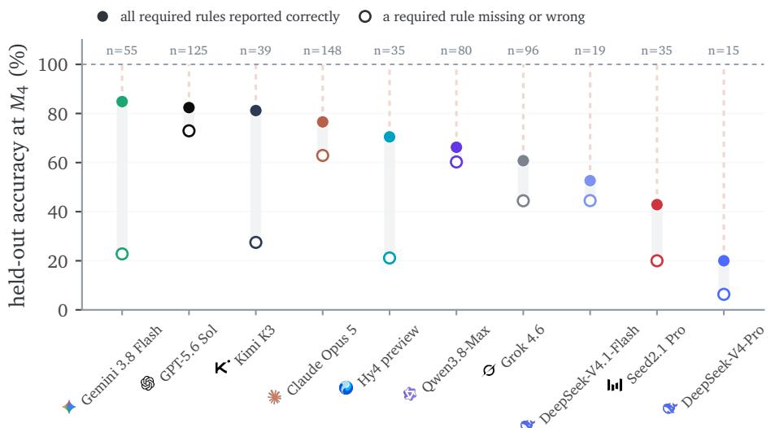  
Figure 8 | Knowing a rule is not being able to use it. For each system, pooled over its three AlienCode trajectories, filled dots give accuracy at $M _ { 4 }$ on tasks whose required rules the $M _ { 4 }$ rule report states correctly, and open dots on tasks with at least one required rule missing or stated incorrectly. The dashed segment up to 100% is the remaining execution gap; � counts task–trajectory pairs in the first group.

Large accuracy jumps coincide with their discovery (fig. 7 and case 1). Of the 13 jumps of at least 30 points between consecutive milestones, 12 occur in the round in which the rule report newly states R15 correctly, and 11 in the round in which it newly states R14. Across all 30 trajectories, the number of rules stated correctly at $M _ { 4 }$ correlates with $M _ { 4 }$ at $r = 0 . 8 5$ . This evidence is correlational, and the rule report never enters the score.

Case 1 · One round finds the keystone rules GPT-5.6 Sol · AlienCode   
ANSWERING MODEL(S) TASK / RECORD EVIDENCE INTERACTION   
GPT-5.6 Sol (max) Trajectory $^ { 2 , }$ round 1, Rule reports and held-out 12 tool calls in round   
call 5 accuracy at $M _ { 0 }$ and $M _ { 1 }$ 1   
Probe as submitted, with the sandbox output (two further lines omitted)   
SET xs AS STRAND(31,24,25,26)   
EMIT(xs) [1, 2, 3, 4]   
EMIT(STRAND(PLUCK(xs,27),PLUCK(xs,26),PLUCK(xs,25),PLUCK(xs,-28))) [3, 2, 1, 4]   
EMIT(CARVE(xs,26,31)) [1, 2, 3]   
The same probe read with the two rules the system already reported at $M _ { 0 }$   
Integer literals are XOR-ed with 27 (R01) and STRAND reverses its arguments (R16), so xs is [1, 2, 3, 4]   
and the calls ask for PLUCK at indices 0, 1, 2, and 1 and for CARVE(xs, 1, 4).   
Call Manual predicts Sandbox returns   
PLUCK at 0, 1, 2, 1 1, 2, 3, 4 4, 1, 2, 3   
CARVE(xs, 1, 4) [2, 3, 4] [1, 2, 3]   
Rule report   
�0 (8 of 31 rules correct) $M _ { 1 }$ (28 of 31 rules correct)   
R14 UNKNOWN (get seq (- i 1))   
R15 UNKNOWN (slice seq (- lo 1) (- hi 1))   
Every value the probe returns difers from the manua $\because$ so one call exposes both keystone shifts. After   
this round the report states 28 of the 31 rules, and held-out accuracy rises from 11.0% to 81.0%; on the   
51 tasks that use R14 or R15 it rises from 9.8% to 79.1%.

## Finding 6. Knowing a rule does not guarantee using it correctly.

When a trajectory’s $M _ { 4 }$ rule report states every rule a task requires correctly, the task is still solved only 70.9% of the time (647 task–trajectory pairs, fig. 8). Two trajectories state both keystone rules correctly yet end at 4.8% and 12.9%. The dissociation also runs the other way. In 26 of 30 trajectories, a rule stated correctly at one milestone later drops out of the rule report, yet accuracy on the tasks that require it still rises, from 11.4% to 16.8%. A task that requires a rule the report states incorrectly is still solved 34.3% of the time. The rule report is therefore a lossy readout of what a system can do and no substitute for held-out accuracy. Case 2 shows both directions within one system.

## 4.2.3. RQ3. How reliable is exploration?

## 目 Finding 7. Same-system, same-budget trajectories vary by tens of points, far beyond the noise from repeated answering.

Answering noise is small (fig. 9). Its standard deviation over the three answering passes at the same milestone is at most 4.7 points in AlienCode and 2.9 in AlienLogic. Trajectories of the same system difer far more, by up to 72.8 points in AlienCode and 21.0 in AlienLogic. In AlienCode, Kimi K3 ends between 4.8% and 77.6% (case 2), and Gemini 3.8 Flash between 6.2% and 77.6%.

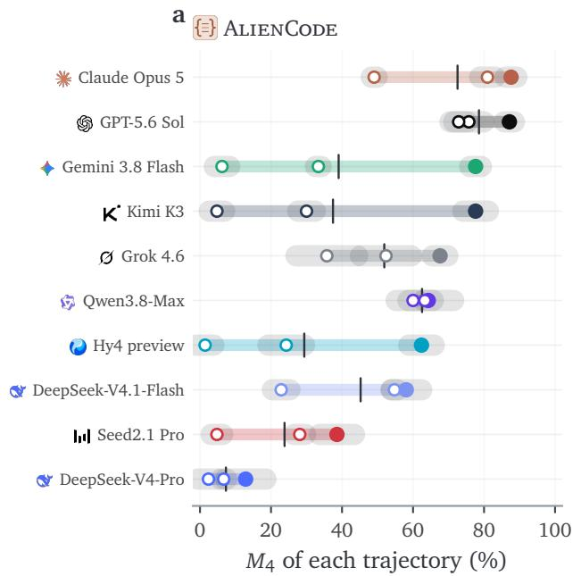

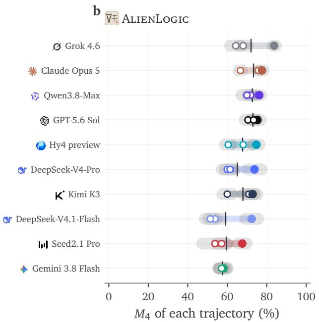  
Figure 9  Outcomes vary between trajectories, not between answers. Each row is one system. Dots are its three trajectories’ $M _ { 4 }$ (filled for Best@3), the coloured band spans them, and the short vertical line marks Mean@3. The grey halo around each dot extends one standard deviation of that trajectory’s three answers per question to either side.

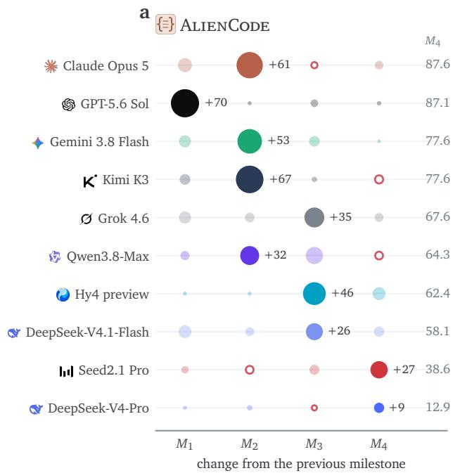

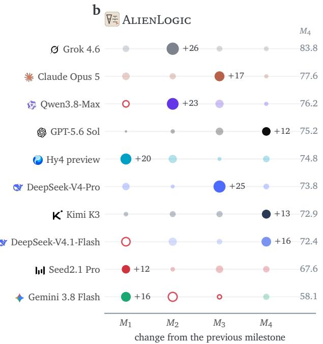  
Figure 10 When the gain arrives. For each system’s Best@3 trajectory, bubble area is the change in held-out accuracy from the previous milestone $( M _ { t } - M _ { t - 1 } )$ . The solid bubble marks the largest step and is labelled with its size; a red ring marks a milestone at which accuracy fell. The right column gives $M _ { 4 }$

Every AlienCode trajectory spends 45–48 of its 48 tool calls, so the spread does not reflect a diference in efort. With outcomes this dispersed, the choice of aggregate changes the ranking. Qwen3.8-Max ranks sixth in AlienCode by Best@3 and third by Mean@3, while Kimi K3 falls from a tie for third to seventh.

Finding 8. Exploration gains arrive in leaps, at diferent times, and can reverse.

In each Best@3 trajectory in AlienCode, the largest single step contributes 45–92% of the retained gain (fig. 10). The round in which that step arrives difers by system. It is the first round for GPT-5.6 Sol, the second for Claude Opus 5, Kimi K3, and Gemini 3.8 Flash, and the third for Grok 4.6 and Hy4 preview. Seed2.1 Pro and DeepSeek-V4-Pro take it only in the last round and are still rising when the budget ends. Continued exploration can also undo progress. Of the 30 AlienCode trajectories, 6 end at least 3 points below an earlier milestone, as do 3 of the 30 AlienLogic trajectories. Gemini 3.8 Flash’s Best@3 trajectory in AlienLogic peaks at 63.8% after the first round and ends at 58.1% (case 3).

## 5. Discussion

## 5.1. What Best@� measures

Best@� asks what endpoint a system can reach within � independent attempts. It answers whether a system can build an efective exploration trajectory at all, but it is not a reliability measure: a system with one strong trajectory and �  1 failures can outrank one whose every trajectory is moderately strong. We therefore compare systems only at the same � and report Mean@�, every endpoint, and the best–worst range beside the ranking.

The best trajectory is chosen once, by its complete $M _ { 4 }$ accuracy, and every analysis of that system uses the same trajectory. Taking the best milestone from one trajectory and the best answer to each task from another would construct an outcome that no agent produced. For the same reason, Best@� is not pass@�, which takes the union of task-level successes and can exceed every observed trajectory.

## 5.2. Why the seed phase provides ten examples

Before �0, AlienCode gives every system ten fixed examples covering the basic program forms used later: literals, operator calls, sequences, nesting, and function bodies. This establishes a shared minimum fluency with the language and prevents basic syntax learning from being conflated with exploration, while leaving most hidden rules to be discovered in the four scored rounds.

## 6. Limitations

ExplorationBench deliberately reduces exploration to two deterministic, executable worlds so that every experiment and held-out answer has an exact outcome. That control is also its boundary: real scientific exploration involves noisy and incomplete observations, costly or irreversible experiments, open-ended hypothesis spaces, and horizons far longer than four rounds. Our results therefore measure whether systems can acquire unfamiliar rules in verifiable synthetic environments, not whether they can conduct real scientific discovery. Three trajectories per system and three answers per question expose trajectory and answering variability, but are insuficient to estimate either distribution precisely.

## 7. Conclusion

We present ExplorationBench, a benchmark for how AI systems explore worlds whose rules contradict familiar knowledge. Its two sandboxes contain 55 discovery targets and 140 held-out tasks, and

a program checks every answer. Across ten frontier systems, four rounds of exploration lift the best AlienCode trajectory to 87.6%, while the same turns without environment feedback stay at or below 11.0%. Exploration works best when the system designs its own experiments, but it is still far from reliable. A system’s exploration ability difers across tasks, stating a rule correctly does not ensure using it, and trajectories of one system can end far apart. ExplorationBench provides a testbed for studying exploration as a capability in its own right and for developing systems that learn from their environments. More broadly, the same design can evaluate exploration wherever unfamiliar rules can be made executable and their consequences verified exactly, ofering insights for developing future AI systems for scientific discovery.

## Full Author List

Ming Zhang\*†, Zhenghao Xiang\*, Peizhong Gao\*, Yujiong Shen, Yuhui Wang, Zhonghan Yue, Shihan Dou, Zhangyue Yin, Junjie Ye, Shichun Liu, Weihuang Zheng, Jiahao Chen, Jiayi Chen, Hongzhang Liu, Jiaqi Shao

Tao Gui†, Qi Zhang†, Xuanjing Huang, Suncong Zheng†, Maxm Pan†

## References

[1] Rishabh Agarwal, Avi Singh, Lei Zhang, Bernd Bohnet, Luis Rosias, Stephanie Chan, Biao Zhang, Ankesh Anand, Zaheer Abbas, Azade Nova, et al. Many-shot in-context learning. In Advances in Neural Information Processing Systems (NeurIPS), volume 37, pages 76930–76966, 2024.

[2] Parth Asawa, Christopher M. Glaze, Gabriel Orlanski, Ramya Ramakrishnan, Benji Xu, Asim Biswal, Vincent Sunn Chen, Frederic Sala, Matei Zaharia, and Joseph E. Gonzalez. Continual learning bench: Evaluating frontier ai systems in real-world stateful environments. arXiv preprint arXiv:2606.05661, 2026.

[3] Victor Barres, Honghua Dong, Soham Ray, Xujie Si, and Karthik Narasimhan. �2-bench: Evaluating conversational agents in a dual-control environment, 2025.

[4] Tom Brown, Benjamin Mann, Nick Ryder, Melanie Subbiah, Jared D. Kaplan, et al. Language models are few-shot learners. In Advances in Neural Information Processing Systems (NeurIPS), 2020.

[5] Jun Shern Chan, Neil Chowdhury, Oliver Jafe, James Aung, Dane Sherburn, Evan Mays, Giulio Starace, Kevin Liu, Leon Maksin, Tejas Patwardhan, Lilian Weng, and Aleksander Madry. MLEbench: Evaluating machine learning agents on machine learning engineering. International Conference on Learning Representations (ICLR), 2025.

[6] Xinyun Chen, Maxwell Lin, Nathanael Schärli, and Denny Zhou. Teaching large language models to self-debug. In International Conference on Learning Representations (ICLR), 2024. URL https://openreview.net/forum?id=KuPixIqPiq.

[7] François Chollet. On the measure of intelligence. arXiv preprint arXiv:1911.01547, 2019. URL https://arxiv.org/abs/1911.01547.

[8] Shihan Dou, Ming Zhang, Chenhao Huang, Jiayi Chen, Feng Chen, Shichun Liu, Yan Liu, Chenxiao Liu, Cheng Zhong, Zongzhang Zhang, Tao Gui, Chao Xin, Chengzhi Wei, Lin Yan, Qi Zhang, and Xuanjing Huang. Evalearn: Quantifying the learning capability and eficiency

of llms via sequential problem solving. In Advances in Neural Information Processing Systems (NeurIPS), 2025.

[9] Shihan Dou, Yujiong Shen, Chenhao Huang, Junjie Ye, Jiayi Chen, Junzhe Wang, Qianyu He, Shichun Liu, Changze Lv, Jiahang Lin, Jiazheng Zhang, Ming Zhang, Shaofan Liu, Tao Ji, Zhangyue Yin, Cheng Zhang, Huaibing Xie, Jianglu Hu, Jingcheng Deng, Lincheng Li, Minda Hu, Shaolei Wang, Syrus Zhao, Weichao Wang, Yan Lei, Yang Liu, Yanling Xiao, Yiting Liu, Zenan Xu, Zhen Guo, Ziliang Zhao, Pluto Zhou, Tao Gui, Qi Zhang, Xuanjing Huang, Yu-Gang Jiang, Di Wang, and Shunyu Yao. CL-bench Life: Can language models learn from real-life context?, 2026.

[10] Shihan Dou, Ming Zhang, Zhangyue Yin, Chenhao Huang, Yujiong Shen, Junzhe Wang, Jiayi Chen, Yuchen Ni, Junjie Ye, Cheng Zhang, Huaibing Xie, Jianglu Hu, Shaolei Wang, Weichao Wang, Yanling Xiao, Yiting Liu, Zenan Xu, Zhen Guo, Pluto Zhou, Tao Gui, Zuxuan Wu, Xipeng Qiu, Qi Zhang, Xuanjing Huang, Yu-Gang Jiang, Di Wang, and Shunyu Yao. CL-bench: A benchmark for context learning. arXiv preprint arXiv:2602.03587, 2026.

[11] Jinyuan Fang, Yanwen Peng, Xi Zhang, Yingxu Wang, Xinhao Yi, Guibin Zhang, Yi Xu, Bin Wu, Siwei Liu, Zihao Li, et al. A comprehensive survey of self-evolving ai agents: A new paradigm bridging foundation models and lifelong agentic systems. arXiv preprint arXiv:2508.07407, 2025.

[12] Huan-ang Gao, Jiayi Geng, Wenyue Hua, Mengkang Hu, Xinzhe Juan, Hongzhang Liu, Shilong Liu, Jiahao Qiu, Xuan Qi, Yiran Wu, Hongru Wang, Han Xiao, Yuhang Zhou, Shaokun Zhang, Jiayi Zhang, Jinyu Xiang, Yixiong Fang, Qiwen Zhao, Dongrui Liu, Qihan Ren, Cheng Qian, Zhenhailong Wang, Minda Hu, Huazheng Wang, Qingyun Wu, Heng Ji, and Mengdi Wang. A survey of self-evolving agents: What, when, how, and where to evolve on the path to artificial super intelligence. Transactions on Machine Learning Research (TMLR), 2026. Preprint at arXiv:2507.21046.

[13] Dan Hendrycks, Collin Burns, Steven Basart, Andy Zou, Mantas Mazeika, Dawn Song, and Jacob Steinhardt. Measuring massive multitask language understanding. International Conference on Learning Representations (ICLR), 2021.

[14] Qian Huang, Jian Vora, Percy Liang, and Jure Leskovec. MLAgentBench: Evaluating language agents on machine learning experimentation. In Proceedings of the 41st International Conference on Machine Learning (ICML), pages 20271–20309, 2024.

[15] Peter Jansen, Marc-Alexandre Côté, Tushar Khot, Erin Bransom, Bhavana Dalvi Mishra, Bodhisattwa Prasad Majumder, Oyvind Tafjord, and Peter Clark. DiscoveryWorld: A virtual environment for developing and evaluating automated scientific discovery agents. In Advances in Neural Information Processing Systems, Datasets and Benchmarks Track, 2024. URL https://openreview.net/forum?id=cDYqckEt6d.

[16] Carlos E. Jimenez, John Yang, Alexander Wettig, Shunyu Yao, Kexin Pei, Ofir Press, and Karthik R. Narasimhan. SWE-bench: Can language models resolve real-world github issues? In International Conference on Learning Representations (ICLR), 2024.

[17] Brenden M. Lake, Tomer D. Ullman, Joshua B. Tenenbaum, and Samuel J. Gershman. Building machines that learn and think like people. Behavioral and Brain Sciences, 40:e253, 2017.

[18] Aman Madaan, Niket Tandon, Prakhar Gupta, Skyler Hallinan, Luyu Gao, Sarah Wiegrefe, Uri Alon, Nouha Dziri, Shrimai Prabhumoye, Yiming Yang, et al. Self-refine: Iterative refinement

with self-feedback. In Advances in Neural Information Processing Systems (NeurIPS), volume 36, pages 46534–46594, 2023.

[19] Mathematical Association of America. AIME: American invitational mathematics examination. https://maa.org/math-competitions/aime, 2026. Accessed 2026-07-15.

[20] Lingrui Mei, Jiayu Yao, Yuyao Ge, Yiwei Wang, Baolong Bi, Yujun Cai, Jiazhi Liu, Mingyu Li, Zhong-Zhi Li, Duzhen Zhang, et al. A survey of context engineering for large language models. arXiv preprint arXiv:2507.13334, 2025.

[21] Mike A. Merrill et al. Terminal-Bench 2.0: Evaluating language models on real terminal workflows. arXiv preprint arXiv:2606.terminalbench, 2026.

[22] Sewon Min, Xinxi Lyu, Ari Holtzman, Mikel Artetxe, Mike Lewis, Hannaneh Hajishirzi, and Luke Zettlemoyer. Rethinking the role of demonstrations: What makes in-context learning work? In Proceedings ofthe 2022 Conference on Empirical Methods in Natural Language Processing (EMNLP), pages 11048–11064, 2022. URL https://aclanthology.org/2022.emnlp-main.759/.

[23] Catherine Olsson, Nelson Elhage, Neel Nanda, Nicholas Joseph, Nova DasSarma, Tom Henighan, Ben Mann, Amanda Askell, Yuntao Bai, Anna Chen, et al. In-context learning and induction heads. Transformer Circuits Thread, 2022. URL https://transformer-circuits. pub/2022/in-context-learning-and-induction-heads/index.html. Also arXiv:2209.11895.

[24] Yonatan Oren, Nicole Meister, Niladri S. Chatterji, Faisal Ladhak, and Tatsunori Hashimoto. Proving test set contamination in black-box language models. In International Conference on Learning Representations, 2024. URL https://openreview.net/forum?id=KS8mIvetg2.

[25] Tejas Patwardhan et al. GDPval: A benchmark for evaluating frontier model performance on professional deliverables. arXiv preprint arXiv:2509.gdpval, 2025.

[26] Noah Shinn, Federico Cassano, Ashwin Gopinath, Karthik Narasimhan, and Shunyu Yao. Reflexion: Language agents with verbal reinforcement learning. In Advances in Neural Information Processing Systems (NeurIPS), volume 36, pages 8634–8652, 2023.

[27] David Silver and Richard S. Sutton. Welcome to the era of experience. In George Konidaris, editor, Designing an Intelligence. MIT Press, 2025. URL https: //storage.googleapis.com/deepmind-media/Era-of-Experience/The%20Era% 20of%20Experience%20Paper.pdf. In press.

[28] Theodore R. Sumers, Shunyu Yao, Karthik Narasimhan, and Thomas L. Grifiths. Cognitive architectures for language agents. Transactions on Machine Learning Research (TMLR), 2024.

[29] Xiaojuan Tang, Jiaqi Li, Yitao Liang, Song-Chun Zhu, Muhan Zhang, and Zilong Zheng. MARS: Situated inductive reasoning in an open-world environment. In Advances in Neural Information Processing Systems, Datasets and Benchmarks Track, 2024. URL https://openreview.net/ forum?id=3qoQ6AolAz.

[30] Guanzhi Wang, Yuqi Xie, Yunfan Jiang, Ajay Mandlekar, Chaowei Xiao, Yuke Zhu, Linxi Fan, and Anima Anandkumar. Voyager: An open-ended embodied agent with large language models. arXiv preprint arXiv:2305.16291, 2023. URL https://arxiv.org/abs/2305.16291.

[31] Hanchen Wang, Tianfan Fu, Yuanqi Du, Wenhao Gao, Kexin Huang, Ziming Liu, Payal Chandak, Shengchao Liu, Peter Van Katwyk, Andreea Deac, Anima Anandkumar, Karianne Bergen, Carla P.

Gomes, Shirley Ho, Pushmeet Kohli, Joan Lasenby, Jure Leskovec, Tie-Yan Liu, Arjun Manrai, Debora Marks, Bharath Ramsundar, Le Song, Jimeng Sun, Jian Tang, Petar Veličković, Max Welling, Linfeng Zhang, Connor W. Coley, Yoshua Bengio, and Marinka Zitnik. Scientific discovery in the age of artificial intelligence. Nature, 620(7972):47–60, 2023. doi: 10.1038/ s41586-023-06221-2.

[32] Jason Wei, Xuezhi Wang, Dale Schuurmans, Maarten Bosma, Brian Ichter, Fei Xia, Ed Chi, Quoc V. Le, and Denny Zhou. Chain-of-thought prompting elicits reasoning in large language models. In Advances in Neural Information Processing Systems (NeurIPS), volume 35, pages 24824–24837, 2022.

[33] Sang Michael Xie, Aditi Raghunathan, Percy Liang, and Tengyu Ma. An explanation of in-context learning as implicit bayesian inference. In International Conference on Learning Representations (ICLR), 2022.

[34] Shunyu Yao, Jefrey Zhao, Dian Yu, Nan Du, Izhak Shafran, Karthik R. Narasimhan, and Yuan Cao. ReAct: Synergizing reasoning and acting in language models. In International Conference on Learning Representations (ICLR), 2023.

[35] Shunyu Yao, Howard Chen, Austin W. Hanjie, Runzhe Yang, and Karthik Narasimhan. COLLIE: Systematic construction of constrained text generation tasks. In International Conference on Learning Representations (ICLR), 2024.

[36] Shunyu Yao, Noah Shinn, Pedram Razavi, and Karthik Narasimhan. �-bench: A benchmark for tool-agent-user interaction in real-world domains. In International Conference on Learning Representations, 2025. URL https://openreview.net/forum?id=roNSXZpUDN.

[37] Jiarui Yuan, Tailin Jin, Weize Chen, Zeyuan Liu, Zhiyuan Liu, and Maosong Sun. SE-Bench: Benchmarking self-evolution with knowledge internalization. arXiv preprint arXiv:2602.04811, 2026. URL https://arxiv.org/abs/2602.04811.

[38] Andrew Zhao, Daniel Huang, Quentin Xu, Matthieu Lin, Yong-Jin Liu, and Gao Huang. ExpeL: LLM agents are experiential learners. In Proceedings of the AAAI Conference on Artificial Intelligence, pages 19632–19642, 2024.

[39] Tianshi Zheng, Kelvin Kiu Wai Tam, Newt Nguyen Kim Hue Nam, Baixuan Xu, Zhaowei Wang, Jiayang Cheng, Hong Ting Tsang, Weiqi Wang, Jiaxin Bai, Tianqing Fang, Yangqiu Song, Ginny Wong, and Simon See. NewtonBench: Benchmarking generalizable scientific law discovery in LLM agents. In International Conference on Learning Representations (ICLR), 2026. URL https://openreview.net/forum?id=Gk6umqW74m. Preprint at arXiv:2510.07172.

[40] Shuyan Zhou, Frank F. Xu, Hao Zhu, Xuhui Zhou, Robert Lo, Abishek Sridhar, Xianyi Cheng, Tianyue Ou, Yonatan Bisk, Daniel Fried, Uri Alon, and Graham Neubig. WebArena: A realistic web environment for building autonomous agents. In International Conference on Learning Representations (ICLR), 2024.

[41] Deyao Zhu, Xin Zhou, Shengling Qin, Xuekai Zhu, Hangliang Ding, Shu Zhong, Zixin Wen, Zhonglin Xie, Chenhui Gou, Linxuan Ren, et al. EdgeBench: Unveiling scaling laws of learning from real-world environments. arXiv preprint arXiv:2607.05155, 2026. URL https://arxiv. org/abs/2607.05155.

[42] Yuxin Zuo, Zikai Xiao, Li Sheng, Fei Huang, Jianhong Tu, Yuxuan Liu, Tianyi Tang, Xiaomeng Hu, Yang Su, Qingfeng Lan, et al. Qwen-AgentWorld: Language world models for general agents. arXiv preprint arXiv:2606.24597, 2026. URL https://arxiv.org/abs/2606.24597.

## Appendix

## A. Experimental Details

## A.1. Environments, tasks, and worked examples

ExplorationBench contains two environments with the same exploration and evaluation protocol but diferent executable objects. AlienCode exposes a small programming language whose familiarlooking operators follow hidden semantics. Its evaluator contains 31 discovery targets and 70 held-out tasks. AlienLogic exposes a Fitch-style proof checker with 24 discovery targets, each an active rule patch, and 70 held-out tasks, including designated unprovable goals. Programs must pass all private inputs, and proofs must verify. An unprovable goal earns credit only for a correct refusal.

AlienCode includes deliberately counter-intuitive keywords and 8 red herrings. For example, SHATTER appears to mean destruction but means multiply, while EMIT(100) prints 127. Some rules are scope-dependent, and no primitive performs addition, so the model must construct addition from other operations. Engineering and algorithm tasks that require code are evaluated on 5 private legal inputs. Displayed examples specify task interfaces rather than the private test set.

AlienLogic uses non-contiguous opaque rule IDs and side conditions, including duplicate-premise and use-once guards that prevent a model from discharging an assumption by simply restating a premise. Its designated unprovable tasks are certified only within declared formula, line, indentation, and node bounds.

Both environments use prescribed worked examples before $M _ { 0 }$ , but the examples are sandboxspecific. AlienCode presents ten fixed worked examples, balanced across five task bands (apply, interact, scope, engineer, and algorithm). Each contains a task, a reference AlienCode program, and the output the interpreter computes for it. The model submits no code in this phase, so every trajectory reaches $M _ { 0 }$ with identical evidence and no tool calls charged. AlienLogic presents eight accepted worked proofs that show valid proof syntax. $M _ { 0 }$ is therefore comparable within a sandbox, but comparisons of $M _ { 4 } - M _ { 0 }$ across sandboxes are only descriptive, because the two sets of worked examples difer.

## A.2. Comparison with related benchmarks

Table 2 places ExplorationBench beside the benchmarks of section 2: where each one’s evidence comes from, how it controls novelty, and where it finally tests competence.

## A.3. Models and reasoning controls

We evaluate GPT-5.6 Sol, Claude Opus 5, Qwen3.8-Max (0902), Gemini 3.8 Flash, DeepSeek-V4.1- Flash, DeepSeek-V4-Pro, Grok 4.6, Kimi K3, Seed2.1 Pro (0915), and Hy4 preview. Each system uses the highest reasoning setting its API ofers, fixed across trajectories and sandboxes; the high/xhigh/max labels name request settings, not comparable compute levels. Dated sufixes identify the exact model versions evaluated.

Each system runs $\scriptstyle n = 3$ independent trajectories per sandbox. Interactions use structured tool calls: the environment executes each call and returns a tool result (section A.5).

## A.4. Interaction budget and control conditions

Exploration keeps one continuous history. After each round, the system is tested in a discarded, tool-disabled copy of the conversation, so testing never becomes evidence for later rounds.

Table 2 Where the evidence comes from, and where competence is tested. Each row states a benchmark’s primary protocol rather than ranking design choices. ExplorationBench measures exploration by combining autonomous probe selection, milestone measurement, and unseen-task evaluation after interaction ends; no single column alone defines that distinction.
<table><tr><td></td><td></td><td colspan="2">Learning setup</td><td colspan="3">What is measured</td></tr><tr><td>Benchmark</td><td>Target</td><td>Evidence</td><td>Novelty control</td><td>Progress</td><td>Transfer</td><td>Ground truth</td></tr><tr><td>CL-bench [10]</td><td>Context learning</td><td>Provided context</td><td>Expert-authored content</td><td>Final score</td><td>Same context</td><td>Expert rubrics, LLM verifier</td></tr><tr><td>EvaLearn [8]</td><td>Sequential learning</td><td>Prior solved tasks Authored task</td><td>sequences</td><td>Learning curve</td><td>Later related tasks</td><td>Rubrics, LLM verifier</td></tr><tr><td>SE-Bench [37]</td><td>Weight internalization</td><td>Docs, training tasks</td><td>Obfuscated APIs</td><td>Pre/post score</td><td>Closed-book held-out</td><td>Tests, AST checks</td></tr><tr><td>SWE-bench [16]</td><td>Software repair</td><td>Issue, codebase</td><td>Real GitHub issues</td><td>Final patch</td><td>Same repository</td><td>Test suites</td></tr><tr><td>DiscoveryWorld [15]</td><td>Scientific investigation</td><td>Agent actions</td><td>Fictional worlds</td><td>Final score</td><td>Same world</td><td>World state</td></tr><tr><td>NewtonBench [39]</td><td>Physical-law discovery</td><td>Chosen experiments</td><td>Counterfactual laws</td><td>Final equation</td><td>Inferred law</td><td>Symbolic equivalence</td></tr><tr><td>EdgeBench [41]</td><td>Long-horizon learning</td><td>Environment feedback</td><td>New real-world tasks</td><td>Learning curve</td><td>Same task</td><td>Task-specific evaluator</td></tr><tr><td colspan="7">EXPLORATION</td></tr><tr><td>BENCH (ours)</td><td>Exploration</td><td>Chosen probes and feedback</td><td>Executable rules that conflict with priors</td><td> $M _ { 0 }  M _ { 4 }$  milestones</td><td>Unseen tasks after interaction</td><td>Interpreter; proof checker, bounded certifier</td></tr></table>

Milestone number is a protocol stage, not a resource unit. At each milestone we record cumulative tool calls �, probe units �, and exploration tokens �. Each of the four rounds allows at most 12 tool calls in AlienCode and 12 proofs in AlienLogic, the latter capped at 48 across the run. AlienCode packs up to five probe units into one tool call, charging one for each top-level EMIT argument and three for each such observation inside a loop body; AlienLogic submits one verifier-evaluated proof per call, so $C = P$ . We use actual consumption, not the caps, in every budget we report. The loop charge is fixed rather than multiplied by the realized iteration count, and a call over the five-unit cap is rejected in full and executes no code. Feedback is capped separately at 15 lines and 600 characters per call, and returned output never adds probe units. The worked examples are context rather than model calls and are not charged. The budget is recorded and reported but never scored.

Table 3 reports the budget of each system’s Best@3 trajectory. Every trajectory spends nearly all of its tool calls, while exploration tokens difer by more than an order of magnitude between systems.

## A.5. Formal tool-call protocol

Each request continues the API’s structured conversation history, keeping tool-call IDs and reasoningstate fields instead of flattening them into text, so later probes condition on the full interaction history.

For trajectory �, the cumulative exploration budget at milestone � is

$$
\mathbf { B } _ { r , t } = \big ( C _ { r , t } , P _ { r , t } , T _ { r , t } \big ) ,\tag{4}
$$

where � is executed tool calls and therefore submitted probes, � is charged probe units, and � is API-reported input plus output tokens for model requests made during exploration.

Table 3 Exploration budget of each system’s Best@3 trajectory. � is tool calls, � probe units, and � exploration tokens in millions, summed over the four rounds. In AlienLogic, $C = P$ . Rows follow the AlienCode order of table 1.
<table><tr><td rowspan="2">System</td><td colspan="2">ALIENCODE</td><td colspan="2">ALIENLOGIC</td></tr><tr><td>C</td><td>P T (M)</td><td> $C = P$ </td><td>T (M)</td></tr><tr><td> Claude Opus 5</td><td>48</td><td>168</td><td>11.59</td><td>48 0.67</td></tr><tr><td>GPT-5.6 Sol</td><td>48</td><td>131</td><td>3.62</td><td>48 0.91</td></tr><tr><td>Gemini 3.8 Flash</td><td>45</td><td>124</td><td>2.41</td><td>48 1.08</td></tr><tr><td>K Kimi K3</td><td>45</td><td>216</td><td>2.01</td><td>48 0.38</td></tr><tr><td>Ø Grok 4.6</td><td>48</td><td>197</td><td>0.50</td><td>48 0.15</td></tr><tr><td>Qwen3.8-Max</td><td>48</td><td>162</td><td>0.99</td><td>48 0.68</td></tr><tr><td>Hy4 preview</td><td>48</td><td>210</td><td>1.41</td><td>48 0.33</td></tr><tr><td>DeepSeek-V4.1-Flash</td><td>48</td><td>143</td><td>10.85</td><td>48 1.63</td></tr><tr><td> Seed2.1 Pro</td><td>48</td><td>219</td><td>0.34</td><td>48 0.18</td></tr><tr><td> DeepSeek-V4-Pro</td><td>48</td><td>210</td><td>4.55</td><td>48 0.37</td></tr></table>

Algorithm 1 The ExplorationBench protocol for structured tool calls. Fixed worked examples   
establish $M _ { 0 }$ . After each round the benchmark records �, �, and $T ,$ and the system is tested in   
discarded, tool-disabled copies of the conversation, so only probe feedback updates �.   
Require: environment tool (hidden rules $\mathcal { R } )$ ; manual $\mathcal { M } ;$ fixed worked examples $\mathcal { D } ;$ held-out set $\mathcal { T } ;$ rounds   
$N ;$ sandbox caps B¯   
Ensure: milestone scores $( M _ { 0 } , \ldots , M _ { N } )$ , rule reports $( S _ { 0 } , \ldots , S _ { N } )$ , and actual budgets $( \mathbf { B } _ { 0 } , \ldots , \mathbf { B } _ { N } )$   
1: � InitHypothesis , ⊲ identical evidence; no model tool calls   
2: for � 0 to � do   
3: $\mathbf { B } _ { i }$ CumulativeUsage �   
4: $S _ { i }$ ReportRules ToolDisabledCopy �   
5: $M _ { i }$ ScoreToolDisabledCopies $( H , \mathcal { T } )$   
6: if $i < N$ then ⊲ Evidence acquisition. Run probes and update   
7: while the model requests a call to and budget remains do   
8: � ToolArguments � ; � Execute , �   
9: � ReturnToolResult $( H , x , f )$   
10: return $( M _ { 0 } , \ldots , M _ { N } ) , ( S _ { 0 } , \ldots , S _ { N } ) , ( { \bf B } _ { 0 } , \ldots , { \bf B } _ { N } )$

## A.6. Executable outcomes and metric definitions

Let $a _ { \tau , t } = A ( \tau ; H _ { t } )$ be the response produced for unseen task � in an independent tool-disabled copy of the conversation at milestone �. The benchmark first reduces every response to an executable binary outcome

$$
y _ { \tau , t } = V _ { \mathcal { E } } ( \tau , a _ { \tau , t } ) \in \{ 0 , 1 \} ,\tag{5}
$$

where $V \varepsilon$ is the sandbox-specific verifier. AlienCode holds two kinds of task. For the 69 synthesis tasks the model submits a program, which passes only if it is correct on every evaluator input; for the 1 prediction task the task supplies the program $\scriptstyle { \mathcal { Z } } _ { \tau }$ and the model submits the output it expects, which passes only on an exact match with what the interpreter actually prints:

$$
V _ { \mathcal { E } } ^ { \mathrm { C o n g } } ( \tau , a ) = \left\{ \begin{array} { l l } { \displaystyle \prod _ { z \in \mathcal { Z } _ { \tau } } \mathbb { 1 } \left[ \mathrm { E x e c } _ { \mathcal { E } } ( a , z ) = g _ { \tau } ^ { \mathcal { E } } ( z ) \right] , } & { \mathrm { s y n t h e s i s , } } \\ { \displaystyle \mathbb { 1 } \left[ a = \mathrm { E x e c } _ { \mathcal { E } } ( z _ { \tau } ) \right] , } & { \mathrm { p r e d i c t i o n . } } \end{array} \right.\tag{6}
$$

Both branches compare normalized text, so trailing whitespace and an equal-valued numeric literal do not decide a verdict. For AlienLogic, let $u _ { \tau } = 1$ denote a theorem designated unprovable within

the benchmark’s declared certifier bounds. Then

$$
V _ { \mathcal { R } } ^ { \mathrm { L o G I c } } ( \tau , a ) = \left\{ \begin{array} { l l } { \mathbb { 1 } \left[ \mathrm { P r o o f C h e c k } _ { \mathcal { R } } ( \tau , a ) = \mathrm { A C C E P T } \right] , } & { u _ { \tau } = 0 , } \\ { \mathbb { 1 } \left[ \mathrm { D e c l i n e } ( a ) \right] , } & { u _ { \tau } = 1 . } \end{array} \right.\tag{7}
$$

For trajectory � at milestone �, held-out accuracy $M _ { r , t }$ is the three-answer mean of eq. (2) over the full scored set $\mathcal { T }$ . The per-pass scores $M _ { r , t } ^ { ( k ) }$ give the answering noise $\sigma _ { r , t }$ . The step $s _ { r , t } = M _ { r , t } - M _ { r , t - 1 }$ is the change during round �, and the retained gain is their sum,

$$
G _ { r } = M _ { r , 4 } - M _ { r , 0 } = \sum _ { t = 1 } ^ { 4 } s _ { r , t } .\tag{8}
$$

We describe how a trajectory reaches its endpoint by the share of $G _ { r }$ carried by its largest step and by whether it ends below an earlier milestone. These quantities describe the selected trajectory and are never used to select it.

The rule report score of section 3.3 scores the reported rule set $S _ { t }$ against the evaluator-side AlienCode rule inventory $\mathcal { R } _ { \mathrm { e v a l } }$ as the number of rules it states correctly:

$$
\mathrm { R u l e R e p o r t } _ { t } = \sum _ { \rho \in \mathcal { R } _ { \mathrm { e v a l } } } J ( \rho , S _ { t } ) ,\tag{9}
$$

It is elicited at every milestone; we report its value at $M _ { 4 }$

Over � trajectories, the model score and its selected trajectory are

$$
\mathrm { B e s t } @ n = \operatorname* { m a x } _ { r } M _ { r , 4 } , \qquad r ^ { \star } = \operatorname* { m i n } \arg \operatorname* { m a x } _ { r } M _ { r , 4 } .\tag{10}
$$

All trajectory-level quantities paired with the headline $s { \mathrm { c o r e } } { \mathrm { - } } M _ { 0 } , G _ { \mathrm { : } }$ , intermediate milestones, rule reports, budgets, and errors—are read from $r ^ { \star }$ . We separately report Mean@ $\begin{array} { r } { n = n ^ { - 1 } \sum _ { r } M _ { r , 4 } } \end{array}$ , every endpoint, and the best–worst range, and rank systems only at the same $n .$ We attach no confidence interval to Best@�: a maximum depends explicitly on $n ,$ which is why � and every trajectory are reported beside it.

The five exploration conditions difer only in how evidence is obtained; the sixth, open-book answering, supplies the complete rule set as the reference used in RQ2.

• Direct answering (�). No model turns occur after $M _ { 0 }$ .

• Without-tool answering (�). Model turns for hypothesis revision occur without environment feedback.

• Fixed-probe exploration $( f )$ . Probes are sampled deterministically from a fixed pool of grammarvalid templates. One sequence serves all ten systems: its seed is fixed, and its per-call volume follows one mid-ranked trajectory, the Best@3 trajectory of Grok 4.6, so every system meets the same probes, independent of its own hypotheses.

• Hindsight exploration (ℎ). The probes of the same system’s Best@3 trajectory in that sandbox, chosen after the fact by its $M _ { 4 }$ , are replayed through the same tool-calling interface.

• Autonomous exploration (�). Probes are selected from the trajectory’s own history.

• Open-book answering (�). The complete rule set is supplied before evaluation, either before exploration $( \mathrm { O } @ M _ { 0 } )$ or after the four autonomous rounds (A4+O).

Hindsight replay keeps the structured exchange of tool calls and tool results and changes only who chooses the probe. The replayed probes are submitted verbatim but executed live, so their feedback is recomputed rather than copied, and the system still records its own hypotheses between probes. The diference between autonomous and hindsight exploration therefore reflects choosing the probes, not a change of interaction protocol. Because the replayed sequence comes from the system’s best trajectory rather than an average over trajectories, the comparison is conditioned on that particular sequence.

## B. Per-system results

Figures 11 to 14 break each system’s gain down by task family and by milestone under the five exploration conditions. Autonomous exploration averages three trajectories; each control condition contributes the one trajectory scored for the control study. Scores are three-answer means (eq. (2)), and gains are measured from each condition’s own �0.

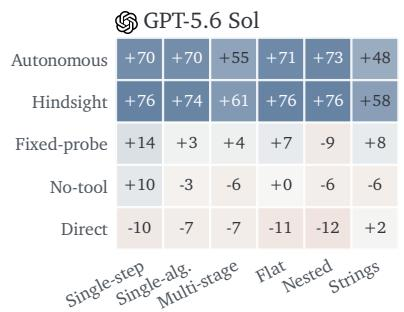  
Qwen3.8-Max

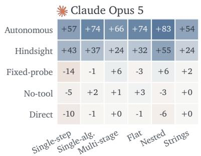

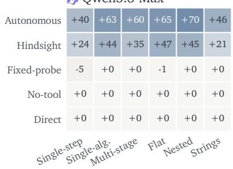  
DeepSeek-V4-Pro

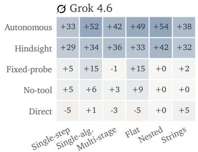

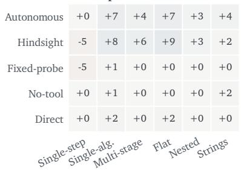

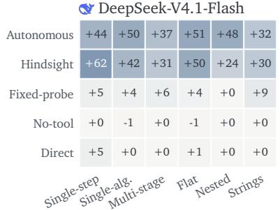

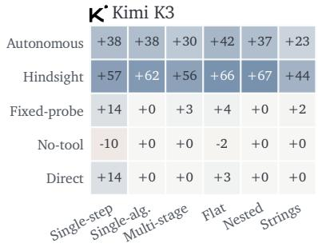  
Hy4 preview

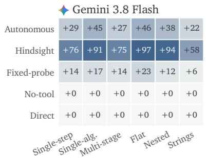

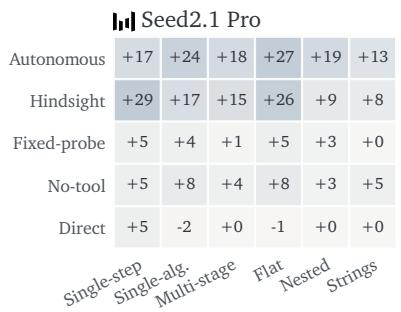  
AlienCode

Figure 11  Task-family gains for every AlienCode system. Cells show $M _ { 4 } - M _ { 0 }$ within each task family, in percentage points. Tasks are split by compositional depth and by representation, so each task enters one column of each. Autonomous rows average three trajectories; control rows are one trajectory each.

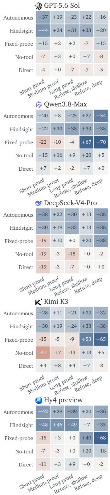

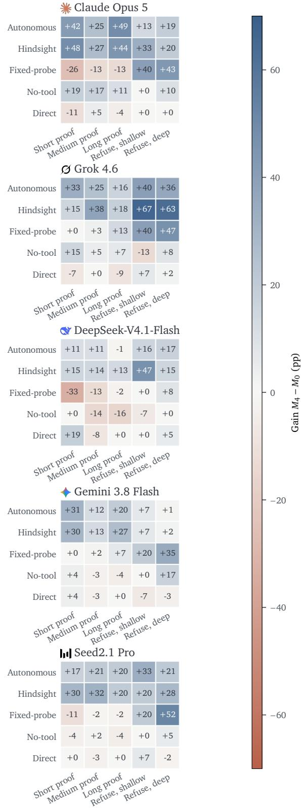  
AlienLogic  
Figure 12  Task-family gains for every AlienLogic system. Cells show $M _ { 4 } - M _ { 0 }$ within each task family, in percentage points. Columns are the five families of fig. 3: provable theorems by proof length, unprovable ones by how deeply the goal nests. Autonomous rows average three trajectories; control rows are one trajectory each.

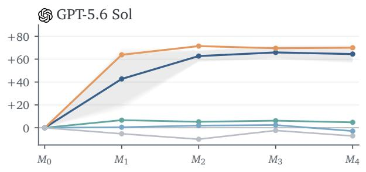

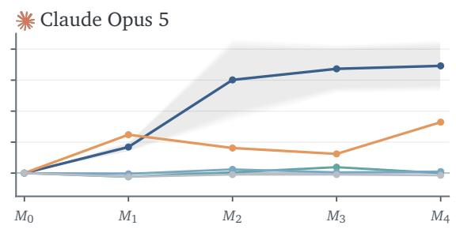

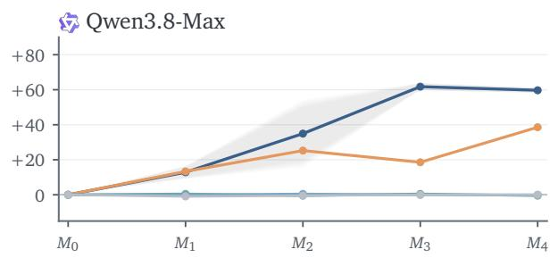

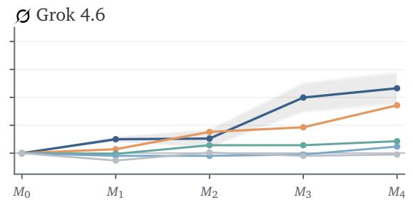

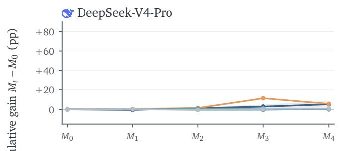

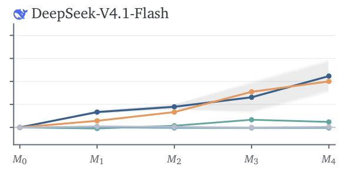

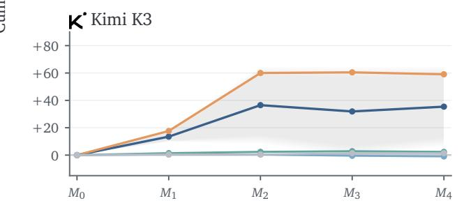

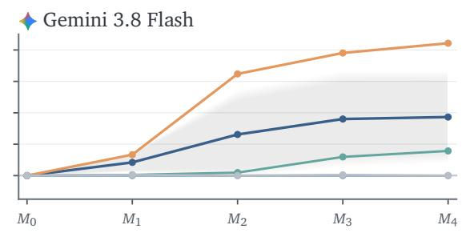

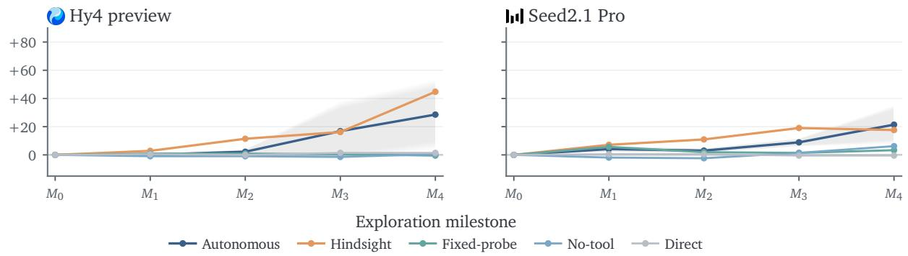  
AlienCode  
Figure 13 Exploration trajectories for every AlienCode system. Curves show cumulative gain $M _ { t } - M _ { 0 }$ . The autonomous curve is the mean of three trajectories, and its shading is  population SD across them; each control curve is a single trajectory.

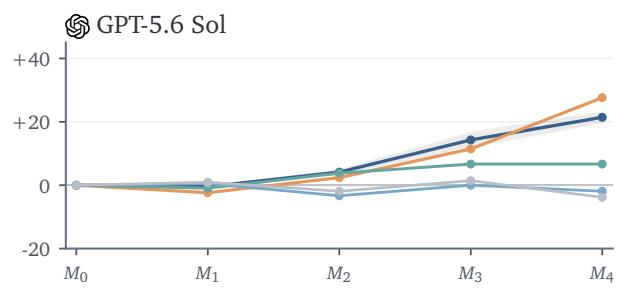

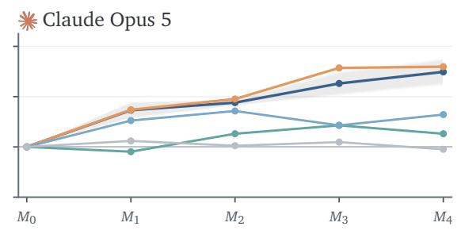

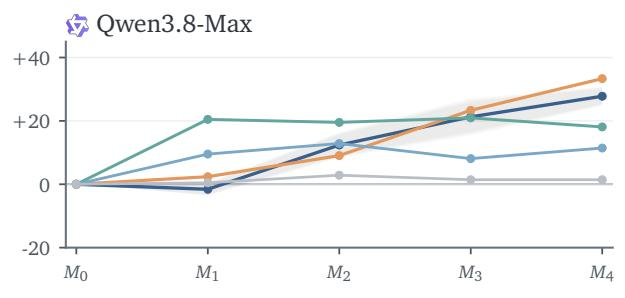

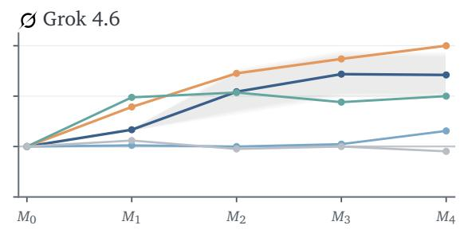

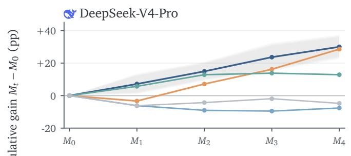

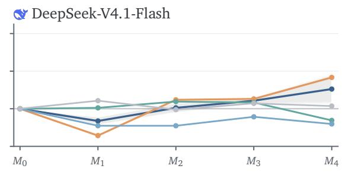

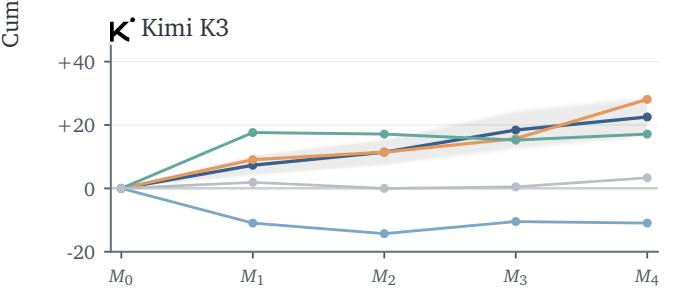

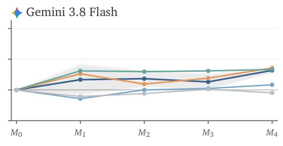

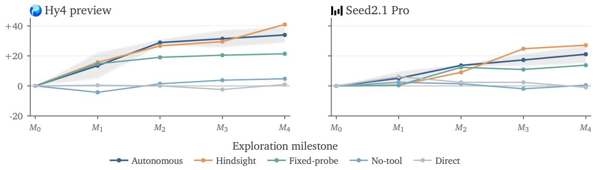  
AlienLogic  
Figure 14 Exploration trajectories for every AlienLogic system. Curves show cumulative gain $M _ { t } - M _ { 0 }$ . The autonomous curve is the mean of three trajectories, and its shading is  population SD across them; each control curve is a single trajectory.

## C. Case studies

Each case follows one trajectory to show a mechanism behind a finding; the cases are illustrations, not further evidence. Programs, proofs, and rule reports are shown as logged. Explanations the systems wrote in Chinese, the language of the prompts, are translated.

<table><tr><td colspan="2">月 Case 2·Same system, same budget, one scope rule apart</td><td>Kimi K3·ALIENCoDE</td></tr><tr><td colspan="2">ANSWERING MODEL(S) TASK / RECORD EVIDENCE Kimi K3 (max) Trajectories 2 and  ${ 3 ; }$  Rule reports, held-out task A46 at  $M _ { 4 }$  accuracy,  $M _ { 4 }$  programs</td><td>INTERACTION 48 and 45 tool calls</td></tr><tr><td colspan="3">Rules stated correctly (of 31) and held-out accuracy Trajectory 2 Trajectory 3</td></tr><tr><td colspan="2">7 1.4% 3  $M _ { 0 }$  2.4%  $M _ { 1 }$  10 12.9% 12 12.4%  $M _ { 2 }$  14 15.2% 27 79.5%  $M _ { 3 }$  19 6.7% 28 81.4%  $M _ { 4 }$  22 4.8% 28 77.6% R14 (PLUCK index shift) is stated from  $M _ { 4 }$  in trajectory 2 and from  $M _ { 2 }$  inside a function body are XOR-ed with 53; 69 of the 70 tasks need it) is stated only at M0 in trajectory 2 and from  $M _ { 3 }$  in trajectory 3.</td><td>in trajectory 3. R01 + (integer literals</td></tr><tr><td colspan="3">Task A46 at  $\begin{array} { r } { M _ { 4 } \colon } \end{array}$  write CRAFT last (1st) that returns the last element Trajectory 2 DELIVER PLUCK(1st, 27) FAIL IndexError on every test Trajectory 3 DELIVER PLUCK(1st, 53) PASS Trajectory 2 explains its answer: &quot;PLUCK (seq, i) is seq [i-1], so i = 0 returns the last element; integer literals</td></tr><tr><td colspan="2">Both trajectories state the index shift at  $M _ { 4 } ,$  top-level rule inside a function body, where 27 becomes  $^ { 4 6 , }$  tasks that use R14 or R15, trajectory 2 solves 1.3% at  $M _ { 4 }$  behind use: trajectory 3 reaches 79.5% at  $M _ { 2 }$  before it states R01+.</td><td>and trajectory 2 states 22 rules. It encodes the literal with the so the index runs out of range. On the 51 and trajectory 3 73.9%. The report also lags</td></tr><tr><td colspan="3">Case 3·A correct refusal overwritten by a later belief Gemini 3.8 Flash·ALIENLOGIC</td></tr><tr><td colspan="3">ANSWERING MODEL(S) TASK / RECORD EVIDENCE INTERACTION Gemini 3.8 Flash (high) Trajectory 2 Answers at  $M _ { 1 }$  and  $M _ { 2 }$  rule Four exploration (Best@3); theorem reports, held-out accuracy rounds H13</td></tr></table>

<table><tr><td colspan="5">M2, wrong in all three answers, as at  $M _ { 3 }$  and  $M _ { 4 }$  FAIL:</td></tr><tr><td>1. n</td><td></td><td>[premise]</td><td>5. 0</td><td>[IMPL_E 2, 4]</td></tr><tr><td>2.</td><td>IMPL(n, o)</td><td>[premise]</td><td>6. q</td><td>[IMPL_E 3, 4]</td></tr><tr><td>3.</td><td>IMPL(n, q)</td><td>[premise]</td><td>7. AND(o, q)</td><td>[AND_I 5, 6]</td></tr><tr><td>4.</td><td>n</td><td>[reit 1]</td><td></td><td></td></tr></table>

## Answers

�1, correct in all three answers PASS: “ANSWER: UNPROVABLE. K28 forbids citing a premise more than once, and deriving AND(o, q) needs the premise n for both implications.”

## The rule report’s entry on premise use

�0 “A premise line cannot be directly cited more than once without explicitly reiterating it via reit.” �2 “Each declared top-level premise can be directly referenced at most once across the entire proof script.”

�4 “A declared premise can only be directly referenced at most once (can be bypassed by copying via a single reit into a reusable derived line).”

At �1 the system refuses correctly. From $M _ { 2 }$ it routes around the restriction by reiterating the premise, which the checker rejects, and by �4 its report states the workaround as a rule. Accuracy falls from 63.8% at �1 to 52.9% at �2: six theorems answered correctly in all three answers at $M _ { 1 }$ fail in all three at �2, and two move the other way.

<table><tr><td colspan="3">自 Case 4·Thinking without evidence withdraws what the examples showed Kimi K3·ALIENCoDE</td></tr><tr><td colspan="3">ANSWERING MODEL(S) TASK / RECORD EVIDENCE INTERACTION Four rounds of model turns, no tool calls</td></tr><tr><td colspan="3">Kimi K3 (max) Without-tool Rule reports at M0 to M4;</td></tr><tr><td colspan="3">answering round-4 turn</td></tr><tr><td colspan="3">Rule report Rules stated correctly: 16, 3, 7, 3, and 1 at M0 through M4; entries marked UNKNOWN rise from 9 to 27. Held-out</td></tr><tr><td colspan="3">accuracy moves from 1.4% to 0.5%. M0 M4 R01 (^n 27) UNKNOWN</td></tr><tr><td colspan="3">R01+ (n 53) UNKNOWN R22 (+ (len seq) 1) UNKNOWN</td></tr><tr><td colspan="3">Round-4 turn (excerpt, translated)</td></tr><tr><td colspan="3">&quot;No new evidence; the posterior is not updated relative to the last round. ... Integer values are unstable: 32 to 59, 9 to 60, list elements 4/5 to 48/49, length 3 to 4; no reliable uniform offset.&quot;</td></tr><tr><td colspan="3">The observations it cites are the ones its M0 report explained: 32 to 59 is 32 XOR 27, 9 to 60 is 9 XOR 53, and a length of 3 read as 4 is R22. With no new evidence, the extra turns make the report more cautious</td></tr></table>