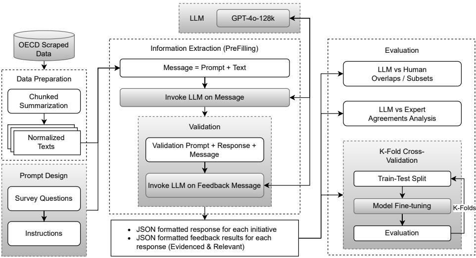
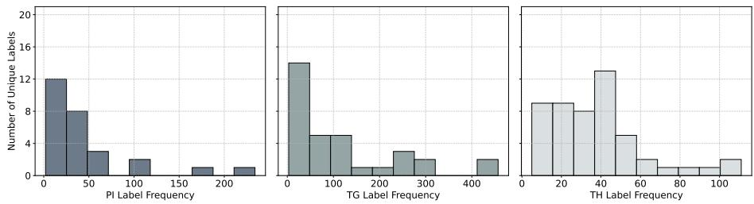
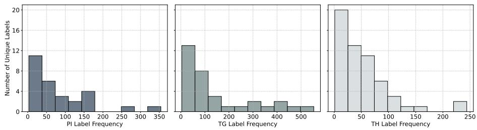
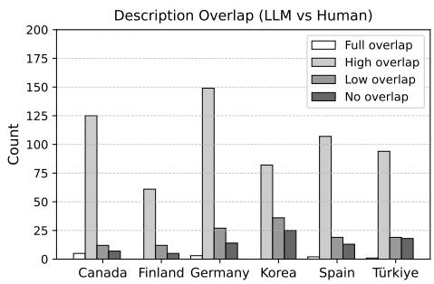
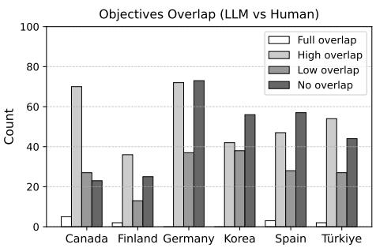
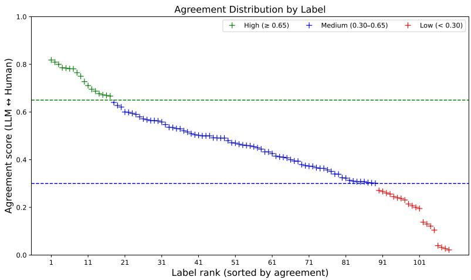

# From Policy Documents to Structured Survey Responses: Evaluating Large Language Models for Policy Monitoring

Carolyn Cole, Matthias Deschryvere, Toqeer Ehsan, and Arash Hajikhani

Reliable Intelligence Team, VTT Technical Research Centre of Finland Ltd., 02150 Espoo, Finland {firstname.lastname}@vtt.fi

Abstract. Science, technology, and innovation policies are crucial for competitiveness, yet their diversity and scale make them dificult to map and monitor consistently. Existing approaches rely heavily on manual survey eforts, which are costly and challenging to scale across countries. Large language models (LLMs) enable new possibilities for extracting and structuring information from long and unstructured policy documents. This paper presents an application of LLMs as “AI respondents” for generating structured survey responses from policy texts. We develop a data extraction pipeline based on long-context in-context learning to map information from public web sources into predefined survey categories, including policy instruments, target groups, and thematic areas. The pipeline integrates a validation step using a secondary LLM to assess relevance and evidence, alongside comparisons with human-provided responses. Using a multi-country dataset, we evaluate the alignment between LLM-generated and human-generated outputs through overlap measures and cross-validation. Results show that LLMs achieve high agreement for structured indicators (84–95%), while diferences remain in free-text fields, where models tend to provide more detailed procedural descriptions. These findings highlight the potential of hybrid human–AI workflows for policy monitoring, improving both eficiency and scalability while maintaining the need for human validation and contextual interpretation.

Keywords: LLMs · Policy Intelligence · AI Respondents · Long-context In-context Learning · Survey Automation · Information Extraction.

## 1 Introduction

Science, Technology, and Innovation (STI) policies are complex socio-technical constructs that play a central role in shaping national competitiveness and addressing global challenges. Yet, systematic mapping and continuous monitoring of these policies remain costly and labor-intensive, particularly in the context of large-scale international surveys such as the EC-OECD STIP Compass [8]. The Compass aggregates data on STI policy initiatives across OECD and partner countries, relying on expert respondents to fill in structured survey instruments linked to web-based sources of evidence. While this approach provides a unique comparative perspective, it faces challenges of scale, consistency, and timeliness as the number and complexity of initiatives expand.

LLMs are redefining natural language processing (NLP) by enabling machines to internalize knowledge from large unstructured corpora and to adapt to diverse downstream tasks through prompting rather than parameter updates [4, 17, 24]. Recent generative LLMs such as GPT-4o are capable of long-context reasoning and in-context learning, making them suitable for information extraction from extended policy documents and web content. Their ability to generate structured responses aligned with human-designed schemas ofers a potential solution to the persistent dificulties of innovation policy data collection and validation.

However, integrating LLMs into international policy monitoring is not straightforward. Prior work shows that LLMs can act as “artificial respondents”, replicating social science experiments by generating survey answers conditioned on demographic profiles [2]. On the other hand, LLM-driven data generation may introduce systematic biases and distortions—so-called model collapse—if models are repeatedly trained on synthetic outputs [23]. Moreover, innovation policy data pose unique challenges as policies are heterogeneous, multi-scalar, and embedded in institutional contexts that are not always captured in publicly available sources [7].

In the STIP Compass workflow, expert respondents from member nations cite web-based responses for each policy initiative and fill a structured survey by selecting taxonomy codes [5] for policy instruments (PI), target groups (TG), and policy themes (TH) along with free-text fields. A short example of this workflow is shown in Table 1. We cast this as an LLM-assisted survey-filling task: given the web-scraped initiative text, the model predicts the corresponding sets of PI/TG/TH codes and generates the free-text fields: description and objectives.

This paper contributes to the emerging field of AI-assisted policy intelligence by presenting an operational pipeline that integrates LLM capabilities for the EC-OECD STIP Compass. Specifically, we design and test a data extraction pipeline that uses long-context prompting to map survey taxonomy codes (policy instruments, themes, and target groups) from web-scraped content provided by survey respondents. A secondary validation layer employs an LLM to evaluate outputs on dimensions of relevance and evidence. Using a pilot across six OECD countries (Canada, Finland, Germany, Korea, Spain, and Türkiye), we assess the overlap between LLM-generated and human-generated survey responses and explore complementarities in descriptive and objective fields [11]. Our findings show that LLMs achieve high overlap in structured codes (84–95%) but diverge in textual fields, where AI tends to provide more detailed procedural descriptions while humans emphasize contextual and societal impacts. These insights highlight the promise of hybrid human-AI approaches for international policy monitoring. The key contributions of this paper are as follows:

– We design an integrated data extraction pipeline that leverages long-context in-context learning to process lengthy unstructured policy documents.

Table 1. A sample workflow for web-based STIP Compass survey filling.
<table><tr><td rowspan="4">Web text</td><td>The Government artificial intelligence</td><td>is</td><td>increasingly looking</td><td>to utilize</td></tr><tr><td></td><td>decisions...compatible with core administrative law principles such</td><td>to make, or assist in making, administrative</td><td></td></tr><tr><td>as objective of this Directive</td><td>transparency, accountability, legality, and procedural fairness.</td><td>is to ensure that Automated Decision Sys-</td><td>The</td></tr><tr><td colspan="4">tems are deployed in a manner that reduces risks to</td></tr><tr><td rowspan="4">prior mation</td><td>federal institutions</td><td>Completing an Algorithmic Impact Assessment any Automated Decision</td><td>Canadians and</td></tr><tr><td colspan="3">to the production of Applying the relevant requirements prescribed in the data and</td><td>Sys-</td></tr><tr><td colspan="3">tem .. . developing processes sO that</td></tr><tr><td colspan="2">used ...are tested for unintended data biases providing a meaningful explanation to affected individuals</td></tr><tr><td colspan="2">with a related specialization ...Data and information on the use of</td><td colspan="2">of how and why the decision was made ... Contracted third-party vendor</td></tr><tr><td colspan="2">appropriate... Codes</td><td colspan="2">Automated Decision Systems.. . are made available to the public, where</td></tr><tr><td colspan="2"></td><td colspan="2">PIs: PI027, PI032, TGs: TG16, TG23, TG29, THs: TH89</td></tr><tr><td colspan="2">ment and adoption</td><td colspan="2">Text fields Description: Federal policy instrument providing a risk-based approach... Objectives: Automated decision systems deployed by federal...</td></tr><tr><td colspan="2">Label defs. PI032 TG16 TG23</td><td colspan="2">PI027: Governance | Standards and certification for technology develop-</td></tr><tr><td colspan="2">ulation and soft law Governmental entities | National government TG29 Firms by size | Firms of any size TH89 Research and innovation for society | Ethics of emerging technolo-</td><td colspan="2">: Guidance, regulation and incentives | Science and technology reg- Social groups especially emphasised | Civil society</td></tr></table>

We implement a validation layer that evaluates relevance and evidence by employing another LLM as a validator model.

– We evaluate the pipeline in a pilot study covering six OECD countries, analyzing overlap, agreement, and cross-validation between LLM-generated and human-generated responses.

## 2 Related Work

The methodological challenges of collecting and comparing STI policy data have long been recognized in the literature on policy mixes and innovation systems. Policies are dificult units of analysis, and large-scale cross-country data are costly to compile and validate [8]. Eforts to address these challenges have included international surveys and expert-driven databases such as the OECD

STIP Compass, yet these approaches are constrained by reporting burden, data gaps, and inconsistencies across national contexts.

The rise of LLMs introduces new opportunities to address these challenges. LLMs have been applied successfully in tasks such as information extraction, summarization, and question answering, often outperforming earlier supervised NLP methods [17,24]. Their in-context learning capabilities allow them to adapt dynamically to survey-style questions without the need for costly labeled training data [4]. Recent studies demonstrate the ability of LLMs to act as proxies for human subjects in social science experiments, suggesting their potential as scalable substitutes or complements to traditional survey respondents [2].

At the same time, concerns remain about their reliability. Shumailov et al. [23] warn of distributional drift and degradation in model outputs when systems recursively train on synthetic data. In the context of STI policy, the absence of gold-standard labeled datasets and the heterogeneous nature of policy initiatives make fine-tuning approaches less feasible, as highlighted in recent experimentation with the STIP Compass [11]. Instead, long-context prompting combined with expert-designed taxonomies ofers a pragmatic way to leverage LLMs while maintaining human oversight.

Our work builds on these strands by testing an operational pipeline that integrates LLMs into the STIP Compass survey process. While prior research has explored web-based policy document analysis and retrieval-augmented methods, our contribution is to compare human-provided and AI-generated responses across multiple dimensions of STI policy data. In doing so, we extend calls to leverage the “new data frontier” in innovation studies [7] through AI-driven approaches for international policy monitoring.

## 3 Methodology

In this section, we describe the data extraction pipeline for the EC-OECD STIP Compass survey. The raw data were obtained from the OECD and consist of the content from URLs that survey participants identified as relevant policy initiatives. The following subsections describe the preparation of the data for pre-filling, prompt design, and evaluation. Figure 1 illustrates the workflow of our methodology.

## 3.1 Data Preparation

We processed the survey data and the scraped text provided by the OECD to retain only those initiatives with suficient content for analysis. Initiatives containing fewer than 200 tokens (fewer than 100 words) were discarded as insuficient for analysis. In contrast, initiatives with more than 120,000 tokens were further processed to fit within the LLM context window. For this purpose, we devised a chunked summarization method that divided the initiative content into chunks of 50,000 tokens and prompted an LLM to summarize each chunk while retaining underlying information related to STI policies. The resulting summaries were then aggregated by the LLM to produce a complete text containing all relevant initiative information. The prompts designed for the chunked summarization method are given below.

  
Fig. 1. Methodological workflow of the study: starting from OECD-scraped policy texts, followed by chunked summarization and data preparation, prompt design with survey questions, and information extraction using GPT-4o-128k [20]. Validation and evaluation involve comparing LLM-generated outputs with human annotations, as well as cross-validation using model fine-tuning.

Individual Chunk Prompt: “The following is a set of texts related to a policy initiative: “+ chunk +” Based on this list of docs, write a detailed account covering description, objectives, dates, policy themes and instruments, key stakeholders, budgets, and evaluations. Capture exact details, examples, and cases for these dimensions. Be thorough, detailed, and comprehensive. Use only text from the provided documents.”

Chunk Summary Aggregation Prompt: “The following is a set of detailed summaries: “+ chunked\_summaries +” Take these and generate a detailed account covering description, objectives, dates, policy themes and instruments, key stakeholders, budgets, and evaluations. Capture exact details, examples, and cases for these dimensions. Be thorough, detailed, and comprehensive. Use only text from the provided summaries.”

## 3.2 Pre-filling - Long-Context In-Context Learning

Long-context in-context learning refers to the ability of LLMs with extended context windows to generalize examples embedded in lengthy prompts, often spanning thousands of tokens [3]. Retrieval-augmented generation (RAG), in contrast, integrates an LLM with an external retrieval system, typically querying a document index with a neural retriever and prompting the model to generate output based on retrieved content [1, 13]. We did not adopt RAG for survey pre-filling from long STI policy documents for two reasons: first, the knowledge to be extracted from scraped policy content was not explicitly defined, making it dificult to formulate direct fact-based queries; second, adapting RAG by splitting survey questions into smaller prompts leads to redundancy, as overlapping policy indicators and guidelines produce overlapping content.

Long-context in-context learning enables the inclusion of complete content, survey questions, and extraction guidelines in a single extended prompt. We adopted this approach to preserve coherence, incorporate examples, and capture relevant material without restricting nuanced findings. The context window accommodated most cases in our dataset.

Prompt Design We incorporated survey questions and OECD guidelines into the prompt design. The prompts covered descriptions, objectives, policy instruments, target groups, policy themes, start date, budget, and evaluation report. They instructed the model to respond in English, rely only on the provided content, and return structured outputs for easier parsing and integration. The full prompts are provided in Appendix B.3.

Response Validation LLM-based evaluation has become common for assessing generated outputs on dimensions such as groundedness, completeness, and relevance [10,12,14,22]. Research indicates that larger model sizes generally produce improved performance in summarization evaluation, with stronger correlation to human judgments [6, 15]. In addition, evaluation methods may employ reference-based approaches that compare the generated text with the ground truth or reference texts [25].

To validate the generated responses, we employed another instance of the LLM to evaluate them against the prompt and source material. A binary scoring scheme assessed evidence and relevance, indicating whether each response was supported by the text and followed the instructions. The structured validation prompt is provided in Appendix B.1. This step filtered out cases that could have resulted from hallucinations or misinterpretations.

## 3.3 Evaluations

In addition to response validation, we incorporated three further evaluation measures.

1. Overlap analysis compared human- and LLM-generated survey responses, capturing the extent of alignment between the two datasets.

2. Label-wise agreement scoring quantified consistency between human annotations and model outputs for policy labels using high-, medium-, and low-agreement categories.

3. K-fold cross-validation validated LLM-generated labels using fine-tuned masked and causal models, addressing the absence of a full gold-standard reference for all structured policy indicators.

## 4 Experimental Setup

In our experiments, we performed survey pre-filling using LLMs as survey respondents to extract and generate multiple types of survey fields. Our study addressed two key questions: (1) Can web-scraped content provide suficient and relevant information to pre-fill STIP Compass survey questions? (2) Is it feasible to map unstructured web-scraped content to structured survey categories using LLMs to generate survey responses in place of human respondents? We hypothesized that long-context LLMs could capture a significant portion of structured information for free-text fields as well as multi-label policy identification.

## 4.1 Choice of LLM

We selected GPT-4o-128k [20] for our study because of its extended context window and strong performance across evaluation benchmarks. The selection was supported by the latest metrics from Stanford’s Holistic Evaluation of Language Models (HELM), which provides a comprehensive assessment of language models’ capabilities and limitations. According to the HELM leaderboard<sup>1</sup>, GPT-4o (2024-05-13) achieved a mean win rate of 0.938 on standard evaluation metrics.

## 4.2 Evaluation Design

To validate the generated responses, we employed another instance of GPT-4o-128k to evaluate the responses against the prompt and raw material. We used a structured evaluation prompt (B.1) to ensure consistency in assessing the generated responses, focusing on their adherence to the source material and relevance to the instructions.

For post-extraction evaluations, we again employed GPT-4o-128k as an evaluator for free-text fields, including descriptions and objectives. We designed a prompt (B.2) to compare overlaps and discrepancies between human participants and LLM-generated responses. The prompt instructs the LLM to quantify the results into four categories: full overlap, high overlap, low overlap, and no overlap. However, the degree of overlap against policy labels was quantified using overlap percentages. We computed agreement scores using micro F1 scores throughout the dataset. Similarly, micro F1 scores were used to evaluate k-fold (k=5) cross-validation experiments by fine-tuning (system prompt B.4) a range of masked and causal models (Table 5).

## 4.3 Implementation Details

Data preparation, pre-filling, response validation, and free-text evaluation were conducted using Azure AI Services<sup>2</sup> with diferent GPT-4o deployments. Dataset analysis and agreement scores were computed using standard Python libraries. In k-fold cross-validation, the dataset was shufled and split into 80% training, 10% validation, and 10% testing for each fold. The main hyperparameters for masked and causal models, as well as LoRA configurations, are summarized in Appendix A.

## 4.4 Cost

Running the experiments with GPT-4o incurred a total cost of e 446.84. This cost applies to the six-country pilot, not full OECD deployment. Full-scale costs would increase with document volume and length, but can be reduced through URL filtering, cached scraping, selective summarization, and targeted human review.

## 5 Results & Discussion

The results compare human- and LLM-generated survey responses across six OECD countries, focusing on free-text fields and policy indicator labels. The following subsections present human-LLM overlap, label agreement, and k-fold cross-validation results.

## 5.1 Dataset Analysis

Table 2 presents the country-level statistics after data preparation and filtering. The Insuficient column refers to the share of policy initiatives without URLs or containing less than 200 tokens. The Unidentified column presents initiatives that have suficient content, but relevant policy instruments could not be extracted. The Suficient column shows percentages of initiatives that have sufficient and suitable web content. The last column reports the number of samples with appropriate STI content from policy initiatives.

Each sample contains eight policy indicators. Policy instruments, target groups, and policy themes include additional sub-labels that refer to underlying STI policies. Table 3 compares human-generated and LLM-generated label coverage.

Table 2. Distribution of web content and number of samples by country.
<table><tr><td colspan="6">Sr# Country Insufficient Unidentified Sufficient #</td></tr><tr><td>1</td><td>Canada</td><td>30%</td><td>6%</td><td>64%</td><td>of Samples 149</td></tr><tr><td>2</td><td>Finland</td><td>32%</td><td>11%</td><td>57%</td><td>80</td></tr><tr><td>3</td><td>Germany</td><td>25%</td><td>7%</td><td>68%</td><td>193</td></tr><tr><td>4</td><td>Korea</td><td>27%</td><td>20%</td><td>53%</td><td>146</td></tr><tr><td>5</td><td>Spain</td><td>31%</td><td>13%</td><td>56%</td><td>142</td></tr><tr><td>6</td><td>Türkiye</td><td>47%</td><td>12%</td><td>41%</td><td>135</td></tr><tr><td></td><td>Total</td><td></td><td></td><td></td><td>845</td></tr></table>

Table 3. Comparison of label statistics between expert-generated and LLM-generated labels.
<table><tr><td>Generated</td><td>PI</td><td>Unique PI</td><td>TG</td><td>Unique TG</td><td>TH</td><td>Unique TH</td></tr><tr><td>By humans</td><td>1,281</td><td>27</td><td>3,828</td><td>33</td><td>1,895</td><td>51</td></tr><tr><td>By LLM</td><td>2,336</td><td>28</td><td>4,727</td><td>33</td><td>3,013</td><td>57</td></tr></table>

Label Frequency Distribution by Class (Expert-Annotated)  
  
Label Frequency Distribution by Class (LLM-Generated)

  
Fig. 2. Comparison of policy indicator labels between expert-generated and LLMgenerated labels.

Figure 2 shows the frequency distribution of policy labels by class. Both datasets exhibited similar label distributions, with a significant imbalance across classes. Many labels are underrepresented, with low frequencies in the dataset.

## 5.2 Human-LLM Overlap

We investigated qualitative diferences in free-text responses, identifying complementary tendencies in which LLMs delivered more detailed procedural accounts, while human respondents emphasized contextual and societal dimensions. Figure 3 shows the overlap results for both free-text fields.



  
Fig. 3. Overlap of survey participant responses and LLM responses per country on the policy initiative description and objectives.

The analysis of overlap between descriptions indicated that the predominant share of cases (74.05%) exhibited high overlap, whereas only 1.19% demonstrated full overlap, 15.24% were classified as low overlap, and 9.52% showed no overlap. These diferences suggest that human and AI assessments can complement each other by ofering diverse perspectives and insights on the same topics. However, the objective fields showed high overlap in 41% of the cases, while no overlap was observed in about 36% of the cases. Low overlap and full overlap were less frequent, occurring in 22% and 1% of cases, respectively. These patterns suggest that diferences often stem from variations in approach, level of detail, scope, and available information for assessments.

The divergence in free-text fields appears to reflect diferences in emphasis rather than only disagreement. Human responses are generally more concise and contextual, while LLM responses often provide more procedural detail from the scraped text. This is especially visible for objectives, where the LLM may describe implementation steps, whereas human respondents express broader policy aims.

We further examined overlap in multi-label indicators—policy instruments, target groups, and policy themes—to evaluate LLM outputs relative to human experts. Table 4 shows the overlap between labels provided by human participants and those generated by the LLM. The table includes all overlapping cases where at least one policy label overlapped. The LLM performed relatively well in capturing survey respondent codes for policy themes and instruments, and particularly well for policy target groups. On average, in 95% of policy initiatives the LLM identified at least one of the target groups provided by survey respondents. The corresponding averages are 84% for policy themes and 85% for policy instruments. Although some variation exists across countries, these diferences are generally limited.

Table 4. Overlap of survey participant responses and LLM responses per country for policy instruments (A), target groups (B), and policy themes (C).
<table><tr><td colspan="2">Policy instruments Target groups Policy themes</td><td rowspan="2">(A)</td><td rowspan="2">(B)</td><td rowspan="2">(C)</td></tr><tr><td></td><td>Sr# Country</td></tr><tr><td>1</td><td>Canada</td><td>84%</td><td>97%</td><td>85%</td></tr><tr><td>2</td><td>Finland</td><td>84%</td><td>98%</td><td>84%</td></tr><tr><td>3</td><td>Germany</td><td>80%</td><td>97%</td><td>83%</td></tr><tr><td>4</td><td>Korea</td><td>88%</td><td>93%</td><td>84%</td></tr><tr><td>5</td><td>Spain</td><td>85%</td><td>94%</td><td>82%</td></tr><tr><td>6</td><td>Türkiye</td><td>88%</td><td>93%</td><td>87%</td></tr><tr><td></td><td>Total</td><td>85%</td><td>95%</td><td>84%</td></tr></table>

## 5.3 Human-LLM Agreement

Figure 4 presents the distribution of the label-wise agreement scores. The agreement scores shown in the graph are quite dispersed, ranging from high to low, reflecting the overall average level of agreement between human respondents and the LLM. Given that policy indicators span a wide range of dimensions, achieving consistently high agreement is challenging and depends on interpretation, comprehension, and background knowledge.

  
Fig. 4. Human vs LLM agreement score distribution. High agreement scores are shown in green, medium scores in blue, and low scores in red.

Our analysis indicates that policy indicators with clear and unambiguous definitions tend to yield higher levels of agreement. The top three labels, one from each category, are clearly interpretable and are as follows: PI015: “Indirect financial support|Tax or social contributions relief for firms investing in R&D and innovation”, TG21: “Research and education organisations|Public research institutes”, TH92: “Net zero transitions|Net zero transitions in energy”. Low agreement mainly arises from abstract or broad labels, overlap between categories, and general terminology in policy definitions. The three labels with the lowest scores, one from each category, are as follows: PI010: “Direct financial support|Procurement programmes for R&D and innovation”, TG25: “Firms by age|Firms of any age”, TH16: “Public research system|Public research debates”. These patterns highlight that the clarity and specificity of policy indicator definitions play a decisive role in shaping the degree of agreement between human respondents and the LLM.

## 5.4 Cross-Validation

The cross-validation results are reported using micro F1 scores, as shown in Table 5. The experiments were conducted with several open- and closed-source models.

Table 5. K-fold cross-validation micro F1 scores for LLM-generated policy indicators.
<table><tr><td>Sr.#</td><td>Model</td><td>Precision</td><td>Recall</td><td>F1</td></tr><tr><td>1</td><td>RoBERTa-large [16]</td><td>86.70</td><td>66.61</td><td>75.33</td></tr><tr><td>2</td><td>BigBird-RoBERTa-base [26]</td><td>87.04</td><td>69.25</td><td>77.12</td></tr><tr><td>3</td><td>BigBird-RoBERTa-large [26]</td><td>88.43</td><td>76.01</td><td>81.74</td></tr><tr><td>4</td><td>Llama-3.1-8B-Instruct [9]</td><td>82.02</td><td>90.79</td><td>86.18</td></tr><tr><td>5</td><td>Mistral-7B-Instruct-v0.3 [18]</td><td>92.91</td><td>90.90</td><td>91.89</td></tr><tr><td>6</td><td>GPT-OSS-20B [21]</td><td>97.63</td><td>97.83</td><td>97.73</td></tr><tr><td>7</td><td>GPT-3.5-Turbo 16k [19]</td><td>98.33</td><td>97.62</td><td>97.98</td></tr><tr><td>8</td><td>GPT-40 128k [20]</td><td>98.14</td><td>98.04</td><td>98.09</td></tr></table>

RoBERTa achieved moderate F-scores, primarily due to its limited input length, whereas its BigBird variants performed better due to their extended input length and block-sparse attention mechanism. In contrast, causal models demonstrated a stronger ability to capture information from longer documents and achieved higher F-scores in multi-label classification. These results highlight the importance of model architecture and context length in determining performance on complex policy classification tasks.

## 5.5 Discussion

The findings of this study demonstrate that LLMs can act as efective “artificial respondents” for the OECD STIP Compass, ofering both eficiency and depth in survey data collection. The comparison between human-generated and LLM-generated responses highlights strong complementarities rather than simple substitution. Specifically, while LLMs tend to provide more detailed procedural and descriptive accounts, human experts emphasize the contextual and societal implications of policy initiatives.

The overlap analysis shows that LLMs achieve high overlap in structured indicators, with agreement levels of 84–95% across policy instruments, target groups, and themes. However, in free-text fields such as initiative descriptions and objectives, divergences remain. Only 1.19% of the cases reached full overlap, while the majority (74.05%) demonstrated high but not identical overlap. The qualitative interpretation of these divergences suggests that they are mainly associated with diferences in granularity, framing, and source dependence. LLMgenerated responses tend to remain close to explicit source content and provide more procedural detail, whereas human respondents more often compress information and incorporate contextual interpretation. This reinforces the value of a hybrid workflow in which LLMs support initial drafting and pre-filling, while human experts validate objectives and adjust contextual framing.

These patterns highlight the potential of hybrid approaches: LLMs can reduce reporting burdens by pre-filling surveys with structured and detailed information, while human experts can refine, contextualize, and interpret these responses. Nevertheless, risks remain. Over-reliance on synthetic LLM outputs may lead to biases, redundancy, or “model collapse” if such outputs are recursively integrated into training data. Ensuring continuous human oversight and triangulation with original sources is thus essential for the long-term integrity of international policy monitoring. In practical deployment, these risks can be mitigated through source-grounded prompting, evidence-based validation, periodic human audits, and avoidance of recursive reuse of unverified AI-generated outputs as training or reference data. These safeguards are especially important for free-text fields, where hallucination and framing bias are more likely than in constrained taxonomy selection.

Overall, the evidence supports the viability of integrating AI into the STIP Compass workflow. Doing so would not only improve scalability and reduce costs but also enhance the descriptive richness of policy monitoring—provided safeguards are in place to preserve contextual accuracy and mitigate systemic biases.

## 6 Conclusion

This study introduces an integrated LLM-based pipeline for policy monitoring within the OECD STIP Compass, demonstrating that AI can complement human expertise in large-scale international surveys. By leveraging long-context in-context learning and a secondary validation layer, the approach achieves high overlap with human-generated responses across structured indicators, while providing additional procedural detail in free-text fields. The results highlight three key findings:

1. Eficiency gains – LLMs can reduce manual reporting burdens by pre-filling structured survey categories.

2. Complementary perspectives – LLMs enrich the descriptive layer of policy initiatives, while human respondents provide necessary contextualization and societal framing.

3. Scalability with safeguards – Hybrid human-AI systems can improve international policy intelligence, but careful oversight is required to address risks of bias, redundancy, and over-reliance on synthetic outputs.

Future work should expand the scope beyond the six pilot countries, refine validation mechanisms, and explore how human-AI collaboration can be systematically embedded into STI policy monitoring. Ultimately, the integration of LLMs into the STIP Compass marks a step toward more scalable, consistent, and timely global policy intelligence, paving the way for evidence-based innovation governance at the international level.

Acknowledgments. We acknowledge the use of ChatGPT-5 for language editing, grammar polishing, and improving clarity.

Disclosure of Interests. The authors declare that they have no conflict of interest.

## References

1. Asai, A., Wu, Z., Wang, Y., Sil, A., Hajishirzi, H.: Self-RAG: Learning to Retrieve, Generate, and Critique through Self-Reflection (2023), https://arxiv.org/abs/ 2310.11511

2. Ashokkumar, A., Hewitt, L., Ghezae, I., Willer, R.: Predicting Results of Social Science Experiments Using Large Language Models. https://docsend.com/view/ ity6yf2dansesucf (2024), working paper in review

3. Bertsch, A., Ivgi, M., Xiao, E., Alon, U., Berant, J., Gormley, M.R., Neubig, G.: In-Context Learning with Long-Context Models: An In-Depth Exploration. In: Chiruzzo, L., Ritter, A., Wang, L. (eds.) Proceedings of the 2025 Conference of the Nations of the Americas Chapter of the Association for Computational Linguistics: Human Language Technologies (Volume 1: Long Papers). pp. 12119–12149. Association for Computational Linguistics, Albuquerque, New Mexico (Apr 2025). https://doi.org/10.18653/v1/2025.naacl-long.605, https: //aclanthology.org/2025.naacl-long.605/

4. Dherin, B., Munn, M., Mazzawi, H., Wunder, M., Gonzalvo, J.: Learning Without Training: The Implicit Dynamics of In-Context Learning (2025), https://arxiv. org/abs/2507.16003

5. EC–OECD: STIP Compass Taxonomies describing STI policy data, edition 2025. https://stip.oecd.org/assets/downloads/STIPCompassTaxonomies.pdf (2025), EC–OECD Science, Technology and Innovation Policy Survey

6. Fabbri, A.R., Kryściński, W., McCann, B., Xiong, C., Socher, R., Radev, D.: SummEval: Re-evaluating Summarization Evaluation. Transactions of the Association for Computational Linguistics 9, 391–409 (2021)

7. Feldman, M.P., Kenney, M., Lissoni, F.: The New Data Frontier: Special Issue of Research Policy. Research Policy 44(9), 1629–1632 (2015). https://doi.org/10. 1016/j.respol.2015.02.007

8. Flanagan, K., Uyarra, E., Laranja, M.: Reconceptualising the ‘Policy Mix’ for Innovation. Research Policy 40(5), 702–713 (2011). https://doi.org/10.1016/j. respol.2011.02.005

9. Grattafiori, A., Dubey, A., Jauhri, A., Pandey, A., Kadian, A., Al-Dahle, A., Letman, A., Mathur, A., Schelten, A., et al.: The Llama 3 Herd of Models (2024), https://arxiv.org/abs/2407.21783

10. Gu, J., Jiang, X., Shi, Z., Tan, H., Zhai, X., Xu, C., Li, W., Shen, Y., Ma, S., Liu, H., et al.: A Survey on LLM-as-a-Judge. arXiv preprint arXiv:2411.15594 (2024)

11. Hajikhani, A., Deschryvere, M., Cole, C.: EC-OECD STIP Compass Enhancement Using Large Language Models. Research Report Version 9.8.2024, VTT Technical Research Centre of Finland (2024), confidential VTT Research Report

12. Kim, J., Park, S., Jeong, K., Lee, S., Han, S.H., Lee, J., Kang, P.: Which is Better? Exploring Prompting Strategy for LLM-based Metrics. arXiv preprint arXiv:2311.03754 (2023)

13. Lewis, P., Perez, E., Piktus, A., Petroni, F., Karpukhin, V., Goyal, N., Küttler, H., Lewis, M., Yih, W.t., Rocktäschel, T., Riedel, S., Kiela, D.: Retrieval-Augmented Generation for Knowledge-Intensive NLP Tasks. In: Proceedings of the 34th International Conference on Neural Information Processing Systems. NIPS ’20, Curran Associates Inc., Red Hook, NY, USA (2020)

14. Li, H., Dong, Q., Chen, J., Su, H., Zhou, Y., Ai, Q., Ye, Z., Liu, Y.: LLMsas-Judges: A Comprehensive Survey on LLM-Based Evaluation Methods. arXiv preprint arXiv:2412.05579 (2024)

15. Liu, Y., Iter, D., Xu, Y., Wang, S., Xu, R., Zhu, C.: G-Eval: NLG Evaluation using GPT-4 with Better Human Alignment. arXiv preprint arXiv:2303.16634 12 (2023)

16. Liu, Y., Ott, M., Goyal, N., Du, J., Joshi, M., Chen, D., Levy, O., Lewis, M., Zettlemoyer, L., Stoyanov, V.: RoBERTa: A Robustly Optimized BERT Pretraining Approach. arXiv preprint arXiv:1907.11692 (2019)

17. Mao, H., Liu, G., Ma, Y., Wang, R., Johnson, K., Tang, J.: A Survey to Recent Progress Towards Understanding In-Context Learning (2025), https://arxiv. org/abs/2402.02212

18. Mistral-AI: Mistral-7B-Instruct-v0.3 Model Card. https://huggingface.co/ mistralai/Mistral-7B-Instruct-v0.3 (2023)

19. OpenAI: GPT-3.5 Turbo 16k. https://platform.openai.com/docs/models/ gpt-3.5-turbo (2023), context window: 16,000 tokens; proprietary model

20. OpenAI: GPT-4o System Card. arXiv preprint arXiv:2410.21276 (2024)

21. OpenAI: GPT-OSS-120B and GPT-OSS-20B Model Card (2025), https://arxiv. org/abs/2508.10925

22. Saha, S., Li, X., Ghazvininejad, M., Weston, J., Wang, T.: Learning to Plan & Reason for Evaluation with Thinking-LLM-as-a-Judge. arXiv preprint arXiv:2501.18099 (2025)

23. Shumailov, I., Shumaylov, Z., Zhao, Y., Papernot, N., Anderson, R., Gal, Y.: AI Models Collapse When Trained on Recursively Generated Data. Nature 631(8022), 755–759 (2024). https://doi.org/10.1038/s41586-024-07566-y

24. Tan, Z., Beigi, A., Wang, S., Guo, R., Bhattacharjee, A., Jiang, B., Karami, M., Li, J., Cheng, L., Liu, H.: Large Language Models for Data Annotation: A Survey. arXiv preprint arXiv:2402.13446 (2024)

25. Wu, N., Gong, M., Shou, L., Liang, S., Jiang, D.: Large Language Models are Diverse Role-Players for Summarization Evaluation. In: CCF international conference on natural language processing and Chinese computing. pp. 695–707. Springer (2023)

26. Zaheer, M., Guruganesh, G., Dubey, K.A., Ainslie, J., Alberti, C., Ontanon, S., Pham, P., Ravula, A., Wang, Q., Yang, L., et al.: Big Bird: Transformers for Longer Sequences. Advances in Neural Information Processing Systems 33, 17283–17297 (2020)

## A Hyperparameters

Table 6. Hyperparameters for masked (encoder) models
<table><tr><td>Setting</td><td>Value</td></tr><tr><td>Max sequence length 512</td><td>1600</td></tr><tr><td>Batch size (train/eval) 8 / 8</td><td></td></tr><tr><td>Learning rate</td><td>3e-5</td></tr><tr><td>Epochs</td><td>40</td></tr><tr><td>Folds 5</td><td></td></tr><tr><td>Weight decay</td><td>0.01</td></tr><tr><td>Precision</td><td>FP16</td></tr><tr><td>Eval/save strategy</td><td>Per epoch; best model (f1_micro)</td></tr><tr><td>Threshold (sigmoid)</td><td>0.5</td></tr><tr><td>Label filter</td><td>Frequency  $\geq 5$ </td></tr></table>

Table 7. Hyperparameters for causal models
<table><tr><td>Setting</td><td>Value</td></tr><tr><td>Max input length</td><td>7500</td></tr><tr><td>Max new tokens</td><td>200</td></tr><tr><td>Batch size (train/eval) 2 / 2</td><td></td></tr><tr><td>Gradient accumulation 8 (effective batch ≈ 16)</td><td></td></tr><tr><td>Learning rate</td><td>2e-5</td></tr><tr><td>Epochs</td><td>4</td></tr><tr><td>Folds</td><td>4</td></tr><tr><td>Scheduler</td><td>Cosine; warmup ratio 0.03</td></tr><tr><td>Precision</td><td>bfloat16</td></tr><tr><td>Data collator</td><td>Causal LM (no MLM)</td></tr><tr><td>Label filter</td><td>Frequency ≥ 5</td></tr></table>

## B Prompts

## B.1 Validation Prompt

Evaluate the Response against the given Instructions and Text. Provide a 0/1 assessment for the following dimensions: ‘evidenced’ and ‘relevant’. Use the following criteria to assess ‘evidenced’: Is the Response evidenced in the Text? 0 - No, there is no evidence supporting the Response in the Text.

1 - Yes, there is evidence supporting the Response in the Text.

Use the following criteria to assess ‘relevant’: Is the Response relevant to the

Table 8. LoRA adapter hyperparameters (causal models)
<table><tr><td>Parameter</td><td>Value</td></tr><tr><td>r (rank)</td><td>8</td></tr><tr><td>lora_alpha</td><td>32</td></tr><tr><td>lora_dropout</td><td>0.05</td></tr><tr><td>bias</td><td>none</td></tr><tr><td>task_type</td><td>CAUSAL LM</td></tr><tr><td colspan="2">Target modules q_proj, k_proj, v_proj, o_proj</td></tr></table>

## Instructions?

0 - No, the Response is not relevant to the Instructions (the Response does not follow or answer the Instructions).

1 - Yes, the Response is relevant to the Instructions (the Response does follow or answer the Instructions).

Structure your evaluation in a JSON format with two keys: ‘evidenced’ and ‘relevant’. ‘evidenced’ should be the 0/1 assessment for whether the response is evidenced in the text, and ‘relevant’ should be the 0/1 assessment for whether the response follows the instructions. Do not elaborate or provide any further explanation.

Example JSON structure:   
{   
“evidenced”: 1,   
“relevant”: 1   
}   
Instructions: “+ message +” Response: + material

## B.2 Free-Text Evaluation Prompt

"You are given two sets of policy initiative documents: one is [human assessment] and the other is [LLM assessment]. Your task is to analyze these documents to understand their similarities, overlaps, and diferences using quantifiable metrics. Determine the level of overlap and choose only one category from "Full overlap", "High overlap", "Low overlap", or "No overlap". Provide the response in the following JSON format with an appropriate category and observation.

Example 1:   
{   
"Full overlap": {   
"Observation": "Both assessments agreed entirely on the need for increased   
funding for education."}   
}   
Example 2:   
{   
"High overlap": {

"Observation": "Both assessments focus on promoting RDI activities, increasing competitiveness, and attracting foreign investments. However, the LLM assessment provides a more detailed breakdown of these objectives."}

}   
Example 3:   
{   
"Low overlap": {   
"Observation": "The LLM emphasized renewable energy incentives more than   
the human assessment."}   
}   
Example 4:   
{   
"No overlap": {   
"Observation": "The human assessment discussed healthcare reforms, which   
were not mentioned by the LLM."}   
}

## B.3 Pre-Filling Prompts

## Identification

Using the information provided, determine whether [REPLACE] is discussed. Respond 1 if yes and 0 if no. If you cannot determine whether the text contains information about [REPLACE], respond 99 and do not elaborate. Only respond with 0, 1, or 99.

## Description

Act as an expert policy analyst. Based on the given policy-related text material provide a short description in English of [REPLACE] in sentence format, not exceeding 100 words. Avoid using jargon; be concise and clear, delivering only information retrieved from the text. If there is no discussion or mention of the topic, respond with "No information" and do not elaborate. Provide the response in a JSON format where the suggested name or theme is the key and the description is the value.

## Example JSON structure:

"description": "Description of the relevant policy content in a clear and concise sentence."

## Objectives

Act as a policy expert identify the [REPLACE] initiative’s objectives discussed. Structure your response in JSON format with two keys: ’objective’ and ’description’. ’objective’ should be a short title of the objective and ’description should be a brief explanation of the objective, not exceeding 100 words. Both should be provided in English. If you did not find any objective just indicate

"n.a."

Example JSON structure:

"objective": "Enhance International Profile",

"description": "To give public research institutes a higher profile in the international context by providing funding for international collaboration."

## Start date

Using the information provided, which is a policy-related document, your task is to determine the starting date of the [REPLACE] initiative if mentioned. Structure your answers as a JSON file where the key is the date which can be year and month and the value is the description of what the date refers to in English. Avoid using jargon; be concise and clear, delivering only information retrieved from the text. If there is no discussion or mention of the topic, respond with "n.a." and do not elaborate.

Example JSON structure:

"2024-12": "Start date of the new environmental regulation initiative.",

"2023-06": "Launch date of the public health awareness campaign.",

"n.a.": "No starting date mentioned for the initiative."

## Policy instruments

Consider yourself an expert policy analyst tasked with reading documents related to Science Technology and Innovation (STI) policy. Your goal is to comprehend and identify which of the below instrument(s) the [REPLACE] initiative is relevant to and then assign them to relevant policy instrument types based on the information within the given policy instrument labels and policy instrument definitions. These categories are provided to you in a JSON file with keys such as "policyInstrumentID" for the ID of that policy instrument, "label" for the descriptive label of the policy instrument, and "definition" for the description of what the policy instrument is and what it relates to. Based on the text given to you, identify which definitions of the given policy instrument types fit and are mentioned in the text, and identify the Policy Instrument ID with your short justification in English. A text can be relevant to one or more Policy Instrument ID, return only relevant matches. You should structure your response as a JSON array where each object contains "PolicyInstrumentID" as the key for the policy instrument ID and "reason" as the key for your reasoning. If you don’t find any relevant Policy Instrument, just say "n.a."

Example response format:

[   
{   
"PolicyInstrumentID": "PI019",   
"reason": "reasoning..."   
},

```json
{
"PolicyInstrumentID": "PI020",
"reason": "reasoning..."
}
]
```

If no relevant Policy instrument is found, the response should be:

"n.a.": "No relevant Policy instrument found."

Here are the Policy Instrument Types, labels, and their definitions:

PI\_Code: PI024, Label: Governance|Strategies, agendas and plans,

PI\_Code: PI030, Label: Governance|Creation or reform of governance structure or public body,

PI\_Code: PI031, Label: Governance|Policy intelligence (e.g. evaluations, benchmarking and forecasts),

PI\_Code: PI025, Label: Governance|Formal consultation of stakeholders or experts,

PI\_Code: PI026, Label: Governance|Horizontal STI coordination bodies,

PI\_Code: PI033, Label: Governance|Regulatory oversight and ethical advice bodies,

PI\_Code: PI027, Label: Governance|Standards and certification for technology development and adoption,

PI\_Code: PI028, Label: Governance|Public awareness campaigns and other outreach activities,

PI\_Code: PI006, Label: Direct financial support|Institutional funding for public research,

PI\_Code: PI007, Label: Direct financial support|Project grants for public research,

PI\_Code: PI008, Label: Direct financial support|Grants for business R&D and innovation,

PI\_Code: PI009, Label: Direct financial support|Centres of excellence grants,

PI\_Code: PI010, Label: Direct financial support|Procurement programmes for R&D and innovation,

PI\_Code: PI011, Label: Direct financial support|Fellowships and postgraduate loans and scholarships,

PI\_Code: PI012, Label: Direct financial support|Loans and credits for innovation in firms,

PI\_Code: PI013, Label: Direct financial support|Equity financing,

PI\_Code: PI014, Label: Direct financial support|Innovation vouchers,

PI\_Code: PI015, Label: Indirect financial support|Tax or social contributions relief for firms investing in R&D and innovation,

PI\_Code: PI016, Label: Indirect financial support|Tax relief for individuals supporting R&D and innovation,

PI\_Code: PI029, Label: Indirect financial support|Debt guarantees and risk sharing schemes,

PI\_Code: PI021, Label: Collaborative infrastructures (soft and physical)|Networking and collaborative platforms,

PI\_Code: PI022, Label: Collaborative infrastructures (soft and physical)|Dedicated

support to research and technical infrastructures,

PI\_Code: PI023, Label: Collaborative infrastructures (soft and physical)|Information services and access to datasets,

PI\_Code: PI017, Label: Guidance, regulation and incentives|Technology extension and business advisory services,

PI\_Code: PI032, Label: Guidance, regulation and incentives|Science and technology regulation and soft law,

PI\_Code: PI018, Label: Guidance, regulation and incentives|Labour mobility regulation and incentives

PI\_Code: PI019, Label: Guidance, regulation and incentives|Intellectual property regulation and incentives,

PI\_Code: PI020, Label: Guidance, regulation and incentives|Science and innovation challenges, prizes and awards,

## Policy target groups

Consider yourself an expert policy analyst tasked with reading documents related to Science Technology and Innovation (STI) policy. Your goal is to comprehend and identify which of the below target group(s) the [REPLACE] initiative is relevant to and then assign them to relevant target groups based on the information within the given target group labels. These categories are provided to you in a JSON file with keys such as "target group code" for the ID of that target group, and "target group name" for the descriptive label of the target group. Based on the text given to you, identify which of the given target groups types fit and are mentioned in the text, and identify the target group code with your short justification in English. A text can be relevant to one or more target group, return only relevant matches. You should structure your response as a JSON array where each object contains "TargetGroupID" as the key for the target group ID and "reason" as the key for your reasoning. If you don’t find any relevant target group, just say "n.a."

Example response format:

```json
[
{
"TargetGroupID": "TG20",
"reason": "reasoning..."
},
{
"TargetGroupID": "TG9",
"reason": "reasoning..."
}
]
```

If no relevant target group is found, the response should be:

TG\_Code : TG20, Label : Research and education organisations|Higher education institutes

TG\_Code : TG21, Label : Research and education organisations|Public research institutes

TG\_Code : TG22, Label : Research and education organisations|Private research and development lab TG\_Code : TG9, Label : Researchers, students and teachers|Established researchers

TG\_Code : TG11, Label : Researchers, students and teachers|Postdocs and other early-career researchers

TG\_Code : TG41, Label : Researchers, students and teachers|Programme managers and other research support staf

TG\_Code : TG10, Label : Researchers, students and teachers|Undergraduate and master students

TG\_Code : TG38, Label : Researchers, students and teachers|Secondary education students

TG\_Code : TG12, Label : Researchers, students and teachers|PhD students

TG\_Code : TG13, Label : Researchers, students and teachers|Teachers

TG\_Code : TG29, Label : Firms by size|Firms of any size

TG\_Code : TG30, Label : Firms by size|Micro-enterprises

TG\_Code : TG31, Label : Firms by size|SMEs

TG\_Code : TG32, Label : Firms by size|Large firms

TG\_Code : TG33, Label : Firms by size|Multinational enterprises

TG\_Code : TG25, Label : Firms by age|Firms of any age

TG\_Code : TG26, Label : Firms by age|Nascent firms (0 to less than 1 year old)

TG\_Code : TG27, Label : Firms by age|Young firms (1 to 5 years old)

TG\_Code : TG28, Label : Firms by age|Established firms (more than 5 years old)

TG\_Code : TG34, Label : Intermediaries|Incubators, accelerators, science parks or technoparks TG\_Code : TG35, Label : Intermediaries|Technology transfer ofices

TG\_Code : TG36, Label : Intermediaries|Industry associations

TG\_Code : TG37, Label : Intermediaries|Academic societies / academies

TG\_Code : TG42, Label : Intermediaries|Non-governmental organisations (NGOs)

TG\_Code : TG40, Label : Governmental entities|International entity

TG\_Code : TG23, Label : Governmental entities|National government

TG\_Code : TG24, Label : Governmental entities|Subnational government

TG\_Code : TG18, Label : Economic actors (individuals)|Entrepreneurs

TG\_Code : TG17, Label : Economic actors (individuals)|Private investors

TG\_Code : TG19, Label : Economic actors (individuals)|Labour force in general

TG\_Code : TG14, Label : Social groups especially emphasised|Women

TG\_Code : TG15, Label : Social groups especially emphasised|Disadvantaged and excluded groups TG\_Code : TG16, Label : Social groups especially emphasised|Civil society

## Policy themes

Consider yourself an expert policy analyst tasked with reading documents related to Science, Technology, and Innovation (STI) policy. Your goal is to comprehend and identify which of the below policy themes the [REPLACE] initiative is relevant to and assign the appropriate policy themes based on the information within the given policy theme labels and policy theme relevancy guiding questions. These categories are provided to you in a JSON file where you can find the guiding "question" to ask before assigning the policy theme. Each policy theme includes a "label" and a "code”. Based on these guidelines, identify which policy theme "code” fits the given policy theme name and related question, and provide a short justification for your selection in English. A text can be relevant to one or more policy theme, return only relevant matches. Structure your response as a JSON array where each object contains "PolicyThemeCode" as the key for the policy theme and "reason" as the key for your reasoning. If you don’t find any relevant policy theme, just say "n.a." Example response format:

```json
[
{
"PolicyThemeCode": "TH26",
"reason": "reasoning..."
},
{
"PolicyThemeCode": "TH30",
"reason": "reasoning..."
}
]
```

If no relevant policy theme is found, the response should be:

"n.a.": "No relevant policy theme found."

Here are the policy theme codes, labels, and their defining questions in a structured JSON file:

TH\_Code : TH11, Label: Governance|Governance debates,

TH\_Code : TH13, Label: Governance|STI plan or strategy,

TH\_Code : TH9, Label: Governance|Horizontal policy coordination,

TH\_Code : TH14, Label: Governance|Strategic policy intelligence,

TH\_Code : TH15, Label: Governance|Evaluation and impact assessment,

TH\_Code : TH63, Label: Governance|International STI governance policy,

TH\_Code : TH16, Label: Public research system|Public research debates,

TH\_Code : TH18, Label: Public research system|Public research strategies,

TH\_Code : TH19, Label: Public research system|Competitive research funding,

TH\_Code : TH20, Label: Public research system|Non-competitive research funding,

TH\_Code : TH27, Label: Public research system|Third-party funding,

TH\_Code : TH22, Label: Public research system|Structural change in the public research system,

TH\_Code : TH106, Label: Public research system|Digital transformation of research-performing organisations,

TH\_Code : TH107, Label: Public research system|Open and enhanced access to publications,

TH\_Code : TH108, Label: Public research system|Open and enhanced access to research data,

TH\_Code : TH24, Label: Public research system|Research and technology infrastructures,

TH\_Code : TH25, Label: Public research system|Internationalisation in public research,

TH\_Code : TH26, Label: Public research system|Cross-disciplinary research,

TH\_Code : TH23, Label: Public research system|High-risk high-reward research,

TH\_Code : TH21, Label: Public research system|Research integrity and reproducibility,

TH\_Code : TH109, Label: Public research system|Research security,

TH\_Code : TH28, Label: Innovation in firms and innovative entrepreneurship|Business innovation policy debates,

TH\_Code : TH30, Label: Innovation in firms and innovative entrepreneurship|Business innovation policy strategies,

TH\_Code : TH31, Label: Innovation in firms and innovative entrepreneurship|Financial support to business R&D and innovation,

TH\_Code : TH32, Label: Innovation in firms and innovative entrepreneurship|Nonfinancial support to business R&D and innovation,

TH\_Code : TH38, Label: Innovation in firms and innovative entrepreneurship|Access to finance for innovation,

TH\_Code : TH34, Label: Innovation in firms and innovative entrepreneurship|Entrepreneurship capabilities and culture,

TH\_Code : TH33, Label: Innovation in firms and innovative entrepreneurship|Stimulating demand for innovation and market creation,

TH\_Code : TH82, Label: Innovation in firms and innovative entrepreneurship|Digital transformation of firms,

TH\_Code : TH36, Label: Innovation in firms and innovative entrepreneurship|Foreign direct investment,

TH\_Code : TH35, Label: Innovation in firms and innovative entrepreneurship|Targeted support to SMEs and young innovative enterprises,

TH\_Code : TH39, Label: Knowledge exchange and co-creation|Knowledge exchange and co-creation debates,

TH\_Code : TH41, Label: Knowledge exchange and co-creation|Knowledge exchange and co-creation strategies,

TH\_Code : TH42, Label: Knowledge exchange and co-creation|Collaborative research and innovation,

TH\_Code : TH47, Label: Knowledge exchange and co-creation|Cluster policies,

TH\_Code : TH43, Label: Knowledge exchange and co-creation|Commercialisation of public research results,

TH\_Code : TH44, Label: Knowledge exchange and co-creation|Inter-sectoral mobility,

TH\_Code : TH46, Label: Knowledge exchange and co-creation|Intellectual property rights in public research,

TH\_Code : TH48, Label: Human resources for research and innovation|STI human resources debates,

TH\_Code : TH50, Label: Human resources for research and innovation|STI human resources strategies,

TH\_Code : TH51, Label: Human resources for research and innovation|STEM skills,

TH\_Code : TH52, Label: Human resources for research and innovation|Doctoral and postdoctoral researchers,

TH\_Code : TH53, Label: Human resources for research and innovation|Research careers,

TH\_Code : TH55, Label: Human resources for research and innovation|International

mobility of human resources,

TH\_Code : TH54, Label: Human resources for research and innovation|Equity, diversity and inclusion (EDI),

TH\_Code : TH56, Label: Research and innovation for society|Policy debates on innovation for societal challenges,

TH\_Code : TH58, Label: Research and innovation for society|Research and innovation for society strategy,

TH\_Code : TH91, Label: Research and innovation for society|Mission-oriented innovation policies,

TH\_Code : TH89, Label: Research and innovation for society|Ethics of emerging technologies,

TH\_Code : TH61, Label: Research and innovation for society|Research and innovation for developing countries,

TH\_Code : TH65, Label: Research and innovation for society|Multi-stakeholder engagement,

TH\_Code : TH66, Label: Research and innovation for society|Science, technology and innovation culture,

TH\_Code : TH101, Label: Net zero transitions|Net zero transitions policy debates,

TH\_Code : TH102, Label: Net zero transitions|Government capabilities for net zero transitions,

TH\_Code : TH92, Label: Net zero transitions|Net zero transitions in energy,

TH\_Code : TH103, Label: Net zero transitions|Net zero transitions in transport and mobility,

TH\_Code : TH104, Label: Net zero transitions|Net zero transitions in food and agriculture,

TH\_Code : TH105, Label: Net zero transitions|STI policies for net zero,

## Budget

Using the information provided, your task is to determine if there is any monetary information such as budget or expenditure related to the [REPLACE] initiative. Make your response in English. If there is no information, respond with "No information" and do not elaborate. Answer in English and provide your answers in a JSON structured format.

Example JSON response:

“ ‘json[

"monetaryInformation": "Budget of \$10 million allocated for research and development."

"monetaryInformation": "Budget of \$5 million allocated for implementation."   
}   
]   
  
If no monetary information is found, the response should be:   
“ ‘json   
{

"monetaryInformation": "No information"   
}   
“6

Using the information provided, your task is to determine if the [REPLACE] initiative has been evaluated and if an evaluation report exists. If evaluation is not mentioned, respond with "No information" and do not elaborate. Structure your information as a JSON file where the key is "evaluation name” and the value is "the information of the found evaluation” in English. Avoid using jargon; be concise and clear, delivering only information retrieved from the text.

Example JSON response:   
“ ‘json [   
{   
"evaluationName": "Mid-Term Evaluation Report",   
"information": "The mid-term evaluation report conducted in 2023 assesses   
the efectiveness and impact of the policy initiative."   
}   
]   
  
If no evaluation information is found, the response should be:   
“ ‘json   
{   
"evaluationName": "n.a.",   
"information": "No information"   
}

## B.4 System Prompt for Fine-tuning Causal Models

You are an AI assistant trained to classify text about Science, Technology, and Innovation (STI) policy. Your task is to identify the most relevant category labels from the three dimensions below:

1. Policy Instruments (PI)

2. Policy Target Groups (TG)

Each category has a list of definitions provided. Based on the input text, identify and return only the \*\*Labels\*\* of items that are clearly relevant to the content. Your answer should be only a \*\*flat list of matching labels\*\*. DO NOT provide any additional text.

Policy Themes (TH) labels and definitions:

{ th\_definitions }