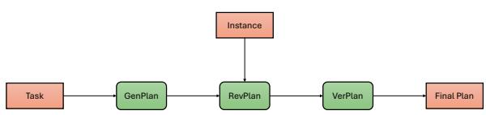
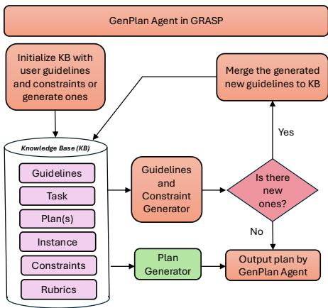
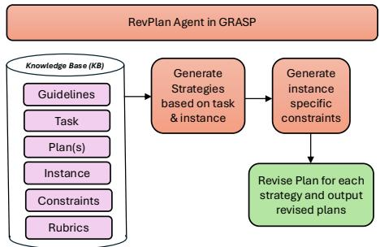
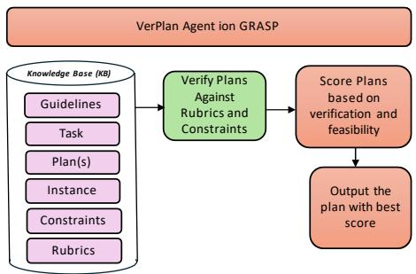
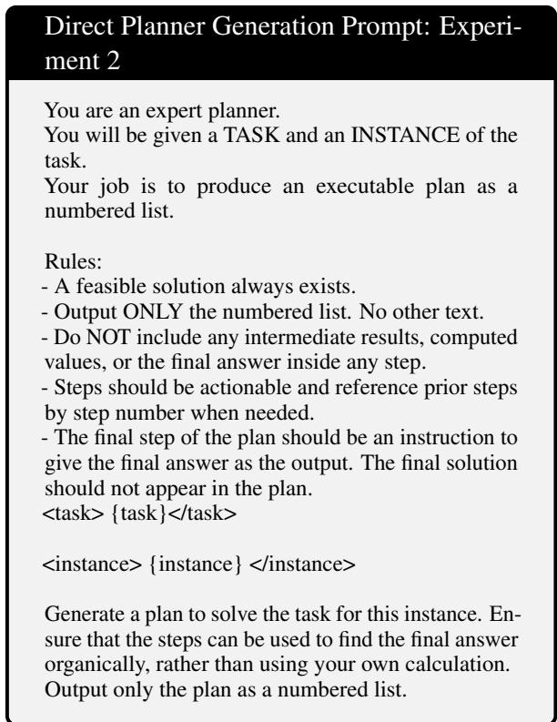
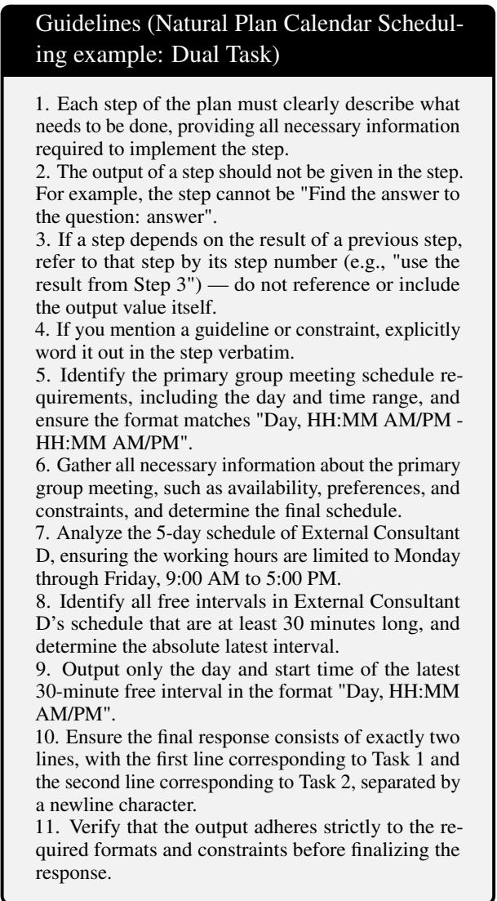
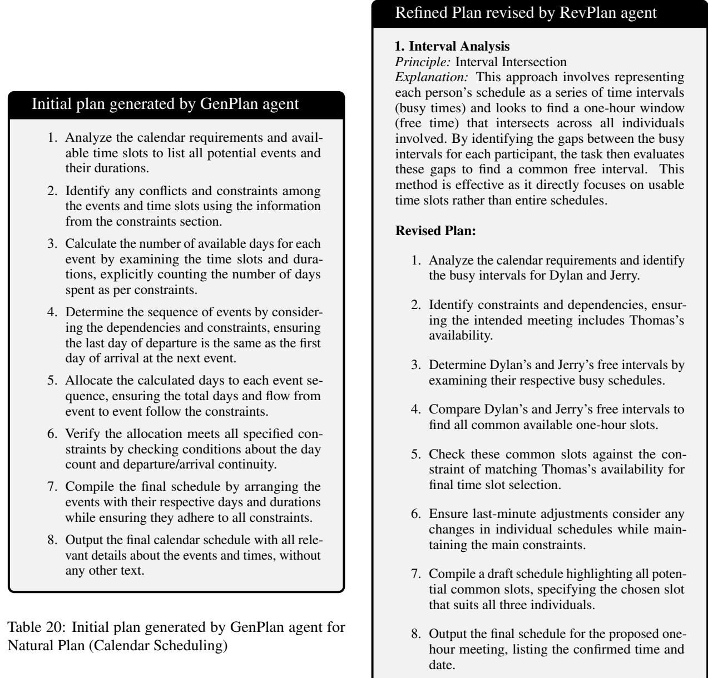
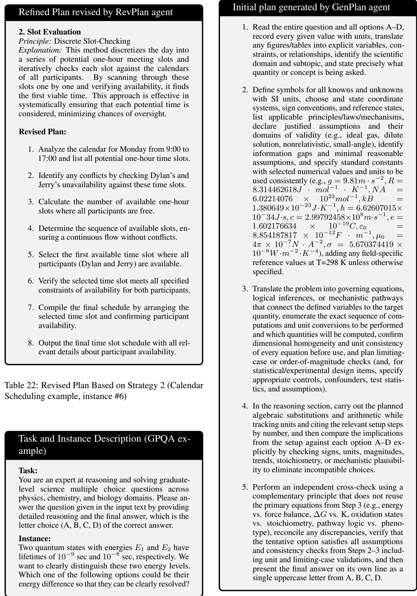
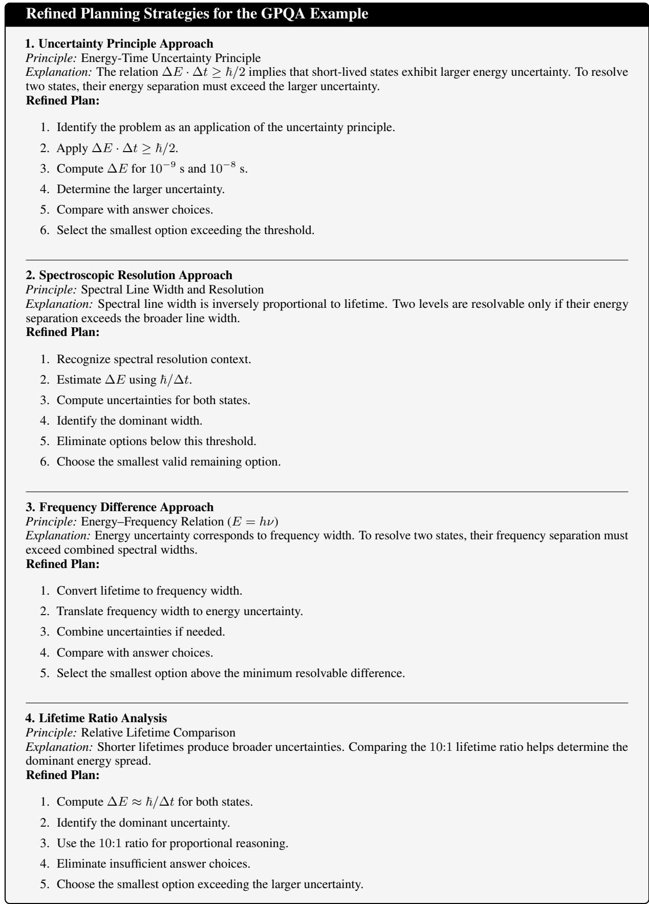

# GRASP: Generating, Revising, and Assessing for Strategic Planning with Agentic AI

Arunabh Srivastava<sup>1</sup>, Mohammad A. (Amir) Khojastepour<sup>2</sup>, Srimat Chakradhar<sup>2</sup>,

Sennur Ulukus<sup>1</sup>

<sup>1</sup>University of Maryland, College Park, MD <sup>2</sup>NEC Laboratories America, Inc.

## Abstract

Large Language Models (LLMs) typically exhibit a performance profile where reliability degrades as task complexity increases. We address the challenge of generating high-quality natural language executable plans for complex tasks by introducing GRASP, a strategy-aware, multi-stage planning framework. GRASP decouples the planning pipeline across specialized, context-isolated modules: it pre-compiles global macro-guidelines (GenPlan), explores alternative localized strategies within isolated context windows (RevPlan), and independently evaluates trajectories using a multi-criteria discriminator (VerPlan). Empirical evalua tions show that GRASP consistently establishes a new state-of-the-art frontier across diverse datasets, yielding substantial accuracy gains over direct LLM planners on Natural Plan Calendar Scheduling (∼12.4%↑), ZebraLogic (∼30.8%↑), and SciBench Math. Crucially, under multi-task scaling—where standard planners suffer immediate performance collapse—GRASP completely flattens the multi-task degradation penalty. In interleaved dual-task environments, GRASP achieves an absolute accuracy gain of up to 16.7% over direct LLM planners. Furthermore, by isolating context and enforcing strict macroregularization, GRASP outperforms frontier reasoning models (such as GPT-5-mini) by a margin of 14.5%.

## 1 Introduction

Large Language Model (LLM) agents have emerged as a prominent paradigm for automating complex, multi-step workflows across diverse enterprise domains (Wang et al., 2025a). Unlike traditional deterministic software, LLM-based agents can dynamically interpret open-vocabulary natural language specifications (tasks) and adapt to realtime context shifts (task instances) without explicit reprogramming (Wooldridge and Jennings, 1995). However, directly steering an LLM using layered, long-horizon natural language instructions presents severe architectural challenges. As task complexity (as defined in (Dziri et al., 2023)) scales, models experience a sharp performance degradation, often termed the “Curse of Instructions” (Harada et al., 2025), where constraint collisions and attention fatigue trigger hallucinations and multi-step execution failures (Wei et al., 2022; Yao et al., 2023). This vulnerability highlights the need for explicit plan generation that transforms high-level descriptions into structured, decomposed execution paths.

Effective plan generation mitigates this scaling penalty by dividing an intricate task into ordered sub-steps whose individual complexity falls within the model’s reliable operating range. In this paper, we propose GRASP, an autonomous framework for asynchronous plan generation in agentic AI systems. Inspired by human cognitive processes—namely identification, reasoning, and judgment—GRASP decouples the planning pipeline into specialized, context-isolated modules. The architecture first compiles global hard constraints and soft guidelines (GenPlan), explores localized strategic paths across separate context windows (RevPlan), and independently evaluates trajectories using a multi-criteria discriminator (VerPlan). This strict contextual separation prevents crosscontamination and breaks the compounding error cascades that degrade single-track planners.

Finally, robust execution is paramount to translating high-quality plans into correct downstream results. Attempting to execute a multi-step plan within a single monolithic LLM track collapses the structural benefits of decomposition and exacerbates context pollution. To address this, we interface GRASP with RunAgent (Srivastava et al., 2026), a multi-agent plan execution platform.

In summary, the primary contributions of this work are three-fold: (1) We introduce GRASP, an autonomous, multi-stage planning framework that enforces global macro-regularization and contextisolated strategic refinement to eliminate compounding error feedback loops in LLM planning. (2) We demonstrate the critical interdependence of modular planning components through a comprehensive ablation study, revealing how local search optimization collapses into unconstrained hallucination loops without global macro guardrails. (3) Through extensive empirical evaluations spanning programmatic execution and pure LLM execution, we demonstrate that GRASP establishes a new state-of-the-art frontier. Strikingly, under multitask scaling, GRASP completely neutralizes the contextual degradation penalties that plague standard language architectures. In interleaved dualtask environments, GRASP enabled by standard language backbones achieves an absolute accuracy gain of up to 16.7% over direct baselines, systematically outpacing premium, native frontier reasoning models such as GPT-5-mini by 14.5%.

  
Figure 1: A description of GRASP, defining our main blocks.

## 2 Related Work

Autonomous Agents Computing agents originated in 1970s rule-based expert systems like DEN-DRAL and MYCIN (Buchanan et al., 1969; Shortliffe, 1974), later evolving through decision theory and cognitive architectures into autonomous systems (Pearl, 1988; Newell, 1990; Kaelbling et al., 1998). Modern language model (LLM) agents act as task-directed workflows that perceive, plan, and execute within complex environments (Wang et al., 2025a,b; Mohammadi et al., 2025). Rather than acting as rigid programmatic scripts, effective agents must exhibit human-like adaptability to handle complex multi-step routines autonomously under dynamic context shifts.

Inference-Time Algorithms Core prompting techniques like Chain-of-Thought (Wei et al., 2022), Self-Consistency (Wang et al., 2022), and In-Context Learning (Dong et al., 2024) enhance stepby-step reasoning but lack long-horizon planning capabilities. Search-based extensions such as Tree of Thoughts (Yao et al., 2023), Graph of Thoughts (Besta et al., 2024), and REBASE (Wu et al., 2024)

expand trajectory exploration to improve plan robustness, yet they lack structured constraint enforcement. While agentic frameworks attempt to separate planning from execution via incremental adjustments (ReAct (Yao et al., 2022), Pre-Act (Rawat et al., 2025)) or critique loops (Reflexion (Shinn et al., 2023), TextGrad (Yuksekgonul et al., 2024)), they remain vulnerable to conversational noise. GRASP builds on these paradigms by completely isolating generation, revision, and verification across decoupled context windows.

Automated Planning Multi-agent and constraintguided frameworks mark recent advances in plan optimization. PlanGEN (Parmar et al., 2025) combines constraint, selection, and verification agents to refine test-time search spaces. Similarly, hybrid symbolic-LLM methods like PDDL-Instruct (Verma et al., 2025) demonstrate that guiding inference through structured rules and deterministic constraints dramatically optimizes plan validity (Mahdavi et al., 2024; Wei et al., 2025; Cao et al., 2025). While advanced multi-agent orchestrators like Magentic UI (Mozannar et al., 2025) incorporate memory and execution guards, they rely heavily on human-in-the-loop interaction for plan validation. In contrast, GRASP operates as a fully autonomous algorithm tailored specifically for high-quality, zero-shot plan generation and structural regularization.

## 3 GRASP

In this section, we introduce the GRASP (Generating, Revising, and Assessing for Strategic Planning) framework and explain the operational details of its constituent components. The framework decomposes the end-to-end planning problem into three specialized modules that are executed sequentially: (i) GenPlan, which generates a structural blueprint of the plan strictly based on the natural language task description T; (ii) RevPlan, which adapts and refines this baseline plan using a localized task instance I by exploring distinct strategic paths (defined as heuristics in (Polya, 1945)); and (iii) VerPlan, which acts as an independent evaluator to verify whether constraints are satisfied and selects the optimal plan P<sup>∗</sup>. Each module comprises distinct computational blocks that leverage targeted prompting to keep the language model focused on the specific sub-task and operating in a reliable manner.

Architecturally, GRASP is designed to enable explicit context isolation. Standard plan generation frameworks often suffer from performance degradation because they force a model to simultaneously process global constraints, track variables, and generate local steps within the same context window. GRASP avoids this contextual overload by splitting these requirements across the three decoupled stages. We now describe each module in detail. The exact prompts, detailed configurations, and algorithmic pseudo-code for each component agent are provided in the Appendix.

## 3.1 GenPlan

The GenPlan module handles macro-level plan generation by mapping the task description $\tau$ into a structured baseline plan $\mathcal { P } _ { G }$ while remaining oblivious to the task instance I. $\mathcal { P } _ { G }$ serves as a blueprint based on which instance-specific plans will be structured. Monolithic LLMs struggle with single-shot plan generation. They produce fluent text that fails under rigorous inspection due to missing logical primitives or implicit constraint violations. This degradation occurs because standard LLMs lack explicit mechanisms to separate task parameters from runtime variables, leading to unrecoverable cascading errors. To balance the flexibility of natural language and the strict adherence to task requirements, GenPlan decomposes planning into component steps with memory managed through the knowledge base (KB) and three specialized, prompt-engineered agents: the Constraint Agent (CA), the Guidelines Agent (GA) and the Plan Generation Agent (PGA).

Our design is conceptually grounded in formal cognitive models of human planning, specifically working memory management and self regulation. When human experts encounter dense specifications, they do not try to do detailed planning immediately. Instead, they isolate abstract environmental rules from T, continuously reflecting and refining their mental model before applying it to concrete instances I.

GenPlan formalizes this cognitive reflection loop. We define the KB as a memory store for the task, constraints, guidelines and the tentative plan. The CA, GA and PGA operate over this shared KB within an iterative feedback loop, balancing natural language flexibility with structural reliability. This continuous reflection process enables the framework to incrementally correct inconsistencies, uncover overlooked details, and converge towards a stable, accurate plan $\mathcal { P } _ { G }$

  
Figure 2: A block diagram of the GenPlan agent, discussed in Section 3.1.

## Knowledge Base

The Knowledge Base serves as the centralized state manager for the GenPlan module. Instead of maintaining floating context variables, the framework aggregates all supporting directives such as constraints and guidelines and the tentative plan into a single structured tuple. Formally, at any iterative step t, we have,

$$
\mathcal { K B } _ { t } = \langle \mathcal { T } , \mathcal { C } _ { t } , \mathcal { G } _ { t } , \mathcal { P } _ { t } \rangle\tag{1}
$$

where $\mathcal { C } _ { t }$ represents the set of hard constraints, $\mathcal { G } _ { t }$ represents the set of soft guidelines, and $\mathcal { P } _ { t }$ represents the tentative baseline plan. The KB handles user-specifications, which include the initial guidelines and constraints. If provided, the KB is initialized as,

$$
\mathcal { K B } _ { 0 } = \left. \mathcal { T } , \mathcal { C } _ { \mathrm { i n i t } } , \mathcal { G } _ { \mathrm { i n i t } } , \emptyset \right.\tag{2}
$$

If no initial guidelines $\mathcal { G } _ { 0 }$ or constraints $\mathcal { C } _ { 0 }$ are provided, then they are also initialized as empty sets. The CA, GA and PGA read from the KB and perform updates to generate new entries or structurally modify existing entries.

## Guidelines Agent (GA)

Guidelines operate as soft, non-binding regularizers or operational heuristics that are designed to optimize plan quality and coherence (Gerevini et al., 2009). The GA identifies new guidelines from the existing KB and merges them with the current guidelines. More formally,

$$
\mathcal { G } _ { t + 1 } = \mathbf { M E R G E } ( \mathcal { G } _ { t } , \mathbf { G A } ( \mathcal { K B } _ { t } ) ) .\tag{3}
$$

Guidelines enforce structural consistency, uniform phrasing, and boundaries across the plan. However, even if a specific guideline in $\mathcal { G }$ is violated, a candidate plan may remain logically valid. In general, enforcing guidelines minimizes generative drift, highlighting the role of guidelines as soft regularizers over the decoding space of the LLM.

## Constraint Agent (CA)

In contrast to soft guidelines, constraints represent strict, necessary conditions that the plan must satisfy to be classified as executable and valid (Gerevini et al., 2009). The CA operates in a similar way to the GA by identifying new constraints from the existing KB and merges them with the current constraints. Formally,

$$
\mathcal { C } _ { t + 1 } = \mathbf { M E R G E } ( \mathcal { C } _ { t } , \mathbf { C A } ( \mathcal { K B } _ { t } ) ) .\tag{4}
$$

To ensure maximum plan reliability, GRASP allows users to manually enter constraints at initialization. However, even when GenPlan operates in a zero-shot fashion without user defined priors $( { \mathcal { C } } _ { 0 } = \phi )$ , the CA automatically generates a list of constraints from T. This process ensures that the baseline plan and downstream plan synthesis follow operational boundaries. Mathematically, constraints function as hard regularizers that clip and prune logically infeasible states from the downstream plan search space.

## Plan Generation Agent (PGA)

The PGA is an agent which synthesizes the tentative base plan under the structural and operational boundaries defined by C and ${ \mathcal { G } } .$ If user-specified guidelines and constraints are provided at $t = 0$ then the PGA immediately constructs the initial plan and places it in the KB. Otherwise, the CA and GA are invoked to build the initial constraints and guidelines. After the plan has been initialized, it is updated as follows at the $t + 1 ^ { t h }$ iteration,

$$
\mathcal { P } _ { t + 1 } = \mathrm { P G A } ( \mathcal { K } B _ { t } )\tag{5}
$$

GenPlan implements the iterative optimization and symbolic reflection loop across the agents, rather than executing a single-shot forward generation pass. At each iteration t, the agents inspect the complete $\kappa B _ { t }$ , and generate new iterates by identifying logical mismatches or constraint violations. This process is similar to the techniques used in (Yuksekgonul et al., 2024; Shinn et al., 2023). The KB is then updated as,

$$
\begin{array} { r } { \mathcal { K B } _ { t + 1 } = \langle \mathcal { T } , \mathcal { C } _ { t + 1 } , \mathcal { G } _ { t + 1 } , \mathcal { P } _ { t + 1 } \rangle . } \end{array}\tag{6}
$$

This optimization loop executes continuously until an external judge block determines that the updates

have converged and no further structural changes have been qualitatively observed between iteration,

$$
\begin{array} { r } { \mathcal { K B } ^ { * } = \mathcal { K B } _ { t } \quad \mathrm { w h e r e } \quad \mathcal { K B } _ { t + 1 } \equiv \mathcal { K B } _ { t } } \end{array}\tag{7}
$$

Through this continuous optimization loop over the KB, the GenPlan module dynamically accumulates new constraints and guidelines, and produces the final, highly resilient baseline plan $\mathcal { P } _ { G } \in \mathcal { K } B ^ { * }$ that strictly adheres to the hard constraints, while honoring the soft guidelines, and acts as a blueprint for downstream plan generation.

The detailed algorithm and prompts of GenPlan are given in Appendix F. Further, please see Appendix J and K for examples of guidelines, constraint and plans generated and used by GenPlan.

## 3.2 RevPlan

The RevPlan module takes the macro-level baseline plan $\mathcal { P } _ { G }$ generated by the GenPlan block, and specializes it for a specific task instance I. In traditional software engineering, an execution instance simply supplies static data parameters to a deterministic function. In contrast, within the GRASP framework, I introduces dynamic runtime directives, such as edge-case exceptions, shifting operational priorities and unmodeled environmental circumstances. To satisfy these runtime directives without violating the core structural plan rules established in GenPlan, RevPlan refines the plan $\mathcal { P } _ { G }$ by systematically introducing, modifying or removing discrete execution steps based on a multi-path exploration on the strategy space.

To prevent the model from prematurely converging on a single suboptimal decoding path, we forego a linear revision pass. Instead, as outlined in Algorithm 2, we expand the planning space into parallel, strategy-based tracks using two primary stages, strategy induction and strategy-specific plan merging.

In the strategy induction stage, we first derive a set of strategies by evaluating the task T and the task instance I. We define this strategy space as,

$$
\boldsymbol { S } = \left\{ s _ { 1 } , s _ { 2 } , \ldots , s _ { K } \right\}\tag{8}
$$

where K represents the number of distinct strategies explored. In this work, we typically consider $2 \leq K \leq 4$ . This parallelization captures diverse and valid strategic paths that an LLM might otherwise discard if it is forced to commit to a single path early on.

RevPlan then initiates K contextually isolated tracks, one for each strategy. Within each track, we generate a set of localized constraints $\mathcal { C } _ { s _ { k } }$ , which act as rigid guardrails for the subsequent planning phase. For each isolated track, we construct a strategy-specific plan candidate ${ \mathcal { P } } ^ { ( k ) }$ through the following three-phase pipeline.

• First, we leverage the ReAct framework (Yao et al., 2022) to generate a strategy-specific solution trajectory $\chi _ { s _ { k } }$ . The reason-observe-act framework in the ReAct solution interleaves reasoning traces with structural actions, while aligning with the strategy-specific constraints $\mathcal { C } _ { s _ { k } }$ . This solution provides a valid path towards the goal of the pair of T and I.

• We then apply an extraction function to isolate the executable steps from the verbose solution trajectory $\chi _ { s _ { k } }$

$$
\mathcal { P } _ { \mathrm { s p e c i f i c } } ^ { ( k ) } = \mathrm { E x t r a c t P l a n } ( \chi _ { s _ { k } } )\tag{9}
$$

This operation isolates the structural plan from the exact solution details, yielding an instancefocused plan without the GenPlan guardrails.

• Finally, we reconcile this instance-specific plan with the structural blueprint provided by GenPlan,

$$
\mathcal { P } ^ { ( k ) } = \operatorname { M e r g e P l a n s } ( \mathcal { P } _ { \mathrm { s p e c i f i c } } ^ { ( k ) } , \mathcal { P } _ { G } ) .\tag{10}
$$

This plan-merge operation preserves the structural blueprint established via $\mathcal { P } _ { G }$ , while integrating the strategy-specific logic of $\mathcal { P } _ { \mathrm { s n e } i } ^ { ( k ) }$ specific

Thus, maintaining strict contextual isolation across the K tracks ensures that hallucinations and compounding errors in one trajectory do not harm other trajectories. RevPlan finally outputs a set of specialized candidate plans $\mathbb { P } = \mathbf { \dot { \{ } }  \mathbf { \mathcal { P } ^ { ( i ) } } , \mathbf { \mathcal { P } ^ { ( 2 ) } } , \dots , \mathbf { \hat { \mathcal { P } } ^ { ( K ) } } \}$ , representing a diverse set of valid, instancecalibrated plans.

In Appendix G and Appendix K, we present the detailed algorithm and prompts for RevPlan and examples of plan revisions based on strategies.

## 3.3 VerPlan

VerPlan is the final module of GRASP. VerPlan functions as a decoupled plan evaluator to assess the set of candidate plans P generated by RevPlan. We implement this verification stage because the individual strategy-based plans may still contain logical errors, omit crucial steps, or suffer from varying levels of infeasibility depending on the exact task and instance. To identify these shortcomings and filter out low-quality plans, VerPlan evaluates each candidate plan independently within an isolated context window.

  
Figure 3: A block diagram of the RevPlan agent, discussed in Section 3.2

  
Figure 4: A block diagram of the VerPlan agent, discussed in Section 3.3

Each candidate plan is assessed using an LLM, which acts as the scoring function. The LLM functions as an unbiased discriminator and scorer to provide an objective assessment of feasibility and reliability.

For each track k, we evaluate the candidate plan ${ \mathcal { P } } ^ { ( k ) }$ against the task T, instance I, GenPlan constraints C, strategy-specific constraints $\mathcal { C } _ { s _ { k } }$ and internal rubrics. We prompt the LLM to output a plan quality score $\Psi ^ { ( k ) } \in [ 0 , 1 0 0 ]$ . This score reflects the plan’s likelihood of success and its strict adherence to the constraints. More formally,

$$
\Psi ^ { ( k ) } = \mathrm { S c o r e } ( \mathcal { P } ^ { ( k ) } | \mathcal { T } , \mathcal { Z } , \mathcal { C } , \mathcal { C } _ { s _ { k } } , \mathrm { R u b r i c s } )\tag{11}
$$

This verification mechanism acts as a strict constraint-satisfaction and feasibility check, ensuring that plans that satisfy the constraints and are feasible are given higher scores. By scoring each trajectory independently, we prevent mistakes or noise due to one strategy path from biasing the evaluation of other candidates. Once the model has computed the evaluation scores for all K candidates, we choose the plan with the highest score,

$$
\mathcal { P } ^ { * } = a r g \operatorname* { m a x } _ { \mathcal { P } ^ { ( k ) } \in \mathbb { P } } \Psi ^ { ( k ) } .\tag{12}
$$

The selected plan ${ \mathcal { P } } ^ { * }$ is chosen as the final, highconfidence output of GRASP.

## 4 Evaluation

## 4.1 Experimental Setup

To evaluate the quality of plan generation with GRASP, we utilize four distinct benchmarks spanning administrative logistics, hard logic matrices, and expert-level scientific reasoning: Natural Plan Calendar Scheduling (Zheng et al., 2024), GPQA (Rein et al., 2024), SciBench Math (Wang et al., 2024) and ZebraLogic (Lin et al., 2025).

## The Execution Platform: RunAgent

In order to guarantee a standard, objective baseline for how plans translate into actions, all generated plans across all frameworks are systematically run through RunAgent (Srivastava et al., 2026). RunAgent functions as a multi-agent execution platform that interprets natural language steps of a plan and executes them. RunAgent utilizes frontier LLMs for executing plans. RunAgent (GPT-4o (Hurst et al., 2024)) is utilized for the Natural Plan Calendar Scheduling, Scibench Math and GPQA datasets. RunAgent (GPT-4.1-mini (OpenAI, 2025)) is utilized for the ZebraLogic dataset. Even though RunAgent includes many features such as constraint generation and verification, fact utilization, agentic language and running state summaries, we run a bare-bones version of RunAgent, where only the LLM or Python code execution are utilized for executing steps. Further, error correction is only invoked to overcome runtime errors. This ensures that poor plan quality is not compensated by verification protocols.

## Experimental Setup

Our evaluation isolates GRASP’s effectiveness in planning across two distinct experiments. More details are provided in Appendix D.

• Single Task Planning with Programmatic execution (Experiment 1): In this experiment, a common task is described to GRASP based on the specific dataset, and each problem is provided as an instance. Each generated plan is executed with RunAgent. This experiment shows the utility of GRASP plans for agentictool-use use cases across all datasets.

• Robustness for Compound Task Scaling (Experiment 2): To evaluate the resilience of GRASP under dual-task objectives, we test the planners on Natural Plan Calendar Scheduling by scaling the tasks from simple tasks with single goals to tasks with two or three objectives. We turn off the Python code execution in RunAgent for this experiment, and run each step using only LLMs. This experiment highlights GRASP’s structural resilience under complex task loads.

## Evaluation Metrics and Baselines

We report Exact Match (EM) accuracy for the Natural Plan Calendar Scheduling dataset, and standard accuracy percentages for the SciBench Math, GPQA and ZebraLogic datasets. Equivalence between RunAgent outputs and gold answers is judged using an LLM judge block, running with GPT-5 (OpenAI, 2025). Manual evaluation of 50 random instances per dataset classified by GPT-5 demonstrates full agreement with human judgment. For Experiment 1, we benchmark GRASP against three types of baselines:

• Direct LLM execution: Single-shot problem solving by baseline LLMs.

• Baseline LLM Planner: Single-shot plan generated by LLM based on task and instance with structural guardrails in the prompt, and executed with RunAgent.

• State-of-the-art Methods: Advanced algorithms including PlanGEN (Parmar et al., 2025) (all four variants), Tree-of-thoughts (ToT) (Yao et al., 2023) and Best-of-N (BoN) (Gui et al., 2024) are used to generate plans, which are then executed by RunAgent.

To rigorously examine whether GRASP can outperform frontier reasoning models in plan generation for dual-task objectives, we introduce GPT-5-mini (medium reasoning effort) (OpenAI, 2025) as a baseline direct planner alongside GPT-4o and GPT-4o-mini for comparison in Experiment 2.

## 4.2 Main Results

We summarize and discuss our main results in this section. Statistical analysis, plan efficiency analysis and impacts of information leakage are investigated in Appendix E.

<table><tr><td>Method</td><td>EM Acc. (%)</td></tr><tr><td>GPT-4o-mini baseline</td><td>41.9</td></tr><tr><td>GPT-4o-mini Planner</td><td>54.3</td></tr><tr><td>GRASP(GPT-4o-mini) planner</td><td>74.3</td></tr><tr><td>GPT-4o baseline</td><td>58.3</td></tr><tr><td>GPT-4o Planner</td><td>63</td></tr><tr><td>GRASP(GPT-4o) planner</td><td>75.4</td></tr></table>

Table 1: Results for Natural Plan Calendar Scheduling

<table><tr><td>Method</td><td>Accuracy (%)</td></tr><tr><td>GPT-4o baseline</td><td>29.5</td></tr><tr><td>GPT-4o Planner</td><td>30.6</td></tr><tr><td>GRASP (GPT-4o) Planner</td><td>61.4</td></tr></table>

Table 2: Results for the ZebraLogic Dataset

## Single-Task Planning with Programmatic Execution

Performance on Natural Plan Calendar Scheduling The results for this dataset are summarized in Table 1. We observe that GRASP outperforms LLM planners by 12.4% for GPT-4o and by 20% for GPT-4o-mini. Surprisingly, GRASP(GPT-4omini) outperforms the GPT-4o planner by 11.3%. Performance on ZebraLogic The results are summarized in Table 2. In this dataset, GRASP(GPT-4o) outperforms the GPT-4o planner by 30.8%.

Performance on SciBench Math The results are summarized in Table 3. GRASP(GPT-4o) outperforms the GPT-4o planner on all subsets. GRASP(GPT-4o-mini) outperforms the GPT-4omini planner on the Stat and Diff subsets, but equals on the Calc subset. On the Stat subset, GRASP(GPT-4o-mini) outperforms other methods. Performance on GPQA The results for this dataset are summarized in Table 4. The results are averaged over 3 runs, and we find that GRASP does not perform better than either the GPT-4o baseline or the planner in a statistically significant way.

Comparison against State-of-the-art The stateof-the-art algorithms and GRASP perform planning using GPT-4o-mini, and each plan is executed using RunAgent. The results are summarized in Table 5. We observe that GRASP outperforms all other methods on Natural Plan Calendar Scheduling, SciBench Stat, and ZebraLogic dataset, but PlanGEN equals GRASP on SciBench Calc and Diff.

Ablation Studies We conduct ablation studies on Natural Plan Calendar Scheduling. Varying the number of strategies in RevPlan (1–4) yields accuracies of 73.0%, 74.1%, 75.4%, and 71.2%, respectively, indicating a performance sweet spot at three strategies and highlighting the impact of strategy initialization on plan generation. By using 3 strategies in RevPlan and removing constraint and guideline generation in GenPlan the accuracy drops from 75.4% to 58.5%.

<table><tr><td>Method</td><td>Stat</td><td>Calc</td><td>Diff</td></tr><tr><td>GPT-4o-mini baseline</td><td>73.61</td><td>65.85</td><td>34</td></tr><tr><td>GPT-4o-mini Planner</td><td>70.83</td><td>73.17</td><td>28</td></tr><tr><td>GRASP(GPT-4o-mini) planner</td><td>81.94</td><td>73.17</td><td>50</td></tr><tr><td>GPT-4o baseline</td><td>77.78</td><td>70.73</td><td>50</td></tr><tr><td>GPT-4o Planner</td><td>70.83</td><td>73.17</td><td>54</td></tr><tr><td>GRASP(GPT-4o) planner</td><td>80.56</td><td>78.05</td><td>62</td></tr></table>

Table 3: Accuracy Percentage for the SciBench Dataset
<table><tr><td>Method</td><td>Accuracy (%)</td></tr><tr><td>GRASP (GPT-4o, 2 strat.) planner</td><td>47.54</td></tr><tr><td>GPT-4o baseline</td><td>47.99</td></tr><tr><td>GRASP (GPT-4o, 4 strat.) planner</td><td>48.23</td></tr></table>

Table 4: Results for the GPQA Dataset

Token and Cost Comparisons We summarize the average input and output token counts per instance for Natural Plan Calendar Scheduling in Table 6. Using the current GPT token prices (see Appendix B), we compute the cost and report the normalized cost versus baseline GPT-4o model in Table 6. GRASP (GPT-4o) increases cost by ∼ 13.5x while improving accuracy by 12.4% over the GPT-4o planner. GRASP (GPT-4o-mini) with three strategies achieves an 11.3% accuracy gain at ∼ 0.95x the cost. Further discussion of token usage for Table 5 is given in Appendix C.

## Robustness for Compound Task Scaling

Performance under Multi-Task Scaling The results for multi-task scaling are summarized in Table 7. While all planners achieve parity on isolated single tasks (hovering between 44.5% and 45.8%), expanding the workspace to interleaved multi-task streams causes direct planners to collapse due to context pollution. Moving from dual to triple tasks, the direct GPT-4o planner decays from 30.5% to 29.1%, and the GPT-4o-mini planner drops from 24.5% to 21.2%. Conversely, GRASP(GPT-4o) maintains performance, achieving 45.7% on dual tasks and rising to 46.6% on triple tasks, outperforming its direct planner counterpart by 17.5%. GRASP also enables smaller LLMs to excel on dual tasks, driving GRASP(GPT-4o-mini) to 41.2% (a 16.7% absolute gain over its direct baseline).

Comparison Against Reasoning Models We evaluate direct planners driven by GPT-5-mini, a frontier reasoning model. Despite this optimization, the direct GPT-5-mini planner succumbs to multitask context degradation, scoring only 26.7% on dual tasks and dropping to 25.5% on triple tasks. Both GRASP configurations comprehensively outperform this frontier reasoning model. Crucially, GRASP(GPT-4o-mini) achieves 41.2% on dual tasks, outperforming the direct GPT-5-mini planner by a 14.5% absolute margin.

<table><tr><td>Method</td><td>Calendar Scheduling</td><td>SciBench Stat</td><td>SciBench Calc</td><td>SciBench Diff</td><td>ZebraLogic</td></tr><tr><td>PlanGEN (Mix)</td><td>52.3</td><td>72.22</td><td>73.17</td><td>50.0</td><td>31.5</td></tr><tr><td>PlanGEN (ToT)</td><td>55.7</td><td>50.00</td><td>40.48</td><td>26.0</td><td>10.0</td></tr><tr><td>PlanGEN (Rebase)</td><td>49.4</td><td>77.78</td><td>64.29</td><td>34.0</td><td>39.2</td></tr><tr><td>PlanGEN (BoN)</td><td>72.3</td><td>73.16</td><td>66.67</td><td>48.0</td><td>41.6</td></tr><tr><td>BoN</td><td>60.4</td><td>77.78</td><td>70.73</td><td>34.0</td><td>41.0</td></tr><tr><td>ToT</td><td>52.2</td><td>58.33</td><td>48.78</td><td>40.0</td><td>13.0</td></tr><tr><td>GRASP (Ours)</td><td>74.3</td><td>81.94</td><td>73.17</td><td>50.0</td><td>58.0</td></tr></table>

Table 5: Performance Comparison of PlanGEN Variants, Baselines, and GRASP Across Benchmarks

<table><tr><td>Method</td><td>Input</td><td>Output</td><td>NC</td></tr><tr><td>GPT-40 Baseline</td><td>262</td><td>352</td><td>1</td></tr><tr><td>GPT-4o Planner</td><td>374</td><td>418</td><td>1.2</td></tr><tr><td>GRASP(GPT-4o, 1 strat.)</td><td>4703</td><td>1316</td><td>6</td></tr><tr><td>GRASP(GPT-4o, 2 strat.)</td><td>8497</td><td>2400</td><td>10.8</td></tr><tr><td>GRASP(GPT-4o, 3 strat.)</td><td>12664</td><td>3741</td><td>16.5</td></tr><tr><td>GRASP(GPT-4o, 4 strat.)</td><td>16455</td><td>4753</td><td>21.2</td></tr><tr><td>GRASP(GPT-4o-mini, 3 strat.)</td><td>13683</td><td>4711</td><td>1.16</td></tr></table>

Table 6: Average token count and normalized cost (NC) per instance for Natural Plan Calendar Scheduling
<table><tr><td>Method</td><td>Dual Tasks</td><td>Triple Tasks</td></tr><tr><td>GPT-4o-mini Planner</td><td>24.5</td><td>21.2</td></tr><tr><td>GPT-4o Planner</td><td>30.5</td><td>29.1</td></tr><tr><td>GPT-5-mini Planner</td><td>26.7</td><td>25.5</td></tr><tr><td>GRASP(GPT-4o-mini)</td><td>41.2</td><td>28.1</td></tr><tr><td>GRASP(GPT-40)</td><td>45.7</td><td>46.6</td></tr></table>

Table 7: Performance under multi-task scaling.

Ablation Studies We execute an ablation study under the dual-task setup, summarized in Table 8. Isolating single modules shows that GenPlan Only yields 40.8% accuracy, proving the vital anchoring role of guidelines and constraints. In contrast, activating local strategy exploration without structural boundaries (RevPlan Only or RevPlan + VerPlan) causes a catastrophic drop to 10.9% and 12.5%, respectively—performing substantially worse than VerPlan Only (30.7%). The highest overall performance is unlocked strictly when all modules interact in the full GRASP architecture (45.7%).

Discussion The ablation study reveals a profound modular interdependence. VerPlan Only acts as a passive filter over standard direct generations, yielding baseline levels. However, executing local updates (RevPlan) without the invariant structural guardrails of GenPlan triggers unconstrained semantic drift and plan hallucinations. This creates a set of low quality plans, catching the downstream VerPlan module in a classic "garbage-in, garbageout" trap that drops performance to 12.5%. This confirms that local strategy optimization requires global regularization. Additionally, our triple-task results uncover a clear capacity boundary condition for smaller models. While GRASP(GPT-4o-mini) performs robustly on dual tasks (41.2%), it collapses to 28.1% on triple tasks. This demonstrates that under extreme multi-task workloads, smaller LLMs lack the raw parameter capacity to successfully manage complex instructions without suffering local attention drift, establishing a hardwarebound capability threshold.

<table><tr><td>Setting</td><td>Configuration</td><td>Accuracy (%)</td></tr><tr><td>1</td><td>Direct Planner</td><td>30.5</td></tr><tr><td>2</td><td>RevPlan Only</td><td>10.9</td></tr><tr><td>3</td><td>VerPlan Only</td><td>30.7</td></tr><tr><td>4</td><td>GenPlan Only</td><td>40.8</td></tr><tr><td>5</td><td>RevPlan + VerPlan</td><td>12.5</td></tr><tr><td>6</td><td>GenPlan + RevPlan</td><td>42.5</td></tr><tr><td>7</td><td>GRASP</td><td>45.7</td></tr></table>

Table 8: Ablation matrix across GRASP modules under dual-task mode.

## 5 Conclusion

In this paper, we introduced GRASP, an autonomous framework that neutralizes context degradation and plan hallucinations in complex tasks. By decoupling plan generation, strategy exploration, and validation across context-isolated agents, our architecture successfully eliminates compounding error cascades. Our evaluations prove that explicit structural guardrails enable standard LLMs to systematically outperform the unguided internal reasoning chains of frontier reasoning models.

## Limitations

Latency Considerations While our framework prioritizes execution reliability, the iterative generation, local refinement, and systematic verification of multiple alternative strategies inherently incurs higher runtime latency compared to single-pass, monolithic generation. We consider this additional computational overhead a necessary trade-off to ensure structural robustness and eliminate compounding error loops in highly complex tasks. However, this latency characteristic may limit the framework’s suitability for real-time, interactive applications where immediate response times are critical, defining a clear trajectory for future work to explore parallelized generation pipelines or early-exit optimization heuristics to reduce inference time.

Orthogonal to Model-Level Reasoning A fundamental characteristic of GRASP is that it operates strictly as an inference-time plan regularizer rather than a mechanism for improving the intrinsic, lowlevel reasoning capabilities of the underlying language model. If a backbone possesses severe baseline domain ignorance or lacks the foundational logic to understand a given task space, our framework cannot bridge that cognitive deficit. GRASP is explicitly designed to optimize plan execution safety by decoupling context and enforcing macroconstraints, allowing models to fully express their latent capabilities without attention fatigue. It does not train or structurally alter the underlying model’s multi-stage internal reasoning chains. This limitation is specifically highlighted in our experiments. We observe that GRASP does not outperform the direct planner on the GPQA dataset, the SciBench Diff and the SciBench Calc datasets. Problems in all three datasets rely not just on building a good plan, but on improving the reasoning capability of the underlying LLM itself.

Task-Dependent Strategy Tuning A key limitation of the current framework is that the optimal number of generated strategy-based plans behaves as a task-dependent hyperparameter rather than a fixed, universal value. For instance, in our Calendar Scheduling evaluations, system performance peaks sharply at a sweet spot of three candidate strategies; while fewer strategies limit the explored search space, generating more introduces excessive diversity that can mislead the VerPlan discriminator toward sub-optimal choices. Consequently, deploying GRASP across highly heterogeneous domains currently requires manual tuning to balance strategic exploration with downstream execution reliability, highlighting a valuable avenue for automated, dynamically adjusting number of strategies in future iterations.

## Ethical Considerations

OpenAI Policy Compliance: The use of GPT-4o, GPT-4o-mini and GPT-5-mini throughout this work adheres to the OpenAI developer terms, data governance guidelines and safety usage policies.

Dual-Use and Misuse Risks: GRASP increases the structural reliability, logical consistency and execution fidelity of complex multi-step plans, and could be potentially adapted by malicious actors to optimize harmful plans. We note that GRASP functions strictly as a plan optimization framework, and lacks physical agency, real-world permissions, or independent tool-use capabilities. We strongly advocate for the enforcement of strict verification guardrails and human-in-the-loop validation protocols in any production environments that deploy planners such as GRASP.

Bias and Safety Alignment: GRASP fundamentally relies on the internal semantic representations and latent knowledge space of its underlying base LLM. While it enforces structural correctness, constraint verification, and soft guideline regularization, it doesn’t natively correct or filter out embedded historical, cultural, or demographic biases hidden in the base model’s weights. If user-provided parameters or instructions introduce biased or problematic premises, running GRASP may produce plans that are structurally sound and optimized, but are ethically compromised or socially harmful.

Privacy and Data Governance: Our work utilizes standard and publicly available benchmarks, but executes real-world planning tasks such as calendar scheduling involves handling highly sensitive user data. Multi-agent pipelines risk context-bleed or unauthorized data persistence. Care should be taken to prevent sensitive parameters from leaking into public training loops.

Environmental Impact and Computational Overhead: Iterative multi-agent frameworks lead to compounding computational costs and environmental footprints, if not engineered with care. Poorly optimized multi-agent setups regularly trap LLMs in verbose, unconstrained self-reflection loops that use huge number of tokens, incurring substantial environmental costs for negligible accuracy returns. GRASP mitigates this environmental concern through its design. As shown in Sec. 4.2, GRASP provides performance gains while limiting token costs. Moreover GRASP’s token usage is highly competitive when compared to other baselines, as shown in Table 9. This results in a reasonable overhead for the environmental impact and computational costs of GRASP for the performance gains provided.

## References

Maciej Besta, Nils Blach, Ales Kubicek, Robert Gerstenberger, Michal Podstawski, Lukas Gianinazzi, Joanna Gajda, Tomasz Lehmann, Hubert Niewiadomski, Piotr Nyczyk, and 1 others. 2024. Graph of thoughts: Solving elaborate problems with large language models. In Proceedings of the AAAI conference on artificial intelligence, volume 38, pages 17682–17690.

Bruce G Buchanan, Edward A Feigenbaum, and Joshua Lederberg. 1969. Heuristic dendral: A computer program for generating explanatory hypotheses in organic chemistry. Machine Intelligence, 4.

Pengfei Cao, Tianyi Men, Wencan Liu, Jingwen Zhang, Xuzhao Li, Xixun Lin, Dianbo Sui, Yanan Cao, Kang Liu, and Jun Zhao. 2025. Large language models for planning: A comprehensive and systematic survey. arXiv preprint arXiv:2505.19683.

Qingxiu Dong, Lei Li, Damai Dai, Ce Zheng, Jingyuan Ma, Rui Li, Heming Xia, Jingjing Xu, Zhiyong Wu, Baobao Chang, and 1 others. 2024. A survey on in-context learning. In Proceedings ofthe 2024 conference on empirical methods in natural language processing, pages 1107–1128.

Nouha Dziri, Ximing Lu, Melanie Sclar, Xiang Lorraine Li, Liwei Jiang, Bill Yuchen Lin, Peter West, Chandra Bhagavatula, Ronan Le Bras, Jena D. Hwang, Soumya Sanyal, Sean Welleck, Xiang Ren, Allyson Ettinger, Zaid Harchaoui, and Yejin Choi. 2023. Faith and fate: limits of transformers on compositionality. In Proceedings of the 37th International Conference on Neural Information Processing Systems, NIPS ’23, Red Hook, NY, USA. Curran Associates Inc.

Alfonso E. Gerevini, Patrik Haslum, Derek Long, Alessandro Saetti, and Yannis Dimopoulos. 2009. Deterministic planning in the fifth international planning competition: Pddl3 and experimental evaluation of the planners. Artificial Intelligence, 173(5):619– 668. Advances in Automated Plan Generation.

Lin Gui, Cristina Gârbacea, and Victor Veitch. 2024. Bonbon alignment for large language models and the sweetness of best-of-n sampling. In Advances in Neural Information Processing Systems, volume 37, pages 2851–2885. Curran Associates, Inc.

Keno Harada, Yudai Yamazaki, Masachika Taniguchi, Takeshi Kojima, Yusuke Iwasawa, and Yutaka Matsuo. 2025. Curse of instructions: Large language models cannot follow multiple instructions at once.

Aaron Hurst, Adam Lerer, Adam P Goucher, Adam Perelman, Aditya Ramesh, Aidan Clark, AJ Ostrow, Akila Welihinda, Alan Hayes, Alec Radford, and 1 others. 2024. Gpt-4o system card. arXiv preprint arXiv:2410.21276.

Leslie Pack Kaelbling, Michael L Littman, and Anthony R Cassandra. 1998. Planning and acting in partially observable stochastic domains. Artificial Intelligence, 101(1–2):99–134.

Bill Yuchen Lin, Ronan Le Bras, Kyle Richardson, Ashish Sabharwal, Radha Poovendran, Peter Clark, and Yejin Choi. 2025. Zebralogic: On the scaling limits of LLMs for logical reasoning. In Forty-second International Conference on Machine Learning.

Sadegh Mahdavi, Raquel Aoki, Keyi Tang, and Yanshuai Cao. 2024. Leveraging environment interaction for automated pddl translation and planning with large language models. Advances in Neural Information Processing Systems, 37:38960–39008.

Mahmoud Mohammadi, Yipeng Li, Jane Lo, and Wendy Yip. 2025. Evaluation and benchmarking of llm agents: A survey. In Proceedings of the 31st ACM SIGKDD Conference on Knowledge Discovery and Data Mining V.2, KDD ’25, page 6129–6139. ACM.

Hussein Mozannar, Gagan Bansal, Cheng Tan, Adam Fourney, Victor Dibia, Jingya Chen, Jack Gerrits, Tyler Payne, Matheus Kunzler Maldaner, Madeleine Grunde-McLaughlin, and 1 others. 2025. Magenticui: Towards human-in-the-loop agentic systems. arXiv preprint arXiv:2507.22358.

Allen Newell. 1990. Unified Theories of Cognition. Harvard University Press.

OpenAI. 2025. Gpt-5 system card. https://cdn. openai.com/gpt-5-system-card.pdf.

OpenAI. 2025. Introducing GPT-4.1 in the API. https: //openai.com/index/gpt-4-1/.

Mihir Parmar, Xin Liu, Palash Goyal, Yanfei Chen, Long Le, Swaroop Mishra, Hossein Mobahi, Jindong Gu, Zifeng Wang, Hootan Nakhost, and 1 others. 2025. Plangen: A multi-agent framework for generating planning and reasoning trajectories for complex problem solving. CoRR.

Judea Pearl. 1988. Probabilistic Reasoning in Intelligent Systems: Networks of Plausible Inference. Morgan Kaufmann.

George Polya. 1945. How to solve it: A new aspect of mathematical method. Princeton university press.

Mrinal Rawat, Ambuje Gupta, Rushil Goomer, Alessandro Di Bari, Neha Gupta, and Roberto Pieraccini. 2025. Pre-act: Multi-step planning and reasoning improves acting in llm agents. Preprint, arXiv:2505.09970.

David Rein, Betty Li Hou, Asa Cooper Stickland, Jackson Petty, Richard Yuanzhe Pang, Julien Dirani, Julian Michael, and Samuel R Bowman. 2024. Gpqa: A graduate-level google-proof q&a benchmark. In First Conference on Language Modeling.

Noah Shinn, Federico Cassano, Ashwin Gopinath, Karthik Narasimhan, and Shunyu Yao. 2023. Reflexion: Language agents with verbal reinforcement learning. Advances in Neural Information Processing Systems, 36:8634–8652.

Edward H Shortliffe. 1974. MYCIN: A rule-based computer programfor advising physicians regarding antimicrobial therapy selection. Ph.D. thesis, Stanford University.

Arunabh Srivastava, Mohammad A., Khojastepour, Srimat Chakradhar, and Sennur Ulukus. 2026. Runagent: Interpreting natural-language plans with constraint-guided execution. Preprint, arXiv:2605.00798.

Pulkit Verma, Ngoc La, Anthony Favier, Swaroop Mishra, and Julie A Shah. 2025. Teaching llms to plan: Logical chain-of-thought instruction tuning for symbolic planning. arXiv preprint arXiv:2509.13351.

X. Wang, Z. Hu, P. Lu, Y. Zhu, J. Zhang, S. Subramaniam, A.R. Loomba, S. Zhang, Y. Sun, and W. Wang. 2024. Scibench: evaluating college-level scientific problem-solving abilities of large language models. In Proceedings of the 41st International Conference on Machine Learning, pages 50622–50649.

Xuezhi Wang, Jason Wei, Dale Schuurmans, Quoc Le, Ed Chi, Sharan Narang, Aakanksha Chowdhery, and Denny Zhou. 2022. Self-consistency improves chain of thought reasoning in language models. The Eleventh International Conference on Learning Representations.

Zeyu Wang and 1 others. 2025a. A survey on large language model based human-agent systems. arXiv preprint arXiv:2505.00753.

Zhenyi Wang and 1 others. 2025b. A survey on the optimization of large language model-based agents. arXiv preprint arXiv:2503.12434.

Hui Wei, Zihao Zhang, Shenghua He, Tian Xia, Shijia Pan, and Fei Liu. 2025. Plangenllms: A modern survey of llm planning capabilities. Proceedings of the 63rd Annual Meeting of the Association for Computational Linguistics.

Jason Wei, Xuezhi Wang, Dale Schuurmans, Maarten Bosma, Fei Xia, Ed Chi, Quoc V Le, Denny Zhou,

and 1 others. 2022. Chain-of-thought prompting elicits reasoning in large language models. Advances in neural information processing systems, 35:24824– 24837.

Michael Wooldridge and Nicholas R Jennings. 1995. Intelligent agents: Theory and practice. The knowledge engineering review, 10(2):115–152.

Yangzhen Wu, Zhiqing Sun, Shanda Li, Sean Welleck, and Yiming Yang. 2024. An empirical analysis of compute-optimal inference for problem-solving with language models. CoRR.

Shunyu Yao, Dian Yu, Jeffrey Zhao, Izhak Shafran, Tom Griffiths, Yuan Cao, and Karthik Narasimhan. 2023. Tree of thoughts: Deliberate problem solving with large language models. Advances in neural information processing systems, 36:11809–11822.

Shunyu Yao, Jeffrey Zhao, Dian Yu, Nan Du, Izhak Shafran, Karthik R Narasimhan, and Yuan Cao. 2022. React: Synergizing reasoning and acting in language models. In The eleventh international conference on learning representations.

Mert Yuksekgonul, Federico Bianchi, Joseph Boen, Sheng Liu, Zhi Huang, Carlos Guestrin, and James Zou. 2024. Textgrad: Automatic" differentiation" via text. arXiv preprint arXiv:2406.07496.

Huaixiu Steven Zheng, Swaroop Mishra, Hugh Zhang, Xinyun Chen, Minmin Chen, Azade Nova, Le Hou, Heng-Tze Cheng, Quoc V Le, Ed H Chi, and 1 others. 2024. Natural plan: Benchmarking llms on natural language planning. CoRR.

## A Future Work

We plan to extend our plan-generation framework by incorporating a human-in-the-loop component. In the current design, human input can be injected alongside the task and instance specification—for example, by supplying additional guidelines, facts, or constraints beyond those automatically inferred by our algorithm. In practice, however, task specifications may contain ambiguous or incomplete information. To address this, we plan to introduce an interactive chat interface that automatically formulates clarification queries to the user. While generating questions about missing or unclear information is relatively straightforward, using the same interface to solicit high-level guidance for plan construction (e.g., decomposition strategies or expert heuristics) is significantly more challenging.

A second extension involves enabling runtime plan modification by examining the output of each step and adjusting the plan dynamically. This includes verifying the correctness and relevance of intermediate results and re-executing steps when necessary by feeding verification feedback back into the LLM. In more complex cases, the system may need to insert new steps or revise existing ones to ensure proper plan execution. The evaluation of step-level outputs can leverage task-specific rubrics, and the interactive chat window also allows the system to request such rubrics from the human when dealing with critical stages of the plan.

<table><tr><td>Method</td><td>Calendar Scheduling</td><td>SciBench Stat</td><td>SciBench Calc</td><td>SciBench Diff</td><td>ZebraLogic</td></tr><tr><td>PlanGEN (Mix)</td><td>15,823 / 7,095</td><td>13,344 / 6,375</td><td>12,783 / 6,196</td><td>13,796 /6,683</td><td>17,566 /7,918</td></tr><tr><td>PlanGEN (ToT)</td><td>144,970 / 30,709</td><td>85,338 / 25,485</td><td>129,245 / 34,948</td><td>117,901 / 34,309</td><td>173,987 / 56,963</td></tr><tr><td>PlanGEN (Rebase)</td><td>9,318 / 4,239</td><td>7,072 /31,35</td><td>6,627 / 3,001</td><td>7,684 / 3,489</td><td>11,973 / 5,166</td></tr><tr><td>PlanGEN (BoN)</td><td>16,776 / 6,064</td><td>13,804 / 5,865</td><td>13,297 / 5,706</td><td>14,624 / 6,246</td><td>20,297 / 7,686</td></tr><tr><td>Best of N</td><td>5,032 / 905</td><td>2,871 / 822</td><td>3,884 / 1,078</td><td>3,935 / 1,158</td><td>5,072 / 1,275</td></tr><tr><td>Tree-of-Thoughts</td><td>342,951 / 14,316</td><td>627,831 / 48,529</td><td>456,324 / 36,949</td><td>539,018 / 43,308</td><td>743,532 / 33,621</td></tr><tr><td>GRASP (Ours)</td><td>13,683 / 4,711</td><td>10,754 / 4,652</td><td>14,878 / 6,854</td><td>15,474/7,432</td><td>14,026 /4,936</td></tr></table>

Table 9: Comprehensive token cost matrix across target benchmarks. Metrics are presented as Total Input Tokens / Total Output Tokens.

## B Token Prices

We list the prices for input and output tokens for GPT-4o, GPT-4o-mini and GPT-5-mini in Table 10. This cost is in dollars, and per million tokens.

<table><tr><td>Model</td><td>Input Price($)</td><td>Output Price($)</td></tr><tr><td>GPT-40</td><td>2.5</td><td>10</td></tr><tr><td>GPT-4o-mini</td><td>0.15</td><td>0.6</td></tr><tr><td>GPT-5-mini</td><td>0.25</td><td>2</td></tr></table>

Table 10: Token Prices for the models

## C Token Usage

The token usage for state-of-the-art baseline methods and GRASP is given in Table 9. We observe that GRASP’s token usage is competitive with other algorithms such as PlanGEN(Mix) and Plan-GEN(BoN). PlanGEN(Rebase) and Best of N algorithms consume less tokens than GRASP, but also perform worse than GRASP across datasets. PlanGEN(ToT) and ToT consume a large number of tokens, and also perform worse than GRASP. On the Natural Plan Calendar Scheduling dataset, PlanGEN (BoN) performs very well, following the trend shown in (Parmar et al., 2025) for the Natural Plan datasets. However, it performs worse than GRASP, while consuming 22% extra tokens. PlanGEN models perform at the same level as GRASP on the SciBench Calc and SciBench Diff datasets. This solidifies the discussion in Section 5 that GRASP does not improve the reasoning power of the underlying LLM powering the framework.

## D Experimental Details

To ensure deterministic behavior, we set the temperature of all models to 0 while running GRASP and RunAgent. For baselines ToT and PlanGEN, we used the temperature and other parameters suggested in the original works. We utilized gpt-4o-2024-11-20 as the gpt-4o version, gpt-4o-mini-2024-07-18 for gpt-4o-mini, gpt-4.1-mini-2025- 04-14 for gpt-4.1-mini, gpt-5-mini-2025-08-07 for gpt-5-mini and gpt-5-2025-08-07 for gpt-5. Due to the high costs for each run, we only perform one run for each dataset for each experiment and model. The only exceptions are in the case of the GPQA dataset, where we perform 3 runs, and the ablation study for the second experiment, where we run GRASP and GenPlan+RevPlan 3 times to obtain statistical results.

## D.1 Single-Task Planning with Programmatic Execution

We run the direct baseline LLMs with temperature 0, by giving the direct problem from each dataset without the task or any other text. We run the direct LLM planners with the prompt provided in Appendix I under the prompt for Experiment 1.

BoN, Tree-of-Thought (ToT) and PlanGEN baselines. We evaluate standalone BoN planners (Four direct plans are generated using the prompt for Experiment 1 in Appendix I, and the plan that scores the highest accuracy with Ver-Plan is executed), Tree-of-Thought (directly implemented using the code given in the Github Repository) planners and four PlanGEN (directly implemented using the code given in the Github Repository) algorithm variants, each followed by execution with RUNAGENT(Python). BoN is run with $n _ { \mathrm { p l a n s } } = 4 .$ , and VerPlan is used to choose the best plan. The temperature is set to 0 in this baseline. The standalone ToT search uses a Princeton-style propose-value-greedy procedure with at most 15 steps, branching factor 4, beam width 1, and 4 independent value samples per candidate; generation and evaluation use temperature 1.0 (proposal max\_tokens= 300, value max\_tokens= 800). Partial plans are scored by averaging mapped labels (sure= 20, maybe= 1, impossible= 0.001). Unless noted otherwise, the planner is gpt-4o-mini, the executor is gpt-4o, and answers are judged by gpt-5 at temperature 1.0.

PlanGEN runs share generation temperature 0.7, max\_tokens= 1024, judge gpt-5, and (for the plan-and-execute pipeline) planner gpt-4o-mini with executor RunAgent(gpt-4o). The four variants are: (i) Mixture of Algos.: full constraintverification-selection with 3 candidate solutions; (ii) best-of-n: $n _ { \mathrm { p l a n s } } = 4 .$ , diverse sampling; (iii) tree-of-thought: branching factor 3, max depth 20, beam width 2; and (iv) REBASE: 5 refinement iterations with improvement threshold 0.1.

## D.2 Robustness for Compound Task Scaling

Standard calendar-scheduling instances require finding one feasible meeting time. Dual and triple tasks extend this into composite objectives: the model must solve the original scheduling problem and one or two auxiliary consultant-calendar subproblems, returning a strictly formatted multiline answer. A dual task has two sub-objectives, with output on exactly two newline-separated lines (no extra text). This prompt is given in Table 11. A triple task adds a third sub-objective (three newline-separated lines must be output). This prompt is given in Table 12.

Each instance is composed of two parts. The first part contains the original instance of the Natural Plan Calendar Scheduling zero-shot prompt, and the second part contains the schedule of Consultant D, shown in Table 13, or the schedules of both Consultant D and Consultant E (shown in Table 14). In a similar way, the first part of the gold answers corresponds to the gold answer of the associated calendar scheduling instance, and the second part of the gold answer corresponds to the fixed answer for the latest free slot of Consultant D’s schedule for the dual task, or the latest free slot in both Consultant D and Consultant E’s schedule, for the triple task instruction.

The first task measures performance on standard calendar scheduling instances. Therefore, this part of the prompt varies per instance. The second part of the prompt is fixed for every instance, and measures whether the agent can parse dense calendars, apply working-hour bounds, identify 30-minute gaps, and select the latest slot, not merely a free slot. The intent of the second part of the prompt is not to be a challenging problem. The auxiliary tasks are designed to be very simple, so that the individual LLMs can solve them easily. However, when the auxiliary tasks are combined with calendar scheduling tasks, the plan accuracy goes down.

We use GRASP with 4 strategies for both GPT-4o and GPT-4o-mini, and use the prompt in Appendix I (under Experiment 2) for the direct LLM planners.

Ablation Setup Below, we describe the exact setup of each method in the ablation study in Table 8.

• Direct Planner: A plan is directly generated using the prompt provided in Appendix I for Experiment 2. This new prompt ensures low plan leakage by GPT-5-mini.

• GenPlan Only: A plan is generated using the GenPlan module, and run for all instances.

• RevPlan Only: Four strategy-based plans are generated, and one of them is randomly chosen and executed.

• VerPlan Only: Four plans are generated using the Direct Planner prompt, and VerPlan chooses the best one by scoring each plan. The plan with the highest score is executed.

• GenPlan+RevPlan: First a plan is generated by GenPlan based on the task, then four plans are generated by RevPlan based on strategies, and normalized by GenPlan’s output. Then a plan is randomly chosen for execution.

• RevPlan+VerPlan: Four strategy-based plans are generated by RevPlan, and then scored by VerPlan. The best plan is chosen for execution.

• GRASP: The full framework is used to generate a good plan.

## E Statistical Analysis, Plan Efficiency and Information Leakage

## E.1 Statistical Analysis

## Experiment 1

We first note that if GRASP outperforms its closest competitor in a statistically significant way, then it

## Dual Task Prompt

## Composite Task Instructions:

Your objective consists of two distinct scheduling tasks. You must output your final response on exactly two lines "\n" separated, with no additional conversational text.

Line 1 (Task 1): Output the final schedule for the primary group meeting in the format: Day, HH:MM AM/PM - HH:MM AM/PM

Line 2 (Task 2): Analyze the 5-day schedule for External Consultant D. Find the absolute latest 30-minute free interval available in their standard working week (Monday through Friday, 9:00 AM to 5:00 PM) and output only the day and start time in the format: Day, HH:MM AM/PM

## Table 11

## Triple Task Prompt

## Composite Task Instructions:

Your objective consists of three distinct scheduling tasks. You must output your final response on exactly three lines "\n" separated, with no additional conversational text.

Line 1 (Task 1): Output the final schedule for the primary group meeting in the format: Day, HH:MM AM/PM - HH:MM AM/PM

Line 2 (Task 2): Analyze the 5-day schedule for External Consultant D. Find the absolute latest 30-minute free interval available in their standard working week (Monday through Friday, 9:00 AM to 5:00 PM) and output only the day and start time in the format: Day, HH:MM AM/PM

Line 3 (Task 3): Analyze the 5-day schedule for External Consultant E. Find the absolute latest 30-minute free interval available in their standard working week (Monday through Friday, 9:00 AM to 5:00 PM) and output only the day and start time in the format: Day, HH:MM AM/PM

Table 12

## Consultant D Schedule Prompt

External Consultant D’s Calendar Log (Standard Hours: 9:00 AM - 5:00 PM):

## Monday

\* 09:00 AM - 11:30 AM: Locked Core Architecture Review

\* 11:30 AM - 12:00 PM: [No events scheduled]

\* 12:00 PM - 03:00 PM: Mandatory Security Infrastructure Patching

\* 03:00 PM - 05:00 PM: HR Policy Alignment & Compliance Audit

## Tuesday

\* 09:00 AM - 01:30 PM: External Vendor Negotiations (Do Not Disturb)

\* 01:30 PM - 03:30 PM: Urgent Executive Escalation Sync

\* 03:30 PM - 05:00 PM: Critical Server Migration Oversight

## Wednesday

\* 09:00 AM - 12:00 PM: Legal & Privacy Framework Review

\* 12:00 PM - 01:00 PM: Stakeholder Alignment Working Lunch

\* 01:00 PM - 04:00 PM: Quarterly Budget Outlining Workshop

\* 04:00 PM - 04:30 PM: [No events scheduled]

\* 04:30 PM - 05:00 PM: Hard Stop - Medical Appointment

## Thursday

\* 09:00 AM - 05:00 PM: All-Day Offsite Leadership Bootcamp (Fully Unavailable)

## Friday

\* 09:00 AM - 12:30 PM: Production Deployment Readiness Check

\* 12:30 PM - 03:30 PM: Cross-Departmental Post-Mortem Analysis

\* 03:30 PM - 04:00 PM: Client Escalation Debrief

\* 04:00 PM - 04:30 PM: [No events scheduled] \*

04:30 PM - 05:00 PM: Mandatory Weekly Sign-off & System Freeze

Table 13

## Consultant E Schedule Prompt

External Consultant E Calendar Log (Standard   
Hours: 9:00 AM - 5:00 PM):   
Monday   
\* 09:00 AM - 01:00 PM: Cross-Regional Architec  
ture Synchronization   
\* 01:00 PM - 04:30 PM: High-Severity Outage   
Post-Mortem & Remediation   
\* 04:30 PM - 05:00 PM: Executive Steering   
Committee Briefing   
Tuesday   
\* 09:00 AM - 10:30 AM: Bi-Annual Infrastructure   
Budget Defend   
\* 10:30 AM - 11:00 AM: [No events scheduled]   
\* 11:00 AM - 02:00 PM: Critical Cloud Migration   
Strategy Lockout   
\* 02:00 PM - 05:00 PM: Core Technical Debt   
Prioritization Workshop   
Wednesday   
\* 09:00 AM - 05:00 PM: All-Day Emergency   
Security Operations Simulation (Do Not Interrupt)   
Thursday   
\* 09:00 AM - 01:00 PM: Vendor Contract Renegotia  
tion & Legal Alignment   
\* 01:00 PM - 01:30 PM: [No events scheduled]   
\* 01:30 PM - 04:00 PM: Departmental Reorg &   
Resource Allocation Review   
\* 04:00 PM - 05:00 PM: Immediate Escalation   
Meeting - Client Onboarding Block   
Friday   
\* 09:00 AM - 12:00 PM: Global Compliance &   
Privacy Audit Sign-off   
\* 12:00 PM - 12:30 PM: [No events scheduled]   
\* 12:30 PM - 04:30 PM: High-Stakes M&A Due   
Diligence Deep Dive   
\* 04:30 PM - 05:00 PM: Q3 Product Roadmap   
Finalization Working Lunch  
Table 14

also statistically outperforms all other competitors. Therefore, we only look at the closest performers in this section.

ZebraLogic We compare GRASP with Plan-GEN(BoN) in this case. We use the McNemar test to determine that the p-value is < 0.0001. Therefore, GRASP outperforms every baseline with high confidence from the statistical perspective.

Natural Plan Calendar Scheduling We compare against PlanGEN(BoN) in this case as well. Even though GRASP outperforms PlanGEN(BoN) by 2%, by applying the McNemar test, we find that the result is not statistically significant with a p-value of 0.33. However, GRASP outperforms all other baselines in a statistically significant fashion, with a p-value < 0.01.

SciBench Since each SciBench Math subset is a very small dataset, achieving statistical significance requires a significant increase in accuracy. However, due to the difficulty of the dataset, even a relatively modest increase is highly valuable. Therefore, we provide the bootstrapped 95% confidence intervals for this dataset. For the SciBench Stat dataset, the confidence intervals are [75%, 91.67%] for GRASP and [68.06%, 87.5%] for the other two methods. The p-value is 0.3438 in this case. For SciBench Calc and Diff, the PlanGEN baselines perform at the same level as GRASP, so we do not perform a statistical analysis for them.

GPQA We compare GRASP against the direct planner in this case, and find that the p-value is 0.6793, which clarifies that GRASP does not outperform the direct gpt-4o planner in a statistically significant way.

## Experiment 2

First, we observe that GRASP(GPT-4o) outperforms all other baselines with a p-value of < 0.01 under the McNemar test. For the ablation study in Table 8, GRASP also outperforms all other models with a p-value of < 0.01 when averaged over three runs.

## E.2 Plan Efficiency for Experiment 1

ZebraLogic The average plan length is 12.67 steps for GRASP and 9.74 steps for Plan-GEN(BoN). This shows that the plans generated by GRASP are much longer. This tells us that GRASP autonomously generates longer plans for challenging problems, and the accuracy increases by a large margin as a result.

Natural Plan Calendar Scheduling We find that the plans for GRASP average 11.3 steps, whereas for PlanGEN(BoN) they average 13.09 steps.

SciBench For the SciBench Stat dataset, we find that the plans generated by GRASP average 9.18 steps, the plans for BoN average 6.96 steps and the plans for PlanGEN(Rebase) average 9.53 steps. For the SciBench Diff dataset, we find that the plans generated by GRASP average 11.66 steps and the plans generated by PlanGEN(Mix) average 14.2 steps. For the SciBench Calc dataset, we find that the plans generated by GRASP average 11.39 steps, and the plans generated by PlanGEN(Mix) average 14.85 steps.

## E.3 Information Leakage in Experiment 1

We say that there is information leakage in a plan if the final answer for the task-instance pair appears anywhere in the plan.

ZebraLogic We find that 31 plans with information leakage were generated by GRASP, whereas PlanGEN(BoN) generated 145 such plans. Therefore, if we calculate the accuracy while considering plans that violate the constraint that the final answer of the task instance pair should not be given as an output, then the accuracy of GRASP(gpt-4o-mini) remains 55.7%, whereas the accuracy of PlanGEN(BoN) falls to 27.1%. This shows that enforcing constraints significantly reduces the accuracy in the baseline methods, but GRASP shows very little plan information leakage, and follows constraints in a strict fashion.

Natural Plan Calendar Scheduling We find that no plan generated by GRASP had information leakage, whereas 103 plans generated by Plan-GEN(BoN) had information leakage. Therefore, the accuracy of GRASP remains 74.3%, whereas the accuracy of PlanGEN(BoN) drops to 62%. This shows that when constraints are strictly enforced, GRASP outperforms all other methods by a significant margin.

SciBench For the SciBench Stat dataset, we find that there is one plan where information leakage happens in both GRASP and PlanGEN(Rebase), but no leakage happens in BoN. This leads to a revised accuracy of 80.56% for GRASP, 77.78% for BoN and 76.39% for PlanGEN(Rebase). For the

SciBench Diff dataset, we find that both GRASP and PlanGEN(Mix) have four plans where leakage happens. This leads to a revised accuracy of 42% for both GRASP and PlanGEN(Mix). For the SciBench Calc dataset, we find that there are two plans where information leakage happens in GRASP, and seven plans where information leakage happens in PlanGEN(Mix). This leads to a revised accuracy of 68.27% for GRASP, and 56.07% for PlanGEN(Mix).

## E.4 Discussion

When we look at the statistical analysis of the results from Section 4.2, we see that some results are not statistically significant. However, upon closer inspection, we see that GRASP consistently generates shorter plans which yield higher accuracy, while consuming less tokens than state-ofthe-art baselines. Moreover, when a simple constraint is strictly enforced, we see that GRASP maintains a similar accuracy, whereas the accuracies of baselines drop by more than 10%. This shows that GRASP achieves higher accuracy, generates shorter plans (which leads to downstream savings in token consumption as well), consumes less tokens, while maintaining constraints and accuracy under multi-task instructions.

## F GenPlan Algorithm and Prompts

The algorithm for GenPlan is given in Algorithm 1.   
The individual prompts are given below.

## Merge\_Agent Prompt

messages=[{"role":"system","content":"""You are an expert in organizing and consolidating information. You will be given an existing list and a new list. Your task is to merge them into a single coherent numbered list.

Rules:

1. Remove any duplicate or redundant points

2. Combine similar points into single, comprehensive ones

3. Maintain logical flow and organization

4. Output only the numbered list without any headers or additional text

5. Ensure all unique and important points from both inputs are included

6. Use clear, concise language for each guideline 7. If the new list is empty, return the existing list."""},

{"role":"user","content":f"Existing list:\nexisting\_list\n\nNew list:\nnew\_list\n\nPlease merge these into a single coherent numbered list:"}]

Algorithm 1: GenPlan   
Require: Task T, User Specified Guidelines $\mathcal { G } _ { \mathrm { u s e r } }$ , User Spec  
ified Constraints $\mathcal { C } _ { \mathrm { u s e r } } , \mathrm { \dot { M } A X _ { \_ } }$ \_ITER   
Ensure: Finalized Baseline Plan $\mathcal { P } _ { G }$   
if ${ \mathcal G } _ { \mathrm { u s e r } } = \emptyset$ then   
$\mathcal { G } _ { 0 }  \mathbf { G A } ( \mathcal { T } )$   
else   
$\mathcal { G } _ { 0 }  \mathcal { G } _ { \mathrm { u s e r } }$   
end $\mathbf { i f }$   
if ${ \mathcal { C } } _ { \mathrm { u s e r } } = \emptyset$ then   
$\mathcal { C } _ { 0 }  \mathbf { C A } ( \mathcal { T } )$   
else   
$\mathcal { C } _ { 0 }  \mathcal { C } _ { \mathrm { u s e r } }$   
end if   
$\mathcal { P } _ { 0 }  \emptyset$   
$\mathcal { K B }  \langle \mathcal { T } , \mathcal { C } _ { 0 } , \mathcal { G } _ { 0 } , \mathcal { P } _ { 0 } \rangle$   
guidelines\_ $f l a g \gets \mathrm { \dot { T R U E } }$   
constrain $t s \_ f l a g  \mathrm { T R U E }$   
$j  0$   
while (guidelines $f l a g$ =   
TRUE or constraints\_flag = TRUE) and j ≤   
MAX\_ITER do   
$j \gets j + 1$   
$\mathcal G _ { \mathrm { p r e v } }  \kappa B [$ [‘Guidelines’]   
$\dot { \mathcal { C } _ { \mathrm { p r e v } } }  \mathcal { K } \dot { B [ \cdot } \mathbf { C }$ onstraints’]   
$\dot { \mathcal { G } } _ { \mathrm { n e w } } \gets \mathbf { G } \mathbf { A } ( \mathcal { K } B )$   
$\mathcal { C } _ { \mathrm { n e w } }  \mathbf { C A } ( \mathcal { K } B )$   
$\mathcal { G } _ { \mathrm { m e r g e d } }  \dot { \mathrm { M E R G E } } ( \mathcal { G } _ { \mathrm { p r e v } } , \mathcal { G } _ { \mathrm { n e w } } )$   
$\mathcal { C } _ { \mathrm { m e r g e d } }  \mathrm { M E R G E } ( \mathcal { C } _ { \mathrm { p r e v } } , \mathcal { C } _ { \mathrm { n e w } } )$   
$\mathcal { K B } [ ^ { * } \mathrm { P l a n " } ] \gets \mathrm { P G A } ( \dot { \mathcal { K } } \mathcal { B } )$   
$\kappa B [ \mathbf { \bar { G } }$ uidelines $\mathrm { \harpoonright _ { \mathrm { \ u } } }  \mathcal { G } _ { \mathrm { \mathrm { \mathrm { m e r g e d } } } }$   
$\kappa B \dot { }$ [‘Constraints $\bar { \bf \Delta ^ { \circ } } ]  { \mathcal { C } _ { 1 } }$ merged   
if IsEquivalent $( \dot { \mathcal { G } _ { \mathrm { p r e v } } } , \mathcal { G } _ { \mathrm { m e r g e d } } )$ then   
guidelines $\begin{array} { r } { \dot { f } l a g \gets \check { \mathrm { F A L S E } } } \end{array}$   
end if   
if IsEquivalen $( \mathcal { C } _ { \mathrm { p r e v } } , \mathcal { C } _ { \mathrm { m e r g e d } } )$ then   
constraints\_flag ← FALSE   
end if   
end while   
$\mathcal { P } _ { G } \gets \mathcal { K B } [ ^ { \mathsf { ' } } \mathrm { P l a n " } ]$   
return $\mathcal { P } _ { G }$

## is\_equivalent Prompt

```python
messages=[ {"role": "system", "content": """You are
an expert at comparing two numbered lists for seman
tic equivalence. You will be given two numbered lists
as plain text. Your job is to determine if they contain
essentially the same information, even if the wording
or order is different. If the lists are equivalent in mean
ing, respond with only ’Yes’. If they are not, respond
with only ’No’. Do not provide any explanation or
extra text."""}, {"role": "user", "content": f"""List
1:\nlist1_str\n\nList 2:\nlist2_str\n\nAre these two
lists essentially the same in terms of the information
they contain?"""} ]
```

## Guidelines\_Agent Prompt

messages = [ { "role": "system", "content": """You are an expert in designing effective guidelines for solving tasks in a general and reusable way.

You will be provided with a Knowledge Base that may include:

\- Existing guidelines

\- Constraints

\- A task description

\- An instance of the task

Your task is to:

1. Analyze the entire knowledge base carefully.

2. Identify and generate \*\*new general-purpose guidelines\*\* that are relevant to solving the task, not just for a specific input.

3. These guidelines may include best practices, strategic approaches, or helpful techniques.

5. If there are no new guidelines, output the existing ones unchanged.

6. Make sure that the guidelines do not suggest ideas that are not related to solving the task and instance.

Ensure that the following guidelines are included in the list of guidelines:

1. Each step of the plan must clearly describe what needs to be done, providing all necessary information required to implement the step.

2. The output of a step should not be given in the step. For example, the step cannot be "Find the answer to the question: answer".

3. If a step depends on the result of a previous step, refer to that step by its step number $( \mathrm { e . g . }$ "use the result from Step 3") — do not reference or include the output value itself.

4. It correctly provides directions to solve the task for the given instance.

5. It should not provide any solutions in each step. It should only provide the complete directions to implement the step.

6. The final solution should not appear in the plan.

7. Each step should include all the information necessary to implement the step, except the final output of the step.

8. The steps should not bias the LLM to a particular   
solution.

## Constraints\_Agent Prompt

```yaml
messages $= [ \{ { \bf \Gamma } ^ { " } \mathrm { r o l e } ^ { " } \}$ "system", "content": """You
are an expert in understanding problems and formu
lating logical constraints.
You will be provided with a Knowledge Base that
may include:
- Existing constraints
- Guidelines
- Facts
- A task description
- An instance of the task
Your task is to:
1. Carefully analyze the entire knowledge base.
2. Extract and generate any new constraints that are
logically required, including:
- Constraints that are implied but not explicitly stated
- Assumptions necessary for interpreting or solving
the problem
3. Try not to repeat constraints already in the knowl
edge base.
4. If no new constraints are needed, return "No con
straints added."
Output format: - A **numbered list** of constraints,
as plain text (no headers). """ },
{ "role": "user", "content": f"Knowledge Base:
{KNOWLEDGE_BASE}" } ]
```

## Plan\_Generation\_Agent Prompt

```jsonl
messages=[
{"role":"system","content":"""You are an expert in
understanding a problem and generating a plan to
solve the problem. You are given a task that needs
to be carried out in the knowledge base. You will
modify the current plan to solve the problem. The
knowledge base given by the user already contains a
list of guidelines and constraints. Analyze the input
knowledge base and modify the current plan to solve
the problem. Each step in the plan should be a single
sentence without any headers. You will output the
plan as a numbered list without any other text."""},
{"role":"user","content":f"Knowledge Base:
{KNOWLEDGE_BASE}"}]
```

## G RevPlan Algorithm and Prompts

The algorithm for RevPlan is given in Algorithm 2.   
The individual prompts are given below.

## merge\_plans Prompt

You are an expert in fitting a plan to a given plan   
template.   
You are given a plan template:   
{KNOWLEDGE\_BASE(’PLAN’)}   
You are given a plan: {specific\_plan}   
You need to fit the plan to the plan template loosely,   
which means you can add, remove, or modify the   
plan template to fit the plan in such a way that the   
plan is more robust.   
Please output the plan fitted to the plan template as a   
numbered list of steps. without any other text.

Algorithm 2: RevPlan   
Require: Task Description T, Task Instance I, Baseline Plan   
$\mathcal { P } _ { G }$   
Ensure: Set of Specialized Candidate Plans $\mathbb { P }$   
$\mathbb { P }  \emptyset$   
$s \gets$ GenerateStrategies $( T , \mathcal { T } )$   
for each strategy $\mathbf { \Lambda } _ { s _ { k } } \in \mathcal { S } \mathbf { \Lambda } \mathbf { d o }$   
$\mathcal { C } _ { s _ { k } }$ ← GenerateLocalConstraints $( s _ { k } , \mathcal { T } )$   
$\chi _ { s _ { k } }$ $\gets \mathrm { R u n R e A c t } ( \mathcal T , \mathcal T , s _ { k } , \mathcal C _ { s _ { k } } )$   
$\mathcal { P } _ { \mathrm { s p e c i f i c } } ^ { ( k ) }  \mathrm { E x t r a c t P l a n } ( \chi _ { s _ { k } } )$   
$\hat { \mathcal { P } } ^ { ( k ) } \gets \mathrm { M e r g e P l a n s } ( \mathcal { P } _ { \mathrm { s p e c i f i c } } ^ { ( k ) } , \mathcal { P } _ { G } )$   
$\mathbb { P }  \mathbb { P } \cup \{ \mathcal { P } ^ { ( k ) } \}$   
end for   
return $\mathbb { P }$

## Strategy-specific constraints generation Prompt

You are an expert at generating boundary constraints   
and implicit assumptions for a plan.   
I will give you:   
- A problem description.   
- A high-level strategy to solve $\mathrm { i t . }$   
An overarching task description that is the   
overarching task associated with the problem.   
Your task is to list all explicit constraints that the fi  
nal plan must satisfy in order to be valid and effective.   
Overarching task: {task}   
Instance: {instance}   
Strategy: {strategy}   
Strategy Details: {strategy\_principle} {strat  
egy\_explanation}   
Output: A numbered list of constraints and implicit   
assumptions. Do not include any other text.

```jsonl
{"role": "user", "content": f"""Here is the problem:
{instance}
```

## extract\_plan Prompt

You are an expert at extracting core steps from   
a solution to a problem while ignoring minute   
implementation details and ignoring the results of   
the steps.   
You will be given a ReAct based thought process to a   
problem and a strategy. You need to extract the core   
steps from the thought process while ignoring minute   
implementation details and results of the steps. If the   
information is not present directly in the problem or   
task description, then do not include it in the plan.   
The overarching task associated with the problem is:   
{task}   
The problem is: {instance}   
The ReAct based thought process and solution with   
details is: {ReAct\_solution}   
The strategy is:   
{strategy}, Strategy Details: {strategy\_principle}   
{strategy\_explanation}   
Please output the plan as a numbered list of steps   
without any other text.   
NOTE: Do not include the results of the steps in the   
plan.

## Generate\_Strategies Prompt

Please provide exactly {NUM\_STRATEGIES} different primary THEORETICAL approaches to solve this problem. Each approach should be distinct and based on a different principle, method, or analytical perspective, covering a range of techniques if possible.

Each of the {NUM\_STRATEGIES} approaches should be implementable by an LLM with strong logical reasoning capabilities.

For each of the {NUM\_STRATEGIES} approaches: - Clearly name or title the approach.

\- Highlight the key principle behind it and provide a brief explanation of how it works and why it could be effective for this type of problem.

\- Provide the strategy involved in solving the problem.

For each strategy, follow the following format:

\- Principle: <principle>

\- Explanation: <explanation>

The overarching task associated with the problem is:   
{task}

Present your answer as a numbered list of length {NUM\_STRATEGIES} for clarity. Do not include any other text and follow the format exactly. """}]

## H VerPlan Algorithm and Prompts

The algorithm for VerPlan is given in Algorithm 3.   
The prompt for VerPlan is given below.

Algorithm 3: VerPlan   
Require: Task Description T, Task Instance I, Constraints C,   
Set of Candidate Plans $\mathbb { P } = \{ \mathcal { P } ^ { ( 1 ) } , \mathcal { P } ^ { ( 2 ) } , \dots , \mathcal { P } ^ { ( K ) } \}$ , Set   
of Strategy-specific Constraints, $\{ \mathcal { C } _ { s _ { 1 } } , \ldots , \mathcal { C } _ { s _ { K } } \}$ , Rubrics   
Ensure: Final Plan ${ \mathcal { P } } ^ { * }$   
$\Psi _ { \mathrm { b e s t } }  - 1$   
${ \mathcal { P } } ^ { * }  \emptyset$   
for each candidate plan $\mathcal { P } ^ { ( k ) } \in \mathbb { P }$ do   
Ψ<sup>(k)</sup> ← Score $\left( \mathcal { P } ^ { ( k ) } \mid \mathcal { T } , \mathcal { I } , \mathcal { C } , \mathcal { C } _ { s _ { k } } . \right.$ Rubrics   
if $\Psi ^ { ( k ) } > \Psi _ { \mathrm { b e s t } }$ then   
$\Psi _ { \mathrm { b e s t } }  \tilde { \Psi } ^ { ( k ) }$   
$\mathcal { P } ^ { * }  \mathcal { P } ^ { ( k ) }$   
end if   
end for   
return ${ \mathcal { P } } ^ { * }$

## VerPlan Prompt

Rate this plan on a scale of 1-100 based on how well   
it solves the given problem.   
Problem: {problem\_text}   
Constraints: {strategy\_specific\_constraints}   
Plan: {strategy\_specific\_plan}   
Overarching task: {task}   
Consider: - How complete is the plan? - How likely   
is it to solve the problem correctly? - How clear and   
actionable are the steps? - How well does it address   
the requirements of the problem?   
Respond with only a single integer from 1-100.

## I Direct Planner Generation Prompt

## Direct Planner Generation Prompt: Experiment 1

You are an expert planner. You will be given a TASK and an INSTANCE of the task. Your job is to produce an executable plan as a numbered list.

\- Steps should be actionable and reference prior steps by step number when needed.

\- The plan should give the final answer as the output. <task> {task} </task>

<instance> {instance} </instance>

Generate an instance-specific plan to solve the task for this instance. Output only the plan as a numbered list.



## J Examples of Guidelines and Constraints

We share an example of guidelines and constraints for Natural Plan Calendar Scheduling in Table 15 and Table 16. We share an example of guidelines and constraints for ZebraLogic in Table 17 and Table 18.

## K Plan Revision

In this section, we present two exemplary scenarios on the plan revision that is made by the RevPlan agent. First, we consider Calendar Scheduling from the Natural Plan dataset (Zheng et al., 2024). The task description and instance of the task are given in Table 19. For this task and a given instance of scheduling a meeting with constraints, the initial generated plan is outlined in Table 20. The RevPlan agent first generates possible strategies to construct feasible schedules. The structure of the suggested strategies comprises of at least a principle and explanation. The two suggested strategies and the revised plan based on each strategy are given in Table 21 and Table 22. Next, we provide another example of plan revision by the RevPlan agent. The task and the specific instance of the task are taken from the GPQA dataset and are given in Table 23. The initial plan generated by the GenPlan agent is shown in Table 24. By setting the number of strategies to four, for this task and instance,

  
Table 15

## Constraints (Natural Plan Calendar Schedul ing example: Dual Task)

1. The final response must consist of exactly two lines, separated by a newline character, with no additional conversational text, intermediate steps, or explanations.

2. The final answer should be given as the output without any additional text or explanation.

3. The format for the primary group meeting schedule (Task 1) must strictly follow: "Day, HH:MM AM/PM - HH:MM AM/PM".

4. The format for the latest 30-minute free interval for External Consultant D (Task 2) must strictly follow: "Day, HH:MM AM/PM".

5. The working hours for External Consultant D are Monday through Friday, 9:00 AM to 5:00 PM.

6. The latest 30-minute free interval for Task 2 must be determined within the standard working week and working hours of External Consultant D.

7. The analysis for Task 2 must consider the absolute latest free interval, meaning the interval closest to the end of the working hours on Friday, if available.

## Table 16

## Guidelines (ZebraLogic example)

1. Carefully read all given clues and constraints to fully understand the requirements and limitations of the task.

2. Clearly describe each step in the plan, providing all necessary information required to implement it without mentioning the output within the step.

3. Identify key elements and variables pertinent to the task, capturing all details and constraints accurately. 4. List clues sequentially, ensuring accuracy and completeness in capturing constraints and requirements.

5. Develop a logical deduction plan, creating stepby-step instructions to address each part of the task while considering all constraints.

6. Validate consistency and accuracy by crossreferencing each deduction step with the clues.

7. If a step depends on prior results, refer to the output from previous steps by step number without including the output value itself.

8. Once deductions are verified, identify the optimal solution that aligns with all clues and constraints.

9. Format the final solution according to the task specifications, ensuring clarity and correctness.

10. For complex logical deductions, implement them in Python with appropriate use of loops, conditionals, and tracking, ensuring precision.

11. Re-check each step and the final solution for adherence to the specified format and constraints.

12. Explicitly word out any guidelines or constraints in the steps as needed.

## Constraints (ZebraLogic example)

1. The logical riddle may involve a sequence of steps that require interpreting clues accurately, whether provided implicitly or explicitly.

2. Ensure each step logically flows from the previous one, using the outcome of each prior step as the input for the next, without contradicting specified constraints.

3. All assumptions must be consistent with the guidelines and existing constraints; derived constraints should not alter the given question or its fundamental goal.

4. Only logical reasoning should be utilized for solving the task, without changing the question.

5. Ensure that the final answer is the only deliverable, presented in the specified output format without any introductory or explanatory text.

Table 18

we automatically generate 4 different strategies in GRASP, and the RevPlan agent revises the initial plan according to each plan. Table 25 present the strategies and their corresponding refined plans.

## Task and Instance Description (Natural Plan Calendar Scheduling example)

## Task:

Your task is to find a feasible schedule for calendar events, taking into account time slots, durations, constraints, and conflicts. You will analyze the calendar requirements and available time slots to determine the optimal event schedule. Output the final calendar schedule with all relevant details about the events and times, without any other text.

## Instance:

You need to schedule a meeting for Thomas, Dylan and Jerry for one hour between the work hours of 9:00 to 17:00 on Monday. \ n \ nHere are the existing schedules for everyone during the day: \ nThomas’s calendar is wide open the entire day.\ nDylan has blocked their calendar on Monday during 10:30 to 11:00, 13:30 to 14:00; \ nJerry is busy on Monday during 9:00 to 11:00, 11:30 to 14:30, 16:00 to 17:00; \ n\ nFind a time that works for everyone’s schedule and constraints.

Table 19

  
Table 21: Revised Plan Based on Strategy 1 (Calendar Scheduling example, instance #6)

  
Table 23: Task and Instance for GPQA Plan Revision  
Table 24: Initial plan generated by GenPlan agent for GPQA dataset

  
Table 25: Refined Planning Strategies for the GPQA Example