# JEV vs. LLMs as Rubric Judges: Cheaper, Faster, and Wrong in the Same Places

Delip Rao\* University of Pennsylvania delip@upenn.edu

Chris Callison-Burch University of Pennsylvania ccb@upenn.edu

## Abstract

We ask whether Jev, a typed classifier that returns probabilities over permitted answers without generating text, can replace an LLM rubric judge. We compare it with three flash-tier LLM judges on nine panels drawn from seven benchmarks, giving every judge identical criterion texts. Jev’s accuracy differs significantly from an LLM judge’s in only 8 of 27 paired comparisons, ahead mostly on binary criteria and behind only on graded ones, and most of the other comparisons are inconclusive. Summed over the nine panels, the LLM judges, called once per criterion, cost 29 to 325 times as much as Jev and took 30 to 220 times as long. On graded criteria all four judges agree more with one another than with the labels and mostly assign lower levels than the raters. One of several observational accounts is that raters followed scale conventions our criterion texts omit. Jev’s confidence ranks its own errors on most panels, which should make a cheap classifier the ideal first stage of a cascade that defers its uncertain verdicts to an LLM judge. Correlated errors undo that advantage. The LLM judges repeat nearly all of Jev’s most confident errors, so a cascade replayed on the recorded verdicts lowers cost but gains at most 1.5 points over the best single judge with cross-fitted thresholds, and at most 2.0 even with oracle thresholds.

## 1 Introduction

Rubric-based evaluation turns a judgment about an output into verdicts on individual criteria, for instance whether a chemistry answer states a required relation or which of five levels an essay reaches on grammar. We call the judged submission a unit and a (unit, criterion) combination a pair. LLM judges produce these verdicts for benchmarks such as HealthBench (Arora et al., 2025) and as rewards for reinforcement learning (Gunjal et al., 2026), and they are validated against human labels (Zheng et al., 2023; Bavaresco et al., 2025). A per-criterion grader such as AutoRubric’s makes one LLM call per pair (Rao and Callison-Burch, 2026), so an evaluation’s cost grows with units times criteria.

We use typed classifier for a model that answers a question about a structured input with a probability distribution over a fixed set of permitted answers, without producing free text. Jev, from TypeSafe,1 is one such model. It is billed per input token, and one request carries every criterion of a unit, so the unit’s text is billed once. Jev also returns a probability or a confidence with each answer, so it could either replace an LLM judge or decide which pairs need one.

We ask whether Jev can stand in for an LLM rubric judge and, where no judge reproduces the human raters, whether the shortfall belongs to one judge or to all of them, and what it traces to.

We compare Jev with three flash-tier LLM judges, low-priced models from three vendors: GPT-5.6 Luna, Gemini 3.8 Flash, and DeepSeek V4.1 Flash (Luna, Gemini, and DeepSeek from here on). All four receive the same 5,003 pairs from nine panels, fixed samples of seven public benchmarks paired with rubrics (Table 1). Two panels, the binary panels, have only binary criteria, and the other seven, the graded panels, grade most criteria on ordered levels. Every judge reads the same criterion texts, from rubric versions that we wrote before this study, with no examples, rewording, or tuning (Section 3.3). We formed our expectations about Jev on the binary panels and tested them on the graded ones, and our account of the judges’ shortfall (Section 5) came afterwards and is exploratory.

In accuracy, Jev is seldom distinguishable from the LLM judges. Only 8 of its 27 comparisons with an LLM judge on a panel have a 95% interval of the difference that excludes zero (Figure 1). Jev’s leads among them fall mostly on the binary panels and its deficits only on graded panels, chiefly against Gemini, usually the best LLM judge. Most of the others are too imprecise to show the judges equivalent (Section 4.1). Over the nine panels Gemini’s bill was 325 times Jev’s, and its run took 33 times as long (Section 4.2).

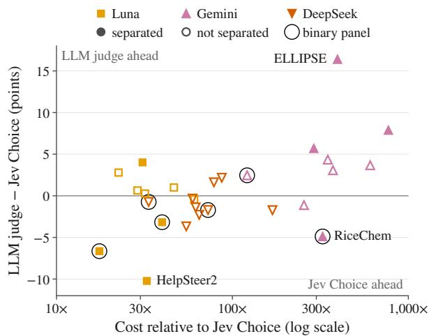  
Figure 1: Paired accuracy difference in points (LLM judge minus Jev Choice of Section 3.1, over the pairs both judges scored) against the LLM judge’s cost relative to Jev Choice on the same panel, one marker per judge and panel. Filled markers are separated comparisons (Section 3.5; Table C1 gives every interval). Ringed markers are the two binary panels.

On every graded panel the four judges’ agreement with one another exceeds their agreement with the human labels, and on six of the seven every judge’s mean level lies below the labels’ mean, by about a level on ELLIPSE’s learner essays. Their shortfall against the raters is concentrated in a minority of criteria and comes more from where a judge places units on the scale than from how it orders them. A post-hoc shift of each judge’s levels on a criterion by a constant removes most of it (Section 5.3).

One account is that the labels encode conventions that a judge reading only the criterion text never receives, such as judging a level relative to the population that the raters were trained to rate (Weigle, 1994; Glaser, 1963). On one criterion text shared by two dialogue corpora, the judges levels fall well below the labels on one corpus and near them on the other (Section 5.4). Priors shared through training data, or a common reluctance to grant top levels, could produce the same pattern, and on ELLIPSE our criterion sentence calls the top level “native-like facility”, which alone could lower the judges’ levels. The raters also worked from each benchmark’s own instructions, which may state what our rubric versions omit. No experiment varied the text, so the account is observational.

Jev’s confidence suggests a cascade that keeps its confident verdicts and pays an LLM judge for the rest, since on most panels its less confident verdicts err more often (Section 6.1). Such a cascade can beat the LLM judge only on kept pairs where Jev is right and that judge is wrong. These pairs are few because the judges make correlated errors: when one judge is wrong, another gives the same wrong verdict more often than independent errors would. The pairs on which the judges are wrong together are the “same places” of our title, and Jev’s errors are repeated most often where it is most confident. On its most confident errors, 96.0% of the LLM judges’ verdicts repeat its wrong answer, against about half under independence (Section 6.2). Replayed post hoc with thresholds chosen on half of the units and scored on the rest, a cascade that falls back on the best LLM judge nearly matches that judge at under half its cost on most panels. Even so, no cascade’s average gain over the best single judge of its panel, Jev’s own framings included, exceeds 1.5 points (Section 6.3).

We release every judge’s verdicts (Appendix M), and Table 5 turns the results into recommendations, each marked with the status of its evidence.

## 2 Related Work

Zheng et al. (2023) catalogued position, verbosity, and self-enhancement biases in LLM judges and found GPT-4 agreeing with human preferences about as often as humans agree with each other, and Chiang and Lee (2023) found LLM ratings consistent with expert ratings when the LLMs received the human evaluators’ instructions. JUDGE-BENCH (Bavaresco et al., 2025), which includes both USR sets used here and scores graded annotations by correlation, found that reliability varies with the property evaluated and the annotators’ expertise. High percent agreement can hide large differences between judge and human scores (Thakur et al., 2025), and uncertain human labels can make a machine look as good as a second human (Elangovan et al., 2025). We therefore report the offset (Section 3.5) beside agreement. Because disagreement among raters can be signal as well as noise (Plank, 2022), we also report unanimous and split pairs separately.

<table><tr><td>Panel</td><td>Unit (median words)</td><td>Criteria (words)</td><td>Scale</td><td>Human label</td><td>Rater ref.</td><td>Units</td><td>Pairs</td></tr><tr><td>RiceChem</td><td>chemistry long answer</td><td>27 (3–21)</td><td>binary</td><td>TA annotation</td><td>no</td><td>121</td><td>819</td></tr><tr><td>HealthBench</td><td>chatbot completion</td><td>34 (7–481)</td><td>binary</td><td>physician majority (2–5)</td><td>no</td><td>200</td><td>406</td></tr><tr><td>ELLIPSE</td><td>learner essay (392)</td><td>6 (27–36)</td><td>5 levels</td><td>mean of 2 trained raters</td><td>yes</td><td>258</td><td>1,548</td></tr><tr><td>FED-Turn</td><td>response turn (9)</td><td>7 + 1 binary (4–13)</td><td>3 levels</td><td>mean of  ${ \le } 5$  crowd workers</td><td>yes</td><td>75</td><td>600</td></tr><tr><td>FED-Dialogue</td><td>dialogue (123)</td><td>9 + 1 binary (6–13)</td><td>3 levels</td><td>mean of  ${ \le } 5$  crowd workers</td><td>yes</td><td>25</td><td>250</td></tr><tr><td>HelpSteer2</td><td>assistant response (215)</td><td>4 (15–32)</td><td>5 levels</td><td>one released label</td><td>no</td><td>90</td><td>360</td></tr><tr><td>LFQA</td><td>ELI5 answer (100)</td><td>3 (14–33)</td><td>3–4 levels</td><td>mean of 3 crowd workers</td><td>yes</td><td>120</td><td>360</td></tr><tr><td>USR-TC</td><td>dialogue response (19.5)</td><td>3 + 2 binary (11–43)</td><td>3 levels</td><td>mean of 3 researchers</td><td>yes</td><td>72</td><td>360</td></tr><tr><td>USR-PC</td><td>dialogue response (12)</td><td>3 + 2 binary (11–43)</td><td>3 levels</td><td>mean of 3 researchers</td><td>yes</td><td>60</td><td>300</td></tr></table>

Table 1: The nine panels. Unit: the judged submission, with its median length in whitespace words where recorded. Criteria: the number of criteria and the range of criterion-sentence lengths in words. Human label: see Section 3.4; for HealthBench, the number of physicians per pair is in parentheses. Rater ref.: whether the rater reference of Section 3.4 is available. USR-TC and USR-PC: USR Topical-Chat and USR PersonaChat. TA: teaching assistant. Sources: RiceChem (Sonkar et al., 2024), HealthBench (Arora et al., 2025), ELLIPSE (Crossley et al., 2023), FED (Mehri and Eskenazi, 2020a), HelpSteer2 (Wang et al., 2024b), LFQA (Kamoda et al., 2025), and USR (Mehri and Eskenazi, 2020b).

Prometheus and Prometheus 2 train open evaluators to score text against user-supplied rubrics (Kim et al., 2024a,b). CheckEval replaces Likert scoring with binary checklist questions and raises agreement (Lee et al., 2025), and HealthBench refined its consensus criteria until their intent was clear to its grader (Arora et al., 2025). LLM-Rubric answers each rubric question as a distribution over its options and trains a small network that maps those distributions to each human judge’s labels (Hashemi et al., 2024). Such a layer would absorb a systematic error like the offset we measure, which is why we fit none on top of any judge.

Prior automatic evaluation on the dialogue sets reports correlations with the rater mean. FED and USR introduced reference-free metrics there (Mehri and Eskenazi, 2020a,b), and G-Eval and LLM-Eval report LLM evaluators (Liu et al., 2023; Lin and Chen, 2023). On EL-LIPSE, supervised models reach a mean quadraticweighted kappa (QWK) of 0.854 on the six analytic traits (Aljuaid et al., 2025), and zero-shot GPT-4 reaches 0.307 on the holistic score (Hou et al., 2025), a different target. Essay graders built on LLMs assign lower scores than human raters (Kundu and Barbosa, 2024) and penalize minor errors that humans discount (Mathew et al., 2026), and in our data Jev also places ELLIPSE essays below the raters (Section 5.3). Calibration examples help GPT-4 rate short second-language essays (Yancey et al., 2023). Because a correlation with the rater mean does not register a constant shift, we also report exact accuracy and the offset, for four judges under one protocol.

Across more than 350 models, larger and more accurate models make highly correlated errors even across providers (Kim et al., 2025), and mistakes grow more similar as capability increases (Goel et al., 2025). We measure how often LLM judges repeat a typed classifier’s errors, against a baseline that fixes the criterion and the label (Section 6.2). A jury of smaller judges from different families can still reduce the bias of a single large judge (Verga et al., 2024). Probabilities over a closed option set can carry information about correctness (Guo et al., 2017; Kadavath et al., 2022), which selective prediction uses to abstain (Geifman and El-Yaniv, 2017) and cascades use to escalate from cheap to expensive models (Chen et al., 2024). Trust or Escalate (Jung et al., 2025) escalates between judges with a threshold set on a calibration set and a guarantee of human agreement, whereas we replay cascades from recorded verdicts with oracle and with cross-fitted thresholds (both defined in Section 6.3).

## 3 Judges, Panels, and Protocol

All judges run inside AutoRubric’s open-source criterion grader (Rao and Callison-Burch, 2026), which we call the harness. Of the nine panels (Table 1), RiceChem and HealthBench are the binary panels. The options of a graded criterion are ordered levels, and four of the seven graded panels also include binary criteria.

## 3.1 Jev

The vendor calls Jev a “System One” model and prices it at \$0.042 per million input tokens, with output tokens free. Requests named the jev-latest alias, which a stability check run on the same day logged as jev-1.13.0 (the main runs did not log the version; Appendix A). Besides one question per criterion of the unit, a request carries a structured record, which the vendor calls a state. The record holds the unit’s input (a prompt, conversation, or question) and the submission, the same two fields the harness passes to an LLM judge. Jev never sees the harness’s system prompt, and it always sees options in scale order. No judge sees an option’s value, the number from 0 to 1 that the harness attaches to each level.

Jev answers through three primitives, each read with its own decoding rule. Noul returns the probability that the answer is yes, which we threshold at 0.5. Choice returns a distribution over the supplied option labels, and we take its argmax. Score takes ordered level descriptions and returns the expected level, which we round to the closest level, breaking ties toward the even level (Appendix E compares this with the labels’ half-up rule of Section 3.4).

Aframing is a primitive together with our question wording (Table A2 gives every template). On the binary panels, Jev Choice asks Choice over the harness’s binary verdicts MET, UNMET, and CANNOT\_ASSESS, and Jev Noul asks Noul. Both frame the criterion with the wrapper, which places a fixed instruction sentence before it and gives the harness’s definitions of MET and UNMET as the descriptions of the answers. Bare Noul, which omits the wrapper, is reported in Appendix D.

On the graded panels, Jev Choice’s options are exactly those the LLM judges receive, with each option’s text as its label and the criterion sentence alone as the instruction. They include the NA option, “Cannot assess / not applicable”, which is appended to every graded criterion. Jev Score asks Score over the same option texts, read as ordered level descriptions, without the NA option, so it cannot abstain.

Both graded framings use Jev Noul on the 364 embedded binary pairs, the pairs of the binary criteria inside the FED and USR panels. Jev Choice and the three LLM judges are the matched judges, which carry the main comparisons, and Jev Score is the alternative framing. The matched judges and Jev Score together are thefive judges.

Jev’s confidence is the number that Choice and Score return in a confidence field with each answer, and 2 |P(yes) − 0.5| for Noul. For Choice the returned value closely tracks the largest probability, rescaled so that a uniform distribution scores 0, and the vendor documents no exact formula for either primitive (Appendix I). We use confidence only to rank pairs.

## 3.2 The LLM judges

Each LLM judge runs through the harness with its default system prompts, one call per pair. DeepSeek is reached through OpenRouter (Appendix A). The harness shuffles the options on every call with a logged seed to counter position bias (Wang et al., 2024a). Temperature is 0 except for Luna, whose API accepts only its default of 1.0. Reasoning effort is left at provider defaults, and all three judges emitted reasoning tokens, Luna far fewer than the other two (Appendix A). The multi-choice system prompt asks the judge to attend to negation, scope, and qualifying language and not to retreat to a middle option when unsure. When a submission contradicts itself and no stance dominates on an ordered scale, it asks for the lowerquality level. Table A2 gives the model identifiers (none names a dated snapshot) and every other difference between the judges’ inputs.

## 3.3 Panels

FED supplies two panels, FED-Turn and FED-Dialogue, and USR supplies USR-TC and USR-PC, whose conversations come from Topical-Chat (Gopalakrishnan et al., 2019) and PersonaChat (Zhang et al., 2018). LFQA’s questions and human answers come from ELI5 (Fan et al., 2019). ELLIPSE calls its criteria traits, and Help-Steer2 calls them attributes. The graded panels hold 3,778 of each matched judge’s 5,003 pairs.

Each graded panel is a 10% or 20% sample of units, stratified where the source allows and drawn with a fixed seed before any judge call (Table A1). The RiceChem panel is the 10% test split of each question’s responses (an 80/10/10 split with seed 42). The HealthBench panel holds 200 completions from 196 conversations and 406 pairs. Its 34 criteria are consensus criteria, the physicianvalidated subset of HealthBench’s criteria, and they use 30 distinct texts because some share a text across themes.

The criterion sentences and level descriptions of the graded panels come from rubric versions of each benchmark that we wrote for a separate, unpublished study of criterion aggregation and fixed before any judge in this study was run. They recast the FED and USR questions as statements, paraphrase HelpSteer2’s level wording, and take LFQA’s level descriptions from the rating prompt that the benchmark’s authors wrote for GPT-4. For ELLIPSE they keep the level descriptions of the corpus’s scoring rubric, typographic artifacts included, and give each trait a criterion sentence that ends by labelling level 5 “native-like facility”, a phrase that the corpus’s rubric uses only for its holistic top level. The rubric versions are released with the panels (Appendix M). The judges read these rubric versions, and the original raters read each benchmark’s own instructions. No judge sees labels, holistic scores, or sampling strata (Appendix A).

## 3.4 Labels and reference points

The human label of a graded pair is the mean of its raters’ levels, rounded to the nearest level with halves rounded up. Half-way means account for 46.8% of ELLIPSE labels and at most two labels on any other panel. The label of a binary pair is the rater majority, or on RiceChem the TA annotation (Table 1). A unanimous pair is one on which all raters give the same level, and a split pair is one on which they do not.

The rater reference scores each rater against the rounded mean of the other raters on the same pair, pooled over raters. It exists on the six graded panels that release more than one rating per pair. Help-Steer2’s label is the rounded mean of the three annotators who agree most, and its per-annotator ratings, published separately, were not used. On HealthBench, pairs whose physicians tied had left the pool before sampling, which makes a physician reference usable on only 50 pairs (Appendix D). The reference’s target averages one rater fewer than the label, so the reference shows where a single rater lands and does not bound what a judge can reach (in exact accuracy, Jev Choice exceeds it on LFQA and USR-TC; Table 2 and Appendix A).

Two no-read baselines, fitted on the evaluated pairs, predict labels without reading the unit. Help-Steer2’s is a constant predictor that names each attribute’s most frequent level, and it reaches 60.0% exact accuracy (Section 3.5). LFQA’s, the provenance baseline, reads only whether ChatGPT or a Reddit user wrote the answer and reaches 68.1%, with a mean QWK of 0.28.

## 3.5 Metrics and statistics

Pairs of graded criteria are ordinal pairs. Exact accuracy is the share of ordinal pairs whose predicted level equals the label, and within-one accuracy also counts a one-level miss as correct. Mean QWK is the unweighted mean of the per-criterion quadraticweighted kappas (Cohen, 1968). A judge’s offset on a criterion or panel is the mean of its predicted minus labelled level over the ordinal pairs, and its gap is its exact accuracy minus that of the rater reference, in points, negative where the judge falls short of the raters. On binary criteria we report verdict accuracy (the share of binary pairs whose verdict equals the label), Cohen’s κ (Cohen, 1960), and the MET-rate offset (the predicted minus the labelled MET rate, in points). Because chance-level exact accuracy changes with the number of levels, panels are compared through mean QWK, the offset, or the gap, never through the level of exact accuracy. Differences between reported values are computed before rounding, and stated bounds such as “at most” compare rounded values.

We compare two judges on the pairs both scored. Their paired accuracy difference is the number of those pairs that only the second judge gets right, minus the number that only the first gets right, over the number both scored. Pairs of one unit share its text, so we resample units with replacement, 10,000 times per comparison, and take percentile intervals of the difference. Two judges are separated when the 95% interval excludes zero. Two judges are at parity when the 90% interval of their accuracy difference lies within 5 points of zero, which amounts to two one-sided tests of equivalence at α = 0.05. A comparison that shows neither separation nor parity is inconclusive. We set the 5-point margin after the verdicts were collected, so Table C1 also gives the smallest margin that each comparison supports. Holm correction over the 27 comparisons of Jev Choice with an LLM judge uses the bootstrap p-value, twice the smaller share of replicates on either side of zero. Pair-level sign tests, which ignore clustering, and a sign test over units are in Appendix C.

Abstentions and judge-call failures are excluded from denominators, so two judges’ accuracies share a denominator only in a paired comparison. The exception is DeepSeek’s three failed calls on the binary panels, which the harness recorded as UN-MET verdicts (Appendix A). The pair set also differs between analyses, which is why one judge’s accuracy on a panel differs between tables: Table 2 counts a graded panel’s ordinal pairs, the comparisons of Jev Choice in Table C1 add its embedded binary pairs and keep the pairs both judges scored, and Table 4 counts every pair Jev answered, keeping Jev’s verdict where the cascade’s fallback judge (Section 6) abstained.

Cost is the list price applied to recorded token usage, except for DeepSeek, whose per-response cost billed by OpenRouter we use (Appendix B). Level shifts, cascades, and the other counterfactuals in this paper are post-hoc analyses of the collected verdicts, for which no judge was run again, and we label them wherever they appear.

## 4 Jev’s Accuracy, Cost, and Speed

This section assesses Jev as a replacement for an LLM judge, weighing accuracy against money and time. The saving is large on every panel, whereas the accuracy difference depends on the kind of criterion and on which LLM judge Jev would replace, so we compare accuracy one LLM judge and one panel at a time before turning to price and wall time. The section ends with two choices that any use of Jev involves: how to phrase its question and whether to let it abstain.

## 4.1 Accuracy in paired comparisons

Jev Choice ranks first on RiceChem, with 81.0% verdict accuracy against 76.1% to 79.2% for the LLM judges, and second on HealthBench, behind Gemini (Table 2). It is separated from Luna on both panels and from Gemini on RiceChem, and it is at parity with DeepSeek on both (Table C1).

Of the 21 comparisons on the graded panels, 16 do not separate Jev Choice from an LLM judge. The largest separation is Gemini’s lead on EL-LIPSE, 16.4 points (95% interval 14.1 to 18.7). Gemini is also ahead on FED-Dialogue and Help-Steer2. The other two separations involve Luna, which leads on USR-PC and trails Jev Choice on HelpSteer2, and DeepSeek is never separated from Jev Choice. Parity holds in 6 of the 21 graded comparisons, three with Luna, two with DeepSeek, and one with Gemini. The other 10 have 90% intervals that reach between 5.3 and 8.3 points from zero, so these samples can neither separate the judges nor show them equivalent.

Over all 27 comparisons, Holm correction keeps four separations, two in each direction: Gemini’s leads on ELLIPSE and on FED-Dialogue, and Jev

Choice’s leads over Luna on HelpSteer2 and over Gemini on RiceChem. Because several units can share a HelpSteer2 prompt, an LFQA question, or a USR context, we also resample these sampling groups instead of units, which changes four outcomes (Appendix C). Luna’s lead on USR-PC loses its separation, Jev Choice’s lead over DeepSeek on LFQA gains one, and two comparisons lose parity, which leaves eight separations, five of them Jev Choice’s leads.

Jev Choice is never the most accurate matched judge on a graded panel. It ranks second to fourth, and Gemini is the most accurate, or tied for it, everywhere except LFQA. Every judge falls short of the rater reference on ELLIPSE, FED-Dialogue, and USR-PC, and on ELLIPSE the best of them, Gemini, reaches 29.8% exact accuracy where the reference reaches 51.4%. HelpSteer2’s constant predictor (60.0%) is more accurate than every judge, significantly so in pair-level sign tests against all but Gemini $( p = 0 . 0 7 5 )$ . Both separations on that panel, Jev Choice’s lead over Luna and Gemini’s over Jev Choice, therefore rank judges that trail a constant. Against LFQA’s provenance baseline no judge’s exact accuracy differs significantly in a pair-level sign test, although every matched judge’s mean QWK, 0.43 to 0.51, is above the baseline’s 0.28, a difference we did not test (Appendix H).

## 4.2 Jev is cheaper and faster than every LLM judge

Over the nine panels Jev Choice cost \$0.063 (Table B1). Luna cost 29 times as much, DeepSeek 66 times, and Gemini 325 times. On single panels the ratio ranges from 18 (Luna on HealthBench) to 770 (Gemini on FED-Dialogue). Jev Choice finished the nine panels in 29 seconds of wall time. Luna took 859 seconds, Gemini 950, and DeepSeek 6,298, between 30 and 220 times as long as Jev Choice. These ratios understate Jev’s advantage at equal concurrency. Each Jev framing sent 8 requests at a time on the graded panels, with Jev Choice and Jev Score running together against one API, whereas each LLM judge sent 16 to 32 to its own provider.

The cost ratio tends to grow with the number of criteria per unit, because each criterion adds an LLM call but no Jev request (Section 3.1). For Gemini it rises from 121 on HealthBench, with 2.0 criteria per unit, to its maximum on FED-Dialogue, with 10, and across the graded panels it rises with every increase in criteria per unit. RiceChem departs from that order, and the Luna and DeepSeek ratios follow it less closely (Appendix B). Gemini’s per-token price and its reasoning tokens widen its cost ratio further. A harness that grades all of a unit’s criteria in one call, or an LLM judge run without reasoning, would narrow the ratios. We costed neither, and their effect on accuracy is unknown.

<table><tr><td></td><td colspan="2">Binary panels</td><td colspan="7">Graded panels</td></tr><tr><td></td><td>RiceChem</td><td>HealthBench</td><td>ELLIPSE</td><td>FED- Turn</td><td>FED- Dialogue</td><td>HelpSteer2</td><td>LFQA</td><td>USR- TC</td><td>USR- PC</td></tr><tr><td colspan="10">(a) Accuracy (%): verdict accuracy (binary) or exact accuracy (graded)</td></tr><tr><td>Jev Choice</td><td>81.0</td><td>77.1</td><td>13.4</td><td>56.2</td><td>48.6</td><td>48.6</td><td>68.7</td><td>62.0</td><td>56.4</td></tr><tr><td>Luna</td><td>77.8†</td><td>70.4†</td><td>14.1</td><td>57.7</td><td>46.7</td><td> $3 9 . 2 ^ { \frac { \dag } { \ast } }$ </td><td>71.6</td><td>62.5</td><td>60.6†</td></tr><tr><td>Gemini</td><td>76.1</td><td>79.6</td><td>29.8</td><td>60.6</td><td>56.9</td><td>54.6†</td><td>67.4</td><td>65.6</td><td>60.6</td></tr><tr><td>DeepSeek</td><td>79.2</td><td>76.4</td><td>15.0</td><td>59.5</td><td>46.9</td><td>46.8</td><td>65.0</td><td>58.8</td><td>57.8</td></tr><tr><td>Jev Score</td><td></td><td></td><td>15.3$</td><td>66.7$</td><td>51.6</td><td>44.4</td><td>69.7</td><td>66.2§</td><td>55.0</td></tr><tr><td>Rater reference</td><td>一</td><td></td><td>51.4</td><td>63.8</td><td>64.9</td><td></td><td>55.4</td><td>61.7</td><td>72.6</td></tr><tr><td>No-read baseline</td><td>一</td><td></td><td></td><td></td><td></td><td>60.0</td><td>68.1</td><td></td><td></td></tr><tr><td colspan="10">(b) Agreement: Cohen&#x27;s κ (binary) or mean QWK (graded)</td></tr><tr><td>Jev Choice</td><td>0.59</td><td>0.54</td><td>0.15</td><td>0.42</td><td>0.34</td><td>0.29</td><td>0.47</td><td>0.57</td><td>0.47</td></tr><tr><td>Luna</td><td>0.54</td><td>0.42</td><td>0.13</td><td>0.37</td><td>0.29</td><td>0.29</td><td>0.51</td><td>0.46</td><td>0.52</td></tr><tr><td>Gemini</td><td>0.52</td><td>0.59</td><td>0.29</td><td>0.39</td><td>0.35</td><td>0.34</td><td>0.48</td><td>0.60</td><td>0.58</td></tr><tr><td>DeepSeek</td><td>0.56</td><td>0.53</td><td>0.16</td><td>0.39</td><td>0.36</td><td>0.30</td><td>0.43</td><td>0.50</td><td>0.42</td></tr><tr><td>Judge-judge</td><td></td><td></td><td>0.38</td><td>0.57</td><td>0.61</td><td>0.66</td><td>0.70</td><td>0.65</td><td>0.61</td></tr><tr><td>Judge-label</td><td>1</td><td></td><td>0.18</td><td>0.39</td><td>0.35</td><td>0.31</td><td>0.46</td><td>0.53</td><td>0.50</td></tr><tr><td>Rater reference</td><td>一</td><td></td><td>0.50</td><td>0.36</td><td>0.29</td><td></td><td>0.39</td><td>0.46</td><td>0.52</td></tr><tr><td colspan="10">(c) Offset: MET-rate offset in points (binary) or offset in levels (graded)</td></tr><tr><td>Jev Choice</td><td>+7.1</td><td>+6.2</td><td>-1.25</td><td>-0.37</td><td>-0.56</td><td>-0.33</td><td>-0.18</td><td>0.00</td><td>-0.36</td></tr><tr><td>Luna</td><td>+2.2</td><td>-13.8</td><td>-1.28</td><td>-0.23</td><td>-0.55</td><td>-0.48</td><td>-0.18</td><td>+0.12</td><td>-0.27</td></tr><tr><td>Gemini</td><td>-6.8</td><td>+0.2</td><td>-0.77</td><td>-0.15</td><td>-0.35</td><td>-0.26</td><td>-0.09</td><td>-0.00</td><td>-0.39</td></tr><tr><td>DeepSeek</td><td>+3.9</td><td>-1.5</td><td>-1.16</td><td>-0.18</td><td>-0.52</td><td>-0.39</td><td>-0.12</td><td>+0.16</td><td>-0.33</td></tr></table>

Table 2: Main results. Judge–judge is the mean pairwise QWK among the four matched judges and judge–label their mean QWK with the labels, both on the ordinal pairs all four scored. Bold marks the highest value in each column of (a) and (b) among the judges listed in that block. † marks a judge separated from Jev Choice (Section 3.5; the embedded binary pairs are included on the graded panels), and ‡ one that also survives Holm correction. Separation also depends on how the paired difference varies across units, so equal accuracies can differ in separation (Luna and Gemini on USR-PC). § marks a Jev Score cell separated from Jev Choice on the ordinal pairs. Gemini’s USR-TC offset is −0.005. Jev Noul’s results are in Table D1, Jev Score’s agreement and offset in Table C3, and costs in Table B1.

## 4.3 Framing and abstention

Jev Noul and Jev Choice give nearly the same verdicts on binary criteria, with Cohen’s κ = 0.945 between them over the 8,392 pairs of the full RiceChem set, which only Jev judged. Their accuracies differ by 0.9 points on RiceChem and 0.2 on HealthBench. The wrapper matters more, adding 10.7 points over bare Noul on RiceChem, though only 1.0 point on HealthBench (Appendix D).

Jev Score is separated from Jev Choice on four graded panels (ELLIPSE, FED-Turn, FED-Dialogue, and USR-TC), each time in its own favour (Table C1), and has the higher within-one accuracy on all seven. Its exact accuracy is lower, without separation, on HelpSteer2 and USR-PC. The difference between the two framings exceeds the spread among the three LLM judges only on FED-Turn, where it is 10.5 points against a spread of 2.9 and Jev Score has the highest exact accuracy of any judge (Table 2). There they differ most in their use of the middle level, “Somewhat.”, which the labels use on 32.6% of pairs, Jev Score on 29.1%, and Jev Choice on 11.2%. Reading each framing’s probabilities with the other’s decoding rule, a post-hoc analysis, shows that most or all of the difference comes from the probabilities the two primitives return and little or none from the decoding rules (Appendix E, where Figure E1 also compares the framings on every panel).

Offered the NA option, Jev Choice abstained on 28 of the 3,414 ordinal pairs. Seventeen of them are on FED-Dialogue error\_recovery, the one criterion on which the raters often answered N/A. Jev Choice’s probability for the NA option rises with the number of raters who did (Spearman $\rho = 0 . 6 2$ over 25 dialogues), and the LLM judges abstain largely on the same pairs (Appendix F).

## 5 Shared Departures from the Human Labels

Section 4 compared the judges with one another. This section compares the four matched judges with the human labels of the seven graded panels and finds their departures from the labels common to all four. The judges miss mostly in the same direction and on largely the same criteria, and most of their gap to the raters lies in where they place units on the scale. Natural contrasts in the panels are consistent with conventions, rating rules that the raters followed and our criterion texts leave out, and the last subsection weighs that reading against its alternatives.

## 5.1 Judge–judge agreement exceeds judge–label agreement

The judge–judge row of Table 2 exceeds the judge– label row on all seven graded panels, and on five of them even the least-agreeing pair of judges agrees more closely than the best judge agrees with the labels. Label noise alone could produce this pattern (Section 5.5). So could a common offset, which lowers each judge’s agreement with the labels but not its agreement with the other judges (Section 5.2). The judges’ errors also overlap. All four are wrong on 64.0% of ELLIPSE pairs, and a post-hoc selection of whichever judge is right on each pair would reach only the remaining 36.0%, below the rater reference. ELLIPSE is the only panel with a rater reference on which such a selection stays below it (Table J2).

## 5.2 The gap concentrates in criteria with negative offsets

Across the 31 graded criteria with a rater reference (all but HelpSteer2’s four), the four matched judges’ mean offset tracks their mean gap (Spearman $\rho = 0 . 9 2 ; \mathrm { F i g u r e } 2 )$ . Most of this correlation is mechanical, because a large offset forces low exact accuracy. It locates the gap without testing its cause. With cut-offs chosen only to describe the pattern, 11 of the 12 criteria more than 15 points below the reference have a mean offset below −0.5 levels (Appendix G). Each of the 15 criteria whose mean offset lies within 0.3 levels of zero is at most 6 points below the reference (the shaded band of

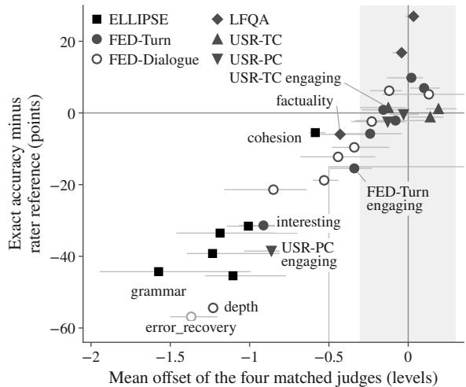  
Figure 2: Mean offset of the four matched judges (whiskers: their range) against their mean gap (Section 3.5), for each of the 31 criteria that have a rater reference. Marker shape gives the panel, the shaded band marks absolute offsets below 0.3 levels, and the grey guide bounds the region with a mean offset above −0.5 levels and a gap below −15 points, which holds only FED-Turn engaging. FED-Dialogue error\_recovery, whose label averages one to five raters, is drawn in light grey.

Figure 2). The offsets also agree in sign across judges. All four are negative on 25 of all 35 graded criteria, HelpSteer2’s included, and all four are positive on 2.

## 5.3 A constant shift removes most of the gap

A judge’s location on a criterion is the part of the scale on which it places the criterion’s units. To measure how much of the gap is location, we shift each judge’s predictions on a criterion, post hoc, by the whole number of levels that maximizes its exact accuracy, clipped to the scale, and choose the shift for each pair from the criterion’s other pairs (a leave-one-out shift). After this shift the mean gap no longer tracks the offset (Spearman $\rho = 0 . 1 6$ $p = 0 . 4 0 )$ , and no criterion stays more than 8.4 points below the unshifted reference. The comparison favours the judges where most labels are at the top of a three-level scale, because a clipped shift of one level then partly amounts to predicting the top level and would raise a rater’s agreement too. Giving the judges and the rater reference each their own best shift leaves four criteria more than 5 points below the shifted reference, led by FED-Dialogue informative (−16.2 points) and LFQA factuality (−12.7; Appendix G). On the other

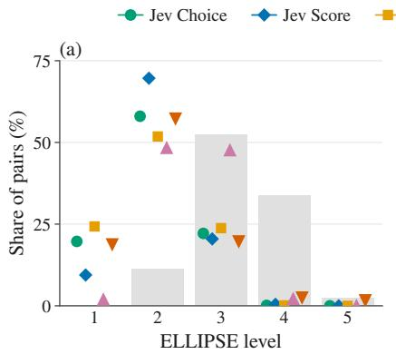

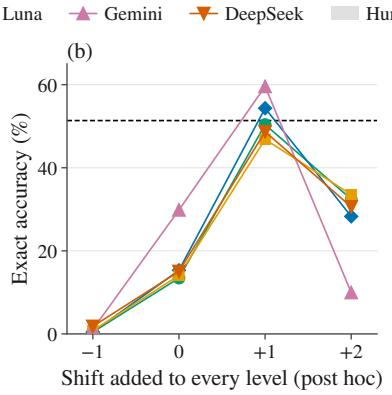

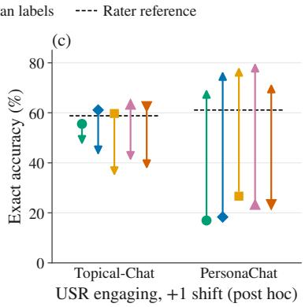  
Figure 3: (a) Share of ELLIPSE pairs at each level for the human labels (grey bars) and five judges (markers, with DeepSeek over the 1,543 pairs it answered). (b) ELLIPSE exact accuracy after a post-hoc shift that adds a constant s to every predicted level, clipped to the scale, with the rater reference dashed. (c) USR engaging: exact accuracy before (marker) and after (arrowhead) a post-hoc shift of +1 level, with dashed segments at each corpus’s unshifted rater reference on engaging alone (58.8% on Topical-Chat and 61.1% on PersonaChat, below the panel-level values of Table 2); Section 5.4 compares the shifted judges with a shifted rater.

27, the shifted judges are at most 5 points below the shifted rater reference.

ELLIPSE has the largest offsets. The matched judges’ offsets run from −0.77 levels (Gemini) to −1.28 (Luna), and Jev Choice’s is −1.25. Jev Choice places 86.1% of its predictions below the label and 0.5% above it, so nearly all of its errors lie in one direction. The judges rarely use the top of the scale (Figure 3a). The labels put 36.3% of pairs at levels 4 and 5, and no judge puts more than 4.2% there. Half-up rounding of the labels accounts for about 0.23 levels of Jev Choice’s offset and does not change the sign of any judge’s offset (Appendix G).

The offset leaves the order of the essays largely intact. The mean of the option values that a judge chose for an essay’s six traits correlates with the essay’s holistic score at Spearman ρ = 0.62 to 0.72 across the matched judges (Table C3d). On single traits Jev Choice’s rank agreement with the raters is close to one rater’s with the other (Appendix G).

In a post-hoc shift of every ELLIPSE prediction one level up, Jev Choice’s exact accuracy rises from 13.4% to 50.4%, close to the rater reference (Figure 3b). The raters’ own best shift on ELLIPSE is zero, so the shift corrects only the judges’ location. It leaves their predictions spread over fewer levels than the labels (Appendix G).

## 5.4 Natural contrasts and candidate conventions

Table 3 lists the clearest candidate conventions, of three kinds: a population norm, a corpus-relative standard, and annotation habits. We identified them by reading the judges’ errors. Since the judges read our rubric versions and the raters their benchmark’s own instructions (Section 3.3), a convention absent from our texts may be stated in what the raters read. We checked this only on ELLIPSE, whose source rubric we compared with ours. Four natural contrasts bear on the candidates. None was designed as an experiment, and only the first three hold one factor approximately fixed.

The first contrast varies the judge and holds the pairs fixed. Every judge’s offset is negative on the six graded panels other than USR-TC (Tables 2 and C3), and besides three LLM judges from three vendors, the judges include Jev Choice, which never sees the harness prompt, and Jev Score, which decodes by expected level. Neither a shared prompt nor a shared decoding rule is therefore the common cause.

The second contrast, on the USR panels, holds the criterion text fixed and changes the corpus. Their five criterion texts are byte-identical on Topical-Chat and PersonaChat. On engaging, however, the matched judges’ offset is large on PersonaChat and small on Topical-Chat (Table 3), and PersonaChat’s raters gave the top level in 59.4% of their ratings, against 34.7% on Topical-Chat. The judges order responses similarly on both corpora (Spearman $\rho = 0 . 5 0$ to 0.72 with the rater mean), so the corpora differ in where the judges place responses relative to the labels. A post-hoc shift of one level up raises every matched judge’s exact accuracy on PersonaChat from at most 26.7% to at least 69.5% and lowers it on Topical-Chat (Figure 3c). Part of that rise is mechanical, because 63.3% of the PersonaChat labels are at the top level. A rater given its own best shift reaches 80.0%, and the shifted judges average 5.1 points below it (Appendix G). We read the PersonaChat labels as corpus-relative. The contrast holds the text fixed but leaves other differences. Topical-Chat responses are grounded in facts, which the top level (“presents an interesting fact”) mentions, and raters were assigned to contexts in rotation on Topical-Chat and in fixed triples on PersonaChat.

<table><tr><td>Panel, criterion</td><td>Text the judges received</td><td>What the labels also encode</td><td>Evidence</td></tr><tr><td>ELLIPSE grammar</td><td>“Level 3: Some errors in grammar and usage.&quot; The criterion sentence adds “level 5 = native-like facility&quot;.</td><td>Error frequency judged against grade 8–12 English learners, learned in rater training</td><td>Exact 0.4–19.0% against a reference of 50.4%; offset —0.99 to -1.95</td></tr><tr><td>USR-PC engaging</td><td>“Interesting: the response is very interesting or presents an interesting fact.&quot; (identical on Topical-Chat)</td><td>(population norm) Interest judged relative to the responses in the corpus (corpus-relative standard)</td><td>Offset -0.73 to -1.03 on PersonaChat, -0.01 to -0.31 on Topical-Chat; a post-hoc +1 shift gives 69.5–80.0% exact, and a</td></tr><tr><td>FED-Dialogue depth</td><td>“The system discusses topics in depth.&quot;</td><td>Depth judged by what a chatbot conversation can offer (annotation habit)</td><td>rater given its best shift 80.0% Exact 4.0% for every matched judge (Jev Score 8.0%) against a reference of 58.4%</td></tr><tr><td>LFQA factuality, top level</td><td>“Entirely accurate: ... can be relied upon as a trusted source of information.&quot;</td><td>Top level granted to answers with errors that the LLM judges name, in two quoted cases (annotation habit)</td><td>Top level for 50 of 120 answers by the raters and 12 of 118 by Jev Choice; Jev Choice exact 17.4% on 23 unanimous pairs, 46.3% on</td></tr><tr><td>HelpSteer2 correctness</td><td>“All pertinent facts are included and the response contains no errors.&quot;</td><td>Overall helpfulness, which the label tracks (annotation habit)</td><td>95 split pairs Label-helpfulness Pearson r = 0.94; judge QWK with the</td></tr><tr><td>USR-TC uses_knowledge</td><td>“Given the fact the response is conditioned on, the response uses</td><td>MET when the context has no fact (annotation habit)</td><td>label 0.16–0.30 Raters MET on 18 of 18 _nofact pairs (17 unanimous); Jev Noul</td></tr><tr><td>USR-TC understandable</td><td>that fact well&quot; “This is independent of whether the response is on topic or otherwise well-formed.&quot;</td><td>Self-contradictory responses failed, a stricter rule than the text (annotation habit)</td><td>UNMET on 16 Jev Noul MET rate 90.3% against 68.1%; 17.4–34.8% correct on UNMET pairs</td></tr><tr><td>ELLIPSE cohesion</td><td>Level 4: “a range of cohesive devices used appropriately such as reference and transitional words&quot;</td><td>none identified; the levels name observable devices</td><td>Every judge&#x27;s best trait, 35.8–44.6% exact against 45.3%;</td></tr><tr><td>HelpSteer2 verbosity</td><td>“amount of detail, relative to what the prompt asked for&quot;</td><td>none identified</td><td>offset −0.52 to -0.62 Judge QWK 0.58–0.69, against at most 0.33 on the other three attributes</td></tr></table>

Table 3: Candidate conventions: what the labels encode beyond the criterion text of our rubric versions, quoted verbatim. The third column is our interpretation of the evidence in the fourth. Ranges span the four matched judges unless stated, and every shift is a post-hoc analysis. The two rows below the rule are contrasts in which the text names something observable in the unit.

The third contrast varies the criterion within a rubric, where the judges, prompt, and units stay the same. ELLIPSE’s best and worst traits differ in what their level descriptions name. The trait cohesion, whose level descriptions name observable devices, is every judge’s best. Every judge does worst on grammar, whose levels differ only by the quantifiers “throughout”, “many”, “some”, “minimal”, and “few or no” (Table 3). The cohesion trait still carries an offset of −0.52 to −0.62 levels, and with six traits the level descriptions cannot be distinguished from other trait differences, such as criterion length (Appendix H). Every matched judge also agrees best with the HelpSteer2 labels on verbosity, which describes an amount of detail visible in the response.

The fourth contrast varies the form of the criterion. For Jev, moving from binary to graded criteria reverses the direction of the error, although this contrast also changes panel, domain, and label source. Jev over-grants MET on both binary panels (Appendix D), where the LLM judges’ METrate offsets have no common sign (Table 2). Its graded offsets, by contrast, are negative outside USR-TC. The two embedded binary criteria of USR-TC split in direction. Every judge over-grants MET on understandable (Jev Noul’s MET rate is 90.3% against 68.1% labelled) and under-grants it on uses\_knowledge (37.5% against 58.3%). On the same responses, then, the direction of every judge’s error follows the criterion, so Jev’s reversal need not come from the change of form itself.

Two rows of Table 3, ELLIPSE and LFQA, are argued from the texts and labels themselves. We read ELLIPSE’s labels as carrying a population norm. Its level descriptions come from the corpus’s English-proficiency scoring rubric, which its trained raters applied to essays by English learners in grades 8 to 12 (Crossley et al., 2023). The judges received those same descriptions, so any population norm reached the raters through their training. A norm-referenced scale interprets a level relative to a population instead of a stated standard (Glaser, 1963), and rater training supplies expectations about the population and a reference group of other raters (Weigle, 1994). A zero-shot judge receives only the descriptions and our criterion sentence, which ends “(level 1 = lowest proficiency, level 5 = native-like facility)” (Section 3.3). A judge that reads “some errors” against native-like writing would place learner essays low. The offset may therefore reflect this label for level 5 as well as the missing population. The small-error penalty reported for LLM essay graders (Mathew et al., 2026) offers another account, which these data do not distinguish from a population norm.

LFQA’s raters grant the top factuality level far more often than Jev Choice does (Table 3). Two of three raters placed each of the two ChatGPT answers quoted in Appendix H at that level, and in both the three LLM judges object to the same false claims, which the top-level text excludes.

## 5.5 Label noise, the harness prompt, and shared priors

Label noise alone does not explain the errors on ELLIPSE, LFQA factuality, or USR-TC uses\_knowledge. Zero-mean noise in the labels would scatter the errors on both sides of the label, but almost all of Jev Choice’s ELLIPSE errors lie below it (Section 5.3). Noise would also concentrate the errors on split pairs, yet Jev Choice is wrong more often on unanimous LFQA factuality pairs than on split ones, and on the 18 USR-TC pairs whose context has no fact (the \_nofact pairs), where Jev Noul answers UNMET on 16, 17 of the raters’ MET labels are unanimous (Table 3). Elsewhere the evidence that the judges place units lower than the raters do is weaker. On a three-level scale whose labels are mostly at the top, a judge that uses fewer levels than the raters shows a negative mean offset even without placing units lower. Criterion length, unit length, rater expertise, and scale width do not order the panels by Jev Choice’s gap (Appendix H). The panel with the largest gap, ELLIPSE, is the one rated by trained raters, which is weak evidence against an account based on label quality.

Although Section 5.4 rules out the harness prompt as the common cause, its instructions, such as its rule for self-contradicting submissions (Section 3.2), may still add to the LLM judges’ offsets. Jev Choice, without them, is nonetheless offset further on ELLIPSE than Gemini and DeepSeek (Table 2). A reluctance to grant high levels, shared by all judges, is harder to exclude. It would produce a larger offset where raters use the top level more, which is the pattern of USR engaging. The embedded binary criteria rule out only a general bias toward failing verdicts, because all judges overgrant MET on understandable.

Priors shared through overlapping training data could also produce correlated errors (Kim et al., 2025). Giving the same texts to untrained human readers, or giving the judges exemplars, would distinguish that account from missing conventions.

## 6 Correlated Errors Undo the Cascade Advantage

A cascade lets a cheap judge answer every pair and sends the pairs whose confidence falls below a threshold τ , the deferred pairs, to a fallback judge. The cheap judge’s verdict stands on the remaining kept pairs. A cheap judge whose confidence tracks its own errors is the natural first stage of a cascade, whose accuracy can exceed the fallback’s only through kept pairs on which the cheap judge alone is right. The gain is therefore limited by how few such pairs exist and by how well confidence finds them. On most graded panels, the less confident Jev is, the more often it is wrong (Section 6.1), yet the LLM judges repeat its wrong answers beyond what independent errors would produce, most strongly where Jev is most confident (Section 6.2). The replayed cascades therefore save cost on most panels but gain little over the best single judge (Section 6.3), and no median jury improves significantly on the most accurate matched judge (Section 6.4).

<table><tr><td></td><td colspan="2">Best single judge</td><td colspan="4">Cascade, oracle threshold</td><td colspan="2">Cross-fitted</td><td colspan="3">Matching the best LLM judge</td></tr><tr><td>Panel</td><td>Judge</td><td></td><td>Acc. Fallback Deferred</td><td></td><td></td><td>1 Acc. vs. best vs. best</td><td></td><td>Halvings &gt;0</td><td>Oracle cost</td><td>Cross- fitted cost</td><td>Held- out</td></tr><tr><td>RiceChem</td><td>Jev Choice</td><td>81.0</td><td>Gemini</td><td>12.1</td><td>80.6</td><td>-0.4</td><td>-1.0</td><td>6</td><td></td><td>6.6</td><td>+1.2</td></tr><tr><td>HealthBench</td><td>Gemini</td><td>79.6</td><td>Gemini</td><td>33.5</td><td>81.5</td><td>+2.0</td><td>+1.5</td><td>80</td><td>17.5</td><td>15.6</td><td>-0.5</td></tr><tr><td>ELLIPSE</td><td>Gemini</td><td>29.8</td><td>Gemini</td><td>99.9</td><td>29.8</td><td>0.0</td><td>-0.1</td><td>0</td><td>100.1</td><td>99.8</td><td>-0.1</td></tr><tr><td>FED-Turn</td><td>Jev Score</td><td>70.7</td><td>Gemini</td><td>49.0</td><td>65.5</td><td>-5.2</td><td>-7.3</td><td>0</td><td>49.2</td><td>45.5</td><td>-0.7</td></tr><tr><td>FED-Dialogue</td><td>Gemini</td><td>59.7</td><td>Gemini</td><td>99.6</td><td>59.7</td><td>0.0</td><td>-0.9</td><td>40</td><td>99.7</td><td>77.9</td><td>-2.1</td></tr><tr><td>HelpSteer2</td><td>Gemini</td><td>54.3</td><td>Gemini</td><td>45.2</td><td>54.8</td><td>+0.6</td><td>-0.9</td><td>4</td><td>30.5</td><td>35.6</td><td>-1.8</td></tr><tr><td>LFQA</td><td>Luna</td><td>71.5</td><td>Luna</td><td>52.2</td><td>72.1</td><td>+0.6</td><td>+0.6</td><td>52</td><td>38.8</td><td>39.0</td><td>-0.7</td></tr><tr><td>USR-TC</td><td>Gemini</td><td>70.6</td><td>Gemini</td><td>59.2</td><td>70.8</td><td>+0.3</td><td>-0.7</td><td>30</td><td>59.4</td><td>47.5</td><td>-1.1</td></tr><tr><td>USR-PC</td><td>Gemini</td><td>74.6</td><td>Gemini</td><td>28.4</td><td>75.9</td><td>+1.3</td><td>+0.8</td><td>76</td><td>10.3</td><td>31.3</td><td>-0.2</td></tr></table>

Table 4: Jev-first cascades against the best single judge (post-hoc analysis; Section 6.3 defines the thresholds and the best single judge, and Section 3.5 the pair set). Values are percentages except vs. best and held-out, which are differences in points. The best single judge and the oracle-threshold cascade are chosen on all of a panel’s pairs. Cross-fitted: the gain on held-out halves, averaged over 50 halvings, with every choice made on the other half; halvings > 0 is the share with a positive gain. Matching the best LLM judge (DeepSeek on RiceChem, Luna on LFQA, and Gemini elsewhere): the cost, as a share of that judge’s and including Jev’s own run, of the cheapest cascade with that judge as fallback that matches its accuracy (– where Jev alone exceeds it), and the cross-fitted cascade’s held-out accuracy minus that judge’s. Appendix K gives thresholds, every fallback, costs, and the kept and deferred pairs.

## 6.1 Jev’s confidence ranks its own errors

Jev Choice’s errors gather among its less confident verdicts on every graded panel but ELLIPSE (Figure 4a). On those six panels the area under the receiver operating characteristic curve (AUROC) of its confidence for its own correctness is 0.57 to 0.70, embedded binary pairs included with their Noul confidence. ELLIPSE is the exception, with an AUROC of 0.49 and an error rate of 85.8% to 87.2% in every confidence band of width 0.25 that holds more than one pair (Appendix I).

Confidence also fails on single criteria inside panels where it otherwise ranks errors. Its AU-ROC is 0.41 on LFQA factuality, against 0.70 for the panel, and 0.52 on USR-PC engaging. There Jev Choice is wrong on 83.1% of the pairs at a mean confidence of 0.72. These criterionlevel values are post hoc and rest on 118 and 59 pairs. They suggest that confidence fails on criteria where most errors lie on one side of the label, though not on all of them (ELLIPSE vocabulary has an offset of −1.28 levels and an AUROC of 0.62). Confidence still ranks errors on HelpSteer2 correctness, whose labels track overall helpfulness (AUROC 0.76; Table I1e).

## 6.2 The LLM judges repeat Jev’s confident errors

When Jev Choice is wrong, an LLM verdict that gives the same wrong answer is a repeated error. The share of repeated errors among the LLM verdicts on Jev’s wrong pairs is our measure of the correlated errors of Section 1. Judges that share an offset would often pick the same wrong level even if their errors were independent given the label, so we compare this share with an independence baseline: for each LLM verdict, the rate at which that judge gives Jev’s wrong answer on the other pairs with the same criterion and label. Over all of Jev Choice’s errors, the share exceeds the baseline on every graded panel, by 18.8 to 34.2 points on six of them and by 8.6 points on ELLIPSE, where each judge’s own tendency to place essays low already accounts for most of the repetition (Table I1c). The excess peaks in Jev’s top confidence band on every panel (Figure 4b). There 80.5% to 92.8% of the LLM judges’ verdicts on Jev’s wrong pairs repeat its answer, where the baseline predicts 33.6% to 63.7%.

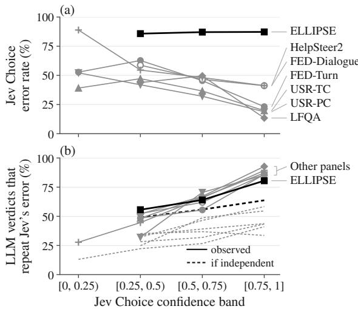  
Figure 4: Jev Choice’s confidence band against (a) its error rate and (b) the share of the three LLM judges verdicts on its wrong pairs that repeat its wrong answer (solid), with the independence baseline of Section 6.2 (dashed). One line per graded panel, ELLIPSE in black and the other six panels in grey. Bands with fewer than 20 pairs (a) or 20 Jev errors (b) are omitted.

The confident-error sample holds Jev Choice’s 12 highest-confidence errors on each graded panel, 84 pairs in all (Table J1). In their verdicts on these pairs, the three LLM judges repeat Jev’s wrong answer 96.0% of the time (242 of 252), where the independence baseline gives 50.3%. HealthBench’s confident errors are Jev Noul’s and were sampled by a different rule. Of the 36 LLM verdicts on them, 32 give Jev’s answer, against 10.0 expected under the baseline (Appendix J).

If Jev’s confidence reflects how strongly the unit and the criterion text favour one answer, LLM judges that read the same text would give that answer too and would all miss a label that differs from it. The labels suggest a second reading. Most confident errors sit on pairs whose raters disagree. Only 10 of the 72 on panels with several raters per pair are unanimous, and every FED and LFQA one is split (Appendix J). On a split pair, part of what counts as a repeated error may be disagreement among the raters. That reading does not apply to the unanimous pairs, such as a USR-TC \_nofact pair, or to HealthBench, where 11 of the 12 confident errors have unanimous physician labels.

## 6.3 Cascades lower cost but add little accuracy

As a post-hoc analysis we replay Jev-first cascades on the recorded verdicts. Jev Choice is the first stage on the graded panels and Jev Noul on the binary panels, where τ is set on |P(yes) − 0.5|, half the confidence (Appendix K). The best single judge is chosen from all judges, every Jev framing included. A threshold chosen on the same pairs on which it is evaluated is an oracle threshold, and the gains it gives are optimistic. A cross-fitted threshold is chosen on a random half of the units and evaluated on the other half. We average over 50 such halvings, and each half also chooses its fallback and its best single judge from its own pairs.

With cross-fitted thresholds, no cascade beats the best single judge by more than 1.5 points on average over the halvings, a margin reached on

HealthBench (Table 4). The cascade falls below the best single judge on six of the nine panels, by 0.1 to 7.3 points, and its gain is positive in more than half of the halvings only on HealthBench, USR-PC, and LFQA. Oracle thresholds raise the largest gain to 2.0 points, again on HealthBench, but neither that gain nor the next largest, 1.3 points on USR-PC, is significant in a pair-level sign test on the kept pairs (Table K2). Jev Score, the best single judge on FED-Turn, beats every FED-Turn cascade by at least 5.2 points.

Because the cascade and its fallback agree on the deferred pairs, their accuracies differ only through the kept pairs:

$$
a _ { \mathrm { c a s c a d e } } - a _ { \mathrm { f a l l b a c k } } = s _ { \mathrm { k e p t } } ( a _ { \mathrm { J e v } } ^ { \mathrm { k e p t } } - a _ { \mathrm { f a l l b a c k } } ^ { \mathrm { k e p t } } ) ,\tag{1}
$$

where a is accuracy and $s _ { \mathrm { k e p t } }$ the kept share. For the oracle-threshold cascades of Table 4, kept pairs on which Jev alone is right are few on the graded panels, because on the pairs Jev keeps, Jev and the fallback are mostly right together and wrong together. For example, Jev alone is right on 10 of FED-Turn’s 306 kept pairs and Gemini alone on 8 (Table K2). Wherever one of these graded cascades beats its fallback, Jev and the fallback are within 2 points of each other on the kept pairs. The pairs that only Jev gets right also cap the gain, and on most graded panels Jev’s confidence keeps few of them. Measured against the fallback of Table 4, Jev alone is right on only 12 to 37 pairs of a graded panel (Table C2), and on FED-Turn, LFQA, and USR-TC its confidence defers most of them to the fallback (Table K2). USR-PC, where Jev keeps 10 of its 16 such pairs, has the largest gain among the graded panels. The fallback’s lead on the deferred pairs, significant on six panels in pair-level sign tests, lifts a cascade above Jev alone, but by Equation (1) it cannot lift the cascade above the fallback.

When the best LLM judge is the fallback and thresholds are cross-fitted, the cascade costs 16% to 48% as much as that judge on six panels and loses 0.2 to 1.8 points of its held-out accuracy. It does better on RiceChem, where Jev alone is more accurate than the best LLM judge, costing 6.6% as much and gaining 1.2 points. Oracle thresholds reach the judge’s accuracy on the same six panels at 10% to 59% of its cost. Even with oracle thresholds, a cascade on ELLIPSE or FED-Dialogue must defer nearly every pair to match the best LLM judge (Appendix K). What limits the cascade there is Jev’s accuracy. Jev Choice is separated behind Gemini on both panels (Section 4.1), and on ELLIPSE its confidence does not rank its errors.

## 6.4 Juries do not beat the best single judge

A jury pools the verdicts of several judges. On the pairs that all four matched judges scored, we take the median level of the three LLM judges, which on a binary pair is their majority, and compare it post hoc with the most accurate matched judge, which is chosen on those same pairs and so favoured by the comparison. That judge is also the best single judge of Section 6.3 on every panel except FED-Turn, where Jev Score is more accurate still. The median is never more accurate than that judge on any of the nine panels. It trails by up to 12.8 points on the graded panels (ELLIPSE), and its 95% interval lies wholly below zero on ELLIPSE, HelpSteer2, and RiceChem. A fourth juror, Jev Choice, never improves significantly on that judge either. The three-judge median also returns Jev’s wrong answer on 82 of the 84 pairs of the confident-error sample, and the label on one (Appendix J).

## 7 Discussion

## 7.1 Judge validation and judge combination

Comparing judges on the same pairs, as Section 4 does for Jev and three LLM judges, is the way to decide whether one judge can stand in for another, given enough pairs to be decisive. How close any judge comes to the raters is a separate question, and the answer appears to depend on what the raters knew beyond the text the judges read. In the two within-rubric contrasts of Section 5.4, ELLIPSE cohesion and HelpSteer2 verbosity, the judges come closest where a level description points to something a reader can see in the unit. Where, on our reading, a level’s meaning depends on a population, a corpus, or an annotation habit, every judge falls short in the same direction, the best LLM judge included.

The vendor lists literal reading of scoping words and negations among Jev’s known failure modes.2 The LLM judges share Jev’s offsets and most of its confident errors even though they emit reasoning tokens and their prompt tells them to watch negation and scope. One reading is that all of these judges read the criterion text as written. Shared training priors would produce the same pattern (Section 5.5), and our data do not separate the two accounts. If the first reading holds, agreement with labels on a graded rubric measures in part whether the judge was given the raters’ conventions, such as reading ELLIPSE essays against the population of learner essays they come from.

Jev’s confidence is informative enough on most graded panels to decide which pairs need an LLM judge, and the correlated errors of Section 6.2 largely account for both the cost saving and the small accuracy gain of the replayed cascades. Because the LLM judges tend to make Jev’s mistakes, keeping Jev’s confident verdicts costs little accuracy, which lets the cross-fitted cascades avoid most of what the best LLM judge would cost on most panels. For the same reason there is little accuracy to gain. On the pairs a cascade keeps, Jev and its fallback seldom differ in correctness, and on Jev’s most confident errors the LLM judges give Jev’s answer about twice as often as independent errors would. The same overlap helps explain why, in Section 6.4, no median jury of the LLM judges beats the most accurate matched judge. We recommend that evaluations of combined judges report the share of repeated errors against an independence baseline (Section 6.2).

## 7.2 Recommendations

The rubric-writing rows of Table 5 rest on observations that we did not test by intervention. Top levels worded as absolutes (“Entirely accurate”, “Fully clear and internally consistent throughout”) were read differently from the raters in both directions. Jev Choice seldom used LFQA’s absolute top factuality level, which the raters often chose (Section 5.4), whereas on five of its confident errors all five judges chose HelpSteer2’s absolute coherence top level where the label was one level lower (Appendix J). Jev Choice never predicts the middle level on FED-Turn correct and fluent, whose texts state yes-or-no properties (Appendix E). One global correction would not fit every trait, since the per-trait ELLIPSE offsets in Table 5 span more than a level.

Beyond the rows of Table 5, evaluations of rubric judges should separate unanimous from split pairs before interpreting errors, report each judge’s framing and decoding rule, and, when attributing a property to one judge, compare several judges on identical pairs.

<table><tr><td>Recommendation</td><td>Evidence</td><td>Status</td></tr><tr><td>Consider Jev in place of a flash-tier LLM judge on binary criteria like those of RiceChem and HealthBench</td><td>Most accurate matched judge on RiceChem and second to Gemini on HealthBench; the LLM judges (two panels) cost 18 (Luna, HealthBench) to 326 (Gemini, RiceChem) times as much there</td><td>measured</td></tr><tr><td>On graded criteria, expect Jev Choice to be within 5 points of a flash-tier LLM judge in some comparisons and behind the best LLM judge on some panels</td><td>6 of 21 comparisons at parity and 10 inconclusive; Gemini ahead on three panels, Luna on one, and Jev Choice ahead of Luna on one</td><td>measured</td></tr><tr><td>Consider Jev Score for graded criteria when abstention is not needed, and report Jev Choice for matched</td><td>Jev Score separated ahead of Jev Choice on four panels and never separated behind it; it cannot</td><td>measured</td></tr><tr><td>comparisons Give Jev the verdict definitions (the wrapper) on binary criteria</td><td>abstain +10.7 and +1.0 points over bare Noul</td><td>measured</td></tr><tr><td>Offer an NA option on every graded criterion</td><td>28 abstentions in 3,414 pairs; P(NA) tracks human N/A answers (Spearman ρ = 0.62)</td><td>observed</td></tr><tr><td>Check confidence per criterion before deferring on it</td><td>Uninformative on ELLIPSE; AUROC 0.41 on LFQA observed factuality</td><td></td></tr><tr><td>Use a Jev-first cascade to lower cost, and expect little gain in accuracy</td><td>Largest cross-fitted gain +1.5 points (HealthBench); measured on six panels, 16–48% of the best LLM judge&#x27;s cost (post hoc, for at most 1.8 points less accuracy, and on</td><td>cross-fitted)</td></tr><tr><td>Do not expect a jury of these judges to beat the most accurate matched judge</td><td>Median of the LLM judges below or tied with that judge on all nine panels; wrong with Jev on 82 of 84 (post hoc) confident errors</td><td>measured</td></tr><tr><td>Report the offset beside agreement, and judge-judge beside judge-label agreement</td><td>Table 2; Figure 2</td><td>observed</td></tr><tr><td>On norm-referenced scales, supply exemplars</td><td>Jev Choice&#x27;s per-trait ELLIPSE offsets —0.62 to —1.77 levels</td><td>not tested</td></tr><tr><td>Where labelled pairs exist, correct each criterion&#x27;s offset Worst remaining gap —8.4 points after the</td><td>leave-one-out shift of Section 5.3, and —16.2 when</td><td>measured (post hoc)</td></tr><tr><td>Avoid absolute top levels unless meant literally</td><td>judges and raters both get their best shift LFQA factuality (Table 3)</td><td>not tested</td></tr><tr><td>Avoid three-level scales for yes-or-no properties</td><td>FED-Turn middle level (Appendix E)</td><td>not tested</td></tr></table>

Table 5: Recommendations and the status of their evidence. Measured: a paired comparison or an exact computation from the recorded verdicts supports the recommendation on these panels, validated on held-out units only where marked cross-fitted. Observed: the data show the pattern without a test of the recommendation. Not tested: no experiment addressed it.

## 7.3 Binary-panel expectations on graded panels

Several expectations formed on the two binary panels did not hold on the graded panels, and others held only in narrower forms (Table L1). The direction of Jev’s errors, for instance, reverses between the two kinds of panel (Section 5.4), and Jev Choice, which never chose CANNOT\_ASSESS on the binary panels, abstained on 28 graded pairs. Besides the scale, the two binary panels share checklist criteria (question-specific presence checks on RiceChem, consensus behaviour checks on Health-Bench), expert labels, and one wording of the abstain option. Because the graded panels also change the domain and the options and instruction that Jev receives, we attribute no failure to scale type alone.

## 8 Conclusion

On binary checklist criteria Jev Choice ranked first of the matched judges on RiceChem and second on HealthBench, at a small fraction of any LLM judge’s cost and time. On graded criteria it trailed the best LLM judge on every panel, significantly on several, so there its value depends on which LLM judge it replaces.

On graded panels the matched judges departed from the labels together, mostly by placing units lower than the raters. Conventions missing from our criterion texts would explain this, as would shared training priors or the wording of our rubric versions, and our data cannot tell these apart. Jev’s confidence picked out its likelier errors on most graded panels, yet correlated errors left a cascade little to gain. With cross-fitted thresholds the replayed cascades saved cost, improved on the best single judge by at most 1.5 points, and on six panels fell below it.

For building rubric judges, these results favour testing changes to what judges are told, such as exemplars or level descriptions that name observable features, before adding judges given the same text. For evaluating them, each judge’s offset and agreement with other judges belong beside its agreement with the labels, and a cascade or jury should be reported with how often its members repeat one another’s errors.

## Limitations

Observational account. No experiment supplied exemplars or rewrote level descriptions. The account could be tested by rerunning ELLIPSE with exemplar essays for each level and with a grammar scale that names observable features and drops the native-like label for level 5, and by rerunning every graded panel with its benchmark’s own instructions to raters in place of our rubric version. The candidate conventions came from inspecting the judges’ errors (Section 5.4), and the cross-panel aggregations of Sections 5 and 6 were computed after the offset had been observed. Because none of the four judges’ vendors discloses the training data, priors that the judges share cannot be ruled out.

Judge configuration. The LLM judges are flashtier models with the harness’s default prompt, used zero-shot, and Luna runs at its enforced temperature (Section 3.2). This matches the question of replacing the harness’s LLM call with Jev but does not measure the best obtainable LLM judge. No larger model, few-shot prompt, graded wrapper for Jev, or LLM run without the prompt’s instructions on middle levels and self-contradiction was tried, and Jev Choice was not run without the NA option. The judges also receive different instructions and option orders (Sections 3.1 and 3.2). Jev receives a unit’s criteria together in a single request, and we did not test whether the questions of one request influence one another’s answers.

Runs. The main runs judged each graded panel once. Jev and Luna, the two judges run more than once, are not deterministic. Across five passes over RiceChem, about 3% of Jev’s pairs flipped verdict at least once, and in a spot check of 82 graded pairs two Luna runs gave the same verdict on 71 (Appendix A). Jev was not rerun on a graded panel, and Gemini and DeepSeek were never run a second time. DeepSeek’s calls were also spread over several upstream providers.

Samples. Per-criterion results rest on 25 to 258 units, because the graded panels are 10% or 20% samples. Two results rest on very little data. Jev Choice answered only 8 error\_recovery pairs, and the \_nofact result comes from three contexts. The confident-error sample takes only 12 errors from each graded panel, whereas the band analysis of Figure 4b uses every error.

Statistics. The main intervals resample units, not the larger sampling groups, and Section 4.1 reports what changes when the groups are resampled instead. The 5-point equivalence margin is post hoc (Section 3.5), and because it is absolute it is lenient where accuracy is low, as on ELLIPSE. The criteria singled out in the confidence analysis and the cut-offs of Section 5.2 were chosen after inspecting the data. The location analysis of Section 5.3 is leave-one-out, but its one-level ELLIPSE shift and the USR shift of Section 5.4 were chosen on the pairs they are scored on. Cascade gains under oracle thresholds are optimistic, the cross-fitted estimates rest on halves as small as 12 units, cascade costs are linear estimates, and only deferral on the confidence of Jev Choice or Jev Noul was tried.

Labels and text. Nearly half of the ELLIPSE labels depend on the rounding rule (Section 3.4). Our rubric versions depart from the benchmarks own questions and rubrics (Section 3.3), and we compared them with what the raters read for EL-LIPSE alone. On the other six graded panels a convention that our texts omit may be stated in the raters’ own instructions. The HelpSteer2 and LFQA labels partly reflect something other than the named criterion. HelpSteer2 correctness tracks overall helpfulness at Pearson r = 0.94, and provenance alone predicts LFQA labels about as well as the judges do on exact accuracy. A judge may also have seen the items or labels of these public benchmarks in training.

Scope. We tested one typed classifier. Later calls under the same model names may return different verdicts, because no judge was called by a dated model version (Sections 3.1 and 3.2). The graded panels are all English, four of the seven are dialogue, and the longest graded unit is 1,114 words. Prices are list or billed prices on one date, and the

LLM judges’ cost depends on reasoning defaults that providers can change.

## Ethics Statement

This study uses public benchmarks as their authors released them and collects no new human-subject data. HealthBench’s health-related conversations serve only as evaluation material. We report every judge’s cost from recorded token usage and list or billed prices (Appendix B). The authors are not incentivized by TypeSafe, which develops Jev, or by its industry competitors. We release the verdict records of every judge so that the paper’s numbers can be recomputed without calling any model API, and Appendix M lists the records and the values that need other inputs.

## Acknowledgments

This research was developed with funding from the Defense Advanced Research Projects Agency’s (DARPA) SciFy program (Agreement No. HR00112520300) and is based upon work supported in part by the Office of the Director of National Intelligence (ODNI), Intelligence Advanced Research Projects Activity (IARPA), via 56000026C0019 (the BENGAL program). The views and conclusions contained herein are those of the authors and should not be interpreted as necessarily representing the official policies, either expressed or implied, of DARPA, ODNI, IARPA, the Department of Defense, or the U.S. Government. The U.S. Government is authorized to reproduce and distribute reprints for governmental purposes notwithstanding any copyright annotation therein.

## Generative AI Use Disclosure

Generative AI tools (LLMs and coding agents) were used in the preparation of this paper. The corresponding author has checked the outputs and takes complete responsibility for any resulting inaccuracies.

## References

Hind Aljuaid, Areej Alhothali, Ohoud Al-Zamzami, and Hussein Assalahi. 2025. TransGAT: Transformer-based graph neural networks for multidimensional automated essay scoring. Preprint, arXiv:2509.01640.

Rahul K. Arora, Jason Wei, Rebecca Soskin Hicks, Preston Bowman, Joaquin Quiñonero-Candela, Foivos

Tsimpourlas, Michael Sharman, Meghan Shah, Andrea Vallone, Alex Beutel, Johannes Heidecke, and Karan Singhal. 2025. HealthBench: Evaluating large language models towards improved human health. Preprint, arXiv:2505.08775.

Anna Bavaresco, Raffaella Bernardi, Leonardo Bertolazzi, Desmond Elliott, Raquel Fernández, Albert Gatt, Esam Ghaleb, Mario Giulianelli, Michael Hanna, Alexander Koller, Andre Martins, Philipp Mondorf, Vera Neplenbroek, Sandro Pezzelle, Barbara Plank, David Schlangen, Alessandro Suglia, Aditya K. Surikuchi, Ece Takmaz, and Alberto Testoni. 2025. LLMs instead of human judges? A large scale empirical study across 20 NLP evaluation tasks. In Proceedings ofthe 63rd Annual Meeting ofthe Associationfor Computational Linguistics (Volume 2: Short Papers), pages 238–255, Vienna, Austria. Association for Computational Linguistics.

Lingjiao Chen, Matei Zaharia, and James Zou. 2024. FrugalGPT: How to use large language models while reducing cost and improving performance. Transactions on Machine Learning Research.

Cheng-Han Chiang and Hung-yi Lee. 2023. Can large language models be an alternative to human evaluations? In Proceedings of the 61st Annual Meeting of the Associationfor Computational Linguistics (Volume 1: Long Papers), pages 15607–15631, Toronto, Canada. Association for Computational Linguistics.

Jacob Cohen. 1960. A coefficient of agreement for nominal scales. Educational and Psychological Measurement, 20(1):37–46.

Jacob Cohen. 1968. Weighted kappa: Nominal scale agreement provision for scaled disagreement or partial credit. Psychological Bulletin, 70(4):213–220.

Scott Crossley, Yu Tian, Perpetual Baffour, Alex Franklin, Youngmeen Kim, Wesley Morris, Meg Benner, Aigner Picou, and Ulrich Boser. 2023. The English Language Learner Insight, Proficiency and Skills Evaluation (ELLIPSE) corpus. International Journal ofLearner Corpus Research, 9(2):248–269.

Aparna Elangovan, Lei Xu, Jongwoo Ko, Mahsa Elyasi, Ling Liu, Sravan Babu Bodapati, and Dan Roth. 2025. Beyond correlation: The impact of human uncertainty in measuring the effectiveness of automatic evaluation and LLM-as-a-judge. In The Thirteenth International Conference on Learning Representations.

Angela Fan, Yacine Jernite, Ethan Perez, David Grangier, Jason Weston, and Michael Auli. 2019. ELI5: Long form question answering. In Proceedings of the 57th Annual Meeting ofthe Associationfor Computational Linguistics, pages 3558–3567, Florence, Italy. Association for Computational Linguistics.

Yonatan Geifman and Ran El-Yaniv. 2017. Selective classification for deep neural networks. In Advances in Neural Information Processing Systems, volume 30. Curran Associates, Inc.

Robert Glaser. 1963. Instructional technology and the measurement of learning outcomes: Some questions. American Psychologist, 18(8):519–521.

Shashwat Goel, Joschka Strüber, Ilze Amanda Auzina, Karuna K. Chandra, Ponnurangam Kumaraguru, Douwe Kiela, Ameya Prabhu, Matthias Bethge, and Jonas Geiping. 2025. Great models think alike and this undermines AI oversight. In Proceedings ofthe 42nd International Conference on Machine Learning, volume 267 of Proceedings ofMachine Learning Research, pages 19621–19678. PMLR.

Karthik Gopalakrishnan, Behnam Hedayatnia, Qinlang Chen, Anna Gottardi, Sanjeev Kwatra, Anu Venkatesh, Raefer Gabriel, and Dilek Hakkani-Tür. 2019. Topical-Chat: Towards knowledge-grounded open-domain conversations. In Proceedings ofInterspeech 2019, pages 1891–1895. ISCA.

Anisha Gunjal, Anthony Wang, Elaine Lau, Vaskar Nath, Yunzhong He, Bing Liu, and Sean Hendryx. 2026. Rubrics as rewards: Reinforcement learning beyond verifiable domains. In The Fourteenth International Conference on Learning Representations, pages 127924–127945.

Chuan Guo, Geoff Pleiss, Yu Sun, and Kilian Q. Weinberger. 2017. On calibration of modern neural networks. In Proceedings ofthe 34th International Conference on Machine Learning, volume 70 of Proceedings ofMachine Learning Research, pages 1321– 1330. PMLR.

Helia Hashemi, Jason Eisner, Corby Rosset, Benjamin Van Durme, and Chris Kedzie. 2024. LLM-Rubric: A multidimensional, calibrated approach to automated evaluation of natural language texts. In Proceedings of the 62nd Annual Meeting of the Association for Computational Linguistics (Volume 1: Long Papers), pages 13806–13834, Bangkok, Thailand. Association for Computational Linguistics.

Zhaoyi Hou, Alejandro Ciuba, and Xiang Li. 2025. Improving LLM-based automatic essay scoring with linguistic features. In Proceedings of the Innovation and Responsibility in AI-Supported Education Workshop, volume 273 of Proceedings of Machine Learning Research, pages 41–65. PMLR.

Jaehun Jung, Faeze Brahman, and Yejin Choi. 2025. Trust or escalate: LLM judges with provable guarantees for human agreement. In The Thirteenth International Conference on Learning Representations, pages 3101–3125.

Saurav Kadavath, Tom Conerly, Amanda Askell, Tom Henighan, Dawn Drain, Ethan Perez, Nicholas Schiefer, Zac Hatfield-Dodds, Nova DasSarma, Eli Tran-Johnson, Scott Johnston, Sheer El-Showk, Andy Jones, Nelson Elhage, Tristan Hume, Anna Chen, Yuntao Bai, Sam Bowman, Stanislav Fort, and 17 others. 2022. Language models (mostly) know what they know. Preprint, arXiv:2207.05221.

Go Kamoda, Akari Asai, Ana Brassard, and Keisuke Sakaguchi. 2025. Quantifying the influence of evaluation aspects on long-form response assessment. In Proceedings ofthe 31st International Conference on Computational Linguistics, pages 8787–8808, Abu Dhabi, UAE. Association for Computational Linguistics.

Elliot Myunghoon Kim, Avi Garg, Kenny Peng, and Nikhil Garg. 2025. Correlated errors in large language models. In Proceedings ofthe 42nd International Conference on Machine Learning, volume 267 of Proceedings of Machine Learning Research, pages 30038–30066. PMLR.

Seungone Kim, Jamin Shin, Yejin Cho, Joel Jang, Shayne Longpre, Hwaran Lee, Sangdoo Yun, Seongjin Shin, Sungdong Kim, James Thorne, and Minjoon Seo. 2024a. Prometheus: Inducing finegrained evaluation capability in language models. In The Twelfth International Conference on Learning Representations, pages 29927–29962.

Seungone Kim, Juyoung Suk, Shayne Longpre, Bill Yuchen Lin, Jamin Shin, Sean Welleck, Graham Neubig, Moontae Lee, Kyungjae Lee, and Minjoon Seo. 2024b. Prometheus 2: An open source language model specialized in evaluating other language models. In Proceedings of the 2024 Conference on Empirical Methods in Natural Language Processing, pages 4334–4353, Miami, Florida, USA. Association for Computational Linguistics.

Anindita Kundu and Denilson Barbosa. 2024. Are large language models good essay graders? Preprint, arXiv:2409.13120.

Yukyung Lee, JoongHoon Kim, Jaehee Kim, Hyowon Cho, Jaewook Kang, Pilsung Kang, and Najoung Kim. 2025. CheckEval: A reliable LLM-as-a-judge framework for evaluating text generation using checklists. In Proceedings ofthe 2025 Conference on Empirical Methods in Natural Language Processing, pages 15782–15809, Suzhou, China. Association for Computational Linguistics.

Yen-Ting Lin and Yun-Nung Chen. 2023. LLM-Eval: Unified multi-dimensional automatic evaluation for open-domain conversations with large language models. In Proceedings ofthe 5th Workshop on NLPfor Conversational AI (NLP4ConvAI 2023), pages 47– 58, Toronto, Canada. Association for Computational Linguistics.

Yang Liu, Dan Iter, Yichong Xu, Shuohang Wang, Ruochen Xu, and Chenguang Zhu. 2023. G-Eval: NLG evaluation using GPT-4 with better human alignment. In Proceedings of the 2023 Conference on Empirical Methods in Natural Language Processing, pages 2511–2522, Singapore. Association for Computational Linguistics.

Jerin George Mathew, Sumayya Taher, Anindita Kundu, and Denilson Barbosa. 2026. LLMs do not grade essays like humans. Computers and Education: Artificial Intelligence, 11:100666.

Shikib Mehri and Maxine Eskenazi. 2020a. Unsupervised evaluation of interactive dialog with DialoGPT. In Proceedings of the 21th Annual Meeting of the Special Interest Group on Discourse and Dialogue, pages 225–235, 1st virtual meeting. Association for Computational Linguistics.

Shikib Mehri and Maxine Eskenazi. 2020b. USR: An unsupervised and reference free evaluation metric for dialog generation. In Proceedings of the 58th Annual Meeting ofthe Associationfor Computational Linguistics, pages 681–707, Online. Association for Computational Linguistics.

Barbara Plank. 2022. The “problem” of human label variation: On ground truth in data, modeling and evaluation. In Proceedings of the 2022 Conference on Empirical Methods in Natural Language Processing, pages 10671–10682, Abu Dhabi, United Arab Emirates. Association for Computational Linguistics.

Delip Rao and Chris Callison-Burch. 2026. Autorubric: A unifying framework for rubric-based LLM evaluation on non-verifiable tasks. In Conference on Language Modeling (COLM). ArXiv:2603.00077.

Shashank Sonkar, Kangqi Ni, Lesa Tran Lu, Kristi Kincaid, John S. Hutchinson, and Richard G. Baraniuk. 2024. Automated long answer grading with RiceChem dataset. In Artificial Intelligence in Education: 25th International Conference, AIED 2024, volume 14829 of Lecture Notes in Computer Science, pages 163–176, Cham. Springer Nature Switzerland.

Aman Singh Thakur, Kartik Choudhary, Venkat Srinik Ramayapally, Sankaran Vaidyanathan, and Dieuwke Hupkes. 2025. Judging the judges: Evaluating alignment and vulnerabilities in LLMs-as-judges. In Proceedings of the Fourth Workshop on Generation, Evaluation and Metrics (GEM2), pages 404–430, Vienna, Austria and virtual meeting. Association for Computational Linguistics.

Pat Verga, Sebastian Hofstätter, Sophia Althammer, Yixuan Su, Aleksandra Piktus, Arkady Arkhangorodsky, Minjie Xu, Naomi White, and Patrick Lewis. 2024. Replacing judges with juries: Evaluating LLM generations with a panel of diverse models. Preprint, arXiv:2404.18796.

Peiyi Wang, Lei Li, Liang Chen, Zefan Cai, Dawei Zhu, Binghuai Lin, Yunbo Cao, Lingpeng Kong, Qi Liu, Tianyu Liu, and Zhifang Sui. 2024a. Large language models are not fair evaluators. In Proceedings of the 62nd Annual Meeting of the Association for Computational Linguistics (Volume 1: Long Papers), pages 9440–9450, Bangkok, Thailand. Association for Computational Linguistics.

Zhilin Wang, Yi Dong, Olivier Delalleau, Jiaqi Zeng, Gerald Shen, Daniel Egert, Jimmy J. Zhang, Makesh Narsimhan Sreedhar, and Oleksii Kuchaiev. 2024b. HelpSteer 2: Open-source dataset for training top-performing reward models. In Advances in Neural Information Processing Systems (Datasets and

Benchmarks Track), volume 37, pages 1474–1501. Curran Associates, Inc.

Sara Cushing Weigle. 1994. Effects of training on raters of ESL compositions. Language Testing, 11(2):197– 223.

Kevin P. Yancey, Geoffrey Laflair, Anthony Verardi, and Jill Burstein. 2023. Rating short L2 essays on the CEFR scale with GPT-4. In Proceedings ofthe 18th Workshop on Innovative Use of NLP for Building Educational Applications (BEA 2023), pages 576– 584, Toronto, Canada. Association for Computational Linguistics.

Saizheng Zhang, Emily Dinan, Jack Urbanek, Arthur Szlam, Douwe Kiela, and Jason Weston. 2018. Personalizing dialogue agents: I have a dog, do you have pets too? In Proceedings of the 56th Annual Meeting of the Association for Computational Linguistics (Volume 1: Long Papers), pages 2204–2213, Melbourne, Australia. Association for Computational Linguistics.

Lianmin Zheng, Wei-Lin Chiang, Ying Sheng, Siyuan Zhuang, Zhanghao Wu, Yonghao Zhuang, Zi Lin, Zhuohan Li, Dacheng Li, Eric P. Xing, Hao Zhang, Joseph E. Gonzalez, and Ion Stoica. 2023. Judging LLM-as-a-judge with MT-Bench and Chatbot Arena. In Advances in Neural Information Processing Systems (Datasets and Benchmarks Track), volume 36, pages 46595–46623. Curran Associates, Inc.

## A Panels, Judges, and Protocol

Sampling. Each graded panel was drawn with seed 20260919 by proportional allocation over the strata of Table A1 and written to disk before any judge was called. Sampling units are kept whole. The four answers to an LFQA question, the responses to one USR context, and the two responses of a HelpSteer2 preference pair enter the sample together. LFQA and the two USR panels have no strata and are simple random samples of questions or contexts. Section 3.3 gives the RiceChem split and the size of the HealthBench panel. Health-Bench’s completions were stratified by theme and by whether the labels of a completion’s criteria are all MET, mixed, or all UNMET.

Leakage. The protection against label leakage is structural. The harness passes a judge only a unit’s input and its submission, and Jev’s state contains only these two fields. Human labels are stored apart from the units, and holistic scores, strata, and the identity of the system that produced a unit sit in a description field that no judge receives. No graded panel has a reference submission. HealthBench’s physician-written ideal completion is removed from every judge’s input, except in one Jev ablation that lies outside the protocol (Appendix D).

<table><tr><td>Panel</td><td>Population; sample</td><td>Strata</td><td>Raters per pair; label</td><td>Half-way</td><td>Rater ref. exact / QWK</td><td>Unit words: median (mean; range)</td></tr><tr><td>RiceChem</td><td>1,240 responses to 4 questions; 121 held out (10% of each question, seed 42)</td><td>question: 32, 31, 29,29</td><td>released teaching-assistant label</td><td></td><td></td><td></td></tr><tr><td>HealthBench</td><td>200 completions from theme (7) × 196 conversations</td><td>verdict class: all MET 66, mixed 68, all UNMET 66</td><td>2–5 physicians (866 labels); majority</td><td></td><td></td><td></td></tr><tr><td>ELLIPSE</td><td>2,571 test-set essays; 258 (10%)</td><td>prompt × holistic band (106 strata)</td><td>2 trained raters; mean</td><td>725</td><td>51.4 / 0.50</td><td>392 (427.9; 46-1,114)</td></tr><tr><td>FED-Turn</td><td>375 turns; 75 (20%)</td><td>Mitsuku 26, human on one pair); mean 25</td><td>system: Meena 24, 5 crowd workers (4</td><td>1</td><td>63.8 / 0.36</td><td>9 (12.5; 2–38)</td></tr><tr><td></td><td>FED-Dialogue 125 dialogues; 25 (20%)</td><td>system: Meena 8, Mitsuku 9, human 8</td><td>5 crowd workers (1–5 on error_recovery);</td><td>2</td><td>64.9 / 0.29</td><td>123 (131.0; 42–284)</td></tr><tr><td>HelpSteer2</td><td>448 preference pairs (896 responses); 45 pairs, 90 responses (10%)</td><td>preference strength: released label: weak 52, strong 38 rounded mean of responses</td><td>the 3 most-agreeing</td><td></td><td></td><td>215 (251.2; 1–905)</td></tr><tr><td>LFQA</td><td>300 questions with 4 answers each; 30 questions, 120 answers (10%)</td><td>none</td><td>annotators 3 crowd workers; mean</td><td></td><td>0 55.4 / 0.39</td><td>100 (104.9; 8–656)</td></tr><tr><td>USR-TC</td><td>60 contexts with 6 responses each; 12 contexts, 72 responses</td><td>none</td><td>3 dialogue researchers; mean</td><td></td><td>0 61.7 / 0.46</td><td>19.5 (22.9; 6–58)</td></tr><tr><td>USR-PC</td><td>(20%) 60 contexts with 5 responses each; 12 contexts, 60 responses (20%)</td><td>none</td><td>3 dialogue researchers; mean</td><td></td><td>0 72.6 / 0.52</td><td>12 (12.9; 6–30)</td></tr></table>

Table A1: Construction of the nine panels. The sample gives sampled units and the sampled fraction. Half-way: labels whose rater mean is a half level. Rater reference (Section 3.4): pooled exact accuracy (%) and mean QWK. Unit words: whitespace words in the submission; RiceChem’s result files do not hold the submissions, and HealthBench’s record completion length in characters only. HealthBench’s 406 pairs by theme: hedging 108, context seeking 66, health data tasks 60, communication 54, emergency referrals 50, complex responses 38, globa health 30; its units by number of criteria: one 30, two 134, three 36.

Criterion text. Every judge receives the criterion and option strings of the rubric versions described in Section 3.3. A FED question recast as a statement reads “To the average person, the response is interesting.” The typographic artifacts that the ELLIPSE level descriptions keep from the corpus’s rubric include “capitalizatio n” and “inappropri ately”. Every criterion of the graded panels carries the same weight.

Labels. Ratings of N/A are dropped before the mean is taken. This affects FED-Dialogue error\_recovery (Appendix F) and one FED-Turn fluent pair, whose label rests on four raters. Halfway means are kept, and Table A1 counts them. ELLIPSE labels average the two raters’ individual scores, and the benchmark’s released score is not used. An embedded binary criterion takes the rater majority. A tie would have removed the pair, and none occurred.

Rater reference. The rater reference of Section 3.4 uses the metric functions applied to the judges and pools over units with at least two raters. Each rater on a binary criterion is compared with the majority of the others, and ties are skipped. Panel exact accuracy pools the graded criteria in proportion to their rater comparisons, and panel QWK is mean QWK as defined in Section 3.5. The smaller target of Section 3.4 matters most when a unit has few raters, since with three raters it is the mean of two ratings. With three raters per unit on the USR panels, the reference is 100.0% on unanimous pairs and 34.4% (USR-TC) or 42.0% (USR-PC) on split pairs, so its value is set largely by the share of unanimous pairs. Of the leave-oneout factuality targets on LFQA, 48.3% are halfway means of two ratings and round up, whereas no three-rater label on LFQA is half-way. Label uncertainty of this kind can distort any comparison with human agreement (Elangovan et al., 2025).

<table><tr><td>Judge (criteria)</td><td>Primitive</td><td>Instruction or prompt</td><td>Options, in the order shown</td><td>Verdict</td></tr><tr><td>bare Noul (binary panels)</td><td>Noul</td><td>{requirement}</td><td>none</td><td>MET if  $P ( \mathrm { y e s } ) \geq 0 . 5$ </td></tr><tr><td>Jev Noul (binary panels; embedded binary criteria)</td><td>Noul</td><td>Determine whether this criterion is satisfied by the submission.Criterion: {requirement}</td><td>true:  $D _ { \mathrm { { M E T } } } ;$  false:  $D _ { \mathrm { U N M E T } }$ </td><td>MET if  $P ( \mathrm { y e s } ) \geq 0 . 5 ;$  cannot abstain</td></tr><tr><td>Jev Choice (binary panels)</td><td>Choice</td><td>the Jev Noul instruction</td><td>MET: DMET; UNMET: DUNMET; most probable option  $\mathbf { C A N N O T \_ A S S E S S : } D _ { \mathrm { C A } }$ </td><td></td></tr><tr><td>Jev Choice (graded Choice criteria)</td><td></td><td>{requirement}</td><td>every option text as an option label, in scale order, the NA option last; description fields left</td><td>most probable option; NA is an abstention</td></tr><tr><td>Jev Score (graded criteria)</td><td>Score</td><td>{requirement}</td><td>empty the same option texts as level descriptions, in scale order; no NA option</td><td>expected level, rounded half to even; cannot abstain</td></tr><tr><td>LLM judges (binary criteria)</td><td></td><td>harness&#x27;s default binary system prompt; user message with the criterion type,</td><td>MET, UNMET, CANNOT_ASSESS, defined in the system prompt with  $D _ { \mathrm { M E T } }$ </td><td>JSON with the status and an explanation</td></tr><tr><td>LLM judges (graded criteria)</td><td></td><td>submission with the criterion as a question, numbered options,</td><td>harness&#x27;s default multi-choice option labels, the NA option system prompt; user message included, shuffled for every call</td><td>JSON with the option number and an explanation; NA is an abstention</td></tr></table>

Table A2: What each judge receives. {requirement} is the criterion text, verbatim. $D _ { \mathrm { { M E T } } } = \mathrm { { ^ { \circ } T h e } }$ thing described in the criterion IS present in the submission”; $D _ { \mathrm { U N M E T } } = { } ^ { 6 6 } ]$ The thing described in the criterion IS NOT present in the submission”; $D _ { \mathrm { C A } } = \cdot$ “Insufficient evidence to determine either way (use rarely)”. Jev’s definitions are copied verbatim from the harness’s binary system prompt; every criterion has positive weight, so the harness’s definitions for negative criteria were never used. The wrapper of Section 3.1 is the Jev Noul instruction with $D _ { \mathrm { M E T } }$ and $D _ { \mathrm { U N M E T } }$ . The LLM judges’ model identifiers, as their APIs report them, are gpt-5.6-luna, gemini-3.8-flash, and deepseek/deepseek-v4.1-flash.

LLM judges. All three LLM judges are called through LiteLLM. Each runs as a single judge in the harness, with a strict JSON response schema and no few-shot examples. No reasoning or thinking parameter was sent. On the graded panels Luna emitted 337,696 reasoning tokens, Gemini 2,556,073, and DeepSeek 3,046,094. Luna’s count includes the first run of the spot check described below, which shared the response cache. The shuffle of Section 3.2 draws from a generator seeded with the logged per-run seed, the submission, the criterion index, and the judge. It moves the NA option with the others, and the chosen option is mapped back to its level. The response cache was on. Twelve of Luna’s embedded binary verdicts were served from that spot check’s cached responses, and every other recorded verdict comes from a single pass over its panel.

System prompts. The multi-choice system prompt that Section 3.2 summarizes reads, in part, “Pay careful attention to negation, scope, and qualifying language”, “Be strict about factual accuracy but flexible about wording”, and “Do not default to middle options out of uncertainty”. Its rule for selfcontradictory submissions (Section 3.2) reads “select the option reflecting the weaker (lower-quality) reading”. It reserves the NA option for submissions that point to inaccessible content, cannot be judged on the question, or are too garbled to evaluate, and it tells the judge not to choose NA when it is uncertain but has some evidence.

Routing and failures. OpenRouter’s default routing spread DeepSeek’s graded-panel calls over 11 upstream providers. DeepSeek returned an empty response on six graded pairs (four on ELLIPSE, one on HelpSteer2, and one on LFQA), which are excluded from every graded metric. It did the same on one RiceChem pair and two HealthBench pairs, the three binary-panel failures of Section 3.5, which the harness did not flag (Table F1). No Jev request failed.

What Jev receives. The two fields of Jev’s state (Section 3.1) are named input and submission, after the harness’s tags. The input is the unit’s context. It is the preceding conversation on FED-Turn and HealthBench, the conversation with the fact or persona the response is conditioned on for the USR panels, the user’s prompt on HelpSteer2, the question on LFQA and RiceChem, and the title of the essay prompt on ELLIPSE. On FED-Dialogue it is the fixed sentence “A conversation between a User and a System.” Unlike the LLM judges, Jev does not receive the criterion type.

Run-to-run variation of Jev. Five interleaved passes over the RiceChem panel and a 59-pair HealthBench subset, under all three binary framings, used 2,250 requests. They were made on the day of the judging runs (Section 3.1), and every one of them reports jev-1.13.0. On RiceChem, 2.9% of pairs changed verdict at least once under Jev Noul and 3.3% under Jev Choice. Under every framing, each change occurred on a pair whose mean probability of MET lay within 0.1 of 0.5 (Figure D1b shows Jev Noul). The standard deviation of accuracy across passes was 0.36 points for Jev Noul on RiceChem, 0.76 points on the Health-Bench subset, and at most 0.93 points for any framing. The share of pairs with identical probabilities in all five passes ranged from 4.2% of RiceChem pairs under bare Noul to 35.8% under Jev Choice. The median request latency was 0.18 to 0.20 seconds in every pass.

Repeated Luna judgments. In a spot check before the reported runs, Luna judged 82 pairs twice, all the pairs of two units from each graded panel, the second time with the response cache bypassed. The two runs agreed on 71 of the 82 pairs (86.6%).

The reported Luna run is a later, separate pass and was not compared with either.

## B Cost and Wall Time

How cost is computed. Section 3.5 gives the cost rule behind Table B1. Jev’s cost is the inputtoken count that the API reported for each request, at the price of Section 3.1. Luna’s and Gemini’s costs are LiteLLM’s completion cost, computed for each call from the token counts the API reported, reasoning tokens included. Gemini’s recorded cost is reproduced exactly by \$0.75 per million prompt tokens and \$3.75 per million completion tokens, and its prompt-token price is about 18 times Jev’s. A response served from the cache carries the cost of its original call. Over the seven graded panels Jev Choice and Jev Score cost about the same, \$0.043 and \$0.042.

DeepSeek’s billed cost. A panel’s billed cost sums the costs that OpenRouter reported with each response. The harness’s own estimate applies one list price to every call, whichever upstream provider served it, and it is lower (Table B1, last column). The billed cost is 1.36 times the estimate on RiceChem and 1.23 times on HealthBench. On single graded panels the factor runs from 1.31 to 1.46, and it is 1.34 over the seven together. The billed totals exclude the six failed graded calls and the three failed binary calls, which left no cached response.

Criteria per unit and unit length. Among Gemini’s ratios, RiceChem is the exception to the order described in Section 4.2. With 6.8 criteria per unit, its ratio (326×) is below those of ELLIPSE and both USR panels, which have fewer. Unit length has little effect. ELLIPSE’s essays are the longest graded units and the USR responses among the shortest (Table A1), yet with one criterion per unit more, ELLIPSE’s ratio (396×) is close to the USR panels’ (373× and 349×). Among Luna’s ratios, ELLIPSE’s (29×) is below HelpSteer2’s (33×), although HelpSteer2 has fewer criteria per unit.

Reasoning tokens. Completion tokens, which include reasoning tokens, make up most of Gemini’s bill on ELLIPSE, \$6.66 of \$9.46 (70.4%), and 47.8% of its \$1.64 on FED-Turn.

Wall time. Wall time is measured around each panel’s evaluation and includes checkpoint writes. On the graded panels each judge ran in its own process, and the three LLM processes ran simultaneously, each against its own provider (Section 4.2 describes Jev’s two processes). On each binary panel the LLM judges ran one after another, Luna first and DeepSeek last. The RiceChem and Health-Bench runs proceeded simultaneously and called the same providers in the same order, so their LLM wall times are not isolated measurements. Jev’s binary framings ran one after another in a single process.

<table><tr><td></td><td></td><td>Criteria</td><td>Jev Choice Jev Score</td><td></td><td></td><td></td><td colspan="2">DeepSeek</td></tr><tr><td>Panel</td><td>Pairs</td><td>per unit</td><td></td><td></td><td>Luna</td><td>Gemini</td><td>billed</td><td>estimate</td></tr><tr><td colspan="9">(a) Cost in US dollars (ratio to Jev Choice)</td></tr><tr><td>RiceChem</td><td>819</td><td>6.8</td><td>0.0071</td><td></td><td>0.284 (40×)</td><td>2.321 (326×)</td><td>0.518 (73×)</td><td>0.382</td></tr><tr><td>HealthBench</td><td>406</td><td>2.0</td><td>0.0129</td><td></td><td>0.226 (18×)</td><td>1.560 (121×)</td><td>0.430 (33×)</td><td>0.349</td></tr><tr><td>ELLIPSE</td><td>1,548</td><td>6.0</td><td>0.0239</td><td>0.0234</td><td>0.690 (29×)</td><td>9.457 (396×)</td><td>1.877 (79×)</td><td>1.436</td></tr><tr><td>FED-Turn</td><td>600</td><td>8.0</td><td>0.0027</td><td>0.0025</td><td>0.125 (47×)</td><td>1.636 (607×)</td><td>0.234 (87×)</td><td>0.178</td></tr><tr><td>FED-Dialogue</td><td>250</td><td>10.0</td><td>0.0011</td><td>0.0010</td><td>0.065 (61×)</td><td>0.825 (770×)</td><td>0.181 (169×)</td><td>0.130</td></tr><tr><td>HelpSteer2</td><td>360</td><td>4.0</td><td>0.0050</td><td>0.0049</td><td>0.163 (33×)</td><td>1.450 (290×)</td><td>0.324 (65×)</td><td>0.232</td></tr><tr><td>LFQA</td><td>360</td><td>3.0</td><td>0.0050</td><td>0.0048</td><td>0.112 (23×)</td><td>1.266 (255×)</td><td>0.271 (55×)</td><td>0.186</td></tr><tr><td>USR-TC</td><td>360</td><td>5.0</td><td>0.0032</td><td>0.0032</td><td>0.103 (32×)</td><td>1.206 (373×)</td><td>0.200 (62×)</td><td>0.142</td></tr><tr><td>USR-PC</td><td>300</td><td>5.0</td><td>0.0025</td><td>0.0024</td><td>0.077 (31×)</td><td>0.866 (349×)</td><td>0.147 (59×)</td><td>0.107</td></tr><tr><td>Nine panels</td><td>5,003</td><td></td><td>0.0633 0.013</td><td>0.0422a 0.011ª</td><td>1.844 (29×) 0.37</td><td>20.587 (325×) 4.11</td><td>4.183 (66×) 0.84</td><td>3.141 (50×) 0.63</td></tr><tr><td colspan="9">US$ per 1,000 pairs</td></tr><tr><td colspan="5">(b) Wall time in seconds (ratio to Jev Choice) RiceChem 3.9 5.3</td><td>238 (61×)</td><td>210 (54×)</td><td></td><td></td></tr><tr><td colspan="5">HealthBench</td><td>158 (30×) 一</td><td>133 (25×)</td><td>1,988 (507×) 1,202 (227×)</td><td></td></tr><tr><td colspan="5">ELLIPSE</td><td>7.5 205 (28×)</td><td>316 (43×)</td><td>1,643 (223×)</td><td></td></tr><tr><td colspan="5">FED-Turn</td><td>2.2 56 (29×)</td><td>66 (34×)</td><td>217 (112×)</td><td></td></tr><tr><td colspan="5">FED-Dialogue</td><td>0.8 28 (35×)</td><td>30 (38×)</td><td>203 (252×)</td><td></td></tr><tr><td colspan="5">HelpSteer2</td><td>2.3 56 (24×)</td><td>55 (23×)</td><td>407 (173×)</td><td></td></tr><tr><td colspan="5">LFQA</td><td>3.5 46 (14×)</td><td>50 (15×)</td><td>404 (120×)</td><td></td></tr><tr><td colspan="5">USR-TC</td><td>1.8 40 (20×)</td><td>55 (28×)</td><td>116 (59×)</td><td></td></tr><tr><td colspan="5">USR-PC</td><td>1.6 33 (21×)</td><td>33 (21×)</td><td>119 (76×)</td><td></td></tr><tr><td colspan="5">Nine panels</td><td>19.8ª</td><td></td><td></td><td></td></tr><tr><td colspan="5"></td><td>859 (30×)</td><td>950 (33×)</td><td>6,298 (220×)</td><td></td></tr></table>

Table B1: Cost and wall time per panel and judge. Concurrency: Jev 8 on every panel; Luna 16, Gemini 20, and DeepSeek 32 on the graded panels; every judge 8 on the binary panels. DeepSeek: billed cost (Section 3.5) and, in the last column, the harness’s estimate for the same calls, with its ratio given only for the total. aSeven graded panels only; Jev Score was not run on the binary panels. Jev’s bare Noul and Jev Noul costs on the binary panels are in Table D1, and judge-call failures in Table F1. Prices are those of the run date.

## C Paired Comparisons and Secondary Metrics

Section 4.1 rests on the unit-level comparisons of Table C1. Table C2 adds every pair-level sign test, and Table C3 gives secondary metrics for the graded panels.

Unit-level analysis. Each comparison of Table C1 draws its resamples from its own seeded generator. The bootstrap intervals separate as many of the 27 comparisons as the uncorrected pair-level tests do, four in each direction, and seven of the eight separations coincide. The exception is Gemini’s pair-level lead on FED-Turn $( p \ = \ 0 . 0 3 2 )$ which the intervals do not separate. Of its 75 turns, 17 favour Jev Choice, 25 favour Gemini, and 33 are tied $( p _ { \mathrm { u n i t } } = 0 . 2 8 )$ . The intervals separate Luna’s lead on USR-PC instead, whose pair-level p is 0.10. The unit sign test is significant in six comparisons, three in each direction, and after Holm correction it keeps the same three as the pair-level test. It does not separate two comparisons with Luna that the intervals separate, Jev Choice’s lead on Health-Bench $( p _ { \mathrm { u n i t } } = 0 . 0 5 9 )$ and Luna’s lead on USR-PC $( p _ { \mathrm { u n i t } } = 0 . 1 1 )$

Single accuracies on ELLIPSE. Over 2,000 resamples of ELLIPSE’s essays, the marginal 95% interval of exact accuracy is 11.5% to 15.3% for Jev Choice and 27.0% to 32.8% for Gemini.

Parity and equivalence bounds. Parity holds with Luna on ELLIPSE, FED-Turn, and USR-TC; with DeepSeek on RiceChem, HealthBench, EL-LIPSE, and USR-PC; and with Gemini on LFQA.

<table><tr><td>Panel</td><td>Judge</td><td>Units</td><td>Diff</td><td>95% interval</td><td>Bound</td><td>J:0</td><td> $p _ { \mathrm { u n i t } }$ </td><td>Class</td></tr><tr><td colspan="9">Each LLM judge against Jev Choice</td></tr><tr><td>RiceChem</td><td>Luna</td><td>121</td><td>-3.2</td><td>-5.5, -0.9</td><td>5.1</td><td>40:21</td><td>0.020</td><td>separated</td></tr><tr><td></td><td>Gemini</td><td>121</td><td>-4.9</td><td>-7.5, -2.3</td><td>7.0</td><td>46:20</td><td>0.002</td><td>separated</td></tr><tr><td></td><td>DeepSeek</td><td>121</td><td>-1.7</td><td>-4.6, +1.2</td><td>4.1</td><td>40:33</td><td>0.48</td><td>parity</td></tr><tr><td>HealthBench</td><td>Luna</td><td>200</td><td>-6.7</td><td>-12.2, -1.0</td><td>11.3</td><td>55:36</td><td>0.059</td><td>separated</td></tr><tr><td></td><td>Gemini</td><td>200</td><td>+2.5</td><td>-1.4, +6.2</td><td>5.6</td><td>22:34</td><td>0.14</td><td></td></tr><tr><td></td><td>DeepSeek</td><td>200</td><td>-0.7</td><td>-4.6, +3.1</td><td>3.9</td><td>25:26</td><td>1.00</td><td>parity</td></tr><tr><td>ELLIPSE</td><td>Luna</td><td>258</td><td>+0.6</td><td>−0.8, +2.1</td><td>1.8</td><td>34:45</td><td>0.26</td><td>parity</td></tr><tr><td></td><td>Gemini</td><td>258</td><td>+16.4</td><td>+14.1, +18.7</td><td>18.3</td><td>7:150</td><td> $5 \times 1 0 ^ { - 3 6 }$ </td><td>separated</td></tr><tr><td></td><td>DeepSeek</td><td>258</td><td>+1.6</td><td>-0.1, +3.4</td><td>3.1</td><td>53:66</td><td>0.27</td><td>parity</td></tr><tr><td>FED-Turn</td><td>Luna</td><td>75</td><td>+1.0</td><td>-3.3, +5.2</td><td>4.5</td><td>18:29</td><td>0.14</td><td>parity</td></tr><tr><td></td><td>Gemini</td><td>75</td><td>+3.7</td><td>-0.3, +7.8</td><td>7.2</td><td>17:25</td><td>0.28</td><td></td></tr><tr><td></td><td>DeepSeek</td><td>75</td><td>+2.2</td><td>-1.7, +5.8</td><td>5.3</td><td>19:30</td><td>0.15</td><td></td></tr><tr><td>FED-Dialogue</td><td>Luna</td><td>25</td><td></td><td> $- 0 . 4 - 7 . 0 , + 6 . 8$ </td><td>6.1</td><td>10:7</td><td>0.63</td><td></td></tr><tr><td></td><td>Gemini</td><td>25</td><td>+7.9</td><td>+2.7, +13.5</td><td>12.4</td><td>2:10</td><td>0.039</td><td>separated</td></tr><tr><td></td><td>DeepSeek</td><td>25</td><td>-1.7</td><td>-6.9, +3.5</td><td>6.0</td><td>10:7</td><td>0.63</td><td></td></tr><tr><td>HelpSteer2</td><td>Luna</td><td>90</td><td>-10.2</td><td>-15.8, -4.8</td><td>14.9</td><td>40:14</td><td> $5 \times 1 0 ^ { - 4 }$ </td><td>separated</td></tr><tr><td></td><td>Gemini</td><td>90</td><td>+5.7</td><td>+0.9, +10.3</td><td>9.5</td><td>13:31</td><td>0.010</td><td>separated</td></tr><tr><td></td><td>DeepSeek</td><td>90</td><td>-2.3</td><td>-6.6, +1.7</td><td>5.9</td><td>20:15</td><td>0.50</td><td></td></tr><tr><td>LFQA</td><td>Luna</td><td>120</td><td>+2.8</td><td>−0.6, +6.1</td><td>5.6</td><td>13:22</td><td>0.18</td><td></td></tr><tr><td></td><td>Gemini</td><td>120</td><td>-1.1</td><td>-5.6, +3.1</td><td>4.8</td><td>28:25</td><td>0.78</td><td>parity</td></tr><tr><td></td><td>DeepSeek</td><td>120</td><td>-3.7</td><td>-7.6,0.0</td><td>6.9</td><td>23:14</td><td>0.19</td><td></td></tr><tr><td>USR-TC</td><td>Luna</td><td>72</td><td>+0.3</td><td>-4.2, +4.7</td><td>4.2</td><td>20:20</td><td>1.00</td><td>parity</td></tr><tr><td></td><td>Gemini</td><td>72</td><td>+3.1</td><td>-1.1, +7.2</td><td>6.5</td><td>14:24</td><td>0.14</td><td></td></tr><tr><td>USR-PC</td><td>DeepSeek</td><td>72</td><td>-1.4</td><td>-6.7, +3.6</td><td>5.8</td><td>18:20</td><td>0.87</td><td></td></tr><tr><td></td><td>Luna</td><td>60</td><td>+4.0</td><td>+0.3, +7.7</td><td>7.0</td><td>8:17</td><td>0.11</td><td>separated</td></tr><tr><td></td><td>Gemini</td><td>60</td><td></td><td> $+ 4 . 3 - 0 . 3 , + 9 . 0$ </td><td>8.3</td><td>9:19</td><td>0.087</td><td></td></tr><tr><td></td><td>DeepSeek</td><td>60</td><td></td><td> $- 0 . 3 - 4 . 4 , + 4 . 0$ </td><td>3.7</td><td>12:9</td><td>0.66</td><td>parity</td></tr><tr><td colspan="9">Jev Score against Jev Choice (ordinal pairs)</td></tr><tr><td>ELLIPSE</td><td>Jev Score</td><td>258</td><td></td><td> $+ 1 . 9 ^ { \ddagger } \ + 0 . 9 , + 2 . 9$ </td><td>2.8</td><td>15:42</td><td> $5 \times 1 0 ^ { - 4 }$ </td><td>separated, parity</td></tr><tr><td>FED-Turn</td><td>Jev Score</td><td>75</td><td></td><td> $+ 1 0 . 5 ^ { \ddagger } + 6 . 5 , + 1 4 . 5$ </td><td>13.7</td><td>9:42</td><td> $3 \times 1 0 ^ { - 6 }$ </td><td>separated</td></tr><tr><td>FED-Dialogue</td><td>Jev Score</td><td>25</td><td></td><td> $+ 7 . 2 ^ { \ddagger } \ + 2 . 0 , + 1 2 . 8$ </td><td>11.9</td><td>4:13</td><td>0.049</td><td>separated</td></tr><tr><td>HelpSteer2</td><td>Jev Score</td><td>90</td><td></td><td> $- 3 . 4 \mathrm { ~ \ : \ : \ : - 7 . 8 , + 0 . 9 ~ }$ </td><td>7.1</td><td>26:17</td><td>0.22</td><td></td></tr><tr><td>LFQA</td><td>Jev Score</td><td>120</td><td></td><td> $+ 0 . 8 - 2 . 5 , + 4 . 2$ </td><td>3.6</td><td>11:14</td><td>0.69</td><td>parity</td></tr><tr><td>USR-TC</td><td>Jev Score</td><td>72</td><td></td><td> $+ 4 . 2 \mathrm { \ : \ : \ : } + 0 . 9 , + 7 . 9$ </td><td>7.4</td><td>3:11</td><td>0.057</td><td>separated</td></tr><tr><td>USR-PC</td><td>Jev Score</td><td>60</td><td></td><td> $- 1 . 1 - 5 . 6 , + 3 . 3$ </td><td>5.0</td><td>9:7</td><td>0.80</td><td></td></tr></table>

Table C1: Paired comparisons with units resampled (Section 3.5). Diff: the second judge’s accuracy minus Jev Choice’s, in points, on the pairs both scored; on the graded panels the upper block includes the embedded binary pairs (Section 3.1), and the lower block uses ordinal pairs only. 95% interval: percentile interval over 10,000 resamples of units. Bound: the smallest symmetric margin, in points, that contains the 90% interval. J : O: units on which Jev Choice is ahead against units on which the other judge is ahead, and $p _ { \mathrm { u n i t } }$ the exact two-sided sign test over them, with tied units set aside. Class: separated (Section 3.5), parity (Section 3.5), both, or neither (–). Parity needs a bound below 5 points, so USR-PC Jev Score, with a bound of exactly 5.0, is not at parity. ‡: the bootstrap p-value survives Holm correction within its block of 27 or 7 comparisons.

The bound of Table C1 has a median of 5.9 points and is at most 7.5 points for 21 of the 27 comparisons. Three of these 21 are also separated, so at a 7.5-point margin they would be both equivalent and separated.

Resampling sampling groups. The sampling groups are the 45 HelpSteer2 prompts, the 30 LFQA questions, and the 12 contexts of each USR panel. Resampling them in place of units widens nine of the twelve intervals with an LLM judge on these panels and changes the four outcomes listed in Section 4.1. USR-TC Luna and LFQA Gemini have bounds of 5.3 and 5.1 points. Luna’s USR-PC interval runs from −0.3 to +8.7 points, and LFQA DeepSeek’s from −6.5 to −0.6. Of the separations that result, the three in an LLM judge’s favour are all Gemini’s. With 12 to 45 groups these percentile intervals are rough.

Jev Score against Jev Choice. The unit sign test favours Jev Score on ELLIPSE, FED-Turn, and FED-Dialogue, and Holm correction keeps the first two. The bootstrap intervals also separate USR-

<table><tr><td>Panel</td><td>Judge</td><td></td><td>n Jev LLM</td><td></td><td>p</td><td>pHolm</td></tr><tr><td colspan="7">Jev Choice against each LLM judge</td></tr><tr><td>RiceChem</td><td>Luna</td><td>819 64</td><td></td><td>38</td><td>0.013</td><td>0.30</td></tr><tr><td></td><td>Gemini</td><td>819 86</td><td></td><td>46</td><td> $6 \times 1 0 ^ { - 4 }$ </td><td>0.016</td></tr><tr><td></td><td>DeepSeek</td><td>819 65</td><td></td><td>51</td><td>0.23</td><td>1.00</td></tr><tr><td>HealthBench</td><td>Luna</td><td>40674</td><td></td><td>47</td><td>0.018</td><td>0.39</td></tr><tr><td></td><td>Gemini</td><td>406 28</td><td></td><td>38</td><td>0.27</td><td>1.00</td></tr><tr><td></td><td>DeepSeek</td><td>406</td><td>34</td><td>31</td><td>0.80</td><td>1.00</td></tr><tr><td>ELLIPSE</td><td>Luna</td><td>1,548</td><td>55</td><td>65</td><td>0.41</td><td>1.00</td></tr><tr><td></td><td>Gemini</td><td>1,548</td><td>30</td><td>284</td><td></td><td> $5 \times 1 0 ^ { - 5 3 } 1 \times 1 0 ^ { - 5 1 }$ </td></tr><tr><td></td><td>DeepSeek 1,543</td><td></td><td>76</td><td>101</td><td>0.071</td><td>1.00</td></tr><tr><td>FED-Turn</td><td>Luna</td><td>60051</td><td></td><td>57</td><td>0.63</td><td>1.00</td></tr><tr><td></td><td>Gemini</td><td>600</td><td>37</td><td>59</td><td>0.032</td><td>0.63</td></tr><tr><td></td><td>DeepSeek</td><td>599</td><td>40</td><td>53</td><td>0.21</td><td>1.00</td></tr><tr><td>FED-Dialogue Luna</td><td></td><td>232 25</td><td></td><td>24</td><td>1.00</td><td>1.00</td></tr><tr><td></td><td>Gemini</td><td>228</td><td>12</td><td>30</td><td>0.008</td><td>0.19</td></tr><tr><td></td><td>DeepSeek</td><td>232</td><td>28</td><td>24</td><td>0.68</td><td>1.00</td></tr><tr><td>HelpSteer2</td><td>Luna</td><td>352 68</td><td></td><td>32</td><td> $4 \times 1 0 ^ { - 4 }$ </td><td>0.011</td></tr><tr><td></td><td>Gemini</td><td>351 28</td><td></td><td>48</td><td>0.029</td><td>0.60</td></tr><tr><td></td><td>DeepSeek</td><td>350 40</td><td></td><td>32</td><td>0.41</td><td>1.00</td></tr><tr><td>LFQA</td><td>Luna</td><td>35817</td><td></td><td>27</td><td>0.17</td><td>1.00</td></tr><tr><td></td><td>Gemini</td><td>357 35</td><td></td><td>31</td><td>0.71</td><td>1.00</td></tr><tr><td>USR-TC</td><td>DeepSeek</td><td>354 30</td><td></td><td>17</td><td>0.079</td><td>1.00</td></tr><tr><td></td><td>Luna</td><td>36036</td><td></td><td>37</td><td>1.00</td><td>1.00</td></tr><tr><td></td><td>Gemini</td><td>358 26</td><td></td><td>37</td><td>0.21</td><td>1.00</td></tr><tr><td></td><td>DeepSeek</td><td>359</td><td>37</td><td>32</td><td>0.63</td><td>1.00</td></tr><tr><td>USR-PC</td><td>Luna</td><td>299</td><td>17</td><td>29</td><td>0.10</td><td>1.00</td></tr><tr><td></td><td>Gemini</td><td>299</td><td>16</td><td>29</td><td>0.072</td><td>1.00</td></tr><tr><td></td><td>DeepSeek</td><td>299</td><td>23</td><td>22</td><td>1.00</td><td>1.00</td></tr></table>

<table><tr><td>Panel</td><td>Judge</td><td>n Jev LLM</td><td></td><td>p</td></tr><tr><td colspan="5">Jev Noul against each LLM judge (binary panels)</td></tr><tr><td>RiceChem</td><td>Luna</td><td>819 62</td><td>43</td><td>0.078</td></tr><tr><td></td><td>Gemini</td><td>819 88</td><td>55</td><td>0.007</td></tr><tr><td></td><td>DeepSeek</td><td>819 60</td><td>53</td><td>0.57</td></tr><tr><td>HealthBench</td><td>Luna</td><td>40673</td><td>45</td><td>0.013</td></tr><tr><td></td><td>Gemini</td><td>40633</td><td>42</td><td>0.36</td></tr><tr><td></td><td>DeepSeek</td><td>406 39</td><td>35</td><td>0.73</td></tr><tr><td colspan="5">Jev Score against each LLM judge (ordinal pairs)</td></tr><tr><td>ELLIPSE</td><td>Luna</td><td>1,54874</td><td>55</td><td>0.11</td></tr><tr><td></td><td>Gemini</td><td>1,548 30</td><td>255</td><td> $1 \times 1 0 ^ { - 4 5 }$ </td></tr><tr><td></td><td>DeepSeek 1,543</td><td>92</td><td>88</td><td>0.82</td></tr><tr><td>FED-Turn</td><td>Luna</td><td>525 82</td><td>35</td><td> $2 \times 1 0 ^ { - 5 }$ </td></tr><tr><td></td><td>Gemini</td><td>525 75</td><td>43</td><td>0.004</td></tr><tr><td></td><td>DeepSeek</td><td>524 75</td><td>38</td><td> $6 \times 1 0 ^ { - 4 }$ </td></tr><tr><td>FED-Dialogue Luna</td><td></td><td>214 35</td><td>19</td><td>0.040</td></tr><tr><td></td><td>Gemini</td><td>204 21</td><td>21</td><td>1.00</td></tr><tr><td></td><td>DeepSeek</td><td>211 35</td><td>18</td><td>0.027</td></tr><tr><td>HelpSteer2</td><td>Luna</td><td>36063</td><td>44</td><td>0.081</td></tr><tr><td></td><td>Gemini</td><td>355 37</td><td>72</td><td>0.001</td></tr><tr><td></td><td>DeepSeek</td><td>357 45</td><td>52</td><td>0.54</td></tr><tr><td>LFQA</td><td>Luna</td><td>359 22</td><td>29</td><td>0.40</td></tr><tr><td></td><td>Gemini</td><td>359 41</td><td>33</td><td>0.42</td></tr><tr><td></td><td>DeepSeek</td><td>354 33</td><td>17</td><td>0.033</td></tr><tr><td>USR-TC</td><td>Luna</td><td>216 31</td><td>23</td><td>0.34</td></tr><tr><td></td><td>Gemini</td><td>215 21</td><td>20</td><td>1.00</td></tr><tr><td></td><td>DeepSeek</td><td>216 34</td><td>18</td><td>0.036</td></tr><tr><td>USR-PC</td><td>Luna</td><td>18015</td><td>25</td><td>0.15</td></tr><tr><td></td><td>Gemini</td><td>180 17</td><td>27</td><td>0.17</td></tr><tr><td></td><td>DeepSeek</td><td>180 20</td><td>25</td><td>0.55</td></tr></table>

Jev Choice against Jev Score (ordinal pairs)

<table><tr><td></td><td>ELLIPSE</td><td>FED-Turn</td><td>FED-Dialogue HelpSteer2</td><td></td><td>LFQA</td><td>USR-TC</td><td>USR-PC</td></tr><tr><td>Pairs n</td><td>1,548</td><td>525</td><td>208</td><td>352</td><td>358</td><td>216</td><td>179</td></tr><tr><td>Jev Choice only right</td><td>18</td><td>14</td><td>5</td><td>36</td><td>13</td><td>6</td><td>10</td></tr><tr><td>Jev Score only right</td><td>47</td><td>69</td><td>20</td><td>24</td><td>16</td><td>15</td><td>8</td></tr><tr><td>p</td><td> $4 \times 1 0 ^ { - 4 } 7 \times 1 0 ^ { - 1 0 }$ </td><td></td><td>0.004</td><td>0.16</td><td>0.71</td><td>0.078</td><td>0.81</td></tr></table>

Table C2: Every pair-level sign test. These tests treat pairs as independent, and Table C1 gives the unit-level comparisons of Jev Choice. n is the number of pairs both judges scored. The Jev column counts the pairs only the Jev framing got right, and the LLM column the pairs only the other judge got right; p is the exact two-sided binomial test on these two counts. Left: Jev Choice against each LLM judge, with Holm-adjusted p over these 27 tests. Right: Jev Noul against each LLM judge on the binary panels, and Jev Score against each LLM judge on ordinal pairs. Bottom: Jev Choice against Jev Score on ordinal pairs.

TC (Section 4.3). The ELLIPSE difference of 1.9 points is both separated and at parity.

Pair-level sign tests. For two judges, the test counts the pairs both scored that only the first got right and those that only the second got right, and applies an exact two-sided binomial test with probability 0.5 to these discordant counts, the exact McNemar test. Jev Choice is tested on the pair sets of Table C1. Tests involving Jev Score use ordinal pairs only, since on embedded binary pairs both graded framings are Jev Noul (Section 3.1).

Multiple comparisons. Holm correction multiplies the i-th smallest of the 27 p-values of Jev Choice against an LLM judge by 28 − i, takes a running maximum, and caps the result at 1. Applied to the bootstrap p-values, it keeps four separations (Section 4.1), and applied to the pair-level tests it keeps three: Gemini ahead on ELLIPSE, and Jev Choice ahead on HelpSteer2 against Luna $( p _ { \mathrm { H o l m } } = 0 . 0 1 1 )$ and on RiceChem against Gemini $( p _ { \mathrm { H o l m } } = 0 . 0 1 6 )$ . Gemini’s FED-Dialogue lead, which survives Holm correction of the bootstrap pvalues, has a pair-level adjusted value of 0.19. The other 34 pair-level tests in Table C2 are reported without correction. Among them, Jev Score is significantly more accurate than an LLM judge in 7 of its 21 comparisons on ordinal pairs and significantly less accurate in 2, both against Gemini, on ELLIPSE and HelpSteer2. These 21 comparisons were not repeated at the unit level.

<table><tr><td>ELLIPSE</td><td>FED-Turn</td><td></td><td>FED-Dialogue</td><td>HelpSteer2</td><td>LFQA</td><td>USR-TC</td><td>USR-PC</td></tr><tr><td>(a) Within-one accuracy (%)</td><td></td><td></td><td></td><td></td><td></td><td></td><td></td></tr><tr><td>Jev Choice</td><td>64.3</td><td>90.5</td><td>88.0</td><td>81.8</td><td>94.7</td><td>99.1</td><td>92.7</td></tr><tr><td>Jev Score</td><td>70.1</td><td>97.9</td><td>91.6</td><td>86.1</td><td>96.4</td><td>99.5</td><td>95.6</td></tr><tr><td>Luna</td><td>61.7</td><td>94.7</td><td>90.2</td><td>80.0</td><td>95.0</td><td>98.6</td><td>98.3</td></tr><tr><td>Gemini</td><td>90.5</td><td>94.1</td><td>93.1</td><td>85.4</td><td>97.2</td><td>98.6</td><td>96.7</td></tr><tr><td>DeepSeek</td><td>65.3</td><td>92.7</td><td>91.0</td><td>78.7</td><td>96.0</td><td>98.6</td><td>93.3</td></tr><tr><td>Rater reference</td><td>98.2</td><td>97.1</td><td>97.3</td><td></td><td>94.4</td><td>95.5</td><td>98.0</td></tr><tr><td colspan="8">(b) Mean absolute error (levels)</td></tr><tr><td>Jev Choice</td><td>1.26</td><td>0.53</td><td>0.63</td><td>0.78</td><td>0.37</td><td>0.39</td><td>0.51</td></tr><tr><td>Jev Score</td><td>1.16</td><td>0.35</td><td>0.57</td><td>0.73</td><td>0.34</td><td>0.34</td><td>0.49</td></tr><tr><td>Luna</td><td>1.29</td><td>0.48</td><td>0.63</td><td>0.89</td><td>0.34</td><td>0.39</td><td>0.41</td></tr><tr><td>Gemini</td><td>0.80</td><td>0.45</td><td>0.50</td><td>0.66</td><td>0.36</td><td>0.36</td><td>0.43</td></tr><tr><td>DeepSeek</td><td>1.23</td><td>0.48</td><td>0.62</td><td>0.85</td><td>0.39</td><td>0.43</td><td>0.49</td></tr><tr><td colspan="8">(c) Offset against the unrounded rater mean (levels)</td></tr><tr><td>Jev Choice</td><td>-1.01</td><td>-0.29</td><td>-0.53</td><td>-0.33</td><td>-0.20</td><td>+0.02</td><td>-0.31</td></tr><tr><td>Jev Score</td><td>-0.92</td><td>-0.08</td><td>-0.44</td><td>-0.29</td><td>-0.11</td><td>+0.05</td><td>-0.28</td></tr><tr><td>Luna</td><td>-1.04</td><td>-0.15</td><td>-0.51</td><td>-0.48</td><td>-0.20</td><td>+0.14</td><td>-0.21</td></tr><tr><td>Gemini</td><td>-0.54</td><td>-0.07</td><td>-0.33</td><td>-0.26</td><td>-0.11</td><td>+0.02</td><td>-0.34</td></tr><tr><td>DeepSeek</td><td>-0.93</td><td>-0.10</td><td>-0.48</td><td>-0.39</td><td>-0.14</td><td>+0.18</td><td>-0.28</td></tr><tr><td colspan="8">(d) Spearman ρ of the unit aggregate with the holistic score</td></tr><tr><td>Jev Choice</td><td>0.70</td><td>0.60</td><td>0.76</td><td>0.20</td><td>0.51</td><td>0.72</td><td>0.77</td></tr><tr><td>Jev Score</td><td>0.67</td><td>0.60</td><td>0.73</td><td>0.13</td><td>0.52</td><td>0.74</td><td>0.80</td></tr><tr><td>Luna</td><td>0.66</td><td>0.55</td><td>0.79</td><td>0.22</td><td>0.53</td><td>0.64</td><td>0.82</td></tr><tr><td>Gemini</td><td>0.72</td><td>0.44</td><td>0.68</td><td>0.27</td><td>0.61</td><td>0.79</td><td>0.92</td></tr><tr><td>DeepSeek</td><td>0.62</td><td>0.51</td><td>0.83</td><td>0.12</td><td>0.47</td><td>0.72</td><td>0.76</td></tr><tr><td colspan="8">(e) Spearman ρ with the unrounded rater mean, pooled over criteria</td></tr><tr><td>Jev Choice</td><td>0.42</td><td>0.57</td><td>0.56</td><td>0.61</td><td>0.52</td><td>0.62</td><td>0.59</td></tr><tr><td>Jev Score</td><td>0.37</td><td>0.60</td><td>0.51</td><td>0.64</td><td>0.54 0.52</td><td>0.63</td><td>0.60</td></tr><tr><td>Luna</td><td>0.36</td><td>0.46</td><td>0.47</td><td>0.57</td><td></td><td>0.58</td><td>0.62</td></tr><tr><td>Gemini</td><td>0.56</td><td>0.50</td><td>0.49</td><td>0.66</td><td>0.60</td><td>0.68</td><td>0.76</td></tr><tr><td>DeepSeek</td><td>0.37</td><td>0.47</td><td>0.57</td><td>0.56</td><td>0.55</td><td>0.58</td><td>0.58</td></tr><tr><td colspan="8">(f) Verdict accuracy on embedded binary criteria (%)</td></tr><tr><td>Jev Choice</td><td></td><td>98.7 98.7</td><td>80.0</td><td></td><td></td><td>75.7 75.7</td><td>90.8 92.5</td></tr><tr><td>Jev Score Luna</td><td></td><td>96.0</td><td>80.0 80.0</td><td></td><td></td><td>75.7</td><td>94.2</td></tr><tr><td>Gemini</td><td></td><td>97.3</td><td>88.0</td><td></td><td></td><td>78.3</td><td>95.0</td></tr><tr><td>DeepSeek</td><td></td><td>93.3</td><td>72.0</td><td></td><td></td><td>77.6</td><td>87.5</td></tr><tr><td></td><td></td><td></td><td></td><td></td><td></td><td></td><td></td></tr><tr><td>Rater reference</td><td></td><td>93.3</td><td>95.1</td><td></td><td></td><td>90.0</td><td>95.5</td></tr><tr><td colspan="8">(g) Jev Score against the rounded label</td></tr><tr><td>Mean QWK</td><td>0.14</td><td>0.50</td><td>0.40</td><td>0.32</td><td>0.48</td><td>0.59</td><td>0.45</td></tr><tr><td>Offset (levels)</td><td>-1.15</td><td>-0.16</td><td>-0.48</td><td>-0.29</td><td>-0.09</td><td>+0.03</td><td>-0.34</td></tr></table>

Table C3: Secondary metrics on the graded panels. (a) and (b) are computed on ordinal pairs. (c) HelpSteer2’s single released label serves as its rater mean, so its row repeats the offsets against the label. (d) Correlation over units between the holistic score (ELLIPSE overall score, FED and USR overall ratings, HelpSteer2 helpfulness, and LFQA acceptability) and the harness’s unit aggregate, the mean of option values over a unit’s criteria. (e) Predicted level and rater mean are both scaled to [0, 1] within each criterion. (f) The Jev Choice and Jev Score rows are Jev Noul verdicts from two separate requests. (g) The other judges’ values are in Table 2. Rater reference: as in Section 3.4 and, for (f), Appendix A.

Secondary metrics. Measured against the unrounded rater mean, every offset outside USR-TC is negative, as it is against the rounded label, so the rounding rule does not produce the sign of the offset (Table C3c). Jev Noul’s MET rate over the embedded binary pairs (74.2%) is close to the labels’ (74.7%), largely because two USR-TC criteria err in opposite directions, understandable with 17 false positives and uses\_knowledge with 16 false negatives. The unit aggregate correlates with HelpSteer2’s helpfulness score at Spearman 0.12 to 0.27 for every judge, against 0.44 to 0.92 on the other graded panels (Table C3d), although

HelpSteer2’s correctness label alone tracks helpfulness (Table 3).

## D The Binary Panels

Pair sets. Table D1 gives the three Jev framings of Table A2 and the three LLM judges on both binary panels. Jev also judged the full RiceChem set of Section 4.3, all 1,240 responses, under every framing.

The wrapper on RiceChem. On the full set the wrapper’s gain is 9.6 points, against 10.7 on the panel. The gain comes from false positives. Bare Noul predicts MET on 78.4% of the panel’s pairs against a labelled rate of 59.5%. The wrapper lowers the false-positive rate from 61.1% to 34.9% and leaves the false-negative rate near 10%. Per criterion on the full set, the largest gain, 43.2 points, is on the nine-word criterion “Explaining sentence 2: any additional energy becomes kinetic energy”. It states content without saying what to check, which may be why the definitions help there. Only two of the 27 criteria lose accuracy under the wrapper, by 5.0 and 2.1 points.

The wrapper on HealthBench. Of Health-Bench’s 34 consensus criteria, the wrapper raises accuracy on 5, lowers it on 9, and leaves 20 unchanged. A 466-word context-seeking criterion of 23 pairs gains the most, rising from 39.1% to 82.6%, yet two other context-seeking criteria of similar length each lose 10.0 points. Criterion length does not predict the direction of the effect, since the criteria that lose accuracy run from 32 to 481 words. The three largest losses, of 20.0 to 30.8 points, fall on criteria of 13 or fewer pairs. The largest is on a global-health criterion that is met when the response contains no inaccuracies that could lead to harm. MET there means that something is absent, which the wrapper’s definition of MET as something “present in the submission” may not capture. Because each criterion holds only 4 to 25 pairs, these differences show only that a fixed wrapper can lower accuracy on individual criteria.

CANNOT\_ASSESS. Jev Choice did not choose CANNOT\_ASSESS on any of the 8,392 RiceChem pairs or the 406 HealthBench pairs. Its highest probability for that option was 0.29 on RiceChem and 0.17 on HealthBench. No LLM judge chose CANNOT\_ASSESS on either panel (Table F1).

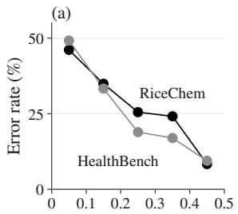

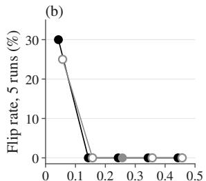  
Jev Noul margin |P(MET) − 0.5|  
Figure D1: Jev Noul on RiceChem (black) and Health-Bench (grey). (a) Error rate by the margin |P(MET) − 0.5| in five bands of 0.1, on the full RiceChem set (8,392 pairs) and on HealthBench (406 pairs). (b) Share of pairs whose verdict changed across five runs, by the same bands, on the RiceChem panel (819 pairs) and a 59-pair HealthBench subset, with hollow markers for bands of fewer than 20 pairs.

Direction of error. Jev Noul’s false positives outnumber its false negatives by 2.5 to 1 on the RiceChem panel, 1.8 to 1 on HealthBench (Table D1), and 3.1 to 1 on the full RiceChem set. The LLM judges differ in direction. On RiceChem Luna and DeepSeek err toward MET and Gemini toward UNMET. Luna errs toward UNMET on HealthBench, DeepSeek slightly so, and Gemini’s errors there are balanced.

Probabilities. Discrimination and calibration need a probability for each verdict, so they are reported for Jev alone. For every framing, P(MET) separates MET from UNMET pairs with an AU-ROC of 0.80 to 0.86 on the two panels, and its expected calibration error is 0.056 to 0.096 there and 0.062 to 0.089 over all 8,392 RiceChem pairs (Table D1). Jev Noul’s error rate falls with the margin |P(MET) − 0.5|, from 46.1% on the full RiceChem set and 49.2% on HealthBench in the band nearest 0.5 to below 10% at margins of 0.4 or more (Figure D1a). Figure D1b shows where verdicts changed in the stability study of Appendix A.

A threshold set on training data. The Jev Noul threshold was also set, post hoc, to maximize accuracy on the 80% training portion of RiceChem. The chosen threshold, 0.58, gives 81.5% on the training portion. On the panel it gives 78.9%, below the 80.1% of the fixed threshold of 0.5.

Non-English completions. The completion is not in English on 36 of HealthBench’s 406 pairs, and the criterion is in English on every pair. Jev Noul is correct on 77.8% of these pairs, against 77.3% on the English pairs. The three LLM judges are less accurate on the non-English pairs, by 7.2 points (Luna), 11.1 (Gemini), and 7.6 (DeepSeek). With 36 pairs, the standard error of each non-English accuracy is at least 6.9 points, so no single difference is established, and the common direction across the three LLM judges is suggestive only.

<table><tr><td></td><td>Accuracy (%)</td><td>κ</td><td>AUROC</td><td>FPR (%)</td><td>FNR (%)</td><td>FP:FN</td><td>Pred. MET (%)</td><td>ECE</td><td>Cost (US$)</td></tr><tr><td>RiceChem panel: 819 pairs, labelled MET rate 59.5%</td><td></td><td></td><td></td><td></td><td></td><td></td><td></td><td></td><td></td></tr><tr><td>bare Noul</td><td>69.4 0.31</td><td></td><td>0.80</td><td>61.1</td><td>9.9</td><td>203:48</td><td>78.4</td><td>0.077</td><td>0.0037</td></tr><tr><td>Jev Noul</td><td>80.1</td><td>0.57</td><td>0.86</td><td>34.9</td><td>9.7</td><td>116:47</td><td>67.9</td><td>0.056</td><td>0.0055</td></tr><tr><td>Jev Choice</td><td>81.0</td><td>0.59</td><td>0.85</td><td>32.2</td><td>10.1</td><td>107:49</td><td>66.5</td><td>0.096</td><td>0.0071</td></tr><tr><td>Luna</td><td>77.8</td><td>0.54</td><td></td><td>30.1</td><td>16.8</td><td>100:82</td><td>61.7</td><td></td><td>0.284</td></tr><tr><td>Gemini</td><td>76.1</td><td>0.52</td><td></td><td>21.1</td><td>25.9</td><td>70:126</td><td>52.6</td><td>一</td><td>2.321</td></tr><tr><td>DeepSeek</td><td>79.2</td><td>0.56</td><td></td><td>30.4</td><td>14.2</td><td>101:69</td><td>63.4</td><td>一</td><td>0.518</td></tr><tr><td colspan="10">HealthBench panel: 406 pairs, labelled MET rate 53.7%</td></tr><tr><td>bare Noul</td><td>76.4</td><td>0.52</td><td>0.83</td><td>30.9</td><td>17.4</td><td>58:38</td><td>58.6</td><td>0.074</td><td>0.0112</td></tr><tr><td>Jev Noul</td><td>77.3</td><td>0.54</td><td>0.84</td><td>31.4</td><td>15.1</td><td>59:33</td><td>60.1</td><td>0.070</td><td>0.0121</td></tr><tr><td>Jev Choice</td><td>77.1</td><td>0.54</td><td>0.84</td><td>31.4</td><td>15.6</td><td>59:34</td><td>59.9</td><td>0.073</td><td>0.0129</td></tr><tr><td>Luna</td><td>70.4</td><td>0.42</td><td></td><td>17.0</td><td>40.4</td><td>32:88</td><td>39.9 53.9</td><td></td><td>0.226</td></tr><tr><td>Gemini</td><td>79.6</td><td>0.59</td><td></td><td>22.3</td><td>18.8 23.4</td><td>42:41 45:51</td><td>52.2</td><td>一</td><td>1.560</td></tr><tr><td>DeepSeek</td><td>76.4</td><td>0.53</td><td></td><td>23.9</td><td></td><td></td><td></td><td>一</td><td>0.430</td></tr><tr><td colspan="10">Full RiceChem set: 8,392 pairs, Jev only</td></tr><tr><td>bare Noul</td><td>71.1</td><td></td><td></td><td></td><td></td><td></td><td></td><td>0.089</td><td>一</td></tr><tr><td>Jev Noul</td><td>80.7</td><td>一</td><td>一</td><td>一</td><td>一</td><td>1,226:396</td><td></td><td>0.062</td><td>一</td></tr><tr><td>Jev Choice</td><td>81.4</td><td>一</td><td>一</td><td>一</td><td>一</td><td></td><td></td><td>0.089</td><td>一</td></tr></table>

Table D1: The binary panels. Verdict accuracy; Cohen’s κ against the human label; AUROC of P(MET) (Jev only); false-positive and false-negative rates; false positives against false negatives; predicted MET rate; expected calibration error of P(MET) (Jev only; ten equal-width bins on RiceChem, eight on HealthBench); cost. P(MET) is Noul’s returned probability of yes and, for Jev Choice, the returned probability of the MET option. Jev Noul’s MET-rate offset (Section 3.5) is +8.4 points on RiceChem and +6.4 on HealthBench. DeepSeek’s three failed calls are handled as in Section 3.5.

A physician reference. HealthBench records each physician’s label, so the binary rater reference of Appendix A can also be computed for the physicians. Over all 406 pairs this gives 98.1%, an artifact of selection. Because tied pairs never entered the pool (Section 3.4), all 356 two-physician pairs are unanimous, and they contribute 712 of the 838 comparisons, every one an agreement. The 50 pairs with three or more physicians, from 20 completions, are free of this selection. On them the physician reference is 87.3% (95% interval 79.7 to 93.3 over completions), with κ = 0.75. Against the same leave-one-out targets the judges reach 73.0% (bare Noul) to 84.1% (Jev Choice), which is 3.2 to 14.3 points below the reference. Every judge’s 95% interval for its difference reaches zero, so these pairs show only that the judges are not detectably below the physicians.

The physician-written ideal. In an ablation outside the protocol, HealthBench’s physician-written ideal completion was added to Jev Noul’s state, and accuracy rose from 77.3% to 79.1%. Because no other judge received the ideal, this result enters no comparison.

## E Choice Against Score

Framings against the LLM judges. Both binary framings lie above the LLM judges’ range on RiceChem and inside it on HealthBench (Figure E1). Among the graded panels, Jev Choice falls below that range on ELLIPSE, FED-Turn, and USR-PC, and Jev Score only on USR-PC. Jev Score rises above it on FED-Turn and USR-TC. On the remaining graded panels each framing lies inside the range.

The middle level on FED-Turn. FED-Turn’s graded criteria have three levels. Individual raters chose the middle level, “Somewhat.”, for 26.5% of their ratings, fewer than the 32.6% of pairs that the averaged labels place there (Table E1). Jev Choice, Gemini, and DeepSeek use the middle level least. On correct and fluent, two criteria that state a yes-or-no property, Jev Choice never predicts “Somewhat.” in 75 pairs each.

Metrics on FED-Turn. On FED-Turn, Jev Score is ahead of every matched judge in exact accuracy, within-one accuracy, mean QWK, and mean absolute error (Tables 2 and C3). It does not lead on offset, where Gemini’s is smallest, or on the unit aggregate’s rank correlation with the holistic score, where Jev Choice has 0.603 and Jev Score 0.597. Scored against the same leave-one-out targets as a rater, Jev Score reaches 66.3% exact accuracy and a single crowd worker 63.8% (Table E1).

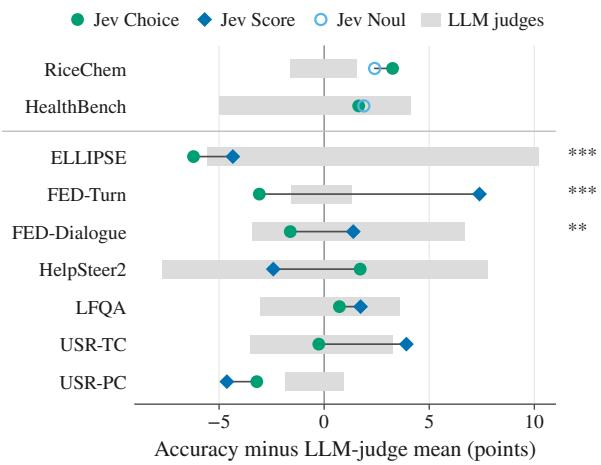

Figure E1: Accuracy of two Jev framings minus the mean of the three LLM judges on each panel, in points (verdict accuracy on the binary rows, exact accuracy on the graded rows). Grey bars span the three LLM judges, and a line joins the two framings of each row. Binary rows show Jev Choice and Jev Noul (hollow circle), graded rows Jev Choice and Jev Score (diamond). Stars give the pair-level sign test of Jev Choice against Jev Score $( ^ { * * } p < 0 . 0 1 , ^ { * * * } p < 0 . 0 0 1 )$ ), and the unit-level intervals of Table C1 also separate the two on USR-TC.
<table><tr><td></td><td>“Somewhat.&quot; (%)</td><td>Exact (%)</td><td>Exact, leave- one-out (%)</td></tr><tr><td>Labels</td><td>32.6</td><td></td><td></td></tr><tr><td>Individual ratings</td><td>26.5</td><td></td><td>63.8</td></tr><tr><td>Jev Choice</td><td>11.2</td><td>56.2</td><td>57.2</td></tr><tr><td>Jev Score</td><td>29.1</td><td>66.7</td><td>66.3</td></tr><tr><td>Luna</td><td>24.6</td><td>57.7</td><td>58.1</td></tr><tr><td>Gemini</td><td>13.5</td><td>60.6</td><td>62.4</td></tr><tr><td>DeepSeek</td><td>10.3</td><td>59.5</td><td>61.2</td></tr></table>

<table><tr><td colspan="3">Decoding-rule swap (post-hoc analysis), exact (%)</td></tr><tr><td>Probabilities from</td><td>Argmax</td><td>Rounded expected level</td></tr><tr><td>Jev Choice</td><td>56.2</td><td>55.4</td></tr><tr><td>Jev Score</td><td>64.6</td><td>66.7</td></tr></table>

Table E1: FED-Turn level use and exchange of decoding rules (525 ordinal pairs). Top: share of pairs at the middle level “Somewhat.” (for individual ratings, the share of ratings); exact accuracy against the rounded label; exact accuracy against the leave-one-out targets of the rater reference, which for individual ratings is the rater reference itself. Bottom: exact accuracy when each framing’s probabilities are read by argmax or by the rounded expected level. Jev Choice as run is the argmax cell of its row, and Jev Score as run the expected-level cell of its row.

Exchanging the decoding rules. The bottom of Table E1 exchanges the two decoding rules on FED-Turn’s ordinal pairs, as a post-hoc analysis. Jev Choice’s probabilities over the three levels, with the NA probability removed and the rest renormalized, give 55.4% exact accuracy when read by Score’s rule, the rounded expected level. Read by argmax, as Jev Choice runs, they give 56.2%. Jev Score’s probabilities give 64.6% when read by argmax and 66.7% when read by its own expected level. Under the argmax rule, exchanging the probabilities accounts for 80% of the 10.5-point difference between the framings as run. Under the expectedvalue rule the share is 107%, because that rule does slightly worse than argmax on Jev Choice’s probabilities. Averaged over pairs, Jev Choice puts more probability than Jev Score on “No.” (0.316 against 0.205) and less on “Somewhat.” (0.171 against 0.210) and “Yes.” (0.513 against 0.585). Rounding the expected level half up or half to even gives the same 55.4%.

What Score computes. The vendor documentation states that for Score “every level is evaluated separately” and that the model does not see a level’s number or its neighbours. It also describes Score’s levels as weak in numerical calibration.3 Score’s expected level thus weights the level numbers by probabilities obtained from level descriptions evaluated one at a time. We do not read Jev Score’s advantage as interpolation along an ordered scale. The exchange above places the difference in the two primitives’ probabilities for the same pairs, and it says nothing about how those probabilities arise.

Disagreements on ELLIPSE. Jev Choice and Jev Score give different levels on 215 of ELLIPSE’s 1,548 pairs and never differ by more than one level. Jev Score’s level is the higher one on 179 of the 215. On the 215 disagreements Jev Choice is exact on 8.4% and Jev Score on 21.9%. Because every judge places ELLIPSE essays below their labels (Section 5.3), the framing that answers one level higher gains exact accuracy on its disagreements.

Rounding of Jev Score. Score returns an expected level on levels numbered from 0, which Jev Score rounds half to even (Section 3.1), whereas the labels round halves up (Section 3.4). Of Jev Score’s 3,414 answers on the graded panels, 27 are exact halves, and the two rules give different levels on 12 of them. Ten lie halfway between the first and second level and two halfway between the third and fourth, where half to even rounds down. The other 15 halves lie between the second and third level, where both rules round up.

Embedded binary answers. The two graded framings obtain their Jev Noul verdicts on embedded binary pairs (Section 3.1) in separate requests. These verdicts differ on 4 of the 364 pairs and change a panel’s binary accuracy only on USR-PC (Table C3f).

## F Abstention

Where Jev Choice abstains. Jev Choice’s 28 abstentions (Table F1) fall into three groups. The largest, 17 FED-Dialogue error\_recovery pairs, is discussed below. The eight HelpSteer2 correctness pairs are mostly responses with little checkable factual content: two answer a request for “a long list of wacky and wild superpowers”, one is the reply “You’re welcome! I’m glad I could help.”, three offer emotional support, and one is a role-play reply. The remaining response, a blog outline naming breweries in Rogers, Arkansas, does contain checkable facts. Six of the eight are labelled with the top level, “All pertinent facts are included and the response contains no errors.” HelpSteer2’s annotators had no abstain option. The last group holds three pairs. Two LFQA factuality answers, both written by Reddit users, make no factual claim (one is a one-line joke, the other advice to search before posting). A USR-PC engaging response, “why did you choose pink out of all colors ?”, can be assessed and was labelled “Interesting”, the top level.

Raters’ N/A answers. FED offered its raters an N/A answer on every question. On error\_recovery (“The system is able to recover from errors that it makes.”), 29 of the 125 sampled ratings (23.2%) are N/A answers, most of them with a note that the system made no error. The more N/A answers a dialogue received, the more

<table><tr><td>Panel</td><td>Jev Choice</td><td>Luna</td><td>Gemini</td><td>DeepSeek</td></tr><tr><td>RiceChem</td><td>0</td><td>0</td><td>0</td><td>0 (1)ª</td></tr><tr><td>HealthBench</td><td>0</td><td>0</td><td>0</td><td>0 (2)ª</td></tr><tr><td>ELLIPSE</td><td>0</td><td>0</td><td>0</td><td>1 (4)</td></tr><tr><td>FED-Turn</td><td>0</td><td>0</td><td>0</td><td>1</td></tr><tr><td>FED-Dialogue</td><td>17</td><td>11</td><td>21</td><td>14</td></tr><tr><td>HelpSteer2</td><td>8</td><td>0</td><td>5</td><td>2 (1)</td></tr><tr><td>LFQA</td><td>2</td><td>1</td><td>1</td><td>5 (1)</td></tr><tr><td>USR-TC</td><td>0</td><td>0</td><td>2</td><td>1</td></tr><tr><td>USR-PC</td><td>1</td><td>0</td><td>0</td><td>0</td></tr><tr><td>Graded total</td><td>28</td><td>12</td><td>29</td><td>24 (6)</td></tr><tr><td>FED-Dialogue</td><td></td><td></td><td></td><td></td></tr><tr><td>on error_recovery</td><td>17</td><td>11</td><td>20</td><td>14</td></tr><tr><td>Jaccard index</td><td>一</td><td>0.56</td><td>0.73</td><td>0.72</td></tr></table>

Table F1: Abstentions per judge and panel, with judgecall failures in parentheses. An abstention is a choice of the NA option on a graded criterion or a CAN-NOT\_ASSESS verdict on a binary one; the LLM judges’ counts on the graded panels include their CAN-NOT\_ASSESS verdicts on embedded binary criteria. Jev Score has no abstain option and is omitted. All failures are empty DeepSeek responses; on the graded panels they are excluded from every metric. aHandled as in Section 3.5. Bottom: FED-Dialogue abstentions on error\_recovery, and the Jaccard index between each LLM judge’s FED-Dialogue abstentions (all criteria) and Jev Choice’s.

probability Jev Choice put on the NA option (Figure F1; the Spearman correlation of Section 4.3 has $p = 9 \times 1 0 ^ { - 4 } )$ . Jev Choice abstained on all 7 dialogues with two or more N/A answers, on 7 of the 8 with one, and on 3 of the 10 with none. Of the 17 dialogues it abstained on, 3 are labelled “Somewhat.” and 14 “Yes.” Its mean probability on the NA option is 0.57 on error\_recovery, 0.11 on HelpSteer2 correctness, 0.023 on LFQA factuality, and below 0.02 on each of the other 32 graded criteria. These three criteria hold 27 of its 28 abstentions. Because abstentions leave the denominator (Section 3.5), Jev Choice’s FED-Dialogue exact accuracy rests on 208 ordinal pairs and Jev Score’s on 225.

Other judges. Most of each LLM judge’s graded abstentions are on FED-Dialogue, nearly all of those on error\_recovery, and most of them fall on pairs where Jev Choice also abstained (Table F1 gives the Jaccard indices). On HelpSteer2 four of Gemini’s five abstentions are pairs on which Jev Choice also abstained.

The conditional label. Jev Choice answered the other 8 error\_recovery dialogues, chose “No.”

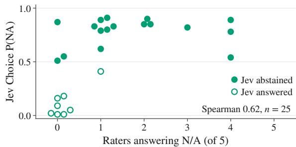  
Figure F1: FED-Dialogue error\_recovery: Jev Choice’s probability on the NA option for each of the 25 sampled dialogues, against the number of its five crowd workers who answered N/A, with markers of equal count spread sideways. Filled markers are the 17 dialogues on which Jev Choice abstained and hollow markers the 8 it answered (Spearman ρ = 0.62 between the probability and the number of N/A answers).

on each, and was wrong every time. Four of them carry the label “Somewhat.” and four the label “Yes.” The label on this criterion averages only the numeric ratings. Because most N/A answers report that no system error occurred, the numeric ratings likely come mainly from raters who saw an error to recover from. If so, the label rates recovery under a condition that the criterion text does not state.

Two kinds of abstain option. The binary and graded panels offered different abstain options, and Jev Choice used only the second. On the binary panels the option was CANNOT\_ASSESS, whose definition in Table A2 describes the evidence available to the judge and asks for rare use, and no judge chose it there (Appendix D). The graded panels offered the NA option instead, whose wording can also describe the pair itself, a criterion that does not apply to the unit. Jev Choice’s abstentions fall mostly on pairs where that second reading fits. The two options also differ in the instruction to use the option rarely, in scale type, and in panel, so this contrast does not isolate the wording. Offering one wording on both kinds of panel would separate the wording from these differences, and no such run was made.

## G The Offset in Detail

Criteria far below the reference. The 11 criteria of Section 5.2 that lie far below the reference with mean offsets below −0.5 levels are the five ELLIPSE traits other than cohesion; FED-Dialogue depth, error\_recovery, informative, and inquisitive; FED-Turn interesting; and USR-PC engaging. The twelfth criterion far below the reference, FED-Turn engaging, has a mean offset of −0.34 levels.

Gap measures that ignore location. Table G2 compares the gap measure of Figure 2 with four that a constant shift cannot move. Neither EL-LIPSE nor error\_recovery produces the unshifted correlation, which stays at 0.887 without ELLIPSE (25 criteria) and at 0.918 without error\_recovery. None of the four other measures correlates significantly with the mean offset. After the best shift, the 12 criteria far below the reference lie between 1.1 points below it and 13.8 points above, and the six ELLIPSE traits, whose raters need no shift (Section 5.3), range from 1.1 points below it (vocabulary) to 5.6 points above. On topheavy three-level scales a rater’s best shift is often not zero. For FED-Turn fluent it raises the reference from 70.9% to 87.2%. The Both shifted row, which shifts judges and raters alike, is therefore the like-for-like comparison. The four criteria that then stay more than 5 points short of the reference are FED-Dialogue informative and diverse, LFQA factuality, and USR-PC engaging. They are the candidates for conventions that a shift of location does not capture, such as LFQA’s absolute top level (Appendix H).

Direction of the errors. Nearly every ELLIPSE error lies below the label. The share is 99.5% for Jev Choice. For the other judges it lies between 98.4% and 99.5%, except for DeepSeek at 96.9%. Because nearly all errors share one sign, Jev Choice’s mean absolute error (1.256 levels) and the magnitude of its mean signed error (1.247 levels) differ by less than 0.01 level.

Traits. Table G1 gives the results by trait. Jev Score, like the matched judges, is least accurate on grammar and most accurate on cohesion (Section 5.4). Measured from the two-rating mean before rounding, every offset is smaller in magnitude, by 0.19 to 0.27 levels, which is the amount by which the half-up rule raises each trait’s labels.

Level usage. Pooled over the six traits, individual ratings put 25.4% of ratings at levels 4–5, fewer than the labels’ 36.3%, and no judge places more than 9.3% of any trait’s predictions there (Table G1c). At the bottom of the scale the pattern reverses. The rounded label is level 1 on one pair in 1,548, and the individual raters used level 1 on 11 of 3,096 ratings, whereas the judges predicted it on 30 (Gemini) to 376 (Luna) pairs, on grammar more than on any other trait.

<table><tr><td></td><td colspan="2">cohesion</td><td colspan="2">syntax</td><td colspan="2">vocabulary</td><td colspan="2">phraseology</td><td colspan="2">grammar</td><td colspan="2">conventions</td></tr><tr><td>(a) Exact accuracy and QWK against the label</td><td></td><td></td><td></td><td></td><td></td><td></td><td></td><td></td><td></td><td></td><td></td><td></td></tr><tr><td></td><td>exact</td><td>QWK</td><td>exact</td><td>QWK</td><td>exact</td><td>QWK</td><td>exact</td><td>QWK</td><td>exact</td><td>QWK</td><td>exact</td><td>QWK</td></tr><tr><td>Jev Choice</td><td>39.1</td><td>0.29</td><td>19.4</td><td>0.21</td><td>7.4</td><td>0.06</td><td>7.8</td><td>0.10</td><td>0.4</td><td>0.10</td><td>6.6</td><td>0.15</td></tr><tr><td>Jev Score</td><td>40.7</td><td>0.29</td><td>19.8</td><td>0.19</td><td>7.8</td><td>0.07</td><td>8.5</td><td>0.08</td><td>3.9</td><td>0.11</td><td>11.2</td><td>0.10</td></tr><tr><td>Luna</td><td>44.6</td><td>0.21</td><td>13.2</td><td>0.21</td><td>12.0</td><td>0.10</td><td>7.8</td><td>0.12</td><td>1.6</td><td>0.06</td><td>5.4</td><td>0.11</td></tr><tr><td>Gemini</td><td>39.9</td><td>0.26</td><td>32.2</td><td>0.32</td><td>29.5</td><td>0.25</td><td>24.8</td><td>0.30</td><td>19.0</td><td>0.23</td><td>33.7</td><td>0.40</td></tr><tr><td>DeepSeek</td><td>35.8</td><td>0.31</td><td>19.8</td><td>0.19</td><td>9.7</td><td>0.13</td><td>7.5</td><td>0.13</td><td>3.5</td><td>0.10</td><td>14.0</td><td>0.09</td></tr><tr><td>Rater reference</td><td>45.3</td><td>0.44</td><td>52.7</td><td>0.52</td><td>60.1</td><td>0.54</td><td>51.2</td><td>0.53</td><td>50.4</td><td>0.49</td><td>48.4</td><td>0.46</td></tr><tr><td colspan="10">(b) Offset in levels</td><td rowspan="3"></td></tr><tr><td></td><td>label</td><td>mean</td><td>label</td><td>mean</td><td>label</td><td>mean</td><td>label</td><td>mean</td><td>label</td><td>mean</td><td>label mean</td></tr><tr><td>Jev Choice</td><td>-0.62</td><td>-0.36</td><td>-1.06</td><td>-0.83</td><td>-1.28</td><td>-1.08</td><td>-1.38</td><td>-1.14</td><td>-1.77 -1.54</td><td>-1.36</td><td>-1.12</td></tr><tr><td>Jev Score</td><td>-0.59</td><td>-0.32</td><td>-0.97</td><td>-0.73</td><td>-1.25</td><td>-1.06</td><td>-1.31</td><td>-1.07</td><td>-1.60</td><td>-1.37</td><td>-1.21</td><td>-0.97</td></tr><tr><td>Luna</td><td>-0.52</td><td>-0.26</td><td>-1.14</td><td>-0.91</td><td>-1.19</td><td>-0.99</td><td>-1.40</td><td>-1.16</td><td>-1.95</td><td>-1.71</td><td>-1.46</td><td>-1.22</td></tr><tr><td>Gemini</td><td>-0.62</td><td>-0.35</td><td>-0.76</td><td>-0.53</td><td>-0.77</td><td>-0.58</td><td>-0.80</td><td>-0.56</td><td>-0.99</td><td>-0.76</td><td>-0.70</td><td>-0.46</td></tr><tr><td>DeepSeek</td><td>-0.58</td><td>-0.31</td><td>-1.06</td><td>-0.83</td><td>-1.18</td><td>-0.98</td><td>-1.35</td><td>-1.12</td><td>-1.59</td><td>-1.35</td><td>-1.22</td><td>-0.99</td></tr><tr><td colspan="10">(c) Use of the ends of the scale</td><td colspan="3"></td></tr><tr><td></td><td>Ll</td><td>L4-5</td><td>L1</td><td>L4-5</td><td>Ll</td><td>L4-5</td><td>L1</td><td>L4-5</td><td>Ll</td><td>L4-5</td><td>Ll</td><td>L4-5</td></tr><tr><td>Jev Choice</td><td>5</td><td>0.0</td><td>48</td><td>0.4</td><td>2</td><td>0.0</td><td>44</td><td>0.0</td><td>149</td><td>0.0</td><td>57</td><td>0.4</td></tr><tr><td>Jev Score</td><td>2</td><td>2.3</td><td>8</td><td>0.4</td><td>1</td><td>0.0</td><td>17</td><td>0.0</td><td>104</td><td>0.0</td><td>14</td><td>0.0</td></tr><tr><td>Luna</td><td>2</td><td>0.8</td><td>44</td><td>0.0</td><td>16</td><td>0.0</td><td>55</td><td>0.0</td><td>192</td><td>0.0</td><td>67</td><td>0.0</td></tr><tr><td>Gemini</td><td>3</td><td>0.8</td><td>6</td><td>2.7</td><td>1</td><td>0.4</td><td>7</td><td>2.7</td><td>9</td><td>0.4</td><td>4</td><td>5.8</td></tr><tr><td>DeepSeek</td><td>14</td><td>9.3</td><td>53</td><td>6.2</td><td>13</td><td>3.9</td><td>63</td><td>1.2</td><td>128</td><td>3.1</td><td>19</td><td>1.6</td></tr><tr><td>Individual ratings</td><td>3</td><td>27.7</td><td>3</td><td>22.5</td><td>1</td><td>26.7</td><td>2</td><td>26.2</td><td>1</td><td>23.4</td><td>1</td><td>25.6</td></tr><tr><td>Labels</td><td>一</td><td>40.7</td><td></td><td>32.6</td><td>一</td><td>38.0</td><td>一</td><td>37.6</td><td>一</td><td>34.1</td><td>一</td><td>34.9</td></tr><tr><td colspan="10">(d) Slope of the predicted level on the label level</td><td colspan="3"></td></tr><tr><td></td><td colspan="10"></td><td colspan="3"></td></tr><tr><td>Jev Choice</td><td colspan="10">0.36</td><td colspan="3">0.39</td></tr><tr><td>Jev Score</td><td colspan="10"></td><td colspan="3">0.22</td></tr><tr><td>Luna</td><td colspan="3">0.35</td><td colspan="3">0.18 0.24</td><td colspan="3">0.18 0.34</td><td colspan="3">0.35 0.24</td></tr><tr><td>Gemini</td><td colspan="3">0.21 0.32</td><td colspan="3">0.37</td><td colspan="3">0.46</td><td colspan="3">0.38</td></tr><tr><td>DeepSeek</td><td colspan="3">0.48</td><td colspan="3">0.32</td><td colspan="3">0.38 0.53</td><td colspan="3">0.34 0.49</td></tr></table>

Table G1: ELLIPSE by trait for the four matched judges, Jev Score, and the raters. (a) Exact accuracy in percent. (b) Offset against the rounded label and against the unrounded mean of the two ratings. (c) L1: number of the 258 essays placed at level 1; L4–5: share (%) placed at levels 4–5. The individual-ratings row counts the 516 ratings per trait, and the labels row gives the share of rounded labels. (d) Least-squares slopes. For the raters, one rating is regressed on the other with both orders pooled, which makes the slope equal to their QWK. DeepSeek scored 255 to 258 essays per trait.

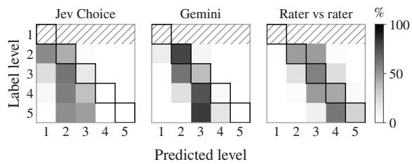  
Figure G1: Row-normalized ELLIPSE confusion matrices for Jev Choice, Gemini, and one rater against the other, with the diagonal outlined. Rows are the label level and columns the predicted level. For the raters, rows are one rating and columns the other rating of the same essay and trait, with both orders pooled. The level-1 rows hold fewer than 20 pairs and are omitted (hatched).

Compression. The judges compress the scale. Pooled over the 1,548 pairs, the regression slope of Table G1d runs from 0.29 (Jev Score) to 0.44 (Gemini), with Jev Choice at 0.37. The same regression of one rater’s level on the other’s, over 3,096 ordered pairs of ratings, gives 0.50. This slope is below one because the two raters disagree. It is not a like-for-like benchmark for the judges, whose target, the two-rater label, is less noisy than a single rating. A judge with one rater’s noise would show a slope above 0.50 against the label, so a comparison with 0.50 understates the judges’ compression. Per trait, the judges’ slopes run from 0.14 to 0.54 and the raters’ from 0.44 to 0.54 (Table G1d). Jev Choice’s within-one accuracy is 64.3%, and one rater is within one level of the other on 98.2% of ratings. For labels of level 3 to level 5, Jev Choice most often predicts level 2, and Gemini most often predicts one or two levels below the label (Figure G1).

<table><tr><td>Gap</td><td>ρ</td><td>p</td><td>Min Mean</td><td>Below -15/-5</td></tr><tr><td>Unshifted</td><td></td><td></td><td> $0 . 9 2 \ 1 \times 1 0 ^ { - 1 3 } \ - 5 6 . 9 \ - 1 3 . 0$ </td><td>12/17</td></tr><tr><td>Best shift</td><td>0.12</td><td>0.51</td><td> $- 2 . 5 \quad + 7 . 4 \phantom { 0 }$ </td><td>0/0</td></tr><tr><td>Leave-one-out</td><td>0.16</td><td>0.40</td><td> $- 8 . 4 \quad + 5 . 7 \phantom { 0 }$ </td><td>0/3</td></tr><tr><td>Both shifted</td><td>-0.16</td><td>0.40-16.2</td><td>+0.9</td><td>1/4</td></tr><tr><td>Spearman</td><td>0.18</td><td></td><td>0.33 -0.09 +0.08</td><td>一</td></tr></table>

Table G2: Five measures of the four matched judges mean gap over the 31 criteria of Figure 2 (post-hoc analysis). $\rho$ and $p \mathrm { : }$ Spearman correlation of the gap with the mean offset. Min and mean gap in points, and the number of criteria more than 15 or 5 points below the reference. Unshifted: exact accuracy as in Figure 2. Best shift and leave-one-out: the shifts of Section 5.3, chosen on all of a criterion’s pairs or, for each pair, on the others. Both shifted: the rater reference also gets its own best shift. Spearman (below the rule): the judges’ mean Spearman correlation with the rater mean minus the rater reference’s, over the 30 criteria where it is defined, with min and mean as differences of correlations.
<table><tr><td></td><td colspan="4">Exact accuracy (%)</td></tr><tr><td>Judge</td><td>All</td><td>Half- way</td><td>Other</td><td>Down- ward</td></tr><tr><td>Jev Choice</td><td>13.4</td><td>6.8 19.3</td><td>29.1</td><td>-1.01</td></tr><tr><td>Jev Score</td><td>15.3</td><td>6.6</td><td>23.0 34.8</td><td>-0.92</td></tr><tr><td>Luna</td><td>14.1</td><td>7.9</td><td>19.6 28.6</td><td>-1.04</td></tr><tr><td>Gemini</td><td>29.8</td><td>11.9</td><td>45.7 57.6</td><td>-0.54</td></tr><tr><td>DeepSeek</td><td>15.0</td><td>9.2</td><td>20.2 29.6</td><td>-0.93</td></tr></table>

Table G3: ELLIPSE labels and the half-up rounding rule. Half-way labels are the 725 pairs whose two ratings average to a half level, which the rule rounds up, and other labels are the remaining 823 pairs (DeepSeek answered 1,543 pairs in all). The downward column is a post-hoc analysis that rounds the half-way means down instead. The last column is the offset in levels against the unrounded rater mean. The rule adds 0.23 levels to the pooled label.

Rank order. Averaged over traits, Jev Choice’s Spearman correlation with the unrounded rater mean is 0.481, and one rater’s correlation with the other is 0.483. By this measure Jev Choice ranks essays about as well as a single rater. As with the slopes, the comparison favours the judge.

Holistic band. The ELLIPSE sample was stratified by bands of the holistic score (2.5 or below, 3 to 3.5, and 4 or above), which hold 432, 888, and 228 pairs. Every judge’s offset grows more negative from band to band, from −1.02 levels in the lowest band to −1.63 in the highest for Jev Choice and from −0.59 to −1.09 for Gemini. Compression predicts this pattern. When predictions rise by less than one level per label level, the offset grows with the label. The growth is consistent with the norm-referenced reading of Section 5.4, but it does not by itself distinguish that reading from other causes of compression.

<table><tr><td colspan="2">Topical-Chat</td><td colspan="2">PersonaChat</td></tr><tr><td>Judge</td><td>s = 0 s = +1</td><td>s = 0</td><td>s = +1</td></tr><tr><td>Jev Choice</td><td>55.6</td><td>47.2</td><td>16.9 69.5</td></tr><tr><td>Jev Score</td><td>61.1</td><td>43.1</td><td>18.3 76.7</td></tr><tr><td>Luna</td><td>59.7</td><td>34.7 26.7</td><td>78.3</td></tr><tr><td>Gemini</td><td>63.4</td><td>40.8 23.3</td><td>80.0</td></tr><tr><td>DeepSeek</td><td>62.5</td><td>37.5 23.3</td><td>71.7</td></tr><tr><td>Rater reference</td><td>58.8</td><td>一</td><td>61.1 一</td></tr></table>

Table G4: Post-hoc shift on USR engaging. Exact accuracy (%) with the recorded predictions (s = 0) and with every prediction moved up one level, capped at the top level $( s = + 1 )$ . Each judge scored 71 or 72 pairs on Topical-Chat and 59 or 60 on PersonaChat. The rater reference is computed on engaging alone, as in Figure 3c, and is shown unshifted.

Constant shift. Figure 3b plots a post-hoc analysis that moves every prediction by s levels, clipped to the scale. Every judge’s exact accuracy peaks at s = +1, at 46.8% (Luna) to 59.6% (Gemini) against the rater reference’s 51.4%, and falls to at most 33.5% at s = +2 and below 2% at s = −1. Mean QWK also peaks at s = +1, at 0.31 to 0.48, below the rater reference’s 0.50, and Jev Choice’s rises there from 0.15 to 0.34. Apart from clipping, a constant shift leaves the regression slopes above unchanged.

Rounding. Table G3 isolates the rounding rule of Section 3.4. Every judge is less accurate on the half-way labels than on the others, Jev Choice at 6.8% against 19.3%. Against the unrounded rater mean, four judges are 0.92 to 1.04 levels low and Gemini is 0.54 levels low.

Rounding the half-way means down instead, as a post-hoc analysis, changes the order of two judges. Jev Choice then overtakes Luna (29.1% against 28.6% exact), and Gemini’s lead over Jev Choice grows from 16.4 to 28.4 points. The downward rule lowers each half-way label by one level, which raises every offset by 0.47 levels (one level times the half-way share of 46.8%). That is less than the smallest offset magnitude, Gemini’s 0.77 levels, so every offset stays negative.

USR engaging. Table G4 gives each judge’s exact accuracy on USR engaging before and after the post-hoc shift of Section 5.4, Jev Score included. On PersonaChat every shifted judge exceeds the unshifted rater reference, a comparison that favours the judges for the reason given in Section 5.3. The rater reference’s own best shift raises it there from 61.1% to 80.0%. Gemini’s shifted accuracy equals that value, and the other four judges fall 1.7 (Luna) to 10.5 points (Jev Choice) short of it. On Topical-Chat no shift raises the rater reference or any matched judge.

## H Where the Conventions Live

Table H1 quotes in full the criterion texts behind the rows of Table 3.

Population norm. The ELLIPSE example of Table H2 is one of Jev Choice’s confident errors (Appendix J). Both raters put the essay at level 2 on grammar, and all five judges put it at level 1. Gemini’s explanation reports errors in nearly every clause, which it matches to the level 1 description “Errors in grammar and usage throughout.” The level descriptions give no base rate, so they do not say how many errors separate “throughout” from “many” in essays by grade 8–12 English learners. Rater training on that population would supply such a base rate (Section 5.4). The judges lack it and placed this essay one level lower, as the populationnorm account predicts.

Annotation habit: an absolute top level. Table H2 also quotes the two LFQA answers of Section 5.4, on which all five judges chose “Partially accurate”. The false claims that the LLM judges name are that LED TVs create images with lightemitting diodes and that an SD card needs no power supply. In both cases the label departs from the text of the top level, and the judges reject the top level for the reason its text gives. HelpSteer2 shows a related pattern at a level that is neither the top nor absolute. None of the five judges chose complexity level 4 or 5 in 450 predictions, although the labels put 10 of the 90 responses at level 4.

Annotation habits on USR-TC. Three of the twelve sampled USR-TC contexts carry the literal string \_nofact in place of a fact, and the 18 uses\_knowledge pairs from these contexts are the ones counted in Table 3. The LLM judges’ explanations show that they read the string as the absence of a fact (Table H2). The understandable criterion text excludes well-formedness from the judgment. The raters nonetheless marked selfcontradictory responses such as the one quoted UNMET, and every judge is correct on at most 34.8% of the 23 pairs labelled UNMET.

The USR-TC errors. Jev Choice makes 117 errors on USR-TC, counting its Jev Noul verdicts on the two binary criteria. Of these, 16 are the \_nofact pairs of uses\_knowledge and 17 are understandable pairs labelled UNMET. Another 63 are ordinal errors on split pairs. The remaining 21 errors (17.9%) are 19 ordinal errors on unanimous pairs and two other binary errors. They are the only errors that fall neither on a split pair nor under a candidate convention, and those conventions were themselves identified from the judges’ errors (Section 5.4).

No-read baselines. On two panels a no-read baseline (Section 3.4) is competitive on exact accuracy. The HelpSteer2 correctness text asks for a fact check, but its label tracks overall helpfulness (Pearson r = 0.94 over the 90 responses; Table 3). HelpSteer2’s constant predictor has a QWK of zero by construction. The judges that trail it significantly (Section 4.1) do so with $p \leq 2 . 1 \times 1 0 ^ { - 4 }$ in pair-level sign tests. The LFQA provenance baseline is most accurate on amount\_info (74.2%) and formality (73.3%) and least on factuality (56.7%). Without provenance, the modal level of each criterion scores 61.1% over the panel, against the provenance baseline’s 68.1%. In the pair-level sign tests of Section 4.1, every judge’s p against the provenance baseline is at least 0.27.

What does not separate the panels. Table H3 gives the four panel properties of Section 5.5 next to Jev Choice’s gap to the reference in exact accuracy and in mean QWK. The two measures put Jev Choice on the same side of the reference on four panels, above it on LFQA and USR-TC and below it on ELLIPSE and USR-PC. On the two FED panels Jev Choice is below the reference in exact accuracy and above it in mean QWK, and part of this pattern may come from the reference’s smaller target (Section 3.4).

Within panels, criterion length shows no consistent relation with Jev’s per-criterion accuracy, and with few criteria per panel the test is weak. The correlations of Table H3 are not significant on the binary panels $( p = 0 . 1 8$ on RiceChem, 0.12 on HealthBench) or on the FED panels (p = 0.83 on

<table><tr><td>Panel and criterion</td><td>Criterion sentence, then level descriptions from lowest to highest</td></tr><tr><td>ELLIPSE grammar</td><td>Criterion. The essay demonstrates strong command of grammar and usage, per the ELLIPSE English-proficiency analytic rubric&#x27;s Grammar trait (level 1 = lowest proficiency, level 5 = native-like facility). Levels. Level 1: Errors in grammar and usage throughout. | Level 2: Many errors in grammar and usage. | Level 3: Some errors in grammar and usage. | Level 4: Minimal errors in grammar and usage. | Level</td></tr><tr><td>USR-TC and USR-PC engaging</td><td>Criterion. The response is interesting rather than dull: it engages the reader (for example, by offering an opinion, a thought, or an interesting fact) rather than being generic. Levels. Dull: the response is generic and dull. | Somewhat interesting: the response could engage the reader in the conversation (e.g., an opinion or à thought). | Interesting: the response is very interesting</td></tr><tr><td>FED-Dialogue depth</td><td>Criterion. The system discusses topics in depth. Levels. No. | Somewhat. | Yes.</td></tr><tr><td>factuality</td><td>Criterion. The information provided in the answer is factually correct and aligns with well-established information. Levels. Completely inaccurate: the answer is entirely false or contains significant factual errors. It contradicts well-established information or provides misleading information. | Partially accurate: the answer has some correct information but also contains significant inaccuracies or lacks important details. It requires additional verification or correction. | Mostly accurate: the answer is predominantly correct and provides relevant information. However, it may still have minor inaccuracies or omissions that do not significantly impact the overall accuracy. | Entirely accurate: the answer is entirely accurate and factually correct. It aligns with well-established information, provides clear and precise details, and</td></tr><tr><td>HelpSteer2 correctness</td><td>Criterion. The response includes all pertinent facts relevant to the prompt and contains no factual errors. Levels. Major errors and/or missing pertinent facts; the response cannot be relied on for correctness. Several errors or omissions of pertinent facts. | A mix of correct and incorrect or missing content; correctness is inconsistent. | Mostly correct and complete in its factual content, with at most minor</td></tr><tr><td>USR-TC uses_knowledge</td><td>Criterion. Given the fact the response is conditioned on, the response uses that fact well (rather than not mentioning or referring to it at all). Verdicts. MET or UNMET (binary criterion; the LLM judges could also return CANNOT_ASSESS).</td></tr><tr><td>USR-TC understandable</td><td>Criterion. The response is understandable in the context of the conversation history: a reader can tell what the person is trying to say (for example, its pronouns and references resolve sensibly). This is independent of whether the response is on topic or otherwise well-formed. Verdicts. MET or UNMET (binary criterion; the LLM judges could also return CANNOT_ASSESS).</td></tr><tr><td>ELLIPSE cohesion</td><td>Criterion. The essay demonstrates strong text organization and use of cohesive devices to connect ideas across sentences and paragraphs, per the ELLIPSE English-proficiency analytic rubric&#x27;s Cohesion trait (level 1 = lowest proficiency, level 5 = native-like facility). Levels. Level 1: No clear control of organization; cohesive devices not present or unsuccessfully used; presentation of ideas unclear. | Level 2: Organization only partially developed with a lack of logical sequencing of ideas; some basic cohesive devices used but with inaccuracy or repetition. | Level 3: Organization generally controlled; cohesive devices used but limited in type; Some repetitive, mechanical, or faulty use of cohesion use within and/or between sentences and paragraphs. | Level 4: Organization generally well controlled; a range of cohesive devices used appropriately such as</td></tr><tr><td>HelpSteer2 verbosity</td><td>Criterion. The response&#x27;s amount of detail, relative to what the prompt asked for, ranging from minimal to extensive. Levels. Minimal detail; extremely terse relative to the prompt. | Below the level of detail one would typically expect for this prompt. | A moderate, middling level of detail. | Above the level of detail one would typically expect for this prompt. | Extensive, exhaustive detail; highly elaborated relative to the</td></tr></table>

Table H1: Verbatim criterion sentences and level descriptions for the criteria of Table 3, with levels separated by | and listed from lowest to highest. The NA option (Section 3.1) is not listed. Typography, including capitals inside a description, is as in our rubric versions (Section 3.3). The HelpSteer2 descriptions paraphrase the benchmark’s guideline. The two criteria below the rule are the contrast rows of Table 3.

<table><tr><td>Convention and criterion</td><td>Raters and judges</td><td>Quoted text</td></tr><tr><td>Population norm; ELLIPSE grammar</td><td>Raters: Level 2, Level 2. All five judges: Level 1 (Jev Choice confidence 0.95).</td><td>Gemini: “The submission contains pervasive errors in grammar, usage, and sentence structure in virtually every clause [.. .], matching Level 1.&quot;</td></tr><tr><td>Annotation habit, absolute top level; LFQA factuality</td><td>Two ChatGPT answers. Raters on each: Mostly, Entirely, Entirely accurate (label: Entirely accurate). All five judges on each: Partially accurate.</td><td>Answer: “LED TVs use light emitting diodes to create images&quot;. DeepSeek: “In reality, LED TVs are LCD TVs with LED backlighting, not a distinct image-creating technology.&quot; Answer: “The SD card operates on a different protocol and doesn&#x27;t require a power supply.&quot; Gemini: “[. ..] it contains major factual inaccuracies by claiming an SD card doesn&#x27;t require a power supply&#x27; and inherently avoids data loss when pulled out.&quot;</td></tr><tr><td>Annotation habit; USR-TC uses_knowledge</td><td>Raters: MET, MET, MET. All five judges: UNMET.</td><td>The context ends “Fact: _nofact&quot;. Response: “i &#x27;ve never tried one of the longest tennis matches . what do you think of the granny shot in tennis ?&quot; Gemini: &quot;No fact was provided to condition the response on (Fact: _nofact&#x27;), so the response does not use or reference any specified fact.&quot;</td></tr><tr><td>Annotation habit, stricter than the text; USR-TC understandable</td><td>Raters: MET, UNMET, UNMET (label: UNMET). All five judges: MET.</td><td>Response: “i do n&#x27;t watch it but i do n&#x27;t really watch it .&quot;Luna: “The response is understandable: ‘it’ sensibly refers to Game of Thrones, and the speaker clearly says they do not watch it, despite the redundant repetition.&quot;</td></tr></table>

Table H2: One quoted pair for the population norm and for three annotation habits. The corpus-relative standard of USR engaging is a property of the corpus’s rating distribution and has no single-pair example (Table G4). The explanations are quoted from the LLM judges’ responses, and [. . . ] marks an omission. USR responses are quoted with the corpus’s tokenization.
<table><tr><td></td><td colspan="2">Criterion length</td><td></td><td colspan="4">Unit-length quartile</td><td></td><td></td><td colspan="2">Gap to reference</td></tr><tr><td>Panel</td><td>Words</td><td>ρ(n)</td><td>Unit words</td><td>Q1</td><td>Q2</td><td>Q3</td><td>Q4</td><td>Raters</td><td>Levels</td><td>Exact (points)</td><td>QWK</td></tr><tr><td>RiceChem</td><td>3-21</td><td>-0.26 (27)</td><td></td><td></td><td>一</td><td></td><td></td><td>TA</td><td>2</td><td></td><td></td></tr><tr><td>HealthBench</td><td>7-481</td><td>−0.27 (34)</td><td>一</td><td>一</td><td>一</td><td>一</td><td></td><td>2–5 physicians</td><td>2</td><td></td><td>一</td></tr><tr><td>ELLIPSE</td><td>27-36</td><td>+1.00 (6)</td><td>392</td><td>16.4</td><td>13.9</td><td>11.2</td><td>12.3</td><td>2 trained</td><td>5</td><td>-37.9</td><td>-0.34</td></tr><tr><td>FED-Turn</td><td>4-13</td><td>−0.10 (7)</td><td>9</td><td>56.3</td><td>63.0</td><td>62.5</td><td>61.4</td><td>5 crowd</td><td>3</td><td>-7.6</td><td>+0.07</td></tr><tr><td>FED-Dialogue</td><td>6-13</td><td>+0.30 (9)</td><td>123</td><td>37.5</td><td>50.0</td><td>67.3</td><td>53.0</td><td>5 crowd</td><td>3</td><td>-16.3</td><td>+0.05</td></tr><tr><td>HelpSteer2</td><td>15-32</td><td></td><td>215</td><td>43.3</td><td>59.3</td><td>51.8</td><td>40.7</td><td>released</td><td>5</td><td></td><td></td></tr><tr><td>LFQA</td><td>14-33</td><td></td><td>100</td><td>69.4</td><td>70.1</td><td>66.7</td><td>68.8</td><td>3 crowd</td><td>3-4</td><td>+13.3</td><td>+0.09</td></tr><tr><td>USR-TC</td><td>11-43</td><td></td><td>19.5</td><td>68.2</td><td>65.3</td><td>58.9</td><td>77.8</td><td>3 researchers</td><td>3</td><td>+0.3</td><td>+0.11</td></tr><tr><td>USR-PC</td><td>11-43</td><td></td><td>12</td><td>73.8</td><td>69.5</td><td>68.2</td><td>70.0</td><td>3 researchers</td><td>3</td><td>-16.2</td><td>-0.04</td></tr></table>

Table H3: Panel properties examined in Section 5.5, with Jev Choice’s gap in the last two columns. Criterion length: range of criterion words and the Spearman correlation between a criterion’s length and Jev’s accuracy on it, over n criteria (Jev Noul on RiceChem and HealthBench, and elsewhere Jev Choice on graded criteria only; the ELLIPSE value uses the criterion sentence alone). Some HealthBench criteria share a text (Section 3.3) and so have the same length. Unit words: median whitespace words per unit. Quartiles: Jev Choice’s accuracy (%) by quartile of unit length, embedded binary pairs included. Raters: the source of the human label (TA, teaching-assistant annotation; trained essay raters; crowd workers; dialogue researchers; the released label on HelpSteer2). Gap: Jev Choice’s value minus the rater reference’s, in points of exact accuracy (Section 3.5) and in mean QWK. A dash marks a value that was not computed or does not exist.

FED-Turn, 0.43 on FED-Dialogue). ELLIPSE is ambiguous. Its six criterion sentences share one template and differ in length by at most nine words, yet their length orders Jev Choice’s per-trait accuracy perfectly (Spearman 1.00). Level-description length, which ranges from 44 to 133 words, correlates at 0.60 (p = 0.21). With six traits, length cannot be separated from what each trait’s levels describe (Table 3).

Unit length has no common effect. By quartile of unit length, Jev Choice’s accuracy on ELLIPSE falls from 16.4% in the shortest quartile to 11.2– 12.3% in the two longest, and on FED-Dialogue it is lowest in the shortest quartile (37.5%). Elsewhere it moves by up to 18.9 points without a consistent direction. The ELLIPSE offset also grows with the holistic band (Appendix G), and this slice does not separate essay length from essay quality. Across panels, the three with the shortest units, FED-Turn, USR-PC, and USR-TC, have gaps that run from 16.2 points below the reference to 0.3 points above it.

Rater expertise does not order the gaps either. ELLIPSE, the only graded panel with trained raters, has Jev Choice’s largest gap (Section 5.5), but among the crowd-rated panels the gap runs from +13.3 points on LFQA to −16.3 on FED-Dialogue (Table H3).

Scale width changes the chance level of exact accuracy (Section 3.5), but panels with the same scale can still differ widely. USR-TC and USR-PC share their three-level scales and their criterion texts (Section 5.4), and Jev Choice’s gap is +0.3 points on the first and −16.2 points on the second.

## I Confidence

The returned field. The vendor describes the confidence field that Choice and Score return as a number computed from how the probabilities are spread, and its interactive demo approximates it for three options by $( 3 p _ { \mathrm { m a x } } - 1 ) / 2 . ^ { 4 }$ For Jev Choice the field matches the general form $( K p _ { \operatorname* { m a x } } - 1 ) / ( K - 1 )$ , where $p _ { \mathrm { m a x } }$ is the largest returned probability and K counts every option, the NA option included. The largest deviation from this formula is 0.0225 over the 3,414 graded Jev Choice answers, with a mean of 0.006, and 0.015 over the 8,392 binary answers on the full RiceChem set, where $K = 3 .$ These deviations are larger than two-decimal rounding of the returned values would produce, so the formula approximates the field closely without describing it exactly. The formula does not describe Jev Score’s confidence (median deviation 0.10, maximum 0.46), which is used as returned. Noul returns no confidence field, and the Noul confidence of Section 3.1 is the same normalization with K = 2. The embedded binary pairs of the graded panels enter every Jev Choice analysis with this Noul confidence.

Panels. Outside ELLIPSE, Jev Choice’s error rate falls between the 0.25–0.5 band and the top band on every panel, by 13.3 to 39.6 points (Table I1a), and the three largest falls are on FED-Turn, LFQA, and USR-TC. On ELLIPSE, where the error rate is flat across bands (Section 6.1), confidence is also unrelated to the size of the error (Spearman −0.03 between confidence and absolute level error, $p = 0 . 2 3$ , over 1,548 pairs). The lowest band is small on every panel and holds a single pair on ELLIPSE and on LFQA.

Criteria. Read post hoc, the criterion-level AU-ROCs of Table I1e show where confidence fails inside a panel. The AUROC is below 0.45 on five criteria with at least five pairs in each outcome: ELLIPSE phraseology and conventions, FED-Turn interesting, FED-Dialogue informative, and LFQA factuality. All five carry a negative offset for Jev Choice, from −0.58 levels on factuality to −1.38 on phraseology. LFQA factuality also concentrates its panel’s errors. Jev Choice is wrong on 59.3% of its 118 pairs, against 18.3% and 16.7% on the panel’s other two criteria. The USR-PC engaging error rate is flat over the three occupied bands, which hold its 59 pairs, and without engaging USR-PC’s error rate falls steeply with confidence (Table I1a).

Jev Score. Jev Score’s error rate is lower in the top band than in the lowest on six panels and rises between the two upper bands on ELLIPSE (Table I1b). On FED-Turn’s ordinal pairs, Jev Score’s most confident quarter is 86.3% exact against 66.7% overall, and Jev Choice’s 71.0% against 56.2%. These values exclude the embedded binary pairs, which Table I1d includes.

Most confident pairs. Table I1d restricts Jev Choice to the 25%, 50%, and 75% of pairs on which it is most confident. At 25% coverage accuracy is 9.8 to 20.2 points above the full-coverage value on five panels, 3.2 points above on FED-Dialogue, and 1.0 point above on ELLIPSE. These accuracies include the embedded binary pairs, so on the FED and USR panels the full-coverage column differs from Table 2.

Binary panels. Calibration in the strict sense was measured only on the binary panels (the ECE column of Table D1 and Figure D1a).

## J Repeated Errors and Juries

Sampling rule. The pool is every pair Jev Choice answered wrongly, abstentions excluded, with confidence as in Appendix I. Pairs are sorted by confidence, highest first, with ties broken by unit identifier and then by criterion name. The sample

<table><tr><td rowspan="2">Panel</td><td colspan="4">Confidence band</td><td rowspan="2">AUROC</td></tr><tr><td>[0, 0.25)</td><td>[0.25, 0.5)</td><td>[0.5, 0.75)</td><td>[0.75, 1]</td></tr><tr><td colspan="6">(a) Jev Choice error rate, % (pairs)</td></tr><tr><td>ELLIPSE</td><td>100.0 (1)</td><td>85.8 (654)</td><td>87.1 (697)</td><td>87.2 (196)</td><td>0.489</td></tr><tr><td>FED-Turn</td><td>52.8 (36)</td><td>62.8 (137)</td><td>45.5 (121)</td><td>23.2 (306)</td><td>0.698</td></tr><tr><td>FED-Dialogue</td><td>60.0 (10)</td><td>58.7 (63)</td><td>46.6 (58)</td><td>41.2 (102)</td><td>0.569</td></tr><tr><td>HelpSteer2</td><td>88.9 (27)</td><td>54.5 (132)</td><td>48.1 (79)</td><td>41.2 (114)</td><td>0.639</td></tr><tr><td>LFQA</td><td>100.0 (1)</td><td>43.8 (73)</td><td>49.6 (113)</td><td>13.5 (171)</td><td>0.703</td></tr><tr><td>USR-TC</td><td>39.1 (23)</td><td>47.2 (89)</td><td>36.6 (101)</td><td>19.7 (147)</td><td>0.638</td></tr><tr><td>USR-PC</td><td>52.2 (23)</td><td>41.9 (62)</td><td>32.1 (81)</td><td>18.8 (133)</td><td>0.634</td></tr><tr><td>engaging only</td><td></td><td>81.8 (11)</td><td>85.7 (21)</td><td>81.5 (27)</td><td>0.523</td></tr><tr><td>without engaging</td><td>52.2 (23)</td><td>33.3 (51)</td><td>13.3 (60)</td><td>2.8 (106)</td><td></td></tr><tr><td colspan="6">(b) Jev Score error rate by its own confidence, % (pairs)</td></tr><tr><td>ELLIPSE</td><td></td><td>60.0 (5)</td><td>82.2 (1,066)</td><td>90.6 (477)</td><td></td></tr><tr><td>FED-Turn</td><td>48.0 (102)</td><td>44.9 (136)</td><td>30.8 (104)</td><td>13.2 (258)</td><td></td></tr><tr><td>FED-Dialogue</td><td>66.7 (42)</td><td>59.4 (69)</td><td>53.6 (56)</td><td>18.1 (83)</td><td></td></tr><tr><td>HelpSteer2</td><td>85.7 (42)</td><td>83.0 (53)</td><td>50.3 (143)</td><td>39.3 (122)</td><td></td></tr><tr><td>LFQA</td><td>66.7 (6)</td><td>50.0 (62)</td><td>42.5 (113)</td><td>14.5 (179)</td><td></td></tr><tr><td>USR-TC</td><td>33.3 (39)</td><td>40.6 (96)</td><td>33.7 (86)</td><td>19.4 (139)</td><td></td></tr><tr><td>USR-PC</td><td>51.6 (31)</td><td>45.1 (71)</td><td>24.4 (78)</td><td>19.2 (120)</td><td></td></tr><tr><td colspan="6">(c) Repeated errors, observed/independence baseline, % (Jev Choice errors); last column, all errors</td></tr><tr><td>ELLIPSE</td><td>33.3/67.9 (1)</td><td>55.7/49.1 (561)</td><td>64.0/55.8 (607)</td><td>80.5/63.7 (171)</td><td>62.6/54.0</td></tr><tr><td>FED-Turn</td><td>24.6/24.8 (19)</td><td>48.4/33.9 (86)</td><td>55.5/39.1 (55)</td><td>85.9/43.7 (71)</td><td>59.7/37.4</td></tr><tr><td>FED-Dialogue</td><td>5.6/ 11.3 (6)</td><td>52.3/32.2 (37)</td><td>62.0/46.5 (27)</td><td>85.7/58.3 (42)</td><td>64.8/44.4</td></tr><tr><td>HelpSteer2</td><td>27.8/ 13.1 (24)</td><td>44.6/22.3 (72)</td><td>65.8/26.6 (38)</td><td>89.4/41.1 (47)</td><td>58.5/26.9</td></tr><tr><td>LFQA</td><td>0.0/38.9 (1)</td><td>52.1/28.2 (32)</td><td>67.1/31.9 (56)</td><td>92.8/43.4 (23)</td><td>67.5/33.3</td></tr><tr><td>USR-TC</td><td>63.0/53.4 (9)</td><td>48.4/35.2 (42)</td><td>66.4/36.9 (37)</td><td>87.2/33.6 (29)</td><td>64.8/36.8</td></tr><tr><td>USR-PC</td><td>27.8/15.6 (12)</td><td>32.1/24.8 (26)</td><td>70.5/48.7 (26)</td><td>85.3/54.6 (25)</td><td>57.7/38.9</td></tr><tr><td colspan="6">(d) Jev Choice accuracy on its most confident pairs, %</td></tr><tr><td>Share of pairs</td><td>top 25%</td><td>top 50%</td><td>top 75%</td><td>all</td><td></td></tr><tr><td>ELLIPSE</td><td>14.5</td><td>13.2</td><td>12.3</td><td>13.4</td><td></td></tr><tr><td>FED-Turn</td><td>78.0</td><td>76.7</td><td>69.1</td><td>61.5</td><td></td></tr><tr><td>FED-Dialogue</td><td>55.2</td><td>57.8</td><td>54.3</td><td>51.9</td><td></td></tr><tr><td>HelpSteer2</td><td>60.2</td><td>56.8</td><td>54.5</td><td>48.6</td><td></td></tr><tr><td>LFQA USR-TC</td><td>88.9</td><td>84.4</td><td>73.9 70.7</td><td>68.7 67.5</td><td></td></tr><tr><td>USR-PC</td><td>82.2 80.0</td><td>78.3 79.3</td><td>74.6</td><td>70.2</td><td></td></tr><tr><td></td><td></td><td></td><td></td><td></td><td></td></tr></table>

(e) Jev Choice AUROC by criterion  
ELLIPSE cohesion 0.502, syntax 0.562, vocabulary 0.615, phraseology 0.404, grammar 0.000∗, conventions 0.227  
FED-Turn interesting 0.392, engaging 0.565, specific 0.605, relevant 0.742, correct 0.625,  
FED-Dialogue coherent 0.611, diverse 0.699, depth 0.542∗, likeable 0.931, understanding 0.901, flexible 0.670, informative 0.335, inquisitive 0.562, consistent 0.790  
HelpSteer2 correctness 0.756, coherence 0.640, complexity 0.569, verbosity 0.492  
LFQA factuality 0.413, formality 0.667, amount\_info 0.689  
USR-TC understandable 0.767, natural 0.622, maintains\_context 0.629, engaging 0.565, uses\_knowledge 0.692  
USR-PC understandable 0.884∗, natural 0.766, maintains\_context 0.796, engaging 0.523, uses\_knowledge 0.895

Table I1: Jev’s confidence on the graded panels. (a) Jev Choice’s error rate by confidence band, with the number of pairs in parentheses, and the AUROC of confidence for Jev Choice’s correctness; USR-PC is also split by criterion. (b) Jev Score’s error rate by Jev Score’s own confidence. (c) Repeated errors as a share of the LLM verdicts on Jev Choice’s wrong pairs, then the independence baseline, both as defined in Section 6.2, with the number of Jev Choice errors in parentheses. The baseline is undefined for three verdicts each on ELLIPSE and HelpSteer2, whose combination of criterion and label occurs on no other pair. (d) Jev Choice’s accuracy on its most confident pairs, with ties broken by unit and criterion. (e) AUROC for each criterion with at least 25 answered pairs and at least one pair of each outcome; ∗ marks criteria with fewer than five pairs in the smaller outcome, whose AUROC rests on too few pairs to interpret. Embedded binary pairs are included in (a) to (e).

<table><tr><td>Panel</td><td>Conf.</td><td>LLM repeats</td><td>Ex- pected</td><td>Same Unan. answer</td><td>raters</td></tr><tr><td>ELLIPSE</td><td>0.89–0.95</td><td>33</td><td>17.9</td><td>10</td><td>6</td></tr><tr><td>FED-Turn</td><td>0.98-1.00</td><td>35</td><td>15.3</td><td>11</td><td>0</td></tr><tr><td>FED-Dialogue</td><td>0.97–0.99</td><td>36</td><td>27.6</td><td>12</td><td>0</td></tr><tr><td>HelpSteer2</td><td>0.90–0.99</td><td>35</td><td>16.6</td><td>11</td><td>一</td></tr><tr><td>LFQA</td><td>0.94-1.00</td><td>36</td><td>18.5</td><td>12</td><td>0</td></tr><tr><td>USR-TC</td><td>0.89–0.99</td><td>32</td><td>11.8</td><td>9</td><td>3</td></tr><tr><td>USR-PC</td><td>0.92-1.00</td><td>35</td><td>19.0</td><td>11</td><td>1</td></tr><tr><td>Total</td><td></td><td>242</td><td>126.7</td><td>76</td><td></td></tr><tr><td>HealthBench</td><td>一</td><td>32</td><td>10.0</td><td>一</td><td>11</td></tr></table>

Table J1: The confident-error sample (Section 6.2). Conf.: range of Jev Choice’s confidence over the 12 errors of a panel. LLM repeats: verdicts of Luna, Gemini, and DeepSeek that equal Jev’s wrong answer, out of 36 per panel, and Expected: the number the independence baseline predicts. Same answer: errors on which all five judges give Jev Choice’s answer, out of 12. Unan. raters: errors whose raters all gave the same level, out of 12 (undefined for HelpSteer2, which releases a single label). HealthBench: the separately sampled errors described below, with physician unanimity.

holds 84 errors, 83 on ordinal pairs and one on an embedded binary pair, a \_nofact pair of USR-TC uses\_knowledge. On four panels (ELLIPSE, FED-Turn, HelpSteer2, and USR-TC) one further error shares the twelfth-highest confidence value and falls outside the sample. Selecting the tied errors in the order the pairs are stored gives the same LLM repeat counts on every panel.

Repeated errors. Luna repeats 81 of the 84 errors, Gemini 80, and DeepSeek 81 (Table J1 gives the panels). Under the independence baseline the three would repeat 126.7 of their 252 verdicts. The expected count per panel is highest on FED-Dialogue, 27.6 of 36, and lowest on USR-TC, 11.8. Jev Score gives Jev Choice’s answer on all 84, but it is the same model asked a different question, so it is not counted as corroboration.

Composition. In all 12 ELLIPSE errors Jev Choice put the essay at level 1 (eight on grammar, three on syntax, and one on conventions), and all five judges give that level on 10 of them. Nine of these labels are level 2 and three are level 3. The two raters agreed on six, each time at level 2, and the other six labels are half-way means that the half-up rule rounded up, from ratings of 1 and 2 on three errors and of 2 and 3 on the other three. Every FED-Dialogue error is a “No.” prediction shared by all five judges, eight of them on depth, and 11 of the 12 FED-Turn errors are “No.” predictions too. The five judges also agree on each of the 12 LFQA errors, ten on formality and two on amount\_info. On USR-PC the errors are 12 engaging pairs on which Jev Choice chose “Dull” against a label of “Somewhat interesting” (nine) or “Interesting” (three). One of them has unanimous raters, and so do three USR-TC errors, the \_nofact pair among them. Five HelpSteer2 coherence errors lie one level above the label, where all five judges chose the top level, “Fully clear and internally consistent throughout.”

When every matched judge is wrong. Table J2 also gives, over every ordinal pair the four matched judges all scored, the share on which all four are wrong. Apart from ELLIPSE (Section 5.1), it is 17.2% to 31.5%.

Repetition in every band. The sample covers only the most confident errors. For all of Jev Choice’s errors, Table I1c gives the shares of repeated errors by band, which Figure 4b plots, next to their independence baseline. The baseline rises with confidence on several panels, from 49.1% in the 0.25–0.5 band to 63.7% in the top band on ELLIPSE and from 24.8% to 54.6% on USR-PC. Part of the rise in Figure 4b therefore follows from each LLM judge’s own tendencies given the criterion and the label. Two variants leave the rise with confidence intact. Restricting the count to ordinal pairs changes the top band only on USR-TC, to 83.3%, but lowers USR-TC’s 0.5–0.75 band from 66.4% to 58.3%, because the LLM judges also give Jev’s answer on its embedded binary errors there. It moves no other band of Figure 4b by more than 4.0 points. Counting LLM abstentions and call failures as non-repeats lowers no band by more than 1.9 points.

HealthBench. HealthBench’s confident errors were selected by a different rule and are reported separately. They are Jev Noul’s six false positives with the highest probability of yes, from 0.91 to 0.96, and the six false negatives with the lowest, from 0.08 to 0.12. Of the 32 LLM verdicts that repeat Jev’s answer on them (Section 6.2), Luna gives 11, Gemini 10, and DeepSeek 11. Over all 92 of Jev Noul’s HealthBench errors the three LLM judges repeat 55.8% of their verdicts, against a baseline of 27.5%. For Jev Choice’s errors the shares are 58.4% and 27.1%.

Juries. A median of four levels is not unique when the four judges split evenly, which happens on 7.4% to 22.9% of a panel’s pairs. We therefore score the four-judge jury with both the lower and the upper median, so that the tie rule favours no judge (Table J2). The upper median is the most accurate of the three juries on every panel except USR-TC. Its best result, on USR-PC, is 1.0 point above the most accurate matched judge, with an interval of −2.3 to +4.3 points. Restricted to ordinal pairs, the three-judge median is above that judge only on USR-TC, by 1.4 points (interval −2.8 to +5.1). Of the two confident errors on which the three-judge median does not give Jev’s answer (Section 6.4), it gives the label on a USR-TC pair and a third level on an ELLIPSE pair. The four-judge lower median is right on none of the 84 confident errors and the upper median on one.

<table><tr><td rowspan="2">Panel</td><td colspan="2">Most accurate matched judge</td><td colspan="2">Median of three LLM judges</td><td colspan="2">Median of four judges</td><td rowspan="2">All wrong</td></tr><tr><td>Judge</td><td>Acc.</td><td>∆</td><td>95% interval</td><td>∆ lower</td><td>∆ upper</td></tr><tr><td>RiceChem</td><td>Jev Choice</td><td>81.0</td><td>-2.8</td><td>-5.4, −0.1</td><td>-2.3</td><td>0.0</td><td>一</td></tr><tr><td>HealthBench</td><td>Gemini</td><td>79.6</td><td>-2.2</td><td>-4.7, +0.2</td><td>-2.2</td><td>-0.7</td><td>一</td></tr><tr><td>ELLIPSE</td><td>Gemini</td><td>29.9</td><td>-12.8</td><td>-14.8, -10.7</td><td>-17.7</td><td>-10.8</td><td>64.0</td></tr><tr><td>FED-Turn</td><td>Gemini</td><td>65.3</td><td>-0.2</td><td>-3.0, +2.5</td><td>-2.7</td><td>+0.8</td><td>22.7</td></tr><tr><td>FED-Dialogue</td><td>Gemini</td><td>60.5</td><td>-3.1</td><td>-7.4, +1.7</td><td>-8.8</td><td>0.0</td><td>30.5</td></tr><tr><td>HelpSteer2</td><td>Gemini</td><td>54.4</td><td>-8.0</td><td>-12.1, -4.0</td><td>-9.5</td><td>-0.6</td><td>31.5</td></tr><tr><td>LFQA</td><td>Luna</td><td>71.5</td><td>-2.0</td><td>-5.1, +1.1</td><td>-2.8</td><td>-0.6</td><td>17.8</td></tr><tr><td>USR-TC</td><td>Gemini</td><td>70.9</td><td>0.0</td><td>-2.5, +2.5</td><td>-0.6</td><td>-1.1</td><td>17.2</td></tr><tr><td>USR-PC</td><td>Gemini</td><td>74.6</td><td>-0.7</td><td>-2.7, +1.3</td><td>-1.3</td><td>+1.0</td><td>24.0</td></tr></table>

Table J2: Median juries on the pairs all four matched judges scored with a verdict (post-hoc analysis). Most accurate matched judge: as in Section 6.4, with its accuracy (%). ∆: jury accuracy minus that judge’s, in points, with the three-judge median’s 95% interval over resampled units. All wrong: share (%) of the ordinal pairs on which all four matched judges are wrong, so that picking a correct judge on every pair where one exists would reach 100 minus this value.

## K Cascades

Threshold rules. The replay uses the cascade and the framings of Section 6.3. On the graded panels τ runs from 0 to 1 in steps of 0.05. The binary panels defer a pair when its margin is below τ , which runs from 0 to 0.5 in steps of 0.02. The pair set is that of Section 3.5, and Jev’s verdict is also kept where the fallback’s call failed. For each fallback, the reported oracle threshold is the τ with the highest accuracy, with ties going to the lower deferred share.

Cross-fitted thresholds. Each of the 50 halvings of Table 4 splits a panel’s units into two halves with a seeded permutation. Each half in turn makes four choices on its own pairs: a threshold for each fallback; the best cascade’s fallback and threshold, under the rule above; the best single judge among the same candidates; and the smallest threshold at which a cascade with that half’s best LLM judge as fallback matches that judge. The other half is scored with these choices, and a halving pools its two scored halves. Recomputing the oraclethreshold choices with the same code reproduces Tables 4 and K1. Cross-fitted gains over the fallback alone stay large only over weak fallbacks, 12.2 points over Luna on HelpSteer2 and 8.3 over Luna on HealthBench. With each panel’s best LLM judge as fallback they run from −2.1 to +1.3 points. Jev Score is the best single judge in 99 of the 100 FED-Turn halves. On the six panels whose oracle cost in Table 4 is 10% to 59%, the crossfitted cascade matches the best LLM judge on the held-out half in only 46% to 64% of halves.

The identity. Let $a _ { \mathrm { f a l l b a c k } } ^ { \mathrm { d e f } }$ be the fallback’s accuracy on the deferred pairs, with the other symbols as in Equation (1). On graded panels the fallback’s accuracy counts Jev’s verdict wherever the fallback abstained. The accuracies of the cascade and of its fallback are

$$
\begin{array} { r l } & { a _ { \mathrm { c a s c a d e } } = s _ { \mathrm { k e p t } } a _ { \mathrm { J e v } } ^ { \mathrm { k e p t } } + \left( 1 - s _ { \mathrm { k e p t } } \right) a _ { \mathrm { f a l l b a c k } } ^ { \mathrm { d e f } } , } \\ & { a _ { \mathrm { f a l l b a c k } } = s _ { \mathrm { k e p t } } a _ { \mathrm { f a l l b a c k } } ^ { \mathrm { k e p t } } + \left( 1 - s _ { \mathrm { k e p t } } \right) a _ { \mathrm { f a l l b a c k } } ^ { \mathrm { d e f } } , } \end{array}
$$

and their difference is Equation (1), in which $a _ { \mathrm { f a l l b a c k } } ^ { \mathrm { d e f } }$ cancels. Equation (1) thus bounds a cascade’s gain over its fallback by Jev’s lead over the fallback on the kept pairs. Recomputing both sides from the recorded verdicts gives equal values at the reported τ on all nine panels.

Kept and deferred pairs. Table K2 applies the identity at the fallback and τ of Table 4. The fallback leads Jev on the deferred pairs of every panel.

<table><tr><td></td><td></td><td></td><td></td><td colspan="3">Accuracy (%)</td><td></td><td colspan="3">Cost</td><td></td><td></td></tr><tr><td>Panel</td><td>Fallback</td><td>T</td><td>Deferred (%)</td><td>Cascade</td><td>Jev Fallback</td><td></td><td>VS. fallback</td><td>Cascade ($)</td><td>Fallback ($)</td><td>Ratio (%)</td><td>Reach τ = 0.75 (%)</td><td>(%)</td></tr><tr><td>RiceChem</td><td>Luna</td><td>0.00</td><td>0.0</td><td>80.1</td><td>80.1</td><td>77.8</td><td>+2.3</td><td>0.006</td><td>0.284</td><td>2.0</td><td>0.0</td><td></td></tr><tr><td></td><td>Gemini</td><td>0.12</td><td>12.1</td><td>80.6</td><td>80.1</td><td>76.1</td><td>+4.5</td><td>0.286</td><td>2.321</td><td>12.3</td><td>0.0</td><td>一</td></tr><tr><td></td><td>DeepSeek</td><td>0.12</td><td>12.1</td><td>80.5</td><td>80.1</td><td>79.2</td><td>+1.2</td><td>0.052</td><td>0.382</td><td>13.5</td><td>0.0</td><td>1</td></tr><tr><td>HealthBench</td><td>Luna</td><td>0.16</td><td>22.2</td><td></td><td>80.077.3</td><td>70.4</td><td>+9.6</td><td>0.062</td><td>0.226</td><td>27.5</td><td>0.0</td><td>一</td></tr><tr><td></td><td>Gemini</td><td>0.22</td><td>33.5</td><td></td><td>81.5 77.3</td><td>79.6</td><td>+2.0</td><td>0.535</td><td>1.560</td><td>34.3</td><td>16.7</td><td></td></tr><tr><td></td><td>DeepSeek</td><td>0.12</td><td>16.7</td><td>80.3 77.3</td><td></td><td>76.4</td><td>+3.9</td><td>0.071</td><td>0.349</td><td>20.2</td><td>0.0</td><td>一</td></tr><tr><td>ELLIPSE</td><td>Luna</td><td>0.75</td><td>87.3</td><td>14.1 13.4</td><td></td><td>14.1</td><td>+0.1</td><td>0.626</td><td>0.690</td><td>90.8</td><td>80.6</td><td>14.1</td></tr><tr><td></td><td>Gemini</td><td>0.95</td><td>99.9</td><td></td><td>29.8 13.4</td><td>29.8</td><td>0.0</td><td>9.469</td><td>9.457</td><td>100.1</td><td>99.9</td><td>28.0</td></tr><tr><td></td><td>DeepSeek</td><td>0.60</td><td>66.4</td><td>15.2 13.4</td><td></td><td>15.1</td><td>+0.1</td><td>1.270</td><td>1.877</td><td>67.7</td><td>66.4</td><td>14.7</td></tr><tr><td>FED-Turn</td><td>Luna</td><td>0.80</td><td>55.7</td><td>63.2 61.5</td><td></td><td>62.5</td><td>+0.7</td><td>0.072</td><td>0.125</td><td>57.8</td><td>38.5</td><td>62.5</td></tr><tr><td></td><td>Gemini</td><td>0.75</td><td>49.0</td><td>65.5</td><td>61.5</td><td>65.2</td><td>+0.3</td><td>0.804</td><td>1.636</td><td>49.2</td><td>49.0</td><td>65.5</td></tr><tr><td></td><td>DeepSeek</td><td>0.75</td><td>49.0</td><td>64.3</td><td>361.5</td><td>63.7</td><td>+0.7</td><td>0.118</td><td>0.234</td><td>50.1</td><td>25.3</td><td>64.3</td></tr><tr><td>FED-Dialogue</td><td>Luna</td><td>0.55</td><td>38.6</td><td>54.9 51.9</td><td></td><td>51.5</td><td>+3.4</td><td>0.026</td><td>0.065</td><td>40.3</td><td>0.0</td><td>53.2</td></tr><tr><td></td><td>Gemini</td><td>1.00</td><td>99.6</td><td>59.7 51.9</td><td></td><td>59.7</td><td>0.0</td><td>0.822</td><td>0.825</td><td>99.7</td><td>99.6</td><td>57.9</td></tr><tr><td></td><td>DeepSeek</td><td>0.25</td><td>4.3</td><td>53.2 51.9</td><td></td><td>50.2</td><td>+3.0</td><td>0.009</td><td>0.181</td><td>4.9</td><td>0.0</td><td>51.1</td></tr><tr><td>HelpSteer2</td><td>Luna</td><td>0.30</td><td>14.5</td><td>51.1 48.6</td><td></td><td>38.4</td><td>+12.8</td><td>0.029</td><td>0.163</td><td>17.6</td><td>0.0</td><td>41.8</td></tr><tr><td></td><td>Gemini</td><td>0.50</td><td>45.2</td><td>54.8</td><td>48.6</td><td>54.3</td><td>+0.6</td><td>0.660</td><td>1.450</td><td>45.5</td><td>30.1</td><td>54.8</td></tr><tr><td></td><td>DeepSeek</td><td>0.30</td><td>14.5</td><td>50.948.6</td><td></td><td>46.3</td><td>+4.5</td><td>0.052</td><td>0.324</td><td>16.0</td><td>0.0</td><td>47.4</td></tr><tr><td>LFQA</td><td>Luna</td><td>0.75</td><td>52.2</td><td>72.168.7</td><td></td><td>71.5</td><td>+0.6</td><td>0.063</td><td>0.112</td><td>56.7</td><td>34.4</td><td>72.1</td></tr><tr><td></td><td>Gemini</td><td>0.00</td><td>0.0</td><td>68.7</td><td>68.7</td><td>67.6</td><td>+1.1</td><td>0.005</td><td>1.266</td><td>0.4</td><td>0.0</td><td>67.9</td></tr><tr><td></td><td>DeepSeek</td><td>0.00</td><td>0.0</td><td>68.7</td><td>68.7</td><td>65.1</td><td>+3.6</td><td>0.005</td><td>0.271</td><td>1.8</td><td>0.0</td><td>65.9</td></tr><tr><td>USR-TC</td><td>Luna</td><td>0.90</td><td>80.8</td><td>68.6 67.5</td><td></td><td>67.8</td><td>+0.8</td><td>0.086</td><td>0.103</td><td>84.0</td><td>38.1</td><td>68.3</td></tr><tr><td></td><td>Gemini</td><td>0.75</td><td>59.2</td><td>70.8 67.5</td><td></td><td>70.6</td><td>+0.3</td><td>0.717</td><td>1.206</td><td>59.4</td><td>59.2</td><td>70.8</td></tr><tr><td></td><td>DeepSeek</td><td>0.00</td><td>0.0</td><td>67.5</td><td>67.5</td><td>66.1</td><td>+1.4</td><td>0.003</td><td>0.200</td><td>1.6</td><td>0.0</td><td>65.8</td></tr><tr><td>USR-PC</td><td>Luna</td><td>0.55</td><td>32.4</td><td>74.970.2</td><td></td><td>74.2</td><td>+0.7</td><td>0.027</td><td>0.077</td><td>35.7</td><td>28.4</td><td>73.6</td></tr><tr><td></td><td>Gemini</td><td>0.50</td><td>28.4</td><td>75.970.2</td><td></td><td>74.6</td><td>+1.3</td><td>0.249</td><td>0.866</td><td>28.7</td><td>10.0</td><td>75.9</td></tr><tr><td></td><td>DeepSeek</td><td>0.35</td><td>13.0</td><td>72.9 70.2</td><td></td><td>69.9</td><td>+3.0</td><td>0.022</td><td>0.147</td><td>14.7</td><td>0.0</td><td>70.2</td></tr></table>

Table K1: Cascade ledger for every panel and fallback judge (post-hoc analysis with oracle thresholds). Deferral follows the threshold rules below. Accuracies are over the cascade’s pair set, embedded binary pairs included. vs. fallback: cascade minus fallback alone, in points, computed from unrounded accuracies. Cost: Jev’s cost plus the deferred share of the fallback’s panel cost, a linear estimate, with DeepSeek priced at the harness’s estimate for the binary panels and at its billed cost for the graded panels; ratio: the cascade’s cost divided by the fallback’s. Reach: the smallest deferred share at which the cascade matches its fallback alone; Table 4 gives the cost of matching the best LLM judge instead. τ = 0.75: cascade accuracy at that fixed threshold on the graded panels.
<table><tr><td></td><td></td><td></td><td colspan="4">Kept pairs</td><td colspan="4">Deferred pairs</td></tr><tr><td>Panel</td><td>Fallback</td><td>T</td><td>n</td><td>(%)</td><td>Jev Fallback (%)</td><td> $\operatorname { J } { : \operatorname { F } \left( p \right) }$ </td><td>n</td><td>Jev Fallback (%)</td><td>(%)</td><td>J: F (p)</td></tr><tr><td>RiceChem</td><td>Gemini</td><td>0.12 720</td><td></td><td>83.2</td><td>78.1</td><td> $6 3 : 2 6 ( 1 \times 1 0 ^ { - 4 } )$ </td><td></td><td>9957.6</td><td>61.6</td><td>25: 29 (0.68)</td></tr><tr><td>HealthBench</td><td>Gemini</td><td>0.22</td><td>270</td><td>86.3</td><td>83.3</td><td> $1 8 : 1 0 ( 0 . 1 8 )$ </td><td>136</td><td>59.6</td><td>72.1</td><td>15 : 32 (0.019)</td></tr><tr><td>ELLIPSE</td><td>Gemini</td><td>0.95</td><td>2</td><td>0.0</td><td>0.0</td><td>0:0</td><td>1,546</td><td>13.5</td><td>29.9</td><td> $3 0 : 2 8 4 ( 5 \times 1 0 ^ { - 5 3 } )$ </td></tr><tr><td>FED-Turn</td><td>Gemini</td><td>0.75 306</td><td></td><td>76.8</td><td>76.1</td><td>10: 8 (0.81)</td><td></td><td>29445.6</td><td>53.7</td><td>27:51 (0.009)</td></tr><tr><td>FED-Dialogue</td><td>Gemini</td><td>1.00</td><td>1</td><td>100.0</td><td>100.0</td><td>0:0</td><td></td><td>232 51.7</td><td>59.5</td><td>12 : 30 (0.008)</td></tr><tr><td>HelpSteer2</td><td>Gemini</td><td>0.50</td><td>193</td><td>56.0</td><td>54.9</td><td>14: 12 (0.85)</td><td></td><td>15939.6</td><td>53.5</td><td>14: 36 (0.003)</td></tr><tr><td>LFQA</td><td>Luna</td><td>0.75</td><td>171</td><td>86.5</td><td>85.4</td><td>2:0 (0.50)</td><td></td><td>18752.4</td><td>58.8</td><td>15: 27 (0.088)</td></tr><tr><td>USR-TC</td><td>Gemini</td><td>0.75 147</td><td></td><td>80.3</td><td>79.6</td><td>2: 1 (1.00)</td><td></td><td>213 58.7</td><td>64.3</td><td>24:36 (0.16)</td></tr><tr><td>USR-PC</td><td>Gemini</td><td>0.50 214</td><td></td><td>76.2</td><td>74.3</td><td>10: 6 (0.45)</td><td></td><td>85 55.3</td><td>75.3</td><td>6:23 (0.002)</td></tr><tr><td>HelpSteer2</td><td>Gemini</td><td>0.30301</td><td></td><td>54.5</td><td>56.1</td><td>27: 32 (0.60)</td><td></td><td>51 13.7</td><td>43.1</td><td> $1 : 1 6 ( 3 \times 1 0 ^ { - 4 } )$ </td></tr></table>

Table K2: Kept and deferred pairs of the best cascade on each panel (post-hoc analysis), at the fallback and oracle threshold of Table 4. J : F counts the pairs only Jev got right against the pairs only the fallback got right, with the p-value of a two-sided sign test. The last row repeats HelpSteer2 at τ = 0.30.

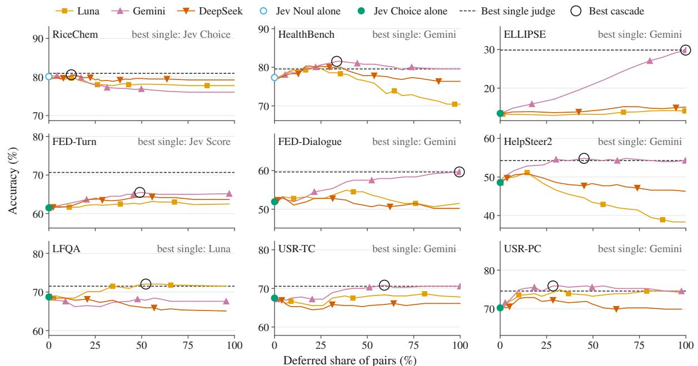  
Figure K1: Cascade accuracy against the share of pairs deferred to each fallback judge (post-hoc analysis), one line per fallback. The marker at a deferred share of zero is Jev alone, in the framing that Section 6.3 uses for the panel. The dashed line is the best single judge of Table 4, named in each panel, and the black ring marks the cascade of Table 4. Every panel spans the same range of accuracy points.

On the kept pairs of the five graded panels where Jev keeps more than two pairs, Jev leads the fallback by 0.7 to 1.9 points, and no lead is significant $( p \ge 0 . 4 5 )$ . RiceChem is the one panel where Jev leads significantly on its kept pairs (63 to 26, $p = 1 \times 1 0 ^ { - 4 } )$ . The best RiceChem cascade defers to Gemini, which Jev Noul outscores, so it gains 4.5 points over Gemini and still falls below Jev Choice alone. HealthBench’s 2.0-point gain over Gemini rests on a kept-pair lead of 18 to 10 $( p = 0 . 1 8 )$

The last row of Table K2 illustrates the identity. It repeats HelpSteer2 with Gemini at $\tau = 0 . 3 0$ the oracle threshold on this panel with Luna or DeepSeek as fallback. Gemini wins the deferred pairs 16 to 1 $( p = 3 \times 1 0 ^ { - 4 } )$ , but that advantage cancels. On the kept pairs Jev is behind Gemini (54.5% against 56.1%), so the cascade (52.8%) ends below Gemini alone (54.3%).

Fixed threshold and flat curves. The last column of Table K1 fixes τ = 0.75 on every graded panel. For the fallback of Table 4 this is already the oracle threshold on FED-Turn, LFQA, and USR-TC, and it matches the oracle accuracy on Help-Steer2 and USR-PC, whose oracle threshold is 0.50. The fixed threshold falls below Gemini alone on ELLIPSE and FED-Dialogue. Near their maxima the curves are flat (Figure K1). With Gemini as fallback, accuracy stays within 1.4 points of the oracle threshold’s for every τ from 0.55 up on FED-Turn, from 0.30 up on USR-PC, and from 0.40 up on HelpSteer2.

Reaching the fallback. With the best LLM judge of each panel as fallback and oracle thresholds, the reach of Table K1 stays below 60% on Health-Bench and on the five graded panels other than EL-LIPSE and FED-Dialogue, which need nearly every pair deferred. Table 4 states the same matches as shares of that judge’s cost, which add Jev’s own cost to the deferred share. Where Jev alone is at least as accurate as a fallback, as for all three RiceChem fallbacks, the reach is zero. On FED-Turn, Jev Score alone reaches 70.7% on the cascade pair set, above every cascade, at about 1/650 of Gemini’s cost.

Criterion routing. LFQA’s cascade does not reduce to sending one criterion to the fallback. Routing every factuality pair to Luna and keeping Jev Choice’s verdicts elsewhere gives 69.8%, below both the confidence cascade (72.1%) and Luna alone (71.5%). Routing any one or two of the three criteria to Luna gives at most 70.9%, reached with factuality and amount\_info together.

Cost. The linear cost estimate of Table K1 assumes that a deferred pair costs the fallback’s average per pair. Deferred pairs may be longer or shorter than average and need more or fewer reasoning tokens.

## L Binary-Panel Expectations Re-examined

The expectations in the first column of Table L1 are those of Section 1, written down before any judge was run on the graded panels. The six status labels, and the assignment of each expectation to one of them, were decided after the graded panels had been analysed. The evidence column gives the statistic behind each status, and a reader can apply a stricter or a looser rule to it. The binary and graded panels differ in several ways at once (Section 7.3), so a status records whether an expectation carried over and does not say which difference decided the outcome.

## M Release and Derived Statistics

Release. The release contains the code used to run every judge, the frozen panel samples, and one verdict record per judge and pair. A panel sample holds each unit as the judges received it, the rubric version (criterion sentences and level descriptions), the label, and the individual rater scores behind it. A verdict record holds the judge’s level or verdict, whether it abstained, and any call failure. For Jev it also holds the returned probabilities and confidence, and for the LLM judges the explanation each one returned. The per-panel summaries that the harness wrote, which record cost and wall time, accompany the verdict records.

Scripts. Two scripts regenerate the paper’s numbers and figures from these files without calling any model. The analysis script computes the values that the paper quotes and writes them to a JSON file and a readable summary, which names for each value the recorded file and key it is read from, or the rule that computes it. The figure script draws every figure from the analysis output alone, at its printed size.

The analysis script checks itself against the recorded results. Its recomputed discordant counts for the 21 graded-panel tests between Jev Choice and the LLM judges and the 7 between Jev Choice and Jev Score, its confidence-band tables for the seven graded panels, and its 21 graded cascade curves all equal the recorded ones. The paired comparisons, group resampling, juries, cross-fitted cascades, and physician reference draw from one fixed seed, with a separate generator for each quantity. The code behind them recomputes pair counts, shares of repeated errors, rater references, oraclethreshold cascades, and physician comparisons, and each equals the value computed without resampling. The ELLIPSE marginal intervals of Appendix C use a seed of their own and one generator shared by the judges.

Inputs beyond the panel records. Some values need records other than the panel verdicts and the per-panel summaries. The LLM judges’ cached responses hold the per-response costs that DeepSeek’s billed cost sums (Appendix B), the reasoning-token counts, the upstream providers that served DeepSeek, and which twelve Luna verdicts were served from the cache (Appendix A). Jev’s runs outside the panels have records of their own: the full RiceChem set, the five-pass stability study, and the HealthBench ideal-completion ablation (Appendices A and D). So do Luna’s two spot-check runs.

Derived statistics. The analysis script derives the following statistics from the recorded verdicts, labels, and summaries, and marks the post-hoc analyses among them.

• The paired comparisons with units resampled: bootstrap intervals, equivalence bounds, sign tests over units, Holm correction, and the resampling of sampling groups (Table C1).

• Pair-level sign tests for Jev Choice, Jev Noul, and Jev Score, with the Holm correction of Jev Choice’s tests (Table C2).

• The paired accuracy differences and per-panel cost ratios of Figure 1, and DeepSeek’s billed cost per panel.

• Judge–judge and judge–label QWK (Table 2), and the all-wrong shares (Table J2).

• The per-criterion aggregates of Figure 2: the Spearman correlation over 31 criteria, the counts of criteria beyond the 15-point cut-off and of criteria with near-zero offsets, the sign agreement of the four offsets on 35 criteria, and the gap measures that ignore location (post hoc; Table G2).

• MET-rate offsets and Cohen’s κ on the binary panels, and MET rates on the embedded binary criteria.

• For ELLIPSE, level usage, the sign structure of the errors, slopes, offsets by trait and by holistic band, accuracy on half-way labels, the post-hoc downward tie-break and constant-shift curves, and the marginal bootstrap intervals of Appendix C.

<table><tr><td>Expectation formed on the binary panels</td><td>Status on the graded panels</td><td>Evidence</td></tr><tr><td>Jev costs two orders of magnitude less than an LLM judge.</td><td>holds in narrower form</td><td>Nine-panel cost ratios are 29× (Luna), 66× (DeepSeek), and 325× (Gemini), and single-panel ratios span 18× to 770× (Table B1). A factor of 100 or more holds over the nine panels only for Gemini, and</td></tr><tr><td>No LLM judge is significantly more accurate than Jev.</td><td>fails</td><td>on single panels also for DeepSeek on FED-Dialogue (169×). Unit-level intervals separate Gemini&#x27;s leads over Jev Choice on ELLIPSE, FED-Dialogue, and HelpSteer2 and Luna&#x27;s lead on USR-PC, and the ELLIPSE and FED-Dialogue leads survive Holm correction</td></tr><tr><td>Jev over-grants MET.</td><td>reversed</td><td>over 27 comparisons. On graded criteria 31 of the 35 judge-by-panel offsets are negative, including Jev Choice&#x27;s on six of seven panels. On embedded binary criteria the sign varies with the criterion, as on the two USR-TC criteria</td></tr><tr><td>Jev&#x27;s confidence predicts which holds in narrower of its verdicts are wrong.</td><td></td><td>of Section 5.4. AUROC 0.57 to 0.70 on six graded panels and 0.49 on ELLIPSE, with failures on single criteria such as LFQA factuality (0.41) and</td></tr><tr><td>The primitive used to ask Jev does not change its verdicts.</td><td>fails</td><td>USR-PC engaging (0.52) (Appendix I). Unit-level intervals separate Jev Score ahead of Jev Choice on ELLIPSE, FED-Turn, FED-Dialogue, and USR-TC, by up to 10.5 points (Table C1). Jev Noul was not run on graded criteria, and the two</td></tr><tr><td>Jev never abstains.</td><td>fails</td><td>binary framings agree at κ = 0.945 (Section 4.3). Jev Choice abstained 28 times, 17 on FED-Dialogue error_recovery, where P(NA) follows the raters&#x27;N/A count (Section 4.3). It never</td></tr><tr><td>Jev&#x27;s most confident errors are mostly label errors.</td><td>undetermined</td><td>chose the epistemic CANNOT_ASSESS option in 8,798 binary pairs. Of the 72 sampled errors from multi-rater panels, 10 have unanimous labels, six of them on ELLIPSE, and unanimous labels cannot be read as label noise. The USR-TC _nofact labels, one of which is in the sample, are unanimous on 17 of 18 (Appendix J). The other 62 errors, every FED and LFQA one among them, sit on split pairs, where the recorded verdicts cannot tell a wrong label from a contested one. On</td></tr><tr><td>Other judges repeat Jev&#x27;s confident errors.</td><td>holds</td><td>confident errors. The three LLM judges repeat 242 of 252 verdicts on the graded panels and 32 of 36 on HealthBench, against 126.7 and 10.0 under the</td></tr><tr><td>Criterion length does not predict holds Jev&#x27;s per-criterion accuracy.</td><td></td><td>independence baseline (Section 6.2). Spearman -0.10 on FED-Turn (7 criteria) and +0.30 on FED-Dialogue (9), against —0.26 and —0.27 on RiceChem and HealthBench. The test is weak, with few criteria and narrow length</td></tr><tr><td>A second judge helps where Jev&#x27;s uncertainty can be resolved.</td><td>holds in narrower form</td><td>ranges, and ELLIPSE is ambiguous (Appendix H). In the post-hoc cascades the fallback beats Jev on every panel&#x27;s deferred pairs, yet the best graded cascade exceeds the best single judge&#x27;s accuracy by at most 1.3 points with oracle thresholds, and by at most 0.8 with cross-fitted ones. On five graded panels an oracle-threshold cascade reaches the best LLM judge for 10–59% of</td></tr><tr><td>The verdict-definition wrapper matters.</td><td>not examined</td><td>deferral (Appendix K). No graded framing used a wrapper (Section 3.1). Its binary-panel gains, +10.7 and +1.0 points, are in Section 4.3</td></tr><tr><td>Jev is stable across runs.</td><td>not examined</td><td>Jev was re-run only on the binary panels, where changes were confined</td></tr><tr><td>Jev has no non-English penalty. not examined</td><td></td><td>to pairs near the threshold (Appendix A). All seven graded panels are in English, and the binary-panel check rests on 36 non-English HealthBench pairs (Appendix D).</td></tr></table>

Table L1: Each expectation from the binary panels and its status on the seven graded panels. holds: the graded panels agree. holds in narrowerform: they agree within the scope given in the evidence. reversed: they show the opposite direction. fails: they contradict it. undetermined: the graded panels as run do not decide it. not examined: the graded panels as run could not test it. Cascade results are post-hoc analysis.

• The USR engaging shift (post hoc) and rank correlations, the \_nofact counts, the

decomposition of Jev Choice’s USR-TC errors, and the rater reference split by rater unanimity.

• Each judge’s use of “Somewhat.” on FED-Turn, the exchange of decoding rules there (post hoc), and the number of Jev Score’s exact halves (Appendix E).

• The relation between P(NA) and the raters’ N/A answers on FED-Dialogue error\_recovery, and the overlap of the judges’ abstentions (Appendix F).

• The fit of the confidence formula, AUROC per panel and per criterion, accuracy on the most confident pairs, repeated errors by band with their independence baseline, the confident-error sample, and the median juries (post hoc; Appendices I and J).

• For the cascades (post hoc), the oracle-threshold and cross-fitted results, the kept and deferred splits with their sign tests, accuracy at a fixed threshold, the deferred share needed to reach each fallback, cost estimates, and the LFQA criterion-routing check (Appendix K).

• The HealthBench physician reference (Appendix D).

• The no-read baselines and their sign tests, criterion-length correlations on FED and ELLIPSE, accuracy by unit-length quartile, and the agreement between Luna’s two spot-check runs.

Sums over panels. Several counts in the paper add per-panel values: the 31 negative offsets (of 35, five judges on seven panels), the 242 repeated verdicts (of 252, three LLM judges and 12 errors on each of seven panels), the 28 abstentions (over 3,414 ordinal pairs on seven graded panels), and the 8 separated, 8 at-parity, and 11 inconclusive comparisons (of the 27 pairings of Jev Choice and an LLM judge on the nine panels). The nine-panel costs and wall times are sums of the per-panel values, with DeepSeek at its billed cost.

What the scripts do not compute. Some statements in the paper are not produced by the analysis script. Values published by the source benchmarks, such as ELLIPSE’s grade band and rater design, are cited to their papers. Facts about Jev, such as its price and the description of its primitives, come from the vendor’s documentation. Other values were read directly from the recorded per-pair results, rater files, or run logs:

• the HealthBench strata of Table A1, the FED-Turn fluent pair with four raters, and the absence of ties among the embedded binary labels (Appendix A);

• the rater-reference rows for within-one and embedded binary accuracy in Table C3;

• the per-criterion wrapper effects on HealthBench (Appendix D);

• the FED-Turn mean probabilities per level, the embedded binary disagreements between the two graded framings, the levels at which Jev Score’s exact halves fall, and the agreement of the two rounding rules on Jev Choice’s probabilities (Appendix E);

• the labels of the error\_recovery dialogues that Jev Choice abstained on (Appendix F) and the ratings behind the ELLIPSE confident errors (Appendix J).

The readings of individual pairs in Appendices F, H, and J quote the records they read and are not measurements.