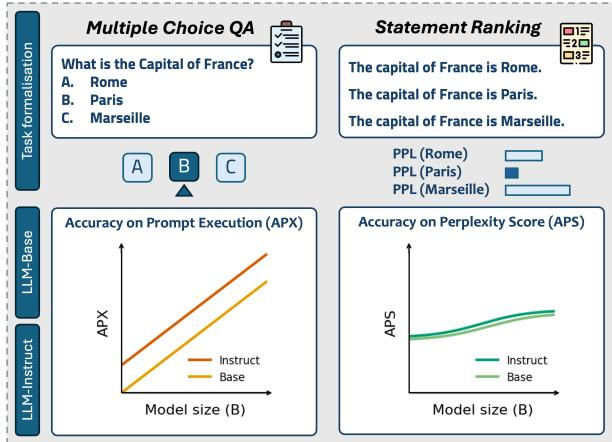
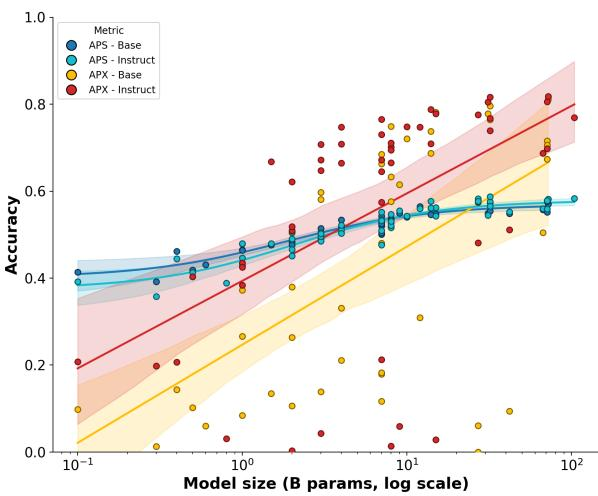
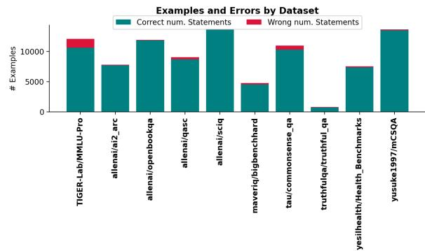
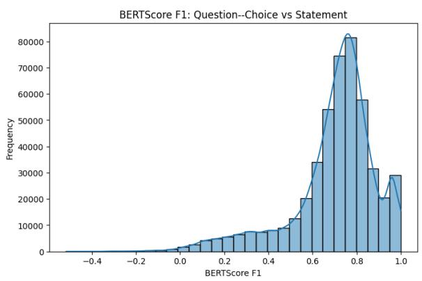
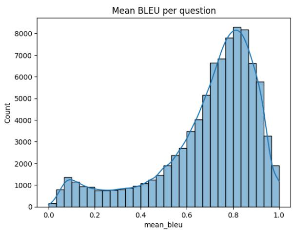
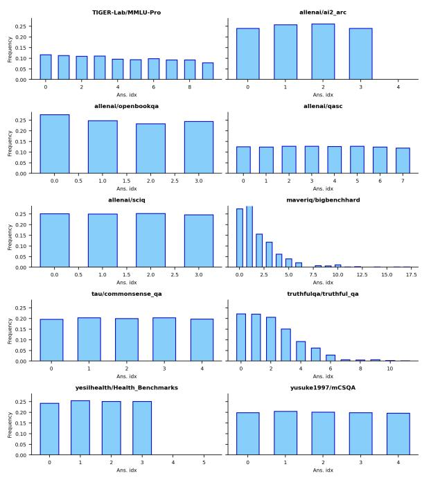
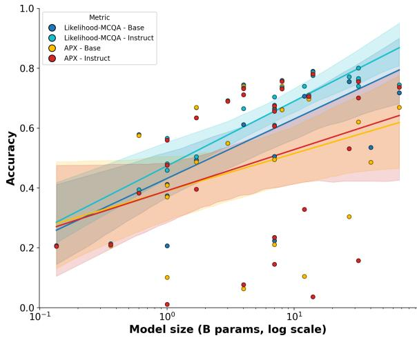
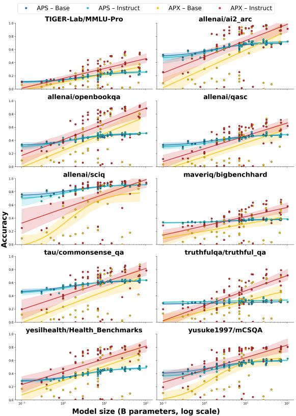
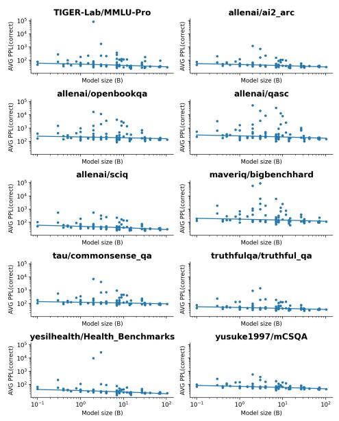
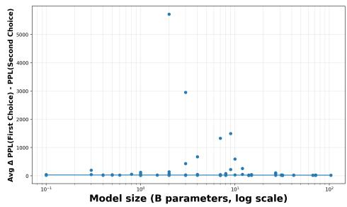

# Likelihood Ranking doesn’t Scale Like Prompting in LLMs

Alessandro Bondielli<sup>1,2,\*</sup>, Lucia Passaro<sup>1,2,\*</sup>, Davide Bacciu<sup>2</sup>, Alessandro Lenci<sup>1</sup>

<sup>1</sup>CoLingLab, Department of Philology, Literature and Linguistics, University of Pisa <sup>2</sup>Department of Computer Science, University of Pisa

\*Equal contribution. Correspondence: alessandro.bondielli@unipi.it, lucia.passaro@unipi.it

## Abstract

LLM evaluation is commonly performed either by prompting models to produce answers or by scoring candidate outputs with likelihoodbased metrics. In multiple-choice QA, however, standard likelihood-based scoring is still condi tioned on the question and answer set, and can therefore leverage the same task-conditioned answer-selection interface used in prompting. We study a complementary protocol based on likelihood ranking of declarative statements constructed from the same question–answer pairs. Across 95 decoder-only models, ranging from 0.1B to 104B parameters, and 10 MCQA datasets, we find a systematic divergence between declarative-statement likelihood ranking and prompted answering. Statementlikelihood accuracy remains comparatively stable across scale, whereas prompted answering improves sharply with scale and instructiontuning. These results suggest that likelihood preferences over controlled declarative alternatives and task-conditioned answer selection probe distinct aspects of model behavior, and should not be treated as interchangeable.

## 1 Introduction

Evaluation protocols play a central role in shaping conclusions about capabilities of LLMs. Two paradigms that dominate current practice are prompting-based evaluation, in which models are directly asked to produce answers, often using a multiple-choice format (Hendrycks et al., 2021), and likelihood-based evaluation (Hu and Levy, 2023), in which candidate outputs are scored using perplexity or related metrics.

Prompting-based evaluation requires the model to map its likelihood preferences onto a discrete action conditioned on task framing, instructions, and output conventions. This mapping constitutes a learned behavioral policy that is shaped by model scale and alignment. By contrast, Likelihoodbased evaluation probes how probability mass is distributed over alternatives, e.g. factual statements, under a fixed linguistic form. In this work, we instantiate this paradigm through declarative statements derived from multiple-choice questions (Petroni et al., 2019).

  
Figure 1: Overview of the experimental setting and evaluation. The design enables a comparison between prompting-based evaluation and declarative-statement likelihood ranking.

There is mounting evidence in the literature that prompting based evaluations, especially those involving multiple-choice selections, are inherently flawed and lack robustness (Wei et al., 2024; Zheng et al., 2024; Molfese et al., 2025; Balepur et al., 2025). Likelihood-based approaches are less “taskoriented”, and have been shown to provide informative signals about linguistic and semantic plausibility (Hu and Levy, 2023; Kauf et al., 2024). However, likelihood scores are sensitive to formulation and surface form, making it important to distinguish different likelihood-based protocols. Standard likelihood-based MCQA still scores answer options in the original multiple-choice context; declarative-statement ranking removes this explicit answer-selection interface. This distinction is related to recent work showing that multiple-choice answer selection may diverge from token-level likelihoods, and that likelihood estimates are affected by surface-form competition (Wang et al., 2024a,b; Holtzman et al., 2021). How these signals diverge with scale and instruction-tuning is underexplored.

Here, we present large scale empirical evidence that declarative-statement likelihood ranking and prompting-based evaluations systematically diverge as a function of model scale and post-training. Our main findings are: i.) likelihood-based accuracy over declarative statements improves slowly and remains relatively bounded across scale, while prompting-based accuracy exhibits strong scaling behavior and rapidly surpasses it; ii.) instructiontuning accelerates the divergence, shifting the crossover point to smaller model sizes.

## 2 Evaluation Setup

As illustrated in Figure 1, we formulate two closely related tasks on the same data, namely Multiple-Choice Question Answering (MCQA) and Statement Ranking, to compare prompting-based evaluation with declarative-statement likelihood ranking. Model performance is assessed with accuracy under two complementary metrics. We define Accuracy on Prompt Execution (APX) as the proportion of correct answers produced in response to explicit prompts, and Accuracy on Perplexity Score (APS) as the proportion of cases where the model assigns higher likelihood to the correct declarative statement than to distractors. Note that we distinguish APS from standard likelihood-based MCQA, where candidate answers are scored in the original question–option context. We argue that under our testing condition it follows the same APX-like scaling, with no significant differences.<sup>1</sup> This motivates declarative-statement ranking as a complementary protocol that reduces the task-conditioned answer-selection interface, rather than replacing standard likelihood-based MCQA. Intermediate option-conditioned formulations are valuable, but reintroduce part of the selection context that APS is designed to abstract away from.

We tested models on 10 HuggingFace MCQA datasets. First, we unified them into a common format: question, choices (labeled, e.g., "A", "B", etc.), correct label, and its index in the choices list. We preserved the original choices order when available, and randomized it otherwise. Then, to allow for declarative-statement likelihood comparison under controlled linguistic forms, we automatically construct n affirmative declarative statements for each question with n answer options, one per option, using gpt-oss-20b (Agarwal et al., 2025). We provided the model with the question, choices, and instructions to generate declarative statements for each of the choices, one per line. We filtered out cases in which the model failed to provide exactly n statements.<sup>2</sup> Table 1 summarizes the final dataset composition and statistics.<sup>3</sup> Since APS depends on the quality of the automatically constructed statements, we validate the generation pipeline for semantic fidelity and surface-form consistency. On a stratified 1% sample of the dataset, we observe a high similarity of generated statements to their source question–answer pair: BLEU mean/median is 0.69/0.75; BERTScore F1 mean/median is is 0.68/0.73; the median length gap is -1 token; the meaning preservation under two LLM judges (raw agreement 0.98) is 99% . Within each item, a LLM judge finds candidate statements sharing a structural template in 95% of cases. Full details on the validation process are provided in Appendix A.2.

<table><tr><td>Dataset (HF Name)</td><td></td><td># Question Avg. Options (± Std.)</td></tr><tr><td>TIGER-Lab/MMLU-Pro</td><td>10,632</td><td> $9 . 4 5 \pm 1 . 5 0$ </td></tr><tr><td>allenai/ai2_arc</td><td>7,698</td><td> $4 . 0 0 \pm 0 . 0 7$ </td></tr><tr><td>allenai/openbookqa</td><td>11,836</td><td> $4 . 0 0 \pm 0 . 0 0$ </td></tr><tr><td>allenai/qasc</td><td>8,685</td><td> $8 . 0 0 \pm 0 . 0 0$ </td></tr><tr><td>allenai/sciq</td><td>13,627</td><td> $4 . 0 0 \pm 0 . 0 0$ </td></tr><tr><td>maveriq/bigbenchhard</td><td>4,539</td><td> $4 . 7 3 \pm 3 . 0 9$ </td></tr><tr><td>tau/commonsense_qa</td><td>10,322</td><td> $5 . 0 0 \pm 0 . 0 0$ </td></tr><tr><td>truthfulqa/truthful_qa</td><td>714</td><td> $4 . 9 2 \pm 1 . 7 3$ </td></tr><tr><td>yesilhealth/Health_Benchmarks</td><td>7,358</td><td> $4 . 0 0 \pm 0 . 0 0$ </td></tr><tr><td>yusuke1997/mCSQA</td><td>13,499</td><td> $5 . 0 0 \pm 0 . 0 0$ </td></tr><tr><td>Total</td><td>88,910</td><td> $5 . 3 5 \pm 2 . 0 8$ </td></tr></table>

Table 1: Statistics of multiple-choice datasets used in our evaluation, same order as the table: Wang et al. (2024c); Clark et al. (2018); Mihaylov et al. (2018); Khot et al. (2020); Welbl et al. (2017); Suzgun et al. (2023); Talmor et al. (2019); Lin et al. (2022); Science (2025); Sakai et al. (2024).

We tested a total of 95 open-weights decoderonly language models, ranging from around 0.1B to 104B parameters (see Table 2, Appendix C). To avoid confounding factors, we excluded Mixtureof-Expert and reasoning-enabled models from the evaluation. We consider both the instruction-tuned (henceforth, instruct) and pre-trained only (henceforth, base) variants, when available.<sup>4</sup>

In the prompting-based setting, models were provided with instructions to solve the MCQA task, the MC question, its options, and prompted to directly and only provide the correct answer. We adapted the final part of the prompt to address differences between base and instruct models, e.g., “the correct answer is: ” vs. “what is the correct answer?” respectively. We also followed the chat template of the model, when available. We set temperature to 0 for greedy generation. Finally, we parsed the models’ responses via regular expressions to obtain a single, final answer, that we then compared with the ground truth to compute accuracy. In the declarative-statement likelihood setting, we passed each declarative statement independently through the model, and computed its perplexity as exp $\begin{array} { r } { \left( - \frac { 1 } { N } \sum _ { i = 1 } ^ { N } \log p ( x _ { i } \mid x _ { < i } ) \right) } \end{array}$ . Then, we selected the statement with the lowest perplexity and compared it with the ground truth to compute accuracy. All our experiments were conducted on HuggingFace models using vLLM.<sup>5</sup>

## 3 Results

Figure 2 illustrates the relationship between model scale and performance under APS and APX, across both base and instruct models (each point corresponds to an individual model variant).

To better characterize the relationship between scale and performance, we fit parametric scaling curves separately for each evaluation metric (APS, APX) and model type (base, instruct). We fit several monotonic scaling functions and select the one minimizing the Akaike Information Criterion (AIC) (Akaike, 1974), computed from the residual sum of squares. AIC enables the comparison of nonnested models while penalizing overparameterization. The trend lines shown in Figure 2 correspond to the best function fit for each subset. Finally, we estimate uncertainty around each scaling curve via non-parametric bootstrap resampling (Efron and Tibshirani, 1994). Shaded regions in the plot indicate 95% confidence intervals.

Across datasets and model families, we observe a consistent pattern. APS exhibits weak scaling behavior: declarative-statement likelihood accuracy improves gradually with model size and remains within a relatively narrow range, saturating well below the best prompted results. Instructiontuning has only a limited effect on this metric. Both base and instruct models follow roughly the same rational function, with minor differences particularly for smaller models. APX, by contrast, improves sharply with scale. Smaller models often perform substantially worse when prompted than when evaluated via declarative-statement likelihood ranking, while larger models exhibit rapid gains and ultimately outperform APS by a wide margin. We refer to the threshold at which APX surpasses APS as the prompting break-even point. The best fit for both base and instruct models is a log-linear function. Both are very similar in terms of steepness, but instruction-tuned models’ APX reaches the break-even point with APS substantially earlier. It is also worth noticing the much smaller variance of APS scores than APX ones, with the latter more loosely spread in the accuracy space. This pattern differs widely from the standard likelihood-based MCQA control reported in Appendix B, which instead follows similar scaling behavior as APX. This supports the interpretation that declarative-statement ranking captures a signal distinct from the task-conditioned answer-selection interface. We observe the same qualitative patterns by breaking down the analysis by dataset.<sup>6</sup>

  
Figure 2: Accuracies under prompting (APX) and declarative statement likelihood (APS) settings, across model scales and families. APS shows weak scaling and limited gains from instruction-tuning; APX improves sharply with scale, and larger models outperform APS.

These trends indicate that prompted answer selection and declarative-statement likelihood ranking respond to different drivers of improvement. While likelihood preferences over declarative alternatives slowly improve with scale, the ability to act on these preferences under task prompts is strongly amplified by instruction-tuning. APX and APS exhibit similar trends across datasets, but the prompting break-even point varies: SCIQ requires larger models than OPENBOOKQA; moreover APS on SCIQ is consistently high (0.65–0.85), suggesting that correct statements receive more stable likelihood support than in other datasets, with lower and more stable PPL.<sup>7</sup>

## 4 Interpreting the mismatch

Declarative-statement likelihood ranking probes how probability mass is distributed over the various alternatives under a fixed linguistic form. This signal is often diffuse, with small differences between correct and incorrect statements, and improves only gradually with scale. We verify this by computing the average PPL delta between the first and the second preferred answer. We see that, aside from few outliers, notably in the 4–10B parameter range, all models display near-zero differences between their first and second “choice” in terms of PPL.<sup>8</sup>

Prompting-based evaluation, by contrast, requires the model to interpret task instructions, compare alternatives, and commit to a discrete decision. This does not mean that prompted gains are disconnected from knowledge; rather, they conflate distributional support for the correct answer with the model’s ability to express that support through the requested answer format. This behavior shows a learned answer-selection policy that maps diffuse likelihood preferences onto task-appropriate outputs. Improvements under this metric reflect not only sharper underlying distributions, but also more effective interfaces between distributional preferences and decision-making.

We view instruction-tuning as primarily optimizing the interface between likelihood preferences and task-conditioned behavior, rather than substantially reshaping the underlying probability distribution learned in pre-training. By training models to produce explicit, task-appropriate outputs under natural language instructions, instruction-tuning strengthens the mapping from diffuse distributional preferences to discrete decisions. The gap widens with scale: prompted accuracy increasingly reflects improved decision behavior and task compliance rather than proportional gains in declarativestatement likelihood accuracy. As model size, training data, and post-training procedures are often opaque in current model releases, we interpret the observed gap as reflecting the combined effect of scale and instruction-tuning on the answerselection interface. Declarative-statement likelihood ranking and prompting-based evaluations target different objectives, with the latter resembling an easier discriminative decision task. As a result, gains in prompted performance may reflect improved task-conditioned decision behavior rather than sharper underlying distributions. Our interpretation is related to work on factuality and calibration, including truth-evaluation protocols such as P(True | s) (Kadavath et al., 2022). APS, however, is not intended as a calibrated truth estimator, but as a controlled likelihood-based signal for comparing declarative-statement ranking with prompted answer selection. This signal remains sensitive to surface form, paraphrase competition, and candidate wording.

Our validation mitigates these confounds by preserving the original question wording and enforcing structural similarity across candidate statements. Further normalizations, such as discounting unconditional option fluency, may help isolate statement-conditioned preferences more precisely. Nevertheless, our central finding is comparative: under the same controlled statement format, likelihood ranking and prompted answer selection scale differently across models, datasets, and instructiontuning regimes.

## 5 Conclusion

Current evaluation practices risk conflating task accuracy with likelihood-based signals used to assess model capabilities. Instead, our findings suggest that these two practices capture different signals of model knowledge. Improvements seen under prompting, particularly those induced by instruction-tuning, reflect advances in behavioral alignment and answer selection mechanisms at least as much as gains in likelihood preferences over semantically matched alternatives.

We argue that prompting-based evaluation, standard likelihood-based MCQA, and declarativestatement likelihood ranking measure related but distinct properties and should not be used interchangeably. As LLMs continue to scale and are increasingly optimized for interactive use, evaluation protocols must more carefully distinguish between latent likelihood preferences and how effectively models are trained to act on them.

## Limitations

This study has several limitations. First, we focus exclusively on MCQA. While this enables a controlled comparison between prompting-based and likelihood-based evaluation, it represents a limited class of tasks.

Second, model families are not uniformly balanced across scale. Some families are overrepresented at particular sizes, which may introduce residual family-specific effects beyond scale.

Third, we consider only open-weights models. Although this supports reproducibility, it limits the generality of our findings to proprietary systems that may employ different alignment strategies.

Fourth, our analysis focuses on model scale and does not consider the amount of training tokens. Albeit the two are strongly correlated, exposure to different amounts of tokens could have independent effects and may be a confounding factor in the analysis. However, this aspect was not possible to analyze due to the lack of information on training data for many of the tested models, especially smaller variants of top-of-the-line models.

Fifth, APS relies on automatically generated declarative statements. Although we validate them for semantic fidelity, structural consistency, and length balance, residual surface-form differences, paraphrase competition, or stylistic preferences may still affect likelihood estimates (Holtzman et al., 2021). Thus, APS should be interpreted as a likelihood-based signal over controlled declarative alternatives, not as a direct or exhaustive measure of model knowledge.

Finally, our declarative-statement protocol is complementary to standard likelihood-based MCQA, where answer options are scored in the original multiple-choice context. We include this formulation as a control, but leave fuller comparisons with calibrated likelihood scores, optionfluency corrections, open-ended factual probes, and truth-evaluation protocols such as P(True | s) (Kadavath et al., 2022) to future work. We also leave a systematic qualitative analysis of APX–APS mismatch cases to future work.

Despite these limitations, the observed divergence between prompting-based and declarativestatement likelihood evaluation is robust across datasets and model families and highlights fundamental distinctions between evaluation paradigms.

## References

Sandhini Agarwal, Lama Ahmad, Jason Ai, Sam Altman, Andy Applebaum, Edwin Arbus, Rahul K Arora, Yu Bai, Bowen Baker, Haiming Bao, and 1 others. 2025. gpt-oss-120b & gpt-oss-20b model card. arXiv preprint arXiv:2508.10925.

H. Akaike. 1974. A new look at the statistical model identification. IEEE Transactions on Automatic Control, 19(6):716–723.

Nishant Balepur, Rachel Rudinger, and Jordan Lee Boyd-Graber. 2025. Which of these best describes multiple choice evaluation with LLMs? a) forced B) flawed C) fixable D) all of the above. In Proceedings of the 63rd Annual Meeting of the Association for Computational Linguistics (Volume 1: Long Papers), pages 3394–3418, Vienna, Austria. Association for Computational Linguistics.

Peter Clark, Isaac Cowhey, Oren Etzioni, Tushar Khot, Ashish Sabharwal, Carissa Schoenick, and Oyvind Tafjord. 2018. Think you have solved question answering? try arc, the ai2 reasoning challenge. arXiv:1803.05457v1.

Bradley Efron and Robert J. Tibshirani. 1994. An Introduction to the Bootstrap, 1 edition. Chapman and Hall/CRC.

Dan Hendrycks, Collin Burns, Steven Basart, Andy Zou, Mantas Mazeika, Dawn Song, and Jacob Steinhardt. 2021. Measuring massive multitask language understanding. In International Conference on Learning Representations (ICLR).

Ari Holtzman, Peter West, Vered Shwartz, Yejin Choi, and Luke Zettlemoyer. 2021. Surface form competition: Why the highest probability answer isn’t always right. In Proceedings of the 2021 Conference on Empirical Methods in Natural Language Processing, pages 7038–7051, Online and Punta Cana, Dominican Republic. Association for Computational Linguistics.

Jennifer Hu and Roger Levy. 2023. Prompting is not a substitute for probability measurements in large language models. In Proceedings ofthe 2023 Conference on Empirical Methods in Natural Language Processing, pages 5040–5060, Singapore. Association for Computational Linguistics.

Saurav Kadavath, Tom Conerly, Amanda Askell, Tom Henighan, Dawn Drain, Ethan Perez, Nicholas Schiefer, Zac Hatfield-Dodds, Nova DasSarma, Eli Tran-Johnson, Scott Johnston, Sheer El-Showk, Andy Jones, Nelson Elhage, Tristan Hume, Anna Chen, Yuntao Bai, Sam Bowman, Stanislav Fort, and 17 others. 2022. Language models (mostly) know what they know. Preprint, arXiv:2207.05221.

Carina Kauf, Emmanuele Chersoni, Alessandro Lenci, Evelina Fedorenko, and Anna A Ivanova. 2024. Log

probabilities are a reliable estimate of semantic plausibility in base and instruction-tuned language models. In Proceedings of the 7th BlackboxNLP Workshop: Analyzing and Interpreting Neural Networks for NLP, pages 263–277, Miami, Florida, US. Association for Computational Linguistics.

Tushar Khot, Peter Clark, Michal Guerquin, Peter Jansen, and Ashish Sabharwal. 2020. QASC: A dataset for question answering via sentence composition. In The Thirty-Fourth AAAI Conference on Artificial Intelligence, AAAI 2020, The Thirty-Second Innovative Applications ofArtificial Intelligence Conference, IAAI 2020, The Tenth AAAI Symposium on Educational Advances in Artificial Intelligence, EAAI 2020, New York, NY, USA, February 7-12, 2020, pages 8082–8090. AAAI Press.

Stephanie Lin, Jacob Hilton, and Owain Evans. 2022. Truthfulqa: Measuring how models mimic human falsehoods. In Proceedings ofthe 60th annual meeting ofthe associationfor computational linguistics (volume 1: long papers), pages 3214–3252.

Todor Mihaylov, Peter Clark, Tushar Khot, and Ashish Sabharwal. 2018. Can a suit of armor conduct electricity? a new dataset for open book question answering. In Proceedings ofthe 2018 Conference on Empirical Methods in Natural Language Processing, pages 2381–2391, Brussels, Belgium. Association for Computational Linguistics.

Francesco Maria Molfese, Luca Moroni, Luca Gioffré, Alessandro Scirè, Simone Conia, and Roberto Navigli. 2025. Right answer, wrong score: Uncovering the inconsistencies of LLM evaluation in multiplechoice question answering. In Findings of the Associationfor Computational Linguistics: ACL 2025, pages 18477–18494, Vienna, Austria. Association for Computational Linguistics.

Fabio Petroni, Tim Rocktäschel, Sebastian Riedel, Patrick Lewis, Anton Bakhtin, Yuxiang Wu, and Alexander Miller. 2019. Language models as knowledge bases? In Proceedings of the 2019 Conference on Empirical Methods in Natural Language Processing and the 9th International Joint Conference on Natural Language Processing (EMNLP-IJCNLP), pages 2463–2473, Hong Kong, China. Association for Computational Linguistics.

Yusuke Sakai, Hidetaka Kamigaito, and Taro Watanabe. 2024. mCSQA: Multilingual commonsense reasoning dataset with unified creation strategy by language models and humans. In Findings ofthe Association for Computational Linguistics: ACL 2024, pages 14182–14214, Bangkok, Thailand. Association for Computational Linguistics.

Yesil Science. 2025. Llm health benchmarks dataset.

Mirac Suzgun, Nathan Scales, Nathanael Schärli, Sebastian Gehrmann, Yi Tay, Hyung Won Chung, Aakanksha Chowdhery, Quoc Le, Ed Chi, Denny Zhou, and Jason Wei. 2023. Challenging BIG-bench

tasks and whether chain-of-thought can solve them. In Findings ofthe Associationfor Computational Linguistics: ACL 2023, pages 13003–13051, Toronto, Canada. Association for Computational Linguistics.

Alon Talmor, Jonathan Herzig, Nicholas Lourie, and Jonathan Berant. 2019. Commonsenseqa: A question answering challenge targeting commonsense knowledge. In Proceedings of the 2019 Conference of the North American Chapter ofthe Associationfor Computational Linguistics: Human Language Technologies, Volume 1 (Long and Short Papers), pages 4149–4158.

Xinpeng Wang, Chengzhi Hu, Bolei Ma, Paul Röttger, and Barbara Plank. 2024a. Look at the text: Instruction-tuned language models are more robust multiple choice selectors than you think. Preprint, arXiv:2404.08382.

Xinpeng Wang, Bolei Ma, Chengzhi Hu, Leon Weber-Genzel, Paul Röttger, Frauke Kreuter, Dirk Hovy, and Barbara Plank. 2024b. “my answer is C”: First-token probabilities do not match text answers in instructiontuned language models. In Findings of the Association for Computational Linguistics: ACL 2024, pages 7407–7416, Bangkok, Thailand. Association for Computational Linguistics.

Yubo Wang, Xueguang Ma, Ge Zhang, Yuansheng Ni, Abhranil Chandra, Shiguang Guo, Weiming Ren, Aaran Arulraj, Xuan He, Ziyan Jiang, Tianle Li, Max Ku, Kai Wang, Alex Zhuang, Rongqi Fan, Xiang Yue, and Wenhu Chen. 2024c. Mmlu-pro: a more robust and challenging multi-task language understanding benchmark. In Proceedings ofthe 38th International Conference on Neural Information Processing Systems, NIPS ’24, Red Hook, NY, USA. Curran Associates Inc.

Fangyun Wei, Xi Chen, and Lin Luo. 2024. Rethinking generative large language model evaluation for semantic comprehension. In Proceedings of the 41st International Conference on Machine Learning, ICML’24. JMLR.org.

Johannes Welbl, Nelson F. Liu, and Matt Gardner. 2017. Crowdsourcing multiple choice science questions. In Proceedings of the 3rd Workshop on Noisy Usergenerated Text, pages 94–106, Copenhagen, Denmark. Association for Computational Linguistics.

Chujie Zheng, Hao Zhou, Fandong Meng, Jie Zhou, and Minlie Huang. 2024. Large language models are not robust multiple choice selectors. In The Twelfth International Conference on Learning Representations (ICLR)).

## Appendix

## A Datasets Details

## A.1 Declarative Statements Generation

To generate affirmative declarative statements for likelihood-based evaluation from multiple choice questions, we use gpt-oss-20b. We use the HuggingFace implementation with vLLM. Below we report the prompt used.

## System prompt

You are a precise text transformation assistant. Your task is to generate, for each multiple-choice question, one affirmative statement per answer option, both for correct and incorrect options.

If the question includes blanks (e.g., “\_\_\_ is the capital of France.”), fill them with each answer choice.

If not, form a natural affirmative statement by appending the answer, e.g., Question: “What type of water formation is formed by clouds?” Expected output format: “The type of water formation formed by clouds is [answer].”

Always output only the list of generated statements, one per line, in the same order as the provided choices.

Each statement must:

• Retain as much as possible the original text. Do not shorten or omit anything.

• Be rephrased only as needed to form a grammatically correct affirmative sentence.

• Insert or append the answer option in a grammatically coherent and correct way.

• Preserve the order of the answer options.

• Produce one output per choice, in the same order as the provided list.

• Be affirmative only (no question marks).

• Contain no commentary, explanations, or metadata.

## User prompt

Question:

{{ question }}

Choices:



{{ label }}. {{ text }}



Generate one affirmative statement for each choice, maintaining their order and preserving the question wording.

Note that we also wrap the prompt in the original default gpt-oss-20b chat template,<sup>9</sup> which includes information on knowledge cutoffs and reasoning effort (see below).

Generation parameters We set the reasoning effort to “medium”, temperature = 0.7, and top $_ { - p } = 0 . 9 5$ . We let the model generate a maximum of 1500 tokens, to fit both the reasoning trace and the final answer.

Error Handling To handle errors in generating declarative statements, we proceed as follows. We simply parse the model’s response, excluding the reasoning trace, by splitting on new lines. Then, we remove empty strings and programmatically assert whether the number of declarative statements actually corresponds to the number of possible answers for that question. We filter cases where there were more or less declarative statements than possible answers. Figure 3 shows the proportion of errors for each dataset.

We see that the number of errors for each dataset is relatively small on all datasets except MMLUPRO. This may be attributable to the fact that it is one of the most complex datasets, with the highest number of average choices (9.45±1.5).

  
Figure 3: Number of examples and errors in declarative statements generation for each dataset.

## A.2 Statement Validation

We validate the generated declarative statements for semantic fidelity and surface-form consistency.

Semantic fidelity. We sample 900 items, corresponding to approximately 1% of the dataset, stratified by dataset and length bin to gather a representative sample of the dataset. We leverage LLMas-a-judge with two independent judges, namely gpt-oss-120b (implemented locally, via vLLM)

and gpt-5.2 (via API). Judges are given the original question, answer option, and generated statement, and asked whether the statement preserves the meaning of the corresponding question–answer pair without omissions or distortions. The prompt used for both models is the following:

```ini
[System]: You are a strict semantic
equivalence checker for multiple-choice
QA.
```

Task: Determine whether the variable   
"statement" is semantically equivalent   
to the variable "choice\_text" as an   
answer to the variable "question".

Context definition:

• "question" is asked by Speaker A.

• Speaker B answers using exactly "choice\_text".

• "statement" is a candidate full   
sentence that may express B’s   
answer.

Equivalence criteria:

• The statement must assert exactly the same answer as choice\_text.

• Ignore superficial differences such as punctuation, capitalization, or grammatical form.

• Do not use external knowledge. Only compare semantic content.

• If the statement expresses a different answer, adds incompatible meaning, introduces uncertainty, or changes the asserted answer, it is not equivalent.

Output format (JSON only, no extra   
text):   
{ "equivalent": boolean, "choice\_label":   
string }   
[User]: Variables:   
question: {{question}}   
choice\_label: {{choice\_label}}   
choice\_text: {{choice\_text}}   
statement: {{statement}}   
Determine whether "statement"   
is semantically equivalent to   
"choice\_text" as an answer to   
"question".   
Return JSON only.

Both judges label 99% of the sampled statements as semantically equivalent, with raw agreement of 0.98. We do not report Cohen’s κ due to the strong class imbalance.

We further compute automatic similarity measures. We use BERTScore<sup>10</sup> and BLEU<sup>11</sup> to assess generated statements against their source question– answer pair. The BERTScore F1 mean/median is 0.68/0.73. Figure 4 shows the complete distribution of F1 scores. The BLEU score is similar as well, with 0.69/0.75 mean/median across questions (Figure 5). Finally, we also assess wether candidate statements from the same item are comparable in length with their respective question– answer pair. We tokenize with the gpt-oss-20b tokenizer and obtain an average within-item (statement vs question–answer) median difference of -1.01 (mean -9.1), indicating that the median statement is roughly 1 token shorter than its source question—answer pair.

  
Figure 4: Distribution of BERTScore F1 for each statement and question–answer pair.

  
Figure 5: Distribution of Mean BLEU scores per question.

Surface-form consistency. Finally, we perform an additional assessment of the structural consistency of generated statements, to verify whether generated statements for each question follow the same surface-form template. On the same 1% sample, we ask a judge (gpt-oss-120b, implemented locally with vLLM) to determine whether all generated statements followed the same surface-form template. We propmt the model as follows:

{ "shared\_template": true or false }

Output format (JSON):   
{ "shared\_template": true or false }   
[User]: Question:   
{{ question }}   
Original options:   
{{ answers }}   
Generated statements:   
{{ statements }}   
Instructions:

```ini
[System]: You are an expert linguistic
analyst evaluating structural and
surface-form consistency across
statements derived from the same
multiple-choice question.
```

Your task is NOT to evaluate correctness. Your task is NOT to evaluate semantics. Your task is NOT to determine whether the answer is valid. Your task is ONLY to determine whether the statements share the same surface-form template.

Two statements share a template if:

• They have the same clause structure

• Negation appears in the same position

• Predicate framing is identical

• Tense and modality are identical

• Differences are limited to insertion of the answer content

## You must:

1. Look for a shared template (if   
present).

2. Compare each statement to that   
template.

3. Decide whether all statements   
follow the shared template.

Return ONLY valid JSON.

1. Infer the surface-form template used by the statements.

2. Replace the option-specific span with [OPTION].

3. Compare each statement to the template.

4. Decide whether all statements share the same template.

Return only JSON in exactly this format:

The judge declared that 95% of items have structurally consistent statements across answer options.

Despite limited by the size of the dataset sample, these results highlight that the generated dataset is viable for our evaluation.

## A.3 MCQA Answer Distribution

Figure 6 shows the distribution of answers in each dataset. We observe that the distribution is uniform in most datasets. The main exceptions are BIGBENCHHARD and TRUTHFUL\_QA. However, in both cases the distribution of answers is also attributable to a high variability in the number of possible answers for each question. If we look at Table 1 we see in fact that both dataset have a much higher standard deviation than all other datasets.

  
Figure 6: Distribution of answers in each dataset.

## A.4 Dataset Licensing and Release

All datasets are publicly available on HuggingFace and used in accordance with their licenses. We release our dataset<sup>12</sup> including original QA pairs and generated declarative statements—under CC-BY, the most restrictive license among the sources.

## B Standard MCQA Likelihood

In this Section, we aim to clarify the relation and highlight the difference between our formulation of APS and standard likelihood-based MCQA (Hu and Levy, 2023). We clarify that our current formulation stems from preliminary experiments conducted early on a subset of models (i.e., 51). These experiments act also as a control experiment in which we follow the common likelihood-based MCQA protocol. Specifically, each answer option is scored via perplexity as a continuation conditioned on the question and the full answer set, i.e., log P(option | question, options). We note that in these experiments we kept the prompt identical for both the base and instruct models. The prompt formulation is the one used for base models in our main experiments (see Appendix D.1). This was done to limit variations and directly study APX vs likelihood-MCQA regardless of model tuning.

  
Figure 7: Prompting-based (APX) and standard likelihood-based MCQA (Likelihood-MCQA) accuracy across model scales and families. Regardless of the presence of Instruction fine-tuning, likelihood-based MCQA and APX move in the same general direction, with comparable steepness.

With this setting we evaluate 51 models in the 0.135B–67B parameter range. We provide a visualization analogous to that of our main experiment in Figure 7. We plot performances against size, and we fit a log linear function to each of the groups. This standard formulation of the problem produced trends highly similar to prompted answering. APX and standard option-likelihood scores are moderately correlated $( \rho = 0 . 5 4 4 4 , p = 3 . 0 2 5 { \times } 1 0 ^ { - 5 } )$ . Moreover, a linear model with interaction terms shows no significant difference between the scaling slopes of APX and standard option-likelihood MCQA $( p = 0 . 5 8 )$ . This supports our interpretation that standard likelihood-based MCQA largely reflects the same task-conditioned answer-selection interface as greedy prompted answering, rather than an independent likelihood signal.

## C Model Inventory

Table 2 provides an overview of the model families evaluated in this work. Below we report the full list of evaluated models, grouped by family.

<table><tr><td>Family</td><td># Models</td><td>Base</td><td>Instruct</td><td>Size Range (B)</td></tr><tr><td>Qwen2.5</td><td>14</td><td>7</td><td>7</td><td>0.5-72</td></tr><tr><td>Qwen3</td><td>12</td><td>6</td><td>6</td><td>0.6-31</td></tr><tr><td>Llama-3</td><td>9</td><td>5</td><td>4</td><td>1-71</td></tr><tr><td>Gemma-3</td><td>10</td><td>5</td><td>5</td><td>0.3-27</td></tr><tr><td>Gemma-2</td><td>6</td><td>3</td><td>3</td><td>2-27</td></tr><tr><td>OLMo-2</td><td>8</td><td>4</td><td>4</td><td>1-32</td></tr><tr><td>Falcon-3</td><td>8</td><td>4</td><td>4</td><td>1-10</td></tr><tr><td>Falcon</td><td>4</td><td>2</td><td>2</td><td>7-42</td></tr><tr><td>DeepSeek</td><td>4</td><td>2</td><td>2</td><td>7-67</td></tr><tr><td>SmolLM2</td><td>6</td><td>3</td><td>3</td><td>0.1-2</td></tr><tr><td>SmolLM3</td><td>2</td><td>1</td><td>1</td><td>3</td></tr><tr><td>Apertus</td><td>4</td><td>2</td><td>2</td><td>8-71</td></tr><tr><td>Command-R</td><td>3</td><td>0</td><td>3</td><td>8-104</td></tr><tr><td>Mistral</td><td>3</td><td>1</td><td>2</td><td>7-8</td></tr><tr><td>Phi-4</td><td>2</td><td>0</td><td>2</td><td>4-15</td></tr></table>

Table 2: Overview of the model families evaluated in this work, reporting the number of base and instructiontuned variants and their parameter scale.

## Phi-4. phi-4, Phi-4-mini-instruct.

Qwen2.5. Qwen2.5-0.5B, Qwen2.5-0.5B-Instruct, Qwen2.5-1.5B, Qwen2.5-1.5B-Instruct, Qwen2.5-3B, Qwen2.5-3B-Instruct, Qwen2.5-7B, Qwen2.5-7B-Instruct, Qwen2.5-14B, Qwen2.5- 14B-Instruct, Qwen2.5-32B, Qwen2.5-32B-Instruct, Qwen2.5-72B, Qwen2.5-72B-Instruct.

Qwen3. Qwen3-0.6B-Base, Qwen3-0.6B, Qwen3-1.7B-Base, Qwen3-1.7B, Qwen3-4B-Base, Qwen3-4B-Instruct-2507, Qwen3-8B-Base, Qwen3-8B, Qwen3-14B-Base, Qwen3-14B, Qwen3-30B-A3B-Base, Qwen3-30B-A3B-Instruct-2507.

Llama-3. Llama-3.2-1B, Llama-3.2-1B-Instruct, Llama-3.2-3B, Llama-3.2-3B-Instruct, Llama-3.1- 8B, Llama-3.1-8B-Instruct, Llama-3.1-70B, Llama-3.3-70B-Instruct, Meta-Llama-3-70B.

Gemma-2. gemma-2-2b, gemma-2-2b-it, gemma-2-9b, gemma-2-9b-it, gemma-2-27b, gemma-2-27b-it.

Gemma-3. gemma-3-270m, gemma-3-270m-it, gemma-3-1b-pt, gemma-3-1b-it, gemma-3-4b-pt, gemma-3-4b-it, gemma-3-12b-pt, gemma-3-12b-it, gemma-3-27b-pt, gemma-3-27b-it.

OLMo-2. OLMo-2-0425-1B, OLMo-2-0425-1B-Instruct, OLMo-2-1124-7B, OLMo-2-1124-7B-Instruct, OLMo-2-1124-13B, OLMo-2-1124-13B-Instruct, OLMo-2-0325-32B, OLMo-2-0325-32B-Instruct.

DeepSeek. deepseek-llm-7b-base, deepseek-llm-7b-chat, deepseek-llm-67b-base, deepseek-llm-67b-chat.

Falcon-3. Falcon3-1B-Base, Falcon3-1B-Instruct, Falcon3-3B-Base, Falcon3-3B-Instruct, Falcon3-7B-Base, Falcon3-7B-Instruct, Falcon3- 10B-Base, Falcon3-10B-Instruct.

Falcon. falcon-7b, falcon-7b-instruct, falcon-40b, falcon-40b-instruct.

SmolLM2. SmolLM2-135M, SmolLM2-135M-Instruct, SmolLM2-360M, SmolLM2-360M-Instruct, SmolLM2-1.7B, SmolLM2-1.7B-Instruct.

SmolLM3. SmolLM3-3B, SmolLM3-3B-Base.

Apertus. Apertus-8B-2509, Apertus-8B-Instruct-2509, Apertus-70B-2509, Apertus-70B-Instruct-2509.

Command-R. c4ai-command-r7b-12-2024, c4aicommand-r-08-2024, c4ai-command-r-plus-08- 2024.

Mistral. Mistral-7B-v0.3, Mistral-7B-Instructv0.3, Ministral-8B-Instruct-2410.

## D Details of Evaluation Setup

Here, we provide further details on the evaluation setup, including prompts used for MCQA for base and instruction-tuned models, and implementation via vLLM.

## D.1 Prompts

For the sake of comparison, we chose not to experiment with prompting techniques tailored to each specific model. We followed general prompting guidelines and kept the prompt short, simple and to the point. We divided the prompt in two parts, namely System and Question prompts. The System prompt is identical for all models. The main differences, that we report below, are in the way the question is asked to each model, with instructiontuned models receiving a direct question, and base models a statement to complete, and in the fact that, when available, the prompt was wrapped into the chat template of each model. If the chat template was not available for the specific model (i.e., for base models and older instruction-tuned ones), we simply concatenated the System and Question prompts and fed them to the model.

## System

You are an expert AI. Your task is to read a multiple-choice question and provide the most likely Correct Answer based on the Options given. Always output only the letter of the correct option. Do not add the actual answer, commentary, explanations, or metadata — only output the letter corresponding to the correct answer.

## Question - Instruct

```jinja
Question: {{ question }}
Options:

{{ option }}

```

Which is the correct answer?

## Question - Base

```jinja
Question: {{ question }} Options:

{{ option }}

The letter corresponding to the correct
answer is:
```

Note that neither the instruct nor base variant have trailing whitespace after the final character. During early experimentation we found that while instruction-tuned variants were resilient to this kind of variation, several base models struggled if a trailing whitespace was added after the colon, often generating the end of sequence token. Thus, we chose to not include any trailing white space in the prompts.

Chat Templates For models that had it available, we wrap the prompt into the model’s chat template as follows:

```python
messages = [
{"role": "system", "content": SYSTEM},
{"role": "user", "content": QUESTION},
]
```

## D.2 Implementation

All models were evaluated locally on a GPU node equipped with A100 80GB GPUs. Depending on the size of the model being tested, either one, two, or four GPUs were allocated for the experiment. For example, models smaller than 20B parameters could be fitted on a single GPU, while 70-100B parameter models required at least four GPUs to run. All models were evaluated using FP-16 variants provided by the original authors via HuggingFace. Models were called using vLLM, specifically wrapping them into the LLM object.

For MCQA, we simply let the model generate a maximum of 15 new tokens with temperature set to zero. To obtain a single, clear choice from model generations, we adopt a simple regex-based strategy where we search for possible answers in the generated text. We consider as possible answers either the letter in isolation, or the actual text of the answers. For cases in which the model provided more than a single answer, e.g., by repeating the original list of answers, we mark it as an error.

  
Figure 8: Prompting-based and declarative-statement likelihood accuracies, for instruction-tuned and base models, as a function of model scale, for each dataset.

For likelihood-based evaluation, we pass each statement through the same pipeline, without any further prompting. We generate only one new token with temperature zero, and output log probabilities for the prompt. Then, we compute log probabilities of the whole sequence, and for each data point we assign a rank to the statements, from most likely (i.e., lowest logprobs) to the least likely.

## E Additional Results

## E.1 Per-dataset results

Figure 8 reports the same analysis as Figure 2 broken down by dataset. We still observe the same qualitative pattern: APS exhibits weak scaling and limited sensitivity to instruction-tuning, while APX scales sharply with model size and benefits substantially from instruction-tuning. Although absolute performance levels vary across datasets, the divergent behavior between APS and APX is generally consistent, indicating that the mismatch is not driven by any single benchmark.

## E.2 PPL of correct answer

Figure 9 displays the average PPL score assigned to the correct answer by each model, divided by dataset. We observe that average PPL tends to decrease with model size, despite variability especially for middle-sized models.

  
Figure 9: Average PPL score assigned to the correct answer by each model, divided by dataset.

## E.3 PPL delta

Figure 10 shows the delta between second lowest and lowest PPL score for declarative statements vs model size, i.e., between the model’s actual choice and its second one. Aside from some notable excepitions, especially in the 4 to 10B parameter range, the difference between the models’ choices and their second option is mostly near zero.

  
Figure 10: Average delta between second lowest and lowest PPL score for declarative statements vs model size.