# MILO: Eficient Many-shot In-Context Learning with Block-wise Low-rank Compression

Youpeng Zhao<sup>1,2</sup>, Tian Tan<sup>1</sup>, Liqian Peng<sup>1</sup>, Jun Wang<sup>2</sup> and Alec Go<sup>1</sup> <sup>1</sup>Google, <sup>2</sup>University of Central Florida

Many-shot in-context learning (ICL) enables large language models (LLMs) to adapt to complex tasks by conditioning on thousands of demonstration examples, but this paradigm shifts the inference eficiency bottleneck to the key-value (KV) cache memory. Due to the linear scaling behavior of the KV cache, storing these intermediate tensors has become a paramount challenge for both online serving and on-device deployment. To address this issue, we propose a novel compression framework, termed MILO, that exploits the low-rank redundancy inherent in many-shot contexts. Specifically, MILO features a blockwise low-rank compression strategy that compresses the KV cache at the block granularity, where each block contains multiple many-shot examples. Furthermore, to handle the heterogeneous context density across diferent blocks, MILO dynamically allocates rank budgets based on the information entropy, preserving the fidelity of critical blocks while aggressively compressing redundant ones. Experimental results on Qwen2.5 models demonstrate that our method achieves up to 50% reduction in KV cache memory and 1.8× throughput improvement, with negligible performance degradation on classification and reasoning benchmarks, significantly outperforming prior baselines.

Keywords: In-Context Learning, Large Language Model, KV Cache Compression

## 1. Introduction

In-context learning (ICL) (Agarwal et al., 2024; Brown et al., 2020; Jiang et al., 2024; Song et al., 2024) is a powerful capability of large language models (LLMs) Brown et al. (2020); Meta (2024); Yang et al. (2024a) that enables the model to learn a new task at inference time by conditioning on a few demonstration examples or ‘shots’ provided directly in the prompt, without any parameter updates. Traditionally, it has been limited to "few-shot" learning due to the small context windows of prior models Brown et al. (2020). However, with the recent expansion of model context windows to a million tokens or more, a new paradigm of ‘many-shot ICL’ has emerged Agarwal et al. (2024); Jiang et al. (2024); Song et al. (2024); Xiao et al. (2025). Through augmenting prompts with hundreds or even thousands of examples, many-shot ICL has been shown to significantly boost performance on complex downstream tasks, often approaching the accuracy of fully fine-tuned models Agarwal et al. (2024); Jiang et al. (2024).

Despite its efectiveness across a wide range of tasks, many-shot ICL introduces significant eficiency challenges for practical deployment Dong et al. (2022); Golchin et al. (2025); Xiao et al. (2025). Long-context inputs place significantly higher memory and compute requirements for inference due to the quadratic complexity of the attention operation and the existence of key-value (KV) cache Ott et al. (2019). To maintain high performance and low latency, many-shot ICL often requires careful and query-dependent example selection to construct proper inputs an Luo et al. (2024); Golchin et al. (2025). Recent works have attempted to minimize the inference costs by pre-encoding the KV cache of many-shot examples Ou et al. (2026); Xiao et al. (2025). Notably, DBSA applies dynamic sparse attention to alleviate the compute burden, and Adapshot further introduces semantic-aware KV cache reuse Ou et al. (2026). However, none of the prior works discuss the storage and memory eficiency aspects of the KV cache. For instance, storing the KV cache for 90k examples necessitates an additional 11.1 GB for 8B dense models Xiao et al. (2025). As the long-context capabilities are continuously expanded, with models like Gemini now supporting 10M tokens, the growing memory footprint for encoding prior examples makes many-shot ICL increasingly memory-bound and impractical for serving with stringent service-level objectives (SLOs).

In this work, we present an eficient framework, termed MILO, to address the above-mentioned KV cache challenges in many-shot ICL. Our key idea is to exploit the observed low-rank nature of the KV cache of pre-encoded many-shot examples. This low-rank redundancy arises because many examples share similar semantic features, leading to highly correlated representations within the KV cache in latent space. By storing the KV cache in low-dimensional space, MILO can achieve up to 50% storage cost reduction and 1.8× speedup against prior works with minimal accuracy degradation. However, achieving this performance requires solving two unique challenges.

First, it is essential to choose the appropriate granularity for low-rank compression to achieve a balance between memory eficiency and model performance. Compression itself is a lossy process, where a naive, global approach risks losing fine-grained information across diferent examples and, most importantly, induces redundant computation overhead during decompression Chang et al. (2024). Conversely, attempting to compress on an example-by-example basis fails to capture the global semantics and results in a significant performance drop due to accumulated information loss from each example Sun et al. (2024). To resolve this trade-of, MILO employs a block-wise low-rank compression (BLC) method. Specifically, the KV caches are compressed at the granularity of a block, where each block contains multiple many-shot examples. Such a granularity can strike the best trade-ofs between model accuracy and inference eficiency, thereby improving the end-to-end quality of service (QoS).

A second challenge lies in the fact that the information density within the KV cache is highly heterogeneous across the blocks. While some blocks focus on local semantic patterns that are highly redundant, others often retain critical information required for tasks like complex chain-of-thought (CoT) reasoning Gu et al. (2025); Wei et al. (2022) and test-time scaling Ji et al. (2025); Muennighof et al. (2025); Snell et al. (2024); Zhao et al. (2025b). Applying a uniform compression rank across the entire cache is therefore often suboptimal. To address this issue, we propose a dynamic rank adaptation mechanism that allocates higher rank budgets based on the entropy of each block and aggressively compresses redundant ones. This ensures that the compression algorithm can preserve the fidelity of retrieval capabilities while minimizing the aggregate KV cache memory footprint. Furthermore, we design and implement a suite of system optimizations, e.g., customized kernels and CUDA graphs and streams, tailored to MILO, to achieve real-world end-to-end benefits.

In summary, our contributions are as follows:

• We identify the KV cache memory challenges in many-shot ICL and propose a new framework, termed MILO, by exploiting the low-rank redundancy inherent in the KV cache during many-shot ICL.

• MILO features block-wise low-rank compression (BLC) that balances reconstruction eficiency with model representation quality, and a dynamic rank adaptation mechanism to allocate ranks based on the information entropy.

• Evaluations on Qwen2.5 models demonstrate that our framework significantly reduces KV cache storage and improves inference latency with negligible accuracy degradation across a suite of standard ICL benchmarks.

## 2. Background

Many-Shot ICL. The paradigm of in-context learning (ICL) was first popularized by GPT-3 Brown et al. (2020), demonstrating that LLMs can adapt to new tasks by conditioning on a few demonstration examples without parameter updates. While early work focused on standard "few-shot" settings (typically 1∼8 examples) due to limited context windows (e.g., 2k or 4k tokens), the recent advent of long-context models—capable of processing up to 10M tokens—has unlocked the potential for "many-shot" ICL. Recent studies indicate that scaling the number of demonstrations from dozens to thousands yields monotonic performance improvements, rivaling the performance of fine-tuned models on complex reasoning and extraction tasks Agarwal et al. (2024); Jiang et al. (2024).

Inference Optimization for Many-Shot ICL. Despite the promising results of many-shot ICL, this approach shifts the bottleneck from ofline training to online inference, where the prompt length scales linearly with the number of shots. The quadratic complexity of self-attention and, more critically, the linear growth of the key-value (KV) cache imposes severe memory and latency constraints Ott et al. (2019). Several recent works have attempted to resolve such inference challenges. Notably, DBSA explores pre-encoding mechanisms with dynamic sparse attention to reduce compute latency Xiao et al. (2025). Adapshot proposes dynamic context budget allocation and KV cache reuse to further improve both accuracy performance and system throughput Ou et al. (2026). However, the challenge of managing the memory footprint for the cached intermediate states of thousands of examples remains an open problem that our work aims to address.

Low-rank Compression. Several works have explored compressing LLMs in low-rank space. Prior eforts have generally focused on weight and activation compression using Fisher information Hsu et al. (2022); Yuan et al. (2023). Recently, as context length continues to scale up, several works aim to further compress KV cache for more eficient memory management Chang et al. (2024); Lin et al. (2024); Saxena et al. (2024); Sun et al. (2024); Yu et al. (2024a,b); Zhang et al. (2024). Notably, Palu applies a low-rank projection matrix in zero-shot settings Chang et al. (2024), and LoRC proposes inter-layer progressive compression Zhang et al. (2024) Yu et al. (2024b) explores compressing KV cache at the head level by converting multi-head attention (MHA) to group-query attention (GQA) with LoRA fine-tuning Hu et al. (2021). However, existing works focus on the compression within a limited context window and do not consider the low-rank nature across examples. Our work aims to extend low-rank compression to many-shot settings and fill in the gap.

Sparse Attention and Quantization. Another line of inference-time approaches is based on the observation that not all tokens are created equal, thus creating the opportunity of sparse attention. $H _ { 2 } O$ Zhang et al. (2023), StreamingLLM Xiao et al. (2023), and Scissorhands Liu et al. (2023), aim to reduce memory by evicting tokens deemed less important, typically retaining the most important ones for token generation. On the system level, ALISA Zhao et al. (2024) employs a co-design approach to maximize throughput performance on resource-constrained platforms. DBSA applies a similar block sparse attention method for retrieval-based many-shot in-context learning, achieving competitive performance against fine-tuning baselines Xiao et al. (2025). Quantization is also a standard method for reducing KV cache memory footprint. Techniques like KIVI Liu et al. (2024) and KVQuant Hooper et al. (2024) compress the KV cache by reducing numerical precision, storing entries in 4-bit or 2-bit formats. Orthogonal to these works, our method aims to compress the representation of the KV cache from the perspective of low-rank approximation, which can be combined with quantization and sparse attention for further gains.

Many-Shot Inputs - Block 1  
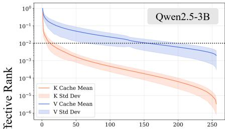

Many-Shot Inputs - Block 2  
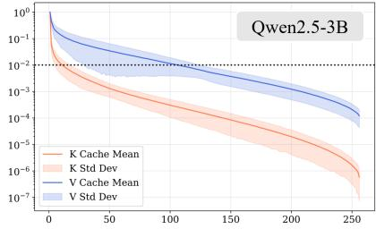

Many-Shot Inputs - Block 3  
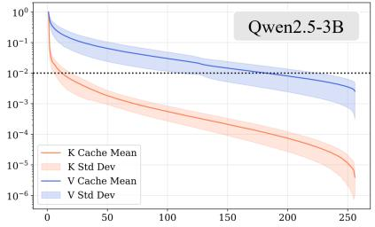

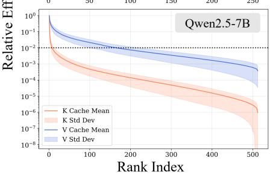

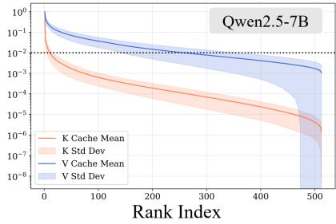

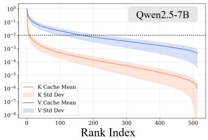  
Figure 2 | Observation of the low-rank characteristics of the key and value cache in Qwen2.5 models across diferent blocks of examples on MATHQA datasets. Here we sample three blocks, where each block contains 64 examples. Efective rank is defined as the square of singular values. We calculate the mean and std across all attention layers.

## 3. Observation

To reduce memory footprint, recent works have explored the low-rank nature of the KV cache Chang et al. (2024); Lin et al. (2024); Saxena et al. (2024); Sun et al. (2024); Yu et al. (2024a). However, these methods focus on data-dependent compression, which often demands additional training or finetuning to achieve competitive compression rates Chang et al. (2024); Saxena et al. (2024). Furthermore, these studies are often limited to zero- or few-shot learning settings with limited context lengths. In our study, we aim to uncover the low-rank characteristics of the KV cache in many-shot ICL settings. Figures 1 and 2 visualize the singular value distributions of pre-RoPE key and value caches on Qwen2.5 models with many-shot inputs.

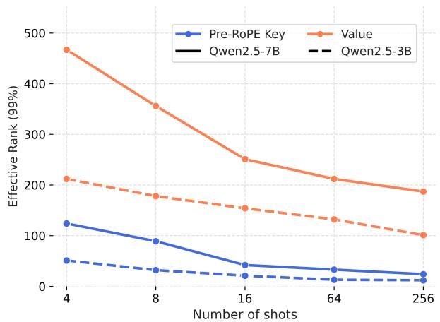  
Figure 1 | Top-1% Efective rank of pre-RoPE key and value over diferent numbers of shots on the MathQA dataset.

Here we have three key observations. First, the key cache exhibits a much stronger low-rank nature than the value cache in many-shot ICL settings, as shown in both Figure 1 and 2. This is consistent with prior findings that pre-RoPE keys are much better suited for low-rank compression Sun et al. (2024). Second, counterintuitively, scaling the number of shots in ICL creates more KV storage, but simultaneously introduces more redundancy in low-rank space, as shown in Figure 1. Third, across diferent blocks and diferent layers, the low-rank behavior is heterogeneous, as indicated in Figure 2. These observations both motivate and validate our solution to exploit the low-rank nature of many-shot contexts.

## 4. Methodology

In this section, we present our framework for eficient many-shot in-context learning. We first formulate the memory bottleneck problem in standard transformer attention. We then introduce block-wise low-rank compression, our approach for granular cache compression, and a dynamic rank allocation mechanism with eficient attention. Next, we present some system optimization techniques for MILO.

## 4.1. Background

Consider a transformer-based LLM with � layers and � attention heads per layer. In the many-shot setting, the model processes a sequence of inputs $X = \{ x _ { 1 } , \ldots , x _ { N } \}$ , where � represents a long context (e $\cdot g . , N > 1 0 ^ { 5 } )$ . The standard self-attention mechanism for a specific head ℎ at layer � computes the output $\mathbf { O } _ { h }$ as:

$$
\mathbf { O } _ { h } = \mathrm { A t t n } ( \mathbf { Q } _ { \mathrm { h } } , \mathbf { K } _ { \mathrm { h } } , \mathbf { V } _ { \mathrm { h } } ) = \mathrm { S o f t m a x } \left( \frac { \mathbf { Q } _ { h } \mathbf { K } _ { h } ^ { \top } } { \sqrt { d } } \right) \mathbf { V } _ { h }\tag{1}
$$

where $\mathbf { Q } _ { h } , \mathbf { K } _ { h } , \mathbf { V } _ { h } \in \mathbb { R } ^ { N \times d }$ denote the Query, Key, and Value matrices, respectively, and � is the head dimension. The primary bottleneck in many-shot ICL is the storage of the intermediate key-value tensors, i.e., the KV cache, (K, V), which grows linearly with the sequence length � Ott et al. (2019). The total memory footprint M required to store the KV cache in FP16 precision is calculated as:

$$
M = 2 \cdot N \cdot L \cdot H \cdot d \cdot 2\tag{2}
$$

As the number of shots continues to grow, M can often exceed the high-bandwidth memory (HBM) capacity of modern GPUs, forcing evictions or ofloading that degrade performance. Our objective is to compress (K, V) into approximations $( \hat { \mathbf { K } } , \hat { \mathbf { V } } )$ such that the memory usage is minimized while preserving the model’s accuracy performance.

## 4.2. Block-wise Low-Rank Compression

Global compression methods often treat the entire context matrix as a single entity, but this approach risks losing fine-grained details essential for many-shot ICL. It also induces redundant computation during decoding, as only a handful of many-shot examples are selected for the entire KV cache Xiao et al. (2025). On the other hand, compressing each example or token leads to improved decoding eficiency, but sufers significant performance degradation, as the information loss from each example accumulates Sun et al. (2024); Yuan et al. (2023). To address the above-mentioned limitations, we exploit the insights from Section 3, and propose a block-wise low-rank compression. Specifically, we partition the KV cache into � blocks, each containing multiple many-shot examples. Given a block of key-value pairs $\mathbf { K } _ { i } , \mathbf { V } _ { i } \in \mathbb { R } ^ { B \times d }$ , where � is the block size (total tokens across blocked examples) and � is the head dimension, we apply low-rank approximation to each block independently. Given that key and value often exhibit diferent levels of low-rank, for each block $i ,$ we perform a decomposition for $\mathbf { K } _ { i }$ and $\mathbf { V } _ { i }$ separately:

$$
\mathbf { K } _ { i } \approx \mathbf { A } _ { i } ^ { \mathbf { k } } \pmb { \Sigma } _ { i } ^ { \mathbf { k } } ( \mathbf { B } _ { i } ^ { \mathbf { k } } ) ^ { \top } , \quad \mathbf { V } _ { i } \approx \mathbf { A } _ { i } ^ { \mathbf { v } } \pmb { \Sigma } _ { i } ^ { \mathbf { v } } ( \mathbf { B } _ { i } ^ { \mathbf { v } } ) ^ { \top }\tag{3}
$$

where $\mathbf { A } _ { i } \in \mathbb { R } ^ { B \times r _ { i } } , \mathbf { \Sigma } _ { i } \in \mathbb { R } ^ { r _ { i } \times r _ { i } }$ is a diagonal matrix of singular values, and $\mathbf { B } _ { i } \in \mathbb { R } ^ { d \times r _ { i } }$ $r _ { i }$ denotes the rank allocated to block $i ,$ satisfying $r _ { i } \ll \operatorname* { m i n } ( B , d )$ . Instead of storing 2�� parameters per block, BLC stores the factorized matrices, reducing the storage cost to $( r _ { i } ^ { \mathbf { k } } + r _ { i } ^ { \mathbf { v } } ) ( B + d )$ . Assume a uniform block size $B ,$ the overall compression ratio $\rho$ is given by:

$$
\rho = \sum _ { i = 1 } ^ { N } \frac { ( r _ { i } ^ { \mathbf { k } } + r _ { i } ^ { \mathbf { v } } ) ( B + d ) } { 2 \cdot N \cdot B \cdot d }\tag{4}
$$

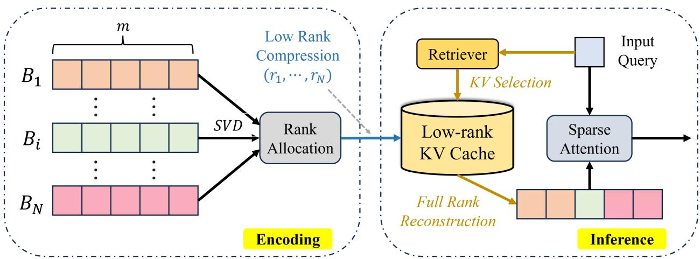  
Figure 3 | Overview of MILO. During the encoding stage, the KV cache for many-shot contexts is split into � blocks, with each block containing � examples. MILO first applies SVD to compute the appropriate rank for each block based on entropy analysis, then performs subsequent low-rank compression with rank budgets $( r _ { 1 } , . . . , r _ { N } )$ . During inference, the input query goes through the retriever to conduct KV cache selection, where the selected compressed KV cache is reconstructed in parallel to perform subsequent sparse attention.

This granularity allows us to capture local semantic dependencies while maintaining a high compression ratio.

## 4.3. Dynamic Rank Allocation

As shown in Figure 2, the information density in many-shot prompts is highly heterogeneous. This echoes prior works that a uniform rank allocation for the KV cache at each layer is often suboptimal Chang et al. (2024); Zhang et al. (2024). Here, we further demonstrate that this phenomenon also extends to many-shot ICL at the block level. Specifically, in a typical many-shot setting, the context window is populated with numerous demonstration blocks, but diferent blocks exhibit substantially diferent spectral complexity and therefore require diferent representation capacities under compression. Therefore, applying a uniform rank wastes representation capacity on highly redundant blocks while under-allocating rank to information-dense blocks.

Here, we formulate rank selection as a global resource allocation problem under a fixed total rank budget and dynamically assign the rank $r _ { i }$ for each block based on its corresponding entropy. The notion of entropy is often used to measure such expressiveness and information density in neural networks Chan et al. (2021); Jaynes (1957); Yuan et al. (2023); Zhao et al. (2025a). Specifically, for block $i ,$ we perform singular value decomposition (SVD) to obtain the singular values $\{ \sigma _ { 1 } , . . . , \sigma _ { d } \}$ where $\sigma _ { 1 } \geq \sigma _ { 2 } \geq . . . \geq \sigma _ { d }$ . Following prior works Chan et al. (2021); Zhao et al. (2025a), we define the retained spectral information at rank � as:

$$
\mathbf { H } _ { i } ( d ) \triangleq \sum _ { j = 1 } ^ { d } \log ( 1 + \frac { \sigma _ { j } ^ { 2 } } { \epsilon ^ { 2 } } )\tag{5}
$$

where $\epsilon$ is a small constant for numerical stability. Given a total rank budget $R _ { \mathrm { t o t } }$ , MILO allocates block-specific ranks $\{ r _ { i } \} _ { i = 1 } ^ { N }$ by solving the following optimization problem:

$$
\operatorname* { m a x } _ { \{ r _ { i } \} } \quad \sum _ { i = 1 } ^ { N } H _ { i } ( r _ { i } ) , \quad \mathrm { s . t . } \quad \sum _ { i = 1 } ^ { N } r _ { i } \leq R _ { \mathrm { t o t } } , \quad r _ { \mathrm { m i n } } \leq r _ { i } \leq r _ { \mathrm { m a x } } .\tag{6}
$$

This formulation allocates more rank to blocks with slowly decaying spectra while aggressively compressing redundant blocks. Since $H _ { i } ( r )$ is additive over singular components, the allocation can be eficiently computed using their marginal information gains. The gain from increasing the rank of block � from � to � + 1 is

$$
\Delta H _ { i , r } = H _ { i } ( r + 1 ) - H _ { i } ( r ) = \log \left( 1 + \frac { \sigma _ { i , r + 1 } ^ { 2 } } { \epsilon ^ { 2 } } \right) .\tag{7}
$$

Starting from $r _ { i } = r _ { \mathrm { m i n } }$ , we can greedily assign each remaining rank unit to the block with the largest marginal gain until $\begin{array} { r } { \sum _ { i } r _ { i } = R _ { \mathrm { t o t } } } \end{array}$ . This produces a heterogeneous rank allocation while strictly satisfying the global compression budget.

## 4.4. MILO Workflow

```latex
Combining the above two proposed tech-
Algorithm 1 MILO Workflow
niques, we present MILO, a new framework
Input: Many-shot context C with � blocks
for eficient many-shot ICL. Figure 3 and Al
$\left\{ B _ { 1 } , B _ { 2 } , \ldots , B _ { N } \right\}$ , where each $B _ { i }$ contains $m _ { i }$ exam
gorithm 1 further demonstrate the detailed
workflow of our framework. Here, for sim- ples. Low-rank Cache ��. Input Query $\mathbf { Q } .$
Output: Attention outputs O
plicity, we assume K and V are compressed
to the same rank, while in practice they can Stage 1: Encoding
for $i = = 1$ to � do
be compressed to diferent ranks according to
# Perform SVD
the entropy distribution. It is divided into an
encoding stage and an inference stage. Dur- $\mathbf { A } , \Sigma , \mathbf { B } ^ { \top } = \mathrm { S V D } ( ( \mathbf { K } _ { i } , \mathbf { V } _ { i } ) )$
ing encoding, the KV cache for a many-shot $/ / \nearrow$ Get Optimal Rank $r _ { i }$
context is partitioned into multiple blocks, $r _ { i } = \mathrm { a r g m i n } _ { r _ { i } } \mathbf { H } ( \cdot )$
$/ / \nearrow$ Compress and Store
each containing a specific number of exam-
��.����� $( \mathbf { A } [ : r _ { i } ] , \pmb { \Sigma } [ : r _ { i } ] , \mathbf { B } [ : r _ { i } ] )$
ples. These blocks undergo SVD to determine
end for
an optimal rank allocation. By analyzing the
Stage 2: Inference
entropy of each block, the system applies low-
# Process Query to the Retriever
rank compression based on assigned rank bud
gets and stores the resulting data in a low- $( k _ { 1 } , k _ { 2 } , . . . , k _ { N } ) = R e t r i \nu e r ( { \bf Q } )$
for $\scriptstyle j = = k _ { 1 }$ to $k _ { N }$ do
rank KV cache. In the subsequent inference
$/ / \nearrow$ Retrieve Selected Block
stage, an input query is first evaluated by a
retriever to perform KV selection from this $\mathbf { A } _ { j } , \mathbf { \pmb { \Sigma } } _ { j } , \mathbf { B } _ { j } = L C . R e t r e i \nu e ( j )$
$/ / F u l l -$ rank Reconstruction
compressed storage. The selected low-rank
cache segments then undergo full-rank recon- $( \mathbf { K } _ { i } , \mathbf { V } _ { i } ) \approx \mathbf { A } _ { i } \pmb { \Sigma } _ { i } \mathbf { B } _ { i } ^ { \top }$
end for
struction in parallel. Finally, the reconstructed
KV cache and the original input query are pro- $O = \mathrm { A t t n } ( \mathbf { Q } , [ \mathbf { K } _ { k _ { 1 } } , . . . \mathbf { K } _ { k _ { N } } ] , [ \mathbf { V } _ { k _ { 1 } } , . . . \mathbf { V } _ { k _ { N } } ] )$
return O
cessed together through a sparse attention
mechanism to complete the generation.
```

## 4.5. System Optimizations

To translate MILO’s memory savings into end-to-end speedup, we optimize the reconstruction path with fused Triton kernels, CUDA streams, and CUDA Graphs.

Fused Low-Rank Reconstruction. A naive PyTorch-based implementation requires separate kernels for loading low-rank factors, applying singular-value scaling, reconstructing KV tensors, and writing them back to global memory. We instead implement a fused Triton kernel that performs cache retrieval, scaling, and reconstruction in a single pass. The kernel tiles the token and head dimensions, computes the reconstructed keys and values in registers and on-chip SRAM, and writes them directly to the KV bufer consumed by attention. This reduces both intermediate HBM trafic and intermediate kernel-launch overhead.

Parallel Reconstruction with CUDA Streams. Rather than reconstructing them sequentially on the default stream, MILO dispatches independent blocks to multiple CUDA streams to enable block-level parallelism and synchronizes only before sparse attention. This improves GPU utilization for small reconstruction kernels and reduces reconstruction latency on the critical path.

CUDA Graph Execution. We further use CUDA Graphs to reduce CPU launch overhead for repeated inference. Frequently occurring reconstruction and attention execution paths are captured and replayed for compatible request configurations, avoiding repeated kernel-launch overhead for short GPU operations.

## 5. Evaluation

## 5.1. Experimental Setup

Models and Datasets. We conduct experiments on Qwen family models, which are widely used for long-context understanding and reasoning tasks in real-world deployment. Specifically, we choose Qwen2.5-3B and Qwen2.5-7B Yang et al. (2024b). In terms of datasets, we focus on natural language understanding and mathematical reasoning tasks, including Banking77 Loukas et al. (2023), Clinic150 Larson et al. (2019), TREC Hovy et al. (2001), NLU Liu et al. (2019), MathQA Amini et al. (2019), and SVAMP Patel et al. (2021). We report model performance as the average accuracy scores of the above tasks. For system performance, we report both the memory and throughput results in an end-to-end fashion. All models are running in half-precision (FP16).

Baselines. We compare our method against standard full caching and state-of-the-art low-rank methods:

• Full Cache: We use the standard uncompressed KV cache as the accuracy performance upper bound and system eficiency lower bound.

• ASVD (example-based) Yuan et al. (2023): ASVD performs activation-aware SVD and compresses it at the granularity of an example for each incoming query.

• Palu (global-based) Chang et al. (2024): Palu employs a low-rank projection matrix and applies KV cache compression to the global context.

Implementation Details. We conduct our experiments on a single NVIDIA L4-24 GB GPU, with a 2.60 GHz Intel Xeon CPU with 512 GB DRAM and PCIe Gen-4. Our method is implemented on top of FlexGen Sheng et al. (2023), Transformers Wolf et al. (2020), PyTorch Paszke et al. (2019), and Triton Tillet et al. (2019). In terms of selecting demonstration examples, we follow prior works Ou et al. (2026); Xiao et al. (2025) and use the standard BM25 retriever Robertson and Zaragoza (2009).

## 5.2. Main Results

Accuracy Results. Table 1 reports the detailed accuracy results of our method and baseline methods. Under an identical rank budget constraint, our method outperforms prior state-of-the-art low-rank methods, improving the accuracy performance by up to 4.5%. Specifically, on Qwen2.5-3B, MILO demonstrates a consistent lead across all individual tasks, substantially narrowing the empirical performance gap to the accuracy performance upper bound. A similar trend can be observed on the larger Qwen2.5-7B model, where MILO retains a greater proportion of the full cache representation capacity, significantly outperforming SOTA methods.

Table 1 | Accuracy comparison of MILO against baseline methods on various many-shot ICL tasks. All experiments are conducted using 512-shot examples under the same rank budget of 50%.
<table><tr><td>Model</td><td>Method</td><td>BANKING77</td><td>CLINIC150</td><td>TREC</td><td>NLU</td><td>MATHQA</td><td>SVAMP</td><td>Avg.</td></tr><tr><td rowspan="4">Qwen2.5-3B</td><td>Full Cache</td><td>0.772</td><td>0.736</td><td>0.884</td><td>0.804</td><td>0.328</td><td>0.536</td><td>0.677</td></tr><tr><td>ASVD</td><td>0.722</td><td>0.694</td><td>0.812</td><td>0.723</td><td>0.241</td><td>0.441</td><td>0.605</td></tr><tr><td>Palu</td><td>0.740</td><td>0.712</td><td>0.856</td><td>0.768</td><td>0.264</td><td>0.484</td><td>0.637</td></tr><tr><td>MILO</td><td>0.744</td><td>0.720</td><td>0.860</td><td>0.780</td><td>0.276</td><td>0.500</td><td>0.647</td></tr><tr><td rowspan="4">Qwen2.5-7B</td><td>Full Cache</td><td>0.812</td><td>0.808</td><td>0.932</td><td>0.860</td><td>0.420</td><td>0.684</td><td>0.753</td></tr><tr><td>ASVD</td><td>0.785</td><td>0.742</td><td>0.837</td><td>0.815</td><td>0.311</td><td>0.594</td><td>0.680</td></tr><tr><td>Palu</td><td>0.802</td><td>0.763</td><td>0.861</td><td>0.824</td><td>0.356</td><td>0.592</td><td>0.700</td></tr><tr><td>MILO</td><td>0.804</td><td>0.794</td><td>0.894</td><td>0.834</td><td>0.394</td><td>0.632</td><td>0.725</td></tr></table>

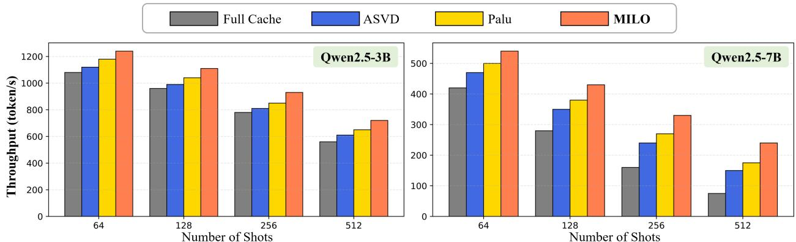  
Figure 4 | End-to-end system performance comparison of MILO against prior methods on the MathQA dataset under the same rank budget of 50% on a single NVIDIA L4 GPU.

Throughput Results. We further evaluate the system performance of MILO under a memoryconstrained deployment. Since the KV cache often cannot remain resident in GPU memory, we consider a KV ofloading configuration where pre-encoded cache blocks for many-shot examples are stored in CPU memory and transferred to the GPU on demand during query processing Sheng et al. (2023); Zhao et al. (2024). Figure 4 reports the end-to-end throughput comparison. Here, we have two key observations. First, compared with full KV ofloading, MILO achieves an average speedup of 1.6×, thanks to the reduced KV volume by performing low-rank compression and eficient kernel implementation. For instance, for the 7B model with 512-shot inputs, MILO can sustain up to 3.2× more throughput. Second, MILO outperforms Palu and ASVD by up to 37% and 60%, respectively. Third, the larger the model size, the higher the improvement MILO brings. This is due to the increased KV cache size transferred during ofload, thus making the inference more memory-bound.

## 5.3. Performance Analysis

Impact of Rank Budget and Block Size. Figure 5 (a) and (b) demonstrate the sensitivity of MILO to the compression ratio and block size (number of examples per block). Here, we have two key observations. First, as the compression ratio increases, all low-rank methods experience gradual accuracy degradation due to the reduced rank budget. However, MILO consistently maintains higher accuracy than ASVD and Palu across the entire range. This indicates that the proposed block-wise adaptive allocation preserves more task-relevant information under constrained rank budgets. Second, increasing the block size initially improves both model accuracy and system eficiency, as larger blocks expose more cross-example redundancy that can be captured by the low-rank representation. However, both accuracy and speedup begin to decline after a certain block size (32), suggesting that overly large blocks reduce compression and retrieval granularity while increasing reconstruction overhead.

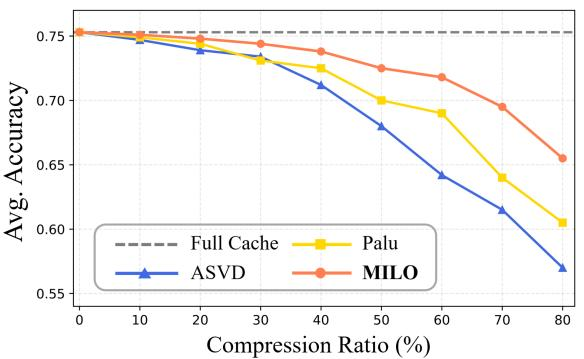

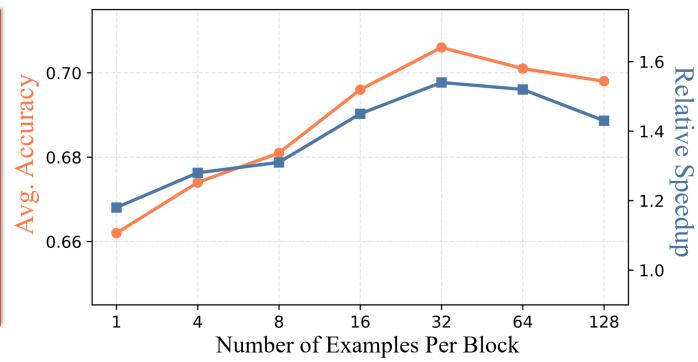

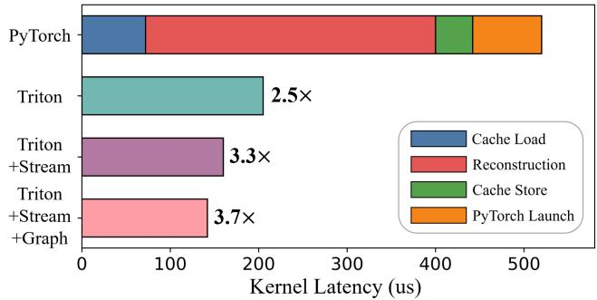

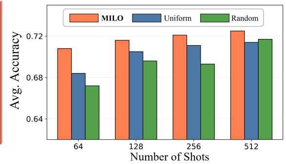  
Figure 5 | Performance Analysis. Top Left (a): Impact of compression ratio (%) on model performance for MILO and baseline methods; Top Right (b): Impact of block size (number of examples per block) on latency and model accuracy for MILO.; Bottom Left (c): Performance breakdown for MILO customized Triton kernels; Bottom Right (d): Impact of rank allocation strategy on model accuracy for MILO. All experiments are conducted using Qwen2.5-7B.

Kernel Performance Analysis. We further evaluate the efectiveness of the system optimizations for MILO, as shown in Figure 5 (c). The native PyTorch implementation incurs substantial latency from separate cache loading, low-rank reconstruction, cache storage, and repeated kernel launches. Replacing these operations with our fused Triton implementation reduces kernel latency by approximately 2.5×, primarily by eliminating intermediate HBM trafic. Enabling parallel block reconstruction with CUDA streams further improves the speedup to approximately 3.3× and combining with CUDA graph achieves a total speedup of approximately 3.7× over the PyTorch implementation.

Impact of Rank Allocation. We also compare the proposed entropy-based rank allocation strategy against uniform and random allocation under the same total rank budget in Figure 5 (d). We can see that MILO consistently achieves the highest model accuracy. As the number of shots increases, the performance gap narrows, but MILO continues to provide the strongest accuracy, demonstrating that adaptive rank allocation makes more efective use of a fixed compression budget.

Combining KV Quantization. Here, we further apply asymmetric INT8 Sheng et al. (2023) and KIVI Liu et al. (2024) quantization on top of MILO and evaluate the impact on model accuracy and KV cache memory reduction ratio. Table 2 shows that MILO can be efectively combined with quantization methods, providing complementary memory savings while preserving model accuracy.

Table 2 | Accuracy and KV-cache memory reduction results when combining MILO with quantization.
<table><tr><td rowspan=1 colspan=1>Model</td><td rowspan=1 colspan=1>Method</td><td rowspan=1 colspan=1>KV Reduction</td><td rowspan=1 colspan=1>Accuracy</td></tr><tr><td rowspan=4 colspan=1> $\mathrm { Q w e n 2 . 5 { - 3 B } }$ </td><td rowspan=4 colspan=1>Full CacheMILO $\mathrm { M I L O } + \mathrm { I N T 8 }$  $\mathrm { M I L O } + \mathrm { K I V I }$ </td><td rowspan=1 colspan=1>1x</td><td rowspan=1 colspan=1>0.677</td></tr><tr><td rowspan=1 colspan=1>2x</td><td rowspan=1 colspan=1>0.647</td></tr><tr><td rowspan=2 colspan=1>4x4.7×</td><td rowspan=1 colspan=1>0.621</td></tr><tr><td rowspan=1 colspan=1>0.608</td></tr><tr><td rowspan=4 colspan=1>Qwen2.5-7B</td><td rowspan=4 colspan=1>Full CacheMILO $\mathrm { M I L O } + \mathrm { I N T 8 }$  $\mathrm { M I L O } + \mathrm { K I V I }$ </td><td rowspan=1 colspan=1>1x</td><td rowspan=1 colspan=1>0.753</td></tr><tr><td rowspan=1 colspan=1>2x</td><td rowspan=1 colspan=1>0.725</td></tr><tr><td rowspan=1 colspan=1>4x</td><td rowspan=1 colspan=1>0.712</td></tr><tr><td rowspan=1 colspan=1>5.3x</td><td rowspan=1 colspan=1>0.701</td></tr></table>

## 6. Conclusion

In this work, we present MILO, a block-wise low-rank KV-cache compression framework for eficient many-shot in-context learning. By exploiting heterogeneous low-rank redundancy across demonstration blocks and dynamically allocating a global rank budget, MILO reduces KV cache memory footprint by 50% while preserving model accuracy. Combining with customized fused Triton kernels, MILO further improves the system performance, achieving up 1.8× speedup upon existing baseline methods, demonstrating a practical path toward eficient many-shot ICL inference.

## References

R. Agarwal, A. Singh, L. M. Zhang, B. Bohnet, S. Chan, B. Zhang, A. Anand, Z. Abbas, A. Nova, J. D. Co-Reyes, E. Chu, F. M. P. Behbahani, A. Faust, and H. Larochelle. Many-shot in-context learning. ArXiv, abs/2404.11018, 2024.

A. Amini, S. Gabriel, S. Lin, R. Koncel-Kedziorski, Y. Choi, and H. Hajishirzi. Mathqa: Towards interpretable math word problem solving with operation-based formalisms. In North American Chapter of the Association for Computational Linguistics, 2019.

an Luo, X. Xu, Y. Liu, P. Pasupat, and M. Kazemi. In-context learning with retrieved demonstrations for language models: A survey. ArXiv, abs/2401.11624, 2024.

T. B. Brown, B. Mann, N. Ryder, M. Subbiah, J. Kaplan, P. Dhariwal, A. Neelakantan, P. Shyam, G. Sastry, A. Askell, S. Agarwal, A. Herbert-Voss, G. Krueger, T. J. Henighan, R. Child, A. Ramesh, D. M. Ziegler, J. Wu, C. Winter, C. Hesse, M. Chen, E. Sigler, M. teusz Litwin, S. Gray, B. Chess, J. Clark, C. Berner, S. McCandlish, A. Radford, I. Sutskever, and D. Amodei. Language models are few-shot learners. ArXiv, abs/2005.14165, 2020.

K. H. R. Chan, Y. Yu, C. You, H. Qi, J. Wright, and Y. Ma. Redunet: A white-box deep network from the principle of maximizing rate reduction. ArXiv, abs/2105.10446, 2021.

C.-C. Chang, W.-C. Lin, C.-Y. Lin, C.-Y. Chen, Y.-F. Hu, P.-S. Wang, N.-C. Huang, L. Ceze, M. S. Abdelfattah, and K.-C. Wu. Palu: Kv-cache compression with low-rank projection. In International Conference on Learning Representations, 2024.

Q. Dong, L. Li, D. Dai, C. Zheng, Z. Wu, B. Chang, X. Sun, J. Xu, L. Li, and Z. Sui. A survey on in-context learning. In Conference on Empirical Methods in Natural Language Processing, 2022.

S. Golchin, Y. Chen, R. Han, M. S. Gandhi, T. Yu, S. Mishra, M. Surdeanu, R. Agarwal, C.-Y. Lee, and T. Pfister. Towards compute-optimal many-shot in-context learning. ArXiv, abs/2507.16217, 2025.

Q. Gu, D. Wang, Y. Zhao, X. Wang, Z. Jiang, Y. Chen, H. Li, and L. Ji. Chain-of-conceptual-thought elicits daily conversation in large language models. In Pacific Rim International Conference on Artificial Intelligence, 2025.

C. Hooper, S. Kim, H. Mohammadzadeh, M. W. Mahoney, Y. S. Shao, K. Keutzer, and A. Gholami. Kvquant: Towards 10 million context length llm inference with kv cache quantization. ArXiv, abs/2401.18079, 2024.

E. H. Hovy, L. Gerber, U. Hermjakob, C.-Y. Lin, and D. Ravichandran. Toward semantics-based answer pinpointing. In Human Language Technology - The Baltic Perspective, 2001.

Y.-C. Hsu, T. Hua, S.-E. Chang, Q. Lou, Y. Shen, and H. Jin. Language model compression with weighted low-rank factorization. ArXiv, abs/2207.00112, 2022.

J. E. Hu, Y. Shen, P. Wallis, Z. Allen-Zhu, Y. Li, S. Wang, and W. Chen. Lora: Low-rank adaptation of large language models. ArXiv, abs/2106.09685, 2021.

E. T. Jaynes. Information theory and statistical mechanics. Physical Review, 106:620–630, 1957.

Y. Ji, J. Li, H. Ye, K. Wu, J. Xu, L. Mo, and M. Zhang. A survey of test-time compute: From intuitive inference to deliberate reasoning. 2025.

Y. Jiang, J. Irvin, J. H. Wang, M. A. Chaudhry, J. H. Chen, and A. Y. Ng. Many-shot in-context learning in multimodal foundation models. ArXiv, abs/2405.09798, 2024.

S. Larson, A. Mahendran, J. Peper, C. Clarke, A. Lee, P. Hill, J. K. Kummerfeld, K. Leach, M. Laurenzano, L. Tang, and J. Mars. An evaluation dataset for intent classification and out-of-scope prediction. ArXiv, abs/1909.02027, 2019.

B. Lin, Z. Zeng, Z. Xiao, S. Kou, T. Hou, X. Gao, H. Zhang, and Z. Deng. Matryoshkakv: Adaptive kv compression via trainable orthogonal projection. ArXiv, abs/2410.14731, 2024.

X. Liu, A. Eshghi, P. Swietojanski, and V. Rieser. Benchmarking natural language understanding services for building conversational agents. ArXiv, abs/1903.05566, 2019.

Z. Liu, A. Desai, F. Liao, W. Wang, V. Xie, Z. Xu, A. Kyrillidis, and A. Shrivastava. Scissorhands: Exploiting the persistence of importance hypothesis for llm kv cache compression at test time. ArXiv, abs/2305.17118, 2023.

Z. Liu, J. Yuan, H. Jin, S. Zhong, Z. Xu, V. Braverman, B. Chen, and X. Hu. Kivi: A tuning-free asymmetric 2bit quantization for kv cache. ArXiv, abs/2402.02750, 2024.

L. Loukas, I. M. Stogiannidis, P. Malakasiotis, and S. Vassos. Breaking the bank with chatgpt: Few-shot text classification for finance. ArXiv, abs/2308.14634, 2023.

Meta. Introducing llama 3.1: Our most capable models to date, 2024. URL https://ai.meta. com/blog/meta-llama-3-1/.

N. Muennighof, Z. Yang, W. Shi, X. L. Li, F.-F. Li, H. Hajishirzi, L. S. Zettlemoyer, P. Liang, E. J. Candes, and T. Hashimoto. s1: Simple test-time scaling. ArXiv, abs/2501.19393, 2025.

M. Ott, S. Edunov, A. Baevski, A. Fan, S. Gross, N. Ng, D. Grangier, and M. Auli. fairseq: A fast, extensible toolkit for sequence modeling. In North American Chapter of the Association for Computational Linguistics, pages 6151–6162, 2019.

J. Ou, J. Guo, S. Guo, Y. Li, R. Wu, Z. Wang, W. Li, and W. Tian. Adapshot: Adaptive many-shot in-context learning with semantic-aware kv cache reuse. In Proceedings of the 64th Annual Meeting of the Associationfor Computational Linguistics (Volume 1: Long Papers), pages 42946–42960, 2026.

A. Paszke, S. Gross, F. Massa, A. Lerer, J. Bradbury, G. Chanan, T. Killeen, Z. Lin, N. Gimelshein, L. Antiga, A. Desmaison, A. Köpf, E. Yang, Z. DeVito, M. Raison, A. Tejani, S. Chilamkurthy, B. Steiner, L. Fang, J.-J. Bai, and S. Chintala. Pytorch: An imperative style, high-performance deep learning library. ArXiv, abs/1912.01703, 2019.

A. Patel, S. Bhattamishra, and N. Goyal. Are nlp models really able to solve simple math word problems? In North American Chapter of the Association for Computational Linguistics, 2021.

S. E. Robertson and H. Zaragoza. The probabilistic relevance framework: Bm25 and beyond. Found. Trends Inf. Retr., 3:333–389, 2009.

U. Saxena, G. Saha, S. Choudhary, and K. Roy. Eigen attention: Attention in low-rank space for kv cache compression. ArXiv, abs/2408.05646, 2024.

Y. Sheng, L. Zheng, B. Yuan, Z. Li, M. Ryabinin, D. Y. Fu, Z. Xie, B. Chen, C. W. Barrett, J. Gonzalez, P. Liang, C. Ré, I. C. Stoica, and C. Zhang. High-throughput generative inference of large language models with a single gpu. In International Conference on Machine Learning, pages 31094—-31116. PMLR, 2023.

C. V. Snell, J. Lee, K. Xu, and A. Kumar. Scaling llm test-time compute optimally can be more efective than scaling model parameters. ArXiv, abs/2408.03314, 2024.

M. Song, M. Zheng, and X. Luo. Can many-shot in-context learning help llms as evaluators? a preliminary empirical study. In International Conference on Computational Linguistics, 2024.

H. Sun, L.-W. Chang, W. Bao, S. Zheng, N. Zheng, X. Liu, H. Dong, Y. Chi, and B. Chen. Shadowkv: Kv cache in shadows for high-throughput long-context llm inference. ArXiv, abs/2410.21465, 2024.

P. Tillet, H.-T. Kung, and D. D. Cox. Triton: an intermediate language and compiler for tiled neural network computations. Proceedings of the 3rd ACM SIGPLAN International Workshop on Machine Learning and Programming Languages, 2019.

J. Wei, X. Wang, D. Schuurmans, M. Bosma, E. H. Chi, F. Xia, Q. Le, and D. Zhou. Chain of thought prompting elicits reasoning in large language models. ArXiv, abs/2201.11903, 2022.

T. Wolf, L. Debut, V. Sanh, J. Chaumond, C. Delangue, A. Moi, P. Cistac, T. Rault, R. Louf, M. Funtowicz, and J. Brew. Transformers: State-of-the-art natural language processing. In Proceedings of the 2020 conference on empirical methods in natural language processing: system demonstrations, pages 38–45, 2020.

E. Xiao, C.-J. Li, Y. Zhang, G. Neubig, and A. Bertsch. Eficient many-shot in-context learning with dynamic block-sparse attention. In Annual Meeting of the Association for Computational Linguistics, 2025.

G. Xiao, Y. Tian, B. Chen, S. Han, and M. Lewis. Eficient streaming language models with attention sinks. ArXiv, abs/2309.17453, 2023.

A. Yang, B. Yang, B. Hui, B. Zheng, B. Yu, C. Zhou, C. Li, C. Li, D. Liu, F. Huang, G. Dong, H. Wei, H. Lin, J. Tang, J. Wang, J. Yang, J. Tu, J. Zhang, J. Ma, J. Xu, J. Zhou, J. Bai, J. He, J. Lin, K. Dang, K. Lu, K.-Y. Chen, K. Yang, M. Li, M. Xue, N. Ni, P. Zhang, P. Wang, R. Peng, R. Men, R. Gao, R. Lin,

S. Wang, S. Bai, S. Tan, T. Zhu, T. Li, T. Liu, W. Ge, X. Deng, X. Zhou, X. Ren, X. Zhang, X. Wei, X. Ren, Y. Fan, Y. Yao, Y. Zhang, Y. Wan, Y. Chu, Z. Cui, Z. Zhang, and Z.-W. Fan. Qwen2 technical report. ArXiv, abs/2407.10671, 2024a.

Q. A. Yang, B. Yang, B. Zhang, B. Hui, B. Zheng, B. Yu, C. Li, D. Liu, F. Huang, G. Dong, H. Wei, H. Lin, J. Yang, J. Tu, J. Zhang, J. Yang, J. Yang, J. Zhou, J. Lin, K. Dang, K. Lu, K. Bao, K. Yang, L. Yu, M. Li, M. Xue, P. Zhang, Q. Zhu, R. Men, R. Lin, T. Li, T. Xia, X. Ren, X. Ren, Y. Fan, Y. Su, Y.-C. Zhang, Y. Wan, Y. Liu, Z. Cui, Z. Zhang, Z. Qiu, S. Quan, and Z. Wang. Qwen2.5 technical report. ArXiv, abs/2412.15115, 2024b.

H. Yu, Z. Yang, S. Li, Y. Li, and J. Wu. Efectively compress kv heads for llm. ArXiv, abs/2406.07056, 2024a. URL https://api.semanticscholar.org/CorpusID:270380364.

H. Yu, Z. Yang, S. Li, Y. Li, and J. Wu. Efectively compress kv heads for llm. ArXiv, abs/2406.07056, 2024b.

Z. Yuan, Y. Shang, Y. Song, Q. Wu, Y. Yan, and G. Sun. Asvd: Activation-aware singular value decomposition for compressing large language models. ArXiv, abs/2312.05821, 2023.

R. Zhang, K. Wang, L. Liu, S. Wang, H. Cheng, C. Zhang, and Y. Shen. Lorc: Low-rank compression for llms kv cache with a progressive compression strategy. ArXiv, abs/2410.03111, 2024.

Z. A. Zhang, Y. Sheng, T. Zhou, T. Chen, L. Zheng, R. Cai, Z. Song, Y. Tian, C. Ré, C. W. Barrett, Z. Wang, and B. Chen. H2o: Heavy-hitter oracle for eficient generative inference of large language models. ArXiv, abs/2306.14048, 2023.

Y. Zhao, D. Wu, and J. Wang. Alisa: Accelerating large language model inference via sparsity-aware kv caching. ArXiv, abs/2403.17312, 2024.

Y. Zhao, M. Lin, H. Tang, Q. Wu, and J. Wang. Merino: Entropy-driven design for generative language models on iot devices. In Proceedings of the AAAI Conference on Artificial Intelligence, volume 39, pages 22840–22848, 2025a.

Y. Zhao, J. Lv, D. Wu, J. Wang, and C. Gooley. Are we scaling the right thing? a system perspective on test-time scaling. ArXiv, abs/2509.19645, 2025b.