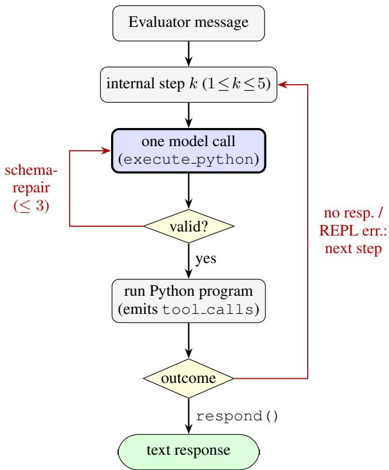

# Policy as Code: A Coroutine-Bridge Harness for Fast-Reasoning Reliability on CAR-bench

Ivan Matveev Proxima Ultra i.a.matveev@gmail.com

## Abstract

CAR-bench evaluates whether tool-using agents stay reliable under real-world uncertainty, executing every tool inside the evaluator so that each toolresult exchange is a separate agent round-trip. A conventional next-action agent can batch parallel tool calls, but a chain of dependent calls costs it one model call per round of results. We present a coroutine-bridge harness in which the model’s only action is to emit a Python program that blocks and resumes in place across evaluator tool exchanges. This decouples model invocation from tool round-trips: on the public test split the agent uses a median of two model calls against seven agent turns per task, resolving a full multi-turn task in a median of 1.8 s of model latency on Cerebras gpt-oss-120b. Because the action surface is executable code, deterministic CAR-bench policies are encoded directly as logic in the tool layer rather than as prompt rules, enforcing compliance at zero reasoning cost. On the official hidden evaluation the harness won Track 2 with 60.0% Pass3, 4.5× the organizer baseline, at the lowest estimated cost and the fastest median task latency (3.14 s) of any entry scoring above that baseline; the same unchanged harness reproduced an identical 60.0% Pass3 on GPT-5.5 in the Open track, matching frontier-model agents. A single static prompt, appended with per-task state at the tail, stays byte-identical across calls and across tasks: the frozen submission prompt served 78% of input tokens from cache (86.6% across its warm tail), against 73% over a three-week development corpus in which prompt edits repeatedly reset the cache. This compounds the few-call design into a small fraction of nominal input compute.

## 1 Introduction

CAR-bench measures the consistency and limit-awareness of LLM agents in an in-car assistant domain of 58 interconnected tools, 19 domain policies, and 254 public tasks spanning base, hallucination, and disambiguation categories [Kirmayr et al., 2026]. The target is deployment reliability across repeated trials: the headline metric is Pass3, which credits a task only when it passes all three independent trials.

Track 2 restricts the model to Cerebras-hosted gpt-oss and rewards compute-aware harnessing: architectures that convert fast inference into low end-to-end latency and reliable behavior. A defining property of the benchmark shapes what “compute-aware” means here. Unlike a standard Agent-to-Agent (A2A) deployment, where an agent executes its own tools privately and one request spans the whole task [A2A Project, 2025], CAR-bench externalizes tool execution to the evaluator so it can score the tool trajectory and inject environment perturbations. Each batch of tool calls the agent emits returns as a fresh A2A message carrying tool results. Batching makes independent calls cheap for any agent, but a chain of dependent calls — where the next call needs the previous result — is different: a conventional “next-action” agent, which the reference templates describe as one model call per assistant step, must spend a model call on each round of results to decide the next call.

Our contribution is a harness that removes this tax. The model emits a single executable Python program [Wang et al., 2024]; when that program calls a tool wrapper, a coroutine bridge suspends the Python thread, emits the official tool call, and resumes the same stack frame when results arrive — without a new model call. One program can thus drive many sequential and parallel tool round-trips per model invocation. Two consequences follow, and both are the substance of this report: (i) model calls, and hence model latency on the critical path, drop sharply relative to agent turns; and (ii) because the action surface is code, deterministic policy is expressed as ordinary logic in the tools the code calls, so policy compliance costs the model no attention and no extra reasoning turns.

## 2 The Coroutine Bridge

## 2.1 Externalized Tools Force Round-Trips

In CAR-bench the participant agent never executes vehicle, navigation, weather, or productivity tools. It returns a data part of tool calls; the evaluator executes them, advances environment state, and returns a new A2A message of tool results. This is what enables trajectory scoring and hallucination injection, and it is why the benchmark cannot be treated as a private single-request task. The cost is structural: an n-step dependent tool chain is n separate agent round-trips.

## 2.2 Decoupling Model Calls from Tool Round-Trips

Each A2A context id owns a long-lived worker holding one persistent Python interpreter, a tool bridge, a scratchpad, and a compact transcript. The model’s sole action is execute python. Execution proceeds as follows:

1. The model emits one Python program (one model call).

2. The program runs in the worker thread until it calls a tool wrapper such as get current navigation state(...).

3. The bridge places the official tool call on the outbox and blocks the Python thread.

4. The evaluator executes the tool and returns a tool-results message.

5. The bridge delivers those results directly into the blocked call, and the same stack frame resumes — no model call.

6. The program branches, calls further tools, or emits the user-facing response.

The model is invoked once per decision: one program spans many tool results before the next call (Figure 1 audits this loop). Crucially, this hides nothing: every tool call still appears in the official A2A trajectory exactly as the evaluator expects, so the technique is fully compliant. What changes is only the number of model invocations between tool roundtrips. Table 1 quantifies the effect: a median of two model calls carries a median of seven agent turns per task.

Unconstrained action format. The model emits its action as a plain-text JSON object — a short thought and a Python program — which the runtime parses, rather than forcing validity through grammar-constrained or native structured decoding. This follows evidence that constrained decoding trades a small but measurable accuracy cost for token savings [Matveev, 2026; Schall and de Melo, 2025]; malformed actions are caught instead by a bounded schema-repair retry.

## 2.3 Parallel Batching

Independent reads are issued together via batch([...]), which emits one parallel A2A tool-call message and returns results in input order. Dependent calls remain ordinary sequential Python. Batching collapses independent tool roundtrips in addition to the model-call savings, further shortening the critical path without sacrificing the natural imperative control flow that makes code actions expressive [Wang et al., 2024].

## 3 Policy as Code

Many CAR-bench policies are deterministic given grounded facts: whether opening a window above 25% requires an AC confirmation, whether high beams are blocked while fog lights are on, which route default applies to a newly created segment. The CodeAct action surface lets us encode such policy directly as logic in the tool layer rather than as prose the model must recall. This is the central design principle of the harness.

  
Figure 1: Per-user-turn call-depth audit. The worker issues at most five sequential model calls (the $k ~ \leq ~ 5$ loop); each step is one execute python call, so there is no parallel LLM fan-out. Inside a program the model branches over tool results (the diamonds) and issues parallel tool calls via batch $( \dots , \dots )$ , which resume the blocked Python frame with no model call and do not count toward the limit. Two retry loops — schema-repair $\left( \le ~ 3 \right)$ and provider backoff (≤ 4) — recover a malformed or failed call rather than add depth. Per baseline step the sequential LLM-call depth is thus $\leq 5$ and typically below one; measured median two calls per task, p90 four.

We separate two responsibilities. The runtime owns facts and strict policy; the model owns interpretation of the user’s intent. Concretely, policy-critical raw wrappers delegate to guarded implementations (set fog lights to a foglight safety helper, open close window to an AC-aware helper), so the policy executes whether the model calls the public name or the helper. A confirmation state machine stores the fully grounded pending action and resumes the exact call on the user’s next turn. Result normalization gives the model stable field names so a simple, direct tool path is not silently trapped by a dynamic result key. Missing capabilities are resolved reactively against the live per-task tool surface — a membership test the organizers confirmed as permitted — never by comparing against a bundled catalog.

The practical test for each policy is: is it deterministic given grounded facts? If yes, it becomes enforced code in a tool; if it requires genuine interpretation of the request, it stays in the prompt. A policy expressed only in the prompt can be forgotten under attention pressure; a policy expressed as tool code is enforced by construction and, on the critical path, free.

<table><tr><td>Per task (test, 3 trials)</td><td>Median</td><td>Mean</td><td>p90</td></tr><tr><td>Model calls</td><td>2</td><td>2.4</td><td>4</td></tr><tr><td>Agent (A2A) turns</td><td>7</td><td>8.0</td><td>12</td></tr><tr><td>Model latency (s)</td><td>1.8</td><td>2.4</td><td>4.4</td></tr><tr><td>Output tokens</td><td>1,443</td><td>1,850</td><td>3,625</td></tr><tr><td>Input tokens</td><td>78.2k</td><td>87.8k</td><td>165.6k</td></tr></table>

Table 1: Compute and latency profile. Two model calls carry seven agent turns: the coroutine bridge decouples model invocation from evaluator tool round-trips. Input token budget is 500k/task; observed mean is 88k.

## 4 Reliability Mechanisms

Three further mechanisms address the specific CAR-bench failure classes. Response obligations: policy-mandated disclosures (e.g. a toll-road mention, a >3°C cross-zone temperature warning) are registered as obligations that the response step appends only if the model’s own text omitted them, preserving compound-request flexibility without making warnings optional. Unknown-value sentinels: hallucination tasks can blank fields in otherwise successful results; the string "unknown" is normalized to a sentinel that is storageand serialization-safe but aborts with a missing-response acknowledgement the moment model code tries to use it in a meaningful operation, converting a silent fabrication into an honest limitation. Turn-scoped outcome tracking: mutation failures are keyed by tool and target arguments and survive every Python block in a user turn, so an optimistic success claim cannot outrun a failed side effect.

## 5 Results

We report the organizers’ hidden-set evaluation (30 tasks, 3 trials, scored by the organizers) and our own development evaluation on the public test split (125 tasks, 3 trials = 375 evaluations). Both use Cerebras gpt-oss-120b at temperature 0 with a JSON code-action contract and the organizers’ default Gemini 2.5 Flash simulator and judge. Table 2 gives the official hidden-set result and Table 3 the percategory public-split breakdown; the hidden set is markedly harder than the public one.

Latency. A complete multi-turn task resolves in a median of 1.8 s of model latency (Table 1). We report model latency deliberately: of the 5,351 s wall time for the full 375- evaluation run, only 899 s was agent LLM time; the remainder is the evaluator’s own simulator and judge, which are not attributable to the agent. Fast per-call inference on Cerebras is thus compounded by a harness that issues few calls.

Reliability: consistency is what decides Pass3. The hidden-set result isolates what the harness actually buys (Table 2). Our entry and the runner-up recorded the identical 57/90 successful trials, yet scored 60.0% and 50.0% Pass3.

<table><tr><td>Hidden set (Track 2)</td><td>Ours</td><td>2nd</td><td>Baseline</td></tr><tr><td>Pass³ (%)</td><td>60.00</td><td>50.00</td><td>13.33</td></tr><tr><td>Pass@3 (%)</td><td>66.67</td><td>76.67</td><td>43.33</td></tr><tr><td>Successful trials</td><td>57/90</td><td>57/90</td><td>26/90</td></tr><tr><td>Success consistency (%)</td><td>92.50</td><td>73.91</td><td>50.00</td></tr><tr><td>Task latency, median (s)</td><td>3.14</td><td>9.82</td><td>5.03</td></tr><tr><td>Mean tokens / trial</td><td>112,993</td><td>342,300</td><td>140,956</td></tr><tr><td>Est. cost / trial ($)</td><td>0.041</td><td>0.13</td><td>0.053</td></tr></table>

Table 2: Official hidden-set result: first of 13 Track 2 submissions, against the runner-up and the non-competing organizer baseline. Our entry and the runner-up convert the same 57/90 successful trials into very different Pass3 (60.0 vs 50.0) because consistency differs (92.5 vs 73.9).

<table><tr><td>Public test split</td><td>Pass1</td><td>Pass3</td></tr><tr><td>Base</td><td>90.0</td><td>78.0</td></tr><tr><td>Hallucination</td><td>98.7</td><td>96.0</td></tr><tr><td>Disambiguation</td><td>90.7</td><td>88.0</td></tr><tr><td>Overall</td><td>93.3</td><td>87.3</td></tr></table>

Table 3: Per-category reliability on the public test split (%; 125 tasks, 3 trials). Hallucination tasks — acknowledging a missing capability instead of fabricating one — are the strongest category, which the runtime’s live tool-surface checks and unknown-value sentinels are built to enforce.

The runner-up in fact solved more tasks at least once (Pass@3 76.7 vs 66.7); it converted fewer of them into three-for-three passes (success consistency 73.9% vs 92.5%). Because deterministic policy is enforced in tool code rather than re-derived by the model on each trial, a task we solve once is very likely to be solved every time — exactly the property Pass3 rewards. Against the organizer baseline on the same model, Pass3 rises 4.5× (60.0 vs 13.3) while median latency drops 38% and mean tokens per trial fall 20%.

Cross-model reproduction. Submitted unchanged to the Open track on GPT-5.5, the same harness scored the same 60.0% Pass3 (tied 4th–6th of 21) with the lowest median task latency in that track (14.1 s). The decomposition differs, however: the frontier model covers more tasks (Pass@3 76.7% vs 66.7%; 60/90 vs 57/90 successful trials) and converts fewer of them (success consistency 80.4% vs 92.5%). Model capacity buys coverage; the harness buys consistency; on this hidden set the two effects cancel to the same Pass3. The rise in coverage also bounds a concern that the identical headline score would otherwise raise, since a harness that capped the stronger model would have held its coverage down.

Prefix-cache efficiency. The system prompt is one large static block — runtime rules, the domain skill, and the full tool catalog — and per-task state is appended only at the tail, so the cacheable prefix is byte-identical across every model call and, crucially, across tasks. We deliberately do not swap skills per task, which would break this prefix. Once the cache is warm, per-minute input-token cache rates run to 88.7% (p90) and 99.9% at peak, and a stable-prompt test day held 86.6% over its final half hour. Across the entire development corpus (918M input tokens over three weeks) the token-weighted rate is 73.2% (672M of 918M), held down by the frequent prompt edits that reset the cache during active development; the deployed agent runs a frozen prompt, so a long hidden-set evaluation runs warm. Combined with the two-call-per-task design, real per-task input compute is a small fraction of the nominal ∼88k tokens. The mechanism is provider-general: any prefix-caching backend (Cerebras here, and the OpenAI route used in our Open-track submission) benefits from the same stable-prefix, tail-accumulation structure.

Compute compliance. Figure 1 audits the call structure of one user turn. The worker issues at most five sequential model calls (the $k \leq 5$ internal-step cap), each a single call, so there is no parallel LLM fan-out; parallel tool calls via batch(...) resume the blocked Python frame without a model call and do not count toward the limit. Two bounded retry loops — schema-repair (≤ 3 attempts) and provider backoff $\left( \leq ~ 4 \right)$ — recover a malformed or failed call rather than add reasoning depth. Observed usage is a median of two model calls per task (p90 four). Mean input+output stays under 90k tokens against the 500k budget. Token and latency accounting is reported through turn metrics on each concluding response; because the accumulator sums across intermediate tool exchanges and the evaluator records metrics only on non-tool-call responses, per-task totals are complete.

Development discipline. Two rules kept the harness from overfitting the weaker model. First, a change was accepted only if a stronger model already outperformed a weaker one on the bare prompt, so gains reflect structure rather than scaffolding. Second, a persistent gpt-oss-120b failure was first reproduced on a stronger model: if the stronger model passed, the ceiling was reachable and the fix was to encode the missing determinism as tool code (Policy as Code); if both failed, the defect lay in existing harness and was repaired there rather than patched over. Candidate changes were judged on consistent-failure sets across runs, never single noisy trials.

## 6 Limitations and Conclusion

Two limits are visible in the official numbers. First, 40% of hidden tasks still fail at least one trial: the residual gap comes from simulator and judge variance and from rare paths where a temperature-0 model chooses a valid-looking but wrong action despite enforced structure. The GPT-5.5 run locates that ceiling more precisely: a stronger model gains ten points of coverage and gives back twelve of consistency, so the residual sits in what the harness has been taught to make deterministic rather than in what the model can work out unaided. Second, our Pass@3 (66.7%) is lower than the runner-up’s (76.7%): enforcing one grounded path yields consistency, and it also forecloses lucky recoveries that a more exploratory agent sometimes finds. Raising Pass@3 without spending the consistency that Pass3 rewards is the open problem this design leaves. Worker state is also in memory and not recoverable across process restarts.

The coroutine bridge shows that fast inference under CARbench’s externalized-tool design is best exploited by letting each fast call accomplish an entire branching program, with deterministic policy compiled into the tools that program invokes. On the hidden evaluation that combination won Track 2 at the lowest cost and fastest latency above baseline, and reproduced its score on a frontier model without a single architectural change.

## References

[A2A Project, 2025] A2A Project. Agent2agent (a2a) protocol. https://a2a-protocol.org, 2025. Accessed 2026-07.

[Kirmayr et al., 2026] Johannes Kirmayr, Lukas Stappen, and Elisabeth Andre. CAR-bench: Evaluating the consistency and limit-awareness of LLM agents under realworld uncertainty. In Maria Liakata, Viviane P. Moreira, Jiajun Zhang, and David Jurgens, editors, Proceedings of the 64th Annual Meeting of the Association for Computational Linguistics (Volume 1: Long Papers), pages 40599– 40618, San Diego, California, United States, July 2026. Association for Computational Linguistics.

[Matveev, 2026] Ivan Matveev. Token-oriented object notation vs JSON: A benchmark of plain and constrained decoding generation, 2026.

[Schall and de Melo, 2025] M. Schall and G. de Melo. The hidden cost of structure: How constrained decoding affects language model performance. In Proceedings of Recent Advances in Natural Language Processing (RANLP), pages 1074–1084, Varna, Bulgaria, 2025.

[Wang et al., 2024] Xingyao Wang, Yangyi Chen, Lifan Yuan, Yizhe Zhang, Yunzhu Li, Hao Peng, and Heng Ji. Executable code actions elicit better LLM agents. In Proceedings ofthe 41st International Conference on Machine Learning (ICML), 2024.