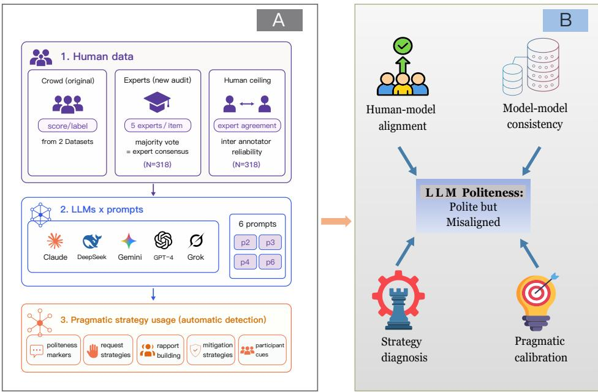
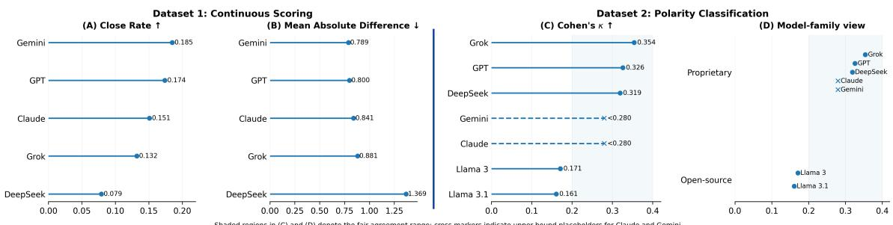
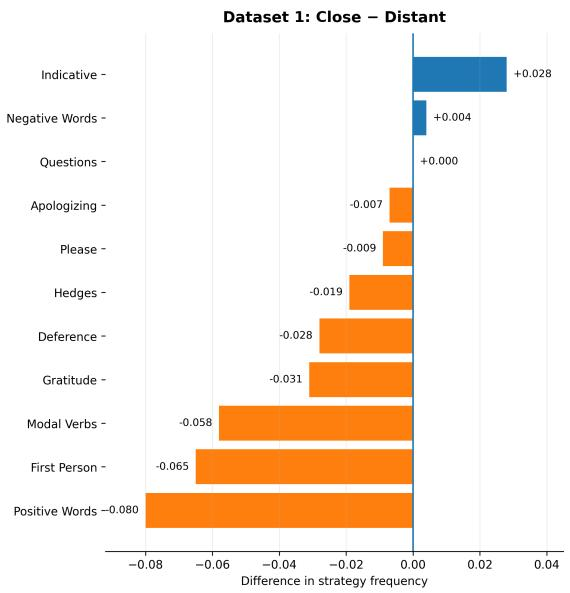
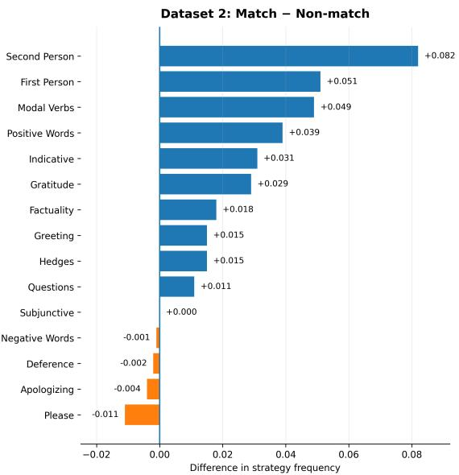
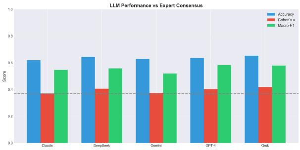
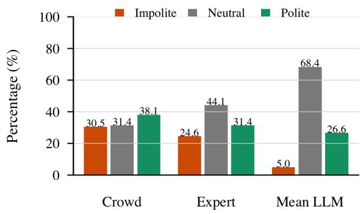

# Polite but Misaligned: Evaluating LLM Politeness Judgments Against Human Pragmatic Norms

Rong Wang University of Tübingen rong.wang@uni-tuebingen.de

Kun Sun\* and Yadong Guo Tongji University {kunsun, guoyadong127}@tongji.edu.cn

## Abstract

Despite strong performance on standard benchmarks, it remains unclear whether large language models (LLMs) evaluate social pragmatics in ways that align with human judgments. We evaluate LLM politeness judgments using two English-language datasets with complementary annotation formats: continuous human ratings and three-way categorical labels. Across the seven evaluated models, we find that inter-model agreement is stronger than model–human agreement. Strategy-level analyses suggest that model–human alignment is associated with explicit linguistic cues, while some rapport-building strategies occur more frequently in misaligned cases. In the cate gorical task, model predictions exhibit systematic neutral compression, characterized by the overproduction of Neutral labels and the underprediction of Impolite labels. This pattern persists when expert consensus is used as the reference on a diagnostic subset. Our findings highlight the need for pragmatic evaluations that go beyond aggregate agreement metrics by examining directional patterns of model– human disagreement across different human references.

## 1 Introduction

Politeness plays a central role in pragmatics and social interactions, reflecting how speakers manage social relationships, express respect, and mitigate face-threatening acts (Leech, 1983; Brown and Levinson, 1987). Human judgments of politeness depend not only on lexical markers such as please or thank you, but also on indirectness, social roles, contextual expectations, face management and cultural norms. As large language models (LLMs) become widely used in conversational agents, customer service systems and educational technologies, it is important to assess whether they evaluate politeness in ways that align with human judgments.

Current LLM benchmarks primarily assess factual knowledge, reasoning, and safety-related behavior. Benchmarks such as MMLU and BIG-Bench do not directly evaluate pragmatic competence (Hendrycks et al., 2021; Srivastava et al., 2023), while toxicity and harmfulness benchmarks provide only indirect evidence about politeness, primarily when impoliteness overlaps with offensive or abusive language (Gehman et al., 2020; Hartvigsen et al., 2022; Zhang et al., 2024). Production-based studies show that LLMs can generate conventionally polite language while differing systematically from humans in how they select and deploy politeness strategies (Zhao and Hawkins, 2025). Even when model outputs conform to conventional politeness cues, such behavioral conformity does not, by itself, establish that the models politeness judgments align with those of humans.

Recent work has expanded the evaluation of pragmatic abilities in LLMs across a range of phenomena and tasks (Sravanthi et al., 2024; Ma et al., 2025). Although valuable for assessing breadth, such evaluations provide limited insight into model behavior within any single pragmatic phenomenon. They often aggregate heterogeneous phenomena, making it difficult to isolate the mechanisms underlying any single pragmatic failure mode.

To complement broad pragmatic evaluations with a more fine-grained diagnosis, we focus on politeness and compare LLM judgments with human annotations in two English-language online datasets, one with continuous ratings and the other with three-way categorical labels. Because politeness judgments are subjective, model–human disagreement may reflect variation among human evaluators rather than model error or annotation noise alone (Plank, 2022; Davani et al., 2022). We compare crowd labels, expert consensus, and LLM predictions on a diagnostic subset of the categorically labeled dataset. This multi-reference analysis examines whether observed disagreement persists across human references without treating either reference as a definitive pragmatic standard.

  
Figure 1: Study overview. Panel A shows Dataset 1 continuous scoring with six prompts, Dataset 2 three-way classification with four prompts (P2, P3, P4, and P6), and the 318-case expert audit. Panel B shows model–human alignment, inter-model consistency, strategy differences, and human-reference comparisons.

We address three research questions. First, to what extent do LLM politeness judgments align with human judgments across models and prompt conditions, and do models agree more strongly with one another than with humans? Second, which observable linguistic strategies and systematic patterns characterize model–human alignment and misalignment? Within this analysis, we examine how explicit markers and rapport-building strategies are associated with model–human alignment and misalignment. Third, on a diagnostic subset of high-disagreement cases, how does comparison with expert consensus change the interpretation of crowd–LLM disagreement, and do model tendencies toward Neutral judgments persist when expert labels are used as the reference? Figure 1 summarizes the datasets, experiments, and evaluation dimensions.

We contribute (i) a multi-reference evaluation of pragmatic alignment spanning crowd, expert, and LLM politeness judgments; (ii) evidence that LLMs agree more with each other than with humans; (iii) two formalized signatures of pragmatic miscalibration: neutral compression and surfacecue accumulation; and (iv) a full release of prompts, metrics, model outputs, and analysis scripts.<sup>1</sup>

## 2 Related Work

Our work builds on three lines of research: computational politeness, pragmatic evaluation of LLMs, and human–AI alignment in social contexts.

## 2.1 Computational Politeness

Computational politeness research has progressed from rule-based accounts to data-driven modeling. The Stanford Politeness Corpus (Danescu-Niculescu-Mizil et al., 2013) operationalized politeness theory (Brown and Levinson, 1987) through lexical and syntactic cues such as indirection, deference, impersonalization, and modality, showing that politeness can be computationally modeled and linked to social power. Subsequent work extended politeness analysis to supervised and weakly supervised learning, contextualized models, and sociolinguistic applications (Priya et al., 2024), including dialogue systems (Firdaus et al., 2020), mental health agents (Mishra et al., 2023), cross-cultural communication (Kitao, 1990), and feature-based toolkits (Yeomans et al., 2018). Whereas prior studies have mainly focused on politeness detection, generation, or feature extraction, we evaluate whether SOTA LLMs produce politeness judgments aligned with human pragmatic norms.

## 2.2 Pragmatic Competence in LLMs

Recent work suggests that LLMs remain limited in pragmatic reasoning. Benchmarks and diagnostic studies show persistent human–model gaps in implicature, presupposition, reference, and deixis (Sravanthi et al., 2024), as well as difficulties with irony and sarcasm in disagreement (Shulginov et al., 2025), context-dependent impoliteness (Andersson and McIntyre, 2025), and promptpoliteness effects (Yin et al., 2024). Productionbased analyses further suggest that LLMs may overuse negative politeness strategies relative to humans (Zhao and Hawkins, 2025). Complementing these generation- and task-based studies, we directly compare LLM politeness judgments with both continuous human ratings and categorical annotations.

## 2.3 Human–AI Alignment in Social Contexts

Human–AI alignment increasingly concerns social and cultural behavior, not only task performance (Ji et al., 2023). Although RLHF can reshape model behavior toward human preferences (Ouyang et al., 2022), recent evaluations report model–human differences in value priorities, attitudes toward socially important issues, collective reasoning, and personality-conditioned behavior (Lau et al., 2025; Bojic et al.´ , 2025; Qian et al., 2025; Zakazov et al., 2024). Yet pragmatic phenomena such as politeness remain largely absent from standard benchmarks such as MMLU (Hendrycks et al., 2021) and BIG-Bench (Srivastava et al., 2023). We address this gap by testing whether LLM politeness judgments align with human annotations rather than merely exhibiting surface-level polite behavior.

## 3 Datasets

We evaluate LLM politeness judgments using two English-language datasets with complementary annotation formats: continuous human ratings and three-way categorical labels.

Dataset 1: Stanford Politeness Corpus. The Stanford Politeness Corpus (Danescu-Niculescu-Mizil et al., 2013) contains 10,957 two-sentence requests: 4,353 from Wikipedia Talk pages and 6,604 from Stack Exchange. Each request was rated by five crowd annotators on a continuous scale from very impolite to very polite. The corpus politeness score is the mean of the five ratings after normalization within annotator, with higher values indicating greater perceived politeness. We sampled 3,000 requests using the original continuous human scores to obtain balanced coverage across the observed politeness-score range. The original continuous scores were retained as the reference values for the continuous-scoring evaluation.

Dataset 2: Three-way Politeness Corpus. For the categorical evaluation, we use the frfede/politeness-corpus dataset distributed through Hugging Face (frfede, 2024). The repository contains 16,428 text instances labeled as Impolite, Neutral, or Polite, with 5,476 instances per category. We sampled 3,000 instances, with 1,000 from each reference-label category, for the threeway classification evaluation. Because the repository does not provide detailed documentation of the original data provenance or label-construction procedure, we treat the three categories as repositoryprovided reference labels.

## 4 Methods

## 4.1 Evaluated Language Models

We evaluated five contemporary LLMs via the OpenRouter API https://openrouter.ai between February 2026 and May 2026: google/gemini-2.5-flash, openai/gpt-4.1, anthropic/claude-3.5-sonnet, x-ai/grok-3, and deepseek/deepseek-chat. For Dataset 2, we additionally evaluated two open-weight models: meta-llama/llama-3-8b-instruct and meta-llama/llama-3.1-8b-instruct. All models were queried using their provider-default sampling parameters (e.g., temperature and top-p) without explicitly setting a fixed random seed, reflecting standard out-of-the-box performance. Provider routing via OpenRouter was unconstrained to mirror generic API deployment environments. Failed API requests were retried up to three times, and no responses remained unparseable after retrying. No fine-tuning, modelspecific prompt calibration, or manual correction of outputs was performed.

## 4.2 Prompt Conditions

We evaluated prompt sensitivity using six zero-shot prompt templates that varied along three dimensions: role framing (neutral evaluator vs. pragmatics expert), cue access (surface-only vs. pragmaticfunction-aware), and output format (continuous score vs. categorical label).

P1 restricted evaluation to observable linguistic cues. P2 provided a minimal instruction for three-way classification. P3 framed the model as a pragmatics expert and supplied politeness-theoretic criteria. P4 provided an explicit checklist of lexical, syntactic, and discourse features. P5 used a minimal instruction for continuous scoring, whereas P6 elicited scores along five pragmatic dimensions and combined them into an overall score. All prompt templates were held constant across models. The complete templates are provided in Appendix A.2.

## 4.3 Evaluation Metrics

Dataset 1: Continuous scoring. For each model– prompt condition, we measure model–human alignment using Pearson’s correlation coefficient (r) and mean absolute error (MAE). We define the Close Rate as the proportion of instances for which the absolute difference between the model and human scores is below 0.5. Pairwise Pearson correlations between model outputs are used to compare intermodel consistency with model–human alignment. Dataset 2 (three-class classification). We use accuracy, macro-F1, and Cohen’s κ to measure agreement with the reference labels, and Fleiss’ κ to measure agreement across models. Confusion matrices, label distributions, and the diagnostics below characterize the direction of disagreement. We compute these metrics separately under P2, P3, P4, and P6 conditions and report both prompt-specific and model-level results.

Overall agreement metrics do not show whether model–reference disagreements follow a systematic direction. We therefore examine whether Polite and Impolite labels are shifted toward Neutral, a pattern we term neutral compression. Let M denote the model prediction and R the reference label, with N, P, and I denoting Neutral, Polite, and Impolite, respectively. We define the Neutral Compression Difference as

$$
\mathrm { N C I } _ { d i f f } = \mathrm { P r } ( M = N ) - \mathrm { P r } ( R = N ) ,
$$

and the corresponding Neutral Compression Ratio as

$$
\mathrm { N C I } _ { r a t i o } = { \frac { \mathrm { P r } ( M = N ) } { \mathrm { P r } ( R = N ) } } .
$$

Positive values of $\mathrm { N C I } _ { d i f f }$ and values of $\mathrm { N C I } _ { r a t i o } > 1$ indicate that the model assigns Neutral more frequently than the reference.

We define the Impoliteness Suppression Difference as

$$
\mathrm { I S R } _ { d i f f } = \mathrm { P r } ( R = I ) - \mathrm { P r } ( M = I ) ,
$$

where positive values indicate model underproduction of Impolite labels. Finally, we define the class-specific Extreme-to-Neutral Shift Rate as

$$
{ \mathrm { E N S R } } _ { c } = { \mathrm { P r } } ( M = N \mid R = c ) , \qquad c \in \{ P , I \} .
$$

Thus, $\mathrm { E N S R } _ { P }$ and $\mathrm { E N S R } _ { I }$ measure how often reference-labeled Polite and Impolite instances, respectively, are shifted to Neutral by the model. These descriptive measures are computed using either crowd labels or expert consensus as the reference, as specified in each analysis.

## 4.4 Human Baseline Estimation

To contextualize model–human alignment, we estimated inter-human agreement and a human reference for Dataset 1 using the original annotator-level ratings. Inter-human agreement was computed as the mean pairwise Pearson correlation among the five annotators for each item. We further estimated a leave-one-annotator-out human reference. Each annotator’s rating was compared against the mean rating of the remaining four annotators, and the resulting correlations were averaged across annotators. This procedure approximates how well an individual human matches the consensus of other humans and provides a realistic upper bound for model–human comparison on this subjective task. Detailed reliability statistics are reported in Appendix C.

## 4.5 Politeness Strategy Detection

To examine which observable linguistic strategies are associated with model–human alignment and misalignment, we applied a rule-based detector to each input instance. The detector identifies 15 strategies, including explicit politeness markers, hedges, modal verbs, interrogatives, conditional constructions, person-reference patterns, deference, gratitude, greetings, apologies, and positive and negative lexical cues. Detection is based on lexical lists, regular expressions, and shallow syntactic patterns. Strategy counts are aggregated at the instance level and normalized for text length.

For Dataset 1, we define aligned cases as instances with an absolute model–human score difference below 0.5 and strongly misaligned cases as instances with a difference of at least 1.0. Instances falling between these thresholds are excluded from this contrast. For Dataset 2, aligned and misaligned cases correspond to agreement and disagreement between model predictions and reference labels, respectively. We compare strategy frequencies between these groups and examine whether the direction of each difference is consistent across models and prompt conditions. Because the analysis involves multiple correlated strategy comparisons, we treat it as exploratory and emphasize effect direction and cross-condition consistency rather than isolated significance tests. Full detection rules and validation results are provided in Appendix D.

## 4.6 Expert Audit Experiment

To distinguish model errors from annotation ambiguity, we conducted an expert audit on 318 Dataset 2 instances sampled from highdisagreement and strategy-conflict cases. Five proficient L2 English annotators with graduate training in linguistics and pragmatics independently labeled each instance as Impolite, Neutral, or Polite and provided a confidence rating. Majority vote determined the expert consensus label. For each model, a prompt-consensus label was derived as the most frequent label across the four prompt conditions. Agreement metrics and label proportions were computed separately for each model using the expert consensus and crowd labels as references, and were then averaged across the five models to obtain the mean model-level LLM results reported in Table 1. Because the subset was intentionally sampled from difficult cases, it serves as a diagnostic reference rather than a replacement for the original crowd annotations.

## 5 Results

## 5.1 Result 1: Politeness Scoring

Across all evaluated models, alignment with human politeness scores is limited. The best-performing models achieve only weak-to-moderate correlations with human judgments, and MAE values indicate non-trivial scoring deviations from human consensus. Although many correlations were statistically distinguishable from zero, their magnitudes remained limited. The results are summarized in Panels A & B of Figure 2.

Human agreement provides a useful reference for interpreting model performance. For the Wikipedia subset of Dataset 1, the mean pairwise human correlation is $r ~ = ~ 0 . 4 2 5$ , and Krippendorff’s $\alpha = 0 . 4 2 4$ . Reliability is higher for the aggregated ratings $( \mathrm { I C C } _ { A , k } ~ = ~ 0 . 7 8 6 )$ , supporting the use of the consensus score as the primary human reference. In the leave-one-annotator-out analysis, the mean human–consensus correlation is $r = 0 . 5 6 2$ , compared with a best LLM–human correlation of $r ~ = ~ 0 . 4 3 3$ . Full human-baseline statistics are reported in Appendix C.

Across all six prompt conditions, mean pairwise inter-model correlations exceeded mean model– human correlations. Averaged across prompt conditions, the mean inter-model correlation was $r =$ 0.724, compared with a mean model–human correlation of $ { r } \ = \ 0 . 3 8 5$ At the prompt level, mean inter-model correlations ranged from 0.456 to 0.876, whereas mean model–human correlations ranged from 0.308 to 0.412, producing a positive gap of 0.148 to 0.464 in every condition. Thus, model outputs exhibit more similar itemlevel politeness-score patterns to one another than to the human reference. This pattern indicates similar output calibration across the evaluated models. Prompt-level results are reported in Table 3 in Appendix A.3.

Prompt effects were statistically detectable but modest. A mixed-effects analysis with prompt as a fixed factor and model as a random factor showed a significant main effect of prompt $( F ( 5 , 2 4 ) = 3 . 7 2 $ $p = 0 . 0 1 2 )$ . Prompt condition explained 8.3% of the variance in model–human alignment, compared with 23.7% for model identity. Expert prompting produced modest improvements, but did not close the model–human alignment gap. Full model estimates and post-hoc comparisons are reported in Appendix A.4.

Figure 3 summarizes the comparison of politeness strategy usage between aligned and misaligned cases. We found that models align better with humans when sentences employ direct and indicative constructions. In contrast, strategies traditionally associated with politeness, such as gratitude, deference, hedging, modal verbs, first-person framing, and positive affect, are consistently overrepresented in misaligned cases. These effects are stable across models, indicating systematic rather than idiosyncratic biases.

## 5.2 Result 2: Politeness Polarity Classification

We next evaluate LLMs on Dataset 2, where politeness is framed as a three-way classification task. Overall agreement with human annotations is modest. Among proprietary models, Cohen’s κ ranges from 0.24 to 0.35 despite statistical significance $( p \ < \ 0 . 0 0 1 )$ : Grok performs best $( \kappa = 0 . 3 5 4 )$ followed by GPT (κ = 0.326) and DeepSeek $( \kappa = 0 . 3 1 9 )$ , while Claude and Gemini remain below 0.28. Open-source Llama models perform worse, with Llama $3 ( \kappa = 0 . 1 7 1 )$ and Llama 3.1 $( \kappa = 0 . 1 6 1 )$ falling into the poor-agreement range despite accuracies around 45%. These results are shown in Panel C of Figure 2.

  
Figure 2: Overall LLM–human alignment across continuous scoring and polarity classification. Panels A–B show Dataset 1 results on the normalized score scale; Close Rate is the proportion of items with an absolute model–human difference below 0.5. Panel C reports model-level Cohen’s κ values for Dataset 2; colors distinguish proprietary and open-source models.

Across the four categorical prompt conditions, agreement among the five proprietary models ranged from Fleiss’ $\kappa = 0 . 5 1 8 \mathrm { t o } \ 0 . 7 0 9 .$ . Mean model-level agreement with the human reference, measured using Cohen’s $\kappa ,$ ranged from 0.241 to 0.354. Although Fleiss’ κ and Cohen’s κ summarize different agreement structures, these results provide descriptive evidence that, across all four prompt conditions, model outputs are more mutually consistent than aligned with the human reference in the categorical task.

Strategy-level analyses further reveal systematic patterns of alignment and misalignment. As shown in Figure 3, correctly classified cases contain more explicit surface cues, including first- and secondperson pronouns, modal verbs, indicative constructions, positive words, and gratitude expressions. By contrast, indirect or mitigating strategies such as deference, apologies, and please are slightly more frequent in mismatched cases. Strategy associations differed between Dataset 1 and Dataset 2: some cues associated with alignment in the categorical evaluation were more frequent in misaligned cases in the continuous-scoring evaluation.

Confusion-matrix analyses reveal a centralization bias. Human-labeled polite and impolite instances are often classified as neutral, while direct polite–impolite confusions are rare. This pattern is consistent with neutral compression, which we use as a descriptive label for the systematic neutralization of extreme politeness judgments rather than as a confirmed causal mechanism.

To examine whether neutral compression was also present across all evaluated Dataset 2 outputs, we computed NCI and ISR for the full evaluated sample. Across all five proprietary models and four prompt conditions, $\mathrm { N C I } _ { d i f f }$ was positive in every cell (range: $+ 1 . 0 \mathrm { t o } + 4 1 . 2 $ pp; mean +21.7 pp) and $\mathrm { I S R } _ { d i f f }$ was likewise uniformly positive (range: $+ 7 . 4 \ \mathrm { t o } \ + 2 5 . 1$ pp; $\mathrm { m e a n + 1 6 . 0 p p } )$ . This confirms that neutral overproduction and impoliteness suppression are distributional properties of model predictions, not artifacts of the diagnostic subset.

Across both datasets, LLMs align better with humans when politeness is expressed through explicit, low-inference cues, but diverge when judgments require indirectness, social grounding, or pragmatic calibration. Thus, greater lexical politeness does not necessarily improve model–human alignment, indicating a stable surface-cue bias across tasks, models, and prompts.

## 5.3 Expert Audit of High-Disagreement Cases

To further distinguish model errors from annotation ambiguity, we conducted an expert audit on 318 Dataset 2 instances sampled from highdisagreement and strategy-conflict cases. Five linguistically trained experts independently assigned politeness labels and confidence ratings. Expert agreement was fair-to-moderate, with mean pairwise Cohen’s $\kappa = 0 . 3 6 8 .$ , Fleiss’ $\kappa = 0 . 3 6 4$ , and Krippendorff’s $\alpha ~ = ~ 0 . 3 6 9$ , indicating genuine pragmatic ambiguity in the diagnostic subset.

As shown in Table 1, agreement with expert consensus was higher than agreement with crowd labels when averaged across the five modellevel comparisons. Mean LLM–expert agreement reached 63.6% accuracy, Cohen’s $\kappa ~ = ~ 0 . 3 9 5$ and macro-F1 of 0.557, whereas mean LLM– crowd agreement reached 16.3% accuracy and $\kappa = - 0 . 2 5 2$ . Crowd–expert agreement was also

Explicit cues tend to support alignment, whereas mitigation and indirectness markers often coincide with misalignment.



  
Positive values indicate strategies more frequent in aligned / correctly classified cases  
Figure 3: Strategy-level differences between aligned and misaligned cases across the two evaluation settings. Positive values indicate strategies more frequent in aligned or correctly classified cases.

Table 1: Expert-audit results on the diagnostic subset of Dataset 2. LLM values in Panels A–B are averages across five model-level results, rather than predictions from a cross-model ensemble. NCI and ISR are computed from marginal label distributions; ENSR measures directional extreme-to-Neutral shifts. pp = percentage points.

<table><tr><td rowspan=1 colspan=1>Panel A: Agreement comparison</td><td rowspan=1 colspan=1>Accuracy</td><td rowspan=1 colspan=1>Cohen&#x27;s κ</td><td rowspan=1 colspan=1>Macro-F1</td></tr><tr><td rowspan=1 colspan=1>Mean model-level LLM vs. Expert consensus</td><td rowspan=1 colspan=1>0.636</td><td rowspan=1 colspan=1>0.395</td><td rowspan=1 colspan=1>0.557</td></tr><tr><td rowspan=1 colspan=1>Mean model-level LLM vs. Crowd label</td><td rowspan=1 colspan=1>0.163</td><td rowspan=1 colspan=1>-0.252</td><td rowspan=1 colspan=1></td></tr><tr><td rowspan=1 colspan=1>Crowd label vs. Expert consensus</td><td rowspan=1 colspan=1>0.314</td><td rowspan=1 colspan=1>-0.029</td><td rowspan=1 colspan=1>0.331</td></tr><tr><td rowspan=1 colspan=1>Panel B: Label distribution</td><td rowspan=1 colspan=1>Neutral</td><td rowspan=1 colspan=1>Polite</td><td rowspan=1 colspan=1>Impolite</td></tr><tr><td rowspan=1 colspan=1>Crowd labels</td><td rowspan=1 colspan=1>31.4%</td><td rowspan=1 colspan=1>38.1%</td><td rowspan=1 colspan=1>30.5%</td></tr><tr><td rowspan=1 colspan=1>Expert consensus</td><td rowspan=1 colspan=1>44.1%</td><td rowspan=1 colspan=1>31.4%</td><td rowspan=1 colspan=1>24.6%</td></tr><tr><td rowspan=1 colspan=1>Mean model-level LLM</td><td rowspan=1 colspan=1>68.4%</td><td rowspan=1 colspan=1>26.6%</td><td rowspan=1 colspan=1>5.0%</td></tr><tr><td rowspan=1 colspan=1>Panel C: Neutral-compression diagnostics</td><td rowspan=1 colspan=1>vs. Expert</td><td rowspan=1 colspan=1>vs. Crowd</td><td rowspan=1 colspan=1>Interpretation</td></tr><tr><td rowspan=1 colspan=1> $\overline { { \mathrm { N C I } _ { d i f f } } }$ </td><td rowspan=1 colspan=1> $+ 2 4 . 3 \mathrm { p p }$ </td><td rowspan=1 colspan=1> $+ 3 7 . 0 \mathrm { p p }$ </td><td rowspan=1 colspan=1>Neutral overproduction</td></tr><tr><td rowspan=1 colspan=1> $\overline { { \mathrm { N C I } _ { r a t i o } } }$ </td><td rowspan=1 colspan=1>1.55</td><td rowspan=1 colspan=1> $2 . 1 8$ </td><td rowspan=1 colspan=1>Relative Neutral inflation</td></tr><tr><td rowspan=1 colspan=1> $\overline { { \mathrm { I S R } _ { d i f f } } }$ </td><td rowspan=1 colspan=1>+19.6 pp</td><td rowspan=1 colspan=1> $\overline { { + 2 5 . 5 \mathrm { p p } } }$ </td><td rowspan=1 colspan=1>Impolite under-detection</td></tr><tr><td rowspan=1 colspan=1> $\frac { \mathrm { \ E N S R } _ { i m p / p o l } } { \mathrm { \ E N S R } _ { i m p / p o l } }$ </td><td rowspan=1 colspan=1>26.9% / 11.0%</td><td rowspan=1 colspan=1></td><td rowspan=1 colspan=1>Extreme-to-Neutral shift</td></tr></table>

limited (31.4% accuracy; $\kappa = - 0 . 0 2 9 )$ . Because LLM–crowd disagreement was part of the sampling criterion, these agreement values are diagnostic rather than full-dataset estimates. More generally, these comparisons show that the estimated degree of model–human agreement depends substantially on the human reference used.

However, expert alignment does not eliminate systematic model bias. Neutral-compression diagnostics show that LLMs overproduced Neutral labels relative to both experts (+24.3 percentage points; $\mathrm { N C I } _ { r a t i o } = 1 . 5 5 )$ and crowd annotators (+37.0 points; $\mathrm { N C I } _ { r a t i o } ~ = ~ 2 . 1 8 )$ They also sharply under-detected impoliteness. Only 5.0% of LLM predictions were Impolite, compared with 24.6% of expert labels and 30.5% of crowd labels, yielding $\mathrm { I S R } \ = \ + 1 9 . 6 \ \mathrm { a n d } \ + 2 5 . 5$ points, respectively. Directional mismatch analysis further showed stronger neutralization of expert-labeled impolite than polite cases $( \mathrm { E N S R } _ { i m p } \approx 2 6 . 9 \%$ vs. $\mathrm { E N S R } _ { p o l } \approx 1 1 . 0 \% )$ . Thus, the dominant modelspecific bias is not simple politeness inflation, but compression of socially marked judgments toward Neutral.

This pattern is important because it separates two forms of disagreement. The higher LLM– expert than LLM–crowd agreement suggests that some model–crowd mismatch reflects annotation ambiguity rather than simple model failure. However, the neutral-compression diagnostics show that LLMs still instantiate a distinct calibration regime. On this diagnostic subset, model predictions show higher agreement with expert consensus than with the crowd labels. Models continue to overproduce

Neutral labels and underpredict Impolite labels.

In sum, these results suggest that crowd annotators, experts, and LLMs instantiate partially distinct pragmatic reference systems. Crowd labels reflect lay social intuitions, expert labels incorporate theory-informed judgments of pragmatic function, and LLM labels follow a stable but lexically anchored calibration pattern. Additionally, the ablation study and error analysis are reported in Appendices B and E, while detailed expert-audit results are provided in Appendix F. These analyses offer further diagnostic evidence for the main findings.

## 6 Discussion

## 6.1 Politeness Comprehension in LLMs

Our results show that current LLMs do not reliably reproduce human politeness judgments. Even the best-performing models achieve only weak correlations with human scores and relatively high MAE values. At the same time, LLMs are more similar to one another than to human judgments. These findings extend broader evaluations showing that LLM performance remains uneven across pragmatic phenomena (Sravanthi et al., 2024; Ma et al., 2025). The high inter-model correlations observed here indicate convergence in item-level scoring patterns, but such convergence should not be interpreted as evidence of human-like pragmatic competence.

This model-specific politeness norm is characterized by two systematic biases. First, LLMs tend to treat politeness as an additive set of explicit markers, overweighting surface cues while missing distinctions among appropriate politeness, overformality, insincerity, and condescension. This aligns with reported limitations in LLMs’ recognition of context-sensitive impoliteness (Andersson and McIntyre, 2025). Second, LLMs show neutral compression, a tendency to collapse socially marked judgments toward Neutral. We do not claim that RLHF causally produces this pattern. Rather, neutral compression is a behavioral signature that may arise from multiple factors, including post-training objectives, learned label priors, and uncertainty in mapping utterances to categorical labels.

The expert audit further qualifies the interpretation of model–human misalignment. On the selected high-disagreement subset, mean model-level predictions agreed more strongly with expert consensus than with crowd labels, showing that estimated model–human alignment depends partly on the human reference. This result does not imply expert-level pragmatic competence, because the audit subset was intentionally enriched for highconflict cases, and neutral compression persisted under the expert reference. Models assigned Neutral labels 1.55 times as often as experts, while their Impolite prediction rate was approximately one-fifth of the expert rate (5.0% vs. 24.6%). Thus, changing the human reference increased measured agreement but did not eliminate the directional bias toward Neutral.

We use synthetic pragmatics to describe this pattern: not a complete absence of pragmatic sensitivity, but a stable model-specific regime revealed by the contrast among crowd, expert, and LLM judgments. Rather than modeling politeness as a context-sensitive social function, LLMs often approximate it through surface-cue accumulation and neutral compression. This interpretation is further supported by ablation and error analyses (Appendices B and E), which show reduced sensitivity to pragmatic thresholds, over-reliance on lexical markers, and limited recovery of variance under expert prompting.

## 6.2 Linear Pragmatic Accumulation

The strategy-level analysis suggests a second behavioral signature: linear pragmatic accumulation. LLMs align better with humans when politeness is expressed through explicit surface cues, such as indicative constructions and direct questioning, but diverge on strategies requiring pragmatic inference, including modalization, first-person framing, positive affect, and face management. This pattern suggests that models often approximate politeness as an additive inventory of lexical and syntactic markers rather than as a context-sensitive social function.

Our findings suggest that politeness judgments cannot be reduced to the accumulation of explicit cues, and additional politeness markers may make an utterance appear overformal, insincere, or sarcastic rather than more polite. In contrast, LLMs appear to treat additional cues as monotonically positive, making them less sensitive to pragmatic boundaries. The expert-audit cases reinforce this interpretation. The hardest errors involve distinguishing appropriate politeness from over-politeness, sincerity from strategic exaggeration, and indirect mitigation from vague or evasive language. Prompt analyses further show that expert and pragmaticfunction-aware prompts can change calibration and inter-model consistency, but do not close the model– human alignment gap.

From the perspectives of Gricean pragmatics, Relevance Theory, and politic behavior, these failures can be interpreted as reflecting limited sensitivity to communicative efficiency, contextual appropriateness, and social baselines (Grice, 1975; Sperber and Wilson, 1986; Locher and Watts, 2005). One possible contributor is preference-based posttraining, including RLHF, which may reward explicit, low-inference signals of helpfulness and harmlessness and thereby make surface politeness markers disproportionately salient (Cheng et al., 2026; Rosen et al., 2025). We treat this as a plausible explanation rather than a demonstrated causal mechanism. Future alignment should move beyond scalar rewards toward pragmatic objectives that model graded social appropriateness, penalize excessive politeness, and reward context-sensitive calibration (Lindström et al., 2025; Li et al., 2025).

## 6.3 Implications for AI Evaluation and Understanding

Our findings suggest that politeness alignment should not be treated as agreement with a single human standard. Crowd judgments, expert interpretations, and LLM predictions instantiate partially distinct pragmatic reference systems: lay social intuition, expert pragmatic interpretation, and modelspecific lexical calibration. This distinction matters for AI evaluation because polite-sounding LLM outputs do not by themselves establish humanaligned judgment. Polite, safe, or helpful behavior may reflect surface-level behavioral filtering rather than an internalized representation of social norms (Ruis et al., 2023). Similar issues may extend to other socially grounded capacities, including fairness, empathy, and respectfulness.

More broadly, politeness illustrates why AI evaluation should distinguish behavioral alignment from socially grounded pragmatic competence. Current benchmarks emphasize knowledge, reasoning, and safety, while under-testing pragmatic abilities such as politeness. Our results therefore caution against equating aligned behavior with sociolinguistic competence.

Finally, our causal interpretation is deliberately limited. We identify neutral compression as a behavioral signature, not as direct evidence of RLHFinduced failure. Safety-oriented post-training is one plausible contributor, but other factors, including pretraining distributions, supervised instruction tuning, label granularity, prompt framing, and pragmatic uncertainty, may also contribute. Because we cannot observe proprietary training pipelines, reward models, system prompts, or safety filters, we treat neutral compression as a robust pattern to be explained rather than a demonstrated causal mechanism.

## 7 Conclusion

We presented a systematic evaluation of LLM politeness judgments against human annotations. Across the evaluated settings, LLMs exhibit a stable, model-specific politeness norm that is internally consistent and partially expert-like, yet biased toward Neutral compression and explicit surfacecue weighting. Although current LLMs show partial sensitivity to overt politeness cues, their judgments do not consistently align with human annotations in cases requiring context-sensitive pragmatic interpretation. We argue that politeness should be treated as a first-class evaluation target in future benchmarks. More broadly, our findings suggest that evaluating trustworthy and socially aligned AI requires moving beyond surface-level output patterns to consider pragmatic function, social relations, and communicative context.

## Limitations

This study has several limitations. First, both datasets are English-centered and drawn from online interactions, so the findings may not generalize to other languages, cultures, or offline settings where politeness norms differ. Second, the datasets provide limited conversational context, making it difficult to separate model error from missing information about speaker roles, social distance, or interactional history.

Third, the expert audit is diagnostic rather than distributional. The 318 expert-annotated cases were sampled from high-disagreement and strategyconflict instances, so they should not be used to estimate full-dataset error prevalence. Expert agreement was also only fair-to-moderate, reflecting the inherent subjectivity of pragmatic judgment.

Finally, neutral compression should be interpreted as a behavioral signature, not as a causal claim about RLHF. Although the pattern is consistent with safety-oriented or preference-based posttraining, we cannot observe proprietary training data, reward models, system prompts, or safety filters. Other factors, including pretraining distributions, instruction tuning, label granularity, and prompt uncertainty, may also contribute.

## Ethics Statement

This study uses publicly accessible datasets containing existing English-language online text. The expert audit was conducted by five proficient L2 users of English with graduate-level training in Linguistics or Applied Linguistics. The annotators evaluated existing text instances; the study did not collect new personal data from the original text authors. Because politeness judgments are culturally and contextually dependent, both the dataset annotations and expert judgments represent particular linguistic and cultural perspectives. The findings should therefore not be generalized to other languages, communities, or cultural settings without further validation.

## References

Marta Andersson and Dan McIntyre. 2025. Can Chat GPT recognize impoliteness? An exploratory study of the pragmatic awareness of a large language model. Journal ofPragmatics, 239:16–36.

Ljubiša Bojic, Dylan Seychell, and Milan´ Cabarkapa.<sup>ˇ</sup> 2025. Towards new benchmark for ai alignment & sentiment analysis in socially important issues: A comparative study of human and llms in the context of agi. arXiv preprint arXiv:2501.02531.

Penelope Brown and Stephen C. Levinson. 1987. Politeness: Some Universals in Language Usage. Cambridge University Press, Cambridge.

Myra Cheng, Sunny Yu, Cinoo Lee, Pranav Khadpe, Lujain Ibrahim, and Dan Jurafsky. 2026. ELEPHANT: Measuring and understanding social sycophancy in LLMs. In ICLR.

Cristian Danescu-Niculescu-Mizil, Moritz Sudhof, Dan Jurafsky, Jure Leskovec, and Christopher Potts. 2013. A computational approach to politeness with application to social factors. In Proceedings of the 51st Annual Meeting of the Association for Computational Linguistics (Volume 1: Long Papers), pages 250–259. Association for Computational Linguistics.

Aida Mostafazadeh Davani, Mark Díaz, and Vinodkumar Prabhakaran. 2022. Dealing with disagreements: Looking beyond the majority vote in subjective annotations. Transactions ofthe Associationfor Computational Linguistics, 10:92–110.

Mauajama Firdaus, Asif Ekbal, and Pushpak Bhattacharyya. 2020. Incorporating politeness across languages in customer care responses: Towards building a multi-lingual empathetic dialogue agent. In

Proceedings of the 12th Language Resources and Evaluation Conference, pages 4172–4182.

Bruce Fraser. 2010. Pragmatic competence: The case of hedging. In Günther Kaltenböck, Wiltrud Mihatsch, and Stefan Schneider, editors, New Approaches to Hedging, volume 9 of Studies in Pragmatics, pages 15–34. Emerald Group Publishing Limited, Bingley, UK.

frfede. 2024. Politeness corpus. Accessed: 2026-08-30.

Samuel Gehman, Suchin Gururangan, Maarten Sap, Yejin Choi, and Noah A. Smith. 2020. RealToxicityPrompts: Evaluating neural toxic degeneration in language models. In Findings of EMNLP 2020, pages 3356–3369.

H. Paul Grice. 1975. Logic and conversation. In Peter Cole and Jerry L. Morgan, editors, Syntax and Semantics, Volume 3: Speech Acts, pages 41–58. Academic Press, New York.

Thomas Hartvigsen, Saadia Gabriel, Hamid Palangi, Maarten Sap, Dipankar Ray, and Ece Kamar. 2022. ToxiGen: A large-scale machine-generated dataset for adversarial and implicit hate speech detection. In Proceedings ofACL 2022, pages 3309–3326.

Dan Hendrycks, Collin Burns, Steven Basart, Andy Zou, Mantas Mazeika, Dawn Song, and Jacob Steinhardt. 2021. Measuring massive multitask language understanding. Proceedings ofthe International Conference on Learning Representations.

Jiaming Ji, Tianyi Qiu, Boyuan Chen, Borong Zhang, Hantao Lou, Kaile Wang, Yawen Duan, Zhonghao He, Lukas Vierling, Donghai Hong, Jiayi Zhou, Zhaowei Zhang, Fanzhi Zeng, Juntao Dai, Xuehai Pan, Kwan Yee Ng, Aidan O’Gara, Hua Xu, Brian Tse, and 7 others. 2023. AI alignment: A comprehensive survey. arXiv preprint arXiv:2310.19852.

Kenji Kitao. 1990. A study of Japanese and American perceptions of politeness in requests. Doshisha Studies in English, 50:178–210.

Gabriel Rongyang Lau, Wei Yan Low, Seow Min Koh, Fiona Fui-Hoon Nah, and Andree Hartanto. 2025. Evaluating AI alignment in LLMs: Output analysis of value priorities across 75 models with human benchmarking. arXiv preprint arXiv:2506.12617.

Geoffrey N. Leech. 1983. Principles of Pragmatics. Longman.

Xuying Li, Zhuo Li, Yuji Kosuga, and Victor Bian. 2025. Optimizing safe and aligned language generation: A multi-objective GRPO approach. arXiv preprint arXiv:2503.21819.

Adam Dahlgren Lindström, Leila Methnani, Lea Krause, Petter Ericson, Íñigo Martínez de Rituerto de Troya, Dimitri Coelho Mollo, and Roel Dobbe. 2025. Helpful, harmless, honest? Sociotechnical limits of

AI alignment and safety through reinforcement learning from human feedback. Ethics and Information Technology, 27(2):28.

Bing Liu and Lei Zhang. 2012. A survey of opinion mining and sentiment analysis. In Mining text data, pages 415–463. Springer.

Miriam A. Locher and Richard J. Watts. 2005. Politeness theory and relational work. Journal ofPoliteness Research: Language, Behaviour, Culture, 1(1):9–33.

Bolei Ma, Yuting Li, Wei Zhou, Ziwei Gong, Yang Janet Liu, Katja Jasinskaja, Annemarie Friedrich, Julia Hirschberg, Frauke Kreuter, and Barbara Plank. 2025. Pragmatics in the era of large language models: A survey on datasets, evaluation, opportunities and challenges. In Proceedings ofthe 63rd Annual Meeting of the Associationfor Computational Linguistics (Volume 1: Long Papers), pages 8679–8696, Vienna, Austria. Association for Computational Linguistics.

Kshitij Mishra, Priyanshu Priya, and Asif Ekbal. 2023. Help me heal: A reinforced polite and empathetic mental health and legal counseling dialogue system for crime victims. In Proceedings of the AAAI Conference on Artificial Intelligence, volume 37, pages 14408–14416.

Long Ouyang, Jeff Wu, Xu Jiang, Diogo Almeida, Carroll L. Wainwright, Pamela Mishkin, Chong Zhang, Sandhini Agarwal, Katarina Slama, Alex Ray, and 1 others. 2022. Training language models to follow instructions with human feedback. Advances in Neural Information Processing Systems, 35:27730–27744.

Frank Robert Palmer. 2001. Mood and modality. Cambridge University Press.

Barbara Plank. 2022. The “problem” of human label variation: On ground truth in data, modeling and evaluation. In Proceedings ofthe 2022 Conference on Empirical Methods in Natural Language Processing, pages 10671–10682, Abu Dhabi, United Arab Emirates. Association for Computational Linguistics.

Priyanshu Priya, Mauajama Firdaus, and Asif Ekbal. 2024. Computational politeness in natural language processing: A survey. ACM Computing Surveys, 56(9):1–42. Article 241.

Crystal Qian, Aaron T. Parisi, Clémentine Bouleau, Vivian Tsai, Maël Lebreton, and Lucas Dixon. 2025. To mask or to mirror: Human-AI alignment in collective reasoning. In Proceedings ofthe 2025 Conference on Empirical Methods in Natural Language Processing, pages 2398–2423, Suzhou, China. Association for Computational Linguistics.

Kyra L. Rosen, Margaret Sui, Kimia Heydari, Elizabeth J. Enichen, and Joseph C. Kvedar. 2025. The perils of politeness: how large language models may amplify medical misinformation. NPJ Digital Medicine, 8(1):644.

Laura Ruis, Akbir Khan, Stella Biderman, Sara Hooker, Tim Rocktäschel, and Edward Grefenstette. 2023. The goldilocks of pragmatic understanding: Finetuning strategy matters for implicature resolution by LLMs. In Advances in Neural Information Processing Systems (NeurIPS).

Valery Shulginov, Hasan Berkcan ¸Sim¸sek, Sergei Kudriashov, Renata Randautsova, and Sofya A. Shevela. 2025. Evaluating the pragmatic competence of large language models in detecting mitigated and unmitigated types of disagreement. In Computational Linguistics and Intellectual Technologies: Proceedings ofthe International Conference Dialogue 2025, volume 23, pages 345–360.

Dan Sperber and Deirdre Wilson. 1986. Relevance: Communication and cognition. Harvard University Press, Cambridge, MA.

Settaluri Sravanthi, Meet Doshi, Pavan Tankala, Rudra Murthy, Raj Dabre, and Pushpak Bhattacharyya. 2024. PUB: A pragmatics understanding benchmark for assessing LLMs’ pragmatics capabilities. In Findings ofthe Associationfor Computational Linguistics: ACL 2024, pages 12075–12097, Bangkok, Thailand. Association for Computational Linguistics.

Aarohi Srivastava, Abhinav Rastogi, Abhishek Rao, Abu Awal Md Shoeb, Abubakar Abid, Adam Fisch, Adam R. Brown, Adam Santoro, Aditya Gupta, Adrià Garriga-Alonso, and 1 others. 2023. Beyond the imitation game: Quantifying and extrapolating the capabilities of language models. Transactions on Machine Learning Research.

Mike Yeomans, Alejandro Kantor, and Dustin Tingley. 2018. The politeness package: Detecting politeness in natural language. The R Journal, 10(2):489–502.

Ziqi Yin, Hao Wang, Kaito Horio, Daisuke Kawahara, and Satoshi Sekine. 2024. Should we respect LLMs? A cross-lingual study on the influence of prompt politeness on LLM performance. In Proceedings ofthe Second Workshop on Social Influence in Conversations (SICon 2024), pages 9–35.

Ivan Zakazov, Mikolaj Boronski, Lorenzo Drudi, and Robert West. 2024. Assessing social alignment: Do personality-prompted large language models behave like humans? arXiv preprint arXiv:2412.16772.

Zhexin Zhang, Leqi Lei, Lindong Wu, Rui Sun, Yongkang Huang, Chong Long, Xiao Liu, Xuanyu Lei, Jie Tang, and Minlie Huang. 2024. SafetyBench: Evaluating the safety of large language models. In Proceedings of ACL 2024, pages 15537–15553.

Haoran Zhao and Robert D. Hawkins. 2025. Comparing human and LLM politeness strategies in free production. In Proceedings of the 2025 Conference on Empirical Methods in Natural Language Processing, pages 16188–16216, Suzhou, China. Association for Computational Linguistics.

Appendix

Evaluate the politeness of the following   
text and assign one of these labels:   
Polite, Neutral, or Impolite.   
Text: [INPUT\_TEXT]   
Politeness score/labels:

Prompt template:

Text: [INPUT\_TEXT]   
Rating and Justification:

• Positive sentiment: helpful, great,   
appreciate, kind

## A Prompt Templates

## A.1 Overview

The six prompt framings vary in evaluator role, access to pragmatic criteria, and output requirements. They serve as sensitivity conditions for examining whether pragmatic scaffolding affects model– human agreement, score dispersion, or inter-model consistency. For Dataset 1, all six framings used a continuous-score output instruction. For Dataset 2, P2, P3, P4, and P6 used a three-way categorical output instruction. Because some conditions differ along multiple dimensions, cross-prompt differences are interpreted descriptively rather than as causal effects of individual prompt components. The exact task-specific prompts are included in the accompanying code release.

## A.2 Prompt Framing Templates

P1: Objective cue-based evaluation. Restricts the judgment to observable linguistic cues and explicitly excludes inferences about speaker intent, emotion, and social context.

## Prompt template Prompt template:

You are an objective linguistic analyzer.   
Your task is to evaluate the politeness   
of text based ONLY on observable   
linguistic cues such as word choice,   
sentence structure, and grammatical   
patterns.   
Do NOT infer speaker intent, emotional   
state, or social context. Do NOT   
consider who the speaker or addressee   
might be. Focus exclusively on the   
linguistic features present in the text   
itself.   
Rate the politeness of the following   
text on a continuous scale from -3.0   
(very impolite) to +2.5 (very polite).   
Provide only the numerical score with   
one decimal place.   
Text: [INPUT\_TEXT]   
Politeness score:

P2: Minimal-instruction evaluation. Provides no evaluator role, theoretical framework, or feature checklist and serves as the minimally scaffolded categorical baseline.

Prompt template:

P3: Expert-pragmatics evaluation. Adds an expert role and explicit politeness-theory guidance, thereby testing whether domain framing changes the elicited judgment.

## Prompt template:

You are a computational sociolinguist   
and expert in pragmatics, specializing   
in politeness theory and face-work.   
Your expertise includes Brown and   
Levinson’s framework of positive   
and negative politeness strategies,   
Grice’s cooperative principle, and   
cross-cultural politeness norms.

Evaluate the politeness of the following   
text using established politeness   
strategies including but not limited to:

• Negative politeness: hedging,   
indirectness, deference, apology,   
minimizing imposition

• Positive politeness: solidarity   
markers, inclusiveness (we/us),   
compliments, shared identity

• Face-threat mitigation: modal   
verbs, subjunctive mood,   
interrogative framing

• Conventional markers: please,   
thank you, greeting formulas

Consider the strategic function of   
linguistic features, not just their   
surface form. For example, excessive   
hedging may signal insincerity, and   
strategic negative framing (“I hate   
to impose”) may be polite despite   
containing negative words.

Provide a politeness rating from -3.0   
(very impolite) to +2.5 (very polite)   
based on your expert analysis. Include   
a brief justification (1–2 sentences)   
explaining the key factors influencing   
your rating.

P4: Heuristic-guided evaluation. Supplies a checklist of lexical, syntactic, and discourse cues without assigning an explicit expert identity.

Evaluate the politeness of the   
following text systematically using   
these linguistic heuristics:

Lexical Markers:

• Explicit politeness markers:   
please, thank you, sorry, excuse   
me

• Negative sentiment: wrong, problem, unfortunately, bad

Syntactic Patterns:

• Questions vs. direct commands (“Could you...?” vs. “Do this.”)

• Modal verbs indicating possibility/permission (can, could, may, might, would)

• Conditional/subjunctive framing   
(“If you could...”, “I was   
wondering...”)

## Discourse Features:

• Hedging: perhaps, possibly, maybe, somewhat, I think, it seems

• Deference: acknowledging expertise/status of addressee

• Indirectness: avoiding direct imposition or criticism

• Person reference: use of we/us (inclusive) vs. you (direct)

Analyze the text for presence of these features, considering both their individual occurrence and their combination. Note that excessive use of multiple strategies may signal insincerity.

Based on this systematic analysis, label the text as: Polite, Neutral, or Impolite.

```elixir
Text: [INPUT_TEXT]
```

Politeness score/labels:

P5: Direct continuous-rating command. Uses the shortest continuous-scoring instruction and supplies neither an evaluator role nor analytic criteria.

Prompt template:

Rate the politeness of the following   
text on a continuous scale.

(very polite)

Text: [INPUT\_TEXT]

Politeness score

The +3.5 upper endpoint above is retained from the evaluated P5 prompt and differs from the +2.5 endpoint in P1 and P3. Scores were normalized before cross-prompt comparison, as described in the main Methods.

## P6: Weighted multi-dimensional scoring. Decomposes the judgment into five explicit dimensions and a fixed weighted aggregation rule.

## Prompt template:

Evaluate the politeness of the following text across five dimensions, each scored from 1 (very low) to 10 (very high):

Dimension 1: Strategy Use (Weight: 25%)

• Presence and appropriateness of politeness strategies: hedging, gratitude, deference, indirectness, positive framing

• Score 1–3: No strategies or inappropriate use

• Score 4–6: Minimal or generic strategies

• Score 7–9: Multiple appropriate strategies

• Score 10: Sophisticated, contextually calibrated strategy use

## Dimension 2: Contextual Appropriateness (Weight: 20%)

• Fit between politeness level and implied social context

• Score 1–3: Inappropriate for any context (too formal or too casual)

• Score 4–6: Acceptable but generic

• Score 7–9: Well-calibrated to implied context

• Score 10: Perfectly contextually tuned

## Dimension 3: Empathy and Consideration (Weight: 20%)

• Recognition of addressee’s face needs, time, and autonomy

• Score 1–3: Inconsiderate or demanding

• Score 4–6: Neutral, minimal consideration

• Score 7–9: Thoughtful acknowledgment of imposition

• Score 10: Exceptional empathy and perspective-taking

## Dimension 4: Indirectness vs. Clarity (Weight: 20%)

• Balance between face-saving indirectness and communicative efficiency

• Score 1–3: Too direct (rude) or too indirect (confusing)

• Score 4–6: Moderate directness, lacks optimization

• Score 7–9: Well-balanced indirectness

• Score 10: Optimal pragmatic clarity and politeness

## Dimension 5: Register and Tone (Weight: 15%)

• Appropriateness of formality level and emotional tone

• Score 1–3: Inappropriate register (too casual/formal)

• Score 4–6: Generic neutral register

• Score 7–9: Context-appropriate formality

• Score 10: Perfectly calibrated register and tone

Compute the weighted average of the five dimension scores:

Overall Score = (D1 × 0.25) + (D2 × 0.20) + (D3 × 0.20) + (D4 × 0.20) + (D5 × 0.15)

Then convert the 1–10 scale to the politeness scale using this mapping:

• 1.0–2.5 → -3.0 to -2.0 (very   
impolite)   
• 2.6–4.5 → -1.9 to -0.5 (impolite)   
• 4.6–6.5 → -0.4 to +0.4 (neutral)   
• 6.6–8.5 → +0.5 to +1.5 (polite)   
• 8.6–10.0 → +1.6 to +2.0 (very   
polite)   
Text: [INPUT\_TEXT]   
Provide Politeness score/labels:: (1)   
Five dimension scores, (2) Weighted   
average, (3) Final politeness score

## A.3 Cross-Prompt Analysis

To assess prompt sensitivity, we computed pairwise correlations between model scores under all six prompts for each model and then averaged the correlations across models. Scores were first placed on the common normalized scale used in the main analysis. Table 2 therefore summarizes similarity between observed outputs under different prompt formulations.

Table 2: Inter-prompt correlation matrix averaged across the five tested models. Higher values indicate more similar score patterns across prompt formulations; they do not establish prompt invariance.
<table><tr><td rowspan=1 colspan=1></td><td rowspan=1 colspan=1>P1</td><td rowspan=1 colspan=1>P2</td><td rowspan=1 colspan=1>P3</td><td rowspan=1 colspan=1>P4</td><td rowspan=1 colspan=1>P5</td><td rowspan=1 colspan=1>P6</td></tr><tr><td rowspan=1 colspan=1>P1</td><td rowspan=1 colspan=1>1.00</td><td rowspan=1 colspan=1>0.87</td><td rowspan=1 colspan=1>0.72</td><td rowspan=1 colspan=1>0.84</td><td rowspan=1 colspan=1>0.94</td><td rowspan=1 colspan=1>0.79</td></tr><tr><td rowspan=1 colspan=1>P2</td><td rowspan=1 colspan=1>0.87</td><td rowspan=1 colspan=1>1.00</td><td rowspan=1 colspan=1>0.69</td><td rowspan=1 colspan=1>0.91</td><td rowspan=1 colspan=1>0.86</td><td rowspan=1 colspan=1>0.75</td></tr><tr><td rowspan=1 colspan=1>P3</td><td rowspan=1 colspan=1>0.72</td><td rowspan=1 colspan=1>0.69</td><td rowspan=1 colspan=1>1.00</td><td rowspan=1 colspan=1>0.68</td><td rowspan=1 colspan=1>0.74</td><td rowspan=1 colspan=1>0.81</td></tr><tr><td rowspan=1 colspan=1>P4</td><td rowspan=1 colspan=1>0.84</td><td rowspan=1 colspan=1>0.91</td><td rowspan=1 colspan=1>0.68</td><td rowspan=1 colspan=1>1.00</td><td rowspan=1 colspan=1>0.83</td><td rowspan=1 colspan=1>0.73</td></tr><tr><td rowspan=1 colspan=1>P5</td><td rowspan=1 colspan=1>0.94</td><td rowspan=1 colspan=1>0.86</td><td rowspan=1 colspan=1>0.74</td><td rowspan=1 colspan=1>0.83</td><td rowspan=1 colspan=1>1.00</td><td rowspan=1 colspan=1>0.80</td></tr><tr><td rowspan=1 colspan=1>P6</td><td rowspan=1 colspan=1>0.79</td><td rowspan=1 colspan=1>0.75</td><td rowspan=1 colspan=1>0.81</td><td rowspan=1 colspan=1>0.73</td><td rowspan=1 colspan=1>0.80</td><td rowspan=1 colspan=1>1.00</td></tr><tr><td rowspan=1 colspan=1>Avg</td><td rowspan=1 colspan=1>0.83</td><td rowspan=1 colspan=1>0.82</td><td rowspan=1 colspan=1>0.73</td><td rowspan=1 colspan=1>0.80</td><td rowspan=1 colspan=1>0.83</td><td rowspan=1 colspan=1>0.78</td></tr></table>

The average inter-prompt correlation is 0.80, indicating that the broad ranking of items is fairly stable across prompt formulations. The minimally scaffolded or atheoretical conditions P1, P2, and P5 are especially similar (mean pairwise r = 0.89), with P1 and P5 showing the strongest pairwise correlation $( r = 0 . 9 4 )$ . P3 has the lowest mean correlation with the other conditions $( r = 0 . 7 3 )$ suggesting that expert framing changes the output pattern more than the other tested formulations. P6 occupies an intermediate position, with moderate correlations to both minimally framed and more structured prompts. These results support the use of multiple prompts as a robustness check: the outputs are neither prompt-invariant nor reorganized completely by the tested instructions. They do not, however, identify the internal reasoning process responsible for the differences.

Inter-model versus model–human correlations. For each prompt condition, we computed the ten pairwise Pearson correlations among the five models and the five corresponding model–human correlations using the same evaluated instances. Table 3 reports the mean correlations and their differences by prompt. Inter-model correlations are higher under every prompt condition, although the magnitude of the gap varies across prompts.

Table 3: Mean model–human and pairwise inter-model Pearson correlations for Dataset 1 by prompt condition. Gap is the inter-model mean minus the model–human mean.
<table><tr><td>Prompt</td><td>Model-human r</td><td>Inter-model r</td><td>Gap</td></tr><tr><td>P1</td><td>0.398</td><td>0.729</td><td>+0.331</td></tr><tr><td>P2</td><td>0.388</td><td>0.741</td><td>+0.353</td></tr><tr><td>P3</td><td>0.393</td><td>0.706</td><td>+0.313</td></tr><tr><td>P4</td><td>0.308</td><td>0.456</td><td>+0.148</td></tr><tr><td>P5</td><td>0.411</td><td>0.837</td><td>+0.426</td></tr><tr><td>P6</td><td>0.412</td><td>0.876</td><td>+0.464</td></tr><tr><td>Overall</td><td>0.385</td><td>0.724</td><td>+0.339</td></tr></table>

## A.4 Statistical Testing of Prompt Effects

We tested prompt effects on model–human correlation using prompt condition as a fixed factor and model identity as a random factor. The omnibus effect was statistically detectable, $F ( 5 , 2 4 ) = 3 . 7 2 $ $p = . 0 1 2$ , but modest in magnitude: the reported variance decomposition attributes 8.3% of variation in alignment to prompt condition, compared with 23.7% to model identity and 68.0% to residual variation. Tukey-adjusted comparisons locate the clearest differences in the more explicitly scaffolded conditions. P3 exceeds P1 by $\Delta r = 0 . 0 4 5$ $( p = . 0 0 8 )$ and P2 by $\Delta r = 0 . 0 4 2 ~ ( p = . 0 1 1 )$ while P6 exceeds P2 by $\Delta r = 0 . 0 3 8 ( p = . 0 1 9 )$ No tested difference among P1, P2, P4, and P5 reaches significance (all $p > . 1 0 )$

The statistical and correlational analyses therefore lead to the same high-level conclusion: prompt formulation changes elicited judgments, but the changes are smaller than the differences associated with model identity and do not close the model– human alignment gap. P3 and P6 are useful sensitivity conditions because they expose the models to explicit pragmatic structure; P2 and P5 remain necessary baselines for determining how much of that behavior appears without such scaffolding. The separate ablation in Appendix B further examines score dispersion under expert framing, but is not treated as an isolated causal test of any single prompt component.

## B Prompt-Framing Ablation

This follow-up ablation examines whether prompt framing changes the dispersion and human alignment of continuous politeness scores. It is separate from the six-prompt sensitivity analysis in Appendix A. We use a stratified subset of 1,000 Dataset 1 requests spanning impolite (< −0.5), neutral ([−0.5, 0.5]), and polite (> 0.5) humanrated cases. Three system-prompt conditions are compared: a default assistant prompt (Baseline), an expert pragmatics prompt (Expert), and a neutral linguistic-analysis prompt (Neutral). All conditions use the same scoring instruction and a scale from −3.0 to +2.5; scores are min–max normalized to [−1, +1] before comparison. The same transformation is applied to all conditions, so normalization is a preprocessing step rather than an ablated factor.

We evaluate GPT-4.1, Claude-3.5-Sonnet, and Gemini-2.5-Flash using four complementary measures: score variance, interquartile range (IQR), Pearson correlation with human ratings, and a score-centralization ratio. The latter is the proportion of model predictions in [−0.3, 0.3] divided by the corresponding human proportion, so values above 1.0 indicate that model scores are more concentrated near the center than the human ratings. We call this continuous-score pattern score centralization to distinguish it from the categorical neutral-compression measures used for Dataset 2.

Table 4: Prompt-framing ablation on the Dataset 1 subset. Centralization is the ratio of model to human predictions in the normalized interval [−0.3, 0.3]; values above 1.0 indicate greater model concentration near the center. Pearson r measures agreement with human ratings.
<table><tr><td rowspan=1 colspan=1>Model</td><td rowspan=1 colspan=1>Condition</td><td rowspan=1 colspan=1> $\overline { { \sigma ^ { 2 } } }$ </td><td rowspan=1 colspan=1>IQR</td><td rowspan=1 colspan=1>Central.</td><td rowspan=1 colspan=1>r</td></tr><tr><td rowspan=3 colspan=1>GPT-4.1</td><td rowspan=1 colspan=1>Baseline</td><td rowspan=1 colspan=1>0.42</td><td rowspan=1 colspan=1>0.85</td><td rowspan=1 colspan=1>1.73</td><td rowspan=1 colspan=1>0.433</td></tr><tr><td rowspan=1 colspan=1>Expert</td><td rowspan=1 colspan=1>0.51</td><td rowspan=1 colspan=1>1.02</td><td rowspan=1 colspan=1>1.42</td><td rowspan=1 colspan=1>0.478</td></tr><tr><td rowspan=1 colspan=1>Neutral</td><td rowspan=1 colspan=1>0.47</td><td rowspan=1 colspan=1>0.93</td><td rowspan=1 colspan=1>1.58</td><td rowspan=1 colspan=1>0.451</td></tr><tr><td rowspan=3 colspan=1>Claude-3.5</td><td rowspan=1 colspan=1>Baseline</td><td rowspan=1 colspan=1>0.38</td><td rowspan=1 colspan=1>0.78</td><td rowspan=1 colspan=1>1.81</td><td rowspan=1 colspan=1>0.392</td></tr><tr><td rowspan=1 colspan=1>Expert</td><td rowspan=1 colspan=1>0.46</td><td rowspan=1 colspan=1>0.95</td><td rowspan=1 colspan=1>1.48</td><td rowspan=1 colspan=1>0.429</td></tr><tr><td rowspan=1 colspan=1>Neutral</td><td rowspan=1 colspan=1>0.41</td><td rowspan=1 colspan=1>0.84</td><td rowspan=1 colspan=1>1.67</td><td rowspan=1 colspan=1>0.407</td></tr><tr><td rowspan=3 colspan=1>Gemini-2.5</td><td rowspan=1 colspan=1>Baseline</td><td rowspan=1 colspan=1>0.45</td><td rowspan=1 colspan=1>0.89</td><td rowspan=1 colspan=1>1.65</td><td rowspan=1 colspan=1>0.417</td></tr><tr><td rowspan=1 colspan=1>Expert</td><td rowspan=1 colspan=1>0.52</td><td rowspan=1 colspan=1>1.05</td><td rowspan=1 colspan=1>1.38</td><td rowspan=1 colspan=1>0.456</td></tr><tr><td rowspan=1 colspan=1>Neutral</td><td rowspan=1 colspan=1>0.48</td><td rowspan=1 colspan=1>0.95</td><td rowspan=1 colspan=1>1.53</td><td rowspan=1 colspan=1>0.433</td></tr><tr><td rowspan=3 colspan=1>Average</td><td rowspan=1 colspan=1>Baseline</td><td rowspan=1 colspan=1>0.42</td><td rowspan=1 colspan=1>0.84</td><td rowspan=1 colspan=1>1.73</td><td rowspan=1 colspan=1>0.414</td></tr><tr><td rowspan=1 colspan=1>Expert</td><td rowspan=1 colspan=1>0.50</td><td rowspan=1 colspan=1>1.01</td><td rowspan=1 colspan=1>1.43</td><td rowspan=1 colspan=1>0.454</td></tr><tr><td rowspan=1 colspan=1>Neutral</td><td rowspan=1 colspan=1>0.45</td><td rowspan=1 colspan=1>0.91</td><td rowspan=1 colspan=1>1.59</td><td rowspan=1 colspan=1>0.430</td></tr></table>

Table 4 shows the same ordering across all three models. Relative to the baseline condition, expert framing increases score variance by approximately 19% and IQR by 19.9% on average, reduces score centralization by 17.5%, and increases Pearson correlation with human ratings by 0.040. The Neutral condition changes the same measures in the same direction but less strongly. Thus, the expert condition produces more dispersed scores and slightly greater human correlation, but the expert-condition centralization ratios remain above 1.0 (1.38–1.48) and the correlations remain moderate.

The category-conditioned GPT-4.1 results clarify where the additional dispersion occurs. Under expert framing, the mean score for human-rated Impolite cases changes from −0.42 (SD = 0.31) to −0.68 (0.39), while the mean for Polite cases changes from +0.71 (0.35) to +0.95 (0.41). Neutral cases change only from +0.08 (0.28) to +0.05 (0.32). The separation between the Polite and Impolite means therefore increases from 1.13 to 1.63 points (44.2%). Because this breakdown concerns GPT-4.1 only, it is treated as an illustration of the aggregate pattern rather than a cross-model result.

## B.1 Strategy-Level Effects

We also examined how the change under expert prompting varied across selected strategy categories. As shown in Table 5, the largest changes occurred for multiple hedges, first-person plural framing, strategic negative wording, casual register, and subtle deference. In contrast, please, gratitude, overt negative words, and indicative forms changed little.

Table 5: Effect of expert prompting on selected politeness strategies. $\Delta r$ is the change in Pearson correlation with human ratings.
<table><tr><td rowspan=1 colspan=1>Strategy</td><td rowspan=1 colspan=1>Baseline r</td><td rowspan=1 colspan=1>Expert r</td><td rowspan=1 colspan=1>∆r</td></tr><tr><td rowspan=1 colspan=2>Larger increase in r</td><td rowspan=1 colspan=1></td><td rowspan=1 colspan=1></td></tr><tr><td rowspan=1 colspan=1>Multiple hedges</td><td rowspan=1 colspan=1>0.31</td><td rowspan=1 colspan=1>0.42</td><td rowspan=1 colspan=1>+0.11</td></tr><tr><td rowspan=1 colspan=1>First-person plural</td><td rowspan=1 colspan=1>0.28</td><td rowspan=1 colspan=1>0.38</td><td rowspan=1 colspan=1>+0.10</td></tr><tr><td rowspan=1 colspan=1>Strategic negative words</td><td rowspan=1 colspan=1>0.24</td><td rowspan=1 colspan=1>0.33</td><td rowspan=1 colspan=1>+0.09</td></tr><tr><td rowspan=1 colspan=1>Casual register</td><td rowspan=1 colspan=1>0.35</td><td rowspan=1 colspan=1>0.43</td><td rowspan=1 colspan=1>+0.08</td></tr><tr><td rowspan=1 colspan=1>Subtle deference</td><td rowspan=1 colspan=1>0.37</td><td rowspan=1 colspan=1>0.44</td><td rowspan=1 colspan=1>+0.07</td></tr><tr><td rowspan=1 colspan=2>Minimal change</td><td rowspan=1 colspan=1></td><td rowspan=1 colspan=1></td></tr><tr><td rowspan=1 colspan=1>Simple gratitude</td><td rowspan=1 colspan=1>0.52</td><td rowspan=1 colspan=1>0.54</td><td rowspan=1 colspan=1>+0.02</td></tr><tr><td rowspan=1 colspan=1>Please</td><td rowspan=1 colspan=1>0.49</td><td rowspan=1 colspan=1>0.50</td><td rowspan=1 colspan=1>+0.01</td></tr><tr><td rowspan=1 colspan=1>Overt negative words</td><td rowspan=1 colspan=1>0.58</td><td rowspan=1 colspan=1>0.59</td><td rowspan=1 colspan=1>+0.01</td></tr><tr><td rowspan=1 colspan=1>Indicative forms</td><td rowspan=1 colspan=1>0.61</td><td rowspan=1 colspan=1>0.61</td><td rowspan=1 colspan=1>0.00</td></tr></table>

The changes are therefore not uniform across the detected strategies. The largest correlation increases occur in categories whose interpretation may depend more heavily on pragmatic function, although this analysis does not identify the process producing those changes.

## B.2 Interpretation

The ablation supports two conclusions about the evaluated continuous-scoring setting. First, expert framing changes the distribution of model scores: it increases dispersion, reduces score centralization, and is associated with slightly higher model– human correlations. Second, these changes are limited. Even under expert framing, model scores remain more centralized than the human ratings and only moderately correlated with them. The experiment therefore does not distinguish an elicitation ceiling from a representational or training-related limitation.

This analysis does not directly test the categorical NCI, ISR, or ENSR measures used to define neutral compression in Dataset 2. It instead shows that the related but distinct concentration of continuous scores near the center is partly sensitive to prompt framing. The result does not identify a training cause: safety-oriented post-training, pretraining distributions, instruction tuning, label granularity, and task uncertainty remain possible explanations.

## C Human Reference Analysis

Annotator-level ratings are available for the Wikipedia subset of Dataset 1. We use them for two complementary reference analyses. Inter-annotator statistics measure agreement among the five individual ratings, whereas the leave-one-annotator-out analysis compares each annotator with the mean of the other four. Table 6 reports both analyses in a single summary.

Table 6: Human reference analysis on the Wikipedia subset of Dataset 1. Panel A reports inter-annotator agreement. Panel B reports leave-one-annotator-out agreement, averaged across held-out annotators. MAE and RMSE are shown on the original 1–25 scale and on the approximate normalized scale used in Figure 2.

Panel A: Inter-annotator agreement
<table><tr><td>Metric</td><td>Value</td></tr><tr><td>Pairwise Pearson r</td><td>0.425 ± 0.013</td></tr><tr><td>Krippendorff&#x27;s α</td><td>0.424</td></tr><tr><td> $\mathrm { I C C } _ { A , 1 }$  (single rater)</td><td>0.424</td></tr><tr><td> $\operatorname { I C C } _ { A , k }$  (average rater)</td><td>0.786</td></tr><tr><td>Within-utterance variance</td><td>57.6%</td></tr><tr><td>Between-utterance variance</td><td>42.4%</td></tr></table>

Panel B: Leave-one-annotator-out agreement
<table><tr><td>Metric</td><td>Value</td></tr><tr><td>Pearson r</td><td>0.562</td></tr><tr><td>Spearman r MAE / RMSE (original)</td><td>0.538</td></tr><tr><td>MAE / RMSE (normalized)</td><td>3.118 / 4.030</td></tr><tr><td>3-class accuracy</td><td>≈ 0.669 / ≈ 0.865 55.7%</td></tr><tr><td>Macro-F1</td><td>0.542</td></tr><tr><td>Cohen&#x27;s κ</td><td>0.310</td></tr><tr><td></td><td></td></tr></table>

Interpretation. The single-rater measures indicate only moderate agreement: pairwise correlation, Krippendorff’s α, and single-rater ICC are all approximately 0.42. Reliability increases to $\mathrm { I C C } _ { A , k } = 0 . 7 8 6$ when the five ratings are aggregated, supporting the use of the corpus mean as the primary reference while also showing why a single annotator should not be treated as definitive. The variance decomposition points to the same limitation: within-utterance variation (57.6%) exceeds between-utterance variation (42.4%) on this subset.

In the leave-one-annotator-out analysis, an individual annotator correlates with the remainingannotator consensus at $r = 0 . 5 6 2$ on average. This is higher than the mean pairwise correlation because the four-person reference averages over some annotator-specific variation. The corresponding three-class agreement remains moderate (55.7% accuracy; macro-F1 = 0.542; κ = 0.310), illustrating that discretization does not remove disagreement in the underlying judgments. These values contextualize the model results, but they are not a performance ceiling: the held-out annotator and the aggregated corpus score are different estimands, and both remain sensitive to annotator composition and scale construction.

## D Politeness Strategy Detection System

To characterize observable linguistic cues associated with LLM–human alignment and misalignment, we implemented a rule-based politeness strategy detector. Its cue inventory draws on Brown and Levinson’s politeness theory (Brown and Levinson, 1987) and related work on hedging, modality, and sentiment (Fraser, 2010; Palmer, 2001; Liu and Zhang, 2012). We use explicit rules rather than a learned classifier so that the operational definitions can be inspected and applied consistently across datasets. The detector is intended as a diagnostic instrument, not as a complete model of pragmatic function.

The detector identifies 15 strategies grouped into five broad categories: (i) explicit politeness markers, including please, gratitude, apologies, and greetings; (ii) syntactic mitigation strategies, including hedges, modal verbs, interrogatives, and subjunctive or conditional framing; (iii) personreference strategies, including first-person, secondperson, and deference markers; (iv) semantic polarity, including positive and negative words; and (v) directness and factuality, including indicative constructions and information-focused language. The strategy names are shorthand for the surface patterns targeted by the rules. They neither constitute an exhaustive taxonomy of politeness nor imply that the source datasets were annotated using Brown and Levinson’s framework.

Detection is based on regular expressions, curated keyword lists, shallow syntactic patterns, and sentiment lexicons. For each request, we tokenize and segment the text, apply the strategy rules at the sentence level, aggregate detections to the request level, and normalize strategy counts by text length. We then compare length-normalized strategy frequencies between aligned and misaligned cases. For Dataset 1, aligned cases are those with model– human score differences below 0.5, while strongly misaligned cases have differences of at least 1.0. Cases between these thresholds are excluded from this contrast. For Dataset 2, aligned and misaligned cases correspond to label agreement and disagreement, respectively. Figure 3 reports the difference in mean strategy frequency between the aligned and misaligned groups, so positive values indicate that a detected cue is more frequent in aligned cases.

To validate the detector, we manually coded the presence or absence of each strategy in 200 randomly sampled requests from Dataset 1 and compared these labels with the detector outputs. As shown in Table 7, the macro averages across the 15 strategies are Cohen’s κ = 0.87, precision = 0.89, and recall = 0.88. Agreement is highest for explicit markers such as please, gratitude, and questions, and lower for deference and factuality.

Table 7: Validation of the rule-based strategy detector against human annotations on 200 requests. Precision and recall treat human annotations as the reference.
<table><tr><td rowspan=1 colspan=1>Strategy</td><td rowspan=1 colspan=1>κ</td><td rowspan=1 colspan=1>Precision</td><td rowspan=1 colspan=1>Recall</td></tr><tr><td rowspan=1 colspan=1>Please</td><td rowspan=1 colspan=1>0.97</td><td rowspan=1 colspan=1>0.98</td><td rowspan=1 colspan=1>0.99</td></tr><tr><td rowspan=1 colspan=1>Gratitude</td><td rowspan=1 colspan=1>0.94</td><td rowspan=1 colspan=1>0.96</td><td rowspan=1 colspan=1>0.95</td></tr><tr><td rowspan=1 colspan=1>Apologizing</td><td rowspan=1 colspan=1>0.91</td><td rowspan=1 colspan=1>0.93</td><td rowspan=1 colspan=1>0.92</td></tr><tr><td rowspan=1 colspan=1>Greeting</td><td rowspan=1 colspan=1>0.89</td><td rowspan=1 colspan=1>0.91</td><td rowspan=1 colspan=1>0.90</td></tr><tr><td rowspan=1 colspan=1>Hedges</td><td rowspan=1 colspan=1>0.82</td><td rowspan=1 colspan=1>0.85</td><td rowspan=1 colspan=1>0.84</td></tr><tr><td rowspan=1 colspan=1>Modal verbs</td><td rowspan=1 colspan=1>0.88</td><td rowspan=1 colspan=1>0.90</td><td rowspan=1 colspan=1>0.89</td></tr><tr><td rowspan=1 colspan=1>Questions</td><td rowspan=1 colspan=1>0.95</td><td rowspan=1 colspan=1>0.97</td><td rowspan=1 colspan=1>0.96</td></tr><tr><td rowspan=1 colspan=1>Subjunctive</td><td rowspan=1 colspan=1>0.79</td><td rowspan=1 colspan=1>0.81</td><td rowspan=1 colspan=1>0.82</td></tr><tr><td rowspan=1 colspan=1>First person</td><td rowspan=1 colspan=1>0.93</td><td rowspan=1 colspan=1>0.95</td><td rowspan=1 colspan=1>0.94</td></tr><tr><td rowspan=1 colspan=1>Second person</td><td rowspan=1 colspan=1>0.94</td><td rowspan=1 colspan=1>0.96</td><td rowspan=1 colspan=1>0.95</td></tr><tr><td rowspan=1 colspan=1>Deference</td><td rowspan=1 colspan=1>0.76</td><td rowspan=1 colspan=1>0.79</td><td rowspan=1 colspan=1>0.78</td></tr><tr><td rowspan=1 colspan=1>Positive words</td><td rowspan=1 colspan=1>0.86</td><td rowspan=1 colspan=1>0.88</td><td rowspan=1 colspan=1>0.87</td></tr><tr><td rowspan=1 colspan=1>Negative words</td><td rowspan=1 colspan=1>0.84</td><td rowspan=1 colspan=1>0.86</td><td rowspan=1 colspan=1>0.85</td></tr><tr><td rowspan=1 colspan=1>Indicative</td><td rowspan=1 colspan=1>0.81</td><td rowspan=1 colspan=1>0.83</td><td rowspan=1 colspan=1>0.84</td></tr><tr><td rowspan=1 colspan=1>Factuality</td><td rowspan=1 colspan=1>0.74</td><td rowspan=1 colspan=1>0.77</td><td rowspan=1 colspan=1>0.76</td></tr><tr><td rowspan=1 colspan=1>Macro average</td><td rowspan=1 colspan=1>0.87</td><td rowspan=1 colspan=1>0.89</td><td rowspan=1 colspan=1>0.88</td></tr></table>

The validation results show that the rules recover

the manually coded cue categories with high average agreement; they do not validate a particular pragmatic interpretation of every detected occurrence. The detector may still miss implicit strategies, context-dependent realizations, or cases in which the absence of a marker is pragmatically meaningful. The associations in the main analysis are also task-dependent. For example, gratitude and modal verbs are more frequent in misaligned cases in the continuous-scoring analysis but more frequent in correctly classified cases in the categorical analysis. The resulting evidence complements the qualitative error analysis in Appendix E and the prompt sensitivity analyses in Appendices A and B.

## E Error Analysis

To complement the aggregate results, we qualitatively examined selected high-agreement and highdisagreement cases from the continuous-scoring analysis of Dataset 1. The examples illustrate contrasts involving explicit markers, rapport-building cues, strategic negative wording, and possible perceptions of excess or insincerity. They were selected diagnostically and therefore do not estimate the prevalence of these patterns. Moreover, the original ratings do not provide annotator rationales; the descriptions below are post-hoc interpretations of the observed score differences.

## E.1 Successful Alignment

Table 8 shows selected cases in which model scores closely match human judgments and the text contains explicit signals of politeness or impoliteness.

In these examples, polite requests combine conventional markers such as please, gratitude, modality, and deference, while impolite examples contain overtly confrontational wording. The examples show that close agreement can occur when the limited input contains salient lexical and syntactic evidence.

## E.2 Illustrative Disagreements

Table 9 presents selected disagreements involving the relationship between surface form and possible pragmatic function.

In these selected cases, multiple hedges and praise terms coincide with higher model than human scores, whereas casual brevity and inclusive framing coincide with lower model scores. Strategic negative phrases such as hate to impose illustrate a further tension between lexical polarity and the human reference. These examples are compatible with several explanations, including cue accumulation, missing context, and annotation uncertainty; they do not distinguish among them.

Table 8: Selected examples of close model–human agreement in the Dataset 1 continuous-scoring analysis.  
Human & Model: Polite   
“Could you please help me understand this issue? I would really appreciate your guidance.”   
Human: +1.8, Model: +1.7   
Strategies: modal, please, gratitude, indirectness   
“Thank you so much for taking the time to look at this. Your expertise would be incredibly valuable here.”   
Human: +1.9, Model: +1.8   
Strategies: gratitude, deference, positive lexicon   
Human & Model: Impolite   
“You need to fix this immediately. Why are you wasting everyone’s time?”   
Human: −1.7, Model: −1.6   
Strategies: direct command, second-person address, negative lexicon   
“This is completely wrong. Did you even bother to read the documentation?”   
Human: −1.5, Model: −1.4   
Strategies: negative lexicon, confrontational question  
Table 9: Selected examples of model–human disagreement in the Dataset 1 continuous-scoring analysis. Interpretations are diagnostic rather than annotator-provided explanations.

Type 1: Model overestimates politeness   
“I was wondering if perhaps you might possibly consider taking a look at this when you have a moment?”   
Human: +0.3, Model: +1.5, ∆ = +1.2   
Possible cue conflict: multiple hedges coincide with a higher model score   
“Your work is absolutely amazing and perfect in every way. Could you possibly help me with just this tiny little   
thing?”   
Human: −0.2, Model: +1.3, ∆ = +1.5   
Possible cue conflict: exaggerated praise coincides with a higher model score   
Type 2: Model underestimates politeness   
“Quick question—any thoughts on the best approach here?”   
Human: +1.2, Model: +0.1, ∆ = −1.1   
Possible cue conflict: casual brevity receives a lower model score   
“I see your point. Let me think about how we can address this together.”   
Human: +1.4, Model: +0.2, ∆ = −1.2   
Possible cue conflict: inclusive framing receives a lower model score   
Type 3: Lexical-polarity conflicts   
“I would hate to impose, but if it’s not too much trouble, might you consider this?”   
Human: +1.6, Model: −0.3, ∆ = −1.9   
Possible cue conflict: negative wording co-occurs with a mitigating construction   
“Just checking in to see if you got my last message.”   
Human: +0.8, Model: −0.5, ∆ = −1.3   
Possible cue conflict: a brief follow-up receives a lower model score

## E.3 Strategy-Conditioned Error Patterns

We next condition on the presence of each reported strategy category and report the average absolute difference between human and model scores. This analysis asks a different question from Figure 3: the figure compares cue frequencies between aligned and misaligned groups, whereas Table 10 compares error magnitude among cases containing a cue. A cue may therefore have a relatively small conditional error while still occurring more often in the misaligned group.

Table 10: Strategy-conditioned error patterns in the Dataset 1 continuous-scoring analysis. |∆| is the average absolute model–human score difference. Consistency is the number of evaluated model–prompt configurations showing the listed pattern or signed direction. Model ↑/↓ indicates that model scores are higher/lower than the human ratings; dashes indicate no dominant signed difference.

<table><tr><td rowspan=1 colspan=1>Strategy</td><td rowspan=1 colspan=1>Avg. |∆</td><td rowspan=1 colspan=1>Signed pattern</td><td rowspan=1 colspan=1>Consistency</td></tr><tr><td rowspan=1 colspan=1>Better aligned strategies</td><td rowspan=1 colspan=1></td><td rowspan=1 colspan=1></td><td rowspan=1 colspan=1></td></tr><tr><td rowspan=1 colspan=1>Indicative forms</td><td rowspan=1 colspan=1>0.28</td><td rowspan=1 colspan=1></td><td rowspan=1 colspan=1>18/20</td></tr><tr><td rowspan=1 colspan=1>Overt negative lexicon</td><td rowspan=1 colspan=1>0.31</td><td rowspan=1 colspan=1></td><td rowspan=1 colspan=1>19/20</td></tr><tr><td rowspan=1 colspan=1>Simple gratitude</td><td rowspan=1 colspan=1>0.35</td><td rowspan=1 colspan=1></td><td rowspan=1 colspan=1>17/20</td></tr><tr><td rowspan=1 colspan=1>Poorly aligned strategies</td><td rowspan=1 colspan=1></td><td rowspan=1 colspan=1></td><td rowspan=1 colspan=1></td></tr><tr><td rowspan=1 colspan=1>Multiple hedges</td><td rowspan=1 colspan=1>0.89</td><td rowspan=1 colspan=1>Model ↑</td><td rowspan=1 colspan=1>19/20</td></tr><tr><td rowspan=1 colspan=1>Excessive deference</td><td rowspan=1 colspan=1>0.95</td><td rowspan=1 colspan=1>Model ↑</td><td rowspan=1 colspan=1>18/20</td></tr><tr><td rowspan=1 colspan=1>First-person plural</td><td rowspan=1 colspan=1>0.78</td><td rowspan=1 colspan=1>Model ↓</td><td rowspan=1 colspan=1>16/20</td></tr><tr><td rowspan=1 colspan=1>Excessive positive words</td><td rowspan=1 colspan=1>1.02</td><td rowspan=1 colspan=1>Model ↑</td><td rowspan=1 colspan=1>20/20</td></tr><tr><td rowspan=1 colspan=1>Counterfactual + hedge</td><td rowspan=1 colspan=1>0.84</td><td rowspan=1 colspan=1>Model ↑</td><td rowspan=1 colspan=1>17/20</td></tr><tr><td rowspan=1 colspan=1>Casual register</td><td rowspan=1 colspan=1>0.73</td><td rowspan=1 colspan=1>Model ↓</td><td rowspan=1 colspan=1>15/20</td></tr><tr><td rowspan=1 colspan=1>Strategic negative words</td><td rowspan=1 colspan=1>1.15</td><td rowspan=1 colspan=1>Model ↓</td><td rowspan=1 colspan=1>19/20</td></tr></table>

Within this diagnostic analysis, multiple hedges, excessive positive wording, and deference coincide with higher model than human scores, while firstperson plural framing, casual register, and strategic negative wording coincide with lower model scores.

The signed patterns recur across the 20 evaluated model–prompt configurations: multiple hedging has a positive model–human difference in 19, strategic negative wording a negative difference in 19, first-person plural framing a negative difference in 16, and excessive deference a positive difference in 18. This consistency describes the evaluated outputs without identifying a shared internal mechanism.

Connection to the main results. The examples and strategy-conditioned results help interpret the task-dependent associations reported in the main paper: disagreements of similar magnitude can involve different observable cue configurations, including multiple markers, rapport-building language, indirect mitigation, and lexical polarity. Because the examples were selected diagnostically and the strategy categories are rule-based, this analysis neither estimates the prevalence of these patterns nor identifies the mechanism that produces them.

## F Expert Audit Results

Where Appendix E examines continuous-score errors in Dataset 1, this appendix reports the detailed expert-audit results summarized in the main text for Dataset 2. The audit contains 318 high-disagreement and strategy-conflict cases from Dataset 2, each independently labeled by five linguistically trained experts. The expert-consensus label is compared with the original crowd label and with predictions from five models under four prompt conditions. Because the cases were deliberately selected for diagnostic difficulty, the results do not estimate error prevalence in the full dataset. Mean LLM agreement scores are unweighted averages of the five model-level results in Table 11; mean label proportions are likewise averaged across model-level output distributions and do not represent a single ensemble prediction.

Expert agreement and label distributions. Agreement among the experts was limited: mean pairwise Cohen’s $\kappa = 0 . 3 6 8$ , Fleiss’ $\kappa = 0 . 3 6 4$ and Krippendorff’s $\alpha = 0 . 3 6 9$ . In total, 53.4% of instances met the study’s strong- or full-consensus criterion. These values indicate substantial variation on the deliberately difficult cases, but do not identify whether that variation arises from item ambiguity, individual differences, or the annotation protocol. As Figure 5 shows, expert consensus contains more Neutral labels than the crowd reference (44.1% vs. 31.4%), while the mean LLM distribution is more concentrated in Neutral still (68.4%). Impolite labels show the reverse ordering: 30.5% for the crowd reference, 24.6% for expert consensus, and 5.0% for the mean LLM distribution.

  
Figure 4: Model-level agreement with expert consensus. The dashed line marks the mean pairwise expert agreement value $( \kappa = 0 . 3 6 8 )$ as a descriptive reference; it is not a performance ceiling.

  
Figure 5: Label distributions for crowd annotations, expert consensus, and the mean LLM distribution on the diagnostic expert-audit subset. Model outputs are more strongly concentrated in Neutral and contain fewer Impolite predictions than both human references.

Sensitivity to the human reference. Agreement estimates change substantially with the reference used on this subset. The mean model-level LLM– expert comparison yields 63.6% accuracy, κ = 0.395, and macro-F1 of 0.557. The corresponding LLM–crowd comparison yields 16.3% accuracy and $\kappa = - 0 . 2 5 2 .$ , while crowd–expert agreement is 31.4% accuracy, $\kappa = - 0 . 0 2 9$ , and macro-F1 of 0.331. These aggregate values are already tabulated in Table 1 in the main text and are not repeated here.

In particular, the low LLM–crowd agreement is expected partly by design because high LLM–crowd disagreement was a sampling criterion. Conversely, the higher LLM–expert agreement neither establishes expert consensus as ground truth nor demonstrates general expert-level pragmatic competence.

Model-level agreement. Table 11 (Panel A) shows modest descriptive variation across models. Grok has the highest agreement with expert consensus $( \kappa = 0 . 4 1 9 )$ , followed by DeepSeek $( \kappa = 0 . 4 0 6 )$ and GPT-4.1 $( \kappa = 0 . 4 0 3 )$ . Prompt consistency is higher than model–expert agreement for all five models $( \kappa = 0 . 7 0 1 – 0 . 8 3 3 )$ , indicating relatively stable outputs across the four evaluated prompt conditions. Figure 4 places the model-level values alongside mean pairwise expert agreement as a descriptive reference, not a performance ceiling.

Directional mismatches. For this analysis, the majority-vote LLM label is compared with expert consensus. Among their 118 mismatches, Expert Impolite → LLM Neutral is the most frequent of the three reported directions (21 cases), followed by Expert Polite → LLM Neutral (11) and Expert Neutral → LLM Polite (9; Table 11, Panel B). These counts describe label shifts rather than their linguistic or causal source. Their percentages use all 118 mismatches as the denominator, whereas $\mathrm { E N S R } _ { I }$ and $\mathrm { E N S R } _ { P }$ divide by all expert-labeled

Impolite and Polite cases, respectively.

Table 11: Detailed expert-audit results. Panel A reports agreement with expert consensus by model; prompt consistency is average agreement across four prompt conditions. Panel B reports the three most frequent majority-LLM/expert-consensus mismatch directions; percentages use the 118 mismatches, rather than all 318 audited instances, as the denominator.

Panel A: Model-level agreement
<table><tr><td>Model</td><td>Acc.</td><td>κ</td><td>Macro-F1</td><td>Prompt κ</td></tr><tr><td>Claude</td><td>0.619</td><td>0.371</td><td>0.546</td><td>0.701</td></tr><tr><td>DeepSeek</td><td>0.644</td><td>0.406</td><td>0.558</td><td>0.728</td></tr><tr><td>Gemini</td><td>0.627</td><td>0.375</td><td>0.519</td><td>0.783</td></tr><tr><td>GPT-4.1</td><td>0.636</td><td>0.403</td><td>0.583</td><td>0.702</td></tr><tr><td>Grok</td><td>0.653</td><td>0.419</td><td>0.579</td><td>0.833</td></tr><tr><td>Average</td><td>0.636</td><td>0.395</td><td>0.557</td><td>0.749</td></tr></table>

Panel B: Directional mismatches
<table><tr><td>Direction</td><td>Count</td><td>Percent</td></tr><tr><td>Expert  $\overline { { \mathrm { I } \to \mathrm { L L M N } } }$ </td><td>21</td><td>17.8%</td></tr><tr><td>Expert  $\mathrm { P }  \mathrm { L L M N }$ </td><td>11</td><td>9.3%</td></tr><tr><td>Expert  $\Nu  \mathrm { L L M P }$ </td><td>9</td><td>7.6%</td></tr></table>

I = Impolite; N = Neutral; P = Polite.

Taken together, the expert audit qualifies rather than resolves model–human disagreement. Changing the human reference changes the estimated agreement, while the concentration of LLM predictions in Neutral remains visible relative to both crowd labels and expert consensus. The audit therefore supplies an alternative diagnostic reference without adjudicating which annotation source is correct.